# PRD: ChatDbg — Reimplementation Specification

> Reverse-engineered from `https://github.com/Xcaciv/chatdbg` @ commit `d8c18f61d6bb73666ed97cd4885e877e35558485`
> (branch `LLamaSharp_support`) on 2026-08-28. Licence: GPL-3.0.
>
> Prepared for reimplementation in a different language and on a different platform. **This document is
> implementation-agnostic.** The source's technology choices appear only as explicit annotations — inside
> "External technology" blocks, the consolidated inventory in §5.4, `file:line` evidence citations, the
> traceability appendix, and the small number of user-visible strings a faithful clone must reproduce verbatim.
>
> **Scope.** The whole product, feature for feature: 15 features, 1,354 functional requirements (plus 3
> decision-replacement requirements), 573 acceptance criteria, 169 user stories, 53 use cases, 455 recorded
> quirks, 132 open questions, 109 explicitly-INFERRED claims.
>
> **Owner decisions.** Questions this PRD routed to the product owner are being decided; each decision is
> recorded in **`DECISIONS.md`** and folded back into the requirements it touches, with the observed source
> behaviour retained and marked *superseded* for traceability. Currently: **D-001** (2026-08-29) — no fabricated
> telemetry, ever; capability-absent providers auto-disable the log-probabilities setting with an instruction to
> switch providers; the enabling UI is disabled where the platform allows it and view attempts produce a
> non-blocking notice. See GR-19, GR-18, FR-6.52a, FR-8.38a, FR-9.72a.
>
> **A word on honesty.** This PRD documents what the code *does*, not what the repository's documentation claims.
> Where the two disagree, the code wins and the disagreement is recorded. Where the source's behaviour looks like a
> defect, it is documented as observed and flagged `QUIRK` — the keep-or-fix decision belongs to the product owner
> and is routed to §11, not silently made here (decisions already taken are marked and logged in `DECISIONS.md`).
> Nothing was verified dynamically: the source as committed **cannot be built** (its toolchain pin is malformed
> JSON), and its committed test suite is **red** — one test asserts `25` against a value the code computes as
> `0.25`. The 100 tests are therefore evidence of authoring-time intent, not of current behaviour, and the
> continuous-integration pipeline never runs them.

## Table of Contents

| § | Section | What it answers |
|---|---|---|
| 1 | Executive Summary | What the product is and who it serves |
| 2 | Goals & Non-Goals | What to build, what to exclude, and what *not* to faithfully clone |
| 3 | Actors & Personas | Who uses it, and every non-human actor it depends on |
| 4 | Glossary | The unified vocabulary — 183 canonical terms |
| 5 | System Overview | Context, command surface, dependency map, and the consolidated external-technology inventory |
| 6 | Product-Wide Requirements | 28 cross-cutting rules (GR-1 … GR-28) |
| 7 | Features | **The bulk of the document** — 15 subsections, in dependency order |
| 8 | Data Model | 19 entities, 8 persisted artifacts, and the wire-format contract |
| 9 | Non-Functional Requirements | 32 numbered NFRs |
| 10 | Suggested Delivery Phasing | Dependency-driven build order and the risk-ordered spikes |
| 11 | Open Questions & Assumptions | 132 open questions, 74 quirk decisions, and every inferred claim |
| 12 | Appendix: Traceability | Requirement → dossier → source line, and proof nothing was dropped |

### Companion documents

This PRD is one of four deliverables plus a decision log. It deliberately says nothing about technology; the others do.

| Document | Answers |
|---|---|
| **`PRD-ChatDbg.md`** (this file) | What the product must **do** |
| `TECH-STACK-AS-BUILT.md` | What the source **actually used**, and which decisions must survive a port |
| `TECH-STACK-TARGET.md` | What the **rebuild should use** — 24 decisions, 30 ADRs |
| `ULTIMATE-TOOL-REFERENCE.md` | What the rebuilt **tool surface** looks like — 117 tools in 9 packages |
| `DECISIONS.md` | **Owner decisions** that bind all four — currently D-001 (no fabricated telemetry) |

---

## 1. Executive Summary

ChatDbg is an interactive, terminal-hosted chat and debugging assistant for a single developer working at
their own machine. The operator launches it, types at a prompt, and holds a conversation with a large
language model. Lines that begin with a forward slash are *control instructions* handled locally — change
the model, edit the conversation, tune generation, manage instruction prompts, inspect the last reply.
Everything else is a *conversation turn* and is sent to whichever model backend is currently selected. The
product keeps no server, opens no listening port, has no accounts, and stores nothing outside three
directories under the operator's own user profile.

Two **front ends** ship, and they are alternatives rather than layers. The **console front end** is a plain
line-oriented loop: print a prompt, read one line, dispatch it, print the outcome prefixed with a success or
failure glyph, repeat. The **full-screen front end** paints a persistent menu bar, a scrollable transcript,
an input frame, a status line and modal dialogs over the whole terminal surface, and adds surfaces the
console front end does not have — a settings dialog, an instruction-prompt manager, a command-listing
dialog, and a dockable token-confidence side panel. Both build their own registry of the same fifteen
commands and share one core library, but as shipped they diverge in a dozen user-visible ways: input
trimming, unknown-command wording, whether a numeric setting out of range is rejected or silently clamped,
whether a delete guard fires. A reimplementer who assumes parity will produce a third, different behaviour
by accident, so the divergences are documented as requirements, not smoothed over.

Three **model backends** are interchangeable behind one five-operation contract — report a display name,
answer a network-free readiness check, send a turn and return text, send a turn and return text plus
per-token confidence data, release resources. They are selected by a persisted lower-case key and are
registered once at start-up in a fixed table of three. The **hosted cloud model service** is reached over
HTTPS at an operator-supplied endpoint with a single API key, and is the default. The **managed cloud model
marketplace** is a regional, account-scoped service through which the operator's own cloud account rents
hosted foundation models, addressed by region and a free-text model identifier with an access-key/secret-key
pair. The **local inference backend** loads an open-weights model file from disk and generates entirely
in-process, with no network call, no account and no credential — for it, the "model identifier" setting is a
filesystem path. Credentials for the two cloud backends are never required to be stored by the product: they
are resolved fresh on every read through a fixed three-channel chain — environment variable, then an opt-in
operating-system credential vault, then a deprecated in-document slot retained only to carry values forward
from older installations.

What distinguishes ChatDbg from an ordinary terminal chat client is **token-level introspection**. When
confidence capture is switched on, a turn takes a different request path that asks the backend for per-token
log probabilities and a ranked list of the alternative tokens the model weighed at each position. The
product stores that data on the message, exports and re-imports it with the conversation, and renders it
several ways: a dense grid of one bordered card per token, a row-per-token table, a colour heat map keyed to
confidence, and — in the full-screen front end — a side panel bound to a clickable marker beneath any reply
that carries data. Against a locally loaded model the product goes further, offering tokenization with
vocabulary indices, a three-stage inspection report, per-step analysis records exportable for offline study,
and capture of the inference engine's own native diagnostic output into rolling daily log files. The intent
is legible: make it visible where a model was guessing.

The maturity picture is uneven, and an honest account of it is part of the specification. The parts that are
complete and demonstrably exercised are the command contract and dispatch, the conversation record and its
five editing operations, the settings record and its twenty-one persisted keys, the credential resolution
chain, the instruction-prompt library, and the two cloud backends' request-build/invoke/parse paths — each
cloud backend exposes a substitutable client seam precisely so those paths can be run without network
access, and a hundred-case automated suite covers the core library. Those are requirements a clone should
meet closely.

Other parts are stubs, drift or duplicates shipped as though they were complete. Three fully implemented
commands — export diagnostic logs, export token analysis, show token analysis — are **registered in neither
front end**, so they are unreachable from every surface, appear in no help, and produce an unknown-command
error, while the shipped documentation presents them as working with sample transcripts. One of them is the
only command in the product with flag-style arguments, which the argument parser cannot represent at all. A
671-line **dead duplicate of the console front end** lives inside the full-screen front-end project; nothing
constructs it, it registers thirteen commands instead of fifteen and two backends instead of three, and it
drops token confidence data when it appends replies — so a reimplementer who ports the wrong file loses the
product's headline capability. A 215-line scratch spike sits outside the compilation entirely. Several data
paths **fabricate** what they present as measurement: the hosted cloud backend invents uniform 90-percent
confidence records, indistinguishable from real ones, whenever the service returns none; the inspection
subsystem's probability map and attribution scores are formulas of a word index rather than model output;
and per-step analysis records written during ordinary local chat carry a probability derived from a
temperature lookup table rather than from the model.

There is also documentation drift severe enough to be a hazard. The user manual presents the full-screen
front end as the product while the release pipeline publishes only the console front end. Two stale
specification files inside the source describe a two-provider product. An internal convention document
describes a different application altogether. Status documents claim fabrication was removed from code where
it is still present and still reachable. The rule applied throughout this PRD is that **code is truth and
documents are hints**, and where the two conflict the conflict itself is recorded.

The scope of the clone is therefore: reproduce the product a competent operator can actually reach and use —
two front ends, three backends, fifteen commands, the settings and credential model, the instruction-prompt
library, and the full token-introspection surface — on any language and platform, preserving the persisted
wire formats (the settings document keys, the conversation file, the prompt record files, the credential
environment-variable names and vault entry names) so that an existing installation's data still loads.
Reproduce the *interface* of the vestigial parts where an operator can see them, and fix the defects behind
that interface rather than porting them. Section 2.3 lists, item by item, what must not be faithfully
cloned.

---

## 2. Goals & Non-Goals

### 2.1 Goals

1. **Deliver a single-operator terminal chat assistant** that runs as one local process, owns the terminal
   for its lifetime, and requires no server, no network listener, no account and no installation beyond
   copying an executable.

2. **Ship both front ends.** A line-oriented console front end and a full-screen windowed terminal front
   end, each capable of driving the product independently, each registering the same fifteen commands, and
   each preserving the specific behaviours the source gives it — including the places where they differ, as
   documented per-feature.

3. **Support all three model backends behind one contract.** The hosted cloud model service, the managed
   cloud model marketplace and the local inference backend must be selectable at runtime by a persisted
   key, must each answer a network-free readiness check, and must each be replaceable without touching any
   command, front end or renderer.

4. **Make token-level introspection a first-class capability**, not a debug afterthought: request per-token
   log probabilities and ranked alternatives where the backend supports them, attach them to the message,
   persist them through conversation export and import, and render them in at least the grid, table and
   heat-map forms the source provides.

5. **Never require the product to store a secret.** Preserve the three-channel credential resolution chain
   with its fixed priority, resolve on every read so that an environment change takes effect without
   restart, and keep credentials out of every user-visible surface — reported only as a channel name plus a
   masked marker.

6. **Preserve every persisted wire format**, so that data written by the source product still loads: the
   settings document and its twenty-one keys, the conversation file, the prompt record files, the
   credential environment-variable names, the credential vault entry names, and the exported per-step
   analysis records.

7. **Preserve every user-visible literal that carries meaning**: the command prefix, the fifteen command
   names, the outcome glyphs, the backend keys and display names, the four credential source labels, the
   masked-secret markers, the seed prompt names, and the fatal-error line and exit code.

8. **Keep the product usable with no backend configured.** A first-run operator must be able to start,
   read help, see a configuration self-check that says exactly what is missing and how to supply it, and
   watch a fabricated demonstration of the token visualisation without spending a request.

9. **Keep the core logic free of any terminal toolkit.** All domain behaviour must emit user-visible output
   through a narrow output-surface abstraction, and every command must still function when given no output
   surface at all.

10. **Make the local inference path observable.** Capture the inference engine's own diagnostic output,
    flush it to disk at defined hazard points so evidence survives a native crash, and let the operator
    export a snapshot.

11. **Establish one consistent policy** where the source is internally inconsistent — one confidence scale,
    one confidence colour map, one out-of-range policy (clamp or reject), one per-user state root, and one
    set of validation rules applied on load as well as on entry.

12. **Package as a copy-and-run artifact** for at least the two platforms the source pipeline targets, with
    a documented download-to-running path, a licence copy alongside the binary, and an automated test gate
    ahead of publication.

### 2.2 Non-Goals (explicit exclusions)

1. **No authentication, authorisation, roles, tenancy or user accounts.** *Reason:* the source has none
   anywhere. It is a single-user local tool; the only access control is the operating system account that
   owns the process and the possession of a backend credential. Adding an auth model would change the
   product's shape and is not required to reach feature parity.

2. **No multi-user or shared-server deployment, and no remote access surface.** *Reason:* nothing in the
   source listens on a socket, and all state is single-process and per-user. Two instances sharing one
   settings file already clobber each other because there is no locking; a shared deployment would multiply
   that failure.

3. **No audit trail, telemetry, usage analytics or structured action log.** *Reason:* the source records
   nothing about what the operator did. The only diagnostic output is a developer-only trace channel and
   the inference engine's own log capture, neither of which is an audit record.

4. **No cancellation of in-flight operations.** *Reason:* no operation anywhere in the source accepts a
   cancellation signal, and none is offered to the operator. This is recorded as a known limitation rather
   than a goal; a clone may add it, but parity does not require it and no requirement depends on it.

5. **No concurrency, queueing or parallelism.** *Reason:* the product is strictly serial — one
   operator-initiated operation at a time, awaited to completion before the next input is accepted. There
   is no re-entrancy protection anywhere, and adding parallelism would expose latent races that the serial
   model currently hides.

6. **No localisation or internationalisation.** *Reason:* every user-visible string in the source is a
   hard-coded English literal with no resource catalogue and no formatting indirection. Some of those
   literals are load-bearing (glyphs, labels, markers) and are frozen by Goal 7.

7. **No conversation persistence across sessions unless explicitly exported.** *Reason:* despite the
   source's own requirements document and manual promising "persistent chat history", there is no autosave,
   no autoload, and the shutdown path saves nothing. Code wins; the clone must not invent persistence.

8. **No history window management, token accounting or cost estimation.** *Reason:* the entire conversation
   is re-sent on every turn with no server-side thread, no delta, no trimming and no client-side token
   count. A long session simply grows until the backend refuses it.

9. **No retry, timeout, back-off, rate-limit handling or circuit breaker on remote calls.** *Reason:* none
   exists in the source; the only bound on any remote call is the transport's platform default. A clone may
   add resilience, but no behavioural requirement in this PRD assumes it.

10. **No streaming display of replies.** *Reason:* every backend returns a complete reply envelope and the
    front ends render it once. The local backend does stream internally, but the stream is concatenated
    before it reaches any front end.

11. **No plugin system, dependency-injection container, configuration-driven registration or runtime
    command registration.** *Reason:* the command registry is built by hand once at start-up in each front
    end and never mutated. Adding a plugin surface changes the extensibility contract that features depend
    on.

12. **No quoting or escaping in command arguments.** *Reason:* the argument parser splits on the single
    space character and discards empty tokens. Runs of spaces collapse, tab characters are not separators,
    and no command can receive an argument containing a space. This is a limitation to reproduce, because
    several documented usages and file paths depend on knowing it.

13. **No graphical (windowing-system) interface.** *Reason:* both front ends are terminal programs. The
    full-screen front end is a full-screen *terminal* application, not a desktop application.

14. **No model training, fine-tuning, embedding, retrieval or tool-calling.** *Reason:* absent entirely.
    The product sends a message list and renders a reply.

15. **No accessibility alternative to colour and glyph signalling in the source's own behaviour.**
    *Reason:* recorded as a non-goal only because the source has none — confidence banding is conveyed by
    colour alone and command outcome by two Unicode glyphs. A clone targeting assistive technology **should
    add a second, textual signal**; this PRD marks that as an improvement, not a parity requirement.

### 2.3 Vestigial, dead, and stub code found in source — reproduce the interface, not the bug

Everything in this table was found in the source at the surveyed commit. None of it is a requirement. Where
an operator can see a symptom, the *interface* obligation is stated in the last column; where the item is
invisible, the obligation is simply to omit it.

| Item | What it is in source | Why it is excluded | What (if anything) to keep |
|---|---|---|---|
| Three unregistered command implementations | `ExportLogsCommand` (`/export-logs`), `ExportTokenAnalysisCommand` (`/export-analysis`), `ShowTokenAnalysisCommand` (`/show-analysis`) — complete classes in the core library, absent from `InitializeCommands()` in **both** front ends | Unreachable from every surface: they appear in no help, and typing their names yields the unknown-command error. The shipped introspection document presents all three as working, with sample transcripts. One of the three is a stub that validates argument count and writes nothing at all | **Build the capability, register it.** Exporting captured diagnostics, exporting per-step analysis records and displaying them on screen are genuine product needs and the underlying operations exist. Do not clone the stub body; implement the operation and add it to the registry |
| Flag-style argument form on one unregistered command | `ShowTokenAnalysisCommand` accepts `--top N`, `--state`, `--range START END` with a default of top 3 | The product's argument parser splits on single spaces with no flag or quoting support, so this form could never have worked even if the command were registered | Choose one argument convention for the whole product before implementing the capability. Do not introduce a second parser for one command |
| Dead duplicate console front end | `src/ChatDbg.Shell.Gui/ChatShell.cs`, 671 lines. A near-copy of the real console front end living inside the full-screen front-end project. Never instantiated — `Program.cs` constructs `ChatWindow` instead | Registers 13 commands instead of 15 and 2 backends instead of 3; would break local-backend selection if wired up; **drops token confidence data when appending replies**; carries its own divergent copies of the startup credential diagnostics, the settings hydration routine and the token sampling/rendering logic | **Nothing.** Delete it. Its existence is the single highest-risk trap in the repository: porting the wrong `ChatShell.cs` silently removes the product's headline capability. Port from the console front-end project's file |
| Uncompiled scratch spike | `tmp/LLamaSharpInvestigation.cs`, 215 lines, not referenced by any project file | An exploration of the local inference library that was never part of any build | Read for *intent* about local-inference approach if useful; carry over nothing |
| Manual credential test scripts | `tmp/test-wincred.cmd`, `tmp/test-env-vars.cmd` | Assert nothing, exit zero regardless of outcome, end by launching the application, and set scratch variables that are not credential names and that no product code reads | **Nothing.** If credential-resolution verification is wanted, write real automated tests against the resolution chain |
| Fabricated confidence data on the hosted cloud path | `GenerateSimulatedLogProbabilities` — invents uniform 90-percent records with three hard-coded alternatives whenever the service returns none, constructs a random generator it never uses, and returns the result **unmarked** | Invented numbers are indistinguishable from measured ones on the operator's screen. This makes the introspection capability — the product's whole distinguishing claim — untrustworthy | **Keep the graceful path, drop the fabrication.** When a backend returns no confidence data, say so plainly and render the reply without a confidence view. If a demonstration mode is wanted, that is what the offline demonstration command is for, and it is clearly labelled |
| Fabricated probability map and attribution in the inspection subsystem | `TokenInspectionService` — every token identifier, log probability, alternative and influence score is a formula of the word index; the influence score is a single constant; alternatives are named by a rank suffix; the "top-K" emits exactly that many fabricated entries regardless of magnitude | Presented to the operator as analysis of the model. The generated text is real; the analysis of it is not. A shipped status document claims this fabrication was already removed | **Keep the report's shape, replace its content.** A three-stage inspection (tokenize, then per-step distributions, then attribution) is a good product surface. Populate it from the inference engine's actual sampling data, or omit the stages that cannot be populated and say why |
| Temperature-derived probability in per-step analysis records | `EstimateProbabilityFromTemperature` — a six-step lookup table from the configured temperature to a fixed value, written into every analysis record of a run in place of a measured value; vocabulary index is always a sentinel | An exported analysis file reads as uniformly and falsely confident: at the default temperature every record carries the same probability and the same log probability | **Keep the record shape, populate it truthfully.** The introspection generation path already computes real candidate probabilities; write those. Where a field cannot be filled, omit it rather than filling it with a constant |
| Estimated character spans in tokenization | `CharStartPosition` / `CharEndPosition` computed by uniform distribution across the input rather than from a real offset map | Presented as the token's position in the original text; it is an average, not a mapping | Either obtain real offsets from the tokenizer or omit the columns. Do not ship an estimate labelled as a position |
| Never-constructed heat-map view | `LogProbHeatmapView` — a flowing paragraph view with its own sixth colour scale (0–1 bands) and its own sampling rule, plus a wrapping defect that writes over-wide tokens past the right edge | Nothing constructs it, so it is invisible and untestable | **Nothing**, unless a flowing heat-map rendering is wanted as a product feature — in which case build it against the single canonical colour scale, not this one |
| Never-referenced static visualiser | `src/ChatDbg.Shell.Gui/Services/TokenProbabilityVisualizer.cs` — explicitly re-added to compilation after a blanket folder exclusion in the project file, yet referenced by nothing | A fourth copy of the same sampling-and-rendering logic, unreachable at runtime | **Nothing.** Implement one rendering path; the source has four and three are dead |
| Both native inference payloads referenced at once | `LLamaSharp.Backend.Cpu` **and** `LLamaSharp.Backend.Cuda12` referenced unconditionally in the core project | Every published artifact carries both sets of native binaries — which the source's own troubleshooting document names as a cause of native load failures | Ship exactly one accelerator payload per artifact, selected at build time, or load the accelerated one dynamically with a documented processor-only fallback |
| Redundant package declarations in the full-screen front end | The full-screen project separately declares the two cloud-vendor client packages and the rich-console renderer, all of which already arrive through its reference to the core library | Duplicate declarations that can drift to different versions than the core library uses; three pins are duplicated across projects with no reconciliation | Declare each dependency once, in one place |
| "Dependency-free" fallback output surface that is never selected | `BasicConsoleFormatter`, whose stated purpose is to avoid the rich-rendering dependency — but the core library declares that dependency directly, three other commands use it, and no runtime path ever selects the fallback | The abstraction it justifies is worth keeping; the justification is false as built | **Keep the output-surface abstraction and keep a plain implementation** — commands must work with no rich surface. Make it actually reachable (headless, redirected output, or a no-colour switch) rather than dead |
| Committed pre-built binary | `test-publish/Xcaciv.ChatDbg.Shell`, 15,677,171 bytes, tracked in version control, produced and consumed by nothing, uncovered by any ignore rule, and declaring a runtime version the source no longer targets | A build output committed by accident | **Nothing.** Ensure the clone's ignore rules cover build output directories |
| Stale in-repository specification files | `src/ChatDbg/prd.md` and an identical `src/ChatDbg.Shell.Gui/prd.md` describing a **two**-provider product and pinning an older client-library version | Contradicts the shipped code in provider count, persistence behaviour and target platform | **Nothing.** Treat as non-evidence. This PRD supersedes them |
| Repository convention document describing a different product | `.github/copilot-instructions.md` — describes a serverless-functions application with packages that exist nowhere in the repository, claims a central package-version file that does not exist, and forbids command-line builds when every build script and pipeline step is a command line | Wholesale non-evidence | **Nothing.** Do not derive any convention from it |
| Encoding-damaged source and documentation | One command source file contains raw single-byte bullet characters that render as replacement glyphs in the operator's help output; several documents contain question marks where emoji were intended | Produces visibly corrupted user-facing text | **Fix, do not reproduce.** All source and content files in the clone must be one encoding, and user-visible text must contain real characters or plain markers |
| Broken toolchain pin and mismatched release pipeline | `global.json` is not valid structured text (one closing brace too many), and the release workflow installs a toolchain one major version behind what every project targets | As committed, the build is gated by a parse error and the pipeline would fail before compilation | **Nothing to clone.** The clone's build must actually run, and its pipeline must run the automated test suite before publishing — the source pipeline runs no tests at all despite a hundred-case suite existing |
| Command-injection hazard in the release pipeline | The operator-supplied version string is pasted into shell command text before the shell sees it, in the same job that holds a long-lived publication credential | A metacharacter in the version input executes on the build agent | **Nothing.** Pass operator input as data, never as command text, and prefer a short-lived ambient job credential over a long-lived stored token |
| Orphaned settings record in the full-screen front end | Commands are constructed against one settings instance; the variable is then reassigned to the instance loaded from disk, which is what the window, the dialogs and the backends use | Typed commands mutate an abandoned object: the credential enable-gate always reads false, the migration flow is a guaranteed no-op from the chat box, the prompt listing marks the wrong entry as current, and saving from a command **overwrites the operator's stored configuration with construction-time defaults** — silent data loss | **Nothing.** One settings record per session, created once and shared by reference. This defect is a direct consequence of hand-wiring collaborators in two places; the clone must construct the record before anything that uses it |
| Doubled percent sign and mismatched confidence scale | A percentage format that already appends a percent sign is concatenated with a second literal percent sign in seven places; separately, 0–1 confidence values are compared against 0–100 thresholds, so genuine data always renders in the lowest colour band and a 92-percent token prints as under one percent | Every confidence display in the product is wrong in at least one of these two ways. A failing test in the source's own suite already records the scale defect | **Nothing.** Define the derived probability as a 0–1 fraction once, convert once at the display boundary, and use one colour map product-wide |
| Never-detached diagnostic capture | The inference engine's native log destination is installed once and never removed, so a disposed recorder keeps receiving lines into a buffer that will never be flushed again | Leaks and loses evidence | **Nothing.** Provide a detach path and drain on shutdown |

---

## 3. Actors & Personas

### 3.0 The access model, stated plainly

**ChatDbg has no authentication, no authorisation, no roles, no accounts, no tenancy and no multi-user
model.** There is exactly one human role: the operator sitting at the terminal, who has every capability the
product offers. Any person who can reach the input prompt can invoke any registered command, read and change
every setting, read and write every stored artifact, and send any conversation to any configured backend.
The only permission model in force is the operating system's own, applied to a per-user directory created
with the platform's default file mode — the product sets no file mode, applies no access-control list, and
performs no permission check of its own. The single permission-*like* test anywhere in the product is a
platform capability check that gates the operating-system credential vault, and even that is bypassed by one
dialog.

The one thing that resembles a credential boundary is possession of a **backend credential**: without one,
the two cloud backends refuse to serve a turn and say so. That is a capability gate on an external service,
not an access control inside the product. The local inference backend has no credential at all — anyone who
can run the process and reach a model file can generate with it.

Consequently the personas below are distinguished by **intent**, not by permission. Every persona has
identical capability. They are worth naming because they exercise different parts of the product, notice
different defects, and would be harmed differently by a regression.

### 3.1 Human personas

**The developer debugging code.** The product's namesake user. Pastes an error, a stack trace or a
function into the terminal and asks about it, then iterates. Cares about turnaround, about the conversation
staying coherent across turns, and about being able to pop a bad turn and try again rather than restarting.
Uses the conversation-editing commands heavily and the introspection surface rarely. Most sensitive to the
absence of cancellation — a slow turn cannot be abandoned — and to the fact that a failed turn still leaves
the operator's message in the record, where it is re-sent as context next time.

**The prompt engineer tuning instructions.** Works on the instruction-prompt library: writes, edits,
imports, exports and switches between named instruction prompts, and compares how the same question answers
under each. Cares that the active prompt is identified correctly, that switching takes effect on the very
next turn, and that a prompt is not lost or overwritten. Most exposed to the source's prompt-library
defects: the lossy file-name sanitisation that can collide two prompt names onto one file, the export format
that carries only the content and so cannot round-trip, the full-screen path that skips the
active-prompt delete guard and the duplicate-name check, and the orphaned-settings defect that makes the
full-screen front end mark the wrong prompt as current.

**The model-behaviour researcher.** Uses the product as an instrument. Switches confidence capture on,
raises the alternatives-per-position count, chooses grid or table layout, reads the heat map to find where a
model was guessing, opens the confidence panel on a specific reply, and — against a locally loaded model —
tokenizes input, runs a full inspection, and exports per-step analysis records for offline study. This is
the persona the introspection capability exists for and the persona most damaged by the fabricated-data
paths in §2.3: uniform invented confidence, formula-derived attribution and temperature-derived
probabilities all read as findings.

**The operator configuring the machine.** Sets up credentials and backends, often once, often for someone
else. Chooses between supplying secrets by environment variable and enrolling them in the operating-system
credential vault, runs the migration flow when upgrading from a version that stored secrets in the settings
document, checks the startup self-check output, and points the local backend at a model file. Cares about
knowing *where* a credential came from without being shown its value, and about the settings document being
readable and hand-editable. Most exposed to the platform-coupling limit — the vault leg exists on one
platform only and silently yields nothing elsewhere — and to the source's habit of scattering state across
three different per-user roots with no uninstall story.

**The support engineer receiving a bug report.** Not a separate role in the product, but a distinct intent:
asks the operator to export the conversation, export the diagnostic snapshot, and read back the startup
self-check. Depends entirely on the diagnostic capture and export surfaces — which is exactly where the
three unregistered commands sit, so today this persona is stranded and must read log files off disk
directly.

**The release manager.** Builds and publishes the packaged artifacts. Selects a build profile, runs the
pipeline, and hands out a download. Distinguished here because the packaging surface has its own actors and
its own failure modes, and because the source's release path publishes only one of the two front ends while
the manual describes the other.

### 3.2 Non-human actors

| Actor | Kind | What it does for the product | What the product assumes about it | Failure behaviour observed in source |
|---|---|---|---|---|
| **Hosted cloud model service** | External network service | Accepts a message list plus generation options at an operator-supplied endpoint address and returns a reply, optionally with per-token confidence data | Reachable over HTTPS; authenticated by a single API key in a header; addressed by an endpoint plus a model identifier that names both model and deployment; supports a fixed request-contract version | On a non-success status the entire upstream error body is echoed unfiltered to the terminal. Confidence data absent from the reply triggers fabrication rather than an honest report |
| **Managed cloud model marketplace** | External network service | Accepts a model-specific request body in the operator's own cloud account and region and returns a reply | Reachable in a named region; authenticated by an access-key/secret-key pair, or by the vendor library's own ambient credential discovery when either half is empty; the model identifier's family prefix alone selects the body shape | An unrecognised region is not validated anywhere. An unrecognised reply shape produces a fixed literal answer text reported as a **success**. The confidence request fields are not part of the real contract, so the response-side confidence parser is dead against genuine replies |
| **Local inference engine** | In-process native component | Loads model weights from a file, creates a sized inference context, runs generation, streams text pieces back, and exposes raw per-vocabulary scores for the introspection path | Present as a native payload alongside the executable; matches the host processor architecture; may or may not have graphics acceleration available; exposes its own diagnostic output through a process-global destination that can be installed once | A missing accelerator payload is a native load failure, not a graceful degradation. A method resolved by literal name at run time returns "not found" as an empty result, so dead-code elimination can silently remove it in a packaged build. Two process-wide locks serialise all generation and all model loading, with no timeout |
| **Operating-system credential vault** | Local OS service | Stores and returns three named secrets, encrypted at rest, scoped to the current user and machine | Available on one platform only; entries are generic-kind, local-machine-persistence, named by three fixed colon-containing keys | Silently yields "not found" on every platform that has no vault, so resolution falls through to the next channel with no message. Every failure at this leg is swallowed |
| **Local filesystem** | Local OS resource | Holds the settings document, the instruction-prompt library, the diagnostic log files, exported conversations, exported analysis records, and the model weights file | Three different per-user roots are writable; no locking is needed; whole-file overwrite is safe | No file locking, no atomic replace, no optimistic-concurrency token. Two instances sharing one settings file clobber each other with no detection, and a crash mid-write leaves a truncated file. When the profile directory cannot be resolved, the settings document silently relocates to the temporary directory — settings appear to save, then vanish |
| **Process environment** | Local OS resource | Supplies credentials through a fixed set of variable names, read fresh on every credential resolution | Variables are readable; a change takes effect without restart because nothing is cached | Absent variables are indistinguishable from empty ones; both fall through to the next channel |
| **Terminal** | Local device / host | Provides the input stream, the output stream, a character grid, colour capability and a Unicode-capable font. The full-screen front end additionally requires cursor addressing, a resize signal and key events including function keys | Interactive with a keyboard attached; supports the glyphs the product prints; wide enough for the frame arithmetic | Column widths and wrap points are measured in code units, not display cells, so wide glyphs and combining sequences mis-measure in every table, panel and wrap point. Writing directly to the output stream while the full-screen front end owns the screen corrupts the layout — which the offline demonstration command does |
| **Build and release pipeline** | External automation | Builds one artifact per platform row, joins on success, and publishes a release | An agent per platform; a stored publication credential; a toolchain matching the pin | Runs no tests. Installs a toolchain one major version behind the projects. Pastes operator input into shell command text. Publishes executables with no licence copy, checksum or signature |

### 3.3 Actor context

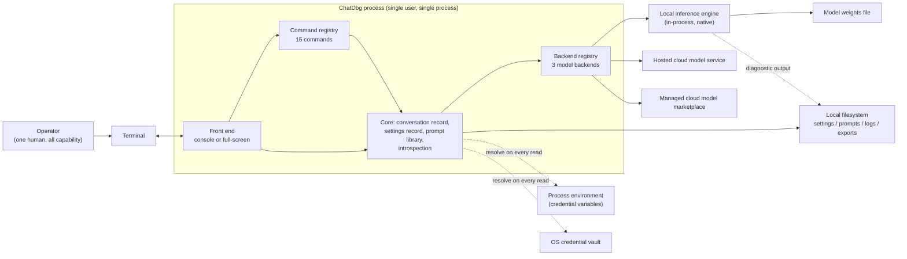

### 3.4 Capability matrix

Because there is exactly one human role, this matrix records what **each persona actually exercises**, not
what each is permitted to do. Every cell that reads "—" means "has the capability, does not use it in this
intent". No cell is a denial.

| Capability | Developer debugging | Prompt engineer | Model-behaviour researcher | Machine operator | Support engineer | Release manager |
|---|---|---|---|---|---|---|
| Send a conversation turn | Primary | Primary | Primary | Verification only | — | Smoke test |
| Run any control instruction | Yes | Yes | Yes | Yes | Yes | Yes |
| Edit the conversation record (insert, remove-last, clear) | Primary | Occasional | Occasional | — | — | — |
| Export / import a conversation | Occasional | — | Primary | — | Primary (evidence) | — |
| Switch model backend | Occasional | Occasional | Primary | Primary | Guides operator | — |
| Change the model identifier | Occasional | — | Primary | Primary | — | — |
| Change generation tuning (temperature, max tokens) | Occasional | Primary | Primary | Primary | — | — |
| Toggle confidence capture; set alternatives-per-position | — | — | Primary | — | — | — |
| Change confidence display preferences | — | — | Primary | — | — | — |
| View the confidence panel / heat map | Occasional | — | Primary | — | — | — |
| Run the offline demonstration | First run | — | Occasional | Primary (verify install) | Primary (verify install) | Smoke test |
| Tokenize input against a local model | — | — | Primary | — | — | — |
| Run a full inspection | — | — | Primary | — | — | — |
| Export per-step analysis records | — | — | Primary (**unreachable today — §2.3**) | — | — | — |
| Create / edit / delete / switch instruction prompts | Occasional | Primary | Occasional | Initial setup | — | — |
| Import / export an instruction prompt | — | Primary | — | — | — | — |
| Supply credentials by environment variable | — | — | — | Primary | Guides operator | — |
| Enrol credentials in the OS vault | — | — | — | Primary | Guides operator | — |
| Run the credential migration flow | — | — | — | Primary (upgrade) | Guides operator | — |
| Read the startup self-check | Occasional | — | — | Primary | Primary | Smoke test |
| Point the local backend at a model file | — | — | Primary | Primary | — | — |
| Tune local-model settings | — | — | Occasional | Primary | — | — |
| Export a diagnostic log snapshot | — | — | Occasional | — | Primary (**unreachable today — §2.3**) | — |
| Select a build profile and publish a release | — | — | — | — | — | Primary |

### 3.5 Intended authorized-use context

ChatDbg is intended to be run by its own operator, on that operator's own machine, against backends that
operator is entitled to use. It is a personal developer tool, and everything about its design assumes that:
one process, one user, one terminal, state under the user's own profile, no network surface of its own, and
no separation of privilege inside the process because there is no second party inside the process to
separate from.

Three consequences follow, and a clone must carry them forward explicitly rather than discovering them
later.

**First, the process boundary is the security boundary.** Anything that can run code in the process — or
read the user's profile directory — can read the conversation, the instruction prompts, the settings and any
credential that has already been resolved into memory. Credential resolution reduces exposure by never
requiring the product to *store* a secret, but it does not isolate one.

**Second, diagnostic output is sensitive.** The developer-only trace channel records full request bodies and
full reply bodies, and the inference engine's log capture records generation detail. Both may contain the
complete conversation, including anything the operator pasted. Rolling daily log files are never pruned,
capped or compressed. Any deployment, and any support process that asks an operator to send logs, must treat
these files as containing the conversation itself.

**Third, the product sends whatever it is given.** There is no redaction, no content policy, no
classification check and no egress control between the operator's terminal and a cloud backend, and the
entire conversation record is re-sent on every turn — including messages inserted by hand and messages
restored from an imported file. An operator working on confidential material should select the local
inference backend, which makes no network call at all, and should understand that the two cloud backends
transmit the full conversation on every turn.

The product is **not** intended as a shared or multi-tenant service, a hosted endpoint, an unattended
automation component, or a control plane over anyone else's credentials. Deploying it in any of those shapes
would require an access model, an audit trail, cancellation and concurrency safety — none of which exist,
and all of which are explicit non-goals in §2.2.

---

## 4. Glossary


> **Purpose.** This is the single controlled vocabulary for the ChatDbg product requirements. Every other
> section of this PRD uses these terms and only these terms. The source system used several different names
> for the same idea, and in a few cases used one name for several different ideas; this document resolves
> each of those to exactly one product term and records the mapping.
>
> **How to read an entry.** **Term** — definition — *code names that mean this: `x`, `y`*.
> The *code names* annotation is the only place in this PRD where names taken verbatim from the source
> appear. It exists so that a reimplementer reading the original repository can find the corresponding
> product concept, and so that persisted wire formats (file keys, environment-variable names, on-screen
> literals) survive the port unchanged. A name in that annotation is **not** a requirement to use that
> name in a clone, *except* where the entry says the literal is user-visible or persisted.
>
> Consolidated from 291 collected terms across 15 feature dossiers. Statements marked **INFERRED** were
> deduced from structure rather than directly observed.

---

## A. Product and session concepts

**Product (ChatDbg)** — A single-user, single-process, terminal-hosted chat and debugging assistant. It
holds one conversation with one language model at a time and offers token-level introspection of the
model's replies. It has no server, no accounts and no network surface of its own.
*code names that mean this: `ChatDbg`, `Xcaciv.ChatDbg`, product name literal `ChatDbg`.*

**Front end (shell)** — One of the two interchangeable terminal programs that own the terminal for the life
of the process, read the operator's input, decide command-versus-conversation, drive a model backend and
render the result. Both front ends build their own registry of the same fifteen commands and share the same
core library, but they diverge in several user-visible ways. **The source used "shell", "host", "front
end" and "UI" interchangeably; this PRD uses *front end* for the concept and *console front end* /
*full-screen front end* for the two instances.**
*code names that mean this: `ChatShell`, "shell", "host", "REPL", assemblies `Xcaciv.ChatDbg.Shell` and `Xcaciv.ChatDbg.Shell.Gui`.*

**Console front end** — The line-oriented front end: print a prompt, read one line, dispatch, print the
outcome with a status glyph, repeat. It maintains no redrawn view and is the only front end the release
pipeline actually publishes.
*code names that mean this: `src/ChatDbg/ChatShell.cs`, "plain-console shell", "line-oriented console shell", "console shell", legacy namespace `ChatDBG`.*

**Full-screen front end** — The windowed front end that paints a persistent menu bar, a scrollable
transcript, an input frame, a status line and modal dialogs over the whole terminal surface. It adds
surfaces the console front end does not have (a settings dialog, a prompt manager, a token-probability side
panel, a command-listing dialog) and omits behaviours the console front end has.
*code names that mean this: `src/ChatDbg.Shell.Gui`, `ChatWindow`, "Terminal GUI Shell", "windowed shell", "graphical shell".*

**Session** — One run of the process from launch to exit. A session owns exactly one conversation record,
one live settings record, one command registry and one backend registry. Nothing about a session survives
process exit except what the operator explicitly exported.
*code names that mean this: session state, `RunAsync` loop.*

**Session identifier** — A random unique identifier generated when the conversation record is constructed.
It is written on export and overwritten on import, and nothing else in the product ever reads it.
*code names that mean this: `SessionId`, `sessionId`.*

**Created-at timestamp (session)** — The UTC instant the conversation record was constructed. Written on
export, read but discarded on import, never mutated, and not reset by clearing the conversation.
*code names that mean this: `CreatedAt`, `createdAt`.*

**Conversation turn** — A submitted line that does *not* begin with the command prefix and is therefore sent
to the active model backend as a user message.
*code names that mean this: chat turn, `SendChatMessageAsync`, `ProcessChatAsync`.*

**Control instruction** — A submitted line that *does* begin with the command prefix and is handled locally
by a registered command instead of being sent to a model.
*code names that mean this: command, `ProcessCommandAsync`.*

**Startup self-check** — The one-shot, read-only diagnostic printed after the banner that reports whether
the selected backend is empty, unknown, recognised-but-unconfigured, or configured, and — when configured —
which credential channel supplied its key. It never prints a credential value.
*code names that mean this: `CheckServiceConfiguration`, ChatShell startup validation block, "configuration self-check", "startup credential advisory".*

**Prompt string (input prompt)** — The literal text drawn before each console input line, rebuilt from live
settings on every loop iteration, of the form `ChatDbg ({backend}/{model identifier})> ` with no trailing
line break. Distinct from an *instruction prompt* (category G).
*code names that mean this: prompt literal in `ChatShell`.*

---

## B. Conversation and messages

**Conversation record** — The single in-memory, ordered list of messages kept for the life of one process,
plus its session identifier and created-at timestamp. It is what the model backend receives, in full, on
every request. It is never auto-saved and never auto-loaded. **The source called this "chat history",
"history", "transcript" and "conversation"; this PRD reserves *transcript* for the rendered view (category
H) and uses *conversation record* for the data.**
*code names that mean this: `ChatHistory`, "chat history", "history", `messages`.*

**Message** — One element of the conversation record: a role, content text, a UTC timestamp, a
hidden-from-model flag, and an optional token-confidence list.
*code names that mean this: `ChatMessage`, "message", "turn".*

**Role** — The speaker label on a message. The message-insertion command enforces exactly three lower-cased
values (user, assistant, system); appending and importing enforce nothing at all, so arbitrary role text can
enter the record.
*code names that mean this: `Role`, `role`.*

**Hidden-from-model flag** — A per-message boolean that, when set, excludes the message from every outbound
request to a hosted backend while leaving it visible in the record and in the transcript. It was intended
for command echoes; nothing in the shipping product ever sets it true. **The source name reads as a type
label rather than a behaviour flag, which is misleading.**
*code names that mean this: `IsCommand`, `isCommand`, "is-command flag".*

**Message insertion (inject)** — The operation that fabricates a message with a chosen role and content and
inserts it at a chosen index in the conversation record.
*code names that mean this: `InjectCommand`, `/inject`.*

**Message removal (pop)** — The operation that removes exactly one message — the last — from the
conversation record. **Documentation described it as removing "messages" plural; the code removes one.**
*code names that mean this: `PopCommand`, `/pop`.*

**Conversation clear** — The operation that empties the message list while preserving the session identifier
and the created-at timestamp.
*code names that mean this: `ClearCommand`, `/clear`.*

**Conversation export** — The operation that writes the whole conversation record to an operator-named file
in the conversation-file format.
*code names that mean this: `ExportCommand`, `/export`, `SaveHistoryAsync`.*

**Conversation import** — The operation that replaces the live conversation record's messages and session
identifier wholesale from a file. It replaces; it never merges.
*code names that mean this: `ImportCommand`, `/import`, `LoadHistoryAsync`.*

**Conversation file** — The exported on-disk artifact: one structured-text object holding the message list,
the session identifier and the created-at timestamp. It is a wire format: an exported file must remain
importable by any conforming implementation. Default file name is a persisted, user-visible literal.
*code names that mean this: `chat_history.json`, `chat.json`.*

---

## C. Model backends and inference

**Model backend** — A pluggable implementation of the five-operation backend contract (report a display
name, answer a network-free readiness check, send a turn and return text, send a turn and return text plus
token confidence data, release resources) that turns a conversation into a reply. Exactly three ship. **The
source called these "AI service", "provider", "backend" and "adapter"; this PRD uses *model backend*
throughout.**
*code names that mean this: `IAIService`, `AzureOpenAIService`, `BedrockService`, `LLamaSharpService`, "provider", "provider adapter", "AI service", "back end".*

**Hosted cloud model service** — Model backend #1: a subscription-scoped, endpoint-addressed cloud service
reached over HTTPS with a single API key. Its display name is a fixed user-visible literal.
*code names that mean this: Azure OpenAI, `AzureOpenAIService`, backend key `azure`, display literal `Azure OpenAI`, package `Azure.AI.OpenAI`.*

**Managed cloud model marketplace** — Model backend #2: a regional, account-scoped cloud service through
which the operator's own cloud account rents access to hosted foundation models. Addressed by region plus a
free-text model identifier and an access-key/secret-key pair. Its display name is a fixed user-visible
literal.
*code names that mean this: Amazon Bedrock, `BedrockService`, backend key `bedrock`, display literal `Amazon Bedrock`, package `AWSSDK.BedrockRuntime`.*

**Local inference backend** — Model backend #3: an in-process backend that loads an open-weights model file
from local disk and generates with no network call, no account and no credential. It is the product's
current development frontier and the only backend that can produce genuinely measured per-token confidence
data.
*code names that mean this: `LLamaSharpService`, backend key `llama`, LLamaSharp.*

**Backend key** — The lower-case identifier under which each model backend is registered and which is
persisted in the settings document as the selected backend. Exactly three values exist and they are
persisted user-visible literals: `azure`, `bedrock`, `llama`.
*code names that mean this: `ChatSettings.Provider`, `_aiServices` dictionary keys, `provider`.*

**Backend registry** — The name-keyed table each front end builds once at start-up mapping the three backend
keys to backend instances. Never mutated after construction.
*code names that mean this: `Dictionary<string, IAIService> _aiServices`, "provider registry", "provider table".*

**Backend display name** — The human-readable name a backend reports for itself, interpolated verbatim into
every warning and error that names it. These are user-visible literals and must be preserved.
*code names that mean this: `IAIService.GetProviderName()`, `ProviderName`.*

**Readiness check** — Each backend's read-only, side-effect-free, network-free test over the settings record
that answers "can this backend serve a turn?". For the cloud backends it tests for a resolved credential and
an address; for the local backend its entire content is "does the model file exist on disk?".
*code names that mean this: `IsConfigured(ChatSettings)`, "is-configured predicate".*

**Reply envelope** — The single structure every backend returns: reply text, an optional ordered
token-confidence list, a total elapsed time, and an optional error message. **Absent confidence data is
represented as *absent*, never as an empty list.**
*code names that mean this: `AIResponse`, `Text`, `LogProbabilities`, `TotalTime`, `ErrorMessage`, "provider response", "response record", "response envelope".*

**Model identifier** — A single free-text settings value that names the model to invoke. Its meaning is
backend-dependent: for the hosted cloud service it names both the model and its service-side deployment and
is interpolated directly into the request address; for the marketplace it is a vendor model name; for the
local backend it is a **filesystem path to the model weights file**. One field, three semantics.
*code names that mean this: `ModelId`, `modelId`, `/set modelId`, `/model`, "deployment name".*

**Model weights file** — The single quantised open-weights file on local disk that the local inference
backend loads. Its path is carried in the model-identifier setting.
*code names that mean this: GGUF file, `.gguf`, `LLamaWeights`.*

**Inference context** — A sized working state created over the loaded weights that holds per-session
computation state. Its size is the context window.
*code names that mean this: `LLamaContext`, `ContextSize`, `llamaContextSize`.*

**Context window size** — The token capacity of an inference context. The operator-configurable value
defaults to 4096, but the introspection subsystem hard-codes 512 for tokenization loads and 2048 for
generation loads and ignores the configured value.
*code names that mean this: `ContextSize`, `llamaContextSize`, `ContextParams.ContextSize`.*

**Engine-side conversation state** — The conversation state retained *inside* the local inference engine,
seeded once at model-load time with a system-role message. For the local backend this — not the product's
own conversation record — is where multi-turn continuity actually lives.
*code names that mean this: `ChatSession`, `InteractiveExecutor`, `LLama.Common.ChatHistory`.*

**Text piece** — The unit the local engine streams back: a decoded fragment of text, which is not
necessarily one model token. Every per-token counter, analysis record and confidence entry produced by the
local backend actually counts pieces, not tokens. **This distinction is invisible in the source, which calls
pieces "tokens" everywhere.**
*code names that mean this: streamed chunk from `ChatSession.ChatAsync`, `tokenCounter`.*

**Introspection generation path / fast generation path** — The two mutually exclusive local-backend
generation routines. The introspection path produces per-piece confidence and analysis records; the fast
path streams and concatenates text only and returns an absent confidence list. Which one runs is decided by
the confidence-capture switch.
*code names that mean this: `GenerateWithSamplingPipeline`, `GenerateStandard`, "sampling pipeline mode", "standard ChatSession mode".*

**Score vector** — The engine's raw per-vocabulary scores for the next position, read by run-time name
lookup and transformed into candidate probabilities.
*code names that mean this: `logits`, `GetLogits`.*

**Normalised-exponential transform** — The softmax applied to only the selected top candidates rather than
the whole vocabulary, so returned candidate probabilities always sum to 1.0 within the selection.
*code names that mean this: softmax over top-K logits.*

**Stop sequence** — A literal string whose emission halts local generation. Hard-coded to exactly two
values and not configurable.
*code names that mean this: `AntiPrompts`, `InferenceParams.AntiPrompts`, literals `User:` and `USER:`.*

**Maximum new tokens** — The per-turn generation budget, falling back to 512 when the configured value is
not positive.
*code names that mean this: `maxTokens`, `MaxTokens`, `InferenceParams.MaxTokens`.*

**Graphics-layer offload count** — How many model layers are moved onto the graphics processor; zero means
processor-only.
*code names that mean this: `llamaGpuLayers`, `llamaGpuLayerCount`, `GpuLayerCount`.*

**Generation lock / model-load lock** — Two separate process-wide binary locks that serialise, respectively,
all generation and all model loading across every backend instance in the process. Neither has a timeout
and neither is cancellable.
*code names that mean this: static `SemaphoreSlim _generationLock`, static `SemaphoreSlim _modelLoadLock`.*

**Backend client seam** — The substitutable single-operation component that turns settings into a
vendor client, existing purely so that the whole build/invoke/parse path can be exercised without network
access. One exists per cloud backend. The product never registers an alternative implementation.
*code names that mean this: `IAzureOpenAIClientFactory`, `DefaultAzureOpenAIClientFactory`, `IBedrockRuntimeClientFactory`, `DefaultBedrockRuntimeClientFactory`, `CreateClient`, "client factory seam", "client-construction seam".*

**Library-mediated request path** — The hosted-cloud-service request path taken when confidence capture is
**off**: a vendor client sends the turn carrying only a temperature option.
*code names that mean this: path P1, `GetChatClient`, `ChatCompletionOptions`.*

**Direct request path** — The hosted-cloud-service request path taken when confidence capture is **on**: a
hand-composed HTTPS request carrying temperature, maximum tokens, a nucleus-sampling value and the
confidence options. **The two paths differ in address normalisation, role filtering and whether the
maximum-token cap is sent at all.**
*code names that mean this: path P2, `CallAzureOpenAIDirectAsync`.*

**Model-family discriminator** — For the marketplace backend, the literal prefix tested case-insensitively
against the model identifier to choose between the two request-body shapes. It is the sole discriminator.
*code names that mean this: `ModelId.StartsWith("anthropic.", …)`.*

**Contract version constant** — The fixed, never-configurable version string identifying the
marketplace request contract for the discriminated model family.
*code names that mean this: `anthropic_version`, literal `bedrock-2023-05-31`.*

**Strict extraction / tolerant extraction** — The two confidence-data readers on the hosted-cloud path.
Strict extraction requires both a token string and a numeric log-probability per entry and accepts
alternatives under only one field name; tolerant extraction additionally accepts a second alternatives field
name and property-map-shaped alternative entries.
*code names that mean this: `ExtractTokenLogProbabilities`, `ExtractTokenLogProbabilitiesFromArray`.*

**Tolerant probability parser** — The never-throwing response-side confidence reader used on the
marketplace's completion branch; it swallows every failure and yields "no confidence data".
*code names that mean this: `ParseLogProbabilities`.*

**Unrecognised-response outcome** — The marketplace backend's third response shape: neither structured
content nor a completion string, answered with a fixed literal answer text and reported as a **normal
success**, not an error.
*code names that mean this: the final else branch of the response parser, literal `Unable to parse model response`.*

**Fabricated confidence data** — Invented per-token confidence records that the hosted cloud backend
substitutes when the service returns none, at a uniform 90 percent confidence with a fixed cap of three
alternatives, returned **indistinguishably from measured data**. See also *temperature-derived confidence
estimate* and *fabricated attribution*. **A clone must either not fabricate, or mark fabricated data as
such.**
*code names that mean this: `GenerateSimulatedLogProbabilities`, "simulated logprobs".*

**Temperature-derived confidence estimate** — A six-step lookup table mapping the configured sampling
temperature to a fixed "probability" written into every per-step analysis record of a local-backend run, in
place of a measured value. At the default temperature every record in an export reads the same value.
*code names that mean this: `EstimateProbabilityFromTemperature`.*

**Ambient credential fallback** — The undocumented fourth credential channel the marketplace backend
inherits when its client is constructed without both halves of the key pair and the vendor library falls
back to its own credential discovery (shared profile file, container or instance role, single sign-on,
environment variables).
*code names that mean this: default `AmazonBedrockRuntimeClient(RegionEndpoint)` construction.*

---

## D. Token-level introspection

> This is the capability that distinguishes the product. Four related but distinct things live here and the
> source blurred all four under the word "logprobs": the *stored value*, the *derived probability*, the
> *capture switch*, and the *display preferences*.

**Token** — A vocabulary fragment the model reads and emits, as opposed to a character. Reported with a
zero-based sequence index, an integer vocabulary index, a display text and an approximate character span.
*code names that mean this: `TokenInfo`, `token`, `LLamaToken`.*

**Vocabulary index** — The integer identifier of a token within the model's vocabulary. Real for
tokenization; synthetic on the introspection generation path; always a sentinel value on chat-time analysis
records.
*code names that mean this: `TokenId`, `tokenId`.*

**Token log probability (stored value)** — The natural logarithm of the probability the model assigned to a
token at a generation step, stored verbatim with no range validation. **"logprob", "log probability",
"log prob" and "confidence value" in the source all mean this; this PRD uses *token log probability*.**
*code names that mean this: `LogProb`, `logprob`, `log_prob`, `SelectedLogProb`, `logprobs`.*

**Derived probability** — The linear probability of a token, computed as *e* raised to the stored token log
probability. Computed on every read; never stored and never persisted. It is a 0–1 fraction. **Several
display paths in the source treat it as if it were a 0–100 percentage; this PRD fixes it as 0–1.**
*code names that mean this: `Probability` (computed property), `Math.Exp(LogProb)`.*

**Token confidence record** — One entry in a token-confidence list: token text, the stored token log
probability, the derived probability, and a nullable ordered list of alternatives of the same shape. The
shape is recursive, though nested alternatives are normally absent.
*code names that mean this: `TokenLogProbabilities`, `TokenLogProbability`, "token probability record".*

**Token-confidence list** — The ordered list of token confidence records attached to a reply and to the
message that stores it. Absent (not empty) when no confidence data exists.
*code names that mean this: `LogProbabilities`, `logProbabilities`.*

**Alternative token** — One of the other tokens the model weighed at a given position, carried with its own
text, vocabulary index and stored value. Emitted in strictly descending probability order.
*code names that mean this: `TopAlternatives`, `top_alternatives`, `top_logprobs`, `TokenProbabilityAlternative`, `Alternatives`, `TopCandidates`, `CandidateToken`, "candidate token", "runner-up token".*

**Alternatives-per-position count (top-K)** — How many alternative tokens the backend is asked to report per
generated position. Inclusive range 1–20, default 5. It shapes the request and, on the local backend, also
silently sets the sampler's selection limit; it never truncates a response. **The introspection subsystem
applies neither the range clamp nor the top-K semantics — it emits exactly that many fabricated
alternatives.**
*code names that mean this: `LogProbabilitiesTopK`, `logProbabilitiesTopK`, `top_logprobs`, `topK`, `/set logtopk`, `/logprobs top`, `--top`.*

**Confidence capture (capture switch)** — The single global boolean that decides, per turn, whether the
send-with-confidence operation or the plain send operation is used. Default off. It is the only thing that
selects between a backend's two request paths.
*code names that mean this: `EnableLogProbabilities`, `enableLogProbabilities`, `/logprobs on|off`, set alias `logprobs`.*

**Has-confidence-data predicate** — A derived, never-persisted boolean on a message: its token-confidence
list exists **and** has at least one element. It drives the transcript's confidence marker and the
availability of the confidence panel.
*code names that mean this: `HasLogProbabilities`.*

**Confidence configuration command** — The user-facing command that reports, configures and diagnoses token
confidence capture and display.
*code names that mean this: `/logprobs`, `LogProbsCommand`.*

**Offline demonstration** — A command that fabricates a sample token-confidence record from a fixed sentence
and renders it without contacting any backend, so the visualisation can be seen without configuring a
backend or spending a request.
*code names that mean this: `/demologprobs`, `DemoLogProbsCommand`, `SampleData`, "demo visualisation".*

**Tokenization report** — The on-screen table of sequence index, vocabulary index and token text produced by
the tokenization command against a locally loaded model.
*code names that mean this: `TokenizeCommand`, `/tokenize`.*

**Beginning-of-sequence marker** — A synthetic leading token prepended during tokenization. It is counted in
the reported total but carries a sentinel character span and is displayed as a fixed "not applicable"
literal.
*code names that mean this: BOS, `addBos`, special token.*

**Character span** — The approximate inclusive start and exclusive end offsets of a token in the original
text. Produced by a **uniform-distribution estimate**, not by a real offset map, so it is not a truthful
mapping.
*code names that mean this: `CharStartPosition`, `CharEndPosition`, "Char Range".*

**Full inspection** — The three-stage report (tokenization, then probability mapping, then attribution)
produced by the inspection command behind an interactive consent gate.
*code names that mean this: `InspectCommand`, `/inspect`.*

**Consent gate** — The blocking yes/no question asked between the cheap tokenization stage and the expensive
generation stage. Only an affirmative answer proceeds; anything else, including end-of-input, silently
declines.
*code names that mean this: the consent prompt in `InspectCommand`.*

**Step-probability record** — The distribution at one generation step: position, selected token identity and
its stored value, plus the alternative list.
*code names that mean this: `TokenProbabilityMap`, `TokenProbabilityMapResult`.*

**Attribution** — A per-generated-token claim about which span of input, or of earlier output, influenced
it, with a numeric influence score. Produced by a fixed heuristic — **not** by gradients, attention or any
model-internal signal.
*code names that mean this: `TokenAttribution`, `AttributionMap`, `InfluencingText`.*

**Influence score** — The numeric strength attached to an attribution entry. Always the same constant.
*code names that mean this: `InfluenceScore`.*

**Per-step analysis record** — The exportable per-token introspection record the local inference subsystem
writes for each generated piece during ordinary chat: step index, token text, vocabulary index, probability,
stored log probability, prompt offset, candidate list, a free-text debug sentence and a model-state
snapshot. It is the only persisted entity produced by the introspection subsystem.
*code names that mean this: `TokenAnalysis`, "per-token analysis record".*

**Model-state snapshot** — The context-utilisation record captured alongside each per-step analysis record:
tokens processed, context token count, context window size, remaining capacity, a timestamp and a free-form
diagnostic map.
*code names that mean this: `ModelStateInfo`, `ModelState`, `modelState`, `debugInfo`.*

**Prompt offset** — A field documented as naming which part of the prompt influenced a token, but written by
its only producer as the step index. **The name does not describe the value.**
*code names that mean this: `PromptOffset`, `promptOffset`.*

**Generation budget (inspection)** — The maximum number of tokens requested from the generator during a full
inspection: the smaller of ten and the configured maximum response length.
*code names that mean this: `numTokensToGenerate`, `Math.Min(10, MaxTokens)`.*

---

## E. Configuration and profiles

**Settings record** — The single mutable, process-wide configuration object shared *by reference* with every
command, dialog and backend, so a mutation is immediately visible everywhere. It carries backend selection,
model addressing, generation tuning, confidence capture and display preferences, local-model tuning, the OS
vault toggle and the deprecated in-document secret slots.
*code names that mean this: `ChatSettings`, `_settings`, "live settings record", "configuration object".*

**Settings document** — The persisted, indented, hand-editable structured-text file holding the settings
record in full. It has exactly 21 keys with camel-cased names. Located under the operator's profile
directory in a product-named folder, falling back silently to the system temporary directory when the
profile directory cannot be resolved.
*code names that mean this: `settings.json`, `<user profile>/.ChatDbg/settings.json`, `SettingsService.GetSettingsFilePath`.*

**Settings store** — The narrow six-operation port through which everything outside the configuration
feature reaches persistence: persist, load, report path, store one credential, interactively enable the OS
vault, and run the credential migration.
*code names that mean this: `ISettingsService`, `SettingsService`.*

**Save-after-every-change rule** — Every successful mutation immediately writes the entire record to disk.
There is no save verb, no dirty tracking, no locking and no atomic replace.
*code names that mean this: `SaveSettingsAsync` call sites.*

**Setting key** — The lower-cased token naming one setting in the settings command. A small number of keys
are *delegated keys* that hand off to the credential subsystem and deliberately skip the trailing save
because the delegate already persisted.
*code names that mean this: `/set <key> <value>`, `SetCommand`, delegated keys `wincred`, `enablewincred`, `migrate`.*

**Tuning values** — The product-wide generation tunables with fixed ranges: temperature 0.0–2.0 inclusive
(default 0.7), maximum output tokens 1–8192 inclusive (default 1000), alternatives-per-position 1–20
inclusive (default 5).
*code names that mean this: `temperature`, `maxTokens`, `logProbabilitiesTopK`.*

**Clamp-versus-reject split** — The observed inconsistency whereby the text commands **reject** an
out-of-range number with an error while the full-screen settings dialog **silently clamps** it to the
nearest bound. A clone must pick one policy.
*code names that mean this: `SetCommand` validation versus `SettingsDialog` clamp calls.*

**Local-model tunables** — Context window size, graphics-layer offload count, graphics device selection,
thread count and batch size. **Only the first two ever reach the runtime; the other three are persisted,
displayed and ignored.**
*code names that mean this: `llamaContextSize`, `llamaGpuLayerCount`, `llamaGpuDevice`, `llamaThreads`, `llamaBatchSize`.*

**Confidence display preferences** — The four persisted preferences that shape how token confidence data is
drawn: the show-all-versus-sampled switch, the grid-versus-list layout switch, the grid alternatives cap,
and (indirectly) the alternatives-per-position count. **The full-screen confidence panel ignores the first
two entirely.**
*code names that mean this: `ShowAllTokens`, `GridViewForTokens`, `GridViewMaxAlternatives`.*

---

## F. Credentials and secrets

**Credential resolution** — The per-read procedure that walks the credential channels in fixed priority and
returns the first non-empty value, coalescing "no value" to the empty string. Nothing is cached, so an
environment change takes effect without restart. Failures at any leg are swallowed and the walk continues.
*code names that mean this: `ChatSettings.GetSecureValue`, `AzureApiKeySecure`, `AwsAccessKeySecure`, `AwsSecretKeySecure`, "resolved credential".*

**Credential channel** — One leg of the resolution chain. Three exist, in order: (1) **environment
variable**, (2) **OS credential vault** — consulted only when the vault toggle is on, (3) **deprecated
in-document slot**. A fourth, *ambient credential fallback* (category C), exists only for the marketplace
backend and only when both key halves resolve empty.
*code names that mean this: the three legs of `GetSecureValue`.*

**Credential environment variable** — A process-scoped, read-only variable supplying a secret. The
product-specific names follow a fixed convention; for the marketplace backend the standard vendor variable
names are also accepted as a second choice within the same leg. These names are a wire contract and must be
preserved.
*code names that mean this: `CHATDBG_AZURE_API_KEY`, `CHATDBG_AWS_ACCESS_KEY`, `AWS_ACCESS_KEY_ID`, `CHATDBG_AWS_SECRET_KEY`, `AWS_SECRET_ACCESS_KEY`.*

**OS credential vault** — The operating-system-managed, encrypted-at-rest, per-user secret store used as
credential channel 2. In the source it exists on one platform only and silently yields "not found"
everywhere else. **The source called this the "machine secret vault", "OS credential keystore", "operating
system credential store" and by its platform product name; this PRD uses *OS credential vault*.**
*code names that mean this: `WindowsCredentialManager`, Windows Credential Manager, `advapi32.dll`, `CredReadW`/`CredWriteW`/`CredDeleteW`/`CredFree`.*

**Vault toggle** — The single persisted boolean, default false, that makes the OS credential vault channel
eligible during resolution. It may be set true only on a platform that has a vault — **except through the
full-screen settings dialog, which performs no such check.**
*code names that mean this: `useWindowsCredentialManager`, `UseWindowsCredentialManager`, `/set enablewincred`.*

**Vault entry name** — The fixed, colon-containing opaque key under which each secret is stored in the OS
vault. Three exist and they are a persisted wire contract.
*code names that mean this: `ChatDbg:AzureApiKey`, `ChatDbg:AwsAccessKey`, `ChatDbg:AwsSecretKey`, credential target name.*

**Vault entry kind / persistence scope** — The two fixed vault attributes the product uses for every read,
write and delete: the *generic credential* kind, and *local-machine* persistence, which keeps the entry on
one machine across logoff and reboot and explicitly does not roam.
*code names that mean this: `CRED_TYPE_GENERIC` (1), `CRED_PERSIST_LOCAL_MACHINE` (2).*

**Deprecated in-document secret slot** — One of three settings-document string fields that hold a secret in
the clear. They are still serialized (always written as empty strings) and still read as credential channel
3, but **no supported product action ever writes a non-empty value into them**; they exist to carry forward
values from older installations.
*code names that mean this: `azureApiKey`, `awsAccessKey`, `awsSecretKey`.*

**Plaintext-credentials-present condition** — The derived condition, true when at least one deprecated
in-document slot is non-empty, that drives a standing load-time warning and gates the migration wizard.
*code names that mean this: `ChatSettings.HasPlaintextCredentials`.*

**Credential source label** — The short, non-disclosing string naming which channel supplied a credential,
printed instead of the credential value. Exactly four values exist and they are user-visible literals:
`environment variable (<NAME>)`, `Windows Credential Manager`, `settings file (deprecated)`, `not set`.
**The source used "credential source label", "credential source string" and "credential source" for this
one thing.**
*code names that mean this: `ChatSettings.GetCredentialSource`, `AzureApiKeySource`, `AwsAccessKeySource`.*

**Masked status token** — The literal printed in status displays in place of a present secret, paired with a
second literal for an absent one. Both are user-visible literals: `***set***` and `(not set)`.
*code names that mean this: the credential status formatter in `SetCommand`.*

**Migration wizard** — The interactive flow that shows a platform-conditional three-option menu, either
prints migration instructions or writes secrets into the OS vault, and then offers to erase the plaintext
copies from the settings document. **As shipped it prints secret values in cleartext to the terminal.**
*code names that mean this: `SettingsService.MigrateCredentials`, `/set migrate`.*

**Vault-store command** — The command that places a named credential into the OS vault. It requires at
least three argument tokens, requires the vault toggle to already be true, and accepts short type aliases.
*code names that mean this: `/set wincred`, `SettingsService.StoreCredentialSecurely`.*

**Vault-enable consent flow** — The interactive yes/no prompt that must be answered affirmatively before the
OS vault channel is turned on and persisted.
*code names that mean this: `/set enablewincred`, `SettingsService.EnableWindowsCredentialManager`.*

**Credential-key refusal** — The always-failing response to any attempt to set a secret through the ordinary
settings-change command, carrying per-credential remediation text pointing at the environment variable or
the vault instead.
*code names that mean this: the credential-key guard in `SetCommand`, `GetCredentialSecurityMessage`.*

---

## G. Instruction prompts

> Distinct from the *prompt string* (category A), which is the terminal's input marker.

**Instruction prompt (system prompt)** — A named block of instruction text that sets the assistant's persona
and focus. The active one is injected as the conversation's system message at index 0 of every outbound
request. **The source called this "system prompt" and "prompt"; this PRD uses *instruction prompt* where
ambiguity with the input prompt is possible, and *system prompt* elsewhere.**
*code names that mean this: `SystemPrompt`, `systemPrompt`, `ChatSettings.SystemPromptContent`.*

**Prompt record** — One persisted instruction prompt: name, content, description, created-at instant and
last-used-at instant. One record per file; the record *is* the entire file. The name is the primary key and
also the basis of the file name.
*code names that mean this: `SystemPrompt` model, `system_prompts/*.json`.*

**Prompt library** — The directory of prompt record files plus the capabilities for fetching, listing,
saving, deleting, stamping-as-used and reporting its own location. It lives under the per-user *local*
application-data root — a different root from the settings document.
*code names that mean this: `SystemPromptService`, `ISystemPromptService`, the `system_prompts` directory.*

**Active prompt** — The single prompt whose text is injected into every model request. Identified **by name
only**: the name is persisted in the settings document, the text is runtime-only and re-resolved at every
launch, falling back to a built-in default body when the named record is missing.
*code names that mean this: `ChatSettings.SystemPromptName` (persisted, default literal `default`), `ChatSettings.SystemPromptContent` (never persisted).*

**Seed prompt set** — The four prompt records written automatically whenever the library loads zero records.
Their names are user-visible literals: `default`, `code-reviewer`, `algorithm-helper`, `security-expert`.
*code names that mean this: `CreateDefaultPrompts`.*

**Last-used timestamp** — The UTC instant a prompt was most recently selected as active; absent until first
use and rendered as a fixed literal when absent.
*code names that mean this: `SystemPrompt.LastUsedAt`, `lastUsedAt`, `UpdateLastUsedAsync`.*

**Prompt description** — Short display-only text shown in listings and detail views; changeable only through
the full-screen edit form, never from the console front end.
*code names that mean this: `SystemPrompt.Description`, `description`.*

**Sanitized file name** — The record's name with every host-forbidden filename character replaced by an
underscore, plus a structured-text extension. The mapping is **lossy**, so two distinct prompt names can
collide onto one file.
*code names that mean this: `SanitizeFileName`.*

**Content-entry mode** — The console front end's interactive multi-line editor state, entered by the prompt
edit subcommand and left only by typing a sentinel line. The sentinel is a user-visible literal: `END`.
*code names that mean this: the `PromptCommand` edit read loop.*

**Current marker** — The literal suffix appended in prompt listings to the entry whose name equals the
active prompt's name. A user-visible literal: ` (current)`.
*code names that mean this: `PromptCommand` listing.*

**Exported prompt file** — The artifact written by prompt export: plain text containing **only** the
prompt's content — no name, no description, no timestamps, no wrapper. It is therefore not round-trippable
without supplying a name on import.
*code names that mean this: `/prompt export`.*

**Prompt manager** — The full-screen front end's modal management screen for the prompt library, reached
from the tools menu.
*code names that mean this: `SystemPromptsDialog`.*

---

## H. Presentation and rendering

**Output surface** — The six-operation abstraction (write a marked-up line, write a plain line, write a
blank line, write a separator rule, display a token grid, display a token table) through which in-process
features emit user-visible output without knowing which front end hosts them. A command given no output
surface must still work.
*code names that mean this: `IConsoleFormatter`, "rendering collaborator".*

**Plain output surface** — The implementation of the output surface that strips styling directives and
writes only to a replaceable standard-output writer.
*code names that mean this: `BasicConsoleFormatter`.*

**Styled output surface** — The implementation that emits inline styling directives to a rich terminal
renderer, producing coloured cards, tables, panels and captioned rules.
*code names that mean this: `SpectreConsoleFormatter`, Spectre.Console.*

**Shared token-presentation helpers** — The library of format-only routines shared across surfaces: escape a
token for display, map a probability to a colour band, format a probability as a percentage, build a
plain-text confidence report, build a compact alternatives description.
*code names that mean this: `TokenFormatters`.*

**Transcript** — The rendered, scrollable view of the conversation record in the full-screen front end,
captioned with a fixed literal and rebuilt from scratch on every refresh, one row per role banner plus one
per wrapped body line, with per-role colour schemes and alignment. The console front end has no transcript
— it prints each turn as it happens.
*code names that mean this: `_chatView`, `chatView`, `RefreshChatView`, `RenderChatHistory`, `Chat History` frame.*

**Bubble width factor** — The three-quarters multiplier that keeps a wrapped message body to
three-quarters of the transcript's usable width after subtracting the frame padding.
*code names that mean this: the wrap arithmetic in `WrapText`.*

**Confidence marker** — The clickable diamond glyph drawn beneath (console: rendered inline with) any
assistant message that carries confidence data. Activating it points the confidence panel at that message.
**The source called this the "token-probability marker", "confidence indicator", "probability indicator",
"probability marker" and "lozenge"; all are one control.**
*code names that mean this: the U+25CA button in `ChatWindow`, `logProbIndicator`, `lozengeScheme`.*

**Confidence panel** — The framed, scrollable side panel in the full-screen front end that lists every token
of one selected assistant message with its ranked alternatives, colour-coded by confidence. Captioned with
a fixed literal.
*code names that mean this: `_logProbView`, `logProbsPanel`, `Token Probabilities` frame, `ShowLogProbsPanel`.*

**Card grid layout** — The dense multi-column layout that draws one bordered card per token, for spotting
patterns across many tokens.
*code names that mean this: `gridViewForTokens`, `DisplayTokenGrid`, "grid view".*

**Row-per-token table layout** — The detailed layout that draws one table row per token with its text,
probability and top alternatives, for inspecting individual tokens. Its alternatives count is fixed at
three and is **not** governed by the grid alternatives cap.
*code names that mean this: `DisplayTokenTable`, "list view".*

**Grid alternatives cap** — The operator-configurable maximum number of alternatives drawn per token in the
card grid and in the full-screen confidence panel, before a "plus N more" summary. Range 1–20, default 5.
**Its name says "grid" but it also drives the list-form panel.**
*code names that mean this: `GridViewMaxAlternatives`, `gridViewMaxAlternatives`, `gridmaxalt`, `maxAlternatives`.*

**Beginning/middle/end sampling** — The default volume-control rule that renders only three five-token
slices of a long token list — from the start, the middle and the end — instead of every token. Applied
above a token-count threshold.
*code names that mean this: `showAllTokens`, `SampleTokens`, `GetSampledTokens`, `GetSampleTokens`, `sampleSize = 5`.*

**Numbering start index** — A caller-supplied offset added to each rendered token's position so that a slice
of a longer list still shows each token's true position in the full reply.
*code names that mean this: `startIndex`.*

**Confidence colour band** — The mapping from a token's confidence to a colour, so low-confidence regions of
an answer are visible at a glance. **Four mutually inconsistent maps exist in the source, on two different
numeric scales (0–100 and 0–1) with different band counts; a clone must define exactly one.**
*code names that mean this: `GetColorForProbability`, `GetProbabilityColor`, `GetColorForLogProb`, `GetHeatMapColor`, `_probColorSchemes`, `probabilityColorSchemes`.*

**Heat-map bucket set** — The full-screen front end's ten fixed colour buckets indexed by the truncated
tenth of the derived probability, clamped to the valid range, applied to token and alternative rows in the
confidence panel.
*code names that mean this: `_probColorSchemes`, `GetProbabilityColorScheme`.*

**Flowing heat-map view** — A defined-but-never-constructed view intended to paint tokens as a continuous
paragraph with each token's background coloured by its confidence. It has its own, sixth colour scale and
its own sampling rule. **Dead code; see PRD §2.3.**
*code names that mean this: `LogProbHeatmapView`.*

**Escape formatting** — Replacing a token's control characters with visible two-character escape sequences
so that an invisible token is not mistaken for a blank.
*code names that mean this: `FormatTokenForDisplay`, `EscapeTokenText`.*

**Plain-text confidence report** — The dependency-free textual report with a fixed heading, a markdown-style
table and a fixed-width footer rule, used where no rich surface is available.
*code names that mean this: `GenerateTokenProbabilityReport`.*

**Resting status text** — The persistent one-line readout in the full-screen front end naming the backend,
the model identifier and the active prompt name. A user-visible literal template.
*code names that mean this: `UpdateStatusLabel`, `_statusLabel`, `Provider: X | Model: Y | Prompt: Z`.*

**Transient status message** — A status-line message that replaces the resting text and is unconditionally
restored to it after a fixed three-second delay by an independent, uncancellable timer.
*code names that mean this: `ShowStatusMessage`, `ShowStatus`, `SetStatusMessage`.*

**Outcome glyphs** — The two Unicode glyphs that prefix a rendered command message: a check mark for
success, a ballot cross for failure, each followed by one space. In the console front end **the glyph is
the only machine-readable success/failure signal** — there is no exit code and no structured output.
*code names that mean this: the `✓ ` and `✗ ` literals (U+2713, U+2717).*

**Theme applier** — The single argument-free operation that installs the fixed dark colour scheme into the
full-screen toolkit's four global scheme slots at start-up. There is no theme choice.
*code names that mean this: `ThemeManager.ApplyDarkTheme`.*

---

## I. Commands and the command surface

**Command prefix** — The single leading forward-slash character that marks a submitted line as a control
instruction rather than a conversation turn. A user-visible, load-bearing literal: `/`.
*code names that mean this: the `"/"` literal tested in `ProcessInputAsync` / `ProcessInput`.*

**Command** — A named, locally-executed capability exposing a name, a one-sentence description, a usage
string and an asynchronous execute operation over an ordered argument list.
*code names that mean this: `ICommand` (`Name`, `Description`, `Usage`, `ExecuteAsync`).*

**Command registry** — The name-to-command map each front end builds once at start-up. It is the **only**
discovery mechanism: keyed by each command's own declared lower-case name, matched exactly, never mutated
afterwards. There is no plugin discovery, no configuration-driven registration and no runtime registration.
Both shipping front ends register exactly fifteen commands: `clear`, `demologprobs`, `exit`, `export`,
`help`, `import`, `inject`, `inspect`, `logprobs`, `model`, `pop`, `prompt`, `quit`, `set`, `tokenize`.
*code names that mean this: `Dictionary<string, ICommand> _commands`, `InitializeCommands()`.*

**Argument vector** — The ordered list of text tokens following the command name, excluding the name;
empty when no arguments were typed. Produced by splitting the line on the single space character and
discarding empty tokens, so runs of spaces collapse, tab characters are not separators, and **there is no
quoting or escaping anywhere in the product**.
*code names that mean this: the `string[] args` parameter, `parts[1..]`.*

**Command result** — The uniform three-signal outcome every command returns: whether it worked, an optional
free-form message for the operator (rendered verbatim, possibly multi-line), and whether the session should
stop.
*code names that mean this: `CommandResult` (`Success`, `Message`, `ExitRequested`), `SuccessResult`, `ErrorResult`, `ExitResult`.*

**Exit request** — The result flag that tells the front end to terminate the session. It is a **successful**
outcome, not an error, and it suppresses rendering of any message carried on the same result.
*code names that mean this: `CommandResult.ExitRequested`, `ExitResult()`.*

**General help document** — The curated, hand-authored, topic-grouped listing produced by the help command
with no arguments. It is a script, not a projection of the registry, so it can drift in both directions: a
registered command missing from the script is invisible, and a scripted name that is not registered is
silently skipped.
*code names that mean this: `HelpCommand.GetGeneralHelp()`.*

**Detailed help** — The three-line block produced by the help command for one named command, echoing the
*registered* name rather than the text typed.
*code names that mean this: `HelpCommand` with a non-empty argument vector.*

**Command listing dialog** — The full-screen front end's second, independent help surface: an alphabetical
name-and-description list opened by a function key or a menu item. It shows no usage strings and no
grouping, and it is not derived from the general help document.
*code names that mean this: `ShowCommandsDialog`, `ShowHelp`.*

**Direct invocation** — A front-end path that calls a command by name with a pre-built argument vector,
bypassing text parsing and taking on result rendering itself.
*code names that mean this: the full-screen inject and change-model dialog handlers calling `ExecuteAsync` directly.*

**Synthesised command line** — A front-end path that builds a slash-prefixed text line from a menu action
and re-enters the ordinary parse-and-dispatch pipeline.
*code names that mean this: `ExecuteCommandAsync("/" + name + args)`.*

**Name placeholder** — The literal placeholder token used in every usage and error string where a *name* is
meant. It is spelled `<n>`, which reads as "a number", but that spelling is consistent across the code, the
error messages and the user manual, so it is a user-visible convention, not a typo to silently fix.
*code names that mean this: the `<n>` literal throughout `PromptCommand` and `SetCommand`.*

---

## J. Files, artifacts and storage

**Per-user state root** — One of the three well-known per-user directories the product writes into, keeping
the install location read-only. **The product uses three different roots under two naming conventions: the
profile root for settings, the local application-data root for the prompt library, and the roaming
application-data root for diagnostic logs. A clone should pick one.**
*code names that mean this: `Environment.SpecialFolder.UserProfile`, `LocalApplicationData`, `ApplicationData`; the `.ChatDbg` and `ChatDbg` folder literals.*

**Home-path expansion** — The rule by which a leading tilde-and-forward-slash at position 0 of a supplied
path expands to the operator's profile directory. A bare tilde, the backslash form and a named-user form
are **not** expanded, and several commands do not expand at all even though the manual's examples use the
tilde form.
*code names that mean this: the `~/` prefix test.*

**Diagnostic recorder** — The in-process object that owns the capture buffer, the output switches and the
log directory, and performs arming, recording, flushing, snapshot export and shutdown. Exactly one exists
per local-inference subsystem instance.
*code names that mean this: `LLamaSharpLogConfig`, "diagnostic log sink".*

**Capture buffer** — The single in-memory, lock-guarded text accumulator holding whole formatted entry
lines. Drained by a flush, emptied by a clear, and snapshotted non-destructively by an export.
*code names that mean this: `_logBuffer`, `GetLogs()`.*

**Arm capture** — The one-shot, idempotent operation that ensures the log directory exists, installs the
recorder as the inference engine's process-global diagnostic destination, sets the armed latch and records
its own confirmation entry. **It is never un-armed, even by shutdown.**
*code names that mean this: `ConfigureLogging()`, `_isConfigured`, `NativeLogConfig.llama_log_set`.*

**Engine diagnostic line** — A diagnostic message emitted by the local inference engine about itself,
delivered with an opaque severity token and a message string; trailing whitespace is stripped before
buffering, and only these lines can trigger the size-based auto-flush.
*code names that mean this: the native log callback, `LLamaLogLevel`.*

**Application diagnostic entry** — A commentary line recorded by the product about what it just asked the
engine to do, carrying a free-text severity label. Not whitespace-stripped and never triggers auto-flush.
*code names that mean this: `LogMessage(level, message)`.*

**Flush** — Appending the whole capture buffer to today's rolling daily file and then emptying the buffer.
A no-op that does not drain when file capture is disabled or the buffer is empty.
*code names that mean this: `FlushLogs()`.*

**Forced flush** — A deliberate flush invoked at one of exactly five hazard points (request-level error, the
end of each of the two generation paths, model-load failure, context-creation failure) so evidence reaches
disk before a native crash can destroy it.
*code names that mean this: the `FlushLogs()` call sites in the local backend.*

**Snapshot export** — Overwriting a caller-named file with the current capture buffer content **without**
clearing the buffer; produces a zero-byte file when the buffer is empty and reports nothing to the caller.
*code names that mean this: `SaveLogsToFile(path)`, `SaveSystemLogs`.*

**Rolling daily log file** — The plain-text, append-only, UTF-8-without-byte-order-mark file named for the
local calendar date inside the log directory, created lazily on the first non-empty flush of a day and never
pruned, capped, rotated or compressed.
*code names that mean this: `llamasharp_<yyyyMMdd>.log`, `LogDirectory`.*

**Log entry format** — The fixed line shape `[yyyy-MM-dd HH:mm:ss.fff] [LEVEL] message`, in local time,
with exactly three fractional-second digits and **no timezone or offset**.
*code names that mean this: the formatter in `LLamaSharpLogConfig`.*

**File capture / debug-stream echo / console echo** — The three independent output switches on the
diagnostic recorder: file capture (on by default; gates both flushing and auto-flush), debug-stream echo
(on by default; also the only channel on which the recorder reports its own internal failures), and console
echo (off by default; interleaves log lines into the operator's transcript when on).
*code names that mean this: `EnableFileLogging`, `EnableDebugOutput`, `EnableConsoleOutput`.*

**Maximum buffer size** — The character-count threshold, default 10000, above which an engine-sourced append
immediately triggers a flush. Unvalidated: any integer, including zero and negatives, is accepted.
*code names that mean this: `MaxBufferSize`.*

**Diagnostic trace channel** — The developer-build-only sink to which backends write full request bodies,
full reply bodies and failure detail. It is never surfaced to the operator and **may contain complete
prompts and conversations, so it must be treated as sensitive in any deployment.**
*code names that mean this: `System.Diagnostics.Debug.WriteLine` call sites.*

---

## K. Packaging and distribution

**Build profile** — A named set of compilation and packaging switches selected by name at build time. Four
exist: a development profile, an ordinary optimised profile, a *native profile*, and a *bundled profile*.
*code names that mean this: `Configuration`; `Debug`; `Release`; `Compact`; `SingleFile`.*

**Native profile** — The build profile that compiles ahead-of-time to native machine code with
whole-framework dead-code removal, size-first code generation, symbol stripping and no identity metadata.
Despite its documentation it produces a folder, not a single file, and it has never actually been released.
*code names that mean this: the `Compact` configuration, `PublishAot`, `IlcOptimizationPreference`.*

**Bundled profile** — The build profile that actually ships: one compressed self-extracting file,
just-in-time compiled, conservatively trimmed, retaining identity metadata.
*code names that mean this: the `SingleFile` configuration, `PublishSingleFile`, `EnableCompressionInSingleFile`.*

**Dead-code elimination** — Reachability-based removal of unreferenced code from the artifact, with two
selectable aggressiveness levels (whole-framework versus opt-in-only).
*code names that mean this: `PublishTrimmed`, `TrimMode=full`, `TrimMode=partial`, trimming, tree shaking.*

**Ahead-of-time native compilation** — Compiling the managed program to native machine code at build time so
that no just-in-time compiler ships and start-up is process load only.
*code names that mean this: `PublishAot`, Native AOT.*

**Self-contained artifact** — An executable that embeds the language runtime so the target machine needs
nothing pre-installed.
*code names that mean this: `SelfContained`, `--self-contained`, `UseAppHost`.*

**Platform triple** — The identifier naming the operating system and processor architecture a build targets.
It appears literally inside published asset names.
*code names that mean this: runtime identifier, RID, `win-x64`, `linux-x64`, `osx-x64`, `osx-arm64`.*

**Platform matrix row** — One entry defining a build-agent operating system, a platform triple, an executable
suffix and a row key. Two exist in the shipping pipeline.
*code names that mean this: `strategy.matrix.include`.*

**Fan-in join** — The rule that the publication job runs only after every platform row succeeds, so a
half-published release cannot exist.
*code names that mean this: `needs: build`.*

**Release file name** — The public download name of a published artifact, formed as
`chatdbg-<platform key>-<platform triple><suffix>`.
*code names that mean this: `RELEASE_NAME`, `chatdbg-windows-win-x64.exe`, `chatdbg-linux-linux-x64`.*

**Release version** — The tag and title component of a published release: the operator's input verbatim,
otherwise a `v` prefix plus the version scraped out of the console front end's project descriptor.
*code names that mean this: `release_version`, `PROJECT_VERSION`, `VERSION`.*

**Identity metadata** — The version, title, description, company, product and copyright stamped into the
artifact. Kept by the bundled profile, stripped by the native profile. **The version fact is declared in
three independent places that no build step reconciles.**
*code names that mean this: `GenerateAssemblyInfo`, `AssemblyTitle`, `Company`, `Product`, `Copyright`, `Version`, `AssemblyVersion`, `FileVersion`.*

**Toolchain pin document** — The repository-root machine-readable file declaring the exact build toolchain
version and its roll-forward policy.
*code names that mean this: `global.json`, `sdk.version`, `rollForward: latestFeature`.*

**Native inference payload** — The large per-platform machine-learning backend library shipped inside the
artifact. **Two mutually exclusive backend payloads (processor-only and graphics-accelerated) are
referenced simultaneously, so every published output carries both sets of native binaries.**
*code names that mean this: `LLamaSharp.Backend.Cpu`, `LLamaSharp.Backend.Cuda12`, `llama.dll`, `libllama.so`, `<RID>/native/`.*

**Self-extraction set** — The payloads carried inside the single bundled file and unpacked to a per-user
cache before the program runs.
*code names that mean this: `IncludeNativeLibrariesForSelfExtract`, `IncludeAllContentForSelfExtract`, `DOTNET_BUNDLE_EXTRACT_BASE_DIR`.*

**Culture-invariant operation** — Running with no culture data present, so comparison, casing and formatting
collapse to invariant behaviour regardless of machine locale. Enabled in both distribution profiles, which
**changes list ordering and timestamp rendering relative to a development build**.
*code names that mean this: `InvariantGlobalization`.*

**Symbolic message keys** — Replacement of framework exception and message sentences with short identifier
keys to reduce artifact size. Because the product interpolates platform exception messages into
operator-facing text, this is **user-visible in error output** of a packaged build.
*code names that mean this: `UseSystemResourceKeys`.*

**Runtime-configuration side-car** — The companion configuration document a bundled just-in-time artifact
needs in order to start. Suppressed in both distribution profiles.
*code names that mean this: `GenerateRuntimeConfigurationFiles`, `runtimeconfig.json`.*

**Fatal-error contract** — The single machine-readable signal a packaged artifact emits: exit code 0 on a
clean shutdown, or one line beginning `Fatal error: ` on standard output followed by exit code 1.
*code names that mean this: the top-level catch block in the entry point, `Environment.Exit(1)`.*

**Publication credential** — The long-lived repository secret authorising creation of a public release.
*code names that mean this: `GH_PATT`, personal access token.*

---

## Notes on canonicalization

These are the rules applied when collapsing 291 collected terms into the entries above. They are recorded so
that a reimplementer can trace any source name back to a product term.

1. **"logprobs" → *token log probability*.** The single most overloaded name in the source. Every
   occurrence of `logprobs`, `logProb`, `LogProb`, `log_prob`, "log probability", "per-token confidence
   data" and "confidence value" was resolved to one of four distinct product terms, chosen by what the
   value actually is: the **stored value** (*token log probability*), the **computed linear value**
   (*derived probability*), the **switch** (*confidence capture*), or the **display preferences**. Sixteen
   collected glossary entries collapsed into these four plus *token confidence record* and
   *token-confidence list*.

2. **Scale is part of the definition.** *Derived probability* is fixed as a 0–1 fraction. The source
   contains four confidence-to-colour maps on two different scales, and several formatters that feed a 0–1
   value into a 0–100 comparison. The glossary states the scale once; the clone must not reproduce the
   inconsistency.

3. **The three backend literals are frozen.** The persisted values `azure`, `bedrock` and `llama` are wire
   data, not implementation names, and must survive the port unchanged. The generic product terms are
   *hosted cloud model service*, *managed cloud model marketplace* and *local inference backend*
   respectively. Vendor product names appear only in code-name annotations.

4. **"shell" versus "front end".** The source used "shell", "host", "UI", "REPL" and "GUI" for two
   different programs and for the abstract idea of a program that owns the terminal. This PRD uses **front
   end** for the concept and **console front end** / **full-screen front end** for the two instances.
   "Shell" survives only inside code-name annotations, where it names assemblies and files. Note that one
   source file named `ChatShell.cs` exists in *both* front-end projects and one of the two is dead — the
   annotations distinguish them by path.

5. **"provider" → *model backend*.** `IAIService`, "AI service", "provider", "provider adapter" and "back
   end" all named one contract. *Backend key*, *backend registry* and *backend display name* were split out
   because each is separately observable and separately persisted.

6. **"chat history" → two terms.** The source used one word for the in-memory data and for its rendered
   view. Split into *conversation record* (data, category B) and *transcript* (rendering, category H),
   because the full-screen front end can hold a stale transcript over a mutated record.

7. **"system prompt" versus the input prompt.** The source used "prompt" for both the instruction text sent
   to the model and the characters printed before the input line. Resolved to *instruction prompt (system
   prompt)* and *prompt string* respectively.

8. **"credential source" → one term, four literal values.** Three collected entries ("credential source
   label", "credential source string", "credential source") describe one thing. The four literal values are
   recorded as user-visible strings because the operator reads them and support processes quote them.

9. **The OS vault is named generically.** The source names a single platform's credential store throughout,
   including in a user-visible label. The product term is *OS credential vault*; the platform product name
   is retained in the code-name annotation and in the frozen label literal, because that literal is what an
   existing installation prints.

10. **Marker controls unified.** Five collected names ("token-probability marker", "confidence indicator",
    "probability indicator", "probability marker", "lozenge") describe one clickable glyph. One term:
    *confidence marker*.

11. **Colour maps unified as one term with a plurality warning.** Rather than record four colour-band terms,
    one term (*confidence colour band*) carries the explicit statement that four inconsistent maps exist and
    that a clone must define exactly one.

12. **Names that lie about their value are flagged, not renamed.** Where a source name misdescribes what it
    holds — the hidden-from-model flag, the prompt offset, the grid alternatives cap, the alternatives count
    that also sets the sampler limit, the "text piece" counted as a token — the entry says so explicitly.
    That mismatch is exactly the information a reimplementer needs and would lose to a tidy rename.

13. **Dead concepts are kept, and labelled.** Terms that exist only in unreachable code (*flowing heat-map
    view*, and the three unregistered commands) are retained in the glossary with a pointer to PRD §2.3, so
    that a reader encountering them in the source knows immediately that they are not requirements.

### Terms that could not be confidently canonicalized

- **"Top-K"** — the source uses one setting name for two different things: the count of alternatives
  *requested and displayed* per position, and (on the local backend only) the sampler's *selection limit*.
  These are recorded together under *alternatives-per-position count* with the dual role called out, but
  they are arguably two settings that a clone should separate. Marked **INFERRED** that they were meant to
  be one value.
- **"Token"** — for the local inference backend, everything the product calls a token is actually a
  *text piece* (a decoded stream fragment). Both terms are defined; which one a given requirement means
  cannot always be determined from the source, because the two coincide for most ASCII text.
- **"Grid View Max Alternatives"** — the name says grid, the behaviour covers grid *and* the full-screen
  list panel, and the row-per-token table ignores it in favour of a hard-coded three. Recorded as one term
  with the discrepancy stated; a clone must decide whether it is one setting or two.
- **"Provider" as a settings value versus as a contract** — the persisted string `provider` selects a
  backend, but the same word names the contract, the registry and the adapter. Split into *backend key* and
  *model backend*, but source text using "provider" alone is genuinely ambiguous and each occurrence had to
  be resolved from context.
- **"Log" / "logging"** — spans three unrelated things: the engine's own native diagnostic output, the
  product's commentary entries, and the developer-only trace channel. Split into *engine diagnostic line*,
  *application diagnostic entry* and *diagnostic trace channel*; the source's single word "logs" in the
  unregistered export command cannot be resolved to one of them from the code, since that command writes
  nothing.

---

## 5. System Overview

This section orients a team that has never seen the source. It establishes what the product *is* (§5.1), what a user can *ask it to do* (§5.2), what order to *build it in* (§5.3), what it must *talk to* (§5.4), how it is *delivered and run* (§5.5), and what happens end to end during *one conversational turn* (§5.6).

The product is a single-user, locally-run terminal application. One human sits at one terminal. There is no server, no database, no listening socket, no multi-user model, no authentication, no authorization, no tenancy and no audit trail anywhere in it. Every outbound connection it makes goes to a language-model backend the user chose and paid for.

---

### 5.1 Context

**Inside the product boundary**

- Two interchangeable front ends over one shared core: a **line-oriented console shell** (the only one the source's release pipeline actually publishes) and a **full-screen terminal shell** (menus, dialogs, a side panel).
- A **shared core**: the command registry and dispatcher, the conversation transcript, the settings record, the system-prompt library, the three model-backend adapters behind one five-operation contract, the token-probability and token-inspection logic, the output-formatting contract, and the diagnostic-log recorder.

**Outside the product boundary**

- The **operator** — one interactive human.
- Three **model backends**: a hosted cloud chat service, a managed cloud model marketplace, and a local in-process inference engine.
- The **operating-system secret store**.
- The **local filesystem artifacts** the product reads and writes.
- The **native inference engine** — a platform-specific compiled library loaded into the product's own process, plus the model weight file it reads.

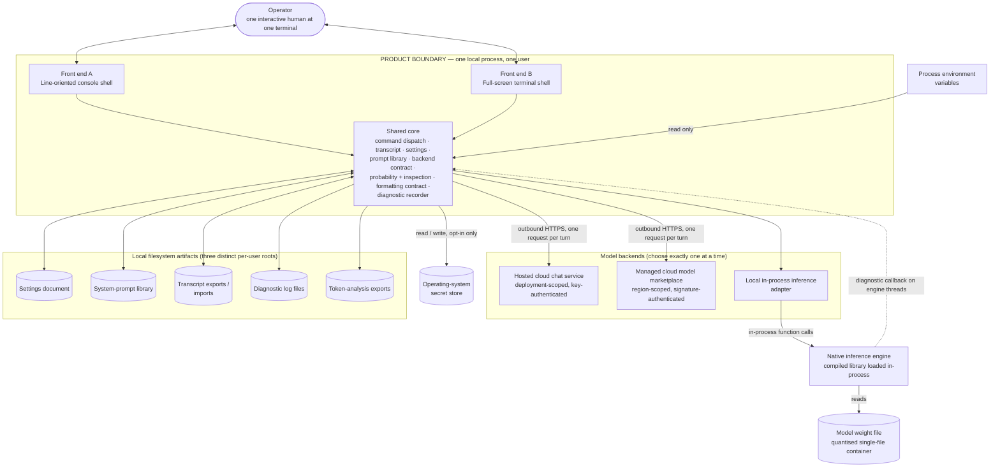

**Every arrow explained**

| Arrow | Meaning |
|---|---|
| Operator ↔ front end A | The operator types one line at a time at a prompt and reads plain text back. This front end owns the terminal for the whole process lifetime. |
| Operator ↔ front end B | The operator drives a persistent full-screen layout with a menu bar, an input box, a transcript pane, a status line, a shortcut bar, modal dialogs and an optional probability side panel. Mouse and keyboard both work. |
| Front end → shared core | Each front end builds its own command registry at start-up (fifteen entries, hand-wired, no discovery), classifies each submitted line as a command or a conversation turn, invokes the core, and renders the three-signal result. Neither front end owns domain logic. |
| Shared core → hosted cloud chat service | One outbound request per conversation turn. Two distinct paths exist: a vendor-library path used when per-token probabilities are *not* requested, and a hand-built request path used when they are. |
| Shared core → managed cloud model marketplace | One outbound signed request per conversation turn. Single-shot invocation only — no streaming, no tool use, no model listing. |
| Shared core → local inference adapter | An in-process call, not a network call. The adapter is constructed at start-up whether or not the operator ever selects it. |
| Local inference adapter → native inference engine | Direct in-process calls into a compiled platform-specific library through a foreign-function boundary. A failure here is process-fatal and not catchable. |
| Native inference engine → model weight file | The engine memory-maps or reads a single large quantised weight file whose path the operator configured. The product checks only that the path exists; it validates neither header nor size. |
| Native inference engine ⇢ shared core | A process-global diagnostic callback the product installs once and never removes. It fires on engine-owned threads, so the receiving buffer must be lock-guarded. |
| Shared core ↔ operating-system secret store | Consulted only when the operator has explicitly enabled it. Reads, writes and deletes named credential entries. Every failure is swallowed and reported as "no value". |
| Process environment → shared core | Read-only, on every access, never cached, never written. This is the highest-priority credential channel and the only one that works on every platform. |
| Shared core ↔ settings document | A small hand-editable structured document under a per-user configuration root, loaded at start-up and rewritten in full whenever a setting changes. |
| Shared core ↔ system-prompt library | A directory of one document per named instruction prompt under a *different* per-user root, seeded with four starter prompts on first run. |
| Shared core ↔ transcript exports/imports | Operator-chosen paths. An export must remain re-importable field for field; this is a compatibility contract. |
| Shared core → diagnostic log files | Append-only daily files under a *third* per-user root. Strictly a sink: nothing in the product ever reads them back. |
| Shared core → token-analysis exports | Operator-chosen paths carrying the per-step generation records. Write-only. |

Three things a reimplementer should notice immediately from this picture. First, the product uses **three different per-user roots** for three kinds of state, and it has no uninstall story. Second, the native engine sits *inside* the product's process, not behind an interface — its failure modes are the product's failure modes. Third, the arrow from the environment is one-way and unbuffered: a credential variable set after launch takes effect on the very next turn with no restart.

---

### 5.2 The command surface

Anything the operator types that begins with a single `/` is a command; everything else is a conversation turn. Parsing is: strip exactly one leading character, split the remainder on the space character only, discard empty tokens, lower-case the first token as the name, pass the rest in order as arguments. There is **no quoting and no escaping anywhere**, so runs of spaces collapse and tabs are never separators.

**Both front ends register exactly the same fifteen commands** — but they do **not** expose the same surface. The divergences below are shipped behaviour, not accidents of documentation, and a reimplementer who assumes parity will produce a third, different product.

Three fully implemented commands are registered by **neither** front end and are therefore unreachable by any operator, while the product's own shipped documentation presents all three as working, with sample transcripts.

| Command | Purpose | Which front ends expose it | Requires a backend? | Notes |
|---|---|---|---|---|
| **Conversation control** |
| *(any line not starting with `/`)* | Send a conversation turn | Both. Front end B also via a **Send** button. | **Yes** — the configured one | Front end B trims the line before classifying; front end A does not, so a leading space makes `/help` a chat turn there. The user message is appended to the transcript *before* any readiness check, so a failed turn leaves an orphan user message that is re-sent as context next time. |
| `/inject <role> <message> [position]` | Insert a message at a chosen role and position | Both (typed). Front end B also: **File ▸ Inject Message…** (a 70×15 form). | No | Roles accepted: user, assistant, system. Position is optional; supplying one breaks timestamp monotonicity. The form feeds its fields back through the same text command line and inherits space collapsing. |
| `/pop` | Remove the last message | Both (typed). Front end B also: **File ▸ Pop Last Message**. | No | Fails with `Chat history is empty` on an empty transcript. |
| `/clear` | Clear the whole transcript | Both (typed). Front end B also: **File ▸ Clear History**. | No | Reports the count captured *before* clearing. No confirmation on either front end — and in front end B the probability side panel keeps rendering the tokens of the message just deleted. |
| `/export <file_path>` | Write the transcript to a file | Both (typed). Front end B also: **File ▸ Export History…** (a save dialog pre-seeded with a name under the home directory). | No | The written document must remain re-importable field for field. `.json` is appended when the chosen path has no extension. Whole-file overwrite, no atomicity. |
| `/import <file_path>` | Replace the transcript from a file | Both (typed). Front end B also: **File ▸ Import History…** (an open dialog, single selection, starting at the home directory). | No | A missing file is a normal, non-exceptional failure with its own diagnostic. Both dialogs route the chosen path back through the text command line, so a directory containing consecutive spaces becomes unreachable. |
| **Configuration** |
| `/set` *(no arguments)* | Show the current configuration and setup instructions | Both (typed). | No | The single largest command in the product. Its usage text is recomputed from live state on every read, so its detailed help reflects the configuration in force at that moment. |
| `/set <key> <value>` | Change one setting and persist the whole record | Both (typed). Front end B also: **Edit ▸ Settings…**, an 80×25 modal with four tabs. | No | Twenty-one persisted keys. Value is all remaining tokens joined with single spaces, so a mistyped multi-word value fails rather than silently taking the first word. A key given with no value always yields `Usage: /set <key> <value>` before any lookup. |
| `/model [<model id…>]` | Show or change the model identifier | Both (typed). Front end B also: **Tools ▸ Change Model** (a 60×10 dialog). | No | With no arguments it reports the current model and persists nothing. With arguments it overwrites the identifier **with no validation of any kind** — not even a file-existence check when the local backend is active, which `/set modelId` *does* perform. Two commands, one field, two validation policies. |
| **Backend selection** |
| `/set provider <azure\|bedrock\|llama>` | Choose which of the three backends answers the next turn | Both (typed). Front end B also: a radio group on the settings dialog's first tab. | No (choosing costs nothing) | The three keys are exactly the lower-case literals. Front end A rebuilds its prompt string from live settings every iteration, so the change is visible on the very next prompt with no restart. |
| **Credentials** |
| `/set enablewincred` | Opt in to the operating-system secret store | Both (typed). Front end B also: a checkbox on the settings dialog's credentials tab. | No | One of only two keys accepted with a single argument and no value. Prompts interactively for confirmation, then persists the *entire* settings record. |
| `/set wincred <type> <value>` | Store one secret into the operating-system secret store | Both (typed). Front end B also: **Manage Credentials…**, whose value field is masked. | No | Three logical types with short aliases. Front end A echoes the typed secret to the terminal and into shell history — masked entry is the one capability it lacks. On a host without the implemented store the dialog still reports success while storing nothing. |
| `/set migrate` | Interactive wizard moving legacy plaintext secrets out of the settings file | Both (typed) — but **unusable in front end B**. Front end B also: a **Migrate Credentials…** button. | No | The wizard writes prompts to the raw output stream and blocks on a raw input read from inside the service layer. Under a full-screen toolkit that owns the screen and keyboard, those prompts are invisible and unanswerable. The button reports `Credentials migrated successfully` unconditionally and discards the operator's chosen option. |
| **Instruction prompts** |
| `/prompt [list\|show\|use\|create\|delete\|edit\|export\|import]` | Manage the named system-prompt library | Both (typed). Front end B also: a dedicated management dialog reached from the menu, bypassing the command layer entirely. | No | Every sub-command except the settings route takes its prompt name from a **single token**, so multi-word names are unreachable through them. `edit` opens an interactive line-by-line content editor on the raw input stream — again unusable in front end B. |
| **Introspection** |
| `/logprobs` *(no arguments)* | Report the current probability-analysis configuration | Both (typed). | No | Changes nothing and saves nothing. Returns a multi-line report ending in two caveat lines about model and API-version support. |
| `/logprobs enable` / `disable` | Turn per-token probability capture on or off | Both (typed). Front end B also: **View ▸ Log Probabilities ▸ Toggle Log Probs for Last Message**, which flips the same persisted flag. | No to set; **yes** to observe an effect | Enabling changes the request the backend adapter builds on the next turn. |
| `/logprobs top <1–20>` | Set how many alternative tokens to request per position | Both (typed). Front end B also: a settings-dialog field. | No | Out-of-range and non-integer values are rejected with a fixed message; nothing is saved on rejection. |
| `/tokenize <text>` | Show how the local model segments a piece of text | Both (typed) — but **unusable in front end B**. | **Yes — the local backend specifically** | Refuses unless the backend key is exactly `llama` (case-sensitive) and the weight file exists. Writes its whole report straight to the raw output stream, which a full-screen toolkit paints over. Loads and disposes the model once per invocation. |
| `/inspect <text>` | Tokenize, then analyse probabilities and attribution behind a consent gate | Both (typed) — but **unusable in front end B**. | **Yes — the local backend specifically** | Blocks on a raw input read for a `(y/n)` consent answer with no timeout, no default and no non-interactive escape. Loads and disposes the model **twice** per invocation. Returns the same success message whether the operator consented or declined. |
| **Presentation** |
| `/logprobs showall` / `showsample` | Render every token, or a beginning/middle/end sample | Both (typed). Front end B also: a settings-dialog radio group. | No | Sample mode is the default and only samples above a fixed threshold; below it the whole list renders anyway. |
| `/logprobs grid` / `list` | Choose the card-grid or table layout | Both (typed). Front end B also: a settings-dialog radio group. | No | List layout is the default. Grid column count is derived from the queried terminal width. |
| `/logprobs gridmaxalt <1–20>` | Cap alternatives shown per card in grid layout | Both (typed). Front end B also: a settings-dialog field. | No | Same validation and same rejection semantics as `top`. |
| `/demologprobs` | Render a fixed sample probability analysis with no backend call | Both (typed). Front end B also: **View ▸ Log Probabilities ▸ Run Demo Visualization**. | **No — never contacts a backend** | The **only** command whose behaviour differs by construction between the front ends: front end B supplies a rich-console rendering collaborator and front end A supplies none. The command must return the identical success message either way. In front end B the rich renderer writes ANSI escapes straight to the terminal underneath the full-screen toolkit, producing painting artefacts. |
| **Diagnostics** |
| `/logprobs debug` | Print a troubleshooting report for the probability feature | Both (typed). | No | Changes nothing, saves nothing. Echoes the configured endpoint or a literal placeholder, suggested model names, and a four-step checklist. |
| **Session lifecycle** |
| `/help` | List every capability grouped by topic | Both (typed). Front end B also: `F1` and **Help ▸ View Commands…** — a *completely different renderer*. | No | The typed listing is a **hand-maintained script** in a fixed non-alphabetical order that can drift from the registry in both directions. Front end B's dialog ignores the help command entirely and builds its own listing from the registry, sorted ascending, with descriptions but no usage strings and no grouping. |
| `/help <name>` | Detailed help for one capability | Both (typed). | No | Uses only the first argument. An argument that includes a slash fails. In front end B a typo inside a help request raises a blocking modal. |
| `/exit`, `/quit` | End the session cleanly | Both (typed). Front end B also: **File ▸ Exit** and the `F10` shortcut item — **which bypass the commands entirely**. | No | Both ignore all arguments. Requesting an exit is a *successful* outcome. Exit beats message: a message carried on an exit result is never shown. No confirmation, no state flush on either route. |
| **Implemented but registered by neither front end** |
| `/show-analysis [--top N] [--state] [--range S E]` | Display the per-step analysis of the last local generation | **Neither.** Typing it yields the unknown-command response. | Would require the local backend | The only command in the product with flag-style arguments — a style the parser offers no support for whatsoever. Its usage string also breaks the product's own convention (bare name, embedded newlines, an `Example:` line). |
| `/export-analysis <filepath>` | Write that analysis to a file | **Neither.** | Would require the local backend | Same convention break. |
| `/export-logs <filepath>` | Write a snapshot of the diagnostic buffer to a file | **Neither.** | Would require the local backend | Also a stub even when invoked directly: it validates its argument count, writes no file, and ignores the path it was given. Five separate product documents show it working. |

**Summary of the two front ends' divergence**

1. **Trimming.** Front end B trims the submitted line; front end A does not.
2. **Empty command.** `/` alone yields a failure message in front end A and total silence in front end B — and because the input box was already cleared, the typed text simply vanishes.
3. **Unknown command wording.** Front end A re-adds the slash and points at help; front end B shows a modal with neither.
4. **Failure presentation.** Front end A prints a one-line failure mark; front end B raises a blocking modal for *every* failure, including a typo in a help request.
5. **The demo command's collaborator.** Supplied in front end B, absent in front end A.
6. **Three commands are effectively front-end-A-only** — `/tokenize`, `/inspect` and the `/set migrate` wizard — because they write to the raw output stream and block on raw input reads from inside the service layer.
7. **Front end B adds ten menu-driven surfaces**, three of which (help rendering, prompt management, the probability-panel toggle) bypass the command layer entirely, and two of which (**File ▸ Exit**, `F10`) bypass the exit commands.
8. **A structural hazard specific to front end B (INFERRED from construction ordering; not observed at run time, because the repository as pinned will not build):** its commands are constructed against one settings object and the rest of the application then uses a *different* one loaded from disk. Consequently `/set`, `/prompt use` and `/model` mutate an orphaned object, and persisting it overwrites the operator's stored configuration with construction-time defaults. A reimplementation must connect the commands to the settings object the rest of the application uses.

---

### 5.3 Feature dependency map

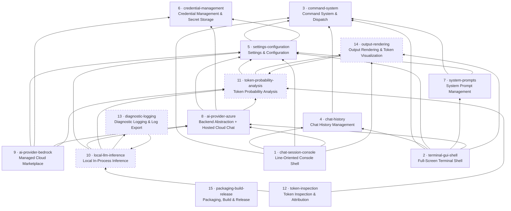

Arrows read "depends on". Dashed nodes participate in a **mutual dependency** and cannot be built one before the other.

**Two cycles exist in the source's feature graph and a reimplementer must plan for them:**

- **11 ↔ 14.** The probability feature owns the data model, the probability arithmetic and the enable/top-K surface; the rendering feature owns the visualization it is displayed in — and each reaches into the other. Build them as one unit, or break the cycle deliberately by making rendering depend on probability and not the reverse (recommended: the probability feature should not know how it is drawn).
- **10 ↔ 13.** The local-inference feature installs and drives the diagnostic recorder; the recorder exists only to capture the inference engine's own native log lines. Build them as one unit. Breaking this cycle is harder and probably not worth it: the recorder's whole contract is the engine's callback shape.

**Dependency tiers — this table doubles as the suggested build order**

| Tier | Features | Why here | What you can demonstrate at the end of the tier |
|---|---|---|---|
| **1** | **3** Command System & Dispatch · **6** Credential Management & Secret Storage · **15** Packaging, Build & Release | No dependencies on any other feature. | A shell that parses, dispatches, and reports a three-signal result; a credential resolver with its three-tier priority; a build that produces one runnable file per platform. Start packaging in tier 1, not at the end — its constraints (culture-invariant operation, dead-code elimination, per-user state roots) are contracts every later feature must honour. |
| **2** | **4** Chat History Management (→3) · **5** Settings & Configuration (→3, 6) | Depend only on tier 1. | A transcript you can inject into, pop from, clear, export and re-import; a persisted settings document with all twenty-one keys and the credential-resolution reporting. |
| **3** | **7** System Prompt Management (→3, 5) | Depends on tiers 1–2. | A named prompt library, seeded on first run, selectable as the active instruction prompt. |
| **4** | **11** Token Probability Analysis **+ 14** Output Rendering & Token Visualization (mutually dependent — build together; →5) | The probability data model and its rendering. | The demo-visualization command producing a full table and grid render with **no backend of any kind configured**. This is the single best integration checkpoint in the whole build: it exercises the data model, the arithmetic, both layouts, the sampling rule, the colour bands and the terminal-width logic without spending a request. |
| **5** | **8** Backend Abstraction + Hosted Cloud Chat (→5, 6, 11) | Needs settings, credentials and the probability model. | The first real conversation turn, and the first real per-token probability render. |
| **6** | **9** Managed Cloud Marketplace (→5, 6, 8, 11) · **10** Local In-Process Inference **+ 13** Diagnostic Logging (mutually dependent — build together; →5, 8, 11) | Both are peers of feature 8 behind the same contract. They are independent of each other and can run in parallel. | All three backends selectable at run time. Budget feature 10 generously: it carries the native-library boundary, the platform payloads and the process-fatal failure mode. |
| **7** | **12** Token Inspection & Attribution (→10, 11) | Needs the local engine and the probability model. | Tokenization reports, the inspection consent gate, and the per-step analysis export. |
| **8** | **1** Line-Oriented Console Shell (→3, 4, 5, 8, 14) · **2** Full-Screen Terminal Shell (→3, 4, 5, 7, 8, 14) | Both are pure composition over everything below. They are independent of each other and can run in parallel. | The shipped product. Ship front end A first — it is the only one the source's pipeline publishes, and it is the one whose interactive prompts actually work. |

---

### 5.4 Consolidated External Technology & Protocol Inventory

The fifteen feature authors collectively reported **187** external-technology rows. Merged by generic capability, with the union of every author's notes preserved, they reduce to the **73** rows below. Rows are ordered by how load-bearing they are: the backends and their wire contracts first, then the platform-coupled hazards, then persistence, then presentation, then runtime primitives, then build and delivery.

Read the **Reimplementer notes** column as the answer to one question: *what semantics must survive when I swap this out?* Naming a replacement library is never sufficient.

| # | Generic capability | Protocol / standard | What the source used (with version) | Required or optional | Reimplementer notes — semantics that must survive substitution |
|---|---|---|---|---|---|
| 1 | Hosted, deployment-scoped large-language-model chat completion returning per-token log probabilities | HTTPS + JSON; route `/openai/deployments/{deployment}/chat/completions?api-version=…`; authentication by a request header named `api-key` | Azure OpenAI Service, API version literal `2023-12-01-preview`, reached by a hand-built request; `Azure.AI.OpenAI` **2.1.0** is referenced but deliberately bypassed on this path | **Required** for the hosted-cloud backend | The model identifier **is** the deployment name — there is no separate model field. The API version is hard-coded, not configurable, and is a *preview* version newer than the one the product's own diagnostics text advises (`2023-05-15`). Request members: `messages[{role,content}]`, `temperature`, `max_tokens`, `top_p` (fixed 1.0), `logprobs` (true), `top_logprobs` (top-K). **Three response shapes must all be tolerated**: a top-level `logprobs.content[]`, a top-level bare `logprobs[]`, and `choices[0].logprobs` as either an object with `content` or a bare array. Each entry needs `token` + `logprob`, with an optional `top_logprobs`/`top_alternatives` array. The status code is rendered to the user as its *symbolic name*, not its number. **INFERRED**: the wire contract is read from source only — never asserted by a test, never exercised live. Re-verify against current provider documentation before writing a line of it. |
| 2 | Vendor client library for the same hosted service, used only when probabilities are **not** requested | Same service, library-managed wire format | `Azure.AI.OpenAI` **2.1.0** with its bundled chat-client types | Optional | Only the temperature option is set through it. A clone may use one direct request path for both cases — but must then consciously decide whether to preserve the two asymmetries this dual path creates: the maximum-tokens field is sent on one path and not the other, and message roles are filtered differently on each. Preserve or remove them deliberately; do not inherit them by accident. |
| 3 | Managed, region-scoped, account-billed marketplace for hosted foundation models, invoked once per turn | HTTPS with per-request cryptographic request signing; opaque per-model structured request/response bodies; region-scoped endpoint; content type and accept type both `application/json` | Amazon Bedrock Runtime via `AWSSDK.BedrockRuntime` **4.0.7.3** | **Required** for the marketplace backend | Only the **single-shot invoke-model** operation is used: no streaming, no unified converse-style API, no tool use, no model listing. The body is opaque and per-model and the service performs **no cross-family normalisation**, so the two body shapes the product implements are the entire contract. |
| 4 | Cloud credential resolution and per-request signing, with a documented ambient-discovery fallback chain | Signature-based request authentication; a default credential provider chain (shared profile file, container/instance role, single sign-on, environment) | The vendor SDK's static-credential constructor when both key halves resolve, otherwise its region-only constructor | **Required** for the marketplace backend | **Both branches must exist and be selected by exactly the both-halves-non-empty rule.** There is no session-token support anywhere, so temporary credentials found in the environment are hoisted into a static key pair *without* their token and authentication fails. Note also that the region-only fallback is a **fourth, undocumented credential channel** a clone inherits unless it closes it deliberately. |
| 5 | Resolution of a service endpoint from a short region code | Vendor region naming (`us-east-1`, `eu-west-1`, …) | Region lookup by system name; default `us-east-1` | **Required** for the marketplace backend | An unknown region name **must not fail fast**: the source fabricates an endpoint and lets the failure surface at connection time. Adding validation is a new requirement, not a port. |
| 6 | Claude-family structured message contract in its marketplace flavour | Structured body with `anthropic_version`, `system`, `messages[{role,content}]`, `max_tokens`, `temperature`; reply read from `content[0].text` | Hand-built body with the contract version pinned to the literal `bedrock-2023-05-31` | **Required** for the marketplace backend | Reproduce member names **verbatim, snake_case included**. The source additionally sends non-contract `logprobs`/`top_logprobs` members on this body — do not copy that unless the target service is verified to accept them. |
| 7 | Legacy single-string completion reply contract | Structured body with a top-level `completion` string | Parsed as the second-priority response branch | Optional | This is the *only* reply shape the source's test suite exercises: best-understood behaviour, least real-world relevance. |
| 8 | Native per-family request and response contracts for non-Claude model families | Each family has its own native structured contract | **Not implemented** — a single invented messages shape is sent to every non-Claude identifier | Optional | Treat the generic branch as a **stub**. A faithful clone must either implement real per-family shapes or explicitly reject non-Claude identifiers rather than silently sending a shape no service accepts. |
| 9 | In-process local transformer inference engine: load weights with an explicit context size, tokenize with a beginning-of-sequence marker, stream generated text | Native shared library invoked in-process through a foreign-function interface | `LLamaSharp` **0.25.0**, managed bindings over `llama.cpp` | **Required** for the local backend | Exactly three capabilities are exercised: load-with-explicit-context-size, tokenize-with-BOS to integer vocabulary IDs, and stream-generate with a maximum-new-token budget and an (empty) stop-sequence list. The substitute must **stream text pieces, not token ids** — every counter in the product counts pieces — and must own conversation continuity in a session object, because only one message is sent per turn. A **detokenize (ID → string)** entry point is required by the intended behaviour but was never wired up; implement it rather than reproducing the `<token_N>` placeholder. Ideally also expose the current per-step candidate score vector. Repository documentation citing version `0.11.2` or `0.17.0` is stale — ignore it. |
| 10 | Quantised model-weight container format | GGUF (single-file quantised weights) | User-supplied `.gguf` files; documentation names a 7-billion-parameter chat model at 4-bit medium quantisation as known-good, ranking Q3_K_M / Q4_K_M / Q5_K_M by size and quality | **Required** for the local backend | The file format is a **user-facing compatibility requirement** — operators already hold these files. Pre-GGUF formats are explicitly out of scope. Nothing in the product validates header, extension or size; existence is the only check, so a zero-byte file passes every gate and fails inside the native loader. |
| 11 | Host-processor inference backend supplying platform-native compiled libraries | Platform-native shared library, per platform triple | `LLamaSharp.Backend.Cpu` **0.25.0**, binaries under `runtimes/<platform-triple>/native/` | **Required** for the local backend | Verify the concrete artefacts (`win-x64/native/llama.dll`, `linux-x64/native/libllama.so`). On Windows the vendor C++ runtime redistributables are required. **A missing or mismatched binary is the leading cause of the uncatchable native crash during model load.** |
| 12 | Optional graphics-accelerated inference backend | Vendor compute toolkit, version 12 series | `LLamaSharp.Backend.Cuda12` **0.25.0** | Optional | **This is the only accelerator backend anywhere in the source** — no Metal, Vulkan, ROCm/HIP, OpenCL or processor-variant package exists. So "GPU acceleration" means one vendor or nothing. On any other accelerator a non-zero layer count is accepted, persisted, displayed, and then silently ignored or fatal in the native loader. Both backends are referenced **unconditionally in the same project**, which the source's own troubleshooting document names as a cause of native load failures. Decide explicitly whether to ship one backend, both, or make them optional side-loads. |
| 13 | Hook redirecting the inference engine's own native diagnostic output into the host process | A callback registered with the native library, receiving a severity token plus a message string per line | The binding's process-global native-log registration | **Required** for the local backend (it is installed unconditionally on first use) | The sink is **process-global, set-only, never unregistered, last-writer-wins** — a second instance silently steals it. It fires on **engine-owned threads**, so the receiving buffer must be lock-guarded. The severity level is an engine-internal enumeration rendered by name: treat it as an opaque token, and expect the resulting file to mix two label vocabularies. **INFERRED**: the engine may deliver partial lines; the source assumes whole lines and only strips trailing whitespace. |
| 14 | Native-library interoperation with manual memory management | C ABI, structure marshalling, explicit string allocation | Platform invoke with manual allocate/free, buffer copy and structure conversion; unsafe pointer access enabled on the shared library only | **Required** wherever a native store or engine is reached directly | **This disappears entirely if the target language has a first-class binding for the thing being reached.** What must survive is the adapter's public shape: read → optional string, write → boolean, delete → boolean, available → boolean, and **none of the four ever raises**. Every handle and buffer must be released on every path, failures included. |
| 15 | Run-time member lookup by name / late binding | none | Reflective resolution of the candidate-score accessor and a late-bound detokenize call | Optional (and, as used, non-functional) | **Hostile to ahead-of-time compilation and dead-code elimination**, which the source's own size-optimised profile enables — under which both silently degrade to "no alternatives" with no error. Do not port the technique; port the *intent* by binding those two operations statically. |
| 16 | Process-wide mutual-exclusion primitives guarding the native engine | none | Two process-wide binary semaphores, one for loading and one for generating | **Required** for the local backend | Required because the native engine and its cached context are **not safe for concurrent use**. Neither primitive has a timeout, a queue bound or a cancellation path, and only one of the two is ever released. A clone should keep the exclusion and add the bounds. |
| 17 | Operating-system-managed, encrypted-at-rest, per-user secret store addressable by an opaque entry name | Native OS credential API; entries created as generic credentials with an explicit persistence scope | Microsoft Windows Credential Manager via direct native calls to `advapi32.dll` (`CredReadW`, `CredWriteW`, `CredDeleteW`, `CredFree`) with a manually marshalled credential structure; entry names `ChatDbg:AzureApiKey`, `ChatDbg:AwsAccessKey`, `ChatDbg:AwsSecretKey`; blob encoded UTF-16 little-endian with its declared size in **bytes**; persistence scope local-machine, explicitly non-roaming | Optional and opt-in — see §5.4.1 | **The only encrypted-at-rest channel in the product.** No specific encryption algorithm is a requirement; "the operating system encrypts it" is. Keep the three entry names or map them one-for-one, and keep the short aliases as accepted logical types. All failures are swallowed, which means a genuine fault (policy denial, corrupted store, exhausted handles) is **indistinguishable from "the entry is not there"**, at every layer, with nothing logged — fix this rather than porting it. |
| 18 | Operating-system capability detection: is the native secret store present? | none | A run-time "is this platform Windows" check | **Required** if #17 is offered at all | Gates the store toggle, the shape of the help text, and the start-up notices. **Remediation text must hide options the running platform cannot offer** — the source omits them in one place and still points at them in another, dead-ending the operator. Off the supported platform every entry point must return "not available" rather than raising, and the **real success flag must reach the user**: the source's dialog reports "saved successfully" when nothing was stored. |
| 19 | Read-only process environment as a credential and configuration channel | POSIX / Windows environment variables | `CHATDBG_AZURE_API_KEY`; `CHATDBG_AWS_ACCESS_KEY` then `AWS_ACCESS_KEY_ID`; `CHATDBG_AWS_SECRET_KEY` then `AWS_SECRET_ACCESS_KEY` | **Required** — the only fully portable credential channel | Read-only; the product never sets a variable. **A variable that exists but holds the empty string must be treated as absent.** Lookups repeat on every read and nothing is cached, so a variable set after launch takes effect immediately with no restart. Highest priority in the three-tier resolution chain. Note that the interface never names any of these variables to the operator in the windowed front end. |
| 20 | General HTTP client with a substitutable transport | HTTP/1.1 over TLS | Platform HTTP client with an injectable message handler | **Required** | Must support clearing and setting default headers, an accept header, a custom authentication header, a UTF-8 JSON body POST, reading the whole response body as a string, and reading the status code. The transport must remain substitutable or the product's zero-network test approach cannot be reproduced. |
| 21 | HTTP transport policy: timeout, retry count, back-off, connection pooling, proxy | HTTP/1.1 over TLS | **Nothing configured anywhere.** Whatever each library defaults to is what runs (**INFERRED** ~100 s for the raw path) | **Required decision**, even if the answer is "defaults" | The clone will not match the source's timing behaviour unless it matches those defaults. **Decide explicitly — the source made no decision.** Note that constructing a client per turn defeats connection pooling regardless of policy, and that merely constructing the hosted-service adapter opens an outbound connection pool even in a session that never uses it. |
| 22 | Structured-document serialization with explicit per-field wire names, null-omission and optional indentation | JSON (RFC 8259) | Platform JSON serializer with a camel-case naming policy, per-field name overrides, ignore-markers on computed and secret members, and indented output | **Required** | **Wire names are a compatibility contract in four separate documents** (settings, prompt records, transcript exports, analysis exports). The per-field overrides win over the naming policy, so a camel-case document can and does contain snake_case outliers — notably `top_alternatives` and `logprob` inside otherwise camelCase message records. Deserialization is **case-sensitive**, ignores unknown keys, tolerates missing fields, and rejects comments and trailing commas. Preserve exactly the split between serialized legacy secret fields (emitted as empty strings) and excluded resolved secrets, or you either break backward compatibility or leak resolved secrets to disk. Indentation is user-visible: the settings document is an intended hand-edit surface. |
| 23 | Tolerant document-object-model structured-document reader | JSON (RFC 8259) | Platform DOM-style reader with try-get semantics | **Required** | Needs optional-property probing, value-kind discrimination (object vs array vs number), array enumeration, and object-property enumeration for the map-shaped alternatives case. **Must survive a non-array value where an array is expected — the source does not.** Must also tolerate the same logical field under two different key spellings (`logprob` / `log_prob`) and the same collection as either an array or an object with a member. |
| 24 | Byte-exact document output profile: string escaping and shortest-round-trip number formatting | JSON (RFC 8259) / IEEE 754 | The platform serializer's default escaping profile (apostrophe, backtick, plus, less-than, greater-than and ampersand all escaped; all non-ASCII written as `\uXXXX`) and its default shortest-round-trip double writer (a log probability of −5 is written `-5`, not `-5.0`; no exponent notation at ordinary magnitudes) | Optional | A minimally-escaping clone produces **semantically identical but byte-different** files. That is fine — unless you intend to diff artefacts against the source's, in which case pin the profile. |
| 25 | Local filesystem: whole-file text read, overwrite, append, delete and existence check; recursive create-directory-if-missing; non-recursive listing filtered by extension | POSIX / Win32 file I/O | Platform file and directory APIs; UTF-8 with no byte-order mark | **Required** | **Whole-file semantics only: no streaming, no locking, no temp-file-then-rename, therefore no atomicity.** An interrupted write must leave the target truncated, matching observed behaviour. "Last writer wins" is the observed contract — two concurrent instances clobber each other. No file handles are held open: every log flush opens, appends and closes. No recursion into subdirectories. Directory creation is called before every export and is a no-op when the directory exists; a failure there must be **indistinguishable to the user** from a write failure. A clone may improve any of this but **must not depend on the improvement**. |
| 26 | Path manipulation: extension detection, join, directory-of, home expansion | none | Platform path helpers plus a `~/` expansion rule | **Required** | "Has an extension" must mean *a dot after the last separator that is not the final character*, so a dot-prefixed name such as `.history` counts as having one. Separator rules follow the host platform, so a backslash is a separator on one platform and an ordinary filename character on another. |
| 27 | Well-known per-user directory resolution — user profile, local application data, roaming application data — with a temporary-directory fallback | OS convention (Known Folders / XDG user directories) | Platform special-folder lookups; settings at `<user profile>/.ChatDbg/settings.json`, prompts under `<local app data>/ChatDbg/system_prompts`, logs under `<roaming app data>/ChatDbg/Logs` | **Required** | **The product uses three different per-user roots for one product and has no uninstall story — pick per-platform conventions deliberately.** Measured behaviour a clone must handle: on one platform the "Documents" lookup returns the **empty string**, which is not an error path and silently degrades a default export destination to a bare relative filename; with no home directory set, the roaming lookup returns empty and the path segments compose into a **relative** path, so logs land under the process working directory with nothing guarding it (**INFERRED** from platform behaviour). The temp-directory fallback **silently relocates the settings file — plaintext credential slots included — into a world-readable directory with no message to the user.** Preserve the literal directory name `.ChatDbg` and the file names for compatibility with existing installs. |
| 28 | Host-operating-system set of characters forbidden in file names | none | The platform's invalid-filename-character query | **Required** for the prompt library | Measured and **platform-dependent: 41 characters on one platform, 2 on another.** Delegating to the host makes prompt libraries non-portable — a prompt named `a:b` is stored under one name on one platform and another elsewhere, so copying a library one way makes prompts unreachable by name and the other way makes names silently collide. **Pick one explicit documented set; do not delegate.** |
| 29 | Interactive character terminal: read a line, write Unicode lines | ANSI/VT escape sequences on POSIX; console API on Windows | Platform standard console input and output | **Required** | Requires a real, line-buffered standard input. Measured: end-of-stream returns nothing, which the product's blank-input guard reports as blank — producing an **unbounded busy loop** on exhausted redirected input, and a **permanent hang** in the prompt-content editor, which has no end-of-input check at all. **Treat end of stream as an exit condition and flag that as a deliberate deviation.** |
| 30 | Terminal width query | none | Runtime console window-width property | **Required** for the grid layout | Used once, to compute grid columns as `max(1, width / 40)` — roughly forty columns per token card. Measured: with output redirected on one platform it returns 80 and does not fail; with no console attached on another it **raises**, and the visualization is lost to a blanket guard. The source guards only against a zero width, never against a failing query. **Guard the query itself.** |
| 31 | Redirectable standard-output stream | none | Platform console writer | **Required** | The plain output surface must write through a **replaceable stream, not a raw terminal handle**, or the product's existing test approach (swap writer, render, restore) cannot be reproduced. Note the source's persistence layer writes its own diagnostics to this stream *unconditionally* — including while the full-screen front end owns the terminal, which is exactly how it corrupts that display. Route those through a suppressible sink. |
| 32 | Rich console text renderer: inline colour markup, captioned horizontal rules, auto-expanding bordered tables with per-column fixed widths and centring, multi-column grids, bordered panels with headers | ANSI SGR escape sequences | `Spectre.Console` **0.51.1**, referenced by the shared library and both front ends | Optional **by contract** — the demo command must succeed identically with no renderer supplied | Required palette names: green, lime, yellow, orange3, red, blue, grey, dim. **One shared band map emits a bare `orange`, which is very likely not a valid name** — verify every colour name against your chosen palette. Markup uses square-bracket tags closed by a sentinel and literal brackets are escaped by **doubling**. Any equivalent library works provided it supplies: a styled span, a table with per-column fixed widths and centring, a fixed-column grid, a bordered panel with a header, and a captioned rule with left/centre justification. **Never mix a direct console renderer with a full-screen toolkit that owns the screen** — see §5.4.4. |
| 33 | Full-screen text-mode user-interface toolkit: windows, framed views, menu bar, shortcut bar, z-ordered modal dialogs with their own event loop, tab strip, list view, radio group, checkbox, single-line and masked text fields, multi-line text area, buttons, scrollable canvas with programmable content extent, per-widget colour attributes, message boxes, interface-thread marshalling | terminfo / ANSI-VT; console API on Windows | `Terminal.Gui` **1.19.0** (pulling in `NStack.Core` **1.1.1** for its string type). Documentation and in-code comments claiming 1.17.1 or v2 are stale | **Required** for front end B only; front end A needs nothing beyond line input and output | Any curses-like toolkit works. Required primitives: absolute plus anchored positioning, percentage widths, "fill minus N" sizing, four global colour-scheme slots (base, dialog, menu, error) each with normal / focus / hot-normal / hot-focus / disabled attribute pairs, a scrollable canvas whose content extent is set programmatically, a custom-draw hook exposing move-cursor / set-attribute / write-string, and a way to marshal a timer callback back onto the interface thread. **Modal-with-title semantics are user-visible**: the titles `Command Error` and `Error` differ by code path. All sizes are in **character cells** (80×25 settings, 80×20 help, 70×15 inject, 60×10 change-model, 70×18 and 60×15 sub-dialogs). The confirmation box returns the **index** of the chosen button and the source treats index 0 as the destructive answer — with the destructive button offered first. Menu hot-keys, focus traversal, dialog dismissal and scroll keys are toolkit defaults and are **INFERRED**; re-derive them from your chosen toolkit rather than trusting any list. A stop mechanism must unwind the event loop so a guaranteed-cleanup block can restore the terminal. |
| 34 | Native file open/save chooser with a starting directory, a pre-filled name and a cancel signal | none | The terminal toolkit's own open and save dialogs | Optional (front end B only) | Needed only because two menu items feed a chosen path into a text command line. **Pass the chosen path as a single pre-built argument instead of re-parsing it**, or paths containing consecutive spaces are silently corrupted. Open is single-selection starting in the home directory; save is pre-seeded with a default file name in the home directory. |
| 35 | Mouse-event reporting in a terminal | xterm mouse reporting | Handled by the interface toolkit | Optional | Probability markers and every button are clickable. **Keyboard-only operation must remain fully possible** through hot-keys and focus traversal. |
| 36 | Delayed callback marshalled onto the interface thread | none | A fire-and-forget delay plus an interface main-loop invoke | **Required** for front end B's transient status line | Drives a 3000 ms revert of the status label. **Each call starts an independent timer and cancels no earlier one**, so two messages within three seconds truncate the second one's display. Keep the marshalling; consider cancelling the previous timer and record that as a deliberate deviation. |
| 37 | Unicode glyph rendering: terminal font and code page | Unicode | **Nothing configured** — the encoding is never set | **Required** | Non-ASCII, non-Latin-1 characters appear in load-bearing positions: the success and failure marks U+2713 / U+2717 (in front end A the mark is the **only** success/failure signal emitted — no per-command exit code, no structured output), the box-drawing set for the welcome banner, a probability indicator U+25CA, and a numero sign U+2116 used as a column caption. **Supply ASCII fallbacks and choose them deliberately.** The numero sign is already corrupted to `?` in two of its three copies in the source; pick one intentional caption (`#` recommended). A clone targeting assistive technology must not rely on a glyph alone. |
| 38 | Single consistent source and document text encoding | UTF-8 | UTF-8 for every source file **except one**, stored in a legacy single-byte encoding with no byte-order mark | **Required** | Keep all embedded help and usage text in one encoding. In the source, one file's lone 0x95 bytes become replacement characters on thirty lines of the configuration command's usage document, and the project's own README is pure ASCII, so its rendered examples are mojibake and unusable as a visual specification. **Fix the encoding of literals rather than copying them.** |
| 39 | Culture-sensitive string collation and prefix comparison | Unicode collation (CLDR / ICU) | Platform default culture-sensitive comparison and ordering | **Required decision** | Load-bearing in exactly two places: **the leading-slash prefix test** and **the alphabetical ordering of the command listing and the prompt list**. Measured: `a-b, ab, a_b, B, a` orders as `a, a_b, a-b, ab, B` culture-sensitively but as `B, a, a-b, a_b, ab` by bytes. **Make the prefix test ordinal so packaging cannot alter dispatch**, and pick one ordering rule explicitly. |
| 40 | Culture-aware number parsing and formatting | Unicode CLDR number patterns | Ambient-culture parse and format for temperature, every integer, and every percentage; **no invariant-culture overload anywhere** | **Required decision** | Measured: the percent pattern **differs by culture** — one inserts a space before the sign (`50.00000 %`), another does not (`50.00000%`). Signed-integer parsing accepts a leading sign per the current culture and rejects decimal points and group separators. **A settings document written under one locale can fail to load under another.** Choose invariant culture for the persisted document and for all command input, and record it as an intentional deviation. |
| 41 | Wall clock in UTC and local time, with culture-aware date-time formatting | ISO-8601 | Platform UTC clock for storage, local clock for the diagnostic log, culture-sensitive short format for display | **Required** | Storage is always UTC, persisted as round-trip ISO-8601 with exactly seven fractional-second digits and a `Z` suffix; only *display* is localised, as date plus hours and minutes with **no seconds**. Nothing depends on uniqueness or monotonicity — and monotonicity is deliberately broken by message injection. **The diagnostic log uses the local clock with no timezone or offset recorded**, so entries are ambiguous across daylight-saving transitions and across machines, and a process crossing local midnight writes pre-midnight entries into the next day's file. |
| 42 | Globalization-data mode switch (full culture data vs. culture-free operation) | CLDR / ICU | Culture data **disabled** in the two size-optimised build profiles only, not in ordinary builds | Optional — but its effects are not | **This is why the same command accepts `0.7` in one shipped binary and rejects it in another**, why percentage spacing differs between builds, and why the same prompt library renders in a different order depending on which build opened it. **Packaging choices must never change input validation.** Either reproduce the divergence knowingly or eliminate it by pinning culture explicitly everywhere. |
| 43 | Natural exponential and natural logarithm over double-precision numbers | IEEE-754 doubles | Platform math library | **Required** | Displayed probability = e^(log probability), computed **on every read** — a hot path when rendering thousands of tokens, and never stored or persisted. The logarithm normalises local candidate scores and fabricates demonstration values. **What matters is *where* exponentiation is applied**: one backend adapter applies it to alternatives at parse time *and* again at display time, so a single response mixes two encodings. That double application is a defect; do not port it. |
| 44 | Deterministic seeded pseudo-random generation | none | A generator seeded with the literal **42** for demonstration data; a second, unseeded generator is constructed and never used | Optional | **Only "deterministic given a fixed seed" is contractual** — the exact number sequence is an artefact of the source runtime's algorithm and will not port. Do not attempt to match specific values. |
| 45 | Random unique identifier generation | UUID / GUID | Platform GUID generation, canonical lowercase hyphenated form | **Required** (minor) | Session identifier only. Not security-sensitive, not used as a key, never read back by anything. Also used in tests to build never-before-written vault entry names — keep an equivalent so the "unknown entry reads as absent" test stays honest. |
| 46 | Elapsed-time measurement | none | Platform stopwatch | Optional | Produces one diagnostic line reporting generation duration. The reply envelope carries an elapsed-time field that **no front end ever reads**. |
| 47 | Re-entrant thread mutual-exclusion primitive | none | Platform monitor lock over a private object | **Required** for the diagnostic recorder | **Re-entrancy is load-bearing**: the size-triggered flush is invoked from inside the already-locked append and re-acquires the same lock. **A non-re-entrant primitive deadlocks** unless the flush is restructured. Debug-stream and console echoes are emitted outside the lock, so only buffer and file ordering is guaranteed. |
| 48 | Managed runtime with first-class asynchronous operations, asynchronous streaming enumeration, and background offload of blocking native calls | none | .NET 10 (`net10.0`); SDK pinned to `10.0.100-rc.1.25451.107` with roll-forward to the latest feature band; latest language version; unsafe blocks permitted in the shared library | **Required** | Every command entry point is asynchronous even when the work is synchronous. **A single-threaded event loop suffices**; nothing in dispatch is CPU- or I/O-bound. Model loading and context creation are pushed onto worker threads; tokenization and the streaming loop run on the caller. **There are no cancellation tokens anywhere in the product**, so a long load, a long generation or a hung request cannot be aborted — the substitute runtime's cancellation facilities go entirely unused, and a clone should decide deliberately whether to add them. |
| 49 | Diagnostic trace sink invisible to the end user | none | Platform debug-trace writer, conditionally compiled on a debug symbol that **no shipping build defines** | **Required decision** | This is the **only** channel for the product's internal failures — parser faults, credential faults, native errors — and in a shipped binary **it does not exist**, making a dead subsystem indistinguishable from a healthy one. It also carries the **full system prompt, the entire conversation, every request body and every reply body, unredacted**; treat it as sensitive. **Make it a runtime switch, or route internal failures somewhere that survives**, and keep it cheap or a no-op when nothing is listening. |
| 50 | Process exit codes | POSIX / Win32 convention | `0` on normal shutdown, `1` when a fault escapes the session | **Required** | **The only machine-readable signal the whole application emits.** Individual commands have no exit codes and produce no structured output. The fatal path also writes a single `Fatal error: <message>` line to the plain console. |
| 51 | Command-line tokenizer | none | Split on the single space character, discarding empty tokens | **Required** | This determines exactly what is typeable: single internal spaces survive, runs of spaces collapse to one, tabs and newlines are impossible, and there is **no quoting or escaping mechanism at all**. It governs which secrets can be typed and which file paths can be reached. **Pin this or change it deliberately** — and if you change it, note that the file dialogs route their results back through it. |
| 52 | Interactive consent and wizard prompting reachable from the service layer | none | Direct output writes and blocking input reads performed **inside the service layer itself** | **Required decision** | This hard coupling is the direct cause of the windowed front end's unusable credential wizard, prompt editor, tokenizer and inspector. Reads block with no timeout and no cancellation, and there is no non-interactive mode and no flag to pre-answer a consent gate. **Inject an interaction port so both front ends and the tests can supply their own implementation** — but note that doing so changes observable behaviour and belongs in an explicit decision, not a silent refactor. |
| 53 | Substitutable seams for automated testing | none | Interface-based client factories for both cloud backends, an interface-based persistence store, a substitutable output-formatter contract, and a hand-written HTTP transport stub | **Strongly recommended** | **There is no dependency-injection container anywhere in the product**; every collaborator is constructed by hand at start-up. Keep the seams narrow and explicit: existing assertions depend on the factory's call count, the identity of the settings record passed to it, "saved exactly once" counts, which render operation was called and with which start index, and a "store-into-vault invoked exactly zero times when the flag is false" gate. Introduce two seams the source lacks: an injectable tokenizer/generator abstraction, and a recording HTTP stub (the source's stub ignores the request entirely, so address, headers and body are unobservable). |
| 54 | Toolchain version pin with a bounded roll-forward policy | none (structured-text pin document) | `global.json` pinning SDK `10.0.100-rc.1.25451.107` with roll-forward to the latest feature band | **Required** | The pinned build is a **pre-release**. **The pin document must be validated in continuous integration** — in the source it is malformed structured text and therefore gates *every* build in the tree, which is why none of the product's own tests can be run as checked out. A port needs an equivalent exact-version-plus-bounded-roll-forward mechanism or it loses the guarantee that every machine builds identically. |
| 55 | Declarative project and build description with directory-inherited defaults and named, condition-selectable configurations | none | Project files, a directory-level shared properties file, and a workspace descriptor (format 12.00) | **Required** | Four build profiles are expressed as configuration-conditioned property blocks. **The workspace descriptor enumerates only two of the four**, so the two distribution profiles are invisible to an IDE and reachable only from a command line. Make every profile discoverable. |
| 56 | Dependency manager supporting exact version pins declared per project | none | Package references. Pinned set: `AWSSDK.BedrockRuntime` **4.0.7.3**; `Azure.AI.OpenAI` **2.1.0**; `Spectre.Console` **0.51.1**; `Terminal.Gui` **1.19.0**; `NStack.Core` **1.1.1**; `LLamaSharp` **0.25.0**; `LLamaSharp.Backend.Cpu` **0.25.0**; `LLamaSharp.Backend.Cuda12` **0.25.0**; `Microsoft.NET.Test.Sdk` **17.12.0**; `xunit` **2.9.1**; `xunit.runner.visualstudio` **2.8.1**; `Moq` **4.20.69**; `coverlet.collector` **6.0.2** | **Required** | **No central version file and no committed lock file exist**, so three pins are duplicated between the shared library and the console executable and must be synchronised by hand. An internal convention document claims central package management is in use; it is not. Adopt central pinning and a committed lock file. |
| 57 | Self-contained runtime embedding so the target machine needs no pre-installed runtime, plus a native launcher stub | none | Self-contained deployment with a native host stub | **Required — this is the whole product promise** | **Do not substitute anything that reintroduces a runtime prerequisite on the target machine.** |
| 58 | Single-file self-extracting bundler with in-bundle compression and native-payload inclusion | none | Single-file publish with compression, native-library self-extraction and all-content self-extraction enabled | **Required** — this is the profile that actually ships | Compression plus both self-extraction switches means the single file **unpacks to a per-user cache before running**, so **a writable temporary area becomes a hard runtime requirement** and first start pays a decompression cost. Budget for both. |
| 59 | Whole-program dead-code elimination at two selectable levels of aggressiveness | none | Trimming, at full aggressiveness for the native profile and partial for the bundled profile, with analysis warnings **suppressed** | **Required** for the size targets | **Two granularities are required, not one** — the shipping profile is deliberately the gentler one so reflection-heavy dependencies survive. **Suppressing analysis warnings is what makes every trimming defect invisible until run time**; a port should reconsider that. See row 65 and §5.4.2. |
| 60 | Ahead-of-time native compilation with size-preference code generation, identical-body folding, stack-trace-metadata suppression and symbol stripping | none | Native ahead-of-time publish with size-preference optimisation, vtable folding, stack-trace data disabled and symbols stripped | Optional — this profile is defined but **never actually released** | It additionally requires **a host C/C++ compiler and linker that nothing in the source installs** — budget for a second toolchain on every machine and every build agent that builds it. It also cannot produce a single file once the native inference payloads are included (row 64). |
| 61 | Symbolic framework message keys instead of localized message text | none | System resource keys enabled in the two size-optimised profiles | Optional — but its effects are not | **Every error message that interpolates a platform exception degrades to a bare resource key in exactly the builds a user is most likely to run.** Since every diagnostic log entry embeds a whole exception object, the most valuable log lines become opaque. **Carry your own diagnostic text rather than surfacing the runtime's.** |
| 62 | Platform-triple targeting so one source tree produces per-platform binaries | none | Triples `win-x64` and `linux-x64`; documented but never built: `osx-x64`, `osx-arm64` | **Required** | **The triple strings appear literally inside the public release asset names**, so changing the triple vocabulary changes the download contract. |
| 63 | Permission to compile raw pointer and unmanaged-memory access, scoped to one component | none | Unsafe blocks enabled on the shared library project only | **Required** if rows 14 and 17 are implemented directly | **Decide early whether the target language permits this at all**, and whether it survives an ahead-of-time or trimmed build. If the target language has first-class bindings for the secret store and the inference engine, this requirement disappears entirely. |
| 64 | Shipping large per-platform native inference payloads inside the distributable | none | Both inference backend packages referenced **simultaneously and unconditionally**, extracted to per-platform native directories | **Required decision** | **This is the dominant size and packaging constraint in the entire product**, and it is why the native profile cannot produce a single file. Payloads exist for `win-x64`, `linux-x64` (avx / avx2 / avx512 / cuda12 / noavx variants), `linux-musl-x64`, `linux-arm64`, `osx-x64` and `osx-arm64` — hundreds of megabytes. **Decide explicitly whether to ship one backend, both, or make them optional side-loads.** See §5.4.2. |
| 65 | Reflection-driven structured serialization for every persisted document | JSON | Reflection-mode serializer with **no** source-generated serializer context anywhere | **Required decision** | **This is the single biggest incompatibility with the chosen dead-code-elimination strategy.** Either pick a serialization approach that is statically analysable, or do not trim. Choosing neither is what the source did. |
| 66 | Hosted continuous integration with manual dispatch, typed inputs, matrix fan-out onto per-platform agents, artefact upload/download between jobs with retention control, and a fan-in dependency | none | GitHub Actions on floating `windows-latest` and `ubuntu-latest` agents, with checkout, toolchain-setup, artefact-upload and artefact-download actions each pinned only to a major version | Optional (delivery only) | **Both agent images are floating tags, so nothing about the build environment is reproducible.** There is no dependency or build cache; every run restores from scratch. Two platform rows fan out in parallel and the publication job waits for **both** to succeed, so a half-published release cannot exist — preserve that property. |
| 67 | Release publication service supporting tagging, a notes body, a pre-release flag, a draft flag and binary asset attachment | none | GitHub Releases via a third-party action pinned to a floating major tag | Optional (delivery only) | The source publishes **non-draft**, so there is **no review gate and no rollback**. Pin the publishing component by revision rather than a floating tag. The two asset names `chatdbg-windows-win-x64.exe` and `chatdbg-linux-linux-x64` are a public contract download automation may rely on. |
| 68 | Credential authorising release publication | none | A repository secret holding a **long-lived personal access token**, supplied to the publication step; the pipeline declares no permissions block | Optional (delivery only) | **Prefer a short-lived, scoped, ambient job credential.** The source's own documentation claims no external secret is required, which is false. |
| 69 | POSIX-style shell available on **every** build agent operating system | POSIX sh | Shell steps using Perl-compatible regular expression matching, file moves, listing, stat and here-documents — **including on the Windows agent** | Optional (delivery only) | The rename and version-scrape steps assume this. A port that cannot guarantee such a shell on every agent must rewrite those steps per platform. |
| 70 | Local developer build scripting on a maintainer workstation | none | Three Windows command-interpreter scripts and one PowerShell script | Optional | **All four are single-platform and all four block on a keypress, so there is no non-interactive path and no POSIX developer script at all — despite a POSIX binary being released.** Provide a cross-platform, non-interactive script. |
| 71 | Unit-test framework with mocking, a substitutable HTTP transport stub, output-stream redirection and temporary-directory access | none | `xUnit` **2.9.1**, `Moq` **4.20.69**, `Microsoft.NET.Test.Sdk` **17.12.0**, `xunit.runner.visualstudio` **2.8.1**, plus a hand-written HTTP transport stub | **Strongly recommended** | In the source **only the shared library is under test; neither front end is**, so no dispatch, no rendering and no window behaviour has an executable specification, and the suite **cannot be built as checked out** (row 54) so even its existing assertions are unverified. The stub ignores the request entirely and returns a fixed status and body with a plain-text media type — and the parser never inspects media type. Several tests touch the real filesystem with no abstraction, and two contain zero assertions. **Treat the source's suite as a floor, not a specification.** |
| 72 | Code-coverage collection integrated with the test runner | none | `coverlet.collector` **6.0.2** | Optional | **Present but never invoked by any script or pipeline step; there is no coverage gate.** Add one. |
| 73 | Copyleft source licence governing binary redistribution | none | GNU General Public License version 3 | **Required decision** | **The published release attaches only executables — no licence text, no notice, no source offer.** A port must decide and document how the equivalent obligations are met before it publishes anything. |

#### 5.4.1 Hard substitution: the operating-system secret store

This is the product's only encrypted-at-rest credential channel, and it is **entirely single-platform**. The source reaches a Windows credential vault through direct native calls, and on every other host it deliberately reports "unavailable" — a behaviour a test explicitly pins.

What a reimplementation must do:

1. **Feature-detect at run time, not at build time.** One binary must be able to run on a host with a vault and a host without one. The detection result gates three separate things: whether the enable toggle is offered at all, the shape of every remediation and help text, and the start-up advisory.
2. **Degrade, never fail.** All four operations — read, write, delete, is-available — must return a value and **must never raise**, on any platform, in any failure. Read returns an optional string; the other three return booleans.
3. **Do not conflate "absent" with "broken."** The source wraps a catch-everything around an adapter that already catches everything, which guarantees that a policy denial, a corrupted store or an exhausted handle table is forever indistinguishable from "the entry is not there," with nothing logged. **Fix this**: distinguish the two and surface the difference.
4. **Propagate the real success flag into the user-visible message.** The source's windowed credential dialog discards the result and reports `Credential saved successfully` on a host where nothing was stored. That is the single most dangerous behaviour in this feature.
5. **Never show guidance the running platform cannot honour.** The source omits the vault instructions from one advisory and still points at them from another, dead-ending the operator.
6. **Preserve the three-tier resolution order exactly** — environment variables, then the vault (opt-in only), then the deprecated plaintext settings field — and preserve the three entry names, or map them one-for-one.

Natural equivalents exist on the other two desktop platforms (a keychain; a secret-service or keyring daemon). If you do not implement them, the honest posture is **"environment variables only,"** documented as such, with the toggle hidden rather than present-and-inert.

#### 5.4.2 Hard substitution: the native inference engine

This is the hardest single substitution in the product, for four independent reasons.

**It runs inside your process.** The engine is a compiled platform-specific library invoked through a foreign-function boundary, not a subprocess and not a service. There is no isolation. A missing library, a mismatched build, a wrong C++ runtime, a corrupt weight file or an unsupported quantisation is **a process-fatal native crash that your language's exception handling cannot catch**. The source's own troubleshooting document names simultaneous unconditional reference of both backend packages as a cause. If your target platform allows it, **strongly consider running the engine out of process** and accepting the marshalling cost in exchange for a catchable failure — and record that as a deliberate deviation.

**Its payload dominates your distribution.** Native binaries exist for seven platform variants including five instruction-set flavours on one platform alone, and both a processor backend and an accelerator backend are referenced unconditionally. This is hundreds of megabytes, it is why the ahead-of-time profile cannot produce a single file, and it is dead weight on every machine without the one supported accelerator vendor. **Decide explicitly and early**: ship one backend, ship both, or make them optional side-loads fetched on first use.

**Its diagnostic channel is process-global and inverts control.** Installing the log hook is a set-only, never-unregistered, last-writer-wins operation, and the callback arrives **on engine-owned threads**. Your recorder must therefore be genuinely thread-safe (a lock-guarded buffer), must tolerate a severity token it does not understand, and — per the source's own hazard — must not keep buffering after teardown. **INFERRED**: the engine may deliver partial lines; the source assumes whole lines. Test for that.

**Two of its most valuable operations were never wired up.** The source resolves the per-step candidate-score accessor and the detokenize call by name at run time, which is hostile to ahead-of-time compilation and dead-code elimination — and under the product's own size-optimised profile both **silently degrade to "no alternatives"** with no error at all. This is why the product's token text is a `<token_N>` placeholder and why its local-model alternatives are so limited. **Bind both statically and implement them properly.** Note the consequent semantics if you do: the source's alternatives are a softmax over only the top-K candidates (so they sum to 1 among themselves, not over the vocabulary) and are attached one generation step late (so the first token never gets alternatives and keeps a placeholder log-probability of 0). Those are defects to fix, not contracts to preserve.

Finally: the engine and its cached context are **not safe for concurrent use** and must stay behind exclusion primitives, none of the operations accept a cancellation signal, and the source loads and disposes the model **once per command — twice for the inspection command**, which for a multi-gigabyte model makes those commands dramatically slower than a chat turn. A shared cached tokenizer is a strongly recommended deliberate deviation.

#### 5.4.3 Hard substitution: the hosted provider's log-probability path

The hosted cloud backend has **two request paths, not one**, and they behave differently.

When per-token probabilities are *not* requested, the source calls the vendor's client library and sets only the temperature option. When they *are* requested, the source **bypasses that library entirely** and hand-builds an HTTP request against a route carrying a **pinned preview API version literal** — a version that is neither configurable nor the version the product's own troubleshooting text advises the operator to use.

Consequences a reimplementer must plan for:

- **The vendor library is not a substitute for the wire contract.** You will be writing the request and parsing the response yourself for the path that matters most. Budget for that, and re-verify the route, the header name, the version string and every field name against current provider documentation — **the source's wire contract is read from source only and is never exercised by any test**.
- **Three response shapes must all be tolerated**, because the source tolerates three: probabilities under a top-level object with a content array, under a top-level bare array, and under the first choice as either an object with a content array or a bare array. The last of these is the shape the service actually documents — and it is the branch the source checks **last**, behind an else on the mere *existence* of a top-level block. A response carrying a top-level block of an unexpected shape (a null, say) therefore causes the real data to be ignored entirely.
- **Do not fabricate.** When no probabilities are found, the source substitutes invented values built from fixed logarithms, **returns them unmarked**, and provides no flag, no marker and no distinct field. An operator analysing "model confidence" may be reading numbers the product made up. A clone must either omit the data or mark it unmistakably as synthetic.
- **Two paths, two asymmetries.** The maximum-tokens field and the message-role filter differ between the library path and the hand-built path. If you unify the paths — which is the right call — decide consciously which behaviour wins.
- **The preview version pin is a maintenance liability, not a feature.** Make it configurable and default it to a version you have tested.

#### 5.4.4 Hard substitution: the terminal itself

The terminal is not a neutral output device, and the source's two front ends make incompatible assumptions about it.

**Colour depth and markup.** The rich renderer needs a named palette (green, lime, yellow, orange3, red, blue, grey, dim) and inline bracket markup with doubling as the escape. Two hazards: one shared colour-band map emits a bare `orange` that is very likely not a valid name in that palette, and **token text arriving from a model can contain bracket characters** that must be escaped *before* control characters are replaced with visible escapes — get that order wrong and model output can inject markup into your rendering.

**Unicode width and font coverage.** The product relies on box-drawing characters for its banner, a check mark and a ballot X as its *only* success/failure signal in the console front end, a lozenge as a clickable probability marker, and a numero sign as a column caption. The encoding is **never set anywhere**, so a legacy code page renders replacement characters — and in the source the numero sign is already corrupted in two of its three copies. **Choose one caption set, supply ASCII fallbacks, and set the output encoding explicitly.** Do not let a glyph be the only signal: the console front end emits no per-command exit code and no structured output, which makes it unusable with assistive technology as shipped.

**Redirected output and no attached terminal.** The width query is the sharp edge. Measured: with output redirected on one platform it returns 80 and rendering proceeds; with **no console attached** on another it raises, and the visualization is silently lost to a blanket guard — the operator sees an answer with no analysis and no explanation. The source guards only against a *zero* width, never against a *failing query*. Separately, the console read loop treats end-of-input identically to a blank line, so a redirected, exhausted input produces an **unbounded busy loop**, and the prompt-content editor has no end-of-input check at all and **hangs forever**. **Guard the query, and treat end of stream as an exit condition.**

**The two front ends cannot share an output device.** A full-screen toolkit owns and repaints the whole screen. Anything that writes ANSI escapes straight to the output stream underneath it — the rich renderer used by the demo command, the persistence layer's unconditional diagnostics, the credential wizard's prompts, the tokenizer's report, the inspector's consent question — is invisible, unanswerable, or produces painting artefacts. **In a windowed front end, render everything in-window and route every prompt through an injected interaction port.** This single rule resolves five of the source's user-visible defects at once.

---

### 5.5 Deployment and runtime topology

**There is no topology to speak of, and that is the point.** The product is a single-user local desktop/terminal application. It has:

- **no server component** — nothing is hosted, nothing is deployed to an environment, nothing has an uptime;
- **no database** — all state is small local documents under the invoking user's own account;
- **no network listener** — no port is bound, no socket is accepted, nothing inbound reaches it;
- **no background process, scheduler, daemon or service**;
- **no multi-user, tenancy, authentication, authorization or audit dimension** — the process runs with the privileges of the invoking operating-system account and touches only that account's directories;
- **no installer, no package registry, no app store, no companion configuration file shipped alongside the binary.**

Its **only outbound connections** are to the two hosted model backends, made one request per conversation turn, on the operator's explicit action. The third backend makes no network connection at all.

**How it is delivered**

One downloadable executable file per operating system, copied onto a machine and run with **nothing pre-installed** — no managed runtime, no framework, no dependency manager. At the analysed commit the release pipeline builds exactly two assets, from two parallel platform rows, published only when both succeed:

| Platform | Asset name | Extra step for the operator |
|---|---|---|
| 64-bit Windows | `chatdbg-windows-win-x64.exe` | none |
| 64-bit Linux | `chatdbg-linux-linux-x64` | set the execute permission bit |

Two further platform triples are documented but never built. **Only the line-oriented console front end is published** — the full-screen front end has no shipped binary at all, and a reimplementation must decide deliberately whether it becomes a shipping surface.

**What must be present on the machine at run time**

| Requirement | Why | What happens without it |
|---|---|---|
| A terminal capable of ANSI/VT rendering | Both front ends; all colour and layout | Escape sequences render as literal text |
| A UTF-8-capable terminal font and code page | Banner, status marks, probability markers, column captions | Replacement characters where the only success/failure signal should be |
| A writable temporary area | The shipping single-file build **self-extracts before running** | The program cannot start |
| A writable user profile / configuration root | Settings document, prompt library (seeded on first run) | The prompt library's creation failure is the **only fatal start-up failure** in the product: no banner, no prompt, exit code 1 |
| A real, line-buffered standard input | Every interactive prompt and consent gate | Busy loop or permanent hang, depending on which prompt |
| **Optional:** an operating-system secret store | The only encrypted-at-rest credential channel | Silently unavailable; the chain collapses to environment variables then the plaintext settings field |
| **Optional:** credentials for the chosen cloud backend | Conversation turns against that backend | A start-up advisory naming the exact remediation; turns fail without contacting the network |
| **Optional:** a local model weight file | The local backend | The backend reports itself unconfigured; only existence is checked, so a corrupt or zero-byte file passes and crashes the process natively later |
| **Optional:** the accelerator vendor's compute toolkit | Layer offload on the local backend | A non-zero layer count is accepted, persisted, displayed and then silently ignored — or fatal in the native loader |

**Where the running program keeps its state** — three distinct per-user roots, none of them beside the executable, which is exactly what makes a single read-only downloaded file a viable unit of distribution and what lets two copies of the binary share one set of state:

| State | Root | Notes |
|---|---|---|
| Settings document | user profile → `.ChatDbg/settings.json` | Falls back **silently** to the system temporary directory when the profile root is unavailable or blank — relocating any plaintext credential slots into a world-readable directory with no message to the operator |
| System-prompt library | local application data → `ChatDbg/system_prompts` | One document per prompt; seeded with four starter prompts on first run |
| Diagnostic logs | roaming application data → `ChatDbg/Logs` | Daily files; append-only; strictly a sink, never read back. With no home directory resolvable the path degrades to **relative**, landing logs in the working directory |
| Transcript and analysis exports | operator-chosen paths | Exports must remain re-importable field for field |

**There is no uninstall story.** A port should define one.

---

### 5.6 Data flow: one conversational turn, end to end

This is the single most useful orientation artifact in the document. It traces one keystroke to one rendered response, including the introspection branch.

**The numbered walkthrough**

1. **Keystroke to line.** The operator types a line and submits it. Front end B trims leading and trailing whitespace and clears the input box *before doing anything else*; front end A does neither.
2. **Blank guard.** Blank or whitespace-only input is discarded with no output, no lookup and no state change. (In front end A, end-of-input is indistinguishable from a blank line — see §5.4.4.)
3. **Classify.** If the first character is `/`, the line is a command and this walkthrough diverges to the command path (§5.2). Otherwise it is a conversation turn and continues here.
4. **Append the user message — before any validation.** The raw, untrimmed line is appended to the in-memory transcript as a `user` message with a UTC timestamp, no probability data, and the is-command flag clear. **This happens before the readiness check**, so a turn that fails for any reason leaves an orphan user message that will be re-sent as context on the next successful turn. Nothing rolls it back.
5. **Resolve the backend.** The current backend key is read from the *live* settings record and looked up among the three registered adapters. An unknown key ends the turn with an error and no network traffic. (Front end A rebuilds its prompt string from live settings every iteration, so a backend or model change made earlier in the session is already in effect.)
6. **Readiness self-check — network-free.** The adapter reports whether it is configured. This re-reads credentials from the environment **on every turn**; nothing is snapshotted. Front end A short-circuits here with its own remediation text; front end B does **not** perform this check at all on the send path, so the adapter's internal guard message reaches the operator in a modal instead. Two front ends, two different messages, same cause.
7. **Resolve the credential — three tiers, fixed order.** Environment variable, then the operating-system secret store (only if explicitly enabled), then the deprecated plaintext settings field. The first non-empty value wins. Only the *source label* is ever displayed, never the value.
8. **Announce.** A blank line and a "thinking" notice are written. If probability capture is enabled, a line naming the top-K value is written first. There is no spinner, no elapsed-time display and no progress of any kind.
9. **Build the request.** The adapter shapes the whole transcript plus the active instruction prompt into its backend's contract:
   - *Hosted cloud chat*: either the vendor-library call (no probabilities) or the hand-built request against the pinned preview API version (probabilities) — §5.4.3.
   - *Managed marketplace*: a signed single-shot invocation carrying a per-model opaque body.
   - *Local engine*: no request at all — an in-process session call carrying only the newest message, because the engine's session object owns conversation continuity.
10. **Send, and wait.** One request per turn. **No streaming, no timeout, no cancellation, no interrupt.** The turn is fully serial: nothing else is processed meanwhile, and in front end B the handler runs on the interface thread, so the window is frozen for the duration.
11. **Parse the reply.** Text is extracted from the backend's own reply shape. If probability capture was on, the per-token confidence records are parsed — tolerating the several shapes each backend can return (§5.4.3) — each carrying a token, a log probability and an optional ranked alternatives list. **If none are found on the hosted-cloud path, values are fabricated and returned unmarked** — a defect to fix, not port.
12. **Append the assistant message.** The reply is appended as an `assistant` message with the confidence list attached when present. If the envelope carries no text, a placeholder string is stored and the screen shows an empty reply between two blank lines — and the envelope's own error message and elapsed-time field are read by **neither** front end.
13. **Render the reply.** The text is printed verbatim with one blank line before and one after (front end A), or appended to the transcript pane with a role banner (front end B). No length limit, no truncation, no pagination, no escaping.
14. **Introspection branch — only if capture was enabled and the list is non-empty.** Otherwise a two-line "none were returned" notice is shown instead, and the turn ends.
    1. Decide **how many** tokens to render: show-all mode renders everything; sample mode (the default) renders everything when the list is at or below the threshold, and otherwise renders three captioned blocks — the first five, five from the middle, and the last five — in that fixed, non-configurable order.
    2. Decide **which layout**: a table (default) or a card grid whose column count is `max(1, terminal width / 40)`, with the final row padded so every row is full. **Guard the width query itself, not just a zero result.**
    3. For each rendered token: escape markup brackets by doubling **first**, then replace control characters with visible escapes; render absent text as a dimmed literal; compute the displayed probability as e^(log probability) **on read** — it is never stored; colour it by band; and list up to the configured cap of alternatives with a "+N more" indicator.
    4. Close the block with a rule. In front end B this instead paints the side panel, and a marker is drawn beside the message so the operator can click back to it.
15. **Return to the prompt.** No disk write has occurred anywhere in this turn. The transcript has gained exactly one user message and, on success, exactly one assistant message.

**Failure is never fatal.** Every recoverable failure — unknown backend, unconfigured backend, provider fault, parse fault, render fault — prints or displays a reason and returns the operator to the prompt. Full fault detail goes only to a diagnostic trace channel that does not exist in a shipped build (row 49). The only unrecoverable path is a fault escaping the session entirely, which prints one line and exits with code 1 — and a native crash inside the local engine, which is not catchable at all.

```mermaid
sequenceDiagram
    actor OP as Operator
    participant FE as Front end<br/>(console or full-screen)
    participant DISP as Dispatcher /<br/>classifier
    participant HIST as Transcript<br/>(in memory)
    participant CFG as Settings +<br/>credential resolver
    participant ADP as Backend adapter<br/>(one of three)
    participant BK as Model backend
    participant PROB as Probability<br/>model
    participant REND as Output renderer

    OP->>FE: types a line, submits
    FE->>FE: trim (front end B only); clear input box (B only)
    FE->>DISP: submit line
    DISP->>DISP: blank? discard silently
    DISP->>DISP: first character "/"? → command path (§5.2)
    Note over DISP: otherwise: conversation turn

    DISP->>HIST: append user message (raw, UTC stamp)
    Note right of HIST: BEFORE any validation —<br/>a failed turn leaves an orphan

    DISP->>CFG: read live backend key
    CFG-->>DISP: key + settings
    DISP->>ADP: look up adapter by key
    alt unknown key
        ADP-->>FE: error; turn ends, no network
    end

    DISP->>ADP: is it configured? (network-free)
    ADP->>CFG: resolve credential
    CFG->>CFG: 1 environment variable
    CFG->>CFG: 2 OS secret store (opt-in only)
    CFG->>CFG: 3 deprecated plaintext field
    CFG-->>ADP: value + source label
    alt not configured
        ADP-->>FE: remediation text (differs by front end); turn ends
    end

    FE->>OP: "thinking" notice (+ top-K line if capture on)

    alt capture disabled
        ADP->>BK: plain request (whole transcript + instruction prompt)
        BK-->>ADP: reply text
    else capture enabled
        ADP->>BK: request with probabilities + top-K
        BK-->>ADP: reply text + per-token confidence records
        ADP->>PROB: parse records (several shapes tolerated)
        PROB-->>ADP: ordered confidence list
    end

    Note over ADP,BK: one request per turn · no streaming ·<br/>no timeout · no cancellation · fully serial

    ADP-->>DISP: reply envelope (text, confidence list)
    DISP->>HIST: append assistant message (+ confidence list)
    DISP->>REND: render reply text
    REND->>OP: reply, verbatim

    alt capture enabled AND list non-empty
        DISP->>REND: render token analysis
        REND->>REND: choose count (all vs 3-block sample)
        REND->>REND: choose layout (table vs grid; width query — GUARD IT)
        REND->>PROB: probability = e^(log probability), per token, on read
        PROB-->>REND: value + colour band
        REND->>OP: table / grid / side panel + marker
    else capture enabled AND list empty
        REND->>OP: "none were returned" notice
    end

    FE->>OP: prompt returns
    Note over HIST: nothing was written to disk during this turn
```

---

## 6. Product-Wide Requirements

### How to read this section

The rules below are the cross-cutting contracts that every feature in this product must honour. They are numbered **GR-1** through **GR-28** ("General Requirement") and the per-feature functional requirements in section 7 reference them by number rather than restating them. Where a section 7 requirement says "per GR-9", the credential precedence chain defined here is binding on that feature without further argument.

Three reading conventions apply throughout:

1. **Every GR is a testable statement.** Each carries the real thresholds, the real path expressions, the real environment-variable names and the exact user-visible strings observed in the source, so that an acceptance test can be written from the rule alone without opening the source.
2. **Where the source violates its own rule, the violation is recorded, not normalised.** Each such case appears under an explicit **Source inconsistency** heading naming the exact file and line where the product breaks the rule it otherwise follows. A reimplementer must make a deliberate decision about each one; those decisions are collected in section 11. Nothing in this section is a fix instruction.
3. **Anything not directly observable in the source is labelled INFERRED.** An INFERRED clause is a reasoned consequence of code structure that was not executed or reproduced.

Evidence citations are given as `path:line` against the pinned commit `d8c18f61d6bb73666ed97cd4885e877e35558485`. Paths are repository-relative.

The fifteen feature authors nominated 196 candidate product-wide rules. Those have been merged into the 28 below; the merge and rejection accounting is at the end of this section.

---

### GR-1 — Single local operator; no authentication, authorization, tenancy or audit

The product is a single-process, single-user, local interactive tool. There is no authentication step, no authorization check, no role or permission model, no multi-tenancy, no server component, no session concept and no audit trail anywhere in it. Any person who can reach the input prompt can invoke every registered command, read and change every setting, read every stored conversation and prompt, and cause a request to be sent to any configured backend. The only security boundary the product relies on is the operating-system user account under which the process runs, and the only per-user scoping is that all persisted state lives under that account's own profile directories (GR-12). The product performs no permission check, sets no file mode or access-control list on anything it creates, and requires no elevated rights to run any of its functions. The one permission-like test in the whole product is the run-time platform capability probe that gates the operating-system credential store (GR-10), and that is a capability check, not a security check. Consequently: possession of a backend credential is the only thing that gates outbound requests; nothing records when a secret was read, stored or rotated; and nothing records what any operator did.

**Evidence:** `src/Xcaciv.ChatDbg.Core/Services/SettingsService.cs:85-104` (directory and file created with platform defaults, no mode or access-control call); `src/Xcaciv.ChatDbg.Core/Models/WindowsCredentialManager.cs:59-62` (the only platform gate in the product); `src/ChatDbg/ChatShell.cs:323-341` (dispatch performs no caller check); `src/ChatDbg.Shell.Gui/UI/ChatWindow.cs:382-417` (likewise); absence of any credential, token, role or session type anywhere in `src/`.

**Binds:** all fifteen features.

---

### GR-2 — Command marker and argument grammar

A line of user input whose first character is the solidus `/` is a command; every other line is a conversation turn sent to the selected backend. There is no escape sequence for sending a literal leading `/` to the model, and there is no way to make a command line become chat content. The leading `/` is stripped, the remainder is split on the single space character U+0020 with empty segments discarded, the first resulting segment is lowercased with a culture-independent mapping and used as the dispatch key, and the remaining segments are passed to the command as an ordered argument list with their case preserved. There is no quoting mechanism and no escaping mechanism anywhere in the product: runs of consecutive spaces collapse to a single space before any command sees them, and tab and newline characters are not separators and cannot be entered at all. Commands that need free text (a message body, a file path, a prompt description) re-join their arguments with a single space, so a file path containing two consecutive spaces is unreachable from any surface. Command names are matched case-insensitively; argument values are not lowercased by the dispatcher, though individual commands lowercase their own first sub-token (for example the setting key and the provider value). A line consisting of `/` alone parses to zero segments.

**Evidence:** `src/ChatDbg/ChatShell.cs:92` (marker test), `:325-334` (split, lowercase, argument slice); `src/ChatDbg.Shell.Gui/UI/ChatWindow.cs:384-391` (same grammar, second host); `src/Xcaciv.ChatDbg.Core/Commands/ExportCommand.cs:28` and `src/Xcaciv.ChatDbg.Core/Commands/ImportCommand.cs:28` (re-join with a single space); `src/Xcaciv.ChatDbg.Core/Commands/SetCommand.cs:47` (per-command lowercasing of the value token).

**Binds:** 1, 2, 3, 4, 5, 6, 7, 11, 12, 13.

**Source inconsistency.** The two hosts disagree on the empty-parse case and on leading whitespace. The console host returns a failure result carrying the message `Invalid command` (`src/ChatDbg/ChatShell.cs:327-330`); the full-screen host returns silently with the input box already cleared, so the typed text vanishes with no trace (`src/ChatDbg.Shell.Gui/UI/ChatWindow.cs:385-388`). The full-screen host trims its input before the marker test while the console host does not (`src/ChatDbg.Shell.Gui/UI/ChatWindow.cs:334` versus `src/ChatDbg/ChatShell.cs:83`), so a line beginning with a space is a chat turn in one host and a command in the other. The console host's marker test is a culture-sensitive prefix comparison rather than an ordinal one, so a line prefixed with a Unicode ignorable character is classified as a command and then mis-parsed; under the invariant-globalisation packaging configurations (GR-28) the same input becomes a chat turn instead (`src/ChatDbg/ChatShell.cs:92`).

---

### GR-3 — Tri-state command result contract

Every user-facing command exposes exactly four things: a stable lowercase **name** used as its dispatch key, a one-line **description**, a multi-line **usage** string, and an asynchronous **execute** operation that accepts the ordered argument list and yields a result. The result is a triple of a boolean **success** flag, an **optional** message string that may be absent, and a boolean **exit-requested** flag that defaults to false. There is no error-code scheme, no severity level and no structured payload anywhere in the product: failure is carried entirely by the boolean plus a human-readable English sentence. Three factories produce the three canonical shapes — a success result carrying an optional message with exit false; a failure result carrying a required message with success false; and an exit result carrying success true, exit true and **no** message, which is why requesting exit never produces a success line on any surface. A command's failure never terminates the session; only the exit flag does.

**Evidence:** `src/Xcaciv.ChatDbg.Core/Models/ICommand.cs:3-9`; `src/Xcaciv.ChatDbg.Core/Models/CommandResult.cs:3-17`.

**Binds:** 1, 2, 3, 4, 5, 7, 11, 12, 13.

**Source inconsistency.** The failure factory accepts an empty message without validation, producing a failure that renders as total silence and is indistinguishable from a silent success (`src/Xcaciv.ChatDbg.Core/Models/CommandResult.cs:13`). One command publishes its generated data on a second, separately readable property alongside its result — a second output channel that no host reads and only tests consume (`src/Xcaciv.ChatDbg.Core/Commands/DemoLogProbsCommand.cs`).

---

### GR-4 — Outcome glyphs and per-host result presentation

A command result with a non-empty message is always presented; a result with an empty or absent message produces no output at all. The plain-console host writes the message in one write, prefixed with U+2713 CHECK MARK followed by one space (`✓ `) on success and U+2717 BALLOT X followed by one space (`✗ `) on failure — so a multi-line message carries its marker on the first physical line only. The full-screen host presents a success message on a transient status line prefixed with the same `✓ ` glyph, and presents **every** failure as a modal dialog titled `Command Error` carrying the message; it never renders the cross glyph. In the console host the glyph is the only machine-readable success/failure signal the product emits per command — there is no per-command exit code, no structured output and no second channel — so any reimplementation targeting assistive technology or scripting must add a second signal.

**Evidence:** `src/ChatDbg/ChatShell.cs:100-106`; `src/ChatDbg.Shell.Gui/UI/ChatWindow.cs:406-415`; `src/ChatDbg.Shell.Gui/UI/ChatWindow.cs:903-916` (transient status line).

**Binds:** 1, 2, 3, 4, 5, 7, 11, 12, 13, 14.

**Source inconsistency.** The unknown-command outcome is worded differently in each host: the console host prints exactly `Unknown command: /{name}. Type '/help' for available commands.` while the full-screen host raises a modal titled `Error` reading `Unknown command: {name}` with no glyph and no pointer to help (`src/ChatDbg/ChatShell.cs:340` versus `src/ChatDbg.Shell.Gui/UI/ChatWindow.cs:395`). Two dialog-driven paths in the full-screen host bypass the empty-message-means-silence rule by substituting canned text, and title their failure modal `Error` instead of `Command Error` (`src/ChatDbg.Shell.Gui/UI/ChatWindow.cs:960-995`, `:1061-1079`). The full-screen host's status line reverts to the default provider/model line after 3000 ms via a timer started unconditionally for every message and never cancelled, so two messages inside 3000 ms leave the second wiped early by the first message's timer (`src/ChatDbg.Shell.Gui/UI/ChatWindow.cs:903-916`).

---

### GR-5 — Explicit hand-wiring; registration is manual and per host

There is no dependency-resolution container anywhere in the product. Every collaborator is constructed directly at its owner's construction site, in a fixed literal order, and passed positionally. Each host builds its own command table by hand and stores it keyed by each command's own declared lowercase name. **Implemented does not imply reachable**: a command class can exist, compile, carry unit tests and be described in the user manual and still be registered in neither host, in which case it is unreachable from every surface and appears in no help output. A reimplementation must therefore treat the registration list, not the set of implemented command types, as the definition of the command surface, and must publish that list explicitly. A direct consequence of hand-wiring that every host must honour: **all surfaces must share one settings instance**, and a host that constructs collaborators before loading persisted state must re-attach them to the loaded state rather than reassigning its own variable.

**Evidence:** `src/ChatDbg/ChatShell.cs:42-57` (console registration); `src/ChatDbg.Shell.Gui/Program.cs:31-47` (full-screen registration); absence of any container registration anywhere in `src/`.

**Binds:** 1, 2, 3, 5, 7, 11, 12, 13, 14.

**Source inconsistency.** Three complete, tested command implementations — export-logs, export-analysis and show-analysis — are registered in neither host and are unreachable, while five product documents describe them as working (`src/Xcaciv.ChatDbg.Core/Commands/ExportLogsCommand.cs`, `ExportTokenAnalysisCommand.cs`, `ShowTokenAnalysisCommand.cs` versus both registries). The full-screen host constructs its commands against one settings record and then reassigns its settings variable to the record loaded from disk, so every typed command in that host mutates and persists an orphaned record that the window never reads — with the consequence that a single setting change rewrites the user's whole settings document with construction-time defaults (`src/ChatDbg.Shell.Gui/Program.cs:14`, `:37-46`, `:58`, `:81`). The full-screen project additionally contains an entire second, never-instantiated host class that registers only 13 commands and only 2 of the 3 backends (`src/ChatDbg.Shell.Gui/ChatShell.cs:33-37`, `:43-68`).

---

### GR-6 — Settings precedence and immediate whole-file persistence

All application configuration lives in exactly one record with exactly one persisted document. The precedence is three-tier and nothing else participates: **(1)** built-in defaults compiled into the record; **(2)** values read from the settings document at startup, which replace the defaults wholesale; **(3)** in-session mutations from a command or a dialog, which take effect immediately on the shared live record and are visible to every collaborator holding it without a restart. There is no fourth tier: neither entry point parses any command-line flag or argument, there is no profile concept, no per-workspace configuration, no configuration layering, no environment-variable override for any setting, and no way to relocate the settings document at run time. Environment variables affect **credentials only** (GR-9). Every accepted mutation writes the **entire** document back to disk immediately after that individual assignment; there is no dirty tracking, no explicit save verb, no partial patch, no merge and no backup. The directory is created on demand at save time if it does not exist.

**Evidence:** `src/Xcaciv.ChatDbg.Core/Services/SettingsService.cs:85-104` (whole-document write, directory created on demand); `src/Xcaciv.ChatDbg.Core/Commands/SetCommand.cs:44-140` (mutate then save, per assignment); `src/ChatDbg/Program.cs:1-14` and `src/ChatDbg.Shell.Gui/Program.cs` (neither reads command-line arguments).

**Binds:** 1, 2, 3, 5, 6, 7, 8, 9, 10, 11, 12, 13, 14.

**Source inconsistency.** The save operation catches every exception, prints `Error saving settings: {message}` to standard output and returns normally with no failure signal, so every caller in the product reports success while nothing reached disk — on a read-only directory the user is told `Set temperature = 1.5` and nothing was written (`src/Xcaciv.ChatDbg.Core/Services/SettingsService.cs:100-103` with `src/Xcaciv.ChatDbg.Core/Commands/SetCommand.cs:284-289`). The console host does not restore three persisted display settings at startup (`showAllTokens`, `gridViewForTokens`, `gridViewMaxAlternatives`), so those preferences silently revert to defaults on every launch (`src/ChatDbg/ChatShell.cs:130-151` versus `src/Xcaciv.ChatDbg.Core/Models/ChatSettings.cs:39-46`). The full-screen settings dialog applies a provider change to the live record even when the dialog is cancelled; cancelling only skips the disk write (`src/ChatDbg.Shell.Gui/UI/SettingsDialog.cs:139-153`).

---

### GR-7 — Self-provisioning first run; a missing state file is not an error

A freshly installed binary must start correctly on a machine with no prior state and no shipped configuration file. Loading the settings document when the file does not exist is **not** an error: the product constructs a fully populated defaults record, writes it to the settings path, and returns it — so the first run creates the document as a side effect of reading it. Likewise, constructing the system-prompt store creates its directory if absent and seeds it with the four built-in starter prompts. No feature may treat "the state file is absent" as a failure condition, and no feature may require a configuration file to be shipped or hand-authored before first use. A settings document that exists but cannot be read or parsed is a different case and is handled by GR-20.

**Evidence:** `src/Xcaciv.ChatDbg.Core/Services/SettingsService.cs:44-49` (missing file → defaults written and returned); `src/Xcaciv.ChatDbg.Core/Services/SystemPromptService.cs:10-37` (directory creation plus seeding of the built-in prompts).

**Binds:** 1, 2, 5, 6, 7, 13, 14, 15.

**Source inconsistency.** The freshly written defaults document contains the three deprecated plaintext credential slots as empty strings, so a brand-new installation writes a document with credential-shaped fields in it even though no supported user action can populate them (`src/Xcaciv.ChatDbg.Core/Models/ChatSettings.cs:79-86` with `src/Xcaciv.ChatDbg.Core/Services/SettingsService.cs:47-53`).

---

### GR-8 — Validation is enforced at the write boundary only, with fixed shared ranges

Numeric and enumerated settings are validated **only** at the point a value is written through a user-facing surface. Values read back from the settings document at startup are never re-validated, so a hand-edited or migrated document carries arbitrary out-of-range values straight into every consumer. The ranges are product-wide and shared by every feature that reads the value:

| Setting | Accepted range | Default | Rejection message |
|---|---|---|---|
| `temperature` | 0.0 – 2.0 inclusive | 0.7 | `Temperature must be a number between 0 and 2` |
| `maxTokens` | 1 – 8192 inclusive | 1000 | `MaxTokens must be a number between 1 and 8192` |
| `logProbabilitiesTopK` | 1 – 20 inclusive | 5 | (varies — see inconsistency) |
| `llamaContextSize` | 512 – 32768 inclusive | 4096 | `LlamaContextSize must be a number between 512 and 32768` |
| `llamaGpuLayerCount` | 0 – 100 inclusive | 0 | `LlamaGpuLayerCount must be a number between 0 and 100. 0 means CPU-only, higher numbers move more layers to GPU.` |
| `llamaThreads` | 0 – 64 inclusive | 0 | `LlamaThreads must be a number between 0 and 64. 0 means system default.` |
| `llamaBatchSize` | 1 – 2048 inclusive | 512 | `LlamaBatchSize must be a number between 1 and 2048` |
| `enableLogProbabilities` | boolean | false | — |

A rejected value leaves the stored value unchanged, persists nothing, and returns a failure result carrying the exact sentence above.

**Evidence:** `src/Xcaciv.ChatDbg.Core/Commands/SetCommand.cs:70-135`; `src/Xcaciv.ChatDbg.Core/Services/SettingsService.cs:43-58` (load path performs no validation); `src/Xcaciv.ChatDbg.Core/Models/ChatSettings.cs:8-66` (defaults).

**Binds:** 2, 5, 6, 8, 9, 10, 11, 12, 14.

**Source inconsistency.** The two user surfaces disagree on the failure mode for the identical rule: the command surface **rejects** an out-of-range value with the message above and changes nothing, while the full-screen settings dialog **silently clamps** the value into range with no message, and silently ignores unparseable input (`src/Xcaciv.ChatDbg.Core/Commands/SetCommand.cs:70-135` versus `src/ChatDbg.Shell.Gui/UI/SettingsDialog.cs:420-427`, `:453-463`, `:478-498`). The same 1–20 top-K bound produces two differently worded sentences depending on which command was used (`src/Xcaciv.ChatDbg.Core/Commands/SetCommand.cs:178` versus `src/Xcaciv.ChatDbg.Core/Commands/LogProbsCommand.cs:59`). The unknown-key error lists only 13 of roughly 26 accepted keys, so a user who mistypes a valid key is told the correct spelling does not exist (`src/Xcaciv.ChatDbg.Core/Commands/SetCommand.cs:279-280` versus `:303-375`). Three local-inference tunables (`llamaGpuDevice`, `llamaThreads`, `llamaBatchSize`) are validated, clamped, persisted and displayed but are never read by the inference engine (`src/Xcaciv.ChatDbg.Core/Services/LLamaSharpService.cs:550-551`).

---

### GR-9 — Credential resolution precedence chain

Every secret the product needs is resolved through one fixed three-tier chain, evaluated fresh on **every** read with nothing cached and no snapshot taken anywhere. A credential exported into the environment mid-process therefore takes effect on the very next read without a restart. The tiers, in strict order, are:

1. **Process environment variables**, tried in a per-secret declared order; the first non-empty value wins.
2. **The operating-system credential store**, consulted **only** when the `useWindowsCredentialManager` setting is true (GR-10). Every failure at this tier — including "this platform has no such store" — is swallowed and treated as "not found".
3. **The deprecated plaintext slot in the settings document**, which remains fully live on the read path even though no supported user action can populate it.

If all three tiers yield nothing, the resolved value is the empty string. There is no way to prefer a lower tier over a higher one, no override flag, and no way to shadow an environment variable short of unsetting it outside the process. The exact names are product-wide:

| Secret | Environment variables, in order | Credential-store entry name | Deprecated document key |
|---|---|---|---|
| Azure API key | `CHATDBG_AZURE_API_KEY` | `ChatDbg:AzureApiKey` | `azureApiKey` |
| AWS access key | `CHATDBG_AWS_ACCESS_KEY`, then `AWS_ACCESS_KEY_ID` | `ChatDbg:AwsAccessKey` | `awsAccessKey` |
| AWS secret key | `CHATDBG_AWS_SECRET_KEY`, then `AWS_SECRET_ACCESS_KEY` | `ChatDbg:AwsSecretKey` | `awsSecretKey` |

**Evidence:** `src/Xcaciv.ChatDbg.Core/Models/ChatSettings.cs:69-77` (the three resolved properties and their variable orders), `:88-118` (the chain), `:120-141` (entry-name mapping and swallowed failure).

**Binds:** 1, 2, 5, 6, 8, 9, 13.

**Source inconsistency.** A fourth, undocumented channel exists outside this chain: when no key resolves, the cloud client-construction seam falls through to the vendor library's own ambient credential discovery, so a machine with ambient cloud credentials authenticates through a path this chain never describes (`src/Xcaciv.ChatDbg.Core/Services/DefaultBedrockRuntimeClientFactory.cs:11-20`). Session-token credentials are unsupported: the standard environment variables are hoisted into a static key pair and re-injected without any session token, and no session-token name appears anywhere in the product. One readiness check reads `AWS_ACCESS_KEY_ID` a second time directly, bypassing the chain it duplicates (`src/Xcaciv.ChatDbg.Core/Services/BedrockService.cs:27`).

---

### GR-10 — The operating-system credential store is opt-in, capability-detected and silently absent

The encrypted-at-rest credential tier is an **optional, pluggable secret source with a working "unavailable" branch**. It is consulted only when the boolean setting `useWindowsCredentialManager` is true, and it is only available on hosts that provide such a store; on every other host the capability probe reports false, the tier yields nothing, and the absence is silent. A reimplementation must model this as a pluggable source, must run a **run-time** capability probe rather than a compile-time platform switch (GR-24), and must hide every credential-store option, instruction and remediation sentence from help text and guidance when the running platform cannot offer one. Enabling the tier from the command surface is refused on a platform that has no store, with the message `Windows Credential Manager is not available on this platform.` Every failure at this tier — wrong platform, policy denial, corrupted store, exhausted handles, entry genuinely absent — is collapsed into the single outcome "not found", at two independent layers, with nothing logged and nothing reported.

**Evidence:** `src/Xcaciv.ChatDbg.Core/Models/WindowsCredentialManager.cs:59-62` (capability probe), `:88-91` (inner swallow), `:169-172` (write refused off-platform); `src/Xcaciv.ChatDbg.Core/Models/ChatSettings.cs:137-141` (outer swallow); `src/Xcaciv.ChatDbg.Core/Services/SettingsService.cs:107-111` (refusal message); `src/Xcaciv.ChatDbg.Core/Commands/SetCommand.cs:219-224` (command-surface platform gate).

**Binds:** 2, 5, 6, 8, 9.

**Source inconsistency.** The full-screen settings dialog copies its checkbox straight into the flag and saves it with **no** availability check, so the flag can be enabled on a platform that has no store — after which every subsequent load prints an "enabled but not available" warning forever and every resolution wastes a probe that can only return nothing (`src/ChatDbg.Shell.Gui/UI/SettingsDialog.cs:431-437`, `:501` versus `src/Xcaciv.ChatDbg.Core/Commands/SetCommand.cs:219-222`). On a host with no store the remediation guidance dead-ends: the store-a-secret command refuses until the flag is enabled, and the enable command refuses because the platform is unsupported (`src/Xcaciv.ChatDbg.Core/Commands/SetCommand.cs:234-240` versus `:219-222`). A delete primitive is fully implemented with zero call sites anywhere, so nothing in the product can remove a stored secret (`src/Xcaciv.ChatDbg.Core/Models/WindowsCredentialManager.cs:148-163`).

---

### GR-11 — Report a secret's source, never its value

No surface may print, render, log, trace or echo a credential value. A credential is reported by **presence** and **provenance** only: the literal `***set***` when a value resolved and the literal `(not set)` when none did, accompanied by a source label drawn from a fixed four-value vocabulary shared across every provider:

- `environment variable ({VARIABLE_NAME})` — with the actual variable name that supplied the value
- `Windows Credential Manager`
- `settings file (deprecated)`
- `not set`

The resolved credential properties are excluded from serialisation entirely and never reach the settings document (GR-14). Diagnostic traces record full request and reply bodies but never credential values.

**Evidence:** `src/Xcaciv.ChatDbg.Core/Models/ChatSettings.cs:69-77` (resolved properties excluded from persistence), `:143-175` (source labels); `src/Xcaciv.ChatDbg.Core/Commands/SetCommand.cs:400-455` (masked status rendering).

**Binds:** 1, 2, 5, 6, 8, 9, 13.

**Source inconsistency — the product's second most consequential defect.** The migration-instruction printer interpolates the **actual stored secret values** into lines of the form `set CHATDBG_AZURE_API_KEY=<the real key>` and writes them to standard output. This block fires automatically on **every** settings load while any deprecated plaintext slot is populated — that is, at every launch — and again mid-way through the store-a-secret operation, because that operation re-reads settings from disk and re-triggers the load-path check. Under the full-screen host the secrets still reach the terminal scrollback; they are merely invisible while the interface is painted over them (`src/Xcaciv.ChatDbg.Core/Services/SettingsService.cs:60-64` reaching `:328-357`, interpolation at `:335`, `:341`, `:346`; re-entry at `:155`; `src/ChatDbg.Shell.Gui/Program.cs:71-90`). Separately, credentials typed on the console surface are echoed in the clear as ordinary command arguments and land in shell history; only the full-screen dialog offers a masked field (`src/Xcaciv.ChatDbg.Core/Commands/SetCommand.cs:243-244` versus `src/ChatDbg.Shell.Gui/UI/SettingsDialog.cs:538`). The keep-or-fix decision for the plaintext echo is routed to section 11.

---

### GR-12 — Per-user state roots, auto-created; nothing is written into the install directory

The application writes nothing into the directory it was launched from. Every piece of persistent state resolves through a well-known per-user directory lookup performed at run time, and every such directory is created on demand at first write. Any feature that adds persistence must follow this rule or the single-file distribution unit stops working. The product uses **three different roots** for three kinds of state:

| State | Path | Fallback |
|---|---|---|
| Settings | `<user profile directory>/.ChatDbg/settings.json` | `<system temporary directory>/settings.json`, silently, with no message, whenever the profile directory is null, empty, whitespace, or raises |
| System prompts | `<local application-data directory>/ChatDbg/system_prompts/<sanitised name>.json` | none |
| Diagnostic logs | `<roaming application-data directory>/ChatDbg/Logs/` | none |

The literal directory-name component is `.ChatDbg` for settings and `ChatDbg` for the other two, used unchanged on every operating system. There is no uninstall action and no state-removal command. **INFERRED:** on a host where the application-data lookup yields the empty string, the log path composes into a working-directory-relative path and logs land wherever the process happens to be running; nothing guards the empty root.

**Evidence:** `src/Xcaciv.ChatDbg.Core/Services/SettingsService.cs:11-32` (path plus temporary-directory fallback), `:89-93` (directory created on demand); `src/Xcaciv.ChatDbg.Core/Services/SystemPromptService.cs:10-20`; `src/Xcaciv.ChatDbg.Core/Services/TokenInspection/LLamaSharpLogConfig.cs:20`.

**Binds:** 2, 4, 5, 6, 7, 10, 13, 15.

**Source inconsistency.** Three roots under two naming conventions is itself an inconsistency the source never reconciles, and a reimplementation should choose one convention deliberately. The temporary-directory fallback silently converts per-user settings into per-boot settings and relocates a document that can contain plaintext secrets into a world-readable location, with no message (`src/Xcaciv.ChatDbg.Core/Services/SettingsService.cs:20-31`). Every per-user path in the product's documentation is written in one platform's form only; the renderings for other platforms are documented nowhere.

---

### GR-13 — Path handling: tilde expansion, extension defaulting, name sanitisation, no sandboxing

Where a command accepts a file path, exactly one home-directory shorthand is recognised: the two-character sequence `~/` at position 0, which expands to the current user's profile directory. A bare `~`, the backslash form `~\`, and the `~someuser/` form are **not** expanded and produce a literal directory named `~` on disk. Where a command writes a conversation export, a path carrying no extension at all gets `.json` appended; a path carrying any extension is used verbatim. Where a name is turned into a file name, every character the host operating system forbids in file names is replaced with an underscore `_`. There is **no path sandboxing anywhere in the product**: no canonicalisation, no allow-list, no root restriction, no traversal check. Any path the operating system permits is read or written verbatim, including absolute paths outside the user's own directories and paths containing `..` segments.

**Evidence:** `src/Xcaciv.ChatDbg.Core/Commands/ExportCommand.cs:29-40` (expansion then extension defaulting); `src/Xcaciv.ChatDbg.Core/Commands/ImportCommand.cs:29-34` (expansion, no extension defaulting); `src/Xcaciv.ChatDbg.Core/Services/SystemPromptService.cs:209-214` (name sanitisation); absence of any canonicalisation or restriction on any path in `src/`.

**Binds:** 4, 5, 7, 11, 12, 13.

**Source inconsistency.** Tilde expansion exists on **only** two paths in the product — conversation export and conversation import. The system-prompt export and import commands accept paths with no expansion whatsoever, even though the user manual's own examples for those commands use `~/`-prefixed paths that therefore cannot work (`src/Xcaciv.ChatDbg.Core/Commands/PromptCommand.cs:307`, `:320`, `:337`, `:339` versus `README.md:189-190`). Extension defaulting is asymmetric: export appends `.json` but import does not, so `/export mychats` followed by `/import mychats` fails (`src/Xcaciv.ChatDbg.Core/Commands/ExportCommand.cs:37-40` versus `src/Xcaciv.ChatDbg.Core/Commands/ImportCommand.cs:28-34`). The defaulting test is "has any extension", not "has the conversation extension", so `/export notes.txt` writes the conversation format into a `.txt` file. Because the sanitisation character set is the **host's**, a prompt library is not portable between operating systems: the same name yields different file names on different platforms (`src/Xcaciv.ChatDbg.Core/Services/SystemPromptService.cs:209-214`).

---

### GR-14 — Persisted and exported wire format

Every document the product reads or writes is a UTF-8, indented (pretty-printed), brace-delimited structured text document with **explicit, fixed key names declared per field** — never names derived at run time from a naming convention. Users hand-edit these documents and exported conversations must remain re-importable by the same product, so **key names are a compatibility contract**. The rules:

- **Field naming** is camelCase throughout, with exactly one deliberate exception: the token-alternatives collection is persisted under the snake_case name `top_alternatives`. An explicitly declared name always overrides the camelCase convention.
- **Indentation** is on for every write path, so documents are human-readable and hand-editable.
- **Computed members and resolved secrets are never written.** The three resolved credential properties, the "has probabilities" predicate, and the derived probability value are all excluded.
- **Every persisted timestamp is coordinated universal time**, stored as an absolute instant. Timestamps are converted to local time only at display.
- **Absent optional values are written as an explicit null, not omitted**, so a record file always carries its full key set. A reimplementation that omits absent fields produces byte-different documents.
- **Every write is a whole-document overwrite.** There is no dirty tracking, no partial patch, no merge, no backup, no temporary-file-and-rename and no atomic replace anywhere in the product. An interrupted write leaves a truncated document.
- **Hand edits are read back verbatim with no validation and no repair** (GR-8). A document that fails to parse is left untouched on disk until the next successful save overwrites it.

Persisted conversation records carry: `messages` (each with `role`, `content`, `timestamp`, `isCommand`, `logProbabilities`), `sessionId`, `createdAt`. Persisted probability records carry `token`, `logprob`, `top_alternatives`. Persisted prompt records carry all five of their keys always, including an explicitly null last-used stamp.

**Evidence:** `src/Xcaciv.ChatDbg.Core/Models/ChatMessage.cs:6-19`; `src/Xcaciv.ChatDbg.Core/Models/ChatHistory.cs:7-12`; `src/Xcaciv.ChatDbg.Core/Models/TokenLogProbabilities.cs:13-30`; `src/Xcaciv.ChatDbg.Core/Models/SystemPrompt.cs:15-16`; `src/Xcaciv.ChatDbg.Core/Services/SettingsService.cs:33-37` (indentation and camelCase); `src/Xcaciv.ChatDbg.Core/Services/ChatHistoryService.cs:36` (whole-file overwrite, previous file destroyed first).

**Binds:** 2, 4, 5, 6, 7, 11, 12, 13.

**Source inconsistency.** The prompt store's serialiser is configured for indented output **after** its constructor has already written the four seeded starter prompts, so those four files are written unindented on a single line while every later save is indented — leaving a library permanently mixed (`src/Xcaciv.ChatDbg.Core/Services/SystemPromptService.cs:32` running before `:34-37`, writer at `:106`). Conversation import performs **zero** validation: roles bypass the three-value whitelist that injection enforces, content is unbounded, timestamps are unchecked and the hidden-from-model flag is honoured as read (`src/Xcaciv.ChatDbg.Core/Commands/ImportCommand.cs:43-44`). Import discards the imported `createdAt` while copying `sessionId` on the adjacent line, so a re-exported file carries the importing process's start time (`src/Xcaciv.ChatDbg.Core/Commands/ImportCommand.cs:43-45`). One timestamp escapes the UTC rule: the diagnostic log file name is composed from the **local** date (`src/Xcaciv.ChatDbg.Core/Services/TokenInspection/LLamaSharpLogConfig.cs:149`). The system-prompt export format is not the record format — it writes bare instruction text as `.txt`, so a round trip loses description, created-at and last-used (`src/Xcaciv.ChatDbg.Core/Commands/PromptCommand.cs:320` versus `:347-361`).

---

### GR-15 — Provider registry and key vocabulary

Exactly three backends exist and they are addressed by three lowercase literal keys: `azure`, `bedrock` and `llama`. The configured provider value is lowercased before it is stored. Any other value offered to the setting surface is rejected with the exact message `Provider must be 'azure', 'bedrock', or 'llama'`. The default provider is `azure`. A configured key that resolves to no registered backend at turn time is a recoverable per-turn failure: the console host prints `Error: Unknown AI provider: <key>` and returns to the prompt with the user's message already in the transcript; the full-screen host raises a modal titled `Error` reading `Unknown AI provider: <key>`.

**Evidence:** `src/Xcaciv.ChatDbg.Core/Commands/SetCommand.cs:46-52` (lowercasing, whitelist, message); `src/Xcaciv.ChatDbg.Core/Models/ChatSettings.cs:8` (default); `src/ChatDbg/ChatShell.cs:349-352`; `src/ChatDbg.Shell.Gui/UI/ChatWindow.cs:425-433`.

**Binds:** 1, 2, 5, 8, 9, 10, 13, 14.

**Source inconsistency.** Provider lookup is **case-sensitive** in the console host and **case-insensitive** in the full-screen host, so one hand-edited settings document containing `Azure` yields two entirely different behaviours: a warning at every launch plus a dropped turn in one host, normal operation in the other (`src/ChatDbg/ChatShell.cs:251`, `:349` versus `src/ChatDbg.Shell.Gui/UI/ChatWindow.cs:425-433`). The full-screen provider selector pre-selects the first entry for any unrecognised value, claiming a provider that is not in effect. The About dialog names two providers while general help names three.

---

### GR-16 — Uniform backend contract and the non-empty reply guarantee

Every chat backend implements one shared five-part contract and nothing more: **(1)** report a human-readable display name; **(2)** answer a readiness question from a settings record, with no side effects the caller must undo; **(3)** answer a conversation with plain reply text; **(4)** answer a conversation with reply text plus an optional per-token probability list; **(5)** be disposable (GR-23). Each host holds exactly one instance of each backend and may swap between them without knowing which it holds. A backend **must never return nothing** for the reply text: where the upstream answer is absent, it substitutes a fixed fallback sentence, and the shells append that sentence to the transcript as the assistant's turn. A backend that reports itself not ready causes the host to refuse the turn before any request is built.

**Evidence:** `src/Xcaciv.ChatDbg.Core/Services/IAIService.cs`; `src/ChatDbg/ChatShell.cs:349-361` (lookup, readiness gate, refusal); `src/Xcaciv.ChatDbg.Core/Services/AzureOpenAIService.cs:50`, `src/Xcaciv.ChatDbg.Core/Services/BedrockService.cs:33`, `src/Xcaciv.ChatDbg.Core/Services/LLamaSharpService.cs:58` (three fallback sentences).

**Binds:** 1, 2, 8, 9, 10, 11, 13, 14.

**Source inconsistency.** The same "reply text absent" condition produces **five** different user-visible outcomes across the product: `Error: Response text expected, none given.`, the misspelled `Error: Response text expected, none recieved.`, a correctly spelled `Error: Response text expected, none received`, a third backend's own wording, and an empty string substituted by the full-screen host (`src/Xcaciv.ChatDbg.Core/Services/AzureOpenAIService.cs:50`; `BedrockService.cs:33`; `LLamaSharpService.cs:58`; `src/ChatDbg/ChatShell.cs:377`; `src/ChatDbg.Shell.Gui/UI/ChatWindow.cs:444`). All of them are stored in the transcript and re-sent as context on the next turn. The readiness precondition and the client-construction precondition disagree for one backend: readiness passes on a model identifier plus an access key alone, while construction requires both halves of the key pair (`src/Xcaciv.ChatDbg.Core/Services/BedrockService.cs:23-27` versus `src/Xcaciv.ChatDbg.Core/Services/DefaultBedrockRuntimeClientFactory.cs:11`). The full-screen host performs **no** readiness check at all before sending, so an unconfigured user sees an internal, developer-worded guard message in a modal instead of the console host's actionable remediation text (`src/ChatDbg.Shell.Gui/UI/ChatWindow.cs:420-441` versus `src/ChatDbg/ChatShell.cs:356-361`).

---

### GR-17 — Conversation context contract

Every turn re-sends the **entire** conversation transcript to the selected backend. There is no server-side thread identifier, no delta or incremental protocol, no history window, no truncation policy, no summarisation and no client-side token accounting or budget warning of any kind. Transcript entries flagged as command entries are excluded from every model request on every backend. The user's own message is appended to the transcript **before** any readiness check or backend lookup runs, so a turn that fails for any reason leaves the user's message in the transcript, where it is re-sent as context on the next successful turn. Nothing is ever removed from the transcript by a failure. A reimplementer must expect cost and latency to grow with the square of session length and must decide explicitly whether to add a windowing policy — the source has none.

**Evidence:** `src/ChatDbg/ChatShell.cs:346` (append before validation) versus `:349`, `:356`; `src/Xcaciv.ChatDbg.Core/Services/AzureOpenAIService.cs:82`, `:141` and `src/Xcaciv.ChatDbg.Core/Services/BedrockService.cs:51` (command entries excluded, whole transcript mapped); `src/Xcaciv.ChatDbg.Core/Models/ChatHistory.cs:14-24`.

**Binds:** 1, 2, 4, 8, 9, 10, 13, 14.

**Source inconsistency.** The local-inference backend ignores the command-entry exclusion entirely and reads only the **last** user-role entry, so the identical transcript produces materially different model context depending on which provider is selected (`src/Xcaciv.ChatDbg.Core/Services/LLamaSharpService.cs:131`, `:361`). The three backends also disagree on role handling for the same transcript: one drops unrecognised roles, one forwards every role lowercased, and one coerces every non-assistant role to `user`, silently downgrading an injected system directive.

---

### GR-18 — Backend capability degradation

When the user asks for a capability the selected backend cannot supply, the turn still completes and the missing capability degrades to an explicit, visible notice — it never fails the turn and never silently disappears. Concretely, when token-probability capture is enabled and the backend returns no probability data, the console host prints the reply normally and then writes the two lines `Note: Log probabilities were requested but none were returned by the model.` and `This could be due to the model not supporting this feature or an API limitation.` A backend that cannot honour a tuning value ignores it rather than rejecting the request. A backend that cannot supply a capability never raises an error for that reason alone.

**Evidence:** `src/ChatDbg/ChatShell.cs:386-391` (the degradation notice); `src/Xcaciv.ChatDbg.Core/Services/LLamaSharpService.cs:550-551` (unsupported tunables silently ignored).

**Binds:** 1, 2, 8, 9, 10, 11, 12, 14.

**Source inconsistency.** In the source, GR-19's fabrication made this notice nearly unreachable for the default backend (resolved by D-001 — the fabrication is removed, so the notice becomes reachable again). Separately, one backend emits its probability-request fields on every call, as `false` and `0` rather than omitted, even when the feature is off (`src/Xcaciv.ChatDbg.Core/Services/BedrockService.cs:76-77`, `:101-102`), and a requested top-K is accepted by that backend's response parser and never applied, so a user asking for 5 alternatives may be shown more (`BedrockService.cs:199`, `:225`).

**Decision refinement (D-001, 2026-08-29).** This GR's degrade-to-notice rule now applies only to **transient** absence — a provider that declares the capability but returned no data on this response. **Capability absence** — the provider's declared capability record says it cannot supply token log probabilities at all — is handled by GR-19's decided behaviour instead: the setting is auto-disabled with a notice instructing the user to switch providers, the enabling control is disabled where the platform allows, and view attempts produce a non-blocking unavailable notice. Capability is always determined from the declared record, never by attempting a call and interpreting its failure.

---

### GR-19 — No fabricated telemetry: capability-absent providers disable the feature, with guidance

> **RESOLVED — Owner decision D-001 (2026-08-29, `DECISIONS.md`).** What follows states the *decided* requirement first; the observed source behaviour it replaces is retained below as the quirk record, because acceptance tests written against the source depend on it and the traceability contract requires it.

**The requirement (decided):**

1. **No path in the product may invent probability data and present it as measured.** All three of the source's fabricators — the hosted-cloud generator, the local engine's temperature step-function, and the token-inspection index-derived formulas — are removed, not reproduced. The sole permitted producer of synthetic data is the explicitly named demonstration mode, and every record it emits carries a `synthetic: true` stamp that all consumers propagate.
2. **When token log probabilities are enabled and the active provider does not support them** (capability absence per GR-18's declared-capability rule — never inferred from a single failed call), the product SHALL **disable the log-probabilities setting**, persist that change, and emit a one-line informational notice naming the provider, stating it does not support the capability, and **instructing the user to use a different LLM service provider** (naming a configured one that does, where one exists). The check fires on backend switch and on session start; the chat turn itself proceeds normally without capture.
3. **Where the platform allows it, the UI control for enabling log probabilities SHALL be disabled** while a capability-absent provider is active — greyed with an explanation naming the provider and pointing at the capability report — and **attempting to view probabilities SHALL produce a non-blocking error** (a transient status notice in the full-screen shell, an advisory line in the line-oriented shell; never a modal). The line-oriented enable commands refuse with the same instruction rather than silently succeeding.
4. **Transient absence is not capability absence.** A provider that *declares* the capability but returns no data on one response produces the honest "none were returned" notice of GR-18 and leaves the setting untouched.

The normative notice texts are recorded in `DECISIONS.md` D-001.

**The observed source behaviour this replaces (retained as the quirk record):**

When token-probability capture is enabled and the primary cloud backend's reply carries **no** probability data, the backend **invents** a probability list and returns it in the same shape, through the same field, as genuinely measured data. The fabricated list is derived from the reply text: each sampled token is assigned a log-probability of ln(0.9) — rendering as 90 % confidence — and up to three synthetic alternatives named `{token}_alt`, `similar_{token}` and `other_{token}` with log-probabilities of ln(0.05), ln(0.03) and ln(0.02). The fabricated data carries **no marker of any kind**. No consumer — neither host, neither renderer, nor an exported conversation document — can distinguish an invented value from a measured one, because there is no field, flag, colour, label or log line that says so. The fabrication is fully deterministic despite constructing a pseudo-random generator that it never uses, and it caps alternatives at three regardless of the user's configured top-K.

Because fabrication triggers whenever the extraction path yields nothing, and because the extraction path discards **all** successfully extracted probability records on encountering a single malformed entry, and because it never reaches the per-choice location where the real service actually puts the data whenever a differently shaped top-level block is present, a mostly-valid real response can be replaced wholesale by invented data. The consequence is that the honest "none were returned" notice of GR-18 is nearly unreachable on this backend.

The product's whole stated purpose is deep token-level introspection of model responses for developers analysing model uncertainty. Presenting invented confidence numbers to that audience, unmarked, is a product-level decision and not an implementation detail. A separate, explicitly named demonstration command already exists for showing the feature without a live backend, which argues the fallback is vestigial scaffolding.

**The keep-or-fix decision has been taken and recorded: Owner decision D-001 rules the fabrication out** (see the decided requirement at the head of this GR and `DECISIONS.md`). The observed behaviour above remains documented solely so that acceptance tests written against the source's observable output can be identified and rewritten deliberately rather than failing mysteriously.

**Evidence:** `src/Xcaciv.ChatDbg.Core/Services/AzureOpenAIService.cs:197-208` (the trigger and the in-code comment "generate some simulated ones so the user can see the feature works"), `:438-470` (the generator, its fixed 0.9 base, its three fixed alternatives, and the unused random generator at `:451`); `src/ChatDbg/ChatShell.cs:386-391` (the notice the fabrication pre-empts); `src/Xcaciv.ChatDbg.Core/Services/AzureOpenAIService.cs:245-270` (per-choice data unreachable when a differently shaped top-level block exists), `:298`, `:330-334` (one malformed entry discards every record already extracted). The extraction-precedence and partial-loss consequences are **INFERRED** from branch structure; no test exercises them.

**Binds:** 8 primarily; 1, 2, 11, 12, 14 consume the result and cannot tell the difference.

---

### GR-20 — Error classes and what the operator observes

Failures fall into four classes, and each class has one product-wide observable outcome:

| Class | Observable outcome |
|---|---|
| **Validation failure** (bad argument, out-of-range value, unknown key) | A failure result carrying a specific human-readable English sentence. Nothing is mutated, nothing is persisted, the session continues (GR-3, GR-4, GR-8). |
| **Handled operational failure** (backend error, unreadable file, failed parse) | A caught exception is re-raised or returned with a contextual prefix of the form `<Operation context>: <underlying message>` and rendered by the host per GR-4. Observed prefixes include `Error loading settings: `, `Error saving settings: `, `Error setting <key>: `, `Error configuring log probabilities: `, `Error during migration: `, `Error processing prompt command: `. Prefixes **nest verbatim**, so multi-level messages such as `Error processing prompt command: Error saving system prompt: <reason>` are the norm. The session always continues and nothing is removed from the transcript. |
| **Turn-level backend failure** | The console host prints `Error getting AI response: <message>` and returns to the prompt; the full-screen host shows a modal reading `Failed to get AI response: <message>`. The user's message remains in the transcript (GR-17). |
| **Fatal failure** (a fault escaping the outermost run) | Disposal runs first, then exactly one line `Fatal error: <message>` is written to standard output, then the process exits with status **1**. No stack trace and no log file is produced. Normal shutdown exits with status **0**. These two codes are the only machine-readable signals the shipped program emits. |

Full exception detail — type and call stack — goes only to a developer diagnostic channel (GR-25) and never to the operator.

**Evidence:** `src/ChatDbg/Program.cs:1-14` (fatal path and both exit codes); `src/ChatDbg/ChatShell.cs:405-412` (per-turn catch and continue); `src/Xcaciv.ChatDbg.Core/Services/SettingsService.cs:78-82`, `:100-103` (prefixed messages); `src/Xcaciv.ChatDbg.Core/Commands/SetCommand.cs:291-295`.

**Binds:** all fifteen features.

**Source inconsistency.** Several failure paths violate the class table by reporting success. Settings saves swallow every failure and return normally (GR-6). Conversation export and import failures print their real cause to standard output and reduce the result to a generic `Failed to export chat history to: {path}` with no cause (`src/Xcaciv.ChatDbg.Core/Services/ChatHistoryService.cs:39-43`, `:60-64`). All diagnostic-log file operations and the analysis-export writer swallow every failure and report success, so a user whose target directory is unwritable sees no error and gets no file (`src/Xcaciv.ChatDbg.Core/Services/TokenInspection/LLamaSharpLogConfig.cs:187-190`). Declining a consent prompt is reported as a failure reading `Failed to enable Windows Credential Manager integration.`, conflating refusal with breakage (`src/Xcaciv.ChatDbg.Core/Commands/SetCommand.cs:255-257`). A corrupt settings document is reported only as `Error loading settings: <message>` and then silently replaced by an all-defaults record, discarding the user's entire configuration, which the next save overwrites (`src/Xcaciv.ChatDbg.Core/Services/SettingsService.cs:78-82`). One backend reports an unparseable reply as a **successful** turn whose assistant text is the literal `Unable to parse model response` (`src/Xcaciv.ChatDbg.Core/Services/BedrockService.cs:202-204`). The reply envelope carries an error field and an elapsed-time field that no backend populates and no host reads.

---

### GR-21 — No cancellation, no timeout, no retry, no back-off, no caching

Every service and command entry point in the product is asynchronous and **not one of them accepts a cancellation signal**. There is no cancellation, no timeout, no interrupt handling, no idle expiry and no progress reporting on any path in the product. A model load, a generation, a network request or an output dump cannot be aborted from any surface; a hung operation blocks until it completes or the process is killed. There is likewise no retry, no back-off, no rate-limit or retry-after handling, no circuit breaker, no queue bound and no proxy or connection-pool configuration on any backend: whatever the underlying transport defaults to is the only bound on any remote call. Nothing anywhere is cached — not clients, not responses, not credentials (GR-9), not configuration — so every operation re-reads settings and re-resolves secrets.

**This is a defect and a reimplementer must not clone it.** Its absence is uniform across the source, which makes it a repo-wide convention rather than a per-feature oversight, and that is precisely why it must be recorded once here rather than repeatedly excused in section 7. A user who triggers a slow local generation or a stalled remote request has no way to return to the prompt, sees only the word `Thinking...`, and must terminate the process. Any reimplementation is expected to thread a cancellation signal through every entry point, bound every outbound request with an explicit timeout, and expose an interrupt to the operator. Doing so is a deliberate deviation from observed behaviour and belongs in section 11's decision list.

**Evidence:** absence of any cancellation parameter on every member of `src/Xcaciv.ChatDbg.Core/Models/ICommand.cs:3-9` and `src/Xcaciv.ChatDbg.Core/Services/IAIService.cs`; `src/ChatDbg/ChatShell.cs:363` (`Thinking...` with no abort); absence of any timeout, retry or back-off configuration in `AzureOpenAIService.cs`, `BedrockService.cs` and `LLamaSharpService.cs`.

**Binds:** all fifteen features.

---

### GR-22 — Serial execution and mutual exclusion

The product is strictly serial at the user level: exactly one user-initiated operation runs at a time and is awaited to completion before the next input is accepted. There is no queueing, no parallelism, no re-entrancy protection and no user-level locking anywhere. On top of that, the local-inference backend enforces two **process-wide** mutual-exclusion gates that are the only concurrency guards in the entire codebase: **at most one generation in flight at any moment**, and **at most one model load in flight at any moment**. Both gates are process-scoped rather than instance-scoped, so they hold across every backend instance in the process. A reimplementation must preserve the at-most-one-generation-in-flight guarantee: the native inference engine is not safe to drive concurrently, and the gate is what makes the serial user model safe rather than merely convenient.

There is **no** mutual exclusion on persisted state. Settings and prompt documents are read-modify-written whole with no file lock, no temporary-file-and-rename and no optimistic-concurrency token, so two instances of the product sharing one settings document interleave writes with no detection and the loser's edits vanish with no message, and a crash mid-write leaves a truncated document. Partial mutations of shared state are never rolled back: there is no transaction, compensation or undo concept anywhere in the product, and neither destructive conversation operation (remove-last, clear-all) confirms or can be undone.

**Evidence:** `src/Xcaciv.ChatDbg.Core/Services/LLamaSharpService.cs:23-24` (both process-wide gates), `:71-72` (generation gate acquired), `:518` (model-load gate acquired); `src/ChatDbg/ChatShell.cs:80-118` (serial read-eval loop); `src/Xcaciv.ChatDbg.Core/Services/SettingsService.cs:85-104` and `src/Xcaciv.ChatDbg.Core/Services/SystemPromptService.cs:100-113` (unguarded whole-file overwrite); `src/Xcaciv.ChatDbg.Core/Commands/ClearCommand.cs:18-22` and `PopCommand.cs:19-30` (no confirmation, no undo).

**Binds:** 1, 2, 4, 5, 7, 10, 13, 14.

**Source inconsistency.** Interactive confirmation prompts inside the service layer block the calling thread on standard input with no timeout and no cancellation, which under the full-screen host blocks the interface thread on input the user cannot see or type (GR-26). The generation gate, though process-wide and shared, is disposed from an **instance** teardown path, so disposing one backend instance renders the gate unusable for any other (`src/Xcaciv.ChatDbg.Core/Services/LLamaSharpService.cs:681`). **INFERRED**: latent today because each host holds exactly one instance.

---

### GR-23 — Resource lifecycle and disposal

Every backend is disposable and every host must dispose every backend it constructed, whether or not that backend was ever selected. The hosts construct **all three** backends at startup and dispose all three at shutdown regardless of which provider is configured, so a session that never touches local inference still allocates the native diagnostic buffer and still writes a diagnostic log file at exit. Disposal of the local-inference backend is the one place in the product where real native resources are released, and it must release, in order: the session handle, the executor, the inference context, the model, and the diagnostic recorder. A reimplementation must treat the native model and context as scarce, explicitly released resources — a machine can hold only one loaded model of any size — and must not rely on automatic reclamation to release them.

**Evidence:** `src/ChatDbg/ChatShell.cs:29-34` (all three constructed), `:698-713` (all disposed); `src/Xcaciv.ChatDbg.Core/Services/LLamaSharpService.cs:670-688` (native release order).

**Binds:** 1, 2, 8, 9, 10, 11, 13, 14.

**Source inconsistency.** The full-screen host's main window declares **no** teardown at all and never releases its backends; this is harmless only because two of the three backends' release operations do nothing (`src/ChatDbg.Shell.Gui/UI/ChatWindow.cs`, no disposal member, versus `src/ChatDbg/Program.cs:5`). The local backend's automatic-reclamation path routes to shared teardown with the explicit-disposal flag false, and the recorder teardown lives only on the true branch, so a backend reclaimed rather than disposed loses its entire unflushed diagnostic buffer with no final flush and no report (`src/Xcaciv.ChatDbg.Core/Services/LLamaSharpService.cs:690-696` versus `:676-682`). Shutdown does not uninstall the process-global engine diagnostic destination, and the installed callback retains a reference to the recorder's buffer, so engine diagnostics keep accumulating into a buffer that will never be flushed (`src/Xcaciv.ChatDbg.Core/Services/TokenInspection/LLamaSharpLogConfig.cs:81` versus `:193-200`). One cloud backend's automatic-reclamation hook never releases the transport it created, leaking it while keeping every instance alive an extra collection cycle (`src/Xcaciv.ChatDbg.Core/Services/AzureOpenAIService.cs:480-496`), and another constructs a fresh remote client on every single turn paired with a release operation that does nothing (`src/Xcaciv.ChatDbg.Core/Services/BedrockService.cs:45`, `:326-344`).

---

### GR-24 — Run-time platform guards and graceful degradation

Platform-specific capabilities are guarded by **run-time** operating-system checks only — never by conditional compilation, never by per-platform source variants, and never by separate builds. An absent capability yields "no value" rather than raising. This is what allows one unmodified source tree to be published for every supported platform from one build profile, and any reimplementation must preserve the property: one artefact, run-time probes, silent absence. Exactly one capability in the product is platform-coupled — the operating-system credential store (GR-10) — and everything else is platform-neutral. On hosts without that store the credential chain degrades to environment variables plus the deprecated document slot, which means those users have **no encrypted-at-rest option at all** and nothing tells them so. Any port therefore needs either a per-platform substitute for that tier or a documented environment-variable-only posture.

A second product-wide rule follows from the packaging profiles: **any code reachable only by name-based lookup, dynamic discovery or reflection is at risk of removal in a shipped build**, and the analysis diagnostics that would warn about it are suppressed, so violations surface only at run time as silently missing behaviour. Every feature that persists or discovers anything must be written to be statically analysable, or the build must not eliminate unreferenced code.

**Evidence:** `src/Xcaciv.ChatDbg.Core/Models/WindowsCredentialManager.cs:59-62`, `:169-172` (the only platform probe, refusal returns false rather than raising); `src/Xcaciv.ChatDbg.Core/Models/ChatSettings.cs:137-141` (absence collapses to "no value"); `src/Xcaciv.ChatDbg.Core/Services/LLamaSharpService.cs:423-427` (a platform member resolved by literal name at run time, with "not found" treated as an empty result).

**Binds:** 2, 5, 6, 8, 9, 10, 13, 14, 15.

**Source inconsistency.** The product's own security documentation instructs users on platforms with no credential store to enable it anyway; off-platform the store yields nothing, the enable command is refused, and the failure is silent (`docs/SECURITY-IMPLEMENTATION.md:226`, `:233`, `:236` versus `src/Xcaciv.ChatDbg.Core/Models/WindowsCredentialManager.cs:59-62`). The shipped packaging profiles default their target runtime to one 64-bit desktop platform in a product whose own assembly description calls itself cross-platform (`src/ChatDbg/Xcaciv.ChatDbg.Shell.csproj:16`, `:30`, `:70`), and every per-user path in the documentation is rendered in that one platform's form.

---

### GR-25 — Diagnostics, logging and audit

The product has **no logging framework, no log level control, no structured logging and no audit record of any user action**. Two diagnostic channels exist and no others:

1. **A developer diagnostic trace channel.** Full request bodies, full reply bodies and full exception detail — type and call stack — are written to it unredacted and untruncated. Credential values are excluded from it (GR-11) but **every prompt and every model answer is written verbatim**, so in any deployment this channel must be treated as carrying sensitive conversation content. It is never surfaced to the operator. Critically, this channel is **removed at compile time in any build that does not define the diagnostic build symbol**, which no shipped configuration does, so in every build a user actually runs the channel is inert. No subsystem may route its own internal failure reports through a channel that can vanish at build time.
2. **A diagnostic log file for the local-inference engine.** It lives under the roaming application-data root per GR-12, rolls over daily into files named `llamasharp_{yyyyMMdd}.log`, and formats each entry as `[{yyyy-MM-dd HH:mm:ss.fff}] [{level}] {message}`. The in-memory buffer flushes when it exceeds 10 000 characters. There is no retention policy, no size cap, no compression and no deletion of old files, so a long-lived installation grows on disk without bound.

A third product-wide rule governs both: **diagnostics must never break the thing they are diagnosing.** Every operation on a diagnostic path swallows its own exceptions and returns no status. The cost is that a non-functional diagnostic subsystem is today indistinguishable from a healthy one on every channel, so a reimplementation should preserve the never-break property but add an out-of-band health signal.

**Evidence:** `src/Xcaciv.ChatDbg.Core/Services/TokenInspection/LLamaSharpLogConfig.cs:20` (root), `:40` (buffer threshold default 10 000), `:83` (entry format), `:90` (threshold flush), `:149` (daily file name), `:187-190` (failures swallowed); `src/Xcaciv.ChatDbg.Core/Services/BedrockService.cs:108`, `:124` (full conversation and reply traced); absence of the diagnostic build symbol in `Directory.Build.props:1-5` and all four project files.

**Binds:** 1, 2, 8, 9, 10, 11, 13; log-file mechanics in detail are owned by section 7's diagnostic-logging subsection.

**Source inconsistency.** The size-triggered flush fires only for engine-sourced lines and never for application entries, even though application entries are by far the higher-volume producer — one per generated token when probability capture is on — so the largest buffers are precisely the ones never trimmed (`LLamaSharpLogConfig.cs:90` present versus `:123-126` absent). Nothing anywhere records when a secret was stored, rotated or read.

---

### GR-26 — Presentation degradation and host-channel discipline

The product's rendering assumes a modern, Unicode-capable, attached terminal and **selects no fallback at run time under any condition**. Colour, box-drawing borders and the non-ASCII glyphs used for outcome markers (GR-4), column headers and status prefixes are emitted unconditionally; terminal output encoding is never configured anywhere, so on a legacy code page the banner frame, the outcome markers and the numero-sign column header render as replacement characters. Confidence banding is conveyed by **colour alone**, with no textual label and no monochrome fallback, so the information is unavailable to a colour-blind operator, a monochrome terminal or redirected output. Grid layouts query the terminal width unguarded, so a redirected or detached output stream can surface as an unrelated turn-level failure (**INFERRED**; not reproduced). Column widths and wrap points are measured in code units rather than display cells, so wide East-Asian glyphs and combining sequences mis-measure in every table, panel and wrap point.

The companion rule is **host-channel discipline**, which the product states by violating: the result message must be a command's only output channel. A service or command that writes directly to standard output, or reads directly from standard input, corrupts the display of any host that owns the screen, and is untestable without a real console.

**Evidence:** absence of any encoding configuration in `src/ChatDbg/Program.cs` and `src/ChatDbg/ChatShell.cs`; `src/ChatDbg/ChatShell.cs:657-671` (colour-only banding), `:501` (unguarded width query), `:103-104` (glyph-only outcome signal).

**Binds:** 1, 2, 3, 5, 7, 11, 12, 13, 14.

**Source inconsistency.** Host-channel discipline is broken in at least five places, all of them in the host that can least tolerate it. Two inspection commands write directly to the terminal (37 and 10 direct writes respectively); the system-prompt content editor writes prompts to standard output and reads lines from standard input until a line equal to `END`, which cannot work under a full-screen host on any platform; and the entire credential subsystem — the load-time plaintext warning, the migration instructions carrying secrets, the wizard menus, both consent prompts and the enable banner — writes to standard output and blocks on standard input inside the service layer, beneath a full-screen interface painted over the same terminal (`src/Xcaciv.ChatDbg.Core/Commands/InspectCommand.cs`, `TokenizeCommand.cs`, `PromptCommand.cs:258-270`, `src/Xcaciv.ChatDbg.Core/Services/SettingsService.cs` throughout, with `src/ChatDbg.Shell.Gui/Program.cs:71-90`). The full-screen host injects the rich renderer into exactly the commands that cannot tolerate direct writes. Separately, a command that reads further lines from standard input while the read-eval loop is blocked inside it silently consumes lines intended as conversation under piped input, and takes the negative branch at end of stream; and end-of-input on the console host is treated identically to a blank line, producing an infinite busy loop that re-prints the prompt forever with no exit path (`src/ChatDbg/ChatShell.cs:83-88`).

---

### GR-27 — Text, culture and encoding

All user-visible text in the product — command names, descriptions, usage strings, menu and dialog titles, prompts, success and failure messages, help text and log level labels — is a hard-coded English literal embedded at its call site. There is no message catalogue, no resource lookup, no formatting indirection, no localisation hook and no locale awareness in the text layer anywhere. All source files must be stored in a single encoding, UTF-8, and must emit real characters or plain ASCII markers.

Text is unlocalised but **rendering is locale-dependent**, which is the product's central culture defect: numeric parsing and numeric, percentage and timestamp formatting all follow the ambient locale, and every user-visible list is ordered by culture-sensitive collation rather than byte order. Because two of the shipped packaging configurations force invariant-globalisation mode, **the same source produces different behaviour depending on how it was published**: a decimal value with a comma separator is rejected by one build and accepted by another on the same machine; percentages gain a space before the sign; timestamps and orderings change; and the culture-sensitive prefix test of GR-2 changes which inputs count as commands. A reimplementation must pin one culture explicitly for all parsing, formatting and comparison rather than relying on the ambient one, and must use ordinal comparison for every identifier match.

**Evidence:** `src/Xcaciv.ChatDbg.Core/Commands/SetCommand.cs:72` (ambient-culture numeric parse); `src/ChatDbg.Shell.Gui/UI/SettingsDialog.cs:420-422`; `src/ChatDbg/Xcaciv.ChatDbg.Shell.csproj:52`, `:95` and `src/ChatDbg.Shell.Gui/Xcaciv.ChatDbg.Shell.Gui.csproj:52`, `:95` (invariant globalisation forced in two of four configurations); `src/ChatDbg/ChatShell.cs:92` (culture-sensitive prefix test).

**Binds:** all fifteen features.

**Source inconsistency.** The single-encoding rule is broken twice, and both breaks reach the user. One service file is stored as pure ASCII with status glyphs committed as literal question-mark characters, so the program really prints `??  WARNING: Credentials found in settings file...` and `? Credential stored securely...` (`src/Xcaciv.ChatDbg.Core/Services/SettingsService.cs:62`, `:110`, `:180`, `:257`). One command file and one dialog file carry a raw byte `0x95` — a legacy single-byte bullet that is not valid UTF-8 — 30 times, so every bullet in the detailed configuration help renders as a replacement character (`src/Xcaciv.ChatDbg.Core/Commands/SetCommand.cs:307-352`; `src/ChatDbg.Shell.Gui/UI/SettingsDialog.cs`). Literals must therefore be re-authored in a reimplementation rather than copied. One further consistent oddity is deliberate enough to look intentional and is preserved rather than corrected: every usage string, error message and documentation line that means "a name" writes the placeholder token `<n>`, which reads as "a number".

---

### GR-28 — Documentation-versus-code precedence, and build-flavour divergence

**Where the repository's own documentation and its code disagree, the code is the specification.** The source ships a 14.5 KB user manual plus fourteen further documents, several of which are aspirational or status documents describing partially-complete work. Across the fifteen feature analyses the documentation was found to contradict the code on command counts, provider counts, menu parity, target runtime version, persisted-field lists, dependency versions, credential storage claims, export workflows, log rotation promises, path renderings and example output formats. No behaviour claimed by a document may become a requirement until it is confirmed in code.

A second, related rule governs the shipped artefacts: **the packaging configuration changes observable behaviour, so "the product" is not one behaviour but a family of them.** The two size-optimised publish configurations force invariant globalisation (GR-27), substitute bare symbolic keys for framework-supplied exception message text, strip debugging symbols, disable stack-trace metadata, suppress code-elimination analysis warnings (GR-24), and default the target runtime to one 64-bit desktop platform. The consequence is that every diagnostic surface in the product is materially degraded in exactly the builds users run: an operational failure message that a developer sees as an explanatory sentence degrades to an opaque key. A reimplementation should carry its own diagnostic text rather than interpolating runtime-supplied exception messages, and must pin the culture and the runtime target explicitly rather than inheriting them from a size-reduction recipe.

**Evidence:** `src/ChatDbg/Xcaciv.ChatDbg.Shell.csproj:52-53`, `:58-59`, `:70`, `:95-96` and the same lines in `src/ChatDbg.Shell.Gui/Xcaciv.ChatDbg.Shell.Gui.csproj`; `README.md` versus code at the many points listed in the quirk register; `src/ChatDbg/prd.md` and `src/ChatDbg.Shell.Gui/prd.md` (two stale duplicated specification copies describing a two-provider product).

**Binds:** all fifteen features.

**Source inconsistency.** The repository as pinned **cannot be built at all**: the toolchain pin document is not valid structured text — it carries one closing brace too many — so the build tool refuses to start from any directory inside the tree, and the release pipeline additionally requests a different major toolchain line than the pin demands (`global.json:6`; `.github/workflows/build-release.yml:36-39`). One shipped packaging profile also suppresses a runtime-configuration side-car that its own artefact needs in order to start (`src/ChatDbg/Xcaciv.ChatDbg.Shell.csproj:79`). Consequently the majority of this specification was derived by reading rather than by execution, and every claim resting on run-time behaviour is labelled INFERRED where it was not measured.

---

### Rules considered and rejected as not product-wide

The fifteen feature authors nominated 196 candidate rules. 182 of them were duplicates or near-duplicates of one another and were merged into GR-1 through GR-28 above — the credential chain alone was nominated seven times, the settings path six times, the absence of cancellation eight times, the localisation posture nine times, and the command grammar seven times. The 14 below were rejected outright because they bind exactly one feature, or because they are recommendations rather than observed behaviour, or because they were factually contradicted by another feature's evidence. Each is redirected to the section 7 subsection that owns it.

| Candidate rule | Why it belongs to one feature | Section 7 owner |
|---|---|---|
| Transient status message reverts to the provider/model line after 3000 ms via an unconditional fire-and-forget timer | Only the full-screen host has a status line; the console host has no equivalent surface and no timer | 7.14 Terminal GUI Shell |
| Diagnostic log entries are formatted `[{yyyy-MM-dd HH:mm:ss.fff}] [{level}] {message}` and roll over daily into `llamasharp_{yyyyMMdd}.log` | Exactly one subsystem writes a log file; the format binds nothing else. The *root path* is product-wide and stayed as GR-12 | 7.11 Diagnostic Logging & Log Export |
| Cloud backends expose a substitutable single-operation client-construction seam so the request path is exercisable with no network | A testability affordance on two provider adapters only; the product never registers an alternative implementation | 7.06 / 7.07 Provider integrations |
| The provider readiness message names credentials for every backend, including one that reads no credential | One message string emitted from the console host's turn path | 7.13 Chat Session Console |
| Nothing in the presentation layer is cached; views are torn down and rebuilt widget-by-widget on every refresh, giving allocations proportional to transcript length per refresh | A rendering-loop property of one host | 7.14 Terminal GUI Shell |
| Every usage and error string meaning "a name" uses the placeholder token `<n>` | A wording convention confined to the prompt and settings command surfaces; noted as a preserved oddity under GR-27 | 7.05 System Prompts |
| "No product behaviour reads any environment variable" | **Factually contradicted** by GR-9: three secrets resolve from five named environment variables. The nominating feature simply reads none itself | — (withdrawn) |
| No service may read standard input directly; prompts must go through an injectable interaction port | A *recommendation*, not observed behaviour. The observed behaviour — services do read standard input and write standard output — is recorded as the source inconsistency under GR-26 | 7.03 Credential Management (observed), section 11 (recommendation) |
| Tests must place the clock, the file store and the diagnostic sink behind seams, and every named behaviour must carry at least one assertion | Test-suite hygiene, not product behaviour; no user-observable consequence | — (not a product requirement) |
| Version metadata is hand-maintained in several independent places with no reconciliation step | A packaging concern with no run-time behaviour beyond the reported version string | 7.15 Packaging, Build & Release |
| Shipped publish configurations default their runtime target to one 64-bit desktop platform | A packaging default; its *behavioural* consequences (invariant culture, stripped diagnostics) are product-wide and stayed as GR-28 | 7.15 Packaging, Build & Release |
| Conversation exports must remain re-importable by the same product, with computed members never exported | A specific instance of the general wire-format contract; the general rule stayed as GR-14, the export/import symmetry rules bind one feature | 7.04 Chat History |
| Console-echo mode for engine diagnostics interleaves raw log lines into the chat transcript with no visual separation | A switch on one subsystem that no shipping code path ever enables | 7.11 Diagnostic Logging & Log Export |
| Each backend must be constructed fresh per turn / must reuse one client across turns | The three backends disagree with each other, so no product-wide rule can be stated; the divergence is recorded per adapter, and the disposal obligation that *is* shared stayed as GR-23 | 7.06 / 7.07 / 7.08 |

---

## 7. Features

The bulk of this document. Fifteen subsections, ordered by dependency tier: each feature appears after the features it depends on, so the sequence doubles as a suggested build order (see also §10.1).

### 7.1 Command System & Dispatch

**Description**

The product is an interactive, terminal-hosted AI chat assistant for debugging. It has exactly one input box, and everything the user types arrives on the same line. Some of that text is *conversation* — it must be sent to a language-model provider, which costs money and takes time. The rest is *control*: change the model, manage the conversation transcript, configure token analysis, end the session. The Command System & Dispatch capability is the control plane that separates the two. It defines the disambiguation rule (a single leading `/` character), the parse, the name lookup, the invocation, the uniform reporting of the outcome, and the self-describing help that tells the user what is available.

The second reason this capability exists is extensibility. Every controllable capability in the product implements one small contract — a name, a one-sentence description, a usage string, and an asynchronous operation that takes an ordered list of text arguments and returns a uniform result. The host that owns the input loop never knows what any individual command does; it only knows how to parse a line, find a command by name, run it, and report three signals back to the user: *did it work*, *what should the user be told*, and *should the session stop*. Adding a capability means implementing that contract and adding it to a registry at start-up; there is no plugin discovery, no configuration-driven registration, and no runtime registration API.

Two independent hosts consume this capability: a line-oriented console shell and a full-screen terminal shell with menus, a status bar and modal dialogs. Both build their own registry of the same fifteen commands, and both must honour the same result contract — but as shipped they diverge in several user-visible ways (input trimming, the empty-command message, unknown-command wording, and how a dialog-triggered command reports itself). Those divergences are documented as requirements and as quirks, because a reimplementer will otherwise produce a third, different behaviour by accident. There is no authentication, authorisation, tenancy or audit dimension anywhere in this capability: anyone who can reach the prompt can run any registered command.

---

**User stories**

- **US-1.1** — As an end user at the chat prompt, I want to steer the application by typing a slash-prefixed instruction, so that control actions are handled locally and instantly instead of being sent to a language model.
- **US-1.2** — As an end user, I want a single instruction that lists every capability grouped by topic, so that I can discover what the product can do without reading documentation.
- **US-1.3** — As an end user, I want detailed help for one named capability, including its exact usage form, so that I can get the arguments right the first time.
- **US-1.4** — As an end user, I want every command to report its outcome the same way — a success mark, a failure mark, or deliberate silence — so that I can tell at a glance whether what I asked for happened.
- **US-1.5** — As an end user, I want a command that ends the session cleanly, so that provider connections are released and the process exits normally.
- **US-1.6** — As an end user of the full-screen terminal shell, I want menu items, function keys and dialogs to run the same capabilities as the typed instructions, so that I do not have to memorise command syntax.
- **US-1.7** — As a developer extending the product, I want to add a new capability by implementing one four-member contract and registering it by name, so that I never have to modify the input loop.
- **US-1.8** — As a host shell (the component that owns the input loop), I want a uniform three-signal result from every command, so that I can render feedback and honour a stop request without knowing what the command did.

---

**Use cases**

#### UC-1.1 — Dispatch a typed command (realizes US-1.1, US-1.4)

**Preconditions**
- The session is running and the prompt is accepting input.
- The command registry has been built and contains fifteen entries.

**Main flow**
1. The user submits one line of text.
2. The full-screen terminal shell trims leading and trailing whitespace from the line and clears the input box before doing anything else; the line-oriented console shell does not trim.
3. The host rejects blank or whitespace-only input: nothing is printed, no command runs, no state changes.
4. The host tests whether the first character of the line is `/`. If not, the line is handed to the chat-turn capability and this use case ends.
5. The host removes exactly the first character.
6. The host splits the remainder on the space character only, discarding empty tokens, so runs of spaces collapse. Tabs are not separators and quoting is not supported.
7. The first token, lower-cased using a culture-independent mapping, becomes the command name. The remaining tokens, in order, become the argument vector (possibly empty).
8. The host looks the name up in the registry using exact key matching.
9. The host invokes the found command asynchronously with the argument vector only, and waits for it to finish. Nothing else is processed meanwhile.
10. The host receives a result carrying success, an optional message, and an exit-requested flag.
11. Exit-requested is checked first. If it is not set, and the message is present and non-empty, the host renders it: on success prefixed with `✓ ` (U+2713 followed by a space), on failure prefixed with `✗ ` (U+2717 followed by a space) in the console shell, or as a transient status message / a modal error dialog respectively in the full-screen shell.
12. In the full-screen shell only, the transcript view, the token-probability side panel (when visible) and the status bar are re-rendered after any command.

**Alternate flows**
- **A1 — Zero tokens after the slash** (`/` alone, or `/` followed only by spaces): the console shell produces the failure message `Invalid command`; the full-screen shell returns silently with no feedback at all, and because the input box was already cleared the typed text simply vanishes.
- **A2 — Slash followed by a space then a name** (`/ help`): only one character was stripped and empty tokens were discarded, so the command `help` runs normally.
- **A3 — Doubled slash** (`//help`): the name becomes `/help`, which matches nothing, and the unknown-command error flow applies.
- **A4 — Name typed in mixed or upper case** (`/HELP`, `/Help`): the name is lower-cased before lookup, so the command runs. Arguments are never case-folded by the dispatcher; each command decides for itself.
- **A5 — Leading space before the slash** (`" /help"`): in the full-screen shell the line is trimmed, so the command runs; in the console shell it is not trimmed, so the line is sent to the language model as a chat turn.
- **A6 — Empty or absent message on the result**: nothing is displayed at all, on either success or failure.
- **A7 — Exit-requested set**: see UC-1.4.

**Error flows**
- **E1 — Unknown command name.** Console shell: `✗ Unknown command: /<name>. Type '/help' for available commands.` (the slash is re-added to the name the user typed). Full-screen shell: a modal dialog titled `Error` whose body is `Unknown command: <name>` — no slash, no hint about help. The session continues either way.
- **E2 — The command returns a failure result.** Console shell: `✗ <message>` on one line; the loop continues. Full-screen shell: a modal dialog titled `Command Error` containing the message and one `OK` button; the views then refresh.
- **E3 — The command raises an unexpected fault.** Console shell: `Error: <fault message>` is printed to standard output, and the full fault detail (type and call stack) goes only to a debug trace channel, never to the user; the loop continues. Full-screen shell: a modal titled `Error` with the fault message; the window survives.
- **E4 — The command never finishes.** There is no timeout, no cancellation, no progress indicator and no way to interrupt short of killing the process. The console prompt does not return; the full-screen window is frozen because the handler runs on the interface thread.
- **E5 — The command mutates shared state and then fails.** Partial mutations are not rolled back; there is no transaction or undo concept anywhere.
- **E6 — A fault escapes the entire session.** The entry point prints `Fatal error: <message>` and the process exits with code `1`.

**Postconditions**
- Exactly one command has run, or none has.
- The session is still accepting input unless an exit was requested.
- Any shared state a command mutated (transcript, configuration) reflects that mutation, whether the command succeeded or failed.

#### UC-1.2 — List all capabilities (realizes US-1.2)

**Preconditions**
- The registry is populated and contains an entry named `help`.

**Main flow**
1. The user submits `/help` with no arguments.
2. The help capability walks seven hand-authored section scripts in fixed order and, for each scripted name, emits one entry line `"/" + name + " - " + description` **only if that name is currently in the registry**.
3. It then appends three fixed blocks that are not derived from the registry at all: a local-LLM configuration block, a supported-providers block, and two closing instruction lines.
4. The whole document is returned as a single success message and rendered by the host as one multi-line block (the console shell prefixes only the first line with `✓ `).

**Alternate flows**
- **A1 — A registered command is absent from the section scripts**: it never appears in this listing.
- **A2 — A scripted name is not registered**: its entry line is silently skipped.
- **A3 — The registry contains nothing the scripts know about**: all seven headings, the five configuration lines, the three provider lines and the two closing lines are still emitted, producing a document with zero command entries, still reported as a success.
- **A4 — Full-screen shell alternative surface**: pressing `F1`, or choosing `Help ▸ View Commands...`, opens a completely different renderer — see UC-1.3 alternate flow A2.

**Error flows**
- **E1 — There is no failure path.** General help cannot fail; it neither validates nor reports an empty listing.

**Postconditions**
- No state has changed. The document is re-rendered from scratch on every invocation; nothing is cached.

#### UC-1.3 — Get detailed help for one capability (realizes US-1.3)

**Preconditions**
- The registry is populated.

**Main flow**
1. The user submits `/help <name>`.
2. Only the first argument is used; any further arguments are ignored.
3. The argument is lower-cased and looked up in the registry.
4. On a hit, a success result is returned whose message is exactly three lines separated by single newlines: `Command: /<registered name>`, `Description: <description>`, `Usage: <usage>`.
5. The host renders it as a success.

**Alternate flows**
- **A1 — The name echoed back is the registered command's own name, not the text the user typed**, so `/help SAMPLE` still yields `Command: /sample`.
- **A2 — Full-screen shell command listing dialog.** Pressing `F1` or choosing `Help ▸ View Commands...` opens a modal titled `Help`, fixed at 80 columns by 20 rows, containing a read-only word-wrapped view and a centred `Close` button. Its body is the line `Available Commands:`, a blank line, then for **every** registered command sorted ascending by name: `"/" + name`, then two spaces followed by the description, then a blank line. No usage strings, no grouping. This surface checks that a command named `help` exists but then ignores it entirely.
- **A3 — Usage computed from live state.** One capability recomputes its usage document from the current configuration each time it is read, so its detailed help reflects the configuration in force at that moment rather than a constant.

**Error flows**
- **E1 — The argument names nothing in the registry.** A **failure** result with the message exactly `Unknown command: <lower-cased argument>` — no leading slash and no hint about how to list commands. In the console shell this prints as `✗ Unknown command: set2`; in the full-screen shell it raises the modal titled `Command Error`, so a typo inside a help request produces a blocking dialog.
- **E2 — The argument includes the slash** (`/help /set`): the argument is looked up verbatim after lower-casing, so this fails with `Unknown command: /set`.
- **E3 — The `help` entry has been removed from the registry** (full-screen shell): pressing `F1` does nothing at all — no dialog, no error, no status text.

**Postconditions**
- No state has changed.

#### UC-1.4 — End the session (realizes US-1.5)

**Preconditions**
- The session is running.

**Main flow**
1. The user submits `/exit` or `/quit`. Both are separate capabilities with identical behaviour, and both ignore their arguments entirely, so `/exit now please` behaves exactly like `/exit`.
2. The command returns a result whose exit-requested flag is `true`, whose success flag is also `true`, and whose message is absent. Requesting an exit is a *successful* outcome, not an error.
3. The host checks exit-requested **before** rendering any message and stops immediately.
4. Console shell: the read loop breaks, `Goodbye!` is printed, the language-model provider services are released, and the process returns exit code `0`. Commands are never released — the contract has no disposal member.
5. Full-screen shell: the main window is asked to stop, the interface event loop unwinds, the terminal is restored, and the process returns exit code `0`.

**Alternate flows**
- **A1 — A result carries both an exit request and a message**: the message is discarded unrendered. Exit beats message, always.
- **A2 — Full-screen shell shortcuts.** `F10` on the status bar and `File ▸ Exit` stop the window directly and do **not** go through the exit capability at all, so any behaviour attached to those commands would not run on those paths.

**Error flows**
- **E1 — End of input reached without an exit command** (console shell, standard input redirected from an exhausted file or a closed pipe): the read returns nothing, which is treated identically to a blank line, so the prompt is re-printed and re-read indefinitely. There is no end-of-input check and no exit path other than the exit commands or killing the process. *(INFERRED consequence — the conflation of end-of-input with a blank line is directly observed in source; the resulting spin was not observed at run time.)*
- **E2 — A fault escapes during shutdown**: `Fatal error: <message>` is printed and the process returns exit code `1`.

**Postconditions**
- The process has terminated with exit code `0` on the normal path.
- Provider services have been released in the console shell; commands have not been released in either shell.

#### UC-1.5 — Run a capability from a graphical affordance (realizes US-1.6)

**Preconditions**
- The full-screen terminal shell is running with its registry populated.

**Main flow (synthesised command line)**
1. The user chooses a menu item that maps to a command: `File ▸ Pop Last Message` → `pop`; `File ▸ Clear History` → `clear`; `View ▸ Log Probabilities ▸ Run Demo Visualization` → `demologprobs`; `File ▸ Import History...` → `import <chosen path>`; `File ▸ Export History...` → `export <chosen path>`.
2. For the import and export items a file chooser opens first — titled `Import Chat History` with the prompt `Select a chat history file to import` and starting in the user-profile directory, or titled `Export Chat History` with the prompt `Select a location to save chat history` and pre-filled with `<user-profile>/chat_history.json`.
3. The handler builds a text command line by prepending `/` and re-enters the normal parse-and-dispatch path (UC-1.1) unchanged.
4. The result is rendered through the normal success/failure path.

**Main flow (direct invocation with a pre-built argument vector)**
1. The user opens `File ▸ Inject Message...` (a dialog fixed at 70 columns by 15 rows, with the role field pre-filled `user`) or the change-model dialog (fixed at 60 columns by 10 rows).
2. On `OK` the handler builds the argument vector itself with no text parsing: the inject path supplies `[role, message]` plus an optional third argument for a numeric position; the model path supplies `[model identifier]`.
3. The handler looks the command up by name and awaits it.
4. The handler renders the result itself: on success a transient status message; on failure a modal titled `Error`.

**Alternate flows**
- **A1 — Chosen path contains spaces**: because the path is interpolated into a space-split command line, the receiving command re-joins its whole argument vector with single spaces, so the path works — but runs of consecutive spaces in it collapse to one.
- **A2 — Multi-word inject message**: the direct-invocation path applies no parsing, so the command receives exactly two arguments and the message keeps its internal spacing verbatim.
- **A3 — Non-numeric position in the inject dialog**: the position is discarded silently with no warning and the message is appended at the end; the user sees a success message that does not mention the position they typed.
- **A4 — Empty message on a result from either dialog**: canned text is substituted — `Message injected` or `Model changed` on success, `Failed to inject message` or `Failed to change model` on failure — so the identical command is silent when typed and chatty when triggered from a dialog.
- **A5 — An exit-requested result from a dialog-driven command** would be ignored entirely; these paths do not check the flag.

**Error flows**
- **E1 — A fault raised on the menu path** is caught by the menu wrapper and shown as a modal titled `Error` with the fault message.
- **E2 — A fault raised on a dialog-driven direct-invocation path is unhandled.** Neither dialog handler guards the call, and nothing waits on those handlers, so the failure has no caller to report it. *(INFERRED consequence: no dialog appears and the failure is invisible, or the application crashes, depending on the toolkit's policy for unobserved failures.)*
- **E3 — The named command is missing from the registry**: both dialog handlers guard the lookup but supply no alternative branch, so pressing `OK` closes the dialog and does nothing at all.

**Postconditions**
- The requested capability has run exactly once, or not at all.
- The transcript view, token panel and status bar have been refreshed on the synthesised-command-line path.

#### UC-1.6 — Build the command registry at start-up (realizes US-1.7, US-1.8)

**Preconditions**
- The process has started and no user input has been read yet.

**Main flow**
1. The host constructs the shared state objects: one conversation-transcript object, one configuration object, and the configuration, transcript-persistence and system-prompt services.
2. The host constructs an empty name-to-command map.
3. The host constructs each command instance in a fixed literal order, passing its collaborators explicitly by position. There is no dependency-resolution container, no scanning and no configuration file.
4. Each instance is inserted under its own declared name. A later insertion under a name already present silently replaces the earlier one; no warning is emitted.
5. **Last and unconditionally**, the host constructs the help capability, handing it a reference to that very same map, and stores it under `help`, overwriting anything previously registered under that name. Because the map is shared by reference rather than copied, the help listing includes an entry for help itself.
6. The map is then treated as read-only for the rest of the process. No command can add, remove or alias entries.
7. On shutdown the host releases the provider services; commands are never released.

**Alternate flows**
- **A1 — Console shell configuration wiring**: the host also builds its commands before the saved configuration is loaded, but afterwards copies the loaded values field-by-field into the same configuration object the commands already hold, so the commands and the shell stay connected to one object.
- **A2 — Full-screen shell configuration wiring**: the host builds every command against the empty, default configuration object created before start-up, then *replaces the variable* with the configuration loaded from storage and hands the **replacement** to the window. The transcript object is not replaced, so transcript commands stay connected; every configuration-bearing command is left holding a detached object.

**Error flows**
- **E1 — A command declares a name containing an upper-case character**: the typed name is lower-cased before an exact-match lookup, so the command would be permanently unreachable by typing. *(INFERRED — no shipped command does this.)*
- **E2 — A command returns nothing at all from its operation**: the host dereferences the result unconditionally, so this raises a fault on the dispatch path. *(INFERRED — no test asserts a non-null result.)*
- **E3 — A capability is implemented but never inserted into any registry**: it is unreachable by any surface and appears in no help listing, with no diagnostic anywhere.

**Postconditions**
- The registry contains fifteen entries: `clear`, `demologprobs`, `exit`, `export`, `help`, `import`, `inject`, `inspect`, `logprobs`, `model`, `pop`, `prompt`, `quit`, `set`, `tokenize`.
- The help capability holds a live reference to that registry.

---

**Functional requirements**

*Classification and parsing*

- **FR-1.1** Blank or whitespace-only submitted input MUST be discarded with no output, no command lookup and no state change. (realizes US-1.1)
- **FR-1.2** The full-screen terminal shell MUST trim leading and trailing whitespace from the submitted line before classifying it; the line-oriented console shell MUST NOT trim. This divergence is the shipped behaviour and is recorded as a quirk. (realizes US-1.1)
- **FR-1.3** The full-screen terminal shell MUST clear the input field before dispatch, so the typed text is gone from the box whether the command succeeds or fails. (realizes US-1.6)
- **FR-1.4** A submitted line whose first character is `/` MUST be treated as a command; any other line MUST be handed to the chat-turn capability without any command lookup. The marker is exactly one character. (realizes US-1.1)
- **FR-1.5** Parsing MUST drop exactly the first character, then split the remainder on the space character (U+0020) only, discarding empty tokens so runs of spaces collapse. Tab characters MUST NOT be treated as separators and remain part of the token containing them. (realizes US-1.1)
- **FR-1.6** No quoting or escaping syntax exists. Multi-word text arguments survive only because individual commands re-join their whole argument vector (or a slice of it) with single spaces; original spacing is therefore lost. (realizes US-1.1)
- **FR-1.7** The first token, lower-cased with a culture-independent mapping, MUST become the command name; the remaining tokens in order MUST become the argument vector, which excludes the command name and is empty when no arguments were typed. The culture-independent mapping is required so that locale-specific casing rules (notably dotted/dotless `I`) cannot break lookup. (realizes US-1.1)
- **FR-1.8** The dispatcher MUST NOT case-fold arguments; each command decides for itself whether to fold its own arguments.
- **FR-1.9** When parsing yields zero tokens (input `/` alone, or `/` followed only by spaces), the console shell MUST produce a failure with the exact message `Invalid command`, and the full-screen shell MUST return silently with no feedback whatsoever. (realizes US-1.1)
- **FR-1.10** Input `/ help` (slash, space, name) MUST dispatch the `help` command, because only one character is stripped and empty tokens are discarded.
- **FR-1.11** Input `//help` MUST yield the command name `/help`, which matches no registry entry and therefore takes the unknown-command path.

*Lookup and registry*

- **FR-1.12** Registry lookup MUST use exact (ordinal) key matching of the lower-cased typed name against each command's own declared name. There is no prefix matching, no abbreviation, no alias table, and no "did you mean" suggestion. (realizes US-1.1)
- **FR-1.13** Every registered command name MUST be lower-case; a name containing an upper-case character would be permanently unreachable by typing. *(INFERRED — no shipped command violates this.)* (realizes US-1.7)
- **FR-1.14** Each host MUST build its registry once at start-up, in code, in a fixed literal order, with every collaborator passed explicitly. There MUST be no discovery, no scanning, no configuration-file registration, no plugin loading and no dependency-resolution container. (realizes US-1.7)
- **FR-1.15** Inserting a command under a name already present MUST silently replace the earlier entry; only the last one is reachable and no warning is emitted. (realizes US-1.7)
- **FR-1.16** The help capability MUST be constructed last, unconditionally, and MUST be given a live reference to the same registry map (not a copy), then stored under `help`, overwriting any prior entry under that name. Consequently the help listing includes an entry for help itself. (realizes US-1.2)
- **FR-1.17** The registry MUST be created once per process and never mutated afterwards; no command may add, remove, rename or alias entries. (realizes US-1.7)
- **FR-1.18** Both shipped hosts MUST register exactly these fifteen commands: `inject`, `pop`, `import`, `export`, `model`, `set`, `logprobs`, `prompt`, `demologprobs`, `clear`, `exit`, `quit`, `tokenize`, `inspect`, and `help`. The two hosts differ only in that the full-screen host supplies a rich rendering collaborator to the demo-visualisation command while the console host supplies none. (realizes US-1.7)
- **FR-1.19** Commands MUST be constructed with all their collaborators at registration time and hold them for the process lifetime, mutating shared mutable state objects (the single conversation transcript, the single configuration object) in place so that changes are immediately visible to every other holder. (realizes US-1.7)
- **FR-1.20** A command that accepts an optional rendering collaborator MUST also work correctly when none is supplied (headless), returning the same success message either way. (realizes US-1.7)
- **FR-1.21** A host that builds commands before loading the saved configuration MUST connect them to the configuration the rest of the application uses — either by copying loaded values into the object the commands already hold, or by making the configuration object replaceable in place. The full-screen host as shipped does neither; see QUIRK-1.13. (realizes US-1.7)

*The command contract*

- **FR-1.22** Every command MUST expose exactly four things: a **name**, a **description** (one short sentence), a **usage** string, and an asynchronous **execute** operation taking an ordered list of text arguments and yielding a result. Nothing else is part of the contract — no cancellation signal, no disposal member, no synchronous variant, no per-command exit code. (realizes US-1.7, US-1.8)
- **FR-1.23** Name, description and usage MUST be readable **without executing the command**, so help can render metadata for a command that is never invoked. (realizes US-1.2, US-1.3)
- **FR-1.24** Name and description MUST be constant for a given command. Usage MAY be recomputed from live state on each read; exactly one shipped command does this, so its detailed help reflects the configuration currently in force. (realizes US-1.3)
- **FR-1.25** By convention a usage string begins with `/<name>` followed by a description of the argument form. Three unregistered implementations violate this (usage begins with the bare name and embeds newlines and an `Example:` line); a clone MUST make the convention uniform. (realizes US-1.7)
- **FR-1.26** Every command MUST tolerate an empty argument vector and MUST branch on argument count to produce its own usage error when arguments are missing.
- **FR-1.27** A command MUST NOT return "nothing"; the result is dereferenced unconditionally by every caller. *(INFERRED — deduced from the unguarded dereference on every dispatch path.)* (realizes US-1.8)
- **FR-1.28** The result MUST be the only output channel a command uses. One shipped command additionally publishes its generated data on a separately readable property that no host reads; a clone MUST NOT reproduce that side channel.
- **FR-1.29** A command receives the argument vector and nothing else — no reference to the host, the raw line, the registry (except the help capability, which is given the registry at construction), and no cancellation signal.

*The result contract*

- **FR-1.30** A result MUST carry exactly three fields: **success** (boolean), **message** (optional text, may be absent), and **exit-requested** (boolean, defaulting to `false`). (realizes US-1.8)
- **FR-1.31** The success factory MUST produce `{success = true, message = the supplied text or absent, exit = false}`. The message argument is optional, so a bare success is silent by construction.
- **FR-1.32** The error factory MUST produce `{success = false, message = the supplied text, exit = false}`. A message is required by the signature but is **not validated**: empty text is accepted and, by FR-1.36, renders as nothing — a failure indistinguishable from a silent success. *(INFERRED consequence — no shipped command returns an empty error message.)*
- **FR-1.33** The exit factory MUST produce `{success = true, message = absent, exit = true}`. Requesting an exit is a *successful* outcome, not an error. There is no exit-with-message and no exit-with-failure factory.
- **FR-1.34** The result is a plain mutable value holder whose three fields are individually settable, so any combination (including failure plus exit) is constructible; no shipped command produces such a combination.
- **FR-1.35** **Exit beats message.** When exit is requested the host MUST stop before rendering anything; a message carried on an exit result is never shown. (realizes US-1.5)
- **FR-1.36** **Empty message means silence.** On the typed and menu paths of both hosts, a success or failure whose message is absent or empty MUST produce no user-visible output whatsoever. The user cannot distinguish "worked silently" from "nothing happened". (realizes US-1.4)
- **FR-1.37** The message MUST be rendered verbatim. It may be multi-line and arbitrarily long (general help is roughly 35 lines); there is no length limit, no truncation, no pagination and no escaping or sanitisation anywhere.

*Rendering the outcome*

- **FR-1.38** Console shell, success with a non-empty message: print the message prefixed with `✓ ` — U+2713 CHECK MARK followed by one space. Only the first line of a multi-line message carries the prefix. (realizes US-1.4)
- **FR-1.39** Console shell, failure with a non-empty message: print the message prefixed with `✗ ` — U+2717 BALLOT X followed by one space. Failure is never fatal; the loop continues. (realizes US-1.4)
- **FR-1.40** Full-screen shell, success with a non-empty message: show `✓ ` followed by the message in the transient status label, which reverts to the standard status text after **3000 ms**. The standard status text follows the template `Provider: <provider> | Model: <model> | Prompt: <prompt-name>`. (realizes US-1.4)
- **FR-1.41** Each transient status message starts its own independent 3000 ms timer that unconditionally overwrites the label with the standard status text, and no earlier timer is cancelled. Timers are fire-and-forget with no failure handling. This is the shipped behaviour; see QUIRK-1.15.
- **FR-1.42** Full-screen shell, failure with a non-empty message: open a modal dialog titled exactly `Command Error` containing the message and a single `OK` button. (realizes US-1.4)
- **FR-1.43** After any command in the full-screen shell, the transcript view, the token-probability side panel (when visible) and the status bar MUST be re-rendered.
- **FR-1.44** The status label is also used for non-command feedback with no glyph prefix at all; the glyph prefix is a property of command results, not of the label.
- **FR-1.45** Console shell, unknown command name: produce the exact message `Unknown command: /<name>. Type '/help' for available commands.` — note that the slash is re-added to the name the user typed. (realizes US-1.4)
- **FR-1.46** Full-screen shell, unknown command name: open a modal titled exactly `Error` whose body is `Unknown command: <name>` — with no leading slash and no hint about help. (realizes US-1.4)
- **FR-1.47** In the console shell the glyph is the only machine-readable success/failure signal — there is no per-command exit code and no structured output. A clone targeting assistive technology MUST NOT rely on the glyph alone.

*Exit*

- **FR-1.48** Two separate commands, `exit` and `quit`, MUST each return an exit-requested result. Both MUST ignore their arguments entirely, so `/exit now please` behaves exactly like `/exit`. (realizes US-1.5)
- **FR-1.49** Console shell on exit: break the read loop, print exactly `Goodbye!`, release the language-model provider services, and return process exit code `0`. Commands MUST NOT be released — the contract has no disposal member. (realizes US-1.5)
- **FR-1.50** Full-screen shell on exit: request the main window to stop, unwind the interface event loop, shut the terminal interface down in a guaranteed-cleanup block, and return process exit code `0`. (realizes US-1.5)
- **FR-1.51** The full-screen shell's `F10` status-bar item and its `File ▸ Exit` menu item MUST stop the window directly **without** invoking the `exit` or `quit` commands. This is the shipped behaviour; see QUIRK-1.9.
- **FR-1.52** A fault escaping the whole session MUST cause the entry point to print `Fatal error: <message>` and return process exit code `1`. Exit code `0` means normal shutdown; these are the only machine-readable signals the application emits.
- **FR-1.53** The console read loop treats end-of-input identically to a blank line and continues, so with an exhausted redirected input it re-prints the prompt and re-reads indefinitely. This is the shipped behaviour; see QUIRK-1.14.

*General help document*

- **FR-1.54** `/help` with an empty argument vector MUST return a success whose message is the general help document. (realizes US-1.2)
- **FR-1.55** The general help document MUST begin with the line `ChatDbg Commands:` followed by a blank line. (realizes US-1.2)
- **FR-1.56** The document MUST then emit seven sections in exactly this order, each heading followed by its entries and then a blank line: `Basic Commands:` (entries for `help`, `exit`, `quit`, `clear` in that order), `Model Configuration:` (`set`, `model`), `System Prompt Management:` (`prompt`), `Chat History Management:` (`import`, `export`, `inject`, `pop`), `Token Analysis:` (`logprobs`, `demologprobs`), `LLama Provider Commands (local LLM):` (`tokenize`, `inspect`). This ordering is hand-authored — it is neither registration order nor alphabetical. (realizes US-1.2)
- **FR-1.57** Each per-command entry MUST be rendered as `"/" + name + " - " + description`, and MUST be emitted **only if** that name is currently present in the registry; a scripted name that is not registered is silently skipped, and a registered command whose name is not in the script never appears here. (realizes US-1.2)
- **FR-1.58** The document MUST then emit the heading `LLama GPU Configuration:` followed by these five lines verbatim, including their internal spacing:
  - `/set llamaContextSize <512-32768> - Context size for model (default: 4096)`
  - `/set llamaGpuLayers <0-100>       - Layers to offload to GPU (0=CPU only)`
  - `/set llamaGpuDevice <0,1,...>     - GPU device IDs to use (e.g., "0" or "0,1")`
  - `/set llamaThreads <0-64>          - Thread count (0=system default)`
  - `/set llamaBatchSize <1-2048>      - Batch size for inference`

  These ranges and the default context size of `4096` are **help text only** — the help renderer enforces nothing. (realizes US-1.2)
- **FR-1.59** The document MUST then emit the heading `Supported Providers:` followed by the three lines `- azure: Azure OpenAI Service`, `- bedrock: Amazon Bedrock AI`, `- llama: Local LLM via LLamaSharp (supports GPU acceleration)`. (realizes US-1.2)
- **FR-1.60** The document MUST close with exactly two lines: `Type '/help <command>' for detailed help on a specific command.` and `Type '/set' without parameters for current configuration details.` (realizes US-1.2)
- **FR-1.61** The general help document MUST be re-rendered from scratch on every invocation; nothing is cached or memoised.
- **FR-1.62** General help MUST emit its full scaffolding (all seven headings, the five configuration lines, the three provider lines, the two closing lines) even against a registry that contains none of the scripted names, and MUST still report success. This is the shipped behaviour; see QUIRK-1.27.

*Detailed help*

- **FR-1.63** `/help <name>` MUST use only the first argument; any further arguments are ignored, so `/help set provider` is treated as `/help set`. (realizes US-1.3)
- **FR-1.64** The argument MUST be lower-cased and looked up verbatim; an argument that includes a slash (`/help /set`) therefore fails. (realizes US-1.3)
- **FR-1.65** On a hit, the result MUST be a success whose message is exactly three lines separated by single newlines: `Command: /<registered name>`, `Description: <description>`, `Usage: <usage>`. The name echoed is the registered command's own name, not the text typed. (realizes US-1.3)
- **FR-1.66** On a miss, the result MUST be a **failure** whose message is exactly `Unknown command: <lower-cased argument>` — no leading slash and no hint. Because it is a failure, the full-screen shell shows the `Command Error` modal for a typo inside a help request. (realizes US-1.3)

*Command listing dialog (full-screen shell)*

- **FR-1.67** Pressing `F1` (status-bar item labelled `~F1~ Help`) or choosing `Help ▸ View Commands...` MUST open a second, independent help renderer. It MUST first check that a command named `help` exists in the registry, but MUST then ignore that command entirely and build its own listing. (realizes US-1.2)
- **FR-1.68** That dialog MUST be modal, titled `Help`, fixed at **80 columns by 20 rows**, containing a read-only word-wrapped text view and a centred `Close` button. (realizes US-1.2)
- **FR-1.69** Its body MUST be the line `Available Commands:`, a blank line, then for **every** registered command sorted ascending by name: `"/" + name`, then two spaces followed by the description, then a blank line. Usage strings MUST NOT be shown and there MUST be no grouping. *(The ordering uses the platform's default string ordering; INFERRED to be culture-sensitive, though for the all-lowercase names in use the result is plain alphabetical: `clear, demologprobs, exit, export, help, import, inject, inspect, logprobs, model, pop, prompt, quit, set, tokenize`.)* (realizes US-1.2)
- **FR-1.70** If no `help` entry exists, pressing `F1` MUST do nothing at all — no dialog, no error, no status text. This is the shipped behaviour; see QUIRK-1.3.

*Graphical invocation paths (full-screen shell)*

- **FR-1.71** These menu items MUST build a text command line and re-enter the normal parse-and-dispatch path: `File ▸ Pop Last Message` → `pop`; `File ▸ Clear History` → `clear`; `View ▸ Log Probabilities ▸ Run Demo Visualization` → `demologprobs`; `File ▸ Import History...` → `import <chosen path>`; `File ▸ Export History...` → `export <chosen path>`. (realizes US-1.6)
- **FR-1.72** The import file chooser MUST be titled `Import Chat History` with the prompt `Select a chat history file to import` and MUST start in the user-profile directory. The export file chooser MUST be titled `Export Chat History` with the prompt `Select a location to save chat history` and MUST pre-fill `<user-profile>/chat_history.json`. (realizes US-1.6)
- **FR-1.73** Because a chosen path is interpolated into a space-split command line and re-joined by the receiving command with single spaces, a path containing single spaces works but runs of consecutive spaces collapse to one. A clone SHOULD pass the chosen path as a single pre-built argument instead. (realizes US-1.6)
- **FR-1.74** The inject dialog (titled `Inject Message`, fixed at 70 columns by 15 rows, role field pre-filled `user`) MUST invoke the `inject` command with a pre-built argument vector `[role, message]`, appending an optional third argument for the position, bypassing text parsing entirely so the message keeps its internal spacing verbatim. The role field accepts only `user`, `assistant` or `system` downstream. (realizes US-1.6)
- **FR-1.75** The change-model dialog (titled `Change Model`, fixed at 60 columns by 10 rows) MUST invoke the `model` command with the pre-built argument vector `[model identifier]`. (realizes US-1.6)
- **FR-1.76** A position entered in the inject dialog that does not parse as an integer MUST be discarded silently, with no warning, and the message appended at the end. This is the shipped behaviour; see QUIRK-1.18.
- **FR-1.77** Both dialog paths render the result themselves rather than using the standard renderer: on success a transient status message; on failure a modal titled `Error` (not `Command Error`). When the message is absent or empty they substitute canned text — `Message injected` / `Model changed` on success, `Failed to inject message` / `Failed to change model` on failure — which contradicts FR-1.36. This is the shipped behaviour; see QUIRK-1.16.
- **FR-1.78** Neither dialog path checks the exit-requested flag, so an exit result from those commands would be ignored.
- **FR-1.79** Neither dialog path guards against a fault raised by the command, and neither supplies an alternative branch when the named command is absent from the registry; pressing `OK` in the latter case closes the dialog and does nothing. This is the shipped behaviour; see QUIRK-1.19 and QUIRK-1.20.

*Concurrency, observability and scope*

- **FR-1.80** Commands MUST execute strictly one at a time, in the order the user submits them; the host MUST await completion before reading the next input. There is no queueing, no parallelism, no re-entrancy protection and no locking. (realizes US-1.8)
- **FR-1.81** There MUST be no timeout, cancellation, progress indication or interrupt for a running command.
- **FR-1.82** Command invocations MUST NOT be logged. The only diagnostic output on this path is the full fault detail written to a debug trace channel by the console shell when a command raises a fault.
- **FR-1.83** This capability MUST NOT itself read or write any file, database, network resource, environment variable or setting. All of its own state is in memory for the lifetime of the process.
- **FR-1.84** This capability provides **no** permission or role checks, rate limiting, audit log, undo, command chaining or piping, scripting or batch execution, per-command exit codes, command history recall, tab completion, prefix or abbreviation matching, "did you mean" suggestions, aliases, or help localisation. All names, headings and messages are hard-coded English.
- **FR-1.85** Detailed help for the configuration command surfaces, through this capability, the environment-variable names `CHATDBG_AZURE_API_KEY`, `CHATDBG_AWS_ACCESS_KEY`, `CHATDBG_AWS_SECRET_KEY`, `AWS_ACCESS_KEY_ID` and `AWS_SECRET_ACCESS_KEY`, together with a Windows-only example path `C:\models\llama3-8b.gguf`. The text is surfaced verbatim; this capability neither validates nor owns it. (realizes US-1.3)
- **FR-1.86** Adding a new capability requires three coordinated edits — the implementation, a construction line in **each** host's registry initialiser, and a line in the hand-authored general-help script — with silent degradation if any is missed. A clone SHOULD reduce this to one edit and drive both help surfaces from the registry. (realizes US-1.7)

---

**External technology**

*Requires: a managed runtime with first-class asynchronous operations and a task/promise type (no protocol). Source used: .NET 10 (`net10.0`), SDK pinned in `global.json` to `10.0.100-rc.1.25451.107` with `rollForward: latestFeature`. Reimplementer notes: every command entry point is asynchronous even when the work is synchronous — the exit, quit, help and clear commands simply wrap an already-computed value. A single-threaded event loop is sufficient; nothing in dispatch is CPU-bound or I/O-bound. No cancellation tokens exist anywhere in the product, so the substitute runtime's cancellation facilities are unused by this contract.*

*Requires: an interactive character terminal that can read a line and write Unicode lines (ANSI/VT escape sequences on POSIX, the Win32 console API on Windows). Source used: the platform standard library's console input/output. Reimplementer notes: the success and failure markers are the Unicode characters U+2713 and U+2717 followed by a space; the terminal and font must render them or an ASCII substitute must be chosen deliberately, because in the console shell the glyph is the only success/failure signal emitted. The dispatcher itself uses no colour.*

*Requires: a terminal user-interface widget toolkit providing menus, a status bar with function-key items, modal message dialogs with a title and an OK button, a read-only scrolling word-wrapped text view, transient status text, and a "stop the application" call. Source used: Terminal.Gui 1.19.0, in the full-screen shell only. Reimplementer notes: the exact toolkit is irrelevant; what must survive is the modal-with-title semantics (`Command Error` vs. `Error` titles are user-visible), the 80x20 fixed help dialog, the F1/F10 status items, and a stop mechanism that unwinds the event loop so a guaranteed-cleanup block can restore the terminal.*

*Requires: a rich console text renderer supporting markup, horizontal rules and tables/grids (no protocol). Source used: Spectre.Console 0.51.1, hidden behind the product's own formatter abstraction. Reimplementer notes: reached only by the demo-visualisation command and optional by contract — the same command must succeed with no renderer supplied. The abstraction declares: write a marked-up line, write a plain line, write a blank line, write a horizontal rule with an optional title, render a token grid (start index, max columns where 0 means auto, max alternatives defaulting to 3), and render a token table (start index). Do not mix a direct console renderer with a full-screen toolkit that owns the screen.*

*Requires: a native file open/save chooser supporting a starting directory, a pre-filled name and a cancel signal (no protocol). Source used: the terminal toolkit's own open and save dialogs. Reimplementer notes: needed only because two menu items feed a chosen path into a text command line. Pass the path as a single pre-built argument rather than re-parsing it, or paths with consecutive spaces are corrupted.*

*Requires: a unit-test framework with a mocking facility, to execute the acceptance criteria below (no protocol). Source used: xUnit 2.9.1 with Moq 4.20.69, driven by Microsoft.NET.Test.Sdk 17.12.0 and xunit.runner.visualstudio 2.8.1, with coverage via coverlet.collector 6.0.2. Reimplementer notes: the help tests build a fake command exposing only name, description and usage and never wire up its execute member — keep the contract narrow enough that a test double remains that trivial. Note that in the source only the core library is under test; neither host is, so no dispatch behaviour has an executable specification.*

*Requires: a single, consistent source-text encoding for embedded help and usage strings (UTF-8). Source used: UTF-8 for every source file except one, which is stored in a legacy single-byte encoding with no byte-order mark. Reimplementer notes: keep all embedded help text in one encoding; the affected document's only non-ASCII character is a bullet glyph, and a toolchain reading it as UTF-8 substitutes a replacement character on 30 lines.*

*Requires: process exit codes (POSIX/Win32 convention). Source used: `0` on normal shutdown, `1` when a fault escapes the session. Reimplementer notes: this is the only machine-readable signal the whole application emits; individual commands have no exit codes.*

*Requires (optional): size-optimised packaging that produces ahead-of-time-compiled and single-file binaries. Source used: two extra build configurations, both defaulting to a `win-x64` runtime identifier and both enabling invariant-globalisation mode. Reimplementer notes: invariant-globalisation mode changes the culture-sensitive comparisons this capability performs — the `/`-prefix test and the alphabetical ordering in the command listing dialog. Nothing in dispatch requires Windows; only the shipped packaging presets assume it. A clone should make the prefix test ordinal so packaging cannot alter behaviour.*

---

**Acceptance criteria**

- **AC-1.1** **Given** the session is at the prompt, **when** the user submits a line that is empty or contains only spaces, **then** nothing is printed, no command is looked up, and the prompt returns.
- **AC-1.2** **Given** the session is at the prompt, **when** the user submits `how do I read a core dump?`, **then** the line is treated as a chat turn and no command lookup occurs.
- **AC-1.3** **Given** a registry containing a command named `sample`, **when** the user submits `/SAMPLE`, `/Sample` or `/sample`, **then** in all three cases the same command is invoked with an empty argument vector.
- **AC-1.4** **Given** the user submits `/inject   user    hello   world` (three spaces between tokens), **when** it is parsed, **then** the command receives exactly the three arguments `user`, `hello`, `world`.
- **AC-1.5** **Given** the user submits `/` alone, **then** the console shell prints `✗ Invalid command` and the full-screen shell displays nothing at all.
- **AC-1.6** **Given** the user submits `/nosuchcommand`, **then** the console shell prints `✗ Unknown command: /nosuchcommand. Type '/help' for available commands.` and the full-screen shell opens a modal titled `Error` reading `Unknown command: nosuchcommand`, and in both cases the session continues.
- **AC-1.7** **Given** the user submits `/ help` (slash, space, `help`), **then** the general help document is produced; **and given** the user submits `//help`, **then** the unknown-command error for the name `/help` is produced.
- **AC-1.8** **Given** the console shell, **when** the user submits `" /help"` with one leading space, **then** the line is sent as a chat turn; **given** the full-screen shell and the same text, **then** the general help document is produced.
- **AC-1.9** **Given** the `exit` command and an empty argument vector, **when** it is executed, **then** the result carries exit-requested `true`, success `true` and no message. **And** `/quit` behaves identically. **And** `/exit now please` behaves exactly like `/exit`.
- **AC-1.10** **Given** a command returns a result with exit-requested `true` and the message `see you`, **when** the host processes it, **then** `see you` is never displayed, the console shell prints `Goodbye!`, the provider services are released, and the process returns exit code `0`.
- **AC-1.11** **Given** a command returns success with the message `Model changed to gpt-4o`, **then** the console shell prints exactly `✓ Model changed to gpt-4o`, and the full-screen shell shows `✓ Model changed to gpt-4o` in the status line, which reverts to `Provider: azure | Model: gpt-4o | Prompt: default` after 3000 ms.
- **AC-1.12** **Given** a command returns failure with the message `File not found`, **then** the console shell prints exactly `✗ File not found` and continues accepting input, while the full-screen shell opens a modal titled `Command Error` containing `File not found` and one `OK` button.
- **AC-1.13** **Given** a command returns success with an absent or empty message, **then** neither host displays anything at all.
- **AC-1.14** **Given** a registry containing exactly one command named `sample` with description `description` and usage `/sample`, **when** `/help` is run with no arguments, **then** the result is a success whose message contains the literal `ChatDbg Commands`, contains the section headings `Basic Commands:`, `Model Configuration:`, `System Prompt Management:`, `Chat History Management:`, `Token Analysis:`, `LLama Provider Commands (local LLM):`, `LLama GPU Configuration:` and `Supported Providers:` in that order, contains the five `/set llama...` lines verbatim, contains the three provider lines `- azure: Azure OpenAI Service`, `- bedrock: Amazon Bedrock AI` and `- llama: Local LLM via LLamaSharp (supports GPU acceleration)`, contains the two closing lines `Type '/help <command>' for detailed help on a specific command.` and `Type '/set' without parameters for current configuration details.`, **and contains no entry for `sample`**.
- **AC-1.15** **Given** a registry containing a command named `sample` with description `description` and usage `/sample`, **when** `/help sample` is run, **then** the result is a success whose message is exactly the three lines `Command: /sample`, `Description: description`, `Usage: /sample` separated by single newlines; **and when** `/help SAMPLE` is run, **then** the first line is still `Command: /sample`.
- **AC-1.16** **Given** `/help set provider` is run and `set` is registered, **then** the result is identical to `/help set` — the second argument is ignored.
- **AC-1.17** **Given** `/help notacommand` is run, **then** the result is a **failure** whose message is exactly `Unknown command: notacommand`; **and given** `/help /set` is run, **then** the message is exactly `Unknown command: /set`.
- **AC-1.18** **Given** the help capability was constructed with the registry *before* it was itself inserted into that registry, **when** `/help` is run, **then** the listing still contains an entry for `/help`, proving the registry is shared by reference and not copied.
- **AC-1.19** **Given** the full-screen shell with all fifteen commands registered, **when** the user presses `F1` or chooses `Help ▸ View Commands...`, **then** a modal titled `Help` sized 80 columns by 20 rows opens listing every registered command in the order `clear, demologprobs, exit, export, help, import, inject, inspect, logprobs, model, pop, prompt, quit, set, tokenize`, each rendered as `/name` followed by a line of two spaces plus the description followed by a blank line, with no usage strings and no section grouping.
- **AC-1.20** **Given** the full-screen shell, **when** the user chooses `File ▸ Clear History`, **then** the `clear` command is invoked exactly as if `/clear` had been typed and its result is rendered through the standard success/failure path.
- **AC-1.21** **Given** the full-screen shell's inject dialog is completed with role `user`, message `hello there friend` and no position, **then** the `inject` command receives exactly the two arguments `user` and `hello there friend`, with the message spacing preserved and no parsing applied.
- **AC-1.22** **Given** the full-screen shell's inject dialog is completed with role `user`, message `hello` and position `abc`, **then** the position is discarded with no warning, the message is appended at the end of the transcript, and the status line reads `✓ Injected user message: hello`.
- **AC-1.23** **Given** the full-screen shell and a command that returns success with no message, **when** it is invoked by typing, **then** nothing is displayed; **when** the same command is invoked through the inject dialog, **then** the status line reads `Message injected`; **and when** invoked through the change-model dialog, **then** the status line reads `Model changed`.
- **AC-1.24** **Given** a command raises a fault with the message `Access denied`, **then** the console shell prints `Error: Access denied` and continues the loop while the full fault detail appears only on the debug trace channel, and the full-screen shell opens a modal titled `Error` with `Access denied` and keeps running.
- **AC-1.25** **Given** a fault escapes the whole session, **then** the entry point prints `Fatal error: <message>` and the process returns exit code `1`; **given** a normal `/exit`, **then** the process returns exit code `0`.
- **AC-1.26** **Given** two commands both declaring the name `sample` are inserted in sequence, **then** only the second is reachable by typing `/sample` and no warning is emitted anywhere.
- **AC-1.27** **Given** the full-screen shell started with a stored configuration naming provider `bedrock` and model `anthropic.claude-v2`, **when** the user types `/set` with no arguments, **then** the reported configuration is the built-in defaults — provider `azure`, model `gpt-4`, temperature `0.7`, maximum tokens `1000`, region `us-east-1`, system prompt `default`, token log probabilities off, top-K `5` — not the stored values; **and when** the user then types `/model gpt-4o`, **then** the command reports `Changed model from 'gpt-4' to 'gpt-4o'`, writes that to the stored configuration, and the status bar still reads `Model: anthropic.claude-v2`. **In the console shell the same sequence reports the stored values instead.**
- **AC-1.28** **Given** the full-screen shell, **when** two commands each returning a success message are run one second apart, **then** the second message disappears roughly two seconds later — three seconds after the *first* command, not the second.
- **AC-1.29** **Given** the full-screen shell and a registry from which `help` has been removed, **when** the user presses `F1`, **then** nothing happens at all — no dialog, no error, no status text; **and** with `inject` or `model` removed, pressing `OK` in the corresponding dialog closes it and does nothing.
- **AC-1.30** **Given** the console shell with standard input redirected from a file that contains no exit instruction, **when** the file is exhausted, **then** the shell does not terminate: it re-prints the prompt and re-reads indefinitely. *(INFERRED — the conflation of end-of-input with a blank line is observed in source; the spin was not observed at run time.)*
- **AC-1.31** **Given** any host, **when** the user runs `/help set`, **then** the result is a success whose message is the configuration command's usage document rendered from the **current** configuration values, listing the environment-variable names `CHATDBG_AZURE_API_KEY`, `CHATDBG_AWS_ACCESS_KEY`, `CHATDBG_AWS_SECRET_KEY`, `AWS_ACCESS_KEY_ID` and `AWS_SECRET_ACCESS_KEY`, and containing 30 lines whose leading bullet character renders as a replacement character rather than a bullet.
- **AC-1.32** **Given** a command whose usage string is a constant, **when** `/help <that name>` is run twice with a configuration change in between, **then** both results are identical; **given** the configuration command, **then** the second result differs and reflects the new values.
- **AC-1.33** **Given** the registry contains a command implementing the contract but never inserted into any registry, **when** the user types its name with a slash, **then** the unknown-command error is produced and the command appears in neither help surface.

---

**Quirks**

*QUIRK-1.1: Three complete command implementations — `export-logs`, `export-analysis` and `show-analysis` — are never inserted into any registry, so no user can invoke them and they appear in no help surface. They also break the usage convention (usage begins with the bare name, embeds newlines and an `Example:` line) and one of them is the only command in the product with flag-style arguments (`--top N`, `--state`, `--range START END`, default top = 3), a style the parser offers no support for whatsoever. The repository states the cause outright: they are listed as complete but "Requires integration with shell command registry (placeholder implementation)". Evidence: `Core/Commands/ExportLogsCommand.cs:12`, `Core/Commands/ExportTokenAnalysisCommand.cs:12`, `Core/Commands/ShowTokenAnalysisCommand.cs:13`, `:15`, `:20` vs. `src/ChatDbg/ChatShell.cs:42-58` and `src/ChatDbg.Shell.Gui/Program.cs:31-47`; `IMPLEMENTATION_SUMMARY.md:49-54`, `:221-222`. Keep-or-fix decision deferred to Open Questions.*

*QUIRK-1.2: There are two entirely different help renderers with different content and different ordering. Typing `/help` gives the curated, grouped document; pressing F1 or choosing Help ▸ View Commands... in the same shell gives an alphabetical name-and-description list with no usage strings. They can disagree. Evidence: `Core/Commands/HelpCommand.cs:37-98` vs. `src/ChatDbg.Shell.Gui/UI/ChatWindow.cs:1087-1126`. Keep-or-fix decision deferred to Open Questions.*

*QUIRK-1.3: The command listing dialog checks that a command named `help` exists but never uses it; if `help` were ever unregistered, F1 would silently do nothing. Evidence: `src/ChatDbg.Shell.Gui/UI/ChatWindow.cs:1089`. Keep-or-fix decision deferred to Open Questions.*

*QUIRK-1.4: An entire second dispatcher is dead code — a full registry, read-eval loop and dispatcher that is never instantiated, because the full-screen entry point builds its own registry and constructs the window directly. The dead copy registers only 13 commands (no `tokenize`, no `inspect`) and only 2 providers. Evidence: `src/ChatDbg.Shell.Gui/ChatShell.cs:43-68`, `:81-121`, `:276-294` vs. `src/ChatDbg.Shell.Gui/Program.cs:30-90`. Keep-or-fix decision deferred to Open Questions.*

*QUIRK-1.5: General help is a hand-maintained script, so it can drift from the registry in both directions — a registered command missing from the script is invisible in `/help`, and a scripted name that is not registered is silently dropped. Today the 15 scripted names match the 15 registered names in both live hosts. Evidence: `Core/Commands/HelpCommand.cs:44-78`, `:101-107`. Keep-or-fix decision deferred to Open Questions.*

*QUIRK-1.6: `/help` with several arguments ignores all but the first, so `/help set provider` silently becomes `/help set`. Evidence: `Core/Commands/HelpCommand.cs:29`. Keep-or-fix decision deferred to Open Questions.*

*QUIRK-1.7: `/help /set` fails, because the argument is looked up verbatim after lower-casing, giving `Unknown command: /set` for a user who naturally includes the slash. Evidence: `Core/Commands/HelpCommand.cs:29-34`. Keep-or-fix decision deferred to Open Questions.*

*QUIRK-1.8: The help capability reports an unknown name as a **failure**, while listing help is a success — so a typo inside `/help` produces a blocking modal error dialog in the full-screen shell rather than inline text. Evidence: `Core/Commands/HelpCommand.cs:34` with `src/ChatDbg.Shell.Gui/UI/ChatWindow.cs:415`. Keep-or-fix decision deferred to Open Questions.*

*QUIRK-1.9: F10 "Quit" and File ▸ Exit bypass the command system entirely, stopping the window directly, so any future exit-time behaviour attached to the `exit`/`quit` commands would not run on those paths. Evidence: `src/ChatDbg.Shell.Gui/UI/ChatWindow.cs:193`, `:271`. Keep-or-fix decision deferred to Open Questions.*

*QUIRK-1.10: Several commands write directly to the terminal instead of, or in addition to, returning a message — 37 direct console writes in one, 10 in another, and the system-prompt editor reads console lines until a line equal to `END`. In the full-screen shell this output is drawn straight onto the screen the widget toolkit owns, corrupting the layout; and the full-screen host is precisely the one that injects the rich renderer, while the console host injects none. The `END`-terminated editor cannot work under the full-screen shell at all, since there is no console reader. Evidence: `Core/Commands/InspectCommand.cs`, `Core/Commands/TokenizeCommand.cs`, `Core/Commands/PromptCommand.cs:258-267`, `src/ChatDbg.Shell.Gui/Program.cs:41`, `src/ChatDbg/ChatShell.cs:52`. Keep-or-fix decision deferred to Open Questions.*

*QUIRK-1.11: A plain-text renderer implementing the formatter abstraction ships in the core library but is wired into no host; only tests construct it. Evidence: `Core/Services/BasicConsoleFormatter.cs:12`; `Xcaciv.ChatDbg.Core.Tests/.../BasicConsoleFormatterTests.cs:15`. Keep-or-fix decision deferred to Open Questions.*

*QUIRK-1.12: The About dialog states the product "Supports Amazon Bedrock and Azure OpenAI" — two providers — while general help lists three, including the local-LLM provider. Evidence: `src/ChatDbg.Shell.Gui/UI/ChatWindow.cs:1130-1135` vs. `Core/Commands/HelpCommand.cs:90-92`. Keep-or-fix decision deferred to Open Questions.*

*QUIRK-1.13: In the full-screen shell, every configuration-bearing command is wired to a configuration object nobody else uses. The entry point creates a default configuration, constructs `model`, `set`, `logprobs`, `prompt`, `demologprobs`, `tokenize` and `inspect` against it, then reassigns the variable to the configuration loaded from storage and hands the replacement to the window. Observable consequences: `/set` with no arguments reports built-in defaults rather than the user's saved configuration; `/model <id>` reports success and persists the change but the window keeps using the previously loaded model and the status bar never updates; `/set provider llama` does not switch the provider the chat turn actually uses. Transcript commands are unaffected because the transcript object is never reassigned; the console shell does not have this defect. Evidence: `src/ChatDbg.Shell.Gui/Program.cs:14`, `:37-46`, `:58`, `:81`; `src/ChatDbg.Shell.Gui/UI/ChatWindow.cs:55`; `Core/Models/ChatSettings.cs:8-37`; contrast `src/ChatDbg/ChatShell.cs:127-140`. Keep-or-fix decision deferred to Open Questions.*

*QUIRK-1.14: The console shell spins forever at end of input — a null read is treated exactly like a blank line, so with an exhausted redirected input or a closed pipe the loop re-prints the prompt and re-reads without end, with no exit path other than an exit command or killing the process. Evidence: `src/ChatDbg/ChatShell.cs:83-88`; same code at `src/ChatDbg.Shell.Gui/ChatShell.cs:84-89`. Keep-or-fix decision deferred to Open Questions.*

*QUIRK-1.15: Overlapping transient status messages truncate each other. Each message starts an independent 3000 ms timer that unconditionally overwrites the label, and no earlier timer is cancelled, so two commands run less than three seconds apart leave the second message visible only until the first command's timer fires. The timer callback is fire-and-forget with no failure handling. Evidence: `src/ChatDbg.Shell.Gui/UI/ChatWindow.cs:903-915`. Keep-or-fix decision deferred to Open Questions.*

*QUIRK-1.16: The "empty message means silence" rule is violated on exactly two paths. The inject and change-model dialogs substitute canned text for a missing message, so the identical command is silent when typed and chatty when triggered from a dialog; they also title the failure modal `Error` where the typed path titles it `Command Error`. Evidence: `src/ChatDbg.Shell.Gui/UI/ChatWindow.cs:987`, `:991`, `:1072`, `:1076`. Keep-or-fix decision deferred to Open Questions.*

*QUIRK-1.17: The failure factory accepts an empty message without validation, producing a failure that renders as total silence and is therefore indistinguishable from a silent success. Evidence: `Core/Models/CommandResult.cs:12-13` with `src/ChatDbg/ChatShell.cs:100`. (INFERRED consequence — no shipped command does this and no test covers it.) Keep-or-fix decision deferred to Open Questions.*

*QUIRK-1.18: The inject dialog silently discards a position that fails to parse as an integer, with no warning, and the user sees a success message that does not mention the position they typed. Evidence: `src/ChatDbg.Shell.Gui/UI/ChatWindow.cs:967-970`. Keep-or-fix decision deferred to Open Questions.*

*QUIRK-1.19: Both dialog paths become silent no-ops if their command is missing from the registry — the lookup is guarded but there is no alternative branch, so pressing OK closes the dialog and does nothing. Evidence: `src/ChatDbg.Shell.Gui/UI/ChatWindow.cs:974-993`, `:1066-1078`. Keep-or-fix decision deferred to Open Questions.*

*QUIRK-1.20: Faults raised on the two dialog-driven paths are unhandled — unlike the menu path and the typed path, which both catch and show a modal. Nothing waits on those handlers, so a failure has no caller to report it. Evidence: `src/ChatDbg.Shell.Gui/UI/ChatWindow.cs:960-993`, `:1061-1079` vs. `:931-934` and `:353-356`. Keep-or-fix decision deferred to Open Questions.*

*QUIRK-1.21: One command publishes the data it generated on a separately readable property alongside its result — a second output channel that no host reads and only tests use. Evidence: `Core/Commands/DemoLogProbsCommand.cs:20`, `:54-59`; `DemoLogProbsCommandTests.cs:25`, `:38`. Keep-or-fix decision deferred to Open Questions.*

*QUIRK-1.22: General help renders its whole skeleton against an empty registry — seven headings, five configuration lines, three provider lines and two closing lines, with zero command entries — and reports success. The shipped test does exactly this and passes. Evidence: `Core/Commands/HelpCommand.cs:39-96`, `:101-107`; `HelpCommandTests.cs:20-31`. Keep-or-fix decision deferred to Open Questions.*

*QUIRK-1.23: A View-menu item is a stub that only shows the status text `System messages toggle not yet implemented`, although the user manual lists "Toggle System Messages" as a working feature. Evidence: `src/ChatDbg.Shell.Gui/UI/ChatWindow.cs:296`, `:1138-1141`; `README.md:35`. Keep-or-fix decision deferred to Open Questions.*

*QUIRK-1.24: Detailed help for the configuration command renders 30 lines whose leading bullet is a replacement character, because that one source file is stored in a legacy single-byte encoding with no byte-order mark (30 lone `0x95` bytes, the only non-ASCII bytes in the file). The rendered output is toolchain-dependent; the source defect is certain. Evidence: `Core/Commands/SetCommand.cs:24`, `:297`, `:307-352`. Keep-or-fix decision deferred to Open Questions.*

*QUIRK-1.25: The command listing dialog sorts by the platform's default string ordering rather than an explicit ordinal ordering, and two shipped packaging configurations enable invariant-globalisation mode, which changes that ordering. The `/`-prefix test likewise uses a culture-sensitive "starts with" comparison. Both are harmless for the ASCII names shipped but make behaviour depend on the build configuration. Evidence: `src/ChatDbg.Shell.Gui/UI/ChatWindow.cs:1107`; `src/ChatDbg/ChatShell.cs:92`; `Xcaciv.ChatDbg.Shell.csproj:52`, `:95`. (INFERRED that the ordering is culture-sensitive.) Keep-or-fix decision deferred to Open Questions.*

---

**Source notes**

Dossier: `/mnt/g/3RD-Party/reversing/output/chatdbg/dossiers/command-system.md` (feature 3 of the inventory, "Command System & Dispatch", platform capability, complexity M). Source repository pinned at commit `d8c18f61d6bb73666ed97cd4885e877e35558485` on branch `LLamaSharp_support`; all paths below are relative to the repository root.

Contract and result:
- `src/Xcaciv.ChatDbg.Core/Models/ICommand.cs:3-9` — the four-member command contract.
- `src/Xcaciv.ChatDbg.Core/Models/CommandResult.cs:5-16` — three fields and three factories.

Help:
- `src/Xcaciv.ChatDbg.Core/Commands/HelpCommand.cs:13`, `:19-22`, `:26-35`, `:37-98`, `:101-107` — both help modes, the section scripts, the fixed blocks.
- `src/ChatDbg.Shell.Gui/UI/ChatWindow.cs:192`, `:313`, `:1087-1126` — the second, alphabetical help renderer.

Exit:
- `src/Xcaciv.ChatDbg.Core/Commands/ExitCommand.cs:7`, `:11-14`; `src/Xcaciv.ChatDbg.Core/Commands/QuitCommand.cs:7`, `:11-14`.

Dispatch (console host):
- `src/ChatDbg/ChatShell.cs:36-37`, `:40-67`, `:80-119`, `:127-140`, `:326-340`, `:692-714`; `src/ChatDbg/Program.cs:8-14`.

Dispatch (full-screen host):
- `src/ChatDbg.Shell.Gui/Program.cs:14`, `:30-55`, `:58`, `:81`, `:90-103`.
- `src/ChatDbg.Shell.Gui/UI/ChatWindow.cs:55`, `:192-193`, `:266-271`, `:290`, `:296`, `:313-314`, `:334-420`, `:798`, `:900-935`, `:940-995`, `:1004-1032`, `:1053-1079`, `:1087-1141`.
- `src/ChatDbg.Shell.Gui/ChatShell.cs:43-68`, `:81-121`, `:276-294` — the dead second dispatcher (QUIRK-1.4).

Commands reached through this capability but owned elsewhere:
- `src/Xcaciv.ChatDbg.Core/Commands/SetCommand.cs:22`, `:24`, `:44-279`, `:280`, `:297`, `:307-352`, `:358`; `ModelCommand.cs:17`, `:25-34`; `InjectCommand.cs:15`, `:21-45`; `ExportCommand.cs:17`, `:23-48`; `ImportCommand.cs:17`, `:28-34`; `PopCommand.cs:15`, `:29`; `PromptCommand.cs:23`, `:192`, `:258-267`, `:351`; `LogProbsCommand.cs:18`, `:30`; `DemoLogProbsCommand.cs:20`, `:25-40`, `:54-68`; `TokenizeCommand.cs:16`, `:46`; `InspectCommand.cs:16`, `:46`; `ClearCommand.cs:14`.
- Unregistered implementations (QUIRK-1.1): `ExportLogsCommand.cs:12-14`, `ExportTokenAnalysisCommand.cs:12-14`, `ShowTokenAnalysisCommand.cs:13-20`.

Rendering abstraction:
- `src/Xcaciv.ChatDbg.Core/Services/IConsoleFormatter.cs:11-51`; `src/Xcaciv.ChatDbg.Core/Services/BasicConsoleFormatter.cs:12`.

Executable specification (the only one that exists):
- `HelpCommandTests.cs:12-52`; `ExitAndQuitCommandTests.cs:9-27`; `CommandResultTests.cs:8-34`; `DemoLogProbsCommandTests.cs:12-39`; `BasicConsoleFormatterTests.cs:15`.
- `Xcaciv.ChatDbg.sln` and `Xcaciv.ChatDbg.Core.Tests.csproj` — four projects, only the core library referenced by tests, so **no dispatch behaviour is covered by any test**.

Documentation consulted and treated as hints only (code wins): `README.md:3`, `:13`, `:29`, `:33`, `:35`, `:46-73`, `:82-83`; `IMPLEMENTATION_SUMMARY.md:49-54`, `:221-222`; `src/ChatDbg/prd.md:38`, `:47`, `:97-107` and its byte-identical duplicate `src/ChatDbg.Shell.Gui/prd.md` (both stale). Build and packaging evidence: `global.json`, `Xcaciv.ChatDbg.Shell.csproj:16`, `:23-60`, `:63-97` (runtime identifier at `:30`, `:70`; invariant-globalisation at `:52`, `:95`), and the byte-identical settings in `Xcaciv.ChatDbg.Shell.Gui.csproj`.

---

### 7.2 Settings & Configuration

**Description**

Settings & Configuration is the product's single, shared "tunables record" — the one place that answers *which AI provider, which model, how creative, how long, where, and how to display the results*. The product can talk to three very different AI back ends (a hosted Azure OpenAI deployment, a hosted Amazon Bedrock model, or a local model file executed in-process), and each of them needs different addressing information, different generation parameters, and different performance knobs. On top of that, the product's token-log-probability inspection view is highly configurable. Rather than let each command, each shell and each provider integration derive its own configuration, every one of them reads and writes one shared record.

The feature solves three concrete problems. First, **one authoritative record**: commands, both shells, and every provider integration read the same values from the same instance, so there is no drift between "what the banner says" and "what the next chat turn does". Second, **runtime mutability without a restart**: the user can retarget the product at a different provider, model, endpoint or display mode mid-session, and the very next chat turn honours the change. Third, **persistence across sessions**: the record is written to a human-readable, hand-editable document in the user's home area, so the shell comes back configured the way the user left it.

There is exactly one human role — the developer sitting at the terminal. There is no administrator, no multi-user model, no tenancy and no authorisation of any kind: anyone who can run the process can read and change every setting. The feature deliberately does **not** own secret values; it owns the *toggle* that enables OS-keystore lookup, the three deprecated in-document secret slots it is trying to retire, and the command sub-keys that route to Credential Management. Two write surfaces exist over the same record — a text-command surface (`/set`, `/model`, `/logprobs`) and a form-based dialog in the windowed shell — and they do **not** behave identically: the commands reject bad input, the dialog silently clamps it.

---

**User stories**

- **US-2.1** — As a developer at a terminal, I want my configuration to be written to a document in my home area and reloaded on every launch, so that I do not have to reconfigure the product every time I start it.
- **US-2.2** — As a developer, I want a single command that dumps every current setting with its value, so that I can confirm exactly what is in effect before I send a chat turn.
- **US-2.3** — As a developer, I want to change any individual setting by name while the session is running, so that I can retarget the product at a different provider, model or endpoint without restarting.
- **US-2.4** — As a developer, I want a short dedicated command for switching the model, so that swapping models is one word rather than a key/value pair.
- **US-2.5** — As a developer analysing token log probabilities, I want a dedicated command for the five display settings that feature uses, so that I can tune the inspection view without memorising the general setting keys.
- **US-2.6** — As a developer using the windowed shell, I want a tabbed settings form with range hints on each field, so that I can review and change settings without knowing any key names.
- **US-2.7** — As a developer, I want out-of-range or malformed values rejected with a message naming the exact valid range, so that I learn the bounds from the failure instead of guessing.
- **US-2.8** — As a developer, I want the product to check at startup whether my selected provider is actually usable and to print provider-specific remediation when it is not, so that I discover misconfiguration before my first chat turn fails.
- **US-2.9** — As a security-conscious developer, I want the command surface to refuse to store credentials in the configuration document and to point me at environment variables or the OS credential keystore instead, so that my secrets do not end up in a plain document.
- **US-2.10** — As a developer, I want to be told the absolute path of my settings document at startup, so that I can hand-edit, back up or delete it.
- **US-2.11** — As a developer, I want the product to keep running on built-in defaults when the settings document is missing or unreadable, so that a bad document never blocks me from starting a session.
- **US-2.12** — As a developer, I want my chosen system prompt remembered by name and its body re-resolved at every launch, so that editing the prompt takes effect without re-selecting it.
- **US-2.13** — As a developer running a local model, I want to tune context size, GPU layer count, GPU device, thread count and batch size, so that I can trade off speed against memory on my own hardware.
- **US-2.14** — As a developer who already has credentials sitting in an old settings document, I want a guided migration that moves them to environment variables or the OS keystore and then clears them from the document, so that I can stop storing secrets in a plain file.

---

**Use cases**

#### UC-2.1 — Load the settings record at startup (realizes US-2.1, US-2.10, US-2.11)

**Preconditions**
- The process has just started. No settings record is in memory beyond a freshly constructed defaults record.

**Main flow**
1. The shell asks the settings store for the persisted record.
2. The store resolves the settings-document path: a caller-supplied base directory if one was given, otherwise `<user profile directory>/.ChatDbg`; the file name defaults to `settings.json`.
3. The document exists and parses. Its values populate a record.
4. If any of the three deprecated in-document secret slots is non-empty, a credentials-in-document warning is printed followed by environment-variable migration instructions.
5. If the OS-keystore toggle is on, a confirmation line is printed when the platform supports a keystore, or a warning line when it does not.
6. The shell adopts the loaded record (the windowed shell replaces its record wholesale; the plain-console shell copies field by field — see QUIRK-2.2).
7. The shell resolves the named system prompt's body into the record; a missing or failed lookup falls back to the built-in default prompt body.
8. The shell prints a startup banner containing provider, model, system-prompt name and the absolute settings-document path.
9. If the active provider is the local-model provider, the banner adds a local-model configuration block.
10. If token log probabilities are enabled, one advisory line is printed.
11. The configuration self-check runs and prints nothing, a warning, or a provider-specific remediation block.

**Alternate flows**
- **A1 — Document absent.** A brand-new record of all built-in defaults is created, the parent directory and the document are created on disk immediately, and the defaults record is returned. No message is printed.
- **A2 — Document parses to nothing.** A defaults record is returned silently.
- **A3 — User profile directory unresolvable or empty.** The base directory falls back to the operating system's temporary directory; the only indication is the path shown in the startup banner (plain-console shell only).
- **A4 — Named system prompt not found.** The built-in default prompt body is used and no error is raised.

**Error flows**
- **E1 — Document unreadable or unparseable.** The line `Error loading settings: <message>` is printed, a defaults record is returned, and **the bad document is left on disk untouched** until the next successful save overwrites it.
- **E2 — System-prompt lookup throws.** `Error loading system prompt: <message>` followed by `Using default system prompt.` is printed; the built-in body is used.
- **E3 — Provider value is empty.** The self-check prints `Warning: No AI provider configured.` followed by `Use '/set provider azure', '/set provider bedrock', or '/set provider llama' to configure.`
- **E4 — Provider value is not one of the three recognised names.** The self-check prints `Warning: Unknown AI provider: <x>`; a subsequent chat turn prints `Error: Unknown AI provider: <x>` and is dropped.
- **E5 — Provider recognised but not configured.** The self-check prints `Warning: <Provider name> service is not configured.` plus a provider-specific remediation block; a subsequent chat turn prints `Error: <Provider name> service is not configured. Use environment variables or Windows Credential Manager to configure credentials securely.` followed by `Type '/set' to see current configuration and setup instructions.`
- **E6 — Keystore toggle on where no keystore exists.** `Windows Credential Manager is enabled in settings but not available on this platform.` is printed and startup continues.

**Postconditions**
- A fully populated record is live in memory; the settings document exists on disk; the user has been told where it lives.

---

#### UC-2.2 — View all current settings (realizes US-2.2)

**Preconditions**
- A live settings record exists.

**Main flow**
1. The user issues `/set` with no arguments.
2. The product emits a multi-section, unpaginated, untruncated dump of roughly 46 lines: a `Current Settings:` section, a `Credentials (secure):` section, a `LLama Provider Settings:` section, and three static help blocks (`## Provider-Specific Information:`, `## Setup Commands:`, `## LLama Provider Commands:`).
3. In the credentials section each of the three secrets is shown only as `***set***` or `(not set)`, followed by its resolved source in square brackets. No secret value is ever printed.
4. The command reports success. Nothing is mutated and nothing is written.

**Alternate flows**
- **A1 — Azure endpoint empty.** The endpoint line reads `(not set)`.
- **A2 — GPU layer count is 0.** The line is suffixed ` (CPU-only)`.
- **A3 — GPU device unset.** The line reads `(default)`. **A4 — Thread count is 0.** The line reads `(system default)`.
- **A5 — Long-form help requested (`/help set`).** A generated help text of roughly 72 lines is emitted; its keystore line reads `enablewincred  - Enable Windows Credential Manager (Available on this platform)` or `… (Not available on this platform)` according to the running operating system.

**Error flows**
- **E1 — Any exception while rendering.** `Error setting <key>: <message>` is returned as an error result.

**Postconditions**
- No state change.

---

#### UC-2.3 — Change one setting by name (realizes US-2.3, US-2.7, US-2.13)

**Preconditions**
- A live settings record exists. The user has typed a command line beginning with `/set`.

**Main flow**
1. The command line is split on spaces with empty entries discarded, so runs of consecutive spaces inside a value collapse to one.
2. Zero arguments routes to UC-2.2 and stops.
3. The key is lowercased and dispatched.
4. The value is everything after the key, re-joined with single spaces.
5. The key's validation rule runs against the value.
6. The record is mutated in memory.
7. The **entire** record is serialised and the settings document is overwritten.
8. The result message `Set <lowercased key> = <joined value>` is returned with success.

**Alternate flows**
- **A1 — Valueless keys.** `migrate` and `enablewincred` are permitted to stand alone; they are matched case-insensitively at the arity check.
- **A2 — Delegated keys.** `wincred`, `enablewincred` and `migrate` hand off to Credential Management and **skip** step 7, because the delegate has already persisted the record.
- **A3 — System-prompt key.** `systemPrompt <name>` additionally copies the prompt body into the record and stamps that prompt's last-used timestamp.
- **A4 — Provider key.** The value is lowercased before storage; only the first value token is read.
- **A5 — Local-model file check.** `modelId` is checked for file existence only when the currently selected provider is exactly `llama` and the value is non-empty.

**Error flows**
- **E1 — Fewer than two tokens and the key is neither `migrate` nor `enablewincred`.** `Usage: /set <key> <value>`; nothing mutated, nothing written. *Consequence: no text setting can be cleared through the command surface — there is no reset, unset or clear verb anywhere.*
- **E2 — Unknown key.** `Unknown setting: <key>. Valid keys: provider, modelId, temperature, maxTokens, azureEndpoint, awsRegion, systemPrompt, enableLogProbabilities, logProbabilitiesTopK, useWindowsCredentialManager, enablewincred, wincred, migrate` (an incomplete list — see QUIRK-2.7).
- **E3 — Blocked secret key** (`azureApiKey`, `awsAccessKey`, `awsSecretKey`, any casing). A multi-line refusal and secure-options guide is returned as an error; nothing is stored anywhere.
- **E4 — Out-of-range or unparseable numeric value.** The key-specific message naming the exact bounds is returned; nothing mutated, nothing written.
- **E5 — Non-boolean value for a boolean key.** The key-specific `must be 'true' or 'false'` message is returned.
- **E6 — Invalid provider name.** `Provider must be 'azure', 'bedrock', or 'llama'`.
- **E7 — Local-model file missing.** `LLama model file not found: <path>` followed by `Make sure you've specified the correct path to a GGUF model file.`
- **E8 — Unknown system-prompt name.** `System prompt not found: <name>. Use '/prompt list' to see available prompts or '/prompt create <name>' to create a new one.`
- **E9 — Keystore toggle requested on a platform with no keystore.** `Windows Credential Manager is not available on this platform.`
- **E10 — `wincred` with fewer than three tokens.** `Usage: /set wincred <credential-type> <value>` followed by `Example: /set wincred azureApiKey your-api-key`. This check runs **before** the toggle check.
- **E11 — `wincred` while the keystore toggle is off.** A three-line refusal naming `/set useWindowsCredentialManager true` and `/set enablewincred`; the credential-storage delegate is never invoked.
- **E12 — `wincred` with an unrecognised credential type.** The delegate prints `Unknown credential type: <type>` and `Valid types: azureApiKey, awsAccessKey, awsSecretKey`; the command returns `Failed to store credential: <type>`.
- **E13 — `enablewincred` declined or unavailable.** `Failed to enable Windows Credential Manager integration.`
- **E14 — Save fails.** `Error saving settings: <message>` is printed to standard output **and the command still reports success** (see QUIRK-2.5).
- **E15 — Any other exception.** `Error setting <key>: <message>`.

**Postconditions**
- On success, the in-memory record and the settings document both carry the new value; nothing else in the record changed.
- On any failure, neither the record nor the document changed.

---

#### UC-2.4 — Switch the model (realizes US-2.4)

**Preconditions** — A live settings record exists.

**Main flow**
1. The user issues `/model <model id…>`; the arguments are joined with single spaces.
2. The model id field is overwritten with no validation of any kind.
3. The entire record is persisted.
4. `Changed model from '<old>' to '<new>'` is returned with success.

**Alternate flows**
- **A1 — No arguments.** `Current model: <model id>` is returned; nothing is mutated and nothing is written.

**Error flows**
- **E1 — Save fails.** `Error saving settings: <message>` is printed and the command still reports success.
- *(There is no validation error flow. `/model` performs none of the checks `/set modelId` performs — see QUIRK-2.1.)*

**Postconditions** — The model id equals the joined argument text; the document has been overwritten.

---

#### UC-2.5 — Configure token-log-probability display (realizes US-2.5)

**Preconditions** — A live settings record exists.

**Main flow**
1. The user issues `/logprobs <subcommand> [value]`. The sub-command token is lowercased before dispatch.
2. The sub-command's field is mutated.
3. The **entire** record is persisted immediately.
4. The sub-command's success message is returned.

**Alternate flows**
- **A1 — No sub-command.** A status block headed `Token Probability Analysis Settings:` is returned, followed by a ten-line usage list and a two-paragraph caveat ending `Azure OpenAI models may require specific API versions that support this feature.` Nothing is mutated or written.
- **A2 — `debug`.** A read-only diagnostics dump is returned covering the current configuration, the active provider, the active model id, the Azure endpoint (or `(not set)`) and a static troubleshooting checklist naming API version `2023-05-15 or newer` and the suggested models `gpt-4`, `gpt-4-turbo`, `gpt-3.5-turbo`. Nothing is mutated or written.
- **A3 — Extra tokens after a numeric sub-command.** Only the token immediately after the sub-command is read; the rest are silently ignored (`/logprobs top 7 8` uses `7`).

**Error flows**
- **E1 — Missing number.** `Please specify a number: /logprobs top <number>` or `Please specify a number: /logprobs gridmaxalt <number>`.
- **E2 — Out-of-range or unparseable number.** `Top-K value must be a number between 1 and 20` or `Grid max alternatives value must be a number between 1 and 20`. These differ in wording from the `/set` messages for the same bounds.
- **E3 — Unknown sub-command.** `Unknown subcommand: <x>. ` (note the trailing space) followed by a six-bullet list of valid options.
- **E4 — Any exception.** `Error configuring log probabilities: <message>`, plus a copy written to a debug channel the user cannot see.

**Postconditions** — On success the field is changed and the whole record has been written exactly once.

---

#### UC-2.6 — Edit settings in the windowed shell's dialog (realizes US-2.6)

**Preconditions** — The windowed shell is running; the user opens the Settings dialog from the Edit menu.

**Main flow**
1. A modal dialog fixed at 80x25 character cells opens with four tabs: **AI Provider**, **Credentials**, **Log Probs**, **LLama Settings**.
2. Each tab is pre-populated from the live record; temperature is rendered with one decimal place.
3. The user edits fields and presses **OK**.
4. The tabs are read in the fixed order AI Provider, Credentials, Log Probs, LLama Settings.
5. Out-of-range numbers are **clamped** to the nearest bound; unparseable numbers leave the prior value in place. Neither is reported.
6. A single save writes the whole record; the dialog closes.
7. The host window refreshes its status bar, which reads `Provider: <p> | Model: <m> | Prompt: <n>`.

**Alternate flows**
- **A1 — Cancel.** The dialog closes with no write. However, a provider radio change made before Cancel has already been applied to the live record (see QUIRK-2.3).
- **A2 — Manage Credentials sub-dialog** (60x15). Free-text credential type, masked value field, hint listing `azureApiKey` / `awsAccessKey` / `awsSecretKey`. It acts immediately on its own Save button and is **not** part of the parent dialog's OK/Cancel transaction.
- **A3 — Migrate Credentials sub-dialog** (70x18). Acts immediately on its own Migrate button, outside the OK/Cancel transaction.
- **A4 — Fields absent from the dialog.** The system-prompt name and the three deprecated in-document secret slots have no field here; they are reachable only from the System Prompts dialog and the migration flow respectively.

**Error flows**
- **E1 — Unparseable number in any numeric field.** Silently ignored; the previous value survives; no message.
- **E2 — Out-of-range number.** Silently clamped and saved; no message.
- **E3 — Exception during the OK handler.** A modal box titled `Error` with text `Failed to save settings: <message>`. Changes already applied to earlier tabs are **not** rolled back.
- **E4 — Parse failure in an earlier tab.** Does not stop the later tabs from being read.
- **E5 — Manage Credentials with an empty type or value.** Nothing happens at all: no message, no store attempt, and the dialog stays open.
- **E6 — Manage Credentials where the store fails or no keystore exists.** `Credential saved successfully` is shown regardless — a false success (QUIRK-2.19).
- **E7 — Migrate Credentials, any outcome including "nothing to migrate" and "cancelled".** `Credentials migrated successfully` is shown regardless (QUIRK-2.20), and the migration flow's own terminal prompts are invisible and unanswerable while the windowed UI owns the screen.

**Postconditions** — On OK, the record is written once with every parsed and clamped value applied.

---

#### UC-2.7 — Migrate credentials out of the settings document (realizes US-2.9, US-2.14)

**Preconditions** — A live settings record exists. The user issues `/set migrate`.

**Main flow**
1. If no deprecated in-document secret slot is non-empty, the flow returns "not cleared" immediately.
2. `Migration Options:` and three numbered options are printed.
3. The prompt `Select migration option (1-3): ` is shown; a line is read from standard input and trimmed.
4. **Option 1** prints the environment-variable instructions. **Option 2** copies each non-empty secret into the OS keystore under the entry names `ChatDbg:AzureApiKey`, `ChatDbg:AwsAccessKey` and `ChatDbg:AwsSecretKey`; if at least one moved, the keystore toggle is turned on, the record is saved, and `Windows Credential Manager integration enabled` is printed. **Option 3** prints the instructions and then, only where a keystore exists, prints `You can also optionally enable Windows Credential Manager:` and runs the interactive keystore-enable flow (UC-2.8), which prompts and saves again.
5. `Would you like to remove credentials from the settings file now? (y/N): ` is shown. Only the literal `y` or `yes`, matched case-insensitively and without trimming, clears all three in-document secret slots, saves, prints `Credentials removed from settings file.` and reports "cleared".
6. The invoking command reports success either way: `Migration completed successfully.` when cleared, `No credentials found to migrate or migration cancelled.` when not.

**Alternate flows**
- **A1 — No keystore on this platform.** Option 2's label reads `(Not available on this platform)` and option 3's label becomes `Environment Variables only`.

**Error flows**
- **E1 — Any input other than `1`, `2` or `3` (including empty).** `Migration cancelled.` is printed and the flow reports "not cleared".
- **E2 — Option 2 chosen where no keystore exists.** `Windows Credential Manager is not available on this platform.` is printed and the flow returns immediately, **skipping the offer to clear the document**.
- **E3 — Any exception in the flow.** `Error during migration: <message>` is printed and the flow reports "not cleared".

**Postconditions**
- The outcome value means only "the in-document secret slots were cleared". It does **not** mean the secrets reached a secure store: migrating to the keystore and then declining the clear-out reports `No credentials found to migrate or migration cancelled.` even though the keystore copy succeeded.

---

#### UC-2.8 — Enable the OS credential keystore interactively (realizes US-2.9)

**Preconditions** — The user issues `/set enablewincred`.

**Main flow**
1. Three explanatory lines are printed, then the prompt `Do you want to enable Windows Credential Manager for secure credential storage? (y/N): `.
2. `y` or `yes`, matched case-insensitively, turns the toggle on, saves the record, and prints the follow-up hint `You can now store credentials using: /set wincred <credential-type> <value>` plus an example. The flow reports enabled; the invoking command does **not** save again.

**Alternate flows**
- **A1 — Any other answer.** `Windows Credential Manager integration not enabled.` is printed and the flow reports not-enabled.

**Error flows**
- **E1 — No keystore on this platform.** `Windows Credential Manager is not available on this platform.` is printed, the flow reports not-enabled, and the command answers `Failed to enable Windows Credential Manager integration.`

**Postconditions** — On acceptance the toggle is on in memory and on disk.

---

**Diagram — session lifecycle of the settings record**

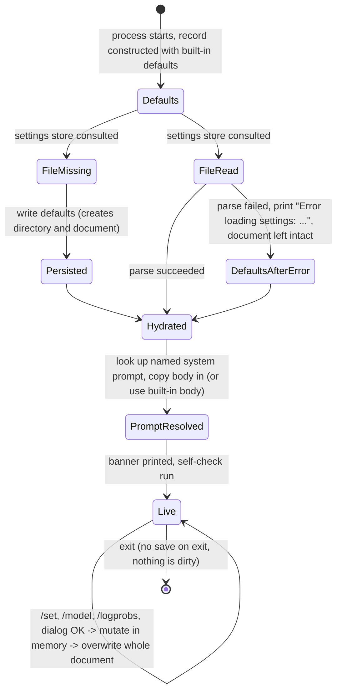

---

**Functional requirements**

*Settings record, defaults and persisted schema*

- **FR-2.1** — The product SHALL maintain exactly one settings record per running process, shared by reference between the shell, every command and every provider integration. Mutation is in place on that shared instance. (realizes US-2.3)
- **FR-2.2** — The settings record SHALL carry these fields with these built-in defaults: provider `azure`; model id/path `gpt-4`; temperature `0.7`; max tokens `1000`; Azure endpoint *unset*; AWS region `us-east-1`; system-prompt name `default`; token log probabilities enabled `false`; log-probability Top-K `5`; show-all-tokens `false`; grid layout for tokens `false`; grid-view maximum alternatives `5`; use-OS-credential-keystore `false`; local-model context size `4096`; local-model GPU layer count `0`; local-model GPU device *unset*; local-model thread count `0`; local-model batch size `512`; and three deprecated in-document secret slots (Azure key, AWS access key, AWS secret key), each defaulting to the empty string. (realizes US-2.1)
- **FR-2.3** — The settings record SHALL additionally carry a **system-prompt body** that is never persisted, and three **resolved credential values** that are never persisted and are recomputed on every read.
- **FR-2.4** — The persisted settings document SHALL be written with these exact wire names and no others:

  | Wire key | Value type | Default written on first run |
  |---|---|---|
  | `provider` | short string | `"azure"` |
  | `modelId` | string | `"gpt-4"` |
  | `temperature` | decimal | `0.7` |
  | `maxTokens` | integer | `1000` |
  | `azureEndpoint` | string or null | `null` |
  | `awsRegion` | string | `"us-east-1"` |
  | `systemPromptName` | string | `"default"` |
  | `enableLogProbabilities` | boolean | `false` |
  | `logProbabilitiesTopK` | integer | `5` |
  | `showAllTokens` | boolean | `false` |
  | `gridViewForTokens` | boolean | `false` |
  | `gridViewMaxAlternatives` | integer | `5` |
  | `useWindowsCredentialManager` | boolean | `false` |
  | `llamaContextSize` | integer | `4096` |
  | `llamaGpuLayerCount` | integer | `0` |
  | `llamaGpuDevice` | string or null | `null` |
  | `llamaThreads` | integer | `0` |
  | `llamaBatchSize` | integer | `512` |
  | `azureApiKey` | string | `""` |
  | `awsAccessKey` | string | `""` |
  | `awsSecretKey` | string | `""` |

  Exactly these 21 keys SHALL appear. The system-prompt body and the resolved credential values SHALL NOT appear. (realizes US-2.1)
- **FR-2.5** — The three deprecated secret keys SHALL always be emitted, as empty strings when unset. Every settings document this product writes therefore contains three secret-shaped keys.
- **FR-2.6** — The settings document SHALL be written indented and human-readable, because the document is an intended hand-edit surface. (realizes US-2.10)
- **FR-2.7** — Hand edits to the settings document SHALL be read back verbatim with no validation, normalisation or repair of any kind.

*Document location*

- **FR-2.8** — The settings-document path SHALL be resolved in this order: (1) a caller-supplied base directory used verbatim; (2) otherwise `<user profile directory>/.ChatDbg`; (3) if the resolved base directory is null, empty or whitespace, the operating system's temporary directory; (4) if resolving the user profile throws, the operating system's temporary directory. The file name defaults to `settings.json` and is overridable by the caller. (realizes US-2.1)
- **FR-2.9** — The default full path SHALL therefore be `<user profile>/.ChatDbg/settings.json`. The directory name SHALL be the literal `.ChatDbg`, used unchanged on every platform including inside a Windows user profile.
- **FR-2.10** — The parent directory SHALL be created lazily, on the first save.

*Startup load*

- **FR-2.11** — On every launch the shell SHALL request the persisted record before any other configuration work. (realizes US-2.1)
- **FR-2.12** — When the settings document does not exist, the product SHALL construct a defaults record, write it to disk immediately (creating the directory and the document), return it, and print nothing. (realizes US-2.11)
- **FR-2.13** — When the settings document exists and parses, the parsed record SHALL be returned. A parse producing nothing SHALL yield a defaults record silently.
- **FR-2.14** — When reading or parsing throws, the product SHALL print `Error loading settings: <message>`, return a defaults record, and leave the bad document on disk unmodified. It SHALL NOT delete, rename or back up the document. (realizes US-2.11)
- **FR-2.15** — When any of the three deprecated in-document secret slots is non-empty at load time, the product SHALL print a credentials-in-document warning followed by environment-variable migration instructions. When all three are empty, neither SHALL appear. (realizes US-2.9)
- **FR-2.16** — When the OS-keystore toggle is on at load time, the product SHALL print a confirmation line where the platform supports a keystore, or `Windows Credential Manager is enabled in settings but not available on this platform.` where it does not.
- **FR-2.17** — The load operation SHALL never return nothing; a caller always receives a fully populated record.

*Startup banner and self-check*

- **FR-2.18** — After loading, the plain-console shell SHALL print a banner containing the provider, the model, the system-prompt name and the **absolute path of the settings document**. This is the only place the user is told where the configuration lives. (realizes US-2.10)
- **FR-2.19** — When the active provider is `llama`, the banner SHALL add a block reporting context size, GPU layer count (suffixed ` (CPU-only)` when 0), GPU device(s) when set, thread count (rendered `default` when 0) and batch size. (realizes US-2.13)
- **FR-2.20** — When token log probabilities are enabled, the banner SHALL print one advisory line.
- **FR-2.21** — After the banner the product SHALL run a configuration self-check that prints: for an empty provider, `Warning: No AI provider configured.` plus `Use '/set provider azure', '/set provider bedrock', or '/set provider llama' to configure.`; for an unrecognised provider, `Warning: Unknown AI provider: <x>`; for a recognised-but-unconfigured provider, `Warning: <Provider name> service is not configured.` plus a provider-specific remediation block; for a configured provider, a one-line statement of where the credential came from, or, for the local provider, where the model file came from. (realizes US-2.8)
- **FR-2.22** — The startup ordering SHALL be: load settings → resolve system-prompt body → print banner → run self-check.

*Viewing settings*

- **FR-2.23** — `/set` with zero arguments SHALL return a success result whose message is a multi-section dump containing a `Current Settings:` section (Provider, Model ID, Temperature, Max Tokens, Azure Endpoint, AWS Region, System Prompt, Log Probabilities, Log Probabilities Top-K, Show All Tokens, Token Display, Grid View Max Alternatives, Windows Credential Manager), a `Credentials (secure):` section, a `LLama Provider Settings:` section, and the three static blocks `## Provider-Specific Information:`, `## Setup Commands:` and `## LLama Provider Commands:`. (realizes US-2.2)
- **FR-2.24** — In the dump, boolean-ish values SHALL render as: log probabilities `Enabled` / `Disabled`; show-all-tokens `Yes` / `No (sample only)`; token display `Grid Layout` / `List Layout`; keystore toggle `Enabled` / `Disabled`. An empty Azure endpoint SHALL render `(not set)`; a GPU layer count of 0 SHALL be suffixed ` (CPU-only)`; an unset GPU device SHALL render `(default)`; a thread count of 0 SHALL render `(system default)`.
- **FR-2.25** — The `Credentials (secure):` section SHALL show, for each of the Azure API key, AWS access key and AWS secret key, the masked status `***set***` or `(not set)` followed by the resolved source in square brackets, one of exactly: `[environment variable (<VARIABLE NAME>)]`, `[Windows Credential Manager]`, `[settings file (deprecated)]`, `[not set]`. **A secret value SHALL never be printed here.** (realizes US-2.9)
- **FR-2.26** — The dump SHALL be emitted as a single block; it SHALL NOT be paginated or truncated.
- **FR-2.27** — The `## Setup Commands:` block SHALL name `/prompt list (then: /set systemPrompt <n>)`, `/logprobs showall, /logprobs grid`, `/set gridViewMaxAlternatives 5`, `/set enablewincred (then /set wincred <type> <value>)`, `/set migrate` and `set CHATDBG_AZURE_API_KEY=your-key`. The `## LLama Provider Commands:` block SHALL name `/tokenize <text>`, `/inspect <text>`, `/set llamaGpuLayers 32, /set llamaGpuDevice 0`.
- **FR-2.28** — The long-form `/set` help SHALL be generated at call time and its keystore line SHALL read `enablewincred  - Enable Windows Credential Manager (Available on this platform)` or `… (Not available on this platform)` according to the running operating system.

*The `/set` write surface*

- **FR-2.29** — `/set` keys SHALL be matched case-insensitively; the key is lowercased before dispatch. (realizes US-2.3)
- **FR-2.30** — The value SHALL be everything after the key, re-joined with single spaces. Because the command line is split on spaces with empty entries discarded, runs of consecutive spaces inside a value collapse to one.
- **FR-2.31** — A `/set` invocation with fewer than two tokens SHALL be rejected with `Usage: /set <key> <value>`, **except** the valueless keys `migrate` and `enablewincred`, which are matched case-insensitively at this check. Zero tokens is handled first as "show settings".
- **FR-2.32** — Because of FR-2.31 and FR-2.30, there SHALL be no command that clears a text setting to empty; there is no reset, unset, clear or restore-defaults verb anywhere in the product. The only routes back to empty are the windowed dialog, hand-editing the document, or deleting the document.
- **FR-2.33** — On success the product SHALL, in this order: mutate the record in memory, overwrite the whole settings document, then return `Set <lowercased key> = <joined value>` with success. A failed validation SHALL short-circuit before any mutation or write. (realizes US-2.7)
- **FR-2.34** — Any exception inside `/set` SHALL be caught and returned as `Error setting <key>: <message>`.
- **FR-2.35** — The `/set` key table SHALL be exactly:

  | Key (and aliases) | Accepted value | Rule and magic numbers | Exact error message on violation |
  |---|---|---|---|
  | `provider` | `azure`, `bedrock`, `llama` | lowercased before comparison and stored lowercase; only the first value token is read | `Provider must be 'azure', 'bedrock', or 'llama'` |
  | `modelid` | any text | file-existence check **only** when the active provider is exactly `llama` and the value is non-empty | `LLama model file not found: <path>` + newline + `Make sure you've specified the correct path to a GGUF model file.` |
  | `temperature` | decimal | inclusive **0 … 2** (0 = focused, 2 = creative) | `Temperature must be a number between 0 and 2` |
  | `maxtokens` | integer | inclusive **1 … 8192** | `MaxTokens must be a number between 1 and 8192` |
  | `azureendpoint` | any text | **no validation**; not URL-checked, not trimmed | — |
  | `awsregion` | any text | **no validation**; any string is accepted | — |
  | `llamacontextsize` | integer | inclusive **512 … 32768** | `LlamaContextSize must be a number between 512 and 32768` |
  | `llamagpulayers`, `llamagpulayercount` | integer | inclusive **0 … 100**; 0 = CPU-only | `LlamaGpuLayerCount must be a number between 0 and 100. 0 means CPU-only, higher numbers move more layers to GPU.` |
  | `llamagpudevice` | any text | **no validation**; conventional format is `0` or `0,1` | — |
  | `llamathreads` | integer | inclusive **0 … 64**; 0 = system default | `LlamaThreads must be a number between 0 and 64. 0 means system default.` |
  | `llamabatchsize` | integer | inclusive **1 … 2048** | `LlamaBatchSize must be a number between 1 and 2048` |
  | `systemprompt` | prompt name | must resolve when the prompt service is present; body copied in and last-used stamped. With no prompt service, the name is stored unvalidated | `System prompt not found: <name>. Use '/prompt list' to see available prompts or '/prompt create <name>' to create a new one.` |
  | `enablelogprobabilities`, `logprobs` | `true` / `false` | case-insensitive `true`/`false` **only**; `1`, `0`, `yes`, `no` are rejected | `EnableLogProbabilities must be 'true' or 'false'` |
  | `logprobabilitiestopk`, `logtopk` | integer | inclusive **1 … 20** | `LogProbabilitiesTopK must be a number between 1 and 20` |
  | `showalltokens` | `true` / `false` | boolean parse | `showAllTokens must be 'true' or 'false'` |
  | `gridviewfortokens`, `tokensgrid` | `true` / `false` | boolean parse | `gridViewForTokens must be 'true' or 'false'` |
  | `gridviewmaxalternatives`, `gridmaxalt` | integer | inclusive **1 … 20** | `gridViewMaxAlternatives must be a number between 1 and 20` |
  | `usewindowscredentialmanager` | `true` / `false` | boolean parse; turning it on additionally requires an available keystore | `useWindowsCredentialManager must be 'true' or 'false'` / `Windows Credential Manager is not available on this platform.` |
  | `wincred <type> <value…>` | at least 3 tokens | requires the keystore toggle already on; delegates to Credential Management; does **not** save again | `Usage: /set wincred <credential-type> <value>` + `Example: /set wincred azureApiKey your-api-key` / a 3-line "not enabled" message naming `/set useWindowsCredentialManager true` and `/set enablewincred` / `Failed to store credential: <type>` |
  | `enablewincred` | no value | interactive enable flow; does not save again | `Failed to enable Windows Credential Manager integration.` |
  | `azureapikey` | — | **permanently blocked**; guide names `CHATDBG_AZURE_API_KEY` | see FR-2.41 |
  | `awsaccesskey` | — | blocked; guide names `CHATDBG_AWS_ACCESS_KEY`, `AWS_ACCESS_KEY_ID` | see FR-2.41 |
  | `awssecretkey` | — | blocked; guide names `CHATDBG_AWS_SECRET_KEY`, `AWS_SECRET_ACCESS_KEY` | see FR-2.41 |
  | `migrate` | no value | interactive migration flow; does not save again | reports success either way |
  | *anything else* | — | rejected | `Unknown setting: <key>. Valid keys: provider, modelId, temperature, maxTokens, azureEndpoint, awsRegion, systemPrompt, enableLogProbabilities, logProbabilitiesTopK, useWindowsCredentialManager, enablewincred, wincred, migrate` |

- **FR-2.36** — Every documented numeric range SHALL be **inclusive at both ends**: `0` and `2` are both valid temperatures; `1` and `8192` are both valid token caps; `1` and `20` are both valid Top-K and grid-alternatives values; `512` and `32768` are both valid context sizes; `0` and `100` are both valid GPU-layer counts; `0` and `64` are both valid thread counts; `1` and `2048` are both valid batch sizes. (realizes US-2.7)
- **FR-2.37** — Within the `wincred` key the pre-checks SHALL run in a fixed order: **token count first, keystore toggle second**. A two-token `/set wincred azureApiKey` therefore answers the usage message even when the toggle is off.
- **FR-2.38** — The three delegated keys `wincred`, `enablewincred` and `migrate` SHALL skip the trailing save, because the delegated operation has already persisted the record.
- **FR-2.39** — Every successful mutation through `/set`, `/model`, `/logprobs`, the windowed Settings dialog's OK button, the "toggle log probabilities for the last message" menu action, and system-prompt selection SHALL persist the whole record to disk immediately. There SHALL be no explicit save verb and no dirty tracking. (realizes US-2.1)
- **FR-2.40** — Saving SHALL always write the **entire** record; the document is never partially patched, never merged and never backed up.

*Secrets through this surface*

- **FR-2.41** — The three legacy secret keys SHALL be permanently unsettable through `/set`. The refusal SHALL be assembled as: `For security, <Credential Name> is no longer set via this command.`, a blank line, `## Secure Options:`, `1. Environment Variables (Recommended):`, one `   set <VARIABLE>=your-credential` line per applicable variable, then — only where a keystore exists — a `2. Windows Credential Manager (Secure Option):` block naming `/set enablewincred` and `/set wincred <type> your-credential`, then `This keeps your credentials secure and out of configuration files.` (realizes US-2.9)
- **FR-2.42** — Credential resolution SHALL be strictly ordered for each of the three secrets: **(1)** the first non-empty environment variable in that secret's ordered list; **(2)** the OS keystore entry, consulted **only** when the record's toggle is on, with any failure swallowed and treated as absent; **(3)** the deprecated in-document slot. (realizes US-2.9)
- **FR-2.43** — The environment-variable lists SHALL be, in priority order: Azure API key → `CHATDBG_AZURE_API_KEY`; AWS access key → `CHATDBG_AWS_ACCESS_KEY`, then `AWS_ACCESS_KEY_ID`; AWS secret key → `CHATDBG_AWS_SECRET_KEY`, then `AWS_SECRET_ACCESS_KEY`.
- **FR-2.44** — Credentials SHALL be resolved on **every read**, so an environment variable set after launch takes effect immediately without a restart. (Contrast FR-2.60.)
- **FR-2.45** — The OS-keystore entry names SHALL be `ChatDbg:AzureApiKey`, `ChatDbg:AwsAccessKey` and `ChatDbg:AwsSecretKey`, with the short aliases `azure`, `awsaccess` and `awssecret` also accepted as logical types.
- **FR-2.46** — The "where did this come from" reporter SHALL return exactly one of `environment variable (<VARIABLE NAME>)`, `Windows Credential Manager`, `settings file (deprecated)`, `not set`.
- **FR-2.47** — The record SHALL expose a predicate "does the document still hold any secret", true when any of the three deprecated slots is non-empty.

*The `/model` write surface*

- **FR-2.48** — `/model` with no arguments SHALL return `Current model: <model id>` and change nothing. (realizes US-2.4)
- **FR-2.49** — `/model <model id…>` SHALL join the arguments with single spaces, overwrite the model id **with no validation of any kind** — no file-existence check even when the local provider is active, no emptiness check — persist the whole record, and return `Changed model from '<old>' to '<new>'`. (realizes US-2.4; see QUIRK-2.1)

*The `/logprobs` write surface*

- **FR-2.50** — `/logprobs` SHALL provide a second, narrower write surface over five fields of the same record: the enable flag, Top-K, show-all-tokens, grid-vs-list layout, and grid-view maximum alternatives. Each mutating sub-command SHALL persist the whole record immediately. (realizes US-2.5)
- **FR-2.51** — The sub-command token SHALL be lowercased before dispatch, so `/LOGPROBS ENABLE` works.
- **FR-2.52** — The `/logprobs` sub-command table SHALL be exactly:

  | Sub-command | Effect | Exact success message |
  |---|---|---|
  | *(none)* | show status + usage | a `Token Probability Analysis Settings:` block reporting Enabled (`Yes`/`No`), Top-K Alternatives, Display Mode (`Show all tokens` / `Show token samples (beginning, middle, end)`), View Mode (`Grid layout` / `List layout`), Grid View Max Alternatives; then a 10-line usage list and a two-paragraph caveat ending `Azure OpenAI models may require specific API versions that support this feature.` |
  | `enable` | log probabilities on | `Token probability analysis enabled.` plus three advisory lines pointing at `/logprobs debug` and `/demologprobs` |
  | `disable` | log probabilities off | `Token probability analysis disabled.` |
  | `top <n>` | Top-K = n, inclusive **1 … 20** | `Token probability analysis will show top <n> alternatives.` |
  | `showall` | show every token | `Token probability analysis will show all tokens.` |
  | `showsample` | show sampled tokens only | `Token probability analysis will show token samples (beginning, middle, end).` |
  | `grid` | grid layout | `Token probability analysis will use grid view layout.` |
  | `list` | list layout | `Token probability analysis will use list view layout.` |
  | `gridmaxalt <n>` | grid alternatives cap = n, inclusive **1 … 20** | `Grid view will show up to <n> alternatives per token.` |
  | `debug` | read-only diagnostics dump | current configuration, active provider, active model id, Azure endpoint or `(not set)`, and a static troubleshooting checklist naming API version `2023-05-15 or newer` and suggested models `gpt-4`, `gpt-4-turbo`, `gpt-3.5-turbo` |

- **FR-2.53** — Numeric `/logprobs` sub-commands SHALL read **only the single token immediately after the sub-command**; they do not join the remaining tokens the way `/set` does, so `/logprobs top 7 8` uses `7` and silently ignores `8`.
- **FR-2.54** — `/logprobs` failure messages SHALL be exactly: missing number → `Please specify a number: /logprobs top <number>` or `Please specify a number: /logprobs gridmaxalt <number>`; bad or out-of-range → `Top-K value must be a number between 1 and 20` or `Grid max alternatives value must be a number between 1 and 20`; unknown sub-command → `Unknown subcommand: <x>. ` (with the trailing space) followed by a six-bullet list of valid options. (realizes US-2.7)
- **FR-2.55** — Any exception inside `/logprobs` SHALL yield `Error configuring log probabilities: <message>` and additionally write a copy to a debug channel invisible to the user.

*The windowed settings dialog*

- **FR-2.56** — The windowed shell SHALL provide a modal Settings dialog fixed at 80x25 character cells, opened from the Edit menu, with four tabs read on OK in the fixed order **AI Provider, Credentials, Log Probs, LLama Settings**, followed by exactly one save. (realizes US-2.6)
- **FR-2.57** — The tabs SHALL contain: **AI Provider** — a three-choice provider selector (`Azure OpenAI` / `AWS Bedrock` / `Local LLM (LLama)`) plus free-text Azure Endpoint, AWS Region, Model ID/Path, Temperature (labelled `(0.0 - 2.0)`) and Max Tokens; **Credentials** — a keystore toggle checkbox, a `Manage Credentials...` button opening a 60x15 sub-dialog with a free-text credential type, a masked value field and a hint listing `azureApiKey` / `awsAccessKey` / `awsSecretKey`, a `Migrate Credentials...` button opening a 70x18 sub-dialog, and a six-line static explanation of the three-tier credential story; **Log Probs** — an enable checkbox, a Top K field labelled `(1 - 20)`, a display-mode selector (`Show All Tokens` / `Show Samples`), a layout selector (`Grid View` / `List View`), and a Grid View Max Alternatives field labelled `(1 - 20)`; **LLama Settings** — Context Size `(512 - 32768)`, GPU Layer Count `(0 = CPU only)`, GPU Device(s) `(e.g., "0" or "0,1")`, Thread Count `(0 = system default)`, Batch Size `(1 - 2048)` plus an informational block.
- **FR-2.58** — The dialog SHALL **clamp** out-of-range numeric input to the nearest bound and save the clamped value, and SHALL **silently ignore** unparseable numeric input, leaving the prior value in place. Neither is reported to the user. This is a deliberate divergence from the text commands, which reject both. (realizes US-2.6, US-2.7)
- **FR-2.59** — The dialog SHALL expose no field for the system-prompt name and no field for the three deprecated in-document secret slots. Cancel SHALL write nothing. The two credential sub-dialogs SHALL act immediately on their own buttons and SHALL NOT be part of the parent OK/Cancel transaction. A parse failure in an earlier tab SHALL NOT stop later tabs from being read. On close the host window SHALL refresh a status bar reading `Provider: <p> | Model: <m> | Prompt: <n>`.

*System-prompt coupling*

- **FR-2.60** — The record SHALL carry both a persisted system-prompt **name** and a non-persisted system-prompt **body**. At every startup the body SHALL be re-resolved by looking the name up in System Prompt Management. (realizes US-2.12)
- **FR-2.61** — When the lookup returns nothing or throws, the built-in default body SHALL be used: `You are ChatDBG, a helpful debugging assistant. Help users analyze code, debug issues, and understand programming concepts.` A dangling prompt name SHALL degrade silently at startup but SHALL be a validation failure at `/set systemPrompt` time.

*Consumer semantics*

- **FR-2.62** — Provider names SHALL be stored lowercase by every write surface, but matched **case-sensitively** at use sites. A hand-edited document containing `Azure` SHALL therefore fail the provider lookup and produce `Warning: Unknown AI provider: Azure` at startup and `Error: Unknown AI provider: Azure` on a chat turn.
- **FR-2.63** — The Azure provider SHALL report itself configured only when the endpoint, the resolved API key **and** the model id are all non-empty.
- **FR-2.64** — The Bedrock provider SHALL report itself configured when the model id is non-empty **and** either the resolved AWS access key or the `AWS_ACCESS_KEY_ID` environment variable is non-empty. The AWS **secret** key is not part of this predicate.
- **FR-2.65** — The local-model provider SHALL report itself configured when the model id is non-empty **and** the named file exists on disk at the moment of the check. Because the check is re-evaluated on every use, deleting the model file mid-session silently flips the provider to unconfigured.
- **FR-2.66** — Consumers SHALL apply these defensive re-defaults, which are observed behaviour and not necessarily intended: the local-model context size falls back to `4096` in one path and `2048` in the model-loading path when the record's value is not greater than 0 (**these two fallbacks disagree**); the local-model max-token cap falls back to `512` when the record's value is not greater than 0.
- **FR-2.67** — The Bedrock path SHALL send Top-K only when token log probabilities are enabled and otherwise send the literal `0`; it SHALL always send the max-token cap and the temperature.
- **FR-2.68** — The Azure path SHALL send temperature on every turn but SHALL send the max-token cap **only** on the log-probabilities request path. (See QUIRK-2.32.)
- **FR-2.69** — The Azure path SHALL trim exactly one trailing `/` from the endpoint before building its request URL, so `https://host/` and `https://host` behave identically. No other endpoint normalisation SHALL occur.
- **FR-2.70** — Local-model context size and GPU layer count SHALL reach the local model runtime. GPU device, thread count and batch size SHALL be validated, clamped, persisted and displayed but SHALL NOT reach the runtime (observed behaviour — see QUIRK-2.6). (relates to US-2.13)

*Persistence port*

- **FR-2.71** — Persistence SHALL be reached through exactly six operations and no more: **persist the record** (record in, nothing out; never throws, swallows its own failures after printing); **load the record** (nothing in, record out; never returns nothing; creates a defaults document when none exists; falls back to defaults on any failure); **report the document path** (pure, fixed at construction); **store one credential in the OS keystore** (logical type plus value in, success flag out; re-loads the record from disk and turns the keystore toggle on as a side effect); **run the interactive keystore-enable flow** (record in, enabled flag out; reads standard input; saves the record itself); **run the interactive credential-migration flow** (record in, *were the in-document slots cleared* out; reads standard input; saves the record itself).
- **FR-2.72** — The last three operations perform their own save **and** their own terminal input/output, which is why the three delegated `/set` keys skip their trailing save. A reimplementation targeting a windowed or headless host SHALL replace the direct standard-input reads with an injectable prompt/confirm port, because these prompts are invisible and unanswerable while a windowed shell owns the screen.
- **FR-2.73** — Save failures SHALL print `Error saving settings: <message>` and return normally; the calling command still reports success. (Observed behaviour — see QUIRK-2.5.)

*Scope boundaries*

- **FR-2.74** — Neither entry point SHALL parse command-line flags or arguments. Settings come only from the document or from the runtime commands.
- **FR-2.75** — There SHALL be no environment-variable override for any **non-secret** setting. Environment variables affect credentials only.
- **FR-2.76** — There SHALL be no profiles, no per-workspace settings, no configuration-file layering and no runtime configuration-path override.
- **FR-2.77** — There SHALL be no authorisation model. The only permission-like check anywhere in this feature is the platform check gating the OS keystore.
- **FR-2.78** — The settings record SHALL never be deleted. There is no reset command and no restore-defaults path; the only route back to defaults is deleting the document out of band.

*Concurrency, caching and localisation*

- **FR-2.79** — The record SHALL be read from disk exactly once per process, at startup, and held in memory thereafter. There SHALL be no re-read on external change, no document watching and no cache invalidation.
- **FR-2.80** — Writes SHALL be whole-document overwrites with no locking and no atomic replace. Two shells open simultaneously each overwrite the whole document on any change; last writer wins and the other's edits are silently lost. (INFERRED — follows from the absence of any lock or temp-file-and-rename; not reproduced.)
- **FR-2.81** — All user-visible strings SHALL be English; there is no localisation. Numeric parsing and formatting in the source is ambient-culture-sensitive; **a reimplementation SHOULD parse and format both the persisted document and all command input with a fixed invariant culture and record that as an intentional deviation** (see QUIRK-2.15).
- **FR-2.82** — All diagnostics SHALL go to standard output as plain text. There is no structured logging, no log level and no way to silence the startup notices.
- **FR-2.83** — The settings store SHALL accept an optional base directory and file name at construction purely so that automated tests can point it at a scratch directory.

*Platform coupling*

- **FR-2.84** — Exactly one part of this feature SHALL be operating-system specific: the OS credential keystore tier. Everything else — the record, its defaults and ranges, the document location and format, every validation rule and message, the dialog's clamping, and the environment-variable tier — SHALL behave identically on all platforms.
- **FR-2.85** — Where no keystore exists: `/set useWindowsCredentialManager true` SHALL be refused with `Windows Credential Manager is not available on this platform.`; `/set wincred` SHALL answer `Failed to store credential: <type>`; `/set enablewincred` SHALL answer `Failed to enable Windows Credential Manager integration.`; migration option 2 SHALL be refused and the whole migration returns "not cleared" without offering to clear the document; credential resolution tier 2 SHALL be skipped entirely; the long help and blocked-secret guide SHALL suppress or relabel the keystore paragraph.
- **FR-2.86** — The keystore toggle SHALL be an ordinary persisted boolean with no platform stamp, so a document written where a keystore exists and copied to a platform without one carries the toggle and produces the startup warning of FR-2.16 on every launch until it is turned off.

---

**External technology**

*Requires: structured-document serialisation for a small flat configuration record (a text-based, hand-editable key/value document format with indentation preserved). Source used: the platform standard library's JSON serializer, with an explicit lower-camel wire name declared on every persisted member and opt-out markers on computed and secret-derived members; indented output. Reimplementer notes: any equivalent library is acceptable, but the exact 21 wire names in FR-2.4 must survive so existing documents keep loading, indented output is a user-visible requirement because the document is an intended hand-edit surface, and the three empty secret keys must still be emitted. A camel-case naming policy is also configured in the source but is inert because every member already declares an explicit name.*

*Requires: local filesystem read and write of a single small text file, with directory auto-creation (POSIX / Win32 file APIs). Source used: whole-file asynchronous read and whole-file overwrite, directory created on first save. Reimplementer notes: there is no locking, no atomic replace and no temp-file-and-rename. "Last writer wins" is the observed contract; a reimplementation may improve on it but must not depend on the improvement for correctness elsewhere.*

*Requires: user home / profile directory discovery (OS convention). Source used: the platform's "user profile" special-folder lookup with an operating-system temporary-directory fallback. Reimplementer notes: the product's own directory name is the literal `.ChatDbg` — a dotted directory used verbatim inside a Windows user profile as well as on Unix-likes, so the convention ports unchanged.*

*Requires: operating-system temporary-directory discovery (OS convention). Source used: platform temp-path lookup. Reimplementer notes: used only as a degraded fallback when the profile directory is null, empty, whitespace or throws.*

*Requires: process environment variable reading. Source used: environment lookups by fixed name. Reimplementer notes: the names `CHATDBG_AZURE_API_KEY`, `CHATDBG_AWS_ACCESS_KEY`, `AWS_ACCESS_KEY_ID`, `CHATDBG_AWS_SECRET_KEY` and `AWS_SECRET_ACCESS_KEY` are part of the contract. They are read on every access, so a variable set after launch takes effect immediately.*

*Requires: operating-system platform detection ("is this the platform with the native credential store"). Source used: a runtime "is Windows" check. Reimplementer notes: this gates the keystore toggle, the help text and the startup notices. On other platforms substitute the local secret store and preserve the three-tier ordering of FR-2.42.*

*Requires: an operating-system secret store keyed by named entries (Win32 Credential Manager, DPAPI-backed, entries named `ChatDbg:*`). Source used: the native credential API reached through platform invocation, owned by Credential Management. Reimplementer notes: out of scope here beyond the toggle; substitute the platform keychain or secret service and keep or one-for-one map the entry names `ChatDbg:AzureApiKey`, `ChatDbg:AwsAccessKey`, `ChatDbg:AwsSecretKey`.*

*Requires: interactive terminal input for yes/no and numbered-choice confirmations. Source used: blocking line reads on standard input performed inside the settings service itself. Reimplementer notes: this must be refactored into an injectable prompt/confirm port — as written, these prompts are invisible and unanswerable from a windowed or headless host.*

*Requires: a windowed terminal UI toolkit supplying tabs, radio groups, text fields, checkboxes, modal dialogs and message boxes. Source used: a terminal-UI widget library; the settings dialog is a fixed 80x25 modal with four tabs. Reimplementer notes: only the windowed shell depends on this; the plain-console shell needs nothing beyond standard input and output.*

*Requires: rich console rendering (rules, tables, colour markup) over ANSI escape sequences. Source used: a console-styling library used by the token-log-probability display these settings drive. Reimplementer notes: not required by this feature itself; listed because these settings configure it.*

*Requires: locale-aware number parsing and formatting. Source used: ambient-culture parse and format for temperature and every integer, with no invariant-culture overload anywhere. Reimplementer notes: choose invariant culture for both the persisted document and all command input, and record that as an intentional deviation — otherwise a document written under one locale can fail to load under another.*

*Requires: build-time globalization mode configuration. Source used: invariant globalization forced on **only** in the `Compact` and `SingleFile` build configurations, not in ordinary builds. Reimplementer notes: this is why the same command can accept `0.7` in one binary and reject it in another. Packaging choices must never change input validation.*

*Requires: trimmed / ahead-of-time packaging. Source used: the `Compact` and `SingleFile` configurations strip framework resource strings, so platform exception text degrades to bare resource keys. Reimplementer notes: carry your own diagnostic text rather than interpolating the runtime's exception messages into user-facing errors.*

*Requires: a substitutable persistence port for automated testing. Source used: the persistence contract is an interface, so command tests substitute a recording double and assert save counts without touching disk. Reimplementer notes: keep persistence behind the narrow six-operation port of FR-2.71 so "saved exactly once" assertions remain expressible.*

*(Anti-pattern, recorded for avoidance: the source's windowed dialog stashes its field widgets in an untyped per-tab property bag and retrieves them by property name at save time via reflection. A reimplementer should hold typed references instead; the source's approach turns a renamed field into a runtime failure surfacing as `Failed to save settings: <message>`.)*

---

**Acceptance criteria**

- **AC-2.1** — **Given** no settings document exists at `<user profile>/.ChatDbg/settings.json`, **when** the application starts, **then** the directory and the document are created, and the running session reports provider `azure`, model `gpt-4`, temperature `0.7`, max tokens `1000`, AWS region `us-east-1`, system prompt `default`, log probabilities off, Top-K `5`, context size `4096`, GPU layers `0`, threads `0`, batch size `512`.
- **AC-2.2** — **Given** a first run with no settings document, **when** the application starts and exits without the user typing anything, **then** the document exists, is indented rather than minified, and contains exactly these 21 keys and values: `provider: "azure"`, `modelId: "gpt-4"`, `temperature: 0.7`, `maxTokens: 1000`, `azureEndpoint: null`, `awsRegion: "us-east-1"`, `systemPromptName: "default"`, `enableLogProbabilities: false`, `logProbabilitiesTopK: 5`, `showAllTokens: false`, `gridViewForTokens: false`, `gridViewMaxAlternatives: 5`, `useWindowsCredentialManager: false`, `llamaContextSize: 4096`, `llamaGpuLayerCount: 0`, `llamaGpuDevice: null`, `llamaThreads: 0`, `llamaBatchSize: 512`, `azureApiKey: ""`, `awsAccessKey: ""`, `awsSecretKey: ""`; **and** no key named for the system-prompt body or for any resolved credential appears.
- **AC-2.3** — **Given** a settings store configured with the explicit base directory `/tmp/qa-chatdbg`, **when** a record carrying provider `bedrock` is saved and then loaded, **then** the loaded record reports provider `bedrock` and the reported document path starts with `/tmp/qa-chatdbg` (compared case-insensitively).
- **AC-2.4** — **Given** a defaults record whose deprecated in-document Azure slot holds `hunter2` and with no credential environment variables set, **when** the user runs `/set` with no arguments, **then** the command succeeds and the output contains, verbatim, the lines `Current Settings:`, `- Provider: azure`, `- Model ID: gpt-4`, `- Temperature: 0.7`, `- Max Tokens: 1000`, `- Azure Endpoint: (not set)`, `- AWS Region: us-east-1`, `- System Prompt: default`, `- Log Probabilities: Disabled`, `- Log Probabilities Top-K: 5`, `- Show All Tokens: No (sample only)`, `- Token Display: List Layout`, `- Grid View Max Alternatives: 5`, `- Windows Credential Manager: Disabled`, `- Azure API Key: ***set*** [settings file (deprecated)]`, `- AWS Access Key: (not set) [not set]`, `- Context Size: 4096`, `- GPU Layer Count: 0 (CPU-only)`, `- GPU Device: (default)`, `- Threads: (system default)`, `- Batch Size: 512`; **and** the string `hunter2` appears nowhere in the output.
- **AC-2.5** — **Given** any state, **when** the user runs `/set provider bedrock`, **then** the command succeeds, the in-memory provider becomes `bedrock`, and the record is persisted **exactly once**.
- **AC-2.6** — **Given** any state, **when** the user runs `/set provider invalid`, **then** the command fails with exactly `Provider must be 'azure', 'bedrock', or 'llama'`, the provider is unchanged, and nothing is written.
- **AC-2.7** — **Given** provider `azure`, **when** the user runs `/set PROVIDER azure`, **then** the reply is `Set provider = azure`; **and when** the user runs `/set provider AZURE`, **then** the stored value is `azure` but the reply is `Set provider = AZURE`.
- **AC-2.8** — **Given** any state, **when** the user runs `/set provider azure and then some`, **then** the command succeeds, the stored provider is `azure`, and the reply is `Set provider = azure and then some`.
- **AC-2.9** — **Given** any state, **when** the user supplies each boundary value `/set temperature 0`, `/set temperature 2`, `/set maxTokens 1`, `/set maxTokens 8192`, `/set logProbabilitiesTopK 1`, `/set logProbabilitiesTopK 20`, `/set llamaContextSize 512`, `/set llamaContextSize 32768`, `/set llamaGpuLayers 0`, `/set llamaGpuLayers 100`, `/set llamaThreads 0`, `/set llamaThreads 64`, `/set llamaBatchSize 1`, `/set llamaBatchSize 2048`, **then** every one is accepted and persisted; **and when** the one-step-outside values `-0.1`, `2.1`, `0`, `8193`, `0`, `21`, `511`, `32769`, `-1`, `101`, `-1`, `65`, `0`, `2049` are supplied to the same keys in the same order, **then** every one is rejected with its range-specific message and nothing is mutated or written.
- **AC-2.10** — **Given** any state, **when** the user runs `/set enableLogProbabilities yes`, **then** the command fails with exactly `EnableLogProbabilities must be 'true' or 'false'`; **and when** the user runs `/set enableLogProbabilities TRUE`, **then** it succeeds.
- **AC-2.11** — **Given** the active provider is `llama`, **when** the user runs `/set modelId /no/such/model.gguf`, **then** the command fails with `LLama model file not found: /no/such/model.gguf` followed by `Make sure you've specified the correct path to a GGUF model file.` and the model id is unchanged; **and given** the active provider is `azure`, **when** the same command runs, **then** it succeeds with no file check.
- **AC-2.12** — **Given** the active provider is `llama` and the file `/no/such/model.gguf` does not exist, **when** the user runs `/model /no/such/model.gguf`, **then** the command succeeds with `Changed model from 'gpt-4' to '/no/such/model.gguf'` and persists the record exactly once — no file check occurs.
- **AC-2.13** — **Given** the model is `old`, **when** the user runs `/model new-model`, **then** the reply is `Changed model from 'old' to 'new-model'`, the model id becomes `new-model` and the record is persisted exactly once; **and when** `/model` is then run with no arguments, **then** the reply is `Current model: new-model` and nothing is persisted.
- **AC-2.14** — **Given** any state, **when** the user runs `/set azureApiKey x`, `/set AZUREAPIKEY x` or `/set AzureApiKey x`, **then** each fails, no value is stored anywhere, and the message names `CHATDBG_AZURE_API_KEY`; **and** `/set awsAccessKey x` names both `CHATDBG_AWS_ACCESS_KEY` and `AWS_ACCESS_KEY_ID`; **and** `/set awsSecretKey x` names both `CHATDBG_AWS_SECRET_KEY` and `AWS_SECRET_ACCESS_KEY`.
- **AC-2.15** — **Given** the environment variable `CHATDBG_AZURE_API_KEY` is set to `from-env` **and** the deprecated in-document Azure slot holds `from-json`, **when** the resolved Azure credential is read, **then** it is `from-env`; **and given** only the in-document slot is populated, **then** the resolved value is `from-json` and the reported source is `settings file (deprecated)`; **and given** `CHATDBG_AWS_ACCESS_KEY` is set, **then** the reported source string contains `environment variable`.
- **AC-2.16** — **Given** the keystore toggle is off, **when** the user runs `/set wincred azureApiKey somevalue`, **then** the command fails, the credential-storage delegate is **never** invoked, and the message names both `/set useWindowsCredentialManager true` and `/set enablewincred`.
- **AC-2.17** — **Given** the keystore toggle is off, **when** the user runs `/set wincred azureApiKey` (two tokens), **then** the reply is `Usage: /set wincred <credential-type> <value>` followed by `Example: /set wincred azureApiKey your-api-key` — the token-count check fires before the toggle check.
- **AC-2.18** — **Given** any state, **when** the user runs `/set migrate`, **then** the migration delegate is invoked exactly once and the command reports success either way: `Migration completed successfully.` when the in-document slots were cleared, `No credentials found to migrate or migration cancelled.` when they were not.
- **AC-2.19** — **Given** the deprecated Azure slot holds `hunter2` and the platform has an OS keystore, **when** the user runs `/set migrate`, chooses option `2`, and then answers `n` to `Would you like to remove credentials from the settings file now? (y/N): `, **then** the secret has been copied into the keystore entry `ChatDbg:AzureApiKey`, the keystore toggle is on, **and** the command nevertheless replies `No credentials found to migrate or migration cancelled.`
- **AC-2.20** — **Given** the deprecated Azure slot holds `hunter2`, **when** the user runs `/set migrate` and presses Enter at the option prompt without typing anything, **then** `Migration cancelled.` is printed, the slot still holds `hunter2`, and the command replies `No credentials found to migrate or migration cancelled.`
- **AC-2.21** — **Given** any of the three deprecated in-document secret slots is non-empty, **when** the settings are loaded, **then** a credentials-in-document warning is printed and environment-variable migration instructions follow; **and given** all three are empty, **then** neither appears.
- **AC-2.22** — **Given** a record with log probabilities off, **when** `/logprobs` is run with no arguments, **then** it succeeds and the output contains `Token Probability Analysis Settings` and reports `- Enabled: No`, `- Top-K Alternatives: 5`, `- Display Mode: Show token samples (beginning, middle, end)`, `- View Mode: List layout`, `- Grid View Max Alternatives: 5`; **and when** `/logprobs enable` is run, **then** it succeeds and the record is persisted exactly once; **and when** `/logprobs unknown` is run, **then** it fails with a message beginning `Unknown subcommand: unknown. `.
- **AC-2.23** — **Given** a defaults record, **when** `/logprobs enable`, `/logprobs top 7`, `/logprobs showall`, `/logprobs grid` and `/logprobs gridmaxalt 3` are run in sequence, **then** each succeeds with its documented message and persists the record exactly once, and a subsequent `/logprobs` with no arguments reports `- Enabled: Yes`, `- Top-K Alternatives: 7`, `- Display Mode: Show all tokens`, `- View Mode: Grid layout`, `- Grid View Max Alternatives: 3`.
- **AC-2.24** — **Given** any state, **when** `/logprobs top 0` and `/logprobs top 21` are run, **then** each fails with exactly `Top-K value must be a number between 1 and 20`; **and when** `/logprobs gridmaxalt 0` and `/logprobs gridmaxalt 21` are run, **then** each fails with exactly `Grid max alternatives value must be a number between 1 and 20`; **and when** `/logprobs top` and `/logprobs gridmaxalt` are run with no number, **then** they fail with `Please specify a number: /logprobs top <number>` and `Please specify a number: /logprobs gridmaxalt <number>` respectively. In every failing case nothing is mutated and nothing is written.
- **AC-2.25** — **Given** Top-K is `5`, **when** the user runs `/logprobs top 7 8`, **then** Top-K becomes `7`, the reply is `Token probability analysis will show top 7 alternatives.` and no error mentions the ignored `8`.
- **AC-2.26** — **Given** any state, **when** the user runs `/LOGPROBS ENABLE`, **then** it behaves identically to `/logprobs enable`.
- **AC-2.27** — **Given** any state, **when** the user runs `/set logProbabilitiesTopK 0`, **then** the message is exactly `LogProbabilitiesTopK must be a number between 1 and 20`; **and when** the user runs `/logprobs top 0`, **then** the message is exactly `Top-K value must be a number between 1 and 20` — the two surfaces word the same bound differently.
- **AC-2.28** — **Given** any state, **when** the user runs `/set azureEndpoint` (key with no value), **then** the reply is `Usage: /set <key> <value>` and the endpoint retains its previous value; **and** no command anywhere in the product can set it back to empty.
- **AC-2.29** — **Given** the Azure endpoint is `https://a.example.com`, **when** the user runs `/set azureEndpoint    https://b.example.com   spaced   value`, **then** the stored endpoint is exactly `https://b.example.com spaced value` — consecutive spaces collapse to one.
- **AC-2.30** — **Given** any state, **when** the user runs `/set bogusKey 1`, **then** the reply is exactly `Unknown setting: boguskey. Valid keys: provider, modelId, temperature, maxTokens, azureEndpoint, awsRegion, systemPrompt, enableLogProbabilities, logProbabilitiesTopK, useWindowsCredentialManager, enablewincred, wincred, migrate` and nothing is written.
- **AC-2.31** — **Given** a fresh record, **when** the Azure provider is asked whether it is configured, **then** the answer is no; **and given** endpoint `https://example.openai.azure.com`, an Azure key resolvable from any tier and model id `model`, **then** the answer is yes. **Given** a fresh record, **when** the Bedrock provider is asked, **then** the answer is no because the model id is empty. **Given** a model id naming a path that does not exist, **when** the local provider is asked, **then** the answer is no; **and given** the path names a file that exists — even a zero-byte one — **then** the answer is yes; **and when** a chat turn is attempted against an unconfigured local provider, **then** the turn fails rather than silently returning.
- **AC-2.32** — **Given** the Azure endpoint is stored as `https://host/`, **when** a request is built, **then** it targets the same URL as an endpoint stored as `https://host`.
- **AC-2.33** — **Given** the windowed Settings dialog is open, **when** the user types `5` into Temperature, `99999` into Max Tokens, `0` into Top-K, `abc` into Grid View Max Alternatives, `1` into Context Size, `500` into GPU Layer Count, `-3` into Thread Count and `9999` into Batch Size and presses OK, **then** the record is saved once with temperature `2`, max tokens `8192`, Top-K `1`, grid max alternatives **unchanged at its prior value**, context size `512`, GPU layer count `100`, thread count `0` and batch size `2048` — every one applied silently with no error and no message. (Contrast AC-2.9, where the text commands reject all of these.)
- **AC-2.34** — **Given** the windowed Settings dialog is open on a record whose provider is `azure`, **when** the user selects `Local LLM (LLama)` in the provider selector and then presses **Cancel**, **then** no document write occurs **but** the running session's provider is already `llama`, so the next chat turn uses the local provider while the document still says `azure`.
- **AC-2.35** — **Given** the running shell is the windowed one, **when** the user types `/set temperature 1.9` into the chat box, **then** the command replies `Set temperature = 1.9`, the status bar and the next chat turn are unaffected, and the settings document on disk is replaced by a record carrying built-in defaults for every field the user had previously customised.
- **AC-2.36** — **Given** a settings document containing `"provider": "Azure"` hand-edited in, **when** the plain-console shell starts, **then** the banner prints `Provider: Azure` and the self-check prints `Warning: Unknown AI provider: Azure`; **and when** the user then sends a chat message, **then** `Error: Unknown AI provider: Azure` is printed and the turn is dropped.
- **AC-2.37** — **Given** a settings document in which `showAllTokens`, `gridViewForTokens` and `gridViewMaxAlternatives` were persisted as `true`, `true` and `3`, **when** the plain-console shell starts, **then** the running session reports show-all off, list layout and `5` alternatives — the three values are not restored — while the windowed shell started against the same document reports `true`, `true` and `3`.
- **AC-2.38** — **Given** the settings document cannot be written because its directory is read-only, **when** the user runs `/set temperature 1.5`, **then** `Error saving settings: <message>` is printed to standard output **and** the command still returns success with `Set temperature = 1.5`; in the windowed shell that console line is not visible anywhere.
- **AC-2.39** — **Given** the settings document contains malformed content, **when** the application starts, **then** `Error loading settings: <message>` is printed, the session runs on built-in defaults, and the malformed document is still byte-identical on disk until the first successful save.
- **AC-2.40** — **Given** a settings document naming a system prompt `nonexistent`, **when** the plain-console shell starts, **then** no error is shown and the session uses the body `You are ChatDBG, a helpful debugging assistant. Help users analyze code, debug issues, and understand programming concepts.`; **and when** the user then runs `/set systemPrompt nonexistent` with the prompt service present, **then** it fails with `System prompt not found: nonexistent. Use '/prompt list' to see available prompts or '/prompt create <name>' to create a new one.`
- **AC-2.41** — **Given** provider `azure`, a resolvable Azure key, an endpoint, max tokens `50` and log probabilities **off**, **when** the user sends a chat message, **then** the outbound request carries the temperature but **no** max-token cap, so the reply may exceed 50 tokens; **and given** the same state with log probabilities **on**, **then** the outbound request carries a max-token cap of `50` and the reply is capped.
- **AC-2.42** — **Given** provider `azure` and log probabilities on, **when** the user follows the `/logprobs debug` advice to use "a recent API version (2023-05-15 or newer)", **then** there is no setting, environment variable or document key that changes it — every request goes to the hard-coded API version `2023-12-01-preview`.
- **AC-2.43** — **Given** no OS keystore exists on the platform, **when** the user runs `/set useWindowsCredentialManager true`, **then** the reply is exactly `Windows Credential Manager is not available on this platform.`; **and when** the windowed Settings dialog's Credentials tab checkbox is ticked and OK pressed on the same platform, **then** the toggle is persisted as on and the next launch prints `Windows Credential Manager is enabled in settings but not available on this platform.`

---

**Quirks**

- **QUIRK-2.1**: `/model <anything>` accepts empty-ish input and never checks that a local model file exists, while `/set modelId` performs that check when the local provider is active. Both write the same field and both persist. Evidence: `Commands/ModelCommand.cs:28-34` vs `Commands/SetCommand.cs:55-68`. Keep-or-fix decision deferred to Open Questions.
- **QUIRK-2.2**: The plain-console shell never restores three persisted display settings — show-all-tokens, grid layout and grid max alternatives are written to disk but omitted from the console shell's field-by-field hydration, so every console session starts with list layout, samples-only and 5 alternatives regardless of the document. The windowed shell is unaffected because it adopts the loaded record wholesale. Evidence: `ChatDbg/ChatShell.cs:130-151` (compare the full field list in `Models/ChatSettings.cs`). Keep-or-fix decision deferred to Open Questions.
- **QUIRK-2.3**: In the windowed Settings dialog, changing the provider selection takes effect even if the user presses Cancel; Cancel only skips the disk write, so the session runs on the new provider while the document still names the old one. Evidence: `ChatDbg.Shell.Gui/UI/SettingsDialog.cs:139-153`, `:59-64`. Keep-or-fix decision deferred to Open Questions.
- **QUIRK-2.4**: In the windowed shell the text commands and the UI operate on two different records. A defaults record is constructed first and every command object is built against that instance; only afterwards is the loaded record assigned over the same local name and handed to the window. So `/set`, `/model`, `/logprobs` and `/prompt use` typed in the windowed shell mutate and persist an object the window, the status bar and the chat turns never read — and each such command overwrites the settings document with mostly-default values, silently discarding whatever was loaded. Evidence: `ChatDbg.Shell.Gui/Program.cs:14`, `:37-41`, `:58`, `:79-81`. Keep-or-fix decision deferred to Open Questions.
- **QUIRK-2.5**: A failed save still reports success. The save operation catches its own exceptions, prints `Error saving settings: <message>` and returns normally; the command then returns `Set <key> = <value>` with a success flag. In the windowed shell that console line is invisible. Evidence: `Services/SettingsService.cs:100-103` with `Commands/SetCommand.cs:284-289`. Keep-or-fix decision deferred to Open Questions.
- **QUIRK-2.6**: Three persisted local-model tunables — GPU device, thread count and batch size — are settable, validated, clamped, persisted and displayed, but no code path feeds them to the local model runtime. Only context size and GPU layer count reach it. The product's own documentation describes all five as working. Evidence: `Services/LLamaSharpService.cs:550-551` is the only consumption site; README lines 87-91 and 138-159 claim otherwise. Keep-or-fix decision deferred to Open Questions.
- **QUIRK-2.7**: The "unknown setting" error lists only 13 of the roughly 26 accepted keys. Missing: show-all-tokens, grid layout, grid max alternatives, all five local-model keys, and every short alias. The long-form help does list them. Evidence: `Commands/SetCommand.cs:279-280` vs `:303-375`. Keep-or-fix decision deferred to Open Questions.
- **QUIRK-2.8**: Dead find-and-replace in the settings dump. Where no keystore exists, the dump text is post-processed to replace a sentence that does not exist anywhere in the text being processed; the substitution is always a no-op. Evidence: `Commands/SetCommand.cs:451-455`. Keep-or-fix decision deferred to Open Questions.
- **QUIRK-2.9**: The startup migration instructions echo the plaintext secrets to the console — for any secret still stored in the document, a line of the form `set CHATDBG_AZURE_API_KEY=<the actual key>` is printed. Evidence: `Services/SettingsService.cs:332-347`, reached from `:60-64`. Keep-or-fix decision deferred to Open Questions.
- **QUIRK-2.10**: `/set wincred` persists the on-disk record, not the live one. The delegate re-loads the record from disk, flips the keystore toggle on that fresh copy and saves it, so any in-memory-only differences in the live record are not what gets written. Evidence: `Services/SettingsService.cs:155`, `:176-178`. Keep-or-fix decision deferred to Open Questions.
- **QUIRK-2.11**: Storing a credential silently turns the keystore toggle on, even though the command that reaches it already refuses to run unless the toggle was on. Evidence: `Services/SettingsService.cs:176-178`. Keep-or-fix decision deferred to Open Questions.
- **QUIRK-2.12**: Mojibake in user-facing strings. The settings-service console messages contain literal ASCII `?` / `??` where emoji were intended (verified at the byte level: `Services/SettingsService.cs:62` begins `"??  WARNING:"`), and the `/set` help text is stored in a non-UTF-8 encoding whose bullet character is a lone `0x95` byte. Evidence: `Services/SettingsService.cs:62`, `Commands/SetCommand.cs:308`. Keep-or-fix decision deferred to Open Questions.
- **QUIRK-2.13**: An entire duplicated shell component in the windowed project is dead code. It carries its own settings-hydration routine that omits even more fields than the console shell's (dropping the five local-model tunables on top of the three display settings of QUIRK-2.2), and nothing ever constructs it. Evidence: `ChatDbg.Shell.Gui/ChatShell.cs:14`, `:123-152`; no construction site exists anywhere in `src/ChatDbg.Shell.Gui/`. Keep-or-fix decision deferred to Open Questions.
- **QUIRK-2.14**: The product documentation's "General Settings" list omits show-all-tokens, grid layout and grid max alternatives even though they are persisted fields with documented command surfaces elsewhere in the same document. Evidence: README lines 95-111 vs 226-254. Keep-or-fix decision deferred to Open Questions.
- **QUIRK-2.15**: Decimal parsing is culture-sensitive, and only in some builds. Temperature is parsed and every number formatted with the process's ambient culture, with no invariant-culture overload anywhere; but both shell projects force invariant globalization **only** under the `Compact` and `SingleFile` build configurations. The same command therefore behaves differently depending on which binary the user runs: on a comma-decimal locale, `/set temperature 0.7` is rejected by an ordinary build and accepted by the shipped compact binary, and a document written by one may not re-parse in the other. Evidence: `Commands/SetCommand.cs:72`, `ChatDbg.Shell.Gui/UI/SettingsDialog.cs:420-422`, `:121`; `src/ChatDbg/Xcaciv.ChatDbg.Shell.csproj:23`, `:52`, `:63`, `:95`; `src/ChatDbg.Shell.Gui/Xcaciv.ChatDbg.Shell.Gui.csproj:52`, `:95`. Keep-or-fix decision deferred to Open Questions.
- **QUIRK-2.16**: The success echo reports what the user typed, not what was stored. `/set provider AZURE` stores `azure` but answers `Set provider = AZURE`; `/set PROVIDER azure` answers `Set provider = azure` because the key is echoed lowercased while the value is not. Evidence: `Commands/SetCommand.cs:47`, `:52`, `:289`. Keep-or-fix decision deferred to Open Questions.
- **QUIRK-2.17**: `/set provider` reads only the first value token but echoes all of them, so `/set provider azure and then some` succeeds, stores `azure` and reports `Set provider = azure and then some`. Every other key would have failed validation or stored the whole string. Evidence: `Commands/SetCommand.cs:47` vs `:56`, `:71`, `:89`. Keep-or-fix decision deferred to Open Questions.
- **QUIRK-2.18**: The windowed Settings dialog can turn the OS-keystore toggle on where no keystore exists. The Credentials tab writes the checkbox straight into the record with no platform check, while the text command refuses the same change. The dialog therefore persists a toggle that only produces a startup warning on the next launch. Evidence: `ChatDbg.Shell.Gui/UI/SettingsDialog.cs:436-437` vs `Commands/SetCommand.cs:219-222`. Keep-or-fix decision deferred to Open Questions.
- **QUIRK-2.19**: The windowed "Manage Credentials" dialog reports success unconditionally and skips the precondition the text command enforces. It awaits the store operation, discards the result, and shows `Credential saved successfully` even when the store failed or the platform has no keystore. It never checks the keystore toggle, so it performs the very operation `/set wincred` refuses when the toggle is off. An empty type or value silently does nothing — no message, no dismissal. Evidence: `ChatDbg.Shell.Gui/UI/SettingsDialog.cs:534-552`, especially `:543-545`, `:539`. Keep-or-fix decision deferred to Open Questions.
- **QUIRK-2.20**: The windowed "Migrate Credentials" dialog's three-way choice is dead and it always claims success. The selected option is read into a variable that is never used, the console-driven migration flow is called regardless, and `Credentials migrated successfully` is shown no matter the outcome — including "nothing to migrate" and "cancelled". Because that flow blocks on standard-input reads while the windowed UI owns the screen, the three numbered options and both `(y/N)` prompts are invisible and unanswerable. Evidence: `ChatDbg.Shell.Gui/UI/SettingsDialog.cs:586-601`, especially `:588`, `:593-595`. Keep-or-fix decision deferred to Open Questions.
- **QUIRK-2.21**: `/set wincred` re-triggers the plaintext-secret echo. Storing a credential re-loads the record from disk, and the load path re-runs the deprecated-secret check, so any secret still in the document is printed to the console again in `set CHATDBG_…=<the actual key>` form every time a credential is stored. Evidence: `Services/SettingsService.cs:155` → `:43-64` → `:328-357`. Keep-or-fix decision deferred to Open Questions.
- **QUIRK-2.22**: The migration-instructions routine has a parameter it never reads. Both option 1 and option 3 pass an "environment variables only" flag the routine ignores entirely, so those options emit exactly the same text as the unsolicited startup warning. Evidence: `Services/SettingsService.cs:328` declares the flag; nothing in `:330-359` reads it; callers at `:216`, `:232`. Keep-or-fix decision deferred to Open Questions.
- **QUIRK-2.23**: Migration instructions can print a secret with no heading. The `For AWS Bedrock:` heading is emitted only inside the AWS access-key branch, so a document holding only an AWS secret key produces a bare `  set CHATDBG_AWS_SECRET_KEY=<secret>` line under the generic preamble with no indication which service it belongs to. Evidence: `Services/SettingsService.cs:338-347`. Keep-or-fix decision deferred to Open Questions.
- **QUIRK-2.24**: In the shipped compact and single-file builds, every error message that interpolates a platform exception becomes unreadable. Those configurations report exception text as bare resource keys, so `Error loading settings: <message>`, `Error saving settings: <message>`, `Error setting <key>: <message>` and `Failed to save settings: <message>` surface identifier-like strings instead of sentences. Evidence: `src/ChatDbg/Xcaciv.ChatDbg.Shell.csproj:53`, `:96`; the same lines in the windowed project. **INFERRED** — the property is directly observed; the resulting message text was not reproduced. Keep-or-fix decision deferred to Open Questions.
- **QUIRK-2.25**: A dead default on the AWS region field. The dialog's save path guards the region with a fallback to `us-east-1`, but the field it reads yields an empty string rather than nothing when cleared, so clearing the AWS Region box stores `""` and the fallback never fires. The Model ID field carries the same dead guard. Evidence: `ChatDbg.Shell.Gui/UI/SettingsDialog.cs:417-418`. **INFERRED** — rests on the widget toolkit returning an empty string for an empty field; not reproduced at runtime. Keep-or-fix decision deferred to Open Questions.
- **QUIRK-2.26**: In the windowed shell the Change Model dialog appears to do nothing. It routes through the `/model` command, which holds the stale pre-load record of QUIRK-2.4, then refreshes the status bar from the live record, which was never touched. The user sees a transient `Changed model from 'x' to 'y'` toast, an unchanged status bar, an unchanged model on the next chat turn, and a settings document overwritten with the stale record's values. Evidence: `ChatDbg.Shell.Gui/UI/ChatWindow.cs:1053-1075`, especially `:1066`, `:1071`, against `ChatDbg.Shell.Gui/Program.cs:14`, `:37`, `:58`. Keep-or-fix decision deferred to Open Questions.
- **QUIRK-2.27**: The provider selector silently misreports an unrecognised provider. A document naming a provider the product does not know — including a capitalised `Azure` — pre-selects the first option, `Azure OpenAI`, so the dialog claims a provider that is not in effect. Because the handler fires only on an actual change, opening and OK-ing the dialog does not correct the stored value either. Evidence: `ChatDbg.Shell.Gui/UI/SettingsDialog.cs:83-89`, `:139-153`. **INFERRED** — whether merely constructing the selector fires its change handler depends on the widget toolkit's event semantics; not reproduced at runtime. Keep-or-fix decision deferred to Open Questions.
- **QUIRK-2.28**: Trailing whitespace in the settings dump. The GPU-layer line always emits a space before its conditional suffix, so a non-zero GPU layer count renders as `- GPU Layer Count: 32 ` with a trailing space. Evidence: `Commands/SetCommand.cs:426`. Keep-or-fix decision deferred to Open Questions.
- **QUIRK-2.29**: The product documentation never names the credential environment variables. `CHATDBG_AZURE_API_KEY`, `CHATDBG_AWS_ACCESS_KEY`, `CHATDBG_AWS_SECRET_KEY`, `AWS_ACCESS_KEY_ID` and `AWS_SECRET_ACCESS_KEY` appear nowhere in the README, which nonetheless advertises "Multi-Level Secure Credential Management" and has no security or credentials section at all. A user who never runs `/set` or trips the blocked-key error has no documented way to learn the names. Evidence: verified by search over README.md; the names appear only at `Commands/SetCommand.cs:262`, `:266`, `:270`, `:348-352` and `ChatDbg/ChatShell.cs:265`, `:282-283`. Keep-or-fix decision deferred to Open Questions.
- **QUIRK-2.30**: The documentation's persisted-field list omits the three deprecated secret slots that are always written. Every settings document this product writes contains `azureApiKey`, `awsAccessKey` and `awsSecretKey` as empty strings when unset, but the "General Settings" list does not mention them, so a user reading the documentation has no reason to expect secret-shaped keys in a document they are told holds non-sensitive settings. Evidence: README:95-111 vs `Models/ChatSettings.cs:79-86`. Keep-or-fix decision deferred to Open Questions.
- **QUIRK-2.31**: The system-prompt placeholder reads `<n>`, not `<name>`, everywhere it is shown — in the long help, the settings dump's Setup Commands block, the documented command list and the `/prompt use` error text. It is consistent enough to look deliberate but reads as a mangled `<name>`. Evidence: `Commands/SetCommand.cs:327`, `:438`, README:53, `Commands/PromptCommand.cs:150`. Keep-or-fix decision deferred to Open Questions.
- **QUIRK-2.32**: The max-token cap has no effect on the default provider in the default configuration. With token log probabilities off (the default), the Azure path builds its request with temperature only and never sends a cap, so the reply length is whatever the deployment's own default is. Turning log probabilities on switches Azure to a different request path that does send the cap. The setting is range-validated 1–8192, clamped in the dialog, persisted, displayed and documented, while silently doing nothing for the out-of-the-box provider until an unrelated toggle is flipped. The Bedrock and local paths always honour it. Evidence: `Services/AzureOpenAIService.cs:61-64`, `:97-100`, `:152-159`; `Services/BedrockService.cs:71`, `:97`; `Services/LLamaSharpService.cs:143`, `:373`. Keep-or-fix decision deferred to Open Questions.
- **QUIRK-2.33**: The Azure API version is hard-coded to a preview build, and the troubleshooting text tells the user to change something they cannot. The log-probabilities request path pins `2023-12-01-preview` in the URL with no setting, environment variable or override of any kind, while `/logprobs debug` advises "Ensure you're using a recent API version (2023-05-15 or newer for Azure OpenAI)" as if it were the user's to choose. Evidence: `Services/AzureOpenAIService.cs:120` pins the version; `Commands/LogProbsCommand.cs:185` gives the advice. Keep-or-fix decision deferred to Open Questions.
- **QUIRK-2.34**: The two disagreeing local-model context-size fallbacks. When the record's context size is not greater than zero, one path substitutes `4096` and the model-loading path substitutes `2048`. Evidence: `Services/LLamaSharpService.cs:291-292` vs `:550`. Keep-or-fix decision deferred to Open Questions.

---

**Source notes**

- Dossier: `/mnt/g/3RD-Party/reversing/output/chatdbg/dossiers/settings-configuration.md`
- Feature boundary: `/mnt/g/3RD-Party/reversing/output/chatdbg/inventory.md`, feature 5 ("Settings & Configuration", platform capability).
- Source repository: `/mnt/g/3RD-Party/reversing/subject/chatdbg` @ commit `d8c18f61d6bb73666ed97cd4885e877e35558485` (branch `LLamaSharp_support`).
- Primary evidence paths (repo-relative):
  - `src/Xcaciv.ChatDbg.Core/Models/ChatSettings.cs` — the record, defaults, wire names, credential resolution and source reporting.
  - `src/Xcaciv.ChatDbg.Core/Services/SettingsService.cs` / `ISettingsService.cs` — path resolution, load, save, keystore-enable and migration flows.
  - `src/Xcaciv.ChatDbg.Core/Commands/SetCommand.cs` — the key table, validation, ranges, messages, settings dump and long help.
  - `src/Xcaciv.ChatDbg.Core/Commands/ModelCommand.cs` — the model shortcut.
  - `src/Xcaciv.ChatDbg.Core/Commands/LogProbsCommand.cs` — the token-log-probability display surface.
  - `src/ChatDbg/ChatShell.cs`, `src/ChatDbg/Program.cs` — plain-console startup hydration, banner and configuration self-check.
  - `src/ChatDbg.Shell.Gui/Program.cs`, `src/ChatDbg.Shell.Gui/UI/SettingsDialog.cs`, `src/ChatDbg.Shell.Gui/UI/ChatWindow.cs` — windowed shell wiring, the four-tab dialog and its clamping.
  - `src/Xcaciv.ChatDbg.Core/Services/{AzureOpenAIService,BedrockService,LLamaSharpService}.cs` — read-only consumers, "is configured" predicates and defensive re-defaults.
  - `src/Xcaciv.ChatDbg.Core.Tests/{Models/ChatSettingsTests,Services/SettingsServiceTests,Commands/SetCommandTests,Commands/ModelCommandTests,Commands/LogProbsCommandTests}.cs` — 23 assertion-bearing tests touch this feature; there is no test for any numeric range or boundary, no alias test, no on-disk wire-format test, no dialog-clamping test, no migration or keystore-enable test, no blocked-secret-key test and no keystore-tier test.
  - `src/ChatDbg/Xcaciv.ChatDbg.Shell.csproj`, `src/ChatDbg.Shell.Gui/Xcaciv.ChatDbg.Shell.Gui.csproj` — the `Compact` / `SingleFile` globalization and resource-stripping split.
  - `README.md` — the user-facing configuration documentation this feature repeatedly diverges from.

---

### 7.3 Credential Management & Secret Storage

**Description**

The product is an interactive terminal chat and debugging assistant that talks to two remote AI providers and one local model runtime. The two remote providers need long-lived bearer secrets: a single API key for the hosted OpenAI-compatible service, and an access-key / secret-key pair for the cloud model-inference service. An earlier generation of the product kept those secrets in plaintext inside the user's settings file, which exposed them to anything that could read the file — other local processes, malware, backup copies, and accidental commits into version control. Credential Management is the subsystem that ends that practice while remaining able to read files written by the old one.

It does five things. It **supplies** each secret through more than one channel so a user is never forced to write a secret into a file. It **resolves** a secret deterministically when several channels hold a value, using a fixed three-tier priority that the user cannot reorder: process environment variables first, then an operating-system-managed encrypted credential vault (only when the user has explicitly opted in), then the deprecated plaintext field in the settings file. It **stores** a secret into the OS vault on request. It **migrates** legacy users off plaintext storage through an interactive wizard, and warns them on every settings load until they finish. And it **reports** — for each of the three logical credentials — whether a value is present and which channel supplied it, without ever printing the value in the normal status display.

One product boundary must be stated up front because it is deliberate and asserted by tests, not incidental: the encrypted-vault tier exists on Microsoft Windows only. The availability probe is a bare "is the running operating system Windows" test. On every other host the vault reads return "no value", vault writes and deletes return "failed", the enable command is refused, the store command always fails, and one branch of the migration wizard aborts. The environment-variable tier and the plaintext-settings-file tier are platform-neutral, so on macOS and Linux the only two channels available are environment variables and a plaintext file. Priority ordering, status display, masking, source labels, the plaintext warning, and the wizard shell are all platform-neutral; only the wording of menus, help and remediation text changes with the probe. Whether a clone generalizes the vault tier to other platforms' keychains is an open product decision recorded in Open Questions.

**User stories**

- **US-3.1** — As an interactive operator, I want to supply each provider secret through a process environment variable, so that I never have to write a secret into a file on disk.
- **US-3.2** — As an interactive operator, I want a single, fixed, documented priority order across all credential channels, so that I can predict exactly which value the product will use when more than one channel holds one.
- **US-3.3** — As an operator on a platform with an OS-managed encrypted credential store, I want to keep my secrets in that store instead of in a file, so that they are encrypted at rest and scoped to my operating-system account.
- **US-3.4** — As an operator, I want the product to ask for my explicit consent before it starts using the OS credential store, so that no integration with an OS security service is turned on behind my back.
- **US-3.5** — As an operator, I want to place a named credential into the OS credential store from the command line, so that I can configure the product without leaving the session.
- **US-3.6** — As an operator upgrading from an older version, I want to be told loudly, on every startup, that plaintext secrets are still sitting in my settings file, so that I cannot forget to deal with them.
- **US-3.7** — As an operator upgrading from an older version, I want a guided wizard that shows me how to move each secret to a safer channel and then offers to erase the plaintext copies, so that migration is a single guided task rather than manual file editing.
- **US-3.8** — As an operator, I want a status view that tells me whether each credential is set and which channel it came from, without printing the secret, so that I can diagnose configuration over a shared screen or a pasted transcript.
- **US-3.9** — As an operator, I want the product to tell me at startup whether the selected provider actually has the credentials it needs, and exactly which commands or variables would fix it if not, so that I do not discover the problem on my first chat turn.
- **US-3.10** — As an operator, I want the product to refuse to accept a secret through the ordinary settings-change command, so that I cannot accidentally re-create the plaintext-in-a-file problem it was built to remove.
- **US-3.11** — As an operator using the full-screen graphical shell, I want a credentials panel with a masked entry field, an enable toggle, and a migration launcher, so that I can manage secrets without typing them in the clear.
- **US-3.12** — As provider-integration logic inside the product, I want to read each secret as an already-resolved plain string that is empty when unavailable, so that I never need to know which channel supplied it.

**Use cases**

---

**UC-3.1 — Resolve a credential value (realizes US-3.1, US-3.2, US-3.12)**

*Preconditions:* A settings record is loaded in memory. Zero or more of the five recognized environment variables are set in the process environment. The vault-enabled flag on the in-memory settings record is either true or false.

*Main flow:*
1. A consumer reads one of the three resolved credential values.
2. The system walks that credential's environment-variable name list in declared order.
3. For each name, it reads the process environment. The first name whose value is non-null and non-empty wins.
4. The system returns that value verbatim — no trimming, no unquoting, no case change.

*Alternate flows:*
- **A1 — No environment variable supplies a value, vault enabled.** If the vault-enabled flag is true, the system reads the vault entry whose fixed name corresponds to this credential. If the read returns a non-empty string, that string is returned.
- **A2 — Vault disabled.** If the vault-enabled flag is false, the vault tier is skipped entirely, even on a platform that has a vault and even when an entry with the right name exists.
- **A3 — Vault returns nothing or an empty string.** Resolution falls through to the deprecated settings-file field for that credential, which is returned as-is, including when it is the empty string.
- **A4 — Unknown credential identity.** If the internal credential key is not one of the three known keys, resolution returns "no value" (null). The three exposed properties never expose this; they coalesce it to the empty string.

*Error flows:*
- **E1 — Vault unavailable on this platform.** The vault adapter returns "no value" silently. No message, no log, no exception. Resolution falls through to the settings-file tier.
- **E2 — Any fault inside the vault operation** (policy denial, corrupted store, exhausted handles). Swallowed at two layers; indistinguishable from "the entry is simply not there". Resolution falls through. Nothing is printed and nothing is recorded.
- **E3 — Vault entry exists but holds a zero-length blob.** Treated as "not found", not as an empty string; resolution falls through.
- **E4 — Vault entry exists but was written by another tool in a different text encoding.** The bytes are decoded as UTF-16 little-endian regardless and the mis-decoded string is returned as if valid. There is no validation and no rejection.

*Postconditions:* A string is returned to the consumer (never null for a known credential). Nothing is cached; the next read repeats the whole procedure. No process-global state is mutated.

---

**UC-3.2 — Report credential status without disclosure (realizes US-3.8)**

*Preconditions:* The operator is at an interactive prompt in a running session.

*Main flow:*
1. The operator issues the settings command with no arguments.
2. The system prints the general settings block, which always names the active provider.
3. Within that block it prints a credentials section listing all three logical credentials.
4. For each credential it runs the resolution procedure (UC-3.1) and prints the literal `(not set)` when the resolved value is null or empty, and the literal `***set***` otherwise.
5. For each credential it independently runs a second resolution pass to determine the source label, and prints that label in square brackets after the status token.
6. It prints a line reporting whether the OS credential vault integration is `Enabled` or `Disabled`, taken from the vault-enabled flag.

*Alternate flows:*
- **A1 — Source is an environment variable.** The label names the specific variable that won, for example `environment variable (AWS_ACCESS_KEY_ID)`.
- **A2 — Source is the vault.** The label is exactly `Windows Credential Manager`.
- **A3 — Source is the deprecated file field.** The label is exactly `settings file (deprecated)`.
- **A4 — No channel supplied a value.** The label is exactly `not set`.
- **A5 — Unrecognized credential-type name passed to the source lookup.** The lookup returns `not set` rather than raising an error.

*Error flows:*
- **E1 — Any fault while building the status output.** The whole settings command wraps every failure and returns the message `Error setting <key>: <message>`.

*Postconditions:* No secret value appears anywhere in the output. The command reports success. On an enabled vault-capable host this single command performs up to six vault round-trips (three credentials × two independent passes).

---

**UC-3.3 — Enable the OS credential vault with explicit consent (realizes US-3.3, US-3.4)**

*Preconditions:* The operator is at an interactive prompt. Standard input is attached and readable.

*Main flow:*
1. The operator issues the enable-vault command (the settings command with the single argument `enablewincred`).
2. The system checks vault availability for this platform.
3. It prints a three-line explanatory banner describing what enabling means.
4. It prompts on standard output `Do you want to enable Windows Credential Manager for secure credential storage? (y/N): ` and blocks reading one line from standard input.
5. It lower-cases the answer. Only `y` and `yes` are affirmative.
6. On an affirmative answer it sets the vault-enabled flag to true on the settings record, writes the whole settings record to the settings file, and prints a confirmation plus two how-to lines showing the store-credential command and an example.
7. The command reports success with the message `Windows Credential Manager integration enabled.`

*Alternate flows:*
- **A1 — Declined.** Any answer other than `y`/`yes` after lower-casing — including an empty line and end-of-input — prints `Windows Credential Manager integration not enabled.`, changes no state, and writes no file.
- **A2 — Non-interactive enable.** The operator instead issues the settings command with key `useWindowsCredentialManager` and a boolean value. No prompt is shown. Setting it to false is always accepted on any platform; setting it to true is accepted only on a platform with a vault. On success the command echoes `Set usewindowscredentialmanager = <value>` with the key lower-cased, and the settings file is written by the general save-after-change path.
- **A3 — Graphical shell.** The operator ticks the enable checkbox in the settings dialog's credentials tab and confirms. The flag is copied into the settings record and the whole record is saved, with **no** availability check.

*Error flows:*
- **E1 — Vault unavailable on this platform.** The system prints `Windows Credential Manager is not available on this platform.`, makes no prompt and no state change, and the command reports failure with `Failed to enable Windows Credential Manager integration.`
- **E2 — Declined by the operator.** Reported to the operator as a **failure** result carrying `Failed to enable Windows Credential Manager integration.` — a deliberate "no" and a broken operation are indistinguishable at the command layer.
- **E3 — Any fault inside the enable flow.** Prints `Error enabling Windows Credential Manager: <message>` and reports failure.
- **E4 — Non-boolean value on the non-interactive path.** Error message `useWindowsCredentialManager must be 'true' or 'false'`.
- **E5 — Non-interactive enable of true on a platform without a vault.** Error message `Windows Credential Manager is not available on this platform.`; the flag is unchanged.
- **E6 — Settings file cannot be written.** The write failure prints `Error saving settings: <message>` and is then swallowed; the command still reports success and the change is lost at the next restart.

*Postconditions:* On success the vault-enabled flag is true both in memory and on disk, and the vault tier becomes eligible during resolution.

---

**UC-3.4 — Store a secret into the OS credential vault (realizes US-3.5)**

*Preconditions:* The vault-enabled flag is true on the in-memory settings record the command holds.

*Main flow:*
1. The operator issues the settings command with key `wincred`, a credential-type token, and a value.
2. The system verifies at least three whitespace-separated tokens are present.
3. It verifies the vault-enabled flag on the in-memory settings record is true.
4. It takes the credential type as the second token with the operator's original casing preserved, and the value as all remaining tokens rejoined with exactly one space between each.
5. The system checks vault availability for this platform.
6. It **re-loads the settings record from disk**, discarding the caller's in-memory object for the rest of this operation.
7. It lower-cases the credential type and maps it, through an alias table, to one of the three fixed vault entry names.
8. It encodes the value as UTF-16 little-endian and writes it into the vault as a generic credential with local-machine persistence, the fixed account label `ChatDbg`, and the fixed comment `ChatDbg API Credential`.
9. On a successful write it sets the vault-enabled flag to true on the freshly loaded settings record and saves that record to disk.
10. It prints `Credential stored securely in Windows Credential Manager: <type>`, echoing the operator's original casing, and the command reports success with the same sentence.

*Alternate flows:*
- **A1 — Graphical shell.** The operator opens the manage-credentials sub-dialog, types a credential type in a plain field and a value in a masked field, and saves. The dialog does not check the vault-enabled flag first.

*Error flows:*
- **E1 — Exactly two tokens** (`wincred` plus a type, no value). Error message, on two lines: `Usage: /set wincred <credential-type> <value>` then `Example: /set wincred azureApiKey your-api-key`.
- **E2 — Exactly one token** (`wincred` alone). A different, earlier, generic argument guard fires first and the operator sees `Usage: /set <key> <value>` instead; the credential-specific usage text is unreachable. Both messages must exist, at their respective token counts.
- **E3 — Vault-enabled flag is false.** Error message, on three lines: `Windows Credential Manager is not enabled. Enable it first with:` / `/set useWindowsCredentialManager true` / `Or use: /set enablewincred`. **Zero** store operations are attempted — this is a hard gate, not an optimization.
- **E4 — Vault unavailable on this platform.** The system prints `Windows Credential Manager is not available on this platform.` and the command reports `Failed to store credential: <type>`.
- **E5 — Unknown credential type after alias lookup.** The system prints `Unknown credential type: <type>` and `Valid types: azureApiKey, awsAccessKey, awsSecretKey`, and the command reports `Failed to store credential: <type>`. No vault entry is created.
- **E6 — The vault write fails** (quota, policy, oversized value). The system prints `Failed to store credential in Windows Credential Manager: <type>` and the command reports `Failed to store credential: <type>`. The vault-enabled flag is not touched and settings are not saved. No size limit is stated and no guidance is given.
- **E7 — Plaintext credentials exist in the settings file.** The mid-operation reload in step 6 re-runs the entire settings-load path, so the plaintext warning and the full migration-instructions block — including the plaintext secret values — are printed again in the middle of storing a secret.
- **E8 — Unsaved in-memory settings changes.** Because step 6 discards the caller's object and step 9 writes back the freshly loaded one, any unsaved in-memory settings changes are silently lost, and the object the shell continues to use is not updated.
- **E9 — Value containing runs of whitespace.** The command-line tokenizer splits on the single space character and discards empty tokens, so runs of two or more spaces collapse to one, and leading/trailing whitespace, tabs, and newlines are lost. A secret containing any of those cannot be entered through this command at all.

*Postconditions:* On success one vault entry holds the value; the vault-enabled flag is true on disk; nothing is written to the settings file's plaintext credential fields.

---

**UC-3.5 — Migrate legacy plaintext credentials (realizes US-3.6, US-3.7)**

*Preconditions:* The operator is at an interactive prompt, standard input is readable, and the settings record the wizard is handed has at least one non-empty plaintext credential field.

*Main flow:*
1. The operator issues the settings command with the single argument `migrate`.
2. The system verifies at least one of the three settings-file credential fields is non-empty.
3. It prints `Migrating credentials from JSON to secure storage...`.
4. It prints a three-option menu whose wording depends on vault availability (see FR-3.51).
5. It prompts `Select migration option (1-3): ` and reads a trimmed line.
6. For option `1`, it prints the environment-variable migration instructions (UC-3.6 step 3).
7. It prompts `Would you like to remove credentials from the settings file now? (y/N): ` and reads a lower-cased line.
8. On `y` or `yes` it sets all three settings-file credential fields to the empty string, saves the settings record to disk, prints `Credentials removed from settings file.` and returns a "migrated" outcome.
9. The command reports success with the message `Migration completed successfully.`

*Alternate flows:*
- **A1 — Option `2` on a vault-capable platform.** For each of the three credentials whose settings-file field is non-empty, the system writes it into the corresponding fixed vault entry and prints a per-credential success line. If at least one write succeeded it sets the vault-enabled flag to true, saves settings, and prints `Windows Credential Manager integration enabled`. The plaintext fields are **not** cleared by this step. The flow then continues at main-flow step 7.
- **A2 — Option `3` on a vault-capable platform.** The system prints the environment-variable instructions, then prints `You can also optionally enable Windows Credential Manager:` and runs the full interactive consent flow of UC-3.3, which prompts for `y`/`N` a second time. The flow then continues at main-flow step 7.
- **A3 — Option `3` on a platform without a vault.** Only the environment-variable instructions are printed; the optional-enable half is skipped. The flow continues at step 7.
- **A4 — Cleanup declined.** Any answer other than `y`/`yes` leaves the plaintext fields intact and returns a "not migrated" outcome, whereupon the command reports success with the message `No credentials found to migrate or migration cancelled.` — even when a vault migration in A1 fully succeeded.
- **A5 — Graphical shell launcher.** The operator opens the migrate-credentials sub-dialog, chooses one of three radio options, and confirms. The selected radio value is read and then discarded; the same console-driven wizard runs regardless. The dialog then reports `Credentials migrated successfully` unconditionally.

*Error flows:*
- **E1 — Nothing to migrate.** The wizard returns immediately with no output at all, and the command reports **success** with `No credentials found to migrate or migration cancelled.`
- **E2 — Option out of range or empty.** The system prints `Migration cancelled.` and returns a "not migrated" outcome; the command still reports success.
- **E3 — Option `2` on a platform without a vault.** The system prints `Windows Credential Manager is not available on this platform.` and aborts the wizard **before** the cleanup prompt; the settings file is left byte-identical.
- **E4 — All vault writes fail under option `2`.** Nothing is enabled, nothing is saved, and **no** failure message is printed — a silent no-op. The wizard proceeds to the cleanup prompt.
- **E5 — Any fault during migration.** The system prints `Error during migration: <message>` and returns a "not migrated" outcome.
- **E6 — Wizard invoked from the graphical shell's chat box.** The command holds a stale, default-constructed settings record whose plaintext fields are always empty, so E1 always fires and the operator is told there is nothing to migrate even when the settings file is full of plaintext secrets. The dialog launcher (A5) does not have this problem because it is handed the loaded record.
- **E7 — Wizard prompts under a full-screen graphical shell.** The menus and both consent prompts are written to standard output beneath the full-screen interface and block on standard input that cannot be typed, so the wizard is unusable there while still emitting the plaintext secrets into the terminal scrollback.

*Postconditions:* If cleanup was confirmed, all three settings-file credential fields are the empty string on disk and the standing plaintext warning stops appearing on subsequent loads. Vault entries created by A1 are never removed by this product.

---

**UC-3.6 — Warn about plaintext credentials at settings load (realizes US-3.6)**

*Preconditions:* A settings load is starting. The load path runs at session startup and again inside the store-a-secret operation.

*Main flow:*
1. The system reads and deserializes the settings file.
2. It tests whether **any** of the three settings-file credential fields is non-empty.
3. If so it prints `??  WARNING: Credentials found in settings file. For security, please migrate to environment variables:` (two literal question-mark characters followed by two spaces).
4. It then prints the environment-variable migration instructions block: the header `To migrate to environment variables, run these commands:`, then one group per populated field, then the footer `Or add them to your system environment variables for persistence.`
5. Independently, it inspects the vault-enabled flag and prints one notice, or none (see FR-3.44).

*Alternate flows:*
- **A1 — Settings file absent.** A default settings record is created **and immediately written to disk**, then returned. The newly written file contains the vault-enabled flag as false and all three plaintext credential keys present as empty strings. No warning is printed.
- **A2 — Deserialization yields nothing.** A default settings record is substituted.
- **A3 — No plaintext credentials present.** Steps 3 and 4 are skipped entirely; nothing at all is printed by the instruction builder.

*Error flows:*
- **E1 — File unreadable or malformed.** The system prints `Error loading settings: <message>` and returns a default settings record. Every stored value is silently discarded for the session: the vault-enabled flag reverts to false, so the vault tier disappears, and the plaintext fields revert to empty. The next save overwrites the unreadable file, permanently destroying whatever secrets it held.

*Postconditions:* The plaintext instruction block **discloses the actual secret values** on standard output, and does so on every settings load while any plaintext field is populated. This directly contradicts the feature's own "report without disclosure" goal and is recorded as QUIRK-3.3.

---

**UC-3.7 — Startup credential diagnostics (realizes US-3.9)**

*Preconditions:* The session has loaded settings, loaded a system prompt, and printed its welcome banner. The banner itself always carries a standing three-line security notice.

*Main flow:*
1. The system reads the configured provider name.
2. It locates the registered service for that provider.
3. It asks that service whether it considers itself configured.
4. If configured, it prints exactly one provenance line naming the channel that supplied the credential.

*Alternate flows:*
- **A1 — Hosted OpenAI-compatible provider, configured.** Prints `Azure credentials loaded from: <source>` when the resolved key is non-empty.
- **A2 — Cloud model-inference provider, configured.** Prints `AWS credentials loaded from: <source>` when either the resolved access key or the resolved secret key is non-empty, but the source label is **always** looked up for the access key.
- **A3 — Local model runtime.** Prints `Local LLM model loaded from: <model path>`; no credential is involved.

*Error flows:*
- **E1 — No provider configured (empty name).** Prints `Warning: No AI provider configured.` plus a hint listing the three provider names, then stops.
- **E2 — Unknown provider name.** Prints `Warning: Unknown AI provider: <provider>` and stops; no credential diagnostics run.
- **E3 — Provider reports itself not configured.** Prints `Warning: <Provider Display Name> service is not configured.` followed by a numbered remediation block: item `1.` names the environment variables for that provider; item `2.` names the enable and store commands, and is included **only** when the platform has a vault. For the hosted provider, when the endpoint is also empty, an additional line tells the operator to set the endpoint.
- **E4 — Cloud model-inference provider holding only half a key pair.** It reports itself configured on the strength of the access key alone, the reassuring provenance line prints, the remediation block is suppressed, and the underlying client silently falls back to the vendor SDK's own ambient credential chain — an undocumented fourth credential channel. The failure, if any, surfaces later as an unrelated request error.
- **E5 — Provider used at chat time with no usable credential.** The provider raises a configuration error and the shell surfaces `Error: <Provider> service is not configured. Use environment variables or Windows Credential Manager to configure credentials securely.`

*Postconditions:* Exactly one of a provenance line or a remediation block has been printed for the active provider. No secret value is printed.

---

**UC-3.8 — Refuse a legacy credential-setting key (realizes US-3.10)**

*Preconditions:* None. This applies on every platform and in every state.

*Main flow:*
1. The operator issues the settings command with one of the three legacy credential keys and a value.
2. The system recognizes the key and refuses it without inspecting or retaining the value.
3. It returns a failure result whose message is built from a fixed template: a lead line naming the credential in friendly form, a `## Secure Options:` heading, item `1. Environment Variables (Recommended):` with one `set <VARNAME>=your-credential` line per accepted variable in declared order, optionally item `2. Windows Credential Manager (Secure Option):` with the enable and store command lines, and a closing line `This keeps your credentials secure and out of configuration files.`
4. No settings save is performed.

*Alternate flows:*
- **A1 — Platform without a vault.** Item `2.` is omitted from the message entirely.

*Error flows:*
- **E1 — Any fault while building the refusal.** Returned as `Error setting <key>: <message>`.

*Postconditions:* The typed value appears in no file, no vault entry, and no in-memory field. There is no code path anywhere in the product that writes a non-empty value into the three plaintext settings-file credential fields; they can only become non-empty by hand-editing the file or by an older build.

---

**UC-3.9 — Manage credentials from the graphical settings dialog (realizes US-3.11)**

*Preconditions:* The full-screen graphical shell is running and the operator has opened the settings dialog.

*Main flow:*
1. The operator selects the credentials tab, which shows a heading, an enable checkbox initialized from the vault-enabled flag, a manage-credentials button, a migrate-credentials button, and static help text listing the three tiers in order.
2. The operator opens the manage-credentials sub-dialog, types a credential type into a plain field and the secret into a **masked** field, and saves.
3. The system calls the store-into-vault operation, closes the sub-dialog, and shows `Credential saved successfully`.
4. On confirming the settings dialog, the checkbox value is copied into the vault-enabled flag and the whole settings record is saved.

*Alternate flows:*
- **A1 — Either field blank or whitespace.** Saving is a silent no-op.

*Error flows:*
- **E1 — The store operation returns a failure.** The dialog ignores the returned outcome and still shows `Credential saved successfully`.
- **E2 — The store operation raises.** The dialog shows `Failed to save credential: <message>`.
- **E3 — Vault-enabled flag is false.** The dialog does not check it and calls the store operation anyway, unlike the console command which refuses.
- **E4 — Platform without a vault.** The checkbox is accepted and the flag is persisted as true with no availability check, after which every subsequent settings load prints the "enabled but not available" warning forever, and every credential resolution wastes a vault probe that can only ever return nothing. The equivalent console command refuses the same action.
- **E5 — Console prompts raised by the migration launcher.** They are written beneath the full-screen interface and cannot be answered (see UC-3.5 E7).

*Postconditions:* One vault entry may have been created; the vault-enabled flag may have been persisted.

---

**Functional requirements**

*Credential identities and channels*

- **FR-3.1** The system shall recognize exactly three logical credentials: the hosted-provider API key, the cloud-inference access key, and the cloud-inference secret key. No fourth credential exists in this feature. (realizes US-3.12)
- **FR-3.2** The hosted-provider API key shall be read from exactly one environment variable, `CHATDBG_AZURE_API_KEY`. There is no vendor-standard alias for it. (realizes US-3.1)
- **FR-3.3** The cloud-inference access key shall be read from `CHATDBG_AWS_ACCESS_KEY` first, then `AWS_ACCESS_KEY_ID`. (realizes US-3.1)
- **FR-3.4** The cloud-inference secret key shall be read from `CHATDBG_AWS_SECRET_KEY` first, then `AWS_SECRET_ACCESS_KEY`. (realizes US-3.1)
- **FR-3.5** The system shall never write any environment variable. Environment variables are a read-only channel.
- **FR-3.6** The three vault entry names shall be the exact literals `ChatDbg:AzureApiKey`, `ChatDbg:AwsAccessKey`, and `ChatDbg:AwsSecretKey`. The colon is part of each name.
- **FR-3.7** The three deprecated settings-file credential field names shall be `azureApiKey`, `awsAccessKey`, and `awsSecretKey`, each defaulting to the empty string.

*Resolution*

- **FR-3.8** Credential resolution shall evaluate channels in strictly this order: (1) environment variables, (2) OS credential vault, (3) settings-file field. This order shall not be configurable or reorderable by any command, setting, or environment variable. (realizes US-3.2)
- **FR-3.9** Within tier 1 the variable names shall be tried in their declared order and the first non-empty value shall win; the product-specific name therefore always beats the vendor-standard alias. (realizes US-3.2)
- **FR-3.10** An environment variable that exists but holds the empty string shall be treated as absent, and resolution shall continue to the next name and then the next tier.
- **FR-3.11** Tier 2 shall be attempted only when the vault-enabled flag on the live in-memory settings record is true, regardless of platform and regardless of whether a matching vault entry exists. (realizes US-3.4)
- **FR-3.12** A vault read that returns an empty string shall be treated as absent and resolution shall fall through to tier 3.
- **FR-3.13** Tier 3 shall return the stored settings-file string unconditionally, including when it is the empty string.
- **FR-3.14** An unknown internal credential key shall resolve to "no value" (null); the three exposed credential properties shall coalesce that to the empty string so a consumer always receives a string. (realizes US-3.12)
- **FR-3.15** Resolution shall be recomputed on every single read. Nothing shall be cached or memoized; changing an environment variable or writing a vault entry mid-session shall change the very next read with no restart and no explicit invalidation step. *(This has a measurable cost — see FR-3.75 — and is a design property, not a tunable.)*
- **FR-3.16** Consumers shall treat an empty resolved value as "no credential" and shall not be able to determine which channel supplied a non-empty value from the value alone. (realizes US-3.12)

*Source reporting*

- **FR-3.17** The system shall provide a credential-source lookup taking a credential-type name, lower-casing it before matching, and accepting `azureapikey`, `awsaccesskey`, and `awssecretkey`. (realizes US-3.8)
- **FR-3.18** The source lookup shall return one of exactly four shapes: `environment variable (<VARNAME>)` naming the actual variable found, `Windows Credential Manager`, `settings file (deprecated)`, or `not set`. (realizes US-3.8)
- **FR-3.19** The source lookup shall probe channels in the identical order as FR-3.8 and shall perform a **second, independent** resolution pass rather than reusing a value produced by FR-3.8.
- **FR-3.20** The source lookup shall never include a secret value in its output. (realizes US-3.8)
- **FR-3.21** An unrecognized credential-type name passed to the source lookup shall return the literal `not set`, not an error. (realizes US-3.8)

*Status display*

- **FR-3.22** The settings command with zero arguments shall print a status block that always names the active provider, and shall report success. (realizes US-3.8)
- **FR-3.23** The status block shall contain a credentials section headed `Credentials (secure):` with one line per credential, labelled `- Azure API Key:`, `- AWS Access Key:`, and `- AWS Secret Key:` in that order. (realizes US-3.8)
- **FR-3.24** Each credential line shall show the literal `(not set)` when the resolved value is null or empty, and the literal `***set***` otherwise, followed by the source label in square brackets. (realizes US-3.8)
- **FR-3.25** The status block shall never render a secret value under any condition. (realizes US-3.8)
- **FR-3.26** The status block shall include a line reporting `- Windows Credential Manager: Enabled` or `Disabled` taken from the vault-enabled flag.

*Enabling the vault*

- **FR-3.27** The settings command shall accept exactly two keys with a single argument and no value: `migrate` and `enablewincred`. Every other key with a single argument shall produce the error `Usage: /set <key> <value>`. (realizes US-3.4, US-3.7)
- **FR-3.28** The enable-vault flow shall, on a platform without a vault, print `Windows Credential Manager is not available on this platform.`, prompt for nothing, change no state, and report failure with `Failed to enable Windows Credential Manager integration.` (realizes US-3.4)
- **FR-3.29** On a vault-capable platform the enable-vault flow shall print an explanatory banner, then prompt exactly `Do you want to enable Windows Credential Manager for secure credential storage? (y/N): ` and block on one line of standard input. (realizes US-3.4)
- **FR-3.30** Only the lower-cased answers `y` and `yes` shall be affirmative at this prompt. Every other answer, including an empty line and end-of-input, shall be treated as a decline. (realizes US-3.4)
- **FR-3.31** On an affirmative answer the system shall set the vault-enabled flag to true, persist the **entire** settings record to the settings file, print a confirmation and two how-to lines (the store command and the example `Example: /set wincred azureApiKey your-api-key`), and report success with `Windows Credential Manager integration enabled.` (realizes US-3.4)
- **FR-3.32** On a decline the system shall print `Windows Credential Manager integration not enabled.`, change no state, write no file, and report **failure** with `Failed to enable Windows Credential Manager integration.` (realizes US-3.4)
- **FR-3.33** The settings command with key `useWindowsCredentialManager` shall parse a boolean from the joined remaining arguments; a non-boolean shall produce the error `useWindowsCredentialManager must be 'true' or 'false'`.
- **FR-3.34** Setting `useWindowsCredentialManager` to true on a platform without a vault shall be refused with `Windows Credential Manager is not available on this platform.` and shall leave the flag unchanged. Setting it to false shall always be accepted on every platform.
- **FR-3.35** On success the non-interactive path shall echo `Set usewindowscredentialmanager = <value>` with the key rendered in lower case.

*Storing a secret*

- **FR-3.36** The store-a-secret command shall require at least three whitespace-separated tokens. With exactly two tokens it shall produce the two-line message `Usage: /set wincred <credential-type> <value>` / `Example: /set wincred azureApiKey your-api-key`. (realizes US-3.5)
- **FR-3.37** The store-a-secret command shall refuse to act when the vault-enabled flag on its in-memory settings record is false, producing the three-line message `Windows Credential Manager is not enabled. Enable it first with:` / `/set useWindowsCredentialManager true` / `Or use: /set enablewincred`, and shall invoke the store-into-vault operation **exactly zero** times. This is a hard gate that must be observable in a test. (realizes US-3.5)
- **FR-3.38** The credential type shall be taken from the second token with the operator's casing preserved for display, and lower-cased only for alias lookup. (realizes US-3.5)
- **FR-3.39** The stored value shall be all tokens from the third onward rejoined with exactly one space between each. Because the command line is split on the single space character with empty tokens discarded, runs of two or more spaces collapse to one, and leading whitespace, trailing whitespace, tabs and newlines are unrecoverably lost.
- **FR-3.40** The write-path alias table shall accept, case-insensitively: `azureapikey` or `azure` → `ChatDbg:AzureApiKey`; `awsaccesskey` or `awsaccess` → `ChatDbg:AwsAccessKey`; `awssecretkey` or `awssecret` → `ChatDbg:AwsSecretKey`. Anything else shall print `Unknown credential type: <type>` and `Valid types: azureApiKey, awsAccessKey, awsSecretKey`, and fail. (realizes US-3.5)
- **FR-3.41** The read-path key map (from internal camelCase key to entry name) and the write-path alias map (from a user-typed, lower-cased type string) shall be distinct maps with different accepted inputs; the read path is case-**sensitive** while the write path is case-insensitive with extra aliases.
- **FR-3.42** The store operation shall re-load the settings record from disk before writing, mutate that freshly loaded record, and save it — discarding the caller's in-memory record for the remainder of the operation.
- **FR-3.43** On a successful vault write the system shall set the vault-enabled flag to true on the freshly loaded record, save it, print `Credential stored securely in Windows Credential Manager: <type>` echoing the operator's original casing, and report success with the same sentence. On a failed write it shall print `Failed to store credential in Windows Credential Manager: <type>`, report `Failed to store credential: <type>`, leave the flag untouched, and save nothing.

*Load-time warnings*

- **FR-3.44** On every settings load, after deserialization, the system shall print exactly one of: `?? Windows Credential Manager integration is enabled for secure credential storage.` when the vault-enabled flag is true and the platform has a vault; `??  WARNING: Windows Credential Manager is enabled in settings but not available on this platform.` when the flag is true and the platform has none; or nothing at all when the flag is false. *(The leading question marks are literal characters in the shipped output — see QUIRK-3.15.)*
- **FR-3.45** "Plaintext credentials present" shall be true if and only if at least one of the three settings-file credential fields is non-empty. (realizes US-3.6)
- **FR-3.46** When plaintext credentials are present, every settings load shall print `??  WARNING: Credentials found in settings file. For security, please migrate to environment variables:` followed by the environment-variable instructions block. (realizes US-3.6)
- **FR-3.47** The environment-variable instructions block shall contain, for a populated hosted-provider key, the lines `For Azure OpenAI:` and `  set CHATDBG_AZURE_API_KEY=<value>`; for a populated access key, `For AWS Bedrock:` and `  set CHATDBG_AWS_ACCESS_KEY=<value>`; and for a populated secret key, only `  set CHATDBG_AWS_SECRET_KEY=<value>` with no group header of its own. Where `<value>` is the actual stored plaintext secret. (realizes US-3.7)
- **FR-3.48** When the instruction list is non-empty it shall be preceded by `To migrate to environment variables, run these commands:` and followed by `Or add them to your system environment variables for persistence.` When it is empty, nothing at all shall be printed.
- **FR-3.49** The instructions builder shall accept an "environment variables only" mode flag from its callers and shall produce byte-identical output whether or not the flag is set; the flag is inert.

*Migration wizard*

- **FR-3.50** The migration wizard shall return a "not migrated" outcome immediately, with no output at all, when no settings-file credential field is populated. (realizes US-3.7)
- **FR-3.51** The wizard menu shall always print `1. Environment Variables (Recommended - works on all platforms)` as option 1. On a vault-capable platform options 2 and 3 shall read `2. Windows Credential Manager (Secure Windows-specific storage)` and `3. Both (Environment Variables + Windows Credential Manager option)`. On a platform without a vault they shall read `2. Windows Credential Manager (Not available on this platform)` and `3. Environment Variables only`.
- **FR-3.52** The wizard shall prompt `Select migration option (1-3): ` and shall dispatch only on the exact trimmed strings `1`, `2`, and `3`. Any other input, including empty, shall print `Migration cancelled.` and return a "not migrated" outcome.
- **FR-3.53** Option `2` on a platform without a vault shall print `Windows Credential Manager is not available on this platform.` and abort the wizard **before** the cleanup prompt, leaving the settings file unchanged.
- **FR-3.54** Option `2` on a vault-capable platform shall, for each of the three credentials whose settings-file field is non-empty, write that value into the fixed entry name and print on success one of `Azure API Key migrated to Windows Credential Manager`, `AWS Access Key migrated to Windows Credential Manager`, or `AWS Secret Key migrated to Windows Credential Manager`. (realizes US-3.7)
- **FR-3.55** If at least one bulk-migration write succeeded, the system shall set the vault-enabled flag to true, save settings, and print `Windows Credential Manager integration enabled`. If none succeeded it shall enable nothing, save nothing, and print nothing.
- **FR-3.56** Bulk migration shall not clear the settings-file plaintext fields. Clearing shall happen only through the separate cleanup confirmation.
- **FR-3.57** Option `3` shall print the environment-variable instructions and then, only on a vault-capable platform, print `You can also optionally enable Windows Credential Manager:` and run the full interactive consent flow of FR-3.29 through FR-3.32, which prompts a second time.
- **FR-3.58** After the chosen branch completes (except the abort in FR-3.53), the wizard shall prompt `Would you like to remove credentials from the settings file now? (y/N): ` and read a lower-cased line.
- **FR-3.59** Only the lower-cased answers `y` and `yes` shall be affirmative at the cleanup prompt. On an affirmative answer the system shall set all three settings-file credential fields to the empty string, save the settings record, print `Credentials removed from settings file.`, and return a "migrated" outcome. (realizes US-3.7)
- **FR-3.60** Confirming the cleanup shall be the **only** action that makes the wizard return a "migrated" outcome. Any other path, including a fully successful vault migration whose cleanup was declined, shall return "not migrated".
- **FR-3.61** The migration command shall always return a **success** result regardless of outcome, carrying `Migration completed successfully.` for a "migrated" outcome and `No credentials found to migrate or migration cancelled.` otherwise.
- **FR-3.62** The migration command shall invoke the migration operation exactly once, passing the command's own live settings record rather than a freshly loaded one.
- **FR-3.63** Any fault during migration shall print `Error during migration: <message>` and return a "not migrated" outcome.

*Legacy key refusal*

- **FR-3.64** The settings keys `azureapikey`, `awsaccesskey`, and `awssecretkey` shall be recognized and always refused with a failure result, on every platform and in every state. (realizes US-3.10)
- **FR-3.65** The refusal message shall be built from a fixed template: a lead line `For security, <Friendly Name> is no longer set via this command.`; a `## Secure Options:` heading; `1. Environment Variables (Recommended):` with one `   set <VARNAME>=your-credential` line per accepted variable in declared order; and a closing `This keeps your credentials secure and out of configuration files.` Friendly names are `Azure API Key`, `AWS Access Key`, and `AWS Secret Key`. (realizes US-3.10)
- **FR-3.66** The refusal message shall include a second option block naming `/set enablewincred` and `/set wincred <type> your-credential` **only** on a platform with a vault.
- **FR-3.67** The typed value shall never be stored anywhere. No code path in the product shall write a non-empty value into any of the three settings-file credential fields; they may become non-empty only by hand-editing the file or by a file written by an older build. (realizes US-3.10)

*Command-surface rules*

- **FR-3.68** The settings command key shall be lower-cased before dispatch; credential-type arguments shall not be lower-cased at the command layer.
- **FR-3.69** The keys `wincred`, `enablewincred`, `migrate`, and the three refused legacy credential keys shall all suppress the command's generic save-settings step. A non-credential settings key shall perform exactly one save.
- **FR-3.70** Any unhandled fault inside the settings command shall be returned as `Error setting <key>: <message>`.
- **FR-3.71** An unknown settings key shall produce `Unknown setting: <key>. Valid keys: provider, modelId, temperature, maxTokens, azureEndpoint, awsRegion, systemPrompt, enableLogProbabilities, logProbabilitiesTopK, useWindowsCredentialManager, enablewincred, wincred, migrate`. This list is incomplete with respect to the keys actually accepted and shall be reproduced verbatim.

*Vault primitive contract*

- **FR-3.72** The OS credential vault adapter shall expose exactly four operations — availability probe, read-by-entry-name, write-by-entry-name, delete-by-entry-name — each synchronous, blocking, total, and guaranteed never to raise. Read returns an optional string, write and delete return booleans, availability returns a boolean.
- **FR-3.73** The availability probe shall be a bare "is the running operating system Windows" test and shall never attempt any vault access. It shall not attempt to determine whether the vault service actually responds; a host whose credential service is disabled by policy is therefore reported as available and every operation fails later with the generic failure message.
- **FR-3.74** On a platform without a vault, read shall return "no value", write shall return false, delete shall return false, and the adapter shall emit no message of its own. Higher layers own the user-visible "not available on this platform" message.
- **FR-3.75** Every vault operation shall swallow all faults and degrade to the "not found"/"failed" result, emitting no message, no log entry, and no rethrow. A genuine vault fault shall therefore be indistinguishable from a missing entry at every layer.
- **FR-3.76** A stored secret shall be encoded as UTF-16 little-endian text; the declared blob size shall be the **byte** count, i.e. twice the character count. Readers shall decode with the same encoding.
- **FR-3.77** A vault entry whose stored blob has zero length shall read back as "not found", not as an empty string.
- **FR-3.78** Every written entry shall be a **generic**-kind credential (kind constant `1`) with persistence scope `2` meaning local-machine persistence — surviving logoff and reboot on that machine and explicitly **not** roaming with a domain profile — a fixed comment `ChatDbg API Credential`, and an account label defaulting to the literal `ChatDbg`. Reserved flag fields shall be zero.
- **FR-3.79** No length, character-set, emptiness, or content validation shall be performed on a secret before storage. Any string is encoded and handed to the operating system as-is; an oversized value is refused by the operating system and surfaces only as the generic store failure. *(INFERRED: the platform's documented generic-credential blob limit is 2560 bytes, i.e. 1280 UTF-16 characters; the limit is platform documentation, not code, and the code contains only the absence of a check.)*
- **FR-3.80** The read path shall match on entry name only and shall ignore both the account label and the comment. Two operating-system users on one machine get separate entry sets because the operating system scopes them; one operating-system user cannot keep two product profiles apart.
- **FR-3.81** A delete-by-entry-name primitive shall exist in the adapter and shall have **zero** call sites in the product. No command, menu item, or wizard step removes a stored secret; the cleanup confirmation clears only the settings-file fields. Rotation and revocation must be done in the operating system's own credential interface.
- **FR-3.82** Writing to a never-before-used entry name shall return a boolean exactly equal to the availability probe — true on Windows, false on every other platform. This equality is an asserted requirement.

*Storage location and persistence*

- **FR-3.83** The settings file shall live at `<user profile directory>/.ChatDbg/settings.json` by default. If the resolved base directory is blank, or resolving it raises, the base directory shall fall back to the operating system temp directory with the file name unchanged, silently and with no message. *(This relocates the plaintext credential slots into a directory that is world-readable on most systems.)*
- **FR-3.84** The settings base directory and the file name shall both be overridable at construction of the settings store, and the store shall report the resolved settings-file path. A clone must expose this seam or the feature is untestable.
- **FR-3.85** The settings directory shall be created on demand at save time.
- **FR-3.86** The settings file shall be written pretty-printed with camelCase key naming; explicitly named fields override the naming policy. The three deprecated plaintext credential fields shall be serialized; the three resolved credential values shall be excluded from serialization. Preserving exactly this split is required for both backward compatibility and non-disclosure.
- **FR-3.87** When the settings file is absent, a default settings record shall be created **and immediately written to disk**, and the file so created shall contain the vault-enabled flag as `false` and all three plaintext credential keys present as `""`.
- **FR-3.88** A settings load that raises shall print `Error loading settings: <message>` and return a default settings record, silently discarding whatever the file held — reverting the vault-enabled flag to false for the session and the plaintext fields to empty — and the next save shall overwrite the unreadable file.
- **FR-3.89** A settings save that raises shall print `Error saving settings: <message>` and return normally with no failure signal, so every caller reports success while nothing reached disk.
- **FR-3.90** The default of the vault-enabled flag shall be `false`.
- **FR-3.91** No permission, mode, or access-control-list restriction shall be applied to the settings file or its directory; the only permission model is whatever the operating system's defaults provide. There is no privileged mode and nothing this feature does requires elevated rights.

*Startup diagnostics*

- **FR-3.92** The welcome banner shall always print the three-line standing notice: `Security Enhancement: Credentials are now managed via environment variables` / `   or Windows Credential Manager for improved security.` / `   See '/set' command for more details.` (realizes US-3.9)
- **FR-3.93** With no provider configured, startup shall print `Warning: No AI provider configured.` plus a hint listing the three provider names, and shall run no further credential diagnostics. (realizes US-3.9)
- **FR-3.94** With a provider name that has no registered service, startup shall print `Warning: Unknown AI provider: <provider>` and shall run no further credential diagnostics. (realizes US-3.9)
- **FR-3.95** When the selected provider reports itself not configured, startup shall print `Warning: <Provider Display Name> service is not configured.` followed by a remediation block numbered `1.` for environment variables and `2.` for the vault commands, where item `2.` appears only on a vault-capable platform. For the hosted provider, when the endpoint is also empty, an extra line shall instruct the operator to set the endpoint. (realizes US-3.9)
- **FR-3.96** When the selected provider reports itself configured, startup shall print exactly one provenance line: `Azure credentials loaded from: <source>` for the hosted provider when its resolved key is non-empty; `AWS credentials loaded from: <source>` for the cloud-inference provider when either its resolved access key or its resolved secret key is non-empty, with the source label always looked up for the **access** key; or `Local LLM model loaded from: <model path>` for the local runtime. (realizes US-3.9)
- **FR-3.97** The cloud-inference provider shall report itself configured when it has a model identifier and a non-empty resolved access key, without inspecting the secret key at all; its underlying client shall supply explicit static credentials only when **both** halves are non-empty and shall otherwise fall back to the vendor SDK's own ambient credential chain — an undocumented fourth credential channel a clone inherits unless it closes it deliberately.

*Graphical surface*

- **FR-3.98** The graphical settings dialog shall present a credentials tab containing a heading `Credential Management`, a checkbox `Enable Windows Credential Manager` initialized from the vault-enabled flag, a `Manage Credentials...` button, a `Migrate Credentials...` button, and static help text listing `1. Environment variables (recommended)`, `2. Windows Credential Manager (Windows only)`, `3. Settings file (deprecated)`. (realizes US-3.11)
- **FR-3.99** Confirming the settings dialog shall copy the checkbox value into the vault-enabled flag and save the whole settings record, with **no** platform availability check.
- **FR-3.100** The manage-credentials sub-dialog shall offer a plain `Credential Type:` field, a **masked** `Value:` field, help text naming `azureApiKey / awsAccessKey / awsSecretKey`, and save/cancel actions. Saving with either field blank or whitespace shall be a silent no-op. (realizes US-3.11)
- **FR-3.101** The manage-credentials save action shall call the store-into-vault operation without first checking the vault-enabled flag, shall show `Credential saved successfully` regardless of the returned outcome, and shall show `Failed to save credential: <message>` only when the operation raises.
- **FR-3.102** The migrate-credentials sub-dialog shall present explanatory text and a three-way radio group labelled `Environment Variables`, `Windows Credential Manager`, and `Both`. The selected value shall be read and then discarded; the same console-driven wizard shall run in all three cases, after which the dialog shall show `Credentials migrated successfully` unconditionally, or `Migration failed: <message>` when the operation raises.
- **FR-3.103** The settings command instance available to the graphical shell's chat box shall be bound to a settings record that is not the one the windows and dialogs use, with the consequence that the store command's enable gate always sees false and the migration command's plaintext check always sees empty fields. The dialog-driven migration launcher shall be bound to the loaded record and shall not have this problem, so the product offers two migration entry points operating on different data.

*Non-functional properties that are behaviorally observable*

- **FR-3.104** There shall be no caching, no memoization, no time-to-live, no invalidation step, and no batch-read facility for resolved credentials. A single status command on a vault-enabled vault-capable host performs up to six vault round-trips.
- **FR-3.105** There shall be no locking, no file lock, and no atomic rename around settings load or save. The store-a-secret path performs a whole-file read-modify-write that loses a concurrent edit outright; two instances of the product sharing one settings file interleave writes with no detection.
- **FR-3.106** Consent and menu prompts shall block the calling thread on standard input with no timeout and no cancellation signal.
- **FR-3.107** There shall be no structured logging, no log sink, and no audit record of any credential operation. Nothing records when a secret was stored, rotated, or read; the only trace is a line on the console.
- **FR-3.108** Secrets shall be handled as ordinary immutable text values with no protected-memory type, no zeroing after use, no pinning, and freely made copies at every tier boundary.
- **FR-3.109** All user-visible text shall be a hard-coded single-language literal. There is no message catalogue, no formatting indirection, and no locale awareness.
- **FR-3.110** The console store-a-secret path shall provide no masked entry; the secret is typed in the clear, echoed to the terminal, and lands in shell history. Only the graphical value field is masked. *(A clone is advised to provide masked entry on both surfaces; that change is an Open Question, not a silent fix.)*

**External technology**

*Requires: an operating-system-managed, encrypted-at-rest, per-user secret store addressable by an opaque entry name (native OS credential-store API; entries created as "generic" credentials with an explicit persistence scope). Source used: Microsoft Windows Credential Manager, reached through direct native calls to `advapi32.dll` (`CredReadW`, `CredWriteW`, `CredDeleteW`, `CredFree`) with a manually marshalled credential structure. Reimplementer notes: this is the only encrypted-at-rest channel in the product. The stored blob is UTF-16 little-endian and its declared size is in bytes (twice the character count). Persistence scope `2` means local-machine — it explicitly does not roam with a domain profile, contradicting the source's own documentation. Entry names contain a colon (`ChatDbg:AzureApiKey`). The natural equivalents elsewhere are the macOS keychain and a Secret-Service/keyring daemon on Linux, but the source deliberately reports "unavailable" rather than substituting one, and a test pins write-returns-false off-Windows. Decide explicitly whether your clone keeps or generalizes that refusal (Open Question OQ-3.2). No specific encryption algorithm is a requirement — "the operating system encrypts it" is.*

*Requires: native-library interoperation with manual memory management (C ABI, structure marshalling, UTF-16 string allocation). Source used: platform invoke with `AllocHGlobal`/`FreeHGlobal`, `Marshal.Copy`, `PtrToStructure`, with unsafe blocks enabled in the core library. Reimplementer notes: if your target language has a first-class keyring binding this layer disappears entirely. What must survive is the adapter's public shape: read returns an optional string, write returns a boolean, delete returns a boolean, availability returns a boolean, and none of the four ever raises. Every native handle and allocated buffer must be released on every path including the failure paths.*

*Requires: read access to the process environment (POSIX / Windows environment variables). Source used: the standard runtime environment API. Reimplementer notes: read-only; the product never sets a variable. A variable that exists but holds the empty string must be treated as absent, and lookups must be repeated on every read because nothing is cached.*

*Requires: local document persistence for non-secret configuration, human-readable and hand-editable, backward-compatible with files written by earlier versions (JSON, pretty-printed, camelCase keys). Source used: a structured-document serializer with pretty-printing, a camelCase naming policy, explicit per-field name overrides, and explicit exclusion of computed and resolved members. Reimplementer notes: the file format is a compatibility requirement — a clone must read `{"useWindowsCredentialManager": false, "azureApiKey": "", "awsAccessKey": "", "awsSecretKey": ""}` and files where those three string fields are non-empty. Preserve exactly the split between the three serialized legacy fields and the three excluded resolved values, or you either break backward compatibility or leak resolved secrets to disk.*

*Requires: user home / profile directory discovery with a temp-directory fallback (filesystem). Source used: the user-profile special-folder lookup, falling back to the platform temp path when the result is blank or the lookup raises. Reimplementer notes: default path `<home>/.ChatDbg/settings.json`. The fallback silently relocates the file — plaintext credential slots included — into a temp directory that is world-readable on most systems, with no message to the user.*

*Requires: line-oriented interactive console input and output for consent prompts and wizard menus. Source used: direct standard-output writes and standard-input line reads performed inside the service layer itself. Reimplementer notes: this is a hard coupling in the source and the direct cause of the graphical shell's unusable wizard. The reads block with no timeout and no cancellation. A clone should inject an interaction port so both shells and the tests can supply their own implementation — but note that changing this changes observable behavior and belongs in the Open Questions decision, not in a silent refactor.*

*Requires: a full-screen terminal user-interface toolkit offering tabbed dialogs, checkboxes, modal sub-dialogs, radio groups, and a masked text field. Source used: Terminal.Gui. Reimplementer notes: needed only for the graphical credential surface. The masked-entry capability is the one thing the console path lacks. The toolkit owns the terminal, which is precisely why the service layer's own standard-output prompts are invisible and unanswerable there.*

*Requires: a command-line tokenizer. Source used: a split on the single space character discarding empty tokens. Reimplementer notes: this determines exactly which secrets are typeable — single internal spaces survive, runs of spaces collapse to one, tabs and newlines are impossible. Pin this behavior or change it deliberately.*

*Requires: a hosted OpenAI-compatible chat service (HTTPS, API-key header authentication) — consumer of this feature only. Source used: Azure OpenAI, via its SDK and a raw HTTP path that sets an `api-key` header. Reimplementer notes: listed here only because it is the sink for one resolved secret; its own behavior is specified in the provider section.*

*Requires: a cloud model-inference service (HTTPS, request signing with an access-key / secret-key pair) — consumer of this feature only. Source used: the Amazon Bedrock Runtime SDK, constructed either with explicit static credentials or with the SDK's own credential chain. Reimplementer notes: its "am I configured" test ignores the secret half of the pair entirely, and its fallback to the SDK's ambient credential chain is a fourth, undocumented credential channel that a clone inherits unless it closes it.*

*Requires: randomized identifier generation (test-only). Source used: GUID generation, used to build never-before-written vault entry names. Reimplementer notes: keep an equivalent so the "unknown entry reads as absent" test stays honest.*

*Requires: a mocking / test-double framework (test-only). Source used: Moq, used to assert the store-into-vault operation is invoked exactly zero times when the enable flag is false. Reimplementer notes: the credential-store boundary must remain an injectable interface or FR-3.37 becomes unassertable.*

**Acceptance criteria**

- **AC-3.1** *Given* `CHATDBG_AZURE_API_KEY` is set to `from-env` and the settings file's `azureApiKey` field holds `from-json`, *when* the resolved hosted-provider key is read, *then* it equals exactly `from-env`.
- **AC-3.2** *Given* no credential environment variables are set and the vault-enabled flag is `false`, and the settings file's `azureApiKey` field holds `stored-value`, *when* the resolved hosted-provider key is read, *then* it equals exactly `stored-value`.
- **AC-3.3** *Given* `CHATDBG_AWS_ACCESS_KEY` is set to `from-env`, *when* the credential source for the mixed-case name `awsAccessKey` is requested, *then* the returned string contains the phrase `environment variable` (compared case-insensitively) and names `CHATDBG_AWS_ACCESS_KEY`.
- **AC-3.4** *Given* `CHATDBG_AWS_ACCESS_KEY` is unset and `AWS_ACCESS_KEY_ID` is set to `vendor-value`, *when* the resolved access key is read, *then* it equals `vendor-value` and its source reads exactly `environment variable (AWS_ACCESS_KEY_ID)`.
- **AC-3.5** *Given* `CHATDBG_AWS_ACCESS_KEY` is set to `product-value` and `AWS_ACCESS_KEY_ID` is set to `vendor-value`, *when* the resolved access key is read, *then* it equals `product-value`.
- **AC-3.6** *Given* `CHATDBG_AZURE_API_KEY` is set to the empty string and `azureApiKey` in the settings file holds `stored-value`, *when* the resolved hosted-provider key is read, *then* it equals `stored-value` — an empty variable is treated as absent.
- **AC-3.7** *Given* the vault-enabled flag is `false`, *when* the operator runs `/set wincred azureApiKey value`, *then* the command reports failure and the store-into-vault operation is invoked exactly **zero** times.
- **AC-3.8** *Given* a settings record whose three plaintext credential fields are all `""`, *when* the operator runs `/set migrate`, *then* the migration operation is invoked exactly once with that same settings record and the command returns a **success** result carrying `No credentials found to migrate or migration cancelled.`
- **AC-3.9** *Given* a randomly generated vault entry name that was never written, *when* it is read, *then* "no value" is returned and no exception escapes.
- **AC-3.10** *Given* a randomly generated vault entry name, *when* a value is written to it, *then* the returned boolean equals the platform-availability probe — `true` on Windows and `false` on every other platform.
- **AC-3.11** *Given* a non-Windows host, *when* the operator runs `/set useWindowsCredentialManager true`, *then* the command fails with `Windows Credential Manager is not available on this platform.` and the flag remains `false`; *and when* they run `/set useWindowsCredentialManager false`, *then* it succeeds and echoes `Set usewindowscredentialmanager = false`.
- **AC-3.12** *Given* the vault-enabled flag is `true` on Windows, the vault entry `ChatDbg:AzureApiKey` holds `sk-live-1234`, and no hosted-provider environment variable is set, *when* the operator runs bare `/set`, *then* the Azure line reads `***set***` with source `[Windows Credential Manager]` and the substring `sk-live-1234` appears nowhere in the output.
- **AC-3.13** *Given* no credential is available through any channel, *when* the operator runs bare `/set`, *then* each of the three credential lines reads `(not set)` with source `[not set]`, and the block includes `- Windows Credential Manager: Disabled`.
- **AC-3.14** *Given* Windows and the vault-enabled flag `true` with all three credentials resolving from the vault, *when* the operator runs bare `/set`, *then* the output contains exactly three `***set***` tokens, three `[Windows Credential Manager]` labels, the line `- Windows Credential Manager: Enabled`, and no secret substring.
- **AC-3.15** *Given* Windows, *when* the operator runs `/set enablewincred` and answers `N` or presses Enter, *then* the flag stays `false`, the settings file is not rewritten, `Windows Credential Manager integration not enabled.` is printed, and the command reports **failure** with `Failed to enable Windows Credential Manager integration.`
- **AC-3.16** *Given* Windows, *when* the operator runs `/set enablewincred` and answers `yes`, *then* the flag becomes `true`, the settings file is rewritten containing `"useWindowsCredentialManager": true`, and the command reports success with `Windows Credential Manager integration enabled.`
- **AC-3.17** *Given* a non-Windows host, *when* the operator runs `/set enablewincred`, *then* `Windows Credential Manager is not available on this platform.` is printed, **no** prompt is shown, and the command reports failure.
- **AC-3.18** *Given* the vault-enabled flag is `true` on Windows, *when* the operator runs `/set wincred awsaccess my secret value`, *then* the value stored under `ChatDbg:AwsAccessKey` is exactly `my secret value` and the alias `awsaccess` is accepted.
- **AC-3.19** *Given* the vault-enabled flag is `true` on Windows, *when* the operator runs `/set wincred AZURE hunter2`, *then* the alias resolves case-insensitively to `ChatDbg:AzureApiKey`, the stored value is exactly `hunter2`, and the confirmation echoes the operator's casing: `Credential stored securely in Windows Credential Manager: AZURE`.
- **AC-3.20** *Given* the vault-enabled flag is `true` on Windows, *when* the operator runs `/set wincred azureApiKey a  b` with two spaces between `a` and `b`, *then* the value stored under `ChatDbg:AzureApiKey` is `a b` with a single space.
- **AC-3.21** *Given* the vault-enabled flag is `true`, *when* the operator runs `/set wincred bogusType x`, *then* the console shows `Unknown credential type: bogusType` and `Valid types: azureApiKey, awsAccessKey, awsSecretKey`, the command reports `Failed to store credential: bogusType`, and no vault entry is created.
- **AC-3.22** *Given* any platform, *when* the operator runs `/set wincred` with no further tokens, *then* the message is `Usage: /set <key> <value>`; *and when* they run `/set wincred azureApiKey` with exactly two tokens, *then* the message is `Usage: /set wincred <credential-type> <value>` followed by `Example: /set wincred azureApiKey your-api-key`.
- **AC-3.23** *Given* a settings file containing `"azureApiKey": ""`, `"awsAccessKey": "AKIA-legacy"`, `"awsSecretKey": ""`, *when* settings are loaded, *then* standard output carries `??  WARNING: Credentials found in settings file. For security, please migrate to environment variables:`, then `To migrate to environment variables, run these commands:`, then exactly the two lines `For AWS Bedrock:` and `  set CHATDBG_AWS_ACCESS_KEY=AKIA-legacy`, then `Or add them to your system environment variables for persistence.` — with no hosted-provider and no secret-key lines, and the plaintext value **is** disclosed.
- **AC-3.24** *Given* a settings file with all three credential fields `""`, *when* settings are loaded, *then* no plaintext warning and no instruction block appear.
- **AC-3.25** *Given* a settings file containing plaintext credentials, *when* the operator runs `/set migrate`, selects option `1`, and answers `y` to the cleanup prompt, *then* all three credential fields in the settings file become `""`, the file is rewritten, `Credentials removed from settings file.` is printed, and the command reports `Migration completed successfully.`
- **AC-3.26** *Given* a settings file with `"awsAccessKey": "AKIA-legacy"` on a **non-Windows** host, *when* the operator runs `/set migrate` and enters `2`, *then* menu line 2 read `2. Windows Credential Manager (Not available on this platform)`, the wizard printed `Windows Credential Manager is not available on this platform.`, the cleanup prompt is **never shown**, the settings file is byte-identical afterwards, and the command nevertheless returns a **success** result reading `No credentials found to migrate or migration cancelled.`
- **AC-3.27** *Given* a settings file with `"awsAccessKey": "AKIA-legacy"` on Windows with the vault reachable, *when* the operator runs `/set migrate`, enters `2`, and answers `n` to the cleanup prompt, *then* the vault entry `ChatDbg:AwsAccessKey` holds `AKIA-legacy`, `"useWindowsCredentialManager": true` is on disk, the plaintext field **still** holds `AKIA-legacy`, and the command nevertheless reports `No credentials found to migrate or migration cancelled.`
- **AC-3.28** *Given* a settings file with plaintext credentials on Windows, *when* the operator runs `/set migrate` and enters `4`, *then* `Migration cancelled.` is printed, the cleanup prompt is never shown, and the command still returns a **success** result reading `No credentials found to migrate or migration cancelled.`
- **AC-3.29** *Given* any platform and any state, *when* the operator runs `/set azureapikey sk-123`, `/set awsaccesskey AKIA-1`, or `/set awssecretkey s3cr3t`, *then* each returns an **error**, no settings save occurs, the typed value appears in no file and no vault entry, and the message names that credential's environment variables in declared order (`CHATDBG_AZURE_API_KEY`; `CHATDBG_AWS_ACCESS_KEY` then `AWS_ACCESS_KEY_ID`; `CHATDBG_AWS_SECRET_KEY` then `AWS_SECRET_ACCESS_KEY`) and includes the `/set enablewincred` and `/set wincred` lines **only** on Windows.
- **AC-3.30** *Given* provider `azure`, endpoint `https://r.openai.azure.com/`, model identifier `gpt-4`, and `CHATDBG_AZURE_API_KEY` set to `sk-live`, *when* the shell starts, *then* exactly one line `Azure credentials loaded from: environment variable (CHATDBG_AZURE_API_KEY)` is printed and no `Warning: Azure OpenAI service is not configured.` block appears.
- **AC-3.31** *Given* provider `bedrock`, model identifier `claude-3`, `CHATDBG_AWS_ACCESS_KEY` set to `AKIA-x`, and no secret key in any channel, *when* the shell starts, *then* it prints `AWS credentials loaded from: environment variable (CHATDBG_AWS_ACCESS_KEY)` and **no** remediation block — the product declares itself configured while holding half a key pair.
- **AC-3.32** *Given* provider `bedrock` with the access key resolved from an environment variable and the secret key resolved from the vault, *when* the shell starts, *then* the provenance line names the **environment variable** source only, because the label is always looked up for the access key.
- **AC-3.33** *Given* a vault entry `ChatDbg:AzureApiKey` written by another tool holding a zero-length blob, *when* the hosted-provider key is resolved with the flag `true` on Windows, *then* the entry is treated as absent, resolution falls through to the settings-file field and returns `""` when that is empty, with no message and no error anywhere.
- **AC-3.34** *Given* a settings file whose contents are not a valid structured document, *when* settings are loaded, *then* standard output carries `Error loading settings: <message>`, the session runs with all defaults (`useWindowsCredentialManager` back to `false`, all three plaintext fields back to `""`), and the next save overwrites the unreadable file, permanently discarding whatever secrets it held.
- **AC-3.35** *Given* the settings directory does not exist and no settings file exists, *when* settings are loaded, *then* the directory is created, a file is written containing `"useWindowsCredentialManager": false` and all three plaintext credential keys as `""`, and the returned record has a non-empty model identifier.
- **AC-3.36** *Given* a settings store constructed against the base directory `<temp>/ChatDbgSettingsTests/<random id>`, *when* settings with provider `bedrock` are saved and then loaded, *then* the loaded provider is `bedrock` and the reported settings-file path starts with that base directory, compared case-insensitively.
- **AC-3.37** *Given* a read-only settings file, *when* the operator runs `/set useWindowsCredentialManager true` on Windows, *then* `Error saving settings: <message>` is printed, the command still answers `Set usewindowscredentialmanager = true`, and after a restart the flag is `false` again.
- **AC-3.38** *Given* a **non-Windows** host, *when* the operator ticks `Enable Windows Credential Manager` in the graphical settings dialog's credentials tab and confirms, *then* the settings file is written with `"useWindowsCredentialManager": true` — no refusal, unlike the console command — and every subsequent load prints `??  WARNING: Windows Credential Manager is enabled in settings but not available on this platform.`
- **AC-3.39** *Given* the graphical shell is running with a settings file full of plaintext credentials, *when* the operator types `/set migrate` into the chat box, *then* the answer is always `No credentials found to migrate or migration cancelled.`; *and when* the operator instead presses the settings dialog's migrate button, *then* the wizard sees the real plaintext data.
- **AC-3.40** *Given* the graphical manage-credentials sub-dialog on a non-Windows host, *when* the operator enters a credential type and a value and saves, *then* the dialog shows `Credential saved successfully` even though the underlying store operation returned failure.
- **AC-3.41** *Given* a running session with `CHATDBG_AZURE_API_KEY` unset, *when* the variable is set in the process environment and the operator immediately runs bare `/set`, *then* the hosted-provider line reads `***set***` with source `environment variable (CHATDBG_AZURE_API_KEY)` with no restart and no explicit refresh step.
- **AC-3.42** *Given* Windows with the vault-enabled flag `true` and a stored entry, *when* the operator runs `/set useWindowsCredentialManager false` and then bare `/set`, *then* the credential's source is no longer `Windows Credential Manager` and the vault tier is not probed at all.
- **AC-3.43** *Given* a stored vault entry created by this product, *when* the operator searches the entire command surface for a way to delete it, *then* no command, menu item, or wizard step exists; the cleanup confirmation clears only the settings-file fields.

**Quirks**

- **QUIRK-3.1**: The documentation's claim of "no plaintext credential storage on disk" is false as shipped — the three legacy credential fields are still serialized into the settings file on every save, and a freshly created settings file is written containing all three as empty strings; the storage slot and the read path both remain fully live. Evidence: `docs/SECURITY-IMPLEMENTATION.md:18`, `docs/WINCRED-IMPLEMENTATION.md:173`, `Models/ChatSettings.cs:79-86`, `Services/SettingsService.cs:47-53`. Keep-or-fix decision deferred to Open Questions.
- **QUIRK-3.2**: The user manual names the vault commands and the vault-enabled setting but documents **no** environment variable names anywhere, so a reimplementer working from it alone would miss the primary credential channel entirely. Evidence: `README.md:58-60,106`. Keep-or-fix decision deferred to Open Questions.
- **QUIRK-3.3**: The migration instructions interpolate the actual stored secrets into `set CHATDBG_...=<value>` lines on standard output, and that block is printed automatically on **every** settings load whenever plaintext credentials exist — including the extra load performed in the middle of the store-a-secret operation. This directly contradicts the feature's own "report without disclosure" goal. Evidence: `Services/SettingsService.cs:335,341,346` and `:60-64`. Keep-or-fix decision deferred to Open Questions.
- **QUIRK-3.4**: Declining the consent prompt is reported to the operator as a **failure** (`Failed to enable Windows Credential Manager integration.`), conflating "the user said no" with "something broke". Evidence: `Commands/SetCommand.cs:255-257`. Keep-or-fix decision deferred to Open Questions.
- **QUIRK-3.5**: The migration command always returns a success result whatever happened, while the wizard returns "not migrated" whenever the operator declines the *cleanup* prompt — even after a fully successful vault migration. "Migrated to the vault but kept the file copy" is therefore reported as "No credentials found to migrate or migration cancelled." Evidence: `Commands/SetCommand.cs:275-277`, `Services/SettingsService.cs:261`. Keep-or-fix decision deferred to Open Questions.
- **QUIRK-3.6**: The status builder performs a text substitution intended to adapt the credential block for platforms without a vault, but the string it searches for does not occur anywhere in the block being built; the substitution is a permanent no-op and the status output never adapts to platform. Evidence: `Commands/SetCommand.cs:451-455`. Keep-or-fix decision deferred to Open Questions.
- **QUIRK-3.7**: The store-a-secret operation re-reads settings from disk and ignores the caller's record. Consequences: the plaintext warning and the whole secret-bearing instruction block may print again mid-command; any unsaved in-memory settings changes are silently dropped when the fresh record is written back; and the record the shell continues to use is not updated. Evidence: `Services/SettingsService.cs:155`. Keep-or-fix decision deferred to Open Questions.
- **QUIRK-3.8**: The instructions printer accepts an "environment variables only" mode flag which both wizard branches pass explicitly, but the body never consults it; output is byte-identical in all cases, so the flag reads like a feature and is inert. Evidence: `Services/SettingsService.cs:328` versus `:216,232,330-357`. Keep-or-fix decision deferred to Open Questions.
- **QUIRK-3.9**: A corrupt settings file silently reverts the vault-enabled flag to false for the session, so the encrypted tier disappears with only a generic `Error loading settings:` line as warning. Evidence: `Services/SettingsService.cs:78-82`. Keep-or-fix decision deferred to Open Questions.
- **QUIRK-3.10**: Save failures are invisible to every caller — the save operation prints an error and returns normally with no failure signal, so the settings command, the enable flow, the store flow, the bulk migration, the cleanup step and the graphical dialog's confirm button all report success while nothing reached disk. Evidence: `Services/SettingsService.cs:100-103`. Keep-or-fix decision deferred to Open Questions.
- **QUIRK-3.11**: The graphical manage-credentials dialog calls the store operation without checking the vault-enabled flag — unlike the console command, which refuses — and reports `Credential saved successfully` regardless of the returned boolean. Evidence: `UI/SettingsDialog.cs:543-546`. Keep-or-fix decision deferred to Open Questions.
- **QUIRK-3.12**: The graphical migrate-credentials radio selection is read into a local value and never used; the same console-driven wizard runs regardless, writing prompts to a standard output hidden behind a full-screen interface and blocking on input that cannot be typed, and the dialog then reports `Credentials migrated successfully` unconditionally. Evidence: `UI/SettingsDialog.cs:587-589`. Keep-or-fix decision deferred to Open Questions.
- **QUIRK-3.13**: In the graphical shell the settings command is bound to a record that is later replaced by the loaded one, so its enable gate always sees `false` and its plaintext check always sees empty fields — making `/set wincred` unable to succeed and `/set migrate` a guaranteed no-op from the chat box, while the dialog-driven migration button works on the real data. Evidence: `ChatDbg.Shell.Gui/Program.cs:14,38,58`; `UI/ChatWindow.cs:1037`; `UI/SettingsDialog.cs:17-22`. The same project also contains an entire alternative shell class carrying a duplicate copy of the startup credential diagnostics that is never instantiated: `ChatDbg.Shell.Gui/ChatShell.cs:213-295`. Keep-or-fix decision deferred to Open Questions.
- **QUIRK-3.14**: A delete-a-vault-entry primitive is fully implemented and has zero call sites anywhere in the product; there is no command, menu item, or wizard step that removes a stored secret, and the documentation states the delete operation is implemented. Rotation and revocation must be done in the operating system's own credential interface. Evidence: `Models/WindowsCredentialManager.cs:148-163`; `docs/WINCRED-IMPLEMENTATION.md:26`. Keep-or-fix decision deferred to Open Questions.
- **QUIRK-3.15**: Two *separate* text-corruption defects produce mojibake in shipped output and must not be confused. (a) The settings-service source file is pure ASCII with its status glyphs committed as genuine question-mark characters, so the program really prints `??  WARNING: Credentials found in settings file...` and `? Credential stored securely in Windows Credential Manager: <type>`. (b) The settings-command help text and the graphical settings dialog are stored with a raw `0x95` byte — a Windows-1252 bullet that is not valid UTF-8 — so every help bullet decodes to a replacement glyph. Evidence: `Services/SettingsService.cs:62,110,180,257`; `Commands/SetCommand.cs:307-352`; `UI/SettingsDialog.cs`. Keep-or-fix decision deferred to Open Questions.
- **QUIRK-3.16**: The documentation states the vault uses a specific platform encryption facility; the code only calls the generic credential-store API and encryption at rest is whatever the operating system provides. Evidence: `docs/SECURITY-IMPLEMENTATION.md:66,100`. Keep-or-fix decision deferred to Open Questions.
- **QUIRK-3.17**: The two credential test scripts in the scratch folder are manual, assert nothing, exit zero regardless, and end by launching the application, so neither can run unattended. One of them sets scratch variables (`TEMP_AZURE_KEY`, `TEMP_AWS_ACCESS`, `TEMP_AWS_SECRET`) that are **not** credential variable names and are never read by the product — they exist only so the script can echo example values into printed instructions. Evidence: `tmp/test-wincred.cmd:11-13,26-28`; `tmp/test-env-vars.cmd:48-50`. Keep-or-fix decision deferred to Open Questions.
- **QUIRK-3.18**: The documentation shows a "Credential Storage Priority" footer inside the status output that the code never prints. Evidence: `docs/SECURITY-IMPLEMENTATION.md:150-154`. Keep-or-fix decision deferred to Open Questions.
- **QUIRK-3.19**: The graphical settings dialog can enable the vault on a platform that has none — the checkbox is copied straight into the flag and saved with no availability check, while the equivalent console command refuses the same action. Every subsequent load then prints the "enabled but not available" warning forever and every resolution wastes a probe that can only return nothing. Evidence: `UI/SettingsDialog.cs:431-437,501` versus `Commands/SetCommand.cs:219-222`. Keep-or-fix decision deferred to Open Questions.
- **QUIRK-3.20**: The cloud-inference provider reports itself configured on the strength of a model identifier and the **access** key alone, never inspecting the secret key, so the reassuring provenance line prints, the remediation block is suppressed, and the client then falls back silently to the vendor SDK's own credential chain because it requires both halves. The operator is told they are configured and fails later with an unrelated error. Evidence: `Services/BedrockService.cs:23-27`; `Services/DefaultBedrockRuntimeClientFactory.cs:11-20`. Keep-or-fix decision deferred to Open Questions.
- **QUIRK-3.21**: The same configured-check ORs the resolved access key with a direct read of `AWS_ACCESS_KEY_ID`, but the resolution layer already consults that variable as the access key's second name, so the second half of the OR can never decide anything — and it bypasses the very resolution layer this feature exists to provide. Evidence: `Services/BedrockService.cs:26-27`; `Models/ChatSettings.cs:73`. Keep-or-fix decision deferred to Open Questions.
- **QUIRK-3.22**: The startup provenance line for the cloud-inference provider is emitted when *either* half of the key pair is non-empty but always reports the source of the **access** key, so an operator whose secret key came from the vault and whose access key came from the environment is told the credentials came from the environment. Evidence: `ChatDbg/ChatShell.cs:310-312`. Keep-or-fix decision deferred to Open Questions.
- **QUIRK-3.23**: No validation of a secret before storage — no length cap, no character filter, no emptiness check between reading the typed value and handing it to the operating system. An oversized value produces only the generic failure message with no hint of the cause. Evidence: `Models/WindowsCredentialManager.cs:110-127`. *(INFERRED: the platform's documented generic-credential blob limit is 2560 bytes, i.e. 1280 UTF-16 characters; the limit is platform documentation, not code.)* Keep-or-fix decision deferred to Open Questions.
- **QUIRK-3.24**: Entries are written with local-machine persistence, which explicitly does not roam with a domain profile, while the documentation promises central policy management, domain security, enterprise backup/restore and enterprise integration — all of which describe the roaming persistence scope that is not used. Evidence: `Models/WindowsCredentialManager.cs:120`; `docs/WINCRED-IMPLEMENTATION.md:179-181`; `docs/SECURITY-IMPLEMENTATION.md:103,242-245`. Keep-or-fix decision deferred to Open Questions.
- **QUIRK-3.25**: A doubly-swallowed fault — the resolution path wraps its vault lookup in a catch-everything around an adapter that already catches everything and returns "no value". The outer handler is unreachable in practice, and together they guarantee that a genuine vault fault (policy denial, corrupted store, exhausted handles) is indistinguishable from "the entry is not there", at every layer, forever, with nothing logged. Evidence: `Models/ChatSettings.cs:137-141`; `Models/WindowsCredentialManager.cs:88-91`. Keep-or-fix decision deferred to Open Questions.
- **QUIRK-3.26**: The store-a-secret operation lower-cases the type for lookup but echoes the operator's original casing in both the success and failure messages, so `/set wincred AZURE hunter2` reports storing a "credential type" named `AZURE` that appears in no documentation and in no valid-types list. Evidence: `Services/SettingsService.cs:157,180,185`; `Commands/SetCommand.cs:243,249-250`. Keep-or-fix decision deferred to Open Questions.
- **QUIRK-3.27**: The status display and the startup provenance line each resolve every credential twice through two independent passes, so a single status command on an enabled vault-capable host performs up to six native vault round-trips and the two passes can in principle disagree if a variable changes between them. Evidence: `Commands/SetCommand.cs:420-422`. Keep-or-fix decision deferred to Open Questions.
- **QUIRK-3.28**: In the graphical shell every credential message — the load-time plaintext warning, the secret-bearing migration instructions, the wizard menus, both consent prompts, the unknown-type errors and the enable banner — is written directly to standard output and read from standard input from inside the service layer, beneath a full-screen interface painted over the same terminal. The output still reaches the terminal scrollback, so the secrets are still disclosed; they are merely invisible while the interface is up, and the prompts block the interface thread waiting for input that cannot be typed. Evidence: `Services/SettingsService.cs` throughout; `ChatDbg.Shell.Gui/Program.cs:71-90`. Keep-or-fix decision deferred to Open Questions.
- **QUIRK-3.29**: The documented consent prompt text does not match the shipped one — the documentation shows `Do you want to enable Windows Credential Manager? (y/N):` while the code asks `Do you want to enable Windows Credential Manager for secure credential storage? (y/N): `. Minor, but it is the string a transcript test would pin. Evidence: `docs/SECURITY-IMPLEMENTATION.md:121`; `Services/SettingsService.cs:120`. Keep-or-fix decision deferred to Open Questions.
- **QUIRK-3.30**: A fourth storage tier — "encrypted credential files" — is listed inside a defense-in-depth list presented as implemented, and does not exist in the code. There are exactly three tiers. Evidence: `docs/SECURITY-IMPLEMENTATION.md:183`. Keep-or-fix decision deferred to Open Questions.
- **QUIRK-3.31**: No settings-file permission hardening exists anywhere — no mode or access-control-list call, no ownership check — and the repository's ignore list does not name the settings file either, so an operator who relocates the settings directory into a working tree gets no protection from the tooling. Evidence: `Services/SettingsService.cs:89-93`; `.gitignore`. Keep-or-fix decision deferred to Open Questions.

**Source notes**

Dossier of record: `/mnt/g/3RD-Party/reversing/output/chatdbg/dossiers/credential-management.md` (feature 6 in `/mnt/g/3RD-Party/reversing/output/chatdbg/inventory.md`).

Source repository: `/mnt/g/3RD-Party/reversing/subject/chatdbg` @ commit `d8c18f61d6bb73666ed97cd4885e877e35558485` (branch `LLamaSharp_support`). All paths below are relative to that root.

Primary evidence:
- `src/Xcaciv.ChatDbg.Core/Models/ChatSettings.cs` — credential identities, environment-variable lists, vault entry names, resolution algorithm, source lookup, plaintext detection.
- `src/Xcaciv.ChatDbg.Core/Models/WindowsCredentialManager.cs` — the four vault primitives, platform probe, encoding, persistence scope, constants.
- `src/Xcaciv.ChatDbg.Core/Services/SettingsService.cs` — settings path resolution and fallback, load/save, plaintext warning, enable flow, store flow, migration wizard, instruction builder, bulk migration.
- `src/Xcaciv.ChatDbg.Core/Commands/SetCommand.cs` — command gating, status block, masking tokens, legacy-key refusal template, help text.
- `src/ChatDbg/ChatShell.cs` — startup credential diagnostics, welcome banner security notice, command tokenizer.
- `src/ChatDbg.Shell.Gui/Program.cs`, `src/ChatDbg.Shell.Gui/UI/SettingsDialog.cs`, `src/ChatDbg.Shell.Gui/UI/ChatWindow.cs`, `src/ChatDbg.Shell.Gui/ChatShell.cs` — graphical credential surface and its divergences.
- `src/Xcaciv.ChatDbg.Core/Services/BedrockService.cs`, `src/Xcaciv.ChatDbg.Core/Services/DefaultBedrockRuntimeClientFactory.cs`, `src/Xcaciv.ChatDbg.Core/Services/AzureOpenAIService.cs` — consumer-side "am I configured" semantics and the ambient-credential-chain fallback.

Test evidence (10 tests across four files):
- `src/Xcaciv.ChatDbg.Core.Tests/Models/ChatSettingsTests.cs`
- `src/Xcaciv.ChatDbg.Core.Tests/Models/WindowsCredentialManagerTests.cs`
- `src/Xcaciv.ChatDbg.Core.Tests/Commands/SetCommandTests.cs`
- `src/Xcaciv.ChatDbg.Core.Tests/Services/SettingsServiceTests.cs`

Documentation consulted (treated as hints; where documentation and code disagree, code is the specification):
- `docs/SECURITY-IMPLEMENTATION.md`, `docs/WINCRED-IMPLEMENTATION.md`, `README.md`, `tmp/test-wincred.cmd`, `tmp/test-env-vars.cmd`, `.gitignore`.

---

### 7.4 Chat History Management

**Description**

Chat History Management owns the running conversation: the ordered list of turns that the product keeps for the life of one running process, hands to the selected model provider on every request, renders in the transcript, and writes to or reads from disk on demand. Everything the model sees on the next turn comes from this record, so this feature is the product's control surface over model context.

The product exists so that a developer can *debug a model*, not merely converse with it. That requires treating the conversation as a directly editable artifact rather than an opaque transcript. A user must be able to fabricate a turn that never happened and place it anywhere in the sequence (**inject**), retract a turn that went badly (**pop**), start clean (**clear**), and save or restore an exact conversation state so an experiment can be repeated or handed to someone else (**export** / **import**). Without those, the only way to change what the model sees is to keep talking — which pollutes the very thing under test.

The record is deliberately minimal and deliberately unguarded. There is one record per process, one user, no accounts, no authorization and no per-user separation: whoever runs the process owns the history. There is no autosave and no autoload — the record is created empty when the process starts and is lost when it ends unless the user explicitly exports it. There is no size cap, no message limit, no token-budget trimming and no rolling window; the record grows until the user pops, clears, imports over it, or exits. Per-token log-probability data produced by the token-probability feature rides along on individual assistant turns and survives an export/import round trip, which is what makes a saved conversation re-inspectable later.

---

**User stories**

- **US-4.1** — As an interactive user, I want every line I type and every model reply recorded in order automatically, so that the model receives the running conversation as context without me managing it.
- **US-4.2** — As a prompt engineer, I want to insert a message with a role of my choosing at any position in the conversation, so that I can test how the model reacts to context that never actually occurred.
- **US-4.3** — As a model debugger, I want to remove the most recent turn, so that I can retract a bad prompt or clean up after a failed provider call and retry from the previous state.
- **US-4.4** — As an interactive user, I want to wipe the whole conversation in one action, so that I can start a fresh experiment without restarting the program.
- **US-4.5** — As a model debugger, I want to write the entire conversation — including its per-token probability data — to a file I name, so that I can archive an experiment, share it, or reload it later.
- **US-4.6** — As a model debugger, I want to replace the live conversation with the contents of a previously saved file, so that I can resume or reproduce an experiment exactly.
- **US-4.7** — As a model debugger, I want the token log-probability data attached to model replies to survive the save/reload round trip, so that I can re-open an archived conversation and still inspect token-level behavior.
- **US-4.8** — As a user of the full-screen terminal shell, I want the transcript to redraw itself after every change to the conversation, so that what I see always matches what will be sent to the model.
- **US-4.9** — As a new user, I want the history commands to appear in help with their usage syntax, so that I can discover and use them without reading documentation.
- **US-4.10** — As an author of a hand-crafted history file, I want to mark individual messages as hidden from the model, so that a message can appear in the record without entering the outbound request. *(Reachable only through an imported file — no in-product action sets this flag; see QUIRK-4.20.)*

---

**Use cases**

#### UC-4.1 — Record a chat turn (realizes US-4.1)

**Preconditions:** A conversation record exists for the running process. A model provider is configured.

**Main flow:**
1. The user types a line that does not begin with `/`.
2. The shell discards the line and takes no further action if it is empty or whitespace-only.
3. The shell appends a message with role `user`, the typed content, the hidden-from-model flag off, no token log probabilities, and a timestamp of the current UTC instant.
4. The full-screen terminal shell immediately redraws the transcript, so the user's own line appears before the model responds. The plain-console shell simply prints as it goes.
5. The shell hands the whole conversation record to the configured provider.
6. The provider walks the messages in list order, skips any message flagged hidden-from-model, maps roles onto its own wire vocabulary, and prepends the configured system prompt as a separate message that is **not** stored in the record.
7. The shell appends a message with role `assistant`, the reply text, and a fresh UTC timestamp — attaching token log probabilities only when the reply came back from the log-probability code path.
8. The full-screen shell redraws the transcript and scrolls to the bottom; the plain-console shell prints the reply.

**Alternate flows:**
- **A1 — Command line:** the line begins with `/`. It is routed to the command dispatcher and is never appended to the record. There is no escape sequence for sending a literal leading slash to the model.
- **A2 — Whitespace handling differs by shell:** the full-screen shell trims leading and trailing whitespace before appending; the plain-console shell appends the line exactly as read. Identical keystrokes therefore produce different stored content. See QUIRK-4.16.
- **A3 — Local on-device provider selected:** the provider reads only the content of the last message whose role matches `user` case-insensitively, and does not honor the hidden-from-model flag at all. See QUIRK-4.19.

**Error flows:**
- **E1 — Provider call fails mid-turn:** the error is printed (plain-console shell) or shown in a modal box (full-screen shell). **The user message that was already appended stays in the record**, leaving an unanswered turn behind. Removing the last turn is the intended remedy.
- **E2 — Unhandled failure inside the turn:** the plain-console shell catches it for that loop iteration, prints `Error: {message}`, and continues the session. The full-screen shell shows a modal box titled `Error`.

**Postconditions:** On success, the record has grown by exactly two messages in list order (user then assistant). On provider failure, it has grown by exactly one.

---

#### UC-4.2 — Inject a message at a position (realizes US-4.2)

**Preconditions:** A conversation record exists (it may be empty).

**Main flow:**
1. The user issues `/inject <role> <message> [position]`.
2. The dispatcher supplies the arguments produced by splitting the typed line on single spaces and discarding empty tokens.
3. The system fails the command if fewer than two arguments were supplied.
4. The role is lower-cased and validated against exactly three permitted values: `user`, `assistant`, `system`.
5. The remaining arguments are re-joined with single spaces to form the message content.
6. If — and only if — more than two arguments were supplied **and** the last of them parses as a signed 32-bit integer, that last argument is consumed as the insertion position and removed from the message content.
7. A new message is built with the lower-cased role, the content, the hidden-from-model flag off, no token log probabilities, and a timestamp of the current UTC instant.
8. If a position was supplied and lies within `0 <= position < current message count`, the message is inserted at that index; otherwise it is appended to the end.
9. The command reports success as `Injected {role} message at position {n}: {message}`, or `Injected {role} message: {message}` when no position was supplied.

**Alternate flows:**
- **A1 — No position supplied:** the message is appended at the end and the confirmation omits the ` at position {n}` clause.
- **A2 — Last argument is not an integer:** it remains part of the message content, and no position is applied. `/inject user 42` injects the literal text `42` with no position; `/inject user 42 7` injects the text `42` at position 7.
- **A3 — Position out of range (equal to or greater than the message count, or negative):** the message is appended at the end and the command still reports the requested position. See QUIRK-4.1.
- **A4 — Full-screen shell dialog:** the user opens *File → Inject Message…*, which presents a 70×15 dialog titled "Inject Message" with a 20-column Role field pre-filled `user`, a 5-line Message box, and a 10-column field labeled "Position (optional):" that starts empty; OK is the default button. On OK the dialog supplies exactly two or three discrete argument values — role, the whole message with its internal spacing and embedded newlines intact, and the position **only if** its text is non-blank and parses as an integer. This path is immune to space collapsing.
- **A5 — Empty message content:** accepted. Reachable through the dialog by leaving the Message box blank; not reachable from the plain-console shell, whose tokenizer discards empty tokens.

**Error flows:**
- **E1 — Fewer than two arguments:** failure with the exact text `Usage: /inject <role> <message> [position]`. The record is unchanged. The plain-console shell prints it prefixed `✗ `; the full-screen shell raises a modal box titled `Command Error`.
- **E2 — Role outside the three permitted values:** failure with the exact text `Role must be one of: user, assistant, system`. The record is unchanged.
- **E3 — Dialog position is non-numeric (for example `end` or `1.5`):** **no error.** The position is discarded, the message is appended at the end, and the confirmation omits the position clause — the user sees a plausible success and never learns the position was ignored. See QUIRK-4.4.

**Postconditions:** On success the record contains exactly one more message than before. Timestamps are no longer guaranteed to increase along the list.

---

#### UC-4.3 — Remove the last turn (realizes US-4.3)

**Preconditions:** A conversation record exists.

**Main flow:**
1. The user issues `/pop`, or selects *File → Pop Last Message* in the full-screen shell.
2. The system checks that the record holds at least one message.
3. The last message is captured, then removed.
4. The command reports success as `Removed last message: [{role}] {first 50 characters of content}...`.

**Alternate flows:**
- **A1 — Arguments supplied:** they are read by nothing and silently ignored. `/pop 3` removes exactly one message.
- **A2 — Content shorter than 50 characters:** the whole content is echoed and the literal `...` is still appended. See QUIRK-4.2.

**Error flows:**
- **E1 — Record is empty:** failure with the exact text `Chat history is empty`. The record is unchanged. (The underlying removal is itself a safe no-op on an empty list; the guard exists only to produce this text.)

**Postconditions:** On success the record contains exactly one fewer message. There is no confirmation prompt and no undo.

---

#### UC-4.4 — Clear the conversation (realizes US-4.4)

**Preconditions:** A conversation record exists.

**Main flow:**
1. The user issues `/clear`, or selects *File → Clear History* in the full-screen shell.
2. The current message count is captured.
3. The message list is emptied. The session identifier and the created-at timestamp are **not** reset.
4. The command reports success as `Cleared {n} messages from chat history`, where `{n}` is the count captured before clearing.

**Alternate flows:**
- **A1 — Record already empty:** the command still succeeds and reports `Cleared 0 messages from chat history`. There is no "nothing to clear" condition.
- **A2 — Arguments supplied:** silently ignored. `/clear everything` clears everything.

**Error flows:** None. This command has no failure path.

**Postconditions:** The message list is empty; the session identifier and created-at timestamp are unchanged. Nothing is written to disk first; there is no confirmation prompt and no undo. In the full-screen shell's File menu, *Clear History* sits directly below *Pop Last Message* — one keystroke apart.

---

#### UC-4.5 — Export the conversation to a file (realizes US-4.5, US-4.7)

**Preconditions:** A conversation record exists (it may be empty). The user has filesystem write permission at the target location.

**Main flow:**
1. The user issues `/export <file_path>`, or selects *File → Export History…* which opens a file-save dialog pre-filled with `{home}/chat_history.json`.
2. All supplied arguments are joined with single spaces to form the path.
3. If the path begins with the literal two characters `~/`, that prefix is replaced with the current user's home/profile directory.
4. If the resulting file name has no extension at all, `.json` is appended.
5. The containing directory is created if it does not exist.
6. The entire record — all messages in list order with their roles, contents, timestamps, hidden-from-model flags and any token log probabilities, plus the session identifier and the created-at timestamp — is serialized to the conversation-file format (see FR-4.40) and written, overwriting any existing file at that path with no warning.
7. The command reports success as `Successfully exported {n} messages to: {resolved path}`, where `{n}` is the live record's message count evaluated after the write.

**Alternate flows:**
- **A1 — Path already carries an extension:** no `.json` is appended. `/export notes.txt` writes the conversation-file format into a file named `notes.txt`. A dot-prefixed name such as `.history` counts as already having an extension and gets no suffix either.
- **A2 — Target directory exists:** directory creation is a no-op.
- **A3 — Full-screen shell dialog:** the chosen path is routed back through the same string command line as a typed command, so it inherits space collapsing. See QUIRK-4.15.

**Error flows:**
- **E1 — No arguments:** failure with the exact text `Usage: /export <file_path>`. Nothing is written.
- **E2 — Write fails (permission denied, invalid path characters, disk full, path too long):** the underlying reason is written to the standard output stream as `Error exporting chat history: {underlying reason}` and the command returns failure `Failed to export chat history to: {resolved path}`. **The user-facing message never contains the cause.** See QUIRK-4.5.
- **E3 — Parent directory cannot be created (read-only mount, permission denied, invalid name):** handled identically to E2 — same standard-output note, same user-facing failure text.
- **E4 — Export interrupted part-way (process killed, disk full mid-write):** the target is overwritten in place with no temporary file and no rename, so a partial write leaves a truncated, unreadable file where a valid conversation used to be, and the previous contents are gone. See QUIRK-4.6.
- **E5 — Full-screen shell:** the standard-output diagnostics from E2/E3 are painted over the full-screen layout, corrupting it. See QUIRK-4.23.

**Postconditions:** On success a file exists at the resolved path containing a complete, re-importable snapshot. The live record is unchanged in every case.

---

#### UC-4.6 — Import a conversation from a file (realizes US-4.6, US-4.7)

**Preconditions:** A conversation record exists. A readable file exists at the target path.

**Main flow:**
1. The user issues `/import <file_path>`, or selects *File → Import History…* which opens a single-selection file-open dialog rooted at the user's home/profile directory.
2. All supplied arguments are joined with single spaces to form the path.
3. A leading `~/` is expanded to the home/profile directory. **No extension is appended.**
4. The file's existence is checked, then the whole file is read into memory and parsed.
5. On success the **live record is mutated in place, never replaced**: the message list is emptied and refilled with the imported messages in file order, and the session identifier is overwritten with the imported one. The created-at timestamp is left untouched.
6. The command reports success as `Successfully imported {n} messages from: {resolved path}`.
7. The full-screen shell redraws the transcript and refreshes the token-probability side panel if it is open.

**Alternate flows:**
- **A1 — File contains a record with zero messages, or an object with no messages key:** the import succeeds, the live message list becomes empty, and the session identifier is replaced by whatever the file supplied — or, when the file omits it, by a freshly generated random identifier. Reported as `Successfully imported 0 messages from: {path}`. *(INFERRED — derived from the entity's field defaults; no test covers it.)*
- **A2 — Imported content contains roles outside the three permitted values, unbounded content, implausible timestamps, or messages flagged hidden-from-model:** all accepted verbatim. Import performs no validation of any kind. See QUIRK-4.8.
- **A3 — Full-screen shell dialog:** the chosen path is routed back through the same string command line, inheriting space collapsing. See QUIRK-4.15.

**Error flows:**
- **E1 — No arguments:** failure with the exact text `Usage: /import <file_path>`. The record is unchanged.
- **E2 — File does not exist:** `File not found: {resolved path}` is written to the standard output stream; the command returns failure `Failed to import chat history from: {resolved path}`. The live record is completely untouched and no exception escapes.
- **E3 — Malformed or wrong-shaped content (top-level array, truncated file, non-conforming text):** `Error importing chat history: {parser reason}` is written to the standard output stream; same user-facing failure text; the live record is untouched.
- **E4 — File whose entire content is the literal null value:** treated as "no record" and follows the same failure path as E3. *(INFERRED — derived from the deserializer contract; no test.)*
- **E5 — Round-trip trap:** `/export mychats` writes `mychats.json`, but `/import mychats` fails with `Failed to import chat history from: mychats` plus `File not found: mychats` on standard output, because export defaults the extension and import does not. See QUIRK-4.12.
- **E6 — Very large or hostile file:** the whole file is read into memory before parsing with no size guard, no streaming and no cap. See QUIRK-4.10.
- **E7 — Full-screen shell:** the standard-output diagnostics from E2/E3 corrupt the full-screen layout. See QUIRK-4.23.

**Postconditions:** On success the live record's messages and session identifier come entirely from the file; its created-at timestamp is still the one from when the process started. Because the record object is mutated rather than replaced, every command and both user-interface layers see the new content immediately. On any failure the live record is byte-for-byte unchanged.

---

#### UC-4.7 — Render the conversation in the full-screen terminal shell (realizes US-4.8)

**Preconditions:** The full-screen terminal shell is running and a conversation record exists.

**Main flow:**
1. Any mutation of the record, or completion of any command, triggers a full redraw.
2. The transcript view is torn down and rebuilt from scratch.
3. For each message in list order: a header line reading `[{role in lower case}]`; then the content wrapped to `(view width − 4) × 3 ÷ 4` characters with 2 columns of padding on each side; then a blank spacer line.
4. Wrapping first splits on embedded newline characters, then breaks each long line at the last space that fits inside the window, hard-cutting mid-word when the window contains no space.
5. Messages whose role is `user` (compared case-insensitively) are right-aligned; everything else is left-aligned.
6. Assistant messages carrying token log probabilities get a clickable `◊` marker drawn underneath.
7. The view scrolls to the bottom whenever the content is taller than the window.

**Alternate flows:**
- **A1 — Whitespace-only wrapped line:** dropped from the view entirely. A message whose content is empty or all whitespace renders as a bare `[role]` header with nothing under it, while remaining in the record and in every outbound request. See QUIRK-4.18.
- **A2 — Role stored with non-lowercase capitalization:** the header still displays lower-cased, but the message is invisible to the token-probability panel because that path matches the role case-sensitively. See QUIRK-4.17.

**Error flows:**
- **E1 — Standard-output diagnostics from a failed export or import** are painted over the layout, corrupting the display. See QUIRK-4.23.

**Postconditions:** The displayed transcript reflects the record's current content, minus any whitespace-only lines.

---

#### UC-4.8 — Discover the history commands (realizes US-4.9)

**Preconditions:** A shell session is running.

**Main flow:**
1. The user issues the general help command.
2. A section headed `Chat History Management:` lists `/import`, `/export`, `/inject` and `/pop`, each rendered as `/{name} - {description}`.
3. `/clear` appears under the `Basic Commands:` heading instead.
4. The user issues help for a single command, for example `/help inject`.
5. A three-line block is returned: `Command: /inject`, `Description: Inject a message into the chat history`, `Usage: /inject <role> <message> [position] - Inject message with specified role (user|assistant|system)`.

**Error flows:**
- **E1 — Unknown command name:** failure with the text `Unknown command: {name}`.

**Postconditions:** None; help is read-only.

---

**State model**

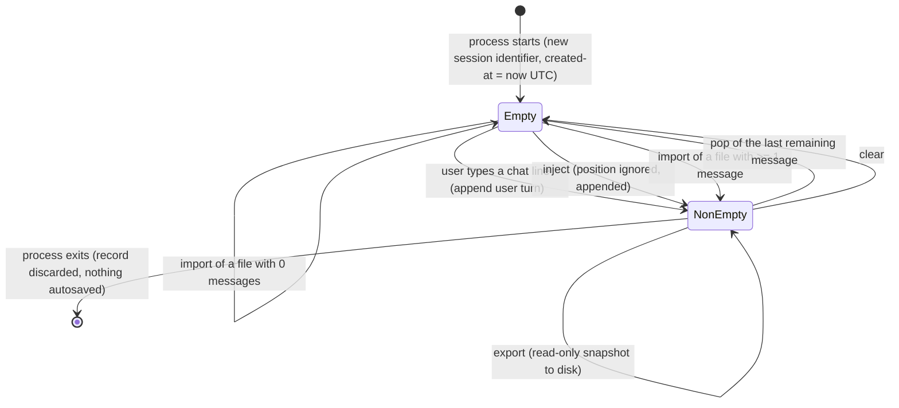

---

**Functional requirements**

*Record lifecycle and structure*

- **FR-4.1** The system SHALL maintain exactly one conversation record per running process, created empty when the shell starts, carrying a freshly generated random unique identifier in canonical lowercase hyphenated form (for example `469df3d2-7934-481c-bbb0-47ae24c65f87`) as its session identifier and the current UTC instant as its created-at timestamp. *(realizes US-4.1)*
- **FR-4.2** The system SHALL NOT autosave and SHALL NOT autoload. The record is discarded when the process ends unless the user explicitly exported it. The shutdown path SHALL write nothing to disk. *(realizes US-4.5)*
- **FR-4.3** The conversation record SHALL be shared by reference with both shells, all history commands, and the transcript view, so that every mutation is immediately visible to all of them. Import SHALL mutate this record in place and SHALL NOT substitute a new one.
- **FR-4.4** The **list order of messages is the sole authoritative conversation order**. Timestamps SHALL NOT be used for sorting by any consumer, because injection stamps the current time onto a message placed at an arbitrary index. *(See QUIRK-4.30.)*
- **FR-4.5** The system SHALL impose no message-count limit, no content-length limit, no file-size limit and no token-budget trimming on the record. History grows unbounded until popped, cleared, replaced by import, or the process ends.
- **FR-4.6** The append operation SHALL accept a role string, content text, an optional hidden-from-model flag defaulting to off, and an optional list of token log-probability entries defaulting to none; SHALL stamp the message with the current UTC instant at the moment of appending; SHALL place it at the end of the list; and SHALL return nothing and emit no user-visible message. *(realizes US-4.1)*

*Recording chat turns*

- **FR-4.7** Both shells SHALL append a `user`-role message with the typed line before invoking the provider, and an `assistant`-role message with the reply after it returns. *(realizes US-4.1)*
- **FR-4.8** Token log probabilities SHALL be attached to the assistant message only when the reply came back from the log-probability code path; all other append paths SHALL attach none. *(realizes US-4.7)*
- **FR-4.9** Both shells SHALL discard an empty or whitespace-only chat line before any append occurs. A message with blank content can therefore enter the record only through the full-screen shell's inject dialog or through an imported file.
- **FR-4.10** The full-screen terminal shell SHALL trim leading and trailing whitespace from the typed line before appending it; the plain-console shell SHALL append the line exactly as read, including leading and trailing spaces. *(Divergence preserved deliberately; see QUIRK-4.16.)*
- **FR-4.11** A line whose first character is `/` SHALL always be routed to the command dispatcher in both shells and SHALL never be appended to the record. There SHALL be no escape sequence for sending a literal leading slash to the model.
- **FR-4.12** When a provider call fails, the already-appended user message SHALL remain in the record.

*Inject*

- **FR-4.13** The system SHALL expose a command named `inject` with the description `Inject a message into the chat history` and the usage string `/inject <role> <message> [position] - Inject message with specified role (user|assistant|system)`. *(realizes US-4.2, US-4.9)*
- **FR-4.14** Inject SHALL fail when fewer than two arguments are supplied, with the exact message `Usage: /inject <role> <message> [position]`, leaving the record unchanged. *(realizes US-4.2)*
- **FR-4.15** Inject SHALL lower-case the first argument before validating and before storing it, and SHALL accept exactly three role values: `user`, `assistant`, `system`. Any other value SHALL fail with the exact message `Role must be one of: user, assistant, system`, leaving the record unchanged. *(realizes US-4.2)*
- **FR-4.16** Inject SHALL form the message content by re-joining the remaining arguments with a single space each.
- **FR-4.17** Inject SHALL treat the last argument as an insertion position **only when strictly more than two arguments were supplied** and that argument parses as a signed 32-bit integer; in that case the argument SHALL be removed from the message content. *(This is a behavioral threshold, not a tunable.)*
- **FR-4.18** When the last argument does not parse as an integer, it SHALL remain part of the message content and no position SHALL be applied.
- **FR-4.19** The valid insertion range SHALL be `0 <= position < current message count`. A position equal to the count, greater than the count, or negative SHALL silently degrade to appending at the end. *(realizes US-4.2)*
- **FR-4.20** An injected message SHALL always be flagged not-hidden-from-model and SHALL always carry no token log probabilities; the inject path SHALL NOT expose either field.
- **FR-4.21** On success inject SHALL report `Injected {role} message at position {n}: {message}` when a position was supplied, and `Injected {role} message: {message}` when none was, where `{n}` is the **requested** position regardless of whether it was used. *(See QUIRK-4.1.)*
- **FR-4.22** Inject SHALL accept an empty message content; there SHALL be no non-empty validation.
- **FR-4.23** The full-screen shell's inject dialog SHALL be 70×15, titled `Inject Message`, containing a 20-column Role field pre-filled `user`, a 5-line Message box, and a 10-column field labeled `Position (optional):` that starts empty, with OK as the default button. On OK it SHALL supply role and the whole message as discrete values — preserving internal runs of spaces and embedded newlines — plus the position **only if** the position text is non-blank and parses as an integer; otherwise the position SHALL be dropped without any warning. *(realizes US-4.2; see QUIRK-4.4.)*
- **FR-4.24** The insertion position SHALL be parsed as a signed 32-bit integer using the process's current culture: a leading `+` or `−` is accepted, while `7.0`, `7,000`, `0x7` and any value outside −2147483648…2147483647 fail to parse. *(INFERRED — the culture sensitivity is reasoned from the parse call; no test covers it. The compact and single-file build flavors force invariant globalization, so sign handling can differ between build flavors.)*

*Pop*

- **FR-4.25** The system SHALL expose a command named `pop` with the description `Remove the last message from chat history` and the usage string `/pop - Remove the last message from chat history`. *(realizes US-4.3, US-4.9)*
- **FR-4.26** Pop SHALL fail on an empty record with the exact message `Chat history is empty`, leaving the record unchanged. *(realizes US-4.3)*
- **FR-4.27** Pop SHALL remove exactly one message — the last — capturing it before deletion, and SHALL report `Removed last message: [{role}] {content}...` where `{content}` is the first **50** characters of the removed content, sliced by raw code unit, and the literal `...` is appended unconditionally. *(50 is a fixed display constant, not user-tunable; see QUIRK-4.2 and QUIRK-4.3.)*
- **FR-4.28** Pop SHALL accept and silently ignore any arguments. `/pop 3` SHALL remove exactly one message.

*Clear*

- **FR-4.29** The system SHALL expose a command named `clear` with the description `Clear chat history` and the usage string `/clear - Clear all chat history`, and SHALL report `Cleared {n} messages from chat history` where `{n}` is the message count captured **before** clearing. *(realizes US-4.4, US-4.9)*
- **FR-4.30** Clear SHALL succeed on an already-empty record, reporting `Cleared 0 messages from chat history`. There SHALL be no failure path.
- **FR-4.31** Clear SHALL empty only the message list. The session identifier and the created-at timestamp SHALL survive unchanged.
- **FR-4.32** Clear SHALL accept and silently ignore any arguments. Neither clear nor pop SHALL prompt for confirmation in either shell, and neither SHALL be undoable.

*Export*

- **FR-4.33** The system SHALL expose a command named `export` with the description `Export chat history to a file` and the usage string `/export <file_path> - Export chat history to JSON file`. *(realizes US-4.5, US-4.9)*
- **FR-4.34** Export SHALL fail when no arguments are supplied, with the exact message `Usage: /export <file_path>`.
- **FR-4.35** Export SHALL form the path by joining all supplied arguments with a single space each.
- **FR-4.36** Export SHALL expand a leading `~/` — exactly those two characters at position 0 — to the current user's home/profile directory (the user-profile folder on Windows, `$HOME` on Unix-like systems). A bare `~`, a backslash form `~\`, and `~someuser/` SHALL NOT be expanded. *(See QUIRK-4.14.)*
- **FR-4.37** Export SHALL append `.json` to the path **only when the resolved file name has no extension at all**. "Has an extension" means a dot after the last path separator that is not the final character — so `.history` counts as already having one. A name such as `notes.txt` SHALL be written unchanged. *(See QUIRK-4.13.)*
- **FR-4.38** Export SHALL create the containing directory, recursively, if it does not exist; this SHALL be a no-op when it does.
- **FR-4.39** Export SHALL overwrite any existing file at the resolved path with a whole-file write, with no warning, no temporary file and no rename, and therefore with no atomicity guarantee. *(See QUIRK-4.6.)*
- **FR-4.40** Export SHALL write the conversation-file format below, and import SHALL read it. This is a **wire format**: an exported file must remain re-importable, and a clone must stay byte-compatible with files produced by the source product. The format is a single JSON object, pretty-printed with **2-space** indentation, UTF-8 encoded with **no** byte-order mark, and carrying **no** schema-version field and no format negotiation. *(realizes US-4.5, US-4.6, US-4.7)*

```
{
  "messages": [
    {
      "role":             <string>,          // stored verbatim; not validated on import
      "content":          <string>,          // unbounded; newlines written as \n
      "timestamp":        <ISO-8601 string>, // UTC, exactly 7 fractional-second digits, "Z" suffix
      "isCommand":        <boolean>,         // hidden-from-model flag
      "logProbabilities": <array | null>     // null written literally when absent; key never omitted
    }
    // ... in conversation order
  ],
  "sessionId": <string>,          // canonical lowercase hyphenated UUID
  "createdAt": <ISO-8601 string>  // same timestamp form; written on export, discarded on import
}

// each element of "logProbabilities":
{
  "token":            <string>,
  "logprob":          <number>,        // shortest round-trip form: -5, never -5.0
  "top_alternatives": <array | null>   // same shape, recursively; null written literally
}
```

  Ordering and naming rules that a clone MUST match exactly:
  - Key order is declaration order — top level `messages`, `sessionId`, `createdAt`; within a message `role`, `content`, `timestamp`, `isCommand`, `logProbabilities`; within a token entry `token`, `logprob`, `top_alternatives`.
  - Key names are matched case-sensitively on import and unknown keys are ignored.
  - The two token-entry keys `logprob` and `top_alternatives` are lower-case/snake-case while every other key in the file is camel-case. This inconsistency is part of the wire format and MUST be preserved.
  - No derived value is persisted: there is no has-log-probabilities key and no probability key anywhere in the file.
  - String escaping is deliberately aggressive, not minimal — see the escaping row under **External technology** and AC-4.28.
- **FR-4.41** On success export SHALL report `Successfully exported {n} messages to: {resolved path}`, where `{n}` is the live record's message count evaluated after the write. On failure it SHALL report `Failed to export chat history to: {resolved path}` and SHALL NOT include the underlying cause; the cause SHALL be written to the standard output stream as `Error exporting chat history: {underlying reason}`. *(See QUIRK-4.5 and QUIRK-4.23.)*
- **FR-4.42** The full-screen shell's *File → Export History…* SHALL open a file-save dialog pre-filled with `{home}/chat_history.json` and SHALL route the chosen path back through the same string command line as a typed command, inheriting its space-collapsing behavior. *(See QUIRK-4.15.)*

*Import*

- **FR-4.43** The system SHALL expose a command named `import` with the description `Import chat history from a file` and the usage string `/import <file_path> - Import chat history from JSON file`. *(realizes US-4.6, US-4.9)*
- **FR-4.44** Import SHALL fail when no arguments are supplied, with the exact message `Usage: /import <file_path>`.
- **FR-4.45** Import SHALL join all arguments with single spaces and SHALL apply the same `~/` expansion rule as FR-4.36, but SHALL NOT append any default extension. *(See QUIRK-4.12.)*
- **FR-4.46** A non-existent file SHALL be a normal, non-exceptional failure: `File not found: {resolved path}` SHALL be written to the standard output stream and the command SHALL report `Failed to import chat history from: {resolved path}`, leaving the live record completely untouched. *(realizes US-4.6)*
- **FR-4.47** Malformed or wrong-shaped file content SHALL be caught, reported to the standard output stream as `Error importing chat history: {reason}`, and SHALL produce the same user-facing failure message, leaving the live record completely untouched.
- **FR-4.48** On success import SHALL empty the live message list and refill it with the imported messages **in file order**, SHALL overwrite the live session identifier with the imported one, and SHALL leave the live created-at timestamp untouched — the imported created-at value SHALL be discarded. Import SHALL replace, never merge or append. *(realizes US-4.6; see QUIRK-4.7.)*
- **FR-4.49** Import SHALL perform **no validation** of imported content: roles SHALL NOT be checked against the three permitted values that inject enforces, content SHALL NOT be length-limited, timestamps SHALL NOT be sanity-checked, and the hidden-from-model flag SHALL be honored as read. *(realizes US-4.10; see QUIRK-4.8.)*
- **FR-4.50** A file whose top-level object omits the messages key SHALL yield an empty message list, and one that omits the session identifier SHALL cause the live session identifier to be replaced by a freshly generated random one; the command SHALL report `Successfully imported 0 messages from: {path}`. *(INFERRED from the entity field defaults; no test covers it.)*
- **FR-4.51** Key matching on import SHALL be case-sensitive and unknown keys SHALL be ignored. Comments and trailing commas SHALL be rejected. *(INFERRED from the serializer defaults; no test covers it.)*
- **FR-4.52** On success import SHALL report `Successfully imported {n} messages from: {resolved path}`.
- **FR-4.53** The full-screen shell's *File → Import History…* SHALL open a single-selection file-open dialog rooted at the user's home/profile directory, and SHALL route the chosen path back through the same string command line, inheriting its space-collapsing behavior.
- **FR-4.54** Import SHALL read the whole file into memory before parsing, with no size check, no streaming and no cap. *(See QUIRK-4.10.)*

*Consumption by the provider layer*

- **FR-4.55** The whole conversation record SHALL be handed to the selected provider on every request. The contract every provider relies on is: iterate messages in list order, and skip any message flagged hidden-from-model. *(realizes US-4.1, US-4.10)*
- **FR-4.56** Role handling beyond the three permitted values diverges by provider and SHALL be preserved as observed: the managed-client hosted path maps the three roles onto wire roles and **silently drops** any message with any other role; the direct-payload hosted path passes the lower-cased role through verbatim, so a bogus role reaches the remote service and surfaces as a provider failure; the second hosted provider collapses **everything that is not `assistant` into `user`**; and the local on-device provider paths do **not** honor the hidden-from-model flag at all and use **only the content of the last message whose role matches `user` case-insensitively**. *(Owned jointly with the provider sections; see QUIRK-4.19.)*
- **FR-4.57** The configured system prompt SHALL NOT be stored in the conversation record; providers prepend it separately as a synthetic message.
- **FR-4.58** No provider path SHALL read the session identifier, the record's created-at timestamp, or any per-message timestamp.

*Transcript rendering (full-screen terminal shell only)*

- **FR-4.59** The transcript SHALL be torn down and rebuilt from scratch after every record mutation and after every command, and SHALL scroll to the bottom whenever the content is taller than the window. *(realizes US-4.8)*
- **FR-4.60** Each message SHALL render as a header line `[{role in lower case}]`, then the content wrapped to `(view width − 4) × 3 ÷ 4` characters with 2 columns of padding on each side, then a blank spacer line. Wrapping SHALL first split on embedded newlines, then break each long line at the last space that fits, hard-cutting mid-word when no space fits.
- **FR-4.61** Whitespace-only wrapped lines SHALL be omitted from the view. A message whose content is empty or all whitespace SHALL render as a bare `[role]` header with no body, while remaining in the record and in every outbound request. *(See QUIRK-4.18.)*
- **FR-4.62** Messages whose role matches `user` case-insensitively SHALL be right-aligned; all others left-aligned with two columns of padding. Assistant messages carrying at least one token log-probability entry SHALL show a clickable `◊` marker beneath them.
- **FR-4.63** Every path that **selects** a message for the token-probability panel SHALL compare the stored role to the literal `assistant` **case-sensitively**, while rendering compares case-insensitively. *(Divergence preserved; see QUIRK-4.17.)*
- **FR-4.64** A successful history command SHALL show `✓ {message}` in the status bar, which SHALL revert to the default provider/model line after **3000 ms**. A failed history command SHALL raise a modal box titled `Command Error`; an unhandled failure SHALL raise a modal box titled `Error`.
- **FR-4.65** The plain-console shell SHALL prefix a successful command's message with `✓ ` and a failed command's message with `✗ `, and SHALL print `Error: {message}` and continue the session when an unhandled failure escapes a command.

*Help and discoverability*

- **FR-4.66** General help SHALL list `/import`, `/export`, `/inject` and `/pop` under the heading `Chat History Management:`, each rendered as `/{name} - {description}`, and SHALL list `/clear` under `Basic Commands:` instead. *(realizes US-4.9)*
- **FR-4.67** Help for a single history command SHALL return a three-line block of the form `Command: /{name}`, `Description: {description}`, `Usage: {usage}`; an unrecognized name SHALL fail with `Unknown command: {name}`.

---

**External technology**

- *Requires: whole-file text read and whole-file text overwrite on a local filesystem (POSIX / Win32 file I/O). Source used: the managed runtime's asynchronous read-all-text and write-all-text primitives on .NET 10. Reimplementer notes: whole-file semantics only — no streaming, no file locking, no temp-file-then-rename, and therefore no atomicity. Default text encoding is UTF-8 with no byte-order mark. An interrupted write must leave the target truncated, matching the observed behavior.*
- *Requires: recursive create-directory-if-missing. Source used: the managed runtime's create-directory primitive. Reimplementer notes: called before every export write; a no-op when the directory already exists; a failure here must be indistinguishable to the user from a write failure.*
- *Requires: file-existence check. Source used: the managed runtime's file-exists primitive. Reimplementer notes: import's pre-flight; a negative result is a normal (non-exceptional) failure path that prints a distinct diagnostic.*
- *Requires: path manipulation — extension detection, path join, directory-of. Source used: the managed runtime's path helpers. Reimplementer notes: "has an extension" must mean a dot after the last separator that is not the final character, so a dot-prefixed name such as `.history` counts as having one. Path separator rules must follow the host platform, so a backslash is a separator on Windows and an ordinary filename character elsewhere.*
- *Requires: current user's home/profile directory lookup. Source used: the managed runtime's user-profile special-folder lookup. Reimplementer notes: resolves to the user profile folder on Windows and `$HOME` on Unix-like systems. Used for `~/` expansion in both import and export and as the starting directory for both file dialogs.*
- *Requires: object serialization and deserialization with explicit per-field wire names and indented output (JSON, RFC 8259). Source used: the managed runtime's built-in JSON serializer with indented output, a camel-case naming policy, and explicit per-field name attributes. Reimplementer notes: the explicit per-field names win over the policy, so the wire keys are exactly as listed in FR-4.40 — including the inconsistent `logprob` and `top_alternatives` among otherwise camel-case keys. Deserialization is case-sensitive, ignores unknown keys, and rejects comments and trailing commas.*
- *Requires: a JSON string-escaping profile that escapes more than the standard minimum (JSON, RFC 8259). Source used: the managed runtime's default JSON encoder. Reimplementer notes: an apostrophe is written as the six characters \u0027, a backtick as \u0060, a plus sign as \u002B, and the less-than, greater-than and ampersand characters are likewise escaped; all non-ASCII is escaped as \uXXXX; newlines inside content are written `\n`. A minimally-escaping implementation produces semantically identical but byte-different files, and one that emits raw UTF-8 for non-ASCII will not match the observed output.*
- *Requires: shortest-round-trip floating-point formatting (IEEE 754 / JSON number). Source used: the managed runtime's default double-precision JSON writer. Reimplementer notes: a log probability of −5 is written `-5`, not `-5.0`; no exponent notation for ordinary log-probability magnitudes.*
- *Requires: wall-clock UTC timestamp source (ISO-8601). Source used: the managed runtime's UTC-now clock. Reimplementer notes: used for every message timestamp and for the record's created-at value. Persisted form is round-trip ISO-8601 with exactly seven fractional-second digits and a `Z` suffix. Nothing depends on uniqueness or monotonicity.*
- *Requires: random unique identifier generation (UUID). Source used: the managed runtime's GUID generator, rendered in canonical lowercase hyphenated text form. Reimplementer notes: session identifier only; not security-sensitive, not used as a key, never read by anything else in the product.*
- *Requires: culture-sensitive signed 32-bit integer parsing. Source used: the managed runtime's try-parse-integer primitive. Reimplementer notes: used only for the inject position; accepts a leading sign per the current culture and rejects decimal points, group separators and out-of-range values. Compact and single-file build flavors force invariant globalization, so sign handling can differ between build flavors.*
- *Requires: a standard output stream. Source used: the managed runtime's console write-line. Reimplementer notes: the persistence layer writes its own diagnostics here unconditionally, including while the full-screen shell owns the terminal — reproducing this reproduces the display corruption described in QUIRK-4.23. There is no logger abstraction and no suppression switch.*
- *Requires: a full-screen terminal user interface with menus and native file open/save dialogs (ANSI terminal). Source used: Terminal.Gui 1.19.0 (full-screen shell only). Reimplementer notes: the open dialog is single-selection and starts in the home directory; the save dialog is pre-seeded with `chat_history.json` in the home directory. Both route the chosen path back through the same string command line as a typed command.*
- *Requires: a delayed user-interface callback marshalled onto the interface's main loop. Source used: the managed runtime's delay task plus a main-loop invoke. Reimplementer notes: drives the 3000 ms status-bar revert; the timer is started unconditionally for every status message.*
- *Requires: a managed application runtime. Source used: .NET 10 (`net10.0`), SDK pinned to `10.0.100-rc.1.25451.107` with latest-feature roll-forward. Reimplementer notes: nothing in this feature depends on a runtime-specific capability; every operation here is fully cross-platform.*

**Nothing else is required.** This feature uses no database, no network, no message broker, no external process, no operating-system keychain, **no environment variables and no configuration settings**. The product's settings model contains no history-related key of any kind.

---

**Acceptance criteria**

- **AC-4.1** *Given* an empty conversation record, *when* a turn is appended with role `user`, content `content`, and the hidden-from-model flag set, *then* the record holds exactly one message whose role is `user`, whose content is `content`, whose hidden-from-model flag is set, and whose timestamp is not in the future.
- **AC-4.2** *Given* a record holding messages `a` then `b`, *when* the user issues `/pop`, *then* only `a` remains and the result is a success whose text begins `Removed last message: [user] b`.
- **AC-4.3** *Given* an empty record, *when* the user issues `/pop`, *then* the result is a failure with the exact text `Chat history is empty` and the record is still empty.
- **AC-4.4** *Given* an empty record, *when* the user issues `/pop 3`, *then* the result is a failure with the exact text `Chat history is empty`; *and given* a record of three messages, *when* the user issues `/pop 3`, *then* exactly one message is removed.
- **AC-4.5** *Given* a record holding a `user` message with content `hi`, *when* the user issues `/pop`, *then* the success text is exactly `Removed last message: [user] hi...` — the three-dot suffix is present even though nothing was truncated.
- **AC-4.6** *Given* a record holding `first` then `third`, *when* the user issues `/inject assistant second 1`, *then* the record holds three messages, the message at index 1 has content `second` and role `assistant`, and the success text is `Injected assistant message at position 1: second`.
- **AC-4.7** *Given* any record, *when* the user issues `/inject user` (one argument), *then* the result is a failure with the exact text `Usage: /inject <role> <message> [position]` and the record is unchanged.
- **AC-4.8** *Given* any record, *when* the user issues `/inject moderator hello`, *then* the result is a failure with the exact text `Role must be one of: user, assistant, system` and the record is unchanged.
- **AC-4.9** *Given* any record, *when* the user issues `/inject USER hello`, *then* a message is stored with role exactly `user` (lower-cased).
- **AC-4.10** *Given* a record holding two messages, *when* the user issues `/inject user hi 99`, *then* the message is appended as the third message and the success text is exactly `Injected user message at position 99: hi`; *and when* the user issues `/inject user hi -1`, *then* the message is appended and the success text is exactly `Injected user message at position -1: hi`.
- **AC-4.11** *Given* any record, *when* the user issues `/inject user 42`, *then* one message is appended with content exactly `42` and the success text omits any position clause; *and when* the user issues `/inject user 42 7`, *then* a message with content exactly `42` is targeted at position 7.
- **AC-4.12** *Given* any record, *when* the user issues `/inject user note 7.0`, *then* the stored content is exactly `note 7.0` and the success text omits any position clause — the unparseable trailing token stays in the message.
- **AC-4.13** *Given* a record holding two messages, *when* the user issues `/clear`, *then* the record is empty, the result is a success, and the text is exactly `Cleared 2 messages from chat history`.
- **AC-4.14** *Given* an empty record, *when* the user issues `/clear`, *then* the result is a success with the exact text `Cleared 0 messages from chat history`.
- **AC-4.15** *Given* a record whose session identifier is `3f2504e0-4f89-11d3-9a0c-0305e82c3301` and whose created-at is `2026-08-28T12:30:00.0000000Z`, *when* the user issues `/clear`, *then* both values are unchanged.
- **AC-4.16** *Given* a record holding one message, *when* the user issues `/export export-file`, *then* the persistence step is invoked exactly once with a path ending in `.json`, the result is a success, and the text is `Successfully exported 1 messages to: export-file.json`.
- **AC-4.17** *Given* any record, *when* the user issues `/export notes.txt`, *then* the file written is named exactly `notes.txt` and contains the conversation-file format; *and when* the user issues `/export .history`, *then* the file written is named exactly `.history` with no suffix appended.
- **AC-4.18** *Given* a record holding one `user` message with content `hello`, *when* it is exported to a path under a directory that does not yet exist and then imported back, *then* the directory is created, the export reports success, and the imported record holds exactly one message.
- **AC-4.19** *Given* any state, *when* the user issues `/export` or `/import` with no arguments, *then* the result is a failure whose text is exactly `Usage: /export <file_path>` or `Usage: /import <file_path>` respectively.
- **AC-4.20** *Given* a path that does not exist, *when* the user issues `/import` on it, *then* the result is a failure reading `Failed to import chat history from: {path}`, the text `File not found: {path}` appears on the standard output stream, the live record is unchanged, and no exception escapes.
- **AC-4.21** *Given* a non-empty live record and a file containing one `assistant` message with session identifier `session`, *when* the user issues `/import <file>`, *then* the live record holds exactly that one message, its session identifier equals `session`, its created-at timestamp is unchanged from process start, and the result text is `Successfully imported 1 messages from: <file>`.
- **AC-4.22** *Given* a record exported with `/export mychats` (written to `mychats.json`), *when* the user issues `/import mychats`, *then* the result is a failure reading `Failed to import chat history from: mychats` and `File not found: mychats` appears on the standard output stream.
- **AC-4.23** *Given* a file containing a message with role `Moderator` and content `x`, *when* the user issues `/import` on it, *then* the import succeeds and the message is stored with role exactly `Moderator` — no role validation is applied.
- **AC-4.24** *Given* a record containing a message flagged hidden-from-model, *when* a request is built for a hosted provider, *then* that message is absent from the outbound payload while all other messages appear in list order.
- **AC-4.25** *Given* a record holding a `user` turn `first`, an `assistant` turn `reply`, and a `user` turn `second`, *when* the local on-device provider is selected and a request is built, *then* the model receives only `second`, and messages flagged hidden-from-model are **not** excluded.
- **AC-4.26** *Given* an assistant message whose token log-probability list is present but empty, *when* the interface asks whether it has token log probabilities, *then* the answer is no; *given* a list with at least one entry, the answer is yes.
- **AC-4.27** *Given* a record exported to a file, *when* the file is inspected, *then* it is 2-space-indented JSON whose top-level keys are `messages`, `sessionId`, `createdAt` in that order, each message carrying `role`, `content`, `timestamp`, `isCommand`, `logProbabilities` in that order, each token entry carrying `token`, `logprob`, `top_alternatives` in that order, with the literal `null` written for absent lists, and with no derived has-log-probabilities key and no derived probability key anywhere.
- **AC-4.28** *Given* an assistant message whose content is the text `It's a` followed by a backtick, `lambda`, a backtick, ` + more`, *when* the record is exported, *then* the apostrophe appears in the file as the six characters \u0027, each backtick as \u0060, and the plus sign as \u002B — none of them written raw — and any non-ASCII character in content is likewise written as a \uXXXX escape.
- **AC-4.29** *Given* a message created at 20:21:45.9645324 UTC on 2025-10-08, *when* the record is exported, *then* its timestamp value is the string `"2025-10-08T20:21:45.9645324Z"`.
- **AC-4.30** *Given* a token entry whose log probability is exactly −5, *when* the record is exported, *then* the file contains `-5`, not `-5.0`.
- **AC-4.31** *Given* the full-screen inject dialog with Role `user`, Message `hello`, and Position `end`, *when* OK is pressed, *then* the message is appended at the end and the status bar reads `✓ Injected user message: hello` with no position clause and no error.
- **AC-4.32** *Given* the full-screen inject dialog with a Message containing the three lines `a`, an empty line, and `b`, *when* OK is pressed and the transcript redraws, *then* the transcript shows `[user]`, `a`, `b` with the blank line omitted, while the stored content still contains both newline characters and both are sent to the provider.
- **AC-4.33** *Given* the user types `␣␣hello␣␣` as a chat turn in the plain-console shell, *then* the stored content is exactly `␣␣hello␣␣`; *given* the same keystrokes in the full-screen shell, *then* the stored content is exactly `hello`.
- **AC-4.34** *Given* the user issues `/export ~/my␣␣chats/a.json` in either shell, *then* the resolved path is `{home}/my␣chats/a.json` — the doubled space has collapsed to one, and there is no quoting mechanism to prevent it.
- **AC-4.35** *Given* an imported file containing a message with role `Assistant` and a non-empty token log-probability list, *when* the full-screen shell renders it, *then* the header reads `[assistant]`, no `◊` marker is drawn, and the token-probability panel reports there are no assistant messages with log probabilities.
- **AC-4.36** *Given* a successful history command in the full-screen shell, *when* 3000 ms have elapsed, *then* the status bar has reverted to the default provider/model line.
- **AC-4.37** *Given* general help is displayed, *then* the section headed `Chat History Management:` lists exactly `/import`, `/export`, `/inject` and `/pop`, and `/clear` appears under `Basic Commands:` instead.
- **AC-4.38** *Given* the user issues help for `inject`, *then* the response is exactly the three lines `Command: /inject`, `Description: Inject a message into the chat history`, `Usage: /inject <role> <message> [position] - Inject message with specified role (user|assistant|system)`.
- **AC-4.39** *Given* a record holding two messages, *when* the process exits and is restarted, *then* the new record is empty and holds a different session identifier — nothing was autosaved and nothing is autoloaded.
- **AC-4.40** *Given* a provider call that fails while a `user` turn has already been appended, *then* that `user` turn is still present in the record after the error is shown.

---

**Quirks**

- *QUIRK-4.1: Inject reports a position it did not use. The range check lives in the record (`0 <= position < count`, else append), but the confirmation text is built from the requested position. `/inject user hi 99` on a two-message history appends at index 2 and still answers `Injected user message at position 99: hi`. Negative positions behave identically. Evidence: `src/Xcaciv.ChatDbg.Core/Models/ChatHistory.cs:43-50`; `src/Xcaciv.ChatDbg.Core/Commands/InjectCommand.cs:42-45`. Keep-or-fix decision deferred to Open Questions.*
- *QUIRK-4.2: Pop's confirmation always ends in three dots. The ellipsis is concatenated unconditionally, not only when truncation happened. Popping a two-character message answers `Removed last message: [user] hi...`; popping an empty-content message answers `Removed last message: [user] ...`. Evidence: `src/Xcaciv.ChatDbg.Core/Commands/PopCommand.cs:29`. Keep-or-fix decision deferred to Open Questions.*
- *QUIRK-4.3: Pop's 50-character preview cuts by raw code unit. It is an index slice, not a codepoint- or grapheme-aware one, so a surrogate pair or combining sequence straddling offset 50 is split, producing a lone surrogate in the confirmation text. Evidence: `src/Xcaciv.ChatDbg.Core/Commands/PopCommand.cs:29`. Keep-or-fix decision deferred to Open Questions.*
- *QUIRK-4.4: The full-screen inject dialog silently discards an unparseable position, while the console keeps it. The dialog supplies the position argument only if it parses as an integer, so `end` or `1.5` is thrown away with no warning and the message is appended. From the console the same trailing token would have become part of the message text instead. Two paths, two incompatible rules. Evidence: `src/ChatDbg.Shell.Gui/UI/ChatWindow.cs:967-970`; `src/Xcaciv.ChatDbg.Core/Commands/InjectCommand.cs:36`. Keep-or-fix decision deferred to Open Questions.*
- *QUIRK-4.5: The real failure reason never reaches the user. Export and import failures are caught at the persistence boundary, printed to the standard output stream, and reduced to a boolean. The user-facing message is a generic `Failed to export chat history to: {path}` with no cause, so a full disk, a permission denial and a bad path are indistinguishable. Evidence: `src/Xcaciv.ChatDbg.Core/Services/ChatHistoryService.cs:39-43`, `:60-64`; `src/Xcaciv.ChatDbg.Core/Commands/ExportCommand.cs:44-46`; `src/Xcaciv.ChatDbg.Core/Commands/ImportCommand.cs:37-40`. Keep-or-fix decision deferred to Open Questions.*
- *QUIRK-4.6: Export is not atomic and destroys the previous file first. The target is overwritten by a whole-file write with no temporary file and no rename, so an interrupted export leaves a truncated, unreadable file where a valid conversation used to be. There is also no overwrite warning of any kind, from either shell. Evidence: `src/Xcaciv.ChatDbg.Core/Services/ChatHistoryService.cs:36`. Keep-or-fix decision deferred to Open Questions.*
- *QUIRK-4.7: Import discards the imported created-at timestamp. The session identifier is copied from the imported record on the very next line; the created-at value is not copied anywhere. A re-exported file therefore carries the importing process's start time, silently rewriting the record's metadata. Evidence: `src/Xcaciv.ChatDbg.Core/Commands/ImportCommand.cs:43-45` (no assignment to the created-at field anywhere in `src`). Keep-or-fix decision deferred to Open Questions.*
- *QUIRK-4.8: Import performs zero validation. Roles are not checked against the three-value whitelist that inject enforces, content is unbounded, timestamps are not sanity-checked, and the hidden-from-model flag is honored as read. A file can introduce a role that inject would have rejected, which the providers then variously drop, forward to the remote service, or coerce to `user`. Evidence: `src/Xcaciv.ChatDbg.Core/Commands/ImportCommand.cs:43-44`; `src/Xcaciv.ChatDbg.Core/Services/AzureOpenAIService.cs:84-95`, `:141-148`; `src/Xcaciv.ChatDbg.Core/Services/BedrockService.cs:51-58`. Keep-or-fix decision deferred to Open Questions.*
- *QUIRK-4.9: No confirmation and no undo on either destructive operation. Clear wipes the whole record and pop removes a turn with no prompt in either shell, nothing is written to disk first, and the full-screen shell places *Clear History* directly below *Pop Last Message* in the same menu — one keystroke apart. Evidence: `src/Xcaciv.ChatDbg.Core/Commands/ClearCommand.cs:18-22`; `src/Xcaciv.ChatDbg.Core/Commands/PopCommand.cs:19-30`; `src/ChatDbg.Shell.Gui/UI/ChatWindow.cs:267-268`. Keep-or-fix decision deferred to Open Questions.*
- *QUIRK-4.10: Import reads the whole file into memory with no size guard. There is no size check, no streaming and no cap, making a large or hostile file a memory-pressure vector. Evidence: `src/Xcaciv.ChatDbg.Core/Services/ChatHistoryService.cs:56`. Keep-or-fix decision deferred to Open Questions.*
- *QUIRK-4.11: No path restrictions whatsoever. There is no canonicalisation, no allow-list and no sandbox root; `/export /etc/passwd.json` and `/import ../../secrets.json` are attempted verbatim, limited only by operating-system permissions. Evidence: `src/Xcaciv.ChatDbg.Core/Commands/ExportCommand.cs:28-42`; `src/Xcaciv.ChatDbg.Core/Commands/ImportCommand.cs:28-36`. Keep-or-fix decision deferred to Open Questions.*
- *QUIRK-4.12: Export defaults the file extension, import does not. `/export mychats` writes `mychats.json`; `/import mychats` then fails with `File not found: mychats`. The round trip a user would naturally type does not work. Evidence: `src/Xcaciv.ChatDbg.Core/Commands/ExportCommand.cs:37-40` versus `src/Xcaciv.ChatDbg.Core/Commands/ImportCommand.cs:28-34`. Keep-or-fix decision deferred to Open Questions.*
- *QUIRK-4.13: The default extension is keyed on "has any extension", not "is the conversation format". `/export notes.txt` writes the conversation format into a `.txt` file with no complaint, and a dot-prefixed name such as `.history` counts as already having an extension so it gets no suffix either. Evidence: `src/Xcaciv.ChatDbg.Core/Commands/ExportCommand.cs:37-40`. Keep-or-fix decision deferred to Open Questions.*
- *QUIRK-4.14: Home-directory expansion handles exactly one form. Only the literal two characters `~/` at position 0 expand. A bare `~`, a backslash form `~\`, and `~someuser/` are all taken literally and produce a directory literally named `~` on disk. Evidence: `src/Xcaciv.ChatDbg.Core/Commands/ExportCommand.cs:31-34`; `src/Xcaciv.ChatDbg.Core/Commands/ImportCommand.cs:31-34`. Keep-or-fix decision deferred to Open Questions.*
- *QUIRK-4.15: Runs of spaces collapse, with no quoting mechanism. The dispatcher splits on single spaces discarding empties and the history commands re-join with one space, so `~/my␣␣chats/a.json` silently becomes `~/my␣chats/a.json`. The full-screen shell's file dialogs route the user's chosen path back through that same string command line, so a directory the user picked from a browser can become unreachable. Evidence: `src/ChatDbg/ChatShell.cs:326`; `src/ChatDbg.Shell.Gui/UI/ChatWindow.cs:384`, `:1014`, `:1031`. Keep-or-fix decision deferred to Open Questions.*
- *QUIRK-4.16: The two shells disagree about trimming user input. The full-screen shell trims leading and trailing whitespace before storing a turn; the plain-console shell stores the line verbatim. The same keystrokes produce different history content, and therefore different prompts, depending on which shell is running. Evidence: `src/ChatDbg.Shell.Gui/UI/ChatWindow.cs:334` versus `src/ChatDbg/ChatShell.cs:83`, `:346`. Keep-or-fix decision deferred to Open Questions.*
- *QUIRK-4.17: Role matching is case-insensitive when rendering but case-sensitive when selecting. The transcript lower-cases the role to choose alignment and to draw the `◊` marker, but every path that selects a message for the token-probability panel compares against the literal `assistant` case-sensitively. An imported message stored as `Assistant` renders correctly, gets no marker, and is invisible to the panel. Evidence: `src/ChatDbg.Shell.Gui/UI/ChatWindow.cs:513`, `:523`, `:554`, `:570` versus `:219`, `:233`, `:364`, `:447`, `:837`, `:873`. Keep-or-fix decision deferred to Open Questions.*
- *QUIRK-4.18: Blank lines disappear from the transcript. Whitespace-only wrapped lines are skipped while rendering, so blank lines inside a multi-line message vanish from the view and a message whose content is empty or all whitespace renders as a bare `[role]` header — invisible content that is nonetheless in the record and in every outbound request. Evidence: `src/ChatDbg.Shell.Gui/UI/ChatWindow.cs:543`. Keep-or-fix decision deferred to Open Questions.*
- *QUIRK-4.19: The local on-device provider ignores the hidden-from-model exclusion and reads only one message. The two hosted-provider request builders filter on the flag; the local paths never look at it and use only the content of the last message whose role matches `user` case-insensitively. Injecting or popping assistant or system turns changes nothing that provider sees. The same record therefore produces materially different context depending on the provider. Evidence: `src/Xcaciv.ChatDbg.Core/Services/LLamaSharpService.cs:131`, `:361` versus `src/Xcaciv.ChatDbg.Core/Services/AzureOpenAIService.cs:82`, `:141`; `src/Xcaciv.ChatDbg.Core/Services/BedrockService.cs:51`. Keep-or-fix decision deferred to Open Questions.*
- *QUIRK-4.20: The hidden-from-model flag is a dormant hook. It is persisted, imported, defaulted to off, and filtered on by three provider paths — but nothing in the shipping product ever sets it true. A repository-wide search finds writes only in the entity's own default and one unit test. It is reachable today only by hand-editing an imported file. Evidence: `src/Xcaciv.ChatDbg.Core/Models/ChatHistory.cs:14`, `:20`; `src/Xcaciv.ChatDbg.Core/Models/ChatMessage.cs:13-14`; `src/Xcaciv.ChatDbg.Core.Tests/Models/ChatHistoryTests.cs:15-21`. Keep-or-fix decision deferred to Open Questions.*
- *QUIRK-4.21: The session identifier is write-only data. It is generated at start-up, persisted on export, overwritten on import, and asserted by one test — and never read by anything else. It is not used for lookup, file naming, logging or correlation. Evidence: `src/Xcaciv.ChatDbg.Core/Models/ChatHistory.cs:9-10`; `src/Xcaciv.ChatDbg.Core/Commands/ImportCommand.cs:45`; `src/Xcaciv.ChatDbg.Core.Tests/Commands/ImportCommandTests.cs:43`. Keep-or-fix decision deferred to Open Questions.*
- *QUIRK-4.22: Pop and clear silently ignore all arguments. Neither validates argument count or content: `/pop 3` removes one message and `/clear everything` succeeds, with nothing telling the user the argument was meaningless. Evidence: `src/Xcaciv.ChatDbg.Core/Commands/PopCommand.cs:19-24`; `src/Xcaciv.ChatDbg.Core/Commands/ClearCommand.cs:18-22`. Keep-or-fix decision deferred to Open Questions.*
- *QUIRK-4.23: Persistence diagnostics corrupt the full-screen interface. Export and import failures write directly to the standard output stream while the full-screen shell owns the screen, painting stray text over the layout. There is no logger abstraction and no way to suppress it. Evidence: `src/Xcaciv.ChatDbg.Core/Services/ChatHistoryService.cs:41`, `:52`, `:62`. Keep-or-fix decision deferred to Open Questions.*
- *QUIRK-4.24: A dead duplicate shell wires the same history operations with different behavior. The full-screen project carries a never-instantiated second copy of the console shell that wires all five history operations but drops token log probabilities when appending model replies. Porting the wrong copy would silently lose the token-probability payload. Evidence: `src/ChatDbg.Shell.Gui/ChatShell.cs:330`; `src/ChatDbg.Shell.Gui/Program.cs:77-90`; `src/ChatDbg/Program.cs:5`. Keep-or-fix decision deferred to Open Questions.*
- *QUIRK-4.25: A history-adjacent menu item is a stub. Selecting "Toggle System Messages" in the View menu reports `System messages toggle not yet implemented` and does nothing, implying a history filter that does not exist. Evidence: `src/ChatDbg.Shell.Gui/UI/ChatWindow.cs:1138-1142`. Keep-or-fix decision deferred to Open Questions.*
- *QUIRK-4.26: The status-bar revert timer is unconditional. Every status message starts a fresh 3000 ms task that overwrites the status bar with the default text when it fires, so two commands issued in quick succession leave the second message wiped early by the first timer. (INFERRED from the unconditional timer; no test.) Evidence: `src/ChatDbg.Shell.Gui/UI/ChatWindow.cs:903-916`. Keep-or-fix decision deferred to Open Questions.*
- *QUIRK-4.27: "Persistent chat history" is promised by the project's own documents but not implemented. There is no autosave and no autoload; the record is created empty at process start and lost at process end unless the user explicitly exports, and the shutdown path saves nothing. CODE WINS. Evidence: `src/ChatDbg/prd.md:17` and `README.md:11` versus `src/ChatDbg/ChatShell.cs:23`, `:692-713`; `src/ChatDbg.Shell.Gui/Program.cs:13`. Keep-or-fix decision deferred to Open Questions.*
- *QUIRK-4.28: Pop is documented as removing "messages" (plural) but removes exactly one — the last. Evidence: `src/ChatDbg/prd.md:103` versus `src/Xcaciv.ChatDbg.Core/Models/ChatHistory.cs:26-32`. Keep-or-fix decision deferred to Open Questions.*
- *QUIRK-4.29: The project documents disagree about the target platform. One calls the product a shell "for Windows terminal" while another claims Windows, Linux and macOS support. For this feature the code is genuinely cross-platform; the Windows framing comes from packaging defaults. A port must not inherit a Windows-only constraint from adjacent features. Evidence: `README.md:3` versus `src/ChatDbg/prd.md:34`; `src/ChatDbg/Xcaciv.ChatDbg.Shell.csproj:30`, `:70`. Keep-or-fix decision deferred to Open Questions.*
- *QUIRK-4.30: Timestamps stop being monotonic the moment anything is injected. An injected message is stamped with the current time and then placed at an arbitrary index, so the persisted timestamps become internally inconsistent while list order remains the single source of truth. Consumers of an exported file must not sort by timestamp. Evidence: `src/Xcaciv.ChatDbg.Core/Models/ChatHistory.cs:34-41` versus `:43-50`. Keep-or-fix decision deferred to Open Questions.*

---

**Non-functional notes**

- **Concurrency:** the conversation record is a bare mutable list with no locking, no immutability and no copy-on-read. The plain-console shell is strictly single-threaded, so this is safe there. The full-screen shell is not: dialog handlers and the send path return to the interface before their work finishes, and the whole record is handed to a provider on a background continuation while the interface thread may be redrawing it. *(Hazard reasoned from the fire-and-forget handlers and the shared mutable list; no observed defect confirms an actual race.)* A reimplementation on a platform with real interface-thread affinity should either marshal all mutations onto one thread or snapshot the list before handing it to the provider.
- **Memory and growth:** unbounded. Every turn plus its full per-token log-probability payload is retained for the life of the process, and export writes all of it.
- **Performance:** the full-screen shell rebuilds the entire transcript from scratch after every mutation, constructing one display element per wrapped line plus one per role header. This is proportional to total conversation characters per completed turn and will visibly degrade on long conversations. Insertion at an arbitrary index shifts the tail of a contiguous list — irrelevant at conversational scale.
- **No caching, pagination or lazy loading:** the whole file is read into memory on import and the whole record is serialized in memory on export.
- **Permissions:** none. See QUIRK-4.11.
- **Internationalization and accessibility:** no localization whatsoever — every message, usage string and error is a hard-coded English literal. Result decorations use the non-ASCII glyphs `✓`, `✗` and `◊`, which require a Unicode-capable terminal font.
- **Platform coupling — explicit verdict: nothing in this feature is restricted to one operating system.** Append, inject, pop, clear, import and export all run identically on Windows, Linux and macOS. Three portability consequences follow from delegating to platform path rules: `~/` expansion recognizes only the forward-slash form (a Unix idiom), a backslash is a path separator on Windows and an ordinary filename character elsewhere, and filesystem case sensitivity differs — so `/import History.json` after `/export history.json` succeeds on Windows and fails on Linux.

---

**Source notes**

Dossier: `/mnt/g/3RD-Party/reversing/output/chatdbg/dossiers/chat-history.md`. Feature #4 in `/mnt/g/3RD-Party/reversing/output/chatdbg/inventory.md`.

Source repository: `/mnt/g/3RD-Party/reversing/subject/chatdbg` @ commit `d8c18f61d6bb73666ed97cd4885e877e35558485` (branch `LLamaSharp_support`).

Primary evidence paths (repository-relative):

- Entities: `src/Xcaciv.ChatDbg.Core/Models/ChatHistory.cs`, `src/Xcaciv.ChatDbg.Core/Models/ChatMessage.cs`, `src/Xcaciv.ChatDbg.Core/Models/TokenLogProbabilities.cs`
- Persistence: `src/Xcaciv.ChatDbg.Core/Services/ChatHistoryService.cs`
- Commands: `src/Xcaciv.ChatDbg.Core/Commands/InjectCommand.cs`, `PopCommand.cs`, `ClearCommand.cs`, `ImportCommand.cs`, `ExportCommand.cs`, `HelpCommand.cs`
- Shell wiring and transcript: `src/ChatDbg/ChatShell.cs`, `src/ChatDbg/Program.cs`, `src/ChatDbg.Shell.Gui/Program.cs`, `src/ChatDbg.Shell.Gui/UI/ChatWindow.cs`
- Consumers: `src/Xcaciv.ChatDbg.Core/Services/AzureOpenAIService.cs`, `src/Xcaciv.ChatDbg.Core/Services/BedrockService.cs`, `src/Xcaciv.ChatDbg.Core/Services/LLamaSharpService.cs`
- Tests (18 methods covering this feature): `src/Xcaciv.ChatDbg.Core.Tests/Models/ChatHistoryTests.cs`, `Models/ChatMessageTests.cs`, `Commands/InjectCommandTests.cs`, `Commands/PopCommandTests.cs`, `Commands/ClearCommandTests.cs`, `Commands/ExportCommandTests.cs`, `Commands/ImportCommandTests.cs`, `Services/ChatHistoryServiceTests.cs`
- Observed on-disk export used to pin the wire format: `src/ChatDbg.Shell.Gui/bin/Debug/net10.0/chat.json` (193,375 bytes) — a genuine product output, excluded from version control by `.gitignore:21`, so not part of the commit.
- Documentation contradicted by the code: `src/ChatDbg/prd.md:17`, `:34`, `:103`; `README.md:3`, `:11`.

---

### 7.5 System Prompt Management

**Description**

Every request the product sends to a language model is prefixed with a block of instruction text — the *system prompt* — that sets the assistant's persona and focus: general debugging help, code review, algorithm design, security review, or anything the user writes themselves. System Prompt Management is the library of those instruction texts. It is a set of named, human-editable, persisted **prompt records** that the user can browse, inspect, switch between, author, revise, remove, and move in and out of the product as plain text files. Exactly one prompt is **active** at any moment, and its text is what the provider layer injects as the system message on every model call.

Without this feature, re-roling the assistant would mean editing a configuration file by hand and restarting. With it, the user re-roles the assistant with a single typed command or two keystrokes in a graphical dialog, and can accumulate a personal library of reusable personas that survive restarts and can be handed to a colleague as a file. On first run — or any run where the library is found empty — the product seeds four built-in prompts so that a brand-new install is immediately useful.

The feature has two user-facing surfaces that are deliberately **not** equivalent: a text-command surface (`/prompt …`, plus a second entry point through the settings command) available in both shells, and a modal graphical management dialog available only in the full-screen terminal shell. The two surfaces differ in their guards, their defaults and their side effects, and those differences are load-bearing observable behavior, documented below. There is no multi-user model, no authentication, no authorization and no per-user scoping beyond the operating-system account whose per-user data directory holds the files.

---

**User stories**

- **US-5.1** — As a developer using the chat shell, I want a starter library of prompts to exist the first time I run the product, so that I can re-role the assistant without authoring anything first.
- **US-5.2** — As a developer, I want to see which prompt is currently active and read its full text, so that I know how the assistant is being instructed before I ask it anything.
- **US-5.3** — As a developer, I want to list every prompt in my library with its description and its created / last-used times, so that I can choose one and see which I actually use.
- **US-5.4** — As a developer, I want to read one named prompt's full detail without switching to it, so that I can compare candidates before committing.
- **US-5.5** — As a developer, I want to switch the active prompt by name in one command, so that the assistant's persona changes from my next message onward and stays changed after a restart.
- **US-5.6** — As a developer whose prompt name contains spaces, I want a command entry point that accepts a multi-word name, so that names I created elsewhere remain reachable.
- **US-5.7** — As a developer, I want to create a new named prompt with a description, so that I can start building a persona of my own.
- **US-5.8** — As a developer, I want to replace a prompt's instruction text through an interactive multi-line editor in the plain console, so that I can author long personas without leaving the shell.
- **US-5.9** — As a developer using the full-screen terminal shell, I want a form that lets me set name, description and content in one step (and later change description *and* content together), so that authoring is not a two-command dance.
- **US-5.10** — As a developer, I want to delete a prompt I no longer need, and be protected from deleting the one the assistant is currently using, so that I cannot accidentally break my running session.
- **US-5.11** — As a developer, I want to export a prompt's text to a plain text file, so that I can share the persona with a colleague or keep it in version control.
- **US-5.12** — As a developer, I want to import any text file as a named prompt with a description, so that a persona someone sent me becomes usable immediately.
- **US-5.13** — As a developer using the full-screen terminal shell, I want a single modal screen from which I can browse, view, select, create, edit, delete, import and export prompts, so that I do not have to remember command syntax.
- **US-5.14** — As the host shell at startup, I want to resolve the persisted active-prompt *name* into prompt *text* and record that the prompt was used, so that the very first model call of the session carries the right instructions and the library shows real usage.
- **US-5.15** — As the provider layer, I want to read the active prompt's text as a plain string at call time, so that I can inject it as the conversation's system message regardless of which backend I am talking to.
- **US-5.16** — As a developer, I want the active prompt's name shown in the launch banner and in the persistent status line, so that I always know which persona is in effect.

---

**Use cases**

**UC-5.A — Library bootstrapping at launch (realizes US-5.1)**

- *Preconditions:* The product is starting. The operating system exposes a per-user local application-data directory.
- *Main flow:*
  1. The prompt store resolves its base directory: the per-user local application-data directory joined with the fixed folder name `ChatDbg`.
  2. It appends the fixed subdirectory name `system_prompts`.
  3. If that directory tree does not exist, it is created.
  4. Every record file already in the directory is loaded.
  5. If the number of successfully loaded records is exactly zero, the four built-in prompts are written to disk in the fixed order `default`, `code-reviewer`, `algorithm-helper`, `security-expert`.
  6. Control returns to the shell; startup continues.
- *Alternate flows:*
  - **A1** — The directory already contains one or more loadable records: step 5 is skipped entirely; no existing record is touched.
  - **A2** — A test or embedding host supplies a base-directory override: the override replaces the default base directory. A whitespace-only or empty override falls back to the default. No shipping shell supplies an override.
- *Error flows:*
  - **E1** — The directory cannot be created (permissions, read-only volume): the failure is **not caught**; it propagates out of store construction and out of application startup. The shell fails to start.
  - **E2** — One or more record files are malformed or unreadable: each is reported on standard output as `Error loading system prompt from <full path>: <reason>` and skipped; loading continues.
  - **E3** — *All* files in the directory are unparseable: the loaded count is zero, so the four built-ins are written, **overwriting** any of those files whose names collide with the four built-in file names.
- *Postconditions:* The store directory exists. The library contains at least the four built-ins, or whatever it previously held. Blocking work performed on the calling thread before any user interface exists.

**UC-5.B — Resolve the active prompt at startup (realizes US-5.14, US-5.16)**

- *Preconditions:* The prompt store has been constructed (UC-5.A). Persisted settings have been loaded; they carry an active-prompt **name** whose default value is the literal `default`.
- *Main flow:*
  1. The shell asks the store for the prompt whose name equals the persisted active-prompt name.
  2. The record is found. Its text is copied into the runtime active-prompt text slot.
  3. The record's last-used timestamp is set to the current UTC instant and the whole record is rewritten to disk.
  4. The launch banner prints `System Prompt: <activeName>`; in the full-screen shell the status line reads `Provider: <provider> | Model: <model> | Prompt: <activeName>`.
  5. From this point every model call is prefixed with the runtime active-prompt text.
- *Alternate flows:*
  - **A1** — No record with that name exists: the runtime active text falls back to the built-in fallback text (FR-5.30). No message is shown. The persisted name is left pointing at the missing prompt — it is **not** self-healed.
  - **A2** — Full-screen shell entry point: the lookup runs only when the persisted name is non-empty, and it does **not** stamp last-used and has no failure handling of its own.
- *Error flows:*
  - **E1** — Any exception during resolution in the plain console shell: two lines are printed, `Error loading system prompt: <reason>` then `Using default system prompt.`, and the built-in fallback text is used.
- *Postconditions:* A non-empty runtime active-prompt text exists for the whole session.

**UC-5.C — List the library (realizes US-5.3)**

- *Preconditions:* Store constructed. User is at a shell prompt.
- *Main flow:*
  1. User types `/prompt list`.
  2. The whole library is read from disk and sorted ascending by name using culture-sensitive collation.
  3. The header `Available system prompts:` and a blank line are emitted.
  4. For each record, three lines are emitted — `- <name>` (with ` (current)` appended when the name equals the active-prompt name), `  Description: <description>`, and `  Created: <created local short date+time>, ` followed by either `Last used: <last-used local short date+time>` or the literal `Never used` — then a blank line.
  5. The line `System prompts directory: <value>` is emitted (see QUIRK-5.2).
  6. The two footer lines `Use '/prompt show <n>' to view a prompt's content` and `Use '/prompt use <n>' to switch to another prompt` are emitted.
- *Alternate flows:*
  - **A1** — The library is empty: the entire output is the single line `No system prompts found.` and the result is a **success**.
- *Error flows:*
  - **E1** — Individual record files unreadable: each produces `Error loading system prompt from <full path>: <reason>` on standard output and is omitted from the listing; the listing still succeeds. In the full-screen shell these lines go to the raw console behind the interface and are effectively invisible.
  - **E2** — The store directory has been removed or made unreadable since launch: directory enumeration is unguarded, so the failure escapes the store and surfaces as `Error processing prompt command: <message>`.
- *Postconditions:* No state change. The library was read from disk twice (QUIRK-5.3).

**UC-5.D — Switch the active prompt (realizes US-5.5, US-5.6)**

- *Preconditions:* Store constructed; settings loaded.
- *Main flow:*
  1. User types `/prompt use <name>`.
  2. The store is asked for `<name>`; the record is found.
  3. The active-prompt **name** in settings is set to `<name>`.
  4. The runtime active-prompt **text** is set to the record's text (runtime-only; never persisted).
  5. Settings are written to disk.
  6. The record's last-used timestamp is set to the current UTC instant and the record is rewritten.
  7. `Now using system prompt: <name>` is returned as a success.
- *Alternate flows:*
  - **A1** — The user instead types `/set systemPrompt <name…>`: all remaining tokens are joined with single spaces to form the name, so multi-word names are reachable here and only here. On success the same four side effects occur and the message is `Set systemprompt = <name>` — note the key echoed in lower case.
  - **A2** — The user presses **Use** in the graphical dialog: the active name and text are set and settings are persisted, but the last-used timestamp is **not** stamped.
- *Error flows:*
  - **E1** — No name token: `Please specify a prompt name: /prompt use <n>`; failure result; no state change.
  - **E2** — Unknown name via `/prompt use`: `Prompt not found: <name>`; failure result; neither settings nor any record file is modified.
  - **E3** — Unknown name via the settings command: `System prompt not found: <name>. Use '/prompt list' to see available prompts or '/prompt create <name>' to create a new one.`
  - **E4** — The settings command is given the key with no value token: `Usage: /set <key> <value>` — the arity guard fires before any lookup, so an empty prompt name is unreachable through that entry point.
  - **E5** — Graphical **Use** fails: an error box reading `Failed to set system prompt: <message>`.
  - **E6** — Record vanished between the lookup and the last-used stamp: the stamp is a silent no-op.
- *Postconditions:* Settings file rewritten; the selected record's file rewritten with a new last-used timestamp; the next chat turn uses the new text.

**UC-5.E — Author a new prompt, command path (realizes US-5.7, US-5.8)**

- *Preconditions:* Store constructed. The plain console shell with a real, line-buffered standard input.
- *Main flow:*
  1. User types `/prompt create <name> [description words…]`.
  2. No record with that name exists, so a new record is created with: the given name; the **built-in fallback text** as its content (creation never asks for content); a description formed by joining the remaining tokens with single spaces; created-at = the current UTC instant; last-used unset.
  3. The success message is emitted: `Created new system prompt: <name>`, a blank line, `Use '/prompt edit <name>' to edit the content.`, `Use '/prompt use <name>' to start using it.`
  4. User types `/prompt edit <name>`.
  5. The command takes over the terminal and prints `Editing system prompt: <name>`, `Enter the new content below. Type 'END' on a line by itself when finished.`, `Current content:`, the existing text, a blank line, `New content (END to finish):`.
  6. Lines are read from standard input until a line exactly equal to `END` (case-sensitive, no trimming) is read. All prior lines, each terminated by the platform newline, form the new text; trailing whitespace and newlines are stripped.
  7. The record is saved with description, created-at and last-used unchanged.
  8. If the edited prompt is the active one, the runtime active text is refreshed in memory; settings are not re-saved.
  9. `Updated system prompt: <name>` is returned.
- *Alternate flows:*
  - **A1** — No description tokens given at create: the description becomes the literal `Custom prompt: <name>`.
  - **A2** — The user supplies extra tokens after the name on `create`: they are absorbed into the description.
- *Error flows:*
  - **E1** — No name token on create: `Please specify a prompt name: /prompt create <n> [description]`.
  - **E2** — A record with that name already exists: `Prompt already exists: <name>. Use '/prompt edit <name>' to modify it.` — creation is non-destructive.
  - **E3** — No name token on edit: `Please specify a prompt name: /prompt edit <n>`.
  - **E4** — Unknown name on edit: `Prompt not found: <name>. Use '/prompt create <name>' to create it.`
  - **E5** — The record cannot be written: the store raises an operation error carrying `Error saving system prompt: <reason>`, surfaced as `Error processing prompt command: Error saving system prompt: <reason>`.
  - **E6** — Standard input is redirected and reaches end-of-input without an `END` line: the read loop never terminates; it keeps appending blank lines and grows memory without bound (QUIRK-5.4).
  - **E7** — `/prompt edit` is invoked inside the full-screen shell: its raw console output never reaches the chat pane and its raw console input never arrives; the subcommand is effectively unusable there (QUIRK-5.5).
- *Postconditions:* One new record file; then one rewritten record file.

**UC-5.F — Delete a prompt (realizes US-5.10)**

- *Preconditions:* Store constructed; settings loaded.
- *Main flow:*
  1. User types `/prompt delete <name>`.
  2. The record exists and its name is **not** the active-prompt name.
  3. The record file is removed.
  4. `Deleted system prompt: <name>` is returned. There is no confirmation step on the command path.
- *Alternate flows:*
  - **A1** — Graphical path: **Delete** shows a confirmation box asking `Are you sure you want to delete the prompt '<name>'?` with buttons **Yes** then **No**; only the first button deletes. On success a box reads `Prompt '<name>' deleted successfully`. **The graphical path has no active-prompt guard**, so it can delete the prompt the assistant is currently using.
- *Error flows:*
  - **E1** — No name token: `Please specify a prompt name: /prompt delete <n>`.
  - **E2** — Unknown name: `Prompt not found: <name>`.
  - **E3** — The name equals the active-prompt name (command path only): `Cannot delete the currently active prompt. Switch to another prompt first with '/prompt use <n>'.`
  - **E4** — The record file cannot be removed: the store raises `Error deleting system prompt: <reason>`; the command surfaces `Error processing prompt command: Error deleting system prompt: <reason>`; the graphical path shows `Failed to delete prompt: <reason>`.
  - **E5** — Deleting a record that is already gone at the storage layer: silent success, no message change.
- *Postconditions:* One record file removed. If the library is now empty, the four built-ins reappear at the next launch.

**UC-5.G — Export a prompt to a text file (realizes US-5.11)**

- *Preconditions:* The named record exists.
- *Main flow:*
  1. User types `/prompt export <name> [file_path]`.
  2. The destination is the third token if present; otherwise the user Documents directory joined with `chatdbg_prompt_<sanitized name>.txt`.
  3. **Only the prompt's text** is written, as plain text, with no metadata and no wrapper. Any existing file at that path is overwritten without asking.
  4. `Exported system prompt to: <path>` is returned.
- *Alternate flows:*
  - **A1** — Graphical path: **Export…** opens a path dialog pre-filled with the *user home* directory joined with `<name>.txt` — a different default directory, and the name is **not** sanitized. Success reads `Prompt '<name>' exported successfully to <path>`.
  - **A2** — Extra tokens after the path are silently ignored.
- *Error flows:*
  - **E1** — No name token: `Please specify a prompt name: /prompt export <n> [file_path]`.
  - **E2** — Unknown name: `Prompt not found: <name>`.
  - **E3** — Destination unwritable: `Error exporting prompt: <message>` (failure result). Graphical path: an error box `Failed to export prompt: <reason>` and the path dialog stays open.
  - **E4** — Empty path in the graphical dialog: error box `File path is required`; the dialog stays open.
  - **E5** — A path beginning with `~`: there is no home-directory expansion and no environment-variable expansion anywhere in this feature, so `~` is treated as a literal relative directory name that does not exist and the command fails with `Error exporting prompt: <reason>` (QUIRK-5.17).
  - **E6** — On a host whose "Documents" well-known folder resolves to the empty string, the default destination collapses to the bare relative name `chatdbg_prompt_<name>.txt` in the process's current working directory, and the success message shows no directory at all (QUIRK-5.18).
- *Postconditions:* One plain-text file written. Description, created-at and last-used are **not** exported; a round trip loses them.

**UC-5.H — Import a text file as a prompt (realizes US-5.12)**

- *Preconditions:* A readable text file exists at the given path.
- *Main flow:*
  1. User types `/prompt import <name> <file_path> [description words…]`.
  2. The file's existence is checked.
  3. The file is read **verbatim as the prompt text**. There is no format validation of any kind.
  4. A record is created with the given name, that text, a description formed from the remaining tokens joined by spaces, created-at = the current UTC instant, and last-used unset.
  5. The success message is emitted: `Imported system prompt: <name>`, `Description: <description>`, `Length: <character count> characters`, a blank line, `Use '/prompt use <name>' to start using it.`
- *Alternate flows:*
  - **A1** — No description tokens: the description defaults to `Imported from: <file name without directory>`.
  - **A2** — A record with the same name already exists: it is **silently overwritten**; there is no existence check and no warning (contrast create).
  - **A3** — Graphical path: an import form with Prompt Name, File Path (plus a **Browse…** button that does not browse — it opens a plain text-entry box titled `Enter File Path`) and Description. A blank description is stored as the empty string here, **not** defaulted to `Imported from: …`. File existence is not pre-checked.
- *Error flows:*
  - **E1** — Fewer than two operands: `Please specify both prompt name and file path: /prompt import <n> <file_path> [description]`.
  - **E2** — File absent (command path): `File not found: <file_path>`.
  - **E3** — File absent or unreadable (graphical path): surfaces as `Failed to import prompt: <reason>`.
  - **E4** — Any read or save failure on the command path: `Error importing prompt: <message>` (which may itself wrap `Error saving system prompt: <reason>`).
  - **E5** — Blank name or blank file path in the graphical form: error boxes `Name is required` and `File path is required`; the form stays open.
  - **E6** — A `~`-prefixed path: `File not found: ~/…` — no expansion (QUIRK-5.17).
- *Postconditions:* One record file created or replaced.

**UC-5.I — Manage prompts from the graphical dialog (realizes US-5.9, US-5.13)**

- *Preconditions:* The full-screen terminal shell is running. Store constructed.
- *Main flow:*
  1. User opens **Tools → System Prompts…**. A modal window titled **System Prompts**, 80 columns by 25 rows, appears with a framed list titled **Available Prompts** and one row of buttons: **Show, Use, Create…, Edit…, Delete, Import…, Export…, Close**.
  2. The list is loaded from disk and each row renders as `<name> - <description>`, ordered by name.
  3. The user selects a row and presses an action button. Selection is by list index into that same ordered collection; the guard is "index within range".
  4. **Show** opens a read-only, word-wrapped viewer 80 by 20 titled `Prompt: <name>` with the description on the second-to-last line.
  5. **Create…** opens an 80 by 20 form with Name, Description and multi-line Content. Name and Content are required; all three fields are trimmed; description may be blank and is stored as the empty string. Saving reports `Prompt '<name>' created successfully`. **There is no duplicate-name check — an existing prompt of that name is silently overwritten.**
  6. **Edit…** opens an 80 by 20 form pre-filled with the selected record's description and content. Content is required; description is optional. It saves description **and** content — this is the only surface anywhere that can change a description after creation. Success reads `Prompt '<name>' updated successfully`. It does **not** refresh the runtime active text when the edited prompt is the active one.
  7. After create, edit, delete or import the list is reloaded from disk.
  8. **Close** dismisses the dialog and the main window's status line is re-rendered.
- *Alternate flows:*
  - **A1** — The library is empty: any action button produces an error box reading `Please select a prompt first`.
  - **A2** — The library is non-empty and the user has touched nothing: the alphabetically first prompt already counts as selected, so every action button targets it (QUIRK-5.19).
- *Error flows:*
  - **E1** — Blank name or blank content on create: error boxes `Name is required` / `Content is required`; the form stays open.
  - **E2** — Blank content on edit: `Content is required`; the form stays open.
  - **E3** — Save failures: `Failed to create prompt: <message>`, `Failed to update prompt: <message>`, `Failed to import prompt: <message>`, `Failed to delete prompt: <message>`, `Failed to set system prompt: <message>`, `Failed to export prompt: <message>`.
  - **E4** — A failure during the post-mutation list reload has **nowhere to surface**: it runs on a background path with no handler and fails silently.
  - **E5** — The store directory becomes unreadable while the dialog is open: the list reload fails silently.
- *Postconditions:* Record files created, replaced or removed; the list reflects disk; the main status line re-rendered.

---

**Functional requirements**

*Store location and bootstrapping*

- **FR-5.1** — The prompt library SHALL be stored as one record file per prompt inside a directory formed by joining the operating system's per-user **local application-data** directory, the fixed folder name `ChatDbg`, and the fixed subdirectory name `system_prompts`. (realizes US-5.1)
- **FR-5.2** — On a Windows host that resolves to `C:\Users\<user>\AppData\Local\ChatDbg\system_prompts`; on a Linux host to `~/.local/share/ChatDbg/system_prompts`, or `$XDG_DATA_HOME/ChatDbg/system_prompts` when that variable is set. This is the **only** indirect environment sensitivity in the feature.
- **FR-5.3** — The store SHALL accept an optional base-directory override that replaces the per-user local application-data root. A whitespace-only or empty override SHALL fall back to the default. No shipping shell supplies an override; only the automated tests do.
- **FR-5.4** — The store directory tree SHALL be created at store construction if it does not exist.
- **FR-5.5** — Store construction SHALL be synchronous and blocking, SHALL happen once per application launch before any user interface exists, and SHALL pay the cost of one directory listing on every launch even when the library is already populated.
- **FR-5.6** — At construction, after loading, if the number of successfully loaded records is exactly `0`, the store SHALL write the four built-in prompts. The threshold is the literal count zero; this is a business rule, not a tunable. (realizes US-5.1)
- **FR-5.7** — The four built-ins SHALL be written in the fixed order `default`, `code-reviewer`, `algorithm-helper`, `security-expert`. That order is never observable because every listing re-sorts.
- **FR-5.8** — Seeded records SHALL have created-at equal to the UTC instant of seeding and an unset last-used timestamp.
- **FR-5.9** — The seeding check SHALL run at **every** application launch, so emptying the library causes all four built-ins to reappear on the next launch.
- **FR-5.10** — A directory containing only unparseable files SHALL count as empty for the purposes of FR-5.6, and the seeding write SHALL overwrite any of those files whose names collide with the four built-in file names.
- **FR-5.11** — Exactly **four** built-in prompts SHALL ship, with these verbatim names, descriptions and texts (realizes US-5.1):

  | Name | Description | Text |
  |---|---|---|
  | `default` | `Default system prompt for general debugging assistance` | `You are ChatDBG, a helpful debugging assistant. Help users analyze code, debug issues, and understand programming concepts.` |
  | `code-reviewer` | `System prompt for code review assistance` | `You are ChatDBG in code review mode. Analyze code for bugs, security issues, performance problems, and maintainability concerns. Provide specific, actionable feedback with examples of how to improve the code.` |
  | `algorithm-helper` | `System prompt for algorithm assistance` | `You are ChatDBG in algorithm mode. Help users understand, design, and optimize algorithms. Provide step-by-step explanations, time and space complexity analysis, and pseudocode when helpful.` |
  | `security-expert` | `System prompt for security-focused assistance` | `You are ChatDBG in security expert mode. Help users identify and fix security vulnerabilities in their code. Focus on common issues like injection attacks, authentication problems, authorization flaws, data exposure, and insecure dependencies.` |

*Record model, file naming and serialization*

- **FR-5.12** — A prompt record SHALL carry exactly five fields: **name** (short text), **content** (long free multi-line text — the instruction text handed to the model), **description** (short text, display-only), **created-at** (UTC timestamp) and **last-used-at** (nullable UTC timestamp).
- **FR-5.13** — The record file name SHALL be `<sanitized name>.json`, where sanitization replaces **every character the host operating system forbids in a file name** with a single underscore `_`.
- **FR-5.14** — The forbidden-character set is platform-dependent and was measured at the source runtime as **41 characters on Windows** (code points 0–31 plus `"` `<` `>` `|` `:` `*` `?` `\` `/`) and **2 characters on Linux** (code point 0 and `/`). A reimplementation MUST pick one explicit, documented set rather than delegating to its host, because delegating makes libraries non-portable between operating systems.
- **FR-5.15** — Sanitization SHALL be the **only** name validation anywhere in the store. Empty names, whitespace-only names, `.`, `..` and operating-system reserved device names SHALL all be accepted.
- **FR-5.16** — Because sanitization is lossy, two distinct names MAY map to one file (on Windows `a/b`, `a:b` and `a_b` all become `a_b.json`); the later save wins and the earlier record is lost. Because the result is always `<store dir>/<sanitized>.json`, `.` and `..` cannot escape the store directory.
- **FR-5.17** — Lookup of a record by name SHALL be file-existence based, so name matching inherits the host file system's case sensitivity: case-insensitive on default Windows and default macOS, case-sensitive on typical Linux. *(INFERRED from the lookup being file-existence based; the underlying file systems' case behaviour was not exercised.)*
- **FR-5.18** — Listing SHALL enumerate only files matching `*.json` directly inside the store directory, without recursing into subdirectories.
- **FR-5.19** — A record file whose stored `name` field disagrees with its file name SHALL be listed under the stored name but SHALL NOT be fetchable or deletable by that name.
- **FR-5.20** — A record file that fails to parse SHALL be skipped, and the line `Error loading system prompt from <full path>: <reason>` SHALL be written to standard output; listing SHALL continue and SHALL still succeed.
- **FR-5.21** — A record file containing only the literal `null` document SHALL deserialize to nothing and SHALL be skipped **without any message**.
- **FR-5.22** — Record files SHALL be written pretty-printed/indented, **except** the four seeded built-ins, which are written compact on a single line (QUIRK-5.1).
- **FR-5.23** — An unset last-used timestamp SHALL be written as an explicit null value; the key SHALL never be omitted. Every record file therefore always carries all five keys.
- **FR-5.24** — Field-key matching on read SHALL be case-sensitive; a hand-edited file using a differently-cased key loses that field to its default value.
- **FR-5.25** — Created-at SHALL default to the UTC instant the in-memory record is constructed, **including** when deserializing a file that omits the field.
- **FR-5.26** — The record file wire format is the following flat object, keys in this declaration order:

  ```
  Prompt record file (one record per file; JSON per RFC 8259; UTF-8, no byte-order mark)
  {
    "name":        string,             // primary key; also the basis of the file name
    "content":     string,             // the instruction text; may contain newlines
    "description": string,             // display-only
    "createdAt":   string,             // ISO-8601 round-trip form, UTC, "Z" suffix
    "lastUsedAt":  string | null       // ISO-8601 round-trip UTC, or explicit null
  }
  ```
  A measured seeded file is exactly one line, e.g. `{"name":"default","content":"You are ChatDBG, …","description":"Default system prompt for general debugging assistance","createdAt":"2026-08-28T22:21:03.1234567Z","lastUsedAt":null}`.

*Identity, ordering and timestamps*

- **FR-5.27** — The prompt **name** SHALL be the record's identity. Uniqueness SHALL be enforced **only** by the `/prompt create` path; every other write path (command import, graphical create, graphical import, graphical edit, last-used stamping) overwrites.
- **FR-5.28** — **Every** listing, in both the text and the graphical surface, SHALL be sorted ascending by name using the platform's default **culture-sensitive** string collation, not byte/ordinal ordering. Measured: the names `a-b`, `ab`, `a_b`, `B`, `a` sort to `a`, `a_b`, `a-b`, `ab`, `B` culture-sensitively but to `B`, `a`, `a-b`, `a_b`, `ab` ordinally. (realizes US-5.3)
- **FR-5.29** — The graphical list SHALL re-sort the already-sorted collection by name a second time. This is harmless and stable, but the double sort is observable only as wasted work.
- **FR-5.30** — The runtime fallback text — used whenever the named active prompt cannot be loaded, and also used as the content of every prompt created through `/prompt create` — SHALL be the literal string `You are ChatDBG, a helpful debugging assistant. Help users analyze code, debug issues, and understand programming concepts.` This is the same string as the `default` built-in's text. In the source it is hard-coded in five separate places.
- **FR-5.31** — All timestamps SHALL be **stored** in UTC and **displayed** converted to local time using the current culture's "general short date and time" pattern — date plus hours and minutes, **no seconds**. Measured under the invariant culture: `08/28/2026 22:21`.
- **FR-5.32** — An unset last-used timestamp SHALL render as the literal `Never used`.
- **FR-5.33** — Last-used SHALL be stamped — set to the current UTC instant, with the whole record then rewritten — by exactly three paths: `/prompt use`, `/set systemPrompt`, and plain-console-shell startup resolution. It SHALL **not** be stamped by: the graphical **Use** button, full-screen-shell startup resolution, `/prompt` with no arguments, `/prompt show`, or sending a chat message.
- **FR-5.34** — Stamping last-used on a name that no longer exists SHALL be a silent no-op.

*Active prompt semantics*

- **FR-5.35** — The active prompt SHALL be identified by **name only**. The name is a persisted setting whose default value is the literal `default`. (realizes US-5.5)
- **FR-5.36** — The active prompt's **text** SHALL be a runtime-only value explicitly excluded from the settings file, and SHALL be re-derived from the library at every launch. (realizes US-5.14)
- **FR-5.37** — Every select operation — `/prompt use`, `/set systemPrompt`, and the graphical **Use** button — SHALL persist settings to disk immediately. (realizes US-5.5)
- **FR-5.38** — There SHALL be no referential integrity between the settings' active-prompt name and the library: settings may name a prompt that does not exist, and the product SHALL still start (UC-5.B A1).
- **FR-5.39** — The provider layer SHALL read the runtime active-prompt text as a plain string and inject it as the conversation's system message on every model call, for every backend. This feature SHALL never call a model itself. (realizes US-5.15)
- **FR-5.40** — The active prompt **name** SHALL be surfaced in the plain-console launch banner as `System Prompt: <name>` and in the full-screen status line as `Provider: <p> | Model: <m> | Prompt: <name>`. The settings display SHALL show `- System Prompt: <name>` and the hint `- System Prompt: /prompt list (then: /set systemPrompt <n>)`. (realizes US-5.16)

*Command surface — parsing and dispatch*

- **FR-5.41** — A line beginning with `/` SHALL be treated as a command; the remainder SHALL be split on the space character with empty entries discarded. Consequence: runs of spaces collapse, tab characters are **not** separators, and there is **no quoting or escaping** of any kind.
- **FR-5.42** — The command word SHALL be lower-cased for dispatch and the `/prompt` subcommand token SHALL be lower-cased before matching; **prompt names and file paths SHALL be case-preserved**.
- **FR-5.43** — `/prompt show`, `use`, `create`, `delete`, `edit` and `export` SHALL take the prompt name from a **single token**, so names containing spaces are unreachable through them. `/prompt import` likewise takes single tokens for both operands. Only `/set systemPrompt` joins the remaining tokens, so it alone can address a multi-word name. (realizes US-5.6)
- **FR-5.44** — Extra trailing tokens SHALL be silently ignored by `show`, `use`, `delete` and `edit`; absorbed into the description by `create` and `import`; and, for `export`, token three is the path and the rest are ignored.
- **FR-5.45** — The `/prompt` command SHALL be registered with the one-line description `Manage system prompts for AI responses`, SHALL be listed on the help screen under the heading `System Prompt Management`, and SHALL carry the usage line `/prompt [list|show <n>|use <n>|create <n>|delete <n>|edit <n>|export <n>|import <file>] - Manage system prompts`.
- **FR-5.46** — Every usage and error string that means "a name" SHALL use the literal placeholder token `<n>` — not `<name>` — because that spelling is consistent across the source, the error messages and the user manual. A clone that "corrects" it deviates from observed output.
- **FR-5.47** — Any first token other than `list`, `show`, `use`, `create`, `delete`, `edit`, `export`, `import` SHALL produce the failure message `Unknown subcommand: <token>. Use list, show, use, create, delete, edit, export, or import.`
- **FR-5.48** — Every invocation SHALL return a triple of (succeeded?, message text, exit-requested?). This command SHALL never request exit.

*Command surface — individual subcommands*

- **FR-5.49** — `/prompt` with no arguments SHALL look up the record whose name equals the active-prompt name, use the found record's text or — if no such record exists — the runtime active text, and emit exactly (realizes US-5.2):
  `Current system prompt: <activeName>`, blank line, `Content:`, the text, blank line, `Use '/prompt list' to see all available prompts`, `Use '/prompt use <n>' to switch to another prompt`. It SHALL NOT stamp last-used and SHALL have no other side effect.
- **FR-5.50** — `/prompt list` output SHALL follow UC-5.C step 3–6 exactly, with the header `Available system prompts:`, per-entry blocks and a trailing blank line after each entry, and the two footer lines. (realizes US-5.3)
- **FR-5.51** — The suffix ` (current)` SHALL be appended to exactly the entry whose name equals the active-prompt name, and to no other.
- **FR-5.52** — `/prompt list` against an empty library SHALL return the single line `No system prompts found.` as a **success**.
- **FR-5.53** — `/prompt list` SHALL emit a line intended to read `System prompts directory: <store directory path>`. In the source this prints the wrong value (QUIRK-5.2); a reimplementation SHALL print the real directory path and SHALL record that as a deliberate deviation.
- **FR-5.54** — `/prompt show <name>` SHALL emit `Prompt: <name>`, `Description: <description>`, `Created: <created local short>`, then either `Last used: <last-used local short>` or `Never used`, then a blank line, `Content:`, and the text. It SHALL have no side effects. (realizes US-5.4)
- **FR-5.55** — Missing-name errors SHALL be, verbatim and per subcommand: `Please specify a prompt name: /prompt show <n>`; `Please specify a prompt name: /prompt use <n>`; `Please specify a prompt name: /prompt create <n> [description]`; `Please specify a prompt name: /prompt delete <n>`; `Please specify a prompt name: /prompt edit <n>`; `Please specify a prompt name: /prompt export <n> [file_path]`; and `Please specify both prompt name and file path: /prompt import <n> <file_path> [description]`.
- **FR-5.56** — Unknown-name errors SHALL be `Prompt not found: <name>` for `show`, `use`, `delete` and `export`, and `Prompt not found: <name>. Use '/prompt create <name>' to create it.` for `edit`.
- **FR-5.57** — `/prompt use <name>` SHALL, in this exact order: set the active-prompt name; set the runtime active-prompt text; persist settings; stamp the record's last-used and rewrite it; then return `Now using system prompt: <name>`. The ordering is a guarantee — settings are saved before the record is rewritten. (realizes US-5.5)
- **FR-5.58** — `/set systemPrompt <name…>` SHALL join **all** remaining tokens with single spaces to form the name, validate it against the library, set the active name and text, stamp last-used, persist settings, and return `Set systemprompt = <name>` with the key echoed lower-cased. On an unknown name it SHALL return `System prompt not found: <name>. Use '/prompt list' to see available prompts or '/prompt create <name>' to create a new one.` (realizes US-5.6)
- **FR-5.59** — The settings command SHALL refuse any key given with no value token, returning `Usage: /set <key> <value>` before any lookup runs, so an empty prompt name is unreachable through that entry point.
- **FR-5.60** — When the settings command is constructed without a library reference it SHALL set the active name only and validate nothing. This path is unreachable in the shipping product.
- **FR-5.61** — `/prompt create <name> [description…]` SHALL refuse an existing name with `Prompt already exists: <name>. Use '/prompt edit <name>' to modify it.`, SHALL default an omitted description to the literal `Custom prompt: <name>`, SHALL give the new record the FR-5.30 fallback text, SHALL set created-at to now (UTC) and leave last-used unset, and SHALL return `Created new system prompt: <name>`, blank line, `Use '/prompt edit <name>' to edit the content.`, `Use '/prompt use <name>' to start using it.` (realizes US-5.7)
- **FR-5.62** — `/prompt edit <name>` SHALL enter an interactive content-entry mode on the plain console, printing the preamble of UC-5.E step 5 verbatim, and SHALL read lines until a line **exactly equal** to `END` (case-sensitive, no trimming) is read. (realizes US-5.8)
- **FR-5.63** — The collected lines, each terminated by the platform newline, SHALL form the new text, with trailing whitespace and newlines stripped. Description, created-at and last-used SHALL be unchanged. There SHALL be no cancel path out of content-entry mode other than typing `END`.
- **FR-5.64** — If the edited prompt is the active one, the runtime active text SHALL be refreshed in memory; settings SHALL NOT be re-saved (harmless, because the active text is not a persisted field).
- **FR-5.65** — There SHALL be **no command** that changes a prompt's description. The graphical edit form is the only surface that can.
- **FR-5.66** — `/prompt delete <name>` SHALL refuse when the name equals the active-prompt name, with `Cannot delete the currently active prompt. Switch to another prompt first with '/prompt use <n>'.`, and otherwise SHALL remove the record and return `Deleted system prompt: <name>` with no confirmation step. (realizes US-5.10)
- **FR-5.67** — `/prompt export <name> [file_path]` SHALL write **only the prompt text**, as plain text, to the third token when present, otherwise to the user Documents directory joined with `chatdbg_prompt_<sanitized name>.txt` using the same sanitization rule as FR-5.13. It SHALL overwrite any existing file at that path without asking, and SHALL return `Exported system prompt to: <path>` or, on failure, `Error exporting prompt: <message>`. (realizes US-5.11)
- **FR-5.68** — Destination and source paths SHALL be used **exactly as typed**: no home-directory (`~`) expansion, no environment-variable expansion, and no directory creation.
- **FR-5.69** — `/prompt import <name> <file_path> [description…]` SHALL pre-check the file's existence (`File not found: <file_path>` when absent), read the file **verbatim as the prompt text** with no format validation, default an omitted description to `Imported from: <file name without directory>`, set created-at to now (UTC) with last-used unset, **silently overwrite** any existing record of the same name, and return `Imported system prompt: <name>`, `Description: <description>`, `Length: <character count of the file text> characters`, blank line, `Use '/prompt use <name>' to start using it.` On failure it SHALL return `Error importing prompt: <message>`. (realizes US-5.12)
- **FR-5.70** — Export and import SHALL be asymmetric with the stored record: export emits bare text, so description, created-at and last-used are lost on a round trip, and importing a stored record file yields a prompt whose *text* is that file's raw markup.

*Graphical management dialog*

- **FR-5.71** — The full-screen shell SHALL offer **Tools → System Prompts…**, opening a modal window **80 columns by 25 rows** titled **System Prompts**, containing a framed list titled **Available Prompts** and one row of eight buttons in this order: **Show, Use, Create…, Edit…, Delete, Import…, Export…, Close**. (realizes US-5.13)
- **FR-5.72** — List rows SHALL render as `<name> - <description>`, ordered by name per FR-5.28.
- **FR-5.73** — Every action button SHALL guard on the list's selected index being within range, and SHALL show an error box reading `Please select a prompt first` when it is not. In practice that box can appear **only when the library is empty**, because the selected index starts at zero and remains zero after the list is populated (QUIRK-5.19).
- **FR-5.74** — **Show** SHALL open a read-only, word-wrapped viewer **80 by 20** titled `Prompt: <name>` with the description on the second-to-last line.
- **FR-5.75** — **Use** SHALL write the active name and text into settings, persist settings, and show `Now using system prompt: <name>`; on failure `Failed to set system prompt: <message>`. It SHALL **not** stamp last-used.
- **FR-5.76** — **Create…** SHALL open an **80 by 20** form with Name, Description and multi-line Content; all three fields SHALL be trimmed; Name and Content SHALL be required (`Name is required`, `Content is required`); a blank description SHALL be stored as the empty string; there SHALL be **no duplicate-name check**; success reports `Prompt '<name>' created successfully` and failure `Failed to create prompt: <message>`. (realizes US-5.9)
- **FR-5.77** — **Edit…** SHALL open an **80 by 20** form pre-filled with the selected record's description and content, SHALL require content, SHALL save **both** description and content, and SHALL report `Prompt '<name>' updated successfully` or `Failed to update prompt: <message>`. It SHALL NOT refresh the runtime active text when the edited prompt is the active one. (realizes US-5.9)
- **FR-5.78** — **Delete** SHALL ask `Are you sure you want to delete the prompt '<name>'?` with buttons **Yes** then **No**, where only the first button (index 0) deletes, then report `Prompt '<name>' deleted successfully` or `Failed to delete prompt: <message>`. **There SHALL be no active-prompt guard on this path.**
- **FR-5.79** — **Import…** SHALL open a **70 by 15** form with Prompt Name, File Path (each field **40 columns** wide) and Description, plus a **Browse…** button, with Import/Cancel buttons on row 10. Name and file path SHALL be required. A blank description SHALL be stored as the empty string — **not** defaulted to `Imported from: …`. File existence SHALL NOT be pre-checked. Success reports `Prompt '<name>' imported successfully`, failure `Failed to import prompt: <message>`.
- **FR-5.80** — **Browse…** SHALL open a **60 by 8** dialog titled **Enter File Path** with a single text field and OK/Cancel; OK copies a non-empty value into the file-path field. There SHALL be no file listing, no completion and no existence check.
- **FR-5.81** — **Export…** SHALL open a **70 by 8** dialog titled **Enter Export File Path**, pre-filled with the *user home* directory joined with `<name>.txt` — **unsanitized**, and a different default directory from the command path. OK writes the prompt text and reports `Prompt '<name>' exported successfully to <path>`; an empty path reports `File path is required`; failure reports `Failed to export prompt: <message>`.
- **FR-5.82** — After create, edit, delete or import the list SHALL be reloaded from disk.
- **FR-5.83** — Closing the dialog SHALL refresh the main window's status line.
- **FR-5.84** — Dialog layout constants — window sizes 80×25, 80×20, 70×15, 70×8 and 60×8; action-button column offsets 2, 12, 20, 33, 45, 56 and 69; 1-cell right and bottom margins; the button row anchored one row above the window's bottom edge; the list frame leaving three rows of headroom — SHALL be treated as **layout tunables**, not business rules. They do not reflow.

*Errors, concurrency and limits*

- **FR-5.85** — Any otherwise-unhandled failure inside the `/prompt` command SHALL be caught at the top and rendered as `Error processing prompt command: <message>`. No stack trace, no logging, no telemetry.
- **FR-5.86** — A record write failure SHALL raise an operation error carrying `Error saving system prompt: <reason>`; a delete failure SHALL carry `Error deleting system prompt: <reason>`. These strings SHALL appear nested inside the caller's own message (e.g. `Error processing prompt command: Error saving system prompt: <reason>`).
- **FR-5.87** — A fetch of a malformed or unreadable record SHALL write `Error loading system prompt from <full path>: <reason>` to standard output and report **not found**, so a corrupt record is indistinguishable from a missing one and callers say `Prompt not found: <name>`.
- **FR-5.88** — Deleting a record that is already absent SHALL be a silent success.
- **FR-5.89** — Failure to **enumerate** the store directory SHALL NOT be caught by the store; it surfaces as `Error processing prompt command: <message>` on the command path and fails silently on the graphical list reload.
- **FR-5.90** — All failure messages SHALL be plain, unlocalized English embedded in the product. There SHALL be no error-code scheme, no structured logging, and nothing written to a log file by this feature.
- **FR-5.91** — There SHALL be **no** caching: every operation re-reads from disk. `/prompt list` reads the entire library **twice** per invocation, and the graphical dialog reloads the entire library after each mutation. The behavioural consequence that MUST survive any optimization is that externally-made edits to record files are picked up immediately.
- **FR-5.92** — There SHALL be **no** pagination, result limit, search or filter, and **no** upper bound on the number of prompts or on the length of a prompt's text.
- **FR-5.93** — There SHALL be **no** concurrency control: whole-file overwrite with no locking, no temp-file-and-rename, and no version token. Two shells running at once will clobber each other, a last-used stamp is a full read-modify-write that can overwrite a concurrent content edit, and a crash mid-write leaves a truncated file that is thereafter silently skipped as unparseable.
- **FR-5.94** — There SHALL be **no** cancellation support on any operation.
- **FR-5.95** — There SHALL be **no** permission model. Any code path in the process may read, write or delete any prompt; protection is entirely the operating system's file-permission model on a per-user directory. The directory is created with the platform default mode and no explicit permissions are set. Prompt contents are stored in clear text and are not treated as secret.
- **FR-5.96** — Export and import SHALL take a raw, unvalidated, unsanitized path and read or write anywhere the process can reach. Prompt **names**, by contrast, cannot escape the store directory (FR-5.16). A reimplementation on a multi-tenant or sandboxed platform MUST add path confinement and record that as a deliberate deviation.
- **FR-5.97** — All screen strings, error messages and built-in prompt texts SHALL be hard-coded English with no message catalogue. Timestamp rendering and name ordering, however, are culture-sensitive (FR-5.28, FR-5.31), so the same library renders differently under different locales — and differently again under a build profile that disables globalization data.
- **FR-5.98** — The library contract exposed to other features SHALL offer exactly six capabilities: fetch one prompt by name (returning nothing, never an error, when absent); stamp a prompt as just-used (silent no-op when absent); list all prompts ordered by name (never failing as a whole; bad files skipped); save a prompt as create-or-replace by name (raising a wrapped error on write failure); delete a prompt by name (silent success when absent, wrapped error on failure); and **report the store directory**. The sixth capability is absent from the source's contract, which is the direct cause of QUIRK-5.2; a reimplementation SHALL include it.

---

**External technology**

*Requires: local file system access — directory creation, non-recursive directory listing filtered by file extension, and whole-file read, write and delete of UTF-8 text (POSIX / Win32 file APIs). Source used: the platform runtime's standard file and directory APIs (.NET `System.IO`). Reimplementer notes: whole-file overwrite semantics with no locking, no temporary-file-and-rename, and no version token. Reads and writes are UTF-8 without a byte-order mark. No recursion into subdirectories. Per-file read failures are caught; directory-enumeration failures are not.*

*Requires: per-user well-known directory resolution — a per-user local application-data directory, a "Documents" directory, and a user home directory (XDG user directories on Linux, Known Folders on Windows). Source used: the platform runtime's known-folder lookup (.NET `Environment.GetFolderPath` for LocalApplicationData, MyDocuments and UserProfile). Reimplementer notes: measured at the source runtime — Windows returns `C:\Users\<user>\AppData\Local`, `C:\Users\<user>\Documents` and `C:\Users\<user>`; Linux with no XDG user-directories file returns `/home/<user>/.local/share`, the **empty string** for Documents, and `/home/<user>`. The empty Documents result is not an error path; it silently degrades the default export destination to a bare relative file name (QUIRK-5.18). A reimplementation must choose an explicit, non-empty default export directory and document it.*

*Requires: the host operating system's set of characters forbidden in file names. Source used: the platform runtime's invalid-filename-character query (.NET `Path.GetInvalidFileNameChars`). Reimplementer notes: platform-dependent and measured — 41 characters on Windows (code points 0–31 plus `"` `<` `>` `|` `:` `*` `?` `\` `/`), 2 on Linux (code point 0 and `/`). Delegating to the host makes libraries non-portable between operating systems (QUIRK-5.21) and changes which names silently collide. Pick one explicit set, document it, and do not delegate.*

*Requires: object serialization and deserialization to a text document with explicitly named fields and optional pretty-printing (JSON, RFC 8259). Source used: the platform runtime's JSON serializer with per-field name attributes and an indentation option (.NET `System.Text.Json`). Reimplementer notes: field names are fixed as `name`, `content`, `description`, `createdAt`, `lastUsedAt` and are matched **case-sensitively** — a hand-edited file using a differently-cased key loses that field to its default. Timestamps use ISO-8601 round-trip form with a `Z` suffix for UTC. An unset last-used timestamp is written as an explicit `null` and never omitted. Missing fields are tolerated and fall back to defaults; a malformed document raises an error this feature catches per file. Note the settings file (a different feature) uses a naming *policy* rather than per-field names — do not conflate the two formats.*

*Requires: a character-cell terminal user-interface toolkit providing modal windows, a list view with an integer selection index, single-line text fields, multi-line word-wrapped text views, buttons, message boxes and confirmation boxes returning the chosen button's index, and a primitive for marshaling work onto the main loop (ANSI/VT terminal rendering). Source used: Terminal.Gui 1.19.0 with NStack.Core 1.1.1. Reimplementer notes: needed only for the graphical management screen. The confirmation box returns the **index** of the chosen button, and the source treats index 0 as "delete". A fresh list view reports selected index 0 and still reports 0 immediately after its item source is set, which is what makes the "select a prompt first" guard nearly dead (QUIRK-5.19). All sizes are in character cells. No native file-open dialog is used.*

*Requires: console line input and line output. Source used: the platform runtime's standard console read-line / write-line. Reimplementer notes: used for the interactive content editor and for library load-error notices. Requires a real, line-buffered standard input; the source's read loop has no end-of-input check and hangs when input is exhausted (QUIRK-5.4).*

*Requires: wall-clock time in UTC, UTC-to-local conversion, and culture-aware short date-and-time formatting. Source used: the platform runtime's UTC clock, local-time conversion and "general short date/time" format (.NET `DateTime.UtcNow`, `ToLocalTime`, format specifier `g`). Reimplementer notes: storage is always UTC; only display is localized. The display format is date plus hours and minutes with **no seconds** — measured under the invariant culture as `08/28/2026 22:21`.*

*Requires: culture-aware string ordering (Unicode collation). Source used: the platform runtime's default current-culture string comparison. Reimplementer notes: affects list order for names containing punctuation or diacritics. Measured: `a-b, ab, a_b, B, a` orders as `a, a_b, a-b, ab, B` culture-sensitively but as `B, a, a-b, a_b, ab` by bytes. A byte-ordering clone renders the list visibly differently.*

*Requires: globalization data — collation tables and culture date formats (CLDR / ICU). Source used: the runtime's ICU-backed globalization, **disabled** in the product's two size-optimized publish profiles via an invariant-globalization switch. Reimplementer notes: turning globalization off changes **both** the list ordering and the timestamp rendering for the same library, so the same prompt library renders differently depending on which build of the product opened it. If the clone ships a size-optimized variant, this divergence must be reproduced or explicitly eliminated.*

*Requires: nothing else. This feature uses no network access, no database, no message broker and no operating-system credential store, and it reads **no environment variable** of its own — there is no override for the library directory, the active prompt, or the export directory. The library root is nonetheless indirectly environment-sensitive on Linux because the per-user-data lookup honours `$XDG_DATA_HOME`.*

*Requires (test harness only): a unit-test framework with mocking, if the clone ports the reference tests. Source used: xUnit 2.9.1 with Moq 4.20.69.*

---

**Acceptance criteria**

- **AC-5.1** — *Given* a machine where the directory `<local app data>/ChatDbg/system_prompts` does not exist, *when* the application starts, *then* the directory is created and exactly four record files exist for `default`, `code-reviewer`, `algorithm-helper`, `security-expert`, each carrying the verbatim text and description of FR-5.11, each with a created-at within one second of startup and a `lastUsedAt` of explicit `null`; *and* each of those four files is a single line with no indentation.
- **AC-5.2** — *Given* a library already containing at least one loadable prompt, *when* the application starts, *then* no built-in is created and no existing record is modified.
- **AC-5.3** — *Given* a library containing prompts named `a-b`, `ab`, `a_b`, `B` and `a`, *when* the user runs `/prompt list` under a normal (non-invariant) locale, *then* the entries appear in the order `a`, `a_b`, `a-b`, `ab`, `B` — culture-sensitive collation, not the byte order `B`, `a`, `a-b`, `a_b`, `ab`. Each entry renders as three lines followed by a blank line, and the block is preceded by `Available system prompts:` and a blank line.
- **AC-5.4** — *Given* the active prompt is `default`, *when* the user runs `/prompt list`, *then* exactly the `default` entry is suffixed with ` (current)` and no other entry is.
- **AC-5.5** — *Given* a library whose files have all been removed while the application is running, *when* the user runs `/prompt list`, *then* the only output is `No system prompts found.` and the result is a success.
- **AC-5.6** — *Given* a prompt named `code` whose text is `new content`, *when* the user runs `/prompt use code`, *then* the message is exactly `Now using system prompt: code`, the active-prompt name becomes `code`, the runtime active text becomes `new content`, the settings file is written exactly once, and `code`'s last-used timestamp is updated exactly once.
- **AC-5.7** — *Given* no prompt named `nope`, *when* the user runs `/prompt use nope`, *then* the command fails with exactly `Prompt not found: nope` and neither the settings file nor any record file is modified.
- **AC-5.8** — *Given* a prompt named `mine` already exists, *when* the user runs `/prompt create mine`, *then* the command fails with `Prompt already exists: mine. Use '/prompt edit mine' to modify it.` and the existing record is byte-identical afterwards.
- **AC-5.9** — *Given* no prompt named `mine`, *when* the user runs `/prompt create mine helper for my team`, *then* a prompt `mine` is created with description `helper for my team`, content equal to `You are ChatDBG, a helpful debugging assistant. Help users analyze code, debug issues, and understand programming concepts.`, a created-at of now, and no last-used; *and when* the user instead runs `/prompt create mine` with no further words, *then* the description is exactly `Custom prompt: mine`.
- **AC-5.10** — *Given* the active prompt is `default`, *when* the user runs `/prompt delete default`, *then* the command fails with `Cannot delete the currently active prompt. Switch to another prompt first with '/prompt use <n>'.` and the record file still exists; *and when* the user then runs `/prompt use code` followed by `/prompt delete default`, *then* it succeeds with `Deleted system prompt: default` and the file is gone.
- **AC-5.11** — *Given* a prompt `custom` was saved and then deleted, *when* it is fetched by name, *then* nothing is returned and no error is raised.
- **AC-5.12** — *Given* a prompt `demo` whose text is `hello`, *when* the user runs `/prompt export demo` on a Windows host, *then* a plain-text file containing exactly `hello` — no markup, no metadata — is written to `C:\Users\<user>\Documents\chatdbg_prompt_demo.txt` and the message is `Exported system prompt to: C:\Users\<user>\Documents\chatdbg_prompt_demo.txt`; *and when* the user runs `/prompt export demo /tmp/x.txt`, *then* `/tmp/x.txt` is used instead.
- **AC-5.13** — *Given* a text file of exactly 42 characters at `/tmp/p.txt`, *when* the user runs `/prompt import newone /tmp/p.txt`, *then* a prompt `newone` is created with that file's full text, description `Imported from: p.txt`, and the message reports `Length: 42 characters`; *and* if a prompt `newone` already existed, it is silently replaced with no warning.
- **AC-5.14** — *Given* the user runs `/prompt import onlyname`, *then* the command fails with `Please specify both prompt name and file path: /prompt import <n> <file_path> [description]`; *and given* `/prompt import x /no/such/file`, *then* it fails with `File not found: /no/such/file`.
- **AC-5.15** — *Given* the user runs `/prompt frobnicate`, *then* the command fails with exactly `Unknown subcommand: frobnicate. Use list, show, use, create, delete, edit, export, or import.`; *and given* `/PROMPT LIST`, *then* it behaves identically to `/prompt list`.
- **AC-5.16** — *Given* the settings file records active prompt `code-reviewer` and that prompt exists, *when* the application starts, *then* the runtime active text equals that prompt's stored text, its last-used timestamp is advanced, and the banner shows `System Prompt: code-reviewer`; *and given* the settings file records a name that no longer exists, *then* the application still starts, the runtime active text is `You are ChatDBG, a helpful debugging assistant. Help users analyze code, debug issues, and understand programming concepts.`, no error is shown, and the recorded name is left unchanged.
- **AC-5.17** — *Given* the graphical prompts dialog is opened against an **empty** library, *when* any of Show, Use, Edit, Delete or Export is pressed, *then* an error box reading `Please select a prompt first` appears and nothing changes.
- **AC-5.18** — *Given* the library contains `algorithm-helper`, `code-reviewer`, `default` and `security-expert` and the dialog has just opened with the user having pressed no key, *when* **Delete** then **Yes** is pressed, *then* `algorithm-helper` — the alphabetically first prompt — is deleted, a box reads `Prompt 'algorithm-helper' deleted successfully`, and the `Please select a prompt first` box does **not** appear.
- **AC-5.19** — *Given* the graphical Create form with a blank Name (or blank Content), *when* Create is pressed, *then* an error box `Name is required` (respectively `Content is required`) appears and the form remains open; *given* both are filled, *then* the prompt is saved, the form closes, the list refreshes, and a box reads `Prompt '<name>' created successfully`.
- **AC-5.20** — *Given* the active prompt is `security-expert` and it is the selected row, *when* the user presses **Delete** then **Yes** in the graphical dialog, *then* the record is removed with no active-prompt objection and a box reads `Prompt 'security-expert' deleted successfully` — unlike the command path, which refuses.
- **AC-5.21** — *Given* the active prompt is `default`, *when* the user runs `/prompt` with no arguments, *then* the result is a success whose message is exactly `Current system prompt: default`, a blank line, `Content:`, the prompt's stored text, a blank line, `Use '/prompt list' to see all available prompts`, `Use '/prompt use <n>' to switch to another prompt`; *and given* the recorded name refers to a prompt that no longer exists, *then* the same block is emitted with the runtime active text substituted and no error is raised.
- **AC-5.22** — *Given* a prompt named `code review` (with a space) exists, *when* the user runs `/prompt use code review`, *then* the command fails with `Prompt not found: code`; *and when* the user instead runs `/set systemPrompt code review`, *then* it succeeds, the active name becomes `code review`, last-used is stamped, and the message is exactly `Set systemprompt = code review`.
- **AC-5.23** — *Given* any library state, *when* the user runs `/set systemPrompt` with no value token, *then* the command fails with exactly `Usage: /set <key> <value>` and no library lookup is attempted.
- **AC-5.24** — *Given* a Windows host and a prompt created with the name `a:b`, *when* the library is listed, *then* the record is listed under the name `a:b` but its file is `a_b.json`; *and* if a prompt `a_b` is then created, it overwrites the same file and `a:b` is lost. *And given* the identical sequence on Linux, *then* two distinct files `a:b.json` and `a_b.json` exist and nothing is lost.
- **AC-5.25** — *Given* a prompt `demo` exists, *when* the user runs `/prompt export demo ~/Desktop/demo.txt`, *then* the command **fails** with `Error exporting prompt: <reason>` because `~` is never expanded; *and given* `/prompt import x ~/Desktop/demo.txt`, *then* it fails with `File not found: ~/Desktop/demo.txt`.
- **AC-5.26** — *Given* a Linux host with no XDG user-directory configuration, a prompt `demo` with text `hello`, and a working directory of `/work`, *when* the user runs `/prompt export demo`, *then* the file `/work/chatdbg_prompt_demo.txt` is created containing exactly `hello` and the message is `Exported system prompt to: chatdbg_prompt_demo.txt` — with no directory in it.
- **AC-5.27** — *Given* a library whose files all fail to parse, *when* the application restarts, *then* each file is reported on standard output as `Error loading system prompt from <full path>: <reason>`, the load count is treated as zero, and the four built-ins are written — overwriting any of those files named `default.json`, `code-reviewer.json`, `algorithm-helper.json` or `security-expert.json`.
- **AC-5.28** — *Given* a record file that has been hand-edited so its key is `Name` instead of `name`, *when* the library is listed, *then* that record's name is the empty string (the field falls back to its default) rather than the intended value.
- **AC-5.29** — *Given* a record file whose entire content is the literal `null` document, *when* the library is listed, *then* that file is skipped and **no** `Error loading system prompt from …` line is emitted for it.
- **AC-5.30** — *Given* the full-screen terminal shell is running with a settings file recording provider `bedrock`, model `anthropic.claude-v2`, temperature `0.2` and active prompt `security-expert`, *when* the user types `/prompt use code-reviewer` into the chat input, *then* the command reports success `Now using system prompt: code-reviewer`, **but** the status line still reads `Provider: bedrock | Model: anthropic.claude-v2 | Prompt: security-expert`, the next model call still uses the `security-expert` text, and the settings file on disk is overwritten with construction-time defaults (`provider: azure`, `modelId: gpt-4`, `temperature: 0.7`, `maxTokens: 1000`, `awsRegion: us-east-1`, `systemPromptName: code-reviewer`). *(This is the observed source behavior; see QUIRK-5.8 / QUIRK-5.20 — the clone is expected to deviate and to record the deviation.)*
- **AC-5.31** — *Given* the plain console shell, a prompt `p` that exists, and standard input redirected from a file containing no `END` line, *when* `/prompt edit p` runs, *then* the source never returns and grows memory without bound. A clone MUST instead terminate on end-of-input, commit or discard per its recorded decision, and return control.
- **AC-5.32** — *Given* a prompt `demo` with description `desc` and a last-used timestamp, *when* it is exported and then re-imported under the name `demo2`, *then* `demo2`'s description is `Imported from: <file name>`, its created-at is the import instant, and its last-used is unset — the original description, created-at and last-used are not recoverable from the exported file.
- **AC-5.33** — *Given* the user runs `/prompt show`, `/prompt use`, `/prompt create`, `/prompt delete`, `/prompt edit`, `/prompt export` or `/prompt import` with no operands, *then* each returns its exact usage string from FR-5.55, each using the literal placeholder token `<n>`.
- **AC-5.34** — *Given* the graphical Edit form is opened on prompt `mine`, its description changed from `old` to `new` and its content changed, *when* Save is pressed, *then* both the description and the content are persisted — and this is the only surface in the product that can change a description.
- **AC-5.35** — *Given* the active prompt is `mine` and the user runs `/prompt edit mine` and completes the edit, *then* the runtime active text reflects the new content immediately for the next chat turn, and the settings file is **not** rewritten.

---

**Quirks**

- *QUIRK-5.1: The library's serializer is configured for indented output **after** the constructor seeds the built-ins, so the four seeded files are written compact on one line while every later save is written indented. Evidence: `Services/SystemPromptService.cs:32` (seeding) runs before `:34-37` (writer options); writer used at `:106`. Keep-or-fix decision deferred to Open Questions.*
- *QUIRK-5.2: `/prompt list` intends to print the library's directory but instead re-queries the whole prompt collection and prints the collection object's type name — users literally see ``System prompts directory: System.Collections.Generic.List`1[Xcaciv.ChatDbg.Core.Models.SystemPrompt]``. Root cause: the "report the store directory" capability exists only on the concrete store, not on the contract the command holds. Evidence: `Commands/PromptCommand.cs:102`; accessor at `Services/SystemPromptService.cs:43`; contract at `Services/ISystemPromptService.cs:5-12`. (The exact rendered characters are INFERRED — the defect itself is certain.) Keep-or-fix decision deferred to Open Questions.*
- *QUIRK-5.3: As a consequence of QUIRK-5.2, `/prompt list` reads the entire library from disk twice per invocation. Evidence: `Commands/PromptCommand.cs:78` and `:102`. Keep-or-fix decision deferred to Open Questions.*
- *QUIRK-5.4: The interactive content editor's read loop compares each line against `END` but never checks for end-of-input. With standard input redirected and exhausted, the loop never terminates and spins forever appending blank lines — an unbounded-memory hang. Evidence: `Commands/PromptCommand.cs:267-270`. (INFERRED from the code shape; not observed at runtime.) Keep-or-fix decision deferred to Open Questions.*
- *QUIRK-5.5: `/prompt edit` writes to and reads from the raw console. In the full-screen terminal shell, commands run inside the interface event loop, so the subcommand's output never reaches the chat pane and its input never arrives — it is effectively unusable there. Evidence: `Commands/PromptCommand.cs:258-270` vs `UI/ChatWindow.cs:382-399`. Keep-or-fix decision deferred to Open Questions.*
- *QUIRK-5.6: The user manual describes the graphical dialog's capabilities but nowhere records that the graphical path skips the active-prompt delete guard, skips duplicate-name protection on create and import, and skips the last-used stamp on Use. Evidence: `README.md:15` vs `UI/SystemPromptsDialog.cs:433-459`, `:296-332`, `:583-620`, `:205-226`. Keep-or-fix decision deferred to Open Questions.*
- *QUIRK-5.7: The user manual's create example implies quoted descriptions are supported (`/prompt create my-prompt "Custom prompt for specific tasks"`), but the parser has no quoting; the double-quote characters are stored verbatim in the description. Evidence: `README.md:183` vs `src/ChatDbg/ChatShell.cs:326` + `Commands/PromptCommand.cs:192`. Keep-or-fix decision deferred to Open Questions.*
- *QUIRK-5.8: In the full-screen shell's entry point the command objects are constructed against one settings instance, and the settings variable is then reassigned to the instance loaded from disk, which is the one handed to the main window and the providers. Commands therefore mutate an **orphaned** settings object. Evidence: `src/ChatDbg.Shell.Gui/Program.cs:30-46`, `:57`, `:76-84`. (INFERRED from construction ordering; not observed at runtime because the repository will not build — see QUIRK-5.25.) Keep-or-fix decision deferred to Open Questions.*
- *QUIRK-5.9: The full-screen project contains a second, complete console-style shell class that is never instantiated but still carries its own copy of the startup prompt-resolution logic. Evidence: `src/ChatDbg.Shell.Gui/ChatShell.cs` — no construction site anywhere in `src/`; the type is present in the committed build output. (INFERRED from an exhaustive search for construction sites.) Keep-or-fix decision deferred to Open Questions.*
- *QUIRK-5.10: The graphical dialog's Close button is centred on the same bottom row already occupied by the seven action buttons, so it visually overlaps them. Evidence: `UI/SystemPromptsDialog.cs:60`, `:111-115`. Keep-or-fix decision deferred to Open Questions.*
- *QUIRK-5.11: The "Browse…" button does not browse — it opens a plain 60×8 text-entry box titled `Enter File Path` in which the user must type the whole path by hand. In-code comments blame a limitation of a toolkit major version the project does not actually use. No file listing, no completion, no existence check. Evidence: `UI/SystemPromptsDialog.cs:522-567`. Keep-or-fix decision deferred to Open Questions.*
- *QUIRK-5.12: Export and import are asymmetric with the stored record — export writes only the text as a plain `.txt`, so description, created-at and last-used are lost on a round trip, and importing a stored record file yields a prompt whose text is that file's raw markup. Evidence: `Commands/PromptCommand.cs:320` vs `:347-361`. Keep-or-fix decision deferred to Open Questions.*
- *QUIRK-5.13: The default export directory differs between the two surfaces — user Documents for the command path, user home for the graphical path — and the graphical default does not sanitize the name into the file name. Evidence: `Commands/PromptCommand.cs:313-314` vs `UI/SystemPromptsDialog.cs:645-647`. Keep-or-fix decision deferred to Open Questions.*
- *QUIRK-5.14: Three sources disagree about the terminal-interface toolkit version — in-code comments say major version 2, the project file pins 1.19.0, and the documentation set says 1.17.1 and claims the dialog is 402 lines when it is 697. Resolved by inspecting the committed build output: the shipped shell carries 1.19.0 plus its 1.x-only string dependency. Evidence: `src/ChatDbg.Shell.Gui/Xcaciv.ChatDbg.Shell.Gui.csproj`; `docs/PHASE1-SUMMARY.md:41-48`, `:60`; `docs/TERMINAL-GUI-IMPLEMENTATION.md:128-133`; `src/ChatDbg.Shell.Gui/bin/Debug/net10.0/Xcaciv.ChatDbg.Shell.Gui.deps.json`. Keep-or-fix decision deferred to Open Questions.*
- *QUIRK-5.15: The graphical Create / Edit / Import handlers close the form window, start a background list reload, then immediately raise the success box without waiting for the reload — so the refreshed list and the success box are unordered relative to one another, the reload's own failure has nowhere to surface, and the box is shown against an already-dismissed form. Evidence: `UI/SystemPromptsDialog.cs:324-326`, `:417-419`, `:612-614`. Keep-or-fix decision deferred to Open Questions.*
- *QUIRK-5.16: The library never guards against concurrent writers — no lock, no temporary-file-and-rename, no version token — so two shells running at once interleave whole-file overwrites, a last-used stamp can clobber a concurrent content edit, and a crash mid-write leaves a truncated file that is thereafter silently skipped. Evidence: `Services/SystemPromptService.cs:100-113`, `:141-152`. Keep-or-fix decision deferred to Open Questions.*
- *QUIRK-5.17: The user manual's export and import examples cannot work as written — both use a `~/`-prefixed path, but no home-directory expansion exists anywhere in the feature. Export tries to write into a literal relative directory named `~` and fails; import reports `File not found: ~/Desktop/my-prompt.txt`. Evidence: `README.md:189-190` vs `Commands/PromptCommand.cs:307`, `:320`, `:337`, `:339`. (INFERRED — the code shape is certain; the exact failure text is the platform's own message and was not captured at runtime.) Keep-or-fix decision deferred to Open Questions.*
- *QUIRK-5.18: The command-path export default silently loses its directory on Linux — the "Documents" well-known folder resolves to the empty string on a host with no XDG user-directory configuration, so the default destination collapses to a bare relative name written into the process's working directory and the success message shows no directory at all. Evidence: `Commands/PromptCommand.cs:313-314`; measured on both platforms. Keep-or-fix decision deferred to Open Questions.*
- *QUIRK-5.19: The graphical "select a prompt first" guard is nearly dead code — the list's selected index starts at 0 and is still 0 after the list is populated, so whenever the library is non-empty the alphabetically first prompt counts as selected from the instant the dialog opens. Pressing Delete immediately after opening targets that prompt, not "nothing". Evidence: `UI/SystemPromptsDialog.cs:150-157`, `:162-166`, `:208-212`, `:342-347`, `:435-440`, `:630-635`; selected-index behaviour measured against toolkit 1.19.0. Keep-or-fix decision deferred to Open Questions.*
- *QUIRK-5.20: Spelled-out consequences of QUIRK-5.8 inside the full-screen shell — (a) `/prompt list` marks whichever prompt is named `default` as ` (current)` regardless of the real active prompt; (b) `/prompt delete` refuses to delete `default` and happily deletes the actually-active prompt; (c) `/prompt use` and `/set systemPrompt` write the orphaned settings object to the settings file, overwriting the user's stored provider, model, temperature, token limit, endpoint, region and every other persisted setting with construction-time defaults. That last one is silent data loss on the settings file. Evidence: `src/ChatDbg.Shell.Gui/Program.cs:14`, `:38`, `:40`, `:58`, `:79-87`; `Commands/PromptCommand.cs:91`, `:231`, `:166`. (INFERRED from the same reading as QUIRK-5.8.) Keep-or-fix decision deferred to Open Questions.*
- *QUIRK-5.21: Prompt libraries are not portable between operating systems — the file name is derived by replacing every character the **host** operating system forbids, and that set is 41 characters on Windows versus 2 on Linux. A prompt named `a:b` is stored as `a_b.json` on Windows but as `a:b.json` on Linux; copy a library from Linux to Windows and prompts whose names contain `:` `*` `?` `<` `>` `"` `|` `\` become unreachable by name, and copy the other way and names silently collide. Evidence: `Services/SystemPromptService.cs:209-214`; measured on both platforms. Keep-or-fix decision deferred to Open Questions.*
- *QUIRK-5.22: The command's own usage line advertises `import <file>` when import actually requires two operands, `<n>` then `<file_path>` — the form the error message and the user manual both give correctly. The same usage line renders every name placeholder as the bare token `<n>`, which reads as "a number"; that spelling is nonetheless consistent across the code, the error messages and the manual, so a clone that "corrects" it deviates from observed output. Evidence: `Commands/PromptCommand.cs:25` vs `:333`; `README.md:73`. Keep-or-fix decision deferred to Open Questions.*
- *QUIRK-5.23: The graphical **settings** dialog is handed the prompt library at construction and never uses it — no field, no read, no write. Evidence: `UI/ChatWindow.cs:1037` passes the store into `UI/SettingsDialog.cs`, which contains no reference to prompts at all. Keep-or-fix decision deferred to Open Questions.*
- *QUIRK-5.24: An unset last-used timestamp is written to disk as an explicit `null` rather than being omitted, so every record file always carries all five keys. Harmless, but a reimplementation that omits absent fields produces files that differ byte-for-byte. Evidence: `Models/SystemPrompt.cs:15-16`; measured serialization. Keep-or-fix decision deferred to Open Questions.*
- *QUIRK-5.25: The repository as committed cannot be built — its `global.json` ends with a stray extra brace, making it invalid, and the build tool aborts with a parse error at line 5 from any directory inside the repository. This is why no dynamic verification of this feature was possible and why the graphical half had to be confirmed from the committed build output instead. Evidence: `global.json` (5 lines, trailing `}`); reproduced. Keep-or-fix decision deferred to Open Questions.*
- *QUIRK-5.26: Per-file read and parse failures during a listing are caught and skipped, but a failure to **enumerate** the library directory is not caught in the store at all — if the directory is removed or made unreadable while the application runs, `/prompt list` surfaces the generic `Error processing prompt command: <message>` and the graphical list reload, which runs on a background path with no handler, has nowhere to report it. Evidence: `Services/SystemPromptService.cs:52` vs `:54-66`; `Commands/PromptCommand.cs:52-55`; `UI/SystemPromptsDialog.cs:131-143`. Keep-or-fix decision deferred to Open Questions.*
- *QUIRK-5.27: The graphical delete confirmation lists **Yes** first, so the affirmative is the focused/default choice and a stray Enter deletes. Combined with QUIRK-5.19 (a prompt is always "selected") and the missing active-prompt guard, two keystrokes from opening the dialog can delete the prompt the assistant is currently using. Evidence: `UI/SystemPromptsDialog.cs:442-446`. (The index-0 mapping is directly in the code; the "Yes is focused by default" half is INFERRED from the button order and the toolkit's documented confirmation-box behaviour.) Keep-or-fix decision deferred to Open Questions.*

---

**Source notes**

Dossier of record: `/mnt/g/3RD-Party/reversing/output/chatdbg/dossiers/system-prompts.md` (feature 7 of the inventory at `/mnt/g/3RD-Party/reversing/output/chatdbg/inventory.md`).

Source repository: `/mnt/g/3RD-Party/reversing/subject/chatdbg` at pinned commit `d8c18f61d6bb73666ed97cd4885e877e35558485` (branch `LLamaSharp_support`).

Primary evidence paths, repo-relative:

| Area | Path |
|---|---|
| Record model | `src/Xcaciv.ChatDbg.Core/Models/SystemPrompt.cs` |
| Library store and seeding | `src/Xcaciv.ChatDbg.Core/Services/SystemPromptService.cs` |
| Store contract | `src/Xcaciv.ChatDbg.Core/Services/ISystemPromptService.cs` |
| Text-command surface | `src/Xcaciv.ChatDbg.Core/Commands/PromptCommand.cs` |
| Settings-command entry point | `src/Xcaciv.ChatDbg.Core/Commands/SetCommand.cs` (`:33-36`, `:138-161`, `:280`, `:283-289`, `:411`, `:438`) |
| Active-prompt settings fields | `src/Xcaciv.ChatDbg.Core/Models/ChatSettings.cs:7-30`, `:70-76` |
| Settings file location | `src/Xcaciv.ChatDbg.Core/Services/SettingsService.cs:11-31` |
| Help-screen placement | `src/Xcaciv.ChatDbg.Core/Commands/HelpCommand.cs:54-57` |
| Graphical management dialog | `src/ChatDbg.Shell.Gui/UI/SystemPromptsDialog.cs` (697 lines) |
| Menu entry, status line, command dispatch | `src/ChatDbg.Shell.Gui/UI/ChatWindow.cs:304`, `:382-399`, `:798`, `:1037`, `:1043-1049` |
| Console-shell startup resolution and banner | `src/ChatDbg/ChatShell.cs:27`, `:161-190`, `:201`, `:326`, `:332` |
| Full-screen entry point (orphaned settings) | `src/ChatDbg.Shell.Gui/Program.cs:14`, `:17`, `:30-46`, `:57-67`, `:76-87` |
| Dead duplicate shell class | `src/ChatDbg.Shell.Gui/ChatShell.cs:31`, `:155-184` |
| Provider consumption of the active text | `src/Xcaciv.ChatDbg.Core/Services/AzureOpenAIService.cs:79`, `:137`; `Services/BedrockService.cs:73`, `:89`; `Services/LLamaSharpService.cs:609` |
| Tests (six assertions total) | `src/Xcaciv.ChatDbg.Core.Tests/Models/SystemPromptTests.cs:9-25`; `Tests/Services/SystemPromptServiceTests.cs:12-63`; `Tests/Commands/PromptCommandTests.cs:13-74` |
| User manual claims | `README.md:12`, `:15`, `:65-73`, `:161-202` |
| Build profiles that disable globalization | `src/ChatDbg.Shell.Gui/Xcaciv.ChatDbg.Shell.Gui.csproj` (`Compact`, `SingleFile`) |
| Committed build output used to confirm the graphical half | `src/ChatDbg.Shell.Gui/bin/Debug/net10.0/Xcaciv.ChatDbg.Shell.Gui.deps.json` |

Test coverage is thin and thinner than it looks: three test classes, six assertions. They pin only in-memory record round-tripping, "seeding produces a non-empty list" (**not** the count, names, texts or timestamps), save-then-delete-then-fetch returning nothing, `/prompt` no-args mentioning the active name, `/prompt list` mentioning a name, and `/prompt use` setting the name and text with exactly one settings save and one last-used stamp. Nothing covers create, delete, edit, export or import at the command level; nothing covers the settings-command entry point; nothing covers serialization, sanitization, malformed files or the active-prompt delete guard; nothing covers the graphical dialog at all — which is why QUIRK-5.2, QUIRK-5.8 and QUIRK-5.19 survive in the source.

---

### 7.6 AI Provider Abstraction & Hosted OpenAI Integration

**Description**

ChatDbg is an interactive terminal chat assistant for developers. It must be able to hold the same conversation against more than one large-language-model backend — a hosted cloud model, a second hosted cloud model, and a model running on the user's own machine — without the rest of the application knowing or caring which one is active. This feature delivers two things: the **uniform provider contract** every backend must satisfy, and the **hosted OpenAI backend** (the Azure-hosted deployment of OpenAI models) that implements that contract.

The provider contract is a name-keyed registry of backends held by whichever chat shell is running. Each backend answers exactly five questions: *are you configured for these settings?*, *what should I call you in front of the user?*, *turn this conversation into a reply*, *turn this conversation into a reply annotated with per-token confidence data*, and *release your resources*. Because the shells hold no provider-specific sending logic, swapping backends is a settings change rather than a code change. Every turn re-sends the entire conversation: there is no server-side thread, no incremental delta, and no client-side history trimming — a backend is a pure function of (conversation history, settings).

The hosted OpenAI backend is the reference implementation of that contract. It validates that three settings values are present (service endpoint, resolved API key, model/deployment identifier), then takes one of **two mutually exclusive request paths**: a library-mediated path used when token log probabilities are switched off, and a hand-composed direct request path used when they are switched on. The two paths do not send the same payload — they differ in message-role filtering, in whether a maximum-response-length cap is sent, and in how the endpoint string is normalised. On the direct path the backend also parses per-token confidence data out of the reply across four possible payload locations and, when it finds none, **fabricates plausible-looking confidence data and returns it indistinguishably from real data**. That last behaviour is faithfully specified here and flagged as a quirk requiring a product decision.

---

**User stories**

- **US-6.1** — As a developer at a terminal, I want to choose which model backend answers my chat turns by changing a single setting, so that I can move between a hosted model and a local one without switching tools.
- **US-6.2** — As a developer at a terminal, I want the assistant to tell me at start-up when the selected backend is not fully configured, and to name the exact commands and environment variables that fix it, so that I do not discover the problem only after typing a question.
- **US-6.3** — As a developer at a terminal, I want my whole conversation, prefixed by my chosen system prompt, sent to the hosted model and the reply printed back, so that I can hold a multi-turn debugging conversation with context preserved.
- **US-6.4** — As a developer at a terminal, I want to control the model's creativity and reply length through settings, so that I can trade determinism against exploration for a given debugging task.
- **US-6.5** — As a developer at a terminal, I want to switch on per-token confidence data and receive it alongside the reply, so that I can see where the model was uncertain about its own answer.
- **US-6.6** — As a security-conscious developer, I want my API key taken from a process environment variable or an operating-system secret vault in preference to the settings file, so that my credential need never sit in plaintext on disk.
- **US-6.7** — As the surrounding chat application, I want every backend to satisfy one identical five-operation contract, so that I can select, question, and release any of them through the same code path and contain no provider-specific sending logic.
- **US-6.8** — As a developer at a terminal, I want the upstream service's own failure detail surfaced in my terminal when a call fails, so that I can act on a quota message, a wrong deployment name, or a rejected key without an external log.
- **US-6.9** — As a maintainer of the product, I want the model client construction and the network transport to be substitutable at run time, so that the backend's behaviour can be exercised in automated tests with no network access.

---

**Use cases**

#### UC-6.A — Select and validate a provider at start-up *(realizes US-6.1, US-6.2, US-6.6)*

**Preconditions**
- The application is starting. One instance of each of the three backends has been constructed and placed in a name-keyed registry under the keys `azure`, `bedrock`, `llama`. No backend performed any network access, credential access, or model loading during construction.
- The settings record has been loaded from disk (or defaults substituted after a load failure) and the named system prompt's content has been resolved into it.

**Main flow**
1. The shell reads the provider name from the settings record.
2. The shell looks the provider name up in the registry.
3. The shell asks the selected backend whether it is configured for the current settings.
4. The backend re-resolves the API key through the credential chain, checks that the service endpoint, the resolved key, and the model identifier are all non-empty, and answers *configured*.
5. The shell prints `Azure credentials loaded from: {source}`, where `{source}` is one of `environment variable (CHATDBG_AZURE_API_KEY)`, `Windows Credential Manager`, `settings file (deprecated)`, or `not set`.
6. The shell enters the input loop.

**Alternate flows**
- **A1 — Provider name empty.** The shell prints `Warning: No AI provider configured.` followed by `   Use '/set provider azure', '/set provider bedrock', or '/set provider llama' to configure.` and enters the input loop anyway.
- **A2 — Provider name not present in the registry.** The shell prints `Warning: Unknown AI provider: {provider}` and enters the input loop anyway.
- **A3 — Backend reports not configured.** The shell prints `Warning: Azure OpenAI service is not configured.` then the remediation block: `   1. Environment Variables: set CHATDBG_AZURE_API_KEY=your-api-key`; then, only if the operating-system credential vault is available on this host, `   2. Windows Credential Manager: /set enablewincred` and `      Then: /set wincred azureApiKey your-api-key`; then, only if the endpoint is empty, `   Also set your Azure endpoint: /set azureEndpoint https://your-resource.openai.azure.com/`.
- **A4 — Full-screen shell.** No configuration pre-check is performed at any point. The shell proceeds directly to the input loop; a misconfiguration is discovered only at send time (see UC-6.B error flow E1).
- **A5 — Credential vault unavailable on this host.** The vault leg of the resolution chain silently yields nothing and the chain continues to the settings-file value. No warning is shown, and the remediation block in A3 omits the vault lines.

**Error flows**
- **E1 — Settings file unreadable or corrupt.** The load is caught, defaults are substituted, and the shell prints `Error loading settings: {message}` followed by `Using default settings.`. Because the defaults leave the endpoint unset, alternate flow A3 then runs.

**Postconditions**
- A backend is selected or the user has been told why one is not. No network call has been made. No configuration state is cached — every later call re-reads the settings record and re-resolves the credential.

---

#### UC-6.B — Send a chat turn with token log probabilities switched off *(realizes US-6.3, US-6.4, US-6.7)*

**Preconditions**
- The selected backend reports *configured*. The "enable token log probabilities" setting is off (its default). The conversation history contains zero or more messages, each with a role, content, and an is-command flag.

**Main flow**
1. The user types a line that does not begin with `/`.
2. The shell appends the line to history as a message with role `user`.
3. The shell looks the provider up in the registry and re-checks that it is configured.
4. The shell prints `Thinking...`.
5. The shell asks the backend for a reply annotated with token log probabilities.
6. The backend re-checks configuration, then selects the library-mediated path because token log probabilities are off.
7. The backend obtains a chat client from the injectable client factory, passing the endpoint string parsed as an absolute address (**not** trimmed of trailing separators), the resolved API key, and the model identifier which doubles as the deployment name.
8. The backend builds the outbound message list: index 0 is a `system` message carrying the settings record's resolved system-prompt content; then, in stored order, every history message that is **not** flagged as a command, mapped by role using a case-insensitive three-way match on `user`, `assistant`, `system`. Any other role value is silently dropped.
9. The backend sets exactly one request option: temperature, narrowed to single precision. It sends no maximum-response-length cap, no nucleus-sampling value, and no log-probability options.
10. The backend awaits completion and takes **the first content part of the first choice** as the reply text; further choices and further content parts are discarded.
11. The backend returns a response object carrying that text, a **null** probability list, an elapsed-time value of `0`, and a null error message.
12. The shell renders the reply and appends it to history as an `assistant` message.

**Alternate flows**
- **B1 — Reply text slot is null.** The plain text-only send operation substitutes the literal string `Error: Response text expected, none given` and returns it as the reply.
- **B2 — History contains messages flagged as commands.** Those messages are absent from the outbound list; the system-prompt message remains at index 0.
- **B3 — History contains a message whose role is none of `user`/`assistant`/`system`.** The message is silently dropped from the outbound list on this path only.

**Error flows**
- **E1 — Backend not configured at send time.** Before any input/output, the backend raises an error whose message is `Azure OpenAI service is not properly configured. Please set AzureEndpoint, AzureApiKey, and ModelId.` In the console shell this is unreachable because of the pre-check, which instead prints `Error: Azure OpenAI service is not configured. Use environment variables or Windows Credential Manager to configure credentials securely.` followed by `   Type '/set' to see current configuration and setup instructions.`. In the full-screen shell it is reachable and appears verbatim in a modal prefixed `Failed to get AI response: `.
- **E2 — Endpoint is not a valid absolute address.** The failure occurs during client construction and is re-raised as `Error calling Azure OpenAI: {inner message}`, preserving the inner cause. The console shell prints `Error getting AI response: Error calling Azure OpenAI: …`.
- **E3 — Network, name-resolution, or transport-security failure.** Same wrapping as E2.
- **E4 — The service returns a choice with no content parts.** An index-range failure occurs inside the guarded block and is wrapped as E2.
- **E5 — Provider name in settings is not in the registry.** The console shell prints `Error: Unknown AI provider: {name}`; the full-screen shell shows a modal reading `Unknown AI provider: {name}`. The console lookup is case-sensitive; the full-screen lookup lower-cases first.

**Postconditions**
- On success, history holds the user turn and the assistant turn. On any failure, history holds the user turn only — a retry therefore re-sends a conversation that already contains the user's question. Nothing is retried automatically; there is no back-off, no circuit breaker, and no timeout other than the transport's platform default.

---

#### UC-6.C — Send a chat turn with token log probabilities switched on *(realizes US-6.5, US-6.4)*

**Preconditions**
- The selected backend reports *configured*. The "enable token log probabilities" setting is on. The top-K alternatives setting holds a value (default `5`).

**Main flow**
1. The shell prints `Log probabilities enabled - requesting with top-k={K}` and then `Thinking...`.
2. The backend re-checks configuration and selects the direct request path because token log probabilities are on. The library-mediated client is never constructed.
3. The backend composes the request address as `{endpoint with all trailing '/' characters removed}/openai/deployments/{model identifier}/chat/completions?api-version=2023-12-01-preview`. The model identifier is interpolated without escaping.
4. The backend clears all default headers on the shared transport, then sets `Accept: application/json` and a header named `api-key` whose value is the resolved API key.
5. The backend composes the request body (schema below), serialises it omitting null-valued fields, and sends it as a UTF-8 payload of media type `application/json` using the create/POST verb.
6. The backend reads the entire response body into a single string; nothing is streamed or shown incrementally.
7. On a success status, the backend parses the body: it requires a `choices` array, takes `choices[0].message.content` as the reply text, and searches for per-token confidence data in four locations in a fixed order.
8. If confidence data was found, the backend returns the reply text paired with the ordered token list.
9. The shell renders the reply, renders the confidence visualisation, and appends both to history.

**Alternate flows**
- **C1 — `choices` array present but empty.** This is **not** an error. The reply text becomes the literal `No response received` and processing continues to the fabrication check.
- **C2 — No confidence data found and reply text non-empty.** The backend fabricates confidence data (see FR-6.34 to FR-6.38) and returns it paired with the reply text, with no flag or marker distinguishing it from measured data.
- **C3 — No confidence data found and reply text empty.** No fabrication occurs. The backend returns text-only. The console shell then prints `Note: Log probabilities were requested but none were returned by the model.` and `This could be due to the model not supporting this feature or an API limitation.`
- **C4 — A top-level confidence block exists but is neither an object bearing a `content` array nor an array.** The per-choice locations are never examined. All real confidence data present under `choices[0]` is lost and fabricated data is substituted.
- **C5 — Confidence block present but a token entry lacks either a token string or a numeric log-probability.** That entry is skipped without error; the remaining entries are still produced.

**Error flows**
- **E1 — Non-success status.** The backend raises `API call failed with status code {status}: {full response body}` where `{status}` is the status's symbolic name (for example `NotFound`, `Unauthorized`), not a numeric code, and the body is echoed in full. The outer handler then re-wraps it, so the user sees `Error getting AI response: Error making direct Azure OpenAI API call: API call failed with status code {status}: {body}`.
- **E2 — Body is not parseable, or lacks `choices`, or lacks `choices[0].message`, or lacks `choices[0].message.content`.** The parse routine raises `Error parsing Azure OpenAI API response: {inner message}`, which the outer handler wraps again, so the user sees `Error getting AI response: Error making direct Azure OpenAI API call: Error parsing Azure OpenAI API response: …`.
- **E3 — `choices[0].message.content` is an explicit null.** This is not an error: the reply text becomes the empty string, which then suppresses fabrication (alternate flow C3), producing an empty assistant turn plus the "none were returned" notice.
- **E4 — A confidence block is malformed part-way through (for example a log-probability held as a string, or an alternatives field that is present but not an array).** The extraction routine abandons the whole block and reports "nothing found", **discarding every token it had already extracted**. Processing then falls through to fabrication.
- **E5 — Network, name-resolution, or transport-security failure.** Wrapped once as `Error making direct Azure OpenAI API call: {inner message}`.

**Postconditions**
- On success, the assistant turn in history carries an ordered token confidence list which downstream analysis and visualisation consume. Real and fabricated entries are indistinguishable to every consumer.

---

#### UC-6.D — Substitute the model client and transport for testing *(realizes US-6.9)*

**Preconditions**
- The backend is being constructed programmatically rather than by the shell.

**Main flow**
1. The caller supplies a chat-client factory implementation and/or a network transport when constructing the backend.
2. The backend uses the supplied factory in place of the default one and the supplied transport in place of a self-created one.
3. When the backend is released, a caller-supplied transport is left intact; a self-created transport is released.

**Alternate flows**
- **D1 — Nothing supplied.** The backend creates its own default factory and its own transport at construction time, without any network access.

**Error flows**
- **E1 — The supplied factory raises when invoked while token log probabilities are on.** The turn still succeeds, because the library-mediated path is never entered on that setting.

**Postconditions**
- No network traffic occurs during construction of either the backend or a default chat client, even for an endpoint whose host does not resolve.

---

**Functional requirements**

*The provider contract*

- **FR-6.1** — The application SHALL hold a registry of model backends keyed by the exact lower-case names `azure`, `bedrock`, and `llama`, and SHALL select the active backend by looking up the provider value from the settings record in that registry. *(realizes US-6.1, US-6.7)*
- **FR-6.2** — Every backend SHALL expose exactly five operations: an is-configured check taking the settings record and returning a boolean; a display-name query returning a human-readable string; a send operation taking the conversation history plus the settings record and returning reply text; a send-with-token-log-probabilities operation taking the same inputs and returning a response object; and a resource-release operation. *(realizes US-6.7)*
- **FR-6.3** — All send operations SHALL be asynchronous and SHALL NOT accept a cancellation signal. There SHALL be no way for the user or the shell to abort an in-flight turn.
- **FR-6.4** — Every backend's plain send operation SHALL be implemented by invoking its own send-with-token-log-probabilities operation and returning the text slot; when that slot is null, the hosted OpenAI backend SHALL return the literal string `Error: Response text expected, none given`. *(realizes US-6.7)*
- **FR-6.5** — Both send operations SHALL re-run the is-configured check as their first action and SHALL raise an error before performing any input/output if it fails. Not-configured SHALL NOT be reported as an empty reply.
- **FR-6.6** — The complete conversation history SHALL be transmitted on every turn. There SHALL be no server-side conversation identifier, no incremental delta, no history-window trimming, no client-side token accounting, and no truncation.
- **FR-6.7** — Messages carrying the is-command flag SHALL be excluded from the outbound message list on **both** request paths, so that slash-command echoes never reach the model. *(realizes US-6.3)*
- **FR-6.8** — The system-prompt content held in the settings record SHALL always occupy index 0 of the outbound message list, with role `system`; history messages SHALL follow in stored order, which is insertion order. This ordering is a guarantee. *(realizes US-6.3)*
- **FR-6.9** — All three backends SHALL be constructed at application start-up regardless of which one is selected, and no backend constructor SHALL perform network access, credential access, or model loading.
- **FR-6.10** — The hosted OpenAI backend SHALL signal all failures by raising an error; it SHALL NOT return an error-bearing response object. (The local model backend does the opposite; callers must therefore wrap every send in a catch-all.)
- **FR-6.11** — The registry SHALL be released as a unit at shutdown, releasing each registered backend.

*Identity and configuration*

- **FR-6.12** — The hosted OpenAI backend's display name SHALL be the literal string `Azure OpenAI`, and this string SHALL be used verbatim in user-facing warnings such as `Warning: Azure OpenAI service is not configured.` *(realizes US-6.2)*
- **FR-6.13** — The hosted OpenAI backend SHALL report *configured* if and only if all three of the service endpoint, the resolved API key, and the model identifier are non-empty. There are no exceptions to the three-way conjunction. *(realizes US-6.2)*
- **FR-6.14** — The configuration check SHALL perform **no** format validation: no address parsing, no scheme check, no key-shape check, and no connectivity probe. An invalid endpoint SHALL surface as a send-time failure, never as a configuration failure.
- **FR-6.15** — The API key SHALL be resolved fresh on every read through a fixed priority chain: the process environment variable `CHATDBG_AZURE_API_KEY`; then, only when the "use operating-system credential vault" setting is explicitly enabled, the vault entry named `ChatDbg:AzureApiKey`; then the value stored in the settings file. The configuration check therefore can flip to *configured* purely because an environment variable exists. *(realizes US-6.6)*
- **FR-6.16** — When the environment variable holds `from-env` and the settings file holds `from-json`, the resolved key SHALL be `from-env`. When no environment variable and no vault entry exist, the settings-file value SHALL be used verbatim. *(realizes US-6.6)*
- **FR-6.17** — A default, untouched settings record SHALL report *not configured*, because although the model identifier defaults to `gpt-4`, the endpoint defaults to unset and the resolved key defaults to the empty string.
- **FR-6.18** — Configuration SHALL be read fresh from the settings record on every call. No snapshot, no cached client, and no cached credential SHALL be retained between turns.
- **FR-6.19** — Provider selection SHALL be restricted to the lower-case values `azure`, `bedrock`, and `llama`; any other value entered through the settings command SHALL be rejected with the message `Provider must be 'azure', 'bedrock', or 'llama'`.
- **FR-6.20** — Settings values loaded from disk SHALL NOT be range-validated; range validation exists only at the interactive settings and log-probability command entry points. A hand-edited settings file may therefore place any integer on the wire. *(See QUIRK-6.16.)*

*Settings consumed, with defaults and ranges*

- **FR-6.21** — The backend SHALL read the following settings values with these defaults and command-enforced ranges: provider (default `azure`); model identifier (default `gpt-4`, free text, doubling as the deployment name); temperature (default `0.7`, valid `0.0`–`2.0`, rejection message `Temperature must be a number between 0 and 2`); maximum response tokens (default `1000`, valid `1`–`8192`, rejection message `MaxTokens must be a number between 1 and 8192`); service endpoint (default unset, unvalidated); system-prompt content (default the sentence in FR-6.22, held in memory only and never persisted); enable-token-log-probabilities flag (default `false`); top-K alternatives (default `5`, valid `1`–`20`, rejection message `LogProbabilitiesTopK must be a number between 1 and 20`); use-operating-system-credential-vault flag (default `false`). Temperature, maximum tokens, and top-K are tunable defaults rather than business rules; the ranges are business rules. *(realizes US-6.4, US-6.5)*
- **FR-6.22** — When no other system prompt has been loaded, the system-prompt content SHALL be the literal sentence `You are ChatDBG, a helpful debugging assistant. Help users analyze code, debug issues, and understand programming concepts.`
- **FR-6.23** — The settings file SHALL live at `<user profile directory>/.ChatDbg/settings.json`; if the user profile directory cannot be resolved, the system temporary directory SHALL be used instead.

*Path selection*

- **FR-6.24** — The send-with-token-log-probabilities operation SHALL branch on the enable-token-log-probabilities setting: when the setting is off it SHALL take the library-mediated path; when the setting is on it SHALL take the direct request path. When the setting is on, the library-mediated client SHALL never be constructed — a client factory that raises on invocation SHALL NOT fail the turn. *(realizes US-6.5)*

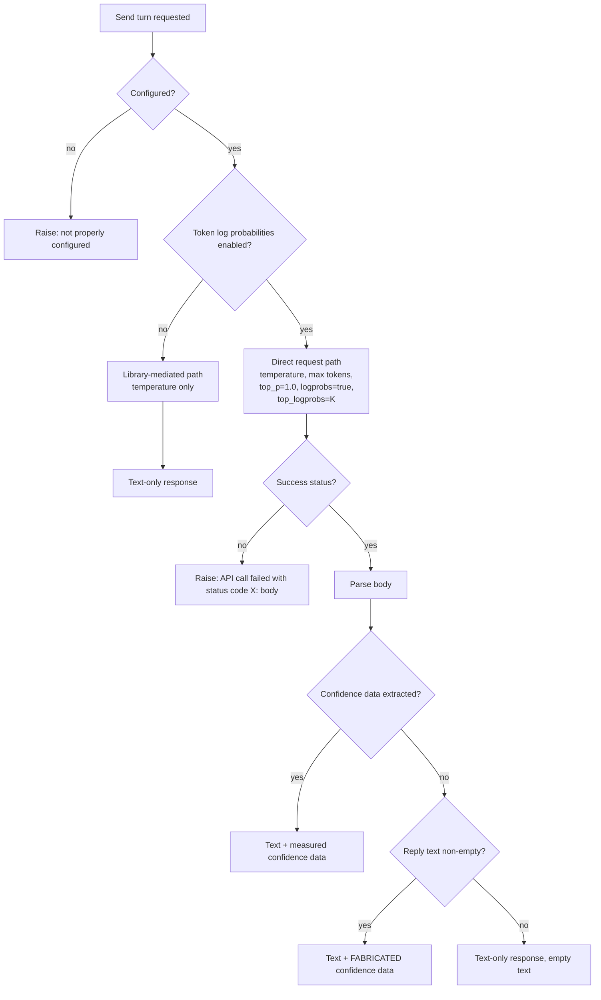

*Library-mediated path*

- **FR-6.25** — On the library-mediated path the backend SHALL obtain a chat client from the injectable client factory, supplying the endpoint parsed as an absolute address, the resolved API key, and the model identifier. The endpoint string SHALL NOT be trimmed on this path. *(realizes US-6.9)*
- **FR-6.26** — On the library-mediated path, history messages SHALL be mapped through a case-insensitive three-way role match on `user`, `assistant`, and `system`; any message with another role value SHALL be silently dropped. *(See QUIRK-6.5.)*
- **FR-6.27** — On the library-mediated path exactly one request option SHALL be set: temperature, narrowed to single floating-point precision. Maximum response tokens, nucleus-sampling value, and log-probability options SHALL NOT be sent. *(See QUIRK-6.3.)*
- **FR-6.28** — On the library-mediated path the reply text SHALL be taken from the **first content part of the first choice**; additional choices and additional content parts SHALL be discarded, and the returned probability list SHALL be null.
- **FR-6.29** — Any failure inside the library-mediated block SHALL be re-raised as an error with the message `Error calling Azure OpenAI: {inner message}`, preserving the inner cause.

*Direct request path — wire format*

- **FR-6.30** — On the direct request path the request address SHALL be composed as `{endpoint with all trailing '/' characters removed}/openai/deployments/{model identifier}/chat/completions?api-version=2023-12-01-preview`. The literal `2023-12-01-preview` is hard-coded and not configurable; it is a preview version despite in-code commentary describing it as stable. The model identifier SHALL NOT be escaped for inclusion in the address. *(See QUIRK-6.4, QUIRK-6.6.)*
- **FR-6.31** — Before sending, the backend SHALL clear all default headers on the shared transport, then add `Accept: application/json` and a header named `api-key` whose value is the resolved API key. No bearer token and no request signature are used. *(See QUIRK-6.2.)*
- **FR-6.32** — The request body SHALL be an object with exactly these fields, serialised with null-valued fields omitted, and SHALL be sent as a UTF-8 payload of media type `application/json` using the create/POST verb:

```
{
  "messages": [
    { "role": "system", "content": <system-prompt content from settings> },
    { "role": <history role, lower-cased>, "content": <history content> },
    ...                                    // one entry per non-command history message, in stored order
  ],
  "temperature": <settings temperature, full double precision>,
  "max_tokens":  <settings maximum response tokens>,
  "top_p":       1.0,                      // hard-coded; no user control anywhere
  "logprobs":    true,                     // hard-coded; this path is only taken when enabled
  "top_logprobs": <settings top-K alternatives>
}
```

- **FR-6.33** — On the direct request path there SHALL be **no** role whitelist: whatever role string the history holds SHALL be forwarded lower-cased. The same history therefore produces two different upstream payloads depending only on the enable-token-log-probabilities setting. *(See QUIRK-6.5.)*
- **FR-6.34** — The entire response body SHALL be read into a single string before anything is shown to the user. There SHALL be no streaming and no incremental rendering.
- **FR-6.35** — On a non-success status the backend SHALL raise an error whose message is `API call failed with status code {status}: {full response body}`, where `{status}` is the status's symbolic name rather than its numeric code and the body is included unfiltered. *(See QUIRK-6.7.)*
- **FR-6.36** — Any failure anywhere in the direct request block SHALL be re-raised with the message `Error making direct Azure OpenAI API call: {inner message}`. Because the non-success and parse errors are themselves raised inside this block, their messages SHALL appear nested inside this prefix. *(See QUIRK-6.8.)*
- **FR-6.37** — The backend SHALL emit diagnostic traces, visible only to an attached diagnostic listener and never to the user, for: the request address; the full request body; the response status and full response body; either `Found {n} token probabilities` or `No token probabilities found in response`; and the failure message on error. These traces contain the full system prompt and the entire conversation and SHALL be treated as sensitive.

*Direct request path — response parsing*

- **FR-6.38** — Parsing SHALL require a top-level `choices` array. Its absence SHALL be a hard parse failure raised as `Error parsing Azure OpenAI API response: {inner message}`.
- **FR-6.39** — When `choices` is present but empty, the reply text SHALL become the literal `No response received` and the turn SHALL be treated as a **success**, not an error.
- **FR-6.40** — Parsing SHALL require `choices[0].message` and `choices[0].message.content`; either being absent SHALL be a hard parse failure. An explicit null content SHALL become the empty string. *(See QUIRK-6.13.)*
- **FR-6.41** — Confidence data SHALL be sought in exactly this order, stopping at the first location that matches: (1) a top-level confidence block that is an object bearing a `content` array — extracted strictly; (2) a top-level confidence block that is itself an array — extracted tolerantly; (3) **only when there is no top-level confidence block at all**, `choices[0].logprobs` bearing a `content` property — extracted strictly; (4) otherwise `choices[0].logprobs` when it is itself an array — extracted tolerantly. *(See QUIRK-6.1.)* *(realizes US-6.5)*
- **FR-6.42** — Strict extraction SHALL, for each array element, require both a `token` string and a numeric `logprob`; elements missing either SHALL be silently skipped. Each accepted element SHALL produce a token record carrying those two values plus an initialised, possibly empty alternatives list. When the element carries a `top_logprobs` array, every entry of that array that itself has both `token` and `logprob` SHALL be appended as an alternative.
- **FR-6.43** — Tolerant extraction SHALL behave as strict extraction, plus: the alternatives array MAY be named either `top_logprobs` or `top_alternatives`; and an alternative element lacking `token`/`logprob` fields SHALL be treated as a property map — the routine walks its properties in order, assigning each property **name** to the alternative's token in turn and stopping at the first property whose value is numeric, which becomes the alternative's log-probability. Alternatives whose resolved token string is empty SHALL be dropped. *(This map-shaped handling is **INFERRED** to be written against a hypothetical format — no fixture, test, or document in the source uses it. See QUIRK-6.11, QUIRK-6.12.)*
- **FR-6.44** — Both extraction routines SHALL swallow every failure and report "found nothing". A malformed confidence block SHALL therefore degrade to "no confidence data" rather than to a turn failure — **and SHALL discard everything already extracted**. *(See QUIRK-6.10.)*
- **FR-6.45** — The parsed response SHALL carry a confidence list only when the extractor reported success **and** at least one token record was produced; otherwise the response SHALL carry text only.
- **FR-6.46** — Alternatives produced by extraction SHALL carry a null alternatives list of their own, while chosen tokens SHALL always carry an initialised (possibly empty) one. Only one level of nesting exists. *(See QUIRK-6.14.)*

*Fabricated confidence data — **SUPERSEDED by Owner decision D-001 (2026-08-29, `DECISIONS.md`)***

> **FR-6.47 through FR-6.52 are the observed source behaviour and are NOT to be implemented.** They are retained verbatim so that acceptance tests derived from the source can be identified and rewritten. The replacement requirement is **FR-6.52a**, below the block. The demonstration mode (§7.9) remains the only permitted producer of synthetic data and stamps it `synthetic: true`.

- **FR-6.47** *(superseded — D-001)* — Fabrication SHALL be triggered only when all three hold: the direct request path was taken (implying token log probabilities are enabled); parsing found zero confidence records; and the reply text is non-empty. An empty reply text SHALL therefore receive no fabricated data. *(See QUIRK-6.9.)*
- **FR-6.48** *(superseded — D-001)* — Fabrication SHALL split the reply text on the characters space, newline, tab, `.`, `,`, `!`, and `?`, discarding empty pieces. Punctuation therefore never appears in a fabricated token, and carriage returns are **not** separators.
- **FR-6.49** *(superseded — D-001)* — When the split yields **15 or fewer** words, all of them SHALL be used. Otherwise exactly 15 SHALL be taken, in this order: indices `[0,5)`, then indices `[⌊count/2⌋−2, ⌊count/2⌋+3)`, then indices `[count−5, count)` — the first five, a middle five, and the last five, using integer division. The three windows never overlap for any count above 15, so exactly 15 tokens are produced and the words between the windows are silently dropped. The value **15** is a display-oriented sample budget, not a business rule.
- **FR-6.50** *(superseded — D-001)* — Every fabricated token SHALL carry log-probability `ln(0.9)` (approximately `−0.10536`, displaying as a confidence of **90.00 %**), identical for every token and every turn.
- **FR-6.51** *(superseded — D-001)* — Every fabricated token SHALL carry up to three alternatives drawn from a fixed list: `{word}_alt` at `ln(0.05)`, `similar_{word}` at `ln(0.03)`, and `other_{word}` at `ln(0.02)`. The number emitted SHALL be the lesser of the top-K setting and 3 — so a top-K above 3 has no effect on fabricated output even though it is still sent upstream. The four fabricated probabilities sum to exactly 1.0.
- **FR-6.52** *(superseded — D-001)* — Fabricated data SHALL be returned in the same shape as measured data, with no flag, no marker, and no distinguishing field. Downstream visualisation and the "no confidence data was returned" notice SHALL treat it as genuine. *(See QUIRK-6.9 — decision taken: D-001 removes this behaviour.)*

- **FR-6.52a** *(replacement — D-001)* — When parsing finds zero confidence records, the adapter SHALL return the reply with the confidence list **absent** and SHALL never substitute synthetic data. If the provider's declared capability record says it **cannot** supply token log probabilities, the shell SHALL apply GR-19's decided behaviour: disable the log-probabilities setting, persist, and emit the auto-disable notice instructing the user to switch providers (normative text in `DECISIONS.md` D-001). If the provider **declares** the capability but returned none on this response, the shell SHALL emit GR-18's transient "none were returned" notice and leave the setting untouched.

*Response object and lifetime*

- **FR-6.53** — The provider response object SHALL carry four slots: reply text (defaulting to the empty string); an ordered token-confidence list (null when absent, never an empty list from either construction shape); an elapsed-time value in seconds (defaulting to `0`); and an error message (defaulting to null). The hosted OpenAI backend SHALL never populate the last two. *(See QUIRK-6.15.)*
- **FR-6.54** — The provider response object SHALL support exactly two construction shapes: text alone, which leaves the confidence list null; and text plus a confidence list, which stores the caller's list **by reference** without copying, cloning, or sorting. A clone that defensively copies still satisfies every behavioural requirement, but the shells rely on being able to pass the same list onward.
- **FR-6.55** — Each token-confidence record SHALL carry a token string (defaulting to empty), a natural-log probability, a derived probability computed as `e^(log probability)`, and a nullable list of alternative records of the same shape. The derived probability is computed, not stored.
- **FR-6.56** — The network transport MAY be supplied by the caller. A supplied transport SHALL NOT be released by the backend; a self-created transport SHALL be released, and only on the explicit-release path. *(realizes US-6.9)*
- **FR-6.57** — The chat-client factory MAY be supplied by the caller; otherwise a default SHALL be created during construction. Default client construction SHALL be purely local — no network access, no validation — even for an endpoint whose host does not resolve. *(realizes US-6.9)*
- **FR-6.58** — There SHALL be no caching of any kind: no client caching (the library-mediated client is rebuilt on every such send), no response caching, and no credential caching (the key is re-resolved on every read, at least twice per turn).
- **FR-6.59** — There SHALL be no retry, no rate-limit handling, no retry-after inspection, no back-off, no circuit breaker, and no configured request timeout. The only bound is the transport's platform default. **INFERRED**: that default is approximately 100 seconds; it is neither set nor observed in the source.

*Shell-side behaviour bound to this feature*

- **FR-6.60** — Before sending, the console shell SHALL re-check that the selected backend is configured; if not, it SHALL print `Error: Azure OpenAI service is not configured. Use environment variables or Windows Credential Manager to configure credentials securely.` followed by `   Type '/set' to see current configuration and setup instructions.`, and SHALL NOT send. *(realizes US-6.2)*
- **FR-6.61** — The full-screen shell SHALL NOT pre-check configuration; it SHALL go straight from registry lookup to send, so the backend's internal message appears in a modal prefixed `Failed to get AI response: `. *(See QUIRK-6.17.)*
- **FR-6.62** — The console shell SHALL look the provider name up in the registry using the raw settings value (case-sensitive); the full-screen shell SHALL lower-case it first (case-insensitive). *(See QUIRK-6.18.)*
- **FR-6.63** — The console shell SHALL print `Thinking...` before sending, and, when token log probabilities are enabled, SHALL first print `Log probabilities enabled - requesting with top-k={K}`. *(realizes US-6.5)*
- **FR-6.64** — When a turn returns text but no confidence data while token log probabilities were requested, the console shell SHALL print `Note: Log probabilities were requested but none were returned by the model.` and `This could be due to the model not supporting this feature or an API limitation.`
- **FR-6.65** — The user message SHALL be appended to history **before** the send. A failed turn therefore leaves the user's message in history and appends nothing for the assistant. *(realizes US-6.8)*
- **FR-6.66** — When the selected provider is configured at start-up, the console shell SHALL print `Azure credentials loaded from: {source}` where `{source}` is exactly one of `environment variable (CHATDBG_AZURE_API_KEY)`, `Windows Credential Manager`, `settings file (deprecated)`, or `not set`. *(realizes US-6.6)*
- **FR-6.67** — Access control SHALL consist solely of possession of the API key. There SHALL be no role check, no per-user authorisation, and no audit log.
- **FR-6.68** — All user-visible strings SHALL be fixed English text. There SHALL be no localisation, no resource files, and no localisation hooks.

*Sibling contract obligations (documented in their own sections)*

- **FR-6.69** — The second hosted backend SHALL report the display name `Amazon Bedrock` and SHALL be considered configured when the model identifier is non-empty **and** either a resolved access key is non-empty or the standard cloud access-key environment variable is set — a weaker check than FR-6.13. It SHALL raise on not-configured.
- **FR-6.70** — The local model backend SHALL report the display name `Local LLM (LLamaSharp)` and SHALL be considered configured when the model identifier names an existing file. It SHALL serialise generations and SHALL **return** an error-bearing response object rather than raising.

---

**External technology**

*Requires: a hosted, deployment-scoped large-language-model chat-completion service (HTTPS + JSON request/response; route `/openai/deployments/{deployment}/chat/completions?api-version=…`; header-based authentication using a header named `api-key`). Source used: Azure OpenAI Service, API version literal `2023-12-01-preview`. Reimplementer notes: the model identifier IS the deployment name — there is no separate deployment setting. The API version is hard-coded and not user-configurable. Request fields that must survive: `messages[{role,content}]`, `temperature`, `max_tokens`, `top_p`, `logprobs`, `top_logprobs`. Response fields read: `choices[]`, `choices[0].message.content`, a top-level `logprobs` block (as object-with-`content` or as array), `choices[0].logprobs`, and per-token `token` / `logprob` / `top_logprobs[]` / `top_alternatives[]`. **INFERRED**: this wire contract is read from source only — no automated test asserts it and it is never exercised against a live service in the source repository. Re-verify field names against current provider documentation rather than trusting the pinned preview version.*

*Requires: a vendor client library for the same hosted service, used only on the non-log-probability path (same service, library-managed wire format). Source used: the Azure AI OpenAI client library, version 2.1.0, with its bundled chat-client types. Reimplementer notes: only the temperature option is set through it. A clone may legitimately use one direct request path for both cases — but must then consciously decide whether to preserve the maximum-response-tokens asymmetry (QUIRK-6.3) and the role-filtering asymmetry (QUIRK-6.5).*

*Requires: a general HTTP client with a substitutable transport (HTTP/1.1 over TLS). Source used: the runtime platform's HTTP client. Reimplementer notes: must support clearing and setting default headers, an `Accept` header, a custom authentication header, sending a UTF-8 JSON body, reading the whole response body as a string, and reading the status code — which is rendered as its symbolic name in the user-visible error text. No timeout is configured anywhere; the platform default is the only bound.*

*Requires: serialisation of an ad-hoc request object to JSON with null-omission. Source used: the platform JSON serializer with a camel-case naming policy and null-omission. Reimplementer notes: the naming policy is effectively a no-op for the field names used — the wire names are the literals `messages`, `temperature`, `max_tokens`, `top_p`, `logprobs`, `top_logprobs` and must appear exactly so.*

*Requires: a tolerant document-object-model JSON reader for response parsing. Source used: the platform DOM-style JSON reader. Reimplementer notes: needs optional-property probing, value-kind discrimination (object vs array vs number), array enumeration, and object-property enumeration for the map-shaped alternative case. It must also survive being handed a non-array value where an array is expected — the source currently does not (QUIRK-6.12).*

*Requires: natural logarithm and exponential functions over IEEE-754 double-precision numbers. Source used: the platform math library. Reimplementer notes: `ln(0.9)`, `ln(0.05)`, `ln(0.03)`, `ln(0.02)` for fabrication; `e^x` for the displayed probability.*

*Requires: a diagnostic trace sink not visible to the end user. Source used: the platform debug-trace writer. Reimplementer notes: traces the request address, the full request body, the response status and body, the confidence-record count, and failure messages. Because the request body contains the full system prompt and entire conversation, the sink must be treated as sensitive.*

*Requires: a process-environment secret source. Source used: the environment variable `CHATDBG_AZURE_API_KEY`. Reimplementer notes: highest priority in the resolution chain, fully portable.*

*Requires: an optional, opt-in operating-system secret vault. Source used: Windows Credential Manager via the native credential API (`CredReadW` / `CredWriteW` / `CredDeleteW` in `advapi32.dll`), generic credential type, entry name `ChatDbg:AzureApiKey`, blob encoded as UTF-16, persistence scope "local machine". Reimplementer notes: consulted only when explicitly enabled in settings; all failures are swallowed. This leg is the only platform-coupled part of the feature — on non-Windows hosts it silently yields nothing and the chain collapses to environment-variable → settings-file. A port needs a per-platform substitute (keychain, secret service) or a documented environment-variable-only posture.*

*Requires: local file storage for the settings record. Source used: a JSON file at `<user profile>/.ChatDbg/settings.json`, with the system temporary directory as fallback. Reimplementer notes: holds the endpoint, model identifier, temperature, maximum tokens, top-K, log-probability toggle, and the deprecated plaintext key.*

*Requires: a unit-test framework plus a substitutable HTTP transport stub. Source used: xUnit 2.9.1, Moq 4.20.69, and a hand-written stub transport returning a fixed status and body regardless of the request. Reimplementer notes: the source's stub ignores the request entirely, so the address, headers, and body are unobservable in the existing suite. A clone that wants those covered needs a recording stub. The stub returns its body with a plain-text media type and the parser never inspects media type.*

*Requires: an execution runtime. Source used: .NET 10 (SDK pinned to `10.0.100-rc.1.25451.107`; platform-neutral target framework `net10.0`). Reimplementer notes: not a requirement of the feature; listed for completeness.*

---

**Acceptance criteria**

- **AC-6.1** — **Given** a settings record with the endpoint unset, model identifier `gpt-4`, and no key in the environment, vault, or file, **when** the configuration check runs, **then** it reports *not configured*.
- **AC-6.2** — **Given** endpoint `https://example.openai.azure.com`, settings-file key `key`, and model identifier `model`, **when** the configuration check runs, **then** it reports *configured*.
- **AC-6.3** — **Given** the environment variable `CHATDBG_AZURE_API_KEY` is `from-env` and the settings-file key is `from-json`, **when** the key is resolved, **then** the value used is `from-env`; **and given** no environment variable, no vault entry, and a settings-file key of `stored-value`, **then** the value used is `stored-value`.
- **AC-6.4** — **Given** token log probabilities are enabled and the chat-client factory is one that raises on every invocation, **when** a turn is sent, **then** the turn completes successfully — proving the library-mediated path was never entered.
- **AC-6.5** — **Given** token log probabilities are **disabled**, temperature `0.7`, maximum tokens `1000`, and a history of one `user` message `hi` plus one message flagged as a command, **when** a turn is sent, **then** exactly one upstream call is made through the library-mediated path carrying the two messages `[system <system prompt>, user "hi"]` with the command message absent, carrying temperature `0.7` and **no** maximum-tokens, nucleus-sampling, or log-probability options; **and** the returned response's text is the first content part of the first choice and its confidence list is null.
- **AC-6.6** — **Given** token log probabilities are **enabled** with top-K `2`, endpoint `https://example.openai.azure.com/` (note the trailing slash), model identifier `model`, temperature `0.7`, and maximum tokens `1000`, **when** a turn with one `user` message `hi` is sent, **then** a create/POST request is made to `https://example.openai.azure.com/openai/deployments/model/chat/completions?api-version=2023-12-01-preview` with headers `api-key: <resolved key>` and `Accept: application/json`, a UTF-8 `application/json` body, and a body equal to `{"messages":[{"role":"system","content":"<prompt>"},{"role":"user","content":"hi"}],"temperature":0.7,"max_tokens":1000,"top_p":1.0,"logprobs":true,"top_logprobs":2}`.
- **AC-6.7** — **Given** a success reply whose body has a top-level confidence block `{"content":[{"token":"Hello","logprob":-0.1,"top_logprobs":[{"token":"Hi","logprob":-0.2}]}]}` and `choices[0].message.content` of `"response"`, **when** the turn completes, **then** the response carries exactly **one** token record whose token is `Hello`, whose log-probability is `-0.1`, and which carries exactly one alternative `Hi` at `-0.2`.
- **AC-6.8** — **Given** the same body but with the confidence block at `choices[0].logprobs.content` and **no** top-level confidence block, **when** the turn completes, **then** the same single token record is produced.
- **AC-6.9** — **Given** a body carrying **both** a top-level confidence block whose value is JSON `null` **and** a populated `choices[0].logprobs.content`, **when** the turn completes, **then** no measured confidence data is extracted and fabricated data is returned instead. *(A clone that fixes QUIRK-6.1 must change this criterion deliberately.)*
- **AC-6.10** — **Given** a success reply with `choices[0].message.content` of `"response text"`, no confidence data anywhere, and top-K `3`, **when** the turn completes, **then** the confidence list holds exactly **2** records — `response` and `text` — each with log-probability `ln(0.9)` and exactly 3 alternatives named `response_alt` / `similar_response` / `other_response` and `text_alt` / `similar_text` / `other_text`, at `ln(0.05)` / `ln(0.03)` / `ln(0.02)` respectively.
- **AC-6.11** — **Given** a reply of exactly 16 space-separated words `w0`…`w15` and fabrication runs, **then** exactly 15 tokens are produced in the order `w0 w1 w2 w3 w4 w6 w7 w8 w9 w10 w11 w12 w13 w14 w15` — the word at index 5 is dropped and no word is duplicated.
- **AC-6.12** — **Given** a reply of `Hello, world! How are you?` and fabrication runs, **then** 5 tokens are produced — `Hello`, `world`, `How`, `are`, `you` — and no token contains `,`, `!`, or `?`.
- **AC-6.13** — **Given** top-K is `7` and fabrication runs, **then** each fabricated token carries exactly **3** alternatives; **given** top-K is `2`, each carries exactly **2**, namely `{word}_alt` and `similar_{word}`.
- **AC-6.14** — **Given** the service replies with status `404` and body `{"error":"deployment not found"}`, **when** a turn is sent from the console shell, **then** the user sees exactly `Error getting AI response: Error making direct Azure OpenAI API call: API call failed with status code NotFound: {"error":"deployment not found"}`; no assistant message is appended to history; the user's own message remains in history.
- **AC-6.15** — **Given** the service replies with success and body `{"choices":[]}` and token log probabilities are enabled, **when** the turn is sent, **then** no error is raised, the assistant reply text is exactly `No response received`, and three fabricated tokens `No`, `response`, `received`, each at 90 % displayed confidence, accompany it.
- **AC-6.16** — **Given** the service replies with success and body `{"choices":[{"message":{"content":null}}]}` and token log probabilities are enabled, **when** the turn is sent, **then** the reply text is the empty string, the confidence list is null, and the console prints `Note: Log probabilities were requested but none were returned by the model.`
- **AC-6.17** — **Given** a success reply whose confidence array holds two entries where the second entry's `logprob` is the string `"-0.2"`, **when** the turn completes, **then** **neither** token survives and fabricated data is returned instead.
- **AC-6.18** — **Given** the backend was constructed with a caller-supplied HTTP transport, **when** the backend is released, **then** the transport is still usable; **given** it created its own, **then** the transport is released.
- **AC-6.19** — **Given** a history containing messages flagged as commands, **when** a turn is sent on either path, **then** none of those messages appear in the upstream request and the system-prompt message is still at index 0.
- **AC-6.20** — **Given** a history message whose role is `tool`, **when** token log probabilities are **off** the message is **absent** from the upstream request, **and when** they are **on** the message is **present** with role `tool`.
- **AC-6.21** — **Given** the default client factory is asked for a client with the syntactically valid but non-resolving endpoint `https://example.openai.azure.com/`, key `key`, and model `model`, **when** the call returns, **then** a client object exists and no network traffic has occurred.
- **AC-6.22** — **Given** a token record whose log-probability is `ln(0.25)`, **when** its derived probability is read, **then** it is `0.25` to 5 decimal places.
- **AC-6.23** — **Given** a response constructed from text alone, **then** its confidence list is null; **given** one constructed from text plus a list, **then** the stored list is the very same list instance the caller passed.
- **AC-6.24** — **Given** any turn against this backend, success or failure, **when** the response object is inspected, **then** its elapsed-time value is `0` and its error-message slot is null.
- **AC-6.25** — **Given** the settings record holds provider `Azure` (capitalised), **when** the user sends a turn, **then** the console shell reports `Error: Unknown AI provider: Azure` while the full-screen shell sends the turn normally.
- **AC-6.26** — **Given** the backend is not configured, **when** the user sends a turn in the full-screen shell, **then** a modal reads `Failed to get AI response: Azure OpenAI service is not properly configured. Please set AzureEndpoint, AzureApiKey, and ModelId.`
- **AC-6.27** — **Given** a non-Windows host with the credential-vault option enabled and no environment variable set, and an endpoint and model identifier present but the key held only in a vault, **when** the configuration check runs, **then** it reports *not configured*, with no warning that the vault is unavailable.
- **AC-6.28** — **Given** the settings command is given a temperature of `2.5`, **then** it is rejected with `Temperature must be a number between 0 and 2`; **given** maximum tokens of `9000`, rejected with `MaxTokens must be a number between 1 and 8192`; **given** top-K of `0`, rejected with `LogProbabilitiesTopK must be a number between 1 and 20`; **given** provider `openai`, rejected with `Provider must be 'azure', 'bedrock', or 'llama'`.
- **AC-6.29** — **Given** a hand-edited settings file containing a top-K of `0` and maximum tokens of `999999`, **when** the application starts and a turn is sent with token log probabilities enabled, **then** those values reach the wire unchanged and no validation message is shown.
- **AC-6.30** — **Given** the provider value in the settings record is empty at start-up, **then** the console shell prints `Warning: No AI provider configured.` followed by `   Use '/set provider azure', '/set provider bedrock', or '/set provider llama' to configure.`

---

**Quirks**

- **QUIRK-6.1**: Per-choice confidence data is unreachable whenever a top-level confidence block exists in an unexpected shape. The per-choice lookups sit behind an "else" on the *existence* of a top-level block, so a response carrying a top-level block that is neither an object-with-`content` nor an array (for example JSON `null`) causes the per-choice locations never to be examined; all real confidence data is lost and fabricated data is substituted. The hosted service's documented wire format puts confidence data under `choices[0].logprobs` — the branch checked **last**. **INFERRED** from branch structure; no test covers it. Evidence: `src/Xcaciv.ChatDbg.Core/Services/AzureOpenAIService.cs:245-270`. Keep-or-fix decision deferred to Open Questions.
- **QUIRK-6.2**: The direct request path clears and rewrites the shared transport's default headers on every call. Two concurrent sends through one instance can race on headers and credentials, and a caller-supplied pre-configured transport has its headers wiped. There is no locking, although the sibling local-model backend does serialise its work. **INFERRED** hazard — the shells are single-turn interactive, so it is latent. Evidence: `src/Xcaciv.ChatDbg.Core/Services/AzureOpenAIService.cs:126-128`. Keep-or-fix decision deferred to Open Questions.
- **QUIRK-6.3**: The maximum-response-tokens setting is never sent on the default path (token log probabilities off), although the product documentation describes it as "Maximum response length" for all providers. Switching token log probabilities on silently starts enforcing a length cap that was not enforced before. Evidence: `src/Xcaciv.ChatDbg.Core/Services/AzureOpenAIService.cs:98-101` vs `:155`; `README.md:50,100`. Keep-or-fix decision deferred to Open Questions.
- **QUIRK-6.4**: The two send paths normalise the endpoint differently. The direct path trims trailing separators; the library-mediated path passes the string through verbatim. The product documentation's own example endpoint carries a trailing separator. Evidence: `src/Xcaciv.ChatDbg.Core/Services/AzureOpenAIService.cs:70` vs `:121`; `README.md:120`. Keep-or-fix decision deferred to Open Questions.
- **QUIRK-6.5**: The two send paths filter message roles differently. The library-mediated path drops any role that is not `user`/`assistant`/`system`; the direct path forwards every role lower-cased. The same history produces two different upstream payloads depending only on the token-log-probability setting. Evidence: `src/Xcaciv.ChatDbg.Core/Services/AzureOpenAIService.cs:84-95` vs `:143-147`. Keep-or-fix decision deferred to Open Questions.
- **QUIRK-6.6**: The troubleshooting text tells the user to "Ensure you're using a recent API version (2023-05-15 or newer for Azure OpenAI)" as though the API version were user-controllable. It is a hard-coded constant, and the in-code comment describes that preview constant as "the latest stable API version". Evidence: `src/Xcaciv.ChatDbg.Core/Commands/LogProbsCommand.cs:185` vs `src/Xcaciv.ChatDbg.Core/Services/AzureOpenAIService.cs:119-120`. Keep-or-fix decision deferred to Open Questions.
- **QUIRK-6.7**: The entire upstream error body is echoed into the terminal on a non-success status, and the status itself is rendered as a symbolic name (`NotFound`, `Unauthorized`) rather than a number. An upstream error page can push arbitrary content — quotas, request identifiers, echoed prompt fragments — into the user's terminal. The symbolic rendering is **INFERRED** from default value rendering; no test captures an error message. Evidence: `src/Xcaciv.ChatDbg.Core/Services/AzureOpenAIService.cs:184-187`. Keep-or-fix decision deferred to Open Questions.
- **QUIRK-6.8**: Parse failures are double-wrapped. A malformed body produces `Error making direct Azure OpenAI API call: Error parsing Azure OpenAI API response: {inner}` because the parse wrapper is itself caught by the outer wrapper. Evidence: `src/Xcaciv.ChatDbg.Core/Services/AzureOpenAIService.cs:284` then `:216`. Keep-or-fix decision deferred to Open Questions.
- **QUIRK-6.9**: Fabricated confidence data is returned unmarked. There is no flag, no marker, and no distinct field, so a user analysing "model confidence" may be reading invented numbers, and the console shell's "no probabilities were returned" notice becomes nearly unreachable for this backend. Evidence: `src/Xcaciv.ChatDbg.Core/Services/AzureOpenAIService.cs:197-208`; `src/ChatDbg/ChatShell.cs:387-391`. Keep-or-fix decision deferred to Open Questions.
- **QUIRK-6.10**: One malformed token entry discards every confidence record already extracted. The extractors accumulate into a caller-supplied list but report failure on any exception, and the caller requires the success flag as well as a non-empty list — so a body whose *last* token carries a string log-probability loses all preceding good tokens, and fabrication silently replaces the lot. **INFERRED** from control flow; no test exercises a malformed confidence block. Evidence: `src/Xcaciv.ChatDbg.Core/Services/AzureOpenAIService.cs:298,330-334,403-407,273-276`. Keep-or-fix decision deferred to Open Questions.
- **QUIRK-6.11**: A map-shaped alternative with no numeric property is emitted with log-probability `0`, which the display layer renders as `e^0 = 1.0`, i.e. **100 % confidence** — for an alternative that was *not* chosen. The alternative's token also ends up being the *last* property name scanned, because the loop overwrites the token on every iteration and only stops on a numeric value. **INFERRED**; no test or fixture exercises it. Evidence: `src/Xcaciv.ChatDbg.Core/Services/AzureOpenAIService.cs:362-393`. Keep-or-fix decision deferred to Open Questions.
- **QUIRK-6.12**: An alternatives field that is present but is not an array aborts extraction entirely. The enumeration fails, the failure is swallowed, and the whole response is reported as carrying no confidence data. **INFERRED**; no test covers it. Evidence: `src/Xcaciv.ChatDbg.Core/Services/AzureOpenAIService.cs:308-310,330-334`. Keep-or-fix decision deferred to Open Questions.
- **QUIRK-6.13**: A content-filtered or otherwise message-less choice is a hard failure, and a null-content choice produces a silent empty turn. `choices[0].message.content` is required; if `message` or `content` is missing the turn fails with a double-wrapped parse error, and if `content` is explicitly null the reply text becomes the empty string — which then suppresses fabrication, so the user sees an empty assistant message followed by the "none were returned" notice. Evidence: `src/Xcaciv.ChatDbg.Core/Services/AzureOpenAIService.cs:237-238,203`; `src/ChatDbg/ChatShell.cs:387-391`. Keep-or-fix decision deferred to Open Questions.
- **QUIRK-6.14**: Alternatives never receive an alternatives list of their own. Chosen tokens always receive an initialised (possibly empty) list; their alternatives receive null. Persisted history therefore serialises `"top_alternatives": []` for chosen tokens and omits the field entirely for alternatives. Evidence: `src/Xcaciv.ChatDbg.Core/Services/AzureOpenAIService.cs:300-305` vs `:315-319`. Keep-or-fix decision deferred to Open Questions.
- **QUIRK-6.15**: The response object carries an elapsed-time slot and an error-message slot that this backend never populates — always `0` and null. Any interface rendering "took N seconds" will always show zero for this provider. Evidence: `src/Xcaciv.ChatDbg.Core/Models/AIResponse.cs:22-32`; `src/Xcaciv.ChatDbg.Core/Services/AzureOpenAIService.cs:104,207,211`. Keep-or-fix decision deferred to Open Questions.
- **QUIRK-6.16**: Settings loaded from disk bypass every range check. Loading only deserialises; the 1–20 top-K rule and the 1–8192 maximum-tokens rule live only in the interactive command handlers. A hand-edited or migrated settings file can put a top-K of `0` or a maximum-tokens of `999999` straight onto the wire, and a top-K below 1 also silently produces zero fabricated alternatives. Evidence: `src/Xcaciv.ChatDbg.Core/Services/SettingsService.cs:43-58`; `src/Xcaciv.ChatDbg.Core/Commands/SetCommand.cs:79-85,173-181`; `src/Xcaciv.ChatDbg.Core/Services/AzureOpenAIService.cs:155,158,459`. Keep-or-fix decision deferred to Open Questions.
- **QUIRK-6.17**: The full-screen shell never pre-checks configuration before sending. It looks the provider up in the registry and sends, so the backend's internal message reaches the user verbatim in a modal, naming internal settings identifiers rather than the commands the console shell offers. Evidence: `src/ChatDbg.Shell.Gui/UI/ChatWindow.cs:426-437,494-497` vs `src/ChatDbg/ChatShell.cs:356-361`. Keep-or-fix decision deferred to Open Questions.
- **QUIRK-6.18**: Provider lookup is case-sensitive in the console shell and case-insensitive in the full-screen shell. A hand-edited settings file containing a capitalised provider name yields `Error: Unknown AI provider: Azure` in the console but works in the full-screen interface. Evidence: `src/ChatDbg/ChatShell.cs:251,349` vs `src/ChatDbg.Shell.Gui/UI/ChatWindow.cs:425-433`. Keep-or-fix decision deferred to Open Questions.
- **QUIRK-6.19**: A second full-screen shell class registers only two of the three backends (the two hosted ones, omitting the local model). It is never instantiated anywhere in the source, so it is dead code that would break local-model selection if it were ever wired up. Evidence: `src/ChatDbg.Shell.Gui/ChatShell.cs:33-37` (dead) vs `src/ChatDbg.Shell.Gui/Program.cs:22-27` (live). Keep-or-fix decision deferred to Open Questions.
- **QUIRK-6.20**: Four different "text was null" fallback strings exist for the same condition across the product, one of them misspelled: `Error: Response text expected, none given` (this backend), `Error: Response text expected, none given.` (second hosted backend), `Error: Response text expected, none received` (local backend), and `Error: Response text expected, none recieved.` (console shell). The full-screen shell substitutes an empty string instead of any message — five different user-visible outcomes. Evidence: `src/Xcaciv.ChatDbg.Core/Services/AzureOpenAIService.cs:50`; `src/Xcaciv.ChatDbg.Core/Services/BedrockService.cs:33`; `src/Xcaciv.ChatDbg.Core/Services/LLamaSharpService.cs:58`; `src/ChatDbg/ChatShell.cs:377`; `src/ChatDbg.Shell.Gui/UI/ChatWindow.cs:444`. Keep-or-fix decision deferred to Open Questions.
- **QUIRK-6.21**: A pseudo-random generator is constructed once per fabricated token and never used. Fabricated output is fully deterministic despite the appearance of randomisation. Evidence: `src/Xcaciv.ChatDbg.Core/Services/AzureOpenAIService.cs:451`. Keep-or-fix decision deferred to Open Questions.
- **QUIRK-6.22**: The garbage-collection cleanup hook never releases the self-created transport — it invokes the release routine with the "not an explicit release" flag, and the transport is released only under the explicit flag. A backend never explicitly released leaks its transport, and the hook's existence keeps every instance alive for an extra collection cycle for no benefit. Evidence: `src/Xcaciv.ChatDbg.Core/Services/AzureOpenAIService.cs:480-496`. Keep-or-fix decision deferred to Open Questions.
- **QUIRK-6.23**: The security documentation instructs non-Windows users to enable the operating-system credential vault, showing a Linux shell export alongside a container image that runs the enable-vault and store-key commands. Off Windows the vault returns nothing and the enable command is refused; the failure is silent in the resolution chain. Evidence: `docs/SECURITY-IMPLEMENTATION.md:226,233,236`; `src/Xcaciv.ChatDbg.Core/Models/WindowsCredentialManager.cs:59-62,169-172`; `src/Xcaciv.ChatDbg.Core/Models/ChatSettings.cs:137-141`; `src/Xcaciv.ChatDbg.Core/Commands/SetCommand.cs:219-224`. Keep-or-fix decision deferred to Open Questions.
- **QUIRK-6.24**: The only test that exercises real confidence extraction feeds a response shape the hosted service does not emit (a top-level confidence block), so the branch that would actually run in production — the per-choice one — has no coverage at all. Combined with QUIRK-6.1, the tested path and the real path are different code. Evidence: `src/Xcaciv.ChatDbg.Core.Tests/Services/AzureOpenAIServiceTests.cs:40-59` vs `src/Xcaciv.ChatDbg.Core/Services/AzureOpenAIService.cs:260-270`. Keep-or-fix decision deferred to Open Questions.

---

**Source notes**

Dossier: `output/chatdbg/dossiers/ai-provider-azure.md`, generated from source repository `chatdbg` at pinned commit `d8c18f61d6bb73666ed97cd4885e877e35558485` (branch `LLamaSharp_support`).

Primary evidence paths (repo-relative):

- Contract and backend: `src/Xcaciv.ChatDbg.Core/Services/IAIService.cs`, `src/Xcaciv.ChatDbg.Core/Services/AzureOpenAIService.cs`, `src/Xcaciv.ChatDbg.Core/Services/IAzureOpenAIClientFactory.cs`, `src/Xcaciv.ChatDbg.Core/Services/DefaultAzureOpenAIClientFactory.cs`
- Sibling backends (contract obligations only): `src/Xcaciv.ChatDbg.Core/Services/BedrockService.cs`, `src/Xcaciv.ChatDbg.Core/Services/LLamaSharpService.cs`
- Data model: `src/Xcaciv.ChatDbg.Core/Models/AIResponse.cs`, `src/Xcaciv.ChatDbg.Core/Models/TokenLogProbabilities.cs`, `src/Xcaciv.ChatDbg.Core/Models/ChatMessage.cs`, `src/Xcaciv.ChatDbg.Core/Models/ChatHistory.cs`
- Settings and credentials consumed: `src/Xcaciv.ChatDbg.Core/Models/ChatSettings.cs`, `src/Xcaciv.ChatDbg.Core/Services/SettingsService.cs`, `src/Xcaciv.ChatDbg.Core/Models/WindowsCredentialManager.cs`
- Command surface touching this feature: `src/Xcaciv.ChatDbg.Core/Commands/SetCommand.cs`, `src/Xcaciv.ChatDbg.Core/Commands/LogProbsCommand.cs`
- Shell integration: `src/ChatDbg/ChatShell.cs`, `src/ChatDbg/Program.cs`, `src/ChatDbg.Shell.Gui/Program.cs`, `src/ChatDbg.Shell.Gui/ChatShell.cs` (dead), `src/ChatDbg.Shell.Gui/UI/ChatWindow.cs`, `src/ChatDbg.Shell.Gui/UI/SettingsDialog.cs`
- Tests: `src/Xcaciv.ChatDbg.Core.Tests/Services/AzureOpenAIServiceTests.cs`, `src/Xcaciv.ChatDbg.Core.Tests/Services/DefaultFactoriesTests.cs`, `src/Xcaciv.ChatDbg.Core.Tests/Models/AIResponseTests.cs`, `src/Xcaciv.ChatDbg.Core.Tests/Models/TokenLogProbabilityTests.cs`, `src/Xcaciv.ChatDbg.Core.Tests/Models/ChatSettingsTests.cs`, `src/Xcaciv.ChatDbg.Core.Tests/TestDoubles/StubHttpMessageHandler.cs`
- Documentation consulted: `README.md`, `docs/SECURITY-IMPLEMENTATION.md`, `docs/TERMINAL-GUI-IMPLEMENTATION.md`

Test-coverage reality check carried forward from the dossier: only nine tests touch this feature. **No test asserts the request address, the API version, the header name, the request body shape, the message ordering, the command-message exclusion, the role mapping, the error wrapping, the empty-`choices` case, the fabrication magic numbers, or the release rule** — the source's stub transport ignores the request entirely, making it unobservable. Those behaviours are read from source only.

---

### 7.7 Managed Cloud Model Marketplace Integration

**Description**

The product is a terminal chat assistant for debugging work that can talk to more than one large-language-model back end. This section specifies one of the three interchangeable back ends: the **managed cloud model marketplace** — a regional, account-scoped service through which a customer's own cloud account rents access to hosted foundation models (in practice, chiefly the Claude model family). It exists so that an organisation that already has a cloud account, an identity, a region and a billing relationship with that vendor can point the assistant at that account rather than provision a second AI vendor, and so that no single vendor is a hard dependency of the product.

The back end is deliberately thin and stateless. It advertises a display name, answers a yes/no readiness question about the current settings, and answers a chat turn. To answer a turn it flattens the whole conversation into an ordered list of role/content entries, chooses one of two request-body shapes according to whether the configured model identifier begins with the family prefix, sends exactly one non-streaming request to the marketplace, buffers the whole reply, and parses the reply through one of three mutually exclusive response shapes. It never retries, never times out on its own, never streams, never truncates or windows the conversation, and can never be cancelled once a turn is in flight. Credentials are never accepted as a persisted setting: the user must supply them through environment variables or an operating-system credential vault, and the back end only *reads* the already-resolved values.

The back end also *attempts* to carry the product's token-log-probability introspection to this marketplace: it always emits two probability-request members in the body and contains a large response-side probability parser. **This does not work against the real service.** Neither request member belongs to the marketplace's published model contract, so in practice the members are rejected or ignored and the parser never sees genuine probability data — the only place it has ever been exercised is a hand-written fixture. Unlike the sibling cloud back end, this one does not fabricate placeholder probabilities, so a user who enables the feature here sees only a "none were returned" notice. That gap is carried forward as a requirement-level fact and as an open question, not silently repaired.

---

**User stories**

- **US-7.1** — As a developer whose organisation standardises on one cloud vendor, I want to select the managed cloud model marketplace as my chat back end, so that the assistant runs against my existing account, region and billing relationship instead of a second AI vendor.
- **US-7.2** — As a developer, I want to name the hosted model and the service region, so that my chat turns reach the specific foundation model my account is entitled to.
- **US-7.3** — As a security-conscious developer, I want to supply my cloud access key and secret key out of band (process environment or the operating-system credential vault) and be refused if I try to put them in the settings file, so that long-lived secrets never land in a configuration document.
- **US-7.4** — As a developer starting the console shell, I want to be told immediately whether this back end is configured and, when it is, which source my credentials came from, so that I can fix my setup before wasting a chat turn.
- **US-7.5** — As a developer, I want to type free-text questions and receive the hosted model's answer in my transcript, so that I can get debugging help without leaving the terminal.
- **US-7.6** — As a developer analysing model confidence, I want to request per-token log probabilities from this back end with a chosen number of alternatives, so that the confidence visualiser has data to show. *(Supported as a request-shaping and parsing capability only; against the real service it yields nothing — see FR-7.55 and QUIRK-7.1.)*
- **US-7.7** — As a developer whose turn fails, I want the failure reported as a single readable line that names the back end and preserves the underlying cause, and I want the session to continue, so that one bad turn does not end my working session.
- **US-7.8** — As a maintainer, I want the construction of the marketplace client to sit behind a substitutable seam, so that the entire request-build / invoke / parse path can be exercised with zero network traffic.

---

**Use cases**

#### UC-7.A — Configure the marketplace back end (realizes US-7.1, US-7.2, US-7.3)

**Preconditions**
- The product is installed and a settings document exists or can be created at `<user profile>/.ChatDbg/settings.json`.
- The user holds cloud credentials entitled to invoke the chosen hosted model in the chosen region. Entitlement itself is granted outside the product.

**Main flow**
1. The user selects the provider with `/set provider bedrock` (the value is lower-cased before comparison), or picks the radio option labelled `AWS Bedrock` at index 1 in the windowed settings dialog.
2. The user sets the model identifier with `/model <id>` or `/set modelId <id>`. The value is the remainder of the input line rejoined with single spaces, so identifiers containing spaces survive intact. No marketplace-specific validation is performed.
3. The user sets the region with `/set awsRegion <region>` or via the `AWS Region:` text field in the windowed settings dialog. The shell replies `Set awsRegion = <value>`.
4. The user exports the access key and secret key into the process environment (or stores them in the operating-system credential vault after enabling that source).
5. Each change made through the settings command writes the whole settings document immediately.
6. On next start-up the settings document is re-read and the readiness result is reported (UC-7.B).

**Alternate flows**
- **A1 — Credentials attempted as a setting.** The user types `/set awsAccessKey <value>` or `/set awsSecretKey <value>`. The command is *recognised* but always refused, and prints the security instruction block naming the accepted environment variables; on a platform where the credential vault exists, the two-step vault instructions are appended. Nothing is persisted.
- **A2 — Vault route.** The user runs `/set enablewincred`, then `/set wincred awsAccessKey <value>` and `/set wincred awsSecretKey <value>`. The vault is an optional, capability-detected source.
- **A3 — Windowed dialog region field.** If the region field yields no value at all the dialog substitutes `us-east-1`; a blank or nonsensical value is written through unchanged.

**Error flows**
- **E1 — Unsupported provider value.** Any provider value other than `azure`, `bedrock`, `llama` (after lower-casing) is rejected with `Provider must be 'azure', 'bedrock', or 'llama'`.
- **E2 — Unknown setting key.** The shell prints `Unknown setting: <key>. Valid keys: provider, modelId, temperature, maxTokens, azureEndpoint, awsRegion, systemPrompt, enableLogProbabilities, logProbabilitiesTopK, useWindowsCredentialManager, enablewincred, wincred, migrate`.
- **E3 — Out-of-range tuning value.** Temperature outside `0.0`–`2.0` inclusive and max output tokens outside `1`–`8192` inclusive are rejected by the settings command; the windowed dialog silently clamps instead of rejecting. Top-K outside `1`–`20` is rejected.
- **E4 — Nonsense region.** Accepted verbatim and persisted. No local failure; the failure appears only at connection time during a later turn (INFERRED).
- **E5 — Vault unavailable on this platform.** The lookup silently reports "not found"; the user is given no indication the source was skipped.

**Postconditions**
- The settings document holds `provider`, `modelId`, `awsRegion`, `temperature`, `maxTokens`, `enableLogProbabilities`, `logProbabilitiesTopK`. No credential value is ever written there by any supported action.

---

#### UC-7.B — Report readiness and credential source at start-up (realizes US-7.4)

**Preconditions**
- The console shell is starting and the configured provider is `bedrock`.

**Main flow**
1. The shell asks the back end whether it is configured, passing the whole settings record.
2. The back end answers **true** only when the model identifier is non-empty **and** (the resolved access key is non-empty **or** the process environment variable `AWS_ACCESS_KEY_ID` is non-empty).
3. When true, and at least one of the two cloud keys resolves non-empty, the shell prints `AWS credentials loaded from: <source>` where `<source>` is exactly one of `environment variable (CHATDBG_AWS_ACCESS_KEY)`, `environment variable (AWS_ACCESS_KEY_ID)`, `Windows Credential Manager`, `settings file (deprecated)`, `not set`.

**Alternate flows**
- **A1 — Not configured.** The shell prints `Warning: Amazon Bedrock service is not configured.` followed by the remediation block:
  ```
     Use one of the following credential methods:
     1. Environment Variables:
        set CHATDBG_AWS_ACCESS_KEY=your-access-key
        set CHATDBG_AWS_SECRET_KEY=your-secret-key
        Or use standard AWS variables: AWS_ACCESS_KEY_ID, AWS_SECRET_ACCESS_KEY
  ```
  and, only when the credential vault is available on the running platform, additionally:
  ```
     2. Windows Credential Manager: /set enablewincred
        Then: /set wincred awsAccessKey your-access-key
              /set wincred awsSecretKey your-secret-key
  ```
- **A2 — Windowed host.** No start-up readiness feedback of any kind is produced.

**Error flows**
- **E1 — Access key present, secret key absent.** Readiness still reports **configured**. The mismatch surfaces only later, as an authentication failure during a turn.
- **E2 — Credential vault read fails for any reason.** Treated as "not found"; no message.

**Postconditions**
- No state is changed. The check has no side effects the caller must undo, though it reads the process environment and may read the credential vault.

---

#### UC-7.C — Answer one chat turn (realizes US-7.5, US-7.7)

**Preconditions**
- Provider is `bedrock` and a back end is registered under that key.
- The user has typed text that does not begin with `/`.

**Main flow**
1. The host appends the user's message to the conversation history **before** any readiness check.
2. The console host re-checks readiness and, if ready, prints `Thinking...`; when probabilities are enabled it then prints `Log probabilities enabled - requesting with top-k=<K>`.
3. The back end re-runs its own readiness guard. This guard sits outside the failure handler, so its message reaches the caller unwrapped.
4. The back end asks the client-construction seam for a marketplace client **exactly once**, passing the very same settings record instance it was given.
5. The seam constructs a client: if **both** the resolved access key and the resolved secret key are non-empty, from those two values as explicit static credentials plus the region derived from the region string; otherwise from the region alone, delegating credential discovery to the platform's default cloud credential chain.
6. The back end flattens the conversation: history order preserved, entries flagged as commands removed, no deduplication, no truncation, no windowing. Each surviving entry becomes a role/content pair. Role mapping is binary — an entry whose role lower-cases to `assistant` becomes `assistant`; **every other role, `system` included, becomes `user`**.
7. The back end selects the request shape: **Claude-family** if and only if the model identifier begins, case-insensitively, with the literal prefix `anthropic.`; **generic** otherwise.
8. The back end builds the request body (see the two schemas under Functional requirements), writes it to the diagnostic trace channel as `Bedrock request: <body>`, and sends exactly one invocation carrying content type `application/json`, accept type `application/json`, the model identifier, and the body encoded as UTF-8 bytes. No cancellation signal is supplied.
9. The whole reply body is read into memory as one string (no streaming) and traced as `Bedrock response: <body>`.
10. The back end selects the first matching response shape, in this fixed order: a non-empty top-level `content` array → a top-level `completion` member → unrecognised.
11. If at least one token-probability entry was produced, the back end returns text plus the ordered probability list; otherwise text only. The elapsed-time and error-message fields of the response envelope are never populated.
12. The client is released, on both the success and the failure path.
13. The host appends the answer to the transcript, attaching any probability list; the windowed host, on the first turn that carries probabilities, shrinks the transcript pane to 60 % width and opens a probability pane beside it, scrolled to the top.

**Alternate flows**
- **A1 — Plain-text answer requested.** The caller asks for text only. The back end runs the identical flow and returns only the text field; if that text is absent it returns the literal `Error: Response text expected, none given.` (with the trailing period).
- **A2 — Reply carries a non-empty `content` array.** Text is taken from the `text` member of the first element; probabilities are read only when the probabilities-enabled setting is true **and** a non-null top-level `logprobs` member exists.
- **A3 — Reply carries a `completion` member.** Text is that member's value; probabilities, when enabled, are routed through the tolerant parser.
- **A4 — Empty conversation.** Nothing prevents sending a body whose message array is empty; in the Claude-family shape the body would then carry only the system text. In practice the hosts always append the user's turn first.

**Error flows**
- **E1 — Not configured (model identifier empty, or no access key resolvable).** The back end raises an operation-invalid failure with the message `Amazon Bedrock service is not properly configured. Please set ModelId and AWS credentials.` **What the user sees depends on the host.** The console host short-circuits earlier and prints `Error: Amazon Bedrock service is not configured. Use environment variables or Windows Credential Manager to configure credentials securely.` then `   Type '/set' to see current configuration and setup instructions.` — the internal guard text never reaches the console user. The windowed host performs **no** readiness check on the send path, so the internal guard text reaches the user in a modal titled `Error` reading `Failed to get AI response: Amazon Bedrock service is not properly configured. Please set ModelId and AWS credentials.` In both cases the orphan user message stays in the transcript and no client is ever constructed.
- **E2 — Access key present, secret key absent, and the default credential chain finds nothing.** Readiness passes, the client is built region-only, and the invocation fails with a credential error, surfacing as `Error getting AI response: Error calling Amazon Bedrock: <cause>`.
- **E3 — Unknown or misspelled region.** No local failure; the endpoint is fabricated from the name and the failure appears as a connection/name-resolution error inside `Error calling Amazon Bedrock: <cause>` (INFERRED).
- **E4 — Model not entitled in the account or region, or the account is denied invoke rights.** Surfaces as `Error calling Amazon Bedrock: <access-denied cause>`. The back end cannot distinguish this from any other invocation failure.
- **E5 — Body rejected by the model** (unknown probability members, temperature above the model's own cap, or a non-family model handed the generic shape). Surfaces as `Error calling Amazon Bedrock: <validation cause>`.
- **E6 — Reply is well-formed but matches neither known shape.** **Not an error.** The turn *succeeds* and the answer text becomes the literal `Unable to parse model response`, appended to the transcript as the assistant's words. The real body survives only in the diagnostic trace.
- **E7 — A `content` member that is present but is an empty array.** Fails the first branch test and falls through to the `completion` branch, and on to E6 if there is no `completion`.
- **E8 — The first content element has no `text` member at all.** **Not an error.** The answer text stays the empty string; an empty assistant turn appears in the transcript.
- **E9 — The first content element's `text`, or the `completion` member, is explicitly null.** Text becomes the literal `No response received`.
- **E10 — The first content element's `text` is present but is not a string** (a number, object or array). Reading it raises; the whole turn is lost and becomes `Error calling Amazon Bedrock: <cause>` rather than degrading to a fallback sentence.
- **E11 — Malformed probability data in the structured-content branch.** **No local tolerance.** A `logprobs` member that is non-null and not an array, a token value that is not a string, a log-probability value that is not a number, or the same problems inside any alternative, all raise and destroy the whole turn: the user loses the assistant's text and sees `Error calling Amazon Bedrock: <cause>`.
- **E12 — Malformed probability data in the `completion` branch.** The tolerant parser swallows every failure, traces `Error parsing log probabilities: <cause>`, and yields no probabilities. The text arrives normally. **Identical malformed input therefore has opposite outcomes in the two branches.**
- **E13 — Reply stream unreadable or truncated.** Caught by the outer handler; `Error calling Amazon Bedrock: <cause>`.
- **E14 — Any failure at all between client construction and return.** Traced as `Error in BedrockService: <full failure detail>`, then re-raised as an operation-invalid failure with the message `Error calling Amazon Bedrock: <inner message>`, preserving the original as its cause. The console host prefixes it with `Error getting AI response: `; the windowed host shows a modal titled `Error` reading `Failed to get AI response: <message>`. The session continues in both hosts.
- **E15 — No back end registered for the configured provider key.** Console: `Error: Unknown AI provider: <key>`. Windowed: a modal titled `Error` reading `Unknown AI provider: <key>`.
- **E16 — Nothing can abort an in-flight turn.** There is no timeout, no retry, no back-off, no rate-limit handling and no cancellation anywhere on this path.

**Postconditions**
- On success, the transcript holds the user turn followed by the assistant turn, with any probability list attached to the assistant turn.
- On failure, the transcript holds an orphan user turn and no assistant turn.
- The marketplace client created for this turn is released. No client, connection or credential discovery result is reused for the next turn.

---

#### UC-7.D — Request token log probabilities (realizes US-7.6)

**Preconditions**
- Provider is `bedrock` and the back end is configured.
- The probabilities-enabled setting is on; the top-K alternatives setting is between `1` and `20` inclusive.

**Main flow**
1. Both request shapes carry a probabilities-enabled boolean member and a top-K integer member. When the feature is on they carry `true` and the configured K.
2. The reply is parsed. In the structured-content branch, probability entries are read directly and strictly. In the `completion` branch, they are routed through the tolerant parser.
3. Every accepted entry contributes a token string and a stored log-probability value, in source order, and may carry an ordered list of alternatives.
4. If at least one entry survives, it is attached to the response envelope; the visualiser renders it.

**Alternate flows**
- **A1 — Probabilities disabled.** Both members are still emitted, as `false` and `0`; they are never omitted. Any probability data in the reply is ignored entirely.
- **A2 — Alternatives member-name search (tolerant parser, array shape).** The first present of `top_logprobs`, then `alternatives`, then `top_alternatives` wins; a present-but-unusable match is **not** retried against the later names.
- **A3 — Object-shaped probability data (tolerant parser).** A `tokens` array is read; for each item the token value plus either `logprob` or, if absent, `log_prob`. A missing log-probability defaults to `0`. Entries with an empty token string are dropped. **Alternatives are never parsed in this shape — the alternatives list is always left empty, with no diagnostic.**
- **A4 — Top-K on the response side.** Top-K shapes the request only. Nothing ever truncates the returned tokens or the returned alternatives to K.

**Error flows**
- **E1 — The model returns no probability data at all** (the realistic outcome against the live service). The answer is shown normally and the console prints the two-line notice `Note: Log probabilities were requested but none were returned by the model.` / `This could be due to the model not supporting this feature or an API limitation.` **No simulated placeholder data is fabricated** — this differs from the sibling cloud back end, which does fabricate.
- **E2 — Entries missing a token or a log-probability.** Silently dropped in the array-shaped paths; in the object-shaped path a missing log-probability instead defaults to `0`, which derives to exactly 100 % confidence.
- **E3 — Nothing extracted.** The probability field of the response envelope is left **unset**, never set to an empty list.
- **E4 — Malformed data in the structured-content branch.** Destroys the whole turn (see UC-7.C/E11).

**Postconditions**
- Alternatives carry a stored value that has already been exponentiated once, while primary tokens carry a raw value. The display layer exponentiates again, so alternative percentages always read at or above 100 %.

---

#### UC-7.E — Substitute the client for testing (realizes US-7.8)

**Preconditions**
- A test harness supplies a stand-in for the client-construction seam.

**Main flow**
1. The harness constructs the back end with a substitute seam.
2. The harness drives one chat turn end to end. No network traffic occurs.
3. The harness asserts that the seam was asked for a client exactly once, with the *same* settings record instance the caller passed in, and that exactly one invocation was performed.

**Alternate flows**
- **A1 — No seam supplied.** The back end falls back to the built-in construction path. This is how the product always creates it; only tests pass a substitute.

**Error flows**
- **E1 — The substitute returns a body of the wrong shape.** The normal parsing rules apply, including the "success with `Unable to parse model response`" outcome.

**Postconditions**
- No settings, files or credentials are modified.

---

**Turn state machine**

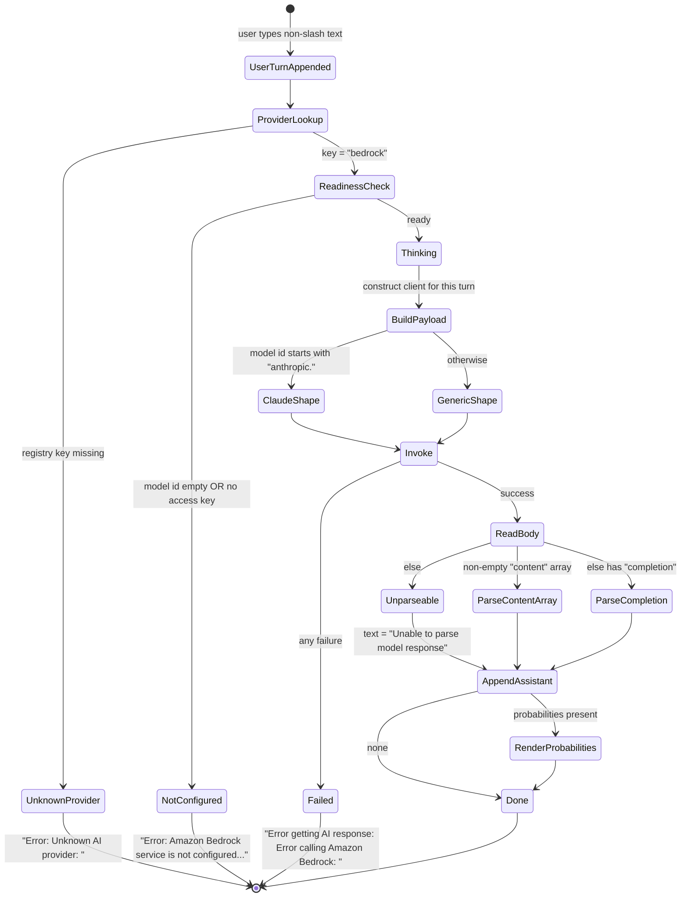

---

**Functional requirements**

*Identity and registration*

- **FR-7.1** The back end shall be registered in the host's provider registry under the exact lower-case key `bedrock`; the configured provider value shall be lower-cased before the registry lookup. *(realizes US-7.1)*
- **FR-7.2** The back end's display name shall be exactly the string `Amazon Bedrock`, and that string shall be the one interpolated into every message that names this back end. *(realizes US-7.1)*
- **FR-7.3** The provider setting shall accept only `azure`, `bedrock`, `llama` after lower-casing; any other value shall be rejected with the exact message `Provider must be 'azure', 'bedrock', or 'llama'`. *(realizes US-7.1)*
- **FR-7.4** The windowed settings dialog shall present the three providers as radio choices labelled `Azure OpenAI` / `AWS Bedrock` / `Local LLM (LLama)`, with index `1` mapping to and from the registry key `bedrock`. *(realizes US-7.1)*
- **FR-7.5** The default provider shall be `azure`; this back end shall never be the default. *(realizes US-7.1)*

*Readiness*

- **FR-7.6** The readiness check shall report **configured** if and only if **both** (a) the model identifier is non-empty **and** (b) either the resolved access key is non-empty **or** the process environment variable `AWS_ACCESS_KEY_ID` is non-empty. *(realizes US-7.4)*
- **FR-7.7** The readiness check shall **not** examine the secret key. A user with only an access key shall be reported configured and shall fail later at invocation time. *(realizes US-7.4)*
- **FR-7.8** The readiness check shall **not** examine, require or validate the region. *(realizes US-7.4)*
- **FR-7.9** The readiness check shall not validate that the model identifier resembles a marketplace identifier. Because the default model identifier is the non-empty, non-marketplace value `gpt-4`, the model half of FR-7.6 is satisfied out of the box. *(realizes US-7.4)*
- **FR-7.10** The readiness check shall have no side effects the caller must undo, though it reads the process environment and may cause a credential-vault read. *(realizes US-7.4)*

*Configuration surface and defaults*

- **FR-7.11** The model identifier shall be settable as `/model <id>` or `/set modelId <id>`; the value shall be the remainder of the input line rejoined with single spaces, so identifiers containing spaces are preserved. No marketplace-specific validation shall run. *(realizes US-7.2)*
- **FR-7.12** The region shall be settable as `/set awsRegion <region>` and via the windowed dialog field labelled `AWS Region:`. On success the shell shall print `Set awsRegion = <value>`. *(realizes US-7.2)*
- **FR-7.13** The default region shall be the literal `us-east-1`. The region shall be free text: no allow-list, no format check, no normalisation, at any layer. The windowed dialog shall substitute `us-east-1` only when the field yields no value at all, not when it is blank or nonsensical. *(realizes US-7.2)*
- **FR-7.14** Region, model identifier, provider, temperature, max output tokens, probabilities-enabled and top-K shall be persisted, under the member names `awsRegion`, `modelId`, `provider`, `temperature`, `maxTokens`, `enableLogProbabilities`, `logProbabilitiesTopK`, in the settings document at `<user profile>/.ChatDbg/settings.json`, indented, with camel-cased member names, falling back to the system temporary directory when the user-profile folder is unavailable. Every successful setting change shall rewrite the whole document immediately. *(realizes US-7.2)*
- **FR-7.15** Temperature shall default to `0.7` and be accepted only in the inclusive range `0.0`–`2.0`; max output tokens shall default to `1000` and be accepted only in the inclusive range `1`–`8192`; top-K alternatives shall default to `5` and be accepted only in the inclusive range `1`–`20`; the probabilities-enabled flag shall default to `false`. The settings command rejects out-of-range values; the windowed dialog clamps temperature and max tokens instead of rejecting. *(These are tunable defaults, not business invariants, except the ranges, which are enforced limits.)* *(realizes US-7.2, US-7.6)*
- **FR-7.16** The system-prompt text shall be a computed, never-persisted setting whose default value is exactly `You are ChatDBG, a helpful debugging assistant. Help users analyze code, debug issues, and understand programming concepts.` unless another prompt has been selected in-session. The default system-prompt *name* is `default`. *(realizes US-7.5)*

*Credentials*

- **FR-7.17** Cloud credentials shall never be settable through the shell. `/set awsAccessKey <value>` and `/set awsSecretKey <value>` shall be recognised but always refused, printing verbatim:
  ```
  For security, AWS Access Key is no longer set via this command.

  ## Secure Options:
  1. Environment Variables (Recommended):
     set CHATDBG_AWS_ACCESS_KEY=your-credential
     set AWS_ACCESS_KEY_ID=your-credential

  This keeps your credentials secure and out of configuration files.
  ```
  The secret-key variant substitutes `AWS Secret Key`, `CHATDBG_AWS_SECRET_KEY` and `AWS_SECRET_ACCESS_KEY`. On a platform where the credential vault exists, the following block shall be inserted before the closing sentence:
  ```

  2. Windows Credential Manager (Secure Option):
     /set enablewincred                    (enable Windows Credential Manager)
     /set wincred <type> your-credential   (store credential)
  ```
  *(realizes US-7.3)*
- **FR-7.18** The access key shall be resolved in this exact order, first non-empty wins, empty string if all are empty: environment `CHATDBG_AWS_ACCESS_KEY` → environment `AWS_ACCESS_KEY_ID` → credential vault entry `ChatDbg:AwsAccessKey` (only when the vault source is enabled) → deprecated settings-document member `awsAccessKey`. *(realizes US-7.3)*
- **FR-7.19** The secret key shall be resolved in this exact order: environment `CHATDBG_AWS_SECRET_KEY` → environment `AWS_SECRET_ACCESS_KEY` → credential vault entry `ChatDbg:AwsSecretKey` → deprecated settings-document member `awsSecretKey`. *(realizes US-7.3)*
- **FR-7.20** Credential-vault lookup failures — including "this platform has no vault" — shall be swallowed and reported as "not found", with no message to the user. *(realizes US-7.3)*
- **FR-7.21** There shall be **no** support for session tokens or temporary credentials anywhere: no `AWS_SESSION_TOKEN` read, no vault entry, no settings member. *(realizes US-7.3)*
- **FR-7.22** The credential-source label shall be exactly one of `environment variable (<VARIABLE NAME>)`, `Windows Credential Manager`, `settings file (deprecated)`, `not set`. *(realizes US-7.4)*
- **FR-7.23** The settings listing shall print `- AWS Region: <value>`, `- AWS Access Key: <***set*** | (not set)> [<source>]` and `- AWS Secret Key: <***set*** | (not set)> [<source>]`. Key values themselves shall never be printed. *(realizes US-7.3)*

*Start-up reporting*

- **FR-7.24** When the console host starts with provider `bedrock` and readiness is false, it shall print `Warning: Amazon Bedrock service is not configured.` followed by the remediation block reproduced in UC-7.B/A1, including its leading whitespace; the vault half of that block shall be printed only when the vault is available on the running platform. *(realizes US-7.4)*
- **FR-7.25** When readiness is true and at least one of the two cloud keys resolves non-empty, the console host shall print `AWS credentials loaded from: <source>`. *(realizes US-7.4)*
- **FR-7.26** The windowed host shall produce **no** start-up readiness feedback for this back end. *(realizes US-7.4)*

*Turn execution*

- **FR-7.27** Before any network work, the back end shall re-run the readiness check and, if false, raise an operation-invalid failure carrying exactly `Amazon Bedrock service is not properly configured. Please set ModelId and AWS credentials.` This guard shall sit outside the failure handler so its message reaches the caller unwrapped. *(realizes US-7.5, US-7.7)*
- **FR-7.28** The console host shall re-check readiness before every turn and short-circuit with `Error: Amazon Bedrock service is not configured. Use environment variables or Windows Credential Manager to configure credentials securely.` followed by `   Type '/set' to see current configuration and setup instructions.` The windowed host shall perform no readiness check on the send path. *(realizes US-7.5)*
- **FR-7.29** The user's message shall be appended to the conversation history **before** the readiness check, so a failed turn leaves an orphan user message in the transcript. *(realizes US-7.5)*
- **FR-7.30** Exactly one marketplace client shall be requested from the client-construction seam per chat turn, and the seam shall receive the **same settings record instance** the caller passed in — not a copy and not a projection. *(realizes US-7.8)*
- **FR-7.31** The client shall be created per request and released when the request ends, on both the success and the failure path. No client pooling and no client reuse across turns shall occur. *(realizes US-7.5)*
- **FR-7.32** The client-construction seam shall build the client from the resolved access key and secret key as explicit static credentials plus the region, **only when both are non-empty**; otherwise it shall build the client from the region alone and delegate credential discovery to the platform's default cloud credential chain. *(realizes US-7.3)*
- **FR-7.33** The region string shall be converted to an endpoint by system name with no validation. An unrecognised name shall not fail at construction time; an endpoint is fabricated and the failure surfaces later as a connection error. **INFERRED** (upstream platform behaviour, not local code). *(realizes US-7.2)*
- **FR-7.34** The conversation shall be flattened in insertion order: entries flagged as commands are excluded; remaining entries are never reordered, deduplicated, truncated or windowed. There shall be **no context-window management of any kind** — the entire history is resent every turn. *(realizes US-7.5)*
- **FR-7.35** Role mapping shall be binary: an entry whose role equals `assistant` when lower-cased becomes `assistant`; **every other role, including `system`, becomes `user`**. *(realizes US-7.5)*
- **FR-7.36** The model family shall be detected as "Claude family" if and only if the model identifier begins, compared case-insensitively, with the literal prefix `anthropic.`. No version parsing, suffix parsing or lookup table shall be used. *(realizes US-7.2)*
- **FR-7.37** For the Claude family the request body shall be an object with exactly these members in this order — *this is a wire format and must be reproduced member-for-member, snake_case included*:

  | Member | Value |
  |---|---|
  | `anthropic_version` | constant string `bedrock-2023-05-31` |
  | `max_tokens` | the max-output-tokens setting, integer |
  | `temperature` | the temperature setting, number |
  | `system` | the currently-selected system-prompt text |
  | `messages` | the flattened role/content array, each element `{ "role": <string>, "content": <string> }` |
  | `logprobs` | the probabilities-enabled boolean |
  | `top_logprobs` | the top-K integer when probabilities are enabled, otherwise the integer `0` |

  There shall be **no** entry with role `system` inside `messages` on this path. *(realizes US-7.5, US-7.6)*
- **FR-7.38** For every non-Claude-family identifier the request body shall be an object with exactly these members:

  | Member | Value |
  |---|---|
  | `max_tokens` | the max-output-tokens setting, integer |
  | `temperature` | the temperature setting, number |
  | `messages` | an array whose **first element, always at index 0**, is a synthetic entry with role `system` and the system-prompt text as its content, followed by the flattened conversation |
  | `logprobs` | the probabilities-enabled boolean |
  | `top_logprobs` | the top-K integer when enabled, otherwise `0` |

  There shall be no `anthropic_version` member, no top-level `system` member and no other family-specific member. *(realizes US-7.5)*
- **FR-7.39** Both probability members shall be emitted on **every** request, including when the feature is disabled, as `false` and `0`; they shall never be omitted. *(realizes US-7.6)*
- **FR-7.40** The request body shall be written to the diagnostic trace channel as `Bedrock request: <body>` before the invocation, and the reply body as `Bedrock response: <body>` after it. These traces carry the entire conversation and the entire reply verbatim, with no redaction and no truncation; no credential value shall appear in them. *(realizes US-7.5)*
- **FR-7.41** The invocation shall carry content type `application/json`, accept type `application/json`, the configured model identifier, and the body serialised to UTF-8 bytes. Exactly one invocation shall be performed per chat turn. *(realizes US-7.5)*
- **FR-7.42** The reply body shall be read in full into memory as a single string before parsing. There shall be no streaming, no incremental rendering and no size cap. *(realizes US-7.5)*

*Response interpretation*

- **FR-7.43** Response shapes shall be evaluated in this fixed order, first match wins: (1) a top-level `content` member that is a **non-empty** array; (2) a top-level `completion` member; (3) unrecognised. A `content` member that is present but empty, or present but not an array, shall fail test (1) and fall through. *(realizes US-7.5)*
- **FR-7.44** In branch (1) the answer text shall be the `text` member of the first `content` element; if that member is explicitly null the text shall be the literal `No response received`; if that member is absent altogether the text shall remain the **empty string** with no fallback message; if that member is present but not a string the whole turn shall fail. *(realizes US-7.5)*
- **FR-7.45** In branch (1) probabilities shall be read only when the probabilities-enabled setting is true **and** a non-null top-level `logprobs` member exists. That member is enumerated as an array; each element requires both a `token` string and a `logprob` number, and elements missing either are silently skipped; each accepted element may carry a `top_logprobs` array of alternatives, each requiring `token` plus `logprob`. **This branch has no local tolerance**: any type mismatch raises and destroys the whole turn. *(realizes US-7.6)*
- **FR-7.46** In branch (2) the answer text shall be the `completion` value, or the literal `No response received` when it is null; probabilities, when enabled, shall be routed through the tolerant parser for any `logprobs` member of any kind, including null. *(realizes US-7.5)*
- **FR-7.47** In branch (3) the answer text shall be exactly the literal `Unable to parse model response`, no probabilities shall be produced, and the turn shall be reported as a **normal success**, appended to the transcript as the assistant's words. *(realizes US-7.5)*
- **FR-7.48** The tolerant parser shall never raise. Any failure inside it shall be swallowed, traced as `Error parsing log probabilities: <cause>`, and yield "no probabilities". *(realizes US-7.6)*
- **FR-7.49** The tolerant parser, given an **array**, shall require `token` (string) and `logprob` (number) for each item, and shall look for alternatives under the first present of `top_logprobs`, then `alternatives`, then `top_alternatives` — a present-but-unusable match shall **not** be retried against the later names. Each alternative requires `token` plus `logprob`. *(realizes US-7.6)*
- **FR-7.50** The tolerant parser, given an **object**, shall look for a `tokens` array; for each item it reads the token value and then `logprob` or, when absent, `log_prob`; a missing or unreadable log-probability shall default to `0`; items with an empty token string shall be dropped; **the alternatives list shall always be left empty in this shape**. *(realizes US-7.6)*
- **FR-7.51** The tolerant parser, given any other shape (string, number, boolean, null), shall produce nothing. *(realizes US-7.6)*
- **FR-7.52** The top-K setting shall shape the request only. It shall never truncate the returned tokens or the returned alternatives; the tolerant parser accepts a top-K argument and never reads it. *(realizes US-7.6)*
- **FR-7.53** Token-probability entries shall preserve source order, and alternatives shall preserve source order within a token. *(realizes US-7.6)*
- **FR-7.54** For a **primary** token the raw log-probability value shall be stored unchanged. For each **alternative** the value stored in the same field shall be the exponential of the source log-probability (i.e. already a probability). Because the display layer derives a percentage by exponentiating the stored value, alternative percentages are always at or above 100 % and may reach roughly 271 %. *(realizes US-7.6; see QUIRK-7.3)*
- **FR-7.55** When probabilities are enabled and no entry survives parsing, the probability field of the response envelope shall be left **unset** (never an empty list), and no simulated or placeholder probability data shall be fabricated. The console host shall then print `\nNote: Log probabilities were requested but none were returned by the model.` followed by `This could be due to the model not supporting this feature or an API limitation.` *(realizes US-7.6)*
- **FR-7.56** When probabilities are disabled, any probability data present in the reply shall be ignored entirely. *(realizes US-7.6)*

*Result envelope, errors and lifecycle*

- **FR-7.57** The response envelope's text field shall always be set; its probability list shall be set only when at least one entry was parsed; its total-elapsed-time field shall always remain `0`; its error-message field shall never be populated — failures are raised, never returned. *(realizes US-7.5, US-7.7)*
- **FR-7.58** The plain-text answer operation shall delegate to the full operation and return only the text field, substituting the literal `Error: Response text expected, none given.` (trailing period included) when that field is absent. *(realizes US-7.5)*
- **FR-7.59** Every failure between client construction and return shall be traced as `Error in BedrockService: <full failure detail>` and re-raised as an operation-invalid failure whose message is exactly `Error calling Amazon Bedrock: <inner message>`, preserving the original failure as its cause. *(realizes US-7.7)*
- **FR-7.60** The console host shall render any raised failure as `Error getting AI response: <message>` and continue the session; the windowed host shall render it as a modal titled `Error` with body `Failed to get AI response: <message>`. *(realizes US-7.7)*
- **FR-7.61** When the console host's probability path finds the envelope's text absent, it shall store the literal `Error: Response text expected, none recieved.` [misspelling intentional and required] into the transcript — a *different* string from FR-7.58. *(realizes US-7.7)*
- **FR-7.62** When probabilities are enabled the console host shall print `Log probabilities enabled - requesting with top-k=<K>` before the turn, after `Thinking...`. *(realizes US-7.6)*
- **FR-7.63** When the configured provider key is absent from the registry, the console host shall print `Error: Unknown AI provider: <key>` and the windowed host shall show a modal titled `Error` reading `Unknown AI provider: <key>`. *(realizes US-7.7)*
- **FR-7.64** The back end shall expose a release/teardown operation that does nothing but set an internal "already released" flag; a second call shall be a no-op. The console host shall release every registered back end at shutdown; the windowed host shall release none. *(realizes US-7.8)*
- **FR-7.65** The client-construction seam shall be a substitutable, single-operation abstraction — "given a settings record, hand me a marketplace client" — and the back end shall fall back to the built-in construction path when no substitute is supplied. *(realizes US-7.8)*
- **FR-7.66** No path in this feature shall retry, back off, apply a timeout of its own, handle rate limiting, degrade to another model or region, or accept a cancellation signal. Whatever transport defaults the underlying client library carries are what runs. *(realizes US-7.5)*
- **FR-7.67** Sending a body whose message array is empty shall not be prevented; no guard exists. *(realizes US-7.5)*
- **FR-7.68** The back end shall hold no mutable state other than its "already released" flag, and shall therefore be safe for concurrent turns even though the hosts serialise turns; the flag itself is not guarded against simultaneous access. *(realizes US-7.8)*
- **FR-7.69** All operator- and user-facing strings in this feature shall be reproduced verbatim in English, including punctuation, leading whitespace and the misspelling in FR-7.61. Role names, member names and the family-detection prefix shall be compared with explicit case-insensitive / culture-invariant semantics; numeric members shall be serialised with culture-invariant rules. *(realizes US-7.5)*

---

**External technology**

*Requires: a managed, region-scoped, account-billed marketplace for hosted foundation models, invoked once per turn with no streaming (HTTPS with per-request cryptographic request signing; opaque per-model structured request and response bodies; region-scoped endpoint). Source used: Amazon Bedrock Runtime via `AWSSDK.BedrockRuntime` 4.0.7.3. Reimplementer notes: only the single-shot "invoke model" operation is used — no streaming, no unified converse-style API, no tool use, no model listing. Content type and accept type are both `application/json`. The body is an opaque per-model document the caller must shape correctly; the service performs no normalisation across model families, so the two body shapes in FR-7.37/FR-7.38 are the entire contract this product implements.*

*Requires: cloud credential resolution and request signing, with a documented fallback discovery chain (AWS Signature Version 4; the vendor's default credential provider chain covering shared profile files, container and instance roles, single sign-on, and environment variables). Source used: the vendor SDK's static-credential constructor when both keys resolve, otherwise its region-only constructor which triggers the default chain. Reimplementer notes: both branches must exist and must be selected by exactly the rule in FR-7.32. Beware that there is no session-token support, so temporary credentials present in the environment are hoisted into a static key pair without their token and will fail authentication.*

*Requires: resolution of a service endpoint from a short region code (vendor region naming such as `us-east-1`, `eu-west-1`). Source used: region lookup by system name. Reimplementer notes: unknown names must not fail fast — the source fabricates an endpoint and lets the failure surface at connection time. If you want validation you must add it; the source has none, and FR-7.13 depends on the absence.*

*Requires: the Claude-family message contract in its marketplace flavour (structured body with `anthropic_version`, `system`, `messages[{role,content}]`, `max_tokens`, `temperature`; reply read as `content[0].text`). Source used: a hand-built body with the contract version pinned to the constant `bedrock-2023-05-31`. Reimplementer notes: reproduce the member names verbatim. The source additionally sends non-contract `logprobs` / `top_logprobs` members — do not copy that unless you have verified the target service accepts them.*

*Requires: the legacy single-string completion reply contract (a top-level `completion` string). Source used: parsed as the second-priority response branch. Reimplementer notes: this is the only reply shape the source's own test suite ever exercises, so it is the shape with the best-understood behaviour and the worst real-world relevance.*

*Requires: per-family request and response contracts for every non-Claude model family (each vendor family has its own native body schema). Source used: **not implemented** — a single invented `messages` shape is sent to every non-Claude identifier. Reimplementer notes: treat the generic branch as a stub. A faithful clone must either implement real per-family shapes or explicitly reject non-Claude identifiers; see Open Question 2.*

*Requires: structured-document serialisation and read-only document traversal with try-get semantics (RFC 8259 JSON). Source used: the platform's built-in JSON library; the request is serialised from anonymous objects with **default** member naming, so members are emitted exactly as written, snake_case included; the reply is walked as a document object model. Reimplementer notes: member names must survive verbatim. Note the sibling cloud back end applies camel-casing to its body and this one does not — do not unify them.*

*Requires: a diagnostic trace channel for developer builds. Source used: the platform's conditional debug-trace writes of the full request body, the full reply body, the full failure detail, and probability-parse failures. Reimplementer notes: these are compiled out of release builds in the source platform (INFERRED — no build configuration states it). If your platform's equivalent is always on, be aware that every user prompt and every model answer is written to it unredacted. No credential value appears there.*

*Requires: an optional operating-system secret vault, capability-detected and degrading silently to "absent" (platform keychain / secret service). Source used: the Windows Credential Manager via the native library `advapi32.dll` entry points `CredReadW`, `CredWriteW`, `CredDeleteW`, `CredFree`, under target names `ChatDbg:AwsAccessKey` and `ChatDbg:AwsSecretKey`. Reimplementer notes: this is the feature's only operating-system-specific dependency and it is reached indirectly through the credential feature. Map it to your platform's keychain or drop it and keep environment variables — the source already degrades to that off Windows, and the remediation text hides options the running platform cannot offer.*

*Requires: a substitutable client-construction seam plus a test double library, so the whole build/invoke/parse path runs with zero network. Source used: an interface-based factory with Moq 4.20.69 and xUnit 2.9.1. Reimplementer notes: keep an equivalent seam; two of the source's three test assertions are about the seam's call count and argument identity.*

*Requires: HTTP transport policy — timeout, retry count, back-off, connection pooling, proxy (HTTP/1.1 over TLS). Source used: **nothing is configured**; whatever the vendor SDK defaults to is what runs. Reimplementer notes: your clone will not match the source's timing behaviour unless you match those defaults. Decide explicitly — the source made no decision — and note that per-turn client construction defeats pooling regardless.*

*Requires: an exponential function for converting log probabilities to probabilities. Source used: the standard-library exponential, applied at parse time to alternatives and again at display time to every entry. Reimplementer notes: any language's exponential will do; what matters is **where** it is applied — see FR-7.54 and QUIRK-7.3.*

*Requires: a managed runtime. Source used: `net10.0` for all four projects. Reimplementer notes: nothing in this feature depends on the runtime version.*

---

**Acceptance criteria**

- **AC-7.1** — **Given** a settings record whose model identifier is the empty string, **when** the readiness check runs, **then** it reports "not configured" regardless of what credentials are available.
- **AC-7.2** — **Given** a freshly defaulted settings record (model identifier `gpt-4`, region `us-east-1`, provider `azure` overridden to `bedrock`) and a process environment with no `CHATDBG_AWS_ACCESS_KEY`, no `AWS_ACCESS_KEY_ID`, no vault entry and no deprecated settings-document key, **when** the readiness check runs, **then** it reports "not configured", and the reason is the credential half of the rule, not the model half.
- **AC-7.3** — **Given** the model identifier `anthropic.claude-3-sonnet-20240229-v1:0` and `AWS_ACCESS_KEY_ID=AKIAEXAMPLE` with **no** secret key resolvable anywhere, **when** the readiness check runs, **then** it reports "configured".
- **AC-7.4** — **Given** a resolved access key `access`, a resolved secret key `secret` and region `us-east-1`, **when** a client is constructed, **then** it is built from those two values as explicit static credentials plus the `us-east-1` endpoint, with **no** network call and **no** credential validation; **and given** either key is the empty string, **then** it is built from the region alone and the platform's default credential discovery is used.
- **AC-7.5** — **Given** any settings record and any conversation, **when** one chat turn is sent, **then** the client-construction seam is invoked exactly once and receives the identical settings record instance the caller passed, and exactly one model invocation occurs.
- **AC-7.6** — **Given** the model identifier `ANTHROPIC.Claude-v2` (mixed case), temperature `0.7`, max tokens `1000`, probabilities disabled, **when** a turn is sent, **then** the request body contains `anthropic_version` = `bedrock-2023-05-31`, `max_tokens` = `1000`, `temperature` = `0.7`, a `system` member holding the current system-prompt text, a `messages` array, `logprobs` = `false` and `top_logprobs` = `0`; **and** no element of `messages` has role `system`.
- **AC-7.7** — **Given** the model identifier `amazon.titan-text-express-v1`, **when** a turn is sent, **then** the request body has no `anthropic_version` member, no top-level `system` member, and `messages[0]` has role `system` with the system-prompt text as its content.
- **AC-7.8** — **Given** a conversation of five entries in this order — user `a`, command-flagged `/set provider bedrock`, assistant `b`, injected role `system` with content `c`, user `d` — **when** the body is built, **then** `messages` holds exactly four entries in the order `a`, `b`, `c`, `d`, with roles `user`, `assistant`, **`user`**, `user`.
- **AC-7.9** — **Given** probabilities enabled with top-K `7`, **when** a turn is sent, **then** the request body contains `logprobs` = `true` and `top_logprobs` = `7`.
- **AC-7.10** — **Given** probabilities disabled and a reply body `{"completion":"hi","logprobs":[{"token":"a","logprob":-0.1}]}`, **when** the turn completes, **then** the answer text is `hi` and the response envelope carries **no** probability list.
- **AC-7.11** — **Given** model identifier `anthropic.claude`, probabilities enabled with top-K `1`, access key `key`, secret key `secret`, and a client that returns the body `{"completion": "bedrock response", "logprobs": [{"token":"Hello","logprob":-0.1,"top_logprobs":[{"token":"Hi","logprob":-0.2}]}]}`, **when** one turn is sent, **then** the returned text is exactly `bedrock response` and the probability list is non-empty.
- **AC-7.12** — **Given** the same inputs as AC-7.11, **when** the probability list is inspected, **then** it holds exactly one entry whose token is `Hello` and whose stored log-probability value is exactly `-0.1`, carrying exactly one alternative whose token is `Hi` and whose stored value is `0.8187307530779818` — that is, the exponential of `-0.2`, **not** `-0.2`.
- **AC-7.13** — **Given** the list from AC-7.12, **when** each stored value is exponentiated for display, **then** the primary token yields `0.9048…` (about 90.5 %) and the alternative yields `2.2677…` (about 226.8 %), which the display layer renders as a percentage above 100 %.
- **AC-7.14** — **Given** model identifier `anthropic.claude` and the reply body from AC-7.11, **when** the reply is parsed, **then** the `completion` branch is taken and the structured-content branch is not — the model family selects the *request* shape only, and the *response* shape is chosen purely by which members the body carries.
- **AC-7.15** — **Given** the reply body `{"content":[{"text":"structured answer"}],"completion":"ignored"}`, **when** the turn completes, **then** the returned text is `structured answer` and the `completion` member is never consulted.
- **AC-7.16** — **Given** the reply body `{"content":[],"completion":"x"}`, **when** the turn completes, **then** the structured branch is skipped and the returned text is `x`.
- **AC-7.17** — **Given** the reply body `{"foo":"bar"}`, **when** the turn completes, **then** the operation **succeeds** and the returned text is exactly `Unable to parse model response`, which is appended to the transcript as the assistant's reply.
- **AC-7.18** — **Given** the reply body `{"content":[{"text":null}]}`, **when** the turn completes, **then** the returned text is exactly `No response received`; **and given** `{"completion":null}`, **then** the returned text is also exactly `No response received`.
- **AC-7.19** — **Given** the reply body `{"content":[{"role":"assistant"}]}` (first element present, `text` member absent), **when** the turn completes, **then** the operation succeeds and the returned text is the **empty string**.
- **AC-7.20** — **Given** the reply body `{"content":[{"text":42}]}`, **when** the turn completes, **then** the whole turn fails with a message beginning `Error calling Amazon Bedrock: ` and no fallback sentence is produced.
- **AC-7.21** — **Given** probabilities enabled and the reply body `{"content":[{"text":"hi"}],"logprobs":{"not":"an array"}}`, **when** the turn completes, **then** the turn **fails** with a message beginning `Error calling Amazon Bedrock: ` and the text `hi` is lost; **but given** `{"completion":"hi","logprobs":{"not":"an array"}}` with probabilities enabled, **then** the turn **succeeds** with text `hi` and no probability list.
- **AC-7.22** — **Given** probabilities enabled and the reply body `{"completion":"hi","logprobs":{"tokens":[{"token":"a"},{"token":"","log_prob":-0.5},{"token":"b","log_prob":-0.5}]}}`, **when** the turn completes, **then** the probability list holds exactly two entries — `a` with stored value `0` (deriving to exactly 100 %) and `b` with stored value `-0.5` — the empty-token entry is dropped, and neither entry carries any alternatives.
- **AC-7.23** — **Given** the reply body `{"completion":"hi","logprobs":[{"token":"a","logprob":-0.1,"alternatives":[{"token":"b","logprob":-0.2}]}]}` with probabilities enabled, **when** the turn completes, **then** the alternative `b` is found, because the member-name search tries `top_logprobs`, then `alternatives`, then `top_alternatives`, first present wins.
- **AC-7.24** — **Given** probabilities enabled with top-K `5` and a reply carrying `20` token entries each with `10` alternatives, **when** the turn completes, **then** all `20` entries and all `10` alternatives per entry are returned; top-K never truncates the response.
- **AC-7.25** — **Given** the remote invocation raises for any reason, **when** the turn completes, **then** an operation-invalid failure is raised whose message begins `Error calling Amazon Bedrock: `, which preserves the original failure as its cause; the console host renders `Error getting AI response: Error calling Amazon Bedrock: …` and the session does not terminate.
- **AC-7.26** — **Given** probabilities enabled with top-K `3` and a reply that carries no probability data, **when** the turn completes, **then** the answer is still shown, the console prints `Note: Log probabilities were requested but none were returned by the model.` followed by `This could be due to the model not supporting this feature or an API limitation.`, and **no** simulated probability data is fabricated.
- **AC-7.27** — **Given** the back end's display name is requested, **then** it is exactly `Amazon Bedrock`.
- **AC-7.28** — **Given** the model identifier is the empty string and the console host is running, **when** the user types `hello`, **then** the transcript retains the orphan user message `hello`, the console prints `Error: Amazon Bedrock service is not configured. Use environment variables or Windows Credential Manager to configure credentials securely.` then `   Type '/set' to see current configuration and setup instructions.`, and no client is constructed. **Given** the same state in the windowed host, **then** a modal titled `Error` reads `Failed to get AI response: Amazon Bedrock service is not properly configured. Please set ModelId and AWS credentials.`
- **AC-7.29** — **Given** `AWS_ACCESS_KEY_ID=AKIAEXAMPLE`, `AWS_SECRET_ACCESS_KEY=secretvalue` and `AWS_SESSION_TOKEN=tokenvalue` in the environment and no other credential source configured, **when** a client is constructed, **then** it is built from `AKIAEXAMPLE` and `secretvalue` as **static** credentials and the session token is **discarded**; authentication against the marketplace then fails.
- **AC-7.30** — **Given** `/set awsRegion not-a-region` followed by a chat turn, **then** the value `not-a-region` is accepted and persisted with no validation, and the failure surfaces only at connection time as `Error getting AI response: Error calling Amazon Bedrock: <connection message>`. **INFERRED** for the second half.
- **AC-7.31** — **Given** the settings document at `<user profile>/.ChatDbg/settings.json` contains `{"provider":"bedrock","modelId":"anthropic.claude-3-sonnet-20240229-v1:0","awsRegion":"eu-west-1","enableLogProbabilities":true,"logProbabilitiesTopK":3,"temperature":0.7,"maxTokens":1000}` and the default system prompt is in force, **when** the console host starts and the user sends `hello`, **then** the request body is exactly `{"anthropic_version":"bedrock-2023-05-31","max_tokens":1000,"temperature":0.7,"system":"You are ChatDBG, a helpful debugging assistant. Help users analyze code, debug issues, and understand programming concepts.","messages":[{"role":"user","content":"hello"}],"logprobs":true,"top_logprobs":3}`, sent with content type `application/json`, accept `application/json`, model identifier `anthropic.claude-3-sonnet-20240229-v1:0`, to the `eu-west-1` endpoint.
- **AC-7.32** — **Given** `/set awsAccessKey AKIAEXAMPLE`, **then** the value is **not** persisted anywhere and the security instruction block of FR-7.17 is printed verbatim; **and given** the running platform has no credential vault, **then** the numbered vault block is omitted from that output.
- **AC-7.33** — **Given** `/set provider openai`, **then** the shell prints exactly `Provider must be 'azure', 'bedrock', or 'llama'` and the provider setting is unchanged.
- **AC-7.34** — **Given** two consecutive chat turns in one session, **then** two separate marketplace clients are constructed and released — no client, connection or credential-discovery result is reused.
- **AC-7.35** — **Given** any completed turn, **then** the response envelope's total-elapsed-time field is `0` and its error-message field is unset.
- **AC-7.36** — **Given** the plain-text answer operation and a turn whose envelope text is absent, **then** the returned string is exactly `Error: Response text expected, none given.` (with the trailing period), while the console host's probability path stores the different string `Error: Response text expected, none recieved.` for the equivalent condition.
- **AC-7.37** — **Given** the release operation is called twice, **then** the second call is a no-op and no failure is raised; **and given** the windowed host is closed, **then** no release call is made at all.
- **AC-7.38** — **Given** a user who follows only the product README's marketplace section (`/set provider bedrock`, `/set modelId …`, `/set awsRegion …`) and nothing else, **when** they send a chat turn, **then** the back end reports "not configured" — documentation alone cannot reach a working state.

---

**Quirks**

- *QUIRK-7.1: The probability-request members are not part of any real marketplace contract. Both body shapes always send `logprobs` and `top_logprobs`; neither belongs to the Claude-on-marketplace request contract, and the generic shape matches no real family's contract either. Against the live service this either draws a validation rejection or is ignored, so the entire response-side probability parser is dead code against genuine replies. The upstream-contract half is **INFERRED**; the author's own comments hedge. Evidence: `src/Xcaciv.ChatDbg.Core/Services/BedrockService.cs:76-77`, `:101-102`, `:67`, `:100`, `:144-187`, `:225-324`; only exercise `src/Xcaciv.ChatDbg.Core.Tests/Services/BedrockServiceTests.cs:28-41`. Keep-or-fix decision deferred to Open Questions.*
- *QUIRK-7.2: The probability members are emitted even when the feature is off — as `false` and `0` rather than omitted — so every request carries members the model does not expect. Evidence: `src/Xcaciv.ChatDbg.Core/Services/BedrockService.cs:76-77`, `:101-102`. Keep-or-fix decision deferred to Open Questions.*
- *QUIRK-7.3: Double exponentiation of alternatives. A primary token's raw log-probability is stored as-is (correct), but each alternative is stored already exponentiated into the same field; the consumer exponentiates again, so an alternative's derived probability is always at or above 1.0 (100 %) and can reach about 271 %. Affects both parsing paths. Evidence: raw store `src/Xcaciv.ChatDbg.Core/Services/BedrockService.cs:162`, `:245`; exponentiated store `:178`, `:268`; second exponentiation `src/Xcaciv.ChatDbg.Core/Models/TokenLogProbabilities.cs:26`. Keep-or-fix decision deferred to Open Questions.*
- *QUIRK-7.4: Malformed probability data is fatal in one response branch and harmless in the other. The structured-content branch has no local guard, so a bad member destroys the whole answer; the `completion` branch routes identical data through a tolerant parser that keeps the text. Evidence: unguarded `src/Xcaciv.ChatDbg.Core/Services/BedrockService.cs:151-182`; guarded `:227`, `:319-323`. Keep-or-fix decision deferred to Open Questions.*
- *QUIRK-7.5: A non-string `content[0].text` also destroys the turn, rather than degrading to the `No response received` fallback that an explicit null gets. Evidence: `src/Xcaciv.ChatDbg.Core/Services/BedrockService.cs:140`, `:215-219`. Keep-or-fix decision deferred to Open Questions.*
- *QUIRK-7.6: Top-K is requested but never applied. The tolerant parser accepts a top-K argument and never reads it, so no truncation of tokens or alternatives ever happens on the response side. Evidence: `src/Xcaciv.ChatDbg.Core/Services/BedrockService.cs:199`, `:225`. Keep-or-fix decision deferred to Open Questions.*
- *QUIRK-7.7: The object-shaped probability path silently drops all alternatives — it always assigns an empty alternatives collection and never looks for one, with no diagnostic. Evidence: `src/Xcaciv.ChatDbg.Core/Services/BedrockService.cs:310`. Keep-or-fix decision deferred to Open Questions.*
- *QUIRK-7.8: A missing log-probability in the object-shaped path silently defaults to `0`, which derives to exactly 100 % confidence — the most confident value possible — while the array-shaped path drops such entries instead. Evidence: `src/Xcaciv.ChatDbg.Core/Services/BedrockService.cs:292`, `:299-301` vs `:236-237`. Keep-or-fix decision deferred to Open Questions.*
- *QUIRK-7.9: An unparseable reply is reported as success. The literal `Unable to parse model response` becomes the assistant's words in the transcript; the real body survives only in the diagnostic trace. Silent data loss. Evidence: `src/Xcaciv.ChatDbg.Core/Services/BedrockService.cs:202-204`, `:213`. Keep-or-fix decision deferred to Open Questions.*
- *QUIRK-7.10: An empty `content` array falls through to the fallback branch — presence of `content` is not enough, only a non-empty array selects the structured branch. Evidence: `src/Xcaciv.ChatDbg.Core/Services/BedrockService.cs:133-135`. Keep-or-fix decision deferred to Open Questions.*
- *QUIRK-7.11: A `system` message injected into the history is silently downgraded to `user`, because role mapping is binary. The sibling cloud back end preserves the three roles distinctly. Evidence: `src/Xcaciv.ChatDbg.Core/Services/BedrockService.cs:55` vs `src/Xcaciv.ChatDbg.Core/Services/AzureOpenAIService.cs:84-95`. Keep-or-fix decision deferred to Open Questions.*
- *QUIRK-7.12: Cross-region inference-profile identifiers are misrouted. Family detection is a bare `anthropic.` prefix test, so a geography-prefixed identifier such as `us.anthropic.claude-…` fails it and takes the generic body path, producing a body the model rejects. **INFERRED** consequence; no test covers it. Evidence: `src/Xcaciv.ChatDbg.Core/Services/BedrockService.cs:61`. Keep-or-fix decision deferred to Open Questions.*
- *QUIRK-7.13: The non-Claude branch is a stub, not an implementation — one invented `messages` shape is sent to every other model family, none of which accept it. **INFERRED** upstream half; the author's comment shows it was a guess. Evidence: `src/Xcaciv.ChatDbg.Core/Services/BedrockService.cs:82-103`. Keep-or-fix decision deferred to Open Questions.*
- *QUIRK-7.14: Temperature range mismatch. The product accepts and forwards temperature up to `2.0`; Claude models on this marketplace cap it at `1.0`, so `/set temperature 1.5` is accepted locally and rejected remotely. **INFERRED** (upstream limit). Evidence: `src/Xcaciv.ChatDbg.Core/Commands/SetCommand.cs:72-75`; `src/Xcaciv.ChatDbg.Core/Services/BedrockService.cs:72`. Keep-or-fix decision deferred to Open Questions.*
- *QUIRK-7.15: Readiness ignores the secret key entirely, so readiness and the client-construction precondition disagree — readiness needs one key, construction needs both. Evidence: `src/Xcaciv.ChatDbg.Core/Services/BedrockService.cs:25-27` vs `src/Xcaciv.ChatDbg.Core/Services/DefaultBedrockRuntimeClientFactory.cs:11`. Keep-or-fix decision deferred to Open Questions.*
- *QUIRK-7.16: Readiness ignores the region completely — never validated, never required. Evidence: `src/Xcaciv.ChatDbg.Core/Services/BedrockService.cs:23-28`. Keep-or-fix decision deferred to Open Questions.*
- *QUIRK-7.17: Readiness reads `AWS_ACCESS_KEY_ID` a second time, redundantly; the resolved access key already consults it, so the extra read can never change the answer. Evidence: `src/Xcaciv.ChatDbg.Core/Services/BedrockService.cs:27` vs `src/Xcaciv.ChatDbg.Core/Models/ChatSettings.cs:73`. Keep-or-fix decision deferred to Open Questions.*
- *QUIRK-7.18: The default model identifier is `gpt-4` — non-empty and not a marketplace identifier — so the model half of readiness passes out of the box and a user who sets only credentials will send `gpt-4` down the generic body path. Evidence: `src/Xcaciv.ChatDbg.Core/Models/ChatSettings.cs:11`. Keep-or-fix decision deferred to Open Questions.*
- *QUIRK-7.19: Temporary and single-sign-on credentials are silently broken. The settings layer hoists the standard environment variables into explicit static keys, which the construction seam re-injects as a static pair, discarding any session token. There is no session-token support anywhere. Evidence: `src/Xcaciv.ChatDbg.Core/Models/ChatSettings.cs:73`, `:76` + `src/Xcaciv.ChatDbg.Core/Services/DefaultBedrockRuntimeClientFactory.cs:11-18`. Keep-or-fix decision deferred to Open Questions.*
- *QUIRK-7.20: An unrecognised region name does not fail fast — no allow-list, no format check, no normalisation at any layer; the windowed dialog substitutes `us-east-1` only when the field yields nothing, not when it is blank or nonsensical. **INFERRED** that the endpoint is fabricated and the failure surfaces later. Evidence: `src/Xcaciv.ChatDbg.Core/Commands/SetCommand.cs:92-94`; `src/ChatDbg.Shell.Gui/UI/SettingsDialog.cs:411`, `:417`; `src/Xcaciv.ChatDbg.Core/Services/DefaultBedrockRuntimeClientFactory.cs:16`. Keep-or-fix decision deferred to Open Questions.*
- *QUIRK-7.21: `awsAccessKey` and `awsSecretKey` are recognised settings keys but are missing from the "Valid keys" list shown when a key is mistyped. Evidence: `src/Xcaciv.ChatDbg.Core/Commands/SetCommand.cs:264-270` vs `:280`. Keep-or-fix decision deferred to Open Questions.*
- *QUIRK-7.22: The credential-vault source degrades silently off its native platform — any failure, including "wrong platform", is swallowed and reported as "not found", with no indication that the source was skipped. Evidence: `src/Xcaciv.ChatDbg.Core/Models/WindowsCredentialManager.cs:59-60`; `src/Xcaciv.ChatDbg.Core/Models/ChatSettings.cs:138-141`. Keep-or-fix decision deferred to Open Questions.*
- *QUIRK-7.23: The windowed host performs no readiness check before sending, so an unconfigured user sees the internal, developer-worded guard message in a modal instead of the console host's friendly remediation text. Evidence: `src/ChatDbg.Shell.Gui/UI/ChatWindow.cs:420-441` vs `src/ChatDbg/ChatShell.cs:356-359`; message at `src/Xcaciv.ChatDbg.Core/Services/BedrockService.cs:40`. Keep-or-fix decision deferred to Open Questions.*
- *QUIRK-7.24: The windowed host never releases its back ends — its main window declares no teardown at all. Harmless only because this back end's release is a no-op. Evidence: no release member in `src/ChatDbg.Shell.Gui/UI/ChatWindow.cs`; contrast `src/ChatDbg/Program.cs:5` + `src/ChatDbg/ChatShell.cs:698-713`. Keep-or-fix decision deferred to Open Questions.*
- *QUIRK-7.25: The windowed project contains a whole second, unreachable host-wiring file that registers only two of the three back ends and carries its own readiness checks and teardown. It is never instantiated. A reimplementer copying the wrong file would ship a two-provider product. Evidence: `src/ChatDbg.Shell.Gui/ChatShell.cs:33-37`, `:223`, `:309`, `:651-666`; live path `src/ChatDbg.Shell.Gui/Program.cs:22-26`, `:79-87`. Keep-or-fix decision deferred to Open Questions.*
- *QUIRK-7.26: The windowed host's "provider is not set" modal is unreachable, because the provider setting is non-nullable and defaults to `azure`. Evidence: `src/ChatDbg.Shell.Gui/UI/ChatWindow.cs:426-430` vs `src/Xcaciv.ChatDbg.Core/Models/ChatSettings.cs:8`. Keep-or-fix decision deferred to Open Questions.*
- *QUIRK-7.27: Three different fallback strings exist for the same "answer text absent" condition — `Error: Response text expected, none given.` from the back end, the misspelled `Error: Response text expected, none recieved.` from the console host, and an empty string from the windowed host; the sibling back ends add two more variants. Evidence: `src/Xcaciv.ChatDbg.Core/Services/BedrockService.cs:33`; `src/ChatDbg/ChatShell.cs:377`; `src/ChatDbg.Shell.Gui/UI/ChatWindow.cs:444`; `src/Xcaciv.ChatDbg.Core/Services/AzureOpenAIService.cs:50`; `src/Xcaciv.ChatDbg.Core/Services/LLamaSharpService.cs:58`. Keep-or-fix decision deferred to Open Questions.*
- *QUIRK-7.28: A fresh remote client is constructed per chat turn, paired with a release operation that does nothing and a last-resort cleanup hook with nothing to clean. Connection pooling and credential-discovery caching are both forfeited. Evidence: `src/Xcaciv.ChatDbg.Core/Services/BedrockService.cs:45`, `:326-344`. Keep-or-fix decision deferred to Open Questions.*
- *QUIRK-7.29: The request body is serialised twice per turn — once to a string purely for the diagnostic trace, once to bytes for the request — even in builds where nothing is listening to the trace. Evidence: `src/Xcaciv.ChatDbg.Core/Services/BedrockService.cs:107`, `:115`. Keep-or-fix decision deferred to Open Questions.*
- *QUIRK-7.30: The diagnostic trace records the entire conversation and the entire reply verbatim, with no redaction and no truncation. No credentials appear, but every user prompt and model answer does. Evidence: `src/Xcaciv.ChatDbg.Core/Services/BedrockService.cs:108`, `:124`. Keep-or-fix decision deferred to Open Questions.*
- *QUIRK-7.31: The product README never names a single cloud credential environment variable, and setting keys through the shell is refused by design — so a user who follows only the README cannot reach a configured state. The variable names appear only in a security document, two stale specification copies, and the runtime remediation text. Evidence: `README.md:123-129`; `src/Xcaciv.ChatDbg.Core/Commands/SetCommand.cs:264-270`. Keep-or-fix decision deferred to Open Questions.*
- *QUIRK-7.32: The README overclaims probability support, stating token probability analysis is supported for this marketplace's responses. Code wins — treat it as aspirational. Evidence: `README.md:206` vs `src/Xcaciv.ChatDbg.Core/Services/BedrockService.cs:76-77`, `src/ChatDbg/ChatShell.cs:389-390`. Keep-or-fix decision deferred to Open Questions.*
- *QUIRK-7.33: The settings help contradicts the code on model identifiers — help suggests `claude-3`, which fails the `anthropic.` prefix test, while the README example `anthropic.claude-3-sonnet-20240229-v1:0` passes it. Code wins. Evidence: `src/Xcaciv.ChatDbg.Core/Commands/SetCommand.cs:310` vs `README.md:127` vs `src/Xcaciv.ChatDbg.Core/Services/BedrockService.cs:61`. Keep-or-fix decision deferred to Open Questions.*
- *QUIRK-7.34: "Standard cloud credential chain" is claimed in the project's assistant instructions but inverted in practice — the default chain is only the fallback, used when neither key resolves through the product's own lookup. Code wins. Evidence: `.github/copilot-instructions.md:162` vs `src/Xcaciv.ChatDbg.Core/Models/ChatSettings.cs:73`, `:76` + `src/Xcaciv.ChatDbg.Core/Services/DefaultBedrockRuntimeClientFactory.cs:11-20`. Keep-or-fix decision deferred to Open Questions.*
- *QUIRK-7.35: "Role-based authentication support" is claimed but not designed for — roles work only through the fallback branch, and combined with QUIRK-7.19 any role issuing temporary credentials into the environment is broken. Code wins. Evidence: `.github/copilot-instructions.md:163`. Keep-or-fix decision deferred to Open Questions.*
- *QUIRK-7.36: A design document claims the local-model introspection format "matches the format used by" this marketplace; there is no established marketplace probability format to match. Code wins. Evidence: `docs/LLamaSharp-Token-Introspection.md:320`. Keep-or-fix decision deferred to Open Questions.*
- *QUIRK-7.37: The project's assistant instructions name a different runtime major version than every project file targets. No behavioural impact; recorded for completeness. Evidence: `.github/copilot-instructions.md:138`, `:240` vs the four project files. Keep-or-fix decision deferred to Open Questions.*
- *QUIRK-7.38: Two stale duplicated specification files describe a two-provider product and pin an older client-library version than the one actually referenced. Evidence: `src/ChatDbg/prd.md:53`, `:114` and the identical `src/ChatDbg.Shell.Gui/prd.md` vs `src/Xcaciv.ChatDbg.Core/Commands/SetCommand.cs:50`, `src/Xcaciv.ChatDbg.Core/Xcaciv.ChatDbg.Core.csproj:11`. Keep-or-fix decision deferred to Open Questions.*
- *QUIRK-7.39: The readiness test is misnamed and environment-dependent — it is named for a missing model but builds a record whose model identifier is the non-empty default, so it passes only because no key resolves, and it fails on any machine that exports `CHATDBG_AWS_ACCESS_KEY` or `AWS_ACCESS_KEY_ID`, or has a stored vault key. A clone's equivalent test must set the identifier empty and neutralise the environment. Evidence: `src/Xcaciv.ChatDbg.Core.Tests/Services/BedrockServiceTests.cs:17-23`; `src/Xcaciv.ChatDbg.Core/Models/ChatSettings.cs:11`, `:73`. Keep-or-fix decision deferred to Open Questions.*
- *QUIRK-7.40: The only round-trip test pairs a Claude-family request with a `completion`-shaped reply — a combination no real service produces — so the structured-content branch, the one a real Claude model exercises, has zero coverage. Evidence: `src/Xcaciv.ChatDbg.Core.Tests/Services/BedrockServiceTests.cs:58` vs `:30`; `src/Xcaciv.ChatDbg.Core/Services/BedrockService.cs:133-188`. Keep-or-fix decision deferred to Open Questions.*
- *QUIRK-7.41: Both tests supply credentials through the deprecated settings-document fields — the exact storage the product refuses to let a user populate. The tested credential path is the blocked one. Evidence: `src/Xcaciv.ChatDbg.Core.Tests/Services/BedrockServiceTests.cs:59-60`, `src/Xcaciv.ChatDbg.Core.Tests/Services/DefaultFactoriesTests.cs:28-29` vs `src/Xcaciv.ChatDbg.Core/Commands/SetCommand.cs:264-270`. Keep-or-fix decision deferred to Open Questions.*
- *QUIRK-7.42: The client-construction test asserts only non-nullness with dummy credentials, proving nothing about which construction branch was taken; the region-only branch is never exercised. Evidence: `src/Xcaciv.ChatDbg.Core.Tests/Services/DefaultFactoriesTests.cs:19-33` vs `src/Xcaciv.ChatDbg.Core/Services/DefaultBedrockRuntimeClientFactory.cs:20`. Keep-or-fix decision deferred to Open Questions.*

---

**Source notes**

Dossier: `output/chatdbg/dossiers/ai-provider-bedrock.md` (feature 9 of the inventory, "Amazon Bedrock Integration"), derived from the source repository at commit `d8c18f61d6bb73666ed97cd4885e877e35558485`.

Primary evidence paths (all relative to `/mnt/g/3RD-Party/reversing/subject/chatdbg`):

| Path | What it establishes |
|---|---|
| `src/Xcaciv.ChatDbg.Core/Services/BedrockService.cs` | The whole back end: name, readiness, both body shapes, all three response branches, the tolerant probability parser, error wrapping, release |
| `src/Xcaciv.ChatDbg.Core/Services/IBedrockRuntimeClientFactory.cs` | The client-construction seam |
| `src/Xcaciv.ChatDbg.Core/Services/DefaultBedrockRuntimeClientFactory.cs` | The two client-construction branches and region-to-endpoint resolution |
| `src/Xcaciv.ChatDbg.Core/Models/ChatSettings.cs` | Defaults, credential resolution order, vault target names, credential-source labels, persisted member names |
| `src/Xcaciv.ChatDbg.Core/Services/SettingsService.cs` | Settings document location and fallback |
| `src/Xcaciv.ChatDbg.Core/Commands/SetCommand.cs` | Provider/region/model/tuning setting surface, valid ranges, credential refusal text, help text |
| `src/Xcaciv.ChatDbg.Core/Commands/ModelCommand.cs` | Model identifier entry, remainder-of-line joining |
| `src/Xcaciv.ChatDbg.Core/Models/TokenLogProbabilities.cs` | The second exponentiation at display time |
| `src/Xcaciv.ChatDbg.Core/Models/AIResponse.cs`, `Models/ChatMessage.cs` | The response envelope and the conversation entry shapes |
| `src/ChatDbg/ChatShell.cs`, `src/ChatDbg/Program.cs` | Console host: registration, start-up readiness block, per-turn short-circuit, probability notices, error rendering, teardown |
| `src/ChatDbg.Shell.Gui/Program.cs`, `src/ChatDbg.Shell.Gui/UI/ChatWindow.cs`, `src/ChatDbg.Shell.Gui/UI/SettingsDialog.cs` | Windowed host: live registration, absent readiness check, modal error text, settings dialog behaviour |
| `src/ChatDbg.Shell.Gui/ChatShell.cs` | The unreachable second host-wiring file (QUIRK-7.25) |
| `src/Xcaciv.ChatDbg.Core/Models/WindowsCredentialManager.cs` | The single operating-system-specific dependency |
| `src/Xcaciv.ChatDbg.Core.Tests/Services/BedrockServiceTests.cs`, `.../DefaultFactoriesTests.cs` | The three existing test cases and the far larger set of untested behaviour |
| `src/Xcaciv.ChatDbg.Core/Xcaciv.ChatDbg.Core.csproj` | The pinned client-library version |
| `README.md`, `docs/SECURITY-IMPLEMENTATION.md`, `.github/copilot-instructions.md`, `src/*/prd.md` | Documentation-versus-code disagreements (QUIRK-7.31 … QUIRK-7.38) |

---

### 7.8 Local Model Inference

**Description**

The product is a terminal chat assistant for debugging work that can talk to three interchangeable model back ends. This section specifies the third one: the **local inference back end**, which runs an open-weights language model entirely on the user's own machine from a single quantised model file on disk. No network call is made, no account is required, no credential is read, no per-token cost is incurred, and no conversation content leaves the machine. It is the only back end that works offline, and the only one where the "model identifier" is a filesystem path rather than a remote model name.

The back end is a single long-lived object created once when a shell starts and kept for the life of the process. It advertises a display name, answers a yes/no readiness question about the current settings record, and answers a chat turn. To answer a turn it loads the weights file (once, lazily, on first use), creates a sized inference context, seeds a fresh engine-side chat session with the current system-prompt text, and then streams the reply back one text piece at a time. Weights, context and session are cached and reused for every later turn; they are torn down and rebuilt **only** when the configured model path changes. Because the engine-side session retains its own conversation, only the newest user message is ever handed to the model — the product's own message list is not sent, and multi-turn continuity lives inside the engine where the product cannot see or reset it.

The local back end is also the intended vehicle for **token-level introspection**: because inference happens inside the process, the feature attempts to expose, for each generated piece, a log-probability, the top few alternative tokens the model considered, a running snapshot of context-window utilisation, and a verbatim capture of the inference engine's own log stream. That intent is only partly realised. The candidate-alternative capture depends on reading the engine's current score vector through a capability that is resolved by name at run time; when that lookup fails — which is the expected outcome with the engine version the source shipped — the failure is swallowed with no log line, every record keeps a log-probability of zero, and the display layer renders every token at 100 % confidence. The per-step "probability" that reaches the exported analysis records is not measured at all: it is a six-step lookup table on the configured sampling temperature. These gaps are carried forward below as requirements-level facts, quirks and open questions, not silently repaired and not silently copied.

---

**User stories**

- **US-8.1** — As a developer working offline or on confidential code, I want to select a locally-hosted model as my chat back end, so that my prompts and my source never leave my machine and I incur no per-token cost.
- **US-8.2** — As a developer, I want to point the assistant at a quantised model file on my disk and be refused immediately if that file does not exist, so that I find out about a wrong path when I type it rather than mid-conversation.
- **US-8.3** — As a developer with a particular machine, I want to choose the context-window size and how many model layers are offloaded to the graphics processor, so that a large model fits in my memory and runs at an acceptable speed.
- **US-8.4** — As a developer, I want to type free-text questions in the terminal and receive the local model's answer in my transcript, so that I can get debugging help without an account or a network connection.
- **US-8.5** — As a developer, I want the loaded model to stay resident between turns, so that only my first question of a session pays the multi-gigabyte load cost.
- **US-8.6** — As a developer analysing model confidence, I want each generated token annotated with a confidence value and the alternatives the model considered, so that the confidence visualiser has something to show. *(Supported as a code path and a data shape; against the engine version the source shipped it produces empty alternatives and uniform 100 % confidence — see FR-8.44, FR-8.45 and QUIRK-8.6.)*
- **US-8.7** — As a developer whose model fails to load, I want a timestamped log trail of the inference engine's own output plus a plain-language message naming the four likely causes, so that I can diagnose a native load failure that produces no other evidence.
- **US-8.8** — As a developer, I want a failed turn to be reported in the transcript and the session to continue, so that one bad turn does not end my working session.
- **US-8.9** — As a developer troubleshooting introspection, I want to read back and export the per-token analyses of the last introspected generation, and to export the captured engine log buffer to a file of my choosing. *(The back end implements all three operations; **no user-reachable path invokes any of them** in the source — see FR-8.71 and QUIRK-8.39.)*

---

**Use cases**

#### UC-8.A — Configure the local back end (realizes US-8.1, US-8.2, US-8.3)

**Preconditions**
- The product is installed; a settings record exists or can be created.
- The user has a quantised model file on a local disk.

**Main flow**
1. The user selects the local provider by setting the provider key to `llama`. The default provider is `azure`, so this back end is inert until the user does this explicitly.
2. The user sets the model-identifier setting to the absolute or relative path of the model file. While the local provider is selected, the settings command **pre-checks that the file exists** before accepting the value.
3. Optionally, the user sets the context size (valid `512`–`32768`, default `4096`) and the graphics-processor layer count (valid `0`–`100`, default `0` meaning processor-only).
4. Optionally, the user sets a graphics device selector, a thread count (valid `0`–`64`, default `0`) and a batch size (valid `1`–`2048`, default `512`). All three are validated, persisted and displayed — and none of them reaches inference (FR-8.20).
5. Optionally, the user enables token introspection and sets the alternatives count (valid `1`–`20`, default `5`).
6. Every accepted change is persisted immediately.

**Alternate flows**
- **A1 — Windowed shell.** The equivalent fields in the windowed settings dialog **clamp** out-of-range values instead of rejecting them.
- **A2 — Hand-edited settings file.** Values outside the validated ranges (a context size of `0`, an alternatives count of `0`, a maximum-output-token count of `0` or negative) can only be reached by editing the settings file directly. Those values are honoured by the back end and select the fallback behaviours in FR-8.14, FR-8.16 and FR-8.24.

**Error flows**
- **E1 — Model file missing at configuration time.** The settings command refuses with two lines: `LLama model file not found: <path>` then `Make sure you've specified the correct path to a GGUF model file.` The stored setting is unchanged.
- **E2 — Unsupported provider value.** Rejected with `Provider must be 'azure', 'bedrock', or 'llama'`.
- **E3 — Out-of-range hardware value.** Rejected with, respectively, `LlamaContextSize must be a number between 512 and 32768`, `LlamaGpuLayerCount must be a number between 0 and 100. 0 means CPU-only, higher numbers move more layers to GPU.`, `LlamaThreads must be a number between 0 and 64. 0 means system default.`, `LlamaBatchSize must be a number between 1 and 2048`.
- **E4 — Out-of-range sampling value.** `Temperature must be a number between 0 and 2`; `MaxTokens must be a number between 1 and 8192`; `LogProbabilitiesTopK must be a number between 1 and 20` (or `Top-K value must be a number between 1 and 20` from the introspection command).
- **E5 — Provider switched without a model path.** The model identifier keeps its default value `gpt-4`, which is a remote model name and can never satisfy the file-exists check. The next chat turn is refused by UC-8.B/E1.

**Postconditions**
- The settings record holds the provider, the model path, the sampling knobs and the local hardware knobs. No credential of any kind is read, written or required by this back end.

---

#### UC-8.B — Answer a chat turn, model not yet loaded (realizes US-8.1, US-8.4, US-8.5, US-8.7)

**Preconditions**
- Provider is `llama`; the model-identifier setting names an existing file.
- No weights are resident in this process yet.

**Main flow**
1. The shell appends the typed line to the conversation as a user turn and asks the back end whether it is configured; the answer is true (FR-8.3).
2. The shell prints its "working" indicator and calls the back end.
3. The back end re-runs the readiness check, then acquires the **process-wide generation lock**; only one generation may run at a time anywhere in the process.
4. The back end arms engine log capture (once per instance) and records an informational line `Starting message generation`.
5. The back end acquires the **process-wide model-load lock** and decides that a load is required (no weights resident).
6. It records `Loading LLamaSharp model from <path>`, re-checks that the file exists, and records the file size in whole megabytes as `Model file size: <N> MB`.
7. It builds load parameters: context size, graphics-layer count, memory-mapping always on, memory-locking always off. It writes the line `Loading model with context size: <n>, GPU layers: <m>` **to standard output** — the only place this back end writes directly to the console.
8. Weights are loaded on a worker thread; then the sized inference context is created on a worker thread.
9. An interactive executor is built over the context; a fresh engine-side conversation is created containing exactly one system-role message holding the current system-prompt text; a chat session is built over the two. The loaded path is remembered. `LLamaSharp initialization complete` is recorded.
10. The model-load lock is released.
11. The back end routes to the introspection path or the fast path per FR-8.10 and generates (UC-8.C or UC-8.D).
12. The generation lock is released.
13. The shell appends the returned text to the conversation as an assistant turn and prints it.

**Alternate flows**
- **A1 — Model already resident on the same path.** Steps 6–10 are skipped entirely; no load line is written to standard output and the existing engine-side session, with all its retained turns, is reused.
- **A2 — Model resident on a different path.** The session reference is dropped, the executor reference is dropped, the context is released and cleared, the weights are released and cleared — strictly in that order — before any work on the new path begins. The new session is seeded with the system-prompt text current at that moment.
- **A3 — Hardware settings changed since load.** Nothing reloads. Context size, graphics-layer count and system prompt are re-read only on a genuine reload, i.e. only when the path changes or the process restarts, even though the settings surface reports every change as applied.

**Error flows**
- **E1 — Model path empty or file absent at turn time.** The readiness check fails and an error is **raised out of the back end**, before any lock is taken, carrying exactly `LLamaSharp service is not properly configured. Please set ModelId to a valid GGUF model file path.` The console shell catches it at turn level and prints `Error getting AI response: <message>`; the windowed shell shows a dialog reading `Failed to get AI response: <message>`.
- **E2 — Provider not configured, detected by the shell before the turn.** The shell prints `Error: Local LLM (LLamaSharp) service is not configured. Use environment variables or Windows Credential Manager to configure credentials securely.` followed by `   Type '/set' to see current configuration and setup instructions.` and attempts no generation. (The credential wording is wrong for a file-based back end — QUIRK-8.20.)
- **E3 — File deleted between configuration and load.** A not-found error `Model file not found: <path>` is raised inside the loader, caught by the outer handler, and delivered as assistant text `Error running local LLM: Model file not found: <path>` with elapsed time `0`.
- **E4 — Weight load fails** (incompatible or corrupt file, missing or mismatched native binaries, insufficient memory, runtime/library mismatch). An error line is recorded, the log buffer is force-flushed to the daily file, and a wrapped message is raised listing four numbered causes verbatim followed by `Original error: <message>`; it reaches the user as assistant text prefixed `Error running local LLM: `.
- **E5 — Inference-context creation fails.** Same treatment, with the message `Failed to create context: <message>`.
- **E6 — Weights or context still absent after the load step.** An error carrying `Failed to initialize the LLamaSharp model.` is raised and converted to assistant text.
- **E7 — Hard native crash during load.** Not catchable by any managed handler; the process terminates. The only forensic trail is the daily log file. Documented mitigations: reduce the context size, use processor-only mode, ship a single inference backend rather than several, use a short path with no spaces or non-ASCII characters, install the platform C++ runtime, downgrade the runtime and engine binding.
- **E8 — Another generation is already in flight.** The caller blocks on the generation lock indefinitely: no timeout, no queue bound, no cancellation, no user-visible feedback while blocked.

**Postconditions**
- Weights, context, executor and engine-side session are resident and keyed on the loaded path; every later turn on the same path is warm.
- The conversation holds one new assistant turn — the model's reply, or an error string shaped as a reply.

---

#### UC-8.C — Generate without introspection (fast path) (realizes US-8.4)

**Preconditions**
- Weights, context, executor and session are resident.
- Either introspection is disabled, or the alternatives count is `0` or negative.

**Main flow**
1. The back end records `Using standard ChatSession mode`.
2. It checks that an executor and a session exist. (It does **not** check the context — FR-8.55.)
3. It scans the supplied conversation for the **last** message whose role equals `user`, compared case-insensitively, and takes only that message's content as the prompt. Everything else — system messages, earlier user turns, all prior assistant turns — is discarded.
4. It builds inference parameters: maximum new tokens, the two hard-coded stop strings, temperature, and an alternatives-count-derived selection limit (FR-8.14 – FR-8.17).
5. It starts a timer and streams the reply, concatenating each text piece into a buffer. No per-piece records are produced and no per-piece log lines are written.
6. It returns the concatenated text, an explicitly **absent** probability list, and the elapsed time in seconds.

**Alternate flows**
- **A1 — Stop string emitted.** Generation halts as soon as the model emits `User:` or `USER:`.
- **A2 — Token budget exhausted.** Generation halts at the maximum-new-tokens limit.
- **A3 — Prior introspection data present.** The accumulated per-token analyses from an earlier introspected generation are **not** cleared on this path and remain readable afterwards.

**Error flows**
- **E1 — No user-role message in the conversation, or the newest user message has empty content.** An error carrying `No user message found in chat history.` is raised; the caller receives assistant text `Error running local LLM: No user message found in chat history.` with elapsed time `0`. An empty message and a missing message are indistinguishable.
- **E2 — Executor or session missing.** An error carrying `ChatSession not initialized` is raised and converted the same way.
- **E3 — Any other failure during streaming.** Converted to assistant text `Error running local LLM: <message>` with elapsed time `0`.

**Postconditions**
- The caller holds the reply text and no probability data. The engine-side session has absorbed this turn.

---

#### UC-8.D — Generate with token introspection (realizes US-8.6)

**Preconditions**
- Weights, context, executor and session are resident.
- Introspection is enabled **and** the alternatives count is greater than `0`.

**Main flow**
1. The back end records `Using sampling pipeline with token probability capture mode`.
2. It checks that an executor, a session **and** a context all exist.
3. It selects the prompt exactly as in UC-8.C step 3 and records `Processing user message with <N> characters`.
4. It builds the same inference parameters as the fast path — identical maximum-new-tokens, identical stop strings, identical temperature, identical selection limit.
5. It starts a timer and **clears the accumulated per-token analysis list**.
6. It streams the reply. For each text piece, in order:
   a. Append the piece to the reply buffer and increment the piece counter.
   b. Create a probability record whose token text is the piece, whose log-probability is `0` and whose alternatives list is empty.
   c. If a pending candidate list exists and a previous record exists, attach that pending list to the **previous** record and derive that record's log-probability from it (FR-8.34).
   d. Append the new record to the output list and make it the "previous" record.
   e. Read the engine's current score vector and compute a new pending candidate list for the *next* position (UC-8.E).
   f. Build a per-token analysis record for this step (FR-8.36 – FR-8.39), projecting the pending candidates into it as text and log-probability only.
   g. Write a debug line `Token <n>: '<piece>'`.
7. After the stream ends, if a pending candidate list still exists and the final record has no alternatives, attach it; and if the final record's log-probability is still exactly `0`, set it to the greatest candidate log-probability.
8. Record `Generation complete in <ms>ms, generated <n> tokens`, force-flush the log buffer to the daily file, and return the concatenated text, the ordered probability record list and the elapsed time in seconds.
9. The shell renders the confidence visualisation when a non-empty probability list came back.

**Alternate flows**
- **A1 — Score vector unreadable.** Every candidate list is empty; every record keeps log-probability `0`; the visualiser renders every token at 100 % confidence with no alternatives. This is the expected outcome with the engine version the source shipped.
- **A2 — Probability list returned empty or absent while introspection was requested.** The console shell prints `\nNote: Log probabilities were requested but none were returned by the model.` followed by `This could be due to the model not supporting this feature or an API limitation.`
- **A3 — Reply text is absent.** The console and windowed shells substitute their own string `Error: Response text expected, none recieved.` (spelled that way); the back end's own plain-text entry point substitutes the differently-spelled `Error: Response text expected, none received`.

**Error flows**
- **E1 — Executor, session or context missing.** `ChatSession not initialized` — converted to assistant text as in UC-8.C/E2.
- **E2 — No user message, or an empty one.** As UC-8.C/E1.
- **E3 — Reading the score vector raises an error that escapes the candidate routine.** A warning line `Failed to compute candidates from logits: <message>` is recorded, the pending list is cleared, and **generation continues**; alternatives for that position are lost.
- **E4 — Any failure inside the candidate routine itself.** Silently absorbed: an empty candidate list is produced with **no log line at all**. The warning in E3 never fires for this class of failure.
- **E5 — Any other failure.** Converted to a success-shaped response with text `Error running local LLM: <message>`, an absent probability list and elapsed time `0`.

**Postconditions**
- The accumulated per-token analysis list holds exactly one record per streamed piece from this generation, and nothing else.
- The caller holds the reply text plus one probability record per streamed piece, in emission order.

---

#### UC-8.E — Compute the top alternatives for one position (realizes US-8.6)

**Preconditions**
- An introspected generation is in progress and a live inference context exists.

**Main flow**
1. Locate, **by name at run time**, a zero-argument accessor for the engine's current score vector on the live context, and invoke it.
2. Accept the returned value as an array of single-precision numbers, an array of double-precision numbers, or any sequence of numbers converted element-wise to double precision.
3. Select `count = min(max(1, requestedAlternatives), vocabularySize)` vocabulary indices with the highest scores, in descending score order.
4. Apply a numerically-stabilised normalised-exponential transform **over only those selected scores** — subtract the greatest selected score, exponentiate, divide by the sum of the selected set; if that sum is not positive, treat it as `1`.
5. For each selected index, resolve the vocabulary index to text (UC-8.F) and emit a candidate carrying that text and the natural logarithm of the within-selection probability.

**Alternate flows**
- **A1 — Score vector is empty.** Return an empty candidate list.
- **A2 — Requested alternatives exceed the vocabulary size.** The count is clamped to the vocabulary size.

**Error flows**
- **E1 — No accessor of that name and shape exists.** Return an empty candidate list, silently.
- **E2 — The returned value is of an unsupported shape.** Return an empty candidate list, silently.
- **E3 — Anything at all raises an error inside this routine.** Return an empty candidate list, silently. No log line is written at any level.

**Postconditions**
- A candidate list of at most the requested size, whose probabilities always sum to `1.0` regardless of how flat or peaked the model's true distribution was.

---

#### UC-8.F — Resolve a vocabulary index to text

**Preconditions**
- A candidate index has been selected.

**Main flow**
1. Invoke, **by name at run time and with no compile-time contract**, a single-argument detokenise operation on the live context, passing the vocabulary index.
2. If it returns non-empty text, use that text.

**Error flows**
- **E1 — No such operation, the call fails, or the result is empty.** Return the literal placeholder `id:<numericIndex>`, which then flows into candidate lists and is rendered as if it were a real token.

**Postconditions**
- The candidate carries either genuine token text or an indistinguishable placeholder.

---

#### UC-8.G — Capture and persist engine diagnostics (realizes US-8.7, US-8.9)

**Preconditions**
- File logging is enabled (the default).

**Main flow**
1. On the first generation of an instance's life, log capture is armed: the log directory is created if needed, a callback is registered with the inference engine to receive its native log lines, and the line `LLamaSharp logging configured successfully` is appended. Repeat arming is a no-op.
2. Every application-origin and engine-origin line is appended to an in-memory buffer in the fixed format `[yyyy-MM-dd HH:mm:ss.fff] [LEVEL] message`. Engine-origin lines have trailing whitespace trimmed; application-origin lines do not.
3. When an **engine-origin** line pushes the buffer past `10000` characters and file logging is on, the whole buffer is appended to `<log directory>/llamasharp_<yyyyMMdd>.log` and the buffer is cleared.
4. The buffer is also force-flushed at the end of every introspected generation, on any swallowed generation error, on any load failure, and on shutdown.
5. On request, the whole buffer can be written to a caller-chosen path (creating the parent directory), after which the line `Logs saved to <path>` is appended to the buffer.

**Alternate flows**
- **A1 — Application-origin lines only.** The threshold is never checked, so the buffer grows unbounded until an explicit flush.
- **A2 — Write to a caller-chosen path.** The buffer is written but **not** cleared, so the same content is written a second time to the daily file at the next flush; and the saved file never contains its own `Logs saved to …` confirmation line.

**Error flows**
- **E1 — Log directory unwritable or disk full.** Absorbed. A message reaches only the platform debug channel (`Failed to flush logs to file: …` / `Failed to save logs to <path>: …`). Chat is unaffected and the user sees nothing.
- **E2 — Registering the engine log callback fails.** Absorbed; a debug-channel message `Failed to configure LLamaSharp logging: <exception>` is emitted, the component stays un-armed, and arming is retried at the next generation.
- **E3 — A second back-end instance arms capture.** Not detected. The engine's log hook is process-global; the second registration silently replaces the first, whose buffer then stops receiving engine lines.

**Postconditions**
- A per-day, append-only log file accumulates without size-based rotation, retention limit or pruning.

---

#### UC-8.H — Shut down (realizes US-8.8)

**Preconditions**
- The shell is exiting.

**Main flow**
1. The session and executor references are dropped.
2. The inference context is released; the model weights are released.
3. The log component is shut down, flushing the buffer to the daily file once.
4. The **process-wide generation lock** is released and disposed.
5. The instance is marked shut down; a repeat shutdown is a no-op.

**Alternate flows**
- **A1 — Object reclaimed without an explicit shutdown.** Only the context and weights references are cleared; **no native memory is released**.

**Error flows**
- **E1 — A generation is still in flight.** Not handled. Nothing interlocks teardown against the streaming loop; the context and weights can be released while generation is still using them.
- **E2 — Log capture continues after shutdown.** Not detected. The engine log hook is never unregistered, and neither the logging nor the flushing operation checks the shut-down flag, so a torn-down component keeps buffering and can write to disk again.

**Postconditions**
- The process-wide model-load lock is left un-released and undisposed.

---

**State model**

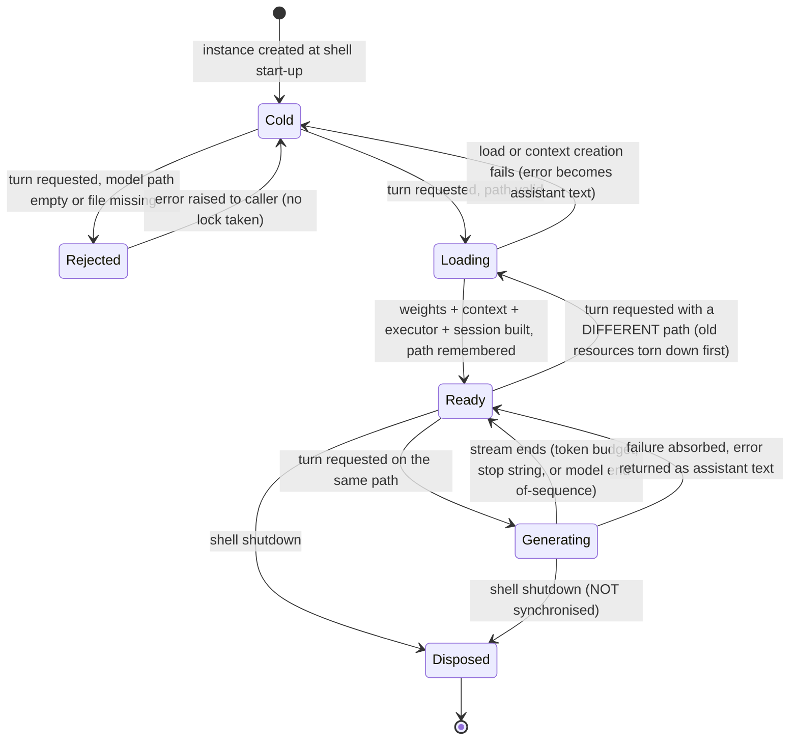

---

**Functional requirements**

*Identity and readiness*

- **FR-8.1** — The back end shall be registered under the provider key `llama` and shall be one of exactly three interchangeable back ends; the other accepted provider values are `azure` and `bedrock`. (realizes US-8.1)
- **FR-8.2** — The back end shall report its display name as the exact string `Local LLM (LLamaSharp)`, which callers interpolate into their own messages. (realizes US-8.1)
- **FR-8.3** — The readiness check shall return true if and only if the model-identifier setting is non-empty **and** a file exists at that exact path. It shall have no side effects: no file is opened, no header is validated, no file extension is checked and no size threshold is applied. A zero-byte file with no extension passes. (realizes US-8.2)
- **FR-8.4** — For this back end, the model-identifier setting shall be interpreted as a filesystem path, not a remote model name. Its product-wide default value is `gpt-4`, which can never satisfy FR-8.3; a user who selects this provider without also setting a path is therefore not ready. (realizes US-8.2)
- **FR-8.5** — The default provider shall be `azure`, so this back end shall be inactive until the user selects it explicitly. (realizes US-8.1)
- **FR-8.6** — This back end shall read no credential, no token, no environment variable and no secret of any kind. Its only implicit permission requirements are read access to the model file and write access to the log directory. (realizes US-8.1)

*Entry points and routing*

- **FR-8.7** — The plain-text generation entry point shall delegate entirely to the introspection-capable entry point and return its text; if that text is absent it shall return the literal `Error: Response text expected, none received`. (realizes US-8.4)
- **FR-8.8** — The introspection-capable entry point shall, in this exact order: (1) run the readiness check, (2) acquire the process-wide generation lock, (3) arm log capture and record `Starting message generation`, (4) ensure the model is loaded, (5) verify weights and context are present, (6) route to one of the two generation paths, (7) absorb any failure raised by steps 3–6, (8) release the generation lock. (realizes US-8.4)
- **FR-8.9** — A readiness failure at step 1 shall be **raised out of the back end** rather than converted into a response, and shall carry exactly `LLamaSharp service is not properly configured. Please set ModelId to a valid GGUF model file path.` The raise shall occur before the generation lock is taken and outside the failure-absorbing region. (realizes US-8.2)
- **FR-8.10** — The introspection path shall be selected if and only if the introspection-enabled flag is true **and** the alternatives count is strictly greater than `0`. Every other combination shall select the fast path. On selection, the back end shall record either `Using sampling pipeline with token probability capture mode` or `Using standard ChatSession mode`. (realizes US-8.6)
- **FR-8.11** — If, after the load step, either the weights handle or the context handle is absent, the back end shall raise an error carrying exactly `Failed to initialize the LLamaSharp model.` (realizes US-8.8)

*Model loading and caching*

- **FR-8.12** — A reload shall be required if and only if the weights are absent, **or** the context is absent, **or** the remembered path differs from the currently configured path. Changing the context size, graphics-layer count, thread count, batch size, temperature or system prompt shall **not** trigger a reload; those values shall be re-read only on a genuine reload. (realizes US-8.5)
- **FR-8.13** — Before a reload, existing resources shall be torn down strictly in this order: drop the session reference, drop the executor reference, release and clear the context, release and clear the weights. Only then shall the new load begin. (realizes US-8.5)
- **FR-8.14** — The context size used at load shall be the configured context size when it is greater than `0`, and otherwise the fallback value **2048**. The configured default is `4096`; the validated range is `512`–`32768`; the fallback is therefore reachable only by editing the settings file directly. Note the inconsistency with FR-8.39. (realizes US-8.3)
- **FR-8.15** — The graphics-layer count shall be passed to the loader exactly as configured, with no clamping at this layer. Its default is `0`, meaning processor-only; the validated range is `0`–`100`. (realizes US-8.3)
- **FR-8.16** — Memory-mapping of the model file shall always be enabled and memory-locking shall always be disabled. Neither is configurable. (realizes US-8.3)
- **FR-8.17** — The loader shall re-check that the model file exists and shall raise `Model file not found: <path>` when it does not. (realizes US-8.2)
- **FR-8.18** — The loader shall record the model file size in **whole megabytes using truncating integer division by 1 048 576**, as `Model file size: <N> MB`. A file smaller than one mebibyte therefore records `0 MB`. (realizes US-8.7)
- **FR-8.19** — The loader shall write the single line `Loading model with context size: <n>, GPU layers: <m>` **to standard output**, bypassing the log component. This shall be the only direct console write performed by this back end, and it shall occur in the full-screen shell as well as the plain shell. (realizes US-8.7)
- **FR-8.20** — The graphics-device selector (free-form text, e.g. `0` or `0,1`, default unset), the thread count (default `0`, meaning system default) and the batch size (default `512`) shall be accepted, validated, persisted and displayed by the settings surfaces, and shall **not** be applied to inference in any way. (realizes US-8.3)
- **FR-8.21** — Weight loading and inference-context creation shall each be executed off the calling thread and awaited, so the calling (user-interface) thread is not blocked. (realizes US-8.5)
- **FR-8.22** — On a genuine load the back end shall build an interactive executor over the context, create a fresh engine-side conversation seeded with **exactly one system-role message** holding the current system-prompt text, build a chat session over executor and conversation, remember the loaded path, and record `LLamaSharp initialization complete`. (realizes US-8.4)
- **FR-8.23** — The system-prompt text shall be bound **once, at load time**. Changing the system prompt afterwards shall have no effect until the model path changes or the process restarts. The default system-prompt text is `You are ChatDBG, a helpful debugging assistant. Help users analyze code, debug issues, and understand programming concepts.` and it is not itself persisted — only the name of the selected prompt is. (realizes US-8.4)

*Inference parameters*

- **FR-8.24** — Maximum new tokens shall be the configured maximum-output-token value when it is greater than `0`, and otherwise the fallback value **512**. The configured default is `1000` and the validated range is `1`–`8192`, so the fallback is reachable only by editing the settings file directly. This rule shall apply identically on both generation paths. (realizes US-8.4)
- **FR-8.25** — Stop sequences shall be hard-coded to exactly the two strings `User:` and `USER:`, in that order, on both generation paths. They shall not be configurable. Generation shall halt when the model emits either. (realizes US-8.4)
- **FR-8.26** — Sampling temperature shall be the configured temperature narrowed to single precision. Its default is `0.7` and its validated range is `0.0`–`2.0` inclusive. (realizes US-8.4)
- **FR-8.27** — The sampler's selection limit shall be set to the **introspection alternatives-count setting on both generation paths**, including when introspection is disabled. Its default is `5` and its validated range is `1`–`20`. Consequently, local generation is limited to the five highest-scoring tokens out of the box, and setting the alternatives count to `1` makes local generation effectively deterministic. No user-facing text states this. (realizes US-8.3, US-8.6)
- **FR-8.28** — All other sampling controls — nucleus threshold, typical sampling, minimum probability, repetition/frequency/presence penalties, random seed, adaptive-perplexity sampling, grammar constraints — shall be left at the inference engine's defaults; they are neither set, read, logged nor exposed. A reimplementation must choose and document them explicitly because they materially change output. *(INFERRED: the actual defaults are whatever the source's sampling pipeline used.)* (realizes US-8.4)

*Prompt selection and conversation semantics*

- **FR-8.29** — The prompt sent to the model shall be **only the content of the last message in the supplied conversation whose role equals `user`**, compared case-insensitively. System messages, earlier user turns and all prior assistant turns shall be discarded. This rule shall be identical on both generation paths. (realizes US-8.4)
- **FR-8.30** — If no such message exists, **or** its content is the empty string, the back end shall raise an error carrying exactly `No user message found in chat history.` An empty user message and a missing user message shall be indistinguishable. (realizes US-8.8)
- **FR-8.31** — The introspection path shall record `Processing user message with <N> characters`, where `<N>` is the character length of the selected prompt. (realizes US-8.7)
- **FR-8.32** — Multi-turn continuity shall live entirely in the engine-side chat session created at load time and cached alongside the weights. Consequently, clearing the product's conversation, importing a conversation, injecting a message or removing a message shall have **no effect on what the local model remembers**; the model continues to answer from the turns the engine-side session retained. (realizes US-8.4)
- **FR-8.33** — Chat prompt templating, special-token handling and beginning-of-sequence handling shall be delegated entirely to the inference engine's chat-session abstraction; the product never constructs or inspects the templated prompt. *(INFERRED: identical inputs will therefore produce different text under a different engine or template.)* (realizes US-8.4)

*Introspection records*

- **FR-8.34** — On the introspection path, for each streamed text piece the back end shall create a probability record whose token text is the piece, whose log-probability is `0` and whose alternatives list is empty; then, if a candidate list is pending from the previous step and a previous record exists, it shall attach that pending list to the **previous** record and derive that record's log-probability as follows: if a candidate's text equals the record's token text, use that candidate's log-probability; otherwise, if the candidate list is non-empty, use the **greatest** candidate log-probability; otherwise leave the log-probability at `0`. (realizes US-8.6)
- **FR-8.35** — Because the candidate list is read from the engine *after* the current piece was emitted, the alternatives stored on record *n* shall in fact be the model's distribution for position *n+1*. Every alternatives list in the output is therefore shifted one position. (realizes US-8.6)
- **FR-8.36** — After the stream ends, if a pending candidate list exists and the final record still has no alternatives, that list shall be attached to the final record; and if the final record's log-probability is still exactly `0`, it shall be set to the greatest candidate log-probability. (realizes US-8.6)
- **FR-8.37** — The introspection path shall clear the accumulated per-token analysis list at the start of every generation. The fast path shall **not** clear it, so a non-introspected generation leaves the previous introspected run's analyses readable with nothing marking them stale. (realizes US-8.6, US-8.9)
- **FR-8.38** *(superseded — Owner decision D-001, 2026-08-29, `DECISIONS.md`; observed source behaviour retained, NOT to be implemented)* — Each per-token analysis record's `probability` shall be **estimated from the configured temperature, not measured**, using this step function: temperature ≤ `0.1` → `0.95`; ≤ `0.5` → `0.85`; ≤ `0.7` → `0.75`; ≤ `1.0` → `0.60`; ≤ `1.5` → `0.50`; otherwise `0.40`. The record's `logprob` shall be the natural logarithm of that estimate. Every token in a run therefore carries the identical value. (realizes US-8.6)
- **FR-8.38a** *(replacement — D-001)* — Each per-token analysis record's `probability` and `logprob` SHALL come from the engine's **measured** per-step distribution (the same softmax the alternatives are drawn from), or SHALL be **absent** — with an explicit absent marker distinct from a genuine zero — when the distribution could not be obtained. No value derived from the temperature setting, the token index, or any other formula may ever be written into a measurement field. A failure to obtain the distribution SHALL be surfaced to the operator (it is not a silent degradation; see QUIRK-8.6/9.14, also resolved by this decision).
- **FR-8.39** — Each per-token analysis record shall carry: `step` and `promptOffset` both equal to the zero-based generation index; `tokenId` always the sentinel `-1`; `systemDebugInfo` the fixed sentence `Generated via sampling pipeline at step <1-based step>, temperature=<temperature to two decimal places>.`; and a model-state snapshot in which `totalTokensProcessed` and `contextTokenCount` are both the one-based generated-piece counter (prompt tokens are **not** counted), `contextSize` is the configured context size when greater than `0` and otherwise the fallback **4096** (note: a different fallback from FR-8.14), `remainingContext` is that context size minus the generated-piece counter, `timestamp` is local wall-clock time with no zone offset, and `debugInfo` holds exactly three entries: `Temperature` (two decimal places), `TopK`, and `Mode` with the constant value `SamplingPipeline`. (realizes US-8.6)
- **FR-8.40** — Candidate records written into per-token analysis records shall carry **only** text and log-probability; their vocabulary-id, probability and raw-score fields shall be left at their type defaults of `0`. (realizes US-8.6)
- **FR-8.41** — Candidate records nested inside a display probability record shall always carry an absent alternatives list, so the structure is exactly two levels deep and never recurses. (realizes US-8.6)
- **FR-8.42** — The introspection path shall write one debug line per streamed piece in the form `Token <n>: '<piece>'`, and on completion shall record `Generation complete in <ms>ms, generated <n> tokens` and force-flush the log buffer to the daily file. (realizes US-8.7)
- **FR-8.43** — A "token" throughout this feature shall be a decoder **text piece**, not necessarily a model token. The counter, the state snapshot counts and the length of the probability list all count pieces. *(INFERRED: multi-byte characters are typically buffered by a decoder until printable, so piece counts can diverge from true token counts.)* (realizes US-8.6)

*Candidate computation*

- **FR-8.44** — The candidate routine shall locate a zero-argument accessor for the engine's current score vector **by name at run time**, not through a compile-time contract, and invoke it. If no operation with that name and shape exists, it shall return an empty candidate list. (realizes US-8.6)
- **FR-8.45** — Any failure anywhere inside the candidate routine — missing accessor, unsupported return shape, failed detokenise, or any raised error — shall be absorbed and shall yield an empty candidate list **with no log line at any level**. *(INFERRED, carried forward from the dossier: with the engine version the source shipped, this is the expected outcome on every step, so the observable behaviour of the whole introspection feature is empty alternatives and log-probabilities left at `0`.)* (realizes US-8.6)
- **FR-8.46** — The routine shall accept the returned score vector as an array of single-precision numbers, an array of double-precision numbers, or any sequence of numbers converted element-wise to double precision; any other shape shall yield an empty list. An empty score vector shall yield an empty list. (realizes US-8.6)
- **FR-8.47** — The routine shall select `min(max(1, requestedAlternatives), vocabularySize)` indices with the highest scores, in descending score order. (realizes US-8.6)
- **FR-8.48** — The routine shall apply a numerically-stabilised normalised-exponential transform over **only the selected scores**: subtract the greatest selected score, exponentiate, and divide by the sum over the selected set; if that sum is not positive it shall be treated as `1`. Candidate probabilities therefore always sum to `1.0` within the returned list regardless of the true distribution, so a genuinely uncertain step and a genuinely certain one can yield identical numbers. Each candidate's stored value shall be the natural logarithm of that within-selection probability. (realizes US-8.6)
- **FR-8.49** — Vocabulary-index-to-text resolution shall be attempted by a name-only, late-bound single-argument call on the live context; on any failure or empty result the candidate's text shall be the literal placeholder `id:<numericIndex>`, which is rendered indistinguishably from real token text. (realizes US-8.6)
- **FR-8.50** — A raised error around the score-vector read that escapes the candidate routine shall be recorded at warning level as `Failed to compute candidates from logits: <message>`, the pending candidate list shall be cleared, and generation shall continue. (realizes US-8.8)

*Fast path*

- **FR-8.51** — The fast path shall stream and concatenate text only: no per-piece records, no score-vector reads and no per-piece debug lines. (realizes US-8.4)
- **FR-8.52** — The fast path shall return a response whose probability list is explicitly **absent**, as distinct from an empty list. (realizes US-8.4)

*Timing, error shaping and lifecycle*

- **FR-8.53** — Elapsed time shall be reported in seconds as measured milliseconds divided by 1000.0 on both successful paths, and shall be exactly `0` on the absorbed-error path. (realizes US-8.4)
- **FR-8.54** — Every failure raised after the readiness check shall be absorbed and converted into a **success-shaped** response whose text is `Error running local LLM: <message>`, whose probability list is absent, whose elapsed time is `0`, and whose dedicated error field carries the raw message. Additionally, the full failure shall be recorded at error level as `Error in LLamaSharpService: <full failure detail>`, the log buffer shall be force-flushed to the daily file, and the same text shall be written to the platform debug channel. (realizes US-8.8)
- **FR-8.55** — The introspection path's readiness guard shall require executor **and** session **and** context; the fast path's guard shall check only executor **and** session. A state with a live session but no context therefore reaches the fast path's generation call and is caught only by the outer guard of FR-8.11. Both guards shall raise the message `ChatSession not initialized`. (realizes US-8.8)
- **FR-8.56** — At most **one generation at a time process-wide** shall be permitted, enforced by a process-wide binary lock shared by every instance. A blocked caller shall wait indefinitely: no timeout, no queue bound, no cancellation, no progress feedback. (realizes US-8.4)
- **FR-8.57** — At most **one model load at a time process-wide** shall be permitted, enforced by a second, separate process-wide binary lock held for the whole of the load/reload decision. (realizes US-8.5)
- **FR-8.58** — There shall be **no timeout, no cancellation, no retry, no back-off and no progress reporting** anywhere in this feature other than log lines. A generation runs until the model stops, the token budget is exhausted, or a stop string is emitted. (realizes US-8.4)
- **FR-8.59** — Exceeding the context window shall be **unhandled**: no detection, no truncation, no eviction, no warning. The `remainingContext` value of FR-8.39 shall be informational only and shall gate nothing. (realizes US-8.6)
- **FR-8.60** — Shutdown shall drop the session and executor references, release the inference context, release the weights, shut down the log component (flushing the buffer once to the daily file), release and dispose the **process-wide generation lock**, and mark the instance shut down; a repeat shutdown shall be a no-op. The process-wide model-load lock shall be left un-released and undisposed. (realizes US-8.8)
- **FR-8.61** — Reclamation without an explicit shutdown shall clear only the context and weights references and shall release **no native memory**. (realizes US-8.8)
- **FR-8.62** — Shutdown shall **not** be synchronised against an in-flight generation. (realizes US-8.8)

*Diagnostic logging*

- **FR-8.63** — Log capture shall be armed lazily and exactly once per back-end instance; repeat arming shall return immediately without re-registering. Arming shall create the log directory when file logging is enabled, register a callback with the inference engine, and append `LLamaSharp logging configured successfully`. (realizes US-8.7)
- **FR-8.64** — Every buffered line shall use the fixed format `[yyyy-MM-dd HH:mm:ss.fff] [LEVEL] message`. Engine-origin lines shall have trailing whitespace trimmed; application-origin lines shall not. Timestamps shall use local time with no zone offset. (realizes US-8.7)
- **FR-8.65** — The buffer auto-flush threshold shall be **10 000 characters**, checked **only** on engine-origin callbacks and only when file logging is enabled. Application-origin lines shall never trigger a flush, so a run producing many per-piece debug lines and no engine output grows the buffer unbounded until an explicit flush. (realizes US-8.7)
- **FR-8.66** — The daily log file shall be named `llamasharp_<yyyyMMdd>.log` inside the log directory and shall be **appended** to; the buffer shall be cleared after a successful append. There shall be no size-based rotation, no retention limit and no pruning. The default log directory shall be the per-user roaming application-data folder plus `ChatDbg` plus `Logs` (on one common platform, `%APPDATA%\ChatDbg\Logs`). (realizes US-8.7)
- **FR-8.67** — Log sink defaults shall be: file logging **on**, platform debug channel **on**, console output **off**. These three sinks shall be settable on the component but shall be reachable through no setting, command or user-interface control. (realizes US-8.7)
- **FR-8.68** — Buffer read, clear, write-to-path and flush shall all be guarded by one lock, because the engine callback may fire from arbitrary threads. (realizes US-8.7)
- **FR-8.69** — Writing the buffer to a caller-chosen path shall create the parent directory if needed, overwrite the target, and **not** clear the buffer; afterwards the line `Logs saved to <path>` shall be appended to the buffer, so the saved file never contains its own confirmation line and the next flush duplicates the saved content into the daily file. (realizes US-8.9)
- **FR-8.70** — All log-persistence failures — unwritable directory, full disk, failed callback registration — shall be absorbed and surfaced only on the platform debug channel; chat shall be unaffected and the user shall see nothing. (realizes US-8.7)

*Diagnostic export surface*

- **FR-8.71** — The back end shall expose three operations that are not part of the shared back-end contract and that **no user-reachable path in the product invokes**: (a) read back a defensive copy of the accumulated per-token analyses; (b) export those analyses to a caller-supplied file path; (c) export the captured log buffer to a caller-supplied file path. A reimplementation shall treat these as an intended-but-unwired diagnostic surface. (realizes US-8.9)
- **FR-8.72** — The analysis export shall write **indented** JSON, overwriting the target, and record `Token analyses saved to <path>` at informational level on success. Any failure shall be absorbed and recorded only as `Failed to save token analyses: <failure detail>` in a buffer nothing displays; **no failure signal shall reach the caller**. (realizes US-8.9)
- **FR-8.73** — The exported analysis document shall be JSON and its property names shall be a stable contract, so that an exported file remains readable by any consumer built against it. Per-token record keys: `step`, `tokenText`, `tokenId`, `probability`, `logprob`, `promptOffset`, `topCandidates`, `systemDebugInfo`, `modelState`. Candidate keys: `text`, `tokenId`, `probability`, `logprob`, `logit`. State-snapshot keys: `totalTokensProcessed`, `contextTokenCount`, `contextSize`, `remainingContext`, `timestamp`, `debugInfo`. Round-tripping through JSON shall preserve every one of them. (realizes US-8.9)
- **FR-8.74** — The display probability record produced for the shell shall serialise with the keys `token`, `logprob` and `top_alternatives` — the last in snake case, unlike every other record in this feature — and its derived probability value shall be excluded from serialisation. (realizes US-8.6)
- **FR-8.75** — There shall be **no operation to clear the accumulated analyses**; the list is reset only at the start of the next introspected generation, and nothing bounds its growth. With a token budget of up to 8192 and roughly 100–200 bytes retained per piece, a long generation retains every record. (realizes US-8.9)

*Shell-facing behaviour*

- **FR-8.76** — Before an introspected turn, the console shell shall print `Log probabilities enabled - requesting with top-k=<n>`. (realizes US-8.6)
- **FR-8.77** — When introspection was requested and the returned probability list is empty or absent, the console shell shall print `\nNote: Log probabilities were requested but none were returned by the model.` followed by `This could be due to the model not supporting this feature or an API limitation.` (realizes US-8.6)
- **FR-8.78** — On start-up the console shell shall print the local-model configuration block **only** when this provider is selected, listing the context size, the graphics-layer count with the suffix ` (CPU-only)` appended when it is `0`, the graphics device (the line omitted entirely when unset), the thread count rendered as `default` when it is `0`, and the batch size. (realizes US-8.3)
- **FR-8.79** — The shells shall append the returned text to the conversation as an **assistant turn** and print it, whether it is a genuine reply or an error string shaped as one; the response's dedicated error field shall not be read by any shell. (realizes US-8.8)
- **FR-8.80** — When the returned text is absent on the introspection path, the shells shall substitute the exact string `Error: Response text expected, none recieved.` (spelled as written); the back end's plain-text entry point shall substitute the different string `Error: Response text expected, none received`. (realizes US-8.8)
- **FR-8.81** — A turn-level failure escaping the back end shall be printed by the console shell as `Error getting AI response: <message>` and by the windowed shell as a dialog reading `Failed to get AI response: <message>`. (realizes US-8.8)

---

**External technology**

*Requires: an in-process large-language-model inference engine that loads weights from a single local file, creates a sized inference context, and exposes an interactive-executor plus chat-session abstraction that streams decoded text pieces asynchronously (no network protocol; a native library loaded into the process through a foreign-function interface). Source used: LLamaSharp 0.25.0, a managed binding over llama.cpp, pinned in `src/Xcaciv.ChatDbg.Core/Xcaciv.ChatDbg.Core.csproj:13`. Reimplementer notes: the substitute must support inference parameters carrying maximum-new-tokens, a list of stop strings, and a sampling policy configured with a temperature and a top-K selection limit; it must stream **text pieces**, not token identifiers, because every counter and record in this feature counts pieces; and it must own conversation continuity in a session object, because the product deliberately sends only one message per turn. Ideally it also exposes the current per-step score vector and a detokenise entry point — the source could obtain neither cleanly and fell back to run-time name resolution, which is why the introspection feature produces nothing. Any equivalent engine works if it offers those.*

*Requires: a host-processor inference backend supplying platform-native shared libraries for the target machine. Source used: `LLamaSharp.Backend.Cpu` 0.25.0 (`csproj:14`), shipping binaries under a `runtimes/<platform-id>/native/` layout; the source's documentation names `win-x64/native/llama.dll` and `linux-x64/native/libllama.so` as the artefacts to verify. Reimplementer notes: on one common platform these require the vendor C++ runtime redistributables to be installed, and a missing or mismatched binary is the leading cause of the uncatchable native crash in UC-8.B/E7.*

*Requires: an optional graphics-accelerated inference backend (vendor compute toolkit, version 12 series). Source used: `LLamaSharp.Backend.Cuda12` 0.25.0 (`csproj:15`), requiring a matching vendor driver and toolkit. Reimplementer notes: this is the **only** accelerator backend anywhere in the source — no Metal, Vulkan, ROCm/HIP, OpenCL or processor-variant package exists — so "graphics acceleration" in this product means one vendor or nothing; on any other accelerator a non-zero layer count is accepted, persisted and displayed, then silently ignored or fatal inside the native loader. The source references the processor and accelerator backends **unconditionally in the same project**, and its own troubleshooting document twice names shipping both as a cause of native load failures.*

*Requires: a quantised model weight file format. Source used: GGUF files supplied by the user; the path is the model-identifier setting. The documentation points at publicly hosted GGUF models and names one 7-billion-parameter chat model at 4-bit medium quantisation as a known-good test file, with guidance that 3-bit medium is smaller and lower quality, 4-bit medium balanced, and 5-bit medium larger and better. Reimplementer notes: the file format is a user-facing compatibility requirement — users will already hold GGUF files. Older pre-GGUF formats are explicitly out of scope. Nothing in the product validates the file's header, extension or size; existence is the only check.*

*Requires: a hook that redirects the inference engine's own native log output into the host process. Source used: the binding's process-global native-log callback registration. Reimplementer notes: the hook must accept a (level, message) pair arriving on arbitrary threads, which is why the buffer is lock-guarded; the source registers it globally on first use and never unregisters it.*

*Requires: local filesystem access. Source used: platform file APIs. Reimplementer notes: reads the model file (existence and size only); writes an append-only daily log file under a per-user application-data directory created on demand, plus optional exports to caller-chosen paths.*

*Requires: structured document serialisation with pinned property names (JSON). Source used: the platform's built-in JSON serialiser with explicit per-property names and indented output for the analysis export. Reimplementer notes: the property names in FR-8.73 and FR-8.74 are the export contract and must be preserved verbatim if exported analyses are to remain readable.*

*Requires: a managed runtime supporting run-time member lookup by name and late binding. Source used: .NET 10 (`net10.0`), SDK pinned to `10.0.100-rc.1.25451.107` in `global.json`, with unsafe code enabled in the core library. Reimplementer notes: the score-vector read resolves an operation by name and the detokenise call is late-bound; both are hostile to ahead-of-time compilation and trimming, which the source's own compact publish profile enables. Under those profiles both silently degrade to "no alternatives" rather than failing loudly. The source pins a release-candidate runtime while its own troubleshooting document names an older runtime and engine version 0.17.0 as the proven combination.*

*Requires: process-wide mutual exclusion primitives. Source used: two process-wide binary semaphores, one for loading and one for generating. Reimplementer notes: needed because the native engine and the cached context are not safe for concurrent use. Neither has a timeout, a queue bound, or a cancellation path.*

*Requires: a rich terminal renderer for the resulting probability tables (ANSI). Source used: Spectre.Console 0.51.1 (`csproj:16`). Reimplementer notes: owned by the output-rendering feature, listed because the probability records exist to feed it.*

*Requires: a per-user structured settings store. Source used: a JSON document with camel-case keys at `<user profile>/.ChatDbg/settings.json`, falling back to the system temporary directory when the user-profile folder is unavailable or blank. Reimplementer notes: owned by the settings feature; listed because every knob this feature reads arrives through it.*

---

**Acceptance criteria**

*Configuration*

- **AC-8.1** — **Given** the model-path setting is `<temp>/missing.gguf` and no such file exists, **when** the readiness check runs, **then** it returns false and no file handle is opened.
- **AC-8.2** — **Given** a zero-byte file created at `<temp>/model<random>` with no `.gguf` extension and no valid header, **when** the readiness check runs, **then** it returns true.
- **AC-8.3** — **Given** the model-path setting is the empty string, **when** the readiness check runs, **then** it returns false without touching the filesystem.
- **AC-8.4** — **Given** freshly defaulted settings (provider `azure`, model identifier `gpt-4`), **when** the user sets the provider to `llama` and immediately types a chat line, **then** the shell prints `Error: Local LLM (LLamaSharp) service is not configured. Use environment variables or Windows Credential Manager to configure credentials securely.` followed by `   Type '/set' to see current configuration and setup instructions.`, and no generation is attempted.
- **AC-8.5** — **Given** the model path is `missing.gguf`, **when** a caller requests a generation with introspection directly, **then** an error is **raised** — not returned as a response — carrying exactly `LLamaSharp service is not properly configured. Please set ModelId to a valid GGUF model file path.`
- **AC-8.6** — **Given** the provider is `llama`, **when** the user sets the model identifier to `C:\models\nope.gguf` and no such file exists, **then** the command fails with `LLama model file not found: C:\models\nope.gguf` on the first line and `Make sure you've specified the correct path to a GGUF model file.` on the second, and the stored setting is unchanged.

*Loading*

- **AC-8.7** — **Given** a 4 500 000 000-byte model file at path `P`, context size `4096`, graphics layers `0`, and no model resident, **when** the first generation is requested, **then** the daily log gains, in order, `Loading LLamaSharp model from P`, `Model file size: 4291 MB`, `Model params: ContextSize=4096, GpuLayers=0`, `Calling LLamaWeights.LoadFromFile...`, `Model weights loaded successfully`, `Creating context...`, `Context created successfully`, `LLamaSharp initialization complete`; **and** standard output receives exactly `Loading model with context size: 4096, GPU layers: 0`.
- **AC-8.8** — **Given** a context size of `0` (reachable only by editing the settings file, since the validated floor is `512`), **when** the model is loaded, **then** the load uses context size `2048` while every per-step state snapshot in the same run reports context size `4096`.
- **AC-8.9** — **Given** a model already resident from path `P`, **when** a further generation is requested with the same `P`, **then** no `Loading LLamaSharp model from` line is written, no `Loading model with context size:` line reaches standard output, and the same engine-side session with all its retained conversation is reused.
- **AC-8.10** — **Given** a model resident from `P` with context size `2048` and graphics layers `0`, **when** the user sets context size to `8192`, graphics layers to `32`, thread count to `8`, batch size to `1024` and selects a different system prompt, and then sends a message with the path still `P`, **then** no reload occurs, generation still runs at context size `2048` with `0` graphics layers, the originally seeded system prompt is still in force — and the settings surface nevertheless reports every change as applied and displays the new values.
- **AC-8.11** — **Given** a model resident from `P`, **when** a generation is requested with a different path `Q`, **then** the session reference is dropped, the executor reference is dropped, the context is released and cleared, the weights are released and cleared — in that order — before any work on `Q` begins, and the new session is seeded with the system-prompt text current at that moment.
- **AC-8.12** — **Given** path `P` passes the readiness check but is deleted before the first generation, **when** the generation runs, **then** the caller receives a success-shaped response whose text is `Error running local LLM: Model file not found: P` and whose elapsed time is `0`.
- **AC-8.13** — **Given** a 900 000-byte model file, **when** it is loaded, **then** the log records `Model file size: 0 MB`.

*Generation parameters*

- **AC-8.14** — **Given** maximum output tokens `1000`, temperature `0.7` and alternatives count `5`, **when** inference parameters are built on **either** path, **then** maximum new tokens is `1000`, the stop strings are exactly the two-element ordered list `["User:", "USER:"]`, the sampling temperature is `0.7` narrowed to single precision, and the sampler's selection limit is `5`.
- **AC-8.15** — **Given** maximum output tokens `0` or any negative value, **when** inference parameters are built, **then** maximum new tokens is `512`.
- **AC-8.16** — **Given** introspection disabled and alternatives count `20`, **when** a generation runs, **then** the fast path is taken (log line `Using standard ChatSession mode`) **and** the sampler's selection limit is still `20`.
- **AC-8.17** — **Given** introspection enabled and alternatives count `0` (reachable only by editing the settings file), **when** a generation runs, **then** the **fast** path is taken and the response's probability list is absent.
- **AC-8.18** — **Given** introspection disabled and alternatives count `1`, **when** the same prompt is sent twice at temperature `0.7`, **then** generation is constrained to the single highest-scoring token at each step (effectively deterministic), with no user-facing indication that a display setting caused it.

*Prompt selection*

- **AC-8.19** — **Given** a conversation of `[system:"S", user:"first", assistant:"A", USER:"second"]`, **when** a generation is requested, **then** only the string `second` is sent, and the log records `Processing user message with 6 characters`.
- **AC-8.20** — **Given** a conversation whose only user message has content `""`, **when** a generation is requested, **then** the caller receives text `Error running local LLM: No user message found in chat history.` with elapsed time `0`.
- **AC-8.21** — **Given** a multi-turn session on one model path, **when** the user clears the conversation and then asks "what did I just say?", **then** the product's message list is empty (the shell reports `Cleared N messages from chat history`) but the model still answers from the turns the engine-side session retained.

*Introspection output*

- **AC-8.22** — **Given** introspection disabled, **when** a generation completes in 1 234 ms, **then** the response's probability list is **absent**, its elapsed time is `1.234`, and the shell prints only the reply text.
- **AC-8.23** — **Given** introspection enabled with alternatives count `5`, **when** a generation streams 12 text pieces in 2 000 ms, **then** the response carries exactly 12 probability records in emission order, each record's token text equals its piece, and elapsed time is `2.0`.
- **AC-8.24** — **Given** the running engine exposes no zero-argument score-vector accessor of that name, **when** an introspected generation of 12 pieces runs, **then** all 12 records have an empty alternatives list and a log-probability of exactly `0`, **no** warning line is written, and the visualiser renders 12 tokens each at probability `1.0`.
- **AC-8.25** — **Given** a score-vector accessor returning `[2.0, 1.0, 0.0, …]` over a 32 000-entry vocabulary and an alternatives count of `3`, **when** candidates are computed, **then** exactly 3 candidates come back in descending score order, their probabilities are `0.665`, `0.245` and `0.090` (the normalised exponential of those 3 scores alone, summing to `1.0` — not the true vocabulary-wide probabilities), and each candidate's stored value is the natural logarithm of that probability.
- **AC-8.26** — **Given** an alternatives count of `3` and a vocabulary of size `2`, **when** candidates are computed, **then** exactly 2 candidates come back.
- **AC-8.27** — **Given** an introspected run whose pieces are `["Hel", "lo", "!"]` and whose score-vector reads all succeed, **when** the response is inspected, **then** the alternatives on record 0 are the model's candidates for position 1, those on record 1 are for position 2, and those on record 2 are the trailing pending list attached after the stream ended.
- **AC-8.28** — **Given** a record whose own token text does not appear among its attached candidates, **when** its log-probability is derived, **then** it takes the **greatest** candidate log-probability; **given** the candidate list is empty, the log-probability stays `0` and renders as 100 %.
- **AC-8.29** — **Given** temperatures `0.05`, `0.4`, `0.7`, `0.9`, `1.2` and `1.9`, **when** per-step analysis records are produced, **then** their `probability` is `0.95`, `0.85`, `0.75`, `0.60`, `0.50` and `0.40` respectively and their `logprob` is the natural logarithm of that value — identical for every token in the run. (Note `0.7` falls in the `≤ 0.7` bucket giving `0.75`, not the `≤ 1.0` bucket.)
- **AC-8.30** — **Given** any per-step analysis record at one-based step `n` with context size `4096` and temperature `0.7`, **when** it is inspected, **then** `step` = `n-1`, `promptOffset` = `n-1`, `tokenId` = `-1`, `totalTokensProcessed` = `n`, `contextTokenCount` = `n`, `contextSize` = `4096`, `remainingContext` = `4096-n`, `timestamp` is local wall-clock time, `systemDebugInfo` = `Generated via sampling pipeline at step <n>, temperature=0.70.`, and `debugInfo` has exactly the three keys `Temperature`, `TopK` and `Mode` with `Mode` = `SamplingPipeline`.
- **AC-8.31** — **Given** an analysis record with candidates, **when** it is serialised, **then** each candidate's `tokenId`, `probability` and `logit` are `0` and only `text` and `logprob` are populated.
- **AC-8.32** — **Given** an analysis record with candidates and a state snapshot, **when** it is written to JSON and read back, **then** `step`, `tokenText`, `tokenId`, `probability`, candidate count and `totalTokensProcessed` all survive unchanged under the key names of FR-8.73.
- **AC-8.33** — **Given** a detokenise lookup that fails for vocabulary index `1234`, **when** the candidate is emitted, **then** its text is exactly `id:1234` and no error or warning is recorded anywhere.

*Error handling*

- **AC-8.34** — **Given** any failure raised after the readiness check — load failure, context failure, missing session, stream failure — **when** the generation completes, **then** the caller receives a success-shaped response with text `Error running local LLM: <message>`, an absent probability list, elapsed time `0` and the raw message in the error field; the full failure is recorded at error level as `Error in LLamaSharpService: <detail>`, the buffer is force-flushed to the daily file, and the same text goes to the platform debug channel.
- **AC-8.35** — **Given** such a response, **when** the console shell handles it, **then** it appends the error text to the conversation as an **assistant turn** and prints it as if the model had said it; the response's dedicated error field is never read.
- **AC-8.36** — **Given** a corrupt model file at path `P`, **when** the first generation is requested, **then** the returned assistant text begins `Error running local LLM: Failed to load GGUF model from 'P'. This may be due to:` and continues with the four numbered causes — `1. Incompatible model format (ensure it's a valid GGUF file)`, `2. Missing or incompatible native libraries (llama.cpp)`, `3. Insufficient memory`, `4. .NET 10 compatibility issues with LLamaSharp 0.25.0` — followed by `Original error: <message>`.
- **AC-8.37** — **Given** an analysis export target path that cannot be written, **when** the export runs, **then** it returns normally, the caller receives no signal at all, and the only trace is an error line `Failed to save token analyses: <detail>` in a buffer nothing displays.

*Concurrency and lifecycle*

- **AC-8.38** — **Given** two generations requested concurrently in one process, **when** both are in flight, **then** the second does not begin until the first has fully completed, waiting with no timeout, no queue bound, no cancellation and no user-visible feedback.
- **AC-8.39** — **Given** an introspected generation has completed leaving 12 analyses, **when** a subsequent generation runs with introspection **off**, **then** the 12 stale analyses are still readable afterwards.
- **AC-8.40** — **Given** the back end is shut down, **when** shutdown runs, **then** the session and executor references are dropped, the context and weights are released, the log component is shut down flushing the buffer to the daily file, the process-wide generation lock is disposed, a repeat shutdown is a no-op, and the process-wide model-load lock is left undisposed.
- **AC-8.41** — **Given** the object is reclaimed without an explicit shutdown, **when** reclamation runs, **then** the context and weights references are merely cleared and no native memory is released.

*Logging*

- **AC-8.42** — **Given** a fresh log component, **when** it is inspected, **then** file logging is on, platform debug output is on, console output is off, the flush threshold is `10000` characters, and the log directory is set.
- **AC-8.43** — **Given** messages recorded at levels `INFO`, `WARNING` and `ERROR`, **when** the buffer is read, **then** every message body and every bracketed level marker is present, each line prefixed by a `[yyyy-MM-dd HH:mm:ss.fff]` timestamp.
- **AC-8.44** — **Given** a buffer containing text, **when** it is cleared, **then** the buffer reads back as the empty string.
- **AC-8.45** — **Given** a buffer containing `Test log entry`, **when** it is written to `<temp>/test_log_<random>.log`, **then** the file exists and contains that text, the buffer is **not** cleared, and the buffer subsequently contains an added `Logs saved to <path>` line that the written file does not.
- **AC-8.46** — **Given** file logging is on with the log directory set to the system temporary folder, **when** the component is shut down twice, **then** the first shutdown flushes and neither call fails.
- **AC-8.47** — **Given** a log component, **when** arming is requested twice, **then** the second call returns immediately without re-registering the engine callback and without failing.
- **AC-8.48** — **Given** file logging is on, **when** engine-origin log lines push the buffer past 10 000 characters, **then** the buffer is appended to `<log directory>/llamasharp_<yyyyMMdd>.log` and cleared; **given** the same volume arrives only through application-origin lines, **then** no flush occurs.

---

**Quirks**

- *QUIRK-8.1: The candidate list attached to the record for piece n is read from the engine after piece n was emitted, so it is the distribution for piece n+1; every alternatives list in the output is shifted one position. Evidence: `src/Xcaciv.ChatDbg.Core/Services/LLamaSharpService.cs:186-206`, `:208-213`. Keep-or-fix decision deferred to Open Questions.*
- *QUIRK-8.2: A log-probability of 0 is indistinguishable from "certain". Records start at 0 and stay there whenever no candidates were captured; the display layer exponentiates and renders the token at 100 %. There is no sentinel for "unknown". Evidence: `LLamaSharpService.cs:182`, `:200-202`; `Models/TokenLogProbabilities.cs:26`. Keep-or-fix decision deferred to Open Questions.*
- *QUIRK-8.3: When the emitted token is not among its own attached candidates, it inherits the best candidate's log-probability — so a token the model was unsure about takes the confidence of a token it did not emit, biasing every uncertain position upward. Evidence: `LLamaSharpService.cs:197-202`. Keep-or-fix decision deferred to Open Questions.*
- *QUIRK-8.4: Candidate probabilities are renormalised over the selected survivors only, not the vocabulary, so they always sum to 1.0 no matter how flat the true distribution is; a genuinely uncertain step and a genuinely certain one can yield identical numbers. Evidence: `LLamaSharpService.cs:465-475`. Keep-or-fix decision deferred to Open Questions.*
- *QUIRK-8.5: The per-step "probability" written into every analysis record is a six-entry lookup table on temperature, not a measurement, yet it is presented through the same fields as measured data. Evidence: `LLamaSharpService.cs:275`, `:310-324`. Keep-or-fix decision deferred to Open Questions.*
- *QUIRK-8.6: The entire candidate routine is wrapped in a blanket failure absorber that returns an empty list with no log line, so a missing accessor, an unsupported return shape, a failed detokenise and an outright error are indistinguishable. The warning handler one level up never fires because nothing escapes. This is the reason the product's headline introspection capability appears to work and produces nothing. Evidence: `LLamaSharpService.cs:489-492` versus `:214-219`. Keep-or-fix decision deferred to Open Questions.*
- *QUIRK-8.7: Detokenise failures become plausible-looking data: a failed lookup yields the literal text `id:<n>`, which flows into candidate lists and renders as if it were a real token. Evidence: `LLamaSharpService.cs:507-510`. Keep-or-fix decision deferred to Open Questions.*
- *QUIRK-8.8: Context accounting ignores the prompt. Tokens-processed, context-token-count and remaining-context are all derived from the generated-piece counter alone; the prompt, the system prompt and every retained prior turn contribute nothing, so remaining-context is wrong by the entire prompt length. Evidence: `LLamaSharpService.cs:287-294`. Keep-or-fix decision deferred to Open Questions.*
- *QUIRK-8.9: Prompt-offset attribution is a copy of the step index; the field is documented as identifying which part of the prompt influenced a token, and nothing is computed. Evidence: `LLamaSharpService.cs:284`; `Services/TokenInspection/TokenAnalysis.cs:41-44`. Keep-or-fix decision deferred to Open Questions.*
- *QUIRK-8.10: A "token" is a decoder text piece, not a model token; counters, state snapshots and probability-list lengths all count pieces, which can diverge from real token counts for multi-byte characters. Evidence: `LLamaSharpService.cs:170-175`. Keep-or-fix decision deferred to Open Questions.*
- *QUIRK-8.11: The analysis export cannot fail visibly — any error is written into a buffer nothing displays and the operation returns normally. Evidence: `LLamaSharpService.cs:644-647`. Keep-or-fix decision deferred to Open Questions.*
- *QUIRK-8.12: Every swallowed failure is returned as a success-shaped response whose text begins `Error running local LLM: `, which both shells append to the conversation as an assistant turn and print like model output; the response's dedicated error field is populated and read by nobody. Evidence: `LLamaSharpService.cs:103-109`; `src/ChatDbg/ChatShell.cs:377-381`. Keep-or-fix decision deferred to Open Questions.*
- *QUIRK-8.13: Instance shutdown disposes a process-wide lock. The generation semaphore is shared by every instance but is disposed by whichever instance is torn down first; a second instance's next generation would fail on a disposed handle. Both shells create exactly one instance, so it does not bite as shipped. Evidence: `LLamaSharpService.cs:24`, `:681`. Keep-or-fix decision deferred to Open Questions.*
- *QUIRK-8.14: Asymmetric lock disposal — the equally process-wide model-load semaphore is never released or disposed at all. Evidence: `LLamaSharpService.cs:23`, `:670-685`. Keep-or-fix decision deferred to Open Questions.*
- *QUIRK-8.15: The reclamation path releases nothing; if the object is collected without an explicit shutdown the native model and context are leaked for the process lifetime. Evidence: `LLamaSharpService.cs:670-696`. Keep-or-fix decision deferred to Open Questions.*
- *QUIRK-8.16: Shutdown does not unregister the engine log hook, and the log component keeps working after shutdown — neither the logging nor the flushing operation checks the shut-down flag, so a post-shutdown flush writes to disk again. Evidence: `Services/TokenInspection/LLamaSharpLogConfig.cs:81-105`, `:119-137`, `:142-165`, `:193-200`. Keep-or-fix decision deferred to Open Questions.*
- *QUIRK-8.17: The engine log hook is process-global but the arm-once flag is per instance, so a second instance arming itself silently steals the hook from the first, which then stops receiving engine lines with no indication. Evidence: `LLamaSharpLogConfig.cs:15`, `:69-70`, `:81`. Keep-or-fix decision deferred to Open Questions.*
- *QUIRK-8.18: The buffer flush threshold is checked only on engine-origin lines, so a run that writes one debug line per generated piece and produces no engine output grows the buffer unbounded until an explicit flush. Evidence: `LLamaSharpLogConfig.cs:90-93` versus `:123-126`. Keep-or-fix decision deferred to Open Questions.*
- *QUIRK-8.19: Saving the buffer to a path does not clear it while flushing does, so saved content is written a second time to the daily file at the next flush; and the confirmation line is appended after the save, so the saved file never contains it. Evidence: `LLamaSharpLogConfig.cs:152-158` versus `:180-185`. Keep-or-fix decision deferred to Open Questions.*
- *QUIRK-8.20: The "not configured" message for this back end instructs the user to configure environment variables or the operating-system credential store, although it reads no credential of any kind. Evidence: `src/ChatDbg/ChatShell.cs:358`. Keep-or-fix decision deferred to Open Questions.*
- *QUIRK-8.21: Shutdown is not synchronised against an in-flight generation; nothing prevents releasing the context and weights while the streaming loop is still using them. Evidence: `LLamaSharpService.cs:670-685`. Keep-or-fix decision deferred to Open Questions.*
- *QUIRK-8.22: Three settings — graphics-device selector, thread count and batch size — are validated, persisted and printed by two user interfaces, and read by nothing. A user following the product's own instructions to set a thread count or tune the batch size gets a success message and no effect. Evidence: `Models/ChatSettings.cs:59-66`; `Commands/SetCommand.cs:116-136`, `:424-429`; absent from `LLamaSharpService.cs:548-554`. Keep-or-fix decision deferred to Open Questions.*
- *QUIRK-8.23: The introspection alternatives count — presented as a display setting — is passed as the sampler's selection limit on both generation paths, including when introspection is off. With the default of 5, all local generation is limited to the five highest-scoring tokens out of the box; setting it to 1 to reduce visual clutter makes generation deterministic. Nothing says so. Evidence: `LLamaSharpService.cs:148`, `:378`; `Models/ChatSettings.cs:37`. Keep-or-fix decision deferred to Open Questions.*
- *QUIRK-8.24: Hardware settings changed mid-session silently do nothing, because reload is keyed on the model path only, while the settings surfaces report every change as applied. Evidence: `LLamaSharpService.cs:525`. Keep-or-fix decision deferred to Open Questions.*
- *QUIRK-8.25: Two context-size fallbacks disagree inside one file — the loader falls back to 2048 while the per-step state snapshot in the same run reports 4096, and the documented default is 4096. Evidence: `LLamaSharpService.cs:550` versus `:291-292`. Keep-or-fix decision deferred to Open Questions.*
- *QUIRK-8.26: Stop sequences are hard-coded to `User:` and `USER:`, not configurable and not documented; a model that legitimately writes "User:" mid-answer truncates its own reply, and any chat template not using that role marker is unsupported. Evidence: `LLamaSharpService.cs:144`, `:374`. Keep-or-fix decision deferred to Open Questions.*
- *QUIRK-8.27: The default model identifier is a remote model name (`gpt-4`), so switching to this back end without also setting a path always fails the file-exists check. Evidence: `Models/ChatSettings.cs:11`. Keep-or-fix decision deferred to Open Questions.*
- *QUIRK-8.28: Only the last user message is ever sent — system messages, prior assistant turns and prior user turns are all discarded — so continuity depends entirely on engine-side session state the product cannot see. Evidence: `LLamaSharpService.cs:131-136`, `:361-366`. Keep-or-fix decision deferred to Open Questions.*
- *QUIRK-8.29: Clearing the conversation does not clear the model's memory; the user is told how many messages were cleared and the model then answers from the turns it still holds. History import behaves the same way. Evidence: `Commands/ClearCommand.cs:18-23`; `Commands/ImportCommand.cs:43`; no session reset anywhere in `LLamaSharpService.cs`. Keep-or-fix decision deferred to Open Questions.*
- *QUIRK-8.30: An empty user message is reported as a missing one, producing `No user message found in chat history.` when a message is plainly present. Evidence: `LLamaSharpService.cs:131-136`. Keep-or-fix decision deferred to Open Questions.*
- *QUIRK-8.31: The fast path's readiness check omits the context, while the introspection path checks all three handles. Evidence: `LLamaSharpService.cs:125-128` versus `:355-358`. Keep-or-fix decision deferred to Open Questions.*
- *QUIRK-8.32: Stale analyses survive a non-introspected run — the list is cleared only at the start of an introspected generation, so read-back and export can return the previous run's data with nothing marking it stale; and there is no operation to clear it, although the product's own documentation advises exporting and clearing beyond about 1000 tokens. Evidence: `LLamaSharpService.cs:156`, with no counterpart at `:353-414`; clearing verified absent from `LLamaSharpService.cs`. Keep-or-fix decision deferred to Open Questions.*
- *QUIRK-8.33: The null-reply substitute is misspelled and differs between layers — the back end uses `Error: Response text expected, none received` while both shells use `Error: Response text expected, none recieved.`, and the shells' version is the one a user actually sees on the introspection path. Evidence: `LLamaSharpService.cs:58`; `src/ChatDbg/ChatShell.cs:377`; `src/ChatDbg.Shell.Gui/ChatShell.cs:330`. Keep-or-fix decision deferred to Open Questions.*
- *QUIRK-8.34: Load progress is written to standard output rather than to the log component, including inside the full-screen terminal interface where it corrupts the display. Evidence: `LLamaSharpService.cs:557`. Keep-or-fix decision deferred to Open Questions.*
- *QUIRK-8.35: Model size is logged with truncating integer division, so any model under one mebibyte logs as `Model file size: 0 MB` — including the zero-byte file the readiness check accepts. Evidence: `LLamaSharpService.cs:544-545`. Keep-or-fix decision deferred to Open Questions.*
- *QUIRK-8.36: Numeric and date formatting follow the ambient locale — temperature is written with a fixed two-decimal pattern into both the log-visible debug sentence and the exported document's debug map, so a comma decimal separator appears in exports on many locales (inside a string value, so parsing survives but naive consumers break); timestamps use local time with no zone offset. Evidence: `LLamaSharpService.cs:285`, `:295-296`; `LLamaSharpLogConfig.cs:83`, `:121`. Keep-or-fix decision deferred to Open Questions.*
- *QUIRK-8.37: The candidate computation converts the whole score vector to double precision, materialises the complete index range and fully sorts it descending before taking the first few — once per generated piece, over a 32 000 to 128 000 entry vocabulary. The source's own planning document prescribes a partial selection instead. Evidence: `LLamaSharpService.cs:459-463`. Keep-or-fix decision deferred to Open Questions.*
- *QUIRK-8.38: Nothing bounds the accumulated analyses — one record per generated piece, each with up to K candidates, a state snapshot and a three-entry map, retained until the next introspected run, with a token budget of up to 8192 and no clearing operation. Evidence: `LLamaSharpService.cs:31`, `:230`. Keep-or-fix decision deferred to Open Questions.*
- *QUIRK-8.39: Three diagnostic operations of this back end (read-back, analysis export, log export) have no caller anywhere in the product, and the three matching commands are placeholders returning a "requires LLamaSharp provider integration" notice that are registered in neither shell — so the notice cannot even be seen. Evidence: `LLamaSharpService.cs:628`, `:633-648`, `:653-656`; `Commands/ShowTokenAnalysisCommand.cs:46-48`, `Commands/ExportTokenAnalysisCommand.cs:23`, `Commands/ExportLogsCommand.cs:23`. Keep-or-fix decision deferred to Open Questions.*
- *QUIRK-8.40: The introspection diagnostics command that the enable message tells users to run when probabilities do not appear is written entirely for the cloud back ends — it discusses interface versions, model deployments and cloud endpoints, none of which apply to a local model file, and the situation it is offered for is this back end's normal outcome. The enable message likewise warns about "a compatible model and API version" for a back end that has no interface version. Evidence: `Commands/LogProbsCommand.cs:39-44`, `:159-207`. Keep-or-fix decision deferred to Open Questions.*
- *QUIRK-8.41: The adjacent tokenisation and inspection commands load their own separate copies of the model file at context sizes 512 and 2048 respectively, disposing each immediately, rather than reusing the multi-gigabyte model this back end already holds resident. Evidence: `Services/TokenInspectionService.cs:30-41`, `:104-118`. Keep-or-fix decision deferred to Open Questions.*
- *QUIRK-8.42: The processor and accelerator backend packages are both referenced unconditionally in the same project, so every published output carries both sets of native binaries — which the source's own troubleshooting document twice names as a cause of native load failures. Evidence: `src/Xcaciv.ChatDbg.Core/Xcaciv.ChatDbg.Core.csproj:14-15`; `docs/LLamaSharp-Troubleshooting-0xC0000005.md:32-37`, `:171-175`. Keep-or-fix decision deferred to Open Questions.*

---

**Source notes**

Primary dossier: `/mnt/g/3RD-Party/reversing/output/chatdbg/dossiers/local-llm-inference.md`, written against source repo `/mnt/g/3RD-Party/reversing/subject/chatdbg` at commit `d8c18f61d6bb73666ed97cd4885e877e35558485` (branch `LLamaSharp_support`).

Primary evidence:
- `src/Xcaciv.ChatDbg.Core/Services/LLamaSharpService.cs` (697 lines) — the whole back end: identity, readiness, both generation paths, candidate computation, detokenise fallback, model load/reload, teardown, and the three unwired diagnostic operations.
- `src/Xcaciv.ChatDbg.Core/Services/TokenInspection/LLamaSharpLogConfig.cs` — engine log capture, buffering, formatting, threshold flush, daily file naming, save-to-path, shutdown.
- `src/Xcaciv.ChatDbg.Core/Services/TokenInspection/TokenAnalysis.cs` — the per-token analysis record, candidate record and model-state snapshot, with the pinned export key names.
- `src/Xcaciv.ChatDbg.Core/Models/TokenLogProbabilities.cs` — the display probability record and its derived probability accessor.
- `src/Xcaciv.ChatDbg.Core/Models/ChatSettings.cs` — every default value this feature reads.
- `src/Xcaciv.ChatDbg.Core/Commands/SetCommand.cs`, `Commands/LogProbsCommand.cs` — validation ranges, refusal messages, the model-path pre-check.
- `src/Xcaciv.ChatDbg.Core/Commands/{ShowTokenAnalysis,ExportTokenAnalysis,ExportLogs}Command.cs` — the three unregistered placeholder commands.
- `src/ChatDbg/ChatShell.cs`, `src/ChatDbg.Shell.Gui/ChatShell.cs`, `src/ChatDbg.Shell.Gui/UI/ChatWindow.cs`, `src/ChatDbg.Shell.Gui/UI/SettingsDialog.cs` — construction, the pre-turn readiness message, the start-up configuration block, error presentation.
- `src/Xcaciv.ChatDbg.Core/Xcaciv.ChatDbg.Core.csproj`, `global.json` — pinned engine, backend and runtime versions.
- `src/Xcaciv.ChatDbg.Core.Tests/Services/LLamaSharpServiceTests.cs`, `.../TokenInspection/LLamaSharpLogConfigTests.cs`, `.../TokenInspection/TokenAnalysisTests.cs`, `.../Models/TokenLogProbabilityTests.cs`, `.../Commands/ShowTokenAnalysisCommandTests.cs` — the 18 shipped tests, none of which exercise generation or model loading.
- `docs/LLamaSharp-Troubleshooting-0xC0000005.md`, `docs/LLamaSharp-Quick-Start.md`, `docs/LLamaSharp-Implementation-Notes.md`, `docs/LLamaSharp-Token-Introspection.md`, `docs/compact-build.md` — the documented success log signature, the native-crash mitigations, and several claims the dossier verified as unimplemented.
- `tmp/LLamaSharpInvestigation.cs` — a scratch feasibility spike compiled into nothing; recorded as vestigial intent, not behaviour.

Feature boundary: this section owns the local back end, its model lifecycle, its generation paths, its candidate mathematics and its analysis records. The probability *data model*, the enable/disable/alternatives-count user surface and the probability mathematics as a product concept belong to Token Probability Analysis; the log-capture component's own contract belongs to Diagnostic Logging; the settings keys, ranges and persistence belong to Settings & Configuration; rendering belongs to Output Rendering; the separate tokenise/inspect model loaders belong to Token Inspection.

---

### 7.9 Token Probability Analysis

**Description**

When a conversational assistant produces a wrong, odd, or surprising answer, the answer text alone gives no clue about *where* the model was guessing. Token Probability Analysis makes that guessing visible. When the operator turns it on, every reply the assistant produces is accompanied by a per-token confidence record: for each token the model emitted, the log-probability the model assigned to it, and the short list of other tokens it nearly chose instead ("alternatives"). The product then draws that record in the terminal — colour-coded by confidence, either as a compact grid of per-token cards or as a detailed table — so the operator can see at a glance which parts of a sentence the model was certain about and which parts it effectively rolled dice on.

The product's own stated uses are: understanding model confidence, identifying uncertain parts of responses, debugging unexpected outputs, and tuning prompts for better results. There is exactly one human role: the local interactive operator of the terminal application — a developer or prompt engineer debugging model behaviour on their own machine. There is no multi-user model, no authentication, no authorization, and no server component. Two machine actors consume the feature's output: the shell that renders it, and the conversation persistence layer that stores it inside exported conversation files so a debugging session can be re-opened later.

The feature owns five persisted settings, two commands (a configuration/diagnostics command and an offline demonstration command), the confidence record itself and the arithmetic that derives a displayable probability from it, the sampling rule that keeps long responses readable in a terminal, and the shared formatting helpers that turn records into text. It does **not** own the provider calls that produce the data (three separate provider integrations do that) nor the low-level drawing primitives (an output-rendering capability does that). It also has an offline demonstration mode that fabricates a sample record and renders it without contacting any provider, so an operator can see what the visualization looks like without spending API budget.

---

**User stories**

- **US-9.1** — As the local operator, I want to turn per-token confidence capture on and off with a single command, so that I only pay the extra request cost and screen noise while I am actually debugging.
- **US-9.2** — As the local operator, I want to control how many alternative tokens are captured per position, so that I can trade analysis depth against request size and output volume.
- **US-9.3** — As the local operator, I want to choose between seeing every token and seeing a representative sample of tokens, so that a long response does not flood my terminal.
- **US-9.4** — As the local operator, I want to choose between a compact grid layout and a detailed list layout, and cap how many alternatives each grid card shows, so that the analysis fits the width of my terminal.
- **US-9.5** — As the local operator, I want to see the current probability-analysis configuration in one report, so that I can tell why I am or am not seeing confidence data.
- **US-9.6** — As the local operator, I want a diagnostics report when no confidence data appears, so that I can tell whether the cause is the model, the API version, or my own configuration.
- **US-9.7** — As the local operator, I want a demonstration of the visualization that never contacts a provider, so that I can evaluate the feature without an API key or API spend.
- **US-9.8** — As the local operator, I want the confidence record attached to the assistant's reply and rendered immediately after it, so that I can spot low-confidence spans while the answer is still in front of me.
- **US-9.9** — As the local operator of the full-screen shell, I want a persistent side panel and a per-message indicator, so that I can revisit the confidence data of any earlier reply in the conversation.
- **US-9.10** — As the local operator, I want captured confidence data to survive exporting and re-importing a conversation, so that I can archive or hand off a debugging session without losing the evidence.
- **US-9.11** — As the local operator, I want the conversation to continue normally when the model returns no confidence data, so that an unsupported model does not break my chat session.

---

**Use cases**

#### UC-9.1 — Configure probability capture (realizes US-9.1, US-9.2, US-9.3, US-9.4)

**Preconditions**
- The application is running and the settings document has been loaded (or created with defaults if absent).
- The operator is at the input prompt.

**Main flow**
1. The operator types the probability configuration command with a sub-command, e.g. `/logprobs enable`.
2. The shell recognises the leading `/` as a command, lower-cases the command word, splits the remainder on spaces and discards empty entries.
3. The configuration command matches the sub-command case-insensitively.
4. The command mutates the corresponding setting.
5. The command writes the entire settings document back to disk immediately — exactly once per invocation.
6. The command returns a success result whose message is the exact confirmation string for that sub-command.
7. The shell displays the message.

**Alternate flows**
- **A1 — No sub-command.** `/logprobs` alone changes nothing, saves nothing, and returns the multi-line configuration status report (FR-9.20).
- **A2 — Diagnostics.** `/logprobs debug` changes nothing, saves nothing, and returns the diagnostics report (FR-9.21).
- **A3 — Generic settings command.** The same five values can be set through the generic settings command using their full keys or short aliases (FR-9.24); the confirmation message is then `Set {key} = {value}`.
- **A4 — Full-screen shell dialog.** The same five values can be set on the "Log Probs" tab of the settings dialog; numeric fields there are **clamped** into 1–20 instead of being rejected (FR-9.27).
- **A5 — Extra arguments.** Anything after the second argument is ignored.

**Error flows**
- **E1 — Missing numeric value.** `/logprobs top` returns failure with exactly `Please specify a number: /logprobs top <number>`; `/logprobs gridmaxalt` returns failure with exactly `Please specify a number: /logprobs gridmaxalt <number>`. No setting changes; no save occurs.
- **E2 — Non-numeric or out-of-range value.** `/logprobs top 0`, `21`, `abc`, `1.5` each return failure with exactly `Top-K value must be a number between 1 and 20`. The equivalent grid values return exactly `Grid max alternatives value must be a number between 1 and 20`. No setting changes; no save occurs.
- **E3 — Unknown sub-command.** Returns failure whose message begins `Unknown subcommand: {arg}. ` (note the trailing space) followed by the six-line list of valid option groups (FR-9.19). No setting changes; no save occurs.
- **E4 — Exception while applying a sub-command.** The exception is caught, its detail written to the diagnostic trace channel, and the command returns failure with `Error configuring log probabilities: {exception message}`.
- **E5 — Settings file cannot be written.** The persistence layer prints `Error saving settings: {message}` and returns normally; the command still reports **success**, and the change survives only in memory for the rest of the session.
- **E6 — Settings file cannot be read or is corrupt at startup.** The persistence layer prints `Error loading settings: {message}` and yields an all-defaults settings object, silently reverting the operator's probability configuration; the plain console shell additionally prints `Error loading settings: {message}` and `Using default settings.`
- **E7 — Unknown key on the generic settings command.** Returns failure with `Unknown setting: {key}. Valid keys: provider, modelId, temperature, maxTokens, azureEndpoint, awsRegion, systemPrompt, enableLogProbabilities, logProbabilitiesTopK, useWindowsCredentialManager, enablewincred, wincred, migrate` — a list that omits three implemented keys of this feature and all four short aliases (QUIRK-9.16).
- **E8 — Exception inside the generic settings command.** Returns failure with `Error setting {key}: {message}`.

**Postconditions**
- On success the setting is changed in memory and (unless E5 occurred) on disk.
- On any error nothing is changed and nothing is written.

---

#### UC-9.2 — Converse with capture enabled and inspect the analysis (realizes US-9.8, US-9.11)

**Preconditions**
- Capture is enabled.
- A provider is configured and resolvable from the provider setting.

**Main flow**
1. The operator types a line that does **not** begin with `/`; it is treated as a conversation turn and the user message is appended to the conversation history.
2. The shell resolves the configured provider.
3. The shell prints `Thinking...`.
4. The shell prints `Log probabilities enabled - requesting with top-k={n}` where `{n}` is the configured top-K.
5. The shell invokes the provider's *send-with-probabilities* operation, passing the conversation and the settings.
6. The assistant message **together with** the returned confidence list is appended to the conversation history.
7. The response text is printed, surrounded by blank lines.
8. The analysis block is rendered: an opening left-justified rule titled `Token Probabilities Analysis`; then either the whole token list or the beginning/middle/end sample (FR-9.34 to FR-9.37); in grid layout or list layout per the settings; then a closing untitled rule.

**Alternate flows**
- **A1 — Capture disabled.** Step 4 is skipped, the plain *send-text* operation is used, the assistant message is appended **without** confidence data, and only the response text is printed.
- **A2 — Show-all-tokens enabled.** Step 8 renders every token with no segment labels.
- **A3 — Sampled display with 15 tokens or fewer.** Step 8 renders every token, un-segmented and unlabelled.
- **A4 — Sampled display with more than 15 tokens.** Step 8 renders three labelled 5-token segments in order — `Beginning Tokens:`, `Middle Tokens:`, `End Tokens:` — separated by blank lines, each numbered from its true absolute position.
- **A5 — Full-screen shell.** Instead of printing an analysis block, the shell opens the token probability side panel bound to the new message and appends a clickable `◊` indicator beneath the message.

**Error flows**
- **E1 — Provider not configured.** An error is printed and the turn aborts before any request is made.
- **E2 — Provider returns null response text while capture is on.** The message stored in history and shown to the operator is the literal string `Error: Response text expected, none recieved.` — with the misspelling verbatim (QUIRK-9.24).
- **E3 — Provider returns no confidence data (null or empty list).** The response text is still printed, the assistant message is still appended with a null confidence list, and the plain console shell prints exactly two further lines: `Note: Log probabilities were requested but none were returned by the model.` and `This could be due to the model not supporting this feature or an API limitation.` In the full-screen shell **nothing at all** is shown and the side panel does not open.
- **E4 — Provider call throws.** The plain console shell prints `Error getting AI response: {message}`, writes detail to the diagnostic trace channel, and the turn produces no assistant message and no confidence data. The local in-process provider instead returns a response record whose text is `Error running local LLM: {message}`, whose confidence list is null, whose elapsed time is `0`, and whose error field is set.
- **E5 — Local in-process provider used with no model configured.** It throws with exactly `LLamaSharp service is not properly configured. Please set ModelId to a valid GGUF model file path.` rather than returning an error response.
- **E6 — Local in-process provider fails to read candidate scores mid-generation.** Generation continues; a `WARN` line `Failed to compute candidates from logits: {message}` is written to the provider's log and that token gets no alternatives. If the underlying accessor is simply absent, an inner handler returns an empty candidate list with **no** log line and no user-visible error (QUIRK-9.14).
- **E7 — Cloud provider returns no confidence data.** *Source:* fabricated confidence data is substituted upstream and returned as if genuine; the operator cannot tell (FR-9.72, QUIRK-9.20). ***Decided (D-001):*** *no substitution; capability absence auto-disables the setting with a switch-provider instruction, transient absence shows the honest notice (FR-9.72a).*
- **E8 — Terminal width query fails** (redirected or non-interactive output) while grid layout is computing columns. Unguarded at the point of use; the failure surfaces as the generic `Error getting AI response: {message}` from the enclosing turn handler (QUIRK-9.21, INFERRED — not reproduced).

**Postconditions**
- The assistant message, with or without a confidence list, is in the conversation history.
- Confidence records are never mutated after attachment (except by the local in-process provider's one-step-late back-fill during generation).

---

#### UC-9.3 — Run the offline demonstration (realizes US-9.7)

**Preconditions**
- The application is running. No provider, credential or network access is required.

**Main flow**
1. The operator types `/demologprobs` (or, in the full-screen shell, selects View ▸ Log Probabilities ▸ `_Run Demo Visualization`, which executes the same command through the same path).
2. The command takes the fixed sample sentence (FR-9.53) and splits it into 25 tokens by naive delimiter splitting.
3. For each token it fabricates a confidence record with a value in the range [70, 98) and a list of alternatives (contextually plausible ones where the token is in the hard-coded table, otherwise synthetic ones), padded with filler alternatives up to top-K and truncated to top-K.
4. It publishes the fabricated response record on a readable "sample data" attribute of the command, with a simulated elapsed time of `0.5` seconds.
5. If an output formatter was supplied when the command was constructed, it renders the demonstration: sample text heading, display mode line, layout line, grid-max-alternatives line (grid layout only), a left-justified rule titled `Token Probabilities Analysis`, the token set (all tokens or the 15-token sample) as a grid or a table, then a closing untitled rule.
6. It returns success with exactly `Sample token probability analysis generated`.

**Alternate flows**
- **A1 — No formatter attached.** Steps 5 is skipped entirely: nothing is rendered, the sample data attribute is still populated, and the command still returns success with the same message. This is what actually happens in the plain console shell (QUIRK-9.7).
- **A2 — Repeat invocation.** The sample data attribute is overwritten; before the first run it is unset.
- **A3 — Show-all-tokens enabled.** All 25 tokens are rendered instead of the 15-token sample.

**Error flows**
- **E1 — Token set is null** (empty input list). The renderer prints `No token probability data available` styled red, **without** a trailing period. (The full-screen side panel's equivalent string *does* carry a trailing period — FR-9.63.)
- **E2 — Command throws inside the full-screen shell.** A modal dialog titled `Error` shows the exception message.
- **E3 — Command returns failure inside the full-screen shell.** A modal dialog titled `Command Error` shows the message; successes instead go to the transient status line prefixed `✓ `.

**Postconditions**
- No provider was contacted; no settings were changed; no conversation history was modified.

---

#### UC-9.4 — Inspect an earlier reply in the full-screen shell (realizes US-9.9)

**Preconditions**
- The full-screen shell is running and at least one assistant message carries a non-empty confidence list.

**Main flow**
1. The operator clicks the `◊` button rendered beneath an assistant message.
2. The side panel opens (if hidden) titled `Token Probabilities`, positioned to the right of the conversation pane, one row below the menu bar.
3. The panel binds to that message and rebuilds its content: a header line `[{message timestamp}] Token Probabilities:`, a blank row, then one block per token.
4. The panel scrolls to the top.
5. The status line shows `Showing token probabilities for message at {timestamp}`, reverting to `Provider: {p} | Model: {m} | Prompt: {n}` after 3 seconds.

**Alternate flows**
- **A1 — Automatic opening.** The panel opens by itself the first time a reply with a non-empty confidence list arrives while capture is on; the conversation pane then shrinks to 60% width.
- **A2 — Rebind.** A newer reply with data, or a click on another `◊`, rebuilds the panel content and scrolls it back to the top.
- **A3 — Manual toggle.** View ▸ Log Probabilities ▸ `_Toggle Log Probs Panel` shows or hides the panel; the conversation pane returns to full width when hidden. Status line shows `Token probabilities panel enabled` or `Token probabilities panel disabled`.
- **A4 — Capture toggle from the menu.** View ▸ Log Probabilities ▸ `_Toggle Log Probs for Last Message` flips the capture setting, saves it, redraws the conversation, and opens or closes the panel to match. Status line shows `Log probabilities display enabled` or `Log probabilities display disabled`.

**Error flows**
- **E1 — Panel toggled with no qualifying message.** A modal dialog titled `No Log Probabilities` with body `There are no assistant messages with log probabilities to display.` and an `OK` button; the panel stays hidden.
- **E2 — Capture toggle from a cold start.** The same modal is shown and the routine returns **before** flipping the capture setting, so that menu item can only ever turn capture off, never on (QUIRK-9.17).
- **E3 — Bound message has no data.** The panel shows the single line `No token probability data available.` (with trailing period).
- **E4 — Imported message with an explicitly null token text.** The panel escapes token text directly rather than through the null-tolerant shared helper and would fault (INFERRED — not reproduced; consequence of FR-9.67).

**Postconditions**
- The panel is visible and bound to the selected message, or hidden; no data is modified.

---

#### UC-9.5 — Export and re-import a session that carries confidence data (realizes US-9.10)

**Preconditions**
- The conversation history holds at least one assistant message with a non-empty confidence list.

**Main flow**
1. The operator exports the conversation to a file path of their choosing.
2. The whole message list is serialized as an indented, camel-cased JSON document; each message carries its confidence list under the member name `logProbabilities`; each confidence record carries `token`, `logprob` and (when present) `top_alternatives`.
3. The derived probability is **not** written.
4. The operator later imports that file.
5. Every confidence record is restored with identical token text, identical stored log-probability, and identical alternatives.

**Alternate flows**
- **A1 — Message with no confidence data.** Its `logProbabilities` member is absent or null; on import the message's "has confidence data" flag is false and no `◊` indicator is drawn for it.

**Error flows**
- **E1 — File cannot be written or read.** Handled by the conversation-history capability's own error conventions; this feature adds no error path of its own.
- **E2 — Imported record with an explicitly null token.** Renders as `(null)` through the shared helper, but faults in the full-screen side panel (see UC-9.4 E4).

**Postconditions**
- Round-tripped confidence records are field-for-field identical to the originals apart from the omitted derived probability, which is recomputed on read.

---

#### UC-9.6 — Diagnose "no probabilities are showing" (realizes US-9.5, US-9.6)

**Preconditions**
- The application is running.

**Main flow**
1. The operator runs `/logprobs` with no arguments and reads the configuration status report (FR-9.20).
2. If capture is already enabled, the operator runs `/logprobs debug`.
3. The diagnostics report is returned: the same five configuration values plus the active provider and model identifier, a pointer to the demonstration command, three common-issue bullets, four troubleshooting steps, an `If using Azure OpenAI:` block echoing the configured endpoint (or the literal `(not set)`), three suggested model names, a `For Amazon Bedrock:` note, and a closing suggestion to run a simple test query.
4. The operator acts on the advice and retries a conversation turn.

**Alternate flows**
- **A1 — Demonstration instead.** The operator runs `/demologprobs` to confirm the visualization path independently of any provider (UC-9.3).

**Error flows**
- **E1 — The advertised API version is wrong.** The report advises `Ensure you're using a recent API version (2023-05-15 or newer for Azure OpenAI)` while the product actually sends `2023-12-01-preview`; following the advice literally would *disable* the feature (QUIRK-9.6).

**Postconditions**
- No state changes; no save occurs.

---

**Workflow overview**

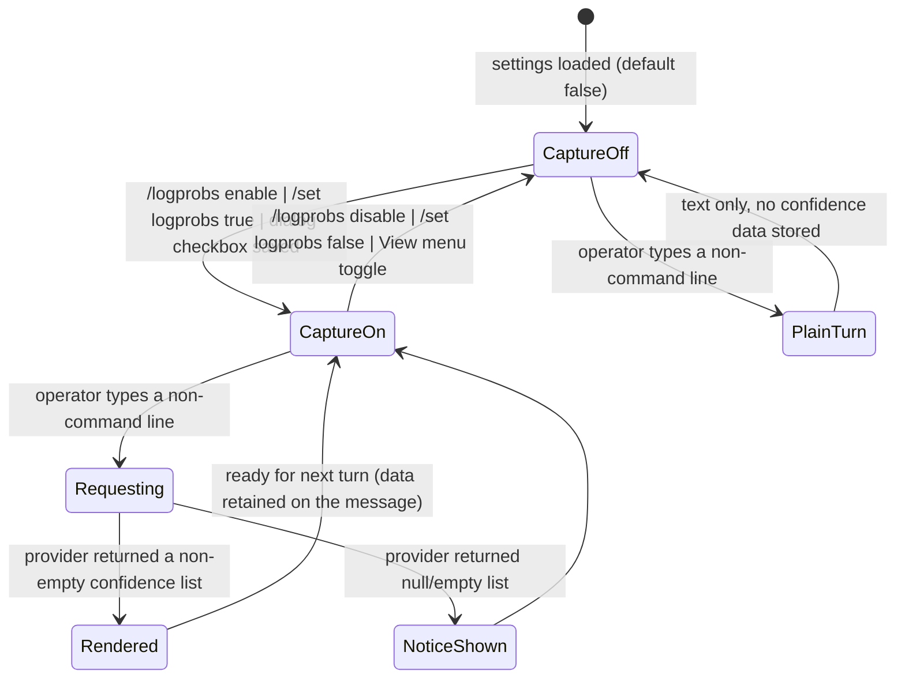

Rendering decision tree (console shell and demonstration mode share it):

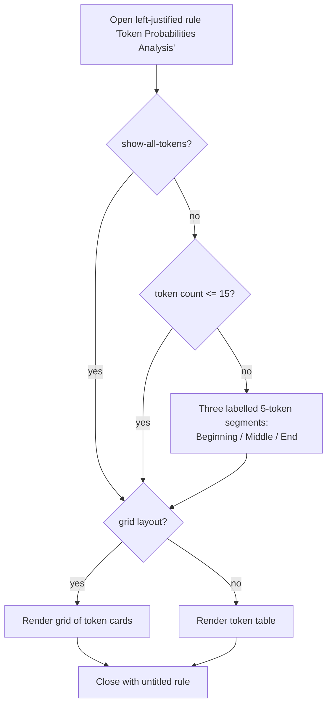

---

**Functional requirements**

*Configuration model, defaults and ranges*

- **FR-9.1** The product SHALL maintain exactly five persisted configuration values for this feature and SHALL read or write no other configuration value as part of it: capture-enabled (boolean), top-K alternatives (integer), show-all-tokens (boolean), grid-layout (boolean), grid-max-alternatives (integer). *(realizes US-9.1 through US-9.4)*
- **FR-9.2** Default values SHALL be: capture-enabled = **false**; top-K alternatives = **5**; show-all-tokens = **false** (so the sampled view is the out-of-box behaviour); grid-layout = **false** (so the list/table layout is the out-of-box behaviour); grid-max-alternatives = **5**. All five are tunable defaults, not business rules.
- **FR-9.3** Top-K alternatives and grid-max-alternatives SHALL each accept only integers in the range **1–20 inclusive**, on every surface that can set them.
- **FR-9.4** The five values SHALL be persisted inside the single application settings document at `<user profile>/.ChatDbg/settings.json`, written as indented UTF-8 JSON with camel-cased member names, under the exact names `enableLogProbabilities`, `logProbabilitiesTopK`, `showAllTokens`, `gridViewForTokens`, `gridViewMaxAlternatives`. When the user-profile directory is unavailable or resolves to an empty string, the same file name SHALL be used in the operating system temp directory.
- **FR-9.5** Top-K alternatives SHALL mean *how many alternative tokens are requested from the provider per generated position*. It is sent to the provider as part of the request.
- **FR-9.6** Grid-max-alternatives SHALL mean *how many alternatives are drawn on each token card in grid layout before a "+N more" indicator replaces the remainder*. It is a display limit only and never affects the request.
- **FR-9.7** Command surfaces SHALL **reject** an out-of-range numeric value with an error and change nothing; the full-screen settings dialog SHALL **clamp** silently into 1–20 and SHALL leave the previous value untouched when the text is unparseable. This divergence is observed behaviour, not a designed rule (see Open Questions).
- **FR-9.8** Only the capture-enabled flag and the top-K value are documented in the product's own settings-file documentation; the other three are documented only as command examples. A reimplementation SHALL still persist all five.

*Probability configuration command*

- **FR-9.9** The product SHALL expose a probability configuration command registered under the key `logprobs`, with description `Configure token probability analysis` and usage string exactly `/logprobs [enable|disable|top <number>|showall|showsample|grid|list|gridmaxalt <number>|debug] - Configure token probability analysis settings`. It SHALL be listed by the help command under the heading `Token Analysis:`. *(realizes US-9.1)*
- **FR-9.10** Arguments SHALL arrive already split on spaces with empty entries removed, and the command word SHALL be lower-cased before dispatch. Sub-command matching SHALL be case-insensitive. Only the first and second arguments are ever read; all further arguments SHALL be ignored.
- **FR-9.11** `/logprobs enable` SHALL set capture-enabled to true, persist the settings document, and return success with exactly these four lines: `Token probability analysis enabled.` / `Note: This feature requires a compatible model and API version.` / `If you don't see probabilities after responses, try '/logprobs debug'.` / `You can see a demonstration with the '/demologprobs' command.` *(realizes US-9.1)*
- **FR-9.12** `/logprobs disable` SHALL set capture-enabled to false, persist, and return success with exactly `Token probability analysis disabled.` *(realizes US-9.1)*
- **FR-9.13** `/logprobs top <n>` SHALL set top-K to `n`, persist, and return success with exactly `Token probability analysis will show top {n} alternatives.` With no value it SHALL fail with exactly `Please specify a number: /logprobs top <number>`; with a non-integer or an integer outside 1–20 it SHALL fail with exactly `Top-K value must be a number between 1 and 20`. *(realizes US-9.2)*
- **FR-9.14** `/logprobs showall` SHALL set show-all-tokens to true, persist, and return success with exactly `Token probability analysis will show all tokens.` *(realizes US-9.3)*
- **FR-9.15** `/logprobs showsample` SHALL set show-all-tokens to false, persist, and return success with exactly `Token probability analysis will show token samples (beginning, middle, end).` *(realizes US-9.3)*
- **FR-9.16** `/logprobs grid` SHALL set grid-layout to true, persist, and return success with exactly `Token probability analysis will use grid view layout.` *(realizes US-9.4)*
- **FR-9.17** `/logprobs list` SHALL set grid-layout to false, persist, and return success with exactly `Token probability analysis will use list view layout.` *(realizes US-9.4)*
- **FR-9.18** `/logprobs gridmaxalt <n>` SHALL set grid-max-alternatives to `n`, persist, and return success with exactly `Grid view will show up to {n} alternatives per token.` With no value it SHALL fail with exactly `Please specify a number: /logprobs gridmaxalt <number>`; with a non-integer or an integer outside 1–20 it SHALL fail with exactly `Grid max alternatives value must be a number between 1 and 20`. *(realizes US-9.4)*
- **FR-9.19** An unrecognised sub-command SHALL produce a failure result whose message is exactly, line by line (note the trailing space after the period on line 1):

  ```
  Unknown subcommand: {arg}. 
  Valid options are:
  - enable/disable: Turn on/off token probability analysis
  - top <number>: Set number of alternatives to show (1-20)
  - showall/showsample: Show all tokens vs. samples only
  - grid/list: Choose grid or list layout for tokens
  - gridmaxalt <number>: Set maximum alternatives in grid view (1-20)
  - debug: Show diagnostic information
  ```

- **FR-9.20** `/logprobs` with no arguments SHALL change nothing, save nothing, and return a single multi-line success message containing, **in this order**: the header `Token Probability Analysis Settings:`; `- Enabled: Yes` or `- Enabled: No`; `- Top-K Alternatives: {n}`; `- Display Mode: Show all tokens` or `- Display Mode: Show token samples (beginning, middle, end)`; `- View Mode: Grid layout` or `- View Mode: List layout`; `- Grid View Max Alternatives: {n}`; a `Usage:` block listing all nine sub-commands plus `/demologprobs` with one-line descriptions, with the `list` line annotated `(default)`; an explanatory paragraph reading "This feature shows token probabilities for model responses with a rich visualization including token numbering and color coding. When enabled, the system will display token probabilities along with alternative tokens that the model considered."; and the caveat lines `Note: Not all models or API versions support token probabilities.` and `Azure OpenAI models may require specific API versions that support this feature.` *(realizes US-9.5)*
- **FR-9.21** `/logprobs debug` SHALL change nothing, save nothing, and return a diagnostics report headed `Token Probability Analysis Debug Information:` containing: a `Current Configuration:` block with the same five values as FR-9.20 **plus** `- Provider: {provider}` and `- Model ID: {modelId}`; a pointer to `/demologprobs`; a `Common Issues:` list of three items (some older models do not support token probabilities; the API version may not support the parameter; the deployment may have restrictions); a `Troubleshooting Steps:` list of four items, the first of which reads `Ensure you're using a recent API version (2023-05-15 or newer for Azure OpenAI)`; an `If using Azure OpenAI:` section echoing the configured endpoint or the literal `(not set)` when unset; the suggested model names `gpt-4`, `gpt-4-turbo`, `gpt-3.5-turbo`; a `For Amazon Bedrock:` note reading `Claude models with appropriate permissions`; and a closing suggestion to run a simple test query. *(realizes US-9.6)*
- **FR-9.22** Every mutating sub-command SHALL write the **entire** settings document back to storage immediately after mutation, and SHALL do so **exactly once** per invocation. Non-mutating sub-commands (no-argument, `debug`, all error paths) SHALL perform no write.
- **FR-9.23** Any exception raised while applying a sub-command SHALL be caught, its detail written to the diagnostic trace channel, and converted into a failure result with the message `Error configuring log probabilities: {exception message}`.

*Generic settings surface*

- **FR-9.24** The generic settings command SHALL accept the same five values, matching keys case-insensitively after lower-casing, with these aliases, accepted values and error strings *(realizes US-9.1 through US-9.4)*:

  | Key | Alias | Accepted values | Error message on bad input |
  |---|---|---|---|
  | `enableLogProbabilities` | `logprobs` | `true` / `false`, case-insensitive | `EnableLogProbabilities must be 'true' or 'false'` |
  | `logProbabilitiesTopK` | `logtopk` | integer 1–20 | `LogProbabilitiesTopK must be a number between 1 and 20` |
  | `showAllTokens` | *(none)* | `true` / `false` | `showAllTokens must be 'true' or 'false'` |
  | `gridViewForTokens` | `tokensgrid` | `true` / `false` | `gridViewForTokens must be 'true' or 'false'` |
  | `gridViewMaxAlternatives` | `gridmaxalt` | integer 1–20 | `gridViewMaxAlternatives must be a number between 1 and 20` |

- **FR-9.25** The value passed to the generic settings command SHALL be **all remaining arguments joined with a single space** before parsing, so an input such as `logprobs t r u e` fails rather than silently taking the first word. On success it SHALL reply `Set {key} = {value}` and persist the settings document. All five keys of this feature SHALL persist.
- **FR-9.26** The generic settings report (invoked with no arguments) SHALL include the lines `- Log Probabilities: Enabled` or `- Log Probabilities: Disabled`; `- Log Probabilities Top-K: {n}`; `- Show All Tokens: Yes` or `- Show All Tokens: No (sample only)`; `- Token Display: Grid Layout` or `- Token Display: List Layout`; `- Grid View Max Alternatives: {n}`. *(realizes US-9.5)*

*Full-screen shell configuration surface*

- **FR-9.27** The full-screen shell's settings dialog SHALL present a "Log Probs" tab — the third of four tabs, after "AI Provider" and "Credentials" and before "LLama Settings" — containing: an `Enable Log Probabilities` checkbox; a `Log Probabilities Top K:` text field annotated `(1 - 20)`; a `Display Mode:` radio group with items `Show All Tokens` (index 0) and `Show Samples`; a `Layout:` radio group with items `Grid View` (index 0) and `List View`; and a `Grid View Max Alternatives:` text field annotated `(1 - 20)`. On save, both numeric fields SHALL be clamped into 1–20; unparseable text SHALL leave the stored value unchanged and SHALL raise no error. *(realizes US-9.2, US-9.3, US-9.4)*
- **FR-9.28** The full-screen shell's View menu SHALL contain a "Log Probabilities" submenu with exactly three items: `_Toggle Log Probs Panel`, `_Toggle Log Probs for Last Message`, `_Run Demo Visualization`. The third SHALL execute the demonstration command through the same path as typing it at the prompt. *(realizes US-9.7, US-9.9)*
- **FR-9.29** `_Toggle Log Probs for Last Message` SHALL flip the capture setting, persist it, redraw the conversation, and open or close the side panel to match the new setting — but SHALL first refuse outright, with the modal described in FR-9.68, unless at least one assistant message already carries confidence data. *(see QUIRK-9.17)*

*Capture pipeline*

- **FR-9.30** The choice between the provider's *send-with-probabilities* operation and the plain *send-text* operation SHALL be made solely from the capture-enabled flag; capture is all-or-nothing per conversation turn and cannot be requested for an individual message. *(realizes US-9.1)*
- **FR-9.31** With capture enabled, a conversation turn SHALL, in order: append the user message to history; resolve the configured provider and abort the turn with a printed error if it is unconfigured; print `Thinking...`; print `Log probabilities enabled - requesting with top-k={n}`; await the send-with-probabilities operation; append the assistant message **together with** the returned confidence list to history; print the response text surrounded by blank lines; then render the analysis block if the list is non-empty, or the two-line "none were returned" notice otherwise. *(realizes US-9.8)*
- **FR-9.32** With capture disabled, the turn SHALL use the plain send-text operation, append the assistant message **without** confidence data, and print only the response text.
- **FR-9.33** At startup, if capture is enabled, the shell's welcome banner SHALL include the line `Token probability analysis is enabled. Type '/logprobs' for details.`

*Sampling rule (which tokens are shown when show-all-tokens is off)*

- **FR-9.34** The sample size per segment SHALL be **5** tokens. The sampling threshold is therefore 5 × 3 = **15**. *(realizes US-9.3)*
- **FR-9.35** If the confidence list holds **15 or fewer** records, every record SHALL be shown, un-segmented and without segment labels. An empty list SHALL be treated as "no data" and produce the no-data message rather than an empty render.
- **FR-9.36** Otherwise exactly three segments of 5 records SHALL be shown, in this order, using integer division throughout: **beginning** = indices `0..4`; **middle** = 5 records starting at index `count / 2 - 2`; **end** = 5 records starting at index `count - 5`. No de-duplication and no gap-filling SHALL be performed at any count. Worked example at count 16: beginning shows indices 0–4, middle 6–10, end 11–15; index 5 is never displayed and nothing is duplicated. At count 25: 0–4, 10–14, 20–24.
- **FR-9.37** In the shell rendering path each segment SHALL be preceded by a label — `Beginning Tokens:`, `Middle Tokens:`, `End Tokens:` — the segments separated by blank lines, and each segment SHALL be rendered with its **true original start index** so that displayed token numbers stay absolute. The demonstration command's own sampler SHALL instead concatenate the three segments into one list and render with start index 0, so demonstration numbering runs 1…15 (QUIRK-9.9).

*Confidence data model and arithmetic*

- **FR-9.38** The confidence record SHALL carry: **token text** (defaults to empty, never null by construction, may contain control characters), **stored log-probability** (double-precision), and an optional ordered list of **alternatives**, each alternative being a record of the same shape. Nested alternatives on alternatives SHALL normally be left absent.
- **FR-9.39** The **derived probability** of a record SHALL be `e^(stored log-probability)`, recomputed on every read and **never persisted**. For a genuine natural-log probability this yields a value in 0…1.
- **FR-9.40** No range validation SHALL be applied to the stored log-probability anywhere. Positive values (which are not log-probabilities) are accepted and exponentiated; the demonstration mode relies on this (QUIRK-9.2).
- **FR-9.41** The transport response record SHALL carry: **text** (defaults to empty), an optional **confidence list** (absent when not requested or unavailable), **total time** in seconds, and an optional **error message**. A record built from text alone SHALL leave the confidence list **absent, not empty**.
- **FR-9.42** A record built from text plus a confidence list SHALL store **the same list instance** by reference rather than copying it. A reimplementation that defensively copies still satisfies every observable behaviour; the source does not copy.
- **FR-9.43** A conversation message SHALL carry an optional confidence list under the persisted name `logProbabilities`, plus a derived, never-persisted **has-confidence-data** flag defined as *list is non-null **and** count > 0*.
- **FR-9.44** Exported conversation files SHALL be indented, camel-cased JSON in which each confidence record appears with the member names `token`, `logprob` and `top_alternatives` (the last snake-cased, overriding the camel-case convention), and in which the derived probability is absent. Re-importing such a file SHALL restore every record field-for-field. *(realizes US-9.10)* Payload schema of one record:

  ```
  {
    "token":            <string>,               // display text of the generated token
    "logprob":          <number>,               // stored log-probability; unvalidated
    "top_alternatives": [ <record>, ... ]       // optional; same schema, nested list normally absent
  }
  ```

- **FR-9.45** A confidence record SHALL never be mutated after it is attached to a message, with one exception: the local in-process provider back-fills the previous token's log-probability and alternatives one generation step late while the response is still being produced (FR-9.77). Records are destroyed with the conversation history (clear, pop, process exit) or persisted verbatim in an exported file.

*Shared formatting helpers*

- **FR-9.46** The shared display-escape helper SHALL replace newline with `\n`, carriage return with `\r`, tab with `\t`, and NUL with `\0`, and SHALL render a null token as the literal `(null)`. Rich-terminal variants SHALL additionally escape markup brackets by doubling them, wrap each escape sequence in a dim style, and render a null token as a dim `(null)`.
- **FR-9.47** The shared confidence-colour helper SHALL return a colour name by band, evaluated top-down so the highest matching band wins: **≥ 90 → green**, **≥ 70 → lime**, **≥ 50 → yellow**, **≥ 30 → orange**, otherwise **red**. Bands are inclusive at the lower bound. These bands are documented in-source against a **0–100** scale while genuine derived probabilities are 0–1 (QUIRK-9.3). The plain-console renderer uses identical thresholds but names the fourth band `orange3`.
- **FR-9.48** The shared probability-text helper SHALL format a value as fixed-point with **2 decimals** followed by a literal percent sign — the value `42.1234` renders as exactly `42.12%`.
- **FR-9.49** The plain-text report generator SHALL emit, in order: the header line `=== Token Probabilities Analysis ===`; a blank line; the table header row `| # | Token          | Probability | Alternatives                |`; the separator row `|---|----------------|------------|----------------------------|`; one row per record numbered from **1**; a blank line; and a footer line of **39** `=` characters. Each data row right-aligns the index in width 2, left-aligns the token in width 14, right-aligns the probability in width 10 with **5 decimals** plus `%`, and left-aligns the alternatives cell in width 24. At most **2** alternatives are listed per row, comma-separated, each rendered `{token} ({percentage})`; when there are none the cell reads `none`. Token text in this report is **not** escaped (QUIRK-9.22) and the three row types do not agree on column widths (QUIRK-9.19).
- **FR-9.50** The compact alternatives-description helper SHALL list at most `maxToShow` entries (**default 3**), comma-separated, each rendered `{escaped token} ({percentage})`, and SHALL append ` (+ {count - maxToShow} more)` when the list is longer than `maxToShow`. An empty or absent list SHALL yield exactly `(none)`.
- **FR-9.51** A dependency-free ASCII table renderer SHALL exist, producing: a border line exactly `+---------+----------------------+--------------+----------------------------------------+`; a header row exactly `| Token # | Text                 | Probability  | Top Alternatives                       |`; and data rows laying out index (left-aligned, width 7), text (left-aligned, width 20), probability (left-aligned, width 12) and alternatives (left-aligned, width 38). Token text longer than **20** characters SHALL be truncated to 17 characters plus `...`; alternative token text longer than **10** characters SHALL be truncated to 7 characters plus `...`; at most **2** alternatives per row with a ` (+{n} more)` overflow suffix and `(none)` when empty; numbering SHALL start at `startIndex + i + 1`.
- **FR-9.52** The dependency-free renderer's horizontal rule SHALL be **80** characters wide: an untitled rule is 80 dashes; a titled rule is `{title} {dashes}` when left-justified or `{dashes} {title} {dashes}` when centred, with markup tags stripped from the title first by deleting everything between `[` and `]` inclusive. Its grid operation SHALL silently degrade to the table layout, discarding the column-count and alternative-count arguments.

*Offline demonstration mode*

- **FR-9.53** The product SHALL expose a demonstration command registered under the key `demologprobs`, with description `Show sample token probability analysis for demonstration purposes` and usage `/demologprobs - Display sample token probability analysis`. It SHALL **never** contact a provider. Its fixed sample sentence SHALL be exactly: `This is a sample response with token probability analysis. You can see how the model assigned probabilities to each token and what alternatives it considered.` *(realizes US-9.7)*
- **FR-9.54** Demonstration tokenization SHALL be naive splitting on space, newline, tab, `.`, `,`, `!` and `?`, discarding empty entries. The fixed sentence SHALL therefore yield exactly **25** tokens in this order: `This, is, a, sample, response, with, token, probability, analysis, You, can, see, how, the, model, assigned, probabilities, to, each, token, and, what, alternatives, it, considered`. Under default settings the sampled view SHALL show 15 of them: `This is a sample response`, `can see how the model`, `and what alternatives it considered`.
- **FR-9.55** The pseudo-random generator used to fabricate demonstration values SHALL be seeded with the constant **42** so that repeated runs with the same top-K produce identical data. Only reproducibility is contractual; the exact number sequence is an artefact of the source runtime's generator and will not port.
- **FR-9.56** Each demonstration token's stored value SHALL be `min(98.0, 70.0 + random × 28.0)` — a number in the range **[70, 98)** — chosen to exercise different colour bands. This is a percentage written into a log-probability field (QUIRK-9.2).
- **FR-9.57** Contextually plausible alternatives SHALL be hard-coded per lower-cased token: `sample` → `example` 15.0, `test` 8.0, `demo` 5.0; `response` → `reply` 12.0, `answer` 9.0, `output` 6.0; `token` → `word` 14.0, `symbol` 10.0, `element` 7.0; `probability` → `likelihood` 11.0, `chance` 8.0, `confidence` 6.0; `analysis` → `evaluation` 13.0, `assessment` 9.0, `examination` 6.0. Any other token SHALL receive three synthetic entries named `{token}_1`, `{token}_2`, `{token}_3` with values `10.0`, `7.0`, `4.0` (formula `10.0 - i × 3.0`).
- **FR-9.58** If fewer than top-K alternatives exist for a token, filler alternatives named `alt_{d}` — where `d` is a draw from `[0, 1000)` that may repeat — SHALL be appended with value `max(1.0, confidence - 20.0 - random × 50.0)`, floor **1.0**, until the count reaches top-K.
- **FR-9.59** Only the first `min(topK, alternativeCount)` alternatives SHALL be attached, in generation order — plausible ones first, fillers after. Consequently top-K of 1 or 2 truncates the hard-coded list, and top-K of 4 or more introduces fillers. Alternatives SHALL carry no nested alternatives of their own.
- **FR-9.60** The demonstration SHALL publish its fabricated response record on a readable "sample data" attribute of the command after execution, so that a host with its own visualization can render it instead. The fabricated response SHALL carry a simulated elapsed time of exactly **0.5** seconds. The attribute SHALL be overwritten on every run and SHALL be unset before the first run. The command SHALL always return success with exactly `Sample token probability analysis generated`, whether or not anything was displayed.
- **FR-9.61** When constructed **with** an output formatter, the demonstration SHALL render, in order: a blank line; the heading `Sample Text:` styled yellow; the sample sentence; a blank line; `Display Mode: All Tokens` or `Display Mode: Sample Tokens` styled blue; `Layout: Grid View` or `Layout: List View` styled blue; only in grid layout, `Grid Max Alternatives: {n}` styled blue; a blank line; a left-justified rule titled `Token Probabilities Analysis`; the token set as a grid (start index `0`, max columns `0` meaning auto, configured max alternatives) or as a table (start index `0`); or, when the token set is absent, `No token probability data available` styled red **without** a trailing period; then a closing untitled rule and a blank line. When constructed **without** a formatter it SHALL render nothing and still succeed.

*Full-screen side panel*

- **FR-9.62** The side panel SHALL be a framed region titled `Token Probabilities` placed to the right of the conversation pane, one row below the menu bar, with both scroll indicators shown and an initial scrollable content size of **50 columns × 1000 rows**. Its content SHALL begin with the header line `[{message timestamp}] Token Probabilities:` at column 0 followed by one blank row. *(realizes US-9.9)*
- **FR-9.63** With no bound message, or a bound message carrying no confidence data, the panel SHALL show the single line `No token probability data available.` — **with** a trailing period.
- **FR-9.64** Each token block SHALL place a line at column 2 reading `{index}: "{token}" ({probability})`, where the index is **0-based** and the probability uses a 5-decimal percentage format. Every other numbered surface in the product is 1-based (QUIRK-9.15).
- **FR-9.65** Each alternative SHALL be placed at column 4 reading `Alt: "{token}" ({probability})`, colour-coded by the heat map of FR-9.66. Alternatives in this surface — and **only** in this surface — SHALL be **sorted descending by probability** before display and truncated to the grid-max-alternatives value. Everywhere else, alternatives keep provider/creation order. One blank row SHALL separate each token block.
- **FR-9.66** Heat map bucketing SHALL be `bucket = clamp(truncate(probability × 10), 0, 9)` — ten buckets of ten percentage points each on a **0–1** scale — mapped in bucket order 0…9 to bright red, red, bright magenta, magenta, bright blue, blue, cyan, bright cyan, bright yellow, bright green, each on a black background.
- **FR-9.67** Panel escaping SHALL replace only newline, carriage return and tab — **not** NUL — and is applied directly to the token text rather than through the null-tolerant shared helper.
- **FR-9.68** Panel behaviour SHALL further be: scrollable content width recomputed after each render as `max(longest line + 5, 50)`; scroll position reset to the top on every rebuild; automatic opening **only** when capture is enabled **and** the arriving response carries a non-empty confidence list, at which point the conversation pane shrinks to **60%** width; nothing shown and no message when capture is enabled but the list is empty; a clickable `◊` button appended beneath every message that has confidence data, at the message's left padding, which on click opens the panel, binds it to that message, scrolls to top and sets the status line to `Showing token probabilities for message at {timestamp}`; status strings `Token probabilities panel enabled`, `Token probabilities panel disabled`, `Log probabilities display enabled`, `Log probabilities display disabled`; and a modal titled `No Log Probabilities` with body `There are no assistant messages with log probabilities to display.` and an `OK` button when a toggle is attempted with no qualifying message. *(realizes US-9.9)*

*Rich rendering*

- **FR-9.69** Grid column count SHALL be computed as `max(1, terminalWidth / 40)` — each token card is assumed to need about 40 characters. An explicit non-zero max-column argument SHALL override the computation; `0` SHALL mean auto. Empty filler cards SHALL pad the final row so the grid stays rectangular. A grid card SHALL be a rounded-border panel whose header is `#{absoluteIndex + 1}` in grey and whose body is, line by line: `Token: {escaped token}`; `Prob: {coloured probability}`; then, only when alternatives exist, the literal line `Alternatives:`, up to `min(maxAlternatives, count)` lines of `- {token} ({probability})`, and `+ {n} more` in a dim style when truncated. *(realizes US-9.4)*
- **FR-9.70** Rich table layout SHALL use a rounded, expanding table with four columns: `№` (centred), `Token` (width 20), `Probability` (centred), `Top Alternatives` (width 50). Alternatives SHALL be limited to the **first 3**, one per line inside the cell, and the cell SHALL show a dim `(none)` when there are none. *(realizes US-9.4)*
- **FR-9.71** Confidence SHALL always be conveyed by a printed numeric percentage alongside the colour, since colour is otherwise the only confidence channel.

*Provider-visible acquisition rules*

- **FR-9.72** *(superseded — Owner decision D-001, 2026-08-29, `DECISIONS.md`; observed source behaviour retained, NOT to be implemented)* When the cloud chat-completion provider returns no confidence data while capture is on, the provider adapter SHALL fabricate data and return it **as if genuine**: sampled to at most **15** tokens (5 from the beginning, 5 starting at `wordCount / 2 - 2`, the last 5), main stored value `ln(0.9)`, alternatives `{token}_alt` at `ln(0.05)`, `similar_{token}` at `ln(0.03)` and `other_{token}` at `ln(0.02)`, truncated to `min(topK, 3)` so the fabricated list never exceeds **3** alternatives regardless of top-K. The operator receives no indication that the data is synthetic (QUIRK-9.20).
- **FR-9.72a** *(replacement — D-001)* When any provider returns no confidence data while capture is on, **no substitution of any kind occurs.** If the provider's declared capability record says it cannot supply token log probabilities, the product SHALL disable the log-probabilities setting, persist the change, and emit the auto-disable notice instructing the operator to use a different provider (GR-19; normative text in `DECISIONS.md` D-001); where the platform allows, the enabling control SHALL be disabled with the same explanation and probability-view attempts SHALL produce a non-blocking unavailable notice. If the provider declares the capability but returned none on this response, the transient GR-18 notice is shown and the setting is untouched. The demonstration mode of this feature remains the only permitted producer of synthetic records and stamps every one `synthetic: true`; live capture never consumes or displays a demonstration record as measurement.
- **FR-9.73** The cloud chat-completion request SHALL carry `logprobs: true` and `top_logprobs: {topK}` alongside the conversation, temperature, maximum-token and `top_p: 1.0` fields.
- **FR-9.74** Cloud response parsing SHALL tolerate three payload shapes — a top-level `logprobs.content[]`, a top-level `logprobs[]`, and `choices[0].logprobs` (either an object with a `content` array or an array). Each entry SHALL require `token` and `logprob`, with an optional `top_logprobs` or `top_alternatives` array.
- **FR-9.75** The managed-model provider request SHALL carry `logprobs: {enabled}` and `top_logprobs: {topK when enabled, otherwise 0}`. Its parser SHALL accept `logprobs` as either an array of token objects or an object with a `tokens` member, and SHALL accept either a `logprob` or a `log_prob` key.
- **FR-9.76** The local in-process provider SHALL additionally require top-K to be **greater than 0** before entering confidence-capture mode; otherwise it SHALL fall back to plain generation even when capture is on. Since the setting's floor is 1 on every surface that can set it, this guard is reachable only via a hand-edited settings file.
- **FR-9.77** The local in-process provider SHALL derive alternatives as a softmax over only the **top-K** candidate scores (so they sum to 1 among themselves, not over the vocabulary), store them as true natural logs with no nested alternatives, and attach them **one generation step late**: candidates computed after emitting token *n* are attached to token *n* on the next iteration, and that token's own log-probability is taken from the matching candidate or, failing a text match, from the highest-valued candidate. The **first** emitted token therefore never receives alternatives and keeps its placeholder log-probability of `0` (QUIRK-9.13).
- **FR-9.78** The local in-process provider SHALL throw with exactly `LLamaSharp service is not properly configured. Please set ModelId to a valid GGUF model file path.` when no model is configured, and SHALL serialize generation behind a process-wide single-permit gate released in a guaranteed-cleanup block.

*Persistence, resilience and non-functional requirements*

- **FR-9.79** Settings save failures SHALL be swallowed: the persistence layer prints `Error saving settings: {message}` and returns normally, and the calling command SHALL still report success. The change then survives only in memory.
- **FR-9.80** Settings load failures SHALL print `Error loading settings: {message}` and yield an all-defaults settings object, silently reverting the operator's probability configuration; the plain console shell additionally prints `Error loading settings: {message}` and `Using default settings.` If the settings file does not exist at startup, a file containing defaults SHALL be written first.
- **FR-9.81** The plain console shell SHALL restore only `enableLogProbabilities` and `logProbabilitiesTopK` from the settings file at startup; `showAllTokens`, `gridViewForTokens` and `gridViewMaxAlternatives` SHALL revert to defaults on every restart. This is documented behaviour of the source (QUIRK-9.5), **not** a desired rule; a reimplementation should restore all five and record the deviation.
- **FR-9.82** No caching SHALL be performed: confidence data is re-fetched per turn and held only in the in-memory conversation history, and the derived probability is recomputed on every read. There SHALL be no cap on how many records are stored or persisted; the 5-per-segment sampling limits display only.
- **FR-9.83** The feature SHALL be single-threaded and interactive, with **no cancellation support** anywhere. The only concurrency guard is the local provider's one-generation-at-a-time gate. The full-screen status line reverts to `Provider: {p} | Model: {m} | Prompt: {n}` after **3 seconds**; because the revert timer is fire-and-forget, two status messages within 3 seconds cause the first timer to clear the second message early.
- **FR-9.84** No part of this feature SHALL be gated on an operating-system check. All strings SHALL be treated as hard-coded English with no localization. Numeric formatting follows the ambient locale in the source, so decimal separators and percent spacing vary by locale unless invariant formatting is forced. Grid layout SHALL tolerate a reported terminal width of 0 via the `max(1, …)` guard.
- **FR-9.85** No authentication, authorization or per-user scoping SHALL apply to this feature.

---

**External technology**

*Requires: a chat-completion service that can return, per generated token, a log-probability and a top-K list of alternatives (HTTPS + JSON, OpenAI-style chat-completions request/response). Source used: Azure OpenAI, reached by a hand-rolled REST POST to `{endpoint}/openai/deployments/{model}/chat/completions?api-version=2023-12-01-preview` with an `api-key` header and a body carrying `messages`, `temperature`, `max_tokens`, `top_p: 1.0`, `logprobs: true`, `top_logprobs: {topK}`; the `Azure.AI.OpenAI` 2.1.0 package is referenced by all three projects but the probability path bypasses it. Reimplementer notes: three response shapes must be tolerated (top-level `logprobs.content[]`, top-level `logprobs[]`, and `choices[0].logprobs` as either an object with `content` or a bare array); each entry needs `token` + `logprob` with an optional `top_logprobs`/`top_alternatives` array; the API version the code sends is newer than the one its own diagnostics text advises.*

*Requires: a managed model-invocation API that can be asked for token log-probabilities (HTTPS + JSON over a cloud SDK). Source used: Amazon Bedrock runtime via `AWSSDK.BedrockRuntime` 4.0.7.3; requests carry `logprobs` (boolean) and `top_logprobs` (top-K when enabled, otherwise 0), and the Claude-shaped body additionally carries the fixed `anthropic_version` value `bedrock-2023-05-31`. Reimplementer notes: the parser accepts `logprobs` as an array of token objects **or** an object with a `tokens` member, and accepts either a `logprob` or a `log_prob` key; this adapter applies exponentiation to alternative log-probabilities at parse time, so alternatives arrive already in probability space while main tokens do not — a single response mixes two encodings.*

*Requires: local in-process language-model inference with access to next-token candidate scores (native library binding). Source used: LLamaSharp 0.25.0 plus its CPU and CUDA-12 backend packages, with runtime reflection / late binding used to reach the candidate-score accessor and the token-to-text lookup. Reimplementer notes: alternatives are a softmax over only the top-K candidate scores, so they sum to 1 among themselves and not over the vocabulary; they are attached one generation step late; when no text match is found the token's own log-probability falls back to the maximum alternative; late binding is incompatible with the project's own ahead-of-time publish configuration and fails silently there.*

*Requires: rich terminal rendering — rules, tables, grids, bordered panels, 16/256-colour markup (ANSI terminal escape sequences). Source used: Spectre.Console 0.51.1, referenced by all three projects including the core library. Reimplementer notes: markup brackets appearing inside token text must be escaped by doubling them; a dependency-free ASCII fallback renderer ships in the source but no runtime path ever selects it and its presence does not remove the package dependency.*

*Requires: a full-screen terminal UI toolkit — menus, tabbed dialogs, scroll views, colour schemes, modal message boxes (terminal/curses-like). Source used: Terminal.Gui 1.19.0. Reimplementer notes: it owns and repaints the whole screen, which is why a renderer that writes ANSI escapes directly to the console produces output invisible beneath it.*

*Requires: local file storage for a single application settings document (UTF-8 JSON text file). Source used: `<user profile>/.ChatDbg/settings.json`, written indented with camel-cased member names; the directory is created on demand and falls back to the operating-system temp directory when the profile directory is unavailable or resolves to an empty string. Reimplementer notes: save failures are reported to standard output and swallowed; load failures silently yield an all-defaults document.*

*Requires: local file storage for exported conversations (UTF-8 JSON text file, re-importable by the same product). Source used: a user-chosen path via the export/import commands, indented and camel-cased. Reimplementer notes: confidence records ride inside exported messages under `logProbabilities`; the alternatives array is persisted under the snake-cased name `top_alternatives`, overriding the camel-case convention; the derived probability is omitted. This file format is a compatibility requirement — an exported session must re-import.*

*Requires: a query for the current terminal width. Source used: the console window width, used to size the responsive grid. Reimplementer notes: about 40 columns are assumed per token card; a reported width of 0 is handled by a `max(1, …)` guard, but a query that fails outright when output is redirected or no terminal is attached is not guarded at the point of use.*

*Requires: pseudo-random number generation with a fixed seed. Source used: a seeded generator with seed **42** for the demonstration data; a second, unseeded generator is constructed but never used in the cloud fallback path. Reimplementer notes: only reproducibility across runs is contractual — the exact number sequence is runtime-specific and will not port.*

*Requires: natural exponential and natural logarithm functions. Source used: the platform's standard math library. Reimplementer notes: exponentiation runs on every read of a derived probability (a hot path when rendering thousands of tokens); logarithm is used when normalising local candidate scores.*

*Requires: a diagnostic trace channel that is invisible in release runs. Source used: the platform debug output stream. Reimplementer notes: exception detail from the configuration command and the provider parsers goes here and nowhere else.*

*Requires: a unit-test and mocking stack, to port the behaviours pinned by tests. Source used: xUnit 2.9.1, Moq 4.20.69, Microsoft.NET.Test.Sdk 17.12.0, coverlet.collector 6.0.2. Reimplementer notes: the output-formatter abstraction is mocked to assert which render operation was called and with which start index; note that the source's test suite cannot be built as checked out (see QUIRK-9.12), so its assertions are unverified.*

*Requires: a managed runtime plus a pinned SDK. Source used: `net10.0` for all four projects, SDK pinned in `global.json` to `10.0.100-rc.1.25451.107` with `rollForward: latestFeature`. Reimplementer notes: the pinned `global.json` at this commit is not valid JSON (one extra closing brace), which makes the toolchain refuse to run anywhere inside the tree.*

Not required by this feature: network access for the demonstration mode, any database, any authentication service, any localization resource system, and any GPU (the CUDA backend package is pulled in transitively but this feature's own logic never needs it).

---

**Acceptance criteria**

- **AC-9.1** **Given** a fresh settings document with all defaults, **when** the operator runs `/logprobs` with no arguments, **then** the reply succeeds and contains the line `Token Probability Analysis Settings:` followed by `- Enabled: No`, `- Top-K Alternatives: 5`, `- Display Mode: Show token samples (beginning, middle, end)`, `- View Mode: List layout`, `- Grid View Max Alternatives: 5`, **and** no settings save occurs.
- **AC-9.2** **Given** capture is disabled, **when** the operator runs `/logprobs enable`, **then** the capture setting becomes true, the settings document is saved **exactly once**, and the reply is exactly the four lines `Token probability analysis enabled.` / `Note: This feature requires a compatible model and API version.` / `If you don't see probabilities after responses, try '/logprobs debug'.` / `You can see a demonstration with the '/demologprobs' command.`
- **AC-9.3** **Given** any settings, **when** the operator runs `/logprobs unknown`, **then** the command fails, no setting changes, no save occurs, and the message begins with `Unknown subcommand: unknown. ` including the trailing space.
- **AC-9.4** **Given** top-K is 5, **when** the operator runs `/logprobs top 0`, `/logprobs top 21`, `/logprobs top abc` or `/logprobs top 1.5`, **then** each fails with exactly `Top-K value must be a number between 1 and 20` and top-K is still 5; **and when** the operator runs `/logprobs top 20`, **then** it succeeds with exactly `Token probability analysis will show top 20 alternatives.` and top-K is 20.
- **AC-9.5** **Given** grid-max-alternatives is 5, **when** the operator runs `/logprobs gridmaxalt 21`, **then** the command fails with exactly `Grid max alternatives value must be a number between 1 and 20` and the stored value is still 5; **when** the operator runs `/logprobs gridmaxalt` with no value, **then** it fails with exactly `Please specify a number: /logprobs gridmaxalt <number>`.
- **AC-9.6** **Given** the operator runs `/logprobs GRID` (upper case) with capture settings at defaults, **then** the sub-command is matched case-insensitively, grid-layout becomes true, and the reply is exactly `Token probability analysis will use grid view layout.`
- **AC-9.7** **Given** the operator runs `/logprobs top 7 extra junk`, **then** the trailing arguments are ignored, top-K becomes 7, and the reply is exactly `Token probability analysis will show top 7 alternatives.`
- **AC-9.8** **Given** default settings, **when** the operator runs `/set logtopk 12`, **then** the reply is `Set logtopk = 12`, top-K is 12, and the settings document is saved; **when** the operator runs `/set logprobs t r u e`, **then** the command fails with exactly `EnableLogProbabilities must be 'true' or 'false'` because the value is joined to `t r u e`.
- **AC-9.9** **Given** a stored log-probability equal to `ln(0.25)` (≈ −1.3862943611), **when** the derived probability is read, **then** it equals `0.25` to 5 decimal places, and the derived value is absent from the serialized output.
- **AC-9.10** **Given** top-K is 3 and an output formatter is attached, **when** the operator runs `/demologprobs`, **then** the command succeeds with exactly `Sample token probability analysis generated`, sample data is readable on the command afterwards, and the **table** render operation is invoked at least once with start index `0` (because show-all-tokens and grid-layout are both false by default).
- **AC-9.11** **Given** no output formatter is attached, **when** the operator runs `/demologprobs`, **then** the command still succeeds with the same message, sample data is still produced, and no render operation is invoked.
- **AC-9.12** **Given** default settings, **when** `/demologprobs` runs, **then** the fabricated response carries an elapsed time of exactly `0.5`, exactly **25** token records in the order `This, is, a, sample, response, with, token, probability, analysis, You, can, see, how, the, model, assigned, probabilities, to, each, token, and, what, alternatives, it, considered`, and the sampled render receives exactly **15** of them: `This is a sample response`, `can see how the model`, `and what alternatives it considered`.
- **AC-9.13** **Given** the same top-K, **when** `/demologprobs` runs twice, **then** the two fabricated data sets are identical field-for-field.
- **AC-9.14** **Given** a demonstration token whose text is `sample` and top-K ≥ 3, **when** its alternatives are inspected, **then** the first three are `example`, `test`, `demo` in that order with stored values `15.0`, `8.0`, `5.0`; **given** top-K = 2, **then** only `example` and `test` are attached; **given** top-K = 5, **then** two further alternatives named `alt_` plus a number in 0–999 follow, each with a value ≥ `1.0`.
- **AC-9.15** **Given** a demonstration token whose text is `with` (absent from the hard-coded table) and top-K = 3, **when** its alternatives are inspected, **then** they are exactly `with_1` (10.0), `with_2` (7.0), `with_3` (4.0).
- **AC-9.16** **Given** a confidence list of exactly 15 records and show-all-tokens false, **when** the analysis is rendered by the console shell, **then** all 15 are shown with no segment labels; **given** 16 records, **then** three labelled segments `Beginning Tokens:`, `Middle Tokens:`, `End Tokens:` of 5 records each are shown, numbered `1-5`, `7-11` and `12-16` respectively, and record 6 is not shown at all.
- **AC-9.17** **Given** a confidence list of 25 records and show-all-tokens false, **then** the rendered segments cover records numbered `1-5`, `11-15` and `21-25`.
- **AC-9.18** **Given** a token whose text is the three-character sequence line-break-then-tab embedded as `line`, newline, tab, `x`, **when** it is formatted by the shared display-escape helper, **then** the output is exactly `line\n\tx` with the escapes present as two-character sequences and no raw control characters; **given** a null token, **then** the output is exactly `(null)`.
- **AC-9.19** **Given** the probability values 95, 90, 85, 70, 60, 50, 40, 30 and 10, **when** colour names are requested, **then** they are `green`, `green`, `lime`, `lime`, `yellow`, `yellow`, `orange`, `orange`, `red` respectively.
- **AC-9.20** **Given** the probability value 42.1234, **when** it is formatted by the shared probability-text helper, **then** the result is exactly `42.12%`.
- **AC-9.21** **Given** three alternatives named `a`, `b`, `c` and a display limit of 2, **when** the compact description is produced, **then** it lists `a` and `b` and ends with the suffix ` (+ 1 more)`; **given** an empty or absent list, **then** the result is exactly `(none)`.
- **AC-9.22** **Given** a single record whose token is `token` and which has no alternatives, **when** the plain-text report is generated, **then** the output starts with `=== Token Probabilities Analysis ===`, contains the header row `| # | Token          | Probability | Alternatives                |`, contains `token`, contains the cell text `none`, and ends with a line of exactly 39 `=` characters.
- **AC-9.23** **Given** a single record whose token is `token` and whose stored log-probability is `ln(0.5)`, **when** the dependency-free table renderer is invoked with the default start index, **then** the output contains the header cells `Token #` and `Token`, contains the row text `token`, and is bounded above and below by the 88-character border line beginning `+---------+`.
- **AC-9.24** **Given** the markup string `[red]hello[/]`, **when** it is written by the dependency-free renderer, **then** the emitted text contains `hello` and does not contain `[red]`.
- **AC-9.25** **Given** 8 records and a grid render with max columns `0` on a terminal 120 columns wide, **then** the grid is laid out in 3 columns and the final row is padded with 1 empty card; **given** a reported terminal width of 0, **then** 1 column is used.
- **AC-9.26** **Given** an assistant message with a non-empty confidence list, **then** its has-confidence-data flag is true and a `◊` button is rendered beneath it in the full-screen shell; **given** an empty list, **then** the flag is false and no button appears.
- **AC-9.27** **Given** capture is on and the provider returns a null or empty confidence list, **when** a conversation turn completes, **then** the response text is still printed and is followed by exactly the two lines `Note: Log probabilities were requested but none were returned by the model.` and `This could be due to the model not supporting this feature or an API limitation.`, and the assistant message is still appended to history with no confidence list.
- **AC-9.28** **Given** capture is on and the provider returns a null response text, **then** the message stored in history and shown to the operator is exactly `Error: Response text expected, none recieved.`
- **AC-9.29** **Given** capture is on with top-K 5, **when** a conversation turn starts, **then** the line `Log probabilities enabled - requesting with top-k=5` is printed before the request is sent.
- **AC-9.30** **Given** the full-screen settings dialog with `Log Probabilities Top K` set to `99` and `Grid View Max Alternatives` set to `0`, **when** the dialog is saved, **then** the stored values are `20` and `1` (clamped, not rejected); **given** `Top K` set to `abc`, **then** the previously stored top-K is unchanged and no error is shown.
- **AC-9.31** **Given** a payload whose `choices[0].logprobs.content` is `[{"token":"Hello","logprob":-0.1,"top_logprobs":[{"token":"Hi","logprob":-0.2}]}]` and capture on with top-K 2, **when** the cloud provider's with-probabilities operation runs, **then** the returned confidence list has exactly one record whose token is `Hello`.
- **AC-9.32** **Given** a payload with a top-level `logprobs` array of one entry carrying a `top_logprobs` array, and capture on with top-K 1, **when** the managed-model provider's with-probabilities operation runs, **then** the returned confidence list is non-null and non-empty.
- **AC-9.33** **Given** a cloud response whose body carries no confidence data at all, capture on, and non-empty response text, **when** the with-probabilities operation runs, **then** the returned confidence list is non-null and **non-empty**, contains at most 15 records, and each record carries at most 3 alternatives even when top-K is 10 — fabricated data has been substituted silently.
- **AC-9.34** **Given** the local in-process provider configured with a model path that does not exist, **when** the with-probabilities operation is called, **then** it throws with exactly `LLamaSharp service is not properly configured. Please set ModelId to a valid GGUF model file path.` rather than returning an error response.
- **AC-9.35** **Given** a settings document containing all five probability values set to non-defaults (`true`, `12`, `true`, `true`, `9`), **when** the plain console shell restarts, **then** capture-enabled is `true` and top-K is `12`, while show-all-tokens, grid-layout and grid-max-alternatives are back at `false`, `false` and `5` — this documents QUIRK-9.5, not a desired behaviour.
- **AC-9.36** **Given** a conversation containing one assistant message with two confidence records, each with one alternative, **when** it is exported and re-imported, **then** the imported message has the same two records with the same token text, the same `logprob` values and the same `top_alternatives` contents, and the exported file contains the member names `logProbabilities`, `token`, `logprob` and `top_alternatives` but no derived probability member.
- **AC-9.37** **Given** the full-screen shell with the side panel hidden and no assistant message carrying confidence data, **when** the operator selects View ▸ Log Probabilities ▸ `_Toggle Log Probs Panel`, **then** a modal titled `No Log Probabilities` with body `There are no assistant messages with log probabilities to display.` appears and the panel stays hidden.
- **AC-9.38** **Given** the full-screen shell with a message whose confidence records each carry 8 alternatives and grid-max-alternatives set to 3, **when** the side panel binds to that message, **then** each token block shows exactly 3 `Alt:` lines, sorted descending by probability, and the token line index of the first token reads `0:`.
- **AC-9.39** **Given** the operator sets a status message and then a second one within 3 seconds, **then** the first revert timer clears the second message early and the status line returns to `Provider: {p} | Model: {m} | Prompt: {n}`.

---

**Quirks**

- *QUIRK-9.1: The single unit test covering the derived probability asserts `25` for a stored value of `ln(0.25)`, whose exponent is `0.25` — an assertion that cannot pass. The implementation is correct; the test literal is off by a factor of 100, apparently written as if the value were a percentage, which the property's own comment claims but the code does not do. Evidence: `src/Xcaciv.ChatDbg.Core.Tests/Models/TokenLogProbabilityTests.cs:9-18`, `src/Xcaciv.ChatDbg.Core/Models/TokenLogProbabilities.cs:23-26`. Keep-or-fix decision deferred to Open Questions.*
- *QUIRK-9.2: The demonstration generator writes values in the range 70–98 (and alternatives 1–15) into the log-probability field. Because display code exponentiates that field, the demonstration renders astronomically large "probabilities" (e^70 ≈ 2.5×10³⁰) and every token lands in the top colour band. The numbers are evidently intended as percentages (INFERRED from the source comment and the 0–100 colour bands). Evidence: `src/Xcaciv.ChatDbg.Core/Commands/DemoLogProbsCommand.cs:135-166`. Keep-or-fix decision deferred to Open Questions.*
- *QUIRK-9.3: Three incompatible probability scales coexist, plus a doubled percent sign. The colour bands and canonical percentage formatter document and assume 0–100; the full-screen heat map and the unreferenced heat-map view assume 0–1; genuine provider data is 0–1. With real data the shared colour helper therefore always returns `red` and the shared value formatter prints e.g. `0.92%` for a 92 %-confident token. Several call sites also combine a percent format specifier with a literal `%`, producing `%%`, and the plain-text report formats a token with fixed-point-5 while formatting its alternatives with percent-5 in the same row. Evidence: `src/Xcaciv.ChatDbg.Core/Services/TokenFormatters.cs:36, :50, :79, :111`, `src/Xcaciv.ChatDbg.Core/Services/BasicConsoleFormatter.cs:138, :204`, `src/ChatDbg/ChatShell.cs:669`, `src/ChatDbg.Shell.Gui/UI/ChatWindow.cs:671, :699, :734`. Keep-or-fix decision deferred to Open Questions.*
- *QUIRK-9.4: The managed-model adapter stores the exponent of the alternative's log-probability back into the log-probability field, so reading its derived probability exponentiates twice. Main tokens on the same path are unaffected, so a single response mixes two encodings. Evidence: `src/Xcaciv.ChatDbg.Core/Services/BedrockService.cs:178, :268`. Keep-or-fix decision deferred to Open Questions.*
- *QUIRK-9.5: `showAllTokens`, `gridViewForTokens` and `gridViewMaxAlternatives` are written to the settings file but never read back by the plain console shell, whose startup copy restores only the capture flag and top-K. Display preferences therefore silently revert to defaults on every restart of that shell. Evidence: `src/ChatDbg/ChatShell.cs:130-146`. Keep-or-fix decision deferred to Open Questions.*
- *QUIRK-9.6: The diagnostics report advises "Ensure you're using a recent API version (2023-05-15 or newer for Azure OpenAI)" while the code sends `api-version=2023-12-01-preview`. Following the advice literally would disable the feature, because that version predates the parameter the code sends. Evidence: `src/Xcaciv.ChatDbg.Core/Commands/LogProbsCommand.cs:185` vs `src/Xcaciv.ChatDbg.Core/Services/AzureOpenAIService.cs:119-123`. Keep-or-fix decision deferred to Open Questions.*
- *QUIRK-9.7: The demonstration command has no working surface on either shell. The plain console shell registers it without a formatter, so it prints only its success message and shows no visualization; the full-screen shell supplies a formatter that writes ANSI output straight to the console while the full-screen UI owns and repaints the whole screen, so the output lands underneath the UI (INFERRED — reasoned from the two rendering models, not executed). Evidence: `src/ChatDbg/ChatShell.cs:52`, `src/ChatDbg.Shell.Gui/Program.cs:20, :41`, `src/ChatDbg.Shell.Gui/Services/SpectreConsoleFormatter.cs:48, :100, :145`. Keep-or-fix decision deferred to Open Questions.*
- *QUIRK-9.8: Settings-object split brain in the full-screen shell. The entry point builds all commands against a fresh default settings object and then reassigns its own variable to the settings loaded from disk, so the window and dialog operate on the loaded object while the commands mutate and save the stale default one. Consequences: `/logprobs enable` typed in the full-screen shell does not affect the next turn; a save can overwrite disk values with defaults; and the demonstration renders with default display settings regardless of the dialog. Evidence: `src/ChatDbg.Shell.Gui/Program.cs:14, :31-47, :58, :79-87`. Keep-or-fix decision deferred to Open Questions.*
- *QUIRK-9.9: The demonstration's sampled view loses absolute numbering — it always passes start index 0, so sampled output is numbered 1…15 instead of showing true positions 1-5, 11-15 and 21-25. Evidence: `src/Xcaciv.ChatDbg.Core/Commands/DemoLogProbsCommand.cs:102, :106, :187-199`. Keep-or-fix decision deferred to Open Questions.*
- *QUIRK-9.10: The product's user manual under-documents the feature: its command list mentions only the configuration command and its enable/disable/top forms; the demonstration command, the showall/showsample/grid/list/gridmaxalt sub-commands and the debug sub-command are missing or appear only in a later chapter; the settings-file list documents two of the five persisted values; and every example output shows sane percentages such as `92.15%` and labels a grid card's alternatives block `Alt:` where the code prints `Alternatives:`. Evidence: `README.md:61-64, :104-105, :237-245, :305-344`. Keep-or-fix decision deferred to Open Questions.*
- *QUIRK-9.11: A design document claims local-model alternatives are synthetic placeholders and probabilities are temperature-based estimates; the pinned code computes real softmax top-K alternatives from context scores, and the temperature estimate survives only inside a parallel record consumed by the adjacent token-inspection feature. The document is stale. Evidence: `docs/Token Probability Testing.prompt.md:27-31` vs `src/Xcaciv.ChatDbg.Core/Services/LLamaSharpService.cs:305-324, :419-490`. Keep-or-fix decision deferred to Open Questions.*
- *QUIRK-9.12: The pinned build is unbuildable — the SDK pin file is not valid JSON (one extra closing brace, no trailing newline), and the toolchain refuses to start anywhere inside the tree. The test suite therefore cannot be built or executed as checked out, which is very likely why QUIRK-9.1's impossible assertion survives. Evidence: `global.json` (5 lines). Keep-or-fix decision deferred to Open Questions.*
- *QUIRK-9.13: The first token emitted by the local in-process provider always reports 100 % confidence and never receives alternatives, because candidates are computed after a token is emitted and attached on the following iteration; token #1 keeps its placeholder log-probability of `0`, whose exponent is `1.0`. The same placeholder doubles as the sentinel for the last token's back-fill, so a genuine log-probability of exactly 0 is indistinguishable from "not yet computed". Evidence: `src/Xcaciv.ChatDbg.Core/Services/LLamaSharpService.cs:165-205, :232-246`. Keep-or-fix decision deferred to Open Questions.*
- *QUIRK-9.14: Local-model confidence capture can fail totally and silently. The candidate-score accessor is obtained by reflection and the token-text lookup by late binding; if the accessor is missing — a different library version, or a trimmed/ahead-of-time build where late binding is unavailable — an empty list is returned from a bare handler with no log line and no user-visible error. Every token then keeps log-probability `0` (probability 1.0) with no alternatives, and the feature reports total confidence in everything. The project's own optimized publish configuration enables exactly that trimming and ahead-of-time mode (INFERRED — not executed). Evidence: `src/Xcaciv.ChatDbg.Core/Services/LLamaSharpService.cs:423-431, :487-490, :492-500`. Keep-or-fix decision deferred to Open Questions.*
- *QUIRK-9.15: The full-screen side panel is the only 0-based surface. Grid cards, both table renderers and the plain-text report all number from 1, so the same token is "#7" in the grid and "6:" in the panel. Evidence: `src/ChatDbg.Shell.Gui/UI/ChatWindow.cs:664, :672` vs `src/ChatDbg.Shell.Gui/Services/SpectreConsoleFormatter.cs:190`, `src/ChatDbg/ChatShell.cs:583, :625`, `src/Xcaciv.ChatDbg.Core/Services/BasicConsoleFormatter.cs:108`, `src/Xcaciv.ChatDbg.Core/Services/TokenFormatters.cs:82`. Keep-or-fix decision deferred to Open Questions.*
- *QUIRK-9.16: The generic settings command's unknown-key error enumerates valid keys but omits `showAllTokens`, `gridViewForTokens`, `gridViewMaxAlternatives` and every short alias, even though all of them are implemented. A user who mistypes one of these keys is told the correct spelling does not exist. Evidence: `src/Xcaciv.ChatDbg.Core/Commands/SetCommand.cs:280` vs `:163-210`. Keep-or-fix decision deferred to Open Questions.*
- *QUIRK-9.17: The View-menu item `_Toggle Log Probs for Last Message` returns early with its "no messages with log probabilities" modal **before** reaching the line that flips the capture setting. Since no message can carry confidence data until capture is already on, that menu item can only ever turn the feature off, never on. Evidence: `src/ChatDbg.Shell.Gui/UI/ChatWindow.cs:869-882`. Keep-or-fix decision deferred to Open Questions.*
- *QUIRK-9.18: Two same-named formatting helpers carry contradictory contracts. The dependency-free renderer holds private copies of the shared escape and probability-format helpers instead of calling them; the shared value formatter uses fixed-point-2 on a documented 0–100 scale while the private copy uses percent-5 on an implied 0–1 scale, so the same token renders as `92.00%` through one path and `9200.00000%%` through the other. Evidence: `src/Xcaciv.ChatDbg.Core/Services/BasicConsoleFormatter.cs:184-205` vs `src/Xcaciv.ChatDbg.Core/Services/TokenFormatters.cs:18-55`. Keep-or-fix decision deferred to Open Questions.*
- *QUIRK-9.19: Unchecked width arithmetic and a mis-drawn table. The dependency-free rule helper computes a dash count of `80 - (title length + 2)` with no lower bound, so a title longer than 78 visible characters yields a negative repeat count and throws — unreachable from current call sites, whose longest title is 28 characters, but reachable from any caller-supplied title. Separately, the plain-text report's header, separator and data rows disagree on the widths of columns 1 and 4, so the table never lines up. Evidence: `src/Xcaciv.ChatDbg.Core/Services/BasicConsoleFormatter.cs:45-65`, `src/Xcaciv.ChatDbg.Core/Services/TokenFormatters.cs:70-82`. Keep-or-fix decision deferred to Open Questions.*
- *QUIRK-9.20: The cloud provider's fabricated fallback ignores top-K — it is capped at three hard-coded alternatives, so a top-K of 10 still yields 3 — and the same routine constructs a random generator it never uses. Nothing tells the operator the data is synthetic. Evidence: `src/Xcaciv.ChatDbg.Core/Services/AzureOpenAIService.cs:200-208, :445, :452-464`. Keep-or-fix decision deferred to Open Questions.*
- *QUIRK-9.21: Grid layout assumes an attached terminal. Column count is derived from the console window width with no guard around the query itself; a zero width is handled, but a query that fails when output is redirected is not caught here and would surface as the generic `Error getting AI response: {message}` from the enclosing turn handler (INFERRED — not reproduced). Evidence: `src/ChatDbg/ChatShell.cs:501`, `src/ChatDbg.Shell.Gui/Services/SpectreConsoleFormatter.cs:58`. Keep-or-fix decision deferred to Open Questions.*
- *QUIRK-9.22: The plain-text report writes raw token and raw alternative text into its table cells even though the escape helper sits eleven lines above in the same file and every other renderer uses it, so a token containing a newline splits the row. Evidence: `src/Xcaciv.ChatDbg.Core/Services/TokenFormatters.cs:79, :82`. Keep-or-fix decision deferred to Open Questions.*
- *QUIRK-9.23: The "dependency-free" fallback renderer does not remove the dependency it exists to avoid — the core library declares the rich-rendering package as a direct dependency anyway, three other commands use it, and no runtime code path ever selects the fallback renderer (both shells inject the rich one). Evidence: `src/Xcaciv.ChatDbg.Core/Services/BasicConsoleFormatter.cs:10`, `src/Xcaciv.ChatDbg.Core/Xcaciv.ChatDbg.Core.csproj:15`. Keep-or-fix decision deferred to Open Questions.*
- *QUIRK-9.24: A verbatim misspelling appears in a user-visible string: when a provider returns null text while capture is on, the message stored in history and shown to the operator is `Error: Response text expected, none recieved.` A port that silently "fixes" the spelling changes a user-visible string. Evidence: `src/ChatDbg/ChatShell.cs:377`. Keep-or-fix decision deferred to Open Questions.*
- *QUIRK-9.25: The settings dialog's save path is positional — it reads the Log Probs values by hard-coded tab ordinal 2 and by reflecting over an anonymous data bag, so inserting a tab before it silently rebinds the save to the wrong tab's controls. Evidence: `src/ChatDbg.Shell.Gui/UI/SettingsDialog.cs:441-465`. Keep-or-fix decision deferred to Open Questions.*
- *QUIRK-9.26: Four copies of the same sampling-and-rendering logic exist and three of them are unreachable at runtime: an alternate shell class that is never constructed, a static visualizer with zero references outside its own file (explicitly re-added to the compilation after a blanket folder exclusion, so it is compiled but dead), and a heat-map view with zero references that uses a different colour scale (0–1 bands at ≥0.9, ≥0.7, ≥0.5, ≥0.3, ≥0.1) and a different sampling rule (threshold 30 tokens, three windows of 10). Evidence: `src/ChatDbg.Shell.Gui/ChatShell.cs`, `src/ChatDbg.Shell.Gui/Services/TokenProbabilityVisualizer.cs`, `src/ChatDbg.Shell.Gui/UI/LogProbHeatmapView.cs:60-88`, `src/ChatDbg.Shell.Gui/Xcaciv.ChatDbg.Shell.Gui.csproj`. Keep-or-fix decision deferred to Open Questions.*

---

**Source notes**

- Dossier: `/mnt/g/3RD-Party/reversing/output/chatdbg/dossiers/token-probability-analysis.md` (feature 11 of the inventory, "Token Probability Analysis (Log Probabilities)").
- Source repository, pinned commit `d8c18f61d6bb73666ed97cd4885e877e35558485` at `/mnt/g/3RD-Party/reversing/subject/chatdbg`.
- Owned data model and arithmetic: `src/Xcaciv.ChatDbg.Core/Models/TokenLogProbabilities.cs`, `src/Xcaciv.ChatDbg.Core/Models/AIResponse.cs`, `src/Xcaciv.ChatDbg.Core/Models/ChatMessage.cs`, `src/Xcaciv.ChatDbg.Core/Models/ChatHistory.cs`.
- Configuration values: `src/Xcaciv.ChatDbg.Core/Models/ChatSettings.cs:32-46`, `src/Xcaciv.ChatDbg.Core/Services/SettingsService.cs`.
- Commands: `src/Xcaciv.ChatDbg.Core/Commands/LogProbsCommand.cs`, `src/Xcaciv.ChatDbg.Core/Commands/DemoLogProbsCommand.cs`, `src/Xcaciv.ChatDbg.Core/Commands/SetCommand.cs:163-210, :280-294, :412-440`, `src/Xcaciv.ChatDbg.Core/Commands/HelpCommand.cs:69-73`.
- Formatting and rendering helpers: `src/Xcaciv.ChatDbg.Core/Services/TokenFormatters.cs`, `src/Xcaciv.ChatDbg.Core/Services/BasicConsoleFormatter.cs`, `src/Xcaciv.ChatDbg.Core/Services/IConsoleFormatter.cs:37-51`, `src/ChatDbg.Shell.Gui/Services/SpectreConsoleFormatter.cs`, `src/ChatDbg.Shell.Gui/Services/TokenProbabilityVisualizer.cs` (dead), `src/ChatDbg.Shell.Gui/UI/LogProbHeatmapView.cs` (dead).
- Shell integration: `src/ChatDbg/ChatShell.cs:50-52, :130-155, :228-231, :326-331, :345-410, :412-534, :551-690`, `src/ChatDbg.Shell.Gui/Program.cs:14-47, :58, :79-90`, `src/ChatDbg.Shell.Gui/UI/ChatWindow.cs:31, :90-114, :236-296, :384-417, :441-470, :569-612, :630-735, :800-936`, `src/ChatDbg.Shell.Gui/UI/SettingsDialog.cs:37-44, :233-303, :441-465`.
- Provider-side production of the data: `src/Xcaciv.ChatDbg.Core/Services/AzureOpenAIService.cs:119-208, :413-470`, `src/Xcaciv.ChatDbg.Core/Services/BedrockService.cs:70-102, :178, :268`, `src/Xcaciv.ChatDbg.Core/Services/LLamaSharpService.cs:24-114, :165-246, :419-500`, `src/Xcaciv.ChatDbg.Core/Services/IAIService.cs:9-10`.
- Persistence: `src/Xcaciv.ChatDbg.Core/Services/SettingsService.cs:11-53, :78-104`, `src/Xcaciv.ChatDbg.Core/Services/ChatHistoryService.cs:16-63`.
- Tests that pin behaviour: `src/Xcaciv.ChatDbg.Core.Tests/Models/{TokenLogProbabilityTests,ChatMessageTests,AIResponseTests}.cs`, `src/Xcaciv.ChatDbg.Core.Tests/Commands/{LogProbsCommandTests,DemoLogProbsCommandTests}.cs`, `src/Xcaciv.ChatDbg.Core.Tests/Services/{TokenFormattersTests,BasicConsoleFormatterTests,AzureOpenAIServiceTests,BedrockServiceTests,LLamaSharpServiceTests}.cs`.
- Product documentation consulted (treated as hints, not truth): `README.md:14, :61-64, :96, :104-105, :204-268, :305-344`; `docs/Token Probability Testing.prompt.md` (stale/aspirational); `global.json` (malformed).

---

### 7.10 Token Inspection, Tokenization & Attribution

**Description**

A language model does not read characters — it reads *tokens*, the vocabulary fragments its tokenizer chops text into. Two prompts that look identical to a person can tokenize very differently, cost very differently, and behave very differently. Token Inspection, Tokenization & Attribution is the part of the product that lets a person running a **local** model on their own machine look inside that process. It answers three questions: *how does this model chop my text up?* (a token-by-token report of vocabulary IDs and an approximate character span for each token); *what else could the model have said at each step?* (each generated token shown next to a ranked set of runners-up with probabilities); and *why did it say that?* (an attribution view mapping each generated token back to the span of input, or of earlier output, deemed to have influenced it, with a numeric influence score).

The feature ships two working commands — a tokenization report and a full inspection that runs tokenization, then a probability analysis, then an attribution analysis behind an interactive yes/no gate — plus three commands that were designed to view and export the analysis of the last chat generation but that exist only as stubs and are not wired into either shell. It also owns the **per-step analysis record**: the structured, exportable object the local-inference subsystem fills in for every token it generates during ordinary chat, holding the token text, the vocabulary index, the probability and log-probability, a candidate list, a free-text debug note, and a snapshot of model/context state at that step. That record is the only entity in this feature designed to be persisted, and its exported form is a compatibility surface.

There is exactly **one human role** — the interactive shell user (a developer, prompt engineer, or educator) typing slash-commands at a prompt. There is no authentication, no authorization, no multi-tenancy, and no server component anywhere in this feature. The only gate is "is the configured provider the local one, and does the configured model file exist". Two machine actors participate: the local inference subsystem, which supplies the tokenizer, the generator, and the per-step records; and the adjacent probability-visualization subsystem, which consumes the same records for its own richer rendering. A reimplementer must know up front that a great deal of what this feature *displays* is **fabricated rather than measured** — the token text is never decoded, the probabilities and alternatives on the inspection path are arithmetic functions of a word index, and the attribution score is a constant. These are recorded below as requirements and as quirks, not silently corrected.

---

**User stories**

- **US-10.1** — As the interactive shell user, I want to type a piece of text and see how the currently configured local model tokenizes it, so that I can understand why a prompt costs what it costs and how the model actually segments my wording.
- **US-10.2** — As the interactive shell user, I want the tokenization report to show each token's position in the sequence and its vocabulary index, so that I can correlate tokens with model behaviour.
- **US-10.3** — As the interactive shell user, I want a single command that runs tokenization *and* probability analysis *and* attribution analysis over one piece of text, so that I get a complete introspection report without chaining several commands.
- **US-10.4** — As the interactive shell user, I want to be asked before the expensive generation phase starts, so that I can get the cheap tokenization report and stop there without waiting for the model to load a second time and generate.
- **US-10.5** — As the interactive shell user, I want to see, for each generated token, its log-probability, the derived percentage, and a ranked list of alternatives, so that I can spot low-confidence or surprising choices.
- **US-10.6** — As the interactive shell user, I want to see which span of my input (or of the model's own earlier output) is claimed to have influenced each generated token, with a score, so that I have a starting point for explaining an answer.
- **US-10.7** — As the interactive shell user, I want clear, actionable refusals when the feature cannot run — wrong provider, missing model file, missing text — so that I know exactly which setting to change.
- **US-10.8** — As the interactive shell user, I want token inspection to be discoverable in the general help listing and to have per-command help, so that I can find it without reading documentation.
- **US-10.9** — As the local inference subsystem, I want a single structured per-step analysis record to write into for every token I generate, so that the shell, the probability visualizer, and any exporter all read the same shape.
- **US-10.10** — As the interactive shell user, I want the analysis of the last generation to be reviewable in a table and exportable to a file, so that I can archive or share the evidence. *(This story is **designed but not delivered** — see FR-10.44 through FR-10.49 and QUIRK-10.1/QUIRK-10.2. It is recorded because the product's own documentation and shipped stub commands promise it.)*

---

**Use cases**

#### UC-10.1 — Produce a tokenization report (realizes US-10.1, US-10.2, US-10.7)

**Preconditions**
- The application is running and the shell is at its input prompt.
- The settings record has been loaded; the shell holds a single shared, mutable settings object that commands read at execution time.

**Main flow**
1. The user types the tokenization command followed by one or more words of text.
2. The shell recognises the leading command marker, strips it, splits the remainder on spaces discarding empty entries, lower-cases the first element as the command name, and passes the rest as the argument list.
3. The command verifies, in order: at least one argument is present; the configured provider is exactly the local-model provider name; the configured model identifier is non-empty and names an existing file.
4. The command joins the argument words with a single space to form the text to tokenize.
5. The command announces that it is loading the model.
6. The command loads the model weights on a background thread with a context window of **512**, then creates an inference context on a background thread.
7. The command announces that it is tokenizing.
8. The command tokenizes the text **with a beginning-of-sequence marker prepended**.
9. The command writes to standard output: the echoed input text, the total token count, a blank line, a section title, a dashed rule, a fixed-width left-aligned column header, a second dashed rule, and then one row per token carrying the zero-based index, the vocabulary ID, and a placeholder token text.
10. The command disposes the context and the model.
11. The command returns a success result whose message is the completion string; the plain console shell prints a success mark followed by that message.

**Alternate flows**
- **A1 — Runs of whitespace in the typed line.** Multiple spaces and tabs are collapsed to a single space before tokenization, and the echoed input line shows the *collapsed* text, not what the user typed (QUIRK-10.31).
- **A2 — Very long input.** Every token produces one output row; there is no cap, no paging and no truncation (QUIRK-10.30).
- **A3 — Command name casing.** The typed command name is lower-cased before lookup, so any casing of the command word resolves.

**Error flows**
- **E1 — No text supplied.** Failure result with the message `Please provide text to tokenize. Usage: ` followed by the command's usage string. No model is opened.
- **E2 — Provider is not the local-model provider.** Failure result with the exact message `The tokenize command only works with the LLamaSharp provider. Use '/set provider llama' first.` The comparison is exact and case-sensitive; a provider value differing only in case still fails.
- **E3 — Model identifier empty or file missing.** Failure result with the exact message `LLamaSharp model not configured or file not found. Use '/set modelId <path-to-gguf-model>' first.`
- **E4 — Weights fail to load, context creation fails, or the tokenizer throws.** The failure is caught; the full failure detail is written to the diagnostic trace channel as `Error in TokenizeCommand: {exception}`; the user sees a failure result with `Error tokenizing text: {message}`.
- **E5 — Model file exists but is not a model.** The existence check passes (no extension, size, magic-byte or readability check is performed) and the failure surfaces later through E4 as a single line of native error text with no further diagnosis.
- **E6 — Run under the full-screen shell.** The command can never pass E2 in that shell because it holds a discarded settings object (QUIRK-10.6); were it to pass, its report would be written past the full-screen UI's own screen management (QUIRK-10.7, INFERRED).

**Postconditions**
- No file is written, no state is retained, and the model is fully unloaded. The report exists only in the terminal scrollback.

---

#### UC-10.2 — Full inspection with a consent gate (realizes US-10.3, US-10.4, US-10.5, US-10.6, US-10.7)

**Preconditions**
- Same as UC-10.1.
- Standard input is an interactive terminal capable of supplying a line of text.

**Main flow**
1. The user types the inspection command followed by one or more words of text.
2. The command performs the same three ordered precondition checks as UC-10.1 and joins the argument words with a single space.
3. The command announces the text being inspected and warns that loading the model may take a moment.
4. **Stage B — tokenization.** The command invokes the *analyze prompt* operation with visualization requested. That operation loads the model with a context window of **512**, creates a context, tokenizes with a beginning-of-sequence marker, builds one token record per token, estimates each token's character span, and builds a fixed five-line visualization block.
5. The command renders a tokenization section: a section banner, the total token count, the visualization block, a details title and rule, a fixed-width right-aligned header with a fourth character-range column, a rule, and one row per token.
6. **Stage C — consent gate.** The command prints a blank line and a yes/no question, then **blocks reading one line from standard input**. The reply is lower-cased; only `y` or `yes` proceeds.
7. **Stage D — probability analysis.** The command announces the probability map, computes the token budget as the smaller of **10** and the configured maximum response length, and invokes the *generate probability map* operation with that budget and with the alternatives-per-position count taken from the configured top-K setting. That operation loads the model a **second** time with a context window of **2048**, creates an interactive generator with an **empty** stop-sequence list, streams the generation into a buffer, splits the assembled text into words, and produces one generated-token record, one step-probability record and exactly top-K alternatives per word — all with **synthetic** IDs and log-probabilities.
8. The command renders a probability section: a banner, the generated continuation, a per-token entry giving the selected token text and ID, its log-probability to 5 decimal places with the derived percentage to 2 decimal places, and an indented list of alternatives.
9. **Stage E — attribution analysis.** The command renders an attribution section: a banner, an explanatory line, and one entry per generated token naming the influencing excerpt and a score to 2 decimal places.
10. The command returns a success result with the completion string.

**Alternate flows**
- **A1 — User declines at the gate.** Any reply other than `y`/`yes` — including an empty line — skips stages D and E entirely. Nothing further is printed. The command **still** returns the same success result (QUIRK-10.29).
- **A2 — Top-K setting is zero or negative.** Each probability entry prints its selected token and **no** alternatives heading at all; nothing errors.
- **A3 — Configured maximum response length below 10.** The generation budget is that smaller number.
- **A4 — Generation produces no words.** Both section banners print with no entries; the generated continuation line is empty; the command returns success.
- **A5 — Influencing excerpt longer than 40 characters.** It is cut to its first 37 characters and suffixed with an ellipsis of three dots, *before* escaping is applied.

**Error flows**
- **E1/E2/E3 — Precondition failures.** Same three checks and same ordering as UC-10.1, with the inspection-worded strings: `Please provide text to inspect. Usage: ` + usage; `The inspect command only works with the LLamaSharp provider. Use '/set provider llama' first.`; `LLamaSharp model not configured or file not found. Use '/set modelId <path-to-gguf-model>' first.`
- **E4 — The analyze operation is invoked with an empty or non-existent model path.** A *file-not-found* condition is raised carrying the message `Model file not found` with the offending path attached. This guard sits **ahead** of the protected block, so it is **not** re-wrapped.
- **E5 — Any other failure inside the analyze operation.** Re-raised as an *invalid-operation* condition with the message `Error analyzing prompt: {inner message}`, inner cause preserved; the full detail goes to the diagnostic trace as `Error in TokenInspectionService.AnalyzePrompt: {exception}`.
- **E6 — Any failure inside the probability-map operation.** Re-raised as an *invalid-operation* condition with the message `Error generating probability map: {inner message}`; trace line `Error in TokenInspectionService.GenerateProbabilityMap: {exception}`.
- **E7 — Any failure surfaced through the command.** Caught; trace line `Error in InspectCommand: {exception}`; failure result with `Error during token inspection: {message}` — typically double-prefixed, e.g. `Error during token inspection: Error analyzing prompt: {root cause}`.
- **E8 — Standard input is redirected or piped.** The gate reads end-of-file, which is treated as a decline; the command returns the same success message a completed analysis would (QUIRK-10.29). There is no timeout, no default, no flag and no cancellation.
- **E9 — Run under the full-screen shell.** The gate has no console to read from and the report is written past the UI (QUIRK-10.7, INFERRED).

**Postconditions**
- The model has been loaded and fully unloaded **twice**. No file is written and no state is retained.

---

#### UC-10.3 — Capture per-step analysis during an ordinary chat turn (realizes US-10.9)

**Preconditions**
- The local-model provider is active and per-token probability capture is enabled.

**Main flow**
1. A chat turn begins. The inference subsystem **clears** the analysis list before emitting the first token.
2. For each emitted token, the subsystem appends one per-step analysis record whose step number is the emitted-token count minus one; whose token text is the emitted piece; whose vocabulary index is **always −1**; whose probability is a **temperature-derived estimate**; whose log-probability is the natural log of that estimate; whose prompt offset equals the same step number; whose debug text is `Generated via sampling pipeline at step {step}, temperature={temperature to 2 decimal places}.`; and to which a model-state snapshot is attached.
3. The subsystem computes a real candidate set from the current logits — top-K taken from the configured alternatives setting, clamped to at least 1 and at most the logit-vector length, softmaxed against the running maximum — and attaches it to the record just built, filling **only** the candidate text and log-probability.
4. The list is retrievable through a programmatic call that returns a defensive copy, and writable to a file as an indented array of records.

**Alternate flows**
- **A1 — Candidate computation throws.** The failure is swallowed to a warning log line `Failed to compute candidates from logits: {message}` and that step keeps an empty candidate list.
- **A2 — A new generation begins.** The list is emptied first; only the most recent generation is ever retrievable.

**Error flows**
- **E1 — The file write fails.** The failure is swallowed into a logged error `Failed to save token analyses: {exception}`; the caller receives no signal at all.

**Postconditions**
- The in-memory list holds exactly one record per token of the most recent generation.

---

#### UC-10.4 — Review or export the last generation's analysis (realizes US-10.10 — **designed, not delivered**)

**Preconditions**
- None enforced. The commands read no data and check no state.

**Main flow (as implemented)**
1. The user invokes the view command with optional flags for how many candidates to show, whether to show model state, and a step range.
2. The command parses the flags into local values and returns a **success** result whose message is a fixed informational note echoing the parsed flag values back.
3. The user invokes the export command with a file path.
4. The command returns a **success** result whose message is a fixed informational note. **The path argument is never read, validated, or used, and no file is created.**

**Alternate flows**
- **A1 — Flag parsing edge cases.** A count flag whose value is missing or non-numeric leaves the default of **3** in place and does *not* consume the value, which is then examined as if it were a flag and ignored. A range flag is honoured only when **two** further arguments exist; each is parsed independently, so a bad first value and a good second value yield the default start with the given end. Unknown flags and stray words are silently ignored. Repeated flags: last one wins.
- **A2 — Neither command is reachable.** Neither shell registers these commands, so in a shipped build the user gets an unknown-command response instead (QUIRK-10.1).

**Error flows**
- **E1 — Export invoked with no arguments.** Failure result carrying the exact three-line usage message.
- **E2 — Export invoked with a path.** **Success** result carrying an informational note — a false positive: the shell prints it with a success mark and no file exists afterwards.
- **E3 — View command with malformed flags.** Never errors; always returns success with the echo message.
- **E4 — Command typed in a shipped shell.** The plain console shell answers `Unknown command: /{name}. Type '/help' for available commands.`; the full-screen shell pops an error dialog reading `Unknown command: {name}` with no leading marker and no pointer to help (QUIRK-10.20).

**Postconditions**
- Nothing is read, nothing is rendered, nothing is written.

---

**Functional requirements**

*Command identity and dispatch*

- **FR-10.1** The feature MUST expose a command named `tokenize` with the description `Analyze and tokenize text using the current LLM model` and the usage string `/tokenize <text> - Tokenizes the provided text and displays token IDs, offsets, and statistics`. (realizes US-10.1)
- **FR-10.2** The feature MUST expose a command named `inspect` with the description `Performs detailed token-level analysis of text using the current model` and the usage string `/inspect <text> - Analyzes token probabilities and attribution`. (realizes US-10.3)
- **FR-10.3** Both commands MUST be reachable through the shared command dispatch convention: a line beginning with the command marker `/` is a command; the marker is stripped; the remainder is split on spaces discarding empty entries; the first element lower-cased is the command name; the remainder is the argument list. Command names are matched case-insensitively; registration is by the command's own lowercase declared name.
- **FR-10.4** The text to analyse MUST be the argument list joined with a **single space**. Because the dispatcher discards empty entries, runs of multiple spaces and tabs in the user's original line are normalised to one space before tokenization. (realizes US-10.1)
- **FR-10.5** Both commands MUST check preconditions in exactly this order: (1) at least one argument; (2) provider; (3) model file. A zero-argument invocation on an otherwise valid local-model configuration MUST fail with the argument error, not the provider or model error. **This ordering is a guarantee, not an implementation detail.** (realizes US-10.7)
- **FR-10.6** With zero arguments, the tokenization command MUST return failure with the message `Please provide text to tokenize. Usage: ` immediately followed by its usage string; the inspection command MUST return failure with `Please provide text to inspect. Usage: ` immediately followed by its usage string. No model is opened. (realizes US-10.7)
- **FR-10.7** Both commands MUST proceed only when the configured provider value equals the exact lowercase string `llama`. The comparison is **case-sensitive and exact**. Otherwise the tokenization command MUST fail with the exact message `The tokenize command only works with the LLamaSharp provider. Use '/set provider llama' first.` and the inspection command with `The inspect command only works with the LLamaSharp provider. Use '/set provider llama' first.` (realizes US-10.7)
- **FR-10.8** Both commands MUST require the configured model identifier to be non-empty **and** to name an existing file. Otherwise they MUST fail with the exact message `LLamaSharp model not configured or file not found. Use '/set modelId <path-to-gguf-model>' first.` (realizes US-10.7)
- **FR-10.9** The model path MUST be validated **only** for existence — no extension check, no size check, no magic-byte check, no readability check. Any existing file, including a zero-byte file or a plain text file, MUST pass this check, with the real failure surfacing later as a wrapped load error.
- **FR-10.10** Both commands MUST read the four settings they use — provider, model identifier, maximum response length, alternatives-per-position count — from the shared mutable settings object **at execution time**, so a setting changed earlier in the same session takes effect without a restart. This requires the shell to *mutate* the shared object rather than replace it (see QUIRK-10.6).
- **FR-10.11** Neither command MAY re-validate the settings it reads. The alternatives count is range-checked (1–20) and the maximum response length is range-checked (1–8192) only at the points where they are *set*; a hand-edited settings file carrying an out-of-range value MUST be passed straight through, yielding zero alternatives per position for a value of zero or below.
- **FR-10.12** On a factory-default installation the provider default is `azure` and the model-identifier default is the literal `gpt-4`, which is not a path. Consequently **both commands fail their preconditions on a fresh install** until the user changes both settings. These are tunable defaults owned by the settings feature, not business rules of this feature.

*Tokenization report*

- **FR-10.13** The tokenization command MUST load the model with a context window of exactly **512** ("small context for tokenization only"). The user's configured context-window setting (default 4096) MUST be ignored. This value is a hard-coded performance choice, not a tunable. (realizes US-10.1)
- **FR-10.14** Loading the model weights and creating the inference context MUST each be performed off the calling thread; tokenization itself and the rendering loop run on the caller.
- **FR-10.15** The text MUST be tokenized **with a beginning-of-sequence marker prepended**, so the reported token count includes that marker. (realizes US-10.2)
- **FR-10.16** The tokenization command MUST write its entire report to standard output, in this exact order, with these exact literals: `Loading model {modelPath} for tokenization...`; `Tokenizing text...`; `Input text: "{text}"`; `Total tokens: {count}`; a blank line; `Token analysis:`; the rule `---------------`; the header `Index | Token ID | Token Text` with the three names **left**-aligned in fixed widths 5 / 8 / 15; the rule `------------------------------------`; then one row per token. (realizes US-10.1, US-10.2)
- **FR-10.17** Each token row MUST carry the zero-based sequence index (width 5, left-aligned), the integer vocabulary ID (width 8, left-aligned), and the token text (width 15, left-aligned), separated by ` | `.
- **FR-10.18** The token text rendered by both commands MUST be the placeholder literal `<token_{id}>`. **The real decoded token string is never shown.** A reimplementer building the intended behaviour needs a detokenize call the source never wired up (QUIRK-10.5). (realizes US-10.2)
- **FR-10.19** Despite its usage string promising "offsets, and statistics", the tokenization command MUST print **no character offsets and no summary statistics** — only index, vocabulary ID and placeholder text (QUIRK-10.4).
- **FR-10.20** On completion the tokenization command MUST return a success result with the exact message `Tokenization complete.` The plain console shell prints a success mark, a space, and that message.
- **FR-10.21** Any failure inside the tokenization command MUST be caught, written in full to the diagnostic trace as `Error in TokenizeCommand: {exception}`, and surfaced as a failure result with the message `Error tokenizing text: {message}`.
- **FR-10.22** The token table MUST have **no upper bound, no paging and no truncation**; an arbitrarily long input produces an unbounded row dump.

*Inspection — announce and tokenization stage*

- **FR-10.23** The inspection command MUST first print `Performing token inspection on: "{text}"` and `This may take a moment to load the model...`. (realizes US-10.3)
- **FR-10.24** The inspection command MUST invoke the *analyze prompt* operation with visualization requested, then render, in order: a blank line; `=== TOKENIZATION ANALYSIS ===`; `Total tokens: {count}`; a blank line; the visualization block when non-empty; `Token Details:`; the rule `-------------`; the header `Index | Token ID | Token Text | Char Range` with the first three names **right**-aligned in fixed widths 5 / 8 / 15 and a literal fourth column label; and the rule `------------------------------------------------------`. (realizes US-10.3)
- **FR-10.25** The visualization block MUST be exactly these five content lines: `Tokenization visualization (simplified):`; the rule `-------------------------------------`; `Original text: "{prompt}"`; `Approximate token count: {tokenCount}`; a blank line; `Note: Actual token boundaries cannot be visualized accurately without decoding functionality.`
- **FR-10.26** Each token detail row MUST render the character span as `{start}-{end}`, **except** that when start equals end it MUST render the literal `n/a`.
- **FR-10.27** Character positions MUST be produced by a uniform-distribution approximation, not a real offset map: let `charCount` be the prompt length in characters and `tokenCount` the number of tokens *including* the beginning-of-sequence marker.
  - When `tokenCount` is greater than 1, `charsPerToken = charCount / (tokenCount - 1)` in floating point — the beginning-of-sequence token is deliberately excluded from the denominator.
  - Token 0 gets start = **−1** and end = **−1**.
  - Token `i` at or above 1 gets `start = round((i-1) × charsPerToken)` and `end = round(i × charsPerToken)`, using the platform's default midpoint rounding rule (half-to-even in the source). *(INFERRED — no test pins a midpoint case; choosing half-away-from-zero would differ on exact ties.)*
  - Clamps are **asymmetric**: `start = min(start, charCount - 1)` and `end = min(end, charCount)`.
  - When `tokenCount` equals 1, that single token gets start = −1 and end = −1.
  - When `tokenCount` is 0, nothing is written and the empty list is returned unchanged.
  - Spans are therefore contiguous and non-overlapping by construction, and bear no relation to real token boundaries.
- **FR-10.28** Before display, token text MUST have newline escaped to `\n`, carriage return to `\r`, and tab to `\t`. If, **after** escaping, the display text is whitespace-only but the original was non-empty, it MUST be replaced by `[whitespace:{comma-separated character codes}]`. With the current placeholder text this branch is unreachable; it must nonetheless be implemented, because it is the correct behaviour once real decoded tokens exist.

*Inspection — consent gate*

- **FR-10.29** After rendering tokenization the inspection command MUST print a blank line and then the exact question `Do you want to continue with probability analysis? This will generate tokens and analyze their probabilities. (y/n)`, then **block reading one line from standard input**. There MUST be no timeout, no default and no cancellation. (realizes US-10.4)
- **FR-10.30** The reply MUST be lower-cased using invariant casing; **only** `y` or `yes` proceeds. Any other reply — including an empty line and end-of-file — MUST silently skip the probability and attribution stages.
- **FR-10.31** The inspection command MUST return a success result with the exact message `Token inspection complete.` on **both** the consented and the declined path — the two outcomes are indistinguishable in the result.

*Inspection — probability stage*

- **FR-10.32** On consent the command MUST print `Generating probability map...`, then compute the generation budget as **min(10, configured maximum response length)** and invoke the *generate probability map* operation with that budget and with the alternatives-per-position count taken from the configured top-K setting. The cap of 10 overrides the configured maximum (default 1000) unconditionally. (realizes US-10.5)
- **FR-10.33** The probability-map operation MUST load the model with a context window of exactly **2048**, ignoring the user's configured context-window setting, and MUST create the generator with an **empty** stop-sequence list, so generation ends only on the token budget or the model's own end-of-sequence.
- **FR-10.34** The probability-map operation MUST assemble the streamed pieces into one string, then split that string on exactly five separators — space, `.`, `,`, `!`, `?` — discarding empty entries. Newlines, tabs, semicolons, colons, quotes and dashes are **not** separators.
- **FR-10.35** For each resulting word at index `i` the operation MUST fabricate: a generated-token record with index `i`, vocabulary ID **1000 + i**, text equal to the word and log-probability **−2.5**; a step-probability record at position `i` mirroring that record's ID, text and log-probability; and exactly *top-K* alternatives, where alternative `j` (zero-based) has vocabulary ID **2000 + (i × 100) + j**, text `{word}_alt{j+1}` and log-probability **−3.0 − j**. The ×100 stride keeps alternative IDs unique while top-K is at most 100; the −3.0 − j progression guarantees alternatives are emitted in strictly descending probability order and always below the selected token's −2.5. **These numbers are synthetic, not measured** (QUIRK-10.3).
- **FR-10.36** The command MUST render the probability section as: `=== TOKEN PROBABILITY ANALYSIS ===`; `Generated continuation:`; the rule `----------------------`; the concatenation of all generated token texts with no separator; `Token Probabilities:`; the rule `------------------`; then per entry `Token {n}: "{selectedText}" (ID: {selectedId})` with `n` **1-based** while the underlying index is 0-based; then `  Log Probability: {logprob} ({percentage}%)`; then, when alternatives exist, `  Top alternatives:` and per alternative `    "{text}" (ID: {id}) - LogProb: {logprob} ({percentage}%)`; then a blank line. (realizes US-10.5)
- **FR-10.37** Log-probabilities MUST be formatted to **5** decimal places and derived percentages to **2** decimal places, where percentage = e^(log-probability) × 100. Formatting uses the ambient culture, so a locale with a comma decimal separator renders `-2,50000 (8,21%)` (QUIRK-10.32).
- **FR-10.38** When the alternatives count is zero or negative, each entry MUST print its selected token and **no** alternatives heading; nothing errors.
- **FR-10.39** When generation produces no words, the section headers MUST still print, the generated continuation MUST be empty, no entries appear, and the command returns success.

*Inspection — attribution stage*

- **FR-10.40** The command MUST render the attribution section as: `=== TOKEN ATTRIBUTION ANALYSIS ===`; `This shows which parts of the input may have influenced each generated token.`; a blank line; then per attribution `Token {index+1} "{tokenText}" was influenced by:`, then `  "{influencingText}" (score: {score})`, then a blank line. (realizes US-10.6)
- **FR-10.41** The attribution heuristic MUST be, for the generated token at index `i`: if `i` is **less than 3** and the prompt is non-empty, the influencing text is the **last** min(**50**, prompt length) characters of the prompt; otherwise it is the concatenation, with no separator, of the text of generated tokens in the half-open range [max(0, i − **5**), i). For `i` = 0 with an empty prompt this yields the empty string. (realizes US-10.6)
- **FR-10.42** Every attribution entry MUST carry the constant influence score **0.8**, rendered to 2 decimal places as `0.80`. This is an explicit placeholder for a real influence calculation, not a computed value.
- **FR-10.43** Influencing text longer than **40** characters MUST be cut to its first **37** characters and suffixed with three dots. Truncation happens **before** escaping, so an escape sequence can be split. Attribution text escaping covers newline and carriage return **only** — tab is not escaped and is emitted raw.

*View and export commands (stubs)*

- **FR-10.44** The feature MUST define a command named `show-analysis` with the description `Display detailed token-level analysis from the last LLamaSharp generation` and a multi-line usage string listing three options: a candidate-count flag `--top N` (default **3**), a bare model-state flag `--state` (default false), and a two-value step-range flag `--range START END`. (realizes US-10.10)
- **FR-10.45** The view command's flag parsing MUST scan left to right. The count flag consumes the following argument **only if** it exists and parses as an integer, advancing past it; a missing or non-numeric value leaves the default 3 in place and **does not consume** the value, which is then examined as a flag and ignored. The range flag is honoured only when **two** further arguments exist, advancing past both; each is parsed independently. No range is validated — negatives, inverted ranges and a zero count are accepted and echoed verbatim. Unknown flags and stray words are silently ignored. Repeated flags: last one wins.
- **FR-10.46** The view command MUST return **success** with this exact five-line message and MUST read no analysis data and render no table: `Note: This command requires LLamaSharp provider integration.` / `Token analysis data would be displayed here when integrated with the AI service` / `Options parsed: top={count}, state={stateFlag}, range={start}-{end}` / a blank line / `Use 'export-analysis <file>' to save full analysis to JSON`. With no range flag the start is 0 and the end is the sentinel **−1**, so the echo reads the literal `range=0--1`.
- **FR-10.47** The feature MUST define a command named `export-analysis` with the description `Export detailed token-level analysis from the last LLamaSharp generation to JSON file` and the usage string `export-analysis <filepath>` followed by `  Example: export-analysis analysis.json`. (realizes US-10.10)
- **FR-10.48** With zero arguments the export command MUST return **failure** with this exact three-line message: `Usage: export-analysis <filepath>` / `Example: export-analysis analysis.json` / `Note: This command only works with LLamaSharp provider`.
- **FR-10.49** With one or more arguments the export command MUST return **success** with this exact two-line message and MUST create no file and validate no path: `Note: This command requires LLamaSharp provider integration.` / `To use: Ensure provider is set to 'llama' and generate a response first`. The success flag causes the shell to print a success mark, making this a user-visible false positive.
- **FR-10.50** Neither shell registers `show-analysis`, `export-analysis` or the sibling `export-logs`; each shell hand-wires an explicit command list containing only `tokenize` and `inspect` from this feature. Typing any of the three MUST yield the shell's unknown-command response.

*Per-step analysis record and its capture*

- **FR-10.51** The analysis list MUST be **cleared at the start of every generation**, so only the most recent generation is retained. It is append-only within a generation. There is no user-facing clear operation. (realizes US-10.9)
- **FR-10.52** One analysis record MUST be appended per emitted token, with: step = emitted-token count − 1; token text = the emitted piece; vocabulary index = **−1 always** (real IDs are not available); probability = a temperature-derived estimate; log-probability = the natural log of that estimate; prompt offset = the same step number; debug text = `Generated via sampling pipeline at step {step}, temperature={temperature to 2 decimal places}.` (realizes US-10.9)
- **FR-10.53** The probability estimate MUST be selected by temperature band: temperature at or below 0.1 → **0.95**; at or below 0.5 → **0.85**; at or below 0.7 → **0.75**; at or below 1.0 → **0.60**; at or below 1.5 → **0.50**; otherwise **0.40**. At the product default temperature of 0.7 every token therefore reads probability 0.75 and log-probability −0.28768.
- **FR-10.54** Each analysis record MUST carry a model-state snapshot whose total-tokens-processed and context-token-count both equal the step; whose context size is the configured context-window setting, falling back to **4096** when that is at or below 0; whose remaining capacity is context size − step; whose timestamp is taken from the **local** clock; and whose diagnostic map holds the keys `Temperature` (2 decimal places), `TopK` and `Mode` with the value `SamplingPipeline`.
- **FR-10.55** Candidates attached to an analysis record MUST be computed from the current logits, taking the configured top-K clamped to at least 1 and at most the logit-vector length, softmaxed against the running maximum. Each candidate MUST have **only** its text and log-probability filled; vocabulary ID, probability and raw pre-softmax score are left at zero. If the computation throws, the failure is swallowed to a warning log line `Failed to compute candidates from logits: {message}` and that step keeps an empty candidate list.
- **FR-10.56** A programmatic retrieval operation MUST return the analysis list as a **defensive copy**; a save operation MUST write the list as an **indented array** to a file path; a third operation MUST save the system logs to a file. Save failures MUST be swallowed into a logged error `Failed to save token analyses: {exception}` with no signal to the caller.
- **FR-10.57** The per-step analysis record and its nested types MUST serialize with these exact field names — this is a **wire-format compatibility requirement** for exported analysis files:

  ```
  Analysis record (array element):
    step             integer   0-based generation step
    tokenText        string    selected token text
    tokenId          integer   vocabulary index (−1 in practice)
    probability      number    documented range 0.0–1.0
    logprob          number    natural log of probability
    promptOffset     integer   equals step in practice
    topCandidates    array of Candidate, defaults to empty
    systemDebugInfo  string, nullable
    modelState       ModelState, optional

  Candidate:
    text             string    decoded alternative text, or the literal "id:{tokenId}" when decoding fails
    tokenId          integer   0 in practice
    probability      number    0 in practice
    logprob          number
    logit            number    raw pre-softmax score; 0 in practice

  ModelState:
    totalTokensProcessed  integer
    contextTokenCount     integer
    contextSize           integer
    remainingContext      integer
    timestamp             date-time
    debugInfo             map of string to string, defaults to empty
  ```
  Round-trip fidelity MUST be preserved for step, token text, vocabulary index, probability, candidate-list length and the nested snapshot's total-tokens-processed. The exported document is a **JSON array**, written with indentation.
- **FR-10.58** All analysis entities MUST be freely constructible with no arguments, with every member independently writable and **nothing validated on assignment** — a probability of 0.5 stored alongside a log-probability that does not agree with it MUST be accepted as given. The model-state snapshot member is optional; the candidate list defaults to empty.
- **FR-10.59** The influence score MUST be a single-precision value accepting any float; nothing constrains it to the range 0–1, even though the only producer writes 0.8.

*Ordering guarantees*

- **FR-10.60** Token records from tokenization MUST be in sequence order with contiguous zero-based indices, the beginning-of-sequence marker first.
- **FR-10.61** Step-probability records MUST be in generation order with each record's position equal to its list index; alternatives within a record MUST be in descending probability order.
- **FR-10.62** Attribution entries MUST be in generation order, one per generated token, with attribution index equal to generated-token index, and the attribution list length always equal to the generated-token list length.
- **FR-10.63** The probability-mapping result MUST hold the original prompt, the generated-token list, the step-probability list and the attribution list, with the three lists of identical length and order.

*Integration and non-functional*

- **FR-10.64** Both working commands MUST appear in the general help listing under the exact heading `LLama Provider Commands (local LLM):`, and per-command help MUST render `Command: /{name}` / `Description: {description}` / `Usage: {usage}`. (realizes US-10.8)
- **FR-10.65** Neither working command MAY cache the loaded model. Each tokenization invocation loads and disposes a model; each inspection invocation does so **twice**, with context windows 512 and 2048 and a full unload between. For a multi-gigabyte model this makes both commands dramatically slower than a chat turn. *(A reimplementer should strongly consider a shared cached tokenizer; this is called out as a deliberate deviation, not a silent one.)*
- **FR-10.66** The feature MUST take **no locks** and MUST NOT participate in the process-wide guards the chat path uses to serialise model loading and generation. A command issued while a chat generation is running attempts a concurrent native model load. *(INFERRED risk; no test or guard exists.)*
- **FR-10.67** The feature MUST provide **no cancellation** — a long model load or generation cannot be aborted.
- **FR-10.68** The feature MUST ignore the configured GPU layer count, GPU device, thread count, batch size and context window; both loads use hard-coded context windows and library defaults for everything else.
- **FR-10.69** The feature MUST perform **no authorization checks of any kind**. Arbitrary local file paths are accepted as model identifiers with no sandboxing.
- **FR-10.70** All user-visible strings MUST be hard-coded English literals; there is no internationalization. Timestamps use the patterns `yyyy-MM-dd HH:mm:ss.fff` and `yyyyMMdd` but are rendered with the **local** clock; numeric formatting is culture-sensitive.
- **FR-10.71** The feature MUST read **no environment variables of its own**.
- **FR-10.72** The two inspection operations MUST be stateless: they retain nothing between invocations and persist nothing. Every entity except the per-step analysis record is created per invocation, lives only long enough to be printed, and is then discarded.

*Diagnostic log sink (consumed here, owned by the diagnostic-logging feature)*

- **FR-10.73** The per-step analysis record's debug-text field and the introspection documentation depend on a diagnostic log sink whose factory state is: file logging **on**, debug output **on**, console output **off**, buffer threshold **10000** characters, and a non-null log directory defaulting to the platform application-data folder joined with `ChatDbg` then `Logs` (on the source platform, `%APPDATA%\ChatDbg\Logs`).
- **FR-10.74** Log entries MUST be formatted `[{yyyy-MM-dd HH:mm:ss.fff}] [{level}] {message}` and MUST flush to a daily file named `llamasharp_{yyyyMMdd}.log` inside the log directory, in append mode, when the buffer exceeds the threshold and file logging is on. Explicit save-to-path **overwrites** the target, creates missing parent directories, and then appends `Logs saved to {path}` to the buffer. Configuring native log capture and disposing the sink MUST each be idempotent. All file failures MUST be swallowed to the debug trace.

---

**External technology**

*Requires: a local transformer inference engine exposing a tokenizer and a streaming text generator (native shared library invoked through a language binding; model files in a single-file quantized-weights container format). Source used: LLamaSharp 0.25.0 with CPU and CUDA-12 backend packages, over llama.cpp, consuming GGUF model files. Reimplementer notes: only three capabilities are actually exercised — load-model-with-explicit-context-size, tokenize-string-with-beginning-of-sequence-marker yielding integer vocabulary IDs, and stream-generate-with-max-token-budget-and-stop-sequence-list. A detokenize (ID → string) call is **required by the intended behaviour but was never wired up**; the clone should implement it rather than reproduce the `<token_N>` placeholder, and must then decide whether the whitespace-fallback display rule (FR-10.28) becomes reachable. The backend is loaded and unloaded once per command, twice for the inspection command. The CUDA backend is referenced unconditionally and is dead weight on non-NVIDIA machines; nothing in the code selects between backends and this feature never enables GPU offload at all.*

*Requires: a managed runtime with asynchronous streaming enumeration and background-thread offload for blocking native calls. Source used: .NET 10 (`net10.0`), SDK pinned to `10.0.100-rc.1.25451.107` in the build's version file with roll-forward to the latest feature band. Reimplementer notes: model loading and context creation are pushed onto worker threads so the caller's thread is not blocked; generation is consumed as an asynchronous stream. Tokenization and the streaming loop run on the caller. No cancellation token exists anywhere in the feature.*

*Requires: structured-document serialization with explicit field naming. Source used: the platform's built-in JSON serializer with per-member name attributes; the exporter writes an indented array. Reimplementer notes: only the per-step analysis record, its candidate entries and its state snapshot are annotated; the six inspection result types are never serialized. The exported field names in FR-10.57 are a compatibility surface — an exported analysis file must remain readable by any tool built against those names.*

*Requires: a rich terminal rendering library. Source used: Spectre.Console 0.51.1. Reimplementer notes: imported by the two stub commands but **never called**. The commands that actually render use plain fixed-width text with pipe separators and dashed rules — reproduce that, not a styled table.*

*Requires: a full-screen terminal UI toolkit (ANSI terminal). Source used: Terminal.Gui 1.19.0, in the full-screen shell only. Reimplementer notes: relevant here only because it **breaks** this feature — raw standard-output writes and a blocking standard-input read cannot work under a toolkit that owns the screen and keyboard (QUIRK-10.6, QUIRK-10.7).*

*Requires: per-user configuration storage on local disk. Source used: a structured text settings document at `~/.ChatDbg/settings.json`, falling back to the platform temp directory when the user-profile folder resolves to an empty string. Reimplementer notes: read-only from this feature's perspective; the fallback silently converts per-user settings into per-boot settings.*

*Requires: per-user diagnostic log storage as plain text with daily rollover. Source used: `%APPDATA%\ChatDbg\Logs\llamasharp_{yyyyMMdd}.log` — the platform application-data special folder joined with `ChatDbg` then `Logs`. Reimplementer notes: append mode for threshold flushes, overwrite mode for an explicit save-to-path; the directory is created on demand. On platforms where the application-data folder resolves empty, the joined path becomes relative and logs land under the working directory or the write silently fails.*

*Requires: native-library log interception — a callback registered with the inference library receiving a severity level and a message string. Source used: the inference binding's native log-set hook. Reimplementer notes: registered once and never unregistered. The clone needs an equivalent sink that timestamps each line, tags it with a level, buffers it in memory under a lock, and flushes past a character threshold.*

*Requires: console standard input and standard output (plain text, no escape sequences). Source used: direct process standard output and a blocking standard-input line read. Reimplementer notes: the entire report bypasses the command result contract; only the one-line completion message travels back through it. Under a full-screen terminal UI this breaks.*

*Requires: a unit test framework with mocking. Source used: xUnit 2.9.1 with Moq 4.20.69. Reimplementer notes: the tests for this feature use no mocks, because the two inspection operations are process-wide utilities with no substitutable seam — which is why the only service-level tests are the missing-file guards. **A reimplementer should introduce an injectable tokenizer/generator abstraction.***

*Requires: environment variables. Source used: **none read by this feature.** Reimplementer notes: the product reads credential variables elsewhere, but token inspection has no environment-variable switch of its own.*

---

**Acceptance criteria**

*Gating*

- **AC-10.1** **Given** the provider setting is `azure` (the factory default) and any model identifier, **when** the user types `/tokenize hello`, **then** the result is a failure whose message is exactly `The tokenize command only works with the LLamaSharp provider. Use '/set provider llama' first.`, the console line is a success/failure mark followed by that message, and no model file is opened.
- **AC-10.2** **Given** the provider setting is `llama` and the model identifier is a path under the platform temp directory that does not exist, **when** the user types `/tokenize hello`, **then** the result is a failure whose message is exactly `LLamaSharp model not configured or file not found. Use '/set modelId <path-to-gguf-model>' first.`
- **AC-10.3** **Given** the provider setting is `llama` and the model identifier is `model.gguf`, **when** the user types `/inspect` with no further words, **then** the result is a failure whose message is exactly `Please provide text to inspect. Usage: /inspect <text> - Analyzes token probabilities and attribution` — proving the argument check runs before the provider and model checks.
- **AC-10.4** **Given** the provider setting is `azure`, **when** the user types `/inspect text`, **then** the result is a failure with exactly `The inspect command only works with the LLamaSharp provider. Use '/set provider llama' first.`
- **AC-10.5** **Given** the provider setting is `llama` and the model identifier is `missing.gguf` (relative, non-existent), **when** the user types `/inspect text`, **then** the result is a failure with exactly `LLamaSharp model not configured or file not found. Use '/set modelId <path-to-gguf-model>' first.`
- **AC-10.6** **Given** the provider setting in the settings document is `LLAMA`, **when** the user types `/tokenize hi`, **then** the provider check still fails — the comparison is exact and case-sensitive.

*Tokenization report*

- **AC-10.7** **Given** a readable model file and the line `/tokenize   This    is  a test` typed with runs of spaces, **when** the command runs, **then** the console shows in order: `Loading model {modelId} for tokenization...`, `Tokenizing text...`, `Input text: "This is a test"` (runs of spaces collapsed to one), `Total tokens: {T}`, a blank line, `Token analysis:`, `---------------`, `Index | Token ID | Token Text` with the three names left-aligned in widths 5 / 8 / 15, `------------------------------------`, then exactly `T` rows of the form `{i} | {id} | <token_{id}>` with `i` starting at 0 and the three fields left-aligned in widths 5 / 8 / 15 — and the result is success with the message `Tokenization complete.`
- **AC-10.8** **Given** the same run, **then** no character offsets and no summary statistics appear anywhere in the output, despite the usage line promising "token IDs, offsets, and statistics".
- **AC-10.9** **Given** a model whose weights fail to load, **when** `/tokenize hi` runs, **then** the result is a failure with the message `Error tokenizing text: {native error text}` and the line `Error in TokenizeCommand: {full exception}` goes to the diagnostic trace channel only.

*Inspection, tokenization stage*

- **AC-10.10** **Given** `/inspect Tell me about quantum computing`, **when** the tokenization stage renders, **then** the console shows `Performing token inspection on: "Tell me about quantum computing"`, `This may take a moment to load the model...`, a blank line, `=== TOKENIZATION ANALYSIS ===`, `Total tokens: {T}`, a blank line, the five-line visualization block ending with `Note: Actual token boundaries cannot be visualized accurately without decoding functionality.`, then `Token Details:`, `-------------`, the header `Index | Token ID | Token Text | Char Range` with the first three names right-aligned in widths 5 / 8 / 15, and `------------------------------------------------------`.
- **AC-10.11** **Given** a prompt of exactly 30 characters that tokenizes to 6 tokens including the leading beginning-of-sequence token, **when** the table renders, **then** row 0 shows `n/a` and rows 1 through 5 show `0-6`, `6-12`, `12-18`, `18-24`, `24-30`.
- **AC-10.12** **Given** a prompt that tokenizes to exactly 1 token, **when** the table renders, **then** that single row shows `n/a`.
- **AC-10.13** **Given** an empty prompt that still tokenizes to 2 tokens, **when** the table renders, **then** row 0 shows `n/a` and row 1 shows the literal `-1-0`.

*Inspection, consent gate*

- **AC-10.14** **Given** the tokenization stage has rendered, **then** the console shows a blank line followed by exactly `Do you want to continue with probability analysis? This will generate tokens and analyze their probabilities. (y/n)` and the process blocks on a line of standard input.
- **AC-10.15** **Given** the user answers `Y`, `y`, `YES` or `yes`, **then** the probability and attribution stages run. **Given** any other reply — `n`, `maybe`, an empty line, or end-of-file from redirected input — **then** both stages are skipped, nothing further is printed, and the command still returns success with the message `Token inspection complete.`, indistinguishable in the result from a completed analysis.

*Inspection, probability and attribution stages*

- **AC-10.16** **Given** the user consented, the maximum response length is 1000, the alternatives count is 5, and the model's continuation assembles to the text `alpha beta gamma`, **then** the console shows `Generating probability map...`, `=== TOKEN PROBABILITY ANALYSIS ===`, `Generated continuation:`, `----------------------`, the line `alphabetagamma` (the words concatenated with no separator, because the separators were consumed by the split), `Token Probabilities:`, `------------------`, and exactly three entries.
- **AC-10.17** **Given** the same run, **then** the first entry reads exactly `Token 1: "alpha" (ID: 1000)`, then `  Log Probability: -2.50000 (8.21%)`, then `  Top alternatives:`, then `    "alpha_alt1" (ID: 2000) - LogProb: -3.00000 (4.98%)`, `    "alpha_alt2" (ID: 2001) - LogProb: -4.00000 (1.83%)`, `    "alpha_alt3" (ID: 2002) - LogProb: -5.00000 (0.67%)`, `    "alpha_alt4" (ID: 2003) - LogProb: -6.00000 (0.25%)`, `    "alpha_alt5" (ID: 2004) - LogProb: -7.00000 (0.09%)`, then a blank line; and the second entry's alternative IDs are 2100 through 2104 and the third's are 2200 through 2204.
- **AC-10.18** **Given** the maximum response length is 4, **then** at most 4 tokens are requested from the generator; **given** it is 1000, at most 10 are requested.
- **AC-10.19** **Given** the alternatives count is 0 (hand-edited into the settings document), **then** every probability entry prints its selected token and no `Top alternatives:` line at all, and nothing errors.
- **AC-10.20** **Given** the model emits nothing, or only the characters space, `.`, `,`, `!` and `?`, **then** the probability and attribution headers still print, `Generated continuation:` is followed by an empty line, no entries appear, and the command returns success.
- **AC-10.21** **Given** a prompt of 80 characters and 6 generated words, **when** the attribution stage renders, **then** the console shows `=== TOKEN ATTRIBUTION ANALYSIS ===`, `This shows which parts of the input may have influenced each generated token.`, a blank line, then six entries; entries 1 through 3 each name the last 50 characters of the prompt, entry 4 names the concatenation of words 1 through 3, entry 5 words 1 through 4, entry 6 words 1 through 5; and every entry ends `(score: 0.80)`.
- **AC-10.22** **Given** an influencing excerpt of exactly 50 characters, **then** it is displayed as its first 37 characters followed by three dots — the 40-character display threshold is smaller than the 50-character excerpt, so the first three entries are always truncated.
- **AC-10.23** **Given** an influencing excerpt containing a newline, **then** it appears as `\n`; **given** it contains a tab, **then** the tab is emitted raw and unescaped.
- **AC-10.24** **Given** the same inspection run repeated on the same text, **then** the printed IDs, log-probabilities, percentages and scores are byte-identical, because they are functions of the word index only; the only thing that can differ between runs is the generated words themselves.

*Service-level guards*

- **AC-10.25** **Given** either inspection operation is called with a path that is empty or does not exist, **then** a file-not-found condition is raised carrying the message `Model file not found` with the offending path attached, and it is **not** wrapped in an invalid-operation condition.
- **AC-10.26** **Given** any other failure inside the analyze operation, **then** an invalid-operation condition is raised with the message `Error analyzing prompt: {inner message}` and the inner cause attached; surfaced through the inspection command, the user sees `Error during token inspection: Error analyzing prompt: {inner message}`.

*View and export commands*

- **AC-10.27** **Given** the view command is executed directly with the arguments `--top 2 --state`, **then** it returns success with the exact message `Note: This command requires LLamaSharp provider integration.` / `Token analysis data would be displayed here when integrated with the AI service` / `Options parsed: top=2, state=True, range=0--1` / a blank line / `Use 'export-analysis <file>' to save full analysis to JSON`, and no analysis table is rendered and no analysis data is read.
- **AC-10.28** **Given** the view command is executed with `--range 5` (one value), or `--top` (no value), or `--top abc`, **then** the defaults survive and the echo still reads `top=3` and/or `range=0--1`; no error is produced and the unparsed word is silently ignored.
- **AC-10.29** **Given** the view command is executed with `--range abc 10`, **then** the echo reads `range=0-10`.
- **AC-10.30** **Given** the export command is executed with no arguments, **then** it returns failure with the exact three-line message `Usage: export-analysis <filepath>` / `Example: export-analysis analysis.json` / `Note: This command only works with LLamaSharp provider`.
- **AC-10.31** **Given** the export command is executed with the argument `analysis.json`, **then** the result is success with the exact two-line message `Note: This command requires LLamaSharp provider integration.` / `To use: Ensure provider is set to 'llama' and generate a response first`, the shell prints it with a success mark, and **no file named `analysis.json` exists afterwards**.
- **AC-10.32** **Given** the sibling log-export command with the same two argument shapes, **then** the same failure/success pattern holds.
- **AC-10.33** **Given** a shipped build of either shell, **when** the user types `/show-analysis`, `/export-analysis x.json` or `/export-logs x.log`, **then** the plain console shell answers `Unknown command: /show-analysis. Type '/help' for available commands.` (and equivalents) and the full-screen shell pops an error dialog reading `Unknown command: show-analysis` — none of the three is registered.
- **AC-10.34** **Given** the user types `/help`, **then** `tokenize` and `inspect` appear under the heading `LLama Provider Commands (local LLM):`; **and given** the user types `/help tokenize`, **then** the output is `Command: /tokenize` / `Description: Analyze and tokenize text using the current LLM model` / `Usage: /tokenize <text> - Tokenizes the provided text and displays token IDs, offsets, and statistics`.

*Per-step analysis record and its round trip*

- **AC-10.35** **Given** an analysis record with step 3, token text `test`, vocabulary index 999, probability 0.85, log-probability −0.162, prompt offset 20, one candidate and a state snapshot whose total-tokens-processed is 100, **when** it is serialized and read back, **then** step, token text, vocabulary index, probability (to 3 decimal places), candidate-list length and the snapshot's total-tokens-processed are all preserved, under the field names `step`, `tokenText`, `tokenId`, `probability`, `logprob`, `promptOffset`, `topCandidates`, `systemDebugInfo`, `modelState`.
- **AC-10.36** **Given** a chat turn at the default temperature 0.7 producing 5 tokens, **then** the analysis list holds exactly 5 records, each with vocabulary index −1, probability exactly 0.75, log-probability −0.28768, prompt offset equal to its own step, and debug text `Generated via sampling pipeline at step {n}, temperature=0.70.`
- **AC-10.37** **Given** a second chat turn begins, **then** the analysis list is emptied before the first token of the new turn is recorded — only the most recent generation is ever retrievable.
- **AC-10.38** **Given** the analysis list is written to a file, **then** the file holds an indented JSON array; **and given** the write fails, **then** nothing is thrown and nothing is reported to the caller — only a logged error `Failed to save token analyses: {exception}`.
- **AC-10.39** **Given** an analysis record is constructed with only a step number and a state snapshot, **then** it is valid; **and given** one is constructed with neither candidates nor a snapshot, **then** it is valid, the candidate list defaults to empty and the snapshot is absent.
- **AC-10.40** **Given** a candidate list of three entries written in a given order, **then** insertion order and every per-entry value — text, vocabulary index, probability, log-probability and raw pre-softmax score — are preserved on read-back.

*Diagnostic log sink*

- **AC-10.41** **Given** a freshly constructed log sink, **then** file logging is on, debug output is on, console output is off, the buffer threshold is 10000 characters, and the log directory is non-null.
- **AC-10.42** **Given** messages logged at INFO, WARNING and ERROR levels, **then** the accumulated text contains `[INFO]`, `[WARNING]` and `[ERROR]` and all three message bodies in write order, each line prefixed `[{yyyy-MM-dd HH:mm:ss.fff}] `; **and when** the sink is cleared, **then** the accumulated text is exactly the empty string.
- **AC-10.43** **Given** the sink is saved to an explicit path, **then** that file exists and contains the logged text, the buffer is **not** cleared, and the confirmation line `Logs saved to {path}` is absent from the file just written.
- **AC-10.44** **Given** the sink is disposed twice, or native log capture is configured twice, **then** neither throws.

---

**Quirks**

- *QUIRK-10.1: The view command, the analysis-export command and the sibling log-export command are not registered in either shell; both shells hand-wire an explicit command list containing only the tokenization and inspection commands from this feature, so typing any of the three yields an unknown-command response — while the shipped documentation presents all three as working, with sample transcripts. Evidence: `src/ChatDbg/ChatShell.cs:42-57`; `src/ChatDbg.Shell.Gui/Program.cs:31-47`; `docs/LLamaSharp-Token-Introspection.md:57-96,269-303`. Keep-or-fix decision deferred to Open Questions.*
- *QUIRK-10.2: Even if registered, all three commands are pure stubs — they read no data and write no files, returning a fixed informational note where the documentation shows a rendered probability table and an "exported 12 token analyses" confirmation. Evidence: `src/Xcaciv.ChatDbg.Core/Commands/ShowTokenAnalysisCommand.cs:46-48`; `src/Xcaciv.ChatDbg.Core/Commands/ExportTokenAnalysisCommand.cs:23`; `docs/LLamaSharp-Token-Introspection.md:279-303`. Keep-or-fix decision deferred to Open Questions.*
- *QUIRK-10.3: The probability map and attribution data produced by the inspection command are fabricated, not measured. Real inference runs and the generated text is real, but every token ID, log-probability, alternative and influence score is a formula of the word index. The code's own comments say "Made-up token ID", "synthetic" and "Placeholder"; the product README describes the same output as "token probability mapping" and "token attribution" without qualification. Evidence: `src/Xcaciv.ChatDbg.Core/Services/TokenInspectionService.cs:151-193,281,319`; `README.md:293-295`. Keep-or-fix decision deferred to Open Questions.*
- *QUIRK-10.4: The README and the command's own usage string promise that the tokenization command shows offsets and statistics; the implementation prints only index, vocabulary ID and a placeholder text. Evidence: `src/Xcaciv.ChatDbg.Core/Commands/TokenizeCommand.cs:20,70-88` vs `README.md:282`. Keep-or-fix decision deferred to Open Questions.*
- *QUIRK-10.5: Token text is never decoded — both commands display the literal `<token_{id}>`, and the visualization block admits the limitation in its own text. The README's example output block shows decoded token strings and real percentages that no command in this feature can produce. Evidence: `src/Xcaciv.ChatDbg.Core/Services/TokenInspectionService.cs:56,268`; `src/Xcaciv.ChatDbg.Core/Commands/TokenizeCommand.cs:85`; `README.md:303-345`. Keep-or-fix decision deferred to Open Questions.*
- *QUIRK-10.6: In the full-screen shell both working commands can never succeed. That shell constructs the commands with the initial default settings object, then replaces its variable with the settings loaded from disk before building the window; the commands keep a reference to the discarded object, whose provider is `azure`, so the provider precondition always fails. The plain console shell avoids this by copying loaded values field-by-field onto the same object. Evidence: `src/ChatDbg.Shell.Gui/Program.cs:14,45-46,58` vs `src/ChatDbg/ChatShell.cs:24,56-57,122-152`. Keep-or-fix decision deferred to Open Questions.*
- *QUIRK-10.7: In the full-screen shell command output would be invisible or actively harmful. Both commands write their entire report straight to standard output while that shell surfaces only a command's single result message; the raw writes corrupt the managed screen, and the inspection command's blocking standard-input read has no console to read from. (INFERRED — not exercised by any test.) Evidence: `src/Xcaciv.ChatDbg.Core/Commands/InspectCommand.cs:50-65,98-210`; `src/ChatDbg.Shell.Gui/UI/ChatWindow.cs:399-416`. Keep-or-fix decision deferred to Open Questions.*
- *QUIRK-10.8: Configured GPU, context-window, thread and batch settings are all ignored by this feature in favour of hard-coded context windows of 512 and 2048 and library defaults, while the documentation advertises GPU acceleration for introspection. Evidence: `src/Xcaciv.ChatDbg.Core/Services/TokenInspectionService.cs:30-33,104-107`; `src/Xcaciv.ChatDbg.Core/Models/ChatSettings.cs:53-66`; `docs/LLamaSharp-Token-Introspection.md:192-200`. Keep-or-fix decision deferred to Open Questions.*
- *QUIRK-10.9: The inspection command loads the model twice in one invocation — once for tokenization at context window 512 and once for generation at 2048 — with a full unload in between. Evidence: `src/Xcaciv.ChatDbg.Core/Commands/InspectCommand.cs:54,73`. Keep-or-fix decision deferred to Open Questions.*
- *QUIRK-10.10: The implementation summary states the inference-library version three times as 0.11.2 and reasons at length about what "the actual 0.11.2 release" exposes; the project actually references 0.25.0. Evidence: `IMPLEMENTATION_SUMMARY.md:75-77,139-165` vs `src/Xcaciv.ChatDbg.Core/Xcaciv.ChatDbg.Core.csproj:13-15`. Keep-or-fix decision deferred to Open Questions.*
- *QUIRK-10.11: Chat-time analysis records always carry vocabulary index −1 and a temperature-derived probability estimate rather than a measured one, so any export would report estimates. At the default temperature of 0.7 every token in an export reads probability 0.75 and log-probability −0.2877, making the whole file look uniformly and falsely confident. Evidence: `src/Xcaciv.ChatDbg.Core/Services/LLamaSharpService.cs:275,281,283,310-323`. Keep-or-fix decision deferred to Open Questions.*
- *QUIRK-10.12: The two stub commands import the rich-console rendering library but never call it — a leftover from an intended table renderer. Evidence: `src/Xcaciv.ChatDbg.Core/Commands/ShowTokenAnalysisCommand.cs:1`; `src/Xcaciv.ChatDbg.Core/Commands/ExportTokenAnalysisCommand.cs:1`. Keep-or-fix decision deferred to Open Questions.*
- *QUIRK-10.13: The probability-map operation accumulates emitted pieces into a word collection that is never read; the real word list is produced by re-splitting the assembled string. Evidence: `src/Xcaciv.ChatDbg.Core/Services/TokenInspectionService.cs:131,137-147,156`. Keep-or-fix decision deferred to Open Questions.*
- *QUIRK-10.14: The feature's "top-K" is not a top-K over the vocabulary — it emits exactly that many fabricated alternatives, even when the value exceeds any plausible vocabulary size, and simply produces none when the value is 0 or negative. It applies none of the 1–20 clamping enforced where the setting is set. Evidence: `src/Xcaciv.ChatDbg.Core/Services/TokenInspectionService.cs:182-190`; `src/Xcaciv.ChatDbg.Core/Commands/LogProbsCommand.cs:57-59`. Keep-or-fix decision deferred to Open Questions.*
- *QUIRK-10.15: Off-by-one in the chat-time candidate capture — the alternatives attached to step n are computed from the logits current *after* step n was emitted (the code comment says "Compute candidates for the NEXT token using current logits"). Every record's candidate list therefore describes the following step, and the final step's real candidates are dropped from this list. Evidence: `src/Xcaciv.ChatDbg.Core/Services/LLamaSharpService.cs:209-212,222-227,235-246`. Keep-or-fix decision deferred to Open Questions.*
- *QUIRK-10.16: Exported candidates are half-empty — only text and log-probability are filled, so every alternative shows vocabulary index 0, probability 0 and raw score 0, values that look measured but are not. Evidence: `src/Xcaciv.ChatDbg.Core/Services/LLamaSharpService.cs:225-227` vs `src/Xcaciv.ChatDbg.Core/Services/TokenInspection/TokenAnalysis.cs:68-99`. Keep-or-fix decision deferred to Open Questions.*
- *QUIRK-10.17: The implementation summary claims the fabrication was removed ("Removed dummy token probability generation") and separately lists real probabilities, token IDs, top-N candidates and raw logits as not yet implemented; the fabricating code is still present and still reachable. Evidence: `IMPLEMENTATION_SUMMARY.md:119-135,248` vs `src/Xcaciv.ChatDbg.Core/Services/TokenInspectionService.cs:151-193`. Keep-or-fix decision deferred to Open Questions.*
- *QUIRK-10.18: The attribution builder is handed the probability-map list as a parameter and never reads it. Evidence: `src/Xcaciv.ChatDbg.Core/Services/TokenInspectionService.cs:276-324`. Keep-or-fix decision deferred to Open Questions.*
- *QUIRK-10.19: The `n/a` marker collides with a real empty span — it prints whenever start equals end, which is true both for the beginning-of-sequence sentinel and for any genuinely zero-width span; conversely an empty input that yields two or more tokens prints the nonsensical range `-1-0` for every non-sentinel token, because the start clamp floors at −1. Evidence: `src/Xcaciv.ChatDbg.Core/Commands/InspectCommand.cs:131-133`; `src/Xcaciv.ChatDbg.Core/Services/TokenInspectionService.cs:240-241`. Keep-or-fix decision deferred to Open Questions.*
- *QUIRK-10.20: The two shells disagree on the unknown-command message — one says `Unknown command: /{name}. Type '/help' for available commands.` and the other pops a dialog reading `Unknown command: {name}` with no leading marker and no pointer to help. Evidence: `src/ChatDbg/ChatShell.cs:340` vs `src/ChatDbg.Shell.Gui/UI/ChatWindow.cs:395`. Keep-or-fix decision deferred to Open Questions.*
- *QUIRK-10.21: A range flag with a single trailing value is silently dropped — the flag is honoured only when two further arguments exist, so `--range 5` parses nothing, reports no error, and echoes the defaults. Likewise a trailing or non-numeric count flag silently leaves the default 3 in place and the bad value is then re-examined as a flag and ignored. Evidence: `src/Xcaciv.ChatDbg.Core/Commands/ShowTokenAnalysisCommand.cs:27,36-43`. Keep-or-fix decision deferred to Open Questions.*
- *QUIRK-10.22: The end-of-range sentinel renders as a double dash — with no range flag the echo interpolates start 0 and end −1 into `range={start}-{end}`, producing the literal `range=0--1`. Evidence: `src/Xcaciv.ChatDbg.Core/Commands/ShowTokenAnalysisCommand.cs:23,46`. Keep-or-fix decision deferred to Open Questions.*
- *QUIRK-10.23: Explicitly saving the diagnostic log can silently save almost nothing — the buffer is cleared on every threshold flush and the explicit save writes only what is in the buffer at that moment, so after any flush the "complete" log is just the tail; the explicit save also never clears, so a second save duplicates content. Evidence: `src/Xcaciv.ChatDbg.Core/Services/LLamaSharpLogConfig.cs:154-158,180-182`. Keep-or-fix decision deferred to Open Questions.*
- *QUIRK-10.24: The save-confirmation line can never appear in the file it describes — the sink writes the file first and only then appends `Logs saved to {path}` to its own buffer, so that line is absent from the file just written and pollutes the next one. Evidence: `src/Xcaciv.ChatDbg.Core/Services/LLamaSharpLogConfig.cs:182,185`. Keep-or-fix decision deferred to Open Questions.*
- *QUIRK-10.25: Native log capture is never unregistered — configuring installs a callback capturing the sink instance, while disposal only flushes and sets a flag, so a disposed sink keeps receiving native log lines into a buffer that will never be flushed again, with no way to detach. Evidence: `src/Xcaciv.ChatDbg.Core/Services/LLamaSharpLogConfig.cs:81-105,193-200`. Keep-or-fix decision deferred to Open Questions.*
- *QUIRK-10.26: All log-sink file failures are invisible — directory creation, buffered flush and explicit save each swallow every failure into the debug channel, so a user whose log directory is unwritable sees success everywhere and gets no file. Evidence: `src/Xcaciv.ChatDbg.Core/Services/LLamaSharpLogConfig.cs:110-113,161-164,187-190`. Keep-or-fix decision deferred to Open Questions.*
- *QUIRK-10.27: The documented way to turn file logging off has no user-facing control — the flag exists only as an in-process property with no settings key, no set-command name and no environment variable, and the sink is constructed with defaults inside the inference service. Evidence: `docs/LLamaSharp-Token-Introspection.md:205,260` vs `src/Xcaciv.ChatDbg.Core/Services/LLamaSharpLogConfig.cs:25` and the absence of any binding in `src/Xcaciv.ChatDbg.Core/Models/ChatSettings.cs`. Keep-or-fix decision deferred to Open Questions.*
- *QUIRK-10.28: The chat path and the introspection path disagree about the default context window — chat falls back to 2048 when the configured size is at or below 0 while the state snapshot written at the same moment falls back to 4096, so an analysis record can claim a 4096-token window for a context actually created at 2048. Evidence: `src/Xcaciv.ChatDbg.Core/Services/LLamaSharpService.cs:550` vs `:291-292`. Keep-or-fix decision deferred to Open Questions.*
- *QUIRK-10.29: The consent gate cannot be answered non-interactively — the question is written to standard output and the answer read from standard input with no timeout, no default, no flag and no cancellation; a piped or redirected session reads end-of-file, is treated as a decline, and still returns a success message identical to a completed analysis. Evidence: `src/Xcaciv.ChatDbg.Core/Commands/InspectCommand.cs:63-67,86`. Keep-or-fix decision deferred to Open Questions.*
- *QUIRK-10.30: The token table has no upper bound — every token of an arbitrarily long input is printed as its own line with no paging, no cap and no truncation, so a novel pasted into the tokenization command dumps hundreds of thousands of lines to the terminal. Evidence: `src/Xcaciv.ChatDbg.Core/Commands/TokenizeCommand.cs:79-88`; `src/Xcaciv.ChatDbg.Core/Commands/InspectCommand.cs:118-136`. Keep-or-fix decision deferred to Open Questions.*
- *QUIRK-10.31: The multi-space normalisation is invisible but reported as fact — the command echoes the normalised text as `Input text: "{text}"`, so a user who typed two spaces or a tab sees one space and has no signal that what was tokenized differs from what they typed. Evidence: `src/Xcaciv.ChatDbg.Core/Commands/TokenizeCommand.cs:46,70`; `src/ChatDbg/ChatShell.cs:326`. Keep-or-fix decision deferred to Open Questions.*
- *QUIRK-10.32: Numeric output is culture-sensitive — log-probabilities, percentages and the influence score are formatted with the ambient culture, so on a locale using a comma decimal separator the report prints `-2,50000 (8,21%)` and `(score: 0,80)` while every surrounding label stays English. Evidence: `src/Xcaciv.ChatDbg.Core/Commands/InspectCommand.cs:170,177,208`. Keep-or-fix decision deferred to Open Questions.*

---

**Source notes**

Derived from the dossier `output/chatdbg/dossiers/token-inspection.md`, itself built against the source repository `subject/chatdbg` at pinned commit `d8c18f61d6bb73666ed97cd4885e877e35558485` (branch `LLamaSharp_support`). Feature boundaries taken from `output/chatdbg/inventory.md`.

Primary evidence paths (relative to the source repository root):

- Commands: `src/Xcaciv.ChatDbg.Core/Commands/TokenizeCommand.cs`, `src/Xcaciv.ChatDbg.Core/Commands/InspectCommand.cs`, `src/Xcaciv.ChatDbg.Core/Commands/ShowTokenAnalysisCommand.cs`, `src/Xcaciv.ChatDbg.Core/Commands/ExportTokenAnalysisCommand.cs`, `src/Xcaciv.ChatDbg.Core/Commands/ExportLogsCommand.cs`, `src/Xcaciv.ChatDbg.Core/Commands/HelpCommand.cs`, `src/Xcaciv.ChatDbg.Core/Commands/LogProbsCommand.cs`, `src/Xcaciv.ChatDbg.Core/Commands/SetCommand.cs`
- Services: `src/Xcaciv.ChatDbg.Core/Services/TokenInspectionService.cs`, `src/Xcaciv.ChatDbg.Core/Services/LLamaSharpService.cs`, `src/Xcaciv.ChatDbg.Core/Services/LLamaSharpLogConfig.cs`, `src/Xcaciv.ChatDbg.Core/Services/SettingsService.cs`
- Data model: `src/Xcaciv.ChatDbg.Core/Services/TokenInspection/TokenAnalysis.cs`, `.../TokenInfo.cs`, `.../TokenInspectionResult.cs`, `.../TokenProbabilityAlternative.cs`, `.../TokenProbabilityMap.cs`, `.../TokenAttribution.cs`, `.../TokenProbabilityMapResult.cs`, `src/Xcaciv.ChatDbg.Core/Models/ChatSettings.cs`
- Shells: `src/ChatDbg/ChatShell.cs`, `src/ChatDbg.Shell.Gui/Program.cs`, `src/ChatDbg.Shell.Gui/UI/ChatWindow.cs`
- Tests: `src/Xcaciv.ChatDbg.Core.Tests/Commands/TokenizeCommandTests.cs`, `.../InspectCommandTests.cs`, `.../ShowTokenAnalysisCommandTests.cs`, `.../ExportLogsAndAnalysisCommandTests.cs`, `src/Xcaciv.ChatDbg.Core.Tests/Services/TokenInspectionServiceTests.cs`, `src/Xcaciv.ChatDbg.Core.Tests/Services/TokenInspection/TokenAnalysisTests.cs`, `.../TokenInspectionModelsTests.cs`, `.../LLamaSharpLogConfigTests.cs`
- Packaging: `src/Xcaciv.ChatDbg.Core/Xcaciv.ChatDbg.Core.csproj`, `src/ChatDbg/Xcaciv.ChatDbg.Shell.csproj`, `src/ChatDbg.Shell.Gui/Xcaciv.ChatDbg.Shell.Gui.csproj`, `global.json`
- Documentation compared against code (35 claims checked): `README.md`, `docs/LLamaSharp-Token-Introspection.md`, `IMPLEMENTATION_SUMMARY.md`

Coverage caveat carried forward from the dossier: the shipped test suite reaches only the three precondition guards on each working command, the missing-file guard on each service operation, the fixed messages of the three stubs, property access and round-trip on the analysis record family, and the log sink's defaults, buffering, clearing, explicit save and double dispose/configure. **No test ever loads a model, tokenizes anything, generates anything, or exercises the character-position estimator, the visualization builder or the attribution heuristic** — every requirement covering those paths is read from code, not pinned by a test.

---

### 7.11 Diagnostic Logging & Log Export

**Description**

The product can answer a user's chat turn using one of three back-ends: two hosted network services and one **local model executed inside the product's own process**. The local path is the fragile one — it maps a multi-gigabyte model file into memory, may offload work to a graphics processor, and drives a native compiled engine that can fail in ways that produce no catchable error at all: hard process termination, silent fallback from GPU to CPU, memory exhaustion, and unreadable or incompatible model files. When that happens, the user is left with a single line of chat text and nothing to send to whoever maintains the tool.

Diagnostic Logging exists to leave a durable trail behind. It is a small in-process recorder that does two things: it installs itself as the destination for every diagnostic line the native inference engine emits about itself, and it accepts a running commentary from the application about what it just asked the engine to do — model load started, model file is this many megabytes, context created, generation finished in this many milliseconds, this token was emitted, this failed. Everything lands in one in-memory text buffer as timestamped, severity-labelled lines, and that buffer is periodically and deliberately pushed onto a plain-text file on disk, one file per calendar day, at a well-known per-user location. The product's own troubleshooting documentation tells a user hitting a native crash to go find that file and attach it to a bug report — and that workflow works, because the recorder is deliberately forced to disk immediately before and after every hazardous operation, so the evidence is already written when the process dies.

The feature is entirely automatic and has **no runtime configuration surface whatsoever**. The end user never turns it on, never picks a directory, and never sets a level. It arms itself the first time a message is sent to the local model and stays armed for the process lifetime. Alongside the file trail there is a second, non-destructive operation — writing a snapshot of the current buffer to a file path chosen by the caller — and a user-facing `export-logs` command that was *intended* to expose that operation. At the source commit the command is a stub: it validates only its argument count, writes no file, ignores the path it was given, and is not registered with either shell, so typing it produces "unknown command". Its exact strings and behaviour are nonetheless part of the observable contract and are specified below. The whole feature is a strict sink: nothing in the product ever reads the log files back.

*A note on literals.* Several file-name patterns and message texts below contain the token `LLamaSharp`. In this product that token is not a framework reference — it is literal text baked into file names and log lines that a reader of the artifact will see. Those literals are reproduced verbatim because they are part of the output contract; the implementation technology behind them is named only in **External technology**.

---

**User stories**

- **US-11.1** — As a developer using the chat shell against a locally-executed model, I want the product to capture diagnostics automatically without my configuring anything, so that when local inference misbehaves there is evidence on disk instead of only a one-line error in my chat transcript.

- **US-11.2** — As a support engineer receiving a bug report, I want a per-day, plain-text, human-readable log file at one predictable per-user location, so that I can tell any reporter exactly which file to attach without walking them through settings.

- **US-11.3** — As the local-inference subsystem, I want to record labelled progress and failure entries at every stage of model load, context creation and generation, and to force the accumulated entries onto durable storage at each hazard point, so that a native crash that kills the process outright cannot take the evidence with it.

- **US-11.4** — As a developer running the product under a debugger, I want every captured entry echoed live to the platform's attachable debug output stream, so that I can watch model loading and token generation as they happen without opening a file.

- **US-11.5** — As the local-inference subsystem, I want a non-destructive operation that writes the currently-buffered diagnostics to a file path I name, so that a snapshot can be taken on demand without disturbing the ongoing capture.

- **US-11.6** — As a user of the chat shell, I want to ask the product to export its captured diagnostics to a file path I name, so that I can attach them to a bug report without hunting for the daily file. **Status at the source commit: unfulfilled.** The command object exists with fixed text, writes nothing, and is registered with neither shell. Specified here as observed; see UC-11.E, FR-11.44 to FR-11.51 and QUIRK-11.1 to QUIRK-11.3.

- **US-11.7** — As a user of the chat shell, I want diagnostic capture never to interrupt, slow or fail my chat session, so that a logging problem is never a chat problem. Every operation in this feature swallows its own errors and returns nothing.

---

**Use cases**

#### UC-11.A — Automatic capture across one local generation request *(realizes US-11.1, US-11.3, US-11.4)*

**Preconditions**
- The active provider is the locally-executed model.
- A diagnostic recorder instance exists, owned solely by the local-inference subsystem, created when that subsystem was created.
- The recorder's defaults are in force: file capture on, debug-stream echo on, console echo off, buffer threshold 10000 characters, log directory = per-user roaming application-data root + `ChatDbg` + `Logs`.

**Main flow**
1. The user sends a chat turn.
2. The inference subsystem acquires its process-wide single-generation gate (only one generation runs at a time).
3. **Arm capture.** On the first request only: the log directory is created recursively if file capture is on and it does not exist; the recorder installs itself as the engine's process-global diagnostic destination; the armed latch is set; the entry `LLamaSharp logging configured successfully` is recorded at level `INFO`. On every later request this step is an immediate no-op.
4. Record `Starting message generation` at level `INFO`.
5. Model initialization runs behind a second single-permit gate. If the configured model file differs from the one already loaded, the previous model and context are torn down and a reload begins, recording in order at level `INFO`: `Loading LLamaSharp model from {model path}` → `Model file size: {N} MB` (whole megabytes, the file's byte length divided by 1048576) → `Model params: ContextSize={n}, GpuLayers={n}` → `Calling LLamaWeights.LoadFromFile...` → `Model weights loaded successfully` → `Creating context...` → `Context created successfully` → `LLamaSharp initialization complete`.
6. Record the routing decision at level `INFO`: `Using sampling pipeline with token probability capture mode` when token-probability capture is active, otherwise `Using standard ChatSession mode`.
7. Record `Processing user message with {N} characters` at level `INFO`.
8. In the probability-capture path only, record `Starting token-by-token generation with sampling pipeline probability capture` at level `INFO` before the generation loop.
9. Generation runs. In the probability-capture path only, record one entry per emitted token at level `DEBUG`: `Token {ordinal}: '{token text}'`.
10. Record `Generation complete in {N}ms, generated {N} tokens` at level `INFO`.
11. **Force a flush.** The whole buffer is appended to today's rolling file and the buffer is emptied.
12. Release the generation gate; the response is returned to the shell.

**Alternate flows**
- **A1 — Capture already armed.** Step 3 returns immediately and records nothing; the confirmation entry appears only once per process.
- **A2 — Model already loaded and unchanged.** Step 5 records nothing; loading is skipped entirely.
- **A3 — Plain generation path.** Steps 8 and 9 do not occur; there are no per-token entries at all.
- **A4 — Engine diagnostics arrive concurrently.** The engine emits its own lines on its own threads at any time; each is formatted and appended to the same buffer under the same exclusion lock, interleaved with application entries in true production order.
- **A5 — Buffer threshold crossed by engine output.** When an engine line pushes the buffer's character length strictly above 10000 and file capture is on, that append is immediately followed — still holding the lock — by an append-and-drain to today's rolling file.

**Error flows**
- **E1 — Log directory cannot be created while arming** (permission denied, read-only volume, invalid path). The failure is swallowed. One line `Failed to configure LLamaSharp logging: {exception}` goes to the debug stream and nothing else happens. The recorder is left **un-armed**: the engine destination was never installed, so **no engine diagnostics are captured for the remainder of the process run**, and because the directory does not exist every subsequent flush also fails silently. The user sees nothing; chat continues normally.
- **E2 — Installing the engine diagnostic destination fails** (native library absent or unloadable). Identical handling to E1 — same swallow, same message, recorder left un-armed.
- **E3 — Model weights fail to load.** Two entries are recorded at level `ERROR`: `Failed to load model weights: {full exception}` then `Model loading failed: {full exception}`; a flush is forced; the failure is re-raised. The user receives a chat response beginning `Error running local LLM:` naming four suspected causes (incompatible model file format, missing or incompatible native libraries, insufficient memory, runtime-version incompatibility).
- **E4 — Context creation fails.** `Context creation failed: {full exception}` at level `ERROR`, a forced flush, then the failure is re-raised wrapped as `Failed to create context: {message}`.
- **E5 — Per-token candidate computation fails.** One entry at level `WARN`: `Failed to compute candidates from logits: {exception message}`. Generation continues; that step simply has no alternatives recorded.
- **E6 — Any other failure inside the request.** One entry at level `ERROR`: `Error in LLamaSharpService: {full exception}`; a forced flush; an echo to the debug stream; a non-raising error response returned to the shell. The buffer is empty afterwards.
- **E7 — Flush to the rolling file fails** (directory missing, disk full, file locked, permission denied). Swallowed. One line `Failed to flush logs to file: {exception}` to the debug stream. **The buffer is not drained**, so nothing is lost and a later successful flush still emits it.
- **E8 — The native engine terminates the process outright.** Nothing is catchable. Everything already flushed survives on disk; everything still buffered is lost. This is the reason forced flushes bracket model load, context creation and every error.
- **E9 — The build in use does not carry the diagnostic-build compilation symbol** (the shipped configurations). Every internal-failure report above, and the debug-stream echo itself, is removed at compile time. E1, E2, E7 and a failed snapshot export then produce **no observable signal on any channel** — a completely dead logging subsystem is indistinguishable from a healthy one.

**Postconditions**
- On success: today's rolling file contains, in production order, every entry produced by the request, and the in-memory buffer is empty.
- On E1/E2: the buffer holds only application entries, unflushed and unflushable; no rolling file exists.
- On E3/E4/E6: the failure entries are on disk before control returns to the shell.

---

#### UC-11.B — Support engineer collects the trail *(realizes US-11.2)*

**Preconditions**
- The reporter has run at least one local generation that produced at least one flush on the day in question.

**Main flow**
1. The support engineer asks the reporter for the contents of the log directory.
2. The reporter opens the per-user roaming application-data root, then `ChatDbg`, then `Logs`. On Windows this renders as `%APPDATA%\ChatDbg\Logs`.
3. The reporter locates files named `llamasharp_YYYYMMDD.log` and attaches the relevant day.
4. The engineer reads plain UTF-8 text, one entry per line, shaped `[YYYY-MM-DD HH:MM:SS.mmm] [LEVEL] message`, in chronological order.

**Alternate flows**
- **B1 — No file for that day.** A rolling file is created only on the first *non-empty* flush of that local calendar day; a day with no flushed content leaves no file behind.
- **B2 — A run crossed local midnight.** Entries produced before midnight but flushed after it land in the *later* day's file, because the file name is derived from the clock at flush time, not at record time.
- **B3 — Non-Windows host.** The same per-user lookup resolves elsewhere (see External technology). The product's documentation only ever states the Windows form, so a non-Windows reporter has no documented place to look.

**Error flows**
- **B4 — Two instances of the product ran on the same machine on the same day.** Both append to the same file with no cross-process coordination; entries from the two runs interleave unpredictably and are not distinguishable by any marker in the file.
- **B5 — The file is enormous.** There is no size cap, no compression, no retention limit and no pruning; a long-lived install grows on disk without bound.
- **B6 — The reporter ran a shipped build.** Every `ERROR` entry that embeds a failure object renders an opaque resource key with no message and no stack trace, so the highest-value lines in the file carry no diagnostic content.

**Postconditions**
- The engineer holds a plain-text file requiring no tooling to read. Nothing in the product ever reads it back.

---

#### UC-11.C — Programmatic snapshot export *(realizes US-11.5)*

**Preconditions**
- A diagnostic recorder instance exists.

**Main flow**
1. A caller invokes "write the current diagnostics to this file path" on the inference subsystem, which passes it straight through to the recorder.
2. The parent directory of the supplied path is derived; if it is non-empty and does not exist, it is created recursively.
3. The destination file is **overwritten** with the entire current buffer content.
4. An entry `Logs saved to {path}` is recorded at level `INFO` — *after* the write, so it is never present in the file it describes.
5. Control returns. The buffer is **not** cleared: export is non-destructive.

**Alternate flows**
- **C1 — Bare file name with no directory component.** Directory creation is skipped and the file is written relative to the process working directory.
- **C2 — Destination already exists.** It is truncated and replaced without prompt or backup.

**Error flows**
- **C3 — Export fails** (invalid path, permission denied, disk full, path names a directory). Swallowed. One line `Failed to save logs to {path}: {exception}` to the debug stream. The caller receives no signal and **cannot distinguish failure from success**. The `Logs saved to …` entry is not recorded in this case.
- **C4 — Buffer is empty.** The write is unconditional, so a **0-byte** file is produced and reported as nothing at all. Because a completed generation force-flushes and drains the buffer, this is the *ordinary* outcome of exporting after a generation.

**Postconditions**
- The destination file exists and contains exactly the buffer content at the instant of the write (possibly zero bytes); the buffer is unchanged.

---

#### UC-11.D — Shutdown flush *(realizes US-11.3)*

**Preconditions**
- A recorder instance exists, possibly holding unflushed entries.

**Main flow**
1. The owning inference subsystem is explicitly shut down.
2. The recorder performs one flush: if file capture is on and the buffer is non-empty, the buffer is appended to today's rolling file and emptied.
3. The recorder latches itself as shut down.

**Alternate flows**
- **D1 — Shut down again.** Second and subsequent shutdowns do nothing at all and must not raise.
- **D2 — File capture off at shutdown.** The flush is an immediate no-op; the buffer's entire contents are discarded with the object.

**Error flows**
- **E10 — The owner is reclaimed by automatic memory management instead of being shut down explicitly.** The reclamation path skips recorder teardown entirely, so **no final flush ever runs and the whole unflushed buffer is lost** with no report on any channel.
- **E11 — Engine diagnostics arrive after shutdown.** The process-global engine destination is never uninstalled, so lines keep accumulating into a buffer that will never be flushed again, retaining memory indefinitely.

**Postconditions**
- On the normal path, the rolling file holds everything and the buffer is empty.

---

#### UC-11.E — Command-driven export, as it exists *(realizes US-11.6)*

**Preconditions**
- Either shell is at its prompt.

**Main flow (observed behaviour at the source commit)**
1. The user types `/export-logs debug.log`.
2. The shell strips the leading `/`, splits the remainder on spaces discarding empty segments, lower-cases the first segment as the command name and passes the rest as arguments.
3. Lookup fails — the command is registered in neither shell's command table.
4. The console shell prints `Unknown command: /export-logs. Type '/help' for available commands.`; the full-screen shell raises an "Unknown command" error dialog.
5. No file is created. End of flow.

**Alternate flows (the command object's own behaviour, reachable only by invoking it directly)**
- **E-A1 — Zero arguments.** Returns a **failure** result whose message is exactly, on three lines:
  `Usage: export-logs <filepath>`
  `Example: export-logs llamasharp-debug.log`
  `Note: This command only works with LLamaSharp provider`
- **E-A2 — One or more arguments.** Returns a **success** result whose message is exactly, on two lines:
  `Note: This command requires LLamaSharp provider integration.`
  `To use: Ensure provider is set to 'llama' and logs will be captured automatically`
  The supplied path is never inspected and never used; **no file is written**.

**Error flows**
- **E12 — A user follows the product's own documentation.** Several documents show `export-logs debug.log` producing `Success: System logs exported to paris_debug.log`. No such text exists in the product and no file is produced. The gap between documented and actual behaviour is total.
- **E13 — The user looks for the command in help.** The help output contains no logging section and no log-export entry, so the command is undiscoverable even as a stub.

**Postconditions**
- No file is created under any branch. No diagnostic state is read or modified.

---

**Functional requirements**

*Recorder configuration and defaults*

- **FR-11.1** — The system SHALL own exactly one diagnostic recorder per local-inference subsystem instance, created when that subsystem is created and never shared or exposed outside it. *(realizes US-11.3)*
- **FR-11.2** — A newly created recorder SHALL default its log directory to the per-user **roaming** application-data root joined with the two segments `ChatDbg` then `Logs`, in that order. On Windows this renders as `%APPDATA%\ChatDbg\Logs`. *(realizes US-11.2)*
- **FR-11.3** — The log directory SHALL never be null.
- **FR-11.4** — File capture SHALL default to **enabled**. *(realizes US-11.1)*
- **FR-11.5** — Debug-stream echo SHALL default to **enabled**. *(realizes US-11.4)*
- **FR-11.6** — Console echo SHALL default to **disabled**.
- **FR-11.7** — The maximum buffer size SHALL default to **10000 characters** (characters of accumulated buffer text, not bytes and not entries). This is a tunable default, not a business rule, but the value is asserted by the source's own tests and must be reproduced exactly.
- **FR-11.8** — The maximum buffer size SHALL accept **any** integer with no validation, no clamping, no lower bound and no upper bound; zero and negative values are accepted and cause every engine line to trigger a flush.
- **FR-11.9** — All five settings (log directory, file capture, debug-stream echo, console echo, maximum buffer size) SHALL be mutable on the recorder object at any time, and SHALL have **no runtime configuration surface at all** — they appear in no settings record, no settings command and no settings dialog. Changing them requires rebuilding the product.

*Arming capture*

- **FR-11.10** — Arming SHALL be performed at the top of **every** local generation request, before any engine work. *(realizes US-11.1)*
- **FR-11.11** — Arming SHALL be idempotent: if the recorder is already armed the operation returns immediately, registers nothing, records nothing and raises nothing.
- **FR-11.12** — Arming SHALL, in this exact order: (a) return immediately if already armed; (b) if file capture is enabled and the log directory does not exist, create it recursively; (c) install the recorder as the engine's process-global diagnostic destination; (d) set the armed latch; (e) record `LLamaSharp logging configured successfully` at level `INFO`.
- **FR-11.13** — Because the armed latch is set in step (d), the confirmation entry from step (e) SHALL always be the first application entry in a fresh buffer.
- **FR-11.14** — Any failure during arming SHALL be swallowed, SHALL emit exactly one line `Failed to configure LLamaSharp logging: {exception}` to the debug stream, and SHALL leave the recorder **un-armed** and retryable. *(realizes US-11.7)*
- **FR-11.15** — The engine diagnostic destination SHALL be **process-global and last-writer-wins**; installing a second recorder's destination silently stops the first recorder from receiving engine output while that first recorder still reports itself armed.
- **FR-11.16** — Directory creation SHALL occur **only** during arming and SHALL be gated on file capture being enabled at that moment. A recorder armed with file capture disabled therefore has no directory, and enabling file capture afterwards can never produce a rolling file unless the directory happens to exist already. *(See QUIRK-11.19.)*

*Recording entries*

- **FR-11.17** — On receiving an engine diagnostic line the system SHALL, in this order: (a) format the line as `[{timestamp}] [{level token}] {message with trailing whitespace stripped}`; (b) under the buffer exclusion lock, append that line plus a platform line terminator; (c) **still holding the lock**, if the buffer's character length is now strictly greater than the maximum buffer size **and** file capture is enabled, flush; (d) outside the lock, if debug-stream echo is enabled, emit the same line to the debug stream; (e) outside the lock, if console echo is enabled, emit the same line to standard output.
- **FR-11.18** — On recording an application entry the system SHALL, in this order: (a) format the line as `[{timestamp}] [{label}] {message}` with **no** trailing-whitespace stripping; (b) under the lock, append that line plus a platform line terminator; (c) outside the lock, echo to the debug stream if enabled; (d) outside the lock, echo to standard output if enabled. **No size check and therefore no automatic flush occurs on this path.** *(See QUIRK-11.5.)*
- **FR-11.19** — Entry timestamps SHALL use the pattern `yyyy-MM-dd HH:mm:ss.fff` — 24-hour clock, exactly three fractional-second digits, **local machine time**, with **no timezone or offset recorded**.
- **FR-11.20** — The severity label on an application entry SHALL be an arbitrary free-text token with no validation and no fixed set; empty, lower-case and nonsensical labels are accepted and rendered verbatim.
- **FR-11.21** — The application's own label vocabulary SHALL be `INFO`, `WARN`, `ERROR` and `DEBUG`, all upper-case. Engine-sourced entries carry whatever token the engine's own severity type renders as (INFERRED: mixed-case names such as `Info` / `Warn`), so a single file mixes **two label vocabularies**.
- **FR-11.22** — No level-based filtering SHALL exist anywhere. Everything captured is retained; there is no way to suppress the per-token `DEBUG` entries other than not enabling token-probability capture.
- **FR-11.23** — Buffer append order SHALL strictly match production order across both producer paths, guaranteed by a single mutual-exclusion lock around every append.
- **FR-11.24** — The lock SHALL be **re-entrant on the same thread**, because the size-triggered flush is invoked from inside the already-locked append and the flush itself acquires the same lock. A clone using a non-re-entrant primitive must restructure the flush.
- **FR-11.25** — Debug-stream and console echoes SHALL be emitted **outside** the lock; consequently the echoed order may differ from the buffered order under concurrency. **Only buffer and file ordering is guaranteed.**

*Reading and clearing*

- **FR-11.26** — Reading the buffer SHALL return the entire current buffer as one text value, taken under the lock, without mutating it; an empty buffer returns the empty string.
- **FR-11.27** — Clearing the buffer SHALL empty it under the lock and **discard** the content — it is not written anywhere first.

*Flushing to the rolling daily file*

- **FR-11.28** — Flushing SHALL return immediately, doing nothing, when file capture is disabled — and in particular **SHALL NOT drain the buffer**. Combined with FR-11.17(c), a recorder with file capture off accumulates without bound for the process lifetime with no cap, no eviction and no warning.
- **FR-11.29** — The rolling file name SHALL be `llamasharp_` + the flush-time local date rendered as `yyyyMMdd` (four-digit year, two-digit month, two-digit day, no separators) + `.log`, resolved inside the log directory.
- **FR-11.30** — Flushing SHALL, under the lock and only when the buffer is non-empty, **append** the whole buffer to that file and then clear the buffer. An empty buffer SHALL leave the file untouched and uncreated.
- **FR-11.31** — Any failure during a flush SHALL be swallowed and SHALL emit exactly one line `Failed to flush logs to file: {exception}` to the debug stream. Because the append precedes the clear, **buffered content survives a failed flush** and may be emitted by a later successful one. *(realizes US-11.7)*
- **FR-11.32** — Rolling SHALL be by local calendar day only: no size cap, no compression, no retention limit, no deletion of old files, and no size-based rotation of any kind. A process crossing local midnight begins writing to the next day's file at its next flush.
- **FR-11.33** — The rolling file SHALL be written as **UTF-8 with no byte-order mark** (INFERRED from the platform default; no test asserts it), with no header, no footer and no schema marker.
- **FR-11.34** — Files SHALL be opened, appended and closed per flush, with no held handles, no file locking, no forced synchronization to storage and no cross-process coordination. Two instances of the product writing on the same day interleave into one file.
- **FR-11.35** — The system SHALL force a flush at exactly five points: after a request-level failure; at the end of each of the two generation paths; after a model-weight-load failure; and after a context-creation failure. *(realizes US-11.3)*

*Snapshot export*

- **FR-11.36** — The snapshot export SHALL derive the parent directory of the supplied path and, if that component is non-empty and missing, create it recursively. A bare file name with no directory component SHALL skip creation and write relative to the process working directory. *(realizes US-11.5)*
- **FR-11.37** — The snapshot export SHALL **overwrite** the destination with the entire current buffer, under the lock, as UTF-8 with no byte-order mark. This is the opposite of the rolling flush, which always appends.
- **FR-11.38** — The snapshot export SHALL be **non-destructive**: the buffer is not cleared.
- **FR-11.39** — The snapshot export SHALL have **no emptiness guard**: an empty buffer produces a **0-byte** destination file.
- **FR-11.40** — After the write, the snapshot export SHALL record `Logs saved to {path}` at level `INFO`, which — being appended after the write — is never present in the file it describes.
- **FR-11.41** — Any failure during a snapshot export SHALL be swallowed and SHALL emit exactly one line `Failed to save logs to {path}: {exception}` to the debug stream. The operation returns nothing, so **the caller cannot distinguish success from failure**; the `Logs saved to …` entry is not recorded on the failure path.
- **FR-11.42** — The supplied path SHALL NOT be validated in any way: no extension check, no overwrite prompt, no length or character check, and no check that the path names a directory.

*Shutdown*

- **FR-11.43** — Shutting the recorder down SHALL perform exactly one flush and then latch itself as shut down; second and subsequent shutdowns SHALL do nothing and SHALL NOT raise. Shutdown SHALL NOT uninstall the process-global engine destination.

*The export-logs command*

- **FR-11.44** — The system SHALL provide a command named `export-logs`, typed by the user as `/export-logs`. *(realizes US-11.6)*
- **FR-11.45** — Its one-line description SHALL be exactly `Export LLamaSharp system/debug logs to a file`.
- **FR-11.46** — Its usage text SHALL be exactly `export-logs <filepath>` followed by a line break, two spaces, and `Example: export-logs llamasharp-debug.log`.
- **FR-11.47** — Invoked with **zero** arguments the command SHALL return a **failure** result whose message is exactly these three lines: `Usage: export-logs <filepath>` / `Example: export-logs llamasharp-debug.log` / `Note: This command only works with LLamaSharp provider`.
- **FR-11.48** — Invoked with **one or more** arguments the command SHALL return a **success** result whose message is exactly these two lines: `Note: This command requires LLamaSharp provider integration.` / `To use: Ensure provider is set to 'llama' and logs will be captured automatically`.
- **FR-11.49** — The command SHALL validate argument **count only**; the supplied path SHALL never be inspected, never be used, and no file SHALL ever be written.
- **FR-11.50** — The command SHALL NOT be registered in either shell's command table at the source commit; typing `/export-logs <anything>` SHALL therefore produce the shell's unknown-command outcome — the console shell printing `Unknown command: /export-logs. Type '/help' for available commands.` and the full-screen shell raising an "Unknown command" error dialog. *(See QUIRK-11.1 and Open Questions.)*
- **FR-11.51** — The product's help output SHALL contain no logging section and no log-export entry.

*Failure philosophy and observability*

- **FR-11.52** — Every operation in this feature SHALL swallow its own exceptions and return no status. Diagnostics must never break the thing they are diagnosing. *(realizes US-11.7)*
- **FR-11.53** — The debug stream SHALL be the **only** channel on which this feature reports its own internal failures (arming failure, flush failure, snapshot-export failure).
- **FR-11.54** — In the source, that channel is compiled out of every build that does not define the diagnostic-build compilation symbol, and no build configuration in the source defines it outside the stock diagnostic configuration. In the shipped configurations, therefore, a completely dead logging subsystem SHALL be indistinguishable from a healthy one — no console line, no debug line, no file, no chat error. A clone SHOULD make this channel a **runtime** switch rather than a compile-time one, or route internal failures somewhere that survives; see Open Questions. *(See QUIRK-11.11.)*
- **FR-11.55** — Buffer growth caused by disabled file capture SHALL never be detected, capped, evicted or warned about.
- **FR-11.56** — Engine diagnostics arriving after shutdown SHALL never be detected; they accumulate in a buffer that will never be flushed, retained by the still-installed global destination.
- **FR-11.57** — A recorder reclaimed by automatic memory management rather than shut down explicitly SHALL lose its entire unflushed buffer, because the reclamation path skips recorder teardown. No report is made on any channel. *(See QUIRK-11.22 — carried from the dossier as observed behaviour, decision deferred.)*

*Cross-feature*

- **FR-11.58** — This feature SHALL be inert unless the locally-executed model provider is selected; the two hosted providers write to the debug stream directly and never touch this recorder.
- **FR-11.59** — This feature SHALL perform no network activity, require no credentials and reach no remote service.
- **FR-11.60** — No content from the diagnostic buffer SHALL ever reach the per-token analysis record's system-debug-information field; that field is filled with a synthesized one-line string of the form `Generated via sampling pipeline at step {N}, temperature={T}.` regardless of what the recorder holds.
- **FR-11.61** — Log entry text SHALL never be parsed, indexed or queried by the product. There is no structured (key-value or document) log format anywhere in this feature and no read-back path of any kind.
- **FR-11.62** — All level labels, message texts, usage strings and command result text SHALL be hard-coded English with no resource lookup and no localization hook.

---

**External technology**

*Requires: an in-process local large-language-model inference engine that emits native diagnostic lines and exposes a hook to install a diagnostic-sink callback (native/unmanaged library callback carrying a severity-level token plus a message string per line). Source used: LLamaSharp 0.25.0 managed bindings over llama.cpp (`NativeLogConfig.llama_log_set`), with CPU and CUDA-12 backend packages. Reimplementer notes: the sink is process-global, set-only (the source never unregisters), and last-writer-wins. The callback fires on engine-owned threads, so the recorder is genuinely multi-threaded, not merely thread-safe by convention. The severity level is an engine-internal enumeration rendered by name — treat it as an opaque token and do not attempt to map it onto the application's own vocabulary. INFERRED: the engine may deliver partial lines rather than whole lines; the source assumes whole lines (it appends a line terminator per callback invocation) and only strips trailing whitespace, so a multi-part engine message would fragment across several timestamped lines. The product's own documentation still cites version 0.11.2 — that is stale and should be ignored.*

*Requires: a local filesystem offering recursive directory creation, append-to-file, overwrite-file, file-exists and directory-exists primitives (POSIX / Win32 file I/O). Source used: platform file APIs. Reimplementer notes: no file handles are held open — every flush opens, appends and closes. There is no file locking, no forced synchronization to storage, and no cross-process coordination, so two instances writing the same daily file interleave unpredictably. All failures must be swallowed.*

*Requires: resolution of a per-user "roaming application data" folder (OS convention). Source used: platform special-folder lookup for roaming application data, yielding `%APPDATA%` (i.e. `C:\Users\<user>\AppData\Roaming`) on Windows. Reimplementer notes: two fixed sub-segments follow, `ChatDbg` then `Logs`. On Unix-like hosts the same lookup yields `$XDG_CONFIG_HOME`, falling back to `$HOME/.config`, giving `~/.config/ChatDbg/Logs` — a location documented nowhere in the source. **Hazard:** with no home directory set the lookup returns the empty string and the two segments compose into the relative path `ChatDbg/Logs`, so logs silently land under the process working directory; nothing guards this. INFERRED from platform behaviour. Note that this product uses three different per-user roots for three different kinds of state — see Cross-cutting rules.*

*Requires: an attachable debug/trace output stream visible to an attached debugger (no protocol). Source used: the platform debug-write primitive, conditionally compiled on the diagnostic-build symbol. Reimplementer notes: this is on by default **and** is the only channel for this feature's own internal failures. In the source it is removed at compile time in any build lacking that symbol, and no project configuration defines it outside the stock diagnostic build — so in a shipped binary the channel does not exist. In a clone this maps to a debugger console, a development-time sink, or standard error; a clone should make it a runtime switch and must not route internal failure reports through a channel that can vanish. It must be cheap or a no-op when nothing is listening.*

*Requires: standard console output (no protocol). Source used: the platform console write-line primitive. Reimplementer notes: off by default; when enabled, log lines interleave directly into the user's chat transcript with no visual separation. No code path in the source ever enables it.*

*Requires: a local wall clock with millisecond resolution (no protocol). Source used: the platform local (not coordinated-universal) date-time. Reimplementer notes: used both for entry timestamps and for the daily file-name date. No timezone or offset is recorded, so entries are ambiguous across daylight-saving transitions and across machines. Timestamps are rendered through the **current culture's** formatter, so a locale with a non-`:` time separator changes the output shape; the shipped publish configurations force invariant globalization while the development configurations do not, meaning the same source emits two timestamp shapes depending on how it was built.*

*Requires: a thread mutual-exclusion primitive that is re-entrant on the same thread (no protocol). Source used: the platform monitor lock over a private object. Reimplementer notes: re-entrancy is load-bearing — the size-triggered flush is invoked from inside the locked append and re-acquires the same lock. A non-re-entrant primitive deadlocks unless the flush is restructured.*

*Requires: elapsed-time measurement (no protocol). Source used: the platform stopwatch. Reimplementer notes: used only to produce the `Generation complete in {N}ms` entry.*

*Requires: text file encoding of UTF-8 (UTF-8). Source used: the platform default for unspecified-encoding text writes — **UTF-8 with no byte-order mark**. Reimplementer notes: applies to both the daily append and the snapshot overwrite. A clone that emits a byte-order mark, or a 16-bit encoding, breaks the "attach the file to a bug report" workflow for line-oriented readers. INFERRED — no test inspects bytes.*

*Requires: a unit-test runner with fact-style tests and access to a system temporary directory (no protocol). Source used: xUnit 2.9.1, with a mocking library present but unused by these tests (Moq 4.20.69) and a coverage collector (coverlet 6.0.2). Reimplementer notes: the source's tests touch the real filesystem with no abstraction over file I/O, and two of the seven recorder tests contain zero assertions. A clone should place the clock, the file store and the debug sink behind seams so that the engine-callback path, the auto-flush threshold, the daily file-name derivation and all four failure branches — none of which the source tests reach — become testable.*

*Requires: a managed runtime and build toolchain capable of ahead-of-time compilation, trimming and single-file packaging (no protocol). Source used: .NET 10 (`net10.0`) across the library, both shells and the test project. Reimplementer notes: the publish configurations matter more to this feature than usual — the compact and single-file configurations force invariant globalization, substitute bare framework resource keys for exception messages, strip symbols and disable stack-trace metadata, and default the runtime identifier to 64-bit Windows. Every `ERROR` entry embeds a whole failure object, so precisely in the configurations a user is most likely to run, the most valuable log lines degrade to an opaque key. INFERRED: aggressive trimming plus a callback marshalled across the managed/native boundary is a known hazard and trim-analysis warnings are explicitly suppressed, so such a break would present as silence rather than an error.*

---

**Acceptance criteria**

- **AC-11.1** — **Given** a freshly created diagnostic recorder with nothing overridden, **when** its configuration is read, **then** file capture is enabled, debug-stream echo is enabled, console echo is disabled, the maximum buffer size is exactly `10000`, and the log directory is non-null and equals the per-user roaming application-data root joined with `ChatDbg` then `Logs`.

- **AC-11.2** — **Given** a recorder with file capture, debug-stream echo and console echo all disabled, **when** an entry is recorded at level `INFO` with the message `Test message`, **then** reading the buffer returns text containing both `Test message` and the literal `[INFO]`, and no file has been created anywhere.

- **AC-11.3** — **Given** a recorder holding at least one entry, **when** the buffer is cleared, **then** reading the buffer returns the empty string and no file was written as a side effect.

- **AC-11.4** — **Given** a recorder with file capture disabled holding one entry with the message `Test log entry`, **when** a snapshot export is requested to a path inside a temporary directory, **then** that file exists and contains `Test log entry`, **and** reading the buffer still returns that entry.

- **AC-11.5** — **Given** a recorder, **when** three entries are recorded at levels `INFO`, `WARNING` and `ERROR` with messages `Message 1`, `Message 2` and `Message 3` in that order, **then** the buffer contains all three messages and all three bracketed labels, one entry per line, in the order recorded.

- **AC-11.6** — **Given** a recorder with file capture enabled and its log directory set to an existing writable directory, holding one entry, **when** it is shut down, **then** a file named `llamasharp_<today's local date as YYYYMMDD>.log` in that directory contains the entry, the buffer is empty, **and** a second shutdown completes without error and without writing again. *(The source's identically-named test asserts none of this — see QUIRK-11.15. A clone must implement this as a real, asserting test.)*

- **AC-11.7** — **Given** a recorder and a loadable inference engine, **when** arming is invoked twice in succession, **then** neither call raises, the engine destination is installed exactly once, and the buffer contains exactly one entry at level `INFO` reading `LLamaSharp logging configured successfully`. **And given** an environment where the engine destination cannot be installed, **when** the same two calls are made, **then** neither raises, the recorder remains un-armed, the buffer stays empty, and the only trace is one debug-stream line beginning `Failed to configure LLamaSharp logging:` — which itself vanishes in a build without the diagnostic-build symbol.

- **AC-11.8** — **Given** a recorder with file capture **disabled** and a buffer holding entries, **when** a flush is requested, **then** no file is created or modified anywhere and the buffer still holds every entry.

- **AC-11.9** — **Given** a recorder with file capture enabled whose log directory does not exist and which was never armed, **when** a flush is requested, **then** no exception escapes, no file is created, and the buffer retains all entries.

- **AC-11.10** — **Given** an armed recorder with file capture enabled and a maximum buffer size of `10000`, **when** engine diagnostic lines arrive until the buffer's character length first exceeds `10000`, **then** on that append the buffer is appended to today's rolling file and emptied, and subsequent lines begin a fresh buffer. **And given** the same recorder, **when** an equivalent volume arrives as application entries instead, **then** no automatic flush occurs at any buffer size.

- **AC-11.11** — **Given** any entry produced by any path, **when** it is inspected, **then** it matches the shape `[YYYY-MM-DD HH:MM:SS.mmm] [LEVEL] message` in local time with exactly three fractional-second digits; **and** an engine-sourced entry has had trailing whitespace stripped from its message while an application-sourced entry has not.

- **AC-11.12** — **Given** the locally-executed model provider is active and token-probability capture is **enabled**, **when** a chat turn completes generation, **then** the day's rolling file contains, in this order: `Starting message generation`, `Using sampling pipeline with token probability capture mode`, `Processing user message with {N} characters`, `Starting token-by-token generation with sampling pipeline probability capture`, one `DEBUG` entry per generated token of the form `Token {n}: '{text}'`, and `Generation complete in {X}ms, generated {N} tokens` — and the in-memory buffer is empty afterwards.

- **AC-11.13** — **Given** the locally-executed model provider is active and the configured model file is not a loadable model, **when** a chat turn is sent, **then** the day's rolling file contains an `ERROR` entry beginning `Failed to load model weights:` followed by an `ERROR` entry beginning `Model loading failed:`, the buffer was flushed before the failure propagated, and the user receives a chat response beginning `Error running local LLM:`.

- **AC-11.14** — **Given** a generation that has just completed (and therefore force-flushed and drained the buffer), **when** a programmatic snapshot export is requested, **then** the destination file is created or overwritten but contains at most the handful of entries produced since that flush — it does **not** contain the generation's diagnostics.

- **AC-11.15** — **Given** either shell at its prompt, **when** the user types `/export-logs debug.log`, **then** the console shell prints `Unknown command: /export-logs. Type '/help' for available commands.` (the full-screen shell raising an "Unknown command" error dialog) and no file named `debug.log` is created.

- **AC-11.16** — **Given** the export-logs command object invoked directly with zero arguments, **when** it executes, **then** it returns a **failure** whose message is exactly the three lines `Usage: export-logs <filepath>` / `Example: export-logs llamasharp-debug.log` / `Note: This command only works with LLamaSharp provider`; **and** invoked with the single argument `file.log` it returns a **success** whose message contains the literal `Note`, and no file named `file.log` is created.

- **AC-11.17** — **Given** the product's help output, **when** it is displayed, **then** no logging entry and no log-export entry appear anywhere in it.

- **AC-11.18** — **Given** a recorder whose buffer is empty, **when** a snapshot export to `/tmp/empty.log` (or `C:\tmp\empty.log`) is requested, **then** that file exists afterwards with a length of exactly **0 bytes**, no failure is signalled to the caller, and the only way to distinguish this from a successful capture is to inspect the file's size.

- **AC-11.19** — **Given** a recorder whose log directory does not exist and whose file capture is **off**, **when** capture is armed, then file capture is switched **on**, an entry is recorded, and a flush is requested, **then** the directory is still absent, no file is created, no exception escapes, and the entry remains in the buffer — and a second flush behaves identically, indefinitely.

- **AC-11.20** — **Given** the product built in any configuration that does not define the diagnostic-build compilation symbol, **when** the log directory cannot be created so that arming fails and every subsequent flush fails, **then** the user and the operator observe **nothing on any channel** — no console line, no debug line, no log file, no chat error — and the chat session continues normally with local inference fully functional.

- **AC-11.21** — **Given** either shell published under the compact or single-file configuration with no runtime identifier supplied on the command line, **when** the publish completes, **then** the output targets 64-bit Windows and runs only there, despite the product describing itself as cross-platform.

- **AC-11.22** — **Given** either shell published under the compact configuration, **when** a model load fails, **then** the `ERROR` entry written to the daily file carries a bare framework resource key in place of the failure message and no stack trace, rather than the readable text the same failure produces in a diagnostic build.

- **AC-11.23** — **Given** a daily rolling file produced by two successive flushes, **when** its bytes are inspected, **then** it is UTF-8 with **no** byte-order mark, and no mark appears at the boundary between the two appends. *(INFERRED — no test in the source covers this.)*

- **AC-11.24** — **Given** a recorder whose maximum buffer size has been set to `0`, **when** a single engine diagnostic line arrives and file capture is enabled, **then** the buffer is flushed to today's file on that one line — one file append per diagnostic line — with no validation error raised at any point.

- **AC-11.25** — **Given** a recorder that has been shut down, **when** the engine emits further diagnostic lines, **then** those lines are still appended to the buffer, no further flush ever occurs, and no error is raised or reported.

- **AC-11.26** — **Given** a running process that crosses local midnight between one flush and the next, **when** the later flush occurs, **then** its content is appended to the **new** day's file, named from the clock at flush time, even for entries recorded before midnight.

---

**Quirks**

*QUIRK-11.1: The `export-logs` command is unreachable — it is registered in neither shell's command table and appears in no help output, so typing `/export-logs anything` yields the unknown-command response, while five separate product documents show it as a working command. Evidence: `src/Xcaciv.ChatDbg.Core/Commands/ExportLogsCommand.cs`; registries at `src/ChatDbg/ChatShell.cs:42-57`, `src/ChatDbg.Shell.Gui/ChatShell.cs:45-58`, `src/ChatDbg.Shell.Gui/Program.cs:31-47`; docs at `docs/LLamaSharp-Token-Introspection.md:89,222,301`, `docs/LLamaSharp-Quick-Start.md:117-119`, `docs/LLamaSharp-Implementation-Notes.md:176`. Keep-or-fix decision deferred to Open Questions.*

*QUIRK-11.2: Even if it were registered, the command exports nothing — it returns a canned advisory string, writes no file, and ignores the supplied path entirely. The documented example output `Success: System logs exported to paris_debug.log` exists nowhere in the product. Evidence: `src/Xcaciv.ChatDbg.Core/Commands/ExportLogsCommand.cs:23`; `docs/LLamaSharp-Token-Introspection.md:301-305`. Keep-or-fix decision deferred to Open Questions.*

*QUIRK-11.3: A zero-argument invocation of the command is reported as a failure, but an invocation with a path is reported as a **success** despite doing nothing at all — and the test suite locks that wrongness in, asserting success and that the message contains the literal `Note`. Evidence: `src/Xcaciv.ChatDbg.Core/Commands/ExportLogsCommand.cs:18-23`; `src/Xcaciv.ChatDbg.Core.Tests/Commands/ExportLogsAndAnalysisCommandTests.cs:10-28`. Keep-or-fix decision deferred to Open Questions.*

*QUIRK-11.4: Flushing defeats exporting. Generation force-flushes (and drains) at the end of every run and after every error, while the snapshot export writes only what is currently buffered — so the ordinary user workflow "run a generation, then export" produces a file containing none of the generation's diagnostics. Evidence: `src/Xcaciv.ChatDbg.Core/Services/LLamaSharpService.cs:101,255,405,587,601` vs `src/Xcaciv.ChatDbg.Core/Services/TokenInspection/LLamaSharpLogConfig.cs:182`. Keep-or-fix decision deferred to Open Questions.*

*QUIRK-11.5: The size-triggered auto-flush fires only for engine-sourced lines, never for application entries — so a run producing thousands of per-token `DEBUG` entries accumulates every one of them with no size-triggered flush. Evidence: `src/Xcaciv.ChatDbg.Core/Services/TokenInspection/LLamaSharpLogConfig.cs:90` (present) vs `:123-126` (absent); producer at `src/Xcaciv.ChatDbg.Core/Services/LLamaSharpService.cs:231`. Keep-or-fix decision deferred to Open Questions.*

*QUIRK-11.6: The documented inference-engine dependency version (0.11.2) is stale; the build pins 0.25.0. Evidence: `docs/LLamaSharp-Implementation-Notes.md` package section, `IMPLEMENTATION_SUMMARY.md` package section vs `src/Xcaciv.ChatDbg.Core/Xcaciv.ChatDbg.Core.csproj`. Keep-or-fix decision deferred to Open Questions.*

*QUIRK-11.7: The recorder is filed under a folder named for a different feature (token inspection) and its tests mirror that folder, yet it has no relationship to token inspection — which uses the raw platform debug stream directly. A reimplementer must not infer a dependency from the folder layout. Evidence: `src/Xcaciv.ChatDbg.Core/Services/TokenInspection/LLamaSharpLogConfig.cs`; `src/Xcaciv.ChatDbg.Core/Services/TokenInspectionService.cs:35,43,82,109,127,208`. Keep-or-fix decision deferred to Open Questions.*

*QUIRK-11.8: The product writes three kinds of per-user state to three different per-user roots — logs to roaming application data, system prompts to local application data, settings to the user-profile root. Evidence: `src/Xcaciv.ChatDbg.Core/Services/TokenInspection/LLamaSharpLogConfig.cs:20`; `src/Xcaciv.ChatDbg.Core/Services/SystemPromptService.cs:15`; `src/Xcaciv.ChatDbg.Core/Services/SettingsService.cs:16`. Keep-or-fix decision deferred to Open Questions.*

*QUIRK-11.9: A unit test writes a real dated log file into the system temporary directory and never cleans it up, while a sibling test in the same file does clean up in a finally block. Evidence: `src/Xcaciv.ChatDbg.Core.Tests/Services/TokenInspection/LLamaSharpLogConfigTests.cs:119-137` vs `:85-90`. Keep-or-fix decision deferred to Open Questions.*

*QUIRK-11.10: The shipped builds are 64-bit-Windows-only by default in a product whose own assembly description calls it cross-platform; the condition supplies only a default that an explicit publish-time runtime identifier would override, and nothing in the repository ever does. Evidence: `src/ChatDbg/Xcaciv.ChatDbg.Shell.csproj:16,30,70`; `src/ChatDbg.Shell.Gui/Xcaciv.ChatDbg.Shell.Gui.csproj:30,70`. Keep-or-fix decision deferred to Open Questions.*

*QUIRK-11.11: The feature's only internal-failure channel — the platform debug-trace sink — is removed at compile time in every build lacking the `DEBUG` symbol, and no project file or shared property file in the repository defines that symbol outside the stock Debug configuration. In Release, compact and single-file builds the default-on debug-output switch therefore does nothing, and a completely dead logging subsystem reports nothing on any channel. Evidence: `src/Xcaciv.ChatDbg.Core/Services/TokenInspection/LLamaSharpLogConfig.cs:98,112,130,163,189`; `Directory.Build.props:1-5`; `src/Xcaciv.ChatDbg.Core/Xcaciv.ChatDbg.Core.csproj:1-19`. Keep-or-fix decision deferred to Open Questions.*

*QUIRK-11.12: The shipped builds gut the exception detail these logs exist to capture — the compact and single-file configurations substitute bare framework resource keys for exception messages, strip symbols and disable stack-trace metadata, so every `ERROR` entry that embeds an exception, and the chat-visible `Error running local LLM: {message}` text, degrade to an opaque key. Evidence: `src/ChatDbg/Xcaciv.ChatDbg.Shell.csproj:53,58,59,96`; `src/Xcaciv.ChatDbg.Core/Services/LLamaSharpService.cs:100,107,571`. Keep-or-fix decision deferred to Open Questions.*

*QUIRK-11.13: The same source emits two different timestamp shapes depending on build configuration — entry timestamps and the daily file-name date are rendered through the current culture, and only the compact and single-file configurations force invariant globalization. Evidence: `src/Xcaciv.ChatDbg.Core/Services/TokenInspection/LLamaSharpLogConfig.cs:83,121,149`; `src/ChatDbg/Xcaciv.ChatDbg.Shell.csproj:52,95`. Keep-or-fix decision deferred to Open Questions.*

*QUIRK-11.14: The five configuration knobs the documentation tells users to set "in config" have no configuration surface at all — they appear in no settings model and no settings dialog, and the documentation's only example uses a Windows-only literal directory. Evidence: `src/Xcaciv.ChatDbg.Core/Services/LLamaSharpService.cs:25`; `src/Xcaciv.ChatDbg.Core/Models/ChatSettings.cs` and `src/ChatDbg.Shell.Gui/UI/SettingsDialog.cs` (no matches for any of the five names); `docs/LLamaSharp-Quick-Start.md:230`, `docs/LLamaSharp-Token-Introspection.md:243,260`, `docs/LLamaSharp-Implementation-Notes.md:199-208`. Keep-or-fix decision deferred to Open Questions.*

*QUIRK-11.15: Two of the seven recorder unit tests assert nothing whatsoever — their entire "assert" step is a source comment — so both would still pass if flush-on-shutdown and arm-idempotency were deleted outright. Evidence: `src/Xcaciv.ChatDbg.Core.Tests/Services/TokenInspection/LLamaSharpLogConfigTests.cs:118-137` (assert at `:134-135`) and `:139-153` (assert at `:152`). Keep-or-fix decision deferred to Open Questions.*

*QUIRK-11.16: The arm-idempotency test probably never exercises the path it names — installing the engine destination requires the native library, and on a host where it will not load the attempt throws, is swallowed, the armed latch is never set, and both calls take the un-armed path. INFERRED. Evidence: `src/Xcaciv.ChatDbg.Core.Tests/Services/TokenInspection/LLamaSharpLogConfigTests.cs:139-153`; `src/Xcaciv.ChatDbg.Core/Services/TokenInspection/LLamaSharpLogConfig.cs:69-70,81,107,110-113`. Keep-or-fix decision deferred to Open Questions.*

*QUIRK-11.17: The documented promise "logs flushed every 10,000 characters or on disposal" is half true — the threshold check exists only on the engine-diagnostic path, and the documentation omits the five forced flushes entirely. Evidence: `docs/LLamaSharp-Quick-Start.md:206`; `src/Xcaciv.ChatDbg.Core/Services/TokenInspection/LLamaSharpLogConfig.cs:90` vs `:123-126`. Keep-or-fix decision deferred to Open Questions.*

*QUIRK-11.18: Exporting an empty buffer silently produces a 0-byte file — the snapshot write is unconditional, unlike the daily flush which skips an empty buffer — and the caller is told neither that it succeeded nor that it wrote nothing. Evidence: `src/Xcaciv.ChatDbg.Core/Services/TokenInspection/LLamaSharpLogConfig.cs:180-183` vs `:154`. Keep-or-fix decision deferred to Open Questions.*

*QUIRK-11.19: A recorder armed with file capture off can never write a daily file afterwards, because directory creation is gated on the file-capture switch at arm time and arming is one-shot — which is exactly the state the product's own "verify file logging is enabled" troubleshooting advice would leave a user in. Evidence: `src/Xcaciv.ChatDbg.Core/Services/TokenInspection/LLamaSharpLogConfig.cs:69-70,75,161-164`; `docs/LLamaSharp-Token-Introspection.md:258-261`. Keep-or-fix decision deferred to Open Questions.*

*QUIRK-11.20: The export command imports the console-rendering library and the services namespace and uses neither — vestigial evidence that it was meant to reach a live service instance and never got wired to one. Evidence: `src/Xcaciv.ChatDbg.Core/Commands/ExportLogsCommand.cs:1,3`. Keep-or-fix decision deferred to Open Questions.*

*QUIRK-11.21: Shutting the recorder down does not uninstall the process-global engine destination, and the installed callback holds a reference to the recorder's buffer — so after shutdown, engine diagnostics keep accumulating into a buffer that will never be flushed, retaining memory for the process lifetime. Evidence: `src/Xcaciv.ChatDbg.Core/Services/TokenInspection/LLamaSharpLogConfig.cs:81` vs `:193-200`. Keep-or-fix decision deferred to Open Questions.*

*QUIRK-11.22: The owning inference subsystem's finalizer routes to shared teardown with the "explicit disposal" flag false, and recorder teardown lives only on the true branch — so a subsystem reclaimed by the garbage collector rather than disposed explicitly loses its entire unflushed buffer with no final flush. Evidence: `src/Xcaciv.ChatDbg.Core/Services/LLamaSharpService.cs:693-696` vs `:678-681`. Keep-or-fix decision deferred to Open Questions.*

*QUIRK-11.23: The documentation claims the per-token analysis record's system-debug-information field is populated from the log buffer; in code it is filled with a synthesized one-liner and no log content ever reaches it. Evidence: `src/Xcaciv.ChatDbg.Core/Services/LLamaSharpService.cs:286`; `src/Xcaciv.ChatDbg.Core/Services/TokenInspection/TokenAnalysis.cs:52-56`; `docs/LLamaSharp-Implementation-Notes.md:266`. Keep-or-fix decision deferred to Open Questions.*

*QUIRK-11.24: On a Unix-like host with no home directory set, the per-user application-data lookup returns the empty string and the two path segments compose into a working-directory-relative path, so logs land wherever the process happens to be running. Nothing guards the empty root. INFERRED from platform behaviour. Evidence: `src/Xcaciv.ChatDbg.Core/Services/TokenInspection/LLamaSharpLogConfig.cs:20`. Keep-or-fix decision deferred to Open Questions.*

---

**Source notes**

Derived from dossier `output/chatdbg/dossiers/diagnostic-logging.md`, itself pinned to `subject/chatdbg` at commit `d8c18f61d6bb73666ed97cd4885e877e35558485` (branch `LLamaSharp_support`). Feature boundary from `output/chatdbg/inventory.md`, entry 13 ("Diagnostic Logging & Log Export", platform capability, depends on entry 10).

Primary evidence:
- `src/Xcaciv.ChatDbg.Core/Services/TokenInspection/LLamaSharpLogConfig.cs` (201 lines — the recorder: defaults `:20,25,30,35,40`; buffer read `:45-51`; clear `:56-62`; arm `:67-114`; engine callback `:81-105`; application entry `:119-137`; flush `:142-165`; snapshot export `:170-191`; shutdown `:193-200`)
- `src/Xcaciv.ChatDbg.Core/Commands/ExportLogsCommand.cs` (25 lines — the stub command, name/description/usage `:12-14`, argument check `:18`, messages `:20,:23`)
- `src/Xcaciv.ChatDbg.Core/Services/LLamaSharpService.cs` (the only production consumer — recorder field `:25`; arm and first entry `:77-78`; routing entries `:91,95`; request entries `:100-110,138,163,217,231,249,255,368,399,405`; model load and context entries `:535-615`; token-analysis export entries `:642,646`; re-exposed save method `:653-656`; teardown `:678-681` and finalizer `:693-696`)
- `src/ChatDbg/ChatShell.cs` (command registry `:42-57`, result rendering `:102-104`, input parsing `:326-333`, unknown-command message `:340`)
- `src/ChatDbg.Shell.Gui/ChatShell.cs:45-58`, `src/ChatDbg.Shell.Gui/Program.cs:26,31-47`, `src/ChatDbg.Shell.Gui/UI/ChatWindow.cs:384-391,395,411,415`
- `src/Xcaciv.ChatDbg.Core/Commands/HelpCommand.cs:42-97` (no logging section)
- Build configuration: `Directory.Build.props:1-5`; `src/ChatDbg/Xcaciv.ChatDbg.Shell.csproj:16,23-97` (esp. `:30,35,52,53,58,59,70,95,96`); `src/ChatDbg.Shell.Gui/Xcaciv.ChatDbg.Shell.Gui.csproj:30,70`; `src/Xcaciv.ChatDbg.Core/Xcaciv.ChatDbg.Core.csproj:14-15`
- Tests: `src/Xcaciv.ChatDbg.Core.Tests/Services/TokenInspection/LLamaSharpLogConfigTests.cs:10-153`; `src/Xcaciv.ChatDbg.Core.Tests/Commands/ExportLogsAndAnalysisCommandTests.cs:9-28`; duplicate at `src/Xcaciv.ChatDbg.Core.Tests/Services/TokenInspectionModelsTests.cs:106-121`; test project pins at `src/Xcaciv.ChatDbg.Core.Tests/Xcaciv.ChatDbg.Core.Tests.csproj:12-19`
- Documentation consulted as *intent only* (code wins on every disagreement): `docs/LLamaSharp-Troubleshooting-0xC0000005.md:185,263,270`; `docs/LLamaSharp-Token-Introspection.md:89,221-224,236,243,244,258-261,301-305`; `docs/LLamaSharp-Quick-Start.md:117-119,130-148,206,230,233`; `docs/LLamaSharp-Implementation-Notes.md:38,176,199-208,266`; `IMPLEMENTATION_SUMMARY.md`. `README.md` contains no mention of this feature.

Cross-feature: the recorder's folder co-location with token-inspection models is misleading (QUIRK-11.7) — this feature depends on Local LLM Inference and on the shared Command System contract, and on nothing else.

---

### 7.12 Output Rendering & Token Visualization

**Description**

This feature is the product's presentation layer. Everything the user ever sees — chat replies, command results, separators, status text, error dialogs, and above all the per-token confidence visualisations — is drawn by the components described here. Its central job is turning a flat list of *token probability records* (each one a piece of generated text, the model's log-probability for it, and an ordered list of alternatives the model considered) into something a person can scan in a terminal. Raw, that data is unreadable; rendered, it shows at a glance where a model answer was confident and where it was guessing.

Three concerns shape the design. First, **host independence**: features living in the product core must be able to emit output without knowing whether they are running inside a plain line-oriented console loop, a full-screen terminal interface, an automated test harness, or a headless script. A deliberately narrow **output surface contract** of six operations decouples them. Second, **volume control**: a model answer can run to hundreds of tokens, so the feature can render every token or a representative beginning/middle/end sample, and can cap how many alternatives are shown per token. Third, **layout choice**: a dense card *grid* for spotting patterns across many tokens, versus a row-per-token *table* for inspecting individual tokens closely.

The feature has four rendering surfaces of very different maturity: a dependency-free plain surface that writes only to standard output; a styled surface that emits inline styling directives to a rich terminal; the full-screen interface's own transcript and side panel; and a flowing background heat-map view. They were written at different times and **do not agree with each other** on colour scale, number formatting, escaping, alternative caps, or token numbering base. Those disagreements are observable behaviour and are all recorded below as requirements or as quirks — a reimplementer must decide deliberately which to keep. There is no authentication, authorization, permission model, redaction, or multi-tenancy anywhere in this feature: every message and every token is rendered verbatim to whoever is at the terminal.

---

**User stories**

- **US-12.1** — As a developer reading a model reply, I want each token coloured according to how confident the model was, so that I can spot the low-confidence regions of an answer without reading any numbers.
- **US-12.2** — As a developer, I want to switch between a dense card grid and a detailed row-per-token table, so that I can either scan many tokens at once or inspect a few of them closely.
- **US-12.3** — As a developer, I want a long token list reduced by default to a beginning / middle / end sample, and I want to be able to switch to showing every token, so that a several-hundred-token reply stays readable but nothing is permanently hidden from me.
- **US-12.4** — As a developer, I want to control how many alternative tokens are shown per token, so that I can trade visual density against detail.
- **US-12.5** — As a developer using the full-screen interface, I want a dedicated side panel that lists every token of one chosen reply together with its ranked alternatives, so that I can inspect one answer in depth while the conversation stays on screen.
- **US-12.6** — As a developer using the full-screen interface, I want a visible marker beside every reply that carries probability data, so that I can open the panel for any earlier reply and not only for the most recent one.
- **US-12.7** — As a developer, I want tokens made of invisible characters — a newline, a tab, a carriage return, a null — rendered as visible escape sequences, so that I do not mistake them for blanks or for each other.
- **US-12.8** — As a developer, I want a fixed dark colour scheme applied to the full-screen interface at start-up, so that the interface is legible in a dark terminal without my having to configure anything.
- **US-12.9** — As a developer using the full-screen interface, I want short-lived feedback for what just happened and a persistent line telling me which provider, model and prompt are in effect, so that I always know my context.
- **US-12.10** — As a developer, I want a demonstration command that renders fabricated sample probability data, so that I can see what the visualisation looks like and check my display options without configuring a provider or spending a request.
- **US-12.11** — As an in-process feature that produces user-visible output, I want a narrow contract for emitting styled lines, plain lines, blank lines, captioned separators and token renderings, so that I can be hosted by any shell without depending on it.
- **US-12.12** — As an automated test, I want the plain output surface to write through a replaceable output stream rather than a raw terminal handle, so that I can capture its output and assert on its structure.
- **US-12.13** — As a developer who asked for probability data, I want to be told explicitly when a reply came back without any, so that I do not think the feature is broken.
- **US-12.14** — As a developer, I want my display-mode, layout and alternative-count choices written to disk the moment I change them, so that they survive a restart.

---

**Use cases**

**UC-12.A — Render a model reply that carries probability data, plain console host (realizes US-12.1, US-12.3, US-12.13)**

- *Preconditions:* Probability capture is enabled. A reply has been received. The plain console host owns the terminal.
- *Main flow:*
  1. Before the request is sent, the host emits `Log probabilities enabled - requesting with top-k={N}` where N is the configured top-K value.
  2. The reply arrives carrying a non-empty token list.
  3. The host emits a blank line, then a **left-justified** separator captioned `Token Probabilities Analysis` in yellow.
  4. If the show-all-tokens option is on, or the token count is 15 or fewer, the whole list is rendered in one pass starting at index 0.
  5. Otherwise the list is rendered as three captioned slices: the caption `Beginning Tokens:` in blue followed by tokens 0–4; a blank line, the caption `Middle Tokens:` followed by 5 tokens starting at `floor(count / 2) − 2`; a blank line, the caption `End Tokens:` followed by the last 5 tokens. Each slice is numbered from its **true absolute position** in the full list.
  6. Each pass renders either the card grid or the row-per-token table, according to the grid-layout option.
  7. The host emits a blank line and a closing, uncaptioned separator.
- *Alternate flows:*
  - **A1** — Token count is exactly 15 in sample mode: no slice captions are emitted; all 15 tokens render as one pass.
  - **A2** — Token count is 16 in sample mode: the three slices are indices 0–4, 6–10 and 11–15. **Slices may overlap** for counts just above 15 and no de-duplication is performed.
  - **A3** — Show-all-tokens is on: no captions, no slicing, every token rendered.
- *Error flows:*
  - **E1** — The reply's token list is empty or absent: the host emits `Note: Log probabilities were requested but none were returned by the model.` followed by `This could be due to the model not supporting this feature or an API limitation.` and renders no visualisation.
  - **E2** — The request itself failed: the host emits `Error getting AI response: {message}` and renders no visualisation.
  - **E3** — Any unhandled failure in the host's loop: the line `Error: «message»` is emitted, detail goes to the platform debug channel only, and the loop continues.
  - **E4** — The terminal width cannot be queried (output redirected, no console attached) and grid layout is selected: the column-count calculation is guarded only against a zero result, not against a failed query; a failed query surfaces as an unhandled failure to the host's own handler.
- *Postconditions:* The visualisation has been written to the terminal. No state is changed; nothing is cached.

**UC-12.B — Render tokens as a card grid, styled surface (realizes US-12.2, US-12.4)**

- *Preconditions:* Grid layout is selected. A styled terminal surface is in use. A token list and a numbering start index are supplied.
- *Main flow:*
  1. Determine the column count: use the caller's column budget if it is greater than 0; otherwise compute `max(1, terminalWidth / 40)` by integer division.
  2. Create that many columns, all configured not to wrap.
  3. For each token in emission order, build one card and append it to the current row buffer.
  4. A card is a rounded, expanding bordered panel whose header is `#` followed by the 1-based token number (start index plus position plus one) in grey.
  5. The card body contains: `Token: «escaped token text»`; `Prob: «probability, colour-banded»`; if alternatives exist, the label `Alternatives:` followed by one line per alternative reading `- «escaped token» («probability, colour-banded»)`, limited to `min(configured max alternatives, actual count)`; and, if any were withheld, a dimmed line `+ N more`.
  6. When the row buffer is full **or** the token just processed was the last one, pad the buffer with **empty cards** up to the column count, emit the row, and clear the buffer.
  7. Render the completed grid.
- *Alternate flows:*
  - **A1** — A token has no alternatives: the `Alternatives:` block and the `+ N more` line are both omitted entirely.
  - **A2** — The caller supplies an explicit column budget greater than 0: the responsive calculation is skipped.
- *Error flows:*
  - **E1** — The token list is empty: the columns are created but no row is ever added; an empty grid is emitted rather than nothing.
  - **E2** — Terminal width query fails: see UC-12.A/E4.
  - **E3** — A colour band name not present in the styling engine's palette reaches the renderer: the styling engine raises a markup error. (INFERRED — see QUIRK-12.6.)
- *Postconditions:* One card per token has been emitted, in emission order, row-major, left to right.

**UC-12.C — Render tokens as a row-per-token table (realizes US-12.2)**

- *Preconditions:* List layout is selected. A token list and a numbering start index are supplied.
- *Main flow (plain surface):*
  1. Emit a border line, a caption row with the captions `Token #`, `Text`, `Probability`, `Top Alternatives`, and a second border line.
  2. For each token, emit one row: the 1-based number (start index plus position plus one); the escape-formatted token text truncated to 20 characters by keeping the first 17 and appending `...`; the probability as a 5-decimal percentage plus one extra literal `%`; and a compact alternatives string capped at **2** entries.
  3. Emit the closing border line.
- *Main flow (styled surface):*
  1. Emit a rounded-border, full-width-expanding table with four columns: a centred number column captioned `?`, a `Token` column of width 20, a centred `Probability` column, and a `Top Alternatives` column of width 50.
  2. Per token: the 1-based number in grey; the escaped token text; the colour-banded probability; and up to **3** alternatives, one per line, each reading `«escaped token» («colour-banded probability»)`.
- *Alternate flows:*
  - **A1** — A token has no alternatives: the plain surface writes the literal `(none)`; the styled surface writes a dimmed `(none)`.
  - **A2** — A cell's content is wider than its column: the plain surface **overflows and breaks table alignment** (there is no clipping on the probability or alternatives cells); the styled surface wraps or clips per the styling engine's own rules.
- *Error flows:*
  - **E1** — The token list is **empty** on the plain surface: four lines are still emitted (border, caption row, border, closing border) — an empty frame around nothing, not an absence of output.
  - **E2** — The token list is **null** on the plain surface: the call fails; the count is read without a guard and the contract promises nothing.
  - **E3** — A token's text is null: the plain surface renders the literal `(null)`.
- *Postconditions:* One row per token, in emission order.

**UC-12.D — Open and render the token probability panel, full-screen host (realizes US-12.5, US-12.6)**

- *Preconditions:* The full-screen interface is running. At least one assistant message in the transcript carries a non-empty probability list.
- *Main flow:*
  1. The user activates the probability indicator `◊` shown beneath an assistant message, or selects the panel toggle from the menu.
  2. If the panel is closed it is opened, docked to the right of the transcript; the transcript is shrunk to **60%** of the window width and the panel takes the remaining 40%.
  3. The panel is pointed at the message: the indicator points it at *that* message; the menu toggle points it at the most recent message carrying data.
  4. The panel content is torn down and rebuilt: a header line reading `[«message timestamp»] Token Probabilities:` followed by one blank line.
  5. For each token in order: a line at indent 2 reading `«0-based index»: "«escaped token»" («probability as a 5-decimal percentage»)`, painted with the 10-bucket confidence colour map.
  6. For each of that token's alternatives, **sorted descending by probability** and limited to the configured grid-max-alternatives value: a line at indent 4 reading `Alt: "«escaped token»" («probability as a 5-decimal percentage»)`, also colour-mapped. This is the only place in the product that re-orders alternatives.
  7. A blank line closes each token's block.
  8. The panel's content width is set to `max(longest rendered line + 5, 50)`; the panel is scrolled to the top; the screen is refreshed.
  9. The status line shows `Showing token probabilities for message at «timestamp»` when opened by the indicator, or `Token probabilities panel enabled` when opened by the menu toggle.
- *Alternate flows:*
  - **A1** — At start-up: the panel opens automatically only if probability capture is enabled **and** at least one assistant message already carries data; the most recent such message is selected.
  - **A2** — A new reply arrives carrying probability data while the panel is closed: the panel opens automatically and is pointed at the new message.
  - **A3** — The panel is already open and the toggle is used: the panel is removed, the transcript returns to full width, and the status line reads `Token probabilities panel disabled`.
  - **A4** — Probability capture is toggled off from the menu: the setting is flipped and persisted, the transcript is rebuilt, the panel is closed to match, and the status reads `Log probabilities display disabled` (or `Log probabilities display enabled` for the reverse).
  - **A5** — Every token of the selected message is rendered; the panel performs **no sampling at all** and relies on scrolling.
- *Error flows:*
  - **E1** — The panel is toggled while no assistant message carries probability data: a modal dialog titled `No Log Probabilities` with body `There are no assistant messages with log probabilities to display.` and a single `OK` button appears; nothing else changes.
  - **E2** — The panel is pointed at a message with no probability data: the single line `No token probability data available.` is added and the routine **returns immediately**, skipping the content-size update, the scroll-to-top reset and the screen refresh.
  - **E3** — A token's text is null: the panel dereferences it without a guard and the draw fails.
  - **E4** — The panel is open and the history is then cleared: the toggle raises the `No Log Probabilities` dialog and returns, leaving the panel open with no way to dismiss it.
- *Postconditions:* The panel shows one block per token of the selected message, scrolled to the top; the transcript occupies 60% of the width.

**UC-12.E — Render the conversation transcript, full-screen host**

- *Preconditions:* The full-screen interface is running and the transcript viewport has been assigned a width of at least 6 columns.
- *Main flow:*
  1. The transcript area is torn down and rebuilt from scratch.
  2. Left padding is 2 columns; usable width is the viewport width minus 4; the wrap limit is **three quarters** of the usable width.
  3. For each message: a role caption line reading the role name lower-cased inside square brackets, followed by the wrapped content lines.
  4. Content is wrapped by splitting on explicit newlines first, then greedily breaking each long line at the **last space** within the wrap limit — the space is kept at the end of the emitted line — or, when no space is available, by a hard cut at the limit.
  5. Blank or whitespace-only wrapped lines are skipped.
  6. Messages whose role is `user` are right-aligned; every other role is left-aligned at the padding offset.
  7. Role colour schemes are applied: user is white on dark grey; assistant is bright yellow on blue; system is green on black; any unrecognised role falls back to the system scheme.
  8. An assistant message carrying probability data gets a focusable probability indicator `◊` appended below it, bright green on black, and bright green on dark grey when focused.
  9. One blank line separates messages.
  10. The scrollable content height is set to the greater of the used height and the viewport height, and the view is auto-scrolled to the bottom.
- *Alternate flows:*
  - **A1** — Role stored in mixed case (for example `Assistant`, reachable through imported history): the transcript lower-cases the role, so colours and the `◊` indicator work; the panel-eligibility queries compare the raw string, so they do not. See QUIRK-12.19.
- *Error flows:*
  - **E1** — Transcript viewport width is 4 or 5 columns: the wrap limit computes to 0, the wrapper appends an empty string and advances its cursor by 0, and the loop **never terminates** — the interface stops responding and memory grows without bound. No error, no message.
  - **E2** — Transcript viewport width is 0 to 3 columns (including the pre-layout state, where the limit is −3): the substring operation receives a negative length and **fails**, surfaced through a modal dialog titled `Error` carrying the failure message.
  - **E3** — Any other failure while sending or rendering: a modal dialog titled `Error` carrying the message; the transcript is still rebuilt afterwards.
- *Postconditions:* The transcript reflects the full message history; nothing is cached between rebuilds.

**UC-12.F — Apply the interface theme at start-up (realizes US-12.8)**

- *Preconditions:* The full-screen interface toolkit has just been initialised.
- *Main flow:*
  1. The single, argument-free theme operation is invoked unconditionally.
  2. Four global colour-scheme slots are replaced wholesale: base, dialog, menu and error, each with normal, focus, hot-normal and hot-focus attributes.
  3. Control returns; the window is constructed.
- *Alternate flows:* None. There is no light theme, no theme setting, no persisted theme choice and no runtime way to change it.
- *Error flows:* None handled. The base, dialog and error slots are left with no disabled attribute at all, which may render disabled controls as black on black. (INFERRED.)
- *Postconditions:* Normal text is white on black; focused elements are bright yellow on dark grey; menus are white on dark grey; error text is bright red on black.

**UC-12.G — Change a display option (realizes US-12.4, US-12.14)**

- *Preconditions:* A shell is running with loaded settings.
- *Main flow (command surface):*
  1. The user issues a display-option subcommand.
  2. The value is validated against its range.
  3. The setting is updated and **persisted immediately**.
  4. A confirmation line is emitted (exact strings in FR-12.110).
  5. The next render reads the new value.
- *Main flow (dialog surface, full-screen host only):*
  1. The user edits the display-mode radio, layout radio, or the numeric alternative-count fields.
  2. On acceptance the numeric values are **silently clamped** into 1–20; no message is shown.
  3. Settings are persisted.
- *Alternate flows:*
  - **A1** — The subcommand is issued with no argument: a status block is emitted listing the current values (FR-12.111).
- *Error flows:*
  - **E1** — Out-of-range value through the command surface: `Grid max alternatives value must be a number between 1 and 20` or `Top-K value must be a number between 1 and 20`; the stored value is unchanged.
  - **E2** — Missing numeric argument: `Please specify a number: /logprobs gridmaxalt <number>` or `Please specify a number: /logprobs top <number>`.
  - **E3** — Non-boolean value through the generic setting-assignment surface: `showAllTokens must be 'true' or 'false'`, `gridViewForTokens must be 'true' or 'false'`, or `gridViewMaxAlternatives must be a number between 1 and 20`.
  - **E4** — Unknown subcommand: `Unknown subcommand: {name}.` followed by `Valid options are:` and six bullet lines.
  - **E5** — Any other failure while configuring: `Error configuring log probabilities: {message}`.
  - **E6** — The option is changed from inside the **full-screen host**: the command reports success but nothing on screen changes, and the stored settings file is overwritten with process-start defaults plus the single changed field. See QUIRK-12.18.
- *Postconditions:* The settings file has been rewritten. In the plain host the next render honours the change.

**UC-12.H — Render the demonstration visualisation (realizes US-12.10)**

- *Preconditions:* The demonstration command is invoked.
- *Main flow:*
  1. Build the fixed sample sentence and a deterministic sample token list from a pseudo-random generator seeded with **42**.
  2. Emit `Sample Text:` in yellow (preceded by an embedded newline), then the sample text, then a blank line.
  3. Emit `Display Mode: All Tokens` or `Display Mode: Sample Tokens`, and `Layout: Grid View` or `Layout: List View`, in blue.
  4. In grid layout only, also emit `Grid Max Alternatives: {n}`.
  5. Emit a blank line, then a left-justified separator captioned `Token Probabilities Analysis`.
  6. Render the sampled token list as grid or table.
  7. Emit a closing uncaptioned separator and a blank line.
  8. Return success with the message `Sample token probability analysis generated`.
- *Alternate flows:*
  - **A1** — No output surface was supplied to the command: nothing is drawn at all; the command still returns success with the same message and still exposes its generated sample data.
  - **A2** — Sample mode (the default): the 25-token sentence exceeds the threshold of 15, so the three slices are **concatenated into one list** and rendered as a single pass numbered from 0 — no slice captions, and the middle and end slices lose their true positions.
- *Error flows:*
  - **E1** — The token list is null: the surface emits `No token probability data available` in red; the command still reports success.
- *Postconditions:* A demonstration visualisation has been drawn (or not, per A1). No persisted state changes.

**UC-12.I — Emit a markup line or a captioned separator through the plain surface (realizes US-12.11, US-12.12)**

- *Preconditions:* A caller holds the output surface contract; the plain implementation is in use.
- *Main flow (markup line):*
  1. The caller passes one string that may contain inline styling directives delimited by square brackets.
  2. Every bracketed span is stripped: a `[` opens "in-markup" and is dropped; the next `]` closes it and is dropped; everything between them is dropped.
  3. The remainder is written as one line through the **process-wide standard-output writer**, which must be replaceable.
- *Main flow (separator):*
  1. The caller optionally supplies a title and a left-justify flag; the default is centred.
  2. The title has markup stripped before it is measured and printed.
  3. With no title, 80 dash characters are emitted.
  4. Left-justified: title, one space, then `80 − (title length + 2)` dashes — a total of **79** characters.
  5. Centred: `floor(remaining / 2)` dashes, a space, the title, a space, then the remaining dashes — a total of exactly **80** characters, with the odd character going to the right side.
- *Alternate flows:*
  - **A1** — A `]` appears while not inside a bracketed span: it is **kept**.
- *Error flows:*
  - **E1** — An unclosed `[`: the rest of the line is silently swallowed.
  - **E2** — A separator title longer than 78 characters: the dash count goes negative and the call fails outright rather than truncating gracefully. (INFERRED.)
  - **E3** — A separator caption containing unbalanced brackets on the **styled** surface: the styling engine parses it as markup and raises a markup error, where the plain surface would silently strip it.
- *Postconditions:* One line has been written.

**UC-12.J — Show and expire a transient status message (realizes US-12.9)**

- *Preconditions:* The full-screen interface is running with a one-line status label above the status bar.
- *Main flow:*
  1. A caller sets the status text; the screen is refreshed immediately.
  2. A 3000-millisecond timer starts on a background scheduler.
  3. On expiry the callback marshals back to the interface thread and resets the label to the idle text `Provider: «provider» | Model: «model» | Prompt: «prompt name»`.
- *Alternate flows:*
  - **A1** — A successful command result is surfaced as `✓ «message»`.
- *Error flows:*
  - **E1** — A failed command result opens a modal dialog titled `Command Error` carrying the command's message rather than using the status line.
  - **E2** — An unknown command opens a modal dialog titled `Error` with body `Unknown command: «name»`.
  - **E3** — An unimplemented menu action sets the status text `System messages toggle not yet implemented`.
  - **E4** — Timers are **never cancelled**, so an older timer can wipe a newer status message before its own 3 seconds have elapsed.
- *Postconditions:* The status label eventually returns to the idle text.

---

**Functional requirements**

*The output surface contract*

- **FR-12.1** — The system SHALL expose exactly six output operations to in-process callers: write markup line, write plain line, write blank line, write separator, display token grid, display token table. (realizes US-12.11)
- **FR-12.2** — The write-separator operation SHALL accept an optional title string (which may contain markup) and an optional left-justify flag whose default is **false**, meaning centred. (realizes US-12.11)
- **FR-12.3** — The display-token-grid operation SHALL accept a token list, a numbering start index defaulting to **0**, a maximum column count defaulting to **0** (meaning automatic/responsive), and a maximum alternatives-per-token count defaulting to **3**. (realizes US-12.11)
- **FR-12.4** — The display-token-table operation SHALL accept a token list and a numbering start index defaulting to **0**. (realizes US-12.11)
- **FR-12.5** — Numbering start indexes SHALL exist so a caller can render a slice of a longer list while preserving each token's true position in the full list. (realizes US-12.3)
- **FR-12.6** — The contract SHALL be substitutable by a test double, and the plain implementation SHALL write through a replaceable standard-output writer rather than a raw terminal handle. (realizes US-12.12)
- **FR-12.7** — The system SHALL provide at least two concrete implementations of the contract: a dependency-free plain implementation and a styled-terminal implementation. There SHALL be no dependency-injection container; the concrete implementation is constructed by the host and hand-passed to callers.

*Plain surface — markup, separators*

- **FR-12.8** — On the plain surface, writing a markup line SHALL strip every bracketed span and write the remainder verbatim. A `[` opens a span and is dropped; the next `]` closes it and is dropped; all characters between them are dropped. (realizes US-12.11)
- **FR-12.9** — On the plain surface, a `]` encountered while not inside a bracketed span SHALL be preserved in the output.
- **FR-12.10** — On the plain surface, an unclosed `[` SHALL cause the remainder of the line to be discarded silently.
- **FR-12.11** — On the plain surface, write-plain-line and write-blank-line SHALL pass through with no styling interpretation.
- **FR-12.12** — The plain separator width SHALL be fixed at **80** characters. With no title (null or empty) exactly 80 dash characters SHALL be emitted.
- **FR-12.13** — A plain separator title SHALL consume a padding budget of **+2** (one space on each side), so the dash budget is `80 − (title length + 2)`.
- **FR-12.14** — A left-justified plain separator SHALL emit title, one space, then the dash budget — a total line length of **79** characters, one short of the centred form.
- **FR-12.15** — A centred plain separator SHALL emit `floor(remaining / 2)` dashes, a space, the title, a space, then `remaining − left` dashes — a total line length of exactly **80** characters, with the odd character on the right.
- **FR-12.16** — A plain separator title SHALL have markup stripped before it is measured and before it is printed.

*Plain surface — token table*

- **FR-12.17** — The plain token-grid operation SHALL ignore both the column budget and the alternatives budget and delegate to the token table. It does not draw a grid. (see QUIRK-12.9)
- **FR-12.18** — The plain token table SHALL emit a border line, a caption row with the captions `Token #`, `Text`, `Probability`, `Top Alternatives`, a second border line, one row per token, and a closing border line — in that order. (realizes US-12.2)
- **FR-12.19** — Plain-table column inner widths SHALL be **7**, **20**, **12** and **38**, with border segments of **9**, **22**, **14** and **40** (one space of padding on each side). The total line width is 90 characters.
- **FR-12.20** — The plain-table row number SHALL be `startIndex + positionInList + 1` — 1-based, offset by the caller's start index. (realizes US-12.3)
- **FR-12.21** — Plain-table token text SHALL be escape-formatted, then truncated when longer than **20** characters by keeping the first **17** characters and appending `...`.
- **FR-12.22** — Plain-table probability SHALL be rendered as a percentage with **5** decimal places, to which an additional literal `%` is appended. (see QUIRK-12.2)
- **FR-12.23** — Plain-table alternatives SHALL be capped at **2** entries, hard-coded; the caller's alternatives budget never reaches this path.
- **FR-12.24** — The plain compact alternatives string SHALL be the literal `(none)` for a null or empty list; otherwise up to the cap, joined by `, `, each formatted `«token» («5-decimal percentage»%)`, with each alternative token escape-formatted and truncated when longer than **10** characters to the first **7** plus `...`; when more alternatives exist than shown, the string SHALL end with ` (+N more)` — **no space after the plus**.
- **FR-12.25** — Plain-table cells whose content exceeds their column width SHALL overflow, breaking table alignment. No clipping is applied to the probability or alternatives cells.

*Styled surface — grid and table*

- **FR-12.26** — On the styled surface, markup lines, plain lines and blank lines SHALL be delegated to the styled console, which interprets bracketed style tags.
- **FR-12.27** — On the styled surface, a separator SHALL be captioned with the supplied title, or with an empty caption when no title is given, left-justified on request and otherwise at the styling engine's default justification.
- **FR-12.28** — The styled grid column count SHALL be the caller's column budget when greater than 0, and otherwise `max(1, terminalWidth / 40)` using integer division — **40** being the assumed minimum card width. (realizes US-12.2)
- **FR-12.29** — Every styled grid column SHALL be created with wrapping disabled.
- **FR-12.30** — Styled grid tokens SHALL be laid out row-major, left to right, one card per token, in emission order.
- **FR-12.31** — A styled grid row SHALL be flushed when the row buffer is full **or** when the last token has been processed; a partially filled final row SHALL be padded with **empty cards** so the grid stays rectangular.
- **FR-12.32** — A styled token card SHALL be a rounded-border, expanding panel whose header is the 1-based token number prefixed with `#` in grey, and whose body contains, in order: `Token: «escaped token»`; `Prob: «colour-banded percentage»`; and, when alternatives exist, `Alternatives:` followed by one line per alternative reading `- «escaped token» («colour-banded percentage»)`. (realizes US-12.1, US-12.4)
- **FR-12.33** — A styled card SHALL show `min(configured max alternatives, actual alternative count)` alternatives and, when any were withheld, a dimmed line reading `+ N more` (with a space after the plus). (realizes US-12.4)
- **FR-12.34** — A styled card SHALL omit the alternatives block entirely when the token has no alternatives.
- **FR-12.35** — The styled token table SHALL have a rounded border, expand to full width, and carry four columns: a centred number column captioned `?`, a `Token` column of width **20**, a centred `Probability` column, and a `Top Alternatives` column of width **50**.
- **FR-12.36** — The styled table row number SHALL be rendered in grey, 1-based, offset by the caller's start index.
- **FR-12.37** — The styled table alternatives cell SHALL show at most **3** entries, hard-coded, one per line, each formatted `«escaped token» («colour-banded percentage»)`; the configured max-alternatives value does **not** apply to table layout. An empty list SHALL render as a dimmed `(none)`.
- **FR-12.38** — On the styled surface, token text SHALL be escape-formatted for control characters **first**, then have its bracket characters doubled so the styling engine treats them as literals.

*Confidence colour mapping*

- **FR-12.39** — The system SHALL provide a shared 5-band colour-band map whose bands are: value ≥ 90 → `green`; ≥ 70 → `lime`; ≥ 50 → `yellow`; ≥ 30 → `orange`; otherwise → `red`. The map is fed a **0…100** scale. (realizes US-12.1)
- **FR-12.40** — The host shells SHALL each carry their own copy of the 5-band map with byte-identical thresholds but the 30–50 band named `orange3` instead of `orange`. (see QUIRK-12.6, QUIRK-12.12)
- **FR-12.41** — The full-screen probability panel SHALL use a 10-bucket map whose bucket index is `clamp(floor(probability × 10), 0, 9)` on a **0…1** scale, painted as a foreground colour over a black background: bucket 0 bright red; 1 red; 2 bright magenta; 3 magenta; 4 bright blue; 5 blue; 6 cyan; 7 bright cyan; 8 bright yellow; 9 bright green. Clamping means values at or above 1.0 all land in bucket 9 and negative values in bucket 0. (realizes US-12.1, US-12.5)
- **FR-12.42** — The flowing heat-map view SHALL use a 6-band map on a **0…1** scale applied as the *background* colour: ≥ 0.9 green; ≥ 0.7 bright green; ≥ 0.5 brown; ≥ 0.3 bright yellow; ≥ 0.1 red; otherwise bright red. The foreground SHALL be black when probability is ≥ 0.5 and white below, chosen for contrast.
- **FR-12.43** — Only one of the four colour maps is reachable in normal operation: the 10-bucket panel map. The 6-band map belongs to a view that is never constructed, and the shared 5-band map is fed a 0…1 value so only its fallback band is ever selected. (see QUIRK-12.1, QUIRK-12.28)

*Sampling of long token lists*

- **FR-12.44** — The default sampling rule SHALL use a slice size of **5**. When the token count is **15 or fewer** (`5 × 3`), all tokens SHALL be shown with no slicing. (realizes US-12.3)
- **FR-12.45** — Otherwise three slices SHALL be shown: the first 5 tokens; 5 tokens starting at `floor(count / 2) − 2` using integer arithmetic; and the last 5 tokens (starting at `count − 5`). (realizes US-12.3)
- **FR-12.46** — Slices MAY overlap for counts just above 15 (a 16-token list yields indices 0–4, 6–10 and 11–15) and no de-duplication SHALL be performed.
- **FR-12.47** — In the shells the three slices SHALL be announced by the blue captions `Beginning Tokens:`, `Middle Tokens:` and `End Tokens:`, with a blank line before the middle and end captions, and each slice SHALL be numbered from its true absolute index.
- **FR-12.48** — In the demonstration command the three slices SHALL be concatenated into one list and rendered as a single pass numbered from 0 — no captions, and the middle and end slices lose their true positions. (see QUIRK-12.12)
- **FR-12.49** — The flowing heat-map view SHALL use a separate rule: slice size **10**, threshold **30 or fewer** shows all, and a middle slice starting at `floor((count − 10) / 2)` — a different formula that is off-centre by 5 relative to the default rule.
- **FR-12.50** — The full-screen probability panel SHALL apply **no sampling**: it renders every token of the selected message and relies on scrolling. (realizes US-12.5)
- **FR-12.51** — When the token list supplied to the sampling helper is null or empty, the helper SHALL return nothing and the caller SHALL emit `No token probability data available`.

*Token text escaping*

- **FR-12.52** — The shared plain escape rule SHALL render a null token as the literal `(null)`, and replace newline with `\n`, carriage return with `\r`, tab with `\t` and NUL with `\0` as literal two-character sequences. (realizes US-12.7)
- **FR-12.53** — The styled escape rule SHALL render a null token as a dimmed `(null)` and replace each control character with a **dimmed** literal escape sequence. (realizes US-12.7)
- **FR-12.54** — The flowing heat-map view SHALL escape newline and carriage return only; tab and NUL SHALL NOT be escaped there.
- **FR-12.55** — The full-screen probability panel SHALL escape newline, carriage return and tab; NUL SHALL NOT be escaped there.
- **FR-12.56** — Bracket characters in token text SHALL be doubled before styled output so they display literally. The plain markup stripper is **not** the inverse of this escaper: doubled brackets are mangled by it.

*Probability number formatting*

- **FR-12.57** — The shared value formatter SHALL emit a fixed-point number with **2** decimal places followed by a single literal `%` (for example, the input 42.1234 produces exactly `42.12%`).
- **FR-12.58** — The plain surface, the shell-local visualisers and the shared text report SHALL emit a percentage with **5** decimal places to which an additional literal `%` is appended, producing a doubled percent sign. (see QUIRK-12.2)
- **FR-12.59** — The full-screen probability panel SHALL emit a percentage with **5** decimal places and **no** extra `%` — the only correct formatter in the product.
- **FR-12.60** — The percentage pattern is culture-sensitive: under the invariant culture a space precedes the sign (`50.00000 %`), under US English it does not (`50.00000%`). Both shell binaries force invariant globalization in their compact and single-file build configurations, so packaged builds produce the spaced form. A reimplementation SHOULD pin a culture explicitly if exact output matters.
- **FR-12.61** — The probability rendered for a token SHALL be `e^(log probability)`, computed at read time and never persisted.

*Shared text report and compact description (defined; not reached by any current interface)*

- **FR-12.62** — The system SHALL provide a shared plain-text token report producing, in order: the line `=== Token Probabilities Analysis ===`; a blank line; a pipe-delimited caption row `| # | Token          | Probability | Alternatives                |`; a dashed separator row; one row per token; a blank line; and a closing line of **39** equals signs.
- **FR-12.63** — Each report row SHALL contain the 1-based index right-aligned in 2, the token text left-aligned in 14 and **not** escape-formatted (the only place in the product a token is printed unescaped), the probability right-aligned in 10 with 5 decimals plus a literal `%`, and the alternatives cell left-aligned in 24.
- **FR-12.64** — The report's alternatives cell SHALL contain the first **2** alternatives joined by `, ` as `«raw token» («5-decimal percentage»%)`, or the literal `none` when there are none.
- **FR-12.65** — The system SHALL provide a shared compact alternatives description: `(none)` for an empty or absent list; otherwise up to a caller-supplied cap defaulting to **3**, joined by `, `, each `«escaped token» («5-decimal percentage»%)`; when more exist, the string ends with ` (+ N more)` — **with** a space after the plus, which differs from the plain surface's form.

*Full-screen transcript rendering*

- **FR-12.66** — The transcript SHALL be torn down and rebuilt from scratch on every refresh — on every message, every command and every panel toggle. Nothing is cached; colour schemes and the 10 heat buckets are the only objects built once and reused.
- **FR-12.67** — The transcript SHALL use a left padding of **2** columns, a usable width of `viewport width − 4`, and a wrap limit of **three quarters** of the usable width.
- **FR-12.68** — Each message SHALL emit a role caption line reading the role name lower-cased inside square brackets, followed by the wrapped content lines, followed by one blank separator line.
- **FR-12.69** — Content wrapping SHALL split on explicit newlines first, then greedily break each long line at the **last space** within the limit — keeping that space at the end of the emitted line — and hard-cut at the limit when no space is available. Blank and whitespace-only wrapped lines SHALL be skipped.
- **FR-12.70** — Messages whose role is `user` SHALL be right-aligned; every other role SHALL be left-aligned at the padding offset.
- **FR-12.71** — Role colour schemes SHALL be: user white on dark grey; assistant bright yellow on blue; system green on black; any unrecognised role falls back to the system scheme. A "divider" scheme of grey on black is defined but never used.
- **FR-12.72** — An assistant message carrying a non-empty probability list SHALL have a focusable probability indicator `◊` appended below it — bright green on black, and bright green on dark grey when focused. (realizes US-12.6)
- **FR-12.73** — Activating the probability indicator SHALL open the panel if closed, shrink the transcript to **60%** width, point the panel at that message, re-render the panel, scroll the panel to the top, and show the status message `Showing token probabilities for message at «timestamp»`. (realizes US-12.6)
- **FR-12.74** — After a rebuild, the scrollable content height SHALL be the greater of the used height and the viewport height, and the view SHALL auto-scroll to the bottom.

*Full-screen probability panel*

- **FR-12.75** — The panel SHALL be framed and captioned `Token Probabilities`, docked to the right of the transcript, of the same height, with a default content width of **50** columns. (realizes US-12.5)
- **FR-12.76** — With no probability data on the selected message, the panel SHALL show the single line `No token probability data available.` and stop.
- **FR-12.77** — Otherwise the panel SHALL emit a header line `[«message timestamp»] Token Probabilities:` followed by one blank line.
- **FR-12.78** — Per token the panel SHALL emit, at indent **2**, a line reading `«0-based index»: "«escaped token»" («5-decimal percentage»)`, painted with the 10-bucket colour map. This is the **only** surface in the product that numbers tokens from 0; every other surface numbers from 1.
- **FR-12.79** — Per alternative the panel SHALL emit, at indent **4**, a line reading `Alt: "«escaped token»" («5-decimal percentage»)`, also colour-mapped, with alternatives **sorted descending by probability** and limited to the configured grid-max-alternatives value. This is the only place in the product that re-orders alternatives. (realizes US-12.4, US-12.5)
- **FR-12.80** — One blank line SHALL follow each token's block.
- **FR-12.81** — The panel content width SHALL be tracked as the longest rendered line plus **2** for token lines and plus **4** for alternative lines, and the final content width SHALL be `max(longest + 5, 50)`.
- **FR-12.82** — The panel SHALL scroll to the top after every successful refresh.

*Panel visibility state*

- **FR-12.83** — At start-up the panel SHALL be shown only if probability capture is enabled **and** at least one assistant message already carries probability data; the most recent such message SHALL be selected. (realizes US-12.5)
- **FR-12.84** — Toggling the panel when no assistant message carries probability data SHALL raise a modal error dialog titled `No Log Probabilities` with the body `There are no assistant messages with log probabilities to display.` and a single `OK` button, and SHALL change nothing else.
- **FR-12.85** — Showing the panel SHALL set the transcript width to **60%** of the window; hiding it SHALL restore full width.
- **FR-12.86** — Toggle status messages SHALL be `Token probabilities panel enabled` and `Token probabilities panel disabled`.
- **FR-12.87** — The menu item that toggles probability capture SHALL flip the enable setting, persist settings, rebuild the transcript, open or close the panel to match, and report `Log probabilities display enabled` or `Log probabilities display disabled`.
- **FR-12.88** — When a new reply arrives carrying probability data and the panel is closed, the panel SHALL be auto-opened and pointed at the new message. (realizes US-12.5)

*Status line and static chrome*

- **FR-12.89** — The full-screen host SHALL show a one-line status label above the status bar whose idle text is `Provider: «provider» | Model: «model» | Prompt: «prompt name»`. (realizes US-12.9)
- **FR-12.90** — A transient status message SHALL replace the idle text and revert to it after **3000 milliseconds**. Timers SHALL NOT be cancelled when a newer message arrives, so an older timer can clear a newer message early. (realizes US-12.9)
- **FR-12.91** — A successful command result SHALL be surfaced as `✓ «message»`; a failed one SHALL open a modal error dialog titled `Command Error`. In the plain host, results SHALL be rendered as `✓ «message»` on success and `✗ «message»` on failure.
- **FR-12.92** — The full-screen chrome SHALL consist of a menu bar with the top-level items `File`, `Edit`, `View`, `Tools`, `Help`; a transcript frame captioned `Chat History` filling the area below the menu bar down to **5** rows above the bottom; an `Input` frame anchored 5 rows from the bottom containing a one-line editor and a `Send` button; and a status bar offering `F1 Help` and `F10 Quit`.
- **FR-12.93** — The help modal SHALL list every command **sorted by name** as `/«name»` plus an indented description.
- **FR-12.94** — The initial scroll canvases SHALL be **80 × 1000** for the transcript and **50 × 1000** for the panel; both are placeholders replaced after the first render.

*Theming*

- **FR-12.95** — The system SHALL expose exactly one theming operation — apply the dark theme — taking no arguments, returning nothing, invoked unconditionally once at full-screen start-up immediately after the interface toolkit is initialised, with no way to undo it. (realizes US-12.8)
- **FR-12.96** — The dark theme SHALL replace four global scheme slots wholesale, as follows. (realizes US-12.8)

  | Slot | Normal | Focus | Hot-normal | Hot-focus | Disabled |
  |---|---|---|---|---|---|
  | Base | white / black | bright yellow / dark grey | bright cyan / black | bright yellow / dark grey | *(not set)* |
  | Dialog | white / dark grey | bright yellow / dark grey | bright cyan / dark grey | bright yellow / dark grey | *(not set)* |
  | Menu | white / dark grey | bright yellow / black | bright cyan / dark grey | bright yellow / black | grey / dark grey |
  | Error | bright red / black | bright red / dark grey | bright red / black | bright yellow / dark grey | *(not set)* |

- **FR-12.97** — There SHALL be no light theme, no theme setting, no persisted theme choice and no runtime theme switch.

*Flowing heat-map view (defined; never constructed)*

- **FR-12.98** — The system SHALL define a focusable view that paints tokens as a continuous flowing paragraph, each token's **background** coloured by its probability (FR-12.42), honouring the show-all-tokens setting with the 10/10/10 sampling rule (FR-12.49), and adopting the base colour scheme as its own default.
- **FR-12.99** — That view SHALL lay tokens left to right; when the next token would exceed the view width the cursor moves to the next row and restarts at column 0; drawing SHALL stop entirely once the row index reaches the view height, with no scrolling, no ellipsis and no indicator. The drawing attribute SHALL be reset to the view's normal colour before and after the loop.
- **FR-12.100** — No code path in the shipped product constructs this view. (see QUIRK-12.13)

*Settings that drive rendering (consumed, not owned)*

- **FR-12.101** — Rendering SHALL be driven by five persisted settings read fresh on every render, with the exact stored key names, types, defaults and ranges below. (realizes US-12.2, US-12.3, US-12.4, US-12.14)

  | Setting | Stored key | Type | Default | Valid range | Effect on rendering |
  |---|---|---|---|---|---|
  | Show all tokens | `showAllTokens` | boolean | **false** (sample mode) | true / false | all tokens vs. beginning/middle/end sampling |
  | Grid layout for tokens | `gridViewForTokens` | boolean | **false** (list mode) | true / false | card grid vs. row-per-token table |
  | Grid max alternatives | `gridViewMaxAlternatives` | integer | **5** | **1–20** | alternatives per card before `+ N more`; also caps alternatives in the full-screen panel |
  | Enable token log probabilities | `enableLogProbabilities` | boolean | **false** | true / false | gates whether any token visualisation appears at all |
  | Top-K alternatives | `logProbabilitiesTopK` | integer | **5** | **1–20** | how many alternatives are requested upstream, bounding what can be drawn |

- **FR-12.102** — Display settings SHALL be stored at `«user profile directory»/.ChatDbg/settings.json`, with a temporary directory used as a fallback when the user-profile directory cannot be used. The directory name is the literal `.ChatDbg`. (realizes US-12.14)
- **FR-12.103** — Every mutation of a display setting SHALL persist the settings file immediately. (realizes US-12.14)
- **FR-12.104** — The computed probability field SHALL be excluded from persistence, along with all transient render state.
- **FR-12.105** — No rendering behaviour SHALL read any environment variable. There are no environment variables in this feature.
- **FR-12.106** — Out-of-range values SHALL be **rejected with a message** on the command surface but **silently clamped** into 1–20 by the settings dialog. These two entry points have deliberately different validation semantics.

*Exact user-visible strings*

- **FR-12.107** — The plain host SHALL emit `Log probabilities enabled - requesting with top-k={N}` before every request while probability capture is on. (realizes US-12.13)
- **FR-12.108** — When a reply carries an empty or absent probability list, the plain host SHALL emit `Note: Log probabilities were requested but none were returned by the model.` followed by `This could be due to the model not supporting this feature or an API limitation.` (realizes US-12.13)
- **FR-12.109** — When a request fails, the plain host SHALL emit `Error getting AI response: {message}`.
- **FR-12.110** — The display-options command SHALL emit exactly the following confirmations. (realizes US-12.2, US-12.3, US-12.4)

  | Subcommand | Message(s) |
  |---|---|
  | `enable` | `Token probability analysis enabled.` then `Note: This feature requires a compatible model and API version.` then `If you don't see probabilities after responses, try '/logprobs debug'.` then `You can see a demonstration with the '/demologprobs' command.` (four lines) |
  | `disable` | `Token probability analysis disabled.` |
  | `top <n>` | `Token probability analysis will show top {n} alternatives.` |
  | `showall` | `Token probability analysis will show all tokens.` |
  | `showsample` | `Token probability analysis will show token samples (beginning, middle, end).` |
  | `grid` | `Token probability analysis will use grid view layout.` |
  | `list` | `Token probability analysis will use list view layout.` |
  | `gridmaxalt <n>` | `Grid view will show up to {n} alternatives per token.` |

- **FR-12.111** — With no argument, the display-options command SHALL emit a status block headed `Token Probability Analysis Settings:` listing `- Enabled: Yes|No`, `- Top-K Alternatives: {n}`, `- Display Mode: Show all tokens` or `Show token samples (beginning, middle, end)`, `- View Mode: Grid layout` or `List layout`, `- Grid View Max Alternatives: {n}`, followed by a `Usage:` block.
- **FR-12.112** — The display-options command's error strings SHALL be exactly: `Please specify a number: /logprobs top <number>`, `Top-K value must be a number between 1 and 20`, `Please specify a number: /logprobs gridmaxalt <number>`, `Grid max alternatives value must be a number between 1 and 20`, `Error configuring log probabilities: {message}`, and for an unrecognised subcommand `Unknown subcommand: {name}.` followed by `Valid options are:` and six bullet lines.
- **FR-12.113** — The generic setting-assignment command SHALL reject with `gridViewMaxAlternatives must be a number between 1 and 20`, `showAllTokens must be 'true' or 'false'`, and `gridViewForTokens must be 'true' or 'false'`.
- **FR-12.114** — The display-options command SHALL advertise the usage line `/logprobs [enable|disable|top <number>|showall|showsample|grid|list|gridmaxalt <number>|debug] - Configure token probability analysis settings`.
- **FR-12.115** — The demonstration command SHALL advertise `/demologprobs - Display sample token probability analysis` and be described as `Show sample token probability analysis for demonstration purposes`. (realizes US-12.10)
- **FR-12.116** — The settings dialog SHALL present a display-mode radio group with items `Show All Tokens` (item 0) and `Show Samples` (item 1) — item 0 selected when show-all is on; a layout radio group with items `Grid View` (item 0) and `List View` (item 1) — item 0 selected when grid layout is on; and the labels `Display Mode:`, `Layout:`, `Grid View Max Alternatives:` and `(1 - 20)` (shown twice, beside the top-K field and beside the grid-max-alternatives field).
- **FR-12.117** — Every user-visible string in this feature SHALL be a hard-coded English literal. There are no resource files and no localisation.

*Demonstration rendering*

- **FR-12.118** — The demonstration command SHALL emit, in order: `Sample Text:` in yellow (preceded by an embedded newline inside the markup line); the sample text; a blank line; `Display Mode: All Tokens` or `Display Mode: Sample Tokens`; `Layout: Grid View` or `Layout: List View`; in grid layout only, `Grid Max Alternatives: {n}`; a blank line; a left-justified separator captioned `Token Probabilities Analysis`; the token rendering; a closing uncaptioned separator; a blank line. It SHALL return the result message `Sample token probability analysis generated`. (realizes US-12.10)
- **FR-12.119** — When the demonstration command is constructed **without** an output surface, it SHALL draw nothing and still return success with the same message and still expose its generated sample data.
- **FR-12.120** — When the demonstration token list is null, the surface SHALL emit `No token probability data available` in red and the command SHALL still report success.
- **FR-12.121** — The demonstration fixture SHALL use the fixed sample sentence `This is a sample response with token probability analysis. You can see how the model assigned probabilities to each token and what alternatives it considered.` tokenised by splitting on space, newline, tab, `.`, `,`, `!`, `?` and dropping empties — yielding **25** tokens.
- **FR-12.122** — The demonstration generator SHALL be seeded with **42** so that repeated runs in the same process produce identical output. The exact numbers produced are an artefact of the generator algorithm and SHALL NOT be treated as a requirement; "deterministic given a fixed seed" is the requirement.
- **FR-12.123** — Demonstration selected-token confidence SHALL be `min(98.0, 70.0 + random × 28.0)` — range **70.0 … 98.0** — written into the *log-probability* field. (see QUIRK-12.5)
- **FR-12.124** — Five demonstration tokens SHALL receive three hand-written alternatives each, matched case-insensitively, with these values written into the log-probability field: `sample` → `example` 15.0, `test` 8.0, `demo` 5.0; `response` → `reply` 12.0, `answer` 9.0, `output` 6.0; `token` → `word` 14.0, `symbol` 10.0, `element` 7.0; `probability` → `likelihood` 11.0, `chance` 8.0, `confidence` 6.0; `analysis` → `evaluation` 13.0, `assessment` 9.0, `examination` 6.0.
- **FR-12.125** — Every other demonstration token SHALL receive generic alternatives `«token»_1` at 10.0, `«token»_2` at 7.0 and `«token»_3` at 4.0 (the series `10.0 − i × 3.0`).
- **FR-12.126** — When the generated alternatives fall short of the top-K count, random filler alternatives SHALL be added with value `max(1.0, confidence − 20.0 − random × 50.0)` — range **1.0 … 78.0** — and names of the form `alt_{0-999}`. The final alternative count per token SHALL equal exactly the top-K setting.
- **FR-12.127** — The demonstration SHALL report a simulated response time of **0.5**.
- **FR-12.128** — With default settings the demonstration SHALL render exactly **15** of the 25 tokens (source indices 0–4, 10–14, 20–24) as one list starting at index 0, numbered **1…15**, with the true source positions lost.

*Ordering and numbering guarantees*

- **FR-12.129** — Token order SHALL always be the model's emission order; no rendering surface reorders tokens.
- **FR-12.130** — Alternatives SHALL be assumed to arrive already ranked and SHALL be rendered in the order given, with the single exception of the full-screen probability panel (FR-12.79).
- **FR-12.131** — All user-visible token numbers SHALL be 1-based except in the full-screen probability panel, which is 0-based.

---

**External technology**

*Requires: Styled terminal output — inline markup tags, named colour palette, rounded-box tables with per-column fixed widths and centring, multi-column grids, bordered panels with headers, captioned horizontal rules with left/centre justification, auto-expanding widths (ANSI/VT escape sequences). Source used: Spectre.Console 0.51.1, referenced by the core project, the plain shell and the full-screen shell. Reimplementer notes: markup uses square-bracket tags closed by a `[/]` sentinel, and literal brackets must be doubled to escape them. Colour names must exist in the chosen library's palette — the shared band map emits a bare `orange` that is very likely invalid (QUIRK-12.6). Any equivalent rich-terminal library works provided it supplies: a styled span, a table with per-column fixed widths and centring, a grid of fixed columns, a bordered panel with a header, and a captioned rule with left/centre justification.*

*Requires: Full-screen terminal user-interface toolkit — windows, framed views, menu bar, status bar, modal dialogs and message boxes, scrollable views with content-size and offset control, aligned labels, buttons, radio groups, check boxes, tab views, file open/save dialogs, named global colour-scheme slots, and custom views with a draw hook giving direct cell painting (terminfo / ANSI). Source used: Terminal.Gui 1.19.0, full-screen shell only. Reimplementer notes: needs per-widget foreground/background attribute pairs; four global scheme slots (base, dialog, menu, error) each with normal, focus, hot-normal, hot-focus and disabled attributes; a custom-draw hook exposing move-cursor, set-attribute and write-string; and a main-loop marshalling primitive so timer callbacks can touch the interface thread.*

*Requires: Terminal width query. Source used: standard-library console metrics. Reimplementer notes: used only for the responsive grid column count. Must degrade safely when output is redirected or no console is attached — the source guards only against a zero result via `max(1, …)`, not against a failing query.*

*Requires: Redirectable standard-output stream. Source used: standard-library console writer. Reimplementer notes: the plain surface must write through a replaceable stream, not a raw terminal handle, or the existing test approach (swap writer, render, restore in a finally block) cannot be reproduced.*

*Requires: Culture-sensitive number formatting for percent and fixed-point values (Unicode CLDR number patterns). Source used: standard-library formatting against the ambient culture. Reimplementer notes: the percent pattern differs by culture — invariant inserts a space before `%`, US English does not. Two shell build configurations force invariant globalization, so packaged builds show the spaced form. Pin a culture explicitly if exact output matters.*

*Requires: Deterministic pseudo-random generator. Source used: standard-library generator seeded with 42. Reimplementer notes: only used to build demonstration data so that demo output is stable across runs within a process. Reimplementations will not reproduce the same numbers unless the same algorithm is used; treat "deterministic given a fixed seed" as the requirement, not the specific values.*

*Requires: Exponential function. Source used: standard-library `exp`. Reimplementer notes: the only arithmetic this feature performs on model data — displayed probability equals e raised to the log-probability.*

*Requires: Unicode glyph rendering. Source used: literal characters in source — `◊` (U+25CA, the probability indicator), `№` (U+2116, one variant of the table number caption), `✓` / `✗` (U+2713 / U+2717, status marks), and the box-drawing set `═ ║ ╔ ╗ ╚ ╝` for the plain welcome banner. Reimplementer notes: the terminal font must carry these; supply ASCII fallbacks. Note the numero sign has already been corrupted to `?` in two of three copies (QUIRK-12.8).*

*Requires: A single consistent source and document text encoding (UTF-8). Source used: UTF-8 source files. Reimplementer notes: two files in this feature's blast radius are already broken — the project README is pure ASCII, so every box-drawing character in its rendered examples is `?`-mojibake and the examples are unusable as a visual specification; and `Shell.Gui/UI/SettingsDialog.cs` carries a lone `0x95` byte (a Windows-1252 bullet) at line 368 that is not valid UTF-8, decoding to a replacement character. A reimplementation must fix the encoding of literals rather than copy them.*

*Requires: Structured document persistence for display settings (JSON). Source used: standard-library JSON serializer with explicit wire names. Reimplementer notes: consumed, not owned by this feature, but the wire names are load-bearing — `showAllTokens` (default false), `gridViewForTokens` (false), `gridViewMaxAlternatives` (5), `enableLogProbabilities` (false), `logProbabilitiesTopK` (5). The computed probability field is explicitly excluded from serialization.*

*Requires: Per-user configuration directory resolution. Source used: standard-library special-folder lookup. Reimplementer notes: settings live at `«user profile»/.ChatDbg/settings.json`, with a temporary directory as the fallback. Any per-user configuration location works provided the directory name and file name are preserved for compatibility with existing installs.*

*Requires: Test doubles for the output contract, plus standard-output redirection. Source used: a mocking library for the contract; process-wide output writer replacement for the plain surface. Reimplementer notes: the output contract must be substitutable and the plain surface must write through a replaceable stream, or the existing test approach cannot be reproduced.*

No network, database, message queue, cryptography or clock dependency is required by this feature, and there is no dependency-injection container — the concrete output surface is constructed by the host and hand-passed to callers.

---

**Acceptance criteria**

- **AC-12.1** — **Given** the plain output surface, **when** a markup line with the content `[red]hello[/]` is written, **then** the captured output contains `hello` and does not contain `[red]`.
- **AC-12.2** — **Given** the plain output surface and the input `a]b[red]c`, **when** a markup line is written, **then** the output is exactly `a]bc`; **and given** the input `abc[red`, **then** the output is exactly `abc`.
- **AC-12.3** — **Given** the plain output surface and exactly one token whose text is `token` and whose log probability is the natural logarithm of 0.5, **when** the token table is drawn with the start index omitted, **then** exactly five lines are emitted, each 90 characters wide, matching:

  ```
  +---------+----------------------+--------------+----------------------------------------+
  | Token # | Text                 | Probability  | Top Alternatives                       |
  +---------+----------------------+--------------+----------------------------------------+
  | 1       | token                | 50.00000 %%  | (none)                                 |
  +---------+----------------------+--------------+----------------------------------------+
  ```

  under the invariant culture; under US English the probability cell reads `50.00000%%` instead.
- **AC-12.4** — **Given** the plain output surface, **when** a separator is requested with no title, **then** exactly 80 dash characters are emitted on one line; **when** the title `Report` is requested centred (the default), **then** the line is exactly 80 characters and reads 36 dashes, a space, `Report`, a space, 36 dashes; **when** the same title is requested left-justified, **then** the line is exactly 79 characters and reads `Report`, a space, 72 dashes.
- **AC-12.5** — **Given** the plain output surface and a token whose text is 25 characters long, **when** the token table is drawn, **then** the token cell shows the first 17 characters followed by `...`; **and given** an alternative token 15 characters long, **then** the alternative shows the first 7 characters followed by `...`.
- **AC-12.6** — **Given** the plain output surface and a token with 5 alternatives, **when** the token table is drawn, **then** exactly 2 alternatives appear and the cell ends with the exact substring `(+3 more)` — no space after the plus.
- **AC-12.7** — **Given** the shared compact alternatives description with 3 alternatives and a cap of 2, **when** it is built, **then** it lists 2 entries and ends with ` (+ 1 more)` — with a space after the plus.
- **AC-12.8** — **Given** a token whose text is `line\n` (containing a real newline), **when** it is escape-formatted for display, **then** the result contains the two-character sequence backslash followed by `n`; **and given** a null token, **then** the result is exactly `(null)`.
- **AC-12.9** — **Given** the shared colour-band map, **when** the value is 95 the band is `green`; **when** 70, `lime`; **when** 50, `yellow`; **when** 30, the 30–50 band name (`orange` in the shared map, `orange3` in the shell-local copies); **when** 10, `red`.
- **AC-12.10** — **Given** the shared value formatter and the input 42.1234, **when** it is formatted, **then** the result is exactly `42.12%` — string equality, not containment.
- **AC-12.11** — **Given** the shared plain-text report and one token whose text is `token` with no alternatives, **when** it is generated, **then** the first line is `=== Token Probabilities Analysis ===`, line 3 is `| # | Token          | Probability | Alternatives                |`, line 4 is `|---|----------------|------------|----------------------------|`, the data row's alternatives cell reads `none`, and the last non-empty line is 39 `=` characters — and the three row shapes do **not** align with one another.
- **AC-12.12** — **Given** sample display mode and a response of exactly 15 tokens, **when** the visualisation is rendered in a shell, **then** all 15 tokens appear once with no `Beginning Tokens:` / `Middle Tokens:` / `End Tokens:` captions; **and given** 16 tokens, **then** the three captions appear, each followed by exactly 5 tokens, numbered 1–5, 7–11 and 12–16 respectively.
- **AC-12.13** — **Given** grid layout, a terminal 120 columns wide and no explicit column budget, **when** 7 tokens are rendered, **then** exactly 3 columns are produced and the final row contains 1 token card plus 2 empty cards.
- **AC-12.14** — **Given** grid layout, a grid-max-alternatives setting of 3 and a token with 5 alternatives, **when** its card is drawn, **then** exactly 3 alternatives are listed and a dimmed line reading `+ 2 more` follows; **and given** the table layout with the same token and the same setting, **then** exactly 3 alternatives are shown — and would still be 3 with the setting at 5, because the table cap is hard-coded.
- **AC-12.15** — **Given** the plain output surface and an **empty** token list, **when** the token table is drawn, **then** exactly four lines are emitted (border, caption row, border, closing border) and no data row; **and given** a null list, **then** the call fails rather than emitting nothing.
- **AC-12.16** — **Given** the demonstration command constructed **without** an output surface, **when** it is executed, **then** it returns success with the message `Sample token probability analysis generated`, exposes non-null generated sample data, and writes nothing to the output.
- **AC-12.17** — **Given** the demonstration command constructed **with** an output surface and list layout, **when** it is executed, **then** the table-drawing operation is invoked at least once with a start index of 0, and the lines `Sample Text:`, `Display Mode: Sample Tokens` and `Layout: List View` are emitted before it.
- **AC-12.18** — **Given** the demonstration command with an output surface and the defaults (sample mode, list layout, top-K 5), **when** it is executed, **then** the sample sentence tokenises to exactly 25 tokens, the table operation receives exactly 15 of them (source indices 0–4, 10–14, 20–24) as one list with start index 0, and the rendered numbers run 1 through 15.
- **AC-12.19** — **Given** the demonstration command, **when** it is executed twice in the same process with the same top-K value, **then** both runs produce identical token probabilities and identical filler alternative names of the form `alt_{0-999}`.
- **AC-12.20** — **Given** the full-screen interface with the probability panel open on a message whose second token has probability 0.35, **when** the panel renders, **then** that token's line reads `1: "«token»" («percentage»)` at indent 2, is painted magenta on black (bucket 3), and its alternatives appear at indent 4 prefixed `Alt: `, ordered from highest to lowest probability, capped at the grid-max-alternatives value.
- **AC-12.21** — **Given** the full-screen interface with no assistant message carrying probability data, **when** the user toggles the probability panel, **then** a modal titled `No Log Probabilities` appears with body `There are no assistant messages with log probabilities to display.` and the layout is unchanged.
- **AC-12.22** — **Given** the full-screen interface, **when** an assistant message carrying probability data is drawn in the transcript, **then** a `◊` control appears below it at the padding indent; **and when** it is activated, **then** the panel opens with the transcript at 60% width, shows that message's tokens scrolled to the top, and the status line reads `Showing token probabilities for message at «timestamp»` for 3 seconds before reverting to `Provider: … | Model: … | Prompt: …`.
- **AC-12.23** — **Given** the grid-max-alternatives setting, **when** the value 25 is supplied through the command surface, **then** the response is `Grid max alternatives value must be a number between 1 and 20` and the stored value is unchanged; **when** 25 is supplied through the settings dialog and the dialog is accepted, **then** the stored value is exactly 20 and no message is shown.
- **AC-12.24** — **Given** the settings dialog with `Display Mode` on `Show Samples`, **when** the dialog is accepted, **then** show-all-tokens is stored as `false` (radio item 1).
- **AC-12.25** — **Given** the full-screen interface at start-up, **when** the window is drawn, **then** normal text is white on black, focused elements are bright yellow on dark grey, menus are white on dark grey, and error text is bright red on black.
- **AC-12.26** — **Given** the settings file `«user profile»/.ChatDbg/settings.json` is absent, **when** either shell starts, **then** rendering uses sample mode, list layout, 5 grid alternatives, probability capture off and top-K 5.
- **AC-12.27** — **Given** the full-screen interface started with settings loaded from disk, **when** the user runs the grid-layout subcommand inside it, **then** the command reports `Token probability analysis will use grid view layout.`, the probability panel's rendering is unchanged, and the settings file is rewritten with grid layout true alongside the **process-start defaults** for every other field.
- **AC-12.28** — **Given** stored history containing an assistant message whose role is spelled `Assistant` and which carries probability data, **when** the transcript is drawn, **then** a `◊` indicator appears below it; **and when** the user toggles the probability panel from the menu, **then** the `No Log Probabilities` dialog appears instead.
- **AC-12.29** — **Given** the probability panel showing a 200-token message and the user scrolled halfway down, **when** the panel is re-pointed at a message with no probability data, **then** the single line `No token probability data available.` is added but the scroll region keeps its previous size and offset and the screen is not refreshed, so the line may not be visible.
- **AC-12.30** — **Given** the probability panel open and the history then cleared, **when** the user selects the panel toggle to close it, **then** the modal `No Log Probabilities` appears and the panel remains open at the 60/40 split.
- **AC-12.31** — **Given** a token whose text is null and the full-screen probability panel, **when** the panel renders, **then** the draw fails; **whereas given** the same token and the plain token table, **then** the cell reads `(null)`.
- **AC-12.32** — **Given** the full-screen interface whose transcript viewport is 5 columns wide and a message containing any non-empty line, **when** the transcript is rebuilt, **then** the wrapper never terminates and the interface stops responding; **and given** a viewport of 0 columns (the pre-layout state), **then** the rebuild fails with a negative-length error surfaced through the `Error` dialog.
- **AC-12.33** — **Given** probability capture enabled and a reply that comes back with an empty token list, **when** the plain host renders the reply, **then** it emits `Note: Log probabilities were requested but none were returned by the model.` followed by `This could be due to the model not supporting this feature or an API limitation.` and no visualisation.
- **AC-12.34** — **Given** a command that succeeds in the plain host with the message `Done`, **when** the result is rendered, **then** the line is `✓ Done`; **and given** it fails with `Nope`, **then** the line is `✗ Nope`.
- **AC-12.35** — **Given** a separator title of 79 characters and the plain output surface, **when** the separator is drawn, **then** the call fails rather than truncating the title. (INFERRED — arithmetic goes negative; not exercised by any run.)

---

**Quirks**

- *QUIRK-12.1: The probability value handed to renderers is e raised to the log probability — a fraction in 0…1 — but the shared 5-band colour map and the shared 2-decimal value formatter compare against a 0…100 scale (thresholds 90/70/50/30). Consequently every real token renders in the lowest-confidence band (`red`) in the styled surface and both shells, and a 50%-probability token formats as `0.50%`. Evidence: `Core/Models/TokenLogProbabilities.cs:26`, `Core/Services/TokenFormatters.cs:38-45`, `:52-55`. Keep-or-fix decision deferred to Open Questions.*
- *QUIRK-12.2: Every use of the 5-decimal percent format appends an extra literal `%`, so probabilities print as `50.00000 %%` (invariant culture) or `50.00000%%` (US English). Evidence: `BasicConsoleFormatter.cs:138`, `:204`; `TokenFormatters.cs:79`, `:111`; `TokenProbabilityVisualizer.cs:285`; `src/ChatDbg/ChatShell.cs:671`; `Shell.Gui/ChatShell.cs:624`. The full-screen panel (`ChatWindow.cs:671`, `:699`) is the only correct one. Keep-or-fix decision deferred to Open Questions.*
- *QUIRK-12.3: The project README shows 2-decimal probabilities such as `92.15%`; no live code path produces that form. Evidence: `README.md:305-345` versus `TokenFormatters.cs:52-55` fed a 0…1 value. Code wins. Keep-or-fix decision deferred to Open Questions.*
- *QUIRK-12.4: The README claims the demonstration command visualises in the plain shell; it does not. The plain host constructs the demonstration command without an output surface, so it produces only its result message and draws nothing. Evidence: `src/ChatDbg/ChatShell.cs:50`; `DemoLogProbsCommand.cs:62-68`; `README.md:256-269`. Keep-or-fix decision deferred to Open Questions.*
- *QUIRK-12.5: The demonstration generator writes percentage-scale confidence values (70.0–98.0) and alternative values (1.0–78.0) directly into the log-probability field. Because displayed probability is the exponential of that field, the demo renders astronomically large percentages (confidence 70 renders as about 2.5 × 10^32 %, confidence 98 as about 3.6 × 10^44 %) and colours everything `green`. The demo therefore does not demonstrate the colour spectrum it claims to. Evidence: `DemoLogProbsCommand.cs:136`, `:141`, `:154-155`, `:212-247`. Keep-or-fix decision deferred to Open Questions.*
- *QUIRK-12.6: The shared 5-band map returns the bare colour name `orange` for the 30–50 band while all three shell-local copies return `orange3`. The styling library's palette contains `orange1`, `orange3`, `orange4` and `orangered1` but no bare `orange`, so emitting that tag would raise a markup error. Evidence: `TokenFormatters.cs:43` versus `src/ChatDbg/ChatShell.cs:665`. (INFERRED — palette knowledge, not verified by execution; in practice unreachable because QUIRK-12.1 forces every real value into the `red` band.) Keep-or-fix decision deferred to Open Questions.*
- *QUIRK-12.7: In the compiled-but-never-called visualiser, bracket escaping runs **after** the token formatter has already injected dim-styling brackets, neutralising the styling tags so they appear as literal doubled brackets. Evidence: `TokenProbabilityVisualizer.cs:166`, `:176`, `:229`, `:301`; the plain-shell copy does it in the correct order at `src/ChatDbg/ChatShell.cs:643-654`. Keep-or-fix decision deferred to Open Questions.*
- *QUIRK-12.8: The token-table number-column caption is the numero sign in one copy and a literal question mark in the others — an encoding-loss artefact. Evidence: bytes `E2 84 96` at `src/ChatDbg/ChatShell.cs:604` and `Shell.Gui/ChatShell.cs:557`, versus byte `3F` at `SpectreConsoleFormatter.cs:114` and `TokenProbabilityVisualizer.cs:217`. A third casualty: `Shell.Gui/UI/SettingsDialog.cs` line 368 carries a lone `0x95` byte that is not valid UTF-8. Keep-or-fix decision deferred to Open Questions.*
- *QUIRK-12.9: The plain output surface's grid operation is not a grid — it silently discards both the column budget and the alternatives budget and renders the table instead, contradicting the contract's own documentation. Evidence: `IConsoleFormatter.cs:37-44` versus `BasicConsoleFormatter.cs:72-77`. Keep-or-fix decision deferred to Open Questions.*
- *QUIRK-12.10: The plain output surface is never wired into the product. Nothing constructs it outside tests; the plain host emits directly to standard output using the styling library itself, and the full-screen host wires the styled surface. Evidence: `BasicConsoleFormatter.cs` with no non-test construction site. Keep-or-fix decision deferred to Open Questions.*
- *QUIRK-12.11: The full-screen host hands the **styled console** surface to the demonstration command, so running that command from inside the full-screen interface writes tables and separators straight to the terminal while the full-screen interface owns the screen, corrupting the display until the next full refresh. Evidence: `Shell.Gui/Program.cs:20`, `:41`. (INFERRED — follows from two libraries owning the terminal; no run performed.) Keep-or-fix decision deferred to Open Questions.*
- *QUIRK-12.12: Three near-identical copies of the token-visualisation logic exist and have drifted apart in caption glyph and escaping order. Evidence: `src/ChatDbg/ChatShell.cs:412-687` (live), `Shell.Gui/Services/TokenProbabilityVisualizer.cs` (compiled, never called), `Shell.Gui/ChatShell.cs:365-640` (compiled, never instantiated). Keep-or-fix decision deferred to Open Questions.*
- *QUIRK-12.13: Several rendering surfaces are dead. Never referenced anywhere: the flowing heat-map view (`LogProbHeatmapView.cs`), the visualiser (`TokenProbabilityVisualizer.cs`), the full-screen project's own shell class (`Shell.Gui/ChatShell.cs`), the shared text report and compact alternatives description (`TokenFormatters.cs:62`, `:97` — exercised only by tests), the divider colour scheme (`ChatWindow.cs:41`), the heat-map view's title property (`LogProbHeatmapView.cs:21`), and the full-screen window's own output-surface field, which is passed at construction (`Shell.Gui/Program.cs:87`) and stored (`ChatWindow.cs:18`, `:61`) but never read. Keep-or-fix decision deferred to Open Questions.*
- *QUIRK-12.14: The dark theme sets a disabled attribute only for the menu slot; the base, dialog and error slots are left at their default-constructed value, which may render disabled controls as black on black. Evidence: `ThemeManager.cs:16-19`, `:38`. (INFERRED — toolkit default for an unset attribute was not inspected.) Keep-or-fix decision deferred to Open Questions.*
- *QUIRK-12.15: A separator title longer than 78 characters makes the dash count negative in the plain output surface, producing an outright failure rather than graceful truncation. Evidence: `BasicConsoleFormatter.cs:55`, `:59`, `:63-65`. (INFERRED — arithmetic is unambiguous; no test exercises it.) Keep-or-fix decision deferred to Open Questions.*
- *QUIRK-12.16: The `Toggle System Messages in Status Bar` menu action is unimplemented and responds with the status text `System messages toggle not yet implemented`. Evidence: `ChatWindow.cs:1139-1141`. Keep-or-fix decision deferred to Open Questions.*
- *QUIRK-12.17: A narrow transcript viewport hangs or crashes the renderer. The wrap limit is `(viewportWidth − 4) × 3 ÷ 4` with no lower bound: at widths 4 or 5 the limit is 0, the wrapper appends an empty string and advances by 0, giving an infinite loop that grows memory without bound; at widths 0 to 3 (including the pre-layout state, where the limit is −3) the substring call receives a negative length and throws. Only widths of 6 and above render. Evidence: `ChatWindow.cs:507`, `:539`, `:749-789`. (INFERRED — arithmetic is unambiguous; no run made at those widths.) Keep-or-fix decision deferred to Open Questions.*
- *QUIRK-12.18: In the full-screen host, changing a display option updates a settings object the renderer never reads. The host creates a default settings object, hands it to every command, and only then replaces its local variable with the settings loaded from disk — which is the object the window and panel receive. Consequences: display commands typed inside the full-screen interface report success but change nothing on screen; each such command persists its stale object, so the save writes the process-start defaults plus the one changed field, silently discarding the user's other stored settings; and the no-argument status readout reports the stale values. The plain host is unaffected. Evidence: `Shell.Gui/Program.cs:14`, `:37-46`, `:58`, `:81`. (The persistence consequence is INFERRED — the resulting file contents were not observed.) Keep-or-fix decision deferred to Open Questions.*
- *QUIRK-12.19: Role matching is case-sensitive in one half of the full-screen interface and case-insensitive in the other. The transcript, its colour lookup and the `◊` indicator lower-case the role before comparing; every query that decides whether the panel has anything to show compares the raw string against a lower-case literal. A message whose role is stored as `Assistant` therefore gets an indicator that opens the panel while the menu toggle insists there is nothing to display. Evidence: `ChatWindow.cs:513`, `:523`, `:554`, `:570`, `:740` versus `:219`, `:233`, `:364`, `:447`, `:804`, `:837`, `:873`. Keep-or-fix decision deferred to Open Questions.*
- *QUIRK-12.20: The panel's empty state leaves stale scroll geometry behind. When the selected message has no probability data the panel adds its single label and returns immediately, skipping the content-size update, the scroll-to-top reset and the screen refresh the normal path performs, so the one-line message can be scrolled off-screen entirely. Evidence: `ChatWindow.cs:639-650` versus `:723-728`. Keep-or-fix decision deferred to Open Questions.*
- *QUIRK-12.21: The panel cannot be closed once the history no longer contains an eligible message. The toggle checks for a qualifying message before deciding direction, so clearing the history while the panel is open leaves it stuck open with only the `No Log Probabilities` dialog as a response. Evidence: `ChatWindow.cs:804-810`. Keep-or-fix decision deferred to Open Questions.*
- *QUIRK-12.22: Two rendering surfaces dereference token text without a null guard while every other surface returns `(null)`. Evidence: `ChatWindow.cs:670`, `:698`; `LogProbHeatmapView.cs:36` versus `TokenFormatters.cs:20`, `BasicConsoleFormatter.cs:186`, `TokenProbabilityVisualizer.cs:255`. (Reachability is INFERRED — traced through the persisted history shape but not executed.) Keep-or-fix decision deferred to Open Questions.*
- *QUIRK-12.23: The plain token table draws a frame around nothing for an empty list, and throws for a null list. The header border, caption row and second border are written before the loop and the closing border after it, and the count is read without a guard. The contract's documentation promises neither behaviour. Evidence: `BasicConsoleFormatter.cs:85-89`, `:111`; `IConsoleFormatter.cs:46-51`. Keep-or-fix decision deferred to Open Questions.*
- *QUIRK-12.24: The shared plain-text report's caption row, separator row and data rows are three different widths (3/16/13/29 versus 3/16/12/28 versus 4/16/13/26), so the pipes never line up. The token text there is also the only place in the product a token is printed without escape-formatting, so a token containing a newline breaks the row in half. Evidence: `TokenFormatters.cs:70-82`. Keep-or-fix decision deferred to Open Questions.*
- *QUIRK-12.25: The README's rendered card-layout example labels each card's alternatives block `Alt:` and shows two-decimal probabilities; the code emits `Alternatives:` and five decimals plus a stray percent sign. Evidence: `README.md:305-322` versus `SpectreConsoleFormatter.cs:168` and QUIRK-12.2. Code wins. Keep-or-fix decision deferred to Open Questions.*
- *QUIRK-12.26: Three display settings are half-documented. Show-all-tokens, grid-layout and grid-max-alternatives are demonstrated as commands and as generic setting targets but are absent from the README's list of keys stored in the settings file, which does list the other two probability settings — even though all five are persisted under exactly those names. Evidence: `README.md:232-245`, `:96-111` versus `Core/Models/ChatSettings.cs:39-46`. Keep-or-fix decision deferred to Open Questions.*
- *QUIRK-12.27: The flowing heat-map view neither clips nor wraps a token wider than the view. The wrap test moves to the next row before drawing but nothing shortens the token afterwards, so an over-wide token is written past the right edge from column 0 and still consumes a whole row, with no ellipsis or indicator. Evidence: `LogProbHeatmapView.cs:39-46`. (INFERRED — the view is never constructed, so this cannot be observed at all.) Keep-or-fix decision deferred to Open Questions.*
- *QUIRK-12.28: Two of the four confidence palettes are unreachable in the shipped product. The 6-band background palette belongs to a view nothing constructs, and the shared 5-band palette is fed a 0…1 value so only its fallback band is selected. A user sees exactly one live palette — the 10-bucket map in the full-screen panel — plus solid `red` everywhere the styled surface is used. Evidence: `LogProbHeatmapView.cs:60-77`; `TokenFormatters.cs:38-45` with `TokenLogProbabilities.cs:26`. Keep-or-fix decision deferred to Open Questions.*
- *QUIRK-12.29: Column widths and wrap points are measured in code units, not display cells. No surface consults a display-width function, so a wide East-Asian glyph occupies two terminal cells but counts as one, and a combining sequence counts as several while occupying one. Every table, panel and wrap point mis-measures for non-Latin content. Evidence: `BasicConsoleFormatter.cs:96`, `:133`; `ChatWindow.cs:683`, `:711`; `LogProbHeatmapView.cs:37`. (INFERRED — arithmetic is plain but no run was made.) Keep-or-fix decision deferred to Open Questions.*

---

**Source notes**

Derived from the dossier `dossiers/output-rendering.md`, itself read from the repository at commit `d8c18f61d6bb73666ed97cd4885e877e35558485`.

Primary evidence paths (all relative to the repository root):

- Output surface contract: `src/Xcaciv.ChatDbg.Core/Services/IConsoleFormatter.cs`
- Plain output surface: `src/Xcaciv.ChatDbg.Core/Services/BasicConsoleFormatter.cs`
- Shared token-presentation helpers (escaping, colour bands, value formatting, text report, compact description): `src/Xcaciv.ChatDbg.Core/Services/TokenFormatters.cs`
- Styled output surface: `src/ChatDbg.Shell.Gui/Services/SpectreConsoleFormatter.cs`
- Compiled-but-uncalled visualiser: `src/ChatDbg.Shell.Gui/Services/TokenProbabilityVisualizer.cs`
- Full-screen transcript, probability panel, status line, chrome and heat buckets: `src/ChatDbg.Shell.Gui/UI/ChatWindow.cs`
- Flowing heat-map view (never constructed): `src/ChatDbg.Shell.Gui/UI/LogProbHeatmapView.cs`
- Theme application: `src/ChatDbg.Shell.Gui/UI/ThemeManager.cs`; invoked from `src/ChatDbg.Shell.Gui/Program.cs:71-74`
- Full-screen host wiring and the split-settings defect: `src/ChatDbg.Shell.Gui/Program.cs:14`, `:20`, `:37-46`, `:58`, `:81`, `:87`
- Plain host's live visualisation path: `src/ChatDbg/ChatShell.cs:365-687`
- Never-instantiated full-screen shell copy: `src/ChatDbg.Shell.Gui/ChatShell.cs:365-640`
- Display-options command strings and validation: `src/Xcaciv.ChatDbg.Core/Commands/LogProbsCommand.cs`
- Generic setting-assignment validation: `src/Xcaciv.ChatDbg.Core/Commands/SetCommand.cs:187`, `:198`, `:208`
- Demonstration command and fixture: `src/Xcaciv.ChatDbg.Core/Commands/DemoLogProbsCommand.cs`
- Settings dialog radio groups, labels and clamping: `src/ChatDbg.Shell.Gui/UI/SettingsDialog.cs:257-284`, `:456-464`
- Consumed models: `src/Xcaciv.ChatDbg.Core/Models/TokenLogProbabilities.cs`, `Models/ChatMessage.cs`, `Models/ChatSettings.cs:33-46`
- Settings persistence path: `src/Xcaciv.ChatDbg.Core/Services/SettingsService.cs:11`, `:15-31`
- Tests: `Tests/Services/BasicConsoleFormatterTests.cs`, `Tests/Services/TokenFormattersTests.cs`, `Tests/Commands/DemoLogProbsCommandTests.cs`

There is no test project for either shell, so nothing in the automated suite covers the styled surface, the full-screen window, the theme, the flowing heat-map view or the slice captions.

---

### 7.13 Interactive Chat Session (Line-Oriented Shell)

**Description**

This feature is the line-oriented terminal session that a developer actually sits in front of. It owns the terminal for the whole life of the process: it prints a banner, tells the user which model provider is active and whether credentials were found, then repeatedly writes a prompt, reads one line of typed text, decides whether that line is a *control instruction* or a *conversation turn*, does the corresponding work, prints the outcome, and asks again. It ends only when the user asks it to end, and then it prints a farewell, releases every provider connection, and exits.

Its reason to exist is that a developer debugging code wants a conversation with a language model *inside the shell they are already in*, and wants that conversation to be inspectable and manipulable — swap the provider or the model mid-session, edit the transcript, load and save it, and (the product's distinguishing capability) see the per-token probabilities behind each answer rendered as a table or a grid of cards. This session is the glue that makes all of that reachable from one blinking cursor. It owns almost no domain logic of its own; what it owns is *session lifecycle*, the *dispatch decision*, and the *rendering of a reply*.

There is no authentication, no authorization, no multi-user concept and no background actor anywhere in this feature. The process runs entirely with the invoking operating-system user's privileges, and the only "identity" in play is whichever provider credentials the environment or the machine's secret store supplies. The session is strictly single-threaded and strictly serial: one turn is fully rendered before the next prompt appears, there is no streaming, no spinner, no elapsed-time display, no timeout and no cancellation of any kind. A note on product scope: a second, full-screen terminal interface exists as a separate feature over the same command set; nothing in this section describes it, and the two are not required to behave identically.

---

**User stories**

- **US-13.1** — As a developer at a terminal, I want to type free text at a prompt and get a language-model reply printed back in the same terminal, so that I can reason about code without leaving my shell.
- **US-13.2** — As a developer, I want any line I begin with a forward slash to be treated as an instruction to the application rather than as conversation, so that control actions are handled locally and instantly instead of being billed to a model.
- **US-13.3** — As a developer, I want the prompt itself to show the provider and model that will answer my next message, so that I always know what I am talking to and can see the effect of a configuration change immediately.
- **US-13.4** — As a developer, I want a startup banner that reports the active provider, model, system prompt and the absolute path of my settings file, so that I can confirm the session is configured the way I expect before I spend a request.
- **US-13.5** — As an operator configuring the machine, I want the session to tell me at startup whether the active provider's credentials were found and *where they came from* — or, if they were not found, exactly which environment variables or instructions to use — so that I can fix configuration without guessing.
- **US-13.6** — As a developer analysing model behaviour, I want each reply's per-token probabilities rendered visually with the most likely alternatives for each token, so that I can see where the model was confident and where it nearly said something else.
- **US-13.7** — As a developer analysing a long reply, I want the token display to sample the beginning, middle and end of a long response by default, so that a thousand-token answer does not flood my scrollback.
- **US-13.8** — As a developer, I want the session to survive every recoverable failure — bad settings, missing prompt, unknown provider, provider outage, malformed command — printing the reason and returning me to the prompt, so that a single mistake never costs me my conversation.
- **US-13.9** — As a developer, I want an explicit instruction that ends the session cleanly, so that provider resources are released, diagnostic buffers are flushed, and the process exits with a success status my calling script can check.

---

**Use cases**

#### UC-13.1 — Start a session (realizes US-13.4, US-13.5)

**Preconditions**
- The user has launched the application. The application accepts **no command-line arguments**; nothing is read from the invocation line.
- The operating-system user profile, local-application-data and roaming-application-data locations are resolvable (or a documented fallback applies).

**Main flow**
1. The session object is constructed. Construction eagerly creates, in this order: an empty in-memory transcript (new random session identifier, creation timestamp in coordinated universal time); a live settings record populated with built-in defaults; a settings store bound to `<user profile>/.ChatDbg/settings.json`; a transcript import/export store; a system-prompt store bound to `<local app data>/ChatDbg/system_prompts`; **all three** provider adapters (`azure`, `bedrock`, `llama`) whether or not they will be used; and the command registry.
2. Constructing the system-prompt store creates its directory if absent and, if the directory holds no prompt files, writes four starter prompts named `default`, `code-reviewer`, `algorithm-helper`, `security-expert`. This happens synchronously, during construction, before any of the session's own output.
3. The session loads persisted settings and copies them field by field into the live settings record that every command and provider adapter already holds a reference to.
4. The session loads the system prompt named by the settings (default `default`) from the prompt store; on success its content becomes the live system-prompt content and the stored prompt's *last used* timestamp is rewritten to the file.
5. The session prints the welcome banner (provider, model, system prompt name, absolute settings-file path, the provider list, and a security advisory), followed by provider-specific blocks where applicable.
6. The session runs a one-shot, read-only credential advisory and prints its outcome (see UC-13.2).
7. The session enters the read-evaluate-print loop and writes its first prompt.

**Alternate flows**
- **A1 — No settings file exists.** The settings store silently creates one containing the defaults and returns those defaults. Nothing is printed about it.
- **A2 — The user profile location cannot be resolved.** The settings file relocates to the system temporary directory; the banner's settings-file line shows that path. Nothing is printed about it.
- **A3 — The named system prompt does not exist.** The built-in fallback prompt content is used. **Nothing is printed**, and no file is written.
- **A4 — The settings file already contains file-stored credential values.** The settings store prints a migration warning followed by literal shell assignment lines that **echo the secret values in cleartext**.
- **A5 — The machine secret-store flag is on.** An informational line is printed; if the flag is on but the host is not the platform that supports that store, a "not available on this platform" line is printed instead.
- **A6 — The active provider is the local-model provider.** A `LLama Configuration:` block is printed after the banner (context size; GPU layers, with ` (CPU-only)` appended when the count is 0; the GPU device line **only** when a device value is set; threads, printing the word `default` when the value is 0; batch size).
- **A7 — Token probability analysis is enabled.** The single line `Token probability analysis is enabled. Type '/logprobs' for details.` is printed after the banner.

**Error flows**
- **E1 — Settings load raises a fault.** `Error loading settings: {message}` then `Using default settings.` are printed; the session continues on the built-in defaults established at construction. (The settings store may additionally have printed its own `Error loading settings: {message}` first, so the message can appear twice.)
- **E2 — System-prompt load raises a fault.** `Error loading system prompt: {message}` then `Using default system prompt.` are printed; the built-in fallback content is used.
- **E3 — A stored prompt file is unreadable or malformed.** The store prints `Error loading system prompt from {path}: {message}` and the prompt is then treated as absent — so flow A3 applies and *no further message* is printed.
- **E4 — The prompt directory cannot be created or seeded** (read-only home, no permission, disk full). The fault escapes construction *before any of the session's own output*. The process prints only `Fatal error: Error saving system prompt: {message}` and exits with status `1`. **This is the only fatal startup failure**; no banner and no prompt are shown.

**Postconditions**
- A live settings record, a live system-prompt content string, an empty transcript, a registry of fifteen commands and a table of three provider adapters exist in memory.
- The terminal shows the banner, the advisory and one prompt.
- No network call has been made.

---

#### UC-13.2 — Report credential configuration at startup (realizes US-13.5)

**Preconditions**
- Settings have been loaded and the banner has been printed.

**Main flow**
1. The session reads the active provider name from the live settings.
2. It looks the provider up among the three known keys and asks the corresponding adapter for a synchronous, network-free self-check of whether it is configured.
3. When the adapter reports configured, the session prints one transparency line naming the **source** of the credential rather than its value: `Azure credentials loaded from: {source}` for the cloud provider, `AWS credentials loaded from: {source}` for the managed-model provider, or `Local LLM model loaded from: {model id}` for the local provider. The source string is exactly one of `environment variable ({VARIABLE_NAME})`, `Windows Credential Manager`, `settings file (deprecated)` or `not set`.
4. The loop starts regardless of the outcome; the advisory never blocks.

**Alternate flows**
- **A1 — No provider name is configured.** `Warning: No AI provider configured.` and `   Use '/set provider azure', '/set provider bedrock', or '/set provider llama' to configure.` are printed, followed by a blank line, and the advisory ends.
- **A2 — The provider name is not one of the three known keys.** `Warning: Unknown AI provider: {provider}` is printed and the advisory ends — **with no trailing blank line**, so the warning butts directly against the first prompt.
- **A3 — Provider known but the adapter reports itself not configured.** `Warning: {provider display name} service is not configured.` is printed, followed by a provider-specific remedy block, followed by a blank line:
  - Cloud provider: method 1 shows the environment-variable form `set CHATDBG_AZURE_API_KEY=your-api-key`; method 2 is shown **only on the platform that has a machine secret store** and reads `/set enablewincred` then `/set wincred azureApiKey your-api-key`; and if the endpoint setting is unset, `   Also set your Azure endpoint: /set azureEndpoint https://your-resource.openai.azure.com/` is appended.
  - Managed-model provider: method 1 lists `CHATDBG_AWS_ACCESS_KEY` and `CHATDBG_AWS_SECRET_KEY` and mentions the standard `AWS_ACCESS_KEY_ID` / `AWS_SECRET_ACCESS_KEY` alternatives; method 2 (secret-store platform only) reads `/set enablewincred` then `/set wincred awsAccessKey …` and `/set wincred awsSecretKey …`.
  - Local provider: three numbered steps — download a model file in the local-model file format, `/set modelId C:\path\to\your\model.gguf`, and ensure the file exists and is accessible.
- **A4 — Only the secret half of the managed-model credential pair is present.** A source line is still printed, and it reports the **access key's** source, never the secret key's.

**Error flows**
- **E1 — The host is not the platform with a machine secret store.** All "method 2" blocks are omitted entirely; only the environment-variable method is shown. Following the omitted guidance elsewhere dead-ends (see QUIRK-13.16).

**Postconditions**
- Exactly one advisory outcome has been printed. No credential value has been displayed by this feature (only its source label). No state has changed.

---

#### UC-13.3 — Submit a conversation turn (realizes US-13.1, US-13.3, US-13.6)

**Preconditions**
- The loop is at the prompt `ChatDbg ({provider}/{model id})> `.

**Main flow**
1. The user types a line whose first character is **not** `/` and presses Enter.
2. The raw, **untrimmed** line is appended to the transcript as a `user` message with a coordinated-universal-time timestamp, no probability data, and the is-command flag clear. This happens **before any validation**.
3. The provider adapter is looked up by the current provider key.
4. The adapter's configuration self-check is run. No network traffic occurs at this step, and credential values are re-read from the environment on every turn rather than snapshotted.
5. A blank line and then `Thinking...` are printed.
6. **Token probability analysis disabled:** the adapter's plain send operation is called with the whole transcript and the settings. The returned reply text is appended to the transcript as an `assistant` message with no probability data, and printed with one blank line before and one after.
7. **Token probability analysis enabled:** `Log probabilities enabled - requesting with top-k={K}` is printed first; the adapter's with-probabilities operation is called; the reply is appended to the transcript as an `assistant` message **with** the returned per-token probability list attached; the reply text is printed with one blank line before and one after; and the visualization (UC-13.4) is rendered.
8. The loop returns to the prompt.

**Alternate flows**
- **A1 — Provider or model was changed earlier in the session.** The prompt string is rebuilt from the live settings on every iteration, so the change is visible on the very next prompt with no restart.
- **A2 — Probabilities were requested but the returned list is empty or absent.** No visualization is drawn; instead a blank line and then `Note: Log probabilities were requested but none were returned by the model.` and `This could be due to the model not supporting this feature or an API limitation.` are printed.
- **A3 — The reply envelope carries no text on the probability path.** The literal string `Error: Response text expected, none recieved.` (misspelled, with a trailing period) is stored in the transcript, while the screen shows an empty reply between the two blank lines.
- **A4 — The reply envelope carries no text on the plain path.** Each adapter supplies its own differently-spelled placeholder, which is both stored and displayed (see FR-13.53).

**Error flows**
- **E1 — The provider name is not one of the three known keys.** `Error: Unknown AI provider: {provider}` is printed and the turn ends with no reply. The user's message **remains** in the transcript.
- **E2 — The provider is known but not configured.** Two lines are printed and the turn ends without contacting the network: `Error: {provider display name} service is not configured. Use environment variables or Windows Credential Manager to configure credentials securely.` then `   Type '/set' to see current configuration and setup instructions.` The user's message **remains** in the transcript.
- **E3 — The provider call raises a fault** (network, authentication, quota, model load, native crash surfaced as a fault). `Error getting AI response: {fault message}` is printed; the user's message stays in the transcript as an orphan with no matching assistant message; nothing is rolled back.
- **E4 — The provider reports failure by *returning* an envelope carrying an error message rather than raising.** This session reads neither the envelope's error message nor its elapsed-time field. The screen shows a blank reply between two blank lines, the transcript stores the placeholder from A3 or A4, and the provider's real error text is discarded.
- **E5 — Any other fault escapes the iteration.** `Error: {fault message}` is printed and the loop continues; the full fault detail goes only to a platform debug channel, invisible in a normal run. The session is never terminated by a handled error.
- **E6 — The provider never answers.** There is no timeout, no progress indicator and no interrupt handling. The prompt does not return; the only escape is killing the process, which skips the shutdown flush.

**Postconditions**
- The transcript has gained exactly one `user` message and, on success, exactly one `assistant` message.
- Failed turns leave orphan user messages that are re-sent as context on the next successful turn.
- Nothing is written to disk by this use case.

---

#### UC-13.4 — Render token probabilities for a reply (realizes US-13.6, US-13.7)

**Preconditions**
- Token probability analysis is enabled and the provider returned a non-empty ordered list of per-token probability records.

**Main flow**
1. A blank line is printed, then a left-justified horizontal rule titled `Token Probabilities Analysis` in yellow.
2. The session decides how many tokens to render (see alternate flows) and in which of the two layouts.
3. **List layout (default):** a rounded-border table that expands to the terminal width, with four columns — `№` (centred), `Token` (fixed 20 characters), `Probability` (centred), `Top Alternatives` (fixed 50 characters). One row per token; the index cell is grey and shows the token's **1-based absolute position within the whole reply**; the alternatives cell lists **at most 3** alternatives, one per line, each as `token (probability)`, or the dimmed literal `(none)` when the token has none.
4. **Grid layout:** cards laid out left-to-right at `max(1, terminal width / 40)` columns, the final row padded with empty cells so every row is full. Each card is a rounded, expanded panel headed by the grey 1-based absolute index (`#7`) and containing `Token: {token}`, `Prob: {coloured probability}`, and — only when the token has alternatives — an `Alternatives:` block listing up to the configured grid-alternative cap as `- {alt} ({coloured probability})`, with a dimmed `+ N more` line when more exist than were shown.
5. A blank line and a second, untitled left-justified rule close the block.

**Alternate flows**
- **A1 — Show-all mode is on.** The entire token list is rendered in the chosen layout, with no captions.
- **A2 — Sample mode is on (the default) and the list has 15 or fewer entries.** The entire list is rendered anyway, with no captions, because sampling would show everything.
- **A3 — Sample mode is on and the list has more than 15 entries.** Three blocks are rendered in this fixed, non-configurable order, each preceded by its own blue caption and separated by a blank line: `Beginning Tokens:` (the first 5, numbered from 1); `Middle Tokens:` (5 tokens starting at whole-number index `count / 2 − 2`, numbered from that index plus one); `End Tokens:` (the last 5, numbered from `count − 5 + 1`).
- **A4 — A token's text is absent.** It renders as the dimmed literal `(null)`.
- **A5 — A token's text contains markup-significant or control characters.** Square brackets are doubled to escape console markup *before* the four control characters line feed, carriage return, tab and NUL are replaced with the dimmed visible escapes `\n`, `\r`, `\t`, `\0`.

**Error flows**
- **E1 — The terminal width query fails** (no console attached). The fault is caught by the loop's blanket guard: `Error: {message}` is printed and the visualization is lost. The reply text itself had already been printed, so the user sees an answer with no analysis. (INFERRED for the no-console case; measured behaviour with redirected output is that the query returns 80 and rendering proceeds at 2 columns without error.)
- **E2 — Malformed markup slips through escaping.** INFERRED: the rendering layer raises and the same blanket guard catches it; the loop continues.

**Postconditions**
- The analysis block has been printed in full or not at all. No state changes.

---

#### UC-13.5 — Run a control instruction (realizes US-13.2, US-13.8)

**Preconditions**
- The loop is at the prompt.

**Main flow**
1. The user types a line whose first character is `/`.
2. The leading `/` is dropped and the remainder is split on **the space character only**, discarding empty segments. Tabs are not separators; there is no quoting, no escaping and no flag syntax at this layer.
3. The first segment, lower-cased, is the lookup key; the remaining segments are passed through **with their original casing preserved**.
4. The registry entry is invoked and run to completion. Nothing else is processed meanwhile.
5. The returned result carries three signals: success, an optional message, and an exit request.
6. If the result requests exit, the loop breaks (see UC-13.6).
7. Otherwise, if the message is present and non-empty, it is printed in a **single** write as `✓ {message}` on success or `✗ {message}` on failure. A multi-line message therefore carries the marker only on its first physical line. A result with no message prints nothing at all.

**Alternate flows**
- **A1 — Runs of spaces in arguments.** Empty segments are discarded, so consecutive spaces collapse irrecoverably before the command can see them. Commands that rejoin their arguments with a single space silently normalise values containing double spaces.
- **A2 — The command performs its own terminal input/output while running.** Four registered instructions read further lines from the same standard input while the loop is blocked inside them: the credential-migration flow (a numbered 1–3 menu, then `Would you like to remove credentials from the settings file now? (y/N)`), the secret-store enablement flow (`Do you want to enable Windows Credential Manager for secure credential storage? (y/N)`), the token-inspection flow (`Do you want to continue with probability analysis? …(y/n)`), and the prompt-editing flow (reads lines until a line equal to the literal `END`). All affirmative prompts accept `y` or `yes`, case-insensitively; anything else is negative. The loop has no knowledge of these reads and simply resumes afterwards.
- **A3 — A command mutates shared state.** The settings record and the transcript are shared by reference, so mutations are visible immediately — most obviously in the next prompt string.

**Error flows**
- **E1 — The line is `/` alone, or `/` followed only by spaces.** `✗ Invalid command` is printed.
- **E2 — The lookup key is not registered.** `✗ Unknown command: /{lower-cased name}. Type '/help' for available commands.` is printed. Note that the per-command help facility uses a *different* wording for the same condition (`Unknown command: {name}` — no slash, no hint).
- **E3 — The command returns a failure result.** `✗ {message}` is printed and the loop continues.
- **E4 — The command raises a fault.** `Error: {fault message}` is printed and the loop continues; full detail goes only to the debug channel.
- **E5 — Partial mutation before a failure.** Nothing is rolled back; there is no transaction or undo concept.

**Postconditions**
- At most one command has run. Control instructions are **never** appended to the transcript by this session.

---

#### UC-13.6 — End the session (realizes US-13.9)

**Preconditions**
- The session is running.

**Main flow**
1. The user types `/exit` or `/quit`.
2. The command returns a result whose exit flag is set and whose message is absent, so no marker line is printed.
3. The loop breaks and `Goodbye!` is printed.
4. The run method returns; the enclosing scope disposes the session, which releases **all three** provider adapters in registration order, whether or not they were ever used.
5. Disposing the local-model adapter releases its model and context handles and flushes its captured native diagnostic buffer to `<roaming app data>/ChatDbg/Logs/llamasharp_{yyyyMMdd}.log`, where the date component is the **local** date.
6. The process exits with status `0`.

**Alternate flows**
- **A1 — The transcript was never exported.** It is discarded. Nothing is auto-saved at shutdown.

**Error flows**
- **E1 — Standard input reaches end of stream** (closed stream, exhausted pipe). The read returns nothing, which the blank-input guard treats as "keep going", so the prompt is re-written immediately and forever with no output and no exit. The process must be killed. See QUIRK-13.2.
- **E2 — The process is interrupted.** No interrupt handling exists; INFERRED that the disposal path does not run, so the local-model diagnostic buffer is not flushed.
- **E3 — Any fault escapes the run method entirely.** The session is disposed as the fault unwinds, *then* `Fatal error: {fault message}` is printed to standard output and the process exits with status `1`.

**Postconditions**
- All provider adapters are released; the diagnostic buffer is flushed; the in-memory transcript is gone.

---

**Functional requirements**

*Process lifecycle*

- **FR-13.1** The application MUST accept no command-line arguments; configuration comes only from the settings file, environment variables and in-session instructions. (realizes US-13.4)
- **FR-13.2** The application's entire body MUST be: construct one session, run it to completion, dispose it, return status `0`. (realizes US-13.9)
- **FR-13.3** Any fault escaping the run method MUST print `Fatal error: {fault message}` to standard output and return status `1`; the session MUST be disposed before that message is printed. (realizes US-13.8)
- **FR-13.4** Session construction MUST eagerly create, in this order: the empty transcript; the settings record with built-in defaults; the settings store; the transcript import/export store; the system-prompt store; **all three** provider adapters keyed `azure`, `bedrock`, `llama`; and the command registry. No collaborator is created lazily and none can be substituted from outside the process.
- **FR-13.5** All three provider adapters MUST be constructed at startup and disposed at shutdown regardless of which one is selected, in registration order. (See QUIRK-13.7 for the observable side effects of this.)
- **FR-13.6** The command registry MUST contain exactly fifteen entries keyed by each command's own lower-cased name: `inject`, `pop`, `import`, `export`, `model`, `set`, `logprobs`, `prompt`, `demologprobs`, `clear`, `exit`, `quit`, `tokenize`, `inspect`, `help`. Registration is last-write-wins, so a duplicate name would silently shadow an earlier entry. (realizes US-13.2)
- **FR-13.7** The three instructions `export-logs`, `export-analysis` and `show-analysis`, which exist in the shared command set, MUST NOT be registered by this session and MUST therefore produce the unknown-command error when typed. (See QUIRK-13.5.)
- **FR-13.8** The startup sequence MUST run in exactly this order: load settings → load system prompt → print banner → print credential advisory → enter the loop. There MUST be no splash delay, no version check and no network call during startup. (realizes US-13.4)

*Settings load*

- **FR-13.9** Startup MUST copy exactly these fifteen fields from the persisted settings into the live settings record, in this order: provider, model identifier, temperature, maximum tokens, cloud endpoint, managed-service region, machine-secret-store flag, enable-probabilities flag, probabilities top-K, system-prompt name, local-model context size, local-model GPU layer count, local-model GPU device, local-model thread count, local-model batch size — followed by the three deprecated file-stored credential values.
- **FR-13.10** Startup MUST NOT copy the three display-mode settings (show-all-tokens, grid-layout, grid-maximum-alternatives) from the persisted settings, even though they are persisted and settable at runtime. Every session therefore begins in sample mode, list layout, with a grid alternative cap of 5. (See QUIRK-13.1.)
- **FR-13.11** Startup MUST perform **no range validation** on any loaded value. Values outside the ranges the setting instructions enforce (for example a top-K of `9999`, a temperature of `50`, a context size of `0`, a maximum-token count of `-1`) MUST be loaded and used verbatim. (See QUIRK-13.11.)
- **FR-13.12** If loading settings raises a fault, the session MUST print `Error loading settings: {message}` then `Using default settings.` and continue with the built-in defaults. (realizes US-13.8)
- **FR-13.13** The built-in defaults MUST be: provider `azure`; model identifier `gpt-4`; temperature `0.7`; maximum tokens `1000`; cloud endpoint unset; region `us-east-1`; system-prompt name `default`; enable-probabilities `false`; probabilities top-K `5`; show-all-tokens `false`; grid-layout `false`; grid-maximum-alternatives `5`; machine-secret-store flag `false`; local-model context size `4096`; GPU layer count `0`; GPU device unset; thread count `0`; batch size `512`. All of these read as tunable defaults rather than business rules, except the provider and model identifier, which determine which adapter is addressed.
- **FR-13.14** If the settings file does not exist, the store MUST create one containing the defaults and return those defaults, with no message printed. If the user-profile location cannot be resolved, the settings file MUST relocate to the system temporary directory, again with no message.
- **FR-13.15** The settings file path MUST be `<user profile>/.ChatDbg/settings.json`, and its absolute resolved value MUST be the value shown on the banner's settings-file line. (realizes US-13.4)

*System prompt load*

- **FR-13.16** Startup MUST look up the prompt named by the system-prompt setting in the prompt store. On success its content becomes the live system-prompt content and the stored prompt's *last used* timestamp MUST be rewritten to its file — a write on **every** startup. (realizes US-13.4)
- **FR-13.17** If the named prompt is not found, the live system-prompt content MUST be set to the built-in fallback text `You are ChatDBG, a helpful debugging assistant. Help users analyze code, debug issues, and understand programming concepts.`, no file MUST be written, and **no message MUST be printed**.
- **FR-13.18** If the prompt load raises a fault, the session MUST print `Error loading system prompt: {message}` then `Using default system prompt.` and use the same fallback text. (realizes US-13.8)
- **FR-13.19** System prompts MUST live at `<local app data>/ChatDbg/system_prompts/{sanitized name}.json`, with invalid file-name characters replaced by `_`. Prompt-name matching therefore inherits the host file system's case rules. (See QUIRK-13.14.)
- **FR-13.20** On a first run where the prompt directory holds zero prompt files, exactly four starter prompts MUST be written during session construction, named `default`, `code-reviewer`, `algorithm-helper`, `security-expert`, with the fixed bodies recorded in the Source notes' constant C4. Failure to create or write that directory MUST be fatal per FR-13.3.

*Welcome banner*

- **FR-13.21** The banner MUST be printed verbatim in this order and geometry: a box-drawn frame whose corners are U+2554, U+2557, U+255A, U+255D, whose horizontal rule is U+2550 repeated 48 times and whose verticals are U+2551, containing the two centred rows `ChatDbg` and `AI-Powered Debugging Assistant`; every banner line is exactly 50 characters wide with 48 characters between the verticals. Then a blank line; then `Provider: {provider}`, `Model: {model id}`, `System Prompt: {system prompt name}`, `Settings file: {absolute settings path}`; then a blank line; then `Available providers: azure, bedrock, llama (local LLM)`; then `Security Enhancement: Credentials are now managed via environment variables`, `   or Windows Credential Manager for improved security.`, `   See '/set' command for more details.`; then a blank line. (realizes US-13.4)
- **FR-13.22** When and only when the active provider key is exactly the lower-case string `llama`, the banner MUST additionally print `LLama Configuration:` followed by `   Context Size: {value}`; `   GPU Layers: {value}` with ` (CPU-only)` appended when the value is `0`; `   GPU Device(s): {value}` **omitted entirely** when the value is unset or empty; `   Threads: {value}` printing the literal word `default` when the value is `0`; `   Batch Size: {value}`; then a blank line.
- **FR-13.23** When and only when token probability analysis is enabled, the banner MUST additionally print `Token probability analysis is enabled. Type '/logprobs' for details.`
- **FR-13.24** The banner MUST always end with a blank line, then `Type '/prompt list' to manage system prompts.`, `Type '/help' to see available commands or start chatting!`, `Type '/exit' or '/quit' to exit.`, then a blank line.
- **FR-13.25** The session MUST NOT configure the terminal's output encoding; all non-ASCII glyphs (banner frame, `✓` U+2713, `✗` U+2717, `№` U+2116) depend on the host terminal already being Unicode-capable. (See QUIRK-13.9.)

*Credential advisory*

- **FR-13.26** At startup the session MUST run exactly one read-only credential advisory with four mutually exclusive outcomes, and MUST NOT block the loop under any outcome. (realizes US-13.5)
- **FR-13.27** Empty provider name → print `Warning: No AI provider configured.` and `   Use '/set provider azure', '/set provider bedrock', or '/set provider llama' to configure.`, then a blank line, and return.
- **FR-13.28** Provider name not among `azure`, `bedrock`, `llama` (matched **case-sensitively**) → print `Warning: Unknown AI provider: {provider}` and return **with no trailing blank line**. (See QUIRK-13.10 and QUIRK-13.15.)
- **FR-13.29** Provider known but self-reported unconfigured → print `Warning: {provider display name} service is not configured.` followed by the provider-specific remedy block described in UC-13.2 A3, then a blank line. Display names are `Azure OpenAI`, `Amazon Bedrock`, `Local LLM (LLamaSharp)`.
- **FR-13.30** The machine-secret-store remedy ("method 2") blocks MUST be printed only on the platform that supports that store, determined by a plain operating-system check.
- **FR-13.31** Provider configured → print the credential *source*, never the value: `Azure credentials loaded from: {source}`, `AWS credentials loaded from: {source}`, or `Local LLM model loaded from: {model id}`. The source string MUST be exactly one of `environment variable ({VARIABLE_NAME})`, `Windows Credential Manager`, `settings file (deprecated)`, `not set`. (realizes US-13.5)
- **FR-13.32** For the managed-model provider, the reported source MUST always be the **access key's** source, even when only the secret key is present. (See QUIRK-13.13.)
- **FR-13.33** "Configured" MUST be defined per provider as: cloud provider = non-empty endpoint AND non-empty resolved key AND non-empty model identifier; managed-model provider = non-empty model identifier AND (resolved access key present OR the standard `AWS_ACCESS_KEY_ID` variable present); local provider = non-empty model identifier AND that path existing as a file.
- **FR-13.34** Credential values MUST NOT be snapshotted. Each read re-consults, in fixed priority: (1) environment variables in declared order, (2) the machine secret store when explicitly enabled, (3) the deprecated value in the settings file. Environment variable names are `CHATDBG_AZURE_API_KEY`; `CHATDBG_AWS_ACCESS_KEY` then `AWS_ACCESS_KEY_ID`; `CHATDBG_AWS_SECRET_KEY` then `AWS_SECRET_ACCESS_KEY`. A credential that appears in the environment mid-session MUST take effect on the next turn.

*The read–evaluate–print loop*

- **FR-13.35** Each iteration MUST write the prompt `ChatDbg ({provider}/{model id})> ` **without a trailing line break**, re-reading provider and model identifier from the live settings record every iteration so that a configuration change is visible on the very next prompt. (realizes US-13.3)
- **FR-13.36** Input that is absent, empty or whitespace-only MUST restart the iteration silently: nothing printed, nothing added to the transcript. End of stream is indistinguishable from blank input at this guard. (See QUIRK-13.2.)
- **FR-13.37** A line MUST be treated as a control instruction **if and only if** its first character is `/`. The line MUST NOT be trimmed first, so a line beginning with a space followed by `/help` is a conversation turn, and a conversation turn preserves all internal and trailing whitespace exactly. (realizes US-13.2)
- **FR-13.38** The prefix test as built is locale-aware rather than byte-exact; a reimplementer MUST decide explicitly between an ordinal test and the source behaviour. (See QUIRK-13.12.)
- **FR-13.39** Command results MUST be printed in one write as `✓ {message}` (U+2713) on success and `✗ {message}` (U+2717) on failure, and only when the message is non-empty; a result with no message MUST print nothing. Multi-line messages carry the marker on the first physical line only. (realizes US-13.2)
- **FR-13.40** The loop MUST terminate only when a command result carries the exit flag. Both `/exit` and `/quit` set it and both carry no message, so the only output on exit is `Goodbye!`. (realizes US-13.9)
- **FR-13.41** A blanket guard MUST wrap the whole command-or-chat step: any escaping fault prints `Error: {fault message}` and the loop continues; the full fault detail goes only to a platform debug channel. No handled error MUST ever end the session. (realizes US-13.8)
- **FR-13.42** Control instructions MUST NOT be appended to the transcript; the transcript's per-message is-command flag is never set by this session.

*Instruction parsing*

- **FR-13.43** Parsing MUST drop the leading `/` and split the remainder on the space character only, discarding empty segments. Tabs MUST NOT be separators; there MUST be no quoting, escaping or flag syntax at this layer. Runs of consecutive spaces collapse and are unrecoverable by the command. (realizes US-13.2)
- **FR-13.44** If nothing remains after the split, the result MUST be a failure whose message is exactly `Invalid command`.
- **FR-13.45** The first segment MUST be lower-cased for lookup; the remaining segments MUST be passed to the command with their original casing preserved.
- **FR-13.46** An unregistered key MUST produce a failure whose message is exactly `Unknown command: /{lower-cased name}. Type '/help' for available commands.` (Note this differs from the per-command help facility's `Unknown command: {name}`.)
- **FR-13.47** The loop MUST tolerate a command performing its own terminal output and reading further lines from the same standard input while it runs. Four instructions do so (credential migration menu plus a `(y/N)` confirmation; secret-store enablement `(y/N)`; token inspection `(y/n)`; prompt editing until a line equal to the literal `END`). Affirmative answers are `y` or `yes`, case-insensitive; anything else is negative. (See QUIRK-13.17.)

*Conversation turn*

- **FR-13.48** The user's raw line MUST be appended to the transcript as a `user` message with a coordinated-universal-time timestamp **before** provider lookup and the configuration check, so that it survives even when no reply is possible. (See QUIRK-13.3.)
- **FR-13.49** An unrecognised provider key during a turn MUST print `Error: Unknown AI provider: {provider}` and end the turn.
- **FR-13.50** An unconfigured provider MUST print `Error: {provider display name} service is not configured. Use environment variables or Windows Credential Manager to configure credentials securely.` followed by `   Type '/set' to see current configuration and setup instructions.` and end the turn **without contacting the network**.
- **FR-13.51** A blank line and then the literal `Thinking...` MUST be printed before every provider call. (realizes US-13.1)
- **FR-13.52** When probability analysis is enabled, `Log probabilities enabled - requesting with top-k={K}` MUST additionally be printed before the call, using the loaded top-K value verbatim including out-of-range values. (realizes US-13.6)
- **FR-13.53** On the probability path, a missing reply text MUST be stored in the transcript as the literal `Error: Response text expected, none recieved.` (misspelled, trailing period) while the *displayed* reply is empty. On the plain path each adapter supplies its own placeholder, which is both stored and displayed: `Error: Response text expected, none given` (cloud, no period), `Error: Response text expected, none given.` (managed model, with period), `Error: Response text expected, none received` (local, correctly spelled, no period). All four are stored as assistant messages and therefore re-sent as context on later turns.
- **FR-13.54** Per-token probabilities MUST be attached to the assistant message only on the probability path; the plain path MUST always store no probability data.
- **FR-13.55** The reply text MUST always be printed with exactly one blank line before it and one after. (realizes US-13.1)
- **FR-13.56** When probabilities were requested but the returned list is empty or absent, the session MUST print a blank line, then `Note: Log probabilities were requested but none were returned by the model.` and `This could be due to the model not supporting this feature or an API limitation.`, and MUST draw no table, grid or rule.
- **FR-13.57** A fault from the provider call MUST print `Error getting AI response: {fault message}` and end the turn, leaving the orphan user message in the transcript; nothing MUST be rolled back. (realizes US-13.8)
- **FR-13.58** The session MUST NOT read the reply envelope's error-message field or its total-elapsed-time field. (See QUIRK-13.18.)
- **FR-13.59** The turn MUST be synchronous from the user's point of view: no streaming, no spinner, no elapsed-time display, no timeout and no cancellation. (realizes US-13.1)

*Token probability rendering*

- **FR-13.60** Rendering MUST open with a blank line and a left-justified horizontal rule titled `Token Probabilities Analysis` in yellow, and close with a blank line and a second, untitled left-justified rule. This is the only place in the session where rich rendering (rules, tables, grids, panels, colour) is used; everything else is plain text. (realizes US-13.6)
- **FR-13.61** Two orthogonal display switches MUST govern selection: show-all versus sample (default sample), and grid versus list layout (default list).
- **FR-13.62** With show-all on, the entire token list MUST be rendered. With show-all off and the list at **15 or fewer** entries, the entire list MUST still be rendered. With show-all off and more than 15 entries, three sample blocks MUST be rendered. The value 15 is exactly `5 × 3` and exists so that sampling never shows more than the whole list would. (realizes US-13.7)
- **FR-13.63** The three sample blocks MUST appear in this fixed, non-configurable order, each preceded by its own blue caption and separated by a blank line: `Beginning Tokens:` (the first 5, numbered from 1); `Middle Tokens:` (5 tokens starting at whole-number index `count / 2 − 2`, numbered from that index plus one); `End Tokens:` (the last 5, starting at index `count − 5`, numbered from `count − 5 + 1`). The sample size 5 is a tunable-looking constant but is not exposed to the user.
- **FR-13.64** Displayed token indices MUST be 1-based and **absolute within the whole reply**, preserved across sample blocks, so a middle-sample entry can read `#37`.
- **FR-13.65** List layout MUST be a rounded-border table that expands to the terminal width with four columns: `№` (U+2116, centred), `Token` (fixed width 20), `Probability` (centred), `Top Alternatives` (fixed width 50). The index cell MUST be grey.
- **FR-13.66** In list layout the alternatives cell MUST show **at most 3** alternatives regardless of the configured top-K or the grid alternative cap, one per line as `token (probability)`, or the dimmed literal `(none)` when the token has none. This cap is not user-tunable.
- **FR-13.67** Grid layout MUST use `max(1, terminal width / 40)` columns — one card per 40 characters of terminal width, at least one column always — laying cards left-to-right and padding the final row with empty cells so every row has the full column count. The constant 40 is a legibility heuristic, not a business rule.
- **FR-13.68** Each grid card MUST be a rounded, expanded panel headed by the grey 1-based absolute index prefixed with `#`, with body lines `Token: {token}`, `Prob: {coloured probability}` and — omitted entirely when the token has no alternatives — an `Alternatives:` block listing up to the grid alternative cap (default `5`, valid range 1–20) as `- {alt} ({coloured probability})`, followed by a dimmed `+ N more` line only when more alternatives exist than were shown.
- **FR-13.69** Alternatives MUST be rendered one level deep only; an alternative's own alternatives MUST never be rendered.
- **FR-13.70** Token text rendering MUST render an absent token as the dimmed literal `(null)`; otherwise it MUST double `[` and `]` to escape console markup **first**, then replace line feed, carriage return, tab and NUL with the dimmed visible escapes `\n`, `\r`, `\t`, `\0`.
- **FR-13.71** Probability colouring MUST use the bands `>= 90` green, `>= 70` lime, `>= 50` yellow, `>= 30` orange, otherwise red, evaluated against the **un-multiplied** 0…1 probability value. (See QUIRK-13.4.)
- **FR-13.72** The probability value MUST be formatted as a percentage to 5 decimal places, with a **second, literal percent sign concatenated after** the format's own. (See QUIRK-13.5.)
- **FR-13.73** Colour MUST be the only channel conveying confidence banding; no textual band label is emitted. This is an accessibility gap recorded as a requirement because it is observable behaviour, not an intent.

*Shutdown*

- **FR-13.74** Leaving the loop MUST print `Goodbye!` before disposal. (realizes US-13.9)
- **FR-13.75** Disposal MUST release all three provider adapters in registration order, guarded by a disposed flag against double disposal, with a finalizer as a backstop.
- **FR-13.76** Disposing the local-model adapter MUST release its model and context handles and flush its captured native diagnostic buffer, appending to `<roaming app data>/ChatDbg/Logs/llamasharp_{yyyyMMdd}.log`, where the date component is the **local** date even though every timestamp the product stores is coordinated universal time. (See QUIRK-13.8.)
- **FR-13.77** Nothing else MUST be persisted at shutdown; the transcript is discarded unless the user explicitly exported it. (realizes US-13.9)
- **FR-13.78** Normal termination MUST return process status `0`.

*Storage and compatibility*

- **FR-13.79** The persisted settings document MUST be a JSON object using exactly these key names, so that an existing file keeps working: `provider`, `modelId`, `temperature`, `maxTokens`, `azureEndpoint`, `awsRegion`, `systemPromptName`, `enableLogProbabilities`, `logProbabilitiesTopK`, `showAllTokens`, `gridViewForTokens`, `gridViewMaxAlternatives`, `useWindowsCredentialManager`, `llamaContextSize`, `llamaGpuLayerCount`, `llamaGpuDevice`, `llamaThreads`, `llamaBatchSize`, `azureApiKey`, `awsAccessKey`, `awsSecretKey`. Documents are written indented.
- **FR-13.80** The system-prompt content and the three resolved credential values MUST be computed and MUST NOT be written to the settings document.
- **FR-13.81** A stored transcript document MUST use `messages`, `sessionId`, `createdAt`, and per message `role`, `content`, `timestamp`, `isCommand`, `logProbabilities`, with each probability record using `token`, `logprob` and `top_alternatives` — the last key being a snake-case outlier that must be reproduced for exported transcripts to remain re-importable. A stored prompt document MUST use `name`, `content`, `description`, `createdAt`, `lastUsedAt`.
- **FR-13.82** Special-folder resolution MUST follow the host platform: user profile = the Windows user directory / `$HOME`; local application data = `%LOCALAPPDATA%` / `$XDG_DATA_HOME` or `$HOME/.local/share`; roaming application data = `%APPDATA%` / `$XDG_CONFIG_HOME` or `$HOME/.config`.
- **FR-13.83** Settings and the system prompt MUST be read once at startup and held in memory; a settings file edited externally mid-session MUST be ignored. There is no caching layer and no reload.

---

**External technology**

*Requires: a managed application runtime providing line-oriented terminal input and output, file input/output, environment-variable access, a coordinated-universal-time clock and random unique-identifier generation (no protocol). Source used: .NET 10 (`net10.0`) with the SDK pinned by `global.json` to `10.0.100-rc.1.25451.107`. Reimplementer notes: only the console, file, environment and clock primitives are load-bearing here. Two size-optimised publish profiles exist that enable invariant globalization and trimming; both change observable behaviour (instruction dispatch and percentage spacing), so the chosen build configuration is part of the specification, not an implementation detail.*

*Requires: rich terminal rendering — horizontal rules with optional left-justified titles, auto-expanding bordered tables with per-column fixed widths and centring, grids of bordered and headed panels, and inline colour/dim markup (ANSI escape sequences). Source used: Spectre.Console 0.51.1, invoked directly by the session and used **only** for the token-probability visualization. Reimplementer notes: the required palette names are green, lime, yellow, orange3, red, blue, grey and dim; the escaping convention is bracket doubling; borders are the rounded style; tables expand to terminal width. Everything else the session prints is plain text.*

*Requires: a terminal-width query (no protocol). Source used: the runtime's console window-width property. Reimplementer notes: used once, to compute grid columns as `max(1, width / 40)`. Measured on Linux with output redirected it returns 80 and does not fail; on a Windows host with no console attached the equivalent query raises and the visualization is lost to the loop's blanket guard. The source guards only against a zero width, never against failure.*

*Requires: line-oriented standard input (no protocol). Source used: the runtime's console read-line. Reimplementer notes: measured, it returns nothing at end of stream, which the blank-input guard reports as "blank", producing an unbounded busy loop. A reimplementer should treat end of stream as an exit condition and flag that as a deliberate deviation.*

*Requires: a Unicode-capable terminal font and code page (Unicode). Source used: none configured. Reimplementer notes: the banner frame (U+2554/2550/2557/2551/255A/255D), the status markers `✓` U+2713 and `✗` U+2717, and the table's numero header `№` U+2116 all fall outside ASCII and Latin-1. Because the encoding is never set, a legacy-code-page console shows replacement characters.*

*Requires: cloud language-model chat completion with optional per-token log probabilities (HTTPS/REST plus JSON, via a vendor client). Source used: Azure.AI.OpenAI 2.1.0 over the runtime HTTP client. Reimplementer notes: this session needs only "reply text" plus "ordered per-token probabilities with alternatives" from the abstraction; the adapter owns request shaping and system-prompt injection.*

*Requires: managed-service language-model chat completion (HTTPS with request signing, plus JSON). Source used: AWSSDK.BedrockRuntime 4.0.7.3. Reimplementer notes: same abstraction; default region `us-east-1`. The provider is considered configured on the presence of an access key, so a session with only a secret key still reports "configured".*

*Requires: local language-model inference from an on-disk model file with token-level introspection (native library binding). Source used: LLamaSharp 0.25.0 with CPU and CUDA-12 backends, bundling native runtimes for Windows x64, Linux x64 (AVX/AVX2/AVX512/CUDA12/no-AVX variants), Linux musl x64, Linux ARM64, macOS x64 and macOS ARM64. Reimplementer notes: this feature only constructs and disposes it. Construction installs a native diagnostic sink; disposal appends to a daily log file — both happen even in a session that never selects this provider.*

*Requires: an optional operating-system secret vault (a platform-native credential API). Source used: direct native interop with the Windows credential API using generic credential entries. Reimplementer notes: availability is a plain platform check; the session hides all vault guidance when unavailable. Target names are `ChatDbg:AzureApiKey`, `ChatDbg:AwsAccessKey`, `ChatDbg:AwsSecretKey`. Treat this as a pluggable secret source with a working "unavailable" branch — it is a genuine capability gap off-platform, not a cosmetic one.*

*Requires: structured document persistence for settings, prompts and transcripts (JSON). Source used: the runtime's JSON serializer with indented output, explicit per-property names and computed/secret members excluded. Reimplementer notes: this feature reaches it only through the stores, but the key names in FR-13.79 and FR-13.81 are a compatibility contract for existing user files and exported transcripts.*

*Requires: locale-aware text comparison and number formatting (Unicode collation). Source used: the runtime's default culture-sensitive string prefix comparison and ambient-culture percentage format. Reimplementer notes: load-bearing in exactly two places — the `/` prefix test (QUIRK-13.12) and the percentage rendering, which produces `25.00000%%` under a US-English locale and `25.00000 %%` (note the space) under invariant globalization. A reimplementer should use an ordinal prefix test and pin the number format, and record both as deliberate deviations.*

---

**Acceptance criteria**

- **AC-13.1** — **Given** a machine with no `.ChatDbg` directories, **when** the application starts, **then** a settings file is created at `<user profile>/.ChatDbg/settings.json` containing the defaults, a `system_prompts` directory is created under local application data holding exactly four files named `default.json`, `code-reviewer.json`, `algorithm-helper.json`, `security-expert.json`, `default.json` is immediately rewritten with a `lastUsedAt` timestamp, and the banner reports `Provider: azure`, `Model: gpt-4`, `System Prompt: default` and the absolute settings path.
- **AC-13.2** — **Given** the prompt-store directory cannot be created (its parent is read-only), **when** the application starts, **then** the only output is `Fatal error: Error saving system prompt: {message}`, no banner and no prompt appear, and the process exits with status `1`.
- **AC-13.3** — **Given** the session is at the prompt, **when** the user presses Enter on an empty line, then on a line of three spaces, **then** nothing is printed either time, the transcript remains empty, and `ChatDbg (azure/gpt-4)> ` is written again.
- **AC-13.4** — **Given** the session is at the prompt, **when** the user types `/bogus`, **then** exactly `✗ Unknown command: /bogus. Type '/help' for available commands.` is printed and the session continues; **and when** the user types `/` alone, **then** exactly `✗ Invalid command` is printed.
- **AC-13.5** — **Given** the session is at the prompt, **when** the user types `/HELP`, **then** the general help is shown, because the name is lower-cased before lookup.
- **AC-13.6** — **Given** the session is at the prompt, **when** the user types `/model` followed by **two** spaces and `gpt-4o`, **then** the command receives the single argument `gpt-4o`; **and when** the user types `/set modelId C:\my  models\a.gguf` with two spaces inside the path, **then** the stored model identifier is `C:\my models\a.gguf` with one space.
- **AC-13.7** — **Given** the session is at the prompt, **when** the user types `/exit` (and separately `/quit`), **then** no marker line is printed, `Goodbye!` is printed, all three provider adapters are disposed, and the process exits with status `0`.
- **AC-13.8** — **Given** the provider is `azure` with no endpoint and no key from any source, **when** the user sends the line `why is my loop off by one?`, **then** the transcript gains a `user` message whose content is exactly that text, `Error: Azure OpenAI service is not configured. Use environment variables or Windows Credential Manager to configure credentials securely.` and `   Type '/set' to see current configuration and setup instructions.` are printed, no network call is made, and no assistant message is added.
- **AC-13.9** — **Given** a fully configured provider and probability analysis disabled, **when** the user sends `hello world`, **then** a blank line and `Thinking...` are printed, the adapter receives the whole transcript, the reply is appended as an `assistant` message with no probability data, and the reply is printed with exactly one blank line before and one after.
- **AC-13.10** — **Given** a configured provider with probability analysis enabled and top-K `5`, **when** the user sends a message, **then** `Log probabilities enabled - requesting with top-k=5` is printed before the call and the stored assistant message carries the returned per-token list.
- **AC-13.11** — **Given** probability analysis is enabled and the provider returns text with an empty probability list, **when** the reply is rendered, **then** exactly `Note: Log probabilities were requested but none were returned by the model.` and `This could be due to the model not supporting this feature or an API limitation.` are printed and no rule, table or grid is drawn.
- **AC-13.12** — **Given** sample mode and list layout (both defaults) and a reply of exactly **16** tokens, **when** it is rendered, **then** three captioned blocks appear in the order `Beginning Tokens:` (numbered 1–5), `Middle Tokens:` (numbered 7–11, from start index `16 / 2 − 2 = 6`), `End Tokens:` (numbered 12–16), each drawn as a rounded four-column table.
- **AC-13.13** — **Given** the same settings and a reply of exactly **15** tokens, **when** it is rendered, **then** one table containing all 15 tokens is drawn with no `Beginning`/`Middle`/`End` captions.
- **AC-13.14** — **Given** grid layout on a terminal exactly **120** columns wide and a 16-token reply, **when** it is rendered, **then** cards appear **3** per row, the final row is padded to 3 cells, and each card header shows the token's absolute 1-based index.
- **AC-13.15** — **Given** grid layout on a terminal exactly **80** columns wide and a 16-token reply in sample mode, **when** it is rendered, **then** cards appear **2** per row, the `Middle Tokens:` block's first card header reads `#7`, and the `End Tokens:` block's last card header reads `#16`.
- **AC-13.16** — **Given** list layout and a returned top-K of **20**, **when** a row is rendered, **then** its `Top Alternatives` cell shows **at most 3** alternatives; **and given** grid layout with a grid alternative cap of **5** and 9 returned alternatives, **then** the card lists 5 alternatives followed by a dimmed `+ 4 more`.
- **AC-13.17** — **Given** a token whose text is `a[b]c` followed by a tab and a line feed, **when** it is rendered, **then** no console markup is interpreted from the token and the tab and line feed appear as dimmed `\t` and `\n`; **and given** a token whose text is absent, **then** the cell reads the dimmed `(null)`.
- **AC-13.18** — **Given** probability analysis is enabled and the provider returns one token whose log-probability is the natural logarithm of `0.25`, **when** the row is rendered, **then** the probability cell reads `25.00000%%` under a US-English locale (or `25.00000 %%` under invariant globalization) **and** the value is coloured **red**, because the colour band is chosen from `0.25` rather than `25`.
- **AC-13.19** — **Given** the user runs `/logprobs showall` and `/logprobs grid` and then `/exit`, **when** the settings file is inspected, **then** it contains `"showAllTokens": true` and `"gridViewForTokens": true`; **and when** the application is restarted and a 16-token reply is rendered, **then** it uses **sample mode and list layout** again. (A reimplementation that restores these must flag it as an intentional deviation — see QUIRK-13.1.)
- **AC-13.20** — **Given** a configured provider that raises during a turn, **when** the fault surfaces, **then** `Error getting AI response: {message}` is printed, the user's message remains in the transcript with no matching assistant message, and the prompt is shown again.
- **AC-13.21** — **Given** the session is at the prompt, **when** the user runs `/set provider bedrock` and then `/model anthropic.claude-3-sonnet-20240229-v1:0`, **then** the next prompt reads exactly `ChatDbg (bedrock/anthropic.claude-3-sonnet-20240229-v1:0)> `.
- **AC-13.22** — **Given** the provider is `llama` with context size `4096`, GPU layer count `0`, no GPU device, thread count `0` and batch size `512`, **when** the application starts, **then** the banner includes `LLama Configuration:`, `   Context Size: 4096`, `   GPU Layers: 0 (CPU-only)`, **no** GPU device line, `   Threads: default`, `   Batch Size: 512`.
- **AC-13.23** — **Given** a host without a machine secret vault and an unconfigured cloud provider, **when** the application starts, **then** the advisory shows only the environment-variable method and no vault instructions; **and when** the user runs `/set enablewincred`, **then** `Windows Credential Manager is not available on this platform.` is printed and the flag is unchanged.
- **AC-13.24** — **Given** a settings file hand-edited to `"logProbabilitiesTopK": 9999` and `"temperature": 50`, **when** the application starts and the user sends a message with probability analysis enabled, **then** no complaint is printed and `Log probabilities enabled - requesting with top-k=9999` appears.
- **AC-13.25** — **Given** a settings file hand-edited to `"provider": "Azure"` with a capital A, **when** the application starts, **then** the banner prints `Provider: Azure`, `Warning: Unknown AI provider: Azure` is printed with **no** blank line after it, and every subsequent conversation turn prints `Error: Unknown AI provider: Azure` while still appending the user's text to the transcript.
- **AC-13.26** — **Given** the user runs `/set temperature 3`, **then** exactly `✗ Temperature must be a number between 0 and 2` is printed and the stored value is unchanged; **given** `/logprobs top 21`, **then** exactly `✗ Top-K value must be a number between 1 and 20`; **given** `/set maxTokens 0`, **then** exactly `✗ MaxTokens must be a number between 1 and 8192`.
- **AC-13.27** — **Given** a settings file whose `systemPromptName` is `Default` with a capital D and a prompt store containing `default.json`, **when** the application starts on a case-insensitive file system, **then** the stored prompt is loaded; **when** it starts on a case-sensitive file system, **then** the built-in fallback prompt is used and **nothing is printed about it**. A reimplementation must pick one behaviour explicitly.
- **AC-13.28** — **Given** a configured provider, probability analysis disabled, and an adapter that returns an envelope with no reply text, **when** the turn completes, **then** the transcript stores that adapter's own placeholder (`Error: Response text expected, none given` for the cloud provider, `Error: Response text expected, none given.` for the managed-model provider, `Error: Response text expected, none received` for the local provider) and the screen shows the same text between blank lines; **when** probability analysis is enabled instead, **then** the transcript stores `Error: Response text expected, none recieved.` while the screen shows an empty reply.
- **AC-13.29** — **Given** the application's standard input is a closed stream or an exhausted pipe, **when** the loop reaches its read, **then** the prompt is written again immediately and repeatedly with no output and no exit, and the process must be killed. (A reimplementation that exits on end of stream must flag that as a deliberate deviation.)
- **AC-13.30** — **Given** the local-model provider was never selected in a session, **when** the user exits, **then** the local-model adapter is still disposed and a file named `llamasharp_{yyyyMMdd}.log` (local date) is created or appended under `<roaming app data>/ChatDbg/Logs/`.
- **AC-13.31** — **Given** a settings file that is present but malformed, **when** the application starts, **then** `Error loading settings: {message}` and `Using default settings.` are printed (possibly preceded by the store's own identical first line), the banner then reports the built-in defaults, and the session reaches the prompt normally.
- **AC-13.32** — **Given** a settings file containing a non-empty `azureApiKey`, **when** the application starts, **then** a migration warning is printed that includes a literal `set CHATDBG_AZURE_API_KEY=<the actual secret>` line echoing the secret in cleartext, and the session continues.

---

**Quirks**

- **QUIRK-13.1**: The three display-mode settings (show-all-tokens, grid-layout, grid-maximum-alternatives) are persisted and settable at runtime but are never read back at startup, so every session begins in sample mode with list layout and a cap of 5 no matter what was saved. The product documentation implies they persist. *Evidence: `src/ChatDbg/ChatShell.cs:130-151` (omission) vs `Models/ChatSettings.cs:39-46`, `Commands/LogProbsCommand.cs:67-97`, `README.md:230-246`.* Keep-or-fix decision deferred to Open Questions.
- **QUIRK-13.2**: Reading a line at end of stream returns nothing, which the blank-input guard treats as "keep going", so piping input into the program or closing standard input produces an infinite busy loop that re-prints the prompt forever. Only an exit instruction or killing the process ends it. *Evidence: `src/ChatDbg/ChatShell.cs:83-88` (measured).* Keep-or-fix decision deferred to Open Questions.
- **QUIRK-13.3**: The user's turn is appended to the transcript before any validation, so failed and unconfigured turns accumulate orphan user messages that are then re-sent as context on the next successful turn. *Evidence: `src/ChatDbg/ChatShell.cs:346` vs `:349,356`.* Keep-or-fix decision deferred to Open Questions.
- **QUIRK-13.4**: The probability is a 0…1 value, but the colour thresholds compare it against 90/70/50/30, so **every genuine token is coloured red**. The intended scale was clearly 0–100 — a unit test asserts a probability of `25` for a log-probability of the natural logarithm of `0.25`. The displayed number is nonetheless correct, because the percentage format multiplies by 100 independently of the colour test. *Evidence: `Models/TokenLogProbabilities.cs:26` vs `src/ChatDbg/ChatShell.cs:657-671`; failing test `Models/TokenLogProbabilityTests.cs:9-18`.* Keep-or-fix decision deferred to Open Questions.
- **QUIRK-13.5**: The probability is formatted with a percentage specifier that already appends a percent sign, and a second literal percent sign is concatenated, producing `25.00000%%` (or `25.00000 %%` under invariant globalization). The product documentation's sample output shows a single sign. *Evidence: `src/ChatDbg/ChatShell.cs:671` vs `README.md:315,333` (measured).* Keep-or-fix decision deferred to Open Questions.
- **QUIRK-13.6**: The demonstration instruction for token analysis is constructed here without a renderer, so in this session it displays **nothing at all** — it merely returns the message `Sample token probability analysis generated`. The documentation claims it demonstrates the visualization. *Evidence: `src/ChatDbg/ChatShell.cs:52`; `Commands/DemoLogProbsCommand.cs:34-38,62-65` vs `README.md:256-268`.* Keep-or-fix decision deferred to Open Questions.
- **QUIRK-13.7**: All three provider adapters are constructed at startup and disposed at shutdown regardless of which is selected, so a pure-cloud session still allocates a native diagnostic capture buffer and, at exit, creates or appends a daily log file under roaming application data; and merely constructing the cloud adapter opens an outbound connection pool that may never be used. *Evidence: `src/ChatDbg/ChatShell.cs:29-34,704-708`; `Services/LLamaSharpService.cs:25,670-688`; `Services/AzureOpenAIService.cs:24-27`.* Keep-or-fix decision deferred to Open Questions.
- **QUIRK-13.8**: The local-model diagnostic log file is named from the **local** date while every timestamp the product persists is coordinated universal time; a session spanning local midnight in a negative-offset zone writes to a file dated differently from the messages it contains. *Evidence: `Services/TokenInspection/LLamaSharpLogConfig.cs:149` vs `Models/ChatHistory.cs:12,21`, `Models/ChatMessage.cs:12`.* Keep-or-fix decision deferred to Open Questions.
- **QUIRK-13.9**: The terminal output encoding is never configured, so the banner frame, the success/failure markers and the numero column header depend on the host terminal already being Unicode-capable and render as replacement characters on a legacy code page. *Evidence: absence of any encoding setup in `src/ChatDbg/Program.cs` and `src/ChatDbg/ChatShell.cs`.* Keep-or-fix decision deferred to Open Questions.
- **QUIRK-13.10**: The provider key is matched **case-sensitively** both for adapter lookup and for the local-model banner test, while the setting instruction lower-cases its argument. A hand-edited settings file containing `"provider": "Azure"` therefore produces an unknown-provider warning at startup and an unknown-provider error on every turn, with the user's messages still piling up in the transcript. *Evidence: `src/ChatDbg/ChatShell.cs:211,251,349` vs `Commands/SetCommand.cs:46-52`.* Keep-or-fix decision deferred to Open Questions.
- **QUIRK-13.11**: Every numeric range is enforced only at the setting-instruction boundary; the startup copy validates nothing, so a hand-edited file with a top-K of `9999`, a context size of `0`, a temperature of `50` or a maximum-token count of `-1` is loaded and used verbatim, and the out-of-range top-K is announced to the user before the call. *Evidence: `src/ChatDbg/ChatShell.cs:130-151` vs `Commands/SetCommand.cs:70-135`, `Commands/LogProbsCommand.cs:51-100`.* Keep-or-fix decision deferred to Open Questions.
- **QUIRK-13.12**: The command test is a locale-aware prefix match rather than a byte comparison. A line beginning with an ignorable character (a zero-width joiner, say) followed by `/help` **is** classified as a control instruction, and the parser then strips that ignorable character instead of the slash, so the user sees `✗ Unknown command: //help. Type '/help' for available commands.` Under invariant globalization — which the size-optimised publish profiles enable — the same input is treated as a conversation turn instead, so **the same input dispatches differently depending on which build shipped**. *Evidence: `src/ChatDbg/ChatShell.cs:92,326,340`; `Xcaciv.ChatDbg.Shell.csproj:52,95` (measured).* Keep-or-fix decision deferred to Open Questions.
- **QUIRK-13.13**: The startup advisory reports the managed-model credential source using the **access key's** source even when only the secret key is present, so a half-configured session can be told its credentials came from a source that supplied nothing. *Evidence: `src/ChatDbg/ChatShell.cs:310-313`.* Keep-or-fix decision deferred to Open Questions.
- **QUIRK-13.14**: The active system prompt is located by turning its name into a file name and testing for that file, so name matching inherits the host file system's case rules. The same settings file produces different model behaviour on different operating systems, **with no diagnostic printed**. *Evidence: `Services/SystemPromptService.cs:76-84,209-214`; `src/ChatDbg/ChatShell.cs:166-180`.* Keep-or-fix decision deferred to Open Questions.
- **QUIRK-13.15**: Of the three startup-advisory warning branches, only "no provider" and "not configured" print a trailing blank line; the "unknown provider" branch returns without one, so its warning butts directly against the first prompt. *Evidence: `src/ChatDbg/ChatShell.cs:246-247,301` vs `:253-254`.* Keep-or-fix decision deferred to Open Questions.
- **QUIRK-13.16**: On a host without a machine secret vault the credential guidance dead-ends: the vault-write instruction refuses until the vault flag is enabled, and the enable instruction then refuses with `Windows Credential Manager is not available on this platform.` The user is sent to an instruction that cannot succeed. *Evidence: `Commands/SetCommand.cs:234-240` vs `:219-222`.* Keep-or-fix decision deferred to Open Questions.
- **QUIRK-13.17**: Four registered instructions read further lines from the same standard input while the loop is blocked inside them. Under piped or scripted input these reads silently consume lines the author intended as conversation, and at end of stream they receive nothing and take the negative branch — after which the loop resumes and spins per QUIRK-13.2. *Evidence: `Services/SettingsService.cs:120-123,210-211,246-248`; `Commands/InspectCommand.cs:63-65`; `Commands/PromptCommand.cs:267`.* Keep-or-fix decision deferred to Open Questions.
- **QUIRK-13.18**: The reply envelope carries an error message and a total elapsed time; this session reads neither. A provider that reports failure by returning an envelope instead of raising produces a blank reply between two blank lines, stores the misspelled placeholder in the transcript, and discards the real error text entirely. *Evidence: `Models/AIResponse.cs:25-32` vs `src/ChatDbg/ChatShell.cs:374-380,396-402`.* Keep-or-fix decision deferred to Open Questions.
- **QUIRK-13.19**: The blank lines around `Thinking...` and around every reply are emitted as bare line-feed characters embedded in the text, while the surrounding writes use the platform line ending. On Windows the on-screen transcript therefore mixes two line-ending conventions, which corrupts naive redirection into tools that expect only one. *Evidence: `src/ChatDbg/ChatShell.cs:363,380,389,402`.* Keep-or-fix decision deferred to Open Questions.
- **QUIRK-13.20**: The four "no reply text" placeholders are spelled four different ways across the paths that can produce them, one of them misspelled, and all four are stored in the transcript as assistant messages and re-sent as context. *Evidence: `src/ChatDbg/ChatShell.cs:377`, `Services/AzureOpenAIService.cs:50`, `Services/BedrockService.cs:33`, `Services/LLamaSharpService.cs:58`.* Keep-or-fix decision deferred to Open Questions.
- **QUIRK-13.21**: The starter prompts are written from inside the prompt store's own construction, before its formatting options are assigned, so the four seed files are written unindented while every later write is indented; the session then immediately rewrites only the active prompt in the indented form, leaving three files permanently inconsistent with the rest. *Evidence: `Services/SystemPromptService.cs:32` vs `:34-37,106`.* Keep-or-fix decision deferred to Open Questions.
- **QUIRK-13.22**: The migration and credential notices printed during settings load contain literal `?`/`??` placeholder glyphs where symbols were intended (source-file encoding damage), and the migration instructions print secret values in cleartext to the terminal. *Evidence: `Services/SettingsService.cs:62,69,73,110,116,128,335,341,346`.* Keep-or-fix decision deferred to Open Questions.
- **QUIRK-13.23**: The confidence banding is conveyed by colour alone, with no textual label and no monochrome fallback, and the success/failure signal for every command result is carried solely by two Unicode glyphs. *Evidence: `src/ChatDbg/ChatShell.cs:657-671,103-104`.* Keep-or-fix decision deferred to Open Questions.
- **QUIRK-13.24**: The user-facing remedy text is Windows-flavoured on every platform: the advisory always shows the Windows shell assignment verb `set CHATDBG_AZURE_API_KEY=…` (wrong for POSIX shells, which need `export`) and the local-model guidance always shows a Windows path `C:\path\to\your\model.gguf`. Nothing malfunctions; the guidance is simply wrong for most non-Windows users. *Evidence: `src/ChatDbg/ChatShell.cs:265,282-283,297`.* Keep-or-fix decision deferred to Open Questions.

---

**Source notes**

Dossier: `output/chatdbg/dossiers/chat-session-console.md`. Evidence commit `d8c18f61d6bb73666ed97cd4885e877e35558485` on branch `LLamaSharp_support`.

Primary evidence:
- `src/ChatDbg/Program.cs` (14 lines) — entry point, fatal-error handling, exit codes.
- `src/ChatDbg/ChatShell.cs` (719 lines) — construction (`:21-38`), command registration (`:40-67`), startup sequence (`:69-78`), the loop (`:80-120`), settings load (`:122-159`), system-prompt load (`:161-190`), banner (`:192-237`), credential advisory (`:239-321`), parse and dispatch (`:323-341`), chat turn (`:343-410`), probability rendering (`:412-690`), disposal (`:692-718`).
- `src/ChatDbg/Xcaciv.ChatDbg.Shell.csproj` — assembly identity (`ChatDbg Shell`, product `ChatDbg`, version 1.0.0, `:10-19`), package references (`:107-111`), the `Compact` and `SingleFile` publish profiles (`:23-97`).

Supporting evidence in the shared library: `Models/ChatSettings.cs` (defaults `:7-66`, credential resolution `:88-118`, source labels `:173-201`), `Models/ChatHistory.cs`, `Models/ChatMessage.cs`, `Models/AIResponse.cs`, `Models/CommandResult.cs`, `Models/TokenLogProbabilities.cs`, `Models/WindowsCredentialManager.cs`, `Services/SettingsService.cs`, `Services/SystemPromptService.cs`, `Services/AzureOpenAIService.cs`, `Services/BedrockService.cs`, `Services/LLamaSharpService.cs`, `Services/TokenInspection/LLamaSharpLogConfig.cs`, and `Commands/*.cs` for the registered instructions' names, descriptions, usage strings and validation messages.

Test evidence (statements of intent, not passing evidence — the committed suite is red): `Commands/ExitAndQuitCommandTests.cs`, `Models/CommandResultTests.cs`, `Commands/HelpCommandTests.cs`, `Models/ChatHistoryTests.cs`, `Models/ChatMessageTests.cs`, `Models/AIResponseTests.cs`, `Models/ChatSettingsTests.cs`, `Models/WindowsCredentialManagerTests.cs`, `Models/TokenLogProbabilityTests.cs`, `Services/SettingsServiceTests.cs`, `Services/SystemPromptServiceTests.cs`, `Commands/LogProbsCommandTests.cs`, `Commands/DemoLogProbsCommandTests.cs`.

Documentation checked and overruled where it disagreed with code: `README.md` (interface description, display-option persistence, demonstration instruction, prompt format, sample percentage output) and `src/ChatDbg/prd.md` (runtime version, provider count, project layout, dependency list). Code is truth throughout.

---

### 7.14 Full-Screen Terminal Shell

**Description**

The Full-Screen Terminal Shell is the product's windowed front end. It runs inside an ordinary text terminal — no desktop windowing system is required — and paints a persistent, mouse- and keyboard-driven application over the whole terminal surface: a menu bar across the top, a scrollable conversation transcript, a dedicated input frame with a **Send** button, a one-line status display showing the live provider/model/prompt context, a bottom shortcut bar, modal dialogs for every configuration task, and an optional side-by-side panel that renders token log probabilities as a colour heat map. It is an alternative to the product's line-at-a-time console shell, and it exists because that console shell forces the user to scroll a linear transcript, memorise slash-command syntax, and read token-probability output as a wall of plain text.

The shell owns no domain logic. Conversation storage, settings persistence, prompt storage, command semantics and model calls all live in adjacent features; this feature is the presentation, navigation and input-routing layer over them. Seven of the fifteen registered commands are reachable from the menu bar (message injection, remove-last, clear, import, export, demo visualisation, change model), and three further capabilities have menu equivalents that bypass the command layer entirely (help rendering, prompt management, the probability-panel toggle) — so a new user does not have to type `/help` to discover the product. The remaining commands are reachable only by typing them into the input box.

There is a single local, interactive human actor: the developer sitting at the terminal. There is no multi-user model, no authentication, no authorization, no role separation and no audit trail anywhere in this feature. The process runs with the privileges of the invoking operating-system account and touches only that account's profile and local-application-data directories. Note for planning: in the source product this shell is **never published by the release pipeline** — only the console shell ships — so this feature has no shipped binary today, and a reimplementation should decide deliberately whether it becomes a shipping surface.

---

**User stories**

- **US-14.1** — As a developer, I want the assistant to open as a full-screen window in my terminal with a persistent layout, so that I can see my conversation, my current configuration and my input box at the same time without re-reading scrollback.
- **US-14.2** — As a developer, I want to type a message and press a single key to send it, so that chatting costs no more effort than in a plain console.
- **US-14.3** — As a developer, I want to type any slash command into the same input box, so that everything the console shell can do is still available to me here.
- **US-14.4** — As a developer new to the product, I want the common actions on a menu bar, so that I can use the product without memorising command syntax.
- **US-14.5** — As a developer, I want my current provider, model and active system prompt shown at all times, so that I always know what I am talking to before I send a message.
- **US-14.6** — As a developer, I want each message visually distinguished by who said it, so that I can scan a long transcript quickly.
- **US-14.7** — As a developer studying model confidence, I want token log probabilities rendered in a dedicated side panel with colour-coded confidence, so that I can read them as structured data instead of as a text dump.
- **US-14.8** — As a developer, I want a marker on every assistant message that carries probability data, so that I can jump the panel to that specific message.
- **US-14.9** — As a developer, I want to turn the token-log-probability feature and its panel on and off from a menu, so that I only pay the visual cost when I am investigating.
- **US-14.10** — As a developer, I want a tabbed settings screen covering provider, credentials, probability display and local-model tuning, so that I can configure the product without editing a file by hand.
- **US-14.11** — As a developer, I want to store a named credential in the operating system's credential store, or migrate credentials out of the settings file, from inside that settings screen, so that my secrets do not sit in plain text.
- **US-14.12** — As a developer, I want a management screen for my system prompts — browse, view, activate, create, edit, delete, import, export — so that re-roling the assistant is a two-keystroke operation.
- **US-14.13** — As a developer, I want to inject a message into the conversation at a chosen role and position through a form, so that I can shape context without escaping quotes on a command line.
- **US-14.14** — As a developer, I want file pickers for importing and exporting my conversation, so that I do not have to type absolute paths.
- **US-14.15** — As a developer, I want a help screen listing every available command with its description, so that I can find the commands that have no menu item.
- **US-14.16** — As a developer, I want to leave the application from a menu item, a function key, or a typed command, so that quitting never traps me.

---

**Use cases**

**UC-14.A — Launch the shell (realizes US-14.1, US-14.5)**

- *Preconditions:* A terminal capable of ANSI/VT rendering and UTF-8 glyphs. The invoking account can read its own profile and local-application-data directories.
- *Main flow:*
  1. The process starts. It inspects **no** command-line arguments and defines **no** environment variables of its own.
  2. An empty in-memory conversation, a default settings record, a settings store, a conversation import/export store and a prompt store are created.
  3. Constructing the prompt store creates the prompt directory if absent and, if it holds no prompts, writes four seed prompts synchronously before any screen is drawn.
  4. A rich-console output formatter is created and handed to the demo-visualisation command only.
  5. Three provider adapters are registered under the lowercase keys `azure`, `bedrock` and `llama`.
  6. Fourteen commands are constructed in a fixed order — `inject`, `pop`, `import`, `export`, `model`, `set`, `logprobs`, `prompt`, `demologprobs`, `clear`, `exit`, `quit`, `tokenize`, `inspect` — and a fifteenth, `help`, is added and given the registry itself.
  7. Persisted settings are loaded from disk; if nothing comes back, the default settings record is kept.
  8. If the loaded settings name an active system prompt, that prompt is fetched and its text copied into the in-memory settings as the active prompt content.
  9. The terminal user-interface runtime is initialised and the single hard-coded dark theme is applied.
  10. The main window is constructed, attached to the runtime's root view, and the event loop is entered.
- *Alternate flows:*
  - **A1** — The named active prompt does not exist: the built-in default prompt text stays in place; nothing is reported.
  - **A2** — Settings cannot be loaded: the default settings record is used; nothing is reported. (The console shell prints a message here; this shell does not.)
- *Error flows:*
  - **E1** — Any exception escapes startup or shutdown: the single line `Fatal error: <message>` is written to the plain console and the process exits with code `1`. No window appears, or the window is torn down first.
- *Postconditions:* The window fills the terminal. The transcript is empty. The token-probability panel is **not** shown. The status line reads `Provider: <provider> | Model: <model id> | Prompt: <system prompt name>`. The prompt directory exists and holds at least four prompts. This shell never writes a "last used" timestamp on the resolved prompt.

**UC-14.B — Send a chat turn (realizes US-14.2, US-14.6, US-14.7)**

- *Preconditions:* The window is open and the input box has focus or the **Send** button is clickable.
- *Main flow:*
  1. The user types text and presses `Enter` without `Shift`, or clicks **Send**.
  2. The text is trimmed. It is non-blank and does not begin with `/`.
  3. The input box is cleared immediately.
  4. The text is appended to the conversation as a message with role `user`, and the transcript is re-rendered at once so the user sees their own message before the model replies.
  5. The configured provider name is lowercased and matched against the three registered adapters; it matches.
  6. The status line is set to `Thinking...`.
  7. Token log probabilities are disabled, so the plain send operation is called and the returned text is appended as an `assistant` message.
  8. The transcript is re-rendered and the status line is set to `Response received`, reverting to the resting context text after about three seconds.
- *Alternate flows:*
  - **A1** — Token log probabilities are enabled: the with-probabilities send operation is called; the assistant message is appended carrying both the text (the empty string when none was returned) and the returned probability list. If the response contains at least one probability entry and the panel was hidden, the panel is created, the transcript frame shrinks to 60 % of the window width, and the new message is selected; if the panel was already visible, the new message is simply selected. The transcript re-renders, the panel re-renders and scrolls to the top, and the status line reads `Response received`.
  - **A2** — Log probabilities were requested but none came back: **nothing is said**. The assistant message is stored with an absent/empty probability list, no probability marker appears, and the panel is not opened.
  - **A3** — The input is empty or whitespace only: nothing at all happens — no message, no dialog, no status change, and the input box is **not** cleared.
  - **A4** — `Shift+Enter` is pressed: the message is not sent; a newline is inserted into the input control instead.
  - **A5** — The text begins with `/`: control transfers to UC-14.C.
- *Error flows:*
  - **E1** — The provider name is missing: modal box titled **"Error"**, body `AI provider is not set in settings`, single **OK** button. The user message stays in the conversation.
  - **E2** — The provider name is present but not one of the three registered keys: modal **"Error"**, body `Unknown AI provider: <provider>`. With the empty string as the provider this produces a blank subject — see QUIRK-14.24.
  - **E3** — The model call fails for any reason (not configured, network, authentication, model error): modal **"Error"**, body `Failed to get AI response: <message>`. The user message stays in the conversation; there is no retry and no partial output. An unconfigured provider surfaces here for the first time, for example `Failed to get AI response: Azure OpenAI service is not properly configured. Please set AzureEndpoint, AzureApiKey, and ModelId.`, `...Amazon Bedrock service is not properly configured. Please set ModelId and AWS credentials.`, or `...LLamaSharp service is not properly configured. Please set ModelId to a valid GGUF model file path.`
  - **E4** — Any other exception on the send path: modal **"Error"** carrying the exception message with a single **OK** button.
- *Postconditions:* The conversation has grown by one or two messages. The transcript is scrolled to the bottom. The status line has returned to the resting context text.

**UC-14.C — Run a command typed into the input box (realizes US-14.3)**

- *Preconditions:* The window is open; the trimmed input begins with `/`.
- *Main flow:*
  1. The leading `/` is stripped and the remainder is split on single spaces with empty pieces discarded.
  2. The first piece is lowercased and used as the command name; the remaining pieces are the arguments, case preserved.
  3. The name is found in the registry and the command is executed asynchronously.
  4. The result reports success with a message: the status line becomes `✓ <message>` and reverts to the resting context text after about three seconds.
  5. The transcript is re-rendered; if the panel is visible it is re-pointed at the last assistant message carrying probability data, re-rendered and scrolled to the top; the status line is refreshed.
- *Alternate flows:*
  - **A1** — Nothing remains after splitting (the user typed only `/` or `/` plus spaces): the shell returns silently.
  - **A2** — The result reports success with **no** message (this is what `exit` and `quit` produce): nothing visible happens.
  - **A3** — The result requests exit: the event loop is stopped and the application terminates.
- *Error flows:*
  - **E1** — The name is not in the registry: modal **"Error"**, body `Unknown command: <name>`, single **OK** button. This includes the three implemented-but-unregistered commands `export-logs`, `show-analysis` and `export-analysis` — see QUIRK-14.20.
  - **E2** — The result reports failure with a message: modal titled **"Command Error"** carrying that message with an **OK** button. Failures never use a `✗` prefix in this shell.
  - **E3** — The command throws: modal **"Error"** carrying the exception message.
- *Postconditions:* Whatever the command did to the conversation, settings or prompt library is now reflected in the transcript and the status line.

**UC-14.D — Inspect token log probabilities (realizes US-14.7, US-14.8, US-14.9)**

- *Preconditions:* The window is open. At least one message with role exactly `assistant` carries a non-null, non-empty probability list.
- *Main flow:*
  1. The user clicks the `◊` marker rendered at the left of an eligible assistant message, or chooses **View ▸ Log Probabilities ▸ Toggle Log Probs Panel**.
  2. The panel is created if it does not exist; the transcript frame shrinks to 60 % of the window width; the panel is added to the right of it, occupying the same vertical span.
  3. The clicked message is selected (for the menu route: the **last** eligible message is selected if the current selection is empty or invalid).
  4. The panel renders a header row `[<message timestamp>] Token Probabilities:` followed by a blank row.
  5. For each token, in the order the model supplied, an indented row reads `<zero-based index>: "<token>" (<probability as a percentage with 5 decimal places>)`, coloured by the ten-bucket heat map.
  6. Under each token, up to *Grid View Max Alternatives* alternatives are listed, sorted by probability descending, each further indented as `Alt: "<token>" (<percentage>)` and individually heat-mapped, followed by one blank row.
  7. The panel scrolls to the top; the screen repaints. For the marker route the status line reads `Showing token probabilities for message at <timestamp>`; for the menu route it reads `Token probabilities panel enabled`.
- *Alternate flows:*
  - **A1** — The panel is already visible and the user toggles it: the panel is removed, the transcript frame returns to full width, and the status line reads `Token probabilities panel disabled`.
  - **A2** — The user chooses **View ▸ Log Probabilities ▸ Toggle Log Probs for Last Message**: the persistent enable-token-log-probabilities setting is flipped and settings are written to disk immediately; the transcript re-renders; if the flag is now on and the panel is hidden the panel is opened on the last eligible message, and if the flag is now off and the panel is shown the panel is closed; the status line reads `Log probabilities display enabled` or `Log probabilities display disabled`.
  - **A3** — A new assistant response arrives carrying probabilities while the panel is visible: the new message becomes the selection and the panel re-renders and scrolls to the top.
- *Error flows:*
  - **E1** — No assistant message anywhere carries probability data when the panel or the setting is toggled: modal titled **"No Log Probabilities"**, body `There are no assistant messages with log probabilities to display.`, **OK** button. The panel state and the setting are left unchanged.
  - **E2** — The selected message has no probability data at render time: the panel body shows the single line `No token probability data available.` and nothing else.
- *Postconditions:* The layout is either full-width transcript, or 60 % transcript with the panel to its right showing one selected message.

**UC-14.E — Change settings (realizes US-14.10)**

- *Preconditions:* The window is open.
- *Main flow:*
  1. The user chooses **Edit ▸ Settings…**. A modal titled **"Settings"**, 80 columns by 25 rows, opens with a four-tab strip and **OK** (default) / **Cancel** buttons pinned to the bottom row.
  2. Every field is seeded from the current in-memory settings record. The temperature field is seeded formatted to one decimal place.
  3. The user edits fields across the tabs *AI Provider*, *Credentials*, *Log Probs* and *LLama Settings*.
  4. The user presses **OK**. Each tab is read in that fixed order. Each numeric field is parsed with the ambient locale; a value that does not parse is silently discarded and the previously stored value kept; a value that parses is clamped into its documented range without any message.
  5. The whole settings record is written to disk and the dialog closes.
  6. The main window refreshes the status line.
- *Alternate flows:*
  - **A1** — The user presses **Cancel**: nothing is written to disk and the dialog closes — but a provider chosen on the radio group has **already** been written into the live settings record and is not reverted (QUIRK-14.2).
  - **A2** — The user presses **Manage Credentials...**: UC-14.F.
  - **A3** — The user presses **Migrate Credentials...**: UC-14.G.
- *Error flows:*
  - **E1** — Persisting settings raises: modal **"Error"**, body `Failed to save settings: <message>` — and the dialog closes anyway, because the close is requested unconditionally after the save call returns. In practice this branch is unreachable because the storage layer swallows its own failures (QUIRK-14.11); a failed write is reported only as a plain-console line painted under the window, and the change is silently lost.
- *Postconditions:* The in-memory settings record and (normally) the settings file reflect the edited, clamped values.

**UC-14.F — Store one credential in the operating-system credential store (realizes US-14.11)**

- *Preconditions:* The Settings dialog is open on the *Credentials* tab.
- *Main flow:*
  1. The user presses **Manage Credentials...**. A modal titled **"Manage Credentials"**, 60 by 15, opens with a `Credential Type:` field (30 columns), a masked `Value:` field (30 columns), a help block listing `Common types:` / `azureApiKey` / `awsAccessKey` / `awsSecretKey`, and **Save** / **Cancel** buttons.
  2. The user fills both fields and presses **Save**.
  3. The credential is written to the operating-system credential store, the dialog closes, and a modal titled **"Success"** with body `Credential saved successfully` appears.
- *Alternate flows:*
  - **A1** — **Cancel** is pressed: the dialog closes with no side effects.
  - **A2** — Either field is blank or whitespace: **Save does nothing at all** — no message, no close; the dialog stays open.
- *Error flows:*
  - **E1** — The store raises: modal **"Error"**, body `Failed to save credential: <message>`.
  - **E2** — The host is not the platform whose credential store is implemented, or the credential type is unrecognised: the store returns a "not stored" result rather than raising, the result is discarded, and the user still sees **"Success"** `Credential saved successfully` while **nothing was stored** (QUIRK-14.8).
- *Postconditions:* Either a named secret exists in the operating-system store under `ChatDbg:AzureApiKey`, `ChatDbg:AwsAccessKey` or `ChatDbg:AwsSecretKey`, or nothing changed.

**UC-14.G — Migrate credentials out of the settings file (realizes US-14.11)**

- *Preconditions:* The Settings dialog is open on the *Credentials* tab.
- *Main flow:*
  1. The user presses **Migrate Credentials...**. A modal titled **"Migrate Credentials"**, 70 by 18, opens showing the explanatory block `Choose how to migrate your credentials from the settings file:` / `1. Environment Variables - Cross-platform, most secure` / `2. Windows Credential Manager - Windows-specific, secure` / `3. Both - Maximum flexibility` and a radio group `Environment Variables` / `Windows Credential Manager` / `Both`.
  2. The user selects an option and presses **Migrate**. The dialog closes first, then the migration runs.
  3. A modal titled **"Success"** with body `Credentials migrated successfully` appears.
- *Alternate flows:*
  - **A1** — **Cancel** is pressed: the dialog closes with no side effects.
  - **A2** — The selected radio option is read and then discarded: all three choices perform the same "migrate from the settings file" action (QUIRK-14.17).
- *Error flows:*
  - **E1** — Migration raises: modal **"Error"**, body `Migration failed: <message>`.
  - **E2** — The migration routine is itself an interactive plain-console wizard that prints a numbered menu and blocks twice on standard input while the full-screen interface owns the screen: the prompts are invisible and the application appears to hang (QUIRK-14.9). If it returns, **"Success"** is shown regardless of the outcome, including the case where it bailed out immediately because there was nothing to migrate.
- *Postconditions:* Indeterminate from the user's point of view — the success message does not reflect the real result.

**UC-14.H — Manage system prompts (realizes US-14.12)**

- *Preconditions:* The window is open; the prompt store exists.
- *Main flow:*
  1. The user chooses **Tools ▸ System Prompts…**. A modal titled **"System Prompts"**, 80 by 25, opens with a bordered list frame captioned **"Available Prompts"** filling the dialog minus three rows and a row of buttons on the bottom row: `Show` at column 2, `Use` at 12, `Create...` at 20, `Edit...` at 33, `Delete` at 45, `Import...` at 56, `Export...` at 69, plus a `Close` button centred on the same row.
  2. The list is loaded asynchronously, sorted ascending by name, and each row is rendered as `<name> - <description>`.
  3. The user selects a row and presses a button; the selection index is used as a direct index into the sorted list.
  4. **Show** opens a read-only, word-wrapped viewer titled `Prompt: <name>` (80 by 20) showing the prompt body, a `Description: <description>` line and a centred **Close** button.
  5. **Use** writes the selected prompt's name and body into the live settings, persists settings, and shows modal **"Success"** `Now using system prompt: <name>`.
  6. **Create…** opens a modal `Create System Prompt` (80 by 20) with `Name:`, `Description:` and a multi-line `Content:` area, and **Create** / **Cancel** buttons. On **Create** the name is validated non-blank, then the content; the record is saved with a creation timestamp of the current UTC instant; the sub-dialog closes; the list reloads; modal **"Success"** `Prompt '<name>' created successfully` appears.
  7. **Edit…** opens `Edit Prompt: <name>` (80 by 20) with `Description:` and `Content:` pre-filled and the **name not editable**; content is validated non-blank; save, close, reload, modal **"Success"** `Prompt '<name>' updated successfully`.
  8. **Delete** shows a confirmation titled **"Confirm Delete"**, body `Are you sure you want to delete the prompt '<name>'?`, buttons **Yes**, **No**; only the first button deletes; then the list reloads and modal **"Success"** `Prompt '<name>' deleted successfully` appears.
  9. **Import…** opens `Import System Prompt` (70 by 15) with `Prompt Name:` (40 columns), `File Path:` (40 columns), a `Browse...` button and `Description:`. `Browse...` opens a *second* modal `Enter File Path` (60 by 8) that is a **plain text box, not a file browser**; its OK copies the typed path into the File Path field. Import validates the name non-blank, then the path non-blank, reads the file's entire text as the prompt body, saves with a creation timestamp of now (UTC), closes, reloads, and shows **"Success"** `Prompt '<name>' imported successfully`.
  10. **Export…** opens `Enter Export File Path` (70 by 8) pre-filled with `<user profile>/<prompt name>.txt`; OK writes the prompt **body only** as plain text to that path, closes, and shows **"Success"** `Prompt '<name>' exported successfully to <path>`.
  11. **Close** returns to the main window, which refreshes the status line.
- *Alternate flows:*
  - **A1** — The list can briefly appear empty immediately after the dialog opens, because population is asynchronous and marshalled back onto the interface thread.
  - **A2** — Any prompt-file entry that will not parse is silently omitted from the list; a diagnostic line is written to the plain console under the window.
- *Error flows:*
  - **E1** — A selection-dependent button is pressed with nothing selected, or with a selection index outside the list: modal **"Error"**, body `Please select a prompt first`.
  - **E2** — Create with a blank name: modal **"Error"**, body `Name is required`; the sub-dialog stays open.
  - **E3** — Create or Edit with blank content: modal **"Error"**, body `Content is required`; the sub-dialog stays open.
  - **E4** — Save, update or delete fails: modal **"Error"**, body `Failed to create prompt: <message>` / `Failed to update prompt: <message>` / `Failed to delete prompt: <message>`.
  - **E5** — Import with a blank name or blank path: modal **"Error"**, body `Name is required` / `File path is required`. Import file unreadable: `Failed to import prompt: <message>`.
  - **E6** — Export with a blank path: modal **"Error"**, body `File path is required`. Export write fails: `Failed to export prompt: <message>`.
  - **E7** — **Use** fails: modal **"Error"**, body `Failed to set system prompt: <message>` — unreachable in practice for the same reason as UC-14.E/E1 (QUIRK-14.11).
- *Postconditions:* The prompt library on disk and, for **Use**, the active prompt in settings, reflect the operation. This shell never stamps a "last used" timestamp on any prompt.

**UC-14.I — Inject a message through the form (realizes US-14.13)**

- *Preconditions:* The window is open.
- *Main flow:*
  1. The user chooses **File ▸ Inject Message…**. A modal titled **"Inject Message"**, 70 by 15, opens with `Role:` (single line, 20 columns, pre-filled `user`), `Message:` (multi-line, 5 rows), `Position (optional):` (single line, 10 columns, empty), and **OK** (default) / **Cancel**.
  2. The user fills the fields and presses **OK**.
  3. An argument list of `[role, message]` is built; the position string is appended **only if** it is non-blank and parses as a whole number.
  4. The dialog closes **first**, then the injection command runs.
  5. On success the transcript re-renders, the panel re-renders if visible, and the status line shows the command's message, or `Message injected` when the command returned none.
- *Alternate flows:*
  - **A1** — **Cancel**: the dialog closes with no side effects.
  - **A2** — The position does not parse as a whole number: it is silently dropped and the message is appended at the end.
  - **A3** — The position parses but falls outside `[0, message count)`: the downstream store also degrades to append.
  - **A4** — The message field is empty: the command still sees two arguments, so an empty message is injected.
- *Error flows:*
  - **E1** — The role is not exactly `user`, `assistant` or `system` after lowercasing: modal **"Error"** with the command's failure message `Role must be one of: user, assistant, system`.
  - **E2** — Any other command failure: modal **"Error"** with the command's message, or `Failed to inject message` when it returned none.
- *Postconditions:* The conversation contains the injected message at the resolved position.

**UC-14.J — Import or export the conversation (realizes US-14.14)**

- *Preconditions:* The window is open.
- *Main flow (export):*
  1. The user chooses **File ▸ Export History…**. A file-save dialog titled **"Export Chat History"** opens with the prompt `Select a location to save chat history`, pre-filled with `<user profile>/chat_history.json`.
  2. The user confirms a path.
  3. The shell formats the string `export <path>`, routes it through the same space-splitting command dispatcher, and runs the export command; a `.json` extension is appended by the command when the chosen path has none.
  4. The status line shows `✓ Successfully exported <n> messages to: <path>`.
- *Main flow (import):*
  1. The user chooses **File ▸ Import History…**. A file-open dialog titled **"Import Chat History"** opens with the prompt `Select a chat history file to import`, multiple selection disabled, starting at the current user's profile directory.
  2. The user confirms a path; the shell runs `import <path>`.
  3. The whole conversation is **replaced** and the imported session identity adopted, without confirmation and with no undo. The status line shows `✓ Successfully imported <n> messages from: <path>`.
- *Alternate flows:*
  - **A1** — The dialog is cancelled, or no path came back: nothing happens.
  - **A2** — A `~/` prefix in a typed path is expanded to the user profile directory by the import/export commands.
- *Error flows:*
  - **E1** — The command reports failure: modal **"Command Error"** with `Failed to import chat history from: <path>` or `Failed to export chat history to: <path>`.
  - **E2** — The chosen path contains a run of two or more spaces: the path is silently corrupted to single spaces by the command round-trip (QUIRK-14.18).
- *Postconditions:* A conversation file exists at the chosen path, or the in-memory conversation has been replaced.

**UC-14.K — Read the command help (realizes US-14.15)**

- *Preconditions:* A command named `help` is present in the registry; otherwise the menu item does nothing.
- *Main flow:*
  1. The user chooses **Help ▸ View Commands…**. A modal titled **"Help"**, 80 by 20, opens with a read-only, word-wrapped text area and a centred **Close** button on the last row.
  2. The body is generated by the window itself from the registry — **not** by the help command: the literal header `Available Commands:`, a blank line, then for each registered command sorted ascending by name: `/<name>`, then two spaces followed by the command's one-line description, then a blank line. Usage strings are not shown.
  3. The user presses **Close**.
- *Alternate flows:* none.
- *Error flows:* none.
- *Postconditions:* No state change.

**UC-14.L — Leave the application (realizes US-14.16)**

- *Preconditions:* The window is open.
- *Main flow:*
  1. The user chooses **File ▸ Exit**, presses the `F10 Quit` shortcut-bar item, or types `/exit` or `/quit`.
  2. The event loop is asked to stop. **No confirmation is asked and no state is flushed.**
  3. The interface runtime is shut down and the process returns exit code `0`.
- *Alternate flows:*
  - **A1** — The typed-command route produces a success result with a **null** message, so no `✓` status line ever appears for it.
- *Error flows:*
  - **E1** — An exception escapes shutdown: `Fatal error: <message>` on the plain console, exit code `1`.
- *Postconditions:* The process has terminated. Unsaved in-memory conversation content is lost — nothing is written on exit.

---

**Functional requirements**

*Startup and process contract*

- **FR-14.1** — The shell shall accept **no** command-line arguments and shall define no environment variables of its own. (realizes US-14.1)
- **FR-14.2** — At startup the shell shall perform, in this exact order: create the empty conversation, default settings record and the settings / conversation-transfer / prompt stores; create the rich-console formatter; register the three provider adapters under the lowercase keys `azure`, `bedrock`, `llama`; build the command registry; load settings; resolve the active system prompt; initialise the interface runtime; apply the dark theme; build and attach the window; enter the event loop. (realizes US-14.1)
- **FR-14.3** — The command registry shall contain exactly fifteen entries, constructed in this order: `inject`, `pop`, `import`, `export`, `model`, `set`, `logprobs`, `prompt`, `demologprobs`, `clear`, `exit`, `quit`, `tokenize`, `inspect`, then `help`. The registry shall never be mutated after startup. (realizes US-14.3, US-14.15)
- **FR-14.4** — If loading persisted settings yields nothing, the shell shall silently use the default settings record and shall display no message. (realizes US-14.1)
- **FR-14.5** — If the loaded settings name an active system prompt, the shell shall fetch that prompt and copy its text into the in-memory settings as the active prompt content. If the prompt is missing, the built-in default text shall remain in place and no message shall be shown. (realizes US-14.5)
- **FR-14.6** — The shell shall **not** stamp a "last used" timestamp on the resolved prompt at startup or at any other time, so a user of this shell only leaves that field unset.
- **FR-14.7** — The shell shall print **no** welcome banner, **no** settings-file path and shall perform **no** credential pre-flight check; the first sign of a mis-configured provider shall be a failure dialog on the first chat turn. (realizes US-14.1)
- **FR-14.8** — On normal loop exit the shell shall shut the interface runtime down and return process exit code `0`. Any exception escaping startup, the loop or shutdown shall cause the single line `Fatal error: <message>` to be written to the plain console and process exit code `1`. (realizes US-14.16)

*Window layout*

- **FR-14.9** — The main window shall be titled exactly `ChatDbg - AI-Powered Debugging Assistant` and shall fill the terminal. (realizes US-14.1)
- **FR-14.10** — The window shall contain, top to bottom: a menu bar on row 0; a bordered transcript frame captioned `Chat History` from row 1 down to five rows above the bottom; optionally a bordered probability frame captioned `Token Probabilities` to the right of it over the same rows; a bordered input frame captioned `Input`, anchored five rows from the bottom and three rows tall; a free-text status line anchored two rows from the bottom and one row tall; and a shortcut bar on the bottom row. (realizes US-14.1)
- **FR-14.11** — The transcript frame shall occupy the full window width, or 60 % of it while the probability panel is shown. (realizes US-14.7)
- **FR-14.12** — The transcript region shall be a scrollable canvas with a vertical scroll indicator and **no** horizontal scroll indicator, with an initial content extent of 80 columns by 1000 rows. *(These two extents are tunable defaults, not business rules; they are replaced on the first render.)*
- **FR-14.13** — The probability region shall be a scrollable canvas with **both** scroll indicators, with an initial content extent of 50 columns by 1000 rows. *(Tunable defaults.)*
- **FR-14.14** — The input control shall be **one row tall**, shall occupy the full width of the input frame minus 10 columns, and shall have word wrapping turned **off**. The **Send** button shall be anchored 8 columns from the right edge of the input frame. (realizes US-14.2)
- **FR-14.15** — The shortcut bar shall show exactly two items: `F1 Help` and `F10 Quit`. `F1` shall open the Help dialog and `F10` shall stop the event loop directly. (realizes US-14.15, US-14.16)
- **FR-14.16** — The resting status text shall be exactly `Provider: <provider> | Model: <model id> | Prompt: <system prompt name>`. (realizes US-14.5)
- **FR-14.17** — A transient status message shall replace the resting text, force a repaint, and be replaced by the resting text again after **3000 ms** by an independent, uncancellable timer marshalled back onto the interface thread. (realizes US-14.5)

*Menus*

- **FR-14.18** — The menu bar shall have exactly five top-level menus in this order: `File`, `Edit`, `View`, `Tools`, `Help`; every top-level title and every item shall carry a hot-key marker on one letter. (realizes US-14.4)
- **FR-14.19** — **File** shall contain, in order: *Inject Message…* (opens the inject form), *Pop Last Message* (runs the remove-last command with no arguments), *Clear History* (runs the clear command with no arguments, **with no confirmation prompt**), *Import History…*, *Export History…*, *Exit*. (realizes US-14.4)
- **FR-14.20** — **Edit** shall contain exactly one item, *Settings…*, which opens the tabbed settings screen and, on return, refreshes the status line. (realizes US-14.10)
- **FR-14.21** — **View** shall contain a *Log Probabilities* submenu with exactly three items — *Toggle Log Probs Panel*, *Toggle Log Probs for Last Message*, *Run Demo Visualization* — plus a top-level item *Toggle System Messages in Status Bar*. (realizes US-14.9)
- **FR-14.22** — *Toggle System Messages in Status Bar* shall be unimplemented and shall set the status line to exactly `System messages toggle not yet implemented`.
- **FR-14.23** — **Tools** shall contain *System Prompts…* (opens the prompt-management screen, then refreshes the status line) and *Change Model…*. (realizes US-14.12)
- **FR-14.24** — **Help** shall contain *View Commands…* and *About…*. (realizes US-14.15)
- **FR-14.25** — Commands invoked from a menu item shall additionally re-render the transcript and, when the panel is visible, re-render the panel after the command completes.

*Input routing*

- **FR-14.26** — Sending shall be triggered by clicking **Send** or by pressing `Enter` in the input box **without** `Shift`; `Shift+Enter` shall be left to the input control's default newline behaviour. (realizes US-14.2)
- **FR-14.27** — Input shall be trimmed before any decision is made. Null, empty or whitespace-only input shall be discarded silently: no message, no dialog, no status change, and the input box shall **not** be cleared. (realizes US-14.2)
- **FR-14.28** — Non-blank input shall clear the input box immediately, before any further processing. (realizes US-14.2)
- **FR-14.29** — Trimmed input beginning with `/` shall be treated as a command; anything else shall be treated as a chat turn. (realizes US-14.2, US-14.3)
- **FR-14.30** — After either path completes, the shell shall re-render the transcript, re-point and re-render the probability panel at the last assistant message carrying probability data if the panel is visible (scrolling it to the top), and refresh the status line to the resting text. (realizes US-14.7)
- **FR-14.31** — Any exception on either path shall surface as a modal box titled `Error` carrying the exception message with a single **OK** button. (realizes US-14.2)

*Command dispatch*

- **FR-14.32** — Command parsing shall strip the leading `/`, split the remainder on single space characters, and discard empty pieces. If nothing remains, the shell shall return silently. (realizes US-14.3)
- **FR-14.33** — The first piece shall be lowercased and used as the command name; argument case shall be preserved. (realizes US-14.3)
- **FR-14.34** — An unrecognised command name shall produce a modal box titled `Error` with the body `Unknown command: <name>` and a single **OK** button. (realizes US-14.3)
- **FR-14.35** — A result requesting exit shall stop the event loop immediately, with no further rendering. (realizes US-14.16)
- **FR-14.36** — A successful result carrying a message shall set the status line to `✓ <message>` (a check glyph followed by one space). A failing result carrying a message shall open a modal box titled `Command Error` with that message and an **OK** button. A successful result with no message shall produce **no** visible feedback. Failures shall never be prefixed with a cross glyph in this shell. (realizes US-14.3)
- **FR-14.37** — The status-line message strings the menu-driven commands produce shall be carried through verbatim, including: `Cleared <n> messages from chat history`; `Changed model from '<old>' to '<new>'` and `Current model: <id>`; `Injected <role> message[ at position <n>]: <message>`; `Successfully imported <n> messages from: <path>` and `Failed to import chat history from: <path>`; `Successfully exported <n> messages to: <path>` and `Failed to export chat history to: <path>`; `Sample token probability analysis generated`; `Chat history is empty`; `Removed last message: [<role>] <first 50 characters of the content>...`; and the usage strings `Usage: /import <file_path>`, `Usage: /export <file_path>`, `Usage: /inject <role> <message> [position]`. (realizes US-14.4)

*Chat turn*

- **FR-14.38** — A chat turn shall append the typed text to the conversation with role `user` and re-render the transcript **before** calling any provider, so the user's own message is visible immediately. (realizes US-14.2)
- **FR-14.39** — The configured provider name shall be lowercased and matched against the registered adapter keys. A missing provider shall produce modal `Error` / `AI provider is not set in settings`; an unmatched provider shall produce modal `Error` / `Unknown AI provider: <provider>`. The empty string shall fall through to the second case and render with a blank subject. (realizes US-14.5)
- **FR-14.40** — The status line shall be set to `Thinking...` before the provider call and to `Response received` after a successful one. (realizes US-14.2)
- **FR-14.41** — When token log probabilities are disabled, the plain send operation shall be used and the returned text appended as an `assistant` message. When enabled, the with-probabilities send operation shall be used and the `assistant` message shall carry both the text (the empty string when none was returned) and the returned probability list. (realizes US-14.7)
- **FR-14.42** — When a response carries at least one probability entry and the panel is hidden, the shell shall open the panel, shrink the transcript to 60 % width, and select the new message; when the panel is already visible it shall simply select the new message, re-render it and scroll it to the top. (realizes US-14.7)
- **FR-14.43** — When log probabilities were requested but none were returned, the shell shall say **nothing**: no marker, no panel, no message. (realizes US-14.7)
- **FR-14.44** — A failed provider call shall produce modal `Error` / `Failed to get AI response: <message>`, and the user's message shall **remain** in the conversation. There shall be no retry and no partial output. (realizes US-14.2)
- **FR-14.45** — The shell shall **not** check whether the selected provider is configured before calling it; configuration failures shall surface only through FR-14.44.
- **FR-14.46** — The interface shall not lock out input while a request is in flight: the user can open menus, change settings, or press Send again, and a second send shall append a second user message to the same conversation. There shall be no cancellation mechanism.

*Transcript rendering*

- **FR-14.47** — The transcript shall be rebuilt from scratch on every refresh: all child elements removed, then re-added, one per role banner, one per wrapped body line, and one per probability marker. There shall be no virtualisation, no paging and no cap on conversation length. (realizes US-14.6)
- **FR-14.48** — For each message in conversation order the shell shall emit a full-width role banner reading `[<role lowercased>]`. For role `user` the banner text shall be right-aligned and the banner shall start at column 0; for every other role the text shall be left-aligned and the banner shall start at column 2. (realizes US-14.6)
- **FR-14.49** — The message body shall be split into lines and each line emitted as its own full-width row using the same alignment/offset rule and the same colour pair as the banner. **Blank or whitespace-only lines shall be dropped.** (realizes US-14.6)
- **FR-14.50** — The body wrap width shall be `((transcript viewport width − 4) × 3) ÷ 4` using integer arithmetic, where the `4` is twice the 2-column padding and the `3/4` factor keeps a message bubble to three-quarters of the usable width. Wrapping shall first split on explicit line-feed characters, then hard-break over-long lines preferring the last space at or before the limit, keeping that space at the end of the emitted line. (realizes US-14.6)
- **FR-14.51** — An `assistant` message carrying probability data shall additionally render a clickable marker labelled `◊` at column 2. (realizes US-14.8)
- **FR-14.52** — Exactly one blank row of spacing shall follow each message. (realizes US-14.6)
- **FR-14.53** — After rendering, the scrollable extent shall be set to (visible width) × max(total rows, visible height); if the content is taller than the viewport the view shall scroll so the **last** rows are visible; then the whole screen shall be repainted. (realizes US-14.6)
- **FR-14.54** — Colour shall be assigned per role: `user` = white on dark grey; `assistant` = bright yellow on blue; `system` = green on black; **any unrecognised role shall fall back to the `system` pair**. The `◊` marker shall be bright green on black, and bright green on dark grey when focused. (realizes US-14.6)

*Probability panel*

- **FR-14.55** — The panel shall be openable only when at least one message with role exactly `assistant` carries a probability list that is both non-null and non-empty; an empty list shall count as absent. When no such message exists, toggling shall produce a modal box titled `No Log Probabilities` with the body `There are no assistant messages with log probabilities to display.` and shall leave state unchanged. (realizes US-14.9)
- **FR-14.56** — The panel shall never be visible at startup: the startup eligibility check requires both the enable flag and an existing eligible message, and the conversation is always empty at startup. (realizes US-14.1)
- **FR-14.57** — Showing the panel shall create it if absent, shrink the transcript frame to 60 % width, add the panel to the window if not already added, select the last eligible message when the current selection is empty or invalid, render, scroll to top, set the status line to `Token probabilities panel enabled`, and force a full-screen repaint. Hiding shall remove the panel, restore the transcript frame to full width, set the status line to `Token probabilities panel disabled`, and force a repaint. (realizes US-14.9)
- **FR-14.58** — Clicking a `◊` marker shall open the panel if hidden (shrinking the transcript to 60 %), select **that** message, render, scroll to top, and set the status line to `Showing token probabilities for message at <timestamp>`. (realizes US-14.8)
- **FR-14.59** — With no message selected, or a selected message carrying no probability data, the panel body shall be the single line `No token probability data available.` and nothing else. (realizes US-14.7)
- **FR-14.60** — Otherwise the panel shall render a header row at column 0 reading `[<message timestamp>] Token Probabilities:` followed by one blank row. (realizes US-14.7)
- **FR-14.61** — For each token, in the order the model supplied, the panel shall render at column 2 the row `<zero-based index>: "<token>" (<percentage>)`. Line-feed, carriage-return and tab characters inside token text shall be rendered as the two-character escapes `\n`, `\r` and `\t`. (realizes US-14.7)
- **FR-14.62** — Under each token the panel shall render up to *Grid View Max Alternatives* alternatives, **sorted by probability descending**, each at column 4 as `Alt: "<token>" (<percentage>)` and individually heat-mapped, followed by one blank row after the whole token block. (realizes US-14.7)
- **FR-14.63** — Probabilities are fractions in the range 0…1 (the exponential of the stored log probability). The percentage text shall be the value formatted with **5 decimal places** followed by a space and a percent sign — for example `0.25` renders as `25.00000 %`. (realizes US-14.7)
- **FR-14.64** — The heat-map bucket index shall be `floor(probability × 10)` clamped to the range 0…9, giving exactly ten buckets, all on a black background: 0–10 % bright red, 10–20 % red, 20–30 % bright magenta, 30–40 % magenta, 40–50 % bright blue, 50–60 % blue, 60–70 % cyan, 70–80 % bright cyan, 80–90 % bright yellow, 90–100 % bright green. A probability of exactly `1.0` maps to index 10 and is therefore clamped to 9. (realizes US-14.7)
- **FR-14.65** — The panel's scrollable content width shall be `max(M + 5, 50)`, where `M` is the largest of (length of each token line **+ 2**) and (length of each alternative line **+ 4**) — effectively the longest token line + 7 or the longest alternative line + 9, floored at 50 columns. Height shall be `max(total rows, viewport height)`. After any update the panel shall be scrolled to the top and the screen repainted.
- **FR-14.66** — The panel shall always list **every** token in list form; the persisted *Display Mode* and *Layout* preferences shall have no effect on it.

*Toggling the persisted token-log-probability setting*

- **FR-14.67** — **View ▸ Log Probabilities ▸ Toggle Log Probs for Last Message** shall first locate the last assistant message carrying probability data and abort with the `No Log Probabilities` modal (FR-14.55) if none exists. Otherwise it shall flip the persistent enable flag, **write settings to disk immediately**, re-render the transcript, open the panel on that message if the flag is now on and the panel is hidden, close the panel if the flag is now off and the panel is shown, and set the status line to `Log probabilities display enabled` or `Log probabilities display disabled`. (realizes US-14.9)

*Settings screen*

- **FR-14.68** — The settings screen shall be a modal titled `Settings`, fixed at 80 columns by 25 rows, with a four-tab strip and **OK** (default) / **Cancel** buttons pinned to the bottom row. The tab order shall be fixed: *AI Provider*, *Credentials*, *Log Probs*, *LLama Settings*. (realizes US-14.10)
- **FR-14.69** — The *AI Provider* tab shall contain a radio group `Azure OpenAI` / `AWS Bedrock` / `Local LLM (LLama)` (initial selection derived from the stored provider key: `azure`→0, `bedrock`→1, `llama`→2, anything else→0), plus the fields `Azure Endpoint:` (free text, full width), `AWS Region:` (30 columns), `Model ID/Path:` (full width), `Temperature:` (10 columns, with the static hint `(0.0 - 2.0)`) and `Max Tokens:` (10 columns, no hint). (realizes US-14.10)
- **FR-14.70** — Selecting a provider radio option shall write the corresponding key (`azure` / `bedrock` / `llama`) into the live settings record **immediately, on change**, not on OK, and pressing **Cancel** shall not revert it. (realizes US-14.10)
- **FR-14.71** — The *Credentials* tab shall contain the heading `Credential Management`, a checkbox `Enable Windows Credential Manager` initialised from the stored flag, buttons `Manage Credentials...` and `Migrate Credentials...`, and a static help block reading exactly: `Credentials are stored securely using:` / `1. Environment variables (recommended)` / `2. Windows Credential Manager (Windows only)` / `3. Settings file (deprecated)` / `Use 'Migrate Credentials' to move from settings file` / `to more secure storage options.` (realizes US-14.11)
- **FR-14.72** — The *Log Probs* tab shall contain the checkbox `Enable Log Probabilities`, the field `Log Probabilities Top K:` with the hint `(1 - 20)`, a radio group `Display Mode:` with options `Show All Tokens` (index 0) and `Show Samples` (index 1), a radio group `Layout:` with options `Grid View` (index 0) and `List View` (index 1), and the field `Grid View Max Alternatives:` with the hint `(1 - 20)`. `Show All Tokens` selected shall mean show-all = true; `Grid View` selected shall mean grid layout = true. (realizes US-14.10)
- **FR-14.73** — The *LLama Settings* tab shall contain `Context Size:` (hint `(512 - 32768)`), `GPU Layer Count:` (hint `(0 = CPU only)`), `GPU Device(s):` (hint `(e.g., "0" or "0,1")`), `Thread Count:` (hint `(0 = system default)`), `Batch Size:` (hint `(1 - 2048)`), and a static information block headed `GPU Acceleration Settings:` followed by five bullet lines about GPU layer count, GPU device, thread count, context size and batch size. (realizes US-14.10)
- **FR-14.74** — On **OK** the screen shall read the tabs in the fixed order, coerce each numeric field with **parse-or-ignore** semantics (a value that does not parse leaves the previously stored value untouched, with **no** validation message and no field highlight), clamp the parsed value into range with **no** message, then write the whole settings record to disk, then close. (realizes US-14.10)
- **FR-14.75** — The enforced clamp ranges shall be: Temperature `0.0 – 2.0`; Max Tokens `1 – 8192`; Log Probabilities Top K `1 – 20`; Grid View Max Alternatives `1 – 20`; local-model Context Size `512 – 32768`; local-model GPU Layer Count `0 – 100`; local-model Thread Count `0 – 64`; local-model Batch Size `1 – 2048`. Note the displayed hint for GPU Layer Count shows no upper bound while 100 is enforced. (realizes US-14.10)
- **FR-14.76** — On save, an AWS Region field that yields nothing shall fall back to `us-east-1`; a Model ID/Path field that yields nothing shall fall back to the empty string; the Azure Endpoint and the GPU Device string shall be stored verbatim including empty. (realizes US-14.10)
- **FR-14.77** — The Temperature field shall be seeded formatted to **one decimal place** when the screen opens; no other numeric field is reformatted this way. (realizes US-14.10)
- **FR-14.78** — On **Cancel** the screen shall close without writing anything to disk. (realizes US-14.10)
- **FR-14.79** — A persistence failure shall show a modal box titled `Error` with the body `Failed to save settings: <message>`, and the screen shall **still close**, because the close is requested unconditionally after the save call returns. (realizes US-14.10)
- **FR-14.80** — After the screen returns, the main window shall refresh the status line. (realizes US-14.5)
- **FR-14.81** — Numeric parsing in this screen and percentage/timestamp formatting in the panel shall use the ambient locale of the running process, which means a comma-decimal locale silently discards `0.7` under FR-14.74. Builds that pin invariant culture behave differently from builds that do not. *(Recorded, not endorsed.)*

*Credential sub-dialogs*

- **FR-14.82** — The `Manage Credentials` sub-dialog shall be modal, 60 by 15, with `Credential Type:` (30 columns), a masked `Value:` (30 columns), a help block reading `Common types:` / `azureApiKey` / `awsAccessKey` / `awsSecretKey`, and **Save** / **Cancel**. (realizes US-14.11)
- **FR-14.83** — **Save** shall store the credential only when **both** fields are non-blank; with either blank it shall do nothing at all — no message, dialog stays open. On a successful call the dialog shall close and show modal `Success` / `Credential saved successfully`; a raised failure shall show modal `Error` / `Failed to save credential: <message>`. The stored-or-not result returned by the credential store shall be **discarded** by the source implementation. (realizes US-14.11)
- **FR-14.84** — The `Migrate Credentials` sub-dialog shall be modal, 70 by 18, showing the block `Choose how to migrate your credentials from the settings file:` / `1. Environment Variables - Cross-platform, most secure` / `2. Windows Credential Manager - Windows-specific, secure` / `3. Both - Maximum flexibility`, a radio group `Environment Variables` / `Windows Credential Manager` / `Both`, and **Migrate** / **Cancel**. **Migrate** shall close the dialog first, then run the migration, then show modal `Success` / `Credentials migrated successfully` or modal `Error` / `Migration failed: <message>`. The chosen radio option shall be read into a local value and then discarded — all three options perform the same action. (realizes US-14.11)

*System prompt screen*

- **FR-14.85** — The prompt screen shall be modal, titled `System Prompts`, 80 by 25, with a bordered list frame captioned `Available Prompts` filling the dialog minus three rows, and eight buttons on the bottom row: `Show` at column 2, `Use` at 12, `Create...` at 20, `Edit...` at 33, `Delete` at 45, `Import...` at 56, `Export...` at 69, plus a centred `Close`. (realizes US-14.12)
- **FR-14.86** — The list shall be sorted ascending by name and each row rendered as `<name> - <description>`. The selection index shall map one-to-one into that sorted list; an index outside `[0, count)` shall be treated as no selection. The list shall be loaded asynchronously and pushed onto the interface thread, so it may briefly appear empty. (realizes US-14.12)
- **FR-14.87** — All six selection-dependent operations shall show modal `Error` / `Please select a prompt first` when nothing is selected. (realizes US-14.12)
- **FR-14.88** — **Show** shall open a read-only, word-wrapped viewer titled `Prompt: <name>`, 80 by 20, containing the prompt body, a `Description: <description>` line and a centred **Close** button. (realizes US-14.12)
- **FR-14.89** — **Use** shall write the selected prompt's name and body into the live settings, persist settings, and show modal `Success` / `Now using system prompt: <name>`; a raised failure shall show modal `Error` / `Failed to set system prompt: <message>`. The status line shall be refreshed only when the whole prompt screen closes, not when **Use** completes. (realizes US-14.12)
- **FR-14.90** — **Create…** shall open a modal `Create System Prompt`, 80 by 20, with `Name:`, `Description:` and a multi-line `Content:` area, and **Create** / **Cancel** buttons. All three values shall be trimmed. The name shall be validated non-blank first (`Name is required`), then the content (`Content is required`); the description may be blank and shall be stored as the empty string. The record shall be saved with a creation timestamp of the current UTC instant. On success the sub-dialog closes, the list reloads, and modal `Success` / `Prompt '<name>' created successfully` appears. No existence check shall be performed. (realizes US-14.12)
- **FR-14.91** — **Edit…** shall open a modal `Edit Prompt: <name>`, 80 by 20, with `Description:` and `Content:` pre-filled and the **name not editable**. Only the content shall be validated non-blank. On success: save, close, reload the list, modal `Success` / `Prompt '<name>' updated successfully`. (realizes US-14.12)
- **FR-14.92** — **Delete** shall show a confirmation titled `Confirm Delete`, body `Are you sure you want to delete the prompt '<name>'?`, with buttons **Yes** then **No**; only the first button (index 0) shall delete, and it is the default. On completion the list reloads and modal `Success` / `Prompt '<name>' deleted successfully` appears. (realizes US-14.12)
- **FR-14.93** — **Import…** shall open a modal `Import System Prompt`, 70 by 15, with `Prompt Name:` (40 columns), `File Path:` (40 columns), a `Browse...` button and `Description:`. `Browse...` shall open a second modal titled `Enter File Path`, 60 by 8, that is a **plain text entry, not a file browser**, whose OK copies the typed path into the File Path field. Import shall validate the name non-blank (`Name is required`), then the path non-blank (`File path is required`), read the file's **entire text** as the prompt body, save with a creation timestamp of now (UTC), close, reload, and show `Success` / `Prompt '<name>' imported successfully`. A read failure shall show `Error` / `Failed to import prompt: <message>`. (realizes US-14.12)
- **FR-14.94** — **Export…** shall open a modal `Enter Export File Path`, 70 by 8, pre-filled with `<user profile>/<prompt name>.txt`, and on OK write **only the prompt body** as plain text to that path, close, and show `Success` / `Prompt '<name>' exported successfully to <path>`. A blank path shall show `Error` / `File path is required`; a write failure shall show `Error` / `Failed to export prompt: <message>`. (realizes US-14.12)
- **FR-14.95** — Prompt files shall be identified by name; storing shall be create-or-overwrite keyed on the name, and every character invalid in a file name shall be replaced by `_` when forming the file name, so two names differing only in such characters collide on disk.

*Other dialogs*

- **FR-14.96** — The inject form shall be modal, titled `Inject Message`, 70 by 15, with `Role:` (single line, 20 columns, pre-filled `user`), `Message:` (multi-line, 5 rows), `Position (optional):` (single line, 10 columns, empty), and **OK** (default) / **Cancel**. On OK it shall build the arguments `[role, message]` and append the position **only if** it is non-blank and parses as a whole number; it shall close the dialog **before** running the command. Success shall re-render the transcript and the panel and set the status line to the command's message or `Message injected`; failure shall show modal `Error` with the command's message or `Failed to inject message`. (realizes US-14.13)
- **FR-14.97** — Because the form passes role, message and position as three separate values, a message typed into the form shall keep its spaces, newlines and trailing digits intact — unlike the typed command line, which treats a trailing numeric argument as a position whenever more than two arguments are present. (realizes US-14.13)
- **FR-14.98** — The import picker shall be a file-open dialog titled `Import Chat History` with the prompt `Select a chat history file to import`, multiple selection disabled, starting at the current user's profile directory. On a non-cancelled result with a path, the shell shall run `import <path>`. (realizes US-14.14)
- **FR-14.99** — The export picker shall be a file-save dialog titled `Export Chat History` with the prompt `Select a location to save chat history`, pre-filled with `<user profile>/chat_history.json`. On a non-cancelled result with a path, the shell shall run `export <path>`. The conversation export file is a re-importable interchange artefact: it is JSON, and the export command appends the `.json` extension when the chosen path has none. (realizes US-14.14)
- **FR-14.100** — Import shall replace the whole conversation and adopt the imported session identity, with **no confirmation and no undo**. (realizes US-14.14)
- **FR-14.101** — The change-model dialog shall be modal, titled `Change Model`, 60 by 10, with one field `Model ID:` pre-filled with the current model identifier and **OK** (default) / **Cancel**. OK shall close the dialog, then run the model command with the typed value as its single argument; success shall refresh the status line and show the command's message or `Model changed`, failure shall show modal `Error` with the command's message or `Failed to change model`. (realizes US-14.4)
- **FR-14.102** — The help dialog shall open only if a command named `help` is present in the registry. It shall be modal, titled `Help`, 80 by 20, with a read-only, word-wrapped text area and a centred **Close** button on the last row. Its body shall be generated by the window from the registry — **not** by the help command — as the literal header `Available Commands:`, a blank line, then for each command sorted **ascending by name**: `/<name>`, two spaces, the command's one-line description, then a blank line. Usage strings shall not be shown. (realizes US-14.15)
- **FR-14.103** — With the standard fifteen-command registry the help dialog shall list exactly, in this order: `/clear` — `Clear chat history`; `/demologprobs` — `Show sample token probability analysis for demonstration purposes`; `/exit` — `Exit the chat application`; `/export` — `Export chat history to a file`; `/help` — `Shows help information about available commands`; `/import` — `Import chat history from a file`; `/inject` — `Inject a message into the chat history`; `/inspect` — `Performs detailed token-level analysis of text using the current model`; `/logprobs` — `Configure token probability analysis`; `/model` — `Change the AI model`; `/pop` — `Remove the last message from chat history`; `/prompt` — `Manage system prompts for AI responses`; `/quit` — `Exit the chat application`; `/set` — `Set configuration values and manage credentials securely`; `/tokenize` — `Analyze and tokenize text using the current LLM model`. (realizes US-14.15)
- **FR-14.104** — The about box shall be a modal titled `About ChatDbg` with a single **OK** button and exactly this body, one blank line between each part: `ChatDbg v1.0` / `AI-Powered Debugging Assistant` / `Supports Amazon Bedrock and Azure OpenAI` / `Copyright © Xcaciv 2024`. (realizes US-14.4)

*Theming and presentation*

- **FR-14.105** — A single hard-coded **dark** theme shall be applied once at startup. There shall be no light theme, no theme switcher and no user-visible theming setting. (realizes US-14.1)
- **FR-14.106** — The theme shall replace four global palettes with these pairs — Base: white on black / bright yellow on dark grey (focus) / bright cyan on black (hot-normal) / bright yellow on dark grey (hot-focus); Dialog: white on dark grey / bright yellow on dark grey / bright cyan on dark grey / bright yellow on dark grey; Menu: white on dark grey / bright yellow on black / bright cyan on dark grey / bright yellow on black / grey on dark grey (disabled); Error: bright red on black / bright red on dark grey / bright red on black / bright yellow on dark grey. The Base, Dialog and Error palettes shall leave their *disabled* entry at the framework default because each palette object is created empty and only the listed entries are assigned. (realizes US-14.1)
- **FR-14.107** — The interface shall require a UTF-8 capable terminal font: it uses `◊` for the probability marker, `✓` for the success status prefix, `©` in the about box, and box-drawing characters for frames. Mouse clicks on markers and buttons require a terminal with mouse reporting; keyboard-only operation shall remain possible via hot-keys and focus traversal.
- **FR-14.108** — Colour shall be the only channel distinguishing message role and token confidence: no glyph, prefix or pattern encodes them. *(Recorded as observed behaviour; an accessibility gap, not a requirement to preserve.)*
- **FR-14.109** — Every user-visible string shall be a hard-coded English literal; there shall be no localisation surface in this feature.

*Storage locations this feature names or reaches*

- **FR-14.110** — The settings file shall be `<user profile>/.ChatDbg/settings.json`, falling back to the operating-system temporary directory when the profile folder cannot be resolved. (Owned by the settings feature; named here because this feature's dialogs write it.)
- **FR-14.111** — Prompt records shall live at `<local application data>/ChatDbg/system_prompts/<sanitised name>.json`. (Owned by the prompt feature.)
- **FR-14.112** — The conversation import and export pickers shall start at the current user's profile directory; the default export file name shall be `<user profile>/chat_history.json`; the default prompt-export file name shall be `<user profile>/<prompt name>.txt`. A `~/` prefix shall be expanded to the user profile directory by the import and export commands only. (realizes US-14.14)
- **FR-14.113** — Constructing the prompt store at startup shall create the prompt directory if absent and, when the directory holds no loadable prompts, write four seed prompts synchronously before the window is drawn: `default`, `code-reviewer`, `algorithm-helper`, `security-expert`, each with a description and a creation timestamp of the current UTC instant. Sorted for display these read `algorithm-helper - System prompt for algorithm assistance`, `code-reviewer - System prompt for code review assistance`, `default - Default system prompt for general debugging assistance`, `security-expert - System prompt for security-focused assistance`. (realizes US-14.1, US-14.12)

*Defaults shown on a fresh install*

- **FR-14.114** — With no settings file present, the shell shall show: provider `azure` (radio on `Azure OpenAI`), model id `gpt-4`, temperature `0.7` (rendered `0.7`), max tokens `1000`, empty Azure endpoint, AWS region `us-east-1`, active prompt name `default`, token log probabilities **off**, top K `5`, Display Mode on `Show Samples`, Layout on `List View`, Grid View Max Alternatives `5`, operating-system credential store **off**, local-model context size `4096`, GPU layer count `0`, empty GPU device, thread count `0`, batch size `512`. The built-in default prompt body is `You are ChatDBG, a helpful debugging assistant. Help users analyze code, debug issues, and understand programming concepts.` and is never displayed in this feature. *(These are tunable defaults inherited from the settings feature, not business rules of this shell.)* (realizes US-14.1, US-14.5)

*Concurrency, lifecycle and performance*

- **FR-14.115** — The shell shall run on a single interface thread with a message loop. Long-running work (model calls, disk writes) shall be started from fire-and-forget handlers the interface never waits on. There shall be no cancellation anywhere and no busy indicator beyond the `Thinking...` status text.
- **FR-14.116** — Exactly two operations shall be marshalled back onto the interface thread explicitly: the 3-second status reset and the prompt-list population. All other continuations mutate views directly.
- **FR-14.117** — Nothing shall be written to disk on exit. Settings shall be written at three moments only: pressing **OK** on the settings screen, flipping the token-log-probability toggle, and pressing **Use** on a prompt.
- **FR-14.118** — Neither the transcript nor the panel shall cache anything; both shall be rebuilt from zero on every refresh, and the prompt list shall be reloaded in full after every create, edit, delete and import. *(This is the single most important performance characteristic to re-engineer: a long conversation creates one widget per line on every message.)*
- **FR-14.119** — The transcript shall auto-scroll to the bottom whenever content exceeds the viewport; the probability panel shall always reset to the top after any update.
- **FR-14.120** — Exiting shall be possible by three routes — the File menu item, the `F10` shortcut item, and any command whose result sets the exit flag (`exit`, `quit`) — and none of them shall ask for confirmation or flush state. (realizes US-14.16)

*Contracts this feature relies on from adjacent features*

- **FR-14.121** — Each command shall expose a name, a one-line description, a usage string (unused by this shell) and an execute operation taking an ordered list of string arguments and yielding a result of {success flag, optional message, exit-requested flag}. A success result carries a message and exit=false; a failure result carries a message and success=false; an exit result carries success=**true**, exit=**true** and a **null** message. (realizes US-14.3)
- **FR-14.122** — Each provider adapter shall offer a send-and-get-text operation and a send-and-get-text-plus-token-probabilities operation, keyed by lowercase provider name. Errors shall be raised as exceptions. The is-configured and display-name operations are never called by this shell. (realizes US-14.5)
- **FR-14.123** — A token probability record shall carry token text, a log probability, a derived probability that is the exponential of it in the range 0…1, and an optional ordered list of alternatives of the same shape, one level deep. (realizes US-14.7)
- **FR-14.124** — Credential resolution consulted by the screens this feature hosts shall follow the order: environment variable first, then the operating-system credential store **only if** the "use operating-system credential store" flag is on, then the deprecated plaintext value in the settings file. The exact variable names are `CHATDBG_AZURE_API_KEY`; `CHATDBG_AWS_ACCESS_KEY` then `AWS_ACCESS_KEY_ID`; `CHATDBG_AWS_SECRET_KEY` then `AWS_SECRET_ACCESS_KEY`. The credential-store target names are `ChatDbg:AzureApiKey`, `ChatDbg:AwsAccessKey`, `ChatDbg:AwsSecretKey`. **The credentials help block names none of these variables; a reimplementation should print them.** (realizes US-14.11)

*Workflow reference*

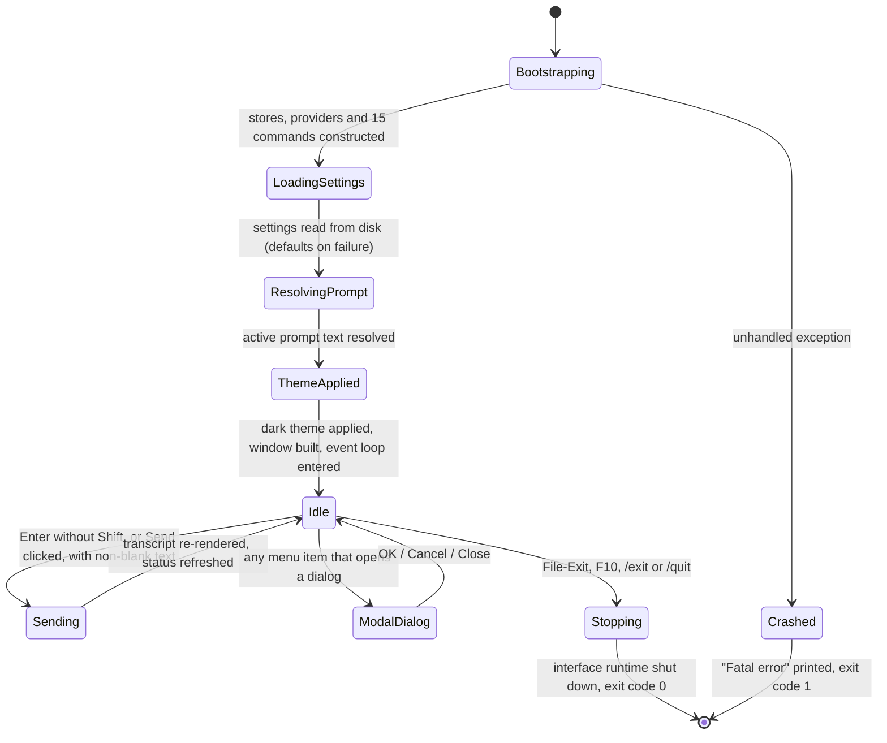

Probability-panel state machine:

| From | Trigger | Guard | To | Side effects |
|---|---|---|---|---|
| Hidden | Toggle Log Probs Panel | ≥1 eligible assistant message | Shown | select last eligible, render, scroll top, status `Token probabilities panel enabled` |
| Hidden | Toggle Log Probs Panel | no eligible message | Hidden | modal `No Log Probabilities` |
| Hidden | click a `◊` marker | marker exists only on eligible messages | Shown | select that message, render, scroll top, status `Showing token probabilities for message at <timestamp>` |
| Hidden | assistant response arrives with ≥1 probability entry, feature on | — | Shown | select new message |
| Shown | Toggle Log Probs Panel | — | Hidden | remove panel, restore full-width transcript, status `Token probabilities panel disabled` |
| Shown | click a different `◊` | — | Shown | re-select, re-render, scroll top |
| Shown | Toggle Log Probs for Last Message turns the feature off | — | Hidden | same toggle path |

There is deliberately **no** transition that hides or re-points the panel when the conversation is cleared.

---

**External technology**

*Requires: a full-screen text-mode user-interface toolkit providing windows, a menu bar, a shortcut/status bar, z-ordered modal dialogs with their own event loop, a tab strip, list view, radio group, checkbox, single-line text field, masked text field, multi-line text area, button, scrollable canvas with programmable content extent, per-widget colour attributes, file open/save dialogs, message boxes, and a way to marshal a callback back onto the interface thread (ANSI/VT terminal escape sequences; Windows console API on Windows). Source used: Terminal.Gui 1.19.0 (with NStack for its string type). Reimplementer notes: any curses-like toolkit works (ncurses, blessed, Textual, tview, ratatui). The required primitives are absolute plus anchored positioning, percentage widths, "fill minus N" sizing, per-widget colour schemes, a scrollable canvas whose content extent is set programmatically, and UI-thread marshalling of a timer callback. Menu hot-keys, focus traversal, dialog dismissal and scroll keys all come from the toolkit's defaults and are **INFERRED** — re-derive them from the chosen toolkit rather than trusting any list. Product documentation claims version 1.17.1; the project pins 1.19.0.*

*Requires: a rich console (non-full-screen) text renderer producing coloured markup, panels, grids, tables and horizontal rules (ANSI SGR). Source used: Spectre.Console 0.51.1. Reimplementer notes: used **only** by the demo-visualisation path and by dead code in the same folder. It writes straight to standard output and therefore fights the full-screen interface for the screen. A reimplementation should drop this dependency and render the demo in-window.*

*Requires: a terminal-size query. Source used: the console window width, read when laying out the demo grid. Reimplementer notes: column count divided by 40, minimum 1, gives the number of demo grid columns — roughly 40 columns per token card.*

*Requires: a managed, cross-platform runtime host for a terminal executable. Source used: .NET 10 (`net10.0`), SDK pinned in `global.json` to `10.0.100-rc.1.25451.107`. Reimplementer notes: this project has no ahead-of-time or single-file publish profile in continuous integration; only `Compact` and `SingleFile` build configurations exist in the project file, both defaulting to a 64-bit Windows runtime identifier, and the release pipeline never publishes this executable at all.*

*Requires: read access to a per-user home directory and a per-user local-application-data directory. Source used: the operating system's user-profile and local-application-data special folders. Reimplementer notes: the shell needs a "home directory" notion for the import/export picker start paths and the prompt-export default path. Settings live under `<home>/.ChatDbg/settings.json` and prompt records under `<local application data>/ChatDbg/system_prompts`.*

*Requires: arbitrary local file read and write. Source used: whole-file text read of an imported prompt file and whole-file text write of an exported prompt. Reimplementer notes: plain UTF-8 text, whole-file semantics, no size limit and no path validation.*

*Requires: an operating-system credential store that can write and read one named secret (no standard protocol). Source used: Windows Credential Manager, reached through direct native calls into the Windows credential API. Reimplementer notes: **platform-specific and it fails soft** — off the supported platform every entry point returns "not available" rather than raising, and the calling dialog does not inspect the result, so the user is told the credential was saved when nothing was stored. Target names are `ChatDbg:AzureApiKey`, `ChatDbg:AwsAccessKey`, `ChatDbg:AwsSecretKey`. A port needs a per-platform keychain abstraction (Windows Credential Manager / macOS Keychain / Secret Service) **and** must propagate the real success flag into the message shown.*

*Requires: read-only access to process environment variables as a credential channel (POSIX/Windows environment). Source used: `CHATDBG_AZURE_API_KEY`; `CHATDBG_AWS_ACCESS_KEY` then `AWS_ACCESS_KEY_ID`; `CHATDBG_AWS_SECRET_KEY` then `AWS_SECRET_ACCESS_KEY`. Reimplementer notes: this is the only credential path that works on every platform, it takes priority over both the credential store and the settings file, and the interface never names any of these variables to the user.*

*Requires: a delayed callback that can be marshalled onto the interface thread. Source used: a 3-second fire-and-forget timer whose continuation is posted back to the main loop. Reimplementer notes: needed for the transient status line. Each call creates an independent timer and does not cancel the previous one.*

*Requires: a structured document format for persisted state, and a plain-text format for one export path (JSON). Source used: JSON for settings, conversation exports and prompt records; plain text for prompt export. Reimplementer notes: this shell never parses these formats itself, it only chooses paths — but the conversation export is an interchange artefact that must remain re-importable, and the asymmetry is load-bearing: prompt **export** writes only the body as plain text while prompt **import** reads any file's whole text as the body.*

*Requires: process exit codes (POSIX/Windows convention). Source used: `0` on clean shutdown, `1` after a fatal startup or teardown error. Reimplementer notes: this is the only machine-readable output the feature produces.*

*Requires: remote and local model inference, indirectly (HTTPS/REST for the hosted providers; in-process inference for the local one). Source used: Azure OpenAI (Azure.AI.OpenAI 2.1.0), Amazon Bedrock (AWSSDK.BedrockRuntime 4.0.7.3), local GGUF models via LLamaSharp. Reimplementer notes: this feature never speaks these protocols; it only names the three provider keys `azure`, `bedrock`, `llama` and surfaces their errors verbatim in a modal box.*

*Requires: mouse input reporting in a terminal (xterm mouse reporting). Source used: handled by the interface toolkit — the `◊` markers and every button are clickable. Reimplementer notes: keyboard-only operation must remain possible through hot-keys and focus traversal.*

---

**Acceptance criteria**

- **AC-14.1** — **Given** a saved settings file with provider `azure`, model `gpt-4` and prompt `default`, **when** the application is launched in a terminal, **then** the window shows a menu bar reading File, Edit, View, Tools, Help; a frame captioned `Chat History` occupying the full window width; a frame captioned `Input` containing a one-row input box and a **Send** button; a status line reading exactly `Provider: azure | Model: gpt-4 | Prompt: default`; a bottom bar reading `F1 Help` and `F10 Quit`; and **no** `Token Probabilities` frame.
- **AC-14.2** — **Given** the input box contains only three space characters, **when** the user presses Enter, **then** nothing is added to the transcript, no dialog appears, the status line is unchanged, and the three spaces are still in the input box.
- **AC-14.3** — **Given** a provider that is not configured, **when** the user types `hello world` and presses Enter, **then** the transcript immediately shows a right-aligned `[user]` banner followed by a right-aligned body row `hello world`, and a modal titled `Error` appears whose body begins `Failed to get AI response:`; after dismissing it with **OK** the user message is still in the transcript.
- **AC-14.4** — **Given** focus is in the input box containing `abc`, **when** the user presses `Shift+Enter`, **then** no message is sent and no transcript row is added.
- **AC-14.5** — **Given** the window is open, **when** the user types `/notacommand` and presses Enter, **then** a modal titled `Error` appears with the body `Unknown command: notacommand` and a single **OK** button.
- **AC-14.6** — **Given** the window is open, **when** the user types `/NoTaCoMmAnD` and presses Enter, **then** the modal body reads `Unknown command: notacommand` (the name is lowercased).
- **AC-14.7** — **Given** an assistant message that carries token probabilities, **when** the user clicks its `◊` marker, **then** the transcript frame shrinks to 60 % of the window width, a frame captioned `Token Probabilities` appears to its right showing `[<timestamp>] Token Probabilities:` followed by one indented row per token, the panel is scrolled to the top, and the status line reads `Showing token probabilities for message at <timestamp>`.
- **AC-14.8** — **Given** an assistant message whose first token is `the` with probability `0.87`, **when** the panel renders it, **then** the first token row reads exactly `0: "the" (87.00000 %)` in bright yellow on black; a token with probability exactly `1.0` renders `100.00000 %` in bright green on black; a token whose text is a single line feed renders as `"\n"`.
- **AC-14.9** — **Given** a token with four alternatives at probabilities `0.10`, `0.40`, `0.05` and `0.20` and *Grid View Max Alternatives* set to `2`, **when** the panel renders that token, **then** exactly two alternative rows appear, in the order `0.40` then `0.20`, each indented two columns further than the token row.
- **AC-14.10** — **Given** no assistant message carries token probabilities, **when** the user chooses View ▸ Log Probabilities ▸ Toggle Log Probs Panel, **then** a modal titled `No Log Probabilities` appears with the body `There are no assistant messages with log probabilities to display.` and the layout is unchanged.
- **AC-14.11** — **Given** the probability panel is visible, **when** the user toggles it again, **then** the panel is removed, the transcript frame returns to full width, and the status line reads `Token probabilities panel disabled`.
- **AC-14.12** — **Given** the Settings dialog is open on the AI Provider tab, **when** the user enters `5.0` for Temperature and `999999` for Max Tokens and presses **OK**, **then** the stored temperature is `2.0`, the stored max tokens is `8192`, the dialog closes, and no validation message is shown.
- **AC-14.13** — **Given** the Settings dialog is open with a stored top-K of `5`, **when** the user enters `abc` into `Log Probabilities Top K:` and presses **OK**, **then** the stored top-K is still `5` and no error is shown.
- **AC-14.14** — **Given** the Settings dialog is open on the LLama Settings tab, **when** the user enters `100` for Context Size and `9999` for Batch Size and presses **OK**, **then** the stored context size is `512` and the stored batch size is `2048`.
- **AC-14.15** — **Given** the Settings dialog is open, **when** the user clears the `AWS Region:` field and presses **OK**, **then** the stored region is `us-east-1`.
- **AC-14.16** — **Given** a stored temperature of `0.75`, **when** the user opens Edit ▸ Settings… and immediately presses **OK**, **then** the stored temperature is `0.8` and no message is shown.
- **AC-14.17** — **Given** the Settings dialog is open with the provider radio on `Azure OpenAI`, **when** the user selects `AWS Bedrock` and then presses **Cancel**, **then** nothing is written to the settings file, but the status line after the dialog closes reads `Provider: bedrock | …`.
- **AC-14.18** — **Given** the System Prompts dialog is open with nothing selected, **when** the user clicks Show, Use, Edit, Delete, Import or Export, **then** a modal titled `Error` appears with the body `Please select a prompt first`.
- **AC-14.19** — **Given** the System Prompts dialog is open, **when** the user clicks `Create...`, leaves Name blank and clicks **Create**, **then** a modal `Error` with body `Name is required` appears and the create dialog stays open; filling the name `t1` but leaving Content blank instead yields `Content is required`.
- **AC-14.20** — **Given** a prompt named `code-reviewer` is selected, **when** the user clicks `Delete` and answers **No**, **then** the prompt is still in the list; answering **Yes** removes it and shows a modal `Success` with body `Prompt 'code-reviewer' deleted successfully`.
- **AC-14.21** — **Given** a prompt named `default` is selected, **when** the user clicks `Use`, **then** a modal `Success` with body `Now using system prompt: default` appears, and after the whole System Prompts dialog is closed the status line reads `… | Prompt: default`.
- **AC-14.22** — **Given** Help ▸ View Commands… is chosen, **then** a modal titled `Help` shows the header `Available Commands:` followed by exactly the 15 registered commands in ascending alphabetical order beginning `/clear`, `/demologprobs`, `/exit`, `/export`, `/help`, each followed by an indented one-line description and a blank line, and it closes on the **Close** button.
- **AC-14.23** — **Given** Help ▸ About… is chosen, **then** a modal titled `About ChatDbg` shows `ChatDbg v1.0`, `AI-Powered Debugging Assistant`, `Supports Amazon Bedrock and Azure OpenAI` and `Copyright © Xcaciv 2024`, separated by blank lines, with a single **OK** button.
- **AC-14.24** — **Given** any of File ▸ Exit, the `F10 Quit` bar item, `/exit` or `/quit`, **when** invoked, **then** the application terminates with exit code `0`, with no confirmation prompt and with no `✓` status line for the typed routes.
- **AC-14.25** — **Given** a four-message conversation, **when** the user types `/clear` and presses Enter, **then** the status line reads `✓ Cleared 4 messages from chat history` and reverts to `Provider: … | Model: … | Prompt: …` after approximately three seconds.
- **AC-14.26** — **Given** an empty transcript, **when** the user chooses File ▸ Pop Last Message, **then** a modal titled `Command Error` appears with the body `Chat history is empty`.
- **AC-14.27** — **Given** a machine with no prompt directory, **when** the application starts and the user opens Tools ▸ System Prompts…, **then** `<local application data>/ChatDbg/system_prompts` exists holding four files and the list shows exactly, in this order: `algorithm-helper - System prompt for algorithm assistance`, `code-reviewer - System prompt for code review assistance`, `default - Default system prompt for general debugging assistance`, `security-expert - System prompt for security-focused assistance`.
- **AC-14.28** — **Given** no file at `<user profile>/.ChatDbg/settings.json`, **when** the application starts, **then** the status line reads exactly `Provider: azure | Model: gpt-4 | Prompt: default`, and Edit ▸ Settings… shows Temperature `0.7`, Max Tokens `1000`, AWS Region `us-east-1`, an empty Azure Endpoint, Top K `5`, Grid View Max Alternatives `5`, Context Size `4096`, GPU Layer Count `0`, Thread Count `0`, Batch Size `512`, both checkboxes cleared, Display Mode on `Show Samples`, Layout on `List View`, and the provider radio on `Azure OpenAI`.
- **AC-14.29** — **Given** the Inject dialog, **when** the user sets Role to `bot`, types `hi` and presses **OK**, **then** the dialog closes, a modal titled `Error` appears with the body `Role must be one of: user, assistant, system`, and nothing is added to the transcript.
- **AC-14.30** — **Given** the Inject dialog, **when** the user leaves Role as `user`, types `hello` and types `abc` into Position, **then** the message is appended at the **end** of the transcript and the status line reads `✓ Injected user message: hello` with no position clause.
- **AC-14.31** — **Given** a three-message conversation and the Inject dialog, **when** the user leaves Role as `user`, types `hello` and types `1` into Position, **then** the message appears as the second message in the transcript and the status line reads `✓ Injected user message at position 1: hello`.
- **AC-14.32** — **Given** an assistant reply whose text is `line one`, a blank line, then `line two`, **when** the transcript renders, **then** exactly two body rows appear — `line one` and `line two` — with **no** blank row between them.
- **AC-14.33** — **Given** the Export History dialog, **when** the user chooses `<user profile>/my  history.json` (two consecutive spaces), **then** the file is written to `<user profile>/my history.json` (one space) and the status line reports that single-spaced path.
- **AC-14.34** — **Given** the Export History dialog, **when** the user chooses `<user profile>/session1` with no extension, **then** the file written is `<user profile>/session1.json`, and re-selecting that file in the Import History dialog restores the same conversation and session identity.
- **AC-14.35** — **Given** a conversation with four messages and a file containing two messages, **when** the user imports that file, **then** the transcript shows exactly the two imported messages with no confirmation prompt and no way to undo.
- **AC-14.36** — **Given** the window is open, **when** the user chooses View ▸ Toggle System Messages in Status Bar, **then** the status line reads `System messages toggle not yet implemented` and nothing else changes.
- **AC-14.37** — **Given** the window is open, **when** the user chooses View ▸ Log Probabilities ▸ Run Demo Visualization, **then** the status line reads `✓ Sample token probability analysis generated`, **no** new content appears in the transcript or the probability panel, and the screen shows painting artefacts on the next repaint.
- **AC-14.38** — **Given** the application running on a host whose credential store is not the implemented one, **when** the user opens Edit ▸ Settings… ▸ Credentials ▸ `Manage Credentials...`, types `azureApiKey` and `sk-test-1234` and presses **Save**, **then** a modal titled `Success` with the body `Credential saved successfully` appears **and no credential exists anywhere**.
- **AC-14.39** — **Given** the `Manage Credentials` dialog, **when** the user types `azureApiKey`, leaves Value blank and presses **Save**, **then** nothing happens: no message, no close, the dialog stays open.
- **AC-14.40** — **Given** a settings file whose model is `claude-3`, **when** the user opens Tools ▸ Change Model…, types `gpt-4o` and presses **OK**, **then** the status line briefly reads `✓ Changed model from 'gpt-4' to 'gpt-4o'` — naming `gpt-4`, not `claude-3` — and the resting status line still reads `Model: claude-3`.
- **AC-14.41** — **Given** the probability panel is open showing an assistant message, **when** the user chooses File ▸ Clear History, **then** the transcript empties with no confirmation and the panel continues to display the tokens of the now-deleted message.
- **AC-14.42** — **Given** the window is open, **when** the user types `/export-logs` and presses Enter, **then** a modal titled `Error` appears with the body `Unknown command: export-logs`.
- **AC-14.43** — **Given** a settings file in a read-only directory, **when** the user opens Edit ▸ Settings…, changes Max Tokens to `2000` and presses **OK**, **then** the dialog closes with **no** error dialog at all and the change is lost on the next launch.
- **AC-14.44** — **Given** the provider setting is the empty string, **when** the user sends `hello`, **then** a modal titled `Error` appears with the body `Unknown AI provider: ` — with a blank subject after the colon — rather than `AI provider is not set in settings`.
- **AC-14.45** — **Given** a chat turn is in flight showing `Thinking...`, **when** three seconds elapse before the response arrives, **then** the status line reverts to the resting `Provider: … | Model: … | Prompt: …` text while the request is still running.
- **AC-14.46** — **Given** the System Prompts dialog is open, **when** the user clicks `Create...`, enters the name `default` with new content and presses **Create**, **then** a modal `Success` with body `Prompt 'default' created successfully` appears and the previous `default` prompt's body, description and creation timestamp are gone.
- **AC-14.47** — **Given** the window is open at the default 80×24 terminal size, **when** the terminal is resized to 4 columns wide with a non-empty conversation and any action forces a transcript re-render, **then** the application terminates with an unhandled error rather than rendering.

---

**Quirks**

- *QUIRK-14.1: Settings split-brain. The command objects are constructed against the initial **default** settings record, and only afterwards is the **loaded** record created and handed to the window. As a result the `model`, `set`, `logprobs`, `prompt`, `demologprobs`, `tokenize` and `inspect` commands, and Tools ▸ Change Model, read and **persist a record that still holds factory defaults**, overwriting the user's saved provider/endpoint/model on disk, while the status line, the settings screen and the model calls keep using the other record. Change Model reports `Changed model from 'gpt-4' to '<new>'` no matter what the real current model is, and the status line does not move. Evidence: `src/ChatDbg.Shell.Gui/Program.cs:14`, `:31-47`, `:58`, `:79-87`; `src/ChatDbg.Shell.Gui/UI/ChatWindow.cs:1061-1078`. Keep-or-fix decision deferred to Open Questions.*
- *QUIRK-14.2: The provider radio group ignores Cancel. Selecting a provider writes it into the live settings record immediately rather than on OK, and Cancel does not revert it, so a cancelled settings screen still leaves the session talking to the newly selected provider (unsaved, so it reverts on restart). Evidence: `src/ChatDbg.Shell.Gui/UI/SettingsDialog.cs:139-153`. Keep-or-fix decision deferred to Open Questions.*
- *QUIRK-14.3: Demo colouring and demo percentages are on the wrong scale. The shared colour and format helpers compare against a 0–100 input but are fed the 0–1 probability, so every token in the demo visualisation is red and an 87 % token prints as `0.87%`. The window's own panel uses the correct 0–1 scale. Evidence: `src/Xcaciv.ChatDbg.Core/Services/TokenFormatters.cs:36-55` called from `src/ChatDbg.Shell.Gui/Services/SpectreConsoleFormatter.cs:200-203`; thresholds pinned by `src/Xcaciv.ChatDbg.Core.Tests/Services/TokenFormattersTests.cs:18-23`. Keep-or-fix decision deferred to Open Questions.*
- *QUIRK-14.4: The demo visualisation paints over the full-screen interface. The demo command writes rich text straight to the console stream while the interface owns the screen, so the output is invisible, is overwritten on the next repaint, leaves visual garbage, and is rendered in no window — yet the command still reports success. Evidence: `src/ChatDbg.Shell.Gui/Program.cs:20`, `:41`; `src/ChatDbg.Shell.Gui/Services/SpectreConsoleFormatter.cs`. Keep-or-fix decision deferred to Open Questions.*
- *QUIRK-14.5: Roughly a thousand unreachable lines ship inside this feature's folder — a complete second console-only conversation loop that is never constructed and is stale (13 commands, two providers), an inline heat-map view that is never constructed, a probability visualiser that is never called, an unused "divider" colour pair, and one stub menu item. Evidence: `src/ChatDbg.Shell.Gui/ChatShell.cs` (671 lines), `src/ChatDbg.Shell.Gui/UI/LogProbHeatmapView.cs`, `src/ChatDbg.Shell.Gui/Services/TokenProbabilityVisualizer.cs`, `src/ChatDbg.Shell.Gui/UI/ChatWindow.cs:81-84`, `:1138-1142`. Keep-or-fix decision deferred to Open Questions.*
- *QUIRK-14.6: "Multi-line input" is one visible row. The product documentation advertises multi-line input, but the control is created one row tall with wrapping off, so `Shift+Enter` inserts a newline the user cannot see and the caret appears to vanish. Code wins: the input is functionally single-line-visible. Evidence: `src/ChatDbg.Shell.Gui/UI/ChatWindow.cs:169-176` versus `README.md:27` and `docs/TERMINAL-GUI-IMPLEMENTATION.md:122`. Keep-or-fix decision deferred to Open Questions.*
- *QUIRK-14.7: Documentation contradicts the code in at least nine places — toolkit version, submenu item count, settings tab count, what the bottom bar shows, how probabilities are rendered, product identity, runtime version, the case of the role banners (`[User]` documented, `[user]` rendered), and the model field's label (`Model ID:` documented, `Model ID/Path:` rendered). Evidence: `docs/TERMINAL-GUI-IMPLEMENTATION.md:13`, `:16`, `:44-48`, `:62`, `:70`, `:128`, `:130`; `README.md:3`, `:8-19`, `:28`; `src/ChatDbg.Shell.Gui/prd.md:47`. Keep-or-fix decision deferred to Open Questions.*
- *QUIRK-14.8: Credential save always reports success, even when nothing was stored. The storage call returns a boolean and never raises for the two most likely failures — an unsupported host platform and an unrecognised credential type — and the dialog discards that return value, so the user sees `Credential saved successfully` while no credential exists. The real diagnostic goes to the console beneath the interface. Evidence: `src/ChatDbg.Shell.Gui/UI/SettingsDialog.cs:543-545`; `src/Xcaciv.ChatDbg.Core/Services/SettingsService.cs:147-151`, `:157-166`. Keep-or-fix decision deferred to Open Questions.*
- *QUIRK-14.9: "Migrate Credentials…" launches an interactive console wizard underneath the full-screen interface. The domain routine prints a numbered menu and blocks twice on standard input that the toolkit is also draining, so the prompts are invisible and the application appears to hang; if it returns, `Credentials migrated successfully` is shown regardless of the result, including the case where it bailed out immediately because there was nothing to migrate. Evidence: `src/ChatDbg.Shell.Gui/UI/SettingsDialog.cs:586-600` → `src/Xcaciv.ChatDbg.Core/Services/SettingsService.cs:196-268` (`:200-203`, `:210-211`, `:246-247`). Keep-or-fix decision deferred to Open Questions.*
- *QUIRK-14.10: A domain test that pins the probability scale is arithmetically unsatisfiable and must therefore be red in every run: the derived probability is the exponential of the log probability, the test supplies the natural log of 0.25 and asserts the result equals 25 to five decimal places. Evidence: `src/Xcaciv.ChatDbg.Core/Models/TokenLogProbabilities.cs:26` versus `src/Xcaciv.ChatDbg.Core.Tests/Models/TokenLogProbabilityTests.cs:9-18`. Keep-or-fix decision deferred to Open Questions.*
- *QUIRK-14.11: Two documented error dialogs can never appear. Persisting settings catches every exception internally and returns normally, so `Failed to save settings: <message>` and `Failed to set system prompt: <message>` are dead branches; a failed write is reported only as a console line under the interface and the dialog closes as if it had succeeded. Evidence: `src/Xcaciv.ChatDbg.Core/Services/SettingsService.cs:85-104`; `src/ChatDbg.Shell.Gui/UI/SettingsDialog.cs:505`; `src/ChatDbg.Shell.Gui/UI/SystemPromptsDialog.cs:224`. Keep-or-fix decision deferred to Open Questions.*
- *QUIRK-14.12: Two settings are exposed, validated and persisted but change nothing the user can see. The Log Probs tab's *Display Mode* and *Layout* radio groups are read only by the demo command (whose output is invisible — QUIRK-14.4) and by two never-constructed units; the in-window panel always lists every token in list form. Evidence: written at `src/ChatDbg.Shell.Gui/UI/SettingsDialog.cs:458-459`; readers at `src/Xcaciv.ChatDbg.Core/Commands/DemoLogProbsCommand.cs:81-107`, `src/ChatDbg.Shell.Gui/UI/LogProbHeatmapView.cs:28`, `src/ChatDbg.Shell.Gui/Services/TokenProbabilityVisualizer.cs:25-87`. Keep-or-fix decision deferred to Open Questions.*
- *QUIRK-14.13: The System Prompts button row overflows the dialog and one button sits on top of another. Seven buttons are placed at fixed columns 2/12/20/33/45/56/69 in a dialog 80 columns wide (78 usable), so `Export...` starts at column 69, needs 13 columns and is clipped by the right border; the eighth, centred `Close` button lands near column 34 and overlaps `Edit...` at columns 33–43. Evidence: `src/ChatDbg.Shell.Gui/UI/SystemPromptsDialog.cs:29-30`, `:62-116`. Keep-or-fix decision deferred to Open Questions.*
- *QUIRK-14.14: Creating a prompt with an existing name silently overwrites it. There is no existence check and the store is create-or-overwrite by name, so the old body, description and creation timestamp are lost while the dialog reports `Prompt '<name>' created successfully`. Evidence: `src/ChatDbg.Shell.Gui/UI/SystemPromptsDialog.cs:296-326`; `src/Xcaciv.ChatDbg.Core/Services/SystemPromptService.cs:100-107`. Keep-or-fix decision deferred to Open Questions.*
- *QUIRK-14.15: Deleting a prompt whose file is already gone reports success. Deletion returns quietly when the file does not exist, so a stale list row still yields `Prompt '<name>' deleted successfully`. Evidence: `src/Xcaciv.ChatDbg.Core/Services/SystemPromptService.cs:122-125`; `src/ChatDbg.Shell.Gui/UI/SystemPromptsDialog.cs:450-452`. Keep-or-fix decision deferred to Open Questions.*
- *QUIRK-14.16: Opening the settings screen quietly rounds the temperature. The field is seeded formatted to one decimal place and OK writes the field back, so a stored `0.75` becomes `0.8` merely by opening the screen and pressing OK. No other numeric field is reformatted this way. Evidence: `src/ChatDbg.Shell.Gui/UI/SettingsDialog.cs:121`, `:420-423`. Keep-or-fix decision deferred to Open Questions.*
- *QUIRK-14.17: The credential-migration target selection is ignored. All three radio options — environment variables, the operating-system credential store, both — perform the same "migrate from the settings file" action; the selection is read into a local value and discarded. Evidence: `src/ChatDbg.Shell.Gui/UI/SettingsDialog.cs:586-594`. Keep-or-fix decision deferred to Open Questions.*
- *QUIRK-14.18: File paths chosen in the Import/Export pickers are round-tripped through a space-delimited command line. The window formats `import <path>` / `export <path>` into a string, the dispatcher splits it on spaces discarding empties, and the command re-joins with single spaces — so a path containing two or more consecutive spaces is silently corrupted, while single spaces survive by luck. Evidence: `src/ChatDbg.Shell.Gui/UI/ChatWindow.cs:1014`, `:1031`, `:384`; `src/Xcaciv.ChatDbg.Core/Commands/ImportCommand.cs:28`, `:75`; `src/Xcaciv.ChatDbg.Core/Commands/ExportCommand.cs:28`. Keep-or-fix decision deferred to Open Questions.*
- *QUIRK-14.19: Blank lines inside a message are silently deleted from the transcript. Every wrapped line that is empty or whitespace is skipped on rebuild, so paragraph structure, blank lines inside fenced code, and deliberate spacing in model output all disappear; the rendered text is denser than what was received and than what an export writes to disk. Evidence: `src/ChatDbg.Shell.Gui/UI/ChatWindow.cs:543`. Keep-or-fix decision deferred to Open Questions.*
- *QUIRK-14.20: Three implemented, unit-tested commands are unreachable from any shell — log export, show token analysis and export token analysis are registered nowhere, so typing them yields `Unknown command: <name>` and the help dialog does not list them. Evidence: `src/Xcaciv.ChatDbg.Core/Commands/ExportLogsCommand.cs:12`, `src/Xcaciv.ChatDbg.Core/Commands/ShowTokenAnalysisCommand.cs:13`, `src/Xcaciv.ChatDbg.Core/Commands/ExportTokenAnalysisCommand.cs:12`; `src/ChatDbg.Shell.Gui/Program.cs:30-55`. Keep-or-fix decision deferred to Open Questions.*
- *QUIRK-14.21: The storage layer prints diagnostics straight to the console while the full-screen interface owns the screen, so any settings-save failure, prompt-parse failure or credential-store message paints garbage over the window on the next repaint and is never shown in a dialog. Evidence: `src/Xcaciv.ChatDbg.Core/Services/SettingsService.cs:69`, `:73`, `:80`, `:102`, `:110`, `:149`, `:185`, `:191`, `:205`; `src/Xcaciv.ChatDbg.Core/Services/SystemPromptService.cs:65`, `:92`. Keep-or-fix decision deferred to Open Questions.*
- *QUIRK-14.22: Transient status messages are restored unconditionally by independent timers. Each status update starts its own three-second timer that overwrites the status line with the resting text when it fires, regardless of what has been posted since — so the probability toggle's second message can be wiped by the first message's timer, and `Thinking...` is erased mid-request even though the request is still running. Evidence: `src/ChatDbg.Shell.Gui/UI/ChatWindow.cs:903-916`, `:849`, `:862`, `:900`. Keep-or-fix decision deferred to Open Questions.*
- *QUIRK-14.23: Clearing the conversation leaves the probability panel showing a deleted message. Clear History re-renders the transcript but nothing re-points or hides the panel, so it keeps displaying tokens from a message that is no longer in the conversation until something else re-renders it. Evidence: `src/ChatDbg.Shell.Gui/UI/ChatWindow.cs:918-929`, `:269`. Keep-or-fix decision deferred to Open Questions.*
- *QUIRK-14.24: An empty provider name is reported as an unnamed unknown provider. The "not set" check tests only for a missing value, so an empty string falls through to the registry lookup and the user sees `Unknown AI provider: ` with a blank subject. Evidence: `src/ChatDbg.Shell.Gui/UI/ChatWindow.cs:425-435`. Keep-or-fix decision deferred to Open Questions.*
- *QUIRK-14.25: The delete confirmation defaults to the destructive answer — `Yes` is offered first and the first button is the default, so pressing Enter deletes the prompt. By contrast, File ▸ Clear History asks nothing at all. Evidence: `src/ChatDbg.Shell.Gui/UI/SystemPromptsDialog.cs:442-446`; `src/ChatDbg.Shell.Gui/UI/ChatWindow.cs:269`. Keep-or-fix decision deferred to Open Questions.*
- *QUIRK-14.26: The dead inline heat-map view samples an overlapping window and ignores tabs — for more than 30 tokens it takes the first 10, then 10 starting at `(count − 10) ÷ 2`, then the last 10, which overlaps the head for counts near 30 (31 tokens yields indices 0–9, 10–19, 21–30), and it escapes only newline and carriage return, not tab. No user-visible effect today, but a reimplementer copying the sampling rule would inherit the overlap. Evidence: `src/ChatDbg.Shell.Gui/UI/LogProbHeatmapView.cs:36`, `:79-88`. Keep-or-fix decision deferred to Open Questions.*
- *QUIRK-14.27: The transcript's wrap width is computed from a viewport that may not have been laid out, and a non-positive width crashes the renderer. The wrap limit is `((viewport width − 4) × 3) ÷ 4`, and the hard-break loop then takes a substring of that length; at startup the viewport width is 0, giving −3, which is survivable only because the conversation is empty at that moment. Any render with a non-empty conversation and a viewport of 4 columns or fewer asks for a negative-length substring and throws. Evidence: `src/ChatDbg.Shell.Gui/UI/ChatWindow.cs:507`, `:539`, `:749-789`, first call at `:213`. Keep-or-fix decision deferred to Open Questions.*

---

**Source notes**

Dossier: `output/chatdbg/dossiers/terminal-gui-shell.md` (feature 2 in `output/chatdbg/inventory.md`), taken from repo `chatdbg` at commit `d8c18f61d6bb73666ed97cd4885e877e35558485` on branch `LLamaSharp_support`.

Primary evidence paths:

- `src/ChatDbg.Shell.Gui/Program.cs` — startup sequence, registry construction, provider keys, theme application, exit codes.
- `src/ChatDbg.Shell.Gui/UI/ChatWindow.cs` — window title, layout geometry, menus, input routing, command dispatch, transcript rendering, probability panel, status line, dialogs for inject / import / export / change model / help / about.
- `src/ChatDbg.Shell.Gui/UI/SettingsDialog.cs` — the four-tab settings screen, clamp ranges, credential and migration sub-dialogs.
- `src/ChatDbg.Shell.Gui/UI/SystemPromptsDialog.cs` — the prompt-management screen and all of its sub-dialogs.
- `src/ChatDbg.Shell.Gui/UI/ThemeManager.cs` — the four global palettes.
- `src/ChatDbg.Shell.Gui/UI/LogProbHeatmapView.cs`, `src/ChatDbg.Shell.Gui/Services/TokenProbabilityVisualizer.cs`, `src/ChatDbg.Shell.Gui/ChatShell.cs` — dead code inside this feature's folder (QUIRK-14.5).
- `src/ChatDbg.Shell.Gui/Services/SpectreConsoleFormatter.cs` — the rich-console formatter handed to the demo command (QUIRK-14.3, QUIRK-14.4).
- `src/ChatDbg.Shell.Gui/Xcaciv.ChatDbg.Shell.Gui.csproj` — toolkit versions, build configurations, invariant-culture and resource-trimming settings.
- Contracts relied on: `src/Xcaciv.ChatDbg.Core/Models/{ChatMessage,ChatHistory,ChatSettings,CommandResult,TokenLogProbabilities,WindowsCredentialManager}.cs`, `src/Xcaciv.ChatDbg.Core/Services/{SettingsService,SystemPromptService,TokenFormatters}.cs`, `src/Xcaciv.ChatDbg.Core/Commands/*.cs`.
- Documentation compared and found stale: `README.md`, `docs/TERMINAL-GUI-IMPLEMENTATION.md`, `src/ChatDbg.Shell.Gui/prd.md`.
- Release scope: `.github/workflows/build-release.yml` publishes only the console shell — this feature has no shipped binary.

**Test coverage:** there are **zero** automated tests exercising any file in this feature. The solution's single test project references only the domain library, and no headless-interface harness, snapshot test or driver stub exists in the repository. Every behavioural statement above is read from source. Domain tests do pin several contracts this feature is built on — the message and probability shapes, the command-result shape, the credential resolution order, the shared colour/format helpers, the settings and prompt stores, and each command the menu bar invokes.

**INFERRED items carried forward:** operability over a remote terminal session; keyboard behaviour beyond `Enter`/`Shift+Enter` and the two shortcut-bar items (menu hot-keys, focus traversal, dialog dismissal, scroll keys all come from toolkit defaults); that `F1` reaches the help dialog when focus is inside a text control; that the window fills the terminal; terminal-resize reflow behaviour; that the demo visualisation corrupts the screen (deduced, not observed); and the precise user-visible consequence of each command affected by QUIRK-14.1.

---

### 7.15 Packaging, Build & Release Distribution

**Description**

Packaging, Build & Release Distribution is the machinery that turns the source tree into something a stranger can actually run. The product is a locally-run terminal application: it is not installed from an app store, it is not fetched from a package registry, and it has no installer. It is delivered as **one downloadable executable file per operating system**, which a user copies onto a machine and runs with nothing pre-installed — no managed runtime, no framework, no dependency manager, no companion configuration file. This feature exists to make that promise true and to make it repeatable.

Three problems are in scope. First, **zero-prerequisite distribution**: every dependency — the language runtime itself, all third-party libraries, and all large native machine-learning payloads — must be bundled inside the one delivered file. Second, **size and start-up discipline**: a chat and debugging shell that a developer launches many times a day must not be a hundred-megabyte download with a half-second cold start, so the feature defines two named build profiles that trade build time against artefact size and launch latency, and applies aggressive dead-code removal, compression, size-first code generation, English-only resource retention and culture-invariant operation to get there. Third, **repeatable, auditable publication**: a maintainer must be able to cut a versioned public release for two platforms at once, from a clean machine, by filling in one short form, and receive a tagged release with generated notes and both binaries attached without hand-uploading anything.

The feature is also, deliberately, the place where all the *packaging consequences* of the rest of the product are recorded. Aggressive dead-code removal is only safe if nothing important is reached by name at run time; culture-invariant operation changes how the shipped program compares and formats strings; suppressing debug metadata changes what a crash report looks like; and the decision that the running program writes all of its state into per-user directories rather than beside itself is exactly what makes a single read-only downloaded file a viable unit of distribution. Those constraints are stated here as contracts that every other feature must honour. The source as analysed contains a substantial number of defects in this area — a malformed toolchain pin, a pipeline that installs the wrong major runtime line, local scripts that inspect an output folder a successful build never creates, and a shipping profile that suppresses a start-up file the shipping profile needs — all of which are recorded verbatim in **Quirks** rather than silently repaired.

---

**User stories**

- **US-15.1** — As an end user, I want to download exactly one file for my operating system and run it with nothing else installed, so that I can try the product without setting up a language runtime or a package manager.
- **US-15.2** — As an end user on a POSIX system, I want the release page to tell me the single extra step my platform needs (setting the execute permission bit), so that I am not stuck at a "permission denied" message.
- **US-15.3** — As an end user, I want the downloaded program to keep its settings, prompts and logs somewhere under my own user account rather than beside the executable, so that I can put the binary on a read-only or shared location and so that a second copy of the binary shares the same state.
- **US-15.4** — As an end user or operator, I want to be able to configure a packaged binary entirely through environment variables, so that nothing has to be shipped, installed, or edited alongside it.
- **US-15.5** — As a release manager, I want to publish a versioned release for both supported platforms by filling in one form with a version string and a pre-release checkbox, so that cutting a release is a single deliberate action rather than a manual build-and-upload chore.
- **US-15.6** — As a release manager, I want the two platform binaries built in parallel and published only when *both* succeed, so that a half-published release can never exist.
- **US-15.7** — As a release manager, I want a release body generated for me that lists the exact asset file names, the system requirements, and the three usage steps, so that a downloader has instructions without me writing them each time.
- **US-15.8** — As a release manager, I want to mark a release as a pre-release, so that early builds are visibly distinguished from stable ones.
- **US-15.9** — As a release manager, I want a run summary at the end of the pipeline showing the release version, the version scraped from the project, the pre-release flag, the two asset names, and a direct link to the published release, so that I can confirm what was published without leaving the run page.
- **US-15.10** — As a consumer of the release (a human or a download script), I want the asset file names to be fixed and predictable, so that automation can fetch them by name.
- **US-15.11** — As a developer on a workstation, I want scripted local builds of each distribution profile, so that I can smoke-test what a downloader will actually receive without running the whole publication pipeline.
- **US-15.12** — As a developer on a workstation, I want an interactive chooser that offers the native profile, the bundled profile, or both, so that I do not have to remember which script does what.
- **US-15.13** — As a developer on a workstation, I want each build to report where it wrote its output and to list the produced executables with their sizes, so that I can confirm the artefact exists and check it against the size budget.
- **US-15.14** — As a developer or an automated caller, I want a failed build to return the build tool's own non-zero exit code, so that the failure is detectable by whatever invoked the script.
- **US-15.15** — As a maintainer, I want the build toolchain pinned to one exact version with a controlled roll-forward policy, so that every machine and every build agent compiles the product the same way.
- **US-15.16** — As a maintainer, I want the shipped binary to carry the product's identity metadata (version, title, company, product, copyright), so that a support engineer can tell which build a user is running.

*(Not written as stories, because the source supports no such capability: there is no automatic release on a code change, no draft or approval gate, no rollback, no checksum or signature, no macOS or ARM artefact, no installer, no test gate, and no publication of the full-screen terminal shell. See FR-15.90 through FR-15.97.)*

---

**Use cases**

#### UC-15.1 — Produce the smallest native artefact locally (realizes US-15.11, US-15.13, US-15.14)

**Preconditions:** A workstation running the Windows family. The pinned build toolchain is installed and the pin document parses. Network access is available for dependency restore. The repository is checked out. *(A native ahead-of-time compiler and linker is also required but is named nowhere in the product's prerequisites — see QUIRK-15.9.)*

**Main flow:**
1. The operator runs the compact build script from any working directory; the script first anchors the working directory to its own location, so every later path is repository-relative.
2. The script prints `Building ChatDbg with Compact configuration...` and `This will create the smallest possible binary using AOT compilation and trimming.`
3. The script prints `Restoring packages for win-x64 runtime...` and restores dependencies for the 64-bit Windows platform triple. The restore names the platform triple only; it never names the configuration.
4. The script prints `Cleaning previous builds...` and cleans the prior output of the `Compact` configuration.
5. The script prints `Building and publishing Compact configuration...` and publishes the console-shell project in the `Compact` configuration, self-contained, for the 64-bit Windows platform triple, with re-restore disabled.
6. On success the script prints `Build completed successfully!` followed by `Output location: src\ChatDbg\bin\Compact\net9.0\win-x64\publish\`.
7. The script lists the executables found under that path with their sizes.
8. The script waits for a keypress and exits with code 0.

**Alternate flows:**
- **A1 — The scripted variant that reports in mebibytes:** the same sequence, printed in colour, and each executable is reported as `Executable: <file name> - Size: <n> MB` where `<n>` is mebibytes rounded to exactly 2 decimal places. It closes with `Press any key to continue...`.
- **A2 — An explicit platform triple is supplied on the command line:** the profile's built-in default of 64-bit Windows is only applied when no platform triple was supplied, so the explicit value always wins.

**Error flows:**
- **E1 — The toolchain pin document cannot be parsed:** the build tool refuses to run at all and reports a configuration-parse failure, not a compile failure. Nothing is built. *(At the analysed commit this is the state of the source — see QUIRK-15.1. INFERRED consequence; not executed.)*
- **E2 — Restore produced no assets for the requested platform triple:** the publish fails with a message of the form *"project.assets.json doesn't have a target for 'net9.0/win-x64'"*. The documented remedy is to use the interactive script instead, or to hard-delete the project's intermediate directory and the configuration's binary directory and restore again.
- **E3 — Publish returns a non-zero code:** the script prints `Build failed with error code <n>` and exits with that same code `<n>`. The mebibyte-reporting variant prints the same sentence in red and exits with the same code.
- **E4 — The native compiler and linker are absent:** the publish fails during native compilation. Nothing in the product installs or even names this toolchain; the stated machine prerequisites are only a managed toolchain, 8 GB of RAM and solid-state storage. *(INFERRED — see QUIRK-15.9.)*
- **E5 — The output listing finds nothing:** the script's post-build listing inspects a hard-coded folder named for the *previous* framework version, while a successful build writes to a folder named for the current one. A successful build therefore prints the shell's own "file not found" text and looks like a build that produced nothing. See QUIRK-15.11.
- **E6 — The script is invoked headlessly:** it reaches the closing keypress prompt and blocks forever rather than returning. See QUIRK-15.13.

**Postconditions:** On success, a per-configuration/per-framework/per-platform publish folder contains a native executable, no symbol side-car, no runtime-configuration side-car, and no non-English resource payloads — but *also* the separate per-platform native inference payloads, because this profile sets no bundling switch (see QUIRK-15.8). The prior output of that configuration has been deleted.

---

#### UC-15.2 — Produce the bundled single-file artefact locally (realizes US-15.11, US-15.13, US-15.14)

**Preconditions:** As UC-15.1, minus the native compiler and linker.

**Main flow:**
1. The operator runs the single-file build script. It anchors the working directory to its own location.
2. It prints `Building ChatDbg with SingleFile configuration...` and `This creates a single executable file that can be run standalone.`
3. It prints `Cleaning previous builds...`, cleans, then force-deletes the `SingleFile` binary directory outright.
4. It prints `Restoring packages for win-x64 runtime...` and restores for the 64-bit Windows platform triple.
5. It prints `Building and publishing SingleFile configuration...` and publishes the console-shell project in the `SingleFile` configuration, self-contained, for that platform triple, with re-restore disabled.
6. On success it prints `Build completed successfully!`, then `Output location: src\ChatDbg\bin\SingleFile\net9.0\win-x64\publish\`, then `Executable files:`, then for each executable a line of the form `  <file name> - Size: <n> bytes`.
7. It asserts, verbatim, `The executable is standalone and can be copied to any Windows machine.` followed by `No .NET runtime installation required.`
8. It waits for a keypress and exits with code 0.

**Alternate flows:** none — this script offers no options.

**Error flows:**
- **E1 — Publish returns a non-zero code:** the script prints `Build failed with error code <n>`, then `Troubleshooting:`, then exactly three numbered items — `1. Ensure .NET 9 SDK is installed`, `2. Check network connectivity for package restore`, `3. Verify project file syntax` — and exits with code `<n>`. The first item names a stale runtime line; see QUIRK-15.16.
- **E2 — The output listing finds nothing:** as UC-15.1 E5, for the same reason.
- **E3, E4, E5** — the pin-parse failure, the restore/platform-triple mismatch and the headless hang behave exactly as UC-15.1 E1, E2 and E6.

**Postconditions:** One executable file exists in the publish folder, containing the runtime, all managed libraries, all native libraries and all content files, compressed. The `SingleFile` binary directory was destroyed and rebuilt.

---

#### UC-15.3 — Choose a build profile interactively (realizes US-15.12)

**Preconditions:** As UC-15.1.

**Main flow:**
1. The operator runs the interactive build script. It anchors the working directory to its own location.
2. It prints this menu block verbatim, then prompts on the same line:

```
ChatDbg Build Options
=====================
1. Compact (AOT) - Smallest binary with native compilation (single .exe)
2. SingleFile - Single file executable with JIT compilation
3. Both - Build both configurations

Select build option (1-3):
```

3. The operator types `1`, `2` or `3`.
4. For the native profile the script prints `Building ChatDbg with Compact (AOT) configuration...` and `This creates the smallest possible native binary using AOT compilation.`, then the banner `=== COMPACT (AOT) BUILD ===`, then `Cleaning previous Compact builds...`, cleans, hard-deletes the project's **whole** intermediate directory and the `Compact` binary directory, prints `Restoring packages for Compact configuration...`, restores for the 64-bit Windows platform triple, publishes with re-restore disabled, and on success prints `Compact build completed successfully!` and `Output: <path>`.
5. For the bundled profile the script prints `Building ChatDbg with SingleFile configuration...` and `This creates a single executable file with JIT compilation.`, then `=== SINGLE FILE BUILD ===`, `Cleaning previous SingleFile builds...`, hard-deletes the `SingleFile` binary directory, prints `Restoring packages for SingleFile configuration...`, restores, publishes, and on success prints `SingleFile build completed successfully!` and `Output: <path>`.
6. For choice `3` it prints `Building both configurations...` and runs the native build first, then the bundled build.
7. After each build it prints a listing section headed `<config> Files:` and, per executable, `  <file name> - <n> bytes (~<n> bytes)` — the same byte count twice — or the literal `  No executable files found` when the folder holds none. It then prints `All files in <config> output:` and a full listing.
8. It closes with `Build process completed!`, then `Notes:`, then exactly two lines: `- Compact (AOT): Native compilation, fastest startup, smallest size` and `- SingleFile: JIT compilation, single file, faster builds`.
9. It waits for a keypress and exits.

**Alternate flows:**
- **A1 — Any input other than `1`, `2` or `3`:** the script prints `Invalid choice. Building Compact by default.` and proceeds with the native build.
- **A2 — Empty input (the operator presses Enter without typing):** identical to A1 — the choice variable is left unset, so none of the three equality tests match and the default branch runs.

**Error flows:**
- **E1 — A publish returns a non-zero code:** the script prints `Compact build failed with error code <n>` or `SingleFile build failed with error code <n>` and **continues to the next step anyway**. The listing section then reports `  No executable files found`. The script's own exit code never reflects the failure. See QUIRK-15.14.
- **E2 — Choice `3` ("Both"):** the second build cannot start, because the listing subroutine run after the first build overwrites the process executable-search-path variable with the publish folder. The build tool is reported as not recognised. Choices `1` and `2` are unaffected in practice because only shell-internal commands follow their listing. See QUIRK-15.12.
- **E3 — The listing always reports nothing:** as UC-15.1 E5.
- **E4 — Side effect of the hard-delete:** deleting the *whole* intermediate directory destroys restore state for every other configuration as a side effect of building one. This is simultaneously why this script is reliable and why it is slow.

**Postconditions:** Zero, one or two artefacts exist. Restore state for all configurations of the console-shell project has been destroyed.

---

#### UC-15.4 — Publish a versioned release for both platforms (realizes US-15.5 through US-15.10)

**Preconditions:** The operator holds permission to dispatch the release pipeline. The publication credential is present as a repository secret named `GH_PATT`. The tag about to be created does not already exist.

**Main flow:**
1. The operator opens the release pipeline and supplies two inputs: `version` (required, free string, pre-filled `v1.0.0`) and `prerelease` (optional boolean, default `false`), then starts the run. There is no other trigger — no push, no tag, no schedule.
2. Two build jobs fan out and run in parallel, one per platform row: the `windows` row on the latest Windows agent producing a `.exe` suffix, and the `linux` row on the latest Ubuntu agent producing no suffix. Their display names render as `Build windows Binary` and `Build linux Binary`.
3. Each row, in strict order: checks out the source; installs the managed toolchain; restores dependencies for the row's platform triple (without naming a configuration); publishes the console-shell project in the `SingleFile` configuration, self-contained, with re-restore disabled and with bundling and in-bundle compression re-asserted explicitly on the command line, into `./publish/<row key>/`.
4. Each row derives three names: the **project version**, scraped by matching the version element in the console-shell project file (falling back to the literal `1.0.0` when no match is found); the **built executable name**, the fixed base name `Xcaciv.ChatDbg.Shell` plus the row's suffix; and the **release file name**, `chatdbg-<row key>-<platform triple><suffix>` — yielding exactly `chatdbg-windows-win-x64.exe` and `chatdbg-linux-linux-x64`.
5. Each row renames the built file in place to the release file name, echoes its long listing, and measures and echoes its byte size.
6. Each row uploads exactly one file as the sole member of an intermediate artefact named `chatdbg-<row key>-binary`, retained for **7 days**.
7. The release job waits for **both** rows to succeed, then checks out the source again, downloads all intermediate artefacts into `./artifacts/`, and prints a recursive listing of every downloaded file. This yields the fixed paths `./artifacts/chatdbg-windows-binary/chatdbg-windows-win-x64.exe` and `./artifacts/chatdbg-linux-binary/chatdbg-linux-linux-x64`.
8. The release job resolves the release version: the operator's `version` input verbatim if non-empty; otherwise `v` prefixed to the freshly re-scraped project version.
9. The release job writes a fixed-template notes document to a file named `release_notes.md` in its working directory, interpolating only the release version.
10. The release job creates the release: tag = the release version; title = `ChatDbg <release version>`; body = the notes file; pre-release = true only when the input string is exactly `true`; draft = false, i.e. immediately public; assets = the two hard-coded file paths; authentication = the `GH_PATT` secret.
11. The release job appends a run-summary block naming the release version, the scraped project version, the raw pre-release input, both asset names, and a hyperlink to the release page constructed from the repository slug and the tag.

**Alternate flows:**
- **A1 — Pre-release checked:** the created release is flagged as a pre-release; the assets, notes and tag are otherwise identical.
- **A2 — Version input left at its pre-filled value:** the release is tagged `v1.0.0`.
- **A3 — Fallback release version:** because the `version` input is *required*, the "otherwise use `v` + project version" branch is unreachable through the dispatch form.

**Error flows:**
- **E1 — The toolchain pin document cannot be parsed:** every row fails before compiling; nothing is published. *(INFERRED — see QUIRK-15.1.)*
- **E2 — The installed toolchain does not satisfy the pin or the target framework:** restore or publish fails before any compilation, both rows fail, fail-fast cancels, the release job never runs and **no release is produced**. At the analysed commit the pipeline installs a *major runtime line older than the one the projects target*, so this is the pipeline's actual state. See QUIRK-15.2. *(INFERRED — the pipeline was not run.)*
- **E3 — The version scrape finds no match:** it falls back silently to `1.0.0`, and a release can be published carrying a wrong project version in its summary.
- **E4 — The project file contains more than one version element:** the scrape emits *every* match, producing a multi-line step output that the step-output file format rejects. The step fails and takes the whole release with it. See QUIRK-15.6.
- **E5 — The rename cannot find the expected built executable** (for example because the project base name changed): the step fails, the row fails, fail-fast cancels the other row, and nothing publishes.
- **E6 — One platform row fails for any reason:** the release job is skipped entirely. The surviving row's artefact remains downloadable as an intermediate for 7 days but is never published. Because no fail-fast opt-out is declared, the default applies and the *other* row is cancelled rather than allowed to finish.
- **E7 — The release tag already exists:** release creation fails with *"Cannot create releases with existing tag names."*
- **E8 — The publication credential is missing or insufficient:** release creation fails at the final step, *after* both binaries were built, renamed and uploaded.
- **E9 — The operator's version string contains shell metacharacters:** the string is interpolated into shell command text before the shell sees it, so the injected commands execute on the build agent — in the same job that holds the long-lived publication credential. See QUIRK-15.5.

**Postconditions:** Either a public, non-draft release exists carrying exactly two executable assets and the generated notes, or nothing at all was published. There is no draft state, no staging state and no rollback path. Intermediate artefacts expire 7 days after the run; the released assets persist indefinitely.

---

#### UC-15.5 — Download and run the released artefact (realizes US-15.1, US-15.2, US-15.3, US-15.4)

**Preconditions:** A machine running Windows 10 or 11, or a modern Linux distribution. No managed runtime installed. A writable per-user profile area and a writable temporary area.

**Main flow:**
1. The user opens the published release page and reads the generated notes.
2. The user downloads the asset matching their platform: `chatdbg-windows-win-x64.exe` or `chatdbg-linux-linux-x64`.
3. On the POSIX platform the user sets the execute permission bit, exactly as the notes' step 2 instructs.
4. The user runs the file directly. No installation, no runtime download, no companion file.
5. On first start the program creates and populates its per-user state: a settings document at `<user profile>/.ChatDbg/settings.json` (written with defaults on the very first read), a seeded prompt directory at `<local application data>/ChatDbg/system_prompts/`, and — only if inference logging runs — a log directory at `<application data>/ChatDbg/Logs`.
6. Nothing is written into the directory the executable was copied to.
7. On clean shutdown the process exits with code `0`.

**Alternate flows:**
- **A1 — Configuration supplied by environment:** when `CHATDBG_AZURE_API_KEY` or `CHATDBG_AWS_ACCESS_KEY` is set, the environment value is used **in preference to** any stored value, and the reported credential source contains the phrase `environment variable`. When `AWS_ACCESS_KEY_ID` is present, the cloud client switches to the ambient credential chain.
- **A2 — Second copy of the same binary:** because all state is per-user rather than per-install, a second copy of the executable elsewhere on the machine shares the same settings, prompts and logs.
- **A3 — Platform-specific capability absent:** the operating-system credential vault exists on only one platform. On the other platform reading a credential that does not exist simply returns "no value" — it never throws and never surfaces a platform error — so the same single binary runs normally on both.

**Error flows:**
- **E1 — Unhandled failure at run time:** the program prints exactly one line, `Fatal error: <exception message>`, on standard output and exits with code `1`. There is no stack trace and no log file. In a native `Compact` build the message is a short symbolic key rather than a sentence, and no stack frames exist at all.
- **E2 — A code path removed by dead-code elimination is reached:** the failure appears as a type-load, missing-method or missing-member error surfaced through E1. Because all dead-code-analysis diagnostics are suppressed at build time, there is no earlier warning.
- **E3 — A name-based platform lookup was removed:** the miss is swallowed and treated as an empty result, so the feature silently returns nothing and **no error is reported at all**. See QUIRK-15.4.
- **E4 — The user-profile lookup fails or resolves empty:** the settings store silently falls back to writing into the temporary directory and reports nothing. Settings appear to save and then vanish. See QUIRK-15.19.
- **E5 — No writable temporary area:** the bundled artefact fails to start, because in-bundle compression together with both self-extraction switches forces an unpack to a per-user cache before any application code runs. This contradicts the product's own "copy one file anywhere and run it" claim. See QUIRK-15.7. *(INFERRED.)*
- **E6 — The bundled artefact will not start at all:** the shipping profile suppresses the runtime-configuration side-car that a bundled, just-in-time artefact needs, so the host reports a start-up configuration failure before any application code runs. See QUIRK-15.3. *(INFERRED; corroborated by the absence of a runtime-options block in the one committed pre-built artefact, which was deliberately not executed.)*
- **E7 — A native inference backend fails to load:** a native access-violation code surfaces instead of a managed error. Documented packaging-related causes: the native payloads are missing from the expected per-platform native folder; the backend is incompatible with the toolchain version; security software is blocking native library execution (a Windows-only hazard); or the graphics-vendor driver does not match the GPU backend. Documented packaging remedies: drop the GPU backend, or downgrade the whole inference stack.
- **E8 — Culture-sensitive behaviour differs from development:** the packaged artefact runs culture-invariant with only English resources present, so comparison, casing and formatting results can differ from what a developer saw. This is intended, not a fault.

**Postconditions:** The program has run without writing anything next to itself, and its exit code is `0` on clean shutdown or `1` after any unhandled failure.

---

#### UC-15.6 — Bump the product version (realizes US-15.16)

**Preconditions:** The maintainer intends to publish a new version.

**Main flow:**
1. Edit the three version facts in the console-shell project descriptor: product version (3-part), assembly version (4-part) and file version (4-part).
2. Repeat all three, identically, in the graphical-shell project descriptor — the two descriptors declare version metadata independently and must be edited in lock-step.
3. Separately edit the hard-coded version string shown in the graphical shell's about box; it is not derived from build metadata and drifts silently otherwise.
4. Dispatch the release pipeline with a matching `v`-prefixed version input.

**Alternate flows:** none. There is no version-bump automation of any kind.

**Error flows:**
- **E1 — Only one descriptor edited:** the two shells report different versions; nothing detects it.
- **E2 — The about-box string not edited:** the graphical shell reports a version that disagrees in both value and shape with the declared one. See QUIRK-15.17.
- **E3 — The dispatch version does not match the edited version:** the release tag and the binary's embedded version disagree; nothing detects it, and the run summary shows both side by side without comparing them.

**Postconditions:** Three independent version facts have been hand-reconciled, or have silently diverged.

---

**Functional requirements**

*Toolchain, framework and repository-wide compile settings*

- **FR-15.1** — The build toolchain SHALL be pinned repository-wide to one exact toolchain version, expressed in a machine-readable pin document at the repository root. (realizes US-15.15)
- **FR-15.2** — The pin SHALL declare a roll-forward policy of "newest patch of the newest feature band within the same major and minor version, never a different major or minor". (realizes US-15.15)
- **FR-15.3** — The pinned toolchain version in the source as analysed is a **pre-release** build. A reimplementation SHALL record whether depending on a pre-release toolchain is intentional.
- **FR-15.4** — The pin document SHALL be valid, parseable structured text. At the analysed commit it is **not** — see QUIRK-15.1 — and this gates every build, local and automated.
- **FR-15.5** — All four projects (the console shell, the graphical shell, the shared library and the test project) SHALL compile against one single target framework identifier, corresponding to runtime major version 10.
- **FR-15.6** — The only repository-wide compiler setting SHALL be "use the newest language version available", applied by directory inheritance to all four projects.
- **FR-15.7** — Implicit namespace imports SHALL be enabled in all four projects, so source files omit the common import preamble.
- **FR-15.8** — Compile-time null-state checking SHALL be enabled in all four projects. It is diagnostic only: nothing anywhere promotes warnings to errors, so a nullability violation never fails a build or a release.
- **FR-15.9** — Raw pointer and unmanaged-memory access SHALL be permitted in the shared library only, and SHALL NOT be permitted in the two executables or the test project. It is required by the local-inference integration.
- **FR-15.10** — There SHALL be no repository-wide warning level, no warnings-as-errors setting, no deterministic-build flag, no continuous-integration-build flag and no source-link configuration. Reproducible builds are consequently not achievable.
- **FR-15.11** — There SHALL be no dead-code-safety annotation, no statically-analysable serialization context, no dead-code-elimination root list and no linker descriptor anywhere in the source. Combined with FR-15.24 and FR-15.33, this means nothing was ever checked for safety under dead-code elimination.

*Build profiles*

- **FR-15.12** — Exactly four named build profiles SHALL exist: `Debug`, `Release`, `Compact` and `SingleFile`. (realizes US-15.11)
- **FR-15.13** — Only `Debug` and `Release` SHALL be enumerated in the workspace descriptor. `Compact` and `SingleFile` SHALL be reachable only by naming an individual executable project and configuration explicitly on a command line.
- **FR-15.14** — `Compact` and `SingleFile` SHALL be defined only in the two executable projects, byte-identically between them. The shared library and the test project SHALL define no configuration-conditioned settings at all.
- **FR-15.15** — Under `Compact` the product SHALL be compiled ahead-of-time to native machine code. (realizes US-15.11)
- **FR-15.16** — Under `Compact` unreferenced code SHALL be removed by reachability analysis.
- **FR-15.17** — Under `Compact` the runtime SHALL be bundled with the application (self-contained), so no runtime prerequisite exists on the target machine. (realizes US-15.1)
- **FR-15.18** — Under both distribution profiles, when the caller supplies **no** target platform triple, the build SHALL default to 64-bit Windows. The condition SHALL be "only when empty", so an explicitly supplied triple always wins.
- **FR-15.19** — Under both distribution profiles a native launcher stub SHALL be emitted so the artefact is directly executable.
- **FR-15.20** — Under `Compact` the dead-code-elimination granularity SHALL be **full** — every assembly is trimmed, including the framework. This is maximum size reduction and maximum risk to reflection-based code paths.
- **FR-15.21** — Under `SingleFile` the dead-code-elimination granularity SHALL be **partial** — only assemblies that opt in are trimmed. This is a deliberate concession so that reflection-heavy dependencies survive; it is why the *shipping* profile is the gentler one.
- **FR-15.22** — Under `SingleFile` the product SHALL be bundled into one file while retaining just-in-time compilation. (realizes US-15.1)
- **FR-15.23** — Under `SingleFile` the bundled payload SHALL be compressed inside the executable, trading a decompression cost at first start for download size.
- **FR-15.24** — Under both distribution profiles all dead-code-analysis warnings SHALL be suppressed. Unsafe patterns are silently accepted and surface only at run time.
- **FR-15.25** — Under `SingleFile` native libraries SHALL be included in the self-extraction set; without this, platform-specific native payloads are not carried inside the one file.
- **FR-15.26** — Under `SingleFile` **all** content files SHALL be included in the self-extraction set.
- **FR-15.27** — Under both distribution profiles no debug information of any kind SHALL be produced: no symbol side-car and no in-binary debug data.
- **FR-15.28** — Under both distribution profiles the runtime-configuration side-car SHALL NOT be emitted. This is harmless for the native profile (its host reads no such file) and is the suspected fatal defect in the bundled profile that actually ships — see QUIRK-15.3.
- **FR-15.29** — Under both distribution profiles only English localisation resources SHALL be retained; all other language payloads SHALL be dropped.
- **FR-15.30** — Under both distribution profiles the compile SHALL be explicitly optimised. The flag must be set explicitly because neither profile name is one the build tool recognises as optimised by default.
- **FR-15.31** — The shared library, which holds all domain logic, SHALL be compiled **unoptimised** under both distribution profiles, because it declares no configuration-conditioned settings and the profile names are not recognised as optimised. See QUIRK-15.30. *(INFERRED from the absence of the setting plus the profile-name mismatch; not directly asserted anywhere, and no build was run.)*
- **FR-15.32** — Under both distribution profiles the artefact SHALL run culture-invariant (no culture data). Culture-sensitive comparison, casing and formatting collapse to invariant behaviour. (realizes US-15.1 — it removes a per-machine dependency)
- **FR-15.33** — Under both distribution profiles framework exception and message strings SHALL be replaced with short symbolic keys. **This is user-visible:** run-time error text in a distribution build is an identifier, not a sentence.
- **FR-15.34** — Under `Compact` the native code generator SHALL be tuned for size rather than speed.
- **FR-15.35** — Under `Compact` identical method bodies SHALL be folded together, which reduces size and makes stack frames ambiguous.
- **FR-15.36** — Under `Compact` stack-trace metadata SHALL NOT be embedded. **This is user-visible:** crash reports and caught-exception traces carry no frame names.
- **FR-15.37** — Under `Compact` native symbols SHALL be stripped from the produced binary.
- **FR-15.38** — Under `Compact` assembly-identity metadata SHALL NOT be synthesised and the target-framework marker SHALL NOT be stamped. A `Compact` artefact therefore loses its version, title, company, product and copyright. See QUIRK-15.25.
- **FR-15.39** — Under `SingleFile`, in direct contrast to FR-15.38, assembly-identity metadata **SHALL** be synthesised and the target-framework marker **SHALL** be stamped, so the released artefact carries version `1.0.0`, title, company, product and copyright. (realizes US-15.16)
- **FR-15.40** — `Compact` SHALL set no bundling switch, and therefore SHALL NOT produce a single file while the native inference payloads are referenced. Its output is a **folder**. See QUIRK-15.8.

*Product identity metadata*

- **FR-15.41** — Product version SHALL be the 3-part string `1.0.0`; assembly version and file version SHALL both be the 4-part string `1.0.0.0`. These are declared independently and identically in **both** executable project descriptors and nowhere else, and must be edited in lock-step. (realizes US-15.16)
- **FR-15.42** — Fixed identity strings SHALL be: title `ChatDbg Shell` (used by *both* executables — the graphical one is not differentiated), description `Cross-platform chat debugging tool with AWS Bedrock and Azure OpenAI support`, company `Xcaciv`, product `ChatDbg`, copyright `Copyright © Xcaciv 2024`.
- **FR-15.43** — The graphical shell's about box SHALL display the hard-coded literal `ChatDbg v1.0`, which no build step, script or pipeline stage updates and which already disagrees in shape with the declared `1.0.0`. See QUIRK-15.17.

*Dependency pinning*

- **FR-15.44** — Third-party dependency versions SHALL be pinned exactly, listed per project, with no central version file and no committed lock file. See **External technology** for the full pinned set.
- **FR-15.45** — Three dependencies (the two hosted-provider clients and the console-rendering library) SHALL be referenced redundantly by the console-shell executable even though the shared library already references them, requiring manual synchronisation of duplicated pins.
- **FR-15.46** — The test project SHALL be explicitly marked non-packable and explicitly flagged as a test project, and its runner-integration package SHALL contribute no compile-time or transitive surface. *(Standard test-adapter isolation, recorded so it is not re-flagged.)*
- **FR-15.47** — Both executable projects SHALL exclude named source sub-trees from compilation. Most of the named folders no longer exist on disk, making the exclusions inert; the graphical project excludes one folder that does exist and then re-includes by name the only two files in it, so that exclusion is also inert.

*Local build scripts*

- **FR-15.48** — Four local build scripts SHALL exist: a compact build, a compact build that reports sizes in mebibytes, a single-file build, and an interactive chooser. All four target the **console shell only** and the **64-bit Windows platform triple only**. (realizes US-15.11)
- **FR-15.49** — Every script SHALL first anchor its working directory to the script's own location, so all later paths are repository-relative.
- **FR-15.50** — Ordering guarantee: every script SHALL restore with an explicit platform triple *before* publishing, and SHALL publish with re-restore disabled.
- **FR-15.51** — The restore step SHALL pass only the platform triple and SHALL NOT pass the configuration name, so restore resolves assets under the default configuration.
- **FR-15.52** — The simple compact script SHALL restore *before* cleaning, so the clean can invalidate what restore just produced. The interactive script SHALL invert this: clean → hard-delete intermediates → hard-delete the configuration's binaries → restore → publish. See QUIRK-15.15.
- **FR-15.53** — The interactive script's hard-delete SHALL remove the console-shell project's **whole** intermediate directory — not just the configuration being built — destroying restore state for every other configuration as a side effect.
- **FR-15.54** — The interactive chooser SHALL print its six-line menu block verbatim as reproduced in UC-15.3 step 2, prompt on the same line, and map `1` → native build, `2` → bundled build, `3` → both (native first). (realizes US-15.12)
- **FR-15.55** — Any other input — including empty input from pressing Enter — SHALL print `Invalid choice. Building Compact by default.` and proceed with the native build. (realizes US-15.12)
- **FR-15.56** — Each script SHALL, on success, print `Build completed successfully!` (or `<profile> build completed successfully!` in the interactive script), print the publish folder path, and enumerate the produced executables. (realizes US-15.13)
- **FR-15.57** — The mebibyte-reporting script SHALL print, per executable, `Executable: <file name> - Size: <n> MB` with `<n>` rounded to exactly **2** decimal places; the byte-reporting scripts SHALL print `  <file name> - Size: <n> bytes`; the interactive script SHALL print `  <file name> - <n> bytes (~<n> bytes)` with the same byte count twice. Units are therefore inconsistent across scripts. See QUIRK-15.20 and QUIRK-15.21. (realizes US-15.13)
- **FR-15.58** — When the expected folder holds no executables, the interactive script SHALL print the literal `  No executable files found`; the byte-reporting batch scripts SHALL surface the shell's own "file not found" text; the mebibyte-reporting script SHALL print nothing at all.
- **FR-15.59** — Every script SHALL hard-code its post-build listing path with the **previous** framework version, so it inspects a folder a successful build never creates. See QUIRK-15.11. The verbatim stale paths are `src\ChatDbg\bin\Compact\net9.0\win-x64\publish\` and `src\ChatDbg\bin\SingleFile\net9.0\win-x64\publish\`.
- **FR-15.60** — The three single-purpose scripts SHALL propagate the build tool's exit code on failure, printing `Build failed with error code <n>` and exiting with `<n>`. (realizes US-15.14)
- **FR-15.61** — The single-file script SHALL additionally print, on failure, `Troubleshooting:` followed by exactly three numbered lines: `1. Ensure .NET 9 SDK is installed`, `2. Check network connectivity for package restore`, `3. Verify project file syntax`. The first item names a runtime line older than the one the projects require. See QUIRK-15.16. (realizes US-15.14)
- **FR-15.62** — The interactive script SHALL, on failure, print `<profile> build failed with error code <n>` and **continue**; its overall exit code SHALL NOT reflect the failure. See QUIRK-15.14.
- **FR-15.63** — Every script SHALL block on a keypress before exiting, making all four unsuitable for unattended or automated invocation. See QUIRK-15.13.
- **FR-15.64** — The single-file script SHALL print, verbatim on success, `The executable is standalone and can be copied to any Windows machine.` and `No .NET runtime installation required.` (realizes US-15.1)
- **FR-15.65** — The interactive script SHALL close with `Build process completed!`, then `Notes:`, then the two lines `- Compact (AOT): Native compilation, fastest startup, smallest size` and `- SingleFile: JIT compilation, single file, faster builds`.
- **FR-15.66** — No script SHALL build, run or mention the test project; there is no local quality gate.
- **FR-15.67** — All four scripts are written for the Windows family only (two shell dialects, backslash paths, Windows-only directory-removal syntax, a Windows-only keypress call, the Windows executable suffix). **No POSIX developer build script exists at all**, even though a POSIX binary is one of the two released artefacts.

*Release pipeline*

- **FR-15.68** — The release pipeline SHALL be **manual-dispatch only**. There SHALL be no push, tag, schedule or merge trigger. (realizes US-15.5)
- **FR-15.69** — The dispatch form SHALL accept exactly two inputs: `version` — required, free string, pre-filled `v1.0.0` — and `prerelease` — optional, boolean, default `false`. (realizes US-15.5, US-15.8)
- **FR-15.70** — Exactly two platform rows SHALL be defined: row key `windows` on the latest Windows agent with platform triple `win-x64` and suffix `.exe`; row key `linux` on the latest Ubuntu agent with platform triple `linux-x64` and no suffix. (realizes US-15.6)
- **FR-15.71** — The two rows SHALL run in parallel and SHALL be fully independent. Job display names interpolate the row key verbatim and therefore render lower-cased as `Build windows Binary` and `Build linux Binary`. See QUIRK-15.22.
- **FR-15.72** — Ordering guarantee, per row and in strict order: check out source → install the managed toolchain → restore for the row's platform triple → publish → derive names → rename → upload.
- **FR-15.73** — The publish SHALL name the console-shell project, the `SingleFile` configuration, self-contained, the row's platform triple, re-restore disabled, and SHALL re-assert bundling and in-bundle compression explicitly on the command line even though the named configuration already sets both. *(Redundant, not wrong. Note that command-line properties become global and flow to referenced projects too.)*
- **FR-15.74** — The publish output directory SHALL be explicitly `./publish/<row key>`, bypassing the default per-configuration/per-framework/per-platform layout and thereby side-stepping the stale-path problem of FR-15.59.
- **FR-15.75** — The publish command SHALL be written twice, once per host shell dialect, gated on the row key; any change must be applied to both copies.
- **FR-15.76** — The project version SHALL be scraped by text pattern from the raw console-shell project descriptor, falling back to the literal `1.0.0` when unmatched. It SHALL NOT be read from build output metadata. Renaming or reformatting the version element silently degrades the result to `1.0.0`.
- **FR-15.77** — The built executable base name SHALL be the fixed literal `Xcaciv.ChatDbg.Shell`, with no override declared anywhere.
- **FR-15.78** — The release file name SHALL be `chatdbg-<row key>-<platform triple><suffix>`, producing exactly `chatdbg-windows-win-x64.exe` and `chatdbg-linux-linux-x64`. These names are a public contract that download automation may rely on. (realizes US-15.10)
- **FR-15.79** — Each row SHALL rename the built file in place to the release file name, echo its long listing, and measure and echo its byte size. The measured size SHALL be written to a step output that **nothing ever reads** — no size appears in the notes, the release body or the run summary. See QUIRK-15.23.
- **FR-15.80** — The renaming step SHALL run under a POSIX-style shell **even on the Windows agent**, which therefore requires such a shell to be present on that agent.
- **FR-15.81** — Each row SHALL upload exactly one file as the sole member of an intermediate artefact named `chatdbg-<row key>-binary`, with a retention window of **7 days**. *(Tunable default — 7 days is the pipeline's chosen value, not a business rule.)*
- **FR-15.82** — The release job SHALL run only after **both** rows succeed. If either row fails, the release job SHALL be skipped and nothing SHALL be published. (realizes US-15.6)
- **FR-15.83** — No fail-fast opt-out SHALL be declared, so the default applies and one row's failure cancels the other. (realizes US-15.6)
- **FR-15.84** — Ordering guarantee, release job, in strict order: check out source again → download all intermediate artefacts into `./artifacts/` → print a recursive listing of every downloaded file → resolve the release version → write the notes document → create the release → append the run summary.
- **FR-15.85** — The downloaded artefact paths SHALL be exactly `./artifacts/chatdbg-windows-binary/chatdbg-windows-win-x64.exe` and `./artifacts/chatdbg-linux-binary/chatdbg-linux-linux-x64`.
- **FR-15.86** — The release version SHALL be the operator's `version` input verbatim when non-empty; otherwise `v` prefixed to the freshly re-scraped project version. Because the input is required, the fallback branch is unreachable through the dispatch form.
- **FR-15.87** — The release notes document SHALL be written to a file named `release_notes.md` in the release job's working directory, from a **fixed template that interpolates only the release version**. It SHALL NOT list actual file sizes, checksums, the commit hash, or a change log. (realizes US-15.7) The template, verbatim:

```
## ChatDbg Release <release version>

### Features
- Cross-platform chat debugging tool
- Support for AWS Bedrock and Azure OpenAI
- Interactive console interface with Spectre.Console

### Downloads
- **Windows x64**: `chatdbg-windows-win-x64.exe` - Single file executable for Windows 10/11
- **Linux x64**: `chatdbg-linux-linux-x64` - Single file executable for Linux distributions

### System Requirements
- No .NET runtime installation required (self-contained)
- Windows 10/11 (for Windows build) or modern Linux distribution (for Linux build)

### Usage
1. Download the appropriate binary for your platform
2. Make executable (Linux): `chmod +x chatdbg-linux-linux-x64`
3. Run the application: `./chatdbg-linux-linux-x64` or `chatdbg-windows-win-x64.exe`

Built with .NET 9 using SingleFile publishing for optimal deployment.
```

  *(This is a user-visible document, reproduced exactly. Two of its lines are defects a reimplementation must decide about: the third Features bullet names a third-party rendering library in end-user product copy — QUIRK-15.24 — and the trailing provenance line names a runtime major version the projects no longer target — QUIRK-15.16.)*

- **FR-15.88** — The release SHALL be created with: tag = the release version; display title = `ChatDbg <release version>`; body = the notes file; pre-release = true **only when the operator's input string is exactly `true`**; draft = `false`, i.e. immediately public with no review gate; assets = the two **hard-coded** file paths of FR-15.85; authentication = a repository secret named `GH_PATT` holding a long-lived personal access token rather than the ambient job credential. See QUIRK-15.33. (realizes US-15.5, US-15.8)
- **FR-15.89** — Adding a platform row SHALL require a second, separate edit, because the release asset paths are hard-coded rather than derived from the platform matrix.
- **FR-15.90** — After publication the pipeline SHALL append a run-summary block, verbatim in structure: (realizes US-15.9)

```
## Release Created Successfully!

**Release Version:** <release version>
**Project Version:** <scraped project version>
**Pre-release:** <the raw input value>

### Binaries Created:
- Windows x64: `chatdbg-windows-win-x64.exe`
- Linux x64: `chatdbg-linux-linux-x64`

[View Release](https://github.com/<owner>/<repo>/releases/tag/<release version>)
```

- **FR-15.91** — The pipeline SHALL restore **without naming a configuration** and then publish a *different* configuration with re-restore disabled — structurally the same mismatch the local scripts hit. It has not caused a failure only because the output directory is overridden. See QUIRK-15.10.
- **FR-15.92** — The version scrape SHALL emit **every** match rather than the first. This is harmless while exactly one version element exists; a second produces a multi-line step output the format rejects. See QUIRK-15.6.
- **FR-15.93** — The operator-supplied version string SHALL be interpolated into shell command text before the shell sees it, in a conditional test, an assignment and the notes document. See QUIRK-15.5.
- **FR-15.94** — The release job SHALL download into a directory name the repository's own ignore rules exclude, so a local reproduction of the job would silently hide its own downloads from repository-aware tooling. See QUIRK-15.26.
- **FR-15.95** — The publishing component SHALL be referenced by a floating major-version tag rather than a pinned revision.
- **FR-15.96** — The release job SHALL check out the source again for the sole purpose of re-scraping the version.
- **FR-15.97** — The pipeline SHALL declare **no** explicit permissions block, and SHALL have no environment protection rule, no approval gate and no draft state. A dispatch goes straight to a public release.

*What is deliberately not built or published*

- **FR-15.98** — The **graphical terminal shell SHALL NOT be released**. It carries identical `Compact` and `SingleFile` profiles but no script and no pipeline step ever targets it. Only the plain console shell is scripted and published. This means the released binary is not the interface the product documentation presents as primary. See QUIRK-15.27.
- **FR-15.99** — **No tests SHALL be executed anywhere in the release pipeline or in any build script**, although a suite of 100 test cases across 38 files exists. There is no quality gate of any kind between a dispatch and a public, non-draft release. See QUIRK-15.31.
- **FR-15.100** — **No macOS artefact SHALL be produced**, despite documentation listing macOS platform triples (`osx-x64`, `osx-arm64`) as supported targets and two documents showing exactly how to add the row. See QUIRK-15.37.
- **FR-15.101** — **No 32-bit and no ARM target SHALL be produced**, on any operating system.
- **FR-15.102** — **No library package SHALL be produced** for the shared core library; it carries no version metadata and no packaging settings.
- **FR-15.103** — **No installer, archive, checksum file, signature, attestation or software bill of materials SHALL be produced.** Raw executables are attached directly.
- **FR-15.104** — **No licence file, notice file or written offer of source SHALL be attached to the release**, even though the repository ships a strong copyleft licence. A reimplementation must decide how the equivalent obligations are met. See QUIRK-15.32.
- **FR-15.105** — There SHALL be no dependency cache, no build cache and no incremental-build optimisation in the pipeline; every run restores from scratch. Local scripts go further and deliberately destroy incremental state before every build.

*Contracts the packaged artefact owes to the rest of the product*

- **FR-15.106** — **Process exit contract.** A packaged artefact SHALL exit with code `0` on clean shutdown, and with code `1` after any unhandled failure, preceded by exactly one line `Fatal error: <exception message>` on standard output. This is the only machine-readable signal a packaged artefact emits. There is no stack trace and no log file on that path.
- **FR-15.107** — **Dead-code-elimination contract.** Any code reached only by reflection, dynamic type discovery or name-based lookup is at risk of removal. `Compact` trims across the whole framework; `SingleFile` trims conservatively. Because analysis diagnostics are suppressed, violations appear only as run-time failures in the packaged build.
- **FR-15.108** — **Globalisation contract.** Packaged builds run culture-invariant with only English resources present, so culture-sensitive behaviour differs between a development build and a packaged build.
- **FR-15.109** — **Diagnostics contract.** Packaged builds carry no debug information; `Compact` additionally carries no stack-trace metadata and substitutes symbolic keys for framework message text. Error text a user reports from a packaged build will not match the text seen in development.
- **FR-15.110** — **Asset-naming contract.** Exactly the two literal file names of FR-15.78 SHALL be published, and they SHALL be referenced by those same literal names in the generated notes and the run summary. (realizes US-15.10)
- **FR-15.111** — **Read-only-install contract.** A packaged artefact SHALL write nothing into the directory it was copied to. All persistent state SHALL resolve through well-known per-user directory lookups at run time. (realizes US-15.3)
- **FR-15.112** — Those per-user locations SHALL be exactly three, under **two different naming conventions**: the settings document at `<user profile>/.ChatDbg/settings.json`; the prompt directory at `<local application data>/ChatDbg/system_prompts/`; the log directory at `<application data>/ChatDbg/Logs`. See QUIRK-15.18. (realizes US-15.3)
- **FR-15.113** — When the user-profile lookup throws or resolves empty, the settings store SHALL silently fall back to `<temp>/settings.json` inside a catch-all and report nothing. See QUIRK-15.19.
- **FR-15.114** — Loading settings when no settings document exists SHALL return a populated default object rather than failing, **and** SHALL write those defaults on that first read, so a freshly downloaded binary starts on a machine with no prior state and no shipped configuration file. The default model identifier SHALL be non-empty. (realizes US-15.1)
- **FR-15.115** — Constructing the prompt store SHALL create its directory and seed the default prompts, so first run of a downloaded binary provisions itself. (realizes US-15.1)
- **FR-15.116** — **Environment-configuration contract.** Credential values SHALL be read from environment variables **in preference to** stored values, and the reported credential source SHALL contain the phrase `environment variable`. The recognised names are `CHATDBG_AZURE_API_KEY`, `CHATDBG_AWS_ACCESS_KEY`, and `AWS_ACCESS_KEY_ID` (whose mere presence switches the cloud client to the ambient credential chain). A packaged single file is therefore fully configurable through the environment with no companion file. (realizes US-15.4)
- **FR-15.117** — **One-source-two-platforms contract.** The released artefacts SHALL be built for two platform triples from one unmodified source tree with one build profile: no per-platform source variant, no per-platform profile, no conditional compilation symbol anywhere.
- **FR-15.118** — The single genuinely platform-specific runtime capability — the operating-system credential vault — SHALL be guarded by a run-time operating-system check rather than a compile-time one. Writing a credential SHALL succeed exactly when the host operating system is the supported one; reading a credential that does not exist SHALL return "no value" on **every** operating system, never throwing and never surfacing a platform error. This guard is what makes FR-15.117 possible. (realizes US-15.1)
- **FR-15.119** — Both distribution profiles SHALL carry the large native machine-learning inference payloads, which are per-platform, not trimmable, and referenced as **two mutually exclusive backends simultaneously** (a processor backend and a version-12 graphics-vendor compute backend) on every platform build. The payloads land under a `<platform triple>/native/` folder before bundling. The backend set is therefore a packaging decision, not only a feature decision; documented troubleshooting explicitly proposes removing the graphics backend as a remedy.
- **FR-15.120** — The bundled artefact SHALL unpack itself to a per-user cache directory before it runs, because compression and both self-extraction switches are enabled together. See QUIRK-15.7. *(INFERRED from documented platform behaviour; not asserted anywhere in the source.)*
- **FR-15.121** — All persistent state — settings, prompts, history, provider payloads and inference records — SHALL be loaded and saved through reflection-driven structured serialization with **no statically-analysable serializer context at any call site**, inside artefacts built with dead-code removal on and all its diagnostics silenced. This is the single sharpest incompatibility in the feature. See QUIRK-15.28.
- **FR-15.122** — The inference layer SHALL resolve one platform method **by literal name at run time** and SHALL treat "not found" as an empty result, so removal by dead-code elimination produces silence rather than an error. See QUIRK-15.4.
- **FR-15.123** — The hosted-provider clients SHALL be produced by concrete factory objects constructed directly at the call site — not resolved from a container, not discovered by name, not located by scanning — so that this part of the object graph is visible to reachability analysis. It is the only part of the persistence and provider graph that is.
- **FR-15.124** — The inference logger's defaults in a packaged artefact SHALL be: file logging **on**, debug output **on**, console output **off**, in-memory buffer cap **10000** entries, log directory non-null. *(10000 is a tunable default, not a business rule.)*

*Size, time and machine budgets — documented targets, not enforced*

- **FR-15.125** — The following are the only quantified quality bars this feature has. **None of them is enforced by any check.** A reimplementation SHOULD decide whether to enforce them.

| Profile / artefact | Stated size | Stated cold start | Stated build time |
|---|---|---|---|
| `Compact` (native) | 8–15 MB | < 100 ms | 5–15 min |
| `SingleFile` (bundled) | 15–25 MB | 200–500 ms | 1–3 min |
| Ordinary `Release` | 50–100 MB | 500 ms+ | < 1 min |
| Released asset, either platform | ~13–25 MB | — | 3–8 min per platform |
| Released asset, per-platform refinement | Windows ~13–15 MB; Linux ~15–17 MB | — | — |

- **FR-15.126** — The documented machine floor for the native profile SHALL be 8 GB or more of RAM with solid-state storage recommended. It omits the native compiler and linker entirely. See QUIRK-15.9.
- **FR-15.127** — Ground truth for the size budget: the only measured artefact is one committed pre-built 64-bit Linux executable of **15,677,171 bytes (≈14.95 MiB)** with 65 bundled assemblies, which **predates the local-inference dependency** and therefore does not evidence the current size. The current size is unknown. (See Open Questions.)

*Repository hygiene*

- **FR-15.128** — A 15,677,171-byte pre-built binary at `test-publish/Xcaciv.ChatDbg.Shell` SHALL be tracked in version control, produced and consumed by nothing, and not covered by any ignore rule. Every clone downloads it, and its embedded manifest declares a runtime version the source no longer targets, making it actively misleading evidence. See QUIRK-15.29.

---

**External technology**

*Requires: a managed-language compiler and build toolchain, pinnable to an exact version with a controlled roll-forward policy (no wire protocol). Source used: the .NET SDK, pinned in `global.json` to `10.0.100-rc.1.25451.107` with `rollForward: latestFeature`; target framework `net10.0`; `LangVersion` `latest`. Reimplementer notes: the pinned build is a pre-release. The pin document must be validated in CI — in the source it is malformed and gates every build. The port needs an equivalent "exact toolchain version plus bounded roll-forward" mechanism, or it loses the guarantee that every machine builds identically.*

*Requires: a declarative project and build description system with directory-inherited defaults and named, condition-selectable configurations (no wire protocol). Source used: MSBuild project files (`.csproj`), `Directory.Build.props`, and a solution descriptor (`.sln`, format 12.00). Reimplementer notes: configuration-conditioned property blocks are how all four profiles are expressed. The workspace descriptor enumerates only two of the four configurations, so the two distribution profiles are invisible to an IDE and reachable only from a command line.*

*Requires: ahead-of-time native compilation of a managed program, with size-preference code generation, identical-body folding, stack-trace-metadata suppression and symbol stripping. Source used: .NET Native AOT (`PublishAot`, `IlcOptimizationPreference=Size`, `IlcFoldVTables`, `IlcGenerateStackTraceData=false`, `StripSymbols`). Reimplementer notes: needed for the `Compact` profile only, which is never actually released. It additionally requires a host C/C++ compiler and linker that nothing in the source installs — budget for a second toolchain on every machine and every agent that builds it.*

*Requires: whole-program dead-code elimination (tree shaking) with at least two selectable levels of aggressiveness. Source used: the .NET IL trimmer (`PublishTrimmed`, `TrimMode` = `full` for `Compact` and `partial` for `SingleFile`, with `SuppressTrimAnalysisWarnings`). Reimplementer notes: two granularities are required, not one — the shipping profile is deliberately the gentler one so that reflection-heavy dependencies survive. Suppressing the analysis warnings is what makes every trimming defect invisible until run time; a port should reconsider that.*

*Requires: a single-file self-extracting bundler with in-bundle compression and native-payload inclusion. Source used: .NET single-file publish (`PublishSingleFile`, `EnableCompressionInSingleFile`, `IncludeNativeLibrariesForSelfExtract`, `IncludeAllContentForSelfExtract`). Reimplementer notes: this is the profile that actually ships. Compression plus both self-extraction switches means the "single file" unpacks to a per-user cache before running — a writable temporary area becomes a hard runtime requirement, and first start pays a decompression cost.*

*Requires: self-contained runtime embedding so the target machine needs no pre-installed runtime, plus a native launcher stub. Source used: .NET self-contained deployment (`SelfContained`, `UseAppHost`). Reimplementer notes: this is the whole product promise; do not substitute anything that reintroduces a runtime prerequisite.*

*Requires: a culture-data-free ("invariant") runtime mode and symbolic framework message keys. Source used: `InvariantGlobalization`, `UseSystemResourceKeys`. Reimplementer notes: both materially change user-visible behaviour in shipped builds — string comparison and formatting semantics, and error message text. Carry them only with that trade-off understood.*

*Requires: platform-triple ("runtime identifier") targeting so one source tree produces per-platform binaries. Source used: .NET RIDs `win-x64` and `linux-x64`; documented but never built: `osx-x64`, `osx-arm64`. Reimplementer notes: the triple strings appear inside the public release asset names, so changing the triple vocabulary changes the download contract.*

*Requires: a dependency manager supporting exact-version pins declared per project. Source used: NuGet `PackageReference`. Pinned set: AWSSDK.BedrockRuntime 4.0.7.3; Azure.AI.OpenAI 2.1.0; Spectre.Console 0.51.1; Terminal.Gui 1.19.0 (graphical shell only); LLamaSharp 0.25.0; LLamaSharp.Backend.Cpu 0.25.0; LLamaSharp.Backend.Cuda12 0.25.0; Microsoft.NET.Test.Sdk 17.12.0; xunit 2.9.1; xunit.runner.visualstudio 2.8.1; Moq 4.20.69; coverlet.collector 6.0.2. Reimplementer notes: no central version file and no committed lock file exist, so three pins are duplicated between the shared library and the console executable and must be synchronised by hand. An internal convention document claims central package management is in use; it is not.*

*Requires: shipping large per-platform native machine-learning inference payloads inside the distributable. Source used: LLamaSharp backend packages (processor and CUDA-12 variants, both referenced simultaneously), extracted to `<platform triple>/native/` with per-platform library file names. Reimplementer notes: this is the dominant size and packaging constraint, and it is why the native profile cannot produce a single file. Decide explicitly whether to ship one backend, both, or make them optional side-loads.*

*Requires: reflection-driven structured serialization for every persisted document (JSON). Source used: the platform-provided reflection-mode JSON serializer, with no source-generated context anywhere. Reimplementer notes: this is the single biggest incompatibility with the chosen dead-code-removal strategy. Either pick a serialization approach that is statically analysable, or do not trim.*

*Requires: permission to compile raw pointer and unmanaged-memory access, scoped to one component. Source used: `AllowUnsafeBlocks` on the shared library only. Reimplementer notes: required by the local-inference integration. Decide early whether the target language permits this and whether it survives an ahead-of-time or trimmed build.*

*Requires: an operating-system credential vault reached through a native platform API, guarded at run time. Source used: the Windows credential API entry points `CredReadW`, `CredWriteW`, `CredDeleteW`, `CredFree` in `advapi32.dll`. Reimplementer notes: a port needs an equivalent per-platform secret store **plus** the same run-time guard, or the one-binary-two-platforms property is lost.*

*Requires: well-known per-user directory resolution (user profile, local application data, roaming application data). Source used: platform special-folder lookups. Reimplementer notes: three different roots are used for one product. A port must pick per-platform conventions deliberately; the source did not, and there is no uninstall story.*

*Requires: hosted continuous-integration with manual dispatch, typed inputs, matrix fan-out onto per-platform agents, artefact upload and download between jobs with retention control, and a fan-in job dependency. Source used: GitHub Actions on `windows-latest` and `ubuntu-latest` agents, with `actions/checkout@v4`, `actions/setup-dotnet@v4`, `actions/upload-artifact@v4`, `actions/download-artifact@v4`. Reimplementer notes: both agent images are floating "latest" tags, so nothing about the build environment is reproducible. There is no dependency or build cache.*

*Requires: a release publication service supporting tagging, a notes body, a pre-release flag, a draft flag and binary asset attachment. Source used: GitHub Releases via `softprops/action-gh-release@v1` (a floating major tag). Reimplementer notes: the source publishes non-draft, so there is no review gate and no rollback. Pin the publishing component by revision, not a floating tag.*

*Requires: a credential authorising release publication. Source used: a repository secret named `GH_PATT` holding a long-lived personal access token, supplied to the publication step; the pipeline declares no permissions block. Reimplementer notes: prefer a short-lived, scoped, ambient job credential. The source's own documentation claims no external secret is required, which is false.*

*Requires: a POSIX-style shell available on **both** agent operating systems for scripting steps. Source used: `shell: bash` steps, including on the Windows agent, using `grep` with Perl-compatible regular expressions, `mv`, `ls`, `stat`, `wc` and heredocs. Reimplementer notes: the rename and version-scrape steps assume this; a port that cannot guarantee it must rewrite those steps per platform.*

*Requires: local developer build scripting on the maintainer's workstation platform. Source used: three Windows command-interpreter scripts (`.bat`) and one PowerShell script (`.ps1`). Reimplementer notes: all four are Windows-only and all four block on a keypress, so there is no non-interactive path and no POSIX developer script at all, despite a POSIX binary being released.*

*Requires: code-coverage collection integrated with the test runner. Source used: `coverlet.collector` 6.0.2. Reimplementer notes: present but never invoked by any script or pipeline step; there is no coverage gate.*

*Requires: a copyleft source licence governing binary redistribution. Source used: GNU General Public License version 3 (`LICENSE`). Reimplementer notes: the published release attaches only executables — no licence text, no notice, no source offer. A port must decide and document how the equivalent obligations are met.*

---

**Acceptance criteria**

- **AC-15.1** — **Given** a clean checkout, **when** the toolchain pin document is parsed with a strict structured-text parser, **then** it parses successfully. *(At the analysed commit it does not — the file is 96 bytes and its last 6 bytes are `  }\n}}`, one closing brace too many. This is a failing criterion the clone must fix.)*
- **AC-15.2** — **Given** a clean checkout, **when** the workspace configuration list is inspected, **then** only `Debug` and `Release` appear, and building `Compact` or `SingleFile` requires naming an individual executable project and configuration explicitly.
- **AC-15.3** — **Given** the pinned toolchain installed, **when** the console-shell project is published in the `SingleFile` configuration for platform triple `win-x64`, self-contained, **then** the publish folder contains exactly one executable named `Xcaciv.ChatDbg.Shell.exe` and no separate runtime, library or symbol files.
- **AC-15.4** — **Given** that publish, **when** the produced executable's file metadata is read, **then** it reports product version `1.0.0`, file version `1.0.0.0`, company `Xcaciv`, product `ChatDbg`, and copyright `Copyright © Xcaciv 2024`.
- **AC-15.5** — **Given** a publish in the `Compact` configuration, **when** the produced executable's file metadata is read, **then** that identity metadata is **absent**.
- **AC-15.6** — **Given** a `Compact` build, **when** the running program raises an unhandled framework exception, **then** the message shown is a short symbolic key rather than a sentence, and no stack frames are available.
- **AC-15.7** — **Given** a build in either distribution profile, **when** the running program performs a culture-sensitive string comparison on a machine whose locale is `tr-TR`, **then** it behaves as if the invariant culture were active.
- **AC-15.8** — **Given** a successful local build, **when** the invoking script prints its post-build listing, **then** it names the actual produced file and its size. *(At the analysed commit it reports nothing, because the listing path is hard-coded to `src\ChatDbg\bin\Compact\net9.0\win-x64\publish\` while output lands under the folder named for the *current* framework version.)*
- **AC-15.9** — **Given** the interactive build chooser, **when** the operator enters `9`, **then** the script prints exactly `Invalid choice. Building Compact by default.` and proceeds with the native build.
- **AC-15.10** — **Given** the interactive build chooser, **when** the operator presses Enter without typing anything, **then** the observable result is identical to AC-15.9.
- **AC-15.11** — **Given** the interactive build chooser, **when** the operator selects `3`, **then** both builds complete. *(At the analysed commit the second build fails because the listing subroutine overwrites the executable-search-path variable; a correct clone must not exhibit this.)*
- **AC-15.12** — **Given** any local build script, **when** it is invoked from a non-interactive context, **then** it returns rather than blocking. *(At the analysed commit all four block forever on a keypress.)*
- **AC-15.13** — **Given** the single-file build script and a publish that returns exit code `1`, **when** the script finishes, **then** standard output contains `Build failed with error code 1`, then `Troubleshooting:`, then the three numbered items verbatim, and the script's own exit code is `1`.
- **AC-15.14** — **Given** the interactive build script and a publish that returns exit code `1`, **when** the script finishes, **then** it printed `Compact build failed with error code 1`, then printed `  No executable files found`, and its own exit code did **not** reflect the failure.
- **AC-15.15** — **Given** the release pipeline dispatched with `version` = `v1.2.3` and `prerelease` unchecked, **when** both platform rows succeed, **then** a public, non-draft release exists tagged `v1.2.3`, titled `ChatDbg v1.2.3`, carrying exactly two assets named `chatdbg-windows-win-x64.exe` and `chatdbg-linux-linux-x64`.
- **AC-15.16** — **Given** that same dispatch, **when** the release body is read, **then** it matches the FR-15.87 template exactly, with `v1.2.3` substituted and nothing else changed — including the Downloads section naming both asset file names verbatim, the System Requirements section stating that no runtime installation is required and naming Windows 10/11 and modern Linux, and the Usage section's three numbered steps including `chmod +x chatdbg-linux-linux-x64`.
- **AC-15.17** — **Given** a dispatch with `prerelease` checked, **when** the release is created, **then** it is flagged as a pre-release; **and given** a dispatch with it unchecked, **then** it is not.
- **AC-15.18** — **Given** a dispatch in which the `linux` row fails, **when** the run completes, **then** no release exists, and the `windows` row was cancelled rather than allowed to finish.
- **AC-15.19** — **Given** a completed dispatch, **when** the intermediate artefacts are listed, **then** each is named `chatdbg-windows-binary` or `chatdbg-linux-binary`, holds exactly one file, and expires exactly 7 days after the run.
- **AC-15.20** — **Given** a completed dispatch, **when** the run summary is read, **then** it contains the release version, the scraped project version, the raw pre-release input value, both asset names, and a link of the form `https://github.com/<owner>/<repo>/releases/tag/v1.2.3`.
- **AC-15.21** — **Given** the pipeline as analysed, **when** it is dispatched, **then** it fails during toolchain setup or restore, because it installs the `9.0.x` line while the projects target runtime major version 10 and the pin demands `10.0.100-rc.1.25451.107`. A correct clone must install a toolchain satisfying both.
- **AC-15.22** — **Given** a dispatch with `version` set to `v1.0.0"; echo pwned; #`, **when** the release job runs, **then** the injected text is **not** executed on the agent. *(At the analysed commit it is; a correct clone must pass the input through an environment variable rather than into command text.)*
- **AC-15.23** — **Given** a project descriptor containing **two** version elements, **when** the version scrape runs, **then** the first match is taken. *(At the analysed commit every match is emitted, producing a multi-line step output that the step-output format rejects and failing the whole release.)*
- **AC-15.24** — **Given** the pipeline as analysed and a dispatch that reaches the release job, **when** the release is created, **then** it is created without any approval, review or draft state.
- **AC-15.25** — **Given** a dispatch that reuses an existing tag such as `v1.2.3`, **when** the release job reaches publication, **then** it fails with `Cannot create releases with existing tag names.` and no release is created.
- **AC-15.26** — **Given** a downloaded POSIX release asset on a machine with no managed runtime installed, **when** the user sets the execute permission bit and runs it, **then** the program starts; on clean exit it returns exit code `0`; on an unhandled failure it prints a single line beginning `Fatal error: ` and returns exit code `1`.
- **AC-15.27** — **Given** a working bundled artefact, **when** the environment variable `CHATDBG_AZURE_API_KEY` is set to `from-env` while a stored key `from-json` also exists, **then** the running program uses `from-env` and its reported credential source contains the text `environment variable`.
- **AC-15.28** — **Given** a working bundled artefact run for the first time on a machine with no prior state, **when** the program starts and then exits, **then** exactly three per-user locations exist — `<user profile>/.ChatDbg/settings.json`, `<local application data>/ChatDbg/system_prompts/` seeded with the default prompts, and (only if inference logging ran) `<application data>/ChatDbg/Logs` — **and** no file has been written into the directory the executable was copied to.
- **AC-15.29** — **Given** a bundled artefact, **when** a token-analysis record with a nested candidate list and a nested model-state object is written and read back, **then** the record survives with its floating-point probability equal to 3 decimal places. This round trip must be executed **against the packaged artefact**, not only against a development build.
- **AC-15.30** — **Given** a machine with no writable temporary directory, **when** the bundled artefact is launched, **then** it starts. *(At the analysed commit it does not, because compression plus both self-extraction switches force an unpack first. A correct clone must either not require extraction or must document the requirement.)*
- **AC-15.31** — **Given** a bundled artefact built from the analysed commit, **when** it is launched, **then** the host reports a runtime-configuration failure before any application code runs, because the runtime-configuration side-car is suppressed in the shipping profile. A correct clone must emit that side-car inside the bundle and start successfully. *(INFERRED at the analysed commit.)*
- **AC-15.32** — **Given** a machine with no native C/C++ compiler or linker installed, **when** the console-shell project is published in the `Compact` configuration for `win-x64`, **then** the publish fails during native compilation. A correct clone must either install that toolchain as a documented prerequisite or must not offer an ahead-of-time profile.
- **AC-15.33** — **Given** a completed `Compact` publish for `linux-x64`, **when** the publish folder is listed, **then** it contains the executable **plus** separate native inference payloads under `linux-x64/native/` — i.e. it is a folder, not the "single native executable" the documentation and the menu banner promise.
- **AC-15.34** — **Given** the analysed commit, **when** the whole test suite is run, **then** 100 test cases across 38 files execute and none of them touches a build configuration, a publish output path, a framework identifier or the release pipeline. A correct clone must add at least one test that asserts a property of the *packaged* artefact.
- **AC-15.35** — **Given** a published release, **when** its assets are enumerated, **then** exactly two files are present, both executables — no licence copy, no notice file, no checksum, no signature, no source offer — although the repository ships GNU GPL v3.
- **AC-15.36** — **Given** a fresh clone on a POSIX workstation, **when** the developer looks for a local build script, **then** at the analysed commit none exists. A correct clone must provide a scripted build path on every platform it releases for.
- **AC-15.37** — **Given** the graphical shell, **when** its about box is opened, **then** at the analysed commit it shows the literal `ChatDbg v1.0` regardless of the declared `1.0.0`. A correct clone must derive the displayed version from build metadata.
- **AC-15.38** — **Given** the release pipeline, **when** every step is enumerated, **then** no step builds the graphical shell, no step packages the shared library, and no step runs any test.
- **AC-15.39** — **Given** a build of the two distribution profiles, **when** the shared library's compiled output is inspected for optimisation, **then** it is optimised. *(At the analysed commit it is INFERRED to be unoptimised, because the library declares no configuration-conditioned settings and the profile names are not recognised as optimised by default.)*
- **AC-15.40** — **Given** a completed dispatch, **when** the release notes, release body and run summary are searched for the measured artefact size, **then** it appears nowhere — the size is computed, echoed and stored into a step output that nothing reads.

---

**Quirks**

- *QUIRK-15.1: The toolchain pin document is not valid structured text — it carries one closing brace too many after the top-level object (file length 96 bytes; last 6 bytes `  }\n}}`). Any strict parser rejects it, so the build tool refuses to start with a parse error rather than falling back to a default, gating every build both local and automated. Evidence: `global.json:6`. INFERRED consequence — not executed. Keep-or-fix decision deferred to Open Questions.*
- *QUIRK-15.2: The release pipeline installs the wrong major toolchain line — it requests `9.0.x` while the pin demands `10.0.100-rc.1.25451.107` and all four projects target `net10.0`. Both platform rows would fail before compilation, fail-fast cancels, the release job never runs, and nothing is published. Combined with QUIRK-15.1 the pipeline at this commit cannot produce a release. Evidence: `.github/workflows/build-release.yml:36-39` vs `global.json:3` and `src/ChatDbg/Xcaciv.ChatDbg.Shell.csproj:5`. INFERRED — the pipeline was not run. Keep-or-fix decision deferred to Open Questions.*
- *QUIRK-15.3: The shipping bundled profile suppresses the runtime-configuration side-car that a bundled, just-in-time artefact needs in order to start. The identical setting was copied verbatim from the native profile, where it is harmless. The one committed pre-built artefact contains an uncompressed dependency manifest but no runtime-options block, corroborating this. Evidence: `src/ChatDbg/Xcaciv.ChatDbg.Shell.csproj:79` (vs `:39` for the native profile); `test-publish/Xcaciv.ChatDbg.Shell`. INFERRED — the binary was deliberately not executed. Keep-or-fix decision deferred to Open Questions.*
- *QUIRK-15.4: The inference layer resolves a platform method by literal name at run time and treats "not found" as an empty result, so whole-framework dead-code elimination can remove the target and the packaged build reports no error at all — the feature simply returns nothing. Evidence: `src/Xcaciv.ChatDbg.Core/Services/LLamaSharpService.cs:423` (literal `"GetLogits"`), null-check at `:424-427`. Keep-or-fix decision deferred to Open Questions.*
- *QUIRK-15.5: The operator-supplied version string is pasted into shell command text before the shell sees it, inside a conditional test, an assignment, and the generated notes document. A dispatch value containing shell metacharacters executes as commands on the agent — in the same job that holds the long-lived publication credential. Evidence: `.github/workflows/build-release.yml:136-137,148` and `:181`. Keep-or-fix decision deferred to Open Questions.*
- *QUIRK-15.6: The version scrape emits every match rather than the first. Harmless while exactly one version element exists; a second produces a multi-line step output the step-output file format rejects, failing the step and taking the whole release with it. Evidence: `.github/workflows/build-release.yml:73,133`. Keep-or-fix decision deferred to Open Questions.*
- *QUIRK-15.7: The shipped "single file" unpacks itself to a per-user cache directory before it runs, because in-bundle compression and both self-extraction switches are enabled together. This contradicts the product's own promise "copy it to any machine and run it, no installation" on any machine with no writable temporary area, and it means first start pays a decompression cost the documented 200–500 ms budget does not obviously account for. Evidence: `src/ChatDbg/Xcaciv.ChatDbg.Shell.csproj:86,87,88`; claim at `build-singlefile.bat:30-31` and `.github/workflows/build-release.yml:160`. INFERRED from documented platform behaviour. Keep-or-fix decision deferred to Open Questions.*
- *QUIRK-15.8: The native profile does not produce a single file and cannot while the native inference payloads are referenced — it sets no bundling switch at all, so the two backends land beside the executable as separate per-platform payloads. Its output is a folder, directly contradicting both the documentation and the interactive script's own menu line `1. Compact (AOT) - Smallest binary with native compilation (single .exe)`. Evidence: no bundling switch anywhere in `src/ChatDbg/Xcaciv.ChatDbg.Shell.csproj:23-60`; payload location at `docs/LLamaSharp-Troubleshooting-0xC0000005.md:26-30`; both backends at `src/Xcaciv.ChatDbg.Core/Xcaciv.ChatDbg.Core.csproj:13-15`; claim at `build-compact-robust.bat:4` and `docs/compact-build.md:14,22`. Keep-or-fix decision deferred to Open Questions.*
- *QUIRK-15.9: Nothing installs the native compiler and linker that ahead-of-time compilation requires. No script, no pipeline step and no prerequisite list mentions one; the stated prerequisites are a managed toolchain, 8 GB of RAM and solid-state storage. The native profile therefore cannot complete on a stock developer machine or a stock agent, and because nothing in the pipeline ever exercises that profile the gap is invisible. Evidence: `docs/compact-build.md:168-173`; absent across `build-compact.bat`, `build-compact.ps1`, `build-compact-robust.bat`, `.github/workflows/build-release.yml`. INFERRED. Keep-or-fix decision deferred to Open Questions.*
- *QUIRK-15.10: The pipeline restores without naming a configuration and then publishes a different configuration with re-restore disabled — structurally identical to the local-script failure the documentation already describes. It has not caused a failure only because the publish output directory is overridden. Evidence: restore at `.github/workflows/build-release.yml:42` vs publish at `:48,51` and `:60,63`; documented symptom at `docs/compact-build.md:132-140`. Keep-or-fix decision deferred to Open Questions.*
- *QUIRK-15.11: Every local build script hard-codes a post-build listing path containing the previous framework version, while a successful build writes under the current one. A successful build therefore looks like a build that produced nothing: two scripts print the shell's own "file not found" text, one prints `  No executable files found`, and the mebibyte-reporting script prints nothing at all. Evidence: `build-compact.bat:20,22`; `build-compact.ps1:23,27`; `build-singlefile.bat:21,25`; `build-compact-robust.bat:57,58,80,81` vs `src/ChatDbg/Xcaciv.ChatDbg.Shell.csproj:5`. Keep-or-fix decision deferred to Open Questions.*
- *QUIRK-15.12: The interactive script's file-listing subroutine destroys the process executable search path by assigning its first argument to a variable whose name collides with it. Menu option `3` ("Both") therefore builds the native profile, prints its listing, and then cannot launch the build tool for the second build. Options `1` and `2` are unaffected in practice because only shell-internal commands follow. Evidence: `build-compact-robust.bat:88` (`set "path=%~1"`), second build invoked at `:75`. Keep-or-fix decision deferred to Open Questions.*
- *QUIRK-15.13: Every local build script blocks on a keypress before exiting, so any headless or scripted invocation hangs forever rather than returning. There is no non-interactive path. Evidence: `build-compact.bat:29`, `build-compact.ps1:41-42`, `build-singlefile.bat:43`, `build-compact-robust.bat:113`. Keep-or-fix decision deferred to Open Questions.*
- *QUIRK-15.14: Failure handling is inconsistent across the four scripts — three propagate the build tool's exit code, the interactive one prints a message and continues, so its overall exit code never reflects a build failure. Evidence: `build-compact.bat:23-27`, `build-singlefile.bat:32-40`, `build-compact.ps1:34-38` vs `build-compact-robust.bat:59-61,82-84`. Keep-or-fix decision deferred to Open Questions.*
- *QUIRK-15.15: The simple compact script restores before cleaning, so the clean can invalidate what restore just produced. This is the documented cause of the "no target for the requested framework/platform pair" failure, whose documented remedy is the interactive script or a manual hard-delete. Evidence: `build-compact.bat:9-15` vs `build-compact-robust.bat:43-52`; `docs/compact-build.md:132-140`. Keep-or-fix decision deferred to Open Questions.*
- *QUIRK-15.16: Stale runtime-version claims are printed to users in two places: the single-file script's failure checklist tells the operator to install a version older than the one the projects require, and the generated release notes end with a provenance line naming that same older version. Evidence: `build-singlefile.bat:37`; `.github/workflows/build-release.yml:168` vs `src/ChatDbg/Xcaciv.ChatDbg.Shell.csproj:5`. Keep-or-fix decision deferred to Open Questions.*
- *QUIRK-15.17: The version fact is declared in three independent places that no build step reconciles — the two executable project descriptors and a hard-coded literal in the graphical shell's about box. The about box already disagrees in shape (`v1.0` against `1.0.0`) and will drift silently on the first version bump. Evidence: `src/ChatDbg/Xcaciv.ChatDbg.Shell.csproj:10-12`, `src/ChatDbg.Shell.Gui/Xcaciv.ChatDbg.Shell.Gui.csproj:10-12`, `src/ChatDbg.Shell.Gui/UI/ChatWindow.cs:1131`. Keep-or-fix decision deferred to Open Questions.*
- *QUIRK-15.18: A packaged artefact scatters its state across three different per-user roots under two naming conventions — settings in a dot-prefixed folder under the user profile, prompts under local application data, logs under roaming application data. There is no uninstall story and none of the three locations is documented. Evidence: `src/Xcaciv.ChatDbg.Core/Services/SettingsService.cs:15-18`, `src/Xcaciv.ChatDbg.Core/Services/SystemPromptService.cs:14-23`, `src/Xcaciv.ChatDbg.Core/Services/TokenInspection/LLamaSharpLogConfig.cs:20`. Keep-or-fix decision deferred to Open Questions.*
- *QUIRK-15.19: The settings store silently falls back to the temporary directory inside a bare catch-all when the user-profile lookup throws or resolves empty. On a locked-down or service account, settings appear to save and then vanish, with nothing reported. Evidence: `src/Xcaciv.ChatDbg.Core/Services/SettingsService.cs:20-31`. Keep-or-fix decision deferred to Open Questions.*
- *QUIRK-15.20: The interactive script prints the same byte count twice on one line, formatted as though the parenthesised value were an approximation. Evidence: `build-compact-robust.bat:94`. Keep-or-fix decision deferred to Open Questions.*
- *QUIRK-15.21: Size units are inconsistent across the four scripts — one reports mebibytes to two decimal places, the other three report raw bytes — so two developers comparing outputs from two scripts compare different units. Evidence: `build-compact.ps1:31` vs `build-singlefile.bat:26`, `build-compact-robust.bat:94`. Keep-or-fix decision deferred to Open Questions.*
- *QUIRK-15.22: Job display names interpolate the platform matrix key verbatim, so they render lower-cased as `Build windows Binary` and `Build linux Binary`. Evidence: `.github/workflows/build-release.yml:18`. Keep-or-fix decision deferred to Open Questions.*
- *QUIRK-15.23: The measured artefact size is computed, echoed and written to a step output that nothing ever reads. No size appears in the release notes, the release body or the run summary, so the only quantified quality bar this feature has is never checked against reality. Evidence: `.github/workflows/build-release.yml:94-101` with no consumer anywhere in the file. Keep-or-fix decision deferred to Open Questions.*
- *QUIRK-15.24: A third-party library name is leaked into user-facing product copy — the generated release notes advertise the console-rendering library to end users as though it were a feature. Evidence: `.github/workflows/build-release.yml:153`. Keep-or-fix decision deferred to Open Questions.*
- *QUIRK-15.25: The `Compact` profile strips the very identity metadata the `SingleFile` profile is careful to keep, in otherwise byte-identical configuration blocks, so a native artefact carries no version, title, company, product or copyright and a support engineer cannot tell one build from another. Only the bundled profile ships, so this is latent rather than active. Evidence: `src/ChatDbg/Xcaciv.ChatDbg.Shell.csproj:48-49` vs `:91-92`. Keep-or-fix decision deferred to Open Questions.*
- *QUIRK-15.26: The release job downloads into a directory name the repository's own ignore rules exclude. Harmless on an ephemeral agent; a local reproduction of the release job silently hides its own downloads from every repository-aware tool. Evidence: `.github/workflows/build-release.yml:122` vs `.gitignore:29`. Keep-or-fix decision deferred to Open Questions.*
- *QUIRK-15.27: The released binary is not the interface the product documentation describes. The user manual presents the full-screen terminal interface as the product; the pipeline ships only the plain console shell, and the graphical shell — which carries complete distribution profiles — is never built or published by anything. A user who reads the documentation and downloads the release gets a different program. Evidence: `README.md:21-38` vs `.github/workflows/build-release.yml:42,47,59`; graphical profiles at `src/ChatDbg.Shell.Gui/Xcaciv.ChatDbg.Shell.Gui.csproj:23-97`. Keep-or-fix decision deferred to Open Questions.*
- *QUIRK-15.28: All persistent state is loaded and saved through reflection-driven structured serialization, with no statically-analysable serializer context at any call site, inside artefacts built with dead-code removal on and every analysis diagnostic silenced. No trim-safety annotation, root list or linker descriptor exists anywhere in the source, and the project's own documentation prescribes exactly the remedy the code does not use. Settings, prompts and history can silently lose properties or fail to deserialize in a packaged build, surfacing only as `Fatal error: <message>` with exit code 1. Evidence: call sites `SettingsService.cs:35,56,97`, `SystemPromptService.cs:57,88,106`, `ChatHistoryService.cs:35,57`, `BedrockService.cs:107,115,126`, `AzureOpenAIService.cs:165`, `LLamaSharpService.cs:637`; trimming at `src/ChatDbg/Xcaciv.ChatDbg.Shell.csproj:26,66`; diagnostics silenced at `:35,75`; prescribed remedy at `docs/compact-build.md:145`. INFERRED consequence — the setup is directly observed. Keep-or-fix decision deferred to Open Questions.*
- *QUIRK-15.29: A 15,677,171-byte pre-built binary is tracked in version control, produced and consumed by nothing and not covered by any ignore rule, so every clone downloads it. Its embedded manifest declares a runtime version the source no longer targets, making it actively misleading as size evidence. Evidence: `test-publish/Xcaciv.ChatDbg.Shell` (committed 2025-09-29) vs `.gitignore:10-24`. Keep-or-fix decision deferred to Open Questions.*
- *QUIRK-15.30: The shared library — which holds all of the product's domain logic — is compiled unoptimised inside both distribution profiles, because the optimise flag is set only in the executable projects and neither distribution profile name is one the build tool recognises as optimised by default. All the domain logic ships unoptimised inside an otherwise size-optimised artefact. Evidence: `src/Xcaciv.ChatDbg.Core/Xcaciv.ChatDbg.Core.csproj:3-8` (no configuration-conditioned group) vs `src/ChatDbg/Xcaciv.ChatDbg.Shell.csproj:45,85`. INFERRED — no build was run. Keep-or-fix decision deferred to Open Questions.*
- *QUIRK-15.31: The release pipeline runs no tests, and neither does any build script, although a 100-case suite exists — so there is no quality gate of any kind between a dispatch and a public, non-draft release. Evidence: `.github/workflows/build-release.yml:32-109`; no script mentions `src/Xcaciv.ChatDbg.Core.Tests/`. Keep-or-fix decision deferred to Open Questions.*
- *QUIRK-15.32: The release attaches only executables although the repository ships a strong copyleft licence — no licence copy, notice file, source offer, checksum or signature is produced or attached. Evidence: `LICENSE:1-2` (GNU GPL v3); `.github/workflows/build-release.yml:178-180`. Keep-or-fix decision deferred to Open Questions.*
- *QUIRK-15.33: Publication authenticates with a repository secret holding a long-lived personal access token rather than the ambient job credential, and the pipeline declares no permissions block at all — while the project's own documentation claims "No external secrets or API keys required" and "minimal required permissions". Evidence: `.github/workflows/build-release.yml:181` and the absence of any permissions key, vs `docs/github-actions-release.md:130,140-142`. Keep-or-fix decision deferred to Open Questions.*
- *QUIRK-15.34: The repository's internal convention document describes a different product entirely — a serverless-functions application with a storage emulator and packages that exist nowhere in this repository — and additionally claims central package management is in use (no such file exists) and forbids command-line builds (every script and every pipeline step is a command line). The file that is supposed to encode this repository's build conventions was copied from another repository and never reconciled; a reimplementer must treat it as non-evidence. Evidence: `.github/copilot-instructions.md:230-240,238,240,246-248,253-259`. Keep-or-fix decision deferred to Open Questions.*
- *QUIRK-15.35: Documentation files are encoding-corrupted — every emoji in the setup-completion document was committed as `?` or `??`, including in headings and intended checkmarks. Cosmetic, but it is the visible symptom of a code-page mismatch in the authoring and commit path that could equally affect a resource or template file. Evidence: `docs/release-setup-complete.md:3,35,55,71,91,120,128,142,145-149`; same corruption at `IMPLEMENTATION_SUMMARY.md:12,58,59,68,75-77`. Keep-or-fix decision deferred to Open Questions.*
- *QUIRK-15.36: The product's user manual contains no build, install, prerequisite, download or getting-started section at all — its only install-adjacent mention is an aside about graphics-vendor libraries — so a downloader has no documented path from release page to running program except the three-line Usage block inside the generated release notes. Evidence: `README.md` headings at `:1,5,21,39,93,204,270`, sole install-adjacent hit at `README.md:159`. Keep-or-fix decision deferred to Open Questions.*
- *QUIRK-15.37: All three packaging documents describe a previous runtime generation and name platform triples (`osx-x64`, `osx-arm64`) that no build ever produces, while the one packaging-adjacent document written later warns that the native inference payloads may not be compatible with the current runtime generation at all. Evidence: `docs/compact-build.md:97-98,112-116,170`, `docs/github-actions-release.md:57,161-164`, `docs/release-setup-complete.md:107-112` vs `src/*/*.csproj:4-5`, `global.json:3`, `.github/workflows/build-release.yml:22-30`, and `docs/LLamaSharp-Troubleshooting-0xC0000005.md:18,26-30`. Keep-or-fix decision deferred to Open Questions.*

*Recorded as deliberate, not quirks, so they are not re-flagged: the bundled profile trims only partially while the native profile trims fully (a deliberate concession to reflection-heavy dependencies, and the reason the shipping profile is the gentler one); bundling and compression are re-asserted on the pipeline command line although the named configuration already sets them (redundant, not wrong); the graphical project excludes source folders that no longer exist and then re-includes by name the only two files in the one that does (inert); and the test project's runner-integration package is asset-filtered and marked private (standard test-adapter isolation).*

---

**Source notes**

Primary dossier: `/mnt/g/3RD-Party/reversing/output/chatdbg/dossiers/packaging-build-release.md`. Feature boundaries from `/mnt/g/3RD-Party/reversing/output/chatdbg/inventory.md` (feature 15, "Packaging, Build & Release Distribution"). Repository analysed at pinned commit `d8c18f61d6bb73666ed97cd4885e877e35558485` (dated 2025-10-14) under `/mnt/g/3RD-Party/reversing/subject/chatdbg/`; all paths below are relative to that root.

Build profiles and project metadata:
- `src/ChatDbg/Xcaciv.ChatDbg.Shell.csproj` — target framework `:5`; implicit imports `:6`; null-state checking `:7`; version metadata `:10-12`; identity strings `:15-19`; `Compact` profile `:23-60`; `SingleFile` profile `:63-97`; source exclusions `:98-105`; dependency pins `:107-111`
- `src/ChatDbg.Shell.Gui/Xcaciv.ChatDbg.Shell.Gui.csproj` — byte-identical profile blocks `:23-97`; exclusions and re-inclusions `:98-115`; dependency pins `:117-122`
- `src/Xcaciv.ChatDbg.Core/Xcaciv.ChatDbg.Core.csproj` — `:3-8` (no configuration-conditioned group; unmanaged-memory permission at `:7`); dependency pins `:10-17`, inference backends `:13-15`
- `src/Xcaciv.ChatDbg.Core.Tests/Xcaciv.ChatDbg.Core.Tests.csproj` — `:3-9`, non-packable and test-project flags `:7-8`, pins `:11-20`, adapter isolation `:14-17`
- `Directory.Build.props:1-5`; `global.json:2-6`; `Xcaciv.ChatDbg.sln:2-4,24-45`; `.gitignore:10-29`; `LICENSE:1-2`

Local build scripts: `build-compact.bat`, `build-compact.ps1`, `build-singlefile.bat`, `build-compact-robust.bat` (menu `:2-8`, default branch `:12-16`, native build `:42-61`, bundled build `:66-84`, listing subroutine `:87-98`, closing block `:107-113`).

Release pipeline: `.github/workflows/build-release.yml` — triggers and inputs `:3-14`; job name `:18`; matrix `:20-30`; toolchain install `:36-39`; restore `:42`; publish `:44-66`; name derivation `:68-82`; rename and size `:84-102`; upload `:104-109`; join `:113`; checkout and download `:116-122`; version resolution `:129-143`; notes template `:145-169`; publication `:171-182`; run summary `:184-196`.

Runtime contracts a packaged artefact must honour: `src/ChatDbg/Program.cs:8-14`; `src/ChatDbg.Shell.Gui/Program.cs:97-103`; `src/Xcaciv.ChatDbg.Core/Services/SettingsService.cs:11,15-31,35,47-53,56,97`; `src/Xcaciv.ChatDbg.Core/Services/SystemPromptService.cs:11-29,57,88,106`; `src/Xcaciv.ChatDbg.Core/Services/ChatHistoryService.cs:35,57`; `src/Xcaciv.ChatDbg.Core/Services/TokenInspection/LLamaSharpLogConfig.cs:20`; `src/Xcaciv.ChatDbg.Core/Models/ChatSettings.cs:88-98,174-181`; `src/Xcaciv.ChatDbg.Core/Models/WindowsCredentialManager.cs:11-20,59,103,150,171`; `src/Xcaciv.ChatDbg.Core/Services/LLamaSharpService.cs:423-427,637`; `src/Xcaciv.ChatDbg.Core/Services/BedrockService.cs:27,107,115,126`; `src/Xcaciv.ChatDbg.Core/Services/AzureOpenAIService.cs:165`; `src/ChatDbg.Shell.Gui/UI/ChatWindow.cs:1131`.

Tests that pin packaging-relevant invariants (none of which is itself a packaging test): `src/Xcaciv.ChatDbg.Core.Tests/Models/WindowsCredentialManagerTests.cs:10-26`; `.../Services/SettingsServiceTests.cs:12-58`; `.../Services/SystemPromptServiceTests.cs:12-31`; `.../Services/TokenInspection/TokenAnalysisTests.cs:158-170`; `.../Services/TokenInspection/LLamaSharpLogConfigTests.cs:10-22`; `.../Models/ChatSettingsTests.cs:11,28-39,55-71`; `.../Services/DefaultFactoriesTests.cs:10-34`.

Documentation consulted, all of it treated as claims requiring code confirmation: `docs/compact-build.md` (profiles, budgets, prerequisites, troubleshooting), `docs/github-actions-release.md`, `docs/release-setup-complete.md`, `docs/LLamaSharp-Troubleshooting-0xC0000005.md`, `README.md`, `IMPLEMENTATION_SUMMARY.md`, `.github/copilot-instructions.md`. Measured ground truth: the committed pre-built artefact `test-publish/Xcaciv.ChatDbg.Shell` (15,677,171 bytes), inspected but deliberately not executed.

---

## 8. Data Model

This section consolidates the 76 entity descriptions collected from the fifteen feature sections into the **19 distinct entities** the product actually has. Type names are generic. Where a field reaches disk, the **Persisted as** column gives the exact key name, because the on-disk documents are hand-edited by users and read back by the product with no schema negotiation — the key names *are* the interop contract (see §8.4).

Three product-wide facts govern everything below:

- **There is no database.** Every persisted artifact is a plain text document in a per-user folder. There are no indexes, no transactions, no locks, no schema version and no migration machinery anywhere.
- **Nothing is validated on load.** Range and enumeration validation exists only in the interactive command handlers. A hand-edited document with a temperature of `50`, a top-K of `9999` or a context size of `0` is loaded verbatim and used. *(Evidence: `src/ChatDbg/ChatShell.cs:130-151` vs `Commands/SetCommand.cs:70-135`.)*
- **Most state is not persisted at all.** The conversation, the resolved credentials, the resolved system-prompt body, all rendering state and all token-inspection results are process-lifetime only.

---

### 8.1 Entity overview

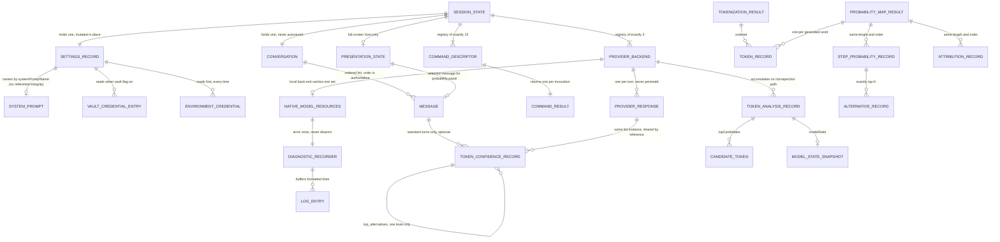

Reading the diagram: everything above the `PROVIDER_BACKEND` line is user-facing state; everything below it is diagnostic state that exists only when the local inference back end is selected. Only four boxes ever reach disk — `SETTINGS_RECORD`, `SYSTEM_PROMPT`, `CONVERSATION` (on explicit export), and `TOKEN_ANALYSIS_RECORD` (through an operation no user-reachable path invokes).

---

### 8.2 Entities

#### 8.2.1 Settings record

**Purpose.** The single mutable configuration object for the whole process. One instance is created at start-up with built-in defaults, overwritten field-by-field from the settings document, then shared by reference with every command, dialog and back end. Every successful mutation rewrites the whole document immediately.

| Field | Type (generic) | Required | Default | Constraints | Persisted as | Notes |
|---|---|---|---|---|---|---|
| Provider | text | yes | `azure` | one of `azure`, `bedrock`, `llama`; **business rule** (it selects the back end) | `provider` | Stored lower-case by the setting command; matched **case-sensitively** at look-up, so a hand-edited `Azure` fails every turn (QUIRK-13.10). |
| Model identifier | text | yes | `gpt-4` | free text; for the local back end it is a filesystem path to a single-file quantised weights file | `modelId` | **Business rule** for the local back end: existence is checked when set, never on load. |
| Temperature | decimal number | yes | `0.7` | 0.0–2.0 inclusive; **tunable default**, range is a business rule at the command boundary only | `temperature` | Rejected outside range only when typed; loaded verbatim from disk. |
| Maximum output tokens | whole number | yes | `1000` | 1–8192 inclusive | `maxTokens` | Same command-only enforcement. Also the upper bound on an unabortable generation (see NFR-6). |
| Cloud endpoint | text (nullable) | no | absent (`null`) | never validated, never parsed | `azureEndpoint` | Written as literal `null` when unset. |
| Managed-service region | text | yes | `us-east-1` | never validated | `awsRegion` | |
| System-prompt name | text | yes | `default` | no referential integrity — may name a prompt that does not exist | `systemPromptName` | On miss, the built-in fallback body is used and **no message is printed**. |
| System-prompt body | text (long) | yes | the built-in fallback body (see §8.2.8) | — | **not persisted** | Explicitly excluded from serialization; re-resolved from the prompt store at every launch. |
| Capture probabilities | boolean | yes | `false` | — | `enableLogProbabilities` | |
| Top-K alternatives | whole number | yes | `5` | 1–20 inclusive | `logProbabilitiesTopK` | Sent to the provider; affects the request, not just display. |
| Show all tokens | boolean | yes | `false` | — | `showAllTokens` | **Persisted but not restored by the line-oriented host** (QUIRK-13.1): that host always starts in sample mode. |
| Grid layout | boolean | yes | `false` | — | `gridViewForTokens` | Same non-restore quirk. |
| Grid maximum alternatives | whole number | yes | `5` | 1–20 inclusive | `gridViewMaxAlternatives` | Display cap only; never affects the request. Same non-restore quirk. |
| Use OS credential vault | boolean | yes | `false` | — | `useWindowsCredentialManager` | The windowed host can set it on a platform that has no vault; the text command refuses. |
| Local context size | whole number | yes | `4096` | 512–32768 inclusive | `llamaContextSize` | Bound **once at model load**; later changes are silently ignored (QUIRK-8.24). |
| Local GPU layer count | whole number | yes | `0` | 0–100 inclusive | `llamaGpuLayerCount` | `0` means CPU-only. Bound at load. |
| Local GPU device | text (nullable) | no | absent (`null`) | never validated | `llamaGpuDevice` | |
| Local thread count | whole number | yes | `0` | 0–64 inclusive | `llamaThreads` | `0` means "platform default". |
| Local batch size | whole number | yes | `512` | 1–2048 inclusive | `llamaBatchSize` | Bound at load. |
| Deprecated hosted-provider key | text | yes | `""` | plaintext | `azureApiKey` | See §8.4 — the **written** key is a deprecated backing field, not the computed value of the same name. |
| Deprecated access key | text | yes | `""` | plaintext | `awsAccessKey` | Same asymmetry. |
| Deprecated secret key | text | yes | `""` | plaintext | `awsSecretKey` | Same asymmetry. |
| Resolved hosted-provider key | text | derived | `""` | resolution chain: environment → vault → deprecated field | **not persisted** | Computed on **every read**; nothing is cached. |
| Resolved access key | text | derived | `""` | same chain | **not persisted** | |
| Resolved secret key | text | derived | `""` | same chain | **not persisted** | |
| Holds file-stored secrets | boolean | derived | — | true when any of the three deprecated fields is non-empty | **not persisted** | Drives the start-up migration warning. |
| Credential source label | text | derived | `not set` | one of `environment variable (<NAME>)`, `Windows Credential Manager`, `settings file (deprecated)`, `not set` | **not persisted** | Re-resolves the whole chain on each call, so one status command can perform up to six vault round-trips. |

**Lifecycle.** Created at process start with built-in defaults. The settings document is read from disk exactly once per process — no re-read, no file watching, no cache invalidation. Mutated in place by the settings command, the model command, the probability command, prompt selection, the windowed settings dialog and one menu toggle; every mutation writes the **entire** document back immediately (never a partial patch, never a merge, never a backup). Save failures are swallowed: the change survives only in memory while the command still reports success. There is **no reset, unset, clear or restore-defaults path anywhere** — the only route back to defaults is deleting the document out of band. The record dies with the process.

---

#### 8.2.2 Vault credential entry *(external — owned by the operating system)*

**Purpose.** An optional, opt-in place to keep the three provider secrets outside the settings document. Present only on the one platform that has this facility; on every other platform every operation silently yields "not found".

| Field | Type (generic) | Required | Default | Constraints | Persisted as | Notes |
|---|---|---|---|---|---|---|
| Entry name | text | yes | — | exactly one of `ChatDbg:AzureApiKey`, `ChatDbg:AwsAccessKey`, `ChatDbg:AwsSecretKey` | vault target name | The **only** field matched on look-up. |
| Kind | whole number | yes | `1` (generic) | constant | vault kind | |
| Flags | whole number | yes | `0` | constant | vault flags | |
| Secret blob | text encoded as bytes | yes | — | UTF-16 little-endian | vault credential blob | Blob byte length is exactly 2 × character count. |
| Persistence scope | whole number | yes | `2` (local machine) | constant | vault persistence | |
| Account label | text | yes | `ChatDbg` | constant | vault user name | Written but **never read**. |
| Comment | text | yes | `ChatDbg API Credential` | constant | vault comment | Written but never read. |
| Last written | timestamp | derived | — | set by the operating system | vault last-written | Never read by the product. |

**Lifecycle.** Created or overwritten by the store operation and by bulk migration. Read on every credential resolution and every source look-up. **Never deleted by the product** — a delete primitive exists with zero call sites. Entries survive process exit and reboot and are scoped to the operating-system account, so one operating-system user cannot keep two product profiles apart.

---

#### 8.2.3 Environment credential *(external — process-scoped, read-only)*

**Purpose.** The preferred and only cross-platform way to supply a secret. Highest priority in the resolution chain.

| Field | Type (generic) | Required | Default | Constraints | Persisted as | Notes |
|---|---|---|---|---|---|---|
| Hosted-provider key | text | no | absent | variable name `CHATDBG_AZURE_API_KEY` | — (process environment) | |
| Access key (product name) | text | no | absent | `CHATDBG_AWS_ACCESS_KEY` | — | Checked before the conventional name. |
| Access key (conventional name) | text | no | absent | `AWS_ACCESS_KEY_ID` | — | |
| Secret key (product name) | text | no | absent | `CHATDBG_AWS_SECRET_KEY` | — | |
| Secret key (conventional name) | text | no | absent | `AWS_SECRET_ACCESS_KEY` | — | |

**Lifecycle.** Never written by the product. Read fresh on every resolution and every source look-up, so a change takes effect on the very next read with no restart. **Business rule:** an existing-but-empty variable is treated as absent and resolution continues to the next name.

---

#### 8.2.4 Conversation

**Purpose.** The ordered transcript of the current session. One instance per process, held by reference by both hosts and every command.

| Field | Type (generic) | Required | Default | Constraints | Persisted as | Notes |
|---|---|---|---|---|---|---|
| Messages | ordered list of Message | yes | empty | order is authoritative; **no size limit** | `messages` | Never truncated, windowed, deduplicated or reordered by anything. |
| Session identifier | text | yes | a freshly generated canonical lower-case hyphenated UUID | — | `sessionId` | Overwritten wholesale on import; **not** reset by clear; read by nothing else in the product. |
| Created at | timestamp | yes | current UTC instant at construction | — | `createdAt` | Written on export, read but **discarded** on import. Never mutated after construction. |

**Lifecycle.** Created once, empty, when a host process starts. Mutated by append, inject, remove-last, clear and import. Read in full by the provider layer on **every** request. Import mutates the instance in place rather than replacing it, so object identity is stable for the whole process and both hosts plus every command see changes immediately. Destroyed when the process exits: **there is no autosave and no autoload**, despite the project's own requirements document and README promising "persistent chat history" (QUIRK-4.27 — code wins).

---

#### 8.2.5 Message

**Purpose.** One conversational turn.

| Field | Type (generic) | Required | Default | Constraints | Persisted as | Notes |
|---|---|---|---|---|---|---|
| Role | text | yes | `""` | inject enforces `user`/`assistant`/`system` after lower-casing; append and import enforce **nothing** | `role` | Only `assistant` is special-cased by renderers. |
| Content | text (long) | yes | `""` | no length limit, no emptiness check, may contain newlines | `content` | Rendered verbatim with no sanitisation. |
| Timestamp | timestamp | yes | current UTC instant at append/inject | — | `timestamp` | **Not** re-sequenced when a message is injected mid-list, so timestamps can run out of order. |
| Hidden-from-model flag | boolean | yes | `false` | — | `isCommand` | Excludes the message from hosted-provider requests. **Never set true by shipping code.** |
| Token confidences | ordered list of Token confidence record (nullable) | no | absent | attached only on the probability path, assistant turns only | `logProbabilities` | Written as literal `null` when absent. |
| Has token confidences | boolean | derived | — | true only when the list exists **and** has at least one element | **not persisted** | |

**Lifecycle.** Constructed by append (end of list) or inject (index in `[0, count)`, degrading to append when out of range) with a fresh UTC timestamp. Removed only by remove-last (last only) or clear (all). Replaced wholesale by import. Serialized on export and reconstructed on import **with no validation of any field**.

---

#### 8.2.6 Token confidence record

**Purpose.** One model-emitted token plus its confidence, and optionally the alternatives that were in contention. This is the entity the whole token-introspection feature exists to show.

| Field | Type (generic) | Required | Default | Constraints | Persisted as | Notes |
|---|---|---|---|---|---|---|
| Token text | text | yes | `""` | never null by construction; may contain control characters | `token` | Escaped only at render time. |
| Log probability | decimal number | yes | `0` | **no range validation**; at most `0` for genuinely measured data | `logprob` | One back end stores an **already-exponentiated** value here for alternatives — the same key means two different things depending on producer (see §8.4). |
| Derived probability | decimal number | derived | — | `e^(log probability)` | **not persisted** | Excluded from serialization. |
| Alternatives | ordered list of Token confidence record (nullable) | no | absent | **one level of nesting only** — alternatives are always created without their own list | `top_alternatives` | The one snake-case key in an otherwise camel-case wire format. |

**Lifecycle.** Created by strict extraction from a provider reply, by tolerant extraction, or by fabrication (the demonstration command, and one cloud back end's silent fallback which uses a natural log of `0.9`). Attached to a provider response, then copied **by reference** onto the assistant message in the conversation. The local back end back-fills the previous token's values one generation step late, so the record is mutated after attachment on that path only. Destroyed with the conversation (clear, remove-last, process exit), or persisted verbatim inside an exported conversation and restored on import.

---

#### 8.2.7 Provider response

**Purpose.** The transport envelope every back end returns for one turn. Never persisted as a whole.

| Field | Type (generic) | Required | Default | Constraints | Persisted as | Notes |
|---|---|---|---|---|---|---|
| Text | text (nullable) | no | `""` | — | `text` | Always set in practice. |
| Token confidences | ordered list of Token confidence record (nullable) | no | absent | **absent is distinct from empty** — an empty list is never produced by either construction shape | `logProbabilities` | The caller's list is stored **by reference**, not copied, cloned or sorted. |
| Total elapsed time | decimal number (seconds) | yes | `0` | measured milliseconds ÷ 1000 on the local back end; `0.5` for the demonstration command; **never populated by either hosted back end** | `totalTime` | |
| Error message | text (nullable) | no | absent | populated **only** by the local back end's absorbed-error path | `errorMessage` | **No host reads this field.** Hosted back ends signal failure by raising, never by populating it. |

**Lifecycle.** Constructed per turn by a back end (two shapes: text-only, leaving the confidence list absent; or text-plus-list). Consumed by the host within the turn. Only its text and confidence list survive, copied onto the history message. Discarded when the turn completes.

---

#### 8.2.8 System prompt

**Purpose.** A named, reusable instruction block prepended to every model call. The library is a directory of one document per prompt; the name is the primary key and the basis of the file name.

| Field | Type (generic) | Required | Default | Constraints | Persisted as | Notes |
|---|---|---|---|---|---|---|
| Name | text | yes | `""` | primary key; **never validated**; lossily sanitised into the file name by replacing every invalid file-name character with `_` | `name` | Two names differing only by an invalid character collide on disk. Matching inherits the host file system's case rules. |
| Content | text (long) | yes | `""` | no length limit; multi-line | `content` | The actual instruction text. |
| Description | text | yes | `""` | display only | `description` | Changeable **only** through the windowed edit form. |
| Created at | timestamp | yes | current UTC instant at construction | — | `createdAt` | Never updated after creation. |
| Last used at | timestamp (nullable) | no | absent | — | `lastUsedAt` | Written as literal `null` when unset. The line-oriented host rewrites the whole document on **every start-up** to stamp it; the windowed host never stamps it at all. |

The four seeded prompts are `default`, `code-reviewer`, `algorithm-helper` and `security-expert`. The built-in fallback body, used when the named prompt is missing, is exactly: `You are ChatDBG, a helpful debugging assistant. Help users analyze code, debug issues, and understand programming concepts.`

**Lifecycle.** The store's construction creates the directory if absent and, when the directory holds zero loadable documents, writes the four seeds **synchronously before the interface is drawn** — merely constructing the store mutates the user's disk. Prompts are created by the create command, by import, or by the windowed forms; mutated by edit (content only from the command, description plus content from the form) and by last-used stamping (a full read-modify-write); deleted by the delete command (refused while the prompt is active) or by the windowed delete button (**no active guard**). Emptying the library causes the four seeds to reappear at the next launch. The store is re-read from disk on every operation — no cache, no index, no locking, no concurrency control.

---

#### 8.2.9 Command descriptor

**Purpose.** The uniform contract every typed instruction implements. Exactly fifteen exist and the set is fixed at build time.

| Field | Type (generic) | Required | Default | Constraints | Persisted as | Notes |
|---|---|---|---|---|---|---|
| Name | text | yes | — | read-only; lower-case ASCII; unique within the registry; the token typed after the slash | **not persisted** | Registration is last-write-wins, so a duplicate would silently shadow an earlier entry. |
| Description | text | yes | — | read-only; one sentence | **not persisted** | Shown by both help renderers. |
| Usage | text | yes | — | read-only; may contain newlines; conventionally begins with slash + name; **may be recomputed from live state on each read** | **not persisted** | Shown only by detailed help. |
| Execute | operation: ordered list of text → Command result | yes | — | asynchronous; **accepts no cancellation signal** | **not persisted** | See NFR-5. |

The fifteen registered names, in construction order: `inject`, `pop`, `import`, `export`, `model`, `set`, `logprobs`, `prompt`, `demologprobs`, `clear`, `exit`, `quit`, `tokenize`, `inspect`, `help`. Three further commands exist in the shared set — `export-logs`, `export-analysis`, `show-analysis` — and are **registered by neither host**, so typing them yields the unknown-command error.

**Lifecycle.** Created once during host start-up in a fixed literal order with all collaborators passed explicitly. Never mutated, never re-created, never disposed (the contract has no disposal member). The registry is a mutable map from lower-case name to descriptor with ordinal key equality, populated once and read thereafter — there is no runtime registration, unregistration or aliasing. The help capability is inserted last and given a live reference to the same map (not a copy), so it lists itself.

---

#### 8.2.10 Command result

**Purpose.** The uniform three-signal outcome of one command invocation.

| Field | Type (generic) | Required | Default | Constraints | Persisted as | Notes |
|---|---|---|---|---|---|---|
| Success | boolean | yes | — | set by one of three factories | **not persisted** | |
| Message | text (nullable) | no | absent | free-form; may be multi-line and arbitrarily long; rendered verbatim with **no length limit, truncation, escaping or sanitisation** | **not persisted** | A multi-line message carries the success/failure marker on the first physical line only. |
| Exit requested | boolean | yes | `false` | — | **not persisted** | Checked before the message is rendered. |

Exactly three factories exist — success(optional message) → `{true, message, false}`; error(message) → `{false, message, false}` with **no validation of the message**; exit() → `{true, absent, true}` — but all three fields are individually settable, so any combination is constructible.

**Lifecycle.** Created inside a command's execute, returned up one level, consumed immediately by the dispatcher, then discarded. Never stored, never persisted, never compared.

---

#### 8.2.11 Session state

**Purpose.** The runtime composite each host builds at start-up. Not an on-disk entity; listed because a reimplementer must reproduce its eager, non-substitutable construction order.

| Field | Type (generic) | Required | Default | Constraints | Persisted as | Notes |
|---|---|---|---|---|---|---|
| Conversation reference | Conversation | yes | a new empty conversation | — | **not persisted** | |
| Settings reference | Settings record | yes | a new defaults record | — | **not persisted** | Overwritten field-by-field from disk, then mutated in place forever after. |
| Command registry | map from lower-case text to Command descriptor | yes | 15 entries | never mutated after construction | **not persisted** | |
| Back-end registry | map from lower-case text to Provider back end | yes | exactly 3 entries: `azure`, `bedrock`, `llama` | never mutated after construction | **not persisted** | **All three are constructed at start-up and disposed at shutdown regardless of which is selected** (QUIRK-13.7): a pure-cloud session still allocates a native diagnostic buffer, writes a daily log file at exit and opens an unused outbound connection pool. |
| Live system-prompt body | text | yes | the built-in fallback | resolved from the prompt store at start-up | **not persisted** | |
| Disposed flag | boolean | yes | `false` | one-way | **not persisted** | |
| Prompt string | text | derived | — | literal form `ChatDbg ({provider}/{modelId})> `, written without a trailing line break | **not persisted** | Rebuilt from live settings on **every** loop iteration, so a configuration change is visible on the very next prompt. |

**Lifecycle.** Created eagerly in one construction pass, in a fixed order: empty conversation → defaults settings record → settings store → conversation transfer store → prompt store → all three back ends → command registry. No collaborator is created lazily and none can be substituted from outside the process. Released at shutdown; the conversation is discarded unless explicitly exported.

---

#### 8.2.12 Cached native model resources

**Purpose.** The expensive, process-lifetime native state the local inference back end holds. This is where the product's memory footprint and its start-of-first-turn latency live.

| Field | Type (generic) | Required | Default | Constraints | Persisted as | Notes |
|---|---|---|---|---|---|---|
| Weights handle | opaque native handle | no | absent until first generation | loaded from the configured model path | **not persisted** | Hundreds of megabytes to several gigabytes depending on the model file. |
| Inference context | opaque native handle | no | absent until first generation | sized by the local context-size setting | **not persisted** | |
| Executor | opaque native handle | no | absent until first generation | wraps the context | **not persisted** | |
| Engine-side chat session | opaque native handle | no | absent until first generation | seeded with **one** system-role message at load time | **not persisted** | The engine keeps its own conversation; only the newest user message is ever sent, and the product cannot see or reset that internal history. |
| Remembered model path | text | no | absent | the reload key | **not persisted** | |

**Lifecycle.** Created lazily on the first generation, on a worker thread, under a process-wide model-load lock. **Reload happens if and only if** the weights are absent, or the context is absent, or the remembered path differs from the configured path — changing context size, GPU layers, thread count, batch size, temperature or the system prompt does **not** trigger a reload, and those values are re-read only on a genuine reload, even though every settings surface reports the change as applied (QUIRK-8.24). Torn down strictly in the order session → executor → context → weights when the path changes or the back end shuts down. **Reclamation without an explicit shutdown releases no native memory at all**, leaking the model and context for the process lifetime. Teardown is **not** synchronised against an in-flight generation.

---

#### 8.2.13 Diagnostic recorder state

**Purpose.** The in-memory capture buffer and configuration for engine and application diagnostics.

| Field | Type (generic) | Required | Default | Constraints | Persisted as | Notes |
|---|---|---|---|---|---|---|
| Log directory | text (path) | yes | per-user roaming application-data folder + `ChatDbg` + `Logs` | never null | **not persisted** | |
| File capture enabled | boolean | yes | `true` | — | **not persisted** | **No runtime configuration surface exists anywhere** — changing any of these five requires a rebuild. |
| Debug-channel echo enabled | boolean | yes | `true` | — | **not persisted** | The target channel is removed at compile time in every shipped configuration. |
| Console echo enabled | boolean | yes | `false` | — | **not persisted** | |
| Maximum buffer size | whole number (characters) | yes | `10000` | **no validation, no clamp** — zero or negative is accepted and makes every engine line trigger its own file append | **not persisted** | Compared with a bare strictly-greater-than test. |
| Capture buffer | text accumulator | yes | empty | holds whole formatted lines | **not persisted** | Flushed on threshold; cleared after a successful append; **not** cleared by an explicit save. |
| Armed latch | boolean | yes | `false` | one-way `false → true` | **not persisted** | Never reset, not even by shutdown. |
| Shutdown latch | boolean | yes | `false` | one-way `false → true` | **not persisted** | Neither logging nor flushing checks it, so the recorder keeps working after shutdown. |
| Buffer lock | mutual-exclusion primitive | yes | — | must be re-entrant on the same thread; guards read, clear, write-to-path and flush | **not persisted** | Required because the engine callback can fire on an arbitrary native thread. |

**Lifecycle.** Created with the local inference back end. The buffer is created empty, appended by both producer paths, drained by flush, emptied by clear, snapshotted **non-destructively** by export, and flushed once at shutdown. The **10 000-character threshold is checked only on engine-origin lines**, so a diagnostic-heavy run with no engine output grows the buffer without bound. Shutdown does not unregister the process-global engine hook, so after shutdown engine diagnostics keep accumulating into a buffer that will never be flushed. Every persistence failure — unwritable directory, full disk, failed hook registration — is absorbed and surfaced only on a compile-time-removable debug channel; the user sees nothing.

---

#### 8.2.14 Log entry *(value — never persisted as a record)*

**Purpose.** One formatted diagnostic line.

| Field | Type (generic) | Required | Default | Constraints | Persisted as | Notes |
|---|---|---|---|---|---|---|
| Timestamp | timestamp | yes | current **local** instant | rendered `yyyy-MM-dd HH:mm:ss.fff` — exactly three fractional-second digits, **no zone or offset** | positional, inside the line | Deliberately different from every other timestamp in the product (§8.4). |
| Level | text | yes | — | application vocabulary is upper-case `INFO`/`WARN`/`ERROR`/`DEBUG`; engine vocabulary is whatever the engine's severity type renders as — *INFERRED* mixed case such as `Info`/`Warn` | positional | Two vocabularies in one file. |
| Message | text | yes | — | engine-origin messages have trailing whitespace stripped; application-origin messages do not | positional | |

The rendered form is exactly `[timestamp] [level] message` plus a **platform** line terminator.

**Lifecycle.** Formatted, appended to the buffer under the lock in strict production order, optionally echoed **outside** the lock to the debug channel and standard output, then flushed to the daily file or exported. Never parsed back, never indexed, never queried. **There is no structured log format anywhere in the product.**

---

#### 8.2.15 Per-step token analysis record

**Purpose.** The deepest introspection artifact: one record per generated piece on the local back end's introspection path. This is the **only** entity outside settings, prompts and conversations that has a defined persisted form.

| Field | Type (generic) | Required | Default | Constraints | Persisted as | Notes |
|---|---|---|---|---|---|---|
| Step | whole number | yes | `0` | 0-based, contiguous | `step` | |
| Token text | text | yes | `""` | the emitted text piece | `tokenText` | |
| Token identifier | whole number | yes | `0` | **always the sentinel `-1` in practice** on this path | `tokenId` | |
| Probability | decimal number | yes | `0` | documented 0.0–1.0; in practice a temperature-derived estimate drawn from `{0.95, 0.85, 0.75, 0.60, 0.50, 0.40}` | `probability` | Not a measured probability. |
| Log probability | decimal number | yes | `0` | natural logarithm of the above estimate | `logprob` | |
| Prompt offset | whole number | yes | `0` | equals `step` in practice — **no attribution is computed** | `promptOffset` | |
| Top candidates | ordered list of Candidate token | yes | empty | empty in practice on this path | `topCandidates` | |
| System debug information | text (nullable) | no | absent | the fixed sentence `Generated via sampling pipeline at step <n>, temperature=<t to 2dp>.` | `systemDebugInfo` | The product documentation claims this is filled from the log buffer; it is not (QUIRK-11.23). |
| Model state | Model state snapshot (nullable) | no | absent | — | `modelState` | |

**Lifecycle.** Created once per streamed text piece, accumulated in an in-memory list on the back end. The list is **cleared at the start of every introspected generation and never cleared otherwise** — so only the most recent generation survives, and a session that runs one introspected generation and then many plain ones keeps that list alive for the process lifetime. Retrievable as a defensive copy and writable as an indented document, but **no user-reachable path invokes either operation**. Nothing bounds growth: at a token budget of up to 8192 and roughly 100–200 bytes retained per piece, a maximal generation retains every record (≈0.8–1.6 MB).

---

#### 8.2.16 Candidate token

**Purpose.** One alternative considered at a generation step, nested inside a per-step analysis record.

| Field | Type (generic) | Required | Default | Constraints | Persisted as | Notes |
|---|---|---|---|---|---|---|
| Text | text | yes | `""` | decoded alternative text, or the literal placeholder `id:<numericIndex>` when decoding fails | `text` | The placeholder is rendered indistinguishably from real token text. |
| Token identifier | whole number | yes | `0` | **never populated on this path** | `tokenId` | |
| Probability | decimal number | yes | `0` | **never populated on this path** | `probability` | |
| Log probability | decimal number | yes | `0` | natural logarithm of the **within-selection renormalised** probability | `logprob` | Because the transform is normalised over only the selected candidates, the values always sum to 1.0 — a genuinely uncertain step and a genuinely certain one can yield identical numbers. |
| Logit | decimal number | yes | `0` | raw pre-normalisation score; **never populated on this path** | `logit` | |

**Lifecycle.** Created per generation step from the current score vector, attached one step late, nested inside a per-step analysis record, persisted with it, and destroyed with it. When a raised error escapes the candidate routine it is recorded at warning level, the pending candidate list is cleared, and generation continues.

---

#### 8.2.17 Model state snapshot

**Purpose.** A per-step, synthetically computed view of context consumption. It is informational and **gates nothing**.

| Field | Type (generic) | Required | Default | Constraints | Persisted as | Notes |
|---|---|---|---|---|---|---|
| Total tokens processed | whole number | yes | `0` | generated-piece count only | `totalTokensProcessed` | Prompt tokens are not counted. |
| Context token count | whole number | yes | `0` | the same value | `contextTokenCount` | |
| Context size | whole number | yes | `0` | the configured context window, with a fallback of `4096` when the configured value is at or below `0` | `contextSize` | |
| Remaining context | whole number | yes | `0` | context size minus step | `remainingContext` | Never reconciled against the engine's real usage. Exceeding the context window is entirely unhandled — no detection, no truncation, no eviction, no warning. |
| Timestamp | timestamp | yes | current **local** instant | no zone offset | `timestamp` | Inconsistent with every other persisted timestamp (§8.4). |
| Debug information | map of text → text | yes | empty | producer fills exactly three keys: `Temperature` (two decimals), `TopK`, and `Mode` = `SamplingPipeline` | `debugInfo` | |

**Lifecycle.** One per per-step analysis record, created synthetically at each generation step, persisted with its parent, destroyed with it.

---

#### 8.2.18 Prompt inspection records *(transient family)*

**Purpose.** The output of the two offline inspection operations — tokenise a prompt, and map a synthetic probability walk over a generation. **None of these are persisted and none carry wire names**, because nothing serialises them; they exist to be printed once and discarded. A reimplementer needs their shapes only to reproduce the printed output.

**Token record**

| Field | Type (generic) | Required | Default | Constraints | Persisted as | Notes |
|---|---|---|---|---|---|---|
| Index | whole number | yes | `0` | 0-based, contiguous | — | |
| Token identifier | whole number | yes | `0` | real vocabulary index for tokenisation; **synthetic `1000 + i`** for generation | — | |
| Text | text | yes | `""` | in practice the placeholder `<token_{id}>` for tokenisation and the word itself for generation | — | |
| Character start position | whole number | yes | `0` | estimated inclusive start; **`-1`** for the beginning-of-sequence token | — | Estimated, not exact. |
| Character end position | whole number | yes | `0` | estimated exclusive end; **`-1`** for the beginning-of-sequence token | — | |
| Log probability | decimal number | yes | `0` | unset except on the generation path | — | |

**Tokenisation result** — original prompt (text, post-normalisation), tokens (ordered list of token records), token count (whole number, **includes** the beginning-of-sequence token), visualisation (text, nullable — absent when not requested, otherwise a fixed five-line block).

**Step-probability record** — token position (whole number, 0-based, equals list index), selected token identifier (whole number), selected token text (text), selected log probability (decimal, **always `-2.5` in practice**), alternatives (ordered list of exactly top-K alternative records in descending probability).

**Alternative record** — token identifier (whole number, synthetic `2000 + i×100 + j`), token text (text, `{word}_alt{rank}` with 1-based rank), log probability (decimal, `-3.0 - j`, strictly decreasing with rank).

**Attribution record** — token index (whole number, equals list index), token identifier (whole number, copy), token text (text, copy), influencing text (text: the prompt tail of at most 50 characters, or the concatenation of the previous at most 5 generated token texts; may be empty), influence score (decimal, **always `0.8`**, unconstrained by any range).

**Probability-mapping result** — original prompt (text), generated tokens (ordered list of token records, one per split word), token-probability maps (ordered list of step-probability records, same length and order), attribution map (ordered list of attribution records, same length and order).

**Lifecycle.** Created per invocation, printed, discarded. The probability-mapping operation is behind a consent gate that **cannot be answered non-interactively**: with input redirected, end-of-input is read as a decline and the operation still returns a success message identical to a completed analysis.

---

#### 8.2.19 Presentation state *(transient)*

**Purpose.** Everything the two hosts hold to draw the screen. Purely in memory; nothing here is persisted.

| Field | Type (generic) | Required | Default | Constraints | Persisted as | Notes |
|---|---|---|---|---|---|---|
| Probability panel visible | boolean | yes | `false` | start-up eligibility requires the capture flag **and** an eligible message; the conversation is always empty at start-up, so it always starts hidden | — | |
| Selected message | reference to Message (nullable) | no | absent | set by three paths (menu toggle, activating an indicator, auto-open on a new reply with data) | — | **Never cleared**, so it can outlive the message it points at. |
| Transcript width fraction | decimal number | yes | `1.0` | `1.0` when the panel is hidden, `0.6` when shown | — | |
| Role colour scheme | map from role text to a foreground/background pair | yes | five named schemes (user, assistant, system, divider — never used, indicator) | fixed at construction | — | Unrecognised roles fall back to the system pair. |
| Confidence heat buckets | ordered list of exactly 10 colour pairs | yes | fixed | indexed by `clamp(floor(probability × 10), 0, 9)` | — | Only this one of four defined colour maps is reachable in normal operation. |
| Global theme palettes | four palettes (base, dialog, menu, error) | yes | one hard-coded dark theme | applied once at start-up; no light theme, no switcher, no setting | — | |
| Status text | text | yes | the resting context line `Provider: {p} \| Model: {m} \| Prompt: {n}` | reverted unconditionally by a **3000 ms** timer that is never cancelled | — | Two messages within 3 s cause the first timer to clear the second early. |
| Scroll geometry | per view: content width, content height, scroll offset | yes | placeholder canvases of 80×1000 (transcript) and 50×1000 (panel) | transcript height = max(used height, viewport height), auto-scrolled to the bottom; panel width = max(longest line + 5, 50), scrolled to the top | — | The panel's empty-data path skips the update entirely, leaving stale geometry. |
| Per-call render buffers | grid row buffer, card body builders, longest-line tracker | yes | empty | allocated per rendering call | — | **Nothing is cached between calls**: the transcript and panel are torn down and rebuilt widget-by-widget on every refresh. |

**Lifecycle.** Created when the window is built, mutated by every user interaction and every reply, discarded at process exit.

---

### 8.3 Persisted artifacts

Path expressions below use three distinct per-user special folders. A reimplementer must decide deliberately whether to preserve the split — on one platform two of them resolve to the same place, on others they do not.

| Artifact | Location (path expression → resolution) | Format | Written when | Read when | Hand-editable? | Migration concerns |
|---|---|---|---|---|---|---|
| **Settings document** | `<user profile>/.ChatDbg/settings.json`<br>Windows: `C:\Users\<u>\.ChatDbg\settings.json`<br>Linux/macOS: `~/.ChatDbg/settings.json`<br>**Fallback:** the platform temporary directory when the user-profile folder is null, empty, whitespace or throws → `%TEMP%\settings.json` / `/tmp/settings.json` | JSON object, indented, 21 keys | Written with all defaults on first load when absent (a **side effect of merely loading**); rewritten in full after **every** successful setting mutation | Read from disk exactly once per process, at start-up | **Yes — designed for it.** The migration warning explicitly tells users to edit it | No schema version. New keys are ignored on read and silently **dropped on the next write**, because the whole document is rewritten from the in-memory record. A corrupt document is left untouched on load, all defaults are used for the session, and the next save destroys it. The fallback location silently converts per-user settings into per-boot settings. |
| **System prompt documents** | `<local application data>/ChatDbg/system_prompts/{sanitised name}.json`<br>Windows: `C:\Users\<u>\AppData\Local\ChatDbg\system_prompts\`<br>Linux: `~/.local/share/ChatDbg/system_prompts/` | JSON object, one per prompt | Four seeds written synchronously at store construction when the directory holds zero loadable documents; one document rewritten on create, edit, import and last-used stamping | Re-read from disk on **every** operation — no cache, no index | **Yes** | **The four seeded documents are written un-indented while every later document is indented**, because the seeding runs before the serializer options are assigned. A reimplementer must decide whether to reproduce that. Name-to-file sanitisation is lossy and collidable. Deleting every document causes the seeds to reappear at the next launch. |
| **Exported conversation** | user-supplied path; a leading `~/` is expanded to the user-profile folder; `.json` is appended only when the name has **no extension at all** | JSON object, 2-space indent, UTF-8 **no byte-order mark** | On the export command only | On the import command only | **Yes**, and it is the product's only interchange format | No schema version, no negotiation. Written in place with **no temporary file and no rename**, so an interrupted write destroys the previous contents. Read whole into memory with **no size cap**. Import mutates the live conversation in place and **discards the file's created-at value**. |
| **Exported prompt text** | command default `<documents folder>/chatdbg_prompt_<sanitised name>.txt`; windowed default `<user profile>/<name>.txt` (**unsanitised**) | plain text — **content only**, no name, no description, no timestamps, no wrapper | On the prompt-export command or the windowed export dialog | Never read back by the product | Yes | Re-importing loses description, created-at and last-used. On a host where the documents folder is unset the path component becomes the empty string and the file lands in the working directory. Overwrites without asking. |
| **Daily diagnostic log** | `<roaming application data>/ChatDbg/Logs/llamasharp_<yyyyMMdd>.log`<br>Windows: `C:\Users\<u>\AppData\Roaming\ChatDbg\Logs\`<br>Linux: `~/.config/ChatDbg/Logs/` | append-only plain text, UTF-8 no byte-order mark, no header, no footer, no schema marker | Lazily on the first **non-empty** flush of a given **local** calendar day; on the 10 000-character threshold; at the end of every introspected generation; on any absorbed failure; at shutdown | **Never read back by the product** | Yes (it is plain text) but pointless | Written even in a pure-cloud session, because all three back ends are constructed and disposed. **Never rotated by size, never compressed, never pruned, never deleted.** Two processes on the same machine on the same day interleave into one file with no coordination and no distinguishing marker. |
| **Exported log snapshot** | caller-supplied path; parent directory auto-created when non-empty; a bare file name writes relative to the working directory; **no extension convention, no validation** | plain text, UTF-8 no byte-order mark | On demand, whole-file overwrite of the current buffer | Never read back | Yes | The buffer is **not** cleared, so the same content is written again into the daily file at the next flush. No emptiness guard — an empty buffer yields a 0-byte file. The `Logs saved to <path>` confirmation is appended **after** the write, so the file never contains its own confirmation line. Failures are swallowed; the caller cannot distinguish success from failure. |
| **Exported token analyses** | caller-supplied path | JSON array, indented | On demand — **no user-reachable path invokes this operation** | Never read back | Yes | An intended-but-unwired diagnostic surface. Its key names (§8.4) are nonetheless a stable contract for any consumer built against it. Failures are recorded only into a buffer nothing displays; no failure signal reaches the caller. |
| **Credential vault entries** | operating-system credential vault, entry names `ChatDbg:AzureApiKey`, `ChatDbg:AwsAccessKey`, `ChatDbg:AwsSecretKey` | opaque, secret encoded UTF-16 little-endian | On the store operation and on bulk migration | On every credential resolution and every source look-up | No — via the operating system's own tooling only | Available on **one** platform. On every other platform every read silently yields "not found", including the "this platform has no vault" case. **Never deleted by the product.** Scoped to the operating-system account, so one user cannot keep two product profiles apart. |

Nothing else is written. There is no cache directory, no index, no lock file, no crash-dump file, no telemetry file, no update-check file and no state file for either host.

---

### 8.4 The wire-format contract

Every persisted document is JSON (RFC 8259). The rules below are what a clone must honour so that files written by the original stay readable by the clone and vice versa. They are **not** implementation detail: users hand-edit these files, and exported conversations are the product's only interchange format.

**Rule 1 — Key naming is camel-case, with exactly two documented exceptions.**
Every persisted key is explicitly named per field; a naming policy exists but is cosmetic because the explicit names always win. The two breaks in the convention both live inside the token confidence record:

- `logprob` — one lower-case word, not `logProb`.
- `top_alternatives` — **snake case**, the single snake-case key anywhere in the product, sitting inside otherwise camel-case documents. *(Evidence: `Models/TokenLogProbabilities.cs:19,31`.)*

Both are load-bearing for round-tripping. A clone that "tidies" either one produces files the original cannot read.

**Rule 2 — Timestamps come in two incompatible forms, and which one you get depends on the document.**

- Conversation and system-prompt documents: ISO-8601 round-trip form, **UTC**, exactly **seven** fractional-second digits, `Z` suffix — e.g. `2025-09-29T14:03:11.1234567Z`.
- The log line and the model-state snapshot inside a token-analysis export: **local** wall clock, fixed pattern `yyyy-MM-dd HH:mm:ss.fff` — exactly **three** fractional digits and **no zone or offset at all**, so the value is unresolvable without knowing the writing machine's zone. This is a defect a clone should fix, but fixing it changes the bytes.

**Rule 3 — Indentation and encoding.** All documents are written indented with **2 spaces**, UTF-8, **no byte-order mark**. The four seeded system-prompt documents are the sole exception: they are written **un-indented** because seeding runs before the serializer options are assigned.

**Rule 4 — Absent lists are written as literal `null`, not omitted and not `[]`.** "Absent" and "empty" are semantically distinct throughout the product: a provider response with no probability data carries an **absent** list, never an empty one.

**Rule 5 — String escaping is deliberately aggressive, not minimal.** An apostrophe is written as the six characters `\u0027`, a backtick as `\u0060`, a plus sign as `\u002B`; `<`, `>` and `&` are likewise escaped; **all** non-ASCII is escaped as `\uXXXX`; newlines inside content are written `\n`. A minimally-escaping clone produces semantically identical but **byte-different** files, and one that emits raw UTF-8 for non-ASCII will not match the original's output at all.

**Rule 6 — Reading is case-sensitive, ignores unknown keys, and rejects comments and trailing commas.** Unknown keys are silently dropped on the **next write**, because every save rewrites the whole document from the in-memory record.

**Rule 7 — The credential asymmetry.** This is the trap in the settings document. Three key names — `azureApiKey`, `awsAccessKey`, `awsSecretKey` — are **written from deprecated plaintext backing fields**, while three *computed* values with the *same conceptual names* (the resolved secrets, which run the environment → vault → file chain) are **excluded from serialization entirely**. The consequences a reimplementer must reproduce:

- A brand-new settings document always contains all three keys with the value `""`. They are never omitted.
- The product never writes a non-empty value into them; they become non-empty only through hand-editing or an older build.
- A non-empty value in any of the three is detected at start-up and triggers a migration warning — which, in the source, **echoes the plaintext secret to the console** as `set CHATDBG_AZURE_API_KEY=<the actual key>` (a defect; see NFR-27).
- Reading a secret never touches the persisted key first — the environment variable wins, then the vault, then the persisted key.

**Schema — settings document** (21 keys, this order):

```
{
  provider:                    text        // "azure" | "bedrock" | "llama"
  modelId:                     text
  temperature:                 number
  maxTokens:                   integer
  azureEndpoint:               text | null
  awsRegion:                   text
  systemPromptName:            text
  enableLogProbabilities:      boolean
  logProbabilitiesTopK:        integer
  showAllTokens:               boolean
  gridViewForTokens:           boolean
  gridViewMaxAlternatives:     integer
  useWindowsCredentialManager: boolean
  llamaContextSize:            integer
  llamaGpuLayerCount:          integer
  llamaGpuDevice:              text | null
  llamaThreads:                integer
  llamaBatchSize:              integer
  azureApiKey:                 text        // deprecated plaintext slot, always emitted
  awsAccessKey:                text        // deprecated plaintext slot, always emitted
  awsSecretKey:                text        // deprecated plaintext slot, always emitted
}
```

No key for the system-prompt body and no key for any resolved credential ever appears.

**Schema — conversation document** (the interchange format):

```
{
  messages: [
    {
      role:      text                       // free text; not validated on read
      content:   text
      timestamp: text                       // ISO-8601, UTC, 7 fractional digits, "Z"
      isCommand: boolean
      logProbabilities: [                   // or literal null
        {
          token:            text
          logprob:          number          // NOT "logProb"
          top_alternatives: [ same shape ]  // or literal null; ONE level of nesting only
        }
      ]
    }
  ]
  sessionId: text                           // canonical lower-case hyphenated UUID
  createdAt: text                           // same timestamp form; read but DISCARDED on import
}
```

No derived key ever appears: neither the has-probabilities flag on a message nor the derived probability on a token record is serialized.

**Schema — system prompt document** (one per file):

```
{
  name:        text        // must match the sanitised file stem for the product to find it
  content:     text
  description: text
  createdAt:   text        // ISO-8601 UTC, 7 fractional digits
  lastUsedAt:  text | null
}
```

**Schema — token-analysis export** (an array of per-step records):

```
[
  {
    step:             integer
    tokenText:        text
    tokenId:          integer
    probability:      number
    logprob:          number
    promptOffset:     integer
    topCandidates: [
      { text: text, tokenId: integer, probability: number, logprob: number, logit: number }
    ]
    systemDebugInfo:  text | null
    modelState: {                            // or null
      totalTokensProcessed: integer
      contextTokenCount:    integer
      contextSize:          integer
      remainingContext:     integer
      timestamp:            text             // LOCAL time, no offset — see Rule 2
      debugInfo:            { text: text }   // keys Temperature, TopK, Mode
    } 
  }
]
```

**Format — log line** (not JSON; positional, one line per entry):

```
[yyyy-MM-dd HH:mm:ss.fff] [LEVEL] message<platform line terminator>
```

`LEVEL` carries two vocabularies in the same file: upper-case `INFO`/`WARN`/`ERROR`/`DEBUG` from the application, and whatever the inference engine's own severity type renders as (*INFERRED*: mixed case such as `Info`/`Warn`). Engine-origin messages are right-trimmed; application-origin messages are not.

**One further wire-format hazard, on the request side rather than the file side.** The token confidence record's `logprob` key does not always mean the same thing. On the primary-token path it holds a genuine natural-log probability (at most `0`); on one hosted back end's alternatives path it holds an **already-exponentiated** value; the offline demonstration fixture writes small positive integers such as `15.0` into it. A consumer that assumes `logprob ≤ 0` will mis-render real files produced by the original.

---

### 8.5 Retention, growth and deletion

**Grows without bound, never pruned:**

- **The daily diagnostic log directory.** One file per local calendar day, appended forever. No size rotation, no retention limit, no compression, no pruning, and the product never reads its own logs. A pure-cloud session still writes one at exit. *A reimplementer must bound this* — a size cap per file plus an age cap on the directory (a suggested, not observed, default: 10 MB per file and 14 days retained).
- **The in-memory diagnostic buffer**, whenever the producer is the application rather than the inference engine: the 10 000-character flush threshold is checked **only** on engine-origin lines, so an introspection-heavy run with a quiet engine grows the buffer until an explicit flush. *Bound both producers.*
- **The in-memory diagnostic buffer after shutdown**: the engine hook is never unregistered, so lines keep accumulating into a buffer that will never be flushed. *Unregister on shutdown.*
- **The conversation.** Never truncated, windowed or summarised. Every hosted request re-sends the **entire** history, so cost and latency grow linearly with session length and the request eventually exceeds the provider's context window with no detection and no warning. *A reimplementer must add a windowing or summarisation policy, or at minimum a warning.*
- **The system-prompt library.** One file per prompt, no cap on count, no cap on content length.
- **Credential vault entries.** Created and overwritten, **never deleted** — the delete primitive exists with zero call sites. *Wire it up.*

**Rotates:** only the daily log, and only by **local** calendar date in the file name — which means a machine crossing a daylight-saving boundary or changing zone can reopen an earlier day's file, and two processes on the same day interleave into one file with no marker distinguishing them.

**Bounded, but only incidentally:**

- The per-step token-analysis list is cleared at the start of every *introspected* generation, so at most one generation's worth is retained — up to the maximum-output-token setting (default 1000, ceiling 8192) at roughly 100–200 bytes per record, i.e. ≈0.1–1.6 MB. But it is never cleared by a non-introspected generation or by any user action, so it can sit resident for the whole process.
- Rendering buffers are allocated per call and discarded; nothing is cached between renders.

**Never cleaned up at all:**

- Exported conversations, exported prompts, exported log snapshots, exported analyses — all written to user-chosen paths, all overwriting without asking, none tracked and none ever deleted by the product.
- The settings document and every prompt document survive uninstall; there is no uninstall path.
- The presentation state's "selected message" reference is never cleared, so it can outlive the message it points at after a clear or a remove-last.

**What a reimplementer should bound, in priority order:** (1) conversation length sent per request; (2) diagnostic-log file size and directory age; (3) the diagnostic buffer, on **both** producer paths; (4) the size of a conversation document accepted on import — today it is read whole into memory with no cap; (5) the per-step analysis list, with an explicit clear operation.

---

## 9. Non-Functional Requirements

Each requirement is stated so it can be tested. Numbers taken from the source are marked **tunable default** or **business rule**; anything whose value was determined by the source's specific runtime carries an explicit re-derive caveat.

### Start-up

**NFR-1 — Start-up performs no network access and no version check.** The start-up sequence is exactly: load settings → resolve the active system prompt → print the banner → print the credential advisory → enter the loop (windowed host: … → initialise the interface runtime → apply the theme → build the window → enter the event loop). There is no splash delay, no update check and no outbound request of any kind before the first prompt. *Test: run with the network disabled and with a packet capture attached; the process reaches its first prompt with zero packets sent.* *(Evidence: FR-13.8, FR-14.2.)*

**NFR-2 — Start-up writes to disk before the user has typed anything, and that is intended behaviour.** Three writes can occur: the settings document is created with defaults if absent; four seed prompt documents are written if the prompt directory holds none; and the line-oriented host rewrites the active prompt's document to stamp its last-used timestamp on **every** launch. *Test: on a clean profile, start and immediately exit; assert the settings document and four prompt documents exist. Start again and assert the active prompt's document changed.* A reimplementer should keep the first two and reconsider the third — a per-launch rewrite of a user document is a corruption window for no benefit.

**NFR-3 — A failure to create the prompt directory is fatal; every other start-up failure degrades.** A settings load failure prints a message and continues with built-in defaults. A prompt-resolution failure prints a message and continues with the built-in fallback body. A prompt-directory creation failure aborts the process with exit code `1`. *Test: make the prompt directory path unwritable and assert exit code 1; make the settings document unreadable and assert the process still reaches its prompt.*

**NFR-4 — Start-up constructs all three back ends regardless of which is selected.** This is observable, not incidental: a pure-cloud session allocates the local back end's native diagnostic buffer, writes a daily log file at exit, and opens an unused outbound connection pool. *Test: configure the hosted provider only, run one turn, exit; assert a daily log file was created.* **A reimplementer should construct back ends lazily** — this is the cheapest single improvement to start-up cost and to the product's disk footprint per session. *(Evidence: FR-13.5, QUIRK-13.7.)*

### Concurrency

**NFR-5 — At most one generation is in flight process-wide, enforced by a process-wide mutual-exclusion primitive shared by every back-end instance.** A second caller **blocks indefinitely**: no timeout, no queue bound, no cancellation, no progress feedback while blocked. A second, separate process-wide primitive serialises model loading and is held across the whole load/reload decision. *Test: issue two generations concurrently; assert the second does not begin until the first has fully completed.* This is a **business rule** for the local back end (the native engine and the cached context are not safe for concurrent use); it is **over-broad** for the hosted back ends, which have no such constraint and are needlessly serialised by sharing the primitive. *(Evidence: FR-8.56, FR-8.57, AC-8.38.)*

**NFR-6 — The complete absence of cancellation, and why a reimplementer must add it.** No production operation accepts, creates or propagates a cancellation signal. There is no cancellation source, no timeout on any operation, and no interrupt handling. The consequences, in order of severity:

- A local generation runs until the model emits a stop condition, a stop string appears, or the token budget is exhausted. At the maximum output-token setting of **8192**, that is a wait of *minutes* on commodity hardware with no way to stop it. The line-oriented host's prompt does not return; the windowed host's event loop is not pumping. **This is a hard user-interface freeze, not a slow operation.**
- The only bound on a hosted request is the transport's platform default — **100 seconds** in the source's runtime. *This number is entirely stack-specific and must be re-derived, or better, replaced by an explicit product-level timeout.*
- Shutdown is not synchronised against an in-flight generation, so quitting during one tears down native resources underneath it.
- The interactive prompt-content editor's read loop compares each line against `END` but **never checks for end of input**; with input redirected and exhausted it appends blank lines without bound — an unbounded-memory hang.
- The line-oriented host treats an exhausted redirected input identically to a blank line and re-prompts forever.

**A reimplementation SHALL thread a cancellation signal through every command, every back-end call and the generation loop, SHALL bind it to the terminal interrupt, and SHALL apply an explicit product-level timeout to every remote call.** *Test: start a generation with the maximum token budget, send an interrupt, and assert the process returns to its prompt within 1 second with the partial reply discarded and the conversation left in a consistent state.* *(Evidence: FR-8.58, FR-13.59, QUIRK-1.14, QUIRK-5.4.)*

**NFR-7 — Exactly one blocking wait on an asynchronous operation exists, and it is in a constructor.** The prompt store's construction blocks the calling thread on directory enumeration plus up to four document writes before the interface is drawn. *Test: instrument start-up and assert no synchronous wait on asynchronous work occurs anywhere.* A reimplementer should make store construction lazy or explicitly asynchronous; blocking in a constructor is the classic deadlock shape in any runtime with a synchronisation context.

**NFR-8 — The only synchronisation that exists guards the diagnostic buffer.** One lock protects buffer read, clear, write-to-path and flush, because the inference engine's log callback can fire on an arbitrary native thread. **Nothing else in the product locks.** The conversation's message list is mutated from interface event handlers with no synchronisation at all. *Test: drive concurrent appends from two interface handlers and assert the list is not corrupted* — which it will be, in any runtime whose list type is not thread-safe. **A reimplementer must either confine all conversation mutation to one thread or protect it.**

**NFR-9 — Interface event handlers are fire-and-forget with no exception boundary.** Any exception escaping one becomes an unobserved crash of the process. The one cross-thread marshalling site is a fire-and-forget delayed continuation with no exception handling and no cancellation if the window closes first. *Test: force a back-end failure from a menu action and assert the process survives with a modal error rather than terminating.* **A reimplementer SHALL wrap every asynchronous event handler in a top-level catch.**

### Memory and buffers

**NFR-10 — The diagnostic buffer flushes at 10 000 characters, but only on engine-origin lines.** This is a **tunable default** with **no validation**: zero or a negative value is accepted and makes every engine line trigger its own file append. *Test: set the threshold to 0 and assert one file append per engine line; emit 50 000 characters of application-origin lines with no engine output and assert no flush occurs.* A reimplementation SHALL validate the threshold to a positive range and SHALL check it on **both** producer paths.

**NFR-11 — Memory bounds a reimplementer must impose.** Nothing in the product bounds: the conversation (unbounded, re-sent whole on every request), an imported conversation document (read whole into memory with no size cap), the diagnostic buffer on the application path, or the per-step analysis list (cleared only by the next introspected generation). The one incidental bound worth stating: the per-step analysis list holds at most one generation's records — up to the output-token ceiling of **8192** at roughly **100–200 bytes** per record, i.e. **≈0.8–1.6 MB** worst case. *(That per-record size is INFERRED from record shape, not measured.)*

### Model load and native payload

**NFR-12 — First-turn latency on the local back end is dominated by a one-time model load that is not reported to the user.** Weights are loaded lazily on the first generation, on a worker thread, under the model-load lock; the context and executor are created immediately after. **No progress indication of any kind is emitted** — the user sees the prompt hang. Subsequent turns reuse the cached resources. *Test: measure wall-clock time from the first send to the first output character; assert a progress signal appears within 500 ms.* **A reimplementation SHALL surface model-load progress.** The absolute load cost is model- and hardware-dependent and must be measured locally; it is not a portable number.

**NFR-13 — Reload is keyed on the model path alone.** Context size, GPU layer count, thread count, batch size, temperature and the system prompt are bound **once at load** and silently ignored thereafter, while every settings surface reports the change as applied. *Test: load a model at context size 2048, change it to 8192, send a message, and assert generation still runs at 2048 while the settings display shows 8192.* This is a **defect to fix, not a rule to preserve** — but a clone that fixes it changes observable behaviour and must say so.

**NFR-14 — The native payload is hundreds of megabytes and this is a first-class product decision, not a packaging detail.** Measured at the analysed commit: the whole application output directory is **630 MB**, of which **623 MB across 95 files in 6 platform directories** is native code. Two files — the accelerated compute kernels for the two 64-bit desktop platforms, at **288,125,952** and **288,482,056 bytes** — account for **≈550 MB, about 88 % of the entire output**. They are copied into every project's output, **including the unit-test project**, on **every** platform, because the accelerated back end is declared unconditionally. Every size figure in the source project's own documentation (8–15 MB, 13–25 MB, 50–100 MB) describes a build *without* the local inference back end and is misleading. *Test: publish for one platform and assert the artifact size; assert the other five platforms' native directories were pruned.* **A reimplementer must treat "ship a local model back end" as a ~550 MB decision and SHALL make the accelerated back end an optional, separately-acquired component.** *(These figures are specific to the source's package set and must be re-derived for any other engine.)*

### Responsiveness

**NFR-15 — The interactive contract is strictly serial: one turn is fully rendered before the next prompt appears.** There is no streaming to the user, no spinner, no elapsed-time display, no timeout and no cancellation. The only feedback during a turn is a single `Thinking...` line. *Test: assert no output appears between the send and the complete reply.* **A reimplementation SHOULD stream** — every back end in the product already produces text incrementally on at least one path, and the source discards that incrementality at the host boundary.

**NFR-16 — Configuration changes are visible on the very next prompt.** The prompt string is rebuilt from the live settings on every loop iteration, so a provider or model change needs no restart. *Test: change the model mid-session and assert the next prompt line reflects it.* **Business rule.**

**NFR-17 — Transient status messages in the windowed host revert after 3000 ms.** The revert timer is unconditional and is never cancelled, so two messages within 3 seconds cause the first timer to clear the second early. *Test: post two status messages 1 second apart and assert the second survives 3 seconds from **its own** post.* The 3000 ms value is a **tunable default**; the un-cancelled timer is a **defect**.

### Rendering cost

**NFR-18 — Dense token grids are bounded by a sampling rule, not by paging.** The default rule uses a slice size of **5**: at **15 or fewer** tokens (5 × 3) everything is shown; above that, three slices are rendered — the first 5, five starting at `floor(count / 2) − 2`, and the last 5 — announced by the captions `Beginning Tokens:`, `Middle Tokens:` and `End Tokens:`, each numbered from its **true absolute index**. Slices may **overlap** just above the threshold (a 16-token list yields indices 0–4, 6–10 and 11–15) and no de-duplication is performed. Three inconsistencies must be reproduced or deliberately fixed:

- The flowing heat-map view uses a **different** rule: slice size **10**, threshold **30**, middle slice starting at `floor((count − 10) / 2)` — off-centre by 5 relative to the default rule.
- The demonstration command **concatenates** the three slices into one list numbered from 0, losing the middle and end slices' true positions and emitting no captions.
- The windowed probability panel applies **no sampling at all** and relies on scrolling.

*Test: render 15, 16, 30 and 31 tokens through each of the four paths and assert the exact index sets.* The slice sizes and thresholds are **tunable defaults**; the divergence between them is a **defect**.

**NFR-19 — Nothing is cached between renders.** The transcript and the probability panel are torn down and rebuilt widget-by-widget on every refresh, and every render buffer is allocated per call. Combined with a conversation that grows without bound, per-refresh cost is linear in transcript length. *Test: build a 500-message conversation and measure refresh latency; assert it stays under 100 ms.* **A reimplementation SHOULD virtualise the transcript.** (The 100 ms figure is a proposed target, not an observed one.)

**NFR-20 — The grid renderer assumes an attached terminal.** The console-width query is unguarded, so a failing query under redirected output surfaces as a generic error from the enclosing turn handler rather than as a rendering fault. *(INFERRED from code shape, not reproduced.)* Related: the transcript wrap width is computed as `((viewport width − 4) × 3) ÷ 4`, which is negative for a viewport of 4 columns or fewer and throws on any non-empty conversation. *Test: run the windowed host in a 4-column terminal with a non-empty conversation.* **A reimplementation SHALL clamp every derived width to a positive minimum and SHALL guard every terminal-capability query.**

### Disposal and native resources

**NFR-21 — Explicit shutdown is the only path that releases native memory.** Shutdown drops the session and executor, releases the context, releases the weights, flushes the diagnostic buffer once, and marks the instance shut down; repeat shutdown is a no-op. **Reclamation without an explicit shutdown releases no native memory at all** and leaks the model and context for the process lifetime. *Test: abandon a back-end instance without shutting it down, force reclamation, and assert resident memory does not fall.* **A reimplementation SHALL make native resource ownership explicit and SHALL guarantee release on every exit path.**

**NFR-22 — Three disposal defects a reimplementer must not copy.** (a) An **instance** shutdown disposes the **process-wide** generation primitive, so a second instance's next generation fails on a disposed handle — harmless only because both hosts create exactly one instance. (b) The equally process-wide model-load primitive is never released or disposed — the two are treated inconsistently. (c) One hosted back end's reclamation hook never releases the transport it created, leaking it while keeping every instance alive an extra collection cycle. *Test: construct two back-end instances, dispose one, and assert the other still generates.*

### Platform support and degradation

**NFR-23 — Platform-specific capability is guarded at run time, never at compile time, and absence yields "no value" rather than an error.** One unmodified source tree publishes to every supported platform. The only platform-specific capability is the operating-system credential vault: on every other platform every vault operation silently yields "not found", including the "this platform has no vault" case, with no message. *Test: on a non-vault platform, enable the vault flag through the windowed dialog (which does **not** check the platform, unlike the text command, which refuses) and assert the only consequence is a start-up warning.* **A reimplementation SHALL hide vault options the running platform cannot offer, SHALL apply the platform check at both surfaces, and SHOULD provide a per-platform substitute or document an environment-variable-only posture.**

**NFR-24 — Local inference is available on six platform targets and unavailable on a seventh.** Native code ships for 64-bit Windows, 64-bit Linux (both standard and alternate C library), 64-bit ARM Linux, and both Intel and ARM macOS. **There is no 64-bit ARM Windows build**, so the local back end cannot work there. The accelerated back end covers only the two 64-bit desktop targets; ARM macOS is accelerated through a different mechanism in the base package. *Test: on each target, select the local back end and assert either a working generation or a clear, specific unavailability message.* Today the failure is a generic wrapped error. *(Platform coverage is entirely a property of the source's chosen engine and must be re-derived for any other one.)*

**NFR-25 — Optimised packaging changes observable behaviour, so the build configuration is part of the specification.** Two shipped configurations force culture-invariant operation, keep only one language's resources, strip symbols, disable stack-trace metadata, substitute bare framework keys for exception message text, and default the target platform to 64-bit Windows. The observable effects: percentage formatting gains a space before the sign, culture-sensitive orderings change, and every error message the product interpolates from a runtime fault becomes an opaque key. *Test: publish both a standard and an optimised build and assert identical rendered output for the same input.* Today they differ. **A reimplementation SHALL carry its own diagnostic text rather than interpolating runtime fault messages, and SHALL pin a culture explicitly rather than inheriting the ambient one.**

### Accessibility and non-interactive operation

**NFR-26 — The product assumes an attached, Unicode-capable, colour terminal and never degrades.** Colour, box-drawing borders and the Unicode glyphs used for indicators, column headers and status prefixes (`✓`, `✗`) are emitted unconditionally; **no monochrome or ASCII-only fallback is ever selected at run time, even though an ASCII renderer exists in the codebase.** Under redirection the product also mixes two line-ending conventions in one stream: the blank lines around `Thinking...` and around every reply are bare line feeds while surrounding writes use the platform terminator. Three interactions are outright unusable non-interactively: the prompt-content editor never terminates on exhausted input; the line-oriented host re-prompts forever on exhausted input; and the inspection consent gate reads end-of-input as a decline yet still returns a success message identical to a completed analysis. *Test: run each host with input and output redirected to files and assert clean termination, one consistent line ending, and a distinguishable exit status for a declined consent gate.* **A reimplementation SHALL detect a non-interactive stream and SHALL provide an ASCII/monochrome mode and an explicit non-interactive answer for every consent gate.**

**NFR-27 — Observability is plain text on standard output, and there is no way to silence it.** There is no logging framework, no structured log, no log level and no verbosity switch for the hosts themselves. Full fault detail (type and call stack) goes only to a platform debug channel that is **removed at compile time in every shipped configuration**, so in a released build it goes nowhere. Any diagnostic a service prints is invisible while the windowed host owns the screen. Every diagnostic-path failure — unwritable log directory, full disk, failed callback registration — is swallowed and returns no status, so a completely non-functional diagnostic subsystem is indistinguishable from a healthy one. *Test: make the log directory unwritable, run a generation, and assert the product reports the degradation somewhere.* **A reimplementation SHALL preserve the principle (diagnostics must never break the thing they diagnose) but SHALL add an out-of-band health signal, a verbosity control, and a log destination that survives release packaging.**

### Internationalisation

**NFR-28 — The product is unlocalised in text but locale-dependent in rendering, which is the worst of both.** Every user-visible string is a hard-coded single-language literal at the call site: no message catalogue, no resource lookup, no formatting indirection. Yet timestamps are displayed in local time using the ambient culture's general short date-and-time pattern, every user-visible list is sorted by culture-sensitive collation, and **numbers are parsed and formatted under the ambient culture** — so a comma decimal separator can be written into an exported document and a log line, and a percentage gains or loses a space before its sign depending on how the build was published. Identifiers typed by the user are lower-cased culture-independently before look-up (correct), but the slash-prefix test and the alphabetical orderings are culture-sensitive (incorrect). One source file carries a stray byte from a legacy single-byte encoding and renders as a replacement character in help output, and the project's own README renders its examples as mojibake. *Test: run the same input under a comma-decimal locale and a period-decimal locale and assert byte-identical exported documents and log lines.* **A reimplementation SHALL parse and format every persisted number and every command input under a fixed invariant culture, SHALL use ordinal comparison for every identifier and prefix test, SHALL keep all source and document text in one encoding, and SHALL keep display-time locale formatting strictly separate from persistence-time formatting.**

### Security

**NFR-29 — There is no authentication, no authorization, no role model, no multi-user model and no server side.** Everything is single-user, single-process and local. The only permission model is the operating system's own; the product performs no permission check, applies no file mode or access-control list, and nothing it does requires elevated rights. Any code path in the process may read, write or delete any stored artifact. The only scoping is the operating-system account whose per-user directories hold the documents. *Test: assert no credential, token, session or role concept exists in any code path.* This posture is **appropriate for the product** and should be preserved — but it means the settings document is exactly as protected as the user's home directory and no more.

**NFR-30 — Secrets are resolved fresh on every read through a fixed three-leg chain and are never cached.** The chain is: process environment variable → opt-in operating-system vault → the deprecated plaintext field in the settings document. Failures at any leg are swallowed and the chain continues. An existing-but-empty environment variable is treated as absent. *Test: change an environment variable mid-session and assert the next request uses the new value with no restart.* The cost of "never cached" is real: one status command on a vault-enabled host performs up to **six** native vault round-trips, and the two independent resolution passes it makes can in principle disagree. **A reimplementation SHOULD keep the resolution order (it is a genuine security improvement over a file-only design) and SHOULD add a per-turn cache.**

**NFR-31 — Secret values must never reach a user-facing surface, and the source violates its own rule in exactly one place.** The rule is that a secret is shown only as `***set***` or `(not set)` accompanied by a source label. The violation: the start-up migration advisory, triggered whenever any deprecated plaintext field is non-empty, **echoes the actual secret to the console** as a shell assignment such as `set CHATDBG_AZURE_API_KEY=<the actual key>`. That output lands in terminal scrollback, in any shell transcript, and in any redirected log. *Test: place a secret in the settings document, start the product, and assert the secret does not appear in standard output.* **A reimplementation SHALL fix this** — print the variable name and a placeholder, never the value.

**NFR-32 — Message content is rendered verbatim to whoever is at the terminal, with no redaction and no length limit.** Command result messages, model replies and pasted content are all written unescaped and unsanitised. There is no audit log of any kind, and no retry, timeout, back-off, rate-limit handling or circuit breaker anywhere in the product; the only bound on a remote call is the transport's platform default. *Test: return a command message containing terminal control sequences and assert they are neutralised.* Today they are not. **A reimplementation SHALL neutralise terminal control sequences in any text originating outside the product.**

---

*Cross-references: §8.2 field constraints are the authoritative source for the ranges cited in NFR-6, NFR-10 and NFR-11. Path expressions in §8.3 are the authoritative source for the locations cited in NFR-2 and NFR-27. The wire-format rules in §8.4 are testable acceptance criteria in their own right and should be treated as such.*

---

## 10. Suggested Delivery Phasing

This section is a **build order, not a schedule**. It contains no estimates, no team sizes and no dates. It states which capabilities must exist before which others can be built, what is demonstrably usable at the end of each step, and what must be true before the step is considered done.

The ordering is derived from the dependency column of the feature inventory. Two things about that dependency graph shape everything below:

1. **There are two genuine cycles.** Token Probability Analysis (F11) depends on Output Rendering (F14) and F14 depends on F11; Local LLM Inference (F10) depends on Diagnostic Logging (F13) and F13 depends on F10. Neither cycle can be built in a strict order. Both are broken the same way: *define the shared data contract first as a standalone artefact, then build the producer and the consumer against it.* For F11/F14 the shared artefact is the per-token confidence record and the single probability scale it is expressed in. For F10/F13 the shared artefact is the diagnostic record shape and the sink interface, which must be a general capability rather than something owned by one inference backend.
2. **Only three features have no dependencies at all** — Command System & Dispatch (F3), Credential Management (F6), and Packaging & Release (F15). Everything else is downstream of at least one of them. F3 is the true root: every user-facing capability in the product is reached through it.

---

### 10.1 Build order

#### Phase 0 — Settle the contracts that can invalidate the plan

**Delivers:** no product code. Answers to the spikes in §10.4.

**Why here:** four of the spikes (S1, S2, S3, S4) can each individually invalidate a later phase's design if answered wrongly, and two of them (S1, S2) can invalidate the *product's stated purpose*. A team that starts Phase 1 without them will build a confidence-visualisation product on top of backends that may not supply confidence data.

**Demonstrably usable at the end:** nothing user-facing. A written capability matrix and three throwaway prototypes.

**Exit criteria**
- For each of the three backends, a recorded, dated answer to: *can this backend return per-token log probabilities with alternatives, through a supported interface, at the request shape we intend to use?* The answer must come from a live call, not from documentation.
- A decision on whether the local engine ships at all in the first release (this decision dominates packaging, platform support and artefact size).
- One chosen probability scale and one formatter contract, written down.
- A working build and test baseline for the target platform. This is not a formality: the source as committed **does not build** — its toolchain pin is malformed (`global.json:6`, QUIRK-15.1, QUIRK-5.25, QUIRK-9.12) — so no behaviour in this PRD was verified by execution, and a clone starts with zero inherited dynamic verification.

---

#### Phase 1 — A shell that holds a conversation

**Delivers:** F3 (Command System & Dispatch), F5 (Settings & Configuration — core keys only), F6 (Credential Management — environment-variable tier only), F4 (Chat History — in-memory operations only), F8 (hosted cloud backend — plain reply path only), F14 (Output Rendering — plain text only), F15 (Packaging — a thin thread, see below).

**Why here:** F3 is the only root the user ever touches, and every later feature registers into it. F5 is what a backend needs to know which endpoint, model and parameters to use, and F5 depends on F6, so the credential contract must exist even if only its first tier is implemented. The environment-variable tier is deliberately the only one built now: it is first in the resolution precedence, it works on every platform, and it is the only tier with no platform-specific storage question attached (see S5). The hosted cloud backend is chosen as the first backend because it is the only one whose plain reply path is a straightforward request/response exchange with no native payload and no second request shape.

**Deliberately excluded from this phase:** per-token confidence capture, of any kind, from any backend. Confidence data is the product's headline capability, and building it before Phase 0's answers are in hand is precisely the mistake this ordering exists to prevent.

**Demonstrably usable at the end:** a user can launch the binary, be told what is and is not configured, set the provider, model, endpoint and generation parameters, hold a multi-turn conversation with a real hosted model, inject a message at a position, remove the last message, clear the conversation, ask for help on any command, and exit. That is a complete, honest product on its own.

**Exit criteria**
- `/`-prefixed input dispatches to a registered handler; unprefixed input is a chat turn; the tri-state result convention (success message / failure message / exit requested) renders distinguishably.
- Help is generated from the registry, not hand-maintained, so a registered command cannot be invisible and an unregistered name cannot be advertised (this is the fix for QUIRK-1.5; if the source's hand-maintained help is being reproduced deliberately, that is a §11.3 decision, not an oversight).
- Settings round-trip to disk with field names byte-compatible with the source's on-disk format, and a missing settings file is created with defaults rather than erroring.
- The credential resolution order and the exact environment-variable names — including the two provider-standard fallback names for the second cloud backend — behave as specified, and the credential-provenance string shown to the user is one of the four defined values.
- A conversation of at least ten turns survives with correct ordering and roles.
- One artefact per supported platform is produced by an automated build and is runnable on a clean machine. Packaging is a *thread* from Phase 1, not a phase at the end; a product that cannot be shipped until Phase 8 has no feedback loop.

---

#### Phase 2 — Durable conversations, personas, and real secret storage

**Delivers:** F4 complete (export and import of conversations), F7 (System Prompt Management), F5 complete (full settings surface and validation), F6 complete (OS-provided secret store tier and the migration flow).

**Why here:** F4 and F7 both depend only on F3 and F5, which Phase 1 delivered, and both are what turns a usable toy into something a user returns to. The secret-store tier lands here rather than in Phase 1 because it is the tier with a platform question attached (S5) and because the environment-variable tier already gives a working configured state. The migration flow — moving secrets out of the plaintext settings document — must land in the same phase as the store it migrates into, or users are told to migrate to something that does not exist.

**Demonstrably usable at the end:** a user can save a debugging conversation to a file, re-open it later, keep a library of named personas and switch between them, configure every documented setting, and move their credentials out of the plaintext settings file into an OS-provided store.

**Exit criteria**
- Export then import reproduces the conversation exactly, including message roles and timestamps. (Whether the source's discarding of the imported creation timestamp is reproduced is a §11.3 decision — QUIRK-4.7.)
- Export is atomic or the non-atomicity is a recorded, accepted decision (QUIRK-4.6).
- First run materialises the four named default personas with their exact names and content.
- Persona names round-trip through the filesystem without becoming unportable between operating systems (QUIRK-5.21) — or the non-portability is a recorded decision.
- Every setting the product accepts is listed by the unknown-key error message; the source's is missing roughly half its keys and every short alias (QUIRK-2.7, QUIRK-9.16).
- Secret storage reports its real outcome. A store that failed must not report success (QUIRK-2.19, QUIRK-3.10, QUIRK-14.8).
- No code path prints a secret's value to the terminal (QUIRK-3.3, QUIRK-2.9) — or, if the source's migration-instruction behaviour is being reproduced, it is a recorded decision with a stated rationale.

---

#### Phase 3 — Confidence data, and the honest labelling of it

**Delivers:** F11 (Token Probability Analysis) and F14 (Output Rendering) completed together, plus the hosted cloud backend's second request path (the one that asks for and parses per-token probabilities).

**Why here:** this is the first phase in which the product does the thing it exists to do. It is third rather than first because it depends on settings (F5) for its five persisted knobs, on a working backend (F8) for its data, and on a shell (F3) for its commands — and because the Phase 0 spikes must have answered whether the data can be obtained at all.

**How the F11/F14 cycle is broken:** build the per-token confidence record — token text, the log probability, the alternatives list, and, critically, a **provenance field** — as a standalone contract with its own tests, before either the producer or any renderer. Fix the probability scale (S4) in that contract. Then build the hosted backend's parser against it, then the renderers against it.

**Demonstrably usable at the end:** a user turns on confidence capture, asks a question, and sees the model's answer with each token coloured by how confident the model was, plus the alternatives it nearly chose — with every displayed number traceable to something the backend actually returned.

**Exit criteria**
- One probability scale throughout. The source carries at least three incompatible scales simultaneously (QUIRK-9.3, QUIRK-12.1, QUIRK-13.4) and one of its own tests is arithmetically unsatisfiable as a result (QUIRK-14.10).
- Every confidence record carries a provenance value distinguishing *measured* from *not supplied* from *simulated*, and every renderer displays it. This is the mechanical precondition for the decision in §11.3's lead paragraph, whichever way that decision goes.
- A backend that returns no probability data produces a record marked "not supplied" and a conversation that continues normally — never an invented record presented as measured.
- A malformed entry in a probability payload does not destroy the records already extracted (QUIRK-6.10).
- Rendering degrades correctly when the terminal width cannot be determined and when the viewport is narrower than the layout's minimum (QUIRK-9.21, QUIRK-12.17, QUIRK-12.15).
- Confidence records survive export and re-import of a conversation.

---

#### Phase 4 — The second cloud backend

**Delivers:** F9 (managed model marketplace integration).

**Why here:** it depends on F8 for the provider abstraction and on F11 for the confidence-record contract, both of which now exist. It is deliberately after Phase 3 because the most important thing this backend contributes to the product is a *negative* capability: on the evidence in the source, the probability members it sends are not part of any real contract for that service and its entire response-side probability parser is dead against genuine replies (QUIRK-7.1). Building it after the confidence contract exists means that fact surfaces as a declared capability rather than as silence.

**Demonstrably usable at the end:** a user can switch providers with one command and hold the same conversation against a different vendor's model, and is told plainly which capabilities that provider does and does not support.

**Exit criteria**
- Provider switching at runtime works from both the command surface and any dialog surface, and both agree on case sensitivity (QUIRK-6.18, QUIRK-13.10).
- A per-backend capability matrix is surfaced to the user, including confidence-data support.
- A model identifier that the backend cannot serve fails fast with a message naming the problem, rather than being sent in a request shape the model rejects (QUIRK-7.12, QUIRK-7.13, QUIRK-7.18, QUIRK-8.27).
- Readiness checks and construction preconditions agree: a backend must not report itself configured on half a key pair (QUIRK-7.15, QUIRK-3.20).
- Temporary/session credentials either work or are explicitly declared unsupported (QUIRK-7.19).

---

#### Phase 5 — The local inference engine and its diagnostics

**Delivers:** F10 (Local LLM Inference) and F13 (Diagnostic Logging & Log Export).

**Why here:** F10 is the single most expensive feature in the product and the one that dominates packaging, platform support and artefact size. It depends on F5, F8 (for the provider abstraction), F11 and F13. It is placed after every cloud capability so that a shippable product exists before the native payload question is opened. It is gated on spikes S2 and S3: if the engine cannot yield raw per-step distributions through a supported interface, this phase delivers a *chat* backend but not a *confidence* backend, and that must be known before it starts.

**How the F10/F13 cycle is broken:** build the diagnostic sink as a general capability with its own record shape, buffer and flush policy, owned by nobody. Then have the engine write into it. In the source the sink lives under a folder named for a different feature and is coupled to one engine (QUIRK-11.7), which is what created the cycle.

**Demonstrably usable at the end:** a user points the model setting at a model file on disk, switches provider, and holds a conversation entirely on their own machine with no network access and no API spend — and can capture a diagnostic log when it misbehaves.

**Exit criteria**
- A generation is cancellable. The source has no cancellation anywhere (D14), and a local generation with a large token cap and no cancellation is an unabortable freeze.
- At most one generation is in flight per process, and model loads are serialised — with a timeout, and without the source's defect of releasing a process-wide lock from a per-instance teardown (QUIRK-8.13, QUIRK-8.14).
- Conversation context is sent to the engine in a defined way. The source sends only the last user message and discards all prior turns and system messages (QUIRK-8.28) while the engine's own session retains state the product's "clear conversation" command does not touch (QUIRK-8.29); a clone must pick one model of context ownership and honour it.
- Model, context and native memory are released on shutdown and on abnormal exit (QUIRK-8.15, QUIRK-8.21).
- The engine's own diagnostic stream and the application's entries land in one place with one timestamp format, one flush policy, and a failure channel that is visible (QUIRK-11.5, QUIRK-11.11, QUIRK-10.26).
- Every hardware setting the product exposes either reaches the engine or is removed from the surface. The source validates, clamps, persists and displays three settings that reach nothing (QUIRK-2.6, QUIRK-8.22).

---

#### Phase 6 — Token inspection, tokenization and attribution

**Delivers:** F12 (Token Inspection, Tokenization & Attribution).

**Why here:** it depends on F10 and F11, both now complete. It is the deepest node in the dependency graph and the last user-facing feature.

**Demonstrably usable at the end:** a user can tokenize an arbitrary string, inspect how a local model processed a prompt step by step, and see which part of the input most influenced each generated token.

**Exit criteria**
- Token text is genuinely decoded. The source never decodes it and displays a placeholder for every token (QUIRK-10.5).
- Every value in an inspection report is measured or is labelled as an estimate. In the source, every token identifier, log probability, alternative and influence score produced by this feature is a formula of the word index (QUIRK-10.3, QUIRK-10.14, QUIRK-10.18) — this is the second locus of the fabrication problem described in §11.3.
- The model is loaded once per session, not once per command and twice per inspection (QUIRK-10.9, QUIRK-8.41).
- Report output is bounded — paged, capped or truncated (QUIRK-10.30).
- Any consent gate is answerable non-interactively (QUIRK-10.29).

---

#### Phase 7 — The full-screen terminal shell *(conditional)*

**Delivers:** F2 (Terminal GUI Shell).

**Why here, and why conditional:** F2 depends on F3, F4, F5, F7, F8 and F14 — everything Phases 1–3 delivered. It is conditional because *the source never decided whether it is the product*: the user manual markets the full-screen experience as the product while the release pipeline builds and ships only the line-oriented shell (C20, QUIRK-15.27). A clone must answer OQ-E9 before this phase is planned, because building it means maintaining two command surfaces that in the source diverged in at least a dozen observable ways.

**Demonstrably usable at the end:** the same product, in a full-screen window with a menu bar, a scrolling transcript, a settings dialog, a persona manager and a confidence side panel.

**Exit criteria**
- One settings record. The single most damaging defect in the source's full-screen shell is that commands are wired to one configuration object while the window reads another, so configuration commands appear to do nothing and silently overwrite the user's stored settings with construction-time defaults (QUIRK-14.1 and its per-feature restatements).
- No component writes to the raw terminal stream while the full-screen interface owns the screen (QUIRK-14.4, QUIRK-14.21, QUIRK-1.10).
- No path blocks the interface on a line read from the terminal (QUIRK-14.9, QUIRK-5.5, QUIRK-13.17).
- The two surfaces agree on every shared rule — input trimming, provider-name case, numeric validation (reject or clamp), destructive-action confirmation — or each divergence is a recorded decision.

---

#### Phase 8 — Packaging hardening and release

**Delivers:** F15 complete.

**Why here:** the packaging *thread* started in Phase 1; this phase is where the artefact is made small, signed, licensed and reproducible, and where the native-payload decision from S3 is executed. It is last because artefact size is dominated by whatever Phase 5 concluded.

**Demonstrably usable at the end:** a downloadable artefact per supported platform, of a known and stated size, that runs on a clean machine with no toolchain installed.

**Exit criteria**
- One version fact, declared in one place, consumed everywhere (QUIRK-15.17).
- The runtime version, the pin file and the automated build agree (C1, C2, C3).
- Automated tests run in the pipeline. The source's pipeline runs none, despite a hundred-case suite existing (QUIRK-15.31).
- The published artefact is the interface the documentation describes (QUIRK-15.27).
- Licence obligations for binary distribution are met — the source ships a strong copyleft licence and attaches no licence copy or source offer to its releases (QUIRK-15.32).
- Artefact size is measured, published, and within the stated budget. The source's documentation claims 13–25 MB while its measured build output is roughly 630 MB (C10).

---

### 10.2 The critical path

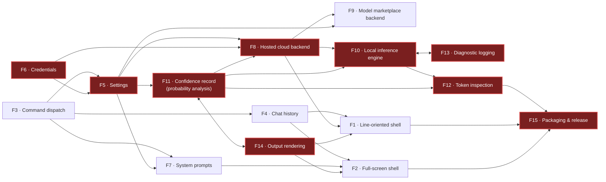

*(Highlighted nodes form the critical path. Double-headed arrows mark the two genuine dependency cycles.)*

**The single longest chain is:**

> Credential Management → Settings & Configuration → **Confidence record ⇄ Output rendering** → Hosted cloud backend (probability path) → Local inference engine ⇄ Diagnostic logging → Token inspection & attribution → Packaging & release

Nine nodes, containing both cycles. Every other path through the graph is shorter, and every other feature can be built in parallel alongside some portion of it. This chain is the schedule.

**What would compress it, in descending order of effect:**

1. **Deciding that the local inference engine is out of scope for the first release.** This deletes four nodes from the chain in one move — the engine, its diagnostic-logging cycle, token inspection (which depends on the engine), and the entire several-hundred-megabyte packaging problem that dominates the last node. Nothing else available to the team compresses the path by as much. It is also the decision most likely to be *wrong* to take, because local inference is where the source's most recent development effort went and where its most distinctive capability lives — so it is a product decision, not a delivery one.
2. **Settling the confidence-record contract in Phase 0 rather than discovering it in Phase 3.** The F11 ⇄ F14 cycle is only a cycle because the data contract and its probability scale were never written down; the source carries three incompatible scales and four drifted copies of the rendering logic as a direct result (QUIRK-9.3, QUIRK-12.12, QUIRK-9.26). One page of written contract turns a cycle into two parallel workstreams.
3. **Making the diagnostic sink a general capability rather than the inference engine's.** Same mechanism, applied to the F10 ⇄ F13 cycle. It also lets diagnostics be built and used from Phase 1, where they are most useful.
4. **Building the two backends that share a request/response shape in parallel.** The marketplace backend depends on the hosted one only through the provider abstraction; once that abstraction is stable at the end of Phase 1, F9 can proceed alongside Phase 3 without touching the critical path.
5. **Deferring the full-screen shell.** It is not on the critical path at all — but it is the largest source of *duplicated* work in the graph, and every phase that ships two shells pays for two of everything.

What does **not** compress it: adding people to the confidence-visualisation work before the backend-capability spikes are answered. If S1 comes back "the marketplace backend cannot supply this data and the local engine can only supply it through an unsupported interface", then a large part of Phase 3's design changes, and work done in advance is discarded.

---

### 10.3 Deliberate deferrals

Everything below is safe to leave out of a first usable release. "Safe" means: the product remains coherent and honest without it, and adding it later does not force a rewrite of what shipped. Each row states the cost of the deferral, because a deferral with no cost is not a deferral, it is a cut.

| Capability | Defer until | Why it is safe to defer | Cost of deferring |
|---|---|---|---|
| **Local on-device inference** | Phase 5 (or a later release entirely) | The product is complete and useful against a hosted backend. Local inference is a *second* way to obtain the same conversation. | Loses the offline, zero-API-spend, private-data use case — which is the source's most recent and most distinctive work. Also defers the only backend that could ever give genuinely raw per-step distributions. |
| **Token inspection, tokenization and attribution** | Phase 6 | Depends entirely on local inference; its own commands were never registered in either shell of the source, so no user of the original product could reach them (QUIRK-10.1). | Loses the deepest introspection story. Low real cost, because the source's version of this capability is fabricated end to end (QUIRK-10.3) and would have to be rebuilt from scratch regardless. |
| **The managed model marketplace backend** | Phase 4 | One working backend is enough for a usable product; the abstraction that makes a second one cheap ships in Phase 1. | Loses vendor choice. Note the compensating benefit: the evidence says this backend cannot supply confidence data at all (QUIRK-7.1), so deferring it also defers a capability gap that has to be explained to users. |
| **The full-screen terminal shell** | Phase 7, or never | The line-oriented shell is the artefact the source's own release pipeline ships (C20). Every capability is reachable from it. | Loses the experience the user manual actually markets. Deferring also *avoids* maintaining two divergent command surfaces, which is where a large fraction of the source's defects live. |
| **OS-provided secret storage** | Phase 2 | The environment-variable tier is first in the resolution order, works on every platform, and gives a fully configured product. | Users must set environment variables. Acceptable for a developer tool; less so for a broader audience. |
| **The credential migration wizard** | Phase 2, alongside the store it migrates into | Only meaningful once a secure store exists. | Users with existing plaintext settings files have no assisted path off them. Mitigation: refuse to *write* new plaintext secrets from day one, so the population needing migration never grows. |
| **Diagnostic log export to a file** | Phase 5 | In the source this command is unreachable from both shells and, if reached, exports nothing (QUIRK-11.1, QUIRK-11.2). Nothing is lost by not having it. | Support cases require the user to reproduce with a verbose flag instead of attaching a file. |
| **The offline demonstration mode** | Any time, or never | It exists to show the visualisation without API spend. In the source it has no working surface on either shell (QUIRK-9.7, QUIRK-12.4) and its generated numbers are on the wrong scale by roughly thirty orders of magnitude (QUIRK-12.5). | Loses a no-credentials evaluation path — genuinely useful for a first-run experience, and cheap to build correctly once the confidence contract exists. |
| **Grid / card layout and the flowing heat-map view** | Phase 3+ | A single readable list layout is enough to make confidence legible. The source's alternative layouts include two views that are never constructed at runtime (QUIRK-12.13). | Loses density on wide terminals. Low cost; high risk of being rebuilt three times if not deferred (the source has four copies of this logic — QUIRK-9.26). |
| **Ahead-of-time / single-file / trimmed packaging** | Phase 8 | A conventional artefact ships from Phase 1. | Larger download, slower first start. Note that in the source these profiles are aspirational and were never validated; at least seven separate contradictions make them unworkable as declared (C4–C10). |
| **Accelerator (GPU) backend for local inference** | Post-1.0, as an opt-in add-on | The processor backend is sufficient for correctness and for most single-user debugging sessions. | Slower local generation. Deferring is strongly recommended regardless: in the source both backends are unconditional dependencies costing roughly 550 MB, and shipping both simultaneously is named by the source's own troubleshooting document as a cause of native load failures (QUIRK-8.42, D20). |
| **Theme selection / light theme** | Post-1.0 | One legible dark-on-terminal default is enough. | Poor legibility on light terminals. Pair this deferral with the non-negotiable rule that confidence must never be conveyed by colour alone (QUIRK-13.23, OQ-I9). |
| **Multi-line message input** | Post-1.0 | Single-line input with a documented paste behaviour is workable. | The user manual promises multi-line; the source's control is one row tall with wrapping off, so the promise was never met anyway (QUIRK-14.6). |
| **Automated release publication** | Phase 8 | Manual publication of a Phase 1 artefact is adequate for internal use. | No reproducible release provenance. Cheap to add; the source's pipeline has an unread size measurement, no test run and a long-lived personal credential (QUIRK-15.23, QUIRK-15.31, QUIRK-15.33) — do not port it, rebuild it. |

---

### 10.4 Risk-ordered spikes

These are prototypes to run **before** committing to the phase plan. They are ordered by how much of the plan they invalidate if the answer is unfavourable. Each is timeboxed by its exit question, not by effort.

| # | Spike | The question it must answer | Why getting it wrong invalidates the design | What settles it |
|---|---|---|---|---|
| **S1** | **Per-backend probability capability** | For each of the three backends independently: can it return, through a supported and documented interface, a per-token log probability *and* a ranked list of alternatives with their log probabilities, for a normal chat completion? | This is the product's entire stated purpose. The three backends demonstrably differ, and the evidence says **one of them cannot do it at all**: the source's marketplace request body always sends probability members that are not part of any real contract for that service, making its whole response-side parser dead code against genuine replies (QUIRK-7.1, and the README's claim of support is contradicted by the code — QUIRK-7.32). If the plan assumes three symmetric backends, Phases 3–5 are mis-scoped and the user-facing capability matrix is wrong. | Three live calls, one per backend, with the response bodies captured verbatim into fixtures. Not documentation; not the source's tests, whose only probability-extraction test feeds a response shape the hosted service does not emit (QUIRK-6.24) and whose only round-trip marketplace test pairs a request shape with a reply shape no real service produces (QUIRK-7.40). |
| **S2** | **Raw per-step distributions from the native engine, through a supported interface** | Can the local inference engine expose the raw per-step score vector (and a detokenizer) through a *published, supported* interface — not by resolving a method by literal name at run time? | The source obtains it by name-based runtime lookup, wrapped in a blanket failure absorber that returns an empty list with no diagnostic at any level (D11, QUIRK-8.6, QUIRK-15.4). The consequence is that the headline capability "appears to work and produces nothing", and nobody can tell. Two further consequences: (a) any trimming or ahead-of-time packaging destroys the lookup (C4), so S2 and S3 are coupled; (b) if the answer is no, then the local backend supplies *no* real confidence data and the fabrication decision in §11.3 becomes unavoidable rather than optional. | A prototype that generates ten tokens from a small model on disk and prints, for each step, the top-K token strings and their scores — obtained without any name-based runtime lookup, and with a failure path that is loud. If that cannot be built, the engine choice itself is on the table. |
| **S3** | **Packaging a several-hundred-megabyte native payload** | What does the shipped artefact actually weigh, what does a user download, and does it start on a clean machine with no toolchain? | The source's measured build output is roughly 630 MB against documentation claiming 13–25 MB (C10), it references two mutually exclusive native backends unconditionally (QUIRK-8.42), its bundled profile suppresses the runtime-configuration side-car a bundled artefact needs to start (QUIRK-15.3), its single-file profile silently unpacks itself to a per-user cache — contradicting the "copy it anywhere" promise (QUIRK-15.7), and its native profile produces a folder rather than a file (QUIRK-15.8). If the packaging story is not settled early, the local-inference decision cannot be costed and Phase 8 becomes a rewrite. | A published artefact, downloaded onto a machine with nothing installed, launched, and a conversation held on a local model. Record: download size, on-disk size after first run, cold-start time, and whether any temporary directory is required. Then decide: split the native payload into an optional download, ship one accelerator backend per platform, or drop local inference from release one. |
| **S4** | **The probability scale and formatting contract** | Is a probability a 0…1 fraction or a 0…100 percentage, at every boundary — storage, transport, colour banding, formatting, export? | The source carries all of them at once. Colour thresholds compare a 0…1 value against 90/70/50/30, so every genuine token renders in the lowest band (QUIRK-13.4, QUIRK-12.1); one path exponentiates a value that is already a probability (QUIRK-7.3, QUIRK-9.4); the demonstration generator writes percentage-scale numbers into a log-probability field (QUIRK-12.5); the percent formatter appends a second literal percent sign (QUIRK-12.2); and one of the source's own tests is arithmetically unsatisfiable, so its suite is red on every run (QUIRK-14.10). Getting this wrong once contaminates every renderer, every export file and every test. | One page: the stored representation, the derived representation, the display representation, and one conversion function with tests including the boundary cases. Do this before any renderer exists. |
| **S5** | **Cross-platform secret storage** | Is there a single abstraction over an OS-provided secret store that works on all target platforms, is feature-detectable at run time, and degrades to the next tier without erroring? | The source's store is a single-platform interface reached through a raw system call, and its own security documentation instructs users on other platforms to enable it — where it silently yields nothing, the enabling command is refused, and the failure is invisible (QUIRK-6.23, QUIRK-3.19, QUIRK-7.22). If the clone's target platforms do not all have a usable equivalent, the credential design has a hole that must be designed around, not discovered. | Store, read and delete a secret on each target platform, plus a run on a platform where none is available, verifying the silent degradation to the next tier and the exact provenance string reported to the user. |
| **S6** | **Terminal rendering fidelity** | How does the chosen rendering approach behave when the width query fails, when the viewport is narrower than the layout minimum, when text contains wide or combining characters, and when output is redirected to a file? | The source's grid layout assumes an attached terminal and its width query is unguarded (QUIRK-9.21); its wrap-width arithmetic has no lower bound and goes negative on a narrow viewport (QUIRK-12.17, QUIRK-12.15); every column width and wrap point is measured in code units rather than display cells (QUIRK-12.29); and its output encoding is never configured, so frame and marker glyphs are corrupted (QUIRK-13.9). These are the defects most likely to be reproduced by accident. | A rendering harness driven at widths 4, 20, 40, 80, 200, with redirected output, with a right-to-left string, with a wide-character string, and with a combining sequence — asserting on the produced bytes. |
| **S7** | **Cancellation and single-flight generation** | Can a long generation be cancelled from the user's input surface, and can concurrent generation be prevented, without deadlock, on the chosen concurrency model? | The source has no cancellation anywhere in production code (D14) and enforces single-flight with process-wide locks it then releases from a per-instance teardown path (QUIRK-8.13, QUIRK-8.14). Retrofitting cancellation into a design that assumed uninterruptible calls touches every backend and every command signature — so it must be in the contracts from Phase 1, even though nothing needs it until Phase 5. | A prototype backend with an artificially slow generation, cancelled from a keystroke, with the model and context verifiably released and a second generation started immediately afterwards. |
| **S8** | **Executable verification baseline** | Can the clone build, run and test itself from a clean checkout, automatically, from commit one? | This PRD was produced without any dynamic verification, because the source as committed cannot be built — its toolchain pin is malformed (QUIRK-15.1, QUIRK-5.25). Roughly a third of the behavioural claims carried into §11.4 are INFERRED for exactly that reason. A clone that inherits the same condition inherits the same inability to tell a specification from a guess. | A pipeline that, on every change, restores, builds, runs the full test suite, and publishes an artefact — from Phase 1, before any feature depends on it. |

---

---

## 11. Open Questions & Assumptions

### 11.1 How to read this section

This PRD was written by reading a codebase, not by interviewing the people who wrote it. Three different kinds of uncertainty came out of that process, and they need three different kinds of response from the reader. Conflating them is the most common way a reverse-engineered specification goes wrong, so they are kept strictly apart here.

**Open questions (§11.2) — facts we could not determine.** Something is true about the intended product, and we could not find out what. In every case we searched for the answer and record where we searched. An entry appears here *only* when the source, its tests, its documentation and its history are all silent or contradictory. These are not requests for the reader's opinion; they are gaps in the evidence. Some can be closed by asking the original authors, some by making a live call to a third-party service, some only by a product decision. The "Suggested resolution" column says which. **Where a question is genuinely undetermined, this PRD says so and does not guess.** An honest "undetermined, here is where we looked" is the correct output; a confident invention would be worse than useless, because the reader could not tell it from an observation.

**Assumptions (§11.4) — things we took as true without observing them.** Marked **INFERRED** wherever they appear in the body of this PRD. These are claims the reverse-engineer reasoned to from code shape, platform behaviour or documented third-party contracts, but never watched happen. There is a single dominant reason for their number: **the source as committed does not build** (QUIRK-15.1, QUIRK-5.25, QUIRK-9.12), so *no* behaviour in this PRD was verified by running the product. Every assumption is listed with what would confirm or refute it. Treat an assumption as a specification that ships with a test attached — the test being "check this before you rely on it".

**Quirk decisions (§11.3) — observed behaviours that look like defects.** These are not uncertain: the behaviour is in the source, cited to file and line, and a faithful clone would reproduce it. What is uncertain is whether it *should* be reproduced. That call belongs to the product owner, not to the reverse-engineer, because it trades bug-compatibility against correctness and only the product owner knows which existing users, files and habits depend on the current behaviour. So this PRD does not silently fix them and does not silently copy them. Each one is presented with the cost of keeping it, the cost of fixing it, and a recommendation the reader is free to overrule.

A note on the boundary between the second and third categories: some rows in §11.3 carry an INFERRED marker in their evidence. That means the *behaviour* is certain from the code but its precise user-visible manifestation was reasoned rather than watched. Those rows are still decisions, not assumptions — the decision is real even if the exact wording of the resulting message is not pinned.

---

### 11.2 Open questions

Fifteen feature authors returned 199 open questions. Merging entries that ask the same thing about the same behaviour from different vantage points — the same defect seen from the producing feature and the consuming feature, the same setting seen from the command surface and the dialog surface — leaves **132 genuinely distinct questions**, grouped below into twelve themes. Nothing was dropped: every one of the 199 is either a row here or a duplicate of a row here.

The **Where we looked** column is not decoration. It is the evidence that each question is unresolved rather than unresearched: it names the files read, the searches run and the documents checked before the question was recorded as open.

#### Theme A — Invented confidence data and probability integrity

*(The highest-stakes group. See §11.3's lead paragraph for the decision that governs A1.)*

| # | Question | Why it matters | Where we looked | Suggested resolution |
|---|---|---|---|---|
| **OQ-A1** | Should the clone fabricate confidence data when a backend returns none — and if it does, must the data be marked as invented? | The product exists to help a user understand model confidence. Invented confidence presented as measured inverts the product's purpose. Two independent fabricators exist: a generator on the hosted-cloud path and a six-entry temperature lookup on the local path. | `README.md`, `IMPLEMENTATION_SUMMARY.md` and all of `docs/` (grepped for the hosted provider); the only in-code justification is the comment at `AzureOpenAIService.cs:201-202` — "generate some simulated ones so the user can see the feature works". `LLamaSharpService.cs:275,310-324`. `TokenInspectionService.cs:151-193`. No design note, issue or commit message discusses it. | **RESOLVED — Owner decision D-001 (2026-08-29, `DECISIONS.md`): never fabricate.** All three fabricators are removed. Capability absence auto-disables the setting with a switch-provider instruction; the enabling UI is disabled where the platform allows it, and view attempts produce a non-blocking notice. The labelled demonstration mode is the only permitted synthetic producer. |
| **OQ-A2** | Which probability scale is canonical — 0…1 or 0…100 — and which components must change to agree? | Three incompatible scales coexist. Colour bands compare a 0…1 value against 90/70/50/30, so *every genuine token renders in the lowest-confidence colour*, while fabricated demonstration data renders in the highest. | `TokenLogProbabilities.cs:26,188`; `TokenFormatters.cs:36,50,79,111`; `BasicConsoleFormatter.cs:138,204`; both shells' renderers; `TokenLogProbabilityTests.cs:9-18` (arithmetically unsatisfiable); `README.md:303-344`. No document states a scale. | Spike S4. Pick 0…1 as the stored and transported form, 0…100 as a display-only projection, one conversion function, tests on boundaries. |
| **OQ-A3** | Should the marketplace path's double exponentiation of alternatives be corrected, or preserved for bug-compatibility? | The stored value is already a probability and the display layer exponentiates it again, so derived percentages are always at or above the true value and cluster at the ceiling. | `BedrockService.cs:162,178,245,268` versus `TokenLogProbabilities.cs:26`; the source's own test asserts only that the list is non-null. | Fix. No user can depend on a number that is wrong in one direction only; but record it, because a clone's numbers will differ from the original's for identical input. |
| **OQ-A4** | Should the demonstration mode's fabricated values be corrected into log space (or bypass exponentiation), or reproduced as-is? | As written they are percentage-scale numbers written into a log-probability field, so the demonstration renders values around 10³² percent and colours everything in the top band. | `DemoLogProbsCommand.cs:135-166,212-247`; intent inferred from the source comment "varies to show different colors" and the 0…100 bands. | Fix if the demonstration ships at all (§10.3 defers it). Its current output cannot be what was intended. |
| **OQ-A5** | Should total, silent failure of local-model confidence capture be surfaced to the operator? | A blanket failure absorber returns an empty list with no log line at any level, so the headline capability can be entirely non-functional while appearing to work. | `LLamaSharpService.cs:489-492` versus `:214-219`; no test reaches the absorber. | Fix unconditionally. A silent absorber around the product's core capability is not a behaviour worth preserving. Couple with spike S2. |
| **OQ-A6** | Should the off-by-one alternative alignment be preserved? | Alternatives computed from the scores *after* emitting token *N* are attached to token *N*. A clone that aligns them correctly produces different numbers than the original for the same prompt and seed. | `LLamaSharpService.cs:186-206,208-213,235-246` including the code's own comment "Compute candidates for the NEXT token using current logits"; `TokenInspectionService` candidate fields. | Fix, and state the divergence prominently. Nothing downstream depends on the shift; users reading the display do. |
| **OQ-A7** | Is any ordering of alternatives expected from a backend, and should the clone impose one globally? | Three backends, three orderings, four renderers that assume none. A ranked list that is not ranked is misleading. | All four renderers and all three parsers checked; `ChatWindow.cs:686-694`. No document states an ordering. | Impose descending-probability ordering in the shared record contract, once, at the boundary. |
| **OQ-A8** | Should the top-K setting truncate what is displayed as well as shape what is requested — and what happens to already-captured records when it changes? | In the source, top-K is requested but never applied on one path, ignored entirely by the fabricator (which hardcodes three), and no captured record is re-rendered when it changes. | `BedrockService.cs:199,225` (accepted and never read); `AzureOpenAIService.cs:200-208,445,452-464`; searched both shells and both settings surfaces for any re-render on change — none exists. | Define top-K as a request parameter only; render whatever the backend returned. Document that changing it affects future turns only. |
| **OQ-A9** | What should the real token-decoding call be? Every inspected token displays as a placeholder. | Without decoding, the entire inspection feature shows identifiers instead of text, and a whitespace-display fallback that exists in the source is unreachable. | `TokenInspectionService.cs` (no decode step anywhere); `TokenizeCommand.cs:85`; the only decode-shaped helper in the repository is at the local-engine service. | Ask the engine's supported interface (spike S2 answers this too). Implement real decoding; do not reproduce the placeholder. |
| **OQ-A10** | Was attribution ever intended to be gradient- or attention-based, and what is the real influence score? Is the prompt-offset field a character offset or a step index? | The attribution capability is advertised in the README and is entirely synthetic: the influence score is a formula of the word index and the offset is a copy of the step index. | The field comment says "which part of the prompt influenced this token" (a character offset) while the only producer sets it to the step index at `LLamaSharpService.cs:284`; `TokenInspectionService.cs:319` comments "a simplified attribution model that could be enhanced"; `docs/LLamaSharp-Token-Introspection.md` and `IMPLEMENTATION_SUMMARY.md` describe an intent but no method. | **Undetermined.** Either specify a real method (attention rollout, gradient saliency, leave-one-out) as new product work, or cut the capability. Do not ship the formula. |
| **OQ-A11** | Should the introspection alternatives count keep doubling as the sampler's selection limit? | A display setting silently changes generation: the default of 5 makes all local generation top-5-limited, and a value of 1 makes it deterministic. Users changing a *view* setting change the model's *output*. | `LLamaSharpService.cs:148,378`; `ChatSettings.cs:37`; `LogProbsCommand.cs:51-64`. No comment or document acknowledges the coupling. | Fix. Separate the sampler's limit from the display's top-K; expose the sampler limit as its own setting if it is wanted at all. |
| **OQ-A12** | Should the confidence-source precedence be reordered so per-choice data is reachable even when a malformed top-level block exists? | The hosted service's documented shape puts the data in the location checked *last*, reachable only when no top-level block exists. A top-level block of the wrong shape destroys all real data — and fabrication then replaces it. | `AzureOpenAIService.cs:245-270`; no captured fixture, test or document in the repository shows a real response shape. | Fix, and settle it with a captured live response (spike S1). This is likely the highest-impact single defect on the hosted path. |
| **OQ-A13** | Should a malformed entry be allowed to destroy an otherwise-good record, and should partial results be preserved? | One bad token entry discards every record already extracted; an alternatives field of the wrong type aborts extraction entirely and the whole reply is reported as carrying no confidence data. | `AzureOpenAIService.cs:298,330-334,362-393,403-407,273-276`; `BedrockService.cs:151-182` (unguarded) versus `:227,319-323` (guarded) — identical input, opposite outcomes on the two branches. No test covers a malformed block. | Fix: preserve partial results, count and report skipped entries. |

#### Theme B — Backend contracts and capability

| # | Question | Why it matters | Where we looked | Suggested resolution |
|---|---|---|---|---|
| **OQ-B1** | Was the marketplace backend's probability path ever exercised against the real service, and is it required in the clone at all? | If the service has no such contract, the entire response-side parser is dead code and the product's advertised support for that backend is false. | All tests, `README.md`, every file under `docs/`, `IMPLEMENTATION_SUMMARY.md`, the assistant-instruction files, and the git log for the marketplace service (five commits, all generic refactor messages). No test, document or commit references a live call. | Spike S1. Settle with one live call; then either implement whatever the service really offers or declare the capability unsupported for that backend. |
| **OQ-B2** | Which non-Claude model families, if any, must the clone support on the marketplace backend? | The non-Claude branch sends one invented request shape to every other family, none of which accept it. | `BedrockService.cs:82-103` and the author's hedging comment there; nothing in the repository describes any other family's contract. | Product decision. Support an explicit list with per-family request shapes, or support exactly one family and fail fast on the rest. |
| **OQ-B3** | Should the hosted service's API version become a real setting rather than a hard-coded preview value? | The product's own troubleshooting text tells the user to ensure a recent API version, while the version is a constant with no override anywhere, and its in-code comment misdescribes it as stable. | `AzureOpenAIService.cs:119-120` (pinned); `LogProbsCommand.cs:185` (the advice); no setting, environment variable or documented key exists; no changelog or decision record in the repository. | Make it a setting with a sane default. The cost is one settings key; the cost of not doing it is an unfixable field problem. |
| **OQ-B4** | What timeout and retry policy should the clone adopt? | Nothing in the source sets a timeout or a retry anywhere. A hung backend hangs the product with no cancellation (see OQ-L1). | All of the hosted-service adapter, both shells, and all of `docs/`; nothing sets or documents either. | **Undetermined by the source — a new product decision.** Specify per-backend connect/read timeouts and a bounded retry with backoff on idempotent failures only. |
| **OQ-B5** | Should the maximum-response-tokens cap be sent on every request path? | On the hosted backend the cap is omitted from the default path and sent only on the probability path, so *enabling confidence capture silently starts enforcing a length limit*. | `AzureOpenAIService.cs:61-64,97-100` versus `:152-159`; the other two backends always send it; `README.md:50,100` advertise the setting unqualified. No comment explains the omission. | Fix: send it on every path. The current behaviour makes an unrelated setting change response length. |
| **OQ-B6** | What is the contract for message roles — should unknown roles be dropped, forwarded, or coerced, and should import validate them? | Three backends do three different things with the same record: one drops unknown roles, one forwards every role lower-cased, one coerces everything to a single role. The message-injection command enforces a three-value whitelist that the import path bypasses entirely. | `AzureOpenAIService.cs:84-95` (drops) versus `:141-148` (forwards); `BedrockService.cs:51-58` (coerces); `ImportCommand.cs:43-44` (no validation). No test and no document addresses it. | Define one role vocabulary in the shared record, validate on every entry point including import, and map explicitly per backend. |
| **OQ-B7** | Is a context-window or history-truncation policy required, and what should happen when the window fills? | No truncation, windowing or token-budget code exists anywhere. The local backend reports a "remaining context" number that gates nothing and ignores the prompt entirely. | `BedrockService.cs:48-58`; `LLamaSharpService.cs:287-294` (the remaining-context snapshot gates nothing); `docs/LLamaSharp-Quick-Start.md:66-86`. Verified absent throughout. | **Undetermined — new product work.** Specify a policy (drop-oldest, summarise, refuse) and make the counter honest or remove it. |
| **OQ-B8** | Should the whole conversation be sent to the local engine each turn, rather than only the newest user message? | The local backend sends only the last user message and discards system messages and all prior turns, while the engine's own session retains state that "clear conversation" does not touch — so the same record produces materially different context depending on which backend is selected. | `LLamaSharpService.cs:131-136,361-366,606-610`; `ClearCommand.cs:18-23`; `ImportCommand.cs:43`. | Fix. Backends must agree on what "the conversation" is, and clearing it must clear it everywhere. |
| **OQ-B9** | Which local context-size fallback is correct — 2048 or 4096 — and should the user's configured window be honoured at all? | Two fallbacks disagree inside one file, and the inspection paths use hard-coded windows of 512 and 2048 regardless of configuration. | `LLamaSharpService.cs:550` (loader) versus `:291-292` (snapshot); `ChatSettings.cs:54` (default 4096); `SetCommand.cs:97-104`; `TokenInspectionService.cs:32` where the only justification for 512 is the comment "Small context for tokenization only" and 2048 at `:106` is unexplained. | Honour the configured value everywhere; one fallback constant, declared once. |
| **OQ-B10** | Should the local backend's stop sequences be configurable? | They are hard-coded to two literal strings, undocumented, and wrong for any conversation format other than the one assumed. | `LLamaSharpService.cs:144,374`. | Make them a setting with the current values as defaults. |
| **OQ-B11** | Should backend failures keep masquerading as successful assistant replies? | Absorbed failures are returned in success-shaped envelopes and appended to the transcript as the assistant's words — including the literal text "Unable to parse model response". This is silent data loss inside the user's saved conversation. | `LLamaSharpService.cs:98-110`; `BedrockService.cs` unparseable-reply path; `ChatShell.cs:377-381,396-399`. | Fix. A failure must be a failure; the transcript must not be poisoned with error strings that look like model output. |
| **OQ-B12** | Should the full upstream error body be echoed unfiltered into the user's terminal? | Useful for debugging, but it can carry request echoes and provider-side detail the user did not choose to display. The status is rendered as a symbolic name rather than a number, which is harder to look up. | `AzureOpenAIService.cs:184-187`; no test captures an error message, so the symbolic rendering is INFERRED. | Show a summarised message plus the numeric status; put the full body behind a verbose/diagnostic switch. |
| **OQ-B13** | Should the diagnostic trace of full prompts and replies be redacted or truncated? | The trace records the entire conversation and reply verbatim. No credentials appear, but every prompt and answer does — and whether it is compiled out of release builds is itself INFERRED. | `BedrockService.cs:108,124`; no project file states the conditional-compilation behaviour explicitly. | Make it a runtime switch, default off, with redaction of message bodies unless explicitly enabled. |
| **OQ-B14** | Is temporary-credential (session-token / single-sign-on / assumed-role) support required? | Standard environment variables are hoisted into a static key pair and re-injected without the session token, so temporary credentials are silently broken. Combined with the ambient-chain fallback, any role-based flow fails in a confusing way. | Exhaustive grep for the session-token variable across the repository returns no hits; `ChatSettings.cs:73,76`; `DefaultBedrockRuntimeClientFactory.cs:11-18`. | Product decision. If yes, carry the session token through the whole resolution chain; if no, detect and refuse temporary credentials with a clear message. |
| **OQ-B15** | What should happen when an operator configures an access key without a secret key — and should the ambient credential-chain fallback be closed? | Readiness ignores the secret key and the region entirely, so a backend reports itself configured on half a key pair; construction then requires both, and the two disagree. The fallback silently reaches ambient machine credentials the user never chose. | `BedrockService.cs:23-27,25-27`; `DefaultBedrockRuntimeClientFactory.cs:11-20`; `ChatShell.cs:310-312`. No test, no documentation. | Make readiness and construction share one predicate. Decide explicitly whether ambient credentials are in scope; if they are, say so in the provenance string. |
| **OQ-B16** | Should provider-name matching be case-insensitive, and should the full-screen surface pre-check configuration before sending? | One settings file yields two behaviours: the line-oriented shell matches case-sensitively, the full-screen shell case-insensitively. A hand-edited file with a capitalised provider name works in one shell and not the other. The full-screen shell performs no readiness check, so an unconfigured user gets an internal, developer-worded message in a modal. | `SetCommand.cs:47` (always writes lower-case) versus `ChatShell.cs:251-255,349-353` (case-sensitive) and `ChatWindow.cs:425-437,494-497` (case-insensitive, no readiness call); `SettingsDialog.cs:83-89`. | Normalise on write *and* compare case-insensitively on read. Add the readiness pre-check to every surface. |

#### Theme C — Credentials and secret handling

| # | Question | Why it matters | Where we looked | Suggested resolution |
|---|---|---|---|---|
| **OQ-C1** | Should the OS secret-store tier be generalised to other platforms' keychains, or must the clone reproduce the single-platform refusal? | The source's security documentation instructs users on other platforms to enable a store that does not exist there; the enable command is refused and the failure is silent. | `WindowsCredentialManagerTests.cs:18-26`; `WindowsCredentialManager.cs:169-172`; `docs/SECURITY-IMPLEMENTATION.md:107-113,172-176`, which frames it as "graceful degradation" rather than as a gap. | Generalise (spike S5). Preserve the contract — feature-detected, silently degrading, three stable entry names — and substitute the platform store freely. |
| **OQ-C2** | Should the migration instructions stop printing plaintext secret values to standard output — which they do automatically on *every* settings load while any plaintext field is populated? | This is a credential-disclosure behaviour that runs without the user asking for it, and it repeats mid-command because the store path re-reads settings from disk. | `SettingsService.cs:60-64,328-360` (interpolation at `:335,341,346`); the reload inside the store path at `:155`; `ChatDbg.Shell.Gui/Program.cs:71-90`; the settings dump by contrast masks correctly. | Fix. Print the variable *names*, never the values. This is the one credential row where reproduction is hard to defend. |
| **OQ-C3** | Should the migration flow's outcome be split into "secrets reached a secure store" and "in-document slots were cleared" — and should declining consent stop being reported as a failure? | One boolean covers both outcomes, so a fully successful migration can be reported as "not migrated", the command surface always reports success whatever happened, and a user who says "no" is told something broke. | `SettingsService.cs:196-268` (single boolean, `:210-211,246-247`); `SetCommand.cs:252-257,272-277`; `SettingsService.cs:123-141,246-261`. | Fix. Return a structured outcome; distinguish declined from failed. |
| **OQ-C4** | Is there an intended cleanup, rotation or revocation lifecycle for stored secrets — and is the entry's account label meant to disambiguate profiles? | A delete primitive is fully implemented with zero call sites; no command, menu item or wizard step removes a stored secret, though the documentation says deletion is supported. The account label is a fixed literal on every entry. | Repository-wide search for the delete primitive: one definition at `WindowsCredentialManager.cs:148-163`, zero call sites; `SettingsService.cs:252-254` (cleanup clears document fields only); `WindowsCredentialManager.cs:101,121` and every store call site. | Expose delete; decide whether profiles are in scope and, if so, make the label carry the profile. |
| **OQ-C5** | Should the settings file and its directory receive restrictive permissions, and should the temporary-directory fallback be hardened? | No permission, ownership or access-control call exists anywhere; the ignore list does not name the settings file; and when the user-profile lookup fails the store silently falls back to the temporary directory inside a catch-all. | `SettingsService.cs:11-32` (path resolution and temp fallback), `:89-93` (directory creation); `.gitignore` (no entry). | Fix. Create with owner-only permissions; refuse the temporary-directory fallback rather than writing secrets there. |
| **OQ-C6** | What should happen when the same credential exists in two channels and the operator wants the lower-priority one? | Precedence is fixed with no override, so a stale environment variable permanently shadows a correct stored secret with no way to say which to use. | `ChatSettings.cs:88-118` (the whole resolution algorithm) and the complete accepted-key list in `SetCommand.cs`. | Add an explicit source selector, or at minimum surface the winning source and a way to clear the shadowing one. |
| **OQ-C7** | Was the migrate-credentials three-way choice meant to select a migration strategy, and if so what should each option do? | The selection is read into a value that is never used; all three options do the same thing. The equivalent surface elsewhere lacks the platform check and the honest reporting that the command surface has. | `SettingsDialog.cs:576-596` (read once at `:587`, referenced nowhere else), `:436-437,534-552,586-601`; the only clue is an in-source comment reading "For now, just migrate from JSON". | **Undetermined.** Either specify the three strategies or remove the control. Do not ship a control that does nothing. |
| **OQ-C8** | Should masked secret entry exist on the line-oriented surface as well as the dialog surface, and should secret size be validated before storage? | On the command surface the secret is assembled from echoed input tokens; there is no length cap, character filter or emptiness check between reading a value and handing it to the OS store. | `SetCommand.cs:243-244` (value assembled from echoed tokens); `SettingsDialog.cs:538` (masked field, dialog only); `WindowsCredentialManager.cs:110-127` (no guard between read and store). | Fix both: masked entry everywhere, and validate against the platform store's limits before the call. |
| **OQ-C9** | Should the user documentation name the credential environment variables? | They are the *primary and first-precedence* configuration mechanism, and the manual names none of them, while the settings command refuses to accept keys — so a manual-only user cannot reach a configured state at all. | `README.md:123-129`; grep for the provider-prefixed variable names over `README.md` returns nothing; they appear only in `docs/SECURITY-IMPLEMENTATION.md:32-33`, two stale specification copies, and the runtime remediation text. | Fix. Document them in the primary manual. |
| **OQ-C10** | Should the credential migration flow stop being an interactive line-reading wizard driven from the shared library? | It reads lines from the terminal from inside a library, which blocks and corrupts the full-screen surface; the migration *flow* is worth preserving, the mechanism is not. | `SettingsService.cs:121,211,247`; `SettingsDialog.cs:586-600` leading into it; `IConsoleFormatter.cs:9` states the opposite intent. | Fix. Lift all interaction to the shell; the library returns a plan and applies a decision. |

#### Theme D — Settings, state ownership and persistence

| # | Question | Why it matters | Where we looked | Suggested resolution |
|---|---|---|---|---|
| **OQ-D1** | Should the split-settings defect be fixed, given that fixing it changes observable behaviour for every command typed in the full-screen shell? | Commands are constructed against one configuration record while the window, status line and dialogs read another. Consequences: configuration commands report built-in defaults instead of the user's values, appear to do nothing, and **persist construction-time defaults over the user's stored settings**. It is the single most damaging defect in that shell and it is restated by six of the fifteen feature authors. | `ChatDbg.Shell.Gui/Program.cs:14,31-47,58,79-87`; `ChatWindow.cs:1053-1078`; construction order is explicit and there is no later re-wiring. No document or commit message explains the ordering. | Fix. One record, one owner, passed by reference. Keeping this is not defensible: it destroys user data. |
| **OQ-D2** | Should a failed save be surfaced instead of printed and swallowed? | The save prints an error and returns normally with no failure signal, so every caller — the settings command, the enable flow, the store flow, bulk migration — reports success on a failed write. | `SettingsService.cs:85-104`; `SetCommand.cs:283-294`; no caller inspects any outcome. Two documented error dialogs are unreachable as a result. | Fix. Return an outcome; render it. |
| **OQ-D3** | Should the clamp-versus-reject asymmetry between the dialog and the command surfaces be unified, and in which direction? | The same value is rejected with an error by one surface and silently clamped by the other; opening the dialog and pressing OK quietly rounds a stored value. | `SetCommand.cs` range checks versus `SettingsDialog.cs:420-427,453-463,478-498`; no comment explains the divergence. | Unify on reject-with-message; a settings surface should never silently alter a stored value. |
| **OQ-D4** | Should the display settings (show-all-tokens, grid layout, grid maximum alternatives) be restored at startup, or is the omission deliberate? | They are persisted and settable but never read back, so every session starts in the default layout regardless of what the user saved. The surrounding code comment claims "Copy all settings properties". | `ChatShell.cs:130-151`; `ChatSettings.cs:39-46`; `LogProbsCommand.cs:67-97`; `README.md:230-246`. Nothing in `docs/` discusses it. | Fix. A persisted setting that is never read is a promise the product does not keep. |
| **OQ-D5** | Should the three inert local-hardware settings (accelerator device, thread count, batch size) be wired to the runtime, dropped, or kept as inert persisted fields? | They are validated, clamped, persisted and displayed by two surfaces and reach nothing. Users tune them and nothing changes. | `LLamaSharpService.cs:548-554` (only context size and layer count are read, at `:550-551`); `ChatSettings.cs:59-66`; `SetCommand.cs:116-136,424-429`; `ChatShell.cs:210-226`; `docs/LLamaSharp-Implementation-Notes.md` and the low-level implementation plan describe an intent but no wiring. | Wire them or remove them from every surface. Whether this is unfinished or abandoned work is **undetermined**. |
| **OQ-D6** | Should there be a way to clear a text setting back to empty, and a reset-to-defaults verb? | No unset, clear or reset verb exists anywhere; a mistyped endpoint or model path can only be overwritten, never removed. | `SetCommand.cs:28-36` (arity check) and the whole key table. | Add both. Cheap, and the absence is a recurring support cost. |
| **OQ-D7** | Should the unknown-key error list every implemented key and alias, and should the two differently-worded messages for the same bound be reconciled? | The error lists roughly half the accepted keys, omitting all display keys, all local-engine keys and every short alias; two commands word the same range violation differently. | `SetCommand.cs:279-280` versus `:303-375` (the long help lists them all); `SetCommand.cs:178` versus `LogProbsCommand.cs:59`. | Generate the list from the key table. Never hand-maintain it. |
| **OQ-D8** | Should the settings document be written atomically and/or locked? | It is a plain whole-file overwrite with no temporary file, no rename and no lock, so two shells running at once silently overwrite each other and an interrupted write destroys the file. | `SettingsService.cs:85-104`. INFERRED, not reproduced. | Fix: write-temp-then-rename, plus an advisory lock. |
| **OQ-D9** | Which single per-user storage root should the clone adopt for all persisted state, and what is the uninstall story? | Three kinds of state go to three different roots under two naming conventions, none documented, and nothing removes any of it. | `LLamaSharpLogConfig.cs:20`; `SystemPromptService.cs:15`; `SettingsService.cs:16`; the user manual and all packaging documentation mention none of the three. | One root, documented, with a stated uninstall procedure. Preserve the settings location for migration if existing users matter. |
| **OQ-D10** | Do settings files in the wild actually contain populated plaintext secret slots — i.e. how important is the migration flow to a clone? | It determines whether the whole migration capability is required at all or is scaffolding for a population of zero. | Repository root, `docs/`, `.github/` — no sample or fixture settings document is committed anywhere. | **Undetermined; only the original authors or telemetry can answer.** Default to building it, since the cost of being wrong is stranded credentials. |
| **OQ-D11** | Should settings loaded from disk be range-validated, given that validation currently lives only in the interactive command handlers? | A hand-edited or corrupt file bypasses every bound, and out-of-range values flow straight into requests. | `SettingsService.cs:43-58` versus `SetCommand.cs:79-85,173-181`; `ChatShell.cs:130-151,211,251,349`. | Fix. Validate at the load boundary; the command handlers then need no bounds of their own. |

#### Theme E — Command surface and the two shells

| # | Question | Why it matters | Where we looked | Suggested resolution |
|---|---|---|---|---|
| **OQ-E1** | Should the three implemented-but-unregistered commands (log export, show analysis, export analysis) be registered, implemented, or dropped? | They are fully written and unit-tested, unreachable from every surface, absent from all help — and one is the only user-facing route to a documented capability. Even if registered, all three are stubs that read no data and write no files. | `ExportLogsCommand.cs`, `ShowTokenAnalysisCommand.cs`, `ExportTokenAnalysisCommand.cs` (each read in full) versus both registries at `ChatShell.cs:42-57` and `ChatDbg.Shell.Gui/Program.cs:31-47`; `IMPLEMENTATION_SUMMARY.md:49-54,221-222` claims they work. | Do not port them as features. Decide separately whether the *capabilities* they name are wanted; if so, specify them from scratch. |
| **OQ-E2** | Which help renderer is canonical — the curated grouped document or the alphabetical registry listing? | Two entirely different help surfaces with different content and ordering. The curated one is hand-maintained and can drift from the registry in both directions: a registered command can be invisible and an advertised name can not exist. | `HelpCommand.cs:37-98` versus `ChatWindow.cs:1087-1126`; no code comment, README section or design document states an intent. | Generate from the registry; allow curated grouping metadata on each command. One surface, one source of truth. |
| **OQ-E3** | Was the line-oriented shell's non-trimming of input deliberate, making a line with a leading space a chat turn there and a command in the other shell? | Same keystrokes, two products. | `ChatShell.cs:83-92` versus `ChatWindow.cs:334`; no test, no comment, no documentation. | Trim on both. If leading whitespace must be preservable in a chat turn, provide an explicit escape. |
| **OQ-E4** | Was "Invalid command" versus total silence for a lone slash deliberate? | Two shells, two responses to identical input. | `ChatShell.cs:327-330` versus `ChatWindow.cs:385-388`; no evidence either way. | Pick one and apply it everywhere. |
| **OQ-E5** | Should the dialog-driven direct-invocation paths be folded back into the standard dispatch pipeline? | Dialog paths bypass dispatch, so they substitute canned text for empty messages, title failures differently, silently discard unparseable input, become silent no-ops if their command is unregistered, and raise unhandled faults that nothing awaits. | `ChatWindow.cs:960-995,1061-1079` versus the typed path at `:344-420`. | Fold them in. Every user action should traverse one pipeline with one error convention. |
| **OQ-E6** | Should the dead second dispatcher be reproduced or dropped — and which of its two divergent registries is authoritative? | An entire second registry, read-eval loop and parser exist as dead code, registering thirteen commands and two backends where the live path registers fifteen and three. Copying the wrong one silently drops a whole backend. | `ChatDbg.Shell.Gui/ChatShell.cs:43-68,81-121,276-294` (never instantiated) versus `ChatDbg.Shell.Gui/Program.cs:30-90`; whole-tree search finds no construction site. No comment or commit message explains it. | Drop it. The live registry is authoritative. Flagged because it is the single most likely thing for a porter to copy by mistake. |
| **OQ-E7** | Should commands be allowed to write directly to the terminal at all? | Several write dozens of lines straight to the terminal stream, and one reads terminal lines until a sentinel — which corrupts and blocks the full-screen surface. The rich renderer is injected into precisely the surface that cannot tolerate direct writes. | `InspectCommand.cs` (37 direct writes), `TokenizeCommand.cs` (10), `PromptCommand.cs:258-267`; `ChatDbg.Shell.Gui/Program.cs:41`. | Fix: commands return content, shells render it. This is the seam the source declared and then violated 119 times. |
| **OQ-E8** | Should there be dispatch-level automated tests, and what behaviour would they pin? | Dispatch is the root of the entire product and the test project references only the shared library — so no shell behaviour is covered at all. | The solution file (four projects) and the test project descriptor, which references only the shared library. | Yes: prefix detection, name resolution, argument splitting, result rendering, unknown-command handling. |
| **OQ-E9** | Should the line-oriented session or the full-screen interface be the shipped product? | The source never decided. The manual markets one; the pipeline ships the other. This decision determines whether Phase 7 exists and whether every rule needs two implementations. | The solution file; both entry points; repository-wide search for the session construction site (only one); `README.md`; both requirement documents; the root build scripts; the release pipeline. | **Product decision, required before Phase 7.** Recommendation: ship one. If both, one must be a thin surface over identical logic with zero duplicated rules. |
| **OQ-E10** | Should file paths chosen in pickers bypass the space-delimited command tokenizer, and should paths with spaces be quotable? | Runs of spaces collapse with no quoting mechanism, and the file dialogs route browser-chosen paths back through the same tokenizer — so any path with two consecutive spaces breaks. | `ChatShell.cs:326`; `ChatWindow.cs:384,1014,1031`; `ImportCommand.cs:28,75`; `ExportCommand.cs:28`. No test or document addresses it; the behaviour looks accidental. | Fix both: add quoting, and pass picker results structurally rather than as a re-parsed string. |
| **OQ-E11** | Does the exit path actually terminate the application, and should shortcut exits bypass the command system? | The shortcut and menu exits stop the window directly, so any exit-time behaviour attached to the exit commands does not run — and whether the process actually ends could not be verified. | `ChatDbg.Shell.Gui/Program.cs:89-90`; `ChatWindow.cs:193,271,401-405`. The toolchain was broken so nothing could be executed. | Route every exit through one path that runs teardown. Verify by running it. |
| **OQ-E12** | Should end-of-stream on standard input end the session, or reproduce the infinite prompt-reprinting spin? | A null read is treated exactly like a blank line, so an exhausted redirected input re-prompts forever with no exit path. This makes the product unusable in any scripted context. | `ChatShell.cs:83-88`, measured against the same read primitive. INFERRED — the conflation is observed in source; the spin was not observed at run time. | Fix. End of stream ends the session. |
| **OQ-E13** | Should the demonstration command render on either shell, and through which surface? | On one shell it is constructed without a renderer and prints nothing; on the other it writes rich text straight to the terminal stream underneath a full-screen interface. | `ChatShell.cs:52`; `ChatDbg.Shell.Gui/Program.cs:20,41`; `DemoLogProbsCommand.cs:34-38,62-65`; `README.md:256-268`. The full-screen half is INFERRED, not executed. | Follows OQ-E7: return content, let each shell render it. |
| **OQ-E14** | Should the roughly 1,000 lines of unreachable code in the full-screen project be deleted, or is the second console loop intended as a fallback mode? | It is the largest single body of code in the product whose purpose is unknown, and it silently omits a backend and drops confidence data when appending replies. | `ChatDbg.Shell.Gui/ChatShell.cs` (671 lines); `LogProbHeatmapView.cs`; `TokenProbabilityVisualizer.cs`; whole-tree search for construction sites finds none. | Delete. Recorded here rather than silently dropped because "intended as a fallback mode" is not disprovable from the source. |

#### Theme F — Conversation history

| # | Question | Why it matters | Where we looked | Suggested resolution |
|---|---|---|---|---|
| **OQ-F1** | Is the hidden-from-model flag meant to be a live feature? | Nothing in the shipping product ever sets it, yet three backend paths filter on it and it round-trips through export and import. The plausible intent — recording executed commands in the transcript, visible to the user and hidden from the model — is a real feature nobody built. | Repository-wide search of the source for every write site: only the entity's own default, the append operation's default parameter, and one unit test. Consumed at the hosted and marketplace backends; ignored by the local one. | **Undetermined.** Either specify and build it, or remove the field — but note that removing it changes the persisted file format. |
| **OQ-F2** | Is discarding the imported creation timestamp deliberate or a defect? | The session identifier *is* copied on the adjacent line; the creation timestamp is not copied anywhere, so a re-opened conversation is stamped with the time it was re-opened. | `ImportCommand.cs:43-45`; no assignment to the creation field anywhere in the source; no test asserts either way; no document mentions it. | Fix (copy it), and note that exported files from the original will now round-trip differently. |
| **OQ-F3** | What is the session identifier actually for? | It is generated, persisted, imported, overwritten — and never read by anything. It costs a field in the on-disk format. | Repository-wide search for reads: only its own declaration, the import assignment, and one test. No lookup, file naming, logging or correlation use exists. | **Undetermined.** Keep the field for format compatibility; decide separately whether to give it a purpose. |
| **OQ-F4** | Is chat history meant to persist across runs? | The product's own requirements document and manual both promise persistent history; the code has manual export and import only, with no autosave, no autoload, and a teardown path that saves nothing. This is a headline promise the product does not keep. | `src/ChatDbg/prd.md:17` and `README.md:11` versus `ChatShell.cs:23,692-713` and `ChatDbg.Shell.Gui/Program.cs:13`. | **Product decision.** Either build autosave/autoload or correct the documentation. Do not ship the contradiction. |
| **OQ-F5** | Should export be atomic and warn before overwriting, and should the destructive in-memory operations confirm? | An interrupted export destroys a valid saved conversation (whole-file overwrite, no temporary file, no rename, no warning), and neither destructive operation prompts or is undoable — with the two menu items placed adjacent to each other. | `ChatHistoryService.cs:36`; `ClearCommand.cs:18-22`; `PopCommand.cs:19-30`; `ChatWindow.cs:267-268`. | Fix all three: atomic write, overwrite warning, confirmation on destructive actions with the safe option focused. |
| **OQ-F6** | Was the "toggle system messages" menu item intended to filter system-role messages from the transcript, and what are its real semantics? | It reports "not yet implemented" and does nothing, while the manual lists it as a working feature. Its two occurrences are worded differently enough that even its target is ambiguous. | `ChatWindow.cs:296-298,1138-1142`; `docs/TERMINAL-GUI-IMPLEMENTATION.md` — no specification anywhere. Placement in the menu is the only evidence of intent. | **Undetermined.** Specify it or remove it and correct the manual. |
| **OQ-F7** | Should blank lines inside a message be preserved in the transcript? | Whitespace-only wrapped lines are dropped, so paragraph structure and code spacing disappear from the display while the original text is still sent to the backend. | `ChatWindow.cs:543`. No document mentions the behaviour. | Fix. A debugging tool that silently reformats code in the transcript is actively harmful. |
| **OQ-F8** | Should the user's message be appended to the transcript before or after the backend lookup and readiness check? | Appending first means failed turns accumulate orphaned user messages with no reply, which then travel into every subsequent request and into exported files. | `ChatShell.cs:346` versus `:349,356`. | Append after the turn succeeds, or remove the orphan on failure. |
| **OQ-F9** | Should timestamps remain non-monotonic after an injection, and should the injected position be reported honestly? | An injected message is stamped with the current time and placed at an arbitrary index; an out-of-range position appends at the end while the confirmation still names the requested position. | `ChatHistory.cs:43-50`; `InjectCommand.cs`. | Report the actual position used. Decide explicitly whether exported files guarantee monotonic timestamps — consumers will assume they do. |

#### Theme G — System prompts / personas

| # | Question | Why it matters | Where we looked | Suggested resolution |
|---|---|---|---|---|
| **OQ-G1** | What is the intended maximum length of a persona's instruction text? | No cap exists anywhere; the text is sent on every turn, so an unbounded persona silently consumes the whole context window and the user's budget. | `SystemPromptService.cs:76-113,209-214`; all three test files. | **Undetermined — new product decision.** Set a documented cap and enforce it on every entry path. |
| **OQ-G2** | Is persona-name uniqueness case-insensitive, and should lookup inherit the host filesystem's case rules as the source does? | Names become file names, so matching behaviour changes with the operating system — the same library behaves differently on two machines. | `SystemPromptService.cs:76-84,209-214`; `ChatShell.cs:166-180`. The underlying filesystems' case behaviour was not exercised. | Decide explicitly and implement it in the product, not in the filesystem. Recommend case-insensitive with case-preserving display. |
| **OQ-G3** | Is the persona library directory meant to be user-overridable at run time? | Users with multiple projects or shared team libraries cannot point at another location. | All three entry points, `SetCommand.cs`, `README.md`, `docs/`. | **Undetermined.** Recommend an override; low cost. |
| **OQ-G4** | What should happen when the settings file names a persona that has been deleted? | The dangling reference is not detected on either surface; the failure mode was never established. | `ChatShell.cs:161-190`; `ChatDbg.Shell.Gui/Program.cs:57-67`; `README.md`. | Detect at load; fall back to the default persona with a visible notice. |
| **OQ-G5** | Was the command-path edit ever intended to edit the description as well as the text? | The description can be set at creation and never changed afterwards from the command surface. | `PromptCommand.cs:242-285`; `README.md:161-202`. | **Undetermined.** Recommend allowing it; the asymmetry reads as an oversight but is not documented as one. |
| **OQ-G6** | Was a persona picker intended in the settings dialog? | The dialog is handed the persona library at construction and never uses it — no field, no read, no call. | `ChatWindow.cs:1035-1041`; the whole settings dialog; `README.md:12`; `docs/PHASE1-SUMMARY.md`. | Evidence of intent, not of behaviour. Build it or drop the unused wiring. |
| **OQ-G7** | What was the persona export/import format meant to be — a bare instruction text for sharing, or the whole record? | Export writes only the text as plain text, so description, timestamps and metadata are lost; import expects a different arity than the usage line advertises; the two surfaces default to different directories. | `PromptCommand.cs:287-378`; `SystemPromptsDialog.cs:461-696`; `README.md:188-192`. | Pick one, document it, make export and import exact inverses. |
| **OQ-G8** | Should the dialog surface's guards be brought into line with the command surface? | The dialog skips the active-persona delete guard, skips duplicate-name protection on create and import (silently overwriting and reporting "created successfully"), and does not stamp last-used on selection. | `PromptCommand.cs:162-171,181-188,224-239` versus `SystemPromptsDialog.cs:205-226,296-332,433-459,583-620`; `README.md:15`. | Yes. One rule set, enforced in the shared layer, not per surface. |
| **OQ-G9** | Is the persona dialog's run-time behaviour as read from source — specifically its layout defects and its unordered post-mutation refresh? | Buttons overlap and overflow the dialog, and mutation handlers close the form, start a background reload and immediately raise a result, in an order whose outcome depends on the toolkit. None of it was ever observed running. | The toolchain pin; the dependency manifest; `SystemPromptsDialog.cs:60,111-115,131-143,324-326,417-419,612-614`. | Assumption, not a decision — carried in §11.4. Confirm by running the equivalent in the clone's toolkit. |
| **OQ-G10** | Should the persona-name placeholder be corrected across help, settings dump, documentation and error text? | The same placeholder is rendered as a single letter rather than the word "name" in four places, which reads as a formatting defect to every user. | `SetCommand.cs:327,438`; `README.md:53`; `PromptCommand.cs:150`. | Fix. Cosmetic, but it appears in the primary help text of the most-used command. |

#### Theme H — Diagnostics and logging

| # | Question | Why it matters | Where we looked | Suggested resolution |
|---|---|---|---|---|
| **OQ-H1** | Should the log-export command be wired into both shells and made functional — and should it export buffered plus already-flushed content rather than only the unflushed remainder? | As written it is unreachable, exports nothing, and even if fixed would export almost nothing, because generation force-flushes and drains at the end of every run and after every error. | `ExportLogsCommand.cs` (all 25 lines); both registries; `LLamaSharpLogConfig.cs` flush and drain paths. | Build it against the file on disk, not the in-memory remainder. |
| **OQ-H2** | Is the daily log file ever meant to be pruned, and was "rotation" ever meant to mean size-based rotation? | Nothing prunes; a long-lived install grows without bound. The documented promise about flushing is half true. | `LLamaSharpLogConfig.cs` (whole file — no retention logic); the local-engine service; both shells; `README.md`; all of `docs/`. | Specify retention (age and total size). **Undetermined** what was intended. |
| **OQ-H3** | Should the five logging switches get a run-time configuration surface, and should the internal-failure channel be a run-time rather than compile-time switch? | The documentation tells users to set them "in config"; there is no configuration surface at all, and the subsystem's only failure channel is compiled out of any build lacking a debug symbol — so a dead logging subsystem is undetectable. | `LLamaSharpService.cs:25` (inline construction); searched the settings model and the settings dialog for any of the five — none present; `LLamaSharpLogConfig.cs:98,112,130,163,189`; no project file overrides the symbol. | Expose them as settings; make the failure channel run-time and add a health signal. |
| **OQ-H4** | Should the process-global engine diagnostic destination be uninstalled at shutdown, and should a reclaimed recorder perform a final flush? | The destination is process-global while the arm-once flag is per instance, so a second instance silently steals the stream; nothing unregisters, so a disposed sink keeps receiving lines into a buffer that will never be written. | `LLamaSharpLogConfig.cs:81` versus `:193-200`; `LLamaSharpService.cs:25,678-681,693-696`; all recorder construction sites. | Fix both. Register once per process, unregister at shutdown, flush on reclamation. |
| **OQ-H5** | Should entry timestamps be coordinated-universal with a recorded offset rather than bare local time rendered through the ambient culture? | The daily log file is named from the *local* date while every persisted timestamp elsewhere is universal, and the same source emits two different timestamp shapes depending on build configuration. | `LLamaSharpLogConfig.cs:83,121,149`; the shell project descriptor at `:52,95`; the recorder's test file. | Universal time with an explicit offset, one format, culture-independent. |
| **OQ-H6** | Should the size-triggered auto-flush apply to application entries as well as engine-sourced lines? | It fires only for engine lines, so a run producing only application entries grows the buffer without bound and flushes nothing. | `LLamaSharpLogConfig.cs:90` (present) versus `:123-126` (absent); the producer at `LLamaSharpService.cs:231`. | Fix. Apply the threshold to every entry. |
| **OQ-H7** | Should the snapshot export signal success or failure to its caller, and refuse to write a zero-byte file? | The write is unconditional and its failure is swallowed, so exporting an empty buffer silently produces an empty file that the user then attaches to a support request. | `LLamaSharpLogConfig.cs:170-191` (unconditional write at `:182`, swallow at `:187-190`) versus the guarded daily flush at `:154`. | Fix. Return an outcome; refuse the empty write with a clear message. |
| **OQ-H8** | Is terminal-echo mode intended to ship at all? | The flag exists and nothing outside tests ever sets it; if it shipped enabled it would paint over the full-screen interface. | `LLamaSharpLogConfig.cs:35,101-104,133-136`; searched the whole source for any assignment setting it true — none outside tests. | **Undetermined.** Recommend keeping it as a developer switch, default off, never reachable from the full-screen surface. |
| **OQ-H9** | How should a clone handle an engine that delivers partial diagnostic lines rather than whole ones? | The source assumes whole lines. Partial delivery would interleave and corrupt the buffer, and no test reaches the callback path. | `LLamaSharpLogConfig.cs:81-87`; the recorder's tests (no test reaches the engine-sourced path); the engine's own behaviour could not be read, as the binding package is not vendored in the repository. | Buffer until a line terminator. **Undetermined** whether the source's assumption holds. |
| **OQ-H10** | Should shipped builds remain single-platform 64-bit, and should they keep stripping the exception detail these logs exist to capture? | The distribution profiles substitute bare frame information for exception detail — removing exactly the data the logging subsystem exists to record — in a product whose own assembly description calls it cross-platform. | Both shell project descriptors at `:16,30,53,58,59,70,96`; the entry text in the local-engine service. | Fix. Never strip diagnostic detail from a build whose purpose is diagnostics. |

#### Theme I — Rendering and the terminal

| # | Question | Why it matters | Where we looked | Suggested resolution |
|---|---|---|---|---|
| **OQ-I1** | How should the clone behave when the terminal width query fails outright — redirected or non-interactive output? | The grid layout assumes an attached terminal and the query is unguarded. Measured behaviour with redirected output is that the query returns 80 and rendering proceeds at two columns without error; the no-terminal case is INFERRED. | `ChatShell.cs:501`; `SpectreConsoleFormatter.cs:58`. INFERRED, not reproduced. | Detect non-interactive output and switch to a plain, width-independent layout. Spike S6. |
| **OQ-I2** | Is the doubled percent sign a defect or intentional? | Every use of the five-decimal percent format appends a second literal percent sign, so probabilities print as "50.00000 %%". | No test asserts on a rendered probability string, so nothing pins it. `README.md` shows a single sign; checked `README.md`, `docs/`, and both requirement documents. | Fix. It is a formatting defect with no plausible intent. |
| **OQ-I3** | Are the flowing heat-map view and the standalone visualiser abandoned or unfinished — should a clone build them at all? | Both are compiled and never constructed. Together with two other copies, four near-identical implementations of the same visualisation exist and three are unreachable. | All sixteen files under `docs/`, `README.md`, and both requirement documents; repository-wide symbol searches confirm no construction sites. | Build exactly one visualisation. Treat the dead views as intent, not as specification. |
| **OQ-I4** | Was a light theme or run-time theme selection ever planned? | The theme component takes no arguments and offers no selection; one document lists colour refinement as future work. | `ThemeManager.cs` (one operation, no arguments); all settings models; `docs/TERMINAL-GUI-IMPLEMENTATION.md:149`. | **Undetermined.** Defer (§10.3), but do not make confidence depend on colour alone in the meantime. |
| **OQ-I5** | What do the styled table and card grid actually look like on screen — border glyphs, in-cell wrapping, and how a narrow alternatives cell wraps multiple entries? | The PRD can specify column widths and centring because those are in the source; everything else is the styling library's internal behaviour and was never observed. | The styled formatter specifies only column widths, centring and border style; the rest is library behaviour, not reproducible without running the binary. | Assumption, carried in §11.4. Pin it with a rendering harness in the clone (spike S6). |
| **OQ-I6** | Is the placeholder scroll canvas ever visible to a user, and does the clone need it? | A fixed placeholder size is assigned before the first render; whether it is ever seen depends on layout ordering that was not observed. | `ChatWindow.cs:147,254` and the first-render path. Not exercised. | Ignore it unless a run shows otherwise. Recorded so a porter does not copy a magic number. |
| **OQ-I7** | Which single set of token-visualisation logic should the clone build, given the source carries four drifted near-identical copies? | They have drifted in caption glyph, escaping order and colour names, so "faithful" is undefined — a porter must choose which copy is the specification. | `ChatShell.cs:412-687` (live); `TokenProbabilityVisualizer.cs` (compiled, never called); `ChatDbg.Shell.Gui/ChatShell.cs:365-640` (compiled, never instantiated); the shared formatter helpers. Verified by construction-site search. | Build one, from the confidence-record contract, and treat the live copy as the behavioural reference where they differ. |
| **OQ-I8** | Should the confidence side panel's zero-based numbering be changed to one-based to match every other surface? | The same token is numbered differently in two places in the same product. | `ChatWindow.cs:664,672` versus four one-based renderers. | Fix to one-based everywhere. |
| **OQ-I9** | Should role and confidence be encoded in something other than colour alone? | Confidence banding is conveyed by colour with no textual label and no monochrome fallback, and command outcome likewise. Colour-blind users and monochrome terminals lose the entire capability. | `ChatWindow.cs:66-113,731-747`; `ThemeManager.cs:16-44`. No accessibility requirement appears in any document. | Fix. Add a textual band label and a monochrome mode. Cheap, and it is the product's primary signal. |
| **OQ-I10** | Should the transcript, the confidence panel and the token table be virtualised or capped? | None is bounded: every token of an arbitrarily long input prints as its own line with no paging, and the transcript and panel grow without limit. | `ChatWindow.cs:500-626,628-729`; `TokenizeCommand.cs:79-88`; `InspectCommand.cs:118-136`. | Cap and page. Specify the caps explicitly so behaviour is deterministic. |
| **OQ-I11** | Should the wrap-width computation be guarded against a non-positive viewport? | The wrap limit has no lower bound; at very small widths the arithmetic goes negative and the renderer hangs or fails. | `ChatWindow.cs:507,539,749-789`, first call at `:213`. INFERRED — arithmetic is unambiguous; no run was made at those widths. | Fix with a floor. Spike S6. |
| **OQ-I12** | Should transient status messages be cancellable, and should an in-flight indicator survive a long request? | Each message starts an independent uncancellable timer that unconditionally overwrites the label, so two messages within the timeout truncate each other. | `ChatWindow.cs:849,862,900,903-916`. INFERRED from the unconditional timer; no test. | Fix: one cancellable timer, or a message queue. |
| **OQ-I13** | Should the display-mode and layout settings drive the in-window panel, or be removed from the settings screen? | They are exposed, validated and persisted and change nothing the user can see. | `SettingsDialog.cs:458-459`; `DemoLogProbsCommand.cs:81-107`; `LogProbHeatmapView.cs:28`; the visualiser service. | Wire them or remove them. A setting that changes nothing is worse than an absent one. |
| **OQ-I14** | Is the transcript/panel split meant to be user-adjustable? | A fixed proportional split is hard-coded; one document lists layout refinement as future work. | `ChatWindow.cs:136,456,590,825,860`; `docs/TERMINAL-GUI-IMPLEMENTATION.md:150`. | **Undetermined.** Defer; make the constant a setting when convenient. |
| **OQ-I15** | Should the input box actually be multi-line, as the documentation promises? | The control is one row tall with wrapping off, so the documented capability does not exist and multi-line input is invisible as it is typed. | `ChatWindow.cs:169-176` versus `README.md:27` and `docs/TERMINAL-GUI-IMPLEMENTATION.md:122`. | Product decision: build it or correct the documentation. Do not ship the contradiction. |
| **OQ-I16** | Should the four (or five) divergent "reply text was absent" fallback strings be unified — including the verbatim misspelling that reaches the transcript? | The same condition produces four differently-worded strings across the backends and shells, one misspelled, plus a fifth outcome where one shell substitutes an empty string. The misspelled one is the version users actually see and it is written *into saved conversation files*. | `AzureOpenAIService.cs:50`; `BedrockService.cs:33`; `LLamaSharpService.cs:58`; `ChatShell.cs:377`; `ChatWindow.cs:444`. | Unify on one string. Fixing the spelling changes the bytes of previously exported conversations — record that. |
| **OQ-I17** | What glyphs were intended where the terminal now prints question marks, and what bullet was intended in the help text? | Status markers and the help bullet are corrupted **in the committed source**, so the product genuinely prints them. Two independent defects: one file is pure single-byte text with literal question marks, another contains lone non-text bytes. | `SettingsService.cs:62` (verified at byte level), `:69,73,110,116,128-130`; `SetCommand.cs:308,342` (a lone stray byte, 30 occurrences, the only non-text bytes in the file, reached through `:24` and assembled at `:297`); the security documents show the intended forms. | Restore the intended glyphs. Do not faithfully reproduce corruption. **Undetermined** exactly which glyphs were meant in two of the cases. |

#### Theme J — Packaging, platform and distribution

| # | Question | Why it matters | Where we looked | Suggested resolution |
|---|---|---|---|---|
| **OQ-J1** | Does the released bundled artefact actually run at all? | The shipping profile suppresses a runtime-configuration side-car that a bundled artefact needs to start. If it does not start, the product has never been successfully released. | Both executable project descriptors (the setting appears identically in both profiles); the embedded dependency manifest of the one committed pre-built artefact, which has a dependency manifest but no runtime-options block. | Settle by building and running it (spike S3). |
| **OQ-J2** | What is the current artefact size once both native backends are included? | Documentation claims 13–25 MB; the measured build output is roughly 630 MB. Nothing in the repository measures the shipped artefact. | The only measured artefact in the repository predates the local-inference dependency by a week. The pipeline computes a size and writes it to an output nothing reads, so no size surfaces anywhere. | Measure it (spike S3), publish it, and budget against it. |
| **OQ-J3** | Was the release pipeline ever executed successfully after the runtime version bump? | The pipeline installs a different major runtime line than the pin demands, so it may never have produced a working artefact. | No run logs, no tags and no release metadata are present in the repository. The last pipeline change predates the version bump. | Run it. Treat every claim about released artefacts as unverified until it does. |
| **OQ-J4** | Is the native ahead-of-time profile viable at all? | It is contradicted by reflection-heavy client libraries, reflection-driven persistence at every call site, and non-trimmable native payloads — and the analysis warnings that would have surfaced those contradictions are explicitly suppressed. | Trim and ahead-of-time diagnostics are suppressed everywhere, so the source contains no evidence either way. No native artefact exists in the repository and nothing in the pipeline produces one. | Do not port the profiles. Re-derive them against the clone's runtime if the goals are still wanted (spike S3). |
| **OQ-J5** | Is the native compiler and linker expected to be pre-installed, or should the build install it? | Nothing installs them and the stated prerequisites are incomplete, so the documented build cannot be followed on a clean machine. | All four build scripts, every pipeline step, and the prerequisites section of the build documentation. | Specify and install them in the pipeline. |
| **OQ-J6** | How is the release publication credential provisioned, scoped and rotated? | It is a long-lived personal credential in a repository secret, and the documentation incorrectly claims no external secret is required. | Only the secret's name is observable in the pipeline. No provisioning, scoping or rotation is documented anywhere. | Replace with a short-lived, least-privilege token issued by the pipeline. |
| **OQ-J7** | How are the copyleft licence's binary-distribution obligations intended to be met? | The repository ships a strong copyleft licence; the release attaches executables only — no licence copy, no source offer, no notices. | The licence file, the release step's asset list, the generated release-notes template, and all release documentation. | Legal decision. Attach the licence and a written source offer, or change the licence. |
| **OQ-J8** | Should both mutually exclusive native inference backends ship in every artefact on every platform, and which engine version and host runtime should the port target? | Both are unconditional dependencies, and the source's own troubleshooting document names shipping both as a cause of native load failures. The documented engine version is stale by many releases. | The shared library's dependency pins at `:4,13-15`; the native-payload troubleshooting document at `:32-37,93-109,171-175,233-245,310-319`; both distribution profile blocks. No conditional or optional reference exists anywhere. | One accelerator backend per platform, opt-in, downloaded separately. Pin one engine version and one runtime, in one place. |
| **OQ-J9** | Which artefact is "the product" for a user, and should the full-screen shell be published at all — and on which platforms? | Intent is recorded nowhere; the manual and the pipeline disagree. | All four build scripts, every pipeline step, both executable project descriptors, and the user manual. | Same decision as OQ-E9. Answer it once, then make the pipeline enforce it. |

#### Theme K — Culture, encoding and formatting

| # | Question | Why it matters | Where we looked | Suggested resolution |
|---|---|---|---|---|
| **OQ-K1** | Should numeric parsing and percentage/timestamp formatting be pinned to a fixed culture everywhere, and was the culture split between build profiles a considered trade-off? | Decimal parsing is culture-sensitive but invariant behaviour is forced only in two publish profiles, so the same typed value is accepted in one build and rejected in another; exported documents can carry comma decimal separators; percentages, log-probabilities and influence scores all format ambiently. | Both shell project descriptors (the property sits under a comment reading "Trim unused framework features"), plus the three build scripts; `InspectCommand.cs:170,177,208`; `SettingsDialog.cs:420,425,453,461,478,483,490,495`; `ChatWindow.cs:653,671,699`. Nothing discusses input parsing. | Pin invariant culture explicitly in the product for parsing, storage and export; use the user's culture only for display, if at all. Never rely on a publish-time property. |
| **OQ-K2** | Which midpoint rounding rule should the character-position estimator use? | Exact ties round differently under the two common rules, changing reported offsets. | `TokenInspectionService.cs:236-237` uses the runtime's default. INFERRED as banker's rounding; no test pins a midpoint case. | Specify the rule explicitly and test the tie cases. |
| **OQ-K3** | Should the mis-encoded help document be repaired, and does the fault reproduce on every toolchain? | Thirty lines of the most-used command's detailed help render with a replacement character as the bullet, because that one file is stored in a legacy single-byte encoding. | `SetCommand.cs` verified by byte scan: no byte-order mark, 30 lone non-text bytes, the only non-text bytes in the file. | Repair. Store all text in one encoding and assert it in the build. |

#### Theme L — Concurrency, lifetime, performance and unfinished analysis surfaces

| # | Question | Why it matters | Where we looked | Suggested resolution |
|---|---|---|---|---|
| **OQ-L1** | Should a generation be cancellable, and should the process-wide locks have a timeout? | There is no cancellation anywhere in the product. A local generation with a large token cap is an unabortable freeze, and the process-wide locks can deadlock with no escape. | `LLamaSharpService.cs:23-24,72,113,670-685`; verified absent: any cancellation primitive in the product. | Fix — and put it in the contracts from Phase 1 (spike S7). Retrofitting later touches every backend signature. |
| **OQ-L2** | Should all three backend adapters be constructed and disposed every session, or only the selected one? | A user who never touches local inference still pays its construction and teardown costs on every launch. | `ChatShell.cs:29-34,704-708`; `LLamaSharpService.cs:23,25,670-688`; `AzureOpenAIService.cs:24-27`. | Construct lazily on first use. Note that one shell disposes them and the other never does, leaking native model and context memory. |
| **OQ-L3** | Should the loaded model and tokenizer be cached rather than loaded once per command — twice per inspection — and should adjacent commands share one resident model? | Model loading is the dominant cost of every local operation; the inspection path loads twice in one invocation at two different context sizes, and the chat path caches while the inspection path does not. | `TokenInspectionService.cs:30-46,104-125` versus the caching chat path at `LLamaSharpService.cs:28,525,613`; `TokenizeCommand.cs:35-61`; `InspectCommand.cs:35-77`; no locks are taken anywhere in this feature. | Share one resident model behind one lock. |
| **OQ-L4** | Should candidate computation use a partial selection instead of a full sort of the vocabulary? | The full vocabulary is sorted once per generated piece; the source's own implementation plan notes the alternative. | `LLamaSharpService.cs:459-463`; `docs/llamasharp-lowlevel-api-implementation-plan.md:89`. | Partial selection. Straightforward and squarely on the hot path. |
| **OQ-L5** | Should the reply envelope's error message and elapsed-time fields be surfaced to the user? | Both exist on every reply, one backend never populates either, and no shell reads either — so a backend that reports a failure through the envelope produces silence. | `AIResponse.cs:25-32` versus `ChatShell.cs:374-380,396-402`; `AzureOpenAIService.cs` never populates them. | Populate and display both. Elapsed time is useful; a silently dropped error message is a defect. |
| **OQ-L6** | What should happen when the analysis list is empty at view or export time, and should stale analyses be clearable and bounded? | One document implies a "no analyses available" message that exists in no source file; nothing bounds the accumulated records; stale analyses survive a run that produced none, and no operation clears them. | `docs/LLamaSharp-Token-Introspection.md:246-251`; repository-wide search found no such string in any source file; the accumulation site in the local-engine service. | Specify the empty-state message; bound the collection; add a clear operation. |
| **OQ-L7** | Is the analysis view's step range inclusive or exclusive, what does its sentinel end value mean, and what was the view meant to render at all? | The command is a stub that reads no data and has no renderer; only documentation mock-ups describe the intended output (a bordered table of step, token, identifier, probability, log-probability and top candidates, preceded by a summary header and a state line). A range flag with a single trailing value is silently dropped, and the sentinel renders as a stray double dash. | `ShowTokenAnalysisCommand.cs` in full (no data access, no renderer); `docs/LLamaSharp-Token-Introspection.md:271-316`. | **Undetermined.** Treat the mock-ups as a design brief, not a specification; decide inclusivity explicitly and make the sentinel explicit rather than magic. |
| **OQ-L8** | Should the consent gate be answerable non-interactively — flag, default, timeout, or a non-interactive mode? | There is no flag, no timeout, no default and no cancellation, so any piped or scripted invocation blocks forever. | `InspectCommand.cs:63-67,86`. | Fix. Add a flag and a non-interactive default; this is the same class of defect as OQ-E12. |
| **OQ-L9** | Is the split between a plain endpoint field in the settings dialog and a separate masked credential dialog a deliberate "secrets never in a plain settings tab" policy? | If it is a policy, it should be stated and enforced everywhere; if it is an accident, the surfaces should be unified. | `SettingsDialog.cs:92-98,509-545`; the split is implied but stated nowhere. | **Undetermined.** Recommend adopting it as an explicit policy — it is a good one — and enforcing it on every surface. |
| **OQ-L10** | Should the product have automated tests that actually run, and what pins the confidence contract? | The pipeline runs no tests; two of the logging tests assert nothing at all; the only probability-scale test is arithmetically unsatisfiable; the only extraction test feeds a shape the service does not emit. Nothing in the product is currently pinned by an executing assertion. | The pipeline steps; the recorder's test file; `TokenLogProbabilityTests.cs:9-18`; the hosted-service and marketplace test files. | Fix as part of spike S8. Every §11.3 decision that is *kept* needs a test that pins it, or it will be "fixed" by accident later. |


### 11.3 Quirk decisions required

#### The one that matters most

**The product fabricates the data it exists to report.**

When a backend returns no token log probabilities, the source does not say so. It invents them and presents them through the same fields, in the same renderers, with the same styling as measured data. There is no marker of any kind — not on screen, not in the exported file, not in the persisted transcript.

It happens on all three backends, by three different mechanisms:

| Backend | Mechanism | Observable result |
|---|---|---|
| Hosted cloud provider | A generator producing a fixed log-probability of ln(0.9) and three synthetic alternatives named `{token}_alt`, `similar_{token}` and `other_{token}`. It ignores the user's top-K setting, caps at three alternatives, and constructs a pseudo-random generator it never uses — so the output is fully deterministic (QUIRK-6.9, QUIRK-6.21, QUIRK-9.20). | Every response appears uniformly 90 % confident with three plausible-looking alternatives that are string manipulations of the chosen token. |
| Local inference engine | A six-entry lookup table on the temperature setting — 0.95 / 0.85 / 0.75 / 0.60 / 0.50 / 0.40 — written into the per-step probability field of every analysis record (QUIRK-8.5, QUIRK-10.11). | At the default temperature of 0.7, **every token in every export reads probability 0.75 and log-probability −0.2877**, making the file look uniformly and falsely confident. |
| Token inspection | Every token identifier, log-probability, alternative and influence score is a formula of the word index (QUIRK-10.3, QUIRK-10.14, QUIRK-10.18). | Real inference runs and the generated text is real; every number attached to it is synthetic. |

Three further facts make it worse rather than better:

1. **It is nearly unreachable to detect.** The "no probability data was returned" notice can only appear when fabrication is skipped, which happens on a narrower path than fabrication itself (QUIRK-6.13).
2. **Real data is discarded to make room for it.** One malformed token entry discards every confidence record already extracted, and fabrication then replaces the lot (QUIRK-6.10). A top-level block in an unexpected shape makes all per-choice data unreachable (QUIRK-6.1).
3. **Total silent failure looks identical to success.** On the local engine, a missing candidate-score accessor returns an empty list from a bare handler with no log line and no user-visible error, after which every token reports probability 1.0 with no alternatives (QUIRK-8.6, QUIRK-9.14).

**The decision.**

| Option | Consequence |
|---|---|
| **Keep as-is** | The clone reproduces a tool that confidently reports invented confidence. Every downstream analysis, screenshot and exported file is unsound. Not recommended under any reading of "faithful". |
| **Label as simulated** | Honest, and preserves the demonstration value for users learning the interface. Requires a provenance field on every derived value, carried into the persisted schema (Q-2), and a visual treatment that cannot be mistaken for measured data. |
| **Remove entirely** | The clone declares each backend's real capability and refuses cleanly when it cannot measure. Loses the offline demonstration unless that is kept as an explicitly-labelled demo mode. |

**DECIDED — Owner decision D-001 (2026-08-29, recorded in `DECISIONS.md`): remove from the live paths; keep the clearly-labelled demonstration mode.** The owner's ruling, verbatim in substance: *nothing should be faked*; when log probabilities are enabled and the provider does not support them, the product **disables the setting and instructs the user to use a different LLM service provider**; and where the platform allows it, the **UI control for enabling them is disabled** and attempts to view them produce a **non-blocking error**. Capability is declared and queried (§6 GR-18), never discovered by attempting and catching — and where a backend structurally cannot supply the data, the product says so before the call, not after. GR-19 now states this as the requirement; FR-6.52a, FR-8.38a and FR-9.72a carry it into the affected features; the target-stack document records it as ADR-6 (ratified).

#### Tier 1 — Silent data loss and corruption

| QD | Observed behaviour | Evidence | Faithful-clone cost | Fix cost | Recommendation |
|---|---|---|---|---|---|
| QD-1 | Fabricated confidence data presented as measured, on all three backends | QUIRK-6.9, 8.5, 10.3 | Unsound product | Medium | **DECIDED — D-001: fix.** Never fabricate; auto-disable + instruct on capability absence; UI gating and non-blocking view notice. See above and `DECISIONS.md`. |
| QD-2 | Full-screen shell overwrites the user's entire settings file with construction-time defaults | QUIRK-14.1, 2.4, 5.20, 9.8, 10.6, 12.18 | Users lose all configuration | Low | **Fix** |
| QD-3 | Failed writes reported as success by six callers | QUIRK-3.10, 2.5, 14.11 | Silent loss | Low | **Fix** |
| QD-4 | Settings silently fall back to the temporary directory; appear to save, then vanish | QUIRK-15.19 | Silent loss | Low | **Fix** — fail loudly |
| QD-5 | Export destroys the previous file first; no atomic write anywhere | QUIRK-4.6, 5.16 | Data loss on interruption | Low | **Fix** |
| QD-6 | Prompt library has no concurrency control; interleaved whole-file overwrites | QUIRK-5.16 | Corruption | Medium | **Fix** |
| QD-7 | A truncated prompt file is thereafter silently skipped | QUIRK-5.16, 5.26 | Silent loss | Low | **Fix** |
| QD-8 | Clearing the conversation does not clear the model's memory | QUIRK-8.29 | Privacy and correctness | Low | **Fix** |
| QD-9 | One malformed entry discards all already-extracted confidence records | QUIRK-6.10 | Loses good data | Low | **Fix** — preserve partial results |
| QD-10 | Import performs zero validation; roles bypass the whitelist inject enforces | QUIRK-4.8 | Downstream divergence | Low | **Fix** |
| QD-11 | Failures returned as success-shaped responses and appended as assistant turns | QUIRK-8.12, 7.9 | Errors enter the transcript as model output and are re-sent as context | Low | **Fix** |
| QD-12 | Local backend sends only the last user message | QUIRK-8.28 | Backend-dependent semantics | Medium | **Fix** |
| QD-13 | Stale analyses survive a non-introspected run with no way to clear them | QUIRK-8.32 | Misattributed data | Low | **Fix** |
| QD-14 | Blank lines inside a message are silently deleted from the transcript | QUIRK-4.18, 14.19 | Code spacing and paragraphs destroyed | Low | **Fix** |

#### Tier 2 — Hangs, crashes and unbounded growth

| QD | Observed behaviour | Evidence | Recommendation |
|---|---|---|---|
| QD-15 | No cancellation anywhere in production code | §9 NFR-6, QUIRK-8.21 | **Fix** — in the contracts from Phase 1 |
| QD-16 | End-of-input treated as a blank line; infinite prompt-reprinting spin | QUIRK-1.14, 13.2 | **Fix** |
| QD-17 | Prompt editor read loop never checks end-of-input; unbounded-memory hang | QUIRK-5.4 | **Fix** |
| QD-18 | Consent gate unanswerable non-interactively; declines yet reports success | QUIRK-10.29 | **Fix** |
| QD-19 | Transcript wrap width unguarded; viewport ≤ 5 columns hangs, ≤ 3 crashes | QUIRK-12.17, 14.27 | **Fix** |
| QD-20 | Separator title longer than 78 characters throws instead of truncating | QUIRK-12.15, 9.19 | **Fix** |
| QD-21 | Terminal width query unguarded; fails on redirected output | QUIRK-9.21 | **Fix** |
| QD-22 | Diagnostic buffer threshold checked only on engine-sourced lines; application entries grow unbounded | QUIRK-8.18, 11.5 | **Fix** |
| QD-23 | Nothing bounds accumulated analyses | QUIRK-8.38 | **Fix** |
| QD-24 | Token table has no cap, paging or truncation | QUIRK-10.30 | **Fix** |
| QD-25 | Shutdown not synchronised against in-flight generation; weights released while streaming | QUIRK-8.21 | **Fix** |
| QD-26 | Instance shutdown disposes a process-wide lock shared by every instance | QUIRK-8.13 | **Fix** |
| QD-27 | The process-wide model-load lock is never disposed | QUIRK-8.14 | **Fix** |
| QD-28 | Reclamation without explicit shutdown releases no native memory | QUIRK-8.15 | **Fix** |
| QD-29 | Engine log hook never unregistered; buffering continues after shutdown | QUIRK-8.16, 10.25, 11.21 | **Fix** |
| QD-30 | Engine log hook is process-global while the arm-once flag is per instance; a second instance silently steals it | QUIRK-8.17 | **Fix** |
| QD-31 | Four commands read further lines from the shared input stream while the loop is blocked inside them | QUIRK-13.17 | **Fix** |

#### Tier 3 — Secrets and security

| QD | Observed behaviour | Evidence | Recommendation |
|---|---|---|---|
| QD-32 | Migration instructions print plaintext secrets to the terminal on every settings load | QUIRK-2.9, 3.3, 3.7 | **Fix** — the one broken "never print a secret" rule |
| QD-33 | Release pipeline pastes an operator-supplied version string into shell command text, in the job holding the publication credential | QUIRK-15.5 | **Fix** — command injection |
| QD-34 | Publication uses a long-lived personal token; no permissions block declared | QUIRK-15.33 | **Fix** |
| QD-35 | Diagnostic trace records the entire conversation and reply verbatim, unredacted | QUIRK-7.30 | **Decide** — redact or make opt-in |
| QD-36 | Full upstream error body echoed unfiltered into the terminal | QUIRK-6.7 | **Fix** |
| QD-37 | Vault failures doubly swallowed; a genuine fault is indistinguishable from "not found", forever, with nothing logged | QUIRK-3.25, 7.22 | **Fix** |
| QD-38 | Credential save always reports success even when nothing was stored | QUIRK-14.8, 3.11 | **Fix** |
| QD-39 | Graphical dialog enables the vault on a platform that has none, bypassing the guard the command enforces | QUIRK-3.19, 2.18 | **Fix** |
| QD-40 | No settings-file permission hardening on any platform | QUIRK-3.31 | **Fix** |
| QD-41 | No validation of a secret before storage — no length cap, no emptiness check | QUIRK-3.23 | **Fix** |
| QD-42 | Delete-a-secret primitive implemented with zero call sites | QUIRK-3.14 | **Fix** — expose it |
| QD-43 | Temporary and single-sign-on credentials silently broken; no session-token support | QUIRK-7.19 | **Fix** |
| QD-44 | Readiness reports configured with only half a key pair, then silently falls back to the ambient chain | QUIRK-7.15, 3.20 | **Fix** |
| QD-45 | No path restrictions on export or import; arbitrary paths attempted verbatim | QUIRK-4.11 | **Decide** — a single-operator local tool may accept this; say so explicitly |

#### Tier 4 — Contract and presentation divergence

| QD | Observed behaviour | Evidence | Recommendation |
|---|---|---|---|
| QD-46 | Probability scale mismatch: every genuine token renders in the lowest-confidence band | QUIRK-12.1, 13.4, 9.3 | **Fix** |
| QD-47 | Doubled percent sign at seven of eight call sites | QUIRK-12.2 | **Fix** |
| QD-48 | Demonstration values written in percentage scale into a log-probability field | QUIRK-12.5, 9.2 | **Fix** |
| QD-49 | Managed-marketplace alternatives double-exponentiated; percentages up to ~271 % | QUIRK-7.3, 9.4 | **Fix** |
| QD-50 | Log-probability of 0 doubles as the "not computed" sentinel; first token always 100 % | QUIRK-8.2, 9.13 | **Fix** |
| QD-51 | Candidates attached one step late; every alternatives list shifted by one | QUIRK-8.1, 10.15 | **Fix** — but note the clone will produce different numbers than the original for the same prompt and seed |
| QD-52 | A token absent from its own candidate list inherits the best candidate's value | QUIRK-8.3 | **Fix** |
| QD-53 | Candidate probabilities renormalised over K survivors; always sum to 1.0 | QUIRK-8.4 | **Fix** |
| QD-54 | Exported candidates half-empty: identifier, probability and raw score always 0 | QUIRK-10.16 | **Fix** |
| QD-55 | Detokenise failures become plausible-looking data (`id:<n>` renders as a real token) | QUIRK-8.7 | **Fix** |
| QD-56 | Token text never decoded; both commands display a literal placeholder | QUIRK-10.5 | **Fix** |
| QD-57 | Context accounting ignores the prompt entirely | QUIRK-8.8 | **Fix** |
| QD-58 | Prompt-offset attribution is a copy of the step index | QUIRK-8.9 | **Fix** |
| QD-59 | Culture-sensitive numeric formatting reaches exported documents | QUIRK-10.32, 8.36, 2.15 | **Fix** — pin invariant culture in code |
| QD-60 | Provider lookup case-sensitive in one shell, case-insensitive in the other | QUIRK-6.18, 13.10 | **Fix** |
| QD-61 | Role matching case-sensitive in one half of the interface, case-insensitive in the other | QUIRK-4.17, 12.19 | **Fix** |
| QD-62 | Maximum-response-tokens never sent on the default hosted path; enabling probabilities silently starts enforcing a cap | QUIRK-6.3, 2.32 | **Fix** |
| QD-63 | Loaded settings bypass every range check; validation lives only in interactive handlers | QUIRK-6.16, 13.11 | **Fix** |
| QD-64 | Inject reports a position it did not use | QUIRK-4.1 | **Fix** |
| QD-65 | Timestamps stop being monotonic once anything is injected | QUIRK-4.30 | **Document** — consumers must not sort by timestamp |
| QD-66 | Introspection alternatives count silently sets the sampler's selection limit | QUIRK-8.23 | **Fix** — separate the concepts |
| QD-67 | Hardware settings changed mid-session silently do nothing; reload keyed on model path only | QUIRK-8.24 | **Fix** |
| QD-68 | Model size logged with truncating division; anything under a mebibyte logs as "0 MB" | QUIRK-8.35 | **Fix** |
| QD-69 | Explicit log save does not clear the buffer while flush does, duplicating content; the confirmation line lands in the *next* file | QUIRK-8.19, 10.23, 10.24 | **Fix** |
| QD-70 | Exporting an empty buffer silently produces a 0-byte file | QUIRK-11.18 | **Fix** |
| QD-71 | Widths measured in code units, not display cells; wide glyphs mis-measure everywhere | QUIRK-12.29 | **Fix** |
| QD-72 | Confidence conveyed by colour alone; success and failure by two glyphs alone | QUIRK-12.23 | **Fix** — accessibility |

#### Tier 5 — Blanket decisions covering the remaining quirks

| QD | Scope | Recommendation |
|---|---|---|
| QD-73 | **All encoding damage in committed source** — status glyphs committed as literal question marks, a raw single-byte bullet that is not valid text in three files, a numero sign degraded to a question mark in two of four copies, and emoji committed as `?`/`??` throughout two documents (QUIRK-3.15, 2.12, 13.22, 12.8, 15.35 and 12 similar entries) | **Do not reproduce.** This is damage, not design. Restore the intended characters. |
| QD-74 | **All message-wording, spacing and cosmetic divergence** — five spellings of the same "no reply text" fallback including one misspelling, four differently-worded range messages for the same bound, trailing spaces, a `range=0--1` sentinel rendering, unlocalised Windows-flavoured remedy text on every platform, and 40 similar entries | **Unify deliberately.** §6 states each convention once. Where a string is user-visible and a clone must match it verbatim for compatibility, §7 records the exact text; everywhere else, choose one wording. |

**What was merged.** 455 raw quirks reduced to 74 decisions. The reduction is almost entirely duplication across features: the split-settings defect was found independently by six analyses, the probability-scale mismatch by five, the unregistered-commands defect by four. 58 genuinely cosmetic entries are covered by QD-73 and QD-74 rather than listed. No quirk was dropped for being minor without being counted here.

---

### 11.4 Assumptions

The PRD carries **109 explicit `INFERRED` markers**. They fall into five classes, and each class is confirmed or refuted differently.

| Class | Count (approx.) | What was inferred | What would confirm it |
|---|---|---|---|
| **Runtime behaviour never executed** | ~45 | Anything requiring the program to run: rendered output, dialog layout, timing, thread interleaving, what a failure actually prints. The source could not be built (QUIRK-15.1), so nothing was observed. | Build the clone and run it. This is why an executable verification baseline is spike S8 in §10.4. |
| **Upstream service contracts** | ~20 | What a remote service accepts and returns — particularly whether the managed marketplace ever honoured the probability request members the source always sends. Analysis found zero probability-related fields in that service's client surface, making the entire response-side parser dead code against genuine replies (QUIRK-7.1). | A live call against each backend. Spike S1 in §10.4. |
| **Platform behaviour** | ~18 | Special-folder resolution on hosts without the expected configuration, credential-store limits, terminal capability detection, file-name character sets. Several were measured on two platforms; the rest are documentation-derived. | Run the clone on each target platform. |
| **Toolchain consequences** | ~15 | What dead-code elimination and ahead-of-time compilation would do to the two name-resolved lookups and the reflection-driven serialization. The reasoning is sound and the source's own documentation prescribes the remedy it does not apply (QUIRK-15.28, QUIRK-15.4). | Publish with those settings and observe. Spike S3 in §10.4. |
| **Intent** | ~11 | Whether something is unfinished, abandoned, or deliberate. Marked INFERRED wherever the code alone cannot say. | Ask the original authors. Most of §11.2 is this class. |

**A note on the `INFERRED` markers themselves.** They are load-bearing. A reimplementer should read them as "this requirement may be wrong" and prioritise confirming the ones their design depends on. They cluster in §7.8, §7.10, §7.12 and §7.14 — the local-inference, introspection, rendering and full-screen-shell features — because those are the parts that could not be reasoned about from static reading alone.

---

### 11.5 Scope boundaries we drew

Judgement calls made while dividing the product into fifteen features. A reader who disagrees with one of these will find the affected requirements distributed differently than they expect.

1. **The two front ends are separate features (§7.13, §7.14), not one.** They share a core but diverge in eight observable ways, and one carries roughly 1,000 lines the other does not. Treating them as one feature would have hidden the divergences, which are among the more consequential findings.

2. **The command contract is a feature (§7.1) distinct from the shells that host it.** The contract, the result convention and help generation are stable and shared; the dispatch loops are not. Requirements about *what a command is* live in §7.1; requirements about *how a line becomes a command* live in the two shell sections.

3. **Token probability analysis (§7.9) and token inspection (§7.10) are separate.** They look like one capability and are frequently confused in the source's own documentation. They are separated because they have different producers (all three backends versus the local engine only), different data models, and different maturity — one works, the other is largely synthetic.

4. **Credential management (§7.3) owns secret resolution; settings (§7.2) owns everything else.** The source mixes them — secrets are resolved by side-effecting property reads on the serialization record — so the split is a deliberate departure from the source's structure, made because the two have entirely different security properties.

5. **Rendering (§7.12) owns presentation for all features rather than each feature owning its own.** The source has four drifted copies of the visualisation logic; consolidating them into one feature is what made the drift visible.

6. **Packaging (§7.15) is a feature, not an appendix.** It carries 81 functional requirements because the source's build configuration is where several of its most consequential contradictions live — and because a several-hundred-megabyte native payload is a product constraint, not a build detail.

7. **The diagnostic recorder (§7.11) is separated from local inference (§7.8)** despite living in the same folder in the source and being filed under a third feature's name (QUIRK-11.7). It has no actual relationship to token inspection; the folder placement is an artifact.

8. **Cross-cutting rules were promoted to §6 rather than repeated.** 196 candidate rules were nominated by the feature analyses; 182 merged into 28 product-wide requirements and 14 were rejected as belonging to a single feature. The rejections are tabled at the end of §6 with the owning subsection named, so nothing was silently absorbed.

9. **Three categories of source content were excluded from requirements entirely**, each recorded rather than dropped silently: build artifacts and the one committed pre-built binary; the uncompiled scratch spike, read for intent only; and the aspirational planning documents totalling 2,213 lines, whose claims were verified against code before any were admitted. §12.4 accounts for every one.

---

## 12. Appendix: Traceability

This appendix exists so that any statement in this document can be walked back to the
source text it was read from, and so that a reviewer can confirm that nothing in the
source was silently left out. Section 12.2 maps requirements to evidence. Section 12.3
maps evidence back to requirements — every file in the repository's source tree,
accounted for or explicitly excused. Sections 12.4 and 12.5 do the same for the
repository's documentation, build scripts and tests. Sections 12.6 and 12.7 describe how
the document was produced and how to check any single line of it.

Every count in this appendix was measured against the pinned commit at the time of
writing, not estimated. Two counting conventions are stated once here and applied
throughout. **Lines** are physical lines — the final line is counted whether or not it
ends in a newline. Forty-one tracked text files in this repository have no trailing newline,
so a count here is sometimes one greater than `wc -l` reports for the same file; the
convention was chosen to match the `path:line` citations in the dossiers, which are what
a reviewer will actually open. **Line totals exclude `test-publish/Xcaciv.ChatDbg.Shell`**,
a committed 15.7 MB stripped ELF binary whose byte stream contains 48,213 newline
characters; counting it as text would inflate every repository-wide total by a factor of
three and mean nothing. It is accounted for in §12.4.3.

---

### 12.1 Provenance

| Item | Value |
|---|---|
| Repository | `https://github.com/Xcaciv/chatdbg` |
| Pinned commit | `d8c18f61d6bb73666ed97cd4885e877e35558485` |
| Branch | `LLamaSharp_support` |
| Commit date | 2025-10-14 10:14:10 −0600 |
| Surveyed | 2026-08-28 |
| Licence | GPL-3.0 (`LICENSE`, 674 lines, verbatim GNU GPL v3 text) |
| Local working copy (read-only) | `/mnt/g/3RD-Party/reversing/subject/chatdbg` |

**Repository size, measured (`git ls-files`, the authoritative file list):**

| Measure | Count |
|---|---|
| Tracked files, total | 145 |
| Tracked files under `src/` | 107 |
| Tracked files outside `src/` | 38 |
| Commits reachable from the pinned commit | 47 |
| Lines, all tracked text files (excluding the one committed binary) | 20,976 |
| Lines, all tracked `.cs` files | 13,083 |
| Lines, `.cs` files under `src/` | 12,868 |
| — of which production C# (three shipped projects) | 10,810 |
| — of which test C# (one test project) | 2,058 |
| Lines, all tracked files under `src/` (incl. project files and two in-tree docs) | 13,580 |
| Lines, tracked text files outside `src/` (docs, scripts, CI, licence) | 7,396 |
| Projects in `Xcaciv.ChatDbg.sln` | 4 (`Xcaciv.ChatDbg.Core`, `Xcaciv.ChatDbg.Shell`, `Xcaciv.ChatDbg.Shell.Gui`, `Xcaciv.ChatDbg.Core.Tests`) plus one solution folder, `Docs` |
| Automated test methods (`[Fact]`) | 100 (there are no `[Theory]` methods) |

**Lines of production C# by project**

| Project | Files (all tracked) | `.cs` lines |
|---|---|---|
| `src/Xcaciv.ChatDbg.Core` | 53 | 6,165 |
| `src/ChatDbg.Shell.Gui` | 11 | 3,912 |
| `src/ChatDbg` | 4 | 733 |
| `src/Xcaciv.ChatDbg.Core.Tests` | 39 | 2,058 |

**Statement of scope.** This PRD documents exactly one commit of one branch. It is a
description of what the source contained on 2026-08-28 at
`d8c18f61d6bb73666ed97cd4885e877e35558485`, not of the product's intent, its roadmap, or
its current state upstream. The pinned branch, `LLamaSharp_support`, was not the
repository's default branch at survey time (`origin/HEAD` pointed at `main`), and the
repository carried 14 other local branches and 13 other remote branches, several of which
contain work not represented here. The upstream repository may have moved since; nothing
in this document should be assumed to describe any other commit. Where a requirement in
this PRD contradicts the upstream project's own documentation, the contradiction is
deliberate and is recorded as a quirk — the source code at the pinned commit is the
specification throughout, and documentation was treated as a hint requiring code
confirmation.

---

### 12.2 Feature → evidence → dossier map

One row per written feature subsection of Section 7. The **Functional requirements**,
**Acceptance criteria** and **Quirks recorded** columns are counts of distinct
`FR-n.m`, `AC-n.m` and `QUIRK-n.m` identifiers in each subsection file, measured
by de-duplicated pattern extraction over the written text. All subsection files live in
`/mnt/g/3RD-Party/reversing/output/chatdbg/prd_sections/`; all dossiers live in
`/mnt/g/3RD-Party/reversing/output/chatdbg/dossiers/`.

| PRD § | Feature | Source evidence paths (primary; each subsection's own **Source notes** block is exhaustive) | Dossier | Functional requirements | Acceptance criteria | Quirks recorded |
|---|---|---|---|---|---|---|
| 7.1 | Command System & Dispatch<br>*(file `07-01-command-system.md`)* | `src/Xcaciv.ChatDbg.Core/Models/ICommand.cs`, `Models/CommandResult.cs`, `Commands/HelpCommand.cs`, `Commands/ExitCommand.cs`, `Commands/QuitCommand.cs`; `src/ChatDbg/ChatShell.cs`, `src/ChatDbg/Program.cs`; `src/ChatDbg.Shell.Gui/Program.cs`, `UI/ChatWindow.cs`, `ChatShell.cs` (dead); `src/Xcaciv.ChatDbg.Core/Services/IConsoleFormatter.cs` | `command-system.md` | 86 | 33 | 26 |
| 7.2 | Settings & Configuration<br>*(`07-02-settings-configuration.md`)* | `Core/Models/ChatSettings.cs`, `Core/Services/SettingsService.cs`, `Core/Services/ISettingsService.cs`, `Core/Commands/SetCommand.cs`, `Core/Commands/ModelCommand.cs`, `Core/Commands/LogProbsCommand.cs`; `src/ChatDbg/ChatShell.cs`; `src/ChatDbg.Shell.Gui/Program.cs`, `UI/SettingsDialog.cs`, `UI/ChatWindow.cs`; both shell `.csproj` files | `settings-configuration.md` | 86 | 43 | 34 |
| 7.3 | Credential Management & Secret Storage<br>*(`07-03-credential-management.md`)* | `Core/Models/WindowsCredentialManager.cs`, `Core/Models/ChatSettings.cs`, `Core/Services/SettingsService.cs`, `Core/Commands/SetCommand.cs`; `src/ChatDbg/ChatShell.cs`; `src/ChatDbg.Shell.Gui/{Program.cs,UI/SettingsDialog.cs,UI/ChatWindow.cs,ChatShell.cs}`; `Core/Services/{BedrockService,DefaultBedrockRuntimeClientFactory,AzureOpenAIService}.cs`; `docs/SECURITY-IMPLEMENTATION.md`, `docs/WINCRED-IMPLEMENTATION.md`, `tmp/test-wincred.cmd`, `tmp/test-env-vars.cmd`, `.gitignore` | `credential-management.md` | 110 | 43 | 31 |
| 7.4 | Chat History Management<br>*(`07-04-chat-history.md`)* | `Core/Models/ChatHistory.cs`, `Models/ChatMessage.cs`, `Models/TokenLogProbabilities.cs`, `Core/Services/ChatHistoryService.cs`, `Core/Commands/{Inject,Pop,Clear,Import,Export,Help}Command.cs`; `src/ChatDbg/{ChatShell,Program}.cs`; `src/ChatDbg.Shell.Gui/{Program.cs,UI/ChatWindow.cs}`; `Core/Services/{AzureOpenAI,Bedrock,LLamaSharp}Service.cs` | `chat-history.md` | 67 | 40 | 30 |
| 7.5 | System Prompt Management<br>*(`07-05-system-prompts.md`)* | `Core/Models/SystemPrompt.cs`, `Core/Services/SystemPromptService.cs`, `Core/Services/ISystemPromptService.cs`, `Core/Commands/PromptCommand.cs`, `Core/Commands/SetCommand.cs`, `Core/Models/ChatSettings.cs`; `src/ChatDbg.Shell.Gui/UI/SystemPromptsDialog.cs`, `UI/ChatWindow.cs`, `Program.cs`, `ChatShell.cs` (dead); `src/ChatDbg/ChatShell.cs` | `system-prompts.md` | 98 | 35 | 27 |
| 7.6 | AI Provider Abstraction & Hosted OpenAI Integration<br>*(`07-06-ai-provider-azure.md`)* | `Core/Services/IAIService.cs`, `Services/AzureOpenAIService.cs`, `Services/IAzureOpenAIClientFactory.cs`, `Services/DefaultAzureOpenAIClientFactory.cs`; `Core/Models/{AIResponse,TokenLogProbabilities,ChatMessage,ChatHistory}.cs`; `Core/Services/{Bedrock,LLamaSharp}Service.cs` (contract obligations only); both shells | `ai-provider-azure.md` | 70 | 30 | 24 |
| 7.7 | Managed Cloud Model Marketplace Integration<br>*(`07-07-ai-provider-bedrock.md`)* | `Core/Services/BedrockService.cs`, `Services/IBedrockRuntimeClientFactory.cs`, `Services/DefaultBedrockRuntimeClientFactory.cs`; `Core/Models/{ChatSettings,TokenLogProbabilities,AIResponse,ChatMessage,WindowsCredentialManager}.cs`; `Core/Commands/{Set,Model}Command.cs`; both shells; `Core/Xcaciv.ChatDbg.Core.csproj` | `ai-provider-bedrock.md` | 69 | 38 | 42 |
| 7.8 | Local Model Inference<br>*(`07-08-local-llm-inference.md`)* | `Core/Services/LLamaSharpService.cs`, `Services/TokenInspection/LLamaSharpLogConfig.cs`, `Services/TokenInspection/TokenAnalysis.cs`, `Core/Models/{TokenLogProbabilities,ChatSettings}.cs`, `Core/Commands/{Set,LogProbs,ShowTokenAnalysis,ExportTokenAnalysis,ExportLogs}Command.cs`; both shells; `Core/Xcaciv.ChatDbg.Core.csproj`, `global.json`; `docs/LLamaSharp-*.md`, `docs/compact-build.md`; `tmp/LLamaSharpInvestigation.cs` (vestigial) | `local-llm-inference.md` | 81 | 48 | 42 |
| 7.9 | Token Probability Analysis<br>*(`07-09-token-probability-analysis.md`)* | `Core/Models/TokenLogProbabilities.cs`, `Models/{AIResponse,ChatMessage,ChatHistory,ChatSettings}.cs`; `Core/Commands/{LogProbs,DemoLogProbs,Set,Help}Command.cs`; `Core/Services/{TokenFormatters,BasicConsoleFormatter,IConsoleFormatter}.cs`; `Gui/Services/{SpectreConsoleFormatter,TokenProbabilityVisualizer}.cs`, `Gui/UI/LogProbHeatmapView.cs`; `Core/Services/{AzureOpenAI,Bedrock,LLamaSharp}Service.cs`; both shells; `docs/Token Probability Testing.prompt.md` | `token-probability-analysis.md` | 85 | 39 | 26 |
| 7.10 | Token Inspection, Tokenization & Attribution<br>*(`07-10-token-inspection.md`)* | `Core/Services/TokenInspectionService.cs`; `Core/Services/TokenInspection/{TokenAnalysis,TokenInfo,TokenInspectionResult,TokenProbabilityAlternative,TokenProbabilityMap,TokenAttribution,TokenProbabilityMapResult}.cs`; `Core/Commands/{Tokenize,Inspect,ShowTokenAnalysis,ExportTokenAnalysis,ExportLogs,Help,LogProbs,Set}Command.cs`; `Core/Services/LLamaSharpService.cs`; both shells; `README.md`, `docs/LLamaSharp-Token-Introspection.md`, `IMPLEMENTATION_SUMMARY.md` | `token-inspection.md` | 74 | 44 | 32 |
| 7.11 | Diagnostic Logging & Log Export<br>*(`07-11-diagnostic-logging.md`)* | `Core/Services/TokenInspection/LLamaSharpLogConfig.cs`, `Core/Commands/ExportLogsCommand.cs`, `Core/Services/LLamaSharpService.cs` (sole production consumer), `Core/Commands/HelpCommand.cs`; both shells; `Directory.Build.props`, all three shipped `.csproj` files; `docs/LLamaSharp-*.md`, `IMPLEMENTATION_SUMMARY.md` | `diagnostic-logging.md` | 62 | 26 | 24 |
| 7.12 | Output Rendering & Token Visualization<br>*(`07-12-output-rendering.md`)* | `Core/Services/IConsoleFormatter.cs`, `Services/BasicConsoleFormatter.cs`, `Services/TokenFormatters.cs`; `Gui/Services/SpectreConsoleFormatter.cs`, `Gui/Services/TokenProbabilityVisualizer.cs` (dead), `Gui/UI/ChatWindow.cs`, `Gui/UI/LogProbHeatmapView.cs` (dead), `Gui/UI/ThemeManager.cs`, `Gui/UI/SettingsDialog.cs`, `Gui/Program.cs`, `Gui/ChatShell.cs` (dead); `src/ChatDbg/ChatShell.cs`; `Core/Commands/{LogProbs,Set,DemoLogProbs}Command.cs` | `output-rendering.md` | 131 | 35 | 29 |
| 7.13 | Interactive Chat Session (Line-Oriented Shell)<br>*(`07-13-chat-session-console.md`)* | `src/ChatDbg/Program.cs`, `src/ChatDbg/ChatShell.cs`, `src/ChatDbg/Xcaciv.ChatDbg.Shell.csproj`; supporting: `Core/Models/*.cs`, `Core/Services/*.cs`, `Core/Commands/*.cs`; `README.md`, `src/ChatDbg/prd.md` (both overruled where they disagree) | `chat-session-console.md` | 83 | 32 | 24 |
| 7.14 | Full-Screen Terminal Shell<br>*(`07-14-terminal-gui-shell.md`)* | `src/ChatDbg.Shell.Gui/Program.cs`, `UI/ChatWindow.cs`, `UI/SettingsDialog.cs`, `UI/SystemPromptsDialog.cs`, `UI/ThemeManager.cs`, `UI/LogProbHeatmapView.cs` (dead), `Services/SpectreConsoleFormatter.cs`, `Services/TokenProbabilityVisualizer.cs` (dead), `ChatShell.cs` (dead), `Xcaciv.ChatDbg.Shell.Gui.csproj`; contracts from `Core/Models/*` and `Core/Services/*`; `.github/workflows/build-release.yml` (proves this shell has no released binary) | `terminal-gui-shell.md` | 124 | 47 | 27 |
| 7.15 | Packaging, Build & Release Distribution<br>*(`07-15-packaging-build-release.md`)* | All four `.csproj` files; `Directory.Build.props`, `global.json`, `Xcaciv.ChatDbg.sln`, `.gitignore`, `LICENSE`; `build-compact.bat`, `build-compact.ps1`, `build-compact-robust.bat`, `build-singlefile.bat`; `.github/workflows/build-release.yml`; runtime path/filesystem contracts across `Core/Services/*`; `docs/compact-build.md`, `docs/github-actions-release.md`, `docs/release-setup-complete.md`; measured artefact `test-publish/Xcaciv.ChatDbg.Shell` | `packaging-build-release.md` | 128 | 40 | 37 |
| **Totals** | **15 subsections** | — | **15 dossiers, 11,621 lines** | **1,354** | **573** | **455** |

Supporting counts for the same 15 subsections, measured the same way: **169** distinct
user stories (`US-n.m`), **53** distinct numbered use cases (`UC-n.m`), and **109**
occurrences of the explicit `INFERRED` marker distinguishing deduction from observation.
Subsection files total 7,804 lines.

**Reading the counts honestly.** The three count columns measure *identifiers written*,
not *behaviour covered*. Two consequences a reviewer should hold in mind:

- **Requirement density does not track feature size.** Output Rendering (7.12) carries the
  most functional requirements (131) from 566 lines of dedicated rendering code, because
  colour bands, escaping rules and layout modes each pin an exact observable string. The
  Local Model Inference back end (7.8) is a single 697-line file but yields 81, because
  much of it is one long generation loop.
- **Use-case numbering is not uniform.** Six subsections (7.5, 7.6, 7.7, 7.8, 7.11, 7.12,
  7.14) present their scenarios without `UC-n.m` identifiers, so the 53 total understates
  scenario coverage. This is an inconsistency between independently-written subsections
  that synthesis did not normalise; it is recorded here rather than hidden. It does not
  affect `FR`/`AC` numbering, which every subsection applies consistently.

---

### 12.3 Source file coverage

Every one of the 107 tracked files under `src/` is listed. **Documented in** names the
subsection that owns the file — that is, the one whose requirements were derived from it —
followed in parentheses by other subsections that cite it as supporting evidence. Files
with no owning subsection appear in the block at the end of this section with a reason.

#### 12.3.1 `src/Xcaciv.ChatDbg.Core` — the shared library (53 tracked files, 6,165 lines of C#)

| Source path | Lines | Documented in | Notes |
|---|---|---|---|
| `Models/ICommand.cs` | 9 | 7.1 | The four-member command contract; the whole product's extension seam. |
| `Models/CommandResult.cs` | 17 | 7.1 (7.13) | Three fields, three factories. |
| `Models/AIResponse.cs` | 53 | 7.6 (7.7, 7.9, 7.13) | Provider response envelope. |
| `Models/ChatHistory.cs` | 57 | 7.4 (7.6, 7.9, 7.13) | Conversation aggregate. |
| `Models/ChatMessage.cs` | 19 | 7.4 (7.6, 7.7, 7.9, 7.12, 7.13) | Conversation entry. |
| `Models/ChatSettings.cs` | 202 | 7.2 (7.3, 7.5–7.13, 7.15) | The most widely-cited file in the repository: defaults, wire names, credential resolution. |
| `Models/SystemPrompt.cs` | 17 | 7.5 | Named-prompt record. |
| `Models/TokenLogProbabilities.cs` | 33 | 7.9 (7.4, 7.6–7.8, 7.12–7.14) | Probability data model; source of the double-exponentiation quirk. |
| `Models/WindowsCredentialManager.cs` | 173 | 7.3 (7.6, 7.7, 7.13, 7.15) | The only OS-specific dependency in the library. |
| `Commands/ClearCommand.cs` | 24 | 7.4 (7.1) | |
| `Commands/DemoLogProbsCommand.cs` | 251 | 7.9 (7.1, 7.12, 7.13, 7.14) | Fixture-driven demonstration. |
| `Commands/ExitCommand.cs` | 15 | 7.1 | |
| `Commands/QuitCommand.cs` | 15 | 7.1 | Byte-equivalent sibling of `ExitCommand`. |
| `Commands/ExportCommand.cs` | 50 | 7.4 (7.1, 7.14) | |
| `Commands/ImportCommand.cs` | 49 | 7.4 (7.1, 7.14) | |
| `Commands/InjectCommand.cs` | 47 | 7.4 (7.1) | |
| `Commands/PopCommand.cs` | 31 | 7.4 (7.1) | |
| `Commands/HelpCommand.cs` | 108 | 7.1 (7.4, 7.5, 7.9–7.11) | One of two competing help renderers. |
| `Commands/SetCommand.cs` | 464 | 7.2 (7.1, 7.3, 7.5–7.10, 7.12, 7.13) | Largest command; the settings key table lives here. |
| `Commands/ModelCommand.cs` | 36 | 7.2 (7.1, 7.7) | |
| `Commands/PromptCommand.cs` | 379 | 7.5 (7.1, 7.2, 7.13) | |
| `Commands/LogProbsCommand.cs` | 209 | 7.9 (7.1, 7.2, 7.6, 7.8, 7.10, 7.12–7.14) | |
| `Commands/TokenizeCommand.cs` | 98 | 7.10 (7.1) | |
| `Commands/InspectCommand.cs` | 212 | 7.10 (7.1, 7.13) | |
| `Commands/ShowTokenAnalysisCommand.cs` | 50 | 7.10 (7.1, 7.8, 7.14) | **Unregistered stub** — compiled, never reachable from any shell (QUIRK-1.1). |
| `Commands/ExportTokenAnalysisCommand.cs` | 25 | 7.10 (7.1, 7.8, 7.14) | **Unregistered stub** (QUIRK-1.1). |
| `Commands/ExportLogsCommand.cs` | 25 | 7.11 (7.1, 7.8, 7.10, 7.14) | **Unregistered stub** (QUIRK-1.1). |
| `Services/IAIService.cs` | 11 | 7.6 (7.9) | The provider port. |
| `Services/AzureOpenAIService.cs` | 497 | 7.6 (7.2–7.5, 7.7, 7.9, 7.13, 7.15) | |
| `Services/IAzureOpenAIClientFactory.cs` | 9 | 7.6 | Test seam only; no production alternative implementation. |
| `Services/DefaultAzureOpenAIClientFactory.cs` | 15 | 7.6 | |
| `Services/BedrockService.cs` | 345 | 7.7 (7.2–7.6, 7.9, 7.13, 7.15) | |
| `Services/IBedrockRuntimeClientFactory.cs` | 9 | 7.7 | Test seam only. |
| `Services/DefaultBedrockRuntimeClientFactory.cs` | 22 | 7.7 (7.3) | |
| `Services/LLamaSharpService.cs` | 697 | 7.8 (7.2, 7.4–7.7, 7.9–7.11, 7.13, 7.15) | Largest single file in the library; 9 commits touch it, the product's active frontier. |
| `Services/IConsoleFormatter.cs` | 52 | 7.12 (7.1, 7.9) | Output port. |
| `Services/BasicConsoleFormatter.cs` | 206 | 7.12 (7.1, 7.9) | |
| `Services/TokenFormatters.cs` | 123 | 7.12 (7.9, 7.14) | Shared escaping, colour bands, value formatting. |
| `Services/ISettingsService.cs` | 13 | 7.2 | Six-operation persistence port. |
| `Services/SettingsService.cs` | 361 | 7.2 (7.3, 7.5–7.7, 7.9–7.15) | |
| `Services/ISystemPromptService.cs` | 12 | 7.5 | |
| `Services/SystemPromptService.cs` | 215 | 7.5 (7.11, 7.13–7.15) | |
| `Services/ChatHistoryService.cs` | 66 | 7.4 (7.9, 7.15) | |
| `Services/TokenInspectionService.cs` | 325 | 7.10 (7.8, 7.11) | |
| `Services/TokenInspection/LLamaSharpLogConfig.cs` | 201 | 7.11 (7.8, 7.10, 7.15) | Folder placement is misleading — it is a log sink, not a token model (QUIRK-11.7). |
| `Services/TokenInspection/TokenAnalysis.cs` | 141 | 7.10 (7.8, 7.11) | Per-token analysis record + export key names. |
| `Services/TokenInspection/TokenAttribution.cs` | 32 | 7.10 | |
| `Services/TokenInspection/TokenInfo.cs` | 37 | 7.10 | |
| `Services/TokenInspection/TokenInspectionResult.cs` | 27 | 7.10 | |
| `Services/TokenInspection/TokenProbabilityAlternative.cs` | 22 | 7.10 | |
| `Services/TokenInspection/TokenProbabilityMap.cs` | 32 | 7.10 | |
| `Services/TokenInspection/TokenProbabilityMapResult.cs` | 27 | 7.10 | |
| `Xcaciv.ChatDbg.Core.csproj` | 19 | 7.15 (7.7–7.11) | Pins the inference engine, backends and cloud client versions. |

#### 12.3.2 `src/ChatDbg` — the line-oriented shell (4 tracked files, 733 lines of C#)

| Source path | Lines | Documented in | Notes |
|---|---|---|---|
| `Program.cs` | 14 | 7.13 (7.1–7.7, 7.9–7.12, 7.14, 7.15) | Entry point, fatal-error handling, exit codes. |
| `ChatShell.cs` | 719 | 7.13 (7.1–7.12, 7.14) | Highest-churn file in the repository (10 commits). Owns the REPL; other subsections cite it for their command wiring. |
| `Xcaciv.ChatDbg.Shell.csproj` | 117 | 7.15 (7.1, 7.2, 7.4, 7.8, 7.11, 7.13) | Assembly identity plus the `Compact` and `SingleFile` publish profiles. |
| `prd.md` | 211 | *(see 12.3.5)* | Stale in-tree design document; no requirement derived from it. |

#### 12.3.3 `src/ChatDbg.Shell.Gui` — the full-screen shell (11 tracked files, 3,912 lines of C#)

| Source path | Lines | Documented in | Notes |
|---|---|---|---|
| `Program.cs` | 103 | 7.14 (7.1–7.7, 7.9–7.13, 7.15) | Startup and registry construction; source of the split-settings defect (QUIRK-2.4). |
| `ChatShell.cs` | 672 | 7.14 (7.1–7.13) | **Dead code** — a complete second shell class that is never instantiated (QUIRK-14.5, QUIRK-1.4). Documented as a defect, not as behaviour. |
| `UI/ChatWindow.cs` | 1,143 | 7.14 (7.1–7.12, 7.15) | Largest file in the repository; joint highest-churn (10 commits). |
| `UI/SettingsDialog.cs` | 608 | 7.14 (7.2, 7.3, 7.5–7.9, 7.11, 7.12) | Four-tab settings screen and its clamp ranges. |
| `UI/SystemPromptsDialog.cs` | 697 | 7.5 (7.14) | Content owned by 7.5; window chrome and dialog behaviour by 7.14. |
| `UI/ThemeManager.cs` | 46 | 7.12 (7.14) | Four global palettes. |
| `UI/LogProbHeatmapView.cs` | 89 | 7.12 (7.9, 7.14) | **Dead code** — never constructed (QUIRK-14.5). Documented as a defect. |
| `Services/SpectreConsoleFormatter.cs` | 236 | 7.12 (7.9, 7.14) | Reachable, but only through the demonstration command, where it writes to a console the full-screen toolkit owns (QUIRK-14.3, QUIRK-14.4). |
| `Services/TokenProbabilityVisualizer.cs` | 318 | 7.12 (7.9, 7.14) | **Dead code** — compiled, never called (QUIRK-14.5). Documented as a defect. |
| `Xcaciv.ChatDbg.Shell.Gui.csproj` | 128 | 7.15 (7.1, 7.2, 7.5, 7.8–7.11, 7.14) | Publish-profile blocks are byte-identical to the console shell's. |
| `prd.md` | 211 | *(see 12.3.5)* | Byte-identical duplicate of `src/ChatDbg/prd.md` (both MD5 `1787915e0aced7bc00018b6a64ba44e7`). |

#### 12.3.4 `src/Xcaciv.ChatDbg.Core.Tests` — the test project (39 tracked files, 2,058 lines of C#)

All 37 test classes and the one test double are enumerated with their assertion counts and
subject matter in **§12.5**, which is where test evidence is accounted for. The project
file is listed here for completeness.

| Source path | Lines | Documented in | Notes |
|---|---|---|---|
| 37 `*Tests.cs` files | 2,031 total | See §12.5 | 100 `[Fact]` methods; every file mapped to at least one subsection. |
| `TestDoubles/StubHttpMessageHandler.cs` | 27 | 7.6 | Test-only helper; documented as the reason the hosted-provider request shape is unobservable to the suite. |
| `Xcaciv.ChatDbg.Core.Tests.csproj` | 26 | 7.15 (7.1, 7.11) | Pins the test framework, mocking library and coverage collector; declares the project non-packable. |

#### 12.3.5 Not documented, and why

Two files under `src/` contributed **no requirement** to this PRD. Both are accounted for,
and both were read. Nothing else under `src/` is unmapped.

| Source path | Lines | Why no requirement was derived |
|---|---|---|
| `src/ChatDbg/prd.md` | 211 | An in-tree design document, not code and not a build input. It is stale: it names a different runtime version, a different provider count, a different project layout and a different dependency list from what the code at this commit contains. Subsections 7.1, 7.4, 7.13 and 7.14 cite it only to record where it contradicts the source. Treated as evidence of past intent. |
| `src/ChatDbg.Shell.Gui/prd.md` | 211 | Byte-identical duplicate of the file above (verified: same MD5). It describes the line-oriented shell, not the full-screen shell it sits beside — so it is not merely stale but misfiled. Same treatment. |

**Explicitly not present in the file list, and therefore not in this table.** `bin/`,
`obj/`, `.vs/` and `TestResults/` are excluded by `.gitignore` and are not tracked, so they
are outside the pinned commit. One PRD subsection (7.4) does cite an *untracked* build
output — `src/ChatDbg.Shell.Gui/bin/Debug/net10.0/chat.json`, 193,375 bytes — as the only
available specimen of the product's real export wire format. That evidence is honest but
not reproducible from the commit alone: a reviewer checking out
`d8c18f61d6bb73666ed97cd4885e877e35558485` will not find that file, and must instead read
the serialization attributes on `Models/ChatHistory.cs` and `Models/ChatMessage.cs`.

**One known citation defect.** Subsection 7.10's Source notes list
`src/Xcaciv.ChatDbg.Core/Services/LLamaSharpLogConfig.cs`. No such path exists; the correct
path is `src/Xcaciv.ChatDbg.Core/Services/TokenInspection/LLamaSharpLogConfig.cs`, which is
what 7.8, 7.11 and 7.15 cite. The file is documented; only the one citation is wrong.
Recorded here rather than quietly corrected, because an appendix that silently repairs its
own inputs cannot be audited.

---

### 12.4 Non-source artifacts

All 38 tracked files outside `src/`, and where each is accounted for. The three tables
below hold 11 + 16 + 9 = 36 of them; the remaining two, `README.md` and
`IMPLEMENTATION_SUMMARY.md`, are described in the prose of §12.4.2 because they sit at the
repository root rather than in `docs/`. Nothing outside `src/` is unaccounted for.

One correction to an upstream input: `inventory.md` states that `docs/` holds 14 files.
It holds **16** (`git ls-files docs/`). The inventory does not enumerate them, so which two
it omitted cannot be recovered; all 16 are listed and classified in §12.4.2, so the
miscount cost no requirement. It is recorded rather than silently fixed.

#### 12.4.1 Build, packaging and CI

| Path | Lines | Accounted for in | Notes |
|---|---|---|---|
| `Xcaciv.ChatDbg.sln` | 52 | 7.15 (7.1) | Four projects plus a `Docs` solution folder. |
| `Directory.Build.props` | 5 | 7.15 (7.11) | Repository-wide MSBuild defaults. |
| `global.json` | 6 | 7.15 (7.1, 7.5, 7.8–7.10, 7.13, 7.14) | Pins the SDK to `10.0.100-rc.1.25451.107`, `rollForward: latestFeature`. |
| `.gitignore` | 58 | 7.15 (7.3, 7.4) | Also load-bearing evidence: it is why the settings and history documents are not in the repository, and why §12.3.5's `chat.json` is not reproducible. |
| `build-compact.bat` | 29 | 7.15 | Local size-reduced publish. |
| `build-compact.ps1` | 42 | 7.15 | |
| `build-compact-robust.bat` | 113 | 7.15 | Interactive menu; native and bundled branches. |
| `build-singlefile.bat` | 43 | 7.15 | |
| `.github/workflows/build-release.yml` | 196 | 7.15 (7.14) | The only CI pipeline. Publishes **the line-oriented shell only** — which is how 7.14 establishes that the full-screen shell has no released binary. |
| `LICENSE` | 674 | 7.15 | Verbatim GPL-3.0. |
| `.mcp.json` | 14 | **Nowhere — see below** | Declares one stdio MCP server (`@upstash/context7-mcp`) for the maintainers' own AI coding assistant. It is developer tooling configuration, has no effect on any build, test or runtime path, and no requirement derives from it. Recorded as deliberately excluded. |

#### 12.4.2 Repository documentation

`README.md` (344 lines) is the most authoritative behavioural document in the repository
and is cited by **all 15 dossiers and 14 of the 15 subsections** (7.8 reaches the same
material through the `docs/LLamaSharp-*` set). It was still treated as a hint, not a
specification: several of the recorded quirks exist precisely because the README describes
behaviour the code does not implement.

`IMPLEMENTATION_SUMMARY.md` (272 lines) is a status document. It is cited by 8 dossiers and
4 subsections **as a claim to be checked**, never as a requirement.

| `docs/` file | Lines | Cited by PRD § | Character |
|---|---|---|---|
| `LLamaSharp-Implementation-Notes.md` | 320 | 7.8, 7.11 | Mixed. Descriptive in parts, aspirational in others; individual claims were checked against code. |
| `LLamaSharp-Quick-Start.md` | 239 | 7.8, 7.11 | Descriptive user guidance; the documented success-log signature was used as evidence. |
| `LLamaSharp-Token-Introspection.md` | 343 | 7.7, 7.8, 7.10, 7.11 | Mixed; several capability claims verified as unimplemented. |
| `LLamaSharp-Troubleshooting-0xC0000005.md` | 319 | 7.8, 7.11, 7.15 | Descriptive; the native-crash mitigations it documents are visible in code. |
| `SECURITY-IMPLEMENTATION.md` | 253 | 7.3, 7.6, 7.7 | Largely descriptive and largely accurate; still checked line by line. |
| `WINCRED-IMPLEMENTATION.md` | 195 | 7.3 | Descriptive. |
| `TERMINAL-GUI-IMPLEMENTATION.md` | 152 | 7.5, 7.6, 7.14 | **Found stale** by 7.14. |
| `compact-build.md` | 173 | 7.8, 7.15 | Descriptive; size budgets and prerequisites used as claims requiring confirmation. |
| `github-actions-release.md` | 181 | 7.15 | Descriptive. |
| `Token Probability Testing.prompt.md` | 126 | 7.9 | An AI-assistant prompt, not documentation. Evidence of intent only. |
| **`PHASE1-SUMMARY.md`** | 210 | 7.5 | **Status document — aspirational. Claims not taken as requirements.** |
| **`release-setup-complete.md`** | 151 | 7.15 | **Status document — announces a setup as "complete". Claims not taken as requirements.** |
| **`llamasharp-lowlevel-api-checklist.md`** | 336 | *(none)* | **Forward-looking plan. Describes work that is not in the code at this commit. Cited by 2 dossiers as intent; contributed no requirement.** |
| **`llamasharp-lowlevel-api-implementation-plan.md`** | 464 | *(none)* | **Forward-looking plan. Same treatment; cited by 3 dossiers as intent only.** |
| **`llamasharp-sampling-pipeline-approach.md`** | 344 | *(none)* | **Forward-looking design note. Contributed no requirement.** |
| **`llamasharp-sampling-pipeline-implementation-summary.md`** | 708 | *(none)* | **The largest document in `docs/` and the most dangerous to a future reader: it reads as a completed-work summary for a sampling pipeline that the code at this commit does not contain. Contributed no requirement.** |

> **Warning for future readers.** The six rows in bold above total **2,213 lines** — more
> than a third of everything in `docs/` — and every one of them is written in the past or
> perfect tense about work that is partly or wholly absent from
> `d8c18f61d6bb73666ed97cd4885e877e35558485`. A reader who takes them at face value will
> believe the product has a low-level sampling pipeline, a completed release setup and a
> finished phase-1 scope. It does not. Requirements in this PRD were derived from code and
> from code alone; these documents were read for intent and then set aside.

#### 12.4.3 AI-assistant prompts and scratch files

| Path | Lines | Accounted for in | Notes |
|---|---|---|---|
| `.github/copilot-instructions.md` | 259 | 7.7, 7.15 (2 dossiers) | Coding-assistant instructions. Cited only where it disagrees with code. Not a requirement source. |
| `.github/chatdbg_create.prompt.md` | 152 | *(none)* | Prompt used to generate the product. Deliberately excluded — evidence of intent, not of behaviour. |
| `.github/gui_convert.prompt.md` | 91 | *(none)* | Same. |
| `.github/llamasharp_enhansement.prompt.md` | 180 | *(none, 2 dossiers)* | Same. Note the misspelling is in the source filename. |
| `.github/local_llm.prompt.md` | 72 | *(none)* | Same. |
| `tmp/LLamaSharpInvestigation.cs` | 215 | 7.8 | A feasibility spike. **Compiled into nothing** — no project includes it. Recorded as vestigial intent, explicitly not a requirement. |
| `tmp/test-wincred.cmd` | 43 | 7.3 | Manual verification script for the credential vault. Read as evidence of intended behaviour. |
| `tmp/test-env-vars.cmd` | 22 | 7.3 | Manual verification script for environment-variable credential resolution. |
| `test-publish/Xcaciv.ChatDbg.Shell` | binary | 7.15 | A committed pre-built ELF x86-64 binary, 15,677,171 bytes, stripped, dated 2025-10-01. **Inspected, deliberately not executed.** Used only to measure the real published artefact size against the size budget `docs/compact-build.md` claims. Its presence in version control is itself recorded as a packaging quirk. |

---

### 12.5 Test coverage as requirement evidence

The repository contains **one** test project, `src/Xcaciv.ChatDbg.Core.Tests`, holding
**100 `[Fact]` methods** across 37 test classes plus one test double (there are no
`[Theory]` methods, so the fact count is the test count). It references **only** the shared
library. Neither shell is under test.

| Test file (under `src/Xcaciv.ChatDbg.Core.Tests/`) | Facts | What it pins | PRD § drawing on it |
|---|---|---|---|
| `Commands/ClearCommandTests.cs` | 1 | Clearing empties the conversation | 7.4 |
| `Commands/DemoLogProbsCommandTests.cs` | 2 | Demonstration command succeeds and emits fixture output | 7.9 (7.1, 7.12) |
| `Commands/ExitAndQuitCommandTests.cs` | 2 | Both terminators set the exit flag | 7.1 (7.13) |
| `Commands/ExportCommandTests.cs` | 2 | Export arity guard and success path | 7.4 |
| `Commands/ExportLogsAndAnalysisCommandTests.cs` | 4 | The fixed refusal messages of two unregistered stubs | 7.11, 7.10 |
| `Commands/HelpCommandTests.cs` | 2 | Help lists registered commands; unknown name is refused | 7.1 (7.13) |
| `Commands/ImportCommandTests.cs` | 2 | Import arity guard and success path | 7.4 |
| `Commands/InjectCommandTests.cs` | 3 | Role validation and message append | 7.4 |
| `Commands/InspectCommandTests.cs` | 3 | Precondition guards only — never loads a model | 7.10 |
| `Commands/LogProbsCommandTests.cs` | 3 | Display-settings dump, enable path, unknown sub-command | 7.9 (7.2, 7.12) |
| `Commands/ModelCommandTests.cs` | 2 | No-arg reports current model and saves nothing; a change saves exactly once | 7.2 |
| `Commands/PopCommandTests.cs` | 2 | Removal from a non-empty and an empty conversation | 7.4 |
| `Commands/PromptCommandTests.cs` | 3 | No-arg names the active prompt; list mentions a name; `use` sets name+text with one save | 7.5 |
| `Commands/SetCommandTests.cs` | 5 | Dump; valid and invalid provider; keystore gate; migration delegate called once | 7.2 (7.3) |
| `Commands/ShowTokenAnalysisCommandTests.cs` | 1 | The fixed message of an unregistered stub | 7.10 (7.8) |
| `Commands/TokenizeCommandTests.cs` | 2 | Precondition guards only — never tokenizes anything | 7.10 |
| `Models/AIResponseTests.cs` | 2 | Response envelope shape | 7.6 (7.13) |
| `Models/ChatHistoryTests.cs` | 4 | Add, clear, ordering, last-message access | 7.4 (7.13) |
| `Models/ChatMessageTests.cs` | 2 | Entry shape and defaults | 7.4 (7.13) |
| `Models/ChatSettingsTests.cs` | 4 | Defaults and credential-resolution order | 7.2, 7.3 (7.6, 7.13, 7.15) |
| `Models/CommandResultTests.cs` | 3 | The three result factories | 7.1 (7.13) |
| `Models/SystemPromptTests.cs` | 1 | In-memory record round-trip | 7.5 |
| `Models/TokenLogProbabilityTests.cs` | 1 | **This test fails.** See the note below. | 7.9 (7.6, 7.8, 7.13, 7.14) |
| `Models/WindowsCredentialManagerTests.cs` | 2 | Platform probe and constant naming | 7.3 (7.13, 7.15) |
| `Services/AzureOpenAIServiceTests.cs` | 4 | The "is configured" predicate only — the stub transport ignores the request | 7.6 |
| `Services/BasicConsoleFormatterTests.cs` | 2 | Plain formatter output | 7.12 (7.1) |
| `Services/BedrockServiceTests.cs` | 2 | Readiness predicate over empty model id | 7.7 |
| `Services/ChatHistoryServiceTests.cs` | 2 | Save/load round-trip | 7.4 |
| `Services/DefaultFactoriesTests.cs` | 2 | The two client factories consume the expected settings fields | 7.6, 7.7 (7.15) |
| `Services/LLamaSharpServiceTests.cs` | 3 | Readiness over a missing and an existing file; unconfigured throws | 7.8 |
| `Services/SettingsServiceTests.cs` | 2 | Round-trip through an explicit base directory; absent-file default | 7.2 (7.13, 7.15) |
| `Services/SystemPromptServiceTests.cs` | 2 | Seeding is non-empty; save-delete-fetch returns nothing | 7.5 (7.13, 7.15) |
| `Services/TokenFormattersTests.cs` | 5 | Escaping, colour bands, value formatting | 7.12 (7.14) |
| `Services/TokenInspection/LLamaSharpLogConfigTests.cs` | 7 | Log sink defaults, buffering, clearing, explicit save, double dispose/configure | 7.11 (7.8, 7.10, 7.15) |
| `Services/TokenInspection/TokenAnalysisTests.cs` | 6 | Analysis record property access and round-trip | 7.10 (7.8, 7.15) |
| `Services/TokenInspectionModelsTests.cs` | 3 | The token-model family's shapes; one assertion duplicates the stub test above | 7.10 (7.11) |
| `Services/TokenInspectionServiceTests.cs` | 2 | Missing-file guards only | 7.10 |
| `TestDoubles/StubHttpMessageHandler.cs` | 0 | Test-only helper; returns a canned response and **ignores the request entirely** | 7.6 |
| **Total** | **100** | | |

#### What the suite does and does not establish

**The continuous-integration pipeline never runs these tests.** `.github/workflows/build-release.yml`
performs exactly four kinds of step: checkout, SDK install, `dotnet restore`, and
`dotnet publish` of `src/ChatDbg/Xcaciv.ChatDbg.Shell.csproj`, followed by artefact rename,
upload and release creation. There is no `dotnet test` invocation anywhere in the
repository's CI, and there is no second workflow. **Therefore every test in the table above
is evidence of what the author intended at the moment of writing, verified at authoring
time and never since. None of it is evidence of current behaviour.**

That distinction is not academic here. **The committed suite is red.**
`Models/TokenLogProbabilityTests.cs:9-18` constructs a token with
`LogProb = Math.Log(0.25)` and asserts `Assert.Equal(25, token.Probability, precision: 5)`,
while `Models/TokenLogProbabilities.cs:26` defines `Probability => Math.Exp(LogProb)`,
which yields `0.25`. Running that assertion produces
`Assert.Equal() Failure: Values are not within 5 decimal places / Expected: 25 / Actual: 0.25`.
The test and the code disagree about whether the value is a fraction or a percentage, the
disagreement has been committed, and no pipeline would have caught it. This PRD documents
the *code's* behaviour and records the disagreement as a quirk.

Three further limits on this evidence, all measured:

1. **Neither shell is tested at all.** The test project references only
   `Xcaciv.ChatDbg.Core`. Subsection 7.14 (Full-Screen Terminal Shell, 124 functional
   requirements) has **zero** covering tests; every statement in it is read from source.
   Subsection 7.13's shell behaviour is likewise uncovered — its cited tests all pin
   library contracts the shell consumes, not the shell itself.
2. **No test performs real inference, tokenization or network I/O.** The hosted-provider
   tests use a stub transport that ignores the request, so the request address, API
   version, header name, body shape, message ordering and role mapping are unobservable to
   the suite. No test loads a model file. The token-inspection tests reach only the
   missing-file guards.
3. **The commands with the most requirements have the fewest assertions.** `SetCommand.cs`
   is 464 lines with 5 covering facts and no test for any numeric range, alias, on-disk wire
   format, or migration flow. `PromptCommand.cs` is 379 lines with 3 facts covering none of
   create, delete, edit, export or import.

---

### 12.6 Document generation method

This PRD was produced by reverse-engineering the pinned commit. No maintainer was
consulted, no issue tracker was read, and the product was never executed. The procedure had
four stages.

**1. Reconnaissance.** The repository was enumerated with `git ls-files`, sized, and its
commit churn ranked per file to locate the code that was actually moving. That pass
produced `inventory.md`: 15 features, each with a kind, a complexity estimate, its evidence
paths, its dependencies on other features, and — importantly — a written list of deliberate
exclusions and boundary notes handed verbatim to every later pass, so that two analysts
looking at the same file would agree on which of them owned it.

**2. Per-feature dossiers.** Fifteen independent analysis passes, one per inventory feature,
each reading the source directly rather than reading each other's output. Each produced a
dossier under `dossiers/` with a fixed structure: purpose, behaviour, business rules and
edge cases, quirks, workflows and states, data entities, interfaces, external technology,
error handling, non-functional observations, platform coupling, acceptance criteria, and a
closing confidence block. The dossiers total 11,621 lines.

**3. Adversarial completeness review.** Each dossier was then re-examined against the source
with the specific goal of finding what it had missed or overstated. The visible residue of
that pass is the three-tier confidence block every dossier now carries: *Directly observed*
(with file and line), *INFERRED* (deduction stated as deduction, with the reasoning and an
explicit note that the behaviour was not reproduced), and *Could not determine* (with a list
of where the analyst looked and failed to find an answer). All 15 dossiers carry one. A
separate written critique of the parallel target-technology research package survives at
`research/_completeness-critique.md` (40,557 bytes) and is itself blunt about that package's
integration failures — it is included in the output set rather than discarded.

**4. Synthesis.** The dossiers were rewritten as the 15 numbered subsections of Section 7,
with implementation-specific vocabulary generalised so the requirements bind a reimplementer
without prescribing the original's libraries, and with `FR-n.m` / `AC-n.m` / `US-n.m` /
`QUIRK-n.m` identifiers assigned. Each subsection kept a Source notes block naming the
evidence it was written from, which is what makes §12.2 auditable.

#### Known limitations of this method

- **Dossiers were written independently; consistency was reconciled at synthesis, not
  guaranteed by construction.** Fifteen analysts reading overlapping files can produce
  fifteen slightly different accounts of a shared boundary. The inventory's boundary notes
  reduced this but did not eliminate it. Reconciliation happened during synthesis, by hand.
  Where a fact appears in two subsections, the two statements were aligned; where alignment
  was impossible without new evidence, the divergence is recorded rather than resolved.
  A reader who finds two subsections disagreeing should treat that as a residual defect of
  this method, report it, and fall back to the cited source lines — which are the same in
  both.
- **The residue of independence is visible.** §12.2 already records one instance: seven
  subsections number their scenarios `UC-n.m` and eight do not. §12.3.5 records another: one
  Source-notes citation names a path that does not exist. Neither affects a requirement, but
  both are exactly the class of inconsistency this method admits.
- **The product was never run.** Every behavioural statement is read from source or marked
  `INFERRED` — 109 such markers survive in the written subsections. Nothing was confirmed by
  observation, and the two most common inference patterns (what a UI toolkit does with a
  given widget configuration; what a runtime does with a given build property) are precisely
  where a static reading is weakest.
- **The test suite could not be used as a safety net.** As §12.5 establishes, the suite is
  red and CI never runs it, so it could not be used to confirm any reading of the code.
- **Documentation was systematically distrusted.** This is a deliberate choice with a cost:
  where the source is ambiguous and the documentation is clear, this PRD sides with the
  ambiguous source and records an open question, rather than adopting the documentation's
  answer. In a repository where 2,212 lines of `docs/` describe unbuilt work, that choice was
  correct — but a reimplementer who has access to the original authors should ask them, not
  assume this document guessed right.
- **One branch, one commit.** Fifteen other branches exist. Work in them is invisible here.

---

### 12.7 How to verify a requirement

Every functional requirement in this PRD can be walked back to source in three steps. The
procedure is identical for all 1,354 of them; here it is executed end to end on one.

**Step 1 — start from the requirement identifier in Section 7.**

Open `prd_sections/07-02-settings-configuration.md` and find **FR-2.49**. It reads:

> **FR-2.49** — `/model <model id…>` SHALL join the arguments with single spaces, overwrite
> the model id **with no validation of any kind** — no file-existence check even when the
> local provider is active, no emptiness check — persist the whole record, and return
> `Changed model from '<old>' to '<new>'`. (realizes US-2.4; see QUIRK-2.1)

Two things to carry forward: the cross-reference to **QUIRK-2.1**, and the subsection number,
**7.2**.

**Step 2 — cross to the dossier named in that subsection's Source notes.**

The Source notes block at the end of `07-02-settings-configuration.md` names
`/mnt/g/3RD-Party/reversing/output/chatdbg/dossiers/settings-configuration.md`. Open it and
search for the behaviour. Two hits matter:

- Line 66, under *B4. Change the model*:
  > With arguments: joins them with spaces, overwrites the model id, saves the whole record,
  > and returns `Changed model from '<old>' to '<new>'`. (`Commands/ModelCommand.cs:28-34`)
- Line 247, under *Quirks*, entry **Q1** — the dossier-level identifier that became
  QUIRK-2.1 at synthesis:
  > `/model <anything>` accepts empty-ish input and never checks that a local model file
  > exists, while `/set modelId` does when the local provider is active. Both write the same
  > field and both persist. (`Commands/ModelCommand.cs:28-34` vs `Commands/SetCommand.cs:55-68`)

The dossier hands over two exact source citations. Note that the quirk cites *two* files —
the claim is comparative, so verifying it means reading both.

**Step 3 — read the cited source lines at the pinned commit.**

```
$ git -C <repo> rev-parse HEAD
d8c18f61d6bb73666ed97cd4885e877e35558485

$ sed -n '28,34p' src/Xcaciv.ChatDbg.Core/Commands/ModelCommand.cs
        var newModelId = string.Join(" ", args);
        var oldModelId = _settings.ModelId;

        _settings.ModelId = newModelId;
        await _settingsService.SaveSettingsAsync(_settings);

        return CommandResult.SuccessResult($"Changed model from '{oldModelId}' to '{newModelId}'");

$ sed -n '55,68p' src/Xcaciv.ChatDbg.Core/Commands/SetCommand.cs
                case "modelid":
                    var modelPath = string.Join(" ", args.Skip(1));

                    // For LLama provider, check if the model file exists
                    if (_settings.Provider == "llama" && !string.IsNullOrEmpty(modelPath))
                    {
                        if (!File.Exists(modelPath))
                        {
                            return CommandResult.ErrorResult($"LLama model file not found: {modelPath}\nMake sure you've specified the correct path to a GGUF model file.");
                        }
                    }

                    _settings.ModelId = modelPath;
                    break;
```

Every clause of FR-2.49 is now confirmed against text: the space-joining
(`string.Join(" ", args)`), the absence of any guard between the join and the assignment,
the unconditional persist (`SaveSettingsAsync`), and the exact return string. QUIRK-2.1 is
confirmed by the contrast: the second excerpt contains the file-existence check that the
first lacks, and both assign to the same `_settings.ModelId`.

**The general procedure.**

1. Note the requirement's subsection number `n` from its `FR-n.m` identifier; open
   `prd_sections/07-<nn>-*.md`.
2. Read the **Source notes** block at the end of that file. It names the dossier and the
   primary evidence paths. §12.2 of this appendix gives the same mapping in table form.
3. Open the named dossier under `dossiers/`. Its *Behavior*, *Business rules & edge cases*
   and *Quirks* sections carry `path:line` citations.
4. Read those lines in a checkout of `d8c18f61d6bb73666ed97cd4885e877e35558485`. If your
   checkout is at any other commit, line numbers will not match and the verification is void.
5. If the requirement is marked `INFERRED`, stop expecting to find it stated in the code —
   by definition it is a deduction from what the code does not do, or from a library's
   documented semantics. The dossier's *Confidence & open questions* block states the
   reasoning and says explicitly that the behaviour was not reproduced. Those are the
   requirements most worth re-checking against a running build.
