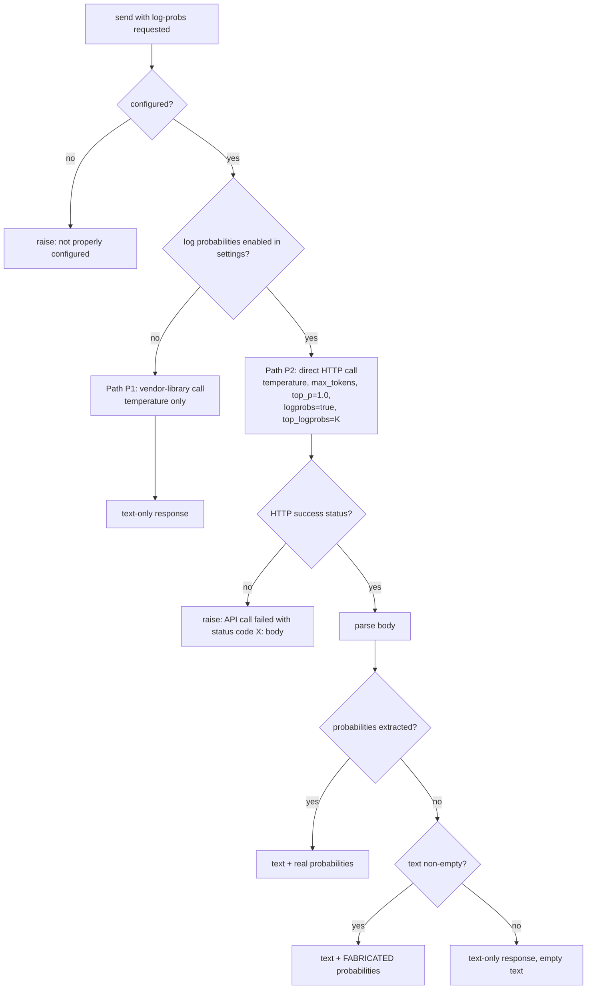

# Feature: AI Provider Abstraction & Azure OpenAI Integration

> Source repo: `chatdbg`, pinned commit `d8c18f61d6bb73666ed97cd4885e877e35558485`.
> All file:line references are relative to the repo root. Short citations name only the file; the full paths are:
> `src/Xcaciv.ChatDbg.Core/Services/{IAIService,AzureOpenAIService,IAzureOpenAIClientFactory,DefaultAzureOpenAIClientFactory,BedrockService,LLamaSharpService,SettingsService}.cs`,
> `src/Xcaciv.ChatDbg.Core/Models/{AIResponse,TokenLogProbabilities,ChatSettings,ChatHistory,ChatMessage,WindowsCredentialManager}.cs`,
> `src/Xcaciv.ChatDbg.Core/Commands/{SetCommand,LogProbsCommand}.cs`,
> `src/Xcaciv.ChatDbg.Core.Tests/Services/{AzureOpenAIServiceTests,DefaultFactoriesTests}.cs`,
> `src/Xcaciv.ChatDbg.Core.Tests/Models/{AIResponseTests,TokenLogProbabilityTests,ChatSettingsTests}.cs`,
> `src/Xcaciv.ChatDbg.Core.Tests/TestDoubles/StubHttpMessageHandler.cs`.
> Source-language and library names appear only in the "External technology" section and inside evidence citations.

---

## Purpose

**Problem solved.** ChatDbg is an interactive terminal chat assistant for developers ("a chat-based debugging
assistant", `README.md:3`). It must be able to talk to *more than one* large-language-model backend — a hosted
cloud model, a different hosted cloud model, and a model running on the user's own machine — without the rest of
the application knowing or caring which one is active. This feature is (a) the **uniform provider contract** every
backend must satisfy, and (b) the **hosted-OpenAI-on-Azure backend** that implements that contract.

**Two things it delivers:**

1. A *provider-agnostic seam*: the chat shells hold a name-keyed registry of backends, ask the currently selected
   one whether it is configured, ask it for a display name, and ask it to turn the conversation so far into a reply
   — optionally a reply annotated with per-token probability data. Swapping backends is a settings change, not a
   code change (`src/ChatDbg/ChatShell.cs:29-34`, `src/ChatDbg.Shell.Gui/Program.cs:22-27`).
2. The *Azure-hosted OpenAI backend*: configuration validation, two distinct request paths (a vendor-library path
   and a hand-rolled HTTP path used only when token probabilities are wanted), response and log-probability
   extraction across several possible response shapes, and a fallback that **fabricates** probability data when the
   service returns none.

**Actors / roles.**

| Actor | Interaction |
|---|---|
| End user (developer at a terminal) | Selects a provider, supplies endpoint/model/key, types chat turns, sees replies and token-probability visualisations, sees configuration warnings. |
| Chat shell (console or full-screen terminal UI) | Owns the provider registry; picks a backend by name; asks it whether it is configured, what to call it, and to produce a reply; renders results and errors. |
| Sibling backends (Amazon Bedrock, Local LLM) | Implement the same contract; documented elsewhere. Only their contract obligations are noted here. |
| Token Probability Analysis feature | Consumes the log-probability payload this feature produces. |
| Settings & Credential Management features | Produce the configuration object this feature reads. |

---

## Behavior

### A. The provider contract (`src/Xcaciv.ChatDbg.Core/Services/IAIService.cs:5-11`)

Every model backend is an object with a **disposable lifetime** and exactly four operations:

| Operation | Input | Output | Side effects |
|---|---|---|---|
| **Is-configured check** | the settings object | boolean | none; pure inspection of settings (but settings property reads may consult environment variables / OS credential store — see Interfaces) |
| **Get provider display name** | none | human-readable string | none |
| **Send message** | full conversation history + settings | reply text (string) | one upstream model call |
| **Send message with log-probabilities** | full conversation history + settings | a structured response object (text + optional per-token probability list + elapsed-time slot + error-message slot) | one upstream model call |
| **Release resources** | none | none | releases whatever the backend owns |

Contract facts that hold across all three shipped backends and must be preserved:

- **Send-message is defined in terms of send-with-log-probabilities.** Every backend implements the plain
  text-only send by calling its own log-probability send and returning the text, substituting a fixed fallback
  string when the text slot is null (`AzureOpenAIService.cs:47-51`; same shape in `BedrockService.cs:30-34` and
  `LLamaSharpService.cs:55-59`). The fallback strings differ per backend (Q10).
- **Not-configured is an error, not an empty reply.** Both send operations begin by re-running the is-configured
  check and raising an invalid-operation error if it fails (`AzureOpenAIService.cs:55-58`,
  `BedrockService.cs:38-41`, `LLamaSharpService.cs:66-69`).
- **No cancellation token anywhere.** All operations are asynchronous and un-cancellable
  (`IAIService.cs:9-10`).
- **The whole conversation is re-sent on every turn.** There is no server-side conversation state, no thread id,
  no incremental delta. The backend is a pure function of (history, settings).
- **Messages flagged as "command" are excluded** from what is sent upstream (`AzureOpenAIService.cs:82`,
  `AzureOpenAIService.cs:141`, `BedrockService.cs:50-51`).
- **The system prompt from settings is prepended** as the first message of every request
  (`AzureOpenAIService.cs:79`, `AzureOpenAIService.cs:134-138`).
- **Backends are constructed eagerly at start-up**, all three of them, regardless of which one is selected; none
  of them may do network I/O, credential access, or model loading in its constructor
  (`src/ChatDbg/ChatShell.cs:29-34`, `src/ChatDbg.Shell.Gui/Program.cs:22-27`). Exception: a second, unused
  full-screen-shell class registers only two (Q15).
- Error behaviour is *not* uniform: the Azure and Bedrock backends **throw**; the local-LLM backend **returns an
  error-bearing response object** instead (`LLamaSharpService.cs:98-108`). Callers therefore wrap send calls in a
  catch-all (`src/ChatDbg/ChatShell.cs:405-410`, `src/ChatDbg.Shell.Gui/UI/ChatWindow.cs:494-497`).

### B. Azure-hosted OpenAI backend — observable operations

**B1. Report display name.** Always returns the literal string `Azure OpenAI` (`AzureOpenAIService.cs:38`).
Used verbatim in user-facing warnings, e.g. `Warning: Azure OpenAI service is not configured.`
(`src/ChatDbg/ChatShell.cs:260`).

**B2. Configuration check.** Returns true only when *all three* of the following are non-empty
(`AzureOpenAIService.cs:40-45`):
- the Azure endpoint URL,
- the resolved Azure API key (resolved through the credential-priority chain: environment variable
  `CHATDBG_AZURE_API_KEY` → OS credential store entry `ChatDbg:AzureApiKey` when explicitly enabled →
  settings-file value; `ChatSettings.cs:70,88-118,120-142`),
- the model/deployment identifier.

There is **no format validation** — no URL parsing, no scheme check, no key-shape check, no connectivity probe
(`AzureOpenAIService.cs:42-44`).

**B3. Send a chat turn (plain).** Delegates to B4 and returns the text; if the text slot is null returns the
literal `Error: Response text expected, none given` (`AzureOpenAIService.cs:47-51`).

**B4. Send a chat turn (with log probabilities).** (`AzureOpenAIService.cs:53-110`)
1. Re-check configuration; raise if not configured (`:55-58`).
2. **Branch on the "enable log probabilities" setting** (`:61-64`):
   - **enabled → path P2** (hand-rolled HTTP call, B5),
   - **disabled → path P1** (vendor-library call).
3. **Path P1 (vendor library):**
   - Ask the injected client factory for a chat client, given `(endpoint URL parsed as an absolute URI, api key,
     model id)` (`:69-73`). The endpoint is **not** trimmed on this path.
   - Build the message list: first a *system* message carrying the settings' system-prompt content (`:79`), then
     every non-command history message mapped by role — `user`, `assistant`, `system` (role compared
     case-insensitively). **Any other role value is silently dropped** (`:82-96`).
   - Set exactly one request option: temperature (narrowed from the settings' double to single precision, `:100`).
     Max-tokens, top-p, and log-prob options are **not** sent on this path (`:98-101`).
   - Await completion; take **the first content part of the first choice** and return it as a text-only response
     (`:103-104`).
   - Any exception at all in this block is re-thrown as an invalid-operation error with message
     `Error calling Azure OpenAI: {inner message}`, inner exception preserved (`:106-109`).

**B5. Direct HTTP path (only when log probabilities are enabled).** (`AzureOpenAIService.cs:115-218`)
1. **Compose the URL:** `{endpoint with trailing '/' characters trimmed}/openai/deployments/{modelId}/chat/completions?api-version=2023-12-01-preview`
   (`:120-123`). The model id is interpolated **without URL-encoding**.
2. **Set headers on the shared HTTP client:** clear all default headers, then add `Accept: application/json` and a
   header named `api-key` whose value is the resolved API key (`:126-128`).
3. **Compose the request body** (`:131-159`) as an object with fields:
   - `messages` — array, first element `{role: "system", content: <settings system prompt content>}`, then one
     element per non-command history message `{role: <history role lower-cased>, content: <content>}` (`:134-148`).
     **No role filtering on this path** — whatever role string history holds is forwarded lower-cased.
   - `temperature` — the settings temperature (full double precision here, unlike path P1) (`:154`).
   - `max_tokens` — the settings max-tokens value (`:155`).
   - `top_p` — hard-coded `1.0` (`:156`).
   - `logprobs` — hard-coded `true` (`:157`).
   - `top_logprobs` — the settings top-K value (`:158`).
   Serialised with a camel-case naming policy and null-omission (`:165-169`); because every field name is already
   lower-case or snake_case, the naming policy is a no-op and the wire names are exactly as listed.
4. **POST** the body as UTF-8 JSON with content type `application/json` (`:174-175`).
5. **Read the whole response body as a string** (no streaming) (`:178`).
6. **On a non-success HTTP status**, raise an invalid-operation error with message
   `API call failed with status code {status}: {full response body}` (`:184-187`) — which is then immediately
   re-wrapped by the outer catch (Q12, see Error handling).
7. **Parse** the body (B6) (`:190`).
8. **If the parse yielded no probabilities and the reply text is non-empty, fabricate probabilities** (B7) and
   return the reply text paired with the fabricated list (`:197-208`).
9. Otherwise return the parsed response unchanged (`:211`).
10. Any exception in the whole block is re-thrown as invalid-operation with message
    `Error making direct Azure OpenAI API call: {inner message}` (`:213-217`).

Diagnostic traces (visible only to an attached debugger / trace listener, never to the user) are emitted for:
request URL (`:162`), full request body (`:172`), response status and full response body (`:181-182`),
either `Found {n} token probabilities` (`:195`) or `No token probabilities found in response` (`:199`), and the
exception message on failure (`:215`).

**B6. Response parsing and log-probability extraction.** (`AzureOpenAIService.cs:223-286`)
- Requires a top-level `choices` array. If it is **absent**, a parse error is raised (the property access throws
  and is converted, `:231`, `:281-285`). If it is **present but empty**, returns the literal text
  `No response received` with no probabilities (`:232-235`).
- Requires `choices[0].message` and `choices[0].message.content`; either being absent is a hard parse failure
  (`:237-238`, Q21). A JSON null content becomes the empty string (`:238`).
- Probability extraction tries, **in this order** (`:245-270`):
  1. **top-level `logprobs` present and an object with a `content` array** → extract from that array (strict
     per-token shape, B6a) (`:248-252`);
  2. **top-level `logprobs` present and an array** → extract from that array (tolerant shape, B6b) (`:254-257`);
  3. **only if there is no top-level `logprobs` at all** → `choices[0].logprobs`; if it has a `content` property
     use B6a on it, else if it is itself an array use B6b (`:260-270`).
- If at least one token was extracted **and** the extractor reported success, return text + probability list;
  otherwise return text only (`:273-279`).

**B6a. Strict per-token extraction.** (`:288-335`) For each element of the array: require both a `token` string and
a `logprob` number (`:294-295`); build a token record with those two values and an initialised empty alternatives
list (`:300-305`); if the element has `top_logprobs`, append every alternative that itself has both `token` and
`logprob` (`:308-322`). Elements missing `token` or `logprob` are **silently skipped**. Returns true iff at least
one token was produced (`:328`). Any exception inside this routine is swallowed and reported as "found nothing"
(`:330-334`) — see Q16 for what that costs.

**B6b. Tolerant extraction.** (`:337-408`) Same as B6a, plus: the alternatives array may be named **either**
`top_logprobs` **or** `top_alternatives` (`:357-358`); and an alternative element that does not have
`token`/`logprob` fields is treated as a map — the routine walks its properties, assigning the **name** of each
property to the alternative token in turn and stopping at the **first numeric property value**, which becomes the
log-probability (`:372-384`). Alternatives whose token string ends up empty are dropped (`:386-393`). Exceptions
are swallowed (`:403-407`).

**B7. Fabricated ("simulated") probabilities.** (`AzureOpenAIService.cs:413-472`) — *invoked only from B5 step 8.*
- Split the reply text on space, newline, tab, `.`, `,`, `!`, `?`, discarding empty pieces (`:418-419`).
  Punctuation is thereby destroyed and never appears in the fabricated tokens.
- If there are **15 or fewer** words, use them all (`:425-428`). Otherwise take exactly 15: the **first 5**, then 5
  starting at index `(count / 2) - 2` (a middle window centred on `count / 2`), then the **last 5** (`:430-435`).
- For each sampled word emit a token record with log-probability `ln(0.9)` (≈ `-0.10536`, i.e. a displayed
  confidence of **90.00 %**) (`:441`), and up to top-K alternatives drawn from a fixed 3-element list:
  `"{word}_alt"` at `ln(0.05)`, `"similar_{word}"` at `ln(0.03)`, `"other_{word}"` at `ln(0.02)` (`:455-457`).
  The number emitted is `min(topK, 3)` (`:459`). The four fabricated probabilities sum to exactly 1.0.
- The fabricated data is returned **indistinguishably from real data**: same response shape, no flag, no marker
  (`:206-207`). Downstream visualisation and the "no probabilities were returned" warning treat it as genuine.

**B8. Resource release.** (`:474-491`) Releases the HTTP client **only if the backend created it itself** (i.e. the
caller did not inject one) and only on the explicit-release path (`:484-486`). A garbage-collection cleanup hook
exists and calls the non-releasing path (`:493-496`, Q23). Shells release all registered backends on shutdown
(`src/ChatDbg/ChatShell.cs:698-713`).

**B9. Client construction (the factory seam).** A one-method factory turns
`(endpoint URI, api key, model/deployment id)` into a chat client (`IAzureOpenAIClientFactory.cs:6-9`). The default
implementation builds a hosted-OpenAI client from the endpoint plus an API-key credential and then obtains a chat
client bound to the deployment named by the model id (`DefaultAzureOpenAIClientFactory.cs:10-14`). Construction is
**purely local** — it performs no network call and validates nothing, proven by a test that builds a client for a
non-resolving host and asserts a client object comes back (`DefaultFactoriesTests.cs:11-17`). The seam exists
solely so tests can inject a stand-in (`AzureOpenAIServiceTests.cs:115-121`).

---

## Business rules & edge cases

Rules marked **[T]** are asserted by a test; the citation names the test file and lines. Rules with only a source
citation are read from code and are **not** test-covered.

### Configuration rules

| # | Rule | Evidence |
|---|---|---|
| R1 | Azure backend is "configured" **iff** endpoint AND resolved api key AND model id are all non-empty. All three, no exceptions. | `AzureOpenAIService.cs:40-45` |
| R2 | The API key is not read from a plain field — it is resolved through a priority chain (env var `CHATDBG_AZURE_API_KEY` → OS credential store entry `ChatDbg:AzureApiKey` when explicitly enabled → settings-file value). So the configuration check can flip to true purely because an environment variable exists. | `ChatSettings.cs:70`, `:88-118`, `:120-142` |
| R3 **[T]** | The environment variable **wins over** a settings-file key holding a different value: with the variable set to `from-env` and the stored key set to `from-json`, the resolved key is `from-env`. | `ChatSettingsTests.cs:9-29` |
| R4 **[T]** | With no environment variable and no credential store, the settings-file key is used verbatim (`stored-value` in, `stored-value` out). | `ChatSettingsTests.cs:31-40` |
| R5 **[T]** | A default, untouched settings object is **not** configured — even though the model id defaults to `gpt-4`, the endpoint defaults to null and the resolved key defaults to the empty string. | `AzureOpenAIServiceTests.cs:14-21`; `ChatSettings.cs:11,20,70` |
| R6 **[T]** | Endpoint `https://example.openai.azure.com` + settings-file key `key` + model id `model` ⇒ configured. | `AzureOpenAIServiceTests.cs:23-35` |
| R7 | The endpoint string is never validated or normalised at configuration time; only at send time is it trimmed (HTTP path, `AzureOpenAIService.cs:121`) or parsed as an absolute URI (vendor path, `:70`). An invalid URI surfaces as a send-time error, not a configuration error. The `/set azureEndpoint` command stores whatever it is given, joined on spaces, with no validation. | `SetCommand.cs:88-89` |
| R8 | Provider selection is a lower-cased string restricted to `azure` / `bedrock` / `llama`; anything else is rejected at the settings command with `Provider must be 'azure', 'bedrock', or 'llama'`. The registry key for this backend is exactly `azure`. | `SetCommand.cs:46-53`; `src/ChatDbg/ChatShell.cs:31` |
| R9 | Settings read from disk are **not** range-validated — only the `/set` and `/logprobs` commands validate. A hand-edited settings file can put any integer into top-K or max-tokens and it goes straight onto the wire (Q22). | `SettingsService.cs:43-58`; `SetCommand.cs:70-85`, `:173-181` |
| R10 | Settings live at `<user profile>/.ChatDbg/settings.json`; if the user-profile directory cannot be resolved the file falls back to the system temp directory. | `SettingsService.cs:11-32`; `README.md:96` |

### Request-shaping rules

| # | Rule / magic value | Meaning | Evidence |
|---|---|---|---|
| R11 | API version literal `2023-12-01-preview` | The only API version ever sent; hard-coded, not configurable. The code comment calls it "the latest stable API version that supports logprobs" — it is a *preview* version. | `AzureOpenAIService.cs:119-120` |
| R12 | URL template `{endpoint}/openai/deployments/{modelId}/chat/completions?api-version=…` | Deployment-scoped chat-completions route; **model id doubles as the deployment name**. Model id is not URL-encoded. | `AzureOpenAIService.cs:123` |
| R13 | Endpoint trailing `/` characters are trimmed (all of them, not just one) before URL composition on the HTTP path only. | Prevents `//openai`. The vendor path does **not** trim. | `AzureOpenAIService.cs:121` vs `:70` |
| R14 | Auth header name `api-key`, value = resolved key. No bearer token, no signature. | `AzureOpenAIService.cs:128` |
| R15 | Second request header: `Accept: application/json`. All pre-existing default headers on the transport are cleared first. | `AzureOpenAIService.cs:126-127` |
| R16 | `top_p` is hard-coded to `1.0` on the HTTP path and never sent on the vendor path. | No nucleus-sampling control is exposed to the user anywhere. | `AzureOpenAIService.cs:156` |
| R17 | `logprobs` is hard-coded `true` on the HTTP path (the path is only taken when the user enabled them). | `AzureOpenAIService.cs:157` |
| R18 | `top_logprobs` = the settings top-K value; user-settable **1–20** via `/set logProbabilitiesTopK` / `/set logtopk` / `/logprobs top`, default **5**. Out-of-range input is rejected with `LogProbabilitiesTopK must be a number between 1 and 20`. | Number of alternative tokens requested per position. | `AzureOpenAIService.cs:158`; `ChatSettings.cs:36-37`; `SetCommand.cs:173-181`; `README.md:64` |
| R19 | `max_tokens` = settings value, default **1000**, user range **1–8192** (`MaxTokens must be a number between 1 and 8192`). Sent **only** on the HTTP path. | `AzureOpenAIService.cs:155`; `ChatSettings.cs:16-17`; `SetCommand.cs:79-85` |
| R20 | `temperature` = settings value, default **0.7**, user range **0.0–2.0** (`Temperature must be a number between 0 and 2`). Sent on both paths; **narrowed to single precision on the vendor path**, full precision on the HTTP path. | `AzureOpenAIService.cs:100` vs `:154`; `ChatSettings.cs:13-14`; `SetCommand.cs:70-76` |
| R21 | Ordering guarantee: the system-prompt message is **always index 0**; history messages follow in stored order; history order is insertion order (append to the end of the list). | `AzureOpenAIService.cs:79-96`, `:134-148`; `ChatHistory.cs:14-24` |
| R22 | Messages marked as commands are excluded from both paths. | Slash-command echoes never reach the model. | `AzureOpenAIService.cs:82`, `:141`; `ChatMessage.cs:13-14` |
| R23 | Vendor path maps roles through a three-case switch (`user`/`assistant`/`system`, case-insensitive); **unknown roles are dropped silently**. HTTP path forwards every role lower-cased with no whitelist. The same history can therefore produce two different upstream payloads depending only on whether log probabilities are on. | `AzureOpenAIService.cs:84-95` vs `:143-147` |
| R24 | The default system-prompt content, when nothing else is loaded, is: `You are ChatDBG, a helpful debugging assistant. Help users analyze code, debug issues, and understand programming concepts.` It is held in memory only and never written to the settings file. | `ChatSettings.cs:29-30` |
| R25 **[T]** | Enabling log probabilities means the vendor-library path is **never entered**: both send tests inject a factory whose only behaviour is to throw `Chat client path is not used in this test context.`, and both tests pass — proving the HTTP path handled the whole turn. | `AzureOpenAIServiceTests.cs:63,97,115-121` |

### Response-handling rules

| # | Rule | Evidence |
|---|---|---|
| R26 | Vendor path takes `choices[0].content[0].text` — first content part of first choice only. Additional choices/parts are discarded. | `AzureOpenAIService.cs:104` |
| R27 | HTTP path: empty `choices` array ⇒ reply text is the literal `No response received`, treated as a **success**, not an error. | `AzureOpenAIService.cs:232-235` |
| R28 | HTTP path: a null `content` becomes the empty string (not null); a missing `message` or `content` property is a hard parse failure. | `AzureOpenAIService.cs:237-238` |
| R29 | Probability-source precedence is fixed: top-level `logprobs.content` → top-level `logprobs` as array → `choices[0].logprobs.content` → `choices[0].logprobs` as array. The third and fourth are reachable only when there is **no** top-level `logprobs` property at all (Q1). | `AzureOpenAIService.cs:245-270` |
| R30 **[T]** | A body carrying `choices[0].message.content = "response"` plus a top-level `logprobs.content` array of one entry `{token:"Hello", logprob:-0.1, top_logprobs:[{token:"Hi", logprob:-0.2}]}` yields **exactly one** token record whose token is `Hello`. | `AzureOpenAIServiceTests.cs:37-80` |
| R31 | Token records require both `token` and `logprob`; partial records are skipped without error. | `AzureOpenAIService.cs:294-296`, `:343-345` |
| R32 | Alternatives array may be named `top_logprobs` or `top_alternatives` — but only on the tolerant path; the strict path accepts `top_logprobs` only (Q19). | `AzureOpenAIService.cs:308` vs `:357-358` |
| R33 | Tolerant path also accepts a map-shaped alternative: the scan assigns each property **name** to the token and stops at the first **numeric** property value, which becomes the log-probability. Alternatives resolving to an empty token are dropped; alternatives with no numeric property keep log-probability `0` (Q17). | `AzureOpenAIService.cs:362-393` |
| R34 | Extraction routines swallow all exceptions and report "nothing found"; a malformed probability block degrades to "no probabilities", never to a failure — and discards everything already extracted (Q16). | `AzureOpenAIService.cs:330-334`, `:403-407`, `:273-276` |
| R35 **[T]** | Probability value semantics: stored as a natural-log probability; the displayed probability is `e^logprob` — a stored `ln(0.25)` reads back as `0.25` to 5 decimal places. | `TokenLogProbabilities.cs:25-26`; `TokenLogProbabilityTests.cs:9-18` |
| R36 | Alternatives created by extraction carry a **null** alternatives list of their own, while chosen tokens always carry an initialised (possibly empty) one (Q20). | `AzureOpenAIService.cs:300-305,315-319` vs `:349-354,388-392` |

### Fabricated-probability rules (magic numbers)

| # | Rule / number | Meaning | Evidence |
|---|---|---|---|
| R37 | Fabrication triggers **only** when: HTTP path was used (⇒ log probabilities enabled) **and** parsing found zero probabilities **and** the reply text is non-empty. An empty reply text therefore gets **no** fabricated data. | `AzureOpenAIService.cs:197-208` |
| R38 | `15` — maximum fabricated tokens. | Sample budget. | `AzureOpenAIService.cs:422` |
| R39 | Sampling windows when word count > 15: indices `[0,5)`, `[count/2-2, count/2+3)`, `[count-5, count)` — first 5, middle 5, last 5, in that order. Integer division. The three windows never overlap for any count above 15 (the middle window ends at `count/2+2`, the tail begins at `count-5`, and `count/2+2 < count-5` for all `count ≥ 16`), so exactly 15 tokens are produced and the words between the windows are silently dropped — at exactly 16 words that is the single word at index 5. | "beginning, middle, end" sampling. | `AzureOpenAIService.cs:425-435` |
| R40 | Splitting characters: space, newline, tab, `.`, `,`, `!`, `?`; empty pieces removed. | Word-ish pseudo-tokenisation; punctuation never appears in a fabricated token, and carriage returns are **not** separators. | `AzureOpenAIService.cs:418-419` |
| R41 | Chosen-token log-probability `ln(0.9)` ⇒ **90 %** displayed confidence for every fabricated token, with no variation between tokens or between turns. | `AzureOpenAIService.cs:441` |
| R42 | Fixed alternatives with log-probabilities `ln(0.05)`, `ln(0.03)`, `ln(0.02)` ⇒ 5 %, 3 %, 2 %; token names `{w}_alt`, `similar_{w}`, `other_{w}`. Count emitted = `min(topK, 3)` — so top-K above 3 has no effect here even though it *is* sent upstream. | `AzureOpenAIService.cs:455-466` |
| R43 **[T]** | With log probabilities enabled and a `200` body carrying `choices[0].message.content = "response text"` and no probability data anywhere, the returned probability list is non-null and non-empty. | `AzureOpenAIServiceTests.cs:82-113` |

### Lifetime / plumbing rules

| # | Rule | Evidence |
|---|---|---|
| R44 | The HTTP transport may be injected; if injected it is **not** released by this backend; if self-created it **is** (on the explicit-release path only). | `AzureOpenAIService.cs:22-36`, `:480-491` |
| R45 | The chat-client factory may be injected; otherwise a default is created in the constructor. No container, no registration anywhere in the repo. | `AzureOpenAIService.cs:35` |
| R46 | Constructing the backend with no injected transport creates one transport per backend instance; the shells create exactly one instance per process, so this is benign in practice. | `AzureOpenAIService.cs:24-28`; `src/ChatDbg/ChatShell.cs:31` |
| R47 | Configuration is re-read from the settings object on every call — no snapshot, no cached client, no cached credential. | `AzureOpenAIService.cs:55,69-73,121-128` |

---

## Quirks

Behaviour that looks like a defect. Documented as observed; **nothing here was changed in the source.**

| # | Quirk | Why it looks wrong | Evidence |
|---|---|---|---|
| Q1 | **Per-choice probabilities are unreachable whenever a top-level `logprobs` exists in an unexpected shape.** The per-choice lookups sit behind an `else` on "the top-level `logprobs` property exists". If a response carries a top-level `logprobs` that is neither an object-with-`content` nor an array (e.g. JSON `null`), the per-choice locations are never examined, all real probabilities are lost, and fabricated ones are substituted. | The hosted service's documented wire format puts log-probabilities under `choices[0].logprobs`, i.e. the branch this code checks *last*. | `AzureOpenAIService.cs:245-270` |
| Q2 | **A pseudo-random generator is constructed per fabricated token and never used.** Fabricated output is fully deterministic despite the appearance of randomisation. | Dead allocation inside a per-token loop. | `AzureOpenAIService.cs:451` |
| Q3 | **Fabricated confidence data is returned unmarked.** No flag, no marker, no distinct field. A user analysing "model confidence" may be reading invented numbers, and the console shell's "no probabilities were returned" notice becomes nearly unreachable for this backend. | Invented data presented as measurement. | `AzureOpenAIService.cs:197-208`; `src/ChatDbg/ChatShell.cs:387-391` |
| Q4 | **The HTTP path clears and rewrites the shared transport's default headers on every call.** Two concurrent sends through one instance can race on headers and credentials; and if a caller injected a pre-configured transport, its headers are wiped. There is no locking (the local-LLM sibling *does* serialise with a semaphore; this one does not). | Mutating shared state per request. | `AzureOpenAIService.cs:126-128`; cf. `LLamaSharpService.cs` semaphore |
| Q5 | **`max_tokens` is never sent when log probabilities are off** — i.e. on the default path — although the README documents `maxTokens` as "Maximum response length" for all providers. Turning token probabilities on silently starts enforcing a response-length cap that was not enforced before. | Documented setting not honoured on the default path. | `AzureOpenAIService.cs:98-101` vs `:155`; `README.md:50,100` |
| Q6 | **The two send paths normalise the endpoint differently.** The HTTP path trims trailing slashes; the vendor path passes the string through verbatim. The README's own example endpoint carries a trailing slash. | Same input, two normalisations. | `AzureOpenAIService.cs:70` vs `:121`; `README.md:120` |
| Q7 | **The two send paths filter roles differently.** The vendor path drops any role that is not `user`/`assistant`/`system`; the HTTP path forwards every role lower-cased. A history containing an injected custom role produces two different upstream payloads depending only on the log-probability setting. | Path-dependent request content. | `AzureOpenAIService.cs:84-95` vs `:143-147` |
| Q8 | **Troubleshooting text tells the user to "Ensure you're using a recent API version (2023-05-15 or newer for Azure OpenAI)"** as though the API version were user-controllable. It is a hard-coded constant, and the constant is a *preview* version described in the code comment as "the latest stable API version". | Advice the user cannot act on; comment contradicts the value. | `LogProbsCommand.cs:185` vs `AzureOpenAIService.cs:119-120` |
| Q9 | **The whole upstream error body is echoed into the terminal on a non-2xx status,** and the status itself is rendered as its symbolic name (`NotFound`, `Unauthorized`) rather than a number. An upstream error page can therefore push arbitrary content — quotas, request ids, echoed prompt fragments — into the user's terminal. | Unfiltered pass-through of remote content. | `AzureOpenAIService.cs:184-187` |
| Q10 | **Four different "text was null" fallback strings, one misspelled.** `Error: Response text expected, none given` (`AzureOpenAIService.cs:50`), `Error: Response text expected, none given.` (`BedrockService.cs:33`), `Error: Response text expected, none received` (`LLamaSharpService.cs:58`), and `Error: Response text expected, none recieved.` (console shell, misspelled). The full-screen shell substitutes an empty string instead of any message. | Same condition, five different user-visible outcomes. | `src/ChatDbg/ChatShell.cs:377`; `src/ChatDbg.Shell.Gui/UI/ChatWindow.cs:444` |
| Q11 | **The response object carries an elapsed-time field and an error-message field that this backend never populates** — always `0` and null. Only the local-LLM sibling sets the error field. Any UI that renders "took N seconds" will always show zero for this provider. | Declared contract fields left dead. | `AIResponse.cs:22-32`; `AzureOpenAIService.cs:104,207,211` |
| Q12 | **Parse failures are double-wrapped.** A malformed body produces `Error making direct Azure OpenAI API call: Error parsing Azure OpenAI API response: {inner}` because the parse wrapper is itself caught by the outer wrapper. | Nested prefixes in a user-visible message. | `AzureOpenAIService.cs:284` then `:216` |
| Q13 | **The full-screen shell never pre-checks configuration before sending.** It looks the provider up in the registry and sends. The backend's internal message therefore reaches the user verbatim in a modal: `Failed to get AI response: Azure OpenAI service is not properly configured. Please set AzureEndpoint, AzureApiKey, and ModelId.` — naming internal settings identifiers rather than the `/set` commands the console shell offers. | Internal error text is the full-screen UI's only configuration guidance. | `src/ChatDbg.Shell.Gui/UI/ChatWindow.cs:426-437,494-497` vs `src/ChatDbg/ChatShell.cs:356-361` |
| Q14 | **Provider lookup is case-sensitive in the console shell and case-insensitive in the full-screen shell.** The console looks the raw settings value up in the registry; the full-screen UI lower-cases it first. A hand-edited settings file containing `"provider": "Azure"` yields `Error: Unknown AI provider: Azure` in the console but works in the full-screen UI. | Same settings file, two behaviours. | `src/ChatDbg/ChatShell.cs:251,349` vs `src/ChatDbg.Shell.Gui/UI/ChatWindow.cs:425-433` |
| Q15 | **A second full-screen-shell class registers only two of the three backends** (`azure`, `bedrock` — no `llama`). It is never instantiated anywhere in the repo (the live entry point builds its own three-entry registry), so it is dead code that would break local-LLM selection if it were ever wired up. | Divergent, unreachable copy of the registry. | `src/ChatDbg.Shell.Gui/ChatShell.cs:33-37` (dead) vs `src/ChatDbg.Shell.Gui/Program.cs:22-27` (live); no `new ChatShell()` outside `src/ChatDbg/Program.cs:5` |
| Q16 | **One malformed token entry discards every probability already extracted.** The extractors accumulate into a caller-supplied list but return `false` on any exception; the caller then requires the success flag as well as a non-empty list, so a body whose *last* token has a string `logprob` loses the preceding good tokens — and fabrication silently replaces the lot. | Partial success is thrown away, then replaced with invented data. | `AzureOpenAIService.cs:298,330-334,403-407,273-276` |
| Q17 | **A map-shaped alternative with no numeric property is emitted with log-probability `0`,** which the display layer renders as `e^0 = 1.0`, i.e. **100 % confidence** — for an alternative that was *not* chosen. The token also ends up being the *last* property name scanned, because the loop overwrites the token on every iteration and only breaks on a numeric value. | An unchosen alternative displayed as certain. | `AzureOpenAIService.cs:362-393` |
| Q18 | **`top_logprobs` present but not an array aborts extraction entirely.** The array enumeration throws, the exception is swallowed, and the whole response is reported as carrying no probabilities. | Swallowed exception hides a wire-format mismatch. | `AzureOpenAIService.cs:308-310,330-334` |
| Q19 | **Asymmetric tolerance between the two extractors.** The strict extractor accepts alternatives only under `top_logprobs`; the tolerant one accepts `top_logprobs` or `top_alternatives`. Which tolerance you get depends on which of four source locations matched — not on the payload's own shape. | Inconsistent leniency. | `AzureOpenAIService.cs:308` vs `:357-358` |
| Q20 | **Alternatives never get an alternatives list.** Chosen tokens always receive an initialised (possibly empty) list; their alternatives receive null. Persisted history therefore serialises `"top_alternatives": []` for chosen tokens and omits the field for alternatives. | Inconsistent shape in persisted data. | `AzureOpenAIService.cs:300-305` vs `:315-319` |
| Q21 | **A content-filtered or otherwise message-less choice is a hard failure, and a null-content choice produces a silent empty turn.** `choices[0].message.content` is required; if `message` or `content` is missing the turn fails with a double-wrapped parse error, and if `content` is JSON null the reply text becomes the empty string — which then *suppresses* fabrication (it requires non-empty text), so the user sees an empty assistant message followed by "Log probabilities were requested but none were returned by the model." | Two distinct upstream shapes both degrade badly. | `AzureOpenAIService.cs:237-238,203`; `src/ChatDbg/ChatShell.cs:387-391` |
| Q22 | **Settings loaded from disk bypass every range check.** Loading only deserialises; the 1–20 top-K and 1–8192 max-tokens rules live in the command handlers. A hand-edited or migrated settings file can put `top_logprobs: 0` or `max_tokens: 999999` straight onto the wire, and a top-K below 1 also silently produces zero fabricated alternatives. | Validation implemented only at one of two entry points. | `SettingsService.cs:43-58`; `SetCommand.cs:79-85,173-181`; `AzureOpenAIService.cs:155,158,459` |
| Q23 | **The garbage-collection cleanup hook never releases the self-created transport** — it calls the release routine with the "not an explicit release" flag, and the transport is only released under the explicit flag. A backend that is never explicitly released leaks its transport, and the hook's existence keeps every instance alive for an extra collection cycle for no benefit. | Cleanup hook that cleans nothing up. | `AzureOpenAIService.cs:480-496` |
| Q24 | **The only test that exercises real probability extraction feeds a response shape the hosted service does not emit** (top-level `logprobs`), so the branch that would actually run in production — the per-choice one — has no coverage at all. Combined with Q1, the tested path and the real path are different code. | Test validates an unreachable branch. | `AzureOpenAIServiceTests.cs:40-59` vs `AzureOpenAIService.cs:260-270` |
| Q25 | **The docs instruct non-Windows users to enable the OS credential store.** `docs/SECURITY-IMPLEMENTATION.md:226` shows `export CHATDBG_AZURE_API_KEY=...` for Linux and `:233,236` shows a Dockerfile that runs `/set enablewincred && /set wincred azureApiKey your-key`. Off Windows the credential store returns nothing and the enable command is refused; the failure is silent in the resolution chain. | Documented setup that cannot work on the platform it targets. | `WindowsCredentialManager.cs:59-62,169-172`; `ChatSettings.cs:137-141`; `SetCommand.cs:219-224` |
| Q26 | **The README calls the product "A C# Chat shell for Windows terminal"** while the build metadata calls it "Cross-platform chat debugging tool with AWS Bedrock and Azure OpenAI support" and every project targets a platform-neutral runtime. Only the credential-store leg is Windows-bound (see Platform coupling). | Product framing contradicts the code and the build. | `README.md:3` vs `src/ChatDbg/Xcaciv.ChatDbg.Shell.csproj:16`; all `.csproj` `TargetFramework` = `net10.0` |

**Documented-and-implemented (checked, not a quirk):** the full-screen settings dialog's "Azure Endpoint" field
shown in `docs/TERMINAL-GUI-IMPLEMENTATION.md:68` does exist (`src/ChatDbg.Shell.Gui/UI/SettingsDialog.cs:92-98`),
and the credential entry the README describes is reachable from that dialog's credential sub-dialog
(`SettingsDialog.cs:509-545`).

---

## Platform coupling

**Explicit statement: this feature is cross-platform except for one optional credential source.**

- Every project targets a platform-neutral runtime (`TargetFramework` = `net10.0` in all four `.csproj` files); no
  Windows-only target framework, no Windows-only package reference in the project that owns this feature
  (`src/Xcaciv.ChatDbg.Core/Xcaciv.ChatDbg.Core.csproj:4,11-17`).
- **The URL, the `api-key` header, the JSON body, the response parsing, and the fabrication routine are ordinary
  HTTP and JSON and work identically on any operating system.** Nothing in the send paths touches the file system,
  the registry, or any native library.
- **Windows-only leg:** the OS credential-store source for the API key is a direct call into the Windows credential
  API and is guarded by an operating-system check that returns "nothing found" everywhere else
  (`WindowsCredentialManager.cs:11-20,59-62,169-172`). On Linux/macOS the resolution chain therefore silently
  collapses to *environment variable → settings file*. Nothing warns the user; the availability check simply
  reports false and the console shell omits the credential-store remediation lines
  (`src/ChatDbg/ChatShell.cs:265-270`).
- **The other two credential legs are portable**: the environment variable `CHATDBG_AZURE_API_KEY` and the
  settings file under the user profile directory.
- **Packaging is Windows-biased but not code-coupled:** the size-optimised and single-file publish configurations
  default to a `win-x64` runtime identifier (`src/ChatDbg/Xcaciv.ChatDbg.Shell.csproj:30,70`), and the README's
  local-LLM examples use Windows paths (`README.md:135`). These are defaults, not constraints.
- **Verdict for a reimplementation:** the provider contract and the Azure backend can be ported to any platform
  unchanged; only the credential-store leg needs a per-platform substitute (keychain, secret service, or a
  documented "environment variable only" posture).

---

## Workflows & states

### W1. Start-up → first chat turn (provider-agnostic, Azure shown; console shell)

1. Shell constructs one instance of **each** backend and stores them in a name-keyed registry
   (`azure` / `bedrock` / `llama`) (`src/ChatDbg/ChatShell.cs:29-34`).
2. Shell loads settings from disk and copies them field by field onto the live settings object, including the
   Azure endpoint and the deprecated settings-file key (`src/ChatDbg/ChatShell.cs:122-159`, endpoint at `:134`,
   key at `:149`). A load failure prints `Error loading settings: {message}` + `Using default settings.` and
   continues (`:153-158`).
3. Shell loads the named system prompt into the settings' system-prompt content slot
   (`src/ChatDbg/ChatShell.cs:161-175`).
4. **Credential check** (`src/ChatDbg/ChatShell.cs:239-318`):
   - provider empty ⇒ `Warning: No AI provider configured.` plus
     `   Use '/set provider azure', '/set provider bedrock', or '/set provider llama' to configure.` (`:244-246`);
   - provider not in registry ⇒ `Warning: Unknown AI provider: {provider}` (`:253`);
   - backend reports not-configured ⇒ `Warning: {display name} service is not configured.` (`:260`) followed by
     Azure-specific remediation: `   1. Environment Variables: set CHATDBG_AZURE_API_KEY=your-api-key` (`:265`);
     if the OS credential store is available, `   2. Windows Credential Manager: /set enablewincred` then
     `      Then: /set wincred azureApiKey your-api-key` (`:269-270`); and, if the endpoint is empty,
     `   Also set your Azure endpoint: /set azureEndpoint https://your-resource.openai.azure.com/` (`:275`);
   - backend reports configured ⇒ prints `Azure credentials loaded from: {source}` where source is one of
     `environment variable (CHATDBG_AZURE_API_KEY)`, `Windows Credential Manager`, `settings file (deprecated)`,
     `not set` (`:308`; `ChatSettings.cs:168-201`).
5. User types a line. A leading `/` routes to commands; anything else is a chat turn.
6. Chat turn: append a `user` message to history (`:346`), look up the backend by provider name (`:349`), re-check
   configured — if not: `Error: {display name} service is not configured. Use environment variables or Windows
   Credential Manager to configure credentials securely.` plus `   Type '/set' to see current configuration and
   setup instructions.` (`:358-359`) — print `Thinking...` (`:363`), then send (`:365-403`).
7. With log probabilities on, the shell first prints
   `Log probabilities enabled - requesting with top-k={K}` (`:373`).

### W1b. Start-up → first chat turn (full-screen shell)

Same registry and settings loading (`src/ChatDbg.Shell.Gui/Program.cs:22-27,58-70`), but **no configuration
pre-check at any point** — the turn goes straight from registry lookup to send
(`src/ChatDbg.Shell.Gui/UI/ChatWindow.cs:420-437`), so a not-configured backend surfaces its internal message in a
modal (Q13). Provider name is lower-cased before lookup (`:425`), unlike the console (Q14).

### W2. Azure send-path selection

### W3. Probability-source resolution (inside parse)

1. Does the payload have a top-level `logprobs` property?
   - Yes, and it is an object with `content` → strict extraction over that array. **Stop.**
   - Yes, and it is an array → tolerant extraction over it. **Stop.**
   - Yes, but neither shape (e.g. JSON `null`, a number, a string) → **stop with nothing** (Q1).
   - No → continue.
2. Does `choices[0]` have `logprobs`?
   - With a `content` property → strict extraction.
   - Else if it is an array → tolerant extraction.
   - Else → nothing.
3. If the extractor reported success **and** at least one token landed in the list → return text + tokens;
   otherwise → return text only (Q16).

### W4. Backend lifecycle states

| State | Entered when | Exited when |
|---|---|---|
| Constructed / idle | Shell start-up (all three backends) | Shell shutdown |
| Not configured | Any is-configured check fails | Settings/credentials change (checked fresh each call — no caching) |
| Sending | A send operation is in flight | Response parsed, or exception raised |
| Released | Shell releases the registry (`src/ChatDbg/ChatShell.cs:698-713`) | terminal state; transport released only if self-created **and** only via the explicit path (Q23) |

There is no retry state, no back-off, no circuit breaker, no timeout state — the underlying HTTP client's default
timeout is whatever the platform gives (never configured anywhere in the repo).

---

## Data

### Entity: Provider response (owned by this feature)

`src/Xcaciv.ChatDbg.Core/Models/AIResponse.cs`

| Field | Generic type | Constraints / default | Notes |
|---|---|---|---|
| text | nullable string | defaults to empty string (`:14`) | serialised as `text` |
| logProbabilities | nullable ordered list of token-probability records | null when absent (`:20`); never an empty list from the two factories | serialised as `logProbabilities`; order = generation order |
| totalTime | number (seconds) | defaults 0 (`:26`) | **never set by the Azure backend** (Q11) |
| errorMessage | nullable string | defaults null (`:32`) | **never set by the Azure backend**; only the local-LLM sibling sets it |

Two construction shapes only (`AIResponse.cs:37-52`), both test-backed (`AIResponseTests.cs:9-30`):
- *text only* → the text is stored as given and the probability list stays **null**
  (`AIResponseTests.cs:12-15`);
- *text + probabilities* → the caller's list is stored **by reference**, not copied, cloned, or sorted — the test
  asserts reference identity (`AIResponseTests.cs:26-29`). A reimplementation that defensively copies would still
  satisfy every behavioural requirement, but the source's shells rely on being able to hand the same list onward.

Lifecycle: created per send call; never persisted as a whole. Its probability list *is* persisted indirectly —
the shell copies it onto the assistant chat message it appends to history
(`src/ChatDbg/ChatShell.cs:377`, `src/ChatDbg.Shell.Gui/UI/ChatWindow.cs:444`).

### Entity: Token probability record (shared with Token Probability Analysis)

`src/Xcaciv.ChatDbg.Core/Models/TokenLogProbabilities.cs`

| Field | Generic type | Constraints | Notes |
|---|---|---|---|
| token | string | defaults empty (`:14`) | serialised as `token` |
| logProb | number | natural-log probability, ≤ 0 for real data; fabricated data uses `ln(0.9)`; map-shaped alternatives can land on `0` (Q17) | serialised as `logprob` |
| probability | number, derived | `e^logProb` (`:26`) | computed, not serialised; test-backed (`TokenLogProbabilityTests.cs:9-18`) |
| topAlternatives | nullable list of the same record type | one level of nesting only: alternatives are always created without their own list (Q20) | serialised as `top_alternatives` |

Created by extraction (B6a/B6b) or fabrication (B7); mutated only during construction; deleted with its owning
chat message.

### Consumed entity: Settings (owned by Settings & Configuration)

Fields this feature reads (`src/Xcaciv.ChatDbg.Core/Models/ChatSettings.cs`):

| Field | Type | Default | Valid range (command-enforced only) | Used for |
|---|---|---|---|---|
| provider | string | `azure` (`:8`) | `azure` / `bedrock` / `llama` | registry key selecting the backend |
| modelId | string | `gpt-4` (`:11`) | free text; for the local provider it must be an existing file | deployment name in URL / vendor client |
| temperature | number | `0.7` (`:14`) | 0.0–2.0 | request option, both paths |
| maxTokens | integer | `1000` (`:17`) | 1–8192 | request option, HTTP path only |
| azureEndpoint | nullable string | `null` (`:20`) | unvalidated | base URL |
| systemPromptContent | string, not persisted | the ChatDBG default sentence (`:30`) | — | first message of every request |
| enableLogProbabilities | boolean | `false` (`:34`) | — | **path selector** |
| logProbabilitiesTopK | integer | `5` (`:37`) | 1–20 | `top_logprobs`; also caps fabricated alternatives at 3 |
| useWindowsCredentialManager | boolean | `false` (`:50`) | — | gates the credential-store leg of key resolution |
| azureApiKey (derived, read-only) | string | `""` (`:70`) | — | `api-key` header / vendor credential; resolved via env → credential store → settings file on **every read** |

### Consumed entity: Conversation history (owned by Chat History)

Read-only here. Per message: role (string, default empty), content (string, default empty), timestamp,
is-command flag (default false), optional probability list (`ChatMessage.cs:7-18`). This feature reads role,
content and the is-command flag only. Messages are appended to the end of the list
(`ChatHistory.cs:14-24`), so stored order is send order.

---

## Interfaces

### Exposed to other features

| Consumer | Contract |
|---|---|
| Both shells | A name-keyed registry of backends. Each backend answers: *are you configured for these settings?*, *what is your display name?*, *turn this history into a reply*, *turn this history into a reply with token probabilities*, *release your resources*. Backends are interchangeable; the shells contain no provider-specific send logic (they do contain provider-specific **remediation text**, `src/ChatDbg/ChatShell.cs:262-292`). |
| Both shells (user messaging) | The display name string `Azure OpenAI` is embedded in user-visible warnings. |
| Token Probability Analysis | The ordered token-probability list on the response object — token text, natural-log probability, ordered alternatives. The analysis/visualisation layer cannot distinguish real from fabricated entries (Q3). |
| Chat History | The assistant reply text and the probability list are appended to history by the shell, not by this feature. |
| Command layer (`/logprobs debug`) | Reads the Azure endpoint value to print troubleshooting text, rendering `(not set)` when null (`LogProbsCommand.cs:191`). |
| Full-screen settings dialog | Reads and writes the Azure endpoint field; provider is chosen from a three-way radio group labelled `Azure OpenAI` / `AWS Bedrock` / `Local LLM (LLama)` (`src/ChatDbg.Shell.Gui/UI/SettingsDialog.cs:79-98,144,410-416`). The API key is **not** on this dialog; it is entered through a separate credential sub-dialog with a masked field (`SettingsDialog.cs:509-545`). |

### Consumed from other features

| Provider | What is needed |
|---|---|
| Settings & Configuration | The full settings object (see Data). Read fresh on every call — no snapshot, no caching. |
| Credential Management | Resolution of the Azure API key through the env-var → OS-credential-store → settings-file chain, and the human-readable "where did this credential come from" string. |
| System Prompts | The resolved system-prompt *content* (not the name) placed into settings before sending. |
| Chat History | The ordered message list plus the is-command flag. |
| Test seam (not a product feature) | An injectable chat-client factory and an injectable HTTP transport, purely so tests can avoid the network (`AzureOpenAIServiceTests.cs:61-63,115-121`, `StubHttpMessageHandler.cs:8-26`). A reimplementation needs the same two seams to be testable. |

### Sibling backends (documented elsewhere — contract obligations only)

- **Amazon Bedrock backend**: display name `Amazon Bedrock`; configured iff model id non-empty **and** (resolved
  access key non-empty **or** the standard AWS access-key environment variable is set) — a *weaker* check than
  Azure's (`BedrockService.cs:23-27`). Throws on not-configured.
- **Local LLM backend**: display name `Local LLM (LLamaSharp)`; configured iff the model id names an **existing
  file** (`LLamaSharpService.cs:41-50`). Serialises generations with a semaphore and **returns** error responses
  instead of throwing.

---

## External technology

| Generic capability | Protocol/standard if any | What the source used | Notes for reimplementer |
|---|---|---|---|
| Hosted large-language-model chat-completion service, deployment-scoped | HTTPS + JSON; route `/openai/deployments/{deployment}/chat/completions?api-version=…`; header auth `api-key` | Azure OpenAI Service | The model id **is** the deployment name. API version is the hard-coded literal `2023-12-01-preview`. Request fields: `messages[{role,content}]`, `temperature`, `max_tokens`, `top_p`, `logprobs`, `top_logprobs`. Response fields read: `choices[]`, `choices[0].message.content`, `logprobs.content[]`, `choices[0].logprobs`, per-token `token` / `logprob` / `top_logprobs[]` / `top_alternatives[]`. |
| Vendor client library for the same service (non-log-prob path) | same service, library-managed wire format | `Azure.AI.OpenAI` 2.1.0 (with its bundled OpenAI chat-client types) | Used only when log probabilities are **off**; only the temperature option is set through it. A clone may legitimately use one HTTP path for both cases — but then it must decide whether to keep the max-tokens asymmetry (Q5) and the role-filtering asymmetry (Q7). |
| General HTTP client with injectable transport | HTTP/1.1, TLS | platform HTTP client | Must support: clearing/setting default headers, `Accept: application/json`, a custom auth header, UTF-8 JSON body POST, reading the full response body as a string, and reading the status code (rendered as a symbolic name in error text). No timeout is configured — platform default applies (~100 s typical). |
| JSON serialisation of an ad-hoc request object | JSON | platform JSON serializer, camel-case policy + omit-nulls | The camel-case policy is effectively a no-op for the field names used; wire names are literal (`max_tokens`, `top_p`, `top_logprobs`). |
| Tolerant JSON document reader (probability extraction) | JSON | platform DOM-style JSON reader | Needs: optional-property probing, value-kind discrimination (object vs array vs number), array enumeration, and object-property enumeration (for the map-shaped alternative case). Must also survive being handed non-array values where arrays are expected (currently it does not — Q18). |
| Natural logarithm / exponential | IEEE-754 doubles | platform math library | `ln(0.9)`, `ln(0.05)`, `ln(0.03)`, `ln(0.02)` for fabrication; `e^x` for display. |
| Diagnostic trace sink | — | platform debug-trace writer | Traces request URL, request body, response status, response body, probability count, exception messages. Never user-visible. Contains prompt content and the full conversation — treat as sensitive. |
| Secret source: process environment | — | environment variable `CHATDBG_AZURE_API_KEY` | Highest-priority key source; portable. |
| Secret source: OS credential vault (optional, opt-in) | — | Windows Credential Manager via the native credential API (`CredReadW` / `CredWriteW` / `CredDeleteW` in `advapi32.dll`), generic credential type, entry name `ChatDbg:AzureApiKey`, blob encoded as UTF-16, persistence scope "local machine" | Only consulted when explicitly enabled in settings; failures are swallowed. **Windows-only**; returns nothing on other platforms (`WindowsCredentialManager.cs:11-20,59-62,169-172`). |
| Settings file storage | JSON on local disk | `<user profile>/.ChatDbg/settings.json`, temp directory as fallback | Holds the endpoint, model id, temperature, max-tokens, top-K, log-prob toggle, and the deprecated plaintext key. |
| Unit-test framework + HTTP stub | — | xUnit 2.9.1, Moq 4.20.69, a hand-written stub transport returning a fixed status + body regardless of the request (`StubHttpMessageHandler.cs:19-26`) | The two Azure send tests rely entirely on this stub. The stub ignores the request object completely, so URL, headers and body are **unobservable** in the current suite; a clone that wants those covered needs a recording stub. Note the stub returns its body with the default `text/plain` content type — the parser never inspects content type. |
| Runtime / language platform | — | .NET 10 (SDK pinned `10.0.100-rc.1.25451.107`, `global.json`), platform-neutral target framework `net10.0` | Not a requirement of the feature; listed for completeness. |

---

## Error handling

| Failure mode | What happens internally | What the user observes |
|---|---|---|
| Backend not configured (any of endpoint / key / model id empty) at send time | Invalid-operation error raised before any I/O: `Azure OpenAI service is not properly configured. Please set AzureEndpoint, AzureApiKey, and ModelId.` (`AzureOpenAIService.cs:57`) | **Console shell:** unreachable — it pre-checks and prints `Error: Azure OpenAI service is not configured. Use environment variables or Windows Credential Manager to configure credentials securely.` + `   Type '/set' to see current configuration and setup instructions.` (`src/ChatDbg/ChatShell.cs:358-359`). **Full-screen shell:** reachable — it does *not* pre-check, so a modal shows `Failed to get AI response: Azure OpenAI service is not properly configured. Please set AzureEndpoint, AzureApiKey, and ModelId.` (`ChatWindow.cs:426-437,496`, Q13). |
| Malformed endpoint (not an absolute URI) — vendor path | URI construction throws inside the try block; re-wrapped as `Error calling Azure OpenAI: {inner}` (`AzureOpenAIService.cs:106-109`) | `Error getting AI response: Error calling Azure OpenAI: …` (console, `ChatShell.cs:407`) |
| Network failure, DNS failure, TLS failure — HTTP path | Wrapped once: `Error making direct Azure OpenAI API call: {inner}` (`:216`) | `Error getting AI response: Error making direct Azure OpenAI API call: …` |
| Non-2xx HTTP status — HTTP path | Raised as `API call failed with status code {status}: {full body}` (`:186`) then **re-wrapped** by the outer catch ⇒ final message `Error making direct Azure OpenAI API call: API call failed with status code {status}: {body}` | The whole upstream error body (quotas, request ids, echoed content) is shown in the terminal; the status is rendered as its **symbolic name** (e.g. `NotFound`, `Unauthorized`), not a number (Q9). |
| Response body is not JSON, or lacks `choices` / `choices[0].message` / `.content` — HTTP path | Parse routine wraps as `Error parsing Azure OpenAI API response: {inner}` (`:284`), then the outer catch wraps **again** (Q12) | `Error getting AI response: Error making direct Azure OpenAI API call: Error parsing Azure OpenAI API response: …` |
| `choices` present but empty | **No error.** Reply text becomes `No response received` (`:234`), and fabrication then runs on that sentence (it is non-empty) | The user sees `No response received` as if the model had said it, appended to history as an assistant turn — with three fabricated 90 %-confidence tokens under it when log probabilities are on. |
| `choices[0].message.content` is JSON null | Reply text becomes the empty string; fabrication is skipped because it requires non-empty text (`:203`) | An empty assistant turn, followed by `Note: Log probabilities were requested but none were returned by the model.` + `This could be due to the model not supporting this feature or an API limitation.` (`ChatShell.cs:389-390`, Q21) |
| Vendor path returns a choice with no content parts | Index-out-of-range inside the try ⇒ `Error calling Azure OpenAI: …` (`:104-109`) | Generic error line. |
| Probability block present but malformed (bad type, non-array `top_logprobs`, string `logprob`) | Swallowed inside the extraction routines; everything already extracted is discarded and the response is treated as "none found" (`:330-334`, `:403-407`, Q16/Q18) | Falls through to fabrication ⇒ user sees invented 90 %-confidence tokens instead of the partial real data. |
| Service returns no probabilities although they were requested | Fabrication path (B7) | User sees a full probability visualisation with uniform 90 % confidence and `_alt` / `similar_` / `other_`-prefixed alternatives. **Nothing tells them the data is invented** (Q3). |
| Reply text empty *and* no probabilities | Returns text-only response with empty text | Console shell prints an empty reply, then the "none were returned" note (`ChatShell.cs:387-391`). |
| Unknown provider name in settings | Registry lookup miss | `Error: Unknown AI provider: {name}` (console, `:351`) / modal `Unknown AI provider: {name}` (full-screen, `ChatWindow.cs:433`). Case-sensitivity differs between the two (Q14). |
| Provider setting empty at start-up | Credential check skipped | `Warning: No AI provider configured.` + `   Use '/set provider azure', '/set provider bedrock', or '/set provider llama' to configure.` (`ChatShell.cs:244-246`) |
| OS credential store unavailable while resolving the key | Exception swallowed, chain continues to the settings-file value (`ChatSettings.cs:137-141`) | Silent; may surface later as "not configured". |
| Settings file unreadable or corrupt at start-up | Caught; defaults used | `Error loading settings: {message}` + `Using default settings.` (`ChatShell.cs:155-156`) — and defaults are not configured for Azure, so the credential warning follows. |

Errors are never retried. There is no rate-limit handling, no `Retry-After` inspection, no back-off, no partial
result. A failed turn leaves the user message in history (it was appended *before* the send,
`ChatShell.cs:346`) and appends nothing for the assistant — so a retry re-sends a history that already contains
the user's turn.

---

## Non-functional observations

- **No caching of anything**: no client caching (the vendor client is rebuilt on every non-log-prob send,
  `AzureOpenAIService.cs:69-73`), no response caching, no credential caching (the key is re-resolved from the
  environment/credential store on *every* property read, `ChatSettings.cs:70`, and it is read at least twice per
  send — once in the configuration check and once when building the request).
- **No streaming**: the entire response is buffered and read as one string before anything is shown
  (`AzureOpenAIService.cs:178`). Long replies appear all at once after `Thinking...`.
- **No pagination, no batching, no token accounting**: the entire conversation is re-sent every turn with no
  truncation, no history-window trimming, and no client-side token counting. A long session will eventually be
  rejected upstream for exceeding context limits, surfaced only as a generic HTTP error carrying the upstream body.
- **Concurrency**: the backend is not thread-safe on the HTTP path (shared default headers mutated per call, Q4).
  The sibling local-LLM backend explicitly serialises; this one does not. Shells are single-turn interactive so
  the hazard is latent.
- **Timeouts**: none configured anywhere. Whatever the HTTP stack defaults to (typically ~100 s) is the only bound;
  the user has no way to change it and the UI simply sits on `Thinking...`.
- **Permissions**: none beyond possession of the API key. No role checks, no per-user authorisation, no audit log.
- **Secret handling**: the key travels in a request header and is never written to the trace sink, but the
  *request body* — full system prompt and entire conversation — and the *full response body* are traced
  (`AzureOpenAIService.cs:172,182`), and the response body is embedded in user-visible error messages on non-2xx
  (Q9). The settings file may still hold the key in plaintext (the deprecated leg), which is why the load path
  warns about it (`SettingsService.cs:57-58`).
- **Performance-motivated code**: essentially none. The fabrication cap of 15 tokens is a display concern rather
  than a performance one. A per-token pseudo-random generator is allocated and discarded (Q2).
- **Platform coupling**: see the dedicated **Platform coupling** section — cross-platform except the optional
  Windows credential-store leg.
- **i18n / accessibility**: none. All strings are hard-coded English; no resource files; no localisation hooks
  (and the size-optimised build turns globalisation off entirely,
  `src/ChatDbg/Xcaciv.ChatDbg.Shell.csproj:52`). The probability visualisation is colour-based in the shells
  (documented under Token Probability Analysis).
- **Test coverage reality check**: only four tests touch this feature directly — two configuration tests
  (`AzureOpenAIServiceTests.cs:14-35`), one "parses log probabilities" (`:37-80`), one "fabricates when missing"
  (`:82-113`) — plus one factory-construction test (`DefaultFactoriesTests.cs:11-17`), two response-factory tests
  (`AIResponseTests.cs:9-30`), one probability-derivation test (`TokenLogProbabilityTests.cs:9-18`) and two
  credential-chain tests (`ChatSettingsTests.cs:9-40`). **No test asserts the URL, the API version, the header
  name, the request body shape, the message ordering, the command-message exclusion, the role mapping, error
  wrapping, the empty-`choices` case, the fabrication magic numbers, or the disposal rule.** The stub transport
  makes the request unobservable by construction. Those behaviours are read from code only.

---

## Acceptance criteria

Criteria marked **[T]** restate an existing test; the rest are code-derived and would be new tests in a clone.

1. **[T]** **Given** a settings object with no Azure endpoint (endpoint null, model id `gpt-4`, no key anywhere),
   **when** the configuration check runs, **then** it reports *not configured*.
   *(`AzureOpenAIServiceTests.cs:14-21`)*
2. **[T]** **Given** endpoint `https://example.openai.azure.com`, settings-file key `key`, model id `model`,
   **when** the configuration check runs, **then** it reports *configured*.
   *(`AzureOpenAIServiceTests.cs:23-35`)*
3. **[T]** **Given** the environment variable `CHATDBG_AZURE_API_KEY` is `from-env` **and** the settings-file key
   is `from-json`, **when** the key is resolved, **then** the value used is `from-env`; **and given** no
   environment variable and a settings-file key of `stored-value`, **then** the value used is `stored-value`.
   *(`ChatSettingsTests.cs:9-40`)*
4. **[T]** **Given** log probabilities are enabled, **when** a turn is sent, **then** the vendor-library factory is
   never invoked — a factory that throws on invocation does not fail the turn.
   *(`AzureOpenAIServiceTests.cs:63,97,115-121`)*
5. **Given** log probabilities are **disabled**, temperature `0.7`, max-tokens `1000`, and a history of
   `[user "hi"]` plus one command-flagged message, **when** a chat turn is sent, **then** exactly one upstream call
   is made through the vendor-library path carrying `[system <system prompt>, user "hi"]` — the command message
   absent — and carrying **temperature 0.7 only**: no `max_tokens`, no `top_p`, no `logprobs`, no `top_logprobs`;
   and the returned response has the first content part of the first choice as its text and a **null** probability
   list. *(`AzureOpenAIService.cs:79-104`)*
6. **Given** log probabilities are **enabled** with top-K `2`, endpoint `https://example.openai.azure.com/` (note
   the trailing slash), model id `model`, temperature `0.7`, max-tokens `1000`, **when** a chat turn is sent,
   **then** an HTTP POST is made to
   `https://example.openai.azure.com/openai/deployments/model/chat/completions?api-version=2023-12-01-preview`
   with headers `api-key: <resolved key>` and `Accept: application/json`, a UTF-8 `application/json` body, and a
   body object equal to
   `{"messages":[{"role":"system","content":"<prompt>"},{"role":"user","content":"hi"}],"temperature":0.7,"max_tokens":1000,"top_p":1.0,"logprobs":true,"top_logprobs":2}`.
   *(`AzureOpenAIService.cs:120-175`)*
7. **[T]** **Given** the service replies `200` with a body whose top-level `logprobs.content` array holds one entry
   `{token:"Hello", logprob:-0.1, top_logprobs:[{token:"Hi", logprob:-0.2}]}` and whose `choices[0].message.content`
   is `"response"`, **when** the turn completes, **then** the response carries exactly **one** token record whose
   token is `Hello`. *(`AzureOpenAIServiceTests.cs:37-80`; the record's log-probability `-0.1` and its single
   alternative `Hi` at `-0.2` are code-derived, `AzureOpenAIService.cs:294-322`, and are **not** asserted today.)*
8. **Given** the same body but with the probability block at `choices[0].logprobs.content` and **no** top-level
   `logprobs` property, **when** the turn completes, **then** the same single token record is produced — this is
   the shape the real service emits and it currently has no test (Q24). *(`AzureOpenAIService.cs:260-265`)*
9. **Given** a body with **both** a top-level `logprobs` of JSON `null` **and** a populated
   `choices[0].logprobs.content`, **when** the turn completes, **then** the observed behaviour is that **no** real
   probabilities are extracted and fabricated ones are returned instead. A clone that fixes Q1 must change this
   criterion deliberately. *(`AzureOpenAIService.cs:245-270`)*
10. **[T]** **Given** the service replies `200` with `choices[0].message.content = "response text"` and no
    probability data at all, and top-K is `3`, **when** the turn completes, **then** the probability list is
    non-null and non-empty. *(`AzureOpenAIServiceTests.cs:82-113`)* Code-derived extension: it holds exactly **2**
    records (`response`, `text`), each with log-probability `ln(0.9)` and exactly 3 alternatives named
    `response_alt` / `similar_response` / `other_response` and `text_alt` / `similar_text` / `other_text`, at
    `ln(0.05)` / `ln(0.03)` / `ln(0.02)`. *(`AzureOpenAIService.cs:418-466`)*
11. **Given** a reply of exactly 16 space-separated words `w0…w15` and fabrication runs, **then** exactly 15 tokens
    are produced in the order `w0 w1 w2 w3 w4 w6 w7 w8 w9 w10 w11 w12 w13 w14 w15` — the word at index 5 is
    dropped and no word is duplicated. *(`AzureOpenAIService.cs:430-435`)*
12. **Given** a reply of `Hello, world! How are you?` (5 words after splitting) and fabrication runs, **then**
    5 tokens are produced — `Hello`, `world`, `How`, `are`, `you` — and no token contains `,`, `!`, or `?`.
    *(`AzureOpenAIService.cs:418-428`)*
13. **Given** top-K is `7` and fabrication runs, **then** each fabricated token still carries exactly **3**
    alternatives; **given** top-K is `2`, each carries exactly **2** (`{w}_alt`, `similar_{w}`).
    *(`AzureOpenAIService.cs:459`)*
14. **Given** the service replies with status `404` and body `{"error":"deployment not found"}`, **when** the turn
    is sent, **then** the user sees exactly
    `Error getting AI response: Error making direct Azure OpenAI API call: API call failed with status code NotFound: {"error":"deployment not found"}`;
    no assistant message is appended to history; the user's own message remains in history.
    *(`AzureOpenAIService.cs:186,216`; `src/ChatDbg/ChatShell.cs:346,407`)*
15. **Given** the service replies `200` with `{"choices":[]}` and log probabilities enabled, **when** the turn is
    sent, **then** no error is raised, the assistant reply text is exactly `No response received`, and — because
    that text is non-empty — three fabricated 90 %-confidence tokens (`No`, `response`, `received`) accompany it.
    *(`AzureOpenAIService.cs:232-235,203-207`)*
16. **Given** the service replies `200` with `{"choices":[{"message":{"content":null}}]}` and log probabilities
    enabled, **when** the turn is sent, **then** the reply text is the empty string, the probability list is null,
    and the console prints `Note: Log probabilities were requested but none were returned by the model.`
    *(`AzureOpenAIService.cs:238,203`; `src/ChatDbg/ChatShell.cs:389`)*
17. **Given** the service replies `200` with a `logprobs.content` array of two entries where the second entry's
    `logprob` is the string `"-0.2"`, **when** the turn completes, **then** the observed behaviour is that
    **neither** token survives and fabricated data is returned instead (Q16).
    *(`AzureOpenAIService.cs:298,330-334,273-276`)*
18. **Given** the backend was constructed with a caller-supplied HTTP transport, **when** the backend is released,
    **then** the transport is still usable (not released); **given** it created its own, **then** the transport is
    released. *(`AzureOpenAIService.cs:22-36,480-491`)*
19. **Given** a chat history containing messages flagged as commands, **when** a turn is sent on either path,
    **then** none of those messages appear in the upstream request, and the system-prompt message is still at
    index 0. *(`AzureOpenAIService.cs:79-96,134-148`)*
20. **Given** a history message whose role is `tool`, **when** log probabilities are **off** the message is
    **absent** from the upstream request, and **when** they are **on** the message is **present** with role
    `tool`. *(`AzureOpenAIService.cs:84-95` vs `:143-147`)*
21. **[T]** **Given** the default client factory is asked for a client with the syntactically valid but
    non-resolving endpoint `https://example.openai.azure.com/`, key `key`, model `model`, **when** the call
    returns, **then** a client object exists and **no** network traffic has occurred.
    *(`DefaultFactoriesTests.cs:11-17`)*
22. **[T]** **Given** a token record whose log-probability is `ln(0.25)`, **when** its probability is read,
    **then** it is `0.25` to 5 decimal places. *(`TokenLogProbabilityTests.cs:9-18`)*
23. **[T]** **Given** a response constructed from text alone, **then** its probability list is null; **given** one
    constructed from text plus a list, **then** the stored list is the very same list instance the caller passed.
    *(`AIResponseTests.cs:9-30`)*
24. **Given** any Azure turn (success or failure), **when** the response object is inspected, **then** its
    elapsed-time field is `0` and its error-message field is null — this backend never populates them.
    *(`AzureOpenAIService.cs:104,207,211`; `AIResponse.cs:26,32`)*
25. **Given** the settings say `provider = "Azure"` (capitalised), **when** the user sends a turn, **then** the
    console shell reports `Error: Unknown AI provider: Azure` while the full-screen shell sends the turn normally
    (Q14). *(`src/ChatDbg/ChatShell.cs:349-351` vs `src/ChatDbg.Shell.Gui/UI/ChatWindow.cs:425-433`)*
26. **Given** the backend is not configured, **when** the user sends a turn in the full-screen shell, **then** a
    modal reads `Failed to get AI response: Azure OpenAI service is not properly configured. Please set
    AzureEndpoint, AzureApiKey, and ModelId.` (Q13). *(`ChatWindow.cs:426-437,496`)*
27. **Given** a non-Windows host with the credential-store option enabled in settings and no environment variable
    set, **when** the configuration check runs with an endpoint and model id present but only a credential-store
    key, **then** it reports *not configured*, with no warning that the credential store is unavailable.
    *(`WindowsCredentialManager.cs:59-62`; `ChatSettings.cs:100-117`)*

---

## Confidence & open questions

### Directly observed (high confidence)
- The full contract shape and every Azure behaviour, constant, string literal and branch listed above — read from
  `IAIService.cs`, `AzureOpenAIService.cs`, `IAzureOpenAIClientFactory.cs`, `DefaultAzureOpenAIClientFactory.cs`,
  `AIResponse.cs`, `TokenLogProbabilities.cs`, `ChatSettings.cs`, `ChatHistory.cs`, `ChatMessage.cs`,
  `SettingsService.cs`, `WindowsCredentialManager.cs`, both shells, `SetCommand.cs`, `LogProbsCommand.cs`, and the
  four project files.
- Tested behaviours: the two configuration cases, the credential-priority chain's top two legs, real-probability
  extraction from the **top-level** `logprobs.content` shape, the fabrication fallback, the never-taken vendor path
  when log-probs are on, factory construction, the probability derivation, and the two response-factory shapes
  (including the reference-identity guarantee on the probability list).
- Q13, Q14, Q15 (shell divergences) were confirmed by reading both entry points and by searching the whole
  source tree for instantiations of the full-screen shell class (only `src/ChatDbg/Program.cs:5` constructs a
  shell, and it constructs the console one).

### INFERRED (not directly observed / not covered by any test)
- **INFERRED**: the exact upstream wire contract (URL, API version, header name, body field names) is read from
  code but **never asserted by a test** and never exercised against a live service in this repo — the stub
  transport ignores the request entirely. A reimplementer should re-verify the field names against the current
  provider documentation rather than trusting the pinned preview API version.
- **INFERRED**: Q1 (per-choice probabilities unreachable when a top-level `logprobs` exists in an unexpected
  shape) is a reading of the branch structure; no test covers it. Whether real services ever emit a top-level
  `logprobs` at all is unknown — the branch ordering suggests the author observed it at least once, but there is no
  captured fixture in the repo to confirm.
- **INFERRED**: Q16, Q17, Q18 (partial-result loss, 100 %-confidence alternative, non-array `top_logprobs`) are
  readings of the extractor control flow; no test exercises a malformed probability block.
- **INFERRED**: the map-shaped-alternative handling in the tolerant extractor appears written against a
  hypothetical format; no fixture, test or document in the repo uses it. A clone may safely treat it as optional
  tolerance — or drop it, since it is also the source of Q17.
- **INFERRED**: the concurrency hazard on shared default headers (Q4) is a code reading; the shells are
  single-turn interactive so it is never triggered in the shipped flows.
- **INFERRED**: HTTP status is rendered as a symbolic name rather than a number (Q9) — this follows from the
  default string rendering of the status value; no test captures an error message.
- **INFERRED**: the ~100 s default request timeout is the platform library's documented default, not a value set
  or observed in this repo.

### Could not determine
- **Why the fabrication fallback exists.** The code comment says "generate some simulated ones so the user can see
  the feature works" (`AzureOpenAIService.cs:201-202`), but no document states whether shipping invented confidence
  numbers to users is intended product behaviour or leftover scaffolding. There is a separate explicit demo command
  (`/demologprobs`, `README.md:261`) that exists for demonstration, which argues the fallback is vestigial.
  **A product decision is required before cloning this.** Looked in: `README.md`, `IMPLEMENTATION_SUMMARY.md`, all
  of `docs/` (grepped for "Azure" — only passing mentions in
  `docs/{PHASE1-SUMMARY,SECURITY-IMPLEMENTATION,WINCRED-IMPLEMENTATION,TERMINAL-GUI-IMPLEMENTATION,LLamaSharp-*}.md`),
  and the code comments.
- **Whether the API version `2023-12-01-preview` was chosen deliberately or is stale.** The comment describes it as
  the latest *stable* version, which it is not. No changelog or ADR in the repo.
- **Intended timeout / retry policy.** Nothing in code or docs.
- **Whether the vendor path's omission of max-tokens is intentional.** No comment, no test, no doc (Q5).
- **Whether unknown message roles should be dropped (vendor path) or forwarded (HTTP path).** The two paths
  disagree and nothing explains which is correct (Q7).
- **Whether the unused full-screen shell class is abandoned or in-progress.** It duplicates the live entry point's
  wiring minus one provider and is unreachable (Q15); no comment, commit message or doc explains it.
- **Azure-specific settings in the full-screen UI**: the settings dialog exposes an Azure-endpoint text field
  (`src/ChatDbg.Shell.Gui/UI/SettingsDialog.cs:92-98`) but no Azure-key field; key entry is routed through a
  separate credential dialog with a masked input (`SettingsDialog.cs:509-545`). Whether that split is a deliberate
  "secrets never in a plain settings tab" policy is implied but not stated anywhere.
