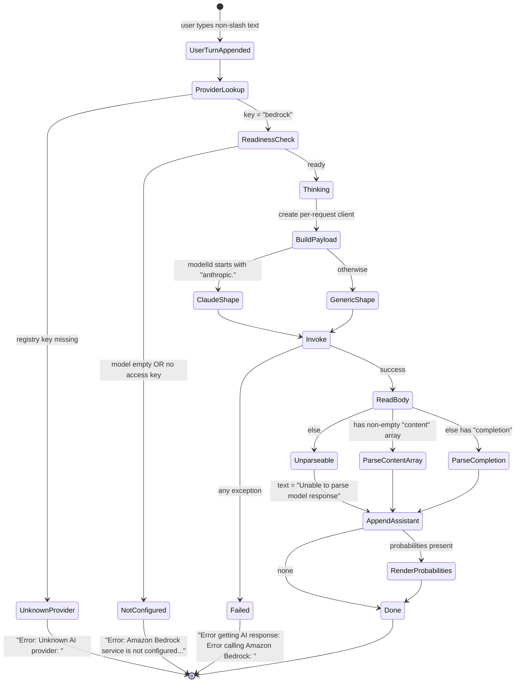

# Feature: Amazon Bedrock Integration

> Source repo: `/mnt/g/3RD-Party/reversing/subject/chatdbg` @ commit `d8c18f61d6bb73666ed97cd4885e877e35558485`
> Primary evidence: `src/Xcaciv.ChatDbg.Core/Services/BedrockService.cs`, `src/Xcaciv.ChatDbg.Core/Services/IBedrockRuntimeClientFactory.cs`, `src/Xcaciv.ChatDbg.Core/Services/DefaultBedrockRuntimeClientFactory.cs`, `src/Xcaciv.ChatDbg.Core.Tests/Services/BedrockServiceTests.cs`, `src/Xcaciv.ChatDbg.Core.Tests/Services/DefaultFactoriesTests.cs`
> All line references are to the pinned commit.

---

## Purpose

ChatDbg is a terminal chat client for debugging assistance that can talk to several different AI back ends. This feature is **one of the three interchangeable back ends**: the Amazon-hosted managed-model service ("Amazon Bedrock"). It exists so that a user who has an AWS account with entitlement to hosted foundation models (primarily the Anthropic Claude family) can point ChatDbg at that account instead of at Microsoft-hosted models or a locally-loaded model file.

**What problem it solves**
- Lets an organisation that already standardises on AWS use its existing AWS identity, region, and billing relationship for the chat assistant, rather than provisioning a second cloud AI vendor.
- Provides a second cloud provider so users are not locked to one vendor (`README.md:3`, `README.md:7`).
- *Attempts* to provide the same token-probability introspection as the other back ends (`README.md:206`) — see "Business rules" for what it actually delivers.

**Actors / roles**
| Actor | Interaction |
|---|---|
| End user of the terminal shell (developer / debugger) | Chooses `bedrock` as the provider, sets a model identifier and a region, supplies AWS credentials out-of-band, then types free-text chat turns. |
| The shell host (plain-console REPL and the windowed terminal UI) | Owns the provider registry, decides which back end handles a turn, renders the answer and any probability data. |
| AWS account administrator | Grants the IAM permissions needed to invoke the chosen model in the chosen region (out of scope of this code, but a hard prerequisite — `README.md:124`). |
| Test harness | Substitutes a fake client so no network call happens (`src/Xcaciv.ChatDbg.Core.Tests/Services/BedrockServiceTests.cs:43-53`). |

This back end is **not** the owner of the provider abstraction (adjacent feature), nor of settings persistence, nor of credential storage, nor of the probability *visualisation*. It only produces data those features consume.

---

## Behavior

The feature is a single stateless back-end component registered in the host's provider registry under the key `"bedrock"` — twice in live code (`src/ChatDbg/ChatShell.cs:32`, `src/ChatDbg.Shell.Gui/Program.cs:25`) and once in a source file that is never reached at runtime (`src/ChatDbg.Shell.Gui/ChatShell.cs:36`, dead code — see Q25). It supports exactly four observable operations, all synchronous-looking but asynchronous internally, and **none of them accept a cancellation signal**.

### Operation 1 — Report the provider's display name
- **Input:** none.
- **Output:** the constant string `Amazon Bedrock` (`BedrockService.cs:21`).
- **Side effects:** none.
- **Observed by user:** appears in warning/error text such as `Warning: Amazon Bedrock service is not configured.` (`src/ChatDbg/ChatShell.cs:260`) and `Error: Amazon Bedrock service is not configured. Use environment variables or Windows Credential Manager to configure credentials securely.` (`src/ChatDbg/ChatShell.cs:358`).

### Operation 2 — Readiness check ("is this back end configured?")
- **Input:** the full settings object.
- **Output:** boolean.
- **Rule:** true only when **both**:
  1. the model identifier is non-empty, **and**
  2. *either* the resolved AWS access key is non-empty *or* the process environment variable `AWS_ACCESS_KEY_ID` is non-empty
  (`BedrockService.cs:23-28`).
- **Notably NOT checked:** the AWS secret key, the region, or whether the model identifier looks like a Bedrock model at all.
- **Side effects:** reads process environment; may read the OS credential vault as a side effect of resolving the access key (that resolution lives in the adjacent Credential Management feature).
- **Observed by user:** at shell start-up the shell prints a block of remediation instructions when this returns false, and prints `AWS credentials loaded from: <source>` when it returns true and at least one AWS credential is present (`src/ChatDbg/ChatShell.cs:278-291`, `:305-313`). The windowed project contains an equivalent start-up block (`src/ChatDbg.Shell.Gui/ChatShell.cs:243-256`, `:267-271`) that **never runs** — that class is dead code (Q25) — so in the windowed app the user gets no start-up readiness feedback at all.

### Operation 3 — Send a chat turn and get plain text back
- **Input:** the whole conversation history object + the settings object.
- **Behavior:** delegates entirely to Operation 4 and returns only the text field; if that text is null it returns the literal fallback string `Error: Response text expected, none given.` (`BedrockService.cs:30-34`). Note the trailing period — the Azure sibling's equivalent string has no trailing period, so the two are not identical.
- **Side effects:** identical to Operation 4 (a real remote model invocation).

### Operation 4 — Send a chat turn and get text plus optional per-token probabilities
This is the whole feature. Ordered behaviour (`BedrockService.cs:36-220`):

1. **Guard.** If Operation 2 says "not configured", abort immediately by raising an operation-invalid failure carrying the message `Amazon Bedrock service is not properly configured. Please set ModelId and AWS credentials.` (`:38-41`). This guard runs *outside* the try/catch, so this message reaches the caller unwrapped.
2. **Create a client.** Ask the injected client factory for a Bedrock runtime client, passing the whole settings object (`:45`). The client is created **per request** and released when the request ends, on both the success and failure paths. No client pooling, no reuse.
3. **Flatten the conversation.** Walk the history in order, skip any message flagged as a command, and emit one entry per remaining message with two fields: a role and the content string (`:48-58`).
   - Role mapping is binary: content whose role, lowercased, equals `assistant` becomes `assistant`; **every other role — including `system` — becomes `user`** (`:55`).
4. **Detect the model family.** The model is treated as "Claude family" if and only if the model identifier **starts with the literal prefix `anthropic.`**, compared case-insensitively (`:61`). Everything else takes the "generic" path.
5. **Build the request payload** (two shapes, below).
6. **Log the payload** to the platform debug channel as `Bedrock request: <json>` (`:107-108`). This is a diagnostic sink, not user-visible output; it contains the entire conversation.
7. **Invoke the model** with content type `application/json`, accept type `application/json`, the model identifier, and the UTF-8-serialised payload as the body (`:110-118`).
8. **Read the whole response body** as a single string (no streaming) and log it as `Bedrock response: <json>` (`:120-124`).
9. **Parse the response** (three shapes, below).
10. **Return.** If at least one token-probability entry was produced, return text + probability list; otherwise return text only (`:208-213`). The elapsed-time and error-message fields of the response envelope are never populated by this back end.
11. **Any failure at all** in steps 2–10 is caught, logged as `Error in BedrockService: <full exception>`, and re-raised as an operation-invalid failure with message `Error calling Amazon Bedrock: <inner message>`, preserving the original as the cause (`:215-219`).

#### Request payload shape A — "Claude family" (`BedrockService.cs:68-78`)
A JSON object with exactly these members, in this order:

| Member | Value |
|---|---|
| `anthropic_version` | constant string `bedrock-2023-05-31` |
| `max_tokens` | the settings max-token integer |
| `temperature` | the settings temperature number |
| `system` | the currently-selected system-prompt text (a computed, never-persisted setting) |
| `messages` | the flattened role/content array from step 3 |
| `logprobs` | the boolean "probabilities enabled" setting — **emitted even when false** |
| `top_logprobs` | the top-K setting when probabilities are enabled, otherwise the integer `0` |

#### Request payload shape B — "generic / non-Claude" (`BedrockService.cs:84-103`)
A JSON object with exactly these members:

| Member | Value |
|---|---|
| `max_tokens` | the settings max-token integer |
| `temperature` | the settings temperature number |
| `messages` | an array whose **first element is a synthetic entry with role `system` and the system-prompt text as content**, followed by the flattened conversation |
| `logprobs` | the boolean "probabilities enabled" setting |
| `top_logprobs` | the top-K setting when enabled, otherwise `0` |

There is no `anthropic_version` in shape B, and no other model-family-specific member (no prompt string, no input-text field, no generation-config object).

#### Response parsing — three mutually exclusive branches (`BedrockService.cs:126-205`)
Evaluated strictly in this order; the first match wins.

1. **Structured-content branch** — the top-level response has a member `content` that is a **non-empty array** (`:133-135`). A `content` member that is present but is an **empty** array, or is not an array at all, fails this test and falls through to branch 2.
   - Text = the `text` member of `content[0]`, or the literal `No response received` if that member is present but null (`:138-141`). **If `content[0]` has no `text` member at all, the text stays the empty string** — no fallback message.
   - Probabilities: only if the "probabilities enabled" setting is true **and** the top-level response has a non-null `logprobs` member (`:144-146`). That member is enumerated as an array; each element needs both a `token` string and a `logprob` number to be accepted; elements missing either are silently skipped (`:151-155`). Each accepted element may carry a `top_logprobs` array of alternatives, each requiring `token` + `logprob` (`:167-182`).
   - **This branch has no local tolerance.** Unlike branch 2, it is not wrapped in its own failure guard. A `logprobs` member that is a non-null non-array, a `token` that is not a string, or a `logprob` that is not a number all raise, escape to the outer handler at `:215`, and destroy the whole turn — the user loses the assistant's text and sees `Error calling Amazon Bedrock: …` instead. The same applies to a `content[0].text` that is present but not a string (`:140`).
2. **Completion branch** — otherwise, if the top-level response has a member `completion` (`:190`).
   - Text = that string, or `No response received` if null (`:192`).
   - Probabilities: if enabled and a top-level `logprobs` member exists (of any kind, including null), hand it to the tolerant generic parser (`:195-200`).
3. **Unrecognised** — otherwise text is set to the literal `Unable to parse model response` (`:204`) and no probabilities are produced. **This is returned as a normal success, not as an error.**

#### The tolerant generic probability parser (`BedrockService.cs:225-324`)
Used only from branch 2. Never throws — any exception is swallowed, logged as `Error parsing log probabilities: <message>`, and yields "no probabilities" (`:319-323`). It accepts a top-K limit and **never reads it** (`:225`, no reference to it anywhere in `:227-323`) — i.e. no truncation to top-K happens here.

- **If the element is an array:** for each item, require `token` (string) and `logprob` (number). Alternatives are looked up under the first of three member names that is present, in this priority order: `top_logprobs`, then `alternatives`, then `top_alternatives` (`:251-256`). Each alternative needs `token` + `logprob`.
- **If the element is an object:** look for a member `tokens` that is an array; for each item read `token` and then `logprob` **or**, if absent, `log_prob` (`:283-302`). A missing/unreadable log-probability defaults to `0`. Items with an empty token string are dropped (`:304`). **Alternatives are never parsed in this shape — the alternatives collection is always left empty** (`:310`).
- **Any other shape** (string, number, boolean, null) produces nothing.
- Returns "no probabilities" rather than an empty list when nothing was extracted (`:317`).

### Operation 5 (degenerate) — Release
The back end advertises a release/teardown operation, but it does nothing except flip an internal "already released" flag, and it is guarded so a second call is a no-op (`BedrockService.cs:326-344`). The comment on `:336` states the reason: the remote client is created and destroyed inside each request. A last-resort cleanup hook is also registered even though there is nothing unmanaged to release (`:341-344`).

**Who actually calls it:** only the plain-console host. Its entry point wraps the shell in a scoped-release block (`src/ChatDbg/Program.cs:5`) and the shell then releases every registered back end (`src/ChatDbg/ChatShell.cs:698-713`). The windowed host does **not** — its entry point builds the registry and hands it to the main window (`src/ChatDbg.Shell.Gui/Program.cs:22-26`, `:79-87`), and the main window declares no teardown at all (no release member exists in `src/ChatDbg.Shell.Gui/UI/ChatWindow.cs`). The windowed project's own host file *does* contain release logic (`src/ChatDbg.Shell.Gui/ChatShell.cs:651-666`) but nothing anywhere in the repo ever creates that host — it is dead code (verified by grep: every hit for that name inside the windowed project is in the file's own definition). Harmless in practice because the operation is a no-op, but a reimplementation must not assume the windowed host tears back ends down.

---

## Business rules & edge cases

### Configuration / readiness
| # | Rule | Evidence |
|---|---|---|
| R1 | Ready ⇔ model identifier non-empty **AND** (resolved access key non-empty **OR** env var `AWS_ACCESS_KEY_ID` non-empty). | `BedrockService.cs:25-27` |
| R2 | The secret key is **never** part of the readiness test. A user with only an access key set is reported "configured" and will fail later at invocation time. | `BedrockService.cs:25-27` |
| R3 | The region is **never** validated or required by the readiness test. | `BedrockService.cs:23-28` |
| R4 | The `AWS_ACCESS_KEY_ID` clause in R1 is redundant: the resolved access key already consults `CHATDBG_AWS_ACCESS_KEY` then `AWS_ACCESS_KEY_ID` before falling through to the vault and the settings file. **QUIRK** — harmless but duplicated. | `BedrockService.cs:27` vs `src/Xcaciv.ChatDbg.Core/Models/ChatSettings.cs:73`, `:88-98` |
| R5 | Default model identifier in a fresh settings object is `gpt-4` — a non-empty, non-Bedrock value. So the "model identifier is set" half of R1 is satisfied by default and the Bedrock back end will happily send `gpt-4` to Bedrock via the generic payload shape. **QUIRK.** | `ChatSettings.cs:11` |
| R6 | Default region is the literal `us-east-1`. | `ChatSettings.cs:23`, `README.md:102` |
| R7 | The region is a free-text string; no allow-list, no format check, no normalisation, at any layer (`/set awsRegion <anything>` is accepted verbatim; the windowed settings dialog substitutes `us-east-1` only if the field yields null, not if it is blank or nonsense). | `src/Xcaciv.ChatDbg.Core/Commands/SetCommand.cs:92-94`; `src/ChatDbg.Shell.Gui/UI/SettingsDialog.cs:411`, `:417` |
| R8 | Region and model identifier are persisted in the settings file; AWS credentials are **not** persisted there by any supported path (the settings-file credential fields exist only for backwards compatibility and setting them through the shell is refused). | `ChatSettings.cs:22-23`, `:82-86`; `SetCommand.cs:264-270` |

### Credential resolution (owned by the adjacent Credential Management feature; consumed here)
| # | Rule | Evidence |
|---|---|---|
| R9 | Access key resolution order: env `CHATDBG_AWS_ACCESS_KEY` → env `AWS_ACCESS_KEY_ID` → OS credential vault under target name `ChatDbg:AwsAccessKey` (only when the vault integration flag is on) → settings-file field `awsAccessKey` (deprecated). First non-empty wins; result is the empty string if all are empty. | `ChatSettings.cs:73`, `:88-118`, `:127` |
| R10 | Secret key resolution order: env `CHATDBG_AWS_SECRET_KEY` → env `AWS_SECRET_ACCESS_KEY` → vault target `ChatDbg:AwsSecretKey` → settings-file field `awsSecretKey`. | `ChatSettings.cs:76`, `:128` |
| R11 | Vault lookup failures are swallowed silently and treated as "not found". | `ChatSettings.cs:138-141` |
| R12 | There is **no session-token / temporary-credential support anywhere**: no `AWS_SESSION_TOKEN`, no `ChatDbg:AwsSessionToken`, no settings field. Static long-lived keys only, when keys are supplied explicitly. | exhaustive grep over the repo: only `AWS_ACCESS_KEY_ID` / `AWS_SECRET_ACCESS_KEY` / `CHATDBG_AWS_*` appear |
| R13 | The user-visible credential-source label is one of exactly: `environment variable (<VAR NAME>)`, `Windows Credential Manager`, `settings file (deprecated)`, `not set`. | `ChatSettings.cs:173-201` |

### Client construction (`DefaultBedrockRuntimeClientFactory.cs:9-21`)
| # | Rule | Evidence |
|---|---|---|
| R14 | If **both** resolved access key and resolved secret key are non-empty → build a client with those two as explicit static credentials plus the region derived from the region string. | `:11-18` |
| R15 | Otherwise (either one empty) → build a client with **only** the region, letting the AWS SDK's own default credential-discovery chain find credentials (shared profile file, container/instance role, SSO, env vars, etc.). | `:20` |
| R16 | Consequence: because R9/R10 read the standard AWS env vars themselves, credentials that a user *thinks* are flowing through the AWS default chain are in fact being extracted and re-injected as static keys — which silently discards any session token that would accompany them. **QUIRK / real defect for temporary credentials.** | `ChatSettings.cs:73`, `:76` + `DefaultBedrockRuntimeClientFactory.cs:11-18` |
| R17 | The region string is converted to a region endpoint by system name. An unrecognised region name does not fail here; the SDK fabricates an endpoint from the name and the failure surfaces later as a DNS/connection error. **INFERRED** (SDK behaviour, not repo code). | `DefaultBedrockRuntimeClientFactory.cs:16`, `:20` |
| R18 | The factory abstraction exists purely so tests can inject a fake; the product never registers an alternative. | `IBedrockRuntimeClientFactory.cs:6-9`; `BedrockService.cs:16-19` |
| R19 | When the back end is created with no client-construction seam supplied, it falls back to the built-in one. This is how the product always creates it; only tests pass a substitute. | `BedrockService.cs:16-19`; `src/ChatDbg/ChatShell.cs:32` |

### Model-family routing
| # | Rule | Evidence |
|---|---|---|
| R20 | "Claude family" is decided by a **case-insensitive `anthropic.` prefix on the model identifier** and nothing else. No version parsing, no suffix parsing, no lookup table. | `BedrockService.cs:61` |
| R21 | **QUIRK:** cross-region inference-profile identifiers (which conventionally carry a geography prefix such as `us.anthropic.…`) fail the prefix test and would be routed down the generic path, producing a payload Anthropic models reject. **INFERRED** consequence — no test covers it. | `BedrockService.cs:61` |
| R22 | **QUIRK / doc disagreement (Q33):** the built-in `/set` help says the Bedrock model identifier looks like `claude-3`, which would *not* match the `anthropic.` prefix, while the README example is `anthropic.claude-3-sonnet-20240229-v1:0` which would. Code wins: only the fully-qualified `anthropic.`-prefixed form takes the Claude path. | `SetCommand.cs:310` vs `README.md:127` vs `BedrockService.cs:61` |
| R23 | The Claude payload's constant `anthropic_version` value is `bedrock-2023-05-31` — a fixed API-contract version string, never configurable. | `BedrockService.cs:70` |

### Log probabilities — what is actually obtainable
| # | Rule | Evidence |
|---|---|---|
| R24 | Both payload shapes always include a `logprobs` boolean and a `top_logprobs` integer. When the feature is off, they are `false` and `0`; the members are **not omitted**. | `BedrockService.cs:76-77`, `:101-102` |
| R25 | **QUIRK — this is the headline finding.** Neither `logprobs` nor `top_logprobs` is a member of the Anthropic-on-Bedrock request contract, and the generic shape is not any real Bedrock model's native contract either. So in practice, against a real service, enabling probabilities either produces a request-validation rejection or is ignored, and the response-side probability parsing is dead code against genuine responses. The only place it has ever been exercised is a hand-authored fake response in the unit test. | request: `BedrockService.cs:76-77`, `:101-102`; parse: `:144-187`; only exercise: `BedrockServiceTests.cs:28-41` |
| R26 | Unlike the Azure sibling, this back end has **no fabricate-simulated-probabilities fallback** when the model returns none. The Azure path manufactures placeholder probability data so the visualiser has something to show (`AzureOpenAIService.cs` around lines 203-208 of that file); Bedrock simply returns text only. | absence in `BedrockService.cs:207-213`; contrast `src/Xcaciv.ChatDbg.Core/Services/AzureOpenAIService.cs:203-208` |
| R27 | Consequence for the user: with probabilities enabled and Bedrock selected, the console shell prints the two-line notice `Note: Log probabilities were requested but none were returned by the model.` / `This could be due to the model not supporting this feature or an API limitation.` | `src/ChatDbg/ChatShell.cs:389-390` |
| R28 | **QUIRK — double exponentiation.** For the *primary* token, the raw log-probability is stored as-is, so the derived percentage (`e^value`) is correct. For each *alternative*, the code stores `e^logprob` — already a probability — into the same log-probability field. The derived percentage therefore evaluates `e^(e^logprob)`, which is always ≥ 1 (i.e. ≥ 100 %) and can exceed 271 %. This affects both parsing paths. | store raw: `BedrockService.cs:161`, `:240`; store exponentiated: `:178`, `:268`; derivation: `src/Xcaciv.ChatDbg.Core/Models/TokenLogProbabilities.cs:26` |
| R29 | The top-K setting is honoured only in the *request* (`top_logprobs`); it is never used to truncate what comes back. The generic parser accepts a `topK` argument and ignores it entirely. | `BedrockService.cs:199`, `:225` |
| R30 | Top-K valid range enforced upstream is **1–20 inclusive**, default **5**. | `SetCommand.cs:176-180`; `ChatSettings.cs:37` |
| R31 | Probability parsing is entirely opt-in: with the setting off, even a response that *does* contain a `logprobs` member is ignored. | `BedrockService.cs:144`, `:195` |
| R32 | Token entries lacking either `token` or `logprob` are silently dropped, not defaulted — except in the object-shaped generic path, where a missing log-probability defaults to `0` (which derives to exactly 100 %). | `BedrockService.cs:153-155`, `:236-237`, `:292`, `:299-301` |
| R33 | An empty extracted list is normalised to "no probabilities": the response envelope's probability field is left unset rather than set to an empty collection. | `BedrockService.cs:208-213`, `:317` |

### Rules pinned by the automated test suite

Two test files touch this feature. Everything below is a rule a reimplementation's own suite must be able to satisfy, plus an honest statement of what the source suite does **not** pin. Exactly **three** test cases exist for the entire feature.

| # | Rule the tests pin | Evidence |
|---|---|---|
| T1 | With a settings record left entirely at its defaults and no AWS values reachable from the process environment, readiness reports **false**. Note this passes *despite* the default model identifier being the non-empty `gpt-4` — the failing half is the credential clause, not the model clause. | `BedrockServiceTests.cs:17-23` |
| T2 | Exactly one client is requested per chat turn, and it is requested **with the very same settings record instance** the caller passed in (not a copy, not a projection). | `BedrockServiceTests.cs:69` |
| T3 | Exactly one model invocation is performed per chat turn. | `BedrockServiceTests.cs:70` |
| T4 | The invocation carries a cancellation argument that the back end never populates — the fake accepts any value for it, and the production path supplies none. | `BedrockServiceTests.cs:46`, `:70`; `BedrockService.cs:118` |
| T5 | Given the fixture body `{"completion": "bedrock response", "logprobs": [{"token":"Hello","logprob":-0.1,"top_logprobs":[{"token":"Hi","logprob":-0.2}]}]}` with probabilities enabled at top-K `1`, the returned text is exactly `bedrock response` and the returned probability list is **non-null**. | `BedrockServiceTests.cs:28-41`, `:67-68` |
| T6 | The settings used for that round trip are: model identifier `anthropic.claude`, settings-file access key `key`, settings-file secret key `secret`, probabilities enabled, top-K `1`. | `BedrockServiceTests.cs:56-63` |
| T7 | Client construction with **both** keys resolvable and region `us-east-1` yields a usable client with **no network call and no credential validation** — the dummy values `access` / `secret` are accepted. | `DefaultFactoriesTests.cs:19-33` |

**What the tests deliberately do *not* pin — a reimplementation is free here, and the source is unverified here:**

| # | Gap | Evidence |
|---|---|---|
| T8 | The probability list's **contents** are never asserted. Only `!= null` is checked — not the token `Hello`, not the stored value `-0.1`, not the presence or value of the alternative `Hi`. The double-exponentiation defect (R28) is therefore invisible to the suite. | `BedrockServiceTests.cs:68` |
| T9 | The **request payload is never inspected.** No test reads back the body handed to the fake client, so neither payload shape, neither `logprobs`/`top_logprobs` member, the role coercion, the command filter, the ordering, nor the synthetic `system` entry is covered by any assertion. | `BedrockServiceTests.cs:43-70` (no captured-argument assertion anywhere) |
| T10 | The fixture combines a **Claude-family model identifier** (`anthropic.claude`, which takes request shape A) with a **completion-shaped response** (which takes response branch 2). No real service produces that pairing. Consequence: the only exercised response path is the tolerant fallback parser; the structured-content branch (`:133-188`) has **zero** test coverage despite being the branch a real Anthropic model would hit. | `BedrockServiceTests.cs:58` vs `:30`; `BedrockService.cs:61`, `:190` |
| T11 | The test supplies credentials by writing the **deprecated settings-file fields directly** — the exact storage path the shell refuses to let a user populate (`/set awsAccessKey` is rejected). The tested credential path is the one the product blocks. | `BedrockServiceTests.cs:59-60`, `DefaultFactoriesTests.cs:28-29` vs `SetCommand.cs:264-270` |
| T12 | The region-only client-construction branch (either key empty) is **never** exercised; only the both-keys branch is. | `DefaultFactoriesTests.cs:19-33` vs `DefaultBedrockRuntimeClientFactory.cs:20` |
| T13 | Untested entirely: the plain-text send operation, the provider-name operation, the release operation, the readiness "true" case, the unparseable-response branch, the object-shaped generic parser, the `alternatives` / `top_alternatives` member names, the error-wrapping path, and every region string other than `us-east-1`. | absence across `BedrockServiceTests.cs`, `DefaultFactoriesTests.cs` |

### Numeric limits and magic values reaching this feature
| Value | Meaning | Where enforced |
|---|---|---|
| `us-east-1` | Default AWS region; also the fallback the windowed settings dialog writes if the region field yields null | `ChatSettings.cs:23`; `SettingsDialog.cs:417` |
| `0.7` | Default temperature | `ChatSettings.cs:14` |
| `0.0`–`2.0` | Accepted temperature range (inclusive) | `SetCommand.cs:72-75`; dialog clamps rather than rejects: `SettingsDialog.cs:422-425` |
| `1000` | Default max output tokens | `ChatSettings.cs:17` |
| `1`–`8192` | Accepted max-token range (inclusive) | `SetCommand.cs:81-85`; dialog clamps: `SettingsDialog.cs:427-430` |
| `5` | Default top-K alternatives | `ChatSettings.cs:37` |
| `1`–`20` | Accepted top-K range | `SetCommand.cs:176-180` |
| `false` | Default for "probabilities enabled" | `ChatSettings.cs:34` |
| `bedrock-2023-05-31` | Constant Anthropic-on-Bedrock contract version | `BedrockService.cs:70` |
| `anthropic.` | Model-family discriminator prefix | `BedrockService.cs:61` |
| `application/json` | Both the request content type and the accept type | `BedrockService.cs:113-114` |
| `0` | `top_logprobs` value sent when probabilities are disabled | `BedrockService.cs:77`, `:102` |
| `gpt-4` | Default model identifier — non-empty, and **not** a Bedrock identifier (Q18) | `ChatSettings.cs:11` |
| `azure` | Default provider; Bedrock is never the default | `ChatSettings.cs:8` |
| `"assistant"` (lower-cased comparison) | The **only** history role that survives mapping; everything else becomes `"user"` | `BedrockService.cs:55` |
| `"system"` | The role of the single synthetic first entry in the generic payload — always index 0 | `BedrockService.cs:88` |
| `default` | Default system-prompt name (the prompt *text* is resolved at start-up and never persisted) | `ChatSettings.cs:27`, `:30`; `src/ChatDbg.Shell.Gui/Program.cs:61-68` |
| `1` | Number of remote round trips per chat turn — pinned by test | `BedrockServiceTests.cs:70` |
| `0` | Elapsed-time value on the produced response envelope — never populated by this back end | `BedrockService.cs:210`, `:213`; `AIResponse.cs:26` |

### Identifiers, file paths and environment variables reaching this feature
| Literal | Meaning | Evidence |
|---|---|---|
| `bedrock` | Provider registry key and the `/set provider` value; lower-cased before comparison | `SetCommand.cs:46-53`; `src/ChatDbg/ChatShell.cs:32` |
| `CHATDBG_AWS_ACCESS_KEY` | Highest-priority access-key environment variable | `ChatSettings.cs:73` |
| `AWS_ACCESS_KEY_ID` | Second-priority access-key environment variable; **also read a second time, redundantly, by the readiness check** (Q17) | `ChatSettings.cs:73`; `BedrockService.cs:27` |
| `CHATDBG_AWS_SECRET_KEY` | Highest-priority secret-key environment variable | `ChatSettings.cs:76` |
| `AWS_SECRET_ACCESS_KEY` | Second-priority secret-key environment variable | `ChatSettings.cs:76` |
| `AWS_SESSION_TOKEN` | **Never read anywhere in the repo** — no temporary-credential support (Q19) | exhaustive grep over the repo returns no hits |
| `ChatDbg:AwsAccessKey` | OS credential-vault target name for the access key (Windows only, opt-in) | `ChatSettings.cs:127` |
| `ChatDbg:AwsSecretKey` | OS credential-vault target name for the secret key (Windows only, opt-in) | `ChatSettings.cs:128` |
| `awsAccessKey` / `awsSecretKey` | Deprecated settings-file member names; readable, but unwritable through any supported user action | `ChatSettings.cs:82-86`; `SetCommand.cs:264-270` |
| `awsRegion`, `modelId`, `provider`, `temperature`, `maxTokens`, `enableLogProbabilities`, `logProbabilitiesTopK` | Settings-file member names this feature depends on | `ChatSettings.cs:7-37` |
| `~/.ChatDbg/settings.json` | Settings file: `.ChatDbg` under the user-profile folder, indented, camel-cased member names; falls back to the system temp directory if the profile folder is unavailable | `SettingsService.cs:11-38`; `README.md:96` |
| `advapi32.dll` | Native library backing the Windows-only credential vault — the feature's only OS-specific dependency | `WindowsCredentialManager.cs:11-21` |
| `AWSSDK.BedrockRuntime` `4.0.7.3` | Pinned SDK version (the stale `prd.md` copies say `4.0.7` — Q38) | `src/Xcaciv.ChatDbg.Core/Xcaciv.ChatDbg.Core.csproj:11` |

**QUIRK (temperature range mismatch):** ChatDbg permits temperature up to `2.0`, but the Anthropic-on-Bedrock contract caps temperature at `1.0`. A user who sets `1.5` will get a request-validation rejection surfaced as `Error calling Amazon Bedrock: …`. **INFERRED** (upstream service limit, not visible in this repo).

### Exact user-visible strings this feature causes to be shown

Reproduce these verbatim, punctuation and misspellings included. Leading whitespace is significant where shown.

| String (verbatim) | When | Evidence |
|---|---|---|
| `Amazon Bedrock` | The back end's display name, interpolated into every message below that says "Amazon Bedrock" | `BedrockService.cs:21` |
| `Amazon Bedrock service is not properly configured. Please set ModelId and AWS credentials.` | Internal guard on the send path. Surfaces to the user **only in the windowed host**, wrapped as `Failed to get AI response: …` | `BedrockService.cs:40`; `ChatWindow.cs:496` |
| `Error calling Amazon Bedrock: <inner message>` | Every failure between client creation and return | `BedrockService.cs:218` |
| `Error: Response text expected, none given.` | Plain-text send operation when the envelope's text is null (trailing period) | `BedrockService.cs:33` |
| `No response received` | `content[0].text` or `completion` is JSON null | `BedrockService.cs:140`, `:192` |
| `Unable to parse model response` | Response matched neither shape — appended as the assistant's words, **not** an error | `BedrockService.cs:204` |
| `Warning: Amazon Bedrock service is not configured.` | Console start-up readiness check | `src/ChatDbg/ChatShell.cs:260` |
| `   Use one of the following credential methods:` `   1. Environment Variables:` `      set CHATDBG_AWS_ACCESS_KEY=your-access-key` `      set CHATDBG_AWS_SECRET_KEY=your-secret-key` `      Or use standard AWS variables: AWS_ACCESS_KEY_ID, AWS_SECRET_ACCESS_KEY` | Console start-up remediation block for the Bedrock provider | `src/ChatDbg/ChatShell.cs:280-284` |
| `   2. Windows Credential Manager: /set enablewincred` `      Then: /set wincred awsAccessKey your-access-key` `            /set wincred awsSecretKey your-secret-key` | Appended to the block above **only when the OS vault is available (Windows)** | `src/ChatDbg/ChatShell.cs:288-290` |
| `AWS credentials loaded from: <source>` where `<source>` ∈ { `environment variable (CHATDBG_AWS_ACCESS_KEY)`, `environment variable (AWS_ACCESS_KEY_ID)`, `Windows Credential Manager`, `settings file (deprecated)`, `not set` } | Console start-up when readiness is true **and** at least one of the two AWS keys resolves non-empty | `src/ChatDbg/ChatShell.cs:312`; `ChatSettings.cs:180`, `:190`, `:197`, `:200` |
| `Error: Amazon Bedrock service is not configured. Use environment variables or Windows Credential Manager to configure credentials securely.` `   Type '/set' to see current configuration and setup instructions.` | Console per-turn readiness short-circuit | `src/ChatDbg/ChatShell.cs:358-359` |
| `Error getting AI response: <message>` | Console wrapper around any raised failure | `src/ChatDbg/ChatShell.cs:407` |
| `Log probabilities enabled - requesting with top-k=<K>` | Console, printed before the turn when probabilities are enabled | `src/ChatDbg/ChatShell.cs:373` |
| `Error: Response text expected, none recieved.` [sic — misspelled] | Console fallback stored into history when the envelope's text is null on the probability path | `src/ChatDbg/ChatShell.cs:377` |
| `\nNote: Log probabilities were requested but none were returned by the model.` `This could be due to the model not supporting this feature or an API limitation.` | Console, probabilities enabled but list empty or null | `src/ChatDbg/ChatShell.cs:389-390` |
| `Error: Unknown AI provider: <key>` | Console, configured provider key absent from the registry | `src/ChatDbg/ChatShell.cs:351` |
| `Unknown AI provider: <key>` (modal titled `Error`) | Windowed host, same condition | `ChatWindow.cs:433` |
| `AI provider is not set in settings` (modal titled `Error`) | Windowed host — **unreachable**, see Quirks | `ChatWindow.cs:428` |
| `Failed to get AI response: <message>` (modal titled `Error`) | Windowed host, any raised failure | `ChatWindow.cs:496` |
| `Provider must be 'azure', 'bedrock', or 'llama'` | `/set provider <x>` with any other value (value is lower-cased first) | `SetCommand.cs:50` |
| `Set awsRegion = <value>` | Successful `/set awsRegion` | `SetCommand.cs:289` |
| `Unknown setting: <key>. Valid keys: provider, modelId, temperature, maxTokens, azureEndpoint, awsRegion, systemPrompt, enableLogProbabilities, logProbabilitiesTopK, useWindowsCredentialManager, enablewincred, wincred, migrate` | `/set` with an unrecognised key. Note `awsAccessKey` / `awsSecretKey` are handled cases yet absent from this list — see Quirks | `SetCommand.cs:280` |
| `For security, AWS Access Key is no longer set via this command.`  `## Secure Options:` `1. Environment Variables (Recommended):` `   set CHATDBG_AWS_ACCESS_KEY=your-credential` `   set AWS_ACCESS_KEY_ID=your-credential`  `This keeps your credentials secure and out of configuration files.` | `/set awsAccessKey …` — always refused. The secret-key variant substitutes `AWS Secret Key`, `CHATDBG_AWS_SECRET_KEY`, `AWS_SECRET_ACCESS_KEY` | `SetCommand.cs:264-270`, `:378-398` |
| `\n2. Windows Credential Manager (Secure Option):` `   /set enablewincred                    (enable Windows Credential Manager)` `   /set wincred <type> your-credential   (store credential)` | Inserted into the block above **only on Windows** | `SetCommand.cs:391-394` |
| `- AWS Region: <value>` | `/set` with no arguments, settings listing | `SetCommand.cs:410` |
| `- AWS Access Key: <***set*** \| (not set)> [<source>]` `- AWS Secret Key: <***set*** \| (not set)> [<source>]` | `/set` with no arguments — the key values themselves are never printed | `SetCommand.cs:421-422`, `:461-463` |
| `For Amazon Bedrock: model ID (e.g., claude-3)` | `/set` detailed help — **contradicts the code's `anthropic.` prefix test**, see Quirks | `SetCommand.cs:310` |
| `AWS Bedrock` (radio option, index 1) / `AWS Region:` (field label) | Windowed settings dialog | `SettingsDialog.cs:79`, `:102` |

Traces written to the platform debug channel (not user-visible in a release build): `Bedrock request: <full request JSON>` (`BedrockService.cs:108`), `Bedrock response: <full response JSON>` (`:124`), `Error in BedrockService: <full exception>` (`:217`), `Error parsing log probabilities: <message>` (`:321`).

### Ordering guarantees
- Conversation entries are emitted in **history insertion order**, filtered but never reordered, deduplicated, truncated, or windowed (`BedrockService.cs:51`). There is **no context-window management of any kind** — the entire history is resent every turn.
- In the generic payload the synthetic system entry is **always index 0**, ahead of all history (`BedrockService.cs:84-92`).
- Token-probability entries preserve source order; alternatives preserve source order within a token.
- Response-shape detection order is fixed: structured `content` array → `completion` → unparseable (`BedrockService.cs:133`, `:190`, `:202`).
- Alternative-member-name lookup order in the generic parser is fixed: `top_logprobs` → `alternatives` → `top_alternatives` (`BedrockService.cs:251-256`).

### Other edge cases
- **Empty conversation:** nothing prevents sending a payload with an empty `messages` array (the Claude shape would then contain only the system text). No guard exists (`BedrockService.cs:48-58`). In practice the shells always append the user's turn first (`src/ChatDbg/ChatShell.cs:346`).
- **Command-flagged messages** are excluded from the payload, so slash-command traffic never reaches the model (`BedrockService.cs:51`).
- **An injected `system` message** (via the shell's message-injection command) is downgraded to role `user` on the Claude path and does not become a system directive (`BedrockService.cs:55`). This differs from the Azure sibling, which preserves the three roles distinctly (`AzureOpenAIService.cs:84-95`).
- **System-prompt text is never persisted** and always defaults to `You are ChatDBG, a helpful debugging assistant. Help users analyze code, debug issues, and understand programming concepts.` unless a prompt has been selected in-session (`ChatSettings.cs:29-30`).
- **No retry, no back-off, no timeout override, no rate-limit handling, no streaming** anywhere in this feature.
- **No response-envelope timing:** the elapsed-time field of the shared response object is left at zero by this back end, though other consumers may read it.

---

## Workflows & states

### Workflow A — Getting to a working Bedrock session (user-facing, numbered)
1. Select the provider: `/set provider bedrock`. Only `azure`, `bedrock`, `llama` are accepted; anything else returns the error `Provider must be 'azure', 'bedrock', or 'llama'` (`SetCommand.cs:46-53`). The windowed UI offers the same three as radio choices labelled `Azure OpenAI` / `AWS Bedrock` / `Local LLM (LLama)` (`SettingsDialog.cs:79-89`).
2. Set the model identifier: `/model <id>` or `/set modelId <id>`. The value is the remainder of the line joined by single spaces, so identifiers with spaces survive (`SetCommand.cs:55-68`, `src/Xcaciv.ChatDbg.Core/Commands/ModelCommand.cs:28-34`). No Bedrock-specific validation runs (the file-existence check applies only to the local-model provider).
3. Set the region: `/set awsRegion <region>` (`SetCommand.cs:92-94`) or the `AWS Region:` text field in the windowed settings dialog (`SettingsDialog.cs:102-107`).
4. Supply credentials **out of band** — the shell refuses to accept them as a setting. `/set awsAccessKey …` and `/set awsSecretKey …` both fail with an instructional message listing `CHATDBG_AWS_ACCESS_KEY` / `AWS_ACCESS_KEY_ID` (resp. `CHATDBG_AWS_SECRET_KEY` / `AWS_SECRET_ACCESS_KEY`) and, when the OS vault is available, the two-step vault flow (`SetCommand.cs:264-270`, `:378-398`).
5. Each of the above (except credentials) persists the whole settings file immediately (`SetCommand.cs:283-287`).
6. On next start-up the shell re-reads the settings file and reports readiness plus, when ready, the credential source line (`src/ChatDbg/ChatShell.cs:239-320`).

### Workflow B — One chat turn (state machine)

Notes on the shell-side transitions (these belong to the shells, listed here because they are what the user actually observes):
- The user's message is appended to history **before** the readiness check, so a failed turn leaves an orphan user message in the transcript (`src/ChatDbg/ChatShell.cs:346-359`).
- With probabilities enabled the console shell first prints `Log probabilities enabled - requesting with top-k=<K>` (`:373`), then `Thinking...` was already printed at `:363`.
- The assistant reply is appended with its probability list attached when present (`:377`); the null-text fallback used at that point is the misspelled `Error: Response text expected, none recieved.` (`:377`) — different from the service-level fallback string.
- The windowed UI, on the first turn that yields probabilities, splits the layout: shrinks the transcript pane to 60 % width and opens a probability pane beside it, scrolled to the top (`src/ChatDbg.Shell.Gui/UI/ChatWindow.cs:449-482`). Failures surface as a modal error box titled `Error` with body `Failed to get AI response: <message>` (`ChatWindow.cs:496`).

### Workflow C — Test-double path
The client-construction seam is replaced by a stand-in that hands back a scripted client whose invoke operation yields a fixed JSON body (`BedrockServiceTests.cs:43-51`). The turn is then driven end-to-end with no network. Asserted: the returned text equals `bedrock response`, the probability list is non-null, the seam was asked for a client exactly once with the same settings record, and exactly one invocation occurred (`:65-70`). This pins two contracts a reimplementation must keep — settings reach client construction by identity, and one remote round trip per turn — but it pins nothing about the payload or the probability contents. See rules T1–T13 for the full picture.

---

## Data

This feature **owns no persisted entity**. It reads two shared entities and produces one shared entity.

### Consumed: settings record (owned by Settings & Configuration)
Fields this feature actually reads:

| Field | Generic type | Constraint / default | Read at |
|---|---|---|---|
| provider | short string enum-like | one of `azure` \| `bedrock` \| `llama`; default `azure` | registry key selection |
| model identifier | free text | default `gpt-4`; must be non-empty for readiness; `anthropic.` prefix selects Claude shape | `BedrockService.cs:25`, `:61`, `:112` |
| AWS region | free text | default `us-east-1`; unvalidated | `DefaultBedrockRuntimeClientFactory.cs:16`, `:20` |
| resolved AWS access key | secret string, computed, never serialised | may be empty | `BedrockService.cs:26`; `DefaultBedrockRuntimeClientFactory.cs:11` |
| resolved AWS secret key | secret string, computed, never serialised | may be empty | `DefaultBedrockRuntimeClientFactory.cs:11` |
| temperature | decimal | 0.0–2.0; default 0.7 | `BedrockService.cs:72`, `:98` |
| max output tokens | integer | 1–8192; default 1000 | `BedrockService.cs:71`, `:97` |
| system-prompt text | free text, computed, never serialised | default is the ChatDBG assistant paragraph | `BedrockService.cs:73`, `:89` |
| probabilities-enabled flag | boolean | default false | `BedrockService.cs:76`, `:101`, `:144`, `:195` |
| top-K alternatives | integer | 1–20; default 5 | `BedrockService.cs:77`, `:102`, `:199` |

Persisted member names in the settings file that matter here: `provider`, `modelId`, `temperature`, `maxTokens`, `awsRegion`, `enableLogProbabilities`, `logProbabilitiesTopK`, plus the deprecated `awsAccessKey` / `awsSecretKey` (`ChatSettings.cs:7-46`, `:79-86`). File location: a `.ChatDbg` folder under the user's home directory, file `settings.json`, camel-cased and indented, falling back to the system temp directory if the home directory is unreadable (`src/Xcaciv.ChatDbg.Core/Services/SettingsService.cs:11-38`).

### Consumed: conversation history (owned by the shells)
Ordered list of turns, each with: role (free text; only `assistant` is special-cased here), content text, a UTC timestamp, an is-command flag, and an optional per-token probability list. Only role, content, and the is-command flag are read by this feature (`src/Xcaciv.ChatDbg.Core/Models/ChatMessage.cs:6-19`; `BedrockService.cs:51-57`).

### Produced: AI response envelope (owned by the AI Provider Abstraction)
| Field | Generic type | Set by this feature? |
|---|---|---|
| text | optional string | yes, always |
| token-probability list | optional ordered list | only when at least one entry was parsed |
| total elapsed time | decimal seconds | **never** — stays 0 |
| error message | optional string | **never** — failures are raised, not returned |

### Produced: token-probability entry (owned by Token Probability Analysis)
| Field | Generic type | Notes |
|---|---|---|
| token | string | defaults to empty string when the source value is null |
| log probability | decimal | raw for primary tokens; **already exponentiated for alternatives** (R28) |
| derived probability | decimal, computed | `e^(log probability)` — never serialised |
| alternatives | optional ordered list of the same entry type | populated only in the array-shaped parse paths; always empty in the object-shaped generic path |

**Lifecycle:** every object this feature touches is created per request and either handed to the caller (response envelope, probability entries — which then live as long as the conversation history holds them) or discarded (payload objects, the remote client). The service object itself is created once per shell process at start-up and disposed at shutdown; it holds no mutable state other than a disposal flag.

---

## Interfaces

### Exposed to the AI Provider Abstraction (the shared back-end contract)
This feature implements the common back-end contract with four semantic obligations and one lifecycle obligation:
1. **Name yourself** → returns `Amazon Bedrock`.
2. **Say whether you are ready** given a settings record → boolean, no side effects the caller must undo.
3. **Answer a conversation, plain text** → string; must not return null (returns a fallback sentence instead).
4. **Answer a conversation, with probabilities** → response envelope; probabilities optional.
5. **Be disposable** → no-op here.
Failures in 3/4 are communicated as raised operation-invalid errors carrying a human-readable message, never as a populated error field on the envelope.

### Exposed to the shells
- Registered under the exact registry key `bedrock`; the windowed UI's radio index `1` maps to that key and vice-versa (`SettingsDialog.cs:83-89`, `:139-152`).
- The console shell keys its remediation-text branch off the same literal `bedrock` string (`src/ChatDbg/ChatShell.cs:278`).
- **QUIRK (Q25):** the windowed project has two wiring sites and they disagree — the live entry point registers all three back ends (`src/ChatDbg.Shell.Gui/Program.cs:22-26`) while a second host class registers only `azure` and `bedrock` (`src/ChatDbg.Shell.Gui/ChatShell.cs:33-37`). The second class is **never instantiated**, so the disagreement is latent rather than observable; a reimplementer copying the wrong file would ship a two-provider product.

### Consumed from Settings & Configuration
Reads (never writes) the settings record described under **Data**. It never calls the settings service and never persists anything itself.

### Consumed from Credential Management
Reads two computed secret properties whose resolution chain (environment → OS vault → deprecated settings file) is that feature's business. This feature adds one extra direct environment read of its own (`AWS_ACCESS_KEY_ID`) inside the readiness check (`BedrockService.cs:27`).

### Consumed from Token Probability Analysis
Emits entries in that feature's entry shape. The visualiser's grid/list layouts, sampling behaviour, and percentage formatting are that feature's concern; this back end only fills the fields — and fills the alternatives' field with a value in the wrong unit (R28).

### Consumed from the client-factory seam
A one-method abstraction, "given a settings record, hand me a Bedrock runtime client". Exists only so tests can avoid the network (`IBedrockRuntimeClientFactory.cs:6-9`). A reimplementation should keep an equivalent seam.

---

## External technology

| Generic capability | Protocol/standard if any | What the source used | Notes for reimplementer |
|---|---|---|---|
| Managed multi-vendor LLM inference service, invoke-once (non-streaming) | HTTPS + signed request (AWS SigV4), JSON request/response envelope, region-scoped endpoint | Amazon Bedrock Runtime, invoked through `AWSSDK.BedrockRuntime` 4.0.7.3 (`src/Xcaciv.ChatDbg.Core/Xcaciv.ChatDbg.Core.csproj:11`) | Only the single-shot "invoke model" operation is used — no streaming, no converse-style unified API, no tool use, no model listing. Content type and accept are both `application/json`. The body is an opaque per-model JSON document the caller must shape correctly; the service does not normalise across model families. |
| Cloud credential resolution & request signing | AWS SigV4; AWS default credential provider chain | AWS SDK's static-credential constructor when both keys resolve, otherwise the SDK's default chain (`DefaultBedrockRuntimeClientFactory.cs:11-20`) | Reimplement both branches. Beware: no session-token support, so temporary/STS credentials in the environment are silently downgraded to a key pair without their token and will fail authentication (R16). |
| Region/endpoint resolution from a region code | AWS region naming (`us-east-1`, `eu-west-1`, …) | `RegionEndpoint.GetBySystemName(<string>)` (`DefaultBedrockRuntimeClientFactory.cs:16`, `:20`) | Unknown names do not fail fast; they fabricate an endpoint. If you want validation, you must add it — the source has none. |
| Anthropic Claude message API, Bedrock flavour | JSON with `anthropic_version`, `system`, `messages[{role,content}]`, `max_tokens`, `temperature` | Hand-built payload, contract version pinned to `bedrock-2023-05-31` (`BedrockService.cs:68-78`) | Response is read as `content[0].text`. The source additionally sends non-contract `logprobs`/`top_logprobs` members — do **not** copy that unless you have verified the target service accepts them. |
| Legacy text-completion response shape | JSON with a top-level `completion` string | Parsed as a fallback branch (`BedrockService.cs:190-192`) | Kept for older Anthropic-style completions; this is the only shape the unit test exercises. |
| Any other Bedrock model family (Titan, Llama, Mistral, Cohere, AI21…) | each has its own native JSON contract | **Not actually implemented** — a single generic `messages` shape is sent (`BedrockService.cs:95-103`) | Treat the generic branch as a stub. A faithful reimplementation should either implement real per-family shapes or explicitly reject non-Anthropic identifiers. |
| JSON serialisation / DOM traversal | JSON (RFC 8259) | Platform JSON library; payload serialised from anonymous objects with default member naming (so members are emitted exactly as written: `max_tokens`, `top_logprobs`, `anthropic_version`), response walked as a DOM with try-get semantics (`BedrockService.cs:107`, `:115`, `:126`) | Member names must be reproduced verbatim, snake_case included. Note the Bedrock payload is serialised with **default** naming, unlike the Azure sibling which applies camel-casing. |
| Diagnostic trace channel | — | Platform debug-trace writes of the full request JSON, full response JSON, and full exception (`BedrockService.cs:108`, `:124`, `:217`, `:321`) | These are compiled out of release builds in the source platform; if your platform's equivalent is always-on, be aware the entire conversation is written to it. No credentials appear in these traces. |
| OS credential vault (indirect) | — | Windows Credential Manager under target names `ChatDbg:AwsAccessKey`, `ChatDbg:AwsSecretKey` (`ChatSettings.cs:127-128`) | Owned by the adjacent Credential Management feature; Windows-only, opt-in, silently unavailable elsewhere. |
| Unit-test isolation seam | — | Interface-based factory + mocking library (Moq 4.20.69) and xUnit 2.9.1 (`src/Xcaciv.ChatDbg.Core.Tests/Xcaciv.ChatDbg.Core.Tests.csproj:13`, `:18`) | Keep an injectable client seam so the whole request/response path is testable with zero network. |
| HTTP transport policy — timeout, retry count, back-off, connection pooling, proxy | HTTP/1.1 over TLS | **Nothing is configured.** No timeout, retry, back-off, proxy, or pooling setting is set anywhere; whatever the AWS SDK defaults to is what runs (`DefaultBedrockRuntimeClientFactory.cs:13-20` sets only credentials and region) | Your clone will not match the source's timing behaviour unless you match the SDK's defaults. Decide explicitly: the source made no decision. Note that the per-turn client construction (Q28) defeats pooling regardless of the transport's capabilities. |
| Cancellation / abort of an in-flight call | — | **Not used.** The invocation accepts a cancellation argument and none is supplied (`BedrockService.cs:118`) | Nothing in the source can abort a slow turn. If your platform makes cancellation cheap, adding it is a deliberate improvement, not a port. |
| Response body transport | Buffered byte stream read fully into one string before parsing | Read to end, then parsed (`BedrockService.cs:120-126`) | No streaming, no incremental rendering, no size cap. A very large answer is fully materialised in memory twice (raw string plus parsed document). |
| Exponential function for probability conversion | — | Standard-library `exp` applied at parse time to alternatives (`BedrockService.cs:178`, `:268`) and again at display time to every entry (`TokenLogProbabilities.cs:26`) | Any language's `exp` will do; the important part is *where* it is applied. See Q3. |
| Managed runtime | — | `net10.0` for all four projects (`src/Xcaciv.ChatDbg.Core/Xcaciv.ChatDbg.Core.csproj:4`, and the three siblings) | No runtime-version-specific behaviour in this feature. Note `.github/copilot-instructions.md` claims .NET 9 (Q37). |
| Native OS credential API (indirect, Windows-only) | Win32 credential store | `advapi32.dll` entry points `CredReadW`, `CredWriteW`, `CredDeleteW`, `CredFree` (`WindowsCredentialManager.cs:11-21`) | This is the feature's **only** OS-specific dependency, and it is reached indirectly. Map it to your platform's keychain/secret-service, or drop it and keep environment variables — the source already degrades to that off Windows. See **Platform coupling**. |

---

## Error handling

| Failure mode | What happens internally | What the user observes |
|---|---|---|
| Model identifier empty, or no AWS access key resolvable | Readiness check false; the send operation raises before any network work, message `Amazon Bedrock service is not properly configured. Please set ModelId and AWS credentials.` (`BedrockService.cs:40`) | **Depends on which host.** The plain-console host re-checks readiness before every turn and short-circuits, printing `Error: Amazon Bedrock service is not configured. Use environment variables or Windows Credential Manager to configure credentials securely.` then `   Type '/set' to see current configuration and setup instructions.` (`src/ChatDbg/ChatShell.cs:356-359` (check at `:356`, text at `:358-359`)) — the internal guard message never surfaces there. The **windowed host performs no readiness check on the send path at all** (`src/ChatDbg.Shell.Gui/UI/ChatWindow.cs:420-441`), so the guard raises and the user gets a modal titled `Error` reading `Failed to get AI response: Amazon Bedrock service is not properly configured. Please set ModelId and AWS credentials.` (`ChatWindow.cs:496`). At console start-up: `Warning: Amazon Bedrock service is not configured.` plus a numbered remediation list naming `CHATDBG_AWS_ACCESS_KEY`, `CHATDBG_AWS_SECRET_KEY`, `AWS_ACCESS_KEY_ID`, `AWS_SECRET_ACCESS_KEY`, and (Windows only) the two vault commands (`src/ChatDbg/ChatShell.cs:278-291`). |
| Access key present but secret key absent, and the AWS default chain finds nothing | Readiness says "configured"; the client is built region-only; the SDK raises at invoke time | `Error getting AI response: Error calling Amazon Bedrock: <SDK credential message>` (console) / modal `Failed to get AI response: …` (windowed) |
| Unknown/misspelled region | No local failure; endpoint fabricated; network resolution fails | `Error getting AI response: Error calling Amazon Bedrock: <DNS/connection message>` — **INFERRED** |
| Model not entitled in the account/region, or IAM denies invoke | SDK raises; caught and re-wrapped | `Error getting AI response: Error calling Amazon Bedrock: <access-denied message>` |
| Payload rejected by the model (e.g. unknown `logprobs` member, temperature above the model's cap, non-Anthropic model given the generic shape) | SDK raises a validation failure; caught and re-wrapped | `Error getting AI response: Error calling Amazon Bedrock: <validation message>` |
| Response is valid JSON but matches neither known shape | **No error.** Text becomes the literal `Unable to parse model response` and is appended to the transcript as the assistant's reply (`BedrockService.cs:204`) | A chat turn whose answer reads `Unable to parse model response`. Silent data loss — the real payload is only in the debug trace. |
| Structured `content[0]` present but has no `text` member | **No error.** Text stays the empty string (`BedrockService.cs:138-141`) | An empty assistant turn in the transcript. |
| Structured `content[0].text` is JSON null | Text becomes `No response received` (`BedrockService.cs:140`) | That literal appears as the assistant's answer. |
| `completion` member is JSON null | Text becomes `No response received` (`BedrockService.cs:192`) | Same. |
| Probability data malformed or in an unrecognised shape, **in the `completion` branch** | The tolerant parser swallows the failure, traces `Error parsing log probabilities: <message>`, and returns nothing (`BedrockService.cs:319-323`) | Text arrives normally; the shell prints `Note: Log probabilities were requested but none were returned by the model.` / `This could be due to the model not supporting this feature or an API limitation.` (`src/ChatDbg/ChatShell.cs:389-390`) |
| Probability data malformed, **in the structured-`content` branch** | **No local tolerance.** The failure escapes to the outer handler (`BedrockService.cs:215-219`). Triggers: `logprobs` present, non-null, and not an array (`:151`); a `token` member that is not a string (`:156`); a `logprob` member that is not a number (`:157`); the same for any alternative (`:177-178`) | The **entire answer is lost** and the turn becomes `Error getting AI response: Error calling Amazon Bedrock: <JSON access message>`. A single bad token entry destroys a good response — the exact opposite of the `completion` branch's behaviour. |
| `content[0].text` present but not a string (a number, object, or array) | Reading it as a string raises; escapes to the outer handler (`BedrockService.cs:140`, `:215-219`) | Whole turn fails with `Error getting AI response: Error calling Amazon Bedrock: …` rather than degrading to a fallback sentence. |
| Response stream unreadable / truncated | Read failure caught by the outer handler | `Error getting AI response: Error calling Amazon Bedrock: <IO message>` |
| Any exception whatsoever between client creation and return | Traced as `Error in BedrockService: <full exception>`, re-raised as operation-invalid with `Error calling Amazon Bedrock: <inner message>`, inner exception preserved (`BedrockService.cs:215-219`) | Console prefixes it with `Error getting AI response: `; windowed UI shows a modal titled `Error` with `Failed to get AI response: …` |
| Shell has no back end registered for the configured provider key | — | `Error: Unknown AI provider: <key>` (console, `src/ChatDbg/ChatShell.cs:351`) / modal `Unknown AI provider: <key>` (windowed, `src/ChatDbg.Shell.Gui/UI/ChatWindow.cs:433`) |

**No error path anywhere retries, backs off, or degrades to a different model or region.**

---

## Non-functional observations

- **Caching:** none. No response cache, no credential cache beyond what the credential feature does, and — significantly — **no client reuse**: a fresh remote client is constructed and torn down on every single chat turn (`BedrockService.cs:45`). This forfeits connection pooling and re-runs credential discovery per turn. The release operation's own comment acknowledges the design (`:336`).
- **Pagination:** not applicable; single request, single response, whole body buffered into memory as one string (`BedrockService.cs:120-121`). Large answers are fully materialised.
- **Concurrency:** the back end holds no mutable state besides its "already released" flag, so it is effectively safe for concurrent turns; however the shells serialise turns anyway. That flag itself is not guarded against simultaneous access, and the last-resort cleanup hook serves no purpose (there is nothing unmanaged to release).
- **Cancellation:** none. There is no way to abort an in-flight turn — consistent with the repo-wide convention of never threading a cancellation signal.
- **Context growth:** every turn resends the entire conversation. Cost and latency grow quadratically over a long session, and a long enough session will exceed the model's context window with no local warning (`BedrockService.cs:51`).
- **Permissions:** all authorisation is delegated to AWS IAM; the code performs no local permission checks and cannot distinguish "not entitled to the model" from any other invocation failure.
- **Performance-motivated code:** the payload is serialised straight to UTF-8 bytes rather than to a string for the request body (`BedrockService.cs:115`); note the same object is *also* serialised to a string immediately before, purely for the debug trace (`:107`) — a double serialisation on every turn even when nothing is listening.
- **i18n:** none. All operator- and user-facing strings are English literals embedded in code. Model roles, member names and the family-detection prefix are compared with explicit case-insensitive / invariant-culture semantics (`BedrockService.cs:55`, `:61`), which is correct; but temperature and token counts are serialised with default culture-invariant JSON rules, which is also correct.
- **Accessibility:** nothing here; rendering is the shells' concern.
- **Platform coupling:** see the dedicated section below.
- **Secret hygiene:** credentials are never written to the debug trace, and are shown in the settings listing only as the literal `***set***` or `(not set)` alongside their source label (`SetCommand.cs:421-422`, `:460-463`). Neither the console `/set` path nor the windowed settings dialog will write a key into the settings file — the dialog's credentials tab persists only the vault-enable checkbox (`SettingsDialog.cs:432-438`). One exception lives in the adjacent Credential Management feature: the migration flow echoes any legacy settings-file key back to the screen **in plaintext** as `  set CHATDBG_AWS_ACCESS_KEY=<actual key>` / `  set CHATDBG_AWS_SECRET_KEY=<actual key>` (`SettingsService.cs:341`, `:346`).
- **Observability:** the only instrumentation is the debug trace channel. There are no metrics, no request IDs captured, no latency measurement (the response envelope's elapsed-time field is left at zero).

---

## Platform coupling

**Direct answer: the Bedrock request/response path itself has no operating-system dependency and works identically on Windows, Linux, and macOS. The only OS-specific behaviour it depends on is one of its three credential sources, which is Windows-only and fails silently everywhere else.**

| Concern | OS coupling | Evidence |
|---|---|---|
| Payload construction, invocation, response parsing, probability extraction | **None.** Pure JSON manipulation and an HTTPS call. No file paths, no shell-outs, no native calls, no path separators, no line-ending assumptions. | `BedrockService.cs:36-324` |
| Region and endpoint resolution | **None.** Derived from a region string alone. | `DefaultBedrockRuntimeClientFactory.cs:16`, `:20` |
| Credential source 1 — environment variables (`CHATDBG_AWS_ACCESS_KEY`, `AWS_ACCESS_KEY_ID`, `CHATDBG_AWS_SECRET_KEY`, `AWS_SECRET_ACCESS_KEY`) | **None.** Works on every OS. | `ChatSettings.cs:73`, `:76`, `:91-98` |
| Credential source 2 — the OS credential vault under target names `ChatDbg:AwsAccessKey` / `ChatDbg:AwsSecretKey` | **Windows only.** Implemented as native calls into the Windows credential API (`advapi32.dll`: `CredReadW`, `CredWriteW`, `CredDeleteW`, `CredFree`). The wrapper checks the running OS first and returns "not found" immediately off Windows; on top of that, any failure is swallowed. **The result is a silent degradation, not an error:** on Linux/macOS this credential source simply never yields a value and the user is given no indication that it was skipped. | `WindowsCredentialManager.cs:11-21`, `:59-60`; `ChatSettings.cs:100-108`, `:138-141` |
| Credential source 3 — deprecated settings-file fields | **None**, but unreachable through any supported user action. | `ChatSettings.cs:82-86`; `SetCommand.cs:264-270` |
| Fallback credential discovery (shared profile file, container/instance role, SSO) | **None** of its own; delegated wholesale to the AWS SDK's default chain, which is cross-platform. Reached only when at least one of the two keys fails to resolve. | `DefaultBedrockRuntimeClientFactory.cs:20` |
| Remediation and help text | **Branches on OS.** The vault options are omitted from the start-up remediation block, the `/set` credential-refusal message, and the `/set` help footer when the vault is unavailable — so a non-Windows user is correctly shown only the environment-variable route. | `src/ChatDbg/ChatShell.cs:286-291`; `SetCommand.cs:389-394`, `:451-455` |
| Settings file location `~/.ChatDbg/settings.json` | **None.** Derived from the user-profile folder, with the system temp directory as a fallback if that folder is unavailable. Resolves on all three OSes. | `SettingsService.cs:15-32` |
| Product framing | `README.md:3` describes the whole product as "A C# Chat shell for **Windows** terminal", and `/set` help and README examples use Windows-style paths (`C:\models\llama3-8b.gguf`). **Neither reflects a real constraint of this feature** — those paths belong to the local-model back end, and nothing in the Bedrock path requires Windows. | `README.md:3`; the Bedrock section itself names no OS (`README.md:123-129`); Windows path example at `SetCommand.cs:311` |

**Net effect for a reimplementation:** implement the Bedrock path OS-neutrally. Treat the OS credential vault as an optional, capability-detected source that must degrade to "absent" without erroring, and make sure your remediation text hides options the running platform cannot offer — the source does exactly this.

---

## Quirks

Behaviour that looks like a defect. Documented as observed; **not** fixed in the source.

### Contract and correctness

| # | Quirk | Evidence |
|---|---|---|
| Q1 | **Log-probability members are not part of any real Bedrock contract.** Both payload shapes always send `logprobs` and `top_logprobs`. Neither is a member of the Anthropic-on-Bedrock request contract, and the generic shape matches no real model family's contract either. Against a real service this either draws a validation rejection or is ignored; the entire response-side probability parser is therefore dead code against genuine responses. The author's own comments hedge (`Claude models have different parameters for log probabilities`, `Different models may have different parameter names for log probabilities`). The **headline finding** of this feature. | request `BedrockService.cs:76-77`, `:101-102`; comments `:67`, `:100`; parser `:144-187`, `:225-324`; only exercise `BedrockServiceTests.cs:28-41`. Upstream-contract half is **INFERRED**. |
| Q2 | **`logprobs` / `top_logprobs` are emitted even when the feature is off** — as `false` and `0` rather than being omitted. So every request carries members the model does not expect, whether or not the user asked for probabilities. | `BedrockService.cs:76-77`, `:101-102` |
| Q3 | **Double exponentiation of alternatives.** A primary token's raw log-probability is stored as-is (correct), but each *alternative* is stored already exponentiated into the same log-probability field. The consumer then exponentiates again, so an alternative's derived probability is `e^(e^logprob)` — always ≥ 1.0, i.e. ≥ 100 %, up to ~271 %. Affects both parsing paths. | store raw `BedrockService.cs:162`, `:245`; store exponentiated `:178`, `:268`; second exponentiation `TokenLogProbabilities.cs:26` |
| Q4 | **Malformed probability data is fatal in one branch and harmless in the other.** The structured-`content` branch enumerates and reads probability members with no local guard, so a `logprobs` member that is not an array, a non-string `token`, or a non-numeric `logprob` raises, escapes to the outer handler, and **destroys the whole answer**. The `completion` branch routes identical data through a tolerant parser that swallows everything and keeps the text. Same malformed input, opposite outcomes. | unguarded `BedrockService.cs:151-182`; guarded `:227`, `:319-323` |
| Q5 | **A non-string `content[0].text` also destroys the turn.** Reading it as a string raises and escapes to the outer handler rather than degrading to the `No response received` fallback that a JSON-null value gets. | `BedrockService.cs:140`, `:215-219` |
| Q6 | **Top-K is requested but never applied.** The tolerant parser accepts a top-K argument and never reads it — no truncation of tokens or alternatives ever happens on the response side. | `BedrockService.cs:199`, `:225` (argument unreferenced in the body) |
| Q7 | **The object-shaped probability path silently drops all alternatives.** It always assigns an empty alternatives collection and never looks for one, so a model returning that shape yields probabilities with no alternatives at all — with no diagnostic. | `BedrockService.cs:310` |
| Q8 | **A missing log-probability in the object-shaped path silently defaults to `0`,** which derives to exactly 1.0 (100 % confidence) — the most confident value possible — rather than being dropped or flagged. The array-shaped path drops such entries instead. Inconsistent. | `BedrockService.cs:292`, `:299-301` vs `:236-237` |
| Q9 | **An unparseable response is reported as success.** A body matching neither shape becomes the assistant's literal reply `Unable to parse model response`, appended to the transcript as if the model said it. The real body survives only in the debug trace. Silent data loss. | `BedrockService.cs:202-204`, `:213` |
| Q10 | **An empty `content` array falls through to the fallback branch.** Presence of `content` is not enough; only a *non-empty* array selects the structured branch, so `{"content":[]}` ends in `Unable to parse model response`. | `BedrockService.cs:133-135` |
| Q11 | **A `system` message injected into the history is silently downgraded to `user`.** Role mapping is binary — only `assistant` survives; everything else, `system` included, becomes `user`. The Azure sibling preserves all three roles distinctly (and *drops* any role outside those three, a different behaviour again). | `BedrockService.cs:55` vs `AzureOpenAIService.cs:84-95` |
| Q12 | **Cross-region inference-profile identifiers are misrouted.** Family detection is a bare `anthropic.` prefix test, so a geography-prefixed identifier such as `us.anthropic.claude-…` fails it and takes the generic payload path, producing a body an Anthropic model rejects. No test covers this. **INFERRED** consequence. | `BedrockService.cs:61` |
| Q13 | **The non-Claude branch is a stub, not an implementation.** One invented `messages` shape is sent to every non-Anthropic model family (Titan, Llama, Mistral, Cohere, AI21), none of which accept it. **INFERRED** upstream half; the author's comment (`we might need to add the system prompt as the first message / depending on the model's API requirements`) shows it was a guess. | `BedrockService.cs:82-103` |
| Q14 | **Temperature range mismatch.** ChatDbg accepts and forwards temperature up to `2.0`; Anthropic models on Bedrock cap it at `1.0`. `/set temperature 1.5` is accepted locally and rejected remotely. **INFERRED** (upstream limit). | `SetCommand.cs:72-75`; `BedrockService.cs:72` |

### Credentials and configuration

| # | Quirk | Evidence |
|---|---|---|
| Q15 | **Readiness ignores the secret key entirely.** A user with only an access key is reported "configured", passes the guard, and then fails at invocation with an SDK credential error. Readiness and the client-construction precondition disagree: readiness needs one key, construction needs both. | `BedrockService.cs:25-27` vs `DefaultBedrockRuntimeClientFactory.cs:11` |
| Q16 | **Readiness ignores the region completely** — never validated, never required. | `BedrockService.cs:23-28` |
| Q17 | **Readiness reads `AWS_ACCESS_KEY_ID` a second time, redundantly.** The resolved access key already consults `CHATDBG_AWS_ACCESS_KEY` then `AWS_ACCESS_KEY_ID` before anything else, so the extra environment read can never change the answer. | `BedrockService.cs:27` vs `ChatSettings.cs:73` |
| Q18 | **The default model identifier is `gpt-4`** — non-empty and not a Bedrock identifier. The "model is set" half of readiness therefore passes out of the box, and a user who sets only credentials will send `gpt-4` to Bedrock down the generic payload path. | `ChatSettings.cs:11` |
| Q19 | **Temporary/STS credentials are silently broken.** The settings layer hoists the standard AWS environment variables into explicit static keys, which the factory then re-injects as a static pair — discarding any `AWS_SESSION_TOKEN` that accompanied them. There is no session-token support anywhere: no environment variable, no vault target, no settings field. A user with SSO or an assumed role who thinks the AWS default chain is in play is wrong; the chain is only the *fallback* for when nothing resolves. | `ChatSettings.cs:73`, `:76` + `DefaultBedrockRuntimeClientFactory.cs:11-18`; exhaustive grep finds no `AWS_SESSION_TOKEN` in the repo |
| Q20 | **An unrecognised region name does not fail fast.** No allow-list, no format check, no normalisation at any layer — `/set awsRegion nonsense` is accepted verbatim and persisted; the windowed dialog substitutes `us-east-1` only when the field yields null, not when it is blank or nonsense. **INFERRED:** the endpoint is fabricated from the name and the failure surfaces later as a connection error. | `SetCommand.cs:92-94`; `SettingsDialog.cs:411`, `:417`; `DefaultBedrockRuntimeClientFactory.cs:16` |
| Q21 | **`awsAccessKey` and `awsSecretKey` are handled `/set` keys but are missing from the `/set` "Valid keys" error list**, so a user who mistypes a setting is shown a list that omits two keys the command actually recognises (and refuses). | `SetCommand.cs:264-270` vs `:280` |
| Q22 | **The vault credential source degrades silently off Windows.** Any lookup failure — including "this is not Windows" — is swallowed and reported as "not found". The user is never told the source was skipped. | `WindowsCredentialManager.cs:59-60`; `ChatSettings.cs:138-141` |

### Host wiring and lifecycle

| # | Quirk | Evidence |
|---|---|---|
| Q23 | **The windowed host performs no readiness check before sending.** The plain-console host checks readiness on every turn and prints a friendly message; the windowed host goes straight to the back end, so the *internal* guard message — worded for a developer, not a user — is what the user actually sees in a modal. | `src/ChatDbg.Shell.Gui/UI/ChatWindow.cs:420-441` (no readiness call) vs `src/ChatDbg/ChatShell.cs:356-359`; message `BedrockService.cs:40` |
| Q24 | **The windowed host never releases its back ends.** Its main window declares no teardown at all. Harmless only because this back end's release is a no-op. | no release member in `src/ChatDbg.Shell.Gui/UI/ChatWindow.cs`; contrast `src/ChatDbg/Program.cs:5` + `src/ChatDbg/ChatShell.cs:698-713` |
| Q25 | **The windowed project contains a whole second, unreachable host wiring file** that registers only `azure` and `bedrock` (omitting the local-model back end) and carries its own readiness checks and teardown. It is never instantiated anywhere — the entry point builds the registry itself and runs the main window instead. Dead code that contradicts the live wiring. | `src/ChatDbg.Shell.Gui/ChatShell.cs:33-37`, `:223`, `:309`, `:651-666`; live path `src/ChatDbg.Shell.Gui/Program.cs:22-26`, `:79-87`; grep finds no construction of that type |
| Q26 | **The windowed host's "provider is not set" modal is unreachable.** The provider setting is non-nullable and defaults to `azure`, so the null check that guards that message can never be true. | `ChatWindow.cs:426-430` vs `ChatSettings.cs:8` |
| Q27 | **Three different null-text fallback strings for the same condition.** The back end says `Error: Response text expected, none given.`; the console host says `Error: Response text expected, none recieved.` [misspelled]; the windowed host substitutes an empty string. The sibling back ends add two more variants (`…none given`, no period; `…none received`, no period). | `BedrockService.cs:33`; `src/ChatDbg/ChatShell.cs:377`; `ChatWindow.cs:444`; `AzureOpenAIService.cs:50`; `LLamaSharpService.cs:58` |
| Q28 | **A fresh remote client per chat turn**, paired with a release operation that does nothing and a last-resort cleanup hook with nothing to clean. Connection pooling and credential-discovery caching are both forfeited. | `BedrockService.cs:45`, `:326-344` |
| Q29 | **The payload is serialised twice per turn** — once to a string purely for the debug trace, once to bytes for the request body — even in builds where nothing is listening to the trace. | `BedrockService.cs:107`, `:115` |
| Q30 | **The debug trace records the entire conversation and the entire response verbatim,** with no redaction or truncation. No credentials appear in it, but every user prompt and model answer does. | `BedrockService.cs:108`, `:124` |

### Documentation that the code does not honour

| # | Quirk | Evidence |
|---|---|---|
| Q31 | **The README never names a single AWS environment variable.** Its Amazon Bedrock section says only "Requires AWS credentials with access to Bedrock models" and then shows `/set provider`, `/set modelId`, `/set awsRegion`. Since `/set awsAccessKey` is refused by design, **a user who follows only the README cannot reach a configured state.** The variable names appear only in `docs/SECURITY-IMPLEMENTATION.md:32-33`, the two stale `prd.md` copies, and the runtime remediation text. | `README.md:123-129`; grep for `CHATDBG_AWS` over `README.md` returns nothing; `SetCommand.cs:264-270` |
| Q32 | **The README overclaims probability support.** It states token probability analysis is supported "for responses from Azure OpenAI, Amazon Bedrock, and local LLMs". Per Q1 the Bedrock path sends non-contract members and has no fallback, so a real Bedrock user sees the "none were returned" notice. **CODE WINS** — treat Bedrock probability support as aspirational. | `README.md:206` vs `BedrockService.cs:76-77`, `src/ChatDbg/ChatShell.cs:389-390` |
| Q33 | **The `/set` help contradicts the code on model identifiers.** Help suggests `claude-3`, which fails the `anthropic.` prefix test and would take the generic path; the README example `anthropic.claude-3-sonnet-20240229-v1:0` would take the Claude path. **CODE WINS** — only the fully-qualified prefixed form is treated as Claude family. | `SetCommand.cs:310` vs `README.md:127` vs `BedrockService.cs:61` |
| Q34 | **"AWS Credential Chain — Standard AWS authentication" is claimed but inverted.** The SDK's default chain is the *fallback*, used only when neither key resolves through ChatDbg's own lookup. **CODE WINS.** | `.github/copilot-instructions.md:162` vs `ChatSettings.cs:73`, `:76` + `DefaultBedrockRuntimeClientFactory.cs:11-20` |
| Q35 | **"AWS IAM — Role-based authentication support" is claimed but not designed for.** Roles work only through the fallback branch, only when no key pair resolves at all, and combined with Q19 any role that issues temporary credentials into the environment is broken. **CODE WINS.** | `.github/copilot-instructions.md:163` |
| Q36 | **"The LLamaSharp introspection API matches the format used by Azure OpenAI and Bedrock"** — there is no established Bedrock probability format to match, per Q1. **CODE WINS.** | `docs/LLamaSharp-Token-Introspection.md:320` |
| Q37 | **`.github/copilot-instructions.md` claims .NET 9**; every project in the repo targets `net10.0`. No behavioural impact; recorded for completeness. | `.github/copilot-instructions.md:138`, `:240` vs all four `.csproj` files |
| Q38 | **The two `prd.md` copies describe a two-provider product** (`/set provider <azure\|bedrock>`) and pin the SDK at `4.0.7`; the shipped product has three providers and pins `4.0.7.3`. Stale, duplicated spec files. | `src/ChatDbg/prd.md:53`, `:114` and the identical `src/ChatDbg.Shell.Gui/prd.md` vs `SetCommand.cs:50`, `Xcaciv.ChatDbg.Core.csproj:11` |

### Test-suite quirks

| # | Quirk | Evidence |
|---|---|---|
| Q39 | **The readiness test's name is wrong and the test is environment-dependent.** It is named for a missing model, but constructs a settings record whose model identifier is the non-empty default `gpt-4`. It passes only because no access key resolves — so **it fails on any machine that exports `CHATDBG_AWS_ACCESS_KEY` or `AWS_ACCESS_KEY_ID`**, and on Windows with the vault enabled and a stored key. A reimplementation's equivalent test must set the identifier empty explicitly and neutralise the environment. | `BedrockServiceTests.cs:17-23`; `ChatSettings.cs:11`, `:73` |
| Q40 | **The only round-trip test pairs a Claude request with a completion response** — a combination no real service produces. The structured-content branch, which is the one a real Anthropic model exercises, has zero coverage. | `BedrockServiceTests.cs:58` vs `:30`; `BedrockService.cs:133-188` |
| Q41 | **Both tests supply credentials through the deprecated settings-file fields** — the exact storage the product refuses to let a user populate. The tested credential path is the blocked one. | `BedrockServiceTests.cs:59-60`, `DefaultFactoriesTests.cs:28-29` vs `SetCommand.cs:264-270` |
| Q42 | **The client-factory test asserts only non-nullness** with dummy credentials `access`/`secret`, proving nothing about which construction branch was taken; the region-only branch is never exercised. | `DefaultFactoriesTests.cs:19-33` |

---

## Acceptance criteria

1. **Given** a settings record whose model identifier is empty, **when** the readiness check runs for the Bedrock back end, **then** it reports "not configured" regardless of credentials. *(`BedrockService.cs:25`)*
2. **Given** a freshly-defaulted settings record and an environment with no AWS variables and no stored credentials, **when** the readiness check runs, **then** it reports "not configured" — because no access key resolves, not because the model identifier is empty (the default identifier is a non-empty `gpt-4`). *(mirrors `BedrockServiceTests.cs:16-23`; see QUIRK Q1 below)*
3. **Given** a model identifier is set and only the access key is resolvable (no secret key), **when** the readiness check runs, **then** it reports "configured". *(`BedrockService.cs:25-27`)*
4. **Given** a settings record with both an access key and a secret key resolvable, **when** a client is constructed, **then** the client is built from those two values as explicit static credentials plus the region derived from the region string; **and given** either is missing, **then** the client is built from the region alone and the platform's default AWS credential discovery is used. *(`DefaultBedrockRuntimeClientFactory.cs:11-20`; smoke-tested by `DefaultFactoriesTests.cs:19-33` with region `us-east-1` and dummy keys)*
5. **Given** the Bedrock back end and any settings record, **when** one chat turn is sent, **then** the client factory is asked for a client exactly once **with that same settings record**, and exactly one model invocation is performed. *(`BedrockServiceTests.cs:69-70`)*
6. **Given** a model identifier beginning with `anthropic.` (any casing), **when** a turn is sent, **then** the request body contains `anthropic_version` = `bedrock-2023-05-31`, `max_tokens`, `temperature`, a `system` member holding the current system-prompt text, a `messages` array, and `logprobs`/`top_logprobs`; **and** the `messages` array contains **no** entry with role `system`. *(`BedrockService.cs:61-78`)*
7. **Given** a model identifier that does **not** begin with `anthropic.`, **when** a turn is sent, **then** the request body omits `anthropic_version`, omits any top-level `system` member, and the `messages` array's **first** element has role `system` with the system-prompt text as its content. *(`BedrockService.cs:84-103`)*
8. **Given** a conversation containing a mix of user turns, assistant turns, an injected `system` turn, and command-flagged entries, **when** the payload is built, **then** command-flagged entries are absent, remaining entries appear in original order, entries whose role is `assistant` (case-insensitively) carry role `assistant`, and **every other entry — including the `system` one — carries role `user`**. *(`BedrockService.cs:51-57`)*
9. **Given** probabilities are disabled, **when** a turn is sent, **then** the request body still contains `logprobs` = false and `top_logprobs` = 0, and **any** `logprobs` member in the response is ignored. *(`BedrockService.cs:76-77`, `:101-102`, `:144`, `:195`)*
10. **Given** probabilities are enabled with top-K = K, **when** a turn is sent, **then** the request body contains `logprobs` = true and `top_logprobs` = K, where K is between 1 and 20 inclusive. *(`BedrockService.cs:76-77`; `SetCommand.cs:176-180`)*
11. **Given** the model identifier `anthropic.claude`, probabilities enabled with top-K `1`, an access key `key` and a secret key `secret` present, and a client that returns the body `{"completion": "bedrock response", "logprobs": [{"token":"Hello","logprob":-0.1,"top_logprobs":[{"token":"Hi","logprob":-0.2}]}]}`, **when** one turn is sent, **then** the returned text is exactly `bedrock response` **and** the returned probability list is non-null. *(This is exactly what the source suite asserts — `BedrockServiceTests.cs:28-41`, `:56-68`. The suite asserts nothing about the list's contents.)*
12. **Given** the same input as (11), **when** the returned probability list is inspected, **then** it holds exactly one entry whose token is `Hello`, whose stored log-probability value is exactly `-0.1`, and which carries exactly one alternative whose token is `Hi` and whose stored log-probability value is `0.818730753…` (that is, `e^-0.2`, **not** `-0.2`). *(Derived from `BedrockService.cs:239-240`, `:267-268`; **no test in the source pins this** — see T8.)*
12a. **Given** the list from (12), **when** each entry's derived probability is computed as `e^(stored value)`, **then** the primary token yields `e^-0.1` ≈ `0.9048` (correct) while the alternative yields `e^(e^-0.2)` ≈ `2.2677` — i.e. above 1.0, which the display layer renders as a percentage above 100 %. A reimplementation must decide deliberately whether to reproduce this defect (Q3) or fix it. *(`BedrockService.cs:268` vs `TokenLogProbabilities.cs:26`)*
12b. **Given** the model identifier `anthropic.claude` and the response body from (11), **when** the response is parsed, **then** the **fallback** `completion` branch is taken, not the structured-content branch — model family selects the *request* shape only; the *response* shape is chosen purely by which members the body carries. *(`BedrockService.cs:61` vs `:133`, `:190`; the pairing the source's only round-trip test uses — `BedrockServiceTests.cs:58` vs `:30`.)*
13. **Given** a response body whose top-level `content` is a non-empty array with `content[0].text` present, **when** the turn completes, **then** the returned text is that member's value and the `completion` branch is never consulted. *(`BedrockService.cs:133-141`, `:190`)*
14. **Given** a response body that is valid JSON with neither a non-empty `content` array nor a `completion` member, **when** the turn completes, **then** the operation **succeeds** and the returned text is exactly `Unable to parse model response`. *(`BedrockService.cs:202-204`)*
15. **Given** the remote invocation raises for any reason, **when** the turn completes, **then** an operation-invalid failure is raised whose message begins `Error calling Amazon Bedrock: ` and which preserves the original failure as its cause; the console shell renders it as `Error getting AI response: Error calling Amazon Bedrock: …` and does not terminate the session. *(`BedrockService.cs:215-219`; `src/ChatDbg/ChatShell.cs:405-408`)*
16. **Given** probabilities are enabled and the model returns none, **when** the turn completes, **then** the answer is still shown and the shell prints `Note: Log probabilities were requested but none were returned by the model.` — and, unlike the Azure back end, **no** simulated probability data is fabricated. *(`src/ChatDbg/ChatShell.cs:389-390`; absence of a fabrication path in `BedrockService.cs`)*
17. **Given** the back end's display name is requested, **when** it is used in any message, **then** it is exactly `Amazon Bedrock`. *(`BedrockService.cs:21`)*
18. **Given** a response body `{"content":[],"completion":"x"}` (a `content` member that *is* present but is an empty array), **when** the turn completes, **then** the structured branch is skipped and the returned text is `x` — presence of `content` alone does not select branch 1. *(`BedrockService.cs:133-135`, `:190`)*
19. **Given** a response body `{"content":[{"text":"hi"}],"logprobs":{"not":"an array"}}` with probabilities enabled, **when** the turn completes, **then** the whole turn **fails** with a message beginning `Error calling Amazon Bedrock: ` and the text `hi` is lost. **But given** `{"completion":"hi","logprobs":{"not":"an array"}}` with probabilities enabled, **then** the turn **succeeds** with text `hi` and no probabilities. The two branches handle identical malformed data in opposite ways. *(`BedrockService.cs:151` unguarded vs `:227`, `:319-323` guarded)*
20. **Given** a response body `{"completion":"hi","logprobs":{"tokens":[{"token":"a"},{"token":"","log_prob":-0.5},{"token":"b","log_prob":-0.5}]}}` with probabilities enabled, **when** the turn completes, **then** the probability list holds exactly two entries — `a` with stored value `0` (a missing log-probability defaults to zero, deriving to exactly 1.0 / 100 %) and `b` with stored value `-0.5` — the empty-token entry is dropped, and **neither entry carries any alternatives**, because the object-shaped path never parses them. *(`BedrockService.cs:283-312`)*
21. **Given** a response body `{"completion":"hi","logprobs":[{"token":"a","logprob":-0.1,"alternatives":[{"token":"b","logprob":-0.2}]}]}`, **when** the turn completes, **then** the alternative `b` is found — the member-name search tries `top_logprobs`, then `alternatives`, then `top_alternatives`, first present wins, and a present-but-non-array match is **not** retried against the later names. *(`BedrockService.cs:251-258`)*
22. **Given** probabilities enabled with top-K set to `5` and a response carrying `20` token entries each with `10` alternatives, **when** the turn completes, **then** all `20` entries and all `10` alternatives per entry are returned — top-K never truncates the response. *(`BedrockService.cs:199`, `:225`; the top-K argument is accepted and never read)*
23. **Given** the model identifier is empty and the plain-console host is running, **when** the user types a chat turn, **then** the transcript keeps the orphan user message, the console prints `Error: Amazon Bedrock service is not configured. Use environment variables or Windows Credential Manager to configure credentials securely.` and no client is ever constructed. **Given the same state in the windowed host**, **then** the modal reads `Failed to get AI response: Amazon Bedrock service is not properly configured. Please set ModelId and AWS credentials.` because that host performs **no** readiness check before sending. *(`src/ChatDbg/ChatShell.cs:346`, `:356-359` vs `src/ChatDbg.Shell.Gui/UI/ChatWindow.cs:420-441`, `BedrockService.cs:38-41`)*
24. **Given** the environment variable `AWS_ACCESS_KEY_ID` is set to `AKIAEXAMPLE` and `AWS_SESSION_TOKEN` is also set, and no other ChatDbg credential source is configured, **when** a client is constructed, **then** it is constructed from the access key `AKIAEXAMPLE` and the secret from `AWS_SECRET_ACCESS_KEY` as **static** credentials and **the session token is discarded**; authentication against AWS then fails. *(`ChatSettings.cs:73`, `:76` hoist the standard variables; `DefaultBedrockRuntimeClientFactory.cs:11-18` re-injects them as a static pair; exhaustive grep finds no reference to `AWS_SESSION_TOKEN` anywhere in the repo.)*
25. **Given** `/set awsRegion not-a-region` followed by a chat turn, **when** the turn is sent, **then** the region string is accepted and persisted with no validation, and the failure surfaces only at connection time as `Error getting AI response: Error calling Amazon Bedrock: <connection message>`. **INFERRED** for the second half (upstream SDK behaviour). *(`SetCommand.cs:92-94`; `DefaultBedrockRuntimeClientFactory.cs:16`, `:20`)*
26. **Given** the settings file at `~/.ChatDbg/settings.json` contains `{"provider":"bedrock","modelId":"anthropic.claude-3-sonnet-20240229-v1:0","awsRegion":"eu-west-1","enableLogProbabilities":true,"logProbabilitiesTopK":3,"temperature":0.7,"maxTokens":1000}`, **when** the console host starts and the user sends `hello`, **then** the request body is exactly `{"anthropic_version":"bedrock-2023-05-31","max_tokens":1000,"temperature":0.7,"system":"You are ChatDBG, a helpful debugging assistant. Help users analyze code, debug issues, and understand programming concepts.","messages":[{"role":"user","content":"hello"}],"logprobs":true,"top_logprobs":3}` sent with content type `application/json`, accept `application/json`, and model identifier `anthropic.claude-3-sonnet-20240229-v1:0` to the `eu-west-1` endpoint. *(`BedrockService.cs:68-78`, `:110-118`; `ChatSettings.cs:30`; `SettingsService.cs:15-38`)*
27. **Given** a user follows **only** `README.md`'s Amazon Bedrock section (`/set provider bedrock`, `/set modelId …`, `/set awsRegion …`), **when** they send a chat turn, **then** the back end reports "not configured" — the README never names a single AWS environment variable, and `/set awsAccessKey` is refused. Documentation alone is insufficient to reach a working state. *(`README.md:123-129`; grep for `CHATDBG_AWS` over `README.md` returns nothing; `SetCommand.cs:264-270`)*

---

## Confidence & open questions

### High confidence (directly observed in code)
- Everything in **Behavior**, the two request payload shapes, the three response branches, the generic parser's member-name priority, the family-detection prefix, all error strings, all defaults and ranges, the readiness rule, and the two client-construction branches.
- The double-exponentiation of alternatives (R28) — verified by grepping every use of the exponential function in the repo; only this back end does it, and the shared derived-probability value applies the exponential again.
- The absence of session-token support (R12), of retries/timeouts/streaming, and of context-window management — verified by exhaustive grep.
- The Azure/Bedrock asymmetry on simulated probabilities (R26) — both files read.
- The complete test inventory (T1–T13): exactly three test cases exist across two files, both read line by line. What they assert, and the far larger set of what they do not, is directly observed.
- The malformed-probability asymmetry between the two response branches (Q4) — the structured branch has no local guard, the fallback branch does; both read.
- The windowed host's missing readiness check (Q23) and missing teardown (Q24) — both verified by reading the live send path and grepping for the absent members.
- The README's complete silence on AWS environment variable names (Q31) — verified by grepping `README.md` for `CHATDBG_AWS`, `AWS_ACCESS_KEY_ID`, and `AWS_SECRET_ACCESS_KEY`: zero hits.
- The platform coupling analysis — every credential source and every code path traced to either an OS-neutral construct or the single Windows-only native dependency.

### INFERRED (not directly observed; flagged as such)
- **I1.** That `logprobs` / `top_logprobs` are not valid members of the Anthropic-on-Bedrock request contract, and that sending them causes a validation rejection rather than being ignored (R25). The code contains no evidence either way; the conclusion rests on knowledge of the upstream contract. **The repo has no test and no doc confirming a real Bedrock round-trip with probabilities ever succeeded.** A comment at `BedrockService.cs:67` (`Claude models have different parameters for log probabilities`) and another at `:100` (`Different models may have different parameter names for log probabilities`) suggest the author was guessing too.
- **I2.** That an unrecognised region string does not fail at client-construction time but later at connection time (R17) — this is SDK behaviour, not repo code.
- **I3.** That a geography-prefixed inference-profile identifier (`us.anthropic.…`) would be misrouted to the generic payload (R21) — follows mechanically from the prefix test, but no test exercises it.
- **I4.** That temperature values above 1.0 are rejected by Anthropic models on Bedrock while ChatDbg allows up to 2.0 — upstream limit, not visible in the repo.
- **I5.** That the generic (non-Claude) payload shape matches no real Bedrock model family's native contract. Strongly suggested by the shape itself and by the author's hedging comment at `:82-83` (`we might need to add the system prompt as the first message / depending on the model's API requirements`), but not provable from the repo.
- **I6.** That the timeout, retry, back-off and connection-pooling behaviour of a chat turn is whatever the AWS SDK defaults to. The repo configures none of it (`DefaultBedrockRuntimeClientFactory.cs:13-20`), so the *absence* is directly observed; the resulting values are not.
- **I7.** That the debug-trace writes are compiled out of release builds. This follows from the platform's conditional-trace convention, not from anything in the repo — no build configuration in the four project files says so explicitly. If your platform's equivalent is unconditional, every prompt and answer is written to it (Q30).
- **I8.** That `ChatWindow` really is the only live windowed host and `src/ChatDbg.Shell.Gui/ChatShell.cs` is dead (Q25). Directly observed via grep across the repo — no construction site exists — but a reflection-based or generated construction would not show up in a grep. Confidence: high, not absolute.

### QUIRKS and README/code disagreements
Consolidated into the dedicated **## Quirks** section above (Q1–Q42), grouped as contract/correctness, credentials/configuration, host wiring/lifecycle, documentation-vs-code, and test-suite quirks. Nothing is listed here to avoid two competing numbering schemes.

### Could not determine / open questions for the PRD author
1. **Was the Bedrock probability path ever exercised against the real service?** No test, no doc, no changelog entry, and no captured real response exists in the repo. Searched: all tests, `README.md`, every file under `docs/`, `IMPLEMENTATION_SUMMARY.md`, `.github/*.prompt.md`, and the git log for `BedrockService.cs` (5 commits, all generic refactor messages). **Recommendation: specify Bedrock probability support as "not required / explicitly out of scope" unless the product owner confirms otherwise.**
2. **Which non-Anthropic Bedrock model families, if any, must the clone support?** The generic branch is a placeholder. If Titan/Llama/Mistral/Cohere support is wanted, per-family request and response shapes must be specified from scratch — nothing in this repo describes them.
3. **Should the alternatives' double-exponentiation (R28) be preserved for bug-compatibility or fixed?** The visualiser would show >100 % values. No test pins the derived percentage.
4. **Should `Unable to parse model response` remain a successful turn, or become an error?** Currently it is silently appended to the transcript as the assistant's words.
5. **Is temporary-credential (session-token) support required?** The source cannot support it; if the clone's users assume SSO/assumed roles, this is a new requirement, not a port.
6. **Is a context-window / history-truncation policy required?** The source has none; a long session will eventually fail at the model.
7. **Is `system`-role message injection meant to reach Bedrock as a system directive?** Currently downgraded to `user`, unlike the Azure back end. Searched the injection command and both shells — no evidence of intent either way.
8. **What is the intended behaviour when a user configures an access key without a secret key?** Currently "configured" per readiness, then a runtime credential error. No test, no doc (Q15).
9. **Should a malformed probability entry be allowed to destroy an otherwise-good answer?** It does today in the structured-content branch and does not in the completion branch (Q4). The clone must pick one behaviour for both.
10. **Should the windowed host gain the readiness check the console host has?** Today it does not, so an internal, developer-worded guard message is what an unconfigured user sees (Q23). No test, no doc, no issue referencing it.
11. **Is the windowed project's second, never-reached host file meant to be deleted or meant to be the real entry point?** It disagrees with the live wiring on which back ends exist (Q25).
12. **Should the README document the AWS environment variable names?** As written, README-only instructions cannot reach a configured state (Q31). This may be an oversight or a deliberate pointer to `docs/SECURITY-IMPLEMENTATION.md`.
13. **Should top-K truncate the response as well as shape the request?** It is accepted and ignored on the response side today (Q6).
