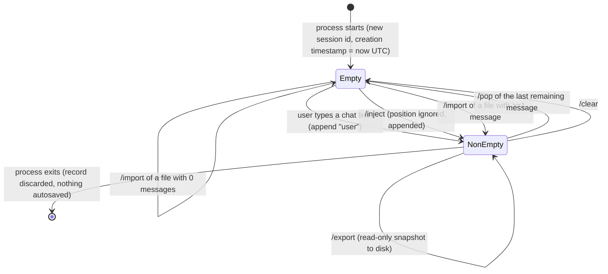

# Feature: Chat History Management

> Source repo: `/mnt/g/3RD-Party/reversing/subject/chatdbg` @ commit `d8c18f61d6bb73666ed97cd4885e877e35558485`
> All `file:line` evidence below is relative to the repo root.

## Purpose

ChatDbg is an interactive terminal chat client for LLM providers, aimed at developers who want to *debug the model itself* — not just talk to it. Chat History Management is the feature that makes the conversation record a **first-class, directly editable artifact** rather than an opaque transcript.

The problem it solves: when probing an LLM, a user needs to control exactly what context the model sees on the next turn. That means being able to fabricate turns that never happened ("inject"), retract a turn that went badly ("pop"), start over ("clear"), and save/restore an exact conversation state so an experiment can be repeated or shared ("export"/"import"). Without this, the only way to change the model's context is to keep talking, which pollutes the very thing under test.

Actors / roles:

- **Interactive user (developer / prompt engineer / model debugger)** — the only human actor. There is no multi-user model, no authentication, no authorization, and no per-user data separation anywhere in this feature. Whoever runs the process owns the history.
- **The two shells** (a plain-console REPL and a full-screen terminal-GUI shell) — they create exactly one in-memory conversation record per process and hand the same object to every history command (`src/ChatDbg/ChatShell.cs:23`, `src/ChatDbg/ChatShell.cs:44-53`; `src/ChatDbg.Shell.Gui/Program.cs:13`, `src/ChatDbg.Shell.Gui/Program.cs:33-42`).
- **The AI provider layer** (adjacent feature, documented elsewhere) — a *consumer*: it reads the conversation record to build each outbound request, and the shell writes the reply back into the record.
- **The token-probability feature** (adjacent) — a *rider*: per-token log-probability data is stored on individual messages inside this record and travels with export/import.

## Behavior

The feature owns one in-memory conversation record per running process. It supports eight observable operations.

### 1. Append a turn (used by the chat loop, not directly by the user)

- **Input**: a role string, content text, an optional "is a command" flag (default: not a command), an optional list of per-token log-probability entries (default: none).
- **Effect**: a new message is appended to the end of the list. Its timestamp is stamped with the current UTC time at append moment (`src/Xcaciv.ChatDbg.Core/Models/ChatHistory.cs:14-24`).
- **Output**: none (no return value, no message to the user).
- **Callers**: both shells append `"user"` + the raw typed line before calling the provider, and append `"assistant"` + the reply afterwards (`src/ChatDbg/ChatShell.cs:346`, `:377`, `:399`; `src/ChatDbg.Shell.Gui/UI/ChatWindow.cs:422`, `:444`, `:489`). Only the "with log probabilities" path attaches log-prob data to the assistant message (`src/ChatDbg/ChatShell.cs:377`; `src/ChatDbg.Shell.Gui/UI/ChatWindow.cs:444`).

### 2. Inject a message at a position — `/inject <role> <message> [position]`

- **Command name**: `inject`. Description: "Inject a message into the chat history". Usage string shown by help: `/inject <role> <message> [position] - Inject message with specified role (user|assistant|system)` (`src/Xcaciv.ChatDbg.Core/Commands/InjectCommand.cs:15-17`).
- **Input**: at least two arguments. First = role. Remaining = the message text, re-joined with single spaces. If there are **more than two** arguments and the **last** one parses as an integer, that last argument is consumed as the insertion position and is removed from the message text (`InjectCommand.cs:32-40`).
- **Effect**: a new message with the given role, the given content and a fresh UTC timestamp is inserted at the given index — *if* the index is within `[0, count)`. Otherwise (no position given, negative, or `>= count`) it is appended to the end (`src/Xcaciv.ChatDbg.Core/Models/ChatHistory.cs:34-51`).
- **Output**: success text `Injected {role} message at position {n}: {message}` — the ` at position {n}` clause is omitted entirely when no position was supplied (`InjectCommand.cs:44-45`).
- **Note**: an injected message can never carry log probabilities and is always flagged "not a command" (`ChatHistory.cs:36-41`).
- **Two different argument paths reach the same operation.** From a typed command line the arguments are whatever the shell's space-splitter produced (see rules 41-43). From the terminal-GUI dialog the arguments are handed over as exactly three discrete values — role, the whole message with its internal spacing and embedded newlines intact, and the position text *only if it parses as an integer* (`ChatWindow.cs:960-970`). The GUI path is therefore immune to space-collapsing and **silently discards** an unparseable position instead of folding it into the message text, which is the opposite of the console rule.

### 3. Pop the last message — `/pop`

- **Command name**: `pop`. Description: "Remove the last message from chat history". Usage: `/pop - Remove the last message from chat history` (`src/Xcaciv.ChatDbg.Core/Commands/PopCommand.cs:15-17`).
- **Input**: takes no arguments; any supplied arguments are ignored.
- **Effect**: removes the final message from the list (`ChatHistory.cs:26-32`).
- **Output**: success text `Removed last message: [{role}] {first 50 characters of content}...` — the removed message is captured *before* deletion so it can be echoed (`PopCommand.cs:26-29`).

### 4. Clear the whole history — `/clear`

- **Command name**: `clear`. Description: "Clear chat history". Usage: `/clear - Clear all chat history` (`src/Xcaciv.ChatDbg.Core/Commands/ClearCommand.cs:14-16`).
- **Input**: none.
- **Effect**: empties the message list. The session identifier and the creation timestamp are **not** reset (`ChatHistory.cs:53-56`, `ClearCommand.cs:20-22`).
- **Output**: success text `Cleared {n} messages from chat history`, where `n` is the count captured *before* clearing.

### 5. Export history to a file — `/export <file_path>`

- **Command name**: `export`. Description: "Export chat history to a file". Usage: `/export <file_path> - Export chat history to JSON file` (`src/Xcaciv.ChatDbg.Core/Commands/ExportCommand.cs:17-19`).
- **Input**: one or more arguments, joined with single spaces into a path (`ExportCommand.cs:28`).
- **Path normalisation**: a leading `~/` is replaced with the current user's profile/home directory (`ExportCommand.cs:31-34`); then, if the resulting file name has no extension, `.json` is appended (`ExportCommand.cs:37-40`).
- **Effect**: the containing directory is created if missing, then the entire record — messages, session id, creation timestamp, and any per-token log probabilities — is written as pretty-printed (indented) JSON, overwriting any existing file (`src/Xcaciv.ChatDbg.Core/Services/ChatHistoryService.cs:29-37`).
- **Output**: success text `Successfully exported {n} messages to: {resolved path}` (`ExportCommand.cs:48`), or on failure `Failed to export chat history to: {resolved path}` (`ExportCommand.cs:45`).

### 6. Import history from a file — `/import <file_path>`

- **Command name**: `import`. Description: "Import chat history from a file". Usage: `/import <file_path> - Import chat history from JSON file` (`src/Xcaciv.ChatDbg.Core/Commands/ImportCommand.cs:17-19`).
- **Input**: one or more arguments joined with single spaces into a path; a leading `~/` is expanded to the home directory (`ImportCommand.cs:28-34`). **No** extension is appended on import.
- **Effect**: reads and parses the file. On success the live record is mutated in place: the message list is emptied and refilled with the imported messages **in file order**, and the session identifier is overwritten with the imported one. The creation timestamp is left untouched (`ImportCommand.cs:43-45`).
- **Output**: success text `Successfully imported {n} messages from: {resolved path}` (`ImportCommand.cs:47`), or `Failed to import chat history from: {resolved path}` (`ImportCommand.cs:39`).
- **Important**: import *replaces*, it never merges or appends.

### 7. Read the conversation (consumed by the provider layer)

The record is handed whole to the AI provider on every turn. Providers walk the messages in list order, skipping any flagged "is a command", and map each role onto their own wire format (`src/Xcaciv.ChatDbg.Core/Services/AzureOpenAIService.cs:82-95`, `:141-148`; `src/Xcaciv.ChatDbg.Core/Services/BedrockService.cs:51-58`). See **Interfaces**.

### 8. Render the conversation (terminal-GUI shell)

The GUI shell re-renders the whole list after every mutation: one line showing `[{role in lower case}]`, then the content wrapped to `(view width − 4) × 3 ÷ 4` characters, then a blank spacer line. Wrapping first splits on embedded newline characters, then breaks each long line at the last space inside the window, hard-cutting mid-word when the window contains no space (`ChatWindow.cs:749-789`). **Whitespace-only wrapped lines are dropped from the view entirely** (`ChatWindow.cs:543`). Messages with the role `user` are right-aligned; everything else is left-aligned with two columns of padding. Assistant messages that carry log probabilities get a clickable `◊` marker underneath. The view then scrolls to the bottom (`src/ChatDbg.Shell.Gui/UI/ChatWindow.cs:500-620`). The plain-console shell does not maintain a rendered view at all — it prints each turn as it happens and prints only the command's result text after a history mutation.

### GUI equivalents of the commands

The File menu exposes: *Inject Message…*, *Pop Last Message*, *Clear History*, *Import History…*, *Export History…*, *Exit* (`ChatWindow.cs:262-272`). Pop and Clear run the corresponding command with no arguments and no confirmation prompt. Inject opens a 70x15 dialog titled "Inject Message" holding a 20-column Role text box pre-filled with `user`, a 5-line Message box, and a 10-column Position box labelled "Position (optional):" that starts empty; OK is the default button. On OK it builds `[role, message]` plus the position (only if the position text is non-blank *and* parses as an integer — otherwise the position is dropped without comment) and runs the inject operation, showing the success text in the status bar or a modal "Error" box on failure (`ChatWindow.cs:938-999`, `:960-993`). Import opens a file-open dialog rooted at the user's profile directory (`ChatWindow.cs:1002-1016`). Export opens a file-save dialog pre-filled with `{home}/chat_history.json` (`ChatWindow.cs:1018-1030`).

## Business rules & edge cases

**Structure and ordering**

1. **List order is the single source of truth for conversation order — not timestamps.** Injection stamps the new message with the *current* time yet places it at an arbitrary index, so after any injection the timestamps are no longer monotonically increasing while the list order still drives everything downstream (`ChatHistory.cs:34-41` vs `ChatHistory.cs:43-50`).
2. Appending always goes to the end (`ChatHistory.cs:16-23`).
3. Export/import preserves list order exactly; import refills the list by bulk-appending the imported sequence (`ImportCommand.cs:43-44`), and the round-trip is asserted by `src/Xcaciv.ChatDbg.Core.Tests/Services/ChatHistoryServiceTests.cs:13-39`.

**Inject rules**

4. Fewer than 2 arguments ⇒ failure, message `Usage: /inject <role> <message> [position]` (`InjectCommand.cs:21-24`). Covered by `src/Xcaciv.ChatDbg.Core.Tests/Commands/InjectCommandTests.cs:10-18`.
5. The role is lower-cased before validation *and* before storage, so `User`, `USER`, `user` all store as `user` (`InjectCommand.cs:26`).
6. **Role whitelist is exactly three values: `user`, `assistant`, `system`.** Anything else ⇒ failure, message `Role must be one of: user, assistant, system` (`InjectCommand.cs:27-30`). Covered by `InjectCommandTests.cs:20-28`.
7. Position is only looked for when there are **strictly more than 2** arguments, and only in the **last** argument. So `/inject user 42` injects the literal text `42` with no position, while `/inject user 42 7` injects the text `42` at position 7 (`InjectCommand.cs:36-40`).
8. If the last argument is not parseable as an integer, it stays part of the message text (`InjectCommand.cs:36`).
9. **Valid insertion range is `0 <= position < current message count`.** A position equal to the count, greater than the count, or negative silently degrades to "append at the end" (`ChatHistory.cs:43-50`).
10. **QUIRK (Q1):** the success message still reports `at position {n}` even when the position was out of range and the message was actually appended at the end (`InjectCommand.cs:44-45`). The user is told something that did not happen.
11. Injected messages are always flagged "not a command" and always have no log probabilities — the inject path does not expose those fields (`ChatHistory.cs:36-41`).
12. An empty message string is accepted (there is no non-empty validation). Reachable via the GUI dialog, where the Message box may be left blank (`ChatWindow.cs:962-966`). Not reachable from the console shell, whose tokenizer discards empty tokens.

**Pop rules**

13. Popping an empty history ⇒ failure, message `Chat history is empty` (`PopCommand.cs:21-24`); covered by `src/Xcaciv.ChatDbg.Core.Tests/Commands/PopCommandTests.cs:10-18`.
14. The model-level pop is itself a safe no-op on an empty list (`ChatHistory.cs:28-31`) — the guard exists only to produce the error text.
15. **Magic number 50** = the maximum number of characters of the removed message echoed back in the confirmation (`PopCommand.cs:29`). It is a raw code-unit slice, so a multi-byte/surrogate character straddling offset 50 can be cut in half.
16. **QUIRK (Q2):** the literal `...` is appended unconditionally, even when the content was shorter than 50 characters and nothing was actually truncated (`PopCommand.cs:29`). An empty message pops as `Removed last message: [user] ...`.

**Clear rules**

17. Clearing an empty history still succeeds and reports `Cleared 0 messages from chat history` — there is no "nothing to clear" error (`ClearCommand.cs:20-22`).
18. The count in the message is captured *before* the clear (`ClearCommand.cs:20`); `src/Xcaciv.ChatDbg.Core.Tests/Commands/ClearCommandTests.cs:21` asserts the message contains `Cleared 2` after two appends.
19. Clear resets only the message list. Session identifier and creation timestamp survive (`ChatHistory.cs:53-56`).
20. There is **no confirmation prompt** anywhere for clear or pop, in either shell (`ChatWindow.cs:267-268`).

**Export rules**

21. Zero arguments ⇒ failure, message `Usage: /export <file_path>` (`ExportCommand.cs:23-26`); `src/Xcaciv.ChatDbg.Core.Tests/Commands/ExportCommandTests.cs:13-23` asserts failure and that the message contains `Usage`.
22. All arguments are joined with a single space, so a path is reassembled from whatever the shell's tokenizer produced (`ExportCommand.cs:28`).
23. `~/` expansion applies **only** to a literal leading `~/` — a bare `~`, or a Windows-style `~\`, is not expanded (`ExportCommand.cs:31-34`).
24. `.json` is appended **only when the resolved file name has no extension** (`ExportCommand.cs:37-40`). Consequences: `notes.txt` is written as `notes.txt` (NOT converted to JSON extension); a dot-prefixed name such as `.history` counts as already having an extension and gets no suffix. `ExportCommandTests.cs:26-42` asserts that exporting `export-file` reaches the persistence layer with a path ending in `.json`.
25. Missing parent directories are created automatically before writing (`ChatHistoryService.cs:29-33`).
26. An existing file at the target path is overwritten with no warning (`ChatHistoryService.cs:36`).
27. Output is **indented/pretty-printed** JSON (`ChatHistoryService.cs:20`).
28. The reported count is the live history's count, evaluated after the write (`ExportCommand.cs:48`).

**Import rules**

29. Zero arguments ⇒ failure, message `Usage: /import <file_path>` (`ImportCommand.cs:23-26`); covered by `src/Xcaciv.ChatDbg.Core.Tests/Commands/ImportCommandTests.cs:12-22`.
30. A non-existent file is not an exception: the layer emits `File not found: {path}` to standard output and yields "no history", which the command turns into the failure message (`ChatHistoryService.cs:50-54`, `ImportCommand.cs:38-40`). Asserted by `ChatHistoryServiceTests.cs:41-47`.
31. Malformed JSON is caught, reported to standard output as `Error importing chat history: {reason}`, and yields "no history" ⇒ same failure message (`ChatHistoryService.cs:60-64`, message text at `:62`).
32. On success the live record is **mutated in place, never replaced** — this matters because both shells and every command hold a reference to that same object, so all of them see the new content immediately (`ImportCommand.cs:43-45`; wiring at `src/ChatDbg/ChatShell.cs:44-53`).
33. The imported session identifier overwrites the live one (`ImportCommand.cs:45`); asserted by `ImportCommandTests.cs:43`.
34. **QUIRK (Q7):** the imported creation timestamp is silently discarded — the live record keeps the timestamp from when the process started (`ImportCommand.cs:43-45`; no assignment of the creation field anywhere).
35. **No validation of imported content (Q8).** Roles are not checked against the `user`/`assistant`/`system` whitelist, contents are not length-limited, timestamps are not sanity-checked, and the "is a command" flag is honoured as-is. A file can therefore introduce roles that `/inject` would have rejected.
36. Importing a JSON object with no `messages` key yields an empty message list and, because the session identifier field also defaults, replaces the live session id with a freshly generated random one (`ChatHistory.cs:8-12`, `ImportCommand.cs:44-45`) — reported as `Successfully imported 0 messages`. *(INFERRED from the model's field defaults; no test covers it.)*

**Cross-cutting rules**

37. **Magic flag "is a command":** any message carrying it is excluded from every outbound provider request (`AzureOpenAIService.cs:82`, `:141`; `BedrockService.cs:51`). **QUIRK (Q20):** nothing in the shipping product ever sets it — the append API defaults it off and no caller passes it on (`grep` over `src` shows the only writes are the model itself and a unit test, `ChatHistoryTests.cs:15-21`). It is a dormant hook reachable today only through an imported file.
38. Log-probability data attached to messages is persisted through export and restored on import; it is never populated by inject, pop, or clear.
39. There is **no size cap, no message limit, no token-budget trimming, and no rolling window** anywhere in the record. History grows unbounded until cleared, popped, or the process ends.
40. **No autosave and no autoload.** The record is created empty at process start and lost at process end unless the user explicitly exports (`src/ChatDbg/ChatShell.cs:23`; `src/ChatDbg.Shell.Gui/Program.cs:13`; the dispose path saves nothing — `src/ChatDbg/ChatShell.cs:691-712`). **QUIRK vs docs (Q27):** `src/ChatDbg/prd.md:17` claims "Persistent chat history with import/export capabilities" and `README.md:11` promises "Chat History Management: Import/export chat history and manipulate conversation flow via dialogs"; the code has manual export/import only, with no autosave and no autoload. CODE WINS.

**Argument tokenisation (inherited from the command dispatcher, affects every path above)**

41. Both shells split the typed line on single spaces and discard empty tokens, then pass the remainder as the argument array (`src/ChatDbg/ChatShell.cs:326`; `src/ChatDbg.Shell.Gui/UI/ChatWindow.cs:384`). Because history commands re-join with a single space, **runs of consecutive spaces inside a message or a file path collapse to one**, and there is no quoting mechanism to protect them. A path such as `~/my  chats/a.json` is silently rewritten to `~/my chats/a.json`.
42. The GUI **file** dialogs feed their chosen path back through that same string command line (`ChatWindow.cs:1014`, `:1031`), so a path the user picked from a file browser inherits the same space-collapsing behaviour and can become unopenable. The GUI **inject** dialog does not — it passes its three values as discrete arguments (`ChatWindow.cs:966`).
43. Command names are matched case-insensitively (lower-cased before lookup) but arguments are not (`src/ChatDbg/ChatShell.cs:332`; `ChatWindow.cs:390`).

**Shell input handling (governs what can reach the record at all)**

44. Neither shell ever stores an empty or whitespace-only *chat* turn — both discard the line before any append happens (`src/ChatDbg/ChatShell.cs:85-88`; `ChatWindow.cs:334-338`). A blank-content message can therefore only enter the record through the GUI inject dialog or through an imported file.
45. **The two shells disagree about trimming.** The terminal-GUI shell trims leading and trailing whitespace off the typed line before appending it (`ChatWindow.cs:334`); the plain-console shell appends the line exactly as read, leading and trailing spaces included (`src/ChatDbg/ChatShell.cs:83`, `:346`). Identical keystrokes therefore produce different stored content in the two shells.
46. A line whose first character is `/` is always routed to the command dispatcher in both shells and is therefore **never** appended to the history. There is no escape sequence for sending a literal leading slash to the model (`src/ChatDbg/ChatShell.cs:92`; `ChatWindow.cs:344`).
47. The GUI inject dialog is the only path that can put embedded newlines *and* runs of consecutive spaces into a message, because it bypasses the space-splitter entirely (`ChatWindow.cs:966` versus `ChatWindow.cs:384`).
48. The position argument is parsed as a signed 32-bit integer using the process's current culture. `+7` is accepted as 7; `7.0`, `7,000`, `0x7`, and any value outside −2147483648…2147483647 fail to parse and stay in the message text (`InjectCommand.cs:36`). The Compact and SingleFile build flavours force invariant globalization, so culture-sensitive sign handling differs between build flavours (`src/ChatDbg/Xcaciv.ChatDbg.Shell.csproj:52`, `:95`). *(INFERRED — the culture effect is reasoned from the parse call; no test covers it.)*
49. `/pop` and `/clear` accept and silently ignore any arguments — neither validates argument count or content, so `/pop 3` removes exactly one message and `/clear all` clears everything (`PopCommand.cs:19-24`, `ClearCommand.cs:18-22`).

**Rendering rules (terminal-GUI shell only)**

50. The rendered view is torn down and rebuilt from scratch after every mutation and after every command, then scrolled to the bottom whenever the content is taller than the window (`ChatWindow.cs:500-503`, `:617-623`, `:923`, `:358`).
51. Content is wrapped at `(view width − 4) × 3 ÷ 4` characters — 2 columns of padding on each side, then three quarters of what remains (`ChatWindow.cs:506-507`, `:539`).
52. **Whitespace-only lines are skipped when rendering** (`ChatWindow.cs:543`). Blank lines inside a multi-line message vanish from the transcript, and a message whose content is empty or all whitespace renders as a bare `[role]` header with nothing under it. The message is still in the record and is still sent to the provider.
53. The role header is written lower-cased inside square brackets regardless of how the role was stored (`ChatWindow.cs:513`), so an imported role of `Assistant` displays as `[assistant]`.
54. Right-alignment (role `user`) and the `◊` log-probability marker (role `assistant`) are chosen by comparing the **lower-cased** role (`ChatWindow.cs:523`, `:554`, `:570`).
55. **But** every path that *selects* a message for the token-probability panel compares the stored role to the literal `assistant` **case-sensitively** (`ChatWindow.cs:219`, `:233`, `:364`, `:447`, `:837`, `:873`). An imported message stored as `Assistant` therefore renders normally, shows no marker, and is invisible to the panel.
56. Status-bar text produced by a history command reverts to the default provider/model line after 3000 ms (`ChatWindow.cs:903-916`).

**Provider-consumption rules**

57. The two hosted-provider request builders iterate the whole list in order and honour the is-a-command exclusion (`AzureOpenAIService.cs:82`, `:141`; `BedrockService.cs:51`). The local-model paths do **not** filter on that flag at all and read **only** the content of the last message whose role case-insensitively equals `user` (`LLamaSharpService.cs:131`, `:361`). With the local provider selected, injecting or popping assistant/system turns changes nothing the model sees.
58. No provider path reads the session identifier, the record's creation timestamp, or any per-message timestamp (repo-wide search of `src`: the only reads of `SessionId` are the model, `ImportCommand.cs:45`, and `ImportCommandTests.cs:43`).

**Help & discoverability**

59. General help lists only `import`, `export`, `inject`, `pop` under the heading **Chat History Management**; `clear` appears under **Basic Commands** instead (`HelpCommand.cs:43-47`, `:61-67`). Each line is rendered as `/{name} - {description}` (`HelpCommand.cs:105`).
60. `/help inject` (and the same for the other four) returns the three-line block `Command: /inject` / `Description: Inject a message into the chat history` / `Usage: /inject <role> <message> [position] - Inject message with specified role (user|assistant|system)`; an unknown name returns failure `Unknown command: {name}` (`HelpCommand.cs:26-34`).

## Constants, defaults & literals

Every value a reimplementation must match exactly. There are **no environment variables and no configuration settings** for this feature — a repo-wide search of the settings model finds no history-related key (`src/Xcaciv.ChatDbg.Core/Models/ChatSettings.cs`, no match for "history").

| Constant | Value | Where it applies | Evidence |
|---|---|---|---|
| Role whitelist (inject only) | exactly `user`, `assistant`, `system`, compared after lower-casing | `/inject` validation | `InjectCommand.cs:26-30` |
| Valid insertion range | `0 <= position < current message count`; anything else appends | `/inject` | `ChatHistory.cs:43-50` |
| Position-detection threshold | last argument is read as a position only when there are **more than 2** arguments | `/inject` | `InjectCommand.cs:36` |
| Pop preview length | **50** characters (UTF-16 code units), followed by an unconditional literal `...` | `/pop` confirmation | `PopCommand.cs:29` |
| Default export extension | `.json`, appended only when the resolved name has no extension at all | `/export` | `ExportCommand.cs:37-40` |
| Home-directory prefix | the literal two characters `~/` at position 0, nothing else | `/import`, `/export` | `ImportCommand.cs:31-34`, `ExportCommand.cs:31-34` |
| Home directory source | the OS user-profile folder (`%USERPROFILE%` on Windows, `$HOME` on Unix) | `~/` expansion; both GUI file dialogs | `ExportCommand.cs:33`, `ChatWindow.cs:1008`, `:1023` |
| GUI export default file | `{home}/chat_history.json` pre-filled in the save dialog | GUI File → Export History… | `ChatWindow.cs:1022-1024` |
| GUI import start location | the home directory | GUI File → Import History… | `ChatWindow.cs:1008` |
| JSON indentation | pretty-printed, **2 spaces** per level | export output | `ChatHistoryService.cs:20`; observed in the on-disk sample described under **Exported file format** |
| Timestamp format | ISO-8601 UTC round-trip with **7** fractional-second digits and a `Z` suffix, e.g. `2025-10-08T20:21:45.9645324Z` | `timestamp`, `createdAt` | observed sample (see **Exported file format**) |
| Session identifier format | canonical lowercase hyphenated UUID, e.g. `469df3d2-7934-481c-bbb0-47ae24c65f87` | `sessionId` | `ChatHistory.cs:10`; observed sample |
| GUI inject dialog geometry | dialog 70x15; Role field 20 columns pre-filled `user`; Message box 5 lines; Position field 10 columns, empty | GUI inject | `ChatWindow.cs:940-958` |
| GUI render padding | 2 columns each side | GUI transcript | `ChatWindow.cs:506-507` |
| GUI wrap width | `(view width − 4) × 3 ÷ 4` | GUI transcript | `ChatWindow.cs:507`, `:539` |
| GUI status revert delay | 3000 ms | GUI status bar | `ChatWindow.cs:909` |
| Success / failure decoration | `✓ ` prefix on success and `✗ ` prefix on failure in the console shell; `✓ ` in the GUI status bar, modal box titled `Command Error` on failure | both shells | `src/ChatDbg/ChatShell.cs:102-105`; `ChatWindow.cs:411`, `:415` |
| Size / count limits | **none** — no message cap, no content length cap, no file-size cap, no token budget | everywhere | absence across `ChatHistory.cs`, `ChatHistoryService.cs` |

## Workflows & states

The conversation record is a simple mutable list with no formal state machine; the meaningful states are **empty** and **non-empty**, which gate `/pop`.



**Chat-turn workflow (how the record grows):**

1. User types a line that does not begin with `/`.
2. Shell appends a `user` message with the raw line and the current UTC time.
3. GUI shell re-renders the history immediately, so the user's own line appears before the model responds (`ChatWindow.cs:422-423`).
4. Shell resolves the configured provider and hands it the **whole record**.
5. Provider filters out "is a command" messages, maps roles, prepends the configured system prompt as a separate synthetic message (not stored in the record), and calls the model.
6. Shell appends an `assistant` message with the reply text — attaching log probabilities only on the log-probability code path.
7. GUI shell re-renders; the console shell just prints the reply.
8. If the provider throws, the error is shown and **the user message stays in the record** — an aborted turn leaves an unanswered user turn behind, which `/pop` is the intended remedy for (`src/ChatDbg/ChatShell.cs:404-408`).

**Export workflow:**

1. User issues `/export <path>` (or picks File → Export History… in the GUI, defaulting to `{home}/chat_history.json`).
2. Path is rebuilt from arguments, `~/` expanded, `.json` appended if extensionless.
3. Parent directory created if absent.
4. Whole record serialised to indented JSON and written, overwriting.
5. Success or failure message returned to the shell; the console shell prefixes `✓ ` on success and `✗ ` on failure (`src/ChatDbg/ChatShell.cs:100-105`); the GUI shell shows `✓ {message}` in the status bar for 3 seconds on success and a modal error box titled "Command Error" on failure (`ChatWindow.cs:407-417`; status auto-reverts after 3000 ms, `ChatWindow.cs:903-916`).

**Import workflow:**

1. User issues `/import <path>` (or picks File → Import History…, whose file browser starts in the home directory).
2. Path rebuilt and `~/` expanded (no extension defaulting).
3. Existence checked; file read; JSON parsed.
4. On any failure the live record is left **completely untouched** and a failure message is returned.
5. On success the live message list is emptied and refilled, and the session id is overwritten.
6. GUI re-renders the history and refreshes the log-probability side panel if it is open (`ChatWindow.cs:918-935`).

## Data

This feature owns two entities. Both are plain mutable records with no identity beyond object reference.

### Conversation record ("chat history") — one per process

| Field | Type (generic) | Persisted key | Default at creation | Constraints / notes |
|---|---|---|---|---|
| Messages | ordered list of Message | `messages` | empty list | Order is authoritative. No size limit. |
| Session identifier | string | `sessionId` | a freshly generated random UUID/GUID in canonical hyphenated text form | Overwritten wholesale on import. Not reset by clear. Not used for anything else in the product — no lookup, no file naming, no logging. |
| Created-at | date-time | `createdAt` | current UTC instant at object construction | Written on export; **read but discarded on import**; never mutated after construction. |

Evidence: `src/Xcaciv.ChatDbg.Core/Models/ChatHistory.cs:7-12`.

Lifecycle: created once when the shell process starts (`src/ChatDbg/ChatShell.cs:23`, `src/ChatDbg.Shell.Gui/Program.cs:13`); mutated by append/inject/pop/clear/import; read by export and by the provider layer; destroyed when the process exits. The object identity is stable for the whole process lifetime — import mutates it rather than swapping it, which is what keeps every command and both UI layers pointing at the right data.

### Message — element of the conversation record

| Field | Type (generic) | Persisted key | Default | Constraints / notes |
|---|---|---|---|---|
| Role | string | `role` | empty string | Inject enforces `user` \| `assistant` \| `system` (lower-cased); append and import do not enforce anything. Consumers lower-case it before matching. |
| Content | string | `content` | empty string | No length limit, no emptiness check, may contain newlines (the GUI's multi-line inject box and multi-line input field can produce them). |
| Timestamp | date-time | `timestamp` | current UTC instant at construction | Set at append/inject time; **not** re-sequenced when a message is injected mid-list. |
| Is-command flag | boolean | `isCommand` | false | When true the message is excluded from every provider request. Never set true by shipping code. |
| Log probabilities | optional list of token-probability entries | `logProbabilities` | absent/null | Attached only when an assistant reply came back from the log-probability code path. Round-trips through export/import. |
| Has-log-probabilities | derived boolean | *(not persisted)* | — | True only when the list exists **and** has at least one element (`ChatMessage.cs:17-18`); asserted both ways by `src/Xcaciv.ChatDbg.Core.Tests/Models/ChatMessageTests.cs:9-32`. Drives the `◊` marker and the log-probability panel in the GUI. |

Evidence: `src/Xcaciv.ChatDbg.Core/Models/ChatMessage.cs:7-18`.

### Token-probability entry — owned by the adjacent Token Probability feature, embedded here

Persisted inside a message as `token` (string), `logprob` (floating point), `top_alternatives` (optional nested list of the same shape). A derived `probability` (exponent of the log-prob) exists in memory but is **not** persisted (`src/Xcaciv.ChatDbg.Core/Models/TokenLogProbabilities.cs:13-32`). Note the inconsistent key casing: `logprob` and `top_alternatives` are lower/snake-case while every other persisted key in this feature is camelCase.

### Exported file format

A single JSON object, pretty-printed with **2-space** indentation. Keys are written exactly as listed below; unknown keys on import are ignored and every key is matched case-sensitively.

**This format is directly observed, not inferred.** A real export produced by this feature is present in the working tree at `src/ChatDbg.Shell.Gui/bin/Debug/net10.0/chat.json` (193,375 bytes, 7,364 lines). It is a build-output artifact excluded from version control by `.gitignore:21` (`[Bb]in/`), so it is not part of the commit — but it is a genuine product output and it pins every serialization detail below.

```
{
  "messages": [
    {
      "role": "user",
      "content": "hello",
      "timestamp": "2026-08-28T12:34:56.7891234Z",
      "isCommand": false,
      "logProbabilities": null
    },
    {
      "role": "assistant",
      "content": "hi",
      "timestamp": "2026-08-28T12:34:58.1234567Z",
      "isCommand": false,
      "logProbabilities": [
        { "token": " hi", "logprob": -0.51, "top_alternatives": [ { "token": " hello", "logprob": -1.2, "top_alternatives": null } ] }
      ]
    }
  ],
  "sessionId": "3f2504e0-4f89-11d3-9a0c-0305e82c3301",
  "createdAt": "2026-08-28T12:30:00.0000000Z"
}
```

**Serialization details a reimplementation must match (all observed in the sample file):**

- **Key order** is declaration order: within a message `role`, `content`, `timestamp`, `isCommand`, `logProbabilities`; at the top level `messages`, `sessionId`, `createdAt`. Within a token entry: `token`, `logprob`, `top_alternatives`.
- **Date-times** are ISO-8601 UTC round-trip form with exactly seven fractional-second digits and a `Z` suffix — observed `"2025-10-08T20:21:45.9645324Z"` and `"2025-10-08T20:21:41.2550619Z"`.
- **`null` is written literally** for an absent log-probability list and for absent `top_alternatives`; the keys are never omitted.
- **String escaping is aggressive, not minimal.** The default escaping profile escapes far more than JSON requires: apostrophe `'` becomes `\u0027`, backtick `` ` `` becomes `\u0060`, plus `+` becomes `\u002B`, and all non-ASCII is escaped as `\uXXXX`. Newlines inside content are written as `\n`. A reimplementation that emits minimally-escaped JSON produces semantically identical but **byte-different** files; one that emits raw UTF-8 for non-ASCII content will not match. Observed throughout the sample, e.g. `"It\u0027s a way"` and `` "\u0060\u0060\u0060python" ``.
- **Numbers** are written in shortest round-trip form with no forced decimal point — a log-probability of −5 is written `-5`, not `-5.0`. Observed at the tail of the sample.
- **No BOM**, UTF-8 encoding (the default for whole-file text writes).
- There is **no schema version field and no format negotiation**. A reimplementation must match these key names exactly to stay file-compatible.

## Interfaces

**Exposed to the Command System & Dispatch feature (adjacent):** five command objects — `inject`, `pop`, `clear`, `import`, `export` — each carrying a name (the dispatch key), a one-line description, and a usage string, and each taking an ordered list of argument strings and yielding a result made of a success flag, an optional user-facing message, and an exit-requested flag (which none of these five ever sets). The dispatcher matches on the lower-cased name and passes everything after the command word as arguments. The help feature groups these five (minus `clear`, which it lists under "Basic Commands") under the heading **"Chat History Management"** (`src/Xcaciv.ChatDbg.Core/Commands/HelpCommand.cs:47`, `:61-67`).

**Exposed to the shells:** the conversation record object itself, shared by reference. Both shells construct it once and pass the same reference into every history command and into the UI (`src/ChatDbg/ChatShell.cs:23,44-53`; `src/ChatDbg.Shell.Gui/Program.cs:13,33-42,80`). Both shells also call the append operation directly for user turns and assistant replies. The GUI additionally reads the message list to render it and to locate "the last assistant message that has log probabilities" for its analysis panel (`ChatWindow.cs:218-233`, `:363-368`, `:836`, `:872`).

**Exposed to the AI Provider Abstraction (adjacent, consumer):** the whole record is passed to the provider on every request. The contract the providers rely on:

- iterate messages in list order;
- skip any message flagged as a command;
- role semantics are the three lower-cased strings, but the four request builders react differently to anything else:
  - the hosted-provider path that builds its request through a vendor client library maps `user`/`assistant`/`system` onto the corresponding wire roles and **silently drops any message with any other role** (`AzureOpenAIService.cs:84-95`);
  - the hosted-provider path that composes the request payload directly passes the lower-cased role through verbatim, so a bogus role reaches the remote service and its error surfaces as a provider failure (`AzureOpenAIService.cs:141-148`);
  - the second hosted provider collapses **everything that is not `assistant` into `user`** (`BedrockService.cs:51-58`);
  - the local-model paths ignore the record almost entirely: they do **not** honour the is-a-command exclusion and use **only the content of the last message whose role case-insensitively equals `user`** (`LLamaSharpService.cs:131`, `:361`) — so injecting or popping assistant/system turns has no effect at all on that provider's context.
- The system prompt is **not** part of this feature's record; providers prepend it separately from settings (`AzureOpenAIService.cs:79`, `:134-138`; `BedrockService.cs:73`).

**Exposed to the Token Probability Analysis feature (adjacent, rider):** the per-message optional log-probability list and the derived "has log probabilities" predicate. This feature is responsible for storing, persisting and restoring that payload; it never interprets it.

**Consumed from other features:** the command result shape and the command contract (Command System feature); the shells' argument tokeniser; the ambient user-profile directory for `~/` expansion; nothing from settings — there is not a single history-related setting in the settings model.

## External technology

| Generic capability | Protocol/standard if any | What the source used | Notes for reimplementer |
|---|---|---|---|
| Local filesystem read/write of a whole text file | POSIX/Win32 file I/O | .NET `File.ReadAllTextAsync` / `File.WriteAllTextAsync` | Whole-file read and whole-file overwrite; no streaming, no locking, no temp-file-then-rename, no atomicity guarantee. Default text encoding is UTF-8 without BOM. |
| Directory creation (recursive, create-if-missing) | — | .NET `Directory.CreateDirectory` | Called on export before writing; a no-op when the directory exists. |
| File existence check | — | .NET `File.Exists` | Import's pre-flight; a false result is a normal (non-exception) failure path. |
| Path manipulation: extension detection, join, directory-of | — | .NET `Path.HasExtension` / `Path.Combine` / `Path.GetDirectoryName` | "Has extension" means a `.` after the last separator that is not the final character — so `.history` counts as *having* an extension. |
| Current user's home/profile directory lookup | — | .NET `Environment.GetFolderPath(UserProfile)` | Used for `~/` expansion in both import and export, and as the GUI file dialogs' starting directory. On Windows this is `C:\Users\<name>`; on Unix, `$HOME`. |
| JSON object serialisation/deserialisation with per-field name mapping and pretty printing | JSON (RFC 8259) | .NET `System.Text.Json` with indented output, camelCase naming policy, and explicit per-field name attributes | The explicit field-name attributes win over the naming policy, so the wire keys are exactly as listed in **Data** — including the odd `logprob` / `top_alternatives`. Deserialisation is **case-sensitive** and ignores unknown keys; comments and trailing commas are rejected by default. |
| Wall-clock UTC timestamp source | ISO-8601 | .NET `DateTime.UtcNow` | Every message timestamp and the record creation timestamp. Resolution is the platform clock tick; nothing depends on uniqueness. |
| Random unique identifier generator | UUID / GUID | .NET `Guid.NewGuid().ToString()` | Session identifier only; canonical lowercase hyphenated form. Not security-sensitive, not used as a key. |
| Standard output stream | — | .NET `Console.WriteLine` | The persistence layer writes its own diagnostics straight to stdout — see **Error handling** for why that is a defect in the GUI shell. |
| Full-screen terminal UI with menus and native file open/save dialogs | ANSI terminal | Terminal.Gui 1.19.0 (GUI shell only) | Only the GUI shell needs this. The open dialog is single-selection; the save dialog is pre-seeded with `chat_history.json` in the home directory. `src/ChatDbg.Shell.Gui/Xcaciv.ChatDbg.Shell.Gui.csproj:121` |
| JSON string escaping profile | JSON (RFC 8259) | .NET `System.Text.Json` default (`JavaScriptEncoder.Default`) | Escapes `'`, `` ` ``, `+`, `<`, `>`, `&` and **all** non-ASCII as `\uXXXX`. Match this to be byte-compatible; see **Exported file format**. |
| Shortest-round-trip floating point formatting | IEEE 754 / JSON number | .NET `double` default JSON writer | `-5` not `-5.0`; no exponent for ordinary log-probability magnitudes. |
| Culture-sensitive integer parsing | — | .NET `int.TryParse(string, out int)` | Used only for the inject position. Accepts a leading `+`/`−` per current culture; rejects decimal points, group separators, and values outside the signed 32-bit range. Compact/SingleFile builds force invariant globalization (`src/ChatDbg/Xcaciv.ChatDbg.Shell.csproj:52`, `:95`). |
| Delayed UI callback / timer | — | .NET `Task.Delay` + UI main-loop invoke | GUI status-bar revert after 3000 ms (`ChatWindow.cs:909-915`). |
| Managed runtime | — | .NET 10 (`net10.0`), SDK pinned to `10.0.100-rc.1.25451.107` with `rollForward: latestFeature` | `src/Xcaciv.ChatDbg.Core/Xcaciv.ChatDbg.Core.csproj:4`; `global.json`. Nothing in this feature depends on a runtime-specific capability. |

Nothing else is required: no database, no network, no message broker, no external process, no OS keychain, **no environment variables, and no configuration keys** for this feature. The settings model contains nothing history-related (`src/Xcaciv.ChatDbg.Core/Models/ChatSettings.cs` — no match for "history").

## Error handling

| Failure mode | What the user observes | Evidence |
|---|---|---|
| `/inject` with fewer than two arguments | Failure result; text `Usage: /inject <role> <message> [position]`. Console shell prints it prefixed with `✗ `; GUI shell raises a modal "Command Error" box. | `InjectCommand.cs:21-24`; `src/ChatDbg/ChatShell.cs:102-105`; `ChatWindow.cs:414-417` |
| `/inject` with a role outside the whitelist | Failure result; text `Role must be one of: user, assistant, system`. History unchanged. | `InjectCommand.cs:27-30` |
| `/inject` with an out-of-range or negative position | **No error.** Message appended at the end, and the confirmation misleadingly reports the requested position. | `ChatHistory.cs:43-50`; `InjectCommand.cs:44-45` |
| `/pop` on an empty history | Failure result; text `Chat history is empty`. | `PopCommand.cs:21-24` |
| `/clear` on an empty history | Success; text `Cleared 0 messages from chat history`. | `ClearCommand.cs:20-22` |
| `/export` or `/import` with no path | Failure result; text `Usage: /export <file_path>` / `Usage: /import <file_path>`. | `ExportCommand.cs:23-26`; `ImportCommand.cs:23-26` |
| Export fails (permission denied, invalid path characters, disk full, path too long, directory creation refused) | The persistence layer swallows the exception, prints `Error exporting chat history: {underlying reason}` to standard output, and reports "not written". The command then returns failure `Failed to export chat history to: {path}`. **The underlying reason is only visible on stdout — the user-facing failure message does not contain it.** | `ChatHistoryService.cs:39-43`; `ExportCommand.cs:44-46` |
| Import of a missing file | Prints `File not found: {path}` to standard output; command returns failure `Failed to import chat history from: {path}`. Live history untouched. | `ChatHistoryService.cs:50-54`; `ImportCommand.cs:38-40` |
| Import of malformed / wrong-shaped JSON (e.g. a top-level array, truncated file, non-JSON text) | Prints `Error importing chat history: {parser reason}` to standard output; same failure message; live history untouched. | `ChatHistoryService.cs:60-64`, message text at `:62` |
| Import of a file whose content is the literal `null` | Parses to "no history" ⇒ same failure path as a parse error. *(INFERRED — no test.)* | `ChatHistoryService.cs:57-58` |
| Import of structurally valid JSON containing garbage roles or hostile content | **Succeeds silently.** No validation. Bad roles then either get dropped (Azure SDK path) or forwarded to the provider (Azure REST path) or coerced to `user` (Bedrock). | `ImportCommand.cs:43-47`; `AzureOpenAIService.cs:84-95`, `:141-148`; `BedrockService.cs:51-58` |
| Provider call fails mid-turn | The user message that was already appended stays in the history; the error is printed/boxed. The user must `/pop` to clean up. | `src/ChatDbg/ChatShell.cs:404-408`; `ChatWindow.cs:492-497` |
| **QUIRK (Q23) — diagnostics corrupt the GUI:** the persistence layer's stdout writes happen while the full-screen terminal UI owns the screen | Stray text is painted over the terminal-GUI layout on any export/import failure. There is no logger abstraction and no way to suppress it. | `ChatHistoryService.cs:41`, `:52`, `:62` |
| Unhandled exception thrown from a history command | Console shell catches per-iteration and prints `Error: {message}` then continues the REPL; GUI shell shows a modal error box titled `Error`. | `src/ChatDbg/ChatShell.cs:112-116`; `ChatWindow.cs:931-934`, `:353-356` |
| GUI inject dialog with a non-numeric Position (e.g. `end`, `1.5`) | **No error.** The position is dropped, the message is appended at the end, and the confirmation omits the ` at position …` clause entirely — so the user sees a plausible success and never learns the position was ignored. | `ChatWindow.cs:967-970`; `InjectCommand.cs:44` |
| `/import mychats` after `/export mychats` wrote `mychats.json` | Failure `Failed to import chat history from: mychats`, plus `File not found: mychats` on standard output. Export defaults the extension; import does not. | `ExportCommand.cs:37-40` vs `ImportCommand.cs:28-34` |
| Export whose parent directory cannot be created (read-only mount, permission denied, invalid name) | Directory creation throws inside the same guarded region as the write, so it is swallowed identically: `Error exporting chat history: {reason}` on standard output, `Failed to export chat history to: {path}` to the user. | `ChatHistoryService.cs:29-33`, `:39-43` |
| Export interrupted part-way (process killed, disk full mid-write) | The target file is opened and overwritten in place with no temporary file and no rename, so a partial write leaves a **truncated, unparseable file where a valid history used to be**, and the previous contents are gone. | `ChatHistoryService.cs:36` |
| A message with no content reaches the terminal-GUI transcript | Renders as a bare `[role]` header with no body line — the message is invisible in the view but still present in the record and still sent to the provider. | `ChatWindow.cs:543` |

## Quirks

Every behaviour below is a *fact about the shipping code*, not a recommendation. The `QUIRK (Qn)` markers scattered through **Business rules & edge cases** point here. **These are documented, not fixed** — a reimplementation should decide deliberately for each one whether to reproduce it. Everything here is directly observed in the source unless marked INFERRED.

### Wrong or misleading output

| # | Quirk | Observed behaviour | Evidence |
|---|---|---|---|
| Q1 | **Inject reports a position it did not use** | The range check lives in the record (`0 <= position < count`, else append) but the confirmation text is built from the *requested* position. `/inject user hi 99` on a 2-message history appends at index 2 and still answers `Injected user message at position 99: hi`. Negative positions behave the same way. | `ChatHistory.cs:43-50`; `InjectCommand.cs:42-45` |
| Q2 | **Pop's confirmation always ends in `...`** | The ellipsis is concatenated unconditionally, not only when truncation happened. Popping a 2-character message answers `Removed last message: [user] hi...`; popping an empty-content message answers `Removed last message: [user] ...`. | `PopCommand.cs:29` |
| Q3 | **Pop preview cuts at 50 UTF-16 code units** | A raw index slice, not a grapheme- or codepoint-aware one. A surrogate pair or combining sequence straddling offset 50 is split, producing a lone surrogate in the confirmation text. | `PopCommand.cs:29` |
| Q4 | **GUI inject silently discards an unparseable position** | The dialog appends the position argument only if it parses as an integer, so `end` or `1.5` is thrown away with no warning; the message is appended and the confirmation omits the position clause. From the console the same trailing token would have become part of the message instead. Two paths, two incompatible rules. | `ChatWindow.cs:967-970`; `InjectCommand.cs:36` |
| Q5 | **The real failure reason never reaches the user** | Export/import failures are caught at the persistence boundary, printed to standard output, and reduced to a boolean. The user-facing message is a generic `Failed to export chat history to: {path}` with no cause. On a full disk, a permission denial and a bad path are indistinguishable to the user. | `ChatHistoryService.cs:39-43`, `:60-64`; `ExportCommand.cs:44-46`; `ImportCommand.cs:37-40` |

### Data loss and integrity

| # | Quirk | Observed behaviour | Evidence |
|---|---|---|---|
| Q6 | **Export is not atomic and destroys the previous file first** | The target is overwritten by a whole-file write with no temporary file and no rename. An interrupted export leaves a truncated, unparseable file where a valid history used to be. There is also no overwrite warning of any kind, from either shell. | `ChatHistoryService.cs:36` |
| Q7 | **Import discards the imported creation timestamp** | The session identifier *is* copied from the imported record on the very next line; the creation timestamp is not copied anywhere. A re-exported file therefore carries the *importing process's* start time, silently rewriting history metadata. | `ImportCommand.cs:43-45` (no assignment to the creation field anywhere in `src`) |
| Q8 | **Import performs zero validation** | Roles are not checked against the `user`/`assistant`/`system` whitelist that `/inject` enforces, content is unbounded, timestamps are not sanity-checked, and the is-a-command flag is honoured as read. A file can introduce a role `/inject` would have rejected — which the providers then variously drop, forward to the remote service, or coerce to `user`. | `ImportCommand.cs:43-44`; `AzureOpenAIService.cs:84-95`, `:141-148`; `BedrockService.cs:51-58` |
| Q9 | **No confirmation and no undo on either destructive operation** | `/clear` wipes the whole record and `/pop` removes a turn with no prompt in either shell, and the GUI places *Clear History* directly below *Pop Last Message* in the same menu — one keystroke apart. Nothing is written to disk first. | `ClearCommand.cs:18-22`; `PopCommand.cs:19-30`; `ChatWindow.cs:267-268` |
| Q10 | **Whole file read into memory with no size guard** | Import reads the entire file into a string before parsing. A large or hostile file is a memory-pressure vector; there is no size check, no streaming, and no cap. | `ChatHistoryService.cs:56` |
| Q11 | **No path restrictions whatsoever** | No canonicalisation, no allow-list, no sandbox root. `/export /etc/passwd.json` and `/import ../../secrets.json` are attempted verbatim, limited only by OS permissions. | `ExportCommand.cs:28-42`; `ImportCommand.cs:28-36` |

### Silent inconsistencies between paths

| # | Quirk | Observed behaviour | Evidence |
|---|---|---|---|
| Q12 | **Export defaults the extension, import does not** | `/export mychats` writes `mychats.json`; `/import mychats` then fails with `File not found: mychats`. The round trip a user would naturally type does not work. | `ExportCommand.cs:37-40` vs `ImportCommand.cs:28-34` |
| Q13 | **The `.json` default is keyed on "has any extension", not "is json"** | `/export notes.txt` writes JSON into a `.txt` file with no complaint. A dot-prefixed name such as `.history` counts as *already having* an extension, so it gets no suffix either. | `ExportCommand.cs:37-40` |
| Q14 | **`~` expansion handles exactly one form** | Only the literal two characters `~/` at position 0 expand. A bare `~`, a Windows-style `~\`, and `~someuser/` are all taken literally and produce a directory named `~` on disk. | `ExportCommand.cs:31-34`; `ImportCommand.cs:31-34` |
| Q15 | **Runs of spaces collapse, with no quoting mechanism** | The dispatcher splits on single spaces discarding empties, and the history commands re-join with one space. `~/my␣␣chats/a.json` silently becomes `~/my␣chats/a.json`. The GUI **file** dialogs route the user's chosen path back through that same string command line, so a directory a user picked from a browser can be unreachable. | `src/ChatDbg/ChatShell.cs:326`; `ChatWindow.cs:384`, `:1014`, `:1031` |
| Q16 | **The two shells disagree about trimming user input** | The GUI trims leading/trailing whitespace before storing a turn; the console stores the line verbatim. The same keystrokes produce different history content, and therefore different prompts, depending on which shell is running. | `ChatWindow.cs:334` vs `src/ChatDbg/ChatShell.cs:83`, `:346` |
| Q17 | **Role matching is case-insensitive when rendering but case-sensitive when selecting** | The transcript lower-cases the role to pick alignment and to draw the `◊` marker, but every path that *selects* a message for the token-probability panel compares against the literal `assistant` case-sensitively. An imported message stored as `Assistant` renders correctly, gets no marker, and is invisible to the panel. | `ChatWindow.cs:513`, `:523`, `:554`, `:570` vs `:219`, `:233`, `:364`, `:447`, `:837`, `:873` |
| Q18 | **Blank lines disappear from the transcript** | Whitespace-only wrapped lines are skipped while rendering. Blank lines inside a multi-line message vanish from the view, and a message whose content is empty or all whitespace renders as a bare `[role]` header — invisible content that is nonetheless in the record and in every outbound request. | `ChatWindow.cs:543` |
| Q19 | **The local-model provider ignores the is-a-command exclusion** | The two hosted-provider request builders filter on the flag; the local-model paths never look at it, and read only the last `user`-role message anyway. The same history produces materially different context depending on the provider. | `LLamaSharpService.cs:131`, `:361` vs `AzureOpenAIService.cs:82`, `:141`; `BedrockService.cs:51` |

### Dead, dormant, and undocumented

| # | Quirk | Observed behaviour | Evidence |
|---|---|---|---|
| Q20 | **The is-a-command flag is a dormant hook** | It is persisted, imported, defaulted to off, and filtered on by three provider paths — but **nothing in the shipping product ever sets it true**. A repo-wide search of `src` finds writes only in the model's own default and one unit test. It is reachable today only by hand-editing an imported file. | `ChatHistory.cs:14`, `:20`; `ChatMessage.cs:13-14`; `ChatHistoryTests.cs:15-21`; consumed at `AzureOpenAIService.cs:82`, `:141`, `BedrockService.cs:51` |
| Q21 | **The session identifier is write-only data** | It is generated at start-up, persisted on export, overwritten on import, and asserted by one test — and never read by anything else. Not used for lookup, file naming, logging, or correlation. | `ChatHistory.cs:9-10`; `ImportCommand.cs:45`; `ImportCommandTests.cs:43` (no other reads in `src`) |
| Q22 | **`/pop` and `/clear` silently ignore all arguments** | Neither validates argument count or content. `/pop 3` removes one message; `/clear everything` succeeds. Nothing tells the user the argument was meaningless. | `PopCommand.cs:19-24`; `ClearCommand.cs:18-22` |
| Q23 | **Persistence diagnostics corrupt the full-screen terminal UI** | Export/import failures write directly to standard output while the terminal-GUI shell owns the screen, painting stray text over the layout. There is no logger abstraction and no way to suppress it. | `ChatHistoryService.cs:41`, `:52`, `:62` |
| Q24 | **Dead duplicate shell with different behaviour** | The GUI project carries a never-instantiated second copy of the console shell that wires the same five history operations but **drops log probabilities when appending assistant replies**. The only shell object constructed anywhere in `src` is the console one. Porting the wrong copy would silently lose the token-probability payload. | `src/ChatDbg.Shell.Gui/ChatShell.cs:330`; `src/ChatDbg.Shell.Gui/Program.cs:77-90`; `src/ChatDbg/Program.cs:5` |
| Q25 | **"Toggle System Messages" is a stub in the View menu** | Selecting it reports `System messages toggle not yet implemented` and does nothing. It sits next to history-adjacent view controls, implying a history filter that does not exist. | `ChatWindow.cs:1138-1142` |
| Q26 | **The GUI status-bar revert timer is unconditional** | Every status message starts a fresh 3000 ms task that overwrites the status bar with the default text when it fires. Two commands in quick succession leave the second message wiped early by the first timer. *(INFERRED from the unconditional timer; no test.)* | `ChatWindow.cs:903-916` |

### Documentation that the code does not honour

| # | Quirk | Observed behaviour | Evidence |
|---|---|---|---|
| Q27 | **"Persistent chat history" is claimed but not implemented** | The project's own requirements document promises "Persistent chat history with import/export capabilities". There is no autosave and no autoload: the record is created empty at process start and lost at process end unless the user explicitly exports. The dispose path saves nothing. **CODE WINS.** | `src/ChatDbg/prd.md:17` vs `src/ChatDbg/ChatShell.cs:23`, `:692-713`; `src/ChatDbg.Shell.Gui/Program.cs:13` |
| Q28 | **`/pop` is documented as removing "messages" (plural)** | It removes exactly one — the last. | `src/ChatDbg/prd.md:103` vs `ChatHistory.cs:26-32` |
| Q29 | **The docs disagree with each other about the target platform** | The README calls the product "A C# Chat shell for Windows terminal"; the requirements document claims "Cross-Platform Compatibility: Windows, Linux, and macOS support". For this feature the code is genuinely cross-platform (see **Platform coupling**); the Windows framing comes from the packaging defaults. | `README.md:3` vs `src/ChatDbg/prd.md:34`; `src/ChatDbg/Xcaciv.ChatDbg.Shell.csproj:30`, `:70` |
| Q30 | **Timestamps stop being monotonic the moment anything is injected** | An injected message is stamped with the *current* time and then placed at an arbitrary index. List order remains the single source of truth for conversation order; the persisted timestamps become internally inconsistent and must not be used for sorting by any consumer of the exported file. | `ChatHistory.cs:34-41` vs `:43-50` |

## Non-functional observations

- **Concurrency:** the conversation record is a bare mutable list with **no locking, no immutability, and no copy-on-read**. The console shell is strictly single-threaded so this is safe there. The GUI shell is not: the inject dialog's OK handler and the send path are fire-and-forget handlers that return to the UI before their work finishes, and the whole record is handed to a provider on a background continuation while the UI thread may be re-rendering it (`ChatWindow.cs:918`, `:957`, `:437-497`, `:500-620`). A reimplementation on a platform with real UI-thread affinity should either marshal all mutations onto one thread or snapshot the list before handing it to the provider.
- **Memory / growth:** unbounded. Every turn plus its full per-token log-probability payload is retained for the life of the process. A long session with log probabilities enabled will hold a large amount of per-token data in memory, and export will write all of it.
- **Performance:** insertion at an arbitrary index into a contiguous list is a shift-the-tail operation; irrelevant at conversational scale. The GUI re-renders the *entire* history from scratch after every mutation, constructing one UI element per wrapped line plus one per role header (`ChatWindow.cs:500-620`) — this is O(total characters) per keystroke-completed turn and will visibly degrade on long conversations.
- **No caching, no pagination, no lazy loading:** the whole file is read into a string and the whole record is serialised to a string on every export.
- **Permissions:** none. No checks of any kind on which files may be read or written — `/export /etc/passwd.json` or `/import ../../secrets.json` are attempted verbatim, limited only by OS file permissions. No path canonicalisation, no allow-list, no sandbox root. A reimplementation exposed to untrusted input should add one.
- **i18n / a11y:** no localisation whatsoever — every message, usage string and error is a hard-coded English literal. Result decorations use the non-ASCII glyphs `✓`, `✗` (console shell) and `◊` (GUI log-prob marker), which require a Unicode-capable terminal font.
- **Platform coupling — explicit verdict: nothing in this feature is restricted to one operating system.** Every operation (append, inject, pop, clear, import, export) runs identically on Windows, Linux and macOS. Specifically:
  - The home-directory lookup behind `~/` resolves to `%USERPROFILE%` on Windows and `$HOME` on Unix, so `~/` expansion works everywhere (`ExportCommand.cs:33`, `ImportCommand.cs:33`).
  - `~/` expansion is hand-rolled and only recognises the **forward-slash** form, which is a Unix idiom; a Windows user typing `~\` gets no expansion and the literal `~` is written into the path. `~` alone and `~user/` are likewise unexpanded.
  - Path separators, extension detection and directory-of are delegated to the platform's path rules, so `\` is a separator on Windows and an ordinary filename character on Unix. A path typed with `\` behaves differently between platforms.
  - Filesystem case sensitivity differs (Linux is case-sensitive, Windows and default macOS are not), so `/import History.json` after `/export history.json` succeeds on Windows and fails on Linux.
  - The one thing here that fails *silently* on a non-Windows terminal is cosmetic: the `✓`, `✗` and `◊` glyphs need a Unicode-capable terminal font, and the persistence layer's diagnostics are written to standard output regardless of which shell owns the screen.
  - The **docs disagree with each other**: `README.md:3` says "A C# Chat shell for Windows terminal" while `src/ChatDbg/prd.md:34` claims "Cross-Platform Compatibility: Windows, Linux, and macOS support". The code for this feature supports all three; the Windows framing is a packaging/build choice, not a feature constraint (the Compact and SingleFile build flavours default to a `win-x64` target — `src/ChatDbg/Xcaciv.ChatDbg.Shell.csproj:30`, `:70`).
  - Adjacent features are Windows-only (the credential store); **this one is not**, and a port must not inherit that constraint.
- **Text handling:** the 50-character pop preview slices by UTF-16 code unit, so it can split a surrogate pair or a combining sequence (`PopCommand.cs:29`). The GUI wraps content at three-quarters of the view width using a hand-rolled splitter, not a locale-aware line breaker (`ChatWindow.cs:539`).
- **Dead code:** the GUI project contains a second, never-instantiated copy of the console shell (`src/ChatDbg.Shell.Gui/ChatShell.cs`); the terminal-GUI entry point builds the chat window directly instead (`src/ChatDbg.Shell.Gui/Program.cs:77-90`), and the only construction of a shell object anywhere in `src` is the console entry point (`src/ChatDbg/Program.cs:5`). The dead copy wires the same five history operations but **drops log probabilities when appending assistant replies** (`src/ChatDbg.Shell.Gui/ChatShell.cs:330`), unlike the live paths. Do not port it.
- **Testability seam:** the two persistence operations (write-whole-record, read-whole-record) are reachable through a substitutable boundary purely so the commands can be exercised against a stand-in; the commands have no other collaborator besides the shared record (`ExportCommandTests.cs:16`, `ImportCommandTests.cs:16`).

## Acceptance criteria

1. **Given** an empty conversation, **when** the user appends a user turn with content "content" and the command flag set, **then** the history holds exactly one message with role "user", content "content", the command flag set, and a timestamp not in the future. *(`ChatHistoryTests.cs:10-23`)*
2. **Given** a history holding messages "a" then "b", **when** the user issues `/pop`, **then** only "a" remains and the result is a success whose text begins `Removed last message: [user] b`. *(`ChatHistoryTests.cs:25-36`, `PopCommandTests.cs:20-33`)*
3. **Given** an empty history, **when** the user issues `/pop`, **then** the result is a failure with text `Chat history is empty` and the history is still empty. *(`PopCommandTests.cs:10-18`)*
4. **Given** a history holding "first" then "third", **when** the user issues `/inject assistant second 1`, **then** the history holds three messages and the message at index 1 has content "second" and role "assistant". *(`ChatHistoryTests.cs:38-49`, `InjectCommandTests.cs:30-42`)*
5. **Given** any history, **when** the user issues `/inject` with fewer than two arguments, or with a role other than `user`/`assistant`/`system`, **then** the result is a failure and the history is unchanged. *(`InjectCommandTests.cs:10-28`)*
6. **Given** a history holding two messages, **when** the user issues `/inject user hi 99` (position beyond the end) or `/inject user hi -1`, **then** the message is appended as the third message and the success text still reads `Injected user message at position 99: hi` (resp. `-1`). *(`ChatHistory.cs:43-50`, `InjectCommand.cs:44-45`)*
7. **Given** a history holding two messages, **when** the user issues `/clear`, **then** the history is empty, the result is a success, and the text contains `Cleared 2`. *(`ClearCommandTests.cs:9-22`)*
8. **Given** an empty history, **when** the user issues `/clear`, **then** the result is a success with text `Cleared 0 messages from chat history`. *(`ClearCommand.cs:20-22`)*
9. **Given** a history holding one message, **when** the user issues `/export export-file`, **then** the persistence step is invoked exactly once with a path ending in `.json` and the result is a success. *(asserted: `ExportCommandTests.cs:25-42`)* The exact success text `Successfully exported 1 messages to: export-file.json` follows from `ExportCommand.cs:48` — no test pins the wording.
10. **Given** a history holding one user message "hello", **when** it is exported to a fresh path under a directory that does not yet exist and then imported back, **then** the directory is created, the export reports success, and the imported record holds exactly one message. *(`ChatHistoryServiceTests.cs:12-39`)*
11. **Given** a path that does not exist, **when** the user issues `/import` on it, **then** the result is a failure reading `Failed to import chat history from: {path}`, the live history is unchanged, and no exception escapes. *(`ChatHistoryServiceTests.cs:41-47`, `ImportCommand.cs:38-40`)*
12. **Given** a non-empty live history and a file containing one assistant message and session id "session", **when** the user issues `/import <file>`, **then** the live history holds exactly that one message, its session identifier equals "session", the creation timestamp is unchanged, and the result text is `Successfully imported 1 messages from: <file>`. *(`ImportCommandTests.cs:24-44`, `ImportCommand.cs:43-47`)*
13. **Given** any state, **when** the user issues `/import` or `/export` with no arguments, **then** the result is a failure whose text contains `Usage`. *(`ExportCommandTests.cs:13-23`, `ImportCommandTests.cs:12-22`)*
14. **Given** a history containing a message flagged as a command, **when** a provider request is built, **then** that message is absent from the outbound payload while all other messages appear in list order. *(`AzureOpenAIService.cs:82`, `BedrockService.cs:51`)*
15. **Given** an assistant message whose log-probability list is present but empty, **when** the UI asks whether it has log probabilities, **then** the answer is no; **given** a list with at least one entry, the answer is yes. *(`ChatMessageTests.cs:9-32`)*
16. **Given** a history exported to a file, **when** the file is inspected, **then** it is 2-space-indented JSON whose top-level keys are `messages`, `sessionId`, `createdAt` in that order, each message carrying `role`, `content`, `timestamp`, `isCommand`, `logProbabilities` in that order, with `null` written for absent log probabilities, and with no derived `hasLogProbabilities` or `probability` key anywhere. *(`ChatHistory.cs:7-12`, `ChatMessage.cs:7-18`, `TokenLogProbabilities.cs:25-26`, `ChatHistoryService.cs:20`; observed in `src/ChatDbg.Shell.Gui/bin/Debug/net10.0/chat.json`)*
17. **Given** an assistant message whose content is exactly `It's a \u0060lambda\u0060 + more`, **when** the history is exported, **then** the file contains `"It\u0027s a \u0060lambda\u0060 \u002B more"` — apostrophe, backtick and plus are escaped as `\uXXXX`, not written raw. *(observed in `src/ChatDbg.Shell.Gui/bin/Debug/net10.0/chat.json`)*
18. **Given** a message created at 20:21:45.9645324 UTC on 2025-10-08, **when** the history is exported, **then** its `timestamp` value is the string `"2025-10-08T20:21:45.9645324Z"` — ISO-8601, seven fractional digits, `Z` suffix. *(observed in the same sample file)*
19. **Given** a history exported with `/export mychats` (written to `mychats.json`), **when** the user issues `/import mychats`, **then** the result is a failure reading `Failed to import chat history from: mychats` and `File not found: mychats` appears on standard output — import does **not** append the default extension. *(`ExportCommand.cs:37-40` vs `ImportCommand.cs:28-34`; `ChatHistoryService.cs:50-54`)*
20. **Given** the terminal-GUI inject dialog with Role `user`, Message `hello`, and Position `end`, **when** OK is pressed, **then** the message is appended at the end and the status bar reads `✓ Injected user message: hello` with no ` at position` clause — the unparseable position is discarded without an error. *(`ChatWindow.cs:967-970`; `InjectCommand.cs:44-45`)*
21. **Given** the terminal-GUI inject dialog with a Message containing a blank line (`a`, empty line, `b`), **when** OK is pressed and the transcript re-renders, **then** the transcript shows `[user]`, `a`, `b` with the blank line omitted, while the stored content still contains both newlines and both are sent to the provider. *(`ChatWindow.cs:543`, `:966`)*
22. **Given** a history whose only user turn was typed in the plain-console shell as `␣␣hello␣␣`, **then** the stored content is `␣␣hello␣␣` verbatim; **given** the same keystrokes in the terminal-GUI shell, the stored content is `hello`. *(`src/ChatDbg/ChatShell.cs:83`, `:346`; `ChatWindow.cs:334`)*
23. **Given** a history holding a `user` turn `first`, an `assistant` turn `reply`, and a `user` turn `second`, **when** the local-model provider is selected and a request is built, **then** the model receives only `second` — the assistant turn and the earlier user turn are not sent, and messages flagged as commands are not excluded. *(`LLamaSharpService.cs:131`, `:361`)*
24. **Given** an imported file containing a message with role `Assistant` and a non-empty log-probability list, **when** the terminal-GUI renders it, **then** the header reads `[assistant]`, no `◊` marker is drawn, and the token-probability panel reports there are no assistant messages with log probabilities. *(`ChatWindow.cs:513` vs `:570`, `:873`, `:877`)*
25. **Given** an empty history, **when** the user issues `/pop 3`, **then** the result is a failure `Chat history is empty`; **given** a history of three messages, `/pop 3` removes exactly one message. *(`PopCommand.cs:19-30` — arguments are never read)*
26. **Given** general help is displayed, **then** the section headed `Chat History Management:` lists exactly `/import`, `/export`, `/inject`, `/pop`, and `/clear` appears under `Basic Commands:` instead. *(`HelpCommand.cs:43-47`, `:61-67`)*

## Confidence & open questions

**Directly observed (high confidence):** every operation, every user-visible string, the argument-parsing rules, the position-range rule, the 50-character pop preview, the `.json` defaulting rule, the `~/` expansion rule, the directory-creation-on-export behaviour, the import-replaces-in-place semantics including the discarded creation timestamp, the persisted key names, the absence of any autosave, the absence of any size limit or validation on import, the "is a command" filter in the provider layer, the shells' rendering and trimming rules, and the help grouping. All are cited to file:line above and cross-checked against all **18** test methods that cover this feature (`ChatHistoryTests.cs` ×4, `ChatMessageTests.cs` ×2, `InjectCommandTests.cs` ×3, `PopCommandTests.cs` ×2, `ClearCommandTests.cs` ×1, `ExportCommandTests.cs` ×2, `ImportCommandTests.cs` ×2, `ChatHistoryServiceTests.cs` ×2), every one of which is cited in **Business rules & edge cases** or **Acceptance criteria** above.

**Promoted from inferred to observed during review:** the exact serialized form — 2-space indentation, key order, `null` for absent lists, seven-digit fractional-second UTC timestamps with a `Z` suffix, and the aggressive `\uXXXX` escaping of `'`, `` ` ``, `+` and all non-ASCII — is now taken from a real product output found in the working tree at `src/ChatDbg.Shell.Gui/bin/Debug/net10.0/chat.json` (193,375 bytes). That file is a build artifact excluded by `.gitignore:21` and so is not in the commit, but it was written by this feature's export path and its shape matches the model definitions exactly.

**INFERRED (not directly observed, flagged in-place above):**

- ~~The exact textual form of persisted date-times~~ — **no longer inferred**; see the observed sample above. The round-trip test still asserts only message count (`ChatHistoryServiceTests.cs:28-30`), so nothing *committed* pins the format.
- The effect of the process's culture on parsing the inject position, and the difference the Compact/SingleFile builds' invariant-globalization setting makes — reasoned from the parse call and the build properties; no test.
- The status-bar timer interaction when two commands run within 3 seconds of each other — reasoned from the unconditional delayed callback; no test.
- The behaviour of importing a JSON object that omits `messages` or `sessionId` (empty list; session id replaced by a newly generated random one) — derived from the model's field initialisers; no test exercises it.
- Importing a file whose content is the literal `null` producing the "failed to import" path — derived from the deserializer contract; no test.
- Whether unknown JSON keys are ignored and whether key matching is case-sensitive — derived from the serializer's defaults (no case-insensitive option is set at `ChatHistoryService.cs:18-22`); no test.
- The concurrency hazard in the GUI shell is reasoned from the fire-and-forget event handlers (they hand control back to the UI before their work finishes) and the shared mutable list; no test or observed defect confirms an actual race.

**Could not determine / open questions for the PRD author:**

1. **Is the "is a command" flag meant to be live?** Nothing in the shipping product ever sets it, yet three provider code paths filter on it and the model's own unit test asserts it round-trips. Intent is unclear: was the plan to record executed slash-commands in the transcript (visible to the user, hidden from the model)? Looked at every write site via a repo-wide search of `src` — only the model, the append API's default, and `ChatHistoryTests.cs:15-21`.
2. **Is discarding the imported creation timestamp deliberate or a bug?** The session id *is* copied on the same three lines; the creation timestamp is not (`ImportCommand.cs:43-45`). No test asserts either way, and no doc mentions it.
3. **What is the session identifier actually for?** It is generated, persisted, imported and overwritten, but never read by any other code in the repo (repo-wide search of `src` shows only the model, the import command, and one test). Possibly intended for future multi-session support.
4. **Is history meant to be persistent across runs?** `src/ChatDbg/prd.md:17` says "Persistent chat history"; the code has no autosave/autoload. Whether the clone should add session persistence is a product decision, not something the code answers.
5. **Should import validate roles?** The inject path enforces a three-value whitelist that import completely bypasses, and different providers then react differently to an out-of-whitelist role (dropped / forwarded / coerced). Which behaviour is intended is undocumented.
6. **Intended handling of paths containing spaces.** The tokeniser collapses runs of spaces and there is no quoting. GUI file dialogs route their chosen paths through the same tokeniser, so a directory named with a double space is unreachable. No test or doc addresses it; treat the current behaviour as accidental.
7. **The GUI's "Toggle System Messages in Status Bar" menu item is a stub** that only reports "System messages toggle not yet implemented" (`ChatWindow.cs:1138-1142`). It sits in the View menu next to history-adjacent controls; whether it was intended to filter `system`-role messages out of the history view is unknown.
