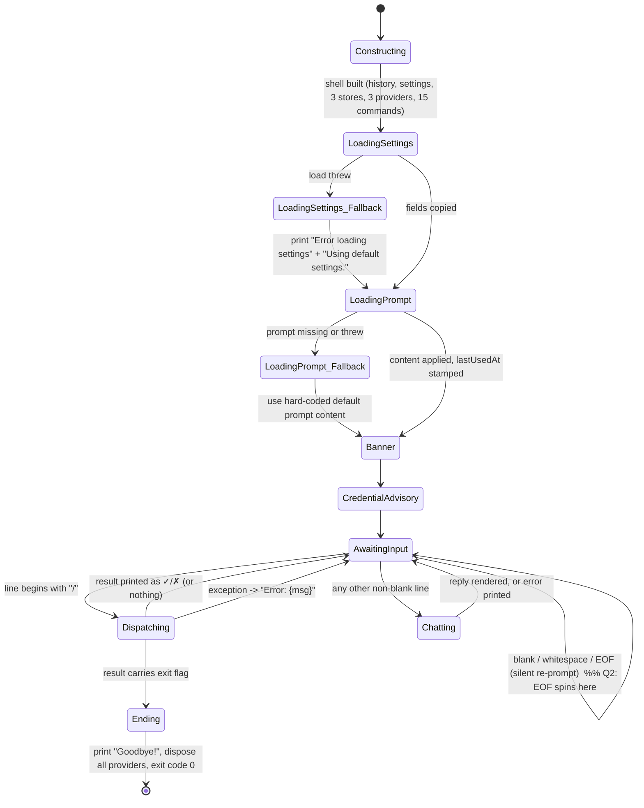
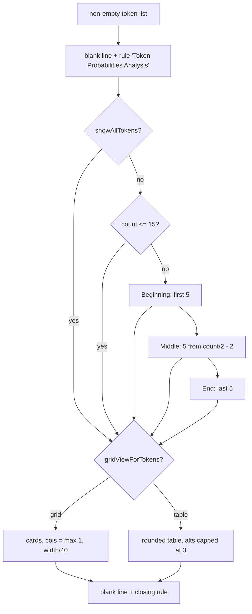

# Feature: Interactive Chat Session (Console Shell)

> Evidence commit: `d8c18f61d6bb73666ed97cd4885e877e35558485`.
> Primary sources: `src/ChatDbg/ChatShell.cs` (718 newline-terminated lines + an unterminated 719th), `src/ChatDbg/Program.cs` (14 lines).
> Supporting: `src/Xcaciv.ChatDbg.Core/Models/*`, `src/Xcaciv.ChatDbg.Core/Services/*`, `src/Xcaciv.ChatDbg.Core/Commands/*`, `README.md`, `src/ChatDbg/prd.md`, `src/Xcaciv.ChatDbg.Core.Tests/**`.
> **CODE IS TRUTH.** Every README/prd.md claim below was checked against code; disagreements are recorded in the **Quirks** section.
> Statements marked **[MEASURED]** were confirmed by executing the same runtime primitive the source uses, on Linux, with the SDK in this environment; statements marked **INFERRED** were reasoned from source and never executed.

---

## Purpose

**Problem solved.** A developer debugging code wants to hold a conversation with a large language model *inside a terminal*, without leaving the shell, and wants that conversation to be inspectable and manipulable — able to swap the model or provider mid-session, edit the transcript, load and save it, and (uniquely for this product) see the token-by-token probabilities behind each answer.

This feature is the **outermost interactive loop of the plain-console build of the product**: the thing that owns the terminal, prints the prompt, reads the line, decides whether the line is a *command* or a *chat turn*, drives the AI provider, renders the answer, and eventually shuts down. It is the glue: it owns almost no domain logic of its own; it owns *session lifecycle*, *dispatch decision*, and *response rendering*.

**Actors / roles.**
- **Developer / end user (only human role).** Types at a terminal. No authentication, no authorization, no multi-user concept anywhere in this feature — the process runs entirely with the invoking OS user's privileges, and the only "identity" in play is whichever cloud credentials the environment supplies.
- **Operator (same person, different hat).** Configures credentials via environment variables or Windows Credential Manager before or between runs; the shell reports back which source it actually used.
- No background actor, no scheduler, no service account.

**Where it sits in the product.** There are two shells in the repo built on the same shared library: this plain-console REPL (shipped as the executable titled “ChatDbg Shell”, product “ChatDbg”, version 1.0.0 — `src/ChatDbg/Xcaciv.ChatDbg.Shell.csproj:10-19`) and a separate full-screen terminal-UI shell (`src/ChatDbg.Shell.Gui`, NOT documented here). They are independent front ends over the same command set and provider set. This dossier covers **only the plain-console REPL**.

---

## Behavior

### B1. Process startup and shutdown (`Program.cs:1-14`)

The program's entire body is: construct one chat-shell object, run it to completion, dispose it, return exit code `0`. Any exception that escapes prints `Fatal error: {exception message}` on standard output and returns exit code `1` (`Program.cs:8-12`). The shell object is scoped so that its disposal happens as the exception unwinds, *before* the fatal message is printed.

There are **no command-line arguments**. Nothing is parsed from `argv`. Configuration comes only from the settings file, environment variables, and in-session commands.

### B2. Session construction (`ChatShell.cs:21-38`)

Constructing the shell eagerly creates every collaborator it will ever use. There is no lazy creation, no registry, and no way for anything outside the process to substitute a collaborator — which is why the console shell is untestable in place (see Testing). Created, in this order:

1. An empty **chat history** (new random session id, creation timestamp in UTC).
2. A **settings** object populated with hard-coded defaults (see Data).
3. A **settings store** bound to `<user-profile>/.ChatDbg/settings.json`.
4. A **history import/export store**.
5. A **system-prompt store** bound to `<local-app-data>/ChatDbg/system_prompts`. *Constructing this store has side effects*: it creates the directory if absent and, if the directory holds no prompt files, writes four seed prompts (`default`, `code-reviewer`, `algorithm-helper`, `security-expert`) — done synchronously, blocking, during shell construction (`SystemPromptService.cs:26-32,157-204`).
6. **All three AI provider adapters at once**, keyed by the lowercase provider names `azure`, `bedrock`, `llama` (`ChatShell.cs:29-34`). All three are built even though at most one will ever be used. Merely building the local-LLM adapter installs a native-log capture buffer (`LLamaSharpService.cs:25`); merely building the Azure adapter opens its own outbound HTTP connection pool (`AzureOpenAIService.cs:24-27`). Both happen in sessions that never touch either provider (Quirk Q10).
7. The **command table** (see B3).

### B3. Command registration (`ChatShell.cs:40-67`)

Fourteen commands are constructed in a fixed order and inserted into a lookup table keyed by each command's own lowercase name; then a fifteenth, `help`, is registered last and handed the table itself (`ChatShell.cs:66`). The source comment says this ordering exists so the help command sees a complete table — **it does not matter**: the table is handed over by reference and is live, and the general help never enumerates it anyway (Quirk Q20).

Registered in this shell, in construction order:

Each command carries three user-visible strings — **name**, **description** (shown in the general help list) and **usage** (shown by `/help <name>`). Transcribed verbatim:

| # | Key | Description (exact) | Usage (exact) | Collaborators given to it |
|---|-----|---------------------|---------------|---------------------------|
| 1 | `inject` | `Inject a message into the chat history` | `/inject <role> <message> [position] - Inject message with specified role (user\|assistant\|system)` | chat history |
| 2 | `pop` | `Remove the last message from chat history` | `/pop - Remove the last message from chat history` | chat history |
| 3 | `import` | `Import chat history from a file` | `/import <file_path> - Import chat history from JSON file` | chat history + history store |
| 4 | `export` | `Export chat history to a file` | `/export <file_path> - Export chat history to JSON file` | chat history + history store |
| 5 | `model` | `Change the AI model` | `/model <model_id> - Change the current AI model` | settings + settings store |
| 6 | `set` | `Set configuration values and manage credentials securely` | a multi-page generated help block | settings + settings store + prompt store |
| 7 | `logprobs` | `Configure token probability analysis` | `/logprobs [enable\|disable\|top <number>\|showall\|showsample\|grid\|list\|gridmaxalt <number>\|debug] - Configure token probability analysis settings` | settings + settings store |
| 8 | `prompt` | `Manage system prompts for AI responses` | `/prompt [list\|show <n>\|use <n>\|create <n>\|delete <n>\|edit <n>\|export <n>\|import <file>] - Manage system prompts` | settings + settings store + prompt store |
| 9 | `demologprobs` | `Show sample token probability analysis for demonstration purposes` | `/demologprobs - Display sample token probability analysis` | settings **only**, no renderer — see Quirk Q7 |
| 10 | `clear` | `Clear chat history` | `/clear - Clear all chat history` | chat history |
| 11 | `exit` | `Exit the chat application` | `/exit - Exit the application` | — |
| 12 | `quit` | `Exit the chat application` | `/quit - Exit the application` | — |
| 13 | `tokenize` | `Analyze and tokenize text using the current LLM model` | `/tokenize <text> - Tokenizes the provided text and displays token IDs, offsets, and statistics` | settings |
| 14 | `inspect` | `Performs detailed token-level analysis of text using the current model` | `/inspect <text> - Analyzes token probabilities and attribution` | settings |
| 15 | `help` | `Shows help information about available commands` | `/help [command] - Shows help for all commands or details for a specific command` | the command table itself |

(Evidence: `Commands/InjectCommand.cs:15-17`, `Commands/PopCommand.cs:15-17`, `Commands/ImportCommand.cs:17-19`, `Commands/ExportCommand.cs:17-19`, `Commands/ModelCommand.cs:17-19`, `Commands/SetCommand.cs:22-24`, `Commands/LogProbsCommand.cs:18-20`, `Commands/PromptCommand.cs:23-25`, `Commands/DemoLogProbsCommand.cs:40-42`, `Commands/ClearCommand.cs:14-16`, `Commands/ExitCommand.cs:7-9`, `Commands/QuitCommand.cs:7-9`, `Commands/TokenizeCommand.cs:16-20`, `Commands/InspectCommand.cs:16-20`, `Commands/HelpCommand.cs:13-17`.)

Three commands that exist in the shared Core library are **NOT registered by this shell**: `export-logs`, `export-analysis`, `show-analysis` (they exist at `Commands/ExportLogsCommand.cs`, `Commands/ExportTokenAnalysisCommand.cs`, `Commands/ShowTokenAnalysisCommand.cs`). Typing them yields "Unknown command". (QUIRK Q8.)

Because registration is *last-write-wins into a lookup table keyed by command name*, two commands claiming the same name would silently shadow each other. No duplicate names exist today.

### B4. Startup sequence, in order (`ChatShell.cs:69-78`)

1. **Load settings** (B5).
2. **Load system prompt** (B6).
3. **Print welcome banner** (B7).
4. **Check credential configuration and print advisory** (B8).
5. Enter the read-eval-print loop (B9).

There is no splash delay, no version check, no network call during startup.

### B5. Loading settings (`ChatShell.cs:122-159`)

Asks the settings store for the persisted settings, then **copies field-by-field** into the live settings object that all commands and providers already hold references to. Copied fields (exactly these fifteen, in this order): provider, model id, temperature, max tokens, Azure endpoint, AWS region, use-Windows-credential-manager flag, enable-log-probabilities flag, log-probabilities top-K, system-prompt name, llama context size, llama GPU layer count, llama GPU device, llama threads, llama batch size, then the three deprecated file-stored credential values.

**Deliberately not copied** (though persisted and settable at runtime): `showAllTokens`, `gridViewForTokens`, `gridViewMaxAlternatives`. See QUIRK Q1.

If loading throws, the shell prints `Error loading settings: {message}` then `Using default settings.` and continues with the built-in defaults established when the session was created (`ChatShell.cs:153-158`).

The settings store itself has additional observable behavior the user sees at this moment (`SettingsService.cs:43-83`):
- If the settings file does not exist, it **creates one** containing the defaults, then returns those defaults.
- If the loaded file contains any file-stored credential, it prints a migration warning followed by literal `set CHATDBG_*=...` shell lines showing the secret values.
- If the Windows-credential-manager flag is on it prints an informational line; if the flag is on but the platform is not Windows it prints a "not available on this platform" line.
- Those three notices are printed with mojibake placeholder glyphs (`??`) in the source rather than the intended emoji.

### B6. Loading the system prompt (`ChatShell.cs:161-190`)

Looks up the named prompt (`settings.systemPromptName`, default `"default"`) in the prompt store.
- **Found**: its content becomes the live system-prompt content, and the prompt's *last used* timestamp is updated in its file (a write on every startup).
- **Not found**: the live system-prompt content is set to the hard-coded fallback string (see Data → constant C1). No file is written, and no message is printed.
- **Threw**: prints `Error loading system prompt: {message}` then `Using default system prompt.` and uses the same fallback string.

### B7. Welcome banner (`ChatShell.cs:192-237`)

Printed verbatim, in this order:

```
╔════════════════════════════════════════════════╗
║                   ChatDbg                      ║
║         AI-Powered Debugging Assistant         ║
╚════════════════════════════════════════════════╝
<blank>
Provider: {provider}
Model: {modelId}
System Prompt: {systemPromptName}
Settings file: {absolute path to settings.json}
<blank>
Available providers: azure, bedrock, llama (local LLM)
Security Enhancement: Credentials are now managed via environment variables
   or Windows Credential Manager for improved security.
   See '/set' command for more details.
<blank>
```

The frame is Unicode box-drawing (U+2554/U+2550×48/U+2557, U+2551, U+255A/U+2550×48/U+255D); the two text rows are exactly 48 characters wide between the vertical bars.

Then, **only when the active provider is `llama`** (`ChatShell.cs:211-226`):

```
LLama Configuration:
   Context Size: {llamaContextSize}
   GPU Layers: {llamaGpuLayerCount}[ (CPU-only) when the value is 0]
   GPU Device(s): {llamaGpuDevice}          <- line omitted entirely when unset/empty
   Threads: {llamaThreads, or the literal word "default" when the value is 0}
   Batch Size: {llamaBatchSize}
<blank>
```

Then, **only when log probabilities are enabled** (`ChatShell.cs:228-231`):
`Token probability analysis is enabled. Type '/logprobs' for details.`

Then always:
```
<blank>
Type '/prompt list' to manage system prompts.
Type '/help' to see available commands or start chatting!
Type '/exit' or '/quit' to exit.
<blank>
```

### B8. Credential advisory at startup (`ChatShell.cs:239-321`)

A one-shot, read-only diagnostic. Four mutually exclusive outcomes:

1. **Provider name is empty** → prints `Warning: No AI provider configured.` and `   Use '/set provider azure', '/set provider bedrock', or '/set provider llama' to configure.` and returns early.
2. **Provider name is not one of the three known keys** → prints `Warning: Unknown AI provider: {provider}` and returns.
3. **Provider known but the adapter reports itself not configured** → prints `Warning: {provider display name} service is not configured.` followed by a provider-specific remedy block:
   - *azure*: numbered method 1 = `set CHATDBG_AZURE_API_KEY=your-api-key`; method 2 (**only shown on Windows**) = `/set enablewincred` then `/set wincred azureApiKey your-api-key`; plus, if the Azure endpoint is unset, `   Also set your Azure endpoint: /set azureEndpoint https://your-resource.openai.azure.com/`.
   - *bedrock*: method 1 lists `CHATDBG_AWS_ACCESS_KEY`, `CHATDBG_AWS_SECRET_KEY`, and mentions the standard `AWS_ACCESS_KEY_ID` / `AWS_SECRET_ACCESS_KEY` alternatives; method 2 (**Windows only**) = `/set enablewincred` then `/set wincred awsAccessKey …` and `/set wincred awsSecretKey …`.
   - *llama*: three numbered steps — download a GGUF model file, `/set modelId C:\path\to\your\model.gguf`, ensure the file exists and is accessible.
4. **Provider configured** → prints the *source* of the credential for transparency:
   - azure with a non-empty resolved key: `Azure credentials loaded from: {source}`
   - bedrock with a non-empty resolved access key or secret key: `AWS credentials loaded from: {source}` (the source reported is always the *access key*'s source, never the secret key's)
   - llama: `Local LLM model loaded from: {modelId}`
   - Source strings come from the settings object and are exactly one of: `environment variable ({VAR_NAME})`, `Windows Credential Manager`, `settings file (deprecated)`, `not set` (`ChatSettings.cs:173-201`).

This advisory never blocks; the loop starts regardless.

### B9. The read-eval-print loop (`ChatShell.cs:80-120`)

Endless loop; each iteration:

1. **Prompt** written *without* a trailing newline: `ChatDbg ({provider}/{modelId})> `. Because provider and model id are re-read from the live settings object each iteration, a `/set provider …` or `/model …` is reflected in the very next prompt.
2. **Read one line** from standard input.
3. **Blank guard**: if the line is null, empty, or whitespace-only, the iteration restarts immediately with no output (`ChatShell.cs:85-88`). See QUIRK Q2 (EOF spin).
4. **Dispatch decision**: if the raw line *starts with* `/` it is a **command**; otherwise it is a **chat turn**. The line is never trimmed, so a line beginning with a space followed by `/help` is treated as a chat turn, and a chat turn preserves all its internal and trailing whitespace exactly. The prefix test is **locale-aware, not byte-exact** — a line beginning with a format/ignorable character (zero-width joiner, soft hyphen, …) followed by `/` also counts as a command, and then loses the wrong first character (Quirk Q17).
5. **Command path** → parse and execute (B10). If the result requests exit, break out of the loop. Otherwise, if the result carries a non-empty message, print it on **one** call as `✓ {message}` when the result is a success and `✗ {message}` when it is a failure (U+2713 / U+2717). Multi-line messages (e.g. help text, the `/set` dump) therefore carry the marker only on the first physical line.
6. **Chat path** → send a turn (B11).
7. **Blanket exception guard** around steps 5–6: any escaping exception prints `Error: {exception message}` to the console and the loop continues; the full exception is additionally written to the platform debug channel (invisible in a normal run). The session is never terminated by an error.

On loop exit, prints `Goodbye!` and returns from the run method; the process then disposes the shell and exits with code 0.

### B10. Command parsing and dispatch (`ChatShell.cs:323-341`)

- The leading `/` is dropped, and the remainder is split on the **space character only**, discarding empty segments. Tabs are not separators. There is **no quoting, no escaping, no `--flag` parsing** at this layer; runs of consecutive spaces collapse and are unrecoverable by the command.
- If nothing remains after the split (`/`, `/   `), returns the failure message `Invalid command`.
- The first segment is lowercased and used as the lookup key; **the remaining segments are passed to the command as-is (original casing preserved)**.
- Unknown key → failure message `Unknown command: /{lowercased name}. Type '/help' for available commands.`
- Known key → the command runs to completion and its result is returned unchanged.
- Because the split collapses runs of spaces, commands that rejoin their arguments with a single space (`/set modelId`, `/set azureEndpoint`, `/prompt create`, …) silently corrupt any value containing consecutive spaces — e.g. `/set modelId C:\my  models\a.gguf` stores `C:\my models\a.gguf` (`Commands/SetCommand.cs:56`).

Commands are **not** recorded in the chat history by this shell (the history's per-message "is command" flag is never set to true by the console shell).

Several registered commands perform their own console I/O *inside* the dispatch call, including reading further lines from the same standard input — the loop has no knowledge of this and simply resumes afterwards:
- `/set migrate` presents a numbered 1–3 menu and reads a choice, then asks `Would you like to remove credentials from the settings file now? (y/N)` (`SettingsService.cs:196-268`).
- `/set enablewincred` asks `Do you want to enable Windows Credential Manager for secure credential storage? (y/N)` and, on `y`/`yes`, flips the flag on the **live** settings object and persists it, so it takes effect in the running session (`SettingsService.cs:106-143`; `Commands/SetCommand.cs:252-257`).
- `/inspect <text>` prints tokenization results then asks `Do you want to continue with probability analysis? …(y/n)` (`InspectCommand.cs:63-65`).
- `/prompt` editing reads lines until a line equal to the literal `END` (`PromptCommand.cs:267`).

All these sub-prompts accept `y`/`yes` (case-insensitive) as affirmative; anything else is negative.

### B11. Sending a chat turn (`ChatShell.cs:343-410`)

Order of operations matters and is observable:

1. **Append the user's raw line to the chat history immediately**, role `user`, timestamp UTC, no log probabilities. This happens *before* any validation, so an unusable provider still leaves the user's turn in the transcript (QUIRK Q3).
2. Look up the provider adapter by the current provider name. Unknown → print `Error: Unknown AI provider: {provider}` and return (turn ends, no reply).
3. Ask the adapter whether it is configured. Not configured → print two lines and return:
   - `Error: {provider display name} service is not configured. Use environment variables or Windows Credential Manager to configure credentials securely.`
   - `   Type '/set' to see current configuration and setup instructions.`
4. Print `Thinking...` preceded by a blank line.
5. **Branch on the log-probabilities flag**:
   - **Enabled**: first print `Log probabilities enabled - requesting with top-k={logProbabilitiesTopK}`. Call the adapter's *with-log-probabilities* operation. Append the reply to history as role `assistant`, **attaching the returned per-token probability list**; if the reply text is absent, the literal string `Error: Response text expected, none recieved.` (sic — misspelled) is stored instead. Print the reply text surrounded by blank lines. Then either render the probability visualization (B12) or, if the list is null/empty, print:
     - `` (blank) then `Note: Log probabilities were requested but none were returned by the model.`
     - `This could be due to the model not supporting this feature or an API limitation.`
   - **Disabled**: call the adapter's plain send operation, append the returned string to history as role `assistant` with no probabilities, print it surrounded by blank lines.
6. **Inner exception guard**: any exception from steps 4–5 prints `Error getting AI response: {exception message}` and returns; the user's turn stays in the history and no assistant turn is appended.

The reply envelope the providers return also carries an **error message** and a **total elapsed time** (`Models/AIResponse.cs:25-32`). **This shell reads neither.** A provider that reports failure by returning an envelope (rather than throwing) produces a blank reply on screen and the misspelled placeholder in the transcript, with its actual error text silently dropped (Quirk Q21).

On the plain (non-probability) path the reply text is whatever the adapter returns, and each adapter has its *own* placeholder for “no text”, all four differing (see Data → constant C2).

The whole call is synchronous from the user's point of view — the prompt does not return until the provider answers. There is **no streaming, no spinner, no elapsed-time display, and no cancellation** (no cancellation token exists anywhere in the product).

### B12. Rendering token probabilities (`ChatShell.cs:412-690`)

Only reached on the log-probabilities path when a non-empty list came back. Rich-console rendering (rules, tables, grids, panels, colors) is used *only here*; everything else in the shell is plain text.

Frame: a blank line, then a left-justified horizontal rule titled `Token Probabilities Analysis` (yellow); at the end, a blank line and a second, untitled left-justified rule.

Two orthogonal display switches:
- **Show-all vs. sample** (`showAllTokens`, default off).
- **Grid vs. table** (`gridViewForTokens`, default off → table).

Selection logic:
- Show-all on → render the entire token list in the chosen layout.
- Show-all off **and** the list has 15 or fewer entries (`5 × 3`) → render the entire list anyway.
- Show-all off **and** more than 15 entries → render three separate blocks, each preceded by its own blue caption and separated by blank lines, in this fixed order:
  1. `Beginning Tokens:` — the first 5 tokens, numbered from 1.
  2. `Middle Tokens:` — 5 tokens starting at index `count/2 − 2` (integer arithmetic: `count/2 − 5/2`), numbered from that index + 1.
  3. `End Tokens:` — the last 5 tokens, numbered from `count − 5 + 1`.

**Table layout** (`ChatShell.cs:596-635`): a rounded-border, width-expanded table with four columns — `№` (centered), `Token` (fixed width 20), `Probability` (centered), `Top Alternatives` (fixed width 50). One row per token; the index cell is grey and 1-based (absolute position, not position within the sample block). The alternatives cell lists **at most 3** alternatives, one per line, each as `token (probability)`, or the dim literal `(none)` when there are none.

**Grid layout** (`ChatShell.cs:499-594`): the number of columns is `max(1, terminalWidth / 40)` — i.e. one card per 40 columns of terminal width, minimum one. Cards are laid out left-to-right, and the final row is padded with empty panels so every row has the full column count. Each card is a rounded-border, expanded panel whose header is the grey 1-based absolute index (`#7`), and whose body is:
```
Token: {token}
Prob: {colored probability}
Alternatives:
- {alt} ({colored probability})
   … up to gridViewMaxAlternatives entries …
+ N more            (dim; only when more alternatives exist than were shown)
```
The `Alternatives:` block is omitted entirely when the token has none.

**Token text rendering** (`ChatShell.cs:637-655`): a null token renders as the dim literal `(null)`. Otherwise `[` and `]` are doubled to escape console markup, then the four control characters newline, carriage return, tab, and NUL are replaced by dim visible escapes `\n`, `\r`, `\t`, `\0`.

**Probability coloring** (`ChatShell.cs:657-672`): thresholds `>= 90` → green, `>= 70` → lime, `>= 50` → yellow, `>= 30` → orange3, else red. The value is then formatted with a percentage format (which itself multiplies by 100 and appends the locale's percent sign) to 5 decimal places, and a **second, literal `%`** is concatenated.

**[MEASURED]** For a token whose probability is 0.25 the cell reads `25.00000%%` under an en-US locale and `25.00000 %%` (note the space) under invariant globalization — which is what the size-optimised publish profiles enable (`Xcaciv.ChatDbg.Shell.csproj:52,95`). So the *number shown is a correct percentage*; only the trailing sign is doubled (Quirk Q5). The *color*, however, is chosen from the un-multiplied 0…1 fraction against 90/70/50/30, so every genuine token is red (Quirk Q4).

### B13. Shutdown (`ChatShell.cs:692-718`, `Program.cs:5`)

Leaving the loop prints `Goodbye!`; the enclosing scope then disposes the shell, which releases **all three** provider adapters in registration order (`ChatShell.cs:704-708`), whether or not they were ever used. Disposing the local-LLM adapter releases the model/context handles and flushes its captured native-log buffer to `<roaming-app-data>/ChatDbg/Logs/llamasharp_{yyyyMMdd}.log` (`LLamaSharpService.cs:670-688`, `LLamaSharpLogConfig.cs:142-165,193-200`). A finalizer exists as a backstop. Nothing else is persisted at shutdown — **the chat transcript is discarded unless the user explicitly exported it**. The daily log file name is built from the **local** date (`LLamaSharpLogConfig.cs:149`, `DateTime.Now`) while every timestamp the product stores is UTC — the one place the two clocks are mixed.

---

## Business rules & edge cases

Evidence paths are relative to the repo root.

**Dispatch and parsing**

| # | Rule | Evidence |
|---|------|----------|
| R1 | A line is a command **iff** its first character is `/`; no trimming is applied first. | `src/ChatDbg/ChatShell.cs:92` |
| R2 | Null, empty, or whitespace-only input is silently ignored and re-prompted; nothing is added to history. | `src/ChatDbg/ChatShell.cs:85-88` |
| R3 | Command arguments are produced by splitting on the single space character with empty entries removed — no quoting, no tabs, no escaping. Runs of spaces are collapsed and unrecoverable. | `src/ChatDbg/ChatShell.cs:326` |
| R4 | The command *name* is lowercased before lookup; **arguments keep their original case**. | `src/ChatDbg/ChatShell.cs:332-333` |
| R5 | A line consisting only of `/` (or `/` plus spaces) yields the failure message `Invalid command`. | `src/ChatDbg/ChatShell.cs:327-330` |
| R6 | Unknown command yields exactly `Unknown command: /{name}. Type '/help' for available commands.` | `src/ChatDbg/ChatShell.cs:340` |
| R7 | Command results print as `✓ {message}` on success and `✗ {message}` on failure, and only when the message is non-empty. A result with no message prints nothing. | `src/ChatDbg/ChatShell.cs:100-105` |
| R8 | The loop terminates only when a command result carries the exit flag; both `/exit` and `/quit` set it, and both carry no message, so the only output is `Goodbye!`. | `src/ChatDbg/ChatShell.cs:95-98,119`; `Commands/ExitCommand.cs:11-14`; `Commands/QuitCommand.cs:11-14`; test `Commands/ExitAndQuitCommandTests.cs:9-27` |
| R9 | `help` is registered **after** all other commands and handed the command table itself. The ordering is immaterial — the table is shared by reference and stays live — and the general help never enumerates it: it looks up 15 fixed names in its own hard-coded category order and silently skips any it cannot find (R62, R63, Quirk Q20). | `src/ChatDbg/ChatShell.cs:60-66`; `Commands/HelpCommand.cs:38-98,101-107` |
| R10 | Commands are keyed by their own `Name`; a later registration with the same name silently replaces an earlier one. | `src/ChatDbg/ChatShell.cs:60-63` |
| R11 | Commands are never appended to the chat transcript by this shell. | absence of any `AddMessage(..., isCommand: true)` in `src/ChatDbg/ChatShell.cs` |

**Chat turn**

| # | Rule | Evidence |
|---|------|----------|
| R12 | The user's turn is appended to history **before** provider lookup and configuration checks, so it survives even when no reply is possible. | `src/ChatDbg/ChatShell.cs:346` vs `349,356` |
| R13 | An unknown provider name during a chat turn prints `Error: Unknown AI provider: {provider}` and ends the turn. | `src/ChatDbg/ChatShell.cs:349-353` |
| R14 | An unconfigured provider prints a two-line advisory and ends the turn without contacting the network. | `src/ChatDbg/ChatShell.cs:356-361` |
| R15 | "Configured" is defined per provider: **azure** = non-empty endpoint AND non-empty resolved API key AND non-empty model id; **bedrock** = non-empty model id AND (resolved access key OR `AWS_ACCESS_KEY_ID` present); **llama** = non-empty model id AND that path exists as a file. | `Services/AzureOpenAIService.cs:40-45`; `Services/BedrockService.cs:23-28`; `Services/LLamaSharpService.cs:41-50` |
| R16 | The literal `Thinking...` (preceded by a blank line) is printed before every provider call. | `src/ChatDbg/ChatShell.cs:363` |
| R17 | When log probabilities are enabled, the shell additionally announces `Log probabilities enabled - requesting with top-k={K}` before the call. | `src/ChatDbg/ChatShell.cs:373` |
| R18 | On the log-probabilities path, a missing reply text is stored in history as the literal `Error: Response text expected, none recieved.` (misspelling is in the source) while the *displayed* text is the empty/absent value. | `src/ChatDbg/ChatShell.cs:377,380` |
| R19 | Log probabilities are attached to the assistant message in history only on the log-probabilities path; the plain path always stores `null`. | `src/ChatDbg/ChatShell.cs:377` vs `399` |
| R20 | When log probabilities were requested but none returned, a two-line explanatory note is printed instead of any visualization. | `src/ChatDbg/ChatShell.cs:388-391` |
| R21 | The assistant reply is always printed surrounded by a leading and a trailing blank line. | `src/ChatDbg/ChatShell.cs:380,402` |
| R22 | A failed provider call prints `Error getting AI response: {message}` and leaves the orphan user turn in history — nothing is rolled back. | `src/ChatDbg/ChatShell.cs:405-409` |
| R23 | Any other exception in the iteration prints `Error: {message}` and the loop continues; the session is never killed by a handled error. | `src/ChatDbg/ChatShell.cs:112-116` |

**Token-probability rendering — magic numbers with meaning**

| # | Rule / number | Meaning | Evidence |
|---|---------------|---------|----------|
| R24 | `5` — sample size | tokens taken from each of beginning / middle / end when sampling | `src/ChatDbg/ChatShell.cs:435` |
| R25 | `15` (= `5 × 3`) — sampling cutoff | a list this size or smaller is shown in full even when sampling is on, because sampling would show everything anyway | `src/ChatDbg/ChatShell.cs:437` |
| R26 | Middle window start = `count / 2 − 2` (integer `count/2 − 5/2`) | centers the 5-token middle sample | `src/ChatDbg/ChatShell.cs:464` |
| R27 | End window start = `count − 5` | last five tokens | `src/ChatDbg/ChatShell.cs:478` |
| R28 | `40` — assumed minimum character width of one grid card; columns = `max(1, terminalWidth / 40)` | responsive grid sizing; guarantees at least one column on any terminal | `src/ChatDbg/ChatShell.cs:506` |
| R29 | `3` — hard cap on alternatives per token in **table/list** view, regardless of `logProbabilitiesTopK` or `gridViewMaxAlternatives` | list view never shows more than three alternatives | `src/ChatDbg/ChatShell.cs:682` |
| R30 | `gridViewMaxAlternatives` (default 5) — cap on alternatives per card in **grid** view; surplus is summarized as `+ N more` | grid view is user-tunable, list view is not | `src/ChatDbg/ChatShell.cs:570,581-584` |
| R31 | Column widths: Token = 20 chars, Top Alternatives = 50 chars; `№` and `Probability` centered; border rounded; table expands to terminal width | fixed table geometry | `src/ChatDbg/ChatShell.cs:600-607` |
| R32 | Color bands `90 / 70 / 50 / 30` → green / lime / yellow / orange3 / red | confidence banding, intended as percentages | `src/ChatDbg/ChatShell.cs:657-671` |
| R33 | Probability formatted to **5 decimal places** as a percentage | display precision | `src/ChatDbg/ChatShell.cs:671` |
| R34 | Token indices displayed are **1-based and absolute** within the whole response, preserved across sample blocks | a middle-sample card can read `#37` | `src/ChatDbg/ChatShell.cs:589,626` |
| R35 | Markup escaping: `[`→`[[`, `]`→`]]` applied *before* injecting the dim escape markup for `\n`, `\r`, `\t`, `\0`; a null token renders as dim `(null)` | prevents user/model text from being interpreted as console markup | `src/ChatDbg/ChatShell.cs:637-655` |
| R36 | Block order is fixed | within a sample render the three blocks always appear Beginning → Middle → End, each preceded by its own blue caption and separated by a blank line; the order is not configurable | `src/ChatDbg/ChatShell.cs:452-489` |

**Startup / configuration**

| # | Rule | Evidence |
|---|------|----------|
| R37 | Exactly fifteen settings fields plus the three deprecated credential fields are copied from the persisted settings into the live object; the three display-mode fields are not. | `src/ChatDbg/ChatShell.cs:130-151` |
| R38 | If the settings file is missing, the settings store creates it with defaults before returning. | `Services/SettingsService.cs:47-53` |
| R39 | Settings path is `<user profile>/.ChatDbg/settings.json`; if the user profile cannot be resolved, the system temp directory is used instead. | `Services/SettingsService.cs:15-32` |
| R40 | System prompts live in `<local app data>/ChatDbg/system_prompts/{sanitized name}.json`; invalid filename characters in a prompt name are replaced with `_`. | `Services/SystemPromptService.cs:14-23,209-214` |
| R41 | Four seed prompts are created on first run only (only when the directory contains zero prompt files): `default`, `code-reviewer`, `algorithm-helper`, `security-expert`. | `Services/SystemPromptService.cs:157-204` |
| R42 | Every successful startup rewrites the active prompt's file to stamp a new *last used* timestamp. | `src/ChatDbg/ChatShell.cs:174`; `Services/SystemPromptService.cs:141-152` |
| R43 | Credential resolution priority is fixed: (1) environment variables in declared order, (2) Windows Credential Manager when explicitly enabled, (3) the deprecated value in the settings file. | `Models/ChatSettings.cs:88-118`; tests `Models/ChatSettingsTests.cs:10-40` |
| R44 | Environment variable names: `CHATDBG_AZURE_API_KEY`; `CHATDBG_AWS_ACCESS_KEY` then `AWS_ACCESS_KEY_ID`; `CHATDBG_AWS_SECRET_KEY` then `AWS_SECRET_ACCESS_KEY`. | `Models/ChatSettings.cs:70-76` |
| R45 | Windows Credential Manager target names: `ChatDbg:AzureApiKey`, `ChatDbg:AwsAccessKey`, `ChatDbg:AwsSecretKey`. | `Models/ChatSettings.cs:124-130` |
| R46 | Windows-Credential-Manager availability is a pure OS-platform check (Windows only); the credential-manager branches of the startup advisory are hidden on other platforms. | `Models/WindowsCredentialManager.cs:169-172`; `src/ChatDbg/ChatShell.cs:267,286` |
| R47 | The startup advisory reports AWS credential source using the **access key**'s source even when only the secret key is present. | `src/ChatDbg/ChatShell.cs:310-313` |
| R48 | The LLama-specific welcome block is printed only when the provider is exactly the lowercase string `llama`; the GPU-device line is skipped when the value is null/empty; a thread count of `0` prints as the word `default`; a GPU layer count of `0` gets the suffix ` (CPU-only)`. | `src/ChatDbg/ChatShell.cs:211-226` |

**Accepted value ranges** — every one of these is enforced **only** by the command that sets it, never when the settings file is read (Quirk Q19). The rejection text is the exact string the user sees after the `✗` marker.

| # | Setting | Accepted values | Default | Exact rejection message | Evidence |
|---|---------|-----------------|---------|-------------------------|----------|
| R49 | provider | exactly `azure`, `bedrock` or `llama`, lowercased before the check | `azure` | `Provider must be 'azure', 'bedrock', or 'llama'` | `Commands/SetCommand.cs:46-52` |
| R50 | temperature | a number, `0 ≤ t ≤ 2` | `0.7` | `Temperature must be a number between 0 and 2` | `Commands/SetCommand.cs:70-77` |
| R51 | max tokens | an integer, `1 … 8192` | `1000` | `MaxTokens must be a number between 1 and 8192` | `Commands/SetCommand.cs:79-85` |
| R52 | log-probability top-K | an integer, `1 … 20` | `5` | `LogProbabilitiesTopK must be a number between 1 and 20` (via `/set`) or `Top-K value must be a number between 1 and 20` (via `/logprobs top`) | `Commands/SetCommand.cs:173-179`; `Commands/LogProbsCommand.cs:57-61` |
| R53 | grid max alternatives | an integer, `1 … 20` | `5` | `Grid max alternatives value must be a number between 1 and 20` | `Commands/LogProbsCommand.cs:92-96` |
| R54 | llama context size | an integer, `512 … 32768` | `4096` | `LlamaContextSize must be a number between 512 and 32768` | `Commands/SetCommand.cs:97-104` |
| R55 | llama GPU layer count | an integer, `0 … 100`; `0` means CPU-only | `0` | `LlamaGpuLayerCount must be a number between 0 and 100. 0 means CPU-only, higher numbers move more layers to GPU.` | `Commands/SetCommand.cs:106-114` |
| R56 | llama threads | an integer, `0 … 64`; `0` means host default | `0` | `LlamaThreads must be a number between 0 and 64. 0 means system default.` | `Commands/SetCommand.cs:120-127` |
| R57 | llama batch size | an integer, `1 … 2048` | `512` | `LlamaBatchSize must be a number between 1 and 2048` | `Commands/SetCommand.cs:129-136` |
| R58 | boolean settings (`enableLogProbabilities`, `showAllTokens`, `gridViewForTokens`, …) | the literal text `true` or `false`, parsed case-insensitively | `false` | `EnableLogProbabilities must be 'true' or 'false'` / `showAllTokens must be 'true' or 'false'` / `gridViewForTokens must be 'true' or 'false'` | `Commands/SetCommand.cs:163-201` |
| R59 | model id, when the provider is `llama` | must name a file that exists | `gpt-4` | `LLama model file not found: {path}` + newline + `Make sure you've specified the correct path to a GGUF model file.` | `Commands/SetCommand.cs:55-68` |
| R60 | azure endpoint, aws region, llama GPU device | free text; no validation at all | endpoint unset, region `us-east-1`, device unset | — | `Commands/SetCommand.cs:88-95,117-118` |
| R61 | `/set` with one argument (except `migrate` and `enablewincred`) | rejected | — | `Usage: /set <key> <value>` | `Commands/SetCommand.cs:33-36` |

**Help output — exact structure** (what `/help` with no arguments prints, all in one message, so only the first line carries `✓`)

| # | Rule | Evidence |
|---|------|----------|
| R62 | First line is `ChatDbg Commands:` followed by a blank line, then seven captioned groups in this fixed order: `Basic Commands:` (help, exit, quit, clear), `Model Configuration:` (set, model), `System Prompt Management:` (prompt), `Chat History Management:` (import, export, inject, pop), `Token Analysis:` (logprobs, demologprobs), `LLama Provider Commands (local LLM):` (tokenize, inspect), `LLama GPU Configuration:` (five literal `/set llama…` lines), `Supported Providers:` (three literal lines), then `Type '/help <command>' for detailed help on a specific command.` and `Type '/set' without parameters for current configuration details.` | `Commands/HelpCommand.cs:38-98` |
| R63 | Each listed command renders as `/{name} - {description}`; a name not present in the table renders nothing at all (no placeholder, no error). | `Commands/HelpCommand.cs:101-107` |
| R64 | `/help <name>` renders three lines: `Command: /{name}`, `Description: {description}`, `Usage: {usage}`; the name is lowercased first, so `/help SET` works. | `Commands/HelpCommand.cs:26-33` |
| R65 | `/help <unknown>` returns a **failure** whose message is exactly `Unknown command: {lowercased name}` — no leading slash and no `Type '/help'` suffix, i.e. **a different string from the loop's own unknown-command message** (R6). | `Commands/HelpCommand.cs:34` vs `src/ChatDbg/ChatShell.cs:340` |
| R66 | The general help block ends with a line break, so the loop's own line break adds one trailing blank line after it. | `Commands/HelpCommand.cs:96-98`; `src/ChatDbg/ChatShell.cs:102-104` |

**Rules corroborated by the automated test suite.** The console shell itself has no tests; these cover the contracts it depends on. Every assertion in the test files that touch this feature is represented here. Note Q14 (the project cannot currently be built) and Q15 (one of these tests fails when its assertion is executed).

| # | Rule | Test evidence |
|---|------|---------------|
| T1 | `/exit` and `/quit` each return a result whose exit flag is set — the only way out of the loop. | `Commands/ExitAndQuitCommandTests.cs:9-27` |
| T2 | A success result has success set and the exit flag clear, and carries the message it was given. | `Models/CommandResultTests.cs:8-16` |
| T3 | An error result has success clear and carries its message. | `Models/CommandResultTests.cs:18-25` |
| T4 | An exit result has success **set** *and* the exit flag set, and carries **no** message — which is why `/exit` prints nothing before `Goodbye!`. | `Models/CommandResultTests.cs:27-34` |
| T5 | General help succeeds and its message contains `ChatDbg Commands`; per-command help succeeds and contains the command's usage string. | `Commands/HelpCommandTests.cs:12-52` |
| T6 | Appending to the transcript records role, content, the is-command flag and a UTC timestamp not in the future. | `Models/ChatHistoryTests.cs:10-23` |
| T7 | Popping removes the **last** message only; clearing empties the transcript; injecting at position `1` places the message between the existing first and second. | `Models/ChatHistoryTests.cs:25-60` |
| T8 | A message reports it has probabilities only when the list is non-empty — an empty list counts as *none*, which is exactly the branch that triggers the shell's "none were returned" note (R20). | `Models/ChatMessageTests.cs:9-32` |
| T9 | A text-only reply envelope carries no probability list; a text-plus-probabilities envelope carries the very same list object it was given (no copy). | `Models/AIResponseTests.cs:9-30` |
| T10 | An environment variable outranks the deprecated file-stored credential, and the file-stored value is used when no variable is set; the reported source contains the words `environment variable` when a variable supplies it. | `Models/ChatSettingsTests.cs:9-71` |
| T11 | Any one non-empty file-stored credential is enough to trigger the migration warning at startup. | `Models/ChatSettingsTests.cs:42-51` |
| T12 | Credential-vault writes succeed **if and only if** the host is Windows, and reads of an unknown entry return nothing rather than failing. | `Models/WindowsCredentialManagerTests.cs:10-26` |
| T13 | Loading settings when the file is absent returns a populated object (the defaults) rather than nothing; saving then loading round-trips the provider. | `Services/SettingsServiceTests.cs:12-60` |
| T14 | Constructing the prompt store against an empty directory leaves that directory non-empty (the seeding side effect described in B2 is a tested contract, not incidental). | `Services/SystemPromptServiceTests.cs:12-32` |
| T15 | A saved prompt is readable by name and a deleted prompt reads back as absent — the two states the startup prompt load distinguishes (B6). | `Services/SystemPromptServiceTests.cs:34-63` |
| T16 | Enabling probabilities through `/logprobs enable` both mutates the shared settings and persists them exactly once; an unrecognised subcommand returns a failure; no arguments returns a status message containing `Token Probability Analysis Settings`. | `Commands/LogProbsCommandTests.cs:12-50` |
| T17 | `/demologprobs` succeeds and produces sample data **both** with and without a renderer; with a renderer it calls the render operation at least once. This is the test that proves Q7 — the console shell takes the second, silent path. | `Commands/DemoLogProbsCommandTests.cs:12-39` |
| T18 | **FAILING (Q15).** The probability derived from a log-probability is asserted to be `25` for `ln 0.25`; the implementation yields `0.25`. | `Models/TokenLogProbabilityTests.cs:9-18` |


---

## Quirks

Behavior that looks like a defect. **None of this is a recommendation to fix** — it is the observed behavior a reimplementer must consciously choose to keep or drop. Where a README, `prd.md`, or a test asserts something different, the code wins and the contradiction is recorded.

| # | Quirk | Evidence |
|---|-------|----------|
| Q1 | `showAllTokens`, `gridViewForTokens`, `gridViewMaxAlternatives` are persisted to the settings file and settable at runtime (`/logprobs showall`, `/logprobs grid`, `/logprobs gridmaxalt`, `/set showAllTokens …`) but are **never read back at startup** — the console shell's field-by-field copy omits them, so every session begins with sample mode, list layout, and 5 grid alternatives no matter what was saved. README §"Display Options" implies they persist. **CODE WINS.** | `src/ChatDbg/ChatShell.cs:130-151` (omission) vs `Models/ChatSettings.cs:39-46`, `Commands/LogProbsCommand.cs:67-97`, `README.md:230-246` |
| Q2 | **[MEASURED]** Reading a line at end-of-stream returns nothing, which the blank-input guard treats as "keep going". Piping input into the program, or closing standard input, therefore produces an **infinite busy loop** that re-prints the prompt forever. Only `/exit`, `/quit`, or killing the process ends the session. | `src/ChatDbg/ChatShell.cs:83-88` |
| Q3 | The user's turn is appended to history before any validation, so failed/unconfigured turns accumulate orphan user messages that are then re-sent as context on the next successful turn. | `src/ChatDbg/ChatShell.cs:346` |
| Q4 | Probability is derived as `e^(log-probability)`, giving a value in 0…1 for genuine log probabilities, but the color thresholds compare it against 90/70/50/30 — so **every real token is colored red**. The intended scale was 0–100: a unit test asserts `Probability == 25` for a log-probability of `ln 0.25` (see Q15). The *displayed* number is nonetheless correct, because the percentage format multiplies by 100 independently of the colour test. | `Models/TokenLogProbabilities.cs:26` vs `src/ChatDbg/ChatShell.cs:657-671` |
| Q5 | The probability is formatted with a percentage format specifier (which already appends `%`) *and* a literal `%` is concatenated, producing a **doubled percent sign**. **[MEASURED]** a probability of 0.25 renders `25.00000%%` under an en-US locale and `25.00000 %%` under invariant globalization (which the `Compact` and `SingleFile` publish profiles enable). README's sample output shows a single `%`. **CODE WINS.** | `src/ChatDbg/ChatShell.cs:671` vs `README.md:315,333` |
| Q6 | README describes the product as having a "modern Terminal.Gui interface", menu bar, status bar, and F1/F10 shortcuts. **None of that exists in this shell** — this is a plain line-oriented console REPL. Those claims describe the separate GUI shell. | `README.md:3,8,21-37` vs `src/ChatDbg/ChatShell.cs` (no UI framework usage beyond text/rules/tables) |
| Q7 | `/demologprobs` is created here **without a renderer**, so in this shell it displays **nothing at all** — it merely returns the message `Sample token probability analysis generated`. README §"Demo Command" claims it demonstrates the visualization. **CODE WINS.** | `src/ChatDbg/ChatShell.cs:52`; `Commands/DemoLogProbsCommand.cs:34-38,62-65` vs `README.md:256-268` |
| Q8 | Three commands present in the shared library (`export-logs`, `export-analysis`, `show-analysis`) are not registered by this shell and are therefore unreachable from the console REPL. | `src/ChatDbg/ChatShell.cs:42-58` vs `Commands/ExportLogsCommand.cs:12`, `Commands/ExportTokenAnalysisCommand.cs:12`, `Commands/ShowTokenAnalysisCommand.cs:13` |
| Q9 | `src/ChatDbg/prd.md` states the target framework is **.NET 9** and lists only Azure OpenAI and AWS Bedrock as providers, and its project-structure diagram places Commands/Models/Services under `src/ChatDbg/`. In reality the shell targets **net10.0**, there are **three** providers including the local LLM, and all domain code lives in the separate Core project (the shell project explicitly excludes `Services/**`). **CODE WINS.** | `src/ChatDbg/prd.md:47,53-67,16` vs `src/ChatDbg/Xcaciv.ChatDbg.Shell.csproj` (`net10.0`, `Compile Remove="Services\**"`), `src/ChatDbg/ChatShell.cs:29-34` |
| Q10 | All three provider adapters are instantiated at startup and disposed at shutdown regardless of which one is selected — including the local-LLM adapter, which allocates a native-log capture object and, on disposal, creates/appends a daily log file under the roaming app-data folder even in a pure-cloud session. | `src/ChatDbg/ChatShell.cs:29-34,704-708`; `Services/LLamaSharpService.cs:25,670-688`; `Services/TokenInspection/LLamaSharpLogConfig.cs:20,142-165` |
| Q11 | The local-LLM adapter disposes a **static, process-wide** generation semaphore during shutdown; a second shell instance in the same process would fail. Harmless in the single-shell console program, but a reimplementer copying the shape should not replicate it. | `Services/LLamaSharpService.cs:23,681` |
| Q12 | The settings store's migration/credential notices contain literal `?`/`??` placeholders where emoji were intended (source-file encoding damage), and the migration instructions **print secret values in cleartext** to the console.  See Q36 for the byte-level form of the same damage. | `Services/SettingsService.cs:62,69,73,110,116,128,335,341,346` |
| Q13 | Console output encoding is never configured. The banner's box-drawing characters and the ✓/✗ markers rely on the host terminal already being UTF-8-capable. | absence of any output-encoding setup in `src/ChatDbg/Program.cs` and `ChatShell.cs` |
| Q14 | **[MEASURED]** `global.json` is malformed — it ends with an extra closing brace (`}\n}}`, 96 bytes). Every `dotnet` command run anywhere inside the repository tree aborts before doing any work with `System.Text.Json.JsonException: '}' is invalid after a single JSON value … LineNumber: 5`. The same CLI reports `10.0.400` normally outside the tree. **The repository as committed cannot be built, run, or tested by its own toolchain.** | `global.json:1-6` (verified by executing `dotnet --version` inside and outside the repo root) |
| Q15 | **[MEASURED]** The only unit test covering the probability value asserts `25` for a token whose log-probability is `ln 0.25`, while the value computed is `0.25`. Re-running that exact assertion yields `Assert.Equal() Failure: Values are not within 5 decimal places / Expected: 25 / Actual: 0.25`. **The committed test suite is red**, and the failing test is the one that documents the intent behind Q4. | `src/Xcaciv.ChatDbg.Core.Tests/Models/TokenLogProbabilityTests.cs:9-18` vs `Models/TokenLogProbabilities.cs:26` |
| Q16 | The prompt store seeds its four starter prompts from inside its own construction, **before** its serialization options are assigned — so the seed files are written with default (unindented) formatting while every later write is indented. On a first run the shell then immediately rewrites `default.json` in the indented form to stamp the last-used timestamp, so three of the four seed files stay unindented forever. | `Services/SystemPromptService.cs:32` (seeding) vs `:34-37` (options assigned afterwards), `:106` (the writer uses those options) |
| Q17 | **[MEASURED]** The command test is a locale-aware prefix match, not a byte comparison. A line beginning with an ignorable character — e.g. a zero-width joiner — followed by `/help` **is** classified as a command; the parser then strips that first character instead of the slash, so the name becomes `/help` and the user sees `✗ Unknown command: //help. Type '/help' for available commands.` Under invariant globalization (the `Compact`/`SingleFile` profiles) the same line is treated as a chat turn instead — **the same input dispatches differently depending on which build configuration shipped**. | `src/ChatDbg/ChatShell.cs:92,326,340`; `Xcaciv.ChatDbg.Shell.csproj:52,95` |
| Q18 | The provider key is matched case-sensitively (both the adapter lookup and the `llama` banner test). The `/set provider` path lowercases its argument, so this is unreachable from the keyboard — but a hand-edited settings file containing `"provider": "Azure"` produces `Warning: Unknown AI provider: Azure` at startup and `Error: Unknown AI provider: Azure` on **every** chat turn, with the user's messages still piling up in the transcript. | `src/ChatDbg/ChatShell.cs:211,251,349` vs `Commands/SetCommand.cs:46-52` |
| Q19 | Every numeric range is enforced **only** at the `/set` and `/logprobs` boundary; the startup copy validates nothing. A settings file hand-edited to `"logProbabilitiesTopK": 9999`, `"llamaContextSize": 0`, `"temperature": 50` or `"maxTokens": -1` is loaded and used verbatim, and `top-k=9999` is announced to the user before the call. | `src/ChatDbg/ChatShell.cs:130-151` (no validation) vs `Commands/SetCommand.cs:70-135` and `Commands/LogProbsCommand.cs:51-100` |
| Q20 | The general help list is **hard-coded**, not enumerated: it looks up 15 fixed names in the table and silently skips any it cannot find. A sixteenth registered command would never appear in `/help`, and the source's reason for registering `help` last (“so the table is complete”) is a no-op, because the table is shared by reference and is live either way. | `Commands/HelpCommand.cs:38-98` (fixed name list), `:101-107` (silent skip); `src/ChatDbg/ChatShell.cs:60-66` |
| Q21 | The reply envelope carries an **error message** and an **elapsed time**; this shell reads neither. A provider that reports failure by returning an envelope instead of throwing produces a blank reply between two blank lines, stores the misspelled placeholder in the transcript, and discards the real error text entirely. | `Models/AIResponse.cs:25-32` vs `src/ChatDbg/ChatShell.cs:374-380,396-402` |
| Q22 | Blank lines around `Thinking...` and around every reply are emitted as bare line-feed characters embedded in the text, while the surrounding writes use the platform line ending. On Windows the transcript on screen therefore mixes CRLF and lone-LF line endings — harmless in a terminal, but it corrupts naive redirection to a file consumed by CRLF-only tools. | `src/ChatDbg/ChatShell.cs:363,380,389,402` |
| Q23 | Of the three startup-advisory warning branches, only the “no provider” and “not configured” branches print a trailing blank line; the “unknown provider” branch returns without one, so its warning butts directly against the first prompt. | `src/ChatDbg/ChatShell.cs:246-247,301` vs `:253-254` |
| Q24 | Four registered commands read **further lines from the same standard input** while the loop is blocked inside them (`/set migrate` menu + y/N, `/set enablewincred` y/N, `/inspect` y/n, `/prompt edit` until a line equal to `END`). Under piped or scripted input those reads silently consume what the author intended as chat lines, and at end-of-stream they receive nothing and take the negative branch — then the loop resumes and spins per Q2. | `Services/SettingsService.cs:120-123,210-211,246-248`; `Commands/InspectCommand.cs:63-65`; `Commands/PromptCommand.cs:267` |
| Q25 | INFERRED. The `Compact` profile turns on ahead-of-time compilation with full trimming and *suppresses the trim-analysis warnings*, while all persistence (settings, prompts, transcripts) goes through a reflection-based document serializer with no generated serialization contract. Reflection-based serialization is disabled by default under ahead-of-time publishing, so the size-optimised build is expected to fail at runtime the first time it touches the settings file — i.e. immediately at startup. Not executed (Q14 blocks building). | `Xcaciv.ChatDbg.Shell.csproj:25-35` vs `Services/SettingsService.cs:34-38,56,97`, `Services/SystemPromptService.cs:34-37` |
| Q26 | The full-screen terminal-UI project contains its **own** near-identical copy of this console REPL that is never used — the only place in the repository where a chat-shell session object is created is the console shell's entry point. That dead copy registers only **two** providers (no local LLM), so anyone reading it as the reference implementation would reproduce a two-provider product. | `src/ChatDbg.Shell.Gui/ChatShell.cs:33-37` vs `src/ChatDbg.Shell.Gui/Program.cs:10-55` (builds everything inline) and `src/ChatDbg/Program.cs:5` (sole construction site) |
| Q27 | The active system prompt is located by turning its name into a file name and testing for that file. Name matching therefore inherits the host file system's case rules: `"systemPromptName": "Default"` finds the seeded `default.json` on Windows and silently falls back to the hard-coded prompt (no message printed) on Linux and macOS. **The same settings file produces different AI behavior on different operating systems, with no diagnostic.** | `Services/SystemPromptService.cs:76-84,209-214`; `src/ChatDbg/ChatShell.cs:166-180` |
| Q28 | README calls the product “a C# Chat shell for **Windows terminal**” and renders the prompt as `ChatDbg> ` in every example. The console shell is portable (Q29 lists the real Windows-only parts) and its prompt is `ChatDbg ({provider}/{modelId})> `. **CODE WINS.** | `README.md:3,168-190,211-245,261,279,289` vs `src/ChatDbg/ChatShell.cs:82` |
| Q29 | Storing a credential in the OS vault re-reads the settings **from disk into a second object**, force-enables the vault flag on that object and saves it — so the write is against the on-disk state, not the live session state, and any in-memory change not yet persisted is overwritten. The force-enable is dead code, because the command refuses to run unless the flag is already true. | `Services/SettingsService.cs:155,177-179`; `Commands/SetCommand.cs:234-241` |
| Q30 | The local-LLM native log file is named from the **local** date while every persisted timestamp in the product is UTC; a session spanning local midnight in a UTC-negative zone writes to a file dated differently from the messages it contains. | `Services/TokenInspection/LLamaSharpLogConfig.cs:149` vs `Models/ChatHistory.cs:12,21`, `Models/ChatMessage.cs:12` |
| Q31 | `src/ChatDbg/prd.md` also claims a direct dependency on a JSON package at version 9.0.9; the shell project declares only three package references (Bedrock 4.0.7.3, Azure OpenAI 2.1.0, rich console 0.51.1) and gets JSON from the runtime. Combined with Q9, **no factual claim in `prd.md`'s Technical Architecture section survived checking.** | `src/ChatDbg/prd.md:52-57` vs `Xcaciv.ChatDbg.Shell.csproj:107-111` |
| Q32 | **[MEASURED]** `Commands/SetCommand.cs` is **not valid UTF-8**: it carries no byte-order mark yet contains **30 raw `0x95` bytes** (a Windows-1252 bullet `•`) inside the help/settings-dump text that `/set` prints. A compiler decoding the file as UTF-8 turns each into the replacement character, so the `/set` usage block a user reads shows 30 U+FFFD replacement glyphs where bullets were intended. This is the byte-level cause of the mojibake family in Q12; the same damage exists in the terminal-UI project's settings dialog. | `Commands/SetCommand.cs` bytes at lines 307-343 (verified by decoding the file); `src/ChatDbg.Shell.Gui/UI/SettingsDialog.cs` byte 10888 |
| Q33 | The `/set` “unknown setting” error lists the valid keys — and **omits fourteen keys the command actually accepts**: `showAllTokens`, `gridViewForTokens`, `tokensgrid`, `gridViewMaxAlternatives`, `gridmaxalt`, `logprobs`, `logtopk`, `llamaContextSize`, `llamaGpuLayers`, `llamaGpuLayerCount`, `llamaGpuDevice`, `llamaThreads`, `llamaBatchSize`, and the three blocked credential keys. A user who mistypes is steered away from settings that work. | `Commands/SetCommand.cs:280` vs the case labels at `:46,55,70,79,88,92,97,106,107,116,120,129,138,163,164,173,174,183,192,193,202,203,212` |
| Q34 | `/set azureApiKey`, `/set awsAccessKey` and `/set awsSecretKey` are **deliberately blocked** — they always return a failure explaining environment variables instead. The deprecated file-stored credentials can therefore still be *read* (priority 3 of credential resolution, and they are copied into the live settings at startup) but can no longer be *written* from the shell. A settings file that already contains them keeps working indefinitely, warning on every start. | `Commands/SetCommand.cs:260-270`; `Models/ChatSettings.cs:110-117`; `src/ChatDbg/ChatShell.cs:149-151` |
| Q35 | On a non-Windows host the credential-vault guidance dead-ends: `/set wincred …` refuses with “enable it first with `/set useWindowsCredentialManager true`”, and that command then refuses with `Windows Credential Manager is not available on this platform.` The user is sent to a command that cannot succeed. | `Commands/SetCommand.cs:234-240` vs `:219-222` |
| Q36 | The generic success line echoes the setting key **lowercased**, not in the documented camel case: `/set modelId gpt-4o` answers `✓ Set modelid = gpt-4o`. Harmless, but a reimplementer copying the message format from the README's key names will not match. | `Commands/SetCommand.cs:38,289` |

**Severity note for a reimplementer.** Q14 and Q15 mean the source project does not currently build or pass its own tests; every behavior in this dossier was therefore read from source and, where marked **[MEASURED]**, reproduced against the same runtime primitives rather than against a running ChatDbg. Q4/Q5, Q1, Q2 and Q17 are the four that change what a *user* sees and should be decided explicitly before any port is written.

---

## Workflows & states

### W1. Session lifecycle state machine



The only *persistent* state across iterations is: the chat history (in memory), the live settings object (mutated in place by commands), and the live system-prompt content. There are no timeouts, no retries, and no idle expiry anywhere in this feature.

### W2. One chat turn — numbered flow

1. Prompt `ChatDbg ({provider}/{modelId})> ` is written without a newline.
2. User types free text (not starting with `/`) and presses Enter.
3. The raw line (untrimmed) is appended to the transcript as a `user` message with a UTC timestamp.
4. Provider adapter is looked up by the current provider key.
   - 4a. Not found → `Error: Unknown AI provider: {provider}` → go to 1.
5. Adapter's configuration self-check runs (no network).
   - 5a. False → two-line advisory → go to 1.
6. `Thinking...` printed (after a blank line).
7. If log probabilities are off: adapter returns a plain reply string → appended as `assistant` → printed between blank lines → go to 1.
8. If log probabilities are on:
   1. `Log probabilities enabled - requesting with top-k={K}` printed.
   2. Adapter returns a structured reply (text + optional per-token probability list).
   3. Reply appended as `assistant` **with** the probability list (or the misspelled error literal if the text is absent).
   4. Reply text printed between blank lines.
   5. If the list has entries → render visualization (W3). Otherwise print the two-line "none were returned" note.
9. Any exception at steps 6–8 → `Error getting AI response: {message}`.
10. Go to 1.

### W3. Probability visualization decision flow



### W4. Startup credential advisory decision flow

1. Provider empty → warn "No AI provider configured", list the three `/set provider …` forms, stop.
2. Provider not in {azure, bedrock, llama} → warn "Unknown AI provider: {name}", stop.
3. Adapter says not configured → warn "{display name} service is not configured" + provider-specific remedy block (Windows-Credential-Manager options shown only on Windows; Azure endpoint hint only when the endpoint is unset), then a blank line.
4. Otherwise → report the credential source line for the active provider.

---

## Data

### Entities owned by this feature

**Session (not a persisted type; the running shell's own state).**

| Field | Type (generic) | Constraints / notes | Lifecycle |
|-------|----------------|---------------------|-----------|
| chat history | reference to the shared transcript entity | one per process; never persisted automatically | created at construction, mutated by chat turns and by history commands, discarded at exit |
| live settings | reference to the shared settings entity | one per process; shared by reference with every command and provider adapter, so a command's mutation is instantly visible to the loop and the prompt | created at construction with defaults, overwritten field-by-field at startup, mutated by commands |
| command table | map from lowercase name → command | 15 entries; built once; never mutated after startup | construction only |
| provider table | map from lowercase provider key → provider adapter | exactly 3 fixed entries: `azure`, `bedrock`, `llama` | construction; all disposed at shutdown |
| disposed flag | boolean | guards double disposal | construction → shutdown |

**Chat transcript** (owned by the *Chat History Management* feature; this feature is its principal writer — `Models/ChatHistory.cs`, `Models/ChatMessage.cs`):

| Field | Type | Notes |
|-------|------|-------|
| session id | string (random UUID) | generated at construction; never used by this feature beyond export |
| created at | UTC timestamp | generated at construction |
| messages | ordered list | append-only from this feature's perspective |
| message.role | string | this feature writes only `"user"` and `"assistant"`; `"system"` is written only by the `/inject` command |
| message.content | string | the raw untrimmed input line, or the reply text |
| message.timestamp | UTC timestamp | set at append time |
| message.isCommand | boolean | **always false** when written by this shell |
| message.logProbabilities | optional list of token-probability records | populated only on the log-probabilities path |

**Token-probability record** (`Models/TokenLogProbabilities.cs`) — read-only for this feature:

| Field | Type | Notes |
|-------|------|-------|
| token | string | may be null in practice; rendered as `(null)` |
| logProb | number | raw log probability as returned by the provider |
| probability | number, computed | `e^logProb`; **not persisted**; the value the renderer colors and formats |
| topAlternatives | optional list of the same record type | one level deep; alternatives' own alternatives are never rendered |

**Settings** (owned by *Settings & Configuration*; this feature reads all of it and copies most of it). Defaults observed at `Models/ChatSettings.cs:7-66`:

| Field | Type | Default | Used by this feature |
|-------|------|---------|----------------------|
| provider | string | `"azure"` | prompt string, provider lookup, welcome banner, advisory |
| modelId | string | `"gpt-4"` | prompt string, welcome banner, llama advisory text |
| temperature | number | `0.7` | not used here (passed through by adapters) |
| maxTokens | integer | `1000` | not used here |
| azureEndpoint | optional string | null | advisory branch |
| awsRegion | string | `"us-east-1"` | not used here |
| systemPromptName | string | `"default"` | banner, startup prompt load |
| systemPromptContent | string, **not persisted** | constant C1 | set at startup; consumed by adapters |
| enableLogProbabilities | boolean | `false` | branch selector for the chat turn, banner hint |
| logProbabilitiesTopK | integer | `5` | announced before the call |
| showAllTokens | boolean | `false` | render mode — **never restored from disk (Q1)** |
| gridViewForTokens | boolean | `false` | render layout — **never restored from disk (Q1)** |
| gridViewMaxAlternatives | integer | `5` | grid card alternatives cap — **never restored from disk (Q1)** |
| useWindowsCredentialManager | boolean | `false` | credential resolution priority |
| llamaContextSize | integer | `4096` | banner |
| llamaGpuLayerCount | integer | `0` | banner (`0` ⇒ " (CPU-only)") |
| llamaGpuDevice | optional string | null | banner (line omitted when empty) |
| llamaThreads | integer | `0` | banner (`0` ⇒ the word `default`) |
| llamaBatchSize | integer | `512` | banner |
| azureApiKey / awsAccessKey / awsSecretKey (file-stored) | string | `""` | copied at startup; lowest-priority credential source |

**Command result** (`Models/CommandResult.cs`) — the contract every command returns and the loop consumes:

| Field | Type | Notes |
|-------|------|-------|
| success | boolean | selects the ✓ / ✗ marker |
| message | optional string | printed verbatim after the marker when non-empty; may be many lines |
| exitRequested | boolean, default false | the only way to leave the loop |

Factory semantics verified by tests (`Models/CommandResultTests.cs:8-34`): success ⇒ `success=true, exitRequested=false`; error ⇒ `success=false` with the message; exit ⇒ `success=true, exitRequested=true`, **message null**.

### Constants

- **C1 — fallback system prompt** (appears three times: settings default, and both fallback branches of the startup prompt load):
  `You are ChatDBG, a helpful debugging assistant. Help users analyze code, debug issues, and understand programming concepts.`
  (`Models/ChatSettings.cs:30`; `src/ChatDbg/ChatShell.cs:179,188`; also the seeded `default` prompt at `Services/SystemPromptService.cs:173`.)

- **C2 — the four "no reply text" placeholders.** The same idea is spelled four different ways, and which one a user sees depends on the path taken:
  - this shell, probability path: `Error: Response text expected, none recieved.` — misspelled, trailing period (`src/ChatDbg/ChatShell.cs:377`)
  - azure adapter, plain path: `Error: Response text expected, none given` — no period (`Services/AzureOpenAIService.cs:50`)
  - bedrock adapter, plain path: `Error: Response text expected, none given.` — with period (`Services/BedrockService.cs:33`)
  - local-LLM adapter, plain path: `Error: Response text expected, none received` — correctly spelled, no period (`Services/LLamaSharpService.cs:58`)
  All four are *stored in the transcript as an assistant message*, so a re-sent conversation carries them as context.

- **C3 — banner geometry (byte-verified).** Frame corners `╔` U+2554, `╗` U+2557, `╚` U+255A, `╝` U+255D; horizontal `═` U+2550 ×48; vertical `║` U+2551. All four banner lines are exactly 50 characters, 48 between the verticals. Result markers `✓` U+2713 and `✗` U+2717. The probability table's first column header is `№` U+2116 (numero sign). Every one of these is outside ASCII and outside Latin-1 (`src/ChatDbg/ChatShell.cs:194-197,103-104,604`).

- **C4 — the four seeded prompt bodies** (written once, on first run, when the prompt directory holds no prompts — `Services/SystemPromptService.cs:167-198`):
  - `default` → constant C1, described as `Default system prompt for general debugging assistance`
  - `code-reviewer` → `You are ChatDBG in code review mode. Analyze code for bugs, security issues, performance problems, and maintainability concerns. Provide specific, actionable feedback with examples of how to improve the code.`
  - `algorithm-helper` → `You are ChatDBG in algorithm mode. Help users understand, design, and optimize algorithms. Provide step-by-step explanations, time and space complexity analysis, and pseudocode when helpful.`
  - `security-expert` → `You are ChatDBG in security expert mode. Help users identify and fix security vulnerabilities in their code. Focus on common issues like injection attacks, authentication problems, authorization flaws, data exposure, and insecure dependencies.`

### Persisted settings document — exact key names

The settings file is a single JSON object; keys are fixed per field, not derived from a naming convention (`Models/ChatSettings.cs:7-86`). A reimplementer must emit **these** names for an existing file to keep working:

`provider`, `modelId`, `temperature`, `maxTokens`, `azureEndpoint`, `awsRegion`, `systemPromptName`, `enableLogProbabilities`, `logProbabilitiesTopK`, `showAllTokens`, `gridViewForTokens`, `gridViewMaxAlternatives`, `useWindowsCredentialManager`, `llamaContextSize`, `llamaGpuLayerCount`, `llamaGpuDevice`, `llamaThreads`, `llamaBatchSize`, `azureApiKey`, `awsAccessKey`, `awsSecretKey`.

Deliberately **absent** from the file: the system-prompt *content* and the three resolved credential values — they are computed, never written (`Models/ChatSettings.cs:29,69,72,75`). Documents are written indented. A stored prompt document uses `name`, `content`, `description`, `createdAt`, `lastUsedAt` (`Models/SystemPrompt.cs:7-16`); a stored transcript uses `messages`, `sessionId`, `createdAt`, and per message `role`, `content`, `timestamp`, `isCommand`, `logProbabilities`, each probability record using `token`, `logprob`, `top_alternatives` — note the **snake_case** outlier (`Models/ChatHistory.cs:7-12`, `Models/ChatMessage.cs:7-16`, `Models/TokenLogProbabilities.cs:13-32`).

**Credential values are never snapshotted.** Each read of a credential re-consults the environment, then the OS vault, then the file (`Models/ChatSettings.cs:88-118`) — so the configuration self-check that gates every chat turn re-reads the environment on every turn, and a credential that becomes available in the environment part-way through the process's life would take effect immediately.

### Files this feature touches (paths, exactly)

| Path | When | Direction |
|------|------|-----------|
| `<user profile>/.ChatDbg/settings.json` | startup (read; created with defaults if absent); written by `/set`, `/model`, `/logprobs`, `/prompt use` | read + write |
| `<local app data>/ChatDbg/system_prompts/` | startup (directory created; seeded with 4 prompts when empty) | write |
| `<local app data>/ChatDbg/system_prompts/{name}.json` | startup (read active prompt; rewrite to stamp last-used) | read + write |
| `<roaming app data>/ChatDbg/Logs/llamasharp_{yyyyMMdd}.log` | shutdown (buffer flush; appended). Date is the **local** date, not UTC (Q30) | write |
| system temp directory | fallback settings location when the user profile is unavailable | read + write |
| arbitrary user-chosen path | `/export`, `/import`, `/prompt export`, `/prompt import` | read + write |

Concrete per-OS resolution of the two special folders (they are what the banner's `Settings file:` line prints):

| Placeholder | Windows | Linux | macOS |
|---|---|---|---|
| `<user profile>` | `C:\Users\<name>` | `$HOME` | `$HOME` |
| `<local app data>` | `%LOCALAPPDATA%` | `$XDG_DATA_HOME` or `$HOME/.local/share` | `$HOME/.local/share` |
| `<roaming app data>` | `%APPDATA%` | `$XDG_CONFIG_HOME` or `$HOME/.config` | `$HOME/.config` |

README documents only the Windows form of the prompt directory (`%LocalAppData%\ChatDbg\system_prompts`, `README.md:163`) and only the POSIX form of the settings file (`~/.ChatDbg/settings.json`, `README.md:96`).

---

## Interfaces

### Consumed by this feature (what it needs from other features)

| Counterpart feature | Semantic contract this feature relies on |
|---------------------|-------------------------------------------|
| **Command System & Dispatch** | Every command exposes a stable lowercase **name**, a one-line **description**, a **usage** string, and an **execute** operation that takes an ordered list of already-split argument tokens and returns a *result* carrying success, an optional human-readable message, and an exit request. Commands may write to the console themselves and may read further lines from the same standard input; the loop tolerates both. Commands mutate the shared settings and history objects by reference; the loop observes those mutations immediately (most visibly in the next prompt string). Commands never throw for normal failures — they return an error result — but the loop still guards against exceptions. |
| **AI Provider Abstraction** | Providers are addressed by the lowercase keys `azure`, `bedrock`, `llama`. Each provider offers: a **human-readable display name** (`Azure OpenAI`, `Amazon Bedrock`, `Local LLM (LLamaSharp)`) used in advisories; a **synchronous, side-effect-free configuration self-check** given the settings; a **plain send** taking the whole transcript plus settings and returning reply text; a **send-with-probabilities** returning reply text plus an optional ordered list of per-token probability records (each with alternatives); and **disposal**. Providers are responsible for injecting the system prompt into the request (this feature only sets it on the settings object) and for turning the transcript into provider-specific message formats. Providers throw on failure; the shell catches and reports. |
| **Chat History Management** | An in-memory ordered transcript with an **append** operation taking role, content, an is-command flag, and an optional probability list. This feature only appends; removal, injection at position, clearing, import and export are performed by commands. |
| **Settings & Configuration** | A **load** returning a fully-populated settings snapshot (creating a defaults file on first run), a **save**, and a **settings-file path** for display. Also a credential-resolution contract exposing the *value* and, separately, a human-readable *source label* for each credential. |
| **Output Rendering** | A rich-console capability providing: horizontal rules with optional left-justified titles, bordered auto-expanding tables with per-column width and centering, grids of bordered/headed panels, and inline color/dim markup with a documented escaping rule for `[` and `]`. Also raw terminal width. Note: this shell calls that capability **directly** rather than through the library's renderer abstraction — see below. |
| **Operating system** | Line-oriented standard input/output; user-profile, local-app-data, roaming-app-data and temp directory locations; environment variables; terminal width; platform identification (for the Windows-only credential store). |

### Exposed by this feature (what others get from it)

| Consumer | What is exposed |
|----------|-----------------|
| Process host / shell scripts | Exit code `0` on normal termination, `1` on a fatal unhandled error with `Fatal error: {message}` on standard output. No arguments accepted, no environment written. |
| Command implementations | The shared, mutable settings object; the shared transcript; the shared command table (handed to `help`); and an uninterrupted standard input/output stream during execution. |
| Provider adapters | The complete transcript and settings for each turn; guaranteed disposal at shutdown. |
| The user | The whole terminal contract described in Behavior: prompt format, ✓/✗ markers, `Thinking...`, `Goodbye!`, and the exact error strings in Error handling. |

### Deliberate non-interfaces (things a reimplementer might expect but must not assume)

- The shell does **not** use the library's console-renderer abstraction (`Services/IConsoleFormatter.cs`, `Services/BasicConsoleFormatter.cs`) even though it exists; it hard-codes the rich-console calls in the shell itself, duplicating the same rendering logic that the GUI shell keeps behind that abstraction. Consequently `/demologprobs`, which renders only through that abstraction, is silent here (Q7).
- There is **no** event, callback, or observer mechanism: no way for another component to be notified of a new message.
- There is **no** cancellation channel of any kind.

---

## External technology

| Generic capability | Protocol/standard if any | What the source used | Notes for reimplementer |
|---|---|---|---|
| Managed runtime + standard library (console I/O, file I/O, environment, UTC clock, UUID generation) | — | .NET 10 (`net10.0`), SDK pinned to `10.0.100-rc.1.25451.107` via `global.json`, `LangVersion=latest`, nullable + implicit usings on | Only the runtime's console/file/env primitives are load-bearing for this feature. Single-file and ahead-of-time "Compact"/"SingleFile" publish profiles exist in the shell project with trimming and invariant globalization enabled. |
| Rich terminal rendering: horizontal rules, bordered auto-sizing tables, grids of bordered panels, inline color and dim markup | ANSI escape sequences | Spectre.Console 0.51.1 (used **only** for the token-probability visualization) | Needed markup features: color names `green`, `lime`, `yellow`, `orange3`, `red`, `blue`, `grey`, `dim`; bracket-doubling as the escape convention; rounded box borders; fixed and auto column widths; "expand to terminal width". Everything else in the shell is plain text writes. |
| Terminal width query | — | Runtime console window-width property | Used once, to compute grid columns (`width / 40`, minimum 1). **[MEASURED]** on Linux with output redirected it returns `80` and does not fail, giving 2 columns; on Windows with no console attached the equivalent query fails and the visualization is lost to the loop's blanket guard. The source guards only against a *zero* width (via the `max(1, …)`), not against failure. |
| Line-oriented standard input | — | Runtime console read-line | **[MEASURED]** returns nothing at end-of-stream, which the blank-input test reports as "blank"; the source therefore spins forever (Q2). Reimplementers should treat end-of-stream as an exit condition. |
| UTF-8 capable terminal font/codepage | Unicode | none configured | The banner uses U+2554/2550/2557/2551/255A/255D, the status markers U+2713 ✓ / U+2717 ✗, and the probability table's first column header U+2116 №. The source never sets the console encoding, so on a Windows console still defaulting to a legacy code page these render as replacement characters (Q13). |
| Cloud LLM chat completion — Azure-hosted OpenAI models, with optional per-token log probabilities | HTTPS/REST + JSON (and a vendor SDK) | Azure.AI.OpenAI 2.1.0 over the runtime HTTP client | Consumed only through the provider abstraction; this feature needs "reply text" and "ordered token probabilities with alternatives". |
| Cloud LLM chat completion — Amazon Bedrock hosted models (Claude message format) | HTTPS + AWS SigV4 + JSON | AWSSDK.BedrockRuntime 4.0.7.3 | Same abstraction. Region default `us-east-1`. |
| Local LLM inference from a GGUF model file, with token-level introspection | native library binding | LLamaSharp 0.25.0 + its CPU and CUDA-12 backend packages, bundling native runtimes for win-x64, linux-x64 (incl. avx/avx2/avx512/cuda12/noavx variants), linux-musl-x64, linux-arm64, osx-x64, osx-arm64 | This feature only *constructs and disposes* it. Its construction installs a native log sink; its disposal appends to a daily log file. Provider is "configured" purely when the model-id path exists as a file. |
| OS credential vault (optional, Windows-only) | Win32 credential API (`CredReadW`/`CredWriteW`/`CredDeleteW`, generic credential type) | Direct native interop from managed code | Availability is a plain OS check; on non-Windows the shell hides all credential-vault guidance. Target names `ChatDbg:AzureApiKey`, `ChatDbg:AwsAccessKey`, `ChatDbg:AwsSecretKey`. |
| Structured document persistence for settings, prompts and transcripts | JSON | Runtime JSON serializer, indented output, camel-case naming policy for settings and history; explicit per-property names on persisted members; computed and secret members excluded | Not directly invoked by this feature except through the stores. |
| Unit test harness | — | xUnit 2.9.1 (+ its VS runner 2.8.1) + Moq 4.20.69 + coverlet.collector 6.0.2; `Microsoft.NET.Test.Sdk` 17.12.0 | 36 test files / ~1,730 lines, covering the shared library only; the console shell itself is untested (see Confidence). One assertion is wrong and fails (Q15). |
| Culture/collation data for text comparison | Unicode collation (ICU) | The runtime's default, locale-aware string prefix comparison | Load-bearing in one place only — the `/` command test (Q17). A reimplementer should use a **byte/ordinal** prefix test; matching the source exactly requires locale-aware matching *and* reproducing the invariant-globalization divergence between build profiles. |
| Locale-dependent number formatting | — | The runtime's ambient-culture percentage format | Determines whether the probability cell reads `25.00000%%` (en-US) or `25.00000 %%` (invariant). Not configurable at runtime; fixed by the build profile. |
| Ahead-of-time / single-file packaging (optional) | — | `Compact` profile: AOT + full trim + invariant globalization + symbol stripping, default target `win-x64`; `SingleFile` profile: single-file + partial trim + compression + self-extracting native libraries, default target `win-x64` | Both default to a **Windows** runtime identifier and both change observable behavior (Q17, Q25, percentage spacing). Neither is the default build. `Xcaciv.ChatDbg.Shell.csproj:23-97` |
| Build-tool version pin | — | `global.json` pinning SDK `10.0.100-rc.1.25451.107`, roll-forward `latestFeature` | **The file is malformed and breaks every toolchain command run inside the repo (Q14).** A reimplementer must not copy it. |

---

## Error handling

| Failure mode | What the user observes | Session outcome |
|---|---|---|
| Settings file unreadable / malformed | `Error loading settings: {message}` then `Using default settings.` (the store may additionally print its own `Error loading settings: {message}` first) | continues with defaults |
| Settings file absent | nothing (a defaults file is silently created) | continues |
| User profile directory unavailable | nothing; settings silently relocate to the temp directory, and the banner's `Settings file:` line shows the temp path | continues |
| Named system prompt missing | nothing printed; the hard-coded fallback prompt content is used | continues |
| System prompt load throws | `Error loading system prompt: {message}` then `Using default system prompt.` | continues |
| Settings file contains cleartext credentials | migration warning plus literal `set CHATDBG_*=<secret>` lines echoing the secrets | continues |
| Windows Credential Manager enabled on a non-Windows host | a "not available on this platform" notice at load time | continues |
| No provider configured at startup | `Warning: No AI provider configured.` + the three `/set provider …` forms | continues; chat turns will fail |
| Unrecognized provider name at startup | `Warning: Unknown AI provider: {name}` | continues |
| Provider present but unconfigured at startup | `Warning: {display name} service is not configured.` + provider-specific remedy block | continues |
| Line is `/` or `/` + spaces | `✗ Invalid command` | continues |
| Unrecognized command | `✗ Unknown command: /{name}. Type '/help' for available commands.` | continues |
| Command returns an error result | `✗ {message}` | continues |
| Command throws | `Error: {message}` (full detail only on the debug channel) | continues |
| Chat turn with unrecognized provider | `Error: Unknown AI provider: {provider}` | continues; the user turn is already in history |
| Chat turn with unconfigured provider | `Error: {display name} service is not configured. Use environment variables or Windows Credential Manager to configure credentials securely.` + `   Type '/set' to see current configuration and setup instructions.` | continues; the user turn is already in history |
| Provider call throws (network, auth, quota, model load, native crash surfaced as an exception) | `Error getting AI response: {message}` | continues; user turn orphaned in history, no assistant turn |
| Provider returns no reply text on the probability path | history stores `Error: Response text expected, none recieved.`; the screen shows an empty reply between blank lines | continues |
| Probabilities requested but not returned | `Note: Log probabilities were requested but none were returned by the model.` + `This could be due to the model not supporting this feature or an API limitation.` | continues |
| Terminal width unavailable while rendering the grid | **[MEASURED]** on Linux with redirected output the query returns `80` and rendering proceeds at 2 columns — no error. On Windows with no console attached the query fails; then INFERRED: the loop's blanket guard prints `Error: {message}`, the visualization is lost, the reply text was already printed | continues |
| Malformed markup slipping through escaping | INFERRED: the rich-console layer raises, caught by the same blanket guard | continues |
| Standard input closed / piped input exhausted | **[MEASURED]** the read returns nothing, the blank-input test reports "blank", and the prompt is re-printed endlessly with no input consumed (Q2) | **spins** — must be killed |
| Prompt directory cannot be created or seeded at startup (read-only home, no permission, disk full) | the failure escapes the shell's construction *before* any of its own output — the user sees only `Fatal error: Error saving system prompt: {message}` | **process exits with code 1**; this is the only startup failure that is fatal |
| Settings directory cannot be created when a command saves | `Error saving settings: {message}` printed by the store; the in-memory change stands but is not persisted | continues, silently divergent from disk |
| A stored prompt file is unreadable or malformed | `Error loading system prompt from {path}: {message}` then the prompt is treated as absent — so the startup path silently falls back to the built-in prompt with no further message | continues |
| Provider returns an envelope carrying an error message instead of throwing | blank reply between blank lines; the misspelled placeholder is stored in the transcript; the provider's own error text is discarded (Q21) | continues |
| Anything escaping the run loop entirely | `Fatal error: {message}` | process exits with code `1` |

Notable: **no error ever removes anything from the transcript**, and **no error ends the session** except one that escapes the run method entirely.

---

## Platform coupling

**Direct answer: no part of this feature is Windows-only, but four behaviors silently change with the operating system and one entire capability disappears.** The loop, the parser, the banner, the transcript and the visualization all run unchanged on Windows, Linux and macOS — the shell project targets a cross-platform runtime with no conditional compilation and no platform-specific API in `ChatShell.cs` or `Program.cs`.

| # | Element | Coupling | What happens off Windows | Evidence |
|---|---------|----------|--------------------------|----------|
| P1 | OS credential vault as a credential source | **Windows only, by an explicit runtime check** | Availability reports false, so priority level 2 of credential resolution is skipped entirely; the startup advisory's "method 2" blocks are not printed; `/set enablewincred` and `/set wincred …` answer `Windows Credential Manager is not available on this platform.` and change nothing. Credentials must come from environment variables or the deprecated file field. **This is a genuine capability gap, not a cosmetic one.** | `Models/WindowsCredentialManager.cs:169-172`; `src/ChatDbg/ChatShell.cs:267,286`; `Services/SettingsService.cs:108-112,147-151` |
| P2 | Storage locations | **Portable, but the paths differ** | Settings land in `$HOME/.ChatDbg/settings.json`; prompts in `$XDG_DATA_HOME`/`~/.local/share/ChatDbg/system_prompts`; the local-LLM log in `$XDG_CONFIG_HOME`/`~/.config/ChatDbg/Logs`. The banner prints whichever resolved. Documentation gives only the Windows form for prompts and only the POSIX form for settings. | `Services/SettingsService.cs:15-18`; `Services/SystemPromptService.cs:14-17`; `Services/TokenInspection/LLamaSharpLogConfig.cs:20` |
| P3 | System-prompt name matching | **Case-sensitivity is inherited from the file system** | On Linux/macOS a settings file saying `"systemPromptName": "Default"` does **not** find the seeded `default.json`; the built-in prompt is used and **nothing is printed**. On Windows the same file works. Same configuration, different AI behavior, no diagnostic. (Quirk Q27.) | `Services/SystemPromptService.cs:76-84,209-214` |
| P4 | Console encoding | **Assumed, never configured** | Fine on Linux/macOS (UTF-8 by default) and on modern Windows Terminal; a Windows console left on a legacy code page renders the banner frame, the `✓`/`✗` markers and the `№` header as replacement characters. (Quirk Q13.) | absence of any encoding setup in `src/ChatDbg/Program.cs`, `src/ChatDbg/ChatShell.cs` |
| P5 | Instructions the user is told to follow | **Windows-flavoured text on every platform** | The advisory always says `set CHATDBG_AZURE_API_KEY=…` (the Windows shell verb, wrong for `sh`/`zsh`, which need `export`), and the local-LLM guidance always shows `C:\path\to\your\model.gguf`. Purely textual — nothing malfunctions, but the guidance is wrong for the majority of non-Windows users. | `src/ChatDbg/ChatShell.cs:265,282-283,297` |
| P6 | Size-optimised publish profiles | **Default to a Windows target** | Both `Compact` and `SingleFile` default their runtime identifier to `win-x64` when none is supplied, and both enable invariant globalization, which changes command dispatch (Q17) and percentage spacing (Q5). A non-Windows build must pass a runtime identifier explicitly. | `Xcaciv.ChatDbg.Shell.csproj:30,52,70,95` |
| P7 | Local LLM native runtimes | **Portable by shipping every variant** | Native libraries for win-x64, linux-x64 (avx/avx2/avx512/cuda12/noavx), linux-musl-x64, linux-arm64, osx-x64 and osx-arm64 are all present, so the local provider is genuinely cross-platform. | `src/Xcaciv.ChatDbg.Core/Xcaciv.ChatDbg.Core.csproj:13-15`; the published `runtimes/` tree |
| P8 | Line endings in output | **Mixed on Windows only** | Blank lines around replies are bare line feeds while the surrounding writes use the platform ending, so redirected output on Windows mixes CRLF and lone LF. Invisible on Linux/macOS, where both are LF. (Quirk Q22.) | `src/ChatDbg/ChatShell.cs:363,380,389,402` |

**A reimplementer's minimum obligation:** treat the OS credential vault as an *optional, pluggable* secret source with a working "unavailable" branch (P1), and decide deliberately whether prompt-name lookup is case-sensitive (P3) — those are the two that change what the program does, rather than how it looks.

---

## Non-functional observations

- **Concurrency**: strictly single-threaded and strictly serial. One turn is fully rendered before the next prompt appears. No background work, no timers, no parallelism. The local-LLM adapter holds process-wide semaphores for model loading and generation, but the console shell never exercises them concurrently.
- **Cancellation / timeouts**: none anywhere. There is no cancellation token in the product. A long or hung provider call blocks the terminal indefinitely; the only escape is killing the process. The console interrupt signal is not handled, so an interrupt during a local-model generation terminates the process without the shutdown log flush.
- **Caching**: none in this feature. Settings and the system prompt are read once at startup and then held in memory; a settings file edited externally mid-session is ignored. (The local-LLM adapter caches the loaded model by path internally.)
- **Pagination**: the only "paging" is the probability sampling rule — 5 tokens each from beginning, middle and end when there are more than 15 (R24–R27). Nothing else is truncated: help text, the `/set` dump, and the full reply are printed in one write each and rely on the terminal's own scrollback.
- **Permissions**: no permission model, no roles, no authorization checks. The only gate is "does the provider have credentials", which is a capability check, not a security check. Credentials are never displayed by this feature — only their *source label* — but the settings store's migration path does print secrets in cleartext (Q12).
- **Performance-motivated code**: the grid column computation (`terminalWidth / 40`) and the 15-token sampling cutoff exist purely to keep rendering cheap and legible; the rest of the shell is straightforward. Eagerly constructing all three provider adapters is the opposite of performance-motivated and costs a native-log allocation and an HTTP client per session (Q10).
- **i18n / l10n**: none. Every string is hard-coded US English, embedded at the call site. No resource files, no locale awareness. Number formatting uses the ambient culture, so the percentage separator will follow the host locale while the surrounding text stays English. The "Compact" publish profile enables invariant globalization, which changes that formatting between build configurations.
- **Accessibility**: color is used as the *only* channel for probability confidence (R32), with no textual banding — a screen-reader or monochrome user gets no confidence signal beyond the raw number. Box-drawing and check/cross glyphs are decorative but carry the success/failure signal for command results, again with no textual alternative. Table and grid layouts assume a fixed-width font.
- **Platform coupling**: see the dedicated **Platform coupling** section above. Summary: nothing here is Windows-only except the OS credential vault (P1); four other behaviors change silently with the host (P3–P6, P8).
- **Observability**: full exception detail goes only to the platform debug channel, invisible in a released build. There is no log file for the shell itself; the only file log is the local-LLM native log.
- **Testing**: the console shell has **zero** automated tests — it creates every collaborator itself, with no seam to substitute one, so it is untestable without changing it. Every behavior above was read from source. The shared library it drives has broad coverage (36 test files, ~1,730 lines across commands, models and services, with a stub HTTP handler standing in for the network), converted into rules T1–T18 above. **But the suite has never passed**: one assertion is arithmetically wrong (Q15) and the toolchain refuses to start inside the repository at all (Q14). A reimplementer inheriting this test suite inherits a red build.

---

## Acceptance criteria

1. **Given** a fresh machine with no settings file, **when** the application starts, **then** a settings file containing the documented defaults is created at `<user profile>/.ChatDbg/settings.json`, a `system_prompts` directory is created under local app data and seeded with exactly four prompts named `default`, `code-reviewer`, `algorithm-helper`, `security-expert`, and the banner reports `Provider: azure`, `Model: gpt-4`, `System Prompt: default` and the settings file's absolute path.

2. **Given** the shell is at the prompt, **when** the user presses Enter on an empty line or a line of only spaces, **then** nothing is printed, no message is added to the transcript, and the prompt `ChatDbg (azure/gpt-4)> ` is shown again.

3. **Given** the shell is at the prompt, **when** the user types `/help`, **then** the first line is exactly `✓ ChatDbg Commands:`, the remaining lines carry no marker, and the groups appear in exactly this order — `Basic Commands:` listing `/help`, `/exit`, `/quit`, `/clear`; `Model Configuration:` listing `/set`, `/model`; `System Prompt Management:` listing `/prompt`; `Chat History Management:` listing `/import`, `/export`, `/inject`, `/pop`; `Token Analysis:` listing `/logprobs`, `/demologprobs`; `LLama Provider Commands (local LLM):` listing `/tokenize`, `/inspect`; then `LLama GPU Configuration:`, then `Supported Providers:` — each command rendered as `/{name} - {description}` using the exact descriptions in B3, and the block ending with `Type '/help <command>' for detailed help on a specific command.` and `Type '/set' without parameters for current configuration details.` followed by one blank line. **And** the list is produced from a fixed set of names, not by enumerating the registered commands: a sixteenth command registered under a new name must NOT appear.

4. **Given** the shell is at the prompt, **when** the user types `/HELP` or `/HeLp`, **then** the same general help is shown (the command name is matched case-insensitively).

5. **Given** the shell is at the prompt, **when** the user types `/bogus`, **then** exactly `✗ Unknown command: /bogus. Type '/help' for available commands.` is printed and the session continues; **and when** the user types `/` alone, **then** exactly `✗ Invalid command` is printed.

6. **Given** the shell is at the prompt, **when** the user types `/exit` (or `/quit`), **then** no ✓/✗ line is printed, `Goodbye!` is printed, every provider adapter is disposed, and the process exits with code 0.

7. **Given** the provider is `azure` with no endpoint and no API key available from any source, **when** the user types a plain chat message, **then** the transcript gains a `user` message containing that exact text, `Error: Azure OpenAI service is not configured. Use environment variables or Windows Credential Manager to configure credentials securely.` and `   Type '/set' to see current configuration and setup instructions.` are printed, no network call is made, and no assistant message is added.

8. **Given** a fully configured provider and log probabilities disabled, **when** the user sends `hello world`, **then** `Thinking...` is printed after a blank line, the provider receives the whole transcript, the reply is appended to the transcript as an `assistant` message with no probability data, and the reply is printed with one blank line before and one after.

9. **Given** a configured provider and `enableLogProbabilities` true with `logProbabilitiesTopK` 5, **when** the user sends a message, **then** `Log probabilities enabled - requesting with top-k=5` is printed before the call, and the assistant message stored in the transcript carries the returned per-token probability list.

10. **Given** log probabilities are enabled and the provider returns text but an empty probability list, **when** the reply is rendered, **then** the two lines `Note: Log probabilities were requested but none were returned by the model.` and `This could be due to the model not supporting this feature or an API limitation.` are printed and no table, grid, or rule is drawn.

11. **Given** log probabilities are enabled, sample mode is active (the default), list layout is active (the default), and the provider returns exactly 16 tokens, **when** the reply is rendered, **then** three captioned blocks appear in the order `Beginning Tokens:` (tokens numbered 1–5), `Middle Tokens:` (tokens numbered 7–11, from start index `16/2 − 2 = 6`), `End Tokens:` (tokens numbered 12–16), each as a rounded four-column table, and each token shows at most 3 alternatives.

12. **Given** the same conditions but the provider returns exactly 15 tokens, **when** the reply is rendered, **then** a single table containing all 15 tokens is drawn with no `Beginning/Middle/End` captions.

13. **Given** grid layout is active and the terminal is 120 columns wide, **when** tokens are rendered, **then** cards are laid out 3 per row (`120 / 40`), the final row is padded to 3 cells, each card's header shows the token's absolute 1-based index, and at most `gridViewMaxAlternatives` alternatives are listed with a trailing `+ N more` when more exist.

14. **Given** a token whose text contains `[`, `]`, a tab and a newline, **when** it is rendered, **then** no console markup is interpreted from the token itself and the tab and newline appear as dimmed `\t` and `\n` escapes.

15. **Given** the user runs `/logprobs showall` and `/logprobs grid` (both persisted to the settings file) and then restarts the application, **when** the next reply is rendered, **then** it uses **sample mode and list layout** again — the display-mode settings are not restored at startup (QUIRK Q1; a reimplementer choosing to fix this must flag it as an intentional deviation).

16. **Given** the provider throws during a chat turn, **when** the error surfaces, **then** `Error getting AI response: {provider's message}` is printed, the user's message remains in the transcript with no matching assistant message, and the next prompt is shown.

17. **Given** the user changes the provider or model with `/set provider bedrock` or `/model anthropic.claude-3-sonnet-20240229-v1:0`, **when** the next prompt is drawn, **then** it reflects the new values immediately, e.g. `ChatDbg (bedrock/anthropic.claude-3-sonnet-20240229-v1:0)> `.

18. **Given** the provider is `llama` at startup, **when** the banner is printed, **then** a `LLama Configuration:` block appears listing context size, GPU layers (with ` (CPU-only)` appended when the count is 0), the GPU device line only when a device is set, threads (printing the word `default` when 0), and batch size.

19. **Given** the host is not Windows, **when** the startup advisory reports an unconfigured Azure or Bedrock provider, **then** no Windows Credential Manager instructions appear — only the environment-variable method — and `/set enablewincred` answers `Windows Credential Manager is not available on this platform.` and leaves the flag unchanged.

20. **Given** the shell is at the prompt, **when** the user types `/help nosuch`, **then** exactly `✗ Unknown command: nosuch` is printed — note: no leading slash and no `Type '/help'` suffix, deliberately different from the loop's own unknown-command text in criterion 5.

21. **Given** the shell is at the prompt, **when** the user types `/model` `gpt-4o` with **two** spaces between the words, **then** the command receives the single argument `gpt-4o` (empty segments are dropped); **and when** the user types `/set modelId C:\my  models\a.gguf` with two spaces inside the path, **then** the stored model id is `C:\my models\a.gguf` — one space — because the shell collapses runs of spaces before the command can see them.

22. **Given** the shell is at the prompt, **when** the user types `/set temperature 3`, **then** exactly `✗ Temperature must be a number between 0 and 2` is printed and the stored temperature is unchanged; **when** the user types `/logprobs top 0` or `/logprobs top 21`, **then** exactly `✗ Top-K value must be a number between 1 and 20` is printed; **when** the user types `/set maxTokens 0`, **then** exactly `✗ MaxTokens must be a number between 1 and 8192` is printed.

23. **Given** a settings file hand-edited to `"logProbabilitiesTopK": 9999` and `"temperature": 50`, **when** the application starts and the user sends a message with probabilities enabled, **then** the values are accepted without complaint and `Log probabilities enabled - requesting with top-k=9999` is printed — startup performs no range validation.

24. **Given** a settings file hand-edited to `"provider": "Azure"` (capital A), **when** the application starts, **then** the banner prints `Provider: Azure`, `Warning: Unknown AI provider: Azure` is printed with **no** blank line after it, and every subsequent chat turn prints `Error: Unknown AI provider: Azure` while still appending the user's text to the transcript.

25. **Given** the application's standard input is a closed stream or an exhausted pipe, **when** the loop reaches its read, **then** the prompt is written again immediately and forever with no output and no exit — the process must be killed. (A conforming reimplementation that treats end-of-stream as exit is a deliberate deviation and must be flagged as one.)

26. **Given** a first run on a machine with no `ChatDbg` directories, **when** construction reaches the prompt store, **then** exactly four files named `default.json`, `code-reviewer.json`, `algorithm-helper.json`, `security-expert.json` exist with the C4 contents; **and** `default.json` is rewritten immediately afterwards with a `lastUsedAt` timestamp; **and** if that directory cannot be created or written, the process prints only `Fatal error: Error saving system prompt: {message}` and exits with code 1 — no banner, no prompt.

27. **Given** log probabilities are enabled and the provider returns one token whose log-probability is `ln 0.25`, **when** the row is rendered, **then** the probability cell reads `25.00000%%` (doubled percent sign) and is coloured **red**, because the colour band is chosen from `0.25`, not from `25`.

28. **Given** the provider returns 16 tokens and grid layout is active on an 80-column terminal, **when** the reply is rendered, **then** cards appear 2 per row (`80 / 40`), the `Middle Tokens:` block starts at absolute index 6 and its first card header reads `#7`, and the `End Tokens:` block's last card header reads `#16`.

29. **Given** the same 16 tokens in list layout and a top-K of 20, **when** the reply is rendered, **then** each row's `Top Alternatives` cell shows **at most 3** alternatives regardless of how many were returned — the list view's cap is not user-tunable.

30. **Given** a settings file whose `systemPromptName` is `Default` (capital D) and a prompt store containing the seeded `default.json`, **when** the application starts on Windows, **then** the seeded prompt is loaded; **when** it starts on Linux or macOS, **then** the built-in fallback prompt is used and **nothing is printed about it**. A reimplementation must pick one of these two behaviors explicitly.

31. **Given** the provider is configured and log probabilities are disabled, **when** the user sends a message and the provider returns an envelope with no text, **then** the transcript stores the provider's own placeholder (`Error: Response text expected, none given` for Azure, `… none given.` for Bedrock, `… none received` for the local LLM) and the screen shows that same text between blank lines; **when** probabilities are enabled instead, **then** the transcript stores `Error: Response text expected, none recieved.` (the shell's own, differently misspelled placeholder) while the screen shows an empty reply.

32. **Given** any settings file, **when** the user runs `/logprobs showall` then `/logprobs grid` then `/exit`, **then** the settings file on disk contains `"showAllTokens": true` and `"gridViewForTokens": true`; **and** on the next start the rendering still uses sample mode and list layout, because those keys are never read back (criterion 15 / Quirk Q1).

---

## Confidence & open questions

**Directly observed (high confidence).** Everything in Behavior, Business rules, Workflows, Data, Interfaces, and Error handling is read line-by-line from `src/ChatDbg/ChatShell.cs` and `src/ChatDbg/Program.cs` plus the Core files they call. All string literals, thresholds, file paths, environment-variable names, and ordering guarantees were transcribed from source, and the banner/marker characters were verified at the byte level.

**Corroborated by tests (high confidence).** Every test file that touches this feature's collaborators was read and converted into rules T1–T18 in Business rules: `Models/CommandResultTests.cs`, `Commands/ExitAndQuitCommandTests.cs`, `Commands/HelpCommandTests.cs`, `Models/ChatHistoryTests.cs`, `Models/ChatMessageTests.cs`, `Models/AIResponseTests.cs`, `Models/ChatSettingsTests.cs`, `Models/WindowsCredentialManagerTests.cs`, `Models/TokenLogProbabilityTests.cs`, `Services/SettingsServiceTests.cs`, `Services/SystemPromptServiceTests.cs`, `Commands/LogProbsCommandTests.cs`, `Commands/DemoLogProbsCommandTests.cs`. **Caveat: the suite has never been run green** — one of its assertions is arithmetically wrong (Q15) and the toolchain cannot start inside this repository at all (Q14). Treat the tests as *statements of intent* corroborating the code, not as passing evidence.

**Reproduced by direct measurement (high confidence).** Statements marked **[MEASURED]** were confirmed by executing the same runtime primitive the source calls, on Linux, with the SDK present in this environment: end-of-stream read returns nothing and the blank-input test reports it as blank (Q2); the terminal-width query returns 80 under redirection rather than failing; the percentage format produces `25.00000%` so the concatenated sign doubles it (Q5) and the value shown is a correct percentage while the colour test sees 0.25 (Q4); the locale-aware prefix test matches an ignorable-character-prefixed `/` while an ordinal test does not (Q17); the failing probability assertion (Q15); and the toolchain's refusal to run inside the repository (Q14).

**INFERRED — flagged, not observed:**
- **I1.** *Partly corrected.* **[MEASURED]** on Linux the terminal-width query under redirection returns `80` and does not fail, so the grid renders at 2 columns. It remains INFERRED that on a Windows host with no console attached the same query fails and the failure is swallowed by the loop's blanket guard, printing `Error: …` and losing the visualization while keeping the already-printed reply. Windows was not exercised.
- **I2.** That an interrupt signal during a provider call kills the process without running the disposal path (and therefore without flushing the local-LLM log). No signal handling exists in the source; this follows from its absence.
- **I3.** *Corrected to MEASURED.* The end-of-stream read returns nothing and the blank-input test reports that as blank, so the loop restarts — an unbounded spin, not a crash. Confirmed by executing the same two primitives.
- **I4.** That number formatting follows the ambient culture and therefore differs between the default build and the trimming "Compact"/"SingleFile" profiles (which enable invariant globalization). Read from project configuration, not measured.
- **I5.** That a rich-console rendering call can throw on malformed markup and be caught by the loop's blanket guard.
- **I6.** That the `Compact` (ahead-of-time, fully trimmed) publish profile fails at runtime the first time it serializes settings, because reflection-based document serialization is off by default under that mode and the project suppresses the warnings that would have said so (Q25). Read from project configuration and from the serializer call sites; not executed, because Q14 prevents building.
- **I7.** That the four commands which read further lines from standard input (Q24) receive nothing at end-of-stream and take their negative branch. Follows from the same primitive measured for I3, but the command bodies themselves were not executed.

**Could not determine:**
- **U1.** *Partly resolved.* The dead-code question is settled: the only construction of a chat-shell object anywhere in the repository is `src/ChatDbg/Program.cs:5`; the GUI project's entry point builds all its collaborators inline and never touches its own copy of the class, so `src/ChatDbg.Shell.Gui/ChatShell.cs` is dead (Q26). **Still open:** which of the two shells is the intended shipped product. The README describes only the GUI, `prd.md` describes only the console, and the solution builds both. Looked at: `Xcaciv.ChatDbg.sln`, both `Program.cs` files, a repository-wide search for the construction site, `README.md`, `src/ChatDbg/prd.md`, the build scripts at repo root.
- **U2.** Whether the reversed color thresholds (Q4) and doubled percent sign (Q5) are known defects or an intentional display of some other scale. No test, comment, or document addresses them. The GUI shell's renderer was not audited for the same defect. Looked at: `src/ChatDbg/ChatShell.cs:657-671`, `README.md:303-344`, `docs/Token Probability Testing.prompt.md`, all files in `src/Xcaciv.ChatDbg.Core.Tests/`.
- **U3.** Whether the omission of the three display-mode settings from the startup copy (Q1) is deliberate. Both shells omit them identically, which weakly suggests copy-paste rather than intent. Looked at: both shells' settings-load routines, `Commands/LogProbsCommand.cs`, `Commands/SetCommand.cs`.
- **U4.** The exact wording and structure of every registered command's output. Command bodies belong to the adjacent *Command System & Dispatch* feature and were read only far enough to establish the loop's contract with them (result shape, direct console writes, direct standard-input reads).
- **U5.** Whether the `/inspect` and `/tokenize` commands behave sensibly when the provider is not `llama`. `/inspect` guards on the model-id path existing as a file, so it fails cleanly; `/tokenize` was not audited. Looked at: `Commands/InspectCommand.cs:40-44`, `Commands/TokenizeCommand.cs` (metadata only).
- **U6.** Whether the docs under `docs/` describe shipped behavior. They are dated months before the pinned commit and several are explicitly plans or checklists; none was used as evidence for any statement above.
- **U7.** Whether Q14 (the malformed `global.json`) is a committed accident or a local artifact. The file is 96 bytes ending `}\n}}` at the pinned commit and the toolchain rejects it; whether CI ever built this commit was not investigated. Looked at: `global.json`, the build scripts at repo root, `docs/github-actions-release.md` (not read as evidence).
- **U8.** The exact rendered geometry of the rich-console table and grid — column collapse behavior when the fixed widths (20 + 50 + two auto columns) exceed the terminal width, and how the rounded border degrades. The widths and the expand flag are read from source; the renderer's own layout algorithm was not traced. Looked at: `src/ChatDbg/ChatShell.cs:596-635,499-549`.
- **U9.** Whether `/tokenize` and `/inspect` do anything useful when the provider is not the local LLM. `/inspect` guards on the model-id path existing as a file, so it fails cleanly; `/tokenize` was read for metadata only. (Merged with the earlier U5 note; the two commands belong to an adjacent feature.)
