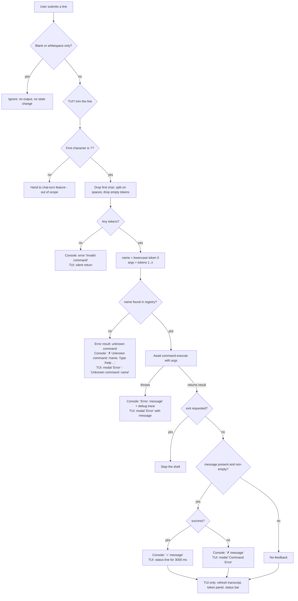
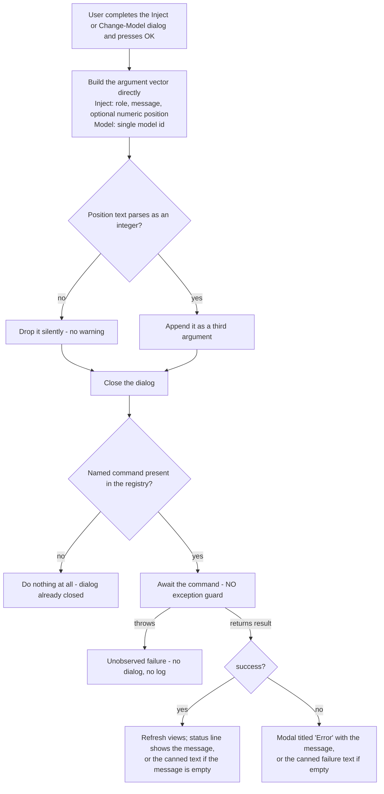

# Feature: Command System & Dispatch

> Source repo: `/mnt/g/3RD-Party/reversing/subject/chatdbg` @ commit `d8c18f61d6bb73666ed97cd4885e877e35558485`
> All file:line references are relative to the repo root and were read at that commit.

---

## Purpose - what user/business problem this solves; who uses it (actors/roles)

ChatDbg is an interactive, terminal-hosted AI chat assistant for debugging. The **Command System & Dispatch** feature is the in-application "control plane": it is how a user steers the application (change model, manage history, configure token analysis, quit) *without* leaving the chat prompt and without those instructions being sent to an AI provider.

The problem it solves:

- A chat REPL has exactly one input box. Some of what the user types is *conversation* (goes to a language model, costs money and latency); some is *control* (must be handled locally, instantly, deterministically). The feature supplies the disambiguation rule (a single leading `/` character), the parse, the lookup, the invocation, the uniform result reporting, and the self-describing help.
- New capabilities must be addable without touching the input loop. The feature defines one small contract (name / description / usage / async execute → result) that every capability implements, so the shell never knows what any individual command does.

Actors / roles:

| Actor | How they touch this feature |
|---|---|
| **End user (developer using ChatDbg)** | Types `/name arg arg` at the prompt, or picks a menu item / keyboard shortcut in the TUI shell that runs a command on their behalf. Reads the success/error feedback and the generated help. |
| **Shell host (the plain-console REPL and the TUI window)** | Owns the input loop, decides "command vs. chat turn", parses, looks up, invokes, renders the result, and honours an exit request. Two independent hosts exist and each hand-wires its own command registry. Documented as an *interface* here, not as a feature. |
| **Command author (developer extending ChatDbg)** | Implements the four-member command contract, then adds one construction line to each shell's registry initialiser. There is no plugin discovery, no attribute scanning, no DI container. |

There is no authentication, authorisation, tenancy or audit dimension to this feature: any user who can reach the prompt can run any registered command.

---

## Behavior - what it does, as observable behavior; every distinct operation the feature supports, its inputs, outputs, and side effects

### B1. Classify a line of user input (command vs. chat)

- **Input:** one line of text from the prompt (plain-console shell: `src/ChatDbg/ChatShell.cs:83`, raw `ReadLine`; TUI shell: `src/ChatDbg.Shell.Gui/UI/ChatWindow.cs:334`, the input field's text **trimmed** of leading/trailing whitespace).
- **Rule:** blank or whitespace-only input is discarded with no output and no state change (`src/ChatDbg/ChatShell.cs:85-88`; `ChatWindow.cs:335-338`). Otherwise, if the line **starts with `/`** it is a command (`src/ChatDbg/ChatShell.cs:92`; `ChatWindow.cs:344`); anything else is a chat turn handed to the AI-conversation feature.
- **Side effect (TUI only):** the input field is cleared *before* dispatch (`ChatWindow.cs:340`), so the typed text is gone from the box whether the command succeeds or fails.

### B2. Parse a command line into a name and an argument vector

- **Input:** the raw command line including the leading `/`.
- **Processing (identical in all three dispatchers):** drop exactly the first character; split the remainder on the **space character only** (`' '`), discarding empty entries so runs of spaces collapse (`src/ChatDbg/ChatShell.cs:326`; `src/ChatDbg.Shell.Gui/ChatShell.cs:279`; `ChatWindow.cs:384`).
- **Outputs:** token[0] lower-cased with an invariant/culture-independent mapping becomes the **command name**; tokens[1..] become the **argument vector** (an ordered list of strings, possibly empty) (`src/ChatDbg/ChatShell.cs:332-333`; `ChatWindow.cs:390-391`).
- Tabs are **not** separators. Quoting is **not** supported — there is no quote/escape handling anywhere.

### B3. Look up the command in the registry

- Case-folding happens on the typed name only; the registry is keyed by each command's own declared name, matched exactly (`src/ChatDbg/ChatShell.cs:335`; `ChatWindow.cs:393`). Every shipped command declares an all-lowercase name, so lookup is effectively case-insensitive for the user.
- **Hit:** invoke (B4). **Miss:** report unknown command (B6/E2).

### B4. Invoke the command

- **Input to the command:** the argument vector only. A command receives *no* reference to the shell, the raw line, the registry (except the help command, which is given the registry at construction), or any cancellation signal.
- Invocation is asynchronous and awaited; the shell does nothing else until it completes. There is no timeout and no way to cancel a running command.
- **Output:** a *command result* value — see **Data**.

### B5. Report a successful result

- **Plain-console shell:** if the result carries a non-empty message, print it on one line prefixed with `"✓ "` (U+2713 CHECK MARK + space) (`src/ChatDbg/ChatShell.cs:102-104`). If the message is null or empty, print nothing at all.
- **TUI shell:** show `"✓ " + message` in the transient status label, which reverts to the standard status text after **3000 ms** (`ChatWindow.cs:411`, `ChatWindow.cs:903-915`). Empty message ⇒ no feedback.
- **Transient status text is not glyph-prefixed on every path.** The status label is also used for non-command feedback with no glyph at all (`ChatWindow.cs:900`), and the text it reverts to is the template `Provider: <provider> | Model: <model> | Prompt: <prompt-name>` (`ChatWindow.cs:798`).
- **Dialog-driven invocations do NOT follow this rule.** The Inject and Change-Model dialogs render the result themselves and substitute a canned sentence when the command returned no message: `"Message injected"` (`ChatWindow.cs:987`) and `"Model changed"` (`ChatWindow.cs:1072`). On those two paths an empty message therefore produces *visible* feedback, contradicting the "empty message ⇒ silence" rule that governs every other path (R13).
- After any command in the TUI, the chat transcript view, the token-probability side panel (if visible) and the status bar are re-rendered (`ChatWindow.cs:358-379`).

### B6. Report a failed result

- **Plain-console shell:** print the message prefixed with `"✗ "` (U+2717 BALLOT X + space) (`src/ChatDbg/ChatShell.cs:104`). Failure is *not* fatal — the loop continues.
- **TUI shell:** pop a modal error dialog titled **"Command Error"** containing the message and a single **"OK"** button (`ChatWindow.cs:415`).
- **Dialog-driven invocations again differ:** the modal is titled **`Error`** (not `Command Error`) and a missing message is replaced by `"Failed to inject message"` (`ChatWindow.cs:991`) or `"Failed to change model"` (`ChatWindow.cs:1076`).

### B7. Honour an exit request

- If the result's exit flag is set, the shell stops **before** rendering any message (`src/ChatDbg/ChatShell.cs:95-98`; `ChatWindow.cs:401-405`). A message on an exit result is therefore never shown.
- **Plain-console shell:** breaks the read-eval loop and prints `Goodbye!` (`src/ChatDbg/ChatShell.cs:119`), then disposes the AI service instances (`src/ChatDbg/ChatShell.cs:692-714`). Commands are **not** disposed — the contract has no disposal member.
- **TUI shell:** requests the main window to stop, which unwinds the UI event loop and shuts the terminal UI down (`ChatWindow.cs:403`, `src/ChatDbg.Shell.Gui/Program.cs:90-95`).

### B8. Generate help (the `help` command)

Two modes, both returning a success result whose message is the rendered text:

**Mode A — no arguments (general help)** (`src/Xcaciv.ChatDbg.Core/Commands/HelpCommand.cs:37-98`). Emits a fixed, hand-authored document:

1. Heading `ChatDbg Commands:` then a blank line.
2. Section `Basic Commands:` → the entries for `help`, `exit`, `quit`, `clear` (in that order), blank line.
3. Section `Model Configuration:` → `set`, `model`, blank line.
4. Section `System Prompt Management:` → `prompt`, blank line.
5. Section `Chat History Management:` → `import`, `export`, `inject`, `pop`, blank line.
6. Section `Token Analysis:` → `logprobs`, `demologprobs`, blank line.
7. Section `LLama Provider Commands (local LLM):` → `tokenize`, `inspect`, blank line.
8. A hard-coded, **not registry-derived** block `LLama GPU Configuration:` listing five configuration keys with their ranges and defaults (verbatim, `HelpCommand.cs:81-85`):
   - `/set llamaContextSize <512-32768> - Context size for model (default: 4096)`
   - `/set llamaGpuLayers <0-100>       - Layers to offload to GPU (0=CPU only)`
   - `/set llamaGpuDevice <0,1,...>     - GPU device IDs to use (e.g., "0" or "0,1")`
   - `/set llamaThreads <0-64>          - Thread count (0=system default)`
   - `/set llamaBatchSize <1-2048>      - Batch size for inference`
9. A hard-coded block `Supported Providers:` — `- azure: Azure OpenAI Service`, `- bedrock: Amazon Bedrock AI`, `- llama: Local LLM via LLamaSharp (supports GPU acceleration)`.
10. Two closing lines: `Type '/help <command>' for detailed help on a specific command.` and `Type '/set' without parameters for current configuration details.`

Each per-command entry is rendered as `"/" + name + " - " + description` and is emitted **only if that name is present in the registry**; a name in the script that is not registered is silently skipped (`HelpCommand.cs:101-107`). A registered command whose name is **not** in the script never appears in general help.

**Mode B — one or more arguments (specific help)** (`HelpCommand.cs:26-35`). Only the first argument is used; it is lower-cased and looked up in the registry.
- Hit → success result with a three-line block:
  `Command: /<name>` ⏎ `Description: <description>` ⏎ `Usage: <usage>`.
- Miss → **error** result with message `Unknown command: <lower-cased argument>` (no leading slash, no hint about `/help`).

### B9. Generate help (TUI "View Commands" dialog — a second, different renderer)

Triggered by the **F1** status-bar item and by **Help ▸ View Commands…** (`ChatWindow.cs:192`, `ChatWindow.cs:313`). It checks that a command named `help` exists but then **ignores it entirely** and builds its own listing (`ChatWindow.cs:1087-1126`):

- Modal dialog titled `Help`, fixed size **80 columns × 20 rows**, containing a read-only word-wrapped text view and a centred **Close** button.
- Body: `Available Commands:`, blank line, then for **every** registered command sorted ascending by name: `"/" + name`, then two spaces + description, then a blank line.
- Usage strings are never shown here; grouping is absent; ordering is alphabetical rather than the curated grouping of B8.

### B10. Invoke a command from a GUI affordance (no text parsing)

Two distinct paths in the TUI:

- **Synthesised command line** — the menu item builds a string and re-enters the normal parser with a `/` prepended (`ChatWindow.cs:918-935`): `File ▸ Pop Last Message` → `pop` (`:267`), `File ▸ Clear History` → `clear` (`:268`), `View ▸ Log Probabilities ▸ Run Demo Visualization` → `demologprobs` (`:290`), `File ▸ Import History…` → `import <chosen path>` (`:1014`), `File ▸ Export History…` → `export <chosen path>` (`:1031`). Because the path is interpolated into a space-split command line, a path containing spaces is re-joined by the receiving command (import/export/model all re-join their whole argument vector with single spaces) — so it works, but **runs of consecutive spaces in a path collapse to one**.
- **Direct invocation with a pre-built argument vector** — bypasses parsing entirely: the Inject dialog calls the `inject` command with `[role, message]` plus an optional numeric position (`ChatWindow.cs:960-995`), and the Change-Model dialog calls the `model` command with `[modelId]` (`ChatWindow.cs:1061-1079`). These handlers render the result themselves (status line on success, modal `Error` dialog on failure) instead of going through B5/B6.

### B11. Register commands at start-up

Each host builds its registry once, in code, at construction time (there is no runtime registration, unregistration, aliasing or discovery):

- Construct an ordered list of command instances, passing each its collaborators explicitly (chat history, settings object, settings service, history service, system-prompt service, optionally a console formatter).
- Insert each into a name→command map using the command's own declared name as the key; **later insertion silently overwrites an earlier one with the same name** (`src/ChatDbg/ChatShell.cs:60-63`; `src/ChatDbg.Shell.Gui/ChatShell.cs:61-64`; `src/ChatDbg.Shell.Gui/Program.cs:49-52`).
- **Finally**, construct the help command **handing it the very same map object** and store it under `help` (`src/ChatDbg/ChatShell.cs:66`; `src/ChatDbg.Shell.Gui/ChatShell.cs:67`; `src/ChatDbg.Shell.Gui/Program.cs:55`). Because the map is shared by reference, help can list itself and would observe any later mutation of the registry.
- **Ordering hazard in the TUI host.** The TUI entry point builds every command against the *empty, default* settings object created before start-up (`src/ChatDbg.Shell.Gui/Program.cs:14`, `:37-46`), and only *afterwards* replaces that variable with the settings loaded from disk (`Program.cs:58`), then hands the *replacement* to the window (`Program.cs:81`). The chat-history object is not replaced, so history commands stay connected; every settings-bearing command is left holding a detached object (see Q13). The plain-console host has no such hazard because it copies loaded values field-by-field into the one settings object the commands already hold (`src/ChatDbg/ChatShell.cs:127-140`).

---

## Business rules & edge cases

Every rule below is stated with evidence.

### Contract rules

| # | Rule | Evidence |
|---|---|---|
| R1 | Every command exposes exactly four things: a **name**, a **description** (one short sentence), a **usage** string, and an asynchronous **execute** taking an argument vector and yielding a result. Nothing else is part of the contract — no cancellation token, no disposal, no synchronous variant, no exit code. | `src/Xcaciv.ChatDbg.Core/Models/ICommand.cs:3-9` |
| R2 | Name, description and usage are **read-only values readable before execution** (help renders them without executing anything). Name and description are constants for every shipped command; usage is a constant for all but one, which recomputes its usage document from the live settings each time it is read, so `/help set` reflects the current configuration. | `ICommand.cs:5-7`; `SetCommand.cs:24` |
| R3 | By convention every declared name is lower-case ASCII; usage strings normally begin with `/<name>`. Three unregistered commands violate the usage convention (their usage begins with the bare name and embeds newlines and an `Example:` line). | Names: `HelpCommand.cs:13`, `ExitCommand.cs:7`, `QuitCommand.cs:7`, `ClearCommand.cs:14`, `SetCommand.cs:22`, `ModelCommand.cs:17`, `PromptCommand.cs:23`, `ImportCommand.cs:17`, `ExportCommand.cs:17`, `InjectCommand.cs:15`, `PopCommand.cs:15`, `LogProbsCommand.cs:18`, `DemoLogProbsCommand.cs:40`, `TokenizeCommand.cs:16`, `InspectCommand.cs:16`. Violations: `ExportLogsCommand.cs:14`, `ExportTokenAnalysisCommand.cs:14`, `ShowTokenAnalysisCommand.cs:15` |
| R4 | A command must never return "nothing": the result object is dereferenced unconditionally by every caller. *(INFERRED — no test asserts non-null, but a null return would throw at `src/ChatDbg/ChatShell.cs:95`.)* | `src/ChatDbg/ChatShell.cs:95`; `ChatWindow.cs:401` |
| R5 | Commands are constructed with all their collaborators at registration time and hold them for the process lifetime; they mutate shared mutable state objects (the single chat-history object, the single settings object) in place. | `src/ChatDbg/ChatShell.cs:42-58` |
| R6 | A command may optionally take a rendering collaborator; the same command must still work without one (headless). | `DemoLogProbsCommand.cs:25-38`, `:62-68`; test `DemoLogProbsCommandTests.cs:30-38` (`ExecuteAsync_WithoutFormatter_Succeeds`) |

### Result-object rules

| # | Rule | Evidence |
|---|---|---|
| R7 | A result has three fields: **success** (boolean), **message** (optional text, may be absent), **exit-requested** (boolean, **defaults to false**). | `src/Xcaciv.ChatDbg.Core/Models/CommandResult.cs:5-7` |
| R8 | Success factory: success = true, message = the supplied text or *absent*, exit = false. | `CommandResult.cs:9-10`; test `CommandResultTests.cs:9-16` |
| R9 | Error factory: success = false, message = the supplied text (**mandatory** — there is no message-less error), exit = false. | `CommandResult.cs:12-13`; test `CommandResultTests.cs:18-25` |
| R10 | Exit factory: success = **true**, exit = true, message = **absent**. Exit is a *successful* outcome, not an error. | `CommandResult.cs:15-16`; test `CommandResultTests.cs:27-34` |
| R11 | The result object is a plain mutable value holder — all three fields are individually settable, so a caller could in principle build any combination (e.g. failure + exit). No shipped command does. | `CommandResult.cs:5-7` |
| R11a | The error factory takes a message but **never validates it**: an empty error message is accepted and, by R13, produces total silence — a failure indistinguishable from a silent success. *(INFERRED consequence — no shipped command returns an empty error message, and no test covers it.)* | `CommandResult.cs:12-13`; `src/ChatDbg/ChatShell.cs:100` |
| R11b | The result is the *only* sanctioned output channel, but it is not the only one used: one command also publishes its generated data on a separately readable property that no host ever reads (only tests do). Treat the result as the contract and any such side channel as accidental. | `DemoLogProbsCommand.cs:20`, `:54-59`; `DemoLogProbsCommandTests.cs:25`, `:38` |
| R12 | **Exit beats message.** When exit is requested the shell stops immediately and never renders the message. | `src/ChatDbg/ChatShell.cs:95-105`; `ChatWindow.cs:401-407` |
| R13 | **Empty message ⇒ silence** — on the typed and menu paths in both shells. A success or failure with an absent or empty message produces no user-visible output whatsoever. | `src/ChatDbg/ChatShell.cs:100`; `ChatWindow.cs:407` |
| R13a | **Exception to R13:** the two dialog-driven direct invocations substitute canned text for a missing message, so the identical command is silent when typed and chatty when triggered from a dialog. | `ChatWindow.cs:987`, `:991`, `:1072`, `:1076` (Q16) |

### Rules the automated tests actually pin down

The three test files named for this feature are the only executable specification that exists. Their assertions are **weaker than the code**, and the gap is itself a requirement risk — a clone that re-derives behaviour from these tests alone would under-specify. Each row states exactly what is asserted, and flags what is *not*.

| # | Rule proven by a test | Asserted | NOT asserted (gap) | Evidence |
|---|---|---|---|---|
| T1 | Help with an empty argument vector returns **success** and its message contains the literal `ChatDbg Commands`. | success flag true; message contains `ChatDbg Commands` | that the message *begins* with it; the trailing colon; any section heading; any command entry | `HelpCommandTests.cs:12-31` |
| T2 | **General help emits its section scaffolding unconditionally, even when the registry contains nothing the script knows about.** The test registry holds exactly one command named `sample`, which appears in no section script, so the rendered document contains **zero** command entries — all seven headings, the five configuration lines, the three provider lines and the two closing lines, and nothing else — and it is still reported as success. | success + heading present with an effectively empty listing | nothing about the empty listing being wrong | `HelpCommandTests.cs:20-31`; `HelpCommand.cs:43-96`, `:101-107` |
| T3 | Help renders a command's metadata **without executing it**. The test double supplies only name, description and usage; its execute member is never set up and never called. | metadata-only rendering works | — | `HelpCommandTests.cs:15-18`, `:36-39` |
| T4 | Help for a registered name returns **success** and the message contains `/sample`. | success flag true; message contains `/sample` | the three-line `Command:` / `Description:` / `Usage:` shape; that the description or usage appear at all | `HelpCommandTests.cs:33-52` |
| T5 | Help for an **unregistered** name is a failure with message `Unknown command: <lower-cased argument>`. **No test covers this at all** — it is code-only behaviour. | — | everything | `HelpCommand.cs:34` (no test) |
| T6 | The `exit` command returns a result whose exit flag is **true**, for an empty argument vector. | exit flag true | that success is true; that the message is absent; that any argument vector behaves the same | `ExitAndQuitCommandTests.cs:9-17` |
| T7 | The `quit` command behaves identically to `exit` — separate implementation, same asserted outcome. | exit flag true | same gaps as T6 | `ExitAndQuitCommandTests.cs:19-27` |
| T8 | Success factory: success = true, message = the supplied text (`"done"`), exit = **false**. | all three fields | that a *missing* message yields an absent message | `CommandResultTests.cs:8-16` |
| T9 | Error factory: success = false, message = the supplied text (`"error"`). | success + message | **exit is never asserted** for the error factory | `CommandResultTests.cs:18-25` |
| T10 | Exit factory: success = **true** *and* exit = true — exit is a successful outcome. | both flags | that the message is absent | `CommandResultTests.cs:27-34` |
| T11 | A command that takes an optional rendering collaborator must succeed **with and without** one, returning the same success message either way, and must invoke the collaborator's table renderer at least once when one is supplied. | both paths succeed; renderer called with start index `0` at least once | — | `DemoLogProbsCommandTests.cs:12-27`, `:29-39`; `DemoLogProbsCommand.cs:25-38`, `:62-68` |
| T12 | **Dispatch has no tests whatsoever.** The solution contains exactly one test project, covering the core library only; neither shell project is referenced by it, so parsing, lookup, unknown-command handling, exit handling and result rendering have no executable specification. | — | everything in B1-B7 and B9-B11 | `Xcaciv.ChatDbg.sln` (four projects: two shells, core, `Xcaciv.ChatDbg.Core.Tests`); `Xcaciv.ChatDbg.Core.Tests.csproj` references only the core project |

### Parsing rules & edge cases

| # | Rule / edge case | Observable outcome | Evidence |
|---|---|---|---|
| R14 | Command marker is a **single leading `/`**, tested on the *first character* of the (TUI: trimmed) line. | `src/ChatDbg/ChatShell.cs:92`; `ChatWindow.cs:344` |
| R15 | In the plain-console shell the line is **not trimmed**, so `" /help"` (leading space) is **not** a command and is sent to the AI as a chat turn. In the TUI it *is* trimmed, so the same text runs the command. **Inconsistency between shells.** | `src/ChatDbg/ChatShell.cs:83-92` vs `ChatWindow.cs:334` |
| R16 | Separator is the **space character only**; consecutive spaces collapse (empty tokens discarded). Tabs are part of tokens. | `src/ChatDbg/ChatShell.cs:326` |
| R17 | No quoting or escaping exists. Multi-word text arguments survive only because individual commands re-join the whole vector with single spaces (`export`, `import`, `model`, `tokenize`, `inspect`), or re-join a slice (`inject` message, `prompt create` description). Original spacing is therefore lost. | `ExportCommand.cs:28`, `ImportCommand.cs:28`, `ModelCommand.cs:28`, `TokenizeCommand.cs:46`, `InspectCommand.cs:46`, `InjectCommand.cs:32`, `InjectCommand.cs:39`, `PromptCommand.cs:192`, `PromptCommand.cs:351` |
| R18 | Input `"/"` alone, or `"/"` followed only by spaces → zero tokens. **Console:** error result `Invalid command`. **TUI:** returns silently with *no* feedback. **Inconsistency between shells.** | `src/ChatDbg/ChatShell.cs:327-330` vs `ChatWindow.cs:385-388` |
| R19 | `"/ help"` (slash, space, name) **does** dispatch `help`, because only one character is stripped and empty tokens are dropped. | `src/ChatDbg/ChatShell.cs:326-332` |
| R20 | `"//help"` yields the name `/help`, which matches nothing → unknown-command error. | `src/ChatDbg/ChatShell.cs:326-340` |
| R21 | The typed name is lower-cased with a culture-invariant mapping (so `/HELP`, `/Help`, `/hElP` all work, and Turkish-locale dotted-I hazards are avoided); **arguments are never case-folded by the dispatcher** — each command decides. | `src/ChatDbg/ChatShell.cs:332`; e.g. `SetCommand.cs:38`, `InjectCommand.cs:26`, `LogProbsCommand.cs:30` lower-case their own first argument |
| R22 | Registry keys are matched **exactly** (ordinal), so a command declaring a name with any upper-case character would be permanently unreachable by typing. *(INFERRED — no such command ships.)* | `src/ChatDbg/ChatShell.cs:335` (plain map lookup against a lower-cased probe) |
| R23 | The argument vector excludes the command name and is empty (length 0) when no arguments were typed. Commands branch on `length == 0` / `length < N` to produce usage errors. | `src/ChatDbg/ChatShell.cs:333`; `HelpCommand.cs:26`; `ExportCommand.cs:23`; `InjectCommand.cs:21` |

### Registry rules

| # | Rule | Evidence |
|---|---|---|
| R24 | Registration is **hand-wired per shell**; there is no scanning, no configuration file, no plugin loading, no DI container. Adding a command requires editing every shell. | `src/ChatDbg/ChatShell.cs:40-67`; `src/ChatDbg.Shell.Gui/Program.cs:30-55` |
| R25 | Duplicate names are resolved **last-write-wins, silently**. | `src/ChatDbg/ChatShell.cs:60-63` |
| R26 | `help` is always registered **last and unconditionally**, overwriting anything previously registered under that name, and is given a **live reference** to the registry. | `src/ChatDbg/ChatShell.cs:66`; `HelpCommand.cs:19-22` |
| R27 | The plain-console shell registers **15** commands: `inject, pop, import, export, model, set, logprobs, prompt, demologprobs, clear, exit, quit, tokenize, inspect` + `help`. | `src/ChatDbg/ChatShell.cs:42-66` |
| R28 | The TUI shell (the code path actually executed) registers the **same 15**, differing only in that the demo-visualisation command is given a rich-console formatter. | `src/ChatDbg.Shell.Gui/Program.cs:31-55` |
| R29 | The registry is created once per process and never mutated afterwards; no command can add or remove commands. | `src/ChatDbg/ChatShell.cs:36-37` |

### Ordering guarantees

| # | Guarantee | Evidence |
|---|---|---|
| R30 | **General help ordering is fixed and hand-authored** (the 7 sections and the order within them listed in B8) — it is *not* registration order and *not* alphabetical. | `HelpCommand.cs:43-79` |
| R31 | **TUI help-dialog ordering is ascending by command name** using the platform's default string ordering. *(INFERRED that this is culture-sensitive ordering; for the all-lowercase ASCII names in use it is plain alphabetical: `clear, demologprobs, exit, export, help, import, inject, inspect, logprobs, model, pop, prompt, quit, set, tokenize`.)* | `ChatWindow.cs:1107` |
| R32 | Commands execute strictly one at a time, in the order the user submits them; the shell awaits completion before reading the next line. | `src/ChatDbg/ChatShell.cs:80-117` |

### Magic numbers and literal strings (with meaning)

| Literal | Meaning | Evidence |
|---|---|---|
| `"/"` | The command prefix; exactly one character is stripped before parsing. | `src/ChatDbg/ChatShell.cs:92`, `:326` |
| `' '` (space) | The one and only argument separator. | `src/ChatDbg/ChatShell.cs:326` |
| `"✓ "` | Success prefix in console output / TUI status line. | `src/ChatDbg/ChatShell.cs:103`; `ChatWindow.cs:411` |
| `"✗ "` | Failure prefix in console output. | `src/ChatDbg/ChatShell.cs:104` |
| `"Invalid command"` | Error message for a lone `/`. | `src/ChatDbg/ChatShell.cs:329` |
| `"Unknown command: /{name}. Type '/help' for available commands."` | Console/dead-code-shell unknown-command error. Note the re-added `/`. | `src/ChatDbg/ChatShell.cs:340`; `src/ChatDbg.Shell.Gui/ChatShell.cs:293` |
| `"Unknown command: {name}"` | **TUI** unknown-command error (modal titled `Error`) — *no* leading slash and *no* help hint. | `ChatWindow.cs:395` |
| `"Unknown command: {name}"` | `help <unknown>` error message (also no slash, no hint). | `HelpCommand.cs:34` |
| `"Command Error"` | Title of the TUI modal shown for a failed command result. | `ChatWindow.cs:415` |
| `"Error"` | Title of the TUI modal for unknown command and for an escaped exception. | `ChatWindow.cs:395`, `:355` |
| `"Goodbye!"` | Printed by the plain-console shell after the loop ends. | `src/ChatDbg/ChatShell.cs:119` |
| `"ChatDbg Commands:"` | First line of general help; asserted by test. | `HelpCommand.cs:39`; `HelpCommandTests.cs:30` |
| `3000` (ms) | Lifetime of a TUI transient success status message before the status label reverts. | `ChatWindow.cs:909` |
| `80 × 20` | Fixed size (columns × rows) of the TUI help dialog. | `ChatWindow.cs:1091` |
| `60 × 10`, `70 × 15` | Fixed sizes of the Change-Model and Inject dialogs that invoke commands directly. | `ChatWindow.cs:1053`, `:940` |
| `F1` / `F10` | Status-bar keys bound to "Help" (opens the command listing dialog) and "Quit" (stops the window directly, **without** running the `exit`/`quit` command). | `ChatWindow.cs:192-193` |
| `512-32768`, `0-100`, `0-64`, `1-2048`, `4096` | Ranges/default reproduced verbatim inside general help text for local-LLM configuration keys (context size range, GPU-layer range, thread range, batch-size range, default context size). These are *help text*, not validation — the help renderer does not enforce them. | `HelpCommand.cs:81-85` |
| `azure`, `bedrock`, `llama` | Provider identifiers listed verbatim in general help. | `HelpCommand.cs:90-92` |
| `ChatDbg ({provider}/{model})> ` | The plain-console prompt string, rebuilt from live settings before every read. | `src/ChatDbg/ChatShell.cs:82` |
| `Provider: {p} \| Model: {m} \| Prompt: {n}` | The TUI status text that a transient command message reverts to after 3000 ms. | `ChatWindow.cs:798` |
| `~F1~ Help`, `~F10~ Quit` | Status-bar item labels (the `~` pairs mark the highlighted key). | `ChatWindow.cs:192-193` |
| `_Inject Message...`, `_Pop Last Message`, `_Clear History`, `_Import History...`, `_Export History...`, `E_xit` | File-menu labels; `_` marks the mnemonic letter. Only the middle four reach the command system. | `ChatWindow.cs:266-271` |
| `_Run Demo Visualization`, `_View Commands...`, `_About...` | View- and Help-menu labels that reach the command system (the first) or the help surfaces (the last two). | `ChatWindow.cs:290`, `:313-314` |
| `"Message injected"`, `"Model changed"` | Canned **success** text substituted by the two dialog paths when the command returned no message. | `ChatWindow.cs:987`, `:1072` |
| `"Failed to inject message"`, `"Failed to change model"` | Canned **failure** text substituted by the same two paths. | `ChatWindow.cs:991`, `:1076` |
| `"Inject Message"` / `70 × 15`, `"Change Model"` / `60 × 10`, `"Help"` / `80 × 20` | Dialog titles and fixed sizes (columns × rows). | `ChatWindow.cs:940`, `:1053`, `:1091` |
| `"Import Chat History"` / `"Select a chat history file to import"` | Open-dialog title and prompt for the menu-driven `import`. | `ChatWindow.cs:1004` |
| `"Export Chat History"` / `"Select a location to save chat history"` | Save-dialog title and prompt for the menu-driven `export`. | `ChatWindow.cs:1020` |
| **user-profile directory** | Default starting location of the Import open-dialog. | `ChatWindow.cs:1008` |
| **`<user-profile>/chat_history.json`** | Default file name pre-filled in the Export save-dialog. | `ChatWindow.cs:1022-1024` |
| `"user"` | Value pre-filled in the Inject dialog's role field; the role field accepts only `user`, `assistant` or `system` downstream. | `ChatWindow.cs:943`; `InjectCommand.cs:27-30` |
| `"ChatDbg v1.0"`, `"AI-Powered Debugging Assistant"`, `"Supports Amazon Bedrock and Azure OpenAI"`, `"Copyright © Xcaciv 2024"` | The four body lines of the Help ▸ About dialog. Note it names only **two** providers where general help names three. | `ChatWindow.cs:1130-1135` |
| `"System messages toggle not yet implemented"` | Status text emitted by a View-menu item that does nothing else. | `ChatWindow.cs:1138-1141` |
| `Available Commands:` | First line of the TUI F1 listing (distinct from `ChatDbg Commands:` in `/help`). | `ChatWindow.cs:1104` |
| `CHATDBG_AZURE_API_KEY`, `CHATDBG_AWS_ACCESS_KEY`, `CHATDBG_AWS_SECRET_KEY`, `AWS_ACCESS_KEY_ID`, `AWS_SECRET_ACCESS_KEY` | Environment-variable names printed verbatim inside the `set` command's usage document, which this feature surfaces through `/help set` and through `/set` with a malformed argument vector. | `SetCommand.cs:348-352` |
| `C:\models\llama3-8b.gguf` | A **Windows-only** example path baked into that same usage document. | `SetCommand.cs:358` |
| exit code `0` / exit code `1` | Process exit codes: normal shutdown vs. an exception escaping the whole shell. | `src/ChatDbg/Program.cs:11`, `:14`; `src/ChatDbg.Shell.Gui/Program.cs:100`, `:103` |
| `3` | Default "top alternatives" count in the unregistered analysis command's usage text, and the default alternatives-per-token in the rendering abstraction. | `ShowTokenAnalysisCommand.cs:15`, `:20`; `IConsoleFormatter.cs:44` |

---

## Quirks

Observed behaviour that reads as a defect. Nothing here was changed in the source; each item is the behaviour as written.

- **Q1 — Three command implementations are never registered anywhere.** `export-logs`, `export-analysis` and `show-analysis` implement the contract and have unit tests, but no shell inserts them into a registry, so no user can invoke them and they never appear in any help. Evidence: `ExportLogsCommand.cs:12`, `ExportTokenAnalysisCommand.cs:12`, `ShowTokenAnalysisCommand.cs:13` vs. the registration lists at `src/ChatDbg/ChatShell.cs:42-58` and `src/ChatDbg.Shell.Gui/Program.cs:31-47`; tests `ExportLogsAndAnalysisCommandTests.cs`, `ShowTokenAnalysisCommandTests.cs`. Their names contain a hyphen (harmless to a space-only parser) and their usage strings omit the `/` prefix and embed an `Example:` line, so they do not follow the convention of R3. **The repo states the cause outright**: they are listed as complete but "Requires integration with shell command registry (placeholder implementation)" (`IMPLEMENTATION_SUMMARY.md:49-54`), with "Register new commands in shell command dictionary" as the top immediate next step (`IMPLEMENTATION_SUMMARY.md:221-222`). They are unfinished work, not a rejected design. One of them is also the only command in the repo with flag-style arguments (`--top N`, `--state`, `--range START END`, default top = `3`, `ShowTokenAnalysisCommand.cs:15`, `:20`) — a style the dispatcher offers no support for whatsoever.
- **Q2 — There are two different help renderers with different content and different ordering** (B8 vs B9). Typing `/help` in the TUI gives the curated grouped document; pressing **F1** or choosing **Help ▸ View Commands…** in the same TUI gives an alphabetical name+description list with no usage strings. They can disagree.
- **Q3 — The TUI help dialog gates on the existence of a `help` command but never uses it.** If `help` were ever unregistered, F1 would do nothing at all (silently). `ChatWindow.cs:1089`.
- **Q4 — An entire second dispatcher is dead code.** `src/ChatDbg.Shell.Gui/ChatShell.cs` contains a full console-style registry + REPL + dispatcher (lines 43-68, 81-121, 276-294) but is never instantiated: the TUI entry point builds the registry itself and constructs the window directly (`src/ChatDbg.Shell.Gui/Program.cs:30-90`). That dead copy registers only **13** commands (no `tokenize`, no `inspect`) and only 2 AI providers.
- **Q5 — General help is a hand-maintained script, so it can drift from the registry in both directions**: a registered command missing from the script is invisible in `/help`, and a scripted name that is not registered is silently dropped. Today the 15 scripted names exactly match the 15 registered names in both live shells, but the dead TUI shell (Q4) would silently omit `tokenize`/`inspect`. Evidence: `HelpCommand.cs:44-78`, `:101-107`.
- **Q6 — `/help` with several arguments ignores all but the first.** `/help set provider` is treated as `/help set`. `HelpCommand.cs:29`.
- **Q7 — `/help /set` fails.** The argument is looked up verbatim (after lower-casing), so a user who includes the slash gets `Unknown command: /set`. `HelpCommand.cs:29-34`.
- **Q8 — The `help` command reports "unknown command" as a *failure*, while listing help is a *success*.** So in the TUI a typo inside `/help` produces a modal error dialog rather than inline text. `HelpCommand.cs:34` + `ChatWindow.cs:415`.
- **Q9 — F10 "Quit" and File ▸ Exit bypass the command system entirely** (they stop the window directly), so any future exit-time behaviour added to the `exit`/`quit` commands would not run on those paths. `ChatWindow.cs:193`, `:271`.
- **Q10 — Some commands write directly to the terminal instead of (or in addition to) returning a message.** The local-LLM token commands write dozens of console lines (`InspectCommand.cs` – 37 direct console writes; `TokenizeCommand.cs` – 10), the system-prompt editor *reads* lines from the console until a line equal to `END` (`PromptCommand.cs:258-267`), and the demo-visualisation command renders through an injected rich-console formatter. In the TUI shell this output is drawn straight onto the screen that the widget toolkit owns, corrupting the layout — yet the TUI entry point is precisely the one that injects the rich formatter (`src/ChatDbg.Shell.Gui/Program.cs:41`) while the plain-console shell injects none (`src/ChatDbg/ChatShell.cs:52`). The interactive `END`-terminated editor is unusable in the TUI (there is no console reader).
- **Q11 — A shipped basic (non-rich) formatter implementation exists in the core library but is wired into no shell**; only tests construct it. `src/Xcaciv.ChatDbg.Core/Services/BasicConsoleFormatter.cs:12`; `BasicConsoleFormatterTests.cs:15`.
- **Q12 — README/code disagreements** (code wins):
  - README lists `/set` sub-keys and `/prompt` sub-commands as if they were separate commands (`README.md:46-73`); in code they are argument-parsing inside two single commands (`set`, `prompt`). Not a behavioural conflict, but the command *count* differs.
  - README says the TUI's **File** menu contains "Exit" and the shortcut list is "F1 for Help, F10 to Quit" (`README.md:29`, `:33`) — confirmed in code (`ChatWindow.cs:192-193`, `:271`), but these do **not** go through the `exit`/`quit` commands (Q9); README implies command parity.
  - README documents commands `/tokenize` and `/inspect` as available (`README.md:82-83`) — true for both live shells, false for the dead TUI shell copy (Q4).
  - README never mentions `export-logs`, `export-analysis`, `show-analysis` — consistent with Q1 (they are unreachable).
  - README claims "Built-in Commands: Full command system available via text commands **or menu options**" (`README.md:13`). In code only 5 commands are reachable from menus (`pop`, `clear`, `demologprobs`, `import`, `export`) plus 2 via dialogs (`inject`, `model`); the rest are text-only.
  - The in-repo product brief lists **11** commands (`src/ChatDbg/prd.md:97-107`, duplicated verbatim at `src/ChatDbg.Shell.Gui/prd.md:97-107`) and omits `/tokenize`, `/inspect` and `/demologprobs`, all three of which are registered in both live shells. The same brief targets ".NET 9" (`prd.md:47`) while every project targets `net10.0` — treat the brief as stale.
  - The Help ▸ About dialog says the product "Supports Amazon Bedrock and Azure OpenAI" (`ChatWindow.cs:1133`) while general help lists a third provider, `llama` (`HelpCommand.cs:92`).

- **Q13 — In the TUI, every settings-bearing command is wired to a settings object nobody else uses.** *(The most consequential defect in this feature.)* The TUI entry point creates a default settings object (`src/ChatDbg.Shell.Gui/Program.cs:14`), constructs `model`, `set`, `logprobs`, `prompt`, `demologprobs`, `tokenize` and `inspect` against **that** object (`Program.cs:37-46`), then **reassigns the variable** to the settings loaded from disk (`Program.cs:58`) and passes the *new* object to the window (`Program.cs:81`, stored at `ChatWindow.cs:55`). Consequences, all observable: `/set` with no arguments reports the built-in defaults (provider `azure`, model `gpt-4`, temperature `0.7`, max tokens `1000`, region `us-east-1`, prompt name `default`, log-probabilities off, top-K `5` — `ChatSettings.cs:8-37`) rather than the user's saved configuration; `/model <id>` reports success and *persists* the change to disk but the window keeps sending to the previously loaded model and the status bar never changes; `/set provider llama` does not switch the provider the chat turn actually uses. Only the chat-history commands are unaffected, because the history object is never reassigned. The plain-console shell does not have this defect — it copies loaded values into the object the commands already hold (`src/ChatDbg/ChatShell.cs:127-140`).
- **Q14 — The plain-console shell spins forever at end-of-input.** The read loop treats a null read exactly like a blank line and continues (`src/ChatDbg/ChatShell.cs:83-88`). When standard input is a closed pipe or a redirected file that has been exhausted, the read returns null on every iteration, so the loop re-prints the prompt and re-reads without end. There is no end-of-input check and no exit path other than `/exit`, `/quit`, or killing the process. *(INFERRED consequence — the null-versus-blank conflation is directly observed; the resulting spin was not verified by running the app.)* The same code exists in the dead second dispatcher (`src/ChatDbg.Shell.Gui/ChatShell.cs:84-89`).
- **Q15 — Overlapping status messages truncate each other.** Each transient TUI status message starts an independent 3000 ms timer that unconditionally overwrites the label with the standard status text, and no earlier timer is cancelled (`ChatWindow.cs:903-915`). Two commands run less than 3 s apart therefore leave the second message on screen only until the *first* command's timer fires. The timer callback is fire-and-forget with no failure handling.
- **Q16 — The "empty message ⇒ silence" rule is violated on exactly two paths.** The Inject and Change-Model dialogs substitute canned text for a missing message (`ChatWindow.cs:987`, `:991`, `:1072`, `:1076`), so the same command produces silence when typed and visible feedback when triggered from the dialog. They also title the failure modal `Error` where the typed path titles it `Command Error`.
- **Q17 — A message whose last word is a number is silently truncated by `inject`.** With three or more arguments, the last one is parsed as a position and removed from the message (`InjectCommand.cs:36-40`). `/inject user call me at 5` injects `call me at` at position 5. With exactly two arguments the same trailing number is kept as the message (`/inject user 5` injects `5`), so the rule flips on argument count. There is no way to escape a trailing numeric word.
- **Q18 — The Inject dialog silently discards a non-numeric position.** A position that fails integer parsing is dropped without a warning and the message is appended at the end (`ChatWindow.cs:967-970`); the user sees a success message that does not mention the position they typed.
- **Q19 — Both dialog paths become silent no-ops if their command is missing from the registry.** The Inject and Change-Model handlers guard the lookup but supply no else branch (`ChatWindow.cs:974-993`, `:1066-1078`), so pressing OK would close the dialog and do nothing at all. The F1 help dialog has the same shape (Q3).
- **Q20 — Exceptions from those two dialog paths are unhandled** (already recorded as E7), unlike the menu path (`ChatWindow.cs:931-934`) and the typed path (`ChatWindow.cs:353-356`), both of which catch and show a modal.
- **Q21 — The `set` command's usage document contains 30 malformed characters.** `SetCommand.cs` is stored in a legacy single-byte Windows encoding: it has no byte-order mark and contains 30 lone `0x95` bytes (intended as a bullet `•`) that are not valid UTF-8 — verified by byte scan; `0x95` is the file's only non-ASCII byte. A compiler that reads BOM-less source as UTF-8 substitutes a replacement character for each, so `/help set` and `/set <bad args>` render `�` at the start of **30** help lines spanning `SetCommand.cs:307-352` (the usage document is assembled at `SetCommand.cs:297` and reached through `SetCommand.cs:24`). This is the only source file in the repository with this problem.
- **Q22 — The `set` command's unknown-key error advertises an incomplete key list.** It names 13 valid keys (`SetCommand.cs:280`) while the command actually accepts **29** (`SetCommand.cs:44-279`), omitting every local-LLM key (`llamaContextSize`, `llamaGpuLayers`, `llamaGpuLayerCount`, `llamaGpuDevice`, `llamaThreads`, `llamaBatchSize`) and every alias (`logprobs`, `logtopk`, `tokensgrid`, `gridmaxalt`, `showAllTokens`, `gridViewForTokens`, `gridViewMaxAlternatives`, `azureApiKey`, `awsAccessKey`, `awsSecretKey`) — all of which are handled by that same branch table. A user who mistypes is told a valid key is invalid.
- **Q23 — `pop` always appends an ellipsis, even when nothing was elided.** The removed message's content is cut to the first 50 characters and `...` is appended unconditionally (`PopCommand.cs:29`), so removing a 3-character message reports `Removed last message: [user] hi...`.
- **Q24 — Home-directory expansion recognises only the forward-slash form.** `import` and `export` expand a leading `~/` (`ImportCommand.cs:31-34`; `ExportCommand.cs:31-34`) but not `~\`, which is the form a Windows user is likely to type; `~\notes.json` is passed through unexpanded and fails as a relative path. See **Platform coupling**.
- **Q25 — `export` guesses an extension from the file name.** It appends `.json` only when the path has no extension (`ExportCommand.cs:37-40`), so `history.bak` is written as-is while `history` becomes `history.json`; the success message reports the adjusted path (`ExportCommand.cs:48`).
- **Q26 — A View-menu item is a stub.** `_Toggle System Messages in Status Bar` (`ChatWindow.cs:296`) only shows the status text `System messages toggle not yet implemented` (`ChatWindow.cs:1138-1141`), although README lists "Toggle System Messages" as a View-menu feature (`README.md:35`).
- **Q27 — General help renders its whole skeleton against an empty registry.** Because each entry is emitted only if present and nothing checks that any were, a registry with no scripted names still yields all seven section headings, the five configuration lines, the three provider lines and the two closing lines, reported as success. The shipped test does exactly this and passes (T2; `HelpCommandTests.cs:20-31`).

---

## Workflows & states

### W1. Main dispatch flow (per submitted line)

### W1b. Direct-invocation flow (TUI dialogs — diverges from W1)

Differences from W1, all observable: no parsing, no exit-flag check (an exit result from these commands would be ignored), no `Command Error` title, no empty-message silence, and no exception handling.

### W2. Registry lifecycle (once per process)

1. Host constructs the shared state objects: one chat-history object, one settings object, and the settings / history / system-prompt services.
2. Host constructs an empty name→command map.
3. Host constructs each command instance in a fixed literal order, passing collaborators positionally. **In the TUI host this happens before the saved configuration is loaded**, and the loaded configuration then replaces the variable rather than updating the object the commands were given (Q13) — so step 1's settings object is live for the commands and dead for everyone else. The plain-console host also builds its commands before loading (`src/ChatDbg/ChatShell.cs:37` vs `:72`), but it copies the loaded values field-by-field into the one settings object the commands already hold (`:127-140`), so they stay connected.
4. Host inserts each instance under its own declared name (later duplicates overwrite earlier ones, silently).
5. Host constructs the help command **with a reference to that same map** and stores it under `help`, overwriting any prior `help`.
6. The map is then read-only for the rest of the process; commands hold their collaborators until exit.
7. On exit the host disposes AI provider services; **commands are never disposed**.

### W3. Exit state machine

States: `Running` → `Stopping` → `Stopped`.

| From | Trigger | To | Side effects |
|---|---|---|---|
| Running | A command result carries exit-requested = true (only `exit` and `quit` produce it) | Stopping | Message on the result is discarded, unrendered |
| Running | TUI: **F10**, or **File ▸ Exit** menu item | Stopping | Command system not involved at all |
| Stopping | Console shell | Stopped | Print `Goodbye!`; dispose AI services; process returns exit code 0 |
| Stopping | TUI shell | Stopped | Window stop request unwinds the UI event loop; the toolkit is shut down in a finally block; process returns 0 |
| Running | Unhandled exception escaping the whole shell | Stopped | Entry point prints `Fatal error: <message>` and returns exit code **1** (`src/ChatDbg/Program.cs:8-12`; `src/ChatDbg.Shell.Gui/Program.cs:97-101`) |

### W4. Help generation flow

1. `/help` with no argument → walk the 7 hard-coded section scripts; for each scripted name, if it is in the registry emit `/name - description`, else skip; then append the fixed configuration/provider/footer blocks; return the whole document as one success message.
2. `/help <x>` → lower-case `x`; if in registry return a success message with `Command: /name`, `Description: …`, `Usage: …`; else return a failure with `Unknown command: x`.
3. TUI **F1** / **Help ▸ View Commands…** → independent path: if a `help` entry exists, open an 80×20 modal listing every registered command sorted by name as `/name` + indented description; Close button dismisses.

---

## Data

This feature owns two data shapes and one collection. None of them are persisted; all are in-memory only for the lifetime of the process. **No part of this feature reads or writes any file, database, network resource, environment variable, or setting.**

### Entity: Command (the contract, `Models/ICommand.cs`)

| Field | Type (generic) | Constraints / notes |
|---|---|---|
| Name | short text | Read-only. The registry key and the token the user types after `/`. Lower-case ASCII by convention (R3); must be lower-case to be reachable (R22). Unique within a registry — duplicates silently overwrite (R25). |
| Description | text (one sentence) | Read-only. Shown in both help renderers. |
| Usage | text, may contain newlines | Read-only. Shown only by `/help <name>`. Conventionally starts with `/<name> - …`. May be computed at call time from live state (`SetCommand.cs:24`). |
| *(behaviour)* Execute | async operation: ordered list of text → Command Result | Must tolerate an empty argument vector. No cancellation. Must not return "nothing" (R4). |

Lifecycle: created once during host start-up (W2 step 3), never mutated, never destroyed, never disposed.

### Entity: Command Result (`Models/CommandResult.cs`)

| Field | Type | Default | Constraints |
|---|---|---|---|
| Success | boolean | none (set by factory) | true = the operation did what was asked. |
| Message | optional text | absent | Free-form, may be multi-line and arbitrarily long (general help is ~35 lines). Rendered verbatim with a status glyph prefix; **no length limit, no truncation, no escaping/sanitisation** anywhere. |
| ExitRequested | boolean | **false** | true ⇒ shell terminates; suppresses message rendering. |

Three named factory operations (the only ways a result is built anywhere in the codebase):
- *success(message?)* → `{true, message, false}` — the message argument is **optional and defaults to absent**, so a bare success is silent by construction (`CommandResult.cs:9-10`).
- *error(message)* → `{false, message, false}` — a message is required by the signature but **not validated**: empty text is accepted and renders as nothing (R11a).
- *exit()* → `{true, absent, true}` — there is no exit-with-message and no exit-with-failure factory.

Lifecycle: created inside a command's execute, returned up one level, consumed immediately by the dispatcher, then discarded. Never stored, never persisted, never compared.

### Collection: Command Registry

- Shape: mutable map from lower-case name text → command instance; ordinal key equality.
- Owner: each shell host (one per process).
- Populated once at start-up; shared by reference with the help command so help sees the final contents including itself.
- Live contents (both shipped shells), 15 entries: `clear, demologprobs, exit, export, help, import, inject, inspect, logprobs, model, pop, prompt, quit, set, tokenize`.

### Relationships

- Registry **1..n** Command (by name).
- Help command **references** the Registry (its only structural dependency on other commands); every other command is independent of the registry.
- Command **produces** exactly one Command Result per invocation.
- Commands **hold references to** shared domain state owned by other features (chat history, settings) and to service contracts owned by other features.

---

## Interfaces - what this feature exposes to and consumes from OTHER features

### Exposed to shells (hosts)

| Contract | Semantics |
|---|---|
| **Command contract** | "Anything the user can trigger by name." A host can enumerate names/descriptions/usages without side effects, and can invoke by name with a list of string arguments, receiving a uniform result. |
| **Command result contract** | Three-signal reporting: *did it work*, *what to tell the user* (optional), *should we stop*. The host must honour exit before message. The host is *expected* to render nothing for an empty message — and the two typed/menu dispatchers do — but the two dialog-driven callers substitute canned text instead (Q16), so this obligation is stated but not enforced anywhere. |
| **Registry contract** | Name→command map, built by the host and handed to the help command. It is the *only* discovery mechanism; there is no runtime registration API. |
| **Direct invocation** | A host may bypass string parsing and call a command by name with a pre-built argument vector (used by the TUI's Inject and Change-Model dialogs), taking on the job of rendering the result itself. A host that does so also takes on failure handling; neither shipped caller does (E7), and neither handles the command being absent from the registry (Q19). |
| **Out-of-band data channel** *(accidental, do not reproduce)* | One command publishes the data it generated on a readable property alongside its result. No host reads it; only tests do. A clone should return everything through the result. (`DemoLogProbsCommand.cs:20`, `:54-59`) |

### Consumed from other features

| Consumed | Why | Note |
|---|---|---|
| **Chat history object** (shared, mutable) | Injected into `inject`, `pop`, `import`, `export`, `clear`; they mutate it in place so the shell's view updates. | Owned by the chat-history feature. |
| **Settings object** (shared, mutable) + **settings service** | Injected into `set`, `model`, `logprobs`, `prompt`, `demologprobs`, `tokenize`, `inspect`. | Owned by the configuration feature. |
| **Chat-history persistence service** | Injected into `import`/`export`. | Owned by the persistence feature. |
| **System-prompt service** | Injected into `set` (optional) and `prompt`. | Owned by the system-prompt feature. |
| **Console formatter abstraction** | Optional rendering collaborator so a command can draw rich output without the core library depending on a UI toolkit. Declares: write a marked-up line, write a plain line, write a blank line, write a horizontal rule with an optional title, render a token grid (with start index, max columns where 0 = auto, and **max alternatives defaulting to 3**), render a token table (with start index). | `src/Xcaciv.ChatDbg.Core/Services/IConsoleFormatter.cs:11-51`. Only the demo-visualisation command uses it. |
| **Terminal / TUI surface** | Several commands write to it directly, and the system-prompt editor reads from it. This is an *undeclared* dependency — it is not part of the command contract (Q10). | |

### Explicitly NOT provided

- No help text localisation, no per-user command aliases, no command history/recall of previous commands, no tab-completion, no prefix/abbreviation matching, no "did you mean…?" suggestion, no permission or role checks, no rate limiting, no audit log, no undo, no chaining/piping, no scripting or batch file of commands, no exit codes per command.

---

## External technology

The dispatch logic itself is pure in-process computation with **no** external service, file, or protocol dependency. What it needs from outside the repo is only a runtime and a way to talk to a terminal.

| Generic capability | Protocol/standard if any | What the source used | Notes for reimplementer |
|---|---|---|---|
| Managed runtime with async/await and a task type | — | .NET 10 (`net10.0`), SDK pinned to `10.0.100-rc.1.25451.107` with `rollForward: latestFeature` (`global.json`) | Every command entry point is asynchronous even when the work is synchronous (the exit/quit/help/clear commands just wrap an already-computed value). A single-threaded event loop is sufficient; nothing here is CPU-bound. |
| Interactive character terminal (read a line, write lines, Unicode output) | ANSI/VT on POSIX, Win32 console on Windows | Standard library console I/O | The success/failure glyphs are the Unicode characters U+2713 and U+2717 — the terminal and font must render them, or substitute ASCII. Output is plain text; no colour is used by the dispatcher itself. |
| Terminal UI widget toolkit (menus, status bar with function-key items, modal dialogs, read-only scrolling text view, file open/save dialogs) | — | Terminal.Gui 1.19.0 (TUI shell only) | Supplies the modal error dialog, the 80×20 help dialog, F1/F10 status items and the "request stop" mechanism used for exit. Any equivalent TUI library works; the feature needs only: modal message box with a title and an OK button, transient status text, and a stop-the-app call. |
| Rich console text renderer (markup, rules, tables/grids) | — | Spectre.Console 0.51.1, behind the repo's own formatter abstraction | Only reached by the demo-visualisation command. Optional: the abstraction has a plain-text implementation in the core library (unused). Note the conflict in Q10 — do not mix a direct console renderer with a TUI screen owner. |
| Unit-test framework + mocking, for the acceptance criteria below | — | xUnit 2.9.1 with Moq 4.20.69, driven by Microsoft.NET.Test.Sdk 17.12.0 and xunit.runner.visualstudio 2.8.1; coverage via coverlet.collector 6.0.2 (`Xcaciv.ChatDbg.Core.Tests.csproj`) | The help tests build a fake command exposing name/description/usage, proving the contract is mockable — keep the contract narrow enough that a test double is trivial. Only the core library is under test; neither shell is (T12). |
| Native file open / save chooser (start directory, pre-filled name, cancel signal) | — | The TUI toolkit's own open/save dialogs (`ChatWindow.cs:1004-1032`) | Needed only because two menu items feed a chosen path into a text command line. A clone should pass the path as a single argument rather than re-parsing it (Q-note in B10). |
| Source-text encoding for embedded help strings | UTF-8 | Every source file is UTF-8 **except one**, stored in a legacy single-byte encoding without a byte-order mark (Q21) | A clone must keep all embedded help/usage text in one encoding; the bullet glyph in the affected document is the only non-ASCII character in it. |
| Size-optimised packaging (optional) | — | Two extra build configurations that publish ahead-of-time-compiled and single-file binaries, both defaulting to a **`win-x64`** runtime identifier and both enabling invariant-globalisation mode (`Xcaciv.ChatDbg.Shell.csproj:23-60` "Compact" and `:63-97` "SingleFile"; runtime identifier pinned at `:30` and `:70`, invariant mode at `:52` and `:95`; byte-identical settings in `Xcaciv.ChatDbg.Shell.Gui.csproj`) | Invariant mode changes the culture-sensitive comparisons this feature performs (the `/` prefix test and the F1 alphabetical ordering). Nothing in dispatch requires Windows; only the shipped packaging presets assume it. |
| Process exit codes | POSIX/Win32 convention | `0` on normal shutdown, `1` when an exception escapes the shell (`src/ChatDbg/Program.cs:11`, `:14`) | The only machine-readable signal the whole application emits; individual commands have no exit codes. |

---

## Error handling

| # | Failure mode | What the user/system observes |
|---|---|---|
| E1 | **Empty command (`/` alone or `/` + spaces)** | Console: `✗ Invalid command`. TUI: **nothing at all** — the input box is already cleared, so the line silently vanishes (`ChatWindow.cs:385-388`). |
| E2 | **Unknown command name** | Console: `✗ Unknown command: /<name>. Type '/help' for available commands.` TUI: modal dialog titled `Error`, body `Unknown command: <name>` (no slash, no hint), single OK button. The loop continues either way. |
| E3 | **Unknown name passed to `/help`** | A *failure* result with message `Unknown command: <name>` — so console shows `✗ Unknown command: set2` and the TUI shows a `Command Error` modal. |
| E4 | **Command returns a failure result** | Console: `✗ <message>` on one line, loop continues. TUI: modal `Command Error` with the message, then the views refresh. |
| E5 | **Command throws an exception (text-typed path)** | Console: `Error: <exception message>` printed to standard output; the full exception (type + stack) is written only to the debug trace channel, never to the user (`src/ChatDbg/ChatShell.cs:112-116`). The loop continues. TUI: modal titled `Error` with the exception message (`ChatWindow.cs:353-356`); the window survives. |
| E6 | **Command throws on a menu-driven path** | The menu wrapper catches and shows a modal `Error` with the exception message (`ChatWindow.cs:930-934`). |
| E7 | **Command throws on a dialog-driven direct-invocation path** | **Unhandled.** The Inject-dialog and Change-Model-dialog handlers await the command with no surrounding guard (`ChatWindow.cs:960-993`, `:1061-1079`); nothing waits on those handlers, so a failure has no caller to report it and is left unobserved on the interface thread. *(INFERRED consequence: no dialog appears and the failure is invisible or crashes the app, depending on the toolkit's unhandled-exception policy.)* |
| E8 | **Command returns success with no message** | No feedback of any kind; the user cannot distinguish "worked silently" from "nothing happened". |
| E9 | **Exception escapes the whole shell** | Entry point prints `Fatal error: <message>` and the process exits with code **1** (`src/ChatDbg/Program.cs:8-12`; `src/ChatDbg.Shell.Gui/Program.cs:97-101`). |
| E10 | **Command hangs or takes a long time** | No timeout, no cancellation, no progress indicator, no way to interrupt short of killing the process. The console prompt simply does not return; the TUI window is frozen because the handler runs on the UI thread. |
| E11 | **A command mutates shared state then fails** | Partial mutations are not rolled back — there is no transaction or undo concept. |

---

## Non-functional observations

- **Concurrency:** strictly serial. One command at a time; the shell awaits completion before accepting the next line. The TUI's input, menu and dialog handlers are started on the interface thread with **no caller waiting on them**, so a slow command blocks redraws and a failure in one has no caller to surface it (E7). No locking, no re-entrancy protection; the registry is effectively immutable after start-up so it is safe to read from anywhere. One background timer per transient status message is started and never cancelled (Q15).
- **State sharing:** in the **plain-console shell** all commands share the *same* chat-history and settings objects by reference (`src/ChatDbg/ChatShell.cs:23-24`, `:42-58`), and loaded settings are copied into that shared object field-by-field (`:127-140`), so mutating one is immediately visible to the shell and to every other command. In the **TUI shell this is only half true**: the chat-history object is shared, but the settings object the commands hold is abandoned before the window is built (Q13), so settings mutations are invisible to the window and the window's configuration is invisible to the commands. The help command shares the registry object by reference in both shells.
- **Caching / memoisation:** none. Help text is re-rendered from scratch on every `/help`. Name/description strings are recomputed per access (they are computed properties); one command computes its usage string by formatting live settings on every access.
- **Pagination:** none. General help is emitted as a single ~35-line message; the console prints it whole with a `✓ ` prefix on the first line only, so long help scrolls off small terminals. The TUI help dialog is a fixed 80×20 scrollable read-only view.
- **Permissions:** none. Every registered command is available to anyone at the prompt. Commands that touch credentials or the filesystem enforce their own rules internally; the dispatcher performs no checks.
- **Performance:** a single map lookup and a string split per line — negligible. No performance-motivated code in this feature.
- **i18n / l10n:** none. All names, help text, section headings and error strings are hard-coded English. The one deliberate globalisation decision is that the typed command name is lower-cased with a **culture-invariant** mapping, which avoids locale-specific casing hazards (`src/ChatDbg/ChatShell.cs:332`). Note that two shipped build configurations set invariant-globalisation mode, which also affects string ordering in the TUI help dialog. The `/`-prefix test uses the default (culture-sensitive) "starts with" comparison; harmless for a single ASCII slash but worth making ordinal in a clone.
- **Accessibility:** feedback is carried by two Unicode glyphs (✓ / ✗) *and* by channel (inline text vs. modal dialog). In the console the glyph is the only machine-readable signal of success vs. failure — there is no exit code or structured output. A clone targeting screen readers should not rely on the glyph alone.
- **Platform coupling — explicit answer: the dispatch mechanism itself is operating-system independent; several things reachable *through* it are not.**
  - **Independent:** classification, parsing, name folding, registry lookup, invocation, the success/failure/exit decision, and both help renderers use nothing but in-memory text operations. Reimplement them anywhere.
  - **Windows-only in effect:** the two size-optimised build configurations pin a `win-x64` runtime identifier by default (`Xcaciv.ChatDbg.Shell.csproj:30`, `:70`; same in the TUI shell project), so the shipped packaging presets produce Windows binaries only. Debug/Release builds are not pinned and are portable.
  - **Windows-only content surfaced by help:** the `set` command's usage document — rendered by `/help set` — advertises credential-manager keys (`enablewincred`, `wincred`, `migrate`, `useWindowsCredentialManager`) whose backing store is a direct call into the Windows credential API (`WindowsCredentialManager.cs:11-20`). An availability check does exist (`WindowsCredentialManager.cs:169-172`, an OS-platform test) but only **one** of the four advertised keys calls it before proceeding, returning `Windows Credential Manager is not available on this platform.` (`SetCommand.cs:219-222`); `wincred`, `enablewincred` and `migrate` are offered in help on every platform with no such gate at the point of use. The same document contains a Windows example path, `C:\models\llama3-8b.gguf` (`SetCommand.cs:358`).
  - **Silently wrong off Windows:** home-directory expansion in the menu-driven `import`/`export` recognises only `~/`, never `~\` (Q24) — which is backwards: the forward-slash form is the POSIX one, so the Windows-idiomatic form is the one that fails.
  - **Terminal-dependent, not OS-dependent:** the success and failure glyphs are U+2713 and U+2717. They need a UTF-8-capable terminal and a font that has them; a legacy Windows code page renders them as `?`, losing the *only* success/failure signal the console shell emits (see Accessibility).
  - **Host-dependent, not OS-dependent:** the console-writing commands (Q10) assume a real console owns the screen and corrupt the TUI's layout, and the system-prompt editor reads console lines until a line equal to `END`, which cannot work under a TUI on any platform.
  - **README/assembly disagreement:** README describes the product as "A C# Chat shell **for Windows terminal**" (`README.md:3`) while both shell projects describe themselves as a "Cross-platform chat debugging tool" (`Xcaciv.ChatDbg.Shell.csproj:16`). Neither claim is enforced anywhere in this feature.
- **Observability:** there is no logging of command invocations. The only diagnostic output is the full exception written to the debug trace channel in the console shell (`src/ChatDbg/ChatShell.cs:115`).
- **Testability:** the contract is small enough to be trivially mocked (the help tests build a fake command with only the three metadata members set). Note that **no automated test covers dispatch itself** — parsing, lookup, unknown-command handling, exit handling and result rendering all live in the two shell projects, which have no test project. All command tests exercise commands directly.
- **Extensibility cost:** adding a command requires (1) a new implementation, (2) a construction line in *each* shell's registry initialiser, and (3) a line in the hand-authored general-help script — three edits in three places, with silent degradation if any is missed.

---

## Acceptance criteria

1. **Given** the shell is at the prompt, **when** the user submits a line that is empty or only whitespace, **then** nothing is printed, no command runs, and the shell returns to the prompt. *(`src/ChatDbg/ChatShell.cs:85-88`)*
2. **Given** the shell is at the prompt, **when** the user submits a line whose first character is not `/`, **then** the line is treated as a chat turn and no command is looked up. *(`src/ChatDbg/ChatShell.cs:92`)*
3. **Given** a registry containing a command named `sample`, **when** the user submits `/SAMPLE`, `/Sample` or `/sample`, **then** the same command is invoked with an empty argument vector. *(R21; `src/ChatDbg/ChatShell.cs:332-337`)*
4. **Given** the user submits `/inject   user    hello   world` (multiple spaces), **when** it is parsed, **then** the command receives exactly `["user","hello","world"]` — empty tokens are discarded. *(R16; `src/ChatDbg/ChatShell.cs:326`)*
5. **Given** the user submits `/` alone, **then** the plain-console shell prints `✗ Invalid command` and the TUI shell shows nothing. *(R18/E1)*
6. **Given** the user submits `/nosuchcommand`, **then** the plain-console shell prints `✗ Unknown command: /nosuchcommand. Type '/help' for available commands.` and the TUI shell shows a modal titled `Error` reading `Unknown command: nosuchcommand`. *(E2)*
7. **Given** the `exit` command and an empty argument vector, **when** it is executed, **then** the result's exit flag is `true`. **And** `/quit` behaves identically. *(directly asserted: `ExitAndQuitCommandTests.cs:9-17`, `:19-27`)* **And**, from the factory it uses, the same result carries success = `true` and no message. *(`CommandResult.cs:15-16` + `CommandResultTests.cs:27-34`; note the exit/quit tests themselves assert neither — see T6/T7.)* Both commands ignore their arguments entirely, so `/exit now please` behaves the same as `/exit` *(`ExitCommand.cs:11-14`, `QuitCommand.cs:11-14` — the argument vector is never read; no test covers a non-empty vector).*
8. **Given** a command returns an exit-requested result carrying a message, **when** the shell processes it, **then** the message is **not** displayed and the shell terminates — the console printing `Goodbye!` and returning exit code 0. *(R12; `src/ChatDbg/ChatShell.cs:95-98`, `:119`)*
9. **Given** a command returns success with a non-empty message, **then** the console prints exactly `✓ ` followed by the message, and the TUI shows `✓ ` + message in the status line, which reverts to the normal status text after 3 seconds. *(B5)*
10. **Given** a command returns failure with a message, **then** the console prints exactly `✗ ` followed by the message and continues accepting input, while the TUI shows a modal titled `Command Error` containing the message and an OK button. *(B6)*
11. **Given** a command returns success with an absent or empty message, **then** neither shell displays anything. *(R13)*
12. **Given** a registry containing exactly one command named `sample` (description `description`, usage `/sample`), **when** `/help` is run with an empty argument vector, **then** the result is a success whose message contains the literal `ChatDbg Commands` *(directly asserted: `HelpCommandTests.cs:27-30`)*, **and** whose body contains the section headings `Basic Commands:`, `Model Configuration:`, `System Prompt Management:`, `Chat History Management:`, `Token Analysis:`, `LLama Provider Commands (local LLM):`, `LLama GPU Configuration:` and `Supported Providers:` in that order, the five `/set llama…` configuration lines verbatim, the three provider lines `- azure: Azure OpenAI Service`, `- bedrock: Amazon Bedrock AI`, `- llama: Local LLM via LLamaSharp (supports GPU acceleration)`, and the two closing lines `Type '/help <command>' for detailed help on a specific command.` and `Type '/set' without parameters for current configuration details.` — **and no entry for `sample`**, because `sample` appears in no section script *(`HelpCommand.cs:39-96`, `:101-107`; the shipped test asserts only the first clause — see T2)*.
13. **Given** a registry containing a command named `sample` with description `description` and usage `/sample`, **when** `/help sample` is run, **then** the result is a success whose message is exactly the three lines `Command: /sample`, `Description: description`, `Usage: /sample` separated by single newlines *(`HelpCommand.cs:32`; the shipped test asserts only that the message contains `/sample` — see T4)*. **And** the name echoed on the first line is the **registered command's own name**, not the text the user typed, so `/help SAMPLE` also yields `Command: /sample`.
14. **Given** `/help notacommand` is run, **then** the result is a **failure** whose message is exactly `Unknown command: notacommand`. *(`HelpCommand.cs:34`)*
15. **Given** the help command was constructed with the registry **before** it was itself inserted into that registry, **when** `/help` is run, **then** the listing still includes an entry for `/help` — proving the registry is shared by reference, not copied. *(R26; `src/ChatDbg/ChatShell.cs:66` + `HelpCommand.cs:44`)*
16. **Given** the TUI shell, **when** the user presses **F1** or chooses **Help ▸ View Commands…**, **then** a modal titled `Help` opens listing every registered command sorted ascending by name, each rendered as `/name` followed by an indented description and a blank line — with no usage strings and no section grouping. *(B9; `ChatWindow.cs:1104-1112`)*
17. **Given** the TUI shell, **when** the user chooses **File ▸ Clear History**, **then** the `clear` command is invoked exactly as if `/clear` had been typed, and its result is rendered through the normal success/failure path. *(B10; `ChatWindow.cs:268`, `:918-935`)*
18. **Given** the TUI's Inject dialog is completed with role `user`, a multi-word message and no position, **then** the `inject` command receives exactly two arguments — `["user", "<the whole message including its spaces>"]` — with no parsing applied. *(B10; `ChatWindow.cs:966-977`)*
19. **Given** a command throws an exception, **then** the console shell prints `Error: <exception message>` and continues the loop, and the TUI shows a modal titled `Error` with the exception message and continues running. *(E5)*
20. **Given** two commands declaring the same name are registered in sequence, **then** only the last one is reachable and no warning is emitted. *(R25)*
21. **Given** the TUI shell has started with a settings file on disk containing provider `bedrock` and model `anthropic.claude-v2`, **when** the user types `/set` with no arguments, **then** the reported configuration is the **built-in defaults** — provider `azure`, model `gpt-4`, temperature `0.7`, max tokens `1000`, region `us-east-1`, system prompt `default`, log probabilities off, top-K `5` — not the values from disk; **and when** the user then types `/model gpt-4o`, **then** the command reports `Changed model from 'gpt-4' to 'gpt-4o'`, writes that to the settings file, and the status bar still reads `Model: anthropic.claude-v2`. *(Q13; `src/ChatDbg.Shell.Gui/Program.cs:14`, `:37-46`, `:58`, `:81`; `ChatSettings.cs:8-37`; `ModelCommand.cs:25`, `:34`)* **In the plain-console shell the same sequence reports the on-disk values**, because loaded settings are copied into the object the commands hold. *(`src/ChatDbg/ChatShell.cs:127-140`)*
22. **Given** the TUI shell, **when** the user opens **File ▸ Inject Message…**, sets role `user`, message `hello`, position `abc`, and presses OK, **then** the position is discarded without any warning, the message is appended at the end of history, and the status line reads `✓ Injected user message: hello`. *(Q18; `ChatWindow.cs:967-970`, `:987`; `InjectCommand.cs:42-45`)*
23. **Given** the TUI shell and a command that returns success with **no** message, **when** it is invoked by typing, **then** nothing is displayed; **when** the same command is invoked through the Inject dialog, **then** the status line reads `Message injected`, and through the Change-Model dialog, `Model changed`. *(Q16; `ChatWindow.cs:407`, `:987`, `:1072`)*
24. **Given** the user types `/inject user call me at 5`, **then** the injected message is `call me at` at position `5`; **given** the user types `/inject user 5`, **then** the injected message is `5` at no position. *(Q17; `InjectCommand.cs:32`, `:36-40`)*
25. **Given** the TUI shell, **when** two commands each returning a success message are run 1 second apart, **then** the second message is replaced by the standard status text ~2 seconds later — 3 seconds after the **first** command, not the second. *(Q15; `ChatWindow.cs:903-915`)*
26. **Given** the plain-console shell with standard input redirected from a file, **when** the file is exhausted without an `/exit` or `/quit` line, **then** the shell does not terminate: it re-prints the prompt and re-reads indefinitely. *(Q14; `src/ChatDbg/ChatShell.cs:83-88` — INFERRED: the null-versus-blank conflation is observed in source, the resulting spin was not observed at run time.)*
27. **Given** any shell, **when** the user runs `/help set`, **then** the result is a success whose message is the `set` command's usage document rendered from the **current** settings values, listing 29 accepted keys, the environment-variable names `CHATDBG_AZURE_API_KEY`, `CHATDBG_AWS_ACCESS_KEY`, `CHATDBG_AWS_SECRET_KEY`, `AWS_ACCESS_KEY_ID`, `AWS_SECRET_ACCESS_KEY`, and 30 lines whose leading bullet character renders as a replacement character rather than `•`. *(R2, Q21, Q22; `SetCommand.cs:24`, `:297`, `:307-352`)*
28. **Given** any shell, **when** the user runs `/set nosuchkey value`, **then** the result is a failure whose message names only 13 keys (`provider, modelId, temperature, maxTokens, azureEndpoint, awsRegion, systemPrompt, enableLogProbabilities, logProbabilitiesTopK, useWindowsCredentialManager, enablewincred, wincred, migrate`), omitting 16 keys the command in fact accepts. *(Q22; `SetCommand.cs:280`, `:44-279`)*
29. **Given** the TUI shell and a registry from which `help` has been removed, **when** the user presses **F1**, **then** nothing happens at all — no dialog, no error, no status text. *(Q3; `ChatWindow.cs:1089`)* **And** with `inject` or `model` removed, pressing OK in the corresponding dialog closes it and does nothing. *(Q19; `ChatWindow.cs:974`, `:1066`)*
30. **Given** the plain-console shell, **when** the user runs `/export ~/notes`, **then** the file written is `<user-profile>/notes.json` and the success message reports that adjusted path; **when** the user runs `/export ~\notes` (backslash), **then** no expansion occurs and the path is treated as relative. *(Q24, Q25; `ExportCommand.cs:31-40`, `:48`)*

---

## Confidence & open questions

### Directly observed (high confidence)

- The four-member command contract and its exact semantics (`Models/ICommand.cs`).
- The three-field result and its three named constructors, with the defaults and the exit-implies-success rule (`Models/CommandResult.cs` + `CommandResultTests.cs`).
- The full parse → lookup → invoke → render pipeline in all three dispatchers, including every literal message string and both unknown-command variants.
- Registration lists and ordering for all three registries, including the help-registered-last rule and the shared-reference consequence.
- Both help renderers, their exact text, their orderings, and their divergence.
- All menu/status-bar/dialog entry points into the command system in the TUI.
- Q1 (three unregistered commands) and Q4 (dead second dispatcher), verified by exhaustive grep across `src` excluding build outputs; Q1's status as unfinished work is stated outright in `IMPLEMENTATION_SUMMARY.md:54`, `:222`.
- **Q13** (the TUI's abandoned settings object) — the construction order, the reassignment and the two different objects handed to commands vs. window are all plainly readable in `src/ChatDbg.Shell.Gui/Program.cs:14`, `:37-46`, `:58`, `:81` and `ChatWindow.cs:55`. Only the downstream user-visible symptoms are reasoned rather than run.
- **Q21** (the mis-encoded usage document) — verified at byte level: no byte-order mark, 30 lone `0x95` bytes, and `0x95` is the only non-ASCII byte in the whole file.
- **Q22** (the incomplete valid-key list) — both counts verified by enumerating the branch labels (29) against the names in the error text (13).
- The complete inventory of user-visible literals on every command surface: prompts, banners, menu labels, status-bar labels, dialog titles and sizes, canned fallback texts, and both help documents.
- That exactly one test project exists (`Xcaciv.ChatDbg.sln`, four projects) and that it references only the core library, so no dispatch behaviour is covered by a test (T12).

### Labelled INFERRED (not directly observed)

- **R4** (a command must never return "nothing") — no test asserts it; deduced from the unguarded dereference in every dispatcher.
- **R22** (a command with an upper-case name would be unreachable) — no such command ships; deduced from the exact-match lookup against a lower-cased probe.
- **R31** (the TUI help ordering is culture-sensitive) — the ordering call uses the default comparer; for the all-lowercase ASCII names shipped, the result is plain alphabetical either way.
- **E7** (exceptions from dialog-driven direct invocations are unhandled) — the absence of a guard is directly observed; what the toolkit then does with an unobserved failure in a fire-and-forget handler was not verified by running the app.
- **Q10's TUI consequence** (direct console writes corrupt the TUI screen) — the direct writes and the rich formatter injection are directly observed; the visual corruption was not verified by running the app.

### Could not determine / open questions

1. **~~Are the three unregistered commands intended to be reachable?~~ RESOLVED — yes, and the repo says so.** `IMPLEMENTATION_SUMMARY.md:49-54` lists all three as complete but flags "Requires integration with shell command registry (placeholder implementation)", and `IMPLEMENTATION_SUMMARY.md:221-222` makes "Integrate Commands: Register new commands in shell command dictionary" the top immediate next step. So they are unfinished work, not a rejected design. Their bare `name arg` usage style with an embedded `Example:` line is simply not yet conformed to the `/name - …` convention; nothing about their names (which contain a hyphen, harmless to the space-only parser) would stop them working once registered. **A clone should either register them or drop them, not ship them unreachable.**
2. **Which help renderer is canonical?** The curated grouped document (`/help`) and the alphabetical dialog (F1) disagree in content and ordering. No code comment or doc states an intent. A clone should pick one renderer and drive both surfaces from it.
3. **Was the plain-console shell's non-trimming of input deliberate?** It makes `" /help"` a chat turn there but a command in the TUI. No test, no comment. Recommend trimming in the clone and recording the change.
4. **Was `Invalid command` vs. silence for a lone `/` deliberate?** Same divergence, no evidence either way.
5. **Runtime behaviour was never executed.** No application was launched and no test suite was run during this analysis; all findings are from source reading at the pinned commit. Test *names and assertions* were mined as the requirement record.
6. **No dispatch-level automated tests exist** (the shell projects have no test project), so the parsing/lookup/rendering rules above are derived solely from reading the three dispatchers, not from executable specifications. A clone should add tests for criteria 1–6 and 8–11.
7. **Whether `docs/` contains a command-system design intent** — the `docs/` folder was listed (16 files, mostly local-LLM, security and build topics) and was not exhaustively read; `README.md`, `IMPLEMENTATION_SUMMARY.md` and both copies of `prd.md` were. Both `prd.md` copies are byte-identical stale duplicates: they describe the feature only as "Extensible command interface with help system" (`prd.md:38`), list 11 commands and omit three that ship (`prd.md:97-107`), target ".NET 9" against an actual `net10.0` (`prd.md:47`), and list "Plugin system for extensible commands" as a future item (`prd.md:183`) — confirming that the absence of discovery/plugin loading (R24) is intentional for this version, not an omission.
8. **Whether the TUI settings divergence (Q13) is known to the authors** — no comment, issue reference or test mentions it, and README/`prd.md` describe the settings commands as working. It is the single defect most likely to be mistaken for intended behaviour by a reimplementer reading the docs instead of the code. **A clone must construct commands against the *loaded* configuration, or make the configuration object replaceable in place.**
9. **Whether the mis-encoded source file (Q21) reproduces on every toolchain** — the byte-level fault is verified (30 lone `0x95` bytes, no byte-order mark, no other non-ASCII byte in the file). What a given compiler substitutes was not verified by building; a toolchain configured with a matching legacy code page would render the intended bullet instead. Treat the rendered output as toolchain-dependent, the source defect as certain.
