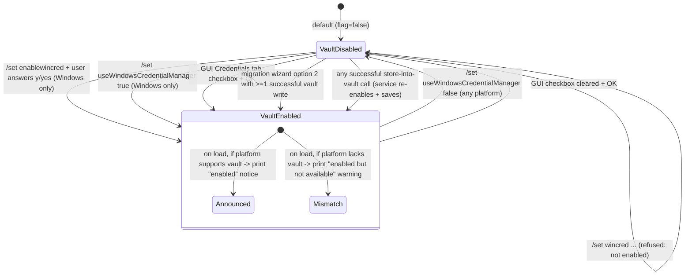
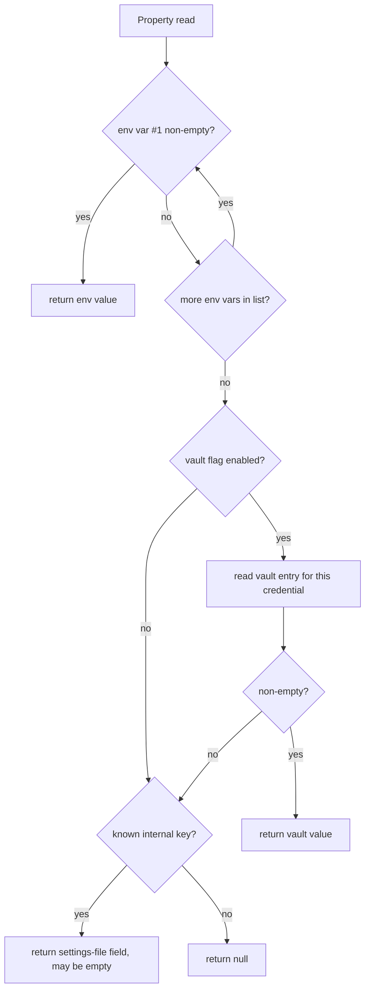

# Feature: Credential Management & Secret Storage

> Source repo: `/mnt/g/3RD-Party/reversing/subject/chatdbg` @ commit `d8c18f61d6bb73666ed97cd4885e877e35558485`
> All file:line references below are relative to the repo root at that commit.

---

## Purpose - what user/business problem this solves; who uses it (actors/roles)

The product is an interactive terminal chat/debugging assistant that talks to remote AI providers (a hosted OpenAI-compatible service and a cloud model-inference service) and to a local model runtime. The two remote providers require long-lived bearer secrets (an API key; an access-key / secret-key pair). Earlier versions of the product stored those secrets **in plaintext inside the user's settings file**, which is a disclosure risk (file-system readers, malware, accidental commit to version control, backup copies).

This feature exists to:

1. **Supply** secrets to the product through more than one channel, so a user is never forced to write a secret into a file on disk.
2. **Resolve** a secret deterministically when more than one channel holds a value, using a fixed, documented priority order.
3. **Store** secrets in an OS-managed encrypted credential vault on the platform where one exists, behind an explicit opt-in flag.
4. **Migrate** users off the legacy plaintext-in-settings-file storage with an interactive wizard, and warn them loudly on every startup until they do.
5. **Report** to the user *whether* each credential is set and *where it came from*, without ever printing the secret's value in the normal status display.

Actors / roles:

| Actor | How they touch the feature |
|---|---|
| **End user (interactive operator)** | Sets environment variables before launch; types `/set enablewincred`, `/set wincred <type> <value>`, `/set migrate`, `/set useWindowsCredentialManager <bool>`, and bare `/set` (status). In the graphical shell: the Settings dialog's "Credentials" tab, "Manage Credentials…" and "Migrate Credentials…" sub-dialogs. |
| **Legacy user upgrading** | Has plaintext secrets in the settings file; is warned at load and driven through the migration wizard. |
| **Provider integration code (other features)** | Reads the three resolved credential values as plain strings; never sees the resolution mechanism. Documented as a consumer only (see *Interfaces*). |
| **Operating-system credential vault** | Third-party store of record for the opt-in secure channel. |

There is no administrator role, no multi-user model, no server side. Everything is single-user, single-process, local.

> **PLATFORM COUPLING (stated explicitly).** Tier 2 of this feature - the OS-managed encrypted vault - works on **Microsoft Windows only**. The availability probe is a bare "is the running OS Windows" test with no fallback and no equivalent store for macOS or Linux (`Models/WindowsCredentialManager.cs:169-172`). On every non-Windows host: reads return "no value", writes and deletes return "failed", `/set useWindowsCredentialManager true` is refused, `/set wincred` always fails, and migration option `2` aborts the wizard. A test pins this asymmetry as a requirement (`Tests/Models/WindowsCredentialManagerTests.cs:18-26`). Tiers 1 (environment variables) and 3 (settings-file field) are platform-neutral, so on macOS/Linux the *only* channels are environment variables and plaintext-in-a-file. Everything else in this feature - resolution order, status display, migration wizard, warnings - is platform-neutral, but the wizard and help *text* changes wording based on the same probe.

---

## Behavior - what it does, as observable behavior; every distinct operation the feature supports, its inputs, outputs, and side effects

### B1. Resolve a credential value (read path)

Three logical credentials exist, each with a stable internal key:

| Logical credential | internal key | env var names checked, **in order** | OS-vault entry name | settings-file field name |
|---|---|---|---|---|
| Azure/OpenAI API key | `azureApiKey` | `CHATDBG_AZURE_API_KEY` | `ChatDbg:AzureApiKey` | `azureApiKey` |
| AWS access key id | `awsAccessKey` | `CHATDBG_AWS_ACCESS_KEY`, then `AWS_ACCESS_KEY_ID` | `ChatDbg:AwsAccessKey` | `awsAccessKey` |
| AWS secret access key | `awsSecretKey` | `CHATDBG_AWS_SECRET_KEY`, then `AWS_SECRET_ACCESS_KEY` | `ChatDbg:AwsSecretKey` | `awsSecretKey` |

Evidence: `src/Xcaciv.ChatDbg.Core/Models/ChatSettings.cs:70,73,76` (env-var lists), `:124-130` (vault entry names), `:79-86` (settings-file field names).

Resolution algorithm (`ChatSettings.cs:88-118`), evaluated **fresh on every read** — there is no caching:

1. **Priority 1 — environment.** Walk the credential's env-var name list in declared order. The first variable whose value is non-null and non-empty wins; return it verbatim (no trimming, no unquoting).
2. **Priority 2 — OS credential vault**, *only if* the boolean setting `useWindowsCredentialManager` is currently true on the in-memory settings object. Read the vault entry for this credential. If the read returns a non-empty string, return it.
3. **Priority 3 — settings file field** (deprecated). Return the stored string as-is, even if it is empty.
4. If the internal key is not one of the three known keys, return null.

The three exposed credential properties coalesce a null result to the empty string, so a caller always gets a string, never null (`ChatSettings.cs:70,73,76`).

### B2. Report a credential's source (provenance lookup)

Input: a credential-type name, lower-cased before matching (`ChatSettings.cs:159`). Accepted values after lowering: `azureapikey`, `awsaccesskey`, `awssecretkey`. Anything else returns the literal `not set`.

Output is one of exactly four shapes (`ChatSettings.cs:180,190,197,200`):

- `environment variable (<VARNAME>)` — with the *actual* variable name that was found, e.g. `environment variable (AWS_ACCESS_KEY_ID)`
- `Windows Credential Manager`
- `settings file (deprecated)`
- `not set`

The probe order is identical to B1 (env list in order → vault if enabled → settings-file field → not set). No secret value is included in the output. This is a *second, independent* resolution pass — it re-reads the environment and re-queries the vault rather than reusing the value from B1.

### B3. Report credential status without disclosure (`/set` with no arguments)

Bare `/set` prints a settings block (`src/Xcaciv.ChatDbg.Core/Commands/SetCommand.cs:401-458`). The credential section is:

```
Credentials (secure):
- Azure API Key: <status> [<source>]
- AWS Access Key: <status> [<source>]
- AWS Secret Key: <status> [<source>]
```

`<status>` is the literal `(not set)` when the resolved value is null or empty, and the literal `***set***` otherwise (`SetCommand.cs:460-463`). The secret itself is never rendered here. `<source>` is B2's string.

The same block also prints `- Windows Credential Manager: Enabled` / `Disabled` from the boolean flag (`SetCommand.cs:417`).

### B4. Enable the OS credential vault — interactive consent (`/set enablewincred`)

`/set enablewincred` is one of only two `/set` keys allowed with a single argument (`SetCommand.cs:33`). It delegates to the settings service (`SetCommand.cs:252-257`).

Service behavior (`src/Xcaciv.ChatDbg.Core/Services/SettingsService.cs:106-143`):

1. If the OS vault is unavailable on this platform, print `Windows Credential Manager is not available on this platform.` and return false — no prompt, no state change.
2. Otherwise print an explanatory banner: "Enabling Windows Credential Manager integration…", "This will allow ChatDbg to securely store credentials using Windows Credential Manager.", "Credentials will be encrypted and stored securely by the Windows operating system."
3. Prompt on stdout: `Do you want to enable Windows Credential Manager for secure credential storage? (y/N): ` and read a line from stdin.
4. Lower-case the answer. **Only** `y` or `yes` are affirmative. Anything else (including empty/EOF) prints `Windows Credential Manager integration not enabled.` and returns false with no state change.
5. On affirmative: set `useWindowsCredentialManager = true` on the passed settings object, **persist the whole settings object to the settings file**, then print `Windows Credential Manager integration enabled.`, `You can now store credentials using: /set wincred <credential-type> <value>`, `Example: /set wincred azureApiKey your-api-key`, and return true.

Command-level output: success → `Windows Credential Manager integration enabled.`; failure → `Failed to enable Windows Credential Manager integration.` The command does **not** re-save settings afterwards (the service already did).

### B5. Enable/disable the vault flag non-interactively (`/set useWindowsCredentialManager <true|false>`)

`SetCommand.cs:212-225`. Parses a boolean from the joined remaining arguments. Non-boolean → error `useWindowsCredentialManager must be 'true' or 'false'`. If the parsed value is **true** and the OS vault is unavailable → error `Windows Credential Manager is not available on this platform.` and **no** state change. Setting **false** is always permitted regardless of platform. On success the flag is assigned and the settings file is saved by the generic save-after-change path (`SetCommand.cs:283-287`), and the command returns `Set usewindowscredentialmanager = <value>` (note: the echoed key is the lower-cased form).

### B6. Store a credential into the OS vault (`/set wincred <type> <value>`)

Command gate (`SetCommand.cs:228-250`):

1. Requires **at least 3** whitespace-separated tokens (`wincred`, type, value). With exactly 2 tokens (`/set wincred azureApiKey`) the error is:
   `Usage: /set wincred <credential-type> <value>\nExample: /set wincred azureApiKey your-api-key`
   With only 1 token (`/set wincred`) an **earlier, generic** guard fires first and the user sees `Usage: /set <key> <value>` instead - the credential-specific usage line is never reached (`SetCommand.cs:33-36` runs before `:229-232`). This two-message split is a real, observable behavior a clone must reproduce or deliberately unify.
2. Requires `useWindowsCredentialManager` to already be true on the in-memory settings object. If not → error:
   `Windows Credential Manager is not enabled. Enable it first with:\n/set useWindowsCredentialManager true\nOr use: /set enablewincred`
   No vault call is made (asserted by test `ExecuteAsync_WinCredWithoutEnable_ReturnsError`, `src/Xcaciv.ChatDbg.Core.Tests/Commands/SetCommandTests.cs:52-63`).
3. The credential type is the second token **with the user's original casing preserved**. The value is **all remaining tokens rejoined with exactly one space between each** - so a secret containing single spaces survives intact, but runs of two or more spaces collapse to one, because the shell tokenizes the command line on the space character and discards empty tokens (`SetCommand.cs:243-244`; `src/ChatDbg/ChatShell.cs:326`, `src/ChatDbg.Shell.Gui/UI/ChatWindow.cs:384`). Leading/trailing whitespace and tabs are likewise lost. A secret containing a double space, a tab, or a newline **cannot** be entered through this command.
4. Delegates to the service; the command suppresses its own settings-save.
5. Output: success → `Credential stored securely in Windows Credential Manager: <type>`; failure → `Failed to store credential: <type>`.

Service behavior (`SettingsService.cs:145-194`):

1. If the OS vault is unavailable → print `Windows Credential Manager is not available on this platform.` and return false.
2. **Load settings from disk afresh** (this re-runs the whole load path including its warnings — see Quirk Q7).
3. Map the credential type, lower-cased, to a vault entry name. Accepted aliases:
   - `azureapikey` **or** `azure` → `ChatDbg:AzureApiKey`
   - `awsaccesskey` **or** `awsaccess` → `ChatDbg:AwsAccessKey`
   - `awssecretkey` **or** `awssecret` → `ChatDbg:AwsSecretKey`
   Anything else → print `Unknown credential type: <type>` and `Valid types: azureApiKey, awsAccessKey, awsSecretKey`, return false.
4. Write the value into the vault under that entry name.
5. On a successful write: set `useWindowsCredentialManager = true` on the **freshly loaded** settings object and save it to disk; print `Credential stored securely in Windows Credential Manager: <type>`; return true.
6. On a failed write: print `Failed to store credential in Windows Credential Manager: <type>`; return false. The flag is not touched and settings are not saved.

### B7. Vault primitive operations (the OS-vault wrapper)

`src/Xcaciv.ChatDbg.Core/Models/WindowsCredentialManager.cs`. Four operations. Every one is synchronous, blocking, and **total**: it always returns a value and never surfaces an error to its caller.

- **Availability probe** (`:169-172`): true iff the current OS is Windows. No vault access is attempted.
- **Read by entry name** (`:57-92`): on non-Windows, returns null immediately. Otherwise reads a *generic*-type credential. Returns null if the entry does not exist, if the stored blob length is zero, or if any exception occurs. Otherwise decodes the raw blob as **UTF-16 little-endian** text and returns it. The native handle is always released.
- **Write by entry name** (`:101-141`): on non-Windows returns false immediately. Otherwise encodes the value as UTF-16LE, builds a *generic* credential with blob length in **bytes** (2× the character count), a fixed comment string `ChatDbg API Credential`, a user name defaulting to `ChatDbg`, and persistence scope `2` (local-machine persistence — survives reboots and logon sessions on that machine). Returns whether the native write succeeded; returns false on any exception. All allocated native buffers are freed in a finally block.
- **Delete by entry name** (`:148-163`): on non-Windows returns false. Otherwise deletes the generic credential with that name; returns success/failure; false on exception. **This operation is never invoked anywhere in the product** (verified by repo-wide search) — it is dead but present API surface.

Test contract (`src/Xcaciv.ChatDbg.Core.Tests/Models/WindowsCredentialManagerTests.cs`):
- Reading a random, never-written entry name returns null (`:11-15`).
- Writing to a random entry name returns exactly the same boolean as the availability probe — i.e. **true on Windows, false everywhere else** (`:18-26`). This makes the platform-gating behavior a hard, asserted requirement.

### B8. Warn about plaintext credentials on settings load

Every settings load (`SettingsService.cs:43-83`):

1. If the settings file does not exist, a default settings object is created **and immediately written to disk**, then returned. (Side effect: a brand-new settings file contains the three legacy credential fields as empty strings — see Q1.)
2. Otherwise the file is read and deserialized. A null deserialization result is replaced by a default object.
3. If **any** of the three settings-file credential fields is non-empty (`ChatSettings.cs:147-152`), print
   `??  WARNING: Credentials found in settings file. For security, please migrate to environment variables:`
   and then print the migration instructions block (B10) — **which includes the plaintext secret values** (see Q3).
4. Then, independently: if `useWindowsCredentialManager` is true **and** the vault is available → print `?? Windows Credential Manager integration is enabled for secure credential storage.`; if the flag is true **and** the vault is not available → print `??  Windows Credential Manager is enabled in settings but not available on this platform.` If the flag is false, nothing is printed.
5. Any exception during the whole load prints `Error loading settings: <message>` and returns a default settings object (so a corrupt file silently degrades to defaults, discarding any stored secrets — see Q9).

### B9. Interactive migration wizard (`/set migrate`)

`/set migrate` is the other single-argument-allowed key (`SetCommand.cs:33,272-277`). It delegates to the service and suppresses its own save. Its command output is **always a success result**: `Migration completed successfully.` when the service returned true, `No credentials found to migrate or migration cancelled.` when it returned false (see Q5).

Service behavior (`SettingsService.cs:196-268`):

1. If no settings-file credential field is populated, return false immediately (no output).
2. Print `Migrating credentials from JSON to secure storage...`.
3. Print the option menu (`:270-287`), which is **platform-conditional**:
   - Line 1 is always `1. Environment Variables (Recommended - works on all platforms)`.
   - If the vault is available: `2. Windows Credential Manager (Secure Windows-specific storage)` and `3. Both (Environment Variables + Windows Credential Manager option)`.
   - If not: `2. Windows Credential Manager (Not available on this platform)` and `3. Environment Variables only`.
4. Prompt `Select migration option (1-3): ` and read a trimmed line.
5. Dispatch on the exact strings `1`, `2`, `3`:
   - **`1`** → print env-var instructions only (B10).
   - **`2`** → if the vault is available, run the vault migration (B11); otherwise print `Windows Credential Manager is not available on this platform.` and **return false immediately** (skipping the cleanup prompt).
   - **`3`** → print env-var instructions, then, if the vault is available, print `You can also optionally enable Windows Credential Manager:` and run the interactive enable flow (B4) — which prompts again for y/N.
   - anything else (including empty) → print `Migration cancelled.` and return false.
6. Prompt `Would you like to remove credentials from the settings file now? (y/N): ` and read a lower-cased line.
7. If `y` or `yes`: blank all three settings-file credential fields to empty strings, save settings to disk, print `Credentials removed from settings file.`, return **true**.
8. Otherwise return **false** (even though a migration may have fully succeeded — see Q5).
9. Any exception prints `Error during migration: <message>` and returns false.

### B10. Print environment-variable migration instructions

`SettingsService.cs:328-360`. Builds a list of lines from whichever settings-file credential fields are non-empty:

- If Azure key present: `For Azure OpenAI:` then `  set CHATDBG_AZURE_API_KEY=<the actual plaintext key>`
- If AWS access key present: `For AWS Bedrock:` then `  set CHATDBG_AWS_ACCESS_KEY=<plaintext>`
- If AWS secret key present: `  set CHATDBG_AWS_SECRET_KEY=<plaintext>` (note: no group header of its own; if only the secret key is present the line appears with no preceding header)

If the list is non-empty it is preceded by `To migrate to environment variables, run these commands:` and followed by `Or add them to your system environment variables for persistence.` If empty, nothing at all is printed. A caller-supplied "environment variables only" mode flag is accepted at two call sites but never consulted, so output is identical either way (`SettingsService.cs:328` vs `:216,232`) - see Q8.

### B11. Bulk-migrate settings-file credentials into the OS vault

`SettingsService.cs:289-326`. For each of the three credentials, if its settings-file field is non-empty, write it into the vault under the fixed entry name; on a successful write print one of:
- `Azure API Key migrated to Windows Credential Manager`
- `AWS Access Key migrated to Windows Credential Manager`
- `AWS Secret Key migrated to Windows Credential Manager`

If **at least one** write succeeded, set `useWindowsCredentialManager = true`, save settings to disk, and print `Windows Credential Manager integration enabled`. If none succeeded, nothing is enabled and nothing is saved (and no failure message is printed — silent no-op).

Note: this step **does not clear** the settings-file fields; clearing happens only via the separate prompt in B9 step 6.

### B12. Legacy credential-setting keys are blocked

`/set azureapikey …`, `/set awsaccesskey …`, `/set awssecretkey …` are recognized but **always refused** (`SetCommand.cs:260-270`). They return an error result whose message is built by a template (`SetCommand.cs:378-399`):

```
For security, <Friendly Name> is no longer set via this command.

## Secure Options:
1. Environment Variables (Recommended):
   set <ENV_VAR_1>=your-credential
   [set <ENV_VAR_2>=your-credential]     <- one line per accepted env var

[ 2. Windows Credential Manager (Secure Option):        <- only when vault available
     /set enablewincred                    (enable Windows Credential Manager)
     /set wincred <type> your-credential   (store credential) ]

This keeps your credentials secure and out of configuration files.
```

Friendly names and env-var lists: `Azure API Key` → `CHATDBG_AZURE_API_KEY`; `AWS Access Key` → `CHATDBG_AWS_ACCESS_KEY`, `AWS_ACCESS_KEY_ID`; `AWS Secret Key` → `CHATDBG_AWS_SECRET_KEY`, `AWS_SECRET_ACCESS_KEY`.

Critically: the value the user typed is **never stored**. There is no code path in the product that writes a value into the settings-file credential fields; they can only arrive by an operator hand-editing the file or by an older build.

### B13. Startup credential diagnostics (plain-console shell)

`src/ChatDbg/ChatShell.cs:239-321` (duplicated verbatim in the unused alternative shell at `src/ChatDbg.Shell.Gui/ChatShell.cs:213-295`), run once after the welcome banner:

1. If no provider is configured (empty string), warn `Warning: No AI provider configured.` plus a hint listing the three providers, and stop.
2. If the provider name has no registered service, warn `Warning: Unknown AI provider: <provider>` and stop.
3. If the provider's service reports itself **not configured**, print `Warning: <Provider Display Name> service is not configured.` followed by provider-specific remediation:
   - **azure**: `1. Environment Variables: set CHATDBG_AZURE_API_KEY=your-api-key`; if the vault is available also `2. Windows Credential Manager: /set enablewincred` / `Then: /set wincred azureApiKey your-api-key`; and if the endpoint is empty, `Also set your Azure endpoint: /set azureEndpoint https://your-resource.openai.azure.com/`.
   - **bedrock**: `1. Environment Variables:` / `set CHATDBG_AWS_ACCESS_KEY=your-access-key` / `set CHATDBG_AWS_SECRET_KEY=your-secret-key` / `Or use standard AWS variables: AWS_ACCESS_KEY_ID, AWS_SECRET_ACCESS_KEY`; if the vault is available also the two `wincred` hints.
   - **llama**: model-file guidance only (no credentials).
4. If the service **is** configured, print a one-line provenance disclosure:
   - azure with a non-empty resolved key → `Azure credentials loaded from: <source>`
   - bedrock with a non-empty access or secret key → `AWS credentials loaded from: <source>` (always sourced from the **access key**, never the secret key)
   - llama → `Local LLM model loaded from: <model path>`

The welcome banner also always prints `Security Enhancement: Credentials are now managed via environment variables` / `   or Windows Credential Manager for improved security.` / `   See '/set' command for more details.` (`ChatShell.cs:205-207`).

### B14. Graphical shell credential surface

`src/ChatDbg.Shell.Gui/UI/SettingsDialog.cs`:

- A **Credentials tab** (`:177-231`) with: a heading label `Credential Management`; a checkbox `Enable Windows Credential Manager` initialized from the flag; a `Manage Credentials...` button; a `Migrate Credentials...` button; and static help text listing the three-tier order (`1. Environment variables (recommended)`, `2. Windows Credential Manager (Windows only)`, `3. Settings file (deprecated)`).
- On dialog OK, the checkbox value is copied back into the flag and the whole settings object is saved (`:431-437`, `:501`).
- **Manage Credentials dialog** (`:509-558`): a free-text `Credential Type:` field, a **masked** `Value:` field, help text listing `azureApiKey / awsAccessKey / awsSecretKey`, Save and Cancel. Save is a no-op if either field is blank/whitespace. Otherwise it calls the store-in-vault operation, closes, and shows `Credential saved successfully`; on exception shows `Failed to save credential: <message>`. **It does not check the enable flag first** and it reports success even when the underlying store returned false (Q11).
- **Migrate Credentials dialog** (`:560-607`): explanatory text and a three-way radio group (`Environment Variables`, `Windows Credential Manager`, `Both`). The selected radio value is read into a local variable and then **discarded** — the button always calls the same console-driven migration wizard (Q12), then shows `Credentials migrated successfully` unconditionally, or `Migration failed: <message>` on exception.

---

## Business rules & edge cases

Each rule with evidence.

**Resolution & priority**

| # | Rule | Evidence |
|---|---|---|
| R1 | Priority is strictly: environment variables → OS credential vault → settings-file field. There is no other channel and no configuration to reorder it. | `Models/ChatSettings.cs:88-118` |
| R2 | Within priority 1, the env-var names are tried **in declared order** and the first non-empty wins. For AWS this means the product-specific name beats the standard cloud-vendor name: `CHATDBG_AWS_ACCESS_KEY` beats `AWS_ACCESS_KEY_ID`; `CHATDBG_AWS_SECRET_KEY` beats `AWS_SECRET_ACCESS_KEY`. | `ChatSettings.cs:73,76,91-98` |
| R3 | The Azure key has exactly **one** env var (`CHATDBG_AZURE_API_KEY`); there is no vendor-standard alias for it. | `ChatSettings.cs:70` |
| R4 | An environment variable that exists but holds the **empty string** is treated as absent and resolution falls through to the next name, then the next tier. | `ChatSettings.cs:94` |
| R5 | Priority 2 is skipped entirely unless the boolean `useWindowsCredentialManager` on the live settings object is true — even on Windows, even if the vault entry exists. | `ChatSettings.cs:101` |
| R6 | An empty vault value is treated as absent and resolution falls through to priority 3. | `ChatSettings.cs:104` |
| R7 | Priority 3 returns the stored string unconditionally, including empty string. Resolution never returns null for a known credential key; the exposed properties coalesce to `""`. | `ChatSettings.cs:111-117,70,73,76` |
| R8 | An unknown internal credential key resolves to null. | `ChatSettings.cs:116` |
| R9 | Resolution is recomputed on **every single read** of a credential - nothing is cached or memoized. Changing an environment variable mid-process, or writing a new vault entry, changes the very next read with no restart and no invalidation step. | `ChatSettings.cs:70-76` (each resolved value is derived on access, never stored) |
| R10 | Env var beats settings-file field. Asserted by test. | `Tests/Models/ChatSettingsTests.cs:10-29` |
| R11 | With no environment variable set and the vault flag false, the settings-file field is returned verbatim. Asserted by test with the literal value `stored-value`. | `Tests/Models/ChatSettingsTests.cs:31-40` |
| R11a | The env-beats-file test uses the literal values `from-env` (variable `CHATDBG_AZURE_API_KEY`) and `from-json` (settings field `azureApiKey`) and asserts the resolved value is exactly `from-env`. It also **restores the original variable value in a finally block**, which means the resolution path is expected to be free of process-global side effects. | `Tests/Models/ChatSettingsTests.cs:10-29` |
| R11b | The source lookup test sets `CHATDBG_AWS_ACCESS_KEY` to `from-env`, asks for the source of `awsAccessKey`, and asserts the answer *contains* the phrase `environment variable`, compared case-insensitively - the phrase is contractual, the exact parenthetical is not asserted. | `Tests/Models/ChatSettingsTests.cs:53-71` |

**Vault entry naming**

| # | Rule | Evidence |
|---|---|---|
| R12 | Vault entry names are the exact literals `ChatDbg:AzureApiKey`, `ChatDbg:AwsAccessKey`, `ChatDbg:AwsSecretKey`. The colon is part of the name. | `ChatSettings.cs:126-128`, `SettingsService.cs:159-161,295,304,313` |
| R13 | The read path maps from the *internal key* (`azureApiKey`/`awsAccessKey`/`awsSecretKey`, camelCase, case-**sensitive**) to the entry name; the write path maps from a *user-typed type string*, lower-cased, with extra aliases. The two maps are not the same. | read `ChatSettings.cs:124-130`; write `SettingsService.cs:157-163` |
| R14 | Write-path aliases: `azureapikey`\|`azure`; `awsaccesskey`\|`awsaccess`; `awssecretkey`\|`awssecret`. Unknown → refusal. | `SettingsService.cs:157-170` |
| R15 | Credentials are stored as *generic* credentials with local-machine persistence (magic number **2** = persist on this machine across logons/reboots), user name defaulting to the literal `ChatDbg`, and a fixed comment `ChatDbg API Credential`. | `Models/WindowsCredentialManager.cs:101,117,120-121` |
| R16 | Credential-kind constant **1** means "generic credential" and is the only kind used for read, write, and delete. The vault's other six kinds (domain password, domain certificate, domain visible password, generic certificate, domain extended, and the two range markers) are declared but never selected. | `WindowsCredentialManager.cs:23-33,66,115,157` |
| R17 | The stored blob is UTF-16 little-endian text; the declared blob size is the **byte** count, i.e. 2× the character count. Readers must decode the same way. | `WindowsCredentialManager.cs:110,118,81` |
| R18 | A zero-length stored blob reads back as "not found", not as an empty string. | `WindowsCredentialManager.cs:74-77` |
| R18a | **No length, character-set, or content validation is performed on a secret before storage.** Any string the user types is encoded and handed to the OS as-is. There is no minimum, no maximum, no rejection of control characters. Oversized values are refused by the OS and surface only as the generic store failure. | `WindowsCredentialManager.cs:110-127` (no guard between the two) |
| R18b | The read path decodes whatever bytes the entry holds as UTF-16LE unconditionally. An entry written by any other tool in a different encoding, or with a trailing terminator, is returned mis-decoded rather than rejected - the entry names are not namespaced by anything but the `ChatDbg:` prefix, so a collision is possible. | `WindowsCredentialManager.cs:79-81` |
| R18c | Every stored entry is written with local-machine persistence and the fixed account label `ChatDbg`; the read path matches on entry name **only** and ignores both the account label and the comment. Two different OS users on one machine each get their own entry set (the OS scopes them), but one OS user cannot keep two ChatDbg profiles apart. | `WindowsCredentialManager.cs:101,116-121`; read `ChatSettings.cs:124-135` |

**Platform gating**

| # | Rule | Evidence |
|---|---|---|
| R19 | Availability is decided purely by "is the OS Windows"; there is no probe of whether the vault service actually responds. | `WindowsCredentialManager.cs:169-172` |
| R20 | All four vault operations short-circuit on non-Windows: read → null, write → false, delete → false, availability → false. No exception is thrown, no message is emitted from the wrapper. | `WindowsCredentialManager.cs:59-62,103-106,150-153` |
| R21 | Every vault operation swallows all exceptions and degrades to the "not found / failed" result. No error is surfaced from this layer. | `WindowsCredentialManager.cs:88-91,137-140,159-162` |
| R22 | `/set useWindowsCredentialManager true` is rejected on a non-Windows platform; `false` is always accepted. | `SetCommand.cs:219-224` |
| R23 | The write result on a random entry equals the availability probe — asserted, so it must be true on Windows and false elsewhere. | `Tests/Models/WindowsCredentialManagerTests.cs:18-26` |

**Command-surface rules**

| # | Rule | Evidence |
|---|---|---|
| R24 | `/set` with zero arguments prints status. `/set <key>` with a single argument is an error (`Usage: /set <key> <value>`) **except** for the keys `migrate` and `enablewincred`. | `SetCommand.cs:28-36` |
| R25 | The command key is lower-cased before dispatch; credential-type arguments are **not** lower-cased by the command (the service does it). | `SetCommand.cs:38,243` |
| R26 | `/set wincred` requires ≥3 tokens; the value is all tokens from index 2 joined with single spaces. | `SetCommand.cs:229-232,244` |
| R27 | `/set wincred` is gated on the in-memory enable flag and makes **no** store-into-vault call at all when the flag is false. A test asserts the store operation is invoked **zero** times in that case, so the gate is a hard requirement, not an optimization. | `SetCommand.cs:234-241`; `Tests/Commands/SetCommandTests.cs:52-63` |
| R28 | `/set wincred`, `/set enablewincred`, `/set migrate` and the three blocked legacy keys all set an internal "already handled" flag so the command does **not** perform the generic save-settings step. | `SetCommand.cs:247,254,261,265,269,274,284-287` |
| R29 | `/set migrate` always returns a **success** result, whatever the outcome; only the message differs. | `SetCommand.cs:275-277`; test only asserts success + delegation (`Tests/Commands/SetCommandTests.cs:65-77`) |
| R30 | Unknown `/set` keys produce: `Unknown setting: <key>. Valid keys: provider, modelId, temperature, maxTokens, azureEndpoint, awsRegion, systemPrompt, enableLogProbabilities, logProbabilitiesTopK, useWindowsCredentialManager, enablewincred, wincred, migrate`. This list omits several keys the command actually accepts (e.g. all `llama*`, `showAllTokens`, grid keys, and the blocked legacy credential keys). | `SetCommand.cs:279-280` |
| R31 | Any exception inside `/set` is caught and returned as `Error setting <key>: <message>`. | `SetCommand.cs:291-294` |
| R31a | Bare `/set` returns a **success** result whose text includes the word `provider` (case-insensitive) - asserted, so the status block must always name the active provider alongside the credential block. | `SetCommand.cs:28-31,405`; `Tests/Commands/SetCommandTests.cs:12-23` |
| R31b | A *non-credential* `/set` key (e.g. `/set provider bedrock`) writes the change to the in-memory settings object and calls the save-settings operation **exactly once**. Asserted. This is the contrast case that makes R28's "already handled, do not save again" behavior observable. | `SetCommand.cs:283-287`; `Tests/Commands/SetCommandTests.cs:25-38` |
| R31c | `/set migrate` accepted with a **single** argument invokes the migration operation exactly once, passing the command's own live settings object (not a freshly loaded one). Asserted. | `SetCommand.cs:272-273`; `Tests/Commands/SetCommandTests.cs:65-77` |

**Consent & confirmation**

| # | Rule | Evidence |
|---|---|---|
| R32 | The affirmative answers for both y/N prompts are exactly `y` and `yes`, compared after lower-casing. `Y`/`YES` work; `yeah`, `1`, `true` do not. | `SettingsService.cs:123,249` |
| R33 | The migration menu accepts only the exact trimmed strings `1`, `2`, `3`. | `SettingsService.cs:211-243` |
| R34 | Choosing vault migration on a non-Windows platform aborts the whole wizard before the cleanup prompt. | `SettingsService.cs:225-228` |
| R35 | Clearing plaintext credentials from the settings file requires a second, explicit confirmation and is the **only** action that makes the wizard return true. | `SettingsService.cs:246-259` |
| R36 | Storing a credential via `/set wincred` implicitly (re-)enables the vault flag and persists it, even though the flag was already required to be true to reach that point. | `SettingsService.cs:176-178` |
| R37 | Bulk migration enables the vault flag if **at least one** of the three writes succeeded; if all fail, nothing is enabled and nothing is saved and no message is printed. | `SettingsService.cs:320-325` |

**Status / disclosure**

| # | Rule | Evidence |
|---|---|---|
| R38 | The status display never prints a secret value; only `(not set)` or the fixed masking token `***set***`. | `SetCommand.cs:460-463,420-422` |
| R39 | The source label always names the specific env var when the env channel wins. | `ChatSettings.cs:180` |
| R40 | An unrecognized credential-type argument to the source lookup yields `not set` rather than an error. | `ChatSettings.cs:164` |
| R41 | The source lookup accepts mixed casing (`awsAccessKey` works). Asserted by test. | `ChatSettings.cs:159`; `Tests/Models/ChatSettingsTests.cs:53-71` |
| R42 | "Has plaintext credentials" is true if **any** of the three settings-file fields is non-empty. Asserted by test. | `ChatSettings.cs:147-152`; `Tests/Models/ChatSettingsTests.cs:42-51` |

**Storage location**

| # | Rule | Evidence |
|---|---|---|
| R43 | The settings file lives at `<user profile>/.ChatDbg/settings.json` by default. If the resolved base directory is blank, or resolving it throws, it falls back to the OS temp directory (file name unchanged). | `Services/SettingsService.cs:11-32` |
| R44 | The settings directory is created on demand at save time. | `SettingsService.cs:89-93` |
| R45 | The settings file is written pretty-printed with camelCase naming policy; explicitly named fields override the policy. | `SettingsService.cs:34-38`; `ChatSettings.cs` property-name attributes |
| R46 | A missing settings file causes a default file to be **created and written** during load, not just defaulted in memory. | `SettingsService.cs:47-53` |
| R47 | Save failures are swallowed with `Error saving settings: <message>` printed; the caller still sees success. | `SettingsService.cs:100-103` |
| R48 | The settings base directory is **overridable at construction** and the file name defaults to `settings.json` but is also overridable. A test constructs the store against a throwaway directory under the OS temp path and asserts the reported settings-file path starts with that directory (case-insensitive). A clone must expose the same seam or the feature is untestable. | `SettingsService.cs:11`; `Tests/Services/SettingsServiceTests.cs:12-38` |
| R49 | Save-then-load through the same base directory round-trips non-credential settings faithfully (asserted with `provider` = `bedrock`). | `Tests/Services/SettingsServiceTests.cs:25-29` |
| R50 | Loading when the file is missing returns a usable object with **non-empty** defaults (asserted on the model identifier), and does not throw. | `SettingsService.cs:47-53`; `Tests/Services/SettingsServiceTests.cs:40-60` |
| R51 | Nothing in this feature restricts the settings file's permissions. No mode/ACL call exists; the `.ChatDbg` directory is created with whatever the platform's default is. The repository's ignore list does **not** name `settings.json` either - the default location merely happens to be outside any repo. | `SettingsService.cs:89-93`; `.gitignore` (no `settings.json` entry) |

**Magic numbers / constants inventory**

| Value | Meaning | Where |
|---|---|---|
| `1` | generic credential type | `WindowsCredentialManager.cs:25` |
| `2` | credential persistence = local machine (survives logoff/reboot) | `WindowsCredentialManager.cs:120` |
| `0` | reserved flag / credential flags, always zero | `WindowsCredentialManager.cs:66,113,127,157` |
| `"ChatDbg"` | default user name recorded on every stored credential | `WindowsCredentialManager.cs:101` |
| `"ChatDbg API Credential"` | comment recorded on every stored credential | `WindowsCredentialManager.cs:117` |
| `"ChatDbg:AzureApiKey"` / `"ChatDbg:AwsAccessKey"` / `"ChatDbg:AwsSecretKey"` | vault entry names | `ChatSettings.cs:126-128` |
| `false` | default of `useWindowsCredentialManager` | `ChatSettings.cs:50` |
| `""` | default of all three settings-file credential fields | `ChatSettings.cs:80,83,86` |
| `".ChatDbg"` / `"settings.json"` | settings directory and file name | `SettingsService.cs:11,17` |
| `2, 3` (menu) / `1..3` | migration menu option ids; only the exact trimmed strings `1`, `2`, `3` dispatch | `SettingsService.cs:210-243` |
| `y`, `yes` | the **only** two affirmative answers at both consent prompts, after lower-casing | `SettingsService.cs:123,249` |
| `***set***` / `(not set)` | the two status tokens in the credential display; the secret is never rendered | `SetCommand.cs:462` |
| `not set` | the "no channel supplied a value" source label, **and** the answer for an unrecognized credential-type name | `ChatSettings.cs:164,200` |
| `environment variable (<NAME>)` / `Windows Credential Manager` / `settings file (deprecated)` | the other three source labels, verbatim | `ChatSettings.cs:180,190,197` |
| `azure` | default provider (decides which credential the startup diagnostics check) | `ChatSettings.cs:8` |
| `us-east-1` | default cloud region paired with the AWS key pair | `ChatSettings.cs:23` |
| `ChatDbg:Test:<guid>` | entry-name shape used by the vault write test; not used at runtime | `Tests/Models/WindowsCredentialManagerTests.cs:21` |
| `sk-test-azure-key-12345`, `AKIA-test-access-key`, `test-secret-key-abcdef` | example secrets the manual env-var script exports into `CHATDBG_AZURE_API_KEY` / `CHATDBG_AWS_ACCESS_KEY` / `CHATDBG_AWS_SECRET_KEY` | `tmp/test-env-vars.cmd:48-50` |
| `sk-test-azure-wincred-12345`, `AKIA-test-wincred-access`, `test-wincred-secret-67890` | example secrets the manual vault script puts in scratch variables `TEMP_AZURE_KEY` / `TEMP_AWS_ACCESS` / `TEMP_AWS_SECRET` (**not** credential variable names - they are only echoed into the printed instructions) | `tmp/test-wincred.cmd:11-13,26-28` |

---

## Workflows & states

### State model

The feature's only persistent state variable is the **vault-enabled flag** (`useWindowsCredentialManager`, persisted in the settings file, default false). Everything else is derived per-read.



Orthogonal state: **plaintext-credentials-present** (true iff any of the three settings-file fields is non-empty). Transitions to false only via the migration wizard's cleanup confirmation. While true, every settings load emits a warning plus plaintext instructions.

### W1. Credential resolution (per read)



### W2. Enable-the-vault flow (`/set enablewincred`)

1. Command sees `enablewincred`, allows the missing second argument.
2. Service checks platform. Not Windows → message, return false, command prints `Failed to enable Windows Credential Manager integration.` **(terminal)**
3. Service prints the three explanation lines.
4. Service prompts `(y/N)` and blocks on stdin.
5. Answer not in {y, yes} → `Windows Credential Manager integration not enabled.`, return false. **(terminal)**
6. Answer y/yes → flag := true; persist entire settings file; print confirmation + two how-to lines; return true; command prints `Windows Credential Manager integration enabled.` **(terminal)**

### W3. Store-a-secret flow (`/set wincred <type> <value>`)

1. Token count < 3 → usage error. **(terminal)**
2. In-memory flag false → "not enabled" error listing both enable paths; **no vault call**. **(terminal)**
3. Service: platform check → not Windows → message + false → command prints `Failed to store credential: <type>`. **(terminal)**
4. Service reloads settings from disk (re-emitting any load-time warnings).
5. Type alias lookup fails → `Unknown credential type: <type>` + valid-type list + false. **(terminal)**
6. Vault write. Failure → message + false → command error. **(terminal)**
7. Success → flag := true on the reloaded object; persist; print confirmation; return true → command prints `Credential stored securely in Windows Credential Manager: <type>`. **(terminal)**

### W4. Migration wizard (`/set migrate`)

```mermaid
flowchart TD
    S[/set migrate/] --> A{any plaintext credential in settings file?}
    A -- no --> Z0[return false -> "No credentials found to migrate or migration cancelled." SUCCESS result]
    A -- yes --> B[print banner + platform-conditional 3-option menu]
    B --> C[read option 1-3]
    C -->|other/empty| Z1["Migration cancelled." return false]
    C -->|1| D[print env-var instructions incl. plaintext values]
    C -->|2| E{vault available?}
    E -- no --> Z2["not available on this platform" return false, skip cleanup]
    E -- yes --> F[write each non-empty credential into vault, print per-credential success]
    F --> G{at least one write ok?}
    G -- yes --> H[flag := true; save settings; print "integration enabled"]
    G -- no --> I[silent no-op]
    C -->|3| J[print env-var instructions] --> K{vault available?}
    K -- yes --> L[print "You can also optionally enable..." then run W2 y/N prompt]
    K -- no --> M[skip]
    D --> N
    H --> N
    I --> N
    L --> N
    M --> N
    N[prompt: remove credentials from settings file? y/N]
    N -->|y or yes| O[blank all three fields; save; "Credentials removed from settings file."; return TRUE]
    N -->|anything else| P[return FALSE]
```

### W5. Startup sequence touching credentials (plain-console shell)

1. Load settings from disk (may emit plaintext warning + instructions, and the vault-enabled/mismatch notice).
2. Copy the loaded values (including the vault flag and the three plaintext fields) onto the shell's live settings object (`src/ChatDbg/ChatShell.cs:136,149-151`).
3. Load system prompt.
4. Print welcome banner including the standing security notice.
5. Run credential diagnostics (B13) — either a "not configured" remediation block or a one-line provenance disclosure.
6. Enter the read/eval loop.

---

## Data - entities this feature owns, their fields, relationships, lifecycle

### E1. Credential settings (owned jointly with the Settings feature; these are the credential-relevant members of the single settings entity)

| Field | Type (generic) | Persisted? | Default | Constraints / notes |
|---|---|---|---|---|
| vault-enabled flag (`useWindowsCredentialManager`) | boolean | yes | `false` | May only be set true on a platform with the vault; may be set false anywhere. Mutated by five distinct code paths (see state diagram). |
| legacy Azure key (`azureApiKey`) | string | **yes — plaintext** | `""` | Deprecated. No product code path writes a non-empty value. Read as priority-3 fallback. Cleared only by the migration wizard. |
| legacy AWS access key (`awsAccessKey`) | string | **yes — plaintext** | `""` | same |
| legacy AWS secret key (`awsSecretKey`) | string | **yes — plaintext** | `""` | same |
| resolved Azure key | string (computed, never persisted) | no | `""` | Recomputed per read via W1. |
| resolved AWS access key | string (computed) | no | `""` | same |
| resolved AWS secret key | string (computed) | no | `""` | same |

Evidence: `Models/ChatSettings.cs:49-50,69-86`.

On-disk shape of the credential-relevant part of the settings file (default path `<user profile>/.ChatDbg/settings.json`, pretty-printed, camelCase keys). This is exactly what a newly created file contains for these fields, and exactly what a clone must be able to read for backward compatibility:

```json
{
  "useWindowsCredentialManager": false,
  "azureApiKey": "",
  "awsAccessKey": "",
  "awsSecretKey": ""
}
```

Note that the *resolved* credential values never appear in this file - only the three deprecated plaintext slots and the one flag do (`ChatSettings.cs:69-86`). A file written by an older build may carry non-empty strings in those three slots; that is the only way they ever become non-empty (`B12`).

Lifecycle: created with defaults when the settings file is absent (and immediately written to disk); mutated by `/set` keys, the GUI dialog, and the service's enable/store/migrate operations; each mutation is followed by a full-object rewrite of the settings file. Never deleted (the file is never removed by this feature).

### E2. Vault credential entry (external entity, owned by the OS)

| Field | Type | Value set by this feature |
|---|---|---|
| entry name / target | string | one of the three fixed `ChatDbg:*` literals |
| type | enum | generic (1) |
| flags | integer | 0 |
| blob | byte array | the secret encoded UTF-16LE |
| blob size | integer | byte length of the above |
| persistence | enum | 2 = local machine |
| user name | string | `ChatDbg` |
| comment | string | `ChatDbg API Credential` |
| last-written timestamp | timestamp | set by the OS, never read by this feature |
| attributes | (unused) | count 0, null pointer |

Lifecycle: created/overwritten by the store and bulk-migrate operations; read by the resolution and source-report paths; **never deleted by the product** (the delete primitive exists but is uncalled). Entries survive process exit and machine reboot; they are scoped to the OS user account.

### E3. Environment variables (external, process-scoped, read-only to this feature)

`CHATDBG_AZURE_API_KEY`, `CHATDBG_AWS_ACCESS_KEY`, `CHATDBG_AWS_SECRET_KEY`, `AWS_ACCESS_KEY_ID`, `AWS_SECRET_ACCESS_KEY`. Never written by the product. Read on every resolution.

### Relationships

- One settings entity ↔ zero-to-three vault entries (by fixed name) ↔ zero-to-five environment variables. There is no join key beyond the hard-coded credential identity; nothing correlates a vault entry with a particular settings file or profile.
- All three channels can hold different values for the same logical credential simultaneously; priority decides which one is used, and the source label tells the user which one won.

---

## Interfaces - what this feature exposes to and consumes from OTHER features

### Exposed

| Consumer | Semantic contract |
|---|---|
| **Provider integration features** (hosted-OpenAI service, cloud model-inference service, their client factories) | Three read-only string properties on the settings object that yield the *effective* secret, already resolved by priority, empty string when unavailable. Consumers must treat empty as "no credential" and must not care where it came from. Observed uses: the hosted-OpenAI service treats "configured" as endpoint + key + model all non-empty and sends the key as a request header; the cloud-inference service treats "configured" as model non-empty AND (resolved access key non-empty OR the standard vendor env var set), and its client factory supplies explicit static credentials only when **both** access and secret keys are non-empty, otherwise falling back to the vendor SDK's own credential chain. Evidence: `Services/AzureOpenAIService.cs:41-45,57,71,128`, `Services/BedrockService.cs:23-27,38-40`, `Services/DefaultBedrockRuntimeClientFactory.cs:11-20`. |
| **Settings & Configuration feature** | The vault-enabled flag and the three legacy plaintext fields are members of the shared settings entity and are serialized/deserialized by it. This feature also depends on the settings persistence operations. |
| **Command/shell features** | Command keys `useWindowsCredentialManager`, `wincred`, `enablewincred`, `migrate`, and the three blocked legacy keys; the credential block inside the bare-`/set` status output; the credential help sections inside the `/set` usage text. |
| **Shell startup features** | A "which channel supplied this credential" string and a masked "is it set" indicator, used for the startup provenance line and the status display. |
| **Graphical settings dialog** | A store-a-secret operation and a run-migration operation, both fire-and-forget from the UI's perspective. |

### Consumed

| Provider | What this feature needs from it |
|---|---|
| Settings persistence | load-from-disk, save-to-disk, and the settings file path (the path is printed in the welcome banner). |
| Process environment | read a named environment variable. |
| OS credential vault | read / write / delete a named generic credential, plus an "is this platform supported" probe. |
| Console I/O | line-oriented prompts and messages for the consent and migration wizards. **This is a hard coupling**: the service layer talks directly to stdout/stdin, which is why the graphical shell's migration button produces no visible prompts (Q12). |

### Explicitly *not* owned here (documented elsewhere)

Settings schema at large, provider selection, endpoint/region configuration, model selection, log-probability settings, and the actual request-signing/authentication performed by each provider SDK.

---

## External technology

| Generic capability | Protocol/standard if any | What the source used | Notes for reimplementer |
|---|---|---|---|
| OS-managed encrypted credential vault (per-user secret store) | Native OS credential-store API; entries are "generic" credentials with a persistence scope | Windows Credential Manager, reached through direct native calls to `advapi32.dll` (`CredReadW`, `CredWriteW`, `CredDeleteW`, `CredFree`) with a manually marshalled credential struct | The vault is the *only* encrypted-at-rest channel. Blob is UTF-16LE and its declared size is in **bytes**. Persistence value 2 = local machine. Entry names contain a colon (`ChatDbg:AzureApiKey`). On other platforms the natural equivalents are the macOS keychain and a Secret-Service/keyring daemon on Linux — but note the source deliberately returns "unavailable" rather than substituting one, and a test asserts that write returns false off-Windows. Decide explicitly whether your clone keeps that behavior or generalizes it. |
| Native-library interop / FFI with manual memory management | C ABI, structure marshalling, UTF-16 string allocation | Platform invoke with `AllocHGlobal`/`FreeHGlobal`, `Marshal.Copy`, `PtrToStructure`; unsafe blocks allowed in the core project | If your target language has a first-class keyring binding, the FFI layer disappears; keep the same public shape (read→optional string, write→bool, delete→bool, available→bool, never throws). |
| Process environment variable access | POSIX/Windows environment | Standard runtime environment API | Read-only. Empty string must be treated as absent. |
| Local JSON document persistence for non-secret configuration | JSON | Serializer with pretty-printing and camelCase policy, explicit per-field names, explicit exclusion of computed/secret members | The three *legacy* credential fields are still serialized in plaintext; the three *resolved* properties are excluded. Preserve exactly this split or you will either lose backward compatibility or leak. |
| User home / profile directory discovery + temp-directory fallback | filesystem | User-profile special folder, falling back to the temp directory on blank or throwing resolution | Path: `<home>/.ChatDbg/settings.json`. |
| Interactive line-based console I/O for consent prompts | — | Direct stdout writes and stdin line reads inside the service layer | This blocks; there is no timeout, no cancellation, and no abstraction. In a GUI/headless clone you must inject an interaction port instead (see Q12/Q13). |
| Hosted OpenAI-compatible chat service (consumer only) | HTTPS, API-key header auth | Azure OpenAI via its SDK and a raw HTTP path that sets an `api-key` header | Documented in the provider dossier; listed here only because it is the sink for the resolved secret. |
| Cloud model-inference service (consumer only) | HTTPS, request signing with access-key/secret-key | Amazon Bedrock Runtime SDK, constructed either with explicit static credentials or with the SDK's own credential chain | Same note. Its "am I configured" test ignores the secret half of the pair entirely (Q20), and its fallback to the SDK's ambient credential chain is a **fourth, undocumented credential channel** your clone inherits unless you close it. |
| Full-screen terminal UI toolkit with a masked text field | — | Terminal.Gui (tabbed settings window, checkbox, modal dialogs, radio group, and a `Secret = true` text field for the credential value) | Needed only for the graphical credential surface. The masked-entry capability is the one thing the console path lacks (secrets typed at `/set wincred` are echoed in the clear and land in shell history), so a clone should provide masked entry on **both** surfaces. Note the toolkit owns the terminal, which is what makes the service layer's stdout/stdin prompts unusable there (Q29). |
| Command-line tokenizer | — | Split on the single space character, discarding empty tokens | Determines exactly which secrets are typeable: single spaces survive, runs of spaces collapse, tabs and newlines are impossible. Pin this or change it deliberately. |
| OS temp-directory discovery | filesystem | Platform temp path, used as the settings-file fallback when the home directory is blank or unresolvable | The fallback silently relocates the settings file - including its plaintext credential fields - into a world-readable temp directory on most systems. |
| Randomized identifier generation (test-only) | — | GUID generation, used to build never-before-written vault entry names | The two vault tests depend on it to guarantee a miss; keep an equivalent so the "unknown entry reads as absent" test stays honest. |
| Mocking / test-double framework (test-only) | — | Moq, used to assert the store-into-vault operation is invoked **zero** times when the enable flag is false | The credential-service boundary must stay an injectable interface, or R27 becomes unassertable. |

---

## Error handling - failure modes and what the user/system observes

| Failure mode | Observable result |
|---|---|
| Vault read for a nonexistent entry | Silent null; resolution falls through to the next tier. No message. (`WindowsCredentialManager.cs:66-69`) |
| Vault read returns a zero-length blob | Treated as not found; falls through. (`:74-77`) |
| Any exception inside a vault operation | Swallowed; read→null, write→false, delete→false. No message, no log, no rethrow. (`:88-91,137-140,159-162`) |
| Vault access attempted on a non-Windows platform | Silent false/null from the wrapper. Higher layers print `Windows Credential Manager is not available on this platform.` where they check availability first. (`SettingsService.cs:110,149,226`; `SetCommand.cs:221`) |
| Exception while mapping/reading a vault entry during resolution | Caught in the settings model and treated as "no value"; resolution continues to the next tier. (`ChatSettings.cs:138-141`) |
| `/set wincred` while the vault flag is false | Error result: `Windows Credential Manager is not enabled. Enable it first with:` + the two enable commands. No vault call. |
| `/set wincred` with fewer than 3 tokens | Error result with usage + example. |
| `/set wincred` with an unknown credential type | Console lines `Unknown credential type: <type>` and `Valid types: azureApiKey, awsAccessKey, awsSecretKey`; command returns `Failed to store credential: <type>`. |
| Vault write fails (e.g. quota, policy) | Console `Failed to store credential in Windows Credential Manager: <type>`; command returns `Failed to store credential: <type>`. Flag untouched, settings not saved. |
| `/set useWindowsCredentialManager <non-boolean>` | `useWindowsCredentialManager must be 'true' or 'false'` |
| `/set useWindowsCredentialManager true` off-Windows | `Windows Credential Manager is not available on this platform.` — flag unchanged. |
| `/set enablewincred` declined at the prompt | Console `Windows Credential Manager integration not enabled.`; command returns error `Failed to enable Windows Credential Manager integration.` — i.e. **a deliberate "no" is reported to the user as a failure**. |
| Exception in the enable flow | Console `Error enabling Windows Credential Manager: <message>`; returns false. |
| Migration with nothing to migrate | Service returns false silently; command returns **success** `No credentials found to migrate or migration cancelled.` |
| Migration option out of range | Console `Migration cancelled.`; returns false; command still reports success. |
| Migration option 2 off-Windows | Console `Windows Credential Manager is not available on this platform.`; wizard aborts before the cleanup prompt. |
| Exception anywhere in migration | Console `Error during migration: <message>`; returns false. |
| Any other exception inside `/set` | Error result `Error setting <key>: <message>`. |
| Settings file unreadable/corrupt at load | Console `Error loading settings: <message>`; a **default** settings object is returned — silently discarding whatever credentials and flags the file held, and reverting the vault flag to false for the session. |
| Settings file unwritable at save | Console `Error saving settings: <message>`; the caller receives no failure signal, so a `/set` command still reports success while the change is not persisted. |
| Provider not configured at startup | `Warning: <Provider> service is not configured.` plus a channel-by-channel remediation block (numbered `1.` for env vars and `2.` for the vault, the latter only when the platform supports it). |
| Unknown provider name at startup | `Warning: Unknown AI provider: <provider>`; credential diagnostics stop. |
| Provider configured | Single provenance line, e.g. `Azure credentials loaded from: environment variable (CHATDBG_AZURE_API_KEY)`. |
| Provider used with no credential | The provider service throws a configuration error (`... is not properly configured. Please set ...`); the shell surfaces `Error: <Provider> service is not configured. Use environment variables or Windows Credential Manager to configure credentials securely.` (`src/ChatDbg/ChatShell.cs:358`) |
| GUI "Manage Credentials" store failure | Nothing distinguishes it: the dialog shows `Credential saved successfully` because it ignores the boolean result and only reacts to exceptions. |
| GUI "Migrate Credentials" | Shows `Credentials migrated successfully` regardless of outcome, and the wizard's console prompts are invisible in the graphical shell. |
| GUI Credentials-tab checkbox ticked on macOS/Linux | **Accepted.** The flag is persisted as true with no availability check, and every subsequent load prints `??  Windows Credential Manager is enabled in settings but not available on this platform.` The identical console command is refused. (`SettingsDialog.cs:431-437,501` vs `SetCommand.cs:219-222`) |
| `/set migrate` typed into the graphical shell's chat box | Always `No credentials found to migrate or migration cancelled.` - the command holds a stale, default settings object whose plaintext fields are empty. The Settings dialog's Migrate button works on the real data. (`ChatDbg.Shell.Gui/Program.cs:14,38,58`) |
| Cloud-inference provider with an access key but **no** secret key | Reported as configured; the provenance line prints; the client quietly falls back to the SDK's own credential chain and the failure, if any, surfaces later as an unrelated request error. (`BedrockService.cs:23-27`; `DefaultBedrockRuntimeClientFactory.cs:11-20`) |
| Secret too large for the OS vault | Generic `Failed to store credential in Windows Credential Manager: <type>` plus `Failed to store credential: <type>`. No size is stated, no guidance given, nothing logged. (`WindowsCredentialManager.cs:110-140`) |
| Vault present but blocked by policy, or store corrupted | Indistinguishable from "the entry is not there": read yields no value and resolution silently falls through to the plaintext tier. (`WindowsCredentialManager.cs:88-91`; `ChatSettings.cs:137-141`) |
| Home directory unresolvable or blank at startup | The settings file - plaintext credential slots and all - is silently placed in the OS temp directory instead, with no message. (`SettingsService.cs:20-32`) |

---

## Non-functional observations

**Caching / performance.** None. Every read of a resolved credential performs up to two environment lookups plus, when the flag is on, a full native vault round-trip (`ChatSettings.cs:88-118`). The status display resolves each credential **twice** - once for the masked status, once for the source label (`SetCommand.cs:420-422`) - so a single bare `/set` on an enabled Windows system performs up to six vault reads. There is no memoization, no TTL, no invalidation, and no way for a caller to ask for a batch.

**Concurrency.** Single-threaded interactive assumptions throughout. No locking, no file lock, and no atomic-rename around settings load/save (`SettingsService.cs:85-104`); the store-a-secret path performs a read-modify-write of the whole settings file (`:155,178`) that would lose a concurrent edit outright. Consent prompts block the calling thread on standard input with no timeout and no cancellation signal (`:120-121,210-211,246-247`); two ChatDbg processes sharing one settings file will interleave writes with no detection.

**Permissions.** The only permission model is the operating system's: vault entries are scoped to the logged-in OS account and persistence scope `2` keeps them on that machine (`WindowsCredentialManager.cs:120`). The product performs no permission check of its own, never verifies that the settings file is readable only by its owner, and creates the `.ChatDbg` directory with platform defaults and no mode or ACL call (`SettingsService.cs:89-93`). The repository's ignore list does not name `settings.json` (`.gitignore`), so a user who relocates the settings directory into a working tree gets no protection from the tooling either. There is no privileged mode, no elevation, and nothing this feature does requires administrator rights.

**Platform coupling — explicit statement.** This feature is **partly Windows-only, and that is not incidental.**

| Part of the feature | Platforms | Evidence |
|---|---|---|
| Tier 1: environment-variable channel (all five variable names) | every platform | `ChatSettings.cs:91-98` |
| Tier 3: settings-file plaintext channel | every platform | `ChatSettings.cs:111-117` |
| Priority ordering, status display, masking, source labels | every platform | `ChatSettings.cs:88-118`, `SetCommand.cs:419-422` |
| Plaintext-credential warning at load, migration wizard shell, cleanup prompt | every platform | `SettingsService.cs:60-64,196-268` |
| **Tier 2: the OS-managed encrypted vault (read, write, delete, availability)** | **Windows only** | `WindowsCredentialManager.cs:59-62,103-106,150-153,169-172` |
| **`/set enablewincred`, `/set wincred`, `/set useWindowsCredentialManager true`** | **Windows only** (refused elsewhere) | `SettingsService.cs:108-112,147-151`; `SetCommand.cs:219-222` |
| **Migration option `2` (vault) and option `3`'s vault half** | **Windows only** (option `2` aborts the wizard elsewhere) | `SettingsService.cs:219-238` |
| Wizard menu wording, `/set` help wording, startup remediation wording | text differs by platform at render time | `SettingsService.cs:275-284`; `SetCommand.cs:299-301,389-394`; `ChatDbg/ChatShell.cs:267,286` |

The probe is a bare "is the running OS Windows" test - it never asks whether the vault service actually answers, so a Windows host with the credential service disabled by policy is treated as available and every operation fails later with the generic failure message. On macOS and Linux the feature silently degrades to **environment variables or a plaintext file** with no keychain equivalent offered; nothing warns the user that their only encrypted-at-rest option is missing, beyond the load-time notice printed when the flag was set on some other machine. A clone that runs anywhere but Windows must decide, as a product question, whether to generalize tier 2 (see Open question 2) - and note that a test currently pins the refusal.

**Secret hygiene.** Secrets are ordinary immutable text values in managed memory - no protected-string type, no zeroing after use, no pinning, and copies are made freely at every tier boundary (`ChatSettings.cs:88-118`). The docs claim "Memory dumps: Minimal credential lifetime in memory" (`docs/SECURITY-IMPLEMENTATION.md:191`); the code does nothing whatsoever to achieve that. The graphical dialog's value field is masked (`SettingsDialog.cs:538`); the console `/set wincred` path is **not**, so secrets are typed in the clear, echoed to the terminal, and land in shell history (`SetCommand.cs:243-244`). The migration instructions deliberately interpolate plaintext secrets into stdout (`SettingsService.cs:335,341,346`), and that block is printed on **every** settings load while any plaintext field is populated (`:60-64`).

**i18n / accessibility.** No localization at all - every message is a hard-coded English literal, and there is no message catalogue, no formatting indirection, and no locale awareness. Two *distinct* text-corruption defects exist and a clone must not confuse them:
1. The service file is **pure ASCII**: the status glyphs were replaced by literal `?` question-mark characters at some earlier commit, so the program genuinely prints `??  WARNING: Credentials found in settings file...`, `?? Windows Credential Manager integration is enabled...`, `? Credential stored securely in Windows Credential Manager: <type>`, `? Unknown credential type: <type>`, `? Credentials removed from settings file.` (`SettingsService.cs:62,69,73,110,116,128,149,167,180,185,205,226,235,257,297,306,315,324`).
2. The `/set` help text and the graphical settings dialog are stored as **non-UTF-8 bytes**: the help bullets are a single raw `0x95` byte (a Windows-1252 bullet) that is not valid UTF-8, so it decodes to a replacement character at compile time and every `/set` help line begins with a mojibake glyph (`SetCommand.cs:307-352`; the same encoding applies to `src/ChatDbg.Shell.Gui/UI/SettingsDialog.cs`).
Any clone should emit real characters, or plain ASCII markers, and should store its sources as UTF-8.

**Logging / audit.** None. No structured logging, no log sink, no event record - the only trace of any credential operation is a line on the console (`SettingsService.cs` throughout). Nothing records *when* a secret was stored, rotated, or read. The docs' "Audit Trail: Windows event logging" claim (`docs/SECURITY-IMPLEMENTATION.md:104`; `docs/WINCRED-IMPLEMENTATION.md:76`) describes the operating system's own behavior, not anything the product does or verifies. *(INFERRED: whether the platform actually logs generic-credential writes is not established by this code.)*

**Testing posture.** Exactly **10** automated tests touch this feature, in four files: 2 vault primitives (`Tests/Models/WindowsCredentialManagerTests.cs`), 4 resolution/source/plaintext-detection tests (`Tests/Models/ChatSettingsTests.cs`), 2 command tests that are credential-specific plus 2 that establish the save/status contrast (`Tests/Commands/SetCommandTests.cs`), and 2 settings-store round-trip tests (`Tests/Services/SettingsServiceTests.cs`). There are **no** tests for the enable flow, the store-into-vault flow, the migration wizard, the vault branch of either the resolution path or the source-label path, the plaintext-warning emission, the legacy-key refusal messages, or any console prompt parsing - all of which block on stdin or write to stdout from inside the service layer and are therefore untestable in their current shape. Two tests mutate real process environment variables and restore them in a finally block, so they are order-sensitive if ever parallelized. A clone should inject an interaction port and a clock-free environment reader precisely so these become testable.

---

## Quirks

Behavior that looks like a defect: code disagreeing with the documentation, unchecked bounds, swallowed failures, platform assumptions that fail quietly, and settings documented but not honored (or honored but not documented). **Observed behavior is recorded; nothing here is a proposed fix.** Where the docs and the code disagree, the code is the specification.

- **Q1 — "No plaintext credential storage on disk" is false as written.** `docs/SECURITY-IMPLEMENTATION.md:18` and `docs/WINCRED-IMPLEMENTATION.md:173` claim no plaintext storage. In code, the three legacy fields are still serialized into the settings file on **every** save (`ChatSettings.cs:79-86` have persisted names, not exclusions), and a freshly created settings file is written containing them as empty strings (`SettingsService.cs:47-53`). The product never *writes* a non-empty value there, but the storage slot and the read path both remain fully live. **CODE WINS.**
- **Q2 — README claims Windows Credential Manager is used but never names the environment variables.** README lists `/set enablewincred`, `/set wincred`, `/set migrate` and the `useWindowsCredentialManager` setting (README.md:58-60,106) but documents **no** environment variable names anywhere. The five variable names exist only in `/set` help text, the shells' startup hints, the docs folder, and `tmp/test-env-vars.cmd`. A reimplementer relying on README alone would miss the primary channel. **Recorded as a documentation gap.**
- **Q3 — The migration wizard prints secrets in the clear.** `SettingsService.cs:335,341,346` interpolate the actual stored secret into `set CHATDBG_...=<value>` lines. Worse, this runs automatically on **every settings load** whenever plaintext credentials exist (`:60-64`), including the extra load performed inside the store-a-secret path. This directly contradicts the feature's "report without disclosure" goal and the docs' threat table. **CODE WINS — flag this for redesign in the clone.**
- **Q4 — Declining consent is reported as a failure.** `/set enablewincred` answered "n" returns an *error* result reading `Failed to enable Windows Credential Manager integration.` (`SetCommand.cs:255-257`), conflating "user said no" with "something broke".
- **Q5 — `/set migrate` always reports success.** It returns a success result even when the wizard was cancelled or aborted (`SetCommand.cs:275-277`). Conversely the service returns **false** whenever the user declines the *cleanup* prompt, even if the vault migration itself fully succeeded (`SettingsService.cs:261`) — so "migrated to the vault but kept the file copy" is reported as "No credentials found to migrate or migration cancelled."
- **Q6 — Dead string replacement in the status display.** `SetCommand.cs:451-455` replaces the text `2. Windows Credential Manager (Secure Option - requires enablement)` in the settings output when the vault is unavailable — but that string does not occur anywhere in the block being built. The replacement is a no-op, and the status output therefore never adapts to platform.
- **Q7 — Store-a-secret re-reads settings from disk and ignores the caller's object.** `SettingsService.cs:155` loads a fresh settings object rather than mutating the one the command holds. Consequences: (a) the plaintext warning and the whole migration-instructions block (with secrets) may be printed again mid-command; (b) any unsaved in-memory settings changes are silently dropped when this fresh object is written back; (c) the in-memory object the shell is using is not updated.
- **Q8 - An "environment variables only" mode flag is accepted and then ignored.** The instruction printer takes a mode flag defaulting to off (`SettingsService.cs:328`) and both wizard branches pass it explicitly on (`:216,232`), but the body never consults it (`:330-357`). Output is byte-identical in all three cases, so the flag is a no-op that reads like a feature. The load-time warning path calls the same printer *without* the flag (`:63`) and gets exactly the same block - including the plaintext secrets.
- **Q9 — A corrupt settings file silently reverts the vault flag.** Load failure returns defaults (`SettingsService.cs:78-82`), so `useWindowsCredentialManager` becomes false for the session and the tier-2 channel silently disappears with only a generic `Error loading settings:` line.
- **Q10 - Save failures are invisible to every caller.** The save operation catches the failure, prints `Error saving settings: <message>`, and then returns **normally with no failure signal** (`SettingsService.cs:100-103`). Every caller - the generic `/set` save (`SetCommand.cs:286`), the enable flow (`SettingsService.cs:126`), the store-a-secret flow (`:178`), the bulk migration (`:323`), the cleanup step (`:256`), and the graphical dialog's OK button (`SettingsDialog.cs:501`) - therefore reports success while nothing reached disk. `/set useWindowsCredentialManager true` on a read-only settings file answers `Set usewindowscredentialmanager = true` and is silently lost at the next restart.
- **Q11 — The GUI "Manage Credentials" dialog bypasses the enable gate and swallows failure.** `SettingsDialog.cs:543-546` calls the store operation without checking `useWindowsCredentialManager` (unlike `/set wincred`, which refuses) and reports `Credential saved successfully` regardless of the returned boolean.
- **Q12 — The GUI "Migrate Credentials" radio selection is ignored, and the wizard is unusable in that shell.** `SettingsDialog.cs:587-588` reads the selected radio option into a local value and then never uses it (`:589` immediately calls the same wizard regardless); it always calls the console-driven wizard, which then writes prompts to stdout and blocks on stdin behind a full-screen terminal UI. It then shows `Credentials migrated successfully` unconditionally.
- **Q13 — In the graphical shell, `/set wincred` can never succeed without first re-enabling the flag in-session.** `src/ChatDbg.Shell.Gui/Program.cs:14` creates a settings object, `:38` hands that object to the set-command, and `:58` then *replaces* the local variable with the object loaded from disk — which is what the window and dialogs use. The command therefore evaluates the enable gate against a default-constructed object whose flag is always false. The same staleness makes `/set migrate` typed into the graphical shell's chat box a guaranteed no-op: the command passes its own default-constructed object, whose three settings-file credential fields are always empty, so the wizard returns immediately at its "nothing to migrate" guard (`SettingsService.cs:200-203`) and the user is told `No credentials found to migrate or migration cancelled.` even with a settings file full of plaintext secrets. The dialog-driven migration button does *not* have this problem - it is handed the loaded object (`ChatWindow.cs:1037`, `SettingsDialog.cs:17-22`) - so the same product offers two migration entry points with different data. (The same project also contains an entire alternative shell class carrying a duplicate copy of the startup credential diagnostics that is never instantiated - dead code: `src/ChatDbg.Shell.Gui/ChatShell.cs:213-295`.)
- **Q14 - Delete is implemented but never wired up (superseded in detail by Q28).** The delete primitive is fully written (`WindowsCredentialManager.cs:148-163`) and has zero call sites in the whole repository. No command, menu item, or wizard step removes a stored secret; the cleanup prompt clears only the settings-file fields (`SettingsService.cs:252-254`). Users must use the operating system's own credential UI.
- **Q15 - Two separate text-corruption defects, not one.** (a) The service file is *pure ASCII*: its status glyphs are genuine `?` characters committed into the source, so the program really does print `??  WARNING: Credentials found in settings file...` and `? Credential stored securely in Windows Credential Manager: <type>` (`SettingsService.cs:62,110,180,257`). (b) The `/set` help text and the graphical settings dialog are stored with a raw `0x95` byte (a Windows-1252 bullet) that is **not valid UTF-8**, so every help bullet decodes to a replacement glyph (`SetCommand.cs:307-352`, `SettingsDialog.cs`). A reader who assumes one cause will fix only half of it. **CODE WINS - reproduce the messages, not the corruption.**
- **Q16 — Doc claim of DPAPI is an inference, not code.** `docs/SECURITY-IMPLEMENTATION.md:66,100` state the store uses DPAPI. The code only calls the generic credential-store API; encryption at rest is whatever the OS provides. Treat "OS-managed encryption" as the requirement, not a specific algorithm.
- **Q17 — `tmp/test-wincred.cmd` and `tmp/test-env-vars.cmd` are manual, non-automated scripts** that set example environment variables (`sk-test-azure-key-12345`, `AKIA-test-access-key`, `test-secret-key-abcdef`, `sk-test-azure-wincred-12345`, `AKIA-test-wincred-access`, `test-wincred-secret-67890`), print a checklist of commands to type, and then launch the app from `src\ChatDBG`. Their stated expectations — "Windows Credential Manager should be enabled in settings.json", "Credentials should show as `[Windows Credential Manager]` source", "No credentials should appear in settings.json file", "Credentials should be visible in Windows Credential Manager GUI" — match code behavior and are folded into the acceptance criteria above. Correction to a natural but wrong reading: `test-wincred.cmd` sets **`TEMP_AZURE_KEY` / `TEMP_AWS_ACCESS` / `TEMP_AWS_SECRET`** (`:11-13`), which are *not* credential variable names and are never read by the product - they exist only so the script can echo the example values into the printed `/set wincred ...` instructions (`:26-28`). It therefore does **not** shadow the vault. `test-env-vars.cmd` is the one that exports the real `CHATDBG_*` names (`:48-50`) and does take priority 1. Neither script asserts anything or exits non-zero; both end by launching the app with `dotnet run` from `src\ChatDBG`, so neither can run in CI.
- **Q18 — Docs describe a status block the code does not print.** `docs/SECURITY-IMPLEMENTATION.md:150-154` shows a "Credential Storage Priority" footer in the `/set` output. No such text exists in the command's output builder.
- **Q19 - The graphical settings dialog can enable the vault on a platform that has none.** The Credentials tab's checkbox is copied straight into the vault-enabled flag and the settings file is saved, with **no availability check at all** (`SettingsDialog.cs:431-437,501`). The equivalent console command refuses the same action off-Windows (`SetCommand.cs:219-222`). So the two surfaces of one product disagree: on macOS/Linux the checkbox happily persists `useWindowsCredentialManager: true`, after which every subsequent load prints `??  Windows Credential Manager is enabled in settings but not available on this platform.` forever, and resolution wastes a tier-2 probe on every read that can only ever return nothing.
- **Q20 - The cloud-inference provider reports itself "configured" with only *half* a key pair.** The configured check requires a model identifier and a non-empty **access** key (or the standard vendor variable) and never looks at the **secret** key (`Services/BedrockService.cs:23-27`). Consequences: the startup diagnostics print the reassuring `AWS credentials loaded from: <source>` line, the remediation block is suppressed, and the client factory then silently falls back to the SDK's own credential chain because it requires *both* halves (`Services/DefaultBedrockRuntimeClientFactory.cs:11-20`). The user is told they are configured and then fails at request time with an unrelated error.
- **Q21 - Dead clause in the same check.** That configured check ORs `settings.AwsAccessKey` with a direct read of `AWS_ACCESS_KEY_ID` (`BedrockService.cs:26-27`), but the resolved access key already consults `AWS_ACCESS_KEY_ID` as its second name (`ChatSettings.cs:73`). The second half of the OR can never be the deciding factor. It also bypasses the resolution layer, which is exactly the coupling the feature exists to remove.
- **Q22 - The startup provenance line reports the wrong credential for one provider.** For the cloud-inference provider the line is emitted when *either* the access key **or** the secret key is non-empty, but the source label is always looked up for the **access** key (`ChatDbg/ChatShell.cs:310-312`). A user whose secret key came from the vault and whose access key came from the environment is told the AWS credentials came from the environment, full stop.
- **Q23 - No validation of a secret before it is stored.** There is no length cap, no character filter, and no emptiness check between reading the typed value and handing it to the OS (`WindowsCredentialManager.cs:110-127`). The OS refuses an oversized blob and the user sees only the generic `Failed to store credential: <type>` with no hint of why. *(INFERRED: the platform's documented generic-credential blob limit is 2560 bytes, i.e. 1280 UTF-16 characters; the limit itself is not in this code, only the absence of a check is.)*
- **Q24 - Local-machine persistence contradicts the enterprise/roaming claims in the docs.** Entries are written with persistence scope `2` = local machine (`WindowsCredentialManager.cs:120`), which explicitly does **not** roam with a domain profile. The docs promise "Group Policy Integration: Can be managed centrally", "Domain Security", "Supports enterprise backup/restore procedures" and "Enterprise Integration" (`docs/WINCRED-IMPLEMENTATION.md:179-181`; `docs/SECURITY-IMPLEMENTATION.md:103,242-245`). Scope `3` (enterprise/roaming) is the value those claims describe and it is not used. **CODE WINS.**
- **Q25 - A doubly-swallowed exception.** The resolution path wraps its vault lookup in its own catch-everything (`ChatSettings.cs:137-141`) around a wrapper that already catches everything and returns "no value" (`WindowsCredentialManager.cs:88-91`). The outer handler is unreachable in practice; together they guarantee that a genuine vault fault - policy denial, corrupted store, exhausted handles - is indistinguishable from "the entry simply is not there", at every layer, forever. Nothing is logged.
- **Q26 - The store-a-secret operation lower-cases the type for lookup but echoes the user's original casing.** The alias map matches on the lower-cased name, while both the success and failure messages interpolate the raw string the user typed (`SettingsService.cs:157,180,185`; `SetCommand.cs:243,249-250`). `/set wincred AZURE hunter2` reports `Credential stored securely in Windows Credential Manager: AZURE` - naming a "credential type" that appears in no documentation and in no valid-types list.
- **Q27 - The status display and the startup line each resolve every credential twice.** Bare `/set` calls the masked-status resolution and then the source-label resolution for each of the three credentials (`SetCommand.cs:420-422`), and the two are independent passes. On an enabled Windows host that is up to **six** native vault round-trips for one status command, and the two passes can in principle disagree if a variable changes between them.
- **Q28 - The vault's "delete" capability is documented as implemented and is unreachable.** `docs/WINCRED-IMPLEMENTATION.md:26` states the implementation "Implements `CredRead`, `CredWrite`, and `CredDelete` operations". The delete primitive exists (`WindowsCredentialManager.cs:148-163`) and has **zero** call sites anywhere in the product. There is no command, no menu item, and no wizard step that removes a stored secret; the settings-file cleanup prompt clears only the plaintext fields. Rotation and revocation must be done in the operating system's own credential UI.
- **Q29 - In the graphical shell, every credential message is written to a console nobody can see.** The load-time plaintext warning, the migration instructions containing the plaintext secrets, the wizard's menus and both consent prompts, the "unknown credential type" errors, and the enable-flow banner are all direct stdout writes and stdin reads from inside the service layer (`SettingsService.cs` throughout). The graphical shell paints a full-screen terminal UI over that same terminal (`ChatDbg.Shell.Gui/Program.cs:71-90`). The output is emitted into the scrollback regardless - so the secrets are still disclosed to the terminal, they are merely invisible while the UI is up, and the prompts block the UI thread waiting for input that cannot be typed.
- **Q30 - A documented consent prompt does not match the shipped one.** `docs/SECURITY-IMPLEMENTATION.md:121` shows `Do you want to enable Windows Credential Manager? (y/N):`; the code asks `Do you want to enable Windows Credential Manager for secure credential storage? (y/N): ` (`SettingsService.cs:120`). Minor, but it is the string a clone's transcript tests would pin. **CODE WINS.**
- **Q31 - A promised storage tier was never built.** `docs/SECURITY-IMPLEMENTATION.md:183` lists "Fallback: Encrypted credential files (future enhancement)" inside a "Defense in Depth" list presented as implemented. No encrypted-file channel exists in the code; there are exactly three tiers.

---

## Acceptance criteria

1. **Given** `CHATDBG_AZURE_API_KEY` is set to `from-env` **and** the settings file's `azureApiKey` field holds `from-json`, **when** the resolved Azure key is read, **then** it equals `from-env`. *(Directly asserted: `Tests/Models/ChatSettingsTests.cs:10-29`.)*
2. **Given** no credential environment variables are set and the vault flag is false, **and** the settings file's `azureApiKey` field holds `stored-value`, **when** the resolved Azure key is read, **then** it equals `stored-value`. *(Asserted: `ChatSettingsTests.cs:31-40`.)*
3. **Given** `CHATDBG_AWS_ACCESS_KEY` is set, **when** the credential source for `awsAccessKey` (mixed casing) is requested, **then** the returned string contains `environment variable` and names `CHATDBG_AWS_ACCESS_KEY`. *(Asserted: `ChatSettingsTests.cs:53-71`.)*
4. **Given** `CHATDBG_AWS_ACCESS_KEY` is unset but `AWS_ACCESS_KEY_ID` is set to `vendor-value`, **when** the resolved AWS access key is read, **then** it equals `vendor-value` and its source reads `environment variable (AWS_ACCESS_KEY_ID)`.
5. **Given** the vault flag is false, **when** the user runs `/set wincred azureApiKey value`, **then** the command fails and **no** store-into-vault call is made. *(Asserted with a never-called verification: `Tests/Commands/SetCommandTests.cs:52-63`.)*
6. **Given** a settings object whose three plaintext credential fields are all `""`, **when** the user runs `/set migrate`, **then** the migration operation is invoked **exactly once** with that same settings object, and the command returns a **success** result carrying the text `No credentials found to migrate or migration cancelled.` *(Invocation count and success asserted: `SetCommandTests.cs:65-77`.)*
7. **Given** a randomly generated credential entry name that was never written, **when** it is read from the vault, **then** null is returned and no exception escapes. *(Asserted: `Tests/Models/WindowsCredentialManagerTests.cs:11-15`.)*
8. **Given** a randomly generated credential entry name, **when** a value is written to the vault, **then** the returned boolean equals the platform-availability probe — true on Windows, false on every other platform. *(Asserted: `WindowsCredentialManagerTests.cs:18-26`.)*
9. **Given** a non-Windows platform, **when** the user runs `/set useWindowsCredentialManager true`, **then** the command fails with `Windows Credential Manager is not available on this platform.` and the flag remains false; **and when** they run `/set useWindowsCredentialManager false`, **then** it succeeds.
10. **Given** the vault flag is true on Windows and the vault holds `ChatDbg:AzureApiKey`, **and** no Azure environment variable is set, **when** the user runs bare `/set`, **then** the Azure line reads `***set***` with source `Windows Credential Manager`, and the secret's value appears nowhere in the output.
11. **Given** no credential is available through any channel, **when** the user runs bare `/set`, **then** each credential line reads `(not set)` with source `not set`.
12. **Given** the user runs `/set enablewincred` on Windows and answers `N` (or presses Enter), **then** the flag stays false, the settings file is not rewritten, and the command reports failure.
13. **Given** the user runs `/set enablewincred` on Windows and answers `yes`, **then** the flag becomes true, the settings file is rewritten containing `useWindowsCredentialManager: true`, and the command reports success.
14. **Given** the vault flag is true on Windows, **when** the user runs `/set wincred awsaccess my secret value`, **then** the value stored under `ChatDbg:AwsAccessKey` is exactly `my secret value` (tokens rejoined with single spaces) and the alias `awsaccess` is accepted.
15. **Given** the vault flag is true, **when** the user runs `/set wincred bogusType x`, **then** the operation fails, the console names the three valid types, and no vault entry is created.
16. **Given** a settings file containing `"azureApiKey": ""`, `"awsAccessKey": "AKIA-legacy"`, `"awsSecretKey": ""`, **when** settings are loaded, **then** stdout carries `??  WARNING: Credentials found in settings file. For security, please migrate to environment variables:`, then `To migrate to environment variables, run these commands:`, then exactly the two lines `For AWS Bedrock:` and `  set CHATDBG_AWS_ACCESS_KEY=AKIA-legacy`, then `Or add them to your system environment variables for persistence.` - no Azure or secret-key lines, and the plaintext value **is** disclosed (see Q3).
17. **Given** the settings file contains plaintext credentials, **when** the user runs `/set migrate`, selects option `1`, and answers `y` to the cleanup prompt, **then** all three credential fields in the settings file become empty strings and the file is rewritten; the operation reports true.
18. **Given** the same starting state, **when** the user selects option `2` on a non-Windows platform, **then** the wizard reports the vault is unavailable, **does not** ask about cleanup, and leaves the settings file unchanged.
19. **Given** the user attempts `/set azureApiKey sk-123`, **then** the command fails, the value is never persisted anywhere, and the message tells the user to use `CHATDBG_AZURE_API_KEY` (plus the vault commands when the platform supports them).
20. **Given** provider `azure`, `azureEndpoint` = `https://r.openai.azure.com/`, `modelId` = `gpt-4`, and `CHATDBG_AZURE_API_KEY` = `sk-live`, **when** the shell starts, **then** exactly one line `Azure credentials loaded from: environment variable (CHATDBG_AZURE_API_KEY)` is printed and **no** `Warning: Azure OpenAI service is not configured.` block appears.
21. **Given** a settings file with `"awsAccessKey": "AKIA-legacy"` and a **non-Windows** host, **when** the user runs `/set migrate` and enters `2`, **then** the menu line 2 read `2. Windows Credential Manager (Not available on this platform)`, the wizard prints `? Windows Credential Manager is not available on this platform.`, the cleanup prompt is **never shown**, the settings file is byte-identical afterwards, and the command still returns a **success** result reading `No credentials found to migrate or migration cancelled.`
22. **Given** a settings file with `"awsAccessKey": "AKIA-legacy"` on Windows with the vault reachable, **when** the user runs `/set migrate`, enters `2`, and answers `n` to the cleanup prompt, **then** the vault entry `ChatDbg:AwsAccessKey` holds `AKIA-legacy`, `useWindowsCredentialManager` is `true` in the settings file, the plaintext field **still** holds `AKIA-legacy`, and the command nevertheless reports `No credentials found to migrate or migration cancelled.` (Q5 - a fully successful migration reported as a non-event.)
23. **Given** a **non-Windows** host, **when** the user ticks "Enable Windows Credential Manager" in the Settings dialog's Credentials tab and presses OK, **then** the settings file is written with `"useWindowsCredentialManager": true` (no refusal, unlike the console command), and every subsequent load prints `??  Windows Credential Manager is enabled in settings but not available on this platform.`
24. **Given** provider `bedrock`, `modelId` = `claude-3`, `CHATDBG_AWS_ACCESS_KEY` = `AKIA-x`, and **no** secret key in any channel, **when** the shell starts, **then** it prints `AWS credentials loaded from: environment variable (CHATDBG_AWS_ACCESS_KEY)` and **no** remediation block - i.e. the product declares itself configured while holding half a key pair.
25. **Given** the vault flag is `true` on Windows, **when** the user runs `/set wincred AZURE hunter2`, **then** the alias resolves (case-insensitively) to entry `ChatDbg:AzureApiKey`, the stored value is exactly `hunter2`, and the confirmation echoes the user's own casing: `Credential stored securely in Windows Credential Manager: AZURE`.
26. **Given** the vault flag is `true` on Windows, **when** the user runs `/set wincred azureApiKey a  b` (two spaces between `a` and `b`), **then** the value stored under `ChatDbg:AzureApiKey` is `a b` with a **single** space - the extra whitespace is unrecoverably lost.
27. **Given** any platform, **when** the user runs `/set wincred` with no further tokens, **then** the message is `Usage: /set <key> <value>` (the generic guard), **and when** they run `/set wincred azureApiKey` (exactly two tokens), **then** the message is `Usage: /set wincred <credential-type> <value>\nExample: /set wincred azureApiKey your-api-key`.
28. **Given** a settings file whose contents are not valid JSON, **when** settings are loaded, **then** stdout carries `Error loading settings: <message>`, the session runs with **all** defaults - `useWindowsCredentialManager` back to `false`, all three plaintext fields back to `""` - and the next save **overwrites the unreadable file**, permanently discarding whatever secrets it held.
29. **Given** the settings directory does not exist and no settings file exists, **when** settings are loaded, **then** the directory is created, a file is written containing `"useWindowsCredentialManager": false` and all three plaintext credential keys as `""`, and the returned object has a non-empty model identifier. *(Directory/file creation and non-empty defaults asserted: `Tests/Services/SettingsServiceTests.cs:40-60`.)*
30. **Given** a store constructed against the base directory `<temp>/ChatDbgSettingsTests/<guid>`, **when** settings with provider `bedrock` are saved and then loaded, **then** the loaded provider is `bedrock` and the reported settings-file path starts with that base directory (case-insensitively). *(Asserted: `Tests/Services/SettingsServiceTests.cs:12-38`.)*
31. **Given** no credential channel holds a value and the vault flag is `false`, **when** the user runs `/set wincred azureApiKey secret`, **then** the result is an error reading `Windows Credential Manager is not enabled. Enable it first with:\n/set useWindowsCredentialManager true\nOr use: /set enablewincred`, **and** the store-into-vault operation is invoked **exactly zero** times. *(Zero-invocation asserted: `Tests/Commands/SetCommandTests.cs:52-63`.)*
32. **Given** any platform and any state, **when** the user runs `/set azureapikey sk-123`, `/set awsaccesskey AKIA-1`, or `/set awssecretkey s3cr3t`, **then** each returns an **error**, no settings save occurs, the typed value appears in no file and in no vault entry, and the message names the credential's environment variables in declared order (`CHATDBG_AZURE_API_KEY`; `CHATDBG_AWS_ACCESS_KEY` then `AWS_ACCESS_KEY_ID`; `CHATDBG_AWS_SECRET_KEY` then `AWS_SECRET_ACCESS_KEY`) - and includes the two `/set enablewincred` / `/set wincred` lines **only** on Windows.
33. **Given** a vault entry `ChatDbg:AzureApiKey` written by a different tool holding a zero-length blob, **when** the Azure key is resolved with the flag `true` on Windows, **then** the entry is treated as absent and resolution falls through to the settings-file field, returning `""` when that is empty - with no message and no error anywhere.
34. **Given** the `/set` status command runs on Windows with the flag `true`, **when** all three credentials resolve from the vault, **then** the output contains no secret substring, exactly three `***set***` tokens, three `[Windows Credential Manager]` labels, and the line `- Windows Credential Manager: Enabled`.

---

## Confidence & open questions

### Directly observed (high confidence)
Everything in *Behavior*, *Business rules*, *Workflows*, *Data*, *Error handling*, *Quirks* and *Acceptance criteria* is read directly from the source at the pinned commit, with file:line evidence. All **10** covering tests were read in full, in all four test files (`Tests/Models/WindowsCredentialManagerTests.cs`, `Tests/Models/ChatSettingsTests.cs`, `Tests/Commands/SetCommandTests.cs`, `Tests/Services/SettingsServiceTests.cs`), as were both credential documents, the README's credential sections, both manual scripts, both shells, the graphical settings dialog, and the two consuming provider services. Anything **not** directly observed is labelled INFERRED below or inline.

### QUIRKS

Moved to the top-level **[Quirks](#quirks)** section above, expanded from 18 entries to 31.

### INFERRED (not directly observed)

- That the vault's encryption-at-rest and per-user isolation behave as the docs describe — inferred from platform documentation, not from this code (see Q16).
- That collapsing runs of internal whitespace in a `/set wincred` value is *unintentional*. The behavior itself is directly observed and deterministic - the shell splits on the space character and discards empty tokens (`src/ChatDbg/ChatShell.cs:326`), and the command rejoins the remainder with exactly one space (`SetCommand.cs:244`) - but nothing in the source says whether the author noticed. Documented above as observed behavior regardless of intent.
- That the OS's generic-credential blob size limit (quoted as 2560 bytes / 1280 UTF-16 characters in Q23) is what a large secret would hit. The limit is platform documentation, not code; the code contains only the *absence* of a check (`WindowsCredentialManager.cs:110-127`).
- That the legacy plaintext fields were once writable by a `/set azureApiKey` path that has since been replaced by the refusal message — inferred from the "no longer set via this command" wording and the "backward compatibility" comments.

### Open questions I could not resolve

1. **Is the vault entry's user-name field ever meant to disambiguate?** Every entry is written with the literal `ChatDbg`, and the read path ignores it entirely. Whether multiple profiles were ever intended is undeterminable. *(Looked at: `WindowsCredentialManager.cs:101,121`, all call sites of the store operation, all read call sites.)*
2. **Should the tier-2 channel be generalized to non-Windows keychains in the clone?** The source refuses off-Windows and a test pins that refusal, but the docs frame it as "graceful degradation" rather than a deliberate limitation. This is a product decision the PRD must make. *(Looked at: `WindowsCredentialManagerTests.cs:18-26`, `docs/SECURITY-IMPLEMENTATION.md:107-113,172-176`.)*
3. **What is the intended behavior when the same credential exists in two channels and the user wants the lower-priority one?** No override, no "prefer vault" flag, no way to shadow an env var. Not addressed anywhere in code or docs. *(Looked at: `ChatSettings.cs:88-118`, the whole `/set` key list.)*
4. **Was the graphical shell's migration radio group meant to select a strategy?** The three options exist and are labelled, the selection is read, and then dropped. No branch was ever written. *(Looked at: `SettingsDialog.cs:576-596`; the selection is read once at `:587` and referenced nowhere else.)*
5. **Is there any intended cleanup/rotation lifecycle for vault entries?** Delete exists but is unreferenced, and nothing expires or rotates. *(Looked at: repo-wide search for the delete primitive — single definition, zero call sites.)*
6. **Does the settings file get any restrictive permission treatment on creation?** No chmod/ACL call was found; the directory is created with defaults. Whether the original author considered file permissions is undeterminable. *(Looked at: `SettingsService.cs:89-93`, `.gitignore` — which does **not** exclude `settings.json`, though the default location is outside the repo.)*
