# Feature: Diagnostic Logging & Log Export

> Source of truth: repo `subject/chatdbg` @ commit `d8c18f61d6bb73666ed97cd4885e877e35558485`.
> All `file:line` references are relative to the repo root.
> Primary units: `src/Xcaciv.ChatDbg.Core/Services/TokenInspection/LLamaSharpLogConfig.cs` (the diagnostic log recorder, 201 lines) and `src/Xcaciv.ChatDbg.Core/Commands/ExportLogsCommand.cs` (the user-facing export command, 25 lines), plus the recorder's only production consumer `src/Xcaciv.ChatDbg.Core/Services/LLamaSharpService.cs`.
> Also load-bearing for this feature, and easy to overlook: the build configurations in `Directory.Build.props` and `src/ChatDbg/Xcaciv.ChatDbg.Shell.csproj` / `src/ChatDbg.Shell.Gui/Xcaciv.ChatDbg.Shell.Gui.csproj`, which decide at compile time whether this feature's output and its internal failure reports exist at all (see **Quirks**, QUIRK-10 to QUIRK-13).
> Tests read in full: `src/Xcaciv.ChatDbg.Core.Tests/Services/TokenInspection/LLamaSharpLogConfigTests.cs` (7 tests, 153 lines), `src/Xcaciv.ChatDbg.Core.Tests/Commands/ExportLogsAndAnalysisCommandTests.cs` (4 tests, 2 of them for this feature), and the duplicate at `src/Xcaciv.ChatDbg.Core.Tests/Services/TokenInspectionModelsTests.cs:106-121`.

---

## Purpose

The product is a terminal chat/debugging shell that can talk to three AI back-ends: a hosted Azure OpenAI service, a hosted Amazon Bedrock service, and a **locally-executed LLM** run through a native inference engine embedded in the process. The local-inference path is the fragile one: it loads a multi-gigabyte model file into process memory, may offload layers to a GPU, and runs native (unmanaged) code that can fail in ways that produce no managed exception at all — hard process crashes, silent GPU fallbacks, out-of-memory conditions, and incompatible model file formats. A companion troubleshooting document in the repo is entirely dedicated to diagnosing a native access-violation crash (`docs/LLamaSharp-Troubleshooting-0xC0000005.md`), which is the concrete pain this feature exists to relieve.

**Problem solved:** capture everything the native inference engine says about itself — plus a running commentary of what the application asked it to do — into a durable, timestamped, human-readable trail, so that when local inference misbehaves there is post-mortem evidence on disk rather than only a one-line exception message.

**Actors / roles**

| Actor | How they touch the feature |
|---|---|
| **End user of the chat shell** (a developer debugging with the tool) | Never configures logging. Logging turns itself on the first time they send a message to the local model. They can go read the daily log file on disk; the troubleshooting doc tells them to attach it to a bug report (`docs/LLamaSharp-Troubleshooting-0xC0000005.md:263`, `:270`). They may type the `export-logs <path>` command — which, at this commit, is not reachable (see QUIRK-1). |
| **Application code (the local-inference service)** | The only real producer/consumer. It turns capture on, writes structured progress/error entries at every stage of model load and generation, forces flushes at hazard points, and exposes an "export the buffer to this file" method. |
| **Support engineer / maintainer** | Consumes the daily log files at the well-known location `%APPDATA%\ChatDbg\Logs\llamasharp_YYYYMMDD.log`, and the exported single-file snapshot. |
| **Developer running under a debugger** | Consumes the same entries via the platform "debug output" stream, which is on by default. |

The feature is **owned by** the local-inference subsystem and is a strict *sink*: nothing outside it reads the buffer back except the export methods.

---

## Behavior

### Component A — the diagnostic log recorder

A disposable, in-process object that owns one in-memory text buffer and a set of output switches. There is no dependency-injection container in this product; the local-inference service constructs exactly one recorder as a field at construction time (`src/Xcaciv.ChatDbg.Core/Services/LLamaSharpService.cs:25`) and never shares it.

It supports **seven distinct operations**:

#### A1. Configure / arm native capture
*Input:* none (reads its own switch + directory properties).
*Output:* none.
*Side effects, in this exact order (`LLamaSharpLogConfig.cs:67-114`):*
1. If already armed, return immediately and do nothing (`:69-70`).
2. If file logging is enabled **and** the log directory does not exist, create it (recursively) (`:75-78`).
3. Register a **process-global** callback with the native inference engine so that every diagnostic line the engine emits is routed into this recorder (`:81`).
4. Mark itself armed (`:107`).
5. Append its own confirmation entry at level `INFO` with the text `LLamaSharp logging configured successfully` (`:108`).
6. Any exception anywhere in steps 2–5 is swallowed; a single line `Failed to configure LLamaSharp logging: {exception}` is written to the platform debug stream and nothing else happens (`:110-113`). **Note the object is left un-armed in that case** — the armed latch is only set at step 4 (`:107`), so a failure at step 2 (e.g. directory permission denied) leaves it retryable but also means *no native capture at all*.

#### A2. Receive a native engine diagnostic line (the callback body)
*Input:* a severity level token supplied by the engine, and a message string.
*Output:* none.
*Side effects (`LLamaSharpLogConfig.cs:81-105`):*
1. Format one line as `[<local timestamp>] [<level>] <message with trailing whitespace stripped>` (`:83`).
2. Under the buffer lock, append the line plus a line terminator to the buffer (`:85-87`).
3. **Still under the lock**, if the buffer's character length now exceeds the max-buffer-size threshold *and* file logging is enabled, flush the buffer to the daily file (`:90-93`).
4. Outside the lock, if debug output is enabled, emit the same line to the platform debug stream (`:96-99`).
5. Outside the lock, if console output is enabled, emit the same line to standard output (`:101-104`).

#### A3. Record an application-level entry
*Input:* a free-text severity label (any string; not validated, not an enum) and a message.
*Output:* none.
*Side effects (`LLamaSharpLogConfig.cs:119-137`):*
1. Format one line as `[<local timestamp>] [<label>] <message>` — **no trailing-whitespace trimming here**, unlike the native path (`:121` vs `:83`).
2. Under the lock, append the line plus line terminator (`:123-126`). **No size check, therefore no auto-flush on this path.**
3. If debug output enabled → platform debug stream (`:128-131`).
4. If console output enabled → standard output (`:133-136`).

#### A4. Read the accumulated buffer
*Input:* none. *Output:* the entire current buffer as one string, taken under the lock (`:45-51`). Empty string when the buffer is empty. Does not mutate.

#### A5. Clear the buffer
*Input:* none. *Output:* none. *Side effect:* buffer emptied under the lock (`:56-62`). Content is **discarded, not written anywhere**.

#### A6. Flush (append-and-drain to the rolling daily file)
*Input:* none. *Output:* none.
*Side effects (`LLamaSharpLogConfig.cs:142-165`):*
1. If file logging is disabled, return immediately — **the buffer is not drained** (`:144-145`).
2. Compute the target file name as `llamasharp_<yyyyMMdd>.log` from *today's local date* (`:149`) and join it onto the log directory (`:150`).
3. Under the lock: if the buffer is non-empty, **append** its whole content to that file, then clear the buffer (`:154-158`). If the buffer is empty, no file is touched/created.
4. Any exception → swallowed, one line `Failed to flush logs to file: {exception}` to the platform debug stream (`:161-164`). Because the append throws *before* the clear, **buffered content survives a failed flush**.

#### A7. Export a snapshot to a caller-chosen file
*Input:* a file path.
*Output:* none (returns void, reports nothing to the caller).
*Side effects (`LLamaSharpLogConfig.cs:170-191`):*
1. Derive the parent directory of the path; if non-empty and missing, create it recursively (`:174-178`).
2. Under the lock, **overwrite** (not append) that file with the entire current buffer content (`:180-183`). **The buffer is NOT cleared** — export is non-destructive, unlike flush.
3. After the write, record an application-level entry `INFO` / `Logs saved to <path>` into the buffer (`:185`) — i.e. the confirmation entry lands *after* the snapshot and is therefore not in the file just written.
4. Any exception → swallowed, one line `Failed to save logs to {path}: {exception}` to the platform debug stream (`:187-190`). **The caller cannot tell success from failure.**

#### A8. Dispose
Flush once, then latch as disposed (`:193-200`). Second and subsequent disposals do nothing (asserted by test `LogConfig_Dispose_FlushesLogs`, `…/LLamaSharpLogConfigTests.cs:119-137`). **Disposal does not unregister the process-global native callback.**

### Component B — what the local-inference service actually logs

The recorder is armed lazily, at the top of every "send a message to the local model" call, before any native work happens (`LLamaSharpService.cs:77`). The following entries are produced (all via A3, all with these exact level labels and message shapes):

| Trigger | Level | Message (verbatim shape) | Evidence |
|---|---|---|---|
| Start of every local generation request | `INFO` | `Starting message generation` | `LLamaSharpService.cs:78` |
| Model (re)load begins | `INFO` | `Loading LLamaSharp model from {modelPath}` | `:535` |
| After model file stat | `INFO` | `Model file size: {bytes/1048576} MB` (integer MiB) | `:545` |
| Before weight load | `INFO` | `Model params: ContextSize={n}, GpuLayers={n}` | `:556` |
| Before weight load | `INFO` | `Calling LLamaWeights.LoadFromFile...` | `:562` |
| Weight load threw | `ERROR` | `Failed to load model weights: {full exception}` | `:571` |
| Weight load succeeded | `INFO` | `Model weights loaded successfully` | `:582` |
| Weight load failed (outer) | `ERROR` | `Model loading failed: {full exception}` **then forced flush** | `:586-587` |
| Context creation begins | `INFO` | `Creating context...` | `:594` |
| Context created | `INFO` | `Context created successfully` | `:596` |
| Context creation failed | `ERROR` | `Context creation failed: {full exception}` **then forced flush** | `:600-601` |
| Init complete | `INFO` | `LLamaSharp initialization complete` | `:615` |
| Routing decision (probability-capture path chosen) | `INFO` | `Using sampling pipeline with token probability capture mode` | `:91` |
| Routing decision (plain path chosen) | `INFO` | `Using standard ChatSession mode` | `:95` |
| Per request, both paths | `INFO` | `Processing user message with {n} characters` | `:138`, `:368` |
| Probability path only, before the loop | `INFO` | `Starting token-by-token generation with sampling pipeline probability capture` | `:163` |
| Probability path only, **once per generated token** | `DEBUG` | `Token {ordinal}: '{token text}'` | `:231` |
| Per-token candidate computation failed | `WARN` | `Failed to compute candidates from logits: {exception message}` | `:217` |
| End of generation, both paths | `INFO` | `Generation complete in {ms}ms, generated {n} tokens` | `:249`, `:399` |
| Any unhandled error in the request | `ERROR` | `Error in LLamaSharpService: {full exception}` **then forced flush** | `:100-101` |
| Token-analysis JSON export succeeded | `INFO` | `Token analyses saved to {path}` | `:642` |
| Token-analysis JSON export failed | `ERROR` | `Failed to save token analyses: {exception}` | `:646` |

Forced flushes (A6) happen at exactly five points: after a request-level error (`:101`), at the end of each of the two generation paths (`:255`, `:405`), and after a model-load or context-creation failure (`:587`, `:601`).

Note the level-label vocabulary used by the application is `INFO`, `WARN`, `ERROR`, `DEBUG` — all upper-case, all supplied as free strings. Entries originating from the native engine carry whatever the engine's own level token renders as (INFERRED: mixed-case names such as `Info` / `Warn`), so **a single log file mixes two label vocabularies**.

### Component C — the `export-logs` shell command

A command object satisfying the shell's uniform command contract (name / description / usage / async execute-with-string-array).

- **Name:** `export-logs` (`ExportLogsCommand.cs:12`) → typed by the user as `/export-logs`.
- **Description:** `Export LLamaSharp system/debug logs to a file` (`:13`).
- **Usage text:** `export-logs <filepath>` followed by a newline, two spaces, and `Example: export-logs llamasharp-debug.log` (`:14`).
- **Zero arguments →** failure result carrying the message:
  `Usage: export-logs <filepath>` ⏎ `Example: export-logs llamasharp-debug.log` ⏎ `Note: This command only works with LLamaSharp provider` (`:20`).
- **One or more arguments →** *success* result carrying the message:
  `Note: This command requires LLamaSharp provider integration.` ⏎ `To use: Ensure provider is set to 'llama' and logs will be captured automatically` (`:23`).
- **It never writes a file, never reads the buffer, and ignores the supplied path entirely.** It is a stub/placeholder.

---

## Business rules & edge cases

**Defaults and magic numbers**

| Rule | Value & meaning | Evidence |
|---|---|---|
| Default log directory | Roaming per-user application-data folder + `ChatDbg` + `Logs`. On Windows this resolves to `%APPDATA%\ChatDbg\Logs`; on Unix-like hosts the platform maps the same "application data" folder to `~/.config`. Two path segments, in that order. | `LLamaSharpLogConfig.cs:20`; docs confirm the Windows rendering at `docs/LLamaSharp-Token-Introspection.md:244` and `docs/LLamaSharp-Troubleshooting-0xC0000005.md:185` |
| File logging | **on** by default | `:25`; a fresh recorder is asserted to report file logging enabled (`LLamaSharpLogConfigTests.cs:17`) |
| Debug-stream output | **on** by default | `:30`; asserted enabled on a fresh recorder (`LLamaSharpLogConfigTests.cs:18`) |
| Console output | **off** by default | `:35`; asserted disabled on a fresh recorder (`LLamaSharpLogConfigTests.cs:19`) |
| Max buffer size | **10000** — meaning: *characters* (not bytes, not entries) of accumulated buffer text above which the native-callback path force-flushes. Comparison is strictly greater-than (`> 10000`), so the flush fires on the first append that pushes length to 10001+. | `:40` and `:90`; asserted to equal exactly 10000 on a fresh recorder (`LLamaSharpLogConfigTests.cs:20`) |
| Max buffer size valid range | **none enforced.** Any integer is accepted, including 0 and negatives — either makes every engine line flush immediately, one file append per diagnostic line. No clamp, no validation, no upper bound. | `:40` (plain settable property), `:90` (bare comparison) |
| Log directory is never null | Default is always populated | asserted non-null on a fresh recorder (`LLamaSharpLogConfigTests.cs:21`) |
| File text encoding | **UTF-8 with no byte-order mark**, for both the daily append and the snapshot overwrite. No encoding is ever specified, so the platform default applies; log text is therefore not byte-identical to a BOM-prefixed file and non-ASCII engine output round-trips only if the reader assumes UTF-8. INFERRED from the platform default — no test asserts it. | `:156`, `:182` (no encoding argument at either call site) |
| Daily file name pattern | `llamasharp_` + `yyyyMMdd` (4-digit year, 2-digit month, 2-digit day, no separators) + `.log` | `:149` |
| Entry timestamp format | `yyyy-MM-dd HH:mm:ss.fff` — 24-hour clock, **millisecond precision (3 digits)**, **local machine time**, no timezone offset recorded | `:83`, `:121` |
| Entry line shape | `[` timestamp `] [` level `] ` message, then a platform line terminator | `:83`, `:87`, `:121`, `:125` |

**Ordering guarantees**

1. Buffer append order is strictly the order in which entries were produced, because every append is inside a single mutual-exclusion lock (`:85`, `:123`). This holds across both producer paths (native callback and application calls).
2. Flushed file content is append-only, so the daily file's chronological order is preserved across flushes within one process run (`:156`).
3. **Debug-stream and console echoes are emitted *outside* the lock** (`:96-104`, `:128-136`), so under concurrency the echoed order may differ from the buffered order. Only the buffer/file ordering is guaranteed.
4. In the arm-capture path, the "armed" latch is set *before* the confirmation entry is written (`:107` then `:108`), so the confirmation line is always the first application entry in a fresh buffer.
5. In the snapshot-export path, the "Logs saved to …" confirmation is appended *after* the file is written (`:182` then `:185`), so it is never present in the file it describes.

**Idempotency & re-entrancy**

6. Arming is idempotent: the second and further calls are no-ops and must not throw or re-register (`:69-70`; test `LogConfig_ConfigureLogging_CanBeCalledMultipleTimes`, `LLamaSharpLogConfigTests.cs:139-153`). Because the local-inference service calls it at the top of *every* request (`LLamaSharpService.cs:77`), only the first request pays the cost.
7. Disposal is idempotent and flushes exactly once (`:193-199`; test `LogConfig_Dispose_FlushesLogs` calls dispose twice and asserts no throw, `LLamaSharpLogConfigTests.cs:132-136`).
8. The auto-flush inside the callback re-enters the same lock (flush also locks) — the lock must therefore be **re-entrant on the same thread** in the clone, or the flush must be restructured (`:85` → `:92` → `:152`).

**Validation & absence thereof**

9. The severity label on an application entry is an arbitrary string; empty, lower-case, or nonsense labels are accepted and rendered verbatim (`:119-121`). Tests exercise `INFO`, `WARNING`, `ERROR` (`LLamaSharpLogConfigTests.cs:104-106`) while production code uses `INFO`, `WARN`, `ERROR`, `DEBUG` — i.e. even the two halves of the repo disagree on the vocabulary.
10. No level-based filtering exists anywhere. Everything captured is retained. There is no way to suppress the per-token `DEBUG` entries other than not enabling probability capture.
11. The export path is not validated: no extension check, no overwrite prompt, no length/character checks, no "is this a directory" check.
12. The command validates only argument **count** (`ExportLogsCommand.cs:18`); the path value is never inspected and never used.

**Edge cases**

13. **Flush with file logging disabled** is a silent no-op and does **not** drain the buffer (`:144-145`) — the buffer then grows without bound for the process lifetime, since the size-triggered flush is also gated on file logging (`:90`).
14. **Flush with an empty buffer** creates no file (`:154`). A daily log file therefore only exists on days where at least one entry was flushed.
15. **Flush into a missing directory** throws internally and is swallowed; crucially the buffer is *not* cleared, so nothing is lost and the next successful flush emits it (`:156-157` are both inside the try). Directory creation only ever happens during arming (`:75-78`), so a log directory changed *after* arming, or a flush that happens without arming, will keep failing silently.
16. **Snapshot export to a path with no directory component** (a bare file name) skips directory creation and writes relative to the process working directory (`:174-175`, the non-empty-parent-directory guard).
17. **Snapshot export always truncates** the destination (`:182`), whereas the daily flush always appends (`:156`).
18. **Rotation is by calendar day only.** There is no size cap on the file, no compression, no retention limit, and no deletion of old files. The "rotation" claimed in the docs is purely the date-stamped file name. A long-running process that crosses local midnight begins writing to the next day's file at its next flush.
19. **Arming failure cascades.** If directory creation throws (permissions, read-only volume, invalid path), the native callback is never registered, so *no engine diagnostics are captured for the whole process run* — yet the application-level entries still accumulate in the buffer and still fail to flush. The only symptom is one line on the debug stream (`:110-113`).
20. **Disposal does not unregister the native callback**, and the callback closure holds a reference to the recorder's buffer. After disposal, engine diagnostics keep accumulating into a buffer that will never be flushed again (`:193-200` vs `:81`).
21. **The native callback registration is process-global.** If more than one recorder is armed in a process, the last one to arm wins and earlier recorders stop receiving engine output while still believing themselves armed (`:81` combined with the per-instance armed latch at `:15`). Each construction of the local-inference service creates a new recorder (`LLamaSharpService.cs:25`), and both shells construct one such service (`src/ChatDbg/ChatShell.cs:33`, `src/ChatDbg.Shell.Gui/Program.cs:26`).
22. **The local-inference service's finalizer does not dispose the recorder.** The service declares a finalizer (`LLamaSharpService.cs:693-696`) that routes to the shared teardown with the "called from explicit disposal" flag set to false; the recorder is torn down only on the true branch (`:678-681`). So a service reclaimed by the garbage collector rather than disposed explicitly **loses its entire un-flushed buffer** — no final flush ever runs.
23. **Turning file logging on after arming can never work** (unless the directory happens to already exist). Directory creation is gated on the file-logging switch *at arm time only* (`:75`), and arming is one-shot (`:69-70`). A recorder armed with file logging off therefore has no directory; enabling file logging later makes every flush throw and be swallowed (`:161-164`), forever.
24. **None of the five switches has a runtime configuration surface.** The recorder is constructed inline as a private field with no setter and no binding (`LLamaSharpService.cs:25`); the settings model carries no logging property and the settings dialog no logging control (searched `src/Xcaciv.ChatDbg.Core/Models/ChatSettings.cs` and `src/ChatDbg.Shell.Gui/UI/SettingsDialog.cs` for all five names — no match). Recompiling is the only way to change the directory, the three output switches, or the buffer threshold. Contrast the docs, which tell users to change them "in config" (see QUIRK-14).
25. **The snapshot export has no emptiness guard**, unlike the daily flush. It writes whatever the buffer holds, including nothing at all, producing a **0-byte** destination file (`:180-183` unconditional vs `:154` guarded).

---

## Quirks

Behaviour that looks like a defect, documented as observed. The source was not modified. A reimplementer should decide deliberately which of these to preserve and which to fix; each one that is *fixed* changes observable behaviour.

### Code vs. documentation disagreements (code wins)

- **QUIRK-1 — the export command is unreachable.** `README.md` never mentions `export-logs` at all (grep of the README returns no hit). `docs/LLamaSharp-Token-Introspection.md:89`, `:222`, `:301`, `docs/LLamaSharp-Quick-Start.md:117-119` and `docs/LLamaSharp-Implementation-Notes.md:176` all show `export-logs debug.log` as a working command producing `Success: System logs exported to paris_debug.log`. **In code it is registered in neither shell**: the plain console shell's command list is `src/ChatDbg/ChatShell.cs:42-57` and the GUI shell's are `src/ChatDbg.Shell.Gui/ChatShell.cs:45-58` and `src/ChatDbg.Shell.Gui/Program.cs:31-47`; none contains it. Typing `/export-logs anything` yields `Unknown command: /export-logs. Type '/help' for available commands.` (`src/ChatDbg/ChatShell.cs:340`) or an error dialog in the GUI (`src/ChatDbg.Shell.Gui/UI/ChatWindow.cs:395`). `docs/LLamaSharp-Quick-Start.md:130-148` even documents the registration and help-menu wiring as work still to be done, and `docs/LLamaSharp-Implementation-Notes.md:38` labels the command "(placeholder)".
- **QUIRK-2 — the command does not export anything.** Even if wired up, it returns a canned advisory string and writes no file (`ExportLogsCommand.cs:23`). Documented example output showing an exported file (`docs/LLamaSharp-Token-Introspection.md:301-305`) is fiction. The only real export path is the programmatic method on the local-inference service (`LLamaSharpService.cs:653-656`).
- **QUIRK-3 — a "no args" invocation is an error, but a "with path" invocation is a *success* that did nothing.** Tests lock this in: `ExportLogsCommand_NoArgs_ReturnsError` asserts failure (`ExportLogsAndAnalysisCommandTests.cs:10-17`) and `ExportLogsCommand_WithPath_ReturnsSuccessMessage` asserts `Success == true` **and** that the message contains the literal substring `Note` (`:20-28`). The success indicator is therefore semantically wrong and the test encodes that wrongness.
- **QUIRK-4 — flushing defeats exporting.** The local-inference service force-flushes (which *drains*) at the end of every generation and after every error (`LLamaSharpService.cs:255`, `:405`, `:101`, `:587`, `:601`). The snapshot export writes only what is *currently in the buffer* (`LLamaSharpLogConfig.cs:182`). So a user who finishes a generation and then exports gets a **0-byte file** (the write is unconditional, QUIRK-18) — the interesting content already moved to the daily file. The documented workflow "Run generation with full logging enabled → use `export-logs` to save system logs" (`docs/LLamaSharp-Token-Introspection.md:221-224`) cannot work as described.
- **QUIRK-5 — auto-flush only fires for engine output.** The threshold check exists only in the native callback (`:90`), not in the application-entry path (`:123-126`). A run that produces thousands of application `DEBUG Token n: '…'` entries (`LLamaSharpService.cs:231`) accumulates them all with no size-triggered flush.
- **QUIRK-6 — documented dependency version is stale.** Docs claim inference-engine bindings v0.11.2 (`docs/LLamaSharp-Implementation-Notes.md` package section, `.github/llamasharp_enhansement.prompt.md:35-37`, `IMPLEMENTATION_SUMMARY.md` package section). The build actually pins **0.25.0** (`src/Xcaciv.ChatDbg.Core/Xcaciv.ChatDbg.Core.csproj`).
- **QUIRK-7 — the recorder lives under a folder named for a different feature.** It is physically located in the `Services/TokenInspection/` folder alongside the token-inspection data models, and its unit tests mirror that folder — but it is *not* part of token inspection; the token-inspection service uses the raw platform debug stream instead (`src/Xcaciv.ChatDbg.Core/Services/TokenInspectionService.cs:35,43,82,109,127,208`). Do not infer a dependency from the folder.
- **QUIRK-8 — inconsistent per-user storage roots across the product.** Logs go to *roaming* application data (`LLamaSharpLogConfig.cs:20`), system prompts to *local* application data (`src/Xcaciv.ChatDbg.Core/Services/SystemPromptService.cs:15`), and settings to the *user profile* root (`src/Xcaciv.ChatDbg.Core/Services/SettingsService.cs:16`). A clone should pick one convention but must be told these three differ today.
- **QUIRK-9 — a unit test writes into the real temp directory and never cleans up.** `LogConfig_Dispose_FlushesLogs` sets the log directory to the system temp path and disposes, producing a real `llamasharp_YYYYMMDD.log` there that the test does not delete (`LLamaSharpLogConfigTests.cs:119-137`). Contrast with `LogConfig_SaveLogsToFile_CreatesFile`, which does clean up in a `finally` (`:85-90`).

### Build-configuration quirks (found by reading the project files, not the feature source)

- **QUIRK-10 — the shipped builds are Windows-x64 only, in a product that calls itself cross-platform.** Both shells default the runtime identifier to `win-x64` in their `Compact` and `SingleFile` publish configurations (`src/ChatDbg/Xcaciv.ChatDbg.Shell.csproj:30`, `:70`; `src/ChatDbg.Shell.Gui/Xcaciv.ChatDbg.Shell.Gui.csproj:30`, `:70`), while the assembly description reads `Cross-platform chat debugging tool…` (`src/ChatDbg/Xcaciv.ChatDbg.Shell.csproj:16`). The condition only supplies a default, so an explicit runtime identifier on the publish command overrides it — but nothing in the repo ever does.
- **QUIRK-11 — the feature's only internal-failure channel is compiled out of every non-Debug build.** All four failure reports (`LLamaSharpLogConfig.cs:112`, `:163`, `:189`) and both echo paths (`:98`, `:130`) write to the platform debug-trace sink, which the toolchain removes unless the `DEBUG` compilation symbol is defined. No project file or shared property file in the repo defines it outside the stock Debug configuration (`Directory.Build.props:1-5` sets only a language version; `src/Xcaciv.ChatDbg.Core/Xcaciv.ChatDbg.Core.csproj:1-19` sets none). **Consequence:** in Release, `Compact` and `SingleFile` builds the default-on debug-output switch does nothing at all, *and* a completely dead logging subsystem — arming failed, every flush failing — reports nothing on any channel. This was previously carried as INFERRED; the absence of any compilation-symbol override confirms it.
- **QUIRK-12 — the shipped builds gut the exception detail the logs exist to capture.** The `Compact` and `SingleFile` configurations substitute bare framework resource keys for exception messages (`…Shell.csproj:53`, `:96`), strip symbols (`:59`) and disable stack-trace metadata (`:58`). Every `ERROR` entry interpolates a whole exception object — `Failed to load model weights: {ex}` (`LLamaSharpService.cs:571`), `Error in LLamaSharpService: {ex}` (`:100`) — so in exactly the configurations a user is most likely to be running, the highest-value log lines degrade to an opaque key with no message and no stack trace. The `Error running local LLM: {message}` text the user sees in chat (`:107`) degrades the same way.
- **QUIRK-13 — the same source produces two different timestamp formats depending on build configuration.** Entry timestamps and the daily file-name date are rendered through the current culture (`LLamaSharpLogConfig.cs:83`, `:121`, `:149`). The `Compact` and `SingleFile` configurations force invariant globalization (`…Shell.csproj:52`, `:95`); Debug and Release do not. A machine with a non-`:` time separator therefore yields differently-shaped log lines from a stock build than from a published one. (The file-name pattern `yyyyMMdd` has no separator and is unaffected.)

### Documented-but-not-implemented / implemented-but-not-documented

- **QUIRK-14 — the five documented configuration knobs are unreachable at runtime.** The docs instruct users to "set `EnableFileLogging = false` in config" (`docs/LLamaSharp-Quick-Start.md:230`), to "Verify `EnableFileLogging = true` in config" when logs are missing (`docs/LLamaSharp-Token-Introspection.md:260`), state that "Custom locations can be configured" (`docs/LLamaSharp-Token-Introspection.md:243`), and print a five-property configuration example (`docs/LLamaSharp-Implementation-Notes.md:199-208`). There is no configuration surface — see business rule 24. The doc example's own directory value is a Windows-only literal `C:\Logs\LLamaSharp` (`docs/LLamaSharp-Implementation-Notes.md:206`).
- **QUIRK-15 — two of the seven recorder unit tests assert nothing whatsoever.** `LogConfig_Dispose_FlushesLogs` (`LLamaSharpLogConfigTests.cs:118-137`) and `LogConfig_ConfigureLogging_CanBeCalledMultipleTimes` (`:139-153`) contain zero assertions; their entire "Assert" step is a source comment (`:134-135`, `:152`). Neither verifies the behaviour its name advertises — the first never checks that the daily file was written or the buffer drained, the second never checks that arming happened once or at all. **Both would still pass if flush-on-dispose and arm-idempotency were deleted outright.** Acceptance criteria 6 and 7 below are therefore derived from source, not from these tests.
- **QUIRK-16 — the idempotency test probably never reaches the armed path.** `LogConfig_ConfigureLogging_CanBeCalledMultipleTimes` (`:139-153`) invokes the real engine-sink registration (`LLamaSharpLogConfig.cs:81`), which needs the native inference library to load. On a test host where it does not, the attempt throws, is swallowed (`:110-113`), the armed latch is never set (`:107`), and both calls take the un-armed path — so the short-circuit at `:69-70` is never exercised. INFERRED: the swallow-and-continue structure makes the test structurally incapable of distinguishing the two outcomes.
- **QUIRK-17 — the "flushed every 10,000 characters" promise is half true.** `docs/LLamaSharp-Quick-Start.md:206` states "File I/O: Logs flushed every 10,000 characters or on disposal". The threshold check exists only on the engine-diagnostic path (`LLamaSharpLogConfig.cs:90`) and never on the application-entry path (`:123-126`), and the doc omits the five forced flushes entirely.
- **QUIRK-18 — exporting an empty buffer silently produces a 0-byte file.** The snapshot write is unconditional (`LLamaSharpLogConfig.cs:182`), unlike the daily flush which skips an empty buffer (`:154`). Combined with QUIRK-4, the ordinary post-generation export yields a **zero-byte** file, and the caller is told neither that it succeeded nor that it wrote nothing.
- **QUIRK-19 — a recorder armed with file logging off can never write a daily file afterwards.** See business rule 23: directory creation is gated on the file-logging switch at arm time (`:75`) and arming is one-shot (`:69-70`), so enabling file logging later leaves every flush throwing into the swallow (`:161-164`) unless the directory happens to exist already. This is precisely the state the docs' own "Log Files Not Created → Verify `EnableFileLogging = true` in config" advice (`docs/LLamaSharp-Token-Introspection.md:258-261`) would leave a user in.
- **QUIRK-20 — vestigial imports betray the intended design.** The export command imports the console-rendering library and the services namespace and uses neither (`ExportLogsCommand.cs:1`, `:3`) — corroborating the notes' claim that the command was meant to reach a live service instance and never got wired to one.

---

## Workflows & states

### State machine — the recorder

```mermaid
stateDiagram-v2
    [*] --> Created: construct (buffer empty, not armed, not disposed)
    Created --> Created: record entry / read / clear / flush / export
    Created --> Armed: arm capture succeeds (dir ensured, native callback registered)
    Created --> Created: arm capture throws (swallowed, stays un-armed, retryable)
    Armed --> Armed: arm capture called again (no-op)
    Armed --> Armed: engine line arrives -> append (+auto-flush if over threshold)
    Armed --> Armed: record entry / read / clear / flush / export
    Created --> Disposed: dispose (flush once)
    Armed --> Disposed: dispose (flush once; callback stays registered)
    Disposed --> Disposed: dispose again (no-op)
```

Note there is no "buffer full" state — the threshold is checked opportunistically, and only on the engine-input path.

### Flow 1 — a local generation request, from the logging point of view

1. User sends a chat turn while the active provider is the local model.
2. The inference service acquires its single-generation mutual-exclusion gate (only one generation at a time, process-wide).
3. **Arm capture** (no-op after the first request).
4. Record `INFO Starting message generation`.
5. Initialize the model, guarded by a separate single-load gate. If the model path differs from the last-loaded one, the old model/context are torn down and reload begins, recording: load-start with the path → file size in MiB → context size and GPU layer count → "calling load" → success or `ERROR` + **forced flush + rethrow** → "creating context" → success or `ERROR` + **forced flush + rethrow** → "initialization complete".
6. Record the routing decision (`…token probability capture mode` or `…standard ChatSession mode`).
7. Record `INFO Processing user message with N characters`.
8. Generation loop. In the probability-capture path only: one `DEBUG Token n: '<text>'` entry per emitted token, plus a `WARN` entry whenever per-token candidate extraction fails (generation continues regardless).
9. Record `INFO Generation complete in Xms, generated N tokens`.
10. **Forced flush** — buffer is appended to today's file and drained.
11. On any exception escaping steps 3–10: record `ERROR Error in LLamaSharpService: <full exception>`, **forced flush**, echo to the debug stream, and return a non-throwing error response to the caller. The buffer is empty afterwards.
12. Release the generation gate.

### Flow 2 — programmatic snapshot export (the only working export)

1. Caller invokes "save system logs to this path" on the inference service, which delegates straight to the recorder (`LLamaSharpService.cs:653-656`).
2. Recorder ensures the destination's parent directory exists.
3. Recorder **overwrites** the destination with the current buffer.
4. Recorder appends its own `INFO Logs saved to <path>` entry (not present in the file just written).
5. Errors are swallowed; the caller gets no signal either way.

### Flow 3 — command-driven export (as it exists today)

1. User types `/export-logs <path>` in either shell.
2. The shell strips the leading `/`, splits on spaces discarding empty segments, lower-cases the first segment as the command name and passes the rest as arguments (`src/ChatDbg/ChatShell.cs:326-333`; identical in `src/ChatDbg.Shell.Gui/UI/ChatWindow.cs:384-391`).
3. Lookup fails — the command is registered nowhere → `Unknown command: /export-logs. Type '/help' for available commands.` (console) or an "Unknown command" error dialog (GUI). **End of flow at this commit.**
4. *(If it were registered:)* zero args → failure message rendered as `✗ <message>` in the console shell (`src/ChatDbg/ChatShell.cs:102-104`) or as a modal "Command Error" dialog in the GUI (`ChatWindow.cs:415`). One or more args → success message rendered as `✓ <message>` in the console shell or in the status bar in the GUI (`ChatWindow.cs:411`). No file is produced in either case.

### Flow 4 — the documented support workflow

Per `docs/LLamaSharp-Troubleshooting-0xC0000005.md:263-270` and `docs/LLamaSharp-Implementation-Notes.md` support section: after a failure, the user is told to collect `%APPDATA%\ChatDbg\Logs\llamasharp_*.log` and attach it to the report. This workflow **does** work, because the forced flushes at error points put the evidence on disk before the process can die.

---

## Data

### Entity: Diagnostic recorder configuration + state (owned by this feature)

| Field | Type (generic) | Constraints / default | Lifecycle |
|---|---|---|---|
| Log directory | file-system path string | default = roaming per-user app-data root + `ChatDbg` + `Logs`; never null; mutable at any time but only *read* for directory creation at arm-time and for path composition at flush-time | set at construction, mutable by the owner before/after arming |
| File logging enabled | boolean | default **true** | mutable at any time; gates both flush and the auto-flush threshold |
| Debug-stream output enabled | boolean | default **true** | mutable at any time |
| Console output enabled | boolean | default **false** | mutable at any time |
| Max buffer size | integer, characters | default **10000**; no validation (zero or negative would make every engine line flush) | mutable at any time |
| Log buffer | mutable text accumulator | unbounded when file logging is off; contents are whole formatted lines separated by platform line terminators | created empty at construction; appended by both producer paths; drained by flush; emptied by clear; snapshotted (non-destructively) by export; flushed once at disposal |
| Armed latch | boolean | private; one-way false→true; not reset by disposal | set on first successful arm |
| Disposed latch | boolean | private; one-way false→true | set at first disposal |
| Buffer lock | mutual-exclusion primitive | must be re-entrant on the same thread (auto-flush re-enters) | lifetime of the object |

### Entity: Rolling daily log file (owned by this feature)

| Field | Type | Constraints |
|---|---|---|
| Path | file path | `<log directory>/llamasharp_<yyyyMMdd>.log` |
| Content | append-only text, **UTF-8 with no byte-order mark** | zero or more entry lines; no header, no footer, no schema marker |
| Lifecycle | created lazily on the first non-empty flush of a given local calendar day; appended to thereafter; **never truncated, rotated by size, compressed, or deleted by the product** |

### Entity: Exported log snapshot (owned by this feature)

| Field | Type | Constraints |
|---|---|---|
| Path | caller-supplied file path | parent directory auto-created; no extension convention enforced |
| Content | text, whole-file overwrite, **UTF-8 with no byte-order mark** | exactly the buffer content at the instant of export — which, given the forced flushes, is normally **0 bytes** (QUIRK-4, QUIRK-18) |
| Lifecycle | created/overwritten on demand; never read back by the product |

### Entity: Log entry (value, not persisted as a record)

| Field | Type | Notes |
|---|---|---|
| Timestamp | local date-time, millisecond precision | rendered as `yyyy-MM-dd HH:mm:ss.fff`; no timezone/offset captured |
| Level | free-text token | application vocabulary: `INFO`, `WARN`, `ERROR`, `DEBUG`; engine vocabulary is whatever the engine's own level enum renders as |
| Message | text | engine-sourced messages have trailing whitespace stripped; application messages do not |

Entries are never parsed back, indexed, or queried. There is no structured (JSON/key-value) log format anywhere in this feature.

### Relationships

- One inference-service instance **owns exactly one** recorder, composed at construction, never exposed publicly, disposed with the service (explicit disposal only).
- One recorder **writes to** zero or one daily file **per calendar day** and zero or more snapshot files.
- The recorder has **no relationship** to the token-inspection entities despite sharing a folder. The per-token analysis record carries a `systemDebugInfo` text field (`src/Xcaciv.ChatDbg.Core/Services/TokenInspection/TokenAnalysis.cs:52-56`) which docs claim is filled from the log buffer (`docs/LLamaSharp-Implementation-Notes.md:266`) — **in code it is filled with a synthesized one-liner** `Generated via sampling pipeline at step N, temperature=T.` (`LLamaSharpService.cs:286`). Another doc-vs-code disagreement; no log content ever reaches that field.

---

## Interfaces

### Exposed to other features

| Consumer | Contract (semantic) |
|---|---|
| **Local LLM Inference** (the only real consumer) | "Arm engine-diagnostic capture before touching the engine" (idempotent, best-effort, never throws); "record an application entry at level L"; "force what is buffered onto durable storage now"; "write the current buffer to this specific file"; "read the buffer as text"; "empty the buffer"; "shut down, flushing once". Every operation is fire-and-forget: none returns a status, none throws, all failures degrade to a debug-stream line. |
| **Local LLM Inference → outward** | The inference service re-exposes exactly one of these to the rest of the product: *"save this run's diagnostic logs to this file path"* (`LLamaSharpService.cs:653-656`). This is currently called by nobody in the product. |
| **Shell command registry** | Publishes a command object conforming to the product's uniform command contract (unique lower-case name, one-line description, multi-line usage text, async execute over a string array yielding a success/message/exit-requested result). Today the object exists but is not enrolled in either shell's registry, so nothing consumes it (QUIRK-1). |
| **Both shells' help system** | Would surface the command's description under a section heading if enrolled; today the help text has no logging section at all (`src/Xcaciv.ChatDbg.Core/Commands/HelpCommand.cs:42-97`). |
| **Human support workflow** | The stable, documented artifact contract: a per-day plain-text file at a well-known per-user location, safe to attach to a bug report. |

### Consumed from other features

| Provider | What is consumed |
|---|---|
| **Local LLM Inference / native engine** | A global "install this diagnostic sink" registration point, invoked with a severity token and a message string per diagnostic line. This is the *only* inbound data channel for engine diagnostics. |
| **Local LLM Inference (settings)** | Indirectly: the messages record model path, model file size, context size, GPU-layer count, temperature and top-K, but the recorder itself reads no settings. |
| **Token Inspection** | Nothing. (Folder co-location only — see QUIRK-7.) |
| **Host platform** | Per-user application-data folder resolution; directory creation; append-text and write-text file primitives; a debug-output stream; standard output; a local wall clock. |

---

## External technology

| Generic capability | Protocol/standard if any | What the source used | Notes for reimplementer |
|---|---|---|---|
| In-process local LLM inference engine emitting native diagnostics, with a hook to install a diagnostic-sink callback | Native (unmanaged) library callback; a severity-level token + message string per line | LLamaSharp 0.25.0 managed bindings (`NativeLogConfig.llama_log_set`) over llama.cpp, with CPU and CUDA-12 backend packages, pinned in `src/Xcaciv.ChatDbg.Core/Xcaciv.ChatDbg.Core.csproj` | The sink is **process-global**, set-only (no unregister used), and last-writer-wins. Callback fires on engine-owned threads. Level is an engine enum rendered by name into the log line — treat it as an opaque token. INFERRED: the engine may deliver partial lines rather than whole lines; the source assumes whole lines (it appends a line terminator per callback) and only strips trailing whitespace. Docs elsewhere in the repo still reference 0.11.2 — ignore them. |
| Local filesystem with directory creation, append-to-file and overwrite-file primitives | POSIX/Win32 file I/O | Platform file APIs: create-directory-recursive, append-all-text, write-all-text, file-exists, directory-exists | No file handles are held open; every flush opens/appends/closes. No file locking, no `fsync`. Concurrent writers to the same daily file from two processes would interleave unpredictably. |
| Per-user "roaming application data" folder resolution | OS convention | Platform special-folder lookup for roaming app data → `%APPDATA%` (i.e. `C:\Users\<user>\AppData\Roaming`) on Windows; on Unix-like hosts the same lookup yields `$XDG_CONFIG_HOME`, falling back to `$HOME/.config` | The product's documentation only ever states the Windows form. Two fixed sub-segments follow: `ChatDbg` then `Logs`. **Hazard:** on a Unix-like host with no `HOME` set the lookup returns the empty string, and joining the two segments onto it yields the *relative* path `ChatDbg/Logs`, so logs silently land under the process working directory instead of a per-user location. INFERRED from platform behaviour; no code guards against an empty root (`LLamaSharpLogConfig.cs:20`). |
| Attachable debug/trace output stream visible to an attached debugger | none | Platform debug-write primitive, conditionally compiled on the `DEBUG` symbol | On by default; also the *only* channel for this feature's own internal failures. **Critical porting note:** the source's primitive is removed at compile time in any build without the `DEBUG` symbol, and no project file in the repo defines it outside stock Debug — so in a shipped build this channel does not exist (QUIRK-11). In a clone this maps to a debugger console, a syslog-style dev sink, or stderr; a clone should make it a *runtime* switch, not a compile-time one, or route internal failures somewhere that survives. Must be cheap/no-op when nobody is listening. |
| Standard console output | none | Platform console write-line | Off by default; when on, log lines are interleaved into the user's chat transcript. |
| Local wall clock with millisecond resolution | none | Local (not UTC) date-time | Used both for entry timestamps and for the daily file-name date. No timezone/offset is recorded, so logs are ambiguous across DST transitions and across machines. |
| Thread mutual exclusion, re-entrant on the same thread | none | Platform monitor lock on a private object | Re-entrancy is load-bearing (auto-flush is invoked from inside the locked append). |
| Elapsed-time measurement | none | Platform stopwatch | Only used to produce the "generation complete in Nms" entry. |
| Unit-test runner with fact-style tests and temp-directory access | none | xUnit 2.9.1, with a mocking library present but unused by these tests (Moq 4.20.69) and a coverage collector (coverlet 6.0.2), pinned in `src/Xcaciv.ChatDbg.Core.Tests/Xcaciv.ChatDbg.Core.Tests.csproj:12-19` | Tests touch the real filesystem (system temp path); no mocking of file I/O exists, and two of the seven tests assert nothing (QUIRK-15). |
| Text file encoding | UTF-8 | Platform default for unspecified-encoding text writes: **UTF-8, no byte-order mark** | Applies to both the daily append and the snapshot overwrite (`LLamaSharpLogConfig.cs:156`, `:182`). A clone that emits a BOM, or UTF-16, breaks the "attach the file to a bug report" workflow for grep-based readers. |
| Managed runtime / build toolchain | none | .NET 10 (`net10.0`) across the library, both shells and the test project; language version pinned to `latest` (`Directory.Build.props:3`) | The publish configurations matter to this feature more than usual: `Compact` uses ahead-of-time compilation with full trimming, `SingleFile` uses trimmed single-file packaging, and **both** force invariant globalization, resource-key-only exception messages, symbol stripping and no stack-trace metadata (`src/ChatDbg/Xcaciv.ChatDbg.Shell.csproj:23-97`). See QUIRK-10 through QUIRK-13. INFERRED: aggressive trimming plus a native callback marshalled across the managed boundary is a known hazard, and trim-analysis warnings are explicitly suppressed (`:35`, `:75`), so a trimming-induced failure of the engine sink would surface only as silence. |

Nothing in this feature performs network I/O, requires credentials, or reaches any remote service.

---

## Error handling

| Failure | Detection | What the user/system observes |
|---|---|---|
| Log directory cannot be created while arming (permissions, invalid path, read-only volume) | exception during arm | Swallowed. One debug-stream line `Failed to configure LLamaSharp logging: {exception}`. The recorder stays **un-armed**, so no engine diagnostics are captured for the rest of the run, and every later flush also fails silently. The user sees nothing; chat continues normally. Evidence `LLamaSharpLogConfig.cs:110-113`. Documented user-facing symptom: "Log Files Not Created" (`docs/LLamaSharp-Token-Introspection.md`, troubleshooting section). |
| Installing the engine diagnostic sink fails | exception during arm | Identical handling to the row above (same try block). |
| Flush to the daily file fails (missing directory, disk full, file locked, permission denied) | exception during flush | Swallowed. One debug-stream line `Failed to flush logs to file: {exception}`. **Buffer content is preserved** (clear never runs), so it may still be written by a later successful flush or captured by an export. Evidence `:161-164`. |
| Snapshot export fails (bad path, permission denied, disk full) | exception during export | Swallowed. One debug-stream line `Failed to save logs to {path}: {exception}`. The caller receives no error and cannot distinguish this from success. No entry is added to the buffer in this case (the confirmation is after the write and does not execute). Evidence `:187-190`. |
| Buffer grows without bound because file logging is disabled | never detected | Memory growth only. No warning, no cap, no eviction. Evidence `:144-145` combined with `:90`. |
| Engine emits diagnostics after the recorder has been disposed | never detected | Entries accumulate in a buffer that will never be flushed; memory is retained by the still-registered global callback. Evidence `:81` vs `:193-200`. |
| Native engine crashes the process outright (the access-violation scenario the troubleshooting doc addresses) | not catchable | Everything already flushed is on disk; everything still in the buffer is lost. This is precisely why forced flushes bracket model load, context creation and every error (`LLamaSharpService.cs:101, 255, 405, 587, 601`). |
| Model weights fail to load | exception in the inference service | Two entries recorded (`ERROR Failed to load model weights: …` then `ERROR Model loading failed: …`), a forced flush, and rethrow. The user ultimately sees a chat response of the form `Error running local LLM: {message}` where the message enumerates four suspected causes (incompatible GGUF format, missing/incompatible native libraries, insufficient memory, runtime-version incompatibility). Evidence `LLamaSharpService.cs:571-587`, `:105-110`. |
| Context creation fails | exception in the inference service | `ERROR Context creation failed: …`, forced flush, rethrow wrapped as `Failed to create context: {message}`. Evidence `:600-603`. |
| Per-token candidate extraction fails | caught per token | One `WARN Failed to compute candidates from logits: {message}` entry; generation continues with no alternatives for that step. Evidence `:217`. |
| Any other error during a local generation | caught at the request boundary | `ERROR Error in LLamaSharpService: {full exception}`, forced flush, an echo to the debug stream, and a **non-throwing** error response returned to the shell. Evidence `:99-110`. |
| `export-logs` invoked with no argument | argument-count check | Failure result; console shell prints `✗ ` followed by the three-line usage/error text; GUI shows a modal "Command Error" dialog. Evidence `ExportLogsCommand.cs:18-21`, `src/ChatDbg/ChatShell.cs:102-104`, `ChatWindow.cs:415`. |
| `export-logs` invoked with an argument | none | **Success** result with a "Note: …" advisory; console prints `✓ ` + text; GUI shows it in the status bar. **No file is written.** Evidence `ExportLogsCommand.cs:23`. |
| `export-logs` typed today | registry lookup miss | `Unknown command: /export-logs. Type '/help' for available commands.` (console) / "Unknown command" dialog (GUI). Evidence `src/ChatDbg/ChatShell.cs:340`, `ChatWindow.cs:395`. |

| Any of the four internal failures above, in a build without the `DEBUG` compilation symbol (stock Release, `Compact`, `SingleFile`) | never detected, never reported | **Absolutely nothing is observable.** The report call sites are removed at compile time, so there is no console line, no trace line, no file and no chat error. A totally dead logging subsystem is indistinguishable from a healthy one. Evidence `LLamaSharpLogConfig.cs:112`, `:163`, `:189`; no compilation-symbol override in `Directory.Build.props:1-5` or any project file — QUIRK-11. |
| Exception detail is unreadable in `Compact` / `SingleFile` builds | never detected | Every `ERROR` entry that interpolates an exception renders a bare framework resource key with no message and no stack trace, because those configurations substitute resource keys, strip symbols and disable stack-trace metadata. Evidence `src/ChatDbg/Xcaciv.ChatDbg.Shell.csproj:53`, `:58`, `:59`, `:96` — QUIRK-12. |
| Recorder reclaimed by the garbage collector instead of disposed | never detected | The finalizer path skips recorder teardown, so the entire un-flushed buffer is lost with no final flush. Evidence `LLamaSharpService.cs:693-696` vs `:678-681`. |

**Overall philosophy to preserve:** *diagnostics must never break the thing they are diagnosing.* Every operation in this feature is exception-swallowing and returns void. A clone should keep that property but should seriously consider adding an out-of-band health signal, since today a completely non-functional logging subsystem is indistinguishable from a healthy one from the user's seat.

---

## Non-functional observations

**Concurrency**
- All buffer mutations are serialized by one lock; the lock must be re-entrant (auto-flush from inside the locked append).
- The engine's callback fires on engine-owned threads, so the recorder is genuinely multi-threaded, not merely thread-safe by convention.
- Echoes to the debug stream and console happen outside the lock, trading ordering fidelity for lock-hold time.
- The inference service already serializes generations with a process-wide single-permit gate and model loads with a second one (`LLamaSharpService.cs:23-24`), so in practice application entries arrive from one logical flow at a time.
- The daily file is opened/closed per flush with no cross-process coordination — two instances of the app on the same machine on the same day will interleave into one file.

**Performance**
- Buffering is the whole performance story: entries accumulate in memory and touch the disk only on the 10000-character threshold (engine path only) or at explicit flush points. The docs advertise this as "minimal performance impact… buffered and flushed periodically" and recommend disabling file logging when not needed (`docs/LLamaSharp-Token-Introspection.md`, logging-overhead section) — verified against `LLamaSharpLogConfig.cs:90` and `:144`.
- The per-token `DEBUG` entry (`LLamaSharpService.cs:231`) is the highest-volume producer: one buffer append plus one debug-stream write per generated token, on the hot generation loop, and it is unconditional whenever probability capture is on.
- Reading the buffer copies the entire accumulated text into a new string under the lock (`:45-51`) — O(buffer) and blocking; avoid calling it per-token in a clone.
- There is no batching, no async I/O, no background flush thread; flushes are synchronous on the calling thread.

**Caching / retention / pagination**
- The in-memory buffer is the only cache. There is no pagination, no tailing, no query API, no retention policy, no size cap on disk, and no cleanup of old daily files. Long-lived installs grow unboundedly on disk.

**Permissions**
- No permission checks are performed. The feature assumes it can create and write inside the per-user roaming app-data tree and, for exports, inside whatever directory the caller names. Failures degrade silently.

**i18n / accessibility**
- All level labels, message texts, usage strings and the command's error/success text are hard-coded English with no resource lookup or localization hook.
- Timestamps use fixed numeric patterns rather than culture-aware formats, which is the right call for logs — but they are rendered through the *current culture's* formatter (`LLamaSharpLogConfig.cs:83`, `:121`, `:149`), so a culture with a non-`:` time separator alters the output. This is **build-dependent**: the `Compact` and `SingleFile` configurations force invariant globalization (`src/ChatDbg/Xcaciv.ChatDbg.Shell.csproj:52`, `:95`) and Debug/Release do not, so the same source emits two timestamp shapes depending on how it was published (QUIRK-13). Not exercised by any test.
- Log content is plain text with no markup, which is screen-reader-friendly; but the console-echo mode interleaves log lines into the chat transcript with no visual separation.

**Platform coupling — explicit answer**

**Nothing in this feature's own source is Windows-only.** Every primitive it uses — per-user application-data folder lookup, recursive directory creation, append-text, overwrite-text, debug-trace write, console write, local clock, monitor lock — is portable, and the feature would compile and run on Linux and macOS unchanged. The coupling is entirely in the *packaging and the documentation*:

- **The shipped binaries are Windows-x64 only.** Both shells default the runtime identifier to `win-x64` in their `Compact` and `SingleFile` publish configurations (`src/ChatDbg/Xcaciv.ChatDbg.Shell.csproj:30`, `:70`; `src/ChatDbg.Shell.Gui/Xcaciv.ChatDbg.Shell.Gui.csproj:30`, `:70`), even though the assembly calls itself "Cross-platform" (`src/ChatDbg/Xcaciv.ChatDbg.Shell.csproj:16`). The condition supplies only a default, so an explicit runtime identifier on the publish command overrides it — nothing in the repo does (QUIRK-10).
- **Every documented log path is a Windows path.** All five doc references render the location as `%APPDATA%\ChatDbg\Logs` (`docs/LLamaSharp-Token-Introspection.md:236`, `docs/LLamaSharp-Quick-Start.md:233`, `docs/LLamaSharp-Troubleshooting-0xC0000005.md:185`, `:263`, `:270`), and the only configuration example uses the Windows-only literal `C:\Logs\LLamaSharp` (`docs/LLamaSharp-Implementation-Notes.md:206`). A non-Windows user following the support workflow will not find their logs. On Unix-like hosts the same lookup resolves to `$XDG_CONFIG_HOME` or `$HOME/.config`, i.e. `~/.config/ChatDbg/Logs` — undocumented anywhere in the repo.
- **A missing `HOME` degrades silently on Unix-like hosts.** The application-data lookup then returns the empty string and the two segments compose into the *relative* path `ChatDbg/Logs`, so logs are written under whatever the process working directory happens to be. Nothing checks for an empty root (`LLamaSharpLogConfig.cs:20`). INFERRED from platform behaviour.
- **The native inference backend is the real portability question, not the logging.** Both a CPU and a CUDA-12 backend package are referenced (`src/Xcaciv.ChatDbg.Core/Xcaciv.ChatDbg.Core.csproj:14-15`); if the native library cannot load on the host, the engine sink is never installed, arming fails silently, and the feature captures only application entries — with no visible symptom in a non-Debug build.
- **The debug-output stream is a compile-time concept, not just a platform one.** It is removed in any build without the `DEBUG` symbol; a clone must decide deliberately whether the default-on debug sink is a shipping feature or a development-only one, and must not route its own internal failure reports through a channel that can vanish (QUIRK-11).
- The whole feature is inert unless the local-inference provider is selected; the two hosted providers do their own ad-hoc debug-stream writes and never touch this recorder (`AzureOpenAIService.cs`, `BedrockService.cs` use the debug stream directly).

**Testability**
- Seven dedicated unit tests (`LLamaSharpLogConfigTests.cs:10-153`) plus one duplicate elsewhere (`src/Xcaciv.ChatDbg.Core.Tests/Services/TokenInspectionModelsTests.cs:106-121` re-tests record-and-clear with the same three switches off), and two tests for the export command (`ExportLogsAndAnalysisCommandTests.cs:9-28`).
- **Only five of the seven recorder tests actually assert anything.** `LogConfig_Dispose_FlushesLogs` (`:118-137`) and `LogConfig_ConfigureLogging_CanBeCalledMultipleTimes` (`:139-153`) contain zero assertions — their Assert step is a comment (QUIRK-15). Effective coverage is therefore: defaults, record-to-buffer, clear, snapshot-export-creates-file-and-is-non-destructive, and multi-entry accumulation.
- **Untested:** the engine-callback path (severity-token formatting, trailing-whitespace stripping, the size-triggered auto-flush), the daily rolling file name and its date derivation, flush-with-file-logging-disabled, flush-into-a-missing-directory, export-with-an-empty-buffer, the exact timestamp format, ordering under concurrency, and **every failure branch** — all four swallow sites are unreached by any test.
- Tests write to the real filesystem with no abstraction over file I/O; a mocking library is referenced by the test project but not used here (`src/Xcaciv.ChatDbg.Core.Tests/Xcaciv.ChatDbg.Core.Tests.csproj:18`). A clone should put the clock, the file store and the debug sink behind seams so the untested branches above become testable.

---

## Acceptance criteria

1. **Given** a freshly constructed diagnostic recorder with no properties overridden, **when** its configuration is read, **then** file logging is enabled, debug-stream output is enabled, console output is disabled, the max buffer size is 10000, and the log directory is non-null and equals the per-user roaming application-data folder joined with `ChatDbg` then `Logs`. *(`LLamaSharpLogConfigTests.cs:11-22`)*

2. **Given** a recorder with all three output switches turned off, **when** an entry is recorded at level `INFO` with message `Test message`, **then** reading the buffer returns text containing both `Test message` and the bracketed literal `[INFO]`, and no file is created anywhere. *(`LLamaSharpLogConfigTests.cs:24-42`)*

3. **Given** a recorder holding at least one entry, **when** the buffer is cleared, **then** reading the buffer returns the empty string and no file was written as a side effect of clearing. *(`LLamaSharpLogConfigTests.cs:44-61`)*

4. **Given** a recorder with file logging off holding one entry `Test log entry`, **when** a snapshot export is requested to a path in a temp directory, **then** that file exists afterward and contains `Test log entry`; **and** reading the buffer still returns that entry (export is non-destructive). *(`LLamaSharpLogConfigTests.cs:63-91`; non-destructiveness from `LLamaSharpLogConfig.cs:180-183`)*

5. **Given** a recorder, **when** three entries are recorded at levels `INFO`, `WARNING` and `ERROR` with messages `Message 1`, `Message 2`, `Message 3`, **then** the buffer contains all three messages and all three bracketed level labels, in the order recorded, one per line. *(`LLamaSharpLogConfigTests.cs:93-116`)*

6. **Given** a recorder with file logging enabled and its log directory set to an existing writable directory, holding one entry, **when** it is disposed, **then** a file named `llamasharp_<today's local date as yyyyMMdd>.log` in that directory contains the entry, the buffer is empty, **and** a second disposal completes without error and without writing again. *(Derived from source: `LLamaSharpLogConfig.cs:149`, `:154-158`, `:195-199`. **The existing test that carries this name asserts none of it — it contains zero assertions (`LLamaSharpLogConfigTests.cs:118-137`, QUIRK-15). A clone must implement this as a real, asserting test.**)*

7. **Given** a recorder and a loadable native engine, **when** "arm engine capture" is invoked twice in succession, **then** neither call throws, the engine sink is installed exactly once, and the buffer contains exactly one entry at level `INFO` reading `LLamaSharp logging configured successfully`. **And given** an environment where the engine sink cannot be installed, **when** the same two calls are made, **then** neither throws, the recorder remains un-armed, the buffer stays empty, and the only trace is one debug-stream line beginning `Failed to configure LLamaSharp logging:` — which itself vanishes in a non-Debug build (QUIRK-11). *(Derived from source: `LLamaSharpLogConfig.cs:69-70`, `:107-108`, `:110-113`. **The existing test asserts nothing (`LLamaSharpLogConfigTests.cs:139-153`, QUIRK-15) and probably never reaches the armed path (QUIRK-16).**)*

8. **Given** a recorder with file logging **disabled** and a buffer holding entries, **when** a flush is requested, **then** no file is created or modified anywhere and the buffer still holds every entry. *(`LLamaSharpLogConfig.cs:144-145`)*

9. **Given** a recorder with file logging enabled whose log directory does not exist and which was never armed, **when** a flush is requested, **then** no exception escapes, no file is created, and the buffer retains all entries. *(`LLamaSharpLogConfig.cs:147-164`; directory creation lives only at `:75-78`)*

10. **Given** an armed recorder with file logging enabled and a max buffer size of 10000, **when** engine diagnostic lines arrive until the buffer's character length first exceeds 10000, **then** on that append the buffer is appended to today's rolling file and emptied, and subsequent lines begin a fresh buffer. **And given** the same recorder, **when** the equivalent volume arrives via application-level entries instead, **then** no automatic flush occurs at any size. *(`LLamaSharpLogConfig.cs:90-93` present vs `:123-126` absent — QUIRK-5)*

11. **Given** any entry produced by any path, **when** it is inspected, **then** it matches the shape `[YYYY-MM-DD HH:MM:SS.mmm] [LEVEL] message` using local time with exactly three fractional-second digits; **and** an entry sourced from the engine has had trailing whitespace stripped from its message while an application-sourced entry has not. *(`LLamaSharpLogConfig.cs:83` vs `:121`)*

12. **Given** the local-inference provider is active and a chat turn is sent with token-probability capture **enabled**, **when** generation completes, **then** the day's rolling log file contains, in order, `Starting message generation`, `Using sampling pipeline with token probability capture mode`, `Processing user message with N characters`, `Starting token-by-token generation with sampling pipeline probability capture`, one `DEBUG` line per generated token of the form `Token n: '<text>'`, and `Generation complete in Xms, generated N tokens` — and the in-memory buffer is empty afterwards. *(`LLamaSharpService.cs:78, 91, 138, 163, 231, 249, 255`)*

13. **Given** the local-inference provider is active and the configured model file is not a loadable model, **when** a chat turn is sent, **then** the day's rolling log file contains an `ERROR` entry beginning `Failed to load model weights:` followed by an `ERROR` entry beginning `Model loading failed:`, the buffer was flushed before the failure propagated, and the user receives a chat response beginning `Error running local LLM:`. *(`LLamaSharpService.cs:571, 586-587, 105-110`)*

14. **Given** a completed generation (which force-flushed and drained the buffer), **when** a programmatic snapshot export is requested, **then** the destination file is created/overwritten but contains at most the handful of entries produced since that flush — it does **not** contain the generation's diagnostics. *(QUIRK-4: `LLamaSharpService.cs:255` drains, `LLamaSharpLogConfig.cs:182` snapshots only the buffer)*

15. **Given** either shell at its prompt, **when** the user types `/export-logs debug.log`, **then** the shell reports the command as unknown (console: `Unknown command: /export-logs. Type '/help' for available commands.`; GUI: an "Unknown command" error dialog) and no file is created. *(QUIRK-1: absent from `src/ChatDbg/ChatShell.cs:42-57`, `src/ChatDbg.Shell.Gui/ChatShell.cs:45-58`, `src/ChatDbg.Shell.Gui/Program.cs:31-47`)*

16. **Given** the export-logs command object invoked directly with zero arguments, **when** it executes, **then** it returns a **failure** whose message is exactly `Usage: export-logs <filepath>` / `Example: export-logs llamasharp-debug.log` / `Note: This command only works with LLamaSharp provider` on three lines; **and** invoked with the single argument `file.log` it returns a **success** whose message contains the literal `Note` and no file named `file.log` is created. *(`ExportLogsAndAnalysisCommandTests.cs:9-28`; `ExportLogsCommand.cs:18-23`)*

17. **Given** the product's help output, **when** it is displayed, **then** no logging or log-export command appears in it. *(`HelpCommand.cs:42-97`)*

18. **Given** a recorder whose buffer is empty, **when** a snapshot export to `/tmp/empty.log` (or `C:\tmp\empty.log`) is requested, **then** that file exists afterwards with a length of exactly **0 bytes**, no failure is signalled to the caller, and the caller's only way to distinguish this from a successful capture is to stat the file. *(`LLamaSharpLogConfig.cs:180-183` writes unconditionally, vs the guarded daily flush at `:154` — QUIRK-18)*

19. **Given** a recorder whose log directory does not exist and whose file logging is **off**, **when** capture is armed, then file logging is switched **on**, an entry is recorded, and a flush is requested, **then** the directory is still absent, no file is created, no exception escapes, and the entry remains in the buffer — and a second flush behaves identically, forever. *(`LLamaSharpLogConfig.cs:75` arm-time-only gate, `:69-70` one-shot arm, `:161-164` swallow — QUIRK-19)*

20. **Given** the product built in any configuration that does not define the `DEBUG` compilation symbol (stock Release, `Compact`, `SingleFile`), **when** the log directory cannot be created so that arming fails and every subsequent flush fails, **then** the user and the operator observe **nothing on any channel** — no console line, no debug-trace line, no log file, no chat error — and the chat session continues normally with local inference fully functional. *(`LLamaSharpLogConfig.cs:110-113`, `:161-164` report only to the conditional debug sink; no compilation-symbol override exists in `Directory.Build.props:1-5` or any project file — QUIRK-11)*

21. **Given** either shell published under the `Compact` or `SingleFile` configuration with no runtime identifier supplied on the command line, **when** the publish completes, **then** the output targets `win-x64` and runs only on 64-bit Windows, despite the assembly describing itself as cross-platform. *(`src/ChatDbg/Xcaciv.ChatDbg.Shell.csproj:16`, `:30`, `:70`; `src/ChatDbg.Shell.Gui/Xcaciv.ChatDbg.Shell.Gui.csproj:30`, `:70` — QUIRK-10)*

22. **Given** either shell published under the `Compact` configuration, **when** a model load fails, **then** the `ERROR` entry written to the daily file carries a bare framework resource key in place of the exception message and no stack trace, rather than the readable text the same failure produces in a Debug build. *(`…Shell.csproj:53`, `:58`, `:59`, `:96`; entry text from `LLamaSharpService.cs:571` — QUIRK-12)*

23. **Given** a daily rolling file produced by two successive flushes, **when** its bytes are inspected, **then** it is UTF-8 with **no** byte-order mark, and no mark appears at the boundary between the two appends. *(INFERRED from the platform default: no encoding is specified at `LLamaSharpLogConfig.cs:156` or `:182`; no test covers it)*

24. **Given** a recorder whose max buffer size has been set to `0`, **when** a single engine diagnostic line arrives and file logging is enabled, **then** the buffer is flushed to today's file on that one line — i.e. one file append per diagnostic line, with no validation error raised at any point. *(`LLamaSharpLogConfig.cs:40` unvalidated property, `:90` bare strictly-greater-than comparison)*

---

## Confidence & open questions

### Directly observed (high confidence)
- Every default value, threshold, file-name pattern, timestamp format, message string, and error string cited above was read from source at the pinned commit and cross-checked against the unit tests.
- The absence of `export-logs` from both shells' command registries and from the help text was verified by reading all three registration sites and the full help builder.
- The stub nature of the command (no file I/O, path ignored) was verified by reading the complete 25-line file.
- The forced-flush points and the full application log vocabulary were enumerated by grepping every recorder call site in the inference service.
- The README genuinely contains no mention of this feature (verified by targeted grep of `README.md` — every `log` hit is about *log probabilities*, an unrelated feature); the *aspirational* behavior comes from `docs/`, which the repo conventions flag as unreliable — and code contradicts it on seven separate points (QUIRK-1, -2, -4, -6, -14, -17, -19).
- The build configurations were read directly (`Directory.Build.props`, all four project files). The Windows-x64 runtime-identifier default, the invariant-globalization forcing, the resource-key-only exception messages, the symbol stripping and the absence of any `DEBUG` compilation-symbol override are all observed, not inferred (QUIRK-10 through QUIRK-13).
- The claim that two recorder tests assert nothing was verified by reading both test bodies in full: their Assert sections are comments only (`LLamaSharpLogConfigTests.cs:134-135`, `:152`).
- The absence of any runtime configuration surface for the five logging switches was verified by searching the settings model and the settings dialog for all five names (no match in either).

### INFERRED (stated as inference, not observation)
- **INFERRED:** the engine's severity token renders into the log line as a mixed-case enum name (e.g. `Info`, `Warn`), producing a two-vocabulary log file. The enum is defined in the third-party binding package, which is not vendored in the repo and was not present in a local package cache, so the exact member names and numeric values could not be read.
- **INFERRED:** the engine may deliver diagnostics as fragments rather than complete lines. The code appends a line terminator per callback invocation, which would fragment a multi-part engine message across several timestamped lines. Not verified; no test covers the callback path.
- **INFERRED:** the platform "roaming application data" folder maps to `$XDG_CONFIG_HOME` or `$HOME/.config` on Unix-like hosts, and to the empty string when `HOME` is unset — which would turn the log directory into a working-directory-relative path. Only the Windows rendering (`%APPDATA%`) is documented in the repo, and no code guards the empty-root case (`LLamaSharpLogConfig.cs:20`).
- **INFERRED:** text files are written as UTF-8 without a byte-order mark, that being the platform default for the unspecified-encoding writes at `LLamaSharpLogConfig.cs:156` and `:182`. No test inspects bytes.
- **INFERRED (test-behaviour):** the arm-idempotency test never reaches the armed path, because installing the engine sink requires the native library and the failure is swallowed (QUIRK-16). Confirming this requires running the suite, which was not done here.
- **INFERRED:** aggressive trimming and ahead-of-time compilation in the `Compact` configuration could break the marshalled native callback; trim-analysis warnings are suppressed (`src/ChatDbg/Xcaciv.ChatDbg.Shell.csproj:35`, `:75`), so such a break would present as silence rather than an error.

**Promoted out of INFERRED by this review (now observed):**
- The debug-output sink *is* compiled away outside Debug builds, and no project file or shared property file defines the `DEBUG` symbol elsewhere (`Directory.Build.props:1-5`, all four project files carry no compilation-symbol override) — QUIRK-11.
- Timestamp rendering *is* current-culture-sensitive, and the `Compact`/`SingleFile` configurations *do* force invariant globalization while Debug/Release do not (`src/ChatDbg/Xcaciv.ChatDbg.Shell.csproj:52`, `:95`) — QUIRK-13.

### Could not determine
- **Whether the daily file is ever intended to be pruned.** No retention logic, config, or documentation exists. Looked in: the recorder, the inference service, both shells, `README.md`, all of `docs/`.
- **Whether "rotation" was ever meant to mean size-based rotation.** `IMPLEMENTATION_SUMMARY.md` and `docs/LLamaSharp-Implementation-Notes.md` both claim "automatic log rotation and file management"; the code implements only date-stamped file names. Recorded as a doc overstatement.
- **What the intended real behavior of `export-logs` was.** The docs show output text (`Success: System logs exported to paris_debug.log`, `docs/LLamaSharp-Token-Introspection.md:303-305`) that appears nowhere in code. The plumbing that would make it work — a way for a command object to reach the live inference-service instance — does not exist; `docs/LLamaSharp-Implementation-Notes.md` explicitly names this as the missing piece ("Commands created but need integration with service instance… Requires dependency injection or service locator pattern"). **A reimplementer must decide this, and I recommend implementing the documented behavior: resolve the active local-inference service, and write the union of the buffered-and-already-flushed content to the requested path.** Note that doing so requires fixing QUIRK-4 (export currently sees only the un-flushed remainder).
- **Whether console-echo mode is ever enabled at runtime.** No code path sets it to true; only tests and doc examples mention it. Searched all of `src/`.
- **Whether anything ever calls the inference service's "save system logs" method.** Nothing in the repo does. It is public API with no in-repo caller.
- **Concurrency behavior of the engine sink under multiple recorders.** Only one recorder is ever created per inference-service instance, and only one such service is created per shell process, so the last-writer-wins hazard is latent rather than active today.
