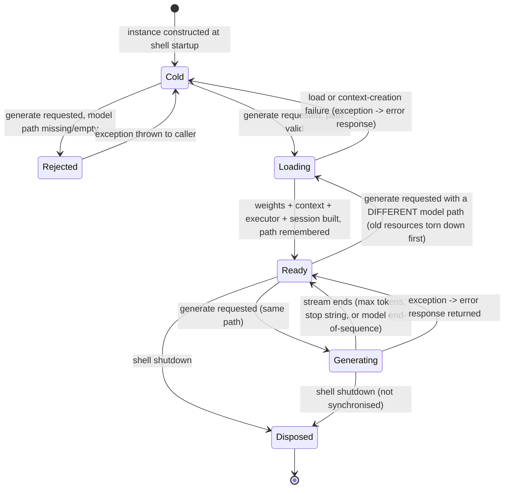

# Feature: Local LLM Inference (LLamaSharp / GGUF)

> Source repo: `/mnt/g/3RD-Party/reversing/subject/chatdbg` @ `d8c18f61d6bb73666ed97cd4885e877e35558485`
> Primary implementation file: `src/Xcaciv.ChatDbg.Core/Services/LLamaSharpService.cs` (697 lines)
> All `file:line` evidence below is against that commit.

---

## Purpose

**Problem solved.** ChatDbg is a terminal chat shell for debugging assistance that can talk to three interchangeable AI back ends. This feature is the third one: it lets the user run an **open-weights model entirely on their own machine from a single quantized model file (GGUF format)** — no network, no API key, no cloud account, no per-token cost, and no data leaving the machine. It is the only provider that works offline and the only one where the "model" is a file path rather than a remote model name.

**Secondary purpose — introspection.** The local back end is also the vehicle for *token-level introspection*: because inference happens in-process, the feature attempts to expose per-token probabilities and the top-K alternative tokens the model considered at each generation step, plus a running snapshot of context-window utilisation and a verbatim capture of the native inference engine's own log stream. Cloud providers can only return what their API chooses to disclose; the local engine is, in principle, fully inspectable. (`src/Xcaciv.ChatDbg.Core/Services/LLamaSharpService.cs:12-14`)

**Actors / roles.**
- **Developer/debugger end-user** — the only human actor. Selects the `llama` provider, points `modelId` at a GGUF file, tunes hardware/acceleration knobs, and then chats normally. There are no roles, no auth, no multi-tenancy.
- **Shell host (calling feature)** — the plain-console REPL (`src/ChatDbg/ChatShell.cs:33`) and the Terminal.Gui shell (`src/ChatDbg.Shell.Gui/Program.cs:26`) each construct exactly one instance of this back end at startup and keep it for process lifetime.
- **Native inference engine** — an out-of-repo native library (llama.cpp) loaded into the process; it is the thing that actually executes the model and it emits its own log lines back into this feature.

---

## Behavior

The feature is a single long-lived object ("the local-inference service") that implements the shared AI-provider contract. Everything below is observable behavior.

### B1. Report provider identity
- **Input:** none.
- **Output:** the constant string `"Local LLM (LLamaSharp)"`. (`LLamaSharpService.cs:36`)
- Used by shells in error messages, e.g. `"<name> service is not configured..."` (`src/ChatDbg/ChatShell.cs:358`).

### B2. Report configuration validity
- **Input:** the settings object.
- **Output:** boolean.
- **Rule:** `true` **iff** the model-identifier setting is non-empty **and** a file exists at that exact path. (`LLamaSharpService.cs:41-50`)
- **No side effects.** No file is opened, no header is validated, no extension is checked, no size check. A zero-byte file passes. (Test: `src/Xcaciv.ChatDbg.Core.Tests/Services/LLamaSharpServiceTests.cs:21-40` writes an empty file with a random name and asserts `true`.)

### B3. Generate a reply (plain text)
- **Input:** the conversation history object + settings.
- **Output:** the generated text.
- **Behavior:** delegates entirely to B4, then returns B4's text; if that text is null, returns the literal `"Error: Response text expected, none received"`. (`LLamaSharpService.cs:55-59`)

### B4. Generate a reply with token introspection
This is the single real entry point. (`LLamaSharpService.cs:64-115`)

Ordered steps:
1. **Validate.** Run B2. If it fails, **throw** immediately with message `"LLamaSharp service is not properly configured. Please set ModelId to a valid GGUF model file path."` This throw happens *before* the try/catch, so it propagates to the caller rather than being converted to an error response. (`:66-69`; test `LLamaSharpServiceTests.cs:42-47`)
2. **Serialize.** Acquire a **process-wide (static) generation lock**, so only one generation runs at a time across every instance of this service in the process. (`:23-24`, `:72`)
3. **Arm native log capture** (idempotent) and write an INFO log line `"Starting message generation"`. (`:77-78`)
4. **Ensure the model is loaded** (workflow W1 below). (`:81`)
5. If either the weights handle or the context handle is still absent, throw `"Failed to initialize the LLamaSharp model."` (`:83-86`)
6. **Route** on settings: if *log-probabilities enabled* **and** *top-K > 0*, log `"Using sampling pipeline with token probability capture mode"` and take the introspection path (B5); otherwise log `"Using standard ChatSession mode"` and take the fast path (B6). (`:89-96`)
7. **Any exception** raised inside steps 3-6 is swallowed: it is logged at ERROR (`"Error in LLamaSharpService: <full exception>"`), the log buffer is force-flushed to disk, the exception text is also written to the platform debug channel, and a *successful-looking* response object is returned whose text is `"Error running local LLM: <exception message>"`, whose probability list is null, whose elapsed time is `0`, and whose error field carries the raw exception message. (`:98-110`)
8. **Release** the generation lock in a `finally`. (`:111-114`)

### B5. Introspection generation path
(`LLamaSharpService.cs:121-264`)
- Requires executor, chat session and context to exist, else throws `"ChatSession not initialized"`. (`:125-128`)
- **Selects the prompt:** scans the supplied conversation history for the **last message whose role equals "user"** (case-insensitive) and uses **only its content**. Everything else in the supplied history — system messages, prior assistant turns, prior user turns — is ignored. If no user message exists, throws `"No user message found in chat history."` (`:131-136`)
- Logs `"Processing user message with <N> characters"`. (`:138`)
- Builds inference parameters: max new tokens, two hard-coded stop strings, temperature, and top-K (see rules R6-R9). (`:141-150`)
- Starts a stopwatch; **clears the accumulated per-token analysis list**. (`:153-156`)
- **Streams** the reply from the chat session one text piece at a time. For each piece: append to the response buffer, increment the token counter, create a probability record, perform the deferred alternative-attachment dance (rule R12), then attempt to read the current logits and compute a top-K candidate list for the *next* position, then build and store a full per-token analysis record, then write a DEBUG log line `"Token <n>: '<piece>'"`. (`:170-232`)
- After the stream ends, any still-pending candidate list is attached to the final token record if that record has no alternatives yet. (`:235-246`)
- Logs `"Generation complete in <ms>ms, generated <n> tokens"`, flushes the log buffer to file, and returns a response containing the concatenated text, the per-token probability list, and elapsed seconds. (`:249-263`)

### B6. Fast generation path (no introspection)
(`LLamaSharpService.cs:353-414`)
- Identical prompt selection, identical validation errors, **identical inference parameters (including the same top-K)**.
- Streams and concatenates text only — no per-token records, no logits reads, no per-token DEBUG lines.
- Returns a response whose probability list is explicitly **null**. (`:410`)
- The accumulated analysis list is **not** cleared on this path, so stale analyses from an earlier introspection run survive. (contrast `:156`)

### B7. Compute top-K alternatives from current logits
(`LLamaSharpService.cs:419-493`)
- Attempts, **by looking up an operation by name at run time** (not by a compile-time contract), to find a zero-argument current-logits accessor named `GetLogits` on the live inference context and invoke it. If no operation with that name and shape exists → returns an empty list. (`LLamaSharpService.cs:423-427`)
- Accepts the returned value as an array of 32-bit floats, an array of doubles, or any enumerable of numbers (each element converted to double); anything else → empty list. (`:429-452`)
- Empty logit vector → empty list. (`:454-457`)
- Takes the `count = min(max(1, topK), vocabularySize)` highest-scoring vocabulary indices, in descending score order. (`:459-463`)
- Applies a **numerically-stabilised softmax over only those K selected logits** (subtract the max of the selected set, exponentiate, divide by the sum of the selected set; if that sum is ≤ 0 it is forced to 1). (`:465-468`)
- Emits one candidate per index: token text + natural-log of the *renormalised-within-K* probability. (`:470-487`)
- **Any** exception anywhere in this routine is swallowed and an empty list is returned. (`:489-492`)

### B8. Resolve a vocabulary id to text
(`LLamaSharpService.cs:495-511`)
- Attempts a **late-bound, name-only** call to a single-argument detokenise operation named `TokenToString` on the context, passing the vocabulary index. If it succeeds and yields non-empty text, that text is used. (`LLamaSharpService.cs:495-505`)
- On any failure or empty result, returns the literal placeholder `"id:<numericId>"`.

### B9. Read back the last generation's per-token analyses
- Returns a **defensive copy** of the accumulated analysis list. (`LLamaSharpService.cs:628`)
- **Never called anywhere in the product.** (verified: no callers outside the defining file)

### B10. Export per-token analyses to a JSON file
- Serialises the accumulated analysis list as **indented** JSON and writes it to the caller-supplied path, overwriting. Logs INFO `"Token analyses saved to <path>"` on success. Any failure is caught and logged at ERROR (`"Failed to save token analyses: <exception>"`) — **no exception escapes, no signal of failure reaches the caller**. (`LLamaSharpService.cs:633-648`)
- **Never called anywhere in the product.**

### B11. Export captured system logs to a file
- Delegates to the log capture component, which creates the target directory if needed, writes the whole in-memory buffer (overwriting the target), then appends an INFO line `"Logs saved to <path>"` to the buffer. Failures are swallowed and reported only on the debug channel. (`LLamaSharpService.cs:653-656`; `src/Xcaciv.ChatDbg.Core/Services/TokenInspection/LLamaSharpLogConfig.cs:170-191`)
- **Never called anywhere in the product.**

### B12. Teardown
(`LLamaSharpService.cs:661-696`)
- Drops the chat-session and executor references, disposes the inference context, disposes the model weights, disposes the log capture component (which flushes the buffer to the daily log file), and disposes the **static** generation lock. Sets the disposed flag; repeat calls are no-ops.
- A finalizer runs the non-disposing branch, which only nulls the context and weights references (no native release).

---

## Business rules & edge cases

| # | Rule | Evidence |
|---|------|----------|
| R1 | The model identifier for this provider **is a filesystem path**, not a model name. Configuration is valid iff the path is non-empty and the file exists. Content is never validated. | `LLamaSharpService.cs:41-50` |
| R2 | Configuration failure at generation time raises an exception (not an error response) with the exact text `"LLamaSharp service is not properly configured. Please set ModelId to a valid GGUF model file path."` | `LLamaSharpService.cs:66-69`; test `LLamaSharpServiceTests.cs:42-47` |
| R3 | **At most one generation at a time, process-wide.** The generation lock is a `static` binary semaphore, shared by every instance. Callers block (there is no timeout and no cancellation). | `LLamaSharpService.cs:24,72,113` |
| R4 | **At most one model-load at a time, process-wide.** The model-load lock is a separate `static` binary semaphore. It is acquired for the whole of the load/reload decision. | `LLamaSharpService.cs:23,518,621` |
| R5 | **Model reload is triggered only when the model *path* changes** (or when weights/context are missing). Changing context size, GPU layer count, threads, batch size, temperature or system prompt does **not** trigger a reload; those values are re-read only on the next genuine reload. | `LLamaSharpService.cs:525` |
| R6 | **Max new tokens** = the configured `maxTokens` when it is > 0; otherwise the magic fallback **512**. Applies identically on both generation paths. (Default configured value is 1000, and the `/set` validator clamps to 1..8192, so 512 is only reachable by hand-editing the settings file to 0 or a negative number.) | `LLamaSharpService.cs:143`, `:373`; `Models/ChatSettings.cs:17`; `Commands/SetCommand.cs:79-86` |
| R7 | **Stop sequences are hard-coded** to exactly two strings: `"User:"` and `"USER:"`. They are not configurable and are applied on both paths. Generation halts when the model emits either. | `LLamaSharpService.cs:144`, `:374` |
| R8 | **Sampling temperature** = the configured `temperature`, narrowed from a double to a 32-bit float. Range enforced upstream: 0.0–2.0 inclusive. | `LLamaSharpService.cs:147`, `:377`; `Commands/SetCommand.cs:70-77` |
| R9 | **Sampling top-K = the `logProbabilitiesTopK` setting, on BOTH paths.** The introspection setting therefore silently constrains the actual sampler even when introspection is switched off. Default 5, validated range 1–20. Consequence: local generation is always top-5-limited out of the box. | `LLamaSharpService.cs:148`, `:378`; `Models/ChatSettings.cs:37`; `Commands/LogProbsCommand.cs:57-62`; `Commands/SetCommand.cs:173-181` |
| R10 | **Routing rule:** the introspection path is taken iff `enableLogProbabilities == true` **AND** `logProbabilitiesTopK > 0`. Any other combination takes the fast path. | `LLamaSharpService.cs:89` |
| R11 | **Only the last user-role message is sent to the model.** Role comparison is case-insensitive ordinal. Conversation continuity depends entirely on the native chat session's own retained state, which survives between calls because the session object is cached alongside the model. Absence of any user message → throw `"No user message found in chat history."` | `LLamaSharpService.cs:131-136`, `:361-366` |
| R12 | **Deferred/off-by-one alternative attachment.** For each streamed piece a probability record is created with log-prob **0** and an empty alternatives list. The candidate list computed *after the previous* piece is then attached to the *previous* record. Because that list was read from the logits **after** the previous token was emitted, the alternatives stored on token *n* are actually the model's distribution for token *n+1*. | `LLamaSharpService.cs:166-206`, `:208-213` |
| R13 | **Main-token log-prob derivation.** When attaching candidates to the previous record: if a candidate's text string equals the record's text, that candidate's log-prob becomes the record's log-prob; otherwise, if the candidate list is non-empty, the **maximum** candidate log-prob is used; if the candidate list is empty, the log-prob remains **0**, which the display layer renders as probability `e^0 = 1.0 = 100 %`. | `LLamaSharpService.cs:192-202`; `Models/TokenLogProbabilities.cs:89` |
| R14 | **Trailing token fix-up.** After the stream ends, if a pending candidate list exists and the final record still has no alternatives, that list is attached; and if the final record's log-prob is still exactly 0, it is set to the maximum candidate log-prob. | `LLamaSharpService.cs:235-246` |
| R15 | **Logit-read failures never abort generation.** A thrown exception around the logits read is logged at WARN as `"Failed to compute candidates from logits: <message>"` and the pending list is set to null. Failures *inside* the top-K routine are swallowed silently and yield an empty list (no WARN). | `LLamaSharpService.cs:209-219`, `:489-492` |
| R16 | **Softmax is renormalised over the K survivors only**, not over the full vocabulary. Probabilities within a returned candidate list therefore always sum to 1.0 regardless of how peaked the true distribution is. Numerical stabilisation subtracts the max selected logit; a non-positive exponent sum is forced to 1. | `LLamaSharpService.cs:459-475` |
| R17 | **K is clamped:** `count = min(max(1, requestedTopK), vocabularySize)`. A requested K of 0 or negative still yields 1 candidate *if this routine is reached* — but R10 means K ≤ 0 never reaches it. | `LLamaSharpService.cs:459` |
| R18 | **Unresolvable token text falls back to `"id:<n>"`.** | `LLamaSharpService.cs:510` |
| R19 | **Probability is estimated from temperature, not measured**, for the per-step analysis records. Step function: `temp ≤ 0.1 → 0.95`; `≤ 0.5 → 0.85`; `≤ 0.7 → 0.75`; `≤ 1.0 → 0.60`; `≤ 1.5 → 0.50`; else `0.40`. The stored log-prob is the natural log of that estimate. | `LLamaSharpService.cs:310-324`, `:275`, `:283` |
| R20 | **Analysis-record field conventions:** `Step` and `PromptOffset` are both `tokenCounter - 1` (0-based); `TokenId` is always the sentinel **-1** (the real vocabulary id is never known on this path); `SystemDebugInfo` is the literal `"Generated via sampling pipeline at step <1-based step>, temperature=<temp to 2 dp>."` | `LLamaSharpService.cs:279-286` |
| R21 | **Model-state snapshot values are synthetic:** `TotalTokensProcessed` and `ContextTokenCount` are both set to the 1-based generated-token counter (they do **not** include prompt tokens); `ContextSize` = configured context size when > 0 else the magic **4096**; `RemainingContext` = that context size minus the generated-token counter; `Timestamp` = local wall-clock time. Debug map always carries exactly three entries: `Temperature` (2 dp), `TopK`, and `Mode` = `"SamplingPipeline"`. | `LLamaSharpService.cs:287-300` |
| R22 | **Candidate records written into analyses carry only text and log-prob**; their `TokenId`, `Probability` and raw `Logit` fields are left at type defaults (0). | `LLamaSharpService.cs:225-228` vs. `Services/TokenInspection/TokenAnalysis.cs:68-99` |
| R23 | **Context size at load** = configured value when > 0, else the magic **2048** — a *different* fallback from the 4096 used in the state snapshot (R21). Validated range upstream 512–32768, default 4096. | `LLamaSharpService.cs:550` vs `:291`; `Models/ChatSettings.cs:54`; `Commands/SetCommand.cs:97-104` |
| R24 | **GPU offload** = the configured GPU-layer count, passed straight through with no clamping at this layer. Validated range upstream 0–100; 0 means CPU-only. | `LLamaSharpService.cs:551`; `Commands/SetCommand.cs:106-114` |
| R25 | **Memory strategy is fixed:** memory-mapping of the model file is always **on**, memory-locking (pinning) is always **off**. Not configurable. | `LLamaSharpService.cs:552-553` |
| R26 | **Three configured knobs are accepted, validated, persisted, displayed — and never applied to inference:** GPU device selection (free-form string, e.g. `"0"` or `"0,1"`), thread count (0–64, 0 = system default), batch size (1–2048, default 512). | Settings exist `Models/ChatSettings.cs:60,63,66`; validated `Commands/SetCommand.cs:116-136`; displayed `Commands/SetCommand.cs:426-429`, `src/ChatDbg/ChatShell.cs:218-224`; **absent** from `LLamaSharpService.cs:548-554` |
| R27 | **The system prompt is bound once, at model-load time**, as a system-role message seeded into a fresh chat session. Changing the system prompt afterwards has no effect until a model reload (R5) — i.e. until the model *path* changes or the process restarts. | `LLamaSharpService.cs:608-610` |
| R28 | **Model file must exist at load time too** — re-checked inside the loader; failure raises a not-found error with text `"Model file not found: <path>"`. | `LLamaSharpService.cs:539-542` |
| R29 | **Model size is logged in whole megabytes** using integer division by `1024*1024` (truncating). Message: `"Model file size: <N> MB"`. | `LLamaSharpService.cs:544-545` |
| R30 | **Load progress is echoed to standard output** (not just the log buffer): `"Loading model with context size: <n>, GPU layers: <m>"`. This is the only place this feature writes directly to the console. | `LLamaSharpService.cs:557` |
| R31 | **Weight loading and context creation both run on a worker thread** (off the calling thread) and are awaited. | `LLamaSharpService.cs:563`, `:595` |
| R32 | **Teardown ordering on reload is strict:** chat session → executor → context (disposed) → weights (disposed), each reference nulled, *before* the new load begins. | `LLamaSharpService.cs:528-533` |
| R33 | **Elapsed time is reported in seconds** as milliseconds ÷ 1000.0; on the error path it is exactly **0**. | `LLamaSharpService.cs:261`, `:411`, `:107` |
| R34 | **Errors become assistant text.** Because the catch block returns a normal response whose text is `"Error running local LLM: <message>"`, the calling shell appends that string to the chat history as an assistant turn and prints it as if the model had said it. | `LLamaSharpService.cs:103-109`; `src/ChatDbg/ChatShell.cs:377-380` |
| R35 | **Model-weight load failure is wrapped in a fixed diagnostic message** listing four numbered candidate causes verbatim: (1) incompatible model format, (2) missing/incompatible native libraries, (3) insufficient memory, (4) runtime/library version incompatibility — followed by `"Original error: <message>"`. | `LLamaSharpService.cs:572-579` |
| R36 | **Context-creation failure is wrapped** as `"Failed to create context: <message>"`. | `LLamaSharpService.cs:602` |
| R37 | **Log capture is armed lazily and exactly once per service instance**; repeat arming is a no-op. Arming creates the log directory if file logging is enabled, registers a callback with the native engine, and appends `"LLamaSharp logging configured successfully"`. | `LLamaSharpLogConfig.cs:67-114`; test `LLamaSharpLogConfigTests.cs:139-153` |
| R38 | **Log line format is fixed:** `[yyyy-MM-dd HH:mm:ss.fff] [LEVEL] message`. Native-origin lines have their trailing whitespace trimmed; application-origin lines do not. | `LLamaSharpLogConfig.cs:83`, `:121` |
| R39 | **Buffer auto-flush threshold: 10 000 characters.** Checked only on *native* log callbacks (not on application log calls) and only when file logging is enabled. | `LLamaSharpLogConfig.cs:40`, `:90-93`; test asserts default `10000` at `LLamaSharpLogConfigTests.cs:20` |
| R40 | **Daily log file naming:** `llamasharp_<yyyyMMdd>.log`, **appended** to, inside the log directory; the in-memory buffer is cleared after a successful append. Default directory is the per-user roaming application-data folder + `ChatDbg` + `Logs`. | `LLamaSharpLogConfig.cs:149-158`, `:20` |
| R41 | **Log sink defaults:** file logging ON, debug-channel output ON, console output OFF. | `LLamaSharpLogConfig.cs:25-35`; test `LLamaSharpLogConfigTests.cs:10-22` |
| R42 | **Log buffer access is mutex-guarded**; the native callback can fire from arbitrary threads. | `LLamaSharpLogConfig.cs:13,46-51,85-94,124-127,152-159,180-183` |
| R43 | **Disposal of the log component flushes once**, and is idempotent. | `LLamaSharpLogConfig.cs:193-200`; test `LLamaSharpLogConfigTests.cs:118-137` |
| R44 | **Analyses are cleared only on the introspection path**, at the start of each generation — so a fast-path generation leaves the previous run's analyses readable. | `LLamaSharpService.cs:156` (no counterpart in `:353-414`) |
| R45 | JSON export of analyses is **pretty-printed (indented)**. | `LLamaSharpService.cs:637-640` |
| R46 | **An empty user message is indistinguishable from a missing one.** The prompt selection coalesces a missing last-user message to the empty string and then rejects *empty or null* — so a user turn whose content is `""` raises the same `"No user message found in chat history."` error as a history with no user turn at all. | `LLamaSharpService.cs:131-136`, `:361-366` |
| R47 | **The fast path's readiness guard is weaker than the introspection path's.** The introspection path requires executor **and** session **and** context; the fast path checks only executor **and** session. A state with a live session but a null context reaches generation on the fast path and is only caught by the outer guard at B4 step 5. | `LLamaSharpService.cs:125-128` vs `:355-358`, `:83-86` |
| R48 | **The default model identifier is `"gpt-4"`** — a cloud model name, not a path. A user who switches provider to `llama` without also setting a model path therefore fails the configuration check, because no file named `gpt-4` exists. | `Models/ChatSettings.cs:11`; `LLamaSharpService.cs:41-50` |
| R49 | **The default provider is `"azure"`**, so this feature is never active until the user explicitly selects it. | `Models/ChatSettings.cs:8`; `Commands/SetCommand.cs:46-52` |
| R50 | **The system prompt seeded into the session has a hard-coded default text:** `"You are ChatDBG, a helpful debugging assistant. Help users analyze code, debug issues, and understand programming concepts."` It is **not persisted** with the rest of the settings (only the prompt's *name* is), so on every process start the session is seeded with either this literal or whatever the named prompt store resolves to. | `Models/ChatSettings.cs:29-30`; `LLamaSharpService.cs:608-610` |
| R51 | **The displayed "probability" of a token is the exponential of its log-prob**, computed on read and never serialised. Its own documentation calls it a percentage, its implementation returns a 0–1 fraction, and the unit test covering it expects a percentage: for a log-prob of `ln(0.25)` the accessor yields `0.25` while the test asserts `25`. At most two of the three can be right. | `Models/TokenLogProbabilities.cs:22-26`; test `Models/TokenLogProbabilityTests.cs:9-18` |
| R52 | **Analysis-record log-prob and probability are internally consistent but synthetic:** `logprob = ln(probability)` where probability is the temperature estimate (R19). The *display* record's log-prob (R13) is derived from a completely different source. The two never agree except by accident. | `LLamaSharpService.cs:281-283` vs `:192-202` |
| R53 | **Analysis records are serialised with fixed lowercase-camel keys** that form the export contract: `step`, `tokenText`, `tokenId`, `probability`, `logprob`, `promptOffset`, `topCandidates`, `systemDebugInfo`, `modelState`; candidates use `text`, `tokenId`, `probability`, `logprob`, `logit`; the state snapshot uses `totalTokensProcessed`, `contextTokenCount`, `contextSize`, `remainingContext`, `timestamp`, `debugInfo`. Round-tripping through JSON preserves all of them. | `Services/TokenInspection/TokenAnalysis.cs:13,19,25,31,37,43,49,55,61,73,79,85,91,97,109,115,121,127,133,139`; test `TokenAnalysisTests.cs:133-170` |
| R54 | **Display probability records serialise as `token`, `logprob`, `top_alternatives`** (snake_case for the nested list, unlike every other record in this feature), and the derived probability is explicitly excluded from serialisation. | `Models/TokenLogProbabilities.cs:13,19,25,31` |
| R55 | **Candidate records nested inside a display probability record carry a null alternatives list**, so the structure is exactly two levels deep and never recurses. | `LLamaSharpService.cs:481-486` |
| R56 | **The native log hook is registered process-globally, not per instance.** The arm-once flag is per instance, but the registration it performs replaces one global callback. A second service instance arming itself steals the hook from the first; the first instance's buffer then stops receiving native lines. | `LLamaSharpLogConfig.cs:15,69-70,81-105` |
| R57 | **The log component's shutdown does not unregister the native hook and does not gate later use.** After shutdown the callback closure still holds the disposed component and keeps appending to its buffer; explicit log and flush calls also still work, because neither checks the disposed flag. Only a second shutdown is a no-op. | `LLamaSharpLogConfig.cs:119-137`, `:142-165`, `:193-200` |
| R58 | **Log-buffer flush is only triggered by native lines, never by application lines.** The threshold check lives inside the native callback; the application logging routine appends without ever checking the buffer size. A run that produces many DEBUG token lines but no native output grows the buffer unboundedly until an explicit flush. | `LLamaSharpLogConfig.cs:90-93` vs `:123-126` |
| R59 | **Buffer read, clear, save and flush are all guarded by the same lock**, and a save-to-path writes the buffer **without** clearing it (unlike a flush, which clears). A save therefore duplicates content that a later flush will also write to the daily file. | `LLamaSharpLogConfig.cs:45-51`, `:56-62`, `:152-158` (clears) vs `:180-183` (does not clear) |
| R60 | **Writing the buffer to a caller-chosen path appends a confirmation line to the buffer afterwards**, so the saved file never contains its own "Logs saved to …" line but the next save/flush does. | `LLamaSharpLogConfig.cs:180-185` |
| R61 | **Only the generation lock is released at teardown; the model-load lock is never released or disposed.** Both are process-wide, but shutdown touches only one of them. | `LLamaSharpService.cs:23-24`, `:681` |
| R62 | **Settings live in a JSON file at `<user-profile>/.ChatDbg/settings.json`**, camelCase-keyed and indented; if the user-profile folder is unavailable or blank the whole path falls back to the system temp directory. | `Services/SettingsService.cs:11-38` |
| R63 | **Every llama knob is persisted immediately on change** — the settings command saves after each successful assignment, as does every `/logprobs` subcommand. | `Commands/SetCommand.cs:283-287`; `Commands/LogProbsCommand.cs:38,48,63,68,73,78,83,98` |
| R64 | **The introspection top-K has two independent setters with the same 1–20 range** (`/set logProbabilitiesTopK`, alias `/set logtopk`; and `/logprobs top <n>`), and a *third*, separate 1–20 knob for how many alternatives the grid view renders. | `Commands/SetCommand.cs:173-181`; `Commands/LogProbsCommand.cs:51-64`, `:86-99` |
| R65 | **Clearing the conversation does not reset the model's memory.** The clear operation empties the managed message list only; the native chat session created at model load is untouched and keeps every prior turn. The same is true of importing a history. | `Commands/ClearCommand.cs:18-23`; `Models/ChatHistory.cs:55`; `Commands/ImportCommand.cs:43`; no session reset anywhere in `LLamaSharpService.cs` |
| R66 | **When the reply text is null the shell substitutes its own string, not the service's.** The service's plain-text entry point substitutes `"Error: Response text expected, none received"`; both shells substitute the differently-spelled `"Error: Response text expected, none recieved."` on the introspection path. | `LLamaSharpService.cs:58`; `src/ChatDbg/ChatShell.cs:377`; `src/ChatDbg.Shell.Gui/ChatShell.cs:330` |
| R67 | **Before each turn the console shell announces the requested top-K** with `"Log probabilities enabled - requesting with top-k=<n>"`. | `src/ChatDbg/ChatShell.cs:373` |
| R68 | **On startup the console shell prints the llama block only when that provider is selected**, listing context size, GPU layers (with `" (CPU-only)"` appended when 0), GPU device (omitted entirely when unset), threads (`"default"` when 0) and batch size. | `src/ChatDbg/ChatShell.cs:210-226` |
| R69 | **The three diagnostic commands are placeholders that a unit test enshrines.** Each returns a success result whose body begins `"Note: This command requires LLamaSharp provider integration."`; a shipped test asserts that this placeholder message is returned. | `Commands/ShowTokenAnalysisCommand.cs:46-48`, `Commands/ExportTokenAnalysisCommand.cs:23`, `Commands/ExportLogsCommand.cs:23`; test `Commands/ShowTokenAnalysisCommandTests.cs:9-18` |
| R70 | **The analysis-display placeholder parses and echoes its options** (`--top N` default **3**, `--state`, `--range START END` defaults `0` and `-1`) even though it has no data to apply them to. Its default top-N (3) does not match the settings default top-K (5). | `Commands/ShowTokenAnalysisCommand.cs:20-46`; `Models/ChatSettings.cs:37` |
| R71 | **The introspection diagnostics command is written for the cloud providers only.** Its output talks about API versions, model deployments and Azure endpoints, and recommends cloud model names; nothing in it applies to a local model file, yet it is the command the enable message tells users to run when probabilities do not appear. | `Commands/LogProbsCommand.cs:42`, `:159-207` |
| R73 | **The settings command's own discoverability message omits every llama knob.** Setting an unrecognised key answers with `"Unknown setting: <key>. Valid keys: provider, modelId, temperature, maxTokens, azureEndpoint, awsRegion, systemPrompt, enableLogProbabilities, logProbabilitiesTopK, useWindowsCredentialManager, enablewincred, wincred, migrate"` — which lists none of `llamaContextSize`, `llamaGpuLayers`, `llamaGpuDevice`, `llamaThreads`, `llamaBatchSize` even though all five are accepted. | `Commands/SetCommand.cs:279-280` vs `:97-136` |
| R72 | **Enabling introspection points the user at a demonstration command** (`/demologprobs`) and warns that "This feature requires a compatible model and API version" — wording that has no meaning for a local file-backed model. | `Commands/LogProbsCommand.cs:39-44` |

### Magic numbers, collected

| Value | Meaning | Where |
|---|---|---|
| `512` | Fallback max-new-tokens when configured value ≤ 0 | `LLamaSharpService.cs:143,373` |
| `2048` | Fallback context size at model load when configured value ≤ 0 | `LLamaSharpService.cs:550` |
| `4096` | Fallback context size used in the per-step state snapshot when configured value ≤ 0 (inconsistent with 2048) | `LLamaSharpService.cs:291-292` |
| `4096` | Default configured context size | `Models/ChatSettings.cs:54` |
| `512` | Default configured batch size (never applied) | `Models/ChatSettings.cs:66` |
| `0` | Default GPU layer count = CPU-only | `Models/ChatSettings.cs:57` |
| `0` | Thread count sentinel = "system default" (never applied) | `Models/ChatSettings.cs:63` |
| `5` | Default top-K (doubles as the sampler's top-K, R9) | `Models/ChatSettings.cs:37` |
| `1000` | Default max tokens | `Models/ChatSettings.cs:17` |
| `0.7` | Default temperature | `Models/ChatSettings.cs:14` |
| `-1` | Sentinel "unknown vocabulary id" in analysis records | `LLamaSharpService.cs:281` |
| `0.95 / 0.85 / 0.75 / 0.60 / 0.50 / 0.40` | Temperature→confidence estimation step function outputs | `LLamaSharpService.cs:312-323` |
| `0.1 / 0.5 / 0.7 / 1.0 / 1.5` | Temperature breakpoints for that step function | `LLamaSharpService.cs:312-321` |
| `10000` | Log-buffer auto-flush threshold, in characters | `LLamaSharpLogConfig.cs:40` |
| `1024*1024` | Bytes→MB divisor for the model-size log line | `LLamaSharpService.cs:545` |
| `512..32768` | Valid context-size range (validator) | `Commands/SetCommand.cs:99` |
| `0..100` | Valid GPU-layer range (validator) | `Commands/SetCommand.cs:109` |
| `0..64` | Valid thread-count range (validator) | `Commands/SetCommand.cs:122` |
| `1..2048` | Valid batch-size range (validator) | `Commands/SetCommand.cs:131` |
| `1..20` | Valid top-K range (validators) | `Commands/SetCommand.cs:175`, `Commands/LogProbsCommand.cs:57` |
| `0..2` | Valid temperature range | `Commands/SetCommand.cs:72` |
| `1..8192` | Valid max-tokens range | `Commands/SetCommand.cs:81` |
| `1..20` | Valid grid-view max-alternatives range (a third, separate top-K knob, settable **only** via `/logprobs gridmaxalt`) | `Commands/LogProbsCommand.cs:92` |
| `5` | Default grid-view max alternatives | `Models/ChatSettings.cs:46` |
| `3` | Default `--top N` of the (placeholder) analysis-display command — does **not** match the settings default of 5 | `Commands/ShowTokenAnalysisCommand.cs:20` |
| `0` / `-1` | Default `--range START END` of that same placeholder | `Commands/ShowTokenAnalysisCommand.cs:22-23` |
| `512` | Context size used by the separate tokenisation loader (this feature's cached model is not reused) | `Services/TokenInspectionService.cs:32` |
| `2048` | Context size used by the separate probability-map loader | `Services/TokenInspectionService.cs:106` |
| `false` | Default introspection-enabled flag — the fast path is the out-of-the-box behavior | `Models/ChatSettings.cs:34` |
| `"azure"` | Default provider — this feature is inactive until explicitly selected | `Models/ChatSettings.cs:8` |
| `"gpt-4"` | Default model identifier — a cloud model name that can never satisfy this provider's file-exists check | `Models/ChatSettings.cs:11` |
| `0.25.0` | Pinned inference-binding and both backend package versions | `src/Xcaciv.ChatDbg.Core/Xcaciv.ChatDbg.Core.csproj:13-15` |

### File paths, directories and environment

| Path / name | Purpose | Where |
|---|---|---|
| `<user-profile>/.ChatDbg/settings.json` | Persisted settings, camelCase keys, indented; falls back to the system temp directory when the user-profile folder is unavailable or blank | `Services/SettingsService.cs:11-38` |
| `<roaming-app-data>/ChatDbg/Logs` (Windows: `%APPDATA%\ChatDbg\Logs`) | Default log directory, created on demand when file logging is on | `LLamaSharpLogConfig.cs:20`, `:75-78` |
| `llamasharp_<yyyyMMdd>.log` | Daily log file inside that directory, opened for **append**; never rotated by size and never pruned | `LLamaSharpLogConfig.cs:149-156` |
| `<settings.modelId>` | The GGUF weights file; the only input file this feature reads | `LLamaSharpService.cs:47-49`, `:539-545` |
| caller-supplied path | Analysis JSON export target (overwritten) and system-log export target (overwritten, parent directory created) | `LLamaSharpService.cs:641`; `LLamaSharpLogConfig.cs:174-182` |
| `runtimes/<rid>/native/` | Where the native engine binaries are expected after restore; docs name `win-x64/native/llama.dll` and `linux-x64/native/libllama.so` | `docs/LLamaSharp-Troubleshooting-0xC0000005.md:27-31` |
| **no environment variables** | This feature reads none. The only llama-adjacent name in the repo, `CHATDBG_TEST_MODEL`, appears solely inside a shell snippet in a troubleshooting doc and is read by nothing. | `docs/LLamaSharp-Troubleshooting-0xC0000005.md:293`; verified absent from `src/` |

### Exact user-visible strings

| String | When | Where |
|---|---|---|
| `Local LLM (LLamaSharp)` | provider display name, interpolated into shell messages | `LLamaSharpService.cs:36` |
| `LLamaSharp service is not properly configured. Please set ModelId to a valid GGUF model file path.` | thrown before any work when the model path is empty or missing | `LLamaSharpService.cs:68` |
| `Failed to initialize the LLamaSharp model.` | thrown when weights or context are still absent after load | `LLamaSharpService.cs:85` |
| `ChatSession not initialized` | thrown when a generation path starts without a session | `LLamaSharpService.cs:127`, `:357` |
| `No user message found in chat history.` | thrown when the last user message is missing **or empty** | `LLamaSharpService.cs:135`, `:365` |
| `Model file not found: <path>` | thrown inside the loader when the file vanished | `LLamaSharpService.cs:541` |
| `Failed to load GGUF model from '<path>'. This may be due to:\n1. Incompatible model format (ensure it's a valid GGUF file)\n2. Missing or incompatible native libraries (llama.cpp)\n3. Insufficient memory\n4. .NET 10 compatibility issues with LLamaSharp 0.25.0\nOriginal error: <message>` | weight-load failure | `LLamaSharpService.cs:572-579` |
| `Failed to create context: <message>` | context-creation failure | `LLamaSharpService.cs:602` |
| `Error running local LLM: <message>` | every swallowed exception, delivered as assistant text | `LLamaSharpService.cs:105` |
| `Error: Response text expected, none received` | plain-text entry point's null-text substitute | `LLamaSharpService.cs:58` |
| `Error: Response text expected, none recieved.` (sic) | both shells' null-text substitute on the introspection path | `src/ChatDbg/ChatShell.cs:377`; `src/ChatDbg.Shell.Gui/ChatShell.cs:330` |
| `Loading model with context size: <n>, GPU layers: <m>` | echoed to standard output on every genuine load | `LLamaSharpService.cs:557` |
| `LLama model file not found: <path>\nMake sure you've specified the correct path to a GGUF model file.` | `/set modelId` pre-check refusal while the llama provider is selected | `Commands/SetCommand.cs:63` |
| `Provider must be 'azure', 'bedrock', or 'llama'` | `/set provider` rejection | `Commands/SetCommand.cs:50` |
| `LlamaContextSize must be a number between 512 and 32768` | `/set llamaContextSize` rejection | `Commands/SetCommand.cs:101` |
| `LlamaGpuLayerCount must be a number between 0 and 100. 0 means CPU-only, higher numbers move more layers to GPU.` | `/set llamaGpuLayers` rejection | `Commands/SetCommand.cs:111` |
| `LlamaThreads must be a number between 0 and 64. 0 means system default.` | `/set llamaThreads` rejection | `Commands/SetCommand.cs:124` |
| `LlamaBatchSize must be a number between 1 and 2048` | `/set llamaBatchSize` rejection | `Commands/SetCommand.cs:133` |
| `LogProbabilitiesTopK must be a number between 1 and 20` / `Top-K value must be a number between 1 and 20` | the two top-K setters | `Commands/SetCommand.cs:178`; `Commands/LogProbsCommand.cs:59` |
| `Temperature must be a number between 0 and 2`, `MaxTokens must be a number between 1 and 8192` | shared sampling knobs | `Commands/SetCommand.cs:74`, `:83` |
| `Token probability analysis enabled.\nNote: This feature requires a compatible model and API version.\nIf you don't see probabilities after responses, try '/logprobs debug'.\nYou can see a demonstration with the '/demologprobs' command.` | `/logprobs enable` | `Commands/LogProbsCommand.cs:39-44` |
| `Error: Local LLM (LLamaSharp) service is not configured. Use environment variables or Windows Credential Manager to configure credentials securely.` + `   Type '/set' to see current configuration and setup instructions.` | shell pre-turn check | `src/ChatDbg/ChatShell.cs:358-359` |
| `Log probabilities enabled - requesting with top-k=<n>` | before each introspection turn | `src/ChatDbg/ChatShell.cs:373` |
| `\nNote: Log probabilities were requested but none were returned by the model.` + `This could be due to the model not supporting this feature or an API limitation.` | introspection requested, empty/null list returned — **the expected outcome for this provider** (see Quirks) | `src/ChatDbg/ChatShell.cs:389-390` |
| `Error getting AI response: <message>` | console shell's turn-level catch | `src/ChatDbg/ChatShell.cs:407` |
| `Note: This command requires LLamaSharp provider integration.…` | all three diagnostic placeholder commands | `Commands/ShowTokenAnalysisCommand.cs:46`, `Commands/ExportTokenAnalysisCommand.cs:23`, `Commands/ExportLogsCommand.cs:23` |
| `[yyyy-MM-dd HH:mm:ss.fff] [LEVEL] message` | every buffered log line; native-origin lines are right-trimmed, application lines are not | `LLamaSharpLogConfig.cs:83`, `:121` |

---

## Workflows & states

### Service lifecycle state machine

States held by one service instance: **Cold** (no weights, no context, no remembered path) → **Loading** → **Ready(path P)** → **Generating** → back to **Ready(P)** → **Disposed**.

### W1 — Ensure-model-loaded (`LLamaSharpService.cs:516-623`)

1. Acquire the **process-wide model-load lock**.
2. Read the model path from settings.
3. **Decide:** reload is needed iff weights are absent, OR context is absent, OR the remembered path ≠ the current path. If none holds → skip to step 12.
4. Tear down in order: drop session ref, drop executor ref, dispose + null context, dispose + null weights.
5. Log `"Loading LLamaSharp model from <path>"` (also to the debug channel).
6. Re-check file existence; on failure throw a not-found error.
7. Log the file size in whole MB.
8. Build load parameters: context size (R23), GPU layer count (R24), memory-map on, memory-lock off. Log them, and echo them to standard output.
9. Load weights on a worker thread. On failure: log ERROR, force-flush logs, rethrow the wrapped four-cause diagnostic.
10. Create the inference context on a worker thread. On failure: log ERROR, force-flush logs, throw the wrapped context error.
11. Construct the interactive executor over the context; construct a fresh chat history seeded with **one system-role message = the current system-prompt text**; construct the chat session over executor + history. Remember the path. Log `"LLamaSharp initialization complete"`.
12. Release the model-load lock (always, via `finally`).

### W2 — Introspection generation, per streamed piece (`LLamaSharpService.cs:170-232`)

1. Append the piece to the reply buffer; increment the counter.
2. Create a fresh probability record: text = the piece, log-prob = 0, alternatives = empty list.
3. If a pending candidate list and a previous record both exist: assign the pending list as the previous record's alternatives; then set the previous record's log-prob per R13.
4. Append the new record to the output list; make it "the previous record".
5. Read logits and compute a new pending candidate list (R15/R16); on a thrown error, log WARN and set the pending list to null.
6. Build a per-token analysis record for this step (R19-R21); if a pending list exists, project it into the record's candidate list (text + log-prob only).
7. Append the analysis; write the DEBUG token line.

### W3 — End-user flow (as wired into the shells)

1. `/set provider llama` — validator accepts only `azure`, `bedrock`, `llama`; settings are saved after every change. (`Commands/SetCommand.cs:46-53`, `:283-287`)
2. `/set modelId <path-to.gguf>` — for the `llama` provider the command **pre-checks file existence** and refuses with `"LLama model file not found: <path>\nMake sure you've specified the correct path to a GGUF model file."` (`Commands/SetCommand.cs:55-68`)
3. Optional hardware tuning: `/set llamaContextSize`, `/set llamaGpuLayers` (alias `llamaGpuLayerCount`), `/set llamaGpuDevice`, `/set llamaThreads`, `/set llamaBatchSize`. (`Commands/SetCommand.cs:97-136`) — or the GUI's "LLama Settings" tab, which clamps rather than rejects. (`src/ChatDbg.Shell.Gui/UI/SettingsDialog.cs:307-364`, `:467-498`)
4. Optional introspection: `/logprobs enable`, `/logprobs top <1-20>`. (`Commands/LogProbsCommand.cs:36-64`)
5. Type any non-`/` line → the shell appends it to history as a user turn, checks provider configuration, prints `"Thinking..."`, calls B4 or B3 depending on the introspection flag, appends the reply as an assistant turn, prints it, and renders the probability visualisation when a non-empty list came back; when introspection was requested but the list is empty/null it prints `"Note: Log probabilities were requested but none were returned by the model."` plus a second explanatory line. (`src/ChatDbg/ChatShell.cs:343-403`)
6. On shell exit, all provider services are disposed. (`src/ChatDbg/ChatShell.cs:698-713`)

### Non-existent states / timeouts

There are **no timeouts anywhere** in this feature, no cancellation, no retry, no back-off, and no progress reporting other than log lines. A generation runs until the model stops, the token budget is exhausted, or a stop string is hit.

---

## Data

### Entities owned by this feature

**Per-token analysis record** (`Services/TokenInspection/TokenAnalysis.cs:8-63`) — created once per streamed piece during introspection generation; accumulated in an in-memory list on the service; the list is cleared at the start of every introspection generation and never persisted automatically.

The serialised key names below **are** the export contract (R53) and are pinned per field; a test asserts they round-trip (`TokenAnalysisTests.cs:133-170`).

| Serialised key | Generic type | Default when unset | Constraints / notes |
|---|---|---|---|
| `step` | integer | 0 | 0-based generation index (R20) |
| `tokenText` | string | `""` | the emitted text piece |
| `tokenId` | integer | 0 | always **-1** on this path (unknown) |
| `probability` | floating point | 0 | temperature-derived estimate in {0.95, 0.85, 0.75, 0.60, 0.50, 0.40} |
| `logprob` | floating point | 0 | natural log of the above |
| `promptOffset` | integer | 0 | equals `step` (no real attribution computed) |
| `topCandidates` | list of candidate records | empty list | next-position candidates (R12); empty in practice (Q11) |
| `systemDebugInfo` | nullable string | null | fixed template sentence `Generated via sampling pipeline at step <n>, temperature=<t:F2>.` (R20) |
| `modelState` | nullable state snapshot | null | see below |

**Candidate record** (`TokenAnalysis.cs:68-99`) — value object inside an analysis record.

| Serialised key | Generic type | Notes |
|---|---|---|
| `text` | string | candidate token text, or `"id:<n>"` placeholder (R18) |
| `tokenId` | integer | **never populated** on this path (0) |
| `probability` | floating point | **never populated** on this path (0) |
| `logprob` | floating point | log of the within-K renormalised probability (R16) |
| `logit` | 32-bit float | **never populated** on this path (0) — despite the docs claiming raw logits are captured (D5) |

**Model-state snapshot** (`TokenAnalysis.cs:104-141`) — one per analysis record.

| Serialised key | Generic type | Notes |
|---|---|---|
| `totalTokensProcessed` | integer | 1-based generated-token count only |
| `contextTokenCount` | integer | same value (prompt not counted — Q7) |
| `contextSize` | integer | configured, else 4096 (**not** the 2048 the loader uses — Q27) |
| `remainingContext` | integer | `contextSize − generatedCount`; wrong by the whole prompt length (Q7) |
| `timestamp` | date-time | local wall-clock, no zone offset |
| `debugInfo` | string→string map | exactly three keys: `Temperature` (two decimals, ambient culture — Q46), `TopK`, `Mode` = `SamplingPipeline` |

**Log buffer & daily log file** (`LLamaSharpLogConfig.cs`) — an in-memory text buffer plus an append-only daily file. Created on first arming; appended on every application log call and every native callback; truncated (cleared) on each successful flush; flushed on threshold, on explicit flush, and on disposal.

### Entities consumed but owned elsewhere

- **Settings object** (`Models/ChatSettings.cs`) — read-only to this feature; it never writes settings.

  | Setting read | Default | Valid range (enforced upstream) | Used for |
  |---|---|---|---|
  | `modelId` | `"gpt-4"` (!) | must be an existing file path when provider is `llama` | the weights file (R1, R48) |
  | `temperature` | `0.7` | 0.0 – 2.0 | sampler temperature and the confidence estimate (R8, R19) |
  | `maxTokens` | `1000` | 1 – 8192 | max new tokens, falling back to 512 at ≤ 0 (R6) |
  | `systemPromptContent` | `"You are ChatDBG, a helpful debugging assistant. Help users analyze code, debug issues, and understand programming concepts."` — **not persisted**, only the prompt's *name* is | free text | seeded into the session once, at model load (R27, R50) |
  | `enableLogProbabilities` | `false` | boolean | half the routing rule (R10) |
  | `logProbabilitiesTopK` | `5` | 1 – 20 | the other half of the routing rule **and** the sampler's top-K on both paths (R9, Q25) |
  | `llamaContextSize` | `4096` | 512 – 32768 | context size at load, falling back to 2048 at ≤ 0 (R23) |
  | `llamaGpuLayerCount` | `0` (CPU-only) | 0 – 100 | GPU offload, passed through unclamped (R24) |

  Settings read by **nothing** in the inference path, despite being validated, persisted and displayed: `llamaGpuDevice` (default null), `llamaThreads` (default 0), `llamaBatchSize` (default 512) (R26, Q24).
- **Conversation history / message** (`Models/ChatHistory.cs`, `Models/ChatMessage.cs`) — read-only; only the last `user` message is used (R11).
- **Response object** (`Models/AIResponse.cs`) — produced: `text`, `logProbabilities`, `totalTime` (seconds), `errorMessage`.
- **Token log-probability record** (`Models/TokenLogProbabilities.cs:8-33`) — produced by this feature, consumed by the display layer. Serialised keys: `token` (string, default `""`), `logprob` (floating point, default 0), `top_alternatives` (nullable list of the same shape — note the snake_case key, unlike every other record here). A derived probability = `e^logprob` is computed on read and explicitly **excluded** from serialisation; its documentation calls it a percentage while it returns a 0–1 fraction (Q10). Nested candidate records always carry a null alternatives list, so the structure never recurses past two levels (R55).

### Native resources (lifecycle)

| Resource | Created | Reused | Released |
|---|---|---|---|
| Model weights | first generation with a given path | across all later generations with the same path | on path change, or on service disposal |
| Inference context | with the weights | same | same |
| Executor | with the context | same | dereferenced only (no explicit release) |
| Chat session (with its own retained conversation) | with the context, seeded with the system prompt | across generations — **this is where multi-turn memory actually lives** | dereferenced on reload/disposal |

---

## Interfaces

### Exposed to other features

- **Shared AI-provider contract** (owned by the *AI Provider Abstraction* feature). This feature supplies one implementation of it: "is configured?", "provider display name", "send message → text", "send message → text + per-token probabilities". It also participates in the disposable contract. (`src/Xcaciv.ChatDbg.Core/Services/IAIService.cs:5-11`) Semantics of each operation are B1–B4 above. The abstraction guarantees callers may swap this for the cloud providers without knowing which one they hold.
- **Provider key `"llama"`** — the string under which shells register and look up this implementation. (`src/ChatDbg/ChatShell.cs:33`, `src/ChatDbg.Shell.Gui/Program.cs:26`)
- **Three additional public operations that are *not* part of the shared contract and have no callers in the product:** read-back of the last generation's analyses (B9), JSON export of analyses (B10), export of captured system logs (B11). A reimplementation should treat these as an intended-but-unwired diagnostic surface. Three matching commands (`show-analysis`, `export-analysis`, `export-logs`) exist and describe this surface in their help text, but each is a stub returning a "requires LLamaSharp provider integration" notice, and **none is registered in either shell's command table**. (`Commands/ShowTokenAnalysisCommand.cs:46`, `Commands/ExportTokenAnalysisCommand.cs:48`, `Commands/ExportLogsCommand.cs:23`; absence of registration verified across `src/`)

### Consumed from other features

- **Settings & Configuration** — supplies the settings object described above, persisted as JSON at `<user-profile>/.ChatDbg/settings.json` with camelCase naming, and supplies validation/clamping of every llama-specific knob. (`Services/SettingsService.cs:11-38`; `Commands/SetCommand.cs:97-136`; `UI/SettingsDialog.cs:467-498`)
- **System prompt management** — supplies the system-prompt *text* that is seeded into the chat session at load time. (`LLamaSharpService.cs:609`)
- **Diagnostic Logging** — the log-capture component: arm-once native-callback registration, timestamped buffered logging with four sinks (buffer/file/debug/console), threshold flush, daily file naming, and save-to-path. This feature asks it to arm capture, to append a levelled line, to force a flush to the daily file, to write the whole buffer to a caller-chosen path, and finally to shut down. (`LLamaSharpService.cs:25,77,101,255,405,655,680`)
- **Token Inspection** (adjacent feature; consumer *and* independent loader) — the `/tokenize` and `/inspect` commands both require `provider == "llama"` and an existing model file, but they **load their own separate copies of the model** rather than reusing this service's cached one: tokenisation loads with context size **512**, probability-map generation loads with context size **2048**, both disposed immediately after use. A reimplementer must decide whether to keep this duplicate-load behavior or share one loaded model. (`Commands/TokenizeCommand.cs:35-61`, `Commands/InspectCommand.cs:35-77`, `Services/TokenInspectionService.cs:30-41`, `:104-118`)
- **The shells** — construct exactly one instance each, own its lifetime, decide which of B3/B4 to call based on the introspection flag, and render the results.

### Not part of the product

- **The API-investigation spike** (`tmp/LLamaSharpInvestigation.cs`) is a standalone scratch program that enumerates the binding's executor types and inference-parameter fields by reflection to answer "does this library expose log probabilities?". It declares its own program entry point and sits outside every project directory, so **it is compiled into nothing**; its actual model-loading section is commented out and its instruction is "Run this before implementing the feature to verify available APIs" (`tmp/LLamaSharpInvestigation.cs:10-16`, `:33-51`). A reimplementer should read it as a record of an unfinished feasibility check, not as behavior to port — and should note that the question it was written to answer is the one the shipped code still gets wrong (Quirk Q11).

---

## External technology

| Generic capability | Protocol/standard if any | What the source used | Notes for reimplementer |
|---|---|---|---|
| In-process large-language-model inference engine with a managed binding | none (in-process native library loaded via foreign-function interface) | LLamaSharp 0.25.0 (managed binding over llama.cpp), pinned in `src/Xcaciv.ChatDbg.Core/Xcaciv.ChatDbg.Core.csproj:13` | Needs: load weights from a file; create a sized inference context; an "interactive executor" + "chat session" abstraction that streams *text pieces* (not token ids) asynchronously; inference parameters carrying max-new-tokens, stop strings and a sampling pipeline (temperature + top-K); and — ideally — a way to read the current logits vector and detokenise an id. The source could not get the last two cleanly and fell back to reflection/late binding (see Confidence). Any equivalent (llama.cpp bindings, candle, ONNX Runtime GenAI, ctransformers, etc.) works if it offers those. |
| CPU inference backend (native binaries for the host platform) | — | `LLamaSharp.Backend.Cpu` 0.25.0 (`csproj:14`) | Ships platform-native shared libraries under a `runtimes/<rid>/native/` layout; the docs list `win-x64/native/llama.dll` and `linux-x64/native/libllama.so` as the artefacts to verify (`docs/LLamaSharp-Troubleshooting-0xC0000005.md:27-31`). On Windows these require the Microsoft C++ runtime redistributables (`:142-150`). |
| GPU inference backend | CUDA 12.x | `LLamaSharp.Backend.Cuda12` 0.25.0 (`csproj:15`) | Both CPU and CUDA backends are referenced unconditionally in the same project; the docs note that shipping both can itself cause native load failures and recommend keeping only one (`docs/LLamaSharp-Troubleshooting-0xC0000005.md:32-37`, `:171-175`). Requires matching NVIDIA driver/toolkit. **No other accelerator backend is referenced anywhere in the repo** — no Metal, no Vulkan, no ROCm/HIP, no OpenCL, no CPU-AVX-variant package (verified across all `.csproj` files). So "GPU acceleration" in this product means NVIDIA/CUDA-12 or nothing. |
| Quantised model weight file format | GGUF | user-supplied `.gguf` file, path given as `modelId`; docs point at Hugging Face GGUF models and name `llama-2-7b-chat.Q4_K_M.gguf` as a known-good test model | Older GGML-era formats are explicitly out of scope (`docs/LLamaSharp-Troubleshooting-0xC0000005.md:39-64`). Quantisation guidance in the docs: Q3_K_M smaller/lower quality, Q4_K_M balanced, Q5_K_M larger/better (`:79-83`). |
| Native-library log redirection hook | — | the binding's global native-log callback registration | Must accept a `(level, message)` pair from arbitrary native threads; the source registers it process-globally the first time a generation runs. (`LLamaSharpLogConfig.cs:81-105`) |
| Local filesystem | — | .NET file APIs | Reads: the model file (existence, size). Writes: daily log file `llamasharp_<yyyyMMdd>.log` (append) under `<roaming-app-data>/ChatDbg/Logs`, created on demand; optional analysis JSON and log exports to caller-chosen paths. |
| JSON serialisation | JSON | System.Text.Json with explicit property names, indented output for the analysis export | Property names are pinned per field (see Data tables) and must be preserved if the export format is a contract. |
| Managed runtime with reflection + late binding | — | .NET 10 (`net10.0`), SDK pinned to `10.0.100-rc.1.25451.107` in `global.json`, `AllowUnsafeBlocks` enabled in the core project | The logits read uses runtime reflection and the token-id→text call uses dynamic/late binding — both are hostile to ahead-of-time compilation and trimming, which the repo's `Compact` publish profile enables (`docs/compact-build.md`). |
| Rich terminal rendering of the probability tables (downstream) | ANSI | Spectre.Console 0.51.1 (`csproj:16`) | Belongs to the display layer, not this feature; listed because the probability records exist to feed it. |
| Sampling pipeline (token selection policy) | — | the binding's built-in default sampling pipeline, configured with only two fields: temperature and top-K (`LLamaSharpService.cs:145-149`, `:375-379`) | Everything else the sampler does — top-P, typical-P, min-P, repetition/frequency/presence penalties, seed, mirostat, grammar — is left at the library's defaults and is neither set, read, logged nor exposed. A reimplementation must choose and document these explicitly; they change output materially. |
| Chat prompt templating | model-specific chat template (e.g. Llama-2 `[INST]`, ChatML) | delegated entirely to the binding's chat-session abstraction (`LLamaSharpService.cs:169-172`, `:606-610`) | The source never sees the templated prompt, special tokens, or beginning-of-sequence handling; it hands over one system message at load and one user message per turn. A reimplementation must supply its own template and should expect different text for identical inputs. |
| Multi-turn conversation memory | — | the binding's chat session object, held alongside the loaded weights (`LLamaSharpService.cs:606-610`) | **This is where continuity actually lives.** The product's own message list is not sent. Any replacement must decide whether to keep hidden engine-side memory or send the full history each turn (see Open questions). |
| Detokenisation (vocabulary index → text) | — | a name-only, late-bound call resolved at run time; falls back to a `"id:<n>"` placeholder (`LLamaSharpService.cs:495-511`) | A reimplementation should use the engine's real detokenise entry point; the source's fallback means candidate lists can be rendered entirely as `id:1234` placeholders without any error. |
| Process-wide mutual exclusion | — | two process-wide binary semaphores (one for loading, one for generating) (`LLamaSharpService.cs:23-24`) | Needed because the native engine and the cached context are not safe for concurrent use. No timeout, no queue bound, no cancellation. |
| Structured settings persistence | JSON | a per-user JSON file with camelCase keys (`Services/SettingsService.cs:11-38`) | Owned by the Settings feature; listed because every knob this feature reads arrives through it. |

---

## Error handling

| Failure | Detection point | What the caller/user observes |
|---|---|---|
| No model path set, or file missing, at chat time | B2 inside B4 | An exception with `"LLamaSharp service is not properly configured. Please set ModelId to a valid GGUF model file path."` escapes the service. The console shell catches it at the chat-turn level and prints `"Error getting AI response: <message>"`; the GUI shows an error dialog `"Failed to get AI response: <message>"`. (`LLamaSharpService.cs:66-69`; `src/ChatDbg/ChatShell.cs:405-409`; `src/ChatDbg.Shell.Gui/UI/ChatWindow.cs:494-497`) |
| Provider not configured, checked *before* the turn | shell pre-check | `"Error: Local LLM (LLamaSharp) service is not configured. Use environment variables or Windows Credential Manager to configure credentials securely."` + `"Type '/set' to see current configuration and setup instructions."` — note the credential wording is nonsense for a local file-based provider. (`src/ChatDbg/ChatShell.cs:356-361`) |
| Model file vanished between configuration and load | W1 step 6 | Not-found error `"Model file not found: <path>"`, caught by B4's catch → assistant text `"Error running local LLM: Model file not found: <path>"`. |
| Weight load fails (corrupt/incompatible GGUF, out of memory, missing or crashing native library) | W1 step 9 | ERROR log + forced flush, then the four-cause wrapped message; B4 converts it to assistant text `"Error running local LLM: Failed to load GGUF model from '<path>'. This may be due to: 1. Incompatible model format... 2. Missing or incompatible native libraries (llama.cpp) 3. Insufficient memory 4. .NET 10 compatibility issues with LLamaSharp 0.25.0 Original error: <message>"`. (`LLamaSharpService.cs:572-579`) |
| **Hard native crash during load (access violation)** | not catchable | The process dies. This is a documented, observed failure mode of this feature: `Fatal error. 0xC0000005` inside the native model-loading entry point. No managed handler can intercept it; the only forensic trail is the daily log file. Mitigations documented: shrink context size, use CPU-only, use a single backend package, use a short ASCII path with no spaces, install C++ redistributables, downgrade runtime/library. (`docs/LLamaSharp-Troubleshooting-0xC0000005.md:1-11`, `:66-130`, `:296-319`) |
| Context creation fails | W1 step 10 | ERROR log + forced flush, then `"Failed to create context: <message>"` → assistant text `"Error running local LLM: Failed to create context: ..."`. |
| Model/context still absent after load | B4 step 5 | `"Failed to initialize the LLamaSharp model."` → assistant text prefixed with `"Error running local LLM: "`. |
| Session/executor missing when a generation path starts | B5/B6 guard | `"ChatSession not initialized"` → same conversion. |
| History contains no user-role message | B5/B6 | `"No user message found in chat history."` → same conversion. |
| Logits read throws | W2 step 5 outer guard | WARN log `"Failed to compute candidates from logits: <message>"`; generation continues; alternatives for that position are dropped. |
| Anything inside the top-K computation fails (missing operation, unsupported return shape, detokenise failure) | B7/B8 | **Silent.** Empty candidate list, or the `"id:<n>"` text placeholder. No log line at all. Downstream effect: token records keep log-prob 0 → rendered as 100 % confidence with no alternatives. |
| Log directory unwritable / disk full | log component | Swallowed; a message goes only to the platform debug channel (`"Failed to flush logs to file: ..."` / `"Failed to save logs to ...: ..."`). Chat is unaffected. (`LLamaSharpLogConfig.cs:161-164`, `:188-190`) |
| Native log-callback registration fails | arming | Swallowed; debug-channel message `"Failed to configure LLamaSharp logging: <exception>"`; the component stays un-armed and will retry on the next generation. (`LLamaSharpLogConfig.cs:110-113`) |
| Analysis JSON export fails | B10 | Swallowed; ERROR line into the log buffer only. The caller cannot tell. |
| Generation exceeds the context window | — | **Not handled.** No detection, no truncation, no eviction, no warning. The state snapshot's "remaining context" number is decorative and does not gate anything. |
| Concurrent generation requests | B4 step 2 | The second caller blocks indefinitely until the first finishes. No timeout, no queue-depth limit, no user feedback while blocked. |
| User message present but empty | B5/B6 prompt selection | Same as "no user message": text `Error running local LLM: No user message found in chat history.`, elapsed time 0. Misleading, since a message *is* present. (`LLamaSharpService.cs:131-136`) |
| Log component used after shutdown | — | **Not detected.** Log and flush operations have no disposed guard, and the native hook is never unregistered, so a torn-down component keeps buffering and can write to disk again. (`LLamaSharpLogConfig.cs:119-137`, `:142-165`, `:193-200`) |
| A second service instance arms log capture | — | **Not detected.** The global native hook is silently reassigned; the first instance stops receiving native lines with no error anywhere. (`LLamaSharpLogConfig.cs:15`, `:69-70`, `:81`) |
| Shutdown while a generation is in flight | — | **Not handled.** No interlock between teardown and the streaming loop; the context and weights can be disposed underneath it. (`LLamaSharpService.cs:670-685`) |
| Publish trimmed or ahead-of-time compiled | — | **Silent degradation, not an error.** The two name-resolved lookups can no longer find their targets; the top-K routine's bare catch turns that into an empty candidate list, so the product behaves exactly as it does when the capability is simply unavailable. (`LLamaSharpService.cs:423-427`, `:489-492`; `docs/compact-build.md`) |
| Repo built from a clean checkout | build tooling | **Fails before compilation.** The SDK pin file is malformed JSON; every command-line .NET invocation from the repo root aborts in the argument parser. (Quirk Q1, `global.json`) |

---

## Non-functional observations

- **Model caching is the central performance decision.** Weights and context are loaded once and kept for the process lifetime, keyed on the model path (R5). A first chat turn after startup pays the full multi-gigabyte load cost (logged in MB, echoed to stdout); subsequent turns are warm. The trade-off is that hardware settings changed mid-session silently do nothing.
- **Concurrency model:** strictly serialised, process-wide, by two static binary semaphores (generation and model-load). Assumes a single interactive user. The generation semaphore is disposed by *instance* teardown even though it is *static* — disposing one service instance would break generation for any other instance in the same process (`LLamaSharpService.cs:681`). Both shells only ever create one instance, so this does not bite in the shipped product.
- **Threading:** weight loading and context creation are pushed onto pool worker threads so the calling (UI) thread does not block (`LLamaSharpService.cs:563`, `:595`); the streaming loop itself runs on the awaiting context. The native log callback may arrive on arbitrary threads, which is why the log buffer is lock-guarded.
- **No cancellation anywhere.** Consistent with the repo-wide convention (no cancellation tokens in the product). A user cannot abort a long local generation.
- **Memory:** analyses accumulate one record per generated token for the whole generation, each carrying up to K candidate records plus a state snapshot and a debug map. Docs estimate ~100–200 bytes per token (`docs/LLamaSharp-Quick-Start.md:209`) and warn to export-and-clear beyond ~1000 tokens (`docs/LLamaSharp-Token-Introspection.md:187-190`), but **no clearing mechanism is exposed** — the list is only reset at the start of the next introspection generation.
- **Logits handling is allocation-heavy by design:** the vocabulary-sized score vector is converted element-by-element to double precision, then the full index range is materialised and fully sorted descending before taking K. For a 32k–128k vocabulary this happens **once per generated token**. A reimplementation should use a partial selection (quickselect/heap) instead of a full sort — the repo's own planning document identifies exactly this (`docs/llamasharp-lowlevel-api-implementation-plan.md:89`). See Quirk Q47.
- **Platform coupling:** see the dedicated **Platform coupling** section below — in short, NVIDIA/CUDA-12 or no GPU at all, a Windows-shaped support story, an x64-only documented native layout, and a release-candidate runtime pin the repo's own docs advise against.
- **Ahead-of-time / trimming hostility:** the logits read resolves an operation by *name* at run time, and the detokenise call is late-bound with no compile-time contract (`LLamaSharpService.cs:423`, `:499-500`). The repo ships an ahead-of-time-compiled, trimmed "Compact" publish configuration and a trimmed single-file configuration (`docs/compact-build.md`); either can strip the members these two lookups depend on, in which case both silently degrade to "no alternatives" rather than failing loudly. The docs flag this only as "some reflection-heavy code may need adjustments".
- **Permissions:** none. No auth, no credentials, no secret handling on this path (unlike the cloud providers). The only implicit permission requirements are read access to the model file and write access to the log directory.
- **i18n / accessibility:** none. All log lines, error messages and help text are hard-coded English. Timestamps use the **local** time zone with a fixed `yyyy-MM-dd HH:mm:ss.fff` pattern; temperature is formatted with a fixed 2-decimal `F2` pattern under the ambient culture (so a comma decimal separator can appear in logs and in the analysis JSON's debug map on some locales).
- **Observability:** the daily log file is the primary diagnostic artefact; the documented "success" signature a user should look for is the sequence `Loading model with context size: <n>, GPU layers: <m>` → `[INFO] Model file size: <n> MB` → `[INFO] Calling LLamaWeights.LoadFromFile...` → `[INFO] Model weights loaded successfully` → `[INFO] Context created successfully` → `[INFO] LLamaSharp initialization complete` (`docs/LLamaSharp-Troubleshooting-0xC0000005.md:297-308`).
- **No pagination, no caching layers, no rate limiting** — irrelevant for a local single-user engine.

---

## Acceptance criteria

Every criterion below uses concrete values so it can be executed as written. Criteria marked **[test]** are already backed by a shipped unit test; the rest are executable specifications the source repo does not test.

**Configuration**

1. **[test]** **Given** the model-path setting is `<temp>/missing.gguf` and no such file exists, **when** the configuration check runs, **then** it returns *false* and no file handle is opened. (`LLamaSharpServiceTests.cs:11-19`; `LLamaSharpService.cs:41-50`)
2. **[test]** **Given** a zero-byte file created at `<temp>/model<random>` (no `.gguf` extension, no GGUF header), **when** the configuration check runs, **then** it returns *true* — existence is the only criterion. (`LLamaSharpServiceTests.cs:21-40`)
3. **Given** the model-path setting is the empty string, **when** the configuration check runs, **then** it returns *false* without touching the filesystem. (`LLamaSharpService.cs:43-46`)
4. **Given** the settings are freshly defaulted (provider `azure`, model id `gpt-4`), **when** the user runs `/set provider llama` and immediately types a chat line, **then** the shell prints `Error: Local LLM (LLamaSharp) service is not configured. Use environment variables or Windows Credential Manager to configure credentials securely.` followed by `   Type '/set' to see current configuration and setup instructions.`, and no generation is attempted. (`Models/ChatSettings.cs:8,11`; `src/ChatDbg/ChatShell.cs:355-360`)
5. **[test]** **Given** the model path is `missing.gguf`, **when** a caller requests a generation with introspection directly, **then** an invalid-operation error is raised — *not* an error-shaped success response — carrying exactly `LLamaSharp service is not properly configured. Please set ModelId to a valid GGUF model file path.` (`LLamaSharpServiceTests.cs:41-47`; `LLamaSharpService.cs:66-69`)
6. **Given** provider = `llama`, **when** the user runs `/set modelId C:\models\nope.gguf` for a path that does not exist, **then** the command fails with `LLama model file not found: C:\models\nope.gguf` on the first line and `Make sure you've specified the correct path to a GGUF model file.` on the second, and the stored setting is unchanged. (`Commands/SetCommand.cs:55-68`)

**Loading**

7. **Given** model path `P` = a 4 500 000 000-byte GGUF file, `llamaContextSize` = 4096 and `llamaGpuLayerCount` = 0, and no model yet loaded, **when** the first generation is requested, **then** the daily log gains, in order, `Loading LLamaSharp model from P`, `Model file size: 4291 MB` (whole megabytes, truncating division by 1 048 576), `Model params: ContextSize=4096, GpuLayers=0`, `Calling LLamaWeights.LoadFromFile...`, `Model weights loaded successfully`, `Creating context...`, `Context created successfully`, `LLamaSharp initialization complete`; **and** standard output receives exactly `Loading model with context size: 4096, GPU layers: 0`. (`LLamaSharpService.cs:537-616`; expected sequence also documented at `docs/LLamaSharp-Troubleshooting-0xC0000005.md:297-308`)
8. **Given** `llamaContextSize` = 0 (reachable only by hand-editing the settings file, since the validator floor is 512), **when** the model is loaded, **then** the load uses context size **2048**, while every per-step state snapshot in the same run reports context size **4096**. (`LLamaSharpService.cs:550` vs `:291-292`; `Commands/SetCommand.cs:101`)
9. **Given** a model already loaded from path `P`, **when** a further generation is requested with the same `P`, **then** no `Loading LLamaSharp model from` line is emitted, no `Loading model with context size:` line reaches standard output, and the same chat session — with all engine-side conversation state — is reused. (`LLamaSharpService.cs:525`)
10. **Given** a model loaded from `P` with `llamaContextSize` = 2048 and `llamaGpuLayerCount` = 0, **when** the user runs `/set llamaContextSize 8192`, `/set llamaGpuLayers 32`, `/set llamaThreads 8`, `/set llamaBatchSize 1024` and `/set systemPrompt other` and then sends a message with the model path still `P`, **then** the model is **not** reloaded, generation still runs at context size 2048 with 0 GPU layers, and the previously seeded system prompt is still in force — even though `/set` reports each change as applied and `/set` with no arguments prints the new values. (`LLamaSharpService.cs:525`, `:550-554`, `:608-610`; `Commands/SetCommand.cs:283-289`, `:424-429`)
11. **Given** a model loaded from `P`, **when** a generation is requested with a different path `Q`, **then** the session reference is dropped, the executor reference is dropped, the context is disposed and nulled, the weights are disposed and nulled — in that order — before any work on `Q` begins, and the new session is seeded with the system-prompt text current *at that moment*. (`LLamaSharpService.cs:528-533`, `:606-610`)
12. **Given** path `P` passes the configuration check but is deleted before the first generation, **when** the generation runs, **then** the caller receives a success-shaped response whose text is `Error running local LLM: Model file not found: P` and whose elapsed time is `0`. (`LLamaSharpService.cs:539-541`, `:103-109`)

**Generation parameters**

13. **Given** `maxTokens` = 1000, `temperature` = 0.7 and `logProbabilitiesTopK` = 5, **when** inference parameters are constructed on **either** path, **then** max-new-tokens = 1000, the stop strings are exactly the two-element list `["User:", "USER:"]`, sampler temperature = 0.7 (narrowed to single precision), and sampler top-K = **5**. (`LLamaSharpService.cs:141-150`, `:371-380`)
14. **Given** `maxTokens` = 0 or any negative value, **when** inference parameters are constructed, **then** max-new-tokens = **512**. (`LLamaSharpService.cs:143`, `:373`)
15. **Given** `enableLogProbabilities` = **false** and `logProbabilitiesTopK` = 20, **when** a generation runs, **then** the fast path is taken (log line `Using standard ChatSession mode`) **and the sampler top-K is still 20** — the introspection knob constrains generation even when introspection is off. Setting it to 1 makes local generation effectively greedy. (`LLamaSharpService.cs:89-95`, `:378`)
16. **Given** `enableLogProbabilities` = true and `logProbabilitiesTopK` = 0 (reachable only by hand-editing, validator floor is 1), **when** a generation runs, **then** the **fast** path is taken and the response's probability list is null. (`LLamaSharpService.cs:89`)

**Prompt selection**

17. **Given** a history of `[system:"S", user:"first", assistant:"A", USER:"second"]`, **when** a generation is requested, **then** only the string `second` is sent (role match is case-insensitive, last-match-wins), and the log records `Processing user message with 6 characters`. The system message, the assistant turn and the earlier user turn are all discarded. (`LLamaSharpService.cs:131-138`, `:361-368`)
18. **Given** a history whose only user message has content `""`, **when** a generation is requested, **then** the caller receives text `Error running local LLM: No user message found in chat history.` with elapsed time `0` — an empty message is treated exactly like a missing one. (`LLamaSharpService.cs:131-136`, `:103-109`)
19. **Given** a multi-turn session on one model path, **when** the user runs `/clear` and then asks "what did I just say?", **then** the managed history is empty (`Cleared N messages from chat history`) but the model still answers from the turns it retained, because the engine-side session was never reset. (`Commands/ClearCommand.cs:18-23`; no session reset in `LLamaSharpService.cs`)

**Introspection output**

20. **Given** `enableLogProbabilities` = false, **when** a generation completes in 1 234 ms, **then** the response's probability list is **null**, its elapsed time is `1.234`, and the shell prints only the reply text. (`LLamaSharpService.cs:406-413`; `src/ChatDbg/ChatShell.cs:393-402`)
21. **Given** `enableLogProbabilities` = true, `logProbabilitiesTopK` = 5, **when** a generation streams 12 text pieces in 2 000 ms, **then** the response carries exactly 12 probability records in emission order, each record's token text equals its piece, and elapsed time is `2.0`. (`LLamaSharpService.cs:170-176`, `:255-263`)
22. **Given** the running engine exposes no zero-argument current-logits accessor by that name, **when** an introspection generation of 12 pieces runs, **then** all 12 records have an empty alternatives list and a log-prob of exactly `0`; **no** WARN line is emitted (the failure is swallowed one level deeper than the WARN handler); the shell therefore prints `Note: Log probabilities were requested but none were returned by the model.` — *only if* the list itself is empty, which it is not, so instead it renders 12 tokens each at probability `e^0` = 1.0. (`LLamaSharpService.cs:423-427`, `:489-492`, `:192-202`; `src/ChatDbg/ChatShell.cs:383-390`)
23. **Given** a current-logits accessor that returns `[2.0, 1.0, 0.0, …]` over a 32 000-entry vocabulary and top-K = 3, **when** candidates are computed, **then** exactly 3 candidates come back in descending score order, their probabilities are the softmax **of those 3 scores alone** (`0.665, 0.245, 0.090`, summing to 1.0 — *not* the true vocabulary-wide probabilities), and each candidate's stored value is the natural log of that renormalised probability. (`LLamaSharpService.cs:459-487`)
24. **Given** top-K = 3 and a vocabulary of size 2, **when** candidates are computed, **then** exactly 2 come back (K is clamped to the vocabulary size); **given** top-K = 0 or negative, the clamp floor of 1 would apply — but the routing rule at criterion 16 means that case never reaches this routine. (`LLamaSharpService.cs:459`)
25. **Given** an introspection run whose pieces are `["Hel", "lo", "!"]` and whose logits reads succeed at every step, **when** the response is inspected, **then** the alternatives stored on record 0 are the model's candidates for **position 1**, those on record 1 are for **position 2**, and those on record 2 are the trailing pending list attached after the stream ended — i.e. every record's alternatives are off by one position. (`LLamaSharpService.cs:186-206`, `:208-213`, `:235-246`)
26. **Given** a record whose own token text does **not** appear among its attached candidates, **when** its log-prob is derived, **then** it takes the **maximum** candidate log-prob (not its own probability); **given** the candidate list is empty, the log-prob stays `0` and renders as 100 %. (`LLamaSharpService.cs:192-202`; `Models/TokenLogProbabilities.cs:26`)
27. **Given** temperature = 0.05 / 0.4 / 0.7 / 0.9 / 1.2 / 1.9, **when** per-step analysis records are produced, **then** their `probability` is 0.95 / 0.85 / 0.75 / 0.60 / 0.50 / 0.40 respectively and their `logprob` is the natural log of that value — identical for every token in the run, regardless of what the model actually did. Note 0.7 falls in the `≤ 0.7` bucket (0.75), not the `≤ 1.0` one. (`LLamaSharpService.cs:275`, `:281-283`, `:310-324`)
28. **Given** any per-step analysis record at 1-based step `n` with `llamaContextSize` = 4096, **when** it is inspected, **then** `step` = `n-1`, `promptOffset` = `n-1`, `tokenId` = `-1`, `totalTokensProcessed` = `n`, `contextTokenCount` = `n` (prompt tokens are **not** counted), `contextSize` = 4096, `remainingContext` = `4096-n`, `timestamp` is local wall-clock, `systemDebugInfo` = `Generated via sampling pipeline at step <n>, temperature=0.70.`, and `debugInfo` has exactly the three keys `Temperature`, `TopK`, `Mode` with `Mode` = `SamplingPipeline`. (`LLamaSharpService.cs:279-300`)
29. **Given** an analysis record with candidates, **when** it is serialised, **then** each candidate's `tokenId`, `probability` and `logit` are `0` — only `text` and `logprob` are ever populated on this path. (`LLamaSharpService.cs:225-228`; `Services/TokenInspection/TokenAnalysis.cs:79-98`)
30. **[test]** **Given** an analysis record with candidates and a state snapshot, **when** it is serialised to JSON and read back, **then** step, token text, token id, probability, candidate count and total-tokens-processed all survive unchanged under the keys listed in R53. (`TokenAnalysisTests.cs:133-170`)
31. **[test]** **Given** a display probability record with log-prob `ln(0.25)`, **when** its probability is read, **then** the accessor returns `0.25`; the shipped test asserts `25` and therefore encodes the opposite convention from the implementation. (`Models/TokenLogProbabilityTests.cs:9-18`; `Models/TokenLogProbabilities.cs:26`)

**Error handling**

32. **Given** any exception raised after the configuration check — load failure, context failure, missing session, stream failure — **when** the generation completes, **then** the caller receives a **success-shaped** response with text `Error running local LLM: <message>`, a null probability list, elapsed time `0`, and the raw message in the error field; the full exception is logged at ERROR as `Error in LLamaSharpService: <exception>`, the buffer is force-flushed to the daily file, and the same text is written to the platform debug channel. (`LLamaSharpService.cs:98-110`)
33. **Given** such a response, **when** the console shell handles it, **then** it appends the error text to the conversation as an **assistant turn** and prints it as if the model had said it; the response's dedicated error field is never read by either shell. (`src/ChatDbg/ChatShell.cs:377-381`, `:396-399`)
34. **Given** the analysis JSON export target path is unwritable, **when** the export runs, **then** it returns normally, the caller receives no signal at all, and the only trace is an ERROR line `Failed to save token analyses: <exception>` inside a log buffer nothing displays. (`LLamaSharpService.cs:644-647`)

**Concurrency and lifecycle**

35. **Given** two generations requested concurrently on the same or different service instances in one process, **when** both are in flight, **then** the second does not begin until the first has fully completed; it waits with no timeout, no queue bound, no cancellation and no user-visible feedback. (`LLamaSharpService.cs:24`, `:72`, `:113`)
36. **Given** an introspection generation has completed leaving 12 analyses, **when** a subsequent generation runs with introspection **off**, **then** the 12 stale analyses are still readable afterwards — only the introspection path clears the list. (`LLamaSharpService.cs:156`; no counterpart in `:353-414`)
37. **Given** the service is shut down, **when** shutdown runs, **then** the session and executor references are dropped, the context and weights are disposed, the log component is disposed (flushing the buffer to the daily file), the **process-wide generation semaphore** is disposed, and a repeat shutdown is a no-op; the process-wide model-load semaphore is left undisposed. (`LLamaSharpService.cs:661-686`)
38. **Given** the object is finalised without an explicit shutdown, **when** the finaliser runs, **then** the context and weights references are merely nulled — **no native memory is released**. (`LLamaSharpService.cs:670-696`, non-disposing branch)

**Logging**

39. **[test]** **Given** a fresh log component, **when** it is inspected, **then** file logging is on, debug-channel output is on, console output is off, the flush threshold is `10000` characters, and the log directory is non-null. (`LLamaSharpLogConfigTests.cs:10-22`; `LLamaSharpLogConfig.cs:20-40`)
40. **[test]** **Given** messages logged at `INFO`, `WARNING` and `ERROR`, **when** the buffer is read, **then** every message body and every bracketed level marker is present. (`LLamaSharpLogConfigTests.cs:93-116`)
41. **[test]** **Given** a buffer containing a message, **when** it is cleared, **then** the buffer reads back as the empty string. (`LLamaSharpLogConfigTests.cs:44-61`)
42. **[test]** **Given** a buffer containing `Test log entry`, **when** it is saved to `<temp>/test_log_<guid>.log`, **then** the file exists and contains that text — and the buffer is **not** cleared by the save. (`LLamaSharpLogConfigTests.cs:63-91`; `LLamaSharpLogConfig.cs:180-183`)
43. **[test]** **Given** file logging is on and the directory is the system temp folder, **when** the component is disposed twice, **then** the first disposal flushes and neither call throws. (`LLamaSharpLogConfigTests.cs:118-137`)
44. **[test]** **Given** a log component, **when** arming is requested twice, **then** the second call returns immediately without re-registering the native hook and without throwing. (`LLamaSharpLogConfigTests.cs:139-153`; `LLamaSharpLogConfig.cs:69-70`)
45. **Given** file logging is on, **when** native log lines push the buffer past 10 000 characters, **then** the buffer is appended to `<log-dir>/llamasharp_<yyyyMMdd>.log` and cleared; **given** the same volume arrives only through application log calls, **then** no flush occurs — the threshold is checked only on the native callback. (`LLamaSharpLogConfig.cs:90-93` vs `:123-126`)

## Platform coupling

Stated explicitly, because this is the least portable feature in the product.

| Dimension | Coupling | Evidence |
|---|---|---|
| **Operating system** | **Portable in principle, Windows-shaped in practice.** Nothing in the managed logic is OS-specific: the file checks, the log directory lookup and the path handling all go through platform-neutral APIs. But the default log directory resolves to the *roaming application-data* folder, which is `%APPDATA%\ChatDbg\Logs` on Windows and `$XDG_CONFIG_HOME`/`~/.config/ChatDbg/Logs` elsewhere — the docs only ever name the Windows form. The settings file lives under the user-profile folder and silently degrades to the system temp directory if that folder is unavailable. | `LLamaSharpLogConfig.cs:20`; `Services/SettingsService.cs:15-32`; `docs/LLamaSharp-Quick-Start.md:233`; `docs/LLamaSharp-Implementation-Notes.md:313` |
| **Operating system (support surface)** | The entire troubleshooting story is Windows-only: an `0xC0000005` access-violation code, Event Viewer, Visual C++ redistributables, antivirus exclusions, and PowerShell snippets. The Linux guidance amounts to one `free -h` and one `libllama.so` path. No macOS guidance at all. | `docs/LLamaSharp-Troubleshooting-0xC0000005.md:14-31`, `:84-91`, `:130-150`, `:224-231`, `:276-295` |
| **GPU vendor** | **NVIDIA only.** The only accelerator backend referenced is CUDA 12; there is no Metal, Vulkan, ROCm/HIP or OpenCL package anywhere in the repo. On an AMD, Intel or Apple GPU, setting a non-zero GPU-layer count is accepted by the validator, persisted, printed by `/set` and by the startup banner — and then either silently ignored by the CPU backend or fails inside the native loader. | `src/Xcaciv.ChatDbg.Core/Xcaciv.ChatDbg.Core.csproj:14-15` (only Cpu + Cuda12); `Commands/SetCommand.cs:106-114`; `LLamaSharpService.cs:551` |
| **GPU device selection** | Not coupled — because it is **not implemented at all**. The comma-separated device list the README documents is stored and displayed but never reaches the loader, so a multi-GPU machine always uses whatever device the native library picks. | `Models/ChatSettings.cs:60`; `README.md:89`, `:144-145`, `:158`; absent from `LLamaSharpService.cs:548-554` |
| **CPU architecture** | Determined entirely by which native binaries the backend package ships for the publish RID; the managed code makes no architecture assumption. The docs name only `win-x64` and `linux-x64` as the layouts to verify, so arm64 (including Apple Silicon and Windows-on-ARM) is untested and undocumented. | `docs/LLamaSharp-Troubleshooting-0xC0000005.md:27-31` |
| **Managed runtime version** | Pinned to a **release-candidate** SDK, and the repo's own troubleshooting document recommends downgrading off it (to the previous LTS-era runtime and an older binding version) as the "proven" configuration — i.e. the shipped pin is documented as the less reliable one. | `global.json`; `src/Xcaciv.ChatDbg.Core/Xcaciv.ChatDbg.Core.csproj:4`; `docs/LLamaSharp-Troubleshooting-0xC0000005.md:93-109`, `:233-245`, `:310-319` |
| **Publish mode** | The two name-resolved-at-run-time lookups (current-logits accessor, detokenise call) are hostile to ahead-of-time compilation and trimming, both of which the repo ships publish profiles for. Failure is silent — empty alternatives, not an error. | `LLamaSharpService.cs:423`, `:499-500`; `docs/compact-build.md` |
| **Both backends shipped together** | The CPU and CUDA-12 backends are referenced unconditionally in the same project, so every published output carries both sets of native binaries. The repo's own troubleshooting document lists this as a *cause* of native load failures and twice recommends removing one. | `csproj:14-15`; `docs/LLamaSharp-Troubleshooting-0xC0000005.md:32-37`, `:171-175` |

---

## Documentation claims vs. code

The repo's `docs/` directory contains seven documents about this feature, several written as completion reports. Every capability they claim, checked against the code at the pinned commit.

| # | Documented claim | Where claimed | Verdict | Evidence |
|---|---|---|---|---|
| D1 | Native engine log lines are captured into a timestamped, levelled buffer | `LLamaSharp-Implementation-Notes.md:11-16` | **implemented** | `LLamaSharpLogConfig.cs:81-105` |
| D2 | "File-based log persistence **with rotation**" | `LLamaSharp-Implementation-Notes.md:14` | **partially implemented** — the filename carries the date, so a new file starts each day, but there is no size-based rotation, no retention limit and no pruning; a single day's file grows without bound | `LLamaSharpLogConfig.cs:149-158` |
| D3 | Output sinks are configurable (file / debug channel / console) | `LLamaSharp-Implementation-Notes.md:16`, `:200-209`; `LLamaSharp-Quick-Start.md:185-190`, `:229-230` | **implemented on the component, NOT reachable by a user** — the properties exist and the tests set them, but the service constructs the component with defaults and no setting, command or UI can change them | `LLamaSharpLogConfig.cs:25-40`; `LLamaSharpService.cs:25`; verified: no assignment outside tests |
| D4 | Per-token records carry token text, id, probability, log-prob, prompt-offset attribution, top-N candidates, debug info and a model-state snapshot | `LLamaSharp-Implementation-Notes.md:18-26` | **structurally implemented, semantically hollow** — the shape exists and serialises, but id is always `-1`, probability is a temperature guess, prompt-offset is a copy of the step index (no attribution is computed), and candidates are empty in practice | `LLamaSharpService.cs:279-300`; `Services/TokenInspection/TokenAnalysis.cs:8-63` |
| D5 | `CandidateToken` carries "probabilities **and logits**" | `LLamaSharp-Implementation-Notes.md:25` | **documented but NOT implemented** — the raw-logit and probability fields are never assigned on this path; only text and log-prob are | `LLamaSharpService.cs:225-228` |
| D6 | Debug info is captured from the log content at each step | `LLamaSharp-Implementation-Notes.md:99`, `:265-266` (`SystemDebugInfo = _logConfig.GetLogContent()`) | **documented but NOT implemented** — the field holds a fixed template sentence naming the step and temperature; log content is never read into it | `LLamaSharpService.cs:285` |
| D7 | Export APIs for analyses and logs | `LLamaSharp-Implementation-Notes.md:31`; `LLamaSharp-Quick-Start.md:24-64` | **implemented but unreachable** — both operations exist and work, and neither has a single caller anywhere in the product | `LLamaSharpService.cs:628`, `:633-648`, `:653-656`; verified: no call sites outside the defining file |
| D8 | Commands `show-analysis`, `export-analysis`, `export-logs` | `LLamaSharp-Implementation-Notes.md:35-38`; `LLamaSharp-Quick-Start.md:101-135` | **documented but NOT implemented** — all three are placeholders returning "requires LLamaSharp provider integration", and none is registered in either shell's command table, so they cannot be typed at all. The notes doc does label them "(placeholder)"; the quick-start doc does not | `Commands/ShowTokenAnalysisCommand.cs:46-48`, `ExportTokenAnalysisCommand.cs:23`, `ExportLogsCommand.cs:23`; registration absent from the command tables at `src/ChatDbg/ChatShell.cs:42-58` and `src/ChatDbg.Shell.Gui/Program.cs:30-50` — the three types have zero construction sites outside their own files and one test |
| D9 | Model-state monitoring: "check if approaching context limit", "context usage: used/total" | `LLamaSharp-Quick-Start.md:66-86` | **documented but NOT implemented as described** — the counters report *generated tokens only*; prompt, system-prompt and prior-turn tokens are never counted, so "remaining context" is wrong by the entire prompt length and nothing acts on it | `LLamaSharpService.cs:287-294` |
| D10 | Synthetic alternatives `[alt_1]`, `[alt_2]`, … generated with an exponential decay, exposed for testers to verify | `llamasharp-sampling-pipeline-implementation-summary.md:75-88`, `:252-269`, `:399-416`; `llamasharp-lowlevel-api-checklist.md:195`, `:203`, `:288`; `Token Probability Testing.prompt.md:13`, `:60`, `:84` | **documented but NOT implemented** — no such routine and no such string exists anywhere in `src/` (verified by grep). The code instead attempts a *real* top-K read. The tester checklist item "Alternatives are shown (marked as `[alt_1]`, `[alt_2]`, etc.)" can never pass | `LLamaSharpService.cs:419-493` |
| D11 | A conversion layer maps analysis records to display records | `llamasharp-sampling-pipeline-implementation-summary.md:110-124`; `llamasharp-lowlevel-api-checklist.md:59-63` (marked complete) | **implemented but dead** — the routine exists, is private, and has zero call sites | `LLamaSharpService.cs:326-348` |
| D12 | "Handle timeout scenarios" — marked complete | `llamasharp-lowlevel-api-checklist.md:95` | **documented but NOT implemented** — there is no timeout anywhere in this feature: not on load, not on generation, not on the process-wide locks | verified absent from `LLamaSharpService.cs` |
| D13 | "Graceful fallback to standard generation (built-in)" — marked complete | `llamasharp-lowlevel-api-checklist.md:87` | **documented but NOT implemented** — a failure on the introspection path is not retried on the fast path; it is converted into an error string returned as assistant text | `LLamaSharpService.cs:89-110` |
| D14 | Temperature-based confidence estimation | `llamasharp-lowlevel-api-checklist.md:199-202` | **implemented**, and the doc is candid that these are estimates, not measured values | `LLamaSharpService.cs:310-324` |
| D15 | Configurable GPU offload by layer count | `README.md:88`, `:141-142`, `:156-157` | **implemented** — the layer count is passed straight to the loader, unclamped at that layer | `LLamaSharpService.cs:551` |
| D16 | Configurable GPU **device** selection, including multi-GPU `"0,1"` | `README.md:89`, `:144-145`, `:158`; `Commands/SetCommand.cs:448` | **documented but NOT implemented** | stored `Models/ChatSettings.cs:60`; absent from `LLamaSharpService.cs:548-554` |
| D17 | Configurable **thread count** for CPU operations | `README.md:90`, `:147-148`, `:110` | **documented but NOT implemented** | stored `Models/ChatSettings.cs:63`; absent from `LLamaSharpService.cs:548-554` |
| D18 | Configurable **batch size** for inference | `README.md:91`, `:151-152`, `:111` | **documented but NOT implemented** | stored `Models/ChatSettings.cs:66`; absent from `LLamaSharpService.cs:548-554` |
| D19 | Configurable **context size** | `README.md:87`, `:107`, `:151` | **implemented**, but only re-read on a genuine model reload (R5) | `LLamaSharpService.cs:550`, `:525` |
| D20 | "Token Probability Analysis: view token probabilities for model responses" and rich alternative displays, for local models too | `README.md:14`, `:206` | **documented but NOT implemented as described** — see D4/D10 and Quirks Q4–Q6 | `LLamaSharpService.cs:192-202`, `:423-427` |
| D21 | Pinned package versions are 0.11.2 | `LLamaSharp-Implementation-Notes.md:224-226`; `IMPLEMENTATION_SUMMARY.md:75-77` | **stale documentation** — the project pins 0.25.0; the troubleshooting doc has the correct version | `csproj:13-15` |
| D22 | "Clean rebuild in Debug — SUCCESS", "Clean rebuild in Release — SUCCESS", "No build errors or warnings — CONFIRMED" | `llamasharp-lowlevel-api-checklist.md:164-167` | **not reproducible at this commit** — the repo's SDK pin file is malformed JSON, which makes every command-line build and test invocation fail before it starts (Quirk Q1) | `global.json` |
| D23 | Unit tests exist for the analysis models and the log component | `LLamaSharp-Implementation-Notes.md:45-48` | **implemented** — 6 model tests and 7 log-component tests, plus 3 service tests and 1 command test | `TokenAnalysisTests.cs`, `LLamaSharpLogConfigTests.cs`, `LLamaSharpServiceTests.cs`, `ShowTokenAnalysisCommandTests.cs` |
| D24 | Proposed unit tests for the estimator and the alternatives routine | `llamasharp-sampling-pipeline-implementation-summary.md:274-293`; `llamasharp-lowlevel-api-checklist.md:101-119` | **never written** — nothing tests generation, model loading, GPU configuration, the top-K softmax, or the temperature estimator, and no test anywhere loads a real weights file | verified across `src/Xcaciv.ChatDbg.Core.Tests/` |
| D25 | An investigation spike enumerating what the binding exposes | `tmp/LLamaSharpInvestigation.cs` | **scratch only, never runs** — it declares its own program entry point and lives outside every project directory, so it is not compiled into anything; its "run this before implementing" instruction was apparently never followed to completion, and its model-loading section is commented out | `tmp/LLamaSharpInvestigation.cs:14-16`, `:40-51`; no project includes `tmp/` |

---

## Quirks

Observed behavior that looks like a defect. Nothing here is a recommendation to change the source; it is recorded so a reimplementation makes the choice deliberately.

### Blocking / build

- **Q1 — The repo cannot be built or tested as checked in.** `global.json` contains a trailing `}` after the closing brace, making it invalid JSON. The .NET command-line driver parses this file before dispatching *any* verb, so every `dotnet build`, `dotnet test`, `dotnet restore` and even `dotnet --info` run from the repo root fails with `'}' is invalid after a single JSON value … LineNumber: 5`. Every "build succeeded / tests pass" claim in `docs/` is therefore unverifiable at this commit, and the acceptance criteria marked **[test]** above cannot currently be executed. (`global.json`, line 6)

### Correctness of the introspection data

- **Q2 — Off-by-one alternatives.** The candidate list attached to the record for token *n* is read from the engine *after* token *n* was emitted, so it is the distribution for token *n+1*. Every alternatives list in the output is shifted one position. (`LLamaSharpService.cs:186-206`, `:208-213`)
- **Q3 — A log-prob of 0 is indistinguishable from "100 % certain".** Records start at log-prob `0` and stay there whenever no candidates were captured. The display layer exponentiates, yielding `1.0`, and renders the token as maximally confident. There is no sentinel for "unknown". (`LLamaSharpService.cs:182`, `:200-202`; `Models/TokenLogProbabilities.cs:26`)
- **Q4 — When the emitted token is not among its own candidates, it is given the *best* candidate's log-prob.** So a token the model was unsure about inherits the confidence of a token it did not emit — biasing every uncertain position upward. (`LLamaSharpService.cs:197-202`)
- **Q5 — Probabilities are renormalised over K survivors only.** The softmax is computed across the selected top-K logits, not the vocabulary, so the returned probabilities always sum to 1.0 no matter how flat the true distribution is. A genuinely uncertain step and a genuinely certain one can produce identical numbers. (`LLamaSharpService.cs:465-475`)
- **Q6 — The per-step "probability" is a lookup table on temperature.** Every token in a run at temperature 0.7 is recorded at exactly 0.75 confidence, regardless of what the model did. It is presented through the same fields as measured data. (`LLamaSharpService.cs:275`, `:310-324`)
- **Q7 — Context accounting ignores the prompt.** "Tokens processed", "context token count" and "remaining context" are all derived from the *generated*-token counter alone; the prompt, system prompt and every prior retained turn contribute nothing. "Remaining context" is therefore wrong by the entire prompt length, and the docs invite users to make decisions on it. (`LLamaSharpService.cs:287-294`; `docs/LLamaSharp-Quick-Start.md:76-79`)
- **Q8 — Prompt-offset attribution is a copy of the step index.** The field is documented as "which part of the prompt influenced this token"; nothing is computed. (`LLamaSharpService.cs:284`; `Services/TokenInspection/TokenAnalysis.cs:41-44`)
- **Q9 — A "token" is a decoder text piece, not a model token.** The counter, the state snapshot and the length of the probability list count pieces; multi-byte characters are typically buffered by the decoder until printable, so counts can diverge from real token counts. (`LLamaSharpService.cs:170-175`)
- **Q10 — The percentage/fraction convention is contradictory in three places at once.** The derived probability accessor's own documentation calls it "probability as percentage"; the implementation returns `e^logprob`, a 0–1 fraction; and the shipped unit test asserts `25` for a log-prob of `ln(0.25)`. At most two of the three can be right. Downstream formatters compound it by appending a literal `%` to values already formatted as percentages. (`Models/TokenLogProbabilities.cs:22-26`; `Models/TokenLogProbabilityTests.cs:9-18`; `Services/TokenFormatters.cs:79`, `:82`, `:111`; `Services/BasicConsoleFormatter.cs:138`)

### Swallowed failures

- **Q11 — The entire top-K routine has a bare catch that returns an empty list with no log line.** A missing accessor, an unsupported return shape, a failed detokenise or an outright throw all produce the same silent "no alternatives". The WARN handler one level up never fires, because the exception never escapes. This is the single most consequential swallow in the feature: it is the reason the headline capability appears to work and produces nothing. (`LLamaSharpService.cs:489-492` vs `:214-219`)
- **Q12 — Detokenise failures become plausible-looking data.** A failed lookup yields the literal text `id:<n>`, which flows into candidate lists and is rendered as if it were a real token. (`LLamaSharpService.cs:507-510`)
- **Q13 — The analysis JSON export cannot fail visibly.** Any error is logged into a buffer nothing displays and the operation returns normally; the caller has no way to learn the file was not written. (`LLamaSharpService.cs:644-647`)
- **Q14 — Log-persistence failures are invisible.** An unwritable log directory, a full disk or a failed native-hook registration all reach only the platform debug channel; in a Release run nobody sees them and the component stays un-armed. (`LLamaSharpLogConfig.cs:110-113`, `:161-164`, `:187-190`)
- **Q15 — Errors masquerade as assistant replies.** Every swallowed exception is returned as a success-shaped response whose text begins `Error running local LLM: `, which both shells append to the conversation as an assistant turn and print like model output. The response object's dedicated error field is populated and then read by nobody. (`LLamaSharpService.cs:103-109`; `src/ChatDbg/ChatShell.cs:377-381`)

### Lifecycle and resources

- **Q16 — Instance shutdown disposes a process-wide lock.** The generation semaphore is shared by every instance in the process but is disposed by whichever instance is torn down first; a second instance's next generation would then fail on a disposed handle. Both shells create exactly one instance, so it does not bite in the shipped product — but the class is public and reusable. (`LLamaSharpService.cs:24`, `:681`)
- **Q17 — Asymmetric lock disposal.** The model-load semaphore, equally process-wide, is never disposed at all. (`LLamaSharpService.cs:23`, `:670-685`)
- **Q18 — The finaliser releases nothing.** Its branch only nulls the weights and context references; if the object is collected without an explicit shutdown, the native model and context are leaked for the process lifetime. (`LLamaSharpService.cs:670-696`)
- **Q19 — Shutdown does not unregister the native log hook, and the log component keeps working after disposal.** The callback closure still holds the disposed component and keeps appending to its buffer; the log and flush operations do not check the disposed flag either, so a post-shutdown flush writes to disk again. Only a repeat shutdown is guarded. (`LLamaSharpLogConfig.cs:81-105`, `:119-137`, `:142-165`, `:193-200`)
- **Q20 — The native log hook is global but the arm-once flag is per instance.** A second component arming itself silently steals the hook from the first, which then stops receiving native lines with no indication. (`LLamaSharpLogConfig.cs:15`, `:69-70`, `:81`)
- **Q21 — The buffer flush threshold is only ever checked on native log lines.** A run that logs one DEBUG line per generated token but produces no native output grows the buffer unboundedly until an explicit flush at end of generation. (`LLamaSharpLogConfig.cs:90-93` vs `:123-126`)
- **Q22 — Saving the buffer to a path does not clear it, but flushing does.** Content saved to a caller-chosen file is therefore written a second time to the daily file on the next flush. (`LLamaSharpLogConfig.cs:152-158` vs `:180-183`)
- **Q23 — Shutdown is not synchronised against an in-flight generation.** Nothing prevents disposal of the context and weights while the streaming loop is still running on them; the state machine has a `Generating → Disposed` edge with no interlock. (`LLamaSharpService.cs:670-685`)

### Configuration honoured or not

- **Q24 — Three settings are validated, persisted, printed by two UIs — and read by nothing.** GPU device selection, thread count and batch size never reach the loader. A user following the README's own "Set thread count for CPU operations" and "Optimize context and batch sizes" instructions gets a success message and no effect whatsoever. (`Models/ChatSettings.cs:59-66`; `Commands/SetCommand.cs:116-136`, `:424-429`; `src/ChatDbg/ChatShell.cs:210-226`; absent from `LLamaSharpService.cs:548-554`)
- **Q25 — A display-only setting silently controls the sampler.** The introspection top-K is passed as the sampler's top-K on **both** generation paths, including when introspection is disabled. With the default of 5, all local generation is top-5-limited out of the box; setting it to 1 to reduce visual clutter makes generation greedy. Nothing in any UI or document says so. (`LLamaSharpService.cs:148`, `:378`; `Models/ChatSettings.cs:37`)
- **Q26 — Hardware settings changed mid-session silently do nothing.** Reload is keyed on the model *path* only. Context size, GPU layers and the system prompt are re-read only when the path changes or the process restarts, while `/set` and the GUI report every change as applied. (`LLamaSharpService.cs:525`)
- **Q27 — Two context-size fallbacks disagree inside one file.** The loader falls back to 2048; the per-step state snapshot in the same run reports 4096. At least one is wrong, and the documented default is 4096. (`LLamaSharpService.cs:550` vs `:291-292`)
- **Q28 — Stop sequences are hard-coded to `"User:"` and `"USER:"`.** Not configurable, not documented, and wrong for any chat template that does not use that role marker — a model that legitimately writes "User:" mid-answer truncates its own reply. (`LLamaSharpService.cs:144`, `:374`)
- **Q29 — The default model identifier is a cloud model name.** Switching to this provider without also setting a path leaves the identifier at `gpt-4`, which fails the file-exists check. (`Models/ChatSettings.cs:11`)
- **Q30 — The settings command's own "valid keys" list omits every llama knob.** Mistyping a key prints a list that mentions none of the five llama settings the same command accepts. The help text further advertises `/set gridViewMaxAlternatives 5`, for which there is no case at all — that key falls through to "Unknown setting". (`Commands/SetCommand.cs:279-280`, `:441` vs `:97-136`)

### Conversation semantics

- **Q31 — Only the last user message is ever sent.** System messages, prior assistant turns and prior user turns in the supplied history are all discarded; continuity depends entirely on engine-side session state the product cannot see. (`LLamaSharpService.cs:131-136`, `:361-366`)
- **Q32 — Clearing the conversation does not clear the model's memory.** `/clear` and history import both empty the managed list only; the engine session created at load keeps every prior turn. The user is told `Cleared N messages from chat history` and the model then answers from the turns it still holds. (`Commands/ClearCommand.cs:18-23`; `Commands/ImportCommand.cs:43`; no session reset in `LLamaSharpService.cs`)
- **Q33 — An empty user message is reported as a missing one.** Content of `""` produces `No user message found in chat history.`, which is misleading when a message is plainly present. (`LLamaSharpService.cs:131-136`)
- **Q34 — The fast path's readiness check omits the context.** The introspection path requires executor, session and context; the fast path checks only executor and session. (`LLamaSharpService.cs:125-128` vs `:355-358`)
- **Q35 — Stale analyses survive a non-introspection run.** The accumulated analyses are cleared only at the start of an introspection generation, so the read-back and export operations can return the *previous* run's data with nothing marking it as stale. (`LLamaSharpService.cs:156`; no counterpart in `:353-414`)
- **Q36 — There is no way to clear the accumulated analyses.** The docs warn to "export and clear" beyond ~1000 tokens; no clearing operation is exposed. (`docs/LLamaSharp-Token-Introspection.md:186-190`; verified absent from `LLamaSharpService.cs`)

### Messages and dead surfaces

- **Q37 — The "not configured" message for this provider talks about credentials.** A file-path-only provider tells the user to configure environment variables or the Windows credential store. Copy-paste from the cloud providers. (`src/ChatDbg/ChatShell.cs:358`)
- **Q38 — The introspection diagnostics command is written entirely for the cloud providers.** `/logprobs debug` — which `/logprobs enable` explicitly tells users to run when probabilities do not appear — discusses API versions, model deployments, Azure endpoints and cloud model names. None of it applies to a local model file, and the situation it is offered for (no probabilities returned) is this provider's *normal* outcome. (`Commands/LogProbsCommand.cs:42`, `:159-207`)
- **Q39 — Enabling introspection warns about "a compatible model and API version"** for a provider that has no API. (`Commands/LogProbsCommand.cs:41`)
- **Q40 — The null-response substitute is misspelled and differs between layers.** The service uses `Error: Response text expected, none received`; both shells use `Error: Response text expected, none recieved.` — and the shells' version is the one a user actually sees on the introspection path. (`LLamaSharpService.cs:58`; `src/ChatDbg/ChatShell.cs:377`; `src/ChatDbg.Shell.Gui/ChatShell.cs:330`)
- **Q41 — Three placeholder commands are unreachable, and a unit test enshrines the placeholder.** The commands are constructed, described in help text and documented in two guides, but registered in neither shell; the one test covering them asserts that the "requires LLamaSharp provider integration" notice is returned, so the stub is now protected by a passing test. (`Commands/ShowTokenAnalysisCommand.cs:46-48`; `Commands/ShowTokenAnalysisCommandTests.cs:9-18`; registration absent from both shells)
- **Q42 — The unreachable command still parses its options carefully**, defaulting `--top` to 3 while the settings default for the same concept is 5. (`Commands/ShowTokenAnalysisCommand.cs:20`; `Models/ChatSettings.cs:37`)
- **Q43 — The adjacent tokenisation and inspection commands load their own copies of the model** at context sizes 512 and 2048 respectively, disposing each immediately, instead of reusing the multi-gigabyte model this feature already has resident. Running `/tokenize` on a 7B model pays a full second load. (`Services/TokenInspectionService.cs:30-41`, `:104-118`)
- **Q44 — Load progress is written to standard output, not to the log.** The one line `Loading model with context size: …` bypasses the log component entirely and prints straight to the console — inside a full-screen terminal UI as well as the plain shell. (`LLamaSharpService.cs:557`)
- **Q45 — Model size is logged with truncating integer division**, so any model under 1 MiB logs as `Model file size: 0 MB` — including the zero-byte file that the configuration check happily accepts. (`LLamaSharpService.cs:544-545`; `LLamaSharpServiceTests.cs:21-40`)
- **Q46 — Numeric formatting follows the ambient culture.** Temperature is written with a fixed two-decimal pattern into both the log-visible debug sentence and the exported JSON's debug map, so a comma decimal separator appears in the export on many locales — inside a JSON *string* value, so it does not break parsing, but it does break naive consumers. Timestamps likewise use local time with no offset. (`LLamaSharpService.cs:285`, `:296`, `:295`; `LLamaSharpLogConfig.cs:83`, `:121`)

### Performance

- **Q47 — The candidate computation fully sorts the entire vocabulary once per generated token.** The score vector is converted element-by-element to double precision, the complete index range is materialised, sorted descending, and then the first K are taken. For a 32 000–128 000 entry vocabulary that is a full sort per token. The repo's own planning document identifies exactly this and prescribes quickselect. (`LLamaSharpService.cs:459-463`; `docs/llamasharp-lowlevel-api-implementation-plan.md:89`, "Use efficient algorithms (quickselect for top-k)")
- **Q48 — Nothing bounds the accumulated analyses.** One record per generated piece, each with up to K candidates, a state snapshot and a three-entry map, retained until the next introspection run. With max-new-tokens allowed up to 8192 and no clearing operation (Q36), a long session holds them all. (`LLamaSharpService.cs:31`, `:230`; `Commands/SetCommand.cs:83`)

---

## Confidence & open questions

### Directly observed (high confidence)
Everything in **Business rules R1–R73**, the **magic-number / paths / strings tables**, both **workflows**, the **Data** tables, the **Quirks** section, and the **error-handling** table (except the hard-crash row, which is taken from the repo's own troubleshooting document) is read directly from the code at the pinned commit. Acceptance criteria marked **[test]** are additionally backed by shipped unit tests — though see Quirk Q1: no test in this repo can currently be executed as checked in.

### INFERRED (not directly observable from this repo)

- **INFERRED: the top-K alternative capture almost certainly returns nothing at runtime.** The code looks up a zero-argument current-logits accessor by name and invokes it through the run-time reflection surface (`LLamaSharpService.cs:423-429`). In the binding version pinned here (0.25.0) the natural logits accessor returns a stack-only span value, which cannot be boxed and returned through a reflective invoke — the invoke throws, and the routine's blanket catch converts that into an empty list (`LLamaSharpService.cs:489-492`). If instead no such member exists, the routine returns an empty list at `:425-427`. Either way the observable result is the same: **empty alternatives, token log-probs left at 0, probabilities displayed as 100 %**. I could not verify this because the binding assembly is not restored anywhere on this machine (checked the NuGet cache and the built output under `src/Xcaciv.ChatDbg.Core/bin/`, which contains only this project's own assemblies). A reimplementer should treat "read the real distribution" as an **unimplemented requirement**, not as working behavior to port.
- **INFERRED: the detokenise call also fails.** The name-only detokenise lookup (`LLamaSharpService.cs:495-511`) requires a member called `TokenToString` taking a single integer; if no member with that name and shape exists the call throws and the `"id:<n>"` placeholder is produced. Unverifiable for the same reason. Moot if the previous point holds (there are no candidates to name).
- **INFERRED: sampling defaults beyond temperature and top-K** (top-P, repetition penalty, min-P, seed, mirostat, …) are whatever the underlying sampling pipeline defaults to; the code sets only temperature and top-K. A reimplementation must choose these explicitly and should document them, because they materially change output.
- **INFERRED: prompt formatting / chat templating** is entirely delegated to the binding's chat-session abstraction. The code hands it a system message plus one user message and receives text pieces; it never sees the templated prompt, special tokens, or beginning-of-sequence handling. A reimplementation must supply its own chat template and should expect different output for the same inputs.
- **INFERRED: what counts as a "token" in the stream.** The streamed unit is a *text piece* produced by the binding's decoder, which may not correspond 1:1 with model tokens (multi-byte characters are typically buffered until decodable). The per-token counter, the state snapshot's counts, and the length of the probability list therefore count *pieces*, not true tokens.

### Open questions for the PRD author

1. **Should the reimplementation ship the real distribution or the estimate?** The code's *intent* (B7, softmax over logits) and its *effect* (almost certainly empty) diverge. If the target platform's engine exposes per-step logits or built-in log-probs, implementing them properly removes R12/R13/R19/R21 entirely — but changes the observable output shape (real probabilities, real vocabulary ids, correctly aligned alternatives). Recommend: implement properly, and drop the temperature-estimate step function as a documented deviation.
2. **Should the off-by-one alternative alignment (R12) be preserved?** It is clearly unintended. Preserving it faithfully reproduces the source's output; fixing it does not.
3. **Should the introspection top-K keep doubling as the sampler top-K (R9)?** This is almost certainly a bug (a display setting silently changing generation), but it changes generated text if fixed.
4. **Should the three inert settings (R26) be implemented, removed, or kept inert?** They are advertised in README and both UIs.
5. **Should the whole supplied conversation history be sent, rather than only the last user message (R11)?** Today, continuity depends on hidden native session state, which means: importing a history, injecting messages, popping messages, or clearing the history has **no effect on what the local model remembers**. This is a substantive behavioral difference from the cloud providers that the README does not mention. I could not find any code that resets the native session on `/clear`.
6. **Which context-size fallback is correct, 2048 or 4096?** (Quirk 6.)
7. **What should happen when the context window fills?** Currently unhandled; the reimplementation needs a policy (error, truncate, slide).
8. **Should errors keep masquerading as assistant replies (R34)?** The response object has a dedicated error field that the shells ignore.
9. **Is the display probability a fraction or a percentage (Q10)?** The field documentation, the implementation and the shipped test each answer differently, and the downstream formatters append a literal `%` to already-percent-formatted values. Pick one convention and make the formatters agree; this changes every rendered number by 100×.
10. **Should the stop sequences be configurable (Q28)?** Two hard-coded strings tied to one prompt convention will truncate replies from models that use a different chat template, or that legitimately write "User:" mid-answer.
11. **Should the log hook be per-instance or process-global (Q19, Q20)?** The target platform's binding may only offer a global hook. If so, the arm-once flag and the disposal path both need to move to process scope, and shutdown must unregister.
12. **Should the context window be accounted for honestly (Q7)?** Real accounting needs prompt-token counts, which means tokenising the prompt — something this feature deliberately avoids by delegating templating to the engine. Decide whether to count properly or to drop the "remaining context" number entirely rather than ship a decorative one.
13. **Should the adjacent tokenise/inspect commands share this feature's loaded model (Q43)?** Today each pays a full second load of a multi-gigabyte file.
14. **Which runtime and library version should the port target?** The repo pins a release-candidate runtime and library version 0.25.0, while its own troubleshooting document names the previous runtime plus library 0.17.0 as the "proven" combination. A port should choose deliberately rather than inherit the pin.

### Where I looked and found nothing
- No environment variables are read by this feature (`CHATDBG_TEST_MODEL` appears only inside a shell snippet in `docs/LLamaSharp-Troubleshooting-0xC0000005.md:293`, and nothing reads it).
- No streaming callback to the UI: text pieces are accumulated internally and the caller receives only the finished string; neither shell renders tokens as they arrive despite the internal loop being a stream.
- **Complete test inventory for this feature (18 tests, none of which touch generation):** 3 service tests — configuration check ×2 and the not-configured throw (`LLamaSharpServiceTests.cs`); 7 log-component tests — defaults, buffer append, clear, save-to-file, accumulation across levels, double disposal, double arming (`LLamaSharpLogConfigTests.cs`); 6 record tests — field round-trip on each of the three record shapes, candidate list storage, state storage, JSON round-trip (`TokenAnalysisTests.cs`); 1 derived-probability test that contradicts the implementation (`TokenLogProbabilityTests.cs`, Quirk Q10); 1 test that asserts a placeholder command's placeholder text (`ShowTokenAnalysisCommandTests.cs`, Quirk Q41). Nothing exercises generation, model loading, GPU configuration, prompt selection, the routing rule, the top-K softmax, the temperature estimator, the off-by-one attachment, or teardown. The estimator/alternative unit tests proposed in `docs/llamasharp-sampling-pipeline-implementation-summary.md:274-293` and `docs/llamasharp-lowlevel-api-checklist.md:101-119` were never written.
- No integration or smoke test loads a real GGUF file anywhere in the repo.
