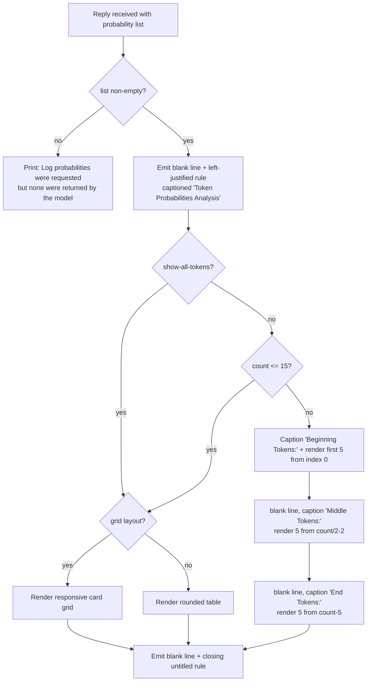

# Feature: Output Rendering & Token Visualization

> Repo analysed: `/mnt/g/3RD-Party/reversing/subject/chatdbg` @ commit `d8c18f61d6bb73666ed97cd4885e877e35558485`.
> All `file:line` evidence below is relative to that repo root.
> **CODE IS TRUTH.** Where `README.md` disagrees with code, the code is stated as the requirement and the disagreement is recorded as a QUIRK.

---

## Purpose

The product is an interactive AI chat/debugging assistant that can ask a language model for *per-token probability data* alongside the generated text. Raw probability data is a flat list of (token, log-probability, alternatives) records — unreadable as-is. This feature is the **presentation layer** that turns that data, plus ordinary chat text, command results and status, into something a human can scan in a terminal.

Problems it solves:

1. **Host-independence for the domain layer.** Commands living in the domain core must be able to emit user-visible output without knowing whether they are running inside a plain line-oriented REPL, a full-screen text UI, a test harness, or a headless script. A narrow output-abstraction contract (six operations) decouples them. (`src/Xcaciv.ChatDbg.Core/Services/IConsoleFormatter.cs:7-11` — "Serves as an abstraction layer to remove UI dependencies from Core project".)
2. **Confidence at a glance.** Colour/heat mapping of token probability lets a user spot the low-confidence regions of a model answer without reading numbers.
3. **Volume control.** Model answers can be hundreds of tokens. The feature can render *all* tokens or a representative *sample* (beginning / middle / end) so output stays readable.
4. **Layout choice.** A dense card *grid* (pattern-spotting across many tokens) versus a detailed *list/table* (deep inspection of individual tokens).
5. **Readability in a dark terminal.** A single fixed dark theme is applied to the full-screen UI at start-up.

Actors / roles (only one human role exists; there is no authentication, authorization, multi-tenancy or permission model anywhere in this feature):

| Actor | How they use it |
|---|---|
| **Interactive end user** (developer debugging code) | Reads chat replies, command results, and token-probability visualisations; toggles display mode / layout / alternative count. |
| **Domain commands** (in-process callers) | Emit markup lines, plain lines, rules and token renderings through the output-abstraction contract. |
| **Both shells** (plain REPL host and full-screen TUI host) | Own the screen; supply a concrete renderer; also contain their own private copies of the token rendering logic. |
| **Automated tests** | Capture standard output from the plain renderer and assert on structure. |

---

## Behavior

### A. The output abstraction (the "shell contract")

A single contract defines everything the domain layer may ask a host to draw. Six operations (`IConsoleFormatter.cs:11-52`):

| Operation | Input | Output / side effect |
|---|---|---|
| **Write markup line** | one string that may contain inline styling directives delimited by square brackets | one line emitted; styling either honoured (rich renderer) or stripped (plain renderer) |
| **Write plain line (with text)** | one string | one line emitted verbatim, no styling interpretation |
| **Write blank line** | — | one empty line emitted |
| **Write rule** | optional title string (may contain markup), optional left-justify flag (default = centred) | one horizontal separator line, optionally captioned |
| **Display token grid** | list of token-probability records; starting index for numbering (default 0); max columns (default 0 = auto/responsive); max alternatives per token (default 3) | multi-column card layout emitted |
| **Display token table** | list of token-probability records; starting index for numbering (default 0) | one row per token emitted |

Two implementations exist.

### B. Plain rendering (dependency-free renderer)

The plain renderer (`src/Xcaciv.ChatDbg.Core/Services/BasicConsoleFormatter.cs`) emits to standard output only. Behaviour:

1. **Markup line** — strips every bracketed span, then writes the remainder (`:17-22`, `:152-179`). Stripping rule: a `[` opens "in-markup" and is dropped; the next `]` closes it and is dropped; a `]` seen while *not* in markup is kept; all characters between an opening `[` and the closing `]` are dropped. An unclosed `[` therefore silently swallows the rest of the line.
2. **Plain line / blank line** — passthrough (`:27-38`).
3. **Rule** — fixed width **80 characters** (`:45`).
   - No title (null or empty): 80 dash characters (`:47-51`).
   - Left-justified: `«title» «space» «dashes»` where dash count = 80 − (title length + 2); total emitted length is 79, not 80 (`:57-60`).
   - Centred (default): `«left dashes» «space» «title» «space» «right dashes»`, left dashes = floor(remaining/2), right dashes = remaining − left; total emitted length is exactly 80 (`:63-65`).
   - The title has markup stripped before measuring and printing (`:53`).
4. **Token grid** — **does not draw a grid.** It ignores the max-columns and max-alternatives arguments entirely and delegates to the token table (`:72-77`, comment: "true grid layout requires more sophisticated console handling").
5. **Token table** — an ASCII box table (`:82-112`):
   - Header/footer border line, then a header row with captions `Token #`, `Text`, `Probability`, `Top Alternatives`, then the border again, then one row per token, then the closing border.
   - Column inner widths: **7, 20, 12, 38** (separator segments 9, 22, 14, 40 including one space of padding on each side).
   - Row number displayed = `startIndex + positionInList + 1` (1-based, offset by the caller-supplied start index).
   - Token text is escape-formatted (see F), then **truncated to 20 characters** by keeping the first **17** and appending `...` (`:96-99`).
   - Probability rendered as percent-with-5-decimals **plus an extra literal `%`** (`:102`, `:202-205`).
   - Alternatives rendered by the private compact formatter with a hard-coded cap of **2** (`:105`).
   - Values longer than their column pad overflow and break table alignment (no clipping on probability or alternatives cells).
6. **Compact alternatives string** (private, `:117-147`):
   - Empty or absent list → the literal `(none)`.
   - Otherwise up to *max* (=2 here) entries joined by `, `, each `«token» («percent-5dp»%)`; each alternative token escape-formatted and **truncated to 10 characters** by keeping the first **7** plus `...`.
   - If more alternatives exist than shown, appends ` (+N more)` (no space after the plus).

### C. Rich rendering (styled-terminal renderer)

The styled renderer (`src/ChatDbg.Shell.Gui/Services/SpectreConsoleFormatter.cs`) emits through a rich-terminal library that interprets bracketed style tags.

1. **Markup line / plain line / blank line** — delegated to the styled console (`:18-37`).
2. **Rule** — a captioned horizontal rule; caption defaults to empty string when no title given; left-justified when requested, otherwise the library default (`:42-50`).
3. **Token grid** (`:55-101`):
   - Column count = caller's max-columns when > 0; otherwise **responsive**: `max(1, terminalWidth / 40)` — i.e. roughly one card per 40 columns of terminal width, minimum 1.
   - Every column is created no-wrap.
   - Tokens are laid out **row-major**, left to right, one card per token.
   - A row is flushed when it is full **or** when the last token is reached; a partially-filled final row is **padded with empty cards** so the grid stays rectangular (`:83-96`).
4. **Token card** (`:152-195`): a rounded-border, expanding panel whose header is the 1-based token number prefixed with `#` in grey, and whose body is three or four labelled sections:
   - `Token: «escaped token»`
   - `Prob: «coloured percent»`
   - `Alternatives:` followed by one line per alternative `- «escaped token» («coloured percent»)`, at most `min(maxAlternatives, alternativeCount)` of them.
   - If alternatives were withheld, a dimmed line `+ N more`.
   - The alternatives block is omitted entirely when there are none.
5. **Token table** (`:106-145`): rounded border, expands to full width, four columns — a centred number column captioned `?`, a `Token` column of width **20**, a centred `Probability` column, a `Top Alternatives` column of width **50**. Row number in grey, 1-based, offset by start index. Alternatives cell shows **at most 3** entries, one per line, each `«escaped token» («coloured percent»)`; empty list → dimmed `(none)` (`:209-225`).
6. **Escaping**: token text is first escape-formatted for control characters, then bracket characters are doubled so the styling engine treats them as literals (`:230-235`).

### D. Heat mapping (colour by probability)

Four *different* heat maps exist in the product; they disagree with each other on both scale and palette. All four are live in some code path.

**D1 — Shared 5-band name map** (`Core/Services/TokenFormatters.cs:38-45`), used by the rich renderer:
| Condition | Colour name |
|---|---|
| value ≥ 90 | `green` |
| value ≥ 70 | `lime` |
| value ≥ 50 | `yellow` |
| value ≥ 30 | `orange` |
| otherwise | `red` |

**D2 — Shell-local 5-band map**, byte-identical thresholds but the 30–50 band is named `orange3` instead of `orange` (`src/ChatDbg/ChatShell.cs:657-672`; `src/ChatDbg.Shell.Gui/Services/TokenProbabilityVisualizer.cs:271-286`; `src/ChatDbg.Shell.Gui/ChatShell.cs:610-625`).

**D3 — Full-screen panel 10-bucket map** (`src/ChatDbg.Shell.Gui/UI/ChatWindow.cs:99-113`, `:731-736`): bucket index = `clamp(floor(probability × 10), 0, 9)`; probability is on a **0…1** scale here. Foreground colour per bucket over a black background:

| Bucket (probability band) | Foreground |
|---|---|
| 0 (0–10%) | bright red |
| 1 (10–20%) | red |
| 2 (20–30%) | bright magenta |
| 3 (30–40%) | magenta |
| 4 (40–50%) | bright blue |
| 5 (50–60%) | blue |
| 6 (60–70%) | cyan |
| 7 (70–80%) | bright cyan |
| 8 (80–90%) | bright yellow |
| 9 (90–100%) | bright green |

**D4 — Background heat-map view 6-band map** (`src/ChatDbg.Shell.Gui/UI/LogProbHeatmapView.cs:60-77`), probability on a **0…1** scale, colour applied as the *background*:

| Condition | Background | Foreground |
|---|---|---|
| ≥ 0.9 | green | black |
| ≥ 0.7 | bright green | black |
| ≥ 0.5 | brown | black |
| ≥ 0.3 | bright yellow | white |
| ≥ 0.1 | red | white |
| otherwise | bright red | white |

Foreground rule: black when probability ≥ 0.5, white otherwise, chosen for contrast (`:74`).

### E. Sampling of long outputs

Two independent sampling rules exist.

**E1 — 5/5/5 sampling** (used by the domain demo command and by both shells' private visualisers):
- Sample size constant = **5** (`Core/Commands/DemoLogProbsCommand.cs:182`; `src/ChatDbg/ChatShell.cs:435`; `Shell.Gui/Services/TokenProbabilityVisualizer.cs:39`).
- If the token count is **≤ 15** (`sampleSize × 3`), *all* tokens are shown, no sectioning.
- Otherwise three slices are shown: first 5; then 5 starting at `floor(count / 2) − 2` (integer arithmetic: `count/2 − sampleSize/2`); then the last 5.
- In the shells the three slices are announced by the blue captions `Beginning Tokens:`, `Middle Tokens:` and `End Tokens:`, with a blank line before the middle and end captions, and each slice is numbered from its true absolute index (`src/ChatDbg/ChatShell.cs:453,464-467,478-481`).
- In the domain demo command the three slices are **concatenated into one list** and rendered as a single table/grid numbered from 0 — no captions, and the middle/end slices lose their true indices (`DemoLogProbsCommand.cs:187-200`).

**E2 — 10/10/10 sampling** (background heat-map view only, `LogProbHeatmapView.cs:79-88`):
- If token count is **≤ 30**, show all.
- Otherwise: first 10; then 10 starting at `floor((count − 10) / 2)`; then the last 10.

### F. Token text escaping for display

Three variants, all triggered by control characters:

| Variant | Location | Behaviour |
|---|---|---|
| Plain | `TokenFormatters.cs:18-31` and `BasicConsoleFormatter.cs:184-197` | null → `(null)`; newline → `\n`, carriage return → `\r`, tab → `\t`, NUL → `\0` as literal two-character sequences |
| Styled | `TokenProbabilityVisualizer.cs:253-266`; `src/ChatDbg/ChatShell.cs:637-654`; `Shell.Gui/ChatShell.cs` | null → dimmed `(null)`; each control character replaced by a **dimmed** literal escape sequence |
| Heat-map view | `LogProbHeatmapView.cs:36` | newline and carriage return only; tab and NUL are **not** escaped |
| Full-screen probability panel | `ChatWindow.cs:667`, `:697` | newline, carriage return and tab escaped; NUL not escaped |

### G. Probability number formatting

| Formatter | Rendering | Location |
|---|---|---|
| Shared value formatter | fixed-point, **2 decimals**, then a literal `%` (e.g. `42.12%`) | `TokenFormatters.cs:52-55` |
| Plain renderer | percent format with **5 decimals** (which itself appends a percent sign), then **another literal `%`** | `BasicConsoleFormatter.cs:202-205`, `:138` |
| Shell/visualiser styled | percent format with 5 decimals **plus another literal `%`**, wrapped in the band colour | `src/ChatDbg/ChatShell.cs:671`; `TokenProbabilityVisualizer.cs:285` |
| Full-screen probability panel | percent format with 5 decimals, **no** extra `%` | `ChatWindow.cs:671`, `:699` |
| Shared text representation | main column fixed-point **5 decimals**, right-aligned in 10, plus a literal `%`; alternatives percent-5-decimals plus a literal `%` | `TokenFormatters.cs:79`, `:82` |

The percent format inserts a space before the sign under the invariant culture and no space under US English — verified experimentally on this runtime (invariant → `50.00000 %`, en-US → `50.00000%`). Both shell binaries force invariant globalization in their `Compact` and `SingleFile` build configurations, so packaged builds get the spaced form.

### H. Plain-text token report (shared, currently unused by any UI)

`TokenFormatters.cs:62-89` produces a self-contained text block:
1. Line `=== Token Probabilities Analysis ===`, then a blank line.
2. A pipe-delimited header `| # | Token          | Probability | Alternatives                |` and a dashed separator row.
3. One row per token: index (1-based, right-aligned in 2), token text (left-aligned in 14, **not** escape-formatted here), probability (right-aligned in 10, 5 decimals) + `%`, alternatives (left-aligned in 24).
4. Alternatives cell = first **2** alternatives joined by `, ` as `«raw token» («percent-5dp»%)`, or the literal `none` when there are none.
5. Blank line, then the line `=======================================` (39 equals signs).

### I. Compact alternatives description (shared, currently unused by any UI)

`TokenFormatters.cs:97-122`: empty/absent → `(none)`; otherwise up to *maxToShow* (default **3**) entries joined by `, `, each `«escaped token» («percent-5dp»%)`; if more exist, appends ` (+ N more)` (**with** a space after the plus — differs from the plain renderer's ` (+N more)`).

### J. Full-screen UI rendering (the TUI host's own surface)

`src/ChatDbg.Shell.Gui/UI/ChatWindow.cs`.

**Chat transcript rendering** (`:500-622`):
- The transcript area is rebuilt from scratch on every refresh.
- Left padding = **2** columns (`:506`); usable width = area width − 4.
- Each message emits a role caption line `[role]` (lower-cased role in square brackets) followed by the wrapped content lines.
- **User** messages are right-aligned; every other role is left-aligned at the padding offset.
- Content is wrapped at **three quarters** of the usable width (`:539`), by: splitting on explicit newlines first, then greedily breaking long lines at the **last space** within the limit (the space is kept at the end of the emitted line); if no space is available, a hard cut at the limit (`:735-788`).
- Blank/whitespace-only wrapped lines are skipped.
- One blank line separates messages.
- Role colour schemes (`:66-89`): user = white on dark grey; assistant = bright yellow on blue; system = green on black; unknown role falls back to the system scheme. A "divider" scheme (grey on black) is defined but **never used**.
- For an assistant message that carries probability data, a focusable **lozenge indicator button `◊`** (bright green on black; bright green on dark grey when focused) is appended below it (`:568-604`). Activating it: opens the probability panel if closed, shrinks the transcript to 60% width, points the panel at that message, re-renders the panel, scrolls the panel to the top, and shows the status message `Showing token probabilities for message at «timestamp»`.
- After rebuilding, the scrollable content height is set to the greater of the used height and the viewport height, and the view is auto-scrolled to the bottom.

**Token probability panel** (`:628-729`):
- Framed and captioned `Token Probabilities`, docked to the right of the transcript, same height as the transcript, default content width **50** (`:31`, `:243-256`).
- Empty state: single line `No token probability data available.` (`:643-648`).
- Otherwise a header line `[«message timestamp»] Token Probabilities:` followed by one blank line.
- Then, per token, at indent 2: `«0-based index»: "«escaped token»" («percent-5dp»)`, coloured by the 10-bucket heat map (D3).
- Then, per alternative, at indent 4: `Alt: "«escaped token»" («percent-5dp»)`, also heat-coloured. Alternatives are **sorted descending by probability** and limited to the grid-max-alternatives setting (`:686-690`). This is the only place in the product that re-sorts alternatives.
- One blank line after each token's block.
- Content width is tracked as the longest rendered line + 2 (tokens) or + 4 (alternatives); final content width = `max(longest + 5, 50)`.
- The panel always scrolls to the top after a refresh.

**Panel visibility state** (`:228-234`, `:800-901`):
- On start-up, the panel is shown only if the probability setting is enabled **and** at least one assistant message already carries probability data; the most recent such message is selected.
- Toggling the panel with no probability-carrying assistant message shows an error dialog titled `No Log Probabilities` with body `There are no assistant messages with log probabilities to display.` and does nothing else.
- Showing the panel sets the transcript width to **60%**; hiding it restores full width.
- Status messages on toggle: `Token probabilities panel enabled` / `Token probabilities panel disabled`.
- Toggling probability capture for the last message (menu item) flips the enable setting, persists settings, rebuilds the transcript, opens or closes the panel to match, and reports `Log probabilities display enabled` / `Log probabilities display disabled`.
- When a new reply arrives with probability data and the panel is closed, the panel is **auto-opened** and pointed at the new message (`:450-463`).

**Status line** (`:790-798`, `:903-916`): a one-line label above the status bar. Idle text is `Provider: «provider» | Model: «model» | Prompt: «prompt name»`. Transient messages replace it and revert to the idle text after **3000 milliseconds**. Successful command results are surfaced as `✓ «message»`; failed ones open an error dialog titled `Command Error`.

**Static chrome**: menu bar (`File`, `Edit`, `View`, `Tools`, `Help`), transcript frame captioned `Chat History` occupying the area below the menu bar and 5 rows above the bottom, an `Input` frame anchored 5 rows from the bottom with a one-line editor and a `Send` button, and a status bar offering `F1 Help` and `F10 Quit`. Help is a modal listing every command **sorted by name** as `/«name»` plus an indented description.

### K. Theming

`src/ChatDbg.Shell.Gui/UI/ThemeManager.cs`. One operation: **apply the dark theme**, invoked unconditionally once at TUI start-up immediately after the UI toolkit is initialised (`Program.cs:71-74`). There is no light theme, no theme setting, no persisted theme choice and no way to change it at runtime. It replaces four global scheme slots wholesale:

| Slot | Normal | Focus | Hot-normal | Hot-focus | Disabled |
|---|---|---|---|---|---|
| Base | white / black | bright yellow / dark grey | bright cyan / black | bright yellow / dark grey | *(not set)* |
| Dialog | white / dark grey | bright yellow / dark grey | bright cyan / dark grey | bright yellow / dark grey | *(not set)* |
| Menu | white / dark grey | bright yellow / black | bright cyan / dark grey | bright yellow / black | grey / dark grey |
| Error | bright red / black | bright red / dark grey | bright red / black | bright yellow / dark grey | *(not set)* |

The background heat-map view adopts the Base scheme as its own default (`LogProbHeatmapView.cs:18`).

### L. Background heat-map view (defined, never instantiated)

`src/ChatDbg.Shell.Gui/UI/LogProbHeatmapView.cs` is a focusable custom view that paints tokens as a *continuous flowing paragraph* with each token's background coloured by its probability (D4), honouring the show-all-tokens setting with 10/10/10 sampling (E2). Drawing rules: tokens are laid left to right; when the next token would exceed the view width the cursor wraps to the next row and restarts at column 0; drawing **stops entirely** once the row index reaches the view height (no scrolling, no ellipsis, silent truncation); the drawing attribute is reset to the view's normal colour before and after the loop. It exposes a settable `Title` that is never read or drawn. **No code constructs this type.**

---

## Business rules & edge cases

Magic numbers, thresholds and special cases, each with evidence.

### Layout constants

| Rule | Value & meaning | Evidence |
|---|---|---|
| Plain rule width | **80** characters — fixed width of the plain horizontal separator | `BasicConsoleFormatter.cs:45` |
| Plain rule title padding | **+2** — one space either side of the title, subtracted from the dash budget | `BasicConsoleFormatter.cs:54` |
| Centred rule split | left dashes = floor(remaining/2); right dashes = remaining − left (right gets the odd character) | `BasicConsoleFormatter.cs:63-64` |
| Left-justified rule total | title + 1 space + (80 − title − 2) dashes = **79** characters, one short of the centred form | `BasicConsoleFormatter.cs:59` |
| Plain table column inner widths | **7 / 20 / 12 / 38**; separator segments **9 / 22 / 14 / 40** | `BasicConsoleFormatter.cs:85-87`, `:108` |
| Plain table token truncation | > **20** chars → first **17** + `...` | `BasicConsoleFormatter.cs:96-99` |
| Plain table alternative-token truncation | > **10** chars → first **7** + `...` | `BasicConsoleFormatter.cs:133-136` |
| Plain table alternatives cap | **2**, hard-coded (the max-alternatives argument never reaches here) | `BasicConsoleFormatter.cs:105`, `:117` |
| Responsive grid column count | `max(1, terminalWidth / 40)` — integer division; **40** = assumed minimum card width; minimum 1 column | `SpectreConsoleFormatter.cs:58`; `TokenProbabilityVisualizer.cs:113`; `src/ChatDbg/ChatShell.cs:506` |
| Explicit grid column count | any max-columns argument **> 0** overrides the responsive calculation; 0 means auto | `IConsoleFormatter.cs:42`; `SpectreConsoleFormatter.cs:58` |
| Grid row padding | short final rows are padded with **empty cards** to keep the grid rectangular | `SpectreConsoleFormatter.cs:86-89` |
| Rich table column widths | Token = **20**, Top Alternatives = **50**; number and probability columns centred | `SpectreConsoleFormatter.cs:114-117` |
| Rich table alternatives cap | **3**, hard-coded — the max-alternatives setting does **not** apply to table/list layout | `SpectreConsoleFormatter.cs:217`; `TokenProbabilityVisualizer.cs:299`; `src/ChatDbg/ChatShell.cs:682` |
| Grid card alternatives cap | `min(configuredMaxAlternatives, actualAlternativeCount)`; surplus reported as `+ N more` | `SpectreConsoleFormatter.cs:171`, `:184` |
| Transcript padding | **2** columns of left indent | `ChatWindow.cs:506` |
| Transcript wrap width | **three quarters** of (viewport width − 4) | `ChatWindow.cs:507`, `:539` |
| Transcript split width | transcript occupies **60%** of the window when the probability panel is open, otherwise full width | `ChatWindow.cs:136`, `:456`, `:590`, `:825` |
| Probability panel default width | **50** columns of content | `ChatWindow.cs:31`, `:254` |
| Probability panel content width | `max(longestLine + 5, 50)` | `ChatWindow.cs:724` |
| Panel indents | token lines at column **2**, alternative lines at column **4** | `ChatWindow.cs:670`, `:702` |
| Initial scroll canvas | transcript **80 × 1000**, panel **50 × 1000** (placeholder heights, resized after first render) | `ChatWindow.cs:147`, `:254` |
| Frame heights | transcript and panel both fill the window minus **5** bottom rows (input frame 3 rows + status label + status bar) | `ChatWindow.cs:137`, `:244` |
| Status message lifetime | **3000 ms**, then revert to the idle status text | `ChatWindow.cs:909` |

### Sampling rules

| Rule | Value & meaning | Evidence |
|---|---|---|
| Sample slice size (shells + demo) | **5** tokens per slice | `src/ChatDbg/ChatShell.cs:435`; `TokenProbabilityVisualizer.cs:39`; `DemoLogProbsCommand.cs:182` |
| Sampling threshold | token count **≤ 15** (= 5 × 3) → show everything, no slicing | `src/ChatDbg/ChatShell.cs:437`; `TokenProbabilityVisualizer.cs:41`; `DemoLogProbsCommand.cs:184` |
| Middle slice start | `floor(count / 2) − floor(5 / 2)` = `count/2 − 2` (integer arithmetic) | `src/ChatDbg/ChatShell.cs:464`; `TokenProbabilityVisualizer.cs:67`; `DemoLogProbsCommand.cs:193` |
| End slice start | `count − 5` | `src/ChatDbg/ChatShell.cs:478`; `TokenProbabilityVisualizer.cs:81`; `DemoLogProbsCommand.cs:197` |
| Slice overlap | slices may overlap for counts just above 15 (e.g. 16 tokens → indices 0–4, 6–10, 11–15); no de-duplication | derived from the three formulas above |
| Heat-map view slice size | **10** tokens per slice, threshold **≤ 30** | `LogProbHeatmapView.cs:81-86` |
| Heat-map view middle start | `floor((count − 10) / 2)` — a *different* formula from E1, off-centre by 5 | `LogProbHeatmapView.cs:84` |
| Empty token list | sample helper in the demo command returns *nothing* for a null or empty list, and the caller then prints `No token probability data available` | `DemoLogProbsCommand.cs:179-180`, `:111` |

### Numbering & ordering guarantees

| Rule | Evidence |
|---|---|
| All user-visible token numbers are **1-based** except the full-screen probability panel, which is **0-based**. | `BasicConsoleFormatter.cs:108`; `SpectreConsoleFormatter.cs:136`, `:190`; vs `ChatWindow.cs:671` |
| Displayed number = `startIndex + positionWithinSlice (+1)`, so slices show their true position in the full response. | `BasicConsoleFormatter.cs:92`; `SpectreConsoleFormatter.cs:74`, `:123` |
| Token order is always the model's emission order; nothing reorders tokens. | all render loops iterate the list as given |
| Alternative order is **as supplied** everywhere except the full-screen probability panel, which sorts **descending by probability**. | `ChatWindow.cs:687-690` vs all other alternative loops |
| The transcript renders messages in stored order, oldest first. | `ChatWindow.cs:509` |
| The help modal lists commands **sorted by name ascending**. | `ChatWindow.cs:1107` |

### Colour-band thresholds

| Rule | Evidence |
|---|---|
| 5-band name map boundaries at **90 / 70 / 50 / 30** (inclusive lower bounds), fallback `red`. | `TokenFormatters.cs:40-44` |
| 10-bucket map index = `clamp(floor(p × 10), 0, 9)` — clamping means values ≥ 1.0 all land in bucket 9 and negatives in bucket 0. | `ChatWindow.cs:734` |
| 6-band background map boundaries at **0.9 / 0.7 / 0.5 / 0.3 / 0.1**, fallback bright red. | `LogProbHeatmapView.cs:63-71` |
| Contrast rule: foreground black at probability **≥ 0.5**, white below. | `LogProbHeatmapView.cs:74` |

### Escaping & null handling

| Rule | Evidence |
|---|---|
| A null token renders as the literal `(null)` (plain) or a dimmed `(null)` (styled). | `TokenFormatters.cs:20`; `BasicConsoleFormatter.cs:186`; `TokenProbabilityVisualizer.cs:255-257` |
| A null or empty alternatives list renders as `(none)` (plain) / dimmed `(none)` (styled). | `BasicConsoleFormatter.cs:119-122`; `SpectreConsoleFormatter.cs:211-214`; `TokenFormatters.cs:99-102` |
| Bracket characters in token text are doubled before styled output so they are shown literally. | `SpectreConsoleFormatter.cs:230-235` |
| The plain markup stripper drops everything between `[` and the next `]`; an unmatched `]` is preserved; an unmatched `[` swallows the remainder of the line. | `BasicConsoleFormatter.cs:152-179` |
| The plain markup stripper is **not** the inverse of the styled escaper: doubled brackets are mangled by it. | `BasicConsoleFormatter.cs:160-167` vs `SpectreConsoleFormatter.cs:232-234` |

### Settings that drive rendering

Owned by the settings feature but consumed here. Defaults and validation (`Core/Models/ChatSettings.cs:39-46`; `Core/Commands/LogProbsCommand.cs`; `Core/Commands/SetCommand.cs`; `Shell.Gui/UI/SettingsDialog.cs`):

| Setting | Persisted name | Type | Default | Valid range | Effect |
|---|---|---|---|---|---|
| Show all tokens | `showAllTokens` | boolean | **false** (sample mode) | true/false | all tokens vs. beginning/middle/end sampling |
| Grid view for tokens | `gridViewForTokens` | boolean | **false** (list mode) | true/false | card grid vs. table/list |
| Grid view max alternatives | `gridViewMaxAlternatives` | integer | **5** | **1–20** | alternatives per card before `+ N more`; also caps alternatives in the full-screen panel |
| Enable log probabilities | `enableLogProbabilities` | boolean | **false** | true/false | gates whether any token visualisation appears at all |
| Log probabilities top-K | `logProbabilitiesTopK` | integer | **5** | **1–20** | how many alternatives are *requested* (upstream feature), which bounds what can be drawn |

Validation behaviour:
- Command path rejects out-of-range values with `Grid max alternatives value must be a number between 1 and 20` and `Top-K value must be a number between 1 and 20`; missing argument yields `Please specify a number: /logprobs gridmaxalt <number>` (`LogProbsCommand.cs:89-99`).
- The generic setting-assignment command rejects with `gridViewMaxAlternatives must be a number between 1 and 20`, `showAllTokens must be 'true' or 'false'`, `gridViewForTokens must be 'true' or 'false'` (`SetCommand.cs:187`, `:198`, `:208`).
- The settings dialog **clamps** rather than rejects: values are silently forced into 1–20 (`SettingsDialog.cs:456-464`). Different validation semantics between the two entry points.
- Every mutation persists settings immediately (`LogProbsCommand.cs:68`, `:78`, `:98`).

### Rules proven by the automated tests

Only two test files touch this feature, and both target the dependency-free half of it. There is **no test project for either shell**, so nothing below covers the styled renderer, the full-screen window, the theme, the heat-map view or the sampling captions.

| # | Rule the test pins down | Exact assertion | Evidence |
|---|---|---|---|
| T1 | Writing a markup line through the plain renderer removes the styling span and keeps the payload. | input `[red]hello[/]` → captured output **contains** `hello` and **does not contain** `[red]` | `Tests/Services/BasicConsoleFormatterTests.cs:22`, `:29-30` |
| T2 | The plain renderer writes through the process-wide standard-output writer, and that writer is replaceable. | the test swaps the writer, calls the renderer, restores it in a `finally` — a renderer that wrote to a raw terminal handle would fail this | `Tests/Services/BasicConsoleFormatterTests.cs:16-27`, `:42-53` |
| T3 | Drawing a one-token table emits both the column caption and the token text. | one token `Token = "token"`, `LogProb = ln(0.5)` → output contains `Token` **and** `token` | `Tests/Services/BasicConsoleFormatterTests.cs:37-57` |
| T4 | The table is drawn with a **default start index of 0** — the test calls the two-argument operation with the index omitted. | `DisplayTokenTable(tokens)` | `Tests/Services/BasicConsoleFormatterTests.cs:48` |
| T5 | Escaping a token containing a newline produces the two-character sequence backslash-`n`. | `"line\n"` → result contains `\n` (literal backslash + n) | `Tests/Services/TokenFormattersTests.cs:13-14` |
| T6 | The shared band map returns `green` at 95 and `red` at 10 — confirming the map is fed a **0…100** scale, not 0…1. | `Assert.Equal("green", …(95))`; `Assert.Equal("red", …(10))` | `Tests/Services/TokenFormattersTests.cs:20-21` |
| T7 | The shared value formatter emits exactly two decimals and a single trailing `%`. | `42.1234` → **exactly** `42.12%` (equality, not containment) | `Tests/Services/TokenFormattersTests.cs:27-28` |
| T8 | The shared text report contains its banner and every token's text. | one token `token` → report contains `Token Probabilities Analysis` and `token` | `Tests/Services/TokenFormattersTests.cs:39-41` |
| T9 | The compact alternatives description caps entries and announces the remainder. | 3 alternatives, cap 2 → result contains `(+` | `Tests/Services/TokenFormattersTests.cs:47-55` |
| T10 | The demo command succeeds and exposes its generated sample regardless of whether a renderer was supplied. | both with-renderer and without-renderer executions assert `result.Success` **and** `SampleData != null` | `Tests/Commands/DemoLogProbsCommandTests.cs:24-25`, `:37-38` |
| T11 | With a renderer, default settings (sample mode + list layout), the demo draws the **table** at least once with start index **0** — never the grid. | `Verify(f => f.DisplayTokenTable(It.IsAny<…>(), 0), Times.AtLeastOnce)` | `Tests/Commands/DemoLogProbsCommandTests.cs:26` |
| T12 | The demo honours the requested alternative count without error when it is below the default: the test sets top-K to **3**. | `LogProbabilitiesTopK = 3` | `Tests/Commands/DemoLogProbsCommandTests.cs:17` |

**What the tests deliberately do not pin:** no test asserts on a *rendered probability string*, so the doubled `%` (Q2) and the 0…1-versus-0…100 scale mismatch (Q1) are unprotected; no test asserts rule width, column widths, truncation, the `(+N more)` spacing, or the `(none)` / `(null)` placeholders; no test exercises an empty or null token list.

### Exact user-visible strings

Every string below is a hard-coded English literal; there are no resource files.

**Emitted by the plain REPL around a rendering (`src/ChatDbg/ChatShell.cs`)**

| String | When | Evidence |
|---|---|---|
| `Log probabilities enabled - requesting with top-k={N}` | printed **before every request** whenever probability capture is on | `:373` |
| `Note: Log probabilities were requested but none were returned by the model.` | reply carried an empty/absent probability list | `:389` |
| `This could be due to the model not supporting this feature or an API limitation.` | second line of the same notice | `:390` |
| `Token Probabilities Analysis` | rule caption, styled yellow, left-justified | `:415` |
| `Beginning Tokens:` / `Middle Tokens:` / `End Tokens:` | slice captions, styled blue | `:453`, `:467`, `:481` |
| `Error getting AI response: {message}` | request failed | `:407` |

**Emitted by the display-settings command (`Core/Commands/LogProbsCommand.cs`)** — these are the words a user sees after changing a rendering option:

| Subcommand | Success message | Evidence |
|---|---|---|
| `enable` | `Token probability analysis enabled.` + `Note: This feature requires a compatible model and API version.` + `If you don't see probabilities after responses, try '/logprobs debug'.` + `You can see a demonstration with the '/demologprobs' command.` (four lines) | `:40-44` |
| `disable` | `Token probability analysis disabled.` | `:49` |
| `top <n>` | `Token probability analysis will show top {n} alternatives.` | `:64` |
| `showall` | `Token probability analysis will show all tokens.` | `:69` |
| `showsample` | `Token probability analysis will show token samples (beginning, middle, end).` | `:74` |
| `grid` | `Token probability analysis will use grid view layout.` | `:79` |
| `list` | `Token probability analysis will use list view layout.` | `:84` |
| `gridmaxalt <n>` | `Grid view will show up to {n} alternatives per token.` | `:99` |
| *(no argument)* | a status block headed `Token Probability Analysis Settings:` listing `- Enabled: Yes|No`, `- Top-K Alternatives: {n}`, `- Display Mode: Show all tokens` \| `Show token samples (beginning, middle, end)`, `- View Mode: Grid layout` \| `List layout`, `- Grid View Max Alternatives: {n}`, then a `Usage:` block | `:129-156` |
| *(errors)* | `Please specify a number: /logprobs top <number>`, `Top-K value must be a number between 1 and 20`, `Please specify a number: /logprobs gridmaxalt <number>`, `Grid max alternatives value must be a number between 1 and 20`, `Error configuring log probabilities: {message}` | `:54`, `:59`, `:89`, `:94`, `:120` |
| *(unknown)* | `Unknown subcommand: {name}.` followed by `Valid options are:` and six bullet lines | `:105-114` |

The command's own advertised usage line is `/logprobs [enable|disable|top <number>|showall|showsample|grid|list|gridmaxalt <number>|debug] - Configure token probability analysis settings` (`:20`). The demo command advertises `/demologprobs - Display sample token probability analysis` and is described as `Show sample token probability analysis for demonstration purposes` (`DemoLogProbsCommand.cs:41-42`).

**Emitted by the settings dialog (`Shell.Gui/UI/SettingsDialog.cs`)**

| Element | Literal text | Evidence |
|---|---|---|
| Display-mode radio | `Show All Tokens` (item 0) / `Show Samples` (item 1); item 0 selected when show-all is on | `:261-267` |
| Layout radio | `Grid View` (item 0) / `List View` (item 1); item 0 selected when grid layout is on | `:270-276` |
| Field labels | `Display Mode:`, `Layout:`, `Grid View Max Alternatives:`, `(1 - 20)` (twice — beside top-K and beside grid-max-alternatives) | `:257`, `:260`, `:269`, `:278-284` |

**Emitted by the demo command (`Core/Commands/DemoLogProbsCommand.cs`)**: `Sample Text:` (yellow, preceded by an embedded newline inside the markup line), `Display Mode: All Tokens` \| `Display Mode: Sample Tokens`, `Layout: Grid View` \| `Layout: List View`, `Grid Max Alternatives: {n}` (grid layout only), the rule caption `Token Probabilities Analysis`, `No token probability data available` (red), and the command result `Sample token probability analysis generated` (`:68`, `:77-115`).

### Persisted display settings — storage

| Aspect | Value | Evidence |
|---|---|---|
| File path | `«user profile directory»/.ChatDbg/settings.json` (the directory name is the literal `.ChatDbg`; the file name defaults to `settings.json`) | `Core/Services/SettingsService.cs:11`, `:15-17`, `:25` |
| Fallback path | when the user-profile directory cannot be used, a temporary directory is used instead | `Core/Services/SettingsService.cs:31` |
| Persisted keys | `showAllTokens`, `gridViewForTokens`, `gridViewMaxAlternatives`, `enableLogProbabilities`, `logProbabilitiesTopK` — exact wire names | `Core/Models/ChatSettings.cs:33-46` |
| Not persisted | the computed probability (derived from the log probability at read time) and every transient render state | `Core/Models/TokenLogProbabilities.cs:25-26` |
| Environment variables | **none** — no rendering behaviour reads any environment variable | repository-wide search |

### Demo fixture constants

| Constant | Value | Evidence |
|---|---|---|
| Sample sentence | `This is a sample response with token probability analysis. You can see how the model assigned probabilities to each token and what alternatives it considered.` | `DemoLogProbsCommand.cs:47-49` |
| Tokenisation for the demo | split on space, newline, tab, `.`, `,`, `!`, `?`, dropping empties → **25 tokens** for the sentence above | `DemoLogProbsCommand.cs:127-128` |
| Consequence for sampling | 25 > 15, so default (sample) mode always renders **15** tokens: source indices 0–4, 10–14, 20–24, renumbered **1–15** with the true positions lost | `DemoLogProbsCommand.cs:184-200` |
| Generator seed | **42** | `DemoLogProbsCommand.cs:124` |
| Selected-token confidence | `min(98.0, 70.0 + random×28.0)` — range **70.0 … 98.0**, written into the *log-probability* field | `DemoLogProbsCommand.cs:136`, `:141` |
| Hand-written alternatives | five tokens get three named alternatives each, with values 5.0–15.0 written into the log-probability field: `sample` → `example` 15.0 / `test` 8.0 / `demo` 5.0; `response` → `reply` 12.0 / `answer` 9.0 / `output` 6.0; `token` → `word` 14.0 / `symbol` 10.0 / `element` 7.0; `probability` → `likelihood` 11.0 / `chance` 8.0 / `confidence` 6.0; `analysis` → `evaluation` 13.0 / `assessment` 9.0 / `examination` 6.0. Matching is case-insensitive | `DemoLogProbsCommand.cs:209-239` |
| Generic alternatives | every other token gets `«token»_1` at **10.0**, `«token»_2` at **7.0**, `«token»_3` at **4.0** (`10.0 − i×3.0`) | `DemoLogProbsCommand.cs:243-247` |
| Random filler alternatives | added only when the three above fall short of top-K: value `max(1.0, confidence − 20.0 − random×50.0)`, i.e. range **1.0 … 78.0**, name `alt_{0-999}` | `DemoLogProbsCommand.cs:152-156` |
| Alternatives per token | exactly the top-K setting (three generated, then padded with filler, then truncated) — so the default top-K of 5 yields 5 | `DemoLogProbsCommand.cs:152-159` |
| Simulated response time | **0.5** | `DemoLogProbsCommand.cs:58` |

---

## Quirks

Behaviour that looks like a defect. Documented as observed; the source is not changed.


**Q1 — Probability scale mismatch makes real data always render as the lowest-confidence colour.** The probability value supplied to renderers is `e^logprob`, a fraction in **0…1** (`Core/Models/TokenLogProbabilities.cs:26`). The 5-band colour maps (D1/D2) compare against **90/70/50/30**, i.e. a 0…100 scale. Consequently *every* real token is `red` in the rich renderer and both shells. Only the two full-screen maps (D3/D4) use the correct 0…1 scale. The shared value formatter has the same mismatch: a 50%-probability token renders as `0.50%` (`TokenFormatters.cs:54`).

**Q2 — Doubled percent sign.** Every place that uses the 5-decimal percent format appends an extra literal `%`, so probabilities print as e.g. `50.00000 %%` (invariant culture) or `50.00000%%` (US English). Occurrences: `BasicConsoleFormatter.cs:138`, `:204`; `TokenFormatters.cs:79`, `:111`; `TokenProbabilityVisualizer.cs:285`; `src/ChatDbg/ChatShell.cs:671`; `Shell.Gui/ChatShell.cs:624`. The full-screen panel (`ChatWindow.cs:671`, `:699`) is the only correct one.

**Q3 — README shows 2-decimal probabilities; code emits 5.** `README.md:305-345` shows `92.15%`, `87.65%`. No live code path produces that: the shared 2-decimal formatter is only reached through the rich renderer, where it is fed a 0…1 value (Q1) and so would show `0.92%`. **Code wins.**

**Q4 — README claims `/demologprobs` visualises in the plain shell; it does not.** The plain REPL constructs the demo command **without** a renderer (`src/ChatDbg/ChatShell.cs:50`), so the command produces only the result message `Sample token probability analysis generated` and draws nothing (`DemoLogProbsCommand.cs:62-68`). README (`:256-269`) implies a visual demo. **Code wins.**

**Q5 — Demo sample data puts percentages into the log-probability field.** The demo generator assigns confidence values in the range **70.0–98.0** directly as log-probabilities (`DemoLogProbsCommand.cs:136-141`), and alternative "probabilities" of 4.0–15.0 (hand-written and generic, `:212-247`) or 1.0–78.0 (random filler, `:154-155`) as log-probabilities. Since displayed probability is `e^logprob`, the demo renders astronomically large percentages (a selected token at confidence 70 renders as ≈ 2.5 × 10^32 %, and at 98 as ≈ 3.6 × 10^44 %) and, per the 5-band map, colours everything `green`. The demo therefore does not demonstrate the colour spectrum it claims to.

**Q6 — The `orange` colour band is very likely invalid for the styling engine.** `TokenFormatters.cs:43` returns the bare name `orange`; the two shell-local copies return `orange3` for the same band. The styled-console library's palette has `orange1`/`orange3`/`orange4`/`orangered1` but no bare `orange`. Emitting `[orange]…[/]` would raise a markup error. (INFERRED — see Confidence section. In practice unreachable: Q1 forces every real value into the `red` band and Q5 forces demo values into `green`.)

**Q7 — Escape-then-style ordering is inverted in the dead visualiser.** `TokenProbabilityVisualizer.cs:166`, `:176`, `:229`, `:301` escape brackets *after* the token formatter has already injected dim-styling brackets, so the styling tags are neutralised and appear as literal doubled brackets in the output. The plain-shell copy does it in the correct order (`src/ChatDbg/ChatShell.cs:643-654`). The live rich renderer avoids the problem by using the markup-free shared token formatter (`SpectreConsoleFormatter.cs:126`).

**Q8 — Table number-column caption degraded to a question mark.** The plain shell uses the numero sign `№` (verified bytes `E2 84 96` at `src/ChatDbg/ChatShell.cs:604`, and `Shell.Gui/ChatShell.cs:557`), while the rich renderer and the visualiser use a literal `?` (verified byte `3F` at `SpectreConsoleFormatter.cs:114` and `TokenProbabilityVisualizer.cs:217`) — an encoding-loss artefact. README's example output (`:331`) also shows mojibake — and `README.md` is a **pure-ASCII file**, so every box-drawing character in both its "Grid View" and "List View" examples has already been destroyed into `?`; the README's rendered examples are unusable as a visual specification. A third encoding casualty sits in the settings dialog: `Shell.Gui/UI/SettingsDialog.cs` is **not valid UTF-8** — a lone byte `0x95` (a Windows-1252 bullet) at line 368 inside the GPU-settings help text — so that literal decodes to a replacement character at compile time. A reimplementation should pick one intentional caption (`#` recommended) and keep every source file in one encoding.

**Q9 — The plain renderer's grid mode is not a grid.** Contract documents a grid with configurable columns and alternatives (`IConsoleFormatter.cs:37-44`); the plain implementation silently renders the table and discards both arguments (`BasicConsoleFormatter.cs:72-77`).

**Q10 — The plain renderer is never wired into the product.** Nothing constructs it outside tests; the plain REPL emits directly to standard output and uses the styled library itself, and the TUI host wires the rich renderer. It is a fallback that no host selects.

**Q11 — The full-screen host writes styled console output over a full-screen UI.** The TUI host hands the *rich console* renderer to the demo command (`Shell.Gui/Program.cs:20`, `:41`). Running `/demologprobs` from the TUI writes tables and rules straight to the terminal while the full-screen UI owns the screen, corrupting the display until the next full refresh.

**Q12 — Three near-identical copies of the token-visualisation logic exist.** `src/ChatDbg/ChatShell.cs:412-687` (live, plain REPL), `Shell.Gui/Services/TokenProbabilityVisualizer.cs` (compiled, never called), `Shell.Gui/ChatShell.cs:365-640` (compiled, never instantiated — the TUI host uses the window class instead). They have drifted (`?` vs `№`, escaping order). A reimplementation should keep exactly one.

**Q13 — Dead rendering surfaces.** Never referenced anywhere: the background heat-map view (`LogProbHeatmapView.cs`), the visualiser (`TokenProbabilityVisualizer.cs`), the GUI project's shell class (`Shell.Gui/ChatShell.cs`), the shared text report and compact alternatives description (`TokenFormatters.cs:62`, `:97` — exercised only by tests), the divider colour scheme (`ChatWindow.cs:41`), the heat-map view's `Title` property (`LogProbHeatmapView.cs:21`), and the full-screen window's own renderer field — the rich renderer is handed to the window at construction (`Shell.Gui/Program.cs:87`) and stored (`ChatWindow.cs:18`, `:61`) but **never read**, so the window's eighth constructor argument does nothing.

**Q14 — Unset disabled attributes.** The dark theme sets a disabled attribute only for the menu slot; base, dialog and error slots are left at their default-constructed (unset) value, which may render as black-on-black for disabled controls (`ThemeManager.cs:16-19`, `:38`).

**Q15 — Rule width and title length.** A rule title longer than 78 characters makes the dash count negative in the plain renderer, which is a hard failure rather than a graceful truncation (`BasicConsoleFormatter.cs:55`, `:59`, `:63-65`).

**Q16 — Unimplemented menu action.** `Toggle System Messages in Status Bar` responds with the status text `System messages toggle not yet implemented` (`ChatWindow.cs:1139-1141`).

**Q17 — A narrow terminal hangs or crashes the transcript renderer.** The transcript wraps at `(viewportWidth − 4) × 3 ÷ 4` (`ChatWindow.cs:507`, `:539`). The wrapper has no lower bound on that limit (`ChatWindow.cs:749-789`):
- viewport width **4 or 5** → limit **0**. Any non-empty line takes the else-branch, `length = min(0, remaining) = 0`, the loop appends an empty string and advances the cursor by 0 — an **infinite loop** that never terminates and grows the result list without bound.
- viewport width **0–3** (including the pre-layout state, where the width is 0 and the limit is **−3**) → the substring call is given a negative length and **throws**.
Only widths of 6 and above render. There is no guard, no clamp and no minimum-size check anywhere on the path.

**Q18 — In the full-screen host, changing a display option updates a settings object the renderer never reads.** The host creates a default settings object (`Shell.Gui/Program.cs:14`), hands it to every command including the display-settings command and the demo command (`:37-46`), and only *then* replaces the local variable with the settings loaded from disk (`:58`) — which is the object the window and its probability panel receive (`:81`). The commands keep the original. Consequences, all observable:
- `/logprobs grid`, `/logprobs showall`, `/logprobs gridmaxalt N` and `/set gridViewForTokens …` typed inside the full-screen UI report success but change nothing on screen; the panel keeps reading the loaded object.
- Each of those commands persists **its** object, so the save writes the process-start defaults plus the one field just changed — silently discarding the user's other stored settings.
- The status readout `/logprobs` (with no argument) reports the stale object's values, not the ones in use.
The plain REPL is unaffected: it owns a single settings instance.

**Q19 — Role matching is case-sensitive in one half of the full-screen UI and case-insensitive in the other.** The transcript, its colour lookup and the `◊` indicator all lower-case the role before comparing (`ChatWindow.cs:513`, `:523`, `:554`, `:570`, `:740`). Every query that decides whether the probability panel has anything to show compares the raw string against the lower-case literal (`ChatWindow.cs:219`, `:233`, `:364`, `:447`, `:804`, `:837`, `:873`). A message whose role is stored as `Assistant` — reachable through imported history — therefore gets a lozenge indicator that opens the panel, while the menu toggle insists there is nothing to display and the start-up check leaves the panel closed.

**Q20 — The panel's empty state leaves stale scroll geometry behind.** When the selected message has no probability data the panel adds the single label and **returns immediately** (`ChatWindow.cs:639-650`), skipping the content-size update, the scroll-to-top reset and the screen refresh that the normal path performs (`:723-728`). Switching from a long token list to a message without data leaves the scroll region sized for the old content and the offset wherever the user had scrolled, so the one-line message can be scrolled off-screen entirely.

**Q21 — The panel cannot be closed once the history no longer contains an eligible message.** The toggle checks for at least one qualifying message **before** deciding direction (`ChatWindow.cs:804-810`). If the panel is open and the history is then cleared, the toggle raises the `No Log Probabilities` dialog and returns, leaving the panel open at 40% of the window with no way to dismiss it.

**Q22 — Two rendering surfaces dereference token text without a null guard.** Every other surface returns `(null)` for a null token (`TokenFormatters.cs:20`; `BasicConsoleFormatter.cs:186`; `TokenProbabilityVisualizer.cs:255`). The full-screen probability panel calls the replace chain straight on the token for both tokens and alternatives (`ChatWindow.cs:670`, `:698`), and the background heat-map view does the same (`LogProbHeatmapView.cs:36`). A null token — reachable through a stored history whose JSON carries `"token": null` — throws during a draw.

**Q23 — The plain table draws a frame around nothing, and throws on a null list.** The header border, caption row and second border are written before the loop and the closing border after it (`BasicConsoleFormatter.cs:85-87`, `:111`), so an **empty** token list still produces a four-line empty table rather than no output. A **null** list is not guarded at all: the count is read directly (`:89`). The contract's own documentation promises neither (`IConsoleFormatter.cs:46-51`).

**Q24 — The shared plain-text report's header, separator and data rows are three different widths.** In `TokenFormatters.cs:70-82` the caption row's cells are 3 / 16 / 13 / 29 characters wide, the dashed separator's are 3 / 16 / **12** / **28**, and each data row's are **4** / 16 / 13 / **26**. No two agree, so the pipes never line up in any renderer. The token text in this report is also the only place a token is printed **without** escape-formatting (`:82`), so a token containing a newline breaks the row in half.

**Q25 — The README's rendered examples describe a card layout the code does not emit.** README's "Grid View" example labels each card's alternatives block `Alt:` and shows probabilities to two decimals (`README.md:305-322`); the code emits `Alternatives:` (`SpectreConsoleFormatter.cs:168`) and five decimals plus a stray `%` (Q2). The example also shows five alternatives per card against a stated default of five (`README.md:254`), which matches only because the grid card honours the setting — the *list* layout in the same example shows three, which is the hard-coded cap, not a setting. **Code wins.**

**Q26 — Three display settings are half-documented.** `showAllTokens`, `gridViewForTokens` and `gridViewMaxAlternatives` are demonstrated as commands and as `/set` targets (`README.md:232-245`) but are **absent** from the README's list of keys stored in the settings file (`README.md:96-111`), which does list the other two probability settings. They are nevertheless persisted under exactly those names (`Core/Models/ChatSettings.cs:39-46`), so a user reading the configuration section would not know they can be edited in the file.

**Q27 — The heat-map view neither clips nor wraps a token wider than the view.** The wrap test moves to the next row *before* drawing (`LogProbHeatmapView.cs:39-44`) but nothing shortens the token afterwards, so a token longer than the view width is written past the right edge from column 0 and still consumes a whole row; a run of such tokens burns one row each until the height check stops drawing altogether (`:46`), with no ellipsis or indicator.

**Q28 — Two of the four probability palettes are unreachable in the shipped product.** The 6-band background palette belongs to a view nothing constructs (Q13), and the shared 5-band palette is fed a 0…1 value (Q1) so only its fallback band is ever selected. In practice a user sees exactly one live palette — the 10-bucket map in the full-screen panel — plus solid `red` everywhere the styled renderer is used. A reimplementer choosing "the" heat map should be told this: the documented spectrum is not what the product displays.

**Q29 — Column widths and wrap points are measured in code units, not display cells.** The plain table truncates at 20 and 10 characters (`BasicConsoleFormatter.cs:96`, `:133`), the panel sizes itself from a text length (`ChatWindow.cs:683`, `:711`), and the heat-map view advances the cursor by a text length (`LogProbHeatmapView.cs:37`). None consults a display-width function, so a wide East-Asian glyph occupies two terminal cells but counts as one, and a combining sequence counts as several while occupying one. Every table, panel and wrap point mis-measures for non-Latin content. (INFERRED — arithmetic is plain, but no run was made.)

---

## Workflows & states

### W1 — Rendering a model reply with probability data (plain REPL)



Evidence: `src/ChatDbg/ChatShell.cs:412-494`, `:377-384`.

### W2 — Rendering one token card (grid layout)

1. Escape-format the token text; escape brackets.
2. Emit `Token: «text»`.
3. Colour-map the probability into a band and emit `Prob: «coloured percent»`.
4. If alternatives exist: emit `Alternatives:`, then one `- «text» («coloured percent»)` line for each of the first `min(configuredMax, count)`.
5. If any alternatives were withheld, emit a dimmed `+ N more`.
6. Wrap the whole block in a rounded, expanding panel headed with the grey 1-based token number prefixed by `#`.

Evidence: `SpectreConsoleFormatter.cs:152-195`.

### W3 — Grid packing

1. Determine column count (explicit, else `max(1, width/40)`).
2. Create that many no-wrap columns.
3. For each token in order: build a card, append to the current row buffer.
4. When the row buffer is full **or** the token was the last one: pad the buffer with empty cards up to the column count, emit the row, clear the buffer.
5. Render.

Evidence: `SpectreConsoleFormatter.cs:55-101`.

### W4 — Probability panel state machine (full-screen UI)

States: **Hidden**, **Visible-with-message**, **Visible-empty**.

| From | Trigger | To | Side effects |
|---|---|---|---|
| (start) | probability setting enabled AND an assistant message has data | Visible-with-message | select most-recent such message; render |
| (start) | otherwise | Hidden | — |
| Hidden | menu "Toggle Log Probs Panel" AND at least one message has data | Visible-with-message | transcript → 60% width; select most-recent such message; render; scroll to top; status `Token probabilities panel enabled` |
| Hidden | menu "Toggle Log Probs Panel" AND no message has data | Hidden | error dialog `No Log Probabilities` |
| Hidden | lozenge `◊` activated on a message | Visible-with-message | transcript → 60%; select **that** message; render; scroll to top; status `Showing token probabilities for message at «timestamp»` |
| Hidden | new reply arrives carrying probability data | Visible-with-message | auto-open; select the new message |
| Visible-* | menu "Toggle Log Probs Panel" | Hidden | remove panel; transcript → full width; status `Token probabilities panel disabled` |
| Visible-* | new reply arrives carrying probability data | Visible-with-message | re-point at the new message; re-render; scroll to top |
| Visible-* | selected message has no data | Visible-empty | render single line `No token probability data available.` |
| Visible-* | probability capture toggled off via menu | Hidden | settings persisted; transcript rebuilt |

Evidence: `ChatWindow.cs:213-234`, `:361-376`, `:441-476`, `:568-604`, `:628-648`, `:800-901`.

### W5 — Transient status message lifecycle

1. Caller sets the status text; screen refreshes immediately.
2. A 3000 ms timer starts.
3. On expiry the status label is reset to `Provider: … | Model: … | Prompt: …` on the UI thread.
4. Timers are **not cancelled** when a newer status arrives, so an older timer can wipe a newer message early. (`ChatWindow.cs:903-916`.)

### W6 — Demo visualisation flow

1. Build a fixed sample sentence and a deterministic sample probability list (seeded pseudo-random generator, seed **42**).
2. If no renderer was supplied: return success with message `Sample token probability analysis generated` and draw nothing.
3. Otherwise: emit `Sample Text:` (yellow), the sample text, a blank line; then `Display Mode: All Tokens|Sample Tokens` and `Layout: Grid View|List View` (blue); if grid layout, also `Grid Max Alternatives: N`; a blank line; a left-justified rule captioned `Token Probabilities Analysis`; the token rendering (grid or table); a closing untitled rule; a blank line.
4. If the token list is null: emit `No token probability data available` in red instead.

Evidence: `DemoLogProbsCommand.cs:44-116`, `:124`.

---

## Data

This feature **owns no persisted data.** It owns transient render state and view-model shapes only.

### Consumed entity — token probability record (owned by the Token Probability Analysis feature)

| Field | Generic type | Constraints / notes |
|---|---|---|
| token text | string | defaults to empty string; may contain control characters; **may be null and is not universally guarded** — the plain renderer, the shared helpers and the styled renderer return `(null)`, but the full-screen probability panel (`ChatWindow.cs:670`, `:698`) and the background heat-map view (`LogProbHeatmapView.cs:36`) dereference it directly. See Q22 |
| log probability | floating-point number | persisted as-is |
| probability | floating-point number, computed | `e^logprob`; **not persisted**; range 0…1 for genuine log-probabilities, unbounded for the demo data (Q5) |
| top alternatives | optional list of the same record type | recursive by one level in practice; order is provider order; may be null or empty |

Evidence: `Core/Models/TokenLogProbabilities.cs:8-33`.

### Consumed entity — chat message (owned by the History feature)

Relevant fields: role (string, lower-cased for display/colour lookup), content (string), timestamp (date-time, shown in the panel header), optional probability list, and a computed *has-probabilities* flag (true when the list is non-null and non-empty). Evidence: `Core/Models/ChatMessage.cs:5-19`.

### Consumed entity — display settings (owned by the Settings feature)

Fields listed under "Settings that drive rendering" above. Lifecycle: loaded at host start-up; mutated by command or dialog; persisted on every mutation; read fresh on each render.

### Owned transient state (full-screen UI)

| State | Type | Lifecycle |
|---|---|---|
| panel-visible flag | boolean | computed at start-up; flipped by toggles, lozenge activation, and auto-open on new data |
| currently displayed message | reference to a chat message, nullable | set by lozenge activation, auto-open, panel toggle (falls back to most-recent message with data); never cleared |
| role colour schemes (user / assistant / system / divider / lozenge) | 5 colour schemes | created once in the constructor; immutable thereafter |
| probability heat buckets | fixed array of 10 colour schemes | created once in the constructor; immutable thereafter |
| status label text | string | overwritten by transient messages; reverts after 3000 ms |
| scroll content sizes and offsets | width/height pairs and offsets | recomputed on every transcript or panel re-render |

Evidence: `ChatWindow.cs:20-42`, `:64-114`, `:628-729`.

### Owned transient state (rendering helpers)

Row buffers for grid packing, string builders for card bodies, and the computed max-width tracker for the panel. All are per-call and discarded.

---

## Interfaces

### Exposed to other features

| Consumer | Contract (semantic) |
|---|---|
| Any domain command | **Output abstraction**: "write a styled line", "write a plain line", "write a blank line", "draw a separator with optional caption and justification", "draw these token records as a grid (with a numbering offset, a column budget where 0 means auto, and an alternatives budget)", "draw these token records as a table (with a numbering offset)". Implementations must not throw for empty lists. Numbering offsets exist so a caller can render a slice of a longer list while preserving true positions. |
| Any domain command | **Shared token-presentation helpers**: escape a token for display (null-safe); map a probability to a colour-band name; format a probability as a percentage string; build a complete plain-text probability report; build a compact "top N alternatives, plus M more" description with a caller-chosen cap. |
| Host shells | **Theme application**: "apply the dark theme to the whole UI" — a single, argument-free operation with no return value and no way to undo. |
| Host shells | **Heat-map view**: constructed from a token list plus display settings; paints itself as a flowing coloured paragraph honouring the show-all-tokens setting. (Defined but unused.) |

### Consumed from other features

| Provider | What this feature needs |
|---|---|
| Token Probability Analysis | The token records: text, log probability, ordered alternatives. This feature never computes probabilities; it only exponentiates via the record's computed property and formats. It assumes alternatives arrive already ranked (only the full-screen panel re-sorts). |
| Chat History | Message list with role, content, timestamp and attached probability list; the *has-probabilities* predicate that gates the lozenge indicator and panel availability. |
| Settings | Show-all-tokens, grid-vs-list, grid max alternatives, enable-log-probabilities, top-K. Read on every render; never written by this feature (the panel-toggle menu item writes the enable flag via the settings service, which is the host's action, not the renderer's). |
| Commands | Command results (success flag + message) that the hosts render as `✓ message` / `✗ message` or as an error dialog. Command name and description, used by the help modal, sorted by name. |
| Host terminal | Current terminal width, used for responsive grid column count. |

### Explicitly NOT owned here

Requesting log probabilities from a provider, computing them, exporting them to JSON, tokenisation and inspection reports, settings persistence, and the shells' REPL/event loops.

---

## External technology

| Generic capability | Protocol/standard if any | What the source used | Notes for reimplementer |
|---|---|---|---|
| Styled terminal output: inline markup tags, 8/256-colour names, rounded-box tables, multi-column grids, bordered panels, captioned horizontal rules, auto-expanding widths | ANSI/VT escape sequences | Spectre.Console 0.51.1 (referenced by the domain project, the plain shell and the TUI shell) | Markup uses square-bracket tags with a `[/]` closer; literal brackets must be doubled. Colour names must exist in the library's palette — see Q6. Any equivalent rich-terminal library works; the required primitives are: styled span, table with per-column fixed widths and centring, grid of fixed columns, bordered panel with a header, captioned rule with left/centre justification. |
| Full-screen terminal UI toolkit: windows, framed views, menu bar, status bar, modal dialogs, message boxes, scrollable views with content-size and offset control, labels with alignment, buttons, radio groups, check boxes, tab views, file open/save dialogs, named global colour-scheme slots, custom views with a draw hook and direct cell painting | terminfo / ANSI | Terminal.Gui 1.19.0 (TUI shell only) | Needs: per-widget foreground/background attribute pairs; four global scheme slots (base, dialog, menu, error) each with normal/focus/hot-normal/hot-focus/disabled attributes; a custom-draw hook exposing move-cursor, set-attribute and write-string; a main-loop marshalling primitive for timer callbacks. |
| Terminal width query | — | Standard-library console metrics | Used for responsive grid columns. Must degrade safely when output is redirected or no console is attached (the code only guards against 0 via a `max(1, …)`, not against a query failure). |
| Standard output stream (redirectable) | — | Standard-library console writer | The plain renderer writes here; tests swap the writer to capture output, so the implementation must go through a replaceable stream, not a direct terminal handle. |
| Culture-sensitive number formatting (percent and fixed-point) | Unicode CLDR number patterns | Standard-library formatting, ambient culture | The percent pattern differs by culture: invariant inserts a space before `%`, US English does not. Two shell build configurations force invariant globalization, so packaged builds show the spaced form. Pin a culture explicitly if exact output matters. |
| Deterministic pseudo-random generator | — | Standard-library generator seeded with **42** | Only used to build demo data, so the demo output is byte-stable across runs. Reimplementations will not reproduce the same numbers unless the same algorithm is used; treat "deterministic given a fixed seed" as the requirement, not "these exact numbers". |
| Unicode glyph rendering | Unicode | Literal characters in source: `◊` (U+25CA lozenge indicator), `№` (U+2116 numero sign), `✓`/`✗` (U+2713/U+2717 status marks), `═ ║ ╔ ╗ ╚ ╝` box-drawing for the plain welcome banner | Terminal font must carry these; supply ASCII fallbacks. Note the numero sign has already been corrupted to `?` in two of three copies (Q8). |
| Source and document text encoding | UTF-8 | Source files are read as UTF-8 by the compiler | Two files in this feature's blast radius are already broken: `README.md` is pure ASCII (its rendered examples are `?`-mojibake) and `Shell.Gui/UI/SettingsDialog.cs` carries a lone `0x95` byte at line 368 that is not valid UTF-8. A reimplementation must fix the encoding of literals rather than copy them. |
| Structured document persistence for display settings | JSON | Standard-library JSON serializer with explicit wire names | Consumed, not owned. Required keys and defaults: `showAllTokens` (false), `gridViewForTokens` (false), `gridViewMaxAlternatives` (5), `enableLogProbabilities` (false), `logProbabilitiesTopK` (5). The computed probability is explicitly excluded from serialization. |
| User-profile directory resolution | — | Standard-library special-folder lookup | Settings live at `«user profile»/.ChatDbg/settings.json`, with a temporary directory as the fallback. Any per-user config location works. |
| Exponential function | — | Standard-library `exp` | The only arithmetic this feature performs on model data: displayed probability = e^(log probability). |
| Mocking / output capture for tests | — | Test doubles for the output contract; standard-output redirection | The output contract must be substitutable and the plain renderer must write through a replaceable stream, or the existing test approach cannot be reproduced (see T2). |

No network, database, file system, message queue, cryptography or clock dependency is required by this feature. There is **no dependency-injection container** — the concrete renderer is constructed by the host and hand-passed into commands.

---

## Error handling

| Failure mode | What the user/system observes | Evidence |
|---|---|---|
| No probability data on the reply | Plain REPL prints `Note: Log probabilities were requested but none were returned by the model.` followed by `This could be due to the model not supporting this feature or an API limitation.` | `src/ChatDbg/ChatShell.cs:377-384` |
| Demo command has a null token list | Renderer emits `No token probability data available` in red; the command still reports success | `DemoLogProbsCommand.cs:109-112` |
| Panel asked to render a message without probability data | Panel shows the single line `No token probability data available.` and stops | `ChatWindow.cs:639-649` |
| Panel toggled with no eligible message | Modal error dialog titled `No Log Probabilities`, body `There are no assistant messages with log probabilities to display.`, single `OK` button; state unchanged | `ChatWindow.cs:804-810`, `:872-878` |
| Command returns failure in the TUI | Modal error dialog titled `Command Error` with the command's message | `ChatWindow.cs:412-415` |
| Unknown command in the TUI | Modal error dialog titled `Error`, body `Unknown command: «name»` | `ChatWindow.cs:395-398` |
| Any exception while sending/rendering in the TUI | Modal error dialog titled `Error` with the exception message; the transcript is still rebuilt afterwards | `ChatWindow.cs:352-355`, `:490-493`, `:929-932` |
| Any exception in the plain REPL loop | Line `Error: «message»`; detail written to the debug channel only; loop continues | `src/ChatDbg/ChatShell.cs:107-111` |
| Command result rendering in the plain REPL | `✓ «message»` on success, `✗ «message»` on failure | `src/ChatDbg/ChatShell.cs:98-102` |
| Rule title longer than 78 characters (plain renderer) | Unhandled failure while building the dash run — no graceful truncation | `BasicConsoleFormatter.cs:55-65` (see Q15) |
| Terminal width unavailable (redirected output, no console) | Grid column count computation depends on a successful width query; only a zero result is guarded (`max(1, …)`). A failed query is not handled here and would surface as an unhandled error to the caller's own handler. | `SpectreConsoleFormatter.cs:58`; `src/ChatDbg/ChatShell.cs:503-506` |
| Invalid colour band name reaching the styling engine | Markup error from the styling library (see Q6 — currently unreachable) | `TokenFormatters.cs:43` |
| Content taller than the heat-map view | Silent truncation: drawing stops at the last visible row, with no indicator and no scrolling | `LogProbHeatmapView.cs:46` |
| Cell content wider than its column | Overflow that breaks plain-table alignment; the rich table wraps/clips per the library's own rules | `BasicConsoleFormatter.cs:108` |
| Out-of-range display setting via command | `Grid max alternatives value must be a number between 1 and 20` / `Top-K value must be a number between 1 and 20` / `showAllTokens must be 'true' or 'false'` / `gridViewForTokens must be 'true' or 'false'` | `LogProbsCommand.cs:59`, `:94`; `SetCommand.cs:187`, `:198`, `:208` |
| Out-of-range display setting via dialog | Silently clamped to 1–20, no message | `SettingsDialog.cs:456-464` |
| Unknown `/logprobs` subcommand | Multi-line error listing all valid options | `LogProbsCommand.cs:105-114` |
| Unimplemented menu action | Status text `System messages toggle not yet implemented` | `ChatWindow.cs:1139-1141` |
| Transcript viewport 4 or 5 columns wide | Infinite loop inside the line wrapper: the UI stops responding and memory grows without bound. No error, no message | `ChatWindow.cs:770-783` (see Q17) |
| Transcript viewport 0–3 columns wide, or rendered before layout has assigned a width | Unhandled failure from a negative substring length, surfaced by the caller's own dialog (`Error`, with the exception message) | `ChatWindow.cs:770`, `:490-493` (see Q17) |
| Null token text reaching the full-screen panel or the heat-map view | Unhandled failure during a draw; every other surface would have printed `(null)` | `ChatWindow.cs:670`, `:698`; `LogProbHeatmapView.cs:36` (see Q22) |
| Null token list reaching the plain table | Unhandled failure while reading the count; the contract does not say what should happen | `BasicConsoleFormatter.cs:89`; `IConsoleFormatter.cs:46-51` (see Q23) |
| Empty token list reaching the plain table | An empty four-line frame is drawn (two borders, a caption row, a closing border) — not an empty result | `BasicConsoleFormatter.cs:85-87`, `:111` |
| Empty token list reaching the styled grid | Columns are created but no row is ever added; an empty grid is written | `SpectreConsoleFormatter.cs:61-100` |
| Panel toggled shut after the history was cleared | The `No Log Probabilities` dialog appears and the panel stays open | `ChatWindow.cs:804-810` (see Q21) |
| Rule caption containing unbalanced brackets, styled renderer | The caption is parsed as markup by the rich-terminal library and raises a markup error; the plain renderer would instead silently strip it | `SpectreConsoleFormatter.cs:44` vs `BasicConsoleFormatter.cs:53` |
| Display option changed from inside the full-screen UI | Reports success, changes nothing on screen, and overwrites the stored settings with process-start defaults plus that one field | `Shell.Gui/Program.cs:14`, `:37-46`, `:58`, `:81` (see Q18) |

There is no logging framework; diagnostics go to the platform debug channel only.

---

## Non-functional observations

**Caching / recomputation.** Nothing is cached. The transcript is torn down and rebuilt widget-by-widget on every message, command and panel toggle (`ChatWindow.cs:500-503`); the probability panel likewise (`:632-635`). For a long conversation this is O(total lines) widget allocations per keystroke-triggered refresh. Colour schemes and heat buckets *are* built once and reused (`:64-114`).

**Pagination / volume limits.** There is no pagination. Volume is controlled only by (a) the show-all-vs-sample switch, (b) the 5/5/5 or 10/10/10 slice sizes, (c) the 2/3/configurable alternatives caps, and (d) hard cell truncation at 20 and 10 characters in the plain table. The full-screen panel renders **every** token of the selected message with no sampling at all and relies on scrolling.

**Concurrency.** All rendering is synchronous and single-threaded. The one exception is the transient-status timer, which fires on a background scheduler and marshals back to the UI thread before touching the label (`ChatWindow.cs:909-914`). Timers are never cancelled, so overlapping status messages can be cleared early. Several UI event handlers are fire-and-forget: they start asynchronous work and return immediately without handing the caller anything to wait on, so a failure inside one cannot be observed, awaited or reported by the code that raised the event (`ChatWindow.cs:332`, `:869`, `:918`).

**Permissions.** None. No authentication, authorization, role check, or redaction anywhere in this feature. Any message content, including anything a user pasted, is rendered verbatim.

**Performance-motivated code.** The responsive column count avoids the cost of laying out cards wider than the terminal. The heat-map view stops drawing as soon as it exceeds the viewport rather than computing off-screen rows. Grid rows are flushed as they fill rather than buffering the whole grid.

**Internationalisation.** No resource bundles; every caption, label and error string is a hard-coded English literal. Number formatting uses the ambient culture, so the decimal separator and the presence of a space before `%` vary by locale — while all captions stay English. Two shell build configurations force invariant globalization and strip satellite assemblies, pinning the locale for packaged builds. There is no right-to-left handling; the transcript's right-alignment for user messages is a layout choice, not a bidi feature.

**Accessibility.** Colour is the **only** channel for confidence: there is no numeric-only mode, no symbol/shape encoding, and no contrast setting. The six-band background map does apply a black/white foreground switch at the 0.5 boundary for contrast (`LogProbHeatmapView.cs:74`), but the ten-bucket map paints magenta/blue/cyan on black with no contrast check. The single dark theme cannot be changed. Wrapped-line splitting is character/space based, not grapheme-cluster aware, so combining characters and wide East-Asian glyphs will mis-measure. Column widths assume one cell per character.

**Platform coupling.** Stated explicitly: **nothing in this feature is written for a single operating system.** There is no OS check, no platform-conditional compilation, no platform-specific API and no path separator assumption anywhere on the rendering path — a repository-wide search for platform predicates and OS-conditional code finds none inside the files listed in this dossier. The only Windows-only code in the repository (credential storage) belongs to another feature. Four qualifications, none of which is an OS *dependency*:

1. **Terminal capability, not OS.** The full-screen surface, the theme and the heat-map view need a terminal that supports cursor addressing and colour attributes; the responsive grid needs a queryable terminal width (`SpectreConsoleFormatter.cs:58`). These fail the same way on every OS when output is redirected or no console is attached — and the terminal-width query is the one call whose *failure mode* genuinely differs by platform (it can throw rather than return zero), which the code does not handle (see Error handling).
2. **Packaging defaults to Windows.** Both shells' `Compact` and `SingleFile` publish configurations default the target runtime to **win-x64** when none is given (`src/ChatDbg/Xcaciv.ChatDbg.Shell.csproj:30`, `:70`; `src/ChatDbg.Shell.Gui/Xcaciv.ChatDbg.Shell.Gui.csproj:30`, `:70`). That is a packaging default, not a code restriction — supplying another runtime identifier is enough.
3. **Locale is pinned in packaged builds.** The same two configurations force invariant globalization and strip non-English satellite resources to `en` (both files, at identical lines: `:42`, `:52-53`, `:82`, `:95-96`), so a packaged build renders `50.00000 %` (space before the sign) where a development build under US English renders `50.00000%`. Same behaviour on every OS; different behaviour between build configurations.
4. **Settings location is user-profile-relative.** The persisted display settings live under the user-profile directory (`Core/Services/SettingsService.cs:15-17`), which resolves correctly on every supported platform.

A reimplementation on any OS is therefore in scope; what must be reproduced is *terminal capability detection*, not OS detection.

**Testability.** The plain renderer is testable precisely because it writes through a replaceable output stream; tests swap it, exercise the renderer, and restore it in a finally block (`Tests/Services/BasicConsoleFormatterTests.cs:16-27`). The rich renderer, the visualiser, the heat-map view, the theme and the full-screen window have **no tests at all** — there is no test project for either shell.

**Duplication.** The same ~250 lines of visualisation logic exist in three places (Q12); the sampling constant `5` and the column divisor `40` each appear in four places; the token-escaping rule is written out four times with three different behaviours (section F); and the 5-band colour map is written out four times with two different names for the same band (D1/D2). A reimplementation should extract one presentation module used by every host.

---

## Acceptance criteria

1. **Given** the plain renderer and the input `[red]hello[/]`, **when** a markup line is written, **then** the output contains `hello` and does not contain `[red]`. *(Directly from `BasicConsoleFormatterTests.cs:13-31`.)*
2. **Given** the plain renderer and exactly one token record whose text is `token` and whose log probability is `ln(0.5)`, **when** the token table is drawn with no start index, **then** exactly five lines are emitted, each **90 characters** wide:
   ```
   +---------+----------------------+--------------+----------------------------------------+
   | Token # | Text                 | Probability  | Top Alternatives                       |
   +---------+----------------------+--------------+----------------------------------------+
   | 1       | token                | 50.00000 %%  | (none)                                 |
   +---------+----------------------+--------------+----------------------------------------+
   ```
   under invariant culture; under US English the probability cell reads `50.00000%%` instead. *(Structure and captions from `BasicConsoleFormatterTests.cs:34-58`; exact widths and format from `BasicConsoleFormatter.cs:85-111`, `:202-205`. Note the doubled `%` — Q2 — and that the test asserts only containment of `Token` and `token`.)*
3. **Given** the plain renderer, **when** a rule is requested with no title (or an empty title), **then** exactly **80** dash characters are emitted on one line; **and when** a rule is requested with the title `Report` centred (the default), **then** the line is exactly **80** characters and reads `«36 dashes» Report «36 dashes»`; **and when** the same title is requested left-justified, **then** the line is exactly **79** characters and reads `Report «72 dashes»`. *(`BasicConsoleFormatter.cs:45-66`.)*
4. **Given** the plain renderer and a token whose text is 25 characters long, **when** the token table is drawn, **then** the token cell shows the first 17 characters followed by `...`; **and given** an alternative token 15 characters long, **then** the alternative shows the first 7 characters followed by `...`. *(`BasicConsoleFormatter.cs:96-99`, `:133-136`.)*
5. **Given** the plain renderer and a token with 5 alternatives, **when** the token table is drawn, **then** exactly 2 alternatives appear and the cell ends with `(+3 more)`. *(`BasicConsoleFormatter.cs:105`, `:141-144`.)*
6. **Given** a token whose text contains a newline, **when** it is escape-formatted for display, **then** the result contains the two-character sequence backslash-`n`; **and given** a null token, **then** the result is `(null)`. *(`TokenFormattersTests.cs:11-15`; `TokenFormatters.cs:18-31`.)*
7. **Given** the shared colour-band map, **when** the value is 95, **then** the band name is `green`; **when** the value is 10, **then** it is `red`; **when** the value is 70, **then** it is `lime`; **when** 50, `yellow`; **when** 30, the 30–50 band name. *(`TokenFormattersTests.cs:18-22`; `TokenFormatters.cs:38-45`.)*
8. **Given** the shared value formatter and the input 42.1234, **when** it is formatted, **then** the result is exactly `42.12%`. *(`TokenFormattersTests.cs:25-29`.)*
9. **Given** three alternatives and a cap of 2, **when** the compact description is built, **then** it lists 2 entries and contains the substring `(+` followed by the withheld count. *(`TokenFormattersTests.cs:44-56`; `TokenFormatters.cs:116-119`.)*
10. **Given** the shared text report and one token, **when** it is generated, **then** the output starts with `=== Token Probabilities Analysis ===`, contains the token text, and ends with a line of 39 equals signs. *(`TokenFormattersTests.cs:31-42`; `TokenFormatters.cs:66-87`.)*
11. **Given** sample display mode and a response of exactly 15 tokens, **when** the visualisation is rendered, **then** all 15 tokens appear once with no `Beginning Tokens:` / `Middle Tokens:` / `End Tokens:` captions; **and given** 16 tokens, **then** the three captions appear, each followed by exactly 5 tokens, numbered 1–5, 7–11 and 12–16 respectively. *(`src/ChatDbg/ChatShell.cs:435-484`.)*
12. **Given** grid layout and a terminal 120 columns wide with no explicit column budget, **when** 7 tokens are rendered, **then** 3 columns are produced (120 ÷ 40) and the final row contains 1 token card plus 2 empty cards. *(`SpectreConsoleFormatter.cs:58`, `:83-96`.)*
13. **Given** grid layout, a max-alternatives setting of 3 and a token with 5 alternatives, **when** its card is drawn, **then** exactly 3 alternatives are listed and a dimmed line reading `+ 2 more` follows; **and given** the *table* layout with the same token, **then** exactly 3 alternatives are shown regardless of the setting. *(`SpectreConsoleFormatter.cs:171-185`, `:217`.)*
14. **Given** the demo command constructed **without** a renderer, **when** it is executed, **then** it returns success with message `Sample token probability analysis generated`, exposes generated sample data, and writes nothing to the output. *(`DemoLogProbsCommandTests.cs:29-39`; `DemoLogProbsCommand.cs:62-68`.)*
15. **Given** the demo command constructed **with** a renderer and list layout, **when** it is executed, **then** the table-drawing operation is invoked at least once with a starting index of 0, and the lines `Sample Text:`, `Display Mode: Sample Tokens` and `Layout: List View` are emitted before it. *(`DemoLogProbsCommandTests.cs:12-27`; `DemoLogProbsCommand.cs:77-107`.)*
16. **Given** the full-screen UI with the probability panel open on a message whose second token has probability 0.35, **when** the panel renders, **then** that token's line reads `1: "«token»" («percent»)` at indent 2 and is painted in the bucket-3 colour (magenta on black), and its alternatives appear at indent 4 prefixed `Alt: `, ordered from highest to lowest probability, capped at the grid-max-alternatives setting. *(`ChatWindow.cs:664-712`, `:731-736`.)*
17. **Given** the full-screen UI with no assistant message carrying probability data, **when** the user toggles the probability panel, **then** a modal titled `No Log Probabilities` appears with the body `There are no assistant messages with log probabilities to display.` and the layout is unchanged. *(`ChatWindow.cs:804-810`.)*
18. **Given** the full-screen UI, **when** an assistant message carrying probability data is rendered in the transcript, **then** a `◊` control appears below it at the padding indent; **and when** it is activated, **then** the panel opens (transcript width 60%), shows that message's tokens scrolled to the top, and the status line reads `Showing token probabilities for message at «timestamp»` for 3 seconds before reverting to `Provider: … | Model: … | Prompt: …`. *(`ChatWindow.cs:568-604`, `:903-916`.)*
19. **Given** the display setting `gridViewMaxAlternatives`, **when** the value 25 is supplied through the command interface, **then** the response is the error `Grid max alternatives value must be a number between 1 and 20` and the stored value is unchanged; **when** 25 is supplied through the settings dialog, **then** it is silently stored as 20. *(`LogProbsCommand.cs:92-94`; `SettingsDialog.cs:461-464`.)*
20. **Given** the full-screen UI at start-up, **when** the window is drawn, **then** normal text is white on black, focused elements are bright yellow on dark grey, menus are white on dark grey, and error text is bright red on black. *(`ThemeManager.cs:22-44`; `Program.cs:71-74`.)*
21. **Given** the plain renderer and an **empty** token list, **when** the token table is drawn, **then** four lines are still emitted — border, caption row, border, border — and no row line; **and given** a null list, **then** the call fails rather than emitting nothing. *(`BasicConsoleFormatter.cs:85-89`, `:111`; Q23.)*
22. **Given** the plain renderer and the input `a]b[red]c`, **when** a markup line is written, **then** the output is exactly `a]bc` — an unmatched `]` outside a span survives; **and given** `abc[red`, **then** the output is exactly `abc` — an unclosed `[` swallows the rest of the line. *(`BasicConsoleFormatter.cs:152-179`.)*
23. **Given** the demo command with a renderer, default settings (sample mode, list layout, top-K 5), **when** it is executed, **then** the sample sentence tokenises to **25** tokens, the table operation receives exactly **15** of them (source indices 0–4, 10–14, 20–24) as one list with start index **0**, and the rendered numbers run **1…15** — the middle and end slices show 6–10 and 11–15 rather than their true positions. *(`DemoLogProbsCommand.cs:47-49`, `:127-128`, `:184-200`, `:102-106`; `DemoLogProbsCommandTests.cs:26`.)*
24. **Given** the demo command, **when** it is executed twice in the same process with the same top-K, **then** both runs produce identical token probabilities and identical filler alternative names of the form `alt_{0-999}`, because the generator is seeded with **42**. *(`DemoLogProbsCommand.cs:124`, `:155`.)*
25. **Given** the full-screen UI whose transcript viewport is **5 columns** wide and a message containing any non-empty line, **when** the transcript is rebuilt, **then** the wrapper never terminates — the UI stops responding; **and given a viewport of 0 columns** (the pre-layout state), **then** the rebuild fails with a negative-length error surfaced through the `Error` dialog. *(`ChatWindow.cs:507`, `:539`, `:749-789`; Q17.)*
26. **Given** the full-screen UI started with settings loaded from disk, **when** the user runs `/logprobs grid` inside it, **then** the command reports `Token probability analysis will use grid view layout.`, the probability panel's rendering is unchanged, and the settings file is rewritten with `gridViewForTokens: true` alongside the **process-start defaults** for every other field. *(`Shell.Gui/Program.cs:14`, `:39`, `:58`, `:81`; `LogProbsCommand.cs:76-79`; Q18.)*
27. **Given** stored history containing an assistant message whose role is spelled `Assistant` and which carries probability data, **when** the transcript is drawn, **then** a `◊` indicator appears below it (the transcript lower-cases the role); **and when** the user toggles the probability panel from the menu, **then** the dialog `No Log Probabilities` appears instead, because the eligibility query compares the raw role. *(`ChatWindow.cs:570` vs `:804`; Q19.)*
28. **Given** the probability panel showing a 200-token message and the user scrolled halfway down, **when** the panel is re-pointed at a message with no probability data, **then** the single line `No token probability data available.` is added but the scroll region keeps its previous size and offset and the screen is not refreshed, so the line may not be visible. *(`ChatWindow.cs:639-650` vs `:723-728`; Q20.)*
29. **Given** the probability panel open and the history then cleared, **when** the user selects the panel toggle to close it, **then** the modal `No Log Probabilities` appears and the panel remains open at 60/40 width. *(`ChatWindow.cs:804-810`; Q21.)*
30. **Given** the settings dialog with `Grid View Max Alternatives` set to `25` and `Display Mode` on `Show Samples`, **when** the dialog is accepted, **then** the stored grid-max-alternatives is exactly **20** with no message shown, and show-all-tokens is stored as **false** (radio item 1). *(`SettingsDialog.cs:261-267`, `:458`, `:461-464`.)*
31. **Given** a token whose text is null and the full-screen probability panel, **when** the panel renders, **then** the draw fails; **whereas given** the same token and the plain table, **then** the cell reads `(null)`. *(`ChatWindow.cs:670` vs `BasicConsoleFormatter.cs:184-189`; Q22.)*
32. **Given** the shared plain-text report and one token whose text is `token` with no alternatives, **when** it is generated, **then** the first line is `=== Token Probabilities Analysis ===`, line 3 is `| # | Token          | Probability | Alternatives                |`, line 4 is `|---|----------------|------------|----------------------------|`, the data row's alternatives cell reads `none`, and the last non-empty line is 39 `=` characters — and the three row shapes do **not** align with one another. *(`TokenFormatters.cs:66-86`; `TokenFormattersTests.cs:39-41`; Q24.)*
33. **Given** the settings file `«user profile»/.ChatDbg/settings.json` absent, **when** either shell starts, **then** rendering uses sample mode, list layout, 5 grid alternatives, probability capture off and top-K 5. *(`Core/Models/ChatSettings.cs:33-46`; `Core/Services/SettingsService.cs:15-25`.)*

---

## Confidence & open questions

### Directly observed (high confidence)

Everything in "Behavior", "Business rules & edge cases", "Workflows & states", "Data" and "Error handling" is read directly from the files cited. All line numbers were verified against the pinned commit. The percent-format behaviour (space before `%` under invariant culture, none under US English) was **verified experimentally** on this machine's runtime, not assumed. The two mojibake column captions were **verified at byte level** (`E2 84 96` versus `3F`). Dead-code claims were verified with repository-wide symbol searches, accounting for the TUI project's build file, which excludes its whole services folder and then re-includes exactly two files by name — so the visualiser *is* compiled, it is simply never called.

### INFERRED (flagged, not directly observed)

- **INFERRED — Q6, the invalid `orange` colour name.** Based on knowledge of the styling library's named palette (which contains `orange1`, `orange3`, `orange4`, `orangered1` but no bare `orange`), and on the circumstantial evidence that all three shell-local copies of the same band use `orange3`. Attempts to confirm by extracting strings from the installed package binary were inconclusive (the palette is not stored as plain literals). **Not verified by execution.** A reimplementer should treat the 30–50 band as "a mid-orange" and pick a name valid in their own library.
- **INFERRED — Q11, screen corruption when styled console output is emitted from the full-screen host.** This follows from the two libraries both owning the terminal, but no run was performed to observe it.
- **INFERRED — Q14, disabled controls rendering black-on-black.** Follows from three scheme slots being constructed without a disabled attribute; the toolkit's default for an unset attribute was not inspected.
- **INFERRED — Q15, the over-long rule title failure.** The arithmetic clearly goes negative for titles over 78 characters and the code has no guard, but no test exercises it.
- **INFERRED — the terminal-width query failing under redirected output.** The code has no guard beyond a minimum of 1 column; whether the query throws or returns 0 on each platform was not tested.
- **INFERRED — grapheme/wide-character mis-measurement in line wrapping and column widths (Q29).** Follows from length being measured in code units, but not exercised.
- **INFERRED — Q17, the narrow-viewport hang and crash.** The arithmetic is unambiguous (`(width−4)×3÷4` reaches 0 at width 4–5 and goes negative below 4) and the wrapper advances its cursor by that same value with no floor, so the loop cannot terminate; but no run was made at those widths, and whether a terminal can present a 4-column viewport to this window was not tested.
- **INFERRED — Q18's persistence consequence.** That the stale settings object is *saved* follows from the save call taking that object; the resulting file contents were not observed.
- **INFERRED — Q22's reachability.** Null token text is guarded against everywhere else, which implies the authors expected it; the exact path that produces one (imported history with a null token in the document) was traced through the persisted shape but not executed.
- **INFERRED — Q27's overflow.** The heat-map view has no clipping step, so an over-wide token must write past the view edge; the view is never constructed, so this cannot be observed at all.

### Could not determine

1. **What the intended probability scale is.** The record's computed probability is a 0…1 fraction, but the 5-band colour map and the shared 2-decimal formatter both assume 0…100, while the two full-screen maps assume 0…1. There is no comment, test or document stating the intent. Looked in: `Core/Models/TokenLogProbabilities.cs`, `Core/Services/TokenFormatters.cs`, `Tests/Models/TokenLogProbabilityTests.cs`, `Tests/Services/TokenFormattersTests.cs`, `README.md`, all of `docs/`. **A reimplementer must choose one scale and apply it consistently.** The README's example output (`92.15%` for a high-confidence token) suggests the *intent* was a 0…100 percentage everywhere.
2. **Whether the doubled `%` (Q2) is intentional.** No test asserts on a rendered probability string; no document shows one. README shows a single `%`.
2b. **Whether the full-screen host's split settings (Q18) is a known defect.** No comment, issue text or document acknowledges it; the ordering reads as an oversight in the start-up sequence. Looked in: `Shell.Gui/Program.cs`, `Shell.Gui/prd.md`, all of `docs/`.
3. **Whether the heat-map view and the visualiser are abandoned or unfinished.** Both compile and are self-consistent, but nothing constructs them. `docs/` contains no design note for either. Looked in: all 16 files under `docs/`, `README.md`, both `prd.md` files under `src/ChatDbg/` and `src/ChatDbg.Shell.Gui/`.
4. **Whether a light theme or theme selection was ever planned.** Only one theme operation exists and no setting references a theme. `docs/TERMINAL-GUI-IMPLEMENTATION.md:149` lists "Refinement of UI layout and colors" as future work — the only mention.
5. **Exact rendered appearance of the rich table and grid** (border glyphs, wrapping inside cells, how a 50-column alternatives cell wraps three newline-separated entries). These are the styling library's internal behaviours, not the product's. Not reproducible without running the binary.
6. **Whether the transcript's placeholder scroll canvas of 80 × 1000 is ever visible.** It is replaced on the first render, but if the first render happens before the viewport has a size, the placeholder governs. Not exercised.
7. **How the demo's seeded generator maps to specific token values.** The seed (42) guarantees stability for this runtime only; the exact numbers are an artefact of the platform's generator algorithm and should not be treated as a requirement.
