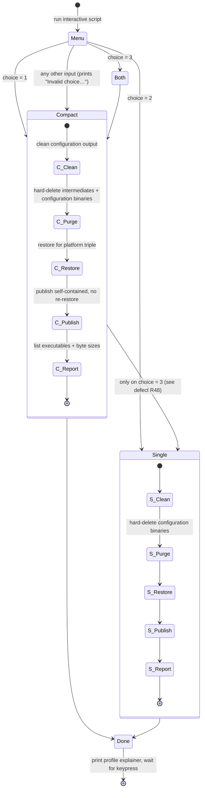

# Feature: Packaging, Build & Release Distribution

> Scope note: this dossier covers how the product is compiled, trimmed, bundled into
> distributable binaries per platform, and published as a downloadable release. It does
> **not** document what the shipped program does at runtime — it documents only the
> constraints those runtime features place on packaging.
>
> Repository analysed at pinned commit `d8c18f61d6bb73666ed97cd4885e877e35558485`
> (HEAD, dated 2025-10-14). All `file:line` citations are relative to the repository root
> `subject/chatdbg/`.

---

## Purpose — what user/business problem this solves; who uses it (actors/roles)

The product is a locally-run terminal application. It is not installed from an app store or a
package registry; it is delivered as **one downloadable executable file per operating system**
that a user can copy onto a machine and run with no prior installation of any language runtime,
framework, or dependency manager. The packaging feature exists to make that promise true.

Three problems are solved:

1. **Zero-prerequisite distribution.** The consumer must not be required to install a managed
   runtime. Every dependency (the runtime itself, all third-party libraries, all native
   payloads) is bundled inside the single delivered file
   (`docs/github-actions-release.md:75`, `.github/workflows/build-release.yml:160`).
2. **Size and start-up discipline.** A chat/debug shell that a developer launches repeatedly must
   not be a 100 MB download with a half-second cold start. Two named build profiles exist
   specifically to trade build time against artefact size and start-up latency
   (`docs/compact-build.md:118-128`).
3. **Repeatable, auditable publication.** A maintainer must be able to cut a versioned public
   release, for two platforms at once, from a clean machine, by filling in one form — and get
   generated release notes, tagged version, and attached binaries without hand-uploading files
   (`.github/workflows/build-release.yml:1-196`).

### Actors

| Actor | What they do with this feature |
|---|---|
| **Release manager / maintainer** | Triggers the release pipeline manually, supplying a version tag and a pre-release flag. Owns the credential that lets the pipeline create a public release. |
| **Developer on a workstation (Windows)** | Runs one of four local build scripts to produce a local trimmed/native/self-contained executable for smoke-testing distribution behaviour. Also builds/debugs normally in the IDE using the ordinary debug profile. |
| **End user / downloader** | Downloads one file for their OS from the published release page, marks it executable (on the POSIX build), and runs it. Performs no install step. |
| **CI runner (automated)** | A hosted, ephemeral, per-platform build agent. Builds, renames, uploads, and (in a second stage) collects and publishes. |

---

## Behavior — what it does, as observable behavior

### B1. Four named build profiles exist

The repository defines four build configurations, of which only two are declared to the IDE:

| Profile name | Declared where | Purpose |
|---|---|---|
| `Debug` | solution config list (`Xcaciv.ChatDbg.sln:25`) | day-to-day development, symbols on, no trimming |
| `Release` | solution config list (`Xcaciv.ChatDbg.sln:26`) | ordinary optimised non-bundled output |
| `Compact` | only in the two executable project files (`src/ChatDbg/Xcaciv.ChatDbg.Shell.csproj:23`, `src/ChatDbg.Shell.Gui/Xcaciv.ChatDbg.Shell.Gui.csproj:23`) | smallest artefact: native ahead-of-time compilation + aggressive dead-code removal |
| `SingleFile` | only in the two executable project files (`src/ChatDbg/Xcaciv.ChatDbg.Shell.csproj:63`, `src/ChatDbg.Shell.Gui/Xcaciv.ChatDbg.Shell.Gui.csproj:63`) | one bundled file, still just-in-time compiled, compressed, moderate trimming |

`Compact` and `SingleFile` are **absent from the solution's configuration list**
(`Xcaciv.ChatDbg.sln:24-45` enumerates only `Debug|Any CPU` and `Release|Any CPU` for all four
projects). They are reachable only by invoking the build tool against an individual project file
with an explicit configuration name.

Only the two *executable* projects define these profiles. The shared library project and the test
project define no configuration-conditioned settings at all
(`src/Xcaciv.ChatDbg.Core/Xcaciv.ChatDbg.Core.csproj:3-8`,
`src/Xcaciv.ChatDbg.Core.Tests/Xcaciv.ChatDbg.Core.Tests.csproj:3-9`).

### B2. Producing a `Compact` (native, smallest) artefact

Observable operation: *"give me the smallest, fastest-starting native executable for one target
platform."*

- **Inputs:** the console-shell project, a target platform identifier (defaulting to 64-bit
  Windows), the configuration name `Compact`.
- **Process (as scripted):** restore dependencies *for that platform triple* → clean prior output
  for that configuration → publish self-contained without re-restoring
  (`build-compact.bat:9-15`, `build-compact.ps1:12-18`).
- **Outputs:** a single native executable in a per-configuration/per-framework/per-platform
  publish folder. No debug symbol files, no runtime configuration side-car, no localisation
  satellite payloads.
- **Side effects:** deletes previous output of that configuration; on the interactive script,
  also deletes intermediate and binary directories outright
  (`build-compact-robust.bat:45-46`).
- **Reporting:** on success prints "Build completed successfully!", prints the publish folder
  path, and enumerates the produced executables. The PowerShell variant additionally prints each
  executable's size rounded to two decimal places in mebibytes (`build-compact.ps1:29-32`).
- **Termination:** waits for a keypress before exiting (`build-compact.bat:29`,
  `build-compact.ps1:41-42`, `build-singlefile.bat:43`, `build-compact-robust.bat:113`).

### B3. Producing a `SingleFile` (bundled, compressed) artefact

Observable operation: *"give me one self-extracting file that runs anywhere on this OS."*

- **Inputs:** the console-shell project, a target platform identifier, configuration `SingleFile`.
- **Process (as scripted):** clean → force-delete the configuration's binary directory → restore
  for the platform triple → publish self-contained without re-restoring
  (`build-singlefile.bat:9-16`).
- **Outputs:** one executable file that contains the runtime, all managed libraries, all native
  libraries, and all content files, compressed.
- **Reporting:** on success prints the publish path, lists each executable with its size in bytes,
  and asserts *"The executable is standalone and can be copied to any Windows machine. No .NET
  runtime installation required."* (`build-singlefile.bat:30-31`).
- **On failure:** prints the numeric failure code plus a fixed three-item troubleshooting list and
  exits with that same code (`build-singlefile.bat:33-40`).

### B4. Interactive build chooser

`build-compact-robust.bat` prints a six-line menu block and then prompts on the same line
(`build-compact-robust.bat:2-8`). Verbatim:

```
ChatDbg Build Options
=====================
1. Compact (AOT) - Smallest binary with native compilation (single .exe)
2. SingleFile - Single file executable with JIT compilation
3. Both - Build both configurations

Select build option (1-3):
```

Pressing Enter without typing leaves the choice variable unset, which takes the "anything else"
branch below.

- `1` → native/compact build only
- `2` → bundled/single-file build only
- `3` → both, compact first then single-file
- anything else → prints `Invalid choice. Building Compact by default.` and proceeds with the
  compact build (`build-compact-robust.bat:15-16`)

After each build it prints a file listing helper that reports each executable's name and byte
size, or the literal `  No executable files found` when the expected folder holds no executables
(`build-compact-robust.bat:87-98`). It closes with a fixed two-line explainer contrasting the two
profiles (`build-compact-robust.bat:109-111`).

### B5. The release pipeline (two-stage, manually triggered)

Observable operation: *"publish version X of this product for Windows and Linux."*

**Trigger.** Manual only. There is no push-, tag-, or schedule-based trigger
(`.github/workflows/build-release.yml:3-14`). The operator supplies:

| Input | Required | Type | Default | Meaning |
|---|---|---|---|---|
| `version` | yes | string | `v1.0.0` | the release/tag name, e.g. `v1.0.0`, `v1.2.3-beta` |
| `prerelease` | no | boolean | `false` | mark the published release as a pre-release |

**Stage 1 — build (runs once per target platform, in parallel).** Two platform rows are defined
(`.github/workflows/build-release.yml:22-30`):

| Row key | Agent OS | Platform triple | Executable suffix |
|---|---|---|---|
| `windows` | latest Windows agent | 64-bit Windows | `.exe` |
| `linux` | latest Ubuntu agent | 64-bit Linux | *(none)* |

Per row: check out source → install the managed SDK → restore dependencies for that platform
triple → publish the console-shell project in the `SingleFile` configuration, self-contained,
without re-restore, with bundling and in-bundle compression explicitly forced on the command
line, into `./publish/<row key>/` → derive names → rename → upload.

**Stage 2 — release (runs once, after *both* build rows succeed).** Check out source → download
all uploaded artefacts into `./artifacts/` → list them → derive the release version → write a
release-notes document → create the public release with both files attached → append a summary
block to the run's summary page.

### B6. Name derivation and renaming

Three names are computed in the build stage (`.github/workflows/build-release.yml:68-82`):

1. **Project version** — scraped out of the console-shell project file by matching the version
   element and taking its text; if the match fails, falls back to the literal `1.0.0`.
2. **Built executable name** — the fixed base name `Xcaciv.ChatDbg.Shell` plus the row's
   executable suffix.
3. **Release file name** — `chatdbg-<row key>-<platform triple><suffix>`, producing exactly
   `chatdbg-windows-win-x64.exe` and `chatdbg-linux-linux-x64`.

The built file is then renamed in place from (2) to (3), its long listing is echoed, and its byte
size is measured and echoed (`.github/workflows/build-release.yml:84-102`).

### B7. Artefact hand-off between stages

Each build row uploads exactly one file under the artefact name `chatdbg-<row key>-binary`, with a
**retention window of 7 days** (`.github/workflows/build-release.yml:104-109`). The release stage
downloads *all* artefacts into `./artifacts/`, which yields the fixed paths
`./artifacts/chatdbg-windows-binary/chatdbg-windows-win-x64.exe` and
`./artifacts/chatdbg-linux-binary/chatdbg-linux-linux-x64`
(`.github/workflows/build-release.yml:119-122, 178-180`).

### B8. Release version resolution

In the release stage the project version is scraped again (same expression, same `1.0.0`
fallback). If the operator supplied a non-empty `version` input, that value is used verbatim as
the release version; otherwise the release version is the project version prefixed with `v`
(`.github/workflows/build-release.yml:129-143`).

### B9. Generated release notes

A fixed-template document is written for every release
(`.github/workflows/build-release.yml:145-169`). Its literal, verbatim structure is:

- Heading: `## ChatDbg Release <release version>`
- `### Features` — three bullets: cross-platform chat debugging tool; support for the two hosted
  AI providers; interactive console interface.
- `### Downloads` — one bullet per platform naming the exact asset file name and its stated
  audience (`Single file executable for Windows 10/11`, `Single file executable for Linux
  distributions`).
- `### System Requirements` — "No .NET runtime installation required (self-contained)" and the
  OS floor "Windows 10/11 … or modern Linux distribution".
- `### Usage` — three numbered steps: download the right binary; on the POSIX build make it
  executable via a mode change; run it.
- A trailing provenance line naming the runtime major version and the bundling strategy used.

The template is **static**: it interpolates only the release version. It never lists the actual
file sizes, checksums, commit hash, or a change log.

### B10. Publication

The release is created with: tag name = release version; display name = `ChatDbg <release
version>`; body = the generated notes file; pre-release flag = true only when the operator's input
string equals `true`; draft = false (i.e. immediately public); both asset files attached; and
authentication taken from a repository secret named **`GH_PATT`**
(`.github/workflows/build-release.yml:171-182`).

### B11. Run summary

After publication the pipeline appends to the run summary page: a success heading, the release
version, the project version, the pre-release flag value, a "Binaries Created" list naming both
asset file names, and a hyperlink to the release page constructed from the repository slug and the
tag (`.github/workflows/build-release.yml:184-196`).

### B12. What is *not* built or published

- **The graphical terminal shell is never released.** It carries identical `Compact` and
  `SingleFile` profiles (`src/ChatDbg.Shell.Gui/Xcaciv.ChatDbg.Shell.Gui.csproj:23-97`) but no
  script and no pipeline step ever targets it. Only the plain console shell project appears in
  every script and in the pipeline.
- **No tests are executed anywhere in the release pipeline.** The pipeline has no test step
  (`.github/workflows/build-release.yml:32-109`). The test project exists and is marked
  non-packable and test-bearing (`src/Xcaciv.ChatDbg.Core.Tests/Xcaciv.ChatDbg.Core.Tests.csproj:7-8`)
  but nothing in this feature runs it.
- **No macOS artefact** is produced, despite documentation listing macOS platform triples as
  supported targets (`docs/compact-build.md:112-116`) and both docs showing how to add a macOS
  row (`docs/github-actions-release.md:161-164`, `docs/release-setup-complete.md:107-112`).
- **No library package** is produced for the shared core library; it has no version metadata and
  no packaging settings (`src/Xcaciv.ChatDbg.Core/Xcaciv.ChatDbg.Core.csproj:3-8`).
- **No installer, no archive, no checksum file, no signature.** Raw executables are attached
  directly.
- **No licence file, notice file, or written-offer-of-source is attached to the release**, even
  though the repository ships a copyleft licence (`LICENSE:1-2`, GNU GPL version 3).

---

## Business rules & edge cases

Every rule below is stated with its evidence and, where a number appears, that number's meaning.

### Toolchain pinning

| # | Rule | Evidence | Meaning of the magic value |
|---|---|---|---|
| R1 | The build toolchain version is pinned repository-wide to an exact pre-release SDK build. | `global.json:2-5` | `10.0.100-rc.1.25451.107` — release-candidate 1 of the 10.0.100 feature band. |
| R2 | Version resolution rolls forward to the newest patch of the newest *feature band* of that same major/minor, but never to a different major/minor. | `global.json:4` | `latestFeature` |
| R3 | **QUIRK — the pin file is not valid JSON.** It ends with two closing braces where one is required, leaving trailing data after the document. | `global.json:6` (the file's last 6 bytes are `  }\n}}` — one closing brace too many after the top-level object; total file length 96 bytes) | Any strict parser rejects it; the toolchain refuses to start with a parse error rather than falling back to a default SDK. |
| R4 | Every project compiles against the same single target framework moniker. | `src/ChatDbg/Xcaciv.ChatDbg.Shell.csproj:5`, `src/ChatDbg.Shell.Gui/Xcaciv.ChatDbg.Shell.Gui.csproj:5`, `src/Xcaciv.ChatDbg.Core/Xcaciv.ChatDbg.Core.csproj:4`, `src/Xcaciv.ChatDbg.Core.Tests/Xcaciv.ChatDbg.Core.Tests.csproj:4` | `net10.0` — runtime major version 10. |
| R5 | The only repository-wide compiler setting is "use the newest language version available". | `Directory.Build.props:1-5` | Applies by directory inheritance to all four projects. |
| R6 | **QUIRK — the release pipeline installs the *wrong major* SDK.** It requests the 9.x line. | `.github/workflows/build-release.yml:36-39` (`dotnet-version: '9.0.x'`) | Contradicts R1/R2/R4. A 9.x SDK satisfies neither the pin nor the target framework. |
| R7 | **QUIRK — every local build script hard-codes an output path containing the previous framework moniker `net9.0`.** | `build-compact.bat:20,22`; `build-compact.ps1:23,27`; `build-singlefile.bat:21,25`; `build-compact-robust.bat:57,58,80,81` | Actual output lands under `net10.0`; the scripts' post-build listing therefore inspects a non-existent folder. |

### Compile settings applied to every project

| # | Rule | Evidence | Meaning of the magic value |
|---|---|---|---|
| R72 | Implicit namespace imports are on in all four projects, so source files omit the common import preamble. | `…Shell.csproj:6`, `…Gui.csproj:6`, `Core.csproj:5`, `Core.Tests.csproj:5` | A port must either reproduce whatever implicit-import set its own language provides or restore the imports explicitly. |
| R73 | Compile-time null-state checking is on in all four projects. | `…Shell.csproj:7`, `…Gui.csproj:7`, `Core.csproj:6`, `Core.Tests.csproj:6` | Diagnostics only — nothing anywhere in the repository turns warnings into errors, so a nullability violation never fails a build or a release. |
| R74 | **The shared library alone is compiled with raw pointer / unmanaged-memory access permitted.** The two executables and the test project are not. | `Core.csproj:7` (`AllowUnsafeBlocks`), setting absent from the other three project files | Required by the local-inference integration. A port must decide whether its equivalent layer needs raw-memory access and whether that survives an ahead-of-time or trimmed build. |
| R75 | The only repository-wide compiler setting is "newest language version". There is no repository-wide warning level, no warnings-as-errors, no deterministic-build flag, no continuous-integration-build flag, and no source-link configuration. | `Directory.Build.props:1-5` — the whole file is 5 lines and one property | This is why reproducibility is not achievable (see Non-functional observations). |
| R76 | **No trim-safety annotation, no serialization source-generator context, no trimmer-root list, and no linker descriptor file exists anywhere in the source.** | verified absent across every `.cs` file under `src/` and all four project files | Combined with R14/R29 (all trim diagnostics suppressed), the repository contains *zero* evidence that anything was ever checked for trim safety. See quirks Q13 and Q14. |

### Profile rules — `Compact`

All from `src/ChatDbg/Xcaciv.ChatDbg.Shell.csproj:23-60` and the byte-identical block at
`src/ChatDbg.Shell.Gui/Xcaciv.ChatDbg.Shell.Gui.csproj:23-60`.

| # | Rule | Line | Meaning / consequence |
|---|---|---|---|
| R8 | Compile ahead-of-time to native machine code. | `:25` | No just-in-time compiler ships; start-up is process-load only. |
| R9 | Remove unreferenced code. | `:26` | Reachability-based pruning. |
| R10 | Bundle the runtime with the app. | `:27` | No runtime prerequisite on the target machine. |
| R11 | If the caller did not name a target platform, default to 64-bit Windows. | `:30` | Condition is *"only when empty"* — an explicit platform on the command line always wins. |
| R12 | Emit a native launcher stub. | `:31` | The artefact is directly executable. |
| R13 | Trimming granularity is **full** — every assembly is trimmed, including the framework. | `:34` | Maximum size reduction; maximum risk to reflection-based code paths. |
| R14 | **All trim-analysis warnings are suppressed.** | `:35` | Trim-unsafe patterns are silently accepted; failures surface only at run time. |
| R15 | Produce no debug information of any kind. | `:38` | No symbol side-car, no in-binary debug data. |
| R16 | Do not emit a runtime configuration side-car file. | `:39` | See R38 (edge case). |
| R17 | Keep only English localisation resources. | `:42` | All other language satellite payloads are dropped. |
| R18 | Optimise the compile. | `:45` | Explicitly set because the configuration name is not one the toolchain recognises as optimised by default (see R33). |
| R19 | Do not synthesise assembly-identity metadata; do not stamp the target-framework marker. | `:48-49` | The `Compact` artefact **loses the version/title/company/copyright metadata** declared at `:10-19`. |
| R20 | Run without culture data (invariant-only globalisation). | `:52` | Culture-sensitive string comparison, casing, and formatting collapse to invariant behaviour. |
| R21 | Replace framework exception/message strings with short symbolic keys. | `:53` | **User-visible:** runtime error text in a `Compact` build is a key such as an argument-exception identifier, not a sentence. |
| R22 | Optimise the native code generator for size rather than speed. | `:56` | |
| R23 | Fold identical method bodies together. | `:57` | Size reduction; makes stack frames ambiguous. |
| R24 | Do not embed stack-trace metadata. | `:58` | **User-visible:** crash reports and caught-exception traces in a `Compact` build carry no frame names. |
| R25 | Strip native symbols from the produced binary. | `:59` | |

### Profile rules — `SingleFile`

All from `src/ChatDbg/Xcaciv.ChatDbg.Shell.csproj:63-97` and the byte-identical block at
`src/ChatDbg.Shell.Gui/Xcaciv.ChatDbg.Shell.Gui.csproj:63-97`.

| # | Rule | Line | Meaning / consequence |
|---|---|---|---|
| R26 | Bundle everything into one file; keep just-in-time compilation. | `:65` | |
| R27 | Remove unreferenced code, bundle the runtime, default to 64-bit Windows when unspecified, emit a launcher stub. | `:66-71` | Same defaults as `Compact`. |
| R28 | Trimming granularity is **partial** — only assemblies that opt in are trimmed. | `:74` | Deliberately gentler than `Compact` (R13) so reflection-heavy dependencies survive. |
| R29 | Trim warnings suppressed; no debug info; no runtime configuration side-car; English-only resources; optimise. | `:75-85` | Same as R14-R18. |
| R30 | Compress the bundled payload inside the executable. | `:86` | Trades a decompression cost at first start for download size. |
| R31 | Include native libraries in the self-extraction set. | `:87` | Without this, platform-specific native payloads are not carried inside the one file. |
| R32 | Include *all* content files in the self-extraction set. | `:88` | |
| R33 | **Unlike `Compact`, keep assembly-identity metadata and the target-framework marker.** | `:91-92` | The released artefact therefore *does* carry version `1.0.0`, title, company, product, and copyright. |
| R34 | Run invariant-only and use symbolic resource keys, exactly as `Compact`. | `:95-96` | Same user-visible consequences as R20/R21. |

### Cross-cutting build rules

| # | Rule | Evidence | Notes |
|---|---|---|---|
| R35 | **The shared library is compiled *unoptimised* in both distribution profiles.** The two distribution profiles set the optimise flag only inside the executable projects; the library project has no configuration-conditioned block at all, and the configuration names `Compact`/`SingleFile` are not ones the toolchain recognises as optimised. | `src/Xcaciv.ChatDbg.Core/Xcaciv.ChatDbg.Core.csproj:3-8` (no conditioned group) vs `src/ChatDbg/Xcaciv.ChatDbg.Shell.csproj:45,85` | All domain logic ships unoptimised inside an otherwise size-optimised artefact. **INFERRED** from the absence of the setting plus the profile-name mismatch; not directly asserted anywhere. |
| R36 | Version metadata is declared identically and independently in both executable projects, and nowhere else. | `src/ChatDbg/Xcaciv.ChatDbg.Shell.csproj:10-12`, `src/ChatDbg.Shell.Gui/Xcaciv.ChatDbg.Shell.Gui.csproj:10-12` | Product version `1.0.0`; assembly and file version `1.0.0.0` (four-part). Two files must be edited in lock-step. |
| R37 | Assembly descriptive metadata is fixed strings. | `…Shell.csproj:15-19`, `…Gui.csproj:15-19` | Title `ChatDbg Shell` (*the graphical project uses the same title as the console project*), description `Cross-platform chat debugging tool with AWS Bedrock and Azure OpenAI support`, company `Xcaciv`, product `ChatDbg`, copyright `Copyright © Xcaciv 2024`. |
| R38 | **EDGE CASE / suspected defect: suppressing the runtime-configuration side-car in the `SingleFile` profile.** A bundled, just-in-time artefact needs that side-car inside the bundle to start. | `…Shell.csproj:79` | Empirical corroboration: the committed pre-built Linux artefact `test-publish/Xcaciv.ChatDbg.Shell` contains an uncompressed dependency manifest (strings `"runtimeTarget"`, `"targets"`, 65 assembly entries) but **no runtime-options block** (`"runtimeOptions"`/`"configProperties"` absent). **INFERRED** that this artefact fails to start; the binary was not executed. |
| R39 | Both executable projects exclude whole source sub-trees from compilation by name. | `…Shell.csproj:98-105` (`Serialization`, `Services`), `…Gui.csproj:98-111` (`Commands`, `Models`, `Serialization`, `Services`) | Most of these folders no longer exist on disk, making the exclusions inert. The graphical project's `Services` folder *does* exist and is excluded wholesale, then exactly two files are re-included by name (`…Gui.csproj:112-115`) — those two are the only files in that folder, so the net effect is also inert. |
| R40 | Third-party dependency versions are pinned exactly, per project, with no central version file. | `…Shell.csproj:107-111`; `…Gui.csproj:117-122`; `Core.csproj:10-17`; `Core.Tests.csproj:11-20` | See the External technology table for the full pinned list. |
| R41 | The two hosted-AI client libraries and the console-rendering library are referenced **redundantly** by the executable projects even though the shared library already references them. | `…Shell.csproj:108-110` vs `Core.csproj:11,12,16` | Three duplicated pins that must be kept in sync manually. |
| R42 | The test-runner integration package contributes no compile-time or transitive surface. | `Core.Tests.csproj:14-17` (asset filtering + private assets) | Standard isolation of a test adapter. |
| R43 | The test project is explicitly non-packable and explicitly flagged as a test project. | `Core.Tests.csproj:7-8` | |
| R77 | **The shipped code loads and saves all of its persistent state through reflection-driven structured serialization, with no serializer context supplied at any call site.** | `SettingsService.cs:35,56,97`; `SystemPromptService.cs:57,88,106`; `ChatHistoryService.cs:35,57`; `BedrockService.cs:107,115,126`; `AzureOpenAIService.cs:165`; `LLamaSharpService.cs:637` | Every one of these call sites runs inside an artefact built with dead-code removal on and its diagnostics silenced (R14, R29). The project's own documentation prescribes the source-generator remedy (`docs/compact-build.md:145`) that the code does not use. See quirk Q13. |
| R78 | The inference layer resolves one platform method **by literal name at run time**. | `src/Xcaciv.ChatDbg.Core/Services/LLamaSharpService.cs:423` (string `"GetLogits"`) | Reachability analysis cannot see a name-based lookup, so the `Compact` profile's whole-framework trimming (R13) is free to remove the target. The call site treats "not found" as an empty result, so the failure is silent. See quirk Q14. |
| R79 | **Nothing anywhere installs the native compiler/linker toolchain that ahead-of-time compilation requires.** No script, no pipeline step, and no prerequisite list mentions it; the stated prerequisites are an SDK, 8 GB RAM and an SSD. | `docs/compact-build.md:168-173`; absence across `build-*.bat`, `build-compact.ps1`, `.github/workflows/build-release.yml` | **INFERRED** consequence: the `Compact` profile cannot complete on a stock developer machine or a stock CI agent. Nothing in CI ever exercises that profile, so the gap is invisible. See quirk Q15. |
| R80 | The shipped bundled artefact **unpacks itself to disk before it runs**, because both "include native payloads" and "include all content" self-extraction switches are on together with in-bundle compression. | `…Shell.csproj:86,87,88` | **INFERRED** from the platform's documented behaviour for those switches; not asserted anywhere in this repository. It contradicts the "copy one file anywhere and run it" promise (`build-singlefile.bat:30-31`, `.github/workflows/build-release.yml:160`) on any machine with no writable temporary area. See quirk Q16. |
| R81 | The graphical shell's about box carries a hard-coded version literal that no build step, script, or pipeline stage updates. | `src/ChatDbg.Shell.Gui/UI/ChatWindow.cs:1131` (literal `ChatDbg v1.0`) — declared versions are `1.0.0` / `1.0.0.0` at `…Gui.csproj:10-12` | Three independent version facts must be edited by hand for one release (see W3). |


### Script rules and edge cases

| # | Rule | Evidence | Notes |
|---|---|---|---|
| R44 | Every script first anchors the working directory to the script's own location. | `build-compact.bat:6`, `build-compact.ps1:9`, `build-compact-robust.bat:10`, `build-singlefile.bat:6` | All later paths are repository-relative. |
| R45 | **Ordering matters: restore is platform-specific and must precede publish, and publish must not re-restore.** All four scripts restore with an explicit platform triple, then publish with re-restore disabled. | `build-compact.bat:9,15`; `build-compact.ps1:12,18`; `build-singlefile.bat:13,16`; `build-compact-robust.bat:49,52,72,75` | |
| R46 | **QUIRK: the simple compact script restores *before* cleaning**, i.e. clean can invalidate what restore just produced. The "robust" script inverts this: clean → hard-delete intermediates → hard-delete the configuration's binaries → restore → publish. | `build-compact.bat:9-15` vs `build-compact-robust.bat:43-52` | The documented failure mode "*project.assets.json doesn't have a target for `net9.0/win-x64`*" is attributed to exactly this and its documented remedy is the robust script or a manual hard-delete of the intermediate and binary directories (`docs/compact-build.md:132-140`). |
| R47 | The restore step never passes the configuration name; only the platform triple. | all four scripts | Restore therefore resolves assets under the default configuration. |
| R48 | **DEFECT: the interactive script destroys the executable search path.** Its file-listing subroutine assigns its first argument to a variable whose name collides with the process search-path variable. | `build-compact-robust.bat:88` | Consequence: after the compact build's listing runs, the search path is the publish folder. Choosing menu option `3` ("Both") then invokes the build tool for the single-file build (`:75`) with a destroyed search path, so the second build fails to launch. Options `1` and `2` are unaffected in practice because only shell-internal commands follow. |
| R49 | The interactive script's size line prints the same byte count twice. | `build-compact-robust.bat:94` | Cosmetic. |
| R50 | Failure handling differs per script: the two single-purpose batch scripts and the PowerShell script **propagate the build tool's exit code**; the interactive script only prints a message and continues. | `build-compact.bat:23-27`, `build-singlefile.bat:32-40`, `build-compact.ps1:34-38` vs `build-compact-robust.bat:59-61,82-84` | |
| R51 | All scripts block on a keypress at the end. | `build-compact.bat:29`, `build-compact.ps1:41-42`, `build-singlefile.bat:43`, `build-compact-robust.bat:113` | **Unsuitable for unattended/CI use** — a script invoked headlessly hangs. |
| R52 | The PowerShell script reports size in mebibytes rounded to **2 decimal places**; the batch scripts report raw bytes. | `build-compact.ps1:31` vs `build-singlefile.bat:26`, `build-compact-robust.bat:94` | Inconsistent units across scripts. |
| R53 | Only the console shell is ever named by any script. | all four scripts | The graphical shell has no build script. |
| R54 | Only the 64-bit Windows platform triple is ever named by any script. | all four scripts | Cross-platform targets exist only as documentation (`docs/compact-build.md:100-116`). |
| R82 | Empty input at the interactive prompt takes the "anything else" branch. Pressing Enter without typing leaves the choice variable unset, so none of the three equality tests matches. | `build-compact-robust.bat:8,12-16` | Observable result is identical to typing `9`: `Invalid choice. Building Compact by default.` |
| R83 | The interactive script's hard-delete of intermediates removes the *whole* intermediate directory, not just the configuration being built. | `build-compact-robust.bat:45` (`src\ChatDbg\obj`) | Restore state for `Debug`, `Release` and `SingleFile` is destroyed as a side effect of building `Compact`. This is what makes the "robust" script reliable and also what makes it slow. |
| R84 | No script builds, runs, or even mentions the test project. | all four scripts | There is no local quality gate either — matching the pipeline (B12). |


### Pipeline rules and edge cases

| # | Rule | Evidence | Notes |
|---|---|---|---|
| R55 | The pipeline is manual-dispatch only. | `.github/workflows/build-release.yml:3-4` | No automatic release on tag or merge. |
| R56 | The version input is **required** and pre-filled with `v1.0.0`. | `:6-9` | Because it is required, the "fall back to project version" branch in the release stage is unreachable through the UI. |
| R57 | The pre-release input is optional, typed boolean, default false; it is compared as the **string** `'true'` when applied. | `:10-14`, `:177` | |
| R58 | Both platform rows are built in parallel, and the release stage runs only after **both** succeed. | `:20-30`, `:113` | Failure of either row prevents publication entirely. |
| R59 | **Default fail-fast applies** — no opt-out is declared, so a failure in one platform row cancels the other. | `:20-22` (no `fail-fast` key) | |
| R60 | The publish command is written twice, once per host shell dialect, gated on the row key. | `:44-55` (Windows dialect), `:56-66` (POSIX dialect) | Any change must be applied to both copies. |
| R61 | Bundling and in-bundle compression are **re-asserted on the command line** even though the named configuration already sets them. | `:52-53`, `:64-65` vs `…Shell.csproj:65,86` | Command-line properties become global and flow to referenced projects too. |
| R62 | The publish output directory is explicit per row: `./publish/<row key>`. | `:54`, `:66` | Bypasses the default per-configuration/per-framework/per-platform layout, and therefore side-steps the stale-`net9.0`-path problem R7. |
| R63 | Version scraping uses a text pattern over the raw project file and falls back to the literal `1.0.0` when unmatched — it does **not** consult build output metadata. | `:73`, `:133` | Renaming or reformatting the version element silently degrades to `1.0.0`. |
| R64 | The renaming step runs under a POSIX-style shell even on the Windows agent. | `:85` | Requires such a shell to exist on the Windows agent. |
| R65 | Byte size is measured with a POSIX stat call, with a byte-count fallback on the Windows row only. | `:95-99` | The measured value is written to a step output that is **never consumed**. |
| R66 | Uploaded artefacts expire after **7 days**. | `:109` | Meaning: 7 calendar days of retention for the intermediate binaries. |
| R67 | Release asset paths in the publish step are **hard-coded**, not derived from the matrix. | `:178-180` | Adding a platform row requires a second, separate edit here. |
| R68 | Publication authenticates with a repository secret named `GH_PATT` (a long-lived personal access token), not the ambient job token. | `:181` | |
| R69 | The release is created **non-draft**, i.e. immediately public. | `:182` | No review gate. |
| R70 | The release action is referenced by a floating major-version tag rather than a pinned commit. | `:172` | Supply-chain drift risk. |
| R71 | The release stage checks out the source again solely to scrape the version. | `:116-117`, `:133` | |
| R85 | **The pipeline restores without naming the configuration**, then publishes a *different* configuration with re-restore disabled. | restore at `:42` (no `-c`), publish at `:48` / `:60` (`-c SingleFile`) with `--no-restore` at `:51` / `:63` | Structurally the same mismatch the local scripts hit (R46/F3). It has not bitten yet only because the output directory is overridden (R62). |
| R86 | **The operator-supplied version string is interpolated into shell commands before the shell sees them.** | `:136-137` (inside a `[[ … ]]` test and an assignment) and `:148` (inside the notes document) | A dispatch value containing shell metacharacters runs as commands on the runner — in the same job that holds the long-lived publication credential (`:181`). See quirk Q19. |
| R87 | The version scrape emits **every** match, not the first. | `:73`, `:133` | With exactly one version element in the project file (`…Shell.csproj:10`) this is currently harmless. A second one would produce a multi-line step output, which the step-output file format rejects. See quirk Q20. |
| R88 | Job display names interpolate the matrix key verbatim, so they render lower-cased. | `:18` | Observable names are `Build windows Binary` and `Build linux Binary`. |
| R89 | The release job downloads into a directory name the repository's own ignore rules exclude. | `.github/workflows/build-release.yml:122` (`./artifacts`) vs `.gitignore:29` (`artifacts/`) | Harmless on an ephemeral runner; a local reproduction of the release job would silently hide its own downloads. |
| R90 | No pipeline step ever names, builds, or runs the graphical shell, the shared library on its own, or the test project. | `.github/workflows/build-release.yml:1-196` | Confirms B12 by exhaustion. |


### Test-derived rules — what the suite pins down that packaging must not break

**No test anywhere exercises this feature.** Verified exhaustively: no file under
`src/Xcaciv.ChatDbg.Core.Tests/` mentions a build configuration name (`Compact`, `SingleFile`),
a publish output path, a framework moniker (`net9.0`, `net10.0`), a project file, trimming,
ahead-of-time compilation, or the release pipeline. The suite is **100 test cases across 38 test
files** and none of them is a packaging test. There is therefore no automated protection against
any of the defects listed under Quirks.

What the suite *does* pin down are the runtime invariants a packaged artefact has to keep alive
through trimming, bundling and invariant globalisation. Each is a real constraint on packaging, so
each is recorded here as a rule with the assertion that establishes it.

| # | Rule | Evidence | Why packaging depends on it |
|---|---|---|---|
| T1 | The platform-specific credential store reports success **exactly when** the host operating system is the one it supports. The test asserts equality between "the write succeeded" and "the store is available on this OS" rather than asserting a fixed outcome. | `src/Xcaciv.ChatDbg.Core.Tests/Models/WindowsCredentialManagerTests.cs:17-26`; guard at `src/Xcaciv.ChatDbg.Core/Models/WindowsCredentialManager.cs:171` | This is the single invariant that lets **one** source tree be published to two platform triples with no per-platform source variant and no per-platform build profile. |
| T2 | Reading a credential that does not exist returns "no value" on **every** operating system. It never throws and never surfaces a platform error. | `…/WindowsCredentialManagerTests.cs:10-15`; guards at `…/WindowsCredentialManager.cs:59,103,150` | The POSIX release asset must start and run normally even though this whole code path is inert on it. |
| T3 | The settings store's directory is caller-supplied; when supplied, the resolved settings file path begins with that directory (compared case-insensitively). Default when not supplied: `<user profile>/.ChatDbg/settings.json`. | `src/Xcaciv.ChatDbg.Core.Tests/Services/SettingsServiceTests.cs:12-37`; default at `src/Xcaciv.ChatDbg.Core/Services/SettingsService.cs:11,15-25` | Nothing is written next to the executable. This is precisely what makes a single read-only downloaded file a viable distribution unit. |
| T4 | Loading settings when no settings file exists returns a populated default object instead of failing, and the default model identifier is non-empty. (The implementation also *writes* the defaults on that first read — `SettingsService.cs:47-53`.) | `…/SettingsServiceTests.cs:39-58` | A freshly downloaded binary starts on a machine with no prior state and with no configuration file shipped alongside it. |
| T5 | Constructing the prompt store **creates** its directory and seeds the default prompts; the resolved directory contains the caller-supplied base directory. Default: `<local application data>/ChatDbg/system_prompts`. | `src/Xcaciv.ChatDbg.Core.Tests/Services/SystemPromptServiceTests.cs:12-31`; default at `src/Xcaciv.ChatDbg.Core/Services/SystemPromptService.cs:13-29` | First run of a downloaded binary writes into a per-user directory; the install location stays read-only, and a second copy of the binary shares the same state. |
| T6 | Token-analysis records round-trip through reflection-driven structured serialization **with no serializer context supplied**, and the assertions cover a nested collection and a nested object, comparing a floating-point field to 3 decimal places. | `src/Xcaciv.ChatDbg.Core.Tests/Services/TokenInspection/TokenAnalysisTests.cs:158-170` | This is the sharpest trimming hazard in the product: the behaviour the test guarantees is exactly the behaviour dead-code removal is documented to break. The test runs only in an untrimmed build. See quirk Q13. |
| T7 | Credential values are read from environment variables **in preference to** stored values, and the reported source string contains the phrase `environment variable`. Exact variable names asserted: `CHATDBG_AZURE_API_KEY` and `CHATDBG_AWS_ACCESS_KEY`. | `src/Xcaciv.ChatDbg.Core.Tests/Models/ChatSettingsTests.cs:11,28-39,55-71`; lookup at `src/Xcaciv.ChatDbg.Core/Models/ChatSettings.cs:88-98,174-181` | A packaged single file is fully configurable through the environment, so no companion configuration file has to be shipped, installed, or attached to a release. |
| T8 | The inference logger's defaults are: file logging **on**, debug output **on**, console output **off**, in-memory buffer cap **10000** entries, log directory non-null. | `src/Xcaciv.ChatDbg.Core.Tests/Services/TokenInspection/LLamaSharpLogConfigTests.cs:10-22`; default directory at `src/Xcaciv.ChatDbg.Core/Services/TokenInspection/LLamaSharpLogConfig.cs:20` | A packaged artefact writes log files into a *third* per-user location, distinct from the settings and prompt locations. See quirk Q17. |
| T9 | The hosted-provider clients are produced by concrete factory objects created directly at the call site — not resolved from a container, not discovered by name, not located by scanning. | `src/Xcaciv.ChatDbg.Core.Tests/Services/DefaultFactoriesTests.cs:10-34` | Direct construction is visible to reachability analysis, so this part of the object graph survives dead-code removal. It is the *only* part of the persistence/AI graph that does. |

### Exact literal strings, paths, identifiers and defaults

Nothing in this subsection is paraphrased.

**Toolchain and framework values**

| Value | Meaning | Where |
|---|---|---|
| `10.0.100-rc.1.25451.107` | exact pinned toolchain build (a *pre-release*) | `global.json:3` |
| `latestFeature` | roll-forward policy: newest patch of the newest feature band within the same major/minor | `global.json:4` |
| `net10.0` | target framework moniker, all four projects | `…Shell.csproj:5`, `…Gui.csproj:5`, `Core.csproj:4`, `Core.Tests.csproj:4` |
| `latest` | language version, repository-wide | `Directory.Build.props:3` |
| `9.0.x` | toolchain line the pipeline actually installs | `.github/workflows/build-release.yml:39` |
| `net9.0` | framework folder every local script expects — stale | `build-compact.bat:20,22`; `build-compact.ps1:23,27`; `build-singlefile.bat:21,25`; `build-compact-robust.bat:57,58,80,81` |
| `win-x64`, `linux-x64` | platform triples actually built | `…Shell.csproj:30,70`; `.github/workflows/build-release.yml:25,29`; all four scripts |
| `osx-x64`, `osx-arm64` | platform triples documented but never built | `docs/compact-build.md:112,115` |
| `Debug`, `Release` | the only two configurations the solution enumerates | `Xcaciv.ChatDbg.sln:25-26` |
| `Compact`, `SingleFile` | configurations that exist only inside the two executable project files | `…Shell.csproj:23,63`; `…Gui.csproj:23,63` |
| `full`, `partial` | trimming granularity in `Compact` and `SingleFile` respectively | `…Shell.csproj:34,74` |
| `Size` | native code-generator preference in `Compact` | `…Shell.csproj:56` |
| `en` | the only retained localisation language, both profiles | `…Shell.csproj:42,82` |
| `7` | artefact retention, in days | `.github/workflows/build-release.yml:109` |
| `10000` | in-memory log buffer cap a packaged artefact runs with | `…/LLamaSharpLogConfigTests.cs:20` |
| `1.0.0` / `1.0.0.0` | product version / assembly and file version | `…Shell.csproj:10-12`, `…Gui.csproj:10-12` |
| `v1.0.0` | the pre-filled release-version input | `.github/workflows/build-release.yml:9` |
| `15,677,171` bytes | size of the one committed pre-built artefact | `test-publish/Xcaciv.ChatDbg.Shell` |

**Build and output paths, verbatim as written**

| Path | Where | Note |
|---|---|---|
| `src\ChatDbg\bin\Compact\net9.0\win-x64\publish\` | `build-compact.bat:20,22`; `build-compact.ps1:23,27`; `build-compact-robust.bat:57,58`; `docs/compact-build.md:97` | stale — real output lands under `net10.0` |
| `src\ChatDbg\bin\SingleFile\net9.0\win-x64\publish\` | `build-singlefile.bat:21,25`; `build-compact-robust.bat:80,81`; `docs/compact-build.md:98` | stale, same reason |
| `src\ChatDbg\obj` | hard-deleted at `build-compact-robust.bat:45`; documented remedy at `docs/compact-build.md:137` | wipes restore state for *all* configurations |
| `src\ChatDbg\bin\Compact`, `src\ChatDbg\bin\SingleFile` | hard-deleted at `build-compact-robust.bat:46,69`, `build-singlefile.bat:10` | |
| `src\ChatDbg\bin` | hard-deleted only in the documented manual remedy | `docs/compact-build.md:138` |
| `./publish/windows`, `./publish/linux` | pipeline publish output | `.github/workflows/build-release.yml:54,66` |
| `./artifacts` | pipeline artefact download root | `.github/workflows/build-release.yml:122` |
| `./artifacts/chatdbg-windows-binary/chatdbg-windows-win-x64.exe` | hard-coded release asset path | `.github/workflows/build-release.yml:179` |
| `./artifacts/chatdbg-linux-binary/chatdbg-linux-linux-x64` | hard-coded release asset path | `.github/workflows/build-release.yml:180` |
| `release_notes.md` | generated notes file in the release job's working directory | `.github/workflows/build-release.yml:147,176` |
| `test-publish/Xcaciv.ChatDbg.Shell` | committed pre-built artefact, not covered by any ignore rule | repository tree vs `.gitignore:10-24` |
| `<platform triple>/native/` holding `llama.dll` + `libllama.dll` (Windows) or `libllama.so` (POSIX) | where the native inference payloads land before bundling | `docs/LLamaSharp-Troubleshooting-0xC0000005.md:26-30` |

**Per-user paths a packaged artefact creates at run time** — the reason the install location can stay read-only

| Path | Where |
|---|---|
| `<user profile>/.ChatDbg/settings.json` | `src/Xcaciv.ChatDbg.Core/Services/SettingsService.cs:11,15-25` |
| `<temp>/settings.json` — fallback when the user-profile lookup throws or resolves empty | `src/Xcaciv.ChatDbg.Core/Services/SettingsService.cs:20-31` |
| `<local application data>/ChatDbg/system_prompts/` | `src/Xcaciv.ChatDbg.Core/Services/SystemPromptService.cs:14-23` |
| `<application data>/ChatDbg/Logs` | `src/Xcaciv.ChatDbg.Core/Services/TokenInspection/LLamaSharpLogConfig.cs:20` |

**Environment variable and secret names**

| Name | Role | Evidence |
|---|---|---|
| `CHATDBG_AZURE_API_KEY` | overrides the stored hosted-provider key in a packaged artefact | `src/Xcaciv.ChatDbg.Core.Tests/Models/ChatSettingsTests.cs:11` |
| `CHATDBG_AWS_ACCESS_KEY` | overrides the stored cloud access key | `src/Xcaciv.ChatDbg.Core.Tests/Models/ChatSettingsTests.cs:55` |
| `AWS_ACCESS_KEY_ID` | presence switches the cloud client to the ambient credential chain | `src/Xcaciv.ChatDbg.Core/Services/BedrockService.cs:27` |
| `GH_PATT` | repository secret holding the release-publication credential (a long-lived personal access token) | `.github/workflows/build-release.yml:181` |
| `GITHUB_OUTPUT` | file the build steps append derived names and the measured size to | `.github/workflows/build-release.yml:74,78,82,101,142,143` |
| `GITHUB_STEP_SUMMARY` | file the run-summary block is appended to | `.github/workflows/build-release.yml:186-196` |
| `DOTNET_BUNDLE_EXTRACT_BASE_DIR` | **INFERRED** — the platform-standard override for where a compressed self-extracting bundle unpacks at first run. Not referenced anywhere in this repository, but it is the only lever a user has over the extraction cache the shipped profile forces (R80, quirk Q16). | not present in repo |

**Verbatim script output — `build-compact.bat`**

`Building ChatDbg with Compact configuration...` (:2) · `This will create the smallest possible binary using AOT compilation and trimming.` (:3) ·
`Restoring packages for win-x64 runtime...` (:8) · `Cleaning previous builds...` (:11) ·
`Building and publishing Compact configuration...` (:14) · `Build completed successfully!` (:19) ·
`Output location: src\ChatDbg\bin\Compact\net9.0\win-x64\publish\` (:20) ·
`Build failed with error code <n>` (:25)

**Verbatim script output — `build-compact.ps1`**

Same wording as above, printed in colour (green :4, yellow :5, cyan :11/:14/:17, green :22, white :23,
magenta :31, red :36, grey :41), plus:
`Executable: <file name> - Size: <n> MB` (:31 — mebibytes, rounded to **2** decimal places) ·
`Press any key to continue...` (:41)

**Verbatim script output — `build-singlefile.bat`**

`Building ChatDbg with SingleFile configuration...` (:2) · `This creates a single executable file that can be run standalone.` (:3) ·
`Cleaning previous builds...` (:8) · `Restoring packages for win-x64 runtime...` (:12) ·
`Building and publishing SingleFile configuration...` (:15) · `Build completed successfully!` (:20) ·
`Output location: src\ChatDbg\bin\SingleFile\net9.0\win-x64\publish\` (:21) · `Executable files:` (:24) ·
`  <file name> - Size: <n> bytes` (:26) ·
`The executable is standalone and can be copied to any Windows machine.` (:30) ·
`No .NET runtime installation required.` (:31) ·
on failure: `Build failed with error code <n>` (:34), `Troubleshooting:` (:36),
`1. Ensure .NET 9 SDK is installed` (:37), `2. Check network connectivity for package restore` (:38),
`3. Verify project file syntax` (:39)

**Verbatim script output — `build-compact-robust.bat`**

Menu block at :2-8 is reproduced under B4. Then:
`Invalid choice. Building Compact by default.` (:15) ·
`Building ChatDbg with Compact (AOT) configuration...` (:20) · `This creates the smallest possible native binary using AOT compilation.` (:21) ·
`Building ChatDbg with SingleFile configuration...` (:27) · `This creates a single executable file with JIT compilation.` (:28) ·
`Building both configurations...` (:34) ·
`=== COMPACT (AOT) BUILD ===` (:42) · `=== SINGLE FILE BUILD ===` (:66) ·
`Cleaning previous Compact builds...` (:43) · `Cleaning previous SingleFile builds...` (:67) ·
`Restoring packages for Compact configuration...` (:48) · `Restoring packages for SingleFile configuration...` (:71) ·
`Compact build completed successfully!` (:56) · `SingleFile build completed successfully!` (:79) ·
`Compact build failed with error code <n>` (:60) · `SingleFile build failed with error code <n>` (:83) ·
`Output: <stale path>` (:57, :80) ·
`<config> Files:` (:91) · `  <file name> - <n> bytes (~<n> bytes)` (:94 — **the same byte count printed twice**) ·
`  No executable files found` (:97) · `All files in <config> output:` (:101) ·
`Build process completed!` (:107) · `Notes:` (:109) ·
`- Compact (AOT): Native compilation, fastest startup, smallest size` (:110) ·
`- SingleFile: JIT compilation, single file, faster builds` (:111)

**Verbatim generated release notes** (`.github/workflows/build-release.yml:147-169`) — only
`<release version>` is substituted:

```
## ChatDbg Release <release version>

### Features
- Cross-platform chat debugging tool
- Support for AWS Bedrock and Azure OpenAI
- Interactive console interface with Spectre.Console

### Downloads
- **Windows x64**: `chatdbg-windows-win-x64.exe` - Single file executable for Windows 10/11
- **Linux x64**: `chatdbg-linux-linux-x64` - Single file executable for Linux distributions

### System Requirements
- No .NET runtime installation required (self-contained)
- Windows 10/11 (for Windows build) or modern Linux distribution (for Linux build)

### Usage
1. Download the appropriate binary for your platform
2. Make executable (Linux): `chmod +x chatdbg-linux-linux-x64`
3. Run the application: `./chatdbg-linux-linux-x64` or `chatdbg-windows-win-x64.exe`

Built with .NET 9 using SingleFile publishing for optimal deployment.
```

**Verbatim run-summary block** (`.github/workflows/build-release.yml:186-196`):

```
## Release Created Successfully!

**Release Version:** <release version>
**Project Version:** <scraped project version>
**Pre-release:** <the raw input value>

### Binaries Created:
- Windows x64: `chatdbg-windows-win-x64.exe`
- Linux x64: `chatdbg-linux-linux-x64`

[View Release](https://github.com/<owner>/<repo>/releases/tag/<release version>)
```

**Verbatim release publication values** (`.github/workflows/build-release.yml:171-182`):
tag = `<release version>` · title = `ChatDbg <release version>` · body = the file above ·
pre-release = true only when the input string is exactly `true` · draft = `false` ·
assets = the two hard-coded paths · credential = `${{ secrets.GH_PATT }}` ·
publishing action = `softprops/action-gh-release@v1` (floating major tag).

**Verbatim fatal-error contract of a packaged artefact**
(`src/ChatDbg/Program.cs:8-12`, `src/ChatDbg.Shell.Gui/Program.cs:97-101`):
one line `Fatal error: <exception message>` on standard output, then exit code `1`; exit code `0`
otherwise.

### Documented (non-binding) size/time budgets

These are stated targets from documentation, not enforced by any code. Recorded because they are
the only quantified quality bars this feature has.

| Profile | Stated size range | Stated cold start | Stated build time | Evidence |
|---|---|---|---|---|
| `Compact` (native) | 8–15 MB | < 100 ms | 5–15 min | `docs/compact-build.md:124`; `docs/compact-build.md:26` restates 5–15 min |
| `SingleFile` (bundled) | 15–25 MB | 200–500 ms | 1–3 min | `docs/compact-build.md:125`, `:41` |
| Ordinary `Release` | 50–100 MB | 500 ms+ | < 1 min | `docs/compact-build.md:126` |
| Released asset (either OS) | ~13–25 MB | — | — | `docs/github-actions-release.md:86,92` |
| Released asset, per-OS refinement | Windows ~13–15 MB; Linux ~15–17 MB | — | 3–8 min per platform | `docs/release-setup-complete.md:62-63,89` |
| Machine requirement for the native profile | 8 GB+ RAM, SSD recommended | — | — | `docs/compact-build.md:172-173` |

**Measured ground truth:** the repository contains one committed pre-built artefact,
`test-publish/Xcaciv.ChatDbg.Shell` — a 64-bit Linux dynamically-linked stripped executable of
**15,677,171 bytes (≈14.95 MiB)**, whose embedded dependency manifest declares the target
`.NETCoreApp,Version=v9.0/linux-x64` and 65 bundled assemblies. It was committed on 2025-09-29 in
the same change that introduced the build configurations, i.e. it predates both the framework
bump and the local-inference dependency. It is therefore evidence for the 15–17 MB Linux figure
**only for the pre-local-inference dependency set**.

---

## Workflows & states

### W1. Local build — interactive chooser



Failure transitions: inside `Compact`/`Single`, a non-zero publish result prints
`<profile> build failed with error code <n>` and **falls through to the next step anyway** in the
interactive script (R50); the single-purpose scripts abort with that code instead.

### W2. Release pipeline

1. **Operator dispatch.** Operator opens the pipeline, supplies `version` (required, default
   `v1.0.0`) and `prerelease` (optional, default false), and starts the run.
2. **Fan-out.** Two build jobs start in parallel, one per platform row. Job display name is
   `Build <row key> Binary`.
3. **Per row, in strict order:**
   1. check out the repository;
   2. install the managed SDK for the requested line;
   3. restore dependencies for the row's platform triple;
   4. publish the console-shell project, `SingleFile` configuration, self-contained, no
      re-restore, bundling + compression forced, into `./publish/<row key>`;
   5. derive project version, built executable name, release file name;
   6. rename the built executable to the release file name; echo its listing and byte size;
   7. upload it as the single member of artefact `chatdbg-<row key>-binary` (7-day retention).
4. **Join.** The release job waits for *both* rows. If either failed (or was cancelled by
   fail-fast), the release job never runs and **nothing is published**.
5. **Release job, in strict order:**
   1. check out the repository again;
   2. download all artefacts into `./artifacts/`;
   3. print a recursive listing of every downloaded file;
   4. resolve the release version (operator input wins; otherwise `v` + scraped project version);
   5. write the fixed-template release notes to a file;
   6. create the public release: tag = release version, title = `ChatDbg <release version>`,
      body = the notes file, pre-release per the flag, draft = false, both hard-coded asset paths
      attached, authenticated with the `GH_PATT` secret;
   7. append the run-summary block (release version, project version, pre-release flag, the two
      asset names, and a constructed link to the release page).

**States of a release:** *not created* → *created & public* (there is no draft state, no staging
state, and no rollback path in this feature).

### W3. Version-bump workflow (manual, undocumented in code)

1. Edit the version element in the console-shell project file (`…Shell.csproj:10`).
2. Edit the assembly and file version elements alongside it (`:11-12`).
3. Repeat all three in the graphical-shell project file to keep them aligned (`…Gui.csproj:10-12`).
4. Separately edit the hard-coded version string shown in the graphical shell's about box
   (`src/ChatDbg.Shell.Gui/UI/ChatWindow.cs:1131`, literal `ChatDbg v1.0`) — this string is **not**
   derived from build metadata, so it drifts silently.
5. Dispatch the pipeline with a matching `v`-prefixed tag.

---

## Data — entities this feature owns

### E1. Build profile (configuration)

A named set of compilation and packaging switches, selected by name at build time. Owned per
executable project; duplicated verbatim between the two executable projects.

| Field | Type (generic) | Constraint / default | Applies to |
|---|---|---|---|
| profile name | string identifier | one of `Debug`, `Release`, `Compact`, `SingleFile`; only the first two are discoverable from the solution | all |
| native ahead-of-time compilation | boolean | true | `Compact` only |
| single-file bundling | boolean | true | `SingleFile` only |
| in-bundle compression | boolean | true | `SingleFile` only |
| include native payloads in self-extraction | boolean | true | `SingleFile` only |
| include all content in self-extraction | boolean | true | `SingleFile` only |
| dead-code trimming enabled | boolean | true | `Compact`, `SingleFile` |
| trimming granularity | enum {full, partial} | `full` for `Compact`, `partial` for `SingleFile` | |
| suppress trim analysis diagnostics | boolean | true | both |
| self-contained | boolean | true | both |
| target platform triple | string | defaults to 64-bit Windows **only when not otherwise supplied** | both |
| emit native launcher stub | boolean | true | both |
| debug information | enum | none | both |
| emit runtime-configuration side-car | boolean | false | both (see R38) |
| retained localisation languages | list of language tags | `en` only | both |
| optimise | boolean | true | both (explicit; see R35 for the library gap) |
| synthesise assembly identity metadata | boolean | **false** in `Compact`, **true** in `SingleFile` | divergent |
| emit target-framework marker | boolean | **false** in `Compact`, **true** in `SingleFile` | divergent |
| invariant globalisation | boolean | true | both |
| symbolic resource keys instead of message text | boolean | true | both |
| native code-generator preference | enum {size, speed} | size | `Compact` only |
| fold identical method bodies | boolean | true | `Compact` only |
| emit stack-trace metadata | boolean | false | `Compact` only |
| strip native symbols | boolean | true | `Compact` only |

*Lifecycle:* declared statically in the two executable project files; never generated, mutated, or
deleted at build time.

### E2. Assembly identity / product metadata

| Field | Type | Value | Evidence |
|---|---|---|---|
| product version | 3-part version string | `1.0.0` | `…Shell.csproj:10`, `…Gui.csproj:10` |
| assembly version | 4-part version string | `1.0.0.0` | `:11` |
| file version | 4-part version string | `1.0.0.0` | `:12` |
| title | string | `ChatDbg Shell` (both projects — the graphical one is not differentiated) | `:15` |
| description | string | `Cross-platform chat debugging tool with AWS Bedrock and Azure OpenAI support` | `:16` |
| company | string | `Xcaciv` | `:17` |
| product | string | `ChatDbg` | `:18` |
| copyright | string | `Copyright © Xcaciv 2024` | `:19` |
| about-box version string | free string, **not** derived from the above | `ChatDbg v1.0` | `src/ChatDbg.Shell.Gui/UI/ChatWindow.cs:1131` |

*Lifecycle:* hand-edited; **stripped entirely from `Compact` artefacts** (R19); **present in
`SingleFile` artefacts** (R33).

### E3. Distribution artefact

| Field | Type | Constraint | Evidence |
|---|---|---|---|
| built base name | string | fixed: `Xcaciv.ChatDbg.Shell` (derived from the project file name; no override is declared) | `.github/workflows/build-release.yml:77` |
| platform key | enum {windows, linux} | matrix row key | `:23,27` |
| platform triple | enum {64-bit Windows, 64-bit Linux} | matrix row | `:25,29` |
| executable suffix | string | `.exe` for Windows, empty for Linux | `:26,30` |
| release file name | string | `chatdbg-<platform key>-<platform triple><suffix>` | `:81` |
| byte size | integer | measured, echoed, stored in an unused step output | `:95-101` |
| retention | days | 7 | `:109` |

*Lifecycle:* created by the publish step → renamed in place → uploaded → expires after 7 days as
an intermediate → copied into the release where it persists indefinitely.

### E4. Release

| Field | Type | Constraint | Evidence |
|---|---|---|---|
| release version / tag | string | operator input (required, default `v1.0.0`); else `v` + scraped project version | `:136-142` |
| display title | string | `ChatDbg <release version>` | `:175` |
| body | markdown document | fixed template, only the version interpolated | `:147-169` |
| pre-release flag | boolean | true only when the operator's input string equals `true` | `:177` |
| draft flag | boolean | always false | `:182` |
| attached assets | list of 2 file paths | hard-coded | `:178-180` |
| authentication | secret token | repository secret `GH_PATT` | `:181` |

*Lifecycle:* created once per dispatch; never updated or deleted by this feature. Re-dispatching
with an existing tag is documented as a failure case (`docs/github-actions-release.md:131`).

### E5. Toolchain pin

| Field | Type | Value | Evidence |
|---|---|---|---|
| exact SDK version | version string | `10.0.100-rc.1.25451.107` | `global.json:3` |
| roll-forward policy | enum | `latestFeature` | `global.json:4` |
| document validity | — | **malformed** (extra trailing brace) | `global.json:6` |

### E6. Dependency pin set

One flat list per project, exact versions, no central management file, no lock file committed.
Full list in the External technology table.

### E7. Committed pre-built artefact (accidental)

`test-publish/Xcaciv.ChatDbg.Shell` — a 15,677,171-byte 64-bit Linux executable tracked in version
control since 2025-09-29. Not produced or consumed by any script or pipeline step; it is stale
build output that escaped the ignore rules (the ignore file covers `bin/`, `obj/`, and
configuration-named folders — `.gitignore:11-22` — but not this path).

---

## Interfaces — what this feature exposes to and consumes from other features

### Exposed

| Consumer | Contract |
|---|---|
| **End user** | "One file, no prerequisites." A downloaded artefact must run on a stock machine of the stated OS floor (Windows 10/11 or a modern Linux distribution) with nothing pre-installed. On the POSIX artefact the user must set the execute permission bit first (`.github/workflows/build-release.yml:165`). |
| **Every runtime feature** | Process exit contract: exit code `0` on clean shutdown; exit code `1` after any unhandled failure, preceded by a single line `Fatal error: <message>` on standard output (`src/ChatDbg/Program.cs:8-14`, `src/ChatDbg.Shell.Gui/Program.cs:97-103`). This is the only machine-readable signal a packaged artefact emits. |
| **Every runtime feature** | Trimming contract: any code reached only by reflection, dynamic type discovery, or name-based lookup is at risk of being removed. `Compact` trims aggressively across the whole framework; `SingleFile` trims conservatively. Diagnostics that would warn about this are suppressed, so violations appear only as run-time failures in the packaged build. |
| **Every runtime feature** | Globalisation contract: packaged builds run culture-invariant, with only English resources present. Culture-sensitive comparison/formatting behaviour differs between a developer build and a packaged build. |
| **Every runtime feature** | Diagnostics contract: packaged builds carry no debug information; `Compact` additionally carries no stack-trace metadata and replaces framework message text with symbolic keys. Error text a user reports from a packaged build will not match the text seen in development. |
| **Release consumers** | Asset naming contract: exactly `chatdbg-windows-win-x64.exe` and `chatdbg-linux-linux-x64`, referenced by those literal names in the generated notes and the run summary. Any download automation may rely on them. |

### Consumed

| Provider | What this feature needs from it |
|---|---|
| **Local LLM inference (not documented here)** | The hardest packaging constraint. The shared library takes an unconditional dependency on a local-inference wrapper **plus two mutually exclusive native backends simultaneously** — a CPU backend and a CUDA-12 GPU backend (`src/Xcaciv.ChatDbg.Core/Xcaciv.ChatDbg.Core.csproj:13-15`). Both carry large per-platform native payloads that land under a per-platform native folder in the build output (`docs/LLamaSharp-Troubleshooting-0xC0000005.md:28-30` names `<platform triple>/native/` and the specific library file names for Windows and Linux). These payloads must be carried inside the single file (R31) and are not trimmable. Troubleshooting guidance explicitly proposes **removing the GPU backend** as a remedy (`docs/LLamaSharp-Troubleshooting-0xC0000005.md:32-36, 171-174`) — i.e. the backend set is a packaging decision, not just a feature decision. |
| **All AI-provider features** | Two hosted-provider client libraries and a rich console-rendering library must survive trimming; they are the reason the released profile uses *partial* rather than *full* trimming. |
| **Terminal GUI feature** | Adds a fourth third-party dependency to the graphical executable only; that executable is never packaged or released (B12). |
| **Credential storage feature** | Introduces platform-conditional behaviour (a Windows-only credential store, guarded at run time by an OS check — `src/Xcaciv.ChatDbg.Core/Models/WindowsCredentialManager.cs:59,103,150,171`). This is why a single cross-platform code base can be published to both platform triples without per-platform source variants. |
| **Settings & prompt persistence features** | These write to per-user directories resolved at run time, not to the install directory (`src/Xcaciv.ChatDbg.Core/Services/SettingsService.cs:11-25`, `src/Xcaciv.ChatDbg.Core/Services/SystemPromptService.cs:11-23`). This is what makes a single read-only executable file a viable distribution unit — nothing needs to be written next to the binary. |
| **Test suite** | Exists (100 test cases across 38 files under `src/Xcaciv.ChatDbg.Core.Tests/`) but this feature **does not invoke it**. No gate. |

---

## External technology

| Generic capability | Protocol/standard if any | What the source used | Notes for reimplementer |
|---|---|---|---|
| Managed-language SDK / compiler toolchain, pinned to an exact version with a roll-forward policy | — | .NET SDK, pinned in `global.json` to `10.0.100-rc.1.25451.107`, roll-forward `latestFeature`; target framework `net10.0`; language version `latest` | A **pre-release** toolchain. Pin file is malformed JSON (extra `}`). Reimplementers need an equivalent "exact toolchain version + controlled roll-forward" mechanism and should validate the pin file. |
| Declarative project/build system with directory-inherited defaults and named configurations | — | MSBuild `.csproj` + `Directory.Build.props` + `.sln` | Configuration-conditioned property blocks are how the four profiles are expressed. Note the solution file only enumerates two of the four configurations. |
| Ahead-of-time native compilation of a managed program | — | .NET Native AOT (`PublishAot`), with size-preference, identical-body folding, no stack-trace metadata, symbol stripping | Needed for the `Compact` profile only, which is never actually released. |
| Whole-program dead-code elimination ("trimming"/tree-shaking) with selectable aggressiveness | — | .NET IL trimmer (`PublishTrimmed`, `TrimMode` = `full` \| `partial`), analysis warnings suppressed | Two granularities are required, not one. |
| Single-file self-extracting bundler with in-bundle compression and native-payload inclusion | — | .NET single-file publish (`PublishSingleFile`, `EnableCompressionInSingleFile`, `IncludeNativeLibrariesForSelfExtract`, `IncludeAllContentForSelfExtract`) | This is the profile that actually ships. |
| Self-contained runtime embedding (no runtime prerequisite on target) | — | .NET self-contained deployment (`SelfContained`, `UseAppHost`) | |
| Culture-data-free ("invariant") runtime mode and symbolic framework message keys | — | `InvariantGlobalization`, `UseSystemResourceKeys` | Materially changes user-visible error text and string comparison semantics in shipped builds. |
| Platform-triple ("runtime identifier") targeting | — | RIDs `win-x64`, `linux-x64`; documented but unused: `osx-x64`, `osx-arm64` | |
| Package manager with exact-version pins, per project | — | NuGet `PackageReference`. Pinned set: AWSSDK.BedrockRuntime **4.0.7.3**; Azure.AI.OpenAI **2.1.0**; Spectre.Console **0.51.1**; Terminal.Gui **1.19.0** (graphical shell only); LLamaSharp **0.25.0**; LLamaSharp.Backend.Cpu **0.25.0**; LLamaSharp.Backend.Cuda12 **0.25.0**; Microsoft.NET.Test.Sdk **17.12.0**; xunit **2.9.1**; xunit.runner.visualstudio **2.8.1**; Moq **4.20.69**; coverlet.collector **6.0.2** | No central version file and no committed lock file exist, despite an internal convention document claiming central package management is in use (see quirk Q9). Three pins are duplicated between the shared library and the console executable. |
| Large native ML-inference payloads shipped per platform (CPU + CUDA-12 variants, both referenced at once) | — | LLamaSharp backend packages, extracted to `<platform triple>/native/` with per-OS library file names | **The dominant size/packaging constraint.** Two full backends are referenced simultaneously. Any port must decide whether to ship one backend, both, or make them optional side-loads. |
| Hosted CI with a build matrix, per-OS agents, artefact upload/download between jobs, and job dependencies | — | GitHub Actions; `windows-latest` and `ubuntu-latest` agents; `actions/checkout@v4`, `actions/setup-dotnet@v4`, `actions/upload-artifact@v4`, `actions/download-artifact@v4` | Needs: manual dispatch with typed inputs, matrix fan-out, fan-in dependency, artefact retention control. |
| Release publication service with tagging, notes body, pre-release flag, and binary asset attachment | — | GitHub Releases via `softprops/action-gh-release@v1` (floating major tag) | |
| Long-lived credential for release publication | — | Repository secret `GH_PATT` (personal access token) supplied to the release step | Documentation claims no secrets are needed (quirk Q4). |
| POSIX-style shell available on both agent OSes for scripting steps | POSIX sh | `shell: bash` steps, including on the Windows agent; uses `grep` with Perl-compatible regex, `mv`, `ls`, `stat`, `wc`, heredoc | |
| Windows command interpreter and PowerShell for local developer scripts | — | `.bat` (cmd) ×3 and `.ps1` ×1 | All Windows-only; no POSIX developer script exists. |
| Ahead-of-time native compilation requires a **host C/C++ compiler and linker** in addition to the managed toolchain | — | Implied by .NET Native AOT; **nothing in this repository installs one** | A reimplementer choosing an ahead-of-time strategy must budget for a second toolchain, on every machine and every CI agent that builds the compact profile. This repository's prerequisite list omits it entirely (quirk Q15). |
| Permission to compile raw pointer / unmanaged-memory access, scoped to one component | — | `AllowUnsafeBlocks` on the shared library only (`Core.csproj:7`) | Needed by the local-inference integration. Decide early whether the target language allows this and whether it survives an ahead-of-time or trimmed build. |
| Reflection-driven structured (JSON) serialization, used for every persisted document | JSON | Platform-provided reflection-mode serializer, **no source-generated context anywhere** | This is the single biggest incompatibility with the chosen dead-code-removal strategy (quirk Q13). A port should either pick a serialization approach that is statically analysable, or not trim. |
| Operating-system credential vault, reached through a native platform API | — | Windows credential API entry points `CredReadW`, `CredWriteW`, `CredDeleteW`, `CredFree` in `advapi32.dll` (`src/Xcaciv.ChatDbg.Core/Models/WindowsCredentialManager.cs:11-20`) | Windows-only, guarded at run time (P8). A port needs an equivalent per-OS secret store *plus* the same run-time guard, or the one-binary-two-platforms property (P7) is lost. |
| Well-known per-user directory resolution (profile / local application data / roaming application data) | — | Platform special-folder lookups (`SettingsService.cs:16`, `SystemPromptService.cs:15`, `TokenInspection/LLamaSharpLogConfig.cs:20`) | Three different roots are used (quirk Q17). A port must pick per-OS conventions deliberately; the source did not. |
| Strict JSON parsing of the toolchain pin file, by the toolchain itself | JSON | The pin file is **invalid JSON** at this commit (`global.json:6`) | Whatever mechanism a port uses to pin its toolchain, validate the pin file in CI — the source does not, and the defect gates every build (quirk Q41). |
| Code-coverage collection integrated with the test runner | — | `coverlet.collector` **6.0.2** (`Core.Tests.csproj:19`) | Present but never invoked by any script or pipeline step — there is no coverage gate. |
| Solution/workspace descriptor listing projects and the configurations an IDE offers | — | `.sln` format version 12.00, authored by IDE major version 18 (`Xcaciv.ChatDbg.sln:2-4`) | Only `Debug` and `Release` are enumerated (`:25-26`); the two distribution profiles are invisible to the IDE and reachable only from a command line — while the repository's own convention document forbids command lines (quirk Q10). |
| Copyleft source licence governing binary redistribution | — | GNU General Public License version 3 (`LICENSE`) | The published release attaches only executables — no licence text, no notice, no source offer. A reimplementer must decide how to satisfy the licence's binary-distribution obligations. |

---

## Error handling — failure modes and what the user/system observes

| # | Failure | Where | What is observed |
|---|---|---|---|
| F1 | Toolchain pin file cannot be parsed | any build, local or CI | The build tool refuses to run; the failure is a configuration-parse error, not a compile error. (`global.json:6`; **INFERRED** consequence — not executed here.) |
| F2 | Installed toolchain does not satisfy the pin or the target framework | CI (`.github/workflows/build-release.yml:36-39` installs the 9.x line against a 10.x pin and a `net10.0` target) | Restore/publish fails before any compilation; both matrix rows fail; fail-fast cancels; the release job never runs; **no release is produced**. |
| F3 | Restore did not produce assets for the requested platform triple | local scripts | Documented symptom text: *"project.assets.json doesn't have a target for 'net9.0/win-x64'"*. Documented remedy: use the interactive script, or hard-delete the intermediate and binary directories and restore again (`docs/compact-build.md:132-140`). |
| F4 | Publish returns non-zero — simple compact script | `build-compact.bat:23-27` | Prints `Build failed with error code <n>`, then exits with that code. |
| F5 | Publish returns non-zero — single-file script | `build-singlefile.bat:33-40` | Prints `Build failed with error code <n>`, then a fixed 3-item checklist: ensure the SDK is installed *(states .NET 9 — stale)*, check network connectivity for package restore, verify project file syntax. Exits with that code. |
| F6 | Publish returns non-zero — PowerShell script | `build-compact.ps1:34-38` | Prints `Build failed with error code <n>` in red and exits with that code. |
| F7 | Publish returns non-zero — interactive script | `build-compact-robust.bat:59-61, 82-84` | Prints `<profile> build failed with error code <n>` and **continues**, then prints the file-listing section, which reports `No executable files found`. Overall script exit code does not reflect the failure. |
| F8 | Expected output folder is empty or missing (which is the *normal* case today, because the scripts look under the stale framework folder — R7) | all scripts | Batch scripts: the shell's directory command prints its own "file not found" text; the interactive script prints `  No executable files found`. PowerShell script: silently prints nothing (the path test fails). **A successful build therefore looks like a build that produced nothing.** |
| F9 | Second build in "Both" mode cannot find the build tool | `build-compact-robust.bat:88` clobbering the search path | The build tool is reported as not recognised; the single-file build never starts. |
| F10 | Version element not found by the scrape | `.github/workflows/build-release.yml:73, 133` | Falls back silently to `1.0.0`; a release could be published carrying a wrong project version in its summary. |
| F11 | Rename step cannot find the expected built executable (e.g. the base name changed) | `:88` | The move fails, the step fails, the row fails, fail-fast cancels the other row, nothing publishes. |
| F12 | One platform row fails | `:113` | The release job is skipped entirely; the surviving row's artefact remains available for 7 days as an intermediate but is never published. |
| F13 | Release tag already exists | documented at `docs/github-actions-release.md:131` | Release creation fails: *"Cannot create releases with existing tag names."* |
| F14 | Release credential missing or insufficient | `:181` | Release creation fails at the publication step, after both binaries were built and uploaded. |
| F15 | Packaged artefact fails to start because the runtime-configuration side-car was suppressed | R38 | The host reports a startup/runtime-configuration failure before any application code runs. **INFERRED** — corroborated by the absence of a runtime-options block in the committed pre-built artefact, but not reproduced. |
| F16 | Trimmed-away code path is hit at run time | R13/R14/R28 | A type-load, missing-method, or missing-member failure at run time, surfaced through the shell's global catch as `Fatal error: <message>` with exit code 1 — and, in a `Compact` build, with no stack frames and a symbolic rather than descriptive message. |
| F17 | Native inference backend crashes at load | `docs/LLamaSharp-Troubleshooting-0xC0000005.md:7-10` | A native access-violation code surfaces rather than a managed error. Documented causes relevant to packaging: native libraries missing from the expected per-platform native folder, backend/toolchain incompatibility, security software blocking native library execution, GPU/driver mismatch on the CUDA backend. Documented packaging remedies: drop the GPU backend, or downgrade the whole inference stack. |
| F18 | Unhandled exception at run time in either shell | `src/ChatDbg/Program.cs:8-12`, `src/ChatDbg.Shell.Gui/Program.cs:97-101` | One line `Fatal error: <exception message>` on standard output, then exit code 1. No stack trace, no log file. |

---

## Platform coupling — what only works on one operating system

Stated explicitly, because a port has to decide about each item.

**Hard Windows-only. Will not run at all on any other host.**

| # | Item | Evidence |
|---|---|---|
| P1 | **All four developer build scripts.** Three are Windows command-interpreter scripts; the fourth is a PowerShell script that uses a Windows-only keypress call (`$Host.UI.RawUI.ReadKey`). All use backslash paths, Windows-only directory-removal syntax, and the Windows executable extension. | `build-compact.bat`, `build-singlefile.bat`, `build-compact-robust.bat`, `build-compact.ps1:42` |
| P2 | **There is no POSIX developer build script of any kind**, even though a POSIX binary is one of the two released artefacts. A Linux or macOS contributor has no scripted local path to a distribution build; they must reconstruct the command sequence from `docs/compact-build.md:73-93`. | absence across the repository root |
| P3 | The documentation presents the Windows-only scripts under a POSIX shell fence, which reads as though they were cross-platform. | `docs/compact-build.md:53-71` (```` ```bash ```` fencing around `.bat` invocations) |

**Windows-biased defaults that silently change behaviour elsewhere.**

| # | Item | Evidence |
|---|---|---|
| P4 | Both distribution profiles default the target platform to 64-bit Windows when the caller does not name one. The condition is "only when empty", so an explicit platform on the command line always wins — but an unqualified build on a Linux machine produces a **Windows** artefact. | `…Shell.csproj:30,70`; `…Gui.csproj:30,70` |
| P5 | Every script names only the 64-bit Windows platform triple. Cross-platform targets exist solely as documentation. | all four scripts; `docs/compact-build.md:100-116` |
| P6 | One documented remedy for native-backend load failures is "security software blocking native DLL execution" — a Windows-specific deployment hazard with no POSIX analogue. | `docs/LLamaSharp-Troubleshooting-0xC0000005.md:130-136` |

**Cross-platform by design, verified.**

| # | Item | Evidence |
|---|---|---|
| P7 | The **released** artefacts are built for two platform triples from one unmodified source tree with one build profile. No per-platform source variant, no per-platform profile, no conditional compilation symbol anywhere. | `.github/workflows/build-release.yml:22-30,44-66` |
| P8 | The one genuinely platform-specific runtime capability — the operating-system credential store — is guarded at run time by an OS check rather than at compile time, and its tests assert the guard rather than a fixed outcome. This is what makes P7 possible. | guards at `src/Xcaciv.ChatDbg.Core/Models/WindowsCredentialManager.cs:59,103,150,171`; native entry points declared at `:11,14,17,20`; test T1 at `…/WindowsCredentialManagerTests.cs:17-26` |
| P9 | The per-user state directories resolve through platform-neutral well-known-folder lookups, so the same code lands in `%USERPROFILE%`-style locations on Windows and home-relative locations on POSIX. | `SettingsService.cs:15-18`, `SystemPromptService.cs:14-17`, `TokenInspection/LLamaSharpLogConfig.cs:20` |

**Not covered on any platform.**

| # | Item | Evidence |
|---|---|---|
| P10 | **No macOS artefact is produced**, despite two documents showing exactly how to add the row and a third listing macOS platform triples as supported. | `docs/compact-build.md:111-115`, `docs/github-actions-release.md:161-164`, `docs/release-setup-complete.md:107-112` vs `.github/workflows/build-release.yml:22-30` |
| P11 | No 32-bit target and no ARM target of any kind, on any operating system. | `.github/workflows/build-release.yml:25,29`; all four scripts |
| P12 | The GPU inference backend targets one vendor's compute platform, version 12, and is referenced unconditionally alongside the CPU backend on **every** platform build. | `src/Xcaciv.ChatDbg.Core/Xcaciv.ChatDbg.Core.csproj:13-15` |

---

## Quirks

Behaviour that looks like a defect. **Nothing here has been fixed in the source** — this section
records what the code and configuration actually do, so a reimplementation can decide deliberately
whether to reproduce it. Each entry carries `file:line` evidence; entries whose *consequence* was
reasoned rather than executed are marked **INFERRED**.

### Code- and configuration-level quirks

| Q | Observed behaviour | Evidence | Consequence |
|---|---|---|---|
| Q13 | **All persistent state is loaded and saved through reflection-driven structured serialization, inside artefacts built with dead-code removal on and every trim diagnostic silenced.** No serializer context, no trim-safety annotation, no trimmer-root list, and no linker descriptor exists anywhere in the source. The project's own documentation prescribes the source-generator remedy that the code does not use. | call sites: `SettingsService.cs:35,56,97`; `SystemPromptService.cs:57,88,106`; `ChatHistoryService.cs:35,57`; `BedrockService.cs:107,115,126`; `AzureOpenAIService.cs:165`; `LLamaSharpService.cs:637`. Trimming: `…Shell.csproj:26,66`. Diagnostics silenced: `…Shell.csproj:35,75`. Prescribed remedy: `docs/compact-build.md:145`. Absence of any annotation verified across `src/**/*.cs` and all four project files. | Settings, prompts and history silently lose properties or fail to deserialize in a packaged build. The failure surfaces only as `Fatal error: <message>` with exit code 1 — and in the `Compact` profile with no stack frames and a symbolic rather than descriptive message (R21, R24). **INFERRED** consequence: nothing here was built or executed; the *setup* is directly observed. |
| Q14 | The inference layer resolves a platform method **by literal name at run time** and treats "not found" as an empty result. | `src/Xcaciv.ChatDbg.Core/Services/LLamaSharpService.cs:423` (literal `"GetLogits"`), null-check at `:424-427` | Reachability analysis cannot see a name-based lookup, so whole-framework trimming (`Compact`, R13) may remove the target. Because the miss is swallowed, the packaged build reports **no error at all** — the feature just returns nothing. |
| Q15 | **Nothing installs the native compiler/linker toolchain that ahead-of-time compilation requires.** No script, no pipeline step, and no prerequisite list mentions one; the stated prerequisites are an SDK, 8 GB RAM and an SSD. | `docs/compact-build.md:168-173`; absent from `build-compact.bat`, `build-compact.ps1`, `build-compact-robust.bat`, `.github/workflows/build-release.yml` | **INFERRED**: the `Compact` profile cannot complete on a stock developer machine or a stock CI agent. Because CI never exercises that profile, the gap is invisible and untested (see also open question 4). |
| Q16 | The shipped "single file" **unpacks itself to a per-user cache directory before it runs**: in-bundle compression plus both self-extraction switches are on together. | `…Shell.csproj:86,87,88` | **INFERRED** from the platform's documented behaviour for those switches — not asserted anywhere in this repository. It contradicts the product's own promise "copy it to any machine and run it, no installation" (`build-singlefile.bat:30-31`, `.github/workflows/build-release.yml:160`) on any machine with no writable temporary area, and it means first start pays a decompression cost the documented 200–500 ms budget does not obviously account for (`docs/compact-build.md:125`). |
| Q17 | A packaged artefact scatters its state across **three different per-user roots under two naming conventions**: settings in a dot-prefixed folder under the user profile, prompts under local application data, logs under roaming application data. | `SettingsService.cs:15-18` (`<user profile>/.ChatDbg`), `SystemPromptService.cs:14-23` (`<local application data>/ChatDbg/system_prompts`), `TokenInspection/LLamaSharpLogConfig.cs:20` (`<application data>/ChatDbg/Logs`) | There is no uninstall story and no documentation of any of the three locations. On a POSIX host the two application-data roots resolve to different directories again, so a Linux user has three unrelated state locations for one downloaded file. |
| Q18 | The settings store **silently falls back to the temporary directory** when the user-profile lookup throws or resolves empty, and it does so inside a bare catch-all. | `src/Xcaciv.ChatDbg.Core/Services/SettingsService.cs:20-31` | A packaged artefact on a locked-down or service account writes settings somewhere volatile and reports nothing. Settings appear to save, then vanish. |
| Q19 | **The operator's version string is pasted into shell commands before the shell sees them.** | `.github/workflows/build-release.yml:136-137` (inside a test and an assignment) and `:148` (inside the notes document) | A dispatch value containing shell metacharacters executes as commands on the runner, in the same job that holds the long-lived publication credential (`:181`). The dispatch is restricted to users who can run workflows, which narrows but does not remove the exposure. |
| Q20 | The version scrape emits **every** match rather than the first. | `.github/workflows/build-release.yml:73,133` | Harmless today (exactly one version element exists, `…Shell.csproj:10`). A second one produces a multi-line step output, which the step-output file format rejects — the step fails, taking the whole release with it. |
| Q21 | **The `Compact` profile does not produce a single file, and cannot, while the native inference payloads are referenced.** It sets no bundling switch at all, and the two backends land beside the executable as separate per-platform native payloads. | no bundling switch anywhere in `…Shell.csproj:23-60`; payload location named at `docs/LLamaSharp-Troubleshooting-0xC0000005.md:26-30`; both backends referenced at `Core.csproj:13-15` | The `Compact` output is a **folder**, not a file — directly contradicting `docs/compact-build.md:14,22` and the script banner `1. Compact (AOT) - Smallest binary with native compilation (single .exe)` (`build-compact-robust.bat:4`). This is the concrete form of Q5. |
| Q22 | Suppressing the runtime-configuration side-car is harmless in the ahead-of-time profile (that host reads no such file) but is the **suspected fatal defect in the bundled profile that actually ships**. | `…Shell.csproj:39` (`Compact`) vs `:79` (`SingleFile`); corroborating evidence in the committed pre-built artefact (R38) | See R38 and F15. The one setting was copied verbatim between two profiles with different needs. **INFERRED** — the binary was not executed. |
| Q23 | **The pipeline restores without naming the configuration, then publishes a different configuration with re-restore disabled.** | restore `.github/workflows/build-release.yml:42` (no configuration flag) vs publish `:48,51` / `:60,63` | Structurally identical to the local-script failure the documentation already describes ("*project.assets.json doesn't have a target for …*", `docs/compact-build.md:132-140`). It has not bitten yet only because the output directory is overridden (R62). |
| Q24 | The measured artefact size is computed, echoed and stored — and then **never read**. No size appears in the release notes, the release body, or the run summary. | `.github/workflows/build-release.yml:94-101` produces `file_size`; no consumer anywhere in the file | The only quantified quality bar this feature has (the documented size budgets) is never checked against reality by anything. |
| Q25 | **The release job downloads into a directory name the repository's own ignore rules exclude.** | `.github/workflows/build-release.yml:122` (`./artifacts`) vs `.gitignore:29` (`artifacts/`) | Harmless on an ephemeral runner. A local reproduction of the release job silently hides its own downloads from every repository-aware tool. |
| Q26 | The internal convention document **describes a different product entirely** — Azure Functions development, a storage emulator, a functions runtime, and packages (`Azure.Data.Tables`, `Microsoft.Azure.Functions.Worker`, `Blazor.SpeechSynthesis`) none of which exist anywhere in this repository. | `.github/copilot-instructions.md:230-240` | Q9 and Q10 are symptoms of this larger fact: the file that is supposed to encode this repository's build conventions was copied from another repository and never reconciled. Any reimplementer must treat it as non-evidence. |
| Q27 | The interactive script's file-listing subroutine **destroys the process executable search path** by assigning to a variable whose name collides with it. | `build-compact-robust.bat:88` (`set "path=%~1"`) | See R48 and F9: menu option `3` ("Both") builds `Compact`, prints its listing, and then cannot launch the build tool for the second build. Options `1` and `2` are unaffected in practice because only shell-internal commands follow. |
| Q28 | **Every local build script blocks on a keypress before exiting.** | `build-compact.bat:29`, `build-compact.ps1:41-42`, `build-singlefile.bat:43`, `build-compact-robust.bat:113` | Any headless or scripted invocation hangs forever rather than returning. There is no non-interactive path (R51). |
| Q29 | **The scripts inspect an output folder that a successful build never creates.** Every script's post-build listing hard-codes the previous framework moniker. | `build-compact.bat:20,22`; `build-compact.ps1:23,27`; `build-singlefile.bat:21,25`; `build-compact-robust.bat:57,58,80,81` vs `…Shell.csproj:5` | A **successful** build looks like a build that produced nothing: the batch scripts print the shell's own "file not found" text, the interactive script prints `  No executable files found`, and the PowerShell script prints nothing at all (its path test simply fails). See F8. |
| Q30 | The interactive script prints the same byte count twice on one line, formatted as though the parenthesised value were an approximation. | `build-compact-robust.bat:94` (`echo   %%~nxf - %%~zf bytes ^(~%%~zf bytes^)`) | Cosmetic (R49). |
| Q31 | Failure handling is inconsistent across the four scripts: three propagate the build tool's exit code, the interactive one prints a message and continues. | `build-compact.bat:23-27`, `build-singlefile.bat:32-40`, `build-compact.ps1:34-38` vs `build-compact-robust.bat:59-61,82-84` | The interactive script's overall exit code never reflects a build failure (R50, F7). |
| Q32 | Size units are inconsistent across the four scripts: one reports mebibytes to 2 decimal places, the other three report raw bytes. | `build-compact.ps1:31` vs `build-singlefile.bat:26`, `build-compact-robust.bat:94` | Two developers comparing outputs from two scripts compare different units (R52). |
| Q33 | **A 15 MB pre-built binary is tracked in version control.** It is produced and consumed by nothing. | `test-publish/Xcaciv.ChatDbg.Shell` (15,677,171 bytes, committed 2025-09-29); ignore rules cover `bin/`, `obj/` and configuration-named folders (`.gitignore:10-24`) but not this path | Every clone downloads it. Its embedded manifest declares a framework version the repository no longer targets, so it is also actively misleading evidence (see Measured ground truth). |
| Q34 | The version fact is declared in **three** independent places that no build step reconciles. | `…Shell.csproj:10-12`, `…Gui.csproj:10-12`, `src/ChatDbg.Shell.Gui/UI/ChatWindow.cs:1131` (literal `ChatDbg v1.0`) | The about box already disagrees in shape (`v1.0` vs `1.0.0`) and will drift silently on the first version bump (W3, R81). |
| Q35 | The `Compact` profile **strips the very identity metadata the `SingleFile` profile is careful to keep**, in otherwise byte-identical blocks. | `…Shell.csproj:48-49` vs `:91-92` | A `Compact` artefact carries no version, title, company, product or copyright — so a support engineer cannot tell one build from another. Only `SingleFile` ships, so this is latent rather than active (R19, R33). |
| Q36 | **The released binary is not the interface the product documentation describes.** The README presents the full-screen terminal interface as the product; the pipeline ships only the plain console shell. | `README.md:21-38` (User Interface, Menu Structure) vs `.github/workflows/build-release.yml:42,47,59` (console-shell project only) | A user who reads the documentation and downloads the release gets a different program. |
| Q37 | **The `README` contains no build, install, prerequisite, download, or getting-started section at all.** Its only mention of installing anything is an aside about GPU libraries. | `README.md` headings at `:1,5,21,39,93,204,270`; sole install-adjacent hit at `README.md:159` | A downloader has no documented path from "release page" to "running program" except the three-line Usage block inside the generated release notes. |
| Q38 | Documentation files are **encoding-corrupted**: every emoji in the setup-complete document was committed as `?` or `??`, including in headings and in what were meant to be checkmarks. | `docs/release-setup-complete.md:3,35,55,71,91,120,128,142,145-149`; same corruption at `IMPLEMENTATION_SUMMARY.md:12,58,59,68,75-77` | Cosmetic, but it is the visible symptom of a code-page mismatch in the authoring/commit path that could equally affect a resource or template file. |
| Q39 | A third-party library name is leaked into **user-facing product copy**: the generated release notes advertise the console-rendering library to end users. | `.github/workflows/build-release.yml:153` (`Interactive console interface with Spectre.Console`) | Reimplementers should not carry this line across; it names a dependency, not a feature. |
| Q40 | Job display names interpolate the matrix key verbatim, so they render lower-cased. | `.github/workflows/build-release.yml:18` | Observable names are `Build windows Binary` and `Build linux Binary`. Cosmetic. |
| Q41 | **The toolchain pin file is not valid JSON** — one closing brace too many after the top-level object. | `global.json:6`; last 6 bytes are `  }\n}}`, file length 96 bytes | **INFERRED**: any strict parser rejects it, so the toolchain refuses to start with a parse error rather than falling back to a default. This is R3/F1 and it gates *every* build, local and CI. Not executed here. |
| Q42 | **The release pipeline installs the wrong major toolchain line.** | `.github/workflows/build-release.yml:36-39` requests `9.0.x`; the pin demands `10.0.100-rc.1.25451.107` (`global.json:3`) and all four projects target `net10.0` | **INFERRED**: both matrix rows fail before compilation, fail-fast cancels, the release job never runs, and nothing is published (R6, F2). Combined with Q41, the pipeline at this commit cannot produce a release. |
| Q43 | **The shared library is compiled unoptimised inside both distribution profiles.** The optimise flag is set only in the executable projects, and the distribution configuration names are not ones the toolchain recognises as optimised by default. | `Core.csproj:3-8` (no configuration-conditioned group) vs `…Shell.csproj:45,85` | **INFERRED** from the absence of the setting plus the profile-name mismatch; no build was run. All the domain logic ships unoptimised inside an otherwise size-optimised artefact (R35). |
| Q44 | **The release pipeline runs no tests, and neither does any build script**, although a 100-case suite exists. | `.github/workflows/build-release.yml:32-109` (no test step); no script mentions the test project | There is no quality gate of any kind between a dispatch and a public, non-draft release (R69). |
| Q45 | **The release attaches only executables** although the repository ships a strong copyleft licence. No licence copy, notice file, source offer, checksum, or signature is produced or attached. | `LICENSE:1-2` (GNU GPL v3); `.github/workflows/build-release.yml:178-180` (two files, both binaries) | A reimplementer must decide how the equivalent licence's binary-distribution obligations are met; this feature does not meet them. |

### Documentation claims the code does not honour

| Q | Documentation claim | Code reality | Evidence |
|---|---|---|---|
| Q1 | Docs and every build script name framework `net9.0` and require a ".NET 9 SDK". | All four projects target `net10.0` and the pin demands a 10.x SDK. | `docs/compact-build.md:97-98,170`, `build-*.bat/.ps1` output paths vs `…csproj:5`, `global.json:3` |
| Q2 | The pipeline "Setup .NET 9 … Installs .NET 9 SDK with preview support". | It installs the 9.x line, which cannot build a `net10.0` project nor satisfy the pin. | `docs/github-actions-release.md:57` vs `.github/workflows/build-release.yml:36-39` |
| Q3 | "Artifacts are automatically cleaned up after 7 days" — stated as a *security* property. | True as written (7-day retention), but the released assets themselves persist indefinitely. | `docs/github-actions-release.md:143` vs `.github/workflows/build-release.yml:109` |
| Q4 | "No external secrets or API keys required"; "Workflow uses `GITHUB_TOKEN` with minimal required permissions"; "Uses minimal required permissions". | The publication step authenticates with a repository secret holding a long-lived personal access token, and the pipeline declares no permissions block at all. | `docs/github-actions-release.md:130,140-142`, `docs/release-setup-complete.md:117,123-125` vs `.github/workflows/build-release.yml:181` |
| Q5 | The `Compact` profile "automatically produces a single native executable" and (per the internal convention doc) should also set single-file bundling and a link-by-default trimmer action. | The `Compact` profile sets neither single-file bundling nor any trimmer default action. | `docs/compact-build.md:14`, `.github/copilot-instructions.md:253-259` vs `…Shell.csproj:23-60` |
| Q6 | Docs list macOS platform triples among supported cross-platform targets. | No macOS row exists in the matrix and no script names a macOS triple. | `docs/compact-build.md:112-116` vs `.github/workflows/build-release.yml:22-30` |
| Q7 | The setup-complete doc says the pipeline "Includes comprehensive error handling and logging". | There is no error handling in the pipeline beyond default step failure; the only "logging" is echoed file listings and a run-summary block. | `docs/release-setup-complete.md:12` vs `.github/workflows/build-release.yml` |
| Q8 | The implementation-summary and prompt documents state local-inference packages at version 0.11.2. | The library pins 0.25.0 for all three inference packages. | `IMPLEMENTATION_SUMMARY.md:75-77`, `.github/llamasharp_enhansement.prompt.md:35-37` vs `Core.csproj:13-15` |
| Q9 | Internal convention doc: "Uses **Central Package Management** via `Directory.Packages.props`" and "All projects target **.NET 9**". | No such file exists anywhere in the repository; versions are pinned per project; projects target `net10.0`. | `.github/copilot-instructions.md:238,240` vs repository listing |
| Q10 | Internal convention doc: "Do not suggest `dotnet build`, `dotnet test`, or other CLI commands… Always use Visual Studio 2026 for building and testing." | Every build script and every pipeline step is a command-line invocation. | `.github/copilot-instructions.md:246-248` vs `build-*.bat/.ps1`, `.github/workflows/build-release.yml` |
| Q11 | README claims cross-platform operation as a headline feature. | README contains **no** build, install, prerequisite, download, or getting-started section at all — the sole mention of building or installing anything is an aside about CUDA libraries. | `README.md:1-344`, sole hit at `README.md:159` |
| Q12 | Release notes assert "Built with .NET 9 using SingleFile publishing". | The bundling claim is true; the runtime-version claim is stale relative to the projects. | `.github/workflows/build-release.yml:168` |

### Not quirks — deliberate, verified

Recorded so a reader does not re-flag them:

- The `SingleFile` profile trims *partially* while `Compact` trims *fully*. This is a deliberate
  concession to reflection-heavy dependencies and is the reason the shipping profile is the
  gentler one (`…Shell.csproj:34` vs `:74`; rationale at `docs/compact-build.md:42,165`).
- Bundling and compression are re-asserted on the pipeline command line even though the named
  configuration already sets them (R61). Redundant, not wrong.
- The graphical project excludes source folders that no longer exist, then re-includes by name the
  only two files in the one folder that does. The net effect is inert (R39).
- The test project's runner-integration package is asset-filtered and marked private. That is the
  standard isolation of a test adapter, not a defect (R42).

---

## Non-functional observations

- **Concurrency.** The two platform build rows run in parallel and are fully independent; the
  release job is a strict join point. Local scripts are strictly sequential.
- **Fail-fast.** No opt-out is declared, so the default applies: one row's failure cancels the
  other (`.github/workflows/build-release.yml:20-22`).
- **Retention / storage.** Intermediate artefacts: 7 days. Release assets: indefinite.
- **Caching.** There is **no** dependency cache, no build cache, and no incremental-build
  optimisation anywhere in the pipeline; every run restores from scratch. Local scripts go
  further and *deliberately destroy* incremental state (clean, and in the interactive script
  hard-deletes of intermediate and output directories) before every build.
- **Performance motivation.** The entire feature exists for performance/size reasons: native
  compilation for start-up (`Compact`), compression for download size (`SingleFile`), size-first
  code generation, identical-body folding, symbol stripping, satellite-language removal, and
  invariant globalisation are all size or start-up optimisations. The documented machine floor
  for the native profile is 8 GB RAM plus SSD storage (`docs/compact-build.md:172-173`).
- **Permissions / secrets.** The pipeline declares **no** explicit permission block; it relies on
  a repository secret holding a long-lived personal access token for the publication step. No
  environment protection rule, no approval gate, no draft state — a dispatch goes straight to a
  public release.
- **Supply chain.** No lock file is committed; the release action is referenced by a floating
  major tag; the toolchain is a pre-release build; there is no signing, no checksum publication,
  no attestation, and no software-bill-of-materials output.
- **Reproducibility.** Not attempted: no deterministic-build flag, no source-link settings, no
  fixed timestamps, no pinned agent images (both rows use "latest").
- **Quality gates.** None. No test execution, no linting, no size budget enforcement, no smoke
  test of the produced binary.
- **i18n.** Deliberately removed from the shipped artefact: English-only satellite resources plus
  invariant globalisation plus symbolic framework message keys. The product's own strings are
  hard-coded English throughout.
- **Accessibility.** Not addressed by this feature. The only accessibility-adjacent packaging
  decision is that the released artefact is the *plain console* shell rather than the
  full-screen terminal-UI shell, which is generally friendlier to screen readers and to pipes.
- **Platform coupling.**
  - All four developer build scripts are Windows-only (two shell dialects, Windows-only paths,
    Windows-only default platform triple). There is no POSIX developer script even though a
    POSIX binary is released.
  - The default platform triple when none is supplied is 64-bit Windows.
  - One documented remedy for native-backend failures is security-software interference, i.e. a
    Windows-specific deployment hazard.
  - The credential-storage feature is Windows-only but guarded at run time, so no per-platform
    source variant is needed.
- **Artefact hygiene.** A 15 MB pre-built binary is committed to version control
  (`test-publish/Xcaciv.ChatDbg.Shell`); the ignore rules cover conventional output directories
  but not this path (`.gitignore:11-22`).
- **Documentation drift.** All three *packaging* documents describe a `.NET 9` / `net9.0` world
  (`docs/compact-build.md`, `docs/github-actions-release.md`, `docs/release-setup-complete.md`)
  while the code is `net10.0`. The one packaging-adjacent document written later is `net10.0`-aware
  and even warns that the native inference payloads "may not be compatible with .NET 10"
  (`docs/LLamaSharp-Troubleshooting-0xC0000005.md:18,26-30`). See the Quirks section.

---

## Acceptance criteria

Given/When/Then statements a QA engineer can execute against a clone.

1. **Given** a clean checkout, **when** the toolchain pin file is parsed with any strict JSON
   parser, **then** it must parse successfully — at the pinned commit it does not (trailing extra
   closing brace), so this is a **failing** criterion that the clone must fix.
2. **Given** a clean checkout, **when** the operator inspects the solution's configuration list,
   **then** only `Debug` and `Release` appear; the two distribution profiles are reachable only by
   naming an individual executable project and configuration explicitly.
3. **Given** a clean checkout and the pinned toolchain installed, **when** the console-shell
   project is published in the `SingleFile` configuration for 64-bit Windows, self-contained,
   **then** the publish folder contains exactly one executable named after the project base name,
   with the `.exe` suffix, and no separate runtime, library, or symbol files.
4. **Given** that same publish, **when** the produced executable's file metadata is inspected,
   **then** it reports product version `1.0.0`, file version `1.0.0.0`, company `Xcaciv`, product
   `ChatDbg`, and copyright `Copyright © Xcaciv 2024`.
5. **Given** a publish in the `Compact` configuration, **when** the produced executable's file
   metadata is inspected, **then** that identity metadata is **absent** — because the profile
   disables metadata synthesis and the target-framework marker.
6. **Given** a `Compact` publish, **when** the produced application raises an unhandled framework
   exception, **then** the message shown is a short symbolic key rather than a full sentence, and
   no stack frames are available.
7. **Given** a publish in either distribution profile, **when** the running application performs a
   culture-sensitive string operation, **then** it behaves as if the invariant culture were
   active, regardless of the machine's locale.
8. **Given** any successful local build, **when** the invoking script prints its post-build file
   listing, **then** at the pinned commit it reports no executables found — because the scripts
   inspect a folder named for the previous framework version. A correct clone must report the
   actual produced file and its size.
9. **Given** the interactive build chooser, **when** the operator enters a value outside `1`–`3`,
   **then** the script prints `Invalid choice. Building Compact by default.` and proceeds with the
   native/compact build.
10. **Given** the interactive build chooser, **when** the operator selects option `3` ("Both"),
    **then** both builds must complete — at the pinned commit the second build fails because the
    file-listing subroutine overwrites the executable search path, so a correct clone must not
    exhibit this.
11. **Given** any local build script, **when** it is invoked from a non-interactive/headless
    context, **then** at the pinned commit it blocks forever on a keypress prompt; a correct clone
    must provide a non-interactive path.
12. **Given** the release pipeline dispatched with version `v1.2.3` and pre-release unchecked,
    **when** both platform rows succeed, **then** a public, non-draft release exists tagged
    `v1.2.3`, titled `ChatDbg v1.2.3`, carrying exactly two assets named
    `chatdbg-windows-win-x64.exe` and `chatdbg-linux-linux-x64`.
13. **Given** the same dispatch, **when** the release body is read, **then** it contains the fixed
    template sections — Features, Downloads (naming both asset file names verbatim), System
    Requirements (stating no runtime installation is required and naming the OS floors), and Usage
    (three steps, including the permission-bit step for the POSIX asset).
14. **Given** the release pipeline dispatched with the pre-release box checked, **when** the
    release is created, **then** it is flagged as a pre-release; with the box unchecked it is not.
15. **Given** a dispatch in which the Linux row fails, **when** the run completes, **then** no
    release is created at all, and the Windows row is cancelled rather than allowed to finish.
16. **Given** a completed dispatch, **when** the intermediate artefacts are listed, **then** each
    platform's artefact is named `chatdbg-<platform key>-binary`, holds exactly one file, and is
    scheduled to expire 7 days after the run.
17. **Given** the pinned commit's pipeline, **when** it is dispatched, **then** it fails during
    toolchain setup/restore because it installs a major runtime line older than the one the
    projects target and the pin file requires — a correct clone must install a toolchain that
    satisfies both.
18. **Given** a downloaded POSIX release asset on a machine with no managed runtime installed,
    **when** the user sets the execute permission bit and runs it, **then** the application starts
    and, on clean exit, returns exit code `0`; on an unhandled failure it prints a single
    `Fatal error: <message>` line and returns exit code `1`.
19. **Given** the pinned toolchain and a machine with **no** native C/C++ compiler or linker
    installed, **when** the console-shell project is published in the `Compact` configuration for
    `win-x64`, **then** at the pinned commit the publish fails during native compilation. A correct
    clone must either install that toolchain as part of the documented prerequisites or must not
    offer an ahead-of-time profile.
20. **Given** a completed `Compact` publish for `linux-x64`, **when** the publish folder is listed,
    **then** at the pinned commit it contains the executable **plus** separate native inference
    payloads (`linux-x64/native/libllama.so` and the CUDA-12 equivalents) — i.e. it is a folder,
    not the "single native executable" the documentation promises
    (`docs/compact-build.md:14`, `build-compact-robust.bat:4`).
21. **Given** a `SingleFile` artefact built from the pinned commit, **when** it is launched,
    **then** the host reports a runtime-configuration failure before any application code runs,
    because `GenerateRuntimeConfigurationFiles` is `false` in that profile
    (`…Shell.csproj:79`). A correct clone must emit that side-car inside the bundle and start
    successfully. *(INFERRED at the pinned commit — see F15.)*
22. **Given** a working `SingleFile` artefact, **when** the environment variable
    `CHATDBG_AZURE_API_KEY` is set to `from-env` and a stored key `from-json` also exists,
    **then** the running program uses `from-env`, and its reported credential source string
    contains the text `environment variable` — matching
    `src/Xcaciv.ChatDbg.Core.Tests/Models/ChatSettingsTests.cs:11-27,55-71`.
23. **Given** a working `SingleFile` artefact run for the first time on a machine with no prior
    state, **when** the program starts and then exits, **then** exactly three per-user locations
    exist: `<user profile>/.ChatDbg/settings.json`,
    `<local application data>/ChatDbg/system_prompts/` (seeded with the default prompts), and — if
    inference logging ran — `<application data>/ChatDbg/Logs`. **And** no file has been written
    into the directory the executable was copied to.
24. **Given** a `SingleFile` artefact, **when** a token-analysis record is serialized and read back
    (the round-trip asserted at
    `src/Xcaciv.ChatDbg.Core.Tests/Services/TokenInspection/TokenAnalysisTests.cs:158-170`),
    **then** the nested candidate list and the nested model-state object survive with the
    floating-point probability equal to 3 decimal places. At the pinned commit this is unverified
    in a trimmed build because no test runs against one; a correct clone must run this round-trip
    **against the packaged artefact**, not only against a development build.
25. **Given** a machine with **no writable temporary directory**, **when** the `SingleFile` artefact
    is launched, **then** at the pinned commit it fails to start, because compression plus both
    self-extraction switches force an unpack to a per-user cache first
    (`…Shell.csproj:86,87,88`). A correct clone must either not require extraction or must document
    the requirement. *(INFERRED — see Q16.)*
26. **Given** the release pipeline dispatched with `version` set to a value containing shell
    metacharacters (for example `v1.0.0"; echo pwned; #`), **when** the release job runs,
    **then** at the pinned commit the injected command executes on the runner
    (`.github/workflows/build-release.yml:136-137`). A correct clone must pass the operator input
    through an environment variable rather than interpolating it into the command text.
27. **Given** a project file containing **two** version elements, **when** the pipeline's version
    scrape runs (`.github/workflows/build-release.yml:73`), **then** at the pinned commit the step
    writes a multi-line step output and fails. A correct clone must take the first match only.
28. **Given** the pinned commit, **when** the whole test suite is run, **then** 100 test cases
    across 38 files execute and **none** of them touches a build configuration, a publish output, a
    framework moniker, or the release pipeline. A correct clone must add at least one test that
    asserts a property of the *packaged* artefact.
29. **Given** a published release from the pinned commit, **when** its assets are enumerated,
    **then** exactly two files are present, both executables — no licence copy, no notice file, no
    checksum, no signature, no source offer — even though the repository ships GNU GPL v3
    (`LICENSE:1-2`). A correct clone must decide and document how the licence's
    binary-distribution obligations are met.
30. **Given** a fresh clone on a POSIX workstation, **when** the developer looks for a local build
    script, **then** none exists — all four are Windows-only (P1–P2). A correct clone must provide
    a build path on every platform it releases for.
31. **Given** the graphical shell, **when** its about box is opened, **then** at the pinned commit
    it shows the hard-coded literal `ChatDbg v1.0`
    (`src/ChatDbg.Shell.Gui/UI/ChatWindow.cs:1131`) regardless of the declared version `1.0.0`
    (`…Gui.csproj:10`). A correct clone must derive the displayed version from build metadata.

---

## Confidence & open questions

### Directly observed (high confidence)

- All four build profiles and every one of their switches, read from the two executable project
  files.
- Every step, input, matrix row, name derivation, retention window, template string, and secret
  name in the release pipeline.
- Every command, prompt, message string, exit-code behaviour, and path in the four local build
  scripts.
- The toolchain pin and its malformed-JSON defect (confirmed by byte dump and by an independent
  strict parser).
- The full dependency pin set for all four projects.
- The absence of a test step, a macOS row, a graphical-shell build, a central version file, a lock
  file, a signing step, a checksum step, a permissions block, and any caching.
- The committed pre-built Linux artefact: 15,677,171 bytes, 64-bit ELF, stripped, embedded
  dependency manifest naming target `.NETCoreApp,Version=v9.0/linux-x64` and 65 assemblies, with
  package closure AWSSDK.BedrockRuntime 4.0.7 / AWSSDK.Core 4.0.0.30 / Azure.AI.OpenAI 2.1.0 /
  Azure.Core 1.44.1 / Microsoft.Bcl.AsyncInterfaces 6.0.0 / OpenAI 2.1.0 / Spectre.Console 0.51.1 /
  System.ClientModel 1.2.1 / System.Memory.Data 6.0.0 / the app at 1.0.0. No local-inference
  packages present, consistent with its 2025-09-29 commit date.
- Commit chronology establishing that the packaging assets (2025-09-29/09-30) predate the
  framework bump (2025-10-03) and the local-inference dependency (2025-10-06).

### INFERRED (labelled, not directly observed)

- **R35** — that the shared library compiles unoptimised under the two distribution profiles.
  Deduced from the absence of any configuration-conditioned block in the library project combined
  with the fact that the profile names are not ones the toolchain treats as optimised by default.
  No build was run to confirm.
- **R38 / F15** — that the released bundled artefact fails to start because the runtime-
  configuration side-car is suppressed. Strongly suggested by the absence of a runtime-options
  block in the committed pre-built artefact's embedded manifest, but the binary was **not
  executed** (deliberately: it is untrusted third-party build output) and no build was run.
- **F2** — that the pipeline currently fails at toolchain setup/restore. Deduced from the version
  mismatch; the pipeline was not run.
- **F9** — that "Both" mode fails at the second build. Deduced from the search-path variable
  collision; the script was not run (it is Windows-only and this environment is POSIX).
- Size figures for the *current* dependency set. The only measured artefact predates the
  local-inference dependency by a week.

### Documentation-vs-code disagreements

Recorded as quirks Q1–Q12 in the **Quirks** section above, together with the code-level quirks
Q13–Q45 found in the same pass.

### Open questions — could not be determined from the repository

1. **Does the released bundled artefact actually run?** The suppressed runtime-configuration
   side-car (R38) suggests not. Resolving this requires building and executing, which was out of
   scope. Looked at: both executable project files, the committed pre-built artefact's embedded
   manifest, all four scripts, the pipeline, and all packaging docs.
2. **What is the current artefact size with the local-inference backends included?** No artefact
   built after 2025-10-06 exists anywhere in the repository, and the CI has no size reporting
   that survives the run. The two simultaneously-referenced native backends (CPU + CUDA-12) make
   the documented 13–25 MB budget implausible, but the true figure is unknown.
3. **Was the release pipeline ever successfully executed after the framework bump?** No run logs,
   no tags, and no release metadata are present in the repository. The last change to the pipeline
   (2025-09-30) predates the framework bump (2025-10-03).
4. **Is the `Compact`/native profile viable at all** given the reflection-heavy hosted-provider
   client libraries and the native inference backends? Trim/AOT analysis diagnostics are
   suppressed, so the repository contains no evidence either way. No `Compact` artefact exists.
5. **How is the release credential provisioned and rotated?** Only its name is observable.
6. **How are the copyleft licence's binary-distribution obligations intended to be met?** The
   release attaches only executables. No notice file, licence copy, or source offer is produced by
   this feature.
7. **Is the graphical shell intended to ship?** It carries complete distribution profiles but is
   referenced by no script and no pipeline step. Intent is not recorded anywhere.
8. **Which artefact is "the product" for a user?** The README describes the graphical
   terminal-UI experience as the primary interface, while the release pipeline ships only the
   plain console shell.
