# Feature: Settings & Configuration

> Source repo: `/mnt/g/3RD-Party/reversing/subject/chatdbg` @ commit `d8c18f61d6bb73666ed97cd4885e877e35558485`
> All file:line references below are relative to the repo root at that commit.

## Purpose

ChatDbg is an interactive, terminal-hosted chat client for debugging assistance that can talk to three different AI back ends (a hosted Azure OpenAI deployment, a hosted Amazon Bedrock model, or a local GGUF model file run in-process). Every one of those back ends needs different addressing information, different generation parameters, and different performance knobs. In addition, the product has a token-probability inspection feature whose rendering is highly configurable.

**Settings & Configuration** is the single, product-wide "tunables record" that answers *which provider, which model, how creative, how long, where, and how to display the results*. It solves three concrete problems:

1. **One place to hold the whole runtime configuration** so that every command, every shell, and every provider integration reads the same values from one shared record instead of each re-deriving them.
2. **Runtime mutability without a restart** — the user can retarget the product at a different provider/model/endpoint mid-session and the next chat turn uses the new values immediately.
3. **Persistence across sessions** — the record survives to a human-readable file in the user's home area so that the terminal shell comes back configured the way the user left it.

**Actors / roles**

| Actor | How they touch this feature |
|---|---|
| End user (developer at a terminal) | Types `/set …`, `/model …`, `/logprobs …` in the REPL; or opens the Settings dialog / Change Model dialog in the windowed terminal shell. This is the only human role — there is no admin, no multi-user model, no tenancy. |
| The shell (application host) | Loads the record at startup, prints a summary of it in its banner, and passes the record to whichever provider integration is active on every chat turn. |
| Provider integrations (Azure / Bedrock / local model) | Read-only consumers. They ask the record "am I configured?" and pull generation parameters from it. They never write it. |
| System Prompt Management | Writes two fields of the record (the selected prompt's *name* and its resolved *content*) and asks this feature to persist. |
| Credential Management | Owns the secret values; this feature owns the *toggle* that enables OS-keystore lookup, owns the deprecated in-file secret slots (for backwards compatibility and migration only), and owns the `/set` sub-commands that route to it. |

## Behavior

### B1. Startup load (every launch, both shells)

- On launch the shell asks the settings store for the persisted record.
- **If the settings file does not exist**, a brand-new record with all built-in defaults is created, **written to disk immediately** (so the file and its parent directory come into existence on first run), and returned. (`Services/SettingsService.cs:47-53`)
- **If the file exists**, it is read and parsed. A parse producing "nothing" yields a defaults record instead. (`Services/SettingsService.cs:55-57`)
- **If reading/parsing throws**, the user sees `Error loading settings: <message>` on the console and a defaults record is returned. The bad file is *not* deleted or rewritten. (`Services/SettingsService.cs:78-82`)
- Two advisory notices may print during load:
  - If any of the three deprecated in-file secret slots is non-empty, a warning is printed and the environment-variable migration instructions are echoed (including the secret values themselves — see QUIRK Q9). (`Services/SettingsService.cs:60-64`, `328-357`)
  - If the OS-keystore toggle is on: a confirmation line when the platform supports it, or a warning line when it does not. (`Services/SettingsService.cs:66-74`)
- The plain-console shell then hydrates its long-lived record **field by field** from the loaded record (`ChatDbg/ChatShell.cs:130-151`), and then resolves the system prompt's text (see B7).
- The windowed shell replaces its record wholesale with the loaded one (`ChatDbg.Shell.Gui/Program.cs:58`) and resolves the system prompt's text (`ChatDbg.Shell.Gui/Program.cs:61-68`).

### B2. View current settings — `/set` with no arguments

Returns a success result whose message is a multi-section, human-readable dump. Sections and exact labels (`Commands/SetCommand.cs:401-458`):

- `Current Settings:` — Provider, Model ID, Temperature, Max Tokens, Azure Endpoint (`(not set)` when empty), AWS Region, System Prompt, Log Probabilities (`Enabled`/`Disabled`), Log Probabilities Top-K, Show All Tokens (`Yes` / `No (sample only)`), Token Display (`Grid Layout` / `List Layout`), Grid View Max Alternatives, Windows Credential Manager (`Enabled`/`Disabled`).
- `Credentials (secure):` — for each of Azure API Key / AWS Access Key / AWS Secret Key: the masked status `***set***` or `(not set)`, followed by the resolved source in square brackets (`environment variable (NAME)`, `Windows Credential Manager`, `settings file (deprecated)`, or `not set`). **Secret values are never printed here.** (`Commands/SetCommand.cs:419-422`, `460-463`, `Models/ChatSettings.cs:157-201`)
- `LLama Provider Settings:` — Context Size, GPU Layer Count (suffixed ` (CPU-only)` when 0, and a bare trailing space when non-zero — see Q28), GPU Device (`(default)` when unset), Threads (`(system default)` when 0), Batch Size.
- Three static help blocks: `## Provider-Specific Information:`, `## Setup Commands:`, `## LLama Provider Commands:`. The Setup Commands block names `/prompt list (then: /set systemPrompt <n>)`, `/logprobs showall, /logprobs grid`, `/set gridViewMaxAlternatives 5`, `/set enablewincred (then /set wincred <type> <value>)`, `/set migrate`, and `set CHATDBG_AZURE_API_KEY=your-key`. The LLama block names `/tokenize <text>`, `/inspect <text>`, `/set llamaGpuLayers 32, /set llamaGpuDevice 0`.

Temperature and every numeric value are rendered with ambient-culture formatting; nothing is padded or aligned. The dump is ~46 lines and is never paginated or truncated.

The long-form help (`/set` usage string, shown by `/help set`) is generated at call time and is ~72 lines. Its keystore line reads `enablewincred  - Enable Windows Credential Manager (Available on this platform)` or `(Not available on this platform)` depending on the running OS. (`Commands/SetCommand.cs:297-376`, `299-301`)

### B3. Change one setting — `/set <key> <value…>`

- Key matching is **case-insensitive** (the key is lowercased before dispatch). (`Commands/SetCommand.cs:38`)
- The value is **everything after the key, re-joined with single spaces**. Because the shell splits the command line on spaces and discards empty entries, runs of consecutive spaces inside a value collapse to one. (`ChatDbg/ChatShell.cs:326`, `ChatDbg.Shell.Gui/UI/ChatWindow.cs:384`, then e.g. `Commands/SetCommand.cs:56`)
- On success the record is mutated **in memory**, then the whole record is written to disk, then the result message is `Set <lowercased key> = <joined value>`. (`Commands/SetCommand.cs:283-289`)
- On validation failure nothing is mutated and nothing is written; an error result carrying the specific message is returned.
- Any thrown exception is caught and turned into `Error setting <key>: <message>`. (`Commands/SetCommand.cs:291-294`)

The complete key table appears under **Business rules & edge cases**.

### B4. Change the model — `/model [<model id…>]`

- With no arguments: returns `Current model: <ModelId>` and changes nothing. (`Commands/ModelCommand.cs:23-26`)
- With arguments: joins them with spaces, overwrites the model id, saves the whole record, and returns `Changed model from '<old>' to '<new>'`. (`Commands/ModelCommand.cs:28-34`)
- **No validation of any kind** — no file-existence check even when the local-model provider is active, no emptiness check. This is a deliberate contrast with `/set modelId` (QUIRK Q1).

### B5. Token-probability display settings — `/logprobs [subcommand]`

A second, narrower write surface over five fields of the same record. Each mutating subcommand saves the whole record immediately. (`Commands/LogProbsCommand.cs:22-122`)

| Subcommand | Effect | Success message | Failure message (exact) | Lines |
|---|---|---|---|---|
| *(none)* | Show status block + usage | multi-line `Token Probability Analysis Settings:` block listing Enabled (`Yes`/`No`), Top-K Alternatives, Display Mode (`Show all tokens` / `Show token samples (beginning, middle, end)`), View Mode (`Grid layout` / `List layout`), Grid View Max Alternatives, then a 10-line usage list and a two-paragraph caveat ending `Azure OpenAI models may require specific API versions that support this feature.` | — | 24-27, 124-157 |
| `enable` | log-probabilities on | `Token probability analysis enabled.` + 3 advisory lines pointing at `/logprobs debug` and `/demologprobs` | — | 36-44 |
| `disable` | log-probabilities off | `Token probability analysis disabled.` | — | 46-49 |
| `top <n>` | Top-K = n, inclusive **1 … 20** | `Token probability analysis will show top <n> alternatives.` | missing value → `Please specify a number: /logprobs top <number>`; bad/out-of-range → `Top-K value must be a number between 1 and 20` | 51-64 |
| `showall` | show every token | `Token probability analysis will show all tokens.` | — | 66-69 |
| `showsample` | show sampled tokens only | `Token probability analysis will show token samples (beginning, middle, end).` | — | 71-74 |
| `grid` | grid layout | `Token probability analysis will use grid view layout.` | — | 76-79 |
| `list` | list layout | `Token probability analysis will use list view layout.` | — | 81-84 |
| `gridmaxalt <n>` | grid alternatives cap = n, inclusive **1 … 20** | `Grid view will show up to <n> alternatives per token.` | missing value → `Please specify a number: /logprobs gridmaxalt <number>`; bad/out-of-range → `Grid max alternatives value must be a number between 1 and 20` | 86-99 |
| `debug` | **read-only** diagnostics dump | Includes current config, active provider, active model id, the Azure endpoint (or `(not set)`), and a static troubleshooting checklist mentioning API version `2023-05-15 or newer` and suggested models `gpt-4`, `gpt-4-turbo`, `gpt-3.5-turbo` | — | 101-102, 159-208 |
| anything else | error | — | `Unknown subcommand: <x>. ` (note the trailing space before the newline) followed by a 6-bullet list of valid options | 104-114 |

- The sub-command token is lowercased before dispatch, so `/LOGPROBS ENABLE` works. (`Commands/LogProbsCommand.cs:30`)
- Numeric sub-commands read **only `args[1]`** — they do not join the remaining tokens the way `/set` does, so `/logprobs top 7 8` uses `7` and silently ignores `8`. (`Commands/LogProbsCommand.cs:57`, `92`)
- Any thrown exception yields `Error configuring log probabilities: <message>` and is additionally written to the platform debug channel (invisible to the user). (`Commands/LogProbsCommand.cs:117-121`)
- **The two write surfaces disagree on wording for the same bound**: `/set logProbabilitiesTopK 0` says `LogProbabilitiesTopK must be a number between 1 and 20`, while `/logprobs top 0` says `Top-K value must be a number between 1 and 20`. (`Commands/SetCommand.cs:178` vs `Commands/LogProbsCommand.cs:59`)

### B6. Windowed-shell Settings dialog

A modal, four-tab dialog fixed at 80×25 character cells, opened from the Edit menu. (`ChatDbg.Shell.Gui/UI/SettingsDialog.cs:17-67`, `ChatDbg.Shell.Gui/UI/ChatWindow.cs:279`, `1035-1041`)

- **Tab "AI Provider"** — a three-choice radio group (`Azure OpenAI` / `AWS Bedrock` / `Local LLM (LLama)`), plus free-text fields for Azure Endpoint, AWS Region, Model ID/Path, Temperature (labelled `(0.0 - 2.0)`), Max Tokens.
- **Tab "Credentials"** — a checkbox for the OS-keystore toggle (**no platform check — Q18**), a `Manage Credentials...` button opening a 60×15 sub-dialog with a free-text credential type, a masked value field, and a hint listing `azureApiKey` / `awsAccessKey` / `awsSecretKey` (**always reports success — Q19**), a `Migrate Credentials...` button opening a 70×18 sub-dialog whose three-way choice is never used (**Q20**), and a static six-line explanation of the three-tier credential story. (`ChatDbg.Shell.Gui/UI/SettingsDialog.cs:177-231`, `:509-558`, `:560-607`)
- **Tab "Log Probs"** — enable checkbox, Top K field labelled `(1 - 20)`, a two-choice display-mode radio (`Show All Tokens` / `Show Samples`), a two-choice layout radio (`Grid View` / `List View`), and a Grid View Max Alternatives field labelled `(1 - 20)`.
- **Tab "LLama Settings"** — Context Size `(512 - 32768)`, GPU Layer Count `(0 = CPU only)`, GPU Device(s) `(e.g., "0" or "0,1")`, Thread Count `(0 = system default)`, Batch Size `(1 - 2048)`, plus an informational block.
- **OK** parses every field and writes the record once; **Cancel** just closes. Neither button validates anything or reports anything.
- The dialog exposes **no** field for the system-prompt name and **no** field for the three deprecated in-file secret slots — those are reachable only from the System Prompts dialog and the migration flow respectively.
- Numeric fields here are **clamped, not rejected** — out-of-range input is silently pulled to the nearest bound; unparseable input silently leaves the existing value alone. (`ChatDbg.Shell.Gui/UI/SettingsDialog.cs:420-427`, `453-463`, `478-498`)
- The provider radio writes the record **the instant the selection changes**, before OK/Cancel (QUIRK Q3). (`ChatDbg.Shell.Gui/UI/SettingsDialog.cs:139-153`)
- The dialog does **not** touch the system-prompt name, and it saves nothing on Cancel.

### B7. System-prompt coupling

- The record carries both a **prompt name** (persisted) and the **prompt body text** (never persisted).
- At startup the shell looks up the named prompt through System Prompt Management and copies its body into the record; if the lookup returns nothing (or throws), the built-in default body is used: `You are ChatDBG, a helpful debugging assistant. Help users analyze code, debug issues, and understand programming concepts.` (`ChatDbg/ChatShell.cs:161-190`, `Models/ChatSettings.cs:30`)
- `/set systemPrompt <name>` validates the name against System Prompt Management when that service is available, copies the body in, and stamps the prompt's "last used" timestamp. (`Commands/SetCommand.cs:138-161`)

### B8. Startup banner and configuration self-check (plain-console shell)

After loading, the shell prints a banner containing Provider, Model, System Prompt, and **the absolute path of the settings file** — the only place the user is told where their configuration lives. (`ChatDbg/ChatShell.cs:192-208`)

- If the active provider is the local-model provider, an extra `LLama Configuration:` block prints Context Size, GPU Layers (with ` (CPU-only)` when 0), GPU Device(s) if set, Threads (`default` when 0) and Batch Size. (`ChatDbg/ChatShell.cs:210-226`)
- If log probabilities are on, one advisory line prints. (`ChatDbg/ChatShell.cs:228-231`)
- Then a configuration self-check runs: empty provider → warning + how to set one; unknown provider name → `Warning: Unknown AI provider: <x>`; recognised but unconfigured provider → a provider-specific remediation block; configured provider → a one-line statement of where the credential came from, or (local model) where the model file came from. (`ChatDbg/ChatShell.cs:239-321`)

### B9. Save (side effects)

Every mutation path calls the same save operation, which: ensures the parent directory exists, serialises the **entire** record (indented, human readable) and overwrites the file. Failures are swallowed with a printed `Error saving settings: <message>` — the caller still reports success. (`Services/SettingsService.cs:85-104`; and QUIRK Q5)

## Business rules & edge cases

### R1. The `/set` key table — exact validation, ranges, and messages

Evidence: `Commands/SetCommand.cs` line numbers in the last column.

| Key (and aliases) | Accepted value | Rule / magic numbers | Error message on violation | Lines |
|---|---|---|---|---|
| `provider` | `azure`, `bedrock`, `llama` | value is lowercased before comparison and stored lowercased | `Provider must be 'azure', 'bedrock', or 'llama'` | 46-53 |
| `modelid` | any text | **Only when the currently-selected provider is exactly `llama` and the value is non-empty**: the value must name an existing file on disk | `LLama model file not found: <path>\nMake sure you've specified the correct path to a GGUF model file.` | 55-68 |
| `temperature` | decimal number | inclusive range **0 … 2** (0 = focused, 2 = creative) | `Temperature must be a number between 0 and 2` | 70-77 |
| `maxtokens` | integer | inclusive range **1 … 8192** (max response length in tokens) | `MaxTokens must be a number between 1 and 8192` | 79-86 |
| `azureendpoint` | any text | **no validation at all** — not checked for URL shape, not trimmed | — | 88-90 |
| `awsregion` | any text | **no validation at all** — any string is accepted as a region | — | 92-94 |
| `llamacontextsize` | integer | inclusive **512 … 32768** (model context window in tokens) | `LlamaContextSize must be a number between 512 and 32768` | 97-104 |
| `llamagpulayers`, `llamagpulayercount` | integer | inclusive **0 … 100**; 0 means CPU-only | `LlamaGpuLayerCount must be a number between 0 and 100. 0 means CPU-only, higher numbers move more layers to GPU.` | 106-114 |
| `llamagpudevice` | any text | **no validation**; intended format is a device index or comma-separated indices, e.g. `0` or `0,1` | — | 116-118 |
| `llamathreads` | integer | inclusive **0 … 64**; 0 means "system default" | `LlamaThreads must be a number between 0 and 64. 0 means system default.` | 120-127 |
| `llamabatchsize` | integer | inclusive **1 … 2048** | `LlamaBatchSize must be a number between 1 and 2048` | 129-136 |
| `systemprompt` | prompt name | if the prompt service is present the name must resolve to an existing prompt; the prompt body is copied into the record and the prompt's last-used timestamp is stamped. If the prompt service is absent, **only the name is stored, unvalidated** | `System prompt not found: <name>. Use '/prompt list' to see available prompts or '/prompt create <name>' to create a new one.` | 138-161 |
| `enablelogprobabilities`, `logprobs` | `true` / `false` | boolean parse (case-insensitive `true`/`false` only; `1`/`0`/`yes`/`no` are rejected) | `EnableLogProbabilities must be 'true' or 'false'` | 163-171 |
| `logprobabilitiestopk`, `logtopk` | integer | inclusive **1 … 20** (how many alternative tokens to request/show) | `LogProbabilitiesTopK must be a number between 1 and 20` | 173-181 |
| `showalltokens` | `true` / `false` | boolean parse | `showAllTokens must be 'true' or 'false'` | 183-190 |
| `gridviewfortokens`, `tokensgrid` | `true` / `false` | boolean parse | `gridViewForTokens must be 'true' or 'false'` | 192-200 |
| `gridviewmaxalternatives`, `gridmaxalt` | integer | inclusive **1 … 20** | `gridViewMaxAlternatives must be a number between 1 and 20` | 202-210 |
| `usewindowscredentialmanager` | `true` / `false` | boolean parse **and**, when turning it on, the OS keystore must be available on this platform | `useWindowsCredentialManager must be 'true' or 'false'` / `Windows Credential Manager is not available on this platform.` | 212-225 |
| `wincred <type> <value…>` | ≥3 tokens total | requires the OS-keystore toggle already on; delegates storage to Credential Management; **does not re-save the record** because the delegate already did | `Usage: /set wincred <credential-type> <value>\nExample: /set wincred azureApiKey your-api-key` / a 3-line "not enabled" message naming `/set useWindowsCredentialManager true` and `/set enablewincred` / `Failed to store credential: <type>` | 228-250 |
| `enablewincred` | no value | interactive enable flow in Credential Management; does not re-save | `Failed to enable Windows Credential Manager integration.` | 252-257 |
| `azureapikey` | — | **permanently blocked**; returns a multi-line "secure options" guide naming `CHATDBG_AZURE_API_KEY` | see R6 | 260-262 |
| `awsaccesskey` | — | blocked; guide names `CHATDBG_AWS_ACCESS_KEY`, `AWS_ACCESS_KEY_ID` | see R6 | 264-266 |
| `awssecretkey` | — | blocked; guide names `CHATDBG_AWS_SECRET_KEY`, `AWS_SECRET_ACCESS_KEY` | see R6 | 268-270 |
| `migrate` | no value | interactive migration flow; does not re-save | success either way: `Migration completed successfully.` or `No credentials found to migrate or migration cancelled.` | 272-277 |
| *(anything else)* | — | rejected | `Unknown setting: <key>. Valid keys: provider, modelId, temperature, maxTokens, azureEndpoint, awsRegion, systemPrompt, enableLogProbabilities, logProbabilitiesTopK, useWindowsCredentialManager, enablewincred, wincred, migrate` | 279-280 |

### R2. Arity rule

A `/set` invocation with **fewer than two tokens** is rejected with `Usage: /set <key> <value>` — **except** for the two valueless keys `migrate` and `enablewincred`, which are allowed to stand alone (matched case-insensitively at this check too). Zero tokens means "show current settings" and is handled first. (`Commands/SetCommand.cs:28-36`)

**Consequence: no text setting can be cleared through the command surface.** Because a bare key is rejected before dispatch and every value is the join of the remaining tokens, there is no way to type a command that sets Azure Endpoint, Model ID or GPU Device back to empty — the arity rule refuses `/set azureEndpoint` and there is no reset, unset or clear verb anywhere (see the Data section's Lifecycle note). The windowed dialog *can* clear these fields, so the two surfaces are asymmetric: what the dialog can express, the commands cannot. The only other routes back to empty are hand-editing the document or deleting it.

Within the `wincred` key the two pre-checks run in a fixed order: **token count first, toggle second.** So `/set wincred azureApiKey` (two tokens) answers `Usage: /set wincred <credential-type> <value>` even when the keystore toggle is off, and only a three-token invocation can reach the "not enabled" message. (`Commands/SetCommand.cs:229-241`)

### R3. Range semantics are *inclusive* on both ends, everywhere

`0` and `2` are both valid temperatures; `1` and `8192` are both valid token caps; `1` and `20` are both valid Top-K values; `512` and `32768` are both valid context sizes; `0` and `100` are both valid GPU-layer counts; `0` and `64` are both valid thread counts; `1` and `2048` are both valid batch sizes. (`Commands/SetCommand.cs:72,81,99,109,122,131,176,205`)

### R4. Two different out-of-range policies coexist

- Text commands **reject** out-of-range input and change nothing.
- The windowed Settings dialog **clamps** to the same bounds and saves the clamped value: temperature → [0, 2]; max tokens → [1, 8192]; Top-K → [1, 20]; grid max alternatives → [1, 20]; context size → [512, 32768]; GPU layers → [0, 100]; threads → [0, 64]; batch size → [1, 2048]. (`ChatDbg.Shell.Gui/UI/SettingsDialog.cs:422,427,455,463,480,485,492,497`)
- The dialog additionally **ignores unparseable numeric text** (leaves the prior value), whereas the text command reports an error.

### R5. Save-after-every-change guarantee

Every successful mutation through `/set`, `/model`, `/logprobs`, the Settings dialog OK button, the "toggle log probs for last message" menu action, and system-prompt selection persists the whole record to disk immediately. There is no explicit "save" verb and no dirty-tracking. (`Commands/SetCommand.cs:283-287`, `Commands/ModelCommand.cs:32`, `Commands/LogProbsCommand.cs:38,48,63,68,73,78,83,98`, `ChatDbg.Shell.Gui/UI/SettingsDialog.cs:501`, `ChatDbg.Shell.Gui/UI/ChatWindow.cs:883`, `ChatDbg.Shell.Gui/UI/SystemPromptsDialog.cs:218`, `Commands/PromptCommand.cs:166`)

The three delegated keys (`wincred`, `enablewincred`, `migrate`) deliberately **skip** the trailing save because the delegated operation already saved. (`Commands/SetCommand.cs:247,254,274`)

### R6. Secrets are read-only through this surface

The three legacy secret keys cannot be set. The rejection text is assembled as: `For security, <Credential Name> is no longer set via this command.` + blank line + `## Secure Options:` + `1. Environment Variables (Recommended):` + one `   set <VAR>=your-credential` line per applicable variable + (only when the OS keystore is available) a `2. Windows Credential Manager (Secure Option):` block naming `/set enablewincred` and `/set wincred <type> your-credential` + `This keeps your credentials secure and out of configuration files.` (`Commands/SetCommand.cs:378-399`)

### R7. Credential resolution order (owned by Credential Management; this feature owns the toggle and the deprecated slots)

For each of the three secrets, resolution is strictly ordered: **(1)** the first non-empty environment variable in a per-secret ordered list; **(2)** the OS keystore entry, *only if* the record's toggle is on (any failure here is swallowed and treated as "absent"); **(3)** the deprecated in-file slot. (`Models/ChatSettings.cs:88-118`, `120-142`)

Environment-variable lists, in priority order:
- Azure API key → `CHATDBG_AZURE_API_KEY`
- AWS access key → `CHATDBG_AWS_ACCESS_KEY`, then `AWS_ACCESS_KEY_ID`
- AWS secret key → `CHATDBG_AWS_SECRET_KEY`, then `AWS_SECRET_ACCESS_KEY`
(`Models/ChatSettings.cs:70,73,76`)

OS-keystore entry names: `ChatDbg:AzureApiKey`, `ChatDbg:AwsAccessKey`, `ChatDbg:AwsSecretKey`. (`Models/ChatSettings.cs:124-129`; also accepted as short aliases `azure`, `awsaccess`, `awssecret` in `Services/SettingsService.cs:157-163`)

The parallel "where did this come from" reporter returns exactly one of: `environment variable (<VAR NAME>)`, `Windows Credential Manager`, `settings file (deprecated)`, `not set`. (`Models/ChatSettings.cs:173-201`)

### R8. Settings file location resolution

1. If the caller supplied a base directory, use it verbatim.
2. Otherwise use `<user profile directory>/.ChatDbg`.
3. If the resolved base directory is null/empty/whitespace, fall back to the OS temp directory.
4. If resolving the user profile *throws*, fall back to the OS temp directory.
5. File name defaults to `settings.json` and is overridable by the caller.
(`Services/SettingsService.cs:11-32`)

The default full path is therefore `~/.ChatDbg/settings.json`, matching the README. The parent directory is created lazily on first save. (`Services/SettingsService.cs:89-93`)

### R9. Serialisation rules

- Written **indented** (human-editable). (`Services/SettingsService.cs:36`)
- Every persisted field has an explicit lower-camel-case wire name (see the Data section table). Computed and secret-derived members are excluded from the file; the prompt *body* is excluded; the prompt *name* is included.
- The deprecated in-file secret slots **are always written**, as empty strings when unset. So a settings file produced by this product always contains three empty secret keys. (`Models/ChatSettings.cs:79-86`; save comment at `Services/SettingsService.cs:95-97`)
- A camel-case naming policy is also configured, but every persisted member already carries an explicit name, so the policy is inert.

### R10. Provider name matching is case-sensitive at *use* sites, lowercased at *write* sites

`/set provider` lowercases before storing, and the windowed dialog writes the exact lowercase literals. But a hand-edited settings file containing e.g. `"Azure"` will not match the provider lookup used to pick the AI service and will produce `Warning: Unknown AI provider: Azure` / `Error: Unknown AI provider: Azure`. (`Commands/SetCommand.cs:47`, `ChatDbg/ChatShell.cs:251-255`, `349-353`)

### R11. Provider "is configured" predicates (read-only consumers of this record)

- Azure: endpoint **and** resolved API key **and** model id all non-empty. (`Services/AzureOpenAIService.cs:40-45`)
- Bedrock: model id non-empty **and** (resolved AWS access key non-empty **or** the `AWS_ACCESS_KEY_ID` environment variable non-empty). Note the AWS *secret* key is not part of the predicate. (`Services/BedrockService.cs:23-28`)
- Local model: model id non-empty **and the named file exists on disk right now**. This is the same existence check `/set modelId` performs, but it is re-evaluated at every use, so deleting the model file mid-session silently flips the provider to "not configured". (`Services/LLamaSharpService.cs:41-49`)

### R12. Effective defaults applied by consumers (defensive re-defaulting)

Even though the record's own defaults are non-zero, consumers re-default:
- Local-model context size: `context size if > 0 else 4096` in one path, `context size if > 0 else 2048` in the model-loading path. **These two fallbacks disagree.** (`Services/LLamaSharpService.cs:291-292` vs `:550`)
- Local-model max tokens falls back to `512` when the record's value is not greater than 0. (`Services/LLamaSharpService.cs:143`, `:373`)
- Bedrock sends Top-K only when log probabilities are enabled, otherwise it sends the literal `0`; it always sends max tokens and temperature. (`Services/BedrockService.cs:71-77`, `:97-102`)
- Azure sends temperature on every turn, but sends max tokens **only** on the log-probabilities path (see Q32). Its Top-K is sent unconditionally on that path because the path is only taken when the flag is on. (`Services/AzureOpenAIService.cs:97-100` vs `:152-159`)
- Azure trims one trailing `/` from the endpoint before building its URL, so `https://host/` and `https://host` behave identically; no other normalisation happens. (`Services/AzureOpenAIService.cs:121`)

### R13. Ordering guarantees

- Within `/set`: arity check → key lowercasing → per-key validation → in-memory mutation → persist → success message. A failed validation short-circuits before any mutation or write.
- Within the windowed dialog's OK handler: tabs are read in a fixed order — **AI Provider, Credentials, Log Probs, LLama Settings** — then a single write happens at the end. A parse failure in an earlier tab does not stop later tabs. (`ChatDbg.Shell.Gui/UI/SettingsDialog.cs:406-501`)
- Startup: load settings → resolve system prompt body → print banner → run the configuration self-check. (`ChatDbg/ChatShell.cs:69-78`)

## Quirks

Behaviour that looks like a defect: the code disagrees with the README, with itself, or with the obvious intent. Each is **observed behaviour at the pinned commit** and is documented, not fixed. A reimplementation should decide deliberately for each one whether to reproduce it or correct it; anything corrected is an intentional deviation and should be called out as such.

- **Q1 — `/model` bypasses every rule `/set modelId` enforces.** `/model <anything>` accepts empty-ish input and never checks that a local model file exists, while `/set modelId` does when the local provider is active. Both write the same field and both persist. (`Commands/ModelCommand.cs:28-34` vs `Commands/SetCommand.cs:55-68`)
- **Q2 — The plain-console shell never restores three persisted display settings.** `showAllTokens`, `gridViewForTokens` and `gridViewMaxAlternatives` are written to disk by `/set` and `/logprobs`, but the console shell's field-by-field hydration omits them, so every console session starts with list layout / samples-only / 5 alternatives regardless of the file. The windowed shell does not have this bug because it adopts the loaded record wholesale. (`ChatDbg/ChatShell.cs:130-151` — compare with the full field list in `Models/ChatSettings.cs`)
- **Q3 — In the windowed Settings dialog, changing the provider radio takes effect even if you press Cancel.** The radio's change handler writes the provider into the live record immediately; Cancel only skips the disk write, so the session runs on the new provider while the file still says the old one. (`ChatDbg.Shell.Gui/UI/SettingsDialog.cs:139-153`, `59-64`)
- **Q4 — In the windowed shell, the text commands and the UI operate on two different records.** A defaults record is constructed first and every command object is built against **that** instance; only afterwards is the loaded record assigned over the same local name and handed to the window. Rebinding the name does not rebind the references the commands already captured. So `/set …`, `/model …`, `/logprobs …` and `/prompt use …` typed in the windowed shell mutate and persist an object that the window, the status bar, and the chat turns never read — and each such command overwrites the settings file with mostly-default values, silently discarding whatever was loaded. (`ChatDbg.Shell.Gui/Program.cs:14` constructs the defaults record; `:37-41` hands it to the model/set/logprobs/prompt commands; `:58` rebinds the name to the loaded record; `:79-81` passes the loaded record to the window.)
- **Q5 — A failed save still reports success.** The save operation catches its own exceptions, prints `Error saving settings: <message>`, and returns normally; `/set` then returns `Set <key> = <value>` with a success flag. In the windowed shell that console line is invisible. (`Services/SettingsService.cs:100-103` + `Commands/SetCommand.cs:284-289`)
- **Q6 — Three persisted local-model tunables are never used.** `llamaGpuDevice`, `llamaThreads` and `llamaBatchSize` are settable, validated, clamped, persisted, and displayed — but no code path feeds them to the local model runtime. Only context size and GPU layer count reach it. The README documents all five as working GPU-acceleration knobs. (`Services/LLamaSharpService.cs:550-551` is the only consumption site; README lines 87-91 and 138-159 claim otherwise)
- **Q7 — The "unknown setting" error lists only 13 of the ~26 accepted keys.** Missing from the list: `showAllTokens`, `gridViewForTokens`, `gridViewMaxAlternatives`, all five `llama*` keys, and every short alias (`logprobs`, `logtopk`, `tokensgrid`, `gridmaxalt`, `llamaGpuLayers`). The long-form `/set` help text does list them. (`Commands/SetCommand.cs:279-280` vs `303-375`)
- **Q8 — Dead find-and-replace in the settings dump.** When the OS keystore is unavailable, the dump text is post-processed to replace a sentence that does not exist anywhere in the text being processed; the substitution is always a no-op. (`Commands/SetCommand.cs:451-455`)
- **Q9 — Migration instructions echo the plaintext secrets to the console.** The startup warning path prints `set CHATDBG_AZURE_API_KEY=<the actual key>` etc. for any secret still stored in the file. (`Services/SettingsService.cs:332-347`, reached from `:60-64`)
- **Q10 — `/set wincred` persists the on-disk record, not the live one.** The delegate re-loads the record from disk, flips the keystore toggle on that fresh copy, and saves it — so any in-memory-only differences in the live record are not what gets written. (`Services/SettingsService.cs:155`, `176-178`)
- **Q11 — Storing a credential silently turns the keystore toggle on**, even though the command that reaches it already refuses to run unless the toggle was on. (`Services/SettingsService.cs:176-178`)
- **Q12 — Mojibake in user-facing strings.** The settings-service console messages contain literal ASCII `?` / `??` where emoji were intended (verified at the byte level: `Services/SettingsService.cs:62` begins `"??  WARNING:"`), and the `/set` help text is stored in a non-UTF-8 encoding whose bullet character is a lone `0x95` byte (`Commands/SetCommand.cs:308`). A reimplementation should use real glyphs or plain ASCII markers.
- **Q13 — An entire duplicated shell component in the windowed project is dead code.** It carries its own settings-hydration routine, which omits even more fields than the console shell's does (it drops the five local-model tunables on top of the three display settings of Q2), and nothing ever creates it. Do not port it. (`ChatDbg.Shell.Gui/ChatShell.cs:14`, `:123-152`; no construction site exists anywhere in `src/ChatDbg.Shell.Gui/`)
- **Q14 — README says nothing about `showAllTokens` / `gridViewForTokens` / `gridViewMaxAlternatives` in its "General Settings" list** even though they are persisted fields with `/set` and `/logprobs` surfaces documented elsewhere in the same README. (README lines 95-111 vs 226-254)
- **Q15 — Decimal parsing is culture-sensitive, but only in some builds.** Temperature is parsed and every number is formatted with the process's ambient culture; no invariant-culture overload is used anywhere. (`Commands/SetCommand.cs:72`, `ChatDbg.Shell.Gui/UI/SettingsDialog.cs:420-422`, `121`) **However**, both shell projects force invariant globalization *only* under the `Compact` and `SingleFile` build configurations, not under the ordinary Debug/Release ones. (`src/ChatDbg/Xcaciv.ChatDbg.Shell.csproj:23`+`:52`, `:63`+`:95`; `src/ChatDbg.Shell.Gui/Xcaciv.ChatDbg.Shell.Gui.csproj:52`, `:95`) The observable consequence is that **the same command behaves differently depending on which build the user is running**: on a comma-decimal locale, `/set temperature 0.7` is rejected by a Debug/Release build and accepted by the shipped Compact/SingleFile binary, and a settings file written by one may not re-parse in the other. A reimplementation should parse and format the persisted document and all command input with a fixed invariant culture and treat that as an intentional deviation.
- **Q16 — The success echo reports what the user typed, not what was stored.** The confirmation is built from the raw joined arguments, after the value has already been normalised. `/set provider AZURE` stores `azure` but answers `Set provider = AZURE`; `/set PROVIDER azure` answers `Set provider = azure` because the *key* is echoed lowercased while the *value* is not. (`Commands/SetCommand.cs:47`, `52`, `289`)
- **Q17 — `/set provider` reads only the first value token but echoes all of them.** Provider is the one key that does not join the trailing arguments, so `/set provider azure and then some` succeeds, stores `azure`, and reports `Set provider = azure and then some`. Every other key would have failed validation or stored the whole string. (`Commands/SetCommand.cs:47` vs `:56`, `:71`, `:89`)
- **Q18 — The windowed Settings dialog can turn the OS-keystore toggle on where no keystore exists.** The Credentials tab writes the checkbox straight into the record with no platform check, while the text command refuses the same change with `Windows Credential Manager is not available on this platform.` The dialog therefore persists a toggle that only produces the startup warning `Windows Credential Manager is enabled in settings but not available on this platform.` on the next launch. (`ChatDbg.Shell.Gui/UI/SettingsDialog.cs:436-437` vs `Commands/SetCommand.cs:219-222`)
- **Q19 — The windowed "Manage Credentials" dialog reports success unconditionally and skips the precondition the text command enforces.** It awaits the store operation, discards the boolean it returns, and shows `Credential saved successfully` even when the store failed or the platform has no keystore at all. It also never checks the keystore toggle, so it performs the very operation `/set wincred` refuses to perform when the toggle is off. Empty type or value silently does nothing — no message, no dialog dismissal. (`ChatDbg.Shell.Gui/UI/SettingsDialog.cs:534-552`, esp. `:543-545`, `:539`)
- **Q20 — The windowed "Migrate Credentials" dialog's radio choice is dead, and it always claims success.** The selected option is read into a variable that is never used (the source comment reads "For now, just migrate from JSON"), the console-driven migration flow of W4 is called regardless, and `Credentials migrated successfully` is shown no matter what that flow returned — including the "nothing to migrate" and "user cancelled" cases. Because that flow blocks on standard-input reads while the terminal UI owns the screen, the three numbered options and both `(y/N)` prompts are invisible and unanswerable. (`ChatDbg.Shell.Gui/UI/SettingsDialog.cs:586-601`, esp. `:588`, `:593-595`)
- **Q21 — `/set wincred` re-triggers the plaintext-secret echo.** Storing a credential re-loads the record from disk, and the load path re-runs the deprecated-secret check, so any secret still in the file is printed to the console again in `set CHATDBG_…=<the actual key>` form (Q9) every time a credential is stored. (`Services/SettingsService.cs:155` → `:43-64` → `:328-357`)
- **Q22 — The migration-instructions routine has a parameter it never reads.** Both option 1 and option 3 pass an "environment variables only" flag that the routine ignores entirely, so those options emit exactly the same text as the unsolicited startup warning. (`Services/SettingsService.cs:328` declares the flag; nothing in `:330-359` reads it; callers at `:216`, `:232`)
- **Q23 — Migration instructions can print a secret with no heading.** The `For AWS Bedrock:` heading is emitted only inside the AWS *access* key branch. A settings file holding only an AWS secret key therefore produces a bare `  set CHATDBG_AWS_SECRET_KEY=<secret>` line under the generic preamble, with no indication which service it belongs to. (`Services/SettingsService.cs:338-347`)
- **Q24 — In the shipped Compact/SingleFile builds, every error message that interpolates an exception becomes unreadable.** Those configurations set the framework to report exception text as bare resource keys, so `Error loading settings: <message>`, `Error saving settings: <message>`, `Error setting <key>: <message>` and `Failed to save settings: <message>` surface identifier-like strings instead of sentences. (`src/ChatDbg/Xcaciv.ChatDbg.Shell.csproj:53`, `:96`; same lines in the windowed project) A reimplementation should carry its own diagnostic text rather than relying on platform exception messages.
- **Q25 — A dead default on the AWS region field.** The dialog's save path guards the region with a fallback to `us-east-1`, but the field it reads yields an empty string rather than nothing when the user clears it, so clearing the AWS Region box stores `""` and the fallback never fires. The Model ID field has the same dead guard. (`ChatDbg.Shell.Gui/UI/SettingsDialog.cs:417-418`) — *INFERRED*: rests on the widget toolkit returning an empty string for an empty field; not reproduced at runtime.
- **Q26 — In the windowed shell the Change Model dialog appears to do nothing.** It routes through the `/model` command, which holds the stale pre-load record (Q4), and then refreshes the status bar from the live record — which was never touched. The user sees the transient `Changed model from 'x' to 'y'` toast, an unchanged status bar, an unchanged model on the next chat turn, and a settings file overwritten with the stale record's values. (`ChatDbg.Shell.Gui/UI/ChatWindow.cs:1053-1075`, esp. `:1066` and `:1071`, against `ChatDbg.Shell.Gui/Program.cs:14`, `:37`, `:58`)
- **Q27 — The provider radio silently misreports an unrecognised provider.** A settings file naming a provider the product does not know (including a capitalised `Azure`, see R10) pre-selects the first option, `Azure OpenAI`, so the dialog claims a provider that is not in effect. Because the handler fires only on an actual change, opening and OK-ing the dialog does not correct the stored value either. (`ChatDbg.Shell.Gui/UI/SettingsDialog.cs:83-89`, `139-153`) — *INFERRED*: whether merely constructing the radio fires its change handler depends on the widget toolkit's event semantics; not reproduced at runtime.
- **Q28 — Trailing whitespace in the settings dump.** The GPU layer line always emits a space before its conditional suffix, so a non-zero GPU layer count renders as `- GPU Layer Count: 32 ` with a trailing space. (`Commands/SetCommand.cs:426`)
- **Q29 — The README never names the credential environment variables.** `CHATDBG_AZURE_API_KEY`, `CHATDBG_AWS_ACCESS_KEY`, `CHATDBG_AWS_SECRET_KEY`, `AWS_ACCESS_KEY_ID` and `AWS_SECRET_ACCESS_KEY` appear nowhere in the README, which nonetheless advertises "Multi-Level Secure Credential Management" (README:16) and has no security or credentials section at all. A user who never runs `/set` or trips the blocked-key error has no documented way to learn the names. (verified by search over README.md; the names appear only at `Commands/SetCommand.cs:262`, `:266`, `:270`, `:348-352` and `ChatDbg/ChatShell.cs:265`, `:282-283`)
- **Q30 — The README's persisted-field list omits the three deprecated secret slots that are always written.** Every settings file this product writes contains `azureApiKey`, `awsAccessKey` and `awsSecretKey` (as empty strings when unset — R9), but the "General Settings" list does not mention them, so a user reading the README has no reason to expect secret-shaped keys in a file they are told holds "non-sensitive settings". (README:95-111 vs `Models/ChatSettings.cs:79-86`)
- **Q31 — The system-prompt placeholder reads `<n>`, not `<name>`, everywhere it is shown.** The long help, the settings dump's Setup Commands block, the README command list, and the `/prompt use` error text all render the placeholder as a single letter. It is consistent enough to look deliberate but reads as a mangled `<name>`. (`Commands/SetCommand.cs:327`, `:438`, README:53, `Commands/PromptCommand.cs:150`)
- **Q32 — `maxTokens` has no effect on the default provider in the default configuration.** With log probabilities off (the default), the Azure path builds its request with temperature only and never sends a max-tokens cap, so the response length is whatever the deployment's own default is. Turning log probabilities *on* switches Azure to a different request path that *does* send `max_tokens`. The setting is therefore range-validated (1–8192), clamped in the dialog, persisted, displayed in the settings dump, and documented in the README — while silently doing nothing for the out-of-the-box provider until an unrelated toggle is flipped. The Bedrock and local paths always honour it. (`Services/AzureOpenAIService.cs:61-64` chooses the path; `:97-100` omits max tokens; `:152-159` includes it; `Services/BedrockService.cs:71`, `:97`; `Services/LLamaSharpService.cs:143`, `:373`)
- **Q33 — The Azure API version is hard-coded to a preview build, and the troubleshooting text tells the user to change something they cannot.** The log-probabilities request path pins `2023-12-01-preview` in the URL with no setting, no environment variable and no override of any kind, while `/logprobs debug` advises "Ensure you're using a recent API version (2023-05-15 or newer for Azure OpenAI)" as if it were the user's to choose. A user following that advice has nowhere to apply it. (`Services/AzureOpenAIService.cs:120` pins the version; `Commands/LogProbsCommand.cs:185` gives the advice)

## Workflows & states

### W1. Session lifecycle of the settings record

```mermaid
stateDiagram-v2
    [*] --> Defaults: process starts, record constructed with built-in defaults
    Defaults --> FileMissing: settings store consulted
    Defaults --> FileRead: settings store consulted
    FileMissing --> Persisted: write defaults to disk (creates dir + file)
    FileRead --> Hydrated: parse succeeded
    FileRead --> Defaults2: parse failed -> print "Error loading settings: ..." -> defaults, file left intact
    Persisted --> Hydrated
    Defaults2 --> Hydrated
    Hydrated --> PromptResolved: look up named system prompt, copy body in (or use built-in default body)
    PromptResolved --> Live: banner printed, self-check run
    Live --> Live: /set, /model, /logprobs, dialog OK -> mutate in memory -> overwrite file
    Live --> [*]: exit (no save on exit; nothing is dirty)
```

### W2. `/set <key> <value>` decision flow

1. Zero arguments → return the full settings dump (success). **Stop.**
2. Fewer than two arguments **and** the key is neither `migrate` nor `enablewincred` → return `Usage: /set <key> <value>` (error). **Stop.**
3. Lowercase the key; dispatch.
4. Unknown key → return the "Unknown setting" error listing valid keys. **Stop.**
5. Blocked secret key → return the secure-options guide (error). **Stop.**
6. Delegated key (`wincred` / `enablewincred` / `migrate`) → for `wincred` only, first check the token count (≥3) and then the keystore toggle, in that order; then run the delegate, return its outcome, **do not save again**. **Stop.**
7. Validate the value against the key's rule. Failure → return the key-specific error, nothing mutated. **Stop.**
8. Mutate the record in memory.
9. Overwrite the settings file with the entire record.
10. Return `Set <key> = <value>` (success).

### W3. Windowed Settings dialog flow

1. Dialog opens; each tab is pre-populated from the live record (temperature is rendered with one decimal place).
2. Selecting a provider radio option writes the provider immediately (Q3).
3. **Cancel** → close, no write.
4. **OK** → read AI Provider tab (endpoint, region, model, temperature, max tokens — the latter two clamped), then Credentials tab (keystore checkbox), then Log Probs tab (enable, Top-K clamped, display mode, layout, max alternatives clamped), then LLama tab (all five values, four of them clamped) → one save → close.
5. Any exception during the whole OK handler surfaces as a modal error box titled `Error` with text `Failed to save settings: <message>`. Partially-applied changes are **not** rolled back.
6. On close the host window refreshes its status bar, which reads `Provider: 
 | Model: <m> | Prompt: <n>`. (`ChatDbg.Shell.Gui/UI/ChatWindow.cs:791-798`, `:1035-1041`)
7. The two credential sub-dialogs are **not** part of the OK/Cancel transaction: both act immediately when their own Save/Migrate button is pressed, and both survive a subsequent Cancel of the parent dialog.

### W4. Interactive credential-migration flow (triggered by `/set migrate`; owned jointly with Credential Management)

1. If no deprecated in-file secrets exist → return `false` immediately; the command still reports success with `No credentials found to migrate or migration cancelled.`
2. Print `Migration Options:` and three numbered options. Option 2's label changes to `(Not available on this platform)` and option 3 becomes `Environment Variables only` when the OS keystore is unavailable.
3. Prompt `Select migration option (1-3): `, read a line and **trim it**; branch on the exact strings `1`, `2`, `3`; anything else (including empty input) prints `Migration cancelled.` and returns `false`. (`Services/SettingsService.cs:210-213`, `240-242`)
4. Option 1 → print the environment-variable instructions. Option 2 → **if the OS keystore is unavailable, print `Windows Credential Manager is not available on this platform.` and return `false` immediately, skipping step 5**; otherwise copy each non-empty secret into the keystore under `ChatDbg:AzureApiKey` / `ChatDbg:AwsAccessKey` / `ChatDbg:AwsSecretKey`, and if at least one moved, turn the keystore toggle on, save, and print `Windows Credential Manager integration enabled`. Option 3 → instructions, then (only if the keystore is available) the line `You can also optionally enable Windows Credential Manager:` followed by the full interactive enable flow of W5, which prompts and saves again. (`Services/SettingsService.cs:215-238`, `289-326`)
5. Ask `Would you like to remove credentials from the settings file now? (y/N): `. Only the literal `y` or `yes` (case-insensitively, no trimming) clears all three in-file secret slots and saves, printing `Credentials removed from settings file.` and returning `true`. Anything else returns `false`. (`Services/SettingsService.cs:246-261`)
6. Any exception anywhere in the flow prints `Error during migration: <message>` and returns `false`. (`Services/SettingsService.cs:263-267`)

The return value only ever means "the in-file secret slots were cleared" — it does **not** mean "the secrets reached a secure store". Migrating to the keystore and then answering `n` at step 5 returns `false`, and `/set migrate` then reports `No credentials found to migrate or migration cancelled.` even though the keystore copy succeeded.
(`Services/SettingsService.cs:196-268`)

### W5. Interactive keystore-enable flow (triggered by `/set enablewincred`)

1. If the OS keystore is unavailable → print `Windows Credential Manager is not available on this platform.` and return `false`.
2. Print three explanatory lines, then prompt `Do you want to enable Windows Credential Manager for secure credential storage? (y/N): `.
3. Only `y` / `yes` (case-insensitively) turns the toggle on, saves the record, and prints the follow-up hint `You can now store credentials using: /set wincred <credential-type> <value>` plus an example. Returns `true`.
4. Anything else prints `Windows Credential Manager integration not enabled.` and returns `false`.
(`Services/SettingsService.cs:106-143`)

**Note for reimplementers:** W4 and W5 read from standard input *inside a service*. In a windowed shell that has taken over the terminal these prompts are invisible and unanswerable — the windowed dialog's Migrate button calls straight into W4 and will appear to hang or no-op. Redesign these as UI-driven flows with an injected prompt/confirm port.

## Data

### Entity: **Settings record** (the only entity this feature owns)

A single flat record; one instance per running process; no identity, no versioning, no history.

| Field | Generic type | Wire name in the file | Default | Constraints (enforced where noted) | Persisted? |
|---|---|---|---|---|---|
| Provider | short enum-like string | `provider` | `azure` | one of `azure`, `bedrock`, `llama`; stored lowercase | yes |
| Model id / path | free text | `modelId` | `gpt-4` | for the local provider must be an existing file path (only enforced via `/set modelId`) | yes |
| Temperature | decimal | `temperature` | `0.7` | 0 … 2 inclusive | yes |
| Max tokens | integer | `maxTokens` | `1000` | 1 … 8192 inclusive | yes |
| Azure endpoint | free text, nullable | `azureEndpoint` | *(null)* | none enforced; consumed with any trailing `/` trimmed | yes |
| AWS region | free text | `awsRegion` | `us-east-1` | none enforced | yes |
| System prompt name | free text | `systemPromptName` | `default` | must resolve in System Prompt Management when set via `/set systemPrompt` with that service present | yes |
| System prompt body | long free text | — | the built-in ChatDBG assistant instruction (see B7) | — | **no** (re-resolved each launch) |
| Enable log probabilities | boolean | `enableLogProbabilities` | `false` | — | yes |
| Log probabilities Top-K | integer | `logProbabilitiesTopK` | `5` | 1 … 20 inclusive | yes |
| Show all tokens | boolean | `showAllTokens` | `false` | — | yes (but see Q2) |
| Grid view for tokens | boolean | `gridViewForTokens` | `false` | — | yes (but see Q2) |
| Grid view max alternatives | integer | `gridViewMaxAlternatives` | `5` | 1 … 20 inclusive | yes (but see Q2) |
| Use OS credential keystore | boolean | `useWindowsCredentialManager` | `false` | can only be turned on where the keystore exists | yes |
| Local model context size | integer | `llamaContextSize` | `4096` | 512 … 32768 inclusive | yes |
| Local model GPU layer count | integer | `llamaGpuLayerCount` | `0` | 0 … 100 inclusive; 0 = CPU only | yes |
| Local model GPU device(s) | free text, nullable | `llamaGpuDevice` | *(null)* | none; conventionally `0` or `0,1` | yes (unused — Q6) |
| Local model thread count | integer | `llamaThreads` | `0` | 0 … 64 inclusive; 0 = system default | yes (unused — Q6) |
| Local model batch size | integer | `llamaBatchSize` | `512` | 1 … 2048 inclusive | yes (unused — Q6) |
| Deprecated Azure key slot | free text | `azureApiKey` | `""` | write-blocked through `/set`; cleared by migration | yes (always emitted) |
| Deprecated AWS access key slot | free text | `awsAccessKey` | `""` | as above | yes |
| Deprecated AWS secret key slot | free text | `awsSecretKey` | `""` | as above | yes |
| *Resolved* Azure key | derived text | — | `""` when unresolvable | computed on every read via R7 | no |
| *Resolved* AWS access key | derived text | — | `""` | computed via R7 | no |
| *Resolved* AWS secret key | derived text | — | `""` | computed via R7 | no |

**Derived predicates/operations on the record**
- "Does the file still hold any secret?" — true if any of the three deprecated slots is non-empty. (`Models/ChatSettings.cs:147-152`)
- "Where does secret X come from?" — returns one of four fixed source strings. (`Models/ChatSettings.cs:157-201`)

**Lifecycle**
- **Created**: on process start (defaults) and again by the store when the file is absent.
- **Mutated**: by `/set`, `/model`, `/logprobs`, `/prompt use|edit` (prompt fields), the Settings dialog, the System Prompts dialog, and the "toggle log probs" menu action. Mutation is in-place on a process-wide shared instance.
- **Deleted**: never. There is no reset command, no "restore defaults", and no file deletion path. The only way back to defaults is to delete the file out-of-band.

**Relationships**
- 1:1 with the on-disk settings document.
- References a System Prompt by name (loose reference; a dangling name silently degrades to the built-in prompt body at startup).
- Referenced by (not owning) the three credential storage locations described in R7.

### Entity: **Settings document (file)**

- Location: `~/.ChatDbg/settings.json` by default; overridable base directory and file name at construction time; temp-directory fallback (R8).
- Format: indented JSON object with the wire names above. Human-editable; hand edits are read verbatim with no validation whatsoever (R10).
- Created on first load if absent; overwritten in full on every save; never partially patched, never merged, never backed up.

## Interfaces

### The persistence port — exactly six operations

Everything outside this feature reaches persistence through one narrow contract. A reimplementation should keep these six and no more; the count and shape matter because the command tests substitute a double for it. (`Services/ISettingsService.cs:5-13`)

| Operation | Input → output | Contract |
|---|---|---|
| Persist the record | record → nothing | Never throws; swallows its own failures after printing (Q5) |
| Load the record | nothing → record | Never returns nothing; creates a defaults document when none exists; falls back to defaults on any failure |
| Report the document path | nothing → absolute path | Pure; fixed at construction |
| Store one credential in the OS keystore | logical type + value → succeeded? | Windows-only; re-loads the record from disk and turns the keystore toggle on as a side effect (Q10, Q11, Q21) |
| Run the interactive keystore-enable flow | record → enabled? | Windows-only; reads standard input; saves the record itself (W5) |
| Run the interactive credential-migration flow | record → *were the in-file slots cleared?* | Reads standard input; saves the record itself; the boolean does **not** mean "migration succeeded" (W4) |

Note the asymmetry a reimplementer must preserve or deliberately break: the first three are pure persistence, while the last three each perform their own save **and** their own terminal I/O. That is why the three delegated `/set` keys skip the trailing save (R5) and why the windowed shell cannot drive them (Q20).

### Exposed to other features

| Consumer | Semantic contract |
|---|---|
| **All shells** | "Give me the persisted settings record" (returns a fully-populated record, never null, creating a defaults file if needed) and "Persist this record" (fire-and-forget, never throws). Also "Tell me the absolute path of the settings document" so the shell can show the user where it lives. |
| **All commands** | A single shared, mutable settings record handed to each command at construction. Commands read from it and write to it directly; the record is the integration bus between commands. |
| **Provider integrations** | Read-only. Each is handed the record on every "is this configured?" check and on every chat turn, and pulls from it: provider selection, model id/path, temperature, max token cap, Azure endpoint, AWS region, resolved credentials, the system-prompt body, the log-probabilities flag and Top-K, and (local provider only) context size and GPU layer count. |
| **Token-probability display** (both shells and the demo command) | Reads the enable flag, Top-K, "show all tokens", "grid vs list layout", and the grid alternatives cap to decide what and how to render. |
| **Help system** | Each settings command exposes a name, a one-line description, and a usage/long-help string; `/set`'s long help is generated at call time and its keystore section reflects the current platform (`Available on this platform` / `Not available on this platform`). |

### Consumed from other features

| Provider | What this feature asks for |
|---|---|
| **System Prompt Management** | "Does a prompt with this name exist, and what is its body?" (used to validate `/set systemPrompt` and to hydrate the body at startup) and "Stamp this prompt as last-used". A null answer is a validation failure at `/set` time but a silent fallback at startup time. |
| **Credential Management** | "Is an OS credential keystore available on this platform?" (a pure boolean used for validation, help-text shaping, and startup notices); "Store this credential under this logical type"; "Read the credential for this logical type"; plus the two interactive flows (enable, migrate) that this feature's `/set` sub-keys route to. This feature never sees or stores a secret value except through the deprecated in-file slots it is trying to retire. |
| **Chat orchestration** | Nothing inbound; it only reads. |

### Explicitly *not* provided

- No command-line flags or arguments are parsed by either entry point — settings can only come from the file or the runtime commands. (`ChatDbg/Program.cs`, `ChatDbg.Shell.Gui/Program.cs`)
- No environment-variable overrides for any **non-secret** setting. Environment variables affect credentials only.
- No profiles, no per-workspace settings, no config-file layering, no `--config` override at runtime.

## External technology

| Generic capability | Protocol/standard if any | What the source used | Notes for reimplementer |
|---|---|---|---|
| Structured-document serialisation for a small config record | JSON | Built-in JSON serializer of the platform's standard library, with explicit per-field wire names, indented output, and opt-out attributes for computed/secret members | Any JSON library works. Keep the exact lower-camel wire names in the Data table so existing files keep loading. Indented output is a user-visible requirement (the file is meant to be hand-edited). |
| Local filesystem read/write of a single small text file | POSIX/Win32 file APIs | Direct async whole-file read and whole-file overwrite; directory auto-creation | No locking, no atomic replace, no temp-file-and-rename. Concurrent shells will clobber each other's file. A reimplementation may improve this but must keep "last writer wins" behaviour acceptable. |
| User home / profile directory discovery | OS convention | Platform "user profile" special-folder lookup, with an OS temp-directory fallback | On Windows this is `C:\Users\<name>`; on Unix-likes the home directory. The product's own directory name is the literal `.ChatDbg`. |
| OS temp directory discovery | OS convention | Platform temp-path lookup | Used only as a degraded fallback when the profile directory is unusable. |
| Environment variable reading | — | Process environment lookups by name | Names are fixed: `CHATDBG_AZURE_API_KEY`, `CHATDBG_AWS_ACCESS_KEY`, `AWS_ACCESS_KEY_ID`, `CHATDBG_AWS_SECRET_KEY`, `AWS_SECRET_ACCESS_KEY`. Read on every access, so a variable set after launch takes effect immediately. |
| OS platform detection | — | Runtime OS check for "is this Windows" | Gates the keystore toggle, help text, and startup notices. Reimplementations on other platforms should substitute the local secret store and keep the same three-tier ordering. |
| OS-level secret store | Win32 Credential Manager (DPAPI-backed), entries named `ChatDbg:*` | Native credential API via platform invocation (owned by Credential Management) | Out of scope for this dossier beyond the toggle; substitute the platform keychain/secret-service. |
| Interactive terminal I/O for confirmations | — | Blocking line reads on standard input inside the settings service | See the warning under W5 — this must be refactored into an injectable prompt port for any GUI/headless host. |
| Windowed terminal UI toolkit (tabs, radio groups, text fields, checkboxes, modal dialogs, message boxes) | — | A terminal-UI widget library; the dialog is a fixed 80×25 modal with four tabs | Only the windowed shell depends on this. The plain-console shell needs nothing beyond stdin/stdout. |
| Rich console rendering (rules, tables, colour markup) | ANSI escape sequences | A console-styling library used by the log-probability display that these settings drive | Not required by the settings feature itself. |
| Locale-aware number parsing and formatting | — | Ambient-culture parse/format for temperature and every integer; **no** invariant-culture overload anywhere | Pick invariant culture for both the persisted document and command input, and treat that as an intentional deviation from the source (Q15). Otherwise a file written under one locale can fail to load under another. |
| Build-time globalization mode | — | Invariant globalization forced on **only** in the `Compact` and `SingleFile` build configurations, not in ordinary builds | This is why the same command can accept `0.7` in one binary and reject it in another (Q15). A reimplementation should not let packaging choices change input validation. |
| Ahead-of-time/trimmed packaging with framework resource strings stripped | — | The `Compact` and `SingleFile` configurations replace platform exception text with bare resource keys | Every error message that interpolates a platform exception degrades in those builds (Q24). Carry your own diagnostic text instead of surfacing the runtime's. |
| Reflection over an untyped per-tab property bag | — | The windowed dialog stashes its field widgets in an anonymous object per tab and pulls them back out by property name at save time | A reimplementer should hold typed references instead; the source's approach turns a renamed field into a runtime failure that surfaces as `Failed to save settings: <message>` (`ChatDbg.Shell.Gui/UI/SettingsDialog.cs:406-499`). |
| Unit-test doubles for the persistence port | — | The persistence contract is an interface, so command tests substitute a recording double and assert save counts without touching disk | Keep persistence behind a narrow port with the six operations of the Interfaces section so the same "saved exactly once" assertions remain expressible. |

## Error handling

| Failure mode | What the user/system observes |
|---|---|
| Settings file missing on first run | Silent: a defaults file is created at `~/.ChatDbg/settings.json` (directory created too) and defaults are used. No message. |
| Settings file corrupt / unparseable | Console line `Error loading settings: <message>`; the session continues on built-in defaults; **the corrupt file is left untouched** until the next save overwrites it. |
| Settings file parses to nothing | Silent fallback to defaults. |
| Cannot resolve the user profile directory | Silent fallback: the file lives in the OS temp directory instead. The user is only told via the startup banner line `Settings file: <path>` (plain-console shell only). |
| Save fails (permissions, disk full, path invalid) | Console line `Error saving settings: <message>` — **and the triggering command still reports success** (Q5). In the windowed shell the console line is not visible at all. |
| Unknown `/set` key | Error result: `Unknown setting: <key>. Valid keys: …` (incomplete list — Q7). |
| `/set` with a key but no value (and not `migrate`/`enablewincred`) | Error result: `Usage: /set <key> <value>` |
| Out-of-range or unparseable numeric value via `/set` | Key-specific error naming the exact bounds (full table in R1); no mutation, no write. |
| Non-boolean value for a boolean key | Key-specific error, e.g. `EnableLogProbabilities must be 'true' or 'false'` |
| Invalid provider name | `Provider must be 'azure', 'bedrock', or 'llama'` |
| Local model file path does not exist (via `/set modelId` with the local provider active) | `LLama model file not found: <path>` + a second line about GGUF files |
| Unknown system-prompt name | `System prompt not found: <name>. Use '/prompt list' … or '/prompt create <name>' …` |
| Attempt to set a secret via `/set azureApiKey` etc. | Multi-line refusal + secure-options guide (R6); nothing stored. |
| `/set wincred` before enabling the keystore | 3-line error telling the user to run `/set useWindowsCredentialManager true` or `/set enablewincred`; the delegate is **not** called. |
| `/set wincred` with fewer than three tokens | `Usage: /set wincred <credential-type> <value>` + an example line. |
| `/set wincred` with an unrecognised credential type | The delegate prints `Unknown credential type: <type>` and `Valid types: azureApiKey, awsAccessKey, awsSecretKey`, returns failure; the command returns `Failed to store credential: <type>`. |
| Keystore unavailable on this platform | `Windows Credential Manager is not available on this platform.` (from `/set useWindowsCredentialManager true`, from the enable flow, and from the store flow). |
| Keystore read throws | Swallowed entirely; treated as "credential absent" and resolution falls through to the next tier. |
| Any other exception inside `/set` | `Error setting <key>: <message>` |
| Windowed dialog: unparseable number | Silently ignored — the previous value survives, no message. |
| Windowed dialog: out-of-range number | Silently clamped to the bound and saved, no message. |
| Windowed dialog: exception during OK | Modal box titled `Error`, text `Failed to save settings: <message>`; earlier tabs' changes are already applied in memory and are not rolled back. |
| Provider name in the file that no service recognises | Startup: `Warning: Unknown AI provider: <x>`. On a chat turn: `Error: Unknown AI provider: <x>` and the turn is dropped. |
| Provider recognised but not configured | Startup: `Warning: <Provider name> service is not configured.` plus a provider-specific remediation block. On a chat turn: `Error: <Provider name> service is not configured. Use environment variables or Windows Credential Manager to configure credentials securely.` + `Type '/set' to see current configuration and setup instructions.` |
| Provider is empty string | Startup: `Warning: No AI provider configured.` + `Use '/set provider azure', '/set provider bedrock', or '/set provider llama' to configure.` |
| System-prompt lookup throws at startup | `Error loading system prompt: <message>` + `Using default system prompt.`; the built-in prompt body is used. |
| Hydration of the console shell's record throws (a *second*, distinct load-failure path from the store's) | `Error loading settings: <message>` + `Using default settings.`; the session continues on the constructor's defaults. The same first line is produced by the store on a parse failure, so a user seeing it cannot tell which of the two paths failed. (`ChatDbg/ChatShell.cs:153-157` vs `Services/SettingsService.cs:78-82`) |
| `/logprobs <n>` where the sub-command is unknown | `Unknown subcommand: <x>. ` + a 6-bullet list of valid options |
| `/logprobs top` / `/logprobs gridmaxalt` with no number | `Please specify a number: /logprobs top <number>` / `Please specify a number: /logprobs gridmaxalt <number>` |
| `/logprobs top` / `/logprobs gridmaxalt` out of range | `Top-K value must be a number between 1 and 20` / `Grid max alternatives value must be a number between 1 and 20` — note these differ in wording from the `/set` equivalents for the same bounds |
| Any exception inside `/logprobs` | `Error configuring log probabilities: <message>`, plus a copy on the platform debug channel the user cannot see |
| Windowed Manage Credentials with an empty type or value | Nothing at all: no message, no store attempt, and the dialog stays open (`ChatDbg.Shell.Gui/UI/SettingsDialog.cs:539`) |
| Windowed Manage Credentials where the store fails or the platform has no keystore | `Credential saved successfully` — a false success (Q19) |
| Windowed Migrate Credentials, any outcome including "nothing to migrate" and "cancelled" | `Credentials migrated successfully` — a false success, and the flow's own prompts are invisible (Q20) |
| Settings document written under one locale, read under another (ordinary builds only) | Numbers may fail to parse; the load path reports `Error loading settings: <message>` and silently reverts the whole record to defaults (Q15) |

## Non-functional observations

- **Concurrency**: none is designed for. One process-wide mutable record, no synchronisation, no file locking, no atomic file replacement. Two shells open simultaneously will each overwrite the whole file on any change, silently losing the other's edits. The plain-console REPL is strictly sequential (read line → handle → repeat), so intra-process races are limited to the windowed shell's UI event handlers, which start work and return without waiting for it.
- **Caching**: the record is read from disk exactly once per process (at startup) and then held in memory; every write is a full-file overwrite. There is no re-read on external change, no file watching, and no cache invalidation. Credentials, by contrast, are resolved **on every read** (environment variables are therefore live).
- **Pagination / size limits**: none — the settings dump and the help text are emitted as single unpaginated blocks (the `/set` long help is ~70 lines; the no-arg dump is ~45 lines). No truncation.
- **Permissions**: no authorisation model whatsoever. Anyone who can run the process can read and change every setting. The only "permission-like" check is the platform check gating the OS keystore. File permissions are whatever the OS defaults give the created file — notably, the file may still contain plaintext secrets in the deprecated slots.
- **Performance**: a full serialise-and-overwrite on every single keystroke-level change is accepted (the record is a few hundred bytes). The windowed dialog batches all four tabs into one write. Startup does at most one read plus (first-run only) one write.
- **i18n / l10n**: none. All strings are hard-coded English. Numeric parsing uses the ambient culture, which makes decimal input locale-dependent (Q15) while all *output* formatting is also ambient-culture — so a value written on one locale may not re-parse on another. Recommend invariant-culture parsing/formatting for the persisted document and for command input.
- **Accessibility**: the plain-console shell is fully screen-reader-friendly (plain text lines). The windowed dialog relies on fixed absolute coordinates in an 80×25 modal, with range hints as separate adjacent labels rather than field metadata; there is no tab-order customisation and no per-field error text.
- **Platform coupling**: see the dedicated section below — one credential tier is Windows-only; everything else is portable.
- **Observability**: all diagnostics go to standard output via plain prints. There is no structured logging, no log level, and no way to silence the startup notices.
- **Testing seams**: the settings store takes an optional base directory and file name purely so tests can point it at a scratch directory; the persistence interface is abstracted so command tests can assert "did it save exactly once" without touching disk.

## Platform coupling

**Stated explicitly: exactly one part of this feature is operating-system specific — the OS credential keystore tier. Everything else in Settings & Configuration is portable and runs identically on Windows, Linux and macOS.**

**Windows-only (degrades, does not crash):**

| Surface | Behaviour off Windows |
|---|---|
| `/set useWindowsCredentialManager true` | Refused with `Windows Credential Manager is not available on this platform.` (`Commands/SetCommand.cs:219-222`) |
| `/set wincred <type> <value>` | The delegate refuses with the same line and returns failure; the command answers `Failed to store credential: <type>` (`Services/SettingsService.cs:147-151`) |
| `/set enablewincred` | Same refusal, then `Failed to enable Windows Credential Manager integration.` (`Services/SettingsService.cs:108-112`, `Commands/SetCommand.cs:257`) |
| `/set migrate` option 2 | Refused, and the whole migration returns `false` without offering to clear the in-file secrets (W4 step 4) |
| Credential resolution tier 2 | Skipped; resolution falls straight from environment variables to the deprecated in-file slot (`Models/ChatSettings.cs:100-108`) |
| `/set` long help and the blocked-secret guide | The keystore paragraph is suppressed or labelled `Not available on this platform` (`Commands/SetCommand.cs:299-301`, `389-394`) |
| Startup, when the toggle is on in the file | Prints `Windows Credential Manager is enabled in settings but not available on this platform.` and continues (`Services/SettingsService.cs:71-74`) |
| Windowed Settings dialog, Credentials tab | **Does not degrade — it silently accepts the toggle anywhere (Q18) and its Manage Credentials dialog claims success anywhere (Q19).** This is the one place the platform gate is missing. |

**Portable, with no OS-specific behaviour:** the settings record and all its defaults and ranges; the file location `<user profile>/.ChatDbg/settings.json` (built with platform-neutral path joins and the platform's own "user profile" lookup, with an OS temp-directory fallback); the document format; every `/set`, `/model` and `/logprobs` validation rule and message; the windowed dialog's clamping; the environment-variable tier.

**Notes for a reimplementer:** the directory name is the literal `.ChatDbg` — a Unix-style dotted directory that is also used verbatim inside the Windows user profile, so the same convention ports unchanged. The toggle is an ordinary persisted boolean with no platform stamp, so a settings file written on Windows and copied to Linux carries `useWindowsCredentialManager: true` and produces the startup warning above on every launch until it is turned off. Substitute the local secret store (keychain, secret-service) for tier 2 and keep the three-tier ordering of R7; keep the entry names `ChatDbg:AzureApiKey` / `ChatDbg:AwsAccessKey` / `ChatDbg:AwsSecretKey` or map them one-for-one.

## Acceptance criteria

1. **Given** no settings document exists at the default location, **when** the application starts, **then** the directory and a document containing all built-in defaults are created, and the running session reports provider `azure`, model `gpt-4`, temperature `0.7`, max tokens `1000`, AWS region `us-east-1`, system prompt `default`, log probabilities off, Top-K `5`, context size `4096`, GPU layers `0`, threads `0`, batch size `512`. *(Derived from `SettingsServiceTests.LoadSettingsAsync_CreatesDefaultWhenMissing` and the default values in the record.)*
2. **Given** a settings store configured with an explicit base directory, **when** a record with provider `bedrock` is saved and then loaded, **then** the loaded record reports provider `bedrock` and the reported document path starts with that base directory (case-insensitively). *(From `SettingsServiceTests.SaveAndLoadSettings_UsesProvidedBaseDirectory`.)*
3. **Given** a default record with the deprecated in-document Azure slot set to `hunter2` and no credential environment variables set, **when** the user runs `/set` with no arguments, **then** the command succeeds and the output contains, verbatim, the lines `Current Settings:`, `- Provider: azure`, `- Model ID: gpt-4`, `- Temperature: 0.7`, `- Max Tokens: 1000`, `- Azure Endpoint: (not set)`, `- AWS Region: us-east-1`, `- System Prompt: default`, `- Log Probabilities: Disabled`, `- Log Probabilities Top-K: 5`, `- Show All Tokens: No (sample only)`, `- Token Display: List Layout`, `- Grid View Max Alternatives: 5`, `- Windows Credential Manager: Disabled`, `- Azure API Key: ***set*** [settings file (deprecated)]`, `- AWS Access Key: (not set) [not set]`, `- Context Size: 4096`, `- GPU Layer Count: 0 (CPU-only)`, `- GPU Device: (default)`, `- Threads: (system default)`, `- Batch Size: 512`; **and** the string `hunter2` appears nowhere in the output. *(From `SetCommandTests.ExecuteAsync_NoArgs_ReturnsCurrentSettings`, which asserts only that the output contains "provider" case-insensitively; the exact lines come from `Commands/SetCommand.cs:403-449`.)*
4. **Given** any state, **when** the user runs `/set provider bedrock`, **then** the command succeeds, the in-memory provider becomes `bedrock`, and the record is persisted **exactly once**. *(From `SetCommandTests.ExecuteAsync_SetProvider_SavesSettings`.)*
5. **Given** any state, **when** the user runs `/set provider invalid`, **then** the command fails with `Provider must be 'azure', 'bedrock', or 'llama'`, the provider is unchanged, and nothing is written. *(From `SetCommandTests.ExecuteAsync_InvalidProvider_ReturnsError`.)*
6. **Given** the OS-keystore toggle is off, **when** the user runs `/set wincred azureApiKey somevalue`, **then** the command fails, the credential-storage delegate is **never** invoked, and the message names both `/set useWindowsCredentialManager true` and `/set enablewincred`. *(From `SetCommandTests.ExecuteAsync_WinCredWithoutEnable_ReturnsError`.)*
7. **Given** any state, **when** the user runs `/set migrate`, **then** the migration delegate is invoked exactly once and the command reports success regardless of whether anything was migrated — `Migration completed successfully.` when it was, `No credentials found to migrate or migration cancelled.` when it was not. *(From `SetCommandTests.ExecuteAsync_Migrate_DelegatesToService`.)*
8. **Given** the model is `old`, **when** the user runs `/model new-model`, **then** the command succeeds with `Changed model from 'old' to 'new-model'`, the model id becomes `new-model`, and the record is persisted exactly once; **and when** `/model` is run with no arguments, **then** it succeeds with `Current model: new-model` and persists nothing. *(From `ModelCommandTests`.)*
9. **Given** any state, **when** the user supplies a boundary value at either end of a documented range (`/set temperature 0`, `/set temperature 2`, `/set maxTokens 1`, `/set maxTokens 8192`, `/set logProbabilitiesTopK 1`, `/set logProbabilitiesTopK 20`, `/set llamaContextSize 512`, `/set llamaContextSize 32768`, `/set llamaGpuLayers 0`, `/set llamaGpuLayers 100`, `/set llamaThreads 0`, `/set llamaThreads 64`, `/set llamaBatchSize 1`, `/set llamaBatchSize 2048`), **then** every one is accepted; **and when** the value is one step outside (`-0.1`, `2.1`, `0`, `8193`, `0`, `21`, `511`, `32769`, `-1`, `101`, `-1`, `65`, `0`, `2049`), **then** every one is rejected with the range-specific message and nothing changes.
10. **Given** the active provider is `llama`, **when** the user runs `/set modelId <path that does not exist>`, **then** the command fails with `LLama model file not found: <path>` and the model id is unchanged; **and given** the active provider is `azure`, **when** the same command runs, **then** it succeeds without any file check.
11. **Given** any state, **when** the user runs `/set AZUREAPIKEY x` or `/set azureapikey x` (any casing), **then** the command fails, no value is stored anywhere, and the message names the environment variable `CHATDBG_AZURE_API_KEY`; similarly `/set awsAccessKey` names `CHATDBG_AWS_ACCESS_KEY` and `AWS_ACCESS_KEY_ID`, and `/set awsSecretKey` names `CHATDBG_AWS_SECRET_KEY` and `AWS_SECRET_ACCESS_KEY`.
12. **Given** the environment variable `CHATDBG_AZURE_API_KEY` is set to `from-env` **and** the deprecated in-document Azure slot holds `from-json`, **when** the resolved Azure credential is read, **then** it is `from-env`; **and given** only the in-document slot is populated, **then** the resolved value is that stored value; **and given** the environment variable `CHATDBG_AWS_ACCESS_KEY` is set, **then** the reported source string contains `environment variable`. *(From `ChatSettingsTests`.)*
13. **Given** any of the three deprecated in-document secret slots is non-empty, **when** the settings are loaded, **then** a warning about credentials in the settings file is printed and environment-variable migration instructions follow; **and given** all three are empty, **then** neither appears.
14. **Given** a record with log probabilities off, **when** `/logprobs` is run with no arguments, **then** it succeeds and the output contains the literal `Token Probability Analysis Settings` and reports `- Enabled: No`, `- Top-K Alternatives: 5`, `- Display Mode: Show token samples (beginning, middle, end)`, `- View Mode: List layout`, `- Grid View Max Alternatives: 5`; **and when** `/logprobs enable` is run, **then** it succeeds, the enable flag becomes true, and the record is persisted **exactly once**; **and when** `/logprobs unknown` is run, **then** it fails. *(Directly from `LogProbsCommandTests.ExecuteAsync_NoArgs_ReturnsStatus`, `…_Enable_SavesSettings`, `…_InvalidSubcommand_ReturnsError`, plus the record's defaults.)*
15. **Given** `/logprobs enable`, `/logprobs top 7`, `/logprobs showall`, `/logprobs grid`, `/logprobs gridmaxalt 3` are run in sequence, **then** each succeeds with its documented message, each persists the record exactly once, and a subsequent `/logprobs` with no arguments reports `- Enabled: Yes`, `- Top-K Alternatives: 7`, `- Display Mode: Show all tokens`, `- View Mode: Grid layout`, `- Grid View Max Alternatives: 3`; **and when** `/logprobs top 0`, `/logprobs top 21` are run, **then** each fails with exactly `Top-K value must be a number between 1 and 20`; **and when** `/logprobs gridmaxalt 0`, `/logprobs gridmaxalt 21` are run, **then** each fails with exactly `Grid max alternatives value must be a number between 1 and 20`; **and when** `/logprobs top` and `/logprobs gridmaxalt` are run with no number, **then** they fail with `Please specify a number: /logprobs top <number>` and `Please specify a number: /logprobs gridmaxalt <number>` respectively. In every failing case nothing is mutated and nothing is written.
16. **Given** a fresh record, **when** the Azure provider is asked whether it is configured, **then** the answer is no; **and given** endpoint `https://example.openai.azure.com`, an Azure key resolvable from any tier, and model id `model`, **then** the answer is yes. **Given** a fresh record, **when** the Bedrock provider is asked, **then** the answer is no (empty model id). **Given** model id pointing at a path that does not exist, **when** the local provider is asked, **then** the answer is no; **and given** the path names a file that exists — even an empty one — **then** the answer is yes; **and when** a chat turn is attempted against an unconfigured local provider, **then** the turn fails rather than silently returning. *(From `AzureOpenAIServiceTests.IsConfigured_*`, `BedrockServiceTests.IsConfigured_ReturnsFalseWhenMissingModel`, `LLamaSharpServiceTests.IsConfigured_*` and `…_NotConfigured_Throws`.)*
17. **Given** the windowed Settings dialog is open, **when** the user types `5` into Temperature, `99999` into Max Tokens, `0` into Top-K, `abc` into Grid View Max Alternatives, `1` into Context Size, `500` into GPU Layer Count, `-3` into Thread Count and `9999` into Batch Size and presses OK, **then** the record is saved once with temperature `2`, max tokens `8192`, Top-K `1`, grid max alternatives **unchanged at its prior value** (unparseable input is ignored, not clamped and not reported), context size `512`, GPU layer count `100`, thread count `0` and batch size `2048` — every one applied silently, with no error and no message. *(Contrast criterion 9: the text commands reject all of these. This is R4.)*
18. **Given** the windowed Settings dialog is open on a record whose provider is `azure`, **when** the user selects `Local LLM (LLama)` in the provider radio and then presses **Cancel**, **then** no file write occurs **but** the running session's provider is already `llama`, so the next chat turn uses the local provider while the settings document still says `azure`. *(This documents Q3.)*
19. **Given** the running shell is the windowed one, **when** the user types `/set temperature 1.9` into the chat box, **then** the command reports `Set temperature = 1.9`, the status bar and the next chat turn are unaffected, and the settings document on disk is replaced by a record carrying built-in defaults for every field the user had previously customised. *(This documents Q4; a reimplementation must share one record between the UI and the commands, and any fix is an intentional deviation.)*
20. **Given** a settings document holding `"provider": "Azure"` (capitalised) hand-edited in, **when** the plain-console shell starts, **then** the banner prints `Provider: Azure` and the self-check prints `Warning: Unknown AI provider: Azure`; **and when** the user then sends a chat message, **then** the shell prints `Error: Unknown AI provider: Azure` and drops the turn. *(This documents R10.)*
21. **Given** a settings document in which `showAllTokens`, `gridViewForTokens` and `gridViewMaxAlternatives` were persisted as `true`, `true` and `3`, **when** the plain-console shell starts, **then** the running session reports show-all off, list layout and 3→**5** alternatives — the three values are not restored — while the windowed shell started against the same document reports them correctly. *(This documents Q2.)*
22. **Given** the settings document cannot be written (e.g. the target directory is read-only), **when** the user runs `/set temperature 1.5`, **then** the observable behaviour today is: the line `Error saving settings: <platform message>` is printed to standard output **and** the command still returns success with `Set temperature = 1.5`; in the windowed shell that console line is not visible anywhere, so the failure is entirely silent. *(This documents Q5 — a reimplementation should surface the failure in the command result; flag any change here as an intentional deviation.)*
23. **Given** a first run with no settings document, **when** the application starts and then exits without the user typing anything, **then** the file at `~/.ChatDbg/settings.json` exists, is indented (not minified), and contains exactly these 21 keys and values: `provider: "azure"`, `modelId: "gpt-4"`, `temperature: 0.7`, `maxTokens: 1000`, `azureEndpoint: null`, `awsRegion: "us-east-1"`, `systemPromptName: "default"`, `enableLogProbabilities: false`, `logProbabilitiesTopK: 5`, `showAllTokens: false`, `gridViewForTokens: false`, `gridViewMaxAlternatives: 5`, `useWindowsCredentialManager: false`, `llamaContextSize: 4096`, `llamaGpuLayerCount: 0`, `llamaGpuDevice: null`, `llamaThreads: 0`, `llamaBatchSize: 512`, `azureApiKey: ""`, `awsAccessKey: ""`, `awsSecretKey: ""`; **and** no key named for the system-prompt *body* or for any resolved credential appears. *(R9 and the Data table; the three empty secret keys are always emitted — Q30.)*
24. **Given** provider `azure`, a resolvable Azure key, an endpoint, `maxTokens 50` and log probabilities **off**, **when** the user sends a chat message, **then** the outbound request carries the temperature but **no** max-tokens cap, so the reply may exceed 50 tokens; **and given** the same state with log probabilities **on**, **then** the outbound request carries `max_tokens: 50` and the reply is capped. *(This documents Q32 — a validated, persisted, documented tunable that is inert on the default provider until an unrelated toggle is flipped. A reimplementation should honour the cap on both paths and flag that as an intentional deviation.)*
25. **Given** provider `azure` and log probabilities on, **when** the user follows `/logprobs debug`'s advice to "Ensure you're using a recent API version (2023-05-15 or newer for Azure OpenAI)", **then** there is no setting, environment variable or file key that changes it — every request goes to `…?api-version=2023-12-01-preview`. *(This documents Q33; a reimplementation should expose the API version as a real setting and flag that as an intentional deviation.)*

## Confidence & open questions

### Directly observed (high confidence)
- Every default value, wire name, range, alias, and error string in R1, R3, R6, R7, R8, R9 and the Data table — read verbatim from `Models/ChatSettings.cs`, `Services/SettingsService.cs`, `Commands/SetCommand.cs`, `Commands/ModelCommand.cs`, `Commands/LogProbsCommand.cs`.
- The save-on-every-change guarantee and the three delegated keys that skip it (R5).
- The clamp-vs-reject split between the windowed dialog and the text commands (R4).
- All quirks Q1–Q33 except where a quirk is itself labelled INFERRED (Q25, Q27). Q12's encoding claim was verified at the byte level (`Commands/SetCommand.cs` and `ChatDbg.Shell.Gui/UI/SettingsDialog.cs` are both non-UTF-8; the bullet is a lone `0x95`, while `Services/SettingsService.cs` is plain ASCII with literal `?`/`??` where emoji were intended). Q15's build-configuration split was verified in both shell project files.
- **Test inventory (corrected — an earlier pass of this dossier wrongly reported that no tests cover the log-probabilities command).** Every test file that touches the settings record was read, not only the four named in the brief:

| Test file | Tests | What they pin down |
|---|---|---|
| `Tests/Models/ChatSettingsTests.cs` | 4 | Environment variable beats the in-document slot; the in-document slot is used when nothing else is set; "any secret in the file" is true when any one slot is non-empty; the source reporter says `environment variable` when one is defined (and its lookup key is case-insensitive — the test passes `awsAccessKey`, mixed case) |
| `Tests/Services/SettingsServiceTests.cs` | 2 | Save-then-load round-trips the provider through an explicit base directory and the reported path starts with it (case-insensitively); loading with no file present returns a non-null record with a non-empty model id |
| `Tests/Commands/SetCommandTests.cs` | 5 | No-arg dump succeeds and mentions "provider"; `/set provider bedrock` mutates and saves **once**; `/set provider invalid` fails; `/set wincred …` with the toggle off fails **and never calls the store delegate**; `/set migrate` calls the migration delegate **once** and reports success |
| `Tests/Commands/ModelCommandTests.cs` | 2 | No-arg reports the current model and saves nothing; `/model new-model` mutates and saves **once** |
| `Tests/Commands/LogProbsCommandTests.cs` | 3 | No-arg output contains `Token Probability Analysis Settings`; `enable` mutates and saves **once**; an unknown sub-command fails |
| `Tests/Services/AzureOpenAIServiceTests.cs` | 2 (of the file) | The Azure "is configured" predicate over the record — false on defaults, true with endpoint + key + model |
| `Tests/Services/BedrockServiceTests.cs` | 1 (of the file) | The Bedrock predicate is false when the model id is empty |
| `Tests/Services/LLamaSharpServiceTests.cs` | 3 | The local predicate is false for a missing file, true for an existing one, and an unconfigured local provider throws rather than returning |
| `Tests/Services/DefaultFactoriesTests.cs` | 1 (of the file) | The Bedrock client factory consumes model id, region and the two in-document AWS slots |

  **23 assertions-bearing tests touch this feature.** Coverage is still thin where it matters most: there is **no** test for any numeric range or boundary (R1, R3), no test for any alias, no test for the settings *file's* wire format or defaults on disk, no test for the windowed dialog's clamping (R4), no test for the migration or keystore-enable flows (W4, W5), no test for the blocked secret keys (R6), and no test for the credential resolution tier 2.
- Q4 is **directly observed**, not inferred: the construction order in the windowed entry point is explicit and there is no later re-wiring (`ChatDbg.Shell.Gui/Program.cs:14`, `:37-41`, `:58`, `:79-81`), and Q26 names its user-visible symptom.

### INFERRED (not directly observed)
- **INFERRED** — that a corrupt settings document is repaired only by the next successful save follows from the absence of any repair/rename/backup path in the load routine; not reproduced.
- **INFERRED** — the *runtime effect* of ambient-culture parsing (Q15) follows from the parse overloads chosen; the code path and the build-configuration split are directly observed, but the behaviour was not reproduced under a comma-decimal locale.
- **INFERRED** — "no atomic write / two shells clobber each other" follows from a plain whole-file overwrite with no lock and no temp-file-and-rename; not reproduced.
- **INFERRED** — the claim that the windowed Migrate and Manage Credentials buttons hang or no-op (W5 note, Q20) follows from the delegate reading standard input while the terminal UI owns the screen; the call graph is directly observed, the on-screen result was not reproduced.
- **INFERRED** — Q25 (the dead AWS-region default) and Q27 (the provider radio pre-selecting Azure for an unknown provider) both rest on the widget toolkit's semantics for empty text fields and for change events raised during construction; the source lines are directly observed, the resulting behaviour was not.
- **INFERRED** — Q24 (exception text degrading to resource keys in the Compact/SingleFile builds) follows from the documented meaning of the build property that is set there; the property is directly observed, the resulting message text was not.

### Could not determine
- **Whether any released settings document in the wild contains non-empty deprecated secret slots**, and therefore how important the migration flow still is. Looked in: repo root, `docs/`, `.github/` — no sample or fixture settings document is committed anywhere.
- **What the intended emoji were** in the settings-service console messages now rendered as `?`/`??` (Q12). Looked in: git history was not consulted (only the pinned commit was read), `docs/SECURITY-IMPLEMENTATION.md` and `docs/WINCRED-IMPLEMENTATION.md` show the same mojibake.
- **Why three local-model tunables are persisted but never consumed** (Q6) — whether this is unfinished work or abandoned. Looked in: `Services/LLamaSharpService.cs` (only context size and GPU layer count are read), `docs/LLamaSharp-Implementation-Notes.md`, `docs/llamasharp-lowlevel-api-implementation-plan.md`; the docs describe the knobs aspirationally.
- **Whether the two disagreeing local-model context-size fallbacks (4096 vs 2048, R12) are intentional.** Looked in: `Services/LLamaSharpService.cs:291-292` and `:550`; no comment explains the difference.
- **Whether the windowed shell was ever meant to hydrate the whole record or field-by-field like the console shell** — the windowed project contains a full, unused duplicate shell component with its own (shorter) hydration list (Q13). Looked in: `ChatDbg.Shell.Gui/ChatShell.cs`, `ChatDbg.Shell.Gui/Program.cs`; no reference to the class exists anywhere.
- **Whether `showAllTokens`/`gridViewForTokens`/`gridViewMaxAlternatives` were deliberately excluded from console-shell hydration (Q2)** or simply forgotten when they were added. Looked in: `ChatDbg/ChatShell.cs:130-151`; no comment, and the surrounding comment claims "Copy all settings properties".
- **Whether omitting the max-tokens cap from the Azure non-log-probabilities request (Q32) is deliberate.** Looked in: `Services/AzureOpenAIService.cs:97-100` and `:152-159`; no comment, and the two paths are otherwise built from the same record. The README advertises `maxTokens` without qualification (README:50, :100).
- **Whether the `Compact`/`SingleFile` globalization split (Q15) was a considered trade-off or a side effect of copying a size-reduction recipe.** Looked in: both shell project files (the property sits under a comment reading "Trim unused framework features"), `build-compact.ps1`, `build-compact.bat`, `build-singlefile.bat`; nothing discusses input parsing.
- **Whether the windowed Migrate dialog's unused three-way choice (Q20) was meant to be plumbed through.** Looked in: `ChatDbg.Shell.Gui/UI/SettingsDialog.cs:586-601`; the only clue is the in-source comment "For now, just migrate from JSON", and the persistence port offers no way to pass the choice.
