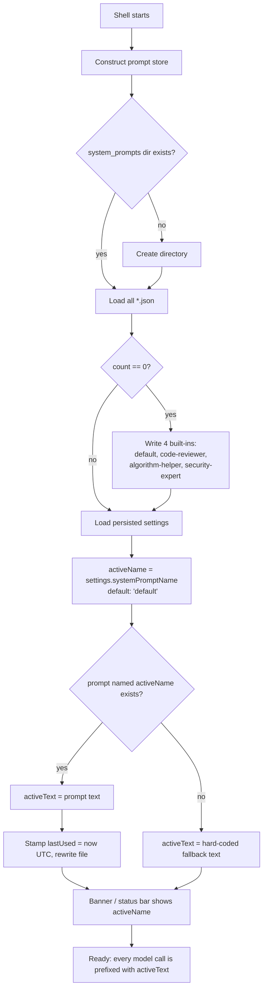
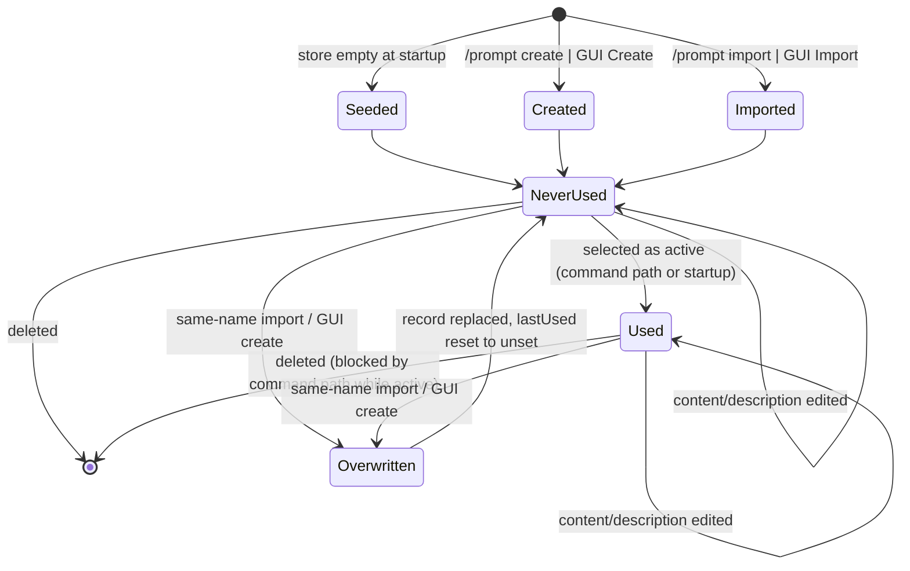

# Feature: System Prompt Management

> Source repo: `/mnt/g/3RD-Party/reversing/subject/chatdbg` @ pinned commit `d8c18f61d6bb73666ed97cd4885e877e35558485`.
> All `file:line` evidence below refers to that commit.
> **Citation shorthand:** a citation that starts with `src/` is repo-relative. A citation that starts with
> `Models/`, `Services/`, or `Commands/` is relative to `src/Xcaciv.ChatDbg.Core/`. A citation that starts with
> `UI/` is relative to `src/ChatDbg.Shell.Gui/`. A citation that starts with `Tests/` is relative to
> `src/Xcaciv.ChatDbg.Core.Tests/`. A bare `:NN` continues the previous file. Bare file names used below:
> `SystemPromptService.cs`, `PromptCommand.cs`, `SetCommand.cs`, `ChatSettings.cs`, `SystemPrompt.cs`,
> `SettingsService.cs` and `HelpCommand.cs` live under `src/Xcaciv.ChatDbg.Core/`;
> `SystemPromptsDialog.cs` and `ChatWindow.cs` live under `src/ChatDbg.Shell.Gui/UI/`.

---

## Purpose

The product is a terminal chat client that talks to a large-language-model provider and acts as a "debugging assistant". Every request sent to the model is prefixed with a *system prompt* — a block of instruction text that sets the assistant's persona and focus (general debugging, code review, algorithm design, security review, …).

This feature is the **library of those instruction texts**: a set of named, human-editable, persisted prompt records that the user can browse, inspect, switch between, author, revise, remove, and move in and out of the product as plain text files. Exactly one prompt is "active" at any time; its text is what the AI Provider feature injects as the system message on every model call.

**Problem solved:** without it, changing the assistant's behaviour would mean editing a config file by hand or restarting with different flags. With it, a user re-roles the assistant with a single command or two clicks, and can build up a personal library of reusable personas that survive restarts and can be shared as files with colleagues.

**Actors / roles**

| Actor | How they touch the feature |
|---|---|
| Interactive end user (developer using the chat shell) | The only human actor. Runs `/prompt …` and `/set systemPrompt …` text commands in either shell; or uses the **Tools → System Prompts…** dialog in the terminal-GUI shell. |
| The host shell (startup path) | On every launch, resolves the persisted active-prompt *name* into prompt *text* and stamps a "last used" time. |
| The AI Provider feature | Read-only consumer of the active prompt's text. |
| The prompt store itself | On first run (or whenever the store is empty) seeds four built-in prompts. |

There is **no** multi-user model, no authentication, no authorization, and no per-user scoping beyond the operating-system user account whose home/app-data directory holds the files.

---

## Behavior

### B0. Store bootstrapping (implicit, happens before anything else)

Constructing the prompt store (which every shell does once at startup, `src/ChatDbg/ChatShell.cs:27`, `src/ChatDbg.Shell.Gui/Program.cs:17`, `src/ChatDbg.Shell.Gui/ChatShell.cs:31`) performs, synchronously and blocking:

1. Resolve a base directory. Default = *per-user local application data directory* + `ChatDbg` (`Services/SystemPromptService.cs:14-17`). An optional constructor override replaces the base directory; whitespace/empty override falls back to the default (`:19-21`). **Only the unit tests pass an override**; the shipping shells always use the default.
2. Append the fixed subdirectory name `system_prompts` (`:23`). Final default location on Windows: `%LocalAppData%\ChatDbg\system_prompts`; README states the same path (`README.md:163`).
3. Create the directory tree if absent (`:26-29`).
4. Load everything already in the directory; **if the resulting count is zero, write four built-in prompts** (`:157-204`, gate at `:162`).
5. Only *after* step 4 does it configure its JSON writer for indented output (`:34-37`) — see QUIRK Q1.

Observable side effects: directory creation, and possibly four new files.

### B1. Show the currently active prompt — `/prompt` (no arguments)

- Input: none.
- Behaviour: looks up the prompt whose name equals the persisted active-prompt name; uses the found record's text, or, if no such record exists, the text currently held in settings (`Commands/PromptCommand.cs:58-61`).
- Output (success, multi-line):
  ```
  Current system prompt: <activeName>

  Content:
  <text>

  Use '/prompt list' to see all available prompts
  Use '/prompt use <n>' to switch to another prompt
  ```
  (`:63-73`)
- Side effects: none. Does **not** stamp last-used.

### B2. List all prompts — `/prompt list`

- Input: none beyond the subcommand.
- Behaviour: reads every prompt in the store, ordered by name.
- Output when the store is empty: the single line `No system prompts found.` (`:80-83`).
- Output otherwise (`:85-107`):
  ```
  Available system prompts:

  - <name>[ (current)]
    Description: <description>
    Created: <createdAt local, short date+time>, <Last used: <lastUsedAt local, short date+time> | Never used>

  ... repeated, blank line after each ...
  System prompts directory: <BROKEN — see Q2>

  Use '/prompt show <n>' to view a prompt's content
  Use '/prompt use <n>' to switch to another prompt
  ```
- The ` (current)` marker is appended to the entry whose name equals the active-prompt name (`:91`).
- Side effects: none (but the store is read twice — see Q2/NFR).

### B3. Show one prompt — `/prompt show <name>`

- Input: exactly one name token (further tokens ignored).
- Missing name → error `Please specify a prompt name: /prompt show <n>` (`:112-115`).
- Unknown name → error `Prompt not found: <name>` (`:120-123`).
- Output (`:125-143`):
  ```
  Prompt: <name>
  Description: <description>
  Created: <createdAt local short>
  <Last used: <lastUsedAt local short> | Never used>

  Content:
  <text>
  ```
- Side effects: none.

### B4. Select a prompt — `/prompt use <name>`

- Missing name → `Please specify a prompt name: /prompt use <n>` (`:148-151`).
- Unknown name → `Prompt not found: <name>` (`:156-159`).
- On success, in order (`:162-171`):
  1. Set the active-prompt **name** in settings.
  2. Set the active-prompt **text** in settings (in-memory only; it is not a persisted settings field).
  3. Persist settings to disk.
  4. Stamp the prompt's *last used* time to the current UTC instant and rewrite the prompt file.
- Output: `Now using system prompt: <name>`.
- Side effects: settings file rewritten; prompt file rewritten with a new last-used timestamp.

### B5. Select a prompt via the settings command — `/set systemPrompt <name>`

An alternative entry point living in the Settings feature but semantically part of this one (`Commands/SetCommand.cs:138-160`):

- The settings command refuses any key given without at least one value token (except two unrelated valueless keys), returning `Usage: /set <key> <value>` (`Commands/SetCommand.cs:33-36`). So `/set systemPrompt` on its own never reaches this code and an empty name is unreachable through it.
- The name is formed by joining **all** remaining tokens with a single space, so multi-word names are accepted here (`:139`) — unlike `/prompt use`.
- If the store is available (it always is in the three shipping wirings) and the prompt does not exist → error `System prompt not found: <name>. Use '/prompt list' to see available prompts or '/prompt create <name>' to create a new one.` (`:147`).
- On success: sets active name + text, stamps last-used (`:151-154`), then the generic setting-save path persists settings (`:283-287`) and returns `Set systemprompt = <name>` (`:289`, note the key is echoed lower-cased).
- If constructed without a store, it sets the name only and validates nothing (`:156-160`) — dead path in the shipping product.

### B6. Create a prompt — `/prompt create <name> [description words…]`

- Missing name → `Please specify a prompt name: /prompt create <n> [description]` (`:176-179`).
- Name already exists → error `Prompt already exists: <name>. Use '/prompt edit <name>' to modify it.` (`:184-188`). **Creation is non-destructive.**
- Description = all tokens after the name joined by single spaces, or, when absent, the literal `Custom prompt: <name>` (`:191-193`).
- New record gets the **built-in default text** (identical to the `default` prompt's text) — creation never asks for content (`:199`).
- Created-at = current UTC instant; last-used = unset.
- Output:
  ```
  Created new system prompt: <name>

  Use '/prompt edit <name>' to edit the content.
  Use '/prompt use <name>' to start using it.
  ```
  (`:206-211`)
- Side effect: one new prompt file.

### B7. Edit a prompt's text — `/prompt edit <name>` (console shell, interactive)

- Missing name → `Please specify a prompt name: /prompt edit <n>` (`:244-247`).
- Unknown name → `Prompt not found: <name>. Use '/prompt create <name>' to create it.` (`:252-256`).
- Otherwise the command takes over the terminal and prints (`:258-263`):
  ```
  Editing system prompt: <name>
  Enter the new content below. Type 'END' on a line by itself when finished.
  Current content:
  <existing text>

  New content (END to finish):
  ```
- It then reads lines from standard input until a line exactly equal to `END` (case-sensitive, no trimming) is read (`:267-270`). All prior lines, each terminated by the platform newline, form the new text; trailing whitespace/newlines are stripped (`:273`).
- The record is saved. Description, created-at and last-used are unchanged. If the edited prompt is the active one, the in-memory active text is refreshed (`:279-282`) — settings are **not** re-saved (harmless: active text is not a persisted field).
- Output: `Updated system prompt: <name>`.
- **Only the text may be edited this way**; there is no command to change a description.

### B8. Delete a prompt — `/prompt delete <name>`

- Missing name → `Please specify a prompt name: /prompt delete <n>` (`:216-219`).
- Unknown name → `Prompt not found: <name>` (`:224-227`).
- **Guard:** if the name equals the active-prompt name → error `Cannot delete the currently active prompt. Switch to another prompt first with '/prompt use <n>'.` (`:231-234`).
- Otherwise the file is removed and the command returns `Deleted system prompt: <name>` (`:237-239`).
- No confirmation prompt in the command path.

### B9. Export a prompt — `/prompt export <name> [file_path]`

- Missing name → `Please specify a prompt name: /prompt export <n> [file_path]` (`:289-292`).
- Unknown name → `Prompt not found: <name>` (`:297-301`).
- Destination: the third token if present; otherwise the *user Documents directory* + `chatdbg_prompt_<sanitized name>.txt`, where the name is sanitized with the same OS-illegal-character rule as the store (`:306-315`).
  - **Measured:** on Windows the Documents directory is `C:\Users\<user>\Documents`. On Linux with no XDG user-directory configuration it resolves to the **empty string**, so the default destination collapses to the bare relative name `chatdbg_prompt_<name>.txt` written into the process's current working directory — see Q18.
- The destination path is used exactly as typed: no `~` expansion, no environment-variable expansion, no directory creation (see Q17).
- Writes **only the prompt text**, as plain text, with no metadata and no wrapper format (`:320`). Overwrites any existing file at that path without asking.
- Output: `Exported system prompt to: <path>`; on I/O failure `Error exporting prompt: <message>` (`:321-326`).

### B10. Import a prompt — `/prompt import <name> <file_path> [description words…]`

- Fewer than two operands → `Please specify both prompt name and file path: /prompt import <n> <file_path> [description]` (`:331-334`).
- File absent → `File not found: <file_path>` (`:339-342`).
- Reads the file **verbatim as the prompt text** (any text file; there is no format validation) (`:347`).
- Description = remaining tokens joined by spaces, else `Imported from: <file name without directory>` (`:350-352`).
- Created-at = now (UTC); last-used = unset.
- **Overwrites an existing prompt of the same name silently** — no existence check (contrast B6).
- Output:
  ```
  Imported system prompt: <name>
  Description: <description>
  Length: <character count of the file text> characters

  Use '/prompt use <name>' to start using it.
  ```
  (`:366-372`)
- On any read/save failure: `Error importing prompt: <message>` (`:374-377`).

### B11. Unknown subcommand

Any first token other than the eight listed → `Unknown subcommand: <token>. Use list, show, use, create, delete, edit, export, or import.` (`Commands/PromptCommand.cs:49`). The token is lower-cased before matching, so subcommands are case-insensitive (`:35`).

### B12. Graphical management dialog (terminal-GUI shell)

Reached from **Tools → System Prompts…** (`src/ChatDbg.Shell.Gui/UI/ChatWindow.cs:304`, opened at `:1043-1049`). A modal 80×25 window titled **System Prompts** (`UI/SystemPromptsDialog.cs:28-31`) with a framed list titled **Available Prompts** and a single row of buttons: **Show, Use, Create…, Edit…, Delete, Import…, Export…, Close** (`:62-116`).

- List rows render as `"<name> - <description>"`, ordered by name (`:133-134`).
- Selection is by list index into the same ordered collection: the guard is "index >= 0 **and** index < count" (`:150-157`).
- Every action claims to require a selection, and with none an error box `Please select a prompt first` appears (`:164`, `:210`, `:345`, `:438`, `:633`). **In practice that guard only fires when the store is empty** — the list's selected index starts at `0` and stays `0` after the list is populated, so the first prompt in name order counts as "selected" from the moment the dialog opens, even if the user never touched the list. Verified by running the toolkit at the pinned version (see Q19).
- **Show** opens a read-only, word-wrapped 80×20 viewer titled `Prompt: <name>` with the description on the second-to-last line (`:168-202`).
- **Use** writes active name + text into settings and persists settings, then shows `Now using system prompt: <name>`; failure shows `Failed to set system prompt: <message>` (`:205-226`). **It does not stamp last-used** (contrast B4).
- **Create…** opens an 80×20 form with Name, Description and multi-line Content. Name and Content are required (`Name is required` / `Content is required`); all three fields are trimmed. Description may be blank (stored as empty). On save: `Prompt '<name>' created successfully`; failure: `Failed to create prompt: <message>` (`:228-338`). **No duplicate-name check — silently overwrites.**
- **Edit…** opens an 80×20 form pre-filled with the selected record's description and content. Content required; description optional. Saves description **and** content (the only place a description can be changed after creation). Success: `Prompt '<name>' updated successfully`; failure `Failed to update prompt: <message>` (`:340-431`). Does **not** refresh the active in-memory text when the edited prompt is the active one (contrast B7).
- **Delete** asks `Are you sure you want to delete the prompt '<name>'?` with **Yes/No**; only the first button (index 0) deletes (`:442-446`). Then `Prompt '<name>' deleted successfully` or `Failed to delete prompt: <message>`. **There is no active-prompt guard here** (contrast B8).
- **Import…** opens a 70×15 form with Prompt Name, File Path (+ a **Browse…** button), and Description. Name and file path required (`Name is required`, `File path is required`). Reads the file as text and saves. Success `Prompt '<name>' imported successfully`; failure `Failed to import prompt: <message>` (`:461-626`). No duplicate check. **A blank Description is stored as the empty string here**, unlike the command path which defaults it to `Imported from: <file name>` (`:608` vs `Commands/PromptCommand.cs:352`). Field widths are fixed at 40 columns for Name and File Path; the buttons sit on row 10.
- **Browse…** does not browse: it opens a 60×8 dialog titled **Enter File Path** with a single text field and OK/Cancel; OK copies a non-empty value into the file-path field (`:522-567`).
- **Export…** opens a 70×8 dialog titled **Enter Export File Path**, pre-filled with *user home directory* + `<name>.txt` (note: **not** sanitized, and a different default directory than the command path). OK writes the prompt text and reports `Prompt '<name>' exported successfully to <path>`; empty path → `File path is required`; failure → `Failed to export prompt: <message>` (`:628-696`).
- After create/edit/delete/import the list is reloaded from disk (`:325`, `:418`, `:451`, `:613`).
- Closing the dialog refreshes the main window status bar, which reads `Provider: <p> | Model: <m> | Prompt: <activeName>` (`ChatWindow.cs:798`, `:1048`).

### B13. Startup resolution of the active prompt

Console shell (`src/ChatDbg/ChatShell.cs:161-190`) and the (dead) GUI shell copy (`src/ChatDbg.Shell.Gui/ChatShell.cs:155-184`):

1. Look up the prompt named by the persisted active-prompt name.
2. Found → copy its text into the in-memory active text **and stamp last-used** (`:171-174`).
3. Not found → fall back to the hard-coded built-in default text; no error surfaced.
4. Any exception → print `Error loading system prompt: <message>` then `Using default system prompt.` and use the hard-coded default text (`:181-188`).

GUI entry point (`src/ChatDbg.Shell.Gui/Program.cs:61-67`): same lookup, but only when the persisted name is non-empty, and it **does not stamp last-used** and has no try/catch of its own.

The startup banner prints `System Prompt: <activeName>` (`src/ChatDbg/ChatShell.cs:201`).

---

## Business rules & edge cases

### Storage & naming

| # | Rule | Evidence |
|---|---|---|
| R1 | Prompts live as one JSON file per prompt in `<base>/system_prompts/`, where `<base>` defaults to the per-user *local application data* directory + `ChatDbg`. | `Services/SystemPromptService.cs:14-23` |
| R2 | The directory is created on construction if missing. | `:26-29` |
| R3 | File name = `<sanitized name>.json`. Sanitization replaces **every character that the host OS forbids in a file name** with an underscore `_`. **Measured at the pinned runtime:** Windows forbids 41 characters — code points 0–31 plus `"` `<` `>` `\|` `:` `*` `?` `\` `/` ; Linux forbids exactly 2 — code point 0 (NUL) and `/`. Same input, different file name per OS (see Q21). | `:209-214` |
| R4 | Sanitization is the *only* name validation anywhere in the store. Empty names, whitespace-only names, `.`/`..`, and OS-reserved device names are all accepted by the store. | `:100-113`, `:209-214` |
| R5 | Because sanitization is lossy, two different names can map to one file (e.g. on Windows `a/b`, `a:b`, `a_b` all become `a_b.json`) — the later save wins and the earlier prompt is lost. | derived from `:212` |
| R6 | Lookup by name is *file-existence* based, so name matching inherits the host file system's case sensitivity: case-insensitive on Windows/macOS-default, case-sensitive on Linux. | `:78-83` |
| R7 | Listing enumerates the glob `*.json` in the directory only (not recursive). | `:52` |
| R8 | A file whose JSON `name` field disagrees with its file name will be listed under the JSON name but cannot be fetched/deleted by that name. | `:52-70` vs `:209-214` |
| R9 | Files that fail to parse are skipped; the message `Error loading system prompt from <path>: <reason>` is written to standard output and listing continues. | `:63-66` |
| R10 | A file containing the JSON literal `null` deserializes to nothing and is skipped without any message. | `:58-61` |

### Ordering

| # | Rule | Evidence |
|---|---|---|
| R11 | **Every** listing is sorted ascending by prompt name using the platform's default *culture-sensitive* string ordering, not byte/ordinal ordering. **Measured:** the names `a-b, ab, a_b, B, a` sort to `a, a_b, a-b, ab, B` culture-sensitively but to `B, a, a-b, a_b, ab` ordinally. A reimplementation that sorts by bytes will produce a visibly different `/prompt list`. | `:70` |
| R12 | The GUI re-sorts the already-sorted list by name a second time (harmless, stable). | `UI/SystemPromptsDialog.cs:133` |
| R13 | Default seed prompts are written in the fixed order `default`, `code-reviewer`, `algorithm-helper`, `security-expert`, but that order is never observable because listing re-sorts. | `Services/SystemPromptService.cs:168-203` |

### Seeding of built-ins

| # | Rule | Evidence |
|---|---|---|
| R14 | The built-in set is created **only when the store loads zero prompts**, checked at every construction (i.e. every application launch). | `:157-165` |
| R15 | Consequence: deleting all prompts causes all four built-ins to reappear on the next launch. Also, a directory containing only unparseable files counts as empty and gets re-seeded, overwriting any of those four file names. | derived from `:159-165` + R9 |
| R16 | Exactly four built-ins ship, with fixed names, texts and descriptions (verbatim in the **Data** section). | `:168-198` |
| R17 | Seeded records get created-at = the UTC instant of seeding and an unset last-used. | `:175`, `:181`, `:188`, `:195` |

### Active-prompt rules

| # | Rule | Evidence |
|---|---|---|
| R18 | The active prompt is identified by **name only**; the name is a persisted setting whose default value is the literal `default`. | `Models/ChatSettings.cs:26-27` |
| R19 | The active prompt's **text** is a runtime-only field that is explicitly excluded from the settings file, and is re-derived from the prompt store at every launch. | `Models/ChatSettings.cs:29-30` |
| R20 | The runtime default for the active text (used when the named prompt cannot be loaded) is the literal string: `You are ChatDBG, a helpful debugging assistant. Help users analyze code, debug issues, and understand programming concepts.` — the exact same string as the `default` built-in's text and as the text given to newly created prompts. It appears hard-coded in five places. | `Models/ChatSettings.cs:30`; `Services/SystemPromptService.cs:173`; `Commands/PromptCommand.cs:199`; `src/ChatDbg/ChatShell.cs:179,188`; `src/ChatDbg.Shell.Gui/ChatShell.cs:173,182` |
| R21 | Deleting the active prompt is refused **in the command path only**; the GUI Delete button has no such guard, so the GUI can leave settings pointing at a non-existent prompt (recovered at next launch by falling back to R20's text while the name stays stale). | `Commands/PromptCommand.cs:231-234` vs `UI/SystemPromptsDialog.cs:433-459` |
| R22 | Switching prompts persists settings immediately (both `/prompt use` and `/set systemPrompt` and the GUI Use button). | `PromptCommand.cs:166`; `SetCommand.cs:283-287`; `SystemPromptsDialog.cs:218` |

### Timestamps

| # | Rule | Evidence |
|---|---|---|
| R23 | Created-at defaults to the UTC instant the in-memory record is constructed, including on deserialization of a file that omits the field. | `Models/SystemPrompt.cs:13-14` |
| R24 | Last-used is optional/absent until first use; rendered as the literal `Never used` when absent. | `Models/SystemPrompt.cs:15-16`; `PromptCommand.cs:92-94`, `:130-137` |
| R25 | Last-used is stamped (to the current UTC instant, then the whole record rewritten) by: `/prompt use`, `/set systemPrompt`, and console-shell startup resolution. It is **not** stamped by: the GUI Use button, GUI-shell startup (`Program.cs`), `/prompt` status, `/prompt show`, or sending a chat message. | `Services/SystemPromptService.cs:141-152`; `PromptCommand.cs:169`; `SetCommand.cs:154`; `ChatShell.cs:174`; absent in `SystemPromptsDialog.cs:205-226` and `Program.cs:61-67` |
| R26 | Stamping last-used on a non-existent prompt is a silent no-op. | `Services/SystemPromptService.cs:145-148` |
| R27 | All timestamps are stored in UTC and **displayed converted to local time** using the "general short date and time" pattern of the current culture (date + hours:minutes, no seconds). | `PromptCommand.cs:93`, `:98`, `:128`, `:132` |

### Argument parsing (both shells)

| # | Rule | Evidence |
|---|---|---|
| R28 | A line beginning with `/` is a command; the rest is split on the space character with empty entries discarded. Consequence: runs of spaces collapse, tabs are not separators, and **there is no quoting or escaping** — the README example `/prompt create my-prompt "Custom prompt for specific tasks"` stores the description *with the literal double-quote characters*. | `src/ChatDbg/ChatShell.cs:326`; `src/ChatDbg.Shell.Gui/UI/ChatWindow.cs:384`; README example at `README.md:183` |
| R29 | The command word is lower-cased for dispatch; the `/prompt` subcommand is lower-cased too; **prompt names and file paths are case-preserved**. | `ChatShell.cs:332`; `PromptCommand.cs:35`, `:117` etc. |
| R30 | `/prompt show`, `use`, `create`, `delete`, `edit` and `export` take the name from a single token — names containing spaces are unreachable through them. `/prompt import` likewise for both operands. Only `/set systemPrompt` joins the tail, so it alone can address a multi-word name. | `PromptCommand.cs:117,153,181,221,249,294,336`; `SetCommand.cs:139` |
| R31 | Extra trailing tokens are silently ignored by `show`, `use`, `delete`, `edit`; `create` and `import` absorb them into the description; `export` takes token 3 as the path and ignores the rest. | `PromptCommand.cs:191-193`, `:306-308`, `:350-352` |

### Rules pinned by the automated tests

The whole feature is covered by three test classes and six assertions. Everything else in this dossier is
pinned only by reading the code. What the tests actually assert, verbatim:

| # | Rule the test pins | Exactly what is asserted | Evidence |
|---|---|---|---|
| T1 | A record round-trips its five fields in memory: name, text, description, created-at, last-used are all independently settable and readable, and last-used is non-null once set. | `Name == "sample"`, `Content == "content"`, `Description == "desc"`, last-used not null. **No serialization is exercised** — this is an in-memory property test only. | `Tests/Models/SystemPromptTests.cs:9-25` |
| T2 | Pointing the store at a brand-new empty directory and asking for the list yields a **non-empty** result, and the store's reported directory **contains** the supplied base directory (case-insensitive substring match). | `Assert.NotEmpty(prompts)` and `Assert.Contains(baseDirectory, …, OrdinalIgnoreCase)`. **The test does NOT assert "exactly four", nor any name, text, description or timestamp.** The four-built-in claim (R16) comes from reading the seeding code, not from a test. | `Tests/Services/SystemPromptServiceTests.cs:12-32` |
| T3 | Save-then-fetch by name returns a record; delete-then-fetch by the same name returns **nothing rather than an error**. Saving a record with only name/text/description set (no explicit created-at) succeeds. | `Assert.NotNull(loaded)` then `Assert.Null(deleted)`. | `Tests/Services/SystemPromptServiceTests.cs:34-63` |
| T4 | `/prompt` with no arguments succeeds and its message mentions the active prompt's name. | Active name `default`, store returns a record named `default` with text `content`; asserts `result.Success` and `Contains("default", result.Message)`. | `Tests/Commands/PromptCommandTests.cs:13-33` |
| T5 | `/prompt list` succeeds and the message mentions each prompt's name. | Store returns one record named `one` with description `desc`; asserts `result.Success` and `Contains("one", result.Message)`. **Ordering, the `(current)` marker, timestamp rendering and the directory line are NOT asserted** — which is exactly why Q2 was never caught. | `Tests/Commands/PromptCommandTests.cs:35-53` |
| T6 | `/prompt use <name>` on an existing prompt: sets the active name, copies the prompt's text into the runtime active-text slot, saves settings **exactly once**, and stamps last-used **exactly once**. | `settings.SystemPromptName == "code"`, `settings.SystemPromptContent == "new content"`, save verified `Times.Once`, last-used stamp verified `Times.Once`. | `Tests/Commands/PromptCommandTests.cs:55-74` |

| # | Rule | Evidence |
|---|---|---|
| R31a | Nothing in the test suite exercises create, delete, edit, export or import at the command level; nothing exercises the settings-command entry point; nothing exercises the graphical dialog; nothing exercises seeding content, sanitization, malformed files, or the active-prompt delete guard. | absence across `Tests/Models/SystemPromptTests.cs`, `Tests/Services/SystemPromptServiceTests.cs`, `Tests/Commands/PromptCommandTests.cs` |
| R31b | The store's "tell me the directory" accessor is exercised by a test (T2) even though it is absent from the abstraction the commands hold — which is why the defect in the list output (Q2) is invisible to the suite. | `Tests/Services/SystemPromptServiceTests.cs:23` vs `Services/ISystemPromptService.cs:5-12` |

### Validation summary (what is and is not checked)

| Operation | Name required | Content required | Duplicate check | Existence check | Confirmation |
|---|---|---|---|---|---|
| `/prompt create` | yes | n/a (fixed default text) | **yes, refuses** | n/a | no |
| `/prompt import` | yes | no (file may be empty) | **no, overwrites** | file must exist | no |
| `/prompt edit` | yes | no (may end up empty) | n/a | prompt must exist | no |
| `/prompt delete` | yes | n/a | n/a | prompt must exist | no (but active-prompt guard) |
| GUI Create | yes (trimmed, non-blank) | **yes (trimmed, non-blank)** | **no, overwrites** | n/a | no |
| GUI Edit | n/a | **yes (trimmed, non-blank)** | n/a | selection required | no |
| GUI Import | yes (trimmed, non-blank) | no | **no, overwrites** | not pre-checked (read failure surfaces) | no |
| GUI Delete | n/a | n/a | n/a | selection required | **yes, Yes/No box** |

### Magic numbers and literals

| Value | Meaning | Evidence |
|---|---|---|
| `system_prompts` | fixed store subdirectory name | `SystemPromptService.cs:23` |
| `ChatDbg` | fixed application folder under local app data | `:16` |
| `*.json` | store file glob; also the per-file extension | `:52`, `:213` |
| `_` | replacement character for OS-illegal file-name characters | `:212` |
| `0` (prompt count) | threshold below which the built-in set is seeded | `:162` |
| `4` | number of built-in prompts | `:168-198` |
| `default` | default value of the active-prompt-name setting | `Models/ChatSettings.cs:27` |
| `END` | sentinel line that terminates console content entry, matched exactly | `PromptCommand.cs:267` |
| `chatdbg_prompt_<name>.txt` in the user Documents folder | default export target for the command path | `PromptCommand.cs:313-314` |
| `<name>.txt` in the user home folder | default export target for the GUI path (different!) | `SystemPromptsDialog.cs:645-647` |
| `80 × 25` | main prompts dialog size (columns × rows) | `SystemPromptsDialog.cs:29-30` |
| `80 × 20` | Show / Create / Edit sub-dialog size | `:171-172`, `:233-234`, `:352-353` |
| `70 × 15` | Import dialog size | `:466-467` |
| `60 × 8` | Browse "Enter File Path" dialog size | `:528-529` |
| `70 × 8` | Export "Enter Export File Path" dialog size | `:641-642` |
| `2, 12, 20, 33, 45, 56, 69` | fixed column offsets of the seven action buttons | `:62-109` |
| `0` | index of the **Yes** button in the delete confirmation | `:446` |
| 1-cell right and bottom margins; the button row is anchored 1 row above the window's bottom edge; the list frame leaves 3 rows of headroom at the bottom | fixed layout margins of the prompts dialog | throughout `UI/SystemPromptsDialog.cs` |
| `40` columns | fixed width of the GUI Import dialog's Name and File Path fields | `UI/SystemPromptsDialog.cs:481`, `:496` |
| row `10` | fixed row of the GUI Import dialog's Import/Cancel buttons inside a 15-row window | `:572`, `:579` |
| `41` characters | size of the forbidden-filename-character set on Windows (code points 0-31 plus `"` `<` `>` `\|` `:` `*` `?` `\` `/`) - measured at the pinned runtime | consumed at `SystemPromptService.cs:212` |
| `2` characters | size of the forbidden-filename-character set on Linux (code point 0 and `/`) - measured at the pinned runtime | consumed at `SystemPromptService.cs:212` |
| `{"name":"…","content":"…","description":"…","createdAt":"…","lastUsedAt":null}` | exact on-disk shape of a **seeded** prompt file: one line, no indentation, keys in declaration order, `lastUsedAt` written as an explicit `null` (never omitted) - measured | `SystemPrompt.cs:5-17` + Q1 |
| `Usage: /set <key> <value>` | error when the settings command is given a key with no value | `SetCommand.cs:35` |
| `<n>` | the literal placeholder token used in every usage and error string where a *name* is meant (not a number); reproduced verbatim in the README | `PromptCommand.cs:25`, `:114`, `:150`, `:178`, `:218`, `:246`, `:291`, `:333`; `README.md:65-73` |
| `System Prompt Management` | help-screen heading the `prompt` command is listed under | `HelpCommand.cs:57` |
| `Manage system prompts for AI responses` | the command's one-line description in help | `PromptCommand.cs:24` |
| `~/.ChatDbg/settings.json` | settings file this feature rewrites on every selection; falls back to the OS temp directory if the home directory is unreadable | `SettingsService.cs:11-31` |
| none | there is **no environment variable** anywhere in this feature - not for the store directory, not for the active prompt, not for the export directory. The store root is nonetheless indirectly influenced by the OS per-user-data convention (on Linux `$XDG_DATA_HOME`, default `~/.local/share`). | absence across `SystemPromptService.cs`, `PromptCommand.cs`, `UI/SystemPromptsDialog.cs` |

---

## Quirks

Observed behaviour that looks like a defect: the code disagrees with itself, with the README, or with any
reasonable reading of intent. **Nothing here is a fix instruction** — it is what the source does today.
A reimplementation should decide deliberately for each row whether to reproduce it or deviate, and record
the choice.

| # | Quirk | Evidence |
|---|---|---|
| **Q1** | The store's JSON writer options (indent-on) are assigned **after** the constructor seeds the built-ins, so the four seeded files are written **unindented/compact**, while every later save is written indented. Purely cosmetic on disk, but a byte-for-byte clone must reproduce it only if file formatting matters. | `SystemPromptService.cs:32` runs before `:34-37`; writer used at `:106` |
| **Q2** | `/prompt list` intends to print the store directory but instead re-queries the whole prompt collection and prints the *collection object's* type name. Users literally see `System prompts directory: System.Collections.Generic.List\`1[Xcaciv.ChatDbg.Core.Models.SystemPrompt]`. Root cause: the "get directory" accessor exists only on the concrete store class, not on the abstraction the command holds. **A reimplementation should print the real directory path** but must be told this is a deliberate deviation. | `PromptCommand.cs:102`; accessor at `SystemPromptService.cs:43`; abstraction at `Services/ISystemPromptService.cs:5-12` |
| **Q3** | `/prompt list` therefore reads the entire store from disk **twice** per invocation. | `PromptCommand.cs:78` and `:102` |
| **Q4** | `/prompt edit`'s read loop compares against `END` but never checks for end-of-input. If standard input is closed/redirected and exhausted, the loop never terminates and spins forever appending blank lines — an unbounded-memory hang. | `PromptCommand.cs:267-270` |
| **Q5** | `/prompt edit` writes to the raw console and reads the raw console. In the terminal-GUI shell, commands are executed from inside the GUI event loop, so this subcommand is effectively unusable there (its output does not reach the chat pane and its input never arrives). The GUI's own Edit… dialog is the usable path. | `PromptCommand.cs:258-270` vs `ChatWindow.cs:382-399` |
| **Q6** | README (`README.md:15`) claims the GUI dialog offers "create, edit, delete, import, and export"; it also offers Show and Use. That part is accurate. But README nowhere records that the GUI path **skips the active-prompt delete guard, skips duplicate-name protection on create/import, and skips the last-used stamp on Use**. Code wins. | README.md:15 vs `SystemPromptsDialog.cs:433-459`, `:296-332`, `:583-620`, `:205-226` |
| **Q7** | README's create example implies quoted descriptions are supported (`/prompt create my-prompt "Custom prompt for specific tasks"`). The parser has no quoting; the quotes are stored verbatim in the description. | `README.md:183` vs `ChatShell.cs:326` + `PromptCommand.cs:192` |
| **Q8** | In the GUI entry point, the command objects (including the prompt command and the settings command) are constructed against one settings instance, and *then* the settings variable is reassigned to the instance loaded from disk, which is the one handed to the main window and the AI providers. Therefore `/prompt use` typed into the GUI's input box mutates an **orphaned** settings object: the status bar and the next model call keep the old prompt, even though settings were saved to disk from the orphan. | `src/ChatDbg.Shell.Gui/Program.cs:30-46` (commands built with the first instance), `:57` (reassignment), `:76-84` (window gets the new instance) |
| **Q9** | The terminal-GUI project contains a second, complete console-style shell class that is never instantiated (dead code) but still carries its own copy of the startup prompt-resolution logic. | `src/ChatDbg.Shell.Gui/ChatShell.cs` — no construction site anywhere in `src/` |
| **Q10** | The GUI dialog's Close button is positioned centred on the same bottom row already occupied by the seven action buttons, so it visually overlaps them. | `SystemPromptsDialog.cs:60`, `:111-115` |
| **Q11** | The GUI dialog's "Browse…" button does not browse: it opens a plain 60x8 text-entry box titled `Enter File Path` in which the user must type the whole path by hand. In-code comments blame a limitation of a toolkit major version the project does not actually use (see Q14). No file listing, no completion, no existence check. | `UI/SystemPromptsDialog.cs:522-567` |
| **Q12** | Export/import are asymmetric with the stored record: export writes **only the text** as a `.txt`, so description, created-at and last-used are lost on a round trip; import re-creates them (description defaulted from the file name, created-at = now). Importing a store `.json` file yields a prompt whose *text* is the raw JSON. | `PromptCommand.cs:320` vs `:347-361` |
| **Q13** | Export default directories differ between the command path (user Documents) and the GUI path (user home), and the GUI default does not sanitize the name into the file name. | `PromptCommand.cs:313-314` vs `SystemPromptsDialog.cs:645-647` |
| **Q14** | Three sources disagree about the terminal-UI toolkit. In-code comments throughout the dialog say the code targets major version 2; the project file pins **1.19.0**; `docs/` says 1.17.1 and claims this dialog is 402 lines when it is 697. **Resolved by inspecting the committed build output**: the compiled shell ships toolkit 1.19.0 plus its 1.x-only string dependency, and the dialog type is present in the compiled assembly — so the 1.x wiring is real and the comments and `docs/` are stale. | project file `src/ChatDbg.Shell.Gui/Xcaciv.ChatDbg.Shell.Gui.csproj`; `docs/PHASE1-SUMMARY.md:41-48`, `:60`; `docs/TERMINAL-GUI-IMPLEMENTATION.md:128-133`; build output `src/ChatDbg.Shell.Gui/bin/Debug/net10.0/Xcaciv.ChatDbg.Shell.Gui.deps.json` (`Terminal.Gui/1.19.0`, `NStack.Core/1.1.1`) |
| **Q15** | The GUI's Create / Edit / Import handlers close the form window, then start a background reload of the list, then immediately raise the success box — without waiting for the reload. The refreshed list and the success box are unordered relative to one another, and the reload's own failure has nowhere to surface. The same handlers also close the window *before* the success box, so the box is shown against the already-dismissed form. | `UI/SystemPromptsDialog.cs:324-326`, `:417-419`, `:612-614` |
| **Q16** | The store never guards against concurrent writers. Two shells running at once will interleave whole-file overwrites; a last-used stamp is a full read-modify-write of the record and can clobber a concurrent content edit. There is no lock, no temp-file-and-rename, and no version token, so a crash mid-write leaves a truncated file that is then silently skipped as unparseable. | `SystemPromptService.cs:100-113`, `:141-152` |
| **Q17** | **The README's export and import examples cannot work as written.** Both use a `~/`-prefixed path (`~/Desktop/code-reviewer-prompt.txt`, `~/Desktop/my-prompt.txt`), but the path taken from the command line is passed straight to the file layer with no home-directory expansion anywhere in the feature. Export therefore tries to write a *relative* directory literally named `~` under the current working directory and fails with `Error exporting prompt: <reason>`; import reports `File not found: ~/Desktop/my-prompt.txt`. | `README.md:189-190` vs `PromptCommand.cs:307`, `:320`, `:337`, `:339` |
| **Q18** | **The command-path export default silently loses its directory on Linux.** The "user Documents" folder is resolved through the OS well-known-folder lookup, which on Windows returns `C:\Users\<user>\Documents` but on a Linux box with no XDG user-directory configuration returns the **empty string** (measured at the pinned runtime). Joining that with the file name yields the bare relative name `chatdbg_prompt_<name>.txt`, so `/prompt export demo` writes into whatever directory the shell happens to be running in, and the success message `Exported system prompt to: chatdbg_prompt_demo.txt` shows no directory at all. | `PromptCommand.cs:313-314`; measured |
| **Q19** | **The GUI's "select a prompt first" guard is nearly dead code.** Every action button tests that the list's selected index is within range, and the list's selected index starts at `0` and is still `0` after the list is populated (verified against the pinned toolkit version). So whenever the store is non-empty, the alphabetically first prompt counts as selected from the instant the dialog opens: pressing **Delete** immediately after opening targets that prompt, not "nothing". The error box `Please select a prompt first` can only appear when the store is completely empty. | `UI/SystemPromptsDialog.cs:150-157`, `:162-166`, `:208-212`, `:342-347`, `:435-440`, `:630-635`; selected-index behaviour measured against toolkit 1.19.0 |
| **Q20** | **Consequences of the orphaned settings object in the GUI (see Q8), spelled out.** The command objects hold a settings record that is never loaded from disk, so inside the terminal-GUI shell: (a) `/prompt list` marks whichever prompt is named `default` as ` (current)` regardless of the real active prompt; (b) `/prompt delete` refuses to delete `default` and happily deletes the *actually* active prompt; (c) `/prompt use <name>` and `/set systemPrompt <name>` **write the orphan to the settings file**, overwriting the user's stored provider, model, temperature, token limit, endpoint, region and every other persisted setting with construction-time defaults. That last one is silent data loss on the settings file, not just a stale prompt. | `src/ChatDbg.Shell.Gui/Program.cs:14` (orphan created), `:38`, `:40` (commands bound to it), `:58` (variable reassigned), `:79-87` (window gets the real one); `PromptCommand.cs:91`, `:231`, `:166` |
| **Q21** | **Prompt stores are not portable between operating systems.** The file name is derived by replacing every character the *host* OS forbids, and the forbidden set differs: 41 characters on Windows versus 2 on Linux (measured). A prompt named `a:b` is stored as `a_b.json` on Windows but as `a:b.json` on Linux. Copy a store from Linux to Windows and prompts whose names contain `:` `*` `?` `<` `>` `"` `\|` `\` become unreachable by name; copy the other way and names silently collide (R5). | `SystemPromptService.cs:209-214`; measured on both platforms |
| **Q22** | **The command's own usage line is wrong for import.** It advertises `import <file>` when import actually requires two operands, `<name>` then `<file_path>` — the form the error message and the README both give correctly. The same usage line also renders every name placeholder as the bare token `<n>`, which reads as "a number"; that spelling is consistent across the code, the error messages and the README, so a clone that "corrects" it to `<name>` is deviating from observed output. | `PromptCommand.cs:25` vs `:333`, `README.md:73` |
| **Q23** | The graphical **settings** dialog is handed the prompt store at construction and never uses it — no field, no read, no write. Either a prompt picker was planned for that dialog and dropped, or the parameter is vestigial. The only graphical prompt surface is the Tools menu dialog. | `UI/ChatWindow.cs:1037` passes the store into `UI/SettingsDialog.cs`, which contains no reference to prompts at all |
| **Q24** | An unset last-used timestamp is written to disk as an explicit `null` rather than being omitted, so every prompt file always carries all five keys. Harmless, but a reimplementation that omits absent fields produces files that differ byte-for-byte from the source's. | `SystemPrompt.cs:15-16`; measured serialization |
| **Q25** | **The repository as committed cannot be built.** Its `global.json` ends with a stray extra `}` after the closing brace, making it invalid JSON; the build tool aborts with a JSON parse error at line 5 before it reads anything else, from any directory inside the repository. The same tool works normally one directory up. This is why no dynamic verification of this feature was possible and why the previous pass could not confirm the graphical half; that half was instead confirmed from the committed build output (Q14). | `global.json` (5 lines, trailing `}`); reproduced |
| **Q26** | Per-file read/parse failures during a listing are caught and skipped, but a failure to *enumerate* the store directory is not caught in the store at all. If the directory is removed or made unreadable while the app runs, `/prompt list` surfaces it as the generic `Error processing prompt command: <message>`, and the graphical list reload — which runs on a background path with no handler of its own — has nowhere to report it. | `SystemPromptService.cs:52` (unguarded enumeration) vs `:54-66` (per-file guard); `PromptCommand.cs:52-55`; `UI/SystemPromptsDialog.cs:131-143` |
| **Q27** | The graphical delete confirmation lists **Yes** first, so the affirmative is the focused/default choice and a stray Enter deletes. Combined with Q19 (a prompt is always "selected") and the missing active-prompt guard (R21), two keystrokes from opening the dialog can delete the prompt the assistant is currently using. *INFERRED:* the "Yes is focused by default" half follows from the button order and the toolkit's documented confirmation-box behaviour; the index-0 mapping is directly in the code. | `UI/SystemPromptsDialog.cs:442-446` |

---

## Workflows & states

### W1. Application launch → active prompt resolved


Step L is skipped in the terminal-GUI entry point (Q8/R25). Any exception in J–L is caught in the console shell and degrades to M with two console lines.

### W2. Switching the active prompt (command path)

1. User types `/prompt use <name>` (or `/set systemPrompt <name>`).
2. Store is asked for `<name>`.
3. Not found → error message, **no state change**, flow ends.
4. Found → settings' active name and active text are updated in memory.
5. Settings are written to disk (only the *name* is persisted).
6. The prompt record's last-used is set to now (UTC) and the record is rewritten.
7. Confirmation message. From the next chat turn onward the new text is used.

### W3. Author a new prompt from scratch (command path — two steps by design)

1. `/prompt create <name> [description]` → refuses if the name exists; otherwise creates a record whose text is the generic default.
2. `/prompt edit <name>` → console enters *content-entry mode*.
3. Content-entry mode states: **collecting** → (line == `END`) → **committing** → **done**. There is no cancel and no way out other than typing `END` (see Q4).
4. Optionally `/prompt use <name>`.

### W4. Author a new prompt (GUI path — one step)

1. Tools → System Prompts… → **Create…**
2. Fill Name / Description / Content → **Create**
   - blank name → error box, form stays open
   - blank content → error box, form stays open
3. Saved (overwriting a same-named prompt without warning) → form closes → list reloads → success box.

### W5. Delete

Command path: exists? → is it active? → delete. GUI path: selected? → Yes/No confirmation → delete (no active check).

### W6. Prompt record lifecycle state machine



There are no timeouts anywhere in this feature. The only time-based behaviour is the GUI status bar reverting after 3 seconds, which belongs to the shell, not here (`ChatWindow.cs:909`).

---

## Data

### Entity: **SystemPrompt** (owned by this feature)

One record per file; the record is the entire file.

| Field | Persisted key | Generic type | Required | Default | Constraints / notes |
|---|---|---|---|---|---|
| Name | `name` | short text | yes (in practice) | empty string | Doubles as the primary key **and**, after lossy sanitization, as the file name (R3–R6). Never validated by the store. |
| Content | `content` | long free text (multi-line) | yes (in practice) | empty string | The literal system-instruction text handed to the model. No length limit anywhere in this feature. May contain newlines. |
| Description | `description` | short text | no | empty string | Display-only. Editable **only** through the GUI Edit dialog. |
| CreatedAt | `createdAt` | timestamp, UTC | yes | "now" at object construction / deserialization | Never updated after creation; re-import resets it. |
| LastUsedAt | `lastUsedAt` | nullable timestamp, UTC | no | unset | Set on selection; see R25. |

Evidence: `Models/SystemPrompt.cs:5-17`. Serialization is a flat object with exactly those five lower-camel keys,
in declaration order, human-readable/indented — except the seeded four, which are written on one compact line (Q1).
An unset last-used timestamp is written as an explicit `null`; the key is never omitted (measured, Q24). Key matching
on read is **case-sensitive**, so a hand-edited file using `Name` or `Content` loses that field to its default.
A measured seeded file is one line of the form
`{"name":"default","content":"You are ChatDBG, …","description":"Default system prompt for general debugging assistance","createdAt":"2026-08-28T22:21:03.1234567Z","lastUsedAt":null}`.

**Identity / uniqueness:** the name is the key. Uniqueness is enforced only by `/prompt create`; every other write path overwrites.

**Relationships:** none to other entities except a soft, name-only reference *from* the settings entity (see Interfaces). There is no foreign-key integrity: settings can name a prompt that does not exist.

### Built-in seed set (verbatim)

| Name | Description | Content |
|---|---|---|
| `default` | `Default system prompt for general debugging assistance` | `You are ChatDBG, a helpful debugging assistant. Help users analyze code, debug issues, and understand programming concepts.` |
| `code-reviewer` | `System prompt for code review assistance` | `You are ChatDBG in code review mode. Analyze code for bugs, security issues, performance problems, and maintainability concerns. Provide specific, actionable feedback with examples of how to improve the code.` |
| `algorithm-helper` | `System prompt for algorithm assistance` | `You are ChatDBG in algorithm mode. Help users understand, design, and optimize algorithms. Provide step-by-step explanations, time and space complexity analysis, and pseudocode when helpful.` |
| `security-expert` | `System prompt for security-focused assistance` | `You are ChatDBG in security expert mode. Help users identify and fix security vulnerabilities in their code. Focus on common issues like injection attacks, authentication problems, authorization flaws, data exposure, and insecure dependencies.` |

Evidence: `Services/SystemPromptService.cs:170-197`. README lists the same four names with matching one-line summaries (`README.md:194-201`).

### Fields this feature reads/writes on a **foreign** entity (Settings)

| Field | Persisted? | Owner | This feature's use |
|---|---|---|---|
| active prompt **name** (`systemPromptName`, default `"default"`) | yes, in the settings file | Settings & Configuration | read at startup and for the "(current)" marker and delete guard; written by every select operation |
| active prompt **text** | **no** — explicitly excluded from the settings file | Settings & Configuration | written by every select operation and by startup resolution; read by AI providers |

Evidence: `Models/ChatSettings.cs:26-30`.

### File-system artifacts

| Artifact | Path | Created / mutated when | Deleted when |
|---|---|---|---|
| Store directory | *local app data* `/ChatDbg/system_prompts/` — Windows `C:\Users\<user>\AppData\Local\ChatDbg\system_prompts`, Linux `~/.local/share/ChatDbg/system_prompts` (or `$XDG_DATA_HOME/ChatDbg/system_prompts`) | at store construction if missing | never by this feature |
| Prompt file | `<store>/<sanitized name>.json` | on create/import/edit/select(last-used stamp)/seed | on delete |
| Settings file | *user home* `/.ChatDbg/settings.json` | on every select operation | never by this feature |
| Exported prompt | user-chosen, no expansion of `~` or environment variables (Q17). Command-path default: *Documents*`/chatdbg_prompt_<sanitized name>.txt` — on Linux the Documents part resolves to the empty string, so the default becomes the relative name `chatdbg_prompt_<name>.txt` in the working directory (Q18). GUI default: *home*`/<name>.txt`, **unsanitized** | on export | never |

Evidence: `SystemPromptService.cs:14-23,213`; `Services/SettingsService.cs:11-25`; `PromptCommand.cs:313-314`; `SystemPromptsDialog.cs:645-647`.

Note the settings file and the prompt store live under **different** root directories (home vs. local-app-data). That is intentional in the code, not a typo.

---

## Interfaces

### Exposed to other features

The store abstraction offers exactly five capabilities (`Services/ISystemPromptService.cs:5-12`):

1. **Fetch one prompt by name** → the record, or *nothing* if absent (never an error).
2. **Stamp a prompt as just-used** → silently does nothing if the name is unknown.
3. **List all prompts** → collection ordered by name; never fails as a whole (bad files are skipped).
4. **Save a prompt** (create-or-replace by name) → throws a wrapped error on I/O failure.
5. **Delete a prompt by name** → silently succeeds if already absent; throws a wrapped error on I/O failure.

A sixth capability, **"tell me the store directory"**, exists on the concrete store but is *not* part of the abstraction — which is precisely why the list output is broken (Q2). A reimplementation should include it in the contract.

Additionally exposed:

- **A user-facing command named `prompt`** with a description (`Manage system prompts for AI responses`) and a usage line (`/prompt [list|show <n>|use <n>|create <n>|delete <n>|edit <n>|export <n>|import <file>] - Manage system prompts`) that the help system renders under the heading **System Prompt Management** (`PromptCommand.cs:23-25`; `Commands/HelpCommand.cs:54-57`). Every invocation returns a triple *(succeeded?, message text, exit-requested?)*; this command never requests exit.
- **A modal management screen** for the terminal-GUI shell, launched from Tools (`ChatWindow.cs:304`).

### Consumed from other features

| From | What this feature needs |
|---|---|
| Settings & Configuration | the persisted active-prompt name (read/write), the runtime active-prompt text slot (write), and a "save settings now" operation. This feature never touches any other setting. |
| Host shell (console) | standard input/output, for the interactive content editor and for load-error notices. |
| Host shell (terminal GUI) | a modal-window/message-box toolkit and the main-loop marshaling primitive; the status bar re-render after the dialog closes. |
| Host shell (both) | command registration by name and `/`-prefixed line dispatch with space-splitting. |

### Consumed **by** other features (outbound contract)

- **AI Provider Abstraction** reads the runtime active-prompt text and injects it as the conversation's system message for every provider: the hosted-OpenAI provider inserts it as a system chat message (`Services/AzureOpenAIService.cs:79`, `:137`), the hosted-Bedrock provider passes it as the request's `system` field (`Services/BedrockService.cs:73`, `:89`), and the local-model provider adds it as a system-role history entry (`Services/LLamaSharpService.cs:609`). This feature never calls a model itself.
- **Terminal GUI Shell** renders the active prompt **name** in the status bar (`ChatWindow.cs:798`) and the console shell prints it in the launch banner (`src/ChatDbg/ChatShell.cs:201`); the settings display command prints `- System Prompt: <name>` and the hint `- System Prompt: /prompt list (then: /set systemPrompt <n>)` (`SetCommand.cs:411`, `:438`).

---

## External technology

| Generic capability | Protocol/standard if any | What the source used | Notes for reimplementer |
|---|---|---|---|
| Local file system: directory create, directory listing by extension glob, whole-file read/write/delete of UTF-8 text | POSIX/Win32 file APIs | .NET `System.IO` (`Directory.CreateDirectory`, `Directory.GetFiles(dir,"*.json")`, `File.ReadAllTextAsync/WriteAllTextAsync/Delete/Exists`) | Whole-file overwrite semantics, no locking, no temp-file-and-rename. Reads/writes are UTF-8 without BOM. No recursion into subdirectories. |
| Per-user well-known directories | XDG user dirs on Linux / Known Folders on Windows | .NET `Environment.GetFolderPath` for *LocalApplicationData* (store root), *MyDocuments* (command export default), *UserProfile* (GUI export default, and settings root) | **Measured at the pinned runtime.** Windows: `C:\Users\<user>\AppData\Local`, `C:\Users\<user>\Documents`, `C:\Users\<user>`. Linux (this machine, no XDG user-dirs file): `/home/<user>/.local/share`, **`""` — the empty string**, `/home/<user>`. The empty Documents result is not an error path; it silently degrades the export default to a relative file name (Q18). A reimplementation must choose an explicit, non-empty default export directory and say what it is. |
| OS-illegal-filename-character set | — | .NET `Path.GetInvalidFileNameChars()` | **Platform-dependent, measured at the pinned runtime.** Windows: 41 characters — code points 0-31, plus `"` `<` `>` `\|` `:` `*` `?` `\` `/`. Linux: 2 characters — code point 0 and `/`. Consequences: names are sanitized differently per OS, stores are not portable (Q21), and on Linux a name like `a:b` keeps its colon. Reimplementers must pick one explicit set, document it, and not delegate to the host OS. |
| JSON object serialization/deserialization with explicit field names and pretty-printing | JSON (RFC 8259) | .NET `System.Text.Json` with per-field name attributes and an "indent output" option | Field names are fixed by attribute (`name`, `content`, `description`, `createdAt`, `lastUsedAt`) and matched **case-sensitively** — a hand-edited file using `Name` will not bind and the field falls back to its default. Timestamps use ISO-8601 round-trip form with a `Z` suffix for UTC. An unset last-used timestamp is written as an explicit `null`, **never omitted** (measured, Q24). Deserialization tolerates missing fields (defaults apply); malformed JSON raises an exception this feature catches per file. Note the settings file (a different feature) uses a camel-case *naming policy* instead of per-field attributes — do not conflate the two. |
| Terminal user-interface toolkit: modal dialogs, list view with selection index, single-line text fields, multi-line word-wrapped text views, buttons, message/confirmation boxes, main-loop marshaling | ANSI/VT terminal rendering | **Terminal.Gui 1.19.0** (NuGet), used by `src/ChatDbg.Shell.Gui` | Needed only for the GUI management screen. The confirmation box returns the **index** of the chosen button. Sizes are in character cells. A native "open file" dialog is *not* used (see Q11). |
| Console line input / line output | — | .NET `Console.ReadLine` / `Console.WriteLine` | Used for the interactive content editor and for prompt-load error notices. Needs a real, line-buffered stdin; see Q4 for the EOF hazard. |
| Wall-clock time in UTC, and UTC→local conversion for display | — | .NET `DateTime.UtcNow`, `ToLocalTime()`, culture-aware "general short date/time" formatting | Display format is culture-dependent: date plus hours and minutes, **no seconds**. **Measured** under the invariant culture: `08/28/2026 22:21`. Storage is always UTC; only display is localized. |
| Culture-aware string ordering | Unicode collation | .NET default `OrderBy` on strings (current-culture comparison) | Affects list order for names containing punctuation or diacritics. **Measured:** `a-b, ab, a_b, B, a` → `a, a_b, a-b, ab, B` culture-sensitively, but `B, a, a-b, a_b, ab` by bytes. A byte-ordering clone will render `/prompt list` in a visibly different order. |
| Globalization data (collation tables + culture date formats) | CLDR / ICU | .NET's ICU-backed globalization; **disabled** in the project's `Compact` and `SingleFile` build profiles via invariant globalization | The two size-optimized publish profiles turn globalization off, which changes *both* the list ordering (falls back to ordinal-like invariant collation) and the timestamp rendering, for the same store. So the same prompt library renders differently depending on which build of the product opened it. Evidence: `InvariantGlobalization` is set under both the `Compact` and `SingleFile` configurations in `src/ChatDbg.Shell.Gui/Xcaciv.ChatDbg.Shell.Gui.csproj`. |
| Unit-test framework + mocking, for the reference tests | — | xUnit 2.9.1 + Moq 4.20.69 | Only relevant if the clone ports the tests. |

No network access, no database, no message broker, and no OS credential store are involved in this feature.
**No environment variable is read by this feature**, either — there is no override for the store directory, the
active prompt, or the export directory. (The product reads `CHATDBG_AZURE_API_KEY`, `CHATDBG_AWS_ACCESS_KEY`,
`CHATDBG_AWS_SECRET_KEY`, `AWS_ACCESS_KEY_ID` and `AWS_SECRET_ACCESS_KEY` elsewhere; none of them touch prompts —
`Models/ChatSettings.cs:70-76`.) The store root is still *indirectly* environment-sensitive on Linux, because the
per-user-data folder lookup honours `$XDG_DATA_HOME`.

---

## Platform coupling — explicit verdict

**Nothing in this feature is exclusive to one operating system: all of it runs on Windows, Linux and macOS.**
The product targets a single cross-platform runtime, there is no conditional compilation, no P/Invoke, and no
OS-specific API in any file that this feature touches. What *is* OS-coupled is behaviour, in five specific places:

1. **Store location** — resolved through the OS per-user-data convention, so `%LocalAppData%\ChatDbg\system_prompts`
   on Windows and `~/.local/share/ChatDbg/system_prompts` (or `$XDG_DATA_HOME/...`) on Linux. **The README documents
   only the Windows path** (`README.md:163`), which is a documentation gap, not a code limitation.
2. **File-name sanitization** — 41 forbidden characters on Windows, 2 on Linux, so the same prompt name yields
   different file names and different collisions per OS (Q21, R3, R5).
3. **Name lookup case sensitivity** — inherited from the file system: case-insensitive on default Windows and
   default macOS, case-sensitive on typical Linux (R6). No test pins this.
4. **Command-path export default** — a real directory on Windows, the empty string (hence a relative path in the
   working directory) on a Linux box with no XDG user-dirs configuration (Q18). This is the one place where the
   documented behaviour effectively *does not work* off Windows.
5. **List ordering and timestamp rendering** — culture-sensitive, so they change with the machine's locale and are
   changed again by the size-optimized build profiles that disable globalization.

A reimplementation should pin all five explicitly rather than inheriting them from its host platform.

---

## Error handling

| Failure mode | What the user/system observes |
|---|---|
| Store directory cannot be created (permissions, read-only volume) | The exception escapes the store constructor and therefore the application's startup — the shell fails to start. **Not caught anywhere.** (`SystemPromptService.cs:26-29`) |
| A `.json` file in the store is malformed or unreadable during listing | Line written to standard output: `Error loading system prompt from <full path>: <underlying reason>`; that file is skipped; the listing still succeeds. In the GUI shell this line goes to the raw console behind the UI and is effectively invisible. (`:63-66`) |
| A specific prompt file is malformed or unreadable during fetch-by-name | Line to standard output: `Error loading system prompt from <full path>: <underlying reason>`, and the fetch reports **not found**. Callers therefore say `Prompt not found: <name>` — a corrupt file is indistinguishable from a missing one. (`:91-94`) |
| Prompt file cannot be written (disk full, permission, illegal path) | The store raises an operation error carrying `Error saving system prompt: <underlying reason>`. Command path: the top-level handler turns it into `Error processing prompt command: Error saving system prompt: <reason>`; import has its own handler producing `Error importing prompt: Error saving system prompt: <reason>`. GUI path: an error box `Failed to create prompt: …` / `Failed to update prompt: …` / `Failed to import prompt: …`. (`:111`; `PromptCommand.cs:52-55`, `:376`; `SystemPromptsDialog.cs:330,423,618`) |
| Prompt file cannot be deleted | Store raises `Error deleting system prompt: <reason>` → command shows `Error processing prompt command: Error deleting system prompt: <reason>`; GUI shows `Failed to delete prompt: <reason>`. (`SystemPromptService.cs:134`; `SystemPromptsDialog.cs:456`) |
| Deleting a prompt that is already gone | Silent success — no error, no message change. (`SystemPromptService.cs:122-125`) |
| Stamping last-used on a prompt that vanished between fetch and stamp | Silent no-op. (`:145-148`) |
| Named prompt missing at startup | No message in the console shell (silent fallback to the hard-coded default text); the persisted name is left pointing at the missing prompt. Any *exception* during resolution prints `Error loading system prompt: <reason>` then `Using default system prompt.` (`src/ChatDbg/ChatShell.cs:176-189`) |
| Export target unwritable | Command: `Error exporting prompt: <reason>` (failure result). GUI: error box `Failed to export prompt: <reason>`, and the path dialog stays open. (`PromptCommand.cs:325`; `SystemPromptsDialog.cs:683`) |
| Export with an empty path in the GUI | Error box `File path is required`; dialog stays open. (`SystemPromptsDialog.cs:688`) |
| Import source missing | Command: `File not found: <path>` (pre-checked). GUI: not pre-checked, so the read failure surfaces as `Failed to import prompt: <reason>`. (`PromptCommand.cs:339-342`; `SystemPromptsDialog.cs:601-619`) |
| Missing required operand on any subcommand | A per-subcommand usage error listing the correct form (exact strings in **Behavior**). Result is a failure. |
| Unknown subcommand | `Unknown subcommand: <token>. Use list, show, use, create, delete, edit, export, or import.` (`PromptCommand.cs:49`) |
| Unknown setting key on the settings command | `Unknown setting: <key>. Valid keys: provider, modelId, temperature, maxTokens, azureEndpoint, awsRegion, systemPrompt, …` (`SetCommand.cs:280`) |
| The store directory disappears or becomes unreadable **while the app is running** | The per-file guard does not cover directory enumeration, so the failure escapes the store. `/prompt list` reports `Error processing prompt command: <message>`; the graphical list reload has no handler of its own and fails silently (Q26). (`SystemPromptService.cs:52` vs `:54-66`) |
| Export or import given a `~`-prefixed path, as the README's own examples do | No home-directory expansion anywhere. Export: `Error exporting prompt: <reason>` (the `~` is treated as a literal relative directory that does not exist). Import: `File not found: ~/Desktop/my-prompt.txt`. (Q17; `PromptCommand.cs:307`, `:337`) |
| Export with no path on a Linux host with no XDG user-directory configuration | Succeeds, but writes into the current working directory and reports `Exported system prompt to: chatdbg_prompt_<name>.txt` with no directory shown. (Q18; `PromptCommand.cs:313-314`) |
| The settings command is given `systemPrompt` with no value | `Usage: /set <key> <value>` — the arity guard fires before the prompt lookup, so an empty prompt name is unreachable through that entry point. (`SetCommand.cs:33-36`) |
| Any other exception inside the prompt command | Caught at the top and rendered as `Error processing prompt command: <message>`. No stack trace, no logging, no telemetry. (`PromptCommand.cs:52-55`) |
| No list item selected in the GUI when an action button is pressed | Error box titled **Error** with body `Please select a prompt first`. (`SystemPromptsDialog.cs:164` and siblings) |
| Exception thrown inside a GUI async event handler outside its own try block (e.g. during the background list reload) | Unobserved; the source has no handler. Behaviour is undefined/silent. (`SystemPromptsDialog.cs:131-143`) |

Every failure message is plain, unlocalized English embedded in the code. There is no error-code scheme, no structured logging, and nothing is written to a log file.

---

## Non-functional observations

- **No caching.** Every operation re-reads from disk: `/prompt list` reads the whole store twice per invocation (Q3); the GUI reloads the whole store after each mutation. Fine for the expected handful of prompts; a reimplementation on a slower store may want an in-memory index, but must preserve the "external edits are picked up immediately" behaviour that follows from re-reading. (`SystemPromptService.cs:48-71`, `:76-95`; `PromptCommand.cs:78`, `:102`; `UI/SystemPromptsDialog.cs:325`, `:418`, `:451`, `:613`)
- **No pagination, no result limits, no search/filter.** The list shows everything; the graphical list is a plain scrollable view with no filter box. There is no expectation of large collections and no upper bound is enforced anywhere. (`PromptCommand.cs:76-108`; `UI/SystemPromptsDialog.cs:131-143`)
- **Concurrency:** single-process, single-threaded assumptions throughout. Whole-file overwrite with no locking, no atomic rename, no optimistic concurrency token; a crash mid-write can leave a truncated file (which will then be reported as unparseable and skipped). Two concurrent shells will clobber each other (Q16). The store constructor deliberately blocks the calling thread on its seeding work (`SystemPromptService.cs:32`).
- **Blocking startup:** seeding happens synchronously during construction, before any UI exists; with an empty store this is one directory listing plus four whole-file writes. Every launch pays the directory listing even when the store is populated. (`SystemPromptService.cs:26-32`, `:157-165`)
- **No cancellation support** anywhere: no operation accepts a cancellation signal and none is offered to the user, so a slow or hung operation cannot be aborted (see also the unbounded editor loop, Q4). (`Services/ISystemPromptService.cs:5-12` — no cancellation parameter on any of the five capabilities)
- **Permissions:** none. Any code path in the process can read, write or delete any prompt. Protection is entirely the OS file-permission model on a per-user directory; the directory is created with whatever the platform default is, and no mode/ACL is set explicitly. Prompt contents are not secret and are stored in clear text. (`SystemPromptService.cs:26-29`)
- **Path handling / injection surface:** prompt names are used to build file paths after replacing OS-illegal characters. `.`/`..` survive sanitization but cannot escape the store directory because the result is always `<dir>/<sanitized>.json`. **However, export and import take a raw, unvalidated, unsanitized path from the user and read/write anywhere the process can reach** — that is by design (it is a local single-user CLI) but a reimplementation on a multi-tenant or sandboxed platform must add path confinement.
- **i18n:** all screen strings, error messages and the built-in prompt texts are hard-coded English with no resource lookup or message catalogue (`PromptCommand.cs` and `UI/SystemPromptsDialog.cs` throughout; `SystemPromptService.cs:170-197`). Timestamps *are* rendered culture-sensitively (converted to local time, culture short date/time) and the name ordering is culture-sensitive, so the same store renders differently under different locales (`PromptCommand.cs:93`, `:98`, `:128`, `:132`; `SystemPromptService.cs:70`). The size-optimized build profiles disable globalization entirely, changing both the ordering and the timestamp rendering (`src/ChatDbg.Shell.Gui/Xcaciv.ChatDbg.Shell.Gui.csproj`, `InvariantGlobalization` under `Compact` and `SingleFile`).
- **Accessibility:** the graphical surface is a character-cell terminal UI with hard-coded absolute column offsets for the seven action buttons (columns 2, 12, 20, 33, 45, 56, 69) and fixed window sizes (80x25, 80x20, 70x15, 70x8, 60x8); it does not reflow, and it overlaps its own Close button (Q10). Nothing is exposed to assistive technology beyond what the terminal itself provides. The text-command interface is the accessible path. (`UI/SystemPromptsDialog.cs:29-30`, `:62-116`)
- **Platform coupling:** see the dedicated **Platform coupling — explicit verdict** section above. Summary: nothing here is exclusive to one operating system, but five behaviours differ by OS, and one of them (the command-path export default) effectively does not work off Windows.
- **Performance-motivated code:** none. No index, no batching, no streaming; each prompt file is read fully into memory as one string and each save rewrites the whole file. (`SystemPromptService.cs:56`, `:87`, `:106-107`)
- **Test coverage is thin, and thinner than it looks.** Three test classes touch this feature, six assertions in total, all enumerated in *Business rules → Rules pinned by the automated tests* (T1–T6): an in-memory property test (`src/Xcaciv.ChatDbg.Core.Tests/Models/SystemPromptTests.cs:9-25`), two store tests against a temp directory (`src/Xcaciv.ChatDbg.Core.Tests/Services/SystemPromptServiceTests.cs:12-63`), and three command tests against a stubbed store (`src/Xcaciv.ChatDbg.Core.Tests/Commands/PromptCommandTests.cs:13-74`). Note what the seeding test does **not** assert: it checks only that the list is non-empty and that the reported directory contains the base directory — not the count, the names, the texts or the descriptions. Nothing covers create/delete/edit/import/export at the command level, nothing covers the settings-command entry point, nothing covers serialization, sanitization or malformed files, and nothing covers the graphical dialog at all — which is why Q2, Q8 and Q19 survive. The suite also could not be executed here, because the repository's own `global.json` is malformed (Q25).

---

## Acceptance criteria

1. **Given** a machine where the prompt store directory does not exist, **when** the application starts, **then** the directory is created and exactly four prompt files exist, named after `default`, `code-reviewer`, `algorithm-helper`, `security-expert`, each carrying the verbatim text and description in the Data section, each with a created-at timestamp within a second of startup and `lastUsedAt` equal to JSON `null`; **and** each of those four files is a single line of JSON with no indentation (Q1). *(Source: `SystemPromptService.cs:157-204`. The existing test `Tests/Services/SystemPromptServiceTests.cs:12-32` `Constructor_CreatesDefaultPromptsInCustomDirectory` asserts only "the list is not empty" and "the reported directory contains the base directory" — it does **not** pin the count, names, texts or timestamps. A clone should add that assertion.)*

2. **Given** a store that already contains at least one prompt, **when** the application starts, **then** no built-in prompts are (re)created and no existing prompt is modified. *(Source: `SystemPromptService.cs:159-165`)*

3. **Given** a store containing prompts named `a-b`, `ab`, `a_b`, `B` and `a`, **when** the user runs `/prompt list` under a normal (non-invariant) culture, **then** the entries appear in the order `a`, `a_b`, `a-b`, `ab`, `B` — culture-sensitive collation, *not* byte order, which would give `B`, `a`, `a-b`, `a_b`, `ab`. Each entry renders as three lines — `- <name>[ (current)]`, `  Description: <description>`, `  Created: <local date + HH:mm>, ` followed by either `Last used: <local date + HH:mm>` or the literal `Never used` — with a blank line after each entry, and the block is preceded by `Available system prompts:` and a blank line. *(Source: `PromptCommand.cs:85-100`; ordering measured. The existing test `Tests/Commands/PromptCommandTests.cs:35-53` `ExecuteAsync_List_ReturnsPromptNames` only asserts that the message contains the single name `one`; it pins none of the ordering or formatting above.)*

4. **Given** the active prompt is `default`, **when** the user runs `/prompt list`, **then** exactly the `default` entry is suffixed with ` (current)` and no other entry is. *(Source: `PromptCommand.cs:91`)*

5. **Given** an empty store (all files removed while the app is running), **when** the user runs `/prompt list`, **then** the only output is `No system prompts found.` and the result is a success. *(Source: `PromptCommand.cs:80-83`)*

6. **Given** a prompt named `code` whose text is `new content`, **when** the user runs `/prompt use code`, **then** the command succeeds with the message `Now using system prompt: code`, the active-prompt name becomes `code`, the runtime active text becomes `new content`, settings are saved exactly once, and `code`'s last-used timestamp is updated exactly once. *(Source: `PromptCommandTests.cs:56-74` `ExecuteAsync_Use_UpdatesSettings`; `PromptCommand.cs:162-171`)*

7. **Given** no prompt named `nope`, **when** the user runs `/prompt use nope`, **then** the command fails with exactly `Prompt not found: nope` and neither the settings file nor any prompt file is modified. *(Source: `PromptCommand.cs:156-159`)*

8. **Given** a prompt named `mine` already exists, **when** the user runs `/prompt create mine`, **then** the command fails with `Prompt already exists: mine. Use '/prompt edit mine' to modify it.` and the existing record is unchanged. *(Source: `PromptCommand.cs:184-188`)*

9. **Given** no prompt named `mine`, **when** the user runs `/prompt create mine helper for my team`, **then** a prompt `mine` is created with description `helper for my team`, with the generic built-in default text, a created-at of now, and no last-used; and **when** the user instead runs `/prompt create mine` with no further words, **then** the description is exactly `Custom prompt: mine`. *(Source: `PromptCommand.cs:191-202`)*

10. **Given** the active prompt is `default`, **when** the user runs `/prompt delete default`, **then** the command fails with `Cannot delete the currently active prompt. Switch to another prompt first with '/prompt use <n>'.` and the file still exists; **and when** the user then runs `/prompt use code` followed by `/prompt delete default`, **then** it succeeds with `Deleted system prompt: default` and the file is gone. *(Source: `PromptCommand.cs:224-239`)*

11. **Given** a prompt `custom` was saved and then deleted through the store, **when** it is fetched by name, **then** nothing is returned (not an error). *(Source: `SystemPromptServiceTests.cs:35-63` `SaveAndDeletePrompt_PersistsChanges`)*

12. **Given** a prompt `demo` with text `hello`, **when** the user runs `/prompt export demo`, **then** a plain-text file containing exactly `hello` (no JSON, no metadata) is written to the user's Documents folder as `chatdbg_prompt_demo.txt` and the message is `Exported system prompt to: <that full path>`; **and when** the user runs `/prompt export demo /tmp/x.txt`, **then** that path is used instead. *(Source: `PromptCommand.cs:306-321`)*

13. **Given** a text file containing 42 characters at `/tmp/p.txt`, **when** the user runs `/prompt import newone /tmp/p.txt`, **then** a prompt `newone` is created with that file's full text, description `Imported from: p.txt`, and the message reports `Length: 42 characters`; **and when** a prompt `newone` already existed, **then** it is silently replaced with no warning. *(Source: `PromptCommand.cs:347-372`)*

14. **Given** the user runs `/prompt import onlyname`, **then** the command fails with `Please specify both prompt name and file path: /prompt import <n> <file_path> [description]`; **and given** `/prompt import x /no/such/file`, **then** it fails with `File not found: /no/such/file`. *(Source: `PromptCommand.cs:331-342`)*

15. **Given** the user runs `/prompt frobnicate`, **then** the command fails with exactly `Unknown subcommand: frobnicate. Use list, show, use, create, delete, edit, export, or import.`; **and given** `/PROMPT LIST`, **then** it behaves identically to `/prompt list` (command word and subcommand are case-insensitive). *(Source: `PromptCommand.cs:35,49`; `ChatShell.cs:332`)*

16. **Given** the settings file records active prompt `code-reviewer` and that prompt exists, **when** the application starts, **then** the runtime active text equals that prompt's stored text, its last-used timestamp is advanced, and the banner/status bar shows `code-reviewer`; **and given** the settings file records a name that no longer exists, **then** the application still starts, the runtime active text is the hard-coded fallback (`You are ChatDBG, a helpful debugging assistant. …`), and the recorded name is left unchanged. *(Source: `src/ChatDbg/ChatShell.cs:161-190`)*

17. **Given** the GUI prompts dialog is opened against an **empty** store, **when** any of Show/Use/Edit/Delete/Export is pressed, **then** an error box reading `Please select a prompt first` appears and nothing changes. **And given** the store contains `algorithm-helper`, `code-reviewer`, `default`, `security-expert` and the dialog has just opened with the user having pressed no key, **when** Delete then Yes is pressed, **then** `algorithm-helper` — the alphabetically first prompt — is deleted and a box reads `Prompt 'algorithm-helper' deleted successfully`; the "select a prompt first" box does **not** appear. *(Source: `UI/SystemPromptsDialog.cs:150-157`, `:433-459`; the selected-index-starts-at-0 behaviour measured against toolkit 1.19.0 — see Q19)*

18. **Given** the GUI Create form with a blank Name (or blank Content), **when** Create is pressed, **then** an error box `Name is required` (resp. `Content is required`) appears and the form remains open; **given** both are filled, **then** the prompt is saved, the form closes, the list refreshes, and a box reads `Prompt '<name>' created successfully`. *(Source: `SystemPromptsDialog.cs:296-332`)*

19. **Given** a selected prompt in the GUI, **when** Delete is pressed and **Yes** chosen, **then** the prompt file is removed and a box reads `Prompt '<name>' deleted successfully`; **when No** is chosen, **then** nothing happens. Note this path deletes the *active* prompt too, unlike the command path. *(Source: `UI/SystemPromptsDialog.cs:433-459`)*

20. **Given** the active prompt is `default` and the user runs `/prompt` with no arguments, **then** the result is a success whose message is exactly the five-part block `Current system prompt: default`, blank line, `Content:`, the prompt's stored text, blank line, `Use '/prompt list' to see all available prompts`, `Use '/prompt use <n>' to switch to another prompt`; **and given** the settings name refers to a prompt that no longer exists, **then** the same block is emitted but the text shown is the runtime active text rather than any stored record, and no error is raised. *(Source: `PromptCommand.cs:58-73`; `Tests/Commands/PromptCommandTests.cs:13-33` `ExecuteAsync_NoArgs_ReturnsCurrentPrompt`)*

21. **Given** a prompt named `code review` (with a space) exists in the store, **when** the user runs `/prompt use code review`, **then** the command fails with `Prompt not found: code` — only the first token is taken; **and when** the user instead runs `/set systemPrompt code review`, **then** it succeeds, the active name becomes `code review`, last-used is stamped, and the message is `Set systemprompt = code review` (note the key echoed in lower case). *(Source: `PromptCommand.cs:153`; `SetCommand.cs:138-161`, `:289`)*

22. **Given** the store is empty and the user runs `/set systemPrompt` with no value, **then** the command fails with exactly `Usage: /set <key> <value>` and no lookup is attempted. *(Source: `SetCommand.cs:33-36`)*

23. **Given** a Windows host and a prompt created with the name `a:b`, **when** the store is listed, **then** the record is listed under the name `a:b` but its file is `a_b.json`; **and given** a prompt `a_b` is then created, **then** it overwrites the same file and `a:b` is lost. **And given** the identical sequence on Linux**, then** two distinct files `a:b.json` and `a_b.json` exist and nothing is lost. *(Source: `SystemPromptService.cs:209-214`; forbidden-character sets measured on both platforms — see Q21)*

24. **Given** a prompt `demo` exists and the user runs `/prompt export demo ~/Desktop/demo.txt` exactly as the README instructs, **then** the command **fails** with `Error exporting prompt: <reason>` because `~` is never expanded and is treated as a literal directory name; **and given** `/prompt import x ~/Desktop/demo.txt`, **then** it fails with `File not found: ~/Desktop/demo.txt`. *(Source: `README.md:189-190` vs `PromptCommand.cs:307`, `:320`, `:337`, `:339` — see Q17)*

25. **Given** a Linux host with no XDG user-directory configuration, a prompt `demo` with text `hello`, and a shell whose working directory is `/work`, **when** the user runs `/prompt export demo`, **then** the file `/work/chatdbg_prompt_demo.txt` is created containing exactly `hello`, and the message is `Exported system prompt to: chatdbg_prompt_demo.txt` — with no directory in it. *(Source: `PromptCommand.cs:313-314`, `:321`; Documents-folder resolution measured — see Q18)*

26. **Given** the store contains only files that fail to parse, **when** the application restarts, **then** those files are each reported on standard output as `Error loading system prompt from <full path>: <reason>`, the load count is treated as zero, and the four built-ins are written — overwriting any of those files whose names collide with `default.json`, `code-reviewer.json`, `algorithm-helper.json`, `security-expert.json`. *(Source: `SystemPromptService.cs:54-66`, `:157-165`)*

27. **Given** the terminal-GUI shell is running with a settings file recording provider `bedrock`, model `anthropic.claude-v2`, temperature `0.2` and active prompt `security-expert`, **when** the user types `/prompt use code-reviewer` into the chat input, **then** the command reports success `Now using system prompt: code-reviewer`, but the status bar still reads `Provider: bedrock | Model: anthropic.claude-v2 | Prompt: security-expert`, the next model call still uses the `security-expert` text, **and the settings file on disk is overwritten with the construction-time defaults** (`provider: azure`, `modelId: gpt-4`, `temperature: 0.7`, `maxTokens: 1000`, `awsRegion: us-east-1`, `systemPromptName: code-reviewer`). *(Source: `src/ChatDbg.Shell.Gui/Program.cs:14`, `:40`, `:58`, `:79-87`; `PromptCommand.cs:162-166`; `Models/ChatSettings.cs:7-27` for the defaults — see Q8/Q20)*

28. **Given** the console shell, a prompt `p` that exists, and standard input redirected from a file with no `END` line, **when** `/prompt edit p` runs, **then** the command never returns: after the input is exhausted it keeps appending blank lines and grows memory without bound. A reimplementation must terminate on end-of-input; record that as a deliberate deviation. *(Source: `PromptCommand.cs:265-270` — see Q4)*

---

## Confidence & open questions

### Directly observed (high confidence)

Everything in **Behavior**, **Business rules**, **Data**, **Quirks** and **Error handling**, and every quoted string,
was read from the source at the pinned commit `d8c18f61d6bb73666ed97cd4885e877e35558485` and is cited to file:line.
All three test files were read in full; their six assertions are enumerated verbatim as T1–T6, and no acceptance
criterion claims test backing beyond what T1–T6 actually assert.

### Measured on a live runtime (upgraded from INFERRED)

The subject repository itself cannot be built — its `global.json` is malformed (Q25) — but the runtime it targets
is present, and a separate throwaway probe outside the repository was compiled and run on **both Linux and Windows**
against the same runtime version and the same terminal-UI toolkit version (1.19.0) the project pins. That converts
six previously inferred claims into measurements:

| Claim | Measurement |
|---|---|
| Q1 — seeded files are compact | Serializing with no writer options yields `{"name":"x","lastUsedAt":null}` on one line; with the indent option it yields a multi-line document. Confirmed. |
| Q24 — absent last-used is written as explicit `null` | Same measurement: the key is present with value `null`, never omitted. |
| R3 / Q21 — forbidden filename characters | Windows: 41 characters (0-31 plus `"` `<` `>` `\|` `:` `*` `?` `\` `/`). Linux: 2 (code point 0 and `/`). `a:b` sanitizes to `a_b` on Windows and stays `a:b` on Linux. |
| R11 — culture-sensitive ordering | `a-b, ab, a_b, B, a` orders as `a, a_b, a-b, ab, B` culture-sensitively vs `B, a, a-b, a_b, ab` ordinally. |
| R27 — timestamp display | The format code used renders as `08/28/2026 22:21` — date plus hours and minutes, no seconds. |
| Q18 — export default directory | Windows Documents resolves to `C:\Users\<user>\Documents`; Linux Documents resolves to the **empty string** on a host with no XDG user-dirs file, collapsing the default export path to a relative file name. |
| Q19 — GUI implicit selection | Against toolkit 1.19.0, a fresh list view reports selected index `0`, and still reports `0` immediately after its source is set to a three-item list. The dialog's range guard therefore passes with no user interaction. |

Additionally, the **committed build output** was inspected rather than rebuilt:
`src/ChatDbg.Shell.Gui/bin/Debug/net10.0/` contains `Xcaciv.ChatDbg.Shell.Gui.dll`/`.exe` whose dependency manifest
records `Terminal.Gui/1.19.0` and `NStack.Core/1.1.1` (a 1.x-only dependency), and whose type table contains
`Xcaciv.ChatDbg.Shell.Gui.UI.SystemPromptsDialog` with its `LoadPrompts` and `UsePrompt` state machines. **The
graphical half of this feature therefore compiles and ships** — open question 1 below is resolved. The same type
table also contains `Xcaciv.ChatDbg.Shell.Gui.ChatShell`, confirming Q9's dead class is compiled-but-unreachable
rather than excluded from the build.

### INFERRED (not directly observed — flag for verification)

- **INFERRED Q2 rendering:** the exact text printed in place of the directory (`System.Collections.Generic.List\`1[…]`) is the standard default rendering of a generic list object; the *defect* is certain, the exact rendered characters are inferred.
- **INFERRED Q4 (infinite loop on EOF):** reading past end-of-input yields "nothing", which never equals `END`, so the loop cannot exit. Certain from the code shape; not observed at runtime.
- **INFERRED Q8 / Q20 (orphaned settings object in the GUI):** derived from the ordering of construction versus reassignment in the graphical entry point, and cited line by line. High confidence from reading; not observed at runtime because the repository will not build (Q25). The settings-file-clobbering consequence in Q20 follows from the same reading plus the persisted defaults in `Models/ChatSettings.cs:7-27`. A reimplementer should avoid the bug rather than reproduce it, and record that as a deliberate deviation.
- **INFERRED Q17 (README `~` examples fail):** no home-directory expansion exists anywhere in the feature and the path is handed straight to the file layer, so the `~` is a literal path segment. Certain from the code shape; the exact failure text is the platform's own message, which was not captured at runtime.
- **INFERRED Q27 (Yes is the default button on the delete confirmation):** the index-0-means-delete mapping is directly in the code; that the first button also receives initial focus follows from the toolkit's confirmation-box behaviour and was not observed.
- **INFERRED Q9 (dead shell class):** based on an exhaustive text search for construction sites across `src/`, plus the build output containing the type but no construction site. No reflection or dynamic instantiation was found.
- **INFERRED R6 (case sensitivity of name lookup):** follows from lookup being file-existence based; the underlying file systems' case behaviour was not exercised here.

### Could not determine

1. ~~**Does the terminal-GUI shell actually build and run today?**~~ **RESOLVED — it builds.** The committed build output under `src/ChatDbg.Shell.Gui/bin/Debug/net10.0/` contains the compiled shell assembly with the prompts-dialog type in it, and a dependency manifest pinning toolkit `1.19.0` with its 1.x-only string dependency. The graphical half is real, not aspirational. What is still unobserved is *runtime* behaviour: the dialog was never launched here, so its layout defects (Q10) and ordering hazards (Q15) are read-from-source. The repository itself still cannot be rebuilt as committed (Q25). *Looked at:* `src/ChatDbg.Shell.Gui/Xcaciv.ChatDbg.Shell.Gui.csproj`, `UI/SystemPromptsDialog.cs`, `UI/ChatWindow.cs`, `global.json`, `bin/Debug/net10.0/Xcaciv.ChatDbg.Shell.Gui.deps.json`, `docs/TERMINAL-GUI-IMPLEMENTATION.md`, `docs/PHASE1-SUMMARY.md`.
2. **Intended maximum prompt text length.** No limit exists anywhere in this feature; whether the model-facing side truncates is the AI Provider feature's concern. *Looked at:* the model, the store, both command paths, the GUI dialog.
3. **Whether prompt-name uniqueness is meant to be case-insensitive.** The code delegates to the file system, so behaviour differs by platform, and no test pins it. A reimplementation must make an explicit choice; I recommend case-insensitive with an explicit duplicate check on every write path, and recording that as a deliberate deviation. *Looked at:* `SystemPromptService.cs:76-113,209-214`, all tests.
4. **Whether the store directory is meant to be user-overridable at runtime** (an environment variable or a command-line switch). The override parameter exists but no shipping caller uses it — only the tests. *Looked at:* all three shell entry points, `SetCommand`, README, `docs/`.
5. **Intended behaviour when the settings file names a prompt that was deleted.** The code silently degrades to a hard-coded text while leaving the stale name in place; whether it should self-heal to `default` is unspecified anywhere. *Looked at:* `src/ChatDbg/ChatShell.cs:161-190`, `src/ChatDbg.Shell.Gui/Program.cs:57-67`, README.
6. **Whether the command-path `edit` was ever intended to also edit the description** (the GUI can; the command cannot). No doc mentions it. *Looked at:* `PromptCommand.cs:242-285`, `README.md:161-202`.
7. **Whether a prompt picker was intended in the graphical settings dialog.** That dialog is constructed with the prompt store and never uses it (Q23). Nothing in the README or `docs/` describes such a picker, and no removed code is visible at this commit. *Looked at:* `UI/ChatWindow.cs:1035-1041`, `UI/SettingsDialog.cs` in full, `README.md:12`, `docs/PHASE1-SUMMARY.md`.
8. **What the export/import file format was meant to be.** Export writes bare text with no metadata; import reads bare text and synthesizes metadata, so a round trip loses description, created-at and last-used (Q12). Whether the `.txt` shape is deliberate (share the persona text with a colleague) or an unfinished stand-in for exporting the whole record is unrecorded. A reimplementation must pick one and say so. *Looked at:* `PromptCommand.cs:287-378`, `UI/SystemPromptsDialog.cs:461-696`, `README.md:188-192`.
