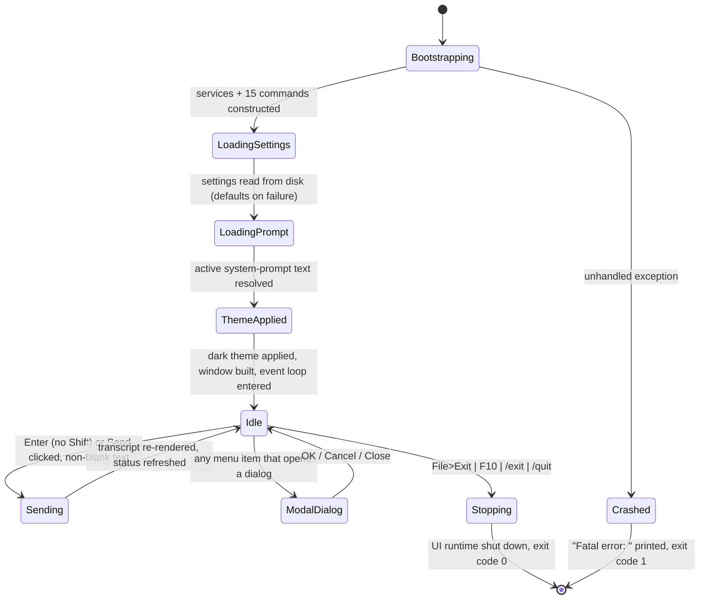

# Feature: Terminal GUI Shell

> Source of truth: repo `chatdbg` @ commit `d8c18f61d6bb73666ed97cd4885e877e35558485`.
> Primary sources: `src/ChatDbg.Shell.Gui/Program.cs`, `src/ChatDbg.Shell.Gui/UI/ChatWindow.cs`,
> `src/ChatDbg.Shell.Gui/UI/SettingsDialog.cs`, `src/ChatDbg.Shell.Gui/UI/SystemPromptsDialog.cs`,
> `src/ChatDbg.Shell.Gui/UI/ThemeManager.cs`, `src/ChatDbg.Shell.Gui/UI/LogProbHeatmapView.cs`,
> `src/ChatDbg.Shell.Gui/ChatShell.cs`, `src/ChatDbg.Shell.Gui/Services/SpectreConsoleFormatter.cs`,
> `src/ChatDbg.Shell.Gui/Services/TokenProbabilityVisualizer.cs`.
> **There are ZERO automated tests exercising any file in this feature.** The solution contains exactly four
> projects and only one of them is a test project (`Xcaciv.ChatDbg.sln:6,17,19,21`); that test project references
> only the domain library and never the GUI executable
> (`src/Xcaciv.ChatDbg.Core.Tests/Xcaciv.ChatDbg.Core.Tests.csproj:23`). No headless-TUI harness, snapshot test
> or driver stub exists anywhere in the repository.
>
> The 44-file test suite nevertheless pins several contracts this feature is built on, and **every one of them has
> been read and converted into a rule below**: message/probability shape
> (`Tests/Models/ChatMessageTests.cs`, `Tests/Models/TokenLogProbabilityTests.cs` → R9, R39),
> command-result shape (`Tests/Models/CommandResultTests.cs` → R38), credential resolution order
> (`Tests/Models/ChatSettingsTests.cs` → R40), colour/format helpers shared with the demo path
> (`Tests/Services/TokenFormattersTests.cs` → Q3), the storage services the dialogs call
> (`Tests/Services/SettingsServiceTests.cs`, `Tests/Services/SystemPromptServiceTests.cs` → R46-R48), and each
> command the menu bar invokes (`Tests/Commands/*.cs` → R41, R52, R53). One of those tests is arithmetically
> unsatisfiable and is therefore red in any run — see Q10.

---

## Purpose

**Problem solved.** ChatDbg is an AI-powered debugging assistant. Its original shell is a line-at-a-time
console prompt (documented separately as "Interactive Chat Session (Console Shell)"), which forces the user to
scroll a linear transcript, remember slash-command syntax, and re-read raw text dumps of token-probability
analysis. The Terminal GUI Shell replaces that with a **full-screen, mouse- and keyboard-driven terminal
application** that runs inside an ordinary terminal window (no desktop windowing system required, works over SSH),
giving the same functionality through a persistent window layout: a menu bar, a scrollable chat transcript,
a dedicated input box, a live status line, modal dialogs for every configuration task, and an optional
side-by-side token-probability inspector panel (`ChatWindow.cs:116-227`; window title
`ChatDbg - AI-Powered Debugging Assistant`, `ChatWindow.cs:63`). The claim that no desktop windowing system is
required follows from the toolkit being a terminal renderer and from the absence of any windowing dependency in
`Xcaciv.ChatDbg.Shell.Gui.csproj:118-122`; that it works over SSH specifically is **INFERRED** (never exercised).

**Business value.**
- Discoverability: seven of the fifteen registered commands are reachable from the menu bar — `inject`, `pop`,
  `clear`, `import`, `export`, `demologprobs`, `model` (`ChatWindow.cs:262-316`) — and three more capabilities
  have menu equivalents that bypass the command layer entirely (help rendering, prompt management, the log-probs
  toggle). So a new user need not type `/help`. `set`, `logprobs`, `prompt`, `tokenize`, `inspect`, `exit` and
  `quit` are still only reachable by typing (File▸Exit and the F10 item stop the loop directly rather than running
  `exit`).
- Persistent context: the current provider, model and system prompt are always visible in a status line rather
  than being reprinted per prompt.
- Structured inspection: token probabilities render as a colour heat-mapped, scrollable panel next to the chat,
  instead of as a wall of console text.

**Actors / roles.** A single local, interactive human user ("the developer"). There is no multi-user model, no
authentication, no authorization and no role separation anywhere in this feature — no such construct appears in
any of its files. The process runs with the privileges of the invoking OS user and reads/writes only that user's
profile and local-application-data directories (R42).

**Where it sits.** It is one of two alternative front ends over a shared domain library
(`Xcaciv.ChatDbg.sln:6`, `:17`, `:19`; `Xcaciv.ChatDbg.Shell.Gui.csproj:125`). It owns no domain logic:
history mutation, settings persistence, prompt storage, command semantics and AI calls all live in other features.
It is also the front end that **is never published** — the release pipeline builds only the console shell
(`.github/workflows/build-release.yml`).

---

## Behavior

### B1. Application startup (`src/ChatDbg.Shell.Gui/Program.cs:10-103`)

On launch, before any screen is drawn, the program:

1. Creates an empty in-memory chat history, a default settings record, a settings store, a chat-history
   import/export store and a system-prompt store (`Program.cs:13-17`).
2. Creates a rich-console output formatter object that is handed to the demo-visualisation command
   (`Program.cs:20`).
3. Creates three AI provider adapters keyed by lowercase name: `azure`, `bedrock`, `llama` (`Program.cs:22-27`).
4. Builds the command registry — a name→command map — by instantiating exactly 14 commands and then adding a
   15th (`help`) that is given the map itself (`Program.cs:30-55`). Registered names, in construction order:
   `inject`, `pop`, `import`, `export`, `model`, `set`, `logprobs`, `prompt`, `demologprobs`, `clear`, `exit`,
   `quit`, `tokenize`, `inspect`, then `help`.
5. Loads persisted settings from disk, falling back to defaults if the load yields nothing (`Program.cs:58`).
6. If the loaded settings name a system prompt, fetches that prompt and copies its text into the in-memory
   settings as the active system-prompt content (`Program.cs:61-68`). If the prompt is missing, the built-in
   default text stays in place. **The GUI does not stamp a "last used" timestamp on the prompt** (the console
   shell does — `src/ChatDbg.Shell.Gui/ChatShell.cs:168`).
7. Initialises the terminal UI runtime, then applies the dark theme (`Program.cs:71-74`).
8. Constructs the main chat window with all eight collaborators, attaches it to the application's root view and
   enters the UI event loop (`Program.cs:79-90`).
9. On loop exit, always shuts the UI runtime down (`Program.cs:92-95`) and returns process exit code `0`.
   Any exception escaping the whole block prints `Fatal error: <message>` to the plain console and returns exit
   code `1` (`Program.cs:97-101`).

**Observable difference from the console shell:** the GUI prints **no** welcome banner, **no** settings-file path,
and performs **no** credential-configuration pre-flight check. The console shell does all three
(`ChatShell.cs:186-274`); the GUI omits them entirely.

### B2. Main window layout (`ChatWindow.cs:116-227`)

A single full-screen window titled **"ChatDbg - AI-Powered Debugging Assistant"** (`ChatWindow.cs:63`) containing,
top to bottom:

| Region | Position | Notes |
|---|---|---|
| Menu bar | row 0 | 5 top-level menus: File, Edit, View, Tools, Help (`ChatWindow.cs:119-126`) |
| Chat transcript frame, captioned "Chat History" | row 1 down to 5 rows above the bottom | full width, or 60% of width when the probability panel is open (`ChatWindow.cs:132-138`) |
| Token-probability frame, captioned "Token Probabilities" | right of the chat frame, row 1, same height | only present when the panel is toggled on (`ChatWindow.cs:239-245`) |
| Input frame, captioned "Input" | anchored 5 rows from the bottom, 3 rows tall | contains the input box and a **Send** button (`ChatWindow.cs:161-187`) |
| Status line (free text) | anchored 2 rows from the bottom, 1 row tall | shows context or transient messages (`ChatWindow.cs:196-203`) |
| Status bar | bottom row | two shortcut items: `F1 Help`, `F10 Quit` (`ChatWindow.cs:190-194`) |

The transcript region is a scrollable canvas with a vertical scroll indicator and **no** horizontal scroll
indicator; its initial content extent is 80 columns × 1000 rows (`ChatWindow.cs:141-150`).
The probability region is a scrollable canvas with **both** scroll indicators; its initial content extent is
50 columns × 1000 rows (`ChatWindow.cs:248-257`, `ChatWindow.cs:31`).

The input box is 1 row tall, occupies the full width minus 10 columns, and has word-wrap turned **off**
(`ChatWindow.cs:169-176`). The Send button sits 8 columns from the right edge of the input frame
(`ChatWindow.cs:180-184`).

### B3. Menu commands (`ChatWindow.cs:262-316`)

**File** (`ChatWindow.cs:262-273`)
- *Inject Message…* → opens the Inject dialog (B8).
- *Pop Last Message* → runs the `pop` command with no arguments.
- *Clear History* → runs the `clear` command with no arguments (**no confirmation prompt**).
- *Import History…* → opens a file-open dialog (B9).
- *Export History…* → opens a file-save dialog (B10).
- *Exit* → requests the UI loop to stop (application quits).

**Edit** (`ChatWindow.cs:275-281`)
- *Settings…* → opens the tabbed Settings dialog (B11), then refreshes the status line.

**View** (`ChatWindow.cs:283-298`)
- *Log Probabilities* → submenu with three items:
  - *Toggle Log Probs Panel* → shows/hides the side probability panel (B7).
  - *Toggle Log Probs for Last Message* → flips the persistent "enable log probabilities" setting (B6).
  - *Run Demo Visualization* → runs the `demologprobs` command.
- *Toggle System Messages in Status Bar* → **not implemented**; sets the status line to
  `System messages toggle not yet implemented` (`ChatWindow.cs:1138-1142`).

**Tools** (`ChatWindow.cs:300-307`)
- *System Prompts…* → opens the System Prompts dialog (B12), then refreshes the status line.
- *Change Model…* → opens the single-field Change Model dialog (B13).

**Help** (`ChatWindow.cs:309-316`)
- *View Commands…* → opens the Help dialog (B14).
- *About…* → shows a modal message box (B15).

Every top-level menu title and every menu item carries a hot-key marker on one letter (File, Edit, View, Tools,
Help; Inject, Pop, Clear, Import, Export, e**X**it; Settings; Log Probabilities, Toggle…; System Prompts,
Change Model; View Commands, About).

### B4. Sending input (`ChatWindow.cs:318-380`)

Trigger: the **Send** button is clicked, **or** `Enter` is pressed in the input box without `Shift`
(`ChatWindow.cs:318-330`). `Shift+Enter` is deliberately left to the input control's default behaviour
(insert a newline).

Steps:
1. Read the input text and trim it. If it is empty or whitespace only, do nothing at all (`ChatWindow.cs:334-338`).
2. Clear the input box immediately (`ChatWindow.cs:340`).
3. If the text begins with `/` → treat as a command (B5). Otherwise → treat as a chat turn (B16).
4. Any exception thrown by either path surfaces as a modal error box titled **"Error"** carrying the exception
   message, with a single **OK** button (`ChatWindow.cs:353-356`).
5. Re-render the whole transcript (`ChatWindow.cs:358`).
6. If the probability panel is visible, re-point it at the **last** assistant message that has probability data,
   re-render it, and scroll it back to the top (`ChatWindow.cs:360-377`).
7. Refresh the status line back to the context string (`ChatWindow.cs:379`).

### B5. Command dispatch from the GUI (`ChatWindow.cs:382-418`)

1. Strip the leading `/`, split the remainder on single spaces, discarding empty pieces.
2. If nothing remains, silently return.
3. Lower-case the first piece as the command name; the rest are the arguments.
4. Unknown name → modal error box titled **"Error"**, body `Unknown command: <name>`, button **OK**.
5. Execute the command asynchronously.
6. If the result requests exit → stop the UI loop and return.
7. Otherwise, if the result carries a message:
   - success → status line becomes `✓ <message>` (with the transient 3-second reset, B17);
   - failure → modal error box titled **"Command Error"** with the message and an **OK** button.
8. A successful result with no message produces no visible feedback.

### B6. Toggling the "log probabilities" setting (`ChatWindow.cs:869-901`)

1. Find the last assistant message that has probability data. If none exists, show a modal error box titled
   **"No Log Probabilities"**, body `There are no assistant messages with log probabilities to display.`, and stop.
2. Flip the persistent `enable log probabilities` flag and **immediately write settings to disk**.
3. Re-render the transcript.
4. If the flag is now on and the panel is hidden → point the panel at that message and toggle the panel on.
   If the flag is now off and the panel is shown → toggle the panel off.
5. Status line becomes `Log probabilities display enabled` or `Log probabilities display disabled`.

### B7. Toggling the probability panel (`ChatWindow.cs:801-867`)

1. If no assistant message anywhere in history carries probability data → modal error box titled
   **"No Log Probabilities"** with the same body as B6; the panel state is left unchanged.
2. Flip visibility.
3. Showing: create the panel if it does not exist, shrink the chat frame to 60% width, add the panel to the window
   if not already added, pick the last assistant message with probability data if the current selection is empty or
   invalid, render the panel, scroll it to the top, and set the status line to
   `Token probabilities panel enabled`.
4. Hiding: remove the panel from the window, restore the chat frame to full width, status line
   `Token probabilities panel disabled`.
5. Force a full screen repaint.

### B8. Inject Message dialog (`ChatWindow.cs:938-1000`)

Modal, titled **"Inject Message"**, fixed 70 columns × 15 rows. Fields:
- *Role:* single-line text, pre-filled with `user`, 20 columns wide.
- *Message:* multi-line text area, 5 rows tall.
- *Position (optional):* single-line text, 10 columns wide, empty by default.
- Buttons: **OK** (default) and **Cancel**.

On OK: build an argument list of `[role, message]`; append the position string **only if** it is non-blank and
parses as an integer. Close the dialog first, then run the `inject` command. On success → re-render transcript,
re-render the probability panel if visible, and set the status line to the command's message (or
`Message injected`). On failure → modal error box **"Error"** with the command's message (or
`Failed to inject message`).

On Cancel: close, no side effects.

### B9. Import History dialog (`ChatWindow.cs:1002-1016`)

A file-open dialog titled **"Import Chat History"** with the prompt
`Select a chat history file to import`, multiple selection disabled, starting path set to the current user's
profile directory. If the user does not cancel and a path came back, the shell runs `import <path>`.

### B10. Export History dialog (`ChatWindow.cs:1018-1033`)

A file-save dialog titled **"Export Chat History"** with the prompt
`Select a location to save chat history`, pre-filled with `<user profile>/chat_history.json`. If the user does
not cancel and a path came back, the shell runs `export <path>`.

### B11. Settings dialog (`SettingsDialog.cs`)

Modal, titled **"Settings"**, fixed 80 columns × 25 rows (`SettingsDialog.cs:18`). Contains a tab strip with four
tabs, plus **OK** (default) and **Cancel** buttons pinned to the bottom row (`SettingsDialog.cs:29-66`).
Tabs, in fixed order:

1. **AI Provider** (`SettingsDialog.cs:69-175`)
   - Radio group: `Azure OpenAI` / `AWS Bedrock` / `Local LLM (LLama)`; initial selection derived from the stored
     provider string (`azure`→0, `bedrock`→1, `llama`→2, anything else→0). Selecting an option writes the provider
     string (`azure`/`bedrock`/`llama`) into the live settings **immediately**, before OK is pressed.
   - `Azure Endpoint:` free text, full width.
   - `AWS Region:` free text, 30 columns.
   - `Model ID/Path:` free text, full width.
   - `Temperature:` free text, 10 columns, with the static hint `(0.0 - 2.0)`.
   - `Max Tokens:` free text, 10 columns (no hint label).
2. **Credentials** (`SettingsDialog.cs:177-231`)
   - Heading label `Credential Management`.
   - Checkbox `Enable Windows Credential Manager`, initialised from the stored flag.
   - Button `Manage Credentials...` → sub-dialog (B11a).
   - Button `Migrate Credentials...` → sub-dialog (B11b).
   - A static help block reading:
     `Credentials are stored securely using:` / `1. Environment variables (recommended)` /
     `2. Windows Credential Manager (Windows only)` / `3. Settings file (deprecated)` /
     `Use 'Migrate Credentials' to move from settings file` / `to more secure storage options.`
3. **Log Probs** (`SettingsDialog.cs:233-305`)
   - Checkbox `Enable Log Probabilities`.
   - `Log Probabilities Top K:` free text, hint `(1 - 20)`.
   - Radio group `Display Mode:` → `Show All Tokens` (index 0) / `Show Samples` (index 1).
   - Radio group `Layout:` → `Grid View` (index 0) / `List View` (index 1).
   - `Grid View Max Alternatives:` free text, hint `(1 - 20)`.
4. **LLama Settings** (`SettingsDialog.cs:307-399`)
   - `Context Size:` hint `(512 - 32768)`.
   - `GPU Layer Count:` hint `(0 = CPU only)`.
   - `GPU Device(s):` hint `(e.g., "0" or "0,1")`.
   - `Thread Count:` hint `(0 = system default)`.
   - `Batch Size:` hint `(1 - 2048)`.
   - A static info block: `GPU Acceleration Settings:` followed by five bullet lines about GPU layer count,
     GPU device, thread count, context size and batch size (`SettingsDialog.cs:366-372`).

On **OK** (`SettingsDialog.cs:401-507`): read every tab's fields, coerce, clamp (see rules R11–R20), then persist
the whole settings record to disk, then close. A persistence failure produces a modal error box **"Error"** with
`Failed to save settings: <message>` — and the dialog still closes, because the close is requested
unconditionally after the save call returns (`SettingsDialog.cs:53-57`).

On **Cancel**: close without saving. Note that the provider radio group has **already** mutated the live settings
object, so a cancelled dialog can still leave the in-memory provider changed (see **Q2** under Quirks).

**B11a. Manage Credentials sub-dialog** (`SettingsDialog.cs:509-558`) — modal, 60 × 15, titled
**"Manage Credentials"**. Fields `Credential Type:` (30 columns) and `Value:` (30 columns, masked input). A help
block lists `Common types:` / `azureApiKey` / `awsAccessKey` / `awsSecretKey`. **Save** stores the credential in
the OS credential store *only if both fields are non-blank* (otherwise nothing happens and the dialog stays open),
then closes and shows a modal **"Success"** box `Credential saved successfully`; a failure shows modal **"Error"**
`Failed to save credential: <message>`. **Cancel** closes.

**B11b. Migrate Credentials sub-dialog** (`SettingsDialog.cs:560-607`) — modal, 70 × 18, titled
**"Migrate Credentials"**. Shows an explanatory block
(`Choose how to migrate your credentials from the settings file:` / `1. Environment Variables - Cross-platform, most secure` /
`2. Windows Credential Manager - Windows-specific, secure` / `3. Both - Maximum flexibility`) and a radio group
`Environment Variables` / `Windows Credential Manager` / `Both`. **Migrate** closes the dialog, then runs the
JSON→secure migration and shows modal **"Success"** `Credentials migrated successfully`, or modal **"Error"**
`Migration failed: <message>`. **The selected radio option is read into a local variable and then discarded — all
three choices do exactly the same thing** (`SettingsDialog.cs:586-594`).

### B12. System Prompts dialog (`SystemPromptsDialog.cs`)

Modal, titled **"System Prompts"**, 80 × 25 (`SystemPromptsDialog.cs:28-30`). Contains a bordered list frame
captioned **"Available Prompts"** filling the dialog minus 3 rows, and a row of buttons anchored to the bottom row
at fixed columns: `Show` (col 2), `Use` (col 12), `Create...` (col 20), `Edit...` (col 33), `Delete` (col 45),
`Import...` (col 56), `Export...` (col 69), plus a `Close` button centred on the same bottom row
(`SystemPromptsDialog.cs:60-128`).

The list is populated from the prompt store, **sorted ascending by name**, each row rendered as
`<name> - <description>` (`SystemPromptsDialog.cs:131-143`).

Operations, each requiring a selected list row (selection index maps 1:1 to the sorted prompt list;
out-of-range selection yields "no prompt"):
- **Show** — opens a read-only, word-wrapped viewer dialog titled `Prompt: <name>` (80 × 20) with the prompt body,
  a `Description: <description>` line and a centred **Close** button (`SystemPromptsDialog.cs:159-203`).
- **Use** — writes the selected prompt's name and body into the live settings, persists settings, and shows modal
  **"Success"** `Now using system prompt: <name>`; failure shows modal **"Error"**
  `Failed to set system prompt: <message>` (`SystemPromptsDialog.cs:205-226`).
- **Create…** — modal `Create System Prompt` (80 × 20) with `Name:`, `Description:` and a multi-line `Content:`
  area, buttons **Create** / **Cancel**. Validates name non-blank then content non-blank; saves a new prompt with
  creation timestamp = now (UTC); closes; reloads the list; shows **"Success"** `Prompt '<name>' created successfully`
  (`SystemPromptsDialog.cs:228-338`).
- **Edit…** — modal `Edit Prompt: <name>` (80 × 20) with `Description:` and `Content:` pre-filled. **The name is
  not editable.** Validates content non-blank; saves; closes; reloads list; **"Success"**
  `Prompt '<name>' updated successfully` (`SystemPromptsDialog.cs:340-431`).
- **Delete** — confirmation box titled **"Confirm Delete"**, body
  `Are you sure you want to delete the prompt '<name>'?`, buttons **Yes**, **No**. Only button index 0 (Yes)
  deletes. Then reloads the list and shows **"Success"** `Prompt '<name>' deleted successfully`
  (`SystemPromptsDialog.cs:433-459`).
- **Import…** — modal `Import System Prompt` (70 × 15) with `Prompt Name:` (40 cols), `File Path:` (40 cols), a
  `Browse...` button, and `Description:`. `Browse...` opens a *second* modal (`Enter File Path`, 60 × 8) that is a
  **plain text box, not a file browser**; its OK copies the typed path into the File Path field
  (`SystemPromptsDialog.cs:522-567`). Import validates name non-blank then file path non-blank, reads the file's
  entire text as the prompt body, saves, closes, reloads, shows **"Success"**
  `Prompt '<name>' imported successfully` (`SystemPromptsDialog.cs:583-620`).
- **Export…** — modal `Enter Export File Path` (70 × 8) pre-filled with `<user profile>/<prompt name>.txt`;
  OK writes the prompt body (only) to that path, closes, and shows **"Success"**
  `Prompt '<name>' exported successfully to <path>`; a blank path shows **"Error"** `File path is required`
  (`SystemPromptsDialog.cs:628-696`).

All six selection-dependent operations show modal **"Error"** `Please select a prompt first` when nothing is
selected.

### B13. Change Model dialog (`ChatWindow.cs:1051-1085`)

Modal, titled **"Change Model"**, 60 × 10. One field `Model ID:` pre-filled with the current model identifier,
plus **OK** (default) and **Cancel**. OK closes the dialog, then runs the `model` command with the typed value as
its single argument; on success refreshes the status line and shows the command's message (or `Model changed`);
on failure shows modal **"Error"** with the command's message (or `Failed to change model`).

### B14. Help dialog (`ChatWindow.cs:1087-1126`)

Only opens if a command named `help` is present in the registry. Modal, titled **"Help"**, 80 × 20, containing a
read-only, word-wrapped text area and a centred **Close** button on the last row. The body is generated by the
window itself, **not** by the help command: the literal header `Available Commands:` followed by a blank line, then
for each registered command **sorted ascending by command name**: `/<name>`, then two spaces + the command's
description, then a blank line. With the standard registry this yields 15 entries in this order:
`clear, demologprobs, exit, export, help, import, inject, inspect, logprobs, model, pop, prompt, quit, set, tokenize`.
The usage strings are not shown.

### B15. About box (`ChatWindow.cs:1128-1136`)

A modal message box titled **"About ChatDbg"** with exactly this body (blank line between each part) and a single
**OK** button:
`ChatDbg v1.0` / `AI-Powered Debugging Assistant` / `Supports Amazon Bedrock and Azure OpenAI` /
`Copyright © Xcaciv 2024`.

### B16. Chat turn (`ChatWindow.cs:420-498`)

1. Append the typed text to history as a message with role `user`; re-render the transcript immediately, so the
   user's message is visible before the model replies.
2. Lower-case the configured provider name. If it is null → modal **"Error"** `AI provider is not set in settings`.
   If it is not one of the three registered adapters → modal **"Error"** `Unknown AI provider: <provider>`.
3. Set the status line to `Thinking...`.
4. If log probabilities are **disabled**: call the plain send operation, append the returned text as an
   `assistant` message, re-render, status line `Response received`.
5. If log probabilities are **enabled**: call the with-probabilities send operation; append an `assistant` message
   carrying both the text (empty string if none) and the returned probability list; then:
   - if the panel was hidden and the response contains ≥1 probability entry → turn the panel on, create it, shrink
     the chat frame to 60% width, add the panel, and select the new message;
   - if the panel was already visible and the response contains ≥1 entry → select the new message;
   - re-render the transcript; if the panel is visible, re-render it and scroll it to the top;
   - status line `Response received`.
6. Any exception → modal **"Error"** `Failed to get AI response: <message>`. **The shell never checks whether the
   provider is configured before calling**, so an unconfigured provider surfaces as, e.g.,
   `Failed to get AI response: Azure OpenAI service is not properly configured. Please set AzureEndpoint, AzureApiKey, and ModelId.`
   (`src/Xcaciv.ChatDbg.Core/Services/AzureOpenAIService.cs:57`),
   `...Amazon Bedrock service is not properly configured. Please set ModelId and AWS credentials.`
   (`BedrockService.cs:40`), or
   `...LLamaSharp service is not properly configured. Please set ModelId to a valid GGUF model file path.`
   (`LLamaSharpService.cs:68`).
   The failed user message **stays** in history.

### B17. Transcript rendering (`ChatWindow.cs:500-626`)

The transcript is rebuilt from scratch on every refresh (all child elements removed, then re-added). For each
message in history order:
1. A role banner spanning the full width, text `[<role lowercased>]`. For role `user` the text is right-aligned and
   the banner starts at column 0; for every other role the text is left-aligned and the banner starts at column 2.
2. The message body, split into lines (see R6), each line emitted as its own full-width row using the same
   alignment/offset rule and the same colour scheme as the banner. **Blank or whitespace-only lines are dropped.**
3. For an `assistant` message that carries probability data, a small clickable button labelled **`◊`** at column 2.
   Clicking it: opens the probability panel if hidden (shrinking the chat frame to 60% width), selects that
   message, re-renders the panel, scrolls the panel to the top, and sets the status line to
   `Showing token probabilities for message at <timestamp>`.
4. One blank row of spacing after each message.

Afterwards the scrollable extent is set to (visible width) × max(total rows, visible height), and if the content is
taller than the viewport the view is scrolled so the **last** rows are visible (auto-scroll to bottom). Then a
full-screen repaint is forced.

### B18. Probability panel rendering (`ChatWindow.cs:628-729`)

If no message is selected, or the selected message has no probability data, the panel shows the single line
`No token probability data available.` and stops.

Otherwise:
- Header row at column 0: `[<message timestamp>] Token Probabilities:`, followed by one blank row.
- For each token, in the order supplied by the model, at column 2:
  `<zero-based index>: "<token>" (<probability as percent with 5 decimals>)`, coloured by the heat map (R7).
  Line-feed, carriage-return and tab characters inside the token text are rendered as the two-character escapes
  `\n`, `\r`, `\t`.
- Then, if the token has alternatives, up to *Grid View Max Alternatives* of them, **sorted by probability
  descending**, each at column 4 as `Alt: "<token>" (<percent>)`, individually heat-mapped.
- One blank row after each token block.
- The panel's scrollable width becomes `max(M + 5, 50)` where `M` is the largest of
  (length of each token line **+ 2**) and (length of each alternative line **+ 4**) — i.e. effectively
  *longest token line + 7* / *longest alternative line + 9*, floored at 50 columns
  (`ChatWindow.cs:683`, `711`, `723`). Height is `max(total rows, viewport height)`; the panel is then scrolled to
  the top and a full-screen repaint is forced (`ChatWindow.cs:726-728`).

### B19. Status line behaviour (`ChatWindow.cs:791-799`, `903-916`)

The resting text is `Provider: <provider> | Model: <model id> | Prompt: <system prompt name>`.
A transient status message replaces it, forces a repaint, and **3000 ms later** (fire-and-forget timer marshalled
back onto the UI thread) the resting text is restored — unconditionally, even if a newer transient message was
posted in the meantime.

### B20. Theming (`ThemeManager.cs`)

A single, hard-coded **dark** theme is applied once at startup; there is no light theme, no theme switcher, and no
user-visible theming setting. It replaces four global palettes:

| Palette | Normal | Focus | Hot-normal | Hot-focus | Disabled |
|---|---|---|---|---|---|
| Base | White on Black | BrightYellow on DarkGray | BrightCyan on Black | BrightYellow on DarkGray | — |
| Dialog | White on DarkGray | BrightYellow on DarkGray | BrightCyan on DarkGray | BrightYellow on DarkGray | — |
| Menu | White on DarkGray | BrightYellow on Black | BrightCyan on DarkGray | BrightYellow on Black | Gray on DarkGray |
| Error | BrightRed on Black | BrightRed on DarkGray | BrightRed on Black | BrightYellow on DarkGray | — |

Note the Base, Dialog and Error palettes leave their *Disabled* entry at the framework default (an all-zero
attribute), because each palette object is created empty and only the listed entries are assigned
(`ThemeManager.cs:16-44`).

Per-message palettes are fixed in the window (`ChatWindow.cs:66-90`):
`user` = White on DarkGray; `assistant` = BrightYellow on Blue; `system` = Green on Black; **any unrecognised role
falls back to the `system` palette** (`ChatWindow.cs:738-747`). The `◊` indicator uses BrightGreen on Black
(BrightGreen on DarkGray when focused).

---

## Business rules & edge cases

**R1. Slash prefix decides the routing.** Text starting with `/` is a command; anything else is a chat turn
(`ChatWindow.cs:344-351`). The check is on the *trimmed* text.

**R2. Empty input is a no-op.** Null/blank/whitespace-only input is discarded silently — the input box is not even
cleared, because the early return happens first (`ChatWindow.cs:334-338`).

**R3. Command parsing is space-delimited with empty pieces removed** (`ChatWindow.cs:384`). Consequence: any
argument containing runs of multiple spaces is silently normalised to single spaces by the time the command
re-joins them (e.g. `ImportCommand.cs:75` joins argv with a single space). File paths with double spaces are
therefore corrupted by the Import/Export menu flows.

**R4. Command names are matched case-insensitively** by lower-casing the first token (`ChatWindow.cs:390`);
argument case is preserved.

**R5. Exit is requested by three routes** — File▸Exit, the `F10 Quit` status-bar item, and any command whose result
sets the exit flag (`exit`, `quit`) (`ChatWindow.cs:193`, `271`, `401-405`). No confirmation is ever asked and no
state is flushed on the way out.

**R6. Body text wrapping width = ((transcript viewport width − 4) × 3) ÷ 4**, integer arithmetic
(`ChatWindow.cs:506-507`, `539`). The `4` is `2 × padding` where padding = 2 columns; the `3/4` factor deliberately
keeps a message bubble to three-quarters of the usable width. Wrapping first splits on explicit line-feed
characters, then hard-breaks over-long lines, preferring the last space at or before the limit (the break keeps the
space at the end of the emitted line) (`ChatWindow.cs:749-789`).
*Edge case:* if the viewport width is ≤ 4 the computed limit is ≤ 0 and the hard-break loop would attempt a
negative-length substring. This is unreachable at startup only because history is empty then; a very narrow
terminal with a non-empty history is a latent crash.

**R7. Heat-map bucket index = floor(probability × 10), clamped to 0…9** (`ChatWindow.cs:731-736`). Probability is a
fraction in 0…1 (it is the exponential of the log-probability —
`src/Xcaciv.ChatDbg.Core/Models/TokenLogProbabilities.cs:188`, pinned by
`src/Xcaciv.ChatDbg.Core.Tests/Models/TokenLogProbabilityTests.cs:43-51`). The ten buckets and their colours are
listed in B20/`ChatWindow.cs:104-113`: 0–10 % BrightRed, 10–20 % Red, 20–30 % BrightMagenta, 30–40 % Magenta,
40–50 % BrightBlue, 50–60 % Blue, 60–70 % Cyan, 70–80 % BrightCyan, 80–90 % BrightYellow, 90–100 % BrightGreen.
All ten use a Black background. A probability of exactly 1.0 maps to index 10 → clamped to 9.

**R8. Probability text format is percent-with-5-decimals** (`ChatWindow.cs:671`, `699`), e.g. `0.25` renders as
`25.00000 %`.

**R9. Panel eligibility.** The probability panel can only be opened when at least one message with role exactly
`assistant` has a non-empty probability list (`ChatWindow.cs:804`, `219`, `364`, `873`). "Has probabilities" means
the list is non-null **and** non-empty — an empty list counts as absent
(`Models/ChatMessage.cs:18`; pinned by `Tests/Models/ChatMessageTests.cs:10-32`).

**R10. Panel is never visible at startup.** The startup eligibility check requires both the enable-flag and an
existing assistant message with probabilities (`ChatWindow.cs:229-234`), and history is always empty at startup
(`Program.cs:13`). So the initial layout is always full-width chat.

**R11. Chat/panel split is 60 % / remainder** (`ChatWindow.cs:136`, `456`, `590`, `825`); hiding restores the chat
frame to full width (`ChatWindow.cs:860`).

**R12. Settings numeric coercion is "parse-or-ignore, then clamp"** (`SettingsDialog.cs:420-499`). If a field does
not parse as a number the previous stored value is silently kept — **no validation error is ever shown**. Clamps:

| Field | Range | Meaning of the bounds |
|---|---|---|
| Temperature | 0.0 – 2.0 | model sampling creativity (`SettingsDialog.cs:422`) |
| Max Tokens | 1 – 8192 | maximum response length in tokens (`SettingsDialog.cs:427`) |
| Log Probabilities Top K | 1 – 20 | how many alternatives to request per token (`SettingsDialog.cs:455`) |
| Grid View Max Alternatives | 1 – 20 | how many alternatives to *display* per token (`SettingsDialog.cs:463`) |
| LLama Context Size | 512 – 32768 | local-model context window (`SettingsDialog.cs:480`) |
| LLama GPU Layer Count | 0 – 100 | layers offloaded to GPU; 0 = CPU only (`SettingsDialog.cs:485`) |
| LLama Thread Count | 0 – 64 | 0 = system default (`SettingsDialog.cs:492`) |
| LLama Batch Size | 1 – 2048 | inference batch size (`SettingsDialog.cs:497`) |

Note the *displayed hint* for GPU Layer Count is `(0 = CPU only)` with no upper bound shown, while the enforced
upper bound is 100.

**R13. AWS Region falls back to `us-east-1` when the field yields nothing** (`SettingsDialog.cs:417`);
Model ID falls back to the empty string (`SettingsDialog.cs:418`); Azure Endpoint is stored verbatim including
empty (`SettingsDialog.cs:416`). GPU Device string is stored verbatim, including empty
(`SettingsDialog.cs:488`).

**R14. Display-mode and layout radio groups are boolean mappings**: `Show All Tokens` selected ⇒ show-all = true;
`Grid View` selected ⇒ grid layout = true (`SettingsDialog.cs:458-459`).

**R15. The provider radio group mutates state on change, not on OK** (`SettingsDialog.cs:139-153`) — see R30.

**R16. Credential storage requires both a type and a value**; blank in either field makes the Save button do
nothing at all, with no message (`SettingsDialog.cs:539-551`).

**R17. Migration ignores the chosen target.** All three radio options perform the same
"migrate from settings file" action (`SettingsDialog.cs:586-594`).

**R18. Prompt list ordering is ascending by name** (`SystemPromptsDialog.cs:133`), and the selected index is used
as a direct index into that ordered list (`SystemPromptsDialog.cs:150-157`). An index outside `[0, count)` yields
"no selection".

**R19. Prompt creation requires a non-blank name and non-blank content**; description may be blank and is stored as
the empty string (`SystemPromptsDialog.cs:302-320`). Prompt editing requires non-blank content only; the name is
fixed (`SystemPromptsDialog.cs:406-415`). All three text values are trimmed before use.

**R20. New/imported prompts get a creation timestamp of "now" in UTC** (`SystemPromptsDialog.cs:321`, `609`).

**R21. Prompt export writes only the prompt body as plain text** to the chosen path, default
`<user profile>/<prompt name>.txt` (`SystemPromptsDialog.cs:645-677`). Prompt import reads the whole file as the
body (`SystemPromptsDialog.cs:603`).

**R22. Delete confirmation is positional**: only the first button ("Yes", index 0) deletes
(`SystemPromptsDialog.cs:442-446`).

**R23. Inject dialog only forwards a position when it parses as an integer**; a non-numeric position is silently
dropped and the message is appended at the end (`ChatWindow.cs:967-970`). Downstream, a position outside
`[0, message count)` also degrades to "append"
(`src/Xcaciv.ChatDbg.Core/Models/ChatHistory.cs:34-51` — insert only when `0 <= position < message count`,
otherwise append). The role must be exactly `user`, `assistant` or `system`
after lower-casing, else the command fails with `Role must be one of: user, assistant, system`
(`src/Xcaciv.ChatDbg.Core/Commands/InjectCommand.cs:26-30`).

**R24. Transient status messages last 3000 ms** (`ChatWindow.cs:909`).

**R25. `Clear History` is destructive with no confirmation** (`ChatWindow.cs:269`).

**R26. Help dialog ordering is alphabetical by command name** (`ChatWindow.cs:1107`) — deliberately different from
the help *command*'s own categorised ordering (`src/Xcaciv.ChatDbg.Core/Commands/HelpCommand.cs:220-280`).

**R27. Successful commands with no message are invisible.** `exit`/`quit` produce a success result with a null
message (`src/Xcaciv.ChatDbg.Core/Models/CommandResult.cs:109-110`), which is why exiting shows no `✓` line.

**R28. Success prefix is `✓ `; failures never use `✗`** in the GUI — they open a modal box instead
(`ChatWindow.cs:409-416`). (The console shell uses `✓`/`✗` prefixes — `ChatShell.cs:103-105`.)

**R29 (QUIRK — settings object split-brain) — catalogued as Q1.** The command objects are constructed against the *initial default*
settings record, and only afterwards is the *loaded* settings record assigned and passed to the window
(`Program.cs:14`, `31-47`, `58`, `79-87`). Consequently:
- The `model`, `set`, `logprobs`, `prompt`, `demologprobs`, `tokenize` and `inspect` commands read and mutate a
  **different** settings instance than the one the window, the status line, the Settings dialog and the AI calls
  use.
- Tools▸Change Model persists the new model to disk **inside a record that otherwise still holds factory
  defaults**, overwriting the user's saved provider/endpoint/etc., and the status line does not change
  (`ChatWindow.cs:1061-1078` calls the command, then reads the *window's* record for the status text).
- Typing `/set …` or `/logprobs …` in the input box has the same problem.
- The Settings dialog and the System Prompts dialog operate on the window's record and are internally consistent.

**R30 (QUIRK — provider radio ignores Cancel) — catalogued as Q2.** Changing the provider radio writes the provider into the live
settings record immediately; pressing Cancel does not revert it (`SettingsDialog.cs:139-153`). The change is not
persisted to disk, but the running session behaves as if the provider changed.

**R31 (QUIRK — colour thresholds vs. probability scale) — catalogued as Q3.** The shared formatting helper picks colours with
thresholds 90/70/50/30 on a 0–100 scale (`src/Xcaciv.ChatDbg.Core/Services/TokenFormatters.cs:38-45`, pinned by
`Tests/Services/TokenFormattersTests.cs:18-23`) but is fed the 0–1 probability, so the rich-console demo output
(View▸Run Demo Visualization) colours **every** token red. The same mismatch also makes the demo print values
100× too small — a token at 87 % renders as `0.87%`, because the value formatter appends `%` to the raw 0–1
number (`TokenFormatters.cs:52-55`, called from `Services/SpectreConsoleFormatter.cs:200-203`). The window's own heat map (R7) uses the correct 0–1
scale. The dead `ChatShell.cs:610-625` and `TokenProbabilityVisualizer.cs:271-286` helpers have the same 0–100
assumption *and* append a stray extra `%` after an already-percent-formatted value.

**R32 (QUIRK — the demo visualisation corrupts the screen) — catalogued as Q4.** View▸Run Demo Visualization runs a command that
writes rich text directly to the underlying console stream (`Program.cs:20`, `41`;
`Services/SpectreConsoleFormatter.cs`), while the terminal UI owns the screen. The output is painted over the TUI
and is not visible in any window; the next repaint leaves visual garbage. Nothing in the window renders the demo
data.

**R33 (QUIRK — dead code inside this feature's folder) — catalogued as Q5.**
- `src/ChatDbg.Shell.Gui/ChatShell.cs` (671 lines) is a **complete second, console-only REPL** that is never
  instantiated by `Program.cs` and is referenced by nothing in the GUI project. It duplicates the plain-console
  shell. It registers 12 commands plus `help` = **13** (missing `tokenize` and `inspect`) and only **two** AI
  providers, `azure` and `bedrock` (`ChatShell.cs:33-36`, `:47-58`, `:67`) — i.e. it is stale relative to
  `Program.cs`, which registers 15 commands and three providers. It also never copies the local-model settings
  that the live shell copies.
- `src/ChatDbg.Shell.Gui/UI/LogProbHeatmapView.cs` (an inline, wrap-around token heat-map view with its own colour
  rules: ≥0.9 Green, ≥0.7 BrightGreen, ≥0.5 Brown, ≥0.3 BrightYellow, ≥0.1 Red, else BrightRed background, with a
  Black foreground when probability ≥0.5 else White, and a sampling rule of "if more than 30 tokens, take the first
  10, 10 from the middle, and the last 10") is **never constructed anywhere**.
- `src/ChatDbg.Shell.Gui/Services/TokenProbabilityVisualizer.cs` is never called.
- The "divider" colour scheme is created and never used (`ChatWindow.cs:81-84`).
- View▸Toggle System Messages in Status Bar is a stub (`ChatWindow.cs:1138-1142`).

**R34 (QUIRK — the input box is one row tall) — catalogued as Q6.** README and `docs/TERMINAL-GUI-IMPLEMENTATION.md` both advertise
multi-line input; the control is created with height 1 and word-wrap off (`ChatWindow.cs:169-176`), so
`Shift+Enter` adds a line the user cannot see. **Code wins: the input is functionally single-line-visible.**

**R35 (QUIRK — doc/code drift, recorded rather than followed) — catalogued as Q7.**
- `docs/TERMINAL-GUI-IMPLEMENTATION.md:128` claims Terminal.Gui 1.17.1; the project pins 1.19.0
  (`Xcaciv.ChatDbg.Shell.Gui.csproj:121`, confirmed in the restored dependency graph).
- The same doc (`:44-48`) shows a 2-item Log Probabilities submenu; the code has 3 (`ChatWindow.cs:286-291`).
- The same doc (`:62`) shows a 3-tab Settings dialog; the code has 4 (`SettingsDialog.cs:42-45`).
- `README.md:28` says the status bar "Shows current provider, model, and system prompt" — in the code that is the
  *status label* one row above the status bar; the status bar itself only shows `F1 Help` / `F10 Quit`
  (`ChatWindow.cs:190-203`).
- `README.md:8-19` describes rich Spectre-style probability output; in the GUI the only in-window probability
  rendering is the plain-text, heat-mapped side panel.
- `src/ChatDbg.Shell.Gui/prd.md` describes the **console** product (Spectre.Console UI, .NET 9, `src/ChatDbg/`
  layout) and does not describe this feature at all despite living in this folder.
- `src/ChatDbg.Shell.Gui/prd.md:47` and `docs/TERMINAL-GUI-IMPLEMENTATION.md:130` both say .NET 9; every project in the repo targets net10.0.

**R36. The GUI performs no credential pre-flight and shows no credential warnings** — unlike the console shell
(`ChatShell.cs:213-274`). The first sign of a mis-configured provider is a failure dialog on the first chat turn.

**R37. Magic numbers inventory** (all in this feature):
`60 %` chat width when split; `50` default panel content width and `1000` default content height for both scroll
regions; `80 × 1000` initial transcript extent; padding `2` columns; `3/4` bubble-width factor; `5` rows reserved
at the bottom of the window; `3`-row input frame; `10` columns reserved right of the input box; `8` columns for the
Send button anchor; `2` rows for the status-label anchor; `3000` ms transient-status lifetime; `10` heat-map
buckets; `5` extra columns added to the panel's measured content width; dialog sizes `70×15` (Inject),
`80×25` (Settings, System Prompts), `60×15` (Manage Credentials), `70×18` (Migrate), `60×10` (Change Model),
`80×20` (Help, Show/Create/Edit prompt), `70×15` (Import prompt), `60×8` (Browse path), `70×8` (Export path);
button columns `2/12/20/33/45/56/69` in the System Prompts dialog; the standard confirm/cancel placement is
**10 columns left of centre** and **5 columns right of centre** (`ChatWindow.cs:957-958`, `1058-1059`;
`SettingsDialog.cs:49`, `:61`, `:531-532`, `:583-584`; `SystemPromptsDialog.cs:284`, `:291`), except the two
free-text path dialogs, which use **+10** for Cancel instead of +5 (`SystemPromptsDialog.cs:549`, `:666`);
`2` blank rows consumed by the panel header; `2`-column indent for token lines and `4`-column indent for
alternative lines in the panel; `30`-token threshold and `10/10/10` head/middle/tail sampling in the dead inline
heat-map view (`LogProbHeatmapView.cs:81-87`); `40` terminal columns per demo token card
(`Services/SpectreConsoleFormatter.cs:58`); `5`-row message box in the Inject dialog; `8`-row info block on the
local-model tab; `50`-character truncation of the popped message echoed by Pop
(`src/Xcaciv.ChatDbg.Core/Commands/PopCommand.cs:29`).

---

### Rules derived from the domain test suite and from re-reading the storage layer

*(No test touches this feature's own files — see the header note. The rules below are the contracts the shipping
window depends on, each converted from a test assertion or from the service code the dialogs call.)*

**R38. Command-result contract (test-pinned).** A result carries three things: a success flag, an optional message,
and an exit-requested flag. Success ⇒ flag true, message present, exit false
(`Tests/Models/CommandResultTests.cs:8-16`). Failure ⇒ flag false, message present (`:18-25`). Exit ⇒ flag
**true**, exit **true**, and **message null** (`:27-34`; `src/Xcaciv.ChatDbg.Core/Models/CommandResult.cs:15-16`).
This is why `/exit` and `/quit` produce no `✓` line (R27) and why the dispatcher's message branch is skipped
entirely for them (`ChatWindow.cs:407`).

**R39. Probability is a 0–1 fraction (test-pinned, and the test is wrong).** Derived probability = exponential of
the stored log-probability (`src/Xcaciv.ChatDbg.Core/Models/TokenLogProbabilities.cs:26`). The heat map (R7) and
the percent formatter (R8) both assume 0–1 and are correct. The single test that pins this asserts the value `25`
for a log-probability of `ln(0.25)` (`Tests/Models/TokenLogProbabilityTests.cs:9-18`) — unsatisfiable; see Q10.

**R40. Credential resolution order and the exact environment-variable names (test-pinned).** A credential is
resolved as: **(1)** environment variable, **(2)** OS credential store *only if the "use OS credential store" flag
is on*, **(3)** the deprecated plaintext value inside the settings file
(`src/Xcaciv.ChatDbg.Core/Models/ChatSettings.cs:88-118`). Environment wins over the settings file
(`Tests/Models/ChatSettingsTests.cs:9-29`); the settings file is the last resort (`:31-40`); the reported source
string contains the words "environment variable" when an environment variable supplied the value (`:53-71`).
Names, exactly:

| Credential | Environment variables consulted, in order | OS credential-store target name |
|---|---|---|
| Azure API key | `CHATDBG_AZURE_API_KEY` | `ChatDbg:AzureApiKey` |
| AWS access key | `CHATDBG_AWS_ACCESS_KEY`, then `AWS_ACCESS_KEY_ID` | `ChatDbg:AwsAccessKey` |
| AWS secret key | `CHATDBG_AWS_SECRET_KEY`, then `AWS_SECRET_ACCESS_KEY` | `ChatDbg:AwsSecretKey` |

(`ChatSettings.cs:70-76`, `:124-130`.) The Credentials tab's help block says "Environment variables
(recommended)" but **names none of these variables** (`SettingsDialog.cs:212-218`) — a reimplementation should
print them.

**R41. Help dialog contents are fully determined.** With the standard registry the Help dialog renders the literal
header `Available Commands:`, a blank line, then these 15 entries in this exact order, each as `/<name>` followed
by two spaces and the description, followed by a blank line (`ChatWindow.cs:1103-1114`; descriptions from
`src/Xcaciv.ChatDbg.Core/Commands/*.cs`):

| Command | Description string shown |
|---|---|
| `/clear` | `Clear chat history` |
| `/demologprobs` | `Show sample token probability analysis for demonstration purposes` |
| `/exit` | `Exit the chat application` |
| `/export` | `Export chat history to a file` |
| `/help` | `Shows help information about available commands` |
| `/import` | `Import chat history from a file` |
| `/inject` | `Inject a message into the chat history` |
| `/inspect` | `Performs detailed token-level analysis of text using the current model` |
| `/logprobs` | `Configure token probability analysis` |
| `/model` | `Change the AI model` |
| `/pop` | `Remove the last message from chat history` |
| `/prompt` | `Manage system prompts for AI responses` |
| `/quit` | `Exit the chat application` |
| `/set` | `Set configuration values and manage credentials securely` |
| `/tokenize` | `Analyze and tokenize text using the current LLM model` |

**R42. Storage locations touched by this feature.**

| What | Path | Evidence |
|---|---|---|
| Settings file | `<user profile>/.ChatDbg/settings.json`; if the profile folder cannot be resolved, the OS temp directory instead | `Core/Services/SettingsService.cs:11-32` |
| System-prompt files | `<local application data>/ChatDbg/system_prompts/<sanitised name>.json` | `Core/Services/SystemPromptService.cs:14-23`, `:212-213` |
| Import/Export chat-history dialog start path | the current user's profile directory | `ChatWindow.cs:1008`, `1023` |
| Default export file name | `<user profile>/chat_history.json` | `ChatWindow.cs:1022-1024` |
| Default prompt-export file name | `<user profile>/<prompt name>.txt` | `SystemPromptsDialog.cs:645-647` |
| Chat-history export extension | `.json` is appended when the chosen path has no extension | `Core/Commands/ExportCommand.cs:37-40` |
| `~/` prefix | expanded to the user profile directory by the import/export commands only | `Core/Commands/ImportCommand.cs:31-34`, `ExportCommand.cs:31-34` |

**R43. Prompt file naming sanitises the name.** Every character that is invalid in a file name is replaced by `_`
(`SystemPromptService.cs:212-213`). Two prompt names that differ only in such characters therefore collide on
disk, and the second silently overwrites the first.

**R44. Starting the application creates and seeds the prompt store.** Constructing the prompt store — which the
GUI does unconditionally at startup (`Program.cs:17`) — creates the prompt directory if absent and, if the
directory holds no prompts, writes four seed prompts synchronously before the window is drawn
(`SystemPromptService.cs:26-32`, `:157-204`): `default`, `code-reviewer`, `algorithm-helper`, `security-expert`,
each with a description and a creation timestamp of now (UTC). The list is then shown sorted ascending
(R18), i.e. `algorithm-helper, code-reviewer, default, security-expert`.

**R45. Prompt "Use" is the only writer of the active prompt name; nothing ever writes "last used".** The console
shell stamps a last-used timestamp on startup (`ChatShell.cs:168`); the GUI has no such call anywhere, so the
`last used` field of every prompt stays null for GUI-only users.

**R46. Saving settings never fails visibly, because the storage layer swallows its own exception.** Persisting
settings catches everything and writes a plain-console line instead of throwing
(`Core/Services/SettingsService.cs:100-103`). Consequence: the Settings dialog's `Failed to save settings: …`
box and the "Use prompt" flow's `Failed to set system prompt: …` box are **unreachable in practice** — see Q11.

**R47. Saving or deleting a prompt *does* fail visibly.** Both wrap their I/O failure in an error that reaches the
caller (`SystemPromptService.cs:104-112`, `:127-135`), so the Create/Edit/Import/Delete error boxes are reachable.
Deleting a prompt whose file is already gone returns quietly (`:122-125`) — see Q15.

**R48. Prompt save is create-or-overwrite keyed on the name** (`SystemPromptService.cs:100-107`). The Create
dialog performs **no existence check** (`SystemPromptsDialog.cs:296-326`) — see Q14.

**R49. Reading the prompt list never fails.** A prompt file that will not parse is skipped and a diagnostic line
is written to the plain console (`SystemPromptService.cs:52-67`); the dialog shows a shorter list with no
explanation (and the console write lands under the TUI — Q21).

**R50. The Settings screen re-formats temperature to one decimal place when it opens**
(`SettingsDialog.cs:121`). Opening the dialog and pressing OK without typing anything therefore rewrites a stored
`0.75` as `0.8` — see Q16.

**R51. Numeric parsing and percent/timestamp formatting use the ambient culture.** The settings fields parse with
the running culture (`SettingsDialog.cs:420`, `425`, `453`, `461`, `478`, `483`, `490`, `495`) and the panel
formats percentages and timestamps with it (`ChatWindow.cs:653`, `671`, `699`). In a comma-decimal locale
`0.7` is not a number and is silently discarded (R12). The size-optimised publish profiles pin invariant culture
(`Xcaciv.ChatDbg.Shell.Gui.csproj:52`, `:95`), so the two build flavours behave differently.

**R52. Pop on an empty transcript is a failure, not a no-op.** It returns the message `Chat history is empty`
(`Core/Commands/PopCommand.cs:21-23`), which the GUI surfaces as a modal **"Command Error"**. A successful pop
returns `Removed last message: [<role>] <first 50 characters of the content>...` (`:29`).

**R53. Exact success strings the status line shows for the menu-driven commands.**
`Cleared <n> messages from chat history` (`ClearCommand.cs:22`);
`Changed model from '<old>' to '<new>'`, or `Current model: <id>` when no argument is given (`ModelCommand.cs:25`,
`:34`); `Injected <role> message[ at position <n>]: <message>` (`InjectCommand.cs:44-45`);
`Successfully imported <n> messages from: <path>` / `Failed to import chat history from: <path>`
(`ImportCommand.cs:39`, `:47`); `Successfully exported <n> messages to: <path>` /
`Failed to export chat history to: <path>` (`ExportCommand.cs:45`, `:48`);
`Sample token probability analysis generated` (`DemoLogProbsCommand.cs:68`);
`Usage: /import <file_path>` / `Usage: /export <file_path>` / `Usage: /inject <role> <message> [position]` when
arguments are missing (`ImportCommand.cs:25`, `ExportCommand.cs:25`, `InjectCommand.cs:23`).

**R54. Inject treats a trailing numeric token as a position — but only from the typed command line.** The command
reads the *last* argument as a position whenever there are more than two arguments and it parses as an integer
(`InjectCommand.cs:36-40`). Typing `/inject user call me at 5` therefore injects `call me at` **at position 5**.
The Inject *dialog* passes role, message and position as three separate values, so a dialog message keeps its
spaces, newlines and trailing digits intact (`ChatWindow.cs:960-976`).

**R55. Import replaces the whole conversation and adopts the imported session identity**
(`ImportCommand.cs:42-45`): existing messages are discarded without confirmation and the session id is
overwritten. The GUI offers no undo and no confirmation for this (compare R25).

**R56. An empty provider string is not caught by the "provider not set" check.** The check tests only for a
missing value (`ChatWindow.cs:425-430`); an empty string falls through to the registry lookup and produces
`Unknown AI provider: ` with a blank name (`:431-435`).

**R57. Three domain commands exist, are unit-tested, and are unreachable from this feature.**
`export-logs`, `show-analysis` and `export-analysis` are implemented in the domain layer
(`Core/Commands/ExportLogsCommand.cs:12`, `ShowTokenAnalysisCommand.cs:13`, `ExportTokenAnalysisCommand.cs:12`)
and covered by tests (`Tests/Commands/ExportLogsAndAnalysisCommandTests.cs`,
`Tests/Commands/ShowTokenAnalysisCommandTests.cs`) but are registered by **no** shell, so typing `/export-logs`
in this window yields `Unknown command: export-logs` — see Q20.

---

## Quirks

Observed behaviour that reads as a defect. Nothing here is a recommendation — it is what the code does today, and
a reimplementation must decide deliberately whether to reproduce or repair each item.

| # | Quirk | Evidence | Observable effect |
|---|---|---|---|
| **Q1** | **Settings split-brain.** The command objects are wired to the *initial default* settings record; the *loaded* record is created afterwards and given to the window. | `Program.cs:14`, `31-47`, `58`, `79-87` | `/model`, `/set`, `/logprobs`, `/prompt`, `/demologprobs`, `/tokenize`, `/inspect` and Tools▸Change Model read and **persist a record that still holds factory defaults**, overwriting the user's saved provider/endpoint/model on disk, while the status line, the Settings screen and the AI calls keep using the other record. Change Model reports `Changed model from 'gpt-4' to '<new>'` no matter what the real current model is, and the status line does not move. (Was R29.) |
| **Q2** | **Provider radio ignores Cancel.** Selecting a provider writes it into the live settings immediately, not on OK. | `SettingsDialog.cs:139-153` | Cancelling the Settings screen still leaves the session talking to the newly selected provider (unsaved, so it reverts on restart). (Was R30.) |
| **Q3** | **Demo colouring and demo percentages are on the wrong scale.** The shared colour/format helpers document and compare against a 0–100 input but are fed the 0–1 probability. | `Core/Services/TokenFormatters.cs:36-55`, called from `Services/SpectreConsoleFormatter.cs:200-203`; thresholds pinned by `Tests/Services/TokenFormattersTests.cs:18-23` | Every token in View▸Run Demo Visualization is red, and an 87 % token prints as `0.87%`. The window's own panel (R7, R8) is correct. (Was R31.) |
| **Q4** | **The demo visualisation paints over the full-screen UI.** The demo command writes rich text straight to the console stream while the terminal UI owns the screen. | `Program.cs:20`, `41`; `Services/SpectreConsoleFormatter.cs` | Output is invisible (overwritten on the next repaint) and leaves visual garbage; nothing renders the demo data in a window. The command still reports success. (Was R32.) |
| **Q5** | **~1,000 unreachable lines ship inside this feature's folder.** A complete second console REPL, an inline heat-map view, a probability visualiser, an unused divider palette, and a stub menu item. | `ChatShell.cs` (671 lines, never constructed); `UI/LogProbHeatmapView.cs` (never constructed); `Services/TokenProbabilityVisualizer.cs` (never called); `ChatWindow.cs:81-84`; `ChatWindow.cs:1138-1142` | Nothing user-visible except the stub, which sets the status line to `System messages toggle not yet implemented`. (Was R33.) |
| **Q6** | **"Multi-line input" is one visible row.** The input control is created one row tall with wrapping off. | `ChatWindow.cs:169-176` vs `README.md:27` and `docs/TERMINAL-GUI-IMPLEMENTATION.md:122` | Shift+Enter inserts a newline the user cannot see; the caret appears to vanish. (Was R34.) |
| **Q7** | **Documentation contradicts the code in seven places.** | See R35 | Toolkit version, submenu size, tab count, status-bar contents, probability rendering, product identity and runtime version are all stated wrongly. Additionally the mock-up shows `[User]`/`[Assistant]` banners while the code lower-cases them to `[user]`/`[assistant]` (`docs/TERMINAL-GUI-IMPLEMENTATION.md:13`, `:16` vs `ChatWindow.cs:513`), and it labels the model field `Model ID:` where the code says `Model ID/Path:` (`:70` vs `SettingsDialog.cs:111`). (Was R35.) |
| **Q8** | **Credential save always reports success, even when nothing was stored.** The storage call *returns a boolean* and never throws for the two most likely failures — a non-Windows host and an unrecognised credential type — and the dialog discards the return value. | `SettingsDialog.cs:543-545`; `Core/Services/SettingsService.cs:145-193` (`:147-151` non-Windows ⇒ `false`; `:157-166` unknown type ⇒ `false`) | On Linux/macOS, or after typing e.g. `apiKey` instead of `azureApiKey`, the user sees the modal `Credential saved successfully` and **no credential exists**. The real diagnostic is written to the console underneath the UI. |
| **Q9** | **"Migrate Credentials…" launches an interactive *console* wizard underneath the full-screen UI.** The domain routine prints a numbered menu and blocks on console input twice. | `SettingsDialog.cs:586-600` → `Core/Services/SettingsService.cs:196-268` (`:210-211` and `:246-247` read a line from the console) | The prompts are invisible (the UI owns the screen) and the UI thread blocks on standard input that the toolkit is also draining — the application appears to hang. If it does return, the dialog shows `Credentials migrated successfully` regardless of the result, including the case where the routine bailed out immediately because there were no settings-file credentials to migrate (`:200-203` ⇒ `false`). |
| **Q10** | **A domain test is arithmetically unsatisfiable and must be red.** The derived probability is `exp(log-probability)`; the test feeds `ln(0.25)` and asserts the result is `25` to 5 decimals. | `Core/Models/TokenLogProbabilities.cs:26` vs `Tests/Models/TokenLogProbabilityTests.cs:9-18` | `exp(ln(0.25)) = 0.25 ≠ 25`. The suite cannot be green. This is the same 0–1 / 0–100 confusion as Q3. |
| **Q11** | **Two documented error dialogs can never appear.** Persisting settings catches every exception internally and returns normally. | `Core/Services/SettingsService.cs:85-104` | `Failed to save settings: <message>` (`SettingsDialog.cs:505`) and `Failed to set system prompt: <message>` (`SystemPromptsDialog.cs:224`) are dead branches; a failed write is reported only as a console line under the UI, and the dialog closes as if it had succeeded. |
| **Q12** | **Two settings are exposed, validated and persisted but have no effect on anything the user can see.** The Log Probs tab's *Display Mode* (`Show All Tokens` / `Show Samples`) and *Layout* (`Grid View` / `List View`) radio groups. | Written at `SettingsDialog.cs:458-459`; the only readers are the demo command (`Core/Commands/DemoLogProbsCommand.cs:81-107`, whose output is invisible — Q4) and two never-constructed units (`UI/LogProbHeatmapView.cs:28`, `Services/TokenProbabilityVisualizer.cs:25-87`). `ChatWindow.cs` reads neither. | The in-window probability panel always lists **every** token in list form, whatever the user picks. |
| **Q13** | **The System Prompts button row overflows the dialog and one button sits on top of another.** Seven buttons are placed at fixed columns 2/12/20/33/45/56/69 in a dialog 80 columns wide (78 usable), and an eighth is centred on the same row. | `SystemPromptsDialog.cs:29-30`, `62-116` | `Export...` starts at column 69 and needs 13 columns, so it runs past the right border and is clipped; the centred `Close` button lands at roughly column 34 and overlaps `Edit...` (columns 33-43). |
| **Q14** | **Creating a prompt with an existing name silently overwrites it.** No existence check; the store is create-or-overwrite by name. | `SystemPromptsDialog.cs:296-326`; `Core/Services/SystemPromptService.cs:100-107` | The old body, description and creation timestamp are lost and the dialog reports `Prompt '<name>' created successfully`. |
| **Q15** | **Deleting a prompt that is already gone reports success.** Deletion returns quietly when the file does not exist. | `Core/Services/SystemPromptService.cs:122-125`; `SystemPromptsDialog.cs:450-452` | A stale list row (another process removed the file) still yields `Prompt '<name>' deleted successfully`. |
| **Q16** | **Opening the Settings screen quietly rounds the temperature.** The field is pre-filled with the value formatted to one decimal place, and OK writes the field back. | `SettingsDialog.cs:121`, `:420-423` | A stored `0.75` becomes `0.8` merely by opening the dialog and pressing OK. No other numeric field is reformatted this way. |
| **Q17** | **The transcript's wrap width is computed from a viewport that may not have been laid out, and a non-positive width crashes the renderer.** Wrap limit = `((viewport width − 4) × 3) ÷ 4`; the hard-break loop then takes a substring of that length. | `ChatWindow.cs:507`, `539`, `749-789`; first call at `ChatWindow.cs:213`, before the window is attached to the screen | At startup the viewport width is 0, so the limit is −3; this is survivable **only** because the history is empty at that moment (R10). Any render with a non-empty history and a viewport ≤ 4 columns wide asks for a negative-length substring and throws — an unguarded crash on a very narrow terminal. |
| **Q18** | **File paths chosen in the Import/Export dialogs are round-tripped through a space-delimited command line.** The window formats `import <path>` / `export <path>` into a string, then splits it on spaces discarding empties; the command re-joins with single spaces. | `ChatWindow.cs:1014`, `1031`; `ChatWindow.cs:384`; `Core/Commands/ImportCommand.cs:28`, `ExportCommand.cs:28` | A path containing **runs of two or more spaces** is corrupted (`my  history.json` → `my history.json`). Single spaces survive by luck, because the re-join uses exactly one space. |
| **Q19** | **Blank lines inside a message are silently deleted from the transcript.** Every wrapped line that is empty or whitespace is skipped when the transcript is rebuilt. | `ChatWindow.cs:543` | Paragraph structure, blank lines inside fenced code, and deliberate spacing in model output all disappear; the rendered text is denser than what was received and than what Export writes to disk. |
| **Q20** | **Three implemented, unit-tested commands are unreachable.** `export-logs`, `show-analysis`, `export-analysis` are registered by no shell. | See R57 | Typing `/export-logs` yields the modal `Unknown command: export-logs`; the Help dialog does not list them. |
| **Q21** | **The storage layer prints diagnostics straight to the console while the full-screen UI owns the screen.** | `Core/Services/SettingsService.cs:69`, `:73`, `:80`, `:102`, `:110`, `:149`, `:185`, `:191`, `:205`; `Core/Services/SystemPromptService.cs:65`, `:92` | Any settings save failure, prompt-parse failure, or credential-store message paints garbage over the window on the next repaint and is never shown in a dialog. |
| **Q22** | **Transient status messages are restored unconditionally by independent timers.** Each status update starts its own 3-second timer that overwrites the status line with the resting text when it fires, regardless of what has been posted since. | `ChatWindow.cs:903-916` | The log-probs toggle posts two messages in a row (`ChatWindow.cs:849`/`862` from the panel toggle, then `:900`), so the second message can be wiped by the first message's timer roughly 3 seconds later. `Thinking...` is likewise erased mid-request by its own timer even though the request is still running. |
| **Q23** | **Clearing the history leaves the probability panel showing a deleted message.** Clear History re-renders the transcript but nothing re-points or hides the panel. | `ChatWindow.cs:918-929`, `269` | The panel keeps displaying tokens from a message that is no longer in the conversation until something else re-renders it. |
| **Q24** | **An empty provider name is reported as an unnamed unknown provider.** | `ChatWindow.cs:425-435` | With `provider` set to `""` the user sees `Unknown AI provider: ` — a message with a blank subject — instead of `AI provider is not set in settings`. |
| **Q25** | **The delete confirmation defaults to the destructive answer.** The confirmation offers `Yes` first, and the first button is the default. | `SystemPromptsDialog.cs:442-446` | Pressing Enter on the confirmation deletes the prompt. Contrast File▸Clear History, which asks nothing at all (R25). |
| **Q26** | **The dead inline heat-map view samples an overlapping window and ignores tabs.** For more than 30 tokens it takes the first 10, then 10 starting at `(count − 10) ÷ 2`, then the last 10 — which overlaps the head for counts near 30 (e.g. 31 tokens ⇒ indices 0-9, 10-19, 21-30) — and escapes only newline and carriage return, not tab. | `UI/LogProbHeatmapView.cs:36`, `79-88` | No user-visible effect today (the view is never constructed), but a reimplementer copying the sampling rule would inherit the overlap. |

---

## Workflows & states

### W1. Application lifecycle

### W2. Send a chat turn (numbered)

1. User types text and presses Enter (no Shift), or clicks **Send**.
2. Blank/whitespace text → nothing happens (state unchanged).
3. Input box cleared.
4. Text starting with `/` → go to W3.
5. User message appended to history; transcript re-rendered (user sees their own message immediately).
6. Provider resolved; unknown/missing → modal error, **flow ends with the user message already in history**.
7. Status line shows `Thinking...`; the UI is **blocked from further input** only insofar as the send handler is
   awaiting — the event loop still runs, so the user can open menus while a request is in flight.
8. Response arrives → assistant message appended (with probabilities if the feature is on).
9. If probabilities came back and the panel was hidden, the panel is created and the layout splits 60/40.
10. Transcript re-rendered, panel re-rendered and scrolled to top, status line `Response received`, then 3 s later
    the resting status text returns.
11. On failure: modal `Failed to get AI response: <message>`; history keeps the user message; status line still
    reads `Thinking...` until its 3-second timer restores the resting text.

### W3. Execute a command from the GUI (numbered)

1. Strip `/`, split on spaces, drop empties.
2. Empty → return silently.
3. Lower-case name; unknown → modal `Unknown command: <name>`.
4. Await execution.
5. Exit requested → stop the UI loop (application closes).
6. Message present + success → status line `✓ <message>` (3 s).
7. Message present + failure → modal **"Command Error"**.
8. Menu-invoked commands additionally re-render the transcript and, if visible, the probability panel
   (`ChatWindow.cs:918-935`).

### W4. Probability panel state machine

States: **Hidden** (chat full width) and **Shown** (chat 60 %, panel to the right, one message selected).

| From | Trigger | Guard | To | Side effects |
|---|---|---|---|---|
| Hidden | View▸Toggle Log Probs Panel | ≥1 assistant message with probabilities | Shown | select last eligible message, render, scroll top, status `Token probabilities panel enabled` |
| Hidden | View▸Toggle Log Probs Panel | no eligible message | Hidden | modal **"No Log Probabilities"** |
| Hidden | click a `◊` marker | (marker only exists on eligible messages) | Shown | select **that** message, render, scroll top, status `Showing token probabilities for message at <timestamp>` |
| Hidden | assistant response arrives with ≥1 probability entry and the feature is on | — | Shown | select new message |
| Shown | View▸Toggle Log Probs Panel | — | Hidden | remove panel, restore full-width chat, status `Token probabilities panel disabled` |
| Shown | click a different `◊` | — | Shown | re-select, re-render, scroll top |
| Shown | View▸Toggle Log Probs for Last Message turns the feature off | — | Hidden | via the same toggle path |

Note there is no transition that hides the panel when history is cleared: after Clear History the panel keeps
showing the last rendered content until something re-renders it.

### W5. Settings dialog flow

1. Open (Edit▸Settings…). Four tabs are built from the *current in-memory* settings.
2. User edits fields. Changing the provider radio takes effect on the live record immediately (R30).
3. **Cancel** → close; nothing is written to disk; the provider change (if any) persists in memory.
4. **OK** → for each tab in order (AI Provider, Credentials, Log Probs, LLama): read fields, parse-or-keep, clamp
   (R12), assign. Then write the settings record to disk. Then close. A write failure shows a modal error but the
   dialog closes anyway.
5. After the dialog returns, the window refreshes the status line (`ChatWindow.cs:1035-1041`).

### W6. System prompt management flow

1. Open (Tools▸System Prompts…). The list is loaded asynchronously and pushed onto the UI thread; **the list can
   briefly be empty right after the dialog appears** (`SystemPromptsDialog.cs:131-143`).
2. Select a row → the six selection-dependent buttons act on that prompt; no selection → modal
   `Please select a prompt first`.
3. Create/Edit/Import all end with: save → close the sub-dialog → reload the list → success box.
4. Delete: confirm → delete → reload → success box (**the sub-dialog is the confirmation itself**).
5. Use: writes name + body into settings, persists, success box. **The status line is only refreshed when the whole
   dialog closes** (`ChatWindow.cs:1043-1049`).
6. Close → return to the main window; status line refreshed.

---

## Data

This feature **owns no persistent data**. It owns only transient view state and the visual vocabulary. All
persisted entities belong to adjacent features; they are listed here because this feature creates, mutates and
displays them.

### Owned (in-memory, per session)

| Entity | Fields | Constraints / lifecycle |
|---|---|---|
| **Window view-state** | panel-visible flag (boolean); selected probability message (reference or none); chat-frame width mode (full vs. 60 %) | Created when the window is built; panel flag starts false (R10); selected message set by response arrival, `◊` click, or panel toggle; discarded at exit. |
| **Role palette map** | role name (text) → colour pair (foreground, background) | Fixed at construction: `user`, `assistant`, `system`, plus a fallback = `system` palette. Never mutated. |
| **Heat-map palette array** | ordered list of exactly 10 colour pairs | Fixed at construction; indexed by `floor(probability × 10)` clamped to 0…9. |
| **Global theme palettes** | Base / Dialog / Menu / Error, each with normal, focus, hot-normal, hot-focus (+ disabled for Menu) colour pairs | Assigned once at startup; never changed. |
| **Transient status text** | text + an implicit 3-second expiry | Replaced on each status event; auto-reverts to the resting context string. |
| **Command registry** | map of command name (lowercase text) → command object | Built once at startup with 15 entries; never mutated afterwards. |
| **Provider registry** | map of provider key (`azure`/`bedrock`/`llama`) → provider adapter | Built once at startup; never mutated. |

### Consumed / mutated (owned elsewhere)

| Entity | Fields the GUI reads or writes | When |
|---|---|---|
| **Chat message** | role (text), content (text), timestamp (instant), is-command flag (boolean), probability list (optional ordered list) | Created on send (role `user`), on response (role `assistant`), and via the Inject dialog (any of the three roles). Read on every transcript render. Removed via Pop/Clear. |
| **Chat history** | ordered message list, session identifier, creation instant | Replaced wholesale by Import; emptied by Clear; appended by send/inject. |
| **Token probability** | token text, log-probability (number), derived probability (0–1 fraction), optional ordered list of alternatives (same shape, one level deep) | Read-only for this feature; rendered in the panel; sorted descending by probability when listing alternatives. |
| **Settings** | provider, model id, temperature, max tokens, azure endpoint, aws region, system-prompt name, system-prompt content, enable-log-probabilities, top-K, show-all-tokens, grid-view flag, grid-view-max-alternatives, use-OS-credential-store flag, llama context size / gpu layers / gpu device / threads / batch size | Read for the status line and every dialog's initial values; written by the Settings dialog (all of them), by "Use prompt" (name + content), and by the log-probs toggle (enable flag). Persisted immediately on each of those. |
| **System prompt** | name (text, used as the file identity), body (text), description (text), creation instant, last-used instant | Created (Create/Import), updated (Edit), deleted (Delete), read (list/Show/Use/Export). The GUI never sets last-used. |
| **Command result** | success flag, optional message text, exit-requested flag | Consumed by the dispatcher to choose between status line, error box and shutdown. |

### Default values a fresh install shows

Every dialog is seeded from the settings record, so on a machine with no settings file these are the exact values
the user sees (`src/Xcaciv.ChatDbg.Core/Models/ChatSettings.cs:7-66`):

| Setting | Default | Where it shows | Enforced range on save |
|---|---|---|---|
| Provider | `azure` | status line; AI Provider radio = *Azure OpenAI* | one of `azure` / `bedrock` / `llama` |
| Model id | `gpt-4` | status line; `Model ID/Path:` | free text, empty allowed |
| Temperature | `0.7` (rendered to one decimal — Q16) | `Temperature:` | 0.0 – 2.0 |
| Max tokens | `1000` | `Max Tokens:` | 1 – 8192 |
| Azure endpoint | *unset* (empty field) | `Azure Endpoint:` | free text, stored verbatim |
| AWS region | `us-east-1` | `AWS Region:` | free text; empty result falls back to `us-east-1` |
| System-prompt name | `default` | status line | free text |
| System-prompt body | `You are ChatDBG, a helpful debugging assistant. Help users analyze code, debug issues, and understand programming concepts.` | never displayed in this feature | not persisted (held in memory only) |
| Enable log probabilities | off | `Enable Log Probabilities` checkbox | boolean |
| Log probabilities top K | `5` | `Log Probabilities Top K:` | 1 – 20 |
| Show all tokens | off ⇒ *Show Samples* selected | Display Mode radio | boolean — **no effect, Q12** |
| Grid layout | off ⇒ *List View* selected | Layout radio | boolean — **no effect, Q12** |
| Grid view max alternatives | `5` | `Grid View Max Alternatives:` | 1 – 20 (does drive the panel — B18) |
| Use OS credential store | off | `Enable Windows Credential Manager` checkbox | boolean |
| Local-model context size | `4096` | `Context Size:` | 512 – 32768 |
| Local-model GPU layer count | `0` | `GPU Layer Count:` | 0 – 100 (hint shows no upper bound — R12) |
| Local-model GPU device | *unset* (empty field) | `GPU Device(s):` | free text, stored verbatim |
| Local-model thread count | `0` | `Thread Count:` | 0 – 64 |
| Local-model batch size | `512` | `Batch Size:` | 1 – 2048 |

Seeded system prompts on first run (R44), in the order the list shows them: `algorithm-helper`
("System prompt for algorithm assistance"), `code-reviewer` ("System prompt for code review assistance"),
`default` ("Default system prompt for general debugging assistance"), `security-expert`
("System prompt for security-focused assistance").

Field types are stated generically: *text*, *boolean*, *whole number*, *decimal number*, *instant (UTC)*,
*ordered list*, *map*.

---

## Interfaces

### Exposed to other features / the outside world

- **Process contract.** A terminal executable that takes **no command-line arguments** (`Program.cs:10-103`
  never inspects them) and defines no environment variables of its own. It does, indirectly, *consume* five
  credential environment variables through the settings record it edits and displays — see R40. Exit code `0` on
  normal shutdown, `1` on a fatal startup/teardown error, with the single line `Fatal error: <message>` written to
  the plain console in that case (`Program.cs:97-103`).
- **A visual command surface.** Every menu item is a thin wrapper over the same command contract the console shell
  uses, so the Command System feature is the sole definition of what each action means. The GUI adds exactly two
  behaviours of its own that are *not* commands: the probability-panel toggle and the (unimplemented) system-message
  toggle.
- **Its own help rendering.** The GUI does *not* use the help command's formatted output; it re-derives an
  alphabetical name+description listing directly from the registry (R26). A reimplementation must keep this
  divergence in mind if it wants byte-identical help text between shells.

### Consumed from other features (semantic contracts)

1. **Command System & Dispatch.** Needs: a lookup of commands by lowercase name; each command exposes a
   *name*, a *one-line description*, a *usage string* (unused by the GUI), and an *execute* operation taking an
   ordered list of string arguments and yielding {success, optional message, exit-requested}. The GUI relies on
   `inject`, `pop`, `clear`, `import`, `export`, `model`, `demologprobs`, `help` (presence only) by name, and
   passes anything else through from typed input.
2. **Settings & Configuration.** Needs: *load settings*, *save settings*, *store a named credential in the OS
   credential store*, *migrate credentials out of the settings file*, and *report the settings file path*
   (the last is unused by the GUI). Save is fire-and-forget from the UI's perspective — only failures surface.
3. **System Prompt Management.** Needs: *list all prompts*, *fetch one by name*, *save (create-or-overwrite by
   name)*, *delete by name*. Name is the primary key and is not editable after creation.
4. **Chat history persistence** (via the import/export commands): *import history from a path* (replaces the
   in-memory history and adopts the imported session id) and *export history to a path* (appends a `.json`
   extension if the path has none).
5. **AI providers.** Needs a map keyed by lowercase provider name, each offering *send-and-get-text* and
   *send-and-get-text-plus-token-probabilities*, plus *is-configured* and *provider display name* (both of which
   the GUI never calls). Errors are surfaced as exceptions.
6. **Output rendering (rich console formatter).** The GUI constructs one and hands it to the demo command only.
   Contract: write a marked-up line, write a plain line, write a blank line, draw a horizontal rule with an optional
   left-justified title, render a token grid (tokens, start index, max columns, max alternatives), render a token
   table (tokens, start index). See R32 — in a TUI reimplementation this dependency should be replaced by
   in-window rendering.
7. **Domain models.** Chat history/message, settings, system prompt, token probability, AI response, command result
   (see Data).

---

## External technology

| Generic capability | Protocol/standard if any | What the source used | Notes for reimplementer |
|---|---|---|---|
| Full-screen text-mode UI toolkit (windows, menu bar, status bar, modal dialogs, tab strip, list view, radio group, checkbox, text field, masked text field, multi-line text area, button, scrollable viewport, colour attributes, file open/save dialogs, message boxes, main-loop invoke-on-UI-thread) | ANSI/VT terminal escape sequences; Windows console API on Windows | Terminal.Gui 1.19.0 (`Xcaciv.ChatDbg.Shell.Gui.csproj:121`) — pulls in NStack for its string type | Any curses-like TUI toolkit works (ncurses, blessed, Textual, tview, ratatui…). Required primitives: absolute + anchored positioning, percentage widths, "fill minus N", z-ordered modal dialogs with their own event loop, per-widget colour schemes, a scrollable canvas whose content extent is set programmatically, and a way to marshal a timer callback back onto the UI thread. Note the docs claim 1.17.1 (R35). |
| Rich console (non-TUI) text renderer: coloured markup, panels, grids, tables, rules | ANSI SGR | Spectre.Console 0.51.1 (`Xcaciv.ChatDbg.Shell.Gui.csproj:120`) | Used **only** by the demo-visualisation path and by the dead console shell in this folder. It writes straight to stdout and therefore fights the TUI (R32). A reimplementation should drop it and render the demo in-window. |
| Terminal size query | — | Console window width, read when laying out the demo grid (`Services/SpectreConsoleFormatter.cs:58`, `Services/TokenProbabilityVisualizer.cs:109`) | Column count divided by 40 gives the number of grid columns, minimum 1 (i.e. ~40 columns per token card). |
| Managed runtime / cross-platform host | — | .NET 10 (`net10.0`), SDK pinned to `10.0.100-rc.1.25451.107` in `global.json` | The GUI project has no AOT/single-file publish profile in CI; only `Compact` and `SingleFile` MSBuild configurations exist in its project file (win-x64 default runtime identifier). |
| Local filesystem — user profile directory | — | User-profile special folder for the Import/Export dialog start paths and the prompt-export default path (`ChatWindow.cs:1008`, `1023`; `SystemPromptsDialog.cs:646`) | Needs a "home directory" notion. Prompt files themselves live under the local-application-data folder (`<LocalAppData>/ChatDbg/system_prompts`), settings under `<home>/.ChatDbg/settings.json` — owned by adjacent features but visible in this feature's dialogs. |
| Local filesystem — arbitrary file read/write | — | Reading an imported prompt file and writing an exported prompt file directly (`SystemPromptsDialog.cs:603`, `677`) | Plain UTF-8 text, whole-file read/write, no size limit, no path validation. |
| OS credential store (write one named secret; read one named secret) | — | Windows Credential Manager, reached through direct native calls into the Windows credential API (`Core/Models/WindowsCredentialManager.cs:11-20`), invoked from `SettingsDialog.cs:543` | **Windows-only, and it fails soft.** Off Windows every entry point returns "not available" rather than raising, and the dialog does not check the result, so the user is told the credential was saved (Q8). Target names: `ChatDbg:AzureApiKey`, `ChatDbg:AwsAccessKey`, `ChatDbg:AwsSecretKey`. A port needs a per-platform keychain abstraction (Windows Credential Manager / macOS Keychain / Secret Service) **and** must propagate the real success flag. |
| Process environment variables (read-only, credential channel) | POSIX/Windows environment | Names read by the settings record: `CHATDBG_AZURE_API_KEY`; `CHATDBG_AWS_ACCESS_KEY` then `AWS_ACCESS_KEY_ID`; `CHATDBG_AWS_SECRET_KEY` then `AWS_SECRET_ACCESS_KEY` (`Core/Models/ChatSettings.cs:70-76`, `:88-98`) | The GUI process itself defines and reads **no** variables of its own, but every credential it displays help text about comes from these. They take priority over both the OS store and the settings file (R40). This is the only cross-platform credential path, and the UI never names them. |
| Delayed callback marshalled onto the UI thread | — | A 3-second fire-and-forget timer whose continuation is posted back to the main loop (`ChatWindow.cs:909-915`) | Needed for the transient status line. Each call creates an independent timer with no cancellation of the previous one (Q22). |
| Structured document format for persisted state | JSON | Settings, chat-history exports and prompt files are all JSON; prompt *export* from this feature writes plain text instead (`SystemPromptsDialog.cs:677`) | The GUI never parses JSON itself; it only picks the paths. Note the asymmetry: prompt export writes the body as plain text, prompt import reads any file's whole text as the body. |
| Process exit codes | POSIX/Windows convention | `0` on clean shutdown, `1` after a fatal startup/teardown error (`Program.cs:97-103`) | The only machine-readable output this feature produces. |
| Remote AI inference (indirect) | HTTPS/REST | Azure OpenAI (`Azure.AI.OpenAI` 2.1.0), Amazon Bedrock (`AWSSDK.BedrockRuntime` 4.0.7.3), local GGUF models via LLamaSharp | This feature never speaks these protocols itself; it only names providers `azure`, `bedrock`, `llama` and surfaces their errors. |
| Mouse input in a terminal | xterm mouse reporting | Handled by the TUI toolkit — the `◊` markers and every button are clickable | Keyboard-only operation is also possible (Tab/arrows/hot-keys). |

---

## Error handling

| Failure | What the user sees |
|---|---|
| Unhandled exception during startup or shutdown | Plain-console line `Fatal error: <message>`; process exits with code 1; no window ever appears (or the window is torn down first). |
| Settings load fails at startup | Silently falls back to a default settings record — the GUI does not report it (`Program.cs:58`). (The console shell prints `Error loading settings: …` / `Using default settings.`; the GUI does not.) |
| Named system prompt missing at startup | Silently keeps the built-in default prompt text (`Program.cs:61-68`). |
| Unknown command typed | Modal **"Error"** → `Unknown command: <name>` → OK. |
| Command returns failure with a message | Modal **"Command Error"** → the command's message → OK. |
| Command throws | Modal **"Error"** → the exception message → OK (`ChatWindow.cs:353-356`, `931-934`). |
| Provider name null | Modal **"Error"** → `AI provider is not set in settings`. |
| Provider name not registered | Modal **"Error"** → `Unknown AI provider: <provider>`. |
| AI call fails for any reason (not configured, network, auth, model error) | Modal **"Error"** → `Failed to get AI response: <message>`. The user's message stays in history; no retry, no partial output. |
| Log probabilities requested but none returned | **Nothing is said.** The assistant message is stored with an empty/absent probability list, no `◊` marker appears, and the panel is not opened. (The console shell explicitly prints a "none were returned" note — `ChatShell.cs:342-343`; the GUI does not.) |
| Probability panel requested with no eligible message | Modal **"No Log Probabilities"** → `There are no assistant messages with log probabilities to display.` → OK. |
| Selected message has no probability data when the panel renders | Panel body shows the single line `No token probability data available.` |
| Settings save fails | Modal **"Error"** → `Failed to save settings: <message>`; the dialog closes regardless. |
| Non-numeric value typed into any numeric settings field | **Silently ignored** — the previous value is retained; no message, no field highlight. |
| Out-of-range numeric value | **Silently clamped** to the documented bound; no message. |
| Credential save fails | Modal **"Error"** → `Failed to save credential: <message>`. |
| Credential type or value left blank | **Nothing happens** on Save — no message, dialog stays open. |
| Credential migration fails | Modal **"Error"** → `Migration failed: <message>`. |
| Prompt operation attempted with no list selection | Modal **"Error"** → `Please select a prompt first`. |
| Prompt create with blank name | Modal **"Error"** → `Name is required`; dialog stays open. |
| Prompt create/edit with blank content | Modal **"Error"** → `Content is required`; dialog stays open. |
| Prompt save/update/delete fails | Modal **"Error"** → `Failed to create prompt: <m>` / `Failed to update prompt: <m>` / `Failed to delete prompt: <m>`. |
| Prompt import with blank name / blank path | Modal **"Error"** → `Name is required` / `File path is required`. |
| Prompt import file unreadable | Modal **"Error"** → `Failed to import prompt: <message>`. |
| Prompt export with blank path | Modal **"Error"** → `File path is required`. |
| Prompt export write fails | Modal **"Error"** → `Failed to export prompt: <message>`. |
| Inject with an invalid role | Modal **"Error"** → `Role must be one of: user, assistant, system` (the command's message, shown via the inject dialog's failure branch). |
| Inject with fewer than two arguments | Cannot occur from the dialog (role defaults to `user`, message may be empty → the command sees 2 arguments). An empty message therefore injects an empty message. |
| Import/Export dialog cancelled | Nothing happens. |
| View▸Toggle System Messages | Status line → `System messages toggle not yet implemented`. |
| Exceptions raised inside the fire-and-forget menu handlers *after* their dialog has already closed | Surfaced as their own modal boxes; there is no global exception guard around the UI event loop other than the outer startup try/catch. |
| Credential save on a non-Windows host, or with an unrecognised credential type | **Modal "Success" → `Credential saved successfully`, and nothing is stored** (Q8). The real diagnostic goes to the console beneath the UI. |
| Credential migration invoked at all | The domain routine prints a numbered menu to the console beneath the UI and blocks twice on console input, so the application appears to hang; if it returns, the modal **"Success"** `Credentials migrated successfully` is shown regardless of outcome — including "there was nothing to migrate" (Q9). |
| Settings write fails (read-only directory, disk full) | **Nothing.** The storage layer catches the failure, writes a console line under the UI, and returns normally; the dialog closes as if it had saved (Q11, R46). |
| A prompt file on disk will not parse | That prompt is silently missing from the list; a diagnostic line is painted under the UI (R49, Q21). |
| Deleting a prompt whose file has already been removed | Modal **"Success"** `Prompt '<name>' deleted successfully` (Q15). |
| Creating a prompt whose name already exists | Modal **"Success"** `Prompt '<name>' created successfully`; the previous prompt is overwritten (Q14). |
| Provider set to the empty string | Modal **"Error"** → `Unknown AI provider: ` with a blank name (Q24, R56). |
| `/export-logs`, `/show-analysis`, `/export-analysis` typed | Modal **"Error"** → `Unknown command: <name>`, although the commands exist in the domain layer (Q20, R57). |
| Transcript re-render when the viewport is ≤ 4 columns wide and the history is non-empty | **Unhandled crash** — the wrap routine asks for a negative-length substring (Q17). |

---

## Non-functional observations

- **Concurrency model.** Single UI thread with a message loop. Long-running work (AI calls, disk writes) is
  started from **fire-and-forget event handlers that the UI never waits on and whose failures nothing observes**
  (`ChatWindow.cs:332`, `869`, `918`; `SettingsDialog.cs:53`, `534`, `586`; `SystemPromptsDialog.cs:131`,
  `205`, `296`, `401`, `433`, `583`, `671`) — meaning exceptions escaping those handlers are unobserved, and there
  is **no cancellation anywhere** (the repo has no cancellation tokens at all). There is no busy indicator beyond
  the `Thinking...` status text and no input lockout: the user can open menus, change settings, or press Send again
  while a request is in flight, and a second send will append a second user message to the same history.
- **UI-thread marshalling.** Only two places explicitly marshal work back to the UI thread: the 3-second status
  reset (`ChatWindow.cs:911`) and the prompt-list population (`SystemPromptsDialog.cs:139`). Everything else
  mutates views directly from continuations.
- **Rendering cost.** The transcript is **rebuilt from zero on every refresh** — one child widget per role banner,
  one per wrapped line, one per `◊` marker (`ChatWindow.cs:500-626`). A long conversation therefore creates
  thousands of widgets and re-creates them on every message, menu command, and injection. Same for the probability
  panel (one widget per token plus one per displayed alternative). There is **no virtualisation, no paging, and no
  cap** on history length or token count. This is the single most important performance characteristic to
  re-engineer.
- **No caching.** Settings, prompts and history are re-read from their services on demand; the prompt list is
  reloaded in full after every create/edit/delete.
- **Scroll behaviour.** The transcript auto-scrolls to the bottom whenever content exceeds the viewport; the
  probability panel always resets to the top after any update (`ChatWindow.cs:620-623`, `726`).
- **Permissions.** None checked. No authentication, no authorization, no audit. Secrets are handled only in the
  masked credential field (`SettingsDialog.cs:517`); nothing is redacted in the transcript or in error dialogs.
- **Platform coupling.** Summarised in full in the dedicated **Platform coupling** section below. In short: the
  window is platform-neutral, the Credentials tab is Windows-only and fails silently elsewhere (Q8), the two
  size-optimised publish profiles default to `win-x64` (`Xcaciv.ChatDbg.Shell.Gui.csproj:30`, `:70`), and the
  release pipeline (`.github/workflows/build-release.yml`) publishes **only the console shell**, never this GUI —
  so there is no shipped binary for this feature. Note that the (dead) console REPL sitting in this same folder
  *does* gate its credential hints on availability
  (`src/ChatDbg.Shell.Gui/ChatShell.cs:232`, `:250`); the live window gates nothing.
- **i18n / l10n.** Every string is a hard-coded English literal. The TUI toolkit ships French, Japanese and
  Portuguese satellite resources, but the compact/single-file profiles strip them
  (`Xcaciv.ChatDbg.Shell.Gui.csproj:42`, `:82`) and set invariant globalization (`:52`, `:95`). Numbers and dates
  are formatted with the ambient culture (percent and timestamp rendering), which invariant globalization pins to
  invariant culture in those builds.
- **Accessibility.** Colour is the *only* channel for message role and for token confidence — no glyphs, prefixes
  or patterns distinguish them, so the transcript and heat map are unusable in monochrome or for colour-blind
  users. Several palettes (e.g. BrightYellow on Blue for assistant text) have poor contrast. All controls are
  keyboard reachable via hot-keys and Tab. There is no screen-reader affordance.
- **Encoding assumptions.** The UI uses non-ASCII glyphs — `◊` for the probability marker, `✓` for success status,
  `©` in the About box, box-drawing characters from the toolkit — so a UTF-8 capable terminal font is required. The
  local-model help block on the Settings screen already contains a mojibake bullet character in the source
  (`SettingsDialog.cs:368-372`), and the settings/prompt storage layer's console diagnostics contain the same
  damage (`src/Xcaciv.ChatDbg.Core/Services/SettingsService.cs:69`, `:73`, `:110`, `:116`, `:205`) — evidence that
  these files' encoding has been damaged at least once.
- **Persistence timing.** The log-probabilities toggle and the "Use prompt" action write settings to disk
  immediately, mid-session; the Settings dialog writes on OK. Nothing is written on exit.
- **Dead weight.** ~1,000 of the ~3,300 non-generated lines in this project are unreachable (R33). A clone should
  not port them.

---

## Platform coupling

**The window itself is platform-neutral; one tab in it is Windows-only, and the packaging is Windows-first.**

| Aspect | Coupling | Evidence |
|---|---|---|
| Menu bar, transcript, input, status line, dialogs, theming, probability panel, keyboard/mouse handling | **None.** No conditional compilation, no OS check, no native call anywhere in `Program.cs`, `ChatWindow.cs`, `SettingsDialog.cs`, `SystemPromptsDialog.cs`, `ThemeManager.cs`, `LogProbHeatmapView.cs`. It runs in any ANSI/VT terminal, including over SSH. | absence of any `OperatingSystem`/platform guard in the feature's files |
| Credentials tab → *Manage Credentials…* and *Migrate Credentials…* | **Windows-only.** Both reach an OS credential store implemented as direct native calls into the Windows credential API, guarded so that every entry point returns "not available" off Windows. | `Core/Models/WindowsCredentialManager.cs:11-20` (native entry points), `:59`, `:103`, `:150`, `:171` (platform guards); reached from `SettingsDialog.cs:543`, `:594` |
| Behaviour of that tab off Windows | **Fails silently and reports success.** The guard returns a false result rather than throwing, and the dialog ignores the result. | Q8, Q9 |
| Cross-platform credential path | **Environment variables only** — the sole mechanism that works on every OS, and the one the UI never names. | R40 |
| Settings and prompt storage | Cross-platform: user-profile and local-application-data folders resolve on Windows, Linux and macOS; the settings path falls back to the OS temp directory if the profile cannot be resolved. | R42; `Core/Services/SettingsService.cs:15-32` |
| Packaging | **Windows-first.** Both size-optimised publish profiles default to a 64-bit Windows runtime identifier; there is no Linux or macOS profile, and the release pipeline never publishes this executable at all. | `Xcaciv.ChatDbg.Shell.Gui.csproj:30`, `:70`; `.github/workflows/build-release.yml` (console shell only) |
| Product documentation | The README calls the product "A C# Chat shell for **Windows terminal**", which the window code does not require and which contradicts the toolkit's own cross-platform support. | `README.md:3` |
| Terminal capabilities | A UTF-8 capable terminal is required for `◊`, `✓`, `©` and box drawing; mouse clicks on the `◊` markers and buttons need a terminal with mouse reporting. Keyboard-only operation is possible everywhere. | `ChatWindow.cs:572`, `411`, `1134` |
| Local-model settings tab | Names GPU devices and layer offloading, which only mean anything where the local inference engine has GPU support; the tab is always shown and never gated. | `SettingsDialog.cs:307-398` |

**Bottom line for a reimplementation:** everything in this feature can be built cross-platform except the OS
credential store, which must either be replaced by a per-platform keychain abstraction or dropped in favour of
environment variables — and whichever is chosen, the "saved successfully" message must be driven by the real
result (Q8).

---

## Acceptance criteria

1. **Given** the application is launched in a terminal with a saved settings file, **when** the window appears,
   **then** it shows a menu bar with File/Edit/View/Tools/Help, a "Chat History" frame occupying the full width, an
   "Input" frame with a Send button, a status line reading
   `Provider: <provider> | Model: <model> | Prompt: <prompt name>`, and a bottom bar reading `F1 Help  F10 Quit` —
   and the token-probability panel is **not** shown.
2. **Given** the input box is empty or contains only spaces, **when** the user presses Enter or clicks Send,
   **then** nothing is added to the transcript, no dialog appears, and the status line is unchanged.
3. **Given** the user types `hello world` and presses Enter with a provider that is not configured, **then** the
   transcript immediately shows a right-aligned `[user]` banner followed by right-aligned body lines, and a modal
   titled "Error" appears whose body begins `Failed to get AI response:` — and the user message remains in the
   transcript after dismissing it.
4. **Given** the user presses Shift+Enter in the input box, **then** the message is **not** sent (a newline is
   inserted instead).
5. **Given** the user types `/notacommand` and presses Enter, **then** a modal titled "Error" appears with the body
   `Unknown command: notacommand` and a single OK button.
6. **Given** an assistant message that carries token probabilities exists, **when** the user clicks its `◊` marker,
   **then** the chat frame shrinks to 60 % of the window width, a "Token Probabilities" frame appears to its right
   showing `[<timestamp>] Token Probabilities:` followed by one indented line per token of the form
   `<index>: "<token>" (<pp.ppppp %>)`, the panel is scrolled to the top, and the status line reads
   `Showing token probabilities for message at <timestamp>`.
7. **Given** no assistant message carries token probabilities, **when** the user chooses
   View ▸ Log Probabilities ▸ Toggle Log Probs Panel, **then** a modal titled "No Log Probabilities" appears with
   the body `There are no assistant messages with log probabilities to display.` and the layout is unchanged.
8. **Given** the probability panel is visible, **when** the user toggles it again, **then** the panel is removed and
   the chat frame returns to full width, and the status line reads `Token probabilities panel disabled`.
9. **Given** the Settings dialog is open on the AI Provider tab, **when** the user enters `5.0` for Temperature and
   `999999` for Max Tokens and presses OK, **then** the stored temperature is `2.0` and the stored max tokens is
   `8192`, the dialog closes, and no validation message is shown.
10. **Given** the Settings dialog is open, **when** the user enters `abc` into Log Probabilities Top K and presses
    OK, **then** the previously stored top-K value is unchanged and no error is shown.
11. **Given** the Settings dialog is open on the LLama tab, **when** the user enters `100` for Context Size and
    `9999` for Batch Size and presses OK, **then** the stored context size is `512` and the stored batch size is
    `2048`.
12. **Given** the System Prompts dialog is open with nothing selected, **when** the user clicks Show, Use, Edit,
    Delete or Export, **then** a modal titled "Error" appears with the body `Please select a prompt first`.
13. **Given** the System Prompts dialog is open, **when** the user clicks Create…, leaves Name blank and clicks
    Create, **then** a modal "Error" with body `Name is required` appears and the create dialog stays open; filling
    a name but leaving Content blank instead yields `Content is required`.
14. **Given** a prompt named `code-reviewer` is selected, **when** the user clicks Delete and answers **No**, **then**
    the prompt still appears in the list; answering **Yes** removes it and shows
    `Prompt 'code-reviewer' deleted successfully`.
15. **Given** the Help menu ▸ View Commands… is chosen, **then** a modal titled "Help" lists exactly the 15
    registered commands in ascending alphabetical order starting `/clear`, `/demologprobs`, `/exit`, `/export`,
    `/help`, … each followed by an indented one-line description, and closes on the Close button.
16. **Given** any of File ▸ Exit, the F10 status-bar item, `/exit` or `/quit`, **when** invoked, **then** the
    application terminates immediately with exit code 0 and without any confirmation prompt.
17. **Given** a successful command such as `/clear` run from the input box, **then** the status line shows
    `✓ Cleared 4 messages from chat history` (for a 4-message conversation) and reverts to the resting
    `Provider: … | Model: … | Prompt: …` text after approximately three seconds.
18. **Given** a machine with no prompt directory, **when** the application starts and the user opens
    Tools ▸ System Prompts…, **then** the directory `<local app data>/ChatDbg/system_prompts` now exists holding
    four files, and the list shows exactly, in this order:
    `algorithm-helper - System prompt for algorithm assistance`,
    `code-reviewer - System prompt for code review assistance`,
    `default - Default system prompt for general debugging assistance`,
    `security-expert - System prompt for security-focused assistance`.
19. **Given** no file at `<user profile>/.ChatDbg/settings.json`, **when** the application starts, **then** the
    status line reads exactly `Provider: azure | Model: gpt-4 | Prompt: default`, and Edit ▸ Settings… shows
    Temperature `0.7`, Max Tokens `1000`, AWS Region `us-east-1`, an empty Azure Endpoint, Top K `5`, Grid View
    Max Alternatives `5`, Context Size `4096`, GPU Layer Count `0`, Thread Count `0`, Batch Size `512`, both
    checkboxes cleared, Display Mode on `Show Samples`, Layout on `List View`, and the provider radio on
    `Azure OpenAI`.
20. **Given** a stored temperature of `0.75`, **when** the user opens Edit ▸ Settings… and immediately presses OK,
    **then** the stored temperature is `0.8` and no message is shown (Q16).
21. **Given** the application running on Linux or macOS, **when** the user opens Edit ▸ Settings… ▸ Credentials ▸
    `Manage Credentials...`, types `azureApiKey` and `sk-test-1234`, and presses Save, **then** a modal titled
    "Success" with the body `Credential saved successfully` appears **and no credential has been stored anywhere**
    (Q8).
22. **Given** an empty transcript, **when** the user chooses File ▸ Pop Last Message, **then** a modal titled
    "Command Error" appears with the body `Chat history is empty`.
23. **Given** a settings file whose model is `claude-3`, **when** the user opens Tools ▸ Change Model…, types
    `gpt-4o` and presses OK, **then** the status line briefly reads `✓ Changed model from 'gpt-4' to 'gpt-4o'`
    — naming `gpt-4`, not `claude-3` — and the resting status line still reads `Model: claude-3` (Q1).
24. **Given** an assistant reply containing `line one\n\nline two`, **when** the transcript renders, **then** two
    body rows appear (`line one`, `line two`) with **no** blank row between them (Q19).
25. **Given** an assistant message whose first token is `"the"` with probability `0.87`, **when** the probability
    panel renders it, **then** the first token row reads `0: "the" (87.00000 %)` in bright yellow on black; a
    token with probability exactly `1.0` renders `100.00000 %` in bright green on black; a token whose text is a
    newline renders as `"\n"`.
26. **Given** the window is open, **when** the user chooses View ▸ Log Probabilities ▸ Run Demo Visualization,
    **then** the status line reads `✓ Sample token probability analysis generated`, **no** new content appears in
    the transcript or the probability panel, and the screen shows painting artefacts on the next repaint (Q4).
27. **Given** the Inject dialog, **when** the user sets Role to `bot` and presses OK, **then** the dialog closes
    and a modal titled "Error" appears with the body `Role must be one of: user, assistant, system`, and nothing
    is added to the transcript.
28. **Given** the Inject dialog, **when** the user leaves Role as `user`, types `hello` and types `abc` into
    Position, **then** the message is appended at the **end** of the transcript and the status line reads
    `✓ Injected user message: hello` (no position clause).
29. **Given** the Export History dialog, **when** the user chooses the path
    `<user profile>/my  history.json` (two spaces), **then** the file is written to
    `<user profile>/my history.json` (one space) and the status line reports that path (Q18).
30. **Given** the probability panel is open showing an assistant message, **when** the user chooses
    File ▸ Clear History, **then** the transcript empties with no confirmation and the probability panel continues
    to display the tokens of the now-deleted message (Q23).
31. **Given** the user types `/export-logs` and presses Enter, **then** a modal titled "Error" appears with the
    body `Unknown command: export-logs`, even though that command exists and is unit-tested in the domain layer
    (Q20).
32. **Given** the Settings screen with a settings file that cannot be written (read-only directory), **when** the
    user presses OK, **then** the dialog closes with **no** error dialog at all and the change is silently lost
    (Q11).

---

## Confidence & open questions

### High confidence (directly observed in code)
- All layout geometry, magic numbers, menu structure, dialog titles/sizes/field labels, literal message strings,
  clamp ranges, colour tables, ordering rules, and the startup/shutdown sequence — every one is cited to a file and
  line above.
- The absence of tests for this feature, the absence of the GUI from the release pipeline, and the presence of the
  four dead code units (R33).

### INFERRED (not directly observed)
- **Keyboard behaviour beyond the two explicit bindings.** Only `Enter`/`Shift+Enter` (`ChatWindow.cs:318-330`) and
  the `F1`/`F10` status items (`ChatWindow.cs:192-193`) are in this feature's code. Menu hot-keys (Alt+letter), the
  menu-activation key, Tab/Shift-Tab focus traversal, Esc to dismiss a dialog, and arrow/PgUp/PgDn scrolling all
  come from the toolkit's defaults — **INFERRED**, and a reimplementer should re-derive them from the chosen
  toolkit rather than trusting this list.
- **F1 opens the Help dialog** is stated by the status-bar item's action (`ChatWindow.cs:192`); that the toolkit
  actually routes F1 to it when focus is inside a text control is **INFERRED**.
- **The window fills the terminal** — it is added to the application's root view with default sizing
  (`Program.cs:89`); the fill behaviour is a toolkit default. **INFERRED.**
- **Terminal resize behaviour** — nothing in this feature handles resize; percentage/fill layout should re-flow,
  but the already-rendered transcript keeps its old hard-wrapped line breaks until the next re-render.
  **INFERRED.**
- **R32 (demo output corrupts the screen)** is deduced from the fact that the rich formatter writes to the console
  stream while the TUI owns it. Not observed at runtime. **INFERRED but high confidence.**
- **The severity of R29 (settings split-brain)** — the object-identity analysis is certain, but the exact
  user-visible consequence of each affected command was not executed. **INFERRED.**

### Could not determine
1. **Does the application actually run?** The environment's .NET CLI is broken
   (`dotnet --version` throws a JSON parse error from its own configuration), so nothing could be built or executed.
   All behaviour is read from source. Build artefacts for `net10.0` exist under
   `src/ChatDbg.Shell.Gui/bin/Debug/net10.0/`, which shows it compiled at some point.
2. **Whether the exit path actually works.** The window requests the loop to stop on itself, but it was added as a
   child of the application's root view rather than being run as the top-level view (`Program.cs:89-90`). Whether
   the toolkit honours a stop request from a non-top view was not verifiable without running it. If a clone
   reproduces this structure it must verify that File▸Exit / F10 really terminate.
3. **Behaviour of the two file-chooser dialogs on non-Windows platforms** (initial path handling, whether the
   returned path is absolute) — toolkit-dependent, not exercised.
4. **What the status bar renders for its `~F1~ Help` markup** — the tilde markers are a toolkit hot-key convention;
   the exact rendered glyphs were not observed.
5. ~~Whether the probability test passes.~~ **RESOLVED by inspection — it cannot pass.** See Q10: the derived
   probability is defined as the exponential of the stored log-probability
   (`src/Xcaciv.ChatDbg.Core/Models/TokenLogProbabilities.cs:26`), the test feeds it `ln(0.25)` and asserts the
   result equals `25` to 5 decimal places (`Tests/Models/TokenLogProbabilityTests.cs:9-18`), and
   `exp(ln(0.25)) = 0.25`. The suite is therefore red on this test in any environment. What remains open is only
   *intent*. **Guidance for a reimplementation stands: pick the 0–1 scale, because that is what the shipping
   window renders (R7, R8), and make every threshold and formatter agree with it.**
6. **Whether `src/ChatDbg.Shell.Gui/ChatShell.cs` is intended to be deleted or to become a fallback mode.** No
   code path reaches it and no document mentions it.
7. **Intended semantics of View ▸ Toggle System Messages in Status Bar.** The label implies filtering `system`-role
   messages out of the transcript (or surfacing them in the status area); the implementation is a stub, and no
   document specifies it.
8. **Whether the 60 % chat-width split is meant to be user-adjustable.** `docs/TERMINAL-GUI-IMPLEMENTATION.md:150`
   lists "Implementation of collapsible log probability sections" as a next step, suggesting the current split is a
   placeholder.

Places searched for further evidence and found nothing relevant: `docs/` (all 17 files — only
`TERMINAL-GUI-IMPLEMENTATION.md` mentions the GUI, and it is stale per R35), `IMPLEMENTATION_SUMMARY.md` (LLamaSharp
token-introspection only), `.github/workflows/build-release.yml` (console shell only), `README.md` (verified claim
by claim; disagreements recorded as R34/R35), the four build scripts at the repo root (console shell only), and the
entire test project (no GUI coverage).
