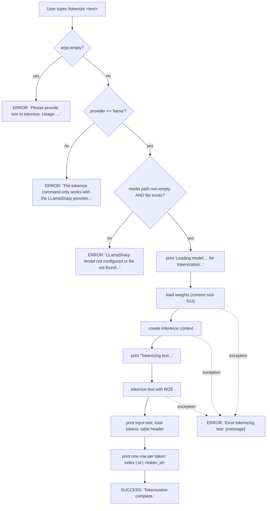
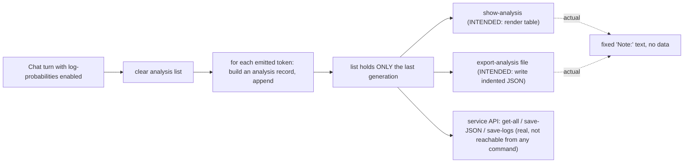

# Feature: Token Inspection, Tokenization & Attribution

> Source repo: `/mnt/g/3RD-Party/reversing/subject/chatdbg`, pinned commit `d8c18f61d6bb73666ed97cd4885e877e35558485`.
> All paths below are relative to that repo root. Line numbers are from the pinned commit.
> **CODE IS TRUTH.** Where the shipped documentation (`README.md`, `docs/LLamaSharp-Token-Introspection.md`, `IMPLEMENTATION_SUMMARY.md`) contradicts the code, the code is recorded as the requirement and the contradiction is recorded as a QUIRK.

---

## Purpose

**Problem solved.** A user running a *local* large-language model wants to see *inside* it, not just read its answers. Three questions are addressed:

1. **"How does this model chop my text up?"** — the model does not see characters, it sees tokens. A prompt that "looks short" may be expensive; a prompt that looks the same to a human may tokenize very differently. The feature exposes the token sequence (count, per-token vocabulary IDs, approximate character span) for arbitrary user text.
2. **"What else could the model have said here?"** — at each generation step the model ranks the whole vocabulary. The feature presents the chosen token alongside a top-K set of runners-up with probabilities, so a user can spot low-confidence or surprising choices.
3. **"Why did it say that?"** — an attribution view maps each generated token back to the span of input (or of previously generated output) that is deemed to have influenced it, with a numeric influence score.

Secondary purpose: **viewing and exporting** these analyses — a formatted on-screen report, plus stubbed commands intended to render the last generation's analysis as a table and to serialize it to a JSON file.

**Actors / roles.** There is exactly one role. There is no authentication, authorization, multi-tenancy, or user account anywhere in this feature. The actors are:

- **Interactive shell user (developer / prompt engineer / educator).** Types slash-commands at a REPL prompt. This is the only human actor.
- **Local LLM inference subsystem** (adjacent feature, not documented here) — supplies the tokenizer, the generator, and, during normal chat, a stream of per-step analysis records in the shape this feature's data model defines.
- **Token Probability Analysis / visualization subsystem** (adjacent feature) — consumes the same probability records for its own rich rendering.

README positions this as: *"Token Inspection Tools: Analyze and visualize how LLM models tokenize and process text"* (`README.md:18`) and lists the value as *"Understanding how LLMs process text / Debugging unexpected model behavior / Optimizing prompts for token efficiency / Educational purposes about LLM internals"* (`README.md:297-301`).

---

## Behavior

The feature surfaces **four commands** plus **one service with two operations** plus **one shared per-step analysis record** that the local-inference subsystem populates.

Command dispatch context (shared with all other commands): a line typed at the REPL that starts with `/` is a command; anything else is a chat turn (`src/ChatDbg/ChatShell.cs:90`). The leading `/` is stripped, the remainder is split on spaces discarding empty entries, the first element lower-cased is the command name, and the rest are the argument array (`src/ChatDbg/ChatShell.cs:326-333`). Unknown names produce `Unknown command: /{name}. Type '/help' for available commands.` (`src/ChatDbg/ChatShell.cs:340`).

### Operation 1 — `/tokenize <text>` (tokenization report)

*File:* `src/Xcaciv.ChatDbg.Core/Commands/TokenizeCommand.cs`

- **Identity:** name `tokenize`; description `Analyze and tokenize text using the current LLM model`; usage `"/tokenize <text> - Tokenizes the provided text and displays token IDs, offsets, and statistics"` (`:16-20`).
- **Input:** one or more whitespace-separated argument words, re-joined with a single space into the text to tokenize (`:46`). Note the re-join is lossy for runs of multiple spaces (see Business rules).
- **Preconditions, checked in this exact order:**
  1. at least one argument (`:29-32`);
  2. configured provider must be exactly `"llama"` (`:35-38`);
  3. configured model identifier must be non-empty **and** must exist as a file on disk (`:41-44`).
- **Processing:** builds model parameters over the configured model file with a **context size of 512** (`:51-54`), loads the model weights off the calling thread, then creates an inference context off the calling thread (`:59,62`), then tokenizes the text **with a beginning-of-sequence marker prepended** (`:67`).
- **Output (written directly to standard output, not returned in the command result):**
  - `Loading model {modelPath} for tokenization...` (`:56`)
  - `Tokenizing text...` (`:64`)
  - `Input text: "{text}"` (`:70`)
  - `Total tokens: {count}` (`:71`)
  - blank line, then `Token analysis:` and a dashed rule `---------------` (`:72-74`)
  - column header, left-aligned in fixed widths 5 / 8 / 15: `Index | Token ID | Token Text` (`:75`), then rule `------------------------------------` (`:76`)
  - one row per token: zero-based index (width 5), token ID (width 8), and a **placeholder text** `<token_{id}>` (`:79-88`). The real decoded token string is never shown.
- **Result:** success with message `Tokenization complete.` (`:90`). The shell prints `✓ ` + message (`src/ChatDbg/ChatShell.cs:102-104`).
- **Side effects:** loads and unloads a model (heavyweight, potentially GBs of RAM and seconds-to-minutes). No file written, no state retained.

### Operation 2 — `/inspect <text>` (full inspection: tokenization → probabilities → attribution)

*File:* `src/Xcaciv.ChatDbg.Core/Commands/InspectCommand.cs`

- **Identity:** name `inspect`; description `Performs detailed token-level analysis of text using the current model`; usage `"/inspect <text> - Analyzes token probabilities and attribution"` (`:16-20`).
- **Input / preconditions:** identical shape and identical ordering to `/tokenize` (`:29-44`), with the same argument re-join (`:46`).
- **Stage A — announce:** prints `Performing token inspection on: "{text}"` and `This may take a moment to load the model...` (`:50-51`).
- **Stage B — tokenization analysis:** delegates to the inspection service's *analyze prompt* operation with visualization enabled (`:54-57`), then renders (`:98-137`):
  - `=== TOKENIZATION ANALYSIS ===`
  - `Total tokens: {count}`
  - the visualization block, if non-empty
  - `Token Details:` / `-------------`
  - header, **right**-aligned widths 5 / 8 / 15 then a literal trailing column: `Index | Token ID | Token Text | Char Range` (`:115`) and rule `------------------------------------------------------` (`:116`)
  - one row per token: index, token ID, escaped display text (width 15), and a character range rendered as `{start}-{end}` — or the literal `n/a` when start equals end (`:131-135`).
- **Stage C — interactive consent gate:** prints a blank line then `Do you want to continue with probability analysis? This will generate tokens and analyze their probabilities. (y/n)` and **blocks reading a line from standard input** (`:63-65`). The reply is lower-cased invariantly; only `y` or `yes` proceeds (`:67`). Any other reply (including empty / EOF) silently skips stages D and E.
- **Stage D — probability analysis:** prints `Generating probability map...` (`:69`), computes tokens-to-generate as **min(10, configured max response length)** (`:72`), calls the service's *generate probability map* operation with that count and with top-K taken from the configured `logProbabilitiesTopK` (`:73-77`), then renders (`:142-183`):
  - `=== TOKEN PROBABILITY ANALYSIS ===`
  - `Generated continuation:` / `----------------------`, then the concatenation of all generated token texts
  - `Token Probabilities:` / `------------------`
  - per entry: `Token {n}: "{selectedText}" (ID: {selectedId})` with `n` **1-based**
  - `  Log Probability: {logprob to 5 decimals} ({e^logprob × 100 to 2 decimals}%)`
  - if alternatives exist: `  Top alternatives:` then per alternative `    "{text}" (ID: {id}) - LogProb: {lp to 5 dp} ({e^lp × 100 to 2 dp}%)`
  - a blank line after each entry.
- **Stage E — attribution analysis:** renders (`:188-210`):
  - `=== TOKEN ATTRIBUTION ANALYSIS ===`
  - `This shows which parts of the input may have influenced each generated token.`
  - per attribution: `Token {index+1} "{tokenText}" was influenced by:` then `  "{influencingText}" (score: {score to 2 dp})` then a blank line.
- **Result:** success with message `Token inspection complete.` (`:86`) — returned whether or not the user consented to stage D.
- **Side effects:** loads the model **once for stage B and a second time for stage D** (two independent load/dispose cycles). Runs real inference in stage D. No file written, no state retained.

### Operation 3 — `show-analysis` (view last generation's analysis) — **STUB**

*File:* `src/Xcaciv.ChatDbg.Core/Commands/ShowTokenAnalysisCommand.cs`

- **Identity:** name `show-analysis`; description `Display detailed token-level analysis from the last LLamaSharp generation`; usage is multi-line (`:15`):
  ```
  show-analysis [--top N] [--state] [--range START END]
    Options:
      --top N: Show top N candidates (default: 3)
      --state: Show model state information
      --range START END: Show analysis for specific token range
  ```
- **Behavior actually implemented:** parses the three flags into local variables and then returns a fixed informational message that echoes them back. It reads no analysis data and renders no table (`:17-48`).
- **Output message (success = true):**
  ```
  Note: This command requires LLamaSharp provider integration.
  Token analysis data would be displayed here when integrated with the AI service
  Options parsed: top={showTopN}, state={showModelState}, range={startStep}-{endStep}

  Use 'export-analysis <file>' to save full analysis to JSON
  ```
- **Not registered in either shell** — see QUIRK Q1.

### Operation 4 — `export-analysis <filepath>` (export analysis to JSON) — **STUB**

*File:* `src/Xcaciv.ChatDbg.Core/Commands/ExportTokenAnalysisCommand.cs`

- **Identity:** name `export-analysis`; description `Export detailed token-level analysis from the last LLamaSharp generation to JSON file`; usage `"export-analysis <filepath>\n  Example: export-analysis analysis.json"` (`:12-14`).
- **Zero arguments →** error result with message (`:20`):
  ```
  Usage: export-analysis <filepath>
  Example: export-analysis analysis.json
  Note: This command only works with LLamaSharp provider
  ```
- **One or more arguments →** success result with message (`:23`), and **no file is written**:
  ```
  Note: This command requires LLamaSharp provider integration.
  To use: Ensure provider is set to 'llama' and generate a response first
  ```
- The file path argument is never read, validated, or used. **Not registered in either shell** — see QUIRK Q1.

*(Sibling stub, same shape, belongs to the adjacent Diagnostic Logging & Log Export feature but is asserted by the same test class: `export-logs <filepath>` in `src/Xcaciv.ChatDbg.Core/Commands/ExportLogsCommand.cs:12-23`.)*

### Operation 5 — service: analyze prompt (tokenization)

*File:* `src/Xcaciv.ChatDbg.Core/Services/TokenInspectionService.cs:17-85` — a stateless static operation.

- **Inputs:** the prompt text; the model file path; a boolean `includeVisualization` defaulting to **true**.
- **Guard:** empty path or non-existent file → throws a *file-not-found* condition carrying message `Model file not found` and the offending path (`:22-25`). This guard runs **before** the try/catch, so it is *not* re-wrapped.
- **Work:** context size **512**; load weights; create context; tokenize with BOS prepended (`:30-46`).
- **Builds one token record per token** (`:50-60`): zero-based index, integer vocabulary ID, text set to the placeholder `<token_{id}>`, char start and end both initialised to 0.
- **Estimates character positions** (see Business rules) (`:63`).
- **Builds the visualization string** when requested (`:69`, `:259-271`) — a fixed five-line block:
  ```
  Tokenization visualization (simplified):
  -------------------------------------
  Original text: "{prompt}"
  Approximate token count: {tokenCount}

  Note: Actual token boundaries cannot be visualized accurately without decoding functionality.
  ```
- **Returns:** original prompt, the token list, the token count, and the visualization (null when not requested).
- **Any other failure** is caught, traced to the debug channel, and re-thrown as an *invalid-operation* condition with message `Error analyzing prompt: {inner message}` preserving the inner cause (`:80-84`).

### Operation 6 — service: generate probability map (probabilities + attribution)

*File:* `src/Xcaciv.ChatDbg.Core/Services/TokenInspectionService.cs:90-211` — a stateless static operation.

- **Inputs:** prompt; model path; `numTokensToGenerate` defaulting to **10**; `topK` defaulting to **5** (`:90-94`).
- **Guard:** same file-existence guard, same file-not-found condition (`:96-99`).
- **Work:** context size **2048** (`:106`); load weights; create context; create an *interactive* executor; inference parameters set max-tokens to `numTokensToGenerate` with an **empty anti-prompt list** (`:104-125`).
- **Streams inference** over the prompt, appending every emitted piece to a response buffer (`:133-147`).
- **Fabricates the analysis** from the *text* of the response (see QUIRK Q3): splits the response on the five separators space, `.`, `,`, `!`, `?` discarding empties (`:156`), then for each resulting word index `i` (`:159-193`):
  - a generated-token record: index `i`, vocabulary ID `1000 + i`, text = the word, log-probability −2.5;
  - a step-probability record: position `i`, with selected ID / text / log-probability copied from the generated-token record;
  - exactly *top-K* alternatives, for `j` in `0..topK-1`: vocabulary ID `2000 + (i × 100) + j`, text `{word}_alt{j+1}`, log-probability `-3.0 - j`.
- **Builds the attribution list** (`:196`, `:276-324`) — see Business rules for the heuristic.
- **Returns:** original prompt, generated token list, probability map list, attribution list.
- **Any failure** is re-thrown as an *invalid-operation* condition with message `Error generating probability map: {inner message}` (`:206-210`).

### Operation 7 — the per-step analysis record produced during ordinary chat

The per-step analysis record that this feature owns (`src/Xcaciv.ChatDbg.Core/Services/TokenInspection/TokenAnalysis.cs`) is populated by the adjacent local-inference feature on every generated token when log-probability capture is on. Observable consequences relevant here (`src/Xcaciv.ChatDbg.Core/Services/LLamaSharpService.cs`):

- The list is **cleared at the start of every generation** (`:156`) — only the *last* generation is retained.
- One record is appended per emitted token (`:222-229`).
- Record fields are filled as: step = emitted-token count − 1; token text = the emitted piece; **vocabulary ID = −1 always** (real IDs are not available); probability = a temperature-derived *estimate*; log-probability = ln(estimate); prompt offset = the same step number; debug text = `Generated via sampling pipeline at step {step}, temperature={temp to 2 dp}.`; and a state snapshot whose processed-count and context-count both equal the step, whose window size is the configured context size (falling back to **4096** when that is ≤ 0), whose remaining capacity is window size − step, whose timestamp is the **local** clock, and whose diagnostic map holds `Temperature` (2 dp), `TopK` and `Mode` = `SamplingPipeline` (`:270-307`).
- Alternatives *are* really computed, from the current logits, top-K taken from the configured `logProbabilitiesTopK`, softmaxed against the running maximum; each becomes a candidate carrying **only text and log-probability** — vocabulary ID, probability and raw pre-softmax score are left at zero (`:209-212,225-227,419-493`; the real top-K is clamped to at least 1 and at most the logit-vector length at `:459`). The set attached to step *n* is the set computed *after* step *n* was emitted (see QUIRK Q15). If the computation throws, it is swallowed to a `WARN` log line `Failed to compute candidates from logits: {message}` and that step keeps an empty candidate list (`:214-219`).
- Retrieval / export API on the inference service: get-all (returns a defensive copy) (`:628`); save-to-JSON-file with indented formatting, swallowing any write failure into a logged error (`:633-650`); save-system-logs-to-file (`:653-656`).

---

## Business rules & edge cases

### Command gating and argument handling

| # | Rule | Evidence |
|---|------|----------|
| R1 | `/tokenize` and `/inspect` require at least one argument; zero arguments → error `Please provide text to tokenize. Usage: ` + usage string / `Please provide text to inspect. Usage: ` + usage string. | `TokenizeCommand.cs:29-32`; `InspectCommand.cs:29-32` |
| R2 | Both commands work **only** when the configured provider is the exact lowercase string `"llama"`. Any other value → error `The tokenize command only works with the LLamaSharp provider. Use '/set provider llama' first.` / `The inspect command only works with the LLamaSharp provider. Use '/set provider llama' first.` | `TokenizeCommand.cs:35-38`; `InspectCommand.cs:35-38`; asserted `TokenizeCommandTests.cs:12-20`, `InspectCommandTests.cs:21-29` |
| R3 | The model identifier must be non-empty **and** name an existing file. Otherwise → error `LLamaSharp model not configured or file not found. Use '/set modelId <path-to-gguf-model>' first.` | `TokenizeCommand.cs:41-44`; `InspectCommand.cs:41-44`; asserted `TokenizeCommandTests.cs:22-31`, `InspectCommandTests.cs:31-40` |
| R4 | **Ordering guarantee:** argument-count check precedes the provider check, which precedes the model check. A no-argument `/inspect` on a *valid* llama configuration still fails with the argument error. | `InspectCommand.cs:29-44`; asserted `InspectCommandTests.cs:10-18` (provider `llama`, model `model.gguf`, empty args → failure) |
| R5 | The text to analyse is the argument array joined with a **single space**. Because the shell splits on spaces discarding empty entries, runs of multiple spaces, tabs and other whitespace in the user's original line are **normalised to one space** before tokenization. | `TokenizeCommand.cs:46`; `InspectCommand.cs:46`; `src/ChatDbg/ChatShell.cs:326` |
| R6 | Command names are matched case-insensitively (the typed name is lower-cased before lookup) but registration is by the command's own declared name, which is always already lowercase. | `src/ChatDbg/ChatShell.cs:332-335`; `src/ChatDbg.Shell.Gui/UI/ChatWindow.cs:390-393` |
| R7 | The provider comparison is **case-sensitive and exact**: `/set provider LLAMA` (were it accepted) would fail R2. The setting's factory default is `"azure"`, so on a fresh install both commands fail R2 until the user runs `/set provider llama`. | `TokenizeCommand.cs:35`; `InspectCommand.cs:35`; default at `ChatSettings.cs:8` |
| R8 | The model-identifier default is the literal `"gpt-4"`, which is not a path, so on a fresh install R3 also fails. | `ChatSettings.cs:11` |
| R9 | The model path is checked for existence but never checked for extension, size, magic bytes, or readability. Any existing file — a text file, a directory entry that is a file, a 0-byte file — passes R3 and the failure surfaces later as a wrapped load error. | `TokenizeCommand.cs:41`; `InspectCommand.cs:41`; `TokenInspectionService.cs:22,96` |
| R10 | Both commands read the four settings they use (`provider`, `modelId`, `maxTokens`, `logProbabilitiesTopK`) **at execute time** from a shared mutable configuration object, so a `/set` issued earlier in the same session takes effect without restart — **provided** the shell mutates that same object rather than replacing it (see Q6). | `TokenizeCommand.cs:22-24,35,41`; `InspectCommand.cs:22-24,72,77` |
| R11 | Neither command re-validates the settings it reads. `logProbabilitiesTopK` is range-checked only where it is *set* (1–20), and `maxTokens` only where it is set (1–8192); a settings file hand-edited to `logProbabilitiesTopK: 0` or `-3` is passed straight through and simply yields zero alternatives per position. | `LogProbsCommand.cs:57-59`; `SetCommand.cs:79-86`; unvalidated use at `InspectCommand.cs:72,77` |

### Magic numbers and their meanings

| # | Number | Meaning | Evidence |
|---|--------|---------|----------|
| M1 | **512** | Context window size used for *tokenization-only* model loads. Comment: "Small context for tokenization only". Deliberately small to keep the load cheap; the user's configured `llamaContextSize` is ignored. | `TokenInspectionService.cs:32`; `TokenizeCommand.cs:53` |
| M2 | **2048** | Context window size used for the *probability-map* model load. Also ignores the user's configured `llamaContextSize` (default 4096). | `TokenInspectionService.cs:106` |
| M3 | **10** | Default number of tokens to generate for a probability map. | `TokenInspectionService.cs:93` |
| M4 | **5** | Default top-K (alternatives per position) for a probability map; also the product default for `logProbabilitiesTopK`. | `TokenInspectionService.cs:94`; `ChatSettings.cs:37` |
| M5 | **min(10, maxTokens)** | `/inspect` caps generation at 10 tokens regardless of the configured max response length (default 1000). | `InspectCommand.cs:72` |
| M6 | **1000 + i** | Synthetic token ID assigned to the *i*-th fabricated generated token. | `TokenInspectionService.cs:165` |
| M7 | **-2.5** | Synthetic log-probability stamped on every fabricated generated token (≈ 8.21% when displayed). | `TokenInspectionService.cs:167` |
| M8 | **2000 + (i × 100) + j** | Synthetic token ID of alternative *j* at position *i*. The ×100 stride means alternative IDs stay unique as long as top-K ≤ 100. | `TokenInspectionService.cs:186` |
| M9 | **-3.0 - j** | Synthetic log-probability of alternative *j*: strictly decreasing with rank (-3.0, -4.0, -5.0, …), i.e. alternatives are guaranteed to be emitted in **descending probability order** and always below the selected token's -2.5. | `TokenInspectionService.cs:188` |
| M10 | **3** | Attribution cut-over: generated tokens at index 0, 1, 2 are attributed to the *prompt*; index ≥ 3 to recent generated tokens. | `TokenInspectionService.cs:295` |
| M11 | **50** | Maximum characters of prompt **tail** used as the influencing excerpt for the first three tokens: the last `min(50, promptLength)` characters. | `TokenInspectionService.cs:298-299` |
| M12 | **5** | Look-back window for later tokens: the influencing text is the concatenation of generated token texts from index `max(0, i-5)` up to (not including) `i`. | `TokenInspectionService.cs:304-310` |
| M13 | **0.8** | Constant influence score stamped on every attribution entry ("Placeholder for a real influence calculation"). Displayed as `0.80`. | `TokenInspectionService.cs:319` |
| M14 | **40 / 37** | Attribution display truncation: influencing text longer than 40 characters is cut to its first 37 characters and suffixed with `...`. | `InspectCommand.cs:198-200` |
| M15 | **F5 / F2** | Log probabilities are displayed with **5** decimal places; derived percentages with **2** decimal places. Percentage = `e^logprob × 100`. | `InspectCommand.cs:170,177` |
| M16 | **widths 5 / 8 / 15** | Fixed column widths. `/tokenize` uses left alignment (`-5`, `-8`, `-15`); `/inspect` uses right alignment (`5`, `8`, `15`). | `TokenizeCommand.cs:75,87`; `InspectCommand.cs:115,135` |
| M17 | **3** | Default `--top` for `show-analysis`. | `ShowTokenAnalysisCommand.cs:19` |
| M18 | **0 / -1** | Default step range for `show-analysis`: start 0, end **-1** (sentinel meaning "to the end"), echoed literally as `range=0--1` when the flag is absent. | `ShowTokenAnalysisCommand.cs:21-22,46` |
| M19 | **10000** | In-memory log buffer size (characters) after which the LLamaSharp log buffer is flushed to the daily file. | `LLamaSharpLogConfig.cs:40`, flush test at `:90`; asserted `LLamaSharpLogConfigTests.cs:20` |
| M20 | **-1** | Sentinel char start/end for the beginning-of-sequence token, and the vocabulary ID stamped on every chat-time analysis record (real IDs unavailable). | `TokenInspectionService.cs:231-232,251-252`; `LLamaSharpService.cs:281` |
| M21 | **4096** | Configured context-window default, and the fallback the chat-time state snapshot substitutes when the configured context size is ≤ 0. This feature's own two loads never use it. | `ChatSettings.cs:54`; fallback at `LLamaSharpService.cs:291-292` |
| M22 | **"azure" / "gpt-4" / 0.7 / 1000 / 512 / 0 / 0** | Factory defaults of the settings this feature reads or bypasses: provider `azure`, model identifier `gpt-4`, temperature `0.7`, max response length `1000`, batch size `512`, GPU layer count `0`, thread count `0` (meaning "platform default"); GPU device is unset (null). | `ChatSettings.cs:8,11,14,17,57,63,66,60` |
| M23 | **0.95 / 0.85 / 0.75 / 0.60 / 0.50 / 0.40** | The six temperature-derived probability estimates stamped on chat-time analysis records, selected by the thresholds temperature ≤ 0.1, ≤ 0.5, ≤ 0.7, ≤ 1.0, ≤ 1.5, else. | `LLamaSharpService.cs:310-323` |
| M24 | **1–20 / 1–8192 / 512–32768** | Validation ranges enforced *elsewhere* on the three settings this feature consumes or ignores: top-K alternatives, max response length, configured context size. | `LogProbsCommand.cs:57-59`; `SetCommand.cs:79-86,96-103` |
| M25 | **`llamasharp_{yyyyMMdd}.log`** | Daily diagnostic log filename inside the log directory; entries are prefixed `[{yyyy-MM-dd HH:mm:ss.fff}] [{level}] `. | `LLamaSharpLogConfig.cs:149,83,121` |
| M26 | **`%APPDATA%\ChatDbg\Logs`** | Default log directory: the platform application-data folder joined with `ChatDbg` then `Logs`. | `LLamaSharpLogConfig.cs:20` |
| M27 | **`~/.ChatDbg/settings.json`** | Where the settings this feature reads are persisted. | `SettingsService.cs:11-25` — and if the user-profile folder resolves to an empty string the base directory silently becomes the platform temp directory (`:20-23`) |

### Character-position estimation (`TokenInspectionService.cs:216-254`)

This is a *uniform-distribution approximation*, not a real offset map.

- Let `charCount` = prompt length in characters, `tokenCount` = number of tokens (including the BOS token).
- **If `tokenCount > 1`:** `charsPerToken = charCount / (tokenCount - 1)` in floating point — the BOS token is deliberately excluded from the denominator (`:224`).
  - Token 0 (BOS): start = **-1**, end = **-1** (`:231-232`), rendered by `/inspect` as `n/a` because start equals end (`InspectCommand.cs:131-133`).
  - Token `i ≥ 1`: `start = round((i-1) × charsPerToken)`, `end = round(i × charsPerToken)` using **banker's/half-away rounding as provided by the platform's `Math.Round` default (half-to-even)** (`:236-237`).
  - Clamps: `start = min(start, charCount - 1)`; `end = min(end, charCount)` (`:240-241`). Note the asymmetric clamp — start is clamped to `charCount-1`, end to `charCount`.
- **If `tokenCount == 1`:** the single token gets start = -1, end = -1 (`:248-253`).
- **If `tokenCount == 0`:** nothing is written; the (empty) list is returned unchanged.
- **Edge case — empty prompt with tokens:** `charCount = 0` gives `charsPerToken = 0`, so for `i ≥ 1` start = `min(0, -1)` = **-1** and end = `min(0, 0)` = **0**, producing the nonsensical but non-crashing range `-1-0`.
- **Consequence:** spans are contiguous and non-overlapping by construction (`end` of token *i* equals `start` of token *i+1* before clamping), so the report always *looks* like a clean segmentation even though it bears no relation to real token boundaries. The visualization block explicitly disclaims this (`:268`).

### Token text rendering rules

- **Placeholder text.** Every token's `Text` is the literal `<token_{id}>` — the code comments call it "Simplified representation" and there is no decoding step (`TokenInspectionService.cs:56`; `TokenizeCommand.cs:85`).
- **Escaping in `/inspect`.** Before display, newline → `\n`, carriage return → `\r`, tab → `\t` (`InspectCommand.cs:121-124`).
- **Whitespace-only fallback.** If, after escaping, the display text is whitespace-only but the original text was non-empty, it is replaced by `[whitespace:{comma-separated character codes}]` (`InspectCommand.cs:126-129`). With the current placeholder text this branch is unreachable — it is future-proofing for real decoded tokens.
- **Attribution text escaping.** Only newline and carriage return are escaped (no tab) (`InspectCommand.cs:203-205`), and truncation (M14) happens **before** escaping, so an escape sequence can be split.

### Streaming-loop rules in the probability-map operation

- Emitted pieces exactly equal to `" "`, `","`, `"."`, `"!"` or `"?"` are skipped from a side collection of words, as are whitespace-only pieces (`TokenInspectionService.cs:138-146`). **That side collection is never read afterwards** — dead accumulation. The actual word list comes from re-splitting the assembled text at `:156`.
- The split separators are exactly `' '`, `'.'`, `','`, `'!'`, `'?'`. Newlines, tabs, semicolons, colons, quotes, and dashes are **not** separators, so `"hello\nworld"` is one "word".
- If the model emits nothing, or only separators, the word array is empty → empty generated-token list, empty probability-map list, empty attribution list. Nothing crashes; `/inspect` prints the headers with no rows and an empty "Generated continuation".
- Anti-prompt list is empty, so generation stops only on the token budget or the model's own end-of-sequence (`:124`).

### Attribution heuristic rules (`TokenInspectionService.cs:276-324`)

For generated token at index `i`:

1. **If `i < 3` AND the prompt is non-empty:** influencing text = the **last** `min(50, promptLength)` characters of the prompt.
2. **Otherwise:** influencing text = concatenation (no separator) of the text of generated tokens `[max(0, i-5), i)`. For `i = 0` with an empty prompt this yields the empty string; for `i = 3` it is tokens 0..2; for `i = 4` tokens 0..3; for `i ≥ 5` exactly the previous five.
3. Every entry carries an influence score of 0.8.
4. Entries are produced in ascending token-index order, one per generated token — **ordering guarantee: attribution list index == generated-token index**, and its length always equals the generated-token list length.

### Ordering guarantees (summary)

- Token records from tokenization are in sequence order with contiguous zero-based indices, the beginning-of-sequence marker first (`TokenInspectionService.cs:50-60`).
- Step-probability records are in generation order, each one's position equal to its list index (`:159-192`).
- Alternatives within a step-probability record are in descending probability order by construction (M9).
- Attribution entries are in generation order, one-to-one with generated tokens.
- `/inspect` displays probability entries and attribution entries **1-based** (`Token 1`, `Token 2`, …) while the underlying indices are 0-based (`InspectCommand.cs:169,207`).
- The chat-time analysis list is append-only within one generation and cleared at the start of the next (`LLamaSharpService.cs:156,229`).

### `show-analysis` argument-parsing rules (`ShowTokenAnalysisCommand.cs:25-44`)

- Scans left to right. `--top` consumes the next argument **only if** it exists and parses as an integer; the loop index is then advanced past it. A non-numeric value leaves the default 3 in place **and does not consume the value**, so the bad value is then examined as a flag (and ignored).
- `--state` is a bare boolean flag, default false.
- `--range` requires **two** following arguments (`i + 2 < args.Length`) and advances past both; each of the two is parsed independently, so `--range abc 10` leaves start at 0 and sets end to 10.
- No validation of ranges: negatives, inverted ranges, and `--top 0` are all accepted and echoed verbatim.
- Unknown flags and stray words are silently ignored.
- Repeated flags: last one wins.

### `export-analysis` / `export-logs` rules

- Zero arguments → failure result with the three-line usage message.
- ≥ 1 argument → success result with a "Note:" message; **no file is created, no path is validated** (`ExportTokenAnalysisCommand.cs:18-23`; `ExportLogsCommand.cs:18-23`; asserted `ExportLogsAndAnalysisCommandTests.cs:10-49`).

### Data-model rules the test suite pins

Every rule here is an assertion in a shipped test, converted to a requirement.

| # | Rule | Evidence |
|---|------|----------|
| D1 | All analysis entities are freely constructible with no arguments and every member is independently writable after construction; nothing is validated on assignment (a probability of 0.5 and a log-probability of ln(0.5) are stored as given, with no cross-check that they agree). | `TokenInspectionModelsTests.cs:11-47` |
| D2 | The per-step analysis record round-trips through JSON: step number, token text, vocabulary ID, probability (to 3 decimal places), the candidate-list length, and the nested model state's total-tokens-processed all survive serialize→deserialize. The round-trip test does **not** assert log-probability, prompt offset, debug text, or candidate contents — those are pinned only by the property tests. | `TokenAnalysisTests.cs:133-170`; property coverage at `:10-31` |
| D3 | Candidate entries carry five independent values — text, vocabulary ID, probability, log-probability and a raw pre-softmax score — and a record may hold an ordered list of them (three, in the pinned case) preserving insertion order and per-entry values. | `TokenAnalysisTests.cs:33-52,85-108` |
| D4 | A model-state snapshot preserves total-tokens-processed, context-token-count, context size, remaining capacity, an exact timestamp, and an arbitrary string→string diagnostic map (count and values both preserved). A snapshot may be attached to an analysis record and read back through it. | `TokenAnalysisTests.cs:54-83,110-131` |
| D5 | An analysis record's model-state member is **optional** — a record constructed with only a step number and a snapshot is valid, and a record with neither candidates nor a snapshot is valid (candidate list defaults to empty, snapshot defaults to absent). | `TokenAnalysisTests.cs:110-131`; defaults at `TokenAnalysis.cs:50,56,62` |
| D6 | The probability-map entities preserve what is written to them: an alternative keeps its text; a map keeps its alternative list; a probability-map result keeps its original prompt, its generated-token list and its attribution list, each independently. | `TokenInspectionModelsTests.cs:49-104` |
| D7 | Attribution influence score is a *single-precision* value and accepts any float — the test writes 0.7 even though the only producer ever writes 0.8. Nothing constrains it to 0–1. | `TokenInspectionModelsTests.cs:96`; producer at `TokenInspectionService.cs:319` |
| D8 | A token record can legitimately carry a real character span (0–5 in the pinned case) — the placeholder/-1 behaviour is a property of the *producer*, not of the record. | `TokenInspectionModelsTests.cs:77-85` |
| D9 | The diagnostic log sink accumulates messages in memory even with file, debug and console output all disabled; the accumulated text contains the message body, and clearing makes it exactly the empty string. | `TokenInspectionModelsTests.cs:106-121`; `LLamaSharpLogConfigTests.cs:24-60` |
| D10 | A fresh log sink has file logging **on**, debug output **on**, console output **off**, a buffer threshold of **10000** characters, and a non-null log directory. | `LLamaSharpLogConfigTests.cs:10-21` |
| D11 | Log entries carry their level in square brackets: writing at `INFO`, `WARNING` and `ERROR` puts `[INFO]`, `[WARNING]` and `[ERROR]` into the accumulated text alongside each message body, in write order. | `LLamaSharpLogConfigTests.cs:93-115` |
| D12 | Saving the sink to an explicit path creates the file and the file contains the logged text. | `LLamaSharpLogConfigTests.cs:63-83` |
| D13 | Disposing the sink is idempotent — a second disposal is a no-op and throws nothing (the test disposes twice with file logging on and the log directory pointed at the platform temp directory). | `LLamaSharpLogConfigTests.cs:118-137`; guard at `LLamaSharpLogConfig.cs:193-200` |
| D14 | Configuring native log capture twice in a row is a no-op the second time and throws nothing. | `LLamaSharpLogConfigTests.cs:139-153`; guard at `LLamaSharpLogConfig.cs:69-70` |
| D15 | The three view/export commands are asserted **only** on their fixed messages — success plus a message containing "Token analysis" (case-insensitive) for the view command, failure with no arguments and success with a message containing "Note" for both export commands. **No test asserts that a file is or is not written**; the absence of any file I/O is read from the command bodies, not from a test. | `ShowTokenAnalysisCommandTests.cs:9-18`; `ExportLogsAndAnalysisCommandTests.cs:9-49`; bodies at `ExportTokenAnalysisCommand.cs:16-24`, `ShowTokenAnalysisCommand.cs:17-49` |
| D16 | The two inspection operations are asserted only on the missing-model guard; **no test ever loads a model, tokenizes anything, generates anything, or exercises the character-position estimator, the visualisation builder or the attribution heuristic.** Everything documented about those paths is read from the code. | `TokenInspectionServiceTests.cs:10-20` |

---

## Quirks

Behaviours below look like defects. They are recorded as *observed behaviour*; the source is not changed.


| ID | Quirk | Evidence |
|----|-------|----------|
| **Q1** | `show-analysis`, `export-analysis` and `export-logs` are **not registered in either shell**. Both shells hand-wire an explicit command array that contains only `tokenize` and `inspect` from this feature. Typing `/show-analysis` yields `Unknown command`. `docs/LLamaSharp-Token-Introspection.md:57-96,269-303` documents all three as working, with sample transcripts. | `src/ChatDbg/ChatShell.cs:42-57`; `src/ChatDbg.Shell.Gui/Program.cs:31-47`; doc `docs/LLamaSharp-Token-Introspection.md:57-96` |
| **Q2** | Even if registered, the three commands are pure stubs — they read no data and write no files. The doc shows a rendered probability table and `Success: Token analysis exported to paris_analysis.json / Exported 12 token analyses` (`docs/…:294-303`); the code returns a fixed "Note:" string. | `ShowTokenAnalysisCommand.cs:46-48`; `ExportTokenAnalysisCommand.cs:23`; doc `docs/LLamaSharp-Token-Introspection.md:279-303` |
| **Q3** | **The probability map and attribution data produced by `/inspect` are fabricated, not measured.** Real inference runs and the *generated text* is real, but every token ID, log-probability, alternative and influence score is a formula (M6–M13). README (`:293-295`) describes `/inspect` as providing "Token probability mapping" and "Token attribution (showing which input parts influenced each output token)" without qualification. The code comments themselves say "simplified approximation", "Made-up token ID", "synthetic", "Placeholder". | `TokenInspectionService.cs:151-193,281,319` |
| **Q4** | **README claims `/tokenize` shows token positions in the input text** ("This shows the individual tokens, their IDs, and positions in the input text", `README.md:282`) and its usage string promises "token IDs, offsets, and statistics" (`TokenizeCommand.cs:20`). The implementation prints only Index, Token ID and a placeholder text — **no offsets, no statistics**. Only `/inspect` shows a (estimated) char range. | `TokenizeCommand.cs:70-88` vs `README.md:282` |
| **Q5** | **Token text is never decoded.** Both commands display `<token_{id}>`. The visualization block admits this: "Actual token boundaries cannot be visualized accurately without decoding functionality." The "Example Output" block printed immediately under the Local LLM Features heading shows decoded token strings and real percentages, which no command in this feature can produce (`README.md:303-345`; that block actually depicts the adjacent probability-visualisation feature). | `TokenInspectionService.cs:56,268`; `TokenizeCommand.cs:85` |
| **Q6** | **GUI shell: `/tokenize` and `/inspect` can never succeed.** The GUI constructs both commands with the *initial default* settings object, then **replaces** the variable with the settings loaded from disk before building the window. The commands keep a reference to the discarded object, whose provider is `"azure"` and model `"gpt-4"`, so R2 always fails with the "only works with the LLamaSharp provider" error. The plain-console shell avoids this by copying loaded values field-by-field onto the *same* object. | `src/ChatDbg.Shell.Gui/Program.cs:14,45-46,58` vs `src/ChatDbg/ChatShell.cs:24,56-57,122-152` |
| **Q7** | **GUI shell: command output is invisible/harmful.** Both commands write their entire report straight to the process's standard output; the GUI shell only surfaces a command's single result message in a status line or an error dialog (`src/ChatDbg.Shell.Gui/UI/ChatWindow.cs:407-416`). Under the full-screen terminal UI the raw writes corrupt the screen, and `/inspect`'s blocking read of standard input (Stage C) has no console to read from. *(INFERRED — not exercised by any test.)* | `InspectCommand.cs:50-65,98-210`; `src/ChatDbg.Shell.Gui/UI/ChatWindow.cs:399-416` |
| **Q8** | **Configured GPU / context / thread / batch settings are ignored** by this feature. `llamaContextSize` (default 4096), `llamaGpuLayerCount`, `llamaGpuDevice`, `llamaThreads`, `llamaBatchSize` are all bypassed in favour of hard-coded context sizes 512 / 2048 and library defaults. The doc advertises GPU acceleration for introspection (`docs/…:192-200`). | `TokenInspectionService.cs:30-33,104-107`; `ChatSettings.cs:53-66` |
| **Q9** | **`/inspect` loads the model twice** in one invocation — once for tokenization (512 context) and once for generation (2048 context) — with a full unload in between. | `InspectCommand.cs:54,73` |
| **Q10** | Documentation states the inference-library version is **0.11.2** three times (`IMPLEMENTATION_SUMMARY.md:75-77`), and the whole "API Compatibility Note" section reasons about what "the actual 0.11.2 release" does or does not expose (`IMPLEMENTATION_SUMMARY.md:139-165`); the project actually references **0.25.0**. | `IMPLEMENTATION_SUMMARY.md:75-77` vs `src/Xcaciv.ChatDbg.Core/Xcaciv.ChatDbg.Core.csproj:13-15` |
| **Q11** | Chat-time analysis records always carry vocabulary ID −1 and a **temperature-derived probability estimate**, not a measured one — so `export-analysis`, were it wired up, would export estimates. At the default temperature 0.7 every token in an export reads probability 0.75, making the whole file look uniformly and falsely confident. Thresholds: temp ≤ 0.1 → 0.95; ≤ 0.5 → 0.85; ≤ 0.7 → 0.75; ≤ 1.0 → 0.60; ≤ 1.5 → 0.50; else 0.40. Log-probability is then `ln(estimate)`, so with the default temperature 0.7 every single token in an export reads probability 0.75 / log-probability −0.2877. | `LLamaSharpService.cs:281,275,283,310-323` |
| **Q12** | The two stub commands import the rich-console rendering library but never call it — a leftover from an intended table renderer. | `ShowTokenAnalysisCommand.cs:1`; `ExportTokenAnalysisCommand.cs:1` |
| **Q13** | The dead word accumulation in the probability-map operation collects emitted pieces that are then discarded; the real word list is produced by re-splitting the assembled string. | `TokenInspectionService.cs:131,137-147,156` |
| **Q14** | The service's usage of "top-K" is not a real top-K over the vocabulary — it simply emits exactly `topK` fabricated alternatives, even when `topK` exceeds any plausible vocabulary count and even when `topK` is 0 or negative (loop body simply never runs). No clamping to the 1–20 range that `/set logProbabilitiesTopK` and `/logprobs top` enforce elsewhere. | `TokenInspectionService.cs:182-190`; range enforced only at `LogProbsCommand.cs:57-59` |
| **Q15** | **Off-by-one in the chat-time candidate capture.** The alternatives attached to the analysis record for step *n* are computed from the logits that are current *after* step *n* was emitted — the code comment says so outright ("Compute candidates for the NEXT token using current logits"). So every exported record's candidate list describes the *following* step, and the final step's real candidates are dropped on the floor for the analysis list (they are re-attached only to the adjacent probability feature's own list). | `LLamaSharpService.cs:209-212` (compute), `:222-227` (attach to the record just built), `:235-246` (leftover handling that touches only the other list) |
| **Q16** | **Exported candidates are half-empty.** When real candidates are attached, only text and log-probability are filled; vocabulary ID, probability and raw pre-softmax score are left at their defaults. Any exported analysis therefore shows every alternative with `"tokenId": 0`, `"probability": 0`, `"logit": 0` — values that look measured but are not. | `LLamaSharpService.cs:225-227` vs the five fields at `TokenAnalysis.cs:68-99` |
| **Q17** | **The summary document claims the fabrication was removed.** `IMPLEMENTATION_SUMMARY.md:248` lists "Removed dummy token probability generation" under *Technical Debt Addressed*, and `:119-135` lists real probabilities / token IDs / top-N candidates / raw logits as *not yet implemented*. The fabricating code is still present and still reachable through `/inspect`. | `IMPLEMENTATION_SUMMARY.md:248,119-135` vs `TokenInspectionService.cs:151-193` |
| **Q18** | **Dead parameter.** The attribution builder is handed the probability-map list and never reads it. | `TokenInspectionService.cs:276-279` (parameter `probMaps`), unused through `:324` |
| **Q19** | **`n/a` collides with a real empty span.** The token table prints `n/a` whenever start equals end — which is true for the beginning-of-sequence sentinel (−1,−1) *and* for any genuinely zero-width span. Conversely, an empty input that still yields ≥ 2 tokens prints the nonsensical range `-1-0` for every non-sentinel token, because the start clamp floors at `charCount - 1 = -1`. | `InspectCommand.cs:131-133`; `TokenInspectionService.cs:240-241` |
| **Q20** | **The two shells disagree on the unknown-command message.** The console shell says `Unknown command: /{name}. Type '/help' for available commands.`; the terminal-GUI shell pops an error dialog reading `Unknown command: {name}` — no leading slash, no pointer to help. | `src/ChatDbg/ChatShell.cs:340` vs `src/ChatDbg.Shell.Gui/UI/ChatWindow.cs:395` |
| **Q21** | **`--range` with a single trailing value is silently dropped.** The range flag is only honoured when two further arguments exist; `show-analysis --range 5` parses nothing, reports no error, and echoes the defaults `range=0--1`. Likewise `--top` as the last argument, or `--top abc`, silently leaves 3 in place and the bad value is then re-examined as if it were a flag and ignored. | `ShowTokenAnalysisCommand.cs:27,36-43` |
| **Q22** | **The end-of-range sentinel renders as a double dash.** With no `--range`, the echo string interpolates start `0` and end `-1` into `range={start}-{end}`, producing the literal `range=0--1`. | `ShowTokenAnalysisCommand.cs:23,46` |
| **Q23** | **Explicitly saving the diagnostic log can silently save almost nothing.** The buffer is *cleared* every time it auto-flushes past 10000 characters, and the explicit save writes only whatever is in the buffer at that moment — so after any auto-flush the "complete" log the user asks for is just the tail. The explicit save also never clears, so a second save duplicates content. | `LLamaSharpLogConfig.cs:154-158` (flush clears) vs `:180-182` (save writes buffer, no clear) |
| **Q24** | **The save-confirmation line can never appear in the file it describes.** The sink writes the file first and only then appends `Logs saved to {path}` to its own buffer — so that line is absent from the file just written and pollutes the *next* one. | `LLamaSharpLogConfig.cs:182,185` |
| **Q25** | **Native log capture is never unregistered.** Configuring installs a callback that captures the sink instance; disposal only flushes and sets a flag. A disposed sink keeps receiving native log lines, appending to a buffer that will never be flushed again, and there is no way to detach. | `LLamaSharpLogConfig.cs:81-105` (install) vs `:193-200` (dispose) |
| **Q26** | **All log-sink file failures are invisible.** Directory creation, buffered flush and explicit save each swallow every failure into the debug channel; a user whose log directory is unwritable sees success everywhere and gets no file. | `LLamaSharpLogConfig.cs:110-113,161-164,187-190` |
| **Q27** | **The documented way to turn file logging off has no user-facing control.** The doc tells users to set `EnableFileLogging = false`; that flag exists only as an in-process property with no settings key, no `/set` name, and no environment variable, and the log sink is constructed with defaults inside the inference service. | doc `docs/LLamaSharp-Token-Introspection.md:205,260` vs `LLamaSharpLogConfig.cs:25` and the absence of any binding in `ChatSettings.cs` / `SetCommand.cs` |
| **Q28** | **The chat path and the introspection path disagree about the default context size.** Chat falls back to 2048 when the configured size is ≤ 0 while the state snapshot it writes at the same moment falls back to 4096, so an analysis record can claim a 4096-token window for a context actually created at 2048. | `LLamaSharpService.cs:550` vs `:291-292` |
| **Q29** | **The consent gate cannot be answered non-interactively.** The prompt is written to standard output and the answer is read from standard input with no timeout, no default, no flag and no cancellation; a piped or redirected session reads end-of-file, is treated as "no", and still returns a success message identical to a completed analysis. | `InspectCommand.cs:63-67,86` |
| **Q30** | **The token table has no upper bound.** Every token of an arbitrarily long input is printed as its own line with no paging, no cap and no truncation; a novel pasted into `/tokenize` dumps hundreds of thousands of lines to the terminal. | `TokenizeCommand.cs:79-88`; `InspectCommand.cs:118-136` |
| **Q31** | **The multi-space normalisation is invisible but reported as fact.** The command echoes `Input text: "{text}"` showing the *normalised* text, so a user who typed two spaces sees one and has no signal that what was tokenized differs from what they typed. Tabs in the original line are lost the same way. | `TokenizeCommand.cs:46,70`; `src/ChatDbg/ChatShell.cs:326` |
| **Q32** | **Numeric output is culture-sensitive.** Log-probabilities, percentages and the influence score are formatted with the ambient culture, so on a locale using a comma decimal separator the report prints `-2,50000 (8,21%)` and `(score: 0,80)` while every surrounding label stays English. | `InspectCommand.cs:170,177,208` |

---

## Workflows & states

### Workflow A — `/tokenize`



### Workflow B — `/inspect` (two-phase with a human consent gate)

1. **Validate** — argument count, then provider, then model file (same three errors as Workflow A but worded "…to inspect" / "The inspect command only works…").
2. **Announce** — `Performing token inspection on: "…"` and `This may take a moment to load the model...`.
3. **Phase 1 — tokenize.** Load model (context 512) → tokenize with BOS → build token records → estimate char positions → build the visualization block → dispose model.
4. **Render tokenization** — `=== TOKENIZATION ANALYSIS ===`, total count, visualization, `Token Details:` table.
5. **Gate (state: awaiting-consent).** Print the y/n question; **block** on a line of standard input. This is the only place in the feature where the process waits on a human. There is no timeout, no default, and no cancellation.
   - reply lower-cases to `y` or `yes` → continue to step 6;
   - anything else (including empty line / EOF) → jump to step 9.
6. **Phase 2 — generate.** Print `Generating probability map...`. Load model again (context 2048) → create interactive executor → stream at most `min(10, maxTokens)` tokens → assemble text → split into words → fabricate token records, probability maps and top-K alternatives → dispose model.
7. **Render probabilities** — `=== TOKEN PROBABILITY ANALYSIS ===`, generated continuation, per-token log-prob and percentage, alternatives.
8. **Render attribution** — `=== TOKEN ATTRIBUTION ANALYSIS ===`, per-token influencing excerpt and score.
9. **Return** success `Token inspection complete.` — reached from both the consented and the declined path.
10. **On any thrown condition** anywhere in steps 3–8: return failure `Error during token inspection: {message}` and write the full exception to the debug trace. The message the user sees is the *outer* wrapper text, e.g. `Error during token inspection: Error analyzing prompt: <inner>`.

**States of `/inspect`:** `validating → announcing → tokenizing → rendering-tokenization → awaiting-consent → {generating → rendering-probabilities → rendering-attribution} → done | failed`. No state survives the command; nothing is persisted.

### Workflow C — chat-time analysis capture and (intended) review



**Lifecycle rule:** the analysis list is *not* additive across turns — starting a new generation destroys the previous analysis (`LLamaSharpService.cs:156`). The documentation's advice to "generate at least one response before using analysis commands" (`docs/…:248-251`) therefore means the *immediately preceding* response.

---

## Data

All entities in this feature are plain mutable records with public read/write members and parameterless construction. Collections default to empty; strings default to empty; nullable members default to null.

### Token record — one token in a sequence
*(`src/Xcaciv.ChatDbg.Core/Services/TokenInspection/TokenInfo.cs`)*

| Field | Type (generic) | Constraints / semantics |
|---|---|---|
| `Index` | integer | 0-based position in the sequence. Contiguous. |
| `TokenId` | integer | Vocabulary index. Real for tokenization; synthetic `1000 + i` for probability-map generation. |
| `Text` | string | Non-null, defaults empty. In practice `<token_{id}>` for tokenization, the word itself for probability-map generation. |
| `CharStartPosition` | integer | Estimated inclusive start offset in the original text; **-1** for the BOS token. |
| `CharEndPosition` | integer | Estimated exclusive end offset; **-1** for BOS. |
| `LogProb` | floating point | Natural log probability; 0 unless explicitly set. |

*Not serialized* (no persistence annotations). Created inside the two service operations; never mutated after the enclosing result is returned; garbage after display.

### Tokenization result
*(`…/TokenInspectionResult.cs`)*

| Field | Type | Constraints |
|---|---|---|
| `OriginalPrompt` | string | The exact text that was tokenized (post space-normalisation). |
| `Tokens` | list of token records | Length equals the reported token count. Ordered by index. |
| `TokenCount` | integer | Count of tokens **including** the BOS token. |
| `Visualization` | string, nullable | Null when visualization was not requested; otherwise the fixed five-line block. |

### Alternative record — a runner-up token at one step
*(`…/TokenProbabilityAlternative.cs`)*

| Field | Type | Constraints |
|---|---|---|
| `TokenId` | integer | Synthetic. |
| `TokenText` | string | `"{word}_alt{rank}"` with rank 1-based. |
| `LogProb` | floating point | Strictly decreasing with rank. |

### Step-probability record — the distribution at one generation step
*(`…/TokenProbabilityMap.cs`)*

| Field | Type | Constraints |
|---|---|---|
| `TokenPosition` | integer | 0-based; equals the list index. |
| `SelectedTokenId` | integer | Mirrors the generated token's ID. |
| `SelectedTokenText` | string | Mirrors the generated token's text. |
| `SelectedLogProb` | floating point | Mirrors the generated token's log-prob. |
| `Alternatives` | list of alternative records | Exactly `topK` entries; descending probability. |

### Attribution record — which input influenced one output token
*(`…/TokenAttribution.cs`)*

| Field | Type | Constraints |
|---|---|---|
| `TokenIndex` | integer | 0-based; equals list index. |
| `TokenId` | integer | Copy of the generated token's ID. |
| `TokenText` | string | Copy of the generated token's text. |
| `InfluencingText` | string | Prompt tail (≤ 50 chars) or concatenated previous ≤ 5 generated token texts; may be empty. |
| `InfluenceScore` | single-precision floating point | Always 0.8. |

### Probability-mapping result
*(`…/TokenProbabilityMapResult.cs`)*

| Field | Type | Constraints |
|---|---|---|
| `OriginalPrompt` | string | The prompt fed to the generator. |
| `GeneratedTokens` | list of token records | One per split word. |
| `TokenProbabilityMaps` | list of step-probability records | Same length and order as `GeneratedTokens`. |
| `AttributionMap` | list of attribution records | Same length and order as `GeneratedTokens`. |

### Per-step analysis record — **the only persisted entity here** (owned by this feature, produced by inference)
*(`…/TokenAnalysis.cs`)* — the only entity here with explicit serialization names.

| Field | Serialized name | Type | Constraints |
|---|---|---|---|
| `Step` | `step` | integer | 0-based generation step. |
| `TokenText` | `tokenText` | string | Selected token text. |
| `TokenId` | `tokenId` | integer | Vocabulary index; **always -1** in practice (Q11). |
| `Probability` | `probability` | floating point | Documented range 0.0–1.0. In practice a temperature-derived estimate. |
| `Logprob` | `logprob` | floating point | Natural log of `Probability`. |
| `PromptOffset` | `promptOffset` | integer | "which part of the prompt influenced this token"; in practice equals `Step`. |
| `TopCandidates` | `topCandidates` | list of candidate records | Defaults empty. In real capture, filled with the configured top-K alternatives but only their text and log-probability (Q16), and shifted one step late (Q15). |
| `SystemDebugInfo` | `systemDebugInfo` | string, nullable | Free text captured at that step. |
| `ModelState` | `modelState` | model-state snapshot, optional | |

### Candidate record — an alternative inside a per-step analysis

| Field | Serialized name | Type | Constraints |
|---|---|---|---|
| `Text` | `text` | string | The decoded alternative text, or the literal `id:{tokenId}` when decoding fails. |
| `TokenId` | `tokenId` | integer | Never written during real capture, so **always 0** in practice (Q16). |
| `Probability` | `probability` | floating point | Documented 0.0–1.0; never written during real capture, so **always 0** in practice (Q16). |
| `Logprob` | `logprob` | floating point | |
| `Logit` | `logit` | single-precision floating point | Raw pre-softmax score. Never written during real capture, so **always 0** in practice (Q16). |

### Model-state snapshot — context/state at one step

| Field | Serialized name | Type | Constraints |
|---|---|---|---|
| `TotalTokensProcessed` | `totalTokensProcessed` | integer | |
| `ContextTokenCount` | `contextTokenCount` | integer | |
| `ContextSize` | `contextSize` | integer | Context window limit; the producer writes the configured context size, falling back to **4096** when that is ≤ 0 — which can disagree with the window the chat context was actually created at (Q28). |
| `RemainingContext` | `remainingContext` | integer | Producer computes window size − step. |
| `Timestamp` | `timestamp` | date-time | Captured with **local** time by the producer (`LLamaSharpService.cs:293`), though tests use UTC. |
| `DebugInfo` | `debugInfo` | map string→string | Defaults empty. Producer fills `Temperature`, `TopK`, `Mode` (= `"SamplingPipeline"`). |

**Serialization contract:** round-trips losslessly through the JSON names above; verified for `Step`, `TokenText`, `TokenId`, `Probability` (3 dp), candidate count and nested model state (`TokenAnalysisTests.cs:133-170`). The exporter writes an **array** of these records with indentation on (`LLamaSharpService.cs:637-641`).

### Diagnostic-log sink — referenced by this feature's records
*(`…/LLamaSharpLogConfig.cs` — mainly the adjacent Diagnostic Logging feature; recorded here because the per-step analysis record's debug-text field and the introspection docs depend on it.)*

| Field | Type | Default | Evidence |
|---|---|---|---|
| `LogDirectory` | string path | `{ApplicationData}/ChatDbg/Logs` (i.e. `%APPDATA%\ChatDbg\Logs` on Windows) | `:20`; doc `docs/…:232-242` |
| `EnableFileLogging` | boolean | **true** | `:25`; asserted `LLamaSharpLogConfigTests.cs:17` |
| `EnableDebugOutput` | boolean | **true** | `:30`; asserted `:18` |
| `EnableConsoleOutput` | boolean | **false** | `:35`; asserted `:19` |
| `MaxBufferSize` | integer (characters) | **10000** | `:40`; asserted `:20` |

Behaviours: entries are formatted `[{yyyy-MM-dd HH:mm:ss.fff}] [{level}] {message}` (`:83,121`); `ConfigureLogging` is idempotent — a second call returns immediately (`:69-70`, asserted `LLamaSharpLogConfigTests.cs:139-153`) — and on first success logs `LLamaSharp logging configured successfully` (`:108`); the buffer flushes to `llamasharp_{yyyyMMdd}.log` (daily rollover, append mode) inside the log directory when it exceeds `MaxBufferSize` and file logging is on (`:90-92,149-156`); `SaveLogsToFile` **overwrites** the target and creates missing parent directories, then logs `Logs saved to {path}` (`:170-191`); `GetLogContent`/`ClearLogs` are lock-guarded (`:45-62`); disposal flushes exactly once and is safe to repeat (`:193-200`, asserted `LLamaSharpLogConfigTests.cs:118-137`). All file failures are swallowed to the debug trace (`:110-113,161-164,187-190`).

**Lifecycle summary for this feature:** every entity except the per-step analysis record is created per command invocation, lives only long enough to be printed, and is then discarded. Per-step analysis records are created per generated token, held in a single in-memory list that is cleared at the start of each generation, and are only persisted if the (unreachable) export path is invoked.

---

## Interfaces

### Exposed to other features

| Consumer | Contract |
|---|---|
| **Both shells (plain console and terminal-GUI)** | Two command objects satisfying the universal command contract — a stable lowercase `Name` (`tokenize`, `inspect`), a one-line `Description`, a multi-line `Usage`, and an asynchronous execute taking an array of argument words and returning a *success flag + optional message + exit-request flag*. Both are constructed with a reference to the shared mutable settings object and read `Provider`, `ModelId`, `MaxTokens`, `LogProbabilitiesTopK` from it at execute time. |
| **Help feature** | `tokenize` and `inspect` are grouped under the heading `LLama Provider Commands (local LLM):` in the general help listing (`HelpCommand.cs:76-78`); `/help tokenize` and `/help inspect` render `Command: /{name} / Description: … / Usage: …` (`HelpCommand.cs:30-33`). |
| **Token Probability Analysis feature (adjacent)** | Shares the notion of an alternative-bearing per-token probability record. The inference service converts each per-step analysis record into that feature's per-token probability shape, taking the first *top-K* candidates (`LLamaSharpService.cs:329-350`). |
| **Diagnostic Logging & Log Export (adjacent)** | the per-step analysis record's debug-text field is intended to carry the log slice for that step; its state snapshot's diagnostic map carries arbitrary key/value pairs. |
| **Programmatic introspection API** (documented, reachable only from code) | Get all analyses for the last generation (defensive copy); save analyses to a JSON file; save system logs to a file (`LLamaSharpService.cs:628-656`; doc `docs/…:98-131`). |

### Consumed from other features

| Provider | What this feature needs |
|---|---|
| **Local LLM Inference (adjacent)** | (a) load a local model file and create an inference context with a specified context size; (b) **tokenize** a string with an optional beginning-of-sequence marker, yielding a sequence of integer vocabulary IDs; (c) an **interactive streaming generator** that, given a prompt, a max-token budget and an anti-prompt list, yields decoded text pieces asynchronously; (d) deterministic disposal of model and context. |
| **Settings feature** | Read-only access at execute time to: `provider` (must equal `llama`), `modelId` (path to a local model file), `maxTokens` (caps generation), `logProbabilitiesTopK` (alternatives per position). Persisted at `~/.ChatDbg/settings.json`, falling back to the platform temp directory when the user-profile folder resolves empty (`SettingsService.cs:11-25`). Validation ranges enforced elsewhere: `maxTokens` 1–8192 (`SetCommand.cs:79-86`), `logProbabilitiesTopK` 1–20 (`LogProbsCommand.cs:57-59`), `llamaContextSize` 512–32768 (`SetCommand.cs:96-103`) — all of which this feature reads but never re-validates. |
| **Filesystem** | Existence check on the model path; the log sink writes into the per-user application-data directory. |
| **Standard input/output** | `/tokenize` and `/inspect` write their entire report to standard output; `/inspect` reads a line from standard input for the consent gate. |

### Explicitly *not* an interface

There is no dependency-injection container anywhere in the product; every collaborator is constructed directly (`src/ChatDbg/ChatShell.cs:42-57`). The two inspection operations are stateless process-wide utilities with no injected abstractions, so they cannot be substituted in tests — which is why the only service-level tests are the file-not-found guards.

---

## External technology

| Generic capability | Protocol/standard if any | What the source used | Notes for reimplementer |
|---|---|---|---|
| Local transformer inference engine with an exposed tokenizer, and a streaming text generator | Native shared library invoked through a managed binding; model files in the GGUF container format | LLamaSharp 0.25.0 (`LLamaSharp`, `LLamaSharp.Backend.Cpu`, `LLamaSharp.Backend.Cuda12`) over llama.cpp | Only three capabilities are actually needed: load-model-with-context-size, tokenize-string-with-BOS→integer IDs, and stream-generate-with-max-tokens. **A detokenize/ID→string call is *required* by the intended behavior but was never wired up** — the clone should implement it (see Q5) rather than reproduce the `<token_N>` placeholder. Note the same native backend is loaded and unloaded once per command (twice for `/inspect`). Docs claim CUDA 12.x is required for GPU (`docs/…:263-267`), but this feature never enables GPU offload (Q8). |
| Managed runtime with async streaming enumeration and background thread offload | — | .NET 10 (`net10.0`), SDK pinned `10.0.100-rc.1.25451.107` in `global.json` | Model loading and context creation are pushed onto a worker thread so the caller's thread is not blocked; generation is consumed as an async stream. No cancellation token exists anywhere — a long generation cannot be aborted. |
| JSON serialization with explicit field naming | JSON | `System.Text.Json` with per-member name attributes | Only the per-step analysis record, its candidate entries and its state snapshot are annotated; the six inspection result types are not serialized at all. The intended export writes an indented JSON array. |
| Rich terminal rendering library | ANSI terminal escape sequences | Spectre.Console 0.51.1 | Imported by the two stub commands but **never called** (Q12). The commands that actually render (`/tokenize`, `/inspect`) use plain fixed-width text with `|` separators and dashed rules — reproduce that, not a styled table. |
| Full-screen terminal UI toolkit | ANSI terminal | Terminal.Gui 1.19.0 (GUI shell only) | Relevant only because it *breaks* this feature: raw console writes and a blocking console read do not work under it (Q6, Q7). |
| Per-user configuration storage | JSON file on local disk | `~/.ChatDbg/settings.json` | Read-only from this feature's perspective. |
| Per-user diagnostic log storage | Plain text file, daily rollover | `%APPDATA%\ChatDbg\Logs\llamasharp_{yyyyMMdd}.log` (application-data special folder + `ChatDbg/Logs`) | Append mode for rollover flushes; overwrite mode for explicit save-to-path. Directory is created on demand. |
| Native-library log interception | A log callback registered with the native inference library, receiving a severity level and a message string | `NativeLogConfig.llama_log_set` from the inference binding | Register once, never unregister (Q25). The clone needs an equivalent sink: timestamp each line, tag it with the level, buffer it in memory under a lock, and flush past a character threshold. |
| Background-thread offload for blocking native calls | — | Task-based worker offload for the two blocking calls (load weights, create context) | Only these two calls are offloaded; tokenization and the streaming loop run on the caller. **There is no cancellation anywhere in this feature** — a long load or generation cannot be aborted. |
| Asynchronous streaming enumeration of generated pieces | — | Async stream over an interactive executor | The generator is given a max-token budget and an **empty** stop-sequence list, so it ends on the budget or the model's own end-of-sequence only. |
| Console standard input/output | ANSI-free plain text | Direct process standard output and a blocking standard-input line read | The entire report bypasses the command result contract; only the one-line completion message travels back through it. Under a full-screen terminal UI this breaks (Q7). |
| Unit test framework with mocking | — | xUnit 2.9.1 + Moq 4.20.69 | Tests for this feature use no mocks — the process-wide inspection operations have no substitutable seam. Seven test files, ~30 assertions, none of which loads a model. |
| Environment variables | — | **none read by this feature** | The product reads `CHATDBG_AZURE_API_KEY`, `CHATDBG_AWS_ACCESS_KEY`, `CHATDBG_AWS_SECRET_KEY`, `AWS_ACCESS_KEY_ID`, `AWS_SECRET_ACCESS_KEY` for credentials (`ChatSettings.cs:70-76`), but token inspection reads none of them and has no environment-variable switch of its own. |

---

## Error handling

| Failure mode | What the user/system observes |
|---|---|
| `/tokenize` or `/inspect` with no arguments | Failure result; console prints `✗ Please provide text to tokenize. Usage: /tokenize <text> - Tokenizes the provided text and displays token IDs, offsets, and statistics` (resp. `✗ Please provide text to inspect. Usage: /inspect <text> - Analyzes token probabilities and attribution`). Nothing is loaded. (`TokenizeCommand.cs:31`; `InspectCommand.cs:31`) |
| Provider is not `llama` | Failure result: `The tokenize command only works with the LLamaSharp provider. Use '/set provider llama' first.` / `The inspect command only works with the LLamaSharp provider. Use '/set provider llama' first.` (`TokenizeCommand.cs:37`; `InspectCommand.cs:37`) |
| Model identifier empty or file missing | Failure result: `LLamaSharp model not configured or file not found. Use '/set modelId <path-to-gguf-model>' first.` (`TokenizeCommand.cs:43`; `InspectCommand.cs:43`) |
| Service called directly with a missing model file | A *file-not-found* condition is raised with message `Model file not found` and the path attached; it is **not** wrapped, because the guard sits before the try block. (`TokenInspectionService.cs:22-25,96-99`; asserted `TokenInspectionServiceTests.cs:10-20`) |
| Model fails to load / context creation fails / tokenizer throws, inside the service's analyze operation | Wrapped and re-raised as an *invalid-operation* condition with message `Error analyzing prompt: {inner message}`, inner cause preserved; full exception written to the debug trace as `Error in TokenInspectionService.AnalyzePrompt: {exception}`. (`TokenInspectionService.cs:80-84`) |
| Any failure inside the service's probability-map operation | Wrapped as `Error generating probability map: {inner message}`; trace line `Error in TokenInspectionService.GenerateProbabilityMap: {exception}`. (`TokenInspectionService.cs:206-210`) |
| Any failure surfaced through `/tokenize` | Caught; trace `Error in TokenizeCommand: {exception}`; failure result `Error tokenizing text: {message}`. (`TokenizeCommand.cs:92-96`) |
| Any failure surfaced through `/inspect` | Caught; trace `Error in InspectCommand: {exception}`; failure result `Error during token inspection: {message}` — typically double-prefixed, e.g. `Error during token inspection: Error analyzing prompt: <root cause>`. (`InspectCommand.cs:89-92`) |
| Model file exists but is corrupt / wrong format / out of memory | Surfaces through the wrapping chain above as a single-line message; the native library's own diagnostics go only to the debug trace and (during chat, not here) the log file. **The user gets no actionable detail beyond the native error text.** |
| Consent gate reads end-of-file or an empty line | Treated as "no": stages D and E are skipped and the command still returns success `Token inspection complete.` — indistinguishable in the result from a completed analysis. (`InspectCommand.cs:65-84`) |
| Generation produces no words | Headers print with no rows; empty "Generated continuation"; no error. |
| `export-analysis` / `export-logs` with no path | Failure result carrying the three-line usage text. (`ExportTokenAnalysisCommand.cs:20`; `ExportLogsCommand.cs:20`) |
| `export-analysis` / `export-logs` **with** a path | **Success** result carrying a "Note:" message — a *false positive*: the user is told the command needs integration but the result flag is success, so the shell prints it with a `✓` prefix and no file exists afterwards. (`ExportTokenAnalysisCommand.cs:23`; asserted `ExportLogsAndAnalysisCommandTests.cs:40-49`) |
| `show-analysis` with any arguments | Always success with the "Note:" message; malformed flags never error. (`ShowTokenAnalysisCommand.cs:46-48`; asserted `ShowTokenAnalysisCommandTests.cs:9-18`) |
| Unknown command (`/show-analysis` in a shipped shell) | `Unknown command: /show-analysis. Type '/help' for available commands.` (Q1) |
| Log-sink write failures (directory not creatable, disk full, permissions) | Silently swallowed; a line is written to the debug trace (`Failed to configure LLamaSharp logging: …`, `Failed to flush logs to file: …`, `Failed to save logs to {path}: …`). The user sees nothing. (`LLamaSharpLogConfig.cs:110-113,161-164,187-190`) |
| Analysis JSON export failure (in the real, unreachable exporter) | Swallowed into a logged error `Failed to save token analyses: {exception}`; the caller gets no signal. (`LLamaSharpService.cs:645-649`) |

---

## Non-functional observations

- **No caching of model state whatsoever in this feature.** Each `/tokenize` loads and disposes a model; each `/inspect` does so **twice** with different context sizes. Contrast the chat path, which caches the loaded model and reloads only when the configured model path changes (`LLamaSharpService.cs:28,525,613`). For a multi-gigabyte model this makes `/tokenize` and `/inspect` dramatically slower than a chat turn. Reimplementers should strongly consider a shared cached tokenizer.
- **Performance-motivated choices:** the deliberately small 512-token context for tokenization-only loads (M1) and the async offload of the two blocking load calls to worker threads (`TokenInspectionService.cs:38,41,112,115`; `TokenizeCommand.cs:59,62`).
- **Concurrency:** this feature takes **no locks**. The chat path serialises model loading and generation behind two process-wide semaphores, but `/tokenize` and `/inspect` bypass those entirely and construct their own model instances — so a command issued while a chat generation is running would attempt a concurrent native model load. *(INFERRED risk; no test or guard exists.)* The log sink is the only lock-protected state (`LLamaSharpLogConfig.cs:13,47,84,127,152,180`).
- **No pagination, no result limits, no truncation of the token table.** A very long input produces an unbounded row dump to the console. The only truncations anywhere are the 40→37-character attribution excerpt (M14) and the 50-character prompt-tail excerpt (M11).
- **No permissions or authorization checks of any kind.** The only gate is "is the provider llama and does the model file exist". Arbitrary local file paths are accepted as model identifiers with no sandboxing.
- **No internationalization.** Every string is a hard-coded English literal. Timestamps use `yyyy-MM-dd HH:mm:ss.fff` and `yyyyMMdd` invariant-shaped patterns but are rendered with the *local* clock and current culture; numeric formatting (`F5`, `F2`, percentages) is culture-sensitive, so a comma decimal separator will appear on some locales.
- **Accessibility:** output is fixed-width ASCII tables aligned with padded columns and `|` separators — screen-reader hostile but terminal-portable. The `/inspect` consent gate requires an interactive TTY; there is no non-interactive/scripted mode and no flag to pre-answer it.
- **Platform coupling:** the default log directory resolves via the platform's *application data* special folder — on Windows `%APPDATA%\ChatDbg\Logs`, elsewhere the platform equivalent (which on some Unix configurations resolves to an empty path). Settings live under the user profile at `~/.ChatDbg/`. GPU acceleration is documented as requiring CUDA 12.x. The GUI shell's incompatibility with raw console I/O (Q7) is a platform/UI coupling defect.
- **Testability:** the two inspection operations are process-wide utilities with no injectable collaborator, so no seam exists for substituting a tokenizer; consequently the only tests are the two file-not-found guards. The commands are testable only up to their pre-condition checks — no test ever exercises a real model. **Reimplementers should introduce an injectable tokenizer/generator abstraction.**
- **Memory:** the documentation warns that analyses accumulate in memory during generation and advises exporting and clearing periodically for generations over 1000 tokens (`docs/…:186-190`) — but the list is cleared automatically per generation, and no clear API is exposed.
- **Determinism:** `/tokenize` is deterministic for a given model and text. `/inspect` stage B is deterministic; stage D is not (it runs sampling), but the *numbers* it prints are deterministic functions of the word index because they are fabricated (Q3).

---

## Platform coupling

Stated explicitly, because a reimplementer must decide what to keep.

**Nothing in this feature's own logic is OS-, GPU- or CPU-specific.** The two commands and the two inspection operations use only path existence checks, string formatting, standard input/output and calls into the inference binding. The coupling is entirely in what surrounds them:

| Coupling | Where it binds | What actually happens off the named platform |
|---|---|---|
| **Windows-first packaging.** Both shell projects default their target runtime to 64-bit Windows whenever one is not supplied on the command line, in both size-optimised publish configurations. | `src/ChatDbg/Xcaciv.ChatDbg.Shell.csproj:30,70`; `src/ChatDbg.Shell.Gui/Xcaciv.ChatDbg.Shell.Gui.csproj:30,70` | A default `publish` in either of those configurations produces a Windows x64 binary; other targets build only if the runtime identifier is passed explicitly. Ordinary `build`/`run` is unconstrained. |
| **Native inference library.** Both a CPU backend and an NVIDIA CUDA 12 backend are referenced unconditionally by the shared library project. | `src/Xcaciv.ChatDbg.Core/Xcaciv.ChatDbg.Core.csproj:13-15` | The CPU backend ships binaries per OS/architecture, so tokenization and generation work wherever those exist; the CUDA backend is dead weight on non-NVIDIA machines. Nothing in the code selects between them. |
| **GPU vendor.** Documentation says GPU use requires CUDA 12.x — i.e. NVIDIA only; no ROCm, Metal or Vulkan path is referenced anywhere. | doc `docs/LLamaSharp-Token-Introspection.md:263-267`; package at `.csproj:15` | Irrelevant in practice for *this* feature, which never enables GPU offload at all (Q8) — the tokenize and probability-map loads run on CPU on every platform, including a CUDA machine. |
| **Application-data folder** for the diagnostic log directory. | `LLamaSharpLogConfig.cs:20` | Resolves to `%APPDATA%\ChatDbg\Logs` on Windows and to the platform equivalent elsewhere. On Unix configurations where that folder resolves to an empty string, the joined path becomes relative — logs land under the process working directory, or the write fails and is swallowed (Q26). *(INFERRED — not exercised by any test.)* |
| **User-profile folder** for the settings file this feature reads. | `SettingsService.cs:11-25` | Falls back to the platform temp directory when the user-profile folder resolves empty — meaning settings can silently become per-boot rather than per-user. |
| **Interactive terminal.** `/inspect` blocks on a line of standard input for its consent gate, and both commands write their report to standard output. | `InspectCommand.cs:63-65`; `TokenizeCommand.cs:56-88` | Works in the plain console shell on any OS. Under the full-screen terminal UI shell the report is written past the UI's own screen management and the blocking read has no console to read from (Q7). This is a UI coupling, not an OS coupling. |
| **CPU architecture** | — | No architecture-specific code, no vectorisation, no pointer-size assumption in this feature. Only the native backend binaries are architecture-bound. |

**Bottom line:** the feature is portable; its packaging defaults and its NVIDIA-only accelerator option are not, and its accelerator option is unused anyway.

---

## Documentation claims vs. implementation

`docs/LLamaSharp-Token-Introspection.md` is written as a completed user guide. Each claim below was checked against the pinned source.

| # | Documented claim | Verdict | Evidence |
|---|---|---|---|
| 1 | "Complete token-level introspection … matching and exceeding the features available in cloud-based AI services" (`doc:5`) | **Documented but NOT implemented.** Vocabulary IDs are never captured for chat-time records, probabilities are temperature estimates, and the `/inspect` path fabricates everything numeric. | `LLamaSharpService.cs:281,275`; `TokenInspectionService.cs:151-193` |
| 2 | Per-token **probability** "Actual probability (0.0 to 1.0) for each generated token" (`doc:10`) | **Documented but NOT implemented.** The value is one of six constants chosen by temperature band. | `LLamaSharpService.cs:275,310-323` |
| 3 | Per-token **log probability** (`doc:11`) | **Implemented, but derived** — it is the natural log of the estimate above, not a measured quantity. | `LLamaSharpService.cs:283` |
| 4 | Per-token **token ID**, "vocabulary index of the token" (`doc:12`) | **Documented but NOT implemented.** Always −1 for chat-time records; synthetic `1000 + i` on the `/inspect` path. | `LLamaSharpService.cs:281`; `TokenInspectionService.cs:165` |
| 5 | Per-token **token text**, "decoded text representation" (`doc:13`) | **Implemented for chat-time records** (the emitted piece is the real text). **NOT implemented for `/tokenize` and `/inspect`**, which print `<token_{id}>`. | `LLamaSharpService.cs:280` vs `TokenInspectionService.cs:56`; `TokenizeCommand.cs:85` |
| 6 | **Top-N candidates** with text, ID, probability, log probability and raw logit (`doc:15-19`) | **Partially implemented.** Real candidates are computed from logits and attached, but only text and log-probability are filled — ID, probability and logit stay zero (Q16) — and the list is attached to the wrong step (Q15). On the `/inspect` path the alternatives are pure formula. | `LLamaSharpService.cs:209-227`; `TokenInspectionService.cs:182-190` |
| 7 | **Model state** per step: total tokens processed, context utilisation, remaining capacity, timestamp (`doc:21-27`) | **Implemented**, though every value is derived from the step counter rather than read from the engine: processed = context count = step, remaining = configured size − step. | `LLamaSharpService.cs:288-293` |
| 8 | Model state includes **"Evaluation count"** (`doc:26`) | **Documented but NOT implemented.** No such field exists on the snapshot; the diagnostic map carries temperature, top-K and a mode label instead. | `TokenAnalysis.cs:104-141`; producer at `LLamaSharpService.cs:294-299` |
| 9 | **Prompt attribution** — "Map each generated token back to its position in the overall sequence" (`doc:29-31`) | **Documented but NOT implemented as attribution.** The prompt-offset field is set equal to the step index, so it carries no positional information about the prompt. The separate `/inspect` attribution is a fixed heuristic with a constant score. | `LLamaSharpService.cs:284`; `TokenInspectionService.cs:295-319` |
| 10 | **Comprehensive system logging** of native library output (`doc:33-38`) | **Implemented.** A native log callback is installed and every line is timestamped, levelled and buffered. | `LLamaSharpLogConfig.cs:81-105` |
| 11 | Settings block enabling introspection: `enableLogProbabilities`, `logProbabilitiesTopK`, `llamaContextSize`, `llamaGpuLayerCount` (`doc:46-55`) | **Implemented as settings keys**, but `llamaContextSize` and `llamaGpuLayerCount` are ignored by this feature's two model loads. | `ChatSettings.cs:34,37,54,57` vs `TokenInspectionService.cs:32,106` |
| 12 | Command `show-analysis` "Display detailed analysis of the last generation in a formatted table" with `--top`, `--state`, `--range` (`doc:59-71`) | **Documented but NOT implemented.** Flags are parsed and echoed; no data is read, no table is rendered, and the command is not registered in either shell. | `ShowTokenAnalysisCommand.cs:17-49`; `src/ChatDbg/ChatShell.cs:42-57` |
| 13 | Command `export-analysis analysis.json` writing "all token analyses with full candidate lists, model state snapshots, system debug information" (`doc:73-83`) | **Documented but NOT implemented.** The path argument is never read and no file is written. | `ExportTokenAnalysisCommand.cs:16-24` |
| 14 | Command `export-logs debug.log` (`doc:85-96`) | **Documented but NOT implemented** as a command (same stub shape, also unregistered). The underlying save-logs-to-path capability *is* implemented and reachable only from code. | `ExportLogsCommand.cs:12-23`; capability at `LLamaSharpLogConfig.cs:170-191` |
| 15 | Programmatic API: get all analyses, save analyses to JSON, save system logs to file (`doc:100-131`) | **Implemented.** All three exist; the JSON writer emits an indented array. | `LLamaSharpService.cs:628,633-650,653-656` |
| 16 | Data-structure listings for the analysis record, candidate and state snapshot (`doc:133-183`) | **Implemented and accurate**, field for field, including the optional debug text and optional snapshot. | `TokenAnalysis.cs:8-141` |
| 17 | "For long generations (>1000 tokens), consider exporting and clearing periodically" (`doc:188-190`) | **Documented but NOT implementable by a user.** There is no clear operation and no reachable export; the list is in any case wiped at the start of every generation. | `LLamaSharpService.cs:156`; no clear API in `:625-660` |
| 18 | GPU acceleration via `llamaGpuLayerCount` / `llamaGpuDevice` improving introspection performance (`doc:192-200`) | **Documented but NOT implemented for this feature.** Neither inspection load sets any GPU parameter. | `TokenInspectionService.cs:30-33,104-107` |
| 19 | "Disable file logging if not needed: `EnableFileLogging = false`" (`doc:205`, repeated `:260`) | **Documented but NOT implemented as a user control.** No settings key, no command, no environment variable binds to it. | `LLamaSharpLogConfig.cs:25`; absent from `ChatSettings.cs` |
| 20 | Debugging workflow "Use `show-analysis` to inspect token decisions" / "`export-logs` to save system logs" (`doc:209-224`) | **Documented but NOT implemented.** Both steps depend on unregistered stubs. | Q1, Q2 |
| 21 | Default log directory `%APPDATA%\ChatDbg\Logs\` and daily files `llamasharp_YYYYMMDD.log` (`doc:232-242`) | **Implemented**, exactly. | `LLamaSharpLogConfig.cs:20,149` |
| 22 | "Custom locations can be configured via `LLamaSharpLogConfig`" (`doc:244`) | **Implemented in code only** — the directory is a writable property with no user-facing setting. | `LLamaSharpLogConfig.cs:20` |
| 23 | Troubleshooting: "No Token Analyses Available … generate at least one response before using analysis commands" (`doc:248-251`) | **Documented but NOT implemented.** No "no analyses available" message exists anywhere; the stubs return their fixed text regardless. | `ShowTokenAnalysisCommand.cs:46` |
| 24 | "Missing Top Candidates — increase `logProbabilitiesTopK`; default is 5, maximum depends on vocabulary size" (`doc:253-256`) | **Partially implemented.** The default is 5 and the setting is honoured on the chat path; the ceiling is a fixed 20 enforced at set time, not vocabulary-derived, and the `/inspect` path emits exactly that many fabricated alternatives with no ceiling at all. | `ChatSettings.cs:37`; `LogProbsCommand.cs:57-59`; `TokenInspectionService.cs:182` |
| 25 | "GPU Not Being Used — verify CUDA installation (CUDA 12.x required)" (`doc:263-267`) | **Implemented as a packaging fact** (a CUDA 12 backend is referenced) but unreachable from this feature, which never offloads. | `.csproj:15` vs `TokenInspectionService.cs:30-33` |
| 26 | Example transcript showing `show-analysis --top 5` rendering a bordered table with real tokens and percentages (`doc:271-292`) | **Documented but NOT implemented.** No table renderer exists. | `ShowTokenAnalysisCommand.cs:46-48` |
| 27 | Example transcript `Success: Token analysis exported to paris_analysis.json` / `Exported 12 token analyses` (`doc:294-303`) | **Documented but NOT implemented.** Neither message string exists in the source. | `ExportTokenAnalysisCommand.cs:23` |
| 28 | Example `show-analysis --range 5 8 --state` printing `State @ Step 5: Tokens=143, Remaining=3953/4096` (`doc:305-316`) | **Documented but NOT implemented.** No such rendering exists; `--state` only flips a flag that is echoed as `state=True`. | `ShowTokenAnalysisCommand.cs:32-34,46` |
| 29 | "Integration with Cloud Services — export formats are consistent for cross-provider analysis" (`doc:318-325`) | **Partially implemented.** The conversion to the shared per-token probability shape exists; the *export* of that shape is the unimplemented stub. | `LLamaSharpService.cs:329-350`; Q2 |
| 30 | `IMPLEMENTATION_SUMMARY.md:50-51` marks the view and export commands as delivered items | **Documented but NOT implemented** — both are stubs, both unregistered. | Q1, Q2 |
| 31 | `IMPLEMENTATION_SUMMARY.md:248` "Removed dummy token probability generation" | **Contradicted by the code** — the fabrication in the probability-map path is still present and still reachable. | Q17 |
| 32 | `IMPLEMENTATION_SUMMARY.md:75-77` "Updated to LLamaSharp 0.11.2" | **Contradicted by the project file**, which pins 0.25.0 for all three packages. | Q10 |
| 33 | `IMPLEMENTATION_SUMMARY.md:67-68` "8 tests for the analysis models, 7 for the log config" | **Implemented and accurate** — six analysis-model tests plus two more in the sibling model test class, and seven log-config tests. | `TokenAnalysisTests.cs`; `TokenInspectionModelsTests.cs`; `LLamaSharpLogConfigTests.cs:11,25,45,64,94,119,140` |
| 34 | `README.md:282` "`/tokenize` … shows the individual tokens, their IDs, and positions in the input text" | **Partially implemented.** Tokens and IDs yes; **positions no** — `/tokenize` prints no offsets at all, and only `/inspect` prints an *estimated* range. | Q4 |
| 35 | `README.md:293-295` "`/inspect` provides tokenization analysis, token probability mapping, token attribution" | **Structurally implemented, substantively not** — the sections print, but their numbers are fabricated (Q3). | Q3 |

---

## Acceptance criteria

Each is written so it can be executed. "Configured" means the values are present in `~/.ChatDbg/settings.json` or were set with `/set` earlier in the same session. Criteria marked *(test)* are already pinned by a shipped test; the rest are read from code and are currently unpinned.

**Gating**

1. **Given** `provider` = `azure` (the factory default) and any `modelId`, **when** the user types `/tokenize hello`, **then** the result is a failure whose message is exactly `The tokenize command only works with the LLamaSharp provider. Use '/set provider llama' first.`, the console line is `✗ ` followed by that message, and no model file is opened. *(test: `TokenizeCommandTests.cs:11-20`)*
2. **Given** `provider` = `llama` and `modelId` = a path under the platform temp directory that does not exist, **when** the user types `/tokenize hello`, **then** the result is a failure whose message is exactly `LLamaSharp model not configured or file not found. Use '/set modelId <path-to-gguf-model>' first.` *(test: `TokenizeCommandTests.cs:22-31`)*
3. **Given** `provider` = `llama` and `modelId` = `model.gguf`, **when** the user types `/inspect` with no further words, **then** the result is a failure whose message is exactly `Please provide text to inspect. Usage: /inspect <text> - Analyzes token probabilities and attribution` — proving the argument check runs before the provider and model checks. *(test: `InspectCommandTests.cs:10-18`)*
4. **Given** `provider` = `azure`, **when** the user types `/inspect text`, **then** failure with `The inspect command only works with the LLamaSharp provider. Use '/set provider llama' first.` *(test: `InspectCommandTests.cs:20-29`)*
5. **Given** `provider` = `llama` and `modelId` = `missing.gguf` (relative, non-existent), **when** the user types `/inspect text`, **then** failure with the `LLamaSharp model not configured or file not found.` message. *(test: `InspectCommandTests.cs:31-40`)*
6. **Given** `provider` = `LLAMA` in the settings file, **when** the user types `/tokenize hi`, **then** the provider check still fails — the comparison is exact and case-sensitive. *(unpinned; `TokenizeCommand.cs:35`)*

**Tokenization report**

7. **Given** a readable model file and `/tokenize   This    is  a test` typed with runs of spaces, **when** the command runs, **then** the console shows, in order: `Loading model {modelId} for tokenization...`, `Tokenizing text...`, `Input text: "This is a test"` (runs of spaces collapsed to one), `Total tokens: {T}`, a blank line, `Token analysis:`, `---------------`, `Index | Token ID | Token Text` with the three names left-padded to widths 5 / 8 / 15, `------------------------------------`, then exactly `T` rows of the form `{i,-5} | {id,-8} | <token_{id}>` with `i` starting at 0 — and the result is success with message `Tokenization complete.`
8. **Given** the same run, **then** **no character offsets and no summary statistics appear anywhere in the output**, despite the usage line promising "token IDs, offsets, and statistics".
9. **Given** a model whose weights fail to load, **when** `/tokenize hi` runs, **then** the result is a failure with message `Error tokenizing text: {native error text}` and a line `Error in TokenizeCommand: {full exception}` goes to the debug channel only.

**Inspection, stage B (tokenization)**

10. **Given** `/inspect Tell me about quantum computing`, **when** stage B renders, **then** the console shows `Performing token inspection on: "Tell me about quantum computing"`, `This may take a moment to load the model...`, a blank line, `=== TOKENIZATION ANALYSIS ===`, `Total tokens: {T}`, a blank line, then the five-line visualization block ending `Note: Actual token boundaries cannot be visualized accurately without decoding functionality.`, then `Token Details:`, `-------------`, the header `Index | Token ID | Token Text | Char Range` with the first three names right-padded to widths 5 / 8 / 15, and `------------------------------------------------------`.
11. **Given** a prompt of exactly 30 characters that tokenizes to 6 tokens including the leading beginning-of-sequence token, **when** the table renders, **then** row 0 shows char range `n/a`, and rows 1–5 show `0-6`, `6-12`, `12-18`, `18-24`, `24-30` — that is, `{round((i-1)·30/5)}-{round(i·30/5)}` with start capped at 29 and end capped at 30.
12. **Given** a prompt that tokenizes to exactly 1 token, **when** the table renders, **then** that single row shows `n/a`.
13. **Given** an empty prompt that still tokenizes to 2 tokens, **when** the table renders, **then** row 0 shows `n/a` and row 1 shows the literal `-1-0`.

**Inspection, stage C (consent gate)**

14. **Given** stage B has rendered, **then** the console shows a blank line followed by `Do you want to continue with probability analysis? This will generate tokens and analyze their probabilities. (y/n)` and the process blocks on a line of standard input.
15. **Given** the user answers `Y`, `y`, `YES` or `yes` (any casing), **then** stages D and E run. **Given** any other reply — `n`, `maybe`, an empty line, or end-of-file from a redirected input — **then** stages D and E are skipped, nothing further is printed, and the command **still** returns success with message `Token inspection complete.`, indistinguishable in the result from a completed analysis.

**Inspection, stages D and E (probabilities and attribution)**

16. **Given** the user consented, `maxTokens` = 1000 and `logProbabilitiesTopK` = 5, and the model's continuation assembles to the text `alpha beta gamma`, **then** the console shows `Generating probability map...`, `=== TOKEN PROBABILITY ANALYSIS ===`, `Generated continuation:`, `----------------------`, the line `alphabetagamma` (the words are concatenated with no separator, because the separators were consumed by the split), `Token Probabilities:`, `------------------`, and exactly three entries.
17. **Given** the same run, **then** the first entry reads exactly:
    ```
    Token 1: "alpha" (ID: 1000)
      Log Probability: -2.50000 (8.21%)
      Top alternatives:
        "alpha_alt1" (ID: 2000) - LogProb: -3.00000 (4.98%)
        "alpha_alt2" (ID: 2001) - LogProb: -4.00000 (1.83%)
        "alpha_alt3" (ID: 2002) - LogProb: -5.00000 (0.67%)
        "alpha_alt4" (ID: 2003) - LogProb: -6.00000 (0.25%)
        "alpha_alt5" (ID: 2004) - LogProb: -7.00000 (0.09%)
    ```
    followed by a blank line; and the second entry's alternative IDs are 2100–2104, the third's 2200–2204.
18. **Given** `maxTokens` = 4, **then** at most 4 tokens are requested from the generator; **given** `maxTokens` = 1000, at most 10 are — the budget is the smaller of 10 and the configured maximum.
19. **Given** `logProbabilitiesTopK` = 0 (hand-edited into the settings file), **then** every probability entry prints its selected token and **no** `Top alternatives:` line at all, and nothing errors.
20. **Given** the model emits nothing, or only the characters `space . , ! ?`, **then** the probability and attribution headers still print, `Generated continuation:` is followed by an empty line, no entries appear, and the command returns success.
21. **Given** a prompt of 80 characters and 6 generated words, **when** stage E renders, **then** the console shows `=== TOKEN ATTRIBUTION ANALYSIS ===`, `This shows which parts of the input may have influenced each generated token.`, a blank line, then six entries; entries 1–3 each name **the last 50 characters of the prompt**, entry 4 names the concatenation of words 1–3, entry 5 words 1–4, entry 6 words 1–5; every entry ends `(score: 0.80)`.
22. **Given** an influencing excerpt of exactly 50 characters, **then** it is displayed as its **first 37 characters followed by `...`** (the 40-character display threshold is smaller than the 50-character excerpt, so the first three entries are always truncated).
23. **Given** an influencing excerpt containing a newline, **then** it appears as `\n`; a tab inside it is **not** escaped and is emitted raw.
24. **Given** the same run repeated, **then** the printed IDs, log-probabilities, percentages and scores are byte-identical, because they are functions of the word index only — the only thing that can differ between runs is the generated *words*.

**Service-level guards**

25. **Given** either inspection operation is called with a path that does not exist or is empty, **then** a file-not-found condition is raised carrying the message `Model file not found` with the offending path attached, and it is **not** wrapped in an invalid-operation condition, because the guard sits ahead of the protected block. *(test: `TokenInspectionServiceTests.cs:10-20`)*
26. **Given** any other failure inside the analyze operation, **then** an invalid-operation condition is raised with message `Error analyzing prompt: {inner message}` and the inner cause attached; surfaced through `/inspect`, the user sees `Error during token inspection: Error analyzing prompt: {inner message}`.

**View and export commands**

27. **Given** `show-analysis --top 2 --state` is executed directly against the command, **then** it returns **success** with the exact message:
    ```
    Note: This command requires LLamaSharp provider integration.
    Token analysis data would be displayed here when integrated with the AI service
    Options parsed: top=2, state=True, range=0--1

    Use 'export-analysis <file>' to save full analysis to JSON
    ```
    and **no** analysis table is rendered and no analysis data is read. *(test pins success and that the message contains "Token analysis" case-insensitively: `ShowTokenAnalysisCommandTests.cs:9-18`; the exact string is read from `ShowTokenAnalysisCommand.cs:46`)*
28. **Given** `show-analysis --range 5` (one value), or `show-analysis --top` (no value), or `show-analysis --top abc`, **then** the defaults survive and the echo still reads `top=3` and/or `range=0--1`; no error is produced and the unparsed word is silently ignored. *(unpinned; `ShowTokenAnalysisCommand.cs:27,36-43`)*
29. **Given** `show-analysis --range abc 10`, **then** the echo reads `range=0-10` — each of the two values is parsed independently and a bad one leaves its default. *(unpinned; `ShowTokenAnalysisCommand.cs:38-41`)*
30. **Given** `export-analysis` with no arguments, **then** failure with the exact three-line message `Usage: export-analysis <filepath>` / `Example: export-analysis analysis.json` / `Note: This command only works with LLamaSharp provider`. *(test pins the failure only: `ExportLogsAndAnalysisCommandTests.cs:30-38`)*
31. **Given** `export-analysis analysis.json`, **then** the result is **success** with the exact two-line message `Note: This command requires LLamaSharp provider integration.` / `To use: Ensure provider is set to 'llama' and generate a response first`, the shell prints it with a `✓` prefix, and **no file named `analysis.json` exists afterwards**. *(the test pins only success and that the message contains "Note" — `ExportLogsAndAnalysisCommandTests.cs:40-49`; the absence of any file write is read from `ExportTokenAnalysisCommand.cs:16-24`, which performs no I/O, and is **not** covered by a test)*
32. **Given** the same two shapes for `export-logs`, **then** the same failure/success pattern holds. *(test: `ExportLogsAndAnalysisCommandTests.cs:9-28`)*
33. **Given** a shipped build of either shell, **when** the user types `/show-analysis`, `/export-analysis x.json` or `/export-logs x.log`, **then** the console shell answers `Unknown command: /show-analysis. Type '/help' for available commands.` (etc.) and the terminal-GUI shell pops an error dialog reading `Unknown command: show-analysis` — none of the three is registered.
34. **Given** `/help`, **then** `tokenize` and `inspect` appear under the heading `LLama Provider Commands (local LLM):`, and `/help tokenize` returns `Command: /tokenize` / `Description: Analyze and tokenize text using the current LLM model` / `Usage: /tokenize <text> - Tokenizes the provided text and displays token IDs, offsets, and statistics`.

**Analysis record and its round trip**

35. **Given** an analysis record with step 3, token text `test`, vocabulary ID 999, probability 0.85, log-probability −0.162, prompt offset 20, one candidate and a state snapshot whose total-tokens-processed is 100, **when** it is serialized to JSON and read back, **then** step, token text, vocabulary ID, probability (to 3 decimal places), candidate-list length and the snapshot's total-tokens-processed are all preserved, under the field names `step`, `tokenText`, `tokenId`, `probability`, `logprob`, `promptOffset`, `topCandidates`, `systemDebugInfo`, `modelState`. *(test: `TokenAnalysisTests.cs:133-170`)*
36. **Given** a chat turn at the default temperature 0.7 producing 5 tokens, **then** the analysis list holds exactly 5 records, each with vocabulary ID −1, probability exactly 0.75, log-probability `ln(0.75)` = −0.28768, prompt offset equal to its own step, and debug text `Generated via sampling pipeline at step {n}, temperature=0.70.` *(unpinned; `LLamaSharpService.cs:275-286,310-323`)*
37. **Given** a second chat turn begins, **then** the analysis list is emptied before the first token of the new turn is recorded — only the most recent generation is ever retrievable. *(unpinned; `LLamaSharpService.cs:156`)*
38. **Given** the analysis list is written to a JSON file, **then** the file holds an indented JSON **array**, and if the write fails nothing is thrown and nothing is reported to the caller — only a logged error `Failed to save token analyses: {exception}`. *(unpinned; `LLamaSharpService.cs:633-650`)*

**Diagnostic log sink**

39. **Given** a freshly constructed log sink, **then** file logging is on, debug output is on, console output is off, the buffer threshold is 10000 characters, and the log directory is non-null. *(test: `LLamaSharpLogConfigTests.cs:10-21`)*
40. **Given** messages logged at `INFO`, `WARNING` and `ERROR`, **then** the accumulated text contains `[INFO]`, `[WARNING]`, `[ERROR]` and all three message bodies, each line prefixed `[{yyyy-MM-dd HH:mm:ss.fff}] `; clearing makes the accumulated text exactly the empty string. *(test: `LLamaSharpLogConfigTests.cs:24-60,93-115`)*
41. **Given** the sink is saved to an explicit path, **then** that file exists and contains the logged text; the buffer is **not** cleared, and the `Logs saved to {path}` confirmation is appended to the buffer *after* the write, so it is absent from the file just written. *(test pins existence and content: `LLamaSharpLogConfigTests.cs:63-83`; the ordering is read from `LLamaSharpLogConfig.cs:180-185`)*
42. **Given** the sink is disposed twice, or configured twice, **then** neither throws. *(tests: `LLamaSharpLogConfigTests.cs:118-137,139-153`)*

## Confidence & open questions

### Directly observed (high confidence)

- Every command name, description, usage string, error string, console output string, threshold, magic number, default and ordering rule cited above was read from the pinned source at the line numbers given.
- The stub nature of `show-analysis`, `export-analysis` and `export-logs`, and their absence from both shells' hand-wired command arrays (Q1, Q2), was confirmed by reading `src/ChatDbg/ChatShell.cs:42-57` and `src/ChatDbg.Shell.Gui/Program.cs:31-47`, and by a repo-wide search for their construction, which found no other site.
- The fabricated nature of `/inspect`'s probability and attribution data (Q3) is explicit in the code and its own comments ("Made-up token ID", "synthetic", "Placeholder for a real influence calculation").
- The terminal-GUI settings aliasing defect (Q6) is a direct read: the commands capture the pre-load configuration object at `Program.cs:45-46` and the variable is reassigned from disk at `Program.cs:58`; the console shell instead copies loaded values field-by-field onto the same object at `ChatShell.cs:122-152`.
- The candidate off-by-one (Q15) and the half-filled candidate records (Q16) are direct reads of `LLamaSharpService.cs:209-227`, including the code's own comment "Compute candidates for the NEXT token using current logits".
- The documentation-versus-code table was built claim by claim against the pinned source; every "documented but NOT implemented" verdict rests on a named file and line.
- **Test coverage was read exhaustively.** Seven test files touch this feature. Their combined reach is: the three pre-condition guards on each of the two working commands; the missing-file guard on each of the two service operations; the fixed messages of the three stubs; property get/set and JSON round-trip on the analysis record family; and the diagnostic log sink's defaults, buffering, clearing, explicit save, and double dispose/configure. **Nothing else is covered.**

### INFERRED (not directly observed, no test coverage)

- **Q7 (terminal-GUI console-I/O incompatibility).** Inferred from both commands writing to standard output and `/inspect` reading standard input, while the GUI shell runs a full-screen terminal UI that owns the screen and keyboard and surfaces only a single result message. No test or manual transcript demonstrates it.
- **Concurrency risk** of running `/tokenize` or `/inspect` during a chat generation: inferred from the fact that this feature constructs its own model instances and bypasses the two process-wide guards the chat path uses. No test.
- **Rounding semantics** of the character-position estimator: the runtime's default midpoint rule (half-to-even) is assumed; no test pins a midpoint case. Choosing half-away-from-zero would differ on exact ties, e.g. a 3-character prompt across 3 tokens.
- **Behaviour with an empty prompt, a prompt of only separators, a zero or negative top-K, or a `maxTokens` below 10**: derived by reading the code paths, not observed.
- **Culture sensitivity** of the numeric formats (Q32): inferred from the use of ambient-culture numeric formatting; no test asserts a decimal separator.
- **The log directory resolving to `%APPDATA%\ChatDbg\Logs`** is from the code plus the doc; behaviour where the application-data folder resolves to an empty string was not tested, and the resulting relative or failed path (Q26) is inferred.
- **That no file is created by `export-analysis` / `export-logs`** (Q2, AC31): read from the command bodies, which contain no I/O of any kind. The shipped tests assert only the result flag and a substring of the message — they never check the filesystem.
- **The native-log callback outliving disposal (Q25):** inferred from the absence of any unregister call, not observed at runtime.
- **The unbounded token table (Q30)** and **the invisible whitespace normalisation (Q31):** read from the code, never exercised.

### Could not determine

1. **What the real token-decoding call should be.** The code never decodes token IDs to text; the intended `<token_N>` replacement is unknown. I looked at `TokenInspectionService.cs`, `TokenizeCommand.cs`, and the only decode-shaped helper in the repo (`src/Xcaciv.ChatDbg.Core/Services/LLamaSharpService.cs:495-508`), which reaches for a token-to-string call by late-bound name, swallows every failure, and falls back to the literal `id:{tokenId}` — evidence that even the chat path was unsure of the API.
2. **What `show-analysis` was meant to render.** Only the documentation's mock-ups describe it: a bordered table with columns Step / Token / ID / Prob % / LogProb / Top-5 Candidates preceded by `Token Analysis Summary` / `Total tokens generated: 12` / `Showing steps 0 to 12` (`docs/LLamaSharp-Token-Introspection.md:279-292`), and a `--state` rendering of the form `Step 5: 'capital' (ID=1234, Prob=45.67%, LogProb=-0.7834)` followed by `State @ Step 5: Tokens=143, Remaining=3953/4096` and an indented `Top Candidates:` list (`:305-316`). No code exists. A reimplementer must treat this as a design sketch, not a spec.
3. **Whether `--range` end is inclusive or exclusive**, and what the `-1` sentinel means precisely. Only the echoed string exists; there is no consumer. Looked at `ShowTokenAnalysisCommand.cs` in full.
4. **Whether `PromptOffset` was meant to be a character offset into the prompt or a step index.** The field comment says "which part of the prompt influenced this token" (a character offset), but the only producer sets it equal to the step index (`src/Xcaciv.ChatDbg.Core/Services/LLamaSharpService.cs:284`). Looked at every assignment site.
5. **Whether attribution was ever intended to be gradient/attention-based.** The code comment says "a simplified attribution model that could be enhanced with more sophisticated analysis" and the score is a hard-coded placeholder. No design document in `docs/` specifies the real algorithm; I checked `docs/LLamaSharp-Token-Introspection.md` in full and `IMPLEMENTATION_SUMMARY.md` in full; the latter's outstanding-work list (`:119-135`) names real probabilities, real vocabulary IDs, real top-N candidates and raw logits as missing but says nothing about attribution. The repo also carries `docs/llamasharp-lowlevel-api-implementation-plan.md`, `docs/llamasharp-lowlevel-api-checklist.md` and `docs/llamasharp-sampling-pipeline-approach.md`, none of which specifies an attribution algorithm.
6. **Whether the 512/2048 context sizes were tuned or arbitrary.** Only the inline comment "Small context for tokenization only" justifies 512; 2048 is unexplained and conflicts with the 4096 product default.
7. **Intended behaviour when the analysis list is empty at `show-analysis`/`export-analysis` time.** The docs' troubleshooting section (`docs/LLamaSharp-Token-Introspection.md:246-251`) implies a "no analyses available" message, but no such string exists anywhere in the source.
