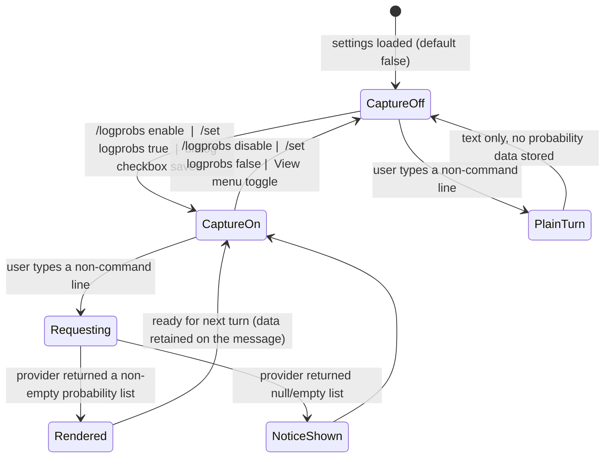

# Feature: Token Probability Analysis (Log Probabilities)

> Source: `/mnt/g/3RD-Party/reversing/subject/chatdbg` @ pinned commit `d8c18f61d6bb73666ed97cd4885e877e35558485`.
>
> **Evidence path legend** (citations below are abbreviated; expand them as follows before looking them up):
> | Prefix used in citations | Real path from repository root |
> |---|---|
> | `Models/…`, `Commands/…`, `Services/…` | `src/Xcaciv.ChatDbg.Core/…` |
> | `Tests/…` | `src/Xcaciv.ChatDbg.Core.Tests/…` |
> | `src/ChatDbg/…` | (already absolute from root) — the plain console shell |
> | `src/ChatDbg.Shell.Gui/…` | (already absolute from root) — the full-screen terminal-UI shell |
> | `README.md`, `docs/…`, `global.json` | (already absolute from root) |
>
> Adjacent features referenced but NOT documented here: the three provider integrations (Azure OpenAI / Amazon Bedrock / local LLM), which *produce* the probability data; Output Rendering & Token Visualization, which *draws* it; Token Inspection (`/inspect`, `/tokenize`), a deeper sibling analysis with its own data model.

---

## Purpose

**Problem solved.** When a chat assistant produces a wrong, weird, or surprising answer, the answer text alone gives no signal about *where* the model was guessing. This feature captures, per generated token, how confident the model was and which other tokens it nearly chose, then lets the operator inspect that data in the terminal. README states the intended uses verbatim: "Understanding model confidence", "Identifying uncertain parts of responses", "Debugging unexpected outputs", "Tuning prompts for better results" (`README.md:221-224`).

**Actors / roles.** There is exactly one human role — the local interactive operator of the ChatDbg terminal application (a developer/prompt engineer debugging model behaviour). There is no multi-user model, no authentication, no authorization, and no server side. Two machine actors consume the feature's data: the shell/UI that renders it, and the JSON persistence layer that stores it inside exported chat history.

**Product framing.** The feature is described in the product's own feature list as "**Token Probability Analysis**: View token probabilities for model responses" (`README.md:14`) and has a dedicated README chapter "Log Probability Analysis" (`README.md:204-268`).

**Scope of this dossier.** (a) the confidence record itself (token, log-probability, derived probability, considered alternatives); (b) the five user-facing settings that enable/shape capture and display, and the two commands that manage them (`/logprobs`, `/demologprobs`) plus the equivalent `/set` keys and the settings dialog / View menu; (c) the offline demonstration mode that fabricates a sample record so the visualization can be seen without an API call; (d) the shared formatting/sampling helpers that turn the record into text; (e) the lifecycle of the record through chat history and export/import.

---

## Behavior

### B1. Capture toggle governs the whole pipeline
The capture flag persisted as `enableLogProbabilities` (default **false**, `Models/ChatSettings.cs:33-34`) is a single global switch. It changes the behavior of *sending a chat turn*:

* When **off**, the shell calls the provider's plain "send message, return text" operation, appends the assistant message to history **without** probability data, and prints just the text (`src/ChatDbg/ChatShell.cs:392-403`).
* When **on**, the shell prints `Log probabilities enabled - requesting with top-k={n}` where `{n}` is the configured top-K (`src/ChatDbg/ChatShell.cs:373`), calls the provider's "send message *with* log probabilities" operation, stores the returned probability list on the assistant message in history, prints the response text, then renders the probability analysis (`src/ChatDbg/ChatShell.cs:371-390`).
* If the provider returns a null response text, the message stored in history is the literal fallback string `Error: Response text expected, none recieved.` — the misspelling of "received" is verbatim in the source (`src/ChatDbg/ChatShell.cs:377`).
* When on but the response carries no probability list (null or empty), the shell prints exactly:
  `Note: Log probabilities were requested but none were returned by the model.` and `This could be due to the model not supporting this feature or an API limitation.` (`src/ChatDbg/ChatShell.cs:388-390`).
* At startup, if capture is enabled the shell prints `Token probability analysis is enabled. Type '/logprobs' for details.` in its welcome banner (`src/ChatDbg/ChatShell.cs:228-231`).

### B2. `/logprobs` — the configuration command
Name `logprobs`; description `Configure token probability analysis`; usage string `/logprobs [enable|disable|top <number>|showall|showsample|grid|list|gridmaxalt <number>|debug] - Configure token probability analysis settings` (`Commands/LogProbsCommand.cs:18-20`). Arguments arrive already split on spaces with empty entries removed, and the command word itself is lower-cased before dispatch (`src/ChatDbg/ChatShell.cs:326-331`, `src/ChatDbg.Shell.Gui/UI/ChatWindow.cs:384-390`). Sub-command matching is case-insensitive (lower-invariant, `Commands/LogProbsCommand.cs:30`). Extra trailing arguments are ignored everywhere (only `args[0]` and `args[1]` are ever read).

| Invocation | Effect | Persisted? | Message returned (success unless noted) |
|---|---|---|---|
| `/logprobs` (no args) | none — reports state | no | multi-line status block, see B3 (`:24-27`, `:124-157`) |
| `/logprobs enable` | capture on | yes | `Token probability analysis enabled.` + `Note: This feature requires a compatible model and API version.` + `If you don't see probabilities after responses, try '/logprobs debug'.` + `You can see a demonstration with the '/demologprobs' command.` (`:36-44`) |
| `/logprobs disable` | capture off | yes | `Token probability analysis disabled.` (`:46-49`) |
| `/logprobs top <n>` | set Top-K alternatives | yes | `Token probability analysis will show top {n} alternatives.` (`:51-64`) |
| `/logprobs top` (no value) | none | no | **error** `Please specify a number: /logprobs top <number>` (`:52-55`) |
| `/logprobs top <bad>` | none | no | **error** `Top-K value must be a number between 1 and 20` (`:57-60`) |
| `/logprobs showall` | show every token | yes | `Token probability analysis will show all tokens.` (`:66-69`) |
| `/logprobs showsample` | show sampled tokens | yes | `Token probability analysis will show token samples (beginning, middle, end).` (`:71-74`) |
| `/logprobs grid` | grid layout | yes | `Token probability analysis will use grid view layout.` (`:76-79`) |
| `/logprobs list` | list/table layout | yes | `Token probability analysis will use list view layout.` (`:81-84`) |
| `/logprobs gridmaxalt <n>` | max alternatives per grid card | yes | `Grid view will show up to {n} alternatives per token.` (`:86-99`) |
| `/logprobs gridmaxalt` (no value) | none | no | **error** `Please specify a number: /logprobs gridmaxalt <number>` (`:87-90`) |
| `/logprobs gridmaxalt <bad>` | none | no | **error** `Grid max alternatives value must be a number between 1 and 20` (`:92-95`) |
| `/logprobs debug` | none — diagnostics | no | diagnostic block, see B4 (`:101-102`, `:159-208`) |
| anything else | none | no | **error** `Unknown subcommand: {arg}. ` + a bullet list of valid options (`:104-114`) |

The unknown-subcommand body is verbatim (`Commands/LogProbsCommand.cs:105-114`):
```
Unknown subcommand: {arg}. 
Valid options are:
- enable/disable: Turn on/off token probability analysis
- top <number>: Set number of alternatives to show (1-20)
- showall/showsample: Show all tokens vs. samples only
- grid/list: Choose grid or list layout for tokens
- gridmaxalt <number>: Set maximum alternatives in grid view (1-20)
- debug: Show diagnostic information
```
(note the trailing space after `{arg}. `).

Every mutating branch persists the whole settings object immediately after mutation (`:38, :48, :63, :68, :73, :78, :83, :98`). Any exception thrown inside the switch is caught, written to the debug trace channel, and converted to the error `Error configuring log probabilities: {exception message}` (`:117-121`).

### B3. `/logprobs` status report (no arguments)
Returns a single multi-line message containing, in order (`Commands/LogProbsCommand.cs:129-156`):
1. Header `Token Probability Analysis Settings:`
2. `- Enabled: Yes|No`
3. `- Top-K Alternatives: {n}`
4. `- Display Mode: Show all tokens` **or** `Show token samples (beginning, middle, end)`
5. `- View Mode: Grid layout` **or** `List layout`
6. `- Grid View Max Alternatives: {n}`
7. A `Usage:` block listing all nine `/logprobs` sub-commands plus `/demologprobs` with one-line descriptions (the `list` line is annotated `(default)`).
8. A prose paragraph explaining the feature ("This feature shows token probabilities for model responses with a rich visualization including token numbering and color coding. When enabled, the system will display token probabilities along with alternative tokens that the model considered.").
9. A caveat: `Note: Not all models or API versions support token probabilities.` / `Azure OpenAI models may require specific API versions that support this feature.`

### B4. `/logprobs debug` diagnostics
Returns a static troubleshooting document interpolated with live state (`Commands/LogProbsCommand.cs:164-205`), headed `Token Probability Analysis Debug Information:`: a `Current Configuration:` block with the same five values as B3 **plus** `- Provider: {provider}` and `- Model ID: {modelId}`; a pointer to `/demologprobs`; a `Common Issues:` list of 3 items (some older models do not support token probabilities; the API version may not support the parameter; the deployment may have restrictions); a `Troubleshooting Steps:` list of 4 items (`Ensure you're using a recent API version (2023-05-15 or newer for Azure OpenAI)`; try a different model; check the Azure OpenAI deployment settings; verify the feature is enabled); an `If using Azure OpenAI:` section echoing the configured endpoint or the literal `(not set)` when unset; suggested Azure models `gpt-4`, `gpt-4-turbo`, `gpt-3.5-turbo`; a `For Amazon Bedrock:` note (`Claude models with appropriate permissions`); and a closing suggestion to run a simple test query. See QUIRK-Q6 — the advertised API version is not the one the code sends.

### B5. `/demologprobs` — the offline demonstration mode
Name `demologprobs`; description `Show sample token probability analysis for demonstration purposes`; usage `/demologprobs - Display sample token probability analysis` (`Commands/DemoLogProbsCommand.cs:40-42`). It **never contacts a provider**. Behavior (`:44-69`):

1. Uses a fixed sample sentence: `"This is a sample response with token probability analysis. You can see how the model assigned probabilities to each token and what alternatives it considered."` (`:47-49`).
2. Fabricates a probability record for every whitespace/punctuation-delimited word (see BR-11).
3. Publishes the fabricated record on a readable "sample data" attribute of the command so a headless caller or a custom visualizer can read it after execution (`:20`, `:54-59`). The fabricated response also carries a simulated elapsed time of `0.5` seconds (`:58`). The attribute is overwritten on every run; before the first run it is unset.
4. If the command was constructed **with** an output formatter, it renders the demonstration itself (see B6). If constructed **without** one, it renders nothing (`:62-65`, `:25-38`).
5. Always returns success with the message `Sample token probability analysis generated` (`:68`) — regardless of whether anything was displayed.

### B6. Demonstration rendering (when a formatter is present)
In order (`Commands/DemoLogProbsCommand.cs:74-116`):
1. blank line, then heading `Sample Text:` (styled yellow), then the sample sentence, then a blank line;
2. `Display Mode: All Tokens` **or** `Display Mode: Sample Tokens` (styled blue);
3. `Layout: Grid View` **or** `Layout: List View` (styled blue);
4. only when grid layout is active: `Grid Max Alternatives: {n}` (styled blue);
5. blank line, then a left-justified rule titled `Token Probabilities Analysis`;
6. the token set — all tokens when "show all", otherwise the beginning/middle/end sample (BR-08) — rendered as a **grid** (passing start index `0`, max columns `0` meaning auto, and the configured max alternatives) or as a **table** (passing start index `0`);
7. if the token set is null: `No token probability data available` (styled red, no trailing period — the terminal-UI panel's equivalent string *does* have one, see BR-38);
8. a closing untitled rule and a blank line.

### B7. Equivalent settings surface via `/set`
The generic settings command accepts the same five values with aliases, each validated and persisted (`Commands/SetCommand.cs:163-210`). Keys are matched after lower-casing:

| Key (case-insensitive) | Alias | Accepted values | Error message on bad input |
|---|---|---|---|
| `enableLogProbabilities` | `logprobs` | boolean literal (`true`/`false`, case-insensitive) | `EnableLogProbabilities must be 'true' or 'false'` |
| `logProbabilitiesTopK` | `logtopk` | integer 1–20 | `LogProbabilitiesTopK must be a number between 1 and 20` |
| `showAllTokens` | — | boolean literal | `showAllTokens must be 'true' or 'false'` |
| `gridViewForTokens` | `tokensgrid` | boolean literal | `gridViewForTokens must be 'true' or 'false'` |
| `gridViewMaxAlternatives` | `gridmaxalt` | integer 1–20 | `gridViewMaxAlternatives must be a number between 1 and 20` |

The value is taken as *all remaining arguments joined with a single space* before parsing (`Commands/SetCommand.cs:165, :175, :184, :194, :204`), so `/set logprobs t r u e` fails rather than silently taking the first word. A "settings changed" flag defaults to true and is cleared only by the credential branches, so all five probability keys do persist (`Commands/SetCommand.cs:42, :284-288`).

On success `/set` replies `Set {key} = {value}` and saves settings (`:284-289`). `/set` with no arguments prints a settings report including `- Log Probabilities: Enabled|Disabled`, `- Log Probabilities Top-K: {n}`, `- Show All Tokens: Yes|No (sample only)`, `- Token Display: Grid Layout|List Layout`, `- Grid View Max Alternatives: {n}` (`:412-416`). The detailed-help text advertises only `- Log Probabilities: /set enableLogProbabilities true` and `- Token Display Options: /logprobs showall, /logprobs grid` (`:439-440`).

### B8. Full-screen terminal-UI shell surface
* **Settings dialog → "Log Probs" tab** (third of four tabs, after "AI Provider" and "Credentials", before "LLama Settings"): an `Enable Log Probabilities` checkbox, a `Log Probabilities Top K:` text field annotated `(1 - 20)`, a `Display Mode:` radio group `Show All Tokens` / `Show Samples`, a `Layout:` radio group `Grid View` / `List View`, and a `Grid View Max Alternatives:` text field annotated `(1 - 20)` (`src/ChatDbg.Shell.Gui/UI/SettingsDialog.cs:233-303`, tab registered at `:37-44`). Radio item 0 means "show all" and "grid" respectively (`:265-275`, `:451-465`). On save, the numeric fields are **clamped** to 1–20 rather than rejected, and unparseable text silently leaves the previous value untouched (`:451-465`). The save path addresses the tab by hard-coded ordinal position 2 (`:441`).
* **View menu → "Log Probabilities" submenu** with three items: `_Toggle Log Probs Panel`, `_Toggle Log Probs for Last Message`, `_Run Demo Visualization` (which executes the `demologprobs` command through the same path as typing `/demologprobs`) (`src/ChatDbg.Shell.Gui/UI/ChatWindow.cs:286-296`, `:918-936`).
* **Per-message indicator**: every assistant message that carries probability data gets a clickable `◊` button appended beneath it at the message's left padding; clicking it opens the probability side panel, points it at that message, scrolls the panel to the top, and sets the status line to `Showing token probabilities for message at {timestamp}` (`ChatWindow.cs:569-612`).
* **Probability side panel**: a framed region titled `Token Probabilities` placed to the right of the chat pane, one row below the menu bar, with both scroll indicators shown and an initial scrollable content size of 50 columns × 1000 rows (`ChatWindow.cs:31, :236-260`). It appears automatically the first time a response with probability data arrives while capture is enabled; the chat pane then shrinks to 60% width (`ChatWindow.cs:441-470`). Content per message (`:630-729`) — see BR-38.

### B9. Persistence and lifecycle of captured data
* Captured probability lists are attached to the assistant chat message when it is appended to history (`Models/ChatHistory.cs:14-24`, `src/ChatDbg/ChatShell.cs:377`, `src/ChatDbg.Shell.Gui/UI/ChatWindow.cs:444`).
* A message exposes a derived flag "has probability data" = list is non-null **and** count > 0; it is never serialized (`Models/ChatMessage.cs:17-18`).
* Chat history export/import serializes the whole message list with indented, camel-cased JSON, so probability data round-trips through exported session files (`Services/ChatHistoryService.cs:16-63`; the messages carry the `logProbabilities` member at `Models/ChatMessage.cs:15-16`). The derived probability is **not** exported (`Models/TokenLogProbabilities.cs:25-26`).
* Settings persist to a JSON file at `<user profile>/.ChatDbg/settings.json`, written indented and camel-cased (`Services/SettingsService.cs:11-38`), matching README (`README.md:96`).

---

## Business rules & edge cases

**Identifiers, defaults and ranges**

* **BR-01** Capture flag `enableLogProbabilities` defaults to **false** (`Models/ChatSettings.cs:33-34`; README agrees at `README.md:104`).
* **BR-02** `logProbabilitiesTopK` defaults to **5**; valid range **1–20 inclusive** everywhere it is settable: `/logprobs top` (`Commands/LogProbsCommand.cs:57-60`), `/set logProbabilitiesTopK|logtopk` (`Commands/SetCommand.cs:173-181`), settings-dialog clamp (`SettingsDialog.cs:453-456`). Meaning: how many alternative tokens are requested from the provider per position (`Models/ChatSettings.cs:36-37`).
* **BR-03** `showAllTokens` defaults to **false** → sampled display is the out-of-box behaviour (`Models/ChatSettings.cs:39-40`).
* **BR-04** `gridViewForTokens` defaults to **false** → list/table layout is the out-of-box behaviour (`Models/ChatSettings.cs:42-43`). README calls list layout the default (`README.md:237` "list # Display in detailed list layout"), consistent.
* **BR-05** `gridViewMaxAlternatives` defaults to **5**; valid range **1–20 inclusive** (`Models/ChatSettings.cs:45-46`; `Commands/LogProbsCommand.cs:92-95`; `Commands/SetCommand.cs:202-210`; dialog clamp `SettingsDialog.cs:461-464`). Meaning: how many alternatives are drawn per token card in grid layout before a "+N more" indicator (`README.md:254`).
* **BR-06** Validation style differs by surface: the commands **reject** out-of-range values with an error and change nothing; the settings dialog **clamps** silently into 1–20 (`SettingsDialog.cs:455, :463`). Unparseable text in the dialog leaves the stored value unchanged.
* **BR-07** Only these five keys belong to the feature. Nothing else in the settings document is read or written by it.

**Probability arithmetic**

* **BR-08** The derived probability of a token is `e^(stored log-probability)` — a pure computed value that is never serialized (`Models/TokenLogProbabilities.cs:25-26`). For a genuine natural-log probability this yields a value in `0…1`. The only test that exercises it asserts against the literal `25` for a stored `ln(0.25)` (`Tests/Models/TokenLogProbabilityTests.cs:9-18`) — see QUIRK-Q1; the *contract* is `probability = exp(logprob)`.
* **BR-09** No range validation is applied to the stored log-probability anywhere. Positive values (which are not log-probabilities) are accepted and exponentiated, which the demonstration mode relies on (QUIRK-Q2).

**Sampling rule (which tokens get shown when "show all" is off)**

* **BR-10** Sample size per segment = **5** tokens (`Commands/DemoLogProbsCommand.cs:182`; `src/ChatDbg/ChatShell.cs:435`; `src/ChatDbg.Shell.Gui/Services/TokenProbabilityVisualizer.cs:39`).
* **BR-11** If total token count ≤ **15** (= 5 × 3) every token is shown, un-segmented (`DemoLogProbsCommand.cs:184-185`; `src/ChatDbg/ChatShell.cs:437-447`). An empty list is returned as null by the demo sampler (`DemoLogProbsCommand.cs:179-180`), which produces the "no data" message of B6 step 7.
* **BR-12** Otherwise exactly three segments of 5 are shown, in this order and with these index formulas (integer division throughout):
  * beginning: indices `0..4`;
  * middle: start index `count / 2 - 5 / 2` = `count/2 - 2`, take 5;
  * end: start index `count - 5`, take 5.
  (`DemoLogProbsCommand.cs:190-198`; `src/ChatDbg/ChatShell.cs:452-490`.) In the shell rendering path each segment is preceded by a blue label `Beginning Tokens:` / `Middle Tokens:` / `End Tokens:`, separated by blank lines, and rendered with the true original start index so displayed numbering stays absolute (`src/ChatDbg/ChatShell.cs:452-489`). The demonstration command's own sampler concatenates the three segments into one list and loses the absolute indices (it always passes start index 0) — displayed numbers are then 1…15 (`DemoLogProbsCommand.cs:102, :106, :187-199`).
  * Segments can overlap or leave gaps for counts just above 15. Worked example at count=16: beginning `0-4`, middle `6-10`, end `11-15` — index 5 is never displayed and nothing is duplicated. At count=25 (the demonstration's own token count): beginning `0-4`, middle `10-14`, end `20-24`. No de-duplication is performed at any count.

**Demonstration data generation (offline mode)**

* **BR-13** Tokenization for the demonstration is naive word splitting on space, newline, tab, `.`, `,`, `!`, `?`, discarding empty entries (`Commands/DemoLogProbsCommand.cs:127-128`). The fixed sample sentence yields **25** tokens, in order: `This, is, a, sample, response, with, token, probability, analysis, You, can, see, how, the, model, assigned, probabilities, to, each, token, and, what, alternatives, it, considered`. The sampled view therefore shows 15 of them: `This is a sample response` / `can see how the model` / `and what alternatives it considered`.
* **BR-14** The pseudo-random generator is seeded with the constant **42** so the demonstration is reproducible *within this runtime* for a given Top-K (`:124`). Note for reimplementers: the exact number sequence is an artefact of the source runtime's seeded generator, so a port will not reproduce the same values; reproducibility, not the specific values, is the requirement.
* **BR-15** Each demonstration token's stored "log probability" is `min(98.0, 70.0 + random×28.0)` — i.e. a number in the range **[70, 98)**, explicitly chosen "to show different colors" (`:135-136`). See QUIRK-Q2: this is a percentage placed into a log-probability field.
* **BR-16** Contextually plausible alternatives are hard-coded per lower-cased token (`:206-249`):
  * `sample` → `example` 15.0, `test` 8.0, `demo` 5.0
  * `response` → `reply` 12.0, `answer` 9.0, `output` 6.0
  * `token` → `word` 14.0, `symbol` 10.0, `element` 7.0
  * `probability` → `likelihood` 11.0, `chance` 8.0, `confidence` 6.0
  * `analysis` → `evaluation` 13.0, `assessment` 9.0, `examination` 6.0
  * anything else → three synthetic entries `{token}_1`, `{token}_2`, `{token}_3` with values `10.0`, `7.0`, `4.0` (formula `10.0 - i×3.0`).
* **BR-17** If fewer than Top-K alternatives exist, filler alternatives named `alt_{0..999}` are appended with value `max(1.0, confidence - 20.0 - random×50.0)` until the count reaches Top-K (`:152-156`). Floor value is **1.0**; the numeric suffix comes from a draw in `[0, 1000)` and may repeat.
* **BR-18** Only the first `min(TopK, alternatives.Count)` alternatives are attached, in generation order — plausible ones first, fillers after (`:159-166`). Consequence: with Top-K = 1 or 2 the hard-coded plausible list is truncated; with Top-K ≥ 4 fillers appear.
* **BR-19** Alternatives carry no nested alternatives of their own (the nested list is left null on alternatives, `:161-165`).
* **BR-20** The demonstration response's simulated elapsed time is the constant **0.5** seconds (`:58`).

**Formatting rules (shared helpers)**

* **BR-21** Token text is escaped for display by replacing newline → `\n`, carriage return → `\r`, tab → `\t`, NUL → `\0`; a null token renders as the literal `(null)` (`Services/TokenFormatters.cs:18-31`; test `Tests/Services/TokenFormattersTests.cs:10-15` asserts the escaped newline is present). The rich-console variants additionally escape markup brackets by doubling them and wrap each escape in a dim style, rendering a null token as a dim `(null)` (`src/ChatDbg/ChatShell.cs:637-653`; `src/ChatDbg.Shell.Gui/Services/SpectreConsoleFormatter.cs:154, :218, :227-…`).
* **BR-22** Confidence colour bands (higher band wins, evaluated top-down): **≥ 90 → green**, **≥ 70 → lime**, **≥ 50 → yellow**, **≥ 30 → orange**, **otherwise red** (`Services/TokenFormatters.cs:38-45`; test asserts 95→`green`, 10→`red`, `Tests/Services/TokenFormattersTests.cs:17-22`). The plain-console shell uses the identical thresholds but names the fourth band `orange3` (`src/ChatDbg/ChatShell.cs:657-670`). **These bands are documented in-source as a 0–100 scale** (`Services/TokenFormatters.cs:36`) while the derived probability is 0–1 for real data — see QUIRK-Q3.
* **BR-23** Canonical probability text format is fixed-point with **2 decimals** plus a percent sign: `42.1234` → `42.12%` (`Services/TokenFormatters.cs:52-55`; test `Tests/Services/TokenFormattersTests.cs:24-29` asserts exactly `"42.12%"`).
* **BR-24** The plain-text report generator emits: a header line `=== Token Probabilities Analysis ===`, a blank line, a markdown-ish table with header `| # | Token          | Probability | Alternatives                |`, the separator row `|---|----------------|------------|----------------------------|`, one row per token numbered from **1**, a blank line, and the footer `=======================================` (39 `=`) (`Services/TokenFormatters.cs:62-89`). Row layout: index right-aligned in width 2, token left-aligned in width 14, probability right-aligned in width 10 with **5 decimals** and a `%`, alternatives left-aligned in width 24. At most **2** alternatives are listed per row, comma-separated, each as `{token} ({percentage})`; when there are none the cell reads `none` (`:78-82`). Test pins only the header text and the token text (`Tests/Services/TokenFormattersTests.cs:31-42`). **Token text in this report is NOT escaped** — the escape helper in the same file is not called (`:79, :82`), so a token containing a newline breaks the table; and the three rows (header / separator / data) do not agree on column widths (QUIRK-Q19).
* **BR-25** The compact alternatives description shows at most `maxToShow` entries (**default 3**), comma-separated as `{escaped token} ({percentage})`, and appends ` (+ {alternatives.Count - maxToShow} more)` when the list is longer; an empty or null list yields the literal `(none)` (`Services/TokenFormatters.cs:97-122`; test with 3 alternatives and maxToShow 2 asserts the output contains `(+`, `Tests/Services/TokenFormattersTests.cs:44-56`). Note the suffix count is computed against `maxToShow`, not against the number actually printed — they coincide because printing is also capped at `maxToShow`.
* **BR-26** Dependency-free table rendering: a fixed ASCII box table whose border row is exactly `+---------+----------------------+--------------+----------------------------------------+` and whose header row is `| Token # | Text                 | Probability  | Top Alternatives                       |`; data rows are `| {index,-7} | {text,-20} | {probability,-12} | {alternatives,-38} |` (`Services/BasicConsoleFormatter.cs:82-112`). Token text longer than **20** characters is truncated to 17 characters plus `...`; alternative token text longer than **10** characters is truncated to 7 plus `...`; at most **2** alternatives per row with a ` (+{n} more)` overflow suffix and `(none)` when empty; numbering starts at `startIndex + i + 1` (`:96-99, :117-147`). Pinned by test: rendering one token named `token` produces output containing both `Token` and `token` (`Tests/Services/BasicConsoleFormatterTests.cs:33-58`).
* **BR-27** Grid layout in the dependency-free renderer silently degrades to the table layout, discarding the column and alternative-count arguments (`Services/BasicConsoleFormatter.cs:72-77`).
* **BR-28** The dependency-free renderer's horizontal rule is **80** characters wide; an untitled rule is 80 dashes, a titled one is `{title} {dashes}` when left-justified or `{dashes} {title} {dashes}` when centred, with markup tags stripped from the title first (`Services/BasicConsoleFormatter.cs:43-67`). Markup stripping deletes everything between `[` and `]` inclusive; pinned by test — `[red]hello[/]` renders as `hello` and does not contain `[red]` (`Tests/Services/BasicConsoleFormatterTests.cs:12-31`).
* **BR-29** Grid layout column count is computed from terminal width: `max(1, terminalWidth / 40)` — i.e. each token card is assumed to need ~40 characters (`src/ChatDbg/ChatShell.cs:499-506`; `src/ChatDbg.Shell.Gui/Services/SpectreConsoleFormatter.cs:58`). An explicit non-zero max-column argument overrides the computation; `0` means auto (`SpectreConsoleFormatter.cs:58`; `Services/IConsoleFormatter.cs:42`). Empty filler cards pad the final row so the grid stays rectangular (`SpectreConsoleFormatter.cs:85-89`; `src/ChatDbg/ChatShell.cs:527-531`).
* **BR-30** A grid card is a rounded-border panel whose header is `#{absoluteIndex + 1}` in grey and whose body is, line by line: `Token: {escaped token}`, `Prob: {coloured probability}`, then — only when alternatives exist — the literal line `Alternatives:`, then up to `min(maxAlternatives, count)` lines of `- {token} ({probability})`, then `+ {n} more` in a dim style when truncated (`SpectreConsoleFormatter.cs:152-195`; `src/ChatDbg/ChatShell.cs:551-590`). The plain shell's own grid uses the `gridViewMaxAlternatives` setting directly; the shared renderer uses the argument it was passed (default 3).
* **BR-31** Rich table layout uses a rounded, expanding table with four columns: `№` (centred), `Token` (width 20), `Probability` (centred), `Top Alternatives` (width 50). Alternatives are limited to the **first 3**, one per line inside the cell, and the cell shows a dim `(none)` when there are none (`src/ChatDbg/ChatShell.cs:596-635, :674-690`; `SpectreConsoleFormatter.cs:209-225`).
* **BR-32** Terminal-UI heat map bucketing: bucket index = `clamp(truncate(probability × 10), 0, 9)`, i.e. **10 buckets of 10 percentage points each on a 0–1 scale**, mapped brightRed→red→brightMagenta→magenta→brightBlue→blue→cyan→brightCyan→brightYellow→brightGreen for buckets 0…9, each on a black background (`src/ChatDbg.Shell.Gui/UI/ChatWindow.cs:98-114, :731-735`).
* **BR-33** Side-panel alternatives are **sorted descending by probability** before display and truncated to `gridViewMaxAlternatives` (`ChatWindow.cs:686-694`). This is the only place any explicit ordering of alternatives is imposed; everywhere else alternatives keep provider/creation order.
* **BR-34** Compiled-but-unreferenced heat map view uses a different scale and sampling: colour bands on a 0–1 scale at ≥0.9 green, ≥0.7 bright green, ≥0.5 brown, ≥0.3 bright yellow, ≥0.1 red, else bright red; foreground black when ≥0.5 else white; sampling threshold **30** tokens with three windows of **10** (begin `0-9`, middle start `(count-10)/2`, end `count-10`) (`src/ChatDbg.Shell.Gui/UI/LogProbHeatmapView.cs:60-88`). Verified unreferenced: a whole-repository search finds no use outside its own file.

**Terminal-UI panel content**

* **BR-35** Panel header line: `[{message timestamp}] Token Probabilities:` at column 0, followed by one blank row (`ChatWindow.cs:651-660`).
* **BR-36** Each token line sits at column 2 and reads `{index}: "{token}" ({probability})` where **the index is 0-based** and the probability uses a 5-decimal percentage format (`ChatWindow.cs:664-680`). Every other numbered surface in the product is 1-based — see QUIRK-Q15.
* **BR-37** Each alternative line sits at column 4 and reads `Alt: "{token}" ({probability})`, colour-coded by the same heat map (`ChatWindow.cs:686-710`). One blank row separates each token block (`:713-715`).
* **BR-38** With no bound message, or a bound message with no data, the panel shows the single line `No token probability data available.` (with a trailing period) (`ChatWindow.cs:639-649`).
* **BR-39** Panel escaping in this surface replaces only newline, carriage return and tab — **not** NUL — and calls the replacement directly on the token text rather than through the null-tolerant shared helper (`ChatWindow.cs:668, :690`).
* **BR-40** Scrollable content width is recomputed after each render as `max(longest line + 5, 50)`; the panel is scrolled back to the top on every rebuild (`ChatWindow.cs:723-727`).
* **BR-41** Panel visibility rules: the panel opens automatically only when capture is enabled **and** the arriving response has a non-empty probability list; when capture is enabled but the list is empty, nothing appears and no message is shown (`ChatWindow.cs:441-470`).
* **BR-42** Status-line strings for this feature: `Token probabilities panel enabled`, `Token probabilities panel disabled` (`ChatWindow.cs:836, :860`), `Log probabilities display enabled`, `Log probabilities display disabled` (`:897-899`), `Showing token probabilities for message at {timestamp}` (`:607`). Successful command results appear on the status line prefixed `✓ `; failures open a modal titled `Command Error` (`:407-417`). Any status message reverts to `Provider: {p} | Model: {m} | Prompt: {n}` after **3 seconds** (`:90-93, :901-914`).

**Data-acquisition rules owned by providers but visible here**

* **BR-43** Requesting behaviour is all-or-nothing per turn: the shell chooses the "with probabilities" provider operation solely on the capture flag (`src/ChatDbg/ChatShell.cs:371`; `src/ChatDbg.Shell.Gui/UI/ChatWindow.cs:441`).
* **BR-44** The local-LLM provider additionally requires the top-K setting to be `> 0` before entering probability-capture mode; otherwise it falls back to the plain generation path even when capture is on (`Services/LLamaSharpService.cs:89-96`). Since the setting's floor is 1 everywhere it is settable, this guard is only reachable via a hand-edited settings file.
* **BR-45** The local-LLM provider throws when it is not configured, with the exact message `LLamaSharp service is not properly configured. Please set ModelId to a valid GGUF model file path.` — pinned by test (`Services/LLamaSharpService.cs:66-69`; `Tests/Services/LLamaSharpServiceTests.cs:42-47`).
* **BR-46** The local-LLM provider serialises generation with a process-wide single-permit gate, released in a `finally` (`Services/LLamaSharpService.cs:24, :72, :111-114`).
* **BR-47** The local-LLM provider attaches alternatives **one generation step late**: candidates computed from the logits after emitting token *n* are attached to token *n* on the *next* iteration, and the token's own log-probability is taken from the matching candidate, or from the highest-valued candidate when no text match is found (`Services/LLamaSharpService.cs:165-205, :232-246`). Consequence: the **first** emitted token never receives alternatives and keeps its placeholder log-probability of `0` (QUIRK-Q13).
* **BR-48** Local-LLM alternatives are a softmax over only the **top-K logits** (so they sum to 1 among themselves, not over the vocabulary), stored as true natural logs, with the alternatives' own nested list left null (`Services/LLamaSharpService.cs:457-483`).
* **BR-49** The cloud provider's request carries `logprobs: true` and `top_logprobs: {TopK}` alongside `temperature`, `max_tokens` and `top_p: 1.0` (`Services/AzureOpenAIService.cs:150-158`). It tolerates several response shapes and requires each entry to have `token` + `logprob`, with an optional `top_logprobs`/`top_alternatives` array. Pinned by test: a payload shaped `choices[0].logprobs.content[]` with one entry `{"token":"Hello","logprob":-0.1,"top_logprobs":[{"token":"Hi","logprob":-0.2}]}` yields exactly one record whose token is `Hello` (`Tests/Services/AzureOpenAIServiceTests.cs:38-80`).
* **BR-50** When the cloud provider returns no probability data but capture is on, **synthetic data is fabricated and returned as if real** — sampled to at most **15** tokens (5 beginning + 5 from `wordCount/2 - 2` + last 5), main value `ln(0.9)`, alternatives `{token}_alt` at `ln(0.05)`, `similar_{token}` at `ln(0.03)`, `other_{token}` at `ln(0.02)`, truncated to `min(TopK, 3)` — so the fabricated list never exceeds **3** alternatives regardless of Top-K (`Services/AzureOpenAIService.cs:200-208, :413-470`). A test pins that behaviour: a response with no probabilities still yields a non-empty list (`Tests/Services/AzureOpenAIServiceTests.cs:83-113`).
* **BR-51** The managed-model provider sends `logprobs: {enabled}` and `top_logprobs: {TopK when enabled, else 0}` in both its Claude-shaped and generic request bodies (`Services/BedrockService.cs:76-77, :101-102`); the Claude-shaped body also carries the fixed `anthropic_version` value `bedrock-2023-05-31` (`:70`). It parses `logprobs` as an array of token objects or an object with a `tokens` member, accepting either a `logprob` or `log_prob` key. Pinned by test: a top-level `logprobs` array with one entry and one `top_logprobs` alternative yields a non-empty list (`Tests/Services/BedrockServiceTests.cs:26-68`).

**Edge cases**

* Empty/null probability list on a message ⇒ "has probability data" is false ⇒ no `◊` indicator, no panel content, and the console prints the "none were returned" note. Both branches pinned by test (`Models/ChatMessage.cs:17-18`; `Tests/Models/ChatMessageTests.cs:9-32`; `src/ChatDbg/ChatShell.cs:388-390`).
* A transport record built from text alone leaves the probability list **null**, not empty; a record built from text plus a list stores **the same list instance** by reference rather than copying (`Tests/Models/AIResponseTests.cs:9-30`; `Models/AIResponse.cs:37-52`). A reimplementation that defensively copies would still satisfy the observable behaviour, but the source does not.
* Panel toggle with no qualifying message ⇒ modal error titled `No Log Probabilities` with body `There are no assistant messages with log probabilities to display.` (`ChatWindow.cs:800-808`, `:869-878`).
* Demonstration command with no formatter ⇒ still succeeds and still populates the sample-data attribute (`Tests/Commands/DemoLogProbsCommandTests.cs:29-39`).
* Unknown `/logprobs` sub-command ⇒ failure result; no settings written and no save call (`Tests/Commands/LogProbsCommandTests.cs:40-50`).
* `/logprobs enable` saves the settings document **exactly once** per invocation (`Tests/Commands/LogProbsCommandTests.cs:25-38` verifies `Times.Once`).
* A token whose text is null renders as `(null)` through the shared helper, but the terminal-UI panel calls string replacement directly on the token text and would fault on a null token (`ChatWindow.cs:668`) — **INFERRED** risk, not observed at runtime. The stored token defaults to an empty string, so this is reachable only by importing a history file whose `token` member is explicitly `null`.

---

## Workflows & states

### W1. Enable → converse → inspect (console shell)



Numbered detail for the "capture on" turn (`src/ChatDbg/ChatShell.cs:345-410`):
1. User line does not start with `/` ⇒ treated as a chat turn; the user message is appended to history.
2. The provider named by the `provider` setting is resolved; if unconfigured, an error is printed and the turn aborts.
3. `Thinking...` is printed.
4. `Log probabilities enabled - requesting with top-k={n}` is printed.
5. The "send with probabilities" provider operation is awaited.
6. The assistant message **plus** the returned probability list is appended to history.
7. The response text is printed, surrounded by blank lines.
8. If the list is non-empty → the analysis block is rendered (W2); else the two-line "none were returned" notice is printed.
9. Any exception is caught and printed as `Error getting AI response: {message}`, with detail written to the debug trace; the turn ends without probability output.

### W2. Rendering decision tree (applies to console shell and to the demonstration command)
1. Print/open a left-justified rule titled `Token Probabilities Analysis`.
2. If **show all tokens**: render the entire list — grid layout if enabled, else table layout.
3. Else (sampled): if `count ≤ 15` render the entire list the same way; otherwise render three labelled segments (`Beginning Tokens:`, `Middle Tokens:`, `End Tokens:`) each of 5 tokens, using each segment's absolute start index for numbering, separated by blank lines.
4. Close with an untitled left-justified rule.
(`src/ChatDbg/ChatShell.cs:412-497`; the same logic, unreferenced, in `src/ChatDbg.Shell.Gui/Services/TokenProbabilityVisualizer.cs:17-101` and, for the demonstration, `Commands/DemoLogProbsCommand.cs:74-116`.)

### W3. Terminal-UI probability panel state machine
States: **Hidden** (default), **Visible/Bound to message M**.
* Hidden → Visible: (a) a response with probability data arrives while capture is on — the panel is created, the chat pane is set to 60% width, and the panel binds to the new message (`ChatWindow.cs:450-462`); (b) the operator clicks a message's `◊` indicator — panel opens bound to that message (`ChatWindow.cs:581-612`); (c) View ▸ Toggle Log Probs Panel, provided at least one assistant message has data (`ChatWindow.cs:800-846`).
* Visible → Visible (rebind): a newer response with data arrives, or another `◊` is clicked; panel content is rebuilt and scrolled to the top (`ChatWindow.cs:464-470`, `:600-612`).
* Visible → Hidden: View ▸ Toggle Log Probs Panel again; the panel is removed and the chat pane returns to full width (`ChatWindow.cs:849-861`).
* View ▸ Toggle Log Probs for Last Message flips the **capture setting**, saves it, redraws history, and then opens or closes the panel to match the new setting (`ChatWindow.cs:869-899`) — but it first refuses outright unless an assistant message with probability data already exists (QUIRK-Q17).

### W4. Settings lifecycle
1. On startup each shell loads the settings file; if it does not exist a file with defaults is written first (`Services/SettingsService.cs:44-53`).
2. The plain console shell copies only a **subset** of loaded fields onto its live settings object — for this feature only `enableLogProbabilities` and `logProbabilitiesTopK` are copied; `showAllTokens`, `gridViewForTokens` and `gridViewMaxAlternatives` are **not** restored (`src/ChatDbg/ChatShell.cs:137-138`; same omission in the unreferenced shell class at `src/ChatDbg.Shell.Gui/ChatShell.cs:138-139`). See QUIRK-Q5.
3. Every mutating command writes the entire settings object back to the file immediately (`Commands/LogProbsCommand.cs:38…98`, `Commands/SetCommand.cs:284-288`).
4. Save failures are swallowed: the persistence layer catches and prints `Error saving settings: {message}` and the command still reports success (`Services/SettingsService.cs:99-103`).

---

## Data

### Entity: **TokenConfidenceRecord** (source type `TokenLogProbability` — `Models/TokenLogProbabilities.cs:8`)
The one entity this feature owns. It is recursive: alternatives are records of the same shape.

| Field | Type (generic) | Persisted name | Constraints / notes |
|---|---|---|---|
| Token | text | `token` | defaults to empty string, never null by construction; may contain control characters that must be escaped for display (`:13-14`) |
| LogProb | double-precision number | `logprob` | the model's natural-log probability for this token; no range validation anywhere (`:19-20`) |
| Probability | double-precision number, **derived, not persisted** | — | `e^LogProb`; recomputed on every read (`:25-26`) |
| TopAlternatives | optional ordered list of TokenConfidenceRecord | `top_alternatives` | may be null or empty; nested alternatives are normally left null; length is bounded by the Top-K request but not enforced locally (`:31-32`) |

*Lifecycle*: created by a provider adapter while parsing a completion, or fabricated by the demonstration command / the cloud provider's fallback; attached to a response record; copied by reference onto the assistant message in history; never mutated afterwards except by the local-LLM adapter during generation, which back-fills the previous token's log-probability and alternatives one step late (`Services/LLamaSharpService.cs:186-205, :232-246`); destroyed with the chat history (`/clear`, `/pop`, process exit) or persisted verbatim in an exported history file.

### Entity: **ResponseRecord** (transport — source type `AIResponse`, `Models/AIResponse.cs:8`)
| Field | Type | Persisted name | Notes |
|---|---|---|---|
| Text | optional text | `text` | defaults to empty string (`:13-14`) |
| LogProbabilities | optional list of TokenConfidenceRecord | `logProbabilities` | null when not requested or unavailable (`:19-20`) |
| TotalTime | number (seconds) | `totalTime` | demonstration sets 0.5; local LLM sets measured elapsed seconds; error responses set 0 (`:25-26`) |
| ErrorMessage | optional text | `errorMessage` | set by the local-LLM adapter on failure (`:31-32`) |

Two construction helpers exist: text-only (probability list left null) and text-plus-probabilities (list stored by reference — pinned by test `Tests/Models/AIResponseTests.cs:18-30`, which asserts the *same* list instance is stored).

### Entity: **ChatMessage** (owned by chat history, extended by this feature — `Models/ChatMessage.cs:5`)
Relevant fields: `role` (text), `content` (text), `timestamp` (UTC instant), `isCommand` (boolean), **`logProbabilities`** (optional list of TokenConfidenceRecord, `:15-16`), and a derived, non-persisted "has probability data" flag = list non-null and count > 0 (`:17-18`).

### Entity: **Settings — token-probability section** (`Models/ChatSettings.cs:32-46`)
| Persisted name | Type | Default | Range | Documented in README? |
|---|---|---|---|---|
| `enableLogProbabilities` | boolean | false | — | yes (`README.md:104`) |
| `logProbabilitiesTopK` | integer | 5 | 1–20 | yes (`README.md:105`) |
| `showAllTokens` | boolean | false | — | **no** (only as a `/set` example, `README.md:243`) |
| `gridViewForTokens` | boolean | false | — | **no** (only as a `/set` example, `README.md:244`) |
| `gridViewMaxAlternatives` | integer | 5 | 1–20 | **no** (only as a `/set` example, `README.md:245`) |

Stored in a single JSON document with all other settings at `<user profile>/.ChatDbg/settings.json`; when the user-profile folder is unavailable or empty the document falls back to the operating system temp directory with the same file name (`Services/SettingsService.cs:11-32`). The file is written indented with camel-cased names except where an explicit persisted name overrides — so `top_alternatives` stays snake-cased inside history exports (`Services/SettingsService.cs:33-38`, `Services/ChatHistoryService.cs:16-22`).

### Relationships
`chat history 1—* message 0..1—* confidence record 0..1—* confidence record (alternatives, one level used)`; `response record 0..1—* confidence record`; `settings 1—1 (feature configuration)`.

---

## Interfaces

**Consumed from the provider integrations (adjacent feature).** A single semantic operation: *"send the conversation and return the assistant text together with, for each generated token, its log-probability and the top-K alternatives the model weighed"*. Its counterpart is the plain *"send the conversation and return text"* operation. Both take the conversation plus the settings object; the with-probabilities variant reads the capture flag and top-K from those settings to shape its request (`Services/IAIService.cs:9-10`). Contract details the reimplementer must honour:
* the operation may legitimately return an empty/null probability list (unsupported model or API version) — callers must degrade gracefully;
* provider adapters may substitute fabricated data rather than returning nothing (BR-50);
* provider adapters may fail by throwing, and the caller converts that into a printed error;
* one adapter throws rather than returning when it is unconfigured (BR-45).

**Consumed from the settings feature.** Load-all / save-all of a single settings document; save is fire-and-forget and never surfaces failures to the caller (`Services/ISettingsService.cs`, `Services/SettingsService.cs:85-104`).

**Consumed from chat history.** "Append assistant message with optional probability list" (`Models/ChatHistory.cs:14-24`) and export/import of the whole history.

**Exposed to the output-rendering feature (adjacent).** A formatter abstraction with exactly two probability-specific operations (`Services/IConsoleFormatter.cs:37-51`):
* *display token grid* — takes the token list, a starting index for absolute numbering (default 0), a max column count (**0 means "auto-size from terminal width"**), and a max alternatives per card (default 3);
* *display token table* — takes the token list and a starting index (default 0).
Plus generic write-line / write-markup-line / write-blank-line / write-rule (optional title, optional left-justify) operations used by the demonstration. The demonstration command's test pins that the table variant is invoked with start index `0` under default settings (`Tests/Commands/DemoLogProbsCommandTests.cs:26`).

**Exposed to shells.** Two commands conforming to the app-wide command contract (name, description, usage, async execute over a string array, returning success/message/exit-requested). Registered under the keys `logprobs` and `demologprobs` (`src/ChatDbg/ChatShell.cs:50, :52`; `src/ChatDbg.Shell.Gui/Program.cs:39, :41`) and listed by the help command under the heading `Token Analysis:` (`Commands/HelpCommand.cs:69-73`).

**Exposed to the demonstration host.** The demonstration command publishes its fabricated response record as a readable attribute after execution so a host with its own visualization can render it instead (`Commands/DemoLogProbsCommand.cs:20`).

**Exposed to Token Inspection (adjacent).** Only the top-K setting is shared — the inspection command passes it as its own top-K (`Commands/InspectCommand.cs:77`). Inspection has a *separate*, richer data model (token analyses, candidate tokens, attribution) and does not reuse this feature's record.

**Exposed as shared formatting helpers.** A static utility surface used by both shells: escape-token-for-display, colour-name-for-probability, format-probability-value, generate-plain-text-report, format-alternatives-description (`Services/TokenFormatters.cs`). Note the dependency-free renderer does **not** call these; it carries private copies with different contracts (QUIRK-Q18).

---

## External technology

| Generic capability | Protocol/standard if any | What the source used | Notes for reimplementer |
|---|---|---|---|
| Chat-completion API that can return per-token log-probabilities and top-K alternatives | HTTPS + JSON; OpenAI-style chat completions | Azure OpenAI, reached by a hand-rolled REST POST to `{endpoint}/openai/deployments/{model}/chat/completions?api-version=2023-12-01-preview` with body fields `messages`, `temperature`, `max_tokens`, `top_p: 1.0`, `logprobs: true`, `top_logprobs: {TopK}` and header `api-key` (`Services/AzureOpenAIService.cs:119-158`). The package `Azure.AI.OpenAI` 2.1.0 is referenced by all three projects but the probability path bypasses it. | Three response shapes are tolerated: top-level `logprobs.content[]`, top-level `logprobs[]`, and `choices[0].logprobs` (object-with-`content` or array). Each entry needs `token` + `logprob`, optional `top_logprobs`/`top_alternatives` array. The debug text tells users API version `2023-05-15`+ while the code sends `2023-12-01-preview` (QUIRK-Q6). |
| Managed AI model-invocation API | HTTPS + JSON over a cloud SDK | Amazon Bedrock runtime via `AWSSDK.BedrockRuntime` 4.0.7.3; request carries `logprobs` (boolean), `top_logprobs` (`TopK` when enabled, else `0`) and, for Claude-shaped bodies, `anthropic_version: "bedrock-2023-05-31"` (`Services/BedrockService.cs:70, :76-77, :101-102`) | Parses `logprobs` as array-of-token-objects or object-with-`tokens`; accepts either `logprob` or `log_prob` key. **Applies `exp()` to alternative log-probabilities at parse time** (`:178, :268`) so alternatives arrive already in probability space (QUIRK-Q4). |
| Local in-process LLM inference with access to next-token logits | native library binding | LLamaSharp 0.25.0 plus the CPU and CUDA-12 backend packages; runtime reflection / late binding to obtain `GetLogits()` and `TokenToString()` (`Services/LLamaSharpService.cs:419-500`) | Alternatives are a softmax over only the **top-K** logits (so they sum to 1 among themselves, not over the vocabulary) and are attached **one generation step late**; when no text match is found the token's own log-probability falls back to the maximum alternative. Temperature-based estimates are used only for the parallel token-analysis record consumed by the adjacent inspection feature: ≤0.1→0.95, ≤0.5→0.85, ≤0.7→0.75, ≤1.0→0.60, ≤1.5→0.50, else 0.40 (`:308-324`). Reflection/late binding here is incompatible with the project's own ahead-of-time publish configuration (QUIRK-Q14). |
| Rich terminal rendering: rules, tables, grids, panels, 16/256-colour markup | ANSI terminal escape sequences | Spectre.Console 0.51.1 — referenced by **all three** projects including the core library (`src/Xcaciv.ChatDbg.Core/Xcaciv.ChatDbg.Core.csproj:15`) | Needed for the pretty renderers; a dependency-free ASCII fallback class also ships (`Services/BasicConsoleFormatter.cs`) but it does not remove the package dependency (QUIRK-Q23). Markup brackets in token text must be escaped by doubling. |
| Full-screen terminal UI toolkit: menus, tab dialogs, scroll views, colour schemes, modal message boxes | terminal (curses-like) | Terminal.Gui 1.19.0 | Used for the Log Probs settings tab, the View menu, the `◊` indicators and the probability side panel. Note it owns the whole screen, which is why the demonstration renderer's direct ANSI writes do not work there (QUIRK-Q7). |
| Local file storage for a settings document | JSON, UTF-8 text file | `<user profile>/.ChatDbg/settings.json`, indented, camel-cased | Directory is created on demand; falls back to the OS temp directory when the profile directory is unavailable or resolves to an empty string (`Services/SettingsService.cs:15-32`). |
| Local file storage for exported conversations | JSON, UTF-8 text file | user-chosen path via `/export` and `/import`, indented, camel-cased (`Services/ChatHistoryService.cs:16-63`) | Probability records ride along inside exported messages; the alternatives array is persisted under the snake-cased name `top_alternatives`; the derived probability is omitted. |
| Terminal width query | — | console window width, used to size the responsive grid (`src/ChatDbg/ChatShell.cs:501`; `SpectreConsoleFormatter.cs:58`) | Assumes ~40 columns per token card. Must tolerate a width of 0/unknown (the `max(1, …)` guard yields 1 column) and, in the source runtime, must tolerate the query failing outright when output is not attached to a terminal (QUIRK-Q21). |
| Pseudo-random number generation with a fixed seed | — | seeded generator, seed **42**, for the demonstration data (`Commands/DemoLogProbsCommand.cs:124`); an unseeded generator is constructed but never used in the cloud fallback (`Services/AzureOpenAIService.cs:445`) | Only the *reproducibility* is contractual; exact values are runtime-specific and will not port. |
| Natural exponential / logarithm | — | standard math library | `exp` on read of every probability; `log` when normalising local-LLM candidates. |
| Debug/diagnostic trace channel | — | platform debug output stream (invisible in release runs) | Used for exception detail inside the configuration command and provider parsers. |
| Unit test + mocking stack (for porting the pinned behaviours) | — | xUnit 2.9.1, Moq 4.20.69, Microsoft.NET.Test.Sdk 17.12.0, coverlet.collector 6.0.2 (`src/Xcaciv.ChatDbg.Core.Tests/Xcaciv.ChatDbg.Core.Tests.csproj`) | The formatter abstraction is mocked to assert which render operation was called with which start index. |
| Managed runtime + SDK pin | — | `net10.0` for all four projects; SDK pinned in `global.json` to `10.0.100-rc.1.25451.107` with `rollForward: latestFeature` | **The pinned `global.json` is not valid JSON** — it has one extra closing brace, which makes the SDK's own CLI refuse to run anywhere inside the tree (QUIRK-Q12). |

*Not required by this feature:* network access for the demonstration mode, any database, any authentication service, any i18n resource system, any GPU (the CUDA backend package is pulled in transitively but this feature's logic does not need it).

---

## Error handling

| Failure mode | What the user/system observes |
|---|---|
| `/logprobs top` or `/logprobs gridmaxalt` with no value | Failure result; message `Please specify a number: /logprobs top <number>` / `Please specify a number: /logprobs gridmaxalt <number>`. No state change, no save (`Commands/LogProbsCommand.cs:52-55, :87-90`). |
| Non-numeric or out-of-range value (`0`, `21`, `abc`, `1.5`) | Failure result; `Top-K value must be a number between 1 and 20` / `Grid max alternatives value must be a number between 1 and 20`. No state change (`:57-60, :92-95`). |
| Unknown `/logprobs` sub-command | Failure result listing the six valid option groups; message begins `Unknown subcommand: {arg}. ` (`:104-114`). |
| Exception while applying a `/logprobs` sub-command (e.g. persistence throws) | Caught; written to the debug trace; failure result `Error configuring log probabilities: {exception message}` (`:117-121`). |
| Unknown `/set` key | Failure result `Unknown setting: {key}. Valid keys: provider, modelId, temperature, maxTokens, azureEndpoint, awsRegion, systemPrompt, enableLogProbabilities, logProbabilitiesTopK, useWindowsCredentialManager, enablewincred, wincred, migrate` — which omits three implemented keys of this feature (`Commands/SetCommand.cs:280`; QUIRK-Q16). |
| Exception inside `/set` | Failure result `Error setting {key}: {message}` (`Commands/SetCommand.cs:292-294`). |
| Settings file cannot be written | Persistence layer prints `Error saving settings: {message}` to standard output and returns normally; the command still reports success — the change survives only in memory (`Services/SettingsService.cs:99-103`). |
| Settings file cannot be read / is corrupt | Persistence layer prints `Error loading settings: {message}` and returns an all-defaults settings object, silently reverting the user's probability configuration (`Services/SettingsService.cs:78-82`); the console shell additionally prints `Error loading settings: {message}` + `Using default settings.` (`src/ChatDbg/ChatShell.cs:150-155`). |
| Capture enabled but provider returns no probability data | Console: the two-line notice (`Note: Log probabilities were requested but none were returned by the model.` / `This could be due to the model not supporting this feature or an API limitation.`). Terminal UI: nothing at all is shown, the panel simply does not open (`src/ChatDbg/ChatShell.cs:388-390`; `ChatWindow.cs:450-467`). |
| Cloud provider returns no probability data (upstream) | Fabricated data is returned instead and displayed as if genuine — the user cannot tell (BR-50). |
| Provider call throws while capture is on | Console: `Error getting AI response: {message}`; the turn produces no assistant message and no probability data (`src/ChatDbg/ChatShell.cs:405-409`). The local-LLM adapter instead returns a response object whose text is `Error running local LLM: {message}` with a null probability list, elapsed time 0, and the error message field set (`Services/LLamaSharpService.cs:97-110`). |
| Local-LLM logit extraction fails mid-generation | Generation continues; `WARN` line `Failed to compute candidates from logits: {message}` is written to the adapter's log; that token gets no alternatives (`Services/LLamaSharpService.cs:210-217`). If the underlying accessor is simply absent, an inner catch returns an empty candidate list with **no** warning at all (`:487-490`; QUIRK-Q14). |
| Local-LLM used without a model configured | Throws with `LLamaSharp service is not properly configured. Please set ModelId to a valid GGUF model file path.` (`Services/LLamaSharpService.cs:66-69`; `Tests/Services/LLamaSharpServiceTests.cs:42-47`). |
| Terminal-UI panel toggled with no qualifying message | Modal error dialog titled `No Log Probabilities` with body `There are no assistant messages with log probabilities to display.` and an `OK` button (`ChatWindow.cs:802-808, :874-878`). |
| Demonstration command run in the plain console shell | Success message `Sample token probability analysis generated` prefixed with the shell's success mark — **and nothing else**; no visualization appears (QUIRK-Q7). |
| Command execution throws inside the terminal UI | Modal error dialog titled `Error` with the exception message (`ChatWindow.cs:931-934`). |
| A command returns failure in the terminal UI | Modal `Command Error` dialog with the message; successes go to the transient status line prefixed `✓ ` (`ChatWindow.cs:407-417`). |

---

## Non-functional observations

* **No caching.** Probability records are refetched per turn and held only in the in-memory chat history. The derived probability is recomputed on every property read (`Models/TokenLogProbabilities.cs:25-26`) — a hot path when rendering thousands of tokens.
* **Pagination-like limits are display-only.** The 5-per-segment sampling (BR-10/11/12) exists to keep terminal output bounded; there is no cap on how many records are stored or persisted.
* **Concurrency.** Everything is single-threaded interactive. The only guard anywhere near this feature is the local-LLM adapter's process-wide one-generation-at-a-time gate (`Services/LLamaSharpService.cs:24, :72, :113`). The terminal UI's status-reset timer is the only background work; it is fire-and-forget, so two status messages within 3 seconds cause the first timer to clear the second message early (`ChatWindow.cs:901-914`). No cancellation is supported anywhere.
* **Permissions.** None — no authentication, authorization or per-user scoping. The only security-adjacent behaviour in the settings object is credential sourcing, which is unrelated to this feature.
* **Performance-motivated code.** The demonstration mode exists precisely to avoid paid API calls (`README.md:256-268`). Grid column count is derived from terminal width to avoid wrapping. The local-LLM design document claims "< 5% performance impact when enabled, zero impact when disabled" (`docs/Token Probability Testing.prompt.md:31`) — an unverified aspirational claim; no benchmark exists in the repository.
* **i18n / l10n.** None. All strings are hard-coded English. Numeric formatting uses the ambient culture (fixed-point and percent format specifiers), so decimal separators and the percent sign's spacing will vary by locale; the `Compact` and `SingleFile` publish configurations turn on invariant globalization, so the same build produces different output depending on how it was published (`src/ChatDbg/Xcaciv.ChatDbg.Shell.csproj`, `src/ChatDbg.Shell.Gui/*.csproj`, Compact/SingleFile property groups).
* **Accessibility.** Confidence is conveyed **only** by colour in both the rich console and the terminal-UI heat map; the numeric percentage is always printed alongside, which is the sole non-colour channel. The `◊` glyph, the `№` column header, the `✓` status prefix and the rounded box-drawing borders all assume a Unicode-capable terminal and font.
* **Platform coupling — explicit answer.** **No part of this feature is gated on an operating system check.** The only OS-conditional code in the repository is credential storage, which this feature does not touch (`Models/WindowsCredentialManager.cs:59, :103, :150, :171`). The feature's logic — capture toggle, commands, sampling, formatting, persistence — runs identically on any OS the managed runtime supports. Four *environmental* couplings are nevertheless real and must be handled by a port:
  1. **Terminal-attachment coupling.** Grid layout reads the console window width. On a redirected or non-interactive stream this is unavailable; the `max(1, …)` guard covers a zero, but a query that fails outright is not guarded (QUIRK-Q21).
  2. **Publish-configuration coupling.** Both optimized publish configurations (`Compact`, `SingleFile`) hard-default the runtime identifier to **`win-x64`** and enable trimming/ahead-of-time compilation (`src/ChatDbg/Xcaciv.ChatDbg.Shell.csproj`; `src/ChatDbg.Shell.Gui/*.csproj`). The shipped optimized binaries are therefore Windows-x64 unless the identifier is overridden, and the ahead-of-time mode is incompatible with the local-LLM adapter's late-bound token lookup (QUIRK-Q14).
  3. **GPU/native coupling (provider side, not this feature).** The local-LLM path pulls CPU and CUDA-12 native backend packages; the CUDA one is meaningful only on NVIDIA hardware.
  4. **Terminal capability coupling.** Colour bands, box-drawing and the Unicode glyphs above assume a modern terminal; there is no monochrome or ASCII-only fallback in the rich renderers (the dependency-free renderer is ASCII, but no code path selects it at runtime).
* **Duplication.** The identical sampling + rendering logic exists in four places (plain shell, an unreferenced shell class, an unreferenced static visualizer, and the shared formatter), and three of those are unreachable at runtime: `src/ChatDbg.Shell.Gui/ChatShell.cs` is never constructed (the terminal-UI entry point builds its window directly, `src/ChatDbg.Shell.Gui/Program.cs:79-90`), and `src/ChatDbg.Shell.Gui/Services/TokenProbabilityVisualizer.cs` and `src/ChatDbg.Shell.Gui/UI/LogProbHeatmapView.cs` have zero references outside their own files — verified by whole-repository symbol search. `TokenProbabilityVisualizer.cs` is even explicitly re-added to the compilation after a blanket folder exclusion (`src/ChatDbg.Shell.Gui/Xcaciv.ChatDbg.Shell.Gui.csproj`), so it is compiled but dead. A reimplementation should collapse this to one sampler and one renderer.

---

## Quirks

Behaviour that reads as a defect. Documented, not fixed. Each is observable at the pinned commit.

* **QUIRK-Q1 (the one probability test asserts the wrong number).** `Tests/Models/TokenLogProbabilityTests.cs:17` reads `Assert.Equal(25, token.Probability, precision: 5)` for a stored value of `ln(0.25)`, whose exponent is `0.25`. The assertion compares 25 against 0.25 at 5-decimal precision and cannot pass. The implementation is correct (`probability = exp(logprob)`); the test literal is off by a factor of 100 — most likely written as if the property returned a percentage, which its own source comment claims ("Probability as percentage", `Models/TokenLogProbabilities.cs:23`) but which the code does not do. Reimplementers should implement `exp()` and write the test against `0.25`.
* **QUIRK-Q2 (demonstration data is not in log space).** The demonstration generator writes values in the range 70–98 (and alternatives 1–15) into the **log-probability** field (`Commands/DemoLogProbsCommand.cs:136-166`). Because display code exponentiates that field, the demonstration renders astronomically large "probabilities" (e^70 ≈ 2.5×10³⁰) and every token lands in the top colour band. The demonstration's numbers are evidently *intended* to be percentages. A clean reimplementation should either store `ln(percent/100)` or make the demonstration bypass the exponentiation.
* **QUIRK-Q3 (three incompatible probability scales, plus a doubled percent sign).** The colour bands and the canonical percentage formatter document and assume a **0–100** scale (`Services/TokenFormatters.cs:36, :50`); the terminal-UI heat map and the unreferenced heat-map view assume **0–1** (`ChatWindow.cs:734`, `LogProbHeatmapView.cs:63-74`); the derived probability of genuine provider data is **0–1**. Consequence with real data: the shared colour helper always returns `red` and the shared value formatter prints e.g. `0.92%` for a 92 %-confident token. Additionally several call sites use a percent-format specifier *plus* a literal percent sign, producing a doubled `%` (`Services/TokenFormatters.cs:79, :111`; `Services/BasicConsoleFormatter.cs:138, :204`; `src/ChatDbg/ChatShell.cs:669`; `ChatWindow.cs:671, :699`), while the plain-text report formats the main token with fixed-point-5 and its alternatives with percent-5 **in the same table row**. **Reimplementers should pick one scale (recommend 0–1 internally, formatted to percent at the edge) and one format.**
* **QUIRK-Q4 (double exponentiation on one provider path).** The managed-model adapter stores `exp(logprob)` into alternatives' log-probability field (`Services/BedrockService.cs:178, :268`), so reading their derived probability applies `exp()` twice. Main tokens on the same path are not affected, so a single response mixes two encodings.
* **QUIRK-Q5 (three display settings are saved but never reloaded).** `showAllTokens`, `gridViewForTokens` and `gridViewMaxAlternatives` are written to the settings file by `/logprobs` and `/set`, but the plain console shell's startup copy only restores `enableLogProbabilities` and `logProbabilitiesTopK` (`src/ChatDbg/ChatShell.cs:130-146`). Effect: display-mode preferences silently revert to defaults on every restart of that shell. The terminal-UI shell does not have this bug (it replaces its whole settings object from the file) but has QUIRK-Q8 instead.
* **QUIRK-Q6 (documentation vs. wire).** `/logprobs debug` advises "Ensure you're using a recent API version (2023-05-15 or newer for Azure OpenAI)" while the code actually sends `api-version=2023-12-01-preview` (`Commands/LogProbsCommand.cs:185` vs `Services/AzureOpenAIService.cs:119-123`). Following the advice literally — pinning `2023-05-15` — would not enable the feature, because that version predates the `logprobs` parameter the code sends.
* **QUIRK-Q7 (the demonstration has no working surface).** Two independent problems combine:
  * The plain console shell registers the demonstration command **without** a formatter (`src/ChatDbg/ChatShell.cs:52`), so `/demologprobs` there prints only `✓ Sample token probability analysis generated` and shows no visualization.
  * The terminal-UI shell does pass a formatter (`src/ChatDbg.Shell.Gui/Program.cs:20, :41`), but that formatter writes ANSI output straight to the console (`SpectreConsoleFormatter.cs:48, :100, :145`) while the full-screen UI owns and repaints the whole screen. Output is written underneath the UI and is not visible in the panel or the chat pane. **INFERRED** — reasoned from the two rendering models, not executed.
  Either way README's promise that the command "generates sample data to show how the visualization works" (`README.md:258-268`) is not honoured on either shell.
* **QUIRK-Q8 (settings-object split brain in the terminal-UI shell).** The entry point builds all commands against a fresh default settings object and *then* reassigns its own variable to the settings loaded from disk (`src/ChatDbg.Shell.Gui/Program.cs:14, :31-47, :58, :79-87`). The window and the settings dialog therefore operate on the loaded object while `/logprobs`, `/set` and `/demologprobs` mutate and save the **stale default** object. Consequences: `/logprobs enable` typed in the terminal UI does not affect the next chat turn; a `/logprobs` save can overwrite disk values with defaults; and the demonstration command renders using default display settings regardless of what the dialog shows. A reimplementation must share one configuration instance (or an observable store) across UI and commands.
* **QUIRK-Q9 (demonstration sampled view loses absolute numbering).** Unlike the shell renderer, the demonstration always passes start index 0 for each rendered set, so sampled demonstration output is numbered 1…15 instead of showing the true positions 1-5, 11-15 and 21-25 (`Commands/DemoLogProbsCommand.cs:102, :106`).
* **QUIRK-Q10 (README omissions and unreachable claims).** README's "Built-in Commands" list mentions only `/logprobs`, `/logprobs enable|disable|top` (`README.md:61-64`) and never mentions `/demologprobs`, `/logprobs showall|showsample|grid|list|gridmaxalt` (those appear only in the later chapter) or `/logprobs debug` (which appears **nowhere** in README). README's settings-file list documents only `enableLogProbabilities` and `logProbabilitiesTopK` (`README.md:104-105`) although three more probability settings are persisted. All README example outputs (`README.md:305-344`) show sane percentages such as `92.15%` and a grid card that labels its alternatives block `Alt:`, whereas the code labels it `Alternatives:` and produces neither sane percentages for real data (QUIRK-Q3) nor for demonstration data (QUIRK-Q2).
* **QUIRK-Q11 (aspirational design document).** `docs/Token Probability Testing.prompt.md:27-31` claims alternatives for the local LLM are synthetic placeholders and probabilities are temperature-based estimates. The pinned code actually computes real softmax top-K alternatives from context logits (`Services/LLamaSharpService.cs:419-490`); the temperature estimate survives only inside the parallel token-analysis record used by the adjacent inspection feature (`:305-324`). Treat that document as stale.
* **QUIRK-Q12 (the pinned build is unbuildable — malformed SDK pin).** `global.json` at this commit is not valid JSON: it ends with `}}` (one extra closing brace, no trailing newline). The SDK's own command-line tool fails to start anywhere inside the repository tree with `System.Text.Json.JsonException: '}' is invalid after a single JSON value … LineNumber: 5`. Verified by running the tool inside and outside the tree at the pinned commit. Consequence: the test suite cannot be built or executed as checked out, which is very likely why QUIRK-Q1's impossible assertion survives in the repository. A port should not inherit any assumption that the pinned tests are green.
* **QUIRK-Q13 (local-LLM first token always reports 100 % confidence).** Candidates are computed *after* a token is emitted and attached to it on the following iteration, so on the first iteration there is nothing pending: token #1 keeps its placeholder log-probability of `0`, whose exponent is `1.0` (`Services/LLamaSharpService.cs:165-205`). It also never receives alternatives. The same placeholder is used as a sentinel for the last token's back-fill (`:236-246`), so a genuine log-probability of exactly 0 is indistinguishable from "not yet computed".
* **QUIRK-Q14 (silent total failure of local-LLM probability capture).** The logit accessor is obtained by reflection and the token-text lookup by late binding (`Services/LLamaSharpService.cs:423-431, :492-500`). If the accessor is missing — a different library version, or a trimmed/ahead-of-time build where late binding is unavailable — the method returns an empty list from a bare `catch` with **no** log line and no user-visible error (`:487-490`). Every token then keeps log-probability `0` (probability 1.0) with no alternatives, and the feature reports total confidence in everything. Note the project's own `Compact` publish configuration enables ahead-of-time compilation and full trimming, which is precisely the configuration in which late binding fails — **INFERRED**, not executed.
* **QUIRK-Q15 (the side panel is the only 0-based surface).** Panel token lines are numbered from `0` (`ChatWindow.cs:664, :672`), while the grid cards, both table renderers and the plain-text report all number from `1` (`SpectreConsoleFormatter.cs:190`; `src/ChatDbg/ChatShell.cs:583, :625`; `Services/BasicConsoleFormatter.cs:108`; `Services/TokenFormatters.cs:82`). The same token is "#7" in the grid and "6:" in the panel.
* **QUIRK-Q16 (implemented settings keys are not listed).** The `/set` unknown-key error enumerates the valid keys but omits `showAllTokens`, `gridViewForTokens`, `gridViewMaxAlternatives` and every short alias (`logprobs`, `logtopk`, `tokensgrid`, `gridmaxalt`) even though all of them are implemented (`Commands/SetCommand.cs:280` vs `:163-210`). A user who mistypes one of these keys is told the correct spelling does not exist.
* **QUIRK-Q17 (the View-menu toggle cannot turn capture on from a cold start).** `Toggle Log Probs for Last Message` returns early with the modal `There are no assistant messages with log probabilities to display.` **before** it reaches the line that flips the capture setting (`ChatWindow.cs:869-882`). Since no message can have probability data until capture is already on, that menu item can only ever turn the feature *off*, never on.
* **QUIRK-Q18 (two same-named formatting helpers with contradictory contracts).** The dependency-free renderer carries private copies of the shared escape and probability-format helpers instead of calling them (`Services/BasicConsoleFormatter.cs:184-205`). The copies are not equivalent: the shared value formatter uses fixed-point-2 on a documented 0–100 scale, the private one uses percent-5 on an implied 0–1 scale. The same token therefore renders as `92.00%` through one path and `9200.00000%%` through the other.
* **QUIRK-Q19 (unchecked width arithmetic and a mis-drawn table).** The dependency-free rule helper computes `remainingWidth = 80 - (title length + 2)` and repeats a dash that many times with no lower bound (`Services/BasicConsoleFormatter.cs:45-65`); a rule title longer than 78 visible characters yields a negative repeat count and throws. Not reachable from current call sites, whose longest title is `Token Probabilities Analysis` (28 characters), but any caller-supplied title makes it reachable. Separately, the plain-text report's header, separator and data rows disagree on the width of columns 1 and 4 (3/3/4 and 29/28/26 characters respectively, `Services/TokenFormatters.cs:70-82`), so the "table" never lines up.
* **QUIRK-Q20 (cloud fallback ignores Top-K and carries dead code).** The fabricated fallback list is capped at the three hard-coded alternatives regardless of the configured Top-K, so `/logprobs top 10` still yields 3 (`Services/AzureOpenAIService.cs:452-464`). The same method constructs a random generator that it never uses (`:445`).
* **QUIRK-Q21 (grid layout assumes an attached terminal).** Column count is derived from the console window width with no guard around the query itself (`src/ChatDbg/ChatShell.cs:501`; `SpectreConsoleFormatter.cs:58`). A zero width is handled by `max(1, …)`, but a query that fails when output is redirected or no terminal is attached is not caught here — the failure would surface as the generic `Error getting AI response: {message}` from the enclosing turn handler. Not reproduced.
* **QUIRK-Q22 (plain-text report does not escape token text).** The plain-text report writes the raw token and raw alternative token into table cells (`Services/TokenFormatters.cs:79, :82`) even though the escape helper sits eleven lines above in the same file and every other renderer uses it. A token containing a newline splits the row.
* **QUIRK-Q23 (the "dependency-free" fallback does not remove the dependency).** The fallback renderer's own documentation says it exists "for scenarios where Spectre.Console is not available" (`Services/BasicConsoleFormatter.cs:10`), but the core library declares that package as a direct dependency anyway and three of its other commands use it (`src/Xcaciv.ChatDbg.Core/Xcaciv.ChatDbg.Core.csproj:15`; `Commands/ExportLogsCommand.cs`, `Commands/ExportTokenAnalysisCommand.cs`, `Commands/ShowTokenAnalysisCommand.cs`). No runtime code path ever selects the fallback renderer either — both shells inject the rich one.
* **QUIRK-Q24 (verbatim misspelling in a user-visible string).** When a provider returns null text while capture is on, the message stored in history and shown to the user is `Error: Response text expected, none recieved.` (`src/ChatDbg/ChatShell.cs:377`). A port that "fixes" the spelling changes a user-visible string; document the choice.
* **QUIRK-Q25 (settings-dialog save is positional).** The dialog reads its Log Probs values by hard-coded tab ordinal `2` and by reflecting over an anonymous data bag (`src/ChatDbg.Shell.Gui/UI/SettingsDialog.cs:441-465`); inserting a tab before it silently rebinds the save to the wrong tab's controls.

---

## Acceptance criteria

1. **Given** a fresh settings document with all defaults, **when** the operator runs `/logprobs` with no arguments, **then** the reply succeeds and contains the line `Token Probability Analysis Settings:` followed by `- Enabled: No`, `- Top-K Alternatives: 5`, `- Display Mode: Show token samples (beginning, middle, end)`, `- View Mode: List layout`, `- Grid View Max Alternatives: 5`, and no settings save occurs. *(`Tests/Commands/LogProbsCommandTests.cs:12-23`; `Commands/LogProbsCommand.cs:24-27, :129-135`; `Models/ChatSettings.cs:33-46`)*
2. **Given** capture is disabled, **when** the operator runs `/logprobs enable`, **then** the capture setting becomes true, the settings document is saved **exactly once**, and the reply is the four lines `Token probability analysis enabled.` / `Note: This feature requires a compatible model and API version.` / `If you don't see probabilities after responses, try '/logprobs debug'.` / `You can see a demonstration with the '/demologprobs' command.` *(`Tests/Commands/LogProbsCommandTests.cs:25-38`; `Commands/LogProbsCommand.cs:36-44`)*
3. **Given** any settings, **when** the operator runs `/logprobs unknown`, **then** the command fails, no setting changes, no save occurs, and the message begins `Unknown subcommand: unknown. `. *(`Tests/Commands/LogProbsCommandTests.cs:40-50`; `Commands/LogProbsCommand.cs:104-114`)*
4. **Given** Top-K is 5, **when** the operator runs `/logprobs top 0`, `/logprobs top 21`, `/logprobs top abc` or `/logprobs top 1.5`, **then** each fails with exactly `Top-K value must be a number between 1 and 20` and Top-K is still 5; **and when** the operator runs `/logprobs top 20`, **then** it succeeds with exactly `Token probability analysis will show top 20 alternatives.` and Top-K is 20. *(`Commands/LogProbsCommand.cs:51-64`)*
5. **Given** grid max alternatives is 5, **when** the operator runs `/logprobs gridmaxalt 21`, **then** the command fails with exactly `Grid max alternatives value must be a number between 1 and 20` and the stored value is still 5; **when** the operator runs `/logprobs gridmaxalt`, **then** it fails with exactly `Please specify a number: /logprobs gridmaxalt <number>`. *(`Commands/LogProbsCommand.cs:86-95`)*
6. **Given** a stored log-probability equal to `ln(0.25)` (≈ −1.3862943611), **when** the derived probability is read, **then** it equals `0.25` to 5 decimal places, and the derived value is absent from the serialized JSON. *(`Models/TokenLogProbabilities.cs:25-26`; cf. QUIRK-Q1 about the existing test's literal)*
7. **Given** Top-K is 3 and an output formatter is attached, **when** the operator runs `/demologprobs`, **then** the command succeeds with the message `Sample token probability analysis generated`, sample data is available on the command afterwards, and the **table** render operation is invoked at least once with start index `0` (because "show all" and "grid" are both off by default). *(`Tests/Commands/DemoLogProbsCommandTests.cs:12-27`)*
8. **Given** no output formatter is attached, **when** the operator runs `/demologprobs`, **then** the command still succeeds, sample data is still produced, and no render operation is invoked. *(`Tests/Commands/DemoLogProbsCommandTests.cs:29-39`)*
9. **Given** default settings, **when** `/demologprobs` runs, **then** the fabricated response carries an elapsed time of exactly `0.5`, exactly **25** token records in the order `This, is, a, sample, response, with, token, probability, analysis, You, can, see, how, the, model, assigned, probabilities, to, each, token, and, what, alternatives, it, considered`, and the sampled render receives exactly **15** of them: `This is a sample response`, `can see how the model`, `and what alternatives it considered`. *(`Commands/DemoLogProbsCommand.cs:47-58, :121-128, :177-201`)*
10. **Given** the same Top-K, **when** `/demologprobs` runs twice in the same process or in two processes, **then** the two fabricated data sets are identical field-for-field (deterministic seed). *(`Commands/DemoLogProbsCommand.cs:124`)*
11. **Given** a demonstration token whose text is `sample` and Top-K ≥ 3, **when** its alternatives are inspected, **then** the first three are `example`, `test`, `demo` in that order with stored values `15.0`, `8.0`, `5.0`; **given** Top-K = 2, **then** only `example` and `test` are attached; **given** Top-K = 5, **then** two further alternatives named `alt_<0-999>` follow, each with a value ≥ `1.0`. *(`Commands/DemoLogProbsCommand.cs:152-166, :211-215`)*
12. **Given** a demonstration token whose text is `with` (not in the hard-coded table) and Top-K = 3, **when** its alternatives are inspected, **then** they are exactly `with_1` (10.0), `with_2` (7.0), `with_3` (4.0). *(`Commands/DemoLogProbsCommand.cs:241-248`)*
13. **Given** a probability list of exactly 15 records and "show all tokens" off, **when** the analysis is rendered by the console shell, **then** all 15 are shown without segment labels; **given** 16 records, **then** three labelled segments `Beginning Tokens:`, `Middle Tokens:`, `End Tokens:` of 5 records each are shown, numbered `1-5`, `7-11` and `12-16` respectively, and record 6 is not shown at all. *(`src/ChatDbg/ChatShell.cs:435-490`)*
14. **Given** a token whose text is `"line\n\tx"`, **when** it is formatted for display by the shared helper, **then** the output is `line\n\tx` with the escapes as two-character sequences and no raw control characters; **given** a null token, **then** the output is exactly `(null)`. *(`Tests/Services/TokenFormattersTests.cs:10-15`; `Services/TokenFormatters.cs:18-31`)*
15. **Given** probability values 95, 90, 85, 70, 60, 50, 40, 30 and 10, **when** colour names are requested, **then** they are `green`, `green`, `lime`, `lime`, `yellow`, `yellow`, `orange`, `orange`, `red` respectively (bands are inclusive at the lower bound). *(`Tests/Services/TokenFormattersTests.cs:17-22`; `Services/TokenFormatters.cs:38-45`)*
16. **Given** the probability value 42.1234, **when** it is formatted by the shared helper, **then** the result is exactly `42.12%`. *(`Tests/Services/TokenFormattersTests.cs:24-29`)*
17. **Given** three alternatives named `a`, `b`, `c` and a display limit of 2, **when** the compact description is produced, **then** it lists `a` and `b` and ends with the suffix ` (+ 1 more)`; **given** an empty or null list, **then** the result is exactly `(none)`. *(`Tests/Services/TokenFormattersTests.cs:44-56`; `Services/TokenFormatters.cs:97-122`)*
18. **Given** a single record whose token is `token`, **when** the plain-text report is generated, **then** the output starts with `=== Token Probabilities Analysis ===`, contains the header row `| # | Token          | Probability | Alternatives                |`, contains `token`, contains the cell text `none` for its alternatives, and ends with a line of 39 `=` characters. *(`Tests/Services/TokenFormattersTests.cs:31-42`; `Services/TokenFormatters.cs:62-89`)*
19. **Given** a single record whose token is `token` and whose stored log-probability is `ln(0.5)`, **when** the dependency-free table renderer is invoked with the default start index, **then** the output contains the header cell `Token #` and the header cell `Token`, contains the row text `token`, and is bounded above and below by the 88-character `+---…---+` border line. *(`Tests/Services/BasicConsoleFormatterTests.cs:33-58`; `Services/BasicConsoleFormatter.cs:82-112`)*
20. **Given** the markup string `[red]hello[/]`, **when** it is written by the dependency-free renderer, **then** the emitted text contains `hello` and does not contain `[red]`. *(`Tests/Services/BasicConsoleFormatterTests.cs:12-31`)*
21. **Given** a list of 8 records and a grid render with max columns `0` on a terminal 120 columns wide, **then** the grid is laid out in `max(1, 120/40)` = **3** columns and the final row is padded with 1 empty card; **given** a terminal width of 0, **then** 1 column is used. *(`src/ChatDbg/ChatShell.cs:499-534`; `SpectreConsoleFormatter.cs:56-100`)*
22. **Given** an assistant message with a non-empty probability list, **then** its "has probability data" flag is true and a `◊` button is rendered beneath it in the terminal UI; **given** an empty list, **then** the flag is false and no button appears. *(`Tests/Models/ChatMessageTests.cs:9-32`; `ChatWindow.cs:569-580`)*
23. **Given** capture is on and the provider returns a null or empty probability list, **when** a chat turn completes, **then** the response text is still printed and is followed by exactly the two lines `Note: Log probabilities were requested but none were returned by the model.` and `This could be due to the model not supporting this feature or an API limitation.`, and the assistant message is still appended to history with a null probability list. *(`src/ChatDbg/ChatShell.cs:376-391`)*
24. **Given** the settings dialog with `Log Probabilities Top K` set to `99` and `Grid View Max Alternatives` set to `0`, **when** the dialog is saved, **then** the stored values are `20` and `1` (clamped, not rejected); **given** `Top K` set to `abc`, **then** the previously stored Top-K is unchanged and no error is shown. *(`SettingsDialog.cs:451-465`)*
25. **Given** a payload whose `choices[0].logprobs.content` is `[{"token":"Hello","logprob":-0.1,"top_logprobs":[{"token":"Hi","logprob":-0.2}]}]` and capture on with Top-K 2, **when** the cloud provider's with-probabilities operation runs, **then** the returned probability list has exactly one record whose token is `Hello`. *(`Tests/Services/AzureOpenAIServiceTests.cs:38-80`)*
26. **Given** a payload with a top-level `logprobs` array of one entry carrying a `top_logprobs` array, and capture on with Top-K 1, **when** the managed-model provider's with-probabilities operation runs, **then** the returned probability list is non-null and non-empty. *(`Tests/Services/BedrockServiceTests.cs:26-68`)*
27. **Given** a cloud response whose body carries no probability data at all, capture on, and non-empty response text, **when** the with-probabilities operation runs, **then** the returned probability list is non-null and **non-empty** — fabricated data is substituted silently. *(`Tests/Services/AzureOpenAIServiceTests.cs:83-113`; `Services/AzureOpenAIService.cs:200-208`)*
28. **Given** the local-LLM provider with a model path that does not exist, **when** the with-probabilities operation is called, **then** it throws with the message `LLamaSharp service is not properly configured. Please set ModelId to a valid GGUF model file path.` rather than returning an error response. *(`Tests/Services/LLamaSharpServiceTests.cs:42-47`; `Services/LLamaSharpService.cs:66-69`)*
29. **Given** a settings document containing all five probability keys with non-default values, **when** the plain console shell restarts, **then** `enableLogProbabilities` and `logProbabilitiesTopK` are restored and `showAllTokens`, `gridViewForTokens` and `gridViewMaxAlternatives` are back at their defaults — this documents QUIRK-Q5, not a desired behaviour; a port should restore all five. *(`src/ChatDbg/ChatShell.cs:130-146`)*
30. **Given** a chat history containing one assistant message with two probability records, each with one alternative, **when** it is exported and re-imported, **then** the imported message has the same two records with the same token text, the same `logprob` values and the same `top_alternatives` contents, and the exported JSON contains the member names `logProbabilities`, `token`, `logprob` and `top_alternatives` but not the derived probability. *(`Services/ChatHistoryService.cs:16-63`; `Models/TokenLogProbabilities.cs:13-32`; `Models/ChatMessage.cs:15-18`)*
31. **Given** the terminal UI with the panel hidden and no assistant message carrying probability data, **when** the operator selects View ▸ Toggle Log Probs Panel, **then** a modal titled `No Log Probabilities` with body `There are no assistant messages with log probabilities to display.` appears and the panel stays hidden. *(`ChatWindow.cs:800-808`)*

---

## Confidence & open questions

### Directly observed (high confidence)
Everything in *Behavior*, *Business rules*, *Data*, *Interfaces*, *Error handling* and *Quirks* above was read directly from the pinned source or its tests, with file:line evidence inline. All five settings and their defaults/ranges; all nine `/logprobs` sub-commands and their exact reply strings; the `/set` keys, aliases and error strings; the demonstration generator's constants and its exact 25-token output; the sampling formulas on all four code paths; every formatting helper; both console renderers; the terminal-UI panel, indicator, menu and settings tab; the settings and history persistence paths; and all eleven test files that touch this feature (`Tests/Models/{TokenLogProbabilityTests,ChatMessageTests,AIResponseTests}.cs`, `Tests/Commands/{LogProbsCommandTests,DemoLogProbsCommandTests}.cs`, `Tests/Services/{TokenFormattersTests,BasicConsoleFormatterTests,AzureOpenAIServiceTests,BedrockServiceTests,LLamaSharpServiceTests}.cs`) were read in full.

### Labelled INFERRED
* **INFERRED:** the intent behind the demonstration's 70–98 values being percentages (Q2) — inferred from the source comment "varies to show different colors" and from the 0–100 colour bands.
* **INFERRED:** that the demonstration's ANSI output is invisible beneath the full-screen terminal UI (Q7, second half) — reasoned from the two rendering models, not executed.
* **INFERRED:** that the side panel would fault on a null token string (it calls text replacement directly rather than via the null-tolerant helper, `ChatWindow.cs:668`). Not reproduced; reachable only via an imported history file with an explicit null token.
* **INFERRED:** that late binding in the local-LLM token lookup fails under the project's own ahead-of-time publish configuration (Q14). Standard behaviour of that toolchain, but not executed here.
* **INFERRED:** that the console-width query can fail outright rather than return 0 in a redirected session (Q21). Not reproduced.

### Resolved since the first pass
* **Whether the test suite passes at this commit** — it cannot even be built as checked out: `global.json` is malformed JSON and the SDK's command-line tool refuses to start inside the tree (QUIRK-Q12, verified by execution). QUIRK-Q1's impossible assertion is therefore unguarded by CI.
* **Whether the three unreferenced rendering classes are truly dead** — confirmed by whole-repository symbol search: `TokenProbabilityVisualizer`, `LogProbHeatmapView` and `src/ChatDbg.Shell.Gui/ChatShell.cs` have no construction or call sites outside their own files.
* **Whether `/set`'s probability keys actually persist** — yes; the "settings changed" flag defaults to true and only the credential branches clear it (`Commands/SetCommand.cs:42, :247-274`).

### Could not determine
* **What a real provider response actually renders like end-to-end.** No live credentials, so the interaction of QUIRK-Q3 with real 0–1 probabilities is reasoned, not observed.
* **Whether the `◊` indicator and side panel were ever exercised** — there are no tests for either shell (`src/Xcaciv.ChatDbg.Core.Tests` covers the core library only; the two shell projects have no test project).
* **Intended behaviour when Top-K is changed after data has been captured** — nothing re-fetches or re-truncates existing records; the display limits (`gridViewMaxAlternatives`, the hard-coded "first 3" in table layouts) then govern. Not documented anywhere.
* **Whether alternatives are expected in any particular order from providers.** Only the side panel sorts (descending by probability, BR-33); all other surfaces trust arrival order. Checked all four renderers and all three provider parsers.
* **Why the settings dialog clamps while the commands reject** — no comment or document explains the divergence.
* **Whether the malformed `global.json` is intentional or a stray edit** — it was introduced by the commit titled "Core lib (#7)"; no issue or note references it.
