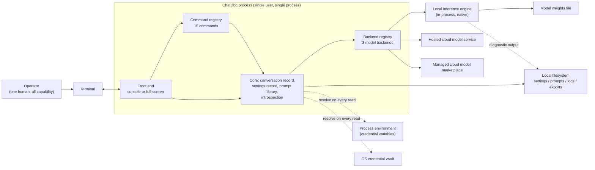

## 1. Executive Summary

ChatDbg is an interactive, terminal-hosted chat and debugging assistant for a single developer working at
their own machine. The operator launches it, types at a prompt, and holds a conversation with a large
language model. Lines that begin with a forward slash are *control instructions* handled locally — change
the model, edit the conversation, tune generation, manage instruction prompts, inspect the last reply.
Everything else is a *conversation turn* and is sent to whichever model backend is currently selected. The
product keeps no server, opens no listening port, has no accounts, and stores nothing outside three
directories under the operator's own user profile.

Two **front ends** ship, and they are alternatives rather than layers. The **console front end** is a plain
line-oriented loop: print a prompt, read one line, dispatch it, print the outcome prefixed with a success or
failure glyph, repeat. The **full-screen front end** paints a persistent menu bar, a scrollable transcript,
an input frame, a status line and modal dialogs over the whole terminal surface, and adds surfaces the
console front end does not have — a settings dialog, an instruction-prompt manager, a command-listing
dialog, and a dockable token-confidence side panel. Both build their own registry of the same fifteen
commands and share one core library, but as shipped they diverge in a dozen user-visible ways: input
trimming, unknown-command wording, whether a numeric setting out of range is rejected or silently clamped,
whether a delete guard fires. A reimplementer who assumes parity will produce a third, different behaviour
by accident, so the divergences are documented as requirements, not smoothed over.

Three **model backends** are interchangeable behind one five-operation contract — report a display name,
answer a network-free readiness check, send a turn and return text, send a turn and return text plus
per-token confidence data, release resources. They are selected by a persisted lower-case key and are
registered once at start-up in a fixed table of three. The **hosted cloud model service** is reached over
HTTPS at an operator-supplied endpoint with a single API key, and is the default. The **managed cloud model
marketplace** is a regional, account-scoped service through which the operator's own cloud account rents
hosted foundation models, addressed by region and a free-text model identifier with an access-key/secret-key
pair. The **local inference backend** loads an open-weights model file from disk and generates entirely
in-process, with no network call, no account and no credential — for it, the "model identifier" setting is a
filesystem path. Credentials for the two cloud backends are never required to be stored by the product: they
are resolved fresh on every read through a fixed three-channel chain — environment variable, then an opt-in
operating-system credential vault, then a deprecated in-document slot retained only to carry values forward
from older installations.

What distinguishes ChatDbg from an ordinary terminal chat client is **token-level introspection**. When
confidence capture is switched on, a turn takes a different request path that asks the backend for per-token
log probabilities and a ranked list of the alternative tokens the model weighed at each position. The
product stores that data on the message, exports and re-imports it with the conversation, and renders it
several ways: a dense grid of one bordered card per token, a row-per-token table, a colour heat map keyed to
confidence, and — in the full-screen front end — a side panel bound to a clickable marker beneath any reply
that carries data. Against a locally loaded model the product goes further, offering tokenization with
vocabulary indices, a three-stage inspection report, per-step analysis records exportable for offline study,
and capture of the inference engine's own native diagnostic output into rolling daily log files. The intent
is legible: make it visible where a model was guessing.

The maturity picture is uneven, and an honest account of it is part of the specification. The parts that are
complete and demonstrably exercised are the command contract and dispatch, the conversation record and its
five editing operations, the settings record and its twenty-one persisted keys, the credential resolution
chain, the instruction-prompt library, and the two cloud backends' request-build/invoke/parse paths — each
cloud backend exposes a substitutable client seam precisely so those paths can be run without network
access, and a hundred-case automated suite covers the core library. Those are requirements a clone should
meet closely.

Other parts are stubs, drift or duplicates shipped as though they were complete. Three fully implemented
commands — export diagnostic logs, export token analysis, show token analysis — are **registered in neither
front end**, so they are unreachable from every surface, appear in no help, and produce an unknown-command
error, while the shipped documentation presents them as working with sample transcripts. One of them is the
only command in the product with flag-style arguments, which the argument parser cannot represent at all. A
671-line **dead duplicate of the console front end** lives inside the full-screen front-end project; nothing
constructs it, it registers thirteen commands instead of fifteen and two backends instead of three, and it
drops token confidence data when it appends replies — so a reimplementer who ports the wrong file loses the
product's headline capability. A 215-line scratch spike sits outside the compilation entirely. Several data
paths **fabricate** what they present as measurement: the hosted cloud backend invents uniform 90-percent
confidence records, indistinguishable from real ones, whenever the service returns none; the inspection
subsystem's probability map and attribution scores are formulas of a word index rather than model output;
and per-step analysis records written during ordinary local chat carry a probability derived from a
temperature lookup table rather than from the model.

There is also documentation drift severe enough to be a hazard. The user manual presents the full-screen
front end as the product while the release pipeline publishes only the console front end. Two stale
specification files inside the source describe a two-provider product. An internal convention document
describes a different application altogether. Status documents claim fabrication was removed from code where
it is still present and still reachable. The rule applied throughout this PRD is that **code is truth and
documents are hints**, and where the two conflict the conflict itself is recorded.

The scope of the clone is therefore: reproduce the product a competent operator can actually reach and use —
two front ends, three backends, fifteen commands, the settings and credential model, the instruction-prompt
library, and the full token-introspection surface — on any language and platform, preserving the persisted
wire formats (the settings document keys, the conversation file, the prompt record files, the credential
environment-variable names and vault entry names) so that an existing installation's data still loads.
Reproduce the *interface* of the vestigial parts where an operator can see them, and fix the defects behind
that interface rather than porting them. Section 2.3 lists, item by item, what must not be faithfully
cloned.

---

## 2. Goals & Non-Goals

### 2.1 Goals

1. **Deliver a single-operator terminal chat assistant** that runs as one local process, owns the terminal
   for its lifetime, and requires no server, no network listener, no account and no installation beyond
   copying an executable.

2. **Ship both front ends.** A line-oriented console front end and a full-screen windowed terminal front
   end, each capable of driving the product independently, each registering the same fifteen commands, and
   each preserving the specific behaviours the source gives it — including the places where they differ, as
   documented per-feature.

3. **Support all three model backends behind one contract.** The hosted cloud model service, the managed
   cloud model marketplace and the local inference backend must be selectable at runtime by a persisted
   key, must each answer a network-free readiness check, and must each be replaceable without touching any
   command, front end or renderer.

4. **Make token-level introspection a first-class capability**, not a debug afterthought: request per-token
   log probabilities and ranked alternatives where the backend supports them, attach them to the message,
   persist them through conversation export and import, and render them in at least the grid, table and
   heat-map forms the source provides.

5. **Never require the product to store a secret.** Preserve the three-channel credential resolution chain
   with its fixed priority, resolve on every read so that an environment change takes effect without
   restart, and keep credentials out of every user-visible surface — reported only as a channel name plus a
   masked marker.

6. **Preserve every persisted wire format**, so that data written by the source product still loads: the
   settings document and its twenty-one keys, the conversation file, the prompt record files, the
   credential environment-variable names, the credential vault entry names, and the exported per-step
   analysis records.

7. **Preserve every user-visible literal that carries meaning**: the command prefix, the fifteen command
   names, the outcome glyphs, the backend keys and display names, the four credential source labels, the
   masked-secret markers, the seed prompt names, and the fatal-error line and exit code.

8. **Keep the product usable with no backend configured.** A first-run operator must be able to start,
   read help, see a configuration self-check that says exactly what is missing and how to supply it, and
   watch a fabricated demonstration of the token visualisation without spending a request.

9. **Keep the core logic free of any terminal toolkit.** All domain behaviour must emit user-visible output
   through a narrow output-surface abstraction, and every command must still function when given no output
   surface at all.

10. **Make the local inference path observable.** Capture the inference engine's own diagnostic output,
    flush it to disk at defined hazard points so evidence survives a native crash, and let the operator
    export a snapshot.

11. **Establish one consistent policy** where the source is internally inconsistent — one confidence scale,
    one confidence colour map, one out-of-range policy (clamp or reject), one per-user state root, and one
    set of validation rules applied on load as well as on entry.

12. **Package as a copy-and-run artifact** for at least the two platforms the source pipeline targets, with
    a documented download-to-running path, a licence copy alongside the binary, and an automated test gate
    ahead of publication.

### 2.2 Non-Goals (explicit exclusions)

1. **No authentication, authorisation, roles, tenancy or user accounts.** *Reason:* the source has none
   anywhere. It is a single-user local tool; the only access control is the operating system account that
   owns the process and the possession of a backend credential. Adding an auth model would change the
   product's shape and is not required to reach feature parity.

2. **No multi-user or shared-server deployment, and no remote access surface.** *Reason:* nothing in the
   source listens on a socket, and all state is single-process and per-user. Two instances sharing one
   settings file already clobber each other because there is no locking; a shared deployment would multiply
   that failure.

3. **No audit trail, telemetry, usage analytics or structured action log.** *Reason:* the source records
   nothing about what the operator did. The only diagnostic output is a developer-only trace channel and
   the inference engine's own log capture, neither of which is an audit record.

4. **No cancellation of in-flight operations.** *Reason:* no operation anywhere in the source accepts a
   cancellation signal, and none is offered to the operator. This is recorded as a known limitation rather
   than a goal; a clone may add it, but parity does not require it and no requirement depends on it.

5. **No concurrency, queueing or parallelism.** *Reason:* the product is strictly serial — one
   operator-initiated operation at a time, awaited to completion before the next input is accepted. There
   is no re-entrancy protection anywhere, and adding parallelism would expose latent races that the serial
   model currently hides.

6. **No localisation or internationalisation.** *Reason:* every user-visible string in the source is a
   hard-coded English literal with no resource catalogue and no formatting indirection. Some of those
   literals are load-bearing (glyphs, labels, markers) and are frozen by Goal 7.

7. **No conversation persistence across sessions unless explicitly exported.** *Reason:* despite the
   source's own requirements document and manual promising "persistent chat history", there is no autosave,
   no autoload, and the shutdown path saves nothing. Code wins; the clone must not invent persistence.

8. **No history window management, token accounting or cost estimation.** *Reason:* the entire conversation
   is re-sent on every turn with no server-side thread, no delta, no trimming and no client-side token
   count. A long session simply grows until the backend refuses it.

9. **No retry, timeout, back-off, rate-limit handling or circuit breaker on remote calls.** *Reason:* none
   exists in the source; the only bound on any remote call is the transport's platform default. A clone may
   add resilience, but no behavioural requirement in this PRD assumes it.

10. **No streaming display of replies.** *Reason:* every backend returns a complete reply envelope and the
    front ends render it once. The local backend does stream internally, but the stream is concatenated
    before it reaches any front end.

11. **No plugin system, dependency-injection container, configuration-driven registration or runtime
    command registration.** *Reason:* the command registry is built by hand once at start-up in each front
    end and never mutated. Adding a plugin surface changes the extensibility contract that features depend
    on.

12. **No quoting or escaping in command arguments.** *Reason:* the argument parser splits on the single
    space character and discards empty tokens. Runs of spaces collapse, tab characters are not separators,
    and no command can receive an argument containing a space. This is a limitation to reproduce, because
    several documented usages and file paths depend on knowing it.

13. **No graphical (windowing-system) interface.** *Reason:* both front ends are terminal programs. The
    full-screen front end is a full-screen *terminal* application, not a desktop application.

14. **No model training, fine-tuning, embedding, retrieval or tool-calling.** *Reason:* absent entirely.
    The product sends a message list and renders a reply.

15. **No accessibility alternative to colour and glyph signalling in the source's own behaviour.**
    *Reason:* recorded as a non-goal only because the source has none — confidence banding is conveyed by
    colour alone and command outcome by two Unicode glyphs. A clone targeting assistive technology **should
    add a second, textual signal**; this PRD marks that as an improvement, not a parity requirement.

### 2.3 Vestigial, dead, and stub code found in source — reproduce the interface, not the bug

Everything in this table was found in the source at the surveyed commit. None of it is a requirement. Where
an operator can see a symptom, the *interface* obligation is stated in the last column; where the item is
invisible, the obligation is simply to omit it.

| Item | What it is in source | Why it is excluded | What (if anything) to keep |
|---|---|---|---|
| Three unregistered command implementations | `ExportLogsCommand` (`/export-logs`), `ExportTokenAnalysisCommand` (`/export-analysis`), `ShowTokenAnalysisCommand` (`/show-analysis`) — complete classes in the core library, absent from `InitializeCommands()` in **both** front ends | Unreachable from every surface: they appear in no help, and typing their names yields the unknown-command error. The shipped introspection document presents all three as working, with sample transcripts. One of the three is a stub that validates argument count and writes nothing at all | **Build the capability, register it.** Exporting captured diagnostics, exporting per-step analysis records and displaying them on screen are genuine product needs and the underlying operations exist. Do not clone the stub body; implement the operation and add it to the registry |
| Flag-style argument form on one unregistered command | `ShowTokenAnalysisCommand` accepts `--top N`, `--state`, `--range START END` with a default of top 3 | The product's argument parser splits on single spaces with no flag or quoting support, so this form could never have worked even if the command were registered | Choose one argument convention for the whole product before implementing the capability. Do not introduce a second parser for one command |
| Dead duplicate console front end | `src/ChatDbg.Shell.Gui/ChatShell.cs`, 671 lines. A near-copy of the real console front end living inside the full-screen front-end project. Never instantiated — `Program.cs` constructs `ChatWindow` instead | Registers 13 commands instead of 15 and 2 backends instead of 3; would break local-backend selection if wired up; **drops token confidence data when appending replies**; carries its own divergent copies of the startup credential diagnostics, the settings hydration routine and the token sampling/rendering logic | **Nothing.** Delete it. Its existence is the single highest-risk trap in the repository: porting the wrong `ChatShell.cs` silently removes the product's headline capability. Port from the console front-end project's file |
| Uncompiled scratch spike | `tmp/LLamaSharpInvestigation.cs`, 215 lines, not referenced by any project file | An exploration of the local inference library that was never part of any build | Read for *intent* about local-inference approach if useful; carry over nothing |
| Manual credential test scripts | `tmp/test-wincred.cmd`, `tmp/test-env-vars.cmd` | Assert nothing, exit zero regardless of outcome, end by launching the application, and set scratch variables that are not credential names and that no product code reads | **Nothing.** If credential-resolution verification is wanted, write real automated tests against the resolution chain |
| Fabricated confidence data on the hosted cloud path | `GenerateSimulatedLogProbabilities` — invents uniform 90-percent records with three hard-coded alternatives whenever the service returns none, constructs a random generator it never uses, and returns the result **unmarked** | Invented numbers are indistinguishable from measured ones on the operator's screen. This makes the introspection capability — the product's whole distinguishing claim — untrustworthy | **Keep the graceful path, drop the fabrication.** When a backend returns no confidence data, say so plainly and render the reply without a confidence view. If a demonstration mode is wanted, that is what the offline demonstration command is for, and it is clearly labelled |
| Fabricated probability map and attribution in the inspection subsystem | `TokenInspectionService` — every token identifier, log probability, alternative and influence score is a formula of the word index; the influence score is a single constant; alternatives are named by a rank suffix; the "top-K" emits exactly that many fabricated entries regardless of magnitude | Presented to the operator as analysis of the model. The generated text is real; the analysis of it is not. A shipped status document claims this fabrication was already removed | **Keep the report's shape, replace its content.** A three-stage inspection (tokenize, then per-step distributions, then attribution) is a good product surface. Populate it from the inference engine's actual sampling data, or omit the stages that cannot be populated and say why |
| Temperature-derived probability in per-step analysis records | `EstimateProbabilityFromTemperature` — a six-step lookup table from the configured temperature to a fixed value, written into every analysis record of a run in place of a measured value; vocabulary index is always a sentinel | An exported analysis file reads as uniformly and falsely confident: at the default temperature every record carries the same probability and the same log probability | **Keep the record shape, populate it truthfully.** The introspection generation path already computes real candidate probabilities; write those. Where a field cannot be filled, omit it rather than filling it with a constant |
| Estimated character spans in tokenization | `CharStartPosition` / `CharEndPosition` computed by uniform distribution across the input rather than from a real offset map | Presented as the token's position in the original text; it is an average, not a mapping | Either obtain real offsets from the tokenizer or omit the columns. Do not ship an estimate labelled as a position |
| Never-constructed heat-map view | `LogProbHeatmapView` — a flowing paragraph view with its own sixth colour scale (0–1 bands) and its own sampling rule, plus a wrapping defect that writes over-wide tokens past the right edge | Nothing constructs it, so it is invisible and untestable | **Nothing**, unless a flowing heat-map rendering is wanted as a product feature — in which case build it against the single canonical colour scale, not this one |
| Never-referenced static visualiser | `src/ChatDbg.Shell.Gui/Services/TokenProbabilityVisualizer.cs` — explicitly re-added to compilation after a blanket folder exclusion in the project file, yet referenced by nothing | A fourth copy of the same sampling-and-rendering logic, unreachable at runtime | **Nothing.** Implement one rendering path; the source has four and three are dead |
| Both native inference payloads referenced at once | `LLamaSharp.Backend.Cpu` **and** `LLamaSharp.Backend.Cuda12` referenced unconditionally in the core project | Every published artifact carries both sets of native binaries — which the source's own troubleshooting document names as a cause of native load failures | Ship exactly one accelerator payload per artifact, selected at build time, or load the accelerated one dynamically with a documented processor-only fallback |
| Redundant package declarations in the full-screen front end | The full-screen project separately declares the two cloud-vendor client packages and the rich-console renderer, all of which already arrive through its reference to the core library | Duplicate declarations that can drift to different versions than the core library uses; three pins are duplicated across projects with no reconciliation | Declare each dependency once, in one place |
| "Dependency-free" fallback output surface that is never selected | `BasicConsoleFormatter`, whose stated purpose is to avoid the rich-rendering dependency — but the core library declares that dependency directly, three other commands use it, and no runtime path ever selects the fallback | The abstraction it justifies is worth keeping; the justification is false as built | **Keep the output-surface abstraction and keep a plain implementation** — commands must work with no rich surface. Make it actually reachable (headless, redirected output, or a no-colour switch) rather than dead |
| Committed pre-built binary | `test-publish/Xcaciv.ChatDbg.Shell`, 15,677,171 bytes, tracked in version control, produced and consumed by nothing, uncovered by any ignore rule, and declaring a runtime version the source no longer targets | A build output committed by accident | **Nothing.** Ensure the clone's ignore rules cover build output directories |
| Stale in-repository specification files | `src/ChatDbg/prd.md` and an identical `src/ChatDbg.Shell.Gui/prd.md` describing a **two**-provider product and pinning an older client-library version | Contradicts the shipped code in provider count, persistence behaviour and target platform | **Nothing.** Treat as non-evidence. This PRD supersedes them |
| Repository convention document describing a different product | `.github/copilot-instructions.md` — describes a serverless-functions application with packages that exist nowhere in the repository, claims a central package-version file that does not exist, and forbids command-line builds when every build script and pipeline step is a command line | Wholesale non-evidence | **Nothing.** Do not derive any convention from it |
| Encoding-damaged source and documentation | One command source file contains raw single-byte bullet characters that render as replacement glyphs in the operator's help output; several documents contain question marks where emoji were intended | Produces visibly corrupted user-facing text | **Fix, do not reproduce.** All source and content files in the clone must be one encoding, and user-visible text must contain real characters or plain markers |
| Broken toolchain pin and mismatched release pipeline | `global.json` is not valid structured text (one closing brace too many), and the release workflow installs a toolchain one major version behind what every project targets | As committed, the build is gated by a parse error and the pipeline would fail before compilation | **Nothing to clone.** The clone's build must actually run, and its pipeline must run the automated test suite before publishing — the source pipeline runs no tests at all despite a hundred-case suite existing |
| Command-injection hazard in the release pipeline | The operator-supplied version string is pasted into shell command text before the shell sees it, in the same job that holds a long-lived publication credential | A metacharacter in the version input executes on the build agent | **Nothing.** Pass operator input as data, never as command text, and prefer a short-lived ambient job credential over a long-lived stored token |
| Orphaned settings record in the full-screen front end | Commands are constructed against one settings instance; the variable is then reassigned to the instance loaded from disk, which is what the window, the dialogs and the backends use | Typed commands mutate an abandoned object: the credential enable-gate always reads false, the migration flow is a guaranteed no-op from the chat box, the prompt listing marks the wrong entry as current, and saving from a command **overwrites the operator's stored configuration with construction-time defaults** — silent data loss | **Nothing.** One settings record per session, created once and shared by reference. This defect is a direct consequence of hand-wiring collaborators in two places; the clone must construct the record before anything that uses it |
| Doubled percent sign and mismatched confidence scale | A percentage format that already appends a percent sign is concatenated with a second literal percent sign in seven places; separately, 0–1 confidence values are compared against 0–100 thresholds, so genuine data always renders in the lowest colour band and a 92-percent token prints as under one percent | Every confidence display in the product is wrong in at least one of these two ways. A failing test in the source's own suite already records the scale defect | **Nothing.** Define the derived probability as a 0–1 fraction once, convert once at the display boundary, and use one colour map product-wide |
| Never-detached diagnostic capture | The inference engine's native log destination is installed once and never removed, so a disposed recorder keeps receiving lines into a buffer that will never be flushed again | Leaks and loses evidence | **Nothing.** Provide a detach path and drain on shutdown |

---

## 3. Actors & Personas

### 3.0 The access model, stated plainly

**ChatDbg has no authentication, no authorisation, no roles, no accounts, no tenancy and no multi-user
model.** There is exactly one human role: the operator sitting at the terminal, who has every capability the
product offers. Any person who can reach the input prompt can invoke any registered command, read and change
every setting, read and write every stored artifact, and send any conversation to any configured backend.
The only permission model in force is the operating system's own, applied to a per-user directory created
with the platform's default file mode — the product sets no file mode, applies no access-control list, and
performs no permission check of its own. The single permission-*like* test anywhere in the product is a
platform capability check that gates the operating-system credential vault, and even that is bypassed by one
dialog.

The one thing that resembles a credential boundary is possession of a **backend credential**: without one,
the two cloud backends refuse to serve a turn and say so. That is a capability gate on an external service,
not an access control inside the product. The local inference backend has no credential at all — anyone who
can run the process and reach a model file can generate with it.

Consequently the personas below are distinguished by **intent**, not by permission. Every persona has
identical capability. They are worth naming because they exercise different parts of the product, notice
different defects, and would be harmed differently by a regression.

### 3.1 Human personas

**The developer debugging code.** The product's namesake user. Pastes an error, a stack trace or a
function into the terminal and asks about it, then iterates. Cares about turnaround, about the conversation
staying coherent across turns, and about being able to pop a bad turn and try again rather than restarting.
Uses the conversation-editing commands heavily and the introspection surface rarely. Most sensitive to the
absence of cancellation — a slow turn cannot be abandoned — and to the fact that a failed turn still leaves
the operator's message in the record, where it is re-sent as context next time.

**The prompt engineer tuning instructions.** Works on the instruction-prompt library: writes, edits,
imports, exports and switches between named instruction prompts, and compares how the same question answers
under each. Cares that the active prompt is identified correctly, that switching takes effect on the very
next turn, and that a prompt is not lost or overwritten. Most exposed to the source's prompt-library
defects: the lossy file-name sanitisation that can collide two prompt names onto one file, the export format
that carries only the content and so cannot round-trip, the full-screen path that skips the
active-prompt delete guard and the duplicate-name check, and the orphaned-settings defect that makes the
full-screen front end mark the wrong prompt as current.

**The model-behaviour researcher.** Uses the product as an instrument. Switches confidence capture on,
raises the alternatives-per-position count, chooses grid or table layout, reads the heat map to find where a
model was guessing, opens the confidence panel on a specific reply, and — against a locally loaded model —
tokenizes input, runs a full inspection, and exports per-step analysis records for offline study. This is
the persona the introspection capability exists for and the persona most damaged by the fabricated-data
paths in §2.3: uniform invented confidence, formula-derived attribution and temperature-derived
probabilities all read as findings.

**The operator configuring the machine.** Sets up credentials and backends, often once, often for someone
else. Chooses between supplying secrets by environment variable and enrolling them in the operating-system
credential vault, runs the migration flow when upgrading from a version that stored secrets in the settings
document, checks the startup self-check output, and points the local backend at a model file. Cares about
knowing *where* a credential came from without being shown its value, and about the settings document being
readable and hand-editable. Most exposed to the platform-coupling limit — the vault leg exists on one
platform only and silently yields nothing elsewhere — and to the source's habit of scattering state across
three different per-user roots with no uninstall story.

**The support engineer receiving a bug report.** Not a separate role in the product, but a distinct intent:
asks the operator to export the conversation, export the diagnostic snapshot, and read back the startup
self-check. Depends entirely on the diagnostic capture and export surfaces — which is exactly where the
three unregistered commands sit, so today this persona is stranded and must read log files off disk
directly.

**The release manager.** Builds and publishes the packaged artifacts. Selects a build profile, runs the
pipeline, and hands out a download. Distinguished here because the packaging surface has its own actors and
its own failure modes, and because the source's release path publishes only one of the two front ends while
the manual describes the other.

### 3.2 Non-human actors

| Actor | Kind | What it does for the product | What the product assumes about it | Failure behaviour observed in source |
|---|---|---|---|---|
| **Hosted cloud model service** | External network service | Accepts a message list plus generation options at an operator-supplied endpoint address and returns a reply, optionally with per-token confidence data | Reachable over HTTPS; authenticated by a single API key in a header; addressed by an endpoint plus a model identifier that names both model and deployment; supports a fixed request-contract version | On a non-success status the entire upstream error body is echoed unfiltered to the terminal. Confidence data absent from the reply triggers fabrication rather than an honest report |
| **Managed cloud model marketplace** | External network service | Accepts a model-specific request body in the operator's own cloud account and region and returns a reply | Reachable in a named region; authenticated by an access-key/secret-key pair, or by the vendor library's own ambient credential discovery when either half is empty; the model identifier's family prefix alone selects the body shape | An unrecognised region is not validated anywhere. An unrecognised reply shape produces a fixed literal answer text reported as a **success**. The confidence request fields are not part of the real contract, so the response-side confidence parser is dead against genuine replies |
| **Local inference engine** | In-process native component | Loads model weights from a file, creates a sized inference context, runs generation, streams text pieces back, and exposes raw per-vocabulary scores for the introspection path | Present as a native payload alongside the executable; matches the host processor architecture; may or may not have graphics acceleration available; exposes its own diagnostic output through a process-global destination that can be installed once | A missing accelerator payload is a native load failure, not a graceful degradation. A method resolved by literal name at run time returns "not found" as an empty result, so dead-code elimination can silently remove it in a packaged build. Two process-wide locks serialise all generation and all model loading, with no timeout |
| **Operating-system credential vault** | Local OS service | Stores and returns three named secrets, encrypted at rest, scoped to the current user and machine | Available on one platform only; entries are generic-kind, local-machine-persistence, named by three fixed colon-containing keys | Silently yields "not found" on every platform that has no vault, so resolution falls through to the next channel with no message. Every failure at this leg is swallowed |
| **Local filesystem** | Local OS resource | Holds the settings document, the instruction-prompt library, the diagnostic log files, exported conversations, exported analysis records, and the model weights file | Three different per-user roots are writable; no locking is needed; whole-file overwrite is safe | No file locking, no atomic replace, no optimistic-concurrency token. Two instances sharing one settings file clobber each other with no detection, and a crash mid-write leaves a truncated file. When the profile directory cannot be resolved, the settings document silently relocates to the temporary directory — settings appear to save, then vanish |
| **Process environment** | Local OS resource | Supplies credentials through a fixed set of variable names, read fresh on every credential resolution | Variables are readable; a change takes effect without restart because nothing is cached | Absent variables are indistinguishable from empty ones; both fall through to the next channel |
| **Terminal** | Local device / host | Provides the input stream, the output stream, a character grid, colour capability and a Unicode-capable font. The full-screen front end additionally requires cursor addressing, a resize signal and key events including function keys | Interactive with a keyboard attached; supports the glyphs the product prints; wide enough for the frame arithmetic | Column widths and wrap points are measured in code units, not display cells, so wide glyphs and combining sequences mis-measure in every table, panel and wrap point. Writing directly to the output stream while the full-screen front end owns the screen corrupts the layout — which the offline demonstration command does |
| **Build and release pipeline** | External automation | Builds one artifact per platform row, joins on success, and publishes a release | An agent per platform; a stored publication credential; a toolchain matching the pin | Runs no tests. Installs a toolchain one major version behind the projects. Pastes operator input into shell command text. Publishes executables with no licence copy, checksum or signature |

### 3.3 Actor context

### 3.4 Capability matrix

Because there is exactly one human role, this matrix records what **each persona actually exercises**, not
what each is permitted to do. Every cell that reads "—" means "has the capability, does not use it in this
intent". No cell is a denial.

| Capability | Developer debugging | Prompt engineer | Model-behaviour researcher | Machine operator | Support engineer | Release manager |
|---|---|---|---|---|---|---|
| Send a conversation turn | Primary | Primary | Primary | Verification only | — | Smoke test |
| Run any control instruction | Yes | Yes | Yes | Yes | Yes | Yes |
| Edit the conversation record (insert, remove-last, clear) | Primary | Occasional | Occasional | — | — | — |
| Export / import a conversation | Occasional | — | Primary | — | Primary (evidence) | — |
| Switch model backend | Occasional | Occasional | Primary | Primary | Guides operator | — |
| Change the model identifier | Occasional | — | Primary | Primary | — | — |
| Change generation tuning (temperature, max tokens) | Occasional | Primary | Primary | Primary | — | — |
| Toggle confidence capture; set alternatives-per-position | — | — | Primary | — | — | — |
| Change confidence display preferences | — | — | Primary | — | — | — |
| View the confidence panel / heat map | Occasional | — | Primary | — | — | — |
| Run the offline demonstration | First run | — | Occasional | Primary (verify install) | Primary (verify install) | Smoke test |
| Tokenize input against a local model | — | — | Primary | — | — | — |
| Run a full inspection | — | — | Primary | — | — | — |
| Export per-step analysis records | — | — | Primary (**unreachable today — §2.3**) | — | — | — |
| Create / edit / delete / switch instruction prompts | Occasional | Primary | Occasional | Initial setup | — | — |
| Import / export an instruction prompt | — | Primary | — | — | — | — |
| Supply credentials by environment variable | — | — | — | Primary | Guides operator | — |
| Enrol credentials in the OS vault | — | — | — | Primary | Guides operator | — |
| Run the credential migration flow | — | — | — | Primary (upgrade) | Guides operator | — |
| Read the startup self-check | Occasional | — | — | Primary | Primary | Smoke test |
| Point the local backend at a model file | — | — | Primary | Primary | — | — |
| Tune local-model settings | — | — | Occasional | Primary | — | — |
| Export a diagnostic log snapshot | — | — | Occasional | — | Primary (**unreachable today — §2.3**) | — |
| Select a build profile and publish a release | — | — | — | — | — | Primary |

### 3.5 Intended authorized-use context

ChatDbg is intended to be run by its own operator, on that operator's own machine, against backends that
operator is entitled to use. It is a personal developer tool, and everything about its design assumes that:
one process, one user, one terminal, state under the user's own profile, no network surface of its own, and
no separation of privilege inside the process because there is no second party inside the process to
separate from.

Three consequences follow, and a clone must carry them forward explicitly rather than discovering them
later.

**First, the process boundary is the security boundary.** Anything that can run code in the process — or
read the user's profile directory — can read the conversation, the instruction prompts, the settings and any
credential that has already been resolved into memory. Credential resolution reduces exposure by never
requiring the product to *store* a secret, but it does not isolate one.

**Second, diagnostic output is sensitive.** The developer-only trace channel records full request bodies and
full reply bodies, and the inference engine's log capture records generation detail. Both may contain the
complete conversation, including anything the operator pasted. Rolling daily log files are never pruned,
capped or compressed. Any deployment, and any support process that asks an operator to send logs, must treat
these files as containing the conversation itself.

**Third, the product sends whatever it is given.** There is no redaction, no content policy, no
classification check and no egress control between the operator's terminal and a cloud backend, and the
entire conversation record is re-sent on every turn — including messages inserted by hand and messages
restored from an imported file. An operator working on confidential material should select the local
inference backend, which makes no network call at all, and should understand that the two cloud backends
transmit the full conversation on every turn.

The product is **not** intended as a shared or multi-tenant service, a hosted endpoint, an unattended
automation component, or a control plane over anyone else's credentials. Deploying it in any of those shapes
would require an access model, an audit trail, cancellation and concurrency safety — none of which exist,
and all of which are explicit non-goals in §2.2.
