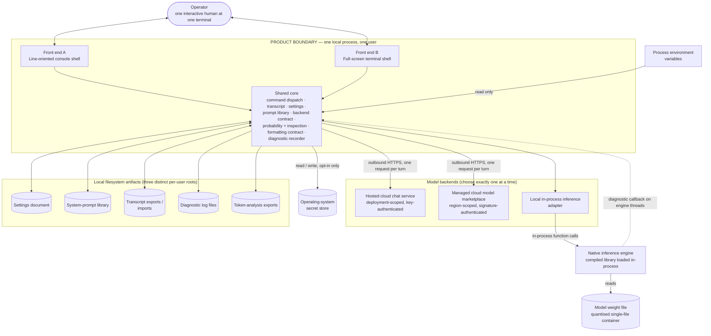
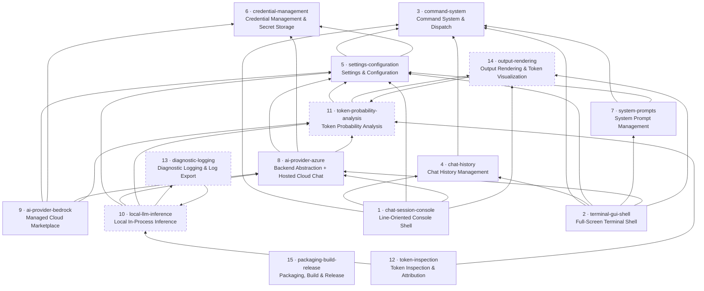

## 5. System Overview

This section orients a team that has never seen the source. It establishes what the product *is* (§5.1), what a user can *ask it to do* (§5.2), what order to *build it in* (§5.3), what it must *talk to* (§5.4), how it is *delivered and run* (§5.5), and what happens end to end during *one conversational turn* (§5.6).

The product is a single-user, locally-run terminal application. One human sits at one terminal. There is no server, no database, no listening socket, no multi-user model, no authentication, no authorization, no tenancy and no audit trail anywhere in it. Every outbound connection it makes goes to a language-model backend the user chose and paid for.

---

### 5.1 Context

**Inside the product boundary**

- Two interchangeable front ends over one shared core: a **line-oriented console shell** (the only one the source's release pipeline actually publishes) and a **full-screen terminal shell** (menus, dialogs, a side panel).
- A **shared core**: the command registry and dispatcher, the conversation transcript, the settings record, the system-prompt library, the three model-backend adapters behind one five-operation contract, the token-probability and token-inspection logic, the output-formatting contract, and the diagnostic-log recorder.

**Outside the product boundary**

- The **operator** — one interactive human.
- Three **model backends**: a hosted cloud chat service, a managed cloud model marketplace, and a local in-process inference engine.
- The **operating-system secret store**.
- The **local filesystem artifacts** the product reads and writes.
- The **native inference engine** — a platform-specific compiled library loaded into the product's own process, plus the model weight file it reads.



**Every arrow explained**

| Arrow | Meaning |
|---|---|
| Operator ↔ front end A | The operator types one line at a time at a prompt and reads plain text back. This front end owns the terminal for the whole process lifetime. |
| Operator ↔ front end B | The operator drives a persistent full-screen layout with a menu bar, an input box, a transcript pane, a status line, a shortcut bar, modal dialogs and an optional probability side panel. Mouse and keyboard both work. |
| Front end → shared core | Each front end builds its own command registry at start-up (fifteen entries, hand-wired, no discovery), classifies each submitted line as a command or a conversation turn, invokes the core, and renders the three-signal result. Neither front end owns domain logic. |
| Shared core → hosted cloud chat service | One outbound request per conversation turn. Two distinct paths exist: a vendor-library path used when per-token probabilities are *not* requested, and a hand-built request path used when they are. |
| Shared core → managed cloud model marketplace | One outbound signed request per conversation turn. Single-shot invocation only — no streaming, no tool use, no model listing. |
| Shared core → local inference adapter | An in-process call, not a network call. The adapter is constructed at start-up whether or not the operator ever selects it. |
| Local inference adapter → native inference engine | Direct in-process calls into a compiled platform-specific library through a foreign-function boundary. A failure here is process-fatal and not catchable. |
| Native inference engine → model weight file | The engine memory-maps or reads a single large quantised weight file whose path the operator configured. The product checks only that the path exists; it validates neither header nor size. |
| Native inference engine ⇢ shared core | A process-global diagnostic callback the product installs once and never removes. It fires on engine-owned threads, so the receiving buffer must be lock-guarded. |
| Shared core ↔ operating-system secret store | Consulted only when the operator has explicitly enabled it. Reads, writes and deletes named credential entries. Every failure is swallowed and reported as "no value". |
| Process environment → shared core | Read-only, on every access, never cached, never written. This is the highest-priority credential channel and the only one that works on every platform. |
| Shared core ↔ settings document | A small hand-editable structured document under a per-user configuration root, loaded at start-up and rewritten in full whenever a setting changes. |
| Shared core ↔ system-prompt library | A directory of one document per named instruction prompt under a *different* per-user root, seeded with four starter prompts on first run. |
| Shared core ↔ transcript exports/imports | Operator-chosen paths. An export must remain re-importable field for field; this is a compatibility contract. |
| Shared core → diagnostic log files | Append-only daily files under a *third* per-user root. Strictly a sink: nothing in the product ever reads them back. |
| Shared core → token-analysis exports | Operator-chosen paths carrying the per-step generation records. Write-only. |

Three things a reimplementer should notice immediately from this picture. First, the product uses **three different per-user roots** for three kinds of state, and it has no uninstall story. Second, the native engine sits *inside* the product's process, not behind an interface — its failure modes are the product's failure modes. Third, the arrow from the environment is one-way and unbuffered: a credential variable set after launch takes effect on the very next turn with no restart.

---

### 5.2 The command surface

Anything the operator types that begins with a single `/` is a command; everything else is a conversation turn. Parsing is: strip exactly one leading character, split the remainder on the space character only, discard empty tokens, lower-case the first token as the name, pass the rest in order as arguments. There is **no quoting and no escaping anywhere**, so runs of spaces collapse and tabs are never separators.

**Both front ends register exactly the same fifteen commands** — but they do **not** expose the same surface. The divergences below are shipped behaviour, not accidents of documentation, and a reimplementer who assumes parity will produce a third, different product.

Three fully implemented commands are registered by **neither** front end and are therefore unreachable by any operator, while the product's own shipped documentation presents all three as working, with sample transcripts.

| Command | Purpose | Which front ends expose it | Requires a backend? | Notes |
|---|---|---|---|---|
| **Conversation control** |
| *(any line not starting with `/`)* | Send a conversation turn | Both. Front end B also via a **Send** button. | **Yes** — the configured one | Front end B trims the line before classifying; front end A does not, so a leading space makes `/help` a chat turn there. The user message is appended to the transcript *before* any readiness check, so a failed turn leaves an orphan user message that is re-sent as context next time. |
| `/inject <role> <message> [position]` | Insert a message at a chosen role and position | Both (typed). Front end B also: **File ▸ Inject Message…** (a 70×15 form). | No | Roles accepted: user, assistant, system. Position is optional; supplying one breaks timestamp monotonicity. The form feeds its fields back through the same text command line and inherits space collapsing. |
| `/pop` | Remove the last message | Both (typed). Front end B also: **File ▸ Pop Last Message**. | No | Fails with `Chat history is empty` on an empty transcript. |
| `/clear` | Clear the whole transcript | Both (typed). Front end B also: **File ▸ Clear History**. | No | Reports the count captured *before* clearing. No confirmation on either front end — and in front end B the probability side panel keeps rendering the tokens of the message just deleted. |
| `/export <file_path>` | Write the transcript to a file | Both (typed). Front end B also: **File ▸ Export History…** (a save dialog pre-seeded with a name under the home directory). | No | The written document must remain re-importable field for field. `.json` is appended when the chosen path has no extension. Whole-file overwrite, no atomicity. |
| `/import <file_path>` | Replace the transcript from a file | Both (typed). Front end B also: **File ▸ Import History…** (an open dialog, single selection, starting at the home directory). | No | A missing file is a normal, non-exceptional failure with its own diagnostic. Both dialogs route the chosen path back through the text command line, so a directory containing consecutive spaces becomes unreachable. |
| **Configuration** |
| `/set` *(no arguments)* | Show the current configuration and setup instructions | Both (typed). | No | The single largest command in the product. Its usage text is recomputed from live state on every read, so its detailed help reflects the configuration in force at that moment. |
| `/set <key> <value>` | Change one setting and persist the whole record | Both (typed). Front end B also: **Edit ▸ Settings…**, an 80×25 modal with four tabs. | No | Twenty-one persisted keys. Value is all remaining tokens joined with single spaces, so a mistyped multi-word value fails rather than silently taking the first word. A key given with no value always yields `Usage: /set <key> <value>` before any lookup. |
| `/model [<model id…>]` | Show or change the model identifier | Both (typed). Front end B also: **Tools ▸ Change Model** (a 60×10 dialog). | No | With no arguments it reports the current model and persists nothing. With arguments it overwrites the identifier **with no validation of any kind** — not even a file-existence check when the local backend is active, which `/set modelId` *does* perform. Two commands, one field, two validation policies. |
| **Backend selection** |
| `/set provider <azure\|bedrock\|llama>` | Choose which of the three backends answers the next turn | Both (typed). Front end B also: a radio group on the settings dialog's first tab. | No (choosing costs nothing) | The three keys are exactly the lower-case literals. Front end A rebuilds its prompt string from live settings every iteration, so the change is visible on the very next prompt with no restart. |
| **Credentials** |
| `/set enablewincred` | Opt in to the operating-system secret store | Both (typed). Front end B also: a checkbox on the settings dialog's credentials tab. | No | One of only two keys accepted with a single argument and no value. Prompts interactively for confirmation, then persists the *entire* settings record. |
| `/set wincred <type> <value>` | Store one secret into the operating-system secret store | Both (typed). Front end B also: **Manage Credentials…**, whose value field is masked. | No | Three logical types with short aliases. Front end A echoes the typed secret to the terminal and into shell history — masked entry is the one capability it lacks. On a host without the implemented store the dialog still reports success while storing nothing. |
| `/set migrate` | Interactive wizard moving legacy plaintext secrets out of the settings file | Both (typed) — but **unusable in front end B**. Front end B also: a **Migrate Credentials…** button. | No | The wizard writes prompts to the raw output stream and blocks on a raw input read from inside the service layer. Under a full-screen toolkit that owns the screen and keyboard, those prompts are invisible and unanswerable. The button reports `Credentials migrated successfully` unconditionally and discards the operator's chosen option. |
| **Instruction prompts** |
| `/prompt [list\|show\|use\|create\|delete\|edit\|export\|import]` | Manage the named system-prompt library | Both (typed). Front end B also: a dedicated management dialog reached from the menu, bypassing the command layer entirely. | No | Every sub-command except the settings route takes its prompt name from a **single token**, so multi-word names are unreachable through them. `edit` opens an interactive line-by-line content editor on the raw input stream — again unusable in front end B. |
| **Introspection** |
| `/logprobs` *(no arguments)* | Report the current probability-analysis configuration | Both (typed). | No | Changes nothing and saves nothing. Returns a multi-line report ending in two caveat lines about model and API-version support. |
| `/logprobs enable` / `disable` | Turn per-token probability capture on or off | Both (typed). Front end B also: **View ▸ Log Probabilities ▸ Toggle Log Probs for Last Message**, which flips the same persisted flag. | No to set; **yes** to observe an effect | Enabling changes the request the backend adapter builds on the next turn. |
| `/logprobs top <1–20>` | Set how many alternative tokens to request per position | Both (typed). Front end B also: a settings-dialog field. | No | Out-of-range and non-integer values are rejected with a fixed message; nothing is saved on rejection. |
| `/tokenize <text>` | Show how the local model segments a piece of text | Both (typed) — but **unusable in front end B**. | **Yes — the local backend specifically** | Refuses unless the backend key is exactly `llama` (case-sensitive) and the weight file exists. Writes its whole report straight to the raw output stream, which a full-screen toolkit paints over. Loads and disposes the model once per invocation. |
| `/inspect <text>` | Tokenize, then analyse probabilities and attribution behind a consent gate | Both (typed) — but **unusable in front end B**. | **Yes — the local backend specifically** | Blocks on a raw input read for a `(y/n)` consent answer with no timeout, no default and no non-interactive escape. Loads and disposes the model **twice** per invocation. Returns the same success message whether the operator consented or declined. |
| **Presentation** |
| `/logprobs showall` / `showsample` | Render every token, or a beginning/middle/end sample | Both (typed). Front end B also: a settings-dialog radio group. | No | Sample mode is the default and only samples above a fixed threshold; below it the whole list renders anyway. |
| `/logprobs grid` / `list` | Choose the card-grid or table layout | Both (typed). Front end B also: a settings-dialog radio group. | No | List layout is the default. Grid column count is derived from the queried terminal width. |
| `/logprobs gridmaxalt <1–20>` | Cap alternatives shown per card in grid layout | Both (typed). Front end B also: a settings-dialog field. | No | Same validation and same rejection semantics as `top`. |
| `/demologprobs` | Render a fixed sample probability analysis with no backend call | Both (typed). Front end B also: **View ▸ Log Probabilities ▸ Run Demo Visualization**. | **No — never contacts a backend** | The **only** command whose behaviour differs by construction between the front ends: front end B supplies a rich-console rendering collaborator and front end A supplies none. The command must return the identical success message either way. In front end B the rich renderer writes ANSI escapes straight to the terminal underneath the full-screen toolkit, producing painting artefacts. |
| **Diagnostics** |
| `/logprobs debug` | Print a troubleshooting report for the probability feature | Both (typed). | No | Changes nothing, saves nothing. Echoes the configured endpoint or a literal placeholder, suggested model names, and a four-step checklist. |
| **Session lifecycle** |
| `/help` | List every capability grouped by topic | Both (typed). Front end B also: `F1` and **Help ▸ View Commands…** — a *completely different renderer*. | No | The typed listing is a **hand-maintained script** in a fixed non-alphabetical order that can drift from the registry in both directions. Front end B's dialog ignores the help command entirely and builds its own listing from the registry, sorted ascending, with descriptions but no usage strings and no grouping. |
| `/help <name>` | Detailed help for one capability | Both (typed). | No | Uses only the first argument. An argument that includes a slash fails. In front end B a typo inside a help request raises a blocking modal. |
| `/exit`, `/quit` | End the session cleanly | Both (typed). Front end B also: **File ▸ Exit** and the `F10` shortcut item — **which bypass the commands entirely**. | No | Both ignore all arguments. Requesting an exit is a *successful* outcome. Exit beats message: a message carried on an exit result is never shown. No confirmation, no state flush on either route. |
| **Implemented but registered by neither front end** |
| `/show-analysis [--top N] [--state] [--range S E]` | Display the per-step analysis of the last local generation | **Neither.** Typing it yields the unknown-command response. | Would require the local backend | The only command in the product with flag-style arguments — a style the parser offers no support for whatsoever. Its usage string also breaks the product's own convention (bare name, embedded newlines, an `Example:` line). |
| `/export-analysis <filepath>` | Write that analysis to a file | **Neither.** | Would require the local backend | Same convention break. |
| `/export-logs <filepath>` | Write a snapshot of the diagnostic buffer to a file | **Neither.** | Would require the local backend | Also a stub even when invoked directly: it validates its argument count, writes no file, and ignores the path it was given. Five separate product documents show it working. |

**Summary of the two front ends' divergence**

1. **Trimming.** Front end B trims the submitted line; front end A does not.
2. **Empty command.** `/` alone yields a failure message in front end A and total silence in front end B — and because the input box was already cleared, the typed text simply vanishes.
3. **Unknown command wording.** Front end A re-adds the slash and points at help; front end B shows a modal with neither.
4. **Failure presentation.** Front end A prints a one-line failure mark; front end B raises a blocking modal for *every* failure, including a typo in a help request.
5. **The demo command's collaborator.** Supplied in front end B, absent in front end A.
6. **Three commands are effectively front-end-A-only** — `/tokenize`, `/inspect` and the `/set migrate` wizard — because they write to the raw output stream and block on raw input reads from inside the service layer.
7. **Front end B adds ten menu-driven surfaces**, three of which (help rendering, prompt management, the probability-panel toggle) bypass the command layer entirely, and two of which (**File ▸ Exit**, `F10`) bypass the exit commands.
8. **A structural hazard specific to front end B (INFERRED from construction ordering; not observed at run time, because the repository as pinned will not build):** its commands are constructed against one settings object and the rest of the application then uses a *different* one loaded from disk. Consequently `/set`, `/prompt use` and `/model` mutate an orphaned object, and persisting it overwrites the operator's stored configuration with construction-time defaults. A reimplementation must connect the commands to the settings object the rest of the application uses.

---

### 5.3 Feature dependency map



Arrows read "depends on". Dashed nodes participate in a **mutual dependency** and cannot be built one before the other.

**Two cycles exist in the source's feature graph and a reimplementer must plan for them:**

- **11 ↔ 14.** The probability feature owns the data model, the probability arithmetic and the enable/top-K surface; the rendering feature owns the visualization it is displayed in — and each reaches into the other. Build them as one unit, or break the cycle deliberately by making rendering depend on probability and not the reverse (recommended: the probability feature should not know how it is drawn).
- **10 ↔ 13.** The local-inference feature installs and drives the diagnostic recorder; the recorder exists only to capture the inference engine's own native log lines. Build them as one unit. Breaking this cycle is harder and probably not worth it: the recorder's whole contract is the engine's callback shape.

**Dependency tiers — this table doubles as the suggested build order**

| Tier | Features | Why here | What you can demonstrate at the end of the tier |
|---|---|---|---|
| **1** | **3** Command System & Dispatch · **6** Credential Management & Secret Storage · **15** Packaging, Build & Release | No dependencies on any other feature. | A shell that parses, dispatches, and reports a three-signal result; a credential resolver with its three-tier priority; a build that produces one runnable file per platform. Start packaging in tier 1, not at the end — its constraints (culture-invariant operation, dead-code elimination, per-user state roots) are contracts every later feature must honour. |
| **2** | **4** Chat History Management (→3) · **5** Settings & Configuration (→3, 6) | Depend only on tier 1. | A transcript you can inject into, pop from, clear, export and re-import; a persisted settings document with all twenty-one keys and the credential-resolution reporting. |
| **3** | **7** System Prompt Management (→3, 5) | Depends on tiers 1–2. | A named prompt library, seeded on first run, selectable as the active instruction prompt. |
| **4** | **11** Token Probability Analysis **+ 14** Output Rendering & Token Visualization (mutually dependent — build together; →5) | The probability data model and its rendering. | The demo-visualization command producing a full table and grid render with **no backend of any kind configured**. This is the single best integration checkpoint in the whole build: it exercises the data model, the arithmetic, both layouts, the sampling rule, the colour bands and the terminal-width logic without spending a request. |
| **5** | **8** Backend Abstraction + Hosted Cloud Chat (→5, 6, 11) | Needs settings, credentials and the probability model. | The first real conversation turn, and the first real per-token probability render. |
| **6** | **9** Managed Cloud Marketplace (→5, 6, 8, 11) · **10** Local In-Process Inference **+ 13** Diagnostic Logging (mutually dependent — build together; →5, 8, 11) | Both are peers of feature 8 behind the same contract. They are independent of each other and can run in parallel. | All three backends selectable at run time. Budget feature 10 generously: it carries the native-library boundary, the platform payloads and the process-fatal failure mode. |
| **7** | **12** Token Inspection & Attribution (→10, 11) | Needs the local engine and the probability model. | Tokenization reports, the inspection consent gate, and the per-step analysis export. |
| **8** | **1** Line-Oriented Console Shell (→3, 4, 5, 8, 14) · **2** Full-Screen Terminal Shell (→3, 4, 5, 7, 8, 14) | Both are pure composition over everything below. They are independent of each other and can run in parallel. | The shipped product. Ship front end A first — it is the only one the source's pipeline publishes, and it is the one whose interactive prompts actually work. |

---

### 5.4 Consolidated External Technology & Protocol Inventory

The fifteen feature authors collectively reported **187** external-technology rows. Merged by generic capability, with the union of every author's notes preserved, they reduce to the **73** rows below. Rows are ordered by how load-bearing they are: the backends and their wire contracts first, then the platform-coupled hazards, then persistence, then presentation, then runtime primitives, then build and delivery.

Read the **Reimplementer notes** column as the answer to one question: *what semantics must survive when I swap this out?* Naming a replacement library is never sufficient.

| # | Generic capability | Protocol / standard | What the source used (with version) | Required or optional | Reimplementer notes — semantics that must survive substitution |
|---|---|---|---|---|---|
| 1 | Hosted, deployment-scoped large-language-model chat completion returning per-token log probabilities | HTTPS + JSON; route `/openai/deployments/{deployment}/chat/completions?api-version=…`; authentication by a request header named `api-key` | Azure OpenAI Service, API version literal `2023-12-01-preview`, reached by a hand-built request; `Azure.AI.OpenAI` **2.1.0** is referenced but deliberately bypassed on this path | **Required** for the hosted-cloud backend | The model identifier **is** the deployment name — there is no separate model field. The API version is hard-coded, not configurable, and is a *preview* version newer than the one the product's own diagnostics text advises (`2023-05-15`). Request members: `messages[{role,content}]`, `temperature`, `max_tokens`, `top_p` (fixed 1.0), `logprobs` (true), `top_logprobs` (top-K). **Three response shapes must all be tolerated**: a top-level `logprobs.content[]`, a top-level bare `logprobs[]`, and `choices[0].logprobs` as either an object with `content` or a bare array. Each entry needs `token` + `logprob`, with an optional `top_logprobs`/`top_alternatives` array. The status code is rendered to the user as its *symbolic name*, not its number. **INFERRED**: the wire contract is read from source only — never asserted by a test, never exercised live. Re-verify against current provider documentation before writing a line of it. |
| 2 | Vendor client library for the same hosted service, used only when probabilities are **not** requested | Same service, library-managed wire format | `Azure.AI.OpenAI` **2.1.0** with its bundled chat-client types | Optional | Only the temperature option is set through it. A clone may use one direct request path for both cases — but must then consciously decide whether to preserve the two asymmetries this dual path creates: the maximum-tokens field is sent on one path and not the other, and message roles are filtered differently on each. Preserve or remove them deliberately; do not inherit them by accident. |
| 3 | Managed, region-scoped, account-billed marketplace for hosted foundation models, invoked once per turn | HTTPS with per-request cryptographic request signing; opaque per-model structured request/response bodies; region-scoped endpoint; content type and accept type both `application/json` | Amazon Bedrock Runtime via `AWSSDK.BedrockRuntime` **4.0.7.3** | **Required** for the marketplace backend | Only the **single-shot invoke-model** operation is used: no streaming, no unified converse-style API, no tool use, no model listing. The body is opaque and per-model and the service performs **no cross-family normalisation**, so the two body shapes the product implements are the entire contract. |
| 4 | Cloud credential resolution and per-request signing, with a documented ambient-discovery fallback chain | Signature-based request authentication; a default credential provider chain (shared profile file, container/instance role, single sign-on, environment) | The vendor SDK's static-credential constructor when both key halves resolve, otherwise its region-only constructor | **Required** for the marketplace backend | **Both branches must exist and be selected by exactly the both-halves-non-empty rule.** There is no session-token support anywhere, so temporary credentials found in the environment are hoisted into a static key pair *without* their token and authentication fails. Note also that the region-only fallback is a **fourth, undocumented credential channel** a clone inherits unless it closes it deliberately. |
| 5 | Resolution of a service endpoint from a short region code | Vendor region naming (`us-east-1`, `eu-west-1`, …) | Region lookup by system name; default `us-east-1` | **Required** for the marketplace backend | An unknown region name **must not fail fast**: the source fabricates an endpoint and lets the failure surface at connection time. Adding validation is a new requirement, not a port. |
| 6 | Claude-family structured message contract in its marketplace flavour | Structured body with `anthropic_version`, `system`, `messages[{role,content}]`, `max_tokens`, `temperature`; reply read from `content[0].text` | Hand-built body with the contract version pinned to the literal `bedrock-2023-05-31` | **Required** for the marketplace backend | Reproduce member names **verbatim, snake_case included**. The source additionally sends non-contract `logprobs`/`top_logprobs` members on this body — do not copy that unless the target service is verified to accept them. |
| 7 | Legacy single-string completion reply contract | Structured body with a top-level `completion` string | Parsed as the second-priority response branch | Optional | This is the *only* reply shape the source's test suite exercises: best-understood behaviour, least real-world relevance. |
| 8 | Native per-family request and response contracts for non-Claude model families | Each family has its own native structured contract | **Not implemented** — a single invented messages shape is sent to every non-Claude identifier | Optional | Treat the generic branch as a **stub**. A faithful clone must either implement real per-family shapes or explicitly reject non-Claude identifiers rather than silently sending a shape no service accepts. |
| 9 | In-process local transformer inference engine: load weights with an explicit context size, tokenize with a beginning-of-sequence marker, stream generated text | Native shared library invoked in-process through a foreign-function interface | `LLamaSharp` **0.25.0**, managed bindings over `llama.cpp` | **Required** for the local backend | Exactly three capabilities are exercised: load-with-explicit-context-size, tokenize-with-BOS to integer vocabulary IDs, and stream-generate with a maximum-new-token budget and an (empty) stop-sequence list. The substitute must **stream text pieces, not token ids** — every counter in the product counts pieces — and must own conversation continuity in a session object, because only one message is sent per turn. A **detokenize (ID → string)** entry point is required by the intended behaviour but was never wired up; implement it rather than reproducing the `<token_N>` placeholder. Ideally also expose the current per-step candidate score vector. Repository documentation citing version `0.11.2` or `0.17.0` is stale — ignore it. |
| 10 | Quantised model-weight container format | GGUF (single-file quantised weights) | User-supplied `.gguf` files; documentation names a 7-billion-parameter chat model at 4-bit medium quantisation as known-good, ranking Q3_K_M / Q4_K_M / Q5_K_M by size and quality | **Required** for the local backend | The file format is a **user-facing compatibility requirement** — operators already hold these files. Pre-GGUF formats are explicitly out of scope. Nothing in the product validates header, extension or size; existence is the only check, so a zero-byte file passes every gate and fails inside the native loader. |
| 11 | Host-processor inference backend supplying platform-native compiled libraries | Platform-native shared library, per platform triple | `LLamaSharp.Backend.Cpu` **0.25.0**, binaries under `runtimes/<platform-triple>/native/` | **Required** for the local backend | Verify the concrete artefacts (`win-x64/native/llama.dll`, `linux-x64/native/libllama.so`). On Windows the vendor C++ runtime redistributables are required. **A missing or mismatched binary is the leading cause of the uncatchable native crash during model load.** |
| 12 | Optional graphics-accelerated inference backend | Vendor compute toolkit, version 12 series | `LLamaSharp.Backend.Cuda12` **0.25.0** | Optional | **This is the only accelerator backend anywhere in the source** — no Metal, Vulkan, ROCm/HIP, OpenCL or processor-variant package exists. So "GPU acceleration" means one vendor or nothing. On any other accelerator a non-zero layer count is accepted, persisted, displayed, and then silently ignored or fatal in the native loader. Both backends are referenced **unconditionally in the same project**, which the source's own troubleshooting document names as a cause of native load failures. Decide explicitly whether to ship one backend, both, or make them optional side-loads. |
| 13 | Hook redirecting the inference engine's own native diagnostic output into the host process | A callback registered with the native library, receiving a severity token plus a message string per line | The binding's process-global native-log registration | **Required** for the local backend (it is installed unconditionally on first use) | The sink is **process-global, set-only, never unregistered, last-writer-wins** — a second instance silently steals it. It fires on **engine-owned threads**, so the receiving buffer must be lock-guarded. The severity level is an engine-internal enumeration rendered by name: treat it as an opaque token, and expect the resulting file to mix two label vocabularies. **INFERRED**: the engine may deliver partial lines; the source assumes whole lines and only strips trailing whitespace. |
| 14 | Native-library interoperation with manual memory management | C ABI, structure marshalling, explicit string allocation | Platform invoke with manual allocate/free, buffer copy and structure conversion; unsafe pointer access enabled on the shared library only | **Required** wherever a native store or engine is reached directly | **This disappears entirely if the target language has a first-class binding for the thing being reached.** What must survive is the adapter's public shape: read → optional string, write → boolean, delete → boolean, available → boolean, and **none of the four ever raises**. Every handle and buffer must be released on every path, failures included. |
| 15 | Run-time member lookup by name / late binding | none | Reflective resolution of the candidate-score accessor and a late-bound detokenize call | Optional (and, as used, non-functional) | **Hostile to ahead-of-time compilation and dead-code elimination**, which the source's own size-optimised profile enables — under which both silently degrade to "no alternatives" with no error. Do not port the technique; port the *intent* by binding those two operations statically. |
| 16 | Process-wide mutual-exclusion primitives guarding the native engine | none | Two process-wide binary semaphores, one for loading and one for generating | **Required** for the local backend | Required because the native engine and its cached context are **not safe for concurrent use**. Neither primitive has a timeout, a queue bound or a cancellation path, and only one of the two is ever released. A clone should keep the exclusion and add the bounds. |
| 17 | Operating-system-managed, encrypted-at-rest, per-user secret store addressable by an opaque entry name | Native OS credential API; entries created as generic credentials with an explicit persistence scope | Microsoft Windows Credential Manager via direct native calls to `advapi32.dll` (`CredReadW`, `CredWriteW`, `CredDeleteW`, `CredFree`) with a manually marshalled credential structure; entry names `ChatDbg:AzureApiKey`, `ChatDbg:AwsAccessKey`, `ChatDbg:AwsSecretKey`; blob encoded UTF-16 little-endian with its declared size in **bytes**; persistence scope local-machine, explicitly non-roaming | Optional and opt-in — see §5.4.1 | **The only encrypted-at-rest channel in the product.** No specific encryption algorithm is a requirement; "the operating system encrypts it" is. Keep the three entry names or map them one-for-one, and keep the short aliases as accepted logical types. All failures are swallowed, which means a genuine fault (policy denial, corrupted store, exhausted handles) is **indistinguishable from "the entry is not there"**, at every layer, with nothing logged — fix this rather than porting it. |
| 18 | Operating-system capability detection: is the native secret store present? | none | A run-time "is this platform Windows" check | **Required** if #17 is offered at all | Gates the store toggle, the shape of the help text, and the start-up notices. **Remediation text must hide options the running platform cannot offer** — the source omits them in one place and still points at them in another, dead-ending the operator. Off the supported platform every entry point must return "not available" rather than raising, and the **real success flag must reach the user**: the source's dialog reports "saved successfully" when nothing was stored. |
| 19 | Read-only process environment as a credential and configuration channel | POSIX / Windows environment variables | `CHATDBG_AZURE_API_KEY`; `CHATDBG_AWS_ACCESS_KEY` then `AWS_ACCESS_KEY_ID`; `CHATDBG_AWS_SECRET_KEY` then `AWS_SECRET_ACCESS_KEY` | **Required** — the only fully portable credential channel | Read-only; the product never sets a variable. **A variable that exists but holds the empty string must be treated as absent.** Lookups repeat on every read and nothing is cached, so a variable set after launch takes effect immediately with no restart. Highest priority in the three-tier resolution chain. Note that the interface never names any of these variables to the operator in the windowed front end. |
| 20 | General HTTP client with a substitutable transport | HTTP/1.1 over TLS | Platform HTTP client with an injectable message handler | **Required** | Must support clearing and setting default headers, an accept header, a custom authentication header, a UTF-8 JSON body POST, reading the whole response body as a string, and reading the status code. The transport must remain substitutable or the product's zero-network test approach cannot be reproduced. |
| 21 | HTTP transport policy: timeout, retry count, back-off, connection pooling, proxy | HTTP/1.1 over TLS | **Nothing configured anywhere.** Whatever each library defaults to is what runs (**INFERRED** ~100 s for the raw path) | **Required decision**, even if the answer is "defaults" | The clone will not match the source's timing behaviour unless it matches those defaults. **Decide explicitly — the source made no decision.** Note that constructing a client per turn defeats connection pooling regardless of policy, and that merely constructing the hosted-service adapter opens an outbound connection pool even in a session that never uses it. |
| 22 | Structured-document serialization with explicit per-field wire names, null-omission and optional indentation | JSON (RFC 8259) | Platform JSON serializer with a camel-case naming policy, per-field name overrides, ignore-markers on computed and secret members, and indented output | **Required** | **Wire names are a compatibility contract in four separate documents** (settings, prompt records, transcript exports, analysis exports). The per-field overrides win over the naming policy, so a camel-case document can and does contain snake_case outliers — notably `top_alternatives` and `logprob` inside otherwise camelCase message records. Deserialization is **case-sensitive**, ignores unknown keys, tolerates missing fields, and rejects comments and trailing commas. Preserve exactly the split between serialized legacy secret fields (emitted as empty strings) and excluded resolved secrets, or you either break backward compatibility or leak resolved secrets to disk. Indentation is user-visible: the settings document is an intended hand-edit surface. |
| 23 | Tolerant document-object-model structured-document reader | JSON (RFC 8259) | Platform DOM-style reader with try-get semantics | **Required** | Needs optional-property probing, value-kind discrimination (object vs array vs number), array enumeration, and object-property enumeration for the map-shaped alternatives case. **Must survive a non-array value where an array is expected — the source does not.** Must also tolerate the same logical field under two different key spellings (`logprob` / `log_prob`) and the same collection as either an array or an object with a member. |
| 24 | Byte-exact document output profile: string escaping and shortest-round-trip number formatting | JSON (RFC 8259) / IEEE 754 | The platform serializer's default escaping profile (apostrophe, backtick, plus, less-than, greater-than and ampersand all escaped; all non-ASCII written as `\uXXXX`) and its default shortest-round-trip double writer (a log probability of −5 is written `-5`, not `-5.0`; no exponent notation at ordinary magnitudes) | Optional | A minimally-escaping clone produces **semantically identical but byte-different** files. That is fine — unless you intend to diff artefacts against the source's, in which case pin the profile. |
| 25 | Local filesystem: whole-file text read, overwrite, append, delete and existence check; recursive create-directory-if-missing; non-recursive listing filtered by extension | POSIX / Win32 file I/O | Platform file and directory APIs; UTF-8 with no byte-order mark | **Required** | **Whole-file semantics only: no streaming, no locking, no temp-file-then-rename, therefore no atomicity.** An interrupted write must leave the target truncated, matching observed behaviour. "Last writer wins" is the observed contract — two concurrent instances clobber each other. No file handles are held open: every log flush opens, appends and closes. No recursion into subdirectories. Directory creation is called before every export and is a no-op when the directory exists; a failure there must be **indistinguishable to the user** from a write failure. A clone may improve any of this but **must not depend on the improvement**. |
| 26 | Path manipulation: extension detection, join, directory-of, home expansion | none | Platform path helpers plus a `~/` expansion rule | **Required** | "Has an extension" must mean *a dot after the last separator that is not the final character*, so a dot-prefixed name such as `.history` counts as having one. Separator rules follow the host platform, so a backslash is a separator on one platform and an ordinary filename character on another. |
| 27 | Well-known per-user directory resolution — user profile, local application data, roaming application data — with a temporary-directory fallback | OS convention (Known Folders / XDG user directories) | Platform special-folder lookups; settings at `<user profile>/.ChatDbg/settings.json`, prompts under `<local app data>/ChatDbg/system_prompts`, logs under `<roaming app data>/ChatDbg/Logs` | **Required** | **The product uses three different per-user roots for one product and has no uninstall story — pick per-platform conventions deliberately.** Measured behaviour a clone must handle: on one platform the "Documents" lookup returns the **empty string**, which is not an error path and silently degrades a default export destination to a bare relative filename; with no home directory set, the roaming lookup returns empty and the path segments compose into a **relative** path, so logs land under the process working directory with nothing guarding it (**INFERRED** from platform behaviour). The temp-directory fallback **silently relocates the settings file — plaintext credential slots included — into a world-readable directory with no message to the user.** Preserve the literal directory name `.ChatDbg` and the file names for compatibility with existing installs. |
| 28 | Host-operating-system set of characters forbidden in file names | none | The platform's invalid-filename-character query | **Required** for the prompt library | Measured and **platform-dependent: 41 characters on one platform, 2 on another.** Delegating to the host makes prompt libraries non-portable — a prompt named `a:b` is stored under one name on one platform and another elsewhere, so copying a library one way makes prompts unreachable by name and the other way makes names silently collide. **Pick one explicit documented set; do not delegate.** |
| 29 | Interactive character terminal: read a line, write Unicode lines | ANSI/VT escape sequences on POSIX; console API on Windows | Platform standard console input and output | **Required** | Requires a real, line-buffered standard input. Measured: end-of-stream returns nothing, which the product's blank-input guard reports as blank — producing an **unbounded busy loop** on exhausted redirected input, and a **permanent hang** in the prompt-content editor, which has no end-of-input check at all. **Treat end of stream as an exit condition and flag that as a deliberate deviation.** |
| 30 | Terminal width query | none | Runtime console window-width property | **Required** for the grid layout | Used once, to compute grid columns as `max(1, width / 40)` — roughly forty columns per token card. Measured: with output redirected on one platform it returns 80 and does not fail; with no console attached on another it **raises**, and the visualization is lost to a blanket guard. The source guards only against a zero width, never against a failing query. **Guard the query itself.** |
| 31 | Redirectable standard-output stream | none | Platform console writer | **Required** | The plain output surface must write through a **replaceable stream, not a raw terminal handle**, or the product's existing test approach (swap writer, render, restore) cannot be reproduced. Note the source's persistence layer writes its own diagnostics to this stream *unconditionally* — including while the full-screen front end owns the terminal, which is exactly how it corrupts that display. Route those through a suppressible sink. |
| 32 | Rich console text renderer: inline colour markup, captioned horizontal rules, auto-expanding bordered tables with per-column fixed widths and centring, multi-column grids, bordered panels with headers | ANSI SGR escape sequences | `Spectre.Console` **0.51.1**, referenced by the shared library and both front ends | Optional **by contract** — the demo command must succeed identically with no renderer supplied | Required palette names: green, lime, yellow, orange3, red, blue, grey, dim. **One shared band map emits a bare `orange`, which is very likely not a valid name** — verify every colour name against your chosen palette. Markup uses square-bracket tags closed by a sentinel and literal brackets are escaped by **doubling**. Any equivalent library works provided it supplies: a styled span, a table with per-column fixed widths and centring, a fixed-column grid, a bordered panel with a header, and a captioned rule with left/centre justification. **Never mix a direct console renderer with a full-screen toolkit that owns the screen** — see §5.4.4. |
| 33 | Full-screen text-mode user-interface toolkit: windows, framed views, menu bar, shortcut bar, z-ordered modal dialogs with their own event loop, tab strip, list view, radio group, checkbox, single-line and masked text fields, multi-line text area, buttons, scrollable canvas with programmable content extent, per-widget colour attributes, message boxes, interface-thread marshalling | terminfo / ANSI-VT; console API on Windows | `Terminal.Gui` **1.19.0** (pulling in `NStack.Core` **1.1.1** for its string type). Documentation and in-code comments claiming 1.17.1 or v2 are stale | **Required** for front end B only; front end A needs nothing beyond line input and output | Any curses-like toolkit works. Required primitives: absolute plus anchored positioning, percentage widths, "fill minus N" sizing, four global colour-scheme slots (base, dialog, menu, error) each with normal / focus / hot-normal / hot-focus / disabled attribute pairs, a scrollable canvas whose content extent is set programmatically, a custom-draw hook exposing move-cursor / set-attribute / write-string, and a way to marshal a timer callback back onto the interface thread. **Modal-with-title semantics are user-visible**: the titles `Command Error` and `Error` differ by code path. All sizes are in **character cells** (80×25 settings, 80×20 help, 70×15 inject, 60×10 change-model, 70×18 and 60×15 sub-dialogs). The confirmation box returns the **index** of the chosen button and the source treats index 0 as the destructive answer — with the destructive button offered first. Menu hot-keys, focus traversal, dialog dismissal and scroll keys are toolkit defaults and are **INFERRED**; re-derive them from your chosen toolkit rather than trusting any list. A stop mechanism must unwind the event loop so a guaranteed-cleanup block can restore the terminal. |
| 34 | Native file open/save chooser with a starting directory, a pre-filled name and a cancel signal | none | The terminal toolkit's own open and save dialogs | Optional (front end B only) | Needed only because two menu items feed a chosen path into a text command line. **Pass the chosen path as a single pre-built argument instead of re-parsing it**, or paths containing consecutive spaces are silently corrupted. Open is single-selection starting in the home directory; save is pre-seeded with a default file name in the home directory. |
| 35 | Mouse-event reporting in a terminal | xterm mouse reporting | Handled by the interface toolkit | Optional | Probability markers and every button are clickable. **Keyboard-only operation must remain fully possible** through hot-keys and focus traversal. |
| 36 | Delayed callback marshalled onto the interface thread | none | A fire-and-forget delay plus an interface main-loop invoke | **Required** for front end B's transient status line | Drives a 3000 ms revert of the status label. **Each call starts an independent timer and cancels no earlier one**, so two messages within three seconds truncate the second one's display. Keep the marshalling; consider cancelling the previous timer and record that as a deliberate deviation. |
| 37 | Unicode glyph rendering: terminal font and code page | Unicode | **Nothing configured** — the encoding is never set | **Required** | Non-ASCII, non-Latin-1 characters appear in load-bearing positions: the success and failure marks U+2713 / U+2717 (in front end A the mark is the **only** success/failure signal emitted — no per-command exit code, no structured output), the box-drawing set for the welcome banner, a probability indicator U+25CA, and a numero sign U+2116 used as a column caption. **Supply ASCII fallbacks and choose them deliberately.** The numero sign is already corrupted to `?` in two of its three copies in the source; pick one intentional caption (`#` recommended). A clone targeting assistive technology must not rely on a glyph alone. |
| 38 | Single consistent source and document text encoding | UTF-8 | UTF-8 for every source file **except one**, stored in a legacy single-byte encoding with no byte-order mark | **Required** | Keep all embedded help and usage text in one encoding. In the source, one file's lone 0x95 bytes become replacement characters on thirty lines of the configuration command's usage document, and the project's own README is pure ASCII, so its rendered examples are mojibake and unusable as a visual specification. **Fix the encoding of literals rather than copying them.** |
| 39 | Culture-sensitive string collation and prefix comparison | Unicode collation (CLDR / ICU) | Platform default culture-sensitive comparison and ordering | **Required decision** | Load-bearing in exactly two places: **the leading-slash prefix test** and **the alphabetical ordering of the command listing and the prompt list**. Measured: `a-b, ab, a_b, B, a` orders as `a, a_b, a-b, ab, B` culture-sensitively but as `B, a, a-b, a_b, ab` by bytes. **Make the prefix test ordinal so packaging cannot alter dispatch**, and pick one ordering rule explicitly. |
| 40 | Culture-aware number parsing and formatting | Unicode CLDR number patterns | Ambient-culture parse and format for temperature, every integer, and every percentage; **no invariant-culture overload anywhere** | **Required decision** | Measured: the percent pattern **differs by culture** — one inserts a space before the sign (`50.00000 %`), another does not (`50.00000%`). Signed-integer parsing accepts a leading sign per the current culture and rejects decimal points and group separators. **A settings document written under one locale can fail to load under another.** Choose invariant culture for the persisted document and for all command input, and record it as an intentional deviation. |
| 41 | Wall clock in UTC and local time, with culture-aware date-time formatting | ISO-8601 | Platform UTC clock for storage, local clock for the diagnostic log, culture-sensitive short format for display | **Required** | Storage is always UTC, persisted as round-trip ISO-8601 with exactly seven fractional-second digits and a `Z` suffix; only *display* is localised, as date plus hours and minutes with **no seconds**. Nothing depends on uniqueness or monotonicity — and monotonicity is deliberately broken by message injection. **The diagnostic log uses the local clock with no timezone or offset recorded**, so entries are ambiguous across daylight-saving transitions and across machines, and a process crossing local midnight writes pre-midnight entries into the next day's file. |
| 42 | Globalization-data mode switch (full culture data vs. culture-free operation) | CLDR / ICU | Culture data **disabled** in the two size-optimised build profiles only, not in ordinary builds | Optional — but its effects are not | **This is why the same command accepts `0.7` in one shipped binary and rejects it in another**, why percentage spacing differs between builds, and why the same prompt library renders in a different order depending on which build opened it. **Packaging choices must never change input validation.** Either reproduce the divergence knowingly or eliminate it by pinning culture explicitly everywhere. |
| 43 | Natural exponential and natural logarithm over double-precision numbers | IEEE-754 doubles | Platform math library | **Required** | Displayed probability = e^(log probability), computed **on every read** — a hot path when rendering thousands of tokens, and never stored or persisted. The logarithm normalises local candidate scores and fabricates demonstration values. **What matters is *where* exponentiation is applied**: one backend adapter applies it to alternatives at parse time *and* again at display time, so a single response mixes two encodings. That double application is a defect; do not port it. |
| 44 | Deterministic seeded pseudo-random generation | none | A generator seeded with the literal **42** for demonstration data; a second, unseeded generator is constructed and never used | Optional | **Only "deterministic given a fixed seed" is contractual** — the exact number sequence is an artefact of the source runtime's algorithm and will not port. Do not attempt to match specific values. |
| 45 | Random unique identifier generation | UUID / GUID | Platform GUID generation, canonical lowercase hyphenated form | **Required** (minor) | Session identifier only. Not security-sensitive, not used as a key, never read back by anything. Also used in tests to build never-before-written vault entry names — keep an equivalent so the "unknown entry reads as absent" test stays honest. |
| 46 | Elapsed-time measurement | none | Platform stopwatch | Optional | Produces one diagnostic line reporting generation duration. The reply envelope carries an elapsed-time field that **no front end ever reads**. |
| 47 | Re-entrant thread mutual-exclusion primitive | none | Platform monitor lock over a private object | **Required** for the diagnostic recorder | **Re-entrancy is load-bearing**: the size-triggered flush is invoked from inside the already-locked append and re-acquires the same lock. **A non-re-entrant primitive deadlocks** unless the flush is restructured. Debug-stream and console echoes are emitted outside the lock, so only buffer and file ordering is guaranteed. |
| 48 | Managed runtime with first-class asynchronous operations, asynchronous streaming enumeration, and background offload of blocking native calls | none | .NET 10 (`net10.0`); SDK pinned to `10.0.100-rc.1.25451.107` with roll-forward to the latest feature band; latest language version; unsafe blocks permitted in the shared library | **Required** | Every command entry point is asynchronous even when the work is synchronous. **A single-threaded event loop suffices**; nothing in dispatch is CPU- or I/O-bound. Model loading and context creation are pushed onto worker threads; tokenization and the streaming loop run on the caller. **There are no cancellation tokens anywhere in the product**, so a long load, a long generation or a hung request cannot be aborted — the substitute runtime's cancellation facilities go entirely unused, and a clone should decide deliberately whether to add them. |
| 49 | Diagnostic trace sink invisible to the end user | none | Platform debug-trace writer, conditionally compiled on a debug symbol that **no shipping build defines** | **Required decision** | This is the **only** channel for the product's internal failures — parser faults, credential faults, native errors — and in a shipped binary **it does not exist**, making a dead subsystem indistinguishable from a healthy one. It also carries the **full system prompt, the entire conversation, every request body and every reply body, unredacted**; treat it as sensitive. **Make it a runtime switch, or route internal failures somewhere that survives**, and keep it cheap or a no-op when nothing is listening. |
| 50 | Process exit codes | POSIX / Win32 convention | `0` on normal shutdown, `1` when a fault escapes the session | **Required** | **The only machine-readable signal the whole application emits.** Individual commands have no exit codes and produce no structured output. The fatal path also writes a single `Fatal error: <message>` line to the plain console. |
| 51 | Command-line tokenizer | none | Split on the single space character, discarding empty tokens | **Required** | This determines exactly what is typeable: single internal spaces survive, runs of spaces collapse to one, tabs and newlines are impossible, and there is **no quoting or escaping mechanism at all**. It governs which secrets can be typed and which file paths can be reached. **Pin this or change it deliberately** — and if you change it, note that the file dialogs route their results back through it. |
| 52 | Interactive consent and wizard prompting reachable from the service layer | none | Direct output writes and blocking input reads performed **inside the service layer itself** | **Required decision** | This hard coupling is the direct cause of the windowed front end's unusable credential wizard, prompt editor, tokenizer and inspector. Reads block with no timeout and no cancellation, and there is no non-interactive mode and no flag to pre-answer a consent gate. **Inject an interaction port so both front ends and the tests can supply their own implementation** — but note that doing so changes observable behaviour and belongs in an explicit decision, not a silent refactor. |
| 53 | Substitutable seams for automated testing | none | Interface-based client factories for both cloud backends, an interface-based persistence store, a substitutable output-formatter contract, and a hand-written HTTP transport stub | **Strongly recommended** | **There is no dependency-injection container anywhere in the product**; every collaborator is constructed by hand at start-up. Keep the seams narrow and explicit: existing assertions depend on the factory's call count, the identity of the settings record passed to it, "saved exactly once" counts, which render operation was called and with which start index, and a "store-into-vault invoked exactly zero times when the flag is false" gate. Introduce two seams the source lacks: an injectable tokenizer/generator abstraction, and a recording HTTP stub (the source's stub ignores the request entirely, so address, headers and body are unobservable). |
| 54 | Toolchain version pin with a bounded roll-forward policy | none (structured-text pin document) | `global.json` pinning SDK `10.0.100-rc.1.25451.107` with roll-forward to the latest feature band | **Required** | The pinned build is a **pre-release**. **The pin document must be validated in continuous integration** — in the source it is malformed structured text and therefore gates *every* build in the tree, which is why none of the product's own tests can be run as checked out. A port needs an equivalent exact-version-plus-bounded-roll-forward mechanism or it loses the guarantee that every machine builds identically. |
| 55 | Declarative project and build description with directory-inherited defaults and named, condition-selectable configurations | none | Project files, a directory-level shared properties file, and a workspace descriptor (format 12.00) | **Required** | Four build profiles are expressed as configuration-conditioned property blocks. **The workspace descriptor enumerates only two of the four**, so the two distribution profiles are invisible to an IDE and reachable only from a command line. Make every profile discoverable. |
| 56 | Dependency manager supporting exact version pins declared per project | none | Package references. Pinned set: `AWSSDK.BedrockRuntime` **4.0.7.3**; `Azure.AI.OpenAI` **2.1.0**; `Spectre.Console` **0.51.1**; `Terminal.Gui` **1.19.0**; `NStack.Core` **1.1.1**; `LLamaSharp` **0.25.0**; `LLamaSharp.Backend.Cpu` **0.25.0**; `LLamaSharp.Backend.Cuda12` **0.25.0**; `Microsoft.NET.Test.Sdk` **17.12.0**; `xunit` **2.9.1**; `xunit.runner.visualstudio` **2.8.1**; `Moq` **4.20.69**; `coverlet.collector` **6.0.2** | **Required** | **No central version file and no committed lock file exist**, so three pins are duplicated between the shared library and the console executable and must be synchronised by hand. An internal convention document claims central package management is in use; it is not. Adopt central pinning and a committed lock file. |
| 57 | Self-contained runtime embedding so the target machine needs no pre-installed runtime, plus a native launcher stub | none | Self-contained deployment with a native host stub | **Required — this is the whole product promise** | **Do not substitute anything that reintroduces a runtime prerequisite on the target machine.** |
| 58 | Single-file self-extracting bundler with in-bundle compression and native-payload inclusion | none | Single-file publish with compression, native-library self-extraction and all-content self-extraction enabled | **Required** — this is the profile that actually ships | Compression plus both self-extraction switches means the single file **unpacks to a per-user cache before running**, so **a writable temporary area becomes a hard runtime requirement** and first start pays a decompression cost. Budget for both. |
| 59 | Whole-program dead-code elimination at two selectable levels of aggressiveness | none | Trimming, at full aggressiveness for the native profile and partial for the bundled profile, with analysis warnings **suppressed** | **Required** for the size targets | **Two granularities are required, not one** — the shipping profile is deliberately the gentler one so reflection-heavy dependencies survive. **Suppressing analysis warnings is what makes every trimming defect invisible until run time**; a port should reconsider that. See row 65 and §5.4.2. |
| 60 | Ahead-of-time native compilation with size-preference code generation, identical-body folding, stack-trace-metadata suppression and symbol stripping | none | Native ahead-of-time publish with size-preference optimisation, vtable folding, stack-trace data disabled and symbols stripped | Optional — this profile is defined but **never actually released** | It additionally requires **a host C/C++ compiler and linker that nothing in the source installs** — budget for a second toolchain on every machine and every build agent that builds it. It also cannot produce a single file once the native inference payloads are included (row 64). |
| 61 | Symbolic framework message keys instead of localized message text | none | System resource keys enabled in the two size-optimised profiles | Optional — but its effects are not | **Every error message that interpolates a platform exception degrades to a bare resource key in exactly the builds a user is most likely to run.** Since every diagnostic log entry embeds a whole exception object, the most valuable log lines become opaque. **Carry your own diagnostic text rather than surfacing the runtime's.** |
| 62 | Platform-triple targeting so one source tree produces per-platform binaries | none | Triples `win-x64` and `linux-x64`; documented but never built: `osx-x64`, `osx-arm64` | **Required** | **The triple strings appear literally inside the public release asset names**, so changing the triple vocabulary changes the download contract. |
| 63 | Permission to compile raw pointer and unmanaged-memory access, scoped to one component | none | Unsafe blocks enabled on the shared library project only | **Required** if rows 14 and 17 are implemented directly | **Decide early whether the target language permits this at all**, and whether it survives an ahead-of-time or trimmed build. If the target language has first-class bindings for the secret store and the inference engine, this requirement disappears entirely. |
| 64 | Shipping large per-platform native inference payloads inside the distributable | none | Both inference backend packages referenced **simultaneously and unconditionally**, extracted to per-platform native directories | **Required decision** | **This is the dominant size and packaging constraint in the entire product**, and it is why the native profile cannot produce a single file. Payloads exist for `win-x64`, `linux-x64` (avx / avx2 / avx512 / cuda12 / noavx variants), `linux-musl-x64`, `linux-arm64`, `osx-x64` and `osx-arm64` — hundreds of megabytes. **Decide explicitly whether to ship one backend, both, or make them optional side-loads.** See §5.4.2. |
| 65 | Reflection-driven structured serialization for every persisted document | JSON | Reflection-mode serializer with **no** source-generated serializer context anywhere | **Required decision** | **This is the single biggest incompatibility with the chosen dead-code-elimination strategy.** Either pick a serialization approach that is statically analysable, or do not trim. Choosing neither is what the source did. |
| 66 | Hosted continuous integration with manual dispatch, typed inputs, matrix fan-out onto per-platform agents, artefact upload/download between jobs with retention control, and a fan-in dependency | none | GitHub Actions on floating `windows-latest` and `ubuntu-latest` agents, with checkout, toolchain-setup, artefact-upload and artefact-download actions each pinned only to a major version | Optional (delivery only) | **Both agent images are floating tags, so nothing about the build environment is reproducible.** There is no dependency or build cache; every run restores from scratch. Two platform rows fan out in parallel and the publication job waits for **both** to succeed, so a half-published release cannot exist — preserve that property. |
| 67 | Release publication service supporting tagging, a notes body, a pre-release flag, a draft flag and binary asset attachment | none | GitHub Releases via a third-party action pinned to a floating major tag | Optional (delivery only) | The source publishes **non-draft**, so there is **no review gate and no rollback**. Pin the publishing component by revision rather than a floating tag. The two asset names `chatdbg-windows-win-x64.exe` and `chatdbg-linux-linux-x64` are a public contract download automation may rely on. |
| 68 | Credential authorising release publication | none | A repository secret holding a **long-lived personal access token**, supplied to the publication step; the pipeline declares no permissions block | Optional (delivery only) | **Prefer a short-lived, scoped, ambient job credential.** The source's own documentation claims no external secret is required, which is false. |
| 69 | POSIX-style shell available on **every** build agent operating system | POSIX sh | Shell steps using Perl-compatible regular expression matching, file moves, listing, stat and here-documents — **including on the Windows agent** | Optional (delivery only) | The rename and version-scrape steps assume this. A port that cannot guarantee such a shell on every agent must rewrite those steps per platform. |
| 70 | Local developer build scripting on a maintainer workstation | none | Three Windows command-interpreter scripts and one PowerShell script | Optional | **All four are single-platform and all four block on a keypress, so there is no non-interactive path and no POSIX developer script at all — despite a POSIX binary being released.** Provide a cross-platform, non-interactive script. |
| 71 | Unit-test framework with mocking, a substitutable HTTP transport stub, output-stream redirection and temporary-directory access | none | `xUnit` **2.9.1**, `Moq` **4.20.69**, `Microsoft.NET.Test.Sdk` **17.12.0**, `xunit.runner.visualstudio` **2.8.1**, plus a hand-written HTTP transport stub | **Strongly recommended** | In the source **only the shared library is under test; neither front end is**, so no dispatch, no rendering and no window behaviour has an executable specification, and the suite **cannot be built as checked out** (row 54) so even its existing assertions are unverified. The stub ignores the request entirely and returns a fixed status and body with a plain-text media type — and the parser never inspects media type. Several tests touch the real filesystem with no abstraction, and two contain zero assertions. **Treat the source's suite as a floor, not a specification.** |
| 72 | Code-coverage collection integrated with the test runner | none | `coverlet.collector` **6.0.2** | Optional | **Present but never invoked by any script or pipeline step; there is no coverage gate.** Add one. |
| 73 | Copyleft source licence governing binary redistribution | none | GNU General Public License version 3 | **Required decision** | **The published release attaches only executables — no licence text, no notice, no source offer.** A port must decide and document how the equivalent obligations are met before it publishes anything. |

#### 5.4.1 Hard substitution: the operating-system secret store

This is the product's only encrypted-at-rest credential channel, and it is **entirely single-platform**. The source reaches a Windows credential vault through direct native calls, and on every other host it deliberately reports "unavailable" — a behaviour a test explicitly pins.

What a reimplementation must do:

1. **Feature-detect at run time, not at build time.** One binary must be able to run on a host with a vault and a host without one. The detection result gates three separate things: whether the enable toggle is offered at all, the shape of every remediation and help text, and the start-up advisory.
2. **Degrade, never fail.** All four operations — read, write, delete, is-available — must return a value and **must never raise**, on any platform, in any failure. Read returns an optional string; the other three return booleans.
3. **Do not conflate "absent" with "broken."** The source wraps a catch-everything around an adapter that already catches everything, which guarantees that a policy denial, a corrupted store or an exhausted handle table is forever indistinguishable from "the entry is not there," with nothing logged. **Fix this**: distinguish the two and surface the difference.
4. **Propagate the real success flag into the user-visible message.** The source's windowed credential dialog discards the result and reports `Credential saved successfully` on a host where nothing was stored. That is the single most dangerous behaviour in this feature.
5. **Never show guidance the running platform cannot honour.** The source omits the vault instructions from one advisory and still points at them from another, dead-ending the operator.
6. **Preserve the three-tier resolution order exactly** — environment variables, then the vault (opt-in only), then the deprecated plaintext settings field — and preserve the three entry names, or map them one-for-one.

Natural equivalents exist on the other two desktop platforms (a keychain; a secret-service or keyring daemon). If you do not implement them, the honest posture is **"environment variables only,"** documented as such, with the toggle hidden rather than present-and-inert.

#### 5.4.2 Hard substitution: the native inference engine

This is the hardest single substitution in the product, for four independent reasons.

**It runs inside your process.** The engine is a compiled platform-specific library invoked through a foreign-function boundary, not a subprocess and not a service. There is no isolation. A missing library, a mismatched build, a wrong C++ runtime, a corrupt weight file or an unsupported quantisation is **a process-fatal native crash that your language's exception handling cannot catch**. The source's own troubleshooting document names simultaneous unconditional reference of both backend packages as a cause. If your target platform allows it, **strongly consider running the engine out of process** and accepting the marshalling cost in exchange for a catchable failure — and record that as a deliberate deviation.

**Its payload dominates your distribution.** Native binaries exist for seven platform variants including five instruction-set flavours on one platform alone, and both a processor backend and an accelerator backend are referenced unconditionally. This is hundreds of megabytes, it is why the ahead-of-time profile cannot produce a single file, and it is dead weight on every machine without the one supported accelerator vendor. **Decide explicitly and early**: ship one backend, ship both, or make them optional side-loads fetched on first use.

**Its diagnostic channel is process-global and inverts control.** Installing the log hook is a set-only, never-unregistered, last-writer-wins operation, and the callback arrives **on engine-owned threads**. Your recorder must therefore be genuinely thread-safe (a lock-guarded buffer), must tolerate a severity token it does not understand, and — per the source's own hazard — must not keep buffering after teardown. **INFERRED**: the engine may deliver partial lines; the source assumes whole lines. Test for that.

**Two of its most valuable operations were never wired up.** The source resolves the per-step candidate-score accessor and the detokenize call by name at run time, which is hostile to ahead-of-time compilation and dead-code elimination — and under the product's own size-optimised profile both **silently degrade to "no alternatives"** with no error at all. This is why the product's token text is a `<token_N>` placeholder and why its local-model alternatives are so limited. **Bind both statically and implement them properly.** Note the consequent semantics if you do: the source's alternatives are a softmax over only the top-K candidates (so they sum to 1 among themselves, not over the vocabulary) and are attached one generation step late (so the first token never gets alternatives and keeps a placeholder log-probability of 0). Those are defects to fix, not contracts to preserve.

Finally: the engine and its cached context are **not safe for concurrent use** and must stay behind exclusion primitives, none of the operations accept a cancellation signal, and the source loads and disposes the model **once per command — twice for the inspection command**, which for a multi-gigabyte model makes those commands dramatically slower than a chat turn. A shared cached tokenizer is a strongly recommended deliberate deviation.

#### 5.4.3 Hard substitution: the hosted provider's log-probability path

The hosted cloud backend has **two request paths, not one**, and they behave differently.

When per-token probabilities are *not* requested, the source calls the vendor's client library and sets only the temperature option. When they *are* requested, the source **bypasses that library entirely** and hand-builds an HTTP request against a route carrying a **pinned preview API version literal** — a version that is neither configurable nor the version the product's own troubleshooting text advises the operator to use.

Consequences a reimplementer must plan for:

- **The vendor library is not a substitute for the wire contract.** You will be writing the request and parsing the response yourself for the path that matters most. Budget for that, and re-verify the route, the header name, the version string and every field name against current provider documentation — **the source's wire contract is read from source only and is never exercised by any test**.
- **Three response shapes must all be tolerated**, because the source tolerates three: probabilities under a top-level object with a content array, under a top-level bare array, and under the first choice as either an object with a content array or a bare array. The last of these is the shape the service actually documents — and it is the branch the source checks **last**, behind an else on the mere *existence* of a top-level block. A response carrying a top-level block of an unexpected shape (a null, say) therefore causes the real data to be ignored entirely.
- **Do not fabricate.** When no probabilities are found, the source substitutes invented values built from fixed logarithms, **returns them unmarked**, and provides no flag, no marker and no distinct field. An operator analysing "model confidence" may be reading numbers the product made up. A clone must either omit the data or mark it unmistakably as synthetic.
- **Two paths, two asymmetries.** The maximum-tokens field and the message-role filter differ between the library path and the hand-built path. If you unify the paths — which is the right call — decide consciously which behaviour wins.
- **The preview version pin is a maintenance liability, not a feature.** Make it configurable and default it to a version you have tested.

#### 5.4.4 Hard substitution: the terminal itself

The terminal is not a neutral output device, and the source's two front ends make incompatible assumptions about it.

**Colour depth and markup.** The rich renderer needs a named palette (green, lime, yellow, orange3, red, blue, grey, dim) and inline bracket markup with doubling as the escape. Two hazards: one shared colour-band map emits a bare `orange` that is very likely not a valid name in that palette, and **token text arriving from a model can contain bracket characters** that must be escaped *before* control characters are replaced with visible escapes — get that order wrong and model output can inject markup into your rendering.

**Unicode width and font coverage.** The product relies on box-drawing characters for its banner, a check mark and a ballot X as its *only* success/failure signal in the console front end, a lozenge as a clickable probability marker, and a numero sign as a column caption. The encoding is **never set anywhere**, so a legacy code page renders replacement characters — and in the source the numero sign is already corrupted in two of its three copies. **Choose one caption set, supply ASCII fallbacks, and set the output encoding explicitly.** Do not let a glyph be the only signal: the console front end emits no per-command exit code and no structured output, which makes it unusable with assistive technology as shipped.

**Redirected output and no attached terminal.** The width query is the sharp edge. Measured: with output redirected on one platform it returns 80 and rendering proceeds; with **no console attached** on another it raises, and the visualization is silently lost to a blanket guard — the operator sees an answer with no analysis and no explanation. The source guards only against a *zero* width, never against a *failing query*. Separately, the console read loop treats end-of-input identically to a blank line, so a redirected, exhausted input produces an **unbounded busy loop**, and the prompt-content editor has no end-of-input check at all and **hangs forever**. **Guard the query, and treat end of stream as an exit condition.**

**The two front ends cannot share an output device.** A full-screen toolkit owns and repaints the whole screen. Anything that writes ANSI escapes straight to the output stream underneath it — the rich renderer used by the demo command, the persistence layer's unconditional diagnostics, the credential wizard's prompts, the tokenizer's report, the inspector's consent question — is invisible, unanswerable, or produces painting artefacts. **In a windowed front end, render everything in-window and route every prompt through an injected interaction port.** This single rule resolves five of the source's user-visible defects at once.

---

### 5.5 Deployment and runtime topology

**There is no topology to speak of, and that is the point.** The product is a single-user local desktop/terminal application. It has:

- **no server component** — nothing is hosted, nothing is deployed to an environment, nothing has an uptime;
- **no database** — all state is small local documents under the invoking user's own account;
- **no network listener** — no port is bound, no socket is accepted, nothing inbound reaches it;
- **no background process, scheduler, daemon or service**;
- **no multi-user, tenancy, authentication, authorization or audit dimension** — the process runs with the privileges of the invoking operating-system account and touches only that account's directories;
- **no installer, no package registry, no app store, no companion configuration file shipped alongside the binary.**

Its **only outbound connections** are to the two hosted model backends, made one request per conversation turn, on the operator's explicit action. The third backend makes no network connection at all.

**How it is delivered**

One downloadable executable file per operating system, copied onto a machine and run with **nothing pre-installed** — no managed runtime, no framework, no dependency manager. At the analysed commit the release pipeline builds exactly two assets, from two parallel platform rows, published only when both succeed:

| Platform | Asset name | Extra step for the operator |
|---|---|---|
| 64-bit Windows | `chatdbg-windows-win-x64.exe` | none |
| 64-bit Linux | `chatdbg-linux-linux-x64` | set the execute permission bit |

Two further platform triples are documented but never built. **Only the line-oriented console front end is published** — the full-screen front end has no shipped binary at all, and a reimplementation must decide deliberately whether it becomes a shipping surface.

**What must be present on the machine at run time**

| Requirement | Why | What happens without it |
|---|---|---|
| A terminal capable of ANSI/VT rendering | Both front ends; all colour and layout | Escape sequences render as literal text |
| A UTF-8-capable terminal font and code page | Banner, status marks, probability markers, column captions | Replacement characters where the only success/failure signal should be |
| A writable temporary area | The shipping single-file build **self-extracts before running** | The program cannot start |
| A writable user profile / configuration root | Settings document, prompt library (seeded on first run) | The prompt library's creation failure is the **only fatal start-up failure** in the product: no banner, no prompt, exit code 1 |
| A real, line-buffered standard input | Every interactive prompt and consent gate | Busy loop or permanent hang, depending on which prompt |
| **Optional:** an operating-system secret store | The only encrypted-at-rest credential channel | Silently unavailable; the chain collapses to environment variables then the plaintext settings field |
| **Optional:** credentials for the chosen cloud backend | Conversation turns against that backend | A start-up advisory naming the exact remediation; turns fail without contacting the network |
| **Optional:** a local model weight file | The local backend | The backend reports itself unconfigured; only existence is checked, so a corrupt or zero-byte file passes and crashes the process natively later |
| **Optional:** the accelerator vendor's compute toolkit | Layer offload on the local backend | A non-zero layer count is accepted, persisted, displayed and then silently ignored — or fatal in the native loader |

**Where the running program keeps its state** — three distinct per-user roots, none of them beside the executable, which is exactly what makes a single read-only downloaded file a viable unit of distribution and what lets two copies of the binary share one set of state:

| State | Root | Notes |
|---|---|---|
| Settings document | user profile → `.ChatDbg/settings.json` | Falls back **silently** to the system temporary directory when the profile root is unavailable or blank — relocating any plaintext credential slots into a world-readable directory with no message to the operator |
| System-prompt library | local application data → `ChatDbg/system_prompts` | One document per prompt; seeded with four starter prompts on first run |
| Diagnostic logs | roaming application data → `ChatDbg/Logs` | Daily files; append-only; strictly a sink, never read back. With no home directory resolvable the path degrades to **relative**, landing logs in the working directory |
| Transcript and analysis exports | operator-chosen paths | Exports must remain re-importable field for field |

**There is no uninstall story.** A port should define one.

---

### 5.6 Data flow: one conversational turn, end to end

This is the single most useful orientation artifact in the document. It traces one keystroke to one rendered response, including the introspection branch.

**The numbered walkthrough**

1. **Keystroke to line.** The operator types a line and submits it. Front end B trims leading and trailing whitespace and clears the input box *before doing anything else*; front end A does neither.
2. **Blank guard.** Blank or whitespace-only input is discarded with no output, no lookup and no state change. (In front end A, end-of-input is indistinguishable from a blank line — see §5.4.4.)
3. **Classify.** If the first character is `/`, the line is a command and this walkthrough diverges to the command path (§5.2). Otherwise it is a conversation turn and continues here.
4. **Append the user message — before any validation.** The raw, untrimmed line is appended to the in-memory transcript as a `user` message with a UTC timestamp, no probability data, and the is-command flag clear. **This happens before the readiness check**, so a turn that fails for any reason leaves an orphan user message that will be re-sent as context on the next successful turn. Nothing rolls it back.
5. **Resolve the backend.** The current backend key is read from the *live* settings record and looked up among the three registered adapters. An unknown key ends the turn with an error and no network traffic. (Front end A rebuilds its prompt string from live settings every iteration, so a backend or model change made earlier in the session is already in effect.)
6. **Readiness self-check — network-free.** The adapter reports whether it is configured. This re-reads credentials from the environment **on every turn**; nothing is snapshotted. Front end A short-circuits here with its own remediation text; front end B does **not** perform this check at all on the send path, so the adapter's internal guard message reaches the operator in a modal instead. Two front ends, two different messages, same cause.
7. **Resolve the credential — three tiers, fixed order.** Environment variable, then the operating-system secret store (only if explicitly enabled), then the deprecated plaintext settings field. The first non-empty value wins. Only the *source label* is ever displayed, never the value.
8. **Announce.** A blank line and a "thinking" notice are written. If probability capture is enabled, a line naming the top-K value is written first. There is no spinner, no elapsed-time display and no progress of any kind.
9. **Build the request.** The adapter shapes the whole transcript plus the active instruction prompt into its backend's contract:
   - *Hosted cloud chat*: either the vendor-library call (no probabilities) or the hand-built request against the pinned preview API version (probabilities) — §5.4.3.
   - *Managed marketplace*: a signed single-shot invocation carrying a per-model opaque body.
   - *Local engine*: no request at all — an in-process session call carrying only the newest message, because the engine's session object owns conversation continuity.
10. **Send, and wait.** One request per turn. **No streaming, no timeout, no cancellation, no interrupt.** The turn is fully serial: nothing else is processed meanwhile, and in front end B the handler runs on the interface thread, so the window is frozen for the duration.
11. **Parse the reply.** Text is extracted from the backend's own reply shape. If probability capture was on, the per-token confidence records are parsed — tolerating the several shapes each backend can return (§5.4.3) — each carrying a token, a log probability and an optional ranked alternatives list. **If none are found on the hosted-cloud path, values are fabricated and returned unmarked** — a defect to fix, not port.
12. **Append the assistant message.** The reply is appended as an `assistant` message with the confidence list attached when present. If the envelope carries no text, a placeholder string is stored and the screen shows an empty reply between two blank lines — and the envelope's own error message and elapsed-time field are read by **neither** front end.
13. **Render the reply.** The text is printed verbatim with one blank line before and one after (front end A), or appended to the transcript pane with a role banner (front end B). No length limit, no truncation, no pagination, no escaping.
14. **Introspection branch — only if capture was enabled and the list is non-empty.** Otherwise a two-line "none were returned" notice is shown instead, and the turn ends.
    1. Decide **how many** tokens to render: show-all mode renders everything; sample mode (the default) renders everything when the list is at or below the threshold, and otherwise renders three captioned blocks — the first five, five from the middle, and the last five — in that fixed, non-configurable order.
    2. Decide **which layout**: a table (default) or a card grid whose column count is `max(1, terminal width / 40)`, with the final row padded so every row is full. **Guard the width query itself, not just a zero result.**
    3. For each rendered token: escape markup brackets by doubling **first**, then replace control characters with visible escapes; render absent text as a dimmed literal; compute the displayed probability as e^(log probability) **on read** — it is never stored; colour it by band; and list up to the configured cap of alternatives with a "+N more" indicator.
    4. Close the block with a rule. In front end B this instead paints the side panel, and a marker is drawn beside the message so the operator can click back to it.
15. **Return to the prompt.** No disk write has occurred anywhere in this turn. The transcript has gained exactly one user message and, on success, exactly one assistant message.

**Failure is never fatal.** Every recoverable failure — unknown backend, unconfigured backend, provider fault, parse fault, render fault — prints or displays a reason and returns the operator to the prompt. Full fault detail goes only to a diagnostic trace channel that does not exist in a shipped build (row 49). The only unrecoverable path is a fault escaping the session entirely, which prints one line and exits with code 1 — and a native crash inside the local engine, which is not catchable at all.

```mermaid
sequenceDiagram
    actor OP as Operator
    participant FE as Front end<br/>(console or full-screen)
    participant DISP as Dispatcher /<br/>classifier
    participant HIST as Transcript<br/>(in memory)
    participant CFG as Settings +<br/>credential resolver
    participant ADP as Backend adapter<br/>(one of three)
    participant BK as Model backend
    participant PROB as Probability<br/>model
    participant REND as Output renderer

    OP->>FE: types a line, submits
    FE->>FE: trim (front end B only); clear input box (B only)
    FE->>DISP: submit line
    DISP->>DISP: blank? discard silently
    DISP->>DISP: first character "/"? → command path (§5.2)
    Note over DISP: otherwise: conversation turn

    DISP->>HIST: append user message (raw, UTC stamp)
    Note right of HIST: BEFORE any validation —<br/>a failed turn leaves an orphan

    DISP->>CFG: read live backend key
    CFG-->>DISP: key + settings
    DISP->>ADP: look up adapter by key
    alt unknown key
        ADP-->>FE: error; turn ends, no network
    end

    DISP->>ADP: is it configured? (network-free)
    ADP->>CFG: resolve credential
    CFG->>CFG: 1 environment variable
    CFG->>CFG: 2 OS secret store (opt-in only)
    CFG->>CFG: 3 deprecated plaintext field
    CFG-->>ADP: value + source label
    alt not configured
        ADP-->>FE: remediation text (differs by front end); turn ends
    end

    FE->>OP: "thinking" notice (+ top-K line if capture on)

    alt capture disabled
        ADP->>BK: plain request (whole transcript + instruction prompt)
        BK-->>ADP: reply text
    else capture enabled
        ADP->>BK: request with probabilities + top-K
        BK-->>ADP: reply text + per-token confidence records
        ADP->>PROB: parse records (several shapes tolerated)
        PROB-->>ADP: ordered confidence list
    end

    Note over ADP,BK: one request per turn · no streaming ·<br/>no timeout · no cancellation · fully serial

    ADP-->>DISP: reply envelope (text, confidence list)
    DISP->>HIST: append assistant message (+ confidence list)
    DISP->>REND: render reply text
    REND->>OP: reply, verbatim

    alt capture enabled AND list non-empty
        DISP->>REND: render token analysis
        REND->>REND: choose count (all vs 3-block sample)
        REND->>REND: choose layout (table vs grid; width query — GUARD IT)
        REND->>PROB: probability = e^(log probability), per token, on read
        PROB-->>REND: value + colour band
        REND->>OP: table / grid / side panel + marker
    else capture enabled AND list empty
        REND->>OP: "none were returned" notice
    end

    FE->>OP: prompt returns
    Note over HIST: nothing was written to disk during this turn
```
