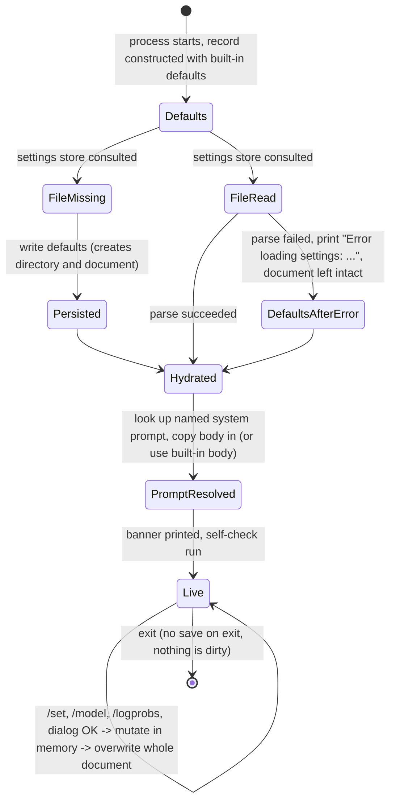

### 7.2 Settings & Configuration

**Description**

Settings & Configuration is the product's single, shared "tunables record" — the one place that answers *which AI provider, which model, how creative, how long, where, and how to display the results*. The product can talk to three very different AI back ends (a hosted Azure OpenAI deployment, a hosted Amazon Bedrock model, or a local model file executed in-process), and each of them needs different addressing information, different generation parameters, and different performance knobs. On top of that, the product's token-log-probability inspection view is highly configurable. Rather than let each command, each shell and each provider integration derive its own configuration, every one of them reads and writes one shared record.

The feature solves three concrete problems. First, **one authoritative record**: commands, both shells, and every provider integration read the same values from the same instance, so there is no drift between "what the banner says" and "what the next chat turn does". Second, **runtime mutability without a restart**: the user can retarget the product at a different provider, model, endpoint or display mode mid-session, and the very next chat turn honours the change. Third, **persistence across sessions**: the record is written to a human-readable, hand-editable document in the user's home area, so the shell comes back configured the way the user left it.

There is exactly one human role — the developer sitting at the terminal. There is no administrator, no multi-user model, no tenancy and no authorisation of any kind: anyone who can run the process can read and change every setting. The feature deliberately does **not** own secret values; it owns the *toggle* that enables OS-keystore lookup, the three deprecated in-document secret slots it is trying to retire, and the command sub-keys that route to Credential Management. Two write surfaces exist over the same record — a text-command surface (`/set`, `/model`, `/logprobs`) and a form-based dialog in the windowed shell — and they do **not** behave identically: the commands reject bad input, the dialog silently clamps it.

---

**User stories**

- **US-2.1** — As a developer at a terminal, I want my configuration to be written to a document in my home area and reloaded on every launch, so that I do not have to reconfigure the product every time I start it.
- **US-2.2** — As a developer, I want a single command that dumps every current setting with its value, so that I can confirm exactly what is in effect before I send a chat turn.
- **US-2.3** — As a developer, I want to change any individual setting by name while the session is running, so that I can retarget the product at a different provider, model or endpoint without restarting.
- **US-2.4** — As a developer, I want a short dedicated command for switching the model, so that swapping models is one word rather than a key/value pair.
- **US-2.5** — As a developer analysing token log probabilities, I want a dedicated command for the five display settings that feature uses, so that I can tune the inspection view without memorising the general setting keys.
- **US-2.6** — As a developer using the windowed shell, I want a tabbed settings form with range hints on each field, so that I can review and change settings without knowing any key names.
- **US-2.7** — As a developer, I want out-of-range or malformed values rejected with a message naming the exact valid range, so that I learn the bounds from the failure instead of guessing.
- **US-2.8** — As a developer, I want the product to check at startup whether my selected provider is actually usable and to print provider-specific remediation when it is not, so that I discover misconfiguration before my first chat turn fails.
- **US-2.9** — As a security-conscious developer, I want the command surface to refuse to store credentials in the configuration document and to point me at environment variables or the OS credential keystore instead, so that my secrets do not end up in a plain document.
- **US-2.10** — As a developer, I want to be told the absolute path of my settings document at startup, so that I can hand-edit, back up or delete it.
- **US-2.11** — As a developer, I want the product to keep running on built-in defaults when the settings document is missing or unreadable, so that a bad document never blocks me from starting a session.
- **US-2.12** — As a developer, I want my chosen system prompt remembered by name and its body re-resolved at every launch, so that editing the prompt takes effect without re-selecting it.
- **US-2.13** — As a developer running a local model, I want to tune context size, GPU layer count, GPU device, thread count and batch size, so that I can trade off speed against memory on my own hardware.
- **US-2.14** — As a developer who already has credentials sitting in an old settings document, I want a guided migration that moves them to environment variables or the OS keystore and then clears them from the document, so that I can stop storing secrets in a plain file.

---

**Use cases**

#### UC-2.1 — Load the settings record at startup (realizes US-2.1, US-2.10, US-2.11)

**Preconditions**
- The process has just started. No settings record is in memory beyond a freshly constructed defaults record.

**Main flow**
1. The shell asks the settings store for the persisted record.
2. The store resolves the settings-document path: a caller-supplied base directory if one was given, otherwise `<user profile directory>/.ChatDbg`; the file name defaults to `settings.json`.
3. The document exists and parses. Its values populate a record.
4. If any of the three deprecated in-document secret slots is non-empty, a credentials-in-document warning is printed followed by environment-variable migration instructions.
5. If the OS-keystore toggle is on, a confirmation line is printed when the platform supports a keystore, or a warning line when it does not.
6. The shell adopts the loaded record (the windowed shell replaces its record wholesale; the plain-console shell copies field by field — see QUIRK-2.2).
7. The shell resolves the named system prompt's body into the record; a missing or failed lookup falls back to the built-in default prompt body.
8. The shell prints a startup banner containing provider, model, system-prompt name and the absolute settings-document path.
9. If the active provider is the local-model provider, the banner adds a local-model configuration block.
10. If token log probabilities are enabled, one advisory line is printed.
11. The configuration self-check runs and prints nothing, a warning, or a provider-specific remediation block.

**Alternate flows**
- **A1 — Document absent.** A brand-new record of all built-in defaults is created, the parent directory and the document are created on disk immediately, and the defaults record is returned. No message is printed.
- **A2 — Document parses to nothing.** A defaults record is returned silently.
- **A3 — User profile directory unresolvable or empty.** The base directory falls back to the operating system's temporary directory; the only indication is the path shown in the startup banner (plain-console shell only).
- **A4 — Named system prompt not found.** The built-in default prompt body is used and no error is raised.

**Error flows**
- **E1 — Document unreadable or unparseable.** The line `Error loading settings: <message>` is printed, a defaults record is returned, and **the bad document is left on disk untouched** until the next successful save overwrites it.
- **E2 — System-prompt lookup throws.** `Error loading system prompt: <message>` followed by `Using default system prompt.` is printed; the built-in body is used.
- **E3 — Provider value is empty.** The self-check prints `Warning: No AI provider configured.` followed by `Use '/set provider azure', '/set provider bedrock', or '/set provider llama' to configure.`
- **E4 — Provider value is not one of the three recognised names.** The self-check prints `Warning: Unknown AI provider: <x>`; a subsequent chat turn prints `Error: Unknown AI provider: <x>` and is dropped.
- **E5 — Provider recognised but not configured.** The self-check prints `Warning: <Provider name> service is not configured.` plus a provider-specific remediation block; a subsequent chat turn prints `Error: <Provider name> service is not configured. Use environment variables or Windows Credential Manager to configure credentials securely.` followed by `Type '/set' to see current configuration and setup instructions.`
- **E6 — Keystore toggle on where no keystore exists.** `Windows Credential Manager is enabled in settings but not available on this platform.` is printed and startup continues.

**Postconditions**
- A fully populated record is live in memory; the settings document exists on disk; the user has been told where it lives.

---

#### UC-2.2 — View all current settings (realizes US-2.2)

**Preconditions**
- A live settings record exists.

**Main flow**
1. The user issues `/set` with no arguments.
2. The product emits a multi-section, unpaginated, untruncated dump of roughly 46 lines: a `Current Settings:` section, a `Credentials (secure):` section, a `LLama Provider Settings:` section, and three static help blocks (`## Provider-Specific Information:`, `## Setup Commands:`, `## LLama Provider Commands:`).
3. In the credentials section each of the three secrets is shown only as `***set***` or `(not set)`, followed by its resolved source in square brackets. No secret value is ever printed.
4. The command reports success. Nothing is mutated and nothing is written.

**Alternate flows**
- **A1 — Azure endpoint empty.** The endpoint line reads `(not set)`.
- **A2 — GPU layer count is 0.** The line is suffixed ` (CPU-only)`.
- **A3 — GPU device unset.** The line reads `(default)`. **A4 — Thread count is 0.** The line reads `(system default)`.
- **A5 — Long-form help requested (`/help set`).** A generated help text of roughly 72 lines is emitted; its keystore line reads `enablewincred  - Enable Windows Credential Manager (Available on this platform)` or `… (Not available on this platform)` according to the running operating system.

**Error flows**
- **E1 — Any exception while rendering.** `Error setting <key>: <message>` is returned as an error result.

**Postconditions**
- No state change.

---

#### UC-2.3 — Change one setting by name (realizes US-2.3, US-2.7, US-2.13)

**Preconditions**
- A live settings record exists. The user has typed a command line beginning with `/set`.

**Main flow**
1. The command line is split on spaces with empty entries discarded, so runs of consecutive spaces inside a value collapse to one.
2. Zero arguments routes to UC-2.2 and stops.
3. The key is lowercased and dispatched.
4. The value is everything after the key, re-joined with single spaces.
5. The key's validation rule runs against the value.
6. The record is mutated in memory.
7. The **entire** record is serialised and the settings document is overwritten.
8. The result message `Set <lowercased key> = <joined value>` is returned with success.

**Alternate flows**
- **A1 — Valueless keys.** `migrate` and `enablewincred` are permitted to stand alone; they are matched case-insensitively at the arity check.
- **A2 — Delegated keys.** `wincred`, `enablewincred` and `migrate` hand off to Credential Management and **skip** step 7, because the delegate has already persisted the record.
- **A3 — System-prompt key.** `systemPrompt <name>` additionally copies the prompt body into the record and stamps that prompt's last-used timestamp.
- **A4 — Provider key.** The value is lowercased before storage; only the first value token is read.
- **A5 — Local-model file check.** `modelId` is checked for file existence only when the currently selected provider is exactly `llama` and the value is non-empty.

**Error flows**
- **E1 — Fewer than two tokens and the key is neither `migrate` nor `enablewincred`.** `Usage: /set <key> <value>`; nothing mutated, nothing written. *Consequence: no text setting can be cleared through the command surface — there is no reset, unset or clear verb anywhere.*
- **E2 — Unknown key.** `Unknown setting: <key>. Valid keys: provider, modelId, temperature, maxTokens, azureEndpoint, awsRegion, systemPrompt, enableLogProbabilities, logProbabilitiesTopK, useWindowsCredentialManager, enablewincred, wincred, migrate` (an incomplete list — see QUIRK-2.7).
- **E3 — Blocked secret key** (`azureApiKey`, `awsAccessKey`, `awsSecretKey`, any casing). A multi-line refusal and secure-options guide is returned as an error; nothing is stored anywhere.
- **E4 — Out-of-range or unparseable numeric value.** The key-specific message naming the exact bounds is returned; nothing mutated, nothing written.
- **E5 — Non-boolean value for a boolean key.** The key-specific `must be 'true' or 'false'` message is returned.
- **E6 — Invalid provider name.** `Provider must be 'azure', 'bedrock', or 'llama'`.
- **E7 — Local-model file missing.** `LLama model file not found: <path>` followed by `Make sure you've specified the correct path to a GGUF model file.`
- **E8 — Unknown system-prompt name.** `System prompt not found: <name>. Use '/prompt list' to see available prompts or '/prompt create <name>' to create a new one.`
- **E9 — Keystore toggle requested on a platform with no keystore.** `Windows Credential Manager is not available on this platform.`
- **E10 — `wincred` with fewer than three tokens.** `Usage: /set wincred <credential-type> <value>` followed by `Example: /set wincred azureApiKey your-api-key`. This check runs **before** the toggle check.
- **E11 — `wincred` while the keystore toggle is off.** A three-line refusal naming `/set useWindowsCredentialManager true` and `/set enablewincred`; the credential-storage delegate is never invoked.
- **E12 — `wincred` with an unrecognised credential type.** The delegate prints `Unknown credential type: <type>` and `Valid types: azureApiKey, awsAccessKey, awsSecretKey`; the command returns `Failed to store credential: <type>`.
- **E13 — `enablewincred` declined or unavailable.** `Failed to enable Windows Credential Manager integration.`
- **E14 — Save fails.** `Error saving settings: <message>` is printed to standard output **and the command still reports success** (see QUIRK-2.5).
- **E15 — Any other exception.** `Error setting <key>: <message>`.

**Postconditions**
- On success, the in-memory record and the settings document both carry the new value; nothing else in the record changed.
- On any failure, neither the record nor the document changed.

---

#### UC-2.4 — Switch the model (realizes US-2.4)

**Preconditions** — A live settings record exists.

**Main flow**
1. The user issues `/model <model id…>`; the arguments are joined with single spaces.
2. The model id field is overwritten with no validation of any kind.
3. The entire record is persisted.
4. `Changed model from '<old>' to '<new>'` is returned with success.

**Alternate flows**
- **A1 — No arguments.** `Current model: <model id>` is returned; nothing is mutated and nothing is written.

**Error flows**
- **E1 — Save fails.** `Error saving settings: <message>` is printed and the command still reports success.
- *(There is no validation error flow. `/model` performs none of the checks `/set modelId` performs — see QUIRK-2.1.)*

**Postconditions** — The model id equals the joined argument text; the document has been overwritten.

---

#### UC-2.5 — Configure token-log-probability display (realizes US-2.5)

**Preconditions** — A live settings record exists.

**Main flow**
1. The user issues `/logprobs <subcommand> [value]`. The sub-command token is lowercased before dispatch.
2. The sub-command's field is mutated.
3. The **entire** record is persisted immediately.
4. The sub-command's success message is returned.

**Alternate flows**
- **A1 — No sub-command.** A status block headed `Token Probability Analysis Settings:` is returned, followed by a ten-line usage list and a two-paragraph caveat ending `Azure OpenAI models may require specific API versions that support this feature.` Nothing is mutated or written.
- **A2 — `debug`.** A read-only diagnostics dump is returned covering the current configuration, the active provider, the active model id, the Azure endpoint (or `(not set)`) and a static troubleshooting checklist naming API version `2023-05-15 or newer` and the suggested models `gpt-4`, `gpt-4-turbo`, `gpt-3.5-turbo`. Nothing is mutated or written.
- **A3 — Extra tokens after a numeric sub-command.** Only the token immediately after the sub-command is read; the rest are silently ignored (`/logprobs top 7 8` uses `7`).

**Error flows**
- **E1 — Missing number.** `Please specify a number: /logprobs top <number>` or `Please specify a number: /logprobs gridmaxalt <number>`.
- **E2 — Out-of-range or unparseable number.** `Top-K value must be a number between 1 and 20` or `Grid max alternatives value must be a number between 1 and 20`. These differ in wording from the `/set` messages for the same bounds.
- **E3 — Unknown sub-command.** `Unknown subcommand: <x>. ` (note the trailing space) followed by a six-bullet list of valid options.
- **E4 — Any exception.** `Error configuring log probabilities: <message>`, plus a copy written to a debug channel the user cannot see.

**Postconditions** — On success the field is changed and the whole record has been written exactly once.

---

#### UC-2.6 — Edit settings in the windowed shell's dialog (realizes US-2.6)

**Preconditions** — The windowed shell is running; the user opens the Settings dialog from the Edit menu.

**Main flow**
1. A modal dialog fixed at 80x25 character cells opens with four tabs: **AI Provider**, **Credentials**, **Log Probs**, **LLama Settings**.
2. Each tab is pre-populated from the live record; temperature is rendered with one decimal place.
3. The user edits fields and presses **OK**.
4. The tabs are read in the fixed order AI Provider, Credentials, Log Probs, LLama Settings.
5. Out-of-range numbers are **clamped** to the nearest bound; unparseable numbers leave the prior value in place. Neither is reported.
6. A single save writes the whole record; the dialog closes.
7. The host window refreshes its status bar, which reads `Provider: 
 | Model: <m> | Prompt: <n>`.

**Alternate flows**
- **A1 — Cancel.** The dialog closes with no write. However, a provider radio change made before Cancel has already been applied to the live record (see QUIRK-2.3).
- **A2 — Manage Credentials sub-dialog** (60x15). Free-text credential type, masked value field, hint listing `azureApiKey` / `awsAccessKey` / `awsSecretKey`. It acts immediately on its own Save button and is **not** part of the parent dialog's OK/Cancel transaction.
- **A3 — Migrate Credentials sub-dialog** (70x18). Acts immediately on its own Migrate button, outside the OK/Cancel transaction.
- **A4 — Fields absent from the dialog.** The system-prompt name and the three deprecated in-document secret slots have no field here; they are reachable only from the System Prompts dialog and the migration flow respectively.

**Error flows**
- **E1 — Unparseable number in any numeric field.** Silently ignored; the previous value survives; no message.
- **E2 — Out-of-range number.** Silently clamped and saved; no message.
- **E3 — Exception during the OK handler.** A modal box titled `Error` with text `Failed to save settings: <message>`. Changes already applied to earlier tabs are **not** rolled back.
- **E4 — Parse failure in an earlier tab.** Does not stop the later tabs from being read.
- **E5 — Manage Credentials with an empty type or value.** Nothing happens at all: no message, no store attempt, and the dialog stays open.
- **E6 — Manage Credentials where the store fails or no keystore exists.** `Credential saved successfully` is shown regardless — a false success (QUIRK-2.19).
- **E7 — Migrate Credentials, any outcome including "nothing to migrate" and "cancelled".** `Credentials migrated successfully` is shown regardless (QUIRK-2.20), and the migration flow's own terminal prompts are invisible and unanswerable while the windowed UI owns the screen.

**Postconditions** — On OK, the record is written once with every parsed and clamped value applied.

---

#### UC-2.7 — Migrate credentials out of the settings document (realizes US-2.9, US-2.14)

**Preconditions** — A live settings record exists. The user issues `/set migrate`.

**Main flow**
1. If no deprecated in-document secret slot is non-empty, the flow returns "not cleared" immediately.
2. `Migration Options:` and three numbered options are printed.
3. The prompt `Select migration option (1-3): ` is shown; a line is read from standard input and trimmed.
4. **Option 1** prints the environment-variable instructions. **Option 2** copies each non-empty secret into the OS keystore under the entry names `ChatDbg:AzureApiKey`, `ChatDbg:AwsAccessKey` and `ChatDbg:AwsSecretKey`; if at least one moved, the keystore toggle is turned on, the record is saved, and `Windows Credential Manager integration enabled` is printed. **Option 3** prints the instructions and then, only where a keystore exists, prints `You can also optionally enable Windows Credential Manager:` and runs the interactive keystore-enable flow (UC-2.8), which prompts and saves again.
5. `Would you like to remove credentials from the settings file now? (y/N): ` is shown. Only the literal `y` or `yes`, matched case-insensitively and without trimming, clears all three in-document secret slots, saves, prints `Credentials removed from settings file.` and reports "cleared".
6. The invoking command reports success either way: `Migration completed successfully.` when cleared, `No credentials found to migrate or migration cancelled.` when not.

**Alternate flows**
- **A1 — No keystore on this platform.** Option 2's label reads `(Not available on this platform)` and option 3's label becomes `Environment Variables only`.

**Error flows**
- **E1 — Any input other than `1`, `2` or `3` (including empty).** `Migration cancelled.` is printed and the flow reports "not cleared".
- **E2 — Option 2 chosen where no keystore exists.** `Windows Credential Manager is not available on this platform.` is printed and the flow returns immediately, **skipping the offer to clear the document**.
- **E3 — Any exception in the flow.** `Error during migration: <message>` is printed and the flow reports "not cleared".

**Postconditions**
- The outcome value means only "the in-document secret slots were cleared". It does **not** mean the secrets reached a secure store: migrating to the keystore and then declining the clear-out reports `No credentials found to migrate or migration cancelled.` even though the keystore copy succeeded.

---

#### UC-2.8 — Enable the OS credential keystore interactively (realizes US-2.9)

**Preconditions** — The user issues `/set enablewincred`.

**Main flow**
1. Three explanatory lines are printed, then the prompt `Do you want to enable Windows Credential Manager for secure credential storage? (y/N): `.
2. `y` or `yes`, matched case-insensitively, turns the toggle on, saves the record, and prints the follow-up hint `You can now store credentials using: /set wincred <credential-type> <value>` plus an example. The flow reports enabled; the invoking command does **not** save again.

**Alternate flows**
- **A1 — Any other answer.** `Windows Credential Manager integration not enabled.` is printed and the flow reports not-enabled.

**Error flows**
- **E1 — No keystore on this platform.** `Windows Credential Manager is not available on this platform.` is printed, the flow reports not-enabled, and the command answers `Failed to enable Windows Credential Manager integration.`

**Postconditions** — On acceptance the toggle is on in memory and on disk.

---

**Diagram — session lifecycle of the settings record**

---

**Functional requirements**

*Settings record, defaults and persisted schema*

- **FR-2.1** — The product SHALL maintain exactly one settings record per running process, shared by reference between the shell, every command and every provider integration. Mutation is in place on that shared instance. (realizes US-2.3)
- **FR-2.2** — The settings record SHALL carry these fields with these built-in defaults: provider `azure`; model id/path `gpt-4`; temperature `0.7`; max tokens `1000`; Azure endpoint *unset*; AWS region `us-east-1`; system-prompt name `default`; token log probabilities enabled `false`; log-probability Top-K `5`; show-all-tokens `false`; grid layout for tokens `false`; grid-view maximum alternatives `5`; use-OS-credential-keystore `false`; local-model context size `4096`; local-model GPU layer count `0`; local-model GPU device *unset*; local-model thread count `0`; local-model batch size `512`; and three deprecated in-document secret slots (Azure key, AWS access key, AWS secret key), each defaulting to the empty string. (realizes US-2.1)
- **FR-2.3** — The settings record SHALL additionally carry a **system-prompt body** that is never persisted, and three **resolved credential values** that are never persisted and are recomputed on every read.
- **FR-2.4** — The persisted settings document SHALL be written with these exact wire names and no others:

  | Wire key | Value type | Default written on first run |
  |---|---|---|
  | `provider` | short string | `"azure"` |
  | `modelId` | string | `"gpt-4"` |
  | `temperature` | decimal | `0.7` |
  | `maxTokens` | integer | `1000` |
  | `azureEndpoint` | string or null | `null` |
  | `awsRegion` | string | `"us-east-1"` |
  | `systemPromptName` | string | `"default"` |
  | `enableLogProbabilities` | boolean | `false` |
  | `logProbabilitiesTopK` | integer | `5` |
  | `showAllTokens` | boolean | `false` |
  | `gridViewForTokens` | boolean | `false` |
  | `gridViewMaxAlternatives` | integer | `5` |
  | `useWindowsCredentialManager` | boolean | `false` |
  | `llamaContextSize` | integer | `4096` |
  | `llamaGpuLayerCount` | integer | `0` |
  | `llamaGpuDevice` | string or null | `null` |
  | `llamaThreads` | integer | `0` |
  | `llamaBatchSize` | integer | `512` |
  | `azureApiKey` | string | `""` |
  | `awsAccessKey` | string | `""` |
  | `awsSecretKey` | string | `""` |

  Exactly these 21 keys SHALL appear. The system-prompt body and the resolved credential values SHALL NOT appear. (realizes US-2.1)
- **FR-2.5** — The three deprecated secret keys SHALL always be emitted, as empty strings when unset. Every settings document this product writes therefore contains three secret-shaped keys.
- **FR-2.6** — The settings document SHALL be written indented and human-readable, because the document is an intended hand-edit surface. (realizes US-2.10)
- **FR-2.7** — Hand edits to the settings document SHALL be read back verbatim with no validation, normalisation or repair of any kind.

*Document location*

- **FR-2.8** — The settings-document path SHALL be resolved in this order: (1) a caller-supplied base directory used verbatim; (2) otherwise `<user profile directory>/.ChatDbg`; (3) if the resolved base directory is null, empty or whitespace, the operating system's temporary directory; (4) if resolving the user profile throws, the operating system's temporary directory. The file name defaults to `settings.json` and is overridable by the caller. (realizes US-2.1)
- **FR-2.9** — The default full path SHALL therefore be `<user profile>/.ChatDbg/settings.json`. The directory name SHALL be the literal `.ChatDbg`, used unchanged on every platform including inside a Windows user profile.
- **FR-2.10** — The parent directory SHALL be created lazily, on the first save.

*Startup load*

- **FR-2.11** — On every launch the shell SHALL request the persisted record before any other configuration work. (realizes US-2.1)
- **FR-2.12** — When the settings document does not exist, the product SHALL construct a defaults record, write it to disk immediately (creating the directory and the document), return it, and print nothing. (realizes US-2.11)
- **FR-2.13** — When the settings document exists and parses, the parsed record SHALL be returned. A parse producing nothing SHALL yield a defaults record silently.
- **FR-2.14** — When reading or parsing throws, the product SHALL print `Error loading settings: <message>`, return a defaults record, and leave the bad document on disk unmodified. It SHALL NOT delete, rename or back up the document. (realizes US-2.11)
- **FR-2.15** — When any of the three deprecated in-document secret slots is non-empty at load time, the product SHALL print a credentials-in-document warning followed by environment-variable migration instructions. When all three are empty, neither SHALL appear. (realizes US-2.9)
- **FR-2.16** — When the OS-keystore toggle is on at load time, the product SHALL print a confirmation line where the platform supports a keystore, or `Windows Credential Manager is enabled in settings but not available on this platform.` where it does not.
- **FR-2.17** — The load operation SHALL never return nothing; a caller always receives a fully populated record.

*Startup banner and self-check*

- **FR-2.18** — After loading, the plain-console shell SHALL print a banner containing the provider, the model, the system-prompt name and the **absolute path of the settings document**. This is the only place the user is told where the configuration lives. (realizes US-2.10)
- **FR-2.19** — When the active provider is `llama`, the banner SHALL add a block reporting context size, GPU layer count (suffixed ` (CPU-only)` when 0), GPU device(s) when set, thread count (rendered `default` when 0) and batch size. (realizes US-2.13)
- **FR-2.20** — When token log probabilities are enabled, the banner SHALL print one advisory line.
- **FR-2.21** — After the banner the product SHALL run a configuration self-check that prints: for an empty provider, `Warning: No AI provider configured.` plus `Use '/set provider azure', '/set provider bedrock', or '/set provider llama' to configure.`; for an unrecognised provider, `Warning: Unknown AI provider: <x>`; for a recognised-but-unconfigured provider, `Warning: <Provider name> service is not configured.` plus a provider-specific remediation block; for a configured provider, a one-line statement of where the credential came from, or, for the local provider, where the model file came from. (realizes US-2.8)
- **FR-2.22** — The startup ordering SHALL be: load settings → resolve system-prompt body → print banner → run self-check.

*Viewing settings*

- **FR-2.23** — `/set` with zero arguments SHALL return a success result whose message is a multi-section dump containing a `Current Settings:` section (Provider, Model ID, Temperature, Max Tokens, Azure Endpoint, AWS Region, System Prompt, Log Probabilities, Log Probabilities Top-K, Show All Tokens, Token Display, Grid View Max Alternatives, Windows Credential Manager), a `Credentials (secure):` section, a `LLama Provider Settings:` section, and the three static blocks `## Provider-Specific Information:`, `## Setup Commands:` and `## LLama Provider Commands:`. (realizes US-2.2)
- **FR-2.24** — In the dump, boolean-ish values SHALL render as: log probabilities `Enabled` / `Disabled`; show-all-tokens `Yes` / `No (sample only)`; token display `Grid Layout` / `List Layout`; keystore toggle `Enabled` / `Disabled`. An empty Azure endpoint SHALL render `(not set)`; a GPU layer count of 0 SHALL be suffixed ` (CPU-only)`; an unset GPU device SHALL render `(default)`; a thread count of 0 SHALL render `(system default)`.
- **FR-2.25** — The `Credentials (secure):` section SHALL show, for each of the Azure API key, AWS access key and AWS secret key, the masked status `***set***` or `(not set)` followed by the resolved source in square brackets, one of exactly: `[environment variable (<VARIABLE NAME>)]`, `[Windows Credential Manager]`, `[settings file (deprecated)]`, `[not set]`. **A secret value SHALL never be printed here.** (realizes US-2.9)
- **FR-2.26** — The dump SHALL be emitted as a single block; it SHALL NOT be paginated or truncated.
- **FR-2.27** — The `## Setup Commands:` block SHALL name `/prompt list (then: /set systemPrompt <n>)`, `/logprobs showall, /logprobs grid`, `/set gridViewMaxAlternatives 5`, `/set enablewincred (then /set wincred <type> <value>)`, `/set migrate` and `set CHATDBG_AZURE_API_KEY=your-key`. The `## LLama Provider Commands:` block SHALL name `/tokenize <text>`, `/inspect <text>`, `/set llamaGpuLayers 32, /set llamaGpuDevice 0`.
- **FR-2.28** — The long-form `/set` help SHALL be generated at call time and its keystore line SHALL read `enablewincred  - Enable Windows Credential Manager (Available on this platform)` or `… (Not available on this platform)` according to the running operating system.

*The `/set` write surface*

- **FR-2.29** — `/set` keys SHALL be matched case-insensitively; the key is lowercased before dispatch. (realizes US-2.3)
- **FR-2.30** — The value SHALL be everything after the key, re-joined with single spaces. Because the command line is split on spaces with empty entries discarded, runs of consecutive spaces inside a value collapse to one.
- **FR-2.31** — A `/set` invocation with fewer than two tokens SHALL be rejected with `Usage: /set <key> <value>`, **except** the valueless keys `migrate` and `enablewincred`, which are matched case-insensitively at this check. Zero tokens is handled first as "show settings".
- **FR-2.32** — Because of FR-2.31 and FR-2.30, there SHALL be no command that clears a text setting to empty; there is no reset, unset, clear or restore-defaults verb anywhere in the product. The only routes back to empty are the windowed dialog, hand-editing the document, or deleting the document.
- **FR-2.33** — On success the product SHALL, in this order: mutate the record in memory, overwrite the whole settings document, then return `Set <lowercased key> = <joined value>` with success. A failed validation SHALL short-circuit before any mutation or write. (realizes US-2.7)
- **FR-2.34** — Any exception inside `/set` SHALL be caught and returned as `Error setting <key>: <message>`.
- **FR-2.35** — The `/set` key table SHALL be exactly:

  | Key (and aliases) | Accepted value | Rule and magic numbers | Exact error message on violation |
  |---|---|---|---|
  | `provider` | `azure`, `bedrock`, `llama` | lowercased before comparison and stored lowercase; only the first value token is read | `Provider must be 'azure', 'bedrock', or 'llama'` |
  | `modelid` | any text | file-existence check **only** when the active provider is exactly `llama` and the value is non-empty | `LLama model file not found: <path>` + newline + `Make sure you've specified the correct path to a GGUF model file.` |
  | `temperature` | decimal | inclusive **0 … 2** (0 = focused, 2 = creative) | `Temperature must be a number between 0 and 2` |
  | `maxtokens` | integer | inclusive **1 … 8192** | `MaxTokens must be a number between 1 and 8192` |
  | `azureendpoint` | any text | **no validation**; not URL-checked, not trimmed | — |
  | `awsregion` | any text | **no validation**; any string is accepted | — |
  | `llamacontextsize` | integer | inclusive **512 … 32768** | `LlamaContextSize must be a number between 512 and 32768` |
  | `llamagpulayers`, `llamagpulayercount` | integer | inclusive **0 … 100**; 0 = CPU-only | `LlamaGpuLayerCount must be a number between 0 and 100. 0 means CPU-only, higher numbers move more layers to GPU.` |
  | `llamagpudevice` | any text | **no validation**; conventional format is `0` or `0,1` | — |
  | `llamathreads` | integer | inclusive **0 … 64**; 0 = system default | `LlamaThreads must be a number between 0 and 64. 0 means system default.` |
  | `llamabatchsize` | integer | inclusive **1 … 2048** | `LlamaBatchSize must be a number between 1 and 2048` |
  | `systemprompt` | prompt name | must resolve when the prompt service is present; body copied in and last-used stamped. With no prompt service, the name is stored unvalidated | `System prompt not found: <name>. Use '/prompt list' to see available prompts or '/prompt create <name>' to create a new one.` |
  | `enablelogprobabilities`, `logprobs` | `true` / `false` | case-insensitive `true`/`false` **only**; `1`, `0`, `yes`, `no` are rejected | `EnableLogProbabilities must be 'true' or 'false'` |
  | `logprobabilitiestopk`, `logtopk` | integer | inclusive **1 … 20** | `LogProbabilitiesTopK must be a number between 1 and 20` |
  | `showalltokens` | `true` / `false` | boolean parse | `showAllTokens must be 'true' or 'false'` |
  | `gridviewfortokens`, `tokensgrid` | `true` / `false` | boolean parse | `gridViewForTokens must be 'true' or 'false'` |
  | `gridviewmaxalternatives`, `gridmaxalt` | integer | inclusive **1 … 20** | `gridViewMaxAlternatives must be a number between 1 and 20` |
  | `usewindowscredentialmanager` | `true` / `false` | boolean parse; turning it on additionally requires an available keystore | `useWindowsCredentialManager must be 'true' or 'false'` / `Windows Credential Manager is not available on this platform.` |
  | `wincred <type> <value…>` | at least 3 tokens | requires the keystore toggle already on; delegates to Credential Management; does **not** save again | `Usage: /set wincred <credential-type> <value>` + `Example: /set wincred azureApiKey your-api-key` / a 3-line "not enabled" message naming `/set useWindowsCredentialManager true` and `/set enablewincred` / `Failed to store credential: <type>` |
  | `enablewincred` | no value | interactive enable flow; does not save again | `Failed to enable Windows Credential Manager integration.` |
  | `azureapikey` | — | **permanently blocked**; guide names `CHATDBG_AZURE_API_KEY` | see FR-2.41 |
  | `awsaccesskey` | — | blocked; guide names `CHATDBG_AWS_ACCESS_KEY`, `AWS_ACCESS_KEY_ID` | see FR-2.41 |
  | `awssecretkey` | — | blocked; guide names `CHATDBG_AWS_SECRET_KEY`, `AWS_SECRET_ACCESS_KEY` | see FR-2.41 |
  | `migrate` | no value | interactive migration flow; does not save again | reports success either way |
  | *anything else* | — | rejected | `Unknown setting: <key>. Valid keys: provider, modelId, temperature, maxTokens, azureEndpoint, awsRegion, systemPrompt, enableLogProbabilities, logProbabilitiesTopK, useWindowsCredentialManager, enablewincred, wincred, migrate` |

- **FR-2.36** — Every documented numeric range SHALL be **inclusive at both ends**: `0` and `2` are both valid temperatures; `1` and `8192` are both valid token caps; `1` and `20` are both valid Top-K and grid-alternatives values; `512` and `32768` are both valid context sizes; `0` and `100` are both valid GPU-layer counts; `0` and `64` are both valid thread counts; `1` and `2048` are both valid batch sizes. (realizes US-2.7)
- **FR-2.37** — Within the `wincred` key the pre-checks SHALL run in a fixed order: **token count first, keystore toggle second**. A two-token `/set wincred azureApiKey` therefore answers the usage message even when the toggle is off.
- **FR-2.38** — The three delegated keys `wincred`, `enablewincred` and `migrate` SHALL skip the trailing save, because the delegated operation has already persisted the record.
- **FR-2.39** — Every successful mutation through `/set`, `/model`, `/logprobs`, the windowed Settings dialog's OK button, the "toggle log probabilities for the last message" menu action, and system-prompt selection SHALL persist the whole record to disk immediately. There SHALL be no explicit save verb and no dirty tracking. (realizes US-2.1)
- **FR-2.40** — Saving SHALL always write the **entire** record; the document is never partially patched, never merged and never backed up.

*Secrets through this surface*

- **FR-2.41** — The three legacy secret keys SHALL be permanently unsettable through `/set`. The refusal SHALL be assembled as: `For security, <Credential Name> is no longer set via this command.`, a blank line, `## Secure Options:`, `1. Environment Variables (Recommended):`, one `   set <VARIABLE>=your-credential` line per applicable variable, then — only where a keystore exists — a `2. Windows Credential Manager (Secure Option):` block naming `/set enablewincred` and `/set wincred <type> your-credential`, then `This keeps your credentials secure and out of configuration files.` (realizes US-2.9)
- **FR-2.42** — Credential resolution SHALL be strictly ordered for each of the three secrets: **(1)** the first non-empty environment variable in that secret's ordered list; **(2)** the OS keystore entry, consulted **only** when the record's toggle is on, with any failure swallowed and treated as absent; **(3)** the deprecated in-document slot. (realizes US-2.9)
- **FR-2.43** — The environment-variable lists SHALL be, in priority order: Azure API key → `CHATDBG_AZURE_API_KEY`; AWS access key → `CHATDBG_AWS_ACCESS_KEY`, then `AWS_ACCESS_KEY_ID`; AWS secret key → `CHATDBG_AWS_SECRET_KEY`, then `AWS_SECRET_ACCESS_KEY`.
- **FR-2.44** — Credentials SHALL be resolved on **every read**, so an environment variable set after launch takes effect immediately without a restart. (Contrast FR-2.60.)
- **FR-2.45** — The OS-keystore entry names SHALL be `ChatDbg:AzureApiKey`, `ChatDbg:AwsAccessKey` and `ChatDbg:AwsSecretKey`, with the short aliases `azure`, `awsaccess` and `awssecret` also accepted as logical types.
- **FR-2.46** — The "where did this come from" reporter SHALL return exactly one of `environment variable (<VARIABLE NAME>)`, `Windows Credential Manager`, `settings file (deprecated)`, `not set`.
- **FR-2.47** — The record SHALL expose a predicate "does the document still hold any secret", true when any of the three deprecated slots is non-empty.

*The `/model` write surface*

- **FR-2.48** — `/model` with no arguments SHALL return `Current model: <model id>` and change nothing. (realizes US-2.4)
- **FR-2.49** — `/model <model id…>` SHALL join the arguments with single spaces, overwrite the model id **with no validation of any kind** — no file-existence check even when the local provider is active, no emptiness check — persist the whole record, and return `Changed model from '<old>' to '<new>'`. (realizes US-2.4; see QUIRK-2.1)

*The `/logprobs` write surface*

- **FR-2.50** — `/logprobs` SHALL provide a second, narrower write surface over five fields of the same record: the enable flag, Top-K, show-all-tokens, grid-vs-list layout, and grid-view maximum alternatives. Each mutating sub-command SHALL persist the whole record immediately. (realizes US-2.5)
- **FR-2.51** — The sub-command token SHALL be lowercased before dispatch, so `/LOGPROBS ENABLE` works.
- **FR-2.52** — The `/logprobs` sub-command table SHALL be exactly:

  | Sub-command | Effect | Exact success message |
  |---|---|---|
  | *(none)* | show status + usage | a `Token Probability Analysis Settings:` block reporting Enabled (`Yes`/`No`), Top-K Alternatives, Display Mode (`Show all tokens` / `Show token samples (beginning, middle, end)`), View Mode (`Grid layout` / `List layout`), Grid View Max Alternatives; then a 10-line usage list and a two-paragraph caveat ending `Azure OpenAI models may require specific API versions that support this feature.` |
  | `enable` | log probabilities on | `Token probability analysis enabled.` plus three advisory lines pointing at `/logprobs debug` and `/demologprobs` |
  | `disable` | log probabilities off | `Token probability analysis disabled.` |
  | `top <n>` | Top-K = n, inclusive **1 … 20** | `Token probability analysis will show top <n> alternatives.` |
  | `showall` | show every token | `Token probability analysis will show all tokens.` |
  | `showsample` | show sampled tokens only | `Token probability analysis will show token samples (beginning, middle, end).` |
  | `grid` | grid layout | `Token probability analysis will use grid view layout.` |
  | `list` | list layout | `Token probability analysis will use list view layout.` |
  | `gridmaxalt <n>` | grid alternatives cap = n, inclusive **1 … 20** | `Grid view will show up to <n> alternatives per token.` |
  | `debug` | read-only diagnostics dump | current configuration, active provider, active model id, Azure endpoint or `(not set)`, and a static troubleshooting checklist naming API version `2023-05-15 or newer` and suggested models `gpt-4`, `gpt-4-turbo`, `gpt-3.5-turbo` |

- **FR-2.53** — Numeric `/logprobs` sub-commands SHALL read **only the single token immediately after the sub-command**; they do not join the remaining tokens the way `/set` does, so `/logprobs top 7 8` uses `7` and silently ignores `8`.
- **FR-2.54** — `/logprobs` failure messages SHALL be exactly: missing number → `Please specify a number: /logprobs top <number>` or `Please specify a number: /logprobs gridmaxalt <number>`; bad or out-of-range → `Top-K value must be a number between 1 and 20` or `Grid max alternatives value must be a number between 1 and 20`; unknown sub-command → `Unknown subcommand: <x>. ` (with the trailing space) followed by a six-bullet list of valid options. (realizes US-2.7)
- **FR-2.55** — Any exception inside `/logprobs` SHALL yield `Error configuring log probabilities: <message>` and additionally write a copy to a debug channel invisible to the user.

*The windowed settings dialog*

- **FR-2.56** — The windowed shell SHALL provide a modal Settings dialog fixed at 80x25 character cells, opened from the Edit menu, with four tabs read on OK in the fixed order **AI Provider, Credentials, Log Probs, LLama Settings**, followed by exactly one save. (realizes US-2.6)
- **FR-2.57** — The tabs SHALL contain: **AI Provider** — a three-choice provider selector (`Azure OpenAI` / `AWS Bedrock` / `Local LLM (LLama)`) plus free-text Azure Endpoint, AWS Region, Model ID/Path, Temperature (labelled `(0.0 - 2.0)`) and Max Tokens; **Credentials** — a keystore toggle checkbox, a `Manage Credentials...` button opening a 60x15 sub-dialog with a free-text credential type, a masked value field and a hint listing `azureApiKey` / `awsAccessKey` / `awsSecretKey`, a `Migrate Credentials...` button opening a 70x18 sub-dialog, and a six-line static explanation of the three-tier credential story; **Log Probs** — an enable checkbox, a Top K field labelled `(1 - 20)`, a display-mode selector (`Show All Tokens` / `Show Samples`), a layout selector (`Grid View` / `List View`), and a Grid View Max Alternatives field labelled `(1 - 20)`; **LLama Settings** — Context Size `(512 - 32768)`, GPU Layer Count `(0 = CPU only)`, GPU Device(s) `(e.g., "0" or "0,1")`, Thread Count `(0 = system default)`, Batch Size `(1 - 2048)` plus an informational block.
- **FR-2.58** — The dialog SHALL **clamp** out-of-range numeric input to the nearest bound and save the clamped value, and SHALL **silently ignore** unparseable numeric input, leaving the prior value in place. Neither is reported to the user. This is a deliberate divergence from the text commands, which reject both. (realizes US-2.6, US-2.7)
- **FR-2.59** — The dialog SHALL expose no field for the system-prompt name and no field for the three deprecated in-document secret slots. Cancel SHALL write nothing. The two credential sub-dialogs SHALL act immediately on their own buttons and SHALL NOT be part of the parent OK/Cancel transaction. A parse failure in an earlier tab SHALL NOT stop later tabs from being read. On close the host window SHALL refresh a status bar reading `Provider: 
 | Model: <m> | Prompt: <n>`.

*System-prompt coupling*

- **FR-2.60** — The record SHALL carry both a persisted system-prompt **name** and a non-persisted system-prompt **body**. At every startup the body SHALL be re-resolved by looking the name up in System Prompt Management. (realizes US-2.12)
- **FR-2.61** — When the lookup returns nothing or throws, the built-in default body SHALL be used: `You are ChatDBG, a helpful debugging assistant. Help users analyze code, debug issues, and understand programming concepts.` A dangling prompt name SHALL degrade silently at startup but SHALL be a validation failure at `/set systemPrompt` time.

*Consumer semantics*

- **FR-2.62** — Provider names SHALL be stored lowercase by every write surface, but matched **case-sensitively** at use sites. A hand-edited document containing `Azure` SHALL therefore fail the provider lookup and produce `Warning: Unknown AI provider: Azure` at startup and `Error: Unknown AI provider: Azure` on a chat turn.
- **FR-2.63** — The Azure provider SHALL report itself configured only when the endpoint, the resolved API key **and** the model id are all non-empty.
- **FR-2.64** — The Bedrock provider SHALL report itself configured when the model id is non-empty **and** either the resolved AWS access key or the `AWS_ACCESS_KEY_ID` environment variable is non-empty. The AWS **secret** key is not part of this predicate.
- **FR-2.65** — The local-model provider SHALL report itself configured when the model id is non-empty **and** the named file exists on disk at the moment of the check. Because the check is re-evaluated on every use, deleting the model file mid-session silently flips the provider to unconfigured.
- **FR-2.66** — Consumers SHALL apply these defensive re-defaults, which are observed behaviour and not necessarily intended: the local-model context size falls back to `4096` in one path and `2048` in the model-loading path when the record's value is not greater than 0 (**these two fallbacks disagree**); the local-model max-token cap falls back to `512` when the record's value is not greater than 0.
- **FR-2.67** — The Bedrock path SHALL send Top-K only when token log probabilities are enabled and otherwise send the literal `0`; it SHALL always send the max-token cap and the temperature.
- **FR-2.68** — The Azure path SHALL send temperature on every turn but SHALL send the max-token cap **only** on the log-probabilities request path. (See QUIRK-2.32.)
- **FR-2.69** — The Azure path SHALL trim exactly one trailing `/` from the endpoint before building its request URL, so `https://host/` and `https://host` behave identically. No other endpoint normalisation SHALL occur.
- **FR-2.70** — Local-model context size and GPU layer count SHALL reach the local model runtime. GPU device, thread count and batch size SHALL be validated, clamped, persisted and displayed but SHALL NOT reach the runtime (observed behaviour — see QUIRK-2.6). (relates to US-2.13)

*Persistence port*

- **FR-2.71** — Persistence SHALL be reached through exactly six operations and no more: **persist the record** (record in, nothing out; never throws, swallows its own failures after printing); **load the record** (nothing in, record out; never returns nothing; creates a defaults document when none exists; falls back to defaults on any failure); **report the document path** (pure, fixed at construction); **store one credential in the OS keystore** (logical type plus value in, success flag out; re-loads the record from disk and turns the keystore toggle on as a side effect); **run the interactive keystore-enable flow** (record in, enabled flag out; reads standard input; saves the record itself); **run the interactive credential-migration flow** (record in, *were the in-document slots cleared* out; reads standard input; saves the record itself).
- **FR-2.72** — The last three operations perform their own save **and** their own terminal input/output, which is why the three delegated `/set` keys skip their trailing save. A reimplementation targeting a windowed or headless host SHALL replace the direct standard-input reads with an injectable prompt/confirm port, because these prompts are invisible and unanswerable while a windowed shell owns the screen.
- **FR-2.73** — Save failures SHALL print `Error saving settings: <message>` and return normally; the calling command still reports success. (Observed behaviour — see QUIRK-2.5.)

*Scope boundaries*

- **FR-2.74** — Neither entry point SHALL parse command-line flags or arguments. Settings come only from the document or from the runtime commands.
- **FR-2.75** — There SHALL be no environment-variable override for any **non-secret** setting. Environment variables affect credentials only.
- **FR-2.76** — There SHALL be no profiles, no per-workspace settings, no configuration-file layering and no runtime configuration-path override.
- **FR-2.77** — There SHALL be no authorisation model. The only permission-like check anywhere in this feature is the platform check gating the OS keystore.
- **FR-2.78** — The settings record SHALL never be deleted. There is no reset command and no restore-defaults path; the only route back to defaults is deleting the document out of band.

*Concurrency, caching and localisation*

- **FR-2.79** — The record SHALL be read from disk exactly once per process, at startup, and held in memory thereafter. There SHALL be no re-read on external change, no document watching and no cache invalidation.
- **FR-2.80** — Writes SHALL be whole-document overwrites with no locking and no atomic replace. Two shells open simultaneously each overwrite the whole document on any change; last writer wins and the other's edits are silently lost. (INFERRED — follows from the absence of any lock or temp-file-and-rename; not reproduced.)
- **FR-2.81** — All user-visible strings SHALL be English; there is no localisation. Numeric parsing and formatting in the source is ambient-culture-sensitive; **a reimplementation SHOULD parse and format both the persisted document and all command input with a fixed invariant culture and record that as an intentional deviation** (see QUIRK-2.15).
- **FR-2.82** — All diagnostics SHALL go to standard output as plain text. There is no structured logging, no log level and no way to silence the startup notices.
- **FR-2.83** — The settings store SHALL accept an optional base directory and file name at construction purely so that automated tests can point it at a scratch directory.

*Platform coupling*

- **FR-2.84** — Exactly one part of this feature SHALL be operating-system specific: the OS credential keystore tier. Everything else — the record, its defaults and ranges, the document location and format, every validation rule and message, the dialog's clamping, and the environment-variable tier — SHALL behave identically on all platforms.
- **FR-2.85** — Where no keystore exists: `/set useWindowsCredentialManager true` SHALL be refused with `Windows Credential Manager is not available on this platform.`; `/set wincred` SHALL answer `Failed to store credential: <type>`; `/set enablewincred` SHALL answer `Failed to enable Windows Credential Manager integration.`; migration option 2 SHALL be refused and the whole migration returns "not cleared" without offering to clear the document; credential resolution tier 2 SHALL be skipped entirely; the long help and blocked-secret guide SHALL suppress or relabel the keystore paragraph.
- **FR-2.86** — The keystore toggle SHALL be an ordinary persisted boolean with no platform stamp, so a document written where a keystore exists and copied to a platform without one carries the toggle and produces the startup warning of FR-2.16 on every launch until it is turned off.

---

**External technology**

*Requires: structured-document serialisation for a small flat configuration record (a text-based, hand-editable key/value document format with indentation preserved). Source used: the platform standard library's JSON serializer, with an explicit lower-camel wire name declared on every persisted member and opt-out markers on computed and secret-derived members; indented output. Reimplementer notes: any equivalent library is acceptable, but the exact 21 wire names in FR-2.4 must survive so existing documents keep loading, indented output is a user-visible requirement because the document is an intended hand-edit surface, and the three empty secret keys must still be emitted. A camel-case naming policy is also configured in the source but is inert because every member already declares an explicit name.*

*Requires: local filesystem read and write of a single small text file, with directory auto-creation (POSIX / Win32 file APIs). Source used: whole-file asynchronous read and whole-file overwrite, directory created on first save. Reimplementer notes: there is no locking, no atomic replace and no temp-file-and-rename. "Last writer wins" is the observed contract; a reimplementation may improve on it but must not depend on the improvement for correctness elsewhere.*

*Requires: user home / profile directory discovery (OS convention). Source used: the platform's "user profile" special-folder lookup with an operating-system temporary-directory fallback. Reimplementer notes: the product's own directory name is the literal `.ChatDbg` — a dotted directory used verbatim inside a Windows user profile as well as on Unix-likes, so the convention ports unchanged.*

*Requires: operating-system temporary-directory discovery (OS convention). Source used: platform temp-path lookup. Reimplementer notes: used only as a degraded fallback when the profile directory is null, empty, whitespace or throws.*

*Requires: process environment variable reading. Source used: environment lookups by fixed name. Reimplementer notes: the names `CHATDBG_AZURE_API_KEY`, `CHATDBG_AWS_ACCESS_KEY`, `AWS_ACCESS_KEY_ID`, `CHATDBG_AWS_SECRET_KEY` and `AWS_SECRET_ACCESS_KEY` are part of the contract. They are read on every access, so a variable set after launch takes effect immediately.*

*Requires: operating-system platform detection ("is this the platform with the native credential store"). Source used: a runtime "is Windows" check. Reimplementer notes: this gates the keystore toggle, the help text and the startup notices. On other platforms substitute the local secret store and preserve the three-tier ordering of FR-2.42.*

*Requires: an operating-system secret store keyed by named entries (Win32 Credential Manager, DPAPI-backed, entries named `ChatDbg:*`). Source used: the native credential API reached through platform invocation, owned by Credential Management. Reimplementer notes: out of scope here beyond the toggle; substitute the platform keychain or secret service and keep or one-for-one map the entry names `ChatDbg:AzureApiKey`, `ChatDbg:AwsAccessKey`, `ChatDbg:AwsSecretKey`.*

*Requires: interactive terminal input for yes/no and numbered-choice confirmations. Source used: blocking line reads on standard input performed inside the settings service itself. Reimplementer notes: this must be refactored into an injectable prompt/confirm port — as written, these prompts are invisible and unanswerable from a windowed or headless host.*

*Requires: a windowed terminal UI toolkit supplying tabs, radio groups, text fields, checkboxes, modal dialogs and message boxes. Source used: a terminal-UI widget library; the settings dialog is a fixed 80x25 modal with four tabs. Reimplementer notes: only the windowed shell depends on this; the plain-console shell needs nothing beyond standard input and output.*

*Requires: rich console rendering (rules, tables, colour markup) over ANSI escape sequences. Source used: a console-styling library used by the token-log-probability display these settings drive. Reimplementer notes: not required by this feature itself; listed because these settings configure it.*

*Requires: locale-aware number parsing and formatting. Source used: ambient-culture parse and format for temperature and every integer, with no invariant-culture overload anywhere. Reimplementer notes: choose invariant culture for both the persisted document and all command input, and record that as an intentional deviation — otherwise a document written under one locale can fail to load under another.*

*Requires: build-time globalization mode configuration. Source used: invariant globalization forced on **only** in the `Compact` and `SingleFile` build configurations, not in ordinary builds. Reimplementer notes: this is why the same command can accept `0.7` in one binary and reject it in another. Packaging choices must never change input validation.*

*Requires: trimmed / ahead-of-time packaging. Source used: the `Compact` and `SingleFile` configurations strip framework resource strings, so platform exception text degrades to bare resource keys. Reimplementer notes: carry your own diagnostic text rather than interpolating the runtime's exception messages into user-facing errors.*

*Requires: a substitutable persistence port for automated testing. Source used: the persistence contract is an interface, so command tests substitute a recording double and assert save counts without touching disk. Reimplementer notes: keep persistence behind the narrow six-operation port of FR-2.71 so "saved exactly once" assertions remain expressible.*

*(Anti-pattern, recorded for avoidance: the source's windowed dialog stashes its field widgets in an untyped per-tab property bag and retrieves them by property name at save time via reflection. A reimplementer should hold typed references instead; the source's approach turns a renamed field into a runtime failure surfacing as `Failed to save settings: <message>`.)*

---

**Acceptance criteria**

- **AC-2.1** — **Given** no settings document exists at `<user profile>/.ChatDbg/settings.json`, **when** the application starts, **then** the directory and the document are created, and the running session reports provider `azure`, model `gpt-4`, temperature `0.7`, max tokens `1000`, AWS region `us-east-1`, system prompt `default`, log probabilities off, Top-K `5`, context size `4096`, GPU layers `0`, threads `0`, batch size `512`.
- **AC-2.2** — **Given** a first run with no settings document, **when** the application starts and exits without the user typing anything, **then** the document exists, is indented rather than minified, and contains exactly these 21 keys and values: `provider: "azure"`, `modelId: "gpt-4"`, `temperature: 0.7`, `maxTokens: 1000`, `azureEndpoint: null`, `awsRegion: "us-east-1"`, `systemPromptName: "default"`, `enableLogProbabilities: false`, `logProbabilitiesTopK: 5`, `showAllTokens: false`, `gridViewForTokens: false`, `gridViewMaxAlternatives: 5`, `useWindowsCredentialManager: false`, `llamaContextSize: 4096`, `llamaGpuLayerCount: 0`, `llamaGpuDevice: null`, `llamaThreads: 0`, `llamaBatchSize: 512`, `azureApiKey: ""`, `awsAccessKey: ""`, `awsSecretKey: ""`; **and** no key named for the system-prompt body or for any resolved credential appears.
- **AC-2.3** — **Given** a settings store configured with the explicit base directory `/tmp/qa-chatdbg`, **when** a record carrying provider `bedrock` is saved and then loaded, **then** the loaded record reports provider `bedrock` and the reported document path starts with `/tmp/qa-chatdbg` (compared case-insensitively).
- **AC-2.4** — **Given** a defaults record whose deprecated in-document Azure slot holds `hunter2` and with no credential environment variables set, **when** the user runs `/set` with no arguments, **then** the command succeeds and the output contains, verbatim, the lines `Current Settings:`, `- Provider: azure`, `- Model ID: gpt-4`, `- Temperature: 0.7`, `- Max Tokens: 1000`, `- Azure Endpoint: (not set)`, `- AWS Region: us-east-1`, `- System Prompt: default`, `- Log Probabilities: Disabled`, `- Log Probabilities Top-K: 5`, `- Show All Tokens: No (sample only)`, `- Token Display: List Layout`, `- Grid View Max Alternatives: 5`, `- Windows Credential Manager: Disabled`, `- Azure API Key: ***set*** [settings file (deprecated)]`, `- AWS Access Key: (not set) [not set]`, `- Context Size: 4096`, `- GPU Layer Count: 0 (CPU-only)`, `- GPU Device: (default)`, `- Threads: (system default)`, `- Batch Size: 512`; **and** the string `hunter2` appears nowhere in the output.
- **AC-2.5** — **Given** any state, **when** the user runs `/set provider bedrock`, **then** the command succeeds, the in-memory provider becomes `bedrock`, and the record is persisted **exactly once**.
- **AC-2.6** — **Given** any state, **when** the user runs `/set provider invalid`, **then** the command fails with exactly `Provider must be 'azure', 'bedrock', or 'llama'`, the provider is unchanged, and nothing is written.
- **AC-2.7** — **Given** provider `azure`, **when** the user runs `/set PROVIDER azure`, **then** the reply is `Set provider = azure`; **and when** the user runs `/set provider AZURE`, **then** the stored value is `azure` but the reply is `Set provider = AZURE`.
- **AC-2.8** — **Given** any state, **when** the user runs `/set provider azure and then some`, **then** the command succeeds, the stored provider is `azure`, and the reply is `Set provider = azure and then some`.
- **AC-2.9** — **Given** any state, **when** the user supplies each boundary value `/set temperature 0`, `/set temperature 2`, `/set maxTokens 1`, `/set maxTokens 8192`, `/set logProbabilitiesTopK 1`, `/set logProbabilitiesTopK 20`, `/set llamaContextSize 512`, `/set llamaContextSize 32768`, `/set llamaGpuLayers 0`, `/set llamaGpuLayers 100`, `/set llamaThreads 0`, `/set llamaThreads 64`, `/set llamaBatchSize 1`, `/set llamaBatchSize 2048`, **then** every one is accepted and persisted; **and when** the one-step-outside values `-0.1`, `2.1`, `0`, `8193`, `0`, `21`, `511`, `32769`, `-1`, `101`, `-1`, `65`, `0`, `2049` are supplied to the same keys in the same order, **then** every one is rejected with its range-specific message and nothing is mutated or written.
- **AC-2.10** — **Given** any state, **when** the user runs `/set enableLogProbabilities yes`, **then** the command fails with exactly `EnableLogProbabilities must be 'true' or 'false'`; **and when** the user runs `/set enableLogProbabilities TRUE`, **then** it succeeds.
- **AC-2.11** — **Given** the active provider is `llama`, **when** the user runs `/set modelId /no/such/model.gguf`, **then** the command fails with `LLama model file not found: /no/such/model.gguf` followed by `Make sure you've specified the correct path to a GGUF model file.` and the model id is unchanged; **and given** the active provider is `azure`, **when** the same command runs, **then** it succeeds with no file check.
- **AC-2.12** — **Given** the active provider is `llama` and the file `/no/such/model.gguf` does not exist, **when** the user runs `/model /no/such/model.gguf`, **then** the command succeeds with `Changed model from 'gpt-4' to '/no/such/model.gguf'` and persists the record exactly once — no file check occurs.
- **AC-2.13** — **Given** the model is `old`, **when** the user runs `/model new-model`, **then** the reply is `Changed model from 'old' to 'new-model'`, the model id becomes `new-model` and the record is persisted exactly once; **and when** `/model` is then run with no arguments, **then** the reply is `Current model: new-model` and nothing is persisted.
- **AC-2.14** — **Given** any state, **when** the user runs `/set azureApiKey x`, `/set AZUREAPIKEY x` or `/set AzureApiKey x`, **then** each fails, no value is stored anywhere, and the message names `CHATDBG_AZURE_API_KEY`; **and** `/set awsAccessKey x` names both `CHATDBG_AWS_ACCESS_KEY` and `AWS_ACCESS_KEY_ID`; **and** `/set awsSecretKey x` names both `CHATDBG_AWS_SECRET_KEY` and `AWS_SECRET_ACCESS_KEY`.
- **AC-2.15** — **Given** the environment variable `CHATDBG_AZURE_API_KEY` is set to `from-env` **and** the deprecated in-document Azure slot holds `from-json`, **when** the resolved Azure credential is read, **then** it is `from-env`; **and given** only the in-document slot is populated, **then** the resolved value is `from-json` and the reported source is `settings file (deprecated)`; **and given** `CHATDBG_AWS_ACCESS_KEY` is set, **then** the reported source string contains `environment variable`.
- **AC-2.16** — **Given** the keystore toggle is off, **when** the user runs `/set wincred azureApiKey somevalue`, **then** the command fails, the credential-storage delegate is **never** invoked, and the message names both `/set useWindowsCredentialManager true` and `/set enablewincred`.
- **AC-2.17** — **Given** the keystore toggle is off, **when** the user runs `/set wincred azureApiKey` (two tokens), **then** the reply is `Usage: /set wincred <credential-type> <value>` followed by `Example: /set wincred azureApiKey your-api-key` — the token-count check fires before the toggle check.
- **AC-2.18** — **Given** any state, **when** the user runs `/set migrate`, **then** the migration delegate is invoked exactly once and the command reports success either way: `Migration completed successfully.` when the in-document slots were cleared, `No credentials found to migrate or migration cancelled.` when they were not.
- **AC-2.19** — **Given** the deprecated Azure slot holds `hunter2` and the platform has an OS keystore, **when** the user runs `/set migrate`, chooses option `2`, and then answers `n` to `Would you like to remove credentials from the settings file now? (y/N): `, **then** the secret has been copied into the keystore entry `ChatDbg:AzureApiKey`, the keystore toggle is on, **and** the command nevertheless replies `No credentials found to migrate or migration cancelled.`
- **AC-2.20** — **Given** the deprecated Azure slot holds `hunter2`, **when** the user runs `/set migrate` and presses Enter at the option prompt without typing anything, **then** `Migration cancelled.` is printed, the slot still holds `hunter2`, and the command replies `No credentials found to migrate or migration cancelled.`
- **AC-2.21** — **Given** any of the three deprecated in-document secret slots is non-empty, **when** the settings are loaded, **then** a credentials-in-document warning is printed and environment-variable migration instructions follow; **and given** all three are empty, **then** neither appears.
- **AC-2.22** — **Given** a record with log probabilities off, **when** `/logprobs` is run with no arguments, **then** it succeeds and the output contains `Token Probability Analysis Settings` and reports `- Enabled: No`, `- Top-K Alternatives: 5`, `- Display Mode: Show token samples (beginning, middle, end)`, `- View Mode: List layout`, `- Grid View Max Alternatives: 5`; **and when** `/logprobs enable` is run, **then** it succeeds and the record is persisted exactly once; **and when** `/logprobs unknown` is run, **then** it fails with a message beginning `Unknown subcommand: unknown. `.
- **AC-2.23** — **Given** a defaults record, **when** `/logprobs enable`, `/logprobs top 7`, `/logprobs showall`, `/logprobs grid` and `/logprobs gridmaxalt 3` are run in sequence, **then** each succeeds with its documented message and persists the record exactly once, and a subsequent `/logprobs` with no arguments reports `- Enabled: Yes`, `- Top-K Alternatives: 7`, `- Display Mode: Show all tokens`, `- View Mode: Grid layout`, `- Grid View Max Alternatives: 3`.
- **AC-2.24** — **Given** any state, **when** `/logprobs top 0` and `/logprobs top 21` are run, **then** each fails with exactly `Top-K value must be a number between 1 and 20`; **and when** `/logprobs gridmaxalt 0` and `/logprobs gridmaxalt 21` are run, **then** each fails with exactly `Grid max alternatives value must be a number between 1 and 20`; **and when** `/logprobs top` and `/logprobs gridmaxalt` are run with no number, **then** they fail with `Please specify a number: /logprobs top <number>` and `Please specify a number: /logprobs gridmaxalt <number>` respectively. In every failing case nothing is mutated and nothing is written.
- **AC-2.25** — **Given** Top-K is `5`, **when** the user runs `/logprobs top 7 8`, **then** Top-K becomes `7`, the reply is `Token probability analysis will show top 7 alternatives.` and no error mentions the ignored `8`.
- **AC-2.26** — **Given** any state, **when** the user runs `/LOGPROBS ENABLE`, **then** it behaves identically to `/logprobs enable`.
- **AC-2.27** — **Given** any state, **when** the user runs `/set logProbabilitiesTopK 0`, **then** the message is exactly `LogProbabilitiesTopK must be a number between 1 and 20`; **and when** the user runs `/logprobs top 0`, **then** the message is exactly `Top-K value must be a number between 1 and 20` — the two surfaces word the same bound differently.
- **AC-2.28** — **Given** any state, **when** the user runs `/set azureEndpoint` (key with no value), **then** the reply is `Usage: /set <key> <value>` and the endpoint retains its previous value; **and** no command anywhere in the product can set it back to empty.
- **AC-2.29** — **Given** the Azure endpoint is `https://a.example.com`, **when** the user runs `/set azureEndpoint    https://b.example.com   spaced   value`, **then** the stored endpoint is exactly `https://b.example.com spaced value` — consecutive spaces collapse to one.
- **AC-2.30** — **Given** any state, **when** the user runs `/set bogusKey 1`, **then** the reply is exactly `Unknown setting: boguskey. Valid keys: provider, modelId, temperature, maxTokens, azureEndpoint, awsRegion, systemPrompt, enableLogProbabilities, logProbabilitiesTopK, useWindowsCredentialManager, enablewincred, wincred, migrate` and nothing is written.
- **AC-2.31** — **Given** a fresh record, **when** the Azure provider is asked whether it is configured, **then** the answer is no; **and given** endpoint `https://example.openai.azure.com`, an Azure key resolvable from any tier and model id `model`, **then** the answer is yes. **Given** a fresh record, **when** the Bedrock provider is asked, **then** the answer is no because the model id is empty. **Given** a model id naming a path that does not exist, **when** the local provider is asked, **then** the answer is no; **and given** the path names a file that exists — even a zero-byte one — **then** the answer is yes; **and when** a chat turn is attempted against an unconfigured local provider, **then** the turn fails rather than silently returning.
- **AC-2.32** — **Given** the Azure endpoint is stored as `https://host/`, **when** a request is built, **then** it targets the same URL as an endpoint stored as `https://host`.
- **AC-2.33** — **Given** the windowed Settings dialog is open, **when** the user types `5` into Temperature, `99999` into Max Tokens, `0` into Top-K, `abc` into Grid View Max Alternatives, `1` into Context Size, `500` into GPU Layer Count, `-3` into Thread Count and `9999` into Batch Size and presses OK, **then** the record is saved once with temperature `2`, max tokens `8192`, Top-K `1`, grid max alternatives **unchanged at its prior value**, context size `512`, GPU layer count `100`, thread count `0` and batch size `2048` — every one applied silently with no error and no message. (Contrast AC-2.9, where the text commands reject all of these.)
- **AC-2.34** — **Given** the windowed Settings dialog is open on a record whose provider is `azure`, **when** the user selects `Local LLM (LLama)` in the provider selector and then presses **Cancel**, **then** no document write occurs **but** the running session's provider is already `llama`, so the next chat turn uses the local provider while the document still says `azure`.
- **AC-2.35** — **Given** the running shell is the windowed one, **when** the user types `/set temperature 1.9` into the chat box, **then** the command replies `Set temperature = 1.9`, the status bar and the next chat turn are unaffected, and the settings document on disk is replaced by a record carrying built-in defaults for every field the user had previously customised.
- **AC-2.36** — **Given** a settings document containing `"provider": "Azure"` hand-edited in, **when** the plain-console shell starts, **then** the banner prints `Provider: Azure` and the self-check prints `Warning: Unknown AI provider: Azure`; **and when** the user then sends a chat message, **then** `Error: Unknown AI provider: Azure` is printed and the turn is dropped.
- **AC-2.37** — **Given** a settings document in which `showAllTokens`, `gridViewForTokens` and `gridViewMaxAlternatives` were persisted as `true`, `true` and `3`, **when** the plain-console shell starts, **then** the running session reports show-all off, list layout and `5` alternatives — the three values are not restored — while the windowed shell started against the same document reports `true`, `true` and `3`.
- **AC-2.38** — **Given** the settings document cannot be written because its directory is read-only, **when** the user runs `/set temperature 1.5`, **then** `Error saving settings: <message>` is printed to standard output **and** the command still returns success with `Set temperature = 1.5`; in the windowed shell that console line is not visible anywhere.
- **AC-2.39** — **Given** the settings document contains malformed content, **when** the application starts, **then** `Error loading settings: <message>` is printed, the session runs on built-in defaults, and the malformed document is still byte-identical on disk until the first successful save.
- **AC-2.40** — **Given** a settings document naming a system prompt `nonexistent`, **when** the plain-console shell starts, **then** no error is shown and the session uses the body `You are ChatDBG, a helpful debugging assistant. Help users analyze code, debug issues, and understand programming concepts.`; **and when** the user then runs `/set systemPrompt nonexistent` with the prompt service present, **then** it fails with `System prompt not found: nonexistent. Use '/prompt list' to see available prompts or '/prompt create <name>' to create a new one.`
- **AC-2.41** — **Given** provider `azure`, a resolvable Azure key, an endpoint, max tokens `50` and log probabilities **off**, **when** the user sends a chat message, **then** the outbound request carries the temperature but **no** max-token cap, so the reply may exceed 50 tokens; **and given** the same state with log probabilities **on**, **then** the outbound request carries a max-token cap of `50` and the reply is capped.
- **AC-2.42** — **Given** provider `azure` and log probabilities on, **when** the user follows the `/logprobs debug` advice to use "a recent API version (2023-05-15 or newer)", **then** there is no setting, environment variable or document key that changes it — every request goes to the hard-coded API version `2023-12-01-preview`.
- **AC-2.43** — **Given** no OS keystore exists on the platform, **when** the user runs `/set useWindowsCredentialManager true`, **then** the reply is exactly `Windows Credential Manager is not available on this platform.`; **and when** the windowed Settings dialog's Credentials tab checkbox is ticked and OK pressed on the same platform, **then** the toggle is persisted as on and the next launch prints `Windows Credential Manager is enabled in settings but not available on this platform.`

---

**Quirks**

- **QUIRK-2.1**: `/model <anything>` accepts empty-ish input and never checks that a local model file exists, while `/set modelId` performs that check when the local provider is active. Both write the same field and both persist. Evidence: `Commands/ModelCommand.cs:28-34` vs `Commands/SetCommand.cs:55-68`. Keep-or-fix decision deferred to Open Questions.
- **QUIRK-2.2**: The plain-console shell never restores three persisted display settings — show-all-tokens, grid layout and grid max alternatives are written to disk but omitted from the console shell's field-by-field hydration, so every console session starts with list layout, samples-only and 5 alternatives regardless of the document. The windowed shell is unaffected because it adopts the loaded record wholesale. Evidence: `ChatDbg/ChatShell.cs:130-151` (compare the full field list in `Models/ChatSettings.cs`). Keep-or-fix decision deferred to Open Questions.
- **QUIRK-2.3**: In the windowed Settings dialog, changing the provider selection takes effect even if the user presses Cancel; Cancel only skips the disk write, so the session runs on the new provider while the document still names the old one. Evidence: `ChatDbg.Shell.Gui/UI/SettingsDialog.cs:139-153`, `:59-64`. Keep-or-fix decision deferred to Open Questions.
- **QUIRK-2.4**: In the windowed shell the text commands and the UI operate on two different records. A defaults record is constructed first and every command object is built against that instance; only afterwards is the loaded record assigned over the same local name and handed to the window. So `/set`, `/model`, `/logprobs` and `/prompt use` typed in the windowed shell mutate and persist an object the window, the status bar and the chat turns never read — and each such command overwrites the settings document with mostly-default values, silently discarding whatever was loaded. Evidence: `ChatDbg.Shell.Gui/Program.cs:14`, `:37-41`, `:58`, `:79-81`. Keep-or-fix decision deferred to Open Questions.
- **QUIRK-2.5**: A failed save still reports success. The save operation catches its own exceptions, prints `Error saving settings: <message>` and returns normally; the command then returns `Set <key> = <value>` with a success flag. In the windowed shell that console line is invisible. Evidence: `Services/SettingsService.cs:100-103` with `Commands/SetCommand.cs:284-289`. Keep-or-fix decision deferred to Open Questions.
- **QUIRK-2.6**: Three persisted local-model tunables — GPU device, thread count and batch size — are settable, validated, clamped, persisted and displayed, but no code path feeds them to the local model runtime. Only context size and GPU layer count reach it. The product's own documentation describes all five as working. Evidence: `Services/LLamaSharpService.cs:550-551` is the only consumption site; README lines 87-91 and 138-159 claim otherwise. Keep-or-fix decision deferred to Open Questions.
- **QUIRK-2.7**: The "unknown setting" error lists only 13 of the roughly 26 accepted keys. Missing: show-all-tokens, grid layout, grid max alternatives, all five local-model keys, and every short alias. The long-form help does list them. Evidence: `Commands/SetCommand.cs:279-280` vs `:303-375`. Keep-or-fix decision deferred to Open Questions.
- **QUIRK-2.8**: Dead find-and-replace in the settings dump. Where no keystore exists, the dump text is post-processed to replace a sentence that does not exist anywhere in the text being processed; the substitution is always a no-op. Evidence: `Commands/SetCommand.cs:451-455`. Keep-or-fix decision deferred to Open Questions.
- **QUIRK-2.9**: The startup migration instructions echo the plaintext secrets to the console — for any secret still stored in the document, a line of the form `set CHATDBG_AZURE_API_KEY=<the actual key>` is printed. Evidence: `Services/SettingsService.cs:332-347`, reached from `:60-64`. Keep-or-fix decision deferred to Open Questions.
- **QUIRK-2.10**: `/set wincred` persists the on-disk record, not the live one. The delegate re-loads the record from disk, flips the keystore toggle on that fresh copy and saves it, so any in-memory-only differences in the live record are not what gets written. Evidence: `Services/SettingsService.cs:155`, `:176-178`. Keep-or-fix decision deferred to Open Questions.
- **QUIRK-2.11**: Storing a credential silently turns the keystore toggle on, even though the command that reaches it already refuses to run unless the toggle was on. Evidence: `Services/SettingsService.cs:176-178`. Keep-or-fix decision deferred to Open Questions.
- **QUIRK-2.12**: Mojibake in user-facing strings. The settings-service console messages contain literal ASCII `?` / `??` where emoji were intended (verified at the byte level: `Services/SettingsService.cs:62` begins `"??  WARNING:"`), and the `/set` help text is stored in a non-UTF-8 encoding whose bullet character is a lone `0x95` byte. Evidence: `Services/SettingsService.cs:62`, `Commands/SetCommand.cs:308`. Keep-or-fix decision deferred to Open Questions.
- **QUIRK-2.13**: An entire duplicated shell component in the windowed project is dead code. It carries its own settings-hydration routine that omits even more fields than the console shell's (dropping the five local-model tunables on top of the three display settings of QUIRK-2.2), and nothing ever constructs it. Evidence: `ChatDbg.Shell.Gui/ChatShell.cs:14`, `:123-152`; no construction site exists anywhere in `src/ChatDbg.Shell.Gui/`. Keep-or-fix decision deferred to Open Questions.
- **QUIRK-2.14**: The product documentation's "General Settings" list omits show-all-tokens, grid layout and grid max alternatives even though they are persisted fields with documented command surfaces elsewhere in the same document. Evidence: README lines 95-111 vs 226-254. Keep-or-fix decision deferred to Open Questions.
- **QUIRK-2.15**: Decimal parsing is culture-sensitive, and only in some builds. Temperature is parsed and every number formatted with the process's ambient culture, with no invariant-culture overload anywhere; but both shell projects force invariant globalization **only** under the `Compact` and `SingleFile` build configurations. The same command therefore behaves differently depending on which binary the user runs: on a comma-decimal locale, `/set temperature 0.7` is rejected by an ordinary build and accepted by the shipped compact binary, and a document written by one may not re-parse in the other. Evidence: `Commands/SetCommand.cs:72`, `ChatDbg.Shell.Gui/UI/SettingsDialog.cs:420-422`, `:121`; `src/ChatDbg/Xcaciv.ChatDbg.Shell.csproj:23`, `:52`, `:63`, `:95`; `src/ChatDbg.Shell.Gui/Xcaciv.ChatDbg.Shell.Gui.csproj:52`, `:95`. Keep-or-fix decision deferred to Open Questions.
- **QUIRK-2.16**: The success echo reports what the user typed, not what was stored. `/set provider AZURE` stores `azure` but answers `Set provider = AZURE`; `/set PROVIDER azure` answers `Set provider = azure` because the key is echoed lowercased while the value is not. Evidence: `Commands/SetCommand.cs:47`, `:52`, `:289`. Keep-or-fix decision deferred to Open Questions.
- **QUIRK-2.17**: `/set provider` reads only the first value token but echoes all of them, so `/set provider azure and then some` succeeds, stores `azure` and reports `Set provider = azure and then some`. Every other key would have failed validation or stored the whole string. Evidence: `Commands/SetCommand.cs:47` vs `:56`, `:71`, `:89`. Keep-or-fix decision deferred to Open Questions.
- **QUIRK-2.18**: The windowed Settings dialog can turn the OS-keystore toggle on where no keystore exists. The Credentials tab writes the checkbox straight into the record with no platform check, while the text command refuses the same change. The dialog therefore persists a toggle that only produces a startup warning on the next launch. Evidence: `ChatDbg.Shell.Gui/UI/SettingsDialog.cs:436-437` vs `Commands/SetCommand.cs:219-222`. Keep-or-fix decision deferred to Open Questions.
- **QUIRK-2.19**: The windowed "Manage Credentials" dialog reports success unconditionally and skips the precondition the text command enforces. It awaits the store operation, discards the result, and shows `Credential saved successfully` even when the store failed or the platform has no keystore. It never checks the keystore toggle, so it performs the very operation `/set wincred` refuses when the toggle is off. An empty type or value silently does nothing — no message, no dismissal. Evidence: `ChatDbg.Shell.Gui/UI/SettingsDialog.cs:534-552`, especially `:543-545`, `:539`. Keep-or-fix decision deferred to Open Questions.
- **QUIRK-2.20**: The windowed "Migrate Credentials" dialog's three-way choice is dead and it always claims success. The selected option is read into a variable that is never used, the console-driven migration flow is called regardless, and `Credentials migrated successfully` is shown no matter the outcome — including "nothing to migrate" and "cancelled". Because that flow blocks on standard-input reads while the windowed UI owns the screen, the three numbered options and both `(y/N)` prompts are invisible and unanswerable. Evidence: `ChatDbg.Shell.Gui/UI/SettingsDialog.cs:586-601`, especially `:588`, `:593-595`. Keep-or-fix decision deferred to Open Questions.
- **QUIRK-2.21**: `/set wincred` re-triggers the plaintext-secret echo. Storing a credential re-loads the record from disk, and the load path re-runs the deprecated-secret check, so any secret still in the document is printed to the console again in `set CHATDBG_…=<the actual key>` form every time a credential is stored. Evidence: `Services/SettingsService.cs:155` → `:43-64` → `:328-357`. Keep-or-fix decision deferred to Open Questions.
- **QUIRK-2.22**: The migration-instructions routine has a parameter it never reads. Both option 1 and option 3 pass an "environment variables only" flag the routine ignores entirely, so those options emit exactly the same text as the unsolicited startup warning. Evidence: `Services/SettingsService.cs:328` declares the flag; nothing in `:330-359` reads it; callers at `:216`, `:232`. Keep-or-fix decision deferred to Open Questions.
- **QUIRK-2.23**: Migration instructions can print a secret with no heading. The `For AWS Bedrock:` heading is emitted only inside the AWS access-key branch, so a document holding only an AWS secret key produces a bare `  set CHATDBG_AWS_SECRET_KEY=<secret>` line under the generic preamble with no indication which service it belongs to. Evidence: `Services/SettingsService.cs:338-347`. Keep-or-fix decision deferred to Open Questions.
- **QUIRK-2.24**: In the shipped compact and single-file builds, every error message that interpolates a platform exception becomes unreadable. Those configurations report exception text as bare resource keys, so `Error loading settings: <message>`, `Error saving settings: <message>`, `Error setting <key>: <message>` and `Failed to save settings: <message>` surface identifier-like strings instead of sentences. Evidence: `src/ChatDbg/Xcaciv.ChatDbg.Shell.csproj:53`, `:96`; the same lines in the windowed project. **INFERRED** — the property is directly observed; the resulting message text was not reproduced. Keep-or-fix decision deferred to Open Questions.
- **QUIRK-2.25**: A dead default on the AWS region field. The dialog's save path guards the region with a fallback to `us-east-1`, but the field it reads yields an empty string rather than nothing when cleared, so clearing the AWS Region box stores `""` and the fallback never fires. The Model ID field carries the same dead guard. Evidence: `ChatDbg.Shell.Gui/UI/SettingsDialog.cs:417-418`. **INFERRED** — rests on the widget toolkit returning an empty string for an empty field; not reproduced at runtime. Keep-or-fix decision deferred to Open Questions.
- **QUIRK-2.26**: In the windowed shell the Change Model dialog appears to do nothing. It routes through the `/model` command, which holds the stale pre-load record of QUIRK-2.4, then refreshes the status bar from the live record, which was never touched. The user sees a transient `Changed model from 'x' to 'y'` toast, an unchanged status bar, an unchanged model on the next chat turn, and a settings document overwritten with the stale record's values. Evidence: `ChatDbg.Shell.Gui/UI/ChatWindow.cs:1053-1075`, especially `:1066`, `:1071`, against `ChatDbg.Shell.Gui/Program.cs:14`, `:37`, `:58`. Keep-or-fix decision deferred to Open Questions.
- **QUIRK-2.27**: The provider selector silently misreports an unrecognised provider. A document naming a provider the product does not know — including a capitalised `Azure` — pre-selects the first option, `Azure OpenAI`, so the dialog claims a provider that is not in effect. Because the handler fires only on an actual change, opening and OK-ing the dialog does not correct the stored value either. Evidence: `ChatDbg.Shell.Gui/UI/SettingsDialog.cs:83-89`, `:139-153`. **INFERRED** — whether merely constructing the selector fires its change handler depends on the widget toolkit's event semantics; not reproduced at runtime. Keep-or-fix decision deferred to Open Questions.
- **QUIRK-2.28**: Trailing whitespace in the settings dump. The GPU-layer line always emits a space before its conditional suffix, so a non-zero GPU layer count renders as `- GPU Layer Count: 32 ` with a trailing space. Evidence: `Commands/SetCommand.cs:426`. Keep-or-fix decision deferred to Open Questions.
- **QUIRK-2.29**: The product documentation never names the credential environment variables. `CHATDBG_AZURE_API_KEY`, `CHATDBG_AWS_ACCESS_KEY`, `CHATDBG_AWS_SECRET_KEY`, `AWS_ACCESS_KEY_ID` and `AWS_SECRET_ACCESS_KEY` appear nowhere in the README, which nonetheless advertises "Multi-Level Secure Credential Management" and has no security or credentials section at all. A user who never runs `/set` or trips the blocked-key error has no documented way to learn the names. Evidence: verified by search over README.md; the names appear only at `Commands/SetCommand.cs:262`, `:266`, `:270`, `:348-352` and `ChatDbg/ChatShell.cs:265`, `:282-283`. Keep-or-fix decision deferred to Open Questions.
- **QUIRK-2.30**: The documentation's persisted-field list omits the three deprecated secret slots that are always written. Every settings document this product writes contains `azureApiKey`, `awsAccessKey` and `awsSecretKey` as empty strings when unset, but the "General Settings" list does not mention them, so a user reading the documentation has no reason to expect secret-shaped keys in a document they are told holds non-sensitive settings. Evidence: README:95-111 vs `Models/ChatSettings.cs:79-86`. Keep-or-fix decision deferred to Open Questions.
- **QUIRK-2.31**: The system-prompt placeholder reads `<n>`, not `<name>`, everywhere it is shown — in the long help, the settings dump's Setup Commands block, the documented command list and the `/prompt use` error text. It is consistent enough to look deliberate but reads as a mangled `<name>`. Evidence: `Commands/SetCommand.cs:327`, `:438`, README:53, `Commands/PromptCommand.cs:150`. Keep-or-fix decision deferred to Open Questions.
- **QUIRK-2.32**: The max-token cap has no effect on the default provider in the default configuration. With token log probabilities off (the default), the Azure path builds its request with temperature only and never sends a cap, so the reply length is whatever the deployment's own default is. Turning log probabilities on switches Azure to a different request path that does send the cap. The setting is range-validated 1–8192, clamped in the dialog, persisted, displayed and documented, while silently doing nothing for the out-of-the-box provider until an unrelated toggle is flipped. The Bedrock and local paths always honour it. Evidence: `Services/AzureOpenAIService.cs:61-64`, `:97-100`, `:152-159`; `Services/BedrockService.cs:71`, `:97`; `Services/LLamaSharpService.cs:143`, `:373`. Keep-or-fix decision deferred to Open Questions.
- **QUIRK-2.33**: The Azure API version is hard-coded to a preview build, and the troubleshooting text tells the user to change something they cannot. The log-probabilities request path pins `2023-12-01-preview` in the URL with no setting, environment variable or override of any kind, while `/logprobs debug` advises "Ensure you're using a recent API version (2023-05-15 or newer for Azure OpenAI)" as if it were the user's to choose. Evidence: `Services/AzureOpenAIService.cs:120` pins the version; `Commands/LogProbsCommand.cs:185` gives the advice. Keep-or-fix decision deferred to Open Questions.
- **QUIRK-2.34**: The two disagreeing local-model context-size fallbacks. When the record's context size is not greater than zero, one path substitutes `4096` and the model-loading path substitutes `2048`. Evidence: `Services/LLamaSharpService.cs:291-292` vs `:550`. Keep-or-fix decision deferred to Open Questions.

---

**Source notes**

- Dossier: `/mnt/g/3RD-Party/reversing/output/chatdbg/dossiers/settings-configuration.md`
- Feature boundary: `/mnt/g/3RD-Party/reversing/output/chatdbg/inventory.md`, feature 5 ("Settings & Configuration", platform capability).
- Source repository: `/mnt/g/3RD-Party/reversing/subject/chatdbg` @ commit `d8c18f61d6bb73666ed97cd4885e877e35558485` (branch `LLamaSharp_support`).
- Primary evidence paths (repo-relative):
  - `src/Xcaciv.ChatDbg.Core/Models/ChatSettings.cs` — the record, defaults, wire names, credential resolution and source reporting.
  - `src/Xcaciv.ChatDbg.Core/Services/SettingsService.cs` / `ISettingsService.cs` — path resolution, load, save, keystore-enable and migration flows.
  - `src/Xcaciv.ChatDbg.Core/Commands/SetCommand.cs` — the key table, validation, ranges, messages, settings dump and long help.
  - `src/Xcaciv.ChatDbg.Core/Commands/ModelCommand.cs` — the model shortcut.
  - `src/Xcaciv.ChatDbg.Core/Commands/LogProbsCommand.cs` — the token-log-probability display surface.
  - `src/ChatDbg/ChatShell.cs`, `src/ChatDbg/Program.cs` — plain-console startup hydration, banner and configuration self-check.
  - `src/ChatDbg.Shell.Gui/Program.cs`, `src/ChatDbg.Shell.Gui/UI/SettingsDialog.cs`, `src/ChatDbg.Shell.Gui/UI/ChatWindow.cs` — windowed shell wiring, the four-tab dialog and its clamping.
  - `src/Xcaciv.ChatDbg.Core/Services/{AzureOpenAIService,BedrockService,LLamaSharpService}.cs` — read-only consumers, "is configured" predicates and defensive re-defaults.
  - `src/Xcaciv.ChatDbg.Core.Tests/{Models/ChatSettingsTests,Services/SettingsServiceTests,Commands/SetCommandTests,Commands/ModelCommandTests,Commands/LogProbsCommandTests}.cs` — 23 assertion-bearing tests touch this feature; there is no test for any numeric range or boundary, no alias test, no on-disk wire-format test, no dialog-clamping test, no migration or keystore-enable test, no blocked-secret-key test and no keystore-tier test.
  - `src/ChatDbg/Xcaciv.ChatDbg.Shell.csproj`, `src/ChatDbg.Shell.Gui/Xcaciv.ChatDbg.Shell.Gui.csproj` — the `Compact` / `SingleFile` globalization and resource-stripping split.
  - `README.md` — the user-facing configuration documentation this feature repeatedly diverges from.
