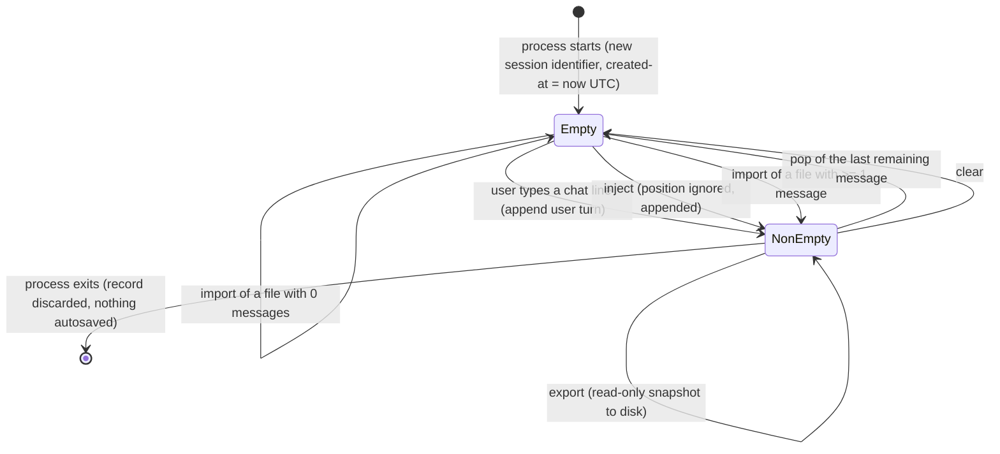

### 7.4 Chat History Management

**Description**

Chat History Management owns the running conversation: the ordered list of turns that the product keeps for the life of one running process, hands to the selected model provider on every request, renders in the transcript, and writes to or reads from disk on demand. Everything the model sees on the next turn comes from this record, so this feature is the product's control surface over model context.

The product exists so that a developer can *debug a model*, not merely converse with it. That requires treating the conversation as a directly editable artifact rather than an opaque transcript. A user must be able to fabricate a turn that never happened and place it anywhere in the sequence (**inject**), retract a turn that went badly (**pop**), start clean (**clear**), and save or restore an exact conversation state so an experiment can be repeated or handed to someone else (**export** / **import**). Without those, the only way to change what the model sees is to keep talking — which pollutes the very thing under test.

The record is deliberately minimal and deliberately unguarded. There is one record per process, one user, no accounts, no authorization and no per-user separation: whoever runs the process owns the history. There is no autosave and no autoload — the record is created empty when the process starts and is lost when it ends unless the user explicitly exports it. There is no size cap, no message limit, no token-budget trimming and no rolling window; the record grows until the user pops, clears, imports over it, or exits. Per-token log-probability data produced by the token-probability feature rides along on individual assistant turns and survives an export/import round trip, which is what makes a saved conversation re-inspectable later.

---

**User stories**

- **US-4.1** — As an interactive user, I want every line I type and every model reply recorded in order automatically, so that the model receives the running conversation as context without me managing it.
- **US-4.2** — As a prompt engineer, I want to insert a message with a role of my choosing at any position in the conversation, so that I can test how the model reacts to context that never actually occurred.
- **US-4.3** — As a model debugger, I want to remove the most recent turn, so that I can retract a bad prompt or clean up after a failed provider call and retry from the previous state.
- **US-4.4** — As an interactive user, I want to wipe the whole conversation in one action, so that I can start a fresh experiment without restarting the program.
- **US-4.5** — As a model debugger, I want to write the entire conversation — including its per-token probability data — to a file I name, so that I can archive an experiment, share it, or reload it later.
- **US-4.6** — As a model debugger, I want to replace the live conversation with the contents of a previously saved file, so that I can resume or reproduce an experiment exactly.
- **US-4.7** — As a model debugger, I want the token log-probability data attached to model replies to survive the save/reload round trip, so that I can re-open an archived conversation and still inspect token-level behavior.
- **US-4.8** — As a user of the full-screen terminal shell, I want the transcript to redraw itself after every change to the conversation, so that what I see always matches what will be sent to the model.
- **US-4.9** — As a new user, I want the history commands to appear in help with their usage syntax, so that I can discover and use them without reading documentation.
- **US-4.10** — As an author of a hand-crafted history file, I want to mark individual messages as hidden from the model, so that a message can appear in the record without entering the outbound request. *(Reachable only through an imported file — no in-product action sets this flag; see QUIRK-4.20.)*

---

**Use cases**

#### UC-4.1 — Record a chat turn (realizes US-4.1)

**Preconditions:** A conversation record exists for the running process. A model provider is configured.

**Main flow:**
1. The user types a line that does not begin with `/`.
2. The shell discards the line and takes no further action if it is empty or whitespace-only.
3. The shell appends a message with role `user`, the typed content, the hidden-from-model flag off, no token log probabilities, and a timestamp of the current UTC instant.
4. The full-screen terminal shell immediately redraws the transcript, so the user's own line appears before the model responds. The plain-console shell simply prints as it goes.
5. The shell hands the whole conversation record to the configured provider.
6. The provider walks the messages in list order, skips any message flagged hidden-from-model, maps roles onto its own wire vocabulary, and prepends the configured system prompt as a separate message that is **not** stored in the record.
7. The shell appends a message with role `assistant`, the reply text, and a fresh UTC timestamp — attaching token log probabilities only when the reply came back from the log-probability code path.
8. The full-screen shell redraws the transcript and scrolls to the bottom; the plain-console shell prints the reply.

**Alternate flows:**
- **A1 — Command line:** the line begins with `/`. It is routed to the command dispatcher and is never appended to the record. There is no escape sequence for sending a literal leading slash to the model.
- **A2 — Whitespace handling differs by shell:** the full-screen shell trims leading and trailing whitespace before appending; the plain-console shell appends the line exactly as read. Identical keystrokes therefore produce different stored content. See QUIRK-4.16.
- **A3 — Local on-device provider selected:** the provider reads only the content of the last message whose role matches `user` case-insensitively, and does not honor the hidden-from-model flag at all. See QUIRK-4.19.

**Error flows:**
- **E1 — Provider call fails mid-turn:** the error is printed (plain-console shell) or shown in a modal box (full-screen shell). **The user message that was already appended stays in the record**, leaving an unanswered turn behind. Removing the last turn is the intended remedy.
- **E2 — Unhandled failure inside the turn:** the plain-console shell catches it for that loop iteration, prints `Error: {message}`, and continues the session. The full-screen shell shows a modal box titled `Error`.

**Postconditions:** On success, the record has grown by exactly two messages in list order (user then assistant). On provider failure, it has grown by exactly one.

---

#### UC-4.2 — Inject a message at a position (realizes US-4.2)

**Preconditions:** A conversation record exists (it may be empty).

**Main flow:**
1. The user issues `/inject <role> <message> [position]`.
2. The dispatcher supplies the arguments produced by splitting the typed line on single spaces and discarding empty tokens.
3. The system fails the command if fewer than two arguments were supplied.
4. The role is lower-cased and validated against exactly three permitted values: `user`, `assistant`, `system`.
5. The remaining arguments are re-joined with single spaces to form the message content.
6. If — and only if — more than two arguments were supplied **and** the last of them parses as a signed 32-bit integer, that last argument is consumed as the insertion position and removed from the message content.
7. A new message is built with the lower-cased role, the content, the hidden-from-model flag off, no token log probabilities, and a timestamp of the current UTC instant.
8. If a position was supplied and lies within `0 <= position < current message count`, the message is inserted at that index; otherwise it is appended to the end.
9. The command reports success as `Injected {role} message at position {n}: {message}`, or `Injected {role} message: {message}` when no position was supplied.

**Alternate flows:**
- **A1 — No position supplied:** the message is appended at the end and the confirmation omits the ` at position {n}` clause.
- **A2 — Last argument is not an integer:** it remains part of the message content, and no position is applied. `/inject user 42` injects the literal text `42` with no position; `/inject user 42 7` injects the text `42` at position 7.
- **A3 — Position out of range (equal to or greater than the message count, or negative):** the message is appended at the end and the command still reports the requested position. See QUIRK-4.1.
- **A4 — Full-screen shell dialog:** the user opens *File → Inject Message…*, which presents a 70×15 dialog titled "Inject Message" with a 20-column Role field pre-filled `user`, a 5-line Message box, and a 10-column field labeled "Position (optional):" that starts empty; OK is the default button. On OK the dialog supplies exactly two or three discrete argument values — role, the whole message with its internal spacing and embedded newlines intact, and the position **only if** its text is non-blank and parses as an integer. This path is immune to space collapsing.
- **A5 — Empty message content:** accepted. Reachable through the dialog by leaving the Message box blank; not reachable from the plain-console shell, whose tokenizer discards empty tokens.

**Error flows:**
- **E1 — Fewer than two arguments:** failure with the exact text `Usage: /inject <role> <message> [position]`. The record is unchanged. The plain-console shell prints it prefixed `✗ `; the full-screen shell raises a modal box titled `Command Error`.
- **E2 — Role outside the three permitted values:** failure with the exact text `Role must be one of: user, assistant, system`. The record is unchanged.
- **E3 — Dialog position is non-numeric (for example `end` or `1.5`):** **no error.** The position is discarded, the message is appended at the end, and the confirmation omits the position clause — the user sees a plausible success and never learns the position was ignored. See QUIRK-4.4.

**Postconditions:** On success the record contains exactly one more message than before. Timestamps are no longer guaranteed to increase along the list.

---

#### UC-4.3 — Remove the last turn (realizes US-4.3)

**Preconditions:** A conversation record exists.

**Main flow:**
1. The user issues `/pop`, or selects *File → Pop Last Message* in the full-screen shell.
2. The system checks that the record holds at least one message.
3. The last message is captured, then removed.
4. The command reports success as `Removed last message: [{role}] {first 50 characters of content}...`.

**Alternate flows:**
- **A1 — Arguments supplied:** they are read by nothing and silently ignored. `/pop 3` removes exactly one message.
- **A2 — Content shorter than 50 characters:** the whole content is echoed and the literal `...` is still appended. See QUIRK-4.2.

**Error flows:**
- **E1 — Record is empty:** failure with the exact text `Chat history is empty`. The record is unchanged. (The underlying removal is itself a safe no-op on an empty list; the guard exists only to produce this text.)

**Postconditions:** On success the record contains exactly one fewer message. There is no confirmation prompt and no undo.

---

#### UC-4.4 — Clear the conversation (realizes US-4.4)

**Preconditions:** A conversation record exists.

**Main flow:**
1. The user issues `/clear`, or selects *File → Clear History* in the full-screen shell.
2. The current message count is captured.
3. The message list is emptied. The session identifier and the created-at timestamp are **not** reset.
4. The command reports success as `Cleared {n} messages from chat history`, where `{n}` is the count captured before clearing.

**Alternate flows:**
- **A1 — Record already empty:** the command still succeeds and reports `Cleared 0 messages from chat history`. There is no "nothing to clear" condition.
- **A2 — Arguments supplied:** silently ignored. `/clear everything` clears everything.

**Error flows:** None. This command has no failure path.

**Postconditions:** The message list is empty; the session identifier and created-at timestamp are unchanged. Nothing is written to disk first; there is no confirmation prompt and no undo. In the full-screen shell's File menu, *Clear History* sits directly below *Pop Last Message* — one keystroke apart.

---

#### UC-4.5 — Export the conversation to a file (realizes US-4.5, US-4.7)

**Preconditions:** A conversation record exists (it may be empty). The user has filesystem write permission at the target location.

**Main flow:**
1. The user issues `/export <file_path>`, or selects *File → Export History…* which opens a file-save dialog pre-filled with `{home}/chat_history.json`.
2. All supplied arguments are joined with single spaces to form the path.
3. If the path begins with the literal two characters `~/`, that prefix is replaced with the current user's home/profile directory.
4. If the resulting file name has no extension at all, `.json` is appended.
5. The containing directory is created if it does not exist.
6. The entire record — all messages in list order with their roles, contents, timestamps, hidden-from-model flags and any token log probabilities, plus the session identifier and the created-at timestamp — is serialized to the conversation-file format (see FR-4.40) and written, overwriting any existing file at that path with no warning.
7. The command reports success as `Successfully exported {n} messages to: {resolved path}`, where `{n}` is the live record's message count evaluated after the write.

**Alternate flows:**
- **A1 — Path already carries an extension:** no `.json` is appended. `/export notes.txt` writes the conversation-file format into a file named `notes.txt`. A dot-prefixed name such as `.history` counts as already having an extension and gets no suffix either.
- **A2 — Target directory exists:** directory creation is a no-op.
- **A3 — Full-screen shell dialog:** the chosen path is routed back through the same string command line as a typed command, so it inherits space collapsing. See QUIRK-4.15.

**Error flows:**
- **E1 — No arguments:** failure with the exact text `Usage: /export <file_path>`. Nothing is written.
- **E2 — Write fails (permission denied, invalid path characters, disk full, path too long):** the underlying reason is written to the standard output stream as `Error exporting chat history: {underlying reason}` and the command returns failure `Failed to export chat history to: {resolved path}`. **The user-facing message never contains the cause.** See QUIRK-4.5.
- **E3 — Parent directory cannot be created (read-only mount, permission denied, invalid name):** handled identically to E2 — same standard-output note, same user-facing failure text.
- **E4 — Export interrupted part-way (process killed, disk full mid-write):** the target is overwritten in place with no temporary file and no rename, so a partial write leaves a truncated, unreadable file where a valid conversation used to be, and the previous contents are gone. See QUIRK-4.6.
- **E5 — Full-screen shell:** the standard-output diagnostics from E2/E3 are painted over the full-screen layout, corrupting it. See QUIRK-4.23.

**Postconditions:** On success a file exists at the resolved path containing a complete, re-importable snapshot. The live record is unchanged in every case.

---

#### UC-4.6 — Import a conversation from a file (realizes US-4.6, US-4.7)

**Preconditions:** A conversation record exists. A readable file exists at the target path.

**Main flow:**
1. The user issues `/import <file_path>`, or selects *File → Import History…* which opens a single-selection file-open dialog rooted at the user's home/profile directory.
2. All supplied arguments are joined with single spaces to form the path.
3. A leading `~/` is expanded to the home/profile directory. **No extension is appended.**
4. The file's existence is checked, then the whole file is read into memory and parsed.
5. On success the **live record is mutated in place, never replaced**: the message list is emptied and refilled with the imported messages in file order, and the session identifier is overwritten with the imported one. The created-at timestamp is left untouched.
6. The command reports success as `Successfully imported {n} messages from: {resolved path}`.
7. The full-screen shell redraws the transcript and refreshes the token-probability side panel if it is open.

**Alternate flows:**
- **A1 — File contains a record with zero messages, or an object with no messages key:** the import succeeds, the live message list becomes empty, and the session identifier is replaced by whatever the file supplied — or, when the file omits it, by a freshly generated random identifier. Reported as `Successfully imported 0 messages from: {path}`. *(INFERRED — derived from the entity's field defaults; no test covers it.)*
- **A2 — Imported content contains roles outside the three permitted values, unbounded content, implausible timestamps, or messages flagged hidden-from-model:** all accepted verbatim. Import performs no validation of any kind. See QUIRK-4.8.
- **A3 — Full-screen shell dialog:** the chosen path is routed back through the same string command line, inheriting space collapsing. See QUIRK-4.15.

**Error flows:**
- **E1 — No arguments:** failure with the exact text `Usage: /import <file_path>`. The record is unchanged.
- **E2 — File does not exist:** `File not found: {resolved path}` is written to the standard output stream; the command returns failure `Failed to import chat history from: {resolved path}`. The live record is completely untouched and no exception escapes.
- **E3 — Malformed or wrong-shaped content (top-level array, truncated file, non-conforming text):** `Error importing chat history: {parser reason}` is written to the standard output stream; same user-facing failure text; the live record is untouched.
- **E4 — File whose entire content is the literal null value:** treated as "no record" and follows the same failure path as E3. *(INFERRED — derived from the deserializer contract; no test.)*
- **E5 — Round-trip trap:** `/export mychats` writes `mychats.json`, but `/import mychats` fails with `Failed to import chat history from: mychats` plus `File not found: mychats` on standard output, because export defaults the extension and import does not. See QUIRK-4.12.
- **E6 — Very large or hostile file:** the whole file is read into memory before parsing with no size guard, no streaming and no cap. See QUIRK-4.10.
- **E7 — Full-screen shell:** the standard-output diagnostics from E2/E3 corrupt the full-screen layout. See QUIRK-4.23.

**Postconditions:** On success the live record's messages and session identifier come entirely from the file; its created-at timestamp is still the one from when the process started. Because the record object is mutated rather than replaced, every command and both user-interface layers see the new content immediately. On any failure the live record is byte-for-byte unchanged.

---

#### UC-4.7 — Render the conversation in the full-screen terminal shell (realizes US-4.8)

**Preconditions:** The full-screen terminal shell is running and a conversation record exists.

**Main flow:**
1. Any mutation of the record, or completion of any command, triggers a full redraw.
2. The transcript view is torn down and rebuilt from scratch.
3. For each message in list order: a header line reading `[{role in lower case}]`; then the content wrapped to `(view width − 4) × 3 ÷ 4` characters with 2 columns of padding on each side; then a blank spacer line.
4. Wrapping first splits on embedded newline characters, then breaks each long line at the last space that fits inside the window, hard-cutting mid-word when the window contains no space.
5. Messages whose role is `user` (compared case-insensitively) are right-aligned; everything else is left-aligned.
6. Assistant messages carrying token log probabilities get a clickable `◊` marker drawn underneath.
7. The view scrolls to the bottom whenever the content is taller than the window.

**Alternate flows:**
- **A1 — Whitespace-only wrapped line:** dropped from the view entirely. A message whose content is empty or all whitespace renders as a bare `[role]` header with nothing under it, while remaining in the record and in every outbound request. See QUIRK-4.18.
- **A2 — Role stored with non-lowercase capitalization:** the header still displays lower-cased, but the message is invisible to the token-probability panel because that path matches the role case-sensitively. See QUIRK-4.17.

**Error flows:**
- **E1 — Standard-output diagnostics from a failed export or import** are painted over the layout, corrupting the display. See QUIRK-4.23.

**Postconditions:** The displayed transcript reflects the record's current content, minus any whitespace-only lines.

---

#### UC-4.8 — Discover the history commands (realizes US-4.9)

**Preconditions:** A shell session is running.

**Main flow:**
1. The user issues the general help command.
2. A section headed `Chat History Management:` lists `/import`, `/export`, `/inject` and `/pop`, each rendered as `/{name} - {description}`.
3. `/clear` appears under the `Basic Commands:` heading instead.
4. The user issues help for a single command, for example `/help inject`.
5. A three-line block is returned: `Command: /inject`, `Description: Inject a message into the chat history`, `Usage: /inject <role> <message> [position] - Inject message with specified role (user|assistant|system)`.

**Error flows:**
- **E1 — Unknown command name:** failure with the text `Unknown command: {name}`.

**Postconditions:** None; help is read-only.

---

**State model**



---

**Functional requirements**

*Record lifecycle and structure*

- **FR-4.1** The system SHALL maintain exactly one conversation record per running process, created empty when the shell starts, carrying a freshly generated random unique identifier in canonical lowercase hyphenated form (for example `469df3d2-7934-481c-bbb0-47ae24c65f87`) as its session identifier and the current UTC instant as its created-at timestamp. *(realizes US-4.1)*
- **FR-4.2** The system SHALL NOT autosave and SHALL NOT autoload. The record is discarded when the process ends unless the user explicitly exported it. The shutdown path SHALL write nothing to disk. *(realizes US-4.5)*
- **FR-4.3** The conversation record SHALL be shared by reference with both shells, all history commands, and the transcript view, so that every mutation is immediately visible to all of them. Import SHALL mutate this record in place and SHALL NOT substitute a new one.
- **FR-4.4** The **list order of messages is the sole authoritative conversation order**. Timestamps SHALL NOT be used for sorting by any consumer, because injection stamps the current time onto a message placed at an arbitrary index. *(See QUIRK-4.30.)*
- **FR-4.5** The system SHALL impose no message-count limit, no content-length limit, no file-size limit and no token-budget trimming on the record. History grows unbounded until popped, cleared, replaced by import, or the process ends.
- **FR-4.6** The append operation SHALL accept a role string, content text, an optional hidden-from-model flag defaulting to off, and an optional list of token log-probability entries defaulting to none; SHALL stamp the message with the current UTC instant at the moment of appending; SHALL place it at the end of the list; and SHALL return nothing and emit no user-visible message. *(realizes US-4.1)*

*Recording chat turns*

- **FR-4.7** Both shells SHALL append a `user`-role message with the typed line before invoking the provider, and an `assistant`-role message with the reply after it returns. *(realizes US-4.1)*
- **FR-4.8** Token log probabilities SHALL be attached to the assistant message only when the reply came back from the log-probability code path; all other append paths SHALL attach none. *(realizes US-4.7)*
- **FR-4.9** Both shells SHALL discard an empty or whitespace-only chat line before any append occurs. A message with blank content can therefore enter the record only through the full-screen shell's inject dialog or through an imported file.
- **FR-4.10** The full-screen terminal shell SHALL trim leading and trailing whitespace from the typed line before appending it; the plain-console shell SHALL append the line exactly as read, including leading and trailing spaces. *(Divergence preserved deliberately; see QUIRK-4.16.)*
- **FR-4.11** A line whose first character is `/` SHALL always be routed to the command dispatcher in both shells and SHALL never be appended to the record. There SHALL be no escape sequence for sending a literal leading slash to the model.
- **FR-4.12** When a provider call fails, the already-appended user message SHALL remain in the record.

*Inject*

- **FR-4.13** The system SHALL expose a command named `inject` with the description `Inject a message into the chat history` and the usage string `/inject <role> <message> [position] - Inject message with specified role (user|assistant|system)`. *(realizes US-4.2, US-4.9)*
- **FR-4.14** Inject SHALL fail when fewer than two arguments are supplied, with the exact message `Usage: /inject <role> <message> [position]`, leaving the record unchanged. *(realizes US-4.2)*
- **FR-4.15** Inject SHALL lower-case the first argument before validating and before storing it, and SHALL accept exactly three role values: `user`, `assistant`, `system`. Any other value SHALL fail with the exact message `Role must be one of: user, assistant, system`, leaving the record unchanged. *(realizes US-4.2)*
- **FR-4.16** Inject SHALL form the message content by re-joining the remaining arguments with a single space each.
- **FR-4.17** Inject SHALL treat the last argument as an insertion position **only when strictly more than two arguments were supplied** and that argument parses as a signed 32-bit integer; in that case the argument SHALL be removed from the message content. *(This is a behavioral threshold, not a tunable.)*
- **FR-4.18** When the last argument does not parse as an integer, it SHALL remain part of the message content and no position SHALL be applied.
- **FR-4.19** The valid insertion range SHALL be `0 <= position < current message count`. A position equal to the count, greater than the count, or negative SHALL silently degrade to appending at the end. *(realizes US-4.2)*
- **FR-4.20** An injected message SHALL always be flagged not-hidden-from-model and SHALL always carry no token log probabilities; the inject path SHALL NOT expose either field.
- **FR-4.21** On success inject SHALL report `Injected {role} message at position {n}: {message}` when a position was supplied, and `Injected {role} message: {message}` when none was, where `{n}` is the **requested** position regardless of whether it was used. *(See QUIRK-4.1.)*
- **FR-4.22** Inject SHALL accept an empty message content; there SHALL be no non-empty validation.
- **FR-4.23** The full-screen shell's inject dialog SHALL be 70×15, titled `Inject Message`, containing a 20-column Role field pre-filled `user`, a 5-line Message box, and a 10-column field labeled `Position (optional):` that starts empty, with OK as the default button. On OK it SHALL supply role and the whole message as discrete values — preserving internal runs of spaces and embedded newlines — plus the position **only if** the position text is non-blank and parses as an integer; otherwise the position SHALL be dropped without any warning. *(realizes US-4.2; see QUIRK-4.4.)*
- **FR-4.24** The insertion position SHALL be parsed as a signed 32-bit integer using the process's current culture: a leading `+` or `−` is accepted, while `7.0`, `7,000`, `0x7` and any value outside −2147483648…2147483647 fail to parse. *(INFERRED — the culture sensitivity is reasoned from the parse call; no test covers it. The compact and single-file build flavors force invariant globalization, so sign handling can differ between build flavors.)*

*Pop*

- **FR-4.25** The system SHALL expose a command named `pop` with the description `Remove the last message from chat history` and the usage string `/pop - Remove the last message from chat history`. *(realizes US-4.3, US-4.9)*
- **FR-4.26** Pop SHALL fail on an empty record with the exact message `Chat history is empty`, leaving the record unchanged. *(realizes US-4.3)*
- **FR-4.27** Pop SHALL remove exactly one message — the last — capturing it before deletion, and SHALL report `Removed last message: [{role}] {content}...` where `{content}` is the first **50** characters of the removed content, sliced by raw code unit, and the literal `...` is appended unconditionally. *(50 is a fixed display constant, not user-tunable; see QUIRK-4.2 and QUIRK-4.3.)*
- **FR-4.28** Pop SHALL accept and silently ignore any arguments. `/pop 3` SHALL remove exactly one message.

*Clear*

- **FR-4.29** The system SHALL expose a command named `clear` with the description `Clear chat history` and the usage string `/clear - Clear all chat history`, and SHALL report `Cleared {n} messages from chat history` where `{n}` is the message count captured **before** clearing. *(realizes US-4.4, US-4.9)*
- **FR-4.30** Clear SHALL succeed on an already-empty record, reporting `Cleared 0 messages from chat history`. There SHALL be no failure path.
- **FR-4.31** Clear SHALL empty only the message list. The session identifier and the created-at timestamp SHALL survive unchanged.
- **FR-4.32** Clear SHALL accept and silently ignore any arguments. Neither clear nor pop SHALL prompt for confirmation in either shell, and neither SHALL be undoable.

*Export*

- **FR-4.33** The system SHALL expose a command named `export` with the description `Export chat history to a file` and the usage string `/export <file_path> - Export chat history to JSON file`. *(realizes US-4.5, US-4.9)*
- **FR-4.34** Export SHALL fail when no arguments are supplied, with the exact message `Usage: /export <file_path>`.
- **FR-4.35** Export SHALL form the path by joining all supplied arguments with a single space each.
- **FR-4.36** Export SHALL expand a leading `~/` — exactly those two characters at position 0 — to the current user's home/profile directory (the user-profile folder on Windows, `$HOME` on Unix-like systems). A bare `~`, a backslash form `~\`, and `~someuser/` SHALL NOT be expanded. *(See QUIRK-4.14.)*
- **FR-4.37** Export SHALL append `.json` to the path **only when the resolved file name has no extension at all**. "Has an extension" means a dot after the last path separator that is not the final character — so `.history` counts as already having one. A name such as `notes.txt` SHALL be written unchanged. *(See QUIRK-4.13.)*
- **FR-4.38** Export SHALL create the containing directory, recursively, if it does not exist; this SHALL be a no-op when it does.
- **FR-4.39** Export SHALL overwrite any existing file at the resolved path with a whole-file write, with no warning, no temporary file and no rename, and therefore with no atomicity guarantee. *(See QUIRK-4.6.)*
- **FR-4.40** Export SHALL write the conversation-file format below, and import SHALL read it. This is a **wire format**: an exported file must remain re-importable, and a clone must stay byte-compatible with files produced by the source product. The format is a single JSON object, pretty-printed with **2-space** indentation, UTF-8 encoded with **no** byte-order mark, and carrying **no** schema-version field and no format negotiation. *(realizes US-4.5, US-4.6, US-4.7)*

```
{
  "messages": [
    {
      "role":             <string>,          // stored verbatim; not validated on import
      "content":          <string>,          // unbounded; newlines written as \n
      "timestamp":        <ISO-8601 string>, // UTC, exactly 7 fractional-second digits, "Z" suffix
      "isCommand":        <boolean>,         // hidden-from-model flag
      "logProbabilities": <array | null>     // null written literally when absent; key never omitted
    }
    // ... in conversation order
  ],
  "sessionId": <string>,          // canonical lowercase hyphenated UUID
  "createdAt": <ISO-8601 string>  // same timestamp form; written on export, discarded on import
}

// each element of "logProbabilities":
{
  "token":            <string>,
  "logprob":          <number>,        // shortest round-trip form: -5, never -5.0
  "top_alternatives": <array | null>   // same shape, recursively; null written literally
}
```

  Ordering and naming rules that a clone MUST match exactly:
  - Key order is declaration order — top level `messages`, `sessionId`, `createdAt`; within a message `role`, `content`, `timestamp`, `isCommand`, `logProbabilities`; within a token entry `token`, `logprob`, `top_alternatives`.
  - Key names are matched case-sensitively on import and unknown keys are ignored.
  - The two token-entry keys `logprob` and `top_alternatives` are lower-case/snake-case while every other key in the file is camel-case. This inconsistency is part of the wire format and MUST be preserved.
  - No derived value is persisted: there is no has-log-probabilities key and no probability key anywhere in the file.
  - String escaping is deliberately aggressive, not minimal — see the escaping row under **External technology** and AC-4.28.
- **FR-4.41** On success export SHALL report `Successfully exported {n} messages to: {resolved path}`, where `{n}` is the live record's message count evaluated after the write. On failure it SHALL report `Failed to export chat history to: {resolved path}` and SHALL NOT include the underlying cause; the cause SHALL be written to the standard output stream as `Error exporting chat history: {underlying reason}`. *(See QUIRK-4.5 and QUIRK-4.23.)*
- **FR-4.42** The full-screen shell's *File → Export History…* SHALL open a file-save dialog pre-filled with `{home}/chat_history.json` and SHALL route the chosen path back through the same string command line as a typed command, inheriting its space-collapsing behavior. *(See QUIRK-4.15.)*

*Import*

- **FR-4.43** The system SHALL expose a command named `import` with the description `Import chat history from a file` and the usage string `/import <file_path> - Import chat history from JSON file`. *(realizes US-4.6, US-4.9)*
- **FR-4.44** Import SHALL fail when no arguments are supplied, with the exact message `Usage: /import <file_path>`.
- **FR-4.45** Import SHALL join all arguments with single spaces and SHALL apply the same `~/` expansion rule as FR-4.36, but SHALL NOT append any default extension. *(See QUIRK-4.12.)*
- **FR-4.46** A non-existent file SHALL be a normal, non-exceptional failure: `File not found: {resolved path}` SHALL be written to the standard output stream and the command SHALL report `Failed to import chat history from: {resolved path}`, leaving the live record completely untouched. *(realizes US-4.6)*
- **FR-4.47** Malformed or wrong-shaped file content SHALL be caught, reported to the standard output stream as `Error importing chat history: {reason}`, and SHALL produce the same user-facing failure message, leaving the live record completely untouched.
- **FR-4.48** On success import SHALL empty the live message list and refill it with the imported messages **in file order**, SHALL overwrite the live session identifier with the imported one, and SHALL leave the live created-at timestamp untouched — the imported created-at value SHALL be discarded. Import SHALL replace, never merge or append. *(realizes US-4.6; see QUIRK-4.7.)*
- **FR-4.49** Import SHALL perform **no validation** of imported content: roles SHALL NOT be checked against the three permitted values that inject enforces, content SHALL NOT be length-limited, timestamps SHALL NOT be sanity-checked, and the hidden-from-model flag SHALL be honored as read. *(realizes US-4.10; see QUIRK-4.8.)*
- **FR-4.50** A file whose top-level object omits the messages key SHALL yield an empty message list, and one that omits the session identifier SHALL cause the live session identifier to be replaced by a freshly generated random one; the command SHALL report `Successfully imported 0 messages from: {path}`. *(INFERRED from the entity field defaults; no test covers it.)*
- **FR-4.51** Key matching on import SHALL be case-sensitive and unknown keys SHALL be ignored. Comments and trailing commas SHALL be rejected. *(INFERRED from the serializer defaults; no test covers it.)*
- **FR-4.52** On success import SHALL report `Successfully imported {n} messages from: {resolved path}`.
- **FR-4.53** The full-screen shell's *File → Import History…* SHALL open a single-selection file-open dialog rooted at the user's home/profile directory, and SHALL route the chosen path back through the same string command line, inheriting its space-collapsing behavior.
- **FR-4.54** Import SHALL read the whole file into memory before parsing, with no size check, no streaming and no cap. *(See QUIRK-4.10.)*

*Consumption by the provider layer*

- **FR-4.55** The whole conversation record SHALL be handed to the selected provider on every request. The contract every provider relies on is: iterate messages in list order, and skip any message flagged hidden-from-model. *(realizes US-4.1, US-4.10)*
- **FR-4.56** Role handling beyond the three permitted values diverges by provider and SHALL be preserved as observed: the managed-client hosted path maps the three roles onto wire roles and **silently drops** any message with any other role; the direct-payload hosted path passes the lower-cased role through verbatim, so a bogus role reaches the remote service and surfaces as a provider failure; the second hosted provider collapses **everything that is not `assistant` into `user`**; and the local on-device provider paths do **not** honor the hidden-from-model flag at all and use **only the content of the last message whose role matches `user` case-insensitively**. *(Owned jointly with the provider sections; see QUIRK-4.19.)*
- **FR-4.57** The configured system prompt SHALL NOT be stored in the conversation record; providers prepend it separately as a synthetic message.
- **FR-4.58** No provider path SHALL read the session identifier, the record's created-at timestamp, or any per-message timestamp.

*Transcript rendering (full-screen terminal shell only)*

- **FR-4.59** The transcript SHALL be torn down and rebuilt from scratch after every record mutation and after every command, and SHALL scroll to the bottom whenever the content is taller than the window. *(realizes US-4.8)*
- **FR-4.60** Each message SHALL render as a header line `[{role in lower case}]`, then the content wrapped to `(view width − 4) × 3 ÷ 4` characters with 2 columns of padding on each side, then a blank spacer line. Wrapping SHALL first split on embedded newlines, then break each long line at the last space that fits, hard-cutting mid-word when no space fits.
- **FR-4.61** Whitespace-only wrapped lines SHALL be omitted from the view. A message whose content is empty or all whitespace SHALL render as a bare `[role]` header with no body, while remaining in the record and in every outbound request. *(See QUIRK-4.18.)*
- **FR-4.62** Messages whose role matches `user` case-insensitively SHALL be right-aligned; all others left-aligned with two columns of padding. Assistant messages carrying at least one token log-probability entry SHALL show a clickable `◊` marker beneath them.
- **FR-4.63** Every path that **selects** a message for the token-probability panel SHALL compare the stored role to the literal `assistant` **case-sensitively**, while rendering compares case-insensitively. *(Divergence preserved; see QUIRK-4.17.)*
- **FR-4.64** A successful history command SHALL show `✓ {message}` in the status bar, which SHALL revert to the default provider/model line after **3000 ms**. A failed history command SHALL raise a modal box titled `Command Error`; an unhandled failure SHALL raise a modal box titled `Error`.
- **FR-4.65** The plain-console shell SHALL prefix a successful command's message with `✓ ` and a failed command's message with `✗ `, and SHALL print `Error: {message}` and continue the session when an unhandled failure escapes a command.

*Help and discoverability*

- **FR-4.66** General help SHALL list `/import`, `/export`, `/inject` and `/pop` under the heading `Chat History Management:`, each rendered as `/{name} - {description}`, and SHALL list `/clear` under `Basic Commands:` instead. *(realizes US-4.9)*
- **FR-4.67** Help for a single history command SHALL return a three-line block of the form `Command: /{name}`, `Description: {description}`, `Usage: {usage}`; an unrecognized name SHALL fail with `Unknown command: {name}`.

---

**External technology**

- *Requires: whole-file text read and whole-file text overwrite on a local filesystem (POSIX / Win32 file I/O). Source used: the managed runtime's asynchronous read-all-text and write-all-text primitives on .NET 10. Reimplementer notes: whole-file semantics only — no streaming, no file locking, no temp-file-then-rename, and therefore no atomicity. Default text encoding is UTF-8 with no byte-order mark. An interrupted write must leave the target truncated, matching the observed behavior.*
- *Requires: recursive create-directory-if-missing. Source used: the managed runtime's create-directory primitive. Reimplementer notes: called before every export write; a no-op when the directory already exists; a failure here must be indistinguishable to the user from a write failure.*
- *Requires: file-existence check. Source used: the managed runtime's file-exists primitive. Reimplementer notes: import's pre-flight; a negative result is a normal (non-exceptional) failure path that prints a distinct diagnostic.*
- *Requires: path manipulation — extension detection, path join, directory-of. Source used: the managed runtime's path helpers. Reimplementer notes: "has an extension" must mean a dot after the last separator that is not the final character, so a dot-prefixed name such as `.history` counts as having one. Path separator rules must follow the host platform, so a backslash is a separator on Windows and an ordinary filename character elsewhere.*
- *Requires: current user's home/profile directory lookup. Source used: the managed runtime's user-profile special-folder lookup. Reimplementer notes: resolves to the user profile folder on Windows and `$HOME` on Unix-like systems. Used for `~/` expansion in both import and export and as the starting directory for both file dialogs.*
- *Requires: object serialization and deserialization with explicit per-field wire names and indented output (JSON, RFC 8259). Source used: the managed runtime's built-in JSON serializer with indented output, a camel-case naming policy, and explicit per-field name attributes. Reimplementer notes: the explicit per-field names win over the policy, so the wire keys are exactly as listed in FR-4.40 — including the inconsistent `logprob` and `top_alternatives` among otherwise camel-case keys. Deserialization is case-sensitive, ignores unknown keys, and rejects comments and trailing commas.*
- *Requires: a JSON string-escaping profile that escapes more than the standard minimum (JSON, RFC 8259). Source used: the managed runtime's default JSON encoder. Reimplementer notes: an apostrophe is written as the six characters \u0027, a backtick as \u0060, a plus sign as \u002B, and the less-than, greater-than and ampersand characters are likewise escaped; all non-ASCII is escaped as \uXXXX; newlines inside content are written `\n`. A minimally-escaping implementation produces semantically identical but byte-different files, and one that emits raw UTF-8 for non-ASCII will not match the observed output.*
- *Requires: shortest-round-trip floating-point formatting (IEEE 754 / JSON number). Source used: the managed runtime's default double-precision JSON writer. Reimplementer notes: a log probability of −5 is written `-5`, not `-5.0`; no exponent notation for ordinary log-probability magnitudes.*
- *Requires: wall-clock UTC timestamp source (ISO-8601). Source used: the managed runtime's UTC-now clock. Reimplementer notes: used for every message timestamp and for the record's created-at value. Persisted form is round-trip ISO-8601 with exactly seven fractional-second digits and a `Z` suffix. Nothing depends on uniqueness or monotonicity.*
- *Requires: random unique identifier generation (UUID). Source used: the managed runtime's GUID generator, rendered in canonical lowercase hyphenated text form. Reimplementer notes: session identifier only; not security-sensitive, not used as a key, never read by anything else in the product.*
- *Requires: culture-sensitive signed 32-bit integer parsing. Source used: the managed runtime's try-parse-integer primitive. Reimplementer notes: used only for the inject position; accepts a leading sign per the current culture and rejects decimal points, group separators and out-of-range values. Compact and single-file build flavors force invariant globalization, so sign handling can differ between build flavors.*
- *Requires: a standard output stream. Source used: the managed runtime's console write-line. Reimplementer notes: the persistence layer writes its own diagnostics here unconditionally, including while the full-screen shell owns the terminal — reproducing this reproduces the display corruption described in QUIRK-4.23. There is no logger abstraction and no suppression switch.*
- *Requires: a full-screen terminal user interface with menus and native file open/save dialogs (ANSI terminal). Source used: Terminal.Gui 1.19.0 (full-screen shell only). Reimplementer notes: the open dialog is single-selection and starts in the home directory; the save dialog is pre-seeded with `chat_history.json` in the home directory. Both route the chosen path back through the same string command line as a typed command.*
- *Requires: a delayed user-interface callback marshalled onto the interface's main loop. Source used: the managed runtime's delay task plus a main-loop invoke. Reimplementer notes: drives the 3000 ms status-bar revert; the timer is started unconditionally for every status message.*
- *Requires: a managed application runtime. Source used: .NET 10 (`net10.0`), SDK pinned to `10.0.100-rc.1.25451.107` with latest-feature roll-forward. Reimplementer notes: nothing in this feature depends on a runtime-specific capability; every operation here is fully cross-platform.*

**Nothing else is required.** This feature uses no database, no network, no message broker, no external process, no operating-system keychain, **no environment variables and no configuration settings**. The product's settings model contains no history-related key of any kind.

---

**Acceptance criteria**

- **AC-4.1** *Given* an empty conversation record, *when* a turn is appended with role `user`, content `content`, and the hidden-from-model flag set, *then* the record holds exactly one message whose role is `user`, whose content is `content`, whose hidden-from-model flag is set, and whose timestamp is not in the future.
- **AC-4.2** *Given* a record holding messages `a` then `b`, *when* the user issues `/pop`, *then* only `a` remains and the result is a success whose text begins `Removed last message: [user] b`.
- **AC-4.3** *Given* an empty record, *when* the user issues `/pop`, *then* the result is a failure with the exact text `Chat history is empty` and the record is still empty.
- **AC-4.4** *Given* an empty record, *when* the user issues `/pop 3`, *then* the result is a failure with the exact text `Chat history is empty`; *and given* a record of three messages, *when* the user issues `/pop 3`, *then* exactly one message is removed.
- **AC-4.5** *Given* a record holding a `user` message with content `hi`, *when* the user issues `/pop`, *then* the success text is exactly `Removed last message: [user] hi...` — the three-dot suffix is present even though nothing was truncated.
- **AC-4.6** *Given* a record holding `first` then `third`, *when* the user issues `/inject assistant second 1`, *then* the record holds three messages, the message at index 1 has content `second` and role `assistant`, and the success text is `Injected assistant message at position 1: second`.
- **AC-4.7** *Given* any record, *when* the user issues `/inject user` (one argument), *then* the result is a failure with the exact text `Usage: /inject <role> <message> [position]` and the record is unchanged.
- **AC-4.8** *Given* any record, *when* the user issues `/inject moderator hello`, *then* the result is a failure with the exact text `Role must be one of: user, assistant, system` and the record is unchanged.
- **AC-4.9** *Given* any record, *when* the user issues `/inject USER hello`, *then* a message is stored with role exactly `user` (lower-cased).
- **AC-4.10** *Given* a record holding two messages, *when* the user issues `/inject user hi 99`, *then* the message is appended as the third message and the success text is exactly `Injected user message at position 99: hi`; *and when* the user issues `/inject user hi -1`, *then* the message is appended and the success text is exactly `Injected user message at position -1: hi`.
- **AC-4.11** *Given* any record, *when* the user issues `/inject user 42`, *then* one message is appended with content exactly `42` and the success text omits any position clause; *and when* the user issues `/inject user 42 7`, *then* a message with content exactly `42` is targeted at position 7.
- **AC-4.12** *Given* any record, *when* the user issues `/inject user note 7.0`, *then* the stored content is exactly `note 7.0` and the success text omits any position clause — the unparseable trailing token stays in the message.
- **AC-4.13** *Given* a record holding two messages, *when* the user issues `/clear`, *then* the record is empty, the result is a success, and the text is exactly `Cleared 2 messages from chat history`.
- **AC-4.14** *Given* an empty record, *when* the user issues `/clear`, *then* the result is a success with the exact text `Cleared 0 messages from chat history`.
- **AC-4.15** *Given* a record whose session identifier is `3f2504e0-4f89-11d3-9a0c-0305e82c3301` and whose created-at is `2026-08-28T12:30:00.0000000Z`, *when* the user issues `/clear`, *then* both values are unchanged.
- **AC-4.16** *Given* a record holding one message, *when* the user issues `/export export-file`, *then* the persistence step is invoked exactly once with a path ending in `.json`, the result is a success, and the text is `Successfully exported 1 messages to: export-file.json`.
- **AC-4.17** *Given* any record, *when* the user issues `/export notes.txt`, *then* the file written is named exactly `notes.txt` and contains the conversation-file format; *and when* the user issues `/export .history`, *then* the file written is named exactly `.history` with no suffix appended.
- **AC-4.18** *Given* a record holding one `user` message with content `hello`, *when* it is exported to a path under a directory that does not yet exist and then imported back, *then* the directory is created, the export reports success, and the imported record holds exactly one message.
- **AC-4.19** *Given* any state, *when* the user issues `/export` or `/import` with no arguments, *then* the result is a failure whose text is exactly `Usage: /export <file_path>` or `Usage: /import <file_path>` respectively.
- **AC-4.20** *Given* a path that does not exist, *when* the user issues `/import` on it, *then* the result is a failure reading `Failed to import chat history from: {path}`, the text `File not found: {path}` appears on the standard output stream, the live record is unchanged, and no exception escapes.
- **AC-4.21** *Given* a non-empty live record and a file containing one `assistant` message with session identifier `session`, *when* the user issues `/import <file>`, *then* the live record holds exactly that one message, its session identifier equals `session`, its created-at timestamp is unchanged from process start, and the result text is `Successfully imported 1 messages from: <file>`.
- **AC-4.22** *Given* a record exported with `/export mychats` (written to `mychats.json`), *when* the user issues `/import mychats`, *then* the result is a failure reading `Failed to import chat history from: mychats` and `File not found: mychats` appears on the standard output stream.
- **AC-4.23** *Given* a file containing a message with role `Moderator` and content `x`, *when* the user issues `/import` on it, *then* the import succeeds and the message is stored with role exactly `Moderator` — no role validation is applied.
- **AC-4.24** *Given* a record containing a message flagged hidden-from-model, *when* a request is built for a hosted provider, *then* that message is absent from the outbound payload while all other messages appear in list order.
- **AC-4.25** *Given* a record holding a `user` turn `first`, an `assistant` turn `reply`, and a `user` turn `second`, *when* the local on-device provider is selected and a request is built, *then* the model receives only `second`, and messages flagged hidden-from-model are **not** excluded.
- **AC-4.26** *Given* an assistant message whose token log-probability list is present but empty, *when* the interface asks whether it has token log probabilities, *then* the answer is no; *given* a list with at least one entry, the answer is yes.
- **AC-4.27** *Given* a record exported to a file, *when* the file is inspected, *then* it is 2-space-indented JSON whose top-level keys are `messages`, `sessionId`, `createdAt` in that order, each message carrying `role`, `content`, `timestamp`, `isCommand`, `logProbabilities` in that order, each token entry carrying `token`, `logprob`, `top_alternatives` in that order, with the literal `null` written for absent lists, and with no derived has-log-probabilities key and no derived probability key anywhere.
- **AC-4.28** *Given* an assistant message whose content is the text `It's a` followed by a backtick, `lambda`, a backtick, ` + more`, *when* the record is exported, *then* the apostrophe appears in the file as the six characters \u0027, each backtick as \u0060, and the plus sign as \u002B — none of them written raw — and any non-ASCII character in content is likewise written as a \uXXXX escape.
- **AC-4.29** *Given* a message created at 20:21:45.9645324 UTC on 2025-10-08, *when* the record is exported, *then* its timestamp value is the string `"2025-10-08T20:21:45.9645324Z"`.
- **AC-4.30** *Given* a token entry whose log probability is exactly −5, *when* the record is exported, *then* the file contains `-5`, not `-5.0`.
- **AC-4.31** *Given* the full-screen inject dialog with Role `user`, Message `hello`, and Position `end`, *when* OK is pressed, *then* the message is appended at the end and the status bar reads `✓ Injected user message: hello` with no position clause and no error.
- **AC-4.32** *Given* the full-screen inject dialog with a Message containing the three lines `a`, an empty line, and `b`, *when* OK is pressed and the transcript redraws, *then* the transcript shows `[user]`, `a`, `b` with the blank line omitted, while the stored content still contains both newline characters and both are sent to the provider.
- **AC-4.33** *Given* the user types `␣␣hello␣␣` as a chat turn in the plain-console shell, *then* the stored content is exactly `␣␣hello␣␣`; *given* the same keystrokes in the full-screen shell, *then* the stored content is exactly `hello`.
- **AC-4.34** *Given* the user issues `/export ~/my␣␣chats/a.json` in either shell, *then* the resolved path is `{home}/my␣chats/a.json` — the doubled space has collapsed to one, and there is no quoting mechanism to prevent it.
- **AC-4.35** *Given* an imported file containing a message with role `Assistant` and a non-empty token log-probability list, *when* the full-screen shell renders it, *then* the header reads `[assistant]`, no `◊` marker is drawn, and the token-probability panel reports there are no assistant messages with log probabilities.
- **AC-4.36** *Given* a successful history command in the full-screen shell, *when* 3000 ms have elapsed, *then* the status bar has reverted to the default provider/model line.
- **AC-4.37** *Given* general help is displayed, *then* the section headed `Chat History Management:` lists exactly `/import`, `/export`, `/inject` and `/pop`, and `/clear` appears under `Basic Commands:` instead.
- **AC-4.38** *Given* the user issues help for `inject`, *then* the response is exactly the three lines `Command: /inject`, `Description: Inject a message into the chat history`, `Usage: /inject <role> <message> [position] - Inject message with specified role (user|assistant|system)`.
- **AC-4.39** *Given* a record holding two messages, *when* the process exits and is restarted, *then* the new record is empty and holds a different session identifier — nothing was autosaved and nothing is autoloaded.
- **AC-4.40** *Given* a provider call that fails while a `user` turn has already been appended, *then* that `user` turn is still present in the record after the error is shown.

---

**Quirks**

- *QUIRK-4.1: Inject reports a position it did not use. The range check lives in the record (`0 <= position < count`, else append), but the confirmation text is built from the requested position. `/inject user hi 99` on a two-message history appends at index 2 and still answers `Injected user message at position 99: hi`. Negative positions behave identically. Evidence: `src/Xcaciv.ChatDbg.Core/Models/ChatHistory.cs:43-50`; `src/Xcaciv.ChatDbg.Core/Commands/InjectCommand.cs:42-45`. Keep-or-fix decision deferred to Open Questions.*
- *QUIRK-4.2: Pop's confirmation always ends in three dots. The ellipsis is concatenated unconditionally, not only when truncation happened. Popping a two-character message answers `Removed last message: [user] hi...`; popping an empty-content message answers `Removed last message: [user] ...`. Evidence: `src/Xcaciv.ChatDbg.Core/Commands/PopCommand.cs:29`. Keep-or-fix decision deferred to Open Questions.*
- *QUIRK-4.3: Pop's 50-character preview cuts by raw code unit. It is an index slice, not a codepoint- or grapheme-aware one, so a surrogate pair or combining sequence straddling offset 50 is split, producing a lone surrogate in the confirmation text. Evidence: `src/Xcaciv.ChatDbg.Core/Commands/PopCommand.cs:29`. Keep-or-fix decision deferred to Open Questions.*
- *QUIRK-4.4: The full-screen inject dialog silently discards an unparseable position, while the console keeps it. The dialog supplies the position argument only if it parses as an integer, so `end` or `1.5` is thrown away with no warning and the message is appended. From the console the same trailing token would have become part of the message text instead. Two paths, two incompatible rules. Evidence: `src/ChatDbg.Shell.Gui/UI/ChatWindow.cs:967-970`; `src/Xcaciv.ChatDbg.Core/Commands/InjectCommand.cs:36`. Keep-or-fix decision deferred to Open Questions.*
- *QUIRK-4.5: The real failure reason never reaches the user. Export and import failures are caught at the persistence boundary, printed to the standard output stream, and reduced to a boolean. The user-facing message is a generic `Failed to export chat history to: {path}` with no cause, so a full disk, a permission denial and a bad path are indistinguishable. Evidence: `src/Xcaciv.ChatDbg.Core/Services/ChatHistoryService.cs:39-43`, `:60-64`; `src/Xcaciv.ChatDbg.Core/Commands/ExportCommand.cs:44-46`; `src/Xcaciv.ChatDbg.Core/Commands/ImportCommand.cs:37-40`. Keep-or-fix decision deferred to Open Questions.*
- *QUIRK-4.6: Export is not atomic and destroys the previous file first. The target is overwritten by a whole-file write with no temporary file and no rename, so an interrupted export leaves a truncated, unreadable file where a valid conversation used to be. There is also no overwrite warning of any kind, from either shell. Evidence: `src/Xcaciv.ChatDbg.Core/Services/ChatHistoryService.cs:36`. Keep-or-fix decision deferred to Open Questions.*
- *QUIRK-4.7: Import discards the imported created-at timestamp. The session identifier is copied from the imported record on the very next line; the created-at value is not copied anywhere. A re-exported file therefore carries the importing process's start time, silently rewriting the record's metadata. Evidence: `src/Xcaciv.ChatDbg.Core/Commands/ImportCommand.cs:43-45` (no assignment to the created-at field anywhere in `src`). Keep-or-fix decision deferred to Open Questions.*
- *QUIRK-4.8: Import performs zero validation. Roles are not checked against the three-value whitelist that inject enforces, content is unbounded, timestamps are not sanity-checked, and the hidden-from-model flag is honored as read. A file can introduce a role that inject would have rejected, which the providers then variously drop, forward to the remote service, or coerce to `user`. Evidence: `src/Xcaciv.ChatDbg.Core/Commands/ImportCommand.cs:43-44`; `src/Xcaciv.ChatDbg.Core/Services/AzureOpenAIService.cs:84-95`, `:141-148`; `src/Xcaciv.ChatDbg.Core/Services/BedrockService.cs:51-58`. Keep-or-fix decision deferred to Open Questions.*
- *QUIRK-4.9: No confirmation and no undo on either destructive operation. Clear wipes the whole record and pop removes a turn with no prompt in either shell, nothing is written to disk first, and the full-screen shell places *Clear History* directly below *Pop Last Message* in the same menu — one keystroke apart. Evidence: `src/Xcaciv.ChatDbg.Core/Commands/ClearCommand.cs:18-22`; `src/Xcaciv.ChatDbg.Core/Commands/PopCommand.cs:19-30`; `src/ChatDbg.Shell.Gui/UI/ChatWindow.cs:267-268`. Keep-or-fix decision deferred to Open Questions.*
- *QUIRK-4.10: Import reads the whole file into memory with no size guard. There is no size check, no streaming and no cap, making a large or hostile file a memory-pressure vector. Evidence: `src/Xcaciv.ChatDbg.Core/Services/ChatHistoryService.cs:56`. Keep-or-fix decision deferred to Open Questions.*
- *QUIRK-4.11: No path restrictions whatsoever. There is no canonicalisation, no allow-list and no sandbox root; `/export /etc/passwd.json` and `/import ../../secrets.json` are attempted verbatim, limited only by operating-system permissions. Evidence: `src/Xcaciv.ChatDbg.Core/Commands/ExportCommand.cs:28-42`; `src/Xcaciv.ChatDbg.Core/Commands/ImportCommand.cs:28-36`. Keep-or-fix decision deferred to Open Questions.*
- *QUIRK-4.12: Export defaults the file extension, import does not. `/export mychats` writes `mychats.json`; `/import mychats` then fails with `File not found: mychats`. The round trip a user would naturally type does not work. Evidence: `src/Xcaciv.ChatDbg.Core/Commands/ExportCommand.cs:37-40` versus `src/Xcaciv.ChatDbg.Core/Commands/ImportCommand.cs:28-34`. Keep-or-fix decision deferred to Open Questions.*
- *QUIRK-4.13: The default extension is keyed on "has any extension", not "is the conversation format". `/export notes.txt` writes the conversation format into a `.txt` file with no complaint, and a dot-prefixed name such as `.history` counts as already having an extension so it gets no suffix either. Evidence: `src/Xcaciv.ChatDbg.Core/Commands/ExportCommand.cs:37-40`. Keep-or-fix decision deferred to Open Questions.*
- *QUIRK-4.14: Home-directory expansion handles exactly one form. Only the literal two characters `~/` at position 0 expand. A bare `~`, a backslash form `~\`, and `~someuser/` are all taken literally and produce a directory literally named `~` on disk. Evidence: `src/Xcaciv.ChatDbg.Core/Commands/ExportCommand.cs:31-34`; `src/Xcaciv.ChatDbg.Core/Commands/ImportCommand.cs:31-34`. Keep-or-fix decision deferred to Open Questions.*
- *QUIRK-4.15: Runs of spaces collapse, with no quoting mechanism. The dispatcher splits on single spaces discarding empties and the history commands re-join with one space, so `~/my␣␣chats/a.json` silently becomes `~/my␣chats/a.json`. The full-screen shell's file dialogs route the user's chosen path back through that same string command line, so a directory the user picked from a browser can become unreachable. Evidence: `src/ChatDbg/ChatShell.cs:326`; `src/ChatDbg.Shell.Gui/UI/ChatWindow.cs:384`, `:1014`, `:1031`. Keep-or-fix decision deferred to Open Questions.*
- *QUIRK-4.16: The two shells disagree about trimming user input. The full-screen shell trims leading and trailing whitespace before storing a turn; the plain-console shell stores the line verbatim. The same keystrokes produce different history content, and therefore different prompts, depending on which shell is running. Evidence: `src/ChatDbg.Shell.Gui/UI/ChatWindow.cs:334` versus `src/ChatDbg/ChatShell.cs:83`, `:346`. Keep-or-fix decision deferred to Open Questions.*
- *QUIRK-4.17: Role matching is case-insensitive when rendering but case-sensitive when selecting. The transcript lower-cases the role to choose alignment and to draw the `◊` marker, but every path that selects a message for the token-probability panel compares against the literal `assistant` case-sensitively. An imported message stored as `Assistant` renders correctly, gets no marker, and is invisible to the panel. Evidence: `src/ChatDbg.Shell.Gui/UI/ChatWindow.cs:513`, `:523`, `:554`, `:570` versus `:219`, `:233`, `:364`, `:447`, `:837`, `:873`. Keep-or-fix decision deferred to Open Questions.*
- *QUIRK-4.18: Blank lines disappear from the transcript. Whitespace-only wrapped lines are skipped while rendering, so blank lines inside a multi-line message vanish from the view and a message whose content is empty or all whitespace renders as a bare `[role]` header — invisible content that is nonetheless in the record and in every outbound request. Evidence: `src/ChatDbg.Shell.Gui/UI/ChatWindow.cs:543`. Keep-or-fix decision deferred to Open Questions.*
- *QUIRK-4.19: The local on-device provider ignores the hidden-from-model exclusion and reads only one message. The two hosted-provider request builders filter on the flag; the local paths never look at it and use only the content of the last message whose role matches `user` case-insensitively. Injecting or popping assistant or system turns changes nothing that provider sees. The same record therefore produces materially different context depending on the provider. Evidence: `src/Xcaciv.ChatDbg.Core/Services/LLamaSharpService.cs:131`, `:361` versus `src/Xcaciv.ChatDbg.Core/Services/AzureOpenAIService.cs:82`, `:141`; `src/Xcaciv.ChatDbg.Core/Services/BedrockService.cs:51`. Keep-or-fix decision deferred to Open Questions.*
- *QUIRK-4.20: The hidden-from-model flag is a dormant hook. It is persisted, imported, defaulted to off, and filtered on by three provider paths — but nothing in the shipping product ever sets it true. A repository-wide search finds writes only in the entity's own default and one unit test. It is reachable today only by hand-editing an imported file. Evidence: `src/Xcaciv.ChatDbg.Core/Models/ChatHistory.cs:14`, `:20`; `src/Xcaciv.ChatDbg.Core/Models/ChatMessage.cs:13-14`; `src/Xcaciv.ChatDbg.Core.Tests/Models/ChatHistoryTests.cs:15-21`. Keep-or-fix decision deferred to Open Questions.*
- *QUIRK-4.21: The session identifier is write-only data. It is generated at start-up, persisted on export, overwritten on import, and asserted by one test — and never read by anything else. It is not used for lookup, file naming, logging or correlation. Evidence: `src/Xcaciv.ChatDbg.Core/Models/ChatHistory.cs:9-10`; `src/Xcaciv.ChatDbg.Core/Commands/ImportCommand.cs:45`; `src/Xcaciv.ChatDbg.Core.Tests/Commands/ImportCommandTests.cs:43`. Keep-or-fix decision deferred to Open Questions.*
- *QUIRK-4.22: Pop and clear silently ignore all arguments. Neither validates argument count or content: `/pop 3` removes one message and `/clear everything` succeeds, with nothing telling the user the argument was meaningless. Evidence: `src/Xcaciv.ChatDbg.Core/Commands/PopCommand.cs:19-24`; `src/Xcaciv.ChatDbg.Core/Commands/ClearCommand.cs:18-22`. Keep-or-fix decision deferred to Open Questions.*
- *QUIRK-4.23: Persistence diagnostics corrupt the full-screen interface. Export and import failures write directly to the standard output stream while the full-screen shell owns the screen, painting stray text over the layout. There is no logger abstraction and no way to suppress it. Evidence: `src/Xcaciv.ChatDbg.Core/Services/ChatHistoryService.cs:41`, `:52`, `:62`. Keep-or-fix decision deferred to Open Questions.*
- *QUIRK-4.24: A dead duplicate shell wires the same history operations with different behavior. The full-screen project carries a never-instantiated second copy of the console shell that wires all five history operations but drops token log probabilities when appending model replies. Porting the wrong copy would silently lose the token-probability payload. Evidence: `src/ChatDbg.Shell.Gui/ChatShell.cs:330`; `src/ChatDbg.Shell.Gui/Program.cs:77-90`; `src/ChatDbg/Program.cs:5`. Keep-or-fix decision deferred to Open Questions.*
- *QUIRK-4.25: A history-adjacent menu item is a stub. Selecting "Toggle System Messages" in the View menu reports `System messages toggle not yet implemented` and does nothing, implying a history filter that does not exist. Evidence: `src/ChatDbg.Shell.Gui/UI/ChatWindow.cs:1138-1142`. Keep-or-fix decision deferred to Open Questions.*
- *QUIRK-4.26: The status-bar revert timer is unconditional. Every status message starts a fresh 3000 ms task that overwrites the status bar with the default text when it fires, so two commands issued in quick succession leave the second message wiped early by the first timer. (INFERRED from the unconditional timer; no test.) Evidence: `src/ChatDbg.Shell.Gui/UI/ChatWindow.cs:903-916`. Keep-or-fix decision deferred to Open Questions.*
- *QUIRK-4.27: "Persistent chat history" is promised by the project's own documents but not implemented. There is no autosave and no autoload; the record is created empty at process start and lost at process end unless the user explicitly exports, and the shutdown path saves nothing. CODE WINS. Evidence: `src/ChatDbg/prd.md:17` and `README.md:11` versus `src/ChatDbg/ChatShell.cs:23`, `:692-713`; `src/ChatDbg.Shell.Gui/Program.cs:13`. Keep-or-fix decision deferred to Open Questions.*
- *QUIRK-4.28: Pop is documented as removing "messages" (plural) but removes exactly one — the last. Evidence: `src/ChatDbg/prd.md:103` versus `src/Xcaciv.ChatDbg.Core/Models/ChatHistory.cs:26-32`. Keep-or-fix decision deferred to Open Questions.*
- *QUIRK-4.29: The project documents disagree about the target platform. One calls the product a shell "for Windows terminal" while another claims Windows, Linux and macOS support. For this feature the code is genuinely cross-platform; the Windows framing comes from packaging defaults. A port must not inherit a Windows-only constraint from adjacent features. Evidence: `README.md:3` versus `src/ChatDbg/prd.md:34`; `src/ChatDbg/Xcaciv.ChatDbg.Shell.csproj:30`, `:70`. Keep-or-fix decision deferred to Open Questions.*
- *QUIRK-4.30: Timestamps stop being monotonic the moment anything is injected. An injected message is stamped with the current time and then placed at an arbitrary index, so the persisted timestamps become internally inconsistent while list order remains the single source of truth. Consumers of an exported file must not sort by timestamp. Evidence: `src/Xcaciv.ChatDbg.Core/Models/ChatHistory.cs:34-41` versus `:43-50`. Keep-or-fix decision deferred to Open Questions.*

---

**Non-functional notes**

- **Concurrency:** the conversation record is a bare mutable list with no locking, no immutability and no copy-on-read. The plain-console shell is strictly single-threaded, so this is safe there. The full-screen shell is not: dialog handlers and the send path return to the interface before their work finishes, and the whole record is handed to a provider on a background continuation while the interface thread may be redrawing it. *(Hazard reasoned from the fire-and-forget handlers and the shared mutable list; no observed defect confirms an actual race.)* A reimplementation on a platform with real interface-thread affinity should either marshal all mutations onto one thread or snapshot the list before handing it to the provider.
- **Memory and growth:** unbounded. Every turn plus its full per-token log-probability payload is retained for the life of the process, and export writes all of it.
- **Performance:** the full-screen shell rebuilds the entire transcript from scratch after every mutation, constructing one display element per wrapped line plus one per role header. This is proportional to total conversation characters per completed turn and will visibly degrade on long conversations. Insertion at an arbitrary index shifts the tail of a contiguous list — irrelevant at conversational scale.
- **No caching, pagination or lazy loading:** the whole file is read into memory on import and the whole record is serialized in memory on export.
- **Permissions:** none. See QUIRK-4.11.
- **Internationalization and accessibility:** no localization whatsoever — every message, usage string and error is a hard-coded English literal. Result decorations use the non-ASCII glyphs `✓`, `✗` and `◊`, which require a Unicode-capable terminal font.
- **Platform coupling — explicit verdict: nothing in this feature is restricted to one operating system.** Append, inject, pop, clear, import and export all run identically on Windows, Linux and macOS. Three portability consequences follow from delegating to platform path rules: `~/` expansion recognizes only the forward-slash form (a Unix idiom), a backslash is a path separator on Windows and an ordinary filename character elsewhere, and filesystem case sensitivity differs — so `/import History.json` after `/export history.json` succeeds on Windows and fails on Linux.

---

**Source notes**

Dossier: `/mnt/g/3RD-Party/reversing/output/chatdbg/dossiers/chat-history.md`. Feature #4 in `/mnt/g/3RD-Party/reversing/output/chatdbg/inventory.md`.

Source repository: `/mnt/g/3RD-Party/reversing/subject/chatdbg` @ commit `d8c18f61d6bb73666ed97cd4885e877e35558485` (branch `LLamaSharp_support`).

Primary evidence paths (repository-relative):

- Entities: `src/Xcaciv.ChatDbg.Core/Models/ChatHistory.cs`, `src/Xcaciv.ChatDbg.Core/Models/ChatMessage.cs`, `src/Xcaciv.ChatDbg.Core/Models/TokenLogProbabilities.cs`
- Persistence: `src/Xcaciv.ChatDbg.Core/Services/ChatHistoryService.cs`
- Commands: `src/Xcaciv.ChatDbg.Core/Commands/InjectCommand.cs`, `PopCommand.cs`, `ClearCommand.cs`, `ImportCommand.cs`, `ExportCommand.cs`, `HelpCommand.cs`
- Shell wiring and transcript: `src/ChatDbg/ChatShell.cs`, `src/ChatDbg/Program.cs`, `src/ChatDbg.Shell.Gui/Program.cs`, `src/ChatDbg.Shell.Gui/UI/ChatWindow.cs`
- Consumers: `src/Xcaciv.ChatDbg.Core/Services/AzureOpenAIService.cs`, `src/Xcaciv.ChatDbg.Core/Services/BedrockService.cs`, `src/Xcaciv.ChatDbg.Core/Services/LLamaSharpService.cs`
- Tests (18 methods covering this feature): `src/Xcaciv.ChatDbg.Core.Tests/Models/ChatHistoryTests.cs`, `Models/ChatMessageTests.cs`, `Commands/InjectCommandTests.cs`, `Commands/PopCommandTests.cs`, `Commands/ClearCommandTests.cs`, `Commands/ExportCommandTests.cs`, `Commands/ImportCommandTests.cs`, `Services/ChatHistoryServiceTests.cs`
- Observed on-disk export used to pin the wire format: `src/ChatDbg.Shell.Gui/bin/Debug/net10.0/chat.json` (193,375 bytes) — a genuine product output, excluded from version control by `.gitignore:21`, so not part of the commit.
- Documentation contradicted by the code: `src/ChatDbg/prd.md:17`, `:34`, `:103`; `README.md:3`, `:11`.
