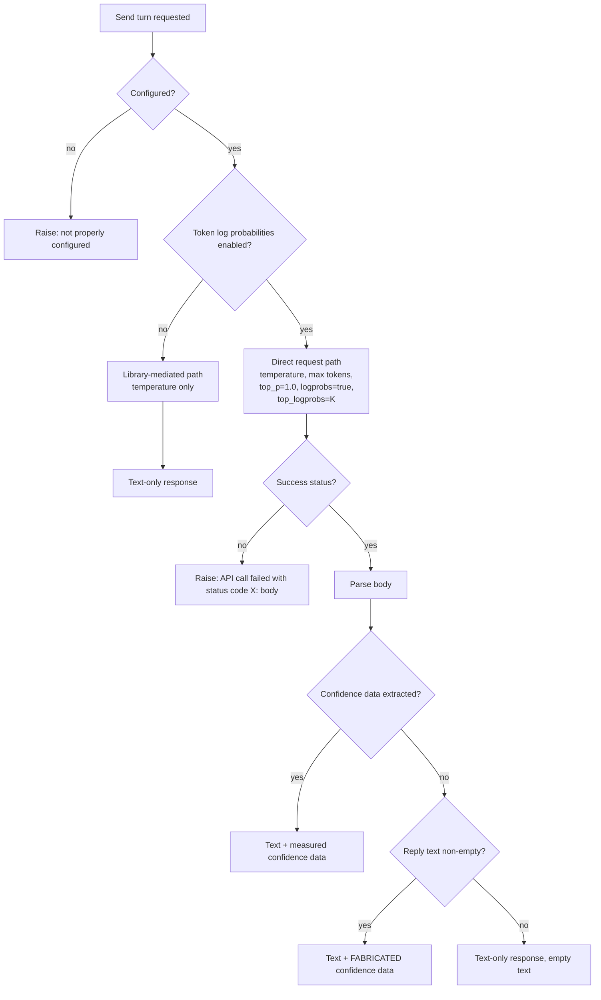

### 7.6 AI Provider Abstraction & Hosted OpenAI Integration

**Description**

ChatDbg is an interactive terminal chat assistant for developers. It must be able to hold the same conversation against more than one large-language-model backend — a hosted cloud model, a second hosted cloud model, and a model running on the user's own machine — without the rest of the application knowing or caring which one is active. This feature delivers two things: the **uniform provider contract** every backend must satisfy, and the **hosted OpenAI backend** (the Azure-hosted deployment of OpenAI models) that implements that contract.

The provider contract is a name-keyed registry of backends held by whichever chat shell is running. Each backend answers exactly five questions: *are you configured for these settings?*, *what should I call you in front of the user?*, *turn this conversation into a reply*, *turn this conversation into a reply annotated with per-token confidence data*, and *release your resources*. Because the shells hold no provider-specific sending logic, swapping backends is a settings change rather than a code change. Every turn re-sends the entire conversation: there is no server-side thread, no incremental delta, and no client-side history trimming — a backend is a pure function of (conversation history, settings).

The hosted OpenAI backend is the reference implementation of that contract. It validates that three settings values are present (service endpoint, resolved API key, model/deployment identifier), then takes one of **two mutually exclusive request paths**: a library-mediated path used when token log probabilities are switched off, and a hand-composed direct request path used when they are switched on. The two paths do not send the same payload — they differ in message-role filtering, in whether a maximum-response-length cap is sent, and in how the endpoint string is normalised. On the direct path the backend also parses per-token confidence data out of the reply across four possible payload locations and, when it finds none, **fabricates plausible-looking confidence data and returns it indistinguishably from real data**. That last behaviour is faithfully specified here and flagged as a quirk requiring a product decision.

---

**User stories**

- **US-6.1** — As a developer at a terminal, I want to choose which model backend answers my chat turns by changing a single setting, so that I can move between a hosted model and a local one without switching tools.
- **US-6.2** — As a developer at a terminal, I want the assistant to tell me at start-up when the selected backend is not fully configured, and to name the exact commands and environment variables that fix it, so that I do not discover the problem only after typing a question.
- **US-6.3** — As a developer at a terminal, I want my whole conversation, prefixed by my chosen system prompt, sent to the hosted model and the reply printed back, so that I can hold a multi-turn debugging conversation with context preserved.
- **US-6.4** — As a developer at a terminal, I want to control the model's creativity and reply length through settings, so that I can trade determinism against exploration for a given debugging task.
- **US-6.5** — As a developer at a terminal, I want to switch on per-token confidence data and receive it alongside the reply, so that I can see where the model was uncertain about its own answer.
- **US-6.6** — As a security-conscious developer, I want my API key taken from a process environment variable or an operating-system secret vault in preference to the settings file, so that my credential need never sit in plaintext on disk.
- **US-6.7** — As the surrounding chat application, I want every backend to satisfy one identical five-operation contract, so that I can select, question, and release any of them through the same code path and contain no provider-specific sending logic.
- **US-6.8** — As a developer at a terminal, I want the upstream service's own failure detail surfaced in my terminal when a call fails, so that I can act on a quota message, a wrong deployment name, or a rejected key without an external log.
- **US-6.9** — As a maintainer of the product, I want the model client construction and the network transport to be substitutable at run time, so that the backend's behaviour can be exercised in automated tests with no network access.

---

**Use cases**

#### UC-6.A — Select and validate a provider at start-up *(realizes US-6.1, US-6.2, US-6.6)*

**Preconditions**
- The application is starting. One instance of each of the three backends has been constructed and placed in a name-keyed registry under the keys `azure`, `bedrock`, `llama`. No backend performed any network access, credential access, or model loading during construction.
- The settings record has been loaded from disk (or defaults substituted after a load failure) and the named system prompt's content has been resolved into it.

**Main flow**
1. The shell reads the provider name from the settings record.
2. The shell looks the provider name up in the registry.
3. The shell asks the selected backend whether it is configured for the current settings.
4. The backend re-resolves the API key through the credential chain, checks that the service endpoint, the resolved key, and the model identifier are all non-empty, and answers *configured*.
5. The shell prints `Azure credentials loaded from: {source}`, where `{source}` is one of `environment variable (CHATDBG_AZURE_API_KEY)`, `Windows Credential Manager`, `settings file (deprecated)`, or `not set`.
6. The shell enters the input loop.

**Alternate flows**
- **A1 — Provider name empty.** The shell prints `Warning: No AI provider configured.` followed by `   Use '/set provider azure', '/set provider bedrock', or '/set provider llama' to configure.` and enters the input loop anyway.
- **A2 — Provider name not present in the registry.** The shell prints `Warning: Unknown AI provider: {provider}` and enters the input loop anyway.
- **A3 — Backend reports not configured.** The shell prints `Warning: Azure OpenAI service is not configured.` then the remediation block: `   1. Environment Variables: set CHATDBG_AZURE_API_KEY=your-api-key`; then, only if the operating-system credential vault is available on this host, `   2. Windows Credential Manager: /set enablewincred` and `      Then: /set wincred azureApiKey your-api-key`; then, only if the endpoint is empty, `   Also set your Azure endpoint: /set azureEndpoint https://your-resource.openai.azure.com/`.
- **A4 — Full-screen shell.** No configuration pre-check is performed at any point. The shell proceeds directly to the input loop; a misconfiguration is discovered only at send time (see UC-6.B error flow E1).
- **A5 — Credential vault unavailable on this host.** The vault leg of the resolution chain silently yields nothing and the chain continues to the settings-file value. No warning is shown, and the remediation block in A3 omits the vault lines.

**Error flows**
- **E1 — Settings file unreadable or corrupt.** The load is caught, defaults are substituted, and the shell prints `Error loading settings: {message}` followed by `Using default settings.`. Because the defaults leave the endpoint unset, alternate flow A3 then runs.

**Postconditions**
- A backend is selected or the user has been told why one is not. No network call has been made. No configuration state is cached — every later call re-reads the settings record and re-resolves the credential.

---

#### UC-6.B — Send a chat turn with token log probabilities switched off *(realizes US-6.3, US-6.4, US-6.7)*

**Preconditions**
- The selected backend reports *configured*. The "enable token log probabilities" setting is off (its default). The conversation history contains zero or more messages, each with a role, content, and an is-command flag.

**Main flow**
1. The user types a line that does not begin with `/`.
2. The shell appends the line to history as a message with role `user`.
3. The shell looks the provider up in the registry and re-checks that it is configured.
4. The shell prints `Thinking...`.
5. The shell asks the backend for a reply annotated with token log probabilities.
6. The backend re-checks configuration, then selects the library-mediated path because token log probabilities are off.
7. The backend obtains a chat client from the injectable client factory, passing the endpoint string parsed as an absolute address (**not** trimmed of trailing separators), the resolved API key, and the model identifier which doubles as the deployment name.
8. The backend builds the outbound message list: index 0 is a `system` message carrying the settings record's resolved system-prompt content; then, in stored order, every history message that is **not** flagged as a command, mapped by role using a case-insensitive three-way match on `user`, `assistant`, `system`. Any other role value is silently dropped.
9. The backend sets exactly one request option: temperature, narrowed to single precision. It sends no maximum-response-length cap, no nucleus-sampling value, and no log-probability options.
10. The backend awaits completion and takes **the first content part of the first choice** as the reply text; further choices and further content parts are discarded.
11. The backend returns a response object carrying that text, a **null** probability list, an elapsed-time value of `0`, and a null error message.
12. The shell renders the reply and appends it to history as an `assistant` message.

**Alternate flows**
- **B1 — Reply text slot is null.** The plain text-only send operation substitutes the literal string `Error: Response text expected, none given` and returns it as the reply.
- **B2 — History contains messages flagged as commands.** Those messages are absent from the outbound list; the system-prompt message remains at index 0.
- **B3 — History contains a message whose role is none of `user`/`assistant`/`system`.** The message is silently dropped from the outbound list on this path only.

**Error flows**
- **E1 — Backend not configured at send time.** Before any input/output, the backend raises an error whose message is `Azure OpenAI service is not properly configured. Please set AzureEndpoint, AzureApiKey, and ModelId.` In the console shell this is unreachable because of the pre-check, which instead prints `Error: Azure OpenAI service is not configured. Use environment variables or Windows Credential Manager to configure credentials securely.` followed by `   Type '/set' to see current configuration and setup instructions.`. In the full-screen shell it is reachable and appears verbatim in a modal prefixed `Failed to get AI response: `.
- **E2 — Endpoint is not a valid absolute address.** The failure occurs during client construction and is re-raised as `Error calling Azure OpenAI: {inner message}`, preserving the inner cause. The console shell prints `Error getting AI response: Error calling Azure OpenAI: …`.
- **E3 — Network, name-resolution, or transport-security failure.** Same wrapping as E2.
- **E4 — The service returns a choice with no content parts.** An index-range failure occurs inside the guarded block and is wrapped as E2.
- **E5 — Provider name in settings is not in the registry.** The console shell prints `Error: Unknown AI provider: {name}`; the full-screen shell shows a modal reading `Unknown AI provider: {name}`. The console lookup is case-sensitive; the full-screen lookup lower-cases first.

**Postconditions**
- On success, history holds the user turn and the assistant turn. On any failure, history holds the user turn only — a retry therefore re-sends a conversation that already contains the user's question. Nothing is retried automatically; there is no back-off, no circuit breaker, and no timeout other than the transport's platform default.

---

#### UC-6.C — Send a chat turn with token log probabilities switched on *(realizes US-6.5, US-6.4)*

**Preconditions**
- The selected backend reports *configured*. The "enable token log probabilities" setting is on. The top-K alternatives setting holds a value (default `5`).

**Main flow**
1. The shell prints `Log probabilities enabled - requesting with top-k={K}` and then `Thinking...`.
2. The backend re-checks configuration and selects the direct request path because token log probabilities are on. The library-mediated client is never constructed.
3. The backend composes the request address as `{endpoint with all trailing '/' characters removed}/openai/deployments/{model identifier}/chat/completions?api-version=2023-12-01-preview`. The model identifier is interpolated without escaping.
4. The backend clears all default headers on the shared transport, then sets `Accept: application/json` and a header named `api-key` whose value is the resolved API key.
5. The backend composes the request body (schema below), serialises it omitting null-valued fields, and sends it as a UTF-8 payload of media type `application/json` using the create/POST verb.
6. The backend reads the entire response body into a single string; nothing is streamed or shown incrementally.
7. On a success status, the backend parses the body: it requires a `choices` array, takes `choices[0].message.content` as the reply text, and searches for per-token confidence data in four locations in a fixed order.
8. If confidence data was found, the backend returns the reply text paired with the ordered token list.
9. The shell renders the reply, renders the confidence visualisation, and appends both to history.

**Alternate flows**
- **C1 — `choices` array present but empty.** This is **not** an error. The reply text becomes the literal `No response received` and processing continues to the fabrication check.
- **C2 — No confidence data found and reply text non-empty.** The backend fabricates confidence data (see FR-6.34 to FR-6.38) and returns it paired with the reply text, with no flag or marker distinguishing it from measured data.
- **C3 — No confidence data found and reply text empty.** No fabrication occurs. The backend returns text-only. The console shell then prints `Note: Log probabilities were requested but none were returned by the model.` and `This could be due to the model not supporting this feature or an API limitation.`
- **C4 — A top-level confidence block exists but is neither an object bearing a `content` array nor an array.** The per-choice locations are never examined. All real confidence data present under `choices[0]` is lost and fabricated data is substituted.
- **C5 — Confidence block present but a token entry lacks either a token string or a numeric log-probability.** That entry is skipped without error; the remaining entries are still produced.

**Error flows**
- **E1 — Non-success status.** The backend raises `API call failed with status code {status}: {full response body}` where `{status}` is the status's symbolic name (for example `NotFound`, `Unauthorized`), not a numeric code, and the body is echoed in full. The outer handler then re-wraps it, so the user sees `Error getting AI response: Error making direct Azure OpenAI API call: API call failed with status code {status}: {body}`.
- **E2 — Body is not parseable, or lacks `choices`, or lacks `choices[0].message`, or lacks `choices[0].message.content`.** The parse routine raises `Error parsing Azure OpenAI API response: {inner message}`, which the outer handler wraps again, so the user sees `Error getting AI response: Error making direct Azure OpenAI API call: Error parsing Azure OpenAI API response: …`.
- **E3 — `choices[0].message.content` is an explicit null.** This is not an error: the reply text becomes the empty string, which then suppresses fabrication (alternate flow C3), producing an empty assistant turn plus the "none were returned" notice.
- **E4 — A confidence block is malformed part-way through (for example a log-probability held as a string, or an alternatives field that is present but not an array).** The extraction routine abandons the whole block and reports "nothing found", **discarding every token it had already extracted**. Processing then falls through to fabrication.
- **E5 — Network, name-resolution, or transport-security failure.** Wrapped once as `Error making direct Azure OpenAI API call: {inner message}`.

**Postconditions**
- On success, the assistant turn in history carries an ordered token confidence list which downstream analysis and visualisation consume. Real and fabricated entries are indistinguishable to every consumer.

---

#### UC-6.D — Substitute the model client and transport for testing *(realizes US-6.9)*

**Preconditions**
- The backend is being constructed programmatically rather than by the shell.

**Main flow**
1. The caller supplies a chat-client factory implementation and/or a network transport when constructing the backend.
2. The backend uses the supplied factory in place of the default one and the supplied transport in place of a self-created one.
3. When the backend is released, a caller-supplied transport is left intact; a self-created transport is released.

**Alternate flows**
- **D1 — Nothing supplied.** The backend creates its own default factory and its own transport at construction time, without any network access.

**Error flows**
- **E1 — The supplied factory raises when invoked while token log probabilities are on.** The turn still succeeds, because the library-mediated path is never entered on that setting.

**Postconditions**
- No network traffic occurs during construction of either the backend or a default chat client, even for an endpoint whose host does not resolve.

---

**Functional requirements**

*The provider contract*

- **FR-6.1** — The application SHALL hold a registry of model backends keyed by the exact lower-case names `azure`, `bedrock`, and `llama`, and SHALL select the active backend by looking up the provider value from the settings record in that registry. *(realizes US-6.1, US-6.7)*
- **FR-6.2** — Every backend SHALL expose exactly five operations: an is-configured check taking the settings record and returning a boolean; a display-name query returning a human-readable string; a send operation taking the conversation history plus the settings record and returning reply text; a send-with-token-log-probabilities operation taking the same inputs and returning a response object; and a resource-release operation. *(realizes US-6.7)*
- **FR-6.3** — All send operations SHALL be asynchronous and SHALL NOT accept a cancellation signal. There SHALL be no way for the user or the shell to abort an in-flight turn.
- **FR-6.4** — Every backend's plain send operation SHALL be implemented by invoking its own send-with-token-log-probabilities operation and returning the text slot; when that slot is null, the hosted OpenAI backend SHALL return the literal string `Error: Response text expected, none given`. *(realizes US-6.7)*
- **FR-6.5** — Both send operations SHALL re-run the is-configured check as their first action and SHALL raise an error before performing any input/output if it fails. Not-configured SHALL NOT be reported as an empty reply.
- **FR-6.6** — The complete conversation history SHALL be transmitted on every turn. There SHALL be no server-side conversation identifier, no incremental delta, no history-window trimming, no client-side token accounting, and no truncation.
- **FR-6.7** — Messages carrying the is-command flag SHALL be excluded from the outbound message list on **both** request paths, so that slash-command echoes never reach the model. *(realizes US-6.3)*
- **FR-6.8** — The system-prompt content held in the settings record SHALL always occupy index 0 of the outbound message list, with role `system`; history messages SHALL follow in stored order, which is insertion order. This ordering is a guarantee. *(realizes US-6.3)*
- **FR-6.9** — All three backends SHALL be constructed at application start-up regardless of which one is selected, and no backend constructor SHALL perform network access, credential access, or model loading.
- **FR-6.10** — The hosted OpenAI backend SHALL signal all failures by raising an error; it SHALL NOT return an error-bearing response object. (The local model backend does the opposite; callers must therefore wrap every send in a catch-all.)
- **FR-6.11** — The registry SHALL be released as a unit at shutdown, releasing each registered backend.

*Identity and configuration*

- **FR-6.12** — The hosted OpenAI backend's display name SHALL be the literal string `Azure OpenAI`, and this string SHALL be used verbatim in user-facing warnings such as `Warning: Azure OpenAI service is not configured.` *(realizes US-6.2)*
- **FR-6.13** — The hosted OpenAI backend SHALL report *configured* if and only if all three of the service endpoint, the resolved API key, and the model identifier are non-empty. There are no exceptions to the three-way conjunction. *(realizes US-6.2)*
- **FR-6.14** — The configuration check SHALL perform **no** format validation: no address parsing, no scheme check, no key-shape check, and no connectivity probe. An invalid endpoint SHALL surface as a send-time failure, never as a configuration failure.
- **FR-6.15** — The API key SHALL be resolved fresh on every read through a fixed priority chain: the process environment variable `CHATDBG_AZURE_API_KEY`; then, only when the "use operating-system credential vault" setting is explicitly enabled, the vault entry named `ChatDbg:AzureApiKey`; then the value stored in the settings file. The configuration check therefore can flip to *configured* purely because an environment variable exists. *(realizes US-6.6)*
- **FR-6.16** — When the environment variable holds `from-env` and the settings file holds `from-json`, the resolved key SHALL be `from-env`. When no environment variable and no vault entry exist, the settings-file value SHALL be used verbatim. *(realizes US-6.6)*
- **FR-6.17** — A default, untouched settings record SHALL report *not configured*, because although the model identifier defaults to `gpt-4`, the endpoint defaults to unset and the resolved key defaults to the empty string.
- **FR-6.18** — Configuration SHALL be read fresh from the settings record on every call. No snapshot, no cached client, and no cached credential SHALL be retained between turns.
- **FR-6.19** — Provider selection SHALL be restricted to the lower-case values `azure`, `bedrock`, and `llama`; any other value entered through the settings command SHALL be rejected with the message `Provider must be 'azure', 'bedrock', or 'llama'`.
- **FR-6.20** — Settings values loaded from disk SHALL NOT be range-validated; range validation exists only at the interactive settings and log-probability command entry points. A hand-edited settings file may therefore place any integer on the wire. *(See QUIRK-6.16.)*

*Settings consumed, with defaults and ranges*

- **FR-6.21** — The backend SHALL read the following settings values with these defaults and command-enforced ranges: provider (default `azure`); model identifier (default `gpt-4`, free text, doubling as the deployment name); temperature (default `0.7`, valid `0.0`–`2.0`, rejection message `Temperature must be a number between 0 and 2`); maximum response tokens (default `1000`, valid `1`–`8192`, rejection message `MaxTokens must be a number between 1 and 8192`); service endpoint (default unset, unvalidated); system-prompt content (default the sentence in FR-6.22, held in memory only and never persisted); enable-token-log-probabilities flag (default `false`); top-K alternatives (default `5`, valid `1`–`20`, rejection message `LogProbabilitiesTopK must be a number between 1 and 20`); use-operating-system-credential-vault flag (default `false`). Temperature, maximum tokens, and top-K are tunable defaults rather than business rules; the ranges are business rules. *(realizes US-6.4, US-6.5)*
- **FR-6.22** — When no other system prompt has been loaded, the system-prompt content SHALL be the literal sentence `You are ChatDBG, a helpful debugging assistant. Help users analyze code, debug issues, and understand programming concepts.`
- **FR-6.23** — The settings file SHALL live at `<user profile directory>/.ChatDbg/settings.json`; if the user profile directory cannot be resolved, the system temporary directory SHALL be used instead.

*Path selection*

- **FR-6.24** — The send-with-token-log-probabilities operation SHALL branch on the enable-token-log-probabilities setting: when the setting is off it SHALL take the library-mediated path; when the setting is on it SHALL take the direct request path. When the setting is on, the library-mediated client SHALL never be constructed — a client factory that raises on invocation SHALL NOT fail the turn. *(realizes US-6.5)*



*Library-mediated path*

- **FR-6.25** — On the library-mediated path the backend SHALL obtain a chat client from the injectable client factory, supplying the endpoint parsed as an absolute address, the resolved API key, and the model identifier. The endpoint string SHALL NOT be trimmed on this path. *(realizes US-6.9)*
- **FR-6.26** — On the library-mediated path, history messages SHALL be mapped through a case-insensitive three-way role match on `user`, `assistant`, and `system`; any message with another role value SHALL be silently dropped. *(See QUIRK-6.5.)*
- **FR-6.27** — On the library-mediated path exactly one request option SHALL be set: temperature, narrowed to single floating-point precision. Maximum response tokens, nucleus-sampling value, and log-probability options SHALL NOT be sent. *(See QUIRK-6.3.)*
- **FR-6.28** — On the library-mediated path the reply text SHALL be taken from the **first content part of the first choice**; additional choices and additional content parts SHALL be discarded, and the returned probability list SHALL be null.
- **FR-6.29** — Any failure inside the library-mediated block SHALL be re-raised as an error with the message `Error calling Azure OpenAI: {inner message}`, preserving the inner cause.

*Direct request path — wire format*

- **FR-6.30** — On the direct request path the request address SHALL be composed as `{endpoint with all trailing '/' characters removed}/openai/deployments/{model identifier}/chat/completions?api-version=2023-12-01-preview`. The literal `2023-12-01-preview` is hard-coded and not configurable; it is a preview version despite in-code commentary describing it as stable. The model identifier SHALL NOT be escaped for inclusion in the address. *(See QUIRK-6.4, QUIRK-6.6.)*
- **FR-6.31** — Before sending, the backend SHALL clear all default headers on the shared transport, then add `Accept: application/json` and a header named `api-key` whose value is the resolved API key. No bearer token and no request signature are used. *(See QUIRK-6.2.)*
- **FR-6.32** — The request body SHALL be an object with exactly these fields, serialised with null-valued fields omitted, and SHALL be sent as a UTF-8 payload of media type `application/json` using the create/POST verb:

```
{
  "messages": [
    { "role": "system", "content": <system-prompt content from settings> },
    { "role": <history role, lower-cased>, "content": <history content> },
    ...                                    // one entry per non-command history message, in stored order
  ],
  "temperature": <settings temperature, full double precision>,
  "max_tokens":  <settings maximum response tokens>,
  "top_p":       1.0,                      // hard-coded; no user control anywhere
  "logprobs":    true,                     // hard-coded; this path is only taken when enabled
  "top_logprobs": <settings top-K alternatives>
}
```

- **FR-6.33** — On the direct request path there SHALL be **no** role whitelist: whatever role string the history holds SHALL be forwarded lower-cased. The same history therefore produces two different upstream payloads depending only on the enable-token-log-probabilities setting. *(See QUIRK-6.5.)*
- **FR-6.34** — The entire response body SHALL be read into a single string before anything is shown to the user. There SHALL be no streaming and no incremental rendering.
- **FR-6.35** — On a non-success status the backend SHALL raise an error whose message is `API call failed with status code {status}: {full response body}`, where `{status}` is the status's symbolic name rather than its numeric code and the body is included unfiltered. *(See QUIRK-6.7.)*
- **FR-6.36** — Any failure anywhere in the direct request block SHALL be re-raised with the message `Error making direct Azure OpenAI API call: {inner message}`. Because the non-success and parse errors are themselves raised inside this block, their messages SHALL appear nested inside this prefix. *(See QUIRK-6.8.)*
- **FR-6.37** — The backend SHALL emit diagnostic traces, visible only to an attached diagnostic listener and never to the user, for: the request address; the full request body; the response status and full response body; either `Found {n} token probabilities` or `No token probabilities found in response`; and the failure message on error. These traces contain the full system prompt and the entire conversation and SHALL be treated as sensitive.

*Direct request path — response parsing*

- **FR-6.38** — Parsing SHALL require a top-level `choices` array. Its absence SHALL be a hard parse failure raised as `Error parsing Azure OpenAI API response: {inner message}`.
- **FR-6.39** — When `choices` is present but empty, the reply text SHALL become the literal `No response received` and the turn SHALL be treated as a **success**, not an error.
- **FR-6.40** — Parsing SHALL require `choices[0].message` and `choices[0].message.content`; either being absent SHALL be a hard parse failure. An explicit null content SHALL become the empty string. *(See QUIRK-6.13.)*
- **FR-6.41** — Confidence data SHALL be sought in exactly this order, stopping at the first location that matches: (1) a top-level confidence block that is an object bearing a `content` array — extracted strictly; (2) a top-level confidence block that is itself an array — extracted tolerantly; (3) **only when there is no top-level confidence block at all**, `choices[0].logprobs` bearing a `content` property — extracted strictly; (4) otherwise `choices[0].logprobs` when it is itself an array — extracted tolerantly. *(See QUIRK-6.1.)* *(realizes US-6.5)*
- **FR-6.42** — Strict extraction SHALL, for each array element, require both a `token` string and a numeric `logprob`; elements missing either SHALL be silently skipped. Each accepted element SHALL produce a token record carrying those two values plus an initialised, possibly empty alternatives list. When the element carries a `top_logprobs` array, every entry of that array that itself has both `token` and `logprob` SHALL be appended as an alternative.
- **FR-6.43** — Tolerant extraction SHALL behave as strict extraction, plus: the alternatives array MAY be named either `top_logprobs` or `top_alternatives`; and an alternative element lacking `token`/`logprob` fields SHALL be treated as a property map — the routine walks its properties in order, assigning each property **name** to the alternative's token in turn and stopping at the first property whose value is numeric, which becomes the alternative's log-probability. Alternatives whose resolved token string is empty SHALL be dropped. *(This map-shaped handling is **INFERRED** to be written against a hypothetical format — no fixture, test, or document in the source uses it. See QUIRK-6.11, QUIRK-6.12.)*
- **FR-6.44** — Both extraction routines SHALL swallow every failure and report "found nothing". A malformed confidence block SHALL therefore degrade to "no confidence data" rather than to a turn failure — **and SHALL discard everything already extracted**. *(See QUIRK-6.10.)*
- **FR-6.45** — The parsed response SHALL carry a confidence list only when the extractor reported success **and** at least one token record was produced; otherwise the response SHALL carry text only.
- **FR-6.46** — Alternatives produced by extraction SHALL carry a null alternatives list of their own, while chosen tokens SHALL always carry an initialised (possibly empty) one. Only one level of nesting exists. *(See QUIRK-6.14.)*

*Fabricated confidence data — **SUPERSEDED by Owner decision D-001 (2026-08-29, `DECISIONS.md`)***

> **FR-6.47 through FR-6.52 are the observed source behaviour and are NOT to be implemented.** They are retained verbatim so that acceptance tests derived from the source can be identified and rewritten. The replacement requirement is **FR-6.52a**, below the block. The demonstration mode (§7.9) remains the only permitted producer of synthetic data and stamps it `synthetic: true`.

- **FR-6.47** *(superseded — D-001)* — Fabrication SHALL be triggered only when all three hold: the direct request path was taken (implying token log probabilities are enabled); parsing found zero confidence records; and the reply text is non-empty. An empty reply text SHALL therefore receive no fabricated data. *(See QUIRK-6.9.)*
- **FR-6.48** *(superseded — D-001)* — Fabrication SHALL split the reply text on the characters space, newline, tab, `.`, `,`, `!`, and `?`, discarding empty pieces. Punctuation therefore never appears in a fabricated token, and carriage returns are **not** separators.
- **FR-6.49** *(superseded — D-001)* — When the split yields **15 or fewer** words, all of them SHALL be used. Otherwise exactly 15 SHALL be taken, in this order: indices `[0,5)`, then indices `[⌊count/2⌋−2, ⌊count/2⌋+3)`, then indices `[count−5, count)` — the first five, a middle five, and the last five, using integer division. The three windows never overlap for any count above 15, so exactly 15 tokens are produced and the words between the windows are silently dropped. The value **15** is a display-oriented sample budget, not a business rule.
- **FR-6.50** *(superseded — D-001)* — Every fabricated token SHALL carry log-probability `ln(0.9)` (approximately `−0.10536`, displaying as a confidence of **90.00 %**), identical for every token and every turn.
- **FR-6.51** *(superseded — D-001)* — Every fabricated token SHALL carry up to three alternatives drawn from a fixed list: `{word}_alt` at `ln(0.05)`, `similar_{word}` at `ln(0.03)`, and `other_{word}` at `ln(0.02)`. The number emitted SHALL be the lesser of the top-K setting and 3 — so a top-K above 3 has no effect on fabricated output even though it is still sent upstream. The four fabricated probabilities sum to exactly 1.0.
- **FR-6.52** *(superseded — D-001)* — Fabricated data SHALL be returned in the same shape as measured data, with no flag, no marker, and no distinguishing field. Downstream visualisation and the "no confidence data was returned" notice SHALL treat it as genuine. *(See QUIRK-6.9 — decision taken: D-001 removes this behaviour.)*

- **FR-6.52a** *(replacement — D-001)* — When parsing finds zero confidence records, the adapter SHALL return the reply with the confidence list **absent** and SHALL never substitute synthetic data. If the provider's declared capability record says it **cannot** supply token log probabilities, the shell SHALL apply GR-19's decided behaviour: disable the log-probabilities setting, persist, and emit the auto-disable notice instructing the user to switch providers (normative text in `DECISIONS.md` D-001). If the provider **declares** the capability but returned none on this response, the shell SHALL emit GR-18's transient "none were returned" notice and leave the setting untouched.

*Response object and lifetime*

- **FR-6.53** — The provider response object SHALL carry four slots: reply text (defaulting to the empty string); an ordered token-confidence list (null when absent, never an empty list from either construction shape); an elapsed-time value in seconds (defaulting to `0`); and an error message (defaulting to null). The hosted OpenAI backend SHALL never populate the last two. *(See QUIRK-6.15.)*
- **FR-6.54** — The provider response object SHALL support exactly two construction shapes: text alone, which leaves the confidence list null; and text plus a confidence list, which stores the caller's list **by reference** without copying, cloning, or sorting. A clone that defensively copies still satisfies every behavioural requirement, but the shells rely on being able to pass the same list onward.
- **FR-6.55** — Each token-confidence record SHALL carry a token string (defaulting to empty), a natural-log probability, a derived probability computed as `e^(log probability)`, and a nullable list of alternative records of the same shape. The derived probability is computed, not stored.
- **FR-6.56** — The network transport MAY be supplied by the caller. A supplied transport SHALL NOT be released by the backend; a self-created transport SHALL be released, and only on the explicit-release path. *(realizes US-6.9)*
- **FR-6.57** — The chat-client factory MAY be supplied by the caller; otherwise a default SHALL be created during construction. Default client construction SHALL be purely local — no network access, no validation — even for an endpoint whose host does not resolve. *(realizes US-6.9)*
- **FR-6.58** — There SHALL be no caching of any kind: no client caching (the library-mediated client is rebuilt on every such send), no response caching, and no credential caching (the key is re-resolved on every read, at least twice per turn).
- **FR-6.59** — There SHALL be no retry, no rate-limit handling, no retry-after inspection, no back-off, no circuit breaker, and no configured request timeout. The only bound is the transport's platform default. **INFERRED**: that default is approximately 100 seconds; it is neither set nor observed in the source.

*Shell-side behaviour bound to this feature*

- **FR-6.60** — Before sending, the console shell SHALL re-check that the selected backend is configured; if not, it SHALL print `Error: Azure OpenAI service is not configured. Use environment variables or Windows Credential Manager to configure credentials securely.` followed by `   Type '/set' to see current configuration and setup instructions.`, and SHALL NOT send. *(realizes US-6.2)*
- **FR-6.61** — The full-screen shell SHALL NOT pre-check configuration; it SHALL go straight from registry lookup to send, so the backend's internal message appears in a modal prefixed `Failed to get AI response: `. *(See QUIRK-6.17.)*
- **FR-6.62** — The console shell SHALL look the provider name up in the registry using the raw settings value (case-sensitive); the full-screen shell SHALL lower-case it first (case-insensitive). *(See QUIRK-6.18.)*
- **FR-6.63** — The console shell SHALL print `Thinking...` before sending, and, when token log probabilities are enabled, SHALL first print `Log probabilities enabled - requesting with top-k={K}`. *(realizes US-6.5)*
- **FR-6.64** — When a turn returns text but no confidence data while token log probabilities were requested, the console shell SHALL print `Note: Log probabilities were requested but none were returned by the model.` and `This could be due to the model not supporting this feature or an API limitation.`
- **FR-6.65** — The user message SHALL be appended to history **before** the send. A failed turn therefore leaves the user's message in history and appends nothing for the assistant. *(realizes US-6.8)*
- **FR-6.66** — When the selected provider is configured at start-up, the console shell SHALL print `Azure credentials loaded from: {source}` where `{source}` is exactly one of `environment variable (CHATDBG_AZURE_API_KEY)`, `Windows Credential Manager`, `settings file (deprecated)`, or `not set`. *(realizes US-6.6)*
- **FR-6.67** — Access control SHALL consist solely of possession of the API key. There SHALL be no role check, no per-user authorisation, and no audit log.
- **FR-6.68** — All user-visible strings SHALL be fixed English text. There SHALL be no localisation, no resource files, and no localisation hooks.

*Sibling contract obligations (documented in their own sections)*

- **FR-6.69** — The second hosted backend SHALL report the display name `Amazon Bedrock` and SHALL be considered configured when the model identifier is non-empty **and** either a resolved access key is non-empty or the standard cloud access-key environment variable is set — a weaker check than FR-6.13. It SHALL raise on not-configured.
- **FR-6.70** — The local model backend SHALL report the display name `Local LLM (LLamaSharp)` and SHALL be considered configured when the model identifier names an existing file. It SHALL serialise generations and SHALL **return** an error-bearing response object rather than raising.

---

**External technology**

*Requires: a hosted, deployment-scoped large-language-model chat-completion service (HTTPS + JSON request/response; route `/openai/deployments/{deployment}/chat/completions?api-version=…`; header-based authentication using a header named `api-key`). Source used: Azure OpenAI Service, API version literal `2023-12-01-preview`. Reimplementer notes: the model identifier IS the deployment name — there is no separate deployment setting. The API version is hard-coded and not user-configurable. Request fields that must survive: `messages[{role,content}]`, `temperature`, `max_tokens`, `top_p`, `logprobs`, `top_logprobs`. Response fields read: `choices[]`, `choices[0].message.content`, a top-level `logprobs` block (as object-with-`content` or as array), `choices[0].logprobs`, and per-token `token` / `logprob` / `top_logprobs[]` / `top_alternatives[]`. **INFERRED**: this wire contract is read from source only — no automated test asserts it and it is never exercised against a live service in the source repository. Re-verify field names against current provider documentation rather than trusting the pinned preview version.*

*Requires: a vendor client library for the same hosted service, used only on the non-log-probability path (same service, library-managed wire format). Source used: the Azure AI OpenAI client library, version 2.1.0, with its bundled chat-client types. Reimplementer notes: only the temperature option is set through it. A clone may legitimately use one direct request path for both cases — but must then consciously decide whether to preserve the maximum-response-tokens asymmetry (QUIRK-6.3) and the role-filtering asymmetry (QUIRK-6.5).*

*Requires: a general HTTP client with a substitutable transport (HTTP/1.1 over TLS). Source used: the runtime platform's HTTP client. Reimplementer notes: must support clearing and setting default headers, an `Accept` header, a custom authentication header, sending a UTF-8 JSON body, reading the whole response body as a string, and reading the status code — which is rendered as its symbolic name in the user-visible error text. No timeout is configured anywhere; the platform default is the only bound.*

*Requires: serialisation of an ad-hoc request object to JSON with null-omission. Source used: the platform JSON serializer with a camel-case naming policy and null-omission. Reimplementer notes: the naming policy is effectively a no-op for the field names used — the wire names are the literals `messages`, `temperature`, `max_tokens`, `top_p`, `logprobs`, `top_logprobs` and must appear exactly so.*

*Requires: a tolerant document-object-model JSON reader for response parsing. Source used: the platform DOM-style JSON reader. Reimplementer notes: needs optional-property probing, value-kind discrimination (object vs array vs number), array enumeration, and object-property enumeration for the map-shaped alternative case. It must also survive being handed a non-array value where an array is expected — the source currently does not (QUIRK-6.12).*

*Requires: natural logarithm and exponential functions over IEEE-754 double-precision numbers. Source used: the platform math library. Reimplementer notes: `ln(0.9)`, `ln(0.05)`, `ln(0.03)`, `ln(0.02)` for fabrication; `e^x` for the displayed probability.*

*Requires: a diagnostic trace sink not visible to the end user. Source used: the platform debug-trace writer. Reimplementer notes: traces the request address, the full request body, the response status and body, the confidence-record count, and failure messages. Because the request body contains the full system prompt and entire conversation, the sink must be treated as sensitive.*

*Requires: a process-environment secret source. Source used: the environment variable `CHATDBG_AZURE_API_KEY`. Reimplementer notes: highest priority in the resolution chain, fully portable.*

*Requires: an optional, opt-in operating-system secret vault. Source used: Windows Credential Manager via the native credential API (`CredReadW` / `CredWriteW` / `CredDeleteW` in `advapi32.dll`), generic credential type, entry name `ChatDbg:AzureApiKey`, blob encoded as UTF-16, persistence scope "local machine". Reimplementer notes: consulted only when explicitly enabled in settings; all failures are swallowed. This leg is the only platform-coupled part of the feature — on non-Windows hosts it silently yields nothing and the chain collapses to environment-variable → settings-file. A port needs a per-platform substitute (keychain, secret service) or a documented environment-variable-only posture.*

*Requires: local file storage for the settings record. Source used: a JSON file at `<user profile>/.ChatDbg/settings.json`, with the system temporary directory as fallback. Reimplementer notes: holds the endpoint, model identifier, temperature, maximum tokens, top-K, log-probability toggle, and the deprecated plaintext key.*

*Requires: a unit-test framework plus a substitutable HTTP transport stub. Source used: xUnit 2.9.1, Moq 4.20.69, and a hand-written stub transport returning a fixed status and body regardless of the request. Reimplementer notes: the source's stub ignores the request entirely, so the address, headers, and body are unobservable in the existing suite. A clone that wants those covered needs a recording stub. The stub returns its body with a plain-text media type and the parser never inspects media type.*

*Requires: an execution runtime. Source used: .NET 10 (SDK pinned to `10.0.100-rc.1.25451.107`; platform-neutral target framework `net10.0`). Reimplementer notes: not a requirement of the feature; listed for completeness.*

---

**Acceptance criteria**

- **AC-6.1** — **Given** a settings record with the endpoint unset, model identifier `gpt-4`, and no key in the environment, vault, or file, **when** the configuration check runs, **then** it reports *not configured*.
- **AC-6.2** — **Given** endpoint `https://example.openai.azure.com`, settings-file key `key`, and model identifier `model`, **when** the configuration check runs, **then** it reports *configured*.
- **AC-6.3** — **Given** the environment variable `CHATDBG_AZURE_API_KEY` is `from-env` and the settings-file key is `from-json`, **when** the key is resolved, **then** the value used is `from-env`; **and given** no environment variable, no vault entry, and a settings-file key of `stored-value`, **then** the value used is `stored-value`.
- **AC-6.4** — **Given** token log probabilities are enabled and the chat-client factory is one that raises on every invocation, **when** a turn is sent, **then** the turn completes successfully — proving the library-mediated path was never entered.
- **AC-6.5** — **Given** token log probabilities are **disabled**, temperature `0.7`, maximum tokens `1000`, and a history of one `user` message `hi` plus one message flagged as a command, **when** a turn is sent, **then** exactly one upstream call is made through the library-mediated path carrying the two messages `[system <system prompt>, user "hi"]` with the command message absent, carrying temperature `0.7` and **no** maximum-tokens, nucleus-sampling, or log-probability options; **and** the returned response's text is the first content part of the first choice and its confidence list is null.
- **AC-6.6** — **Given** token log probabilities are **enabled** with top-K `2`, endpoint `https://example.openai.azure.com/` (note the trailing slash), model identifier `model`, temperature `0.7`, and maximum tokens `1000`, **when** a turn with one `user` message `hi` is sent, **then** a create/POST request is made to `https://example.openai.azure.com/openai/deployments/model/chat/completions?api-version=2023-12-01-preview` with headers `api-key: <resolved key>` and `Accept: application/json`, a UTF-8 `application/json` body, and a body equal to `{"messages":[{"role":"system","content":"<prompt>"},{"role":"user","content":"hi"}],"temperature":0.7,"max_tokens":1000,"top_p":1.0,"logprobs":true,"top_logprobs":2}`.
- **AC-6.7** — **Given** a success reply whose body has a top-level confidence block `{"content":[{"token":"Hello","logprob":-0.1,"top_logprobs":[{"token":"Hi","logprob":-0.2}]}]}` and `choices[0].message.content` of `"response"`, **when** the turn completes, **then** the response carries exactly **one** token record whose token is `Hello`, whose log-probability is `-0.1`, and which carries exactly one alternative `Hi` at `-0.2`.
- **AC-6.8** — **Given** the same body but with the confidence block at `choices[0].logprobs.content` and **no** top-level confidence block, **when** the turn completes, **then** the same single token record is produced.
- **AC-6.9** — **Given** a body carrying **both** a top-level confidence block whose value is JSON `null` **and** a populated `choices[0].logprobs.content`, **when** the turn completes, **then** no measured confidence data is extracted and fabricated data is returned instead. *(A clone that fixes QUIRK-6.1 must change this criterion deliberately.)*
- **AC-6.10** — **Given** a success reply with `choices[0].message.content` of `"response text"`, no confidence data anywhere, and top-K `3`, **when** the turn completes, **then** the confidence list holds exactly **2** records — `response` and `text` — each with log-probability `ln(0.9)` and exactly 3 alternatives named `response_alt` / `similar_response` / `other_response` and `text_alt` / `similar_text` / `other_text`, at `ln(0.05)` / `ln(0.03)` / `ln(0.02)` respectively.
- **AC-6.11** — **Given** a reply of exactly 16 space-separated words `w0`…`w15` and fabrication runs, **then** exactly 15 tokens are produced in the order `w0 w1 w2 w3 w4 w6 w7 w8 w9 w10 w11 w12 w13 w14 w15` — the word at index 5 is dropped and no word is duplicated.
- **AC-6.12** — **Given** a reply of `Hello, world! How are you?` and fabrication runs, **then** 5 tokens are produced — `Hello`, `world`, `How`, `are`, `you` — and no token contains `,`, `!`, or `?`.
- **AC-6.13** — **Given** top-K is `7` and fabrication runs, **then** each fabricated token carries exactly **3** alternatives; **given** top-K is `2`, each carries exactly **2**, namely `{word}_alt` and `similar_{word}`.
- **AC-6.14** — **Given** the service replies with status `404` and body `{"error":"deployment not found"}`, **when** a turn is sent from the console shell, **then** the user sees exactly `Error getting AI response: Error making direct Azure OpenAI API call: API call failed with status code NotFound: {"error":"deployment not found"}`; no assistant message is appended to history; the user's own message remains in history.
- **AC-6.15** — **Given** the service replies with success and body `{"choices":[]}` and token log probabilities are enabled, **when** the turn is sent, **then** no error is raised, the assistant reply text is exactly `No response received`, and three fabricated tokens `No`, `response`, `received`, each at 90 % displayed confidence, accompany it.
- **AC-6.16** — **Given** the service replies with success and body `{"choices":[{"message":{"content":null}}]}` and token log probabilities are enabled, **when** the turn is sent, **then** the reply text is the empty string, the confidence list is null, and the console prints `Note: Log probabilities were requested but none were returned by the model.`
- **AC-6.17** — **Given** a success reply whose confidence array holds two entries where the second entry's `logprob` is the string `"-0.2"`, **when** the turn completes, **then** **neither** token survives and fabricated data is returned instead.
- **AC-6.18** — **Given** the backend was constructed with a caller-supplied HTTP transport, **when** the backend is released, **then** the transport is still usable; **given** it created its own, **then** the transport is released.
- **AC-6.19** — **Given** a history containing messages flagged as commands, **when** a turn is sent on either path, **then** none of those messages appear in the upstream request and the system-prompt message is still at index 0.
- **AC-6.20** — **Given** a history message whose role is `tool`, **when** token log probabilities are **off** the message is **absent** from the upstream request, **and when** they are **on** the message is **present** with role `tool`.
- **AC-6.21** — **Given** the default client factory is asked for a client with the syntactically valid but non-resolving endpoint `https://example.openai.azure.com/`, key `key`, and model `model`, **when** the call returns, **then** a client object exists and no network traffic has occurred.
- **AC-6.22** — **Given** a token record whose log-probability is `ln(0.25)`, **when** its derived probability is read, **then** it is `0.25` to 5 decimal places.
- **AC-6.23** — **Given** a response constructed from text alone, **then** its confidence list is null; **given** one constructed from text plus a list, **then** the stored list is the very same list instance the caller passed.
- **AC-6.24** — **Given** any turn against this backend, success or failure, **when** the response object is inspected, **then** its elapsed-time value is `0` and its error-message slot is null.
- **AC-6.25** — **Given** the settings record holds provider `Azure` (capitalised), **when** the user sends a turn, **then** the console shell reports `Error: Unknown AI provider: Azure` while the full-screen shell sends the turn normally.
- **AC-6.26** — **Given** the backend is not configured, **when** the user sends a turn in the full-screen shell, **then** a modal reads `Failed to get AI response: Azure OpenAI service is not properly configured. Please set AzureEndpoint, AzureApiKey, and ModelId.`
- **AC-6.27** — **Given** a non-Windows host with the credential-vault option enabled and no environment variable set, and an endpoint and model identifier present but the key held only in a vault, **when** the configuration check runs, **then** it reports *not configured*, with no warning that the vault is unavailable.
- **AC-6.28** — **Given** the settings command is given a temperature of `2.5`, **then** it is rejected with `Temperature must be a number between 0 and 2`; **given** maximum tokens of `9000`, rejected with `MaxTokens must be a number between 1 and 8192`; **given** top-K of `0`, rejected with `LogProbabilitiesTopK must be a number between 1 and 20`; **given** provider `openai`, rejected with `Provider must be 'azure', 'bedrock', or 'llama'`.
- **AC-6.29** — **Given** a hand-edited settings file containing a top-K of `0` and maximum tokens of `999999`, **when** the application starts and a turn is sent with token log probabilities enabled, **then** those values reach the wire unchanged and no validation message is shown.
- **AC-6.30** — **Given** the provider value in the settings record is empty at start-up, **then** the console shell prints `Warning: No AI provider configured.` followed by `   Use '/set provider azure', '/set provider bedrock', or '/set provider llama' to configure.`

---

**Quirks**

- **QUIRK-6.1**: Per-choice confidence data is unreachable whenever a top-level confidence block exists in an unexpected shape. The per-choice lookups sit behind an "else" on the *existence* of a top-level block, so a response carrying a top-level block that is neither an object-with-`content` nor an array (for example JSON `null`) causes the per-choice locations never to be examined; all real confidence data is lost and fabricated data is substituted. The hosted service's documented wire format puts confidence data under `choices[0].logprobs` — the branch checked **last**. **INFERRED** from branch structure; no test covers it. Evidence: `src/Xcaciv.ChatDbg.Core/Services/AzureOpenAIService.cs:245-270`. Keep-or-fix decision deferred to Open Questions.
- **QUIRK-6.2**: The direct request path clears and rewrites the shared transport's default headers on every call. Two concurrent sends through one instance can race on headers and credentials, and a caller-supplied pre-configured transport has its headers wiped. There is no locking, although the sibling local-model backend does serialise its work. **INFERRED** hazard — the shells are single-turn interactive, so it is latent. Evidence: `src/Xcaciv.ChatDbg.Core/Services/AzureOpenAIService.cs:126-128`. Keep-or-fix decision deferred to Open Questions.
- **QUIRK-6.3**: The maximum-response-tokens setting is never sent on the default path (token log probabilities off), although the product documentation describes it as "Maximum response length" for all providers. Switching token log probabilities on silently starts enforcing a length cap that was not enforced before. Evidence: `src/Xcaciv.ChatDbg.Core/Services/AzureOpenAIService.cs:98-101` vs `:155`; `README.md:50,100`. Keep-or-fix decision deferred to Open Questions.
- **QUIRK-6.4**: The two send paths normalise the endpoint differently. The direct path trims trailing separators; the library-mediated path passes the string through verbatim. The product documentation's own example endpoint carries a trailing separator. Evidence: `src/Xcaciv.ChatDbg.Core/Services/AzureOpenAIService.cs:70` vs `:121`; `README.md:120`. Keep-or-fix decision deferred to Open Questions.
- **QUIRK-6.5**: The two send paths filter message roles differently. The library-mediated path drops any role that is not `user`/`assistant`/`system`; the direct path forwards every role lower-cased. The same history produces two different upstream payloads depending only on the token-log-probability setting. Evidence: `src/Xcaciv.ChatDbg.Core/Services/AzureOpenAIService.cs:84-95` vs `:143-147`. Keep-or-fix decision deferred to Open Questions.
- **QUIRK-6.6**: The troubleshooting text tells the user to "Ensure you're using a recent API version (2023-05-15 or newer for Azure OpenAI)" as though the API version were user-controllable. It is a hard-coded constant, and the in-code comment describes that preview constant as "the latest stable API version". Evidence: `src/Xcaciv.ChatDbg.Core/Commands/LogProbsCommand.cs:185` vs `src/Xcaciv.ChatDbg.Core/Services/AzureOpenAIService.cs:119-120`. Keep-or-fix decision deferred to Open Questions.
- **QUIRK-6.7**: The entire upstream error body is echoed into the terminal on a non-success status, and the status itself is rendered as a symbolic name (`NotFound`, `Unauthorized`) rather than a number. An upstream error page can push arbitrary content — quotas, request identifiers, echoed prompt fragments — into the user's terminal. The symbolic rendering is **INFERRED** from default value rendering; no test captures an error message. Evidence: `src/Xcaciv.ChatDbg.Core/Services/AzureOpenAIService.cs:184-187`. Keep-or-fix decision deferred to Open Questions.
- **QUIRK-6.8**: Parse failures are double-wrapped. A malformed body produces `Error making direct Azure OpenAI API call: Error parsing Azure OpenAI API response: {inner}` because the parse wrapper is itself caught by the outer wrapper. Evidence: `src/Xcaciv.ChatDbg.Core/Services/AzureOpenAIService.cs:284` then `:216`. Keep-or-fix decision deferred to Open Questions.
- **QUIRK-6.9**: Fabricated confidence data is returned unmarked. There is no flag, no marker, and no distinct field, so a user analysing "model confidence" may be reading invented numbers, and the console shell's "no probabilities were returned" notice becomes nearly unreachable for this backend. Evidence: `src/Xcaciv.ChatDbg.Core/Services/AzureOpenAIService.cs:197-208`; `src/ChatDbg/ChatShell.cs:387-391`. Keep-or-fix decision deferred to Open Questions.
- **QUIRK-6.10**: One malformed token entry discards every confidence record already extracted. The extractors accumulate into a caller-supplied list but report failure on any exception, and the caller requires the success flag as well as a non-empty list — so a body whose *last* token carries a string log-probability loses all preceding good tokens, and fabrication silently replaces the lot. **INFERRED** from control flow; no test exercises a malformed confidence block. Evidence: `src/Xcaciv.ChatDbg.Core/Services/AzureOpenAIService.cs:298,330-334,403-407,273-276`. Keep-or-fix decision deferred to Open Questions.
- **QUIRK-6.11**: A map-shaped alternative with no numeric property is emitted with log-probability `0`, which the display layer renders as `e^0 = 1.0`, i.e. **100 % confidence** — for an alternative that was *not* chosen. The alternative's token also ends up being the *last* property name scanned, because the loop overwrites the token on every iteration and only stops on a numeric value. **INFERRED**; no test or fixture exercises it. Evidence: `src/Xcaciv.ChatDbg.Core/Services/AzureOpenAIService.cs:362-393`. Keep-or-fix decision deferred to Open Questions.
- **QUIRK-6.12**: An alternatives field that is present but is not an array aborts extraction entirely. The enumeration fails, the failure is swallowed, and the whole response is reported as carrying no confidence data. **INFERRED**; no test covers it. Evidence: `src/Xcaciv.ChatDbg.Core/Services/AzureOpenAIService.cs:308-310,330-334`. Keep-or-fix decision deferred to Open Questions.
- **QUIRK-6.13**: A content-filtered or otherwise message-less choice is a hard failure, and a null-content choice produces a silent empty turn. `choices[0].message.content` is required; if `message` or `content` is missing the turn fails with a double-wrapped parse error, and if `content` is explicitly null the reply text becomes the empty string — which then suppresses fabrication, so the user sees an empty assistant message followed by the "none were returned" notice. Evidence: `src/Xcaciv.ChatDbg.Core/Services/AzureOpenAIService.cs:237-238,203`; `src/ChatDbg/ChatShell.cs:387-391`. Keep-or-fix decision deferred to Open Questions.
- **QUIRK-6.14**: Alternatives never receive an alternatives list of their own. Chosen tokens always receive an initialised (possibly empty) list; their alternatives receive null. Persisted history therefore serialises `"top_alternatives": []` for chosen tokens and omits the field entirely for alternatives. Evidence: `src/Xcaciv.ChatDbg.Core/Services/AzureOpenAIService.cs:300-305` vs `:315-319`. Keep-or-fix decision deferred to Open Questions.
- **QUIRK-6.15**: The response object carries an elapsed-time slot and an error-message slot that this backend never populates — always `0` and null. Any interface rendering "took N seconds" will always show zero for this provider. Evidence: `src/Xcaciv.ChatDbg.Core/Models/AIResponse.cs:22-32`; `src/Xcaciv.ChatDbg.Core/Services/AzureOpenAIService.cs:104,207,211`. Keep-or-fix decision deferred to Open Questions.
- **QUIRK-6.16**: Settings loaded from disk bypass every range check. Loading only deserialises; the 1–20 top-K rule and the 1–8192 maximum-tokens rule live only in the interactive command handlers. A hand-edited or migrated settings file can put a top-K of `0` or a maximum-tokens of `999999` straight onto the wire, and a top-K below 1 also silently produces zero fabricated alternatives. Evidence: `src/Xcaciv.ChatDbg.Core/Services/SettingsService.cs:43-58`; `src/Xcaciv.ChatDbg.Core/Commands/SetCommand.cs:79-85,173-181`; `src/Xcaciv.ChatDbg.Core/Services/AzureOpenAIService.cs:155,158,459`. Keep-or-fix decision deferred to Open Questions.
- **QUIRK-6.17**: The full-screen shell never pre-checks configuration before sending. It looks the provider up in the registry and sends, so the backend's internal message reaches the user verbatim in a modal, naming internal settings identifiers rather than the commands the console shell offers. Evidence: `src/ChatDbg.Shell.Gui/UI/ChatWindow.cs:426-437,494-497` vs `src/ChatDbg/ChatShell.cs:356-361`. Keep-or-fix decision deferred to Open Questions.
- **QUIRK-6.18**: Provider lookup is case-sensitive in the console shell and case-insensitive in the full-screen shell. A hand-edited settings file containing a capitalised provider name yields `Error: Unknown AI provider: Azure` in the console but works in the full-screen interface. Evidence: `src/ChatDbg/ChatShell.cs:251,349` vs `src/ChatDbg.Shell.Gui/UI/ChatWindow.cs:425-433`. Keep-or-fix decision deferred to Open Questions.
- **QUIRK-6.19**: A second full-screen shell class registers only two of the three backends (the two hosted ones, omitting the local model). It is never instantiated anywhere in the source, so it is dead code that would break local-model selection if it were ever wired up. Evidence: `src/ChatDbg.Shell.Gui/ChatShell.cs:33-37` (dead) vs `src/ChatDbg.Shell.Gui/Program.cs:22-27` (live). Keep-or-fix decision deferred to Open Questions.
- **QUIRK-6.20**: Four different "text was null" fallback strings exist for the same condition across the product, one of them misspelled: `Error: Response text expected, none given` (this backend), `Error: Response text expected, none given.` (second hosted backend), `Error: Response text expected, none received` (local backend), and `Error: Response text expected, none recieved.` (console shell). The full-screen shell substitutes an empty string instead of any message — five different user-visible outcomes. Evidence: `src/Xcaciv.ChatDbg.Core/Services/AzureOpenAIService.cs:50`; `src/Xcaciv.ChatDbg.Core/Services/BedrockService.cs:33`; `src/Xcaciv.ChatDbg.Core/Services/LLamaSharpService.cs:58`; `src/ChatDbg/ChatShell.cs:377`; `src/ChatDbg.Shell.Gui/UI/ChatWindow.cs:444`. Keep-or-fix decision deferred to Open Questions.
- **QUIRK-6.21**: A pseudo-random generator is constructed once per fabricated token and never used. Fabricated output is fully deterministic despite the appearance of randomisation. Evidence: `src/Xcaciv.ChatDbg.Core/Services/AzureOpenAIService.cs:451`. Keep-or-fix decision deferred to Open Questions.
- **QUIRK-6.22**: The garbage-collection cleanup hook never releases the self-created transport — it invokes the release routine with the "not an explicit release" flag, and the transport is released only under the explicit flag. A backend never explicitly released leaks its transport, and the hook's existence keeps every instance alive for an extra collection cycle for no benefit. Evidence: `src/Xcaciv.ChatDbg.Core/Services/AzureOpenAIService.cs:480-496`. Keep-or-fix decision deferred to Open Questions.
- **QUIRK-6.23**: The security documentation instructs non-Windows users to enable the operating-system credential vault, showing a Linux shell export alongside a container image that runs the enable-vault and store-key commands. Off Windows the vault returns nothing and the enable command is refused; the failure is silent in the resolution chain. Evidence: `docs/SECURITY-IMPLEMENTATION.md:226,233,236`; `src/Xcaciv.ChatDbg.Core/Models/WindowsCredentialManager.cs:59-62,169-172`; `src/Xcaciv.ChatDbg.Core/Models/ChatSettings.cs:137-141`; `src/Xcaciv.ChatDbg.Core/Commands/SetCommand.cs:219-224`. Keep-or-fix decision deferred to Open Questions.
- **QUIRK-6.24**: The only test that exercises real confidence extraction feeds a response shape the hosted service does not emit (a top-level confidence block), so the branch that would actually run in production — the per-choice one — has no coverage at all. Combined with QUIRK-6.1, the tested path and the real path are different code. Evidence: `src/Xcaciv.ChatDbg.Core.Tests/Services/AzureOpenAIServiceTests.cs:40-59` vs `src/Xcaciv.ChatDbg.Core/Services/AzureOpenAIService.cs:260-270`. Keep-or-fix decision deferred to Open Questions.

---

**Source notes**

Dossier: `output/chatdbg/dossiers/ai-provider-azure.md`, generated from source repository `chatdbg` at pinned commit `d8c18f61d6bb73666ed97cd4885e877e35558485` (branch `LLamaSharp_support`).

Primary evidence paths (repo-relative):

- Contract and backend: `src/Xcaciv.ChatDbg.Core/Services/IAIService.cs`, `src/Xcaciv.ChatDbg.Core/Services/AzureOpenAIService.cs`, `src/Xcaciv.ChatDbg.Core/Services/IAzureOpenAIClientFactory.cs`, `src/Xcaciv.ChatDbg.Core/Services/DefaultAzureOpenAIClientFactory.cs`
- Sibling backends (contract obligations only): `src/Xcaciv.ChatDbg.Core/Services/BedrockService.cs`, `src/Xcaciv.ChatDbg.Core/Services/LLamaSharpService.cs`
- Data model: `src/Xcaciv.ChatDbg.Core/Models/AIResponse.cs`, `src/Xcaciv.ChatDbg.Core/Models/TokenLogProbabilities.cs`, `src/Xcaciv.ChatDbg.Core/Models/ChatMessage.cs`, `src/Xcaciv.ChatDbg.Core/Models/ChatHistory.cs`
- Settings and credentials consumed: `src/Xcaciv.ChatDbg.Core/Models/ChatSettings.cs`, `src/Xcaciv.ChatDbg.Core/Services/SettingsService.cs`, `src/Xcaciv.ChatDbg.Core/Models/WindowsCredentialManager.cs`
- Command surface touching this feature: `src/Xcaciv.ChatDbg.Core/Commands/SetCommand.cs`, `src/Xcaciv.ChatDbg.Core/Commands/LogProbsCommand.cs`
- Shell integration: `src/ChatDbg/ChatShell.cs`, `src/ChatDbg/Program.cs`, `src/ChatDbg.Shell.Gui/Program.cs`, `src/ChatDbg.Shell.Gui/ChatShell.cs` (dead), `src/ChatDbg.Shell.Gui/UI/ChatWindow.cs`, `src/ChatDbg.Shell.Gui/UI/SettingsDialog.cs`
- Tests: `src/Xcaciv.ChatDbg.Core.Tests/Services/AzureOpenAIServiceTests.cs`, `src/Xcaciv.ChatDbg.Core.Tests/Services/DefaultFactoriesTests.cs`, `src/Xcaciv.ChatDbg.Core.Tests/Models/AIResponseTests.cs`, `src/Xcaciv.ChatDbg.Core.Tests/Models/TokenLogProbabilityTests.cs`, `src/Xcaciv.ChatDbg.Core.Tests/Models/ChatSettingsTests.cs`, `src/Xcaciv.ChatDbg.Core.Tests/TestDoubles/StubHttpMessageHandler.cs`
- Documentation consulted: `README.md`, `docs/SECURITY-IMPLEMENTATION.md`, `docs/TERMINAL-GUI-IMPLEMENTATION.md`

Test-coverage reality check carried forward from the dossier: only nine tests touch this feature. **No test asserts the request address, the API version, the header name, the request body shape, the message ordering, the command-message exclusion, the role mapping, the error wrapping, the empty-`choices` case, the fabrication magic numbers, or the release rule** — the source's stub transport ignores the request entirely, making it unobservable. Those behaviours are read from source only.
