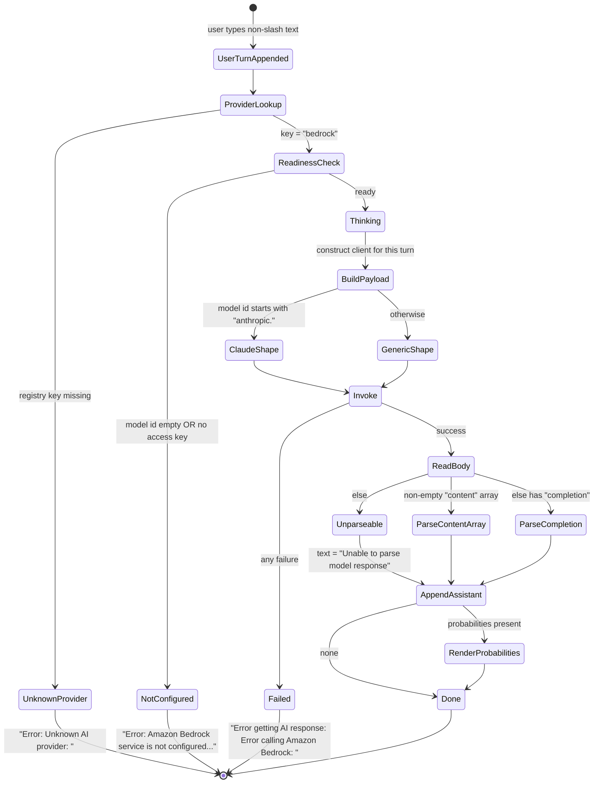

### 7.7 Managed Cloud Model Marketplace Integration

**Description**

The product is a terminal chat assistant for debugging work that can talk to more than one large-language-model back end. This section specifies one of the three interchangeable back ends: the **managed cloud model marketplace** — a regional, account-scoped service through which a customer's own cloud account rents access to hosted foundation models (in practice, chiefly the Claude model family). It exists so that an organisation that already has a cloud account, an identity, a region and a billing relationship with that vendor can point the assistant at that account rather than provision a second AI vendor, and so that no single vendor is a hard dependency of the product.

The back end is deliberately thin and stateless. It advertises a display name, answers a yes/no readiness question about the current settings, and answers a chat turn. To answer a turn it flattens the whole conversation into an ordered list of role/content entries, chooses one of two request-body shapes according to whether the configured model identifier begins with the family prefix, sends exactly one non-streaming request to the marketplace, buffers the whole reply, and parses the reply through one of three mutually exclusive response shapes. It never retries, never times out on its own, never streams, never truncates or windows the conversation, and can never be cancelled once a turn is in flight. Credentials are never accepted as a persisted setting: the user must supply them through environment variables or an operating-system credential vault, and the back end only *reads* the already-resolved values.

The back end also *attempts* to carry the product's token-log-probability introspection to this marketplace: it always emits two probability-request members in the body and contains a large response-side probability parser. **This does not work against the real service.** Neither request member belongs to the marketplace's published model contract, so in practice the members are rejected or ignored and the parser never sees genuine probability data — the only place it has ever been exercised is a hand-written fixture. Unlike the sibling cloud back end, this one does not fabricate placeholder probabilities, so a user who enables the feature here sees only a "none were returned" notice. That gap is carried forward as a requirement-level fact and as an open question, not silently repaired.

---

**User stories**

- **US-7.1** — As a developer whose organisation standardises on one cloud vendor, I want to select the managed cloud model marketplace as my chat back end, so that the assistant runs against my existing account, region and billing relationship instead of a second AI vendor.
- **US-7.2** — As a developer, I want to name the hosted model and the service region, so that my chat turns reach the specific foundation model my account is entitled to.
- **US-7.3** — As a security-conscious developer, I want to supply my cloud access key and secret key out of band (process environment or the operating-system credential vault) and be refused if I try to put them in the settings file, so that long-lived secrets never land in a configuration document.
- **US-7.4** — As a developer starting the console shell, I want to be told immediately whether this back end is configured and, when it is, which source my credentials came from, so that I can fix my setup before wasting a chat turn.
- **US-7.5** — As a developer, I want to type free-text questions and receive the hosted model's answer in my transcript, so that I can get debugging help without leaving the terminal.
- **US-7.6** — As a developer analysing model confidence, I want to request per-token log probabilities from this back end with a chosen number of alternatives, so that the confidence visualiser has data to show. *(Supported as a request-shaping and parsing capability only; against the real service it yields nothing — see FR-7.55 and QUIRK-7.1.)*
- **US-7.7** — As a developer whose turn fails, I want the failure reported as a single readable line that names the back end and preserves the underlying cause, and I want the session to continue, so that one bad turn does not end my working session.
- **US-7.8** — As a maintainer, I want the construction of the marketplace client to sit behind a substitutable seam, so that the entire request-build / invoke / parse path can be exercised with zero network traffic.

---

**Use cases**

#### UC-7.A — Configure the marketplace back end (realizes US-7.1, US-7.2, US-7.3)

**Preconditions**
- The product is installed and a settings document exists or can be created at `<user profile>/.ChatDbg/settings.json`.
- The user holds cloud credentials entitled to invoke the chosen hosted model in the chosen region. Entitlement itself is granted outside the product.

**Main flow**
1. The user selects the provider with `/set provider bedrock` (the value is lower-cased before comparison), or picks the radio option labelled `AWS Bedrock` at index 1 in the windowed settings dialog.
2. The user sets the model identifier with `/model <id>` or `/set modelId <id>`. The value is the remainder of the input line rejoined with single spaces, so identifiers containing spaces survive intact. No marketplace-specific validation is performed.
3. The user sets the region with `/set awsRegion <region>` or via the `AWS Region:` text field in the windowed settings dialog. The shell replies `Set awsRegion = <value>`.
4. The user exports the access key and secret key into the process environment (or stores them in the operating-system credential vault after enabling that source).
5. Each change made through the settings command writes the whole settings document immediately.
6. On next start-up the settings document is re-read and the readiness result is reported (UC-7.B).

**Alternate flows**
- **A1 — Credentials attempted as a setting.** The user types `/set awsAccessKey <value>` or `/set awsSecretKey <value>`. The command is *recognised* but always refused, and prints the security instruction block naming the accepted environment variables; on a platform where the credential vault exists, the two-step vault instructions are appended. Nothing is persisted.
- **A2 — Vault route.** The user runs `/set enablewincred`, then `/set wincred awsAccessKey <value>` and `/set wincred awsSecretKey <value>`. The vault is an optional, capability-detected source.
- **A3 — Windowed dialog region field.** If the region field yields no value at all the dialog substitutes `us-east-1`; a blank or nonsensical value is written through unchanged.

**Error flows**
- **E1 — Unsupported provider value.** Any provider value other than `azure`, `bedrock`, `llama` (after lower-casing) is rejected with `Provider must be 'azure', 'bedrock', or 'llama'`.
- **E2 — Unknown setting key.** The shell prints `Unknown setting: <key>. Valid keys: provider, modelId, temperature, maxTokens, azureEndpoint, awsRegion, systemPrompt, enableLogProbabilities, logProbabilitiesTopK, useWindowsCredentialManager, enablewincred, wincred, migrate`.
- **E3 — Out-of-range tuning value.** Temperature outside `0.0`–`2.0` inclusive and max output tokens outside `1`–`8192` inclusive are rejected by the settings command; the windowed dialog silently clamps instead of rejecting. Top-K outside `1`–`20` is rejected.
- **E4 — Nonsense region.** Accepted verbatim and persisted. No local failure; the failure appears only at connection time during a later turn (INFERRED).
- **E5 — Vault unavailable on this platform.** The lookup silently reports "not found"; the user is given no indication the source was skipped.

**Postconditions**
- The settings document holds `provider`, `modelId`, `awsRegion`, `temperature`, `maxTokens`, `enableLogProbabilities`, `logProbabilitiesTopK`. No credential value is ever written there by any supported action.

---

#### UC-7.B — Report readiness and credential source at start-up (realizes US-7.4)

**Preconditions**
- The console shell is starting and the configured provider is `bedrock`.

**Main flow**
1. The shell asks the back end whether it is configured, passing the whole settings record.
2. The back end answers **true** only when the model identifier is non-empty **and** (the resolved access key is non-empty **or** the process environment variable `AWS_ACCESS_KEY_ID` is non-empty).
3. When true, and at least one of the two cloud keys resolves non-empty, the shell prints `AWS credentials loaded from: <source>` where `<source>` is exactly one of `environment variable (CHATDBG_AWS_ACCESS_KEY)`, `environment variable (AWS_ACCESS_KEY_ID)`, `Windows Credential Manager`, `settings file (deprecated)`, `not set`.

**Alternate flows**
- **A1 — Not configured.** The shell prints `Warning: Amazon Bedrock service is not configured.` followed by the remediation block:
  ```
     Use one of the following credential methods:
     1. Environment Variables:
        set CHATDBG_AWS_ACCESS_KEY=your-access-key
        set CHATDBG_AWS_SECRET_KEY=your-secret-key
        Or use standard AWS variables: AWS_ACCESS_KEY_ID, AWS_SECRET_ACCESS_KEY
  ```
  and, only when the credential vault is available on the running platform, additionally:
  ```
     2. Windows Credential Manager: /set enablewincred
        Then: /set wincred awsAccessKey your-access-key
              /set wincred awsSecretKey your-secret-key
  ```
- **A2 — Windowed host.** No start-up readiness feedback of any kind is produced.

**Error flows**
- **E1 — Access key present, secret key absent.** Readiness still reports **configured**. The mismatch surfaces only later, as an authentication failure during a turn.
- **E2 — Credential vault read fails for any reason.** Treated as "not found"; no message.

**Postconditions**
- No state is changed. The check has no side effects the caller must undo, though it reads the process environment and may read the credential vault.

---

#### UC-7.C — Answer one chat turn (realizes US-7.5, US-7.7)

**Preconditions**
- Provider is `bedrock` and a back end is registered under that key.
- The user has typed text that does not begin with `/`.

**Main flow**
1. The host appends the user's message to the conversation history **before** any readiness check.
2. The console host re-checks readiness and, if ready, prints `Thinking...`; when probabilities are enabled it then prints `Log probabilities enabled - requesting with top-k=<K>`.
3. The back end re-runs its own readiness guard. This guard sits outside the failure handler, so its message reaches the caller unwrapped.
4. The back end asks the client-construction seam for a marketplace client **exactly once**, passing the very same settings record instance it was given.
5. The seam constructs a client: if **both** the resolved access key and the resolved secret key are non-empty, from those two values as explicit static credentials plus the region derived from the region string; otherwise from the region alone, delegating credential discovery to the platform's default cloud credential chain.
6. The back end flattens the conversation: history order preserved, entries flagged as commands removed, no deduplication, no truncation, no windowing. Each surviving entry becomes a role/content pair. Role mapping is binary — an entry whose role lower-cases to `assistant` becomes `assistant`; **every other role, `system` included, becomes `user`**.
7. The back end selects the request shape: **Claude-family** if and only if the model identifier begins, case-insensitively, with the literal prefix `anthropic.`; **generic** otherwise.
8. The back end builds the request body (see the two schemas under Functional requirements), writes it to the diagnostic trace channel as `Bedrock request: <body>`, and sends exactly one invocation carrying content type `application/json`, accept type `application/json`, the model identifier, and the body encoded as UTF-8 bytes. No cancellation signal is supplied.
9. The whole reply body is read into memory as one string (no streaming) and traced as `Bedrock response: <body>`.
10. The back end selects the first matching response shape, in this fixed order: a non-empty top-level `content` array → a top-level `completion` member → unrecognised.
11. If at least one token-probability entry was produced, the back end returns text plus the ordered probability list; otherwise text only. The elapsed-time and error-message fields of the response envelope are never populated.
12. The client is released, on both the success and the failure path.
13. The host appends the answer to the transcript, attaching any probability list; the windowed host, on the first turn that carries probabilities, shrinks the transcript pane to 60 % width and opens a probability pane beside it, scrolled to the top.

**Alternate flows**
- **A1 — Plain-text answer requested.** The caller asks for text only. The back end runs the identical flow and returns only the text field; if that text is absent it returns the literal `Error: Response text expected, none given.` (with the trailing period).
- **A2 — Reply carries a non-empty `content` array.** Text is taken from the `text` member of the first element; probabilities are read only when the probabilities-enabled setting is true **and** a non-null top-level `logprobs` member exists.
- **A3 — Reply carries a `completion` member.** Text is that member's value; probabilities, when enabled, are routed through the tolerant parser.
- **A4 — Empty conversation.** Nothing prevents sending a body whose message array is empty; in the Claude-family shape the body would then carry only the system text. In practice the hosts always append the user's turn first.

**Error flows**
- **E1 — Not configured (model identifier empty, or no access key resolvable).** The back end raises an operation-invalid failure with the message `Amazon Bedrock service is not properly configured. Please set ModelId and AWS credentials.` **What the user sees depends on the host.** The console host short-circuits earlier and prints `Error: Amazon Bedrock service is not configured. Use environment variables or Windows Credential Manager to configure credentials securely.` then `   Type '/set' to see current configuration and setup instructions.` — the internal guard text never reaches the console user. The windowed host performs **no** readiness check on the send path, so the internal guard text reaches the user in a modal titled `Error` reading `Failed to get AI response: Amazon Bedrock service is not properly configured. Please set ModelId and AWS credentials.` In both cases the orphan user message stays in the transcript and no client is ever constructed.
- **E2 — Access key present, secret key absent, and the default credential chain finds nothing.** Readiness passes, the client is built region-only, and the invocation fails with a credential error, surfacing as `Error getting AI response: Error calling Amazon Bedrock: <cause>`.
- **E3 — Unknown or misspelled region.** No local failure; the endpoint is fabricated from the name and the failure appears as a connection/name-resolution error inside `Error calling Amazon Bedrock: <cause>` (INFERRED).
- **E4 — Model not entitled in the account or region, or the account is denied invoke rights.** Surfaces as `Error calling Amazon Bedrock: <access-denied cause>`. The back end cannot distinguish this from any other invocation failure.
- **E5 — Body rejected by the model** (unknown probability members, temperature above the model's own cap, or a non-family model handed the generic shape). Surfaces as `Error calling Amazon Bedrock: <validation cause>`.
- **E6 — Reply is well-formed but matches neither known shape.** **Not an error.** The turn *succeeds* and the answer text becomes the literal `Unable to parse model response`, appended to the transcript as the assistant's words. The real body survives only in the diagnostic trace.
- **E7 — A `content` member that is present but is an empty array.** Fails the first branch test and falls through to the `completion` branch, and on to E6 if there is no `completion`.
- **E8 — The first content element has no `text` member at all.** **Not an error.** The answer text stays the empty string; an empty assistant turn appears in the transcript.
- **E9 — The first content element's `text`, or the `completion` member, is explicitly null.** Text becomes the literal `No response received`.
- **E10 — The first content element's `text` is present but is not a string** (a number, object or array). Reading it raises; the whole turn is lost and becomes `Error calling Amazon Bedrock: <cause>` rather than degrading to a fallback sentence.
- **E11 — Malformed probability data in the structured-content branch.** **No local tolerance.** A `logprobs` member that is non-null and not an array, a token value that is not a string, a log-probability value that is not a number, or the same problems inside any alternative, all raise and destroy the whole turn: the user loses the assistant's text and sees `Error calling Amazon Bedrock: <cause>`.
- **E12 — Malformed probability data in the `completion` branch.** The tolerant parser swallows every failure, traces `Error parsing log probabilities: <cause>`, and yields no probabilities. The text arrives normally. **Identical malformed input therefore has opposite outcomes in the two branches.**
- **E13 — Reply stream unreadable or truncated.** Caught by the outer handler; `Error calling Amazon Bedrock: <cause>`.
- **E14 — Any failure at all between client construction and return.** Traced as `Error in BedrockService: <full failure detail>`, then re-raised as an operation-invalid failure with the message `Error calling Amazon Bedrock: <inner message>`, preserving the original as its cause. The console host prefixes it with `Error getting AI response: `; the windowed host shows a modal titled `Error` reading `Failed to get AI response: <message>`. The session continues in both hosts.
- **E15 — No back end registered for the configured provider key.** Console: `Error: Unknown AI provider: <key>`. Windowed: a modal titled `Error` reading `Unknown AI provider: <key>`.
- **E16 — Nothing can abort an in-flight turn.** There is no timeout, no retry, no back-off, no rate-limit handling and no cancellation anywhere on this path.

**Postconditions**
- On success, the transcript holds the user turn followed by the assistant turn, with any probability list attached to the assistant turn.
- On failure, the transcript holds an orphan user turn and no assistant turn.
- The marketplace client created for this turn is released. No client, connection or credential discovery result is reused for the next turn.

---

#### UC-7.D — Request token log probabilities (realizes US-7.6)

**Preconditions**
- Provider is `bedrock` and the back end is configured.
- The probabilities-enabled setting is on; the top-K alternatives setting is between `1` and `20` inclusive.

**Main flow**
1. Both request shapes carry a probabilities-enabled boolean member and a top-K integer member. When the feature is on they carry `true` and the configured K.
2. The reply is parsed. In the structured-content branch, probability entries are read directly and strictly. In the `completion` branch, they are routed through the tolerant parser.
3. Every accepted entry contributes a token string and a stored log-probability value, in source order, and may carry an ordered list of alternatives.
4. If at least one entry survives, it is attached to the response envelope; the visualiser renders it.

**Alternate flows**
- **A1 — Probabilities disabled.** Both members are still emitted, as `false` and `0`; they are never omitted. Any probability data in the reply is ignored entirely.
- **A2 — Alternatives member-name search (tolerant parser, array shape).** The first present of `top_logprobs`, then `alternatives`, then `top_alternatives` wins; a present-but-unusable match is **not** retried against the later names.
- **A3 — Object-shaped probability data (tolerant parser).** A `tokens` array is read; for each item the token value plus either `logprob` or, if absent, `log_prob`. A missing log-probability defaults to `0`. Entries with an empty token string are dropped. **Alternatives are never parsed in this shape — the alternatives list is always left empty, with no diagnostic.**
- **A4 — Top-K on the response side.** Top-K shapes the request only. Nothing ever truncates the returned tokens or the returned alternatives to K.

**Error flows**
- **E1 — The model returns no probability data at all** (the realistic outcome against the live service). The answer is shown normally and the console prints the two-line notice `Note: Log probabilities were requested but none were returned by the model.` / `This could be due to the model not supporting this feature or an API limitation.` **No simulated placeholder data is fabricated** — this differs from the sibling cloud back end, which does fabricate.
- **E2 — Entries missing a token or a log-probability.** Silently dropped in the array-shaped paths; in the object-shaped path a missing log-probability instead defaults to `0`, which derives to exactly 100 % confidence.
- **E3 — Nothing extracted.** The probability field of the response envelope is left **unset**, never set to an empty list.
- **E4 — Malformed data in the structured-content branch.** Destroys the whole turn (see UC-7.C/E11).

**Postconditions**
- Alternatives carry a stored value that has already been exponentiated once, while primary tokens carry a raw value. The display layer exponentiates again, so alternative percentages always read at or above 100 %.

---

#### UC-7.E — Substitute the client for testing (realizes US-7.8)

**Preconditions**
- A test harness supplies a stand-in for the client-construction seam.

**Main flow**
1. The harness constructs the back end with a substitute seam.
2. The harness drives one chat turn end to end. No network traffic occurs.
3. The harness asserts that the seam was asked for a client exactly once, with the *same* settings record instance the caller passed in, and that exactly one invocation was performed.

**Alternate flows**
- **A1 — No seam supplied.** The back end falls back to the built-in construction path. This is how the product always creates it; only tests pass a substitute.

**Error flows**
- **E1 — The substitute returns a body of the wrong shape.** The normal parsing rules apply, including the "success with `Unable to parse model response`" outcome.

**Postconditions**
- No settings, files or credentials are modified.

---

**Turn state machine**



---

**Functional requirements**

*Identity and registration*

- **FR-7.1** The back end shall be registered in the host's provider registry under the exact lower-case key `bedrock`; the configured provider value shall be lower-cased before the registry lookup. *(realizes US-7.1)*
- **FR-7.2** The back end's display name shall be exactly the string `Amazon Bedrock`, and that string shall be the one interpolated into every message that names this back end. *(realizes US-7.1)*
- **FR-7.3** The provider setting shall accept only `azure`, `bedrock`, `llama` after lower-casing; any other value shall be rejected with the exact message `Provider must be 'azure', 'bedrock', or 'llama'`. *(realizes US-7.1)*
- **FR-7.4** The windowed settings dialog shall present the three providers as radio choices labelled `Azure OpenAI` / `AWS Bedrock` / `Local LLM (LLama)`, with index `1` mapping to and from the registry key `bedrock`. *(realizes US-7.1)*
- **FR-7.5** The default provider shall be `azure`; this back end shall never be the default. *(realizes US-7.1)*

*Readiness*

- **FR-7.6** The readiness check shall report **configured** if and only if **both** (a) the model identifier is non-empty **and** (b) either the resolved access key is non-empty **or** the process environment variable `AWS_ACCESS_KEY_ID` is non-empty. *(realizes US-7.4)*
- **FR-7.7** The readiness check shall **not** examine the secret key. A user with only an access key shall be reported configured and shall fail later at invocation time. *(realizes US-7.4)*
- **FR-7.8** The readiness check shall **not** examine, require or validate the region. *(realizes US-7.4)*
- **FR-7.9** The readiness check shall not validate that the model identifier resembles a marketplace identifier. Because the default model identifier is the non-empty, non-marketplace value `gpt-4`, the model half of FR-7.6 is satisfied out of the box. *(realizes US-7.4)*
- **FR-7.10** The readiness check shall have no side effects the caller must undo, though it reads the process environment and may cause a credential-vault read. *(realizes US-7.4)*

*Configuration surface and defaults*

- **FR-7.11** The model identifier shall be settable as `/model <id>` or `/set modelId <id>`; the value shall be the remainder of the input line rejoined with single spaces, so identifiers containing spaces are preserved. No marketplace-specific validation shall run. *(realizes US-7.2)*
- **FR-7.12** The region shall be settable as `/set awsRegion <region>` and via the windowed dialog field labelled `AWS Region:`. On success the shell shall print `Set awsRegion = <value>`. *(realizes US-7.2)*
- **FR-7.13** The default region shall be the literal `us-east-1`. The region shall be free text: no allow-list, no format check, no normalisation, at any layer. The windowed dialog shall substitute `us-east-1` only when the field yields no value at all, not when it is blank or nonsensical. *(realizes US-7.2)*
- **FR-7.14** Region, model identifier, provider, temperature, max output tokens, probabilities-enabled and top-K shall be persisted, under the member names `awsRegion`, `modelId`, `provider`, `temperature`, `maxTokens`, `enableLogProbabilities`, `logProbabilitiesTopK`, in the settings document at `<user profile>/.ChatDbg/settings.json`, indented, with camel-cased member names, falling back to the system temporary directory when the user-profile folder is unavailable. Every successful setting change shall rewrite the whole document immediately. *(realizes US-7.2)*
- **FR-7.15** Temperature shall default to `0.7` and be accepted only in the inclusive range `0.0`–`2.0`; max output tokens shall default to `1000` and be accepted only in the inclusive range `1`–`8192`; top-K alternatives shall default to `5` and be accepted only in the inclusive range `1`–`20`; the probabilities-enabled flag shall default to `false`. The settings command rejects out-of-range values; the windowed dialog clamps temperature and max tokens instead of rejecting. *(These are tunable defaults, not business invariants, except the ranges, which are enforced limits.)* *(realizes US-7.2, US-7.6)*
- **FR-7.16** The system-prompt text shall be a computed, never-persisted setting whose default value is exactly `You are ChatDBG, a helpful debugging assistant. Help users analyze code, debug issues, and understand programming concepts.` unless another prompt has been selected in-session. The default system-prompt *name* is `default`. *(realizes US-7.5)*

*Credentials*

- **FR-7.17** Cloud credentials shall never be settable through the shell. `/set awsAccessKey <value>` and `/set awsSecretKey <value>` shall be recognised but always refused, printing verbatim:
  ```
  For security, AWS Access Key is no longer set via this command.

  ## Secure Options:
  1. Environment Variables (Recommended):
     set CHATDBG_AWS_ACCESS_KEY=your-credential
     set AWS_ACCESS_KEY_ID=your-credential

  This keeps your credentials secure and out of configuration files.
  ```
  The secret-key variant substitutes `AWS Secret Key`, `CHATDBG_AWS_SECRET_KEY` and `AWS_SECRET_ACCESS_KEY`. On a platform where the credential vault exists, the following block shall be inserted before the closing sentence:
  ```

  2. Windows Credential Manager (Secure Option):
     /set enablewincred                    (enable Windows Credential Manager)
     /set wincred <type> your-credential   (store credential)
  ```
  *(realizes US-7.3)*
- **FR-7.18** The access key shall be resolved in this exact order, first non-empty wins, empty string if all are empty: environment `CHATDBG_AWS_ACCESS_KEY` → environment `AWS_ACCESS_KEY_ID` → credential vault entry `ChatDbg:AwsAccessKey` (only when the vault source is enabled) → deprecated settings-document member `awsAccessKey`. *(realizes US-7.3)*
- **FR-7.19** The secret key shall be resolved in this exact order: environment `CHATDBG_AWS_SECRET_KEY` → environment `AWS_SECRET_ACCESS_KEY` → credential vault entry `ChatDbg:AwsSecretKey` → deprecated settings-document member `awsSecretKey`. *(realizes US-7.3)*
- **FR-7.20** Credential-vault lookup failures — including "this platform has no vault" — shall be swallowed and reported as "not found", with no message to the user. *(realizes US-7.3)*
- **FR-7.21** There shall be **no** support for session tokens or temporary credentials anywhere: no `AWS_SESSION_TOKEN` read, no vault entry, no settings member. *(realizes US-7.3)*
- **FR-7.22** The credential-source label shall be exactly one of `environment variable (<VARIABLE NAME>)`, `Windows Credential Manager`, `settings file (deprecated)`, `not set`. *(realizes US-7.4)*
- **FR-7.23** The settings listing shall print `- AWS Region: <value>`, `- AWS Access Key: <***set*** | (not set)> [<source>]` and `- AWS Secret Key: <***set*** | (not set)> [<source>]`. Key values themselves shall never be printed. *(realizes US-7.3)*

*Start-up reporting*

- **FR-7.24** When the console host starts with provider `bedrock` and readiness is false, it shall print `Warning: Amazon Bedrock service is not configured.` followed by the remediation block reproduced in UC-7.B/A1, including its leading whitespace; the vault half of that block shall be printed only when the vault is available on the running platform. *(realizes US-7.4)*
- **FR-7.25** When readiness is true and at least one of the two cloud keys resolves non-empty, the console host shall print `AWS credentials loaded from: <source>`. *(realizes US-7.4)*
- **FR-7.26** The windowed host shall produce **no** start-up readiness feedback for this back end. *(realizes US-7.4)*

*Turn execution*

- **FR-7.27** Before any network work, the back end shall re-run the readiness check and, if false, raise an operation-invalid failure carrying exactly `Amazon Bedrock service is not properly configured. Please set ModelId and AWS credentials.` This guard shall sit outside the failure handler so its message reaches the caller unwrapped. *(realizes US-7.5, US-7.7)*
- **FR-7.28** The console host shall re-check readiness before every turn and short-circuit with `Error: Amazon Bedrock service is not configured. Use environment variables or Windows Credential Manager to configure credentials securely.` followed by `   Type '/set' to see current configuration and setup instructions.` The windowed host shall perform no readiness check on the send path. *(realizes US-7.5)*
- **FR-7.29** The user's message shall be appended to the conversation history **before** the readiness check, so a failed turn leaves an orphan user message in the transcript. *(realizes US-7.5)*
- **FR-7.30** Exactly one marketplace client shall be requested from the client-construction seam per chat turn, and the seam shall receive the **same settings record instance** the caller passed in — not a copy and not a projection. *(realizes US-7.8)*
- **FR-7.31** The client shall be created per request and released when the request ends, on both the success and the failure path. No client pooling and no client reuse across turns shall occur. *(realizes US-7.5)*
- **FR-7.32** The client-construction seam shall build the client from the resolved access key and secret key as explicit static credentials plus the region, **only when both are non-empty**; otherwise it shall build the client from the region alone and delegate credential discovery to the platform's default cloud credential chain. *(realizes US-7.3)*
- **FR-7.33** The region string shall be converted to an endpoint by system name with no validation. An unrecognised name shall not fail at construction time; an endpoint is fabricated and the failure surfaces later as a connection error. **INFERRED** (upstream platform behaviour, not local code). *(realizes US-7.2)*
- **FR-7.34** The conversation shall be flattened in insertion order: entries flagged as commands are excluded; remaining entries are never reordered, deduplicated, truncated or windowed. There shall be **no context-window management of any kind** — the entire history is resent every turn. *(realizes US-7.5)*
- **FR-7.35** Role mapping shall be binary: an entry whose role equals `assistant` when lower-cased becomes `assistant`; **every other role, including `system`, becomes `user`**. *(realizes US-7.5)*
- **FR-7.36** The model family shall be detected as "Claude family" if and only if the model identifier begins, compared case-insensitively, with the literal prefix `anthropic.`. No version parsing, suffix parsing or lookup table shall be used. *(realizes US-7.2)*
- **FR-7.37** For the Claude family the request body shall be an object with exactly these members in this order — *this is a wire format and must be reproduced member-for-member, snake_case included*:

  | Member | Value |
  |---|---|
  | `anthropic_version` | constant string `bedrock-2023-05-31` |
  | `max_tokens` | the max-output-tokens setting, integer |
  | `temperature` | the temperature setting, number |
  | `system` | the currently-selected system-prompt text |
  | `messages` | the flattened role/content array, each element `{ "role": <string>, "content": <string> }` |
  | `logprobs` | the probabilities-enabled boolean |
  | `top_logprobs` | the top-K integer when probabilities are enabled, otherwise the integer `0` |

  There shall be **no** entry with role `system` inside `messages` on this path. *(realizes US-7.5, US-7.6)*
- **FR-7.38** For every non-Claude-family identifier the request body shall be an object with exactly these members:

  | Member | Value |
  |---|---|
  | `max_tokens` | the max-output-tokens setting, integer |
  | `temperature` | the temperature setting, number |
  | `messages` | an array whose **first element, always at index 0**, is a synthetic entry with role `system` and the system-prompt text as its content, followed by the flattened conversation |
  | `logprobs` | the probabilities-enabled boolean |
  | `top_logprobs` | the top-K integer when enabled, otherwise `0` |

  There shall be no `anthropic_version` member, no top-level `system` member and no other family-specific member. *(realizes US-7.5)*
- **FR-7.39** Both probability members shall be emitted on **every** request, including when the feature is disabled, as `false` and `0`; they shall never be omitted. *(realizes US-7.6)*
- **FR-7.40** The request body shall be written to the diagnostic trace channel as `Bedrock request: <body>` before the invocation, and the reply body as `Bedrock response: <body>` after it. These traces carry the entire conversation and the entire reply verbatim, with no redaction and no truncation; no credential value shall appear in them. *(realizes US-7.5)*
- **FR-7.41** The invocation shall carry content type `application/json`, accept type `application/json`, the configured model identifier, and the body serialised to UTF-8 bytes. Exactly one invocation shall be performed per chat turn. *(realizes US-7.5)*
- **FR-7.42** The reply body shall be read in full into memory as a single string before parsing. There shall be no streaming, no incremental rendering and no size cap. *(realizes US-7.5)*

*Response interpretation*

- **FR-7.43** Response shapes shall be evaluated in this fixed order, first match wins: (1) a top-level `content` member that is a **non-empty** array; (2) a top-level `completion` member; (3) unrecognised. A `content` member that is present but empty, or present but not an array, shall fail test (1) and fall through. *(realizes US-7.5)*
- **FR-7.44** In branch (1) the answer text shall be the `text` member of the first `content` element; if that member is explicitly null the text shall be the literal `No response received`; if that member is absent altogether the text shall remain the **empty string** with no fallback message; if that member is present but not a string the whole turn shall fail. *(realizes US-7.5)*
- **FR-7.45** In branch (1) probabilities shall be read only when the probabilities-enabled setting is true **and** a non-null top-level `logprobs` member exists. That member is enumerated as an array; each element requires both a `token` string and a `logprob` number, and elements missing either are silently skipped; each accepted element may carry a `top_logprobs` array of alternatives, each requiring `token` plus `logprob`. **This branch has no local tolerance**: any type mismatch raises and destroys the whole turn. *(realizes US-7.6)*
- **FR-7.46** In branch (2) the answer text shall be the `completion` value, or the literal `No response received` when it is null; probabilities, when enabled, shall be routed through the tolerant parser for any `logprobs` member of any kind, including null. *(realizes US-7.5)*
- **FR-7.47** In branch (3) the answer text shall be exactly the literal `Unable to parse model response`, no probabilities shall be produced, and the turn shall be reported as a **normal success**, appended to the transcript as the assistant's words. *(realizes US-7.5)*
- **FR-7.48** The tolerant parser shall never raise. Any failure inside it shall be swallowed, traced as `Error parsing log probabilities: <cause>`, and yield "no probabilities". *(realizes US-7.6)*
- **FR-7.49** The tolerant parser, given an **array**, shall require `token` (string) and `logprob` (number) for each item, and shall look for alternatives under the first present of `top_logprobs`, then `alternatives`, then `top_alternatives` — a present-but-unusable match shall **not** be retried against the later names. Each alternative requires `token` plus `logprob`. *(realizes US-7.6)*
- **FR-7.50** The tolerant parser, given an **object**, shall look for a `tokens` array; for each item it reads the token value and then `logprob` or, when absent, `log_prob`; a missing or unreadable log-probability shall default to `0`; items with an empty token string shall be dropped; **the alternatives list shall always be left empty in this shape**. *(realizes US-7.6)*
- **FR-7.51** The tolerant parser, given any other shape (string, number, boolean, null), shall produce nothing. *(realizes US-7.6)*
- **FR-7.52** The top-K setting shall shape the request only. It shall never truncate the returned tokens or the returned alternatives; the tolerant parser accepts a top-K argument and never reads it. *(realizes US-7.6)*
- **FR-7.53** Token-probability entries shall preserve source order, and alternatives shall preserve source order within a token. *(realizes US-7.6)*
- **FR-7.54** For a **primary** token the raw log-probability value shall be stored unchanged. For each **alternative** the value stored in the same field shall be the exponential of the source log-probability (i.e. already a probability). Because the display layer derives a percentage by exponentiating the stored value, alternative percentages are always at or above 100 % and may reach roughly 271 %. *(realizes US-7.6; see QUIRK-7.3)*
- **FR-7.55** When probabilities are enabled and no entry survives parsing, the probability field of the response envelope shall be left **unset** (never an empty list), and no simulated or placeholder probability data shall be fabricated. The console host shall then print `\nNote: Log probabilities were requested but none were returned by the model.` followed by `This could be due to the model not supporting this feature or an API limitation.` *(realizes US-7.6)*
- **FR-7.56** When probabilities are disabled, any probability data present in the reply shall be ignored entirely. *(realizes US-7.6)*

*Result envelope, errors and lifecycle*

- **FR-7.57** The response envelope's text field shall always be set; its probability list shall be set only when at least one entry was parsed; its total-elapsed-time field shall always remain `0`; its error-message field shall never be populated — failures are raised, never returned. *(realizes US-7.5, US-7.7)*
- **FR-7.58** The plain-text answer operation shall delegate to the full operation and return only the text field, substituting the literal `Error: Response text expected, none given.` (trailing period included) when that field is absent. *(realizes US-7.5)*
- **FR-7.59** Every failure between client construction and return shall be traced as `Error in BedrockService: <full failure detail>` and re-raised as an operation-invalid failure whose message is exactly `Error calling Amazon Bedrock: <inner message>`, preserving the original failure as its cause. *(realizes US-7.7)*
- **FR-7.60** The console host shall render any raised failure as `Error getting AI response: <message>` and continue the session; the windowed host shall render it as a modal titled `Error` with body `Failed to get AI response: <message>`. *(realizes US-7.7)*
- **FR-7.61** When the console host's probability path finds the envelope's text absent, it shall store the literal `Error: Response text expected, none recieved.` [misspelling intentional and required] into the transcript — a *different* string from FR-7.58. *(realizes US-7.7)*
- **FR-7.62** When probabilities are enabled the console host shall print `Log probabilities enabled - requesting with top-k=<K>` before the turn, after `Thinking...`. *(realizes US-7.6)*
- **FR-7.63** When the configured provider key is absent from the registry, the console host shall print `Error: Unknown AI provider: <key>` and the windowed host shall show a modal titled `Error` reading `Unknown AI provider: <key>`. *(realizes US-7.7)*
- **FR-7.64** The back end shall expose a release/teardown operation that does nothing but set an internal "already released" flag; a second call shall be a no-op. The console host shall release every registered back end at shutdown; the windowed host shall release none. *(realizes US-7.8)*
- **FR-7.65** The client-construction seam shall be a substitutable, single-operation abstraction — "given a settings record, hand me a marketplace client" — and the back end shall fall back to the built-in construction path when no substitute is supplied. *(realizes US-7.8)*
- **FR-7.66** No path in this feature shall retry, back off, apply a timeout of its own, handle rate limiting, degrade to another model or region, or accept a cancellation signal. Whatever transport defaults the underlying client library carries are what runs. *(realizes US-7.5)*
- **FR-7.67** Sending a body whose message array is empty shall not be prevented; no guard exists. *(realizes US-7.5)*
- **FR-7.68** The back end shall hold no mutable state other than its "already released" flag, and shall therefore be safe for concurrent turns even though the hosts serialise turns; the flag itself is not guarded against simultaneous access. *(realizes US-7.8)*
- **FR-7.69** All operator- and user-facing strings in this feature shall be reproduced verbatim in English, including punctuation, leading whitespace and the misspelling in FR-7.61. Role names, member names and the family-detection prefix shall be compared with explicit case-insensitive / culture-invariant semantics; numeric members shall be serialised with culture-invariant rules. *(realizes US-7.5)*

---

**External technology**

*Requires: a managed, region-scoped, account-billed marketplace for hosted foundation models, invoked once per turn with no streaming (HTTPS with per-request cryptographic request signing; opaque per-model structured request and response bodies; region-scoped endpoint). Source used: Amazon Bedrock Runtime via `AWSSDK.BedrockRuntime` 4.0.7.3. Reimplementer notes: only the single-shot "invoke model" operation is used — no streaming, no unified converse-style API, no tool use, no model listing. Content type and accept type are both `application/json`. The body is an opaque per-model document the caller must shape correctly; the service performs no normalisation across model families, so the two body shapes in FR-7.37/FR-7.38 are the entire contract this product implements.*

*Requires: cloud credential resolution and request signing, with a documented fallback discovery chain (AWS Signature Version 4; the vendor's default credential provider chain covering shared profile files, container and instance roles, single sign-on, and environment variables). Source used: the vendor SDK's static-credential constructor when both keys resolve, otherwise its region-only constructor which triggers the default chain. Reimplementer notes: both branches must exist and must be selected by exactly the rule in FR-7.32. Beware that there is no session-token support, so temporary credentials present in the environment are hoisted into a static key pair without their token and will fail authentication.*

*Requires: resolution of a service endpoint from a short region code (vendor region naming such as `us-east-1`, `eu-west-1`). Source used: region lookup by system name. Reimplementer notes: unknown names must not fail fast — the source fabricates an endpoint and lets the failure surface at connection time. If you want validation you must add it; the source has none, and FR-7.13 depends on the absence.*

*Requires: the Claude-family message contract in its marketplace flavour (structured body with `anthropic_version`, `system`, `messages[{role,content}]`, `max_tokens`, `temperature`; reply read as `content[0].text`). Source used: a hand-built body with the contract version pinned to the constant `bedrock-2023-05-31`. Reimplementer notes: reproduce the member names verbatim. The source additionally sends non-contract `logprobs` / `top_logprobs` members — do not copy that unless you have verified the target service accepts them.*

*Requires: the legacy single-string completion reply contract (a top-level `completion` string). Source used: parsed as the second-priority response branch. Reimplementer notes: this is the only reply shape the source's own test suite ever exercises, so it is the shape with the best-understood behaviour and the worst real-world relevance.*

*Requires: per-family request and response contracts for every non-Claude model family (each vendor family has its own native body schema). Source used: **not implemented** — a single invented `messages` shape is sent to every non-Claude identifier. Reimplementer notes: treat the generic branch as a stub. A faithful clone must either implement real per-family shapes or explicitly reject non-Claude identifiers; see Open Question 2.*

*Requires: structured-document serialisation and read-only document traversal with try-get semantics (RFC 8259 JSON). Source used: the platform's built-in JSON library; the request is serialised from anonymous objects with **default** member naming, so members are emitted exactly as written, snake_case included; the reply is walked as a document object model. Reimplementer notes: member names must survive verbatim. Note the sibling cloud back end applies camel-casing to its body and this one does not — do not unify them.*

*Requires: a diagnostic trace channel for developer builds. Source used: the platform's conditional debug-trace writes of the full request body, the full reply body, the full failure detail, and probability-parse failures. Reimplementer notes: these are compiled out of release builds in the source platform (INFERRED — no build configuration states it). If your platform's equivalent is always on, be aware that every user prompt and every model answer is written to it unredacted. No credential value appears there.*

*Requires: an optional operating-system secret vault, capability-detected and degrading silently to "absent" (platform keychain / secret service). Source used: the Windows Credential Manager via the native library `advapi32.dll` entry points `CredReadW`, `CredWriteW`, `CredDeleteW`, `CredFree`, under target names `ChatDbg:AwsAccessKey` and `ChatDbg:AwsSecretKey`. Reimplementer notes: this is the feature's only operating-system-specific dependency and it is reached indirectly through the credential feature. Map it to your platform's keychain or drop it and keep environment variables — the source already degrades to that off Windows, and the remediation text hides options the running platform cannot offer.*

*Requires: a substitutable client-construction seam plus a test double library, so the whole build/invoke/parse path runs with zero network. Source used: an interface-based factory with Moq 4.20.69 and xUnit 2.9.1. Reimplementer notes: keep an equivalent seam; two of the source's three test assertions are about the seam's call count and argument identity.*

*Requires: HTTP transport policy — timeout, retry count, back-off, connection pooling, proxy (HTTP/1.1 over TLS). Source used: **nothing is configured**; whatever the vendor SDK defaults to is what runs. Reimplementer notes: your clone will not match the source's timing behaviour unless you match those defaults. Decide explicitly — the source made no decision — and note that per-turn client construction defeats pooling regardless.*

*Requires: an exponential function for converting log probabilities to probabilities. Source used: the standard-library exponential, applied at parse time to alternatives and again at display time to every entry. Reimplementer notes: any language's exponential will do; what matters is **where** it is applied — see FR-7.54 and QUIRK-7.3.*

*Requires: a managed runtime. Source used: `net10.0` for all four projects. Reimplementer notes: nothing in this feature depends on the runtime version.*

---

**Acceptance criteria**

- **AC-7.1** — **Given** a settings record whose model identifier is the empty string, **when** the readiness check runs, **then** it reports "not configured" regardless of what credentials are available.
- **AC-7.2** — **Given** a freshly defaulted settings record (model identifier `gpt-4`, region `us-east-1`, provider `azure` overridden to `bedrock`) and a process environment with no `CHATDBG_AWS_ACCESS_KEY`, no `AWS_ACCESS_KEY_ID`, no vault entry and no deprecated settings-document key, **when** the readiness check runs, **then** it reports "not configured", and the reason is the credential half of the rule, not the model half.
- **AC-7.3** — **Given** the model identifier `anthropic.claude-3-sonnet-20240229-v1:0` and `AWS_ACCESS_KEY_ID=AKIAEXAMPLE` with **no** secret key resolvable anywhere, **when** the readiness check runs, **then** it reports "configured".
- **AC-7.4** — **Given** a resolved access key `access`, a resolved secret key `secret` and region `us-east-1`, **when** a client is constructed, **then** it is built from those two values as explicit static credentials plus the `us-east-1` endpoint, with **no** network call and **no** credential validation; **and given** either key is the empty string, **then** it is built from the region alone and the platform's default credential discovery is used.
- **AC-7.5** — **Given** any settings record and any conversation, **when** one chat turn is sent, **then** the client-construction seam is invoked exactly once and receives the identical settings record instance the caller passed, and exactly one model invocation occurs.
- **AC-7.6** — **Given** the model identifier `ANTHROPIC.Claude-v2` (mixed case), temperature `0.7`, max tokens `1000`, probabilities disabled, **when** a turn is sent, **then** the request body contains `anthropic_version` = `bedrock-2023-05-31`, `max_tokens` = `1000`, `temperature` = `0.7`, a `system` member holding the current system-prompt text, a `messages` array, `logprobs` = `false` and `top_logprobs` = `0`; **and** no element of `messages` has role `system`.
- **AC-7.7** — **Given** the model identifier `amazon.titan-text-express-v1`, **when** a turn is sent, **then** the request body has no `anthropic_version` member, no top-level `system` member, and `messages[0]` has role `system` with the system-prompt text as its content.
- **AC-7.8** — **Given** a conversation of five entries in this order — user `a`, command-flagged `/set provider bedrock`, assistant `b`, injected role `system` with content `c`, user `d` — **when** the body is built, **then** `messages` holds exactly four entries in the order `a`, `b`, `c`, `d`, with roles `user`, `assistant`, **`user`**, `user`.
- **AC-7.9** — **Given** probabilities enabled with top-K `7`, **when** a turn is sent, **then** the request body contains `logprobs` = `true` and `top_logprobs` = `7`.
- **AC-7.10** — **Given** probabilities disabled and a reply body `{"completion":"hi","logprobs":[{"token":"a","logprob":-0.1}]}`, **when** the turn completes, **then** the answer text is `hi` and the response envelope carries **no** probability list.
- **AC-7.11** — **Given** model identifier `anthropic.claude`, probabilities enabled with top-K `1`, access key `key`, secret key `secret`, and a client that returns the body `{"completion": "bedrock response", "logprobs": [{"token":"Hello","logprob":-0.1,"top_logprobs":[{"token":"Hi","logprob":-0.2}]}]}`, **when** one turn is sent, **then** the returned text is exactly `bedrock response` and the probability list is non-empty.
- **AC-7.12** — **Given** the same inputs as AC-7.11, **when** the probability list is inspected, **then** it holds exactly one entry whose token is `Hello` and whose stored log-probability value is exactly `-0.1`, carrying exactly one alternative whose token is `Hi` and whose stored value is `0.8187307530779818` — that is, the exponential of `-0.2`, **not** `-0.2`.
- **AC-7.13** — **Given** the list from AC-7.12, **when** each stored value is exponentiated for display, **then** the primary token yields `0.9048…` (about 90.5 %) and the alternative yields `2.2677…` (about 226.8 %), which the display layer renders as a percentage above 100 %.
- **AC-7.14** — **Given** model identifier `anthropic.claude` and the reply body from AC-7.11, **when** the reply is parsed, **then** the `completion` branch is taken and the structured-content branch is not — the model family selects the *request* shape only, and the *response* shape is chosen purely by which members the body carries.
- **AC-7.15** — **Given** the reply body `{"content":[{"text":"structured answer"}],"completion":"ignored"}`, **when** the turn completes, **then** the returned text is `structured answer` and the `completion` member is never consulted.
- **AC-7.16** — **Given** the reply body `{"content":[],"completion":"x"}`, **when** the turn completes, **then** the structured branch is skipped and the returned text is `x`.
- **AC-7.17** — **Given** the reply body `{"foo":"bar"}`, **when** the turn completes, **then** the operation **succeeds** and the returned text is exactly `Unable to parse model response`, which is appended to the transcript as the assistant's reply.
- **AC-7.18** — **Given** the reply body `{"content":[{"text":null}]}`, **when** the turn completes, **then** the returned text is exactly `No response received`; **and given** `{"completion":null}`, **then** the returned text is also exactly `No response received`.
- **AC-7.19** — **Given** the reply body `{"content":[{"role":"assistant"}]}` (first element present, `text` member absent), **when** the turn completes, **then** the operation succeeds and the returned text is the **empty string**.
- **AC-7.20** — **Given** the reply body `{"content":[{"text":42}]}`, **when** the turn completes, **then** the whole turn fails with a message beginning `Error calling Amazon Bedrock: ` and no fallback sentence is produced.
- **AC-7.21** — **Given** probabilities enabled and the reply body `{"content":[{"text":"hi"}],"logprobs":{"not":"an array"}}`, **when** the turn completes, **then** the turn **fails** with a message beginning `Error calling Amazon Bedrock: ` and the text `hi` is lost; **but given** `{"completion":"hi","logprobs":{"not":"an array"}}` with probabilities enabled, **then** the turn **succeeds** with text `hi` and no probability list.
- **AC-7.22** — **Given** probabilities enabled and the reply body `{"completion":"hi","logprobs":{"tokens":[{"token":"a"},{"token":"","log_prob":-0.5},{"token":"b","log_prob":-0.5}]}}`, **when** the turn completes, **then** the probability list holds exactly two entries — `a` with stored value `0` (deriving to exactly 100 %) and `b` with stored value `-0.5` — the empty-token entry is dropped, and neither entry carries any alternatives.
- **AC-7.23** — **Given** the reply body `{"completion":"hi","logprobs":[{"token":"a","logprob":-0.1,"alternatives":[{"token":"b","logprob":-0.2}]}]}` with probabilities enabled, **when** the turn completes, **then** the alternative `b` is found, because the member-name search tries `top_logprobs`, then `alternatives`, then `top_alternatives`, first present wins.
- **AC-7.24** — **Given** probabilities enabled with top-K `5` and a reply carrying `20` token entries each with `10` alternatives, **when** the turn completes, **then** all `20` entries and all `10` alternatives per entry are returned; top-K never truncates the response.
- **AC-7.25** — **Given** the remote invocation raises for any reason, **when** the turn completes, **then** an operation-invalid failure is raised whose message begins `Error calling Amazon Bedrock: `, which preserves the original failure as its cause; the console host renders `Error getting AI response: Error calling Amazon Bedrock: …` and the session does not terminate.
- **AC-7.26** — **Given** probabilities enabled with top-K `3` and a reply that carries no probability data, **when** the turn completes, **then** the answer is still shown, the console prints `Note: Log probabilities were requested but none were returned by the model.` followed by `This could be due to the model not supporting this feature or an API limitation.`, and **no** simulated probability data is fabricated.
- **AC-7.27** — **Given** the back end's display name is requested, **then** it is exactly `Amazon Bedrock`.
- **AC-7.28** — **Given** the model identifier is the empty string and the console host is running, **when** the user types `hello`, **then** the transcript retains the orphan user message `hello`, the console prints `Error: Amazon Bedrock service is not configured. Use environment variables or Windows Credential Manager to configure credentials securely.` then `   Type '/set' to see current configuration and setup instructions.`, and no client is constructed. **Given** the same state in the windowed host, **then** a modal titled `Error` reads `Failed to get AI response: Amazon Bedrock service is not properly configured. Please set ModelId and AWS credentials.`
- **AC-7.29** — **Given** `AWS_ACCESS_KEY_ID=AKIAEXAMPLE`, `AWS_SECRET_ACCESS_KEY=secretvalue` and `AWS_SESSION_TOKEN=tokenvalue` in the environment and no other credential source configured, **when** a client is constructed, **then** it is built from `AKIAEXAMPLE` and `secretvalue` as **static** credentials and the session token is **discarded**; authentication against the marketplace then fails.
- **AC-7.30** — **Given** `/set awsRegion not-a-region` followed by a chat turn, **then** the value `not-a-region` is accepted and persisted with no validation, and the failure surfaces only at connection time as `Error getting AI response: Error calling Amazon Bedrock: <connection message>`. **INFERRED** for the second half.
- **AC-7.31** — **Given** the settings document at `<user profile>/.ChatDbg/settings.json` contains `{"provider":"bedrock","modelId":"anthropic.claude-3-sonnet-20240229-v1:0","awsRegion":"eu-west-1","enableLogProbabilities":true,"logProbabilitiesTopK":3,"temperature":0.7,"maxTokens":1000}` and the default system prompt is in force, **when** the console host starts and the user sends `hello`, **then** the request body is exactly `{"anthropic_version":"bedrock-2023-05-31","max_tokens":1000,"temperature":0.7,"system":"You are ChatDBG, a helpful debugging assistant. Help users analyze code, debug issues, and understand programming concepts.","messages":[{"role":"user","content":"hello"}],"logprobs":true,"top_logprobs":3}`, sent with content type `application/json`, accept `application/json`, model identifier `anthropic.claude-3-sonnet-20240229-v1:0`, to the `eu-west-1` endpoint.
- **AC-7.32** — **Given** `/set awsAccessKey AKIAEXAMPLE`, **then** the value is **not** persisted anywhere and the security instruction block of FR-7.17 is printed verbatim; **and given** the running platform has no credential vault, **then** the numbered vault block is omitted from that output.
- **AC-7.33** — **Given** `/set provider openai`, **then** the shell prints exactly `Provider must be 'azure', 'bedrock', or 'llama'` and the provider setting is unchanged.
- **AC-7.34** — **Given** two consecutive chat turns in one session, **then** two separate marketplace clients are constructed and released — no client, connection or credential-discovery result is reused.
- **AC-7.35** — **Given** any completed turn, **then** the response envelope's total-elapsed-time field is `0` and its error-message field is unset.
- **AC-7.36** — **Given** the plain-text answer operation and a turn whose envelope text is absent, **then** the returned string is exactly `Error: Response text expected, none given.` (with the trailing period), while the console host's probability path stores the different string `Error: Response text expected, none recieved.` for the equivalent condition.
- **AC-7.37** — **Given** the release operation is called twice, **then** the second call is a no-op and no failure is raised; **and given** the windowed host is closed, **then** no release call is made at all.
- **AC-7.38** — **Given** a user who follows only the product README's marketplace section (`/set provider bedrock`, `/set modelId …`, `/set awsRegion …`) and nothing else, **when** they send a chat turn, **then** the back end reports "not configured" — documentation alone cannot reach a working state.

---

**Quirks**

- *QUIRK-7.1: The probability-request members are not part of any real marketplace contract. Both body shapes always send `logprobs` and `top_logprobs`; neither belongs to the Claude-on-marketplace request contract, and the generic shape matches no real family's contract either. Against the live service this either draws a validation rejection or is ignored, so the entire response-side probability parser is dead code against genuine replies. The upstream-contract half is **INFERRED**; the author's own comments hedge. Evidence: `src/Xcaciv.ChatDbg.Core/Services/BedrockService.cs:76-77`, `:101-102`, `:67`, `:100`, `:144-187`, `:225-324`; only exercise `src/Xcaciv.ChatDbg.Core.Tests/Services/BedrockServiceTests.cs:28-41`. Keep-or-fix decision deferred to Open Questions.*
- *QUIRK-7.2: The probability members are emitted even when the feature is off — as `false` and `0` rather than omitted — so every request carries members the model does not expect. Evidence: `src/Xcaciv.ChatDbg.Core/Services/BedrockService.cs:76-77`, `:101-102`. Keep-or-fix decision deferred to Open Questions.*
- *QUIRK-7.3: Double exponentiation of alternatives. A primary token's raw log-probability is stored as-is (correct), but each alternative is stored already exponentiated into the same field; the consumer exponentiates again, so an alternative's derived probability is always at or above 1.0 (100 %) and can reach about 271 %. Affects both parsing paths. Evidence: raw store `src/Xcaciv.ChatDbg.Core/Services/BedrockService.cs:162`, `:245`; exponentiated store `:178`, `:268`; second exponentiation `src/Xcaciv.ChatDbg.Core/Models/TokenLogProbabilities.cs:26`. Keep-or-fix decision deferred to Open Questions.*
- *QUIRK-7.4: Malformed probability data is fatal in one response branch and harmless in the other. The structured-content branch has no local guard, so a bad member destroys the whole answer; the `completion` branch routes identical data through a tolerant parser that keeps the text. Evidence: unguarded `src/Xcaciv.ChatDbg.Core/Services/BedrockService.cs:151-182`; guarded `:227`, `:319-323`. Keep-or-fix decision deferred to Open Questions.*
- *QUIRK-7.5: A non-string `content[0].text` also destroys the turn, rather than degrading to the `No response received` fallback that an explicit null gets. Evidence: `src/Xcaciv.ChatDbg.Core/Services/BedrockService.cs:140`, `:215-219`. Keep-or-fix decision deferred to Open Questions.*
- *QUIRK-7.6: Top-K is requested but never applied. The tolerant parser accepts a top-K argument and never reads it, so no truncation of tokens or alternatives ever happens on the response side. Evidence: `src/Xcaciv.ChatDbg.Core/Services/BedrockService.cs:199`, `:225`. Keep-or-fix decision deferred to Open Questions.*
- *QUIRK-7.7: The object-shaped probability path silently drops all alternatives — it always assigns an empty alternatives collection and never looks for one, with no diagnostic. Evidence: `src/Xcaciv.ChatDbg.Core/Services/BedrockService.cs:310`. Keep-or-fix decision deferred to Open Questions.*
- *QUIRK-7.8: A missing log-probability in the object-shaped path silently defaults to `0`, which derives to exactly 100 % confidence — the most confident value possible — while the array-shaped path drops such entries instead. Evidence: `src/Xcaciv.ChatDbg.Core/Services/BedrockService.cs:292`, `:299-301` vs `:236-237`. Keep-or-fix decision deferred to Open Questions.*
- *QUIRK-7.9: An unparseable reply is reported as success. The literal `Unable to parse model response` becomes the assistant's words in the transcript; the real body survives only in the diagnostic trace. Silent data loss. Evidence: `src/Xcaciv.ChatDbg.Core/Services/BedrockService.cs:202-204`, `:213`. Keep-or-fix decision deferred to Open Questions.*
- *QUIRK-7.10: An empty `content` array falls through to the fallback branch — presence of `content` is not enough, only a non-empty array selects the structured branch. Evidence: `src/Xcaciv.ChatDbg.Core/Services/BedrockService.cs:133-135`. Keep-or-fix decision deferred to Open Questions.*
- *QUIRK-7.11: A `system` message injected into the history is silently downgraded to `user`, because role mapping is binary. The sibling cloud back end preserves the three roles distinctly. Evidence: `src/Xcaciv.ChatDbg.Core/Services/BedrockService.cs:55` vs `src/Xcaciv.ChatDbg.Core/Services/AzureOpenAIService.cs:84-95`. Keep-or-fix decision deferred to Open Questions.*
- *QUIRK-7.12: Cross-region inference-profile identifiers are misrouted. Family detection is a bare `anthropic.` prefix test, so a geography-prefixed identifier such as `us.anthropic.claude-…` fails it and takes the generic body path, producing a body the model rejects. **INFERRED** consequence; no test covers it. Evidence: `src/Xcaciv.ChatDbg.Core/Services/BedrockService.cs:61`. Keep-or-fix decision deferred to Open Questions.*
- *QUIRK-7.13: The non-Claude branch is a stub, not an implementation — one invented `messages` shape is sent to every other model family, none of which accept it. **INFERRED** upstream half; the author's comment shows it was a guess. Evidence: `src/Xcaciv.ChatDbg.Core/Services/BedrockService.cs:82-103`. Keep-or-fix decision deferred to Open Questions.*
- *QUIRK-7.14: Temperature range mismatch. The product accepts and forwards temperature up to `2.0`; Claude models on this marketplace cap it at `1.0`, so `/set temperature 1.5` is accepted locally and rejected remotely. **INFERRED** (upstream limit). Evidence: `src/Xcaciv.ChatDbg.Core/Commands/SetCommand.cs:72-75`; `src/Xcaciv.ChatDbg.Core/Services/BedrockService.cs:72`. Keep-or-fix decision deferred to Open Questions.*
- *QUIRK-7.15: Readiness ignores the secret key entirely, so readiness and the client-construction precondition disagree — readiness needs one key, construction needs both. Evidence: `src/Xcaciv.ChatDbg.Core/Services/BedrockService.cs:25-27` vs `src/Xcaciv.ChatDbg.Core/Services/DefaultBedrockRuntimeClientFactory.cs:11`. Keep-or-fix decision deferred to Open Questions.*
- *QUIRK-7.16: Readiness ignores the region completely — never validated, never required. Evidence: `src/Xcaciv.ChatDbg.Core/Services/BedrockService.cs:23-28`. Keep-or-fix decision deferred to Open Questions.*
- *QUIRK-7.17: Readiness reads `AWS_ACCESS_KEY_ID` a second time, redundantly; the resolved access key already consults it, so the extra read can never change the answer. Evidence: `src/Xcaciv.ChatDbg.Core/Services/BedrockService.cs:27` vs `src/Xcaciv.ChatDbg.Core/Models/ChatSettings.cs:73`. Keep-or-fix decision deferred to Open Questions.*
- *QUIRK-7.18: The default model identifier is `gpt-4` — non-empty and not a marketplace identifier — so the model half of readiness passes out of the box and a user who sets only credentials will send `gpt-4` down the generic body path. Evidence: `src/Xcaciv.ChatDbg.Core/Models/ChatSettings.cs:11`. Keep-or-fix decision deferred to Open Questions.*
- *QUIRK-7.19: Temporary and single-sign-on credentials are silently broken. The settings layer hoists the standard environment variables into explicit static keys, which the construction seam re-injects as a static pair, discarding any session token. There is no session-token support anywhere. Evidence: `src/Xcaciv.ChatDbg.Core/Models/ChatSettings.cs:73`, `:76` + `src/Xcaciv.ChatDbg.Core/Services/DefaultBedrockRuntimeClientFactory.cs:11-18`. Keep-or-fix decision deferred to Open Questions.*
- *QUIRK-7.20: An unrecognised region name does not fail fast — no allow-list, no format check, no normalisation at any layer; the windowed dialog substitutes `us-east-1` only when the field yields nothing, not when it is blank or nonsensical. **INFERRED** that the endpoint is fabricated and the failure surfaces later. Evidence: `src/Xcaciv.ChatDbg.Core/Commands/SetCommand.cs:92-94`; `src/ChatDbg.Shell.Gui/UI/SettingsDialog.cs:411`, `:417`; `src/Xcaciv.ChatDbg.Core/Services/DefaultBedrockRuntimeClientFactory.cs:16`. Keep-or-fix decision deferred to Open Questions.*
- *QUIRK-7.21: `awsAccessKey` and `awsSecretKey` are recognised settings keys but are missing from the "Valid keys" list shown when a key is mistyped. Evidence: `src/Xcaciv.ChatDbg.Core/Commands/SetCommand.cs:264-270` vs `:280`. Keep-or-fix decision deferred to Open Questions.*
- *QUIRK-7.22: The credential-vault source degrades silently off its native platform — any failure, including "wrong platform", is swallowed and reported as "not found", with no indication that the source was skipped. Evidence: `src/Xcaciv.ChatDbg.Core/Models/WindowsCredentialManager.cs:59-60`; `src/Xcaciv.ChatDbg.Core/Models/ChatSettings.cs:138-141`. Keep-or-fix decision deferred to Open Questions.*
- *QUIRK-7.23: The windowed host performs no readiness check before sending, so an unconfigured user sees the internal, developer-worded guard message in a modal instead of the console host's friendly remediation text. Evidence: `src/ChatDbg.Shell.Gui/UI/ChatWindow.cs:420-441` vs `src/ChatDbg/ChatShell.cs:356-359`; message at `src/Xcaciv.ChatDbg.Core/Services/BedrockService.cs:40`. Keep-or-fix decision deferred to Open Questions.*
- *QUIRK-7.24: The windowed host never releases its back ends — its main window declares no teardown at all. Harmless only because this back end's release is a no-op. Evidence: no release member in `src/ChatDbg.Shell.Gui/UI/ChatWindow.cs`; contrast `src/ChatDbg/Program.cs:5` + `src/ChatDbg/ChatShell.cs:698-713`. Keep-or-fix decision deferred to Open Questions.*
- *QUIRK-7.25: The windowed project contains a whole second, unreachable host-wiring file that registers only two of the three back ends and carries its own readiness checks and teardown. It is never instantiated. A reimplementer copying the wrong file would ship a two-provider product. Evidence: `src/ChatDbg.Shell.Gui/ChatShell.cs:33-37`, `:223`, `:309`, `:651-666`; live path `src/ChatDbg.Shell.Gui/Program.cs:22-26`, `:79-87`. Keep-or-fix decision deferred to Open Questions.*
- *QUIRK-7.26: The windowed host's "provider is not set" modal is unreachable, because the provider setting is non-nullable and defaults to `azure`. Evidence: `src/ChatDbg.Shell.Gui/UI/ChatWindow.cs:426-430` vs `src/Xcaciv.ChatDbg.Core/Models/ChatSettings.cs:8`. Keep-or-fix decision deferred to Open Questions.*
- *QUIRK-7.27: Three different fallback strings exist for the same "answer text absent" condition — `Error: Response text expected, none given.` from the back end, the misspelled `Error: Response text expected, none recieved.` from the console host, and an empty string from the windowed host; the sibling back ends add two more variants. Evidence: `src/Xcaciv.ChatDbg.Core/Services/BedrockService.cs:33`; `src/ChatDbg/ChatShell.cs:377`; `src/ChatDbg.Shell.Gui/UI/ChatWindow.cs:444`; `src/Xcaciv.ChatDbg.Core/Services/AzureOpenAIService.cs:50`; `src/Xcaciv.ChatDbg.Core/Services/LLamaSharpService.cs:58`. Keep-or-fix decision deferred to Open Questions.*
- *QUIRK-7.28: A fresh remote client is constructed per chat turn, paired with a release operation that does nothing and a last-resort cleanup hook with nothing to clean. Connection pooling and credential-discovery caching are both forfeited. Evidence: `src/Xcaciv.ChatDbg.Core/Services/BedrockService.cs:45`, `:326-344`. Keep-or-fix decision deferred to Open Questions.*
- *QUIRK-7.29: The request body is serialised twice per turn — once to a string purely for the diagnostic trace, once to bytes for the request — even in builds where nothing is listening to the trace. Evidence: `src/Xcaciv.ChatDbg.Core/Services/BedrockService.cs:107`, `:115`. Keep-or-fix decision deferred to Open Questions.*
- *QUIRK-7.30: The diagnostic trace records the entire conversation and the entire reply verbatim, with no redaction and no truncation. No credentials appear, but every user prompt and model answer does. Evidence: `src/Xcaciv.ChatDbg.Core/Services/BedrockService.cs:108`, `:124`. Keep-or-fix decision deferred to Open Questions.*
- *QUIRK-7.31: The product README never names a single cloud credential environment variable, and setting keys through the shell is refused by design — so a user who follows only the README cannot reach a configured state. The variable names appear only in a security document, two stale specification copies, and the runtime remediation text. Evidence: `README.md:123-129`; `src/Xcaciv.ChatDbg.Core/Commands/SetCommand.cs:264-270`. Keep-or-fix decision deferred to Open Questions.*
- *QUIRK-7.32: The README overclaims probability support, stating token probability analysis is supported for this marketplace's responses. Code wins — treat it as aspirational. Evidence: `README.md:206` vs `src/Xcaciv.ChatDbg.Core/Services/BedrockService.cs:76-77`, `src/ChatDbg/ChatShell.cs:389-390`. Keep-or-fix decision deferred to Open Questions.*
- *QUIRK-7.33: The settings help contradicts the code on model identifiers — help suggests `claude-3`, which fails the `anthropic.` prefix test, while the README example `anthropic.claude-3-sonnet-20240229-v1:0` passes it. Code wins. Evidence: `src/Xcaciv.ChatDbg.Core/Commands/SetCommand.cs:310` vs `README.md:127` vs `src/Xcaciv.ChatDbg.Core/Services/BedrockService.cs:61`. Keep-or-fix decision deferred to Open Questions.*
- *QUIRK-7.34: "Standard cloud credential chain" is claimed in the project's assistant instructions but inverted in practice — the default chain is only the fallback, used when neither key resolves through the product's own lookup. Code wins. Evidence: `.github/copilot-instructions.md:162` vs `src/Xcaciv.ChatDbg.Core/Models/ChatSettings.cs:73`, `:76` + `src/Xcaciv.ChatDbg.Core/Services/DefaultBedrockRuntimeClientFactory.cs:11-20`. Keep-or-fix decision deferred to Open Questions.*
- *QUIRK-7.35: "Role-based authentication support" is claimed but not designed for — roles work only through the fallback branch, and combined with QUIRK-7.19 any role issuing temporary credentials into the environment is broken. Code wins. Evidence: `.github/copilot-instructions.md:163`. Keep-or-fix decision deferred to Open Questions.*
- *QUIRK-7.36: A design document claims the local-model introspection format "matches the format used by" this marketplace; there is no established marketplace probability format to match. Code wins. Evidence: `docs/LLamaSharp-Token-Introspection.md:320`. Keep-or-fix decision deferred to Open Questions.*
- *QUIRK-7.37: The project's assistant instructions name a different runtime major version than every project file targets. No behavioural impact; recorded for completeness. Evidence: `.github/copilot-instructions.md:138`, `:240` vs the four project files. Keep-or-fix decision deferred to Open Questions.*
- *QUIRK-7.38: Two stale duplicated specification files describe a two-provider product and pin an older client-library version than the one actually referenced. Evidence: `src/ChatDbg/prd.md:53`, `:114` and the identical `src/ChatDbg.Shell.Gui/prd.md` vs `src/Xcaciv.ChatDbg.Core/Commands/SetCommand.cs:50`, `src/Xcaciv.ChatDbg.Core/Xcaciv.ChatDbg.Core.csproj:11`. Keep-or-fix decision deferred to Open Questions.*
- *QUIRK-7.39: The readiness test is misnamed and environment-dependent — it is named for a missing model but builds a record whose model identifier is the non-empty default, so it passes only because no key resolves, and it fails on any machine that exports `CHATDBG_AWS_ACCESS_KEY` or `AWS_ACCESS_KEY_ID`, or has a stored vault key. A clone's equivalent test must set the identifier empty and neutralise the environment. Evidence: `src/Xcaciv.ChatDbg.Core.Tests/Services/BedrockServiceTests.cs:17-23`; `src/Xcaciv.ChatDbg.Core/Models/ChatSettings.cs:11`, `:73`. Keep-or-fix decision deferred to Open Questions.*
- *QUIRK-7.40: The only round-trip test pairs a Claude-family request with a `completion`-shaped reply — a combination no real service produces — so the structured-content branch, the one a real Claude model exercises, has zero coverage. Evidence: `src/Xcaciv.ChatDbg.Core.Tests/Services/BedrockServiceTests.cs:58` vs `:30`; `src/Xcaciv.ChatDbg.Core/Services/BedrockService.cs:133-188`. Keep-or-fix decision deferred to Open Questions.*
- *QUIRK-7.41: Both tests supply credentials through the deprecated settings-document fields — the exact storage the product refuses to let a user populate. The tested credential path is the blocked one. Evidence: `src/Xcaciv.ChatDbg.Core.Tests/Services/BedrockServiceTests.cs:59-60`, `src/Xcaciv.ChatDbg.Core.Tests/Services/DefaultFactoriesTests.cs:28-29` vs `src/Xcaciv.ChatDbg.Core/Commands/SetCommand.cs:264-270`. Keep-or-fix decision deferred to Open Questions.*
- *QUIRK-7.42: The client-construction test asserts only non-nullness with dummy credentials, proving nothing about which construction branch was taken; the region-only branch is never exercised. Evidence: `src/Xcaciv.ChatDbg.Core.Tests/Services/DefaultFactoriesTests.cs:19-33` vs `src/Xcaciv.ChatDbg.Core/Services/DefaultBedrockRuntimeClientFactory.cs:20`. Keep-or-fix decision deferred to Open Questions.*

---

**Source notes**

Dossier: `output/chatdbg/dossiers/ai-provider-bedrock.md` (feature 9 of the inventory, "Amazon Bedrock Integration"), derived from the source repository at commit `d8c18f61d6bb73666ed97cd4885e877e35558485`.

Primary evidence paths (all relative to `/mnt/g/3RD-Party/reversing/subject/chatdbg`):

| Path | What it establishes |
|---|---|
| `src/Xcaciv.ChatDbg.Core/Services/BedrockService.cs` | The whole back end: name, readiness, both body shapes, all three response branches, the tolerant probability parser, error wrapping, release |
| `src/Xcaciv.ChatDbg.Core/Services/IBedrockRuntimeClientFactory.cs` | The client-construction seam |
| `src/Xcaciv.ChatDbg.Core/Services/DefaultBedrockRuntimeClientFactory.cs` | The two client-construction branches and region-to-endpoint resolution |
| `src/Xcaciv.ChatDbg.Core/Models/ChatSettings.cs` | Defaults, credential resolution order, vault target names, credential-source labels, persisted member names |
| `src/Xcaciv.ChatDbg.Core/Services/SettingsService.cs` | Settings document location and fallback |
| `src/Xcaciv.ChatDbg.Core/Commands/SetCommand.cs` | Provider/region/model/tuning setting surface, valid ranges, credential refusal text, help text |
| `src/Xcaciv.ChatDbg.Core/Commands/ModelCommand.cs` | Model identifier entry, remainder-of-line joining |
| `src/Xcaciv.ChatDbg.Core/Models/TokenLogProbabilities.cs` | The second exponentiation at display time |
| `src/Xcaciv.ChatDbg.Core/Models/AIResponse.cs`, `Models/ChatMessage.cs` | The response envelope and the conversation entry shapes |
| `src/ChatDbg/ChatShell.cs`, `src/ChatDbg/Program.cs` | Console host: registration, start-up readiness block, per-turn short-circuit, probability notices, error rendering, teardown |
| `src/ChatDbg.Shell.Gui/Program.cs`, `src/ChatDbg.Shell.Gui/UI/ChatWindow.cs`, `src/ChatDbg.Shell.Gui/UI/SettingsDialog.cs` | Windowed host: live registration, absent readiness check, modal error text, settings dialog behaviour |
| `src/ChatDbg.Shell.Gui/ChatShell.cs` | The unreachable second host-wiring file (QUIRK-7.25) |
| `src/Xcaciv.ChatDbg.Core/Models/WindowsCredentialManager.cs` | The single operating-system-specific dependency |
| `src/Xcaciv.ChatDbg.Core.Tests/Services/BedrockServiceTests.cs`, `.../DefaultFactoriesTests.cs` | The three existing test cases and the far larger set of untested behaviour |
| `src/Xcaciv.ChatDbg.Core/Xcaciv.ChatDbg.Core.csproj` | The pinned client-library version |
| `README.md`, `docs/SECURITY-IMPLEMENTATION.md`, `.github/copilot-instructions.md`, `src/*/prd.md` | Documentation-versus-code disagreements (QUIRK-7.31 … QUIRK-7.38) |
