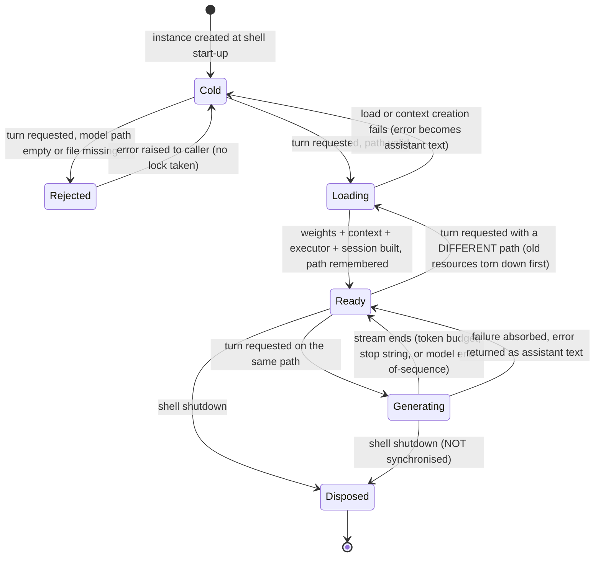

### 7.8 Local Model Inference

**Description**

The product is a terminal chat assistant for debugging work that can talk to three interchangeable model back ends. This section specifies the third one: the **local inference back end**, which runs an open-weights language model entirely on the user's own machine from a single quantised model file on disk. No network call is made, no account is required, no credential is read, no per-token cost is incurred, and no conversation content leaves the machine. It is the only back end that works offline, and the only one where the "model identifier" is a filesystem path rather than a remote model name.

The back end is a single long-lived object created once when a shell starts and kept for the life of the process. It advertises a display name, answers a yes/no readiness question about the current settings record, and answers a chat turn. To answer a turn it loads the weights file (once, lazily, on first use), creates a sized inference context, seeds a fresh engine-side chat session with the current system-prompt text, and then streams the reply back one text piece at a time. Weights, context and session are cached and reused for every later turn; they are torn down and rebuilt **only** when the configured model path changes. Because the engine-side session retains its own conversation, only the newest user message is ever handed to the model — the product's own message list is not sent, and multi-turn continuity lives inside the engine where the product cannot see or reset it.

The local back end is also the intended vehicle for **token-level introspection**: because inference happens inside the process, the feature attempts to expose, for each generated piece, a log-probability, the top few alternative tokens the model considered, a running snapshot of context-window utilisation, and a verbatim capture of the inference engine's own log stream. That intent is only partly realised. The candidate-alternative capture depends on reading the engine's current score vector through a capability that is resolved by name at run time; when that lookup fails — which is the expected outcome with the engine version the source shipped — the failure is swallowed with no log line, every record keeps a log-probability of zero, and the display layer renders every token at 100 % confidence. The per-step "probability" that reaches the exported analysis records is not measured at all: it is a six-step lookup table on the configured sampling temperature. These gaps are carried forward below as requirements-level facts, quirks and open questions, not silently repaired and not silently copied.

---

**User stories**

- **US-8.1** — As a developer working offline or on confidential code, I want to select a locally-hosted model as my chat back end, so that my prompts and my source never leave my machine and I incur no per-token cost.
- **US-8.2** — As a developer, I want to point the assistant at a quantised model file on my disk and be refused immediately if that file does not exist, so that I find out about a wrong path when I type it rather than mid-conversation.
- **US-8.3** — As a developer with a particular machine, I want to choose the context-window size and how many model layers are offloaded to the graphics processor, so that a large model fits in my memory and runs at an acceptable speed.
- **US-8.4** — As a developer, I want to type free-text questions in the terminal and receive the local model's answer in my transcript, so that I can get debugging help without an account or a network connection.
- **US-8.5** — As a developer, I want the loaded model to stay resident between turns, so that only my first question of a session pays the multi-gigabyte load cost.
- **US-8.6** — As a developer analysing model confidence, I want each generated token annotated with a confidence value and the alternatives the model considered, so that the confidence visualiser has something to show. *(Supported as a code path and a data shape; against the engine version the source shipped it produces empty alternatives and uniform 100 % confidence — see FR-8.44, FR-8.45 and QUIRK-8.6.)*
- **US-8.7** — As a developer whose model fails to load, I want a timestamped log trail of the inference engine's own output plus a plain-language message naming the four likely causes, so that I can diagnose a native load failure that produces no other evidence.
- **US-8.8** — As a developer, I want a failed turn to be reported in the transcript and the session to continue, so that one bad turn does not end my working session.
- **US-8.9** — As a developer troubleshooting introspection, I want to read back and export the per-token analyses of the last introspected generation, and to export the captured engine log buffer to a file of my choosing. *(The back end implements all three operations; **no user-reachable path invokes any of them** in the source — see FR-8.71 and QUIRK-8.39.)*

---

**Use cases**

#### UC-8.A — Configure the local back end (realizes US-8.1, US-8.2, US-8.3)

**Preconditions**
- The product is installed; a settings record exists or can be created.
- The user has a quantised model file on a local disk.

**Main flow**
1. The user selects the local provider by setting the provider key to `llama`. The default provider is `azure`, so this back end is inert until the user does this explicitly.
2. The user sets the model-identifier setting to the absolute or relative path of the model file. While the local provider is selected, the settings command **pre-checks that the file exists** before accepting the value.
3. Optionally, the user sets the context size (valid `512`–`32768`, default `4096`) and the graphics-processor layer count (valid `0`–`100`, default `0` meaning processor-only).
4. Optionally, the user sets a graphics device selector, a thread count (valid `0`–`64`, default `0`) and a batch size (valid `1`–`2048`, default `512`). All three are validated, persisted and displayed — and none of them reaches inference (FR-8.20).
5. Optionally, the user enables token introspection and sets the alternatives count (valid `1`–`20`, default `5`).
6. Every accepted change is persisted immediately.

**Alternate flows**
- **A1 — Windowed shell.** The equivalent fields in the windowed settings dialog **clamp** out-of-range values instead of rejecting them.
- **A2 — Hand-edited settings file.** Values outside the validated ranges (a context size of `0`, an alternatives count of `0`, a maximum-output-token count of `0` or negative) can only be reached by editing the settings file directly. Those values are honoured by the back end and select the fallback behaviours in FR-8.14, FR-8.16 and FR-8.24.

**Error flows**
- **E1 — Model file missing at configuration time.** The settings command refuses with two lines: `LLama model file not found: <path>` then `Make sure you've specified the correct path to a GGUF model file.` The stored setting is unchanged.
- **E2 — Unsupported provider value.** Rejected with `Provider must be 'azure', 'bedrock', or 'llama'`.
- **E3 — Out-of-range hardware value.** Rejected with, respectively, `LlamaContextSize must be a number between 512 and 32768`, `LlamaGpuLayerCount must be a number between 0 and 100. 0 means CPU-only, higher numbers move more layers to GPU.`, `LlamaThreads must be a number between 0 and 64. 0 means system default.`, `LlamaBatchSize must be a number between 1 and 2048`.
- **E4 — Out-of-range sampling value.** `Temperature must be a number between 0 and 2`; `MaxTokens must be a number between 1 and 8192`; `LogProbabilitiesTopK must be a number between 1 and 20` (or `Top-K value must be a number between 1 and 20` from the introspection command).
- **E5 — Provider switched without a model path.** The model identifier keeps its default value `gpt-4`, which is a remote model name and can never satisfy the file-exists check. The next chat turn is refused by UC-8.B/E1.

**Postconditions**
- The settings record holds the provider, the model path, the sampling knobs and the local hardware knobs. No credential of any kind is read, written or required by this back end.

---

#### UC-8.B — Answer a chat turn, model not yet loaded (realizes US-8.1, US-8.4, US-8.5, US-8.7)

**Preconditions**
- Provider is `llama`; the model-identifier setting names an existing file.
- No weights are resident in this process yet.

**Main flow**
1. The shell appends the typed line to the conversation as a user turn and asks the back end whether it is configured; the answer is true (FR-8.3).
2. The shell prints its "working" indicator and calls the back end.
3. The back end re-runs the readiness check, then acquires the **process-wide generation lock**; only one generation may run at a time anywhere in the process.
4. The back end arms engine log capture (once per instance) and records an informational line `Starting message generation`.
5. The back end acquires the **process-wide model-load lock** and decides that a load is required (no weights resident).
6. It records `Loading LLamaSharp model from <path>`, re-checks that the file exists, and records the file size in whole megabytes as `Model file size: <N> MB`.
7. It builds load parameters: context size, graphics-layer count, memory-mapping always on, memory-locking always off. It writes the line `Loading model with context size: <n>, GPU layers: <m>` **to standard output** — the only place this back end writes directly to the console.
8. Weights are loaded on a worker thread; then the sized inference context is created on a worker thread.
9. An interactive executor is built over the context; a fresh engine-side conversation is created containing exactly one system-role message holding the current system-prompt text; a chat session is built over the two. The loaded path is remembered. `LLamaSharp initialization complete` is recorded.
10. The model-load lock is released.
11. The back end routes to the introspection path or the fast path per FR-8.10 and generates (UC-8.C or UC-8.D).
12. The generation lock is released.
13. The shell appends the returned text to the conversation as an assistant turn and prints it.

**Alternate flows**
- **A1 — Model already resident on the same path.** Steps 6–10 are skipped entirely; no load line is written to standard output and the existing engine-side session, with all its retained turns, is reused.
- **A2 — Model resident on a different path.** The session reference is dropped, the executor reference is dropped, the context is released and cleared, the weights are released and cleared — strictly in that order — before any work on the new path begins. The new session is seeded with the system-prompt text current at that moment.
- **A3 — Hardware settings changed since load.** Nothing reloads. Context size, graphics-layer count and system prompt are re-read only on a genuine reload, i.e. only when the path changes or the process restarts, even though the settings surface reports every change as applied.

**Error flows**
- **E1 — Model path empty or file absent at turn time.** The readiness check fails and an error is **raised out of the back end**, before any lock is taken, carrying exactly `LLamaSharp service is not properly configured. Please set ModelId to a valid GGUF model file path.` The console shell catches it at turn level and prints `Error getting AI response: <message>`; the windowed shell shows a dialog reading `Failed to get AI response: <message>`.
- **E2 — Provider not configured, detected by the shell before the turn.** The shell prints `Error: Local LLM (LLamaSharp) service is not configured. Use environment variables or Windows Credential Manager to configure credentials securely.` followed by `   Type '/set' to see current configuration and setup instructions.` and attempts no generation. (The credential wording is wrong for a file-based back end — QUIRK-8.20.)
- **E3 — File deleted between configuration and load.** A not-found error `Model file not found: <path>` is raised inside the loader, caught by the outer handler, and delivered as assistant text `Error running local LLM: Model file not found: <path>` with elapsed time `0`.
- **E4 — Weight load fails** (incompatible or corrupt file, missing or mismatched native binaries, insufficient memory, runtime/library mismatch). An error line is recorded, the log buffer is force-flushed to the daily file, and a wrapped message is raised listing four numbered causes verbatim followed by `Original error: <message>`; it reaches the user as assistant text prefixed `Error running local LLM: `.
- **E5 — Inference-context creation fails.** Same treatment, with the message `Failed to create context: <message>`.
- **E6 — Weights or context still absent after the load step.** An error carrying `Failed to initialize the LLamaSharp model.` is raised and converted to assistant text.
- **E7 — Hard native crash during load.** Not catchable by any managed handler; the process terminates. The only forensic trail is the daily log file. Documented mitigations: reduce the context size, use processor-only mode, ship a single inference backend rather than several, use a short path with no spaces or non-ASCII characters, install the platform C++ runtime, downgrade the runtime and engine binding.
- **E8 — Another generation is already in flight.** The caller blocks on the generation lock indefinitely: no timeout, no queue bound, no cancellation, no user-visible feedback while blocked.

**Postconditions**
- Weights, context, executor and engine-side session are resident and keyed on the loaded path; every later turn on the same path is warm.
- The conversation holds one new assistant turn — the model's reply, or an error string shaped as a reply.

---

#### UC-8.C — Generate without introspection (fast path) (realizes US-8.4)

**Preconditions**
- Weights, context, executor and session are resident.
- Either introspection is disabled, or the alternatives count is `0` or negative.

**Main flow**
1. The back end records `Using standard ChatSession mode`.
2. It checks that an executor and a session exist. (It does **not** check the context — FR-8.55.)
3. It scans the supplied conversation for the **last** message whose role equals `user`, compared case-insensitively, and takes only that message's content as the prompt. Everything else — system messages, earlier user turns, all prior assistant turns — is discarded.
4. It builds inference parameters: maximum new tokens, the two hard-coded stop strings, temperature, and an alternatives-count-derived selection limit (FR-8.14 – FR-8.17).
5. It starts a timer and streams the reply, concatenating each text piece into a buffer. No per-piece records are produced and no per-piece log lines are written.
6. It returns the concatenated text, an explicitly **absent** probability list, and the elapsed time in seconds.

**Alternate flows**
- **A1 — Stop string emitted.** Generation halts as soon as the model emits `User:` or `USER:`.
- **A2 — Token budget exhausted.** Generation halts at the maximum-new-tokens limit.
- **A3 — Prior introspection data present.** The accumulated per-token analyses from an earlier introspected generation are **not** cleared on this path and remain readable afterwards.

**Error flows**
- **E1 — No user-role message in the conversation, or the newest user message has empty content.** An error carrying `No user message found in chat history.` is raised; the caller receives assistant text `Error running local LLM: No user message found in chat history.` with elapsed time `0`. An empty message and a missing message are indistinguishable.
- **E2 — Executor or session missing.** An error carrying `ChatSession not initialized` is raised and converted the same way.
- **E3 — Any other failure during streaming.** Converted to assistant text `Error running local LLM: <message>` with elapsed time `0`.

**Postconditions**
- The caller holds the reply text and no probability data. The engine-side session has absorbed this turn.

---

#### UC-8.D — Generate with token introspection (realizes US-8.6)

**Preconditions**
- Weights, context, executor and session are resident.
- Introspection is enabled **and** the alternatives count is greater than `0`.

**Main flow**
1. The back end records `Using sampling pipeline with token probability capture mode`.
2. It checks that an executor, a session **and** a context all exist.
3. It selects the prompt exactly as in UC-8.C step 3 and records `Processing user message with <N> characters`.
4. It builds the same inference parameters as the fast path — identical maximum-new-tokens, identical stop strings, identical temperature, identical selection limit.
5. It starts a timer and **clears the accumulated per-token analysis list**.
6. It streams the reply. For each text piece, in order:
   a. Append the piece to the reply buffer and increment the piece counter.
   b. Create a probability record whose token text is the piece, whose log-probability is `0` and whose alternatives list is empty.
   c. If a pending candidate list exists and a previous record exists, attach that pending list to the **previous** record and derive that record's log-probability from it (FR-8.34).
   d. Append the new record to the output list and make it the "previous" record.
   e. Read the engine's current score vector and compute a new pending candidate list for the *next* position (UC-8.E).
   f. Build a per-token analysis record for this step (FR-8.36 – FR-8.39), projecting the pending candidates into it as text and log-probability only.
   g. Write a debug line `Token <n>: '<piece>'`.
7. After the stream ends, if a pending candidate list still exists and the final record has no alternatives, attach it; and if the final record's log-probability is still exactly `0`, set it to the greatest candidate log-probability.
8. Record `Generation complete in <ms>ms, generated <n> tokens`, force-flush the log buffer to the daily file, and return the concatenated text, the ordered probability record list and the elapsed time in seconds.
9. The shell renders the confidence visualisation when a non-empty probability list came back.

**Alternate flows**
- **A1 — Score vector unreadable.** Every candidate list is empty; every record keeps log-probability `0`; the visualiser renders every token at 100 % confidence with no alternatives. This is the expected outcome with the engine version the source shipped.
- **A2 — Probability list returned empty or absent while introspection was requested.** The console shell prints `\nNote: Log probabilities were requested but none were returned by the model.` followed by `This could be due to the model not supporting this feature or an API limitation.`
- **A3 — Reply text is absent.** The console and windowed shells substitute their own string `Error: Response text expected, none recieved.` (spelled that way); the back end's own plain-text entry point substitutes the differently-spelled `Error: Response text expected, none received`.

**Error flows**
- **E1 — Executor, session or context missing.** `ChatSession not initialized` — converted to assistant text as in UC-8.C/E2.
- **E2 — No user message, or an empty one.** As UC-8.C/E1.
- **E3 — Reading the score vector raises an error that escapes the candidate routine.** A warning line `Failed to compute candidates from logits: <message>` is recorded, the pending list is cleared, and **generation continues**; alternatives for that position are lost.
- **E4 — Any failure inside the candidate routine itself.** Silently absorbed: an empty candidate list is produced with **no log line at all**. The warning in E3 never fires for this class of failure.
- **E5 — Any other failure.** Converted to a success-shaped response with text `Error running local LLM: <message>`, an absent probability list and elapsed time `0`.

**Postconditions**
- The accumulated per-token analysis list holds exactly one record per streamed piece from this generation, and nothing else.
- The caller holds the reply text plus one probability record per streamed piece, in emission order.

---

#### UC-8.E — Compute the top alternatives for one position (realizes US-8.6)

**Preconditions**
- An introspected generation is in progress and a live inference context exists.

**Main flow**
1. Locate, **by name at run time**, a zero-argument accessor for the engine's current score vector on the live context, and invoke it.
2. Accept the returned value as an array of single-precision numbers, an array of double-precision numbers, or any sequence of numbers converted element-wise to double precision.
3. Select `count = min(max(1, requestedAlternatives), vocabularySize)` vocabulary indices with the highest scores, in descending score order.
4. Apply a numerically-stabilised normalised-exponential transform **over only those selected scores** — subtract the greatest selected score, exponentiate, divide by the sum of the selected set; if that sum is not positive, treat it as `1`.
5. For each selected index, resolve the vocabulary index to text (UC-8.F) and emit a candidate carrying that text and the natural logarithm of the within-selection probability.

**Alternate flows**
- **A1 — Score vector is empty.** Return an empty candidate list.
- **A2 — Requested alternatives exceed the vocabulary size.** The count is clamped to the vocabulary size.

**Error flows**
- **E1 — No accessor of that name and shape exists.** Return an empty candidate list, silently.
- **E2 — The returned value is of an unsupported shape.** Return an empty candidate list, silently.
- **E3 — Anything at all raises an error inside this routine.** Return an empty candidate list, silently. No log line is written at any level.

**Postconditions**
- A candidate list of at most the requested size, whose probabilities always sum to `1.0` regardless of how flat or peaked the model's true distribution was.

---

#### UC-8.F — Resolve a vocabulary index to text

**Preconditions**
- A candidate index has been selected.

**Main flow**
1. Invoke, **by name at run time and with no compile-time contract**, a single-argument detokenise operation on the live context, passing the vocabulary index.
2. If it returns non-empty text, use that text.

**Error flows**
- **E1 — No such operation, the call fails, or the result is empty.** Return the literal placeholder `id:<numericIndex>`, which then flows into candidate lists and is rendered as if it were a real token.

**Postconditions**
- The candidate carries either genuine token text or an indistinguishable placeholder.

---

#### UC-8.G — Capture and persist engine diagnostics (realizes US-8.7, US-8.9)

**Preconditions**
- File logging is enabled (the default).

**Main flow**
1. On the first generation of an instance's life, log capture is armed: the log directory is created if needed, a callback is registered with the inference engine to receive its native log lines, and the line `LLamaSharp logging configured successfully` is appended. Repeat arming is a no-op.
2. Every application-origin and engine-origin line is appended to an in-memory buffer in the fixed format `[yyyy-MM-dd HH:mm:ss.fff] [LEVEL] message`. Engine-origin lines have trailing whitespace trimmed; application-origin lines do not.
3. When an **engine-origin** line pushes the buffer past `10000` characters and file logging is on, the whole buffer is appended to `<log directory>/llamasharp_<yyyyMMdd>.log` and the buffer is cleared.
4. The buffer is also force-flushed at the end of every introspected generation, on any swallowed generation error, on any load failure, and on shutdown.
5. On request, the whole buffer can be written to a caller-chosen path (creating the parent directory), after which the line `Logs saved to <path>` is appended to the buffer.

**Alternate flows**
- **A1 — Application-origin lines only.** The threshold is never checked, so the buffer grows unbounded until an explicit flush.
- **A2 — Write to a caller-chosen path.** The buffer is written but **not** cleared, so the same content is written a second time to the daily file at the next flush; and the saved file never contains its own `Logs saved to …` confirmation line.

**Error flows**
- **E1 — Log directory unwritable or disk full.** Absorbed. A message reaches only the platform debug channel (`Failed to flush logs to file: …` / `Failed to save logs to <path>: …`). Chat is unaffected and the user sees nothing.
- **E2 — Registering the engine log callback fails.** Absorbed; a debug-channel message `Failed to configure LLamaSharp logging: <exception>` is emitted, the component stays un-armed, and arming is retried at the next generation.
- **E3 — A second back-end instance arms capture.** Not detected. The engine's log hook is process-global; the second registration silently replaces the first, whose buffer then stops receiving engine lines.

**Postconditions**
- A per-day, append-only log file accumulates without size-based rotation, retention limit or pruning.

---

#### UC-8.H — Shut down (realizes US-8.8)

**Preconditions**
- The shell is exiting.

**Main flow**
1. The session and executor references are dropped.
2. The inference context is released; the model weights are released.
3. The log component is shut down, flushing the buffer to the daily file once.
4. The **process-wide generation lock** is released and disposed.
5. The instance is marked shut down; a repeat shutdown is a no-op.

**Alternate flows**
- **A1 — Object reclaimed without an explicit shutdown.** Only the context and weights references are cleared; **no native memory is released**.

**Error flows**
- **E1 — A generation is still in flight.** Not handled. Nothing interlocks teardown against the streaming loop; the context and weights can be released while generation is still using them.
- **E2 — Log capture continues after shutdown.** Not detected. The engine log hook is never unregistered, and neither the logging nor the flushing operation checks the shut-down flag, so a torn-down component keeps buffering and can write to disk again.

**Postconditions**
- The process-wide model-load lock is left un-released and undisposed.

---

**State model**

---

**Functional requirements**

*Identity and readiness*

- **FR-8.1** — The back end shall be registered under the provider key `llama` and shall be one of exactly three interchangeable back ends; the other accepted provider values are `azure` and `bedrock`. (realizes US-8.1)
- **FR-8.2** — The back end shall report its display name as the exact string `Local LLM (LLamaSharp)`, which callers interpolate into their own messages. (realizes US-8.1)
- **FR-8.3** — The readiness check shall return true if and only if the model-identifier setting is non-empty **and** a file exists at that exact path. It shall have no side effects: no file is opened, no header is validated, no file extension is checked and no size threshold is applied. A zero-byte file with no extension passes. (realizes US-8.2)
- **FR-8.4** — For this back end, the model-identifier setting shall be interpreted as a filesystem path, not a remote model name. Its product-wide default value is `gpt-4`, which can never satisfy FR-8.3; a user who selects this provider without also setting a path is therefore not ready. (realizes US-8.2)
- **FR-8.5** — The default provider shall be `azure`, so this back end shall be inactive until the user selects it explicitly. (realizes US-8.1)
- **FR-8.6** — This back end shall read no credential, no token, no environment variable and no secret of any kind. Its only implicit permission requirements are read access to the model file and write access to the log directory. (realizes US-8.1)

*Entry points and routing*

- **FR-8.7** — The plain-text generation entry point shall delegate entirely to the introspection-capable entry point and return its text; if that text is absent it shall return the literal `Error: Response text expected, none received`. (realizes US-8.4)
- **FR-8.8** — The introspection-capable entry point shall, in this exact order: (1) run the readiness check, (2) acquire the process-wide generation lock, (3) arm log capture and record `Starting message generation`, (4) ensure the model is loaded, (5) verify weights and context are present, (6) route to one of the two generation paths, (7) absorb any failure raised by steps 3–6, (8) release the generation lock. (realizes US-8.4)
- **FR-8.9** — A readiness failure at step 1 shall be **raised out of the back end** rather than converted into a response, and shall carry exactly `LLamaSharp service is not properly configured. Please set ModelId to a valid GGUF model file path.` The raise shall occur before the generation lock is taken and outside the failure-absorbing region. (realizes US-8.2)
- **FR-8.10** — The introspection path shall be selected if and only if the introspection-enabled flag is true **and** the alternatives count is strictly greater than `0`. Every other combination shall select the fast path. On selection, the back end shall record either `Using sampling pipeline with token probability capture mode` or `Using standard ChatSession mode`. (realizes US-8.6)
- **FR-8.11** — If, after the load step, either the weights handle or the context handle is absent, the back end shall raise an error carrying exactly `Failed to initialize the LLamaSharp model.` (realizes US-8.8)

*Model loading and caching*

- **FR-8.12** — A reload shall be required if and only if the weights are absent, **or** the context is absent, **or** the remembered path differs from the currently configured path. Changing the context size, graphics-layer count, thread count, batch size, temperature or system prompt shall **not** trigger a reload; those values shall be re-read only on a genuine reload. (realizes US-8.5)
- **FR-8.13** — Before a reload, existing resources shall be torn down strictly in this order: drop the session reference, drop the executor reference, release and clear the context, release and clear the weights. Only then shall the new load begin. (realizes US-8.5)
- **FR-8.14** — The context size used at load shall be the configured context size when it is greater than `0`, and otherwise the fallback value **2048**. The configured default is `4096`; the validated range is `512`–`32768`; the fallback is therefore reachable only by editing the settings file directly. Note the inconsistency with FR-8.39. (realizes US-8.3)
- **FR-8.15** — The graphics-layer count shall be passed to the loader exactly as configured, with no clamping at this layer. Its default is `0`, meaning processor-only; the validated range is `0`–`100`. (realizes US-8.3)
- **FR-8.16** — Memory-mapping of the model file shall always be enabled and memory-locking shall always be disabled. Neither is configurable. (realizes US-8.3)
- **FR-8.17** — The loader shall re-check that the model file exists and shall raise `Model file not found: <path>` when it does not. (realizes US-8.2)
- **FR-8.18** — The loader shall record the model file size in **whole megabytes using truncating integer division by 1 048 576**, as `Model file size: <N> MB`. A file smaller than one mebibyte therefore records `0 MB`. (realizes US-8.7)
- **FR-8.19** — The loader shall write the single line `Loading model with context size: <n>, GPU layers: <m>` **to standard output**, bypassing the log component. This shall be the only direct console write performed by this back end, and it shall occur in the full-screen shell as well as the plain shell. (realizes US-8.7)
- **FR-8.20** — The graphics-device selector (free-form text, e.g. `0` or `0,1`, default unset), the thread count (default `0`, meaning system default) and the batch size (default `512`) shall be accepted, validated, persisted and displayed by the settings surfaces, and shall **not** be applied to inference in any way. (realizes US-8.3)
- **FR-8.21** — Weight loading and inference-context creation shall each be executed off the calling thread and awaited, so the calling (user-interface) thread is not blocked. (realizes US-8.5)
- **FR-8.22** — On a genuine load the back end shall build an interactive executor over the context, create a fresh engine-side conversation seeded with **exactly one system-role message** holding the current system-prompt text, build a chat session over executor and conversation, remember the loaded path, and record `LLamaSharp initialization complete`. (realizes US-8.4)
- **FR-8.23** — The system-prompt text shall be bound **once, at load time**. Changing the system prompt afterwards shall have no effect until the model path changes or the process restarts. The default system-prompt text is `You are ChatDBG, a helpful debugging assistant. Help users analyze code, debug issues, and understand programming concepts.` and it is not itself persisted — only the name of the selected prompt is. (realizes US-8.4)

*Inference parameters*

- **FR-8.24** — Maximum new tokens shall be the configured maximum-output-token value when it is greater than `0`, and otherwise the fallback value **512**. The configured default is `1000` and the validated range is `1`–`8192`, so the fallback is reachable only by editing the settings file directly. This rule shall apply identically on both generation paths. (realizes US-8.4)
- **FR-8.25** — Stop sequences shall be hard-coded to exactly the two strings `User:` and `USER:`, in that order, on both generation paths. They shall not be configurable. Generation shall halt when the model emits either. (realizes US-8.4)
- **FR-8.26** — Sampling temperature shall be the configured temperature narrowed to single precision. Its default is `0.7` and its validated range is `0.0`–`2.0` inclusive. (realizes US-8.4)
- **FR-8.27** — The sampler's selection limit shall be set to the **introspection alternatives-count setting on both generation paths**, including when introspection is disabled. Its default is `5` and its validated range is `1`–`20`. Consequently, local generation is limited to the five highest-scoring tokens out of the box, and setting the alternatives count to `1` makes local generation effectively deterministic. No user-facing text states this. (realizes US-8.3, US-8.6)
- **FR-8.28** — All other sampling controls — nucleus threshold, typical sampling, minimum probability, repetition/frequency/presence penalties, random seed, adaptive-perplexity sampling, grammar constraints — shall be left at the inference engine's defaults; they are neither set, read, logged nor exposed. A reimplementation must choose and document them explicitly because they materially change output. *(INFERRED: the actual defaults are whatever the source's sampling pipeline used.)* (realizes US-8.4)

*Prompt selection and conversation semantics*

- **FR-8.29** — The prompt sent to the model shall be **only the content of the last message in the supplied conversation whose role equals `user`**, compared case-insensitively. System messages, earlier user turns and all prior assistant turns shall be discarded. This rule shall be identical on both generation paths. (realizes US-8.4)
- **FR-8.30** — If no such message exists, **or** its content is the empty string, the back end shall raise an error carrying exactly `No user message found in chat history.` An empty user message and a missing user message shall be indistinguishable. (realizes US-8.8)
- **FR-8.31** — The introspection path shall record `Processing user message with <N> characters`, where `<N>` is the character length of the selected prompt. (realizes US-8.7)
- **FR-8.32** — Multi-turn continuity shall live entirely in the engine-side chat session created at load time and cached alongside the weights. Consequently, clearing the product's conversation, importing a conversation, injecting a message or removing a message shall have **no effect on what the local model remembers**; the model continues to answer from the turns the engine-side session retained. (realizes US-8.4)
- **FR-8.33** — Chat prompt templating, special-token handling and beginning-of-sequence handling shall be delegated entirely to the inference engine's chat-session abstraction; the product never constructs or inspects the templated prompt. *(INFERRED: identical inputs will therefore produce different text under a different engine or template.)* (realizes US-8.4)

*Introspection records*

- **FR-8.34** — On the introspection path, for each streamed text piece the back end shall create a probability record whose token text is the piece, whose log-probability is `0` and whose alternatives list is empty; then, if a candidate list is pending from the previous step and a previous record exists, it shall attach that pending list to the **previous** record and derive that record's log-probability as follows: if a candidate's text equals the record's token text, use that candidate's log-probability; otherwise, if the candidate list is non-empty, use the **greatest** candidate log-probability; otherwise leave the log-probability at `0`. (realizes US-8.6)
- **FR-8.35** — Because the candidate list is read from the engine *after* the current piece was emitted, the alternatives stored on record *n* shall in fact be the model's distribution for position *n+1*. Every alternatives list in the output is therefore shifted one position. (realizes US-8.6)
- **FR-8.36** — After the stream ends, if a pending candidate list exists and the final record still has no alternatives, that list shall be attached to the final record; and if the final record's log-probability is still exactly `0`, it shall be set to the greatest candidate log-probability. (realizes US-8.6)
- **FR-8.37** — The introspection path shall clear the accumulated per-token analysis list at the start of every generation. The fast path shall **not** clear it, so a non-introspected generation leaves the previous introspected run's analyses readable with nothing marking them stale. (realizes US-8.6, US-8.9)
- **FR-8.38** *(superseded — Owner decision D-001, 2026-08-29, `DECISIONS.md`; observed source behaviour retained, NOT to be implemented)* — Each per-token analysis record's `probability` shall be **estimated from the configured temperature, not measured**, using this step function: temperature ≤ `0.1` → `0.95`; ≤ `0.5` → `0.85`; ≤ `0.7` → `0.75`; ≤ `1.0` → `0.60`; ≤ `1.5` → `0.50`; otherwise `0.40`. The record's `logprob` shall be the natural logarithm of that estimate. Every token in a run therefore carries the identical value. (realizes US-8.6)
- **FR-8.38a** *(replacement — D-001)* — Each per-token analysis record's `probability` and `logprob` SHALL come from the engine's **measured** per-step distribution (the same softmax the alternatives are drawn from), or SHALL be **absent** — with an explicit absent marker distinct from a genuine zero — when the distribution could not be obtained. No value derived from the temperature setting, the token index, or any other formula may ever be written into a measurement field. A failure to obtain the distribution SHALL be surfaced to the operator (it is not a silent degradation; see QUIRK-8.6/9.14, also resolved by this decision).
- **FR-8.39** — Each per-token analysis record shall carry: `step` and `promptOffset` both equal to the zero-based generation index; `tokenId` always the sentinel `-1`; `systemDebugInfo` the fixed sentence `Generated via sampling pipeline at step <1-based step>, temperature=<temperature to two decimal places>.`; and a model-state snapshot in which `totalTokensProcessed` and `contextTokenCount` are both the one-based generated-piece counter (prompt tokens are **not** counted), `contextSize` is the configured context size when greater than `0` and otherwise the fallback **4096** (note: a different fallback from FR-8.14), `remainingContext` is that context size minus the generated-piece counter, `timestamp` is local wall-clock time with no zone offset, and `debugInfo` holds exactly three entries: `Temperature` (two decimal places), `TopK`, and `Mode` with the constant value `SamplingPipeline`. (realizes US-8.6)
- **FR-8.40** — Candidate records written into per-token analysis records shall carry **only** text and log-probability; their vocabulary-id, probability and raw-score fields shall be left at their type defaults of `0`. (realizes US-8.6)
- **FR-8.41** — Candidate records nested inside a display probability record shall always carry an absent alternatives list, so the structure is exactly two levels deep and never recurses. (realizes US-8.6)
- **FR-8.42** — The introspection path shall write one debug line per streamed piece in the form `Token <n>: '<piece>'`, and on completion shall record `Generation complete in <ms>ms, generated <n> tokens` and force-flush the log buffer to the daily file. (realizes US-8.7)
- **FR-8.43** — A "token" throughout this feature shall be a decoder **text piece**, not necessarily a model token. The counter, the state snapshot counts and the length of the probability list all count pieces. *(INFERRED: multi-byte characters are typically buffered by a decoder until printable, so piece counts can diverge from true token counts.)* (realizes US-8.6)

*Candidate computation*

- **FR-8.44** — The candidate routine shall locate a zero-argument accessor for the engine's current score vector **by name at run time**, not through a compile-time contract, and invoke it. If no operation with that name and shape exists, it shall return an empty candidate list. (realizes US-8.6)
- **FR-8.45** — Any failure anywhere inside the candidate routine — missing accessor, unsupported return shape, failed detokenise, or any raised error — shall be absorbed and shall yield an empty candidate list **with no log line at any level**. *(INFERRED, carried forward from the dossier: with the engine version the source shipped, this is the expected outcome on every step, so the observable behaviour of the whole introspection feature is empty alternatives and log-probabilities left at `0`.)* (realizes US-8.6)
- **FR-8.46** — The routine shall accept the returned score vector as an array of single-precision numbers, an array of double-precision numbers, or any sequence of numbers converted element-wise to double precision; any other shape shall yield an empty list. An empty score vector shall yield an empty list. (realizes US-8.6)
- **FR-8.47** — The routine shall select `min(max(1, requestedAlternatives), vocabularySize)` indices with the highest scores, in descending score order. (realizes US-8.6)
- **FR-8.48** — The routine shall apply a numerically-stabilised normalised-exponential transform over **only the selected scores**: subtract the greatest selected score, exponentiate, and divide by the sum over the selected set; if that sum is not positive it shall be treated as `1`. Candidate probabilities therefore always sum to `1.0` within the returned list regardless of the true distribution, so a genuinely uncertain step and a genuinely certain one can yield identical numbers. Each candidate's stored value shall be the natural logarithm of that within-selection probability. (realizes US-8.6)
- **FR-8.49** — Vocabulary-index-to-text resolution shall be attempted by a name-only, late-bound single-argument call on the live context; on any failure or empty result the candidate's text shall be the literal placeholder `id:<numericIndex>`, which is rendered indistinguishably from real token text. (realizes US-8.6)
- **FR-8.50** — A raised error around the score-vector read that escapes the candidate routine shall be recorded at warning level as `Failed to compute candidates from logits: <message>`, the pending candidate list shall be cleared, and generation shall continue. (realizes US-8.8)

*Fast path*

- **FR-8.51** — The fast path shall stream and concatenate text only: no per-piece records, no score-vector reads and no per-piece debug lines. (realizes US-8.4)
- **FR-8.52** — The fast path shall return a response whose probability list is explicitly **absent**, as distinct from an empty list. (realizes US-8.4)

*Timing, error shaping and lifecycle*

- **FR-8.53** — Elapsed time shall be reported in seconds as measured milliseconds divided by 1000.0 on both successful paths, and shall be exactly `0` on the absorbed-error path. (realizes US-8.4)
- **FR-8.54** — Every failure raised after the readiness check shall be absorbed and converted into a **success-shaped** response whose text is `Error running local LLM: <message>`, whose probability list is absent, whose elapsed time is `0`, and whose dedicated error field carries the raw message. Additionally, the full failure shall be recorded at error level as `Error in LLamaSharpService: <full failure detail>`, the log buffer shall be force-flushed to the daily file, and the same text shall be written to the platform debug channel. (realizes US-8.8)
- **FR-8.55** — The introspection path's readiness guard shall require executor **and** session **and** context; the fast path's guard shall check only executor **and** session. A state with a live session but no context therefore reaches the fast path's generation call and is caught only by the outer guard of FR-8.11. Both guards shall raise the message `ChatSession not initialized`. (realizes US-8.8)
- **FR-8.56** — At most **one generation at a time process-wide** shall be permitted, enforced by a process-wide binary lock shared by every instance. A blocked caller shall wait indefinitely: no timeout, no queue bound, no cancellation, no progress feedback. (realizes US-8.4)
- **FR-8.57** — At most **one model load at a time process-wide** shall be permitted, enforced by a second, separate process-wide binary lock held for the whole of the load/reload decision. (realizes US-8.5)
- **FR-8.58** — There shall be **no timeout, no cancellation, no retry, no back-off and no progress reporting** anywhere in this feature other than log lines. A generation runs until the model stops, the token budget is exhausted, or a stop string is emitted. (realizes US-8.4)
- **FR-8.59** — Exceeding the context window shall be **unhandled**: no detection, no truncation, no eviction, no warning. The `remainingContext` value of FR-8.39 shall be informational only and shall gate nothing. (realizes US-8.6)
- **FR-8.60** — Shutdown shall drop the session and executor references, release the inference context, release the weights, shut down the log component (flushing the buffer once to the daily file), release and dispose the **process-wide generation lock**, and mark the instance shut down; a repeat shutdown shall be a no-op. The process-wide model-load lock shall be left un-released and undisposed. (realizes US-8.8)
- **FR-8.61** — Reclamation without an explicit shutdown shall clear only the context and weights references and shall release **no native memory**. (realizes US-8.8)
- **FR-8.62** — Shutdown shall **not** be synchronised against an in-flight generation. (realizes US-8.8)

*Diagnostic logging*

- **FR-8.63** — Log capture shall be armed lazily and exactly once per back-end instance; repeat arming shall return immediately without re-registering. Arming shall create the log directory when file logging is enabled, register a callback with the inference engine, and append `LLamaSharp logging configured successfully`. (realizes US-8.7)
- **FR-8.64** — Every buffered line shall use the fixed format `[yyyy-MM-dd HH:mm:ss.fff] [LEVEL] message`. Engine-origin lines shall have trailing whitespace trimmed; application-origin lines shall not. Timestamps shall use local time with no zone offset. (realizes US-8.7)
- **FR-8.65** — The buffer auto-flush threshold shall be **10 000 characters**, checked **only** on engine-origin callbacks and only when file logging is enabled. Application-origin lines shall never trigger a flush, so a run producing many per-piece debug lines and no engine output grows the buffer unbounded until an explicit flush. (realizes US-8.7)
- **FR-8.66** — The daily log file shall be named `llamasharp_<yyyyMMdd>.log` inside the log directory and shall be **appended** to; the buffer shall be cleared after a successful append. There shall be no size-based rotation, no retention limit and no pruning. The default log directory shall be the per-user roaming application-data folder plus `ChatDbg` plus `Logs` (on one common platform, `%APPDATA%\ChatDbg\Logs`). (realizes US-8.7)
- **FR-8.67** — Log sink defaults shall be: file logging **on**, platform debug channel **on**, console output **off**. These three sinks shall be settable on the component but shall be reachable through no setting, command or user-interface control. (realizes US-8.7)
- **FR-8.68** — Buffer read, clear, write-to-path and flush shall all be guarded by one lock, because the engine callback may fire from arbitrary threads. (realizes US-8.7)
- **FR-8.69** — Writing the buffer to a caller-chosen path shall create the parent directory if needed, overwrite the target, and **not** clear the buffer; afterwards the line `Logs saved to <path>` shall be appended to the buffer, so the saved file never contains its own confirmation line and the next flush duplicates the saved content into the daily file. (realizes US-8.9)
- **FR-8.70** — All log-persistence failures — unwritable directory, full disk, failed callback registration — shall be absorbed and surfaced only on the platform debug channel; chat shall be unaffected and the user shall see nothing. (realizes US-8.7)

*Diagnostic export surface*

- **FR-8.71** — The back end shall expose three operations that are not part of the shared back-end contract and that **no user-reachable path in the product invokes**: (a) read back a defensive copy of the accumulated per-token analyses; (b) export those analyses to a caller-supplied file path; (c) export the captured log buffer to a caller-supplied file path. A reimplementation shall treat these as an intended-but-unwired diagnostic surface. (realizes US-8.9)
- **FR-8.72** — The analysis export shall write **indented** JSON, overwriting the target, and record `Token analyses saved to <path>` at informational level on success. Any failure shall be absorbed and recorded only as `Failed to save token analyses: <failure detail>` in a buffer nothing displays; **no failure signal shall reach the caller**. (realizes US-8.9)
- **FR-8.73** — The exported analysis document shall be JSON and its property names shall be a stable contract, so that an exported file remains readable by any consumer built against it. Per-token record keys: `step`, `tokenText`, `tokenId`, `probability`, `logprob`, `promptOffset`, `topCandidates`, `systemDebugInfo`, `modelState`. Candidate keys: `text`, `tokenId`, `probability`, `logprob`, `logit`. State-snapshot keys: `totalTokensProcessed`, `contextTokenCount`, `contextSize`, `remainingContext`, `timestamp`, `debugInfo`. Round-tripping through JSON shall preserve every one of them. (realizes US-8.9)
- **FR-8.74** — The display probability record produced for the shell shall serialise with the keys `token`, `logprob` and `top_alternatives` — the last in snake case, unlike every other record in this feature — and its derived probability value shall be excluded from serialisation. (realizes US-8.6)
- **FR-8.75** — There shall be **no operation to clear the accumulated analyses**; the list is reset only at the start of the next introspected generation, and nothing bounds its growth. With a token budget of up to 8192 and roughly 100–200 bytes retained per piece, a long generation retains every record. (realizes US-8.9)

*Shell-facing behaviour*

- **FR-8.76** — Before an introspected turn, the console shell shall print `Log probabilities enabled - requesting with top-k=<n>`. (realizes US-8.6)
- **FR-8.77** — When introspection was requested and the returned probability list is empty or absent, the console shell shall print `\nNote: Log probabilities were requested but none were returned by the model.` followed by `This could be due to the model not supporting this feature or an API limitation.` (realizes US-8.6)
- **FR-8.78** — On start-up the console shell shall print the local-model configuration block **only** when this provider is selected, listing the context size, the graphics-layer count with the suffix ` (CPU-only)` appended when it is `0`, the graphics device (the line omitted entirely when unset), the thread count rendered as `default` when it is `0`, and the batch size. (realizes US-8.3)
- **FR-8.79** — The shells shall append the returned text to the conversation as an **assistant turn** and print it, whether it is a genuine reply or an error string shaped as one; the response's dedicated error field shall not be read by any shell. (realizes US-8.8)
- **FR-8.80** — When the returned text is absent on the introspection path, the shells shall substitute the exact string `Error: Response text expected, none recieved.` (spelled as written); the back end's plain-text entry point shall substitute the different string `Error: Response text expected, none received`. (realizes US-8.8)
- **FR-8.81** — A turn-level failure escaping the back end shall be printed by the console shell as `Error getting AI response: <message>` and by the windowed shell as a dialog reading `Failed to get AI response: <message>`. (realizes US-8.8)

---

**External technology**

*Requires: an in-process large-language-model inference engine that loads weights from a single local file, creates a sized inference context, and exposes an interactive-executor plus chat-session abstraction that streams decoded text pieces asynchronously (no network protocol; a native library loaded into the process through a foreign-function interface). Source used: LLamaSharp 0.25.0, a managed binding over llama.cpp, pinned in `src/Xcaciv.ChatDbg.Core/Xcaciv.ChatDbg.Core.csproj:13`. Reimplementer notes: the substitute must support inference parameters carrying maximum-new-tokens, a list of stop strings, and a sampling policy configured with a temperature and a top-K selection limit; it must stream **text pieces**, not token identifiers, because every counter and record in this feature counts pieces; and it must own conversation continuity in a session object, because the product deliberately sends only one message per turn. Ideally it also exposes the current per-step score vector and a detokenise entry point — the source could obtain neither cleanly and fell back to run-time name resolution, which is why the introspection feature produces nothing. Any equivalent engine works if it offers those.*

*Requires: a host-processor inference backend supplying platform-native shared libraries for the target machine. Source used: `LLamaSharp.Backend.Cpu` 0.25.0 (`csproj:14`), shipping binaries under a `runtimes/<platform-id>/native/` layout; the source's documentation names `win-x64/native/llama.dll` and `linux-x64/native/libllama.so` as the artefacts to verify. Reimplementer notes: on one common platform these require the vendor C++ runtime redistributables to be installed, and a missing or mismatched binary is the leading cause of the uncatchable native crash in UC-8.B/E7.*

*Requires: an optional graphics-accelerated inference backend (vendor compute toolkit, version 12 series). Source used: `LLamaSharp.Backend.Cuda12` 0.25.0 (`csproj:15`), requiring a matching vendor driver and toolkit. Reimplementer notes: this is the **only** accelerator backend anywhere in the source — no Metal, Vulkan, ROCm/HIP, OpenCL or processor-variant package exists — so "graphics acceleration" in this product means one vendor or nothing; on any other accelerator a non-zero layer count is accepted, persisted and displayed, then silently ignored or fatal inside the native loader. The source references the processor and accelerator backends **unconditionally in the same project**, and its own troubleshooting document twice names shipping both as a cause of native load failures.*

*Requires: a quantised model weight file format. Source used: GGUF files supplied by the user; the path is the model-identifier setting. The documentation points at publicly hosted GGUF models and names one 7-billion-parameter chat model at 4-bit medium quantisation as a known-good test file, with guidance that 3-bit medium is smaller and lower quality, 4-bit medium balanced, and 5-bit medium larger and better. Reimplementer notes: the file format is a user-facing compatibility requirement — users will already hold GGUF files. Older pre-GGUF formats are explicitly out of scope. Nothing in the product validates the file's header, extension or size; existence is the only check.*

*Requires: a hook that redirects the inference engine's own native log output into the host process. Source used: the binding's process-global native-log callback registration. Reimplementer notes: the hook must accept a (level, message) pair arriving on arbitrary threads, which is why the buffer is lock-guarded; the source registers it globally on first use and never unregisters it.*

*Requires: local filesystem access. Source used: platform file APIs. Reimplementer notes: reads the model file (existence and size only); writes an append-only daily log file under a per-user application-data directory created on demand, plus optional exports to caller-chosen paths.*

*Requires: structured document serialisation with pinned property names (JSON). Source used: the platform's built-in JSON serialiser with explicit per-property names and indented output for the analysis export. Reimplementer notes: the property names in FR-8.73 and FR-8.74 are the export contract and must be preserved verbatim if exported analyses are to remain readable.*

*Requires: a managed runtime supporting run-time member lookup by name and late binding. Source used: .NET 10 (`net10.0`), SDK pinned to `10.0.100-rc.1.25451.107` in `global.json`, with unsafe code enabled in the core library. Reimplementer notes: the score-vector read resolves an operation by name and the detokenise call is late-bound; both are hostile to ahead-of-time compilation and trimming, which the source's own compact publish profile enables. Under those profiles both silently degrade to "no alternatives" rather than failing loudly. The source pins a release-candidate runtime while its own troubleshooting document names an older runtime and engine version 0.17.0 as the proven combination.*

*Requires: process-wide mutual exclusion primitives. Source used: two process-wide binary semaphores, one for loading and one for generating. Reimplementer notes: needed because the native engine and the cached context are not safe for concurrent use. Neither has a timeout, a queue bound, or a cancellation path.*

*Requires: a rich terminal renderer for the resulting probability tables (ANSI). Source used: Spectre.Console 0.51.1 (`csproj:16`). Reimplementer notes: owned by the output-rendering feature, listed because the probability records exist to feed it.*

*Requires: a per-user structured settings store. Source used: a JSON document with camel-case keys at `<user profile>/.ChatDbg/settings.json`, falling back to the system temporary directory when the user-profile folder is unavailable or blank. Reimplementer notes: owned by the settings feature; listed because every knob this feature reads arrives through it.*

---

**Acceptance criteria**

*Configuration*

- **AC-8.1** — **Given** the model-path setting is `<temp>/missing.gguf` and no such file exists, **when** the readiness check runs, **then** it returns false and no file handle is opened.
- **AC-8.2** — **Given** a zero-byte file created at `<temp>/model<random>` with no `.gguf` extension and no valid header, **when** the readiness check runs, **then** it returns true.
- **AC-8.3** — **Given** the model-path setting is the empty string, **when** the readiness check runs, **then** it returns false without touching the filesystem.
- **AC-8.4** — **Given** freshly defaulted settings (provider `azure`, model identifier `gpt-4`), **when** the user sets the provider to `llama` and immediately types a chat line, **then** the shell prints `Error: Local LLM (LLamaSharp) service is not configured. Use environment variables or Windows Credential Manager to configure credentials securely.` followed by `   Type '/set' to see current configuration and setup instructions.`, and no generation is attempted.
- **AC-8.5** — **Given** the model path is `missing.gguf`, **when** a caller requests a generation with introspection directly, **then** an error is **raised** — not returned as a response — carrying exactly `LLamaSharp service is not properly configured. Please set ModelId to a valid GGUF model file path.`
- **AC-8.6** — **Given** the provider is `llama`, **when** the user sets the model identifier to `C:\models\nope.gguf` and no such file exists, **then** the command fails with `LLama model file not found: C:\models\nope.gguf` on the first line and `Make sure you've specified the correct path to a GGUF model file.` on the second, and the stored setting is unchanged.

*Loading*

- **AC-8.7** — **Given** a 4 500 000 000-byte model file at path `P`, context size `4096`, graphics layers `0`, and no model resident, **when** the first generation is requested, **then** the daily log gains, in order, `Loading LLamaSharp model from P`, `Model file size: 4291 MB`, `Model params: ContextSize=4096, GpuLayers=0`, `Calling LLamaWeights.LoadFromFile...`, `Model weights loaded successfully`, `Creating context...`, `Context created successfully`, `LLamaSharp initialization complete`; **and** standard output receives exactly `Loading model with context size: 4096, GPU layers: 0`.
- **AC-8.8** — **Given** a context size of `0` (reachable only by editing the settings file, since the validated floor is `512`), **when** the model is loaded, **then** the load uses context size `2048` while every per-step state snapshot in the same run reports context size `4096`.
- **AC-8.9** — **Given** a model already resident from path `P`, **when** a further generation is requested with the same `P`, **then** no `Loading LLamaSharp model from` line is written, no `Loading model with context size:` line reaches standard output, and the same engine-side session with all its retained conversation is reused.
- **AC-8.10** — **Given** a model resident from `P` with context size `2048` and graphics layers `0`, **when** the user sets context size to `8192`, graphics layers to `32`, thread count to `8`, batch size to `1024` and selects a different system prompt, and then sends a message with the path still `P`, **then** no reload occurs, generation still runs at context size `2048` with `0` graphics layers, the originally seeded system prompt is still in force — and the settings surface nevertheless reports every change as applied and displays the new values.
- **AC-8.11** — **Given** a model resident from `P`, **when** a generation is requested with a different path `Q`, **then** the session reference is dropped, the executor reference is dropped, the context is released and cleared, the weights are released and cleared — in that order — before any work on `Q` begins, and the new session is seeded with the system-prompt text current at that moment.
- **AC-8.12** — **Given** path `P` passes the readiness check but is deleted before the first generation, **when** the generation runs, **then** the caller receives a success-shaped response whose text is `Error running local LLM: Model file not found: P` and whose elapsed time is `0`.
- **AC-8.13** — **Given** a 900 000-byte model file, **when** it is loaded, **then** the log records `Model file size: 0 MB`.

*Generation parameters*

- **AC-8.14** — **Given** maximum output tokens `1000`, temperature `0.7` and alternatives count `5`, **when** inference parameters are built on **either** path, **then** maximum new tokens is `1000`, the stop strings are exactly the two-element ordered list `["User:", "USER:"]`, the sampling temperature is `0.7` narrowed to single precision, and the sampler's selection limit is `5`.
- **AC-8.15** — **Given** maximum output tokens `0` or any negative value, **when** inference parameters are built, **then** maximum new tokens is `512`.
- **AC-8.16** — **Given** introspection disabled and alternatives count `20`, **when** a generation runs, **then** the fast path is taken (log line `Using standard ChatSession mode`) **and** the sampler's selection limit is still `20`.
- **AC-8.17** — **Given** introspection enabled and alternatives count `0` (reachable only by editing the settings file), **when** a generation runs, **then** the **fast** path is taken and the response's probability list is absent.
- **AC-8.18** — **Given** introspection disabled and alternatives count `1`, **when** the same prompt is sent twice at temperature `0.7`, **then** generation is constrained to the single highest-scoring token at each step (effectively deterministic), with no user-facing indication that a display setting caused it.

*Prompt selection*

- **AC-8.19** — **Given** a conversation of `[system:"S", user:"first", assistant:"A", USER:"second"]`, **when** a generation is requested, **then** only the string `second` is sent, and the log records `Processing user message with 6 characters`.
- **AC-8.20** — **Given** a conversation whose only user message has content `""`, **when** a generation is requested, **then** the caller receives text `Error running local LLM: No user message found in chat history.` with elapsed time `0`.
- **AC-8.21** — **Given** a multi-turn session on one model path, **when** the user clears the conversation and then asks "what did I just say?", **then** the product's message list is empty (the shell reports `Cleared N messages from chat history`) but the model still answers from the turns the engine-side session retained.

*Introspection output*

- **AC-8.22** — **Given** introspection disabled, **when** a generation completes in 1 234 ms, **then** the response's probability list is **absent**, its elapsed time is `1.234`, and the shell prints only the reply text.
- **AC-8.23** — **Given** introspection enabled with alternatives count `5`, **when** a generation streams 12 text pieces in 2 000 ms, **then** the response carries exactly 12 probability records in emission order, each record's token text equals its piece, and elapsed time is `2.0`.
- **AC-8.24** — **Given** the running engine exposes no zero-argument score-vector accessor of that name, **when** an introspected generation of 12 pieces runs, **then** all 12 records have an empty alternatives list and a log-probability of exactly `0`, **no** warning line is written, and the visualiser renders 12 tokens each at probability `1.0`.
- **AC-8.25** — **Given** a score-vector accessor returning `[2.0, 1.0, 0.0, …]` over a 32 000-entry vocabulary and an alternatives count of `3`, **when** candidates are computed, **then** exactly 3 candidates come back in descending score order, their probabilities are `0.665`, `0.245` and `0.090` (the normalised exponential of those 3 scores alone, summing to `1.0` — not the true vocabulary-wide probabilities), and each candidate's stored value is the natural logarithm of that probability.
- **AC-8.26** — **Given** an alternatives count of `3` and a vocabulary of size `2`, **when** candidates are computed, **then** exactly 2 candidates come back.
- **AC-8.27** — **Given** an introspected run whose pieces are `["Hel", "lo", "!"]` and whose score-vector reads all succeed, **when** the response is inspected, **then** the alternatives on record 0 are the model's candidates for position 1, those on record 1 are for position 2, and those on record 2 are the trailing pending list attached after the stream ended.
- **AC-8.28** — **Given** a record whose own token text does not appear among its attached candidates, **when** its log-probability is derived, **then** it takes the **greatest** candidate log-probability; **given** the candidate list is empty, the log-probability stays `0` and renders as 100 %.
- **AC-8.29** — **Given** temperatures `0.05`, `0.4`, `0.7`, `0.9`, `1.2` and `1.9`, **when** per-step analysis records are produced, **then** their `probability` is `0.95`, `0.85`, `0.75`, `0.60`, `0.50` and `0.40` respectively and their `logprob` is the natural logarithm of that value — identical for every token in the run. (Note `0.7` falls in the `≤ 0.7` bucket giving `0.75`, not the `≤ 1.0` bucket.)
- **AC-8.30** — **Given** any per-step analysis record at one-based step `n` with context size `4096` and temperature `0.7`, **when** it is inspected, **then** `step` = `n-1`, `promptOffset` = `n-1`, `tokenId` = `-1`, `totalTokensProcessed` = `n`, `contextTokenCount` = `n`, `contextSize` = `4096`, `remainingContext` = `4096-n`, `timestamp` is local wall-clock time, `systemDebugInfo` = `Generated via sampling pipeline at step <n>, temperature=0.70.`, and `debugInfo` has exactly the three keys `Temperature`, `TopK` and `Mode` with `Mode` = `SamplingPipeline`.
- **AC-8.31** — **Given** an analysis record with candidates, **when** it is serialised, **then** each candidate's `tokenId`, `probability` and `logit` are `0` and only `text` and `logprob` are populated.
- **AC-8.32** — **Given** an analysis record with candidates and a state snapshot, **when** it is written to JSON and read back, **then** `step`, `tokenText`, `tokenId`, `probability`, candidate count and `totalTokensProcessed` all survive unchanged under the key names of FR-8.73.
- **AC-8.33** — **Given** a detokenise lookup that fails for vocabulary index `1234`, **when** the candidate is emitted, **then** its text is exactly `id:1234` and no error or warning is recorded anywhere.

*Error handling*

- **AC-8.34** — **Given** any failure raised after the readiness check — load failure, context failure, missing session, stream failure — **when** the generation completes, **then** the caller receives a success-shaped response with text `Error running local LLM: <message>`, an absent probability list, elapsed time `0` and the raw message in the error field; the full failure is recorded at error level as `Error in LLamaSharpService: <detail>`, the buffer is force-flushed to the daily file, and the same text goes to the platform debug channel.
- **AC-8.35** — **Given** such a response, **when** the console shell handles it, **then** it appends the error text to the conversation as an **assistant turn** and prints it as if the model had said it; the response's dedicated error field is never read.
- **AC-8.36** — **Given** a corrupt model file at path `P`, **when** the first generation is requested, **then** the returned assistant text begins `Error running local LLM: Failed to load GGUF model from 'P'. This may be due to:` and continues with the four numbered causes — `1. Incompatible model format (ensure it's a valid GGUF file)`, `2. Missing or incompatible native libraries (llama.cpp)`, `3. Insufficient memory`, `4. .NET 10 compatibility issues with LLamaSharp 0.25.0` — followed by `Original error: <message>`.
- **AC-8.37** — **Given** an analysis export target path that cannot be written, **when** the export runs, **then** it returns normally, the caller receives no signal at all, and the only trace is an error line `Failed to save token analyses: <detail>` in a buffer nothing displays.

*Concurrency and lifecycle*

- **AC-8.38** — **Given** two generations requested concurrently in one process, **when** both are in flight, **then** the second does not begin until the first has fully completed, waiting with no timeout, no queue bound, no cancellation and no user-visible feedback.
- **AC-8.39** — **Given** an introspected generation has completed leaving 12 analyses, **when** a subsequent generation runs with introspection **off**, **then** the 12 stale analyses are still readable afterwards.
- **AC-8.40** — **Given** the back end is shut down, **when** shutdown runs, **then** the session and executor references are dropped, the context and weights are released, the log component is shut down flushing the buffer to the daily file, the process-wide generation lock is disposed, a repeat shutdown is a no-op, and the process-wide model-load lock is left undisposed.
- **AC-8.41** — **Given** the object is reclaimed without an explicit shutdown, **when** reclamation runs, **then** the context and weights references are merely cleared and no native memory is released.

*Logging*

- **AC-8.42** — **Given** a fresh log component, **when** it is inspected, **then** file logging is on, platform debug output is on, console output is off, the flush threshold is `10000` characters, and the log directory is set.
- **AC-8.43** — **Given** messages recorded at levels `INFO`, `WARNING` and `ERROR`, **when** the buffer is read, **then** every message body and every bracketed level marker is present, each line prefixed by a `[yyyy-MM-dd HH:mm:ss.fff]` timestamp.
- **AC-8.44** — **Given** a buffer containing text, **when** it is cleared, **then** the buffer reads back as the empty string.
- **AC-8.45** — **Given** a buffer containing `Test log entry`, **when** it is written to `<temp>/test_log_<random>.log`, **then** the file exists and contains that text, the buffer is **not** cleared, and the buffer subsequently contains an added `Logs saved to <path>` line that the written file does not.
- **AC-8.46** — **Given** file logging is on with the log directory set to the system temporary folder, **when** the component is shut down twice, **then** the first shutdown flushes and neither call fails.
- **AC-8.47** — **Given** a log component, **when** arming is requested twice, **then** the second call returns immediately without re-registering the engine callback and without failing.
- **AC-8.48** — **Given** file logging is on, **when** engine-origin log lines push the buffer past 10 000 characters, **then** the buffer is appended to `<log directory>/llamasharp_<yyyyMMdd>.log` and cleared; **given** the same volume arrives only through application-origin lines, **then** no flush occurs.

---

**Quirks**

- *QUIRK-8.1: The candidate list attached to the record for piece n is read from the engine after piece n was emitted, so it is the distribution for piece n+1; every alternatives list in the output is shifted one position. Evidence: `src/Xcaciv.ChatDbg.Core/Services/LLamaSharpService.cs:186-206`, `:208-213`. Keep-or-fix decision deferred to Open Questions.*
- *QUIRK-8.2: A log-probability of 0 is indistinguishable from "certain". Records start at 0 and stay there whenever no candidates were captured; the display layer exponentiates and renders the token at 100 %. There is no sentinel for "unknown". Evidence: `LLamaSharpService.cs:182`, `:200-202`; `Models/TokenLogProbabilities.cs:26`. Keep-or-fix decision deferred to Open Questions.*
- *QUIRK-8.3: When the emitted token is not among its own attached candidates, it inherits the best candidate's log-probability — so a token the model was unsure about takes the confidence of a token it did not emit, biasing every uncertain position upward. Evidence: `LLamaSharpService.cs:197-202`. Keep-or-fix decision deferred to Open Questions.*
- *QUIRK-8.4: Candidate probabilities are renormalised over the selected survivors only, not the vocabulary, so they always sum to 1.0 no matter how flat the true distribution is; a genuinely uncertain step and a genuinely certain one can yield identical numbers. Evidence: `LLamaSharpService.cs:465-475`. Keep-or-fix decision deferred to Open Questions.*
- *QUIRK-8.5: The per-step "probability" written into every analysis record is a six-entry lookup table on temperature, not a measurement, yet it is presented through the same fields as measured data. Evidence: `LLamaSharpService.cs:275`, `:310-324`. Keep-or-fix decision deferred to Open Questions.*
- *QUIRK-8.6: The entire candidate routine is wrapped in a blanket failure absorber that returns an empty list with no log line, so a missing accessor, an unsupported return shape, a failed detokenise and an outright error are indistinguishable. The warning handler one level up never fires because nothing escapes. This is the reason the product's headline introspection capability appears to work and produces nothing. Evidence: `LLamaSharpService.cs:489-492` versus `:214-219`. Keep-or-fix decision deferred to Open Questions.*
- *QUIRK-8.7: Detokenise failures become plausible-looking data: a failed lookup yields the literal text `id:<n>`, which flows into candidate lists and renders as if it were a real token. Evidence: `LLamaSharpService.cs:507-510`. Keep-or-fix decision deferred to Open Questions.*
- *QUIRK-8.8: Context accounting ignores the prompt. Tokens-processed, context-token-count and remaining-context are all derived from the generated-piece counter alone; the prompt, the system prompt and every retained prior turn contribute nothing, so remaining-context is wrong by the entire prompt length. Evidence: `LLamaSharpService.cs:287-294`. Keep-or-fix decision deferred to Open Questions.*
- *QUIRK-8.9: Prompt-offset attribution is a copy of the step index; the field is documented as identifying which part of the prompt influenced a token, and nothing is computed. Evidence: `LLamaSharpService.cs:284`; `Services/TokenInspection/TokenAnalysis.cs:41-44`. Keep-or-fix decision deferred to Open Questions.*
- *QUIRK-8.10: A "token" is a decoder text piece, not a model token; counters, state snapshots and probability-list lengths all count pieces, which can diverge from real token counts for multi-byte characters. Evidence: `LLamaSharpService.cs:170-175`. Keep-or-fix decision deferred to Open Questions.*
- *QUIRK-8.11: The analysis export cannot fail visibly — any error is written into a buffer nothing displays and the operation returns normally. Evidence: `LLamaSharpService.cs:644-647`. Keep-or-fix decision deferred to Open Questions.*
- *QUIRK-8.12: Every swallowed failure is returned as a success-shaped response whose text begins `Error running local LLM: `, which both shells append to the conversation as an assistant turn and print like model output; the response's dedicated error field is populated and read by nobody. Evidence: `LLamaSharpService.cs:103-109`; `src/ChatDbg/ChatShell.cs:377-381`. Keep-or-fix decision deferred to Open Questions.*
- *QUIRK-8.13: Instance shutdown disposes a process-wide lock. The generation semaphore is shared by every instance but is disposed by whichever instance is torn down first; a second instance's next generation would fail on a disposed handle. Both shells create exactly one instance, so it does not bite as shipped. Evidence: `LLamaSharpService.cs:24`, `:681`. Keep-or-fix decision deferred to Open Questions.*
- *QUIRK-8.14: Asymmetric lock disposal — the equally process-wide model-load semaphore is never released or disposed at all. Evidence: `LLamaSharpService.cs:23`, `:670-685`. Keep-or-fix decision deferred to Open Questions.*
- *QUIRK-8.15: The reclamation path releases nothing; if the object is collected without an explicit shutdown the native model and context are leaked for the process lifetime. Evidence: `LLamaSharpService.cs:670-696`. Keep-or-fix decision deferred to Open Questions.*
- *QUIRK-8.16: Shutdown does not unregister the engine log hook, and the log component keeps working after shutdown — neither the logging nor the flushing operation checks the shut-down flag, so a post-shutdown flush writes to disk again. Evidence: `Services/TokenInspection/LLamaSharpLogConfig.cs:81-105`, `:119-137`, `:142-165`, `:193-200`. Keep-or-fix decision deferred to Open Questions.*
- *QUIRK-8.17: The engine log hook is process-global but the arm-once flag is per instance, so a second instance arming itself silently steals the hook from the first, which then stops receiving engine lines with no indication. Evidence: `LLamaSharpLogConfig.cs:15`, `:69-70`, `:81`. Keep-or-fix decision deferred to Open Questions.*
- *QUIRK-8.18: The buffer flush threshold is checked only on engine-origin lines, so a run that writes one debug line per generated piece and produces no engine output grows the buffer unbounded until an explicit flush. Evidence: `LLamaSharpLogConfig.cs:90-93` versus `:123-126`. Keep-or-fix decision deferred to Open Questions.*
- *QUIRK-8.19: Saving the buffer to a path does not clear it while flushing does, so saved content is written a second time to the daily file at the next flush; and the confirmation line is appended after the save, so the saved file never contains it. Evidence: `LLamaSharpLogConfig.cs:152-158` versus `:180-185`. Keep-or-fix decision deferred to Open Questions.*
- *QUIRK-8.20: The "not configured" message for this back end instructs the user to configure environment variables or the operating-system credential store, although it reads no credential of any kind. Evidence: `src/ChatDbg/ChatShell.cs:358`. Keep-or-fix decision deferred to Open Questions.*
- *QUIRK-8.21: Shutdown is not synchronised against an in-flight generation; nothing prevents releasing the context and weights while the streaming loop is still using them. Evidence: `LLamaSharpService.cs:670-685`. Keep-or-fix decision deferred to Open Questions.*
- *QUIRK-8.22: Three settings — graphics-device selector, thread count and batch size — are validated, persisted and printed by two user interfaces, and read by nothing. A user following the product's own instructions to set a thread count or tune the batch size gets a success message and no effect. Evidence: `Models/ChatSettings.cs:59-66`; `Commands/SetCommand.cs:116-136`, `:424-429`; absent from `LLamaSharpService.cs:548-554`. Keep-or-fix decision deferred to Open Questions.*
- *QUIRK-8.23: The introspection alternatives count — presented as a display setting — is passed as the sampler's selection limit on both generation paths, including when introspection is off. With the default of 5, all local generation is limited to the five highest-scoring tokens out of the box; setting it to 1 to reduce visual clutter makes generation deterministic. Nothing says so. Evidence: `LLamaSharpService.cs:148`, `:378`; `Models/ChatSettings.cs:37`. Keep-or-fix decision deferred to Open Questions.*
- *QUIRK-8.24: Hardware settings changed mid-session silently do nothing, because reload is keyed on the model path only, while the settings surfaces report every change as applied. Evidence: `LLamaSharpService.cs:525`. Keep-or-fix decision deferred to Open Questions.*
- *QUIRK-8.25: Two context-size fallbacks disagree inside one file — the loader falls back to 2048 while the per-step state snapshot in the same run reports 4096, and the documented default is 4096. Evidence: `LLamaSharpService.cs:550` versus `:291-292`. Keep-or-fix decision deferred to Open Questions.*
- *QUIRK-8.26: Stop sequences are hard-coded to `User:` and `USER:`, not configurable and not documented; a model that legitimately writes "User:" mid-answer truncates its own reply, and any chat template not using that role marker is unsupported. Evidence: `LLamaSharpService.cs:144`, `:374`. Keep-or-fix decision deferred to Open Questions.*
- *QUIRK-8.27: The default model identifier is a remote model name (`gpt-4`), so switching to this back end without also setting a path always fails the file-exists check. Evidence: `Models/ChatSettings.cs:11`. Keep-or-fix decision deferred to Open Questions.*
- *QUIRK-8.28: Only the last user message is ever sent — system messages, prior assistant turns and prior user turns are all discarded — so continuity depends entirely on engine-side session state the product cannot see. Evidence: `LLamaSharpService.cs:131-136`, `:361-366`. Keep-or-fix decision deferred to Open Questions.*
- *QUIRK-8.29: Clearing the conversation does not clear the model's memory; the user is told how many messages were cleared and the model then answers from the turns it still holds. History import behaves the same way. Evidence: `Commands/ClearCommand.cs:18-23`; `Commands/ImportCommand.cs:43`; no session reset anywhere in `LLamaSharpService.cs`. Keep-or-fix decision deferred to Open Questions.*
- *QUIRK-8.30: An empty user message is reported as a missing one, producing `No user message found in chat history.` when a message is plainly present. Evidence: `LLamaSharpService.cs:131-136`. Keep-or-fix decision deferred to Open Questions.*
- *QUIRK-8.31: The fast path's readiness check omits the context, while the introspection path checks all three handles. Evidence: `LLamaSharpService.cs:125-128` versus `:355-358`. Keep-or-fix decision deferred to Open Questions.*
- *QUIRK-8.32: Stale analyses survive a non-introspected run — the list is cleared only at the start of an introspected generation, so read-back and export can return the previous run's data with nothing marking it stale; and there is no operation to clear it, although the product's own documentation advises exporting and clearing beyond about 1000 tokens. Evidence: `LLamaSharpService.cs:156`, with no counterpart at `:353-414`; clearing verified absent from `LLamaSharpService.cs`. Keep-or-fix decision deferred to Open Questions.*
- *QUIRK-8.33: The null-reply substitute is misspelled and differs between layers — the back end uses `Error: Response text expected, none received` while both shells use `Error: Response text expected, none recieved.`, and the shells' version is the one a user actually sees on the introspection path. Evidence: `LLamaSharpService.cs:58`; `src/ChatDbg/ChatShell.cs:377`; `src/ChatDbg.Shell.Gui/ChatShell.cs:330`. Keep-or-fix decision deferred to Open Questions.*
- *QUIRK-8.34: Load progress is written to standard output rather than to the log component, including inside the full-screen terminal interface where it corrupts the display. Evidence: `LLamaSharpService.cs:557`. Keep-or-fix decision deferred to Open Questions.*
- *QUIRK-8.35: Model size is logged with truncating integer division, so any model under one mebibyte logs as `Model file size: 0 MB` — including the zero-byte file the readiness check accepts. Evidence: `LLamaSharpService.cs:544-545`. Keep-or-fix decision deferred to Open Questions.*
- *QUIRK-8.36: Numeric and date formatting follow the ambient locale — temperature is written with a fixed two-decimal pattern into both the log-visible debug sentence and the exported document's debug map, so a comma decimal separator appears in exports on many locales (inside a string value, so parsing survives but naive consumers break); timestamps use local time with no zone offset. Evidence: `LLamaSharpService.cs:285`, `:295-296`; `LLamaSharpLogConfig.cs:83`, `:121`. Keep-or-fix decision deferred to Open Questions.*
- *QUIRK-8.37: The candidate computation converts the whole score vector to double precision, materialises the complete index range and fully sorts it descending before taking the first few — once per generated piece, over a 32 000 to 128 000 entry vocabulary. The source's own planning document prescribes a partial selection instead. Evidence: `LLamaSharpService.cs:459-463`. Keep-or-fix decision deferred to Open Questions.*
- *QUIRK-8.38: Nothing bounds the accumulated analyses — one record per generated piece, each with up to K candidates, a state snapshot and a three-entry map, retained until the next introspected run, with a token budget of up to 8192 and no clearing operation. Evidence: `LLamaSharpService.cs:31`, `:230`. Keep-or-fix decision deferred to Open Questions.*
- *QUIRK-8.39: Three diagnostic operations of this back end (read-back, analysis export, log export) have no caller anywhere in the product, and the three matching commands are placeholders returning a "requires LLamaSharp provider integration" notice that are registered in neither shell — so the notice cannot even be seen. Evidence: `LLamaSharpService.cs:628`, `:633-648`, `:653-656`; `Commands/ShowTokenAnalysisCommand.cs:46-48`, `Commands/ExportTokenAnalysisCommand.cs:23`, `Commands/ExportLogsCommand.cs:23`. Keep-or-fix decision deferred to Open Questions.*
- *QUIRK-8.40: The introspection diagnostics command that the enable message tells users to run when probabilities do not appear is written entirely for the cloud back ends — it discusses interface versions, model deployments and cloud endpoints, none of which apply to a local model file, and the situation it is offered for is this back end's normal outcome. The enable message likewise warns about "a compatible model and API version" for a back end that has no interface version. Evidence: `Commands/LogProbsCommand.cs:39-44`, `:159-207`. Keep-or-fix decision deferred to Open Questions.*
- *QUIRK-8.41: The adjacent tokenisation and inspection commands load their own separate copies of the model file at context sizes 512 and 2048 respectively, disposing each immediately, rather than reusing the multi-gigabyte model this back end already holds resident. Evidence: `Services/TokenInspectionService.cs:30-41`, `:104-118`. Keep-or-fix decision deferred to Open Questions.*
- *QUIRK-8.42: The processor and accelerator backend packages are both referenced unconditionally in the same project, so every published output carries both sets of native binaries — which the source's own troubleshooting document twice names as a cause of native load failures. Evidence: `src/Xcaciv.ChatDbg.Core/Xcaciv.ChatDbg.Core.csproj:14-15`; `docs/LLamaSharp-Troubleshooting-0xC0000005.md:32-37`, `:171-175`. Keep-or-fix decision deferred to Open Questions.*

---

**Source notes**

Primary dossier: `/mnt/g/3RD-Party/reversing/output/chatdbg/dossiers/local-llm-inference.md`, written against source repo `/mnt/g/3RD-Party/reversing/subject/chatdbg` at commit `d8c18f61d6bb73666ed97cd4885e877e35558485` (branch `LLamaSharp_support`).

Primary evidence:
- `src/Xcaciv.ChatDbg.Core/Services/LLamaSharpService.cs` (697 lines) — the whole back end: identity, readiness, both generation paths, candidate computation, detokenise fallback, model load/reload, teardown, and the three unwired diagnostic operations.
- `src/Xcaciv.ChatDbg.Core/Services/TokenInspection/LLamaSharpLogConfig.cs` — engine log capture, buffering, formatting, threshold flush, daily file naming, save-to-path, shutdown.
- `src/Xcaciv.ChatDbg.Core/Services/TokenInspection/TokenAnalysis.cs` — the per-token analysis record, candidate record and model-state snapshot, with the pinned export key names.
- `src/Xcaciv.ChatDbg.Core/Models/TokenLogProbabilities.cs` — the display probability record and its derived probability accessor.
- `src/Xcaciv.ChatDbg.Core/Models/ChatSettings.cs` — every default value this feature reads.
- `src/Xcaciv.ChatDbg.Core/Commands/SetCommand.cs`, `Commands/LogProbsCommand.cs` — validation ranges, refusal messages, the model-path pre-check.
- `src/Xcaciv.ChatDbg.Core/Commands/{ShowTokenAnalysis,ExportTokenAnalysis,ExportLogs}Command.cs` — the three unregistered placeholder commands.
- `src/ChatDbg/ChatShell.cs`, `src/ChatDbg.Shell.Gui/ChatShell.cs`, `src/ChatDbg.Shell.Gui/UI/ChatWindow.cs`, `src/ChatDbg.Shell.Gui/UI/SettingsDialog.cs` — construction, the pre-turn readiness message, the start-up configuration block, error presentation.
- `src/Xcaciv.ChatDbg.Core/Xcaciv.ChatDbg.Core.csproj`, `global.json` — pinned engine, backend and runtime versions.
- `src/Xcaciv.ChatDbg.Core.Tests/Services/LLamaSharpServiceTests.cs`, `.../TokenInspection/LLamaSharpLogConfigTests.cs`, `.../TokenInspection/TokenAnalysisTests.cs`, `.../Models/TokenLogProbabilityTests.cs`, `.../Commands/ShowTokenAnalysisCommandTests.cs` — the 18 shipped tests, none of which exercise generation or model loading.
- `docs/LLamaSharp-Troubleshooting-0xC0000005.md`, `docs/LLamaSharp-Quick-Start.md`, `docs/LLamaSharp-Implementation-Notes.md`, `docs/LLamaSharp-Token-Introspection.md`, `docs/compact-build.md` — the documented success log signature, the native-crash mitigations, and several claims the dossier verified as unimplemented.
- `tmp/LLamaSharpInvestigation.cs` — a scratch feasibility spike compiled into nothing; recorded as vestigial intent, not behaviour.

Feature boundary: this section owns the local back end, its model lifecycle, its generation paths, its candidate mathematics and its analysis records. The probability *data model*, the enable/disable/alternatives-count user surface and the probability mathematics as a product concept belong to Token Probability Analysis; the log-capture component's own contract belongs to Diagnostic Logging; the settings keys, ranges and persistence belong to Settings & Configuration; rendering belongs to Output Rendering; the separate tokenise/inspect model loaders belong to Token Inspection.
