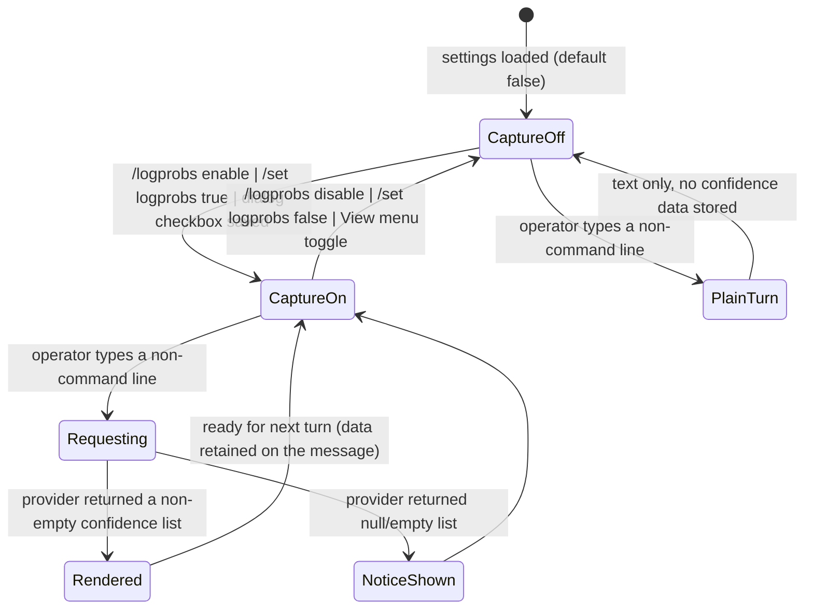
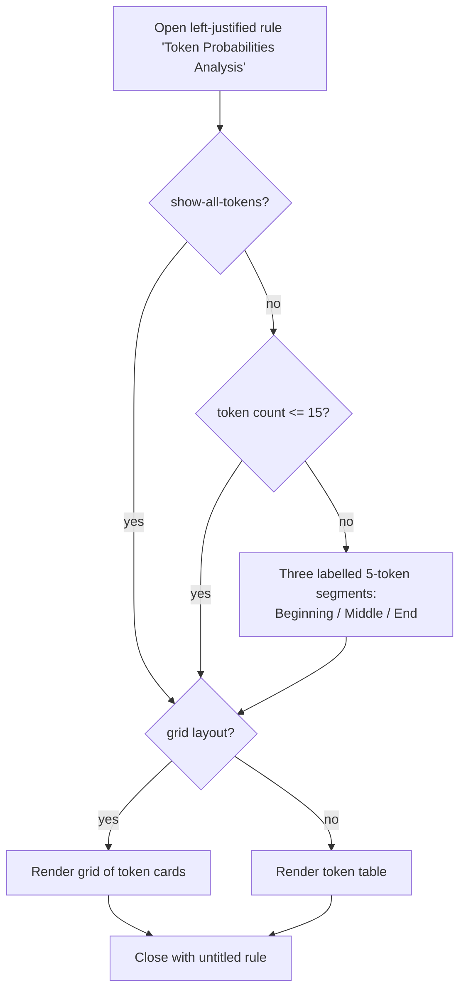

### 7.9 Token Probability Analysis

**Description**

When a conversational assistant produces a wrong, odd, or surprising answer, the answer text alone gives no clue about *where* the model was guessing. Token Probability Analysis makes that guessing visible. When the operator turns it on, every reply the assistant produces is accompanied by a per-token confidence record: for each token the model emitted, the log-probability the model assigned to it, and the short list of other tokens it nearly chose instead ("alternatives"). The product then draws that record in the terminal — colour-coded by confidence, either as a compact grid of per-token cards or as a detailed table — so the operator can see at a glance which parts of a sentence the model was certain about and which parts it effectively rolled dice on.

The product's own stated uses are: understanding model confidence, identifying uncertain parts of responses, debugging unexpected outputs, and tuning prompts for better results. There is exactly one human role: the local interactive operator of the terminal application — a developer or prompt engineer debugging model behaviour on their own machine. There is no multi-user model, no authentication, no authorization, and no server component. Two machine actors consume the feature's output: the shell that renders it, and the conversation persistence layer that stores it inside exported conversation files so a debugging session can be re-opened later.

The feature owns five persisted settings, two commands (a configuration/diagnostics command and an offline demonstration command), the confidence record itself and the arithmetic that derives a displayable probability from it, the sampling rule that keeps long responses readable in a terminal, and the shared formatting helpers that turn records into text. It does **not** own the provider calls that produce the data (three separate provider integrations do that) nor the low-level drawing primitives (an output-rendering capability does that). It also has an offline demonstration mode that fabricates a sample record and renders it without contacting any provider, so an operator can see what the visualization looks like without spending API budget.

---

**User stories**

- **US-9.1** — As the local operator, I want to turn per-token confidence capture on and off with a single command, so that I only pay the extra request cost and screen noise while I am actually debugging.
- **US-9.2** — As the local operator, I want to control how many alternative tokens are captured per position, so that I can trade analysis depth against request size and output volume.
- **US-9.3** — As the local operator, I want to choose between seeing every token and seeing a representative sample of tokens, so that a long response does not flood my terminal.
- **US-9.4** — As the local operator, I want to choose between a compact grid layout and a detailed list layout, and cap how many alternatives each grid card shows, so that the analysis fits the width of my terminal.
- **US-9.5** — As the local operator, I want to see the current probability-analysis configuration in one report, so that I can tell why I am or am not seeing confidence data.
- **US-9.6** — As the local operator, I want a diagnostics report when no confidence data appears, so that I can tell whether the cause is the model, the API version, or my own configuration.
- **US-9.7** — As the local operator, I want a demonstration of the visualization that never contacts a provider, so that I can evaluate the feature without an API key or API spend.
- **US-9.8** — As the local operator, I want the confidence record attached to the assistant's reply and rendered immediately after it, so that I can spot low-confidence spans while the answer is still in front of me.
- **US-9.9** — As the local operator of the full-screen shell, I want a persistent side panel and a per-message indicator, so that I can revisit the confidence data of any earlier reply in the conversation.
- **US-9.10** — As the local operator, I want captured confidence data to survive exporting and re-importing a conversation, so that I can archive or hand off a debugging session without losing the evidence.
- **US-9.11** — As the local operator, I want the conversation to continue normally when the model returns no confidence data, so that an unsupported model does not break my chat session.

---

**Use cases**

#### UC-9.1 — Configure probability capture (realizes US-9.1, US-9.2, US-9.3, US-9.4)

**Preconditions**
- The application is running and the settings document has been loaded (or created with defaults if absent).
- The operator is at the input prompt.

**Main flow**
1. The operator types the probability configuration command with a sub-command, e.g. `/logprobs enable`.
2. The shell recognises the leading `/` as a command, lower-cases the command word, splits the remainder on spaces and discards empty entries.
3. The configuration command matches the sub-command case-insensitively.
4. The command mutates the corresponding setting.
5. The command writes the entire settings document back to disk immediately — exactly once per invocation.
6. The command returns a success result whose message is the exact confirmation string for that sub-command.
7. The shell displays the message.

**Alternate flows**
- **A1 — No sub-command.** `/logprobs` alone changes nothing, saves nothing, and returns the multi-line configuration status report (FR-9.20).
- **A2 — Diagnostics.** `/logprobs debug` changes nothing, saves nothing, and returns the diagnostics report (FR-9.21).
- **A3 — Generic settings command.** The same five values can be set through the generic settings command using their full keys or short aliases (FR-9.24); the confirmation message is then `Set {key} = {value}`.
- **A4 — Full-screen shell dialog.** The same five values can be set on the "Log Probs" tab of the settings dialog; numeric fields there are **clamped** into 1–20 instead of being rejected (FR-9.27).
- **A5 — Extra arguments.** Anything after the second argument is ignored.

**Error flows**
- **E1 — Missing numeric value.** `/logprobs top` returns failure with exactly `Please specify a number: /logprobs top <number>`; `/logprobs gridmaxalt` returns failure with exactly `Please specify a number: /logprobs gridmaxalt <number>`. No setting changes; no save occurs.
- **E2 — Non-numeric or out-of-range value.** `/logprobs top 0`, `21`, `abc`, `1.5` each return failure with exactly `Top-K value must be a number between 1 and 20`. The equivalent grid values return exactly `Grid max alternatives value must be a number between 1 and 20`. No setting changes; no save occurs.
- **E3 — Unknown sub-command.** Returns failure whose message begins `Unknown subcommand: {arg}. ` (note the trailing space) followed by the six-line list of valid option groups (FR-9.19). No setting changes; no save occurs.
- **E4 — Exception while applying a sub-command.** The exception is caught, its detail written to the diagnostic trace channel, and the command returns failure with `Error configuring log probabilities: {exception message}`.
- **E5 — Settings file cannot be written.** The persistence layer prints `Error saving settings: {message}` and returns normally; the command still reports **success**, and the change survives only in memory for the rest of the session.
- **E6 — Settings file cannot be read or is corrupt at startup.** The persistence layer prints `Error loading settings: {message}` and yields an all-defaults settings object, silently reverting the operator's probability configuration; the plain console shell additionally prints `Error loading settings: {message}` and `Using default settings.`
- **E7 — Unknown key on the generic settings command.** Returns failure with `Unknown setting: {key}. Valid keys: provider, modelId, temperature, maxTokens, azureEndpoint, awsRegion, systemPrompt, enableLogProbabilities, logProbabilitiesTopK, useWindowsCredentialManager, enablewincred, wincred, migrate` — a list that omits three implemented keys of this feature and all four short aliases (QUIRK-9.16).
- **E8 — Exception inside the generic settings command.** Returns failure with `Error setting {key}: {message}`.

**Postconditions**
- On success the setting is changed in memory and (unless E5 occurred) on disk.
- On any error nothing is changed and nothing is written.

---

#### UC-9.2 — Converse with capture enabled and inspect the analysis (realizes US-9.8, US-9.11)

**Preconditions**
- Capture is enabled.
- A provider is configured and resolvable from the provider setting.

**Main flow**
1. The operator types a line that does **not** begin with `/`; it is treated as a conversation turn and the user message is appended to the conversation history.
2. The shell resolves the configured provider.
3. The shell prints `Thinking...`.
4. The shell prints `Log probabilities enabled - requesting with top-k={n}` where `{n}` is the configured top-K.
5. The shell invokes the provider's *send-with-probabilities* operation, passing the conversation and the settings.
6. The assistant message **together with** the returned confidence list is appended to the conversation history.
7. The response text is printed, surrounded by blank lines.
8. The analysis block is rendered: an opening left-justified rule titled `Token Probabilities Analysis`; then either the whole token list or the beginning/middle/end sample (FR-9.34 to FR-9.37); in grid layout or list layout per the settings; then a closing untitled rule.

**Alternate flows**
- **A1 — Capture disabled.** Step 4 is skipped, the plain *send-text* operation is used, the assistant message is appended **without** confidence data, and only the response text is printed.
- **A2 — Show-all-tokens enabled.** Step 8 renders every token with no segment labels.
- **A3 — Sampled display with 15 tokens or fewer.** Step 8 renders every token, un-segmented and unlabelled.
- **A4 — Sampled display with more than 15 tokens.** Step 8 renders three labelled 5-token segments in order — `Beginning Tokens:`, `Middle Tokens:`, `End Tokens:` — separated by blank lines, each numbered from its true absolute position.
- **A5 — Full-screen shell.** Instead of printing an analysis block, the shell opens the token probability side panel bound to the new message and appends a clickable `◊` indicator beneath the message.

**Error flows**
- **E1 — Provider not configured.** An error is printed and the turn aborts before any request is made.
- **E2 — Provider returns null response text while capture is on.** The message stored in history and shown to the operator is the literal string `Error: Response text expected, none recieved.` — with the misspelling verbatim (QUIRK-9.24).
- **E3 — Provider returns no confidence data (null or empty list).** The response text is still printed, the assistant message is still appended with a null confidence list, and the plain console shell prints exactly two further lines: `Note: Log probabilities were requested but none were returned by the model.` and `This could be due to the model not supporting this feature or an API limitation.` In the full-screen shell **nothing at all** is shown and the side panel does not open.
- **E4 — Provider call throws.** The plain console shell prints `Error getting AI response: {message}`, writes detail to the diagnostic trace channel, and the turn produces no assistant message and no confidence data. The local in-process provider instead returns a response record whose text is `Error running local LLM: {message}`, whose confidence list is null, whose elapsed time is `0`, and whose error field is set.
- **E5 — Local in-process provider used with no model configured.** It throws with exactly `LLamaSharp service is not properly configured. Please set ModelId to a valid GGUF model file path.` rather than returning an error response.
- **E6 — Local in-process provider fails to read candidate scores mid-generation.** Generation continues; a `WARN` line `Failed to compute candidates from logits: {message}` is written to the provider's log and that token gets no alternatives. If the underlying accessor is simply absent, an inner handler returns an empty candidate list with **no** log line and no user-visible error (QUIRK-9.14).
- **E7 — Cloud provider returns no confidence data.** *Source:* fabricated confidence data is substituted upstream and returned as if genuine; the operator cannot tell (FR-9.72, QUIRK-9.20). ***Decided (D-001):*** *no substitution; capability absence auto-disables the setting with a switch-provider instruction, transient absence shows the honest notice (FR-9.72a).*
- **E8 — Terminal width query fails** (redirected or non-interactive output) while grid layout is computing columns. Unguarded at the point of use; the failure surfaces as the generic `Error getting AI response: {message}` from the enclosing turn handler (QUIRK-9.21, INFERRED — not reproduced).

**Postconditions**
- The assistant message, with or without a confidence list, is in the conversation history.
- Confidence records are never mutated after attachment (except by the local in-process provider's one-step-late back-fill during generation).

---

#### UC-9.3 — Run the offline demonstration (realizes US-9.7)

**Preconditions**
- The application is running. No provider, credential or network access is required.

**Main flow**
1. The operator types `/demologprobs` (or, in the full-screen shell, selects View ▸ Log Probabilities ▸ `_Run Demo Visualization`, which executes the same command through the same path).
2. The command takes the fixed sample sentence (FR-9.53) and splits it into 25 tokens by naive delimiter splitting.
3. For each token it fabricates a confidence record with a value in the range [70, 98) and a list of alternatives (contextually plausible ones where the token is in the hard-coded table, otherwise synthetic ones), padded with filler alternatives up to top-K and truncated to top-K.
4. It publishes the fabricated response record on a readable "sample data" attribute of the command, with a simulated elapsed time of `0.5` seconds.
5. If an output formatter was supplied when the command was constructed, it renders the demonstration: sample text heading, display mode line, layout line, grid-max-alternatives line (grid layout only), a left-justified rule titled `Token Probabilities Analysis`, the token set (all tokens or the 15-token sample) as a grid or a table, then a closing untitled rule.
6. It returns success with exactly `Sample token probability analysis generated`.

**Alternate flows**
- **A1 — No formatter attached.** Steps 5 is skipped entirely: nothing is rendered, the sample data attribute is still populated, and the command still returns success with the same message. This is what actually happens in the plain console shell (QUIRK-9.7).
- **A2 — Repeat invocation.** The sample data attribute is overwritten; before the first run it is unset.
- **A3 — Show-all-tokens enabled.** All 25 tokens are rendered instead of the 15-token sample.

**Error flows**
- **E1 — Token set is null** (empty input list). The renderer prints `No token probability data available` styled red, **without** a trailing period. (The full-screen side panel's equivalent string *does* carry a trailing period — FR-9.63.)
- **E2 — Command throws inside the full-screen shell.** A modal dialog titled `Error` shows the exception message.
- **E3 — Command returns failure inside the full-screen shell.** A modal dialog titled `Command Error` shows the message; successes instead go to the transient status line prefixed `✓ `.

**Postconditions**
- No provider was contacted; no settings were changed; no conversation history was modified.

---

#### UC-9.4 — Inspect an earlier reply in the full-screen shell (realizes US-9.9)

**Preconditions**
- The full-screen shell is running and at least one assistant message carries a non-empty confidence list.

**Main flow**
1. The operator clicks the `◊` button rendered beneath an assistant message.
2. The side panel opens (if hidden) titled `Token Probabilities`, positioned to the right of the conversation pane, one row below the menu bar.
3. The panel binds to that message and rebuilds its content: a header line `[{message timestamp}] Token Probabilities:`, a blank row, then one block per token.
4. The panel scrolls to the top.
5. The status line shows `Showing token probabilities for message at {timestamp}`, reverting to `Provider: {p} | Model: {m} | Prompt: {n}` after 3 seconds.

**Alternate flows**
- **A1 — Automatic opening.** The panel opens by itself the first time a reply with a non-empty confidence list arrives while capture is on; the conversation pane then shrinks to 60% width.
- **A2 — Rebind.** A newer reply with data, or a click on another `◊`, rebuilds the panel content and scrolls it back to the top.
- **A3 — Manual toggle.** View ▸ Log Probabilities ▸ `_Toggle Log Probs Panel` shows or hides the panel; the conversation pane returns to full width when hidden. Status line shows `Token probabilities panel enabled` or `Token probabilities panel disabled`.
- **A4 — Capture toggle from the menu.** View ▸ Log Probabilities ▸ `_Toggle Log Probs for Last Message` flips the capture setting, saves it, redraws the conversation, and opens or closes the panel to match. Status line shows `Log probabilities display enabled` or `Log probabilities display disabled`.

**Error flows**
- **E1 — Panel toggled with no qualifying message.** A modal dialog titled `No Log Probabilities` with body `There are no assistant messages with log probabilities to display.` and an `OK` button; the panel stays hidden.
- **E2 — Capture toggle from a cold start.** The same modal is shown and the routine returns **before** flipping the capture setting, so that menu item can only ever turn capture off, never on (QUIRK-9.17).
- **E3 — Bound message has no data.** The panel shows the single line `No token probability data available.` (with trailing period).
- **E4 — Imported message with an explicitly null token text.** The panel escapes token text directly rather than through the null-tolerant shared helper and would fault (INFERRED — not reproduced; consequence of FR-9.67).

**Postconditions**
- The panel is visible and bound to the selected message, or hidden; no data is modified.

---

#### UC-9.5 — Export and re-import a session that carries confidence data (realizes US-9.10)

**Preconditions**
- The conversation history holds at least one assistant message with a non-empty confidence list.

**Main flow**
1. The operator exports the conversation to a file path of their choosing.
2. The whole message list is serialized as an indented, camel-cased JSON document; each message carries its confidence list under the member name `logProbabilities`; each confidence record carries `token`, `logprob` and (when present) `top_alternatives`.
3. The derived probability is **not** written.
4. The operator later imports that file.
5. Every confidence record is restored with identical token text, identical stored log-probability, and identical alternatives.

**Alternate flows**
- **A1 — Message with no confidence data.** Its `logProbabilities` member is absent or null; on import the message's "has confidence data" flag is false and no `◊` indicator is drawn for it.

**Error flows**
- **E1 — File cannot be written or read.** Handled by the conversation-history capability's own error conventions; this feature adds no error path of its own.
- **E2 — Imported record with an explicitly null token.** Renders as `(null)` through the shared helper, but faults in the full-screen side panel (see UC-9.4 E4).

**Postconditions**
- Round-tripped confidence records are field-for-field identical to the originals apart from the omitted derived probability, which is recomputed on read.

---

#### UC-9.6 — Diagnose "no probabilities are showing" (realizes US-9.5, US-9.6)

**Preconditions**
- The application is running.

**Main flow**
1. The operator runs `/logprobs` with no arguments and reads the configuration status report (FR-9.20).
2. If capture is already enabled, the operator runs `/logprobs debug`.
3. The diagnostics report is returned: the same five configuration values plus the active provider and model identifier, a pointer to the demonstration command, three common-issue bullets, four troubleshooting steps, an `If using Azure OpenAI:` block echoing the configured endpoint (or the literal `(not set)`), three suggested model names, a `For Amazon Bedrock:` note, and a closing suggestion to run a simple test query.
4. The operator acts on the advice and retries a conversation turn.

**Alternate flows**
- **A1 — Demonstration instead.** The operator runs `/demologprobs` to confirm the visualization path independently of any provider (UC-9.3).

**Error flows**
- **E1 — The advertised API version is wrong.** The report advises `Ensure you're using a recent API version (2023-05-15 or newer for Azure OpenAI)` while the product actually sends `2023-12-01-preview`; following the advice literally would *disable* the feature (QUIRK-9.6).

**Postconditions**
- No state changes; no save occurs.

---

**Workflow overview**



Rendering decision tree (console shell and demonstration mode share it):



---

**Functional requirements**

*Configuration model, defaults and ranges*

- **FR-9.1** The product SHALL maintain exactly five persisted configuration values for this feature and SHALL read or write no other configuration value as part of it: capture-enabled (boolean), top-K alternatives (integer), show-all-tokens (boolean), grid-layout (boolean), grid-max-alternatives (integer). *(realizes US-9.1 through US-9.4)*
- **FR-9.2** Default values SHALL be: capture-enabled = **false**; top-K alternatives = **5**; show-all-tokens = **false** (so the sampled view is the out-of-box behaviour); grid-layout = **false** (so the list/table layout is the out-of-box behaviour); grid-max-alternatives = **5**. All five are tunable defaults, not business rules.
- **FR-9.3** Top-K alternatives and grid-max-alternatives SHALL each accept only integers in the range **1–20 inclusive**, on every surface that can set them.
- **FR-9.4** The five values SHALL be persisted inside the single application settings document at `<user profile>/.ChatDbg/settings.json`, written as indented UTF-8 JSON with camel-cased member names, under the exact names `enableLogProbabilities`, `logProbabilitiesTopK`, `showAllTokens`, `gridViewForTokens`, `gridViewMaxAlternatives`. When the user-profile directory is unavailable or resolves to an empty string, the same file name SHALL be used in the operating system temp directory.
- **FR-9.5** Top-K alternatives SHALL mean *how many alternative tokens are requested from the provider per generated position*. It is sent to the provider as part of the request.
- **FR-9.6** Grid-max-alternatives SHALL mean *how many alternatives are drawn on each token card in grid layout before a "+N more" indicator replaces the remainder*. It is a display limit only and never affects the request.
- **FR-9.7** Command surfaces SHALL **reject** an out-of-range numeric value with an error and change nothing; the full-screen settings dialog SHALL **clamp** silently into 1–20 and SHALL leave the previous value untouched when the text is unparseable. This divergence is observed behaviour, not a designed rule (see Open Questions).
- **FR-9.8** Only the capture-enabled flag and the top-K value are documented in the product's own settings-file documentation; the other three are documented only as command examples. A reimplementation SHALL still persist all five.

*Probability configuration command*

- **FR-9.9** The product SHALL expose a probability configuration command registered under the key `logprobs`, with description `Configure token probability analysis` and usage string exactly `/logprobs [enable|disable|top <number>|showall|showsample|grid|list|gridmaxalt <number>|debug] - Configure token probability analysis settings`. It SHALL be listed by the help command under the heading `Token Analysis:`. *(realizes US-9.1)*
- **FR-9.10** Arguments SHALL arrive already split on spaces with empty entries removed, and the command word SHALL be lower-cased before dispatch. Sub-command matching SHALL be case-insensitive. Only the first and second arguments are ever read; all further arguments SHALL be ignored.
- **FR-9.11** `/logprobs enable` SHALL set capture-enabled to true, persist the settings document, and return success with exactly these four lines: `Token probability analysis enabled.` / `Note: This feature requires a compatible model and API version.` / `If you don't see probabilities after responses, try '/logprobs debug'.` / `You can see a demonstration with the '/demologprobs' command.` *(realizes US-9.1)*
- **FR-9.12** `/logprobs disable` SHALL set capture-enabled to false, persist, and return success with exactly `Token probability analysis disabled.` *(realizes US-9.1)*
- **FR-9.13** `/logprobs top <n>` SHALL set top-K to `n`, persist, and return success with exactly `Token probability analysis will show top {n} alternatives.` With no value it SHALL fail with exactly `Please specify a number: /logprobs top <number>`; with a non-integer or an integer outside 1–20 it SHALL fail with exactly `Top-K value must be a number between 1 and 20`. *(realizes US-9.2)*
- **FR-9.14** `/logprobs showall` SHALL set show-all-tokens to true, persist, and return success with exactly `Token probability analysis will show all tokens.` *(realizes US-9.3)*
- **FR-9.15** `/logprobs showsample` SHALL set show-all-tokens to false, persist, and return success with exactly `Token probability analysis will show token samples (beginning, middle, end).` *(realizes US-9.3)*
- **FR-9.16** `/logprobs grid` SHALL set grid-layout to true, persist, and return success with exactly `Token probability analysis will use grid view layout.` *(realizes US-9.4)*
- **FR-9.17** `/logprobs list` SHALL set grid-layout to false, persist, and return success with exactly `Token probability analysis will use list view layout.` *(realizes US-9.4)*
- **FR-9.18** `/logprobs gridmaxalt <n>` SHALL set grid-max-alternatives to `n`, persist, and return success with exactly `Grid view will show up to {n} alternatives per token.` With no value it SHALL fail with exactly `Please specify a number: /logprobs gridmaxalt <number>`; with a non-integer or an integer outside 1–20 it SHALL fail with exactly `Grid max alternatives value must be a number between 1 and 20`. *(realizes US-9.4)*
- **FR-9.19** An unrecognised sub-command SHALL produce a failure result whose message is exactly, line by line (note the trailing space after the period on line 1):

  ```
  Unknown subcommand: {arg}. 
  Valid options are:
  - enable/disable: Turn on/off token probability analysis
  - top <number>: Set number of alternatives to show (1-20)
  - showall/showsample: Show all tokens vs. samples only
  - grid/list: Choose grid or list layout for tokens
  - gridmaxalt <number>: Set maximum alternatives in grid view (1-20)
  - debug: Show diagnostic information
  ```

- **FR-9.20** `/logprobs` with no arguments SHALL change nothing, save nothing, and return a single multi-line success message containing, **in this order**: the header `Token Probability Analysis Settings:`; `- Enabled: Yes` or `- Enabled: No`; `- Top-K Alternatives: {n}`; `- Display Mode: Show all tokens` or `- Display Mode: Show token samples (beginning, middle, end)`; `- View Mode: Grid layout` or `- View Mode: List layout`; `- Grid View Max Alternatives: {n}`; a `Usage:` block listing all nine sub-commands plus `/demologprobs` with one-line descriptions, with the `list` line annotated `(default)`; an explanatory paragraph reading "This feature shows token probabilities for model responses with a rich visualization including token numbering and color coding. When enabled, the system will display token probabilities along with alternative tokens that the model considered."; and the caveat lines `Note: Not all models or API versions support token probabilities.` and `Azure OpenAI models may require specific API versions that support this feature.` *(realizes US-9.5)*
- **FR-9.21** `/logprobs debug` SHALL change nothing, save nothing, and return a diagnostics report headed `Token Probability Analysis Debug Information:` containing: a `Current Configuration:` block with the same five values as FR-9.20 **plus** `- Provider: {provider}` and `- Model ID: {modelId}`; a pointer to `/demologprobs`; a `Common Issues:` list of three items (some older models do not support token probabilities; the API version may not support the parameter; the deployment may have restrictions); a `Troubleshooting Steps:` list of four items, the first of which reads `Ensure you're using a recent API version (2023-05-15 or newer for Azure OpenAI)`; an `If using Azure OpenAI:` section echoing the configured endpoint or the literal `(not set)` when unset; the suggested model names `gpt-4`, `gpt-4-turbo`, `gpt-3.5-turbo`; a `For Amazon Bedrock:` note reading `Claude models with appropriate permissions`; and a closing suggestion to run a simple test query. *(realizes US-9.6)*
- **FR-9.22** Every mutating sub-command SHALL write the **entire** settings document back to storage immediately after mutation, and SHALL do so **exactly once** per invocation. Non-mutating sub-commands (no-argument, `debug`, all error paths) SHALL perform no write.
- **FR-9.23** Any exception raised while applying a sub-command SHALL be caught, its detail written to the diagnostic trace channel, and converted into a failure result with the message `Error configuring log probabilities: {exception message}`.

*Generic settings surface*

- **FR-9.24** The generic settings command SHALL accept the same five values, matching keys case-insensitively after lower-casing, with these aliases, accepted values and error strings *(realizes US-9.1 through US-9.4)*:

  | Key | Alias | Accepted values | Error message on bad input |
  |---|---|---|---|
  | `enableLogProbabilities` | `logprobs` | `true` / `false`, case-insensitive | `EnableLogProbabilities must be 'true' or 'false'` |
  | `logProbabilitiesTopK` | `logtopk` | integer 1–20 | `LogProbabilitiesTopK must be a number between 1 and 20` |
  | `showAllTokens` | *(none)* | `true` / `false` | `showAllTokens must be 'true' or 'false'` |
  | `gridViewForTokens` | `tokensgrid` | `true` / `false` | `gridViewForTokens must be 'true' or 'false'` |
  | `gridViewMaxAlternatives` | `gridmaxalt` | integer 1–20 | `gridViewMaxAlternatives must be a number between 1 and 20` |

- **FR-9.25** The value passed to the generic settings command SHALL be **all remaining arguments joined with a single space** before parsing, so an input such as `logprobs t r u e` fails rather than silently taking the first word. On success it SHALL reply `Set {key} = {value}` and persist the settings document. All five keys of this feature SHALL persist.
- **FR-9.26** The generic settings report (invoked with no arguments) SHALL include the lines `- Log Probabilities: Enabled` or `- Log Probabilities: Disabled`; `- Log Probabilities Top-K: {n}`; `- Show All Tokens: Yes` or `- Show All Tokens: No (sample only)`; `- Token Display: Grid Layout` or `- Token Display: List Layout`; `- Grid View Max Alternatives: {n}`. *(realizes US-9.5)*

*Full-screen shell configuration surface*

- **FR-9.27** The full-screen shell's settings dialog SHALL present a "Log Probs" tab — the third of four tabs, after "AI Provider" and "Credentials" and before "LLama Settings" — containing: an `Enable Log Probabilities` checkbox; a `Log Probabilities Top K:` text field annotated `(1 - 20)`; a `Display Mode:` radio group with items `Show All Tokens` (index 0) and `Show Samples`; a `Layout:` radio group with items `Grid View` (index 0) and `List View`; and a `Grid View Max Alternatives:` text field annotated `(1 - 20)`. On save, both numeric fields SHALL be clamped into 1–20; unparseable text SHALL leave the stored value unchanged and SHALL raise no error. *(realizes US-9.2, US-9.3, US-9.4)*
- **FR-9.28** The full-screen shell's View menu SHALL contain a "Log Probabilities" submenu with exactly three items: `_Toggle Log Probs Panel`, `_Toggle Log Probs for Last Message`, `_Run Demo Visualization`. The third SHALL execute the demonstration command through the same path as typing it at the prompt. *(realizes US-9.7, US-9.9)*
- **FR-9.29** `_Toggle Log Probs for Last Message` SHALL flip the capture setting, persist it, redraw the conversation, and open or close the side panel to match the new setting — but SHALL first refuse outright, with the modal described in FR-9.68, unless at least one assistant message already carries confidence data. *(see QUIRK-9.17)*

*Capture pipeline*

- **FR-9.30** The choice between the provider's *send-with-probabilities* operation and the plain *send-text* operation SHALL be made solely from the capture-enabled flag; capture is all-or-nothing per conversation turn and cannot be requested for an individual message. *(realizes US-9.1)*
- **FR-9.31** With capture enabled, a conversation turn SHALL, in order: append the user message to history; resolve the configured provider and abort the turn with a printed error if it is unconfigured; print `Thinking...`; print `Log probabilities enabled - requesting with top-k={n}`; await the send-with-probabilities operation; append the assistant message **together with** the returned confidence list to history; print the response text surrounded by blank lines; then render the analysis block if the list is non-empty, or the two-line "none were returned" notice otherwise. *(realizes US-9.8)*
- **FR-9.32** With capture disabled, the turn SHALL use the plain send-text operation, append the assistant message **without** confidence data, and print only the response text.
- **FR-9.33** At startup, if capture is enabled, the shell's welcome banner SHALL include the line `Token probability analysis is enabled. Type '/logprobs' for details.`

*Sampling rule (which tokens are shown when show-all-tokens is off)*

- **FR-9.34** The sample size per segment SHALL be **5** tokens. The sampling threshold is therefore 5 × 3 = **15**. *(realizes US-9.3)*
- **FR-9.35** If the confidence list holds **15 or fewer** records, every record SHALL be shown, un-segmented and without segment labels. An empty list SHALL be treated as "no data" and produce the no-data message rather than an empty render.
- **FR-9.36** Otherwise exactly three segments of 5 records SHALL be shown, in this order, using integer division throughout: **beginning** = indices `0..4`; **middle** = 5 records starting at index `count / 2 - 2`; **end** = 5 records starting at index `count - 5`. No de-duplication and no gap-filling SHALL be performed at any count. Worked example at count 16: beginning shows indices 0–4, middle 6–10, end 11–15; index 5 is never displayed and nothing is duplicated. At count 25: 0–4, 10–14, 20–24.
- **FR-9.37** In the shell rendering path each segment SHALL be preceded by a label — `Beginning Tokens:`, `Middle Tokens:`, `End Tokens:` — the segments separated by blank lines, and each segment SHALL be rendered with its **true original start index** so that displayed token numbers stay absolute. The demonstration command's own sampler SHALL instead concatenate the three segments into one list and render with start index 0, so demonstration numbering runs 1…15 (QUIRK-9.9).

*Confidence data model and arithmetic*

- **FR-9.38** The confidence record SHALL carry: **token text** (defaults to empty, never null by construction, may contain control characters), **stored log-probability** (double-precision), and an optional ordered list of **alternatives**, each alternative being a record of the same shape. Nested alternatives on alternatives SHALL normally be left absent.
- **FR-9.39** The **derived probability** of a record SHALL be `e^(stored log-probability)`, recomputed on every read and **never persisted**. For a genuine natural-log probability this yields a value in 0…1.
- **FR-9.40** No range validation SHALL be applied to the stored log-probability anywhere. Positive values (which are not log-probabilities) are accepted and exponentiated; the demonstration mode relies on this (QUIRK-9.2).
- **FR-9.41** The transport response record SHALL carry: **text** (defaults to empty), an optional **confidence list** (absent when not requested or unavailable), **total time** in seconds, and an optional **error message**. A record built from text alone SHALL leave the confidence list **absent, not empty**.
- **FR-9.42** A record built from text plus a confidence list SHALL store **the same list instance** by reference rather than copying it. A reimplementation that defensively copies still satisfies every observable behaviour; the source does not copy.
- **FR-9.43** A conversation message SHALL carry an optional confidence list under the persisted name `logProbabilities`, plus a derived, never-persisted **has-confidence-data** flag defined as *list is non-null **and** count > 0*.
- **FR-9.44** Exported conversation files SHALL be indented, camel-cased JSON in which each confidence record appears with the member names `token`, `logprob` and `top_alternatives` (the last snake-cased, overriding the camel-case convention), and in which the derived probability is absent. Re-importing such a file SHALL restore every record field-for-field. *(realizes US-9.10)* Payload schema of one record:

  ```
  {
    "token":            <string>,               // display text of the generated token
    "logprob":          <number>,               // stored log-probability; unvalidated
    "top_alternatives": [ <record>, ... ]       // optional; same schema, nested list normally absent
  }
  ```

- **FR-9.45** A confidence record SHALL never be mutated after it is attached to a message, with one exception: the local in-process provider back-fills the previous token's log-probability and alternatives one generation step late while the response is still being produced (FR-9.77). Records are destroyed with the conversation history (clear, pop, process exit) or persisted verbatim in an exported file.

*Shared formatting helpers*

- **FR-9.46** The shared display-escape helper SHALL replace newline with `\n`, carriage return with `\r`, tab with `\t`, and NUL with `\0`, and SHALL render a null token as the literal `(null)`. Rich-terminal variants SHALL additionally escape markup brackets by doubling them, wrap each escape sequence in a dim style, and render a null token as a dim `(null)`.
- **FR-9.47** The shared confidence-colour helper SHALL return a colour name by band, evaluated top-down so the highest matching band wins: **≥ 90 → green**, **≥ 70 → lime**, **≥ 50 → yellow**, **≥ 30 → orange**, otherwise **red**. Bands are inclusive at the lower bound. These bands are documented in-source against a **0–100** scale while genuine derived probabilities are 0–1 (QUIRK-9.3). The plain-console renderer uses identical thresholds but names the fourth band `orange3`.
- **FR-9.48** The shared probability-text helper SHALL format a value as fixed-point with **2 decimals** followed by a literal percent sign — the value `42.1234` renders as exactly `42.12%`.
- **FR-9.49** The plain-text report generator SHALL emit, in order: the header line `=== Token Probabilities Analysis ===`; a blank line; the table header row `| # | Token          | Probability | Alternatives                |`; the separator row `|---|----------------|------------|----------------------------|`; one row per record numbered from **1**; a blank line; and a footer line of **39** `=` characters. Each data row right-aligns the index in width 2, left-aligns the token in width 14, right-aligns the probability in width 10 with **5 decimals** plus `%`, and left-aligns the alternatives cell in width 24. At most **2** alternatives are listed per row, comma-separated, each rendered `{token} ({percentage})`; when there are none the cell reads `none`. Token text in this report is **not** escaped (QUIRK-9.22) and the three row types do not agree on column widths (QUIRK-9.19).
- **FR-9.50** The compact alternatives-description helper SHALL list at most `maxToShow` entries (**default 3**), comma-separated, each rendered `{escaped token} ({percentage})`, and SHALL append ` (+ {count - maxToShow} more)` when the list is longer than `maxToShow`. An empty or absent list SHALL yield exactly `(none)`.
- **FR-9.51** A dependency-free ASCII table renderer SHALL exist, producing: a border line exactly `+---------+----------------------+--------------+----------------------------------------+`; a header row exactly `| Token # | Text                 | Probability  | Top Alternatives                       |`; and data rows laying out index (left-aligned, width 7), text (left-aligned, width 20), probability (left-aligned, width 12) and alternatives (left-aligned, width 38). Token text longer than **20** characters SHALL be truncated to 17 characters plus `...`; alternative token text longer than **10** characters SHALL be truncated to 7 characters plus `...`; at most **2** alternatives per row with a ` (+{n} more)` overflow suffix and `(none)` when empty; numbering SHALL start at `startIndex + i + 1`.
- **FR-9.52** The dependency-free renderer's horizontal rule SHALL be **80** characters wide: an untitled rule is 80 dashes; a titled rule is `{title} {dashes}` when left-justified or `{dashes} {title} {dashes}` when centred, with markup tags stripped from the title first by deleting everything between `[` and `]` inclusive. Its grid operation SHALL silently degrade to the table layout, discarding the column-count and alternative-count arguments.

*Offline demonstration mode*

- **FR-9.53** The product SHALL expose a demonstration command registered under the key `demologprobs`, with description `Show sample token probability analysis for demonstration purposes` and usage `/demologprobs - Display sample token probability analysis`. It SHALL **never** contact a provider. Its fixed sample sentence SHALL be exactly: `This is a sample response with token probability analysis. You can see how the model assigned probabilities to each token and what alternatives it considered.` *(realizes US-9.7)*
- **FR-9.54** Demonstration tokenization SHALL be naive splitting on space, newline, tab, `.`, `,`, `!` and `?`, discarding empty entries. The fixed sentence SHALL therefore yield exactly **25** tokens in this order: `This, is, a, sample, response, with, token, probability, analysis, You, can, see, how, the, model, assigned, probabilities, to, each, token, and, what, alternatives, it, considered`. Under default settings the sampled view SHALL show 15 of them: `This is a sample response`, `can see how the model`, `and what alternatives it considered`.
- **FR-9.55** The pseudo-random generator used to fabricate demonstration values SHALL be seeded with the constant **42** so that repeated runs with the same top-K produce identical data. Only reproducibility is contractual; the exact number sequence is an artefact of the source runtime's generator and will not port.
- **FR-9.56** Each demonstration token's stored value SHALL be `min(98.0, 70.0 + random × 28.0)` — a number in the range **[70, 98)** — chosen to exercise different colour bands. This is a percentage written into a log-probability field (QUIRK-9.2).
- **FR-9.57** Contextually plausible alternatives SHALL be hard-coded per lower-cased token: `sample` → `example` 15.0, `test` 8.0, `demo` 5.0; `response` → `reply` 12.0, `answer` 9.0, `output` 6.0; `token` → `word` 14.0, `symbol` 10.0, `element` 7.0; `probability` → `likelihood` 11.0, `chance` 8.0, `confidence` 6.0; `analysis` → `evaluation` 13.0, `assessment` 9.0, `examination` 6.0. Any other token SHALL receive three synthetic entries named `{token}_1`, `{token}_2`, `{token}_3` with values `10.0`, `7.0`, `4.0` (formula `10.0 - i × 3.0`).
- **FR-9.58** If fewer than top-K alternatives exist for a token, filler alternatives named `alt_{d}` — where `d` is a draw from `[0, 1000)` that may repeat — SHALL be appended with value `max(1.0, confidence - 20.0 - random × 50.0)`, floor **1.0**, until the count reaches top-K.
- **FR-9.59** Only the first `min(topK, alternativeCount)` alternatives SHALL be attached, in generation order — plausible ones first, fillers after. Consequently top-K of 1 or 2 truncates the hard-coded list, and top-K of 4 or more introduces fillers. Alternatives SHALL carry no nested alternatives of their own.
- **FR-9.60** The demonstration SHALL publish its fabricated response record on a readable "sample data" attribute of the command after execution, so that a host with its own visualization can render it instead. The fabricated response SHALL carry a simulated elapsed time of exactly **0.5** seconds. The attribute SHALL be overwritten on every run and SHALL be unset before the first run. The command SHALL always return success with exactly `Sample token probability analysis generated`, whether or not anything was displayed.
- **FR-9.61** When constructed **with** an output formatter, the demonstration SHALL render, in order: a blank line; the heading `Sample Text:` styled yellow; the sample sentence; a blank line; `Display Mode: All Tokens` or `Display Mode: Sample Tokens` styled blue; `Layout: Grid View` or `Layout: List View` styled blue; only in grid layout, `Grid Max Alternatives: {n}` styled blue; a blank line; a left-justified rule titled `Token Probabilities Analysis`; the token set as a grid (start index `0`, max columns `0` meaning auto, configured max alternatives) or as a table (start index `0`); or, when the token set is absent, `No token probability data available` styled red **without** a trailing period; then a closing untitled rule and a blank line. When constructed **without** a formatter it SHALL render nothing and still succeed.

*Full-screen side panel*

- **FR-9.62** The side panel SHALL be a framed region titled `Token Probabilities` placed to the right of the conversation pane, one row below the menu bar, with both scroll indicators shown and an initial scrollable content size of **50 columns × 1000 rows**. Its content SHALL begin with the header line `[{message timestamp}] Token Probabilities:` at column 0 followed by one blank row. *(realizes US-9.9)*
- **FR-9.63** With no bound message, or a bound message carrying no confidence data, the panel SHALL show the single line `No token probability data available.` — **with** a trailing period.
- **FR-9.64** Each token block SHALL place a line at column 2 reading `{index}: "{token}" ({probability})`, where the index is **0-based** and the probability uses a 5-decimal percentage format. Every other numbered surface in the product is 1-based (QUIRK-9.15).
- **FR-9.65** Each alternative SHALL be placed at column 4 reading `Alt: "{token}" ({probability})`, colour-coded by the heat map of FR-9.66. Alternatives in this surface — and **only** in this surface — SHALL be **sorted descending by probability** before display and truncated to the grid-max-alternatives value. Everywhere else, alternatives keep provider/creation order. One blank row SHALL separate each token block.
- **FR-9.66** Heat map bucketing SHALL be `bucket = clamp(truncate(probability × 10), 0, 9)` — ten buckets of ten percentage points each on a **0–1** scale — mapped in bucket order 0…9 to bright red, red, bright magenta, magenta, bright blue, blue, cyan, bright cyan, bright yellow, bright green, each on a black background.
- **FR-9.67** Panel escaping SHALL replace only newline, carriage return and tab — **not** NUL — and is applied directly to the token text rather than through the null-tolerant shared helper.
- **FR-9.68** Panel behaviour SHALL further be: scrollable content width recomputed after each render as `max(longest line + 5, 50)`; scroll position reset to the top on every rebuild; automatic opening **only** when capture is enabled **and** the arriving response carries a non-empty confidence list, at which point the conversation pane shrinks to **60%** width; nothing shown and no message when capture is enabled but the list is empty; a clickable `◊` button appended beneath every message that has confidence data, at the message's left padding, which on click opens the panel, binds it to that message, scrolls to top and sets the status line to `Showing token probabilities for message at {timestamp}`; status strings `Token probabilities panel enabled`, `Token probabilities panel disabled`, `Log probabilities display enabled`, `Log probabilities display disabled`; and a modal titled `No Log Probabilities` with body `There are no assistant messages with log probabilities to display.` and an `OK` button when a toggle is attempted with no qualifying message. *(realizes US-9.9)*

*Rich rendering*

- **FR-9.69** Grid column count SHALL be computed as `max(1, terminalWidth / 40)` — each token card is assumed to need about 40 characters. An explicit non-zero max-column argument SHALL override the computation; `0` SHALL mean auto. Empty filler cards SHALL pad the final row so the grid stays rectangular. A grid card SHALL be a rounded-border panel whose header is `#{absoluteIndex + 1}` in grey and whose body is, line by line: `Token: {escaped token}`; `Prob: {coloured probability}`; then, only when alternatives exist, the literal line `Alternatives:`, up to `min(maxAlternatives, count)` lines of `- {token} ({probability})`, and `+ {n} more` in a dim style when truncated. *(realizes US-9.4)*
- **FR-9.70** Rich table layout SHALL use a rounded, expanding table with four columns: `№` (centred), `Token` (width 20), `Probability` (centred), `Top Alternatives` (width 50). Alternatives SHALL be limited to the **first 3**, one per line inside the cell, and the cell SHALL show a dim `(none)` when there are none. *(realizes US-9.4)*
- **FR-9.71** Confidence SHALL always be conveyed by a printed numeric percentage alongside the colour, since colour is otherwise the only confidence channel.

*Provider-visible acquisition rules*

- **FR-9.72** *(superseded — Owner decision D-001, 2026-08-29, `DECISIONS.md`; observed source behaviour retained, NOT to be implemented)* When the cloud chat-completion provider returns no confidence data while capture is on, the provider adapter SHALL fabricate data and return it **as if genuine**: sampled to at most **15** tokens (5 from the beginning, 5 starting at `wordCount / 2 - 2`, the last 5), main stored value `ln(0.9)`, alternatives `{token}_alt` at `ln(0.05)`, `similar_{token}` at `ln(0.03)` and `other_{token}` at `ln(0.02)`, truncated to `min(topK, 3)` so the fabricated list never exceeds **3** alternatives regardless of top-K. The operator receives no indication that the data is synthetic (QUIRK-9.20).
- **FR-9.72a** *(replacement — D-001)* When any provider returns no confidence data while capture is on, **no substitution of any kind occurs.** If the provider's declared capability record says it cannot supply token log probabilities, the product SHALL disable the log-probabilities setting, persist the change, and emit the auto-disable notice instructing the operator to use a different provider (GR-19; normative text in `DECISIONS.md` D-001); where the platform allows, the enabling control SHALL be disabled with the same explanation and probability-view attempts SHALL produce a non-blocking unavailable notice. If the provider declares the capability but returned none on this response, the transient GR-18 notice is shown and the setting is untouched. The demonstration mode of this feature remains the only permitted producer of synthetic records and stamps every one `synthetic: true`; live capture never consumes or displays a demonstration record as measurement.
- **FR-9.73** The cloud chat-completion request SHALL carry `logprobs: true` and `top_logprobs: {topK}` alongside the conversation, temperature, maximum-token and `top_p: 1.0` fields.
- **FR-9.74** Cloud response parsing SHALL tolerate three payload shapes — a top-level `logprobs.content[]`, a top-level `logprobs[]`, and `choices[0].logprobs` (either an object with a `content` array or an array). Each entry SHALL require `token` and `logprob`, with an optional `top_logprobs` or `top_alternatives` array.
- **FR-9.75** The managed-model provider request SHALL carry `logprobs: {enabled}` and `top_logprobs: {topK when enabled, otherwise 0}`. Its parser SHALL accept `logprobs` as either an array of token objects or an object with a `tokens` member, and SHALL accept either a `logprob` or a `log_prob` key.
- **FR-9.76** The local in-process provider SHALL additionally require top-K to be **greater than 0** before entering confidence-capture mode; otherwise it SHALL fall back to plain generation even when capture is on. Since the setting's floor is 1 on every surface that can set it, this guard is reachable only via a hand-edited settings file.
- **FR-9.77** The local in-process provider SHALL derive alternatives as a softmax over only the **top-K** candidate scores (so they sum to 1 among themselves, not over the vocabulary), store them as true natural logs with no nested alternatives, and attach them **one generation step late**: candidates computed after emitting token *n* are attached to token *n* on the next iteration, and that token's own log-probability is taken from the matching candidate or, failing a text match, from the highest-valued candidate. The **first** emitted token therefore never receives alternatives and keeps its placeholder log-probability of `0` (QUIRK-9.13).
- **FR-9.78** The local in-process provider SHALL throw with exactly `LLamaSharp service is not properly configured. Please set ModelId to a valid GGUF model file path.` when no model is configured, and SHALL serialize generation behind a process-wide single-permit gate released in a guaranteed-cleanup block.

*Persistence, resilience and non-functional requirements*

- **FR-9.79** Settings save failures SHALL be swallowed: the persistence layer prints `Error saving settings: {message}` and returns normally, and the calling command SHALL still report success. The change then survives only in memory.
- **FR-9.80** Settings load failures SHALL print `Error loading settings: {message}` and yield an all-defaults settings object, silently reverting the operator's probability configuration; the plain console shell additionally prints `Error loading settings: {message}` and `Using default settings.` If the settings file does not exist at startup, a file containing defaults SHALL be written first.
- **FR-9.81** The plain console shell SHALL restore only `enableLogProbabilities` and `logProbabilitiesTopK` from the settings file at startup; `showAllTokens`, `gridViewForTokens` and `gridViewMaxAlternatives` SHALL revert to defaults on every restart. This is documented behaviour of the source (QUIRK-9.5), **not** a desired rule; a reimplementation should restore all five and record the deviation.
- **FR-9.82** No caching SHALL be performed: confidence data is re-fetched per turn and held only in the in-memory conversation history, and the derived probability is recomputed on every read. There SHALL be no cap on how many records are stored or persisted; the 5-per-segment sampling limits display only.
- **FR-9.83** The feature SHALL be single-threaded and interactive, with **no cancellation support** anywhere. The only concurrency guard is the local provider's one-generation-at-a-time gate. The full-screen status line reverts to `Provider: {p} | Model: {m} | Prompt: {n}` after **3 seconds**; because the revert timer is fire-and-forget, two status messages within 3 seconds cause the first timer to clear the second message early.
- **FR-9.84** No part of this feature SHALL be gated on an operating-system check. All strings SHALL be treated as hard-coded English with no localization. Numeric formatting follows the ambient locale in the source, so decimal separators and percent spacing vary by locale unless invariant formatting is forced. Grid layout SHALL tolerate a reported terminal width of 0 via the `max(1, …)` guard.
- **FR-9.85** No authentication, authorization or per-user scoping SHALL apply to this feature.

---

**External technology**

*Requires: a chat-completion service that can return, per generated token, a log-probability and a top-K list of alternatives (HTTPS + JSON, OpenAI-style chat-completions request/response). Source used: Azure OpenAI, reached by a hand-rolled REST POST to `{endpoint}/openai/deployments/{model}/chat/completions?api-version=2023-12-01-preview` with an `api-key` header and a body carrying `messages`, `temperature`, `max_tokens`, `top_p: 1.0`, `logprobs: true`, `top_logprobs: {topK}`; the `Azure.AI.OpenAI` 2.1.0 package is referenced by all three projects but the probability path bypasses it. Reimplementer notes: three response shapes must be tolerated (top-level `logprobs.content[]`, top-level `logprobs[]`, and `choices[0].logprobs` as either an object with `content` or a bare array); each entry needs `token` + `logprob` with an optional `top_logprobs`/`top_alternatives` array; the API version the code sends is newer than the one its own diagnostics text advises.*

*Requires: a managed model-invocation API that can be asked for token log-probabilities (HTTPS + JSON over a cloud SDK). Source used: Amazon Bedrock runtime via `AWSSDK.BedrockRuntime` 4.0.7.3; requests carry `logprobs` (boolean) and `top_logprobs` (top-K when enabled, otherwise 0), and the Claude-shaped body additionally carries the fixed `anthropic_version` value `bedrock-2023-05-31`. Reimplementer notes: the parser accepts `logprobs` as an array of token objects **or** an object with a `tokens` member, and accepts either a `logprob` or a `log_prob` key; this adapter applies exponentiation to alternative log-probabilities at parse time, so alternatives arrive already in probability space while main tokens do not — a single response mixes two encodings.*

*Requires: local in-process language-model inference with access to next-token candidate scores (native library binding). Source used: LLamaSharp 0.25.0 plus its CPU and CUDA-12 backend packages, with runtime reflection / late binding used to reach the candidate-score accessor and the token-to-text lookup. Reimplementer notes: alternatives are a softmax over only the top-K candidate scores, so they sum to 1 among themselves and not over the vocabulary; they are attached one generation step late; when no text match is found the token's own log-probability falls back to the maximum alternative; late binding is incompatible with the project's own ahead-of-time publish configuration and fails silently there.*

*Requires: rich terminal rendering — rules, tables, grids, bordered panels, 16/256-colour markup (ANSI terminal escape sequences). Source used: Spectre.Console 0.51.1, referenced by all three projects including the core library. Reimplementer notes: markup brackets appearing inside token text must be escaped by doubling them; a dependency-free ASCII fallback renderer ships in the source but no runtime path ever selects it and its presence does not remove the package dependency.*

*Requires: a full-screen terminal UI toolkit — menus, tabbed dialogs, scroll views, colour schemes, modal message boxes (terminal/curses-like). Source used: Terminal.Gui 1.19.0. Reimplementer notes: it owns and repaints the whole screen, which is why a renderer that writes ANSI escapes directly to the console produces output invisible beneath it.*

*Requires: local file storage for a single application settings document (UTF-8 JSON text file). Source used: `<user profile>/.ChatDbg/settings.json`, written indented with camel-cased member names; the directory is created on demand and falls back to the operating-system temp directory when the profile directory is unavailable or resolves to an empty string. Reimplementer notes: save failures are reported to standard output and swallowed; load failures silently yield an all-defaults document.*

*Requires: local file storage for exported conversations (UTF-8 JSON text file, re-importable by the same product). Source used: a user-chosen path via the export/import commands, indented and camel-cased. Reimplementer notes: confidence records ride inside exported messages under `logProbabilities`; the alternatives array is persisted under the snake-cased name `top_alternatives`, overriding the camel-case convention; the derived probability is omitted. This file format is a compatibility requirement — an exported session must re-import.*

*Requires: a query for the current terminal width. Source used: the console window width, used to size the responsive grid. Reimplementer notes: about 40 columns are assumed per token card; a reported width of 0 is handled by a `max(1, …)` guard, but a query that fails outright when output is redirected or no terminal is attached is not guarded at the point of use.*

*Requires: pseudo-random number generation with a fixed seed. Source used: a seeded generator with seed **42** for the demonstration data; a second, unseeded generator is constructed but never used in the cloud fallback path. Reimplementer notes: only reproducibility across runs is contractual — the exact number sequence is runtime-specific and will not port.*

*Requires: natural exponential and natural logarithm functions. Source used: the platform's standard math library. Reimplementer notes: exponentiation runs on every read of a derived probability (a hot path when rendering thousands of tokens); logarithm is used when normalising local candidate scores.*

*Requires: a diagnostic trace channel that is invisible in release runs. Source used: the platform debug output stream. Reimplementer notes: exception detail from the configuration command and the provider parsers goes here and nowhere else.*

*Requires: a unit-test and mocking stack, to port the behaviours pinned by tests. Source used: xUnit 2.9.1, Moq 4.20.69, Microsoft.NET.Test.Sdk 17.12.0, coverlet.collector 6.0.2. Reimplementer notes: the output-formatter abstraction is mocked to assert which render operation was called and with which start index; note that the source's test suite cannot be built as checked out (see QUIRK-9.12), so its assertions are unverified.*

*Requires: a managed runtime plus a pinned SDK. Source used: `net10.0` for all four projects, SDK pinned in `global.json` to `10.0.100-rc.1.25451.107` with `rollForward: latestFeature`. Reimplementer notes: the pinned `global.json` at this commit is not valid JSON (one extra closing brace), which makes the toolchain refuse to run anywhere inside the tree.*

Not required by this feature: network access for the demonstration mode, any database, any authentication service, any localization resource system, and any GPU (the CUDA backend package is pulled in transitively but this feature's own logic never needs it).

---

**Acceptance criteria**

- **AC-9.1** **Given** a fresh settings document with all defaults, **when** the operator runs `/logprobs` with no arguments, **then** the reply succeeds and contains the line `Token Probability Analysis Settings:` followed by `- Enabled: No`, `- Top-K Alternatives: 5`, `- Display Mode: Show token samples (beginning, middle, end)`, `- View Mode: List layout`, `- Grid View Max Alternatives: 5`, **and** no settings save occurs.
- **AC-9.2** **Given** capture is disabled, **when** the operator runs `/logprobs enable`, **then** the capture setting becomes true, the settings document is saved **exactly once**, and the reply is exactly the four lines `Token probability analysis enabled.` / `Note: This feature requires a compatible model and API version.` / `If you don't see probabilities after responses, try '/logprobs debug'.` / `You can see a demonstration with the '/demologprobs' command.`
- **AC-9.3** **Given** any settings, **when** the operator runs `/logprobs unknown`, **then** the command fails, no setting changes, no save occurs, and the message begins with `Unknown subcommand: unknown. ` including the trailing space.
- **AC-9.4** **Given** top-K is 5, **when** the operator runs `/logprobs top 0`, `/logprobs top 21`, `/logprobs top abc` or `/logprobs top 1.5`, **then** each fails with exactly `Top-K value must be a number between 1 and 20` and top-K is still 5; **and when** the operator runs `/logprobs top 20`, **then** it succeeds with exactly `Token probability analysis will show top 20 alternatives.` and top-K is 20.
- **AC-9.5** **Given** grid-max-alternatives is 5, **when** the operator runs `/logprobs gridmaxalt 21`, **then** the command fails with exactly `Grid max alternatives value must be a number between 1 and 20` and the stored value is still 5; **when** the operator runs `/logprobs gridmaxalt` with no value, **then** it fails with exactly `Please specify a number: /logprobs gridmaxalt <number>`.
- **AC-9.6** **Given** the operator runs `/logprobs GRID` (upper case) with capture settings at defaults, **then** the sub-command is matched case-insensitively, grid-layout becomes true, and the reply is exactly `Token probability analysis will use grid view layout.`
- **AC-9.7** **Given** the operator runs `/logprobs top 7 extra junk`, **then** the trailing arguments are ignored, top-K becomes 7, and the reply is exactly `Token probability analysis will show top 7 alternatives.`
- **AC-9.8** **Given** default settings, **when** the operator runs `/set logtopk 12`, **then** the reply is `Set logtopk = 12`, top-K is 12, and the settings document is saved; **when** the operator runs `/set logprobs t r u e`, **then** the command fails with exactly `EnableLogProbabilities must be 'true' or 'false'` because the value is joined to `t r u e`.
- **AC-9.9** **Given** a stored log-probability equal to `ln(0.25)` (≈ −1.3862943611), **when** the derived probability is read, **then** it equals `0.25` to 5 decimal places, and the derived value is absent from the serialized output.
- **AC-9.10** **Given** top-K is 3 and an output formatter is attached, **when** the operator runs `/demologprobs`, **then** the command succeeds with exactly `Sample token probability analysis generated`, sample data is readable on the command afterwards, and the **table** render operation is invoked at least once with start index `0` (because show-all-tokens and grid-layout are both false by default).
- **AC-9.11** **Given** no output formatter is attached, **when** the operator runs `/demologprobs`, **then** the command still succeeds with the same message, sample data is still produced, and no render operation is invoked.
- **AC-9.12** **Given** default settings, **when** `/demologprobs` runs, **then** the fabricated response carries an elapsed time of exactly `0.5`, exactly **25** token records in the order `This, is, a, sample, response, with, token, probability, analysis, You, can, see, how, the, model, assigned, probabilities, to, each, token, and, what, alternatives, it, considered`, and the sampled render receives exactly **15** of them: `This is a sample response`, `can see how the model`, `and what alternatives it considered`.
- **AC-9.13** **Given** the same top-K, **when** `/demologprobs` runs twice, **then** the two fabricated data sets are identical field-for-field.
- **AC-9.14** **Given** a demonstration token whose text is `sample` and top-K ≥ 3, **when** its alternatives are inspected, **then** the first three are `example`, `test`, `demo` in that order with stored values `15.0`, `8.0`, `5.0`; **given** top-K = 2, **then** only `example` and `test` are attached; **given** top-K = 5, **then** two further alternatives named `alt_` plus a number in 0–999 follow, each with a value ≥ `1.0`.
- **AC-9.15** **Given** a demonstration token whose text is `with` (absent from the hard-coded table) and top-K = 3, **when** its alternatives are inspected, **then** they are exactly `with_1` (10.0), `with_2` (7.0), `with_3` (4.0).
- **AC-9.16** **Given** a confidence list of exactly 15 records and show-all-tokens false, **when** the analysis is rendered by the console shell, **then** all 15 are shown with no segment labels; **given** 16 records, **then** three labelled segments `Beginning Tokens:`, `Middle Tokens:`, `End Tokens:` of 5 records each are shown, numbered `1-5`, `7-11` and `12-16` respectively, and record 6 is not shown at all.
- **AC-9.17** **Given** a confidence list of 25 records and show-all-tokens false, **then** the rendered segments cover records numbered `1-5`, `11-15` and `21-25`.
- **AC-9.18** **Given** a token whose text is the three-character sequence line-break-then-tab embedded as `line`, newline, tab, `x`, **when** it is formatted by the shared display-escape helper, **then** the output is exactly `line\n\tx` with the escapes present as two-character sequences and no raw control characters; **given** a null token, **then** the output is exactly `(null)`.
- **AC-9.19** **Given** the probability values 95, 90, 85, 70, 60, 50, 40, 30 and 10, **when** colour names are requested, **then** they are `green`, `green`, `lime`, `lime`, `yellow`, `yellow`, `orange`, `orange`, `red` respectively.
- **AC-9.20** **Given** the probability value 42.1234, **when** it is formatted by the shared probability-text helper, **then** the result is exactly `42.12%`.
- **AC-9.21** **Given** three alternatives named `a`, `b`, `c` and a display limit of 2, **when** the compact description is produced, **then** it lists `a` and `b` and ends with the suffix ` (+ 1 more)`; **given** an empty or absent list, **then** the result is exactly `(none)`.
- **AC-9.22** **Given** a single record whose token is `token` and which has no alternatives, **when** the plain-text report is generated, **then** the output starts with `=== Token Probabilities Analysis ===`, contains the header row `| # | Token          | Probability | Alternatives                |`, contains `token`, contains the cell text `none`, and ends with a line of exactly 39 `=` characters.
- **AC-9.23** **Given** a single record whose token is `token` and whose stored log-probability is `ln(0.5)`, **when** the dependency-free table renderer is invoked with the default start index, **then** the output contains the header cells `Token #` and `Token`, contains the row text `token`, and is bounded above and below by the 88-character border line beginning `+---------+`.
- **AC-9.24** **Given** the markup string `[red]hello[/]`, **when** it is written by the dependency-free renderer, **then** the emitted text contains `hello` and does not contain `[red]`.
- **AC-9.25** **Given** 8 records and a grid render with max columns `0` on a terminal 120 columns wide, **then** the grid is laid out in 3 columns and the final row is padded with 1 empty card; **given** a reported terminal width of 0, **then** 1 column is used.
- **AC-9.26** **Given** an assistant message with a non-empty confidence list, **then** its has-confidence-data flag is true and a `◊` button is rendered beneath it in the full-screen shell; **given** an empty list, **then** the flag is false and no button appears.
- **AC-9.27** **Given** capture is on and the provider returns a null or empty confidence list, **when** a conversation turn completes, **then** the response text is still printed and is followed by exactly the two lines `Note: Log probabilities were requested but none were returned by the model.` and `This could be due to the model not supporting this feature or an API limitation.`, and the assistant message is still appended to history with no confidence list.
- **AC-9.28** **Given** capture is on and the provider returns a null response text, **then** the message stored in history and shown to the operator is exactly `Error: Response text expected, none recieved.`
- **AC-9.29** **Given** capture is on with top-K 5, **when** a conversation turn starts, **then** the line `Log probabilities enabled - requesting with top-k=5` is printed before the request is sent.
- **AC-9.30** **Given** the full-screen settings dialog with `Log Probabilities Top K` set to `99` and `Grid View Max Alternatives` set to `0`, **when** the dialog is saved, **then** the stored values are `20` and `1` (clamped, not rejected); **given** `Top K` set to `abc`, **then** the previously stored top-K is unchanged and no error is shown.
- **AC-9.31** **Given** a payload whose `choices[0].logprobs.content` is `[{"token":"Hello","logprob":-0.1,"top_logprobs":[{"token":"Hi","logprob":-0.2}]}]` and capture on with top-K 2, **when** the cloud provider's with-probabilities operation runs, **then** the returned confidence list has exactly one record whose token is `Hello`.
- **AC-9.32** **Given** a payload with a top-level `logprobs` array of one entry carrying a `top_logprobs` array, and capture on with top-K 1, **when** the managed-model provider's with-probabilities operation runs, **then** the returned confidence list is non-null and non-empty.
- **AC-9.33** **Given** a cloud response whose body carries no confidence data at all, capture on, and non-empty response text, **when** the with-probabilities operation runs, **then** the returned confidence list is non-null and **non-empty**, contains at most 15 records, and each record carries at most 3 alternatives even when top-K is 10 — fabricated data has been substituted silently.
- **AC-9.34** **Given** the local in-process provider configured with a model path that does not exist, **when** the with-probabilities operation is called, **then** it throws with exactly `LLamaSharp service is not properly configured. Please set ModelId to a valid GGUF model file path.` rather than returning an error response.
- **AC-9.35** **Given** a settings document containing all five probability values set to non-defaults (`true`, `12`, `true`, `true`, `9`), **when** the plain console shell restarts, **then** capture-enabled is `true` and top-K is `12`, while show-all-tokens, grid-layout and grid-max-alternatives are back at `false`, `false` and `5` — this documents QUIRK-9.5, not a desired behaviour.
- **AC-9.36** **Given** a conversation containing one assistant message with two confidence records, each with one alternative, **when** it is exported and re-imported, **then** the imported message has the same two records with the same token text, the same `logprob` values and the same `top_alternatives` contents, and the exported file contains the member names `logProbabilities`, `token`, `logprob` and `top_alternatives` but no derived probability member.
- **AC-9.37** **Given** the full-screen shell with the side panel hidden and no assistant message carrying confidence data, **when** the operator selects View ▸ Log Probabilities ▸ `_Toggle Log Probs Panel`, **then** a modal titled `No Log Probabilities` with body `There are no assistant messages with log probabilities to display.` appears and the panel stays hidden.
- **AC-9.38** **Given** the full-screen shell with a message whose confidence records each carry 8 alternatives and grid-max-alternatives set to 3, **when** the side panel binds to that message, **then** each token block shows exactly 3 `Alt:` lines, sorted descending by probability, and the token line index of the first token reads `0:`.
- **AC-9.39** **Given** the operator sets a status message and then a second one within 3 seconds, **then** the first revert timer clears the second message early and the status line returns to `Provider: {p} | Model: {m} | Prompt: {n}`.

---

**Quirks**

- *QUIRK-9.1: The single unit test covering the derived probability asserts `25` for a stored value of `ln(0.25)`, whose exponent is `0.25` — an assertion that cannot pass. The implementation is correct; the test literal is off by a factor of 100, apparently written as if the value were a percentage, which the property's own comment claims but the code does not do. Evidence: `src/Xcaciv.ChatDbg.Core.Tests/Models/TokenLogProbabilityTests.cs:9-18`, `src/Xcaciv.ChatDbg.Core/Models/TokenLogProbabilities.cs:23-26`. Keep-or-fix decision deferred to Open Questions.*
- *QUIRK-9.2: The demonstration generator writes values in the range 70–98 (and alternatives 1–15) into the log-probability field. Because display code exponentiates that field, the demonstration renders astronomically large "probabilities" (e^70 ≈ 2.5×10³⁰) and every token lands in the top colour band. The numbers are evidently intended as percentages (INFERRED from the source comment and the 0–100 colour bands). Evidence: `src/Xcaciv.ChatDbg.Core/Commands/DemoLogProbsCommand.cs:135-166`. Keep-or-fix decision deferred to Open Questions.*
- *QUIRK-9.3: Three incompatible probability scales coexist, plus a doubled percent sign. The colour bands and canonical percentage formatter document and assume 0–100; the full-screen heat map and the unreferenced heat-map view assume 0–1; genuine provider data is 0–1. With real data the shared colour helper therefore always returns `red` and the shared value formatter prints e.g. `0.92%` for a 92 %-confident token. Several call sites also combine a percent format specifier with a literal `%`, producing `%%`, and the plain-text report formats a token with fixed-point-5 while formatting its alternatives with percent-5 in the same row. Evidence: `src/Xcaciv.ChatDbg.Core/Services/TokenFormatters.cs:36, :50, :79, :111`, `src/Xcaciv.ChatDbg.Core/Services/BasicConsoleFormatter.cs:138, :204`, `src/ChatDbg/ChatShell.cs:669`, `src/ChatDbg.Shell.Gui/UI/ChatWindow.cs:671, :699, :734`. Keep-or-fix decision deferred to Open Questions.*
- *QUIRK-9.4: The managed-model adapter stores the exponent of the alternative's log-probability back into the log-probability field, so reading its derived probability exponentiates twice. Main tokens on the same path are unaffected, so a single response mixes two encodings. Evidence: `src/Xcaciv.ChatDbg.Core/Services/BedrockService.cs:178, :268`. Keep-or-fix decision deferred to Open Questions.*
- *QUIRK-9.5: `showAllTokens`, `gridViewForTokens` and `gridViewMaxAlternatives` are written to the settings file but never read back by the plain console shell, whose startup copy restores only the capture flag and top-K. Display preferences therefore silently revert to defaults on every restart of that shell. Evidence: `src/ChatDbg/ChatShell.cs:130-146`. Keep-or-fix decision deferred to Open Questions.*
- *QUIRK-9.6: The diagnostics report advises "Ensure you're using a recent API version (2023-05-15 or newer for Azure OpenAI)" while the code sends `api-version=2023-12-01-preview`. Following the advice literally would disable the feature, because that version predates the parameter the code sends. Evidence: `src/Xcaciv.ChatDbg.Core/Commands/LogProbsCommand.cs:185` vs `src/Xcaciv.ChatDbg.Core/Services/AzureOpenAIService.cs:119-123`. Keep-or-fix decision deferred to Open Questions.*
- *QUIRK-9.7: The demonstration command has no working surface on either shell. The plain console shell registers it without a formatter, so it prints only its success message and shows no visualization; the full-screen shell supplies a formatter that writes ANSI output straight to the console while the full-screen UI owns and repaints the whole screen, so the output lands underneath the UI (INFERRED — reasoned from the two rendering models, not executed). Evidence: `src/ChatDbg/ChatShell.cs:52`, `src/ChatDbg.Shell.Gui/Program.cs:20, :41`, `src/ChatDbg.Shell.Gui/Services/SpectreConsoleFormatter.cs:48, :100, :145`. Keep-or-fix decision deferred to Open Questions.*
- *QUIRK-9.8: Settings-object split brain in the full-screen shell. The entry point builds all commands against a fresh default settings object and then reassigns its own variable to the settings loaded from disk, so the window and dialog operate on the loaded object while the commands mutate and save the stale default one. Consequences: `/logprobs enable` typed in the full-screen shell does not affect the next turn; a save can overwrite disk values with defaults; and the demonstration renders with default display settings regardless of the dialog. Evidence: `src/ChatDbg.Shell.Gui/Program.cs:14, :31-47, :58, :79-87`. Keep-or-fix decision deferred to Open Questions.*
- *QUIRK-9.9: The demonstration's sampled view loses absolute numbering — it always passes start index 0, so sampled output is numbered 1…15 instead of showing true positions 1-5, 11-15 and 21-25. Evidence: `src/Xcaciv.ChatDbg.Core/Commands/DemoLogProbsCommand.cs:102, :106, :187-199`. Keep-or-fix decision deferred to Open Questions.*
- *QUIRK-9.10: The product's user manual under-documents the feature: its command list mentions only the configuration command and its enable/disable/top forms; the demonstration command, the showall/showsample/grid/list/gridmaxalt sub-commands and the debug sub-command are missing or appear only in a later chapter; the settings-file list documents two of the five persisted values; and every example output shows sane percentages such as `92.15%` and labels a grid card's alternatives block `Alt:` where the code prints `Alternatives:`. Evidence: `README.md:61-64, :104-105, :237-245, :305-344`. Keep-or-fix decision deferred to Open Questions.*
- *QUIRK-9.11: A design document claims local-model alternatives are synthetic placeholders and probabilities are temperature-based estimates; the pinned code computes real softmax top-K alternatives from context scores, and the temperature estimate survives only inside a parallel record consumed by the adjacent token-inspection feature. The document is stale. Evidence: `docs/Token Probability Testing.prompt.md:27-31` vs `src/Xcaciv.ChatDbg.Core/Services/LLamaSharpService.cs:305-324, :419-490`. Keep-or-fix decision deferred to Open Questions.*
- *QUIRK-9.12: The pinned build is unbuildable — the SDK pin file is not valid JSON (one extra closing brace, no trailing newline), and the toolchain refuses to start anywhere inside the tree. The test suite therefore cannot be built or executed as checked out, which is very likely why QUIRK-9.1's impossible assertion survives. Evidence: `global.json` (5 lines). Keep-or-fix decision deferred to Open Questions.*
- *QUIRK-9.13: The first token emitted by the local in-process provider always reports 100 % confidence and never receives alternatives, because candidates are computed after a token is emitted and attached on the following iteration; token #1 keeps its placeholder log-probability of `0`, whose exponent is `1.0`. The same placeholder doubles as the sentinel for the last token's back-fill, so a genuine log-probability of exactly 0 is indistinguishable from "not yet computed". Evidence: `src/Xcaciv.ChatDbg.Core/Services/LLamaSharpService.cs:165-205, :232-246`. Keep-or-fix decision deferred to Open Questions.*
- *QUIRK-9.14: Local-model confidence capture can fail totally and silently. The candidate-score accessor is obtained by reflection and the token-text lookup by late binding; if the accessor is missing — a different library version, or a trimmed/ahead-of-time build where late binding is unavailable — an empty list is returned from a bare handler with no log line and no user-visible error. Every token then keeps log-probability `0` (probability 1.0) with no alternatives, and the feature reports total confidence in everything. The project's own optimized publish configuration enables exactly that trimming and ahead-of-time mode (INFERRED — not executed). Evidence: `src/Xcaciv.ChatDbg.Core/Services/LLamaSharpService.cs:423-431, :487-490, :492-500`. Keep-or-fix decision deferred to Open Questions.*
- *QUIRK-9.15: The full-screen side panel is the only 0-based surface. Grid cards, both table renderers and the plain-text report all number from 1, so the same token is "#7" in the grid and "6:" in the panel. Evidence: `src/ChatDbg.Shell.Gui/UI/ChatWindow.cs:664, :672` vs `src/ChatDbg.Shell.Gui/Services/SpectreConsoleFormatter.cs:190`, `src/ChatDbg/ChatShell.cs:583, :625`, `src/Xcaciv.ChatDbg.Core/Services/BasicConsoleFormatter.cs:108`, `src/Xcaciv.ChatDbg.Core/Services/TokenFormatters.cs:82`. Keep-or-fix decision deferred to Open Questions.*
- *QUIRK-9.16: The generic settings command's unknown-key error enumerates valid keys but omits `showAllTokens`, `gridViewForTokens`, `gridViewMaxAlternatives` and every short alias, even though all of them are implemented. A user who mistypes one of these keys is told the correct spelling does not exist. Evidence: `src/Xcaciv.ChatDbg.Core/Commands/SetCommand.cs:280` vs `:163-210`. Keep-or-fix decision deferred to Open Questions.*
- *QUIRK-9.17: The View-menu item `_Toggle Log Probs for Last Message` returns early with its "no messages with log probabilities" modal **before** reaching the line that flips the capture setting. Since no message can carry confidence data until capture is already on, that menu item can only ever turn the feature off, never on. Evidence: `src/ChatDbg.Shell.Gui/UI/ChatWindow.cs:869-882`. Keep-or-fix decision deferred to Open Questions.*
- *QUIRK-9.18: Two same-named formatting helpers carry contradictory contracts. The dependency-free renderer holds private copies of the shared escape and probability-format helpers instead of calling them; the shared value formatter uses fixed-point-2 on a documented 0–100 scale while the private copy uses percent-5 on an implied 0–1 scale, so the same token renders as `92.00%` through one path and `9200.00000%%` through the other. Evidence: `src/Xcaciv.ChatDbg.Core/Services/BasicConsoleFormatter.cs:184-205` vs `src/Xcaciv.ChatDbg.Core/Services/TokenFormatters.cs:18-55`. Keep-or-fix decision deferred to Open Questions.*
- *QUIRK-9.19: Unchecked width arithmetic and a mis-drawn table. The dependency-free rule helper computes a dash count of `80 - (title length + 2)` with no lower bound, so a title longer than 78 visible characters yields a negative repeat count and throws — unreachable from current call sites, whose longest title is 28 characters, but reachable from any caller-supplied title. Separately, the plain-text report's header, separator and data rows disagree on the widths of columns 1 and 4, so the table never lines up. Evidence: `src/Xcaciv.ChatDbg.Core/Services/BasicConsoleFormatter.cs:45-65`, `src/Xcaciv.ChatDbg.Core/Services/TokenFormatters.cs:70-82`. Keep-or-fix decision deferred to Open Questions.*
- *QUIRK-9.20: The cloud provider's fabricated fallback ignores top-K — it is capped at three hard-coded alternatives, so a top-K of 10 still yields 3 — and the same routine constructs a random generator it never uses. Nothing tells the operator the data is synthetic. Evidence: `src/Xcaciv.ChatDbg.Core/Services/AzureOpenAIService.cs:200-208, :445, :452-464`. Keep-or-fix decision deferred to Open Questions.*
- *QUIRK-9.21: Grid layout assumes an attached terminal. Column count is derived from the console window width with no guard around the query itself; a zero width is handled, but a query that fails when output is redirected is not caught here and would surface as the generic `Error getting AI response: {message}` from the enclosing turn handler (INFERRED — not reproduced). Evidence: `src/ChatDbg/ChatShell.cs:501`, `src/ChatDbg.Shell.Gui/Services/SpectreConsoleFormatter.cs:58`. Keep-or-fix decision deferred to Open Questions.*
- *QUIRK-9.22: The plain-text report writes raw token and raw alternative text into its table cells even though the escape helper sits eleven lines above in the same file and every other renderer uses it, so a token containing a newline splits the row. Evidence: `src/Xcaciv.ChatDbg.Core/Services/TokenFormatters.cs:79, :82`. Keep-or-fix decision deferred to Open Questions.*
- *QUIRK-9.23: The "dependency-free" fallback renderer does not remove the dependency it exists to avoid — the core library declares the rich-rendering package as a direct dependency anyway, three other commands use it, and no runtime code path ever selects the fallback renderer (both shells inject the rich one). Evidence: `src/Xcaciv.ChatDbg.Core/Services/BasicConsoleFormatter.cs:10`, `src/Xcaciv.ChatDbg.Core/Xcaciv.ChatDbg.Core.csproj:15`. Keep-or-fix decision deferred to Open Questions.*
- *QUIRK-9.24: A verbatim misspelling appears in a user-visible string: when a provider returns null text while capture is on, the message stored in history and shown to the operator is `Error: Response text expected, none recieved.` A port that silently "fixes" the spelling changes a user-visible string. Evidence: `src/ChatDbg/ChatShell.cs:377`. Keep-or-fix decision deferred to Open Questions.*
- *QUIRK-9.25: The settings dialog's save path is positional — it reads the Log Probs values by hard-coded tab ordinal 2 and by reflecting over an anonymous data bag, so inserting a tab before it silently rebinds the save to the wrong tab's controls. Evidence: `src/ChatDbg.Shell.Gui/UI/SettingsDialog.cs:441-465`. Keep-or-fix decision deferred to Open Questions.*
- *QUIRK-9.26: Four copies of the same sampling-and-rendering logic exist and three of them are unreachable at runtime: an alternate shell class that is never constructed, a static visualizer with zero references outside its own file (explicitly re-added to the compilation after a blanket folder exclusion, so it is compiled but dead), and a heat-map view with zero references that uses a different colour scale (0–1 bands at ≥0.9, ≥0.7, ≥0.5, ≥0.3, ≥0.1) and a different sampling rule (threshold 30 tokens, three windows of 10). Evidence: `src/ChatDbg.Shell.Gui/ChatShell.cs`, `src/ChatDbg.Shell.Gui/Services/TokenProbabilityVisualizer.cs`, `src/ChatDbg.Shell.Gui/UI/LogProbHeatmapView.cs:60-88`, `src/ChatDbg.Shell.Gui/Xcaciv.ChatDbg.Shell.Gui.csproj`. Keep-or-fix decision deferred to Open Questions.*

---

**Source notes**

- Dossier: `/mnt/g/3RD-Party/reversing/output/chatdbg/dossiers/token-probability-analysis.md` (feature 11 of the inventory, "Token Probability Analysis (Log Probabilities)").
- Source repository, pinned commit `d8c18f61d6bb73666ed97cd4885e877e35558485` at `/mnt/g/3RD-Party/reversing/subject/chatdbg`.
- Owned data model and arithmetic: `src/Xcaciv.ChatDbg.Core/Models/TokenLogProbabilities.cs`, `src/Xcaciv.ChatDbg.Core/Models/AIResponse.cs`, `src/Xcaciv.ChatDbg.Core/Models/ChatMessage.cs`, `src/Xcaciv.ChatDbg.Core/Models/ChatHistory.cs`.
- Configuration values: `src/Xcaciv.ChatDbg.Core/Models/ChatSettings.cs:32-46`, `src/Xcaciv.ChatDbg.Core/Services/SettingsService.cs`.
- Commands: `src/Xcaciv.ChatDbg.Core/Commands/LogProbsCommand.cs`, `src/Xcaciv.ChatDbg.Core/Commands/DemoLogProbsCommand.cs`, `src/Xcaciv.ChatDbg.Core/Commands/SetCommand.cs:163-210, :280-294, :412-440`, `src/Xcaciv.ChatDbg.Core/Commands/HelpCommand.cs:69-73`.
- Formatting and rendering helpers: `src/Xcaciv.ChatDbg.Core/Services/TokenFormatters.cs`, `src/Xcaciv.ChatDbg.Core/Services/BasicConsoleFormatter.cs`, `src/Xcaciv.ChatDbg.Core/Services/IConsoleFormatter.cs:37-51`, `src/ChatDbg.Shell.Gui/Services/SpectreConsoleFormatter.cs`, `src/ChatDbg.Shell.Gui/Services/TokenProbabilityVisualizer.cs` (dead), `src/ChatDbg.Shell.Gui/UI/LogProbHeatmapView.cs` (dead).
- Shell integration: `src/ChatDbg/ChatShell.cs:50-52, :130-155, :228-231, :326-331, :345-410, :412-534, :551-690`, `src/ChatDbg.Shell.Gui/Program.cs:14-47, :58, :79-90`, `src/ChatDbg.Shell.Gui/UI/ChatWindow.cs:31, :90-114, :236-296, :384-417, :441-470, :569-612, :630-735, :800-936`, `src/ChatDbg.Shell.Gui/UI/SettingsDialog.cs:37-44, :233-303, :441-465`.
- Provider-side production of the data: `src/Xcaciv.ChatDbg.Core/Services/AzureOpenAIService.cs:119-208, :413-470`, `src/Xcaciv.ChatDbg.Core/Services/BedrockService.cs:70-102, :178, :268`, `src/Xcaciv.ChatDbg.Core/Services/LLamaSharpService.cs:24-114, :165-246, :419-500`, `src/Xcaciv.ChatDbg.Core/Services/IAIService.cs:9-10`.
- Persistence: `src/Xcaciv.ChatDbg.Core/Services/SettingsService.cs:11-53, :78-104`, `src/Xcaciv.ChatDbg.Core/Services/ChatHistoryService.cs:16-63`.
- Tests that pin behaviour: `src/Xcaciv.ChatDbg.Core.Tests/Models/{TokenLogProbabilityTests,ChatMessageTests,AIResponseTests}.cs`, `src/Xcaciv.ChatDbg.Core.Tests/Commands/{LogProbsCommandTests,DemoLogProbsCommandTests}.cs`, `src/Xcaciv.ChatDbg.Core.Tests/Services/{TokenFormattersTests,BasicConsoleFormatterTests,AzureOpenAIServiceTests,BedrockServiceTests,LLamaSharpServiceTests}.cs`.
- Product documentation consulted (treated as hints, not truth): `README.md:14, :61-64, :96, :104-105, :204-268, :305-344`; `docs/Token Probability Testing.prompt.md` (stale/aspirational); `global.json` (malformed).
