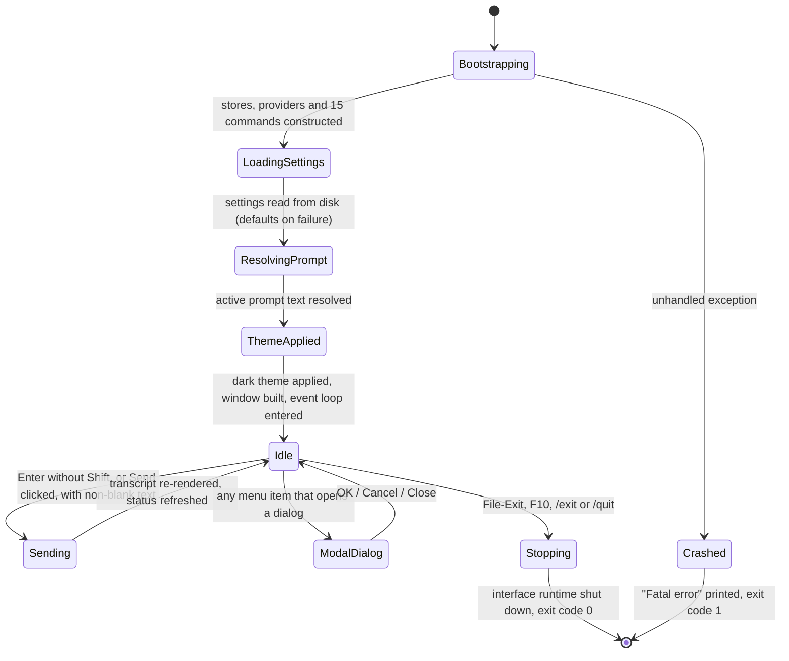

### 7.14 Full-Screen Terminal Shell

**Description**

The Full-Screen Terminal Shell is the product's windowed front end. It runs inside an ordinary text terminal — no desktop windowing system is required — and paints a persistent, mouse- and keyboard-driven application over the whole terminal surface: a menu bar across the top, a scrollable conversation transcript, a dedicated input frame with a **Send** button, a one-line status display showing the live provider/model/prompt context, a bottom shortcut bar, modal dialogs for every configuration task, and an optional side-by-side panel that renders token log probabilities as a colour heat map. It is an alternative to the product's line-at-a-time console shell, and it exists because that console shell forces the user to scroll a linear transcript, memorise slash-command syntax, and read token-probability output as a wall of plain text.

The shell owns no domain logic. Conversation storage, settings persistence, prompt storage, command semantics and model calls all live in adjacent features; this feature is the presentation, navigation and input-routing layer over them. Seven of the fifteen registered commands are reachable from the menu bar (message injection, remove-last, clear, import, export, demo visualisation, change model), and three further capabilities have menu equivalents that bypass the command layer entirely (help rendering, prompt management, the probability-panel toggle) — so a new user does not have to type `/help` to discover the product. The remaining commands are reachable only by typing them into the input box.

There is a single local, interactive human actor: the developer sitting at the terminal. There is no multi-user model, no authentication, no authorization, no role separation and no audit trail anywhere in this feature. The process runs with the privileges of the invoking operating-system account and touches only that account's profile and local-application-data directories. Note for planning: in the source product this shell is **never published by the release pipeline** — only the console shell ships — so this feature has no shipped binary today, and a reimplementation should decide deliberately whether it becomes a shipping surface.

---

**User stories**

- **US-14.1** — As a developer, I want the assistant to open as a full-screen window in my terminal with a persistent layout, so that I can see my conversation, my current configuration and my input box at the same time without re-reading scrollback.
- **US-14.2** — As a developer, I want to type a message and press a single key to send it, so that chatting costs no more effort than in a plain console.
- **US-14.3** — As a developer, I want to type any slash command into the same input box, so that everything the console shell can do is still available to me here.
- **US-14.4** — As a developer new to the product, I want the common actions on a menu bar, so that I can use the product without memorising command syntax.
- **US-14.5** — As a developer, I want my current provider, model and active system prompt shown at all times, so that I always know what I am talking to before I send a message.
- **US-14.6** — As a developer, I want each message visually distinguished by who said it, so that I can scan a long transcript quickly.
- **US-14.7** — As a developer studying model confidence, I want token log probabilities rendered in a dedicated side panel with colour-coded confidence, so that I can read them as structured data instead of as a text dump.
- **US-14.8** — As a developer, I want a marker on every assistant message that carries probability data, so that I can jump the panel to that specific message.
- **US-14.9** — As a developer, I want to turn the token-log-probability feature and its panel on and off from a menu, so that I only pay the visual cost when I am investigating.
- **US-14.10** — As a developer, I want a tabbed settings screen covering provider, credentials, probability display and local-model tuning, so that I can configure the product without editing a file by hand.
- **US-14.11** — As a developer, I want to store a named credential in the operating system's credential store, or migrate credentials out of the settings file, from inside that settings screen, so that my secrets do not sit in plain text.
- **US-14.12** — As a developer, I want a management screen for my system prompts — browse, view, activate, create, edit, delete, import, export — so that re-roling the assistant is a two-keystroke operation.
- **US-14.13** — As a developer, I want to inject a message into the conversation at a chosen role and position through a form, so that I can shape context without escaping quotes on a command line.
- **US-14.14** — As a developer, I want file pickers for importing and exporting my conversation, so that I do not have to type absolute paths.
- **US-14.15** — As a developer, I want a help screen listing every available command with its description, so that I can find the commands that have no menu item.
- **US-14.16** — As a developer, I want to leave the application from a menu item, a function key, or a typed command, so that quitting never traps me.

---

**Use cases**

**UC-14.A — Launch the shell (realizes US-14.1, US-14.5)**

- *Preconditions:* A terminal capable of ANSI/VT rendering and UTF-8 glyphs. The invoking account can read its own profile and local-application-data directories.
- *Main flow:*
  1. The process starts. It inspects **no** command-line arguments and defines **no** environment variables of its own.
  2. An empty in-memory conversation, a default settings record, a settings store, a conversation import/export store and a prompt store are created.
  3. Constructing the prompt store creates the prompt directory if absent and, if it holds no prompts, writes four seed prompts synchronously before any screen is drawn.
  4. A rich-console output formatter is created and handed to the demo-visualisation command only.
  5. Three provider adapters are registered under the lowercase keys `azure`, `bedrock` and `llama`.
  6. Fourteen commands are constructed in a fixed order — `inject`, `pop`, `import`, `export`, `model`, `set`, `logprobs`, `prompt`, `demologprobs`, `clear`, `exit`, `quit`, `tokenize`, `inspect` — and a fifteenth, `help`, is added and given the registry itself.
  7. Persisted settings are loaded from disk; if nothing comes back, the default settings record is kept.
  8. If the loaded settings name an active system prompt, that prompt is fetched and its text copied into the in-memory settings as the active prompt content.
  9. The terminal user-interface runtime is initialised and the single hard-coded dark theme is applied.
  10. The main window is constructed, attached to the runtime's root view, and the event loop is entered.
- *Alternate flows:*
  - **A1** — The named active prompt does not exist: the built-in default prompt text stays in place; nothing is reported.
  - **A2** — Settings cannot be loaded: the default settings record is used; nothing is reported. (The console shell prints a message here; this shell does not.)
- *Error flows:*
  - **E1** — Any exception escapes startup or shutdown: the single line `Fatal error: <message>` is written to the plain console and the process exits with code `1`. No window appears, or the window is torn down first.
- *Postconditions:* The window fills the terminal. The transcript is empty. The token-probability panel is **not** shown. The status line reads `Provider: <provider> | Model: <model id> | Prompt: <system prompt name>`. The prompt directory exists and holds at least four prompts. This shell never writes a "last used" timestamp on the resolved prompt.

**UC-14.B — Send a chat turn (realizes US-14.2, US-14.6, US-14.7)**

- *Preconditions:* The window is open and the input box has focus or the **Send** button is clickable.
- *Main flow:*
  1. The user types text and presses `Enter` without `Shift`, or clicks **Send**.
  2. The text is trimmed. It is non-blank and does not begin with `/`.
  3. The input box is cleared immediately.
  4. The text is appended to the conversation as a message with role `user`, and the transcript is re-rendered at once so the user sees their own message before the model replies.
  5. The configured provider name is lowercased and matched against the three registered adapters; it matches.
  6. The status line is set to `Thinking...`.
  7. Token log probabilities are disabled, so the plain send operation is called and the returned text is appended as an `assistant` message.
  8. The transcript is re-rendered and the status line is set to `Response received`, reverting to the resting context text after about three seconds.
- *Alternate flows:*
  - **A1** — Token log probabilities are enabled: the with-probabilities send operation is called; the assistant message is appended carrying both the text (the empty string when none was returned) and the returned probability list. If the response contains at least one probability entry and the panel was hidden, the panel is created, the transcript frame shrinks to 60 % of the window width, and the new message is selected; if the panel was already visible, the new message is simply selected. The transcript re-renders, the panel re-renders and scrolls to the top, and the status line reads `Response received`.
  - **A2** — Log probabilities were requested but none came back: **nothing is said**. The assistant message is stored with an absent/empty probability list, no probability marker appears, and the panel is not opened.
  - **A3** — The input is empty or whitespace only: nothing at all happens — no message, no dialog, no status change, and the input box is **not** cleared.
  - **A4** — `Shift+Enter` is pressed: the message is not sent; a newline is inserted into the input control instead.
  - **A5** — The text begins with `/`: control transfers to UC-14.C.
- *Error flows:*
  - **E1** — The provider name is missing: modal box titled **"Error"**, body `AI provider is not set in settings`, single **OK** button. The user message stays in the conversation.
  - **E2** — The provider name is present but not one of the three registered keys: modal **"Error"**, body `Unknown AI provider: <provider>`. With the empty string as the provider this produces a blank subject — see QUIRK-14.24.
  - **E3** — The model call fails for any reason (not configured, network, authentication, model error): modal **"Error"**, body `Failed to get AI response: <message>`. The user message stays in the conversation; there is no retry and no partial output. An unconfigured provider surfaces here for the first time, for example `Failed to get AI response: Azure OpenAI service is not properly configured. Please set AzureEndpoint, AzureApiKey, and ModelId.`, `...Amazon Bedrock service is not properly configured. Please set ModelId and AWS credentials.`, or `...LLamaSharp service is not properly configured. Please set ModelId to a valid GGUF model file path.`
  - **E4** — Any other exception on the send path: modal **"Error"** carrying the exception message with a single **OK** button.
- *Postconditions:* The conversation has grown by one or two messages. The transcript is scrolled to the bottom. The status line has returned to the resting context text.

**UC-14.C — Run a command typed into the input box (realizes US-14.3)**

- *Preconditions:* The window is open; the trimmed input begins with `/`.
- *Main flow:*
  1. The leading `/` is stripped and the remainder is split on single spaces with empty pieces discarded.
  2. The first piece is lowercased and used as the command name; the remaining pieces are the arguments, case preserved.
  3. The name is found in the registry and the command is executed asynchronously.
  4. The result reports success with a message: the status line becomes `✓ <message>` and reverts to the resting context text after about three seconds.
  5. The transcript is re-rendered; if the panel is visible it is re-pointed at the last assistant message carrying probability data, re-rendered and scrolled to the top; the status line is refreshed.
- *Alternate flows:*
  - **A1** — Nothing remains after splitting (the user typed only `/` or `/` plus spaces): the shell returns silently.
  - **A2** — The result reports success with **no** message (this is what `exit` and `quit` produce): nothing visible happens.
  - **A3** — The result requests exit: the event loop is stopped and the application terminates.
- *Error flows:*
  - **E1** — The name is not in the registry: modal **"Error"**, body `Unknown command: <name>`, single **OK** button. This includes the three implemented-but-unregistered commands `export-logs`, `show-analysis` and `export-analysis` — see QUIRK-14.20.
  - **E2** — The result reports failure with a message: modal titled **"Command Error"** carrying that message with an **OK** button. Failures never use a `✗` prefix in this shell.
  - **E3** — The command throws: modal **"Error"** carrying the exception message.
- *Postconditions:* Whatever the command did to the conversation, settings or prompt library is now reflected in the transcript and the status line.

**UC-14.D — Inspect token log probabilities (realizes US-14.7, US-14.8, US-14.9)**

- *Preconditions:* The window is open. At least one message with role exactly `assistant` carries a non-null, non-empty probability list.
- *Main flow:*
  1. The user clicks the `◊` marker rendered at the left of an eligible assistant message, or chooses **View ▸ Log Probabilities ▸ Toggle Log Probs Panel**.
  2. The panel is created if it does not exist; the transcript frame shrinks to 60 % of the window width; the panel is added to the right of it, occupying the same vertical span.
  3. The clicked message is selected (for the menu route: the **last** eligible message is selected if the current selection is empty or invalid).
  4. The panel renders a header row `[<message timestamp>] Token Probabilities:` followed by a blank row.
  5. For each token, in the order the model supplied, an indented row reads `<zero-based index>: "<token>" (<probability as a percentage with 5 decimal places>)`, coloured by the ten-bucket heat map.
  6. Under each token, up to *Grid View Max Alternatives* alternatives are listed, sorted by probability descending, each further indented as `Alt: "<token>" (<percentage>)` and individually heat-mapped, followed by one blank row.
  7. The panel scrolls to the top; the screen repaints. For the marker route the status line reads `Showing token probabilities for message at <timestamp>`; for the menu route it reads `Token probabilities panel enabled`.
- *Alternate flows:*
  - **A1** — The panel is already visible and the user toggles it: the panel is removed, the transcript frame returns to full width, and the status line reads `Token probabilities panel disabled`.
  - **A2** — The user chooses **View ▸ Log Probabilities ▸ Toggle Log Probs for Last Message**: the persistent enable-token-log-probabilities setting is flipped and settings are written to disk immediately; the transcript re-renders; if the flag is now on and the panel is hidden the panel is opened on the last eligible message, and if the flag is now off and the panel is shown the panel is closed; the status line reads `Log probabilities display enabled` or `Log probabilities display disabled`.
  - **A3** — A new assistant response arrives carrying probabilities while the panel is visible: the new message becomes the selection and the panel re-renders and scrolls to the top.
- *Error flows:*
  - **E1** — No assistant message anywhere carries probability data when the panel or the setting is toggled: modal titled **"No Log Probabilities"**, body `There are no assistant messages with log probabilities to display.`, **OK** button. The panel state and the setting are left unchanged.
  - **E2** — The selected message has no probability data at render time: the panel body shows the single line `No token probability data available.` and nothing else.
- *Postconditions:* The layout is either full-width transcript, or 60 % transcript with the panel to its right showing one selected message.

**UC-14.E — Change settings (realizes US-14.10)**

- *Preconditions:* The window is open.
- *Main flow:*
  1. The user chooses **Edit ▸ Settings…**. A modal titled **"Settings"**, 80 columns by 25 rows, opens with a four-tab strip and **OK** (default) / **Cancel** buttons pinned to the bottom row.
  2. Every field is seeded from the current in-memory settings record. The temperature field is seeded formatted to one decimal place.
  3. The user edits fields across the tabs *AI Provider*, *Credentials*, *Log Probs* and *LLama Settings*.
  4. The user presses **OK**. Each tab is read in that fixed order. Each numeric field is parsed with the ambient locale; a value that does not parse is silently discarded and the previously stored value kept; a value that parses is clamped into its documented range without any message.
  5. The whole settings record is written to disk and the dialog closes.
  6. The main window refreshes the status line.
- *Alternate flows:*
  - **A1** — The user presses **Cancel**: nothing is written to disk and the dialog closes — but a provider chosen on the radio group has **already** been written into the live settings record and is not reverted (QUIRK-14.2).
  - **A2** — The user presses **Manage Credentials...**: UC-14.F.
  - **A3** — The user presses **Migrate Credentials...**: UC-14.G.
- *Error flows:*
  - **E1** — Persisting settings raises: modal **"Error"**, body `Failed to save settings: <message>` — and the dialog closes anyway, because the close is requested unconditionally after the save call returns. In practice this branch is unreachable because the storage layer swallows its own failures (QUIRK-14.11); a failed write is reported only as a plain-console line painted under the window, and the change is silently lost.
- *Postconditions:* The in-memory settings record and (normally) the settings file reflect the edited, clamped values.

**UC-14.F — Store one credential in the operating-system credential store (realizes US-14.11)**

- *Preconditions:* The Settings dialog is open on the *Credentials* tab.
- *Main flow:*
  1. The user presses **Manage Credentials...**. A modal titled **"Manage Credentials"**, 60 by 15, opens with a `Credential Type:` field (30 columns), a masked `Value:` field (30 columns), a help block listing `Common types:` / `azureApiKey` / `awsAccessKey` / `awsSecretKey`, and **Save** / **Cancel** buttons.
  2. The user fills both fields and presses **Save**.
  3. The credential is written to the operating-system credential store, the dialog closes, and a modal titled **"Success"** with body `Credential saved successfully` appears.
- *Alternate flows:*
  - **A1** — **Cancel** is pressed: the dialog closes with no side effects.
  - **A2** — Either field is blank or whitespace: **Save does nothing at all** — no message, no close; the dialog stays open.
- *Error flows:*
  - **E1** — The store raises: modal **"Error"**, body `Failed to save credential: <message>`.
  - **E2** — The host is not the platform whose credential store is implemented, or the credential type is unrecognised: the store returns a "not stored" result rather than raising, the result is discarded, and the user still sees **"Success"** `Credential saved successfully` while **nothing was stored** (QUIRK-14.8).
- *Postconditions:* Either a named secret exists in the operating-system store under `ChatDbg:AzureApiKey`, `ChatDbg:AwsAccessKey` or `ChatDbg:AwsSecretKey`, or nothing changed.

**UC-14.G — Migrate credentials out of the settings file (realizes US-14.11)**

- *Preconditions:* The Settings dialog is open on the *Credentials* tab.
- *Main flow:*
  1. The user presses **Migrate Credentials...**. A modal titled **"Migrate Credentials"**, 70 by 18, opens showing the explanatory block `Choose how to migrate your credentials from the settings file:` / `1. Environment Variables - Cross-platform, most secure` / `2. Windows Credential Manager - Windows-specific, secure` / `3. Both - Maximum flexibility` and a radio group `Environment Variables` / `Windows Credential Manager` / `Both`.
  2. The user selects an option and presses **Migrate**. The dialog closes first, then the migration runs.
  3. A modal titled **"Success"** with body `Credentials migrated successfully` appears.
- *Alternate flows:*
  - **A1** — **Cancel** is pressed: the dialog closes with no side effects.
  - **A2** — The selected radio option is read and then discarded: all three choices perform the same "migrate from the settings file" action (QUIRK-14.17).
- *Error flows:*
  - **E1** — Migration raises: modal **"Error"**, body `Migration failed: <message>`.
  - **E2** — The migration routine is itself an interactive plain-console wizard that prints a numbered menu and blocks twice on standard input while the full-screen interface owns the screen: the prompts are invisible and the application appears to hang (QUIRK-14.9). If it returns, **"Success"** is shown regardless of the outcome, including the case where it bailed out immediately because there was nothing to migrate.
- *Postconditions:* Indeterminate from the user's point of view — the success message does not reflect the real result.

**UC-14.H — Manage system prompts (realizes US-14.12)**

- *Preconditions:* The window is open; the prompt store exists.
- *Main flow:*
  1. The user chooses **Tools ▸ System Prompts…**. A modal titled **"System Prompts"**, 80 by 25, opens with a bordered list frame captioned **"Available Prompts"** filling the dialog minus three rows and a row of buttons on the bottom row: `Show` at column 2, `Use` at 12, `Create...` at 20, `Edit...` at 33, `Delete` at 45, `Import...` at 56, `Export...` at 69, plus a `Close` button centred on the same row.
  2. The list is loaded asynchronously, sorted ascending by name, and each row is rendered as `<name> - <description>`.
  3. The user selects a row and presses a button; the selection index is used as a direct index into the sorted list.
  4. **Show** opens a read-only, word-wrapped viewer titled `Prompt: <name>` (80 by 20) showing the prompt body, a `Description: <description>` line and a centred **Close** button.
  5. **Use** writes the selected prompt's name and body into the live settings, persists settings, and shows modal **"Success"** `Now using system prompt: <name>`.
  6. **Create…** opens a modal `Create System Prompt` (80 by 20) with `Name:`, `Description:` and a multi-line `Content:` area, and **Create** / **Cancel** buttons. On **Create** the name is validated non-blank, then the content; the record is saved with a creation timestamp of the current UTC instant; the sub-dialog closes; the list reloads; modal **"Success"** `Prompt '<name>' created successfully` appears.
  7. **Edit…** opens `Edit Prompt: <name>` (80 by 20) with `Description:` and `Content:` pre-filled and the **name not editable**; content is validated non-blank; save, close, reload, modal **"Success"** `Prompt '<name>' updated successfully`.
  8. **Delete** shows a confirmation titled **"Confirm Delete"**, body `Are you sure you want to delete the prompt '<name>'?`, buttons **Yes**, **No**; only the first button deletes; then the list reloads and modal **"Success"** `Prompt '<name>' deleted successfully` appears.
  9. **Import…** opens `Import System Prompt` (70 by 15) with `Prompt Name:` (40 columns), `File Path:` (40 columns), a `Browse...` button and `Description:`. `Browse...` opens a *second* modal `Enter File Path` (60 by 8) that is a **plain text box, not a file browser**; its OK copies the typed path into the File Path field. Import validates the name non-blank, then the path non-blank, reads the file's entire text as the prompt body, saves with a creation timestamp of now (UTC), closes, reloads, and shows **"Success"** `Prompt '<name>' imported successfully`.
  10. **Export…** opens `Enter Export File Path` (70 by 8) pre-filled with `<user profile>/<prompt name>.txt`; OK writes the prompt **body only** as plain text to that path, closes, and shows **"Success"** `Prompt '<name>' exported successfully to <path>`.
  11. **Close** returns to the main window, which refreshes the status line.
- *Alternate flows:*
  - **A1** — The list can briefly appear empty immediately after the dialog opens, because population is asynchronous and marshalled back onto the interface thread.
  - **A2** — Any prompt-file entry that will not parse is silently omitted from the list; a diagnostic line is written to the plain console under the window.
- *Error flows:*
  - **E1** — A selection-dependent button is pressed with nothing selected, or with a selection index outside the list: modal **"Error"**, body `Please select a prompt first`.
  - **E2** — Create with a blank name: modal **"Error"**, body `Name is required`; the sub-dialog stays open.
  - **E3** — Create or Edit with blank content: modal **"Error"**, body `Content is required`; the sub-dialog stays open.
  - **E4** — Save, update or delete fails: modal **"Error"**, body `Failed to create prompt: <message>` / `Failed to update prompt: <message>` / `Failed to delete prompt: <message>`.
  - **E5** — Import with a blank name or blank path: modal **"Error"**, body `Name is required` / `File path is required`. Import file unreadable: `Failed to import prompt: <message>`.
  - **E6** — Export with a blank path: modal **"Error"**, body `File path is required`. Export write fails: `Failed to export prompt: <message>`.
  - **E7** — **Use** fails: modal **"Error"**, body `Failed to set system prompt: <message>` — unreachable in practice for the same reason as UC-14.E/E1 (QUIRK-14.11).
- *Postconditions:* The prompt library on disk and, for **Use**, the active prompt in settings, reflect the operation. This shell never stamps a "last used" timestamp on any prompt.

**UC-14.I — Inject a message through the form (realizes US-14.13)**

- *Preconditions:* The window is open.
- *Main flow:*
  1. The user chooses **File ▸ Inject Message…**. A modal titled **"Inject Message"**, 70 by 15, opens with `Role:` (single line, 20 columns, pre-filled `user`), `Message:` (multi-line, 5 rows), `Position (optional):` (single line, 10 columns, empty), and **OK** (default) / **Cancel**.
  2. The user fills the fields and presses **OK**.
  3. An argument list of `[role, message]` is built; the position string is appended **only if** it is non-blank and parses as a whole number.
  4. The dialog closes **first**, then the injection command runs.
  5. On success the transcript re-renders, the panel re-renders if visible, and the status line shows the command's message, or `Message injected` when the command returned none.
- *Alternate flows:*
  - **A1** — **Cancel**: the dialog closes with no side effects.
  - **A2** — The position does not parse as a whole number: it is silently dropped and the message is appended at the end.
  - **A3** — The position parses but falls outside `[0, message count)`: the downstream store also degrades to append.
  - **A4** — The message field is empty: the command still sees two arguments, so an empty message is injected.
- *Error flows:*
  - **E1** — The role is not exactly `user`, `assistant` or `system` after lowercasing: modal **"Error"** with the command's failure message `Role must be one of: user, assistant, system`.
  - **E2** — Any other command failure: modal **"Error"** with the command's message, or `Failed to inject message` when it returned none.
- *Postconditions:* The conversation contains the injected message at the resolved position.

**UC-14.J — Import or export the conversation (realizes US-14.14)**

- *Preconditions:* The window is open.
- *Main flow (export):*
  1. The user chooses **File ▸ Export History…**. A file-save dialog titled **"Export Chat History"** opens with the prompt `Select a location to save chat history`, pre-filled with `<user profile>/chat_history.json`.
  2. The user confirms a path.
  3. The shell formats the string `export <path>`, routes it through the same space-splitting command dispatcher, and runs the export command; a `.json` extension is appended by the command when the chosen path has none.
  4. The status line shows `✓ Successfully exported <n> messages to: <path>`.
- *Main flow (import):*
  1. The user chooses **File ▸ Import History…**. A file-open dialog titled **"Import Chat History"** opens with the prompt `Select a chat history file to import`, multiple selection disabled, starting at the current user's profile directory.
  2. The user confirms a path; the shell runs `import <path>`.
  3. The whole conversation is **replaced** and the imported session identity adopted, without confirmation and with no undo. The status line shows `✓ Successfully imported <n> messages from: <path>`.
- *Alternate flows:*
  - **A1** — The dialog is cancelled, or no path came back: nothing happens.
  - **A2** — A `~/` prefix in a typed path is expanded to the user profile directory by the import/export commands.
- *Error flows:*
  - **E1** — The command reports failure: modal **"Command Error"** with `Failed to import chat history from: <path>` or `Failed to export chat history to: <path>`.
  - **E2** — The chosen path contains a run of two or more spaces: the path is silently corrupted to single spaces by the command round-trip (QUIRK-14.18).
- *Postconditions:* A conversation file exists at the chosen path, or the in-memory conversation has been replaced.

**UC-14.K — Read the command help (realizes US-14.15)**

- *Preconditions:* A command named `help` is present in the registry; otherwise the menu item does nothing.
- *Main flow:*
  1. The user chooses **Help ▸ View Commands…**. A modal titled **"Help"**, 80 by 20, opens with a read-only, word-wrapped text area and a centred **Close** button on the last row.
  2. The body is generated by the window itself from the registry — **not** by the help command: the literal header `Available Commands:`, a blank line, then for each registered command sorted ascending by name: `/<name>`, then two spaces followed by the command's one-line description, then a blank line. Usage strings are not shown.
  3. The user presses **Close**.
- *Alternate flows:* none.
- *Error flows:* none.
- *Postconditions:* No state change.

**UC-14.L — Leave the application (realizes US-14.16)**

- *Preconditions:* The window is open.
- *Main flow:*
  1. The user chooses **File ▸ Exit**, presses the `F10 Quit` shortcut-bar item, or types `/exit` or `/quit`.
  2. The event loop is asked to stop. **No confirmation is asked and no state is flushed.**
  3. The interface runtime is shut down and the process returns exit code `0`.
- *Alternate flows:*
  - **A1** — The typed-command route produces a success result with a **null** message, so no `✓` status line ever appears for it.
- *Error flows:*
  - **E1** — An exception escapes shutdown: `Fatal error: <message>` on the plain console, exit code `1`.
- *Postconditions:* The process has terminated. Unsaved in-memory conversation content is lost — nothing is written on exit.

---

**Functional requirements**

*Startup and process contract*

- **FR-14.1** — The shell shall accept **no** command-line arguments and shall define no environment variables of its own. (realizes US-14.1)
- **FR-14.2** — At startup the shell shall perform, in this exact order: create the empty conversation, default settings record and the settings / conversation-transfer / prompt stores; create the rich-console formatter; register the three provider adapters under the lowercase keys `azure`, `bedrock`, `llama`; build the command registry; load settings; resolve the active system prompt; initialise the interface runtime; apply the dark theme; build and attach the window; enter the event loop. (realizes US-14.1)
- **FR-14.3** — The command registry shall contain exactly fifteen entries, constructed in this order: `inject`, `pop`, `import`, `export`, `model`, `set`, `logprobs`, `prompt`, `demologprobs`, `clear`, `exit`, `quit`, `tokenize`, `inspect`, then `help`. The registry shall never be mutated after startup. (realizes US-14.3, US-14.15)
- **FR-14.4** — If loading persisted settings yields nothing, the shell shall silently use the default settings record and shall display no message. (realizes US-14.1)
- **FR-14.5** — If the loaded settings name an active system prompt, the shell shall fetch that prompt and copy its text into the in-memory settings as the active prompt content. If the prompt is missing, the built-in default text shall remain in place and no message shall be shown. (realizes US-14.5)
- **FR-14.6** — The shell shall **not** stamp a "last used" timestamp on the resolved prompt at startup or at any other time, so a user of this shell only leaves that field unset.
- **FR-14.7** — The shell shall print **no** welcome banner, **no** settings-file path and shall perform **no** credential pre-flight check; the first sign of a mis-configured provider shall be a failure dialog on the first chat turn. (realizes US-14.1)
- **FR-14.8** — On normal loop exit the shell shall shut the interface runtime down and return process exit code `0`. Any exception escaping startup, the loop or shutdown shall cause the single line `Fatal error: <message>` to be written to the plain console and process exit code `1`. (realizes US-14.16)

*Window layout*

- **FR-14.9** — The main window shall be titled exactly `ChatDbg - AI-Powered Debugging Assistant` and shall fill the terminal. (realizes US-14.1)
- **FR-14.10** — The window shall contain, top to bottom: a menu bar on row 0; a bordered transcript frame captioned `Chat History` from row 1 down to five rows above the bottom; optionally a bordered probability frame captioned `Token Probabilities` to the right of it over the same rows; a bordered input frame captioned `Input`, anchored five rows from the bottom and three rows tall; a free-text status line anchored two rows from the bottom and one row tall; and a shortcut bar on the bottom row. (realizes US-14.1)
- **FR-14.11** — The transcript frame shall occupy the full window width, or 60 % of it while the probability panel is shown. (realizes US-14.7)
- **FR-14.12** — The transcript region shall be a scrollable canvas with a vertical scroll indicator and **no** horizontal scroll indicator, with an initial content extent of 80 columns by 1000 rows. *(These two extents are tunable defaults, not business rules; they are replaced on the first render.)*
- **FR-14.13** — The probability region shall be a scrollable canvas with **both** scroll indicators, with an initial content extent of 50 columns by 1000 rows. *(Tunable defaults.)*
- **FR-14.14** — The input control shall be **one row tall**, shall occupy the full width of the input frame minus 10 columns, and shall have word wrapping turned **off**. The **Send** button shall be anchored 8 columns from the right edge of the input frame. (realizes US-14.2)
- **FR-14.15** — The shortcut bar shall show exactly two items: `F1 Help` and `F10 Quit`. `F1` shall open the Help dialog and `F10` shall stop the event loop directly. (realizes US-14.15, US-14.16)
- **FR-14.16** — The resting status text shall be exactly `Provider: <provider> | Model: <model id> | Prompt: <system prompt name>`. (realizes US-14.5)
- **FR-14.17** — A transient status message shall replace the resting text, force a repaint, and be replaced by the resting text again after **3000 ms** by an independent, uncancellable timer marshalled back onto the interface thread. (realizes US-14.5)

*Menus*

- **FR-14.18** — The menu bar shall have exactly five top-level menus in this order: `File`, `Edit`, `View`, `Tools`, `Help`; every top-level title and every item shall carry a hot-key marker on one letter. (realizes US-14.4)
- **FR-14.19** — **File** shall contain, in order: *Inject Message…* (opens the inject form), *Pop Last Message* (runs the remove-last command with no arguments), *Clear History* (runs the clear command with no arguments, **with no confirmation prompt**), *Import History…*, *Export History…*, *Exit*. (realizes US-14.4)
- **FR-14.20** — **Edit** shall contain exactly one item, *Settings…*, which opens the tabbed settings screen and, on return, refreshes the status line. (realizes US-14.10)
- **FR-14.21** — **View** shall contain a *Log Probabilities* submenu with exactly three items — *Toggle Log Probs Panel*, *Toggle Log Probs for Last Message*, *Run Demo Visualization* — plus a top-level item *Toggle System Messages in Status Bar*. (realizes US-14.9)
- **FR-14.22** — *Toggle System Messages in Status Bar* shall be unimplemented and shall set the status line to exactly `System messages toggle not yet implemented`.
- **FR-14.23** — **Tools** shall contain *System Prompts…* (opens the prompt-management screen, then refreshes the status line) and *Change Model…*. (realizes US-14.12)
- **FR-14.24** — **Help** shall contain *View Commands…* and *About…*. (realizes US-14.15)
- **FR-14.25** — Commands invoked from a menu item shall additionally re-render the transcript and, when the panel is visible, re-render the panel after the command completes.

*Input routing*

- **FR-14.26** — Sending shall be triggered by clicking **Send** or by pressing `Enter` in the input box **without** `Shift`; `Shift+Enter` shall be left to the input control's default newline behaviour. (realizes US-14.2)
- **FR-14.27** — Input shall be trimmed before any decision is made. Null, empty or whitespace-only input shall be discarded silently: no message, no dialog, no status change, and the input box shall **not** be cleared. (realizes US-14.2)
- **FR-14.28** — Non-blank input shall clear the input box immediately, before any further processing. (realizes US-14.2)
- **FR-14.29** — Trimmed input beginning with `/` shall be treated as a command; anything else shall be treated as a chat turn. (realizes US-14.2, US-14.3)
- **FR-14.30** — After either path completes, the shell shall re-render the transcript, re-point and re-render the probability panel at the last assistant message carrying probability data if the panel is visible (scrolling it to the top), and refresh the status line to the resting text. (realizes US-14.7)
- **FR-14.31** — Any exception on either path shall surface as a modal box titled `Error` carrying the exception message with a single **OK** button. (realizes US-14.2)

*Command dispatch*

- **FR-14.32** — Command parsing shall strip the leading `/`, split the remainder on single space characters, and discard empty pieces. If nothing remains, the shell shall return silently. (realizes US-14.3)
- **FR-14.33** — The first piece shall be lowercased and used as the command name; argument case shall be preserved. (realizes US-14.3)
- **FR-14.34** — An unrecognised command name shall produce a modal box titled `Error` with the body `Unknown command: <name>` and a single **OK** button. (realizes US-14.3)
- **FR-14.35** — A result requesting exit shall stop the event loop immediately, with no further rendering. (realizes US-14.16)
- **FR-14.36** — A successful result carrying a message shall set the status line to `✓ <message>` (a check glyph followed by one space). A failing result carrying a message shall open a modal box titled `Command Error` with that message and an **OK** button. A successful result with no message shall produce **no** visible feedback. Failures shall never be prefixed with a cross glyph in this shell. (realizes US-14.3)
- **FR-14.37** — The status-line message strings the menu-driven commands produce shall be carried through verbatim, including: `Cleared <n> messages from chat history`; `Changed model from '<old>' to '<new>'` and `Current model: <id>`; `Injected <role> message[ at position <n>]: <message>`; `Successfully imported <n> messages from: <path>` and `Failed to import chat history from: <path>`; `Successfully exported <n> messages to: <path>` and `Failed to export chat history to: <path>`; `Sample token probability analysis generated`; `Chat history is empty`; `Removed last message: [<role>] <first 50 characters of the content>...`; and the usage strings `Usage: /import <file_path>`, `Usage: /export <file_path>`, `Usage: /inject <role> <message> [position]`. (realizes US-14.4)

*Chat turn*

- **FR-14.38** — A chat turn shall append the typed text to the conversation with role `user` and re-render the transcript **before** calling any provider, so the user's own message is visible immediately. (realizes US-14.2)
- **FR-14.39** — The configured provider name shall be lowercased and matched against the registered adapter keys. A missing provider shall produce modal `Error` / `AI provider is not set in settings`; an unmatched provider shall produce modal `Error` / `Unknown AI provider: <provider>`. The empty string shall fall through to the second case and render with a blank subject. (realizes US-14.5)
- **FR-14.40** — The status line shall be set to `Thinking...` before the provider call and to `Response received` after a successful one. (realizes US-14.2)
- **FR-14.41** — When token log probabilities are disabled, the plain send operation shall be used and the returned text appended as an `assistant` message. When enabled, the with-probabilities send operation shall be used and the `assistant` message shall carry both the text (the empty string when none was returned) and the returned probability list. (realizes US-14.7)
- **FR-14.42** — When a response carries at least one probability entry and the panel is hidden, the shell shall open the panel, shrink the transcript to 60 % width, and select the new message; when the panel is already visible it shall simply select the new message, re-render it and scroll it to the top. (realizes US-14.7)
- **FR-14.43** — When log probabilities were requested but none were returned, the shell shall say **nothing**: no marker, no panel, no message. (realizes US-14.7)
- **FR-14.44** — A failed provider call shall produce modal `Error` / `Failed to get AI response: <message>`, and the user's message shall **remain** in the conversation. There shall be no retry and no partial output. (realizes US-14.2)
- **FR-14.45** — The shell shall **not** check whether the selected provider is configured before calling it; configuration failures shall surface only through FR-14.44.
- **FR-14.46** — The interface shall not lock out input while a request is in flight: the user can open menus, change settings, or press Send again, and a second send shall append a second user message to the same conversation. There shall be no cancellation mechanism.

*Transcript rendering*

- **FR-14.47** — The transcript shall be rebuilt from scratch on every refresh: all child elements removed, then re-added, one per role banner, one per wrapped body line, and one per probability marker. There shall be no virtualisation, no paging and no cap on conversation length. (realizes US-14.6)
- **FR-14.48** — For each message in conversation order the shell shall emit a full-width role banner reading `[<role lowercased>]`. For role `user` the banner text shall be right-aligned and the banner shall start at column 0; for every other role the text shall be left-aligned and the banner shall start at column 2. (realizes US-14.6)
- **FR-14.49** — The message body shall be split into lines and each line emitted as its own full-width row using the same alignment/offset rule and the same colour pair as the banner. **Blank or whitespace-only lines shall be dropped.** (realizes US-14.6)
- **FR-14.50** — The body wrap width shall be `((transcript viewport width − 4) × 3) ÷ 4` using integer arithmetic, where the `4` is twice the 2-column padding and the `3/4` factor keeps a message bubble to three-quarters of the usable width. Wrapping shall first split on explicit line-feed characters, then hard-break over-long lines preferring the last space at or before the limit, keeping that space at the end of the emitted line. (realizes US-14.6)
- **FR-14.51** — An `assistant` message carrying probability data shall additionally render a clickable marker labelled `◊` at column 2. (realizes US-14.8)
- **FR-14.52** — Exactly one blank row of spacing shall follow each message. (realizes US-14.6)
- **FR-14.53** — After rendering, the scrollable extent shall be set to (visible width) × max(total rows, visible height); if the content is taller than the viewport the view shall scroll so the **last** rows are visible; then the whole screen shall be repainted. (realizes US-14.6)
- **FR-14.54** — Colour shall be assigned per role: `user` = white on dark grey; `assistant` = bright yellow on blue; `system` = green on black; **any unrecognised role shall fall back to the `system` pair**. The `◊` marker shall be bright green on black, and bright green on dark grey when focused. (realizes US-14.6)

*Probability panel*

- **FR-14.55** — The panel shall be openable only when at least one message with role exactly `assistant` carries a probability list that is both non-null and non-empty; an empty list shall count as absent. When no such message exists, toggling shall produce a modal box titled `No Log Probabilities` with the body `There are no assistant messages with log probabilities to display.` and shall leave state unchanged. (realizes US-14.9)
- **FR-14.56** — The panel shall never be visible at startup: the startup eligibility check requires both the enable flag and an existing eligible message, and the conversation is always empty at startup. (realizes US-14.1)
- **FR-14.57** — Showing the panel shall create it if absent, shrink the transcript frame to 60 % width, add the panel to the window if not already added, select the last eligible message when the current selection is empty or invalid, render, scroll to top, set the status line to `Token probabilities panel enabled`, and force a full-screen repaint. Hiding shall remove the panel, restore the transcript frame to full width, set the status line to `Token probabilities panel disabled`, and force a repaint. (realizes US-14.9)
- **FR-14.58** — Clicking a `◊` marker shall open the panel if hidden (shrinking the transcript to 60 %), select **that** message, render, scroll to top, and set the status line to `Showing token probabilities for message at <timestamp>`. (realizes US-14.8)
- **FR-14.59** — With no message selected, or a selected message carrying no probability data, the panel body shall be the single line `No token probability data available.` and nothing else. (realizes US-14.7)
- **FR-14.60** — Otherwise the panel shall render a header row at column 0 reading `[<message timestamp>] Token Probabilities:` followed by one blank row. (realizes US-14.7)
- **FR-14.61** — For each token, in the order the model supplied, the panel shall render at column 2 the row `<zero-based index>: "<token>" (<percentage>)`. Line-feed, carriage-return and tab characters inside token text shall be rendered as the two-character escapes `\n`, `\r` and `\t`. (realizes US-14.7)
- **FR-14.62** — Under each token the panel shall render up to *Grid View Max Alternatives* alternatives, **sorted by probability descending**, each at column 4 as `Alt: "<token>" (<percentage>)` and individually heat-mapped, followed by one blank row after the whole token block. (realizes US-14.7)
- **FR-14.63** — Probabilities are fractions in the range 0…1 (the exponential of the stored log probability). The percentage text shall be the value formatted with **5 decimal places** followed by a space and a percent sign — for example `0.25` renders as `25.00000 %`. (realizes US-14.7)
- **FR-14.64** — The heat-map bucket index shall be `floor(probability × 10)` clamped to the range 0…9, giving exactly ten buckets, all on a black background: 0–10 % bright red, 10–20 % red, 20–30 % bright magenta, 30–40 % magenta, 40–50 % bright blue, 50–60 % blue, 60–70 % cyan, 70–80 % bright cyan, 80–90 % bright yellow, 90–100 % bright green. A probability of exactly `1.0` maps to index 10 and is therefore clamped to 9. (realizes US-14.7)
- **FR-14.65** — The panel's scrollable content width shall be `max(M + 5, 50)`, where `M` is the largest of (length of each token line **+ 2**) and (length of each alternative line **+ 4**) — effectively the longest token line + 7 or the longest alternative line + 9, floored at 50 columns. Height shall be `max(total rows, viewport height)`. After any update the panel shall be scrolled to the top and the screen repainted.
- **FR-14.66** — The panel shall always list **every** token in list form; the persisted *Display Mode* and *Layout* preferences shall have no effect on it.

*Toggling the persisted token-log-probability setting*

- **FR-14.67** — **View ▸ Log Probabilities ▸ Toggle Log Probs for Last Message** shall first locate the last assistant message carrying probability data and abort with the `No Log Probabilities` modal (FR-14.55) if none exists. Otherwise it shall flip the persistent enable flag, **write settings to disk immediately**, re-render the transcript, open the panel on that message if the flag is now on and the panel is hidden, close the panel if the flag is now off and the panel is shown, and set the status line to `Log probabilities display enabled` or `Log probabilities display disabled`. (realizes US-14.9)

*Settings screen*

- **FR-14.68** — The settings screen shall be a modal titled `Settings`, fixed at 80 columns by 25 rows, with a four-tab strip and **OK** (default) / **Cancel** buttons pinned to the bottom row. The tab order shall be fixed: *AI Provider*, *Credentials*, *Log Probs*, *LLama Settings*. (realizes US-14.10)
- **FR-14.69** — The *AI Provider* tab shall contain a radio group `Azure OpenAI` / `AWS Bedrock` / `Local LLM (LLama)` (initial selection derived from the stored provider key: `azure`→0, `bedrock`→1, `llama`→2, anything else→0), plus the fields `Azure Endpoint:` (free text, full width), `AWS Region:` (30 columns), `Model ID/Path:` (full width), `Temperature:` (10 columns, with the static hint `(0.0 - 2.0)`) and `Max Tokens:` (10 columns, no hint). (realizes US-14.10)
- **FR-14.70** — Selecting a provider radio option shall write the corresponding key (`azure` / `bedrock` / `llama`) into the live settings record **immediately, on change**, not on OK, and pressing **Cancel** shall not revert it. (realizes US-14.10)
- **FR-14.71** — The *Credentials* tab shall contain the heading `Credential Management`, a checkbox `Enable Windows Credential Manager` initialised from the stored flag, buttons `Manage Credentials...` and `Migrate Credentials...`, and a static help block reading exactly: `Credentials are stored securely using:` / `1. Environment variables (recommended)` / `2. Windows Credential Manager (Windows only)` / `3. Settings file (deprecated)` / `Use 'Migrate Credentials' to move from settings file` / `to more secure storage options.` (realizes US-14.11)
- **FR-14.72** — The *Log Probs* tab shall contain the checkbox `Enable Log Probabilities`, the field `Log Probabilities Top K:` with the hint `(1 - 20)`, a radio group `Display Mode:` with options `Show All Tokens` (index 0) and `Show Samples` (index 1), a radio group `Layout:` with options `Grid View` (index 0) and `List View` (index 1), and the field `Grid View Max Alternatives:` with the hint `(1 - 20)`. `Show All Tokens` selected shall mean show-all = true; `Grid View` selected shall mean grid layout = true. (realizes US-14.10)
- **FR-14.73** — The *LLama Settings* tab shall contain `Context Size:` (hint `(512 - 32768)`), `GPU Layer Count:` (hint `(0 = CPU only)`), `GPU Device(s):` (hint `(e.g., "0" or "0,1")`), `Thread Count:` (hint `(0 = system default)`), `Batch Size:` (hint `(1 - 2048)`), and a static information block headed `GPU Acceleration Settings:` followed by five bullet lines about GPU layer count, GPU device, thread count, context size and batch size. (realizes US-14.10)
- **FR-14.74** — On **OK** the screen shall read the tabs in the fixed order, coerce each numeric field with **parse-or-ignore** semantics (a value that does not parse leaves the previously stored value untouched, with **no** validation message and no field highlight), clamp the parsed value into range with **no** message, then write the whole settings record to disk, then close. (realizes US-14.10)
- **FR-14.75** — The enforced clamp ranges shall be: Temperature `0.0 – 2.0`; Max Tokens `1 – 8192`; Log Probabilities Top K `1 – 20`; Grid View Max Alternatives `1 – 20`; local-model Context Size `512 – 32768`; local-model GPU Layer Count `0 – 100`; local-model Thread Count `0 – 64`; local-model Batch Size `1 – 2048`. Note the displayed hint for GPU Layer Count shows no upper bound while 100 is enforced. (realizes US-14.10)
- **FR-14.76** — On save, an AWS Region field that yields nothing shall fall back to `us-east-1`; a Model ID/Path field that yields nothing shall fall back to the empty string; the Azure Endpoint and the GPU Device string shall be stored verbatim including empty. (realizes US-14.10)
- **FR-14.77** — The Temperature field shall be seeded formatted to **one decimal place** when the screen opens; no other numeric field is reformatted this way. (realizes US-14.10)
- **FR-14.78** — On **Cancel** the screen shall close without writing anything to disk. (realizes US-14.10)
- **FR-14.79** — A persistence failure shall show a modal box titled `Error` with the body `Failed to save settings: <message>`, and the screen shall **still close**, because the close is requested unconditionally after the save call returns. (realizes US-14.10)
- **FR-14.80** — After the screen returns, the main window shall refresh the status line. (realizes US-14.5)
- **FR-14.81** — Numeric parsing in this screen and percentage/timestamp formatting in the panel shall use the ambient locale of the running process, which means a comma-decimal locale silently discards `0.7` under FR-14.74. Builds that pin invariant culture behave differently from builds that do not. *(Recorded, not endorsed.)*

*Credential sub-dialogs*

- **FR-14.82** — The `Manage Credentials` sub-dialog shall be modal, 60 by 15, with `Credential Type:` (30 columns), a masked `Value:` (30 columns), a help block reading `Common types:` / `azureApiKey` / `awsAccessKey` / `awsSecretKey`, and **Save** / **Cancel**. (realizes US-14.11)
- **FR-14.83** — **Save** shall store the credential only when **both** fields are non-blank; with either blank it shall do nothing at all — no message, dialog stays open. On a successful call the dialog shall close and show modal `Success` / `Credential saved successfully`; a raised failure shall show modal `Error` / `Failed to save credential: <message>`. The stored-or-not result returned by the credential store shall be **discarded** by the source implementation. (realizes US-14.11)
- **FR-14.84** — The `Migrate Credentials` sub-dialog shall be modal, 70 by 18, showing the block `Choose how to migrate your credentials from the settings file:` / `1. Environment Variables - Cross-platform, most secure` / `2. Windows Credential Manager - Windows-specific, secure` / `3. Both - Maximum flexibility`, a radio group `Environment Variables` / `Windows Credential Manager` / `Both`, and **Migrate** / **Cancel**. **Migrate** shall close the dialog first, then run the migration, then show modal `Success` / `Credentials migrated successfully` or modal `Error` / `Migration failed: <message>`. The chosen radio option shall be read into a local value and then discarded — all three options perform the same action. (realizes US-14.11)

*System prompt screen*

- **FR-14.85** — The prompt screen shall be modal, titled `System Prompts`, 80 by 25, with a bordered list frame captioned `Available Prompts` filling the dialog minus three rows, and eight buttons on the bottom row: `Show` at column 2, `Use` at 12, `Create...` at 20, `Edit...` at 33, `Delete` at 45, `Import...` at 56, `Export...` at 69, plus a centred `Close`. (realizes US-14.12)
- **FR-14.86** — The list shall be sorted ascending by name and each row rendered as `<name> - <description>`. The selection index shall map one-to-one into that sorted list; an index outside `[0, count)` shall be treated as no selection. The list shall be loaded asynchronously and pushed onto the interface thread, so it may briefly appear empty. (realizes US-14.12)
- **FR-14.87** — All six selection-dependent operations shall show modal `Error` / `Please select a prompt first` when nothing is selected. (realizes US-14.12)
- **FR-14.88** — **Show** shall open a read-only, word-wrapped viewer titled `Prompt: <name>`, 80 by 20, containing the prompt body, a `Description: <description>` line and a centred **Close** button. (realizes US-14.12)
- **FR-14.89** — **Use** shall write the selected prompt's name and body into the live settings, persist settings, and show modal `Success` / `Now using system prompt: <name>`; a raised failure shall show modal `Error` / `Failed to set system prompt: <message>`. The status line shall be refreshed only when the whole prompt screen closes, not when **Use** completes. (realizes US-14.12)
- **FR-14.90** — **Create…** shall open a modal `Create System Prompt`, 80 by 20, with `Name:`, `Description:` and a multi-line `Content:` area, and **Create** / **Cancel** buttons. All three values shall be trimmed. The name shall be validated non-blank first (`Name is required`), then the content (`Content is required`); the description may be blank and shall be stored as the empty string. The record shall be saved with a creation timestamp of the current UTC instant. On success the sub-dialog closes, the list reloads, and modal `Success` / `Prompt '<name>' created successfully` appears. No existence check shall be performed. (realizes US-14.12)
- **FR-14.91** — **Edit…** shall open a modal `Edit Prompt: <name>`, 80 by 20, with `Description:` and `Content:` pre-filled and the **name not editable**. Only the content shall be validated non-blank. On success: save, close, reload the list, modal `Success` / `Prompt '<name>' updated successfully`. (realizes US-14.12)
- **FR-14.92** — **Delete** shall show a confirmation titled `Confirm Delete`, body `Are you sure you want to delete the prompt '<name>'?`, with buttons **Yes** then **No**; only the first button (index 0) shall delete, and it is the default. On completion the list reloads and modal `Success` / `Prompt '<name>' deleted successfully` appears. (realizes US-14.12)
- **FR-14.93** — **Import…** shall open a modal `Import System Prompt`, 70 by 15, with `Prompt Name:` (40 columns), `File Path:` (40 columns), a `Browse...` button and `Description:`. `Browse...` shall open a second modal titled `Enter File Path`, 60 by 8, that is a **plain text entry, not a file browser**, whose OK copies the typed path into the File Path field. Import shall validate the name non-blank (`Name is required`), then the path non-blank (`File path is required`), read the file's **entire text** as the prompt body, save with a creation timestamp of now (UTC), close, reload, and show `Success` / `Prompt '<name>' imported successfully`. A read failure shall show `Error` / `Failed to import prompt: <message>`. (realizes US-14.12)
- **FR-14.94** — **Export…** shall open a modal `Enter Export File Path`, 70 by 8, pre-filled with `<user profile>/<prompt name>.txt`, and on OK write **only the prompt body** as plain text to that path, close, and show `Success` / `Prompt '<name>' exported successfully to <path>`. A blank path shall show `Error` / `File path is required`; a write failure shall show `Error` / `Failed to export prompt: <message>`. (realizes US-14.12)
- **FR-14.95** — Prompt files shall be identified by name; storing shall be create-or-overwrite keyed on the name, and every character invalid in a file name shall be replaced by `_` when forming the file name, so two names differing only in such characters collide on disk.

*Other dialogs*

- **FR-14.96** — The inject form shall be modal, titled `Inject Message`, 70 by 15, with `Role:` (single line, 20 columns, pre-filled `user`), `Message:` (multi-line, 5 rows), `Position (optional):` (single line, 10 columns, empty), and **OK** (default) / **Cancel**. On OK it shall build the arguments `[role, message]` and append the position **only if** it is non-blank and parses as a whole number; it shall close the dialog **before** running the command. Success shall re-render the transcript and the panel and set the status line to the command's message or `Message injected`; failure shall show modal `Error` with the command's message or `Failed to inject message`. (realizes US-14.13)
- **FR-14.97** — Because the form passes role, message and position as three separate values, a message typed into the form shall keep its spaces, newlines and trailing digits intact — unlike the typed command line, which treats a trailing numeric argument as a position whenever more than two arguments are present. (realizes US-14.13)
- **FR-14.98** — The import picker shall be a file-open dialog titled `Import Chat History` with the prompt `Select a chat history file to import`, multiple selection disabled, starting at the current user's profile directory. On a non-cancelled result with a path, the shell shall run `import <path>`. (realizes US-14.14)
- **FR-14.99** — The export picker shall be a file-save dialog titled `Export Chat History` with the prompt `Select a location to save chat history`, pre-filled with `<user profile>/chat_history.json`. On a non-cancelled result with a path, the shell shall run `export <path>`. The conversation export file is a re-importable interchange artefact: it is JSON, and the export command appends the `.json` extension when the chosen path has none. (realizes US-14.14)
- **FR-14.100** — Import shall replace the whole conversation and adopt the imported session identity, with **no confirmation and no undo**. (realizes US-14.14)
- **FR-14.101** — The change-model dialog shall be modal, titled `Change Model`, 60 by 10, with one field `Model ID:` pre-filled with the current model identifier and **OK** (default) / **Cancel**. OK shall close the dialog, then run the model command with the typed value as its single argument; success shall refresh the status line and show the command's message or `Model changed`, failure shall show modal `Error` with the command's message or `Failed to change model`. (realizes US-14.4)
- **FR-14.102** — The help dialog shall open only if a command named `help` is present in the registry. It shall be modal, titled `Help`, 80 by 20, with a read-only, word-wrapped text area and a centred **Close** button on the last row. Its body shall be generated by the window from the registry — **not** by the help command — as the literal header `Available Commands:`, a blank line, then for each command sorted **ascending by name**: `/<name>`, two spaces, the command's one-line description, then a blank line. Usage strings shall not be shown. (realizes US-14.15)
- **FR-14.103** — With the standard fifteen-command registry the help dialog shall list exactly, in this order: `/clear` — `Clear chat history`; `/demologprobs` — `Show sample token probability analysis for demonstration purposes`; `/exit` — `Exit the chat application`; `/export` — `Export chat history to a file`; `/help` — `Shows help information about available commands`; `/import` — `Import chat history from a file`; `/inject` — `Inject a message into the chat history`; `/inspect` — `Performs detailed token-level analysis of text using the current model`; `/logprobs` — `Configure token probability analysis`; `/model` — `Change the AI model`; `/pop` — `Remove the last message from chat history`; `/prompt` — `Manage system prompts for AI responses`; `/quit` — `Exit the chat application`; `/set` — `Set configuration values and manage credentials securely`; `/tokenize` — `Analyze and tokenize text using the current LLM model`. (realizes US-14.15)
- **FR-14.104** — The about box shall be a modal titled `About ChatDbg` with a single **OK** button and exactly this body, one blank line between each part: `ChatDbg v1.0` / `AI-Powered Debugging Assistant` / `Supports Amazon Bedrock and Azure OpenAI` / `Copyright © Xcaciv 2024`. (realizes US-14.4)

*Theming and presentation*

- **FR-14.105** — A single hard-coded **dark** theme shall be applied once at startup. There shall be no light theme, no theme switcher and no user-visible theming setting. (realizes US-14.1)
- **FR-14.106** — The theme shall replace four global palettes with these pairs — Base: white on black / bright yellow on dark grey (focus) / bright cyan on black (hot-normal) / bright yellow on dark grey (hot-focus); Dialog: white on dark grey / bright yellow on dark grey / bright cyan on dark grey / bright yellow on dark grey; Menu: white on dark grey / bright yellow on black / bright cyan on dark grey / bright yellow on black / grey on dark grey (disabled); Error: bright red on black / bright red on dark grey / bright red on black / bright yellow on dark grey. The Base, Dialog and Error palettes shall leave their *disabled* entry at the framework default because each palette object is created empty and only the listed entries are assigned. (realizes US-14.1)
- **FR-14.107** — The interface shall require a UTF-8 capable terminal font: it uses `◊` for the probability marker, `✓` for the success status prefix, `©` in the about box, and box-drawing characters for frames. Mouse clicks on markers and buttons require a terminal with mouse reporting; keyboard-only operation shall remain possible via hot-keys and focus traversal.
- **FR-14.108** — Colour shall be the only channel distinguishing message role and token confidence: no glyph, prefix or pattern encodes them. *(Recorded as observed behaviour; an accessibility gap, not a requirement to preserve.)*
- **FR-14.109** — Every user-visible string shall be a hard-coded English literal; there shall be no localisation surface in this feature.

*Storage locations this feature names or reaches*

- **FR-14.110** — The settings file shall be `<user profile>/.ChatDbg/settings.json`, falling back to the operating-system temporary directory when the profile folder cannot be resolved. (Owned by the settings feature; named here because this feature's dialogs write it.)
- **FR-14.111** — Prompt records shall live at `<local application data>/ChatDbg/system_prompts/<sanitised name>.json`. (Owned by the prompt feature.)
- **FR-14.112** — The conversation import and export pickers shall start at the current user's profile directory; the default export file name shall be `<user profile>/chat_history.json`; the default prompt-export file name shall be `<user profile>/<prompt name>.txt`. A `~/` prefix shall be expanded to the user profile directory by the import and export commands only. (realizes US-14.14)
- **FR-14.113** — Constructing the prompt store at startup shall create the prompt directory if absent and, when the directory holds no loadable prompts, write four seed prompts synchronously before the window is drawn: `default`, `code-reviewer`, `algorithm-helper`, `security-expert`, each with a description and a creation timestamp of the current UTC instant. Sorted for display these read `algorithm-helper - System prompt for algorithm assistance`, `code-reviewer - System prompt for code review assistance`, `default - Default system prompt for general debugging assistance`, `security-expert - System prompt for security-focused assistance`. (realizes US-14.1, US-14.12)

*Defaults shown on a fresh install*

- **FR-14.114** — With no settings file present, the shell shall show: provider `azure` (radio on `Azure OpenAI`), model id `gpt-4`, temperature `0.7` (rendered `0.7`), max tokens `1000`, empty Azure endpoint, AWS region `us-east-1`, active prompt name `default`, token log probabilities **off**, top K `5`, Display Mode on `Show Samples`, Layout on `List View`, Grid View Max Alternatives `5`, operating-system credential store **off**, local-model context size `4096`, GPU layer count `0`, empty GPU device, thread count `0`, batch size `512`. The built-in default prompt body is `You are ChatDBG, a helpful debugging assistant. Help users analyze code, debug issues, and understand programming concepts.` and is never displayed in this feature. *(These are tunable defaults inherited from the settings feature, not business rules of this shell.)* (realizes US-14.1, US-14.5)

*Concurrency, lifecycle and performance*

- **FR-14.115** — The shell shall run on a single interface thread with a message loop. Long-running work (model calls, disk writes) shall be started from fire-and-forget handlers the interface never waits on. There shall be no cancellation anywhere and no busy indicator beyond the `Thinking...` status text.
- **FR-14.116** — Exactly two operations shall be marshalled back onto the interface thread explicitly: the 3-second status reset and the prompt-list population. All other continuations mutate views directly.
- **FR-14.117** — Nothing shall be written to disk on exit. Settings shall be written at three moments only: pressing **OK** on the settings screen, flipping the token-log-probability toggle, and pressing **Use** on a prompt.
- **FR-14.118** — Neither the transcript nor the panel shall cache anything; both shall be rebuilt from zero on every refresh, and the prompt list shall be reloaded in full after every create, edit, delete and import. *(This is the single most important performance characteristic to re-engineer: a long conversation creates one widget per line on every message.)*
- **FR-14.119** — The transcript shall auto-scroll to the bottom whenever content exceeds the viewport; the probability panel shall always reset to the top after any update.
- **FR-14.120** — Exiting shall be possible by three routes — the File menu item, the `F10` shortcut item, and any command whose result sets the exit flag (`exit`, `quit`) — and none of them shall ask for confirmation or flush state. (realizes US-14.16)

*Contracts this feature relies on from adjacent features*

- **FR-14.121** — Each command shall expose a name, a one-line description, a usage string (unused by this shell) and an execute operation taking an ordered list of string arguments and yielding a result of {success flag, optional message, exit-requested flag}. A success result carries a message and exit=false; a failure result carries a message and success=false; an exit result carries success=**true**, exit=**true** and a **null** message. (realizes US-14.3)
- **FR-14.122** — Each provider adapter shall offer a send-and-get-text operation and a send-and-get-text-plus-token-probabilities operation, keyed by lowercase provider name. Errors shall be raised as exceptions. The is-configured and display-name operations are never called by this shell. (realizes US-14.5)
- **FR-14.123** — A token probability record shall carry token text, a log probability, a derived probability that is the exponential of it in the range 0…1, and an optional ordered list of alternatives of the same shape, one level deep. (realizes US-14.7)
- **FR-14.124** — Credential resolution consulted by the screens this feature hosts shall follow the order: environment variable first, then the operating-system credential store **only if** the "use operating-system credential store" flag is on, then the deprecated plaintext value in the settings file. The exact variable names are `CHATDBG_AZURE_API_KEY`; `CHATDBG_AWS_ACCESS_KEY` then `AWS_ACCESS_KEY_ID`; `CHATDBG_AWS_SECRET_KEY` then `AWS_SECRET_ACCESS_KEY`. The credential-store target names are `ChatDbg:AzureApiKey`, `ChatDbg:AwsAccessKey`, `ChatDbg:AwsSecretKey`. **The credentials help block names none of these variables; a reimplementation should print them.** (realizes US-14.11)

*Workflow reference*

Probability-panel state machine:

| From | Trigger | Guard | To | Side effects |
|---|---|---|---|---|
| Hidden | Toggle Log Probs Panel | ≥1 eligible assistant message | Shown | select last eligible, render, scroll top, status `Token probabilities panel enabled` |
| Hidden | Toggle Log Probs Panel | no eligible message | Hidden | modal `No Log Probabilities` |
| Hidden | click a `◊` marker | marker exists only on eligible messages | Shown | select that message, render, scroll top, status `Showing token probabilities for message at <timestamp>` |
| Hidden | assistant response arrives with ≥1 probability entry, feature on | — | Shown | select new message |
| Shown | Toggle Log Probs Panel | — | Hidden | remove panel, restore full-width transcript, status `Token probabilities panel disabled` |
| Shown | click a different `◊` | — | Shown | re-select, re-render, scroll top |
| Shown | Toggle Log Probs for Last Message turns the feature off | — | Hidden | same toggle path |

There is deliberately **no** transition that hides or re-points the panel when the conversation is cleared.

---

**External technology**

*Requires: a full-screen text-mode user-interface toolkit providing windows, a menu bar, a shortcut/status bar, z-ordered modal dialogs with their own event loop, a tab strip, list view, radio group, checkbox, single-line text field, masked text field, multi-line text area, button, scrollable canvas with programmable content extent, per-widget colour attributes, file open/save dialogs, message boxes, and a way to marshal a callback back onto the interface thread (ANSI/VT terminal escape sequences; Windows console API on Windows). Source used: Terminal.Gui 1.19.0 (with NStack for its string type). Reimplementer notes: any curses-like toolkit works (ncurses, blessed, Textual, tview, ratatui). The required primitives are absolute plus anchored positioning, percentage widths, "fill minus N" sizing, per-widget colour schemes, a scrollable canvas whose content extent is set programmatically, and UI-thread marshalling of a timer callback. Menu hot-keys, focus traversal, dialog dismissal and scroll keys all come from the toolkit's defaults and are **INFERRED** — re-derive them from the chosen toolkit rather than trusting any list. Product documentation claims version 1.17.1; the project pins 1.19.0.*

*Requires: a rich console (non-full-screen) text renderer producing coloured markup, panels, grids, tables and horizontal rules (ANSI SGR). Source used: Spectre.Console 0.51.1. Reimplementer notes: used **only** by the demo-visualisation path and by dead code in the same folder. It writes straight to standard output and therefore fights the full-screen interface for the screen. A reimplementation should drop this dependency and render the demo in-window.*

*Requires: a terminal-size query. Source used: the console window width, read when laying out the demo grid. Reimplementer notes: column count divided by 40, minimum 1, gives the number of demo grid columns — roughly 40 columns per token card.*

*Requires: a managed, cross-platform runtime host for a terminal executable. Source used: .NET 10 (`net10.0`), SDK pinned in `global.json` to `10.0.100-rc.1.25451.107`. Reimplementer notes: this project has no ahead-of-time or single-file publish profile in continuous integration; only `Compact` and `SingleFile` build configurations exist in the project file, both defaulting to a 64-bit Windows runtime identifier, and the release pipeline never publishes this executable at all.*

*Requires: read access to a per-user home directory and a per-user local-application-data directory. Source used: the operating system's user-profile and local-application-data special folders. Reimplementer notes: the shell needs a "home directory" notion for the import/export picker start paths and the prompt-export default path. Settings live under `<home>/.ChatDbg/settings.json` and prompt records under `<local application data>/ChatDbg/system_prompts`.*

*Requires: arbitrary local file read and write. Source used: whole-file text read of an imported prompt file and whole-file text write of an exported prompt. Reimplementer notes: plain UTF-8 text, whole-file semantics, no size limit and no path validation.*

*Requires: an operating-system credential store that can write and read one named secret (no standard protocol). Source used: Windows Credential Manager, reached through direct native calls into the Windows credential API. Reimplementer notes: **platform-specific and it fails soft** — off the supported platform every entry point returns "not available" rather than raising, and the calling dialog does not inspect the result, so the user is told the credential was saved when nothing was stored. Target names are `ChatDbg:AzureApiKey`, `ChatDbg:AwsAccessKey`, `ChatDbg:AwsSecretKey`. A port needs a per-platform keychain abstraction (Windows Credential Manager / macOS Keychain / Secret Service) **and** must propagate the real success flag into the message shown.*

*Requires: read-only access to process environment variables as a credential channel (POSIX/Windows environment). Source used: `CHATDBG_AZURE_API_KEY`; `CHATDBG_AWS_ACCESS_KEY` then `AWS_ACCESS_KEY_ID`; `CHATDBG_AWS_SECRET_KEY` then `AWS_SECRET_ACCESS_KEY`. Reimplementer notes: this is the only credential path that works on every platform, it takes priority over both the credential store and the settings file, and the interface never names any of these variables to the user.*

*Requires: a delayed callback that can be marshalled onto the interface thread. Source used: a 3-second fire-and-forget timer whose continuation is posted back to the main loop. Reimplementer notes: needed for the transient status line. Each call creates an independent timer and does not cancel the previous one.*

*Requires: a structured document format for persisted state, and a plain-text format for one export path (JSON). Source used: JSON for settings, conversation exports and prompt records; plain text for prompt export. Reimplementer notes: this shell never parses these formats itself, it only chooses paths — but the conversation export is an interchange artefact that must remain re-importable, and the asymmetry is load-bearing: prompt **export** writes only the body as plain text while prompt **import** reads any file's whole text as the body.*

*Requires: process exit codes (POSIX/Windows convention). Source used: `0` on clean shutdown, `1` after a fatal startup or teardown error. Reimplementer notes: this is the only machine-readable output the feature produces.*

*Requires: remote and local model inference, indirectly (HTTPS/REST for the hosted providers; in-process inference for the local one). Source used: Azure OpenAI (Azure.AI.OpenAI 2.1.0), Amazon Bedrock (AWSSDK.BedrockRuntime 4.0.7.3), local GGUF models via LLamaSharp. Reimplementer notes: this feature never speaks these protocols; it only names the three provider keys `azure`, `bedrock`, `llama` and surfaces their errors verbatim in a modal box.*

*Requires: mouse input reporting in a terminal (xterm mouse reporting). Source used: handled by the interface toolkit — the `◊` markers and every button are clickable. Reimplementer notes: keyboard-only operation must remain possible through hot-keys and focus traversal.*

---

**Acceptance criteria**

- **AC-14.1** — **Given** a saved settings file with provider `azure`, model `gpt-4` and prompt `default`, **when** the application is launched in a terminal, **then** the window shows a menu bar reading File, Edit, View, Tools, Help; a frame captioned `Chat History` occupying the full window width; a frame captioned `Input` containing a one-row input box and a **Send** button; a status line reading exactly `Provider: azure | Model: gpt-4 | Prompt: default`; a bottom bar reading `F1 Help` and `F10 Quit`; and **no** `Token Probabilities` frame.
- **AC-14.2** — **Given** the input box contains only three space characters, **when** the user presses Enter, **then** nothing is added to the transcript, no dialog appears, the status line is unchanged, and the three spaces are still in the input box.
- **AC-14.3** — **Given** a provider that is not configured, **when** the user types `hello world` and presses Enter, **then** the transcript immediately shows a right-aligned `[user]` banner followed by a right-aligned body row `hello world`, and a modal titled `Error` appears whose body begins `Failed to get AI response:`; after dismissing it with **OK** the user message is still in the transcript.
- **AC-14.4** — **Given** focus is in the input box containing `abc`, **when** the user presses `Shift+Enter`, **then** no message is sent and no transcript row is added.
- **AC-14.5** — **Given** the window is open, **when** the user types `/notacommand` and presses Enter, **then** a modal titled `Error` appears with the body `Unknown command: notacommand` and a single **OK** button.
- **AC-14.6** — **Given** the window is open, **when** the user types `/NoTaCoMmAnD` and presses Enter, **then** the modal body reads `Unknown command: notacommand` (the name is lowercased).
- **AC-14.7** — **Given** an assistant message that carries token probabilities, **when** the user clicks its `◊` marker, **then** the transcript frame shrinks to 60 % of the window width, a frame captioned `Token Probabilities` appears to its right showing `[<timestamp>] Token Probabilities:` followed by one indented row per token, the panel is scrolled to the top, and the status line reads `Showing token probabilities for message at <timestamp>`.
- **AC-14.8** — **Given** an assistant message whose first token is `the` with probability `0.87`, **when** the panel renders it, **then** the first token row reads exactly `0: "the" (87.00000 %)` in bright yellow on black; a token with probability exactly `1.0` renders `100.00000 %` in bright green on black; a token whose text is a single line feed renders as `"\n"`.
- **AC-14.9** — **Given** a token with four alternatives at probabilities `0.10`, `0.40`, `0.05` and `0.20` and *Grid View Max Alternatives* set to `2`, **when** the panel renders that token, **then** exactly two alternative rows appear, in the order `0.40` then `0.20`, each indented two columns further than the token row.
- **AC-14.10** — **Given** no assistant message carries token probabilities, **when** the user chooses View ▸ Log Probabilities ▸ Toggle Log Probs Panel, **then** a modal titled `No Log Probabilities` appears with the body `There are no assistant messages with log probabilities to display.` and the layout is unchanged.
- **AC-14.11** — **Given** the probability panel is visible, **when** the user toggles it again, **then** the panel is removed, the transcript frame returns to full width, and the status line reads `Token probabilities panel disabled`.
- **AC-14.12** — **Given** the Settings dialog is open on the AI Provider tab, **when** the user enters `5.0` for Temperature and `999999` for Max Tokens and presses **OK**, **then** the stored temperature is `2.0`, the stored max tokens is `8192`, the dialog closes, and no validation message is shown.
- **AC-14.13** — **Given** the Settings dialog is open with a stored top-K of `5`, **when** the user enters `abc` into `Log Probabilities Top K:` and presses **OK**, **then** the stored top-K is still `5` and no error is shown.
- **AC-14.14** — **Given** the Settings dialog is open on the LLama Settings tab, **when** the user enters `100` for Context Size and `9999` for Batch Size and presses **OK**, **then** the stored context size is `512` and the stored batch size is `2048`.
- **AC-14.15** — **Given** the Settings dialog is open, **when** the user clears the `AWS Region:` field and presses **OK**, **then** the stored region is `us-east-1`.
- **AC-14.16** — **Given** a stored temperature of `0.75`, **when** the user opens Edit ▸ Settings… and immediately presses **OK**, **then** the stored temperature is `0.8` and no message is shown.
- **AC-14.17** — **Given** the Settings dialog is open with the provider radio on `Azure OpenAI`, **when** the user selects `AWS Bedrock` and then presses **Cancel**, **then** nothing is written to the settings file, but the status line after the dialog closes reads `Provider: bedrock | …`.
- **AC-14.18** — **Given** the System Prompts dialog is open with nothing selected, **when** the user clicks Show, Use, Edit, Delete, Import or Export, **then** a modal titled `Error` appears with the body `Please select a prompt first`.
- **AC-14.19** — **Given** the System Prompts dialog is open, **when** the user clicks `Create...`, leaves Name blank and clicks **Create**, **then** a modal `Error` with body `Name is required` appears and the create dialog stays open; filling the name `t1` but leaving Content blank instead yields `Content is required`.
- **AC-14.20** — **Given** a prompt named `code-reviewer` is selected, **when** the user clicks `Delete` and answers **No**, **then** the prompt is still in the list; answering **Yes** removes it and shows a modal `Success` with body `Prompt 'code-reviewer' deleted successfully`.
- **AC-14.21** — **Given** a prompt named `default` is selected, **when** the user clicks `Use`, **then** a modal `Success` with body `Now using system prompt: default` appears, and after the whole System Prompts dialog is closed the status line reads `… | Prompt: default`.
- **AC-14.22** — **Given** Help ▸ View Commands… is chosen, **then** a modal titled `Help` shows the header `Available Commands:` followed by exactly the 15 registered commands in ascending alphabetical order beginning `/clear`, `/demologprobs`, `/exit`, `/export`, `/help`, each followed by an indented one-line description and a blank line, and it closes on the **Close** button.
- **AC-14.23** — **Given** Help ▸ About… is chosen, **then** a modal titled `About ChatDbg` shows `ChatDbg v1.0`, `AI-Powered Debugging Assistant`, `Supports Amazon Bedrock and Azure OpenAI` and `Copyright © Xcaciv 2024`, separated by blank lines, with a single **OK** button.
- **AC-14.24** — **Given** any of File ▸ Exit, the `F10 Quit` bar item, `/exit` or `/quit`, **when** invoked, **then** the application terminates with exit code `0`, with no confirmation prompt and with no `✓` status line for the typed routes.
- **AC-14.25** — **Given** a four-message conversation, **when** the user types `/clear` and presses Enter, **then** the status line reads `✓ Cleared 4 messages from chat history` and reverts to `Provider: … | Model: … | Prompt: …` after approximately three seconds.
- **AC-14.26** — **Given** an empty transcript, **when** the user chooses File ▸ Pop Last Message, **then** a modal titled `Command Error` appears with the body `Chat history is empty`.
- **AC-14.27** — **Given** a machine with no prompt directory, **when** the application starts and the user opens Tools ▸ System Prompts…, **then** `<local application data>/ChatDbg/system_prompts` exists holding four files and the list shows exactly, in this order: `algorithm-helper - System prompt for algorithm assistance`, `code-reviewer - System prompt for code review assistance`, `default - Default system prompt for general debugging assistance`, `security-expert - System prompt for security-focused assistance`.
- **AC-14.28** — **Given** no file at `<user profile>/.ChatDbg/settings.json`, **when** the application starts, **then** the status line reads exactly `Provider: azure | Model: gpt-4 | Prompt: default`, and Edit ▸ Settings… shows Temperature `0.7`, Max Tokens `1000`, AWS Region `us-east-1`, an empty Azure Endpoint, Top K `5`, Grid View Max Alternatives `5`, Context Size `4096`, GPU Layer Count `0`, Thread Count `0`, Batch Size `512`, both checkboxes cleared, Display Mode on `Show Samples`, Layout on `List View`, and the provider radio on `Azure OpenAI`.
- **AC-14.29** — **Given** the Inject dialog, **when** the user sets Role to `bot`, types `hi` and presses **OK**, **then** the dialog closes, a modal titled `Error` appears with the body `Role must be one of: user, assistant, system`, and nothing is added to the transcript.
- **AC-14.30** — **Given** the Inject dialog, **when** the user leaves Role as `user`, types `hello` and types `abc` into Position, **then** the message is appended at the **end** of the transcript and the status line reads `✓ Injected user message: hello` with no position clause.
- **AC-14.31** — **Given** a three-message conversation and the Inject dialog, **when** the user leaves Role as `user`, types `hello` and types `1` into Position, **then** the message appears as the second message in the transcript and the status line reads `✓ Injected user message at position 1: hello`.
- **AC-14.32** — **Given** an assistant reply whose text is `line one`, a blank line, then `line two`, **when** the transcript renders, **then** exactly two body rows appear — `line one` and `line two` — with **no** blank row between them.
- **AC-14.33** — **Given** the Export History dialog, **when** the user chooses `<user profile>/my  history.json` (two consecutive spaces), **then** the file is written to `<user profile>/my history.json` (one space) and the status line reports that single-spaced path.
- **AC-14.34** — **Given** the Export History dialog, **when** the user chooses `<user profile>/session1` with no extension, **then** the file written is `<user profile>/session1.json`, and re-selecting that file in the Import History dialog restores the same conversation and session identity.
- **AC-14.35** — **Given** a conversation with four messages and a file containing two messages, **when** the user imports that file, **then** the transcript shows exactly the two imported messages with no confirmation prompt and no way to undo.
- **AC-14.36** — **Given** the window is open, **when** the user chooses View ▸ Toggle System Messages in Status Bar, **then** the status line reads `System messages toggle not yet implemented` and nothing else changes.
- **AC-14.37** — **Given** the window is open, **when** the user chooses View ▸ Log Probabilities ▸ Run Demo Visualization, **then** the status line reads `✓ Sample token probability analysis generated`, **no** new content appears in the transcript or the probability panel, and the screen shows painting artefacts on the next repaint.
- **AC-14.38** — **Given** the application running on a host whose credential store is not the implemented one, **when** the user opens Edit ▸ Settings… ▸ Credentials ▸ `Manage Credentials...`, types `azureApiKey` and `sk-test-1234` and presses **Save**, **then** a modal titled `Success` with the body `Credential saved successfully` appears **and no credential exists anywhere**.
- **AC-14.39** — **Given** the `Manage Credentials` dialog, **when** the user types `azureApiKey`, leaves Value blank and presses **Save**, **then** nothing happens: no message, no close, the dialog stays open.
- **AC-14.40** — **Given** a settings file whose model is `claude-3`, **when** the user opens Tools ▸ Change Model…, types `gpt-4o` and presses **OK**, **then** the status line briefly reads `✓ Changed model from 'gpt-4' to 'gpt-4o'` — naming `gpt-4`, not `claude-3` — and the resting status line still reads `Model: claude-3`.
- **AC-14.41** — **Given** the probability panel is open showing an assistant message, **when** the user chooses File ▸ Clear History, **then** the transcript empties with no confirmation and the panel continues to display the tokens of the now-deleted message.
- **AC-14.42** — **Given** the window is open, **when** the user types `/export-logs` and presses Enter, **then** a modal titled `Error` appears with the body `Unknown command: export-logs`.
- **AC-14.43** — **Given** a settings file in a read-only directory, **when** the user opens Edit ▸ Settings…, changes Max Tokens to `2000` and presses **OK**, **then** the dialog closes with **no** error dialog at all and the change is lost on the next launch.
- **AC-14.44** — **Given** the provider setting is the empty string, **when** the user sends `hello`, **then** a modal titled `Error` appears with the body `Unknown AI provider: ` — with a blank subject after the colon — rather than `AI provider is not set in settings`.
- **AC-14.45** — **Given** a chat turn is in flight showing `Thinking...`, **when** three seconds elapse before the response arrives, **then** the status line reverts to the resting `Provider: … | Model: … | Prompt: …` text while the request is still running.
- **AC-14.46** — **Given** the System Prompts dialog is open, **when** the user clicks `Create...`, enters the name `default` with new content and presses **Create**, **then** a modal `Success` with body `Prompt 'default' created successfully` appears and the previous `default` prompt's body, description and creation timestamp are gone.
- **AC-14.47** — **Given** the window is open at the default 80×24 terminal size, **when** the terminal is resized to 4 columns wide with a non-empty conversation and any action forces a transcript re-render, **then** the application terminates with an unhandled error rather than rendering.

---

**Quirks**

- *QUIRK-14.1: Settings split-brain. The command objects are constructed against the initial **default** settings record, and only afterwards is the **loaded** record created and handed to the window. As a result the `model`, `set`, `logprobs`, `prompt`, `demologprobs`, `tokenize` and `inspect` commands, and Tools ▸ Change Model, read and **persist a record that still holds factory defaults**, overwriting the user's saved provider/endpoint/model on disk, while the status line, the settings screen and the model calls keep using the other record. Change Model reports `Changed model from 'gpt-4' to '<new>'` no matter what the real current model is, and the status line does not move. Evidence: `src/ChatDbg.Shell.Gui/Program.cs:14`, `:31-47`, `:58`, `:79-87`; `src/ChatDbg.Shell.Gui/UI/ChatWindow.cs:1061-1078`. Keep-or-fix decision deferred to Open Questions.*
- *QUIRK-14.2: The provider radio group ignores Cancel. Selecting a provider writes it into the live settings record immediately rather than on OK, and Cancel does not revert it, so a cancelled settings screen still leaves the session talking to the newly selected provider (unsaved, so it reverts on restart). Evidence: `src/ChatDbg.Shell.Gui/UI/SettingsDialog.cs:139-153`. Keep-or-fix decision deferred to Open Questions.*
- *QUIRK-14.3: Demo colouring and demo percentages are on the wrong scale. The shared colour and format helpers compare against a 0–100 input but are fed the 0–1 probability, so every token in the demo visualisation is red and an 87 % token prints as `0.87%`. The window's own panel uses the correct 0–1 scale. Evidence: `src/Xcaciv.ChatDbg.Core/Services/TokenFormatters.cs:36-55` called from `src/ChatDbg.Shell.Gui/Services/SpectreConsoleFormatter.cs:200-203`; thresholds pinned by `src/Xcaciv.ChatDbg.Core.Tests/Services/TokenFormattersTests.cs:18-23`. Keep-or-fix decision deferred to Open Questions.*
- *QUIRK-14.4: The demo visualisation paints over the full-screen interface. The demo command writes rich text straight to the console stream while the interface owns the screen, so the output is invisible, is overwritten on the next repaint, leaves visual garbage, and is rendered in no window — yet the command still reports success. Evidence: `src/ChatDbg.Shell.Gui/Program.cs:20`, `:41`; `src/ChatDbg.Shell.Gui/Services/SpectreConsoleFormatter.cs`. Keep-or-fix decision deferred to Open Questions.*
- *QUIRK-14.5: Roughly a thousand unreachable lines ship inside this feature's folder — a complete second console-only conversation loop that is never constructed and is stale (13 commands, two providers), an inline heat-map view that is never constructed, a probability visualiser that is never called, an unused "divider" colour pair, and one stub menu item. Evidence: `src/ChatDbg.Shell.Gui/ChatShell.cs` (671 lines), `src/ChatDbg.Shell.Gui/UI/LogProbHeatmapView.cs`, `src/ChatDbg.Shell.Gui/Services/TokenProbabilityVisualizer.cs`, `src/ChatDbg.Shell.Gui/UI/ChatWindow.cs:81-84`, `:1138-1142`. Keep-or-fix decision deferred to Open Questions.*
- *QUIRK-14.6: "Multi-line input" is one visible row. The product documentation advertises multi-line input, but the control is created one row tall with wrapping off, so `Shift+Enter` inserts a newline the user cannot see and the caret appears to vanish. Code wins: the input is functionally single-line-visible. Evidence: `src/ChatDbg.Shell.Gui/UI/ChatWindow.cs:169-176` versus `README.md:27` and `docs/TERMINAL-GUI-IMPLEMENTATION.md:122`. Keep-or-fix decision deferred to Open Questions.*
- *QUIRK-14.7: Documentation contradicts the code in at least nine places — toolkit version, submenu item count, settings tab count, what the bottom bar shows, how probabilities are rendered, product identity, runtime version, the case of the role banners (`[User]` documented, `[user]` rendered), and the model field's label (`Model ID:` documented, `Model ID/Path:` rendered). Evidence: `docs/TERMINAL-GUI-IMPLEMENTATION.md:13`, `:16`, `:44-48`, `:62`, `:70`, `:128`, `:130`; `README.md:3`, `:8-19`, `:28`; `src/ChatDbg.Shell.Gui/prd.md:47`. Keep-or-fix decision deferred to Open Questions.*
- *QUIRK-14.8: Credential save always reports success, even when nothing was stored. The storage call returns a boolean and never raises for the two most likely failures — an unsupported host platform and an unrecognised credential type — and the dialog discards that return value, so the user sees `Credential saved successfully` while no credential exists. The real diagnostic goes to the console beneath the interface. Evidence: `src/ChatDbg.Shell.Gui/UI/SettingsDialog.cs:543-545`; `src/Xcaciv.ChatDbg.Core/Services/SettingsService.cs:147-151`, `:157-166`. Keep-or-fix decision deferred to Open Questions.*
- *QUIRK-14.9: "Migrate Credentials…" launches an interactive console wizard underneath the full-screen interface. The domain routine prints a numbered menu and blocks twice on standard input that the toolkit is also draining, so the prompts are invisible and the application appears to hang; if it returns, `Credentials migrated successfully` is shown regardless of the result, including the case where it bailed out immediately because there was nothing to migrate. Evidence: `src/ChatDbg.Shell.Gui/UI/SettingsDialog.cs:586-600` → `src/Xcaciv.ChatDbg.Core/Services/SettingsService.cs:196-268` (`:200-203`, `:210-211`, `:246-247`). Keep-or-fix decision deferred to Open Questions.*
- *QUIRK-14.10: A domain test that pins the probability scale is arithmetically unsatisfiable and must therefore be red in every run: the derived probability is the exponential of the log probability, the test supplies the natural log of 0.25 and asserts the result equals 25 to five decimal places. Evidence: `src/Xcaciv.ChatDbg.Core/Models/TokenLogProbabilities.cs:26` versus `src/Xcaciv.ChatDbg.Core.Tests/Models/TokenLogProbabilityTests.cs:9-18`. Keep-or-fix decision deferred to Open Questions.*
- *QUIRK-14.11: Two documented error dialogs can never appear. Persisting settings catches every exception internally and returns normally, so `Failed to save settings: <message>` and `Failed to set system prompt: <message>` are dead branches; a failed write is reported only as a console line under the interface and the dialog closes as if it had succeeded. Evidence: `src/Xcaciv.ChatDbg.Core/Services/SettingsService.cs:85-104`; `src/ChatDbg.Shell.Gui/UI/SettingsDialog.cs:505`; `src/ChatDbg.Shell.Gui/UI/SystemPromptsDialog.cs:224`. Keep-or-fix decision deferred to Open Questions.*
- *QUIRK-14.12: Two settings are exposed, validated and persisted but change nothing the user can see. The Log Probs tab's *Display Mode* and *Layout* radio groups are read only by the demo command (whose output is invisible — QUIRK-14.4) and by two never-constructed units; the in-window panel always lists every token in list form. Evidence: written at `src/ChatDbg.Shell.Gui/UI/SettingsDialog.cs:458-459`; readers at `src/Xcaciv.ChatDbg.Core/Commands/DemoLogProbsCommand.cs:81-107`, `src/ChatDbg.Shell.Gui/UI/LogProbHeatmapView.cs:28`, `src/ChatDbg.Shell.Gui/Services/TokenProbabilityVisualizer.cs:25-87`. Keep-or-fix decision deferred to Open Questions.*
- *QUIRK-14.13: The System Prompts button row overflows the dialog and one button sits on top of another. Seven buttons are placed at fixed columns 2/12/20/33/45/56/69 in a dialog 80 columns wide (78 usable), so `Export...` starts at column 69, needs 13 columns and is clipped by the right border; the eighth, centred `Close` button lands near column 34 and overlaps `Edit...` at columns 33–43. Evidence: `src/ChatDbg.Shell.Gui/UI/SystemPromptsDialog.cs:29-30`, `:62-116`. Keep-or-fix decision deferred to Open Questions.*
- *QUIRK-14.14: Creating a prompt with an existing name silently overwrites it. There is no existence check and the store is create-or-overwrite by name, so the old body, description and creation timestamp are lost while the dialog reports `Prompt '<name>' created successfully`. Evidence: `src/ChatDbg.Shell.Gui/UI/SystemPromptsDialog.cs:296-326`; `src/Xcaciv.ChatDbg.Core/Services/SystemPromptService.cs:100-107`. Keep-or-fix decision deferred to Open Questions.*
- *QUIRK-14.15: Deleting a prompt whose file is already gone reports success. Deletion returns quietly when the file does not exist, so a stale list row still yields `Prompt '<name>' deleted successfully`. Evidence: `src/Xcaciv.ChatDbg.Core/Services/SystemPromptService.cs:122-125`; `src/ChatDbg.Shell.Gui/UI/SystemPromptsDialog.cs:450-452`. Keep-or-fix decision deferred to Open Questions.*
- *QUIRK-14.16: Opening the settings screen quietly rounds the temperature. The field is seeded formatted to one decimal place and OK writes the field back, so a stored `0.75` becomes `0.8` merely by opening the screen and pressing OK. No other numeric field is reformatted this way. Evidence: `src/ChatDbg.Shell.Gui/UI/SettingsDialog.cs:121`, `:420-423`. Keep-or-fix decision deferred to Open Questions.*
- *QUIRK-14.17: The credential-migration target selection is ignored. All three radio options — environment variables, the operating-system credential store, both — perform the same "migrate from the settings file" action; the selection is read into a local value and discarded. Evidence: `src/ChatDbg.Shell.Gui/UI/SettingsDialog.cs:586-594`. Keep-or-fix decision deferred to Open Questions.*
- *QUIRK-14.18: File paths chosen in the Import/Export pickers are round-tripped through a space-delimited command line. The window formats `import <path>` / `export <path>` into a string, the dispatcher splits it on spaces discarding empties, and the command re-joins with single spaces — so a path containing two or more consecutive spaces is silently corrupted, while single spaces survive by luck. Evidence: `src/ChatDbg.Shell.Gui/UI/ChatWindow.cs:1014`, `:1031`, `:384`; `src/Xcaciv.ChatDbg.Core/Commands/ImportCommand.cs:28`, `:75`; `src/Xcaciv.ChatDbg.Core/Commands/ExportCommand.cs:28`. Keep-or-fix decision deferred to Open Questions.*
- *QUIRK-14.19: Blank lines inside a message are silently deleted from the transcript. Every wrapped line that is empty or whitespace is skipped on rebuild, so paragraph structure, blank lines inside fenced code, and deliberate spacing in model output all disappear; the rendered text is denser than what was received and than what an export writes to disk. Evidence: `src/ChatDbg.Shell.Gui/UI/ChatWindow.cs:543`. Keep-or-fix decision deferred to Open Questions.*
- *QUIRK-14.20: Three implemented, unit-tested commands are unreachable from any shell — log export, show token analysis and export token analysis are registered nowhere, so typing them yields `Unknown command: <name>` and the help dialog does not list them. Evidence: `src/Xcaciv.ChatDbg.Core/Commands/ExportLogsCommand.cs:12`, `src/Xcaciv.ChatDbg.Core/Commands/ShowTokenAnalysisCommand.cs:13`, `src/Xcaciv.ChatDbg.Core/Commands/ExportTokenAnalysisCommand.cs:12`; `src/ChatDbg.Shell.Gui/Program.cs:30-55`. Keep-or-fix decision deferred to Open Questions.*
- *QUIRK-14.21: The storage layer prints diagnostics straight to the console while the full-screen interface owns the screen, so any settings-save failure, prompt-parse failure or credential-store message paints garbage over the window on the next repaint and is never shown in a dialog. Evidence: `src/Xcaciv.ChatDbg.Core/Services/SettingsService.cs:69`, `:73`, `:80`, `:102`, `:110`, `:149`, `:185`, `:191`, `:205`; `src/Xcaciv.ChatDbg.Core/Services/SystemPromptService.cs:65`, `:92`. Keep-or-fix decision deferred to Open Questions.*
- *QUIRK-14.22: Transient status messages are restored unconditionally by independent timers. Each status update starts its own three-second timer that overwrites the status line with the resting text when it fires, regardless of what has been posted since — so the probability toggle's second message can be wiped by the first message's timer, and `Thinking...` is erased mid-request even though the request is still running. Evidence: `src/ChatDbg.Shell.Gui/UI/ChatWindow.cs:903-916`, `:849`, `:862`, `:900`. Keep-or-fix decision deferred to Open Questions.*
- *QUIRK-14.23: Clearing the conversation leaves the probability panel showing a deleted message. Clear History re-renders the transcript but nothing re-points or hides the panel, so it keeps displaying tokens from a message that is no longer in the conversation until something else re-renders it. Evidence: `src/ChatDbg.Shell.Gui/UI/ChatWindow.cs:918-929`, `:269`. Keep-or-fix decision deferred to Open Questions.*
- *QUIRK-14.24: An empty provider name is reported as an unnamed unknown provider. The "not set" check tests only for a missing value, so an empty string falls through to the registry lookup and the user sees `Unknown AI provider: ` with a blank subject. Evidence: `src/ChatDbg.Shell.Gui/UI/ChatWindow.cs:425-435`. Keep-or-fix decision deferred to Open Questions.*
- *QUIRK-14.25: The delete confirmation defaults to the destructive answer — `Yes` is offered first and the first button is the default, so pressing Enter deletes the prompt. By contrast, File ▸ Clear History asks nothing at all. Evidence: `src/ChatDbg.Shell.Gui/UI/SystemPromptsDialog.cs:442-446`; `src/ChatDbg.Shell.Gui/UI/ChatWindow.cs:269`. Keep-or-fix decision deferred to Open Questions.*
- *QUIRK-14.26: The dead inline heat-map view samples an overlapping window and ignores tabs — for more than 30 tokens it takes the first 10, then 10 starting at `(count − 10) ÷ 2`, then the last 10, which overlaps the head for counts near 30 (31 tokens yields indices 0–9, 10–19, 21–30), and it escapes only newline and carriage return, not tab. No user-visible effect today, but a reimplementer copying the sampling rule would inherit the overlap. Evidence: `src/ChatDbg.Shell.Gui/UI/LogProbHeatmapView.cs:36`, `:79-88`. Keep-or-fix decision deferred to Open Questions.*
- *QUIRK-14.27: The transcript's wrap width is computed from a viewport that may not have been laid out, and a non-positive width crashes the renderer. The wrap limit is `((viewport width − 4) × 3) ÷ 4`, and the hard-break loop then takes a substring of that length; at startup the viewport width is 0, giving −3, which is survivable only because the conversation is empty at that moment. Any render with a non-empty conversation and a viewport of 4 columns or fewer asks for a negative-length substring and throws. Evidence: `src/ChatDbg.Shell.Gui/UI/ChatWindow.cs:507`, `:539`, `:749-789`, first call at `:213`. Keep-or-fix decision deferred to Open Questions.*

---

**Source notes**

Dossier: `output/chatdbg/dossiers/terminal-gui-shell.md` (feature 2 in `output/chatdbg/inventory.md`), taken from repo `chatdbg` at commit `d8c18f61d6bb73666ed97cd4885e877e35558485` on branch `LLamaSharp_support`.

Primary evidence paths:

- `src/ChatDbg.Shell.Gui/Program.cs` — startup sequence, registry construction, provider keys, theme application, exit codes.
- `src/ChatDbg.Shell.Gui/UI/ChatWindow.cs` — window title, layout geometry, menus, input routing, command dispatch, transcript rendering, probability panel, status line, dialogs for inject / import / export / change model / help / about.
- `src/ChatDbg.Shell.Gui/UI/SettingsDialog.cs` — the four-tab settings screen, clamp ranges, credential and migration sub-dialogs.
- `src/ChatDbg.Shell.Gui/UI/SystemPromptsDialog.cs` — the prompt-management screen and all of its sub-dialogs.
- `src/ChatDbg.Shell.Gui/UI/ThemeManager.cs` — the four global palettes.
- `src/ChatDbg.Shell.Gui/UI/LogProbHeatmapView.cs`, `src/ChatDbg.Shell.Gui/Services/TokenProbabilityVisualizer.cs`, `src/ChatDbg.Shell.Gui/ChatShell.cs` — dead code inside this feature's folder (QUIRK-14.5).
- `src/ChatDbg.Shell.Gui/Services/SpectreConsoleFormatter.cs` — the rich-console formatter handed to the demo command (QUIRK-14.3, QUIRK-14.4).
- `src/ChatDbg.Shell.Gui/Xcaciv.ChatDbg.Shell.Gui.csproj` — toolkit versions, build configurations, invariant-culture and resource-trimming settings.
- Contracts relied on: `src/Xcaciv.ChatDbg.Core/Models/{ChatMessage,ChatHistory,ChatSettings,CommandResult,TokenLogProbabilities,WindowsCredentialManager}.cs`, `src/Xcaciv.ChatDbg.Core/Services/{SettingsService,SystemPromptService,TokenFormatters}.cs`, `src/Xcaciv.ChatDbg.Core/Commands/*.cs`.
- Documentation compared and found stale: `README.md`, `docs/TERMINAL-GUI-IMPLEMENTATION.md`, `src/ChatDbg.Shell.Gui/prd.md`.
- Release scope: `.github/workflows/build-release.yml` publishes only the console shell — this feature has no shipped binary.

**Test coverage:** there are **zero** automated tests exercising any file in this feature. The solution's single test project references only the domain library, and no headless-interface harness, snapshot test or driver stub exists in the repository. Every behavioural statement above is read from source. Domain tests do pin several contracts this feature is built on — the message and probability shapes, the command-result shape, the credential resolution order, the shared colour/format helpers, the settings and prompt stores, and each command the menu bar invokes.

**INFERRED items carried forward:** operability over a remote terminal session; keyboard behaviour beyond `Enter`/`Shift+Enter` and the two shortcut-bar items (menu hot-keys, focus traversal, dialog dismissal, scroll keys all come from toolkit defaults); that `F1` reaches the help dialog when focus is inside a text control; that the window fills the terminal; terminal-resize reflow behaviour; that the demo visualisation corrupts the screen (deduced, not observed); and the precise user-visible consequence of each command affected by QUIRK-14.1.
