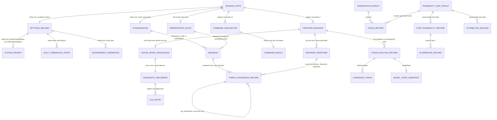

## 8. Data Model

This section consolidates the 76 entity descriptions collected from the fifteen feature sections into the **19 distinct entities** the product actually has. Type names are generic. Where a field reaches disk, the **Persisted as** column gives the exact key name, because the on-disk documents are hand-edited by users and read back by the product with no schema negotiation — the key names *are* the interop contract (see §8.4).

Three product-wide facts govern everything below:

- **There is no database.** Every persisted artifact is a plain text document in a per-user folder. There are no indexes, no transactions, no locks, no schema version and no migration machinery anywhere.
- **Nothing is validated on load.** Range and enumeration validation exists only in the interactive command handlers. A hand-edited document with a temperature of `50`, a top-K of `9999` or a context size of `0` is loaded verbatim and used. *(Evidence: `src/ChatDbg/ChatShell.cs:130-151` vs `Commands/SetCommand.cs:70-135`.)*
- **Most state is not persisted at all.** The conversation, the resolved credentials, the resolved system-prompt body, all rendering state and all token-inspection results are process-lifetime only.

---

### 8.1 Entity overview



Reading the diagram: everything above the `PROVIDER_BACKEND` line is user-facing state; everything below it is diagnostic state that exists only when the local inference back end is selected. Only four boxes ever reach disk — `SETTINGS_RECORD`, `SYSTEM_PROMPT`, `CONVERSATION` (on explicit export), and `TOKEN_ANALYSIS_RECORD` (through an operation no user-reachable path invokes).

---

### 8.2 Entities

#### 8.2.1 Settings record

**Purpose.** The single mutable configuration object for the whole process. One instance is created at start-up with built-in defaults, overwritten field-by-field from the settings document, then shared by reference with every command, dialog and back end. Every successful mutation rewrites the whole document immediately.

| Field | Type (generic) | Required | Default | Constraints | Persisted as | Notes |
|---|---|---|---|---|---|---|
| Provider | text | yes | `azure` | one of `azure`, `bedrock`, `llama`; **business rule** (it selects the back end) | `provider` | Stored lower-case by the setting command; matched **case-sensitively** at look-up, so a hand-edited `Azure` fails every turn (QUIRK-13.10). |
| Model identifier | text | yes | `gpt-4` | free text; for the local back end it is a filesystem path to a single-file quantised weights file | `modelId` | **Business rule** for the local back end: existence is checked when set, never on load. |
| Temperature | decimal number | yes | `0.7` | 0.0–2.0 inclusive; **tunable default**, range is a business rule at the command boundary only | `temperature` | Rejected outside range only when typed; loaded verbatim from disk. |
| Maximum output tokens | whole number | yes | `1000` | 1–8192 inclusive | `maxTokens` | Same command-only enforcement. Also the upper bound on an unabortable generation (see NFR-6). |
| Cloud endpoint | text (nullable) | no | absent (`null`) | never validated, never parsed | `azureEndpoint` | Written as literal `null` when unset. |
| Managed-service region | text | yes | `us-east-1` | never validated | `awsRegion` | |
| System-prompt name | text | yes | `default` | no referential integrity — may name a prompt that does not exist | `systemPromptName` | On miss, the built-in fallback body is used and **no message is printed**. |
| System-prompt body | text (long) | yes | the built-in fallback body (see §8.2.8) | — | **not persisted** | Explicitly excluded from serialization; re-resolved from the prompt store at every launch. |
| Capture probabilities | boolean | yes | `false` | — | `enableLogProbabilities` | |
| Top-K alternatives | whole number | yes | `5` | 1–20 inclusive | `logProbabilitiesTopK` | Sent to the provider; affects the request, not just display. |
| Show all tokens | boolean | yes | `false` | — | `showAllTokens` | **Persisted but not restored by the line-oriented host** (QUIRK-13.1): that host always starts in sample mode. |
| Grid layout | boolean | yes | `false` | — | `gridViewForTokens` | Same non-restore quirk. |
| Grid maximum alternatives | whole number | yes | `5` | 1–20 inclusive | `gridViewMaxAlternatives` | Display cap only; never affects the request. Same non-restore quirk. |
| Use OS credential vault | boolean | yes | `false` | — | `useWindowsCredentialManager` | The windowed host can set it on a platform that has no vault; the text command refuses. |
| Local context size | whole number | yes | `4096` | 512–32768 inclusive | `llamaContextSize` | Bound **once at model load**; later changes are silently ignored (QUIRK-8.24). |
| Local GPU layer count | whole number | yes | `0` | 0–100 inclusive | `llamaGpuLayerCount` | `0` means CPU-only. Bound at load. |
| Local GPU device | text (nullable) | no | absent (`null`) | never validated | `llamaGpuDevice` | |
| Local thread count | whole number | yes | `0` | 0–64 inclusive | `llamaThreads` | `0` means "platform default". |
| Local batch size | whole number | yes | `512` | 1–2048 inclusive | `llamaBatchSize` | Bound at load. |
| Deprecated hosted-provider key | text | yes | `""` | plaintext | `azureApiKey` | See §8.4 — the **written** key is a deprecated backing field, not the computed value of the same name. |
| Deprecated access key | text | yes | `""` | plaintext | `awsAccessKey` | Same asymmetry. |
| Deprecated secret key | text | yes | `""` | plaintext | `awsSecretKey` | Same asymmetry. |
| Resolved hosted-provider key | text | derived | `""` | resolution chain: environment → vault → deprecated field | **not persisted** | Computed on **every read**; nothing is cached. |
| Resolved access key | text | derived | `""` | same chain | **not persisted** | |
| Resolved secret key | text | derived | `""` | same chain | **not persisted** | |
| Holds file-stored secrets | boolean | derived | — | true when any of the three deprecated fields is non-empty | **not persisted** | Drives the start-up migration warning. |
| Credential source label | text | derived | `not set` | one of `environment variable (<NAME>)`, `Windows Credential Manager`, `settings file (deprecated)`, `not set` | **not persisted** | Re-resolves the whole chain on each call, so one status command can perform up to six vault round-trips. |

**Lifecycle.** Created at process start with built-in defaults. The settings document is read from disk exactly once per process — no re-read, no file watching, no cache invalidation. Mutated in place by the settings command, the model command, the probability command, prompt selection, the windowed settings dialog and one menu toggle; every mutation writes the **entire** document back immediately (never a partial patch, never a merge, never a backup). Save failures are swallowed: the change survives only in memory while the command still reports success. There is **no reset, unset, clear or restore-defaults path anywhere** — the only route back to defaults is deleting the document out of band. The record dies with the process.

---

#### 8.2.2 Vault credential entry *(external — owned by the operating system)*

**Purpose.** An optional, opt-in place to keep the three provider secrets outside the settings document. Present only on the one platform that has this facility; on every other platform every operation silently yields "not found".

| Field | Type (generic) | Required | Default | Constraints | Persisted as | Notes |
|---|---|---|---|---|---|---|
| Entry name | text | yes | — | exactly one of `ChatDbg:AzureApiKey`, `ChatDbg:AwsAccessKey`, `ChatDbg:AwsSecretKey` | vault target name | The **only** field matched on look-up. |
| Kind | whole number | yes | `1` (generic) | constant | vault kind | |
| Flags | whole number | yes | `0` | constant | vault flags | |
| Secret blob | text encoded as bytes | yes | — | UTF-16 little-endian | vault credential blob | Blob byte length is exactly 2 × character count. |
| Persistence scope | whole number | yes | `2` (local machine) | constant | vault persistence | |
| Account label | text | yes | `ChatDbg` | constant | vault user name | Written but **never read**. |
| Comment | text | yes | `ChatDbg API Credential` | constant | vault comment | Written but never read. |
| Last written | timestamp | derived | — | set by the operating system | vault last-written | Never read by the product. |

**Lifecycle.** Created or overwritten by the store operation and by bulk migration. Read on every credential resolution and every source look-up. **Never deleted by the product** — a delete primitive exists with zero call sites. Entries survive process exit and reboot and are scoped to the operating-system account, so one operating-system user cannot keep two product profiles apart.

---

#### 8.2.3 Environment credential *(external — process-scoped, read-only)*

**Purpose.** The preferred and only cross-platform way to supply a secret. Highest priority in the resolution chain.

| Field | Type (generic) | Required | Default | Constraints | Persisted as | Notes |
|---|---|---|---|---|---|---|
| Hosted-provider key | text | no | absent | variable name `CHATDBG_AZURE_API_KEY` | — (process environment) | |
| Access key (product name) | text | no | absent | `CHATDBG_AWS_ACCESS_KEY` | — | Checked before the conventional name. |
| Access key (conventional name) | text | no | absent | `AWS_ACCESS_KEY_ID` | — | |
| Secret key (product name) | text | no | absent | `CHATDBG_AWS_SECRET_KEY` | — | |
| Secret key (conventional name) | text | no | absent | `AWS_SECRET_ACCESS_KEY` | — | |

**Lifecycle.** Never written by the product. Read fresh on every resolution and every source look-up, so a change takes effect on the very next read with no restart. **Business rule:** an existing-but-empty variable is treated as absent and resolution continues to the next name.

---

#### 8.2.4 Conversation

**Purpose.** The ordered transcript of the current session. One instance per process, held by reference by both hosts and every command.

| Field | Type (generic) | Required | Default | Constraints | Persisted as | Notes |
|---|---|---|---|---|---|---|
| Messages | ordered list of Message | yes | empty | order is authoritative; **no size limit** | `messages` | Never truncated, windowed, deduplicated or reordered by anything. |
| Session identifier | text | yes | a freshly generated canonical lower-case hyphenated UUID | — | `sessionId` | Overwritten wholesale on import; **not** reset by clear; read by nothing else in the product. |
| Created at | timestamp | yes | current UTC instant at construction | — | `createdAt` | Written on export, read but **discarded** on import. Never mutated after construction. |

**Lifecycle.** Created once, empty, when a host process starts. Mutated by append, inject, remove-last, clear and import. Read in full by the provider layer on **every** request. Import mutates the instance in place rather than replacing it, so object identity is stable for the whole process and both hosts plus every command see changes immediately. Destroyed when the process exits: **there is no autosave and no autoload**, despite the project's own requirements document and README promising "persistent chat history" (QUIRK-4.27 — code wins).

---

#### 8.2.5 Message

**Purpose.** One conversational turn.

| Field | Type (generic) | Required | Default | Constraints | Persisted as | Notes |
|---|---|---|---|---|---|---|
| Role | text | yes | `""` | inject enforces `user`/`assistant`/`system` after lower-casing; append and import enforce **nothing** | `role` | Only `assistant` is special-cased by renderers. |
| Content | text (long) | yes | `""` | no length limit, no emptiness check, may contain newlines | `content` | Rendered verbatim with no sanitisation. |
| Timestamp | timestamp | yes | current UTC instant at append/inject | — | `timestamp` | **Not** re-sequenced when a message is injected mid-list, so timestamps can run out of order. |
| Hidden-from-model flag | boolean | yes | `false` | — | `isCommand` | Excludes the message from hosted-provider requests. **Never set true by shipping code.** |
| Token confidences | ordered list of Token confidence record (nullable) | no | absent | attached only on the probability path, assistant turns only | `logProbabilities` | Written as literal `null` when absent. |
| Has token confidences | boolean | derived | — | true only when the list exists **and** has at least one element | **not persisted** | |

**Lifecycle.** Constructed by append (end of list) or inject (index in `[0, count)`, degrading to append when out of range) with a fresh UTC timestamp. Removed only by remove-last (last only) or clear (all). Replaced wholesale by import. Serialized on export and reconstructed on import **with no validation of any field**.

---

#### 8.2.6 Token confidence record

**Purpose.** One model-emitted token plus its confidence, and optionally the alternatives that were in contention. This is the entity the whole token-introspection feature exists to show.

| Field | Type (generic) | Required | Default | Constraints | Persisted as | Notes |
|---|---|---|---|---|---|---|
| Token text | text | yes | `""` | never null by construction; may contain control characters | `token` | Escaped only at render time. |
| Log probability | decimal number | yes | `0` | **no range validation**; at most `0` for genuinely measured data | `logprob` | One back end stores an **already-exponentiated** value here for alternatives — the same key means two different things depending on producer (see §8.4). |
| Derived probability | decimal number | derived | — | `e^(log probability)` | **not persisted** | Excluded from serialization. |
| Alternatives | ordered list of Token confidence record (nullable) | no | absent | **one level of nesting only** — alternatives are always created without their own list | `top_alternatives` | The one snake-case key in an otherwise camel-case wire format. |

**Lifecycle.** Created by strict extraction from a provider reply, by tolerant extraction, or by fabrication (the demonstration command, and one cloud back end's silent fallback which uses a natural log of `0.9`). Attached to a provider response, then copied **by reference** onto the assistant message in the conversation. The local back end back-fills the previous token's values one generation step late, so the record is mutated after attachment on that path only. Destroyed with the conversation (clear, remove-last, process exit), or persisted verbatim inside an exported conversation and restored on import.

---

#### 8.2.7 Provider response

**Purpose.** The transport envelope every back end returns for one turn. Never persisted as a whole.

| Field | Type (generic) | Required | Default | Constraints | Persisted as | Notes |
|---|---|---|---|---|---|---|
| Text | text (nullable) | no | `""` | — | `text` | Always set in practice. |
| Token confidences | ordered list of Token confidence record (nullable) | no | absent | **absent is distinct from empty** — an empty list is never produced by either construction shape | `logProbabilities` | The caller's list is stored **by reference**, not copied, cloned or sorted. |
| Total elapsed time | decimal number (seconds) | yes | `0` | measured milliseconds ÷ 1000 on the local back end; `0.5` for the demonstration command; **never populated by either hosted back end** | `totalTime` | |
| Error message | text (nullable) | no | absent | populated **only** by the local back end's absorbed-error path | `errorMessage` | **No host reads this field.** Hosted back ends signal failure by raising, never by populating it. |

**Lifecycle.** Constructed per turn by a back end (two shapes: text-only, leaving the confidence list absent; or text-plus-list). Consumed by the host within the turn. Only its text and confidence list survive, copied onto the history message. Discarded when the turn completes.

---

#### 8.2.8 System prompt

**Purpose.** A named, reusable instruction block prepended to every model call. The library is a directory of one document per prompt; the name is the primary key and the basis of the file name.

| Field | Type (generic) | Required | Default | Constraints | Persisted as | Notes |
|---|---|---|---|---|---|---|
| Name | text | yes | `""` | primary key; **never validated**; lossily sanitised into the file name by replacing every invalid file-name character with `_` | `name` | Two names differing only by an invalid character collide on disk. Matching inherits the host file system's case rules. |
| Content | text (long) | yes | `""` | no length limit; multi-line | `content` | The actual instruction text. |
| Description | text | yes | `""` | display only | `description` | Changeable **only** through the windowed edit form. |
| Created at | timestamp | yes | current UTC instant at construction | — | `createdAt` | Never updated after creation. |
| Last used at | timestamp (nullable) | no | absent | — | `lastUsedAt` | Written as literal `null` when unset. The line-oriented host rewrites the whole document on **every start-up** to stamp it; the windowed host never stamps it at all. |

The four seeded prompts are `default`, `code-reviewer`, `algorithm-helper` and `security-expert`. The built-in fallback body, used when the named prompt is missing, is exactly: `You are ChatDBG, a helpful debugging assistant. Help users analyze code, debug issues, and understand programming concepts.`

**Lifecycle.** The store's construction creates the directory if absent and, when the directory holds zero loadable documents, writes the four seeds **synchronously before the interface is drawn** — merely constructing the store mutates the user's disk. Prompts are created by the create command, by import, or by the windowed forms; mutated by edit (content only from the command, description plus content from the form) and by last-used stamping (a full read-modify-write); deleted by the delete command (refused while the prompt is active) or by the windowed delete button (**no active guard**). Emptying the library causes the four seeds to reappear at the next launch. The store is re-read from disk on every operation — no cache, no index, no locking, no concurrency control.

---

#### 8.2.9 Command descriptor

**Purpose.** The uniform contract every typed instruction implements. Exactly fifteen exist and the set is fixed at build time.

| Field | Type (generic) | Required | Default | Constraints | Persisted as | Notes |
|---|---|---|---|---|---|---|
| Name | text | yes | — | read-only; lower-case ASCII; unique within the registry; the token typed after the slash | **not persisted** | Registration is last-write-wins, so a duplicate would silently shadow an earlier entry. |
| Description | text | yes | — | read-only; one sentence | **not persisted** | Shown by both help renderers. |
| Usage | text | yes | — | read-only; may contain newlines; conventionally begins with slash + name; **may be recomputed from live state on each read** | **not persisted** | Shown only by detailed help. |
| Execute | operation: ordered list of text → Command result | yes | — | asynchronous; **accepts no cancellation signal** | **not persisted** | See NFR-5. |

The fifteen registered names, in construction order: `inject`, `pop`, `import`, `export`, `model`, `set`, `logprobs`, `prompt`, `demologprobs`, `clear`, `exit`, `quit`, `tokenize`, `inspect`, `help`. Three further commands exist in the shared set — `export-logs`, `export-analysis`, `show-analysis` — and are **registered by neither host**, so typing them yields the unknown-command error.

**Lifecycle.** Created once during host start-up in a fixed literal order with all collaborators passed explicitly. Never mutated, never re-created, never disposed (the contract has no disposal member). The registry is a mutable map from lower-case name to descriptor with ordinal key equality, populated once and read thereafter — there is no runtime registration, unregistration or aliasing. The help capability is inserted last and given a live reference to the same map (not a copy), so it lists itself.

---

#### 8.2.10 Command result

**Purpose.** The uniform three-signal outcome of one command invocation.

| Field | Type (generic) | Required | Default | Constraints | Persisted as | Notes |
|---|---|---|---|---|---|---|
| Success | boolean | yes | — | set by one of three factories | **not persisted** | |
| Message | text (nullable) | no | absent | free-form; may be multi-line and arbitrarily long; rendered verbatim with **no length limit, truncation, escaping or sanitisation** | **not persisted** | A multi-line message carries the success/failure marker on the first physical line only. |
| Exit requested | boolean | yes | `false` | — | **not persisted** | Checked before the message is rendered. |

Exactly three factories exist — success(optional message) → `{true, message, false}`; error(message) → `{false, message, false}` with **no validation of the message**; exit() → `{true, absent, true}` — but all three fields are individually settable, so any combination is constructible.

**Lifecycle.** Created inside a command's execute, returned up one level, consumed immediately by the dispatcher, then discarded. Never stored, never persisted, never compared.

---

#### 8.2.11 Session state

**Purpose.** The runtime composite each host builds at start-up. Not an on-disk entity; listed because a reimplementer must reproduce its eager, non-substitutable construction order.

| Field | Type (generic) | Required | Default | Constraints | Persisted as | Notes |
|---|---|---|---|---|---|---|
| Conversation reference | Conversation | yes | a new empty conversation | — | **not persisted** | |
| Settings reference | Settings record | yes | a new defaults record | — | **not persisted** | Overwritten field-by-field from disk, then mutated in place forever after. |
| Command registry | map from lower-case text to Command descriptor | yes | 15 entries | never mutated after construction | **not persisted** | |
| Back-end registry | map from lower-case text to Provider back end | yes | exactly 3 entries: `azure`, `bedrock`, `llama` | never mutated after construction | **not persisted** | **All three are constructed at start-up and disposed at shutdown regardless of which is selected** (QUIRK-13.7): a pure-cloud session still allocates a native diagnostic buffer, writes a daily log file at exit and opens an unused outbound connection pool. |
| Live system-prompt body | text | yes | the built-in fallback | resolved from the prompt store at start-up | **not persisted** | |
| Disposed flag | boolean | yes | `false` | one-way | **not persisted** | |
| Prompt string | text | derived | — | literal form `ChatDbg ({provider}/{modelId})> `, written without a trailing line break | **not persisted** | Rebuilt from live settings on **every** loop iteration, so a configuration change is visible on the very next prompt. |

**Lifecycle.** Created eagerly in one construction pass, in a fixed order: empty conversation → defaults settings record → settings store → conversation transfer store → prompt store → all three back ends → command registry. No collaborator is created lazily and none can be substituted from outside the process. Released at shutdown; the conversation is discarded unless explicitly exported.

---

#### 8.2.12 Cached native model resources

**Purpose.** The expensive, process-lifetime native state the local inference back end holds. This is where the product's memory footprint and its start-of-first-turn latency live.

| Field | Type (generic) | Required | Default | Constraints | Persisted as | Notes |
|---|---|---|---|---|---|---|
| Weights handle | opaque native handle | no | absent until first generation | loaded from the configured model path | **not persisted** | Hundreds of megabytes to several gigabytes depending on the model file. |
| Inference context | opaque native handle | no | absent until first generation | sized by the local context-size setting | **not persisted** | |
| Executor | opaque native handle | no | absent until first generation | wraps the context | **not persisted** | |
| Engine-side chat session | opaque native handle | no | absent until first generation | seeded with **one** system-role message at load time | **not persisted** | The engine keeps its own conversation; only the newest user message is ever sent, and the product cannot see or reset that internal history. |
| Remembered model path | text | no | absent | the reload key | **not persisted** | |

**Lifecycle.** Created lazily on the first generation, on a worker thread, under a process-wide model-load lock. **Reload happens if and only if** the weights are absent, or the context is absent, or the remembered path differs from the configured path — changing context size, GPU layers, thread count, batch size, temperature or the system prompt does **not** trigger a reload, and those values are re-read only on a genuine reload, even though every settings surface reports the change as applied (QUIRK-8.24). Torn down strictly in the order session → executor → context → weights when the path changes or the back end shuts down. **Reclamation without an explicit shutdown releases no native memory at all**, leaking the model and context for the process lifetime. Teardown is **not** synchronised against an in-flight generation.

---

#### 8.2.13 Diagnostic recorder state

**Purpose.** The in-memory capture buffer and configuration for engine and application diagnostics.

| Field | Type (generic) | Required | Default | Constraints | Persisted as | Notes |
|---|---|---|---|---|---|---|
| Log directory | text (path) | yes | per-user roaming application-data folder + `ChatDbg` + `Logs` | never null | **not persisted** | |
| File capture enabled | boolean | yes | `true` | — | **not persisted** | **No runtime configuration surface exists anywhere** — changing any of these five requires a rebuild. |
| Debug-channel echo enabled | boolean | yes | `true` | — | **not persisted** | The target channel is removed at compile time in every shipped configuration. |
| Console echo enabled | boolean | yes | `false` | — | **not persisted** | |
| Maximum buffer size | whole number (characters) | yes | `10000` | **no validation, no clamp** — zero or negative is accepted and makes every engine line trigger its own file append | **not persisted** | Compared with a bare strictly-greater-than test. |
| Capture buffer | text accumulator | yes | empty | holds whole formatted lines | **not persisted** | Flushed on threshold; cleared after a successful append; **not** cleared by an explicit save. |
| Armed latch | boolean | yes | `false` | one-way `false → true` | **not persisted** | Never reset, not even by shutdown. |
| Shutdown latch | boolean | yes | `false` | one-way `false → true` | **not persisted** | Neither logging nor flushing checks it, so the recorder keeps working after shutdown. |
| Buffer lock | mutual-exclusion primitive | yes | — | must be re-entrant on the same thread; guards read, clear, write-to-path and flush | **not persisted** | Required because the engine callback can fire on an arbitrary native thread. |

**Lifecycle.** Created with the local inference back end. The buffer is created empty, appended by both producer paths, drained by flush, emptied by clear, snapshotted **non-destructively** by export, and flushed once at shutdown. The **10 000-character threshold is checked only on engine-origin lines**, so a diagnostic-heavy run with no engine output grows the buffer without bound. Shutdown does not unregister the process-global engine hook, so after shutdown engine diagnostics keep accumulating into a buffer that will never be flushed. Every persistence failure — unwritable directory, full disk, failed hook registration — is absorbed and surfaced only on a compile-time-removable debug channel; the user sees nothing.

---

#### 8.2.14 Log entry *(value — never persisted as a record)*

**Purpose.** One formatted diagnostic line.

| Field | Type (generic) | Required | Default | Constraints | Persisted as | Notes |
|---|---|---|---|---|---|---|
| Timestamp | timestamp | yes | current **local** instant | rendered `yyyy-MM-dd HH:mm:ss.fff` — exactly three fractional-second digits, **no zone or offset** | positional, inside the line | Deliberately different from every other timestamp in the product (§8.4). |
| Level | text | yes | — | application vocabulary is upper-case `INFO`/`WARN`/`ERROR`/`DEBUG`; engine vocabulary is whatever the engine's severity type renders as — *INFERRED* mixed case such as `Info`/`Warn` | positional | Two vocabularies in one file. |
| Message | text | yes | — | engine-origin messages have trailing whitespace stripped; application-origin messages do not | positional | |

The rendered form is exactly `[timestamp] [level] message` plus a **platform** line terminator.

**Lifecycle.** Formatted, appended to the buffer under the lock in strict production order, optionally echoed **outside** the lock to the debug channel and standard output, then flushed to the daily file or exported. Never parsed back, never indexed, never queried. **There is no structured log format anywhere in the product.**

---

#### 8.2.15 Per-step token analysis record

**Purpose.** The deepest introspection artifact: one record per generated piece on the local back end's introspection path. This is the **only** entity outside settings, prompts and conversations that has a defined persisted form.

| Field | Type (generic) | Required | Default | Constraints | Persisted as | Notes |
|---|---|---|---|---|---|---|
| Step | whole number | yes | `0` | 0-based, contiguous | `step` | |
| Token text | text | yes | `""` | the emitted text piece | `tokenText` | |
| Token identifier | whole number | yes | `0` | **always the sentinel `-1` in practice** on this path | `tokenId` | |
| Probability | decimal number | yes | `0` | documented 0.0–1.0; in practice a temperature-derived estimate drawn from `{0.95, 0.85, 0.75, 0.60, 0.50, 0.40}` | `probability` | Not a measured probability. |
| Log probability | decimal number | yes | `0` | natural logarithm of the above estimate | `logprob` | |
| Prompt offset | whole number | yes | `0` | equals `step` in practice — **no attribution is computed** | `promptOffset` | |
| Top candidates | ordered list of Candidate token | yes | empty | empty in practice on this path | `topCandidates` | |
| System debug information | text (nullable) | no | absent | the fixed sentence `Generated via sampling pipeline at step <n>, temperature=<t to 2dp>.` | `systemDebugInfo` | The product documentation claims this is filled from the log buffer; it is not (QUIRK-11.23). |
| Model state | Model state snapshot (nullable) | no | absent | — | `modelState` | |

**Lifecycle.** Created once per streamed text piece, accumulated in an in-memory list on the back end. The list is **cleared at the start of every introspected generation and never cleared otherwise** — so only the most recent generation survives, and a session that runs one introspected generation and then many plain ones keeps that list alive for the process lifetime. Retrievable as a defensive copy and writable as an indented document, but **no user-reachable path invokes either operation**. Nothing bounds growth: at a token budget of up to 8192 and roughly 100–200 bytes retained per piece, a maximal generation retains every record (≈0.8–1.6 MB).

---

#### 8.2.16 Candidate token

**Purpose.** One alternative considered at a generation step, nested inside a per-step analysis record.

| Field | Type (generic) | Required | Default | Constraints | Persisted as | Notes |
|---|---|---|---|---|---|---|
| Text | text | yes | `""` | decoded alternative text, or the literal placeholder `id:<numericIndex>` when decoding fails | `text` | The placeholder is rendered indistinguishably from real token text. |
| Token identifier | whole number | yes | `0` | **never populated on this path** | `tokenId` | |
| Probability | decimal number | yes | `0` | **never populated on this path** | `probability` | |
| Log probability | decimal number | yes | `0` | natural logarithm of the **within-selection renormalised** probability | `logprob` | Because the transform is normalised over only the selected candidates, the values always sum to 1.0 — a genuinely uncertain step and a genuinely certain one can yield identical numbers. |
| Logit | decimal number | yes | `0` | raw pre-normalisation score; **never populated on this path** | `logit` | |

**Lifecycle.** Created per generation step from the current score vector, attached one step late, nested inside a per-step analysis record, persisted with it, and destroyed with it. When a raised error escapes the candidate routine it is recorded at warning level, the pending candidate list is cleared, and generation continues.

---

#### 8.2.17 Model state snapshot

**Purpose.** A per-step, synthetically computed view of context consumption. It is informational and **gates nothing**.

| Field | Type (generic) | Required | Default | Constraints | Persisted as | Notes |
|---|---|---|---|---|---|---|
| Total tokens processed | whole number | yes | `0` | generated-piece count only | `totalTokensProcessed` | Prompt tokens are not counted. |
| Context token count | whole number | yes | `0` | the same value | `contextTokenCount` | |
| Context size | whole number | yes | `0` | the configured context window, with a fallback of `4096` when the configured value is at or below `0` | `contextSize` | |
| Remaining context | whole number | yes | `0` | context size minus step | `remainingContext` | Never reconciled against the engine's real usage. Exceeding the context window is entirely unhandled — no detection, no truncation, no eviction, no warning. |
| Timestamp | timestamp | yes | current **local** instant | no zone offset | `timestamp` | Inconsistent with every other persisted timestamp (§8.4). |
| Debug information | map of text → text | yes | empty | producer fills exactly three keys: `Temperature` (two decimals), `TopK`, and `Mode` = `SamplingPipeline` | `debugInfo` | |

**Lifecycle.** One per per-step analysis record, created synthetically at each generation step, persisted with its parent, destroyed with it.

---

#### 8.2.18 Prompt inspection records *(transient family)*

**Purpose.** The output of the two offline inspection operations — tokenise a prompt, and map a synthetic probability walk over a generation. **None of these are persisted and none carry wire names**, because nothing serialises them; they exist to be printed once and discarded. A reimplementer needs their shapes only to reproduce the printed output.

**Token record**

| Field | Type (generic) | Required | Default | Constraints | Persisted as | Notes |
|---|---|---|---|---|---|---|
| Index | whole number | yes | `0` | 0-based, contiguous | — | |
| Token identifier | whole number | yes | `0` | real vocabulary index for tokenisation; **synthetic `1000 + i`** for generation | — | |
| Text | text | yes | `""` | in practice the placeholder `<token_{id}>` for tokenisation and the word itself for generation | — | |
| Character start position | whole number | yes | `0` | estimated inclusive start; **`-1`** for the beginning-of-sequence token | — | Estimated, not exact. |
| Character end position | whole number | yes | `0` | estimated exclusive end; **`-1`** for the beginning-of-sequence token | — | |
| Log probability | decimal number | yes | `0` | unset except on the generation path | — | |

**Tokenisation result** — original prompt (text, post-normalisation), tokens (ordered list of token records), token count (whole number, **includes** the beginning-of-sequence token), visualisation (text, nullable — absent when not requested, otherwise a fixed five-line block).

**Step-probability record** — token position (whole number, 0-based, equals list index), selected token identifier (whole number), selected token text (text), selected log probability (decimal, **always `-2.5` in practice**), alternatives (ordered list of exactly top-K alternative records in descending probability).

**Alternative record** — token identifier (whole number, synthetic `2000 + i×100 + j`), token text (text, `{word}_alt{rank}` with 1-based rank), log probability (decimal, `-3.0 - j`, strictly decreasing with rank).

**Attribution record** — token index (whole number, equals list index), token identifier (whole number, copy), token text (text, copy), influencing text (text: the prompt tail of at most 50 characters, or the concatenation of the previous at most 5 generated token texts; may be empty), influence score (decimal, **always `0.8`**, unconstrained by any range).

**Probability-mapping result** — original prompt (text), generated tokens (ordered list of token records, one per split word), token-probability maps (ordered list of step-probability records, same length and order), attribution map (ordered list of attribution records, same length and order).

**Lifecycle.** Created per invocation, printed, discarded. The probability-mapping operation is behind a consent gate that **cannot be answered non-interactively**: with input redirected, end-of-input is read as a decline and the operation still returns a success message identical to a completed analysis.

---

#### 8.2.19 Presentation state *(transient)*

**Purpose.** Everything the two hosts hold to draw the screen. Purely in memory; nothing here is persisted.

| Field | Type (generic) | Required | Default | Constraints | Persisted as | Notes |
|---|---|---|---|---|---|---|
| Probability panel visible | boolean | yes | `false` | start-up eligibility requires the capture flag **and** an eligible message; the conversation is always empty at start-up, so it always starts hidden | — | |
| Selected message | reference to Message (nullable) | no | absent | set by three paths (menu toggle, activating an indicator, auto-open on a new reply with data) | — | **Never cleared**, so it can outlive the message it points at. |
| Transcript width fraction | decimal number | yes | `1.0` | `1.0` when the panel is hidden, `0.6` when shown | — | |
| Role colour scheme | map from role text to a foreground/background pair | yes | five named schemes (user, assistant, system, divider — never used, indicator) | fixed at construction | — | Unrecognised roles fall back to the system pair. |
| Confidence heat buckets | ordered list of exactly 10 colour pairs | yes | fixed | indexed by `clamp(floor(probability × 10), 0, 9)` | — | Only this one of four defined colour maps is reachable in normal operation. |
| Global theme palettes | four palettes (base, dialog, menu, error) | yes | one hard-coded dark theme | applied once at start-up; no light theme, no switcher, no setting | — | |
| Status text | text | yes | the resting context line `Provider: {p} \| Model: {m} \| Prompt: {n}` | reverted unconditionally by a **3000 ms** timer that is never cancelled | — | Two messages within 3 s cause the first timer to clear the second early. |
| Scroll geometry | per view: content width, content height, scroll offset | yes | placeholder canvases of 80×1000 (transcript) and 50×1000 (panel) | transcript height = max(used height, viewport height), auto-scrolled to the bottom; panel width = max(longest line + 5, 50), scrolled to the top | — | The panel's empty-data path skips the update entirely, leaving stale geometry. |
| Per-call render buffers | grid row buffer, card body builders, longest-line tracker | yes | empty | allocated per rendering call | — | **Nothing is cached between calls**: the transcript and panel are torn down and rebuilt widget-by-widget on every refresh. |

**Lifecycle.** Created when the window is built, mutated by every user interaction and every reply, discarded at process exit.

---

### 8.3 Persisted artifacts

Path expressions below use three distinct per-user special folders. A reimplementer must decide deliberately whether to preserve the split — on one platform two of them resolve to the same place, on others they do not.

| Artifact | Location (path expression → resolution) | Format | Written when | Read when | Hand-editable? | Migration concerns |
|---|---|---|---|---|---|---|
| **Settings document** | `<user profile>/.ChatDbg/settings.json`<br>Windows: `C:\Users\<u>\.ChatDbg\settings.json`<br>Linux/macOS: `~/.ChatDbg/settings.json`<br>**Fallback:** the platform temporary directory when the user-profile folder is null, empty, whitespace or throws → `%TEMP%\settings.json` / `/tmp/settings.json` | JSON object, indented, 21 keys | Written with all defaults on first load when absent (a **side effect of merely loading**); rewritten in full after **every** successful setting mutation | Read from disk exactly once per process, at start-up | **Yes — designed for it.** The migration warning explicitly tells users to edit it | No schema version. New keys are ignored on read and silently **dropped on the next write**, because the whole document is rewritten from the in-memory record. A corrupt document is left untouched on load, all defaults are used for the session, and the next save destroys it. The fallback location silently converts per-user settings into per-boot settings. |
| **System prompt documents** | `<local application data>/ChatDbg/system_prompts/{sanitised name}.json`<br>Windows: `C:\Users\<u>\AppData\Local\ChatDbg\system_prompts\`<br>Linux: `~/.local/share/ChatDbg/system_prompts/` | JSON object, one per prompt | Four seeds written synchronously at store construction when the directory holds zero loadable documents; one document rewritten on create, edit, import and last-used stamping | Re-read from disk on **every** operation — no cache, no index | **Yes** | **The four seeded documents are written un-indented while every later document is indented**, because the seeding runs before the serializer options are assigned. A reimplementer must decide whether to reproduce that. Name-to-file sanitisation is lossy and collidable. Deleting every document causes the seeds to reappear at the next launch. |
| **Exported conversation** | user-supplied path; a leading `~/` is expanded to the user-profile folder; `.json` is appended only when the name has **no extension at all** | JSON object, 2-space indent, UTF-8 **no byte-order mark** | On the export command only | On the import command only | **Yes**, and it is the product's only interchange format | No schema version, no negotiation. Written in place with **no temporary file and no rename**, so an interrupted write destroys the previous contents. Read whole into memory with **no size cap**. Import mutates the live conversation in place and **discards the file's created-at value**. |
| **Exported prompt text** | command default `<documents folder>/chatdbg_prompt_<sanitised name>.txt`; windowed default `<user profile>/<name>.txt` (**unsanitised**) | plain text — **content only**, no name, no description, no timestamps, no wrapper | On the prompt-export command or the windowed export dialog | Never read back by the product | Yes | Re-importing loses description, created-at and last-used. On a host where the documents folder is unset the path component becomes the empty string and the file lands in the working directory. Overwrites without asking. |
| **Daily diagnostic log** | `<roaming application data>/ChatDbg/Logs/llamasharp_<yyyyMMdd>.log`<br>Windows: `C:\Users\<u>\AppData\Roaming\ChatDbg\Logs\`<br>Linux: `~/.config/ChatDbg/Logs/` | append-only plain text, UTF-8 no byte-order mark, no header, no footer, no schema marker | Lazily on the first **non-empty** flush of a given **local** calendar day; on the 10 000-character threshold; at the end of every introspected generation; on any absorbed failure; at shutdown | **Never read back by the product** | Yes (it is plain text) but pointless | Written even in a pure-cloud session, because all three back ends are constructed and disposed. **Never rotated by size, never compressed, never pruned, never deleted.** Two processes on the same machine on the same day interleave into one file with no coordination and no distinguishing marker. |
| **Exported log snapshot** | caller-supplied path; parent directory auto-created when non-empty; a bare file name writes relative to the working directory; **no extension convention, no validation** | plain text, UTF-8 no byte-order mark | On demand, whole-file overwrite of the current buffer | Never read back | Yes | The buffer is **not** cleared, so the same content is written again into the daily file at the next flush. No emptiness guard — an empty buffer yields a 0-byte file. The `Logs saved to <path>` confirmation is appended **after** the write, so the file never contains its own confirmation line. Failures are swallowed; the caller cannot distinguish success from failure. |
| **Exported token analyses** | caller-supplied path | JSON array, indented | On demand — **no user-reachable path invokes this operation** | Never read back | Yes | An intended-but-unwired diagnostic surface. Its key names (§8.4) are nonetheless a stable contract for any consumer built against it. Failures are recorded only into a buffer nothing displays; no failure signal reaches the caller. |
| **Credential vault entries** | operating-system credential vault, entry names `ChatDbg:AzureApiKey`, `ChatDbg:AwsAccessKey`, `ChatDbg:AwsSecretKey` | opaque, secret encoded UTF-16 little-endian | On the store operation and on bulk migration | On every credential resolution and every source look-up | No — via the operating system's own tooling only | Available on **one** platform. On every other platform every read silently yields "not found", including the "this platform has no vault" case. **Never deleted by the product.** Scoped to the operating-system account, so one user cannot keep two product profiles apart. |

Nothing else is written. There is no cache directory, no index, no lock file, no crash-dump file, no telemetry file, no update-check file and no state file for either host.

---

### 8.4 The wire-format contract

Every persisted document is JSON (RFC 8259). The rules below are what a clone must honour so that files written by the original stay readable by the clone and vice versa. They are **not** implementation detail: users hand-edit these files, and exported conversations are the product's only interchange format.

**Rule 1 — Key naming is camel-case, with exactly two documented exceptions.**
Every persisted key is explicitly named per field; a naming policy exists but is cosmetic because the explicit names always win. The two breaks in the convention both live inside the token confidence record:

- `logprob` — one lower-case word, not `logProb`.
- `top_alternatives` — **snake case**, the single snake-case key anywhere in the product, sitting inside otherwise camel-case documents. *(Evidence: `Models/TokenLogProbabilities.cs:19,31`.)*

Both are load-bearing for round-tripping. A clone that "tidies" either one produces files the original cannot read.

**Rule 2 — Timestamps come in two incompatible forms, and which one you get depends on the document.**

- Conversation and system-prompt documents: ISO-8601 round-trip form, **UTC**, exactly **seven** fractional-second digits, `Z` suffix — e.g. `2025-09-29T14:03:11.1234567Z`.
- The log line and the model-state snapshot inside a token-analysis export: **local** wall clock, fixed pattern `yyyy-MM-dd HH:mm:ss.fff` — exactly **three** fractional digits and **no zone or offset at all**, so the value is unresolvable without knowing the writing machine's zone. This is a defect a clone should fix, but fixing it changes the bytes.

**Rule 3 — Indentation and encoding.** All documents are written indented with **2 spaces**, UTF-8, **no byte-order mark**. The four seeded system-prompt documents are the sole exception: they are written **un-indented** because seeding runs before the serializer options are assigned.

**Rule 4 — Absent lists are written as literal `null`, not omitted and not `[]`.** "Absent" and "empty" are semantically distinct throughout the product: a provider response with no probability data carries an **absent** list, never an empty one.

**Rule 5 — String escaping is deliberately aggressive, not minimal.** An apostrophe is written as the six characters `\u0027`, a backtick as `\u0060`, a plus sign as `\u002B`; `<`, `>` and `&` are likewise escaped; **all** non-ASCII is escaped as `\uXXXX`; newlines inside content are written `\n`. A minimally-escaping clone produces semantically identical but **byte-different** files, and one that emits raw UTF-8 for non-ASCII will not match the original's output at all.

**Rule 6 — Reading is case-sensitive, ignores unknown keys, and rejects comments and trailing commas.** Unknown keys are silently dropped on the **next write**, because every save rewrites the whole document from the in-memory record.

**Rule 7 — The credential asymmetry.** This is the trap in the settings document. Three key names — `azureApiKey`, `awsAccessKey`, `awsSecretKey` — are **written from deprecated plaintext backing fields**, while three *computed* values with the *same conceptual names* (the resolved secrets, which run the environment → vault → file chain) are **excluded from serialization entirely**. The consequences a reimplementer must reproduce:

- A brand-new settings document always contains all three keys with the value `""`. They are never omitted.
- The product never writes a non-empty value into them; they become non-empty only through hand-editing or an older build.
- A non-empty value in any of the three is detected at start-up and triggers a migration warning — which, in the source, **echoes the plaintext secret to the console** as `set CHATDBG_AZURE_API_KEY=<the actual key>` (a defect; see NFR-27).
- Reading a secret never touches the persisted key first — the environment variable wins, then the vault, then the persisted key.

**Schema — settings document** (21 keys, this order):

```
{
  provider:                    text        // "azure" | "bedrock" | "llama"
  modelId:                     text
  temperature:                 number
  maxTokens:                   integer
  azureEndpoint:               text | null
  awsRegion:                   text
  systemPromptName:            text
  enableLogProbabilities:      boolean
  logProbabilitiesTopK:        integer
  showAllTokens:               boolean
  gridViewForTokens:           boolean
  gridViewMaxAlternatives:     integer
  useWindowsCredentialManager: boolean
  llamaContextSize:            integer
  llamaGpuLayerCount:          integer
  llamaGpuDevice:              text | null
  llamaThreads:                integer
  llamaBatchSize:              integer
  azureApiKey:                 text        // deprecated plaintext slot, always emitted
  awsAccessKey:                text        // deprecated plaintext slot, always emitted
  awsSecretKey:                text        // deprecated plaintext slot, always emitted
}
```

No key for the system-prompt body and no key for any resolved credential ever appears.

**Schema — conversation document** (the interchange format):

```
{
  messages: [
    {
      role:      text                       // free text; not validated on read
      content:   text
      timestamp: text                       // ISO-8601, UTC, 7 fractional digits, "Z"
      isCommand: boolean
      logProbabilities: [                   // or literal null
        {
          token:            text
          logprob:          number          // NOT "logProb"
          top_alternatives: [ same shape ]  // or literal null; ONE level of nesting only
        }
      ]
    }
  ]
  sessionId: text                           // canonical lower-case hyphenated UUID
  createdAt: text                           // same timestamp form; read but DISCARDED on import
}
```

No derived key ever appears: neither the has-probabilities flag on a message nor the derived probability on a token record is serialized.

**Schema — system prompt document** (one per file):

```
{
  name:        text        // must match the sanitised file stem for the product to find it
  content:     text
  description: text
  createdAt:   text        // ISO-8601 UTC, 7 fractional digits
  lastUsedAt:  text | null
}
```

**Schema — token-analysis export** (an array of per-step records):

```
[
  {
    step:             integer
    tokenText:        text
    tokenId:          integer
    probability:      number
    logprob:          number
    promptOffset:     integer
    topCandidates: [
      { text: text, tokenId: integer, probability: number, logprob: number, logit: number }
    ]
    systemDebugInfo:  text | null
    modelState: {                            // or null
      totalTokensProcessed: integer
      contextTokenCount:    integer
      contextSize:          integer
      remainingContext:     integer
      timestamp:            text             // LOCAL time, no offset — see Rule 2
      debugInfo:            { text: text }   // keys Temperature, TopK, Mode
    } 
  }
]
```

**Format — log line** (not JSON; positional, one line per entry):

```
[yyyy-MM-dd HH:mm:ss.fff] [LEVEL] message<platform line terminator>
```

`LEVEL` carries two vocabularies in the same file: upper-case `INFO`/`WARN`/`ERROR`/`DEBUG` from the application, and whatever the inference engine's own severity type renders as (*INFERRED*: mixed case such as `Info`/`Warn`). Engine-origin messages are right-trimmed; application-origin messages are not.

**One further wire-format hazard, on the request side rather than the file side.** The token confidence record's `logprob` key does not always mean the same thing. On the primary-token path it holds a genuine natural-log probability (at most `0`); on one hosted back end's alternatives path it holds an **already-exponentiated** value; the offline demonstration fixture writes small positive integers such as `15.0` into it. A consumer that assumes `logprob ≤ 0` will mis-render real files produced by the original.

---

### 8.5 Retention, growth and deletion

**Grows without bound, never pruned:**

- **The daily diagnostic log directory.** One file per local calendar day, appended forever. No size rotation, no retention limit, no compression, no pruning, and the product never reads its own logs. A pure-cloud session still writes one at exit. *A reimplementer must bound this* — a size cap per file plus an age cap on the directory (a suggested, not observed, default: 10 MB per file and 14 days retained).
- **The in-memory diagnostic buffer**, whenever the producer is the application rather than the inference engine: the 10 000-character flush threshold is checked **only** on engine-origin lines, so an introspection-heavy run with a quiet engine grows the buffer until an explicit flush. *Bound both producers.*
- **The in-memory diagnostic buffer after shutdown**: the engine hook is never unregistered, so lines keep accumulating into a buffer that will never be flushed. *Unregister on shutdown.*
- **The conversation.** Never truncated, windowed or summarised. Every hosted request re-sends the **entire** history, so cost and latency grow linearly with session length and the request eventually exceeds the provider's context window with no detection and no warning. *A reimplementer must add a windowing or summarisation policy, or at minimum a warning.*
- **The system-prompt library.** One file per prompt, no cap on count, no cap on content length.
- **Credential vault entries.** Created and overwritten, **never deleted** — the delete primitive exists with zero call sites. *Wire it up.*

**Rotates:** only the daily log, and only by **local** calendar date in the file name — which means a machine crossing a daylight-saving boundary or changing zone can reopen an earlier day's file, and two processes on the same day interleave into one file with no marker distinguishing them.

**Bounded, but only incidentally:**

- The per-step token-analysis list is cleared at the start of every *introspected* generation, so at most one generation's worth is retained — up to the maximum-output-token setting (default 1000, ceiling 8192) at roughly 100–200 bytes per record, i.e. ≈0.1–1.6 MB. But it is never cleared by a non-introspected generation or by any user action, so it can sit resident for the whole process.
- Rendering buffers are allocated per call and discarded; nothing is cached between renders.

**Never cleaned up at all:**

- Exported conversations, exported prompts, exported log snapshots, exported analyses — all written to user-chosen paths, all overwriting without asking, none tracked and none ever deleted by the product.
- The settings document and every prompt document survive uninstall; there is no uninstall path.
- The presentation state's "selected message" reference is never cleared, so it can outlive the message it points at after a clear or a remove-last.

**What a reimplementer should bound, in priority order:** (1) conversation length sent per request; (2) diagnostic-log file size and directory age; (3) the diagnostic buffer, on **both** producer paths; (4) the size of a conversation document accepted on import — today it is read whole into memory with no cap; (5) the per-step analysis list, with an explicit clear operation.

---

## 9. Non-Functional Requirements

Each requirement is stated so it can be tested. Numbers taken from the source are marked **tunable default** or **business rule**; anything whose value was determined by the source's specific runtime carries an explicit re-derive caveat.

### Start-up

**NFR-1 — Start-up performs no network access and no version check.** The start-up sequence is exactly: load settings → resolve the active system prompt → print the banner → print the credential advisory → enter the loop (windowed host: … → initialise the interface runtime → apply the theme → build the window → enter the event loop). There is no splash delay, no update check and no outbound request of any kind before the first prompt. *Test: run with the network disabled and with a packet capture attached; the process reaches its first prompt with zero packets sent.* *(Evidence: FR-13.8, FR-14.2.)*

**NFR-2 — Start-up writes to disk before the user has typed anything, and that is intended behaviour.** Three writes can occur: the settings document is created with defaults if absent; four seed prompt documents are written if the prompt directory holds none; and the line-oriented host rewrites the active prompt's document to stamp its last-used timestamp on **every** launch. *Test: on a clean profile, start and immediately exit; assert the settings document and four prompt documents exist. Start again and assert the active prompt's document changed.* A reimplementer should keep the first two and reconsider the third — a per-launch rewrite of a user document is a corruption window for no benefit.

**NFR-3 — A failure to create the prompt directory is fatal; every other start-up failure degrades.** A settings load failure prints a message and continues with built-in defaults. A prompt-resolution failure prints a message and continues with the built-in fallback body. A prompt-directory creation failure aborts the process with exit code `1`. *Test: make the prompt directory path unwritable and assert exit code 1; make the settings document unreadable and assert the process still reaches its prompt.*

**NFR-4 — Start-up constructs all three back ends regardless of which is selected.** This is observable, not incidental: a pure-cloud session allocates the local back end's native diagnostic buffer, writes a daily log file at exit, and opens an unused outbound connection pool. *Test: configure the hosted provider only, run one turn, exit; assert a daily log file was created.* **A reimplementer should construct back ends lazily** — this is the cheapest single improvement to start-up cost and to the product's disk footprint per session. *(Evidence: FR-13.5, QUIRK-13.7.)*

### Concurrency

**NFR-5 — At most one generation is in flight process-wide, enforced by a process-wide mutual-exclusion primitive shared by every back-end instance.** A second caller **blocks indefinitely**: no timeout, no queue bound, no cancellation, no progress feedback while blocked. A second, separate process-wide primitive serialises model loading and is held across the whole load/reload decision. *Test: issue two generations concurrently; assert the second does not begin until the first has fully completed.* This is a **business rule** for the local back end (the native engine and the cached context are not safe for concurrent use); it is **over-broad** for the hosted back ends, which have no such constraint and are needlessly serialised by sharing the primitive. *(Evidence: FR-8.56, FR-8.57, AC-8.38.)*

**NFR-6 — The complete absence of cancellation, and why a reimplementer must add it.** No production operation accepts, creates or propagates a cancellation signal. There is no cancellation source, no timeout on any operation, and no interrupt handling. The consequences, in order of severity:

- A local generation runs until the model emits a stop condition, a stop string appears, or the token budget is exhausted. At the maximum output-token setting of **8192**, that is a wait of *minutes* on commodity hardware with no way to stop it. The line-oriented host's prompt does not return; the windowed host's event loop is not pumping. **This is a hard user-interface freeze, not a slow operation.**
- The only bound on a hosted request is the transport's platform default — **100 seconds** in the source's runtime. *This number is entirely stack-specific and must be re-derived, or better, replaced by an explicit product-level timeout.*
- Shutdown is not synchronised against an in-flight generation, so quitting during one tears down native resources underneath it.
- The interactive prompt-content editor's read loop compares each line against `END` but **never checks for end of input**; with input redirected and exhausted it appends blank lines without bound — an unbounded-memory hang.
- The line-oriented host treats an exhausted redirected input identically to a blank line and re-prompts forever.

**A reimplementation SHALL thread a cancellation signal through every command, every back-end call and the generation loop, SHALL bind it to the terminal interrupt, and SHALL apply an explicit product-level timeout to every remote call.** *Test: start a generation with the maximum token budget, send an interrupt, and assert the process returns to its prompt within 1 second with the partial reply discarded and the conversation left in a consistent state.* *(Evidence: FR-8.58, FR-13.59, QUIRK-1.14, QUIRK-5.4.)*

**NFR-7 — Exactly one blocking wait on an asynchronous operation exists, and it is in a constructor.** The prompt store's construction blocks the calling thread on directory enumeration plus up to four document writes before the interface is drawn. *Test: instrument start-up and assert no synchronous wait on asynchronous work occurs anywhere.* A reimplementer should make store construction lazy or explicitly asynchronous; blocking in a constructor is the classic deadlock shape in any runtime with a synchronisation context.

**NFR-8 — The only synchronisation that exists guards the diagnostic buffer.** One lock protects buffer read, clear, write-to-path and flush, because the inference engine's log callback can fire on an arbitrary native thread. **Nothing else in the product locks.** The conversation's message list is mutated from interface event handlers with no synchronisation at all. *Test: drive concurrent appends from two interface handlers and assert the list is not corrupted* — which it will be, in any runtime whose list type is not thread-safe. **A reimplementer must either confine all conversation mutation to one thread or protect it.**

**NFR-9 — Interface event handlers are fire-and-forget with no exception boundary.** Any exception escaping one becomes an unobserved crash of the process. The one cross-thread marshalling site is a fire-and-forget delayed continuation with no exception handling and no cancellation if the window closes first. *Test: force a back-end failure from a menu action and assert the process survives with a modal error rather than terminating.* **A reimplementer SHALL wrap every asynchronous event handler in a top-level catch.**

### Memory and buffers

**NFR-10 — The diagnostic buffer flushes at 10 000 characters, but only on engine-origin lines.** This is a **tunable default** with **no validation**: zero or a negative value is accepted and makes every engine line trigger its own file append. *Test: set the threshold to 0 and assert one file append per engine line; emit 50 000 characters of application-origin lines with no engine output and assert no flush occurs.* A reimplementation SHALL validate the threshold to a positive range and SHALL check it on **both** producer paths.

**NFR-11 — Memory bounds a reimplementer must impose.** Nothing in the product bounds: the conversation (unbounded, re-sent whole on every request), an imported conversation document (read whole into memory with no size cap), the diagnostic buffer on the application path, or the per-step analysis list (cleared only by the next introspected generation). The one incidental bound worth stating: the per-step analysis list holds at most one generation's records — up to the output-token ceiling of **8192** at roughly **100–200 bytes** per record, i.e. **≈0.8–1.6 MB** worst case. *(That per-record size is INFERRED from record shape, not measured.)*

### Model load and native payload

**NFR-12 — First-turn latency on the local back end is dominated by a one-time model load that is not reported to the user.** Weights are loaded lazily on the first generation, on a worker thread, under the model-load lock; the context and executor are created immediately after. **No progress indication of any kind is emitted** — the user sees the prompt hang. Subsequent turns reuse the cached resources. *Test: measure wall-clock time from the first send to the first output character; assert a progress signal appears within 500 ms.* **A reimplementation SHALL surface model-load progress.** The absolute load cost is model- and hardware-dependent and must be measured locally; it is not a portable number.

**NFR-13 — Reload is keyed on the model path alone.** Context size, GPU layer count, thread count, batch size, temperature and the system prompt are bound **once at load** and silently ignored thereafter, while every settings surface reports the change as applied. *Test: load a model at context size 2048, change it to 8192, send a message, and assert generation still runs at 2048 while the settings display shows 8192.* This is a **defect to fix, not a rule to preserve** — but a clone that fixes it changes observable behaviour and must say so.

**NFR-14 — The native payload is hundreds of megabytes and this is a first-class product decision, not a packaging detail.** Measured at the analysed commit: the whole application output directory is **630 MB**, of which **623 MB across 95 files in 6 platform directories** is native code. Two files — the accelerated compute kernels for the two 64-bit desktop platforms, at **288,125,952** and **288,482,056 bytes** — account for **≈550 MB, about 88 % of the entire output**. They are copied into every project's output, **including the unit-test project**, on **every** platform, because the accelerated back end is declared unconditionally. Every size figure in the source project's own documentation (8–15 MB, 13–25 MB, 50–100 MB) describes a build *without* the local inference back end and is misleading. *Test: publish for one platform and assert the artifact size; assert the other five platforms' native directories were pruned.* **A reimplementer must treat "ship a local model back end" as a ~550 MB decision and SHALL make the accelerated back end an optional, separately-acquired component.** *(These figures are specific to the source's package set and must be re-derived for any other engine.)*

### Responsiveness

**NFR-15 — The interactive contract is strictly serial: one turn is fully rendered before the next prompt appears.** There is no streaming to the user, no spinner, no elapsed-time display, no timeout and no cancellation. The only feedback during a turn is a single `Thinking...` line. *Test: assert no output appears between the send and the complete reply.* **A reimplementation SHOULD stream** — every back end in the product already produces text incrementally on at least one path, and the source discards that incrementality at the host boundary.

**NFR-16 — Configuration changes are visible on the very next prompt.** The prompt string is rebuilt from the live settings on every loop iteration, so a provider or model change needs no restart. *Test: change the model mid-session and assert the next prompt line reflects it.* **Business rule.**

**NFR-17 — Transient status messages in the windowed host revert after 3000 ms.** The revert timer is unconditional and is never cancelled, so two messages within 3 seconds cause the first timer to clear the second early. *Test: post two status messages 1 second apart and assert the second survives 3 seconds from **its own** post.* The 3000 ms value is a **tunable default**; the un-cancelled timer is a **defect**.

### Rendering cost

**NFR-18 — Dense token grids are bounded by a sampling rule, not by paging.** The default rule uses a slice size of **5**: at **15 or fewer** tokens (5 × 3) everything is shown; above that, three slices are rendered — the first 5, five starting at `floor(count / 2) − 2`, and the last 5 — announced by the captions `Beginning Tokens:`, `Middle Tokens:` and `End Tokens:`, each numbered from its **true absolute index**. Slices may **overlap** just above the threshold (a 16-token list yields indices 0–4, 6–10 and 11–15) and no de-duplication is performed. Three inconsistencies must be reproduced or deliberately fixed:

- The flowing heat-map view uses a **different** rule: slice size **10**, threshold **30**, middle slice starting at `floor((count − 10) / 2)` — off-centre by 5 relative to the default rule.
- The demonstration command **concatenates** the three slices into one list numbered from 0, losing the middle and end slices' true positions and emitting no captions.
- The windowed probability panel applies **no sampling at all** and relies on scrolling.

*Test: render 15, 16, 30 and 31 tokens through each of the four paths and assert the exact index sets.* The slice sizes and thresholds are **tunable defaults**; the divergence between them is a **defect**.

**NFR-19 — Nothing is cached between renders.** The transcript and the probability panel are torn down and rebuilt widget-by-widget on every refresh, and every render buffer is allocated per call. Combined with a conversation that grows without bound, per-refresh cost is linear in transcript length. *Test: build a 500-message conversation and measure refresh latency; assert it stays under 100 ms.* **A reimplementation SHOULD virtualise the transcript.** (The 100 ms figure is a proposed target, not an observed one.)

**NFR-20 — The grid renderer assumes an attached terminal.** The console-width query is unguarded, so a failing query under redirected output surfaces as a generic error from the enclosing turn handler rather than as a rendering fault. *(INFERRED from code shape, not reproduced.)* Related: the transcript wrap width is computed as `((viewport width − 4) × 3) ÷ 4`, which is negative for a viewport of 4 columns or fewer and throws on any non-empty conversation. *Test: run the windowed host in a 4-column terminal with a non-empty conversation.* **A reimplementation SHALL clamp every derived width to a positive minimum and SHALL guard every terminal-capability query.**

### Disposal and native resources

**NFR-21 — Explicit shutdown is the only path that releases native memory.** Shutdown drops the session and executor, releases the context, releases the weights, flushes the diagnostic buffer once, and marks the instance shut down; repeat shutdown is a no-op. **Reclamation without an explicit shutdown releases no native memory at all** and leaks the model and context for the process lifetime. *Test: abandon a back-end instance without shutting it down, force reclamation, and assert resident memory does not fall.* **A reimplementation SHALL make native resource ownership explicit and SHALL guarantee release on every exit path.**

**NFR-22 — Three disposal defects a reimplementer must not copy.** (a) An **instance** shutdown disposes the **process-wide** generation primitive, so a second instance's next generation fails on a disposed handle — harmless only because both hosts create exactly one instance. (b) The equally process-wide model-load primitive is never released or disposed — the two are treated inconsistently. (c) One hosted back end's reclamation hook never releases the transport it created, leaking it while keeping every instance alive an extra collection cycle. *Test: construct two back-end instances, dispose one, and assert the other still generates.*

### Platform support and degradation

**NFR-23 — Platform-specific capability is guarded at run time, never at compile time, and absence yields "no value" rather than an error.** One unmodified source tree publishes to every supported platform. The only platform-specific capability is the operating-system credential vault: on every other platform every vault operation silently yields "not found", including the "this platform has no vault" case, with no message. *Test: on a non-vault platform, enable the vault flag through the windowed dialog (which does **not** check the platform, unlike the text command, which refuses) and assert the only consequence is a start-up warning.* **A reimplementation SHALL hide vault options the running platform cannot offer, SHALL apply the platform check at both surfaces, and SHOULD provide a per-platform substitute or document an environment-variable-only posture.**

**NFR-24 — Local inference is available on six platform targets and unavailable on a seventh.** Native code ships for 64-bit Windows, 64-bit Linux (both standard and alternate C library), 64-bit ARM Linux, and both Intel and ARM macOS. **There is no 64-bit ARM Windows build**, so the local back end cannot work there. The accelerated back end covers only the two 64-bit desktop targets; ARM macOS is accelerated through a different mechanism in the base package. *Test: on each target, select the local back end and assert either a working generation or a clear, specific unavailability message.* Today the failure is a generic wrapped error. *(Platform coverage is entirely a property of the source's chosen engine and must be re-derived for any other one.)*

**NFR-25 — Optimised packaging changes observable behaviour, so the build configuration is part of the specification.** Two shipped configurations force culture-invariant operation, keep only one language's resources, strip symbols, disable stack-trace metadata, substitute bare framework keys for exception message text, and default the target platform to 64-bit Windows. The observable effects: percentage formatting gains a space before the sign, culture-sensitive orderings change, and every error message the product interpolates from a runtime fault becomes an opaque key. *Test: publish both a standard and an optimised build and assert identical rendered output for the same input.* Today they differ. **A reimplementation SHALL carry its own diagnostic text rather than interpolating runtime fault messages, and SHALL pin a culture explicitly rather than inheriting the ambient one.**

### Accessibility and non-interactive operation

**NFR-26 — The product assumes an attached, Unicode-capable, colour terminal and never degrades.** Colour, box-drawing borders and the Unicode glyphs used for indicators, column headers and status prefixes (`✓`, `✗`) are emitted unconditionally; **no monochrome or ASCII-only fallback is ever selected at run time, even though an ASCII renderer exists in the codebase.** Under redirection the product also mixes two line-ending conventions in one stream: the blank lines around `Thinking...` and around every reply are bare line feeds while surrounding writes use the platform terminator. Three interactions are outright unusable non-interactively: the prompt-content editor never terminates on exhausted input; the line-oriented host re-prompts forever on exhausted input; and the inspection consent gate reads end-of-input as a decline yet still returns a success message identical to a completed analysis. *Test: run each host with input and output redirected to files and assert clean termination, one consistent line ending, and a distinguishable exit status for a declined consent gate.* **A reimplementation SHALL detect a non-interactive stream and SHALL provide an ASCII/monochrome mode and an explicit non-interactive answer for every consent gate.**

**NFR-27 — Observability is plain text on standard output, and there is no way to silence it.** There is no logging framework, no structured log, no log level and no verbosity switch for the hosts themselves. Full fault detail (type and call stack) goes only to a platform debug channel that is **removed at compile time in every shipped configuration**, so in a released build it goes nowhere. Any diagnostic a service prints is invisible while the windowed host owns the screen. Every diagnostic-path failure — unwritable log directory, full disk, failed callback registration — is swallowed and returns no status, so a completely non-functional diagnostic subsystem is indistinguishable from a healthy one. *Test: make the log directory unwritable, run a generation, and assert the product reports the degradation somewhere.* **A reimplementation SHALL preserve the principle (diagnostics must never break the thing they diagnose) but SHALL add an out-of-band health signal, a verbosity control, and a log destination that survives release packaging.**

### Internationalisation

**NFR-28 — The product is unlocalised in text but locale-dependent in rendering, which is the worst of both.** Every user-visible string is a hard-coded single-language literal at the call site: no message catalogue, no resource lookup, no formatting indirection. Yet timestamps are displayed in local time using the ambient culture's general short date-and-time pattern, every user-visible list is sorted by culture-sensitive collation, and **numbers are parsed and formatted under the ambient culture** — so a comma decimal separator can be written into an exported document and a log line, and a percentage gains or loses a space before its sign depending on how the build was published. Identifiers typed by the user are lower-cased culture-independently before look-up (correct), but the slash-prefix test and the alphabetical orderings are culture-sensitive (incorrect). One source file carries a stray byte from a legacy single-byte encoding and renders as a replacement character in help output, and the project's own README renders its examples as mojibake. *Test: run the same input under a comma-decimal locale and a period-decimal locale and assert byte-identical exported documents and log lines.* **A reimplementation SHALL parse and format every persisted number and every command input under a fixed invariant culture, SHALL use ordinal comparison for every identifier and prefix test, SHALL keep all source and document text in one encoding, and SHALL keep display-time locale formatting strictly separate from persistence-time formatting.**

### Security

**NFR-29 — There is no authentication, no authorization, no role model, no multi-user model and no server side.** Everything is single-user, single-process and local. The only permission model is the operating system's own; the product performs no permission check, applies no file mode or access-control list, and nothing it does requires elevated rights. Any code path in the process may read, write or delete any stored artifact. The only scoping is the operating-system account whose per-user directories hold the documents. *Test: assert no credential, token, session or role concept exists in any code path.* This posture is **appropriate for the product** and should be preserved — but it means the settings document is exactly as protected as the user's home directory and no more.

**NFR-30 — Secrets are resolved fresh on every read through a fixed three-leg chain and are never cached.** The chain is: process environment variable → opt-in operating-system vault → the deprecated plaintext field in the settings document. Failures at any leg are swallowed and the chain continues. An existing-but-empty environment variable is treated as absent. *Test: change an environment variable mid-session and assert the next request uses the new value with no restart.* The cost of "never cached" is real: one status command on a vault-enabled host performs up to **six** native vault round-trips, and the two independent resolution passes it makes can in principle disagree. **A reimplementation SHOULD keep the resolution order (it is a genuine security improvement over a file-only design) and SHOULD add a per-turn cache.**

**NFR-31 — Secret values must never reach a user-facing surface, and the source violates its own rule in exactly one place.** The rule is that a secret is shown only as `***set***` or `(not set)` accompanied by a source label. The violation: the start-up migration advisory, triggered whenever any deprecated plaintext field is non-empty, **echoes the actual secret to the console** as a shell assignment such as `set CHATDBG_AZURE_API_KEY=<the actual key>`. That output lands in terminal scrollback, in any shell transcript, and in any redirected log. *Test: place a secret in the settings document, start the product, and assert the secret does not appear in standard output.* **A reimplementation SHALL fix this** — print the variable name and a placeholder, never the value.

**NFR-32 — Message content is rendered verbatim to whoever is at the terminal, with no redaction and no length limit.** Command result messages, model replies and pasted content are all written unescaped and unsanitised. There is no audit log of any kind, and no retry, timeout, back-off, rate-limit handling or circuit breaker anywhere in the product; the only bound on a remote call is the transport's platform default. *Test: return a command message containing terminal control sequences and assert they are neutralised.* Today they are not. **A reimplementation SHALL neutralise terminal control sequences in any text originating outside the product.**

---

*Cross-references: §8.2 field constraints are the authoritative source for the ranges cited in NFR-6, NFR-10 and NFR-11. Path expressions in §8.3 are the authoritative source for the locations cited in NFR-2 and NFR-27. The wire-format rules in §8.4 are testable acceptance criteria in their own right and should be treated as such.*
