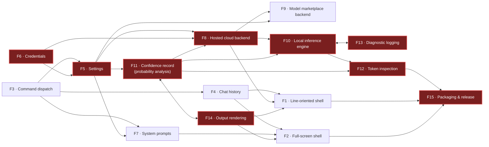

## 10. Suggested Delivery Phasing

This section is a **build order, not a schedule**. It contains no estimates, no team sizes and no dates. It states which capabilities must exist before which others can be built, what is demonstrably usable at the end of each step, and what must be true before the step is considered done.

The ordering is derived from the dependency column of the feature inventory. Two things about that dependency graph shape everything below:

1. **There are two genuine cycles.** Token Probability Analysis (F11) depends on Output Rendering (F14) and F14 depends on F11; Local LLM Inference (F10) depends on Diagnostic Logging (F13) and F13 depends on F10. Neither cycle can be built in a strict order. Both are broken the same way: *define the shared data contract first as a standalone artefact, then build the producer and the consumer against it.* For F11/F14 the shared artefact is the per-token confidence record and the single probability scale it is expressed in. For F10/F13 the shared artefact is the diagnostic record shape and the sink interface, which must be a general capability rather than something owned by one inference backend.
2. **Only three features have no dependencies at all** — Command System & Dispatch (F3), Credential Management (F6), and Packaging & Release (F15). Everything else is downstream of at least one of them. F3 is the true root: every user-facing capability in the product is reached through it.

---

### 10.1 Build order

#### Phase 0 — Settle the contracts that can invalidate the plan

**Delivers:** no product code. Answers to the spikes in §10.4.

**Why here:** four of the spikes (S1, S2, S3, S4) can each individually invalidate a later phase's design if answered wrongly, and two of them (S1, S2) can invalidate the *product's stated purpose*. A team that starts Phase 1 without them will build a confidence-visualisation product on top of backends that may not supply confidence data.

**Demonstrably usable at the end:** nothing user-facing. A written capability matrix and three throwaway prototypes.

**Exit criteria**
- For each of the three backends, a recorded, dated answer to: *can this backend return per-token log probabilities with alternatives, through a supported interface, at the request shape we intend to use?* The answer must come from a live call, not from documentation.
- A decision on whether the local engine ships at all in the first release (this decision dominates packaging, platform support and artefact size).
- One chosen probability scale and one formatter contract, written down.
- A working build and test baseline for the target platform. This is not a formality: the source as committed **does not build** — its toolchain pin is malformed (`global.json:6`, QUIRK-15.1, QUIRK-5.25, QUIRK-9.12) — so no behaviour in this PRD was verified by execution, and a clone starts with zero inherited dynamic verification.

---

#### Phase 1 — A shell that holds a conversation

**Delivers:** F3 (Command System & Dispatch), F5 (Settings & Configuration — core keys only), F6 (Credential Management — environment-variable tier only), F4 (Chat History — in-memory operations only), F8 (hosted cloud backend — plain reply path only), F14 (Output Rendering — plain text only), F15 (Packaging — a thin thread, see below).

**Why here:** F3 is the only root the user ever touches, and every later feature registers into it. F5 is what a backend needs to know which endpoint, model and parameters to use, and F5 depends on F6, so the credential contract must exist even if only its first tier is implemented. The environment-variable tier is deliberately the only one built now: it is first in the resolution precedence, it works on every platform, and it is the only tier with no platform-specific storage question attached (see S5). The hosted cloud backend is chosen as the first backend because it is the only one whose plain reply path is a straightforward request/response exchange with no native payload and no second request shape.

**Deliberately excluded from this phase:** per-token confidence capture, of any kind, from any backend. Confidence data is the product's headline capability, and building it before Phase 0's answers are in hand is precisely the mistake this ordering exists to prevent.

**Demonstrably usable at the end:** a user can launch the binary, be told what is and is not configured, set the provider, model, endpoint and generation parameters, hold a multi-turn conversation with a real hosted model, inject a message at a position, remove the last message, clear the conversation, ask for help on any command, and exit. That is a complete, honest product on its own.

**Exit criteria**
- `/`-prefixed input dispatches to a registered handler; unprefixed input is a chat turn; the tri-state result convention (success message / failure message / exit requested) renders distinguishably.
- Help is generated from the registry, not hand-maintained, so a registered command cannot be invisible and an unregistered name cannot be advertised (this is the fix for QUIRK-1.5; if the source's hand-maintained help is being reproduced deliberately, that is a §11.3 decision, not an oversight).
- Settings round-trip to disk with field names byte-compatible with the source's on-disk format, and a missing settings file is created with defaults rather than erroring.
- The credential resolution order and the exact environment-variable names — including the two provider-standard fallback names for the second cloud backend — behave as specified, and the credential-provenance string shown to the user is one of the four defined values.
- A conversation of at least ten turns survives with correct ordering and roles.
- One artefact per supported platform is produced by an automated build and is runnable on a clean machine. Packaging is a *thread* from Phase 1, not a phase at the end; a product that cannot be shipped until Phase 8 has no feedback loop.

---

#### Phase 2 — Durable conversations, personas, and real secret storage

**Delivers:** F4 complete (export and import of conversations), F7 (System Prompt Management), F5 complete (full settings surface and validation), F6 complete (OS-provided secret store tier and the migration flow).

**Why here:** F4 and F7 both depend only on F3 and F5, which Phase 1 delivered, and both are what turns a usable toy into something a user returns to. The secret-store tier lands here rather than in Phase 1 because it is the tier with a platform question attached (S5) and because the environment-variable tier already gives a working configured state. The migration flow — moving secrets out of the plaintext settings document — must land in the same phase as the store it migrates into, or users are told to migrate to something that does not exist.

**Demonstrably usable at the end:** a user can save a debugging conversation to a file, re-open it later, keep a library of named personas and switch between them, configure every documented setting, and move their credentials out of the plaintext settings file into an OS-provided store.

**Exit criteria**
- Export then import reproduces the conversation exactly, including message roles and timestamps. (Whether the source's discarding of the imported creation timestamp is reproduced is a §11.3 decision — QUIRK-4.7.)
- Export is atomic or the non-atomicity is a recorded, accepted decision (QUIRK-4.6).
- First run materialises the four named default personas with their exact names and content.
- Persona names round-trip through the filesystem without becoming unportable between operating systems (QUIRK-5.21) — or the non-portability is a recorded decision.
- Every setting the product accepts is listed by the unknown-key error message; the source's is missing roughly half its keys and every short alias (QUIRK-2.7, QUIRK-9.16).
- Secret storage reports its real outcome. A store that failed must not report success (QUIRK-2.19, QUIRK-3.10, QUIRK-14.8).
- No code path prints a secret's value to the terminal (QUIRK-3.3, QUIRK-2.9) — or, if the source's migration-instruction behaviour is being reproduced, it is a recorded decision with a stated rationale.

---

#### Phase 3 — Confidence data, and the honest labelling of it

**Delivers:** F11 (Token Probability Analysis) and F14 (Output Rendering) completed together, plus the hosted cloud backend's second request path (the one that asks for and parses per-token probabilities).

**Why here:** this is the first phase in which the product does the thing it exists to do. It is third rather than first because it depends on settings (F5) for its five persisted knobs, on a working backend (F8) for its data, and on a shell (F3) for its commands — and because the Phase 0 spikes must have answered whether the data can be obtained at all.

**How the F11/F14 cycle is broken:** build the per-token confidence record — token text, the log probability, the alternatives list, and, critically, a **provenance field** — as a standalone contract with its own tests, before either the producer or any renderer. Fix the probability scale (S4) in that contract. Then build the hosted backend's parser against it, then the renderers against it.

**Demonstrably usable at the end:** a user turns on confidence capture, asks a question, and sees the model's answer with each token coloured by how confident the model was, plus the alternatives it nearly chose — with every displayed number traceable to something the backend actually returned.

**Exit criteria**
- One probability scale throughout. The source carries at least three incompatible scales simultaneously (QUIRK-9.3, QUIRK-12.1, QUIRK-13.4) and one of its own tests is arithmetically unsatisfiable as a result (QUIRK-14.10).
- Every confidence record carries a provenance value distinguishing *measured* from *not supplied* from *simulated*, and every renderer displays it. This is the mechanical precondition for the decision in §11.3's lead paragraph, whichever way that decision goes.
- A backend that returns no probability data produces a record marked "not supplied" and a conversation that continues normally — never an invented record presented as measured.
- A malformed entry in a probability payload does not destroy the records already extracted (QUIRK-6.10).
- Rendering degrades correctly when the terminal width cannot be determined and when the viewport is narrower than the layout's minimum (QUIRK-9.21, QUIRK-12.17, QUIRK-12.15).
- Confidence records survive export and re-import of a conversation.

---

#### Phase 4 — The second cloud backend

**Delivers:** F9 (managed model marketplace integration).

**Why here:** it depends on F8 for the provider abstraction and on F11 for the confidence-record contract, both of which now exist. It is deliberately after Phase 3 because the most important thing this backend contributes to the product is a *negative* capability: on the evidence in the source, the probability members it sends are not part of any real contract for that service and its entire response-side probability parser is dead against genuine replies (QUIRK-7.1). Building it after the confidence contract exists means that fact surfaces as a declared capability rather than as silence.

**Demonstrably usable at the end:** a user can switch providers with one command and hold the same conversation against a different vendor's model, and is told plainly which capabilities that provider does and does not support.

**Exit criteria**
- Provider switching at runtime works from both the command surface and any dialog surface, and both agree on case sensitivity (QUIRK-6.18, QUIRK-13.10).
- A per-backend capability matrix is surfaced to the user, including confidence-data support.
- A model identifier that the backend cannot serve fails fast with a message naming the problem, rather than being sent in a request shape the model rejects (QUIRK-7.12, QUIRK-7.13, QUIRK-7.18, QUIRK-8.27).
- Readiness checks and construction preconditions agree: a backend must not report itself configured on half a key pair (QUIRK-7.15, QUIRK-3.20).
- Temporary/session credentials either work or are explicitly declared unsupported (QUIRK-7.19).

---

#### Phase 5 — The local inference engine and its diagnostics

**Delivers:** F10 (Local LLM Inference) and F13 (Diagnostic Logging & Log Export).

**Why here:** F10 is the single most expensive feature in the product and the one that dominates packaging, platform support and artefact size. It depends on F5, F8 (for the provider abstraction), F11 and F13. It is placed after every cloud capability so that a shippable product exists before the native payload question is opened. It is gated on spikes S2 and S3: if the engine cannot yield raw per-step distributions through a supported interface, this phase delivers a *chat* backend but not a *confidence* backend, and that must be known before it starts.

**How the F10/F13 cycle is broken:** build the diagnostic sink as a general capability with its own record shape, buffer and flush policy, owned by nobody. Then have the engine write into it. In the source the sink lives under a folder named for a different feature and is coupled to one engine (QUIRK-11.7), which is what created the cycle.

**Demonstrably usable at the end:** a user points the model setting at a model file on disk, switches provider, and holds a conversation entirely on their own machine with no network access and no API spend — and can capture a diagnostic log when it misbehaves.

**Exit criteria**
- A generation is cancellable. The source has no cancellation anywhere (D14), and a local generation with a large token cap and no cancellation is an unabortable freeze.
- At most one generation is in flight per process, and model loads are serialised — with a timeout, and without the source's defect of releasing a process-wide lock from a per-instance teardown (QUIRK-8.13, QUIRK-8.14).
- Conversation context is sent to the engine in a defined way. The source sends only the last user message and discards all prior turns and system messages (QUIRK-8.28) while the engine's own session retains state the product's "clear conversation" command does not touch (QUIRK-8.29); a clone must pick one model of context ownership and honour it.
- Model, context and native memory are released on shutdown and on abnormal exit (QUIRK-8.15, QUIRK-8.21).
- The engine's own diagnostic stream and the application's entries land in one place with one timestamp format, one flush policy, and a failure channel that is visible (QUIRK-11.5, QUIRK-11.11, QUIRK-10.26).
- Every hardware setting the product exposes either reaches the engine or is removed from the surface. The source validates, clamps, persists and displays three settings that reach nothing (QUIRK-2.6, QUIRK-8.22).

---

#### Phase 6 — Token inspection, tokenization and attribution

**Delivers:** F12 (Token Inspection, Tokenization & Attribution).

**Why here:** it depends on F10 and F11, both now complete. It is the deepest node in the dependency graph and the last user-facing feature.

**Demonstrably usable at the end:** a user can tokenize an arbitrary string, inspect how a local model processed a prompt step by step, and see which part of the input most influenced each generated token.

**Exit criteria**
- Token text is genuinely decoded. The source never decodes it and displays a placeholder for every token (QUIRK-10.5).
- Every value in an inspection report is measured or is labelled as an estimate. In the source, every token identifier, log probability, alternative and influence score produced by this feature is a formula of the word index (QUIRK-10.3, QUIRK-10.14, QUIRK-10.18) — this is the second locus of the fabrication problem described in §11.3.
- The model is loaded once per session, not once per command and twice per inspection (QUIRK-10.9, QUIRK-8.41).
- Report output is bounded — paged, capped or truncated (QUIRK-10.30).
- Any consent gate is answerable non-interactively (QUIRK-10.29).

---

#### Phase 7 — The full-screen terminal shell *(conditional)*

**Delivers:** F2 (Terminal GUI Shell).

**Why here, and why conditional:** F2 depends on F3, F4, F5, F7, F8 and F14 — everything Phases 1–3 delivered. It is conditional because *the source never decided whether it is the product*: the user manual markets the full-screen experience as the product while the release pipeline builds and ships only the line-oriented shell (C20, QUIRK-15.27). A clone must answer OQ-E9 before this phase is planned, because building it means maintaining two command surfaces that in the source diverged in at least a dozen observable ways.

**Demonstrably usable at the end:** the same product, in a full-screen window with a menu bar, a scrolling transcript, a settings dialog, a persona manager and a confidence side panel.

**Exit criteria**
- One settings record. The single most damaging defect in the source's full-screen shell is that commands are wired to one configuration object while the window reads another, so configuration commands appear to do nothing and silently overwrite the user's stored settings with construction-time defaults (QUIRK-14.1 and its per-feature restatements).
- No component writes to the raw terminal stream while the full-screen interface owns the screen (QUIRK-14.4, QUIRK-14.21, QUIRK-1.10).
- No path blocks the interface on a line read from the terminal (QUIRK-14.9, QUIRK-5.5, QUIRK-13.17).
- The two surfaces agree on every shared rule — input trimming, provider-name case, numeric validation (reject or clamp), destructive-action confirmation — or each divergence is a recorded decision.

---

#### Phase 8 — Packaging hardening and release

**Delivers:** F15 complete.

**Why here:** the packaging *thread* started in Phase 1; this phase is where the artefact is made small, signed, licensed and reproducible, and where the native-payload decision from S3 is executed. It is last because artefact size is dominated by whatever Phase 5 concluded.

**Demonstrably usable at the end:** a downloadable artefact per supported platform, of a known and stated size, that runs on a clean machine with no toolchain installed.

**Exit criteria**
- One version fact, declared in one place, consumed everywhere (QUIRK-15.17).
- The runtime version, the pin file and the automated build agree (C1, C2, C3).
- Automated tests run in the pipeline. The source's pipeline runs none, despite a hundred-case suite existing (QUIRK-15.31).
- The published artefact is the interface the documentation describes (QUIRK-15.27).
- Licence obligations for binary distribution are met — the source ships a strong copyleft licence and attaches no licence copy or source offer to its releases (QUIRK-15.32).
- Artefact size is measured, published, and within the stated budget. The source's documentation claims 13–25 MB while its measured build output is roughly 630 MB (C10).

---

### 10.2 The critical path

*(Highlighted nodes form the critical path. Double-headed arrows mark the two genuine dependency cycles.)*

**The single longest chain is:**

> Credential Management → Settings & Configuration → **Confidence record ⇄ Output rendering** → Hosted cloud backend (probability path) → Local inference engine ⇄ Diagnostic logging → Token inspection & attribution → Packaging & release

Nine nodes, containing both cycles. Every other path through the graph is shorter, and every other feature can be built in parallel alongside some portion of it. This chain is the schedule.

**What would compress it, in descending order of effect:**

1. **Deciding that the local inference engine is out of scope for the first release.** This deletes four nodes from the chain in one move — the engine, its diagnostic-logging cycle, token inspection (which depends on the engine), and the entire several-hundred-megabyte packaging problem that dominates the last node. Nothing else available to the team compresses the path by as much. It is also the decision most likely to be *wrong* to take, because local inference is where the source's most recent development effort went and where its most distinctive capability lives — so it is a product decision, not a delivery one.
2. **Settling the confidence-record contract in Phase 0 rather than discovering it in Phase 3.** The F11 ⇄ F14 cycle is only a cycle because the data contract and its probability scale were never written down; the source carries three incompatible scales and four drifted copies of the rendering logic as a direct result (QUIRK-9.3, QUIRK-12.12, QUIRK-9.26). One page of written contract turns a cycle into two parallel workstreams.
3. **Making the diagnostic sink a general capability rather than the inference engine's.** Same mechanism, applied to the F10 ⇄ F13 cycle. It also lets diagnostics be built and used from Phase 1, where they are most useful.
4. **Building the two backends that share a request/response shape in parallel.** The marketplace backend depends on the hosted one only through the provider abstraction; once that abstraction is stable at the end of Phase 1, F9 can proceed alongside Phase 3 without touching the critical path.
5. **Deferring the full-screen shell.** It is not on the critical path at all — but it is the largest source of *duplicated* work in the graph, and every phase that ships two shells pays for two of everything.

What does **not** compress it: adding people to the confidence-visualisation work before the backend-capability spikes are answered. If S1 comes back "the marketplace backend cannot supply this data and the local engine can only supply it through an unsupported interface", then a large part of Phase 3's design changes, and work done in advance is discarded.

---

### 10.3 Deliberate deferrals

Everything below is safe to leave out of a first usable release. "Safe" means: the product remains coherent and honest without it, and adding it later does not force a rewrite of what shipped. Each row states the cost of the deferral, because a deferral with no cost is not a deferral, it is a cut.

| Capability | Defer until | Why it is safe to defer | Cost of deferring |
|---|---|---|---|
| **Local on-device inference** | Phase 5 (or a later release entirely) | The product is complete and useful against a hosted backend. Local inference is a *second* way to obtain the same conversation. | Loses the offline, zero-API-spend, private-data use case — which is the source's most recent and most distinctive work. Also defers the only backend that could ever give genuinely raw per-step distributions. |
| **Token inspection, tokenization and attribution** | Phase 6 | Depends entirely on local inference; its own commands were never registered in either shell of the source, so no user of the original product could reach them (QUIRK-10.1). | Loses the deepest introspection story. Low real cost, because the source's version of this capability is fabricated end to end (QUIRK-10.3) and would have to be rebuilt from scratch regardless. |
| **The managed model marketplace backend** | Phase 4 | One working backend is enough for a usable product; the abstraction that makes a second one cheap ships in Phase 1. | Loses vendor choice. Note the compensating benefit: the evidence says this backend cannot supply confidence data at all (QUIRK-7.1), so deferring it also defers a capability gap that has to be explained to users. |
| **The full-screen terminal shell** | Phase 7, or never | The line-oriented shell is the artefact the source's own release pipeline ships (C20). Every capability is reachable from it. | Loses the experience the user manual actually markets. Deferring also *avoids* maintaining two divergent command surfaces, which is where a large fraction of the source's defects live. |
| **OS-provided secret storage** | Phase 2 | The environment-variable tier is first in the resolution order, works on every platform, and gives a fully configured product. | Users must set environment variables. Acceptable for a developer tool; less so for a broader audience. |
| **The credential migration wizard** | Phase 2, alongside the store it migrates into | Only meaningful once a secure store exists. | Users with existing plaintext settings files have no assisted path off them. Mitigation: refuse to *write* new plaintext secrets from day one, so the population needing migration never grows. |
| **Diagnostic log export to a file** | Phase 5 | In the source this command is unreachable from both shells and, if reached, exports nothing (QUIRK-11.1, QUIRK-11.2). Nothing is lost by not having it. | Support cases require the user to reproduce with a verbose flag instead of attaching a file. |
| **The offline demonstration mode** | Any time, or never | It exists to show the visualisation without API spend. In the source it has no working surface on either shell (QUIRK-9.7, QUIRK-12.4) and its generated numbers are on the wrong scale by roughly thirty orders of magnitude (QUIRK-12.5). | Loses a no-credentials evaluation path — genuinely useful for a first-run experience, and cheap to build correctly once the confidence contract exists. |
| **Grid / card layout and the flowing heat-map view** | Phase 3+ | A single readable list layout is enough to make confidence legible. The source's alternative layouts include two views that are never constructed at runtime (QUIRK-12.13). | Loses density on wide terminals. Low cost; high risk of being rebuilt three times if not deferred (the source has four copies of this logic — QUIRK-9.26). |
| **Ahead-of-time / single-file / trimmed packaging** | Phase 8 | A conventional artefact ships from Phase 1. | Larger download, slower first start. Note that in the source these profiles are aspirational and were never validated; at least seven separate contradictions make them unworkable as declared (C4–C10). |
| **Accelerator (GPU) backend for local inference** | Post-1.0, as an opt-in add-on | The processor backend is sufficient for correctness and for most single-user debugging sessions. | Slower local generation. Deferring is strongly recommended regardless: in the source both backends are unconditional dependencies costing roughly 550 MB, and shipping both simultaneously is named by the source's own troubleshooting document as a cause of native load failures (QUIRK-8.42, D20). |
| **Theme selection / light theme** | Post-1.0 | One legible dark-on-terminal default is enough. | Poor legibility on light terminals. Pair this deferral with the non-negotiable rule that confidence must never be conveyed by colour alone (QUIRK-13.23, OQ-I9). |
| **Multi-line message input** | Post-1.0 | Single-line input with a documented paste behaviour is workable. | The user manual promises multi-line; the source's control is one row tall with wrapping off, so the promise was never met anyway (QUIRK-14.6). |
| **Automated release publication** | Phase 8 | Manual publication of a Phase 1 artefact is adequate for internal use. | No reproducible release provenance. Cheap to add; the source's pipeline has an unread size measurement, no test run and a long-lived personal credential (QUIRK-15.23, QUIRK-15.31, QUIRK-15.33) — do not port it, rebuild it. |

---

### 10.4 Risk-ordered spikes

These are prototypes to run **before** committing to the phase plan. They are ordered by how much of the plan they invalidate if the answer is unfavourable. Each is timeboxed by its exit question, not by effort.

| # | Spike | The question it must answer | Why getting it wrong invalidates the design | What settles it |
|---|---|---|---|---|
| **S1** | **Per-backend probability capability** | For each of the three backends independently: can it return, through a supported and documented interface, a per-token log probability *and* a ranked list of alternatives with their log probabilities, for a normal chat completion? | This is the product's entire stated purpose. The three backends demonstrably differ, and the evidence says **one of them cannot do it at all**: the source's marketplace request body always sends probability members that are not part of any real contract for that service, making its whole response-side parser dead code against genuine replies (QUIRK-7.1, and the README's claim of support is contradicted by the code — QUIRK-7.32). If the plan assumes three symmetric backends, Phases 3–5 are mis-scoped and the user-facing capability matrix is wrong. | Three live calls, one per backend, with the response bodies captured verbatim into fixtures. Not documentation; not the source's tests, whose only probability-extraction test feeds a response shape the hosted service does not emit (QUIRK-6.24) and whose only round-trip marketplace test pairs a request shape with a reply shape no real service produces (QUIRK-7.40). |
| **S2** | **Raw per-step distributions from the native engine, through a supported interface** | Can the local inference engine expose the raw per-step score vector (and a detokenizer) through a *published, supported* interface — not by resolving a method by literal name at run time? | The source obtains it by name-based runtime lookup, wrapped in a blanket failure absorber that returns an empty list with no diagnostic at any level (D11, QUIRK-8.6, QUIRK-15.4). The consequence is that the headline capability "appears to work and produces nothing", and nobody can tell. Two further consequences: (a) any trimming or ahead-of-time packaging destroys the lookup (C4), so S2 and S3 are coupled; (b) if the answer is no, then the local backend supplies *no* real confidence data and the fabrication decision in §11.3 becomes unavoidable rather than optional. | A prototype that generates ten tokens from a small model on disk and prints, for each step, the top-K token strings and their scores — obtained without any name-based runtime lookup, and with a failure path that is loud. If that cannot be built, the engine choice itself is on the table. |
| **S3** | **Packaging a several-hundred-megabyte native payload** | What does the shipped artefact actually weigh, what does a user download, and does it start on a clean machine with no toolchain? | The source's measured build output is roughly 630 MB against documentation claiming 13–25 MB (C10), it references two mutually exclusive native backends unconditionally (QUIRK-8.42), its bundled profile suppresses the runtime-configuration side-car a bundled artefact needs to start (QUIRK-15.3), its single-file profile silently unpacks itself to a per-user cache — contradicting the "copy it anywhere" promise (QUIRK-15.7), and its native profile produces a folder rather than a file (QUIRK-15.8). If the packaging story is not settled early, the local-inference decision cannot be costed and Phase 8 becomes a rewrite. | A published artefact, downloaded onto a machine with nothing installed, launched, and a conversation held on a local model. Record: download size, on-disk size after first run, cold-start time, and whether any temporary directory is required. Then decide: split the native payload into an optional download, ship one accelerator backend per platform, or drop local inference from release one. |
| **S4** | **The probability scale and formatting contract** | Is a probability a 0…1 fraction or a 0…100 percentage, at every boundary — storage, transport, colour banding, formatting, export? | The source carries all of them at once. Colour thresholds compare a 0…1 value against 90/70/50/30, so every genuine token renders in the lowest band (QUIRK-13.4, QUIRK-12.1); one path exponentiates a value that is already a probability (QUIRK-7.3, QUIRK-9.4); the demonstration generator writes percentage-scale numbers into a log-probability field (QUIRK-12.5); the percent formatter appends a second literal percent sign (QUIRK-12.2); and one of the source's own tests is arithmetically unsatisfiable, so its suite is red on every run (QUIRK-14.10). Getting this wrong once contaminates every renderer, every export file and every test. | One page: the stored representation, the derived representation, the display representation, and one conversion function with tests including the boundary cases. Do this before any renderer exists. |
| **S5** | **Cross-platform secret storage** | Is there a single abstraction over an OS-provided secret store that works on all target platforms, is feature-detectable at run time, and degrades to the next tier without erroring? | The source's store is a single-platform interface reached through a raw system call, and its own security documentation instructs users on other platforms to enable it — where it silently yields nothing, the enabling command is refused, and the failure is invisible (QUIRK-6.23, QUIRK-3.19, QUIRK-7.22). If the clone's target platforms do not all have a usable equivalent, the credential design has a hole that must be designed around, not discovered. | Store, read and delete a secret on each target platform, plus a run on a platform where none is available, verifying the silent degradation to the next tier and the exact provenance string reported to the user. |
| **S6** | **Terminal rendering fidelity** | How does the chosen rendering approach behave when the width query fails, when the viewport is narrower than the layout minimum, when text contains wide or combining characters, and when output is redirected to a file? | The source's grid layout assumes an attached terminal and its width query is unguarded (QUIRK-9.21); its wrap-width arithmetic has no lower bound and goes negative on a narrow viewport (QUIRK-12.17, QUIRK-12.15); every column width and wrap point is measured in code units rather than display cells (QUIRK-12.29); and its output encoding is never configured, so frame and marker glyphs are corrupted (QUIRK-13.9). These are the defects most likely to be reproduced by accident. | A rendering harness driven at widths 4, 20, 40, 80, 200, with redirected output, with a right-to-left string, with a wide-character string, and with a combining sequence — asserting on the produced bytes. |
| **S7** | **Cancellation and single-flight generation** | Can a long generation be cancelled from the user's input surface, and can concurrent generation be prevented, without deadlock, on the chosen concurrency model? | The source has no cancellation anywhere in production code (D14) and enforces single-flight with process-wide locks it then releases from a per-instance teardown path (QUIRK-8.13, QUIRK-8.14). Retrofitting cancellation into a design that assumed uninterruptible calls touches every backend and every command signature — so it must be in the contracts from Phase 1, even though nothing needs it until Phase 5. | A prototype backend with an artificially slow generation, cancelled from a keystroke, with the model and context verifiably released and a second generation started immediately afterwards. |
| **S8** | **Executable verification baseline** | Can the clone build, run and test itself from a clean checkout, automatically, from commit one? | This PRD was produced without any dynamic verification, because the source as committed cannot be built — its toolchain pin is malformed (QUIRK-15.1, QUIRK-5.25). Roughly a third of the behavioural claims carried into §11.4 are INFERRED for exactly that reason. A clone that inherits the same condition inherits the same inability to tell a specification from a guess. | A pipeline that, on every change, restores, builds, runs the full test suite, and publishes an artefact — from Phase 1, before any feature depends on it. |

---
