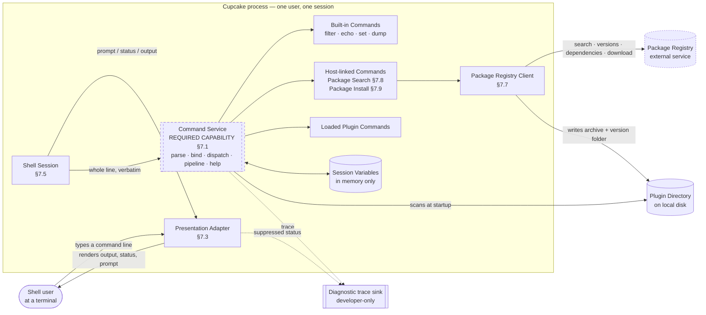
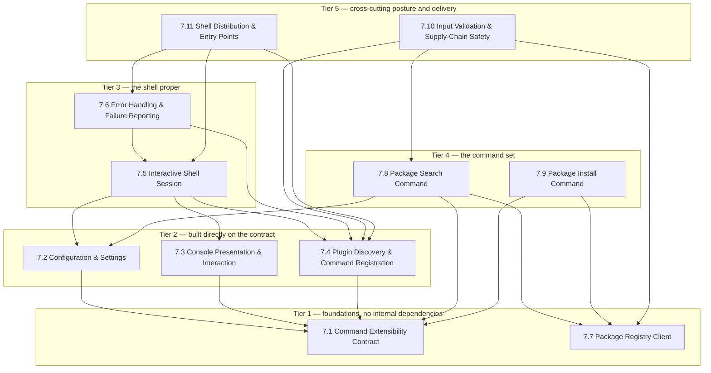
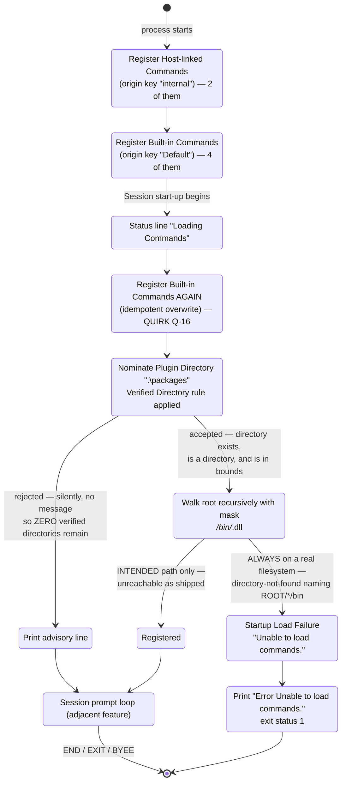
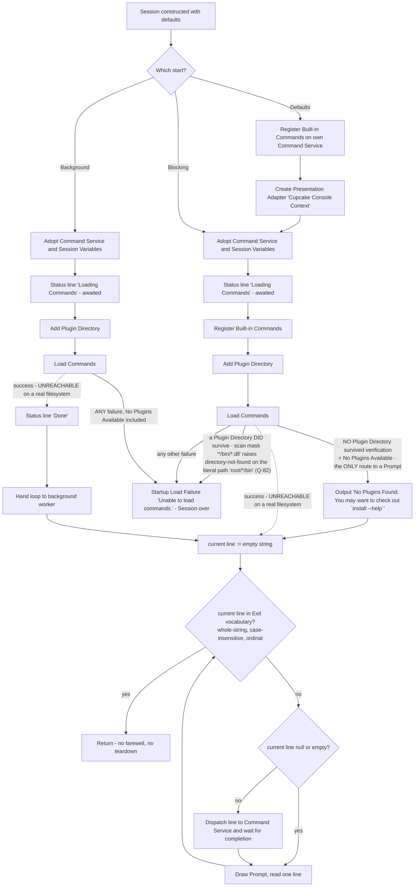
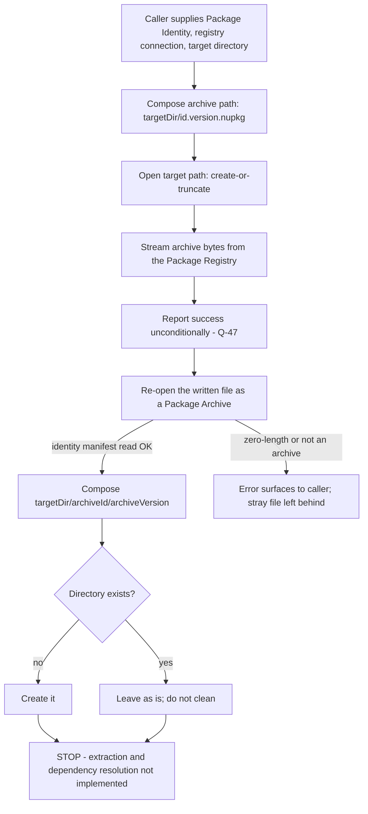
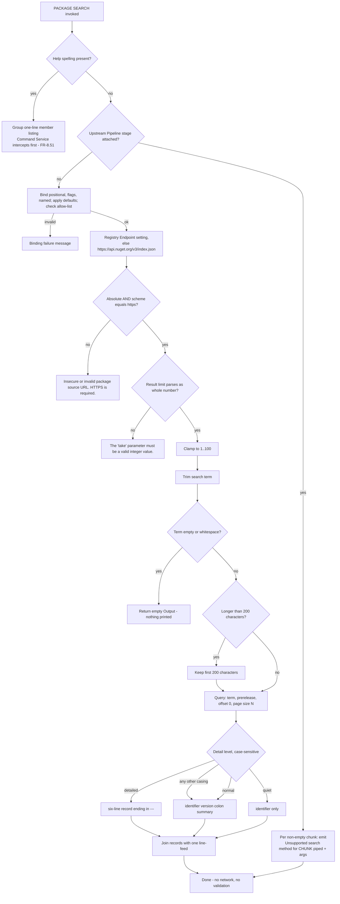
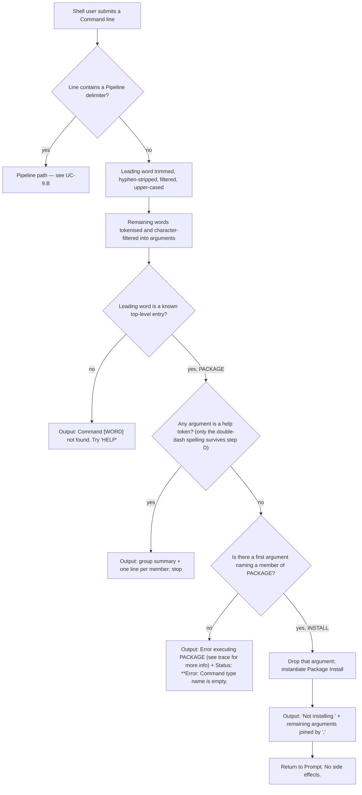
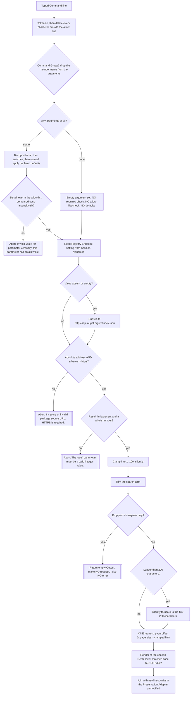
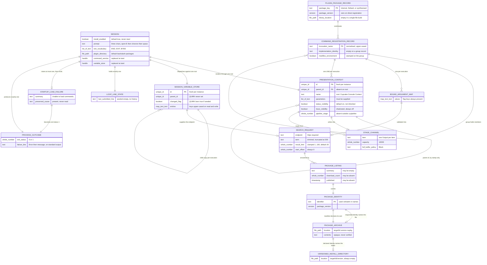

# PRD: Cupcake — Reimplementation Specification

> Reverse-engineered from `https://github.com/Xcaciv/Xcaciv.Cupcake` (analysed at the local
> read-only checkout `subject/Xcaciv.Cupcake`) @ commit
> `a05dc6f00d4510ac073f6dd02fbfba2ffb76a5b6`, branch `main`, on 2026-08-31.
>
> Prepared for reimplementation in a different language on a different platform; this document is
> implementation-agnostic. The source's own stack appears only as *Source used* annotations, inside
> External-technology sections, and in the traceability appendix.
>
> **Source licence:** BSD 3-Clause, © 2022 Alton Crossley (`LICENSE:1-4`). The licence permits
> reimplementation; attribution and the warranty disclaimer must accompany any redistribution of the
> original work or substantial portions of it. A clean-room reimplementation from this document does
> not redistribute the original.

---

## How to read this document

**Evidence notation.** Every requirement is traceable.

| Notation | Meaning |
|---|---|
| `path/to/file.ext:12-30` | Directly observed in the source repository at the pinned commit. Repo-relative. |
| `OUT-OF-REPO: path:12` | Observed in the **external command framework** the product depends on, read from its public repository at tag `v2.1.2` (commit `f34dedca8dc6d690290b2139acbd3e9b8264349c`). See the version caveat below. |
| `INFERRED` | Reasoned from evidence rather than directly observed. Load-bearing requirements marked this way should be re-verified before a clone commits to them. |
| `QUIRK` | Behaviour that looks like a defect. Documented **as observed**, never silently fixed and never silently blessed. Every quirk with an observable consequence has an acceptance criterion that pins it, and a keep-or-fix entry in §11. |

**Three caveats that colour the whole document.**

1. **Nothing was executed.** The product does not build at the pinned commit (§2.4, OQ-1, OQ-2).
   Every statement here is read from source. Where a dossier confirmed arithmetic or a platform
   primitive by running an equivalent construct in a scratch directory, that is stated at the point
   of claim.
2. **The framework reference is one patch release ahead.** The product pins framework versions
   2.1.1 / 2.1.0; the only obtainable source is tag `v2.1.2`, because the packages are absent from
   the public index and the repository's own feed configuration cannot reach them (§2.4). Every
   `OUT-OF-REPO:` claim therefore carries a small version risk. In-repo literals carry none. The
   repository's own hand-written test doubles already disagree with `v2.1.2` in several members
   (OQ-3), which is direct evidence that the pinned contract differed somewhat.
3. **Most user-visible behaviour comes from the framework, not from this repository.** The product
   is ~950 lines of its own code sitting on a command framework that supplies parsing, pipelines,
   help, argument binding and plugin loading. Per the commissioning decision, this PRD documents
   that framework as a **required capability** with its semantics specified (§7.1, §6), not as an
   opaque dependency — a clone must build or source an equivalent.

## 1. Executive Summary

### What the product is

**Cupcake** is an interactive, plugin-driven command shell for a text terminal. Its own README
describes it in four words — "A sweet shell" (`README.md:1-2`).

A person launches it, sees a prompt, types command lines one at a time, and reads the results. The
shell itself knows almost nothing about commands. It supplies the session, the terminal rendering,
the startup sequence that discovers commands, and a small built-in vocabulary for finding and
fetching more. Everything a user actually *does* comes from Commands — either the four supplied by
the underlying command capability, two compiled into the shipping program, or any number loaded at
startup from Plugin bundles found on disk.

The distinguishing bet is **extensibility over batteries**. The shell ships nearly empty and expects
to be filled: a Plugin author writes a Command bundle, publishes it to a package registry, and a
user finds and installs it from inside the shell itself. The Package Search command that queries a
registry (§7.8) is the most complete feature in the repository, and the Package Install command that
would complete the loop (§7.9) is declared, registered, help-documented — and deliberately inert,
returning a literal refusal.

### Who it serves

Four actors, all established from code (§3): the **Shell user** at a terminal, who is the only human
in the running system; the **Shell Operator** — the program that constructs and configures a Session
and registers commands compiled into it, a role the shipping executable plays in twelve lines; the
**Plugin author**, who publishes Command bundles to a registry; and the **Package Registry** as an
external system. There is no authentication, authorization, user account, role, tenancy, or
persisted identity anywhere in the product, and a reimplementer must not invent any (§3, §6).

### Scope of the clone

The whole product, feature for feature: eleven features (§7), spanning the interactive session, the
colour terminal adapter, plugin discovery, the two package commands, the registry client, the
configuration surface, the error and failure contract, the extensibility contract the shell requires
of its command capability, the input-validation and supply-chain posture, and the packaging and
entry points.

Two things are deliberately **excluded** and both are recorded in §2 rather than silently dropped: a
second, empty executable that prints a greeting and is otherwise dead, and the "having tests" of the
source, whose content nonetheless feeds acceptance criteria throughout.

### The honest state of the source

A reimplementer needs to know this before reading a single requirement.

**The product does not build at the pinned commit**, for two independent and separately-established
reasons (§2.4). The Package Search command references a result accumulator whose declaration was
deleted in commit `e1123b2` while all five uses were kept, and no version of the framework defines
such a member. Independently, dependency restore fails for every project: the feed that claims all
first-party packages is an unexpanded environment token, the private hosted feed is declared but
given no routing rule and so is never consulted, and the framework packages are absent from the
public index.

**And the headline feature cannot work.** The Plugin scan composes a search mask with a wildcard in
its *directory* portion — `*/bin/*.dll` — and hands it to a recursive directory enumeration. That
was executed against a real filesystem during verification, with a correct plugin layout in place:
it does not match the files, and it does not return empty. It **raises a directory-not-found
condition naming the literal path `<root>/*/bin`**, because the directory portion of a mask is joined
literally and its wildcard is never expanded. A control run with a plain `*.dll` pattern found the
same files, confirming the layout was right and the mask is the cause.

Two consequences follow, and they reshape the product's story. **No Plugin is ever loadable from
disk** — the extensibility mechanism the whole design is built around does not function as shipped.
And **any Plugin Directory that exists at all is fatal at startup**: the raised condition is neither
of the two "nothing found" conditions the startup guard tolerates, so it becomes a fatal load failure
that ends the process with exit status 1. The only path to a working prompt is the one where the
plugin folder is absent — which is the default state anyway, since the compiled-in default path uses
a Windows separator that is a literal filename character elsewhere. This supersedes the milder
reading, held earlier in the analysis, that only an *empty* plugin folder was fatal.

**The product itself was never run**, because it cannot be built. Every requirement here is read from
source. Where a specific mechanism could be isolated and executed on its own — the scan mask above,
the progress arithmetic, the path-containment primitive — that was done, and it is stated at the
point of claim. Everything else specifies **what the code says**, not what a running system was seen
to do, and the load-bearing inferences are flagged `INFERRED` for exactly that reason.

The product also carries an unusual density of quirks for its size: **84 are catalogued** (§11.2).
Several are user-visible and behaviourally load-bearing — a flag that never takes effect because
presence is tested rather than value; a detail-level option that silently downgrades output when its
case differs; a first-run experience that is *friendlier* when the user has done less setup, because
any plugin folder that exists is fatal while a missing one is tolerated; a progress reading that
computes a ratio and renders it with a percent sign; a parameter matcher unanchored at the end, so
`-taken` binds a parameter named `take` and swallows the next token. These are documented as observed
and tagged, and the keep-or-fix decision for every one of them is put to the commissioning team in
§11, not taken here.

### What a clone must source or build

The single largest dependency is not a library a clone can install: it is the **command capability**
itself — registry, tokenizer, dispatcher, declarative parameter metadata, pipeline engine, help
generator and sandboxed plugin loader. The source obtains it as a first-party package that is not
publicly distributed. §7.1 specifies its required behaviour in full so a clone can build or
substitute an equivalent; §5.3 lists every other external capability, generically, with the source's
concrete choice preserved as an annotation.

## 2. Goals & Non-Goals

### 2.1 Product goals (derived from what the code actually pursues)

| # | Goal | Evidence that the source pursues it |
|---|---|---|
| G-1 | Give a user an interactive terminal session that reads a line, runs it, shows the result, and repeats until told to stop. | `src/Xcaciv.Cupcake.Core/Loop.cs:32-68` |
| G-2 | Own no command vocabulary of its own — delegate every parse, dispatch and render decision to a replaceable command capability, so the shell is a host rather than an application. | The Session touches only three operations of the presentation contract and five of the command contract; it performs no parsing, casing, trimming or history of its own (`Loop.cs:57-66`). |
| G-3 | Let the running shell be extended from disk without recompiling it: discover Command bundles at startup and register everything they offer. | `Loop.cs:42-43`; scan convention OUT-OF-REPO: `src/Xcaciv.Command.FileLoader/Crawler.cs:20,171-190` |
| G-4 | Let a user discover installable extensions from inside the shell, against a configurable package registry. | `src/Xcaciv.Command.Packages/SearchCommand.cs` in full |
| G-5 | Complete the extension loop by installing a discovered bundle into the Plugin Directory. | **Aspirational only.** Declared and registered (`InstallCommand.cs:14-17`), with a half-built routine (`NugetWrapper.cs:111-128`) whose extraction and dependency steps are unwritten (`:125-127`). |
| G-6 | Keep the terminal face swappable and the session testable, by routing every character the user sees through one contract with exactly one terminal implementation. | `ConsoleContext.cs` is the only component that touches the terminal; the Session is driven end-to-end in tests through a hand-written stand-in (`Xcaciv.Cupcake.Core.Tests/LoopTests.cs:8-65,126-152`). |
| G-7 | Ship as one self-contained file that needs no runtime pre-installed and starts quickly. | Release publish profile: single-file, self-contained, compressed, ahead-of-time precompiled (`src/Xcaciv.Cupcake.Lit/Xcaciv.Cupcake.Lit.csproj:13-18`) |
| G-8 | Keep the shipping variant deliberately simple by consuming an asynchronous capability synchronously. | "A light and syncronous implementation of Cupcake shell" (`src/Xcaciv.Cupcake.Lit/README.md:3`, misspelling in the source); every asynchronous step is blocked on (`Loop.cs:37,62,65`). |
| G-9 | Apply basic hygiene to untrusted input and to the code the shell is asked to fetch. | Encrypted-transport requirement, result-count clamping and search-term truncation (`SearchCommand.cs:31-58`); feed-to-name routing (`NuGet.config:12-20`); per-Plugin sandboxing OUT-OF-REPO: `src/Xcaciv.Command/CommandFactory.cs:80-113`. The commit that added most of this is titled "Update security features and package versions" (`b0ca736`). |

### 2.2 Non-goals — capabilities the source deliberately does not have

A reimplementer must not invent these. Each is an evidence-backed absence.

| # | Non-goal | Evidence of absence |
|---|---|---|
| NG-1 | **No user identity, authentication or authorization.** No login, no accounts, no roles, no permission checks on any Command. | Repo-wide: no credential, token, role or permission construct anywhere in `src/`. |
| NG-2 | **No persistence between runs.** No settings file the product reads at run time, no history file, no state directory, no database. Session Variables live in memory and die with the process. | §8 persistence subsection; the only files written are the downloaded Package Archive and an empty versioned directory (`NugetWrapper.cs:89,119-123`). |
| NG-3 | **No command-line arguments.** Neither executable parses any; the shell cannot be scripted by argument. | `src/Xcaciv.Cupcake.Lit/Program.cs:1-22`, `src/Xcaciv.Cupcake/Program.cs:1-2` |
| NG-4 | **No command history, recall, completion or line editing** beyond whatever the host terminal provides for reading one line. | `ConsoleContext.cs:71` is a single read-a-line call; the Session keeps one line and overwrites it (`Loop.cs:56,65`). |
| NG-5 | **No job control, background execution or interleaving.** Commands run strictly one at a time and the next prompt waits for the previous Command to finish. | `Loop.cs:62,65` |
| NG-6 | **No timeouts and no cancellation.** Waiting for input and waiting for a Command are both unbounded; every framework timeout and output cap defaults to disabled and the product never configures them, nor ever supplies a cancellation signal. | `Loop.cs:62,65,94,96`; OUT-OF-REPO: `src/Xcaciv.Command.Interface/PipelineConfiguration.cs:29-51` |
| NG-7 | **No integrity or provenance verification of downloaded code.** No signature check, no checksum, no publisher trust decision before a Plugin is loaded. Certificate-validation, thumbprint-allowlist and package-signature-verification settings existed and were **deliberately removed** as unused. | `NugetWrapper.cs:81-128`; removal in commit `907c535` |
| NG-8 | **No internationalisation.** Every string is hard-coded in one language; no message catalogue, no locale handling. | Repo-wide: no resource file, no culture parameter. |
| NG-9 | **No metrics, structured logging or audit trail.** The framework offers an audit hook; the product never sets it, leaving the no-op default. | OUT-OF-REPO: `src/Xcaciv.Command/CommandController.cs:106,126-134`; no assignment anywhere in `src/`. |
| NG-10 | **No graphical interface, no remote access, no network listener.** The only network use is outbound to a package registry. | Repo-wide. |
| NG-11 | **No dependency resolution or transitive install for Plugins.** The step exists as an unwritten intention. | `NugetWrapper.cs:126` |

### 2.3 Explicitly excluded from the clone (found in source, not to be rebuilt)

| # | Exclusion | Why |
|---|---|---|
| X-1 | **The second executable** (`src/Xcaciv.Cupcake/`). A two-line program that prints `Hello, World!` and references the session library without using it. Vestigial: its only real source file was deleted in commit `7b3a6b5`, and the shipping variant that replaced it arrived in `da1831b`. | Dead. Build one executable, not two. Recorded here rather than silently omitted. |
| X-2 | **The duplicated dependency-version manifest.** The same version list exists byte-for-byte at the repository root and under `src/`, differing only by a trailing newline (813 vs 811 bytes), free to drift apart. | A clone needs one. |
| X-3 | **The unreferenced empty folder declaration** in the session library's project file, and an unused import in the shipping program left over from an abandoned attempt at richer error reporting (`src/Xcaciv.Cupcake.Lit/Program.cs:4`, added in the same commit as the error handler, `569bbd0`). | Leftovers. |
| X-4 | **The `ideas/` directory** — present on disk, empty, untracked by version control. | Nothing to clone. |
| X-5 | **"Having tests" as a product feature.** The test content is mined throughout for acceptance criteria and is the single best requirement source in the repository, but the test projects themselves are not a feature of the shell. | Scope. See §9 for what a clone should test differently. |

### 2.4 The build state — a goal for the clone, not of the source

The source **does not build at the pinned commit**. This is stated as a goal for the clone because a
reimplementer will otherwise assume the reference implementation runs and try to compare against it.

1. **A missing declaration.** The Package Search command assigns into and reads from a result
   accumulator that has no declaration. `List<string> searchResult = [];` was removed in commit
   `e1123b2`; the five uses at `src/Xcaciv.Command.Packages/SearchCommand.cs:66,69,72,81,85` remain.
   No framework version defines such a member — confirmed by a whole-tree search of the reference at
   both `v2.1.2` and framework HEAD. Residual uncertainty: the exact pinned artefacts could not be
   fetched (reason 2), so the pinned base-class surface is unconfirmed. Behaviourally the accumulator
   is inert — it is fully reassigned on every path before being read — so the documented rendering
   behaviour stands regardless.
2. **Unresolvable dependencies.** `dotnet restore` fails on every project with NU1301. Package-source
   mapping gives the public index the pattern `*` and a local folder feed the pattern `Xcaciv.*`,
   while the private hosted feed is declared with **no** pattern and is therefore never consulted
   (`NuGet.config:5-22`). Every first-party package is thus sought only in the local folder, whose
   path is the unexpanded token `%NUGET_LOCAL_PACKAGES%`. Independently, the framework package is
   absent from the public index (HTTP 404 on its flat-container index).

**Goal for the clone:** a working build from a clean checkout with no out-of-band, machine-local,
undocumented prerequisite. Whatever supplies the command capability must be obtainable by anyone who
clones the repository, or must be part of the repository.

## 3. Actors & Personas

The product supports **four actors**, plus one consumer that exists as a contract rather than as a
persona. Every one is established from source; none is taken from a design document, because the
repository contains none. Read this section as a boundary list — it records who can act on the
product and, just as importantly, who the product does not know exists. §3.6 records the identity,
permission and persistence machinery the product does **not** have, because the single largest risk
in reimplementing this product is inventing an actor the source never modelled.

**A note on the word "operator".** Several source-side descriptions use "operator" loosely for the
person at the keyboard. This document uses the glossary term: a **Shell Operator** is a *program*,
not a person — whoever constructs and configures a Session. The person at the keyboard is the
**Shell user**.

| # | Actor | Kind | Exists at | Established by |
|---|---|---|---|---|
| 3.1 | Shell user | human | run time | the Prompt/dispatch/exit cycle and its single input path (`src/Xcaciv.Cupcake.Core/Loop.cs:32-68`) |
| 3.2 | Shell Operator | program (embedding host) | construction + run time | the Session's public settings surface and three entry points (`src/Xcaciv.Cupcake.Core/Loop.cs:11-26,32,70,105`), exercised by the shipping executable (`src/Xcaciv.Cupcake.Lit/Program.cs:7-13`) |
| 3.3 | Plugin author | human/organisation, outside the process | authoring + publish time | the discovery machinery that exists only to serve them (§7.4) and the authoring contract both in-repo Commands satisfy (`src/Xcaciv.Command.Packages/SearchCommand.cs:11-20,88`) |
| 3.4 | Package Registry | external system | run time | the only outbound conversation the product initiates (`src/Xcaciv.Command.Packages/NugetWrapper.cs:20-101`) |
| 3.5 | Automated consumer | contract, not persona | run time | two process exit statuses plus two in-process invocation paths (`src/Xcaciv.Cupcake.Lit/Program.cs:14-19`) |

---

### 3.1 Shell user

**Who they are.** A person at a text terminal who launches the delivered program and is given a
Session. They are anonymous, unidentified and unprivileged: the product has no notion of who they
are, and every registered Command is available to whoever reaches the Prompt (§3.6). One person, one
Session, one process — there is no second occupant to be separated from.

**What they can do.**

1. **Start a Session by launching the program.** It accepts no arguments — the entry point never
   reads an argument list (`src/Xcaciv.Cupcake.Lit/Program.cs:7-13`) — and there is no switch, no
   settings file and no import of operating-system environment values at startup (whole-repository
   census: 27 tracked files, none of them a settings file).
2. **Type one Command line at the Prompt and submit it.** The Prompt is exactly three characters:
   `Ɛ> ` (U+0190 LATIN CAPITAL LETTER OPEN E, `>`, one space) (`src/Xcaciv.Cupcake.Core/Loop.cs:16`,
   read at `:65`). One line per turn; there is no continuation syntax and no multi-line input.
3. **Invoke any registered Command,** case-insensitively: the four Built-in Commands registered
   under package key `Default` (OUT-OF-REPO: `src/Xcaciv.Command/CommandController.cs:175-185`
   (framework v2.1.2)); the two Host-linked Commands the shipping Shell Operator registers under key
   `internal` (`src/Xcaciv.Cupcake.Lit/Program.cs:10-11`); and — *as the intended contract only* —
   every Command contributed by a Plugin that survived discovery (§7.4). **QUIRK (Q-82): the third
   group is always empty on a real filesystem.** The Plugin Scanner builds its search mask by
   joining a wildcard segment, the sub-directory name and the binary pattern, producing
   `*/bin/*.dll`, and hands it to a recursive enumeration rooted at the verified Plugin Directory;
   the directory portion of a mask is joined to the root literally and its wildcard is never
   expanded, so the enumeration raises a directory-not-found condition naming `<root>/*/bin`
   instead of returning files (OUT-OF-REPO: `src/Xcaciv.Command.FileLoader/Crawler.cs:20,173-178`
   (framework v2.1.2); established by execution against a real filesystem with a correct layout in
   place — see §7.4 FR-4.25). No Plugin is ever loaded from disk, so the command set a Shell user
   can actually reach is exactly the six Commands above.
4. **Join stages into a Pipeline** with `|`; all stages run concurrently and the last stage's Output
   is what they see (OUT-OF-REPO: `src/Xcaciv.Command/PipelineParser.cs:25-90`,
   `src/Xcaciv.Command/PipelineExecutor.cs:66-108` (framework v2.1.2)).
5. **Ask for help.** The bare word `HELP` lists every registered Command, one line each; an argument
   `--HELP` turns any invocation into a help request (OUT-OF-REPO:
   `src/Xcaciv.Command/CommandExecutor.cs:57-73`, `src/Xcaciv.Command/HelpService.cs:165-175`
   (framework v2.1.2)). **QUIRK (Q-44):** of the three help spellings the Command Service accepts,
   only the double-dash one is reachable from the Prompt — argument tokenization reduces a typed
   `-?` to a bare `-` and deletes `/?` entirely (OUT-OF-REPO:
   `src/Xcaciv.Command.Interface/CommandDescription.cs:72`,
   `src/Xcaciv.Command/HelpService.cs:172-174` (framework v2.1.2)). **QUIRK (Q-45), INFERRED:**
   requesting help on a member of a Command Group prints the group's one-line member listing, not
   the member's own parameter help — so `PACKAGE SEARCH --HELP` does not show the search parameters.
6. **Read the three visual channels** the Presentation Adapter paints: Output in Blue on Black,
   Status lines in Yellow on DarkBlue, the Prompt in Green on Black
   (`src/Xcaciv.Cupcake.Core/ConsoleContext.cs:23-30`), plus progress rendered through the template
   `{0} progress {1}%` (`:20`).
7. **Set and read Session Variables** for the life of the Session, through the built-in variable
   setter and variable dump (OUT-OF-REPO: `src/Xcaciv.Command/Commands/SetCommand.cs:12`,
   `src/Xcaciv.Command/Commands/EnvCommand.cs:12` (framework v2.1.2)). The values vanish when the
   process ends (§3.6).
8. **End the Session** by typing `END`, `EXIT` or `BYEE` — note the doubled final E in the third — as
   the whole line, in any case (`src/Xcaciv.Cupcake.Core/Loop.cs:20`, matched at `:57`). **QUIRK
   (Q-21):** the exit test runs at the top of each iteration, *before* dispatch, so an exit word is
   never executed as a Command even if one is registered under that name (`:57-66`).

**What they cannot do.**

1. **Cannot change any Session setting.** The Prompt, the exit vocabulary and the Plugin Directory
   are settable only in code, before the Session starts (`src/Xcaciv.Cupcake.Core/Loop.cs:11-24`),
   and the shipping Shell Operator overrides none of them
   (`src/Xcaciv.Cupcake.Lit/Program.cs:9-12`).
2. **Cannot, in practice, re-point the Registry Endpoint setting** — even though the design offers it
   as the one runtime-changeable setting. The endpoint is read from the Session Variable
   `PackageSourceUrl` (`src/Xcaciv.Command.Packages/SearchCommand.cs:24`), but every typed argument
   passes a character allow-list that deletes `:` and `/`: unquoted, a URL fragments into separate
   tokens; quoted, it collapses to `httpsapi.nuget.orgv3index.json`. Either way the transport gate
   then rejects it with `Insecure or invalid package source URL. HTTPS is required.`
   (`src/Xcaciv.Command.Packages/SearchCommand.cs:32-35`; OUT-OF-REPO:
   `src/Xcaciv.Command.Interface/CommandDescription.cs:20-24,69-79` (framework v2.1.2)). **QUIRK
   (Q-43), INFERRED** — the tokenization and cleansing rules were read from the framework reference and
   replayed against sample input; the product was never run. Only a Shell Operator seeding the store
   in code can change the endpoint (§3.2).
3. **Cannot install a Plugin.** `PACKAGE INSTALL <name>` returns the literal `Not installing `
   followed by the comma-joined parameters (`src/Xcaciv.Command.Packages/InstallCommand.cs:19-22`);
   the piped form returns `Not installing {chunk} ` plus the same joined parameters (`:24-27`).
   Placing a Plugin on disk by hand before startup was the intended delivery path, but as shipped
   it does not work either: **any** Plugin Directory that exists and passes verification is fatal at
   startup, whether it is empty or perfectly populated, because the scan of item 3 raises before it
   can distinguish the two (**QUIRK Q-11 with Q-82**; §7.4 FR-4.25, FR-4.42). No delivery path
   reaches a loaded Plugin today (INFERRED for the hand-placed case: the Shell itself was never run,
   but the enumeration defect was established by execution).
4. **Cannot follow the product's own advice.** The No Plugins Available guidance reads
   ``No Plugins Found. You may want to check out `install --help` ``
   (`src/Xcaciv.Cupcake.Core/Loop.cs:47`), but the Command is reachable only as `PACKAGE INSTALL`,
   so that line names an invocation that cannot resolve. **QUIRK (Q-12).**
5. **Cannot reload or extend the command set during a Session.** Discovery runs once per process
   (`src/Xcaciv.Cupcake.Core/Loop.cs:41-43`); there is no reload Command and no directory watching.
6. **Cannot cancel a running Command.** The Session dispatches through the non-cancellable entry
   (`src/Xcaciv.Cupcake.Core/Loop.cs:62`, `:94`) although the Command Service offers a cancellable
   one (OUT-OF-REPO: `src/Xcaciv.Command.Interface/ICommandController.cs:36,44` (framework v2.1.2)).
7. **Cannot control narration, colour or diagnostics.** Status Visibility is fixed at construction of
   the Presentation Adapter (`src/Xcaciv.Cupcake.Core/ConsoleContext.cs:31`), and Diagnostic trace
   never reaches the terminal at all, because the adapter re-declares the visibility flag instead of
   setting the inherited one that the trace path consults (**QUIRK (Q-27)**, `:31` with OUT-OF-REPO:
   `src/Xcaciv.Command.Core/AbstractTextIo.cs:25,167-176` (framework v2.1.2)).
8. **Cannot be identified, authenticated, or remembered** between Sessions (§3.6).

**Evidence that establishes this actor.** The Session's loop is written around exactly one input
operation — prompt for one line, dispatch it unless it is empty, repeat until an exit word
(`src/Xcaciv.Cupcake.Core/Loop.cs:56-66`) — and the Presentation Adapter implements that operation by
writing the Prompt without a newline and reading one line back
(`src/Xcaciv.Cupcake.Core/ConsoleContext.cs:66-72`). There is no other way into the product.

---

### 3.2 Shell Operator

**Who they are.** A *program*, not a person: whoever constructs a Session, configures it, registers
Host-linked Commands and starts it. The shipping executable plays this role in four statements
(`src/Xcaciv.Cupcake.Lit/Program.cs:9-12`, inside the guard at `:7-19`). The role is a first-class actor because the Session is a
library object with a public settings surface and three entry points, and because the shipping
executable is only one possible caller — the repository's own automated tests are another, driving a
whole Session with substituted collaborators (`Xcaciv.Cupcake.Core.Tests/LoopTests.cs:126-152`).

**What they can do.**

- **Register Host-linked Commands** under a package key of their choosing, by instance — the shipping
  Operator registers both package Commands under the key `internal`
  (`src/Xcaciv.Cupcake.Lit/Program.cs:10-11`). The Command Service also accepts registration by kind
  and by pre-built Command Registration Record (OUT-OF-REPO:
  `src/Xcaciv.Command.Interface/ICommandController.cs:68,76,84` (framework v2.1.2)). **The
  environment-modifying flag is part of that decision and the shipping Operator declines it:** both
  registrations omit the argument, which defaults to off (`src/Xcaciv.Cupcake.Lit/Program.cs:10-11`;
  OUT-OF-REPO: `src/Xcaciv.Command/CommandController.cs:190` (framework v2.1.2)), so every
  Session Variable either Command writes lands in the per-execution child scope the executor seeds
  from the caller's values and is discarded when the Command returns — the merge back into the
  Session's store happens only for a Command whose registration record declares it
  environment-modifying *and* whose child scope changed (OUT-OF-REPO:
  `src/Xcaciv.Command/CommandExecutor.cs:187,216-219`,
  `src/Xcaciv.Command/EnvironmentContext.cs:45-55` (framework v2.1.2)). An Operator that registers
  either Command *with* the flag changes that, and inherits the write-back side effects §7.8
  records — see Q-10.
- **Override the four value settings** before start: the install gate, the Prompt, the exit
  vocabulary and the Plugin Directory, whose default is the relative path `.\packages` — written with
  a backslash separator, which is a literal filename character on POSIX platforms (**QUIRK (Q-25)**)
  (`src/Xcaciv.Cupcake.Core/Loop.cs:11-24`). **That accident is what keeps the shipping build
  usable:** because the default names a directory that does not exist, the nomination is rejected,
  the verified-directory list stays empty, and the load step raises the tolerated No Plugins
  Available condition rather than the fatal one, so startup reaches a Prompt (OUT-OF-REPO:
  `src/Xcaciv.Command/CommandLoader.cs:42-45` (framework v2.1.2);
  `src/Xcaciv.Cupcake.Core/Loop.cs:45-50`). An
  Operator who "fixes" the separator, or points the setting at a directory that genuinely exists,
  converts every startup into a fatal Startup Load Failure (Q-11 with Q-82; §7.4 FR-4.25, FR-4.42,
  FR-4.57). The Prompt and the exit vocabulary are re-read on every iteration, so an Operator holding a reference can change them
  mid-Session (`:57`, `:65`).
- **Choose one of three entry points:** blocking, asynchronous, or the defaults convenience
  (`src/Xcaciv.Cupcake.Core/Loop.cs:32`, `:70`, `:105`). The choice is behavioural, not stylistic —
  **QUIRK (Q-17):** the asynchronous entry registers no Built-in Commands and has no benign branch
  for No Plugins Available, so a fresh install started that way fails startup outright with the
  generic Startup Load Failure (`:39-54` versus `:77-85`).
- **Supply their own Interaction Context, Command Service and Session Variables store** to either run
  entry (`src/Xcaciv.Cupcake.Core/Loop.cs:32`, `:70`).
- **Construct the Presentation Adapter themselves** and set its six colours, its progress template and
  its Status Visibility (`src/Xcaciv.Cupcake.Core/ConsoleContext.cs:13`, `:20-31`). The defaults entry
  instead builds one named `Cupcake Console Context` with an empty parameter list and visibility left
  on (`src/Xcaciv.Cupcake.Core/Loop.cs:110`).
- **Decide how a Startup Load Failure is reported.** The condition carries the fixed summary
  `Unable to load commands.` plus the underlying cause (`src/Xcaciv.Cupcake.Core/Loop.cs:53`, `:84`);
  the shipping Operator writes one line, `Error {message}`, and terminates with exit code `1`
  (`src/Xcaciv.Cupcake.Lit/Program.cs:14-19`).
- **Seed Session Variables in code** before start — the only workable way to re-point the Registry
  Endpoint, given §3.1's tokenization defect.

**What they cannot do.**

- **Cannot assign the Command Service or the Session Variables store as settings.** Both are exposed
  read-only and are replaced only by what is passed to a run entry
  (`src/Xcaciv.Cupcake.Core/Loop.cs:25-26`, `:34-35`, `:72-73`). **QUIRK (Q-16):** the defaults entry
  registers the Built-in Commands onto the Session's own default Command Service and then hands that
  same service to the blocking entry, which registers them a second time; registration overwrites by
  key, so the duplication is harmless but real (`:108`, `:41`).
- **Cannot set the containment boundary for the Plugin Directory through the Session.** Nothing in
  the product calls a boundary setter, and the Session's default Command Service is built with the
  no-argument construction form (`src/Xcaciv.Cupcake.Core/Loop.cs:25`), so the boundary is derived
  from the process working directory (OUT-OF-REPO:
  `src/Xcaciv.Command.FileLoader/VerifiedSourceDirectories.cs:17`, `:105` (framework v2.1.2)). An
  Operator that constructs its own Command Service could set one (OUT-OF-REPO:
  `src/Xcaciv.Command/CommandController.cs:64-72` (framework v2.1.2)), but the contract the Session
  accepts exposes no such member.
- **Cannot learn that a nominated Plugin Directory was rejected.** The add call reports failure by
  return value and the Session discards it (`src/Xcaciv.Cupcake.Core/Loop.cs:42`; OUT-OF-REPO:
  `src/Xcaciv.Command.FileLoader/VerifiedSourceDirectories.cs:82-89` (framework v2.1.2)). Rejection
  is also, as shipped, the *only* outcome that leaves a usable Prompt behind — a nomination that
  succeeds sends startup into the scan that always raises (Q-82) — so the Operator cannot tell the
  one working configuration from the fatal one until the process either prompts or exits `1`.
  **INFERRED containment rule (§7.4), QUIRK (Q-14):** the candidate directory is canonicalised to an
  absolute path and its
  *parent* is tested against a boundary that defaults to the process working directory, using a
  containment test that ignores the boundary's own final segment. The effective boundary is therefore
  one level *above* the working directory: sibling trees are accepted and the working directory
  itself is rejected (OUT-OF-REPO:
  `src/Xcaciv.Command.FileLoader/VerifiedSourceDirectories.cs:100-108` (framework v2.1.2); the
  containment primitive's behaviour was confirmed by executing it against these exact path shapes,
  but the product itself was never run).
- **Cannot gate the Install Command**, despite a Session setting named for it: nothing reads it, and
  the declaration is the name's only occurrence in the product (**QUIRK (Q-24)**,
  `src/Xcaciv.Cupcake.Core/Loop.cs:11`; keep-or-fix decision at OQ-25). Do not reimplement it as a
  permission (§3.6).
- **Cannot pass anything in from the command line.** The shipping Operator reads no arguments, so
  there is no path from the launcher into the Session's settings
  (`src/Xcaciv.Cupcake.Lit/Program.cs:7-13`).
- **Cannot install an audit sink, an output encoder, resource limits or a settings file** — see the
  unused-hook table in §3.6.

**Build-time face — the release engineer.** The same actor at an earlier moment, and the source
treats it as one: the person who builds the delivered artefact owns the build profile, the pinned
dependency versions and the rule mapping upstream feeds to package names. That profile is the entire
distribution specification — the repository contains no installer, no packaging script and no
continuous-integration definition. **QUIRK (Q-51, with Q-52 and Q-53):** the shipping profile changes
platform, not just optimisation — the development profile targets a cross-platform console
application, the shipping
profile a windowed-subsystem, single-file, self-contained, trimmed 64-bit Windows binary
(`src/Xcaciv.Cupcake.Lit/Xcaciv.Cupcake.Lit.csproj:4-24`). **QUIRK (Q-54), INFERRED:** single-file
packaging is expected to break Host-linked Commands, because such a Command is registered with its own module's
file location and instantiated by loading that path, which is empty inside a single-file bundle
(OUT-OF-REPO: `src/Xcaciv.Command/CommandFactory.cs:64-78`,
`src/Xcaciv.Command/CommandRegistry.cs:49-53` (framework v2.1.2)). This actor also owns the reason
the product does not build at the pinned commit (§2.4): the feed claiming all first-party package
names is an unexpanded environment token, the private hosted feed is declared but given no routing
rule and so is never consulted, and the framework packages are absent from the public index
(**QUIRK (Q-55)**, `NuGet.config:5-22`).

---

### 3.3 Plugin author

**Who they are.** A third party who will never see the Shell's source, who writes a Command bundle
and publishes it to a Package Registry, and who expects a user's Shell to pick it up — an
expectation the shipped build never meets, because the disk scan cannot match anything on a real
filesystem (Q-82; §7.4 FR-4.25) and install is inert (Q-46). **Everything in this subsection is
therefore the authoring contract a clone must implement, not behaviour a Plugin author can obtain
from the reference implementation.** No Plugin exists in the repository, so the actor is established indirectly but decisively by three things:
the entire discovery and isolated-loading phase exists to serve nobody else (§7.4); both in-repo
Commands satisfy exactly the authoring contract a Plugin must satisfy
(`src/Xcaciv.Command.Packages/SearchCommand.cs:11-20,88`,
`src/Xcaciv.Command.Packages/InstallCommand.cs:14-27`); and the product's own first-run message tells
the user to go and get what this actor publishes (`src/Xcaciv.Cupcake.Core/Loop.cs:47`).

**What they can do.**

- **Declare a Command's metadata** — invocation name and description, optionally a Command Group, a
  version, a usage prototype and a short alias — and get help generated from it with no extra code
  (OUT-OF-REPO: `src/Xcaciv.Command.Interface/Attributes/CommandRegisterAttribute.cs:27-51`,
  `src/Xcaciv.Command.Core/AbstractCommand.cs:62-146` (framework v2.1.2)).
- **Declare Positional Parameters, Named Parameters (with defaults and allowed-value lists) and
  Flags,** and get binding and allowed-value enforcement supplied (OUT-OF-REPO:
  `src/Xcaciv.Command.Core/CommandParameters.cs:12-171` (framework v2.1.2)).
- **Implement the two invocation paths** — Direct invocation and Per-chunk invocation — so the same
  Command works standalone and as a Pipeline stage
  (`src/Xcaciv.Command.Packages/SearchCommand.cs:20`, `:88`).
- **Emit Output, Status lines, progress readings and Diagnostic trace** through the Interaction
  Context (OUT-OF-REPO: `src/Xcaciv.Command.Core/AbstractTextIo.cs:67-73,132,138,167-176`
  (framework v2.1.2)) — or, as both in-repo Commands do, simply return text and let the Command Service relay it
  (OUT-OF-REPO: `src/Xcaciv.Command/CommandExecutor.cs:196-200` (framework v2.1.2)).
- **Opt into changing Session Variables,** if the Command is registered as environment-modifying and
  its child store actually changed. Every execution runs against a child scope seeded with a copy of
  the caller's values; without the flag that child is discarded on return, so a Command that is not
  registered as environment-modifying cannot alter the Session's store at all (OUT-OF-REPO:
  `src/Xcaciv.Command/CommandExecutor.cs:187,216-219`,
  `src/Xcaciv.Command/EnvironmentContext.cs:45-55` (framework v2.1.2); §3.2, §6.3).
- **Lay the bundle out for discovery:** one folder per Plugin beneath the Plugin Directory, with the
  loadable payload in a `bin` sub-folder, searched recursively (OUT-OF-REPO:
  `src/Xcaciv.Command.FileLoader/Crawler.cs:20,173-178` (framework v2.1.2)). **This is the intended
  layout only.** The mask the scanner actually composes for that layout — `*/bin/*.dll` — has its
  directory portion joined to the root literally, so a correct bundle is never found: the
  enumeration raises a directory-not-found condition naming `<root>/*/bin`, and its mere presence
  makes the Shell fail at startup (**QUIRK Q-82 with Q-11**; §7.4 FR-4.25, FR-4.42, verified by
  execution against a real filesystem). A clone must implement segment-spanning matching itself for
  this layout to mean anything.
- **Publish to a Package Registry** so Package Search surfaces them. The fields a full-detail Package
  Listing renders — download count, publication date, authors, licence and known-vulnerability count
  — are this actor's published metadata (`src/Xcaciv.Command.Packages/SearchCommand.cs:72-77`).

**What they cannot do.**

- **Cannot get their Plugin installed by the product.** Install is inert
  (`src/Xcaciv.Command.Packages/InstallCommand.cs:19-27`), and the unreferenced install routine that
  does exist downloads the archive and creates a versioned directory but never extracts it and never
  resolves dependencies — and the directory shape it creates does not match the layout the scanner
  looks for (`src/Xcaciv.Command.Packages/NugetWrapper.cs:111-128`). **QUIRK (Q-46 with Q-77).**
- **Cannot get their Plugin loaded even by hand.** Hand-placing a correct bundle does not rescue the
  path: the scan raises on the mask before any candidate is returned, and the resulting condition is
  fatal to startup rather than benign (**QUIRK Q-82 with Q-11**; §7.4 FR-4.25, FR-4.42). The
  per-Plugin load machinery below is therefore unreachable as shipped and is documented as the
  contract a clone must honour.
- **Cannot be told why their Plugin did not appear.** Any per-Plugin load failure — security
  violation, missing file, unreadable or wrong-architecture binary, anything — is swallowed to the
  Diagnostic trace and that Plugin is skipped; a Plugin contributing no valid Command is dropped the
  same way (**QUIRK (Q-15)**, OUT-OF-REPO: `src/Xcaciv.Command.FileLoader/Crawler.cs:81-156`
  (framework v2.1.2)). Diagnostic trace never reaches the terminal (§3.1), so the user sees no
  difference between a broken Plugin and an absent one — and as shipped no difference at all, since
  a broken bundle, a perfect bundle and an empty Plugin Directory all produce the identical fatal
  `Error Unable to load commands.` and exit status `1` (Q-82, Q-11).
- **Cannot rely on their declared environment-modifying intent.** The flag is recorded on the Command
  Group, not the member, so the first registration of a group fixes write-back for every member that
  later joins it (**QUIRK (Q-62)**, OUT-OF-REPO: `src/Xcaciv.Command/CommandRegistry.cs:24-35,55-60`,
  `src/Xcaciv.Command.Core/CommandParameters.cs:179-209` (framework v2.1.2)).
- **Cannot claim a name safely.** Registration overwrites by key, so a later registration of the same
  invocation name silently replaces an earlier one — including one held by a Built-in or Host-linked
  Command, with no warning and no trace line (**QUIRK (Q-71)**, OUT-OF-REPO:
  `src/Xcaciv.Command/CommandRegistry.cs:20-36` (framework v2.1.2)).
- **Cannot escape the per-Plugin sandbox.** Each Plugin is instantiated in an isolated loader
  confined to its own directory, under a policy forced to its strict setting when reflection-emit is
  disallowed (OUT-OF-REPO: `src/Xcaciv.Command/CommandFactory.cs:80-113` (framework v2.1.2)).
- **Cannot be verified, and is never asked to be.** There is no signature check, no manifest
  verification, no publisher allow-list and no integrity check on a downloaded archive; a download
  overwrites its target unconditionally and the identity of what was fetched is read from the
  delivered archive rather than from the request
  (`src/Xcaciv.Command.Packages/NugetWrapper.cs:89`, `:103-108`, `:118`). **QUIRK (Q-48).** The
  isolation policy above is the only control aimed at this actor.
- **Cannot count on being loaded at all in the shipping build** — see the trimming hazard in §3.2.

---

### 3.4 Package Registry

**Who they are.** The external service that indexes Plugins and serves their metadata and archives —
an actor rather than a mere dependency, because it is the only party outside the process that the
product initiates conversation with, and because its answers are rendered to the Shell user
essentially verbatim. The product names one by default, `https://api.nuget.org/v3/index.json`
(`src/Xcaciv.Command.Packages/SearchCommand.cs:28`), and will talk to whatever the Registry Endpoint
setting names, provided the value parses as an absolute address whose scheme is `https`.

**What the product asks of it.**

| Operation asked of the registry | Reachable from the Prompt? | Evidence |
|---|---|---|
| Keyword search, from a fixed start offset of 0, up to a result limit | **Yes** — via `PACKAGE SEARCH` | `src/Xcaciv.Command.Packages/NugetWrapper.cs:26-31`, called at `SearchCommand.cs:60` |
| Enumerate every version of a named package | No — nothing in the product calls it | `src/Xcaciv.Command.Packages/NugetWrapper.cs:34-50` |
| Resolve one version's dependency set for a target runtime | No — nothing in the product calls it | `:52-73` |
| Stream a Package Archive into a named file | No — reached only from the unreferenced install routine | `:81-101`, called at `:111-128` |

**What it must supply.** For a Package Listing: identity (name and version) and a summary at the
standard detail level; additionally the download count, publication date, authors, licence and
known-vulnerability count at full detail
(`src/Xcaciv.Command.Packages/SearchCommand.cs:66-77`).

**Constraints the product places on it.** Transport must be `https`, checked before any network call
and rejected with `Insecure or invalid package source URL. HTTPS is required.` (`:32-35`); the result
count is clamped to `[1, 100]` from a declared default of `20` (`:15`, `:46`); the search term is
trimmed, short-circuited when empty, and silently truncated at `200` characters (`:50-58`).

**What it cannot do, and is never asked to do.**

- **Cannot authenticate the product, and is never authenticated by it.** No credential of any kind is
  attached to any request — a source is constructed from a URL and nothing else
  (`src/Xcaciv.Command.Packages/NugetWrapper.cs:20-101`); a repository-wide search for credential-,
  token-, password- or login-shaped identifiers matches nothing but an output label and cancellation
  parameters. Anonymous access is assumed everywhere.
- **Is never verified beyond its transport scheme.** No host allow-list, no certificate pinning, no
  thumbprint check — the whole gate is four lines
  (`src/Xcaciv.Command.Packages/SearchCommand.cs:32-35`).
- **Is trusted for its own answers.** Nothing checks a checksum or signature, and the identity of a
  downloaded Plugin is read from the artefact the registry delivered
  (`src/Xcaciv.Command.Packages/NugetWrapper.cs:118`). **QUIRK (Q-48).**
- **Cannot push, notify or call back.** Every exchange is initiated by the product, inside one
  Command execution, and completed synchronously before that Command returns (`SearchCommand.cs:60`).
- **Prerelease inclusion is not the user's choice to give it.** The flag that would ask the registry
  to exclude unreleased versions is tested for *presence* in the bound parameters, and a declared
  flag is always present, so every search that carries at least one argument asks for prereleases
  (**QUIRK (Q-1)**, `src/Xcaciv.Command.Packages/SearchCommand.cs:47` with OUT-OF-REPO:
  `src/Xcaciv.Command.Core/CommandParameters.cs:34` (framework v2.1.2); keep-or-fix at OQ-4).

A second registry-shaped external system exists at *build* time — the dependency feeds — but it is
owned by the release-engineer face of §3.2 and never contacted by the running product.

---

### 3.5 Automated consumer

**Not a persona — a contract.** The source supports being driven by something other than a human in
exactly three narrow ways, and supports scheduled or unattended operation in none. Both halves matter
to a reimplementer: keep the first three, invent nothing for the fourth.

**Supported.**

1. **A launching process reading the exit status.** Exactly two outcomes exist: normal termination
   when the Session ends, and exit code `1` when anything escapes
   (`src/Xcaciv.Cupcake.Lit/Program.cs:14-19`). **QUIRK (Q-38):** the accompanying line
   `Error {message}` is written to standard output rather than an error stream (`:16`), so a caller
   capturing only the error stream gets a failure code with no text, and a caller redirecting output
   loses the only diagnosis into the same stream as normal results.
2. **In-process direct invocation of a Command.** A host or test harness can call a Command's
   Direct-invocation path with an argument array, bypassing tokenization entirely — which is exactly
   how the repository's own tests drive Package Search
   (`Xcaciv.Command.PackagesTests/SearchCommandTests.cs:13-18`). This path escapes the `:` and `/`
   deletion described in §3.1, so it is the only way a URL-bearing argument reaches a Command intact.
3. **A substituted Interaction Context driving a whole Session.** The Session touches the terminal
   through only three operations — show a Status line, emit one Output chunk, prompt for one line —
   so a stand-in surface can run a Session end to end with no terminal at all
   (`Xcaciv.Cupcake.Core.Tests/LoopTests.cs:8-65,126-152`).

**Not supported — do not build these.**

- **No scheduled, unattended or batch mode.** No argument parsing, no script-file input, no
  run-one-command-and-exit, no non-interactive switch: the entry point reads no arguments and the
  Session's only input source is a single prompt-for-one-line call
  (`src/Xcaciv.Cupcake.Lit/Program.cs:7-13`; `src/Xcaciv.Cupcake.Core/Loop.cs:65`, `:96`). This is a
  recorded non-goal (§2.2 NG-3), not an unresolved question: §11 carries no open question about
  introducing such a mode, only the hang that redirected input produces today (Q-22). A clone that
  wants one is adding a feature, and should record that as a deliberate extension.
- **No end-of-input concept.** Redirected input runs its lines, then the Presentation Adapter
  converts "nothing left" into the empty string (`src/Xcaciv.Cupcake.Core/ConsoleContext.cs:71`),
  which the Session treats as a blank line and prompts again — forever. Feeding a finite stream
  without a trailing exit word produces a non-terminating prompt loop. **QUIRK (Q-22), INFERRED**
  (reasoned from the emptiness guard at `src/Xcaciv.Cupcake.Core/Loop.cs:60` plus the empty-string
  substitution; no test covers it).
- **No machine-readable output.** Every result is colour-painted human text; there is no structured
  output mode, and the Command Service's output-encoding hook is left at its no-op default
  (**QUIRK (Q-33)**, §3.6).
- **No fail-fast on a Command error.** A Command failure is caught by the Command Service, reported as
  text, and the Session continues, so a caller cannot infer per-command success from the exit status
  (OUT-OF-REPO: `src/Xcaciv.Command/CommandExecutor.cs:224-231` (framework v2.1.2)).

---

### 3.6 Roles and permissions that do NOT exist

**The product has no authentication, no authorization, no user accounts, no roles or groups, no
multi-tenancy, no session persistence and no audit trail.** None of these is a disabled feature
awaiting a switch: with the single exception of the audit hook noted below, the concepts are absent
from the source entirely — no identity is ever created, stored, compared or displayed anywhere in the
27 tracked files, and nothing gates any Command, setting or Session Variable on any property of the
caller. This is the part of the specification a reimplementer is most likely to violate out of good
intentions, because a shell that downloads third-party code and loads it into its own process invites
an access-control design. Adding one would change the product. Each absence is recorded below with
the evidence that establishes it, so that introducing any of them becomes a deliberate, documented
decision rather than a silent one. Two of these absences carry an explicit keep-or-add question in
§11.1 — the audit trail at **OQ-29** and the install gate at **OQ-25** — and the rest are recorded
here as evidenced absences rather than as open questions: adding any of them is a decision the
commissioning team must take deliberately, not a gap §11 is waiting to fill.

| Absent concept | Evidence of absence |
|---|---|
| **Authentication** | No credential, secret, token, password or login concept exists in the tracked source; requests to the Package Registry are constructed from a URL and nothing else (`src/Xcaciv.Command.Packages/NugetWrapper.cs:20-101`). The only credential-shaped declaration in the repository is a build-time feed entry that the running product never reads (`NuGet.config:5-22`). |
| **Authorization** | Nothing consults any property of the caller before dispatching a Command. Every registered Command — Built-in, Host-linked or Plugin-supplied — is invocable by whoever reaches the Prompt (`src/Xcaciv.Cupcake.Core/Loop.cs:56-66`). |
| **A permission gate that looks like one but is not** | The Session exposes a boolean setting named for the Install Command; nothing anywhere reads it, and its declaration is the only occurrence of the name (`src/Xcaciv.Cupcake.Core/Loop.cs:11`). **QUIRK (Q-24)**, keep-or-fix at OQ-25 — do not reimplement it as a permission. |
| **User accounts / identity** | The Session has no user field, no login step and no identity parameter; Session Variables are keyed text with no owner (OUT-OF-REPO: `src/Xcaciv.Command/EnvironmentContext.cs:70-113` (framework v2.1.2)). |
| **Roles / groups** | The only privilege-shaped bit in the system is per-Command, not per-caller: a Command Registration Record records whether that Command may write Session Variables back to the Session (OUT-OF-REPO: `src/Xcaciv.Command/CommandRegistry.cs:24-35`, `src/Xcaciv.Command/CommandExecutor.cs:216-219` (framework v2.1.2)). It describes what a Command may do, never who may run it. Do not repurpose it. |
| **Multi-tenancy** | One Session per process, one in-memory command registry, one Session Variables store, no isolation because there is never more than one occupant (`src/Xcaciv.Cupcake.Core/Loop.cs:25-26`, `:32-35`). |
| **Session persistence** | The Session Variables store starts empty on every run and nothing writes it back (OUT-OF-REPO: `src/Xcaciv.Command/EnvironmentContext.cs:18,33` (framework v2.1.2)). There is no command history, no state file, no settings file, no cache directory and no dot-file anywhere in the 27 tracked files, and nothing reads a configuration file or an operating-system environment value at startup. The only on-disk write the product can perform is the unreferenced install routine's download (`src/Xcaciv.Command.Packages/NugetWrapper.cs:89`). |
| **Audit trail** | The Command Service defines an audit-logging contract and installs a discard-everything implementation by default; the product constructs the Command Service with the no-argument form (`src/Xcaciv.Cupcake.Core/Loop.cs:25`) and never assigns a logger, so no execution, no failure and no Session-Variable change is recorded anywhere (OUT-OF-REPO: `src/Xcaciv.Command.Interface/IAuditLogger.cs:9-55`, `src/Xcaciv.Command/NoOpAuditLogger.cs:10-24`, `src/Xcaciv.Command/CommandController.cs:107` (framework v2.1.2)); the keep-or-add decision is OQ-29. |
| **Artefact trust** | No signature verification, no checksum, no publisher allow-list; the transport gate checks the scheme and nothing else (`src/Xcaciv.Command.Packages/SearchCommand.cs:32-35`; §3.4). |

**Hooks the framework offers that the product never uses.** These matter because a reimplementer
reading the framework's surface will find capabilities the product declines, and must not mistake
availability for use. Every row rests on OUT-OF-REPO evidence at tag v2.1.2, one patch release ahead
of the versions the product pins, so the *existence* of each hook at the pinned version is not
confirmed; what is confirmed in-repo is that the product calls nothing of the sort.

| Hook offered by the Command Service | What the product inherits instead | Evidence |
|---|---|---|
| Audit logging, complete with a redaction policy that replaces parameters whose names look like secrets with `[REDACTED]` | a logger that discards everything | OUT-OF-REPO: `src/Xcaciv.Command.Interface/AuditMaskingConfiguration.cs:11-45`, `src/Xcaciv.Command/CommandController.cs:107,128-136` (framework v2.1.2) |
| An explicit containment boundary for the Plugin Directory — settable both as a construction argument and as a settings key | a boundary derived from the process working directory, with the ignore-final-segment behaviour described in §3.2 | OUT-OF-REPO: `src/Xcaciv.Command/CommandController.cs:64-72`, `src/Xcaciv.Command.Interface/CommandControllerOptions.cs:31-35`, `src/Xcaciv.Command.FileLoader/VerifiedSourceDirectories.cs:17,105,120` (framework v2.1.2) |
| Binding the whole controller surface — help keyword, built-in registration, package directories, boundary, narration — from a settings file section | compiled-in defaults only; the product has no settings file | OUT-OF-REPO: `src/Xcaciv.Command.Interface/CommandControllerOptions.cs:9-41` (framework v2.1.2) |
| Cancellable dispatch of a Command line | the non-cancellable entry, so nothing can interrupt a running Command | OUT-OF-REPO: `src/Xcaciv.Command.Interface/ICommandController.cs:36,44` (framework v2.1.2); `src/Xcaciv.Cupcake.Core/Loop.cs:62`, `:94` |
| Output encoding for a target system | a no-op encoder | OUT-OF-REPO: `src/Xcaciv.Command/CommandController.cs:108,141-145` (framework v2.1.2) |
| A configurable help keyword | left at `HELP` | OUT-OF-REPO: `src/Xcaciv.Command/CommandController.cs:36,114-122` (framework v2.1.2) |
| Pipeline resource limits — whole-pipeline timeout, per-stage timeout, per-stage output byte cap, per-stage output item cap | every limit left at its "disabled" default, with a channel capacity of 10,000 items and a blocking back-pressure policy | OUT-OF-REPO: `src/Xcaciv.Command.Interface/PipelineConfiguration.cs:15-51`, `src/Xcaciv.Command/CommandController.cs:150` (framework v2.1.2) |

---

### 3.7 Actor → feature map

Legend: **●** direct — the actor acts on the feature or the feature exists to serve them;
**○** indirect — the actor observes the feature's effects, or reaches it only through another
feature; **—** no relationship in the source.

| Actor | 7.1 | 7.2 | 7.3 | 7.4 | 7.5 | 7.6 | 7.7 | 7.8 | 7.9 | 7.10 | 7.11 |
|---|---|---|---|---|---|---|---|---|---|---|---|
| **3.1 Shell user** | ● | ○ | ● | ○ | ● | ● | ○ | ● | ● | ● | ● |
| **3.2 Shell Operator** | ● | ● | ● | ● | ● | ● | ○ | ● | ● | ● | ● |
| **3.3 Plugin author** | ● | ○ | ● | ● | ○ | ● | — | ● | ● | ● | ○ |
| **3.4 Package Registry** | — | ○ | — | ○ | — | ○ | ● | ● | ○ | ● | — |
| **3.5 Automated consumer** | ○ | — | ○ | — | ○ | ● | ○ | ○ | — | — | ● |

**Reading the direct cells.**

- **Shell user** — 7.1 every typed line is tokenized, resolved and dispatched by the required
  capability, and its help, not-found and error text is what they read; 7.3 the whole terminal face;
  7.5 the Session is the product from their seat; 7.6 they read the No Plugins Available guidance,
  the crash line and per-Command error text; 7.8 and 7.9 the two Commands they can type; 7.10 they
  feel every clamp, rejection and silent truncation; 7.11 they launch the delivered artefact. The
  ○ at 7.2 is deliberate: they consume every setting and can change none of them in practice (§3.1).
- **Shell Operator** — the only actor with a ● at 7.2, because the four value settings and every
  presentation setting are theirs alone; 7.4 they nominate the Plugin Directory and register
  Host-linked Commands; 7.6 they receive the Startup Load Failure and choose the reporting; 7.11 they
  *are* the entry point, and their build-time face owns the profile and the feed rules.
- **Plugin author** — 7.1 they implement the command-unit half of the contract; 7.3 their Command
  emits through the Interaction Context; 7.4 their bundle is what discovery is for — and what
  discovery, as shipped, can never find; 7.6 the *existence* of a Plugin Directory is what turns a
  benign startup into a fatal one, whether the bundle inside it is broken, perfect or absent
  (Q-82 with Q-11), and any load failure that would have been reported is what gets silently
  swallowed (Q-15); 7.8 their published metadata is what a Package Listing shows; 7.9 their bundle
  is what install would place, if install worked; 7.10 they are the untrusted supply the isolation
  policy is aimed at.
- **Package Registry** — 7.7 it is the client's sole counterparty; 7.8 it answers the only query the
  product can actually make; 7.10 it is the second of the three trust boundaries.
- **Automated consumer** — 7.6 the two exit statuses are its entire contract; 7.11 it consumes the
  delivered artefact's process behaviour and nothing else.

**Handed to §11, and where each lands.** Three of this section's actor-level decisions are carried in
the §11.1 open-question register and are settled there, not here:

- **OQ-29** — whether the clone should wire up an audit trail, given that the required capability
  offers a fully-specified hook with a redaction policy that the product leaves at its no-op default
  (§3.6; §2.2 NG-9).
- **OQ-25** — whether the never-read install gate of §3.2 should become a real permission, be
  removed, or be kept inert (quirk **Q-24**).
- **OQ-7** — whether the Plugin mechanism was ever expected to work, and which first-run experience
  is intended, now that *any* existing Plugin Directory is fatal and a missing one is the only path
  to a Prompt (§3.1, §3.2, §3.3; quirks **Q-82**, **Q-11**).

Two further decisions this section raises are **keep-or-fix** entries in the §11.2 quirk register
rather than open questions, and are recorded there with a recommended disposition:

- **Q-43** — whether the endpoint immutability that falls out of argument cleansing (§3.1) is kept
  as accidental hardening or fixed. The register recommends fixing it; note that fixing it widens
  the supply-chain surface, which is the same trade-off OQ-6 records for the inert registry-source
  option.
- **Q-14** — whether the containment boundary of §3.2 should be tightened to the working directory,
  which is what its name implies but not what it does. OQ-27 asks the adjacent unanswered question,
  whether that boundary survives symbolic links, junctions and network-share paths at all.

**One thing this section deliberately does not hand to §11:** a non-interactive or batch mode. §3.5
records its absence as an evidenced non-goal (§2.2 NG-3), and §11 carries no question about
introducing one — only **Q-22**, the hang that redirected input produces today. A clone that wants a
batch mode is adding a feature to the product, and must record it as an extension rather than as a
resolution of anything asked here.

## 4. Glossary

The PRD uses the **product term** exclusively. Source code names appear here and in the §12
traceability appendix only. Where one product concept has several code names, all are listed.

| Product term | Definition | Code names in the source |
|---|---|---|
| **Shell** | The interactive program a user runs to type commands and read results. Marketed as "a sweet shell". | `Xcaciv.Cupcake`, "Cupcake" |
| **Lit Shell** | The one shipping executable — a deliberately synchronous, lightweight build of the Shell. | `Xcaciv.Cupcake.Lit` |
| **Session** | One run of the Shell: startup, then a repeating prompt/dispatch cycle, then termination. | `Loop`, `Run`, `RunAsync`, `RunWithDefaults` |
| **Prompt** | The text drawn before the cursor to invite a command line. | `Prompt` |
| **Exit vocabulary** | The set of words that end the Session when typed alone. | `ExitCommands` |
| **Command line** | One line of text the user submits: a Command reference plus arguments, optionally several stages joined into a Pipeline. | `inputCommand`, `commandLine` |
| **Command** | A named unit of behavior the Shell can execute. Has declared metadata and two invocation paths. | `ICommandDelegate`, `AbstractCommand`, `SearchCommand`, `InstallCommand` |
| **Command Group** | An optional namespace prefix that gathers related Commands, so they are invoked as `GROUP NAME …`. | `CommandRootAttribute`, "root command", "sub-command" |
| **Built-in Command** | A Command the Command Service supplies itself, needing no Plugin. Four exist: a pattern filter, an echo that expands Session Variables, a variable setter, and a variable dump. | `RegifCommand`, `SayCommand`, `SetCommand`, `EnvCommand` |
| **Host-linked Command** | A Command compiled into the Shell executable and registered directly at startup rather than discovered on disk. | `Controller.AddCommand("internal", …)` |
| **Positional Parameter** | An argument identified by its position in the argument list. | `CommandParameterOrderedAttribute` |
| **Named Parameter** | An argument introduced by its name and followed by its value. May declare a default and an allowed-value list. | `CommandParameterNamedAttribute` |
| **Flag** | A name-only argument whose presence is the whole signal. | `CommandFlagAttribute` |
| **Direct invocation** | Executing a Command against its arguments, with no upstream Pipeline stage. | `HandleExecution` |
| **Per-chunk invocation** | Executing a Command once for each unit of data arriving from an upstream Pipeline stage. | `HandlePipedChunk` |
| **Command Service** | The required capability that registers Commands, resolves a Command line to a Command, binds arguments, runs Pipelines, and generates help. Supplied by an external dependency, not by this repository. | `ICommandController`, `CommandController`, `CommandRegistry`, `CommandExecutor`, `CommandFactory`, `HelpService` |
| **Command Registration Record** | The registry's entry for one Command or Command Group: its invocation name, its sub-entries, where its code came from, and whether it may change Session Variables. | `ICommandDescription`, `CommandDescription` |
| **Interaction Context** | The abstraction through which a Command emits output, status, progress and trace, and through which the Session obtains input. One per Command execution, created as a child of the Session's. | `IIoContext`, `AbstractTextIo`, `ICommandContext` |
| **Presentation Adapter** | The Shell's concrete Interaction Context: renders to a colour terminal and reads typed lines. | `ConsoleContext` |
| **Output** | A discrete unit of a Command's result, rendered to the user or forwarded to the next Pipeline stage. | `OutputChunk`, `HandleOutputChunk` |
| **Status line** | Transient progress or state text, distinct from Output and never piped. | `SetStatusMessage` |
| **Diagnostic trace** | Developer-facing detail, shown only when diagnostics are enabled and otherwise sent to the platform debug channel. | `AddTraceMessage`, `Trace.WriteLine` |
| **Status Visibility** | The setting that decides whether Status lines are rendered or suppressed. | `Verbose` |
| **Progress reading** | A number derived from a total and a step count, formatted into the Status line. | `SetProgress`, `ProgressTemplate` |
| **Pipeline** | A Command line split into stages joined by a delimiter, each stage's Output feeding the next stage's input, all running concurrently. | `PipelineExecutor`, `PipelineParser`, `|` |
| **Stage Channel** | The bounded, ordered buffer carrying Output from one Pipeline stage to the next. | `Channel<string>`, `ChannelReader`, `ChannelWriter` |
| **Session Variables** | A case-insensitive keyed store of text values, readable and writable by Commands, scoped per Command with opt-in write-back to the Session. | `IEnvironmentContext`, `EnvironmentContext`, "env" |
| **Registry Endpoint setting** | The Session Variable naming which Package Registry to query; falls back to a built-in public endpoint. | `PackageSourceUrl` / `PACKAGESOURCEURL` |
| **Plugin** | A separately published bundle of Commands the Shell can discover and load at startup. | "package", "command package", plugin assembly |
| **Plugin Directory** | The on-disk root the Shell scans for Plugins at startup. | `PackageDirectory`, `.\packages` |
| **Plugin Scanner** | The component that walks the Plugin Directory and reports the Commands each Plugin offers. | `Crawler`, `ICrawler`, `CommandLoader` |
| **Verified Directory rule** | The check applied to a Plugin Directory before it is scanned: it must exist, be a directory, and have a **parent** that passes a containment test against a boundary defaulting to the process working directory — a test that ignores the boundary's own final path segment. The effective boundary therefore sits one level **above** the working directory: sibling trees are accepted and the working directory itself is rejected. A directory failing the check is **silently** skipped — no message, no diagnostic record. Do not restate this as "must be inside the working directory"; that is the rule the code appears to intend and is not the rule it implements (§6, §7.4, §5.3 ET-17). | `VerifiedSourceDirectories`, `VerifyRestrictedPath`, `AddDirectory` |
| **Isolated Plugin Loader** | The mechanism that instantiates a Plugin's Command in a sandbox confined to that Plugin's own directory. | `AssemblyContext`, `AssemblySecurityConfiguration` |
| **No Plugins Available** | The startup condition where no Plugin Directory survived verification, reported to the user as guidance rather than as a failure. | `NoPluginsFoundException` |
| **Startup Load Failure** | The error raised when Plugin loading fails for any reason other than No Plugins Available; carries a fixed summary and the underlying cause. | `LoadingException` |
| **Package Registry** | The external service that indexes Plugins and serves their metadata and archives. | NuGet feed, `SourceRepository`, `PackageSource` |
| **Package Registry Client** | The Shell-side component that performs search, version enumeration, dependency resolution, download, archive-metadata read, and install against a Package Registry. | `NugetWrapper` |
| **Package Listing** | One search result: identity, summary, and in detailed form its download count, publication date, authors, licence and known-vulnerability count. | `IPackageSearchMetadata` |
| **Package Identity** | A Plugin's unique name paired with a specific version. | `PackageIdentity`, `NuGetVersion` |
| **Package Archive** | The single downloadable file containing a Plugin's payload and its identity manifest. | `.nupkg`, `PackageArchiveReader`, `NuspecReader` |
| **Result limit** | The cap on how many Package Listings a search returns. | `take` |
| **Detail level** | The chosen richness of search output: terse, standard, or full. | `verbosity` (`quiet` / `normal` / `detailed`) |
| **Prerelease inclusion** | Whether unreleased Plugin versions appear in search results. | `prerelease`, `includePrerelease` |
| **Package Search** | The Command that queries a Package Registry for Plugins. Invoked as `PACKAGE SEARCH`. | `SearchCommand` |
| **Package Install** | The Command that is meant to place a Plugin into the Plugin Directory. Invoked as `PACKAGE INSTALL`. Currently inert. | `InstallCommand` |
| **Shell Operator** | Whoever constructs and configures a Session — sets the Prompt, exit vocabulary and Plugin Directory, and registers Host-linked Commands. | the shipping executable's startup code |
| **Vestigial scaffold** | The second, empty executable in the solution that prints a greeting and does nothing else. | `src/Xcaciv.Cupcake/Program.cs` |

## 5. System Overview

### 5.1 Context

Cupcake is a single-process, single-user terminal program. It talks to exactly three things outside
itself: the terminal, the local filesystem, and one package registry over the network. It listens on
nothing and serves nobody.



Two things in that picture deserve emphasis. The **Command Service** is drawn dashed because it is
not in this repository — it is the required capability a clone must build or source (§7.1). And the
**diagnostic trace sink** is drawn as a dead end because, in practice, it is one: everything routed
there is invisible in a normal run (§6, §9).

### 5.2 Feature dependency map and build order

Arrows point from a feature to what it depends on. Tiers give the suggested build order (§10).



**Note on the tiering.** §7.6 (Error Handling) is cross-cutting and is written as one feature because
the product's failure contract is a single coherent decision surface — where guards sit, what
survives, what kills the process. It is placed after the Session because most of its content is the
Session's startup guard behaviour. §7.10 similarly gathers validation rules that live inside other
features, so that a clone can review the whole security posture in one place; its requirements
cross-reference rather than duplicate.

### 5.3 External Technology & Protocol Inventory

The consolidated shopping list. Deduplicated by generic capability across all eleven features; the
source's concrete choice is preserved because it carries sizing and semantics a clone needs. Rows
marked **critical** are ones where substituting carelessly changes observable behaviour.

#### Core runtime capabilities

| # | Generic capability | Protocol / standard | What the source used | Notes for the reimplementer |
|---|---|---|---|---|
| ET-1 | **Command capability**: command registry, command-name extraction, argument tokenization, declarative parameter metadata, argument binding, pipeline engine, generated help, sandboxed plugin loading, built-in command set, scoped variable store | none — in-process library | `Xcaciv.Command` 2.1.1, `Xcaciv.Command.Core` 2.1.0, `Xcaciv.Command.Interface` 2.1.0 (`Directory.Packages.props:8-10`) | **Critical, and the largest single item.** Not on the public index (HTTP 404); the repository cannot reach it (§2.4). Fully specified as behaviour in §7.1 and §6 — build or substitute. The two separately-distinguishable "nothing found" signals (§7.4) are load-bearing: the product tolerates one and dies on the other. |
| ET-2 | **Sandboxed dynamic loading of third-party binary modules**, with per-module path restriction and a strict-by-default policy | none | `Xcaciv.Loader` ~2.1.1 — transitive through ET-1, named in no manifest in this repository | **Critical.** On a platform without in-process module isolation, substitute process-level isolation or an out-of-process plugin protocol. Do **not** silently drop the restriction: with the containment rule (§6) it is the only control standing between a Plugin Directory and arbitrary code execution. Modules are never unloaded once loaded. |
| ET-3 | **Metadata-driven reflection over loaded modules** — find units of a given shape and read their declarations **without instantiating them** | none | Runtime custom attributes + reflection | Any equivalent: decorators, a registration table, a manifest file. The "without instantiating" property matters — discovery reads declarations off the type. |
| ET-4 | **Bounded producer/consumer queues** between concurrently running stages, with a selectable full-buffer policy | none | In-memory bounded channels; policies block / drop-oldest / drop-newest | Capacity 10,000 items per stage, **block on full** by default (§9). Block-on-full is what turns an over-capacity final stage into a stall rather than data loss. |
| ET-5 | **Managed runtime** with async/await, a thread pool, and the ability to block synchronously on an asynchronous result | none | .NET 8 (`net8.0`) for every project | The product deliberately mixes both idioms. A single-threaded clone may collapse the whole shell to one synchronous loop **provided** it preserves the behavioural divergences between the two session entry points, which are independent of concurrency. Note that blocking on an asynchronous result re-wraps escaped failures in an aggregate envelope, changing the text the user sees (§7.6). |
| ET-6 | **Parallel work distribution** over a collection, above a threshold | none | Parallel for-each, engaged strictly above 50 candidate files | The per-item callback must be thread-safe and the index it writes into must tolerate concurrent insertion. |

#### Terminal and diagnostics

| # | Generic capability | Protocol / standard | What the source used | Notes for the reimplementer |
|---|---|---|---|---|
| ET-7 | **Interactive character terminal**: write a line, write without a trailing line break, read one line, set a named foreground and background colour, reset both to defaults | ANSI/VT on POSIX; console attributes on Windows | System console colour properties and line I/O | **Critical.** Colours are *names* from a 16-entry palette, not RGB: `Blue`, `Black`, `Yellow`, `DarkBlue`, `Green`. The reset must restore both foreground and background. No cursor addressing, no ANSI authoring of the product's own. Colour operations are silently ignored when output is redirected (INFERRED). |
| ET-8 | **UTF-8 capable terminal output** | UTF-8 | The prompt contains U+0190 LATIN CAPITAL LETTER OPEN E | If the terminal cannot render it the prompt degrades to a substitution glyph. Carry U+0190 specifically — it is easily mis-copied as a reversed epsilon or a Greek letter, which are different code points. |
| ET-9 | **A diagnostic sink separate from the user-visible terminal** — somewhere a developer can retrieve text the user never sees | none | Platform debug and trace writers | **Load-bearing, not incidental.** Every trace line, every suppressed status line, and every silently-skipped Plugin goes here and nowhere else. A clone without a second channel converts all of those into silent failures with no record. Note the product uses *two* such sinks with different survival properties: one is stripped from optimised builds, the other is not (§7.3). |

#### Package registry integration

| # | Generic capability | Protocol / standard | What the source used | Notes for the reimplementer |
|---|---|---|---|---|
| ET-10 | **Package registry client**: service discovery, keyword search with skip/take and a prerelease toggle, version index for a named package, dependency metadata for a package at a version, archive download to a stream | Service-index JSON over HTTPS ("V3"), SemVer 2.0.0 | `NuGet.Protocol` 7.0.1 (`Directory.Packages.props:7`) | **Critical.** The configured address is a **service index document**, not a search endpoint — the client fetches the index and discovers four per-capability endpoints from it. A clone targeting a different registry needs an equivalent "search by term with skip/take and include-prerelease" call returning identifier, version, summary, download count, publication date, authors, licence and vulnerability list. Note the pinned version carries advisory GHSA-g4vj-cjjj-v7hg (surfaced as restore warning NU1901). |
| ET-11 | **Public package registry** (the built-in default target) | HTTPS | `https://api.nuget.org/v3/index.json` (`SearchCommand.cs:28`) | Hard-coded fallback when the Registry Endpoint setting is unset. The same literal also appears as a build-time feed — keep the two roles distinct in the clone. |
| ET-12 | **Package archive container reader** — open an archive and read the authoritative identity from its embedded manifest | ZIP container + XML manifest | Packaging archive reader (`NugetWrapper.cs:105-107`) | The identity is taken from **inside the downloaded archive**, not from the request that fetched it (§7.10). Extraction is a plain zip-extract-to-directory and is **not implemented** (`:127`). |
| ET-13 | **Version parsing, rendering and ordering** | SemVer 2.0.0 with a four-segment extension | Registry-client versioning | Must round-trip text→value→text and order prerelease identifiers correctly. Rendered form may differ from the registry's normalised form. |
| ET-14 | **Target-runtime moniker parsing with an "any" wildcard** | platform target-framework monikers | Registry-client framework types | Needs a well-defined wildcard as the default for dependency queries. |
| ET-15 | **HTTP response cache on disk** | none | Registry-client cache scope, never configured by the product | INFERRED library default: responses cached per-user and reused for ~30 minutes before revalidation. The product never configures it, so a clone inherits whatever its own client does — decide this deliberately rather than by omission. |

#### Filesystem

| # | Generic capability | Protocol / standard | What the source used | Notes for the reimplementer |
|---|---|---|---|---|
| ET-16 | **Recursive directory walk with a wildcard spanning a path segment** | POSIX/Win32 filesystem | Recursive enumeration with the filter `*` + sub-directory + `*.dll`, joined with the **platform's** separator | The filter itself is composed portably; what is not portable is the product's own default Plugin Directory literal `.\packages`, written with a backslash (`Loop.cs:24`). A filter containing a separator requires the match to be at least one level below the root. |
| ET-17 | **Path containment check** — confirm a candidate path does not escape a boundary | canonicalise + location-identifier base-of comparison | Path canonicalisation plus a URI base-of test | **Critical, and do not copy as-is.** Base-of comparison ignores the boundary's own final segment, and the test is applied to the candidate's *parent*, so the effective boundary is one level above the intended one (§6, §7.4). A clone should compare the candidate itself against a boundary normalised with a trailing separator. |
| ET-18 | **Ordinary file operations**: create-or-truncate a file, join paths natively, test and create nested directories, resolve a temporary directory | none | Standard file/directory/path operations | Downloads overwrite their target unconditionally (§7.10). |

#### Build, packaging and distribution

| # | Generic capability | Protocol / standard | What the source used | Notes for the reimplementer |
|---|---|---|---|---|
| ET-19 | **Dependency acquisition with central version pinning and per-name feed routing** | feed service index / local folder | Central package management (two duplicated manifests) plus feed configuration with source mapping | The routing rule is the only build-time supply-chain control. Equivalent in another ecosystem: scoped registries plus a lockfile. Semantics that matter: the most specific name pattern wins, and a feed with **no** pattern is never consulted — which is exactly the defect in the source (§2.4). |
| ET-20 | **Environment-variable expansion inside the feed manifest** | `%VAR%` token syntax | `%NUGET_LOCAL_PACKAGES%` | Expands where the variable is defined; where it is not, the literal token survives and is treated as a relative directory path. This is the direct cause of the restore failure. |
| ET-21 | **Private hosted package feed** | feed service index over HTTPS | `https://nuget.pkg.github.com/xcaciv/index.json` (`NuGet.config:7`) | Declared, unrouted, therefore never used. Requires credentials that are not in the repository. |
| ET-22 | **Dependency vulnerability advisory check during restore** | advisory database over HTTPS | On by default in the restore tool; never configured in the repository | A clone pinning the same registry-client version inherits the same advisory. |
| ET-23 | **Single-file, self-contained application bundling with compression** | none | Publish options: single-file, self-contained, compression-in-bundle | Equivalents: a packed native binary, an embedded-runtime bundle, an app-image. **Consequence to design around:** in a single-file bundle, a module's recorded on-disk location is empty, which INFERRED breaks the framework's re-resolution of host-linked Commands at dispatch time (§7.11). Do not carry over a design that re-resolves in-process commands through a file path. |
| ET-24 | **Ahead-of-time precompilation for startup latency** | none | Ready-to-run partial AOT | Partial only — a just-in-time compiler must remain available, because the plugin model requires it. Do not substitute full native AOT. |
| ET-25 | **Whole-program dead-code elimination (trimming)** | none | Publish-trimmed | **Directly hostile to this product's plugin model.** Plugin types are reached dynamically, never statically. A clone that trims must supply a keep-list for the Command contract types and their declarative metadata, or must not trim. |
| ET-26 | **Fixed operating-system and processor-architecture publish target** | none | 64-bit Windows on x64 | The development profile is cross-platform; only the shipping profile narrows. §11 asks whether that was deliberate. |
| ET-27 | **Windowed (non-console) executable subsystem marking** | PE subsystem field | Windowed output type in the Release profile | INFERRED: a windowed process gets no console, so the entire interface of this product has nowhere to render. Almost certainly wrong for this product; §11 puts the decision to the team. |
| ET-28 | **Suppression of the default OS application manifest** | side-by-side manifest | No-manifest publish option | Removes OS-compatibility, display-scaling and privilege declarations. |
| ET-29 | **Process exit-status reporting** | OS process exit code | Immediate process termination with status 1 on failure | The only machine-readable failure signal. Termination is immediate — no unwinding, no cleanup handlers. Success status is never set explicitly (INFERRED to be 0). |
| ET-30 | **Workspace grouping with a configuration × platform build matrix** | none | Solution file, six combinations, platform axis inert | |

#### Development-time only

| # | Generic capability | Protocol / standard | What the source used | Notes for the reimplementer |
|---|---|---|---|---|
| ET-31 | **Test runner with fact-style tests** | none | xUnit 2.9.3, runner 3.1.5, test platform 18.0.1, coverage collector 6.0.4 (`Directory.Packages.props:14-17`) | The existing package tests are **live network integration tests** against the public registry with no fakes anywhere. A clone needs a registry test double; see §9. |
| ET-32 | **Filesystem abstraction for testable directory crawling** | none | `System.IO.Abstractions` 22.1.0, framework-side | Only needed if the clone wants its Plugin scan unit-testable without touching disk. The product itself has no such seam for the terminal, which is why almost nothing about rendering is testable today. |
| ET-33 | **Redistribution licence** | none | BSD 3-Clause, © 2022 Alton Crossley (`LICENSE:1-4`) | Permissive. Attribution and the disclaimer must ship with any redistribution of the original work. |

## 6. Product-Wide Requirements

The rules in this section are inherited by everything. They are stated once here because they appear
in several feature dossiers and a clone that re-derives them feature-by-feature will derive them
inconsistently. Feature subsections (§7) cite a `GR-` rather than restating it; where a feature
*narrows* a product-wide rule, the narrowing lives in the feature and says so.

**Where these rules come from.** The overwhelming majority of them are properties of the **Command
Service** — the required capability the product obtains rather than implements (§7.1). They are
nonetheless product-wide *requirements*, not background: every Command in the product, built-in,
host-linked or supplied by a Plugin, inherits them, and a clone that reproduces the Shell without
them reproduces a different product. Requirements resting **only** on evidence from the external
capability's source are marked **OUT-OF-REPO only** at the point of claim, and every such citation
carries the version caveat in *Source notes*.

**The product itself was never executed.** The product does not build at the pinned commit
(established; see *Source notes*), so almost every statement is read from source. Three exceptions are
stated at the point of claim, each established by running an *equivalent construct* in a scratch
directory outside the source tree rather than by running the product: the containment primitive of
GR-48; the shadowed visibility flag of GR-33; and the directory enumeration behind the Plugin scan of
GR-50, which was executed against a real filesystem holding a correct Plugin layout and **raises**
instead of matching. That third result is load-bearing for this whole section — it is why GR-41a,
GR-49 and GR-50 read as they now do, and why **no Plugin is ever loaded from disk on a real
filesystem**. Register rows: Q-82 and Q-83.

---

### 6.1 Command-line semantics every Command inherits

- **GR-1** — The Session shall pass a submitted Command line to the Command Service **byte for
  byte**. No trimming, case folding, expansion, aliasing, history substitution or rewriting shall be
  performed before dispatch. Every rule in §6.1 and §6.2 is therefore the Command Service's, and is
  identical for a Built-in Command, a Host-linked Command and a Plugin Command.
  (`src/Xcaciv.Cupcake.Core/Loop.cs:62,94`)

- **GR-2** — **OUT-OF-REPO only.** The **Command name** shall be derived from the line as follows, in
  this order: trim the line; take the text before the first space, or the whole line when there is no
  space; strip leading and trailing hyphens; **delete** every character outside letters, digits,
  space, `-` and `_`; upper-case the result. Command names are upper-cased identically at
  registration, so invocation is case-insensitive and declared casing is cosmetic. Deletion is
  silent — an offending character is removed, never rejected.
  (OUT-OF-REPO: `src/Xcaciv.Command.Interface/CommandDescription.cs:18,27,52-64`, framework v2.1.2)

- **GR-3** — **OUT-OF-REPO only.** **Arguments** shall be extracted by scanning the line for matches
  of an alternation — *either* a double-quoted run *or* a run of word characters and hyphens — in
  that order. The **first match is discarded** as the Command name. Each remaining match shall then
  have every character outside the argument allow-list **deleted**, and surrounding double quotes
  trimmed. The argument allow-list is exactly: letters, digits, space, and
  `- _ . * ? [ ] | " ~ ! @ # $ % ^ & * ( )`. Anything else — including `:`, `/`, `\`, `;`, `,`, `+`,
  `=`, `<`, `>`, `{`, `}` — is deleted with no message.
  (OUT-OF-REPO: `src/Xcaciv.Command.Interface/CommandDescription.cs:23,70-79`, framework v2.1.2)

- **GR-4** — **QUIRK. OUT-OF-REPO only.** Because an unquoted token matches only word characters and
  hyphens, and because separators are discarded rather than preserved, **a dotted, colonned or
  slashed token typed without double quotes is shredded into fragments before any Command sees it**.
  Worked consequences, derived by replaying the documented tokenizer and allow-list against sample
  input: `PACKAGE SEARCH cake.nuget` delivers the two arguments `cake` and `nuget`, and only `cake`
  binds to the first Positional Parameter; `PACKAGE SEARCH ../../etc/passwd` delivers `etc` and
  `passwd`; `SET PackageSourceUrl https://api.nuget.org/v3/index.json` delivers `PackageSourceUrl`,
  `https`, `api`, `nuget`, `org`, `v3`, `index`, `json`. Double-quoting keeps the run whole but does
  not restore the deleted characters: the same address quoted arrives as the single mangled token
  `httpsapi.nuget.orgv3index.json`. The practical consequence is that **the Registry Endpoint setting
  cannot be set from the Prompt at all** — a Shell Operator must seed it programmatically — and that
  the product's own primary domain identifiers (dotted Plugin names, registry addresses) are the
  exact shapes the tokenizer destroys. Register row: Q-43.
  (OUT-OF-REPO: `src/Xcaciv.Command.Interface/CommandDescription.cs:23,70-79`, framework v2.1.2;
  consuming site `src/Xcaciv.Command.Packages/SearchCommand.cs:24-35`)

- **GR-5** — **QUIRK. OUT-OF-REPO only.** A Session Variable reference of the form `%NAME%` shall
  survive to a Command **only inside a double-quoted run**. The percent sign is on the argument
  allow-list, so it is not deleted, but it is not part of the unquoted token pattern, so an unquoted
  reference arrives as the bare token `NAME` and nothing expands it. The echo Built-in Command's own
  help remark instructs the user to use double quotes for exactly this reason. A reference that does
  survive quoting but names a key that is not set comes back **with doubled delimiters** — the failed
  match is re-wrapped in a fresh pair of percent signs, so `SAY "%NOPE%"` renders `%%NOPE%%` — and the
  failed lookup itself performs the mutating read of GR-26. Register row: Q-65.
  (OUT-OF-REPO: `src/Xcaciv.Command.Interface/CommandDescription.cs:23,70-79`,
  `src/Xcaciv.Command/Commands/SayCommand.cs:15,25,33-48`, framework v2.1.2)

- **GR-6** — **QUIRK. OUT-OF-REPO only.** The choice between the Pipeline path and the single-Command
  path shall be a **naive search for the delimiter character `|` anywhere in the raw line**, performed
  *before* any quote or escape handling. A line whose only delimiter is quoted or backslash-escaped
  is therefore still routed to the Pipeline machinery; the Pipeline splitter then yields a single
  stage. Such a line runs through a bounded Stage Channel, its Output appears only after the stage
  completes, and — unlike the single-Command path — the caller's own argument list is never
  overwritten (GR-10). Quoting or escaping a delimiter cannot avoid the Pipeline machinery, only its
  splitting. The second half of the same asymmetry: the Pipeline splitter **consumes** quote
  characters before each stage is re-tokenised (GR-7), so double quotes protect a dotted argument at
  the top level (GR-4) but not inside a Pipeline, where the tokenizer sees the stage text already
  unquoted. Register row: Q-63.
  (OUT-OF-REPO: `src/Xcaciv.Command/CommandController.cs:234-246`,
  `src/Xcaciv.Command.Interface/CommandSyntax.cs:9-12`, quote characters consumed at
  `src/Xcaciv.Command/PipelineParser.cs:66-77,99,121`, framework v2.1.2)

- **GR-7** — **OUT-OF-REPO only.** Pipeline splitting shall obey: `|` separates stages; `"` groups
  text and honours escapes; `'` groups text literally with **no** escape processing; `\` escapes
  `|`, `"`, `'` and itself; each segment is trimmed; **empty segments are dropped**, so `a || b` is
  two stages, not three. An unclosed quote of either kind shall abort the **whole line** with the
  message `Unbalanced <quote-char> quote in pipeline.` and no stage shall execute.
  (OUT-OF-REPO: `src/Xcaciv.Command/PipelineParser.cs:24-91,129`, framework v2.1.2)

- **GR-8** — **OUT-OF-REPO only.** Every Pipeline stage shall run on its **own child Interaction
  Context**, be stamped with its 1-based stage number and the stage total, read the previous stage's
  Stage Channel as input, and write a **fresh** Stage Channel as output — including the last stage.
  All stages shall be started at once and run **concurrently**; the Pipeline is complete only when
  every stage has finished, and only then is the final stage's Stage Channel drained into the parent
  Interaction Context, which is what renders it. Consequences a clone must preserve: no stage renders
  its own Output; a stage with an input channel runs the Per-chunk invocation once per non-empty
  upstream chunk, otherwise the Direct invocation runs; empty chunks are never delivered and empty
  results are never forwarded.
  (OUT-OF-REPO: `src/Xcaciv.Command/PipelineExecutor.cs:41-63,78-104,179-193`,
  `src/Xcaciv.Command.Core/AbstractCommand.cs:152-173`,
  `src/Xcaciv.Command/CommandExecutor.cs:196-201`, framework v2.1.2)

- **GR-9** — **OUT-OF-REPO only.** Stage Channel defaults, none of which the product ever overrides,
  shall be: capacity **10,000** items; full-buffer policy **Block** (the producer waits; the
  alternatives are drop-oldest and drop-newest); whole-Pipeline timeout **0 = none**; per-stage
  timeout **0 = none**; per-stage output byte cap **0 = unlimited**; per-stage output item cap
  **0 = unlimited**. INFERRED consequence, not exercised by any test in either tree: because the
  final stage's channel is drained only after every stage has completed, and the default policy
  blocks, **a final stage producing more than 10,000 chunks stalls forever**. The two stage-completion
  messages the capability can emit — `Stage '<NAME>' exceeded timeout of <N> seconds` and
  `Stage '<NAME>' was cancelled` — are unreachable under the product's stock settings, because both
  require configuration the product never performs; a clone must still provide them for embedders who
  do configure a timeout. Register rows: Q-64 (the stall) and Q-36 (the unreachable messages).
  (OUT-OF-REPO: `src/Xcaciv.Command.Interface/PipelineConfiguration.cs:15-71`,
  `src/Xcaciv.Command/PipelineExecutor.cs:41-63,122,157-164`, framework v2.1.2; the product configures
  nothing — repo-wide search finds no assignment)

- **GR-10** — **OUT-OF-REPO only.** On the single-Command path the Command Service shall **overwrite
  the caller's own Interaction Context argument list** with the parsed arguments and then create a
  child Interaction Context seeded with that same list. The root Interaction Context's argument list
  is therefore not the empty list it was constructed with after the first Command runs. On the
  Pipeline path the caller's list shall **not** be replaced; each stage's child receives that stage's
  own parsed arguments.
  (OUT-OF-REPO: `src/Xcaciv.Command/CommandController.cs:240-246`,
  `src/Xcaciv.Command/PipelineExecutor.cs:85-87`, framework v2.1.2)

- **GR-11** — **OUT-OF-REPO only.** A Command Group shall be dispatched by matching the **first
  remaining argument, upper-cased**, against the group's member table; on a match that token is
  **removed from the argument list** before the member runs, so a member never sees its own name.
  Matching is case-insensitive: the member table is keyed by the upper-cased declared name and the
  typed token is upper-cased before lookup. A Command Group's own Command Registration Record carries
  no executable identity, so invoking the group with a non-matching or absent first argument fails as
  an ordinary **Command execution error (GR-38)** — the Output line
  `Error executing <GROUP> (see trace for more info)` followed by the Status line
  `**Error: Command type name is empty.`, with the Session surviving — and **not** as an unknown
  Command, never as a "missing sub-command" message, and never as a listing of the members that do
  exist. Register row: Q-72.
  (OUT-OF-REPO: `src/Xcaciv.Command/CommandFactory.cs:43-62`, empty-identity raise at `:60-63`,
  `src/Xcaciv.Command/CommandExecutor.cs:184,228-229`,
  `src/Xcaciv.Command.Core/CommandParameters.cs:184-198`,
  `src/Xcaciv.Command.Interface/Attributes/CommandRegisterAttribute.cs:27-32`, framework v2.1.2)

- **GR-12** — **OUT-OF-REPO only.** A help request shall be recognised when **any** argument equals
  `--HELP`, `-?` or `/?`, compared case-insensitively; the bare Command name `HELP` shall list every
  registered Command, one line each, in no defined order. **QUIRK:** of those three spellings only the
  double-dash form survives argument tokenization — a typed `-?` arrives as the bare token `-` and a
  typed `/?` disappears entirely (GR-3) — so **only `--HELP` is reachable from the Prompt**.
  **QUIRK, INFERRED:** requesting help on a member of a Command Group prints the **group's one-line
  member listing**, not the member's own parameter help, because the help branch is taken on the group
  and member selection happens only on the execute path; there is consequently **no invocation at the
  Prompt that prints a grouped member's full parameter help**. Typing the help word with an argument
  (`HELP <name>`) also ignores the argument and prints the full listing. Register rows: Q-44 (two of
  the three spellings unreachable) and Q-45 (`HELP <name>` ignores its argument; a grouped member's
  own help is unreachable).
  (OUT-OF-REPO: `src/Xcaciv.Command/HelpService.cs:165-175`,
  `src/Xcaciv.Command/CommandExecutor.cs:27,58-81`,
  `src/Xcaciv.Command.Interface/CommandDescription.cs:70-79`,
  `src/Xcaciv.Command/CommandRegistry.cs:81-84`, framework v2.1.2)

---

### 6.2 Argument-binding semantics every Command inherits

- **GR-13** — **OUT-OF-REPO only.** Argument binding shall be **opt-in by the Command**, not performed
  by the Command Service. The Command Service hands over the raw token list; a Command that wants a
  name-to-value map calls the inherited binder itself. Both Commands the product ships do call it.
  A clone that binds automatically changes when binding errors surface.
  (OUT-OF-REPO: `src/Xcaciv.Command.Core/AbstractCommand.cs:178-192`, framework v2.1.2; call site
  `src/Xcaciv.Command.Packages/SearchCommand.cs:22`)

- **GR-14** — **OUT-OF-REPO only.** Binding order shall be fixed: **Positional Parameters, then Flags,
  then Named Parameters, then suffix parameters**. Each phase consumes from, and removes from, one
  shared working token list, so an earlier phase sees tokens a later phase would have claimed.
  (OUT-OF-REPO: `src/Xcaciv.Command.Core/AbstractCommand.cs:185-189`, framework v2.1.2)

- **GR-15** — **QUIRK. OUT-OF-REPO only.** When a Command is invoked with **zero** arguments the
  binder shall return an **empty** map immediately: no required-parameter check runs, no allow-list
  check runs, and **no declared default is substituted**. A Command that reads a defaulted parameter
  out of the map therefore fails on the *lookup*, and the user sees whatever message that Command
  raises for a missing value rather than a message about the parameter they actually omitted. This is
  the single most misleading behaviour in the binding contract and it is inherited by every Command.
  The product's own instance of it is register row Q-5: a Package Search typed with no arguments
  reports that the Result-limit option must be an integer, not that the search term is missing.
  (OUT-OF-REPO: `src/Xcaciv.Command.Core/AbstractCommand.cs:178-180`, framework v2.1.2; observable
  consequence at `src/Xcaciv.Command.Packages/SearchCommand.cs:42-45`)

- **GR-16** — **OUT-OF-REPO only.** A Positional Parameter shall be taken from the **front** of the
  remaining tokens. If the working list is exhausted, a parameter that is not required and has a
  non-empty declared default binds that default; one that is required raises
  `Missing required parameter <name>`. If the front token **begins with `-`**, the parameter is not
  consumed: it raises `Missing required parameter <name>` when required with no default, and otherwise
  is **silently omitted from the map with no default substituted** — the token is left in place for
  the Flag and Named phases. A suffix parameter in the same position behaves differently: it binds its
  declared default whenever that default is non-empty.
  (OUT-OF-REPO: `src/Xcaciv.Command.Core/CommandParameters.cs:86-132,134-167`, framework v2.1.2)

- **GR-17** — **QUIRK. OUT-OF-REPO only.** Because Positional binding runs **before** Flags and Named
  Parameters are stripped (GR-14, GR-16), **positional arguments must be typed before any option**.
  `<COMMAND> -take 2 XCBatch` fails with `Missing required parameter search_terms`, while
  `<COMMAND> XCBatch -take 2` succeeds. Every passing test in the source puts the positional first.
  This ordering constraint is a product-wide property of the Command line, not a property of any one
  Command. Register row: Q-4.
  (OUT-OF-REPO: `src/Xcaciv.Command.Core/CommandParameters.cs:105-130`,
  `src/Xcaciv.Command.Tests/ParameterBoundsTests.cs:182-198`, framework v2.1.2;
  `Xcaciv.Command.PackagesTests/SearchCommandTests.cs:14,30,45,60,75,88,102,117`)

- **GR-18** — **OUT-OF-REPO only.** A Flag shall be matched by a token that **starts with `-`** and
  matches one or two leading hyphens immediately followed by the declared name or short alias; both
  `-name` and `--name` are accepted. The matched token is removed from the working list. First match
  in token order wins.
  (OUT-OF-REPO: `src/Xcaciv.Command.Core/CommandParameters.cs:12-33`, framework v2.1.2)

- **GR-19** — **QUIRK. OUT-OF-REPO only.** Every declared Flag key shall be added to the bound map
  **unconditionally**, carrying the literal text `True` or `False`. **Presence in the map therefore
  says nothing about whether the user typed the Flag; only the value does.** Any Command that tests
  presence rather than value has a Flag that is permanently on. This is inherited by every Command and
  is the mechanism behind the product's always-on Prerelease inclusion (§7.8, register row Q-1).
  (OUT-OF-REPO: `src/Xcaciv.Command.Core/CommandParameters.cs:34`, framework v2.1.2; consuming site
  `src/Xcaciv.Command.Packages/SearchCommand.cs:47`)

- **GR-20** — **OUT-OF-REPO only.** A Named Parameter shall consume **the matched token and the token
  immediately after it**, removing both. When unmatched: bind the declared default if it is non-empty;
  otherwise raise `Missing required parameter <name>` if required; otherwise bind the empty string.
  The key is added unconditionally. **QUIRK, INFERRED:** the following token is read with no bounds
  check, so a Named Parameter typed as the **last token with no value after it** is not diagnosed —
  the binder reads past the end of the list and the user sees a generic Command execution error
  (GR-38) carrying a raw index message rather than a product message. The Session survives; only the
  Command fails. Register row: Q-59.
  (OUT-OF-REPO: `src/Xcaciv.Command.Core/CommandParameters.cs:38-82`, read-past-end at `:52-56`,
  framework v2.1.2)

- **GR-21** — **QUIRK. OUT-OF-REPO only.** Option **names** shall be matched with no end anchor, so any
  token that *begins* with one or two hyphens followed by the declared name also matches: a parameter
  declared `take` is satisfied by the token `-taken`, and a one-letter short alias `t` is satisfied by
  `-take`, swallowing the wrong option **and the token after it**. A token that merely embeds the name
  (`--myverbosity` against a parameter declared `verbosity`) does not match, because the hyphens must
  be adjacent to the name. First match in token order wins, for Flags (GR-18) and Named Parameters
  alike. Register row: Q-58.
  (OUT-OF-REPO: `src/Xcaciv.Command.Core/CommandParameters.cs:17-19,43-52`, framework v2.1.2)

- **GR-22** — **OUT-OF-REPO only.** When a parameter declares an allowed-value list, a bound value
  outside it shall raise `Invalid value for parameter <name>, this parameter has an allow list.` The
  value comparison **ignores case**. Scope of the check, which is not uniform: for a Named Parameter it
  runs on whatever ends up bound, including a substituted default and the empty string bound when
  nothing was supplied; for a Positional Parameter it runs **only when a token was actually taken from
  the front of the list**, so an exhausted list binds the declared default *unchecked* and a leading
  option binds nothing and checks nothing; suffix parameters carry no allowed-value declaration and are
  never checked.
  (OUT-OF-REPO: `src/Xcaciv.Command.Core/CommandParameters.cs:76-80,91-103,113-130`, framework v2.1.2)

- **GR-23** — **QUIRK. OUT-OF-REPO only.** Parameter **names** shall be normalised to lower case (and
  stripped of characters outside letters, digits, space, `-` and `_`) when the declaration is read, and
  the bound map is keyed by those lower-cased names — but the **token match against a name is
  case-sensitive**. Therefore `-VERBOSITY quiet` matches no declaration at all: both tokens are left
  unconsumed and the parameter silently falls back to its declared default, or raises
  `Missing required parameter <name>` when required with no default. Values, by contrast, are compared
  case-insensitively (GR-22), so `-verbosity QUIET` is accepted and binds the literal `QUIET` as typed.
  A declaration whose name contains upper-case letters is unreachable in the form its author wrote it.
  This asymmetry — **names case-sensitive, values case-insensitive** — is the mechanism behind the
  silent detail-level downgrade in §7.8: a value passes the allow-list gate case-insensitively and is
  then matched case-sensitively by the Command, which falls through to its standard rendering with no
  message. That fallback branch is **not** dead code; it is the branch that hides the defect. Register
  rows: Q-60 for the name/value asymmetry itself, Q-2 for the §7.8 downgrade it produces.
  (OUT-OF-REPO: `src/Xcaciv.Command.Core/CommandParameters.cs:17-19,43-45,52,76-77`,
  `src/Xcaciv.Command.Interface/Attributes/AbstractCommandParameter.cs:19-23`, framework v2.1.2;
  consuming site `src/Xcaciv.Command.Packages/SearchCommand.cs:16,63-83`)

- **GR-24** — **OUT-OF-REPO only.** Binding failures shall surface as ordinary Command failures, not as
  a distinct diagnostic class: the exact texts `Missing required parameter <name>` and
  `Invalid value for parameter <name>, this parameter has an allow list.` reach the user only as the
  `**Error: <message>` Status line of GR-38, behind the generic Output line
  `Error executing <NAME> (see trace for more info)`.
  (OUT-OF-REPO: `src/Xcaciv.Command.Core/CommandParameters.cs:72,79,100,117,125,148,163`,
  `src/Xcaciv.Command/CommandExecutor.cs:228-229`, framework v2.1.2)

---

### 6.3 Session Variable semantics

- **GR-25** — **OUT-OF-REPO only.** Session Variable keys shall be normalised to **upper case on both
  read and write**, making the store case-insensitive. A value written as `PackageSourceUrl` is stored
  and listed as `PACKAGESOURCEURL` and is retrievable under any casing.
  (OUT-OF-REPO: `src/Xcaciv.Command/EnvironmentContext.cs:71-74,94-97`, framework v2.1.2)

- **GR-26** — **QUIRK. OUT-OF-REPO only.** A read of a **missing** key shall, by default, **write the
  supplied fallback into the store under that key** and mark the scope changed. The contract has no
  raise-if-absent read at all; a caller wanting a non-mutating read must opt out, and nothing in the
  product does. **How far that write travels is decided by GR-27, not by this rule.** A read creates
  the entry **in the reading Command's own child scope**; whether it survives the Command's return
  depends on the Command's Command Registration Record. For a Command **not** declared
  environment-modifying — which includes the Package Search Host-linked Command, registered with the
  flag left at its default, and the echo Built-in Command, which performs this read for every `%NAME%`
  it fails to resolve — the entry is discarded with the child and **no later variable dump lists it**.
  The side effect is observable only in two places: inside a Command that *is* declared
  environment-modifying, and on a **direct-invocation** path where a host passes its own Session
  Variable store straight to the Command with no child scoping — which is exactly what the
  repository's own tests do. The mutating-read rule itself is inherited product-wide and a read shall
  not be assumed side-effect-free anywhere: it is a live trap for any clone that registers Package
  Search, the echo Built-in, or any other reading Command as environment-modifying, because the
  invisible write becomes a visible one with no other change. Register row: Q-10.
  (OUT-OF-REPO: `src/Xcaciv.Command/EnvironmentContext.cs:94-110`, seeding and write-back at
  `src/Xcaciv.Command/CommandExecutor.cs:187,216-219`, flag default at
  `src/Xcaciv.Command/CommandController.cs:190`,
  `src/Xcaciv.Command/Commands/SayCommand.cs:33-48`, framework v2.1.2; consuming sites
  `src/Xcaciv.Command.Packages/SearchCommand.cs:24` and `src/Xcaciv.Cupcake.Lit/Program.cs:11`;
  direct-invocation observation at `Xcaciv.Command.PackagesTests/SearchCommandTests.cs:15,31,90`)

- **GR-27** — **OUT-OF-REPO only.** Every Command shall execute against a **child scope seeded with a
  copy** of the caller's values, not a view of them. Values shall flow back to the caller's scope only
  when the Command's Command Registration Record declares it as changing Session Variables **and** the
  child reports having changed. The flag defaults to **off** at every registration entry point, so a
  Command is non-modifying unless its registrar deliberately says otherwise; in the shipping Shell
  only one Built-in Command — the variable setter — is registered with it. Everything a
  non-modifying Command writes, including the mutating reads of GR-26, is therefore discarded when it
  returns. **QUIRK:** the seeding copy is performed through the same write path that sets the changed
  marker, so any child of a non-empty store is born "changed" — the second half of the guard is
  therefore effectively inert and the declared flag is the only real gate; the child also never
  records its parent, although the contract declares a lineage field for it. Register rows: Q-67 for
  the meaningless change flag, Q-62 for where the flag is stamped (GR-28).
  (OUT-OF-REPO: child seeding at `src/Xcaciv.Command/CommandExecutor.cs:187`, write-back gate at
  `:216-219`, flag defaulting to off at `src/Xcaciv.Command/CommandController.cs:190,198` and the one
  Built-in registered with it at `:183`, unrecorded lineage field and change marker at
  `src/Xcaciv.Command/EnvironmentContext.cs:31,35-38,45-55,84`, framework v2.1.2)

- **GR-28** — **QUIRK. OUT-OF-REPO only.** The "may change Session Variables" flag shall be recorded on
  the **Command Group's** Command Registration Record, not on the member's. Registering a grouped
  Command builds a group record with the member nested inside it and stamps the flag onto the group;
  a second member joining an existing group is merged in and cannot change the flag. The **first**
  registration of a group therefore decides write-back for every member of it, and a group registered
  without the flag can never write back whatever its members declare. Latent in the product — neither
  Host-linked Command sets the flag, and the only Command that does is an ungrouped Built-in Command —
  but a clone that reproduces grouping must reproduce or deliberately fix this. Register row: Q-62.
  (OUT-OF-REPO: `src/Xcaciv.Command/CommandRegistry.cs:24-35,55-60`,
  `src/Xcaciv.Command.Core/CommandParameters.cs:179-209`,
  `src/Xcaciv.Command/CommandExecutor.cs:216`, framework v2.1.2)

- **GR-29** — Session Variables shall start **empty**, shall never be seeded from the host platform's
  own environment, and shall be discarded when the Session ends. There is no settings file, no profile,
  no export and no import anywhere in the product; the only in-product way to set one is the variable
  setter Built-in Command, and the only realistic way to set the Registry Endpoint is for a Shell
  Operator to seed it programmatically, because the tokenizer destroys addresses typed at the Prompt
  (GR-4). (`src/Xcaciv.Cupcake.Core/Loop.cs:26`; repo-wide census finds no settings file and no
  argument parsing; OUT-OF-REPO for the empty initial store:
  `src/Xcaciv.Command/EnvironmentContext.cs:18,33`, framework v2.1.2)

---

### 6.4 Output and diagnostics conventions

- **GR-30** — The product shall have exactly **four** presentation channels, and their pipe behaviour
  shall differ:

  | Channel | Carries | Pipeable? | Rendered as |
  |---|---|---|---|
  | **Output** | a Command's result chunks, and the Command Service's not-found / help / failure text | **Yes** — routed to the Stage Channel when one is attached, otherwise rendered | Blue on Black, one line, styling reset afterwards |
  | **Status line** | transient progress and state text, including the Command Service's `**Error: <message>` line and the Progress reading | **No** — always rendered, from any Interaction Context, subject only to Status Visibility | Yellow on DarkBlue, one line, styling reset afterwards |
  | **Diagnostic trace** | developer detail, including everything the product silently skips | **No** — see GR-33 | not rendered at all in practice |
  | **Prompt** | the Prompt text, followed by one line read from the user | **No** | Green on Black, **no** trailing line break, **no** styling reset |

  (`src/Xcaciv.Cupcake.Core/ConsoleContext.cs:23-30,53-60,66-72,90-103`; OUT-OF-REPO for routing and
  trace: `src/Xcaciv.Command.Core/AbstractTextIo.cs:66-74,167-176`, framework v2.1.2)

- **GR-31** — **OUT-OF-REPO only.** Output shall be rendered **only when no Stage Channel is
  attached**; with one attached the chunk is written to the channel and never rendered. **Empty Output
  shall be dropped** before it reaches the channel or the renderer, so a Command that returns nothing
  produces no line at all and is indistinguishable from a Command that was never run.
  (OUT-OF-REPO: `src/Xcaciv.Command.Core/AbstractTextIo.cs:66-74`,
  `src/Xcaciv.Command/CommandExecutor.cs:196-200`, framework v2.1.2)

- **GR-32** — **Status Visibility shall gate the Status line and nothing else.** Output, the Prompt and
  Diagnostic trace are unaffected by it. When Status Visibility is off, Status text is written to a
  debug sink and the operation returns without touching the terminal. **QUIRK:** that sink is stripped
  from optimised builds, so in a shipping build a suppressed Status line is recorded **nowhere at all**
  — and because the Command Service puts a failure's **actual message** on the Status line while
  Output carries only the generic `Error executing <NAME> (see trace for more info)` line (GR-38),
  turning Status Visibility off leaves the user knowing **that** a Command failed and nothing about
  **why**, with the detail recorded nowhere in a shipping build. Output itself is never gated: the
  renderer for Output has no visibility test at all. Status Visibility defaults to on, and the product
  never changes it. **QUIRK:** child Interaction Contexts do not inherit it — a child is constructed
  without the setting and reverts to the default — so a Session made quiet becomes chatty again inside
  every Command execution and every Pipeline stage. Register rows: Q-32 for the vanished detail,
  Q-28 for the non-inheriting child.
  (`src/Xcaciv.Cupcake.Core/ConsoleContext.cs:13,31,38-47,90-103`, ungated Output renderer at
  `:53-60`; OUT-OF-REPO for the generic Output line and the failure Status line:
  `src/Xcaciv.Command/CommandExecutor.cs:228-229`, framework v2.1.2)

- **GR-33** — **QUIRK. Diagnostic trace shall be effectively invisible.** The trace router consults the
  **inherited** visibility flag, which defaults to off; the Presentation Adapter declares its own,
  separate visibility flag that **shadows** rather than sets it, and never assigns the inherited one.
  Trace text therefore never reaches the terminal however the Shell is configured — it goes to the
  platform diagnostic sink, where nothing in the product ever listens (no trace log file is ever
  attached). Had the inherited flag been on, trace lines would have been emitted through the **Output**
  channel prefixed with a tab character then the literal `TRACE: `; a clone enabling that path must
  preserve the prefix. The consequence is product-wide and load-bearing: every
  `see trace for more info` message points at a channel the user cannot see, and every silently skipped
  Plugin, rejected Plugin Directory and displaced Command name is recorded only there. Register row:
  Q-27.
  (`src/Xcaciv.Cupcake.Core/ConsoleContext.cs:31`; OUT-OF-REPO:
  `src/Xcaciv.Command.Core/AbstractTextIo.cs:25,157-176`, framework v2.1.2)

- **GR-34** — Every message described in this document shall reach the terminal **verbatim** — no
  escaping, quoting, wrapping, trimming, truncation or width limit is applied on the presentation path.
  **QUIRK:** an output-encoder hook exists in the contract and is documented there as being applied to
  every chunk before it is displayed or piped, but the shared implementation **accepts and discards**
  it and the Presentation Adapter does not override that; the product also leaves the encoder at its
  default no-op. There is consequently **no point in the product where untrusted remote text is
  neutralised before it is written to the terminal** — Package Listing summaries, author strings and
  licence text arrive from the Package Registry and are rendered raw, control characters and terminal
  escape sequences included. Register row: Q-33.
  (`src/Xcaciv.Cupcake.Core/ConsoleContext.cs:53-60`; OUT-OF-REPO:
  `src/Xcaciv.Command.Core/AbstractTextIo.cs:121-125`,
  `src/Xcaciv.Command.Interface/IIoContext.cs:166-171`,
  `src/Xcaciv.Command/CommandController.cs:108,230`, framework v2.1.2)

- **GR-35** — Channel identity shall be conveyed by **colour alone**. There is no prefix, symbol,
  indentation or severity marker distinguishing Output from a Status line from the Prompt; the only
  textual marker anywhere in the design is the unreachable trace prefix of GR-33 and the `**Error: `
  prefix the Command Service puts on failure Status lines. On a monochrome terminal, with output
  redirected, or for a colour-blind or screen-reader user, the three channels are indistinguishable.
  A clone aiming at parity keeps the colours; one aiming at accessibility adds textual markers and
  should record that as a deliberate divergence.
  (`src/Xcaciv.Cupcake.Core/ConsoleContext.cs:23-30,53-60,90-103`)

- **GR-36** — **QUIRK.** **All error and crash text shall be written to standard output; the product
  shall never write to an error stream.** This holds for the startup guidance line, for every
  per-Command failure line and Status line, and for the process-level crash line. A caller redirecting
  standard output therefore swallows every diagnostic the product produces, and a caller reading
  standard output receives failure text interleaved with results. The **only** machine-readable failure
  signal is the process exit status (GR-44). Register row: Q-38.
  (`src/Xcaciv.Cupcake.Lit/Program.cs:16`; `src/Xcaciv.Cupcake.Core/ConsoleContext.cs:53-60,90-103`;
  repo-wide search for an error-stream write returns no production hits)

---

### 6.5 Error conventions

- **GR-37** — **The Session shall install no guard of its own around Command dispatch or around the
  Prompt read.** Everything that keeps a Session alive across a failing Command is the Command
  Service's per-Command absorption (GR-38); everything the Command Service does not absorb —
  a Pipeline quoting failure (GR-7), a cancellation, an argument the Command Service rejects
  outright — escapes the whole Session, reaches the process guard, and **ends the process**, losing the
  Session and every Session Variable set during it. One mistyped quote costs the user their Session.
  Register rows: Q-41 for the absent guard, Q-42 for the unbalanced quote that exploits it.
  (`src/Xcaciv.Cupcake.Core/Loop.cs:56-66,89-101`; `src/Xcaciv.Cupcake.Lit/Program.cs:14-19`)

- **GR-38** — **OUT-OF-REPO only.** Any failure raised **inside** a Command — including every binding
  failure of §6.2 — shall be absorbed by the Command Service, which emits, in this order: the Output
  line `Error executing <NAME> (see trace for more info)`, then the Status line `**Error: <message>`,
  then the full detail on the Diagnostic trace; the Session then continues and prompts again. `<NAME>`
  is the resolved registry key, which for a grouped Command is the **Command Group name**, not the
  member the user typed. The advertised trace detail is invisible (GR-33).
  (OUT-OF-REPO: `src/Xcaciv.Command/CommandExecutor.cs:222-231`, framework v2.1.2)

- **GR-39** — **OUT-OF-REPO only.** An unresolved Command name shall produce the Output line
  `Command [NAME] not found. Try 'HELP'` — where `NAME` is the normalised, upper-cased name of GR-2 and
  `HELP` is the configurable help word at its default — plus the trace line
  `Command [NAME] not found.` without the trailing clause. The Session survives. A registered name whose
  Command Registration Record comes back empty produces `Command [NAME] not found.` on Output with no
  trailing clause.
  (OUT-OF-REPO: `src/Xcaciv.Command/CommandExecutor.cs:27,52-54,83-87`, framework v2.1.2)

- **GR-40** — **OUT-OF-REPO only.** A Command that reports a **failure result** rather than raising
  shall have its own failure text written to the **Output** channel — visually identical to ordinary
  results — or, when it supplied none, the substituted text
  `Command [NAME] reported failure (CorrelationId: <id>).` with a fresh identifier per run. Any attached
  detail goes to the Diagnostic trace. The Session survives.
  (OUT-OF-REPO: `src/Xcaciv.Command/CommandExecutor.cs:205-212`, framework v2.1.2)

- **GR-41** — Startup failures shall be **fatal and uniform**. The two Session entry points differ in
  **which failures they tolerate**, never in what they say. (They diverge in other ways too — which
  Commands they register, and one extra Status line — but those belong to §7.5 and register row Q-17;
  only the tolerance difference is a failure-contract rule.)
  - In the **blocking** entry point the guarded region covers three steps (register Built-in Commands,
    nominate the Plugin Directory, load Commands) and has **two** catches: No Plugins Available is
    caught and answered with the guidance line of GR-42; **any other** failure is replaced by a
    Startup Load Failure.
  - In the **background** entry point the guarded region covers only two steps (nominate the Plugin
    Directory, load Commands) and has **one** catch. There is **no tolerant branch**, so **every**
    failure — No Plugins Available included — is wrapped as a Startup Load Failure. A Shell embedded
    through that entry point therefore dies on the very condition the blocking one forgives.

  The Startup Load Failure's summary is the fixed, cause-independent literal `Unable to load commands.`
  — **identical in both entry points**, carrying no path, no Plugin name and no cause text. The
  underlying cause **shall be preserved structurally on the failure and never displayed**; nothing in
  the product reads it back. It escapes the Session, reaches the process guard, and ends the process
  with exit status 1 (GR-43, GR-44). A clone that helpfully prints the cause chain is better software
  and is **not** faithful; flag it as a deliberate divergence. Register row for the entry-point
  divergence: Q-17. (`src/Xcaciv.Cupcake.Core/Loop.cs:39-54` versus `:77-85`;
  `src/Xcaciv.Cupcake.Core/Exceptions/LoadingException.cs:6-13`; `src/Xcaciv.Cupcake.Lit/Program.cs:16`)

- **GR-41a** — **QUIRK.** The Command Service raises **two unrelated sibling conditions** for
  "nothing found", and the product's whole first-run experience turns on keeping them apart. A clone
  must not collapse them.
  - **"No verified Plugin Directory"** — raised when the list of directories that survived the
    Verified Directory rule is empty. This is the No Plugins Available condition of §4. The blocking
    entry point **catches** it and prints the guidance line of GR-42; the background entry point does
    not (GR-41).
  - **"The Plugin Directory holds no plugin binaries"** — a *different* condition, carrying the text
    `No packages found in <full absolute path>.`, raised by the Plugin Scanner after enumeration
    returns nothing. Neither entry point catches it, so it is fatal: `Error Unable to load commands.`
    and exit status 1.

  **As shipped, the second condition is unreachable** and the distinction is worse than merely
  inverted. The Plugin Scanner's search mask cannot match on a real filesystem (GR-50), so a verified
  Plugin Directory produces a **directory-not-found** condition — a third condition, sibling to
  neither, and caught by neither — before enumeration can report emptiness. The accurate product-wide
  rule is therefore: **any** Plugin Directory that survives verification is fatal, populated or empty
  alike; **only a missing one is tolerated**; and no Plugin can ever load. The friendlier outcome is
  the one where the user has done *less* setup. The two-signal design is nevertheless sound and a
  clone that repairs the mask meets both conditions immediately, so the keep-or-fix decision still has
  to be taken. Register rows: Q-11, Q-82, Q-83; see also §7.4 FR-4.42 and §7.6 FR-6.32.
  (`src/Xcaciv.Cupcake.Core/Loop.cs:45-54,82-85`; OUT-OF-REPO:
  `src/Xcaciv.Command/CommandLoader.cs:42-45` for the caught condition,
  `src/Xcaciv.Command.FileLoader/Crawler.cs:174,176,178,180` for the other two, framework v2.1.2)

- **GR-42** — The only remediation guidance the product ever gives shall be the single line
  ``No Plugins Found. You may want to check out `install --help` `` — backticks literal, no trailing
  period after the backtick — written on the **Output** channel, not as a Status line. Three
  consequences a clone must keep. It is rendered in Output colours. It is **not** suppressed when
  Status Visibility is off, unlike the startup Status lines beside it, so a Shell started quiet
  swallows `Loading Commands` and still prints the guidance — narration split across two channels
  (register row Q-76). And it is emitted **only** in the blocking entry point, and only on the "no
  verified Plugin Directory" branch (GR-41a) — which, as shipped, means only when the Plugin Directory
  does not exist, since any directory that does exist takes the fatal path instead (GR-50). The
  invocation it names cannot in fact resolve (register row Q-12), so the one piece of remediation
  advice the product offers is also wrong.
  (`src/Xcaciv.Cupcake.Core/Loop.cs:45-50`; `src/Xcaciv.Cupcake.Core/ConsoleContext.cs:53-60,90-103`)

- **GR-43** — The process-level guard shall print exactly one line to standard output, formatted as the
  literal word `Error`, one space, then the failure's summary message, and nothing else: no colon, no
  severity token, no timestamp, no cause chain, no stack. It sets no colours of its own, so the line
  renders in whatever colours were last applied — after a Prompt, that is Prompt colours (GR-30). For
  a Startup Load Failure the summary is the fixed literal of GR-41, so the printed line is
  `Error Unable to load commands.` and the preserved cause is discarded unread. Register row: Q-39.
  (`src/Xcaciv.Cupcake.Lit/Program.cs:16`)

- **GR-44** — The process shall terminate with exit status **`1`** on any failure that reaches the
  process guard, immediately on printing. It is the only non-zero status the product produces — there
  is no taxonomy of failure codes. INFERRED: normal termination yields status `0`; no success-path exit
  status is written anywhere in the source. (`src/Xcaciv.Cupcake.Lit/Program.cs:18`;
  `src/Xcaciv.Cupcake.Core/Loop.cs:66-68`)

- **GR-45** — **QUIRK, INFERRED.** Because the blocking Session waits synchronously on asynchronous work
  for both Command dispatch and the Prompt read, a failure escaping either shall reach the process guard
  **re-wrapped in a generic multi-error envelope**, so the printed line reads
  `Error One or more errors occurred. (<real message>)` rather than the real message alone. The
  background Session entry point, which awaits rather than blocks, surfaces the original. The structural
  claim follows directly from the blocking calls; only the envelope's exact wording is inferred, because
  it is runtime behaviour rather than a source literal. A clone written synchronously will print a
  cleaner, different message — decide that deliberately. Register row: Q-40.
  (`src/Xcaciv.Cupcake.Core/Loop.cs:37,62,65` versus `:94,96`; `src/Xcaciv.Cupcake.Lit/Program.cs:16`)

- **GR-46** — **QUIRK.** The product shall **silently correct invalid values rather than reporting
  them**, and shall report absence as an empty result rather than as a failure. Observed instances, all
  product-wide in character: a Result limit outside its bounds is clamped with no message; a search term
  over its length cap is truncated with no message; a blank search term returns empty Output with no
  message and no request; a Package Registry query for a name that exists nowhere returns an empty list,
  not an error. A user cannot tell that what they asked for was changed, and cannot distinguish
  "no matches" from "something went wrong" — and, because every Package Registry Client call site
  passes the discard sink (GR-63), cannot distinguish either of those from a Registry outage. A clone
  that starts reporting these is more helpful and less faithful; flag it as a deliberate divergence,
  and take the decision together with the zero-results decision, because "emit an explicit no matches"
  is unimplementable until the outage case is settled too. Register rows: Q-73 for the silent
  corrections, Q-7 for the silent zero-result, Q-75 for the discarded Registry diagnostics.
  (`src/Xcaciv.Command.Packages/SearchCommand.cs:46,50-58`;
  `src/Xcaciv.Command.Packages/NugetWrapper.cs:26-31,34-50`)

- **GR-47** — **QUIRK.** Work the product does not perform, and operations it does not support, shall be
  announced as **ordinary Output**, never as failures, and shall not affect the exit status. Package
  Install answers `Not installing ` plus its comma-joined arguments; Package Search fed from a Pipeline
  answers `Unsupported search method for <chunk> (piped)` immediately followed by its comma-joined
  arguments, with **no separator at all** — so the first argument runs straight into the closing
  parenthesis. A caller cannot distinguish "did nothing" from "succeeded". Register row: Q-74, whose
  disposition is to route refusals to the failure channel *and* add the missing separator.
  (`src/Xcaciv.Command.Packages/InstallCommand.cs:19-27`;
  `src/Xcaciv.Command.Packages/SearchCommand.cs:88-91`)

---

### 6.6 Plugin trust and isolation

- **GR-48** — **QUIRK. INFERRED. OUT-OF-REPO only.** A candidate Plugin Directory shall be canonicalised to an
  absolute path, and **its parent** shall be tested for containment against a boundary that defaults to
  the process working directory, using a containment test that **ignores the boundary's own final path
  segment**. The Shell never sets a boundary of its own and exposes no way to set one, so the default
  always applies. The net effect is that **the effective boundary is one level above the working
  directory**: arbitrarily nested sub-paths are accepted, **sibling directory trees are accepted**, and
  **the working directory itself is rejected** as a Plugin Directory. Worked outcomes, with a working
  directory of `C:\a\work`: `C:\a\work\packages` accepted; `C:\a\work\x\y\packages` accepted;
  `C:\a\evil\packages` accepted; `C:\a\work` rejected; `C:\a\packages` rejected; `C:\b\evil\packages`
  rejected; `D:\evil\packages` rejected. With a working directory of `C:\app`, `C:\Windows\System32` is
  accepted. The containment primitive's behaviour was confirmed by executing it against these exact path
  shapes; **the product itself was never run**. A clone must not restate this as "the Plugin Directory
  must be inside the working directory" — that is the rule the code appears to intend and is not the
  rule it implements. Treat the containment layer as "same volume, roughly the same neighbourhood", not
  as a sandbox. Register row: Q-14.
  (OUT-OF-REPO: `src/Xcaciv.Command.FileLoader/VerifiedSourceDirectories.cs:17,66-89,100-115`,
  parent-of at `:103`, boundary comparison at `:105-108`, framework v2.1.2;
  `src/Xcaciv.Cupcake.Core/Loop.cs:24,42,79`)

- **GR-49** — **QUIRK. OUT-OF-REPO only.** A Plugin Directory that fails verification — because it does not
  exist, is not a directory, or fails GR-48 — shall be **silently dropped**: the registration call
  simply reports failure and the Session discards the answer. No message, no trace of which path was
  tried, and no distinction between "missing" and "rejected by the boundary" ever reaches the user; the
  only symptom is the eventual No Plugins Available guidance — and only in the blocking entry point,
  since the background one wraps that condition as fatal too (GR-41). A populated, readable Plugin
  Directory elsewhere on disk therefore looks exactly like an empty installation. Note the perverse
  incentive this creates once GR-50 is taken into account: because a directory that *passes*
  verification is fatal at startup and a directory that fails it is merely dropped, silent rejection is
  the outcome that leaves the Shell usable. The guidance line is the **only** path to a Prompt, and a
  blank or whitespace-only configured Plugin Directory does not even reach it — nomination rejects that
  by raising, and the raise is not the tolerated kind, so it is fatal (register row Q-80).
  (OUT-OF-REPO: `src/Xcaciv.Command.FileLoader/VerifiedSourceDirectories.cs:66-89`,
  blank-directory raise at `src/Xcaciv.Command/CommandLoader.cs:26-30`, framework v2.1.2;
  `src/Xcaciv.Cupcake.Core/Loop.cs:42,79`)

- **GR-50** — **QUIRK. Established by execution; the scanner's own evidence is OUT-OF-REPO.** The
  Plugin Scanner shall search each verified Plugin Directory recursively for the layout
  `<root>/<any directory>/<sub-directory>/<binary>`, where the sub-directory name defaults to `bin` —
  the product passes no argument and therefore takes that default — and the binary pattern is the
  fixed literal `*.dll`, the managed-module extension on every platform, **not** a platform-derived
  shared-library extension. (A clone reading this as "the platform's shared library extension" would
  build a mask looking for `.so` or `.dylib` on a POSIX host; the product does not.) The sub-directory
  must sit **at least one level below the root**; depth beyond that is unconstrained. **Every** binary
  in a matching sub-directory is a candidate, including support libraries shipped beside the Plugin;
  the binary's file name need not match its directory's. Each surviving binary becomes one Plugin,
  whose internal key is its base file name joined by a hyphen to its path below the root with
  separators removed. Scanning switches from sequential to parallel **strictly above 50** discovered
  binaries.

  **That layout is specification, not observed behaviour: the scan cannot match anything on a real
  filesystem.** The three parts are joined into a *single* search mask — a wildcard segment, the
  sub-directory name, then the binary pattern, giving `*/bin/*.dll` — and handed to one recursive
  enumeration rooted at the verified Plugin Directory. The **directory portion of a search mask is
  joined to the root literally and its wildcard is never expanded**. Executed during verification
  against a real filesystem holding a correct layout (`<root>/HelloPkg/bin/Hello.dll` and
  `<root>/Other/bin/Other.dll`), the enumeration returned neither those files nor an empty set: it
  **raised a directory-not-found condition naming the literal path `<root>/*/bin`**. Both the recursive
  and the top-level enumeration modes were tested and both raise; a control run with the plain pattern
  `*.dll` recursively found both files, isolating the mask as the cause. Executed on the analysis host
  with a current runtime; the enumeration semantic is long-standing and INFERRED to be identical on the
  runtime the product targets. The product itself was still never run.

  Four consequences a clone must design around, all of them product-wide. **(1) No Plugin is ever
  loaded from disk** — the product's headline extensibility mechanism does not function as shipped, so
  everything §6.6 says about isolation (GR-51), silent skipping (GR-52) and displacement (GR-53) is
  reachable only through the Host-linked Commands, never through a Plugin. **(2) Any** verified Plugin
  Directory is fatal at startup, populated or empty alike, because the raise precedes any inspection
  (GR-41a). **(3)** The "no plugin binaries" signal (`No packages found in <path>.`) is unreachable on
  the shipping path, since it requires an empty sub-directory filter and the Shell always takes the
  `bin` default. **(4)** The only startup that reaches a usable Prompt is the one where the Plugin
  Directory does not exist — also the default state, because the compiled-in default uses a backslash
  separator that is an ordinary filename character on a POSIX host. The framework's own Scanner tests
  pass because they run against a mock filesystem that INFERRED expands the wildcard segment; the
  production path uses the real filesystem and cannot. A clone must **design** the discovery rule
  rather than port it. Register rows: Q-82, Q-83, Q-11, Q-25.
  (OUT-OF-REPO: `src/Xcaciv.Command.FileLoader/Crawler.cs:18,20,171-190,203-213`, the fixed pattern at
  `:20`, the single mask composed at `:176` and enumerated at `:178`,
  `src/Xcaciv.Command/CommandController.cs:169`,
  `src/Xcaciv.Command.Interface/ICommandController.cs:29`, framework v2.1.2;
  `src/Xcaciv.Cupcake.Core/Loop.cs:24,43,80`)

- **GR-51** — **OUT-OF-REPO only.** Each Plugin binary shall be inspected **and later instantiated**
  inside its **own isolated load context whose file-access restriction is that binary's own
  directory** — no parent, no sibling Plugin, nowhere else on disk. The restriction is applied twice:
  once during discovery and again when a Command is constructed for execution. The default policy is the
  strict one, base-path restriction is enforced, dynamic code emission is disabled by default, and when
  emission is disabled the strict policy is **forced regardless of any other configuration**. The
  product configures none of this and accepts every default. A clone on a platform without module
  isolation must substitute process-level isolation or an out-of-process Plugin protocol; it must not
  silently drop the restriction. Latent as shipped — the scan never delivers a binary to isolate
  (GR-50) — which makes this rule pure specification today and load-bearing the moment the scan is
  repaired; it must not be dropped on the grounds that nothing exercises it.
  (OUT-OF-REPO: `src/Xcaciv.Command.FileLoader/Crawler.cs:31,83-91`,
  `src/Xcaciv.Command/CommandFactory.cs:83-101`,
  `src/Xcaciv.Command/AssemblySecurityConfiguration.cs:16-36`, framework v2.1.2;
  `src/Xcaciv.Cupcake.Core/Loop.cs:41-43`)

- **GR-52** — **QUIRK. OUT-OF-REPO only.** A Plugin that fails to load shall be **silently skipped**, not
  fatal. Every per-Plugin failure — a security-policy violation, a missing file, an unreadable or
  wrong-architecture binary, a malformed Command declaration, or any other error — is caught, written to
  the Diagnostic trace, and that Plugin skipped; the rest of the scan continues. A Plugin contributing
  no valid Commands is dropped from the registry entirely. Nothing reaches the Session and **the user is
  told nothing**. Combined with GR-33, the record of a skipped Plugin exists on a channel nobody can
  read: silently skipping executable code the product was asked to load is a security-relevant absence,
  not a convenience. Latent as shipped — GR-50 means no Plugin binary is ever reached — but it is the
  first rule a clone that repairs the scan will exercise. Register row: Q-15.
  (OUT-OF-REPO: `src/Xcaciv.Command.FileLoader/Crawler.cs:116-119,125-156`, framework v2.1.2)

- **GR-53** — **QUIRK. OUT-OF-REPO only.** Command registration shall be **last-write-wins by name**, with one
  exception: when the incoming record carries members and a record of that name already exists, the
  members are **merged into** the existing record rather than replacing it — which is how two Commands
  declaring the same Command Group become one entry with two members. A Plugin that declares a name
  already held by a Built-in Command or a Host-linked Command therefore **displaces it with no warning,
  no trace line and no user-visible notice** — silently re-pointing an existing verb at Plugin code is
  a supply-chain gap, not a convenience, and it is the seventh of §7.4's keep-or-fix decisions.
  Re-registration of the same name is consequently idempotent, which is the only reason the product's
  double registration of Built-in Commands is harmless; a clone whose registry rejects duplicates
  breaks that path. Register rows: Q-71 for the silent displacement, Q-16 for the double registration
  that idempotence renders harmless. Latent as shipped — for the reason given in GR-50, no Plugin ever
  reaches the registry — and live the moment the scan is repaired.
  (OUT-OF-REPO: `src/Xcaciv.Command/CommandRegistry.cs:20-36`, framework v2.1.2;
  `src/Xcaciv.Cupcake.Core/Loop.cs:41,108`)

- **GR-54** — **OUT-OF-REPO only.** A Command shall be **constructed fresh for every execution**. When a
  Command is registered by instance — as the Lit Shell does for both Host-linked Commands — only the
  instance's type identity is retained and the instance itself is discarded. No Command instance is ever
  cached or reused, so a Command carries no state between invocations and a clone must not rely on one:
  state placed on a registered object does not survive registration, let alone execution. Register
  row: Q-61.
  (OUT-OF-REPO: `src/Xcaciv.Command/CommandRegistry.cs:63-67`,
  `src/Xcaciv.Command/CommandFactory.cs:38-56`, framework v2.1.2;
  `src/Xcaciv.Cupcake.Lit/Program.cs:10-11`)

- **GR-55** — **A Plugin shall be trusted on the strength of its location alone.** No signature check, no
  hash or checksum comparison, no publisher identity check, no trusted-publisher list, no first-use
  prompt and no policy file exists anywhere in the product, at any point between a Package Archive
  arriving from a Package Registry and the code inside it being loaded and executed in-process. Publisher
  and known-vulnerability data *are* fetched and displayed at the highest Detail level and then
  discarded; nothing in the product acts on them. A history note a clone team should have: three
  host-configurable settings — certificate validation, Package Archive signature verification, and an
  allowed-thumbprint list — were added and then removed as unused; **no enforcement code for them ever
  existed**. Do not ship them as inert settings; that is exactly what was removed here.
  (`src/Xcaciv.Command.Packages/NugetWrapper.cs:81-128`;
  `src/Xcaciv.Command.Packages/SearchCommand.cs:72-77`; `src/Xcaciv.Cupcake.Core/Loop.cs:6-26` — the
  settings are absent at the pinned commit; added in commit `b0ca736`, removed in commit `907c535`
  "Remove unused settings from Loop class and tests")

---

### 6.7 Absence requirements — what the product deliberately or accidentally does *not* do

Stated so that a reimplementer does not invent them. Each is an **observed absence**, established by
repo-wide search, not an oversight in this document. A clone may add any of them, but must record the
addition as a deliberate divergence.

- **GR-56** — **No authentication, authorization or identity of any kind.** There is no user model, no
  role, no credential store, no API key, no per-source credential, no elevation check, no
  multi-tenancy, and no permission check before any action. Every line typed at the Prompt is
  dispatched. The Package Registry is queried **anonymously**; only anonymous public registries work.
  The only authorization-shaped concepts in the whole product are the write-back flag of GR-27, the
  containment boundary of GR-48, and the per-Plugin isolation of GR-51.
  (`src/Xcaciv.Command.Packages/NugetWrapper.cs:20-128`; `src/Xcaciv.Cupcake.Core/Loop.cs:1-113`;
  `src/Xcaciv.Cupcake.Lit/Program.cs:1-22`)

- **GR-57** — **No persistence of anything.** Nothing survives a Session: no settings file, no user
  profile, no Session Variable store on disk, no install ledger, no trust store, no allow-list file, no
  error log, no correlation identifier of the product's own, and no error history. The command registry
  is in-memory and is never pruned or re-scanned. There is no configuration file, no command-line switch
  and no host-environment import at startup — the shipping program never reads its own argument list, so
  text typed after the program name is ignored entirely. (`src/Xcaciv.Cupcake.Lit/Program.cs:7-19`;
  repo-wide census of the 27 tracked files finds no settings file, no CI definition and no logging
  dependency)

- **GR-58** — **No command history, completion, or line editing.** The Session holds exactly one line of
  text and overwrites it on the next read, so the previous line is unrecoverable. Whatever editing the
  user gets is whatever the host terminal provides for reading one line.
  (`src/Xcaciv.Cupcake.Core/Loop.cs:56,65,90,96`; `src/Xcaciv.Cupcake.Core/ConsoleContext.cs:66-72`)

- **GR-59** — **No job control and no background execution.** Dispatch is strictly serial and fully
  awaited: the next Prompt is not displayed until the previous Command line has completely finished.
  There is no way to background a Command, interleave two Commands, suspend, resume, or list running
  work. The background Session entry point moves the same serial loop onto a worker; it introduces no
  parallelism. The one place concurrency exists is inside a single Pipeline, whose stages all run at
  once (GR-8) — and the Presentation Adapter is **not** thread-safe, although the contract it implements
  requires it to be: painting is a non-atomic set-colours/write/reset sequence against process-global
  terminal state, so two concurrent stages can interleave lines and bleed colours (register row Q-35).
  (`src/Xcaciv.Cupcake.Core/Loop.cs:62-65,94-96`; `src/Xcaciv.Cupcake.Core/ConsoleContext.cs:53-60`;
  OUT-OF-REPO: `src/Xcaciv.Command.Interface/IIoContext.cs:21-23`,
  `src/Xcaciv.Command/PipelineExecutor.cs:41-63,103`, framework v2.1.2)

- **GR-60** — **No timeouts anywhere.** Waiting for input is unbounded; waiting for a Command to finish
  is unbounded; the outbound Package Registry call has no deadline; there is no idle timeout, no maximum
  Session length, no retry, no back-off and no rate limiting. The Command Service offers per-stage and
  whole-Pipeline timeouts and output caps, and all of them default to "no limit" and are never
  configured (GR-9). A hung Command hangs the Session forever, and a hostile or slow Package Registry
  hangs it with it.
  (`src/Xcaciv.Cupcake.Core/Loop.cs:62,65,94,96`; `src/Xcaciv.Command.Packages/SearchCommand.cs:60`;
  `src/Xcaciv.Command.Packages/NugetWrapper.cs:24,29`; OUT-OF-REPO:
  `src/Xcaciv.Command.Interface/PipelineConfiguration.cs:29-50`, framework v2.1.2)

- **GR-61** — **No cancellation is wired up, anywhere.** The Command Service accepts a cancellation
  signal and the Session never supplies one; the Package Registry Client's operations default to
  "never cancelled" and only two of its six operations — search and dependency resolution — expose the
  parameter at all, with download and version enumeration hard-wiring it to "never cancelled" and the
  archive-metadata read taking no cancellation parameter of any kind, being synchronous. No interrupt
  handler is installed: a terminal interrupt is handled by whatever the runtime does by default, and
  teardown is whatever the runtime performs. There is no way for a user to abandon a running Command.
  (`src/Xcaciv.Cupcake.Core/Loop.cs:62,94`;
  `src/Xcaciv.Command.Packages/NugetWrapper.cs:24,46,56,84,103-109`;
  absence of any interrupt handling across `src/Xcaciv.Cupcake.Core/Loop.cs:1-113` and
  `src/Xcaciv.Cupcake.Lit/Program.cs:1-22`)

- **GR-62** — **No integrity or provenance verification of downloaded code, and no transactional
  install.** Restating GR-55 as the download-path absences a clone must design for: the transfer writes
  the response body straight to the target path in create-or-truncate mode, **overwriting whatever is
  there** with no existence check, no prompt, no backup, no temporary path and no atomic move; it
  reports success **unconditionally**, so a truncated or substituted archive is indistinguishable from a
  complete one; the Package Identity used to build the destination directory is then re-read **from
  inside the downloaded archive**, not from the identity that was requested, and a mismatch is neither
  detected nor reported; extraction is unimplemented, so **no** entry-name sanitisation, path-traversal
  rejection, absolute-path or link rejection, per-entry size cap or entry-count cap exists anywhere in
  the product; and there is no staging area and no cleanup of partial state on failure. Note also that
  the transport rule requiring an absolute encrypted-transport address is **not** a shared control — it
  lives inside the Package Search Command's own body, so the version-enumeration path builds a registry
  handle from a supplied address with no check at all.
  (`src/Xcaciv.Command.Packages/NugetWrapper.cs:39-40,81-101,103-109,111-128`;
  `src/Xcaciv.Command.Packages/SearchCommand.cs:32`)

- **GR-63** — **No observability.** There is no log file, no structured event, no metrics, and no audit
  sink installed — the Command Service offers an audit capability that records one event per Command
  execution and one per Session Variable change, and the product installs none, so every audit record is
  emitted into a discarding default — and the redaction policy that audit capability offers is dormant
  in any case: the executor hands the audit record the **raw** token list, and the masking a structured
  sink would apply covers only tokens shaped `-name=value`, never the two-token `-name value` form the
  binder actually reads (GR-20), so a secret typed as a Named Parameter would reach an audit record
  unmasked (register row Q-70). The Package Registry Client accepts a diagnostic sink at every entry
  point and **every call site in the product passes the discard sink**, so a Registry outage, a feed
  error and a genuine zero-result
  search are indistinguishable to the user; a supply-chain client that cannot report transport failure
  has no failure signal at all (register row Q-75). There is no unhandled-failure hook and no
  unobserved-background-work hook: a failure on a background worker is not covered by the process
  guard. A calling script can learn *that* the product failed (GR-44) and nothing about *why*, because
  the single most informative artefact — the preserved cause — is discarded unread (GR-41).
  (`src/Xcaciv.Command.Packages/NugetWrapper.cs:23,46,55,83`; `src/Xcaciv.Cupcake.Lit/Program.cs:4,7-19`;
  `src/Xcaciv.Cupcake.Core/Loop.cs:1-113`; OUT-OF-REPO for the unused capability:
  `src/Xcaciv.Command.Interface/IAuditLogger.cs:9-20,51-54`,
  `src/Xcaciv.Command/CommandExecutor.cs:241-256`, raw token list recorded at `:248`,
  dormant redaction at `src/Xcaciv.Command.Interface/AuditMaskingConfiguration.cs:94-118`,
  `src/Xcaciv.Command/StructuredAuditLogger.cs:41,55`, framework v2.1.2)

- **GR-64** — **QUIRK. No end-of-input concept.** The Prompt read maps an exhausted input stream to the **empty
  string**, which the Session treats as a blank line, so a caller redirecting a finite input stream into
  the product without a terminating Exit-vocabulary word gets an **unbounded Prompt loop that never
  exits, produces no output and never terminates**. There is no way for a caller to distinguish "the
  user pressed Enter on a blank line" from "there is no more input". This is a hang, not a quirk of
  presentation. Register row: Q-22.
  (`src/Xcaciv.Cupcake.Core/ConsoleContext.cs:71`; `src/Xcaciv.Cupcake.Core/Loop.cs:57-66,91-100`)

- **GR-65** — **No reload, no rescan, no file watching, and no pagination.** Plugin discovery is
  attempted exactly once per process launch; a newly installed Plugin would be visible only after
  restarting the Shell, and there is no reload Command. (As shipped the attempt never yields a Plugin
  at all and is fatal wherever a Plugin Directory exists — GR-50, GR-41a — so restarting does not help
  either; the absence of a reload path is nonetheless a real design absence a clone inherits.)
  Nothing anywhere in the product pages output: help listings, Session
  Variable dumps and Pipeline output are emitted in full, and the one page-size-like setting — the
  Result limit — always requests a single page at offset zero, so results beyond its ceiling are
  unreachable by any configuration.
  (`src/Xcaciv.Cupcake.Core/Loop.cs:41-43,79-80`; `src/Xcaciv.Command.Packages/NugetWrapper.cs:29`)

- **GR-66** — **No internationalisation and no localisation.** Every fixed string — the Prompt, the Exit
  vocabulary, the startup Status lines, the guidance line, the failure summary, the crash prefix, the
  Progress reading template and every message the Command Service emits — is a hard-coded English
  literal inline at its use site. There is no resource file anywhere in the repository, no message
  catalogue, no formatting indirection and no locale handling. One non-ASCII character exists: the
  Prompt's leading glyph, U+0190 LATIN CAPITAL LETTER OPEN E, which requires a terminal and font that
  can render that exact code point — it is easily mis-named as a reversed epsilon or a Greek letter,
  both of which are different code points, and substituting one changes what the user sees.
  (`src/Xcaciv.Cupcake.Core/Loop.cs:16,37,47,53,75,84,87`;
  `src/Xcaciv.Cupcake.Core/ConsoleContext.cs:20`; `src/Xcaciv.Cupcake.Lit/Program.cs:16`; repo-wide
  search for resource files returns zero)

---

### Source notes

*Product terms.* Everything above is written in the product vocabulary of §4. The evidence citations
are file paths from the two source trees and are the only place source-language names appear.

*In-repo evidence* — the subject repository at commit
`a05dc6f00d4510ac073f6dd02fbfba2ffb76a5b6`, paths repo-relative.

*Out-of-repo evidence* — the external command framework `Xcaciv.Command` / `Xcaciv.Command.Core` /
`Xcaciv.Command.Interface`, read from its public repository at tag `v2.1.2`, commit
`f34dedca8dc6d690290b2139acbd3e9b8264349c`. That tag is **one patch release ahead** of the versions the
product pins (2.1.1 / 2.1.0 / 2.1.0), and the pinned artefacts could not be fetched. Requirements
resting **only** on this evidence are marked **OUT-OF-REPO only** at the point of claim: GR-2, GR-3,
GR-4, GR-5, GR-6, GR-7, GR-8, GR-9, GR-10, GR-11, GR-12, GR-13, GR-14, GR-15, GR-16, GR-17, GR-18,
GR-19, GR-20, GR-21, GR-22, GR-23, GR-24, GR-25, GR-26, GR-27, GR-28, GR-31, GR-38, GR-39, GR-40,
GR-48, GR-49, GR-51, GR-52, GR-53 and GR-54. Where such a requirement also carries an in-repo
citation, that citation is a **consuming site** — where the product exercises the rule — not
independent evidence for the rule itself. The remainder rest on in-repo evidence, or on both. Two
requirements rest on a third kind of evidence and are marked separately: **GR-50** and **GR-41a**,
whose scan *rule* is out-of-repo but whose decisive consequence — that the mask raises rather than
matching — was **established by execution** (see below).

*Build state.* Two independent, established reasons the product does not build at the pinned commit,
and therefore could not be run to confirm any of the above. First, the Package Search Command's result
accumulator had its declaration deleted in commit `e1123b2` while five uses of the identifier remained;
HEAD still has five uses and no declaration, and no framework version defines such a member. Second,
dependency restore fails for **every** project: the feed that claims all first-party package names is an
unexpanded environment token and is treated as a non-existent relative directory; the private hosted feed
is declared but given no routing rule and so is never consulted; and the framework packages are absent
from the public index, which answers 404. Both are established. The **only** residual uncertainty is that
the exact pinned framework artefacts could not be fetched to confirm the base-class surface — which is
also why every `OUT-OF-REPO` citation above carries the version caveat.

*Executed, in a scratch directory outside the source tree, not by running the product:* the containment
primitive of GR-48 against the exact path shapes tabulated there; the truncating whole-number arithmetic
and the divide-by-zero behind the Progress reading referenced in §7.3; the shadowed visibility split of
GR-33, confirming that the Presentation Adapter's own flag reads on while the inherited flag reads off
simultaneously; and — added during verification, and the most consequential of the three — the
directory enumeration behind GR-50. A real directory tree was built holding a correct Plugin layout
(`<root>/HelloPkg/bin/Hello.dll`, `<root>/Other/bin/Other.dll`) and enumerated with the product's own
composed mask `*/bin/*.dll`. It returned neither file and did not return an empty set: it raised a
directory-not-found condition naming the literal path `<root>/*/bin`. Recursive and top-level
enumeration modes both raise. A control run with the plain pattern `*.dll` recursively found both
files, proving the layout correct and isolating the mask as the cause. Run on the analysis host with a
current runtime; the semantic is long-standing and INFERRED identical on the runtime the product
targets. GR-41a, GR-42, GR-49 and GR-50 are all written from this result. **The product itself was
still never run.**

## 7. Features

The bulk of this document. One subsection per feature, ordered by dependency tier (§5.2) so that a
reader encountering a concept has already met what it rests on, and so that the order doubles as the
suggested build order (§10).

Each subsection follows the same shape: a description, numbered user stories, use cases with their
error flows, numbered functional requirements, this feature's external-technology requirements,
executable acceptance criteria, and source notes recording the bug-for-bug decisions the feature
forces on the clone team.

**Requirement identifiers** are scoped to the subsection: `US-4.2` is the second user story of §7.4,
`FR-8.13` the thirteenth functional requirement of §7.8, `AC-3.5` the fifth acceptance criterion of
§7.3. Product-wide requirements carry `GR-` identifiers and live in §6; non-functional requirements
carry `NFR-` identifiers and live in §9. Where a feature requirement merely instantiates a
product-wide rule, it cites the `GR-` rather than restating it.

**Two reading notes.** First, §7.1 is unlike the others: it specifies a capability the source
*obtains* rather than implements, and it is placed first because everything else depends on its
semantics. Second, §7.6 and §7.10 are cross-cutting concerns given their own subsections
deliberately — the product's failure contract and its security posture are each a single coherent
decision surface, and a clone that meets them feature-by-feature will meet them inconsistently.

| § | Feature | Kind | Tier |
|---|---|---|---|
| 7.1 | Command Extensibility Contract | required external capability | 1 |
| 7.2 | Configuration & Settings | cross-cutting | 2 |
| 7.3 | Console Presentation & Interaction | user-facing | 2 |
| 7.4 | Plugin Discovery & Command Registration | platform capability | 2 |
| 7.5 | Interactive Shell Session | user-facing | 3 |
| 7.6 | Error Handling & Failure Reporting | cross-cutting | 3 |
| 7.7 | Package Registry Client | integration | 1 |
| 7.8 | Package Search Command | user-facing | 4 |
| 7.9 | Package Install Command | user-facing (incomplete in source) | 4 |
| 7.10 | Input Validation & Supply-Chain Safety | cross-cutting | 5 |
| 7.11 | Shell Distribution & Entry Points | platform capability | 5 |

### 7.1 Command Extensibility Contract

**Description** — The Shell is a thin front end. Everything a Shell user actually does in it — typing a Command line, having it tokenized, resolved, argument-bound, piped, helped and audited — is performed by the **Command Service**, a capability the Shell obtains from outside itself and drives through five operations. The Shell owns only the Session loop, the Presentation Adapter, and two Commands (Package Search and Package Install). A team that ports the Shell without also building or sourcing the Command Service gets a Prompt that can do nothing.

This subsection specifies the contract in four parts: (1) what the Shell demands of the Command Service; (2) what the Shell must supply to it — an Interaction Context and a Session Variables scope; (3) how Session Variables are scoped across a Command execution; and (4) what a Plugin's Command must satisfy to be discovered, described, helped and executed. Parts 1–3 are the reason the Shell is testable at all: the Session runs end to end against hand-written stand-ins for all three consumed contracts, with no Command Service, no Plugin Directory and no terminal behind them. Part 4 is the reason a Plugin author who will never see the Shell's source can ship a Command the Shell is *meant* to pick up from a directory at startup: declare metadata, implement two invocation paths, return text. It is specified in full because a clone must build it; as shipped, however, the discovery step it depends on cannot run (see the third framing fact below).

Three facts frame every requirement below. First, the Command Service is **not in this repository** — it is an external dependency pinned at versions the product cannot restore, so its semantics are documented from a reference at one patch release ahead (see External technology and Source notes); every requirement resting only on that reference is marked OUT-OF-REPO. Second, the product **does not build at the pinned commit**, for two independent and established reasons: the Package Search Command's result accumulator had its declaration deleted while five uses of it remained, and no version of the Command Service defines such a member; and dependency restore fails for every project because the feed claiming all first-party packages is an unexpanded environment token, the private hosted feed is declared but given no routing rule and so is never consulted, and the Command Service packages are absent from the public index. The only residual uncertainty is that the exact pinned Command Service artefacts could not be fetched to confirm the base surface at those precise versions. Third, and most consequential for this subsection, **the Plugin scan cannot succeed on a real filesystem as shipped**: the Plugin Scanner joins a wildcard segment, the binary sub-directory name and the binary pattern into a single search mask — `*/bin/*.dll` by default — and hands it to one recursive directory enumeration rooted at the verified Plugin Directory (OUT-OF-REPO: `src/Xcaciv.Command.FileLoader/Crawler.cs:20,173-178`). The directory portion of a search mask is joined to the root literally and its wildcards are never expanded, so the enumeration neither returns the files nor returns an empty set: it raises a directory-not-found condition naming the literal path `<root>/*/bin`. This was executed on the analysis host against a perfectly correct layout (`<root>/HelloPkg/bin/Hello.dll` and `<root>/Other/bin/Other.dll`); both the recursive and the top-level enumeration modes raised, while a control run with the plain pattern `*.dll` found both files, confirming the layout was right and the mask is the cause. The enumeration semantic is long-standing and is INFERRED to be identical on the runtime the product targets. Three consequences run through every requirement below: **no Plugin is ever loaded from disk**, so the product's headline extensibility mechanism does not function as shipped; **any** Plugin Directory that survives verification is fatal at startup, populated exactly as much as empty; and the only startup that reaches a usable Prompt is the one in which no Plugin Directory survived verification at all — which is also the default state, because the compiled-in default uses a backslash separator that is a literal filename character on a POSIX host (FR-1.79, FR-1.80, FR-1.90, FR-1.100). The framework's own scanner tests pass because they run against a mock filesystem that INFERRED expands the wildcard segment; the production path uses the real filesystem and cannot. Nothing in this subsection was observed at runtime against the product itself; where a behaviour was checked by executing an equivalent construct in a scratch directory, that is stated at the point of claim.

**User stories**

- **US-1.1** — As a Shell Operator, I want one operation that makes the standard Command set resolvable, so that a fresh install has usable Commands before any Plugin exists.
- **US-1.2** — As a Shell Operator, I want to register a Host-linked Command under a package key at startup, so that Commands compiled into the executable are available with no Plugin Directory on disk.
- **US-1.3** — As a Shell Operator, I want to nominate a Plugin Directory and trigger discovery, so that third-party Commands become available at Session start without me naming them. **Broken as shipped:** the search mask the Plugin Scanner builds cannot match on a real filesystem, so no Plugin is ever discovered, and a Plugin Directory that survives verification kills startup rather than yielding Commands (FR-1.79, FR-1.80).
- **US-1.4** — As a Shell Operator, I want the Session to depend only on the Interaction Context contract and never on the terminal, so that I can substitute a different presentation surface or a test double and still exercise a whole Session.
- **US-1.5** — As a Shell user, I want a Command line resolved, bound and executed without knowing whether the Command came from a Plugin, from the executable, or from the Command Service itself, so that all Commands feel like one product.
- **US-1.6** — As a Shell user, I want to chain Commands with `|` so that one Command's Output becomes the next one's input.
- **US-1.7** — As a Shell user, I want to list every registered Command and to ask one Command what arguments it takes, so that I can use a Plugin I did not write. **Partly unfinished:** the per-Command form works only for a Command that is not a member of a Command Group, and only in one of its three declared spellings.
- **US-1.8** — As a Plugin author, I want to declare my Command's name, Command Group, description and parameters as metadata read without instantiating my code, so that the Shell can register, list, help and dispatch it before it ever runs.
- **US-1.9** — As a Plugin author, I want two invocation paths — Direct invocation and Per-chunk invocation — so that the same Command works standing alone and as a Pipeline stage.
- **US-1.10** — As a Plugin author, I want to ask for my declared parameters to be bound from the raw arguments, so that I do not parse tokens myself. Binding is mine to request: nothing binds them for me.
- **US-1.11** — As a Plugin author, I want my Plugin loaded in isolation confined to its own directory, so that a sibling Plugin cannot supply my dependencies and I cannot reach the rest of the disk.
- **US-1.12** — As a Plugin author, I want to declare that my Command may change Session Variables, so that values it sets survive back into the Session. **Partly unfinished:** for a Command inside a Command Group the declaration is recorded against the group, and the group's first registration fixes it for every member.
- **US-1.13** — As a Shell user, I want a failing Command to return me to the Prompt rather than end my Session, so that one mistyped line costs me the Command and not the whole Session I am working in. **Partly unfinished:** this holds only for failures raised inside Command execution; a failure raised around it ends the Session.
- **US-1.14** — As a Shell Operator, I want to decide whether the Package Install Command is offered, so that a hosted Session can offer the Shell without also offering a route to install unreviewed code. **Unfinished intention only:** the setting exists, defaults to enabled and is asserted by a test, but nothing reads it and both Shell Commands are registered unconditionally.

**Use cases**

**UC-1.1 — Bring up the extensibility surface at Session start** (realizes US-1.1, US-1.2, US-1.3)

*Preconditions.* A Command Service instance and a Session Variables scope exist. The Shell Operator has optionally registered Host-linked Commands by instance under a package key. The Plugin Directory setting holds its default `.\packages`.

*Main flow.*
1. The Shell emits the Status line `Loading Commands` through the Interaction Context.
2. The Shell asks the Command Service to register its Built-in Commands.
3. The Shell adds the Plugin Directory. The Command Service verifies the candidate immediately and keeps it only if it passes the Verified Directory rule.
4. The Shell asks the Command Service to load Commands, with no sub-directory argument, so the default `bin` applies.
5. The Plugin Scanner resolves each accepted Plugin Directory to an absolute path, enumerates candidate binaries, chooses sequential or parallel processing at the 50-binary threshold, and for each binary opens an Isolated Plugin Loader confined to that binary's own directory, reads the Commands it declares, and hands each Command Registration Record to the registry.
6. The Shell enters the prompt/dispatch cycle.

**As shipped this main flow cannot get past step 5 on a real filesystem.** The mask the Plugin Scanner builds in step 5 raises before it can enumerate anything (E1), so the only startup that reaches step 6 is the one in which *no* Plugin Directory survived verification and step 5 was never entered (A1).

*Alternate flows.*
- **A1 — No Plugin Directory survived verification.** Loading reports No Plugins Available; the Shell prints ``No Plugins Found. You may want to check out `install --help` `` as Output and continues to the Prompt. QUIRK — this is the **only** startup path that reaches a usable Prompt, and it is the product's default state, because the compiled-in default Plugin Directory uses a backslash separator that is a literal filename character on a POSIX host (FR-1.90).
- **A2 — Built-ins registered twice.** On the shipping executable's default path, Built-in Commands are registered once by the convenience entry point and once inside Session start. The second registration overwrites by name, and a repeated Command Group registration merges into the existing group, so the effect is redundancy only.
- **A3 — A Plugin yields no Commands.** The Plugin is not recorded; the rest of discovery continues. Contract behaviour of the Plugin Scanner only — unreachable as shipped, because step 5's enumeration raises before any binary is examined (E1).
- **A4 — Asynchronous Session path.** Built-in Commands are never registered, No Plugins Available is not distinguished, and a Status line `Done` is emitted after loading.

*Error flows.*
- **E1 — A Plugin Directory survived verification.** Populated with a perfectly correct `<name>/bin/<binary>` layout or completely empty — it makes no difference, because the enumeration raises before it can tell the two apart. The Plugin Scanner joins its wildcard segment, the sub-directory name and the binary pattern into the mask `*/bin/*.dll` and passes it to one recursive enumeration rooted at the verified directory; the directory portion of the mask is joined to the root literally, so what is raised is a directory-not-found condition naming `<Plugin Directory>/*/bin`. That condition is **not** the tolerated No Plugins Available kind, so the Shell's tolerant branch does not catch it: it becomes a Startup Load Failure carrying `Unable to load commands.` with the original cause attached, the top-level handler writes `Error ` followed by the message to standard output, and the process exits with status 1. Established by executing the same enumeration against a correct on-disk layout in a scratch directory; INFERRED to behave identically on the runtime the product targets.
- **E2 — Plugin Directory does not exist, is not a directory, or fails the Verified Directory rule.** Silently ignored at the add step: verification is performed as the candidate is offered, the verdict is discarded by the caller, and a failing candidate is simply never kept — no Output, no Status line, no Diagnostic trace. Nothing is ever crawled, so no directory-not-found condition arises. The eventual symptom is A1. OUT-OF-REPO: `src/Xcaciv.Command.FileLoader/VerifiedSourceDirectories.cs:66-75,82-89`; `src/Xcaciv.Command/CommandLoader.cs:26-30,42-45`.
- **E3 — One Plugin binary is unreadable, malformed, of the wrong architecture, or violates the isolation policy.** That Plugin is skipped with a Diagnostic trace line naming the Plugin, its path, the policy and the cause; every other Plugin still loads; startup does not fail. Contract behaviour only — unreachable as shipped (E1).
- **E4 — A discovered unit carries no registration metadata.** Silently not registered; a Diagnostic trace line only. Contract behaviour only — unreachable as shipped (E1).
- **E5 — Any other loading failure.** Wrapped as a Startup Load Failure exactly as in E1.

*Note on an unreachable condition.* The Plugin Scanner also defines a "the directory holds no plugin binaries" condition carrying `No packages found in <path>.`, and the natural reading places it on the empty-directory path. It is in fact raised only when the enumeration **returns** an empty set, which on a real filesystem requires the degraded `*.dll` mask and therefore an empty sub-directory name — a form the Shell never passes (FR-1.5). The literal is **unreachable on the shipping path** (FR-1.80).

*Postconditions.* The registry holds one Command Registration Record per resolvable name; records are in memory only and do not survive the process. The Shell holds the caller's Command Service and Session Variables references unchanged. As shipped, and on the only path that reaches this point, those records are exactly the Built-in and Host-linked Commands: no Plugin record is ever among them.

**UC-1.2 — Execute one Command line with no Pipeline** (realizes US-1.5, US-1.10, US-1.12)

*Preconditions.* The registry is populated. The Shell holds a live Interaction Context and Session Variables scope. The user has submitted a non-empty line that is not in the Exit vocabulary.

*Main flow.*
1. The Command Service attaches its output encoder to the Interaction Context.
2. It extracts the Command name: the text before the first space, trimmed of leading and trailing hyphens, stripped of characters outside the name allow-list, upper-cased.
3. It extracts arguments: quoted runs or runs of word characters and hyphen; the first match (the name) is dropped; each survivor is sanitised and stripped of surrounding double quotes.
4. It overwrites the caller's own Interaction Context parameter list with those arguments, then creates a child Interaction Context seeded with the same list.
5. It looks the upper-cased name up in the registry.
6. If the record has members and the first remaining argument matches one of them (upper-cased), that token is removed from the parameter list and the member is the Command to run.
7. It constructs a fresh Command instance and a child Session Variables scope seeded with a copy of the caller's values.
8. It runs Direct invocation, streaming each Output to the Interaction Context; empty Outputs are skipped.
9. If the Command Registration Record is flagged as able to change Session Variables and the child scope reports a change, the child's values are merged back into the caller's scope; otherwise the child is discarded.
10. Exactly one audit record is emitted, in a finally path, whether the run succeeded or not.

*Alternate flows.*
- **A1 — Help request.** Any argument equal, case-insensitively, to `--HELP`, `-?` or `/?` diverts to UC-1.4 before step 6.
- **A2 — The name is the help word.** A registry miss on the exact text `HELP` prints the all-Commands listing instead of the not-found message.
- **A3 — The Command asks for binding.** The Command calls the binding helper itself and receives a name→value map keyed by lower-cased declared names. A Command that does not call it sees only raw tokens.

*Error flows.*
- **E1 — Name not registered and not the help word.** Output `Command [<NAME>] not found. Try 'HELP'`; Diagnostic trace `Command [<NAME>] not found.`
- **E2 — Registry returns an empty record for a known name.** Diagnostic trace `Command registry returned null description for key: <NAME>`; Output `Command [<NAME>] not found.`
- **E3 — Unknown member of a Command Group.** The group's own record has no executable identity, so construction fails with an internal "command type name is empty" condition and the user sees `Error executing <GROUP> (see trace for more info)`.
- **E4 — A record names a unit that cannot be resolved and carries no binary path.** Internal `Command [<identity>] is not loaded and no assembly was defined.` surfacing as the generic execution error.
- **E5 — Instantiation violates the isolation policy or fails.** The Isolated Plugin Loader's own diagnostic (see Source notes for the literal shape) reaches the Diagnostic trace; the user sees the generic execution error.
- **E6 — Any failure inside the Command, including every binding failure.** Output `Error executing <NAME> (see trace for more info)`; Status line `**Error: <message>`; full detail on the Diagnostic trace; the audit record records failure and the message. The Session survives and returns to the Prompt.
- **E7 — The Command yields an explicit failure result.** The failure message is written as Output; when the Command supplied none, `Command [<NAME>] reported failure (CorrelationId: <id>).` is written instead; any attached detail goes to the Diagnostic trace.
- **E8 — A failure raised around execution rather than inside it** — a null Command line, a cancellation, a Pipeline quoting failure. Nothing in the Session catches it: the process writes `Error ` followed by the message to standard output and exits with status 1, ending the Session.

*Postconditions.* Output and Status lines have been rendered; the caller's Session Variables scope has changed only under step 9's two-part condition; one audit record exists.

**UC-1.3 — Execute a Pipeline** (realizes US-1.6, US-1.9)

*Preconditions.* The Command line contains the character `|` anywhere.

*Main flow.*
1. The line is split into stages on unquoted `|`; double quotes group and honour escapes, single quotes group literally, a backslash escapes `|`, `"`, `'` and itself; each segment is trimmed and empty segments are dropped.
2. For each stage, in order and numbered from 1: the name and arguments are derived exactly as in UC-1.2 steps 2–3; a child Interaction Context is created seeded with the arguments; it is stamped with its stage number and the stage total; the previous stage's Stage Channel is attached as its input; a fresh bounded Stage Channel is attached as its output — including for the last stage.
3. Every stage is started at once and all run concurrently. Each emits Diagnostic trace `Pipeline stage start: <NAME>` on entry.
4. A stage with piped input runs Per-chunk invocation once per non-empty upstream chunk; a stage without runs Direct invocation.
5. When every stage has finished, the last Stage Channel is drained into the caller's Interaction Context.

*Alternate flows.*
- **A1 — A single-stage line.** A line whose only pipe characters were quoted or escaped still runs through the Pipeline machinery, as one stage, through a Stage Channel; its Output appears only after the stage completes; the caller's own parameter list is not overwritten.
- **A2 — A stage produces nothing for an input chunk.** Empty results are never forwarded downstream, so a filter stage emits nothing for non-matching input.

*Error flows.*
- **E1 — Unclosed quote.** The whole line aborts with `Unbalanced <quote-char> quote in pipeline.`; no stage runs; and because this failure is raised around execution, it ends the Session (UC-1.2 E8).
- **E2 — A stage exceeds a configured per-stage timeout.** That stage completes with `Stage '<NAME>' exceeded timeout of <N> seconds` and Diagnostic trace `Pipeline stage timeout: <NAME> (exceeded <N>s)`.
- **E3 — A stage is cancelled with no timeout configured.** `Stage '<NAME>' was cancelled`; Diagnostic trace `Pipeline stage cancelled unexpectedly: <NAME>`.
- **E4 — The final stage produces more Outputs than the Stage Channel holds.** Under the default blocking policy the Pipeline stalls with no message; under a drop policy Output is silently lost. INFERRED — no test in either tree exercises it.
- **E5 — A failure inside any stage's Command.** Handled as UC-1.2 E6, per stage.

*Postconditions.* All stages have completed; the caller's Interaction Context has received the last stage's Output; each stage emitted its own audit record carrying its stage number and stage total.

**UC-1.4 — Ask for help** (realizes US-1.7)

*Preconditions.* The registry is populated.

*Main flow.*
1. The user types the help word `HELP` alone. The Command Service enumerates the registry and writes one summary line per record.
2. For a record with members, the group's own line is written first, then one line per member.

*Alternate flows.*
- **A1 — Per-Command help on a Command that is not a group member.** The user appends `--HELP` to the Command line; the Command Service builds the full help block for that Command: name line, description, `Usage:`, usage line, `Options:`, one line per declared parameter, then `Remarks:`.
- **A2 — Per-Command help on a member of a Command Group.** The help check runs against the group's record before member resolution, so the group's one-line member listing is printed instead of the member's parameter list. INFERRED.
- **A3 — Help word with an argument.** `HELP <command>` ignores the argument and always prints the full listing.
- **A4 — A Command supplies its own non-empty help text.** That text wins over generated help.
- **A5 — A Command declares no parameters at all.** The block stops after the `Usage:` heading — no usage line and no `Options:` section — but declared remarks still follow, so `Usage:` can be immediately followed by `Remarks:`.
- **A6 — Help inside a Pipeline stage.** The help test is performed by the executor, before any Command is constructed, on every dispatch path — Pipeline stages included. A stage carrying `--HELP` therefore renders that Command's help into the stage's own Stage Channel: for the last stage the help text reaches the user, for an intermediate stage it is fed to the next Command as its input. `--HELP` is never handed to the Command as an ordinary argument. OUT-OF-REPO: `src/Xcaciv.Command/CommandExecutor.cs:57-58`, reached from `src/Xcaciv.Command/PipelineExecutor.cs:136` via `src/Xcaciv.Command/CommandController.cs:278-281`.

*Error flows.*
- **E1 — The short help spellings.** `-?` reaches the Command Service as the bare token `-` and `/?` disappears entirely, because argument tokenization deletes them; neither is reachable from the Prompt.
- **E2 — Help requested for a name that is not registered.** Output `Command [<NAME>] not found.`
- **E3 — Help generation fails.** Diagnostic trace `Error getting help for command '<name>': <detail>`; Output `Error getting help for command '<name>' (<ErrorKind>: <message>). See trace for more details.`

*Postconditions.* Help lines have been written to the Interaction Context; no Command has run and no Session Variable has changed. The listing order is undefined.

**UC-1.5 — Author, ship and host a Plugin Command** (realizes US-1.8, US-1.9, US-1.10, US-1.11)

*Preconditions.* The Plugin author has a build that produces a binary carrying at least one Command with registration metadata.

*Main flow.*
1. The author declares metadata on the Command: optionally a Command Group name and group description; a Command name and description; optionally a version, a usage prototype and a short alias; then any number of Positional Parameters, Named Parameters, Flags, trailing parameters and help remarks.
2. The author implements Direct invocation (arguments plus a Session Variables scope in, text out) and Per-chunk invocation (one upstream chunk plus arguments and scope in, text out).
3. The author optionally calls the binding helper inside either entry point to turn the raw arguments into a name→value map, and may tell the binder that the Command is running with piped input so that fed-by-pipe declarations are excluded.
4. The author places the built Plugin at `<Plugin Directory>/<plugin name>/bin/` and the Shell Operator points the Plugin Directory at the containing root.
5. At Session start the Plugin Scanner is meant to discover the binary, read the declarations without instantiating the Command, and register it — under its own upper-cased name, or as a member inside its upper-cased Command Group.
6. The Command is thereafter resolvable by name, listable in help, and instantiated fresh for every execution.

Steps 5 and 6 are the contract a clone must implement. In the product as shipped they are never reached from a real filesystem: the scan raises first (E6, FR-1.79, FR-1.80), so the only registration path that works today is A2's hand-registration by the host.

*Alternate flows.*
- **A1 — The Command declares a Command Group already registered.** It merges into the existing group record as another member.
- **A2 — Registration by the host instead of by discovery.** The Shell Operator registers by instance or by kind under a package key; the record's origin path becomes the host binary's own location and the package name becomes the supplied key.

*Error flows.*
- **E1 — No registration metadata.** Silently skipped on the hand-registration path with a Diagnostic trace line; treated as an error on the record-building path.
- **E2 — Declared parameter names containing upper-case letters.** Declarations are lower-cased when read while argument matching is case-sensitive, so such a parameter is unreachable in the form its author wrote it.
- **E3 — A declared allowed-value list on a Named Parameter that is neither required nor defaulted.** When the user supplies nothing, the empty string is bound and then checked against the list, so the Command always fails until the user supplies a value.
- **E4 — The author expects the runtime to bind arguments.** It does not; an unbound Command receives raw tokens.
- **E5 — Isolation violation at instantiation.** See UC-1.2 E5.
- **E6 — The author does everything right.** The binary is built correctly, placed at `<Plugin Directory>/<plugin name>/bin/`, and the Shell Operator nominates a Plugin Directory that passes the Verified Directory rule. Startup still fails: the Plugin Scanner's search mask cannot match on a real filesystem, so the enumeration raises before the binary is opened and the Session ends with `Unable to load commands.` and exit status 1 (UC-1.1 E1, FR-1.79, FR-1.80). There is no author-side or operator-side action that makes a Plugin load from disk in the product as shipped.

*Postconditions.* Each execution gets a fresh Command instance; no state carries between executions; the registered record, not the author's object, is what the registry holds.

**UC-1.6 — Change Session Variables from a Command** (realizes US-1.12)

*Preconditions.* The Command's registration record is flagged as able to change Session Variables.

*Main flow.*
1. Before execution the Command Service creates a child scope seeded with a copy of the caller's values.
2. The Command reads and writes keys in that child scope; keys are upper-cased on both operations, so lookup is case-insensitive.
3. After the Output stream ends, the child's values are merged into the caller's scope, overwriting matching keys.

*Alternate flows.*
- **A1 — The Command is not flagged.** The child scope is discarded and nothing reaches the Session.
- **A2 — A plain read of a missing key.** The fallback is written into the child scope as a side effect and that child's change flag is flipped, unless the caller opts out. The entry lives only as long as the child: for a Command whose record is not flagged (A1) it is discarded on return and no later variable dump lists it. The side effect becomes visible only inside a Command that *is* flagged, or on a direct-invocation path where a host hands a Command its own store with no child scoping.

*Error flows.*
- **E1 — A Command inside a Command Group expects its own flag to apply.** The flag is recorded on the group; the group's first registration decides write-back for every member.
- **E2 — A Command relies on the change flag as a guard.** Seeding a child from a non-empty scope already flips it, so the flag is effectively always set and only the registration flag gates write-back.

*Postconditions.* The Session's variable store holds the merged values, or is unchanged.

**Functional requirements**

*What the Shell demands of the Command Service*

- **FR-1.1** The Shell drives the Command Service through exactly five operations — register Built-in Commands; add a Command by instance under a package key; add a Plugin Directory; load Commands; run one Command line — and invokes no other operation anywhere in the product. (realizes US-1.1, US-1.2, US-1.3, US-1.5)
- **FR-1.2** Running a Command line returns no value. Every user-visible product of a run reaches the user only through the Interaction Context supplied to that run. Both a blocking and an awaiting form must exist: the synchronous Session blocks on the run, the asynchronous Session awaits it.
- **FR-1.3** The Command Service must additionally offer, though the Shell never calls them: add a Command by kind with an explicit "may change Session Variables" flag defaulting to off; add a Command from a pre-built Command Registration Record; produce help for one named Command or for all Commands, in both a blocking and an awaitable form; and a deprecated second name for register-built-ins retained for hosts written against the pre-2.0 surface and slated for removal in the next major line. The blocking help form is documented as deadlock-prone and works around it by hopping to a worker. OUT-OF-REPO only.
- **FR-1.4** QUIRK — registering a Command by instance records only the Command's *kind*; the supplied object is discarded and a fresh instance is constructed for every execution. A host must not assume state placed on the object it registered survives. OUT-OF-REPO only. (realizes US-1.2)
- **FR-1.5** Load Commands accepts the name of the sub-directory inside each Plugin folder that holds binaries, defaulting to `bin`. The Shell always calls it with no argument, so `bin` always applies. That name is spliced into the middle of the Plugin Scanner's search mask, so the default is precisely what makes the mask two-segment and unmatchable on a real filesystem; the only sub-directory name that yields a workable mask is the empty one, which the Shell never passes (FR-1.79, FR-1.80).
- **FR-1.6** A Command offered for registration that carries no registration metadata is silently skipped; only a Diagnostic trace line records it. The pre-built-record path performs no such check. OUT-OF-REPO only.
- **FR-1.7** Registering Built-in Commands makes exactly four Commands resolvable under the package key `Default`: `REGIF`, `SAY`, `SET` and `ENV`. `SET` is the only one registered as able to change Session Variables. OUT-OF-REPO only. (realizes US-1.1)
- **FR-1.8** The Lit Shell registers its two Host-linked Commands by instance under the package key `internal`, without the change flag, before the Session starts. (realizes US-1.2)
- **FR-1.9** QUIRK — on the shipping executable's default path Built-in Commands are registered twice: once by the convenience entry point and once inside Session start. Registration overwrites by name and a repeated Command Group registration merges, so the duplication is redundant rather than harmful.
- **FR-1.10** The registry is in-memory only. Nothing about registration survives the process, and there is no persistence, no user model and no authorisation model anywhere in the contract.

*Resolving one Command line*

- **FR-1.11** The Command name is the trimmed text before the first space (the whole line when there is no space), stripped of leading and trailing `-`, with every character outside `[-_0-9A-Za-z ]` deleted, then upper-cased. OUT-OF-REPO only.
- **FR-1.12** Arguments are matched as either a double-quoted run or a run of word characters and hyphen (pattern `["].*?["]|[\w-]+`); the first match is dropped as the Command name; each remaining token has every character outside `[-_0-9A-Za-z .*?\[\]|"~!@#$%^&*()]` deleted and surrounding double quotes trimmed. OUT-OF-REPO only.
- **FR-1.13** QUIRK — an unquoted token cannot contain a dot, colon or slash: `cake.nuget` arrives as the two arguments `cake` and `nuget`, and a URL typed bare is shredded into fragments. Double quoting is the only way to keep such text whole.
- **FR-1.14** QUIRK — `%` survives sanitising but is not part of the token pattern, so a bare `%NAME%` arrives as the token `NAME` and nothing expands it. A Session Variable reference reaches a Command intact only inside a double-quoted run; the built-in echo Command's own help remark instructs the user to use double quotes for exactly this reason.
- **FR-1.15** Dispatch is an exact lookup of the upper-cased name. A miss writes `Command [<NAME>] not found. Try 'HELP'` as Output and `Command [<NAME>] not found.` as Diagnostic trace — unless the name equals the help word, in which case the all-Commands listing is printed. OUT-OF-REPO only.
- **FR-1.16** On the non-Pipeline path the Command Service first overwrites the caller's own Interaction Context parameter list with the parsed arguments, then creates a child Interaction Context seeded with them and runs the Command on the child. OUT-OF-REPO only.
- **FR-1.17** A Command Group is dispatched by matching the first remaining argument, upper-cased, against the group's member map; on a match that token is removed from the parameter list before the member runs. Matching is case-insensitive. OUT-OF-REPO only.
- **FR-1.18** QUIRK — an unknown member of a Command Group is reported as an execution error rather than as "not found": the group's record carries no executable identity, so the user sees `Error executing <GROUP> (see trace for more info)`.
- **FR-1.19** Registering a Command whose Command Group already exists merges it into the existing group's member map rather than replacing the group. (realizes US-1.8)
- **FR-1.20** QUIRK — both Shell-supplied Commands declare the Command Group `Package`, so they are reachable only as `PACKAGE SEARCH …` and `PACKAGE INSTALL …`, while the No Plugins Available guidance advises `` `install --help` ``, which does not resolve.
- **FR-1.21** QUIRK — the "may change Session Variables" flag is stamped on the Command Group's record, not on the member. The first registration of a group decides write-back for every member of that group, and a member joining later cannot change it; a group registered without the flag can never write back whatever its members declare. OUT-OF-REPO only. (realizes US-1.12)

*Pipelines*

- **FR-1.22** A Command line is executed as a Pipeline whenever the character `|` appears anywhere in it. The test is a naive character scan performed before any quote or escape handling. OUT-OF-REPO only.
- **FR-1.23** QUIRK — quoting or escaping a pipe therefore does not avoid the Pipeline machinery. Such a line runs as a single stage through a Stage Channel, its Output appears only after the stage completes, and — unlike FR-1.16 — the caller's own parameter list is never overwritten.
- **FR-1.24** Pipeline syntax: `|` separates stages; `"` groups text and honours escapes; `'` groups text literally with no escape processing; `\` escapes `|`, `"`, `'` and itself. Each segment is trimmed and empty segments are dropped, so `a || b` is two stages, not three. OUT-OF-REPO only.
- **FR-1.25** An unclosed quote aborts the whole line with `Unbalanced <quote-char> quote in pipeline.` and no stage runs. OUT-OF-REPO only.
- **FR-1.26** Stages are numbered from 1; each stage is told its number and the total count, runs on its own child Interaction Context, reads the previous stage's Stage Channel as input, and is given a **new** output Stage Channel — including the last stage. OUT-OF-REPO only. (realizes US-1.6)
- **FR-1.27** Every Stage Channel is bounded at **10 000** items by default (documented as approximately 100MB for 10KB strings) with a default full-buffer policy of **Block**, the producer waiting for the consumer. The alternatives are DropOldest (discard the oldest queued item) and DropNewest (reject the incoming item). OUT-OF-REPO only.
- **FR-1.28** All stages start concurrently and run in parallel; the Pipeline is complete only when every stage has finished, and only then is the final Stage Channel drained into the caller's Interaction Context. OUT-OF-REPO only.
- **FR-1.29** QUIRK — because of FR-1.27 and FR-1.28 together, a final stage producing more than 10 000 Outputs stalls forever under the Block default and silently loses Output under a drop policy. INFERRED: read from the drain-after-all-stages ordering; no test in either tree exercises it.
- **FR-1.30** Per-stage timeout, whole-Pipeline timeout, maximum output bytes per stage and maximum output items per stage all default to **0 = unlimited**. A validation routine exists that would reject negative values and a buffer size of 0 or less, but **nothing calls it**: the controller's Pipeline-configuration setter only null-checks, and the executor holds the configuration in a plain property. A repository-wide search for calls to a validation routine of that shape finds exactly one call site in the framework, and it validates the assembly-security configuration, not this one. A buffer size of 0 therefore reaches the bounded-channel factory and fails there as an argument-out-of-range condition, not as a configuration rejection. The Shell configures none of these settings, so the 10 000-item bound is the only limit switched on. OUT-OF-REPO only: `src/Xcaciv.Command.Interface/PipelineConfiguration.cs:55-71`; `src/Xcaciv.Command/CommandController.cs:150-154`; `src/Xcaciv.Command/PipelineExecutor.cs:14,97`; `src/Xcaciv.Command/CommandFactory.cs:31-36`.
- **FR-1.31** Stage messages, exactly: every stage emits Diagnostic trace `Pipeline stage start: <NAME>` on entry; a stage exceeding a configured timeout completes with `Stage '<NAME>' exceeded timeout of <N> seconds` and traces `Pipeline stage timeout: <NAME> (exceeded <N>s)`; a stage cancelled with no timeout configured completes with `Stage '<NAME>' was cancelled` and traces `Pipeline stage cancelled unexpectedly: <NAME>`. OUT-OF-REPO only.
- **FR-1.32** Empty upstream chunks are skipped and never delivered to a Command, and empty results are never forwarded downstream or rendered. A filter Command therefore emits nothing for non-matching input. OUT-OF-REPO only.

*Argument binding*

- **FR-1.33** Binding is **opt-in by the Command**: the Command Service hands over the raw token list, and only a Command that calls the binding helper receives a name→value map. (realizes US-1.10)
- **FR-1.34** Binding order is fixed: Positional Parameters, then Flags, then Named Parameters, then trailing parameters. Each phase removes what it consumed from the working token list. OUT-OF-REPO only.
- **FR-1.35** Declared parameter names are lower-cased and stripped of characters outside `[-_0-9A-Za-z ]` when the declaration is read; the bound map is keyed by those lower-cased names. Command and Command Group names are upper-cased by the same rule. OUT-OF-REPO only.
- **FR-1.36** QUIRK — with **zero** tokens the binder returns an empty map immediately, so no default is applied and no required-parameter check runs for a bare invocation. A Command that then reads a key it declared with a default fails on the missing key instead of reporting the missing argument.
- **FR-1.37** A Positional Parameter is taken from the front of the remaining tokens. If the front token begins with `-`, the parameter is not consumed: it is the error `Missing required parameter <name>` when the parameter is required *and* has no default, and otherwise it is silently omitted from the bound map with **no** default substituted. OUT-OF-REPO only.
- **FR-1.38** QUIRK — positional arguments must therefore precede Flags and Named Parameters: `<name> -take 2 XCBatch` fails with `Missing required parameter search_terms` while `<name> XCBatch -take 2` succeeds. Every passing test in the product's own suite uses the positional-first form. (realizes US-1.10)
- **FR-1.39** When the token list is exhausted, a Positional or trailing parameter that is not required and has a non-empty default binds its default; one that is required raises `Missing required parameter <name>`. OUT-OF-REPO only.
- **FR-1.40** A Flag is matched by a token that starts with `-` and matches one or two leading dashes immediately followed by the declared name or the declared short alias. The matched token is removed. OUT-OF-REPO only.
- **FR-1.41** A Flag key is **always** present in the bound map, carrying the literal text `True` or `False`. Presence therefore says nothing about whether the user passed the Flag; only the value does. OUT-OF-REPO only.
- **FR-1.42** QUIRK — a Command that tests only for key presence treats its Flag as permanently set. Prerelease inclusion in Package Search is decided this way and is consequently always on.
- **FR-1.43** A Named Parameter consumes the matched token **and the token immediately after it**. If unmatched: the declared default is used when non-empty; otherwise `Missing required parameter <name>` when required; otherwise the empty string is bound. OUT-OF-REPO only.
- **FR-1.44** QUIRK — a Named Parameter as the final token crashes the binder: the value is read at the next index with no bounds check, so a trailing `-take` with nothing after it surfaces as `Error executing <NAME> (see trace for more info)`. INFERRED from the code path; no test exercises it.
- **FR-1.45** QUIRK — name matching is unanchored at the end. A token that merely *begins* with one or two dashes plus the declared name also matches: a parameter declared `take` is satisfied by `-taken`, and a one-letter short alias `t` is satisfied by `-take`, swallowing the wrong switch and its following token. The dashes must be adjacent to the name, so `--myverbosity` does not match a parameter declared `verbosity`. First match in token order wins. INFERRED from the matching logic evaluated by hand.
- **FR-1.46** A value outside a declared allowed-value list raises `Invalid value for parameter <name>, this parameter has an allow list.` The comparison ignores case. For a Named Parameter the check runs on whatever ends up bound — including a substituted default and the empty string bound when nothing was supplied. For a Positional Parameter it runs only when a token was actually taken from the front: an exhausted list binds the declared default **unchecked**, and a leading switch binds nothing and checks nothing. Trailing parameters carry no allowed-value declaration and are never checked. OUT-OF-REPO only.
- **FR-1.47** QUIRK — allow-list membership is tested case-**insensitively** while the value bound is the text exactly as typed. A value outside the list is therefore rejected during binding and never reaches the Command, but a case variant of an allowed value (for example `Detailed` where the list holds `detailed`) is accepted, binds as typed, and silently falls through any case-sensitive choice the Command makes on it — losing the behaviour that value selects, with no message. The Command's fallback branch is the branch that hides this; it is not dead code. (realizes US-1.10)
- **FR-1.48** QUIRK — parameter *names* match case-sensitively while parameter *values* do not. `-VERBOSITY quiet` matches no declaration at all, both tokens are left unconsumed, and the parameter silently binds its declared default or raises `Missing required parameter <name>`; `-verbosity QUIET` is accepted and binds the literal `QUIET`. A declaration whose name contains upper-case letters is unreachable in the form its author wrote it (see FR-1.35).
- **FR-1.49** Trailing and Positional parameters disagree when the next token is a switch: a trailing parameter binds its declared default whenever that default is non-empty and raises `Missing required parameter <name>` only when required with no default, while a Positional Parameter in the same position binds nothing and substitutes no default (FR-1.37). In both cases the switch token is left in the working list for the Flag and Named phases. OUT-OF-REPO only.
- **FR-1.50** Parameters declared "fed by pipe" are excluded from binding only when the Command tells the binder it is running with piped input. The exclusion is not automatic — the Command Service hands over the same raw token list either way and the binder's piped-mode switch defaults to off. The built-in filter Command asks for it; Package Search does not. QUIRK — when the switch *is* on, **all** fed-by-pipe declarations are excluded, not merely the first: each of the three declaration readers filters the entire set. The attributes' own documentation promises that "only the first parameter specified for pipeline population will be used", but no code implements that, and nothing in the framework ever populates a declared parameter from the pipe at all — an upstream chunk is handed straight to Per-chunk invocation. Documentation-only promise; a reimplementer must not build the first-declaration rule. OUT-OF-REPO only: `src/Xcaciv.Command.Core/AbstractCommand.cs:159,198-208,213-222,237-246`; `src/Xcaciv.Command.Interface/Attributes/CommandParameterOrderedAttribute.cs:43-46`, `CommandParameterNamedAttribute.cs:29-33`, `CommandParameterSuffixAttribute.cs:27-31`.

*Help*

- **FR-1.51** A token list is a help request when **any** token equals, case-insensitively, `--HELP`, `-?` or `/?`. The check runs on **every** dispatch path, Pipeline stages included, because it is performed by the executor before the Command is constructed (OUT-OF-REPO: `src/Xcaciv.Command/CommandExecutor.cs:57-58`, reached from `src/Xcaciv.Command/PipelineExecutor.cs:136` via `src/Xcaciv.Command/CommandController.cs:278-281`). The shared Command base carries a **second** help check of its own, on the non-piped branch only (OUT-OF-REPO: `src/Xcaciv.Command.Core/AbstractCommand.cs:152-172`); the executor-level check pre-empts it, so the base-level one is unreachable for a help request. A clone must not implement only the base-level check, or help inside a Pipeline stage will behave differently. OUT-OF-REPO only. (realizes US-1.7)
- **FR-1.52** QUIRK — only the double-dash spelling survives argument tokenization: a typed `-?` arrives as the bare token `-` and a typed `/?` disappears entirely. Two of the three declared spellings are unreachable from the Prompt.
- **FR-1.53** Generated help is laid out as: an optional Command Group name followed by a space, then the Command name and a colon; two spaces and the description; a blank line; `Usage:`; the usage line; a blank line; `Options:`; one line per declared parameter; then, if any remarks are declared, `Remarks:` with a blank line before each remark. OUT-OF-REPO only.
- **FR-1.54** The usage line is the declared prototype indented by two spaces, unless the prototype is still the placeholder `TODO` (compared case-insensitively), in which case a prototype is synthesised by concatenating parameter indicators in the order Positional → Flags → Named → trailing, each followed by a space. OUT-OF-REPO only.
- **FR-1.55** Indicators: a Positional or trailing parameter renders as its name in angle brackets; a Flag and a Named Parameter render as a single dash plus the name. In a synthesised usage line a Named Parameter's indicator is always followed by a value indicator wrapped in angle brackets — `-take <take>` normally, or `-verbosity <[quiet|normal|detailed]>` when an allowed-value list is declared; the angle brackets wrap the alternatives rather than replacing them. OUT-OF-REPO only.
- **FR-1.56** Each option line is the indicator left-aligned in an **18-character** field padded on the right (longer indicators are not truncated), one space, then the description, the whole line trimmed and then indented by two spaces. A Flag's description is prefixed with the literal `Flag: `, and a Named Parameter with an allowed-value list gets ` (Allowed values: a, b, c)` appended. OUT-OF-REPO only.
- **FR-1.57** One-line summaries put the name left-aligned in a **12-character** field padded on the right. A Command Group's line is a hyphen, a tab, the padded name, then `[Has sub-commands]`; a group member's line is a hyphen, a tab, the padded name, then its description; a plain Command's line is the padded name then its description; a Command whose metadata cannot be read renders the padded name then `[No description available]`. In the all-Commands listing a group's own line is the padded group name then the group description, followed by each member's line. OUT-OF-REPO only.
- **FR-1.58** A Command with no declared parameters at all produces a help block that stops after the `Usage:` heading — no usage line and no `Options:` section — while declared remarks are still emitted, so such a Command can render `Usage:` immediately followed by `Remarks:`. OUT-OF-REPO only.
- **FR-1.59** The word that triggers the all-Commands listing is `HELP` by default and is configurable. The Shell never configures it. OUT-OF-REPO only.
- **FR-1.60** QUIRK — `HELP <command>` ignores its argument and always produces the full listing; there is no path from the Prompt to per-Command help through the help word.
- **FR-1.61** QUIRK — requesting help on a member of a Command Group prints the group's one-line member listing, not the member's own parameter help, because the help check runs against the group's record (whose member map is non-empty) before member resolution. INFERRED. (realizes US-1.7)
- **FR-1.62** A Command that supplies its own help text wins over generated help, but only when that text is non-empty. OUT-OF-REPO only.
- **FR-1.63** QUIRK — the Command Service's own attribute-driven help generator is unreachable for any Command built on its shared Command base, because the "did this Command supply help of its own?" test is satisfied by the base itself. The base's builder always answers first. The two builders emit the same layout today, so there is no observable difference; a reimplementer must not assume the service-side generator ever runs and must keep FR-1.62's non-empty-wins fallback. OUT-OF-REPO only.
- **FR-1.64** QUIRK — a synthesised usage line is written flush to the left margin while a declared prototype is indented two spaces, so help alignment differs according to whether the author filled in a prototype.
- **FR-1.65** The all-Commands listing has **no defined order**: registry contents are enumerated from an unordered concurrent map. OUT-OF-REPO only.

*Built-in Commands*

- **FR-1.66** `SAY` — description `Like echo but more valley.`, prototype `SAY <thing to print>`. It joins its tokens with single spaces and drops the trailing space, expands `%NAME%` references in any token containing `%`, and returns the empty string when the result is one character or shorter. Piped input goes through the same expansion. OUT-OF-REPO only.
- **FR-1.67** QUIRK — an unresolved reference comes back with doubled delimiters: `SAY "%NOPE%"` renders `%%NOPE%%`, because the replacement re-wraps a match that already carries its delimiters. Unquoted, the reference never reaches the Command at all (FR-1.14).
- **FR-1.68** QUIRK — the echo Command writes the names it fails to resolve. Expansion looks each name up through the mutating read of FR-1.74, so every unresolved reference stores an empty value under that name **in the per-execution child scope the Command was handed** and flips that child's change flag. Whether the entry survives is then decided entirely by FR-1.76: `SAY` is not registered as environment-modifying, so the child is discarded on return and no later variable dump lists the name — the write is real but its scope is thrown away. The side effect is observable only inside a Command that *is* declared environment-modifying, or on a direct-invocation path where a host passes its own variable store straight to the Command with no child scoping, which is exactly what the repository's own Command tests do (`Xcaciv.Command.PackagesTests/SearchCommandTests.cs:15,31,90`). It remains a trap for a clone that registers the echo Command as environment-modifying.
- **FR-1.69** `SET` — description `Set environment values`, prototype `SET <varname> <value>`, two Positional Parameters `Key` and `Value`; it writes only when both are non-empty and produces **no** Output. Per-chunk invocation is unimplemented and produces the generic execution error. OUT-OF-REPO only.
- **FR-1.70** `ENV` — description `Output all environment variables`, prototype `ENV`; it emits every pair as `KEY = VALUE` followed by the **two literal characters** `\` and `n`, not a line break. Identical Output on the piped path. OUT-OF-REPO only.
- **FR-1.71** `REGIF` — description `Regular expression filter. Outputs the string if it matches`, prototype `<some command> | regif "<regex expression>" "<string to check>"`; its first Positional Parameter is the expression and its second is the subject, declared fed-by-pipe. On the piped path it returns the chunk when it matches and the empty string otherwise. OUT-OF-REPO only.
- **FR-1.72** QUIRK — Direct invocation of `REGIF` echoes the wrong token: it tests every token after the first against the expression but appends **the token at position 1** once per match, so `REGIF a xa ba` emits `xa xa` rather than `xa ba`. Results are joined with single spaces and the leading space is trimmed. INFERRED: derived by evaluating the echoing logic by hand.

*Session Variables scoping*

- **FR-1.73** Keys are normalised to upper case on both read and write, making the store case-insensitive. OUT-OF-REPO only.
- **FR-1.74** A plain read of a missing key **writes the fallback into the scope being read** by default and flips that scope's change flag; a caller must opt out to get a non-mutating read. The contract has no raise-if-absent read at all. Because every Command runs against a per-execution child scope (FR-1.76), that write normally lands in the child and dies with it; it reaches the Session only through FR-1.76's write-back gate, or when a host invokes a Command directly against its own store. OUT-OF-REPO only: `src/Xcaciv.Command/EnvironmentContext.cs:94-110`.
- **FR-1.75** The scope contract also offers: write a value by key, which marks the scope changed; read all values in bulk as a snapshot whose mutation does not reach the scope; merge a bulk set in, overwriting matching keys; expose a "has anything changed here?" flag; and produce a child scope carrying identity, name and parent fields. OUT-OF-REPO only.
- **FR-1.76** Every Command runs against a child scope seeded with a **copy** of the caller's values; values flow back only when the Command's registration record is flagged as able to change Session Variables **and** the child reports a change. (realizes US-1.12)
- **FR-1.77** QUIRK — a child scope is born "changed", because seeding goes through the same write path that sets the flag. Any child of a non-empty scope reports changed before the Command does anything, so the second half of FR-1.76's guard is effectively inert and only the registration flag decides.
- **FR-1.78** QUIRK — a child variable scope does not record its parent: the lineage field the contract requires is left unset for variable-scope children, though it *is* set for Interaction Context children.

*Plugin hosting and isolation*

- **FR-1.79** Plugin Directories are scanned for the layout `<Plugin Directory>/<plugin name>/<sub-directory>/<binary>`. The scanner expresses that layout as a **single search mask** — the wildcard segment, the sub-directory name and the binary pattern joined into `*/bin/*.dll` by default — handed to one recursive directory enumeration rooted at the verified Plugin Directory. When the sub-directory name is empty the mask degrades to `*.dll` and the enumeration then matches binaries anywhere beneath the base. QUIRK — a search mask's directory portion is joined to the root literally and its wildcards are never expanded, so the default mask matches nothing on a real filesystem and raises instead of returning an empty set (FR-1.80). No Plugin is therefore ever loaded from disk by the shipping product. OUT-OF-REPO: `src/Xcaciv.Command.FileLoader/Crawler.cs:20,173-178`. (realizes US-1.11)
- **FR-1.80** The base directory is resolved to an absolute path and its existence is checked; if it does not exist, loading fails with a directory-not-found condition naming that path. That first condition is unreachable from the Shell's own startup path, because a Plugin Directory that does not exist never enters the verified list in the first place (FR-1.84, UC-1.1 E2); it is reachable only if a directory passes verification and then disappears before the crawl — a race. If the directory does exist, the enumeration of FR-1.79 runs, and on a real filesystem it raises a **second** directory-not-found condition naming the literal, unexpanded path `<Plugin Directory>/*/bin` — whether or not the directory holds a correct `<name>/bin/<binary>` layout. QUIRK — the documented "no plugin binaries" outcome, `No packages found in <path>.`, is raised only when the enumeration *returns* an empty set, which on a real filesystem requires the degraded `*.dll` mask and therefore an empty sub-directory name; the Shell never passes one (FR-1.5), so that literal is **unreachable on the shipping path**. Established by executing the same enumeration against a correct on-disk layout in a scratch directory: both the recursive and the top-level mode raised, while a control run with `*.dll` returned both binaries. INFERRED to behave identically on the runtime the product targets. OUT-OF-REPO: `src/Xcaciv.Command.FileLoader/Crawler.cs:173-180`.
- **FR-1.81** If **no** Plugin Directory was ever accepted, loading raises No Plugins Available carrying `No base package directory configured. (Did you set the restricted directory?)` — the one condition the Shell catches. OUT-OF-REPO only.
- **FR-1.82** No Plugins Available and "the directory holds no plugin binaries" are **unrelated sibling error kinds**; neither derives from the other, which is why the Shell converts the first into guidance and treats the second as fatal. The directory-not-found condition of FR-1.80 is a third, equally unrelated kind, equally uncaught — and it, not the "no plugin binaries" kind, is what an existing Plugin Directory actually produces as shipped. OUT-OF-REPO only.
- **FR-1.83** A Plugin's identity key is the binary's file name without extension, a hyphen, then the binary's path below the base with separators removed. OUT-OF-REPO only.
- **FR-1.84** Verified Directory rule: a candidate Plugin Directory is canonicalised to an absolute path, and its **parent** is tested for containment against a boundary that defaults to the process working directory, using a containment test that ignores the boundary's own final path segment. The net effect is that the effective boundary is one level **above** the working directory: sibling trees are accepted and the working directory itself is rejected. Rejection is **silent** — the candidate is simply not kept, with no Output, Status line or Diagnostic trace. INFERRED: the containment primitive's behaviour was confirmed by executing it against the exact path shapes, but the product itself was never run. QUIRK — the rule reads as "must be inside the working directory" and is not.
- **FR-1.85** Each Plugin binary is inspected and instantiated inside its own Isolated Plugin Loader whose base-path restriction is **the directory containing that binary**, so a Plugin cannot pull code from a sibling Plugin's directory or from elsewhere on disk. OUT-OF-REPO only. (realizes US-1.11)
- **FR-1.86** Default loading policy is **Strict** (explicit allow-list, path restrictions enforced), reflection-based code emission is **disabled**, the base-path restriction is **enforced**, and the dependency allow-list is empty, meaning anything inside the restricted directory is allowed. Disabling code emission forces Strict regardless of any other setting. OUT-OF-REPO only.
- **FR-1.87** Configuring an allow-list together with the non-strict policy is rejected with the literal `Cannot specify AllowedDependencyPrefixes with AssemblySecurityPolicy.Default. Use AssemblySecurityPolicy.Strict with an allowlist instead.` OUT-OF-REPO only.
- **FR-1.88** A Plugin whose binary cannot be inspected — security violation, missing file, unreadable, malformed, wrong architecture, or any other error — is **skipped with a Diagnostic trace line only**, and loading of the other Plugins continues. A Plugin that yields zero Commands is not recorded. Contract behaviour only — unreachable as shipped, because the enumeration of FR-1.79 raises before any binary is inspected. OUT-OF-REPO only.
- **FR-1.89** Discovery switches to parallel processing when **more than 50** candidate binaries are found and is sequential at or below that count; the stated purpose is to avoid parallelism overhead when it is not needed. The per-Plugin callback is documented as thread-safe. Contract behaviour only — with the shipping mask the candidate list is never produced at all (FR-1.79). OUT-OF-REPO only.
- **FR-1.90** The Shell's Plugin Directory default is the relative path `.\packages`. QUIRK — the backslash is a literal filename character on POSIX platforms, and combined with FR-1.84's silent rejection a mislocated Plugin Directory produces no diagnostic at all, only the eventual No Plugins Available guidance. QUIRK — that same defect is what keeps the shipping executable usable on a POSIX host: because the default there names a single literal file that does not exist, the candidate is dropped, loading raises No Plugins Available, and the Shell catches it (FR-1.81). Correcting the separator without also correcting the scan mask converts every working default installation into a fatal startup (FR-1.79, FR-1.100).

*Shell-side obligations*

- **FR-1.91** The Shell supplies an Interaction Context built on the Command Service's shared text-interaction base, named `ConsoleIo` by default, with Status Visibility on by default and no parent identifier by default. The running Shell names it `Cupcake Console Context`. (realizes US-1.4)
- **FR-1.92** Child Interaction Contexts are named by appending `Child` to the parent's name and record the parent's identifier. The Shell's adapter hands the child the parent's input pipe **only when the parent actually has piped input**, and always hands over the parent's output pipe when one is set.
- **FR-1.93** QUIRK — children are created without the parent's Status Visibility, so they take the constructor default of on; a Session configured quiet becomes chatty inside Command execution.
- **FR-1.94** QUIRK — creating an Interaction Context without a token list fails at construction, because the parameter list is spread unconditionally; the Command Service's own in-memory context guards against exactly this.
- **FR-1.95** QUIRK — the Shell's Progress reading contradicts the contract. The contract defines a percentage derived from step and total (its worked example: total 100, step 25 → 25); the Shell returns total divided by step as integer division, so total 100 and step 10 yield **10**, which the Shell's own test asserts, and a step of 0 divides by zero. The Status line is rendered from the template `{0} progress {1}%`, where `{0}` is the context name and `{1}` the computed number. (realizes US-1.4)
- **FR-1.96** QUIRK — the Shell declares its own Status Visibility that shadows the shared base's, so the base's trace routing always reads the base's flag, which stays off: Diagnostic trace never reaches the console however the Shell is configured, and goes to the diagnostic sink instead. When the base flag *is* set, a trace line is pushed through the Output channel prefixed with a tab and the literal `TRACE: `. INFERRED: no test asserts the suppression.
- **FR-1.97** Status lines emitted while Status Visibility is off are diverted to the diagnostic sink rather than rendered.
- **FR-1.98** QUIRK — the asynchronous Session path never registers Built-in Commands and does not distinguish No Plugins Available, so on a machine with no Plugin Directory it fails startup outright where the synchronous path degrades gracefully. It also emits a Status line `Done` after loading, which the synchronous path does not.
- **FR-1.99** QUIRK — a failure raised **around** rather than inside Command execution ends the Session. The prompt loop has no error handling of its own and the Shell's only guard covers startup loading, so a Pipeline quoting failure, a cancellation or a null Command line escapes the loop, the executable's top-level handler writes `Error ` followed by the failure's message to standard output, and the process exits with status **1**. One mistyped quote costs the user the Session. The exact text the handler prints is INFERRED: the Shell blocks on the asynchronous run, so the underlying message is re-wrapped by the blocking adapter before formatting, and that rendering was not observed. (realizes US-1.13)
- **FR-1.100** QUIRK — the two startup outcomes are inverted in friendliness, and more starkly than an empty-versus-missing reading suggests: omitting the Plugin Directory entirely yields the friendly No Plugins Available guidance and a working Session, while **any** Plugin Directory that survives verification — correctly populated exactly as much as empty — yields the uncaught directory-not-found condition of FR-1.80, a Startup Load Failure carrying `Unable to load commands.`, and process exit 1. The user who has done less setup gets the better outcome, and the user who has done the setup *correctly* gets no Session at all. There is no Plugin Directory state that both survives verification and reaches the Prompt.
- **FR-1.101** QUIRK — the Shell declares a setting for whether the Package Install Command is allowed; it defaults to enabled and the Shell's own test asserts that default, but nothing reads it and the executable registers both Commands unconditionally. As shipped it is a promise the product does not keep. (realizes US-1.14)
- **FR-1.102** The Shell's whole Session must run to completion against stand-ins for all three consumed contracts and nothing else — no Command Service, no Plugin Directory on disk, no terminal — on both the blocking and the awaiting paths, leaving the caller's Command Service and Session Variables references in place. This is the product's own proof that the Session depends on the contracts and not on any implementation behind them. (realizes US-1.4)
- **FR-1.103** QUIRK — the Shell's stand-ins are **not** the specification. They declare members the contract does not have: attach-an-Interaction-Context and list-Command-names on the Command Service; an "is interactive" flag and stream-based pipe attachment on the Interaction Context; and a misspelled bulk-read alongside the correct one on the variable scope. They also name the load-Commands argument as a configuration path defaulting to none rather than a binary sub-directory defaulting to `bin`, and read the third argument of a variable read as "raise if absent" rather than "store the fallback" — the opposite of the contract (FR-1.74). A reimplementer taking the stand-ins as the contract builds the wrong load operation and the wrong read semantics.

*Cross-cutting obligations*

- **FR-1.104** Exactly one audit record is emitted per Command execution, in a finally path, whether it succeeded or not. It carries a generated correlation identifier, the Command name, the Plugin origin path (falling back to the literal `built-in` — INFERRED to be unreachable in practice, because every record the registry hands over carries a Plugin descriptor whose path is at worst the empty string), the parameters, a UTC start timestamp, the duration, a success flag, the error message, the Pipeline stage number and stage total, and an optional metadata map. The default audit sink discards it. OUT-OF-REPO only.
- **FR-1.105** A redaction policy for audit parameters exists and is **dormant**: default redacted names `password`, `pwd`, `secret`, `token`, `apikey`, `api_key`, `connectionstring`, `conn`, `credential`; default redacted patterns `*password*`, `*secret*`, `*token*`, `*key*`, `*credential*`; placeholder `[REDACTED]`; comparison ignoring case; wildcard matching where `*x*` is contains, `*x` is ends-with, `x*` is starts-with and a bare `x` is equals; and masking applied only to tokens shaped `-name=value`. The executor records the raw token list, so nothing applies the policy unless a host does it itself. QUIRK — a secret typed as a Named Parameter reaches the audit record unmasked. OUT-OF-REPO only.
- **FR-1.106** An output encoder is attached to the Interaction Context before every run so Output can be escaped for a target consumer, but the shared base accepts and ignores it, so the hook is inert unless an adapter overrides it. OUT-OF-REPO only.
- **FR-1.107** Metadata lookup for one-line help caches resolved Command identities keyed by the identity plus the binary path, to avoid re-opening binaries during a listing. Command **instances** are never cached — a fresh one is constructed per execution. OUT-OF-REPO only.
- **FR-1.108** The contract requires an Interaction Context implementation to be thread-safe and to prioritise Pipeline Output when Stage Channels are attached. QUIRK — the Shell's Presentation Adapter is not: it writes to a single global terminal, setting and resetting colour around each write, so concurrent Pipeline stages can interleave colour changes and tear lines. INFERRED from the concurrency model; not observed.
- **FR-1.109** There is no pagination anywhere — help listings, variable dumps and Pipeline Output are emitted in full — and no internationalisation: all message text is hard-coded English and name normalisation upper- and lower-cases using the ambient culture, though the character allow-lists strip non-ASCII letters from Command names first. The only authorisation concepts in the whole contract are the per-Command write-back flag, the boundary that gates which directories may be scanned, and the per-Plugin path restriction with its Strict policy.

**External technology**

- *Requires:* a command-runtime capability providing the registry, tokenizer, dispatcher, declarative parameter metadata, Pipeline engine, help generator, Plugin loader and Built-in Command set (no wire protocol). *Source used:* the `Xcaciv.Command` 2.1.1, `Xcaciv.Command.Core` 2.1.0 and `Xcaciv.Command.Interface` 2.1.0 packages, by the same author as the Shell and separately versioned, wired by hand rather than through the packages' own options binding from a configuration section named `Xcaciv:Command`. *Reimplementer notes:* this is the whole feature — FR-1.11 through FR-1.90 are the behaviour to reproduce. The packages are not on the public index and must be built or replaced; the semantics documented here are read from tag v2.1.2, one patch release ahead of the pinned versions.
- *Requires:* sandboxed dynamic loading of third-party binary modules with per-module path restriction and an allow-list policy (no wire protocol). *Source used:* `Xcaciv.Loader` 2.1.1, reached through the runtime's isolated loading context as a transitive dependency the Shell never names. *Reimplementer notes:* this is what FR-1.85 through FR-1.87 rest on. On a platform without module isolation, substitute process-level isolation or an out-of-process plugin protocol; do not silently drop the restriction.
- *Requires:* metadata-driven reflection over loaded modules — find units of a given shape and read their declarations (no wire protocol). *Source used:* .NET custom attributes read through `Attribute.GetCustomAttributes`. *Reimplementer notes:* any equivalent works — decorators, a registration table, a manifest file — provided declarations are readable **without instantiating** the unit, since discovery reads them from the type alone.
- *Requires:* bounded producer/consumer queues between concurrently running stages, with a selectable full-buffer policy (no wire protocol). *Source used:* .NET `System.Threading.Channels` bounded channels with Block, DropOldest and DropNewest modes. *Reimplementer notes:* FR-1.26 through FR-1.29 depend on the policy being selectable, and on Block being the default — that is what makes an oversized final stage a hang rather than data loss.
- *Requires:* a package feed hosting the runtime packages (NuGet v3 over HTTPS). *Source used:* `https://nuget.pkg.github.com/xcaciv/index.json` with `https://api.nuget.org/v3/index.json` for everything else and a `%NUGET_LOCAL_PACKAGES%` local source, with `Xcaciv.*` source-mapped to the local feed. *Reimplementer notes:* the runtime packages return HTTP 404 on the public index, the local feed token is never expanded, and the hosted feed is declared with no mapping pattern so it is never consulted. Any clone needs its own distribution path for the runtime before it can build at all.
- *Requires:* a file-system abstraction so directory crawling is testable without touching disk (no wire protocol). *Source used:* `System.IO.Abstractions` 22.1.0 inside the runtime. *Reimplementer notes:* optional; needed only if the Plugin Scanner is to be unit-tested without a real directory tree.
- *Requires:* a diagnostic sink separate from the user-visible terminal — somewhere an operator can retrieve text the Shell user never sees (no wire protocol). *Source used:* .NET `System.Diagnostics` trace and debug writers. *Reimplementer notes:* load-bearing, not incidental. Every Diagnostic trace line, every suppressed Status line, and every silently skipped Plugin goes here and nowhere else (FR-1.88, FR-1.89, FR-1.96, FR-1.97). A clone without a second channel turns all of those into silent failures with no record anywhere.
- *Requires:* terminal text output with foreground and background colour, plus line input (terminal). *Source used:* `System.Console`. *Reimplementer notes:* belongs to the adjacent presentation feature; listed here because the Shell's Interaction Context implementation is built directly on it, which is why FR-1.108's thread-safety obligation is unmet.
- *Requires:* a unit-test runner able to host the contract stand-ins (no wire protocol). *Source used:* xUnit 2.9.3 with `Microsoft.NET.Test.Sdk` 18.0.1 and `coverlet.collector` 6.0.4. *Reimplementer notes:* the three stand-ins live in the test project and are the only in-repo evidence of the required surface — see FR-1.103 before treating them as a specification.

**Acceptance criteria**

- **AC-1.1** **Given** a clone with no Plugin Directory on disk, **when** the Session starts, **then** the Status line `Loading Commands` is emitted, then the Output line ``No Plugins Found. You may want to check out `install --help` ``, and the Session still reaches an interactive Prompt.
- **AC-1.2** **Given** a clone whose Plugin Directory exists and survives the Verified Directory rule — **whether it is empty or correctly populated with `<plugin name>/bin/<binary>`** — **when** the Session starts, **then** the scan raises a directory-not-found condition naming the literal path `<Plugin Directory>/*/bin`, startup fails with a message containing `Unable to load commands.`, the process writes `Error ` followed by that message to standard output, and exits with status 1; **and then** no Plugin has been loaded and no Plugin Command is resolvable. This is the opposite outcome from AC-1.1 for strictly more setup work, and the identical outcome for correct setup as for broken setup. The clone team must consciously keep or fix this — as shipped, the product's headline extensibility mechanism cannot function at all.
- **AC-1.3** **Given** a Plugin Directory placed as a sibling of the process working directory (not beneath it), **when** the Session starts, **then** the Verified Directory rule accepts it — and startup then fails exactly as in AC-1.2, because acceptance is precisely what exposes the unmatchable scan mask; **and given** the working directory itself is nominated as the Plugin Directory, **then** it is rejected with no message of any kind, the Session reports No Plugins Available and reaches the Prompt. The clone team must consciously keep or fix this boundary, and must note that the rejecting branch is the one that leaves the user with a working Shell.
- **AC-1.4** **Given** two Plugins in sibling directories, one of them corrupt, **and given** a Plugin Scanner whose search mask actually matches that layout — which today means a filesystem abstraction that expands the mask's wildcard segment, as the framework's own scanner tests use — **when** the Session starts, **then** the sound one registers its Commands, the corrupt one produces only a Diagnostic trace line, and startup does not fail. **And given** the shipping code against a real filesystem, **then** neither binary is ever opened and startup fails as in AC-1.2. INFERRED for the second half from the enumeration executed in a scratch directory.
- **AC-1.5** **Given** Built-in Commands are registered, **when** the user types `HELP`, **then** one summary line appears per registered Command with each name left-aligned in a 12-character field padded on the right, and `REGIF`, `SAY`, `SET` and `ENV` are among them in no guaranteed order.
- **AC-1.6** **Given** a Command declaring Command Group `Package` and name `Search`, **when** the user types `PACKAGE --HELP`, **then** the group's summary line appears followed by one line per member, each beginning with a hyphen and a tab; **and when** the user types `PACKAGE SEARCH --HELP`, **then** the same group listing appears again rather than the member's option block. The clone team must consciously keep or fix this help gap.
- **AC-1.7** **Given** any Command, **when** the user types `-?` or `/?` after it, **then** no help is produced — the first arrives as the bare token `-` and the second is deleted entirely — while `--HELP` in any casing does produce help.
- **AC-1.8** **Given** a Command declaring a required Positional Parameter `search_terms` and a Named Parameter `take` defaulting to `20`, **when** it is run as `<name> XCBatch -take 2`, **then** `search_terms` binds to `XCBatch` and `take` to `2`; **when** it is run as `<name> -take 2 XCBatch`, **then** it fails with `Missing required parameter search_terms`, surfaced to the user as `Error executing <NAME> (see trace for more info)`.
- **AC-1.9** **Given** a Command declaring a Named Parameter `verbosity` with allowed values `quiet`, `normal`, `detailed` and default `normal`, **when** the user passes `-verbosity loud`, **then** binding fails with `Invalid value for parameter verbosity, this parameter has an allow list.`; **when** the user passes `-verbosity QUIET`, **then** it is accepted and the bound value is the literal `QUIET` as typed; **when** the user passes `-VERBOSITY quiet`, **then** no declaration matches, both tokens are left unconsumed, and the parameter silently binds `normal`.
- **AC-1.10** **Given** the same Command and a rendering choice made case-sensitively on that value, **when** the user passes `-verbosity Detailed`, **then** binding accepts it and the Command silently renders the standard form, losing the extra fields with no message anywhere. The clone team must consciously keep or fix this.
- **AC-1.11** **Given** a Command declaring a Flag `prerelease`, **when** the Flag is absent, **then** the bound map still contains the key `prerelease` with the exact value `False`; **when** it is present as either `-prerelease` or `--prerelease`, **then** the value is `True`; **and given** a Command that decides on key presence rather than value, **then** its Flag behaves as permanently on. The clone team must consciously keep or fix the presence-versus-value reading.
- **AC-1.12** **Given** a Command with a Named Parameter `take`, **when** the user ends the line with a bare `-take` and nothing after it, **then** the run fails with `Error executing <NAME> (see trace for more info)`; **and when** the user types `-taken 2`, **then** the token is consumed as `take` anyway.
- **AC-1.13** **Given** a Command invoked with **no** arguments at all, **when** it calls the binding helper, **then** it receives an empty map — no declared default is applied and no required-parameter error is raised — so the first failure the user sees is whatever the Command does with a missing key, not the missing argument.
- **AC-1.14** **Given** the built-in echo Command and nothing stored under the name `NOPE`, **when** the user types `SAY "hello %NOPE% world"`, **then** the Output line is `hello %%NOPE%% world`; **when** a value has been stored under that name first, **then** the stored value is substituted; **when** the same text is typed unquoted as `SAY hello %NOPE% world`, **then** the Output is `hello NOPE world` and no expansion is attempted.
- **AC-1.15** **Given** the built-in variable setter, **when** the user types `SET FOO bar` and then `ENV`, **then** the listing contains `FOO = bar` followed by the two literal characters `\` and `n` rather than a line break; **and given** a Command that is *not* flagged as able to change Session Variables writes a value, **when** the user then types `ENV`, **then** that value is absent.
- **AC-1.16** **Given** a Command Group registered without the change flag, **when** a member of that group writes a Session Variable and is itself declared able to change them, **then** nothing is written back — the group's first registration decided it. The clone team must consciously keep or fix the flag's placement.
- **AC-1.17** **Given** a two-stage Pipeline `SAY one | REGIF one`, **when** it runs, **then** stage 1 is told (1, 2) and stage 2 (2, 2), stage 2 receives `one` as a chunk and emits it, and the Output reaches the terminal only after both stages have finished; **and when** stage 2's filter does not match, **then** nothing is printed at all.
- **AC-1.18** **Given** a Command line containing an unclosed double quote before a pipe, **when** it is submitted, **then** the whole line fails with `Unbalanced " quote in pipeline.`, no stage executes, and the Session does **not** return to the Prompt: the process reports the failure and exits with status 1. The clone team must consciously keep or fix the un-guarded prompt loop.
- **AC-1.19** **Given** a Command line whose only pipe character is inside double quotes, **when** it runs, **then** it executes as a single Pipeline stage — its Output appears only after the stage completes and the caller's own parameter list is left untouched — rather than taking the direct path.
- **AC-1.20** **Given** the user types `PACKAGE SEARCH cake.nuget` unquoted, **when** it runs, **then** the Command receives the two separate tokens `cake` and `nuget` and only `cake` binds to the first Positional Parameter; **when** the same term is quoted as `"cake.nuget"`, **then** it binds whole.
- **AC-1.21** **Given** a Presentation Adapter built the way the Shell builds its own, **when** the Command Service reports progress with total 100 and step 10, **then** the returned number is `10` and a Status line reading `<context name> progress 10%` is emitted — the contract's own worked example (total 100, step 25 → 25) does not hold — **and when** step is 0, **then** the call fails outright. The clone team must consciously keep or fix the arithmetic.
- **AC-1.22** **Given** a Session configured with Status Visibility on, **when** a Command emits a Diagnostic trace line, **then** nothing appears on the terminal and the line is retrievable only from the diagnostic sink. The clone team must consciously keep or fix the shadowed visibility flag.
- **AC-1.23** **Given** stand-ins for the Command Service, the Interaction Context and the Session Variables scope — and no Command Service, Plugin Directory or terminal at all — **when** either the blocking or the awaiting Session path is run, **then** it completes startup, reaches the Prompt, and exits on the first word of the Exit vocabulary, leaving the caller's Command Service and variable scope in place.
- **AC-1.24** **Given** the asynchronous Session path on a machine with no Plugin Directory, **when** the Session starts, **then** no Built-in Command is registered and startup fails with `Unable to load commands.` — where the synchronous path on the same machine reaches the Prompt. The clone team must consciously keep or fix the divergence.
- **AC-1.25** **Given** the setting that names whether the Package Install Command is allowed, **when** it is set to disabled and the Session starts, **then** `PACKAGE INSTALL` is still registered and still resolves. The clone team must consciously wire the setting or drop it.
- **AC-1.26** QUIRK, decide keep or fix. **Given** a Pipeline whose final stage emits 10 001 Outputs and the Shell's stock Pipeline configuration (channel capacity 10 000, Block policy, all timeouts 0), **when** the line is submitted, **then** the Pipeline never completes, no Output reaches the terminal, and the Session cannot be recovered without killing the process; **and given** a drop policy configured by an embedder instead, **then** the run completes with Outputs silently missing. Pins FR-1.29. INFERRED — no test in either tree exercises the bound.
- **AC-1.27** QUIRK, decide keep or fix. **Given** the built-in pattern filter, **when** the user types `REGIF a xa ba` with no upstream Pipeline stage, **then** the Output is exactly `xa xa` — the token at position 1 repeated once per match — and not `xa ba`; **and when** the same expression and subjects arrive as Pipeline chunks instead, **then** each matching chunk is echoed correctly. Pins FR-1.72. INFERRED: derived by evaluating the echoing logic by hand.
- **AC-1.28** **Given** the two-stage Pipeline `SAY one | REGIF --HELP`, **when** it runs, **then** the second stage renders the filter Command's own help block into its Stage Channel and that help text is what reaches the terminal — `--HELP` is never handed to the Command as an ordinary argument — because the help test is performed by the executor on every dispatch path, before the Command is constructed. Pins FR-1.51. INFERRED from the executor's dispatch order; no test in either tree exercises a help request inside a Pipeline.

**Source notes**

*In-repo evidence.* `src/Xcaciv.Cupcake.Core/Loop.cs:8-11` (unread install switch), `:16` (Prompt), `:20` (Exit vocabulary), `:24` (`.\packages`), `:25-26` (controller and environment construction), `:37,41-54` (status literal, built-in registration, package directory, load, the two catch arms), `:56-66` (unguarded prompt loop), `:70-101` (asynchronous path: no built-in registration, no No-Plugins arm, `Done` status), `:105-112` (defaults path, second built-in registration, context name `Cupcake Console Context`); `src/Xcaciv.Cupcake.Core/Exceptions/LoadingException.cs:4-13`; `src/Xcaciv.Cupcake.Core/ConsoleContext.cs:13` (base construction, default name `ConsoleIo`, unconditional parameter spread), `:20` (progress template), `:23-31` (colour pairs and the shadowing verbosity declaration), `:38-47` (child naming, pipe hand-over, dropped verbosity), `:53-60` (colour set/reset around each write), `:66-72` (prompt), `:79-84` (progress arithmetic), `:90-103` (status routing); `src/Xcaciv.Cupcake.Lit/Program.cs:10-11` (two registrations under `internal`), `:14-19` (top-level handler, `Error {message}`, exit 1); `src/Xcaciv.Command.Packages/SearchCommand.cs:11-17` (group `Package`, name `Search`, one Positional, three Named, one Flag), `:20,22` (direct entry point, opt-in binding), `:47` (presence-based Flag reading), `:88-91` (piped entry point); `src/Xcaciv.Command.Packages/InstallCommand.cs:14-16,19,24-27`; `Xcaciv.Cupcake.Core.Tests/LoopTests.cs:8-65` (Interaction Context stand-in, with the extra "is interactive" flag and stream pipe attachment), `:67-82` (Command Service stand-in, with attach-context, list-names, and the mis-declared load argument), `:84-122` (variable-scope stand-in, misspelled bulk read, raise-if-absent reading), `:126-152` (both Session paths against stand-ins), `:154-162` (defaults, including the unread install switch); `Xcaciv.Cupcake.Core.Tests/ConsoleContextTests.cs:25-31` (progress asserted as 10); `Xcaciv.Command.PackagesTests/SearchCommandTests.cs:14,30,45,60,75,88,102,117,134` (every token array positional-first; the one exception calls the piped entry point), `:15,31,90` (the tests hand the Command their own variable store directly, with no child scoping — the only path on which the mutating read of FR-1.74 is observable), `:112-126` (a dotted term bound whole only because the tokenizer is bypassed); `Directory.Packages.props:8-10,14-17`; `NuGet.config:5-22`.

*OUT-OF-REPO evidence* — the external command framework at tag v2.1.2, commit `f34dedca8dc6d690290b2139acbd3e9b8264349c`, which is **one patch release ahead** of the versions the product pins: `src/Xcaciv.Command.Interface/ICommandController.cs:12-18,46-62`; `.../CommandDescription.cs:20-24,27-44,52-64,69-79`; `.../ICommandContext.cs:9-32`; `.../IIoContext.cs:21-23,30-38,40-48,50-69,71-80,82-90,128-138,151-160,174-191`; `.../IEnvironmentContext.cs:27-81`; `.../PipelineConfiguration.cs:5-71`; `.../PipelineBackpressureMode.cs:11-21`; `.../CommandSyntax.cs:9`; `.../CommandControllerOptions.cs:7-42`; `.../CommandResult.cs:6-26`; `.../AuditEvent.cs:10-67`; `.../AuditMaskingConfiguration.cs:17-45,65-118`; `.../PackageDescription.cs:3-19`; `.../Exceptions/NoPluginsFoundException.cs`, `.../Exceptions/NoPackageDirectoryFoundException.cs`; `.../Attributes/CommandRootAttribute.cs:9-42`, `CommandRegisterAttribute.cs:9-51`, `CommandParameterOrderedAttribute.cs:13-48`, `CommandParameterNamedAttribute.cs:9-56`, `CommandFlagAttribute.cs:13-40`, `CommandParameterSuffixAttribute.cs:10-32`, `CommandHelpRemarksAttribute.cs:9-24`, `AbstractCommandParameter.cs:16-39`; `src/Xcaciv.Command.Core/AbstractCommand.cs:29-32,61-146,152-173,178-192,198-258`; `.../AbstractTextIo.cs:25,66-74,121-125,143-155,167-176`; `.../CommandParameters.cs:12-171,173-215,223`; `src/Xcaciv.Command/CommandController.cs:150-154,160-172,177-193,198-209,219-247,257-281`; `.../CommandRegistry.cs:18,20-67,81-84`; `.../CommandExecutor.cs:27,40-88,124-132,140-167,170-258`; `.../CommandFactory.cs:31-36,38-62,64-79,80-117`; `.../HelpService.cs:21,28-36,40-130,139-191`; `.../PipelineParser.cs:24-91,129`; `.../PipelineExecutor.cs:14,41-63,66-108,110-193`; `.../CommandLoader.cs:26-30,37-55`; `.../AssemblySecurityConfiguration.cs:16-48`; `.../MemoryIoContext.cs:14`; `.../Commands/SayCommand.cs:13-54`, `SetCommand.cs:12-34`, `EnvCommand.cs:12-33`, `RegifCommand.cs:13-63`; `.../EnvironmentContext.cs:31-55,70-113`; `src/Xcaciv.Command.FileLoader/Crawler.cs:18,20,64-156,159-213,223-239`; `.../VerifiedSourceDirectories.cs:66-75,79-89,96-115`; `src/Xcaciv.Command.FileLoaderTests/CrawlerTests.cs:93-133` (the scanner tests that pass only because they run against a mock filesystem which expands the mask's wildcard segment; the one test using a real filesystem passes an **empty** sub-directory name and so gets the degraded `*.dll` mask); `src/Xcaciv.Command.Tests/ParameterBoundsTests.cs:182-198,204-222`; `src/Directory.Packages.props:7-8`; `docs/learn/getting-started-plugins.md:65-84`. Literals withheld from the requirement text because they embed framework product names: the missing-metadata trace line reads `<identity> implements ICommandDelegate but does not have CommandRegisterAttribute. Unable to automatically register.` on the hand-registration path and `<identity> implements ICommandDelegate but does not have BaseCommandAttribute. Unable to automatically register.` on the record-building path; the isolation diagnostics read `[Xcaciv.Loader 2.1.1] Security violation loading command [<identity>] from [<path>]: Policy=…, EnforceBasePathRestriction=…, BasePathRestriction=…. Details: <message>` and `[Xcaciv.Loader 2.1.1] Failed to load command [<identity>] from [<path>]: <ErrorKind>. Verify plugin assembly exists and is valid. <message>`; execution brackets each run with the trace lines `ExecuteCommand: <NAME> Start.` and `ExecuteCommand: <NAME> Done.`

*Build state.* The product does not build at the pinned commit `a05dc6f00d4510ac073f6dd02fbfba2ffb76a5b6`, for two independent and established reasons: the Package Search Command's result accumulator had its declaration deleted in commit `e1123b2` while five uses of it remained, and no framework version defines such a member; and dependency restore fails for every project because the feed claiming all first-party packages is an unexpanded environment token, the private hosted feed is declared but given no routing rule and so is never consulted, and the framework packages are absent from the public index. The only residual uncertainty is that the exact pinned framework artefacts could not be fetched to confirm the base-class surface at those precise versions. Nothing in this subsection was executed against the product; where behaviour was checked by running an equivalent construct in a scratch directory — the containment primitive of FR-1.84, and the Plugin Scanner's search mask of FR-1.79/FR-1.80 against a correctly laid out directory tree — that is stated at the point of claim.

*Bug-for-bug decisions this feature forces on the clone team.* Each must be consciously kept or fixed, and each belongs in the PRD's open-questions table: (1) the Verified Directory rule's effective boundary one level above the working directory, accepting siblings and rejecting the working directory itself, with silent rejection (FR-1.84, FR-1.90); (2) the Plugin scan mask that no real filesystem can match, so no Plugin is ever loaded from disk and **any** Plugin Directory that survives verification — correctly populated exactly as much as empty — is fatal at startup while a missing one is tolerated, leaving the inverted startup friendliness as its symptom (FR-1.79, FR-1.80, FR-1.100); (3) the un-guarded prompt loop, which lets a mistyped quote end the Session (FR-1.99); (4) the asynchronous Session path's missing built-in registration and missing No-Plugins arm (FR-1.98); (5) help unreachable for a Command Group member (FR-1.61) and two of the three help spellings destroyed by tokenization (FR-1.52); (6) `HELP <command>` ignoring its argument (FR-1.60); (7) the always-present Flag key and any Command that reads presence rather than value (FR-1.41, FR-1.42); (8) case-sensitive parameter names against case-insensitive values, and the case-variant allow-list fall-through (FR-1.47, FR-1.48); (9) unanchored name matching (FR-1.45) and the crash on a trailing Named Parameter (FR-1.44); (10) zero-argument invocations that skip validation entirely (FR-1.36); (11) positional-before-switches binding order (FR-1.38); (12) the change flag stamped on the Command Group rather than the member, and the child scope born changed (FR-1.21, FR-1.77); (13) the mutating read, whose empty keys land in the per-execution child scope and reach the Session only through the write-back gate or a host that invokes a Command directly against its own store (FR-1.74, FR-1.68, FR-1.76); (14) tokenization that shreds dotted, slashed and percent-delimited arguments (FR-1.13, FR-1.14); (15) quoted or escaped pipes still routing through the Pipeline engine (FR-1.23) and the >10 000-Output final-stage stall (FR-1.29); (16) the progress ratio and its divide-by-zero (FR-1.95); (17) the shadowed Status Visibility that silences Diagnostic trace, and children that ignore the parent's setting (FR-1.93, FR-1.96); (18) the terminal-bound Presentation Adapter used by concurrent stages (FR-1.108); (19) the unread install switch (FR-1.101); (20) the Command Group prefix that makes the No Plugins Available guidance wrong (FR-1.20); (21) the dormant audit redaction policy (FR-1.105); (22) the direct-invocation filter echoing the wrong token (FR-1.72) and the doubled delimiters on an unresolved reference (FR-1.67); (23) the two-character literal `\` `n` in the variable dump (FR-1.70); (24) the fed-by-pipe exclusion that discards every such declaration while the attributes' own documentation promises only the first is used (FR-1.50); (25) the dormant Pipeline-configuration validator, whose absence turns an invalid buffer size into a channel-factory failure rather than a configuration rejection (FR-1.30).

### 7.2 Configuration & Settings

**Description** — Configuration is every knob that changes how the Shell behaves: the Prompt it draws, the words that end a Session, where it looks for Plugins, how it colours the screen, whether it narrates its own progress, which Package Registry it queries, how much detail a search prints, and — at build time — which dependency versions it is compiled against and which feeds those dependencies may come from. The settings fall into four tiers that differ in who can change them and when. Tier one is the *Session settings*, six values that materialise with compiled-in defaults when a Session object is created; a Shell Operator may overwrite four of them in code before starting the Session, and the remaining two are supplied only as arguments to the Session start operation. Tier two is the *presentation settings*, nine values carried by the Presentation Adapter — a name, a Progress reading template, three foreground/background colour pairs and the Status Visibility flag — again code-set before the Session runs. Tier three is the single *Registry Endpoint setting*, the only setting a Shell user can change while the Shell is running, held as a Session Variable. Tier four is *build configuration*: the centralised version-pinning manifests and the feed manifest that the build tooling consumes.

There is no configuration file, no command-line switch, and no import of operating-system environment values at Session start. A census of the tracked files at the pinned commit finds twenty-seven files — twelve source files, six project files, one solution file, the licence, three readme files, the ignore-rule file, the two version-pinning manifests and the feed manifest — and among them no settings file, no continuous-integration definition and no dot-env of any kind. The Session Variables store is created empty and is discarded when the Session ends, so nothing a user changes survives the Session. Every runtime setting is therefore a compiled-in default unless a Shell Operator sets it in code, or unless a Shell user sets the one runtime-changeable value at the Prompt.

The practical consequence for a reimplementer is that the defaults *are* the product: the shipping Lit Shell overrides not one Session setting and not one presentation setting, so the literals in this subsection describe exactly what a user sees. A second consequence is that several declared settings are inert — a flag named for the Package Install Command that nothing reads, a Named Parameter advertised in generated help that the Command never consults, a Prerelease inclusion Flag whose presence check can never be false, and a second, divergable copy of the Result limit default inside the Package Registry Client. These are documented here as observed behavior, not repaired. A third consequence is graver than any of those: the Plugin Directory setting cannot do its job at all. The Plugin Scanner composes its search mask by joining a wildcard segment, the sub-directory name and the binary pattern into `*/bin/*.dll` and hands that whole mask to a recursive directory enumeration rooted at the verified Plugin Directory; on a real filesystem the *directory* portion of a search mask is joined to the root literally and its wildcards are never expanded, so the enumeration raises a directory-not-found condition naming `<Plugin Directory>/*/bin` instead of matching anything. No Plugin is ever loaded from disk, and **any** Plugin Directory that exists is fatal at start-up while a missing one is merely tolerated (FR-2.68, FR-2.69; open question OQ-7). The one setting that governs the product's headline extensibility mechanism therefore has no reachable value that makes the mechanism work.

**User stories**

- **US-2.1** — As a Shell Operator, I want to set the Prompt, the Exit vocabulary and the Plugin Directory in code before a Session starts, so that I can host the Shell under my own branding and my own Plugin layout.
- **US-2.2** — As a Shell Operator, I want to hand my own Command Service and my own Session Variables store to the Session at start, so that I can pre-register Host-linked Commands and pre-seed Session Variables.
- **US-2.3** — As a Shell Operator, I want to choose the Presentation Adapter's name, its three colour pairs, its Progress reading template and its Status Visibility, so that the Shell's output suits my terminal and my noise budget.
- **US-2.4** — As a Shell user, I want the Shell to tell me what it is doing at start-up and to tell me what to do when it finds no Plugins, so that a first run is not silent.
- **US-2.5** — As a Shell user, I want to point Package Search at a Package Registry of my choosing by setting a Session Variable, so that I can search a private index instead of the built-in public one. (The capability is implemented and an embedder can exercise it by pre-seeding the value; setting it from the Prompt is defeated by argument tokenization — see FR-2.36. The story is written as the source supports it, with that defect recorded.)
- **US-2.6** — As a Shell user, I want to choose how many results a Package Search returns and how much detail each result carries, so that I can scan quickly or inspect thoroughly.
- **US-2.7** — As a Plugin author, I want a fixed, documented on-disk layout that the Shell scans, so that a Plugin I publish is discovered without any configuration by the user. (The layout is fixed and documented, but **no Plugin is ever discovered**: the scan the Shell performs cannot match that layout on a real filesystem, and merely creating the directory is fatal at start-up — see FR-2.68 and FR-2.69. The story is written as the source intends it, with that defect recorded.)
- **US-2.8** — As a Shell Operator, I want every dependency version declared in one place and every first-party dependency confined to a single feed, so that builds are reproducible and the supply chain is narrow.
- **US-2.9** — As a Shell Operator, I want to be able to forbid the Package Install Command in a hosted Session, so that a hosted Session can offer the Shell without also offering a route to install unreviewed code. **This capability exists only as an unfinished intention**: a Session setting documented as designating whether the install command is allowed is present and defaults to enabled, but no code path reads it and the Command is registered unconditionally (FR-2.15; register Q-24, open question OQ-25).
- **US-2.10** — As a Shell Operator, I want to choose between a blocking Session start and an asynchronous one, so that I can host the Shell inside an existing event loop. (Both entry points exist; they are configured differently in three consequential ways, and nothing in the product calls the asynchronous one — FR-2.17.)

**Use cases**

---

**UC-2.1 — Configure and start a Session** (realizes US-2.1, US-2.2, US-2.4, US-2.10)

*Preconditions* — A host program exists that can construct a Session object and a Presentation Adapter. No configuration files are consulted; nothing is read from disk before step 5.

*Main flow*
1. The host constructs a Session object. The six Session settings take their compiled-in defaults: install gate enabled, Prompt `Ɛ> `, Exit vocabulary `END`, `EXIT`, `BYEE`, Plugin Directory `.\packages`, a freshly created default Command Service, a freshly created empty Session Variables store. No input/output occurs.
2. The host optionally overwrites the install gate, the Prompt, the Exit vocabulary and the Plugin Directory. It cannot assign the Command Service or the Session Variables store.
3. The host optionally registers Host-linked Commands onto the Command Service it can read from the Session object. The shipping Lit Shell registers exactly two, Package Search and Package Install, under the registration key `internal`.
4. The host calls the Session start operation, passing a Presentation Adapter, a Command Service and a Session Variables store; the latter two permanently replace the Session's own instances for that Session. The default start-up helper passes the Session's own Command Service and store, a Presentation Adapter named `Cupcake Console Context` with an empty parameter list, and leaves Status Visibility at its default of on.
5. The Session emits the Status line `Loading Commands`.
6. The Session registers the four Built-in Commands (blocking mode only).
7. The Session hands the configured Plugin Directory to the Plugin Scanner and triggers the load.
8. The Plugin Directory is canonicalised and tested by the Verified Directory rule (FR-2.10). If it **fails**, nothing is scanned and the load reports No Plugins Available (A2). If it **passes**, the Plugin Scanner is asked to walk it — and on a real filesystem that walk raises before it can match anything, so a directory that passes verification ends the start-up (E2). There is no third outcome: no Plugin Command is ever registered from disk (FR-2.68).
9. The Session writes the Prompt, reads one line, and compares that whole raw line against the Exit vocabulary case-insensitively; a non-blank, non-exit line is dispatched and the loop repeats.

*Alternate flows*
- **A1 — asynchronous start.** Step 6 does not happen at all: no Built-in Command is registered. After a successful load the Session emits a second Status line, `Done`, which the blocking mode never emits; everything else about the Prompt loop is identical. On a real filesystem no load can succeed (FR-2.68) and this mode has no tolerant branch (E4), so `Done` is never reached and the alternate flow always ends at E2 or E4.
- **A2 — no Plugin Directory on disk.** Step 8 fails verification silently; the load reports No Plugins Available; the Session catches exactly that condition, writes guidance as ordinary Output, and continues to step 9 with only the Built-in Commands and any Host-linked Commands. See E1. This is the **only** start-up path that reaches a usable Prompt (FR-2.69), and it is also the default state of a fresh checkout (FR-2.14) and of any non-Windows host (FR-2.9).
- **A3 — host overrides the Prompt or Exit vocabulary.** The whole Exit vocabulary list is replaceable, not merely extendable; a host that replaces it with an empty list produces a Session that cannot be ended by typing.

*Error flows*
- **E1 — No Plugins Available.** The Session writes the ordinary Output line ``No Plugins Found. You may want to check out `install --help` `` (the back-tick characters are part of the literal) and **continues**. Because this is Output and not a Status line, it is rendered in the output colour pair and is shown even when Status Visibility is off. The framework's own diagnostic for the condition — `No base package directory configured. (Did you set the restricted directory?)` — is discarded and never reaches the user. The remedy the message names cannot be followed: the Command is reachable only as `PACKAGE INSTALL`, `install` alone does not resolve, and the Command is inert (FR-2.56). OUT-OF-REPO evidence for the discarded framework text.
- **E2 — Plugin Directory exists and passes verification.** Whether it holds a correct Plugin layout or nothing at all makes no difference: the Plugin Scanner's search mask `*/bin/*.dll` is joined to the verified root literally, its wildcard segment is never expanded by a real filesystem, and the enumeration raises a directory-not-found condition naming `<Plugin Directory>/*/bin` before it can distinguish a populated directory from an empty one (FR-2.68). That condition is a *different and unrelated* condition from E1 and is not caught. It is wrapped as a Startup Load Failure carrying the fixed summary `Unable to load commands.` with the original cause attached; the failure escapes the Session, the shipping executable writes `Error Unable to load commands.` to standard output and terminates with exit status `1`. QUIRK: the friendlier outcome is the one where the user has done *less* setup — and no amount of setup produces a loaded Plugin (FR-2.69; register Q-11, open question OQ-7).
- **E3 — any other start-up failure** (an unreadable Plugin binary at the directory level, a security violation reported by the loader, and so on) takes the same path as E2. These are unreachable today, because E2 raises first for every verified directory.
- **E4 — asynchronous start with any load failure at all**, including No Plugins Available, is always fatal: that mode has no tolerant branch. Combined with E2, the asynchronous mode has no start-up outcome other than termination on a real filesystem. QUIRK (register Q-17).
- **E5 — Presentation Adapter constructed without an explicit parameter list** fails at construction rather than producing an adapter. INFERRED. The shipped path always passes an explicit (empty) list, so this is not reachable at start-up; it is reachable on the Pipeline path (FR-2.31).

*Postconditions* — The Session is at the Prompt with a Command set consisting of the Built-in Commands (blocking mode only) and any Host-linked Commands, and **no** Plugin Commands, because none can be loaded (FR-2.68); or the process has terminated with exit status 1.

---

**UC-2.2 — Configure the Presentation Adapter** (realizes US-2.3)

*Preconditions* — A host program is constructing a Presentation Adapter.

*Main flow*
1. The host supplies a context name, a parameter list, an optional parent identifier and a Status Visibility value; the name defaults to `ConsoleIo` and Status Visibility defaults to on.
2. The host optionally overwrites the Progress reading template and any of the six colour settings.
3. The host passes the adapter to the Session start operation.
4. During the Session, Output lines are written in the output colour pair and the terminal colours are reset afterwards; Status lines are written in the status colour pair and reset afterwards; the Prompt is written in the prompt colour pair and is **not** reset.
5. A Progress reading formats its computed number into the template together with the context name and emits the result as a Status line.

*Alternate flows*
- **A1 — Status Visibility off.** Status lines produce no screen output; their text is written to the Diagnostic trace channel instead. Output is unaffected.
- **A2 — a Pipeline stage requests a child Interaction Context.** The child is constructed with the parent's name plus the suffix `Child`, the child's own parameter list and the parent's identifier; the parent's **input pipe** (when piped input is present) and the parent's **output pipe** are also handed to the child, so the child does have channels to read from and write to. What the child does **not** inherit is the Progress reading template, the six colours and Status Visibility — those revert to compiled-in defaults inside the child. A clone that reads "nothing else is inherited" literally builds Pipeline children with no channels and breaks piping entirely.

*Error flows*
- **E1 — Progress reading with a step of zero** raises a runtime arithmetic error rather than reporting zero. INFERRED.
- **E2 — child Interaction Context requested without a parameter list** fails at construction rather than returning a child. INFERRED; reachable, because the child operation forwards its own argument unchanged and that argument's declared default is "absent".

*Postconditions* — Screen rendering follows the configured settings for the root Interaction Context only.

---

**UC-2.3 — Resolve the Registry Endpoint for one Package Search** (realizes US-2.5)

*Preconditions* — Package Search is being executed directly (not per-chunk). A Session Variables store is in scope.

*Main flow*
1. The Command reads the Session Variable `PackageSourceUrl`. Keys are folded to upper case by the store, so the value is held and retrievable as `PACKAGESOURCEURL` and any spelling finds it.
2. If the value is absent or empty, the built-in fallback `https://api.nuget.org/v3/index.json` is substituted.
3. The resolved value is parsed as an absolute address and its scheme checked.
4. A Package Registry Client is constructed against the resolved address, and execution proceeds to argument checking.

*Alternate flows*
- **A1 — value pre-seeded by a Shell Operator** before the Session starts: the store is handed to the Session start operation already carrying the key.
- **A2 — value set by the Shell user** with the Built-in variable setter. See E2.

*Error flows*
- **E1 — resolved value is not an absolute address, or its scheme is not `https`.** The invocation fails with `Insecure or invalid package source URL. HTTPS is required.` A plain-HTTP endpoint is refused even though it was deliberately configured.
- **E2 — value set from the Prompt.** INFERRED, resting on OUT-OF-REPO tokenization evidence: an unquoted address is split at every non-word character, so only its first fragment is stored; a double-quoted address survives as one token but then has its colons and slashes deleted by argument sanitisation. Either way the stored value fails E1 on the next search. QUIRK: the only runtime-changeable setting in the product cannot be given a working value from the Prompt.
- **E3 — side effect on a missing key.** Reading an absent key with the default options *writes the default back*. The write lands in the per-execution **child** variable scope the executor creates for every Command — a fresh store seeded with a copy of the caller's values — and that child is merged back into the caller's store **only** when the Command's registration record declares the Command environment-modifying. The shipping host registers Package Search without that flag, so in normal Shell use the child is discarded on return and a subsequent Session Variable dump does **not** list `PACKAGESOURCEURL`. The write is observable only on a **direct-invocation** path, where a host hands its own store straight to the Command — which is exactly what the repository's own tests do. QUIRK, and a trap for any clone that registers Package Search as environment-modifying. OUT-OF-REPO. Register Q-10; agrees with §7.8 FR-8.16.

*Postconditions* — A Package Registry Client exists for the resolved endpoint, or the invocation has failed. Resolution and the scheme check both run **before** the Result limit is validated and before the search text is examined, so an invocation that is wrong in two ways always reports the endpoint problem.

---

**UC-2.4 — Supply per-invocation search settings** (realizes US-2.6)

*Preconditions* — Package Search is registered and invoked with at least one argument.

*Main flow*
1. Argument binding applies the declared Positional Parameter (the search term), then Flags, then Named Parameters, applying declared defaults where a Named Parameter is absent and enforcing the Detail level allow-list case-insensitively.
2. The Result limit is read and clamped to the inclusive range `1` to `100`.
3. Prerelease inclusion is decided by testing whether the Flag key is present in the bound arguments.
4. The search term is trimmed and, if longer than 200 characters, truncated to the first 200.
5. The Package Registry is queried with the resolved endpoint, the clamped limit, the prerelease decision and a fixed start offset of zero.
6. Each Package Listing is rendered at the selected Detail level, and the rendered rows are joined into one text block with a single newline character between rows and no trailing separator.

*Alternate flows*
- **A1 — Detail level omitted.** The declared default `normal` is applied by binding.
- **A2 — Detail level given as a case variant of an allowed value** (for example `Detailed`). Binding accepts it; rendering does not match it; the invocation silently falls through to the standard rendering and the extra fields are lost with no message. QUIRK.
- **A3 — search term is all whitespace.** An empty result is returned, no Package Registry call is made, and no error is raised.

*Error flows*
- **E1 — Result limit is not an integer**: `The 'take' parameter must be a valid integer value.`
- **E2 — invocation with no arguments at all**: binding returns an empty set and applies no declared default, so the Result limit is missing and the invocation fails with the same message as E1 — misleadingly, since the real omission is the required search term. QUIRK. OUT-OF-REPO for the empty-argument binding shortcut.
- **E3 — a Flag precedes the search term**: the Positional Parameter is bound before Flags are stripped, so binding fails with `Missing required parameter search_terms`. OUT-OF-REPO for the binding order.
- **E4 — Detail level outside the allow-list** is refused during binding, before the Command body runs, with `Invalid value for parameter verbosity, this parameter has an allow list.` OUT-OF-REPO.
- **E5 — Package Search reached by Per-chunk invocation** is refused, not executed: the fixed text `Unsupported search method for {chunk} (piped)` immediately followed, with no separator, by the invocation's own arguments joined with commas.

*Postconditions* — One text block of rendered Package Listings, or a failure message.

---

**UC-2.5 — Lay out a Plugin for the Plugin Directory scan** (realizes US-2.7)

*Preconditions* — A Plugin author has a compiled Plugin. The Shell is started with the default Plugin Directory, on a host where that literal resolves to a real directory — which the backslash-separated default does only on Windows (FR-2.9).

*Main flow*
1. The author creates the Plugin Directory relative to the process working directory, one level of per-Plugin folder inside it, and a `bin` sub-folder inside that.
2. The author places the Plugin's compiled files in the `bin` sub-folder.
3. At Session start the Plugin Directory passes the Verified Directory rule and the Plugin Scanner is asked to walk the mask `*/bin/*.dll` recursively beneath it. **This is where the mechanism fails.** The directory portion of that mask — `*/bin` — is joined to the verified root literally rather than expanded, so the enumeration raises a directory-not-found condition naming `<Plugin Directory>/*/bin`, returning neither the author's binaries nor an empty set (FR-2.68).
4. The condition escapes as a Startup Load Failure and the process terminates with exit status `1` (UC-2.1 E2). Steps 1 and 2 therefore describe the layout the product *intends*, not one that has ever produced a loaded Plugin. A clone that repairs the mask should implement exactly this layout and this registration rule: each discovered binary becomes one Plugin, each Plugin's Commands are registered, and a Plugin contributing no valid Command is dropped (FR-2.13).

*Alternate flows*
- **A1 — more than 50 binaries discovered**: the scan switches to parallel processing. OUT-OF-REPO, and **unreachable on the shipping path**, because the enumeration that would discover them raises first (FR-2.68). It is recorded because a clone that repairs the mask inherits the threshold.

*Error flows*
- **E1 — Plugin Directory absent**: silently unverified, then No Plugins Available (UC-2.1 E1). This is the only non-fatal outcome, and it is the outcome the author gets whatever they put on disk under a Plugin Directory that does not exist — including the default `.\packages` on a non-Windows host (FR-2.9).
- **E2 — Plugin Directory present, populated or empty**: fatal Startup Load Failure (UC-2.1 E2). Following steps 1 and 2 correctly is what *causes* this outcome.
- **E3 — an individual Plugin fails to load** (security violation, missing file, unreadable or wrong-architecture binary, or any other error): the failure is swallowed to the Diagnostic trace, that Plugin is skipped, and the Session continues. Since Diagnostic trace never reaches the screen (FR-2.25), the author gets no on-screen signal at all. OUT-OF-REPO, and unreachable today because E2 raises before any individual Plugin is examined.

*Postconditions* — In the shipping product the Plugin's Commands are **never** registered: start-up either ends at the Prompt with the Plugin ignored (E1) or terminates with exit status 1 (E2). The postcondition a clone that repairs the mask should implement is the intended one: the Plugin's Commands are registered, or the Plugin is silently absent.

---

**UC-2.6 — Restore dependencies at build time** (realizes US-2.8)

*Preconditions* — A checkout of the product at the pinned commit and a build machine.

*Main flow*
1. The build tooling discards every feed inherited from the machine, then registers the three feeds the feed manifest declares.
2. The local feed's location is an operating-system environment token; the tooling expands it.
3. For each dependency named in the nearest version-pinning manifest, the tooling selects the single feed whose most specific pattern claims that identifier; a feed with no pattern is never consulted.
4. Packages are fetched and the projects build.

*Alternate flows*
- **A1 — the environment token is defined and the local folder holds the first-party framework packages.** Restore selects the local feed for every `Xcaciv.*` identifier and the public feed for everything else, and succeeds. This is the state the feed manifest was evidently written for; no machine in the repository's history is recorded as being in it.
- **A2 — an identifier matched by more than one pattern.** The most specific pattern wins, so a first-party name resolves only from the local feed even though the public feed's `*` also matches it. INFERRED from the mapping model (FR-2.63); the restore diagnostic in E2 is the direct observation that unmatched feeds are excluded rather than tried as a fallback.

*Error flows*
- **E1 — the environment token is undefined.** The literal token survives unexpanded and is treated as a path relative to the folder holding the feed manifest; every project fails to restore with a "local source does not exist" error naming that literal path. Verbatim diagnostic in Source notes. **This is the state of the checkout as committed**: the product does not restore on any machine lacking that variable.
- **E2 — the token expands to a folder that does not contain the first-party framework packages.** Restore fails with an "unable to find package" error that names the two other declared feeds as *not considered*, which is the direct observation that the second declared feed is unreachable under the mapping rule. Verbatim diagnostic in Source notes.
- **E3 — advisory on a pinned dependency.** Restore emits a low-severity known-vulnerability warning for the pinned Package Registry Client dependency. Verbatim diagnostic in Source notes.
- **E4 — the Package Search Command does not compile** at the pinned commit: its result accumulator had its declaration deleted while five uses remained, and no framework version defines such a member. Established; see FR-2.66.

*Postconditions* — In the committed state, no project restores and the solution does not build.

---

**Functional requirements**

*Session settings — inventory and defaults*

- **FR-2.1** — Constructing a Session materialises exactly six settings with compiled-in defaults and performs no input or output: install gate (enabled), Prompt, Exit vocabulary, Plugin Directory, Command Service, Session Variables store. Realizes US-2.1.
- **FR-2.2** — The default Prompt is exactly three characters: U+0190 LATIN CAPITAL LETTER OPEN E, then `>`, then one space — `Ɛ> `. It is not ASCII; the target platform must be able to emit that code point. A terminal that cannot render it degrades the Prompt to a replacement glyph. Realizes US-2.1.
- **FR-2.3** — The default Exit vocabulary has exactly three entries in this order: `END`, `EXIT`, `BYEE`. QUIRK: the third is spelled with two trailing E's, so `BYE` alone does not end the Session — it is dispatched as a Command. Realizes US-2.1.
- **FR-2.4** — An entered line ends the Session when the **whole raw line** equals an Exit vocabulary entry under case-insensitive ordinal comparison. `end`, `End` and `END` all end it; `END ` with a trailing space and `END now` do not. Realizes US-2.1.
- **FR-2.5** — An Exit vocabulary match is never dispatched as a Command: the test runs at the top of each iteration, before dispatch, so the Session ends immediately.
- **FR-2.6** — A blank line is never dispatched; the Session re-draws the Prompt.
- **FR-2.7** — The Session begins each run with an empty pending input, so the first thing a user sees after start-up is the Prompt, never an execution.
- **FR-2.8** — The Exit vocabulary is a whole replaceable list, not an extendable set; a Shell Operator replacing it takes full responsibility for leaving a way out.
- **FR-2.9** — The default Plugin Directory is the relative, backslash-separated path `.\packages`, resolved against the process working directory. INFERRED, and a QUIRK for a cross-platform reimplementation: on a platform where backslash is not a path separator the value is not split, so it names a single folder literally called `.\packages`, the intended folder is never found, and — because a failed Verified Directory check is silent — there is no diagnostic at all, only the No Plugins Available guidance. Pinned by AC-2.31; register Q-25; the same literal is recorded as §7.4 FR-4.57. On a non-Windows host this defect is what keeps the Shell alive: because the literal names a directory entry that cannot exist, verification fails and start-up takes the tolerated path of FR-2.69 rather than the fatal one. Realizes US-2.1, US-2.7.

*Plugin Directory verification and layout*

- **FR-2.10** — A candidate Plugin Directory is canonicalised to an absolute path and its **parent** is tested for containment against a boundary that defaults to the process working directory, using a containment test that ignores the boundary's own final path segment. The net effect is that the effective boundary sits one level **above** the working directory: sibling trees are accepted, and the working directory itself is rejected. INFERRED — the containment primitive was executed against the exact path shapes in a scratch directory, but the product itself was never run. Do not implement the simpler rule "the Plugin Directory must be inside the working directory"; it is not what the product does. OUT-OF-REPO for the primitive.
- **FR-2.11** — The Shell never configures a restricted boundary of its own, so the working-directory default in FR-2.10 always applies. OUT-OF-REPO.
- **FR-2.12** — A Plugin Directory that fails verification — because it does not exist, or because its parent falls outside the boundary — is **silently** discarded: the registration call returns a negative result that the Session never inspects. OUT-OF-REPO. Realizes US-2.7.
- **FR-2.13** — The Shell requests Plugin loading without naming a sub-folder, so the framework's default sub-folder `bin` applies. The implied on-disk layout is `<Plugin Directory>/<any folder>/bin/<binary>`, searched recursively beneath `bin`. Each discovered binary becomes one Plugin, named by its base name joined with a hyphen to its directory path relative to the Plugin Directory with separators removed; a Plugin contributing no valid Command is dropped; a per-Plugin load failure of any kind is swallowed to the Diagnostic trace and that Plugin is skipped; the scan switches to parallel processing above 50 discovered binaries. **This layout is intended, not achieved**: the search mask composed from it cannot be expanded by a real filesystem, so nothing beneath the Plugin Directory is ever discovered and every clause after the layout describes what a clone that repairs the mask should implement (FR-2.68). OUT-OF-REPO. Realizes US-2.7.
- **FR-2.14** — The runtime Plugin folder is excluded from version control by the ignore rule `**/[Pp]ackages/*`, so a fresh checkout has no Plugin Directory and a first run necessarily takes the No Plugins Available path — which, given FR-2.69, is the only path on which the Shell starts at all.

*Inert and non-assignable Session settings*

- **FR-2.15** — QUIRK, dead setting: the install gate is documented as designating whether the install command is allowed, defaults to enabled, and is asserted by a test — but **no production path reads it**, and Package Install is registered unconditionally by the shipping executable. Setting it to disabled changes nothing observable. Realizes US-2.9.
- **FR-2.16** — QUIRK: the Command Service and the Session Variables store are exposed read-only and cannot be assigned by a host. The only way to inject either is to pass it to the Session start operation, where it permanently replaces the Session's own instance for that Session, in both start modes. Realizes US-2.2.
- **FR-2.17** — QUIRK: the two Session start modes are configured differently, and the difference is consequential, not cosmetic. The blocking mode registers the Built-in Commands and downgrades No Plugins Available to guidance; the asynchronous mode does **neither** — it registers no Built-in Command, so a Session started that way has none unless the host supplied its own, and it wraps *every* load outcome other than success as a fatal Startup Load Failure. The asynchronous mode alone emits the Status line `Done` after a successful load. Nothing in the product calls the asynchronous mode. On a real filesystem neither mode can complete a load (FR-2.68), so `Done` is unreachable and the asynchronous mode has no non-fatal start-up outcome at all. Register Q-17; open question OQ-23. Realizes US-2.10.
- **FR-2.18** — QUIRK, redundant work: the default start-up helper registers the Built-in Commands and then the blocking start mode registers them again onto the same Command Service. Duplicate registration overwrites by Command key rather than failing, so the effect is harmless but the work is done twice. OUT-OF-REPO for the overwrite semantics.
- **FR-2.19** — The default start-up helper hard-codes the Presentation Adapter name `Cupcake Console Context`, passes an empty parameter list, and leaves Status Visibility at its default of on.
- **FR-2.20** — The shipping Lit Shell overrides no Session setting and no presentation setting; it registers exactly two Host-linked Commands under the registration key `internal` and then starts with defaults.
- **FR-2.21** — The Shell never changes the framework's help keyword, so it stays `HELP`. OUT-OF-REPO.

*Presentation settings*

- **FR-2.22** — Six colour settings exist in three foreground/background pairs: Output `Blue` on `Black`; Status line `Yellow` on `DarkBlue`; Prompt `Green` on `Black`. These are names drawn from a fixed sixteen-name terminal palette, not RGB values. Realizes US-2.3.
- **FR-2.23** — QUIRK: Output lines and Status lines reset the terminal colours after writing; the Prompt does not. INFERRED consequence: the prompt colours are still in force while the terminal echoes the user's keystrokes, so the typed line appears in the Prompt colours and those colours persist until the next Output or Status line resets them. What is directly observed is the missing reset. Realizes US-2.3.
- **FR-2.24** — Status Visibility gates Status lines **only**. When off, the Status text is written to the Diagnostic trace channel and nothing reaches the screen; ordinary Output is never suppressed by any setting. Realizes US-2.3.
- **FR-2.25** — QUIRK: the Presentation Adapter declares its own Status Visibility flag that shadows a same-named flag on the framework's presentation base, and the base flag is never set. The base's Diagnostic-trace router consults *its* flag, which stays off, so Diagnostic trace messages never appear on screen no matter how the Shell's flag is configured. Partly OUT-OF-REPO.
- **FR-2.26** — The Progress reading template is exactly `{0} progress {1}%`, where `{0}` is the Interaction Context name and `{1}` is the computed number. The literal percent sign is part of the template.
- **FR-2.27** — QUIRK: the Progress reading is computed as **total divided by step**, integer division with truncation — not "step of total, expressed as a percentage". The contract it implements documents the result as percent complete and gives the worked example 25 of 100 yielding 25; this implementation yields 4 for those inputs. The product's own test pins inputs (total 100, step 10) where both formulas agree, so it does not catch the defect. OUT-OF-REPO for the contract's documented example.
- **FR-2.28** — INFERRED: a Progress reading with a step of `0` divides by zero and raises a runtime arithmetic error rather than reporting 0.
- **FR-2.29** — The Status line emitted by a Progress reading is dispatched without waiting for it to complete before the number is returned. The fire-and-forget dispatch is directly observed; INFERRED consequence: the Progress line's ordering relative to surrounding Output is not guaranteed.
- **FR-2.30** — QUIRK: a child Interaction Context inherits **none** of the configured presentation settings. It is constructed with the parent's name plus the suffix `Child`, the child's own parameter list and the parent's identifier; its template, its six colours and its Status Visibility all revert to compiled-in defaults. A Shell Operator who recolours the Shell or silences it sees defaults again inside a Pipeline.
- **FR-2.31** — INFERRED, QUIRK: constructing an Interaction Context without an explicit parameter list fails at construction, because the absent list is spread into a new collection. The root adapter is always built with an explicit list, so the shipped start-up path never hits it — but the child operation forwards its own argument unchanged and that argument's declared default is "absent", making this a reachable construction failure on the Pipeline path.
- **FR-2.32** — The Presentation Adapter's default name is `ConsoleIo`; the name appears in Progress readings and is the stem of child context names.

*The Registry Endpoint setting — the only runtime-changeable setting*

- **FR-2.33** — Package Search reads the Session Variable `PackageSourceUrl`. The store folds keys to upper case on both read and write, so the value is held as `PACKAGESOURCEURL` and any spelling retrieves it. Partly OUT-OF-REPO. Realizes US-2.5.
- **FR-2.34** — When the Session Variable is absent or empty, the fallback is the exact literal `https://api.nuget.org/v3/index.json`.
- **FR-2.35** — The resolved endpoint must parse as an absolute address **and** use the `https` scheme. Anything else — a plain-HTTP endpoint, a relative value, a mangled value — is refused with `Insecure or invalid package source URL. HTTPS is required.`
- **FR-2.36** — QUIRK, INFERRED (rests on OUT-OF-REPO tokenization evidence): the Registry Endpoint setting cannot be given a working value from the Prompt. Argument tokenization matches either a double-quoted run or a run of word characters and hyphens, and then deletes from each token every character outside `[-_0-9a-zA-Z .*?\[\]|"~!@#$%^&*()]`. An unquoted endpoint is shredded into fragments and only the first is stored; a quoted endpoint survives as one token but loses its colons and slashes. Either way the stored value fails FR-2.35 on the next search. The setting remains usable by a Shell Operator who pre-seeds the store in code. Realizes US-2.5.
- **FR-2.37** — QUIRK: reading the Registry Endpoint setting when it is unset has a side effect — the store's read-with-default writes the default back under the upper-cased key. The write lands in the Command's **per-execution child scope**, a fresh store seeded with a copy of the caller's values, which is merged back into the caller's store only when the Command's registration record declares it environment-modifying. Package Search is registered without that flag (the flag defaults to off), so the child scope is discarded on return and the Session's own store is unchanged: a subsequent Session Variable dump lists **no** `PACKAGESOURCEURL` entry. The side effect is observable only on a direct-invocation path where a host passes its own store straight to the Command, which is what the repository's own tests do — and it becomes observable in the Shell the moment a clone registers Package Search as environment-modifying. OUT-OF-REPO. Register Q-10; agrees with §7.8 FR-8.16 and §7.8 AC-8.27. Realizes US-2.5.
- **FR-2.38** — The Session Variables store starts empty, is never seeded from the operating system's environment, and is discarded when the Session ends. No setting persists across Sessions; there is no settings file, no profile and no export or import anywhere in the product.
- **FR-2.39** — A value written by a Command propagates back to the Session only when that Command was registered as environment-modifying. Of the four Built-in Commands, the variable setter is the only one so registered. OUT-OF-REPO.
- **FR-2.40** — There is no configuration file, no command-line switch and no operating-system environment import at Session start. A reimplementation that adds any of these is adding a feature, not reproducing one.

*Per-invocation search settings*

- **FR-2.41** — Result limit: declared default `20`, then clamped to the inclusive range `1` to `100`. A value below 1 becomes 1; a value above 100 becomes 100. The upper bound is evidenced in the source as an anti-abuse ceiling on a single Package Registry query; INFERRED: the lower bound guarantees a request always asks for at least one row rather than a degenerate zero- or negative-sized page. Realizes US-2.6.
- **FR-2.42** — A Result limit that is not an integer is refused with `The 'take' parameter must be a valid integer value.`
- **FR-2.43** — QUIRK: when Package Search is invoked with **no arguments at all**, argument binding returns an empty set and applies no declared default, so the Result limit is missing and the invocation fails with the FR-2.42 message — telling the user the count is wrong when the real omission is the required search term. OUT-OF-REPO for the empty-argument shortcut. 
- **FR-2.44** — Detail level: declared default `normal`, allow-list `quiet`, `normal`, `detailed`. The allow-list is enforced during argument binding, **case-insensitively**, and a value outside it never reaches the Command: it is refused with `Invalid value for parameter verbosity, this parameter has an allow list.` OUT-OF-REPO for the allow-list check and its message. Realizes US-2.6.
- **FR-2.45** — QUIRK, case mismatch between validation and rendering: the rendering choice inside the Command matches the Detail level **case-sensitively**. A case variant of an allowed value — `Detailed`, `QUIET` — therefore passes binding, matches no rendering branch, and silently falls through to the standard rendering, losing the extra fields with no message. The fallback branch is **not** dead code; it is the branch that hides this defect. Realizes US-2.6.
- **FR-2.46** — The three Detail level row shapes are: `quiet` — the package identifier alone, one per row, with no version, no summary and no separator characters; `normal` — `<identifier> <version> : <summary>`, that is identifier, space, version, space, colon, space, summary; `detailed` — `<identifier> <version> (<download count>) : <summary>` followed by four continuation lines each beginning with a newline and two spaces and labelled `Published:`, `Authors:`, `License:` and `Vulnerabilities:` (the last carrying a *count*, not a list), then a final `---` separator line. Realizes US-2.6.
- **FR-2.47** — Whatever the shape, rendered rows are joined into one text block by a **single newline character** between rows, with no trailing separator.
- **FR-2.48** — QUIRK: Prerelease inclusion has no effect and prerelease packages are always included. The Command decides by testing whether the Flag key is *present* among the bound arguments, but binding adds every declared Flag key unconditionally, carrying a true/false value that the Command never reads. Supplying the Flag and omitting it produce identical queries. OUT-OF-REPO for the unconditional Flag key. Realizes US-2.6.
- **FR-2.49** — The search term is trimmed. An all-whitespace term returns an empty result with **no** Package Registry call and **no** error. A term longer than **200** characters is truncated to the first 200 and the query proceeds silently, with no warning that it was shortened. INFERRED: 200 is a self-imposed maximum query length, not one the Package Registry states, since nothing in the product reads a limit from the registry.
- **FR-2.50** — QUIRK: a Named Parameter for the search source is declared and documented as "The source to search for the package." It is accepted on the Command line and appears in generated help, but the Command never consults it — the endpoint comes solely from FR-2.33 and FR-2.34. Supplying it changes nothing.
- **FR-2.51** — QUIRK, second copy of a default: the Package Registry Client declares its own Result limit default of `20` and its own prerelease default of off, independently of the Command's declared default, and hard-codes the query start offset to `0` with no way to change it. Because the Command always passes an explicit clamped limit and an explicit prerelease decision, the client's copies are unreachable from the Shell but free to diverge. There is no paging, offset, cursor or "next page" setting of any kind, so Package Listings beyond the first 100 are unreachable by any configuration.
- **FR-2.52** — Package Search is unavailable by Per-chunk invocation: it is refused with the fixed text `Unsupported search method for {chunk} (piped)` followed immediately, **with no separator**, by the invocation's own arguments joined with commas, so the arguments run directly into the closing parenthesis. QUIRK.

*Start-up narration and its message literals*

- **FR-2.53** — Exactly two narration literals exist and neither is settable: `Loading Commands` is emitted as a Status line before loading in both start modes; `Done` is emitted as a Status line after a successful load in the asynchronous mode **only**. QUIRK: the shipped blocking mode never confirms success — silence followed by the Prompt is the success signal. Both are Status lines, so both disappear when Status Visibility is off. `Done` is in fact never emitted at all: no load can succeed on a real filesystem (FR-2.68), so the asynchronous mode terminates before reaching it. Register Q-37. Realizes US-2.4.
- **FR-2.54** — The No Plugins Available message text is exactly ``No Plugins Found. You may want to check out `install --help` `` — the back-tick characters around `install --help` are part of the literal, not markup. Realizes US-2.4.
- **FR-2.55** — QUIRK, inconsistent channel choice: that message is written through the ordinary **Output** channel, not the Status channel. Two consequences follow — it renders in the Output colour pair rather than the Status pair, and it is **not** suppressed when Status Visibility is off, so a Shell started with narration off still prints it while suppressing `Loading Commands` and `Done`.
- **FR-2.56** — QUIRK, the advertised remedy cannot be followed. Three independent reasons: Package Install is namespaced under a Command Group and is reachable only as `PACKAGE INSTALL`, so `install` alone resolves to nothing; requesting help on a member of a Command Group prints the group's one-line member listing rather than the member's own parameter help (INFERRED); and Package Install is inert — nothing is downloaded, unpacked or registered, whichever way it is reached. The two invocation shapes differ in their text: a **direct** invocation returns `Not installing ` followed by its arguments joined with commas; a **per-chunk** invocation returns `Not installing ` followed by the piped chunk, then a single space, then its arguments joined with commas — so the trailing space sits after the chunk, not after `installing`. A first-run user therefore has no in-product route out of the No Plugins Available state. Realizes US-2.4.
- **FR-2.57** — Of the three help spellings the framework accepts, two are destroyed by argument tokenization before they can be recognised, so the double-dash spelling is the only one reachable from the Prompt. INFERRED, OUT-OF-REPO.
- **FR-2.58** — The Startup Load Failure summary is exactly `Unable to load commands.`; the process-level crash line is `Error ` followed by that summary, written to standard **output** (not an error stream, so redirecting output swallows it), followed by exit status `1`.

*Build configuration*

- **FR-2.59** — Central version pinning is switched on, so no project file may carry a dependency version; every project reference names an identifier only and every version lives in a manifest. Realizes US-2.8.
- **FR-2.60** — Two version-pinning manifests exist with identical content: one at the repository root governing the two test projects, one in the source folder governing the four production projects, the nearest manifest walking upward winning. INFERRED: the nearest-wins resolution order is build-tool behaviour, not something the product states; that a central manifest governs the test projects *is* observed. QUIRK, duplicated source of truth: keeping the two in sync is a manual obligation, and only the source-folder copy is listed in the solution's shared items, so an editor working from the solution sees one of the two.
- **FR-2.61** — Eight dependency versions are pinned, identically in both manifests: the Package Registry Client library at `7.0.1`; the command framework's three packages at `2.1.1`, `2.1.0` and `2.1.0`; and four test-tooling packages at `6.0.4`, `18.0.1`, `2.9.3` and `3.1.5`. Exact identifiers in External technology and Source notes.
- **FR-2.62** — The feed manifest discards every feed inherited from the machine before declaring its own, so the build depends only on what that file lists. Realizes US-2.8.
- **FR-2.63** — Three feeds are declared, keyed `nuget.org`, `github` and `local`. Two mapping entries exist: the pattern `*` claims the public feed, and the first-party prefix pattern claims the local feed. The most specific matching pattern wins.
- **FR-2.64** — QUIRK: the `github` feed is declared but given **no** mapping pattern, and a feed with no pattern is excluded from consideration entirely, so declaring it has no effect. This is directly observed in the restore diagnostic, which names it as not considered. The private feed that would make the build reproducible is thereby unreachable.
- **FR-2.65** — QUIRK: the local feed's location is the unexpanded operating-system environment token `%NUGET_LOCAL_PACKAGES%`. When the variable is defined the token expands; when it is undefined the literal token survives and is treated as a path relative to the manifest's own folder, and every project fails to restore. **The product as committed does not build on any machine lacking that variable.** Version history shows the value was previously a concrete absolute path and was replaced by the token, and that two further feeds pointing at web-page addresses were added and removed shortly before.
- **FR-2.66** — Established build state, both reasons independent: (1) Package Search does not compile, because its result accumulator had its declaration deleted while five uses remained and no framework version defines such a member; (2) dependency restore fails for every project, because the feed claiming all first-party packages is an unexpanded environment token, the private hosted feed is declared but unmapped and so never consulted, and the framework packages are absent from the public index. The only residual uncertainty is that the exact pinned framework artefacts could not be fetched to confirm the base-class surface. Nothing in this subsection was observed at runtime; where an equivalent construct was executed in a scratch directory, that is said at the point of claim (FR-2.10, FR-2.68).
- **FR-2.67** — Census completeness only, **owned by the Shell Distribution subsection**: the release configuration retargets the shipping executable to a Windows-only runtime as a single-file, self-contained, 64-bit Intel, ahead-of-time-compiled, compressed, trimmed, windowed executable, while the default configuration targets a cross-platform runtime. This is a platform change, not an optimisation setting.

*The Plugin scan defect — why no Plugin ever loads*

- **FR-2.68** — **QUIRK, empirically established: no Plugin is ever loaded from disk, so the product's headline extensibility mechanism does not function as shipped.** The Plugin Scanner builds its search mask by joining a wildcard segment, the sub-directory name and the binary pattern — producing `*/bin/*.dll` — and passes that whole mask to a recursive directory enumeration rooted at the verified Plugin Directory. Executed against a real filesystem with a perfectly correct layout present (`<root>/HelloPkg/bin/Hello.dll` and `<root>/Other/bin/Other.dll`), the enumeration does **not** return those files and does **not** return an empty set: it raises a directory-not-found condition naming the literal path `<root>/*/bin`, because the directory portion of a search mask is joined to the root literally and wildcards in it are never expanded. Both recursive and top-level enumeration modes were tested and both raise; a control run with the plain pattern `*.dll` recursively found both files, confirming the layout was correct and isolating the mask as the cause. The framework's own scanner tests pass because they run against a mock filesystem that INFERRED expands the wildcard segment; the production path uses the real filesystem and cannot. Executed on the analysis host with a current runtime; this enumeration semantic is long-standing and INFERRED to be identical on the runtime the product targets. OUT-OF-REPO for the mask composition and the enumeration call. Register Q-82; open question OQ-7. Realizes US-2.7.
- **FR-2.69** — **QUIRK, inverted first-run experience.** Because the enumeration in FR-2.68 raises before it can distinguish a populated Plugin Directory from an empty one, the severity of the start-up outcome depends only on whether the Plugin Directory **exists and verifies**. A Plugin Directory that fails verification — it does not exist, or its parent falls outside the boundary of FR-2.10 — yields the tolerated No Plugins Available condition, the guidance line of FR-2.54 and a working Prompt. **Any** Plugin Directory that survives verification, populated or empty, yields a condition the tolerant branch does not catch: it is wrapped as a Startup Load Failure carrying `Unable to load commands.`, escapes the Session, and ends the process with exit status `1` (FR-2.58). Doing *more* setup produces the worse outcome, and no setup at all produces a loaded Plugin. Register Q-11; open question OQ-7. Pinned by AC-2.7. Realizes US-2.4, US-2.7.
- **FR-2.70** — The sequence "verified directory → scanned → *no plugin binaries* condition raised, carrying `No packages found in <path>.`" is **unreachable on the shipping path**. That literal is produced only when the enumeration returns an empty set, which requires an empty sub-directory filter; the Shell never supplies one, because it requests loading without naming a sub-folder and the framework's default filter is the non-empty `bin` (FR-2.13). A clone must not build a failure path around that literal, and must not treat it as the reason an existing Plugin Directory is fatal — the reason is FR-2.68. OUT-OF-REPO.

**External technology**

- *Requires:* a command-shell framework supplying the Command Service, the Interaction Context and Session Variables contracts, declarative parameter attributes, Pipelines, generated help, Plugin loading and the four Built-in Commands (no wire protocol; in-process library). *Source used:* `Xcaciv.Command` 2.1.1, `Xcaciv.Command.Core` 2.1.0 and `Xcaciv.Command.Interface` 2.1.0 for C#/.NET, by the same author as the product; semantics verified against the v2.1.2 reference clone, one patch release ahead of the pinned versions. *Reimplementer notes:* these packages are not on the public index and ship to a private feed. Reimplement the capabilities, not the library. The defaults the product inherits purely by omission are load-bearing and must be reproduced: help keyword `HELP`, Plugin sub-folder `bin`, restricted plug-in boundary defaulting to the process working directory, Pipeline channel capacity 10,000 items with blocking back-pressure and all timeouts and output caps disabled. So are the semantics behind several quirks: argument binding applies no declared default when the argument list is empty; every declared Flag key is added to the bound set unconditionally; allow-lists are enforced case-insensitively; duplicate Command registration overwrites by key.
- *Requires:* a terminal with a sixteen-name colour palette, separate foreground and background settings, a colour-reset operation, line write and line read (ANSI/console text). *Source used:* the .NET console API, with the palette names `Blue`, `Black`, `Yellow`, `DarkBlue` and `Green`. *Reimplementer notes:* the colour settings are *names*, not RGB values. The substitution must support leaving colours unreset after a partial line, because the Prompt path deliberately does not reset (FR-2.23).
- *Requires:* Unicode-capable terminal output (UTF-8). *Source used:* the Prompt's U+0190 code point. *Reimplementer notes:* if the terminal cannot render U+0190 the Prompt degrades to a replacement glyph; the Prompt is the product's most visible identity element.
- *Requires:* a Package Registry search capability (HTTPS; a service-index document plus a search resource). *Source used:* `NuGet.Protocol` 7.0.1 against `https://api.nuget.org/v3/index.json`. *Reimplementer notes:* the endpoint is a *setting*, and only `https` is accepted. The pinned version carries advisory GHSA-g4vj-cjjj-v7hg, observed as a restore warning.
- *Requires:* dependency restore with centralised version pinning, multiple feeds, and per-package feed mapping (package-feed protocol: service index or local folder). *Source used:* NuGet Central Package Management via two `Directory.Packages.props` files and `NuGet.config` package source mapping. *Reimplementer notes:* the equivalent must offer one place declaring versions, a feed list that can discard inherited machine configuration, and a mapping rule where the most specific pattern wins and an unmapped feed is ignored entirely.
- *Requires:* environment-variable expansion inside the feed manifest (`%VAR%` token syntax). *Source used:* `%NUGET_LOCAL_PACKAGES%`. *Reimplementer notes:* observed behaviour is that the token expands when the variable is defined, and when undefined the literal token survives and is treated as a path relative to the manifest's folder. The failure mode, not just the feature, must be understood before deciding whether to reproduce it.
- *Requires:* a private package feed for the first-party framework packages (HTTPS package feed). *Source used:* `https://nuget.pkg.github.com/xcaciv/index.json`, declared but unmapped and therefore never used. *Reimplementer notes:* a real private feed would require credentials; as committed the product never consults this one.
- *Requires:* dynamic loading of Plugin code from a folder at run time under a policy restricting which paths may be loaded from (no wire protocol; in-process assembly loading). *Source used:* a first-party assembly-loading library pulled in transitively by the command framework, identified in the reference clone's own comments and trace text as `Xcaciv.Loader` version 2.1.1, with the policy left at its Strict default. *Reimplementer notes:* it appears in no manifest in the product, so its version is not pinned here and the version above is the reference clone's own claim. The Shell never chooses a policy, so the Strict default applies, described in the reference as requiring an explicit allow-list and enforcing base-path restrictions. Together with the Plugin Directory boundary (FR-2.10) this is the *only* security control in the whole configuration path — and neither control has ever been exercised on real Plugin code, because the scan that would reach that code cannot match anything (FR-2.68). A substitution must not rely on a single masked directory walk whose mask contains a wildcard path segment: enumerate the per-Plugin folders, then their `bin` sub-folders, then the binaries. Being first-party-prefixed, it is also confined to the private feed by the mapping rule (FR-2.63).
- *Requires:* a diagnostic trace channel for narration that is switched off (no wire protocol). *Source used:* the .NET debug/trace writers. *Reimplementer notes:* non-verbose Status text must go somewhere a developer can inspect, not to the screen. Note FR-2.25: in the source, the framework's own trace messages never reach the screen at all.
- *Requires:* an automated test runner and coverage collector, whose versions are themselves pinned settings (no wire protocol). *Source used:* `xunit` 2.9.3, `xunit.runner.visualstudio` 3.1.5, `Microsoft.NET.Test.Sdk` 18.0.1, `coverlet.collector` 6.0.4. *Reimplementer notes:* only the two test projects reference these, and they are the reason the root pinning manifest exists separately from the source-folder one (FR-2.60). The existing search tests reach the live public registry over the network, so a clone's equivalent tests need either network access or a stubbed Package Registry.
- *Requires:* a dependency vulnerability advisory feed consulted during restore (advisory database over HTTPS). *Source used:* NuGet audit against the GitHub advisory database, observed emitting a low-severity warning. *Reimplementer notes:* this is configured nowhere in the product — it is on by default in the restore tool. A clone pinning the same Package Registry Client version inherits the same advisory.

**Acceptance criteria**

- **AC-2.1** — **Given** a freshly started Shell with nothing overridden, **when** it waits for input, **then** exactly the three characters `Ɛ> ` (U+0190, `>`, space) are written in `Green` on `Black`, **and** the terminal colours are *not* reset before the user types, so the echoed input carries those colours. *(Pins FR-2.2 and the QUIRK in FR-2.23 — the clone team must consciously choose to keep or fix the missing reset.)*
- **AC-2.2** — **Given** a running Session, **when** the user types `exit`, `End` or `BYEE` in any letter case, **then** the Session ends without dispatching that line; **and when** the user types `BYE`, **then** it is dispatched as a Command and the Session continues. *(Pins the doubled-E QUIRK in FR-2.3.)*
- **AC-2.3** — **Given** a running Session, **when** the user submits `END ` with a trailing space, or `END now`, **then** the Session does **not** end and the line is dispatched. *(Pins the whole-raw-line rule, FR-2.4.)*
- **AC-2.4** — **Given** a running Session, **when** the user submits an empty line, **then** nothing is dispatched and the Prompt is drawn again.
- **AC-2.5** — **Given** a working directory with no `packages` folder, **when** the Shell starts, **then** it prints ``No Plugins Found. You may want to check out `install --help` `` in the **Output** colour pair, and the Session continues with Built-in and Host-linked Commands only. *(This is the only start-up outcome that reaches a Prompt — see AC-2.7.)*
- **AC-2.6** — **Given** the same conditions as AC-2.5 but with Status Visibility off, **when** the Shell starts, **then** `Loading Commands` does **not** appear and the No Plugins Available line **does** appear. *(Pins the channel-choice QUIRK, FR-2.55.)*
- **AC-2.7** — **Given** a `packages` folder inside the boundary of FR-2.10 that exists but contains no Plugin binary under `<any folder>/bin/`, **when** the Shell starts, **then** the process writes `Error Unable to load commands.` to standard output and terminates with exit status `1`; **and given** the same folder containing a *correct* Plugin at `packages/Hello/bin/Hello.<binary-ext>`, **when** the Shell starts, **then** the outcome is byte-for-byte the same — the same crash line, the same exit status `1`, and no Command named `HELLO` ever registered; **and** the failure names the path `<absolute packages path>/*/bin`, which is a directory that does not exist, rather than reporting that no Plugin binaries were found. *(Pins FR-2.68 and FR-2.69 — no Plugin can load, and more setup produces the worse outcome. Register Q-11; open question OQ-7.)*
- **AC-2.8** — **Given** a Plugin Directory whose parent lies outside the boundary described in FR-2.10, **when** the Shell starts, **then** it is silently discarded with no diagnostic and the run behaves exactly as AC-2.5; **and given** a Plugin Directory that is a sibling tree of the working directory containing a valid Plugin, **then** it is **accepted** by verification — and start-up then terminates with `Error Unable to load commands.` and exit status `1` rather than registering that Plugin's Commands, because a verified directory is scanned and the scan raises (FR-2.68); **and given** the working directory itself as the Plugin Directory, **then** it is rejected. *(Pins FR-2.10 and FR-2.12; the clone team must decide whether to keep the one-level-above boundary. Register Q-14.)*
- **AC-2.9** — **Given** a Session started in the asynchronous mode with no `packages` folder, **when** it starts, **then** it terminates with `Error Unable to load commands.` and exit status `1` instead of continuing, because that mode has no tolerant branch; **and given** the same mode with a `packages` folder that exists — populated or empty — **then** it terminates the same way (FR-2.68); **and in both cases** no Built-in Command is registered; **and** the Status line `Done`, which the asynchronous mode alone would emit after a successful load, is never observed, because no load can succeed. *(Pins FR-2.17, FR-2.53 and FR-2.68. Register Q-17 and Q-37.)*
- **AC-2.10** — **Given** default settings, **when** a Status line is produced, **then** it appears in `Yellow` on `DarkBlue` and the colours are reset afterwards; **and given** an Interaction Context constructed with Status Visibility off, **then** the same Status line produces no screen output at all while ordinary Output is still printed. *(The source's own test exercises both paths and closes with an always-true assertion; a clone's suite must add the assertion this one omits.)*
- **AC-2.11** — **Given** default settings, **when** a Progress reading of total 100 and step 10 is issued, **then** the returned number is 10 and a Status line reading `Cupcake Console Context progress 10%` is produced; **and when** total 100 and step 25 are issued, **then** the returned number is **4**, not 25. *(Pins the ratio-not-percentage QUIRK, FR-2.27 — the clone team must consciously choose to keep or fix it.)*
- **AC-2.12** — **Given** default settings, **when** a Progress reading with a step of `0` is issued, **then** a runtime arithmetic error is raised rather than a 0 report. *(Pins FR-2.28, INFERRED.)*
- **AC-2.13** — **Given** a Presentation Adapter whose colours and Status Visibility have been changed by a host, **when** a Pipeline stage obtains a child Interaction Context, **then** that child renders in the *default* colours and with Status Visibility on. *(Pins FR-2.30.)*
- **AC-2.14** — **Given** a request for a child Interaction Context that names no parameter list, **when** it is made, **then** construction fails and no child is produced. *(Pins FR-2.31, INFERRED.)*
- **AC-2.15** — **Given** a Session with no Registry Endpoint setting configured, **when** a Package Search runs, **then** the query goes to `https://api.nuget.org/v3/index.json`; **and** a Session Variable dump afterwards shows **no** `PACKAGESOURCEURL` entry — the read did write an empty default back, but into the Command's per-execution child scope, which is discarded because Package Search is registered without the environment-modifying flag; **and given** the same Command invoked directly by a host that passes its own store, **then** that store **does** carry an empty `PACKAGESOURCEURL` entry afterwards. *(Pins FR-2.37; agrees with §7.8 AC-8.27. Register Q-10.)*
- **AC-2.16** — **Given** the Registry Endpoint setting pre-seeded to `http://example.com/v3/index.json`, **when** a Package Search runs, **then** it fails with `Insecure or invalid package source URL. HTTPS is required.`
- **AC-2.17** — **Given** the Registry Endpoint setting pre-seeded to a valid `https` index, **when** a Package Search runs, **then** that registry is queried; **and given** the same value written under any other letter case, **then** the result is identical.
- **AC-2.18** — **Given** a running Session, **when** the Shell user sets the Registry Endpoint from the Prompt with the Built-in variable setter — with or without surrounding double quotes — **then** the value that reaches the store is not a usable address, and the next Package Search fails with `Insecure or invalid package source URL. HTTPS is required.` *(Pins FR-2.36, INFERRED; the clone team must consciously decide whether the product's only user-settable setting stays unusable from the Prompt.)*
- **AC-2.19** — **Given** a Package Search invoked with a Result limit of `500`, **when** it runs, **then** at most 100 rows are requested; **given** `0`, **then** exactly 1 row is requested; **given** `abc`, **then** the invocation fails with `The 'take' parameter must be a valid integer value.`
- **AC-2.20** — **Given** a Package Search invoked with **no arguments at all**, **when** it runs, **then** the declared default limit of 20 is **not** applied and the invocation fails with the same "must be a valid integer" message rather than reporting the missing search term. *(Pins FR-2.43.)*
- **AC-2.21** — **Given** a search term longer than 200 characters, **when** it runs, **then** only the first 200 characters reach the Package Registry and no warning is emitted; **given** an all-whitespace term, **then** an empty result is returned with no registry call and no error.
- **AC-2.22** — **Given** a Package Search that returns results, **when** the Detail level is `quiet`, **then** every row is just the package identifier and the whole block contains no colon character; **when** `normal`, **then** every row is `<identifier> <version> : <summary>` and the block contains no `Published:` label; **when** `detailed`, **then** each result carries `Published:`, `Authors:`, `License:` and `Vulnerabilities:` on indented continuation lines and ends with a `---` line; **and in every case** rows are separated by a single newline with no trailing separator.
- **AC-2.23** — **Given** a Package Search invoked with the Detail level spelled `Detailed`, **when** it runs, **then** it is **not** rejected, and the rows come back at `normal` detail with the four extra labels absent and no message explaining the loss; **and given** the Detail level spelled `loud`, **then** the invocation is rejected during binding with `Invalid value for parameter verbosity, this parameter has an allow list.` *(Pins FR-2.44/FR-2.45; the clone team must consciously choose to keep or fix the case mismatch.)*
- **AC-2.24** — **Given** two otherwise identical Package Search invocations, one with the prerelease Flag and one without, **when** both run against a package with published prerelease versions, **then** both return the same rows including prerelease versions. *(Pins FR-2.48; the clone team must consciously choose to keep or fix the always-on Flag.)*
- **AC-2.25** — **Given** a Package Search invoked with a Result limit of `1`, **when** it runs, **then** the returned block contains at most one newline-separated row; **and given** the same Command reached by Per-chunk invocation, **then** it returns text beginning `Unsupported search method for ` with the arguments run directly into the closing parenthesis, and performs no search.
- **AC-2.26** — **Given** a Package Search invocation whose first argument is a Flag rather than the search term, **when** it runs, **then** binding fails with `Missing required parameter search_terms`.
- **AC-2.27** — **Given** a freshly constructed Session, **when** its settings are inspected, **then** the install gate is enabled, the Prompt is non-empty, the Exit vocabulary is non-empty and the Plugin Directory is non-empty; **and given** the install gate set to disabled, **when** the Shell starts and the user lists Commands, **then** Package Install is still present and still runnable. *(Pins the dead-setting QUIRK, FR-2.15.)*
- **AC-2.28** — **Given** a first run that printed the No Plugins Available guidance, **when** the user follows it and types `install --help`, **then** the Command does not resolve; **and when** the user types `PACKAGE INSTALL --help`, **then** the Command Group's one-line member listing is shown rather than the member's own parameter help; **and when** the user invokes Package Install directly, **then** it returns `Not installing ` followed by its arguments joined with commas and installs nothing; **and when** the same Command is reached by Per-chunk invocation, **then** it returns `Not installing ` followed by the piped chunk, then a single space, then its arguments joined with commas — a different shape from the direct one, with the trailing space after the chunk rather than after `installing`. *(Pins FR-2.56; the clone team must decide whether the advertised remedy is made to work or the message is changed. Register Q-46.)*
- **AC-2.29** — **Given** a checkout on a machine where `NUGET_LOCAL_PACKAGES` is undefined, **when** any project is restored, **then** it fails with a local-source-missing error naming a path that literally contains `%NUGET_LOCAL_PACKAGES%`; **and given** the variable pointing at a folder without the first-party framework packages, **then** it fails with an unable-to-find-package error stating that the `github` and `nuget.org` feeds were **not considered**. *(Pins FR-2.64 and FR-2.65; verbatim diagnostics in Source notes.)*
- **AC-2.30** — **Given** the two version-pinning manifests, **when** they are compared, **then** their declared content is identical and a change to one is not propagated to the other by any tooling. *(Pins the duplicated-source-of-truth QUIRK, FR-2.60. Register Q-50.)*
- **AC-2.31** — **QUIRK, decide keep or fix.** **Given** a POSIX host, a working directory containing a valid Plugin at `./packages/Hello/bin/Hello.<binary-ext>`, and the Plugin Directory left at its compiled-in default, **when** the Shell starts, **then** `HELLO` is **not** registered, **and** no diagnostic naming any path is produced on any channel, **and** the output is exactly the No Plugins Found guidance followed by a normal Prompt — because the literal `.\packages` names a single directory entry rather than a relative path, so verification fails silently and the run is indistinguishable from one with no `packages` folder at all (AC-2.5). *(Pins FR-2.9; the same behaviour is recorded as §7.4 FR-4.57 and cross-referenced by §7.5, §7.10 and §7.11. Register Q-25. The clone team must consciously choose to reproduce the backslash literal or to use the platform separator — and must note that on this host the defect is the only reason start-up survives at all, since a `packages` directory the Shell could actually see would be fatal under FR-2.69.)*

**Source notes**

*In-repo evidence*

- Session settings and both start modes: `src/Xcaciv.Cupcake.Core/Loop.cs:11` (install gate), `:16` (Prompt), `:20` (Exit vocabulary), `:24` (Plugin Directory), `:25-26` (Command Service and Session Variables store, read-only), `:34-35` and `:71-72` (replacement by start arguments), `:37` and `:75` (`Loading Commands`), `:41` (Built-in registration, blocking mode only), `:42-43` and `:79-80` (Plugin Directory hand-off and load), `:45-50` (tolerant branch and its message), `:51-54` and `:82-85` (Startup Load Failure), `:57` and `:91` (Exit comparison), `:60` (blank-line skip), `:65` and `:96` (Prompt write), `:87` (`Done`), `:105-112` (default start-up helper).
- Presentation settings: `src/Xcaciv.Cupcake.Core/ConsoleContext.cs:13` (constructor and its defaults, including the parameter-list spread behind FR-2.31), `:20` (Progress template), `:23-30` (six colours), `:31` (shadowed Status Visibility flag), `:38-47` (child context), `:53-60` (Output write with reset), `:66-72` (Prompt write without reset), `:79-84` (Progress arithmetic and fire-and-forget Status line), `:90-103` (Status Visibility gate).
- Shipping executable: `src/Xcaciv.Cupcake.Lit/Program.cs:9-12` (no setting overridden; two Host-linked Commands under key `internal`), `:10` and `:11` specifically (both registrations pass only a key and an instance, so neither Command is declared environment-modifying — the basis of FR-2.37), `:14-19` (crash line and exit status).
- Per-invocation search settings: `src/Xcaciv.Command.Packages/SearchCommand.cs:13-17` (declared parameters and defaults), `:24-29` (Registry Endpoint read and fallback), `:32-35` (https rule), `:38-39` (client constructed before the limit is validated), `:42-46` (limit parse and clamp), `:47` (prerelease presence test), `:50-58` (trim, empty-return, 200-character truncation), `:62-83` (Detail level selection and the three row shapes plus the fallback branch), `:85` (newline join), `:88-91` (per-chunk refusal).
- Package Registry Client defaults: `src/Xcaciv.Command.Packages/NugetWrapper.cs:20` (second copy of limit 20 and prerelease off), `:29` (fixed start offset 0).
- Package Install inertness: `src/Xcaciv.Command.Packages/InstallCommand.cs:14-15` (Command Group), `:19-22` (direct refusal text: the prefix `Not installing ` followed by the comma-joined arguments), `:24-27` (per-chunk refusal text: the prefix, then the piped chunk, then a space, then the comma-joined arguments — a different shape from the direct one).
- Build configuration: `Directory.Packages.props:3` and `src/Directory.Packages.props:3` (central pinning switch), `:6-18` in both (eight pinned versions: `NuGet.Protocol` 7.0.1, `Xcaciv.Command` 2.1.1, `Xcaciv.Command.Core` 2.1.0, `Xcaciv.Command.Interface` 2.1.0, `coverlet.collector` 6.0.4, `Microsoft.NET.Test.Sdk` 18.0.1, `xunit` 2.9.3, `xunit.runner.visualstudio` 3.1.5); `NuGet.config:5` (discard inherited), `:6-8` (three feeds), `:12-20` (two mapping entries: `*` to `nuget.org`, `Xcaciv.*` to `local`); `Xcaciv.Cupcake.sln:16` (only the source-folder manifest is a solution item); `src/Xcaciv.Cupcake.Core/Xcaciv.Cupcake.Core.csproj:13-15` and `src/Xcaciv.Command.Packages/Xcaciv.Command.Packages.csproj:9-12` (version-free references); `src/Xcaciv.Cupcake.Lit/Xcaciv.Cupcake.Lit.csproj:10-23` (release retarget, owned by Shell Distribution); `.gitignore:190` (`**/[Pp]ackages/*`).
- Version history behind FR-2.65: commits `cf04929`, `d234cbd` and `3736cde` touching `NuGet.config`; `cf04929` replaced the concrete path `G:\NuGetPackages` with `%NUGET_LOCAL_PACKAGES%`.
- Tests mined for acceptance criteria: `Xcaciv.Cupcake.Core.Tests/LoopTests.cs:126-152` (both start modes; assert only non-nullness), `:154-162` (default assertions behind AC-2.27), `:92-100` (the test double's divergent environment contract, see below); `Xcaciv.Cupcake.Core.Tests/ConsoleContextTests.cs:7-12` (Status Visibility read-back), `:14-23` (status/output path closed by an always-true assertion), `:25-31` (Progress reading pinned at 100/10); `Xcaciv.Command.PackagesTests/SearchCommandTests.cs:26-39`, `:41-54`, `:56-69` (the three row shapes), `:71-82` (prerelease Flag), `:84-96` (endpoint from a Session Variable, spelled `PackageSourceUrl`), `:98-110` (limit of 1, newline counting), `:128-138` (per-chunk refusal), and `:15`, `:31`, `:90` (each test constructs a variable store and hands it straight to the Command with no executor and therefore no child scope — the only path on which the read-with-default side effect of FR-2.37 is observable); `Xcaciv.Command.PackagesTests/NugetWrapperTests.cs:12-102`.
- Observed restore diagnostics, verbatim (build tooling version 10.0.400, reproduced on a copy of the repository; the subject tree was not modified):
  - `error NU1301: The local source '<repo-root>/%NUGET_LOCAL_PACKAGES%' doesn't exist.`
  - `error NU1101: Unable to find package Xcaciv.Command. No packages exist with this id in source(s): local. PackageSourceMapping is enabled, the following source(s) were not considered: github, nuget.org.`
  - `warning NU1901: Package 'NuGet.Protocol' 7.0.1 has a known low severity vulnerability, https://github.com/advisories/GHSA-g4vj-cjjj-v7hg`

*OUT-OF-REPO evidence* — the external command framework at tag v2.1.2, commit `f34dedca8dc6d690290b2139acbd3e9b8264349c`, **one patch release ahead** of the 2.1.1/2.1.0 versions the product pins. Every requirement resting only on these paths is marked OUT-OF-REPO at its point of claim.

- `src/Xcaciv.Command.FileLoader/VerifiedSourceDirectories.cs:66-75` (a candidate must both pass containment **and** exist as a directory; failing either returns false), `:79-86` (the negative result the Session never inspects), `:96-115` — the Verified Directory rule: the candidate's parent is tested, the boundary defaults to the working directory, and the containment primitive ignores the boundary's final segment (FR-2.10, FR-2.11, FR-2.12, FR-2.69).
- `src/Xcaciv.Command/CommandController.cs:36` (help keyword `HELP`), `:169` (Plugin sub-folder default `bin`), `:175-185` (the four Built-in Commands under package key `Default`, with the variable setter alone flagged environment-modifying).
- `src/Xcaciv.Command.FileLoader/Crawler.cs:16-18` (50-binary parallelism threshold), `:20` (the binary pattern `*.dll`), `:28-31`, `:54-57` (strict assembly-loading policy default and the identity of the loading library), `:64-152` (Plugin naming, per-Plugin failure swallowed to trace), `:171-178` (the root is canonicalised and tested for existence, then the search mask is composed by joining a wildcard segment, the sub-directory name and the binary pattern, then handed whole to a recursive enumeration), `:180` (the "no plugin binaries" condition and its literal `No packages found in <path>.`, unreachable per FR-2.70).
- `src/Xcaciv.Command/CommandLoader.cs:37-55` — the No Plugins Available condition and its discarded text `No base package directory configured. (Did you set the restricted directory?)`.
- `src/Xcaciv.Command.Interface/Exceptions/NoPluginsFoundException.cs` and `.../NoPackageDirectoryFoundException.cs` — the two "nothing found" conditions are unrelated sibling types, which is why one is caught and the other is fatal. Neither is the condition an existing Plugin Directory actually produces; that one is the runtime's own directory-not-found condition, raised inside the enumeration (FR-2.68, FR-2.70).
- **Executed, not read** — the mask composition above was reproduced against a real filesystem with a correct layout present (`<root>/HelloPkg/bin/Hello.dll`, `<root>/Other/bin/Other.dll`). The recursive enumeration raised a directory-not-found condition naming `<root>/*/bin`; the top-level enumeration raised the same; a control run with the plain pattern `*.dll` found both files. The framework's own scanner tests do not catch this because they run against a mock filesystem, which INFERRED expands the wildcard segment the real one does not. Run on the analysis host with a current runtime; the enumeration semantic is long-standing and INFERRED identical on the runtime the product targets. Basis of FR-2.68, FR-2.69 and FR-2.70.
- `src/Xcaciv.Command/EnvironmentContext.cs:18`, `:33` (store starts empty), `:45-55` (a child scope is a **fresh** store seeded with a copy of the parent's values), `:70-113` (upper-cased keys; read-with-default writes the default back, `:94-110`).
- `src/Xcaciv.Command/CommandExecutor.cs:187` (every Command is executed against a child scope), `:216-219` (that child is merged back into the caller's store only when the registration record declares the Command environment-modifying **and** the child changed) — together the basis of FR-2.37.
- `src/Xcaciv.Command/CommandController.cs:190` — the environment-modifying flag on Command registration defaults to off, which is what the shipping host accepts for both of its Host-linked Commands.
- `src/Xcaciv.Command.Core/CommandParameters.cs:25-36` (Flag key added unconditionally, behind FR-2.48), `:38-90` and `:115-135` (named-parameter binding, allow-list enforced case-insensitively with its message).
- `src/Xcaciv.Command.Core/AbstractCommand.cs:178-180` — empty argument list returns an empty bound set with no defaults applied (FR-2.43).
- `src/Xcaciv.Command.Interface/CommandDescription.cs:18-23`, `:51-79` — command-name extraction and argument tokenization, including the sanitisation character class behind FR-2.36 and FR-2.57.
- `src/Xcaciv.Command.Core/AbstractTextIo.cs:25`, `:162-176` — the base Status Visibility flag defaults off and routes trace messages by *its* flag (FR-2.25).
- `src/Xcaciv.Command.Interface/IIoContext.cs:128-138` — the Progress reading contract documenting percent-complete with the worked example 25 of 100 yielding 25 (FR-2.27).
- `src/Xcaciv.Command/CommandRegistry.cs:20-35` — duplicate registration overwrites by key (FR-2.18).
- `src/Xcaciv.Command.Interface/PipelineConfiguration.cs:15-51` — inherited Pipeline defaults.
- `src/Xcaciv.Command/Commands/SetCommand.cs:12-29` — the Built-in variable setter, the only runtime route to the Registry Endpoint setting.

*Bug-for-bug decisions this feature forces on the clone team*

1. **Prompt colours are never reset** (FR-2.23, AC-2.1) — keep the coloured echo of the user's typed line, or reset.
2. **`BYE` does not end the Session; `BYEE` does** (FR-2.3, AC-2.2) — keep the doubled E, or fix the vocabulary and change observable behavior.
3. **The one-level-above containment boundary** (FR-2.10, AC-2.8) — keep a rule that accepts sibling trees and rejects the working directory, or implement the containment the safety rule was evidently meant to express.
4. **A backslash-separated default Plugin Directory** (FR-2.9, AC-2.31; register Q-25) — keep it and accept that the default finds nothing on non-Windows platforms, or make the default platform-neutral. Decide this together with decision 25: on a POSIX host the backslash is the only reason start-up survives, so "fixing" it alone converts a working first run into a crash.
5. **Absent Plugin Directory is friendly; *any* existing one is fatal** (FR-2.69, AC-2.7; register Q-11) — keep two "nothing to load" outcomes with opposite severities, or unify them. Note that the fatal one is not "the directory is empty": a correctly populated Plugin Directory fails in exactly the same way, for the reason in decision 25.
6. **The asynchronous start mode registers no Built-in Command and has no tolerant branch** (FR-2.17, AC-2.9) — reproduce the divergence, treat it as an unfinished path, or delete it.
7. **The install gate is never read** (FR-2.15, AC-2.27) — wire it up, or delete the setting rather than shipping a knob that does nothing.
8. **Progress is a ratio, not a percentage, and divides by zero** (FR-2.27, FR-2.28, AC-2.11, AC-2.12) — keep arithmetic that contradicts the contract it implements, or fix it and break the existing test.
9. **Child Interaction Contexts inherit no presentation setting** (FR-2.30, AC-2.13) — keep a Pipeline that reverts to default colours and re-enables narration, or propagate.
10. **A child Interaction Context without a parameter list fails construction** (FR-2.31, AC-2.14) — keep the reachable failure, or default the list.
11. **Diagnostic trace never reaches the screen** (FR-2.25) — keep the shadowed flag, or make trace controllable as the framework intended.
12. **Reading the Registry Endpoint setting writes an empty value into the Command's child variable scope** (FR-2.37, AC-2.15; register Q-10) — invisible in the Shell today, because the child scope is discarded for a Command that is not registered as environment-modifying, but a trap for any clone that flags Package Search (or its whole Command Group) as environment-modifying, and already observable on the direct-invocation path the product's own tests use. Keep the read that writes, or read without storing.
13. **The Registry Endpoint setting cannot be set from the Prompt** (FR-2.36, AC-2.18) — keep tokenization that destroys addresses, or widen the accepted character set for argument values.
14. **Detail level validation is case-insensitive but rendering is case-sensitive** (FR-2.44, FR-2.45, AC-2.23) — keep silent detail loss on `Detailed`, or align the two comparisons. Note that the fallback branch is not dead code; it is what hides this defect, so deleting it changes behavior.
15. **Prerelease inclusion is always on** (FR-2.48, AC-2.24) — keep a Flag with no effect, or read its bound value.
16. **No arguments reports the wrong missing parameter** (FR-2.43, AC-2.20) — keep the misleading message, or apply declared defaults to an empty argument list.
17. **The advertised search source parameter does nothing** (FR-2.50) — implement it, or stop advertising it in generated help.
18. **The No Plugins Available guidance names an unreachable, inert remedy** (FR-2.54, FR-2.56, AC-2.28) — make Package Install work and the invocation resolvable, or change the message.
19. **The guidance line is Output, not a Status line** (FR-2.55, AC-2.6) — keep it visible with narration off and in Output colours, or move it to the Status channel.
20. **The blocking mode never confirms success** (FR-2.53) — keep silence as the success signal, or emit a confirmation in both modes.
21. **Errors and the crash line go to standard output** (FR-2.58) — keep diagnostics on the same stream as results, or split them.
22. **Two version-pinning manifests must be hand-synchronised** (FR-2.60, AC-2.30) — keep both, or collapse to one.
23. **The declared private feed is unmapped and never consulted; the local feed is an unexpanded token** (FR-2.64, FR-2.65, AC-2.29) — reproduce a configuration that cannot restore, or fix the mapping and the feed location. A clone cannot ship the first defect and also build.
24. **There is no paging beyond the first 100 Package Listings** (FR-2.51) — keep a fixed offset of zero with no cursor, or add paging as a new feature and say so.
25. **No Plugin can be loaded from disk at all** (FR-2.68, FR-2.70, AC-2.7; register Q-82, open question OQ-7) — the search mask the Plugin Scanner composes contains a wildcard path *segment*, and a real filesystem joins the directory portion of a mask to the root literally instead of expanding it, so the enumeration raises rather than matching. This is not a setting a clone can reproduce and still ship an extensible product. Either repair the walk — enumerate the per-Plugin folders, then their `bin` sub-folders, then the binaries — and accept that the entire discovery, registration and Plugin-failure path becomes newly reachable behaviour with no reference outcome to compare against; or ship the Shell without Plugin loading and say so in the product's own documentation, rather than shipping the guidance line of FR-2.54 over a mechanism that cannot work.

### 7.3 Console Presentation & Interaction

**Description**

This feature is the Shell's terminal face. It is the one component in the product that knows a terminal exists: it paints every character the Shell user sees, colours it according to which logical channel the text belongs to, and collects the Shell user's typed Command line. Concretely it supplies the Presentation Adapter — the Shell's single concrete Interaction Context — which offers four write channels (Output, Status line, Diagnostic trace, Progress reading), one blocking read operation (draw the Prompt, return one line), a Status Visibility switch, six colour settings and a Progress reading text template, an optional pair of Stage Channel attachments, and the ability to spawn child Interaction Contexts.

Everything else in the product is written against the abstract Interaction Context contract and never touches a terminal: the Session, every Built-in Command, every Plugin Command, and the Command Service's own not-found, error and help text all flow through this one adapter. Routing all presentation through a single object is what lets the rest of the product be driven by a stand-in presentation surface with no terminal attached, which is exactly how the Session's own tests run (`Xcaciv.Cupcake.Core.Tests/LoopTests.cs:8-65`). It is also what makes Pipelines work: the decision to paint a chunk or to push it into a Stage Channel is taken inside this feature's inherited routing rule, so a Command needs no knowledge of whether it is running standalone or as a Pipeline stage.

What the feature deliberately does *not* do is as load-bearing as what it does. It has no configuration path — every colour, the template and the initial Status Visibility are code defaults that nothing in the product ever changes. It distinguishes channels by colour alone, with no prefix, symbol or indentation. It has no width awareness, no paging, no history, no line editing, no output sanitisation and no locking, even though the contract it implements requires implementations to be thread-safe. Several of its behaviours are defective in ways a faithful clone must reproduce or consciously reject: the Progress reading computes a ratio while rendering a percent sign, the Diagnostic trace channel can never reach the terminal, Status lines suppressed by Status Visibility vanish without trace in an optimized build, children silently revert to built-in defaults, and the Prompt never restores terminal styling — so the Shell leaves the terminal recoloured after it exits.

---

**User stories**

- **US-3.1** — As a Shell user, I want a Command's results, the Shell's status text and the Prompt to be visually distinct from one another, so that I can tell what the Shell is telling me at a glance.
- **US-3.2** — As a Shell user, I want a clearly marked invitation to type, with my cursor left on the same line as it, so that I know the Shell is waiting for a Command line rather than still working.
- **US-3.3** — As a Shell user, I want to end the Session by typing a word from the exit vocabulary, so that I can leave without killing the process.
- **US-3.4** — As a Shell user, I want to see that the Shell is loading Commands at startup, and to be told what to do when no Plugins are available, so that an empty Command set does not look like a broken program.
- **US-3.5** — As a Shell user, I want a Command that fails to say so on screen, so that I am not left staring at a Prompt wondering whether anything happened.
- **US-3.6** — As a Shell user, I want a Pipeline to show me only its final result, so that intermediate stages do not flood the terminal.
- **US-3.7** — As a Plugin author, I want to emit results, status text and prompts through one handed-to-me Interaction Context without knowing a terminal exists, so that my Command works identically when run standalone, inside a Pipeline, or under a test harness.
- **US-3.8** — As a Plugin author, I want to report a Progress reading during a long operation and be told the computed number, so that a long-running Command can show that it is advancing rather than looking hung. *Unfinished as shipped:* no Command in the product calls it, the Command Service never calls it, and the number it computes is a ratio of total to step rather than the percentage its own template and the published contract promise (see FR-3.30).
- **US-3.9** — As a Plugin author, I want to record Diagnostic trace detail from my Command, so that a failure can be diagnosed afterwards without the detail crowding the Shell user's screen during normal use. *Unfinished as shipped:* in this Shell the trace channel consults a Status Visibility flag that is permanently off, so trace text can never reach the terminal (see FR-3.40); it goes only to the host platform's diagnostic sink, and the facility for attaching a trace log file is never invoked (see FR-3.42).
- **US-3.10** — As a Plugin author, I want to spawn a child Interaction Context for a sub-operation and have it inherit whatever Stage Channels my own context holds, so that a sub-operation's Output lands in the same place mine would.
- **US-3.11** — As a Shell Operator, I want to construct the root Presentation Adapter with a chosen name, argument list, parent identity and initial Status Visibility, so that the Session I build has a presentation surface I control.
- **US-3.12** — As a Shell Operator, I want to restyle the six colour settings and the Progress reading template after construction, so that a Shell embedded in a host application matches that application's visual identity and remains legible on the terminal themes its users actually run. *Partly unfinished:* the settings are writable and are honoured by the context they are set on, but there is no configuration file, environment or command-line path to them, nothing in the product ever writes to them, and they are not propagated to the children that actually do the painting (see FR-3.49).
- **US-3.13** — As a Shell Operator, I want to run a quiet Session by turning Status Visibility off, so that a Shell driven from a script or embedded in another application emits results only, with no commentary to filter out of its captured output. *Partly unfinished:* the switch works on the context it is set on, but it is not inherited by children, so per-Command and per-stage children revert to visible (see FR-3.49); and where it does take effect it also suppresses the Command Service's error reporting (see FR-3.14, FR-3.16).

---

**Use cases**

#### UC-3.1 — One turn at the Prompt (realizes US-3.1, US-3.2, US-3.3, US-3.5)

**Preconditions.** A Session is running with a root Presentation Adapter named `Cupcake Console Context`, Status Visibility on, no Stage Channels attached. A terminal is attached. Command loading has already completed (UC-3.2) — which, on a real filesystem, means no Plugin Directory existed, because any Plugin Directory that does exist ends the process before this point (UC-3.2/E1).

**Main flow.**
1. The Session asks the Presentation Adapter for the next Command line, passing the Prompt text `Ɛ> `.
2. The adapter sets foreground `Green` and background `Black`, writes the Prompt text with **no** trailing line break, and issues **no** styling reset.
3. The adapter reads one line from the terminal and returns it with the line terminator removed.
4. The Session compares the whole returned line, case-insensitively, against the exit vocabulary `END`, `EXIT`, `BYEE`. No match, and the line is non-empty, so the Session hands it to the Command Service.
5. The Command Service replaces the root context's argument list with the arguments parsed from the Command line, then requests a child Interaction Context carrying that same list.
6. The Command runs against the child. Each Output chunk it emits is painted by the child: foreground `Blue`, background `Black`, the chunk, a line break, then a reset to terminal defaults.
7. Each Status line the Command or the Command Service emits is painted by the child: foreground `Yellow`, background `DarkBlue`, the text, a line break, then a reset.
8. Diagnostic trace text is written to the host diagnostic sink and nothing appears on the terminal.
9. The child is closed with no completion message; nothing is painted at close.
10. Control returns to step 1.

**Alternate flows.**
- *A1 — exit word typed.* At step 4 the line matches an exit word case-insensitively. The Session returns without dispatching the line; the exit word is never executed as a Command. Nothing further is painted and no styling reset is issued, so the terminal keeps `Green` on `Black`.
- *A2 — blank line.* The returned line is empty. The Session skips dispatch and returns to step 1 immediately; the Prompt is repainted.
- *A3 — Pipeline.* The Command line contains the Pipeline delimiter. Control transfers to UC-3.5; the root context's argument list is **not** replaced in this path.
- *A4 — Status Visibility off on the painting context.* Step 7 writes the Status text to the debug diagnostic sink and returns without touching the terminal. Under the Shell's stock wiring this cannot happen on the normal path, because Status Visibility is never inherited and every child starts visible.

**Error flows.**
- *E1 — Command throws.* The Command Service paints `Error executing <command> (see trace for more info)` on the Output channel in `Blue` on `Black`, then `**Error: <message>` on the Status channel in `Yellow` on `DarkBlue`, then sends the full detail to Diagnostic trace, where it is invisible. The Session is not interrupted; control returns to step 1.
- *E2 — Command not found.* `Command [<name>] not found. Try 'HELP'` is painted on the Output channel in Output colours; the same failure also emits `Command [<name>] not found.` to Diagnostic trace, where it is invisible.
- *E3 — Command resolved but its Command Registration Record is empty.* `Command [<name>] not found.` is painted on the Output channel, without the "Try" clause.
- *E4 — Command reports failure without throwing.* The failure text is painted on the **Output** channel in Output colours, visually identical to ordinary results. If the Command supplied no text, `Command [<name>] reported failure (CorrelationId: <id>).` is substituted.
- *E5 — help generation fails.* `Error getting help for command '<name>' (<fault type>: <message>). See trace for more details.` is painted on the Output channel.
- *E6 — Status Visibility off while a failure occurs.* The `**Error: <message>` line is suppressed to the debug diagnostic sink; in an optimized build it is recorded nowhere at all. The Shell user sees only the terser Output-channel line.
- *E7 — input stream exhausted.* The read returns the empty string, indistinguishable from a blank line. Flow A2 is taken, the Prompt is repainted, and the read returns empty again: an unbounded prompt-and-read spin the Session can never leave, because only an exit word terminates it.
- *E8 — terminal write fails* (broken pipe, closed handle). Nothing is caught in the adapter; the fault propagates to the Session and out to the host, which writes `Error <message>` to standard output with no colours of its own — so the line renders in whatever colours were last applied, which after a Prompt is `Green` on `Black` — and exits with status code `1`.
- *E9 — colour unsupported or output redirected.* Colour operations are silently ignored; text still appears, uncoloured. INFERRED from the host platform's documented behaviour.

**Postconditions.** The terminal shows the turn's Output and Status lines. Terminal styling is at defaults if the last thing painted was an Output or Status line, and at `Green` on `Black` if the last thing painted was the Prompt. The root context's argument list now holds the arguments of the last non-Pipeline Command line executed, not the empty list it was constructed with.

#### UC-3.2 — Session startup presentation (realizes US-3.4)

**Preconditions.** The Session's defaults start has constructed the root Presentation Adapter with the name `Cupcake Console Context` and an empty argument list (`src/Xcaciv.Cupcake.Core/Loop.cs:110`), invoked by the Lit Shell host (`src/Xcaciv.Cupcake.Lit/Program.cs:12`), leaving Status Visibility at its default of on. The host itself constructs no Interaction Context (FR-3.2).

**Main flow.**
1. The Session paints the Status line `Loading Commands` in `Yellow` on `DarkBlue`, followed by a line break and a reset.
2. Command registration and Plugin loading proceed (§7.4).
3. Control passes to UC-3.1.

**Alternate flows.**
- *A1 — no Plugin Directory survived verification.* The Session paints ``No Plugins Found. You may want to check out `install --help` `` on the **Output** channel in `Blue` on `Black` — not on the Status channel — and continues to UC-3.1. **This is the only startup path that ever reaches a Prompt** (see E1), and it is also the default state, since the compiled-in default Plugin Directory uses a backslash separator that is a literal filename character on a POSIX host. See Q-11, Q-25.

**Error flows.**
- *E1 — Startup Load Failure, which is what happens whenever a Plugin Directory does exist.* Any loading failure other than No Plugins Available escapes the Session as a Startup Load Failure carrying the summary `Unable to load commands.`; nothing further is painted through this feature. The host writes `Error <message>` to standard output with no colours and exits with status code `1`.
  **Any Plugin Directory that survives verification takes this path — populated or empty makes no difference.** The Plugin Scanner builds its search mask by joining a wildcard segment, the sub-directory name and the binary pattern, producing `*/bin/*.dll`, and hands it to a recursive directory enumeration rooted at the verified Plugin Directory. The directory portion of a search mask is joined to the root literally and its wildcards are never expanded, so the enumeration raises a directory-not-found condition naming the literal path `<root>/*/bin` before it can either find binaries or report finding none. That condition is not the tolerated No Plugins Available condition, so the tolerant branch of A1 does not catch it. Established empirically against a real filesystem with a correct `<root>/HelloPkg/bin/Hello.dll` layout in place, in both recursive and top-level enumeration modes; a control run with the plain pattern `*.dll` found both files, confirming the layout was correct and the mask is the cause. INFERRED to hold identically on the runtime the product targets, the enumeration semantic being long-standing. Two consequences bear directly on this feature: **no Plugin is ever loaded from disk**, so the Prompt only ever offers Built-in and Host-linked Commands; and the sequence "verified directory → scanned → `No packages found in <path>.`" is **unreachable on the shipping path**, that literal being reachable only when the sub-directory filter is empty, which the product never does. OUT-OF-REPO (framework v2.1.2): `src/Xcaciv.Command.FileLoader/Crawler.cs:20,173-178`. See Q-11 — the inversion the register records is starker than "empty is fatal, missing is tolerated": **any** existing Plugin Directory is fatal, only a missing one is tolerated.

**Postconditions.** Either the Session is at the Prompt with at least one Status line and the no-Plugins guidance on screen — the outcome whenever no Plugin Directory exists, which is the only outcome that reaches a Prompt — or the process has terminated with the crash line, which is the outcome whenever a Plugin Directory does exist.

#### UC-3.3 — A Command emits through its Interaction Context (realizes US-3.7, US-3.8, US-3.9)

**Preconditions.** A Command is executing against a child Interaction Context created for it. That child holds an output Stage Channel only if it is a Pipeline stage or the descendant of one.

**Main flow.**
1. The Command emits an Output chunk. If no output Stage Channel is attached, the chunk is painted in `Blue` on `Black` with a line break and a reset. If one is attached, the chunk is written to it and nothing is painted.
2. The Command emits a Status line. With Status Visibility on it is painted in `Yellow` on `DarkBlue` with a line break and a reset, regardless of any Stage Channel attachment.
3. The Command reports a Progress reading with a total and a step. The adapter computes total divided by step as a whole number truncating toward zero, renders it into the template `{0} progress {1}%` with the context's name and the computed number, sends that text through the Status channel, and returns the computed number.
4. The Command adds Diagnostic trace text. It is written to the host diagnostic sink; nothing is painted.
5. The Command may draw its own Prompt and read one line, using the same Prompt path as UC-3.1.

**Alternate flows.**
- *A1 — Command returns result text instead of emitting.* Both in-repo package Commands never touch the Interaction Context at all: they return text and the Command Service relays each non-empty result string into the Output channel on their behalf. Empty result text is dropped by the relay and never reaches the channel.
- *A2 — Status Visibility off.* Steps 2 and 3 write to the debug diagnostic sink instead; step 3 still computes and returns the number.

**Error flows.**
- *E1 — Progress reading with a step of zero.* An arithmetic divide-by-zero fault propagates out of the operation. It is not caught, not reported on any channel, and no Progress text is emitted; it surfaces as a Command failure (UC-3.1/E1) or, if raised outside the Command Service's guard, crashes the Session.
- *E2 — Progress reading with the most-negative representable total and a step of `−1`.* An arithmetic overflow fault is raised. INFERRED unreachable in practice: no caller passes negative totals.
- *E3 — Output chunk containing control characters or terminal escape sequences.* They are painted verbatim; there is no sanitisation and no encoding step.
- *E4 — writes to a Stage Channel after the context has been closed.* The channel is closed at completion; a later write fails, and nothing in the adapter guards it.

**Postconditions.** Text has reached the terminal, a Stage Channel or a diagnostic sink according to the routing rules; no state is retained by the adapter beyond its own settings.

#### UC-3.4 — Spawn a child Interaction Context (realizes US-3.10)

**Preconditions.** A parent Interaction Context exists. The caller supplies an argument list.

**Main flow.**
1. A child is constructed with the name formed by appending the literal `Child` to the parent's name, the supplied argument list copied into a fresh list, and the parent's identifier recorded as its parent.
2. The child receives a new, distinct identifier of its own.
3. If the parent's has-piped-input flag is raised **and** the parent actually holds an input Stage Channel, the child is given that same input channel, which raises the child's own has-piped-input flag.
4. If the parent holds an output Stage Channel, the child is given it — with no flag condition.
5. The child is returned, fully configured; there is no deferred or lazy construction.
6. The Command Service may then stamp the child with its 1-based Pipeline stage number and the total stage count.

**Alternate flows.**
- *A1 — parent holds no channels.* The child holds none either and paints its own Output.
- *A2 — grandchild.* Names accumulate one `Child` suffix per level, so a grandchild of the root is `Cupcake Console ContextChildChild`, and Progress text from it reads e.g. `Cupcake Console ContextChildChild progress 4%`.

**Error flows.**
- *E1 — child requested with no argument list.* A null-argument fault whose message reads `Value cannot be null. (Parameter 'source')` escapes the child-creation operation. No child is produced, nothing is painted, and the Command that asked for the child fails. The published contract declares this argument optional and explicitly permits its absence, so any Plugin Command written to the contract can reach this fault.

**Postconditions.** The child exists and is not tracked anywhere; the adapter keeps no registry of the children it created, so the context tree is not walkable from the root. Status Visibility, colour settings and the Progress template were not carried across: the child holds the built-in defaults.

#### UC-3.5 — Painting a Pipeline (realizes US-3.6)

**Preconditions.** A Command line containing the Pipeline delimiter has been submitted at the Prompt. The root context holds no Stage Channels.

**Main flow.**
1. The Command Service creates one child of the root per stage. Because the root holds no channels, no stage inherits anything at creation.
2. Each stage child is stamped with its stage number and the stage count, given the previous stage's channel as input (except the first stage) and a fresh output Stage Channel of its own.
3. Every stage therefore holds an output channel, so **no stage paints its own Output**; each stage's chunks go into its channel.
4. Stage Status lines and Progress readings still paint, from every stage, and are interleaved with one another because the stages run concurrently.
5. The last stage's channel is drained by the Command Service and each chunk is re-emitted through the **root** context, which holds no channel and therefore paints it in `Blue` on `Black`.
6. Each stage closes. Under the Shell's stock settings the close carries no message, so nothing is painted at stage completion.

**Alternate flows.**
- *A1 — an embedder has configured a per-stage timeout.* A stage that exceeds it closes with the completion message `Stage '<name>' exceeded timeout of <n> seconds`, painted on the Status channel.
- *A2 — an embedder has supplied a stage-scoped cancellation.* A cancelled stage closes with the completion message `Stage '<name>' was cancelled`, painted on the Status channel.

**Error flows.**
- *E1 — concurrent painting interleaves.* Two stages painting at once can interleave their four-step sequences — set foreground, set background, write, reset — against process-global terminal state, so one stage's colour setting can bleed onto another stage's text or a line can be split. Nothing serialises this. (The Prompt path is the three-step variant, with no reset; see FR-3.71, FR-3.73.)
- *E2 — a stage throws.* Handled as UC-3.1/E1, painted from the stage's own context — but the stage's context holds an output channel, so the Output-channel half of the error report goes into the channel and is re-emitted through the root at step 5, while the Status half paints immediately. The two halves of one error can therefore appear far apart, out of order. INFERRED from the routing rule; not observed at runtime.

**Postconditions.** The Shell user has seen exactly one rendering of the Pipeline's final text plus any Status text the stages emitted.

#### UC-3.6 — Constructing and restyling a Presentation Adapter (realizes US-3.11, US-3.12, US-3.13)

**Preconditions.** A Shell Operator is building a Session.

**Main flow.**
1. The Operator constructs the adapter, supplying up to four values in order: name (default `ConsoleIo`), argument list, parent identifier, initial Status Visibility (default on).
2. The supplied argument list is copied into a fresh list.
3. The Operator may afterwards write to any of the six colour settings, the Progress template, or the Status Visibility switch.
4. The Operator passes the adapter to the Session, which uses it as the root Interaction Context.

**Alternate flows.**
- *A1 — the shipping host.* It supplies only a name, `Cupcake Console Context`, and an empty argument list, leaving everything else at defaults.

**Error flows.**
- *E1 — argument list omitted or absent.* Construction fails with a null-argument fault whose message reads `Value cannot be null. (Parameter 'source')`, even though the argument is declared optional with a default of "nothing supplied". Nothing is painted. Every call site in the product passes an empty list, so this is never hit in the shipping Shell.

**Postconditions.** A root Interaction Context exists. Any restyling applied to it will be visible only on text painted through that exact context — every per-Command and per-stage child reverts to the built-in defaults.

---

**Functional requirements**

*Construction and identity*

- **FR-3.1** — The Presentation Adapter shall be constructible from four optional values, in this order: name (default the literal `ConsoleIo`), argument list, parent identifier, and initial Status Visibility (default **on**). Realizes US-3.11. Evidence: `src/Xcaciv.Cupcake.Core/ConsoleContext.cs:13`.
- **FR-3.2** — The Session's root Presentation Adapter shall be constructed with the name `Cupcake Console Context` and an empty argument list, with Status Visibility left at its default of on and no parent identifier. Evidence: `src/Xcaciv.Cupcake.Core/Loop.cs:110`.
- **FR-3.3** — The supplied argument list shall be copied into a fresh list at construction; the caller's list is not aliased. Evidence: `src/Xcaciv.Cupcake.Core/ConsoleContext.cs:13`.
- **FR-3.4** — **QUIRK — Q-34, in its root-construction form** (FR-3.50 and AC-3.17 pin the same null-argument defect at *child* creation; this requirement and AC-3.18 pin it at *root* construction). Although the argument list is declared optional with a default of "nothing supplied", omitting it or passing an explicitly absent list shall fail construction with a null-argument fault whose message is `Value cannot be null. (Parameter 'source')`. Evidence: `src/Xcaciv.Cupcake.Core/ConsoleContext.cs:13`; verified by compiling and executing an equivalent construct at the same language level in a scratch directory — the product itself was never run. Every call site in the product passes an empty list (`src/Xcaciv.Cupcake.Core/Loop.cs:110`; `Xcaciv.Cupcake.Core.Tests/ConsoleContextTests.cs:10,17,28`), so the fault is latent.
- **FR-3.5** — Every Presentation Adapter shall carry a globally unique identifier assigned at construction and never changed, and shall record the parent identifier it was given. Evidence: OUT-OF-REPO (framework v2.1.2 only): `src/Xcaciv.Command.Core/AbstractTextIo.cs:27-31`.
- **FR-3.6** — Status Visibility shall be a mutable switch readable and writable after construction; the constructor value is only its initial value. Realizes US-3.13. Evidence: `src/Xcaciv.Cupcake.Core/ConsoleContext.cs:31`; test `Xcaciv.Cupcake.Core.Tests/ConsoleContextTests.cs:8-12`.
- **FR-3.7** — The six colour settings and the Progress template shall be readable and writable after construction. Realizes US-3.12. Evidence: `src/Xcaciv.Cupcake.Core/ConsoleContext.cs:20,23-30`.
- **FR-3.8** — There shall be no configuration path — no file, environment value, Session Variable or Command line argument — reaching any colour setting, the Progress template or Status Visibility. INFERRED from the absence of any settings read in `src/Xcaciv.Cupcake.Core/ConsoleContext.cs` and of any write to those members anywhere in the product; the only occurrences are the declarations at `:20,:23-24,:26-27,:29-30,:31` and their reads inside the painting operations at `:55-56`, `:68-69`, `:82`, `:92`, `:98-99`. The defaults are therefore what the shipping Shell shows.

*Output channel*

- **FR-3.9** — Output shall be painted foreground `Blue`, background `Black`, followed by a line break, after which terminal styling shall be reset to the terminal's defaults — both foreground and background. Realizes US-3.1. Evidence: `src/Xcaciv.Cupcake.Core/ConsoleContext.cs:23-24,55-58`.
- **FR-3.10** — The Output channel shall **not** be gated by Status Visibility: it paints in both states. Evidence: `src/Xcaciv.Cupcake.Core/ConsoleContext.cs:53-60` contains no visibility test, unlike `:92`.
- **FR-3.11** — Output shall be painted verbatim: no truncation, wrapping, trimming, escaping, sanitisation or width limit shall be applied. Evidence: `src/Xcaciv.Cupcake.Core/ConsoleContext.cs:57`.
- **FR-3.12** — Empty Output text shall be painted as an empty line; the adapter has no non-empty guard. On the normal Command path this case never arrives because the Command Service drops empty result text before relaying it — so a blank line is observable only when the channel is called directly. Evidence: `src/Xcaciv.Cupcake.Core/ConsoleContext.cs:53-58`; OUT-OF-REPO (framework v2.1.2): `src/Xcaciv.Command/CommandExecutor.cs:198`.

*Status channel*

- **FR-3.13** — With Status Visibility **on**, a Status line shall be painted foreground `Yellow`, background `DarkBlue`, followed by a line break and a reset. Realizes US-3.1. Evidence: `src/Xcaciv.Cupcake.Core/ConsoleContext.cs:26-27,98-101`.
- **FR-3.14** — With Status Visibility **off**, the Status text shall be written to the debug diagnostic sink and the operation shall return without touching the terminal. Evidence: `src/Xcaciv.Cupcake.Core/ConsoleContext.cs:92-96`.
- **FR-3.15** — **QUIRK — Q-32.** The suppressed-Status destination shall be the *debug* diagnostic sink, which is stripped from optimized builds, whereas the sink used for suppressed Diagnostic trace is not. In the shipping build a suppressed Status line is therefore lost with no record anywhere. Evidence: `src/Xcaciv.Cupcake.Core/ConsoleContext.cs:94` against OUT-OF-REPO (framework v2.1.2): `src/Xcaciv.Command.Core/AbstractTextIo.cs:174`.
- **FR-3.16** — The Status channel shall be the channel on which the Command Service reports Command execution failures, prefixed with the literal `**Error: ` followed by the failure text. Realizes US-3.5. Combined with FR-3.14 and FR-3.15 this means turning Status Visibility off silently suppresses error reporting — **a consequence of Q-32**. OUT-OF-REPO evidence only (framework v2.1.2): `src/Xcaciv.Command/CommandExecutor.cs:229`.
- **FR-3.17** — The presentation layer shall apply no special styling to error text: errors are painted through the ordinary Status path with no severity distinction, so they are visually identical to any other Status line. Evidence: `src/Xcaciv.Cupcake.Core/ConsoleContext.cs:90-103` (one Status path, no severity parameter).
- **FR-3.18** — Closing an Interaction Context shall optionally emit a final message through the Status channel and then complete its output Stage Channel; a close with no message shall paint nothing, and disposal shall close with no message. OUT-OF-REPO evidence only (framework v2.1.2): `src/Xcaciv.Command.Core/AbstractTextIo.cs:143-155` (message painted only when non-empty, `:151`).
- **FR-3.19** — The two completion messages the Command Service can produce shall be exactly `Stage '<name>' exceeded timeout of <n> seconds` and `Stage '<name>' was cancelled`. OUT-OF-REPO evidence only (framework v2.1.2): `src/Xcaciv.Command/PipelineExecutor.cs:158,164`.
- **FR-3.20** — **QUIRK — Q-36.** Neither completion message shall be reachable under the Shell's stock settings: the per-stage timeout defaults to `0` meaning no timeout and the Shell never configures Pipeline options, and the Shell invokes the Command Service through the form that supplies no cancellation. Every stage therefore closes with no message and nothing is painted at stage completion. INFERRED (dead branches under stock settings); a reimplementation must still provide both messages for embedders that do configure a timeout or a cancellation. Evidence: `src/Xcaciv.Cupcake.Core/Loop.cs:25`, `:62`, `:94`; OUT-OF-REPO (framework v2.1.2): `src/Xcaciv.Command.Interface/PipelineConfiguration.cs:36`, `src/Xcaciv.Command/PipelineExecutor.cs:149-165`.

*Prompt channel and input*

- **FR-3.21** — The Prompt shall be painted foreground `Green`, background `Black`. Realizes US-3.2. Evidence: `src/Xcaciv.Cupcake.Core/ConsoleContext.cs:29-30,68-69`.
- **FR-3.22** — The Prompt text shall be written **without a trailing line break**, leaving the cursor on the Prompt line. Realizes US-3.2. Evidence: `src/Xcaciv.Cupcake.Core/ConsoleContext.cs:70`.
- **FR-3.23** — **QUIRK — Q-31.** Styling shall **never** be reset after the Prompt: the path issues two colour settings, one write and the read, and no restore. INFERRED consequence (from how terminals apply current attributes, not from anything in the source): the Shell user's echoed keystrokes, and any text painted afterwards that does not set its own colours, render in Prompt colours. Evidence: `src/Xcaciv.Cupcake.Core/ConsoleContext.cs:66-72`, contrast the resets at `:58` and `:101`.
- **FR-3.24** — The Prompt operation shall not be gated by Status Visibility. Evidence: `src/Xcaciv.Cupcake.Core/ConsoleContext.cs:66-72` (no visibility test).
- **FR-3.25** — The read shall return one whole line of Shell user input with the line terminator removed. Evidence: `src/Xcaciv.Cupcake.Core/ConsoleContext.cs:71`.
- **FR-3.26** — **QUIRK — Q-22.** End-of-input shall be mapped to the empty string. There shall be no way for a caller to distinguish "the Shell user pressed Enter on a blank line" from "the input stream is exhausted". Because the Session treats an empty line as "nothing to run, ask again", an exhausted input stream produces an unbounded prompt-and-read spin that never exits — the Session terminates only when the returned line matches a word from the exit vocabulary. Evidence: `src/Xcaciv.Cupcake.Core/ConsoleContext.cs:71` with `src/Xcaciv.Cupcake.Core/Loop.cs:57,60,65`.
- **FR-3.27** — **QUIRK — Q-20.** The exit vocabulary shall be the three literals `END`, `EXIT` and `BYEE` — note the doubled final E in the third — matched case-insensitively by ordinal comparison against the whole returned line, with no trimming and no prefix matching. The list is a settable property an embedder may replace; nothing in the product does. Realizes US-3.3. Evidence: `src/Xcaciv.Cupcake.Core/Loop.cs:20`, `:57`, `:91`. Document as observed; a clone that "corrects" `BYEE` to `BYE` changes behaviour a Shell user could notice.
- **FR-3.28** — The Prompt text shall be supplied by the caller; the adapter shall have no built-in Prompt string. The Session's default Prompt shall be exactly the three characters U+0190 LATIN CAPITAL LETTER OPEN E, `>`, then one space — `Ɛ> `. It is a settable property; nothing in the product changes it. Evidence: `src/Xcaciv.Cupcake.Core/Loop.cs:16`, verified by byte inspection of the raw file. The glyph is easily mis-named as a reversed epsilon or a Greek letter, both of which are different code points; carry U+0190 specifically.
- **FR-3.29** — There shall be no input echo suppression, no history, no completion, no line editing and no interrupt handling beyond whatever the host terminal provides for reading a line, and no read timeout or cancellation. Evidence: `src/Xcaciv.Cupcake.Core/ConsoleContext.cs:71` (a single read, nothing else); `src/Xcaciv.Cupcake.Core/Loop.cs:65` (the Session blocks on the read, so there is exactly one interactive reader).

*Progress reading*

- **FR-3.30** — **QUIRK — Q-29** (see OQ-22). The Progress reading shall be computed as **total divided by step, whole-number division truncating toward zero** — not a percentage of completion. Realizes US-3.8. Evidence: `src/Xcaciv.Cupcake.Core/ConsoleContext.cs:81`. The published contract states the opposite: it says the operation returns the computed percentage complete in the range 0–100, and gives a worked example in which a total of 100 with a step of 25 returns 25 (OUT-OF-REPO, framework v2.1.2: `src/Xcaciv.Command.Interface/IIoContext.cs:133,136`). The required values for a faithful reimplementation are:

  | total | step | ACTUAL value returned and rendered | Value the contract implies (step ÷ total × 100) |
  |---|---|---|---|
  | 100 | 10 | **10** | 10 (the two formulas agree only here) |
  | 100 | 25 | **4** | 25 |
  | 100 | 50 | **2** | 50 |
  | 10 | 100 | **0** | 1000 (outside the contract's stated range) |
  | 7 | 2 | **3** | ~29 |
  | 100 | 3 | **33** | ~3 |
  | −100 | 3 | **−33** | n/a |
  | 100 | **0** | **arithmetic divide-by-zero fault thrown out of the operation** | n/a |

  Every value in the ACTUAL column was confirmed by compiling and executing the identical arithmetic at the same language level in a scratch directory (truncation toward zero: −100 ÷ 3 = −33, not −34). The product itself was never run.
- **FR-3.31** — The computed number shall be rendered into the template `{0} progress {1}%`, where `{0}` is the Interaction Context's name and `{1}` is the computed number, and the rendered text shall be sent through the Status channel. Example for a context named `Test` with a computed value of 10: `Test progress 10%`. Evidence: `src/Xcaciv.Cupcake.Core/ConsoleContext.cs:15-20,82`.
- **FR-3.32** — The computed number shall **not** be clamped to any range, yet the template appends a literal `%`. Values above 100, below 0 and equal to 0 are rendered as-is. Evidence: `src/Xcaciv.Cupcake.Core/ConsoleContext.cs:20,81-82`.
- **FR-3.33** — The computed number shall be returned to the caller in both Status Visibility states; only the rendered text is suppressed when Status Visibility is off. Evidence: `src/Xcaciv.Cupcake.Core/ConsoleContext.cs:82-83`; test `Xcaciv.Cupcake.Core.Tests/ConsoleContextTests.cs:28-30` runs with Status Visibility off and still receives a number.
- **FR-3.34** — A Progress reading with a step of `0` shall raise an arithmetic divide-by-zero fault out of the operation: it is not caught, not reported on any channel, and no Progress text is emitted. Evidence: `src/Xcaciv.Cupcake.Core/ConsoleContext.cs:81`; confirmed by executing the identical arithmetic.
- **FR-3.35** — A Progress reading whose total is the most-negative representable whole number with a step of `−1` shall raise an arithmetic overflow fault. INFERRED unreachable in practice: no caller passes negative totals. Evidence: `src/Xcaciv.Cupcake.Core/ConsoleContext.cs:81`; confirmed by executing the identical arithmetic.
- **FR-3.36** — The Status write inside the Progress operation shall not be waited on before the number is returned; because the Status operation completes synchronously in this adapter, the text is nonetheless on screen before the caller resumes. Evidence: `src/Xcaciv.Cupcake.Core/ConsoleContext.cs:82` with `:90-103`.
- **FR-3.37** — **See Q-30.** No caller in the product shall invoke the Progress operation, and the Command Service does not invoke it either; the only occurrences are the implementation, the test stand-in surface's own implementation and the single test. INFERRED: it exists for Plugin Commands, since nothing else can reach it. A reimplementation must still provide it — the contract requires it — but nothing observable depends on it today. Evidence: `src/Xcaciv.Cupcake.Core/ConsoleContext.cs:79`, `Xcaciv.Cupcake.Core.Tests/LoopTests.cs:60`, `Xcaciv.Cupcake.Core.Tests/ConsoleContextTests.cs:29`; OUT-OF-REPO (framework v2.1.2): no call site outside the contract and the framework's own two sample surfaces.
- **FR-3.38** — Corroborating context for the keep-or-fix decision on FR-3.30: both other implementations of the same contract visible from the product return the *step* value rather than a ratio — the Session's test stand-in surface returns the step argument unchanged, and the Command Service's in-memory surface returns the step argument and renders the different template `Progress: <step> of <total>`. Evidence: `Xcaciv.Cupcake.Core.Tests/LoopTests.cs:60`; OUT-OF-REPO (framework v2.1.2): `src/Xcaciv.Command/MemoryIoContext.cs:50-54`.
- **FR-3.39** — The only test covering the Progress operation asserts that a total of `100` with a step of `10` returns `10` — one of the input pairs on which the two formulas coincide (they agree whenever total = 10 × step, so total `50` with step `5` also returns `10` under both), and the only such pair in the table above, which is why the defect is not caught. Evidence: `Xcaciv.Cupcake.Core.Tests/ConsoleContextTests.cs:26-31`.

*Diagnostic trace*

- **FR-3.40** — **QUIRK — Q-27** (see OQ-21). The adapter shall declare a **second, separate** Status Visibility switch that *shadows* the inherited one rather than replacing it. The inherited switch remains at its own default of **off** and is never assigned by the adapter. Consequence: Diagnostic trace consults the inherited switch, which is permanently off, so trace text can never reach the terminal in this Shell however the adapter's own switch is set — it always goes to the host diagnostic sink instead. Second consequence: any Command Service code reading the visibility flag through the abstract contract sees **off** while the Shell believes it is **on**. Realizes US-3.9 (as an unfinished intention). Evidence: `src/Xcaciv.Cupcake.Core/ConsoleContext.cs:31` against OUT-OF-REPO (framework v2.1.2): `src/Xcaciv.Command.Core/AbstractTextIo.cs:25`, `:167-176`. Confirmed by compiling and executing an equivalent construct: the adapter's switch reads on while the inherited switch simultaneously reads off.
- **FR-3.41** — Had the inherited switch been on, Diagnostic trace text would have been routed through the **Output** channel with the literal prefix `\tTRACE: ` — one tab character then `TRACE: `. A reimplementation must preserve this prefix if it enables that path. OUT-OF-REPO evidence only (framework v2.1.2): `src/Xcaciv.Command.Core/AbstractTextIo.cs:171`.
- **FR-3.42** — The facility for attaching a trace log file (adding a file listener with auto-flush and indent) shall exist on the inherited surface but shall never be invoked by the product; absence verified across the whole subject repository. INFERRED: with no listener attached, trace text reaches only the host platform's default diagnostic listener, so it is visible to an attached debugger and effectively discarded otherwise. OUT-OF-REPO (framework v2.1.2): `src/Xcaciv.Command.Core/AbstractTextIo.cs:157-165`, which carries an unfinished-work note beside it at `:162-164` suggesting the author considered the routing incomplete.
- **FR-3.43** — The prefix in FR-3.41 shall be the only textual channel marker anywhere in the design; Output, Status and Prompt are distinguished by colour alone, with no prefix, symbol or indentation. Relevant to accessibility: `Blue` on `Black` is low-contrast on many terminal themes, and `Yellow` on `DarkBlue` fixes a non-default background for the width of the Status line only. Evidence: `src/Xcaciv.Cupcake.Core/ConsoleContext.cs:53-103`.

*Child Interaction Contexts*

- **FR-3.44** — A child's name shall be the parent's name with the literal `Child` appended, so names grow one suffix per nesting level: `Cupcake Console Context` → `Cupcake Console ContextChild` → `Cupcake Console ContextChildChild`. Because the Progress template renders the context name, Progress text from a nested context reads e.g. `Cupcake Console ContextChild progress 4%`. Realizes US-3.10. Evidence: `src/Xcaciv.Cupcake.Core/ConsoleContext.cs:40`.
- **FR-3.45** — A child shall record the creating context's identifier as its parent identifier and shall receive a new, distinct identifier of its own. Evidence: `src/Xcaciv.Cupcake.Core/ConsoleContext.cs:40`; OUT-OF-REPO (framework v2.1.2): `src/Xcaciv.Command.Core/AbstractTextIo.cs:27`.
- **FR-3.46** — Input Stage Channel inheritance shall be conditional on **two** things at once: the parent's has-piped-input flag is raised **and** the parent actually holds an input channel. Evidence: `src/Xcaciv.Cupcake.Core/ConsoleContext.cs:42`. In the inherited surface the flag is only ever raised by attaching an input channel, so the two conditions coincide in practice (OUT-OF-REPO, framework v2.1.2: `src/Xcaciv.Command.Core/AbstractTextIo.cs:104-108`).
- **FR-3.47** — Output Stage Channel inheritance shall be **unconditional on any flag**: the child gets it whenever the parent holds one. This is what makes a sub-operation invoked inside a Pipeline stage write into that stage's channel rather than paint. Evidence: `src/Xcaciv.Cupcake.Core/ConsoleContext.cs:44`.
- **FR-3.48** — Attaching an input Stage Channel to a child shall raise that child's has-piped-input flag, so a grandchild inherits it in turn. Evidence: `src/Xcaciv.Cupcake.Core/ConsoleContext.cs:42`; OUT-OF-REPO (framework v2.1.2): `src/Xcaciv.Command.Core/AbstractTextIo.cs:106`.
- **FR-3.49** — **QUIRK — Q-28.** Status Visibility, the six colour settings and the Progress template shall **not** be propagated to children: a child is constructed without them and therefore takes the built-in defaults — Status Visibility **on**, `Blue`/`Black`, `Yellow`/`DarkBlue`, `Green`/`Black`, template `{0} progress {1}%`. A Shell that switched Status Visibility off would find every per-Command and per-stage child silently reverting to visible, so Status text — including the Command Service's error text of FR-3.16 — would still paint. Evidence: `src/Xcaciv.Cupcake.Core/ConsoleContext.cs:40` (three of the four construction values passed, the fourth omitted) against `:13`.
- **FR-3.50** — **QUIRK — Q-34.** Requesting a child **without** supplying an argument list shall fail with the same null-argument fault as FR-3.4 — message `Value cannot be null. (Parameter 'source')` — raised out of the child-creation operation, with no child produced. The published contract declares that argument optional and explicitly permits its absence, and the Command Service's own in-memory surface guards the identical case and does not fault. Both Command Service call sites happen to pass a real list, so the fault is not reached today; any Plugin Command that spawns a sub-context without arguments hits it. Evidence: `src/Xcaciv.Cupcake.Core/ConsoleContext.cs:40` with `:13`; OUT-OF-REPO (framework v2.1.2): `src/Xcaciv.Command.Interface/ICommandContext.cs:31`, `src/Xcaciv.Command.Core/AbstractTextIo.cs:60`, `src/Xcaciv.Command/MemoryIoContext.cs:14`, `src/Xcaciv.Command/CommandController.cs:244`, `src/Xcaciv.Command/PipelineExecutor.cs:87`. A reimplementation that "fixes" this by defaulting to an empty list is choosing not to be faithful; the choice must be explicit.
- **FR-3.51** — The adapter shall keep **no** registry of the children it creates and no lifecycle hook beyond the Command Service's own disposal of them; the context tree is therefore not walkable from the root. Evidence: `src/Xcaciv.Cupcake.Core/ConsoleContext.cs:38-47`; contrast OUT-OF-REPO (framework v2.1.2): `src/Xcaciv.Command/MemoryIoContext.cs:16,24`, which does track them.
- **FR-3.52** — Child creation shall be complete in effect when it returns: the child is built, wired to the inherited channels and returned in one pass, with no deferred or lazy construction. Evidence: `src/Xcaciv.Cupcake.Core/ConsoleContext.cs:38-47`.
- **FR-3.53** — Pipeline stage number and total stage count shall not be set at child creation; the Command Service stamps them onto the child immediately afterwards, 1-based. OUT-OF-REPO evidence only (framework v2.1.2): `src/Xcaciv.Command/PipelineExecutor.cs:90`.
- **FR-3.54** — On the non-Pipeline path the Command Service shall **replace the parent context's own argument list** with the arguments parsed from the Command line before creating the per-Command child, then pass that same list to the child — so the root context's argument list is overwritten once per Command executed and is not the empty list it was constructed with after the first Command runs. On the Pipeline path the parent's list is **not** replaced; each stage child receives that stage's own parsed arguments. OUT-OF-REPO evidence only (framework v2.1.2): `src/Xcaciv.Command/CommandController.cs:242,244`, `src/Xcaciv.Command/PipelineExecutor.cs:86-87`.

*Routing and lifecycle*

- **FR-3.55** — Output shall be painted to the terminal **only when no output Stage Channel is attached**; with one attached the chunk is written to that channel and never painted. The decision belongs to the inherited routing rule, not to the adapter. Realizes US-3.6, US-3.7. OUT-OF-REPO evidence only (framework v2.1.2): `src/Xcaciv.Command.Core/AbstractTextIo.cs:67-74`.
- **FR-3.56** — In a Pipeline every stage runs on a child holding an output Stage Channel, so **no stage paints its own Output**; the last stage's channel is drained by the Command Service and each chunk is re-emitted through the **root** context, which holds no channel and therefore paints it in Output colours. Realizes US-3.6. OUT-OF-REPO evidence only (framework v2.1.2): `src/Xcaciv.Command/PipelineExecutor.cs:179-193`.
- **FR-3.57** — Status lines, the Prompt and Progress readings shall **not** be routed through Stage Channels: they always paint, from any context, child or root; Status lines and Progress readings are subject to Status Visibility, the Prompt is not (FR-3.24). Evidence: `src/Xcaciv.Cupcake.Core/ConsoleContext.cs:66-72,90-103` (no channel test in any of these paths).
- **FR-3.58** — **QUIRK — Q-33.** An output encoder shall be accepted and discarded; Output is painted raw, never encoded or sanitised. The published contract states the opposite — that the encoder is applied to every Output chunk before that chunk is displayed or piped — so a reimplementer who follows the contract rather than the observed behaviour produces a different product. The Shell leaves the Command Service at its default no-op encoder, so with stock settings there is no observable difference. OUT-OF-REPO evidence only (framework v2.1.2): `src/Xcaciv.Command.Core/AbstractTextIo.cs:121-125` (not overridden by the adapter), `src/Xcaciv.Command.Interface/IIoContext.cs:166-171`, `src/Xcaciv.Command/CommandController.cs:108`.
- **FR-3.59** — The encoder shall be handed to the **root** context once per Command line, before any child is created, and shall never be handed to a child. Immaterial while the encoder is a discarded no-op, but load-bearing for any reimplementation that honours encoders: encoding would apply to the context the Command Service was handed, not to the child that actually paints. OUT-OF-REPO evidence only (framework v2.1.2): `src/Xcaciv.Command/CommandController.cs:230` relative to `:236,244`.
- **FR-3.60** — Writes to a Stage Channel after its context has been completed shall fail; the channel is closed at completion and nothing in the adapter guards a later write. OUT-OF-REPO evidence only (framework v2.1.2): `src/Xcaciv.Command.Core/AbstractTextIo.cs:153`.
- **FR-3.61** — **QUIRK — Q-31** (the same missing reset as FR-3.23, seen at process exit). The Shell shall leave the terminal recoloured when it exits. The last thing painted before a normal exit is the Prompt, which sets Prompt colours and never resets (FR-3.23); the Session then reads the exit word, the loop condition fails, and the Session returns without painting anything further; the host performs no reset either. INFERRED consequence: the Shell user's terminal is left with foreground `Green` and background `Black` still applied after the Shell has quit, until something else resets it. Evidence: `src/Xcaciv.Cupcake.Core/Loop.cs:57,65-66`; `src/Xcaciv.Cupcake.Lit/Program.cs:7-19` (no colour operation anywhere).
- **FR-3.62** — Exit words shall never be executed as Commands: the exit test runs at the top of each iteration, before dispatch. Evidence: `src/Xcaciv.Cupcake.Core/Loop.cs:57-66`.

*Text the Shell itself paints*

- **FR-3.63** — The Session shall paint the Status line `Loading Commands` once, before Command loading begins, in both of its run paths. Realizes US-3.4. Evidence: `src/Xcaciv.Cupcake.Core/Loop.cs:37` (blocking path), `:75` (asynchronous path).
- **FR-3.64** — **QUIRK — Q-37.** The Status line `Done` shall exist but shall be emitted **only** by the asynchronous run path, which has no caller outside a test — so the shipping Shell never shows it. Evidence: `src/Xcaciv.Cupcake.Core/Loop.cs:87`; the blocking path has no equivalent (`:37-54`); the shipping host reaches the blocking path only (`src/Xcaciv.Cupcake.Lit/Program.cs:12` → `src/Xcaciv.Cupcake.Core/Loop.cs:110` → `:32`); the asynchronous path's only caller is `Xcaciv.Cupcake.Core.Tests/LoopTests.cs:148`.
- **FR-3.65** — When Command loading finds No Plugins Available, the Session shall paint ``No Plugins Found. You may want to check out `install --help` `` on the **Output** channel — in `Blue` on `Black`, not on the Status channel — and continue to the Prompt. On a real filesystem this is the **only** branch that reaches the Prompt, and therefore the only branch in which this feature paints anything after startup: any Plugin Directory that survives verification instead ends the process (UC-3.2/E1, Q-11). Realizes US-3.4. Evidence: `src/Xcaciv.Cupcake.Core/Loop.cs:45-50`.
- **FR-3.66** — **QUIRK — Q-12.** The guidance literal of FR-3.65 names `install`, but the Package Install Command is reachable only as `PACKAGE INSTALL` because it declares a Command Group, so the suggestion as typed does not resolve. The `--help` spelling itself is the one help spelling that survives argument tokenization and is therefore reachable from the Prompt. The literal must be reproduced character for character regardless. Evidence: `src/Xcaciv.Cupcake.Core/Loop.cs:47`; the Command Group namespacing that makes the suggestion unresolvable is Q-13, documented in §7.1 and §7.9.
- **FR-3.67** — The Command Service's own not-found, failure and help-failure text shall be painted through this feature's channels with these exact literals — Output channel: `Command [<name>] not found. Try 'HELP'` (the trailing word is the Command Service's help-command name, whose default is the upper-case literal `HELP`), `Command [<name>] not found.` (no "Try" clause, when a Command Registration Record resolves but is empty), `Error executing <command> (see trace for more info)`, `Command [<name>] reported failure (CorrelationId: <id>).` (substituted when a Command reports failure with no text of its own), and `Error getting help for command '<name>' (<fault type>: <message>). See trace for more details.`; Status channel: `**Error: <message>`. Realizes US-3.5. OUT-OF-REPO evidence only (framework v2.1.2): `src/Xcaciv.Command/CommandExecutor.cs:27,53,84-85,156,165,205,207,228,229`.
- **FR-3.68** — A Command that reports failure without throwing shall have its failure text painted on the **Output** channel in Output colours, so a reported failure and an ordinary result are visually indistinguishable. OUT-OF-REPO evidence only (framework v2.1.2): `src/Xcaciv.Command/CommandExecutor.cs:205,207`.
- **FR-3.69** — The process-level crash line shall be `Error <message>`, written to standard output rather than an error stream, with no colours set by the host — so it renders in whatever colours were last applied — followed by exit with status code `1`. Evidence: `src/Xcaciv.Cupcake.Lit/Program.cs:16,18`.
- **FR-3.70** — Neither in-repo package Command shall touch the Interaction Context at all: both return result text and the Command Service relays each non-empty result string into the Output channel on their behalf. Evidence: `src/Xcaciv.Command.Packages/InstallCommand.cs:21,26`, `src/Xcaciv.Command.Packages/SearchCommand.cs:20` (no presentation call anywhere in `src/Xcaciv.Command.Packages/`); OUT-OF-REPO (framework v2.1.2): `src/Xcaciv.Command/CommandExecutor.cs:198,200`.

*Non-functional*

- **FR-3.71** — **QUIRK — Q-35.** Painting shall be a four-step, non-atomic sequence — set foreground, set background, write, reset — against process-global terminal state (the Prompt path is the three-step variant, with no reset; FR-3.23, FR-3.73), with no lock and no per-context buffer, while Pipeline stages run concurrently. Two concurrent Status or Progress writes can therefore interleave, and one context's colour setting can bleed onto another's text. The contract this adapter implements explicitly requires implementations to be thread-safe; this adapter is not. A reimplementation targeting the same observable behaviour must either serialise painting behind one lock or accept the interleaving. Evidence: `src/Xcaciv.Cupcake.Core/ConsoleContext.cs:53-103`; OUT-OF-REPO (framework v2.1.2): `src/Xcaciv.Command.Interface/IIoContext.cs:21`, `src/Xcaciv.Command/PipelineExecutor.cs:43,46,55,103`.
- **FR-3.72** — Every presentation operation shall be declared asynchronous but shall complete synchronously in this adapter, and the Session shall block on each result. A reimplementation may therefore make the whole feature synchronous without changing any observable behaviour. Evidence: `src/Xcaciv.Cupcake.Core/ConsoleContext.cs:53-103`; `src/Xcaciv.Cupcake.Core/Loop.cs:37,47,62,65`.
- **FR-3.73** — There shall be no buffering, batching, paging, caching or rate limiting: every chunk is one immediate write. There shall be no page-at-a-time output, no line-count limit and no scrollback management. Each painted line issues four terminal operations (two colour sets, one write, one reset); the Prompt issues three plus a blocking read. Colours are re-set before every line even when unchanged. Evidence: `src/Xcaciv.Cupcake.Core/ConsoleContext.cs:53-103`.
- **FR-3.74** — There shall be no terminal width or height awareness, no resize handling and no cursor positioning anywhere in the feature or the Session. Evidence: absence verified across `src/Xcaciv.Cupcake.Core/`.
- **FR-3.75** — There shall be no permission check on presentation: any Command holding an Interaction Context can paint anything, there is no privileged channel and no origin marking, so Plugin output is visually indistinguishable from Shell output. Combined with FR-3.11 and FR-3.58, control characters or terminal escape sequences in Command output — including output derived from remote Package Registry metadata — reach the terminal unfiltered. Evidence: `src/Xcaciv.Cupcake.Core/ConsoleContext.cs:53-60`.
- **FR-3.76** — There shall be no internationalisation: colour choices, the template `{0} progress {1}%` and all message text are hard-coded English/Latin, and the template's placeholder order is fixed (name first, number second). The default Prompt opens with a non-ASCII code point (FR-3.28), so both the terminal and the source encoding must handle it; a terminal that cannot will show a replacement glyph in place of the Prompt. Evidence: `src/Xcaciv.Cupcake.Core/ConsoleContext.cs:20`; `src/Xcaciv.Cupcake.Core/Loop.cs:16`.
- **FR-3.77** — **QUIRK — no §11.2 register row covers the distribution profile; see OQ-9 (the windowed subsystem marking), OQ-10 (the older, Windows-only runtime target), OQ-11 (dead-code elimination against a reflection-loaded plugin model) and OQ-12 (single-file packaging).** The shipping executable's Release configuration shall build as a windowed, non-console application for an older Windows-only runtime, self-contained, single-file and trimmed, while its Debug configuration builds as a normal terminal application on the current runtime. INFERRED: a windowed application gets no terminal attached by default, so in the Release configuration everything this feature paints — and the prompt-and-read — has no terminal to act on. Evidence: `src/Xcaciv.Cupcake.Lit/Xcaciv.Cupcake.Lit.csproj:4-5,10-19`.
- **FR-3.78** — **QUIRK — no §11.2 register row; the second executable is excluded from the clone at §2.3 X-1.** The Vestigial scaffold executable shall never use this feature: it writes `Hello, World!` straight to the terminal and constructs no Interaction Context at all. A reimplementer must not assume both binaries exercise this feature. Evidence: `src/Xcaciv.Cupcake/Program.cs:1-2`.

---

**External technology**

- *Requires:* a character terminal offering a 16-colour palette with independently settable foreground and background and a reset-to-defaults operation, plus line-oriented writing (with and without a trailing line break) *(ANSI/VT colour sequences on POSIX terminals; the console-attribute interface on Windows)*. **Source used:** the .NET 8 `System.Console` colour properties with `ResetColor()`, `Write` and `WriteLine`. **Reimplementer notes:** the five palette names used are `Blue`, `Black`, `Yellow`, `DarkBlue` and `Green`, and they must map to the same standard palette slots. The reset must restore **both** foreground and background, not just foreground. Colour operations must be silently ignored — not fail — when output is redirected or the terminal lacks colour.
- *Requires:* line-oriented reading from the standard input stream *(no wire protocol)*. **Source used:** .NET 8 `System.Console.ReadLine()`. **Reimplementer notes:** the read must strip the line terminator, and it must map end-of-input to the empty string rather than to a distinguishable signal or an error (FR-3.26) — reproducing the unbounded-spin behaviour. No echo control, no history and no line editing beyond whatever the host provides.
- *Requires:* a build-stripped debug diagnostic sink — a write target present in development builds and compiled out of optimized builds *(no wire protocol)*. **Source used:** .NET `System.Diagnostics.Debug.WriteLine`. **Reimplementer notes:** this is the destination for Status text suppressed by Status Visibility. Its stripping in optimized builds is precisely what makes FR-3.15 lose the message entirely, error text included; a clone that keeps the message in release builds has diverged and must say so.
- *Requires:* a retained diagnostic trace sink with pluggable listeners, present in optimized builds *(no wire protocol)*. **Source used:** .NET `System.Diagnostics.Trace` with `TextWriterTraceListener`. **Reimplementer notes:** this is the destination for Diagnostic trace text and it must survive optimization, unlike the debug sink above — the asymmetry between the two sinks is observable behaviour. The inherited surface offers attaching a file listener with auto-flush and indent; the Shell never uses it.
- *Requires:* a Command Service supplying the Interaction Context contract and its shared base — identity, argument list, Stage Channel attachment, Output routing, completion and disposal, Diagnostic trace handling, encoder acceptance, and the abstract slots this feature fills in *(no wire protocol; an in-process library boundary)*. **Source used:** `Xcaciv.Command` 2.1.1 with `Xcaciv.Command.Core` 2.1.0 and `Xcaciv.Command.Interface` 2.1.0, pinned in `Directory.Packages.props:8-10`; only `Xcaciv.Command` is referenced directly by the presentation project (`src/Xcaciv.Cupcake.Core/Xcaciv.Cupcake.Core.csproj:14`), the other two arriving with it. Semantics here were established against tag v2.1.2, one patch release ahead. **Reimplementer notes:** the artefacts cannot be obtained — the packages are absent from the public index and the build's source mapping routes every first-party package exclusively to a machine-local folder feed named by an unexpanded environment token, while the declared private hosted feed receives no routing rule and is therefore never consulted. The contract must be recreated from behaviour: four write channels, prompt-and-read, child creation with the two distinct Stage Channel inheritance conditions, bounded in-memory text channels for Pipelines with concurrent stages, stage metadata stamping, completion with an optional final Status message, and encoder acceptance. This feature supplies only five behaviours of its own — child creation, Output painting, prompt-and-read, Progress, Status — and inherits the rest.
- *Requires:* bounded, ordered in-memory producer/consumer text channels for Pipeline stages *(no wire protocol)*. **Source used:** .NET `System.Threading.Channels` bounded channels, created by the Command Service, never by this feature. **Reimplementer notes:** the defaults that matter are capacity **10,000 items** per stage channel and a **block-the-producer** overflow policy (the alternatives available are drop-oldest and drop-newest). This feature only stores and inherits reader and writer handles; it never creates one. OUT-OF-REPO evidence only (framework v2.1.2): `src/Xcaciv.Command.Interface/PipelineConfiguration.cs:15,23`.
- *Requires:* an asynchronous operation model at the contract boundary *(no wire protocol)*. **Source used:** .NET task-based asynchrony, with the Session blocking on each result at the call site. **Reimplementer notes:** every operation is declared asynchronous but every body here is synchronous and complete before returning, so a clone may implement the feature entirely synchronously with no observable difference (FR-3.72).

---

**Acceptance criteria**

- **AC-3.1** — **Given** a Presentation Adapter with no Stage Channel attached, **when** a Command emits an Output chunk, **then** the chunk appears on its own line in foreground `Blue` on background `Black`, and terminal styling is restored to defaults immediately after the line break. *(FR-3.9)*
- **AC-3.2** — **Given** a Presentation Adapter with Status Visibility **on**, **when** a Status line is emitted, **then** it appears on its own line in foreground `Yellow` on background `DarkBlue`, and styling is restored afterwards. *(FR-3.13)*
- **AC-3.3** — **Given** a Presentation Adapter with Status Visibility **off**, **when** a Status line is emitted, **then** nothing appears on the terminal, the text is handed to the debug diagnostic sink only, and the operation completes successfully. *(FR-3.14)*
- **AC-3.4** — **Given** a Presentation Adapter with Status Visibility **off**, **when** a Command result chunk is emitted, **then** it still appears on the terminal in Output colours — Status Visibility does not gate Output. *(FR-3.10)*
- **AC-3.5** — **Given** any Presentation Adapter, **when** the Shell user is prompted with the text `Ɛ> ` (U+0190, `>`, space), **then** exactly that text appears in foreground `Green` on background `Black` with **no** trailing line break, the cursor remains on the same line, and no reset is issued — so the next text painted without its own colours, including the Shell user's echoed keystrokes, still appears in Prompt colours. **Q-31: the clone team must consciously choose to keep the missing reset or to add one.** *(FR-3.21, FR-3.22, FR-3.23, FR-3.28)*
- **AC-3.6** — **Given** the Shell user types a line and presses Enter, **when** the Prompt operation returns, **then** the returned value is exactly the typed text with the line terminator removed. *(FR-3.25)*
- **AC-3.7** — **Given** standard input is redirected and exhausted, **when** the Prompt operation runs, **then** it returns the empty string rather than signalling end-of-input, and the Session consequently repaints the Prompt and re-reads without limit and never exits. **Q-22: keep the spin or introduce a distinguishable end-of-input — the choice must be recorded.** *(FR-3.26)*
- **AC-3.8** — **Given** a Session driven by a stand-in presentation surface whose prompt-and-read always answers `END`, **when** the Session runs, **then** it executes no Command and returns after the first read; the same holds for `end`, `EXIT`, `exit`, `BYEE` and `byee`, and does **not** hold for `BYE`. **Q-20: `BYEE` is the literal; "correcting" it to `BYE` is a deliberate divergence.** *(FR-3.27, FR-3.62)*
- **AC-3.9** — **Given** a Presentation Adapter named `Test` with Status Visibility off, **when** a Progress reading is reported with total `100` and step `10`, **then** the returned number is exactly `10`. *(FR-3.30, FR-3.39)*
- **AC-3.10** — **Given** a Presentation Adapter named `Test` with Status Visibility **on**, **when** a Progress reading is reported with total `100` and step `25`, **then** the returned number is exactly `4` — **not** 25 — and the line `Test progress 4%` is painted in Status colours. **Q-29: the ratio formula must be kept or replaced by the documented percentage, explicitly.** *(FR-3.30, FR-3.31, FR-3.32)*
- **AC-3.11** — **Given** any Presentation Adapter, **when** a Progress reading is reported with total `10` and step `100`, **then** the returned number is `0` and the painted line ends `progress 0%`; **and when** it is reported with total `−100` and step `3`, **then** the returned number is `−33` — truncated toward zero, not `−34` — and is rendered unclamped with a trailing `%`. *(FR-3.30, FR-3.32)*
- **AC-3.12** — **Given** any Presentation Adapter, **when** a Progress reading is reported with a step of `0`, **then** an arithmetic divide-by-zero fault escapes the operation, no Progress text is painted, and nothing catches it inside the feature. *(FR-3.34)*
- **AC-3.13** — **Given** a Presentation Adapter named `Parent` holding no Stage Channels, **when** a child is requested with argument list `["a","b"]`, **then** the child is named `ParentChild`, carries arguments `["a","b"]`, records `Parent`'s identifier as its parent, holds its own distinct identifier, holds neither channel, and is not recorded in any registry on the parent. *(FR-3.44, FR-3.45, FR-3.51)*
- **AC-3.14** — **Given** a parent holding an output Stage Channel and no input channel, **when** a child is created, **then** the child inherits that output channel, and the child's Output chunks go into the channel and are **not** painted. *(FR-3.47, FR-3.55)*
- **AC-3.15** — **Given** a parent holding an input Stage Channel, with its has-piped-input flag therefore raised, **when** a child is created, **then** the child receives that same input channel and its own has-piped-input flag is raised, so a grandchild inherits it in turn. *(FR-3.46, FR-3.48)*
- **AC-3.16** — **Given** a parent whose Status Visibility has been switched **off** and whose Output foreground has been changed away from the default, **when** a child is created, **then** the child's Status Visibility reads **on** and its colours are back to `Blue`/`Black`, `Yellow`/`DarkBlue`, `Green`/`Black` with the template `{0} progress {1}%`. **Q-28: non-propagation must be kept deliberately or fixed deliberately.** *(FR-3.49)*
- **AC-3.17** — **Given** a Presentation Adapter named `Parent`, **when** a child is requested with **no** argument list at all, **then** the operation fails with a null-argument fault whose message is `Value cannot be null. (Parameter 'source')` and no child is created — the optional-argument form the published contract permits is not honoured. **Q-34: defaulting to an empty list is a divergence and must be recorded as one.** *(FR-3.50)*
- **AC-3.18** — **Given** a Presentation Adapter constructed with no argument list supplied at all, **when** construction runs, **then** it fails with the same null-argument fault and nothing is painted. **Q-34, in its root-construction form — the register decision must cover construction as well as the child creation of AC-3.17.** *(FR-3.4)*
- **AC-3.19** — **Given** a Presentation Adapter whose own Status Visibility switch is **on**, **when** Diagnostic trace text is added, **then** nothing appears on the terminal — the text goes to the diagnostic trace sink, because the trace path consults a *different*, permanently-off flag; **and** any consumer reading the visibility flag through the abstract contract reads **off** while the Shell's own switch reads **on**. **Q-27: the shadowed flag must be kept or collapsed into one flag, explicitly.** *(FR-3.40)*
- **AC-3.20** — **Given** Status Visibility **on**, **when** a Command throws during execution, **then** the Shell user sees `Error executing <command> (see trace for more info)` in Output colours followed by `**Error: <message>` in Status colours, and nothing on the terminal from the trace detail; the Session continues to the next Prompt. *(FR-3.16, FR-3.40, FR-3.67)*
- **AC-3.21** — **Given** Status Visibility **off** on the painting context, **when** a Command throws during execution, **then** the Shell user sees only the Output-channel line `Error executing <command> (see trace for more info)`; the `**Error: <message>` line does not appear on the terminal, and in an optimized build it is recorded nowhere at all. **Q-32.** *(FR-3.14, FR-3.15, FR-3.16)*
- **AC-3.22** — **Given** any Presentation Adapter, **when** an unrecognised Command name is entered, **then** the Shell user sees `Command [<name>] not found. Try 'HELP'` on the Output channel in Output colours, with `HELP` upper-case. *(FR-3.67)*
- **AC-3.23** — **Given** the shipping Shell started with a terminal attached, **when** the Session begins, **then** the first thing painted is the Status line `Loading Commands` in `Yellow` on `DarkBlue`, and `Done` never appears at any point in the Session. **Q-37.** *(FR-3.63, FR-3.64)*
- **AC-3.24** — **Given** no Plugin Directory exists on disk — the default state, and the only state in which Command loading reports No Plugins Available — **when** the Session continues, **then** the Shell user sees ``No Plugins Found. You may want to check out `install --help` `` on the **Output** channel in `Blue` on `Black` — not on the Status channel — and the Session goes on to prompt normally; **and given** a Plugin Directory that does exist, whether populated or empty, **then** this line never appears and the Session ends instead with the crash line of AC-3.30. *(FR-3.65, FR-3.66; UC-3.2/A1, UC-3.2/E1; Q-11)*
- **AC-3.25** — **Given** the Shell user types an exit word, **when** the Shell process ends, **then** no reset is issued and the terminal is left with foreground `Green` and background `Black` still applied to subsequent shell output. **Q-31: parity keeps the dirty terminal; politeness resets on exit and must be recorded as a divergence.** *(FR-3.61)*
- **AC-3.26** — **Given** a Presentation Adapter, **when** an output encoder is supplied to it and a result chunk is then emitted, **then** the chunk is painted exactly as supplied — the encoder has no effect on what appears, and control characters or escape sequences in the chunk reach the terminal unfiltered. **Q-33: the contract says the encoder is applied; the product discards it.** *(FR-3.11, FR-3.58, FR-3.75)*
- **AC-3.27** — **Given** a Pipeline of three stages under stock settings, **when** every stage completes normally, **then** no stage paints its own result text, the final stage's text is painted once through the root context in Output colours, and no stage-completion Status line appears. *(FR-3.20, FR-3.55, FR-3.56)*
- **AC-3.28** — **Given** a Pipeline whose stages each emit Status text, **when** the stages run, **then** their Status lines all paint (each stage's child is visible by FR-3.49) and may interleave, because painting is a non-atomic four-step sequence against process-global terminal state with no lock. **Q-35: serialise behind one lock or accept the interleaving, deliberately.** *(FR-3.57, FR-3.71)*
- **AC-3.29** — **Given** the root Presentation Adapter constructed with an empty argument list, **when** one non-Pipeline Command line has been executed, **then** the root's argument list holds that Command line's parsed arguments rather than the empty list; **and when** a Pipeline Command line is executed instead, **then** the root's argument list is unchanged. *(FR-3.54)*
- **AC-3.30** — **Given** the Shell fails during startup, **when** the host's outermost guard runs, **then** the line `Error <message>` is written to standard output with no colours set, followed by exit with status code `1`; if a Prompt had already been painted, that line renders in `Green` on `Black`. *(FR-3.61, FR-3.69)*

---

**Source notes**

*In-repo evidence (repo-relative, at commit `a05dc6f00d4510ac073f6dd02fbfba2ffb76a5b6`).*

- `src/Xcaciv.Cupcake.Core/ConsoleContext.cs:13` (construction and its four values, argument-list copy, the null-argument hazard), `:15-20` (Progress template), `:23-24` (Output colours), `:26-27` (Status colours), `:29-30` (Prompt colours), `:31` (the shadowing visibility switch), `:38-47` (child creation and Stage Channel inheritance), `:53-60` (Output painting), `:66-72` (Prompt and read), `:79-84` (Progress arithmetic and rendering), `:90-103` (Status painting and its suppression path).
- `src/Xcaciv.Cupcake.Core/Loop.cs:16` (default Prompt), `:20` (exit vocabulary), `:25` (Command Service taken at its defaults, so no Pipeline options are configured), `:32-68` (blocking run path: `Loading Commands` at `:37`, no-Plugins guidance at `:47`, load-failure summary at `:53`, exit test at `:57`, blank-line skip at `:60`, dispatch at `:62`, prompt-and-read at `:65`), `:70-103` (asynchronous run path, `Done` at `:87`), `:110` (root Presentation Adapter construction).
- `src/Xcaciv.Cupcake.Lit/Program.cs:9-12` (host wiring), `:14-19` (crash line and exit code), and `src/Xcaciv.Cupcake.Lit/Xcaciv.Cupcake.Lit.csproj:4-5,10-19` (Debug versus Release configuration).
- `src/Xcaciv.Cupcake/Program.cs:1-2` (the Vestigial scaffold, which never uses this feature).
- `src/Xcaciv.Command.Packages/InstallCommand.cs:21,26` and `src/Xcaciv.Command.Packages/SearchCommand.cs:20` (Commands that return text instead of emitting through the Interaction Context).
- `Xcaciv.Cupcake.Core.Tests/ConsoleContextTests.cs:8-12,14-23,25-31` (the three tests touching this feature) and `Xcaciv.Cupcake.Core.Tests/LoopTests.cs:8-65,126-152,154-162` (the stand-in presentation surface and the Session tests driven through it).
- `Directory.Packages.props:8-10`, `src/Xcaciv.Cupcake.Core/Xcaciv.Cupcake.Core.csproj:14`, `NuGet.config:4-22` (the pinned Command Service versions and the package-source mapping that makes them unobtainable).

*OUT-OF-REPO evidence — the external command framework at tag v2.1.2, commit `f34dedca8dc6d690290b2139acbd3e9b8264349c`, which is ONE PATCH RELEASE AHEAD of the 2.1.1 / 2.1.0 versions the product pins.*

- `src/Xcaciv.Command.Core/AbstractTextIo.cs:25` (the inherited visibility flag, default off), `:27-31` (identity), `:35-41` (argument list and its replacement), `:43-51` (stage metadata), `:60` (the optional child-argument declaration), `:67-74` (Output routing: channel if attached, else the adapter's painter), `:91-99` (reading the input channel), `:104-116` (channel attachment and the has-piped-input flag), `:121-125` (encoder accepted and discarded), `:143-155` (disposal and completion), `:157-165` (the unused trace-log facility and its unfinished-work note), `:167-176` (Diagnostic trace routing and the `\tTRACE: ` prefix).
- `src/Xcaciv.Command/CommandExecutor.cs:27` (help-command name default `HELP`), `:53`, `:84-85`, `:156`, `:162,165`, `:198,200`, `:205,207`, `:228-229` (every literal in FR-3.67, and the empty-result drop).
- `src/Xcaciv.Command/CommandController.cs:108` (default no-op encoder), `:230` (encoder handed to the root), `:242,244` (argument-list replacement and per-Command child creation).
- `src/Xcaciv.Command/PipelineExecutor.cs:43,46,55,86-87,90,103` (per-stage children, stage stamping, concurrent launch), `:149-165` (stage timeout and cancellation completion messages), `:179-193` (final-stage drain re-emitted through the root).
- `src/Xcaciv.Command/MemoryIoContext.cs:14,16,24,50-54` (the framework's own surface: it guards the absent argument list, tracks its children, and returns the step value with the template `Progress: <step> of <total>`).
- `src/Xcaciv.Command.Interface/IIoContext.cs:21` (thread-safety requirement), `:133,136` (the percentage contract and its worked example), `:166-171` (the encoder contract this feature contradicts).
- `src/Xcaciv.Command.Interface/ICommandContext.cs:31` (child argument list declared optional and absent-permitting).
- `src/Xcaciv.Command.Interface/PipelineConfiguration.cs:15,23,36` (channel capacity 10,000, block-the-producer policy, per-stage timeout default 0 = none).

*Nothing was executed against the product.* The solution does not build at the pinned commit, for two independent and established reasons: the Package Search Command's result accumulator had its declaration deleted in commit `e1123b2` while five uses remained, and no framework version defines such a member; and dependency restore fails for every project because the feed claiming all first-party packages is an unexpanded environment token, the private hosted feed is declared but given no routing rule and so is never consulted, and the framework packages are absent from the public index. The only residual uncertainty is that the exact pinned framework artefacts could not be fetched to confirm the base-class surface, so every framework literal quoted above carries a small risk of having been reworded between the pinned versions and v2.1.2; the in-repo literals carry none. Where this subsection says a value was "confirmed by executing", that means an equivalent construct was compiled and run at the same language level in a scratch directory outside the subject repository — the truncating whole-number division and every value in the FR-3.30 table, the divide-by-zero and overflow faults, the shadowed-visibility split, the null-argument fault and its exact message, and the rendered line `Test progress 4%`. The Plugin Scanner's search-mask failure recorded at UC-3.2/E1 was established the same way: a real directory tree matching the expected Plugin layout was created on the analysis host and enumerated with the mask the scanner builds, in both recursive and top-level modes, with a plain-pattern control run to prove the layout correct — again outside the subject repository, and again without running the product.

*How weak the in-repo test evidence is.* Three tests touch this feature. Exactly one asserts a real value — the Progress result; one asserts that the visibility switch reads back the value it was just handed; the third ends in a literal tautology that holds regardless of what happened, and by its own comment deliberately never calls the prompt-and-read path. **Nothing anywhere asserts what reaches the terminal**, because the adapter writes to process-global terminal state with no seam to intercept. The Session tests drive a hand-written stand-in surface, so they exercise the contract and never this adapter. A clone that introduces an injectable terminal will be able to test far more than the source can, and should.

*Bug-for-bug decisions this feature forces on the clone team.* Each of these is observable, so each must be an explicit keep-or-fix decision recorded in the PRD's open-questions section rather than a silent choice:

1. **Q-27** — the shadowed visibility switch, which makes Diagnostic trace permanently invisible and makes the contract-visible flag disagree with the Shell's own. (FR-3.40)
2. **Q-32** — suppressed Status text going to a sink that optimized builds strip, so error reporting disappears entirely when Status Visibility is off. (FR-3.15, FR-3.16)
3. **Q-29** — Progress computing total ÷ step while rendering a `%`, against its own contract and against both sibling implementations. (FR-3.30)
4. **Q-28** — children inheriting neither visibility nor colours nor template, defeating any attempt to run a quiet or restyled Session. (FR-3.49)
5. **Q-22** — end-of-input indistinguishable from a blank line, spinning a redirected Session forever. (FR-3.26)
6. **Q-33** — the output encoder accepted and discarded, leaving output unsanitised despite a contract that promises encoding. (FR-3.58)
7. **Q-34, root-construction form** — construction faulting when the optional argument list is omitted; the register row must be read as covering root construction as well as child creation. (FR-3.4, AC-3.18)
8. **Q-31** — the Prompt never resetting styling. (FR-3.23)
9. **Q-35** — non-atomic painting against process-global state with concurrent Pipeline stages, contradicting the contract's thread-safety requirement. (FR-3.71)
10. **The Release configuration building a windowed application that gets no terminal** — no §11.2 register row covers it; see OQ-9, and OQ-10, OQ-11 and OQ-12 for the runtime target, the trimming and the single-file packaging that ship alongside it. (FR-3.77)
11. **Q-34** — child creation faulting on the no-argument form the contract declares legal. (FR-3.50, AC-3.17)
12. **One of the two executables never touching this feature** — no §11.2 register row; the second executable is already excluded from the clone at §2.3 X-1. (FR-3.78)
13. **Q-37** — the `Done` Status line that no shipping path can emit. (FR-3.64)
14. **Q-36** — both stage-completion messages unreachable under stock settings, yet required for embedders. (FR-3.20)
15. **Q-20** — the exit word `BYEE`. (FR-3.27)
16. **Q-31** — the terminal left in Prompt colours after the Shell exits; the same missing reset as item 8, observed at process exit. (FR-3.61)
17. **Q-12, guidance-text misdirection** — the no-Plugins line naming `install`, which does not resolve because the Command is namespaced (Q-13). (FR-3.65, FR-3.66)
18. **Q-38, standard-output-only diagnostics** — the crash line and the no-Plugins guidance going to standard output rather than an error stream, so redirecting output swallows them. (FR-3.65, FR-3.69)
19. **Q-11, but starker than the register records it** — the Plugin scan cannot succeed on a real filesystem, so **any** existing Plugin Directory ends the process at startup and only a *missing* one reaches a Prompt; no Plugin is ever loaded from disk, and this feature therefore only ever paints the Built-in and Host-linked Command surface. The clone team must decide this before Phase 0 signs off the register, because it changes the disposition text as well as the severity. (UC-3.2/A1, UC-3.2/E1, FR-3.65, AC-3.24)

### 7.4 Plugin Discovery & Command Registration

**Description**

Before the Shell can accept a single Command line it must know which verbs exist. This feature is the one-time start-up phase that assembles the Shell's Command vocabulary from three independent supply routes — Commands compiled into the Shell executable and handed over by the Shell Operator (Host-linked Commands), Commands the Command Service supplies itself (Built-in Commands), and Commands discovered on disk inside the Plugin Directory (Plugins) — and then hands a populated Command set to the interactive Session. It runs exactly once per Session; there is no rescan, no watch, and no reload verb.

The problem it solves is two-sided. A Shell that ships with a fixed verb list cannot be extended, and a Shell that *requires* Plugins cannot start on a fresh machine. This feature is *intended* to make the Command set extensible by dropping a directory on disk, while guaranteeing that the Shell still starts and still reaches its Prompt when the disk contributes nothing.

**Neither half of that intention is delivered by the shipped build, and a clone team must read this whole subsection with that in front of them.** The disk route is described below in two registers, and they are kept visually separate throughout: the *intended* layout and registration contract that a clone must implement, and the *as-shipped* behaviour, which is that the disk route cannot succeed at all. The Plugin Scanner composes its search mask by joining a wildcard path segment, the sub-directory name and the binary pattern, producing `*/bin/*.dll`, and hands that whole string to a recursive directory enumeration rooted at the verified Plugin Directory (OUT-OF-REPO: `src/Xcaciv.Command.FileLoader/Crawler.cs:20,173-178`). A search mask's *directory* portion is joined to the root **literally** — wildcards in it are never expanded — so the enumeration attempts to open a directory named `<root>/*/bin`, which does not exist. **This was executed against a real filesystem during verification.** With a perfectly correct layout present (`<root>/HelloPkg/bin/Hello.dll` and `<root>/Other/bin/Other.dll`) the enumeration returned neither those files nor an empty set: it raised a directory-not-found condition naming the literal path `<root>/*/bin`, in both recursive and top-level enumeration modes. A control run with the plain pattern `*.dll` recursively found both files, confirming the layout was correct and the mask is the cause.

Three consequences follow, and they are stated again at every requirement they touch. **(1) No Plugin is ever loaded from disk on a real filesystem** — the product's headline extensibility mechanism does not function as shipped. **(2) Any Plugin Directory that survives the Verified Directory rule is fatal at start-up, not merely an empty one**; populated or empty makes no difference, because the enumeration raises before it can distinguish them. The directory-not-found condition is not the tolerated No Plugins Available condition, so the tolerant branch does not catch it: it is wrapped as a Startup Load Failure carrying `Unable to load commands.`, escapes the Session, and ends the process with exit status 1 — see FR-4.42. **(3) The only start-up path that reaches a usable Prompt is the one where the Plugin Directory does *not* exist** — which is also the default state, because the compiled-in default `.\packages` uses a backslash separator that is an ordinary filename character on a POSIX host (FR-4.18, FR-4.57). The framework's own scanner tests pass because they run against a mock filesystem that INFERRED expands the wildcard segment; the production path uses the real filesystem and cannot (FR-4.25).

The quirk register's entry for this area is Q-11 ("a present-but-empty Plugin Directory is fatal; a missing one is tolerated"), and the register's open question is OQ-7. The accurate statement is now starker than either records: **any** existing Plugin Directory is fatal, only a missing one is tolerated, and no Plugin can ever load.

The Shell user is a passive beneficiary here. They see a Status line while loading happens and, when nothing was found on disk, a single advisory line; they never trigger discovery explicitly. The Plugin author is served by the on-disk layout convention and the isolation guarantee. The Shell Operator is the only actor who can influence the outcome, and only by two levers: which Host-linked Commands to register, and where the Plugin Directory points.



**User stories**

- **US-4.1** — As a Shell user, I want the Shell to reach its Prompt with a usable Command set even when no Plugin has ever been installed, so that a fresh installation is immediately usable.
- **US-4.2** — As a Shell user, I want to be told when no Plugins were found, and pointed at what to do about it, so that an unexpectedly small Command set reads as guidance rather than as a malfunction.
- **US-4.3** — As a Shell user, I want to see that Command loading is under way, so that start-up delay is explained rather than looking like a hang.
- **US-4.4** — As a Plugin author, I want the Commands inside a binary I place under the Plugin Directory in the agreed layout to appear at the Prompt with no registration step, so that distributing a Plugin is a file copy. **This story is not satisfied by the source.** The scan's search mask cannot match anything on a real filesystem (FR-4.25), so no binary placed in the agreed layout is ever opened. Treat US-4.4 and everything realizing it as the *intended* contract the clone must build, not as observed behaviour.
- **US-4.5** — As a Plugin author, I want my Plugin loaded in isolation, confined to its own folder, so that one Plugin cannot reach another Plugin's files. **Intent only, for the same reason as US-4.4** — the isolation machinery exists and is correctly wired (FR-4.30), but as shipped nothing ever reaches it.
- **US-4.6** — As a Plugin author, I want a Plugin that is corrupt, blocked or missing a dependency to be skipped rather than to abort start-up, so that one bad Plugin does not deny service to the whole Shell. **Intent only** — the per-candidate skip exists (FR-4.46) but is unreachable as shipped; a clone must still implement it, and must decide the silence question the register records as Q-15.
- **US-4.7** — As a Plugin author, I want to contribute a new member to a Command Group that already exists, so that my verb joins an established namespace instead of displacing it. **Intent only on the disk route** — the merge rule itself (FR-4.10) is live and observable on the direct registration routes, which is how `PACKAGE INSTALL` and `PACKAGE SEARCH` come to share one verb.
- **US-4.8** — As a Shell Operator, I want to register Commands compiled into the Shell executable before the Session starts, so that essential Commands ship without needing a Plugin.
- **US-4.9** — As a Shell Operator, I want to choose which directory Plugins are loaded from, so that I can relocate the Plugin Directory for my deployment.
- **US-4.10** — As a Shell Operator, I want the Plugin Directory confined to a restricted root so that a mis-set or hostile value cannot make the Shell load arbitrary code. **This capability is present only as an unfinished intention.** The Verified Directory rule exists and runs, but its boundary is not settable by the Shell Operator, and its effective reach is one level wider than the code reads (FR-4.20). Do not treat this story as satisfied by the source.

Two capabilities a reader may expect are **not** supported anywhere in the source and no story is written for them: re-scanning the Plugin Directory without restarting the Shell (FR-4.48), and any report of what was loaded or from where (FR-4.49).

**Use cases**

---

**UC-4.A — Assemble the Command vocabulary at Session start-up** *(realizes US-4.1, US-4.3, US-4.8, US-4.9)*

**Preconditions**
- The Shell Operator has constructed a Session object; its Plugin Directory setting holds either the default `.\packages` or a value the Operator has replaced.
- The Command Service, the Session Variables store, and a Presentation Adapter exist.
- No Command has yet been resolved or executed.

**Main flow**
1. Before the Session is started at all, the Shell Operator hands the Command Service two already-constructed Host-linked Command objects — Package Install and Package Search — each under the origin key `internal`.
2. Both declare the Command Group `Package`, so they merge into one top-level verb `PACKAGE` carrying the two members `INSTALL` and `SEARCH`. No Output is produced.
3. The Shell Operator's default launch path asks the Command Service to install its Built-in Commands under the origin key `Default`, then constructs the Presentation Adapter (named `Cupcake Console Context`, with an empty parameter list) and starts the Session.
4. Session start-up emits the Status line `Loading Commands`. Because the Presentation Adapter defaults to Status Visibility on and the Shell never overrides it, this renders as its own line in the Status style (Yellow on DarkBlue).
5. The Command Service is asked to install its Built-in Commands a second time — REGIF, SAY, SET, ENV, in that order, with SET flagged as able to change Session Variables. Registration is by overwrite, so the repeat is harmless.
6. The Plugin Directory value is nominated to the Command Service, which applies the Verified Directory rule (FR-4.20).
7. The Command Service is asked to scan every verified directory. Each discovered Plugin binary is opened in an Isolated Plugin Loader and interrogated for Command declarations; each declaration found becomes a Command Registration Record and is inserted into the Command index. **INTENDED BEHAVIOUR ONLY.** On a real filesystem this step never reaches a candidate: the search mask `*/bin/*.dll` raises a directory-not-found condition naming `<root>/*/bin` before any file is returned (FR-4.25, FR-4.42). Whenever at least one directory survived step 6, control leaves this use case at E2 rather than at step 8.
8. Discovery produces **no** Output on success. Control falls through to the Session prompt loop, which draws the Prompt `Ɛ> `. **Reachable as shipped only when step 6 produced zero verified directories** — that is, via A1 and UC-4.C, never with Plugins loaded.

**Alternate flows**
- **A1 — No verified directory survived nomination.** Continue at UC-4.C. **This is the only path to a usable Prompt in the shipped build**, and it is the default outcome, because nothing creates the Plugin Directory (FR-4.19) and the default literal cannot resolve on a POSIX host (FR-4.57).
- **A2 — A Plugin declares a verb already held by a Built-in Command or by `PACKAGE`.** Last registration wins (FR-4.9) unless the incoming entry carries Command Group members, in which case those members merge into the existing entry (FR-4.10). Nothing is reported either way — QUIRK Q-71. Unreachable as shipped, because the disk route never produces a registration (FR-4.25); a clone that fixes the scan makes it reachable immediately.
- **A3 — Fewer than one Host-linked Command is registered, or none.** The Session still starts. An empty Command set is a legal outcome; the Prompt still appears.
- **A4 — The alternate asynchronous start-up entry point is used instead.** Built-in Commands are **not** registered on that path, and it emits the Status line `Done` after loading. It is not the path the shipping Lit Shell uses (FR-4.8).

**Error flows**
- **E1 — Plugin Directory string is empty or whitespace.** The Command Service rejects it immediately with the argument error `Directory is required`. Start-up's catch-all converts it to a Startup Load Failure carrying `Unable to load commands.`; the process prints `Error Unable to load commands.` and exits with status 1.
- **E2 — Plugin Directory exists and is verified.** *Any* verified directory, empty or fully populated, takes this path. The Plugin Scanner composes the search mask `*/bin/*.dll` and hands it to the recursive enumeration; the mask's directory portion is joined to the root literally, so the enumeration raises a **directory-not-found** condition naming `<root>/*/bin` and returns nothing (verified by execution against a real filesystem). That condition is **not** the No Plugins Available condition, so the tolerant branch does not catch it. Result: `Error Unable to load commands.`, exit status 1, no Prompt. QUIRK — the register's nearest row is Q-11, which under-states it: the fatality does not depend on the directory being empty. See FR-4.25 and FR-4.42, and OQ-7.
- **E2a — INTENDED-BEHAVIOUR VARIANT.** In a clone that implements the mask with real glob semantics, a verified-but-genuinely-empty directory would instead raise the Plugin Scanner's own "no binaries" condition carrying `No packages found in <absolute path>.` (OUT-OF-REPO: `src/Xcaciv.Command.FileLoader/Crawler.cs:180`). That literal is **unreachable in the shipped product** — it is guarded by a call that has already raised — and is documented here only so a clone does not mistake it for observed behaviour. It is reachable in the framework solely when the sub-directory filter is empty, which the Shell never does (`src/Xcaciv.Cupcake.Core/Loop.cs:43` calls the load operation with no argument, so the framework default `bin` applies). The user-visible outcome is identical to E2 either way.
- **E3 — The nominated directory disappears between nomination and scan.** The scan re-resolves the root, finds it missing, and raises a directory-not-found condition naming the root itself (OUT-OF-REPO: `src/Xcaciv.Command.FileLoader/Crawler.cs:173-174`). Same user-visible outcome as E2, and — because E2 raises the same *kind* of condition, differing only in the path named — indistinguishable from it without reading the discarded inner cause (FR-4.43).
- **E4 — Any other failure inside start-up** (unreadable directory, defect in the Command Service). Wrapped as a Startup Load Failure with the fixed summary `Unable to load commands.` and the original cause attached as the inner cause. The user sees only `Error Unable to load commands.` — **the original cause text is never shown** — and exit status 1.
- **E5 — A Host-linked registration throws before the Session is started.** This happens outside start-up's try/catch, so it reaches the executable's outermost handler, which prints `Error ` followed by the **raw** failure text, then exits with status 1. This is the one failure path whose underlying message is visible.
- **E6 — A Host-linked Command implementation carries no registration marker.** It is silently skipped with only a Diagnostic trace line. No failure is raised, so the Shell Operator has no way to learn the Command is missing.

**Postconditions**
- The Command index is populated and never pruned again for the life of the Session.
- The Session exposes the Command Service handle and the Session Variables handle; both are non-null.
- All output for the whole phase is at most two lines: the `Loading Commands` Status line and, conditionally, the advisory of UC-4.C.

---

**UC-4.B — Discover and register a Plugin from disk** *(realizes US-4.4, US-4.5, US-4.6, US-4.7)*

> **THIS USE CASE DESCRIBES INTENDED BEHAVIOUR THAT THE SHIPPED BUILD CANNOT PRODUCE.** Its second precondition is unsatisfiable in practice: the enumeration in step 1 raises a directory-not-found condition naming `<root>/*/bin` before it returns a single candidate, so steps 2–9 and every alternate and error flow below are never executed on a real filesystem (FR-4.25; confirmed by execution). The whole use case is retained — in full and unabridged — because it is the contract a clone must implement with real glob semantics, and because every rule in it is independently evidenced in the framework source. A clone team should build exactly this and treat the shipped scan as an explicitly flagged deviation. What actually happens as shipped is UC-4.A/E2.

**Preconditions**
- A Plugin Directory has passed the Verified Directory rule.
- At least one file matching the layout `<Plugin Directory>/<any folder>/bin/<any file matching *.dll>` exists beneath it. The extension is the fixed literal `.dll`, hard-coded regardless of host platform (OUT-OF-REPO: `src/Xcaciv.Command.FileLoader/Crawler.cs:20`) — it is *not* the host platform's shared-library extension, and a clone on a runtime with a different module extension must choose its own constant deliberately.
- **Unsatisfiable as shipped**, per the note above.

**Main flow**
1. The Plugin Scanner canonicalises the Plugin Directory to an absolute path and enumerates, recursively, every file matching `*/bin/*.dll`. **As shipped this raises rather than enumerating** — see the note above and FR-4.25. The remaining steps assume the intended glob semantics.
2. If the candidate count is 50 or fewer, candidates are processed one at a time; strictly above 50, they are processed in parallel.
3. For each candidate, an origin key is synthesised as the file's base name, a hyphen, then the candidate's directory path relative to the Plugin Directory with all separators deleted. Example: root `C:\Program\Commands\`, candidate `C:\Program\Commands\Hello\bin\Hello.dll` yields the origin key `Hello-Hellobin`.
4. The candidate is opened in an Isolated Plugin Loader whose file access is restricted to that candidate's own folder, under a strict-by-default security policy. Its version is read from the binary.
5. Every Command implementation inside the candidate that carries the registration marker is turned into a Command Registration Record: invocation name, Command Group members, implementation identity, and the owning Plugin record.
6. Where two implementations inside the *same* binary declare the same Command Group, their members are merged into one entry before that entry reaches the Command index.
7. Each surviving entry is inserted into the Command index, applying the overwrite/merge rules (FR-4.9, FR-4.10).
8. A candidate that produced zero usable Commands is dropped and no Plugin record is retained for it.
9. Nothing is printed. The verbs simply exist at the next Prompt.

**Alternate flows**
- **B1 — Support or dependency binaries sit beside the Plugin binary in the same `bin` folder.** They are candidates too: each is opened in its own Isolated Plugin Loader and interrogated, then discarded by step 8 for contributing no Commands. One Plugin folder holding several binaries therefore yields several Plugin records, one per contributing binary.
- **B2 — The Plugin binary's file name does not match its folder name.** It is still discovered. Only the `bin` path segment and the minimum depth are enforced; `name/bin/name.dll` is documented convention, not a rule.
- **B3 — The `bin` folder is nested several levels below the Plugin Directory.** Still discovered; depth beyond the required minimum is unconstrained.
- **B4 — A Plugin declares a Command Group that a Host-linked Command already owns** (for example a member `UPDATE` under group `Package`). The member is merged in; `INSTALL` and `SEARCH` survive alongside it.

**Error flows**
- **E1 — A candidate binary is corrupt, of the wrong architecture, missing a dependency, or blocked by the security policy.** The condition is written to Diagnostic trace and that candidate is skipped. The scan continues; healthy Plugins still register. **Nothing is shown to the user** — the affected verbs are simply absent. QUIRK Q-15; and because the Diagnostic trace channel is itself permanently silent in this product (Q-27), the record exists nowhere the user can reach.
- **E2 — One Command implementation inside an otherwise healthy binary lacks the registration marker or is otherwise malformed.** A per-implementation error is raised and caught per implementation: that Command is skipped, its siblings in the same binary still register. Diagnostic trace only.
- **E3 — An implementation carries only a Command Group marker and no registration marker.** Treated exactly as if it were unmarked (E2 on this route; silent skip on the direct routes).
- **E4 — A Plugin re-declares a top-level verb already held by a Built-in Command.** No error at all: the Plugin's implementation displaces the Built-in silently, because disk registration runs after Built-in registration and later registration overwrites earlier. QUIRK Q-71 — a supply-chain concern with no diagnostic.

**Postconditions**
- The Command index holds one entry per surviving top-level verb, each pointing at an implementation identity and a Plugin record (origin key, version, binary location, contributed Commands).
- Loaded Plugin binaries are deliberately never unloaded for the life of the process.
- **As shipped, none of these postconditions is ever established**, because the use case cannot be entered — the Command index at the Prompt holds only what the Host-linked and Built-in routes supplied.

---

**UC-4.C — Start with no Plugins available** *(realizes US-4.1, US-4.2)*

**Preconditions**
- Zero Plugin Directories survived the Verified Directory rule — most commonly because the default `.\packages` folder does not exist, and nothing in the product ever creates it (FR-4.19). On a POSIX host the default cannot resolve at all, because the backslash is an ordinary filename character there (FR-4.57, Q-25), so this precondition holds unconditionally out of the box.
- **This is the shipped product's only route to a usable Prompt.** Every other route through nomination and scanning ends in UC-4.A/E2 — see the Description and FR-4.25.

**Main flow**
1. The Command Service finds its verified-directory list empty and raises the No Plugins Available condition, carrying the text `No base package directory configured. (Did you set the restricted directory?)`.
2. The Session catches exactly that condition, discards its text, and writes **exactly one line** of Output:

```
No Plugins Found. You may want to check out `install --help`
```

   The two backtick characters are part of the literal. It renders in the normal Output style (Blue on Black), **not** the Status style.
3. Control falls straight through to the Session prompt loop. The Shell user gets the Prompt `Ɛ> ` and whatever Commands the Host-linked and Built-in routes supplied.

**Alternate flows**
- **C1 — The Shell user follows the advice and types `install --help`.** The first word is normalised and upper-cased into the lookup key `INSTALL`, which is not a top-level verb — Package Install is a member of the Command Group `PACKAGE`. The user gets `Command [INSTALL] not found. Try 'HELP'`. QUIRK Q-12 (FR-4.40).
- **C2 — The Shell user corrects it to `PACKAGE INSTALL --help`.** The help path is taken on the group entry, which holds members, so the Shell prints the group's one-line member listing — `PACKAGE` with its group text `Package commands`, then one summary line each for `INSTALL` and `SEARCH` — never Package Install's own parameter help. There is no invocation from the Prompt that yields it. QUIRK, INFERRED — Q-45 (FR-4.41).

**Error flows**
- **E1 — The Plugin Directory exists.** This is *not* this use case, and — correcting a claim that was previously scoped too narrowly — it makes no difference whether the directory is empty, holds nothing in the `bin` layout, or holds a perfectly laid-out Plugin. *Any* directory that survives the Verified Directory rule takes the fatal path of UC-4.A/E2, and the advisory is never printed. QUIRK — nearest register row Q-11 (FR-4.42), and see OQ-7.

**Postconditions**
- The Session is running with a non-empty but Plugin-free Command set. No record exists of which directory was tried or why it was rejected.

---

**UC-4.D — Nominate a non-default Plugin Directory** *(realizes US-4.9, and demonstrates the unfinished US-4.10)*

**Preconditions**
- The Shell Operator has replaced the Plugin Directory setting before start-up.

**Main flow**
1. The candidate path is canonicalised to an absolute path.
2. The candidate's **parent** is computed and tested for containment against a boundary directory.
3. The boundary defaults to the process working directory, because the Shell never invokes the "set boundary" capability anywhere in the product.
4. The containment test ignores the boundary's own final path segment, so the effective boundary is one level **above** the working directory.
5. If containment holds, and the path exists, and it is a directory, the candidate is added to the verified-directory list. Otherwise it is **silently discarded** — no failure, no message, no record of which path was tried.
6. Scanning proceeds as UC-4.B — **intended behaviour**. As shipped, a candidate accepted at step 5 leads straight to the fatal UC-4.A/E2, so a *successful* nomination is the worse outcome for the Shell Operator than a rejected one (FR-4.25, FR-4.42).

**Alternate flows**
- **D1 — A sibling tree of the working directory is nominated** (working directory `C:\a\work`, setting `C:\a\evil\packages`). It is **accepted** — the rule does not confine discovery to the working directory. QUIRK Q-14. (Its Plugins would then load under the intended glob semantics; as shipped, acceptance instead means a fatal start-up. The boundary defect is unchanged either way: it decides which trees a clone with a working scan would load arbitrary code from.)
- **D2 — The working directory itself is nominated.** It is **rejected**, because the *parent* is what gets tested and the parent sits above the effective boundary. QUIRK Q-14.
- **D3 — The Shell runs one level below a volume root** (working directory `C:\app`). Most of that volume becomes acceptable, including `C:\Windows\System32`. QUIRK Q-14.

**Error flows**
- **E1 — The path is on another volume, or is the working directory's parent itself.** Rejected, silently. The Session proceeds to UC-4.C and the user sees only the generic advisory — with no distinction between "the directory is missing" and "the directory was rejected by the boundary".
- **E2 — The path is a symbolic link or junction pointing outside the boundary, or a network share path.** Behaviour is **undetermined**. The check canonicalises the textual path but does nothing to resolve links, so an in-bounds link pointing out of bounds is expected to be accepted; network-share paths have a different location-identifier shape whose containment behaviour was not evaluated. INFERRED; not exercised by any test in either source. **This is recorded as open question OQ-27**, and it is not closed by Q-14's recommended disposition — a clone that compares the candidate itself against a trailing-separator-normalised boundary, exactly as Q-14 advises, is still open to a link escape. Decision 1 in the bug-for-bug list below carries the same warning.
- **E3 — The path is empty or whitespace.** Not silent: a hard argument error, `Directory is required`, which start-up turns into a fatal Startup Load Failure.

**Postconditions**
- Either the verified-directory list holds exactly one entry, or it is empty and UC-4.C follows.

**Functional requirements**

*Supply routes and ordering*

- **FR-4.1** The Command vocabulary is assembled from exactly three supply routes: Host-linked Commands registered by the Shell Operator, Built-in Commands supplied by the Command Service, and Plugins discovered on disk. *(Realizes US-4.1, US-4.4, US-4.8.)*
- **FR-4.2** In the shipping Lit Shell the order is fixed and is: (1) Host-linked Command instances, (2) Built-in Commands, (3) Status line `Loading Commands`, (4) Built-in Commands **again**, (5) nominate the Plugin Directory, (6) scan disk. Built-in registration always precedes both nomination and the disk scan.
- **FR-4.3** The shipping Lit Shell registers exactly **2** Host-linked Commands — Package Install and Package Search — both under the origin key `internal`, both declaring the Command Group `Package` with group text `Package commands`. They merge into a single top-level verb `PACKAGE` with the two members `INSTALL` and `SEARCH`. *(Realizes US-4.8.)*
- **FR-4.4** The Built-in Command set is exactly **4** Commands, registered under the origin key `Default`, in the order REGIF, SAY, SET, ENV. Only SET is flagged as able to change Session Variables. OUT-OF-REPO-only requirement — the Shell asks for the set by name and does not enumerate it.
- **FR-4.5** **QUIRK Q-16** — Built-in Commands are registered **twice** on the shipping path: once by the default-launch entry point and once inside Session start-up. Harmless because registration overwrites by key, but the work is done twice.
- **FR-4.6** The Status line `Loading Commands` is emitted at the very start of Session start-up, before any registration performed inside the Session. It is rendered in the Status style (Yellow on DarkBlue) because Status Visibility defaults to on and the Shell never overrides it; with Status Visibility off it goes to the platform debug channel instead. *(Realizes US-4.3.)*
- **FR-4.7** **QUIRK Q-37** — there is no completion Status line on the shipping path. The alternate asynchronous entry point emits the Status line `Done` after loading; the synchronous entry point — the one the Lit Shell uses — emits nothing after `Loading Commands`.
- **FR-4.8** **QUIRK Q-17** — the two Session entry points diverge in two ways: the asynchronous one does **not** register Built-in Commands at all, and it has **no** No Plugins Available tolerance, catching every load failure including that one as a fatal Startup Load Failure. On a fresh machine the asynchronous entry point therefore aborts where the synchronous one continues. The summary literal is identical in both entry points — `Unable to load commands.` — only the tolerant branch differs, and only the synchronous entry point has one. See OQ-23 on whether the asynchronous path is supported or dead.

*Command index insertion rules*

- **FR-4.9** Registration of a top-level verb is **last-write-wins**: the index is a name→entry map with plain assignment, so a later registration replaces an earlier one of the same name with no warning, no Diagnostic trace, and no user-visible notice. **QUIRK Q-71** in combination with FR-4.47. OUT-OF-REPO-only requirement.
- **FR-4.10** Exception to FR-4.9: if the *incoming* entry carries Command Group members and an entry of that name already exists, the incoming members are **merged into** the existing entry rather than replacing it. This is how `PACKAGE INSTALL` and `PACKAGE SEARCH` end up under one verb, and how a Plugin can add a third member to that group without displacing them. *(Realizes US-4.7.)* OUT-OF-REPO-only requirement.
- **FR-4.11** Verb names are normalised before they become index keys: trim; keep only the text before the first space; strip hyphens from **both** ends; delete every character outside `-`, `_`, digits, ASCII letters and space; upper-case. A Plugin declaring `Install` registers as `INSTALL`; one declaring `--Install a package` also registers as `INSTALL`. OUT-OF-REPO-only requirement.
- **FR-4.12** An implementation carrying both a Command Group marker and a registration marker becomes a **member** of the group, registered under the upper-cased group name with itself under its own upper-cased name. One carrying only a registration marker becomes a top-level verb. OUT-OF-REPO-only requirement.
- **FR-4.13** The **registration marker** alone gates eligibility. An implementation carrying only a Command Group marker is treated exactly like an unmarked one. OUT-OF-REPO-only requirement.
- **FR-4.14** An implementation with no registration marker is handled differently per route: on the direct routes it is **silently skipped** with only a Diagnostic trace line and **no failure raised**, so the Shell Operator cannot detect it; on the disk route a per-implementation error is raised and caught per implementation, skipping that one Command and continuing with its siblings. *(Realizes US-4.6.)* OUT-OF-REPO-only requirement.
- **FR-4.15** **QUIRK Q-72** — the group entry synthesised to hold members carries **no implementation identity of its own**. Because both Host-linked Commands declare the group `Package`, the verb `PACKAGE` is never itself executable: typing `PACKAGE` alone — or typing a member word that matches no member — produces the Output `Error executing PACKAGE (see trace for more info)` plus the Status line `**Error: Command type name is empty.`, and never a member listing or a "missing sub-command" message. Typing `PACKAGE INSTALL` *does* work, because member selection happens on the execute path. This is distinct from Q-8 (which is about the failure text naming the group rather than the member) and from Q-13 (which is about the namespacing itself). INFERRED; OUT-OF-REPO-only requirement.
- **FR-4.16** The "may change Session Variables" flag is settable only on the direct registration routes; it is never derived from disk metadata. It is applied to the entry **before** merge/insert, so on the Command Group path the flag lands on the synthesised **group** entry, not on the member. Latent in the shipping build, because neither Host-linked Command sets it. OUT-OF-REPO-only requirement.
- **FR-4.17** Host-linked Commands are registered **by instance**, but only the instance's implementation identity is retained — the supplied instance is discarded and a fresh one is constructed at execution time. OUT-OF-REPO-only requirement.

*Plugin Directory nomination and the Verified Directory rule*

- **FR-4.18** The default Plugin Directory is the literal `.\packages` — a **relative** path written with a **backslash** separator, resolved against the process working directory. It must be non-empty by default. Two registered quirks live in that one sentence: the backslash is not a path separator on a POSIX host (Q-25, and FR-4.57), and resolving against the *process working directory* rather than the executable's directory means the launch location silently changes which Plugins load (Q-26). The same default is recorded from other angles at §7.2 FR-2.9, §7.5 FR-5.45, §7.10 FR-10.48 and §7.11 FR-11.11; AC-4.23 is the criterion that pins it.
- **FR-4.19** Nothing in the product ever creates the Plugin Directory. The setting is only ever read and handed to the Command Service. *(Consequence: the out-of-the-box outcome on a fresh machine is UC-4.C.)*
- **FR-4.20** **QUIRK Q-14, INFERRED** — the Verified Directory rule works as follows: the candidate is canonicalised to an absolute path; its **parent** is tested for containment against a boundary that defaults to the process working directory; and the containment test **ignores the boundary's own final path segment**. The net effect is that the effective boundary is one level **above** the working directory. The practical rule a clone must reproduce or consciously reject is: *a candidate is accepted when it exists, is a directory, and its parent is a strict descendant of the working directory's parent, on the same volume.* Worked outcomes:

  | Working directory | Nominated Plugin Directory | Accepted? |
  |---|---|---|
  | `C:\a\work` | `C:\a\work\packages` (the default) | yes |
  | `C:\a\work` | `C:\a\work\x\y\packages` (nested arbitrarily deep) | yes |
  | `C:\a\work` | `C:\a\evil\packages` (**sibling tree of the working directory**) | **yes** |
  | `C:\a\work` | `C:\a\work` (the working directory itself) | **no** |
  | `C:\a\work` | `C:\a\packages` (directly in the working directory's parent) | no |
  | `C:\a\work` | `C:\b\evil\packages` | no |
  | `C:\a\work` | `D:\evil\packages` (other volume) | no |
  | `C:\app` | `C:\Windows\System32` | **yes** |

  INFERRED is claimed at exactly this point: the containment primitive's segment-dropping behaviour was confirmed by executing it against these exact path shapes, but the product itself was never run. Do not restate this rule as "the Plugin Directory must be inside the working directory" — that is the wrong claim and it under-states the exposure. **The rule's behaviour for symbolic links, junctions and network-share paths is undetermined and is recorded as OQ-27**; Q-14's recommended fix does not close it, because a boundary comparison on canonical text still accepts an in-bounds link that points out of bounds.
- **FR-4.21** **QUIRK Q-14** — the working directory itself can never serve as the Plugin Directory, because the candidate's *parent* is what is tested and that parent lies above the effective boundary. It is rejected silently.
- **FR-4.22** The Shell exposes **no** boundary setting and never invokes the Command Service's "set boundary" capability anywhere in the product, so the Shell Operator can neither widen nor narrow the containment behaviour of FR-4.20. *(This is why US-4.10 is unfinished.)*
- **FR-4.23** A candidate that fails any part of FR-4.20 — non-existent, not a directory, or out of bounds — is **silently discarded**: no failure raised, no message, no Diagnostic trace of which path was tried, and no distinction preserved between "missing" and "rejected by the boundary".
- **FR-4.24** An empty or whitespace Plugin Directory string is **not** silently discarded. It is rejected outright as an argument error with the text `Directory is required`, which start-up converts into a fatal Startup Load Failure. OUT-OF-REPO-only requirement.

*Scanning the Plugin Directory*

> **FR-4.25 states what the shipped scan does; every other requirement in this block — FR-4.26 through FR-4.37 — states the contract a clone must implement, and is NOT observed behaviour.** Because the shipped scan raises before it returns a candidate (FR-4.25), nothing downstream of the enumeration is ever exercised in the shipped product: no candidate is opened, no Isolated Plugin Loader is created, no origin key is synthesised, no parallel/sequential decision is taken, no Plugin record is written. Each requirement is nevertheless evidenced in the framework source and each is required of a clone. The distinction is load-bearing, so it is restated in the requirements where a reader is most likely to mistake intent for observation rather than assumed from this note alone.

- **FR-4.25** **QUIRK — the shipped scan cannot succeed on a real filesystem.** The Plugin Scanner composes its search mask by joining a single wildcard path segment, the sub-directory name and the fixed binary pattern, producing `*/bin/*.dll`, and passes that whole string to a recursive directory enumeration rooted at the verified, canonicalised Plugin Directory (OUT-OF-REPO: `src/Xcaciv.Command.FileLoader/Crawler.cs:20,173-178`). A search mask's *directory* portion is joined to the root **literally** — wildcards in it are never expanded — so the enumeration attempts to open `<root>/*/bin`. **Executed against a real filesystem** with a perfectly correct layout present (`<root>/HelloPkg/bin/Hello.dll` and `<root>/Other/bin/Other.dll`), the enumeration returned neither those files nor an empty set: it raised a **directory-not-found condition naming the literal path `<root>/*/bin`**, in both recursive and top-level enumeration modes. A control run with the plain pattern `*.dll` recursively found both files, confirming the layout was correct and the mask is the cause. (Executed on the analysis host with a current runtime; this enumeration semantic is long-standing and INFERRED to be identical on the runtime the product targets.) Consequently **no Plugin is ever loaded from disk**, and any Plugin Directory that survives FR-4.20 is fatal (FR-4.42). The framework's own scanner tests pass because they run against a **mock** filesystem whose glob implementation INFERRED does expand a wildcard directory segment (OUT-OF-REPO: `src/Xcaciv.Command.FileLoaderTests/CrawlerTests.cs:67-91,93-103`); its only test against a real filesystem deliberately passes an **empty** sub-directory filter so the segmented mask is never exercised (`:106-110`). The shipping path uses the real filesystem, because the Shell constructs the Command Service with no arguments and the Command Service in turn constructs a Plugin Scanner over the real filesystem (OUT-OF-REPO: `src/Xcaciv.Command/CommandController.cs:104`; `src/Xcaciv.Command.FileLoader/Crawler.cs:36`). **A clone must implement FR-4.26 to FR-4.28 with real glob semantics — an explicitly flagged deviation from the reference — or its extensibility mechanism will not work either.** *(Bears on US-4.4.)* OUT-OF-REPO-only requirement.
- **FR-4.26** **INTENDED.** The `bin` folder must be at least **one** level below the Plugin Directory root; a `bin` folder directly at the root is not matched. Depth beyond that minimum is unconstrained — a `bin` folder several levels down is found. This follows from the mask containing a directory separator, and it is the rule the framework's mock-filesystem test asserts; it is **not** observable in the shipped product, where nothing matches at all (FR-4.25). OUT-OF-REPO-only requirement.
- **FR-4.27** **INTENDED.** Only the `bin` path segment and that minimum depth are enforced. The binary's file name does **not** have to match its folder name; the `name/bin/name.dll` form is convention, not validation. Unobservable as shipped, per FR-4.25. OUT-OF-REPO-only requirement.
- **FR-4.28** **INTENDED.** Inside a matching `bin` folder **every** file matching the fixed literal pattern `*.dll` is a candidate, including support and dependency binaries shipped beside the Plugin. Each is opened and interrogated, then discarded by FR-4.32 if it contributes no Commands. The extension is a hard-coded, platform-independent literal (OUT-OF-REPO: `src/Xcaciv.Command.FileLoader/Crawler.cs:20`) — it is **not** the host platform's shared-library extension, and a clone must not substitute one: a clone targeting a POSIX host that reads "shared library" and scans for `*.so` would discover nothing the original intends to. A clone on a runtime whose modules carry a different extension must choose its own constant deliberately and record the choice. Unobservable as shipped, per FR-4.25. OUT-OF-REPO-only requirement.
- **FR-4.29** **INFERRED** — that the sub-directory filter is `bin` for *this* Shell. The Shell requests the scan with no explicit filter (`src/Xcaciv.Cupcake.Core/Loop.cs:43`) and takes whatever the Command Service's default is; the reference framework defaults to `bin` (OUT-OF-REPO: `src/Xcaciv.Command.Interface/ICommandController.cs:29`; `src/Xcaciv.Command/CommandController.cs:169`), but the exact pinned framework artefacts could not be fetched to confirm it, and an absent filter changes the rule to "every plugin binary anywhere beneath the root, at any depth". Recorded as OQ-8. A clone should implement `bin` as the default, make the filter configurable, and treat "no filter ⇒ every binary recursively" as a documented alternate mode. Note the interaction with FR-4.25: an **empty** filter is the one case in which the framework composes the plain pattern `*.dll` rather than a segmented mask, and is therefore the one case in which the shipped scan would actually work — which is exactly the configuration the framework's only real-filesystem test uses, and exactly the configuration this Shell never selects.
- **FR-4.30** Each candidate binary is opened in its own Isolated Plugin Loader, sandboxed so it can only reach that binary's own folder, under a strict-by-default security policy. *(Bears on US-4.5; intent only, per FR-4.25.)* The strictness is a mutable setting of the **Plugin Scanner** (OUT-OF-REPO: `src/Xcaciv.Command.FileLoader/Crawler.cs:31`, `:54-58`), not of the Command Service; the Shell constructs the Command Service with its default Plugin Scanner and has no handle on which to change it, so the strict default is what always applies. A second, distinct security configuration exists on the Command Service's command factory (OUT-OF-REPO: `src/Xcaciv.Command/CommandFactory.cs:31`) and is likewise never set by this Shell; a clone that exposes either knob must decide which one it is exposing. OUT-OF-REPO-only requirement.
- **FR-4.31** Loaded Plugin binaries are deliberately **never unloaded**, for performance. OUT-OF-REPO-only requirement.
- **FR-4.32** A candidate contributing **zero** usable Commands is dropped: no Plugin record is retained for it and nothing is printed. The threshold is exactly zero. OUT-OF-REPO-only requirement.
- **FR-4.33** Where two Command implementations inside the **same** binary declare the same Command Group, their members are merged into one entry *before* that entry reaches the Command index — the same merge rule as FR-4.10, applied a second time one level earlier. OUT-OF-REPO-only requirement.
- **FR-4.34** **INTENDED, per FR-4.25** — a Plugin's origin key is synthesised **per binary** as `<binary file base name>` + `-` + `<the binary's directory path relative to the Plugin Directory, with all separators deleted>`. Example: root `C:\Program\Commands\`, binary `C:\Program\Commands\Hello\bin\Hello.dll` → origin key `Hello-Hellobin`. One Plugin folder holding several contributing binaries therefore yields several Plugin records. OUT-OF-REPO-only requirement.
- **FR-4.35** **INTENDED, per FR-4.25** — scanning is sequential at **50** or fewer candidate binaries and switches to parallel processing **strictly above 50**, explicitly to avoid parallelism overhead on small installations. The per-candidate work must be safe to run concurrently and the Command index must tolerate concurrent insertion. The threshold is a process-wide mutable setting, not a constant, so anything in the process can change it for every subsequent scan. OUT-OF-REPO-only requirement.
- **FR-4.36** A Plugin record carries: origin key, version, the full path to its binary, and the map of Commands it contributed. Version is read from the binary on the disk route and left at its zero default on the direct routes, which never set it. On the direct routes the recorded path is the on-disk location of the binary that *declares* the Command — for the Lit Shell's two Host-linked Commands that is the library those Commands ship in, not the Shell executable. OUT-OF-REPO-only requirement.
- **FR-4.37** **INFERRED** — in a single-file, self-contained, trimmed release build the recorded declaring-binary path is empty, and the Command Service falls back to that path when the implementation cannot be resolved by name. Host-linked Commands may therefore register successfully but fail to *instantiate* at execution time in the release configuration. Not executed; deduced. Recorded as OQ-12, with the trimming half at OQ-11. A clone must decide whether its packaging can hit the same trap. Unlike the rest of this block this one is **not** gated on FR-4.25: it applies to the direct registration routes, which do run.

*Outcomes and failure behaviour*

- **FR-4.38** Zero surviving verified directories is the exact trigger for the No Plugins Available condition. Its own text is `No base package directory configured. (Did you set the restricted directory?)`; the Shell **swallows it** and substitutes its own advisory, so that text never reaches the user.
- **FR-4.39** On No Plugins Available the Shell writes **exactly one line** of Output, character for character:

  ```
  No Plugins Found. You may want to check out `install --help`
  ```

  rendered in the normal Output style (Blue on Black), not the Status style. The condition is **not** fatal: control falls straight through to the Session prompt loop and the Prompt appears. *(Realizes US-4.2.)*
- **FR-4.40** **QUIRK Q-12** — the advisory names an invocation that does not resolve. Package Install is a **member** of the Command Group `PACKAGE`, not a top-level verb, so typing `install --help` upper-cases to the key `INSTALL`, which is absent, producing `Command [INSTALL] not found. Try 'HELP'`.
- **FR-4.41** **QUIRK Q-45, INFERRED** — nor does the obvious correction help. `PACKAGE INSTALL --help` takes the help path on the group entry, and because that entry holds members the Shell prints the group's one-line member listing (`PACKAGE` with `Package commands`, then one summary line each for `INSTALL` and `SEARCH`) rather than Package Install's own parameter help; member selection is only performed on the execute path. There is therefore **no** invocation from the Prompt that yields Package Install's full help. Further: the Command Service accepts three help spellings — the double-dash word, the dash-question-mark, and the slash-question-mark — but argument tokenization destroys the latter two before they can be recognised, so only the double-dash spelling is reachable from the Prompt at all (QUIRK Q-44). OUT-OF-REPO-only requirement.
- **FR-4.42** **QUIRK — nearest register row Q-11, which under-states it; see OQ-7.** **Any** Plugin Directory that exists and survives the Verified Directory rule is fatal to start-up. Populated or empty makes no difference: the enumeration described in FR-4.25 raises a **directory-not-found** condition naming `<root>/*/bin` before it can distinguish the two (OUT-OF-REPO: `src/Xcaciv.Command.FileLoader/Crawler.cs:176-178`; established by execution against a real filesystem). That condition is not the No Plugins Available condition, so the Shell's tolerant branch does not catch it (`src/Xcaciv.Cupcake.Core/Loop.cs:45-50`); it falls into the generic catch (`:51-54`), is wrapped as a Startup Load Failure carrying `Unable to load commands.`, escapes the Session, and the process prints `Error Unable to load commands.` and exits with status **1**. The friendlier outcome is the one where the user has done *less* setup — creating the folder breaks start-up, omitting it does not — and there is no amount of *correct* setup that repairs it.

  **Correction to a previously documented mechanism.** This requirement formerly described the failure as the Plugin Scanner's own "no binaries" condition, `No packages found in <absolute path>.`, raised as an unrelated sibling of the No Plugins Available condition. The user-visible outcome stated above is unchanged, but that mechanism is wrong for the shipping configuration. The named literal lives one line *past* the enumeration that already raised (OUT-OF-REPO: `src/Xcaciv.Command.FileLoader/Crawler.cs:180`) and is reachable **only** when the sub-directory filter is empty — which this Shell never does, because it requests the scan with no argument and the framework default `bin` applies (`src/Xcaciv.Cupcake.Core/Loop.cs:43`; FR-4.29). The sibling-exception hierarchy is real (the two condition types are unrelated, neither derived from the other) and remains the right explanation for a clone that fixes the mask, but it is **not** the root cause here. The root cause is the unusable search mask. A clone that implements the two-sibling-conditions design faithfully and *also* fixes the mask will reproduce the documented quirk exactly; one that fixes only the mask will inherit it; one that unifies the two conditions removes it. §7.6 FR-6.32 and §7.5 FR-5.13/AC-5.9 describe the same fatality from the failure-handling and Session angles and carry the same correction.
- **FR-4.43** Every failure other than No Plugins Available that escapes the load steps is wrapped as a Startup Load Failure carrying the fixed summary `Unable to load commands.` with the original cause attached as inner cause, and rethrown out of start-up. The Shell Operator's outermost handler prints `Error ` followed by that summary — so the user sees `Error Unable to load commands.` and the **original cause text is never shown**.
- **FR-4.44** A failure raised by a Host-linked registration *before* the Session is started is outside start-up's try/catch. It reaches the outermost handler directly, which prints `Error ` followed by the **raw** failure text. This is the only start-up failure whose underlying message is visible.
- **FR-4.45** Every fatal start-up failure uses process exit status **1**. There is no distinct status per failure kind, and both the crash line and the advisory are written to standard output — not to an error stream — so redirecting output swallows all diagnostics. QUIRK Q-38.
- **FR-4.46** **INTENDED, per FR-4.25** — a per-candidate load failure — corrupt binary, wrong architecture, missing dependency, security-policy violation, or any other error — is written to Diagnostic trace and that candidate is **skipped**. The scan continues and healthy Plugins still register. Nothing is shown to the user: silent partial success, QUIRK Q-15, made total by the permanently silent Diagnostic trace channel (Q-27). *(Bears on US-4.6.)* OUT-OF-REPO-only requirement.
- **FR-4.47** **QUIRK Q-71** — verb displacement is entirely silent. When a Plugin re-declares a verb already held by a Built-in Command or by `PACKAGE`, there is no warning, no Diagnostic trace, and no user-visible notice; the verb simply behaves differently than it did before the Plugin was installed. Registration is last-write-wins by name (FR-4.9), with member-merging for Command Groups (FR-4.10), so a Plugin can silently re-point an existing verb at its own code — a supply-chain gap with no diagnostic. This is distinct from Q-15, which covers only a Plugin that *fails* to load; Q-71 covers one that *succeeds* and takes over an existing verb. **Latent as shipped**, because no Plugin ever loads (FR-4.25) — but it becomes live the moment a clone fixes the scan, which is why it must be decided now rather than later.

*Lifecycle, configuration and observability*

- **FR-4.48** Discovery runs exactly **once** per Session. There is no rescan, no directory watch, and no reload verb. A newly installed Plugin is only visible after restarting the Shell. The Command index is created empty, populated once during start-up, mutated only by overwrite/merge, and never pruned.
- **FR-4.49** Discovery is **silent on success**. Nothing reports how many Plugins or Commands were loaded, or from where. The Command Service's structured audit facility is attached to Command *execution*, not to discovery, and the Shell installs no audit sink — so a rejected directory, a skipped binary and a displaced verb are all indistinguishable from a clean start.
- **FR-4.50** An empty Command set is a legal, non-fatal outcome. Start-up must complete and the Session must reach the Prompt even when the Command Service registers nothing at all.
- **FR-4.51** After start-up the Session exposes the Command Service handle and the Session Variables handle it was given; both must be non-null.
- **FR-4.52** The capabilities this feature requires of the Command Service are exactly: *register the Built-in Command set* (idempotent), *nominate a Plugin Directory*, *scan and load*, and *direct registration under an origin key* by Command Registration Record, by implementation identity, or by instance, each with an optional "may change Session Variables" flag — plus name normalisation and group merging. Notably **absent** from the required set: any "set containment boundary" capability.
- **FR-4.53** **QUIRK Q-24** — the Session carries a boolean setting meaning "install command enabled", defaulting to **true**, that no code anywhere reads. Its default is nevertheless asserted by a test. Recorded as OQ-25.
- **FR-4.54** On completion this feature hands off to the Session prompt loop, which draws the Prompt `Ɛ> ` (U+0190 LATIN CAPITAL LETTER OPEN E, then `>`, then one space) and ends on any of the **3** exit words `END`, `EXIT`, `BYEE`, matched case-insensitively.
- **FR-4.55** The Shell performs **no** signature, hash, or publisher verification of a Plugin at load time. Certificate-validation, thumbprint-allow-list and package-signature-verification settings existed on the Session object and were deleted before the pinned revision. The only safety layers are the Verified Directory rule of FR-4.20 — itself defective (Q-14) and undetermined against links (OQ-27) — and the per-Plugin isolation of FR-4.30; treat the first as "same volume, roughly the same neighbourhood", not as a sandbox. QUIRK Q-48 records the same absence on the download side. That the shipped scan never loads anything (FR-4.25) is not mitigation: a clone fixing the scan restores this exposure in full on its first day.
- **FR-4.56** All strings are hard-coded English with no substitution mechanism, and the two start-up messages are distinguished **by colour alone** — no textual prefix, severity marker, or symbol — so they are indistinguishable on a monochrome terminal or to a screen reader.
- **FR-4.57** **QUIRK Q-25, INFERRED** — on a non-Windows host the default Plugin Directory literal `.\packages` names a single directory entry rather than a relative path, because the backslash is an ordinary filename character there; the default nomination therefore cannot resolve, the Verified Directory rule discards it **silently** (FR-4.23), and the observable result is indistinguishable from a genuinely absent `packages` directory. The Lit Shell's release configuration targets Windows only (`src/Xcaciv.Cupcake.Lit/Xcaciv.Cupcake.Lit.csproj:10-23`), so this may never have mattered in practice, while its development configuration targets a cross-platform runtime (`:3-8`), so it matters immediately to anyone running the product as built. A clone should use a platform-neutral relative path. **AC-4.23 pins this**; the same default is recorded from other angles at §7.2 FR-2.9, §7.5 FR-5.45, §7.10 FR-10.48 and §7.11 FR-11.11, and none of those subsections previously carried an executable criterion for it either. Together with FR-4.25 this is why the shipped product's *only* reachable start-up outcome on a POSIX host is the No Plugins Found advisory.

**External technology**

- *Requires:* a pluggable command framework providing a Command index, declarative verb and parameter metadata, Command-line parsing, Pipelines, generated help, Plugin loading, and a Built-in Command set (a pattern filter, an echo, a variable setter, a variable dump). *(No wire protocol — an in-process library API.)* **Source used:** Xcaciv.Command 2.1.1, Xcaciv.Command.Core 2.1.0 and Xcaciv.Command.Interface 2.1.0 for .NET, pinned centrally. **Reimplementer notes:** these artefacts are not obtainable from the public package index, and the repository's package-source configuration routes every first-party package to a local folder named by an unexpanded environment token while the private hosted feed is declared with no routing rule and is therefore never consulted — so the pinned binaries could not be fetched and their semantics are documented from the v2.1.2 reference source instead. You will most likely reimplement this rather than obtain it. The parts that must survive substitution are the three registration routes, the ordering rules (FR-4.2), and the overwrite/merge semantics (FR-4.9, FR-4.10).
- *Requires:* dynamic code loading with per-Plugin sandboxing. *(No wire protocol — an in-process library API.)* **Source used:** the framework's own assembly-loading layer, Xcaciv.Loader 2.1.1, pinned by the framework rather than by this repository. **Reimplementer notes:** each Plugin binary loads in its own isolated context whose file access is restricted to that binary's own folder, under a strict-by-default policy chosen explicitly to block directory traversal. A load failure for one Plugin must never abort the scan. Loaded Plugin binaries are deliberately never unloaded, for performance — so any clone that unloads must document the behavioural change.
- *Requires:* a recursive file-system directory walk with a wildcard filter that spans a whole path segment. *(POSIX/Win32 filesystem semantics.)* **Source used:** the .NET file-system abstraction, enumerating recursively with a search mask composed as `<one-segment wildcard>` + `<sub-directory name>` + `<binary pattern>` joined by the host platform's path separator, with the binary pattern the hard-coded literal `*.dll` regardless of host platform. **Reimplementer notes — this is the substitution that actually failed, and it is the single most important entry in this list.** The capability described in the *Requires* line — a wildcard that spans a whole path segment — **is not a capability the chosen technology has.** The .NET enumeration splits a search mask at its last separator and joins the directory portion to the root **literally**, expanding no wildcards in it; the resulting call therefore tries to open a directory named `<root>/*/bin`. Verified by execution against a real filesystem with a correct layout in place: directory-not-found naming `<root>/*/bin`, in both recursive and top-level modes, while a control run with the plain pattern `*.dll` recursively found every file. So a clone must **not** transliterate the mask composition; it must implement segment-spanning matching itself — enumerate every `*.dll` recursively and filter on the parent folder's name, or use a matcher that genuinely supports `**` / segment globs. Two further portability traps sit in the same line: the binary pattern is a fixed `.dll` literal and is *not* the host platform's shared-library extension (FR-4.28), so a clone on another runtime must choose its constant deliberately; and a mask containing a directory separator is what forces the matched folder to be at least one level below the root (FR-4.26), so a clone that flattens the mask silently changes the discovery rule. Separately, the Shell's own default directory literal `.\packages` is not portable either (FR-4.57). **Do not use the framework's passing scanner test as evidence that the mask works:** that test runs against an in-memory mock filesystem whose glob implementation INFERRED does expand a wildcard directory segment, and the framework's only test against a real filesystem passes an empty sub-directory filter, which takes the un-segmented branch.
- *Requires:* a path containment check that prevents escaping a boundary directory. *(URI base-of comparison semantics.)* **Source used:** .NET path canonicalisation combined with a URI base-of comparison. **Reimplementer notes:** **do not copy this as-is.** Base-of comparison ignores the boundary's final path segment, so the effective boundary sits one level above what the code appears to intend, and the check is applied to the candidate's *parent* rather than the candidate itself (FR-4.20). A correct reimplementation compares the *candidate itself* against a boundary path normalised with a trailing separator — but making that change alters observable behaviour, so it is a keep-or-fix decision (Q-14), not a free fix. **And that fix is not sufficient.** The comparison operates on canonicalised *text* and resolves no links, so an in-bounds symbolic link or junction pointing out of bounds is expected to be accepted even after Q-14's fix is applied, and a network-share path has a different location-identifier shape whose base-of behaviour was never evaluated. That gap is open question OQ-27; a clone must resolve links before comparing, and must decide explicitly what a network-share boundary means.
- *Requires:* parallel work distribution over a candidate list. *(No wire protocol.)* **Source used:** .NET parallel for-each. **Reimplementer notes:** engaged only strictly above 50 candidate binaries; the per-candidate callback must be thread-safe and the Command index it writes into must tolerate concurrent insertion. The threshold is a process-wide mutable setting, so a clone that hard-codes it loses a (undocumented, unused) tuning knob.
- *Requires:* console text output with colour attributes. *(ANSI/Win32 console.)* **Source used:** the .NET console. **Reimplementer notes:** the Status line and the advisory line use different colour pairs — Status is Yellow on DarkBlue, normal Output is Blue on Black, the Prompt is Green on Black — and colour is reset after each write. Colour is the *only* signal distinguishing the two start-up messages (FR-4.56).
- *Requires:* Unicode-capable console output. *(UTF-8 / UTF-16.)* **Source used:** .NET string literals in source files stored as UTF-8 with a byte-order mark and CRLF line endings. **Reimplementer notes:** the Prompt uses U+0190 and the advisory uses two backtick characters; both must survive encoding, storage and terminal rendering unchanged.
- *Requires:* process exit-status reporting. *(OS process exit code.)* **Source used:** the .NET process environment. **Reimplementer notes:** the only failure signal available to a calling script is exit status 1 plus one line on **standard output**; there is no standard-error usage and no distinct code per failure kind (FR-4.45).

**Acceptance criteria**

- **AC-4.1** *Given* the Shell is launched with no `packages` folder in the working directory, *when* start-up runs, *then* the line ``No Plugins Found. You may want to check out `install --help` `` is printed exactly once, the Prompt `Ɛ> ` appears, and the process does **not** exit. This is the reference implementation's only successful start-up outcome; contrast AC-4.24, which is what happens as soon as the folder exists.
- **AC-4.2** *Given* the Shell is launched, *when* start-up begins, *then* the Status line `Loading Commands` is emitted before any Command is registered from disk, and it is rendered in the Status style (Yellow on DarkBlue) rather than as normal Output; *and* no completion Status line follows it on the shipping path.
- **AC-4.3** *Given* the shipping Lit Shell, *when* start-up completes with no Plugins on disk, *then* the Command set contains exactly the four Built-in Commands `REGIF`, `SAY`, `SET`, `ENV` plus the single top-level verb `PACKAGE` carrying the two members `INSTALL` and `SEARCH`.
- **AC-4.4** **INTENDED BEHAVIOUR — the clone must satisfy this; the reference implementation does not.** *Given* a `packages` folder in the working directory containing `packages/Hello/bin/Hello.dll` which declares a Command `HELLO`, *when* start-up runs, *then* `HELLO` is available at the Prompt and no advisory line is printed; *and given* a support binary is placed beside it in the same `bin` folder, *then* that support binary is also opened but, contributing no Commands, produces no Plugin record and no Output; *and given* the Plugin binary is renamed so its file name no longer matches its folder, *then* it is still discovered. The file extension in these fixtures is the fixed literal `.dll` and not the host platform's shared-library extension (FR-4.28); a clone on another runtime substitutes its own module extension deliberately and records the substitution. **Run against the reference implementation this criterion fails at its first clause** — see AC-4.24 for what actually happens.
- **AC-4.5** **INTENDED BEHAVIOUR — the clone must satisfy this; the reference implementation does not.** *Given* a `packages` folder containing `packages/Hello/Hello.dll` — the binary at the package root, **not** inside a `bin` sub-folder — *when* start-up runs, *then* that binary's Commands are **not** registered; *and given* the same binary at `packages/a/b/c/bin/Hello.dll`, *then* it **is** registered, because depth beyond the required minimum is unconstrained. Against the reference implementation both halves produce the AC-4.24 outcome instead.
- **AC-4.6** **QUIRK — decide keep or fix.** *Given* a `packages` folder exists in the working directory, **whether it is empty, holds unrelated files, or holds a perfectly laid-out Plugin**, *when* start-up runs, *then* the process prints `Error Unable to load commands.` and exits with status `1`, the "No Plugins Found" advisory is **not** printed, and no Prompt is drawn. The contents make no difference to the outcome, because the scan raises before it can read them (FR-4.25, FR-4.42). The clone must consciously choose to reproduce this — that creating the Plugin Directory breaks start-up while omitting it does not — or to fix the scan and then decide separately how to treat a genuinely empty directory.
- **AC-4.7** **QUIRK Q-12 and Q-45 — decide keep or fix.** *Given* the "No Plugins Found" advisory was just shown, *when* the Shell user types `install --help` as instructed, *then* they receive `Command [INSTALL] not found. Try 'HELP'` rather than help text; *and when* they instead type `PACKAGE INSTALL --help`, *then* they receive the group summary line for `PACKAGE` with its text `Package commands` followed by one summary line per member — **not** Package Install's parameter help. The clone must consciously choose to reproduce the mismatched advisory or to correct it.
- **AC-4.8** **QUIRK Q-72 — decide keep or fix.** *Given* the Shell user types `PACKAGE` with no member and no help argument, *when* it is dispatched, *then* the Output is `Error executing PACKAGE (see trace for more info)` and the Status line is `**Error: Command type name is empty.`, and **no** member listing and no "missing sub-command" message is produced; *and given* they type `PACKAGE FROBNICATE`, where no such member exists, *then* the same two lines appear; *and when* they type `PACKAGE INSTALL`, *then* the member runs normally.
- **AC-4.9** **QUIRK Q-71 — decide keep or fix.** *Given* a Plugin package that declares a verb named `SAY`, colliding with a Built-in Command, *when* start-up completes, *then* the Plugin's implementation is the one that runs, and **no** warning, trace or notice of the displacement is produced anywhere. **INTENDED behaviour of the registration rules, not observable against the reference implementation**, where no Plugin loads at all (FR-4.25); a clone that fixes the scan makes this live on day one, which is why the keep-or-fix call cannot be deferred.
- **AC-4.10** **INTENDED — not observable against the reference implementation** (FR-4.25). *Given* a Plugin package declaring an implementation with Command Group `Package` and verb `Update`, *when* start-up completes, *then* `PACKAGE` exposes three members — `INSTALL`, `SEARCH`, `UPDATE` — and the two Host-linked ones are **not** displaced.
- **AC-4.11** **INTENDED on the disk route — not observable against the reference implementation** (FR-4.25); the normalisation rule itself is live on the direct registration routes. *Given* a Plugin binary declaring its verb in mixed case as `Install`, *when* start-up completes, *then* the registered verb name is `INSTALL`; *and given* it declares `--Install a package`, *then* the registered name is still `INSTALL`, because everything from the first space onward is discarded and hyphens are trimmed from both ends.
- **AC-4.12** **INTENDED — not observable against the reference implementation** (FR-4.25), where this fixture instead produces the AC-4.24 outcome. *Given* two Plugin binaries under the Plugin Directory, one of which is corrupt or blocked by the security policy, *when* start-up runs, *then* the healthy one's Commands are registered, **no** error is shown to the user, and the Session reaches the Prompt.
- **AC-4.13** **INTENDED — not observable against the reference implementation** (FR-4.25). *Given* a Plugin binary that contains no implementations carrying the required registration marker, *when* start-up runs, *then* no Plugin record is recorded for it and nothing is printed.
- **AC-4.14** **QUIRK Q-14 — decide keep or fix.** *Given* the Plugin Directory setting is pointed at a path whose parent is **not** a strict descendant of the working directory's parent — a path on another volume, or the working directory itself — *when* start-up runs, *then* the directory is ignored with **no message at all** and the outcome is the "No Plugins Found" advisory followed by a normal Prompt, with no way to tell "missing" from "rejected"; *and given* it is pointed at a **sibling** tree of the working directory (working directory `C:\a\work`, setting `C:\a\evil\packages`), *then* the directory is **accepted** — against the reference implementation acceptance yields the AC-4.24 fatal outcome, and in a clone with a working scan it yields loaded Plugins from outside the intended tree. The clone must consciously choose to reproduce the wide boundary or to tighten it, and separately resolve OQ-27 — whether the boundary holds against symbolic links, junctions and network-share paths, which Q-14's recommended fix does not settle.
- **AC-4.15** *Given* the Plugin Directory setting is set to an empty or whitespace string, *when* start-up runs, *then* the process prints `Error Unable to load commands.` and exits with status `1` — the silent-discard path of AC-4.14 does **not** apply.
- **AC-4.16** **INTENDED BEHAVIOUR — the clone must satisfy this; the reference implementation does not.** *Given* a Plugin Directory root containing exactly 51 candidate binaries in the `bin` layout, *when* start-up runs, *then* they are processed in parallel; *and given* exactly 50, *then* they are processed one at a time. In both cases every contributing binary's Commands appear at the Prompt. Against the reference implementation both fixtures produce the AC-4.24 outcome instead, because the candidate list is never built (FR-4.25) and the threshold comparison is never reached.
- **AC-4.17** **INTENDED BEHAVIOUR — the clone must satisfy this; the reference implementation does not.** *Given* a Plugin Directory root `<root>` containing `<root>/Hello/bin/Hello.dll`, *when* start-up completes, *then* the Plugin record for that binary carries the origin key `Hello-Hellobin`, the version read from the binary, and the binary's full path. Against the reference implementation no Plugin record is ever created; the fixture produces the AC-4.24 outcome (FR-4.25). The `.dll` extension is a fixed literal, not the host's shared-library extension (FR-4.28).
- **AC-4.18** *Given* a Command Service stub that registers nothing and reports no failures, *when* start-up runs, *then* it completes, exposes non-null Command Service and Session Variables handles, and the Session reaches the Prompt — an empty Command set is legal.
- **AC-4.19** *Given* a freshly constructed Session object, *when* its defaults are inspected, *then* the Plugin Directory is `.\packages`, the Prompt is `Ɛ> `, the exit vocabulary is `END`/`EXIT`/`BYEE`, and the never-read install-enabled flag is `true`.
- **AC-4.20** **QUIRK Q-17 — decide keep or fix.** *Given* the alternate asynchronous start-up entry point and a machine with no Plugin Directory, *when* start-up runs, *then* no Built-in Command is registered and the No Plugins Available condition is **not** tolerated — the run aborts with `Error Unable to load commands.` and exit status `1`; *and given* it succeeds, *then* it emits the Status line `Done` after loading, which the synchronous path never does.
- **AC-4.21** *Given* a Plugin is copied into the Plugin Directory while the Session is running, *when* the Shell user continues at the Prompt, *then* the new verbs are **not** available and no rescan occurs; *and when* the Shell is restarted, *then* they are available. The second clause is **INTENDED** and, against the reference implementation, the restart instead yields the AC-4.24 outcome (FR-4.25); the first clause — no rescan — is unconditional and holds either way.
- **AC-4.22** *Given* a successful start-up that discovered and registered Plugins, *when* the user reads the console, *then* the only output produced by this phase is the single `Loading Commands` Status line — no count of Plugins, no count of Commands, and no source paths. **INTENDED**, since no such start-up exists in the reference implementation; the silence itself is observable there on the No Plugins Available path, where the only output is that Status line plus the advisory.
- **AC-4.23** **QUIRK Q-25 — decide keep or fix.** *Given* a POSIX host, a working directory containing a valid Plugin at `./packages/Hello/bin/Hello.dll`, and the Plugin Directory left at its compiled-in default, *when* the Shell starts, *then* `HELLO` is **not** registered, **no** diagnostic naming any path is produced on any channel, and the output is exactly the No Plugins Found guidance followed by a normal Prompt — because the literal `.\packages` names a single directory entry rather than a relative path, so the Verified Directory rule finds nothing to verify and discards it silently (FR-4.18, FR-4.23, FR-4.57). The clone team must consciously choose to reproduce the backslash literal or to use the platform separator. This is the executable criterion behind register row **Q-25**, whose recommended disposition ("use a platform-neutral relative path") previously had no criterion behind it anywhere in §7; the same default is described from other angles at §7.2 FR-2.9, §7.5 FR-5.45, §7.10 FR-10.48 and §7.11 FR-11.11, which should all cite this criterion. Note the trap for a clone team on a POSIX host: choosing the platform separator *and nothing else* moves the failure from this criterion to AC-4.24, because the directory then resolves, verifies, and takes the fatal scan path.
- **AC-4.24** **QUIRK — decide keep or fix; nearest register row Q-11, see OQ-7.** *Given* a Plugin Directory that exists, is a directory, and passes the Verified Directory rule, **and given it contains a correctly laid-out Plugin at `<root>/Hello/bin/Hello.dll` declaring a Command `HELLO`**, *when* start-up runs, *then* `HELLO` is **not** registered, no Plugin is loaded, the "No Plugins Found" advisory is **not** printed, no Prompt is drawn, the process prints exactly `Error Unable to load commands.` on **standard output**, and it exits with status `1`; *and given* the same directory emptied of all files, *then* the outcome is byte-for-byte identical, because the scan raises before it can distinguish the two. The underlying cause — a directory-not-found condition naming the literal path `<root>/*/bin` — is attached as the inner cause and is **never printed** (FR-4.43, Q-39). This criterion records the reference implementation's actual behaviour and is the one AC-4.4, AC-4.5, AC-4.10 to AC-4.13, AC-4.16, AC-4.17 and AC-4.21 all collapse into there. A clone that implements FR-4.26 to FR-4.28 with real glob semantics will **fail** this criterion and pass those instead; that is the recommended outcome, and it must be recorded as a deliberate deviation rather than allowed to happen silently.

**Source notes**

*In-repo evidence (paths relative to the subject repository at commit `a05dc6f00d4510ac073f6dd02fbfba2ffb76a5b6`):*

- `src/Xcaciv.Cupcake.Core/Loop.cs:11` — the never-read install-enabled flag; `:16` — Prompt literal; `:20`, `:57`, `:91` — exit vocabulary and case-insensitive match; `:24` — Plugin Directory default `.\packages`; `:32-68` — the synchronous start-up path in full; `:37` — `Loading Commands`; `:41-43` — Built-in registration, nomination, scan; `:45-50` — the No Plugins Available tolerant branch and the advisory literal; `:48` — the source's own note about downloading a first Plugin and restarting loading; `:51-54` — the fatal branch and `Unable to load commands.`; `:56-66` — hand-off to the prompt loop; `:70-103` — the asynchronous entry point, including its missing Built-in registration and its `Done` Status line at `:87`; `:105-112` — the default-launch entry point, its second Built-in registration at `:108` and its Presentation Adapter construction at `:110`.
- `src/Xcaciv.Cupcake.Core/Exceptions/LoadingException.cs:4-13` — the Startup Load Failure type carrying a summary and an inner cause.
- `src/Xcaciv.Cupcake.Core/ConsoleContext.cs:13` — Status Visibility defaults to on; `:23-30` — the three colour pairs; `:31` — the shadowed Status Visibility flag; `:53-60` — normal Output rendering; `:90-103` — Status line rendering and the debug-channel fallback when Status Visibility is off.
- `src/Xcaciv.Cupcake.Lit/Program.cs:9-12` — the two Host-linked registrations under origin key `internal` and the start-up call; `:14-19` — the outermost handler, the `Error {message}` line on standard output, and exit status 1.
- `src/Xcaciv.Command.Packages/InstallCommand.cs:14-16` — Command Group `Package` with text `Package commands`, verb `Install`.
- `src/Xcaciv.Command.Packages/SearchCommand.cs:11-17` — the same Command Group, verb `Search`.
- `Xcaciv.Cupcake.Core.Tests/LoopTests.cs:36` — the input stub that answers `END` at every Prompt; `:35`, `:57` — both Output and Status rendering are no-ops in the stub; `:67-82` — the Command Service stub, whose scan operation declares a differently named, null-defaulting filter parameter at `:71`; `:126-138`, `:140-152` — the two start-up tests; `:154-162` — the defaults test.
- `src/Xcaciv.Cupcake.Lit/Xcaciv.Cupcake.Lit.csproj:10-23` — the release configuration: a different target platform, Windows-only, single-file, self-contained, ReadyToRun, compressed, trimmed, and marked as a windowed rather than console subsystem; `:3-8` — the *default* configuration, which is the cross-platform one (a console executable on a current cross-platform runtime) and is what everything in the repository is actually built and tested against.
- `NuGet.config:5-22`, `Directory.Packages.props:7-11` — the pinned framework versions and the package-source configuration described under *External technology*.
- Repository history: commit `907c535` "Remove unused settings from Loop class and tests" deleted the certificate-validation, thumbprint-allow-list and package-signature-verification settings from the Session object (FR-4.55). Commit `e1123b2` is the origin of the build break noted below.

*OUT-OF-REPO evidence — the external command framework at tag `v2.1.2`, commit `f34dedca8dc6d690290b2139acbd3e9b8264349c`, which is **one patch release ahead** of the versions this product pins:*

- `src/Xcaciv.Command/CommandController.cs:100-112` — the no-argument construction path the Shell takes, with `:104` the point at which a Plugin Scanner over the **real** filesystem is created (see `Crawler.cs:36`), which is why the mock-filesystem tests do not cover the shipping path; `:160-163` — nomination; `:169-172` — scan with the default filter; `:177-185` — the four Built-in Commands, their order, and the environment-modifying flag on the third; `:190` — direct registration, where the environment-modifying flag defaults to off.
- `src/Xcaciv.Command.Interface/ICommandController.cs:29` — the `bin` filter default.
- `src/Xcaciv.Command/CommandLoader.cs:28` — `Directory is required`; `:42-45` — zero verified directories and the No Plugins Available text; `:47-54` — the scan-and-register loop.
- `src/Xcaciv.Command.FileLoader/VerifiedSourceDirectories.cs:17` — the boundary's empty default; `:66-75` — existence and directory checks; `:82-89` — silent-drop on failure; `:100-115` — the containment check, with `:103` (the *parent* is what is tested), `:105` (boundary defaults to the working directory) and `:106-108` (the base-of comparison); `:120-123` — the "set boundary" capability the Shell never calls.
- `src/Xcaciv.Command.FileLoader/Crawler.cs:18` — the 50 threshold; `:20` — the hard-coded, platform-independent `*.dll` pattern; `:31`, `:54-58` — the mutable strict-by-default security policy, which lives on the **Plugin Scanner** and not on the Command Service (FR-4.30); `:36` — the no-argument constructor that binds the scanner to the real filesystem; `:83-91` — per-Plugin path restriction; `:93` — version read from the binary; `:96-120` — Command extraction, with `:105-114` the in-binary group merge and `:116-119` the per-implementation catch; `:125-153` — the per-candidate failure catches, all to Diagnostic trace; `:156` — the zero-Commands drop; `:173-174` — re-resolve and directory-not-found on the root itself; **`:176-178` — the `*/bin/*.dll` mask composition and the enumeration call, the defect at FR-4.25**; `:180` — `No packages found in <path>.`, which sits *after* `:178` and is therefore unreachable whenever the sub-directory filter is non-empty; `:183-190` — the parallel/sequential switch; `:203-213` and `:227-237` — the duplicated origin-key computation.
- `src/Xcaciv.Command.Interface/PackageDescription.cs:5-18` — the documented `name/bin/name.dll` convention and the Plugin record's fields.
- `src/Xcaciv.Command.Interface/Exceptions/NoPluginsFoundException.cs` and `.../NoPackageDirectoryFoundException.cs` — the two "nothing found" conditions are unrelated sibling types; neither derives from the other.
- `src/Xcaciv.Command/CommandRegistry.cs:12-18` — the concurrency-safe index; `:20-36` — merge-then-overwrite insertion, with `:34` the plain assignment; `:42-47` — the silent skip for a missing registration marker; `:49-53` — the declaring-binary path; `:55-60` — the environment-modifying flag applied before insert; `:63-67` — instance registration retaining only the implementation identity.
- `src/Xcaciv.Command.Core/CommandParameters.cs:174-226` — group/member description building, with `:177` the registration-marker gate, `:184-198` the synthesised group entry that carries no implementation identity, and `:221-224` the per-implementation error for a missing marker.
- `src/Xcaciv.Command.Interface/CommandDescription.cs:18` — the verb character filter; `:27` — normalisation on assignment; `:52-64` — the normalisation routine; `:70-79` — argument tokenization (which is what destroys two of the three help spellings).
- `src/Xcaciv.Command.Interface/ICommandDescription.cs:8-26` — the Command Registration Record's fields.
- `src/Xcaciv.Command/CommandExecutor.cs:27` — the `HELP` literal; `:58-70` — the help branch and the group-with-members path; `:83-86` — `Command [NAME] not found. Try 'HELP'`; `:224-231` — `Error executing NAME (see trace for more info)` and the `**Error: <message>` Status line; `:260-278` — the one-line member listing.
- `src/Xcaciv.Command/HelpService.cs:165-175` — the three accepted help spellings.
- `src/Xcaciv.Command/CommandFactory.cs:31` — a second, distinct security configuration, on the command factory rather than on the Plugin Scanner; the Shell sets neither (FR-4.30); `:38-56` — member selection on the execute path; `:62` — `Command type name is empty.`; `:58-79` — construction, and the fallback to the recorded binary path.
- `src/Xcaciv.Command.FileLoaderTests/CrawlerTests.cs:67-91` — the layout fixture, which deliberately includes a support binary beside a Plugin binary, a deeply nested `bin` folder, a binary whose name differs from its folder, and non-matching files — **built on an in-memory mock filesystem, whose glob implementation INFERRED expands a wildcard directory segment**; `:93-103` — the walk assertion, which therefore passes without proving anything about a real filesystem; `:106-110` — the only test in the file that uses a real filesystem, which passes an **empty** sub-directory filter and so exercises the un-segmented `*.dll` branch rather than the segmented mask the product uses. This pair is why the defect at FR-4.25 survived the framework's own test suite.
- `src/Xcaciv.Command.FileLoaderTests/VerifiedSourceDirectoriesTests.cs:9-37`, `:70-80` — the only containment tests that exist; they cover plainly-inside and plainly-outside absolute paths with an **explicitly set** boundary, never the defaulted boundary the Shell actually uses.
- `src/Xcaciv.Command.Tests/CommandControllerTests.cs:107` — Plugin binaries are deliberately never unloaded.

*State of the source.* The product **does not build** at the pinned commit, for two independent and established reasons. First, the Package Search Command's result accumulator had its declaration deleted in commit `e1123b2` while five uses of the identifier remained, and no framework version defines such a member. Second, dependency restore fails for every project: the feed claiming all first-party packages is an unexpanded environment token, the private hosted feed is declared but given no routing rule and is therefore never consulted, and the framework packages are absent from the public index. Both are established. The only residual uncertainty is that the exact pinned framework artefacts could not be fetched to confirm the base-class surface. **The Shell itself was never run, so nothing in this subsection was observed end to end.** Two of its load-bearing mechanisms were nevertheless established by executing the underlying primitives directly, and both are marked as such where they appear. First, the containment primitive of FR-4.20: its segment-dropping behaviour was confirmed by executing it against the tabulated path shapes in a scratch directory. Second, and more consequentially, the search-mask enumeration of FR-4.25: with a correct Plugin layout laid down on a real filesystem (`<root>/HelloPkg/bin/Hello.dll`, `<root>/Other/bin/Other.dll`), the enumeration returned no files and raised a directory-not-found condition naming the literal path `<root>/*/bin`, in both recursive and top-level modes, while a control run with the plain pattern `*.dll` recursively found both files. Executed on the analysis host with a current runtime; the enumeration semantic is long-standing and INFERRED to be identical on the runtime the product targets. That result is why the disk-discovery half of this feature is documented in two registers — intended contract versus as-shipped behaviour — rather than as a single account.

*Test coverage of this feature is effectively nil.* The subject repository's three tests and eight assertions prove only that start-up completes and hands off against a stub Command Service. No test asserts any user-visible string, any registration outcome, any directory behaviour, or either failure branch. Every acceptance criterion above concerning a message, a directory outcome, or a failure path is derived from source reading — it is new test coverage the clone team must write, not coverage they can port. Two exceptions, both marked at the point of use: AC-4.14's boundary shapes and AC-4.24's scan outcome were each established by executing the relevant primitive directly. **The framework's own coverage is worse than nil here, because it is actively misleading:** its scanner walk test passes against a mock filesystem and would have caught the defect at FR-4.25 had it run against a real one, and its one real-filesystem test is configured so that the defective mask is never composed. A clone team should treat "the reference's tests pass" as carrying no information about the disk-discovery path, and should write the FR-4.25 case as a real-filesystem test on day one.

*Bug-for-bug decisions this feature forces on the clone team.* Each is a QUIRK above with an observable consequence; the keep-or-fix call belongs to the PRD's open-questions section (§11.1) and the register (§11.2), whose row identifiers are given here so the two can be read together.

**Decision zero, which conditions all of the numbered decisions below: the Plugin scan cannot succeed on a real filesystem, so no Plugin is ever loaded** (FR-4.25, FR-4.42, AC-4.24; nearest register row Q-11, open question OQ-7). It is set outside the numbered list because it is not really a keep-or-fix choice: it is a defect that renders the product's headline extensibility mechanism inoperative, and it changes the reading of several decisions below. The recommendation is unambiguous — implement FR-4.26 to FR-4.28 with real segment-spanning glob semantics and record the deviation explicitly. Note that fixing it *activates* decisions 1, 3, 7, 11 and 15, which are latent only because nothing loads today.

1. **The containment boundary is one level too wide** (FR-4.20, FR-4.21, AC-4.14; Q-14). Sibling trees of the working directory are accepted; the working directory itself is rejected; a Shell running one level below a volume root accepts most of that volume. This is the most security-relevant deviation between what the code reads like and what it does. **Q-14's recommended fix — comparing the candidate itself against a boundary normalised with a trailing separator — does not close the whole hole.** The check operates on canonicalised text and resolves no links, so an in-bounds symbolic link or junction pointing out of bounds is still expected to be accepted, and network-share paths were never evaluated. That remainder is **OQ-27** and must be answered separately; a team that applies Q-14 and stops has not finished.
2. **The boundary is not settable** (FR-4.22). No configuration surface exists, so an operator cannot compensate for decision 1.
3. **Rejection is silent and indistinguishable from absence** (FR-4.23, AC-4.14, AC-4.23). No message names the path that was tried, on any channel.
4. **Any existing Plugin Directory is fatal; only a missing one is tolerated** (FR-4.25, FR-4.42, AC-4.6, AC-4.24; Q-11, OQ-7). This replaces the earlier and weaker statement that an *empty* Plugin Directory is fatal while a missing one is not: contents make no difference, because the scan raises before it can read them. Doing more setup produces the worse outcome, and doing it *correctly* produces the same worse outcome.
5. **The advisory names an invocation that cannot work, and no correct substitute exists** (FR-4.40, FR-4.41, AC-4.7; Q-12, Q-45, and Q-44 for the destroyed help spellings). Fixing it properly requires changing help routing for Command Group members, which lives in the Command Service contract, not here.
6. **The Command Group root verb is not executable** (FR-4.15, AC-4.8; Q-72). A bare group verb, or a member word matching no member, yields `Error executing PACKAGE (see trace for more info)` plus `**Error: Command type name is empty.` and never a member listing. Distinct from Q-8 (which text names the group) and Q-13 (whether namespacing is right at all).
7. **Verb displacement by a Plugin is completely silent** (FR-4.9, FR-4.47, AC-4.9; Q-71) — a supply-chain concern with no diagnostic. Distinct from Q-15, which covers only a Plugin that *fails* to load. Latent today because of decision 0; live the moment the scan is fixed.
8. **Built-in Commands are registered twice** on the shipping path (FR-4.5; Q-16).
9. **The two start-up entry points behave differently** in Built-in registration and in No Plugins Available tolerance (FR-4.8, AC-4.20; Q-17, OQ-23). The Startup Load Failure summary literal is identical in both; only the tolerant branch differs, and only the synchronous entry point has one.
10. **The default Plugin Directory literal is not platform-neutral** (FR-4.18, FR-4.57, AC-4.23; Q-25). On a POSIX host the default cannot resolve, and the symptom is indistinguishable from a genuinely absent directory. Beware the interaction with decision 0: fixing only the separator moves the failure from AC-4.23 to AC-4.24.
11. **The Shell verifies nothing about a Plugin's provenance** (FR-4.55; Q-48), and the settings that once gestured at it were deleted rather than implemented. Latent today because of decision 0.
12. **A never-read configuration flag is nonetheless pinned by a test** (FR-4.53; Q-24, OQ-25) — the clone must decide whether to carry the dead setting for behavioural parity.
13. **The sub-directory filter for the pinned framework version is unconfirmed** (FR-4.29; OQ-8). If it is absent rather than `bin`, the discovery rule widens to every binary anywhere beneath the root — a materially different feature, and, per decision 0, the one configuration in which the reference scan would actually work.
14. **The Plugin binary extension is a hard-coded `.dll` literal, not the host platform's module extension** (FR-4.28, AC-4.4, AC-4.17). A clone on a runtime whose modules carry another extension must choose its constant deliberately rather than assume "shared library"; assuming it is the reason a naive POSIX port would scan for the wrong files even after decision 0 is fixed.
15. **A per-Plugin load failure is skipped in silence** (FR-4.46, UC-4.B/E1; Q-15), and the Diagnostic trace channel that records it is itself permanently silent in this product (Q-27), so the record exists nowhere reachable. Latent today because of decision 0.

### 7.5 Interactive Shell Session

**Description** — The Interactive Shell Session is the read-eval-print heart of the Shell: the component that turns a plain text terminal into an interactive Command environment. It attempts to load the Command vocabulary once at startup (successfully only for the Built-in and Host-linked Commands — see below), draws the Prompt, hands each submitted Command line to the Command Service, waits for it to finish, and draws the Prompt again — until the user types a word from the Exit vocabulary, at which point it returns to whoever started it. It exists so that a person at a terminal can work one Command line at a time, and so that a Shell Operator can embed that loop in a program without owning any of the parsing, dispatch, rendering or Plugin machinery.

The Session is deliberately a thin orchestrator. It owns exactly four decisions: **when Commands get loaded**, **what the Prompt looks like**, **when a submitted line is dispatched versus ignored**, and **which words end the Session**. Everything else — splitting the Command line, resolving the Command, binding arguments, running Pipelines, rendering Output, reading the keyboard — belongs to the Command Service and the Interaction Context (`src/Xcaciv.Cupcake.Core/Loop.cs:32-68`). There are three ways to start it: a **blocking start**, which occupies the caller's thread and is the only one the Lit Shell uses; a **background start**, which runs the same serial loop on a worker; and a **defaults start**, which builds a terminal Interaction Context and settings for the caller and then performs a blocking start. The three are not equivalent — they differ in which Commands are registered, which startup conditions are survivable, and which Status lines the user sees, and those differences are the single largest reimplementation hazard in this feature.

The Session has no history, no completion, no line editing, no aliasing, no job control, no timeouts, no cancellation, no logging of its own, and no authorization check. It also has no end-of-input concept and no teardown: it never signals completion to the Interaction Context, never disposes anything, and prints no farewell.

One fact dominates everything this subsection says about startup, and it was established by execution rather than by reading: **the Plugin scan cannot succeed on a real filesystem.** The Plugin Scanner builds its search mask by joining a wildcard segment, the `bin` sub-directory name and the binary pattern — producing `*/bin/*.dll` — and hands the whole mask to a recursive directory enumeration rooted at the verified Plugin Directory. The directory portion of a search mask is joined to the root literally and its wildcards are never expanded, so the enumeration neither returns the Plugin binaries nor returns an empty set: it raises a directory-not-found condition naming the literal path `<Plugin Directory>/*/bin`. That condition is not No Plugins Available, so the Session's tolerant handler does not catch it; it becomes a Startup Load Failure and, in the Lit Shell, ends the process with status `1`. **No Plugin is therefore ever loaded from disk, and any Plugin Directory that survives verification — populated or empty, it makes no difference — is fatal at startup.** The only start that reaches a Prompt is the one where the Plugin Directory does *not* exist, which is also the default state, because the compiled-in default uses a backslash separator that is an ordinary filename character on a POSIX host (FR-5.42, FR-5.45; Q-82, Q-11). Everything below that describes a successful scan describes a path the shipping product cannot reach.

Nothing else described in this subsection was executed — the product does not build at the pinned commit (see *Source notes*) — so every other statement here is read from source, and framework-dependent behavior is marked OUT-OF-REPO. The two exceptions, both run on the analysis host against a real filesystem, are the search-mask enumeration just described (FR-5.42) and the containment primitive of FR-5.43.

**User stories**

- **US-5.1** — As a Shell user, I want a Prompt that invites one Command line at a time and fully completes it before prompting again, so that I always see one Command's result before deciding what to type next.
- **US-5.2** — As a Shell user, I want to end the Session by typing a single ordinary word, so that I can leave without a control key or a special syntax.
- **US-5.3** — As a Shell user, I want pressing Enter on an empty line to do nothing at all, so that stray keystrokes do not fill my terminal with error noise.
- **US-5.4** — As a Shell user, I want the Shell to start and be usable on a machine that has no Plugins installed yet, so that a fresh install is not a dead end. (Note: this holds only while the Plugin Directory does not exist at all — creating it makes startup fatal, see FR-5.42 and Q-11. And the guidance the Shell prints in this situation names an invocation that does not resolve — see FR-5.49 and Q-12; the story is satisfied only in that the Session continues.)
- **US-5.5** — As a Shell user, I want a Status line while Commands are being loaded, so that I can tell the Shell is working rather than hung.
- **US-5.6** — As a Shell user, I want a Command that fails to leave my Session alive, so that one bad Command does not cost me the whole Session. (Supported only to the extent the Command Service absorbs the failure — see FR-5.40; the Session itself installs no guard — see FR-5.39 and Q-41.)
- **US-5.7** — As a Shell Operator, I want to set the Prompt, the Exit vocabulary and the Plugin Directory before starting, so that I can brand and scope the Session I embed.
- **US-5.8** — As a Shell Operator, I want to register Host-linked Commands before the Session starts, so that Commands compiled into my own program are available without publishing a Plugin.
- **US-5.9** — As a Shell Operator, I want a single call that supplies a terminal Interaction Context and every default for me, so that a minimal host program is three statements long.
- **US-5.10** — As a Shell Operator, I want to choose between occupying my calling thread and running the Session on a background worker, so that I can embed the Shell in a program that has other work to do. (The two choices are not behaviorally equivalent — see FR-5.16 through FR-5.19 and Q-17 — and the background start has no caller anywhere in the product.)
- **US-5.11** — As a Shell Operator, I want any startup failure to reach me as one distinguishable Startup Load Failure carrying a fixed summary and the underlying cause, so that I can decide what to show the user.
- **US-5.12** — As a Shell Operator, I want to read back the Command Service and Session Variables the Session actually used, so that I can inspect them after the Session ends.
- **US-5.13** — As a Plugin author, I want to know which Command names the Session intercepts before dispatch, so that I do not publish a Command whose bare name can never be invoked. (Note: on the shipping path no Plugin can be loaded from disk at all — see FR-5.42 and Q-82 — so this story is about the contract a clone must honour, not about behaviour a Plugin author can exercise today.)

**Use cases**

---

**UC-5.A — Start a Session with defaults and reach the Prompt** (realizes US-5.1, US-5.4, US-5.5, US-5.9)

**Preconditions**
- A host program exists that can construct a Session.
- A terminal is attached and is UTF-8 capable (the Prompt's first character is non-ASCII).
- Optionally, a Plugin Directory exists at the configured path. If one does, the run takes error flow E1 whatever the directory contains; only the *absence* of a Plugin Directory reaches the Prompt (FR-5.42).

**Main flow**
1. The Shell Operator constructs a Session; all four settings take their defaults.
2. The Shell Operator registers any Host-linked Commands on the Session's own Command Service.
3. The Shell Operator invokes the defaults start.
4. The Session registers the Built-in Commands on its own Command Service.
5. The Session creates a Presentation Adapter named `Cupcake Console Context` with an empty parameter list, and performs a blocking start against it, its own Command Service and its own Session Variables.
6. The blocking start adopts the supplied Command Service and Session Variables as the Session's current ones.
7. The Status line `Loading Commands` is displayed, and the Session waits for that display to complete before doing anything else.
8. The Built-in Commands are registered (a second time — see FR-5.20).
9. The configured Plugin Directory is handed to the Command Service.
10. The Command Service is told to load Commands; the Plugin Scanner is handed each verified Plugin Directory in turn and is *intended* to register every Command it finds.
11. The loop is entered with an empty seed line: the seed is not in the Exit vocabulary, so the loop continues; the seed is empty, so nothing is dispatched; the Prompt `Ɛ> ` is drawn and one line is read.

**Reality check on steps 10–11.** Step 10 has exactly two outcomes on a real filesystem, and neither is the one it was written for. If no Plugin Directory survived verification it raises No Plugins Available and the run continues through alternate flow A1 — this is the only route to step 11. If any Plugin Directory *did* survive, the scan raises a directory-not-found condition on the literal path `<Plugin Directory>/*/bin` and the run ends at error flow E1. A step 10 that registers a Plugin's Commands and falls through to step 11 has never occurred outside a mock filesystem (FR-5.42, FR-5.57; Q-82).

**Alternate flows**
- **A1 — No Plugin Directory survived verification.** The Session emits one Output reading ``No Plugins Found. You may want to check out `install --help` `` and continues to step 11. The Built-in Commands and any Host-linked Commands are already registered, so the Session is usable. This is the *only* alternate flow that reaches the Prompt, and it is the default outcome on a fresh install (FR-5.12, FR-5.42). Note that the guidance travels on the Output channel rather than the Status channel, so it survives Status Visibility being off (Q-76), and that it names an invocation that cannot resolve (FR-5.49, Q-12).
- **A2 — Background start instead.** Steps 4 and 8 do not happen (no Built-in Commands are registered), A1 does not apply — there is no tolerant branch at all — and after loading succeeds an extra Status line `Done` is displayed before the loop is handed to a background worker. Because loading cannot succeed (FR-5.42), the `Done` line has no reachable emitter in the shipping product (FR-5.17, FR-5.18; Q-17, Q-37).
- **A3 — Status Visibility is off on a Shell Operator-supplied Interaction Context.** Steps 7 and A2's `Done` produce no terminal text at all; the messages go to the debug diagnostic sink (`Debug.WriteLine`), which optimized builds strip entirely — see §7.3 FR-3.14, FR-3.15 and Q-32 — not to the Diagnostic trace channel, which survives. The Prompt and Outputs are unaffected, so A1's guidance still appears (Q-76).

**Error flows**
- **E1 — A Plugin Directory exists and survived verification.** What it contains does not matter. The Plugin Scanner's search mask carries a wildcard in its *directory* portion (`*/bin/*.dll`); that portion is joined to the root literally, so the enumeration raises a directory-not-found condition naming `<Plugin Directory>/*/bin` before it can distinguish an empty folder from a populated one. That condition is not No Plugins Available, so the tolerant handler does not catch it. Startup aborts with a Startup Load Failure carrying `Unable to load commands.`. No Prompt is ever drawn and no Plugin is ever loaded. QUIRK (Q-82, Q-11) — the *more* set-up case fails where the *less* set-up case succeeds, and the headline extensibility mechanism does not function at all. Established by execution against a real filesystem; see FR-5.42.
- **E2 — Any other loading failure** (unreadable directory, blank configured path, Command Service fault): identical outcome to E1. Only No Plugins Available is tolerated (FR-5.13).
- **E3 — Displaying the first Status line fails.** That display sits outside the guarded startup block, so the failure is not converted into a Startup Load Failure; it escapes the Session unchanged.
- **E4 — A Startup Load Failure escapes into the Lit Shell.** One line consisting of the word `Error`, one space, and the failure summary is written to **standard output**, and the process ends with exit status `1`. The underlying cause is never printed (FR-5.36; Q-38, Q-39).
- **E5 — An individual Plugin binary is unreadable, wrong-architecture, or violates the loader's security policy.** Not a failure the Session ever sees: the Plugin Scanner records it on the Diagnostic trace and skips that Plugin. Startup completes and the user is told nothing (FR-5.47; Q-15). Unreachable on the shipping path, because E1 raises before any individual binary is opened.

**Postconditions**
- The Session's current Command Service and Session Variables are readable and non-null — including after E1–E3, because adoption happens before anything can fail.
- Exactly one Command vocabulary is established, for the lifetime of the Session; there is no reload and no directory watching (FR-5.48).
- On the only reachable path (A1) that vocabulary is the Built-in Commands plus whatever Host-linked Commands the Shell Operator registered — never a Plugin (FR-5.42).



---

**UC-5.B — Enter and execute one Command line** (realizes US-5.1, US-5.6)

**Preconditions**
- A Session has reached the Prompt.

**Main flow**
1. The Prompt is drawn without a trailing newline and one line is read.
2. The line is tested against the Exit vocabulary; it does not match.
3. The line is tested for emptiness; it is not empty.
4. The line is handed to the Command Service verbatim, together with the Interaction Context and the Session Variables.
5. The Session waits for that dispatch to complete in full — including every stage of a Pipeline and all Output rendering.
6. Control returns to step 1.

**Alternate flows**
- **B1 — Empty line.** Step 4 is skipped entirely; no Output, no error, no "unknown command" message; the Prompt is redrawn.
- **B2 — Whitespace-only line.** QUIRK (Q-18): the emptiness test is *empty*, not *whitespace-only*, so the line **is** dispatched. It reduces to an empty Command name and the user sees `Command [] not found. Try 'HELP'` (FR-5.25).
- **B3 — Line contains the Pipeline delimiter.** The Command Service runs it as a Pipeline; all stages run concurrently, but the Session still waits for the whole Pipeline before redrawing the Prompt.
- **B4 — Unknown Command.** The Command Service reports `Command [NAME] not found. Try 'HELP'`; the Session sees no failure and redraws the Prompt.
- **B5 — Command Group member requested by its bare member name.** Not resolvable: only the group name is registered, so B4 applies (Q-13).

**Error flows**
- **E1 — The Command fails during execution and the Command Service absorbs it.** The user sees one Output `Error executing <NAME> (see trace for more info)` and one Status line `**Error: <message>`, with detail on the Diagnostic trace. The Session is not interrupted and redraws the Prompt (FR-5.40). Note that with Status Visibility off the `**Error: ` line goes to the debug diagnostic sink and is stripped from an optimized build entirely — §7.3 FR-3.16, Q-32.
- **E2 — A failure escapes the Command Service.** QUIRK (Q-41): the Session installs no guard around dispatch, so the failure propagates out of the entire Session. In the Lit Shell this prints the crash line and ends the process with status `1`, losing the Session (FR-5.39).
- **E3 — E2 on the blocking start specifically.** INFERRED (Q-40): because the blocking start waits synchronously on the dispatch result, the failure reaches the host wrapped in a generic aggregate wrapper, so the crash line reads `Error One or more errors occurred. (<original message>)` rather than the original message. On the background start the original reaches the host unwrapped (FR-5.38).
- **E4 — The Interaction Context yields nothing** (end of redirected input). The terminal Presentation Adapter substitutes the empty string, which is treated as B1, so the Session prompts again — forever. QUIRK (Q-22): there is no end-of-input concept anywhere in the Session (FR-5.33).
- **E5 — The Interaction Context yields a null value.** Covered by the emptiness test; treated as B1. Reachable only from a non-conforming Interaction Context.
- **E6 — The user interrupts the terminal.** No handler is installed anywhere in this feature; teardown is whatever the platform does by default (FR-5.41).

**Postconditions**
- Exactly one Command line has been executed to completion; the Session holds only that line and discards it on the next read, so no history exists (FR-5.31).
- Session Variable writes have been merged back **only** if the Command's registration record declares it environment-modifying *and* its child scope actually changed. OUT-OF-REPO: the executor runs every Command against a child variable scope seeded with a copy of the Session's values and merges that child back into the Session's store only under those two conditions; otherwise the child is discarded on return, so a write by a Command not declared environment-modifying is invisible to the next Command line and to a later variable dump. Of the Built-in Commands only the variable setter carries the flag, and the Lit Shell registers neither Host-linked Command with it (FR-5.51, FR-5.52). The same child-scope rule is what confines the Registry Endpoint read side effect of Q-10 to a scope that is thrown away. (OUT-OF-REPO: `src/Xcaciv.Command/CommandExecutor.cs:187,216-219`, `src/Xcaciv.Command/EnvironmentContext.cs:45-55`, `src/Xcaciv.Command/CommandController.cs:190`, framework v2.1.2; `src/Xcaciv.Cupcake.Lit/Program.cs:10-11`)

---

**UC-5.C — End the Session** (realizes US-5.2, US-5.13)

**Preconditions**
- A Session has reached the Prompt.
- The Exit vocabulary is non-empty.

**Main flow**
1. The user types a word from the Exit vocabulary and submits it.
2. The line is stored as the current line and the iteration ends.
3. At the top of the next iteration the exit test matches; the loop terminates before reaching the dispatch step.
4. The blocking start returns to its caller; the background start's worker ends and the caller's handle completes.
5. In the Lit Shell the guarded block simply ends. INFERRED: the process terminates with exit status `0` — no success-path status is written anywhere.

**Alternate flows**
- **C1 — A registered Command shares an exit word's name.** The Session still ends and the Command never runs — the exit word permanently shadows the Command (FR-5.27; Q-21).
- **C2 — Case variants.** `end`, `End`, `eNd`, `exit`, `byee` and every other casing all end the Session (FR-5.26).

**Error flows**
- **E1 — Near-miss word.** `bye`, `endd`, `en`, `exit now` and `END ` (with a trailing space) do not end the Session; each is dispatched to the Command Service as an ordinary Command line and almost certainly produces `Command [NAME] not found. Try 'HELP'`. QUIRK (Q-19): the trailing-space case, because nothing anywhere in the Session trims the line (FR-5.26).
- **E2 — Empty Exit vocabulary configured by the Shell Operator.** No word can end the Session; only an unhandled failure or an external interrupt stops it (FR-5.32).

**Postconditions**
- No farewell message is printed.
- QUIRK (Q-23): the Interaction Context and Session Variables are neither completed nor disposed nor otherwise torn down; any buffering the Interaction Context holds is left uncompleted (FR-5.34).

---

**UC-5.D — Embed and configure a Session** (realizes US-5.7, US-5.8, US-5.10, US-5.11, US-5.12)

**Preconditions**
- A host program can construct a Session and supply an Interaction Context, a Command Service and a Session Variables store.

**Main flow**
1. The host constructs a Session.
2. The host overwrites any of the four settings: Prompt, Exit vocabulary, Plugin Directory, install-enabled.
3. The host registers Host-linked Commands on the Session's Command Service — the Lit Shell registers the Package Install and Package Search Commands under the package key `internal`.
4. The host chooses a start: blocking, background, or defaults.
5. The Session adopts the supplied Command Service and Session Variables and exposes both for reading.
6. After the Session ends, the host reads back the Command Service and Session Variables in use.

**Alternate flows**
- **D1 — Defaults start.** The host supplies nothing; the Session builds its own Interaction Context and uses its own Command Service and Session Variables, and returns the Session object itself so the host can chain.
- **D2 — Settings changed mid-Session by a Command.** A changed Prompt or Exit vocabulary takes effect on the next loop iteration; a changed Plugin Directory has no effect, because it is read exactly once during startup (FR-5.6, FR-5.48).
- **D3 — Background start chosen.** No Built-in Commands are registered by the Session, so the host must have registered its own vocabulary or the Session will resolve nothing at all — Plugins cannot supply one either (FR-5.16, FR-5.42; Q-17, Q-82). In practice the background start never reaches a Prompt, because it has no tolerant branch (FR-5.17).

**Error flows**
- **E1 — Startup cannot complete.** A Startup Load Failure carrying `Unable to load commands.` and the original failure as its cause reaches the host. The Session never enters the loop.
- **E2 — The host wants to substitute the Command Service or Session Variables without starting.** Not possible: both are assignable only by the Session itself, at the first step of a start.
- **E3 — The host sets install-enabled to false.** QUIRK (Q-24): nothing reads it; behavior is unchanged (FR-5.5).

**Postconditions**
- The Session object is reusable as a handle for inspection but not for restart — no restart path exists.

**Functional requirements**

*Settings and their defaults*

- **FR-5.1** — The Session shall expose exactly four settings that a Shell Operator may change before starting: install-enabled, Prompt, Exit vocabulary and Plugin Directory. Realizes US-5.7. (`src/Xcaciv.Cupcake.Core/Loop.cs:11-24`)
- **FR-5.2** — The Prompt shall default to exactly three characters: U+0190 LATIN CAPITAL LETTER OPEN E, then `>`, then one space (`Ɛ> `). No length or character-set validation is applied and the Prompt may be set to the empty string. (`src/Xcaciv.Cupcake.Core/Loop.cs:16`)
- **FR-5.3** — The Exit vocabulary shall default to the ordered list `END`, `EXIT`, `BYEE` — three entries, that order, all upper case, the third with a doubled final E. QUIRK (Q-20): the doubled E is reproduced verbatim as observed; no comment, commit message or documentation explains it (OQ-20). The list is mutable, may be emptied, and may be extended. Realizes US-5.2. (`src/Xcaciv.Cupcake.Core/Loop.cs:20`)
- **FR-5.4** — The Plugin Directory shall default to the literal `.\packages` — a relative path with a backslash separator (FR-5.45; Q-25). The Session performs no existence check of its own. (`src/Xcaciv.Cupcake.Core/Loop.cs:24`)
- **FR-5.5** — The install-enabled setting shall default to `true`. QUIRK (Q-24): no code anywhere in the product reads it; setting it to `false` does not disable, hide or gate the Package Install Command in any way. It must still be exposed, because a test asserts its default. (`src/Xcaciv.Cupcake.Core/Loop.cs:11`, sole occurrence besides `Xcaciv.Cupcake.Core.Tests/LoopTests.cs:158`; the commit that produced the current file removed three sibling unused settings and left this one — `git show 907c535`)
- **FR-5.6** — The Prompt and the Exit vocabulary shall be re-read on every loop iteration, so a mid-Session change to either takes effect on the next iteration; the Plugin Directory shall be read exactly once, during startup. Realizes US-5.7. (`src/Xcaciv.Cupcake.Core/Loop.cs:42,57,65,79,91,96`)
- **FR-5.7** — The Session shall expose the Command Service and Session Variables in use as readable-only values, assignable only by the Session itself as the first step of a start; before any start they hold freshly created defaults. Realizes US-5.12. (`src/Xcaciv.Cupcake.Core/Loop.cs:25-26,34-35,72-73`)
- **FR-5.8** — There shall be no configuration file, environment-variable or command-line override for any setting: the only way to change one is programmatically, before starting. (repo-wide search over `src/Xcaciv.Cupcake.Lit/Program.cs:1-22` and `src/Xcaciv.Cupcake.Core/Loop.cs:1-113` finds no argument parsing and no settings file)

*Startup — blocking start*

- **FR-5.9** — The blocking start shall, in this order: adopt the supplied Command Service and Session Variables; display the Status line `Loading Commands` and wait for that display to complete; register the Built-in Commands; hand the Plugin Directory to the Command Service; instruct the Command Service to load Commands. Realizes US-5.5. (`src/Xcaciv.Cupcake.Core/Loop.cs:34-43`)
- **FR-5.10** — Adoption of the Command Service and Session Variables shall precede every step that can fail, so both remain readable after a fatal startup failure. (`src/Xcaciv.Cupcake.Core/Loop.cs:34-35,72-73`)
- **FR-5.11** — The first Status line shall be displayed *outside* the guarded startup block, so a failure while displaying it is not converted into a Startup Load Failure and escapes the Session unchanged. (`src/Xcaciv.Cupcake.Core/Loop.cs:37` and `:75`, both before the guarded blocks starting at `:39` and `:77`)
- **FR-5.12** — When loading reports the No Plugins Available condition, the blocking start shall emit exactly one Output with the literal text ``No Plugins Found. You may want to check out `install --help` `` — the text ends with the closing backtick and no trailing space — and shall then continue into the loop. This is the *only* startup outcome that reaches a Prompt (FR-5.42). The text goes to the Output channel, not the Status channel, so it appears even when Status Visibility is off (Q-76), and it names an invocation that cannot resolve (FR-5.49; Q-12). Realizes US-5.4. (`src/Xcaciv.Cupcake.Core/Loop.cs:45-50`)
- **FR-5.13** — The tolerant handler shall be keyed to the No Plugins Available condition and to no other. Every other failure raised anywhere in the guarded startup block — including the directory-not-found condition the Plugin scan raises whenever a Plugin Directory *does* exist (FR-5.42) — shall abort the Session with a Startup Load Failure carrying the summary `Unable to load commands.` and the original failure as its cause. Realizes US-5.11. (`src/Xcaciv.Cupcake.Core/Loop.cs:45,51-54`)
- **FR-5.14** — Built-in Command registration shall precede Plugin loading, so that when loading is tolerated the Session still has a usable vocabulary. Given FR-5.42, this ordering is the sole reason the Shell has any vocabulary at all: the Built-in and Host-linked Commands are the entire reachable Command set. Realizes US-5.4. (`src/Xcaciv.Cupcake.Core/Loop.cs:41` before `:43`)
- **FR-5.15** — INFERRED: because Built-in registration, Plugin Directory registration and Command loading sit inside one guarded block, a No Plugins Available condition raised by *any* of the three would be tolerated identically — including one raised by Built-in registration, which would leave the Session running with no Commands at all. Not reachable with the observed Command Service. (`src/Xcaciv.Cupcake.Core/Loop.cs:39-50`)

*Startup — background start, and its divergences*

- **FR-5.16** — QUIRK (Q-17): the background start shall **not** register the Built-in Commands. A Session started this way has no Built-in vocabulary unless the Shell Operator registered one beforehand. Realizes US-5.10. (`src/Xcaciv.Cupcake.Core/Loop.cs:77-81` compared with `:41`)
- **FR-5.17** — QUIRK (Q-17): the background start shall have no tolerant path. Every loading failure, No Plugins Available included, becomes a Startup Load Failure carrying `Unable to load commands.`; no guidance Output is emitted and no Prompt is ever drawn. Because a Plugin Directory that does not exist is silently unverified and therefore yields No Plugins Available, this is the *normal* fresh-install condition: a blocking start survives a fresh install, a background start does not. Combined with FR-5.42, the background start has **no** reachable path to a Prompt at all — a missing Plugin Directory is fatal here and an existing one is fatal everywhere. (`src/Xcaciv.Cupcake.Core/Loop.cs:82-85`)
- **FR-5.18** — QUIRK (Q-17, Q-37): only the background start shall display the Status line `Done`, and only after loading succeeds. The blocking start displays `Loading Commands` and nothing else. Because loading cannot succeed on a real filesystem (FR-5.42), `Done` has no reachable emitter in the shipping product; it is observable only against a substituted Command Service, as in the repository's own test. (`src/Xcaciv.Cupcake.Core/Loop.cs:87`; `Xcaciv.Cupcake.Core.Tests/LoopTests.cs:67-82,140-152`)
- **FR-5.19** — The background start shall move the loop onto a background worker; the handle it returns to the caller completes only when the loop ends, so the caller's *thread* is freed but the caller's *wait* is not shortened. The loop itself remains strictly serial. Realizes US-5.10. (`src/Xcaciv.Cupcake.Core/Loop.cs:89-101`)

*Startup — defaults start*

- **FR-5.20** — The defaults start shall register the Built-in Commands on the Session's own Command Service, create a terminal Interaction Context named exactly `Cupcake Console Context` with an empty parameter list, perform a blocking start against it, and return the Session object itself so a host can chain. Realizes US-5.9. (`src/Xcaciv.Cupcake.Core/Loop.cs:105-112`)
- **FR-5.21** — QUIRK (Q-16): because the blocking start registers Built-in Commands again, Built-in registration happens **twice** on the defaults path. This is harmless only because re-registration of the same Command name overwrites the earlier entry rather than failing; a Command Service that rejects duplicates would break this path. OUT-OF-REPO for the overwrite semantics (`src/Xcaciv.Command/CommandRegistry.cs:20-36`, framework v2.1.2). (`src/Xcaciv.Cupcake.Core/Loop.cs:108,41`)
- **FR-5.22** — Status lines shall be rendered to the terminal on the defaults path only because the Interaction Context it constructs has Status Visibility on by default. With Status Visibility off, `Loading Commands` and `Done` go to the debug diagnostic sink (`Debug.WriteLine`), which optimized builds strip entirely — see §7.3 FR-3.14, FR-3.15 and Q-32 — **not** to the Diagnostic trace channel, which survives; the user sees no Status line at all and, in a shipping build, the text is recorded nowhere. A Shell Operator supplying its own Interaction Context decides this. The distinction is load-bearing for a clone: a substitute that routes suppressed Status text to a durable trace sink has diverged, and in the more permissive direction. (`src/Xcaciv.Cupcake.Core/Loop.cs:110`; `src/Xcaciv.Cupcake.Core/ConsoleContext.cs:13,31,90-96`, the debug write at `:94`)

*The loop*

- **FR-5.23** — The loop shall be a check-then-dispatch-then-read cycle seeded with the empty string: the exit test runs first, then the emptiness-guarded dispatch, then the Prompt-and-read. Consequently the first iteration dispatches nothing and prompts immediately, and the net observable startup output is the Status line or lines followed by the Prompt. Realizes US-5.1. (`src/Xcaciv.Cupcake.Core/Loop.cs:56-66`, `:90-100`)
- **FR-5.24** — A submitted line that is null or the empty string shall be skipped: no dispatch, no Output, no error, no message; the Prompt is redrawn. Realizes US-5.3. (`src/Xcaciv.Cupcake.Core/Loop.cs:60`, `:94`)
- **FR-5.25** — QUIRK (Q-18): "blank" shall mean *empty*, not *whitespace-only*. A line of only spaces or tabs is dispatched. INFERRED consequence, from Command Service semantics: it reduces to an empty Command name and the user sees `Command [] not found. Try 'HELP'`. OUT-OF-REPO for the message and the name-reduction rule (`src/Xcaciv.Command.Interface/CommandDescription.cs:52-64`, `src/Xcaciv.Command/CommandExecutor.cs:27,84-85`, framework v2.1.2). (`src/Xcaciv.Cupcake.Core/Loop.cs:60`, `:94`)
- **FR-5.26** — The exit test shall be a whole-string, case-insensitive, ordinal membership test against the Exit vocabulary, with no trimming, no prefix matching and no culture-sensitive or accent-insensitive equivalence. `end`/`End`/`END`/`exit`/`byee` all end the Session; `bye`, `endd`, `en`, `exit now` and `END ` with a trailing space do not. QUIRK (Q-19): the trailing-space case is a real terminal-user hazard, because nothing in the Session trims. Realizes US-5.2. (`src/Xcaciv.Cupcake.Core/Loop.cs:57`, `:91`)
- **FR-5.27** — QUIRK (Q-21): an exit word shall never be dispatched as a Command. The submitted line is read at the bottom of an iteration and tested at the top of the next, so the loop terminates before reaching dispatch. A Command registered under the name `END`, `EXIT` or `BYEE` can never be invoked by its bare name from this Shell. Realizes US-5.13. (`src/Xcaciv.Cupcake.Core/Loop.cs:57,65,91,96`)
- **FR-5.28** — The submitted line shall be handed to the Command Service byte-for-byte, together with the Interaction Context and the Session Variables. The Session performs no trimming, case normalisation, expansion, substitution, aliasing or rewriting of its own. Realizes US-5.1. (`src/Xcaciv.Cupcake.Core/Loop.cs:62`, `:94`)
- **FR-5.29** — Dispatch shall be strictly serial and fully awaited: the next Prompt is not drawn until the previous Command line has completely finished, including every stage of a Pipeline. There is no background execution, no job control and no way to interleave two Command lines. Realizes US-5.1. (`src/Xcaciv.Cupcake.Core/Loop.cs:62-65`, `:94-96`)
- **FR-5.30** — There shall be no timeout anywhere in the Session: waiting for input and waiting for a Command line to finish are both unbounded. No cancellation is offered to the user, and the Session passes none to the Command Service. (`src/Xcaciv.Cupcake.Core/Loop.cs:62,65,94,96`)
- **FR-5.31** — The Session shall keep only the most recently submitted line, overwritten once per iteration. No history is retained and the previous line is unrecoverable. (`src/Xcaciv.Cupcake.Core/Loop.cs:56,65,90,96`)
- **FR-5.32** — An empty Exit vocabulary shall make the Session unexitable by word; only an unhandled failure or an external interrupt can then stop it. INFERRED from the membership test having no fallback. (`src/Xcaciv.Cupcake.Core/Loop.cs:20,57,91`)
- **FR-5.33** — QUIRK (Q-22): the Session shall have no end-of-input concept. The terminal Interaction Context converts "nothing to read" into the empty string, which the emptiness guard treats as a blank line, so piping a finite input stream into the Shell without a trailing exit word produces a non-terminating Prompt loop. INFERRED for the redirected-input case. (`src/Xcaciv.Cupcake.Core/ConsoleContext.cs:71`; `src/Xcaciv.Cupcake.Core/Loop.cs:60-65`)

*Teardown and failure surfacing*

- **FR-5.34** — On exit the Session shall simply return: no farewell message, no completion signal to the Interaction Context, no disposal of the Interaction Context or the Session Variables, and no cleanup of any kind. QUIRK (Q-23): any buffering the Interaction Context holds is left uncompleted by the Session. (`src/Xcaciv.Cupcake.Core/Loop.cs:66-68`, `:100-101`)
- **FR-5.35** — The Session shall raise exactly one distinguishable startup failure signal, carrying a human-readable summary and, optionally, the underlying cause. It is created only during startup and is never caught inside this feature. Realizes US-5.11. (`src/Xcaciv.Cupcake.Core/Exceptions/LoadingException.cs:4-13`, raised at `src/Xcaciv.Cupcake.Core/Loop.cs:53,84`)
- **FR-5.36** — When a failure escapes the Session into the Lit Shell, the host shall write one line consisting of the word `Error`, one space, and the failure's message, then terminate the process with exit status `1`. The source literal is `$"Error {ex.Message}"` — one space, not two. QUIRK (Q-38): the line goes to **standard output**, not an error stream, so a caller redirecting output loses the only diagnostic there is. QUIRK (Q-39): the wrapped underlying cause is never printed, so the actual diagnosis is discarded — a fatal startup always reads `Error Unable to load commands.` regardless of why, and after FR-5.42 the overwhelmingly likely why is a Plugin Directory that exists. (`src/Xcaciv.Cupcake.Lit/Program.cs:14-19`, write at `:16`, status at `:18`)
- **FR-5.37** — INFERRED: on the normal path the Lit Shell shall terminate with exit status `0`. No success-path exit status is written anywhere in the product; the only explicit status is the `1` on the failure path. (`src/Xcaciv.Cupcake.Lit/Program.cs:7-13`)
- **FR-5.38** — QUIRK (Q-40), INFERRED: the two starts shall not report the same failure the same way. Because the blocking start waits synchronously on the dispatch and Prompt results while the background start awaits them, a failure escaping a Command or the Interaction Context reaches the host wrapped in a generic aggregate wrapper on the blocking path — so the crash line reads `Error One or more errors occurred. (<original message>)` — but reaches the host unwrapped on the background path. Not exercised by any test; the exact wrapper text is runtime-dependent and was not observed. (`src/Xcaciv.Cupcake.Core/Loop.cs:62,65` versus `:94,96`)
- **FR-5.39** — QUIRK (Q-41): the Session shall install no guard around dispatch. A failure the Command Service absorbs never reaches the Session; a failure it does not absorb propagates out of the whole Session and, in the Lit Shell, ends the process. Realizes US-5.6 only partially. (`src/Xcaciv.Cupcake.Core/Loop.cs:62,94`)
- **FR-5.40** — OUT-OF-REPO: the Command Service shall absorb any failure a Command raises, showing the user one Output `Error executing <NAME> (see trace for more info)` and one Status line `**Error: <message>`, with detail on the Diagnostic trace, and shall return normally so the Session continues. A clone that lets Command failures escape will destroy Sessions that the product preserves. Realizes US-5.6. (OUT-OF-REPO: `src/Xcaciv.Command/CommandExecutor.cs:224-231`, the two messages at `:228-229`, framework v2.1.2)
- **FR-5.41** — No signal or interrupt handler shall be installed by this feature; terminal interruption is handled entirely by the platform default. (absence across `src/Xcaciv.Cupcake.Core/Loop.cs:1-113` and `src/Xcaciv.Cupcake.Lit/Program.cs:1-22`)

*Plugin Directory semantics the Session depends on*

- **FR-5.42** — QUIRK (Q-82, Q-11): **any Plugin Directory that survives verification shall be fatal at startup; only a missing one shall be tolerated; and no Plugin shall ever be loaded from disk.** Three distinct conditions are in play and the Session distinguishes exactly one of them:
  - *No Plugins Available* — raised when **zero** Plugin Directories survived verification, carrying `No base package directory configured. (Did you set the restricted directory?)`. This is the one condition the tolerant handler names (FR-5.13), and the guidance-and-continue path of FR-5.12 is its only consumer.
  - *A directory-not-found condition naming the literal path `<Plugin Directory>/*/bin`* — raised whenever at least one Plugin Directory **did** survive verification. The Plugin Scanner builds its search mask by joining a wildcard segment, the sub-directory name and the binary pattern into `*/bin/*.dll`, then hands the whole mask to a recursive directory enumeration rooted at the verified Plugin Directory. The *directory* portion of a search mask is joined to the root literally and its wildcards are never expanded, so the enumeration neither matches the Plugin binaries nor returns an empty set — it raises.
  - *No Plugin binaries in a verified directory* (`No packages found in <full path>.`) — the condition the tolerant handler's author appears to have had in mind. It is **unreachable on the shipping path**, because the enumeration above raises first (FR-5.57; Q-83).

  Neither of the last two is No Plugins Available, so both fall into the catch-all, become a Startup Load Failure carrying `Unable to load commands.`, and in the Lit Shell end the process with exit status `1` (FR-5.36). **This was executed against a real filesystem during verification**, not inferred: with a perfectly correct layout present (`<root>/HelloPkg/bin/Hello.dll` and `<root>/Other/bin/Other.dll`), both the recursive and the top-level enumeration modes raised the directory-not-found condition on `<root>/*/bin`, while a control run with the plain pattern `*.dll` recursively found both files — proving the layout was correct and the mask is the cause. INFERRED only that the enumeration semantic is identical on the runtime the product targets; the semantic is long-standing and the run used a current runtime on the analysis host. Two consequences a clone team must absorb: **the product's headline extensibility mechanism does not function as shipped**, and the first-run experience is inverted from expectation — doing *no* setup yields a working Shell, while creating the Plugin Directory at all crashes startup, populated or empty alike. See OQ-7 and OQ-8. OUT-OF-REPO for all three conditions and their messages (OUT-OF-REPO: `src/Xcaciv.Command/CommandLoader.cs:42-45`, `src/Xcaciv.Command.FileLoader/Crawler.cs:20,173-180`, `src/Xcaciv.Command.Interface/Exceptions/NoPluginsFoundException.cs`, `src/Xcaciv.Command.Interface/Exceptions/NoPackageDirectoryFoundException.cs`, framework v2.1.2). (`src/Xcaciv.Cupcake.Core/Loop.cs:42-43,45,51-54,79-85`)
- **FR-5.43** — INFERRED, OUT-OF-REPO: a candidate Plugin Directory shall be canonicalised to an absolute path and its **parent** tested for containment against a boundary that defaults to the process working directory, using a containment test that ignores the boundary's own final path segment. The net effect is that the effective boundary is one level **above** the working directory: sibling directory trees are accepted, and the working directory itself is rejected as a Plugin Directory. The Session never sets a boundary of its own. The containment primitive's behavior was confirmed by executing it against these exact path shapes; the product itself was never run. QUIRK (Q-14). Note that surviving this check is what *causes* the fatal scan of FR-5.42, so a clone that widens the boundary widens the set of fatal configurations. Symbolic links, junctions and network-share paths were not evaluated (OQ-27). (OUT-OF-REPO: `src/Xcaciv.Command.FileLoader/VerifiedSourceDirectories.cs:17,36-39,66-89,100-115`, framework v2.1.2; `src/Xcaciv.Cupcake.Core/Loop.cs:24,42,79`)
- **FR-5.44** — A Plugin Directory that fails verification shall be silently skipped: the registration call simply reports failure and the Session discards the answer, so a mistyped, missing or out-of-boundary Plugin Directory is indistinguishable from any other and produces no diagnostic beyond the eventual No Plugins Available guidance. Given FR-5.42 this silence is what makes the product usable at all — failing verification is the *good* outcome. OUT-OF-REPO for the silent-skip semantics (OUT-OF-REPO: `src/Xcaciv.Command.FileLoader/VerifiedSourceDirectories.cs:82-89`, framework v2.1.2). (`src/Xcaciv.Cupcake.Core/Loop.cs:42,79`)
- **FR-5.45** — QUIRK (Q-25): the default Plugin Directory literal uses a backslash separator. On a platform where the backslash is not a path separator this resolves to a single filesystem entry literally named `.\packages` in the working directory, which will not exist, which makes No Plugins Available the guaranteed outcome on that platform. Given FR-5.42 that is the *only* outcome under which the Shell reaches a Prompt, so on a POSIX host the separator defect is what keeps the product working — a clone that "fixes" the separator without also fixing the scan mask converts every correctly-installed host into a fatal startup. INFERRED; no test, script or automation in the product exercises a non-Windows run. A clone should use the platform separator **and** fix the mask. (`src/Xcaciv.Cupcake.Core/Loop.cs:24`)
- **FR-5.46** — The Plugin Directory shall resolve relative to the process working directory, not to the executable's own directory, so launching the Shell from a different folder changes which Plugins load — and, given FR-5.42, changes whether the Shell starts at all. QUIRK (Q-26). INFERRED from the leading `.` in the literal plus the default boundary of FR-5.43. (`src/Xcaciv.Cupcake.Core/Loop.cs:24`)
- **FR-5.47** — A Plugin that fails to load shall not abort startup: per-Plugin failures of any kind — security-policy violation, missing file, unloadable or wrong-architecture image, or any other fault — are absorbed by the Plugin Scanner, recorded on the Diagnostic trace, and that Plugin skipped; a Plugin contributing no valid Commands is dropped. Nothing reaches the Session and the user is told nothing. QUIRK (Q-15): silently skipping executable code is a security-relevant absence. Only the whole-scan conditions of FR-5.42, or an outright Command Service fault, can end startup. **Unreachable on the shipping path**, because the enumeration of FR-5.42 raises before any individual binary is opened; a clone that fixes the mask inherits this per-Plugin silence immediately. OUT-OF-REPO only (OUT-OF-REPO: `src/Xcaciv.Command.FileLoader/Crawler.cs:81,125-156`, framework v2.1.2).
- **FR-5.48** — Command loading shall happen exactly once per Session. There is no reload Command, no directory watching, no caching layer and no incremental discovery, so a Plugin dropped into place while the Shell is running is invisible until the next start — and, per FR-5.42, invisible then too. (`src/Xcaciv.Cupcake.Core/Loop.cs:41-43,79-80`)

*The guidance text, and other observed loose ends*

- **FR-5.49** — QUIRK (Q-12): the No Plugins Available guidance shall name an invocation that cannot resolve. The Package Install Command declares a Command Group, so it is reachable only as `PACKAGE INSTALL` (Q-13); INFERRED, typing `install --help` at the Prompt therefore produces `Command [INSTALL] not found. Try 'HELP'`. Two further INFERRED, OUT-OF-REPO notes for anyone tempted to "fix" the text: of the three help spellings the Command Service accepts (`--HELP`, `-?`, `/?`), only the double-dash spelling survives argument tokenization intact, so `--help` is at least the right token (Q-44); and requesting help on a member of a Command Group prints the group's one-line member listing rather than the member's own parameter help, so even `PACKAGE INSTALL --help` would not show install's parameters (Q-45). The guidance is also unactionable for a second, independent reason: even a working install could not produce a loadable Plugin, because no Plugin can be scanned at all (FR-5.42). (`src/Xcaciv.Cupcake.Core/Loop.cs:47`; `src/Xcaciv.Command.Packages/InstallCommand.cs:14-15`; OUT-OF-REPO: `src/Xcaciv.Command/CommandExecutor.cs:57-73,84-85`, `src/Xcaciv.Command.Interface/CommandDescription.cs:69-79`, `src/Xcaciv.Command/HelpService.cs:165-175`, framework v2.1.2)
- **FR-5.50** — The Session shall require only three capabilities of the Interaction Context: display a Status line (completing when displayed), emit one Output (completing when emitted), and draw the Prompt and yield exactly one submitted line. It shall never touch a terminal directly, which is what makes a whole Session drivable by a substituted Interaction Context in a test. (`src/Xcaciv.Cupcake.Core/Loop.cs:37,47,65,75,87,96`; substitution demonstrated at `Xcaciv.Cupcake.Core.Tests/LoopTests.cs:8-65,126-152`)
- **FR-5.51** — OUT-OF-REPO: the Built-in Command registration the Session performs shall install four Commands under the package key `Default` — a pattern filter, an echo that expands Session Variables, a variable setter (the only one declared as changing Session Variables), and a variable dump — declared as `REGIF`, `Say`, `Set` and `ENV`. Declared casing is cosmetic: names are upper-cased both at registration and at resolution, so invocation is case-insensitive. Only the variable setter is registered with the environment-modifying flag, which is what decides whether a Command's Session Variable writes survive its execution (UC-5.B postcondition). Given FR-5.42 these four, plus any Host-linked Commands, are the entire reachable Command vocabulary of the shipping Shell. (OUT-OF-REPO: `src/Xcaciv.Command/CommandController.cs:177-185,190`, `src/Xcaciv.Command/Commands/RegifCommand.cs:13`, `src/Xcaciv.Command/Commands/SayCommand.cs:13`, `src/Xcaciv.Command/Commands/SetCommand.cs:12`, `src/Xcaciv.Command/Commands/EnvCommand.cs:12`, `src/Xcaciv.Command.Interface/CommandDescription.cs:27,52-64`, framework v2.1.2)
- **FR-5.52** — The Lit Shell shall register its Host-linked Commands on the Session's Command Service under the package key `internal`, before the defaults start. Realizes US-5.8. (`src/Xcaciv.Cupcake.Lit/Program.cs:9-12`)
- **FR-5.53** — The Session shall emit no trace, log, metric or audit record of its own. Everything a support engineer would want — which Plugin Directory was skipped, which Plugin failed to load, what the underlying cause of a Startup Load Failure was — is either discarded by the Session or written by the Command Service to a platform debug channel the Lit Shell never surfaces. (`src/Xcaciv.Cupcake.Core/Loop.cs:1-113`; `src/Xcaciv.Cupcake.Lit/Program.cs:1-22`)
- **FR-5.54** — All fixed strings in this feature — Prompt, both Status lines, the guidance text and the failure summary — shall be hard-coded literals with no resource lookup or localisation. The only non-ASCII character is the Prompt's leading glyph, which requires a UTF-8-capable terminal and font or it renders as a substitution glyph. (`src/Xcaciv.Cupcake.Core/Loop.cs:16,37,47,53,75,84,87`)
- **FR-5.55** — QUIRK (Q-51), INFERRED: the Lit Shell's release build shall change platform, not just optimisation. The default build is a cross-platform console program; the release profile switches the output kind to a **windowed** subsystem, retargets an older Windows-only runtime (Q-52), and publishes a self-contained, single-file (Q-54), trimmed (Q-53) 64-bit binary. A windowed-subsystem process gets no console attached, so the Prompt, Status lines and Command Output of a release build have nowhere to go — the interactive Session documented here is observable only in the default build. Nothing in the product builds or runs the release profile; see OQ-9 through OQ-12. (`src/Xcaciv.Cupcake.Lit/Xcaciv.Cupcake.Lit.csproj:3-8` for the default profile, `:10-23` for the release profile)
- **FR-5.56** — The following are present as unfinished intentions only and shall not be treated as behavior: downloading a first Plugin and restarting startup; handling a missing Command Service by download or compilation; supporting a package-manager-style directory layout; and the Lit Shell's truncated, empty to-do list (OQ-13). The tolerant handler also carries a commented-out *conversion* of the No Plugins Available condition into a Startup Load Failure (`// throw new Exceptions.LoadingException(ex.Message, ex);`), which would not compile as written because the catch clause binds no exception variable — it is `catch (Xcaciv.Command.Interface.Exceptions.NoPluginsFoundException)` with no name, so the `ex` the commented line references does not exist in that scope. INFERRED: it reads as evidence that tolerating the condition was a considered choice rather than an oversight; nothing in the commit history or comments states intent, and the line is not a re-raise of the original condition. (`src/Xcaciv.Cupcake.Core/Loop.cs:45,48,49,98,99`; `src/Xcaciv.Cupcake.Lit/Program.cs:21-22`)
- **FR-5.57** — The `No packages found in <full path>.` condition — the "a verified directory held no Plugin binaries" signal the tolerant handler was evidently designed around — shall be documented as **unreachable on the shipping path** (Q-83). It is raised only when the search mask is the bare binary pattern, which happens only when the sub-directory filter is empty; the Session passes no filter, so the Command Service's own default `bin` is always used and the wildcard-bearing mask of FR-5.42 always raises first. The framework's own scanner test asserts that the mask *does* match `C:\Program\Commands\Hello\bin\Hello.dll` — but it runs against a mock filesystem, which must therefore expand the wildcard segment that the real filesystem does not; a sibling test in the same file pins the `No packages found` condition against the same mock. This is why the defect survives a green test suite. A clone that keeps the two-signal design must also build a search that works: the design is sound, the mask defeats it. See OQ-8. (OUT-OF-REPO: `src/Xcaciv.Command/CommandController.cs:169`, `src/Xcaciv.Command.FileLoader/Crawler.cs:176-180`, `src/Xcaciv.Command.FileLoaderTests/CrawlerTests.cs:68,72,100-102,125-132`, framework v2.1.2; `src/Xcaciv.Cupcake.Core/Loop.cs:43,80`)

**External technology**

- *Requires:* a pluggable Command Service — Command registry, Command-line parsing, delimiter-joined Pipelines, generated help, Plugin loading, a Built-in Command set and a Session Variables store (no wire protocol; in-process library interface). *Source used:* `Xcaciv.Command` 2.1.1 with `Xcaciv.Command.Core` 2.1.0 and `Xcaciv.Command.Interface` 2.1.0, pinned centrally in `Directory.Packages.props:8-10` and `src/Directory.Packages.props:8-10`. *Reimplementer notes:* the substitute must offer name-first parsing (upper-cased, punctuation-stripped), `|` Pipelines with quote and escape awareness, `--HELP`/`-?`/`/?` help tokens, a bare `HELP` Command listing everything, a not-found message of the exact form `Command [NAME] not found. Try 'HELP'`, Command failure absorption per FR-5.40, Plugin loading from a `bin` sub-folder of each registered Plugin Directory, per-Plugin failure absorption per FR-5.47, and — critically — **separately distinguishable "nothing found" signals**, because the Session tolerates one and dies on every other (FR-5.42). Be warned that the reference implementation's own scan does not work: it composes a search mask with a wildcard in the *directory* portion and hands it to a recursive enumeration, which raises a directory-not-found condition instead of matching (FR-5.42, FR-5.57; Q-82). A substitute must enumerate the sub-directories itself, or use an enumeration whose wildcards apply to directory segments, and a clone must decide which of the three whole-scan conditions its Session tolerates — the reference tolerates exactly one, and it is not the one that ever fires when a Plugin Directory exists. Re-registration of an existing Command name must overwrite rather than fail (FR-5.21). Pipeline defaults observed: channel capacity 10,000 items, blocking back-pressure, and no timeouts or output caps. Note the packages are not on the public index and the product's own feed configuration cannot resolve them, so the semantics above were read from a public reference at tag v2.1.2 — one patch release ahead of the pinned versions.
- *Requires:* a managed runtime offering asynchronous operations, a worker pool, and the ability to block a thread on an asynchronous result (no wire protocol). *Source used:* .NET 8 for every project (`src/Xcaciv.Cupcake.Lit/Xcaciv.Cupcake.Lit.csproj:3-8`, `src/Xcaciv.Cupcake.Core/Xcaciv.Cupcake.Core.csproj:3-7`, `Xcaciv.Cupcake.Core.Tests/Xcaciv.Cupcake.Core.Tests.csproj:2-8`), with the release configuration retargeting `net6.0-windows` as a windowed, self-contained, single-file, trimmed, ready-to-run `win-x64` executable (`src/Xcaciv.Cupcake.Lit/Xcaciv.Cupcake.Lit.csproj:10-23`; Q-51 through Q-54). *Reimplementer notes:* the product mixes both idioms deliberately — one start blocks on every asynchronous step, the other awaits. A single-threaded clone may collapse both to one synchronous loop, but must preserve the *behavioral* divergences of FR-5.16 through FR-5.19 and FR-5.38, which are independent of concurrency. Blocking on asynchronous results can deadlock under a single-threaded synchronisation context; a plain console host is safe, which is the stated design of the Lit Shell ("A light and syncronous implementation of Cupcake shell." — `src/Xcaciv.Cupcake.Lit/README.md`).
- *Requires:* an interactive character terminal that can write a line, write text without a newline, and read one line back (ANSI/VT conventions; 16-colour attributes). *Source used:* the platform system console with foreground and background colour attributes (`src/Xcaciv.Cupcake.Core/ConsoleContext.cs:53-72,90-103`). *Reimplementer notes:* the Session itself needs only the three capabilities of FR-5.50. Whether Status lines are rendered at all is the Interaction Context's decision, not the Session's (FR-5.22), and suppressed Status text goes to a build-stripped debug sink rather than to a durable trace sink — §7.3 FR-3.14, FR-3.15 and Q-32. The terminal must be UTF-8 capable or the Prompt's leading glyph degrades to a substitution character. Note that the release profile marks the executable as windowed, so a shipped build has no terminal for any of this (FR-5.55; Q-51).
- *Requires:* read access to a local filesystem tree holding Plugins (no wire protocol). *Source used:* the Plugin Directory path string `.\packages` handed to the Plugin Scanner (`src/Xcaciv.Cupcake.Core/Loop.cs:24,42,79`). *Reimplementer notes:* the Session supplies only a path string; existence checking, the containment rule of FR-5.43 and Plugin loading all belong to the Command Service. The one filesystem semantic that must be reproduced deliberately rather than inherited is directory enumeration with a search mask: in the observed platform the *directory* portion of a mask is joined to the root literally and its wildcards are never expanded, which is what makes the reference scan raise rather than match (FR-5.42, verified by execution on the analysis host). Use the platform separator, fix the mask, and decide explicitly whether the path resolves against the working directory (as observed) or the executable's directory.
- *Requires:* a unit-test runner supporting fact-style tests with substituted collaborators (no wire protocol). *Source used:* xUnit 2.9.3 with the platform test SDK and a coverage collector (`Directory.Packages.props:14-17`). *Reimplementer notes:* three Session tests exist (`Xcaciv.Cupcake.Core.Tests/LoopTests.cs:124-162`); they pin only the settings defaults and that both starts terminate on an exit word, and they do so against a substituted Command Service whose load operation does nothing (`:67-82`), so no test in the product ever exercises a real Plugin scan. Every other acceptance criterion below is new test coverage the clone team must write, and AC-5.9 and AC-5.23 in particular must be written against a **real** filesystem — a mock filesystem hides the defect of FR-5.42 exactly as it does in the framework's own suite (FR-5.57).

**Acceptance criteria**

- **AC-5.1** — **Given** a Session constructed with no configuration, **when** its settings are read, **then** install-enabled is `true`, the Prompt is exactly `Ɛ> ` (three characters: U+0190, `>`, space), the Exit vocabulary is exactly the ordered list `END`, `EXIT`, `BYEE`, and the Plugin Directory is exactly `.\packages`.
- **AC-5.2** — **Given** an Interaction Context whose Prompt call always yields `END`, **when** the blocking start is invoked, **then** the Session returns promptly, no Command line is ever handed to the Command Service, and the Session's Command Service and Session Variables are both readable and non-null afterwards.
- **AC-5.3** — **Given** the same Interaction Context, **when** the background start is invoked, **then** it completes with the same outcome.
- **AC-5.4** — **Given** a blocking start whose Plugins load successfully, **when** startup finishes, **then** the observable output is exactly the Status line `Loading Commands` followed by the Prompt `Ɛ> ` — no `Done` line and no other text.
- **AC-5.5** — **Given** a background start whose Plugins load successfully, **when** startup finishes, **then** the observable output is the Status line `Loading Commands`, then the Status line `Done`, then the Prompt.
- **AC-5.6** — **Given** a working directory with no Plugin Directory present, **when** the blocking start is invoked, **then** exactly one Output reading ``No Plugins Found. You may want to check out `install --help` `` appears, the Built-in Commands are registered, and the Session reaches a usable Prompt. *(FR-5.12, FR-5.14; this is the only startup path that reaches a Prompt — FR-5.42.)*
- **AC-5.7** — **Given** the same working directory, **when** the background start is invoked, **then** no Prompt is ever drawn, no `Done` Status line appears, no guidance Output appears, and the caller receives a Startup Load Failure whose message is exactly `Unable to load commands.` with the No Plugins Available condition as its cause. *(FR-5.17; QUIRK (Q-17).)*
- **AC-5.8** — **Given** a background start on a Session whose Command Service had no Commands registered by the host, **when** startup succeeds and the user types the name of a Built-in Command, **then** it is not found — the background start registers no Built-in Commands. Reachable only against a substituted Command Service whose load operation succeeds, because no real startup of the background start ever reaches a Prompt (FR-5.17, FR-5.42). QUIRK (Q-17): the clone team must consciously decide whether to keep this divergence.
- **AC-5.9** — **Given** a working directory that *does* contain a Plugin Directory which survives verification — **whether it is empty, holds a correct `<pkg>/bin/<name>.dll` layout, or holds anything else** — **when** either start is invoked against a **real** filesystem, **then** no Prompt is drawn, no Plugin's Commands are registered, the friendly guidance does **not** appear even on the blocking start, and the caller receives a Startup Load Failure whose message is exactly `Unable to load commands.` and whose cause is a directory-not-found condition naming the literal path `<Plugin Directory>/*/bin`. QUIRK (Q-82, Q-11): creating the directory is worse than not creating it, and no Plugin can ever load; keep or fix deliberately. *(FR-5.42. This criterion must not be written against a mock filesystem — see FR-5.57.)*
- **AC-5.10** — **Given** a running Session, **when** the user presses Enter on an empty line, **then** nothing is dispatched, no Output of any kind appears, and the Prompt is redrawn. *(FR-5.24)*
- **AC-5.10a** — **Given** a running Session, **when** a Command that is **not** registered as environment-modifying writes a Session Variable and the user then dumps the variables on the next Command line, **then** the written name does **not** appear: the write landed in that Command's per-execution child scope and was discarded on return; **and when** the variable setter Built-in (the one Command registered with the flag) writes a name, **then** it does appear on the next line. INFERRED, OUT-OF-REPO. *(UC-5.B postcondition, FR-5.51; the same rule is what confines the read side effect of Q-10 to a discarded scope.)*
- **AC-5.11** — **Given** a running Session, **when** the user submits a line consisting only of spaces or tabs, **then** the line **is** dispatched and the user sees `Command [] not found. Try 'HELP'`. QUIRK (Q-18): pins the empty-versus-whitespace guard; keep or fix deliberately. *(FR-5.25)*
- **AC-5.12** — **Given** a running Session, **when** the user submits `end`, `End`, `eNd`, `EXIT`, `exit`, `byee` or `BYEE`, **then** the Session ends immediately and the word is never handed to the Command Service. *(FR-5.26, FR-5.27)*
- **AC-5.13** — **Given** a running Session, **when** the user submits `bye`, `endd`, `en`, `exit now`, or `END ` with one trailing space, **then** the Session does **not** end and the line is dispatched as an ordinary Command line. QUIRK (Q-19): the trailing-space case pins the absence of trimming; keep or fix deliberately. *(FR-5.26)*
- **AC-5.14** — **Given** a Plugin or Host-linked Command registered under the name `END`, `EXIT` or `BYEE`, **when** the user types that bare name, **then** the Session ends and the Command never runs. QUIRK (Q-21): exit words shadow Command names; keep or fix deliberately. *(FR-5.27)*
- **AC-5.15** — **Given** a Session whose install-enabled setting has been set to `false`, **when** the Session runs, **then** behavior is identical to a Session left at `true` — the Package Install Command remains registered and invocable. QUIRK (Q-24): pins a setting that does nothing; keep or remove deliberately. *(FR-5.5)*
- **AC-5.16** — **Given** a Session started via the defaults start, **when** it returns, **then** the returned value is the same Session object that was started, and its Command Service is the one the Session created for itself rather than a replacement. *(FR-5.7, FR-5.20)*
- **AC-5.17** — **Given** a Session started via the defaults start, **when** startup runs, **then** the `Loading Commands` Status line is rendered to the terminal; **and given** a Shell Operator-supplied Interaction Context with Status Visibility off, **when** the same Session starts, **then** no Status line is rendered at all, the text reaches the debug diagnostic sink rather than the Diagnostic trace channel, and in an optimized build it is recorded nowhere. *(FR-5.22; §7.3 FR-3.14, FR-3.15; Q-32.)*
- **AC-5.18** — **Given** a running Session, **when** the user submits two Command lines in succession, **then** the second begins executing only after the first has fully completed and all of its Output has been emitted.
- **AC-5.19** — **Given** a running Session whose Command Service raises a failure it does not absorb, **when** the line was dispatched through the blocking start, **then** the crash line the Lit Shell writes begins `Error One or more errors occurred.`; **when** dispatched through the background start, **then** the original failure reaches the host unwrapped. INFERRED. QUIRK (Q-40): the clone team must decide whether both paths surface the original failure. *(FR-5.38)*
- **AC-5.20** — **Given** the Lit Shell launched where startup fails fatally, **when** it terminates, **then** **standard output** — not the error stream — contains exactly one line reading `Error Unable to load commands.` (the word `Error`, one space, the message), the underlying cause appears nowhere, and the process exit status is `1`. QUIRK (Q-38, Q-39): pins both the stream choice and the discarded cause. *(FR-5.36)*
- **AC-5.21** — **Given** the Lit Shell launched normally, **when** the user types an exit word, **then** the Session returns, no farewell message is printed, no completion or disposal is signalled to the Interaction Context, and — INFERRED — the process terminates with status `0`. QUIRK (Q-23): pins the absent teardown. *(FR-5.34, FR-5.37)*
- **AC-5.22** — **Given** the blocking start has just printed the no-Plugins guidance, **when** the user follows it and types `install --help`, **then** the Command Service answers `Command [INSTALL] not found. Try 'HELP'`. INFERRED. QUIRK (Q-12): the guidance names an invocation that does not exist; keep the text verbatim or fix it deliberately. *(FR-5.49)*
- **AC-5.23** — **Given** a Plugin Directory holding one loadable Plugin and one unloadable binary, **when** either start runs against a **real** filesystem, **then** startup does **not** complete: neither Plugin's Commands become available and the caller receives a Startup Load Failure carrying `Unable to load commands.`, because the scan raises before any binary is opened (FR-5.42; Q-82). **And given** the same layout on a mock filesystem that expands the mask's wildcard segment — or a clone that has fixed the mask — **then** startup completes, the loadable Plugin's Commands are available, the unloadable one is silently absent, and the user sees no message about it (FR-5.47; Q-15). The first half is established by execution; the second half is INFERRED and is the behaviour a clone inherits the moment it fixes the mask. QUIRK (Q-82, Q-15): the pair pins both the scan defect and the per-Plugin silence hiding behind it.
- **AC-5.24** — **Given** a candidate Plugin Directory that is a sibling of the working directory (for example `../elsewhere/packages`), **when** it exists and is registered, **then** it is accepted — and, on a real filesystem, the scan that follows then raises and startup dies (AC-5.9); **and given** the working directory itself as the candidate, **then** it is rejected and silently skipped, which is the outcome that lets the Shell start. Containment behaviour confirmed by executing the primitive against these exact path shapes; the coupling to the fatal scan is INFERRED from FR-5.42. QUIRK (Q-14): the effective boundary is one level above the working directory; the clone team must consciously choose the boundary rather than copying the containment test. *(FR-5.43, FR-5.44)*
- **AC-5.25** — **Given** the Shell running with input redirected from a finite stream that does not end with an exit word, **when** the stream is exhausted, **then** the Session keeps drawing the Prompt indefinitely rather than terminating. INFERRED. QUIRK (Q-22): pins the missing end-of-input concept; keep or fix deliberately. *(FR-5.33)*
- **AC-5.26** — **Given** a Session whose Exit vocabulary has been emptied by the Shell Operator, **when** the user submits any line, **then** the Session never ends by word. INFERRED. *(FR-5.32)*
- **AC-5.27** — **Given** a Session whose Prompt or Exit vocabulary is changed after startup, **when** the next loop iteration runs, **then** the change is in effect; **and given** the Plugin Directory is changed after startup, **then** the change has no effect at all. *(FR-5.6, FR-5.48)*

**Source notes**

*In-repo evidence*
- `src/Xcaciv.Cupcake.Core/Loop.cs:1-113` — the entire feature: settings and defaults (`:11-26`), blocking start (`:32-68`), background start (`:70-103`), defaults start (`:105-112`), the guidance text (`:47`), the failure summary (`:53`, `:84`), the tolerant catch clause that binds no exception variable (`:45`), the commented-out conversion into a Startup Load Failure (`:49`) and the unfinished-work markers (`:48`, `:98`, `:99`).
- `src/Xcaciv.Cupcake.Core/Exceptions/LoadingException.cs:4-13` — the startup failure signal with message and optional cause.
- `src/Xcaciv.Cupcake.Core/ConsoleContext.cs:13,31,53-72,90-103` — the Interaction Context the defaults start builds: Status Visibility default, prompt-without-newline and read-one-line, empty-string substitution when input yields nothing, and the Status-line suppression path.
- `src/Xcaciv.Cupcake.Lit/Program.cs:1-22` — the Shell Operator flow: Host-linked Command registration under key `internal` (`:10-11`), defaults start (`:12`), crash line to standard output (`:16`), exit status `1` (`:18`), truncated to-do list (`:21-22`).
- `src/Xcaciv.Cupcake.Lit/Xcaciv.Cupcake.Lit.csproj:3-8` and `:10-23` — the default versus release build profiles.
- `src/Xcaciv.Command.Packages/InstallCommand.cs:14-15` — the Command Group declaration that makes the guidance text unactionable.
- `Xcaciv.Cupcake.Core.Tests/LoopTests.cs:8-65` (Interaction Context surface), `:67-82` (Command Service surface), `:124-162` (the three Session tests).
- `Directory.Packages.props:7-18`, `src/Directory.Packages.props:7-18`, `NuGet.config:4-20` — pinned dependency versions (duplicated at two levels, Q-50) and the feed configuration that cannot resolve them: the private hosted feed at `NuGet.config:7` is given no routing entry under the mapping at `:12-20` and so is never consulted, and the local feed's location at `:8` is the unexpanded token `%NUGET_LOCAL_PACKAGES%` (Q-55).
- `git show 907c535` — "Remove unused settings from Loop class and tests"; removed three sibling security settings and left install-enabled in place.

*Out-of-repo evidence* — the external Command Service at tag v2.1.2, commit `f34dedca8dc6d690290b2139acbd3e9b8264349c`, **one patch release ahead** of the pinned 2.1.1 / 2.1.0 packages. Every requirement resting only on these citations is marked OUT-OF-REPO above.
- `src/Xcaciv.Command/CommandLoader.cs:38-55` and `src/Xcaciv.Command.FileLoader/Crawler.cs:171-191` — the whole-scan conditions and their messages: the No Plugins Available raise at `src/Xcaciv.Command/CommandLoader.cs:42-45`; the search-mask construction at `src/Xcaciv.Command.FileLoader/Crawler.cs:20,176`; the recursive enumeration at `src/Xcaciv.Command.FileLoader/Crawler.cs:178` that raises directory-not-found on the literal path rather than expanding the mask's wildcard segment; the unreachable `No packages found in <full path>.` raise at `src/Xcaciv.Command.FileLoader/Crawler.cs:180`.
- `src/Xcaciv.Command.Interface/Exceptions/NoPluginsFoundException.cs`, `src/Xcaciv.Command.Interface/Exceptions/NoPackageDirectoryFoundException.cs` — sibling, unrelated types; neither derives from the other. A third, `src/Xcaciv.Command.Interface/Exceptions/NoPluginFilesFoundException.cs`, exists and is never raised by the scan path.
- `src/Xcaciv.Command.FileLoader/VerifiedSourceDirectories.cs:17,36-39,66-89,100-115` — directory verification, the parent-of-candidate containment test (`:103`), the working-directory default boundary (`:105`), the base-of comparison that ignores the boundary's final segment (`:108`), and the silent skip (`:82-89`).
- `src/Xcaciv.Command.FileLoader/Crawler.cs:18,20,81,125-156,176-190` — the scanned layout, per-Plugin failure absorption, and the 50-file parallelisation threshold.
- `src/Xcaciv.Command.FileLoaderTests/CrawlerTests.cs:68,72,100-102,116-132` — the framework's own scanner tests, run against a mock filesystem: one asserts that the `*/bin/*.dll` mask matches `C:\Program\Commands\Hello\bin\Hello.dll`, which the real filesystem does not do; siblings pin the directory-not-found and `No packages found` conditions against the same mock. This is why the defect of FR-5.42 survives a green suite.
- `src/Xcaciv.Command/CommandRegistry.cs:20-36` — re-registration overwrites by name.
- `src/Xcaciv.Command/CommandController.cs:167-171,177-185,190,234-246` — the `bin` sub-folder default (`:169`), the Built-in Command set under key `Default` (with the environment-modifying flag set only for the variable setter, `:183`), the flag's default of off (`:190`), and the Pipeline-versus-single-Command branch.
- `src/Xcaciv.Command/CommandExecutor.cs:27,57-73,84-85,187,216-219,224-231` — the `HELP` Command name, group one-line help, the not-found message, the per-execution child variable scope and its conditional merge-back, and Command failure absorption.
- `src/Xcaciv.Command.Interface/CommandDescription.cs:20-24,27,52-64,69-79` — Command-name extraction and argument tokenization.
- `src/Xcaciv.Command/HelpService.cs:165-175` — the three accepted help tokens.
- `src/Xcaciv.Command.Interface/PipelineConfiguration.cs:15-51` — 10,000-item channels, blocking back-pressure, no timeouts.
- `src/Xcaciv.Command/EnvironmentContext.cs:45-55,71,94-110` — case-insensitive Session Variables, the child scope seeded with a copy of the parent's values, and the read that writes its default back under the requested name. Because that write lands in the per-execution child of `src/Xcaciv.Command/CommandExecutor.cs:187` and is merged back only for a Command whose registration record declares it environment-modifying, it is discarded on return in normal Shell use (Q-10).

*Build state — established, not speculative.* The product does not build at the pinned commit, for two independent reasons. First, the Package Search Command's result accumulator had its declaration deleted in commit `e1123b2` while five uses remained, and no version of the Command Service defines such a member. Second, dependency restore fails for every project: the feed claiming all first-party packages is an unexpanded environment token, the private hosted feed is declared but given no routing rule and so is never consulted under package-source mapping, and the framework packages are absent from the public index (Q-55, OQ-2). The only residual uncertainty is that the exact pinned framework artefacts could not be fetched to confirm the base-class surface at those precise versions (OQ-3).

*What was executed.* The Shell itself was never run — it cannot be built (OQ-1). Two primitives it depends on **were** executed on the analysis host against a real filesystem, and both results are load-bearing above. (1) The Plugin scan's search mask: with a correct layout present (`<root>/HelloPkg/bin/Hello.dll`, `<root>/Other/bin/Other.dll`), a recursive enumeration rooted at `<root>` with the mask `*/bin/*.dll` raised a directory-not-found condition naming the literal path `<root>/*/bin`; the top-level enumeration mode raised identically; a control run with the plain pattern `*.dll` recursively returned both files. This establishes FR-5.42, FR-5.57 and AC-5.9 (Q-82, Q-83). (2) The containment primitive of FR-5.43, run against the exact sibling, working-directory and child path shapes in a scratch directory. Everything else in this subsection is read from source.

*Source-file mechanics.* Source files are UTF-8 with a byte-order mark and CRLF line endings; a clone team copying literals out of them must strip both. The Prompt was re-verified byte-for-byte as `C6 90 3E 20`.

*Bug-for-bug decisions this feature forces on the clone team.* Each of the following is an observed behavior that a naive reimplementation would silently "fix"; each needs an explicit keep-or-fix ruling in the open-questions section.
1. The install-enabled setting exists, defaults to `true`, is asserted by a test, and is never read (FR-5.5).
2. The blocking and background starts diverge on Built-in registration, No Plugins Available tolerance, and the `Done` Status line (FR-5.16 to FR-5.18) — and the background start has no caller anywhere in the product.
3. **Any** Plugin Directory that survives verification is fatal — empty or correctly populated makes no difference — while a missing one is tolerated, and consequently no Plugin is ever loaded from disk: the scan's search mask carries a wildcard in its directory portion and the enumeration raises instead of matching (FR-5.42, FR-5.57; Q-82, Q-83, Q-11). This is the product's headline capability, and it does not function as shipped; a clone must design the discovery rule rather than port it (OQ-7, OQ-8).
4. The no-Plugins guidance names `install --help`, which cannot resolve (FR-5.49).
5. "Blank" means empty, not whitespace-only, so a spaces-only line is dispatched (FR-5.25).
6. The exit test does not trim, so `END ` with a trailing space does not exit (FR-5.26).
7. Exit words are tested before dispatch, so they permanently shadow Commands of the same name (FR-5.27).
8. Built-in Commands are registered twice on the defaults path, which requires a registry that overwrites rather than rejects (FR-5.21).
9. The Session never signals completion to, disposes, or tears down the Interaction Context or Session Variables, and prints no farewell (FR-5.34).
10. The crash line goes to standard output rather than an error stream, and the underlying cause of a Startup Load Failure is discarded (FR-5.36).
11. The blocking start surfaces escaping failures wrapped in a generic aggregate wrapper while the background start surfaces them unwrapped (FR-5.38).
12. There is no end-of-input concept, so redirected input without a trailing exit word loops forever (FR-5.33).
13. The default Plugin Directory literal uses a backslash separator and resolves against the process working directory (FR-5.45, FR-5.46).
14. The effective Plugin Directory boundary is one level above the working directory: sibling trees are accepted and the working directory itself is rejected (FR-5.43).
15. The release profile changes platform to a windowed subsystem with no console attached, retargets an older Windows-only runtime, and publishes single-file and trimmed (FR-5.55; Q-51 through Q-54).
16. The exit word `BYEE` is spelled with a doubled final E, and no comment, commit message or documentation explains it (FR-5.3).
17. The success-path exit status is never written; `0` is inferred (FR-5.37).
18. Status text suppressed by Status Visibility goes to the build-stripped debug sink, not to the durable Diagnostic trace sink, so a shipping build loses it entirely (FR-5.22; §7.3 FR-3.14, FR-3.15; Q-32).
19. A Command's Session Variable writes are discarded unless its registration record declares it environment-modifying — of everything this Shell registers, only the variable-setter Built-in carries the flag (UC-5.B postcondition, AC-5.10a, FR-5.51, FR-5.52).

### 7.6 Error Handling & Failure Reporting

**Description**

The Shell is a Plugin host. Almost every Command a Shell user can run is *meant* to arrive from binaries discovered on disk during startup, and that is exactly the part most likely to be missing, empty, mislocated or unreadable on a fresh machine — and, as the paragraph on the Plugin scan below establishes by execution, the part that never works at all. This feature is the Shell's complete answer to two questions: what does the person at the terminal see when something goes wrong, and does the Session keep running.

The answer is three guards at three altitudes, and one deliberate gap. The first guard sits around the whole startup sequence and has two branches: a benign branch that recognises exactly one condition — No Plugins Available — prints a single line of remediation guidance and lets the Session continue to the Prompt, and a generic branch that converts everything else into a Startup Load Failure carrying the fixed summary `Unable to load commands.` with the real cause attached but never read. The second guard is the same construct in the non-blocking Session entry point, where only the generic branch exists. The third is a catch-all wrapped around the entire lifetime of the Lit Shell: it prints one line, `Error ` followed by the summary, on standard output, and terminates the process with exit code 1. The gap is the Prompt cycle itself: there is no guard of any kind around Command dispatch or around the Prompt read, so the Session survives a failing Command only because the Command Service absorbs it first, and anything that escapes the Command Service kills the process mid-Session.

One further fact reframes everything below, and it was established by **executing** the enumeration rather than by reading it. The Plugin Scanner builds its search mask by joining a wildcard segment, the sub-directory name and the binary pattern — producing `*/bin/*.dll` — and hands that single mask to a recursive directory enumeration rooted at the verified Plugin Directory. The directory portion of a search mask is joined to the root **literally**; a wildcard inside it is never expanded. Run against a perfectly correct layout on a real filesystem, the enumeration therefore neither returns the Plugins nor returns an empty set: it raises a **directory-not-found** condition naming the literal path `<root>/*/bin`. Three consequences run through this whole subsection. **No Plugin is ever loaded from disk**, so the product's headline extensibility mechanism does not function as shipped. **Any** Plugin Directory that survives verification is fatal at startup — populated or empty makes no difference, because the enumeration raises before it can tell them apart — and that raise is not the benign type, so it becomes a Startup Load Failure carrying `Unable to load commands.`, escapes the Session and ends the process with exit status 1. The only startup that reaches a usable Prompt is the one where the Plugin Directory does **not** exist, which is also the default state on a POSIX host, because the compiled-in default `.\packages` uses a backslash that is an ordinary filename character there. See FR-6.54 and AC-6.31.

Everything else follows from that shape. There is no logging destination anywhere in the product, no error store, no correlation identifier of the Shell's own, no unhandled-condition hook, no background-failure hook, no timeout, no retry and no back-off. Underlying causes are structurally preserved and behaviourally invisible. Exit code 1 is the only machine-readable failure signal the product emits, and every line of text — guidance, per-Command errors, and the crash line — goes to standard output, interleaved with normal Output, with nothing ever written to a standard-error stream. A reimplementation that helpfully prints the cause chain, or routes errors to standard error, is better software and is not faithful; each such improvement is an intentional deviation the clone team must record.

**User stories**

- **US-6.1** — As a Shell user, I want the Shell to start and hand me a working Prompt when no Plugins are installed yet, so that a brand-new machine is usable rather than dead on arrival. (As shipped this is the *only* startup path that reaches a Prompt at all — see FR-6.54.)
- **US-6.2** — As a Shell user, I want one line of guidance telling me what to do about missing Plugins, so that I know where to go next. (Supported only as an unfinished intention: the line is emitted, but it names an invocation that does not resolve, and the Command it names installs nothing — see FR-6.40, FR-6.42.)
- **US-6.3** — As a Shell user, I want a Command that fails to leave my Session alive, so that I keep my Session Variables and can simply retype the line.
- **US-6.4** — As a Shell user, I want to be told when the Package Registry address or the Result limit I supplied cannot be used, so that I can correct it before retrying.
- **US-6.5** — As a Shell user, I want to end my Session on purpose with a word I type, and have the Shell terminate successfully rather than crash, so that a script wrapping the Shell can distinguish a deliberate exit from a failure.
- **US-6.6** — As a Shell Operator, I want any startup problem other than "nothing installed yet" to stop the Session outright, so that the Shell never limps along half-loaded pretending Commands exist.
- **US-6.7** — As a Shell Operator running the Shell from a script or a CI job, I want a non-zero process exit code whenever a failure escapes, so that automation can detect the failure. (The exit code is the only reliable signal; the text is on standard output, mixed with normal Output.)
- **US-6.8** — As a Shell Operator embedding a Session in another host, I want a single named Startup Load Failure carrying a fixed summary and the preserved underlying cause, so that I can choose my own reporting instead of inheriting the Lit Shell's. (The cause is preserved for me; the Lit Shell itself never reads it.)
- **US-6.9** — As a Plugin author, I want one broken Plugin to be skipped rather than to take down the whole installation, so that other Plugins on the same machine still load. (Supported by the Plugin Scanner, on OUT-OF-REPO evidence only — see FR-6.34. Unreachable as shipped: the scan raises before any Plugin is inspected, so no Plugin is ever loaded and none is ever skipped — see FR-6.54.)
- **US-6.10** — As a Plugin author, I want the Shell to tell the user which Plugin failed and why, so that the user can send me an actionable report instead of a bare `Error Unable to load commands.` and I can fix the Plugin rather than guess at it. (NOT SUPPORTED. Every non-benign startup failure produces the same cause-free line, and a Plugin the Scanner rejects produces no user-visible text at all. Written here only so the clone team does not assume the capability exists.)

**Use cases**

---

**UC-6.1 — First run: no Plugins installed (realizes US-6.1, US-6.2)**

*Preconditions.* The Lit Shell is launched through the blocking Session entry point. The configured Plugin Directory (default `.\packages`, relative to the process working directory) does not exist, or exists but fails the Verified Directory rule.

*Main flow.*
1. The Lit Shell registers Package Install and Package Search as Host-linked Commands under the registration key `internal`.
2. The default-startup convenience path registers the Built-in Commands and constructs the Presentation Adapter. Neither step is inside the startup guard.
3. The Session writes the Status line `Loading Commands`. This write is also outside the startup guard.
4. The startup guard opens. The Session registers the Built-in Commands a second time, then offers the Plugin Directory for registration, then asks for Commands to be loaded.
5. The Plugin Directory fails verification, so nothing is registered and the rejection is a silent return value, not a raised condition.
6. Loading with zero registered directories raises No Plugins Available.
7. The benign branch catches it by type, emits the single Output line ``No Plugins Found. You may want to check out `install --help` `` and discards the condition unread.
8. Control falls through to the Prompt cycle. The Prompt `Ɛ> ` is painted.

*Alternate flows.*
- **A1.** The Plugin Directory verifies. Whatever it holds — a perfectly correct Plugin layout, unrelated files, or nothing at all — the outcome is identical and fatal: no guidance line, no Prompt, `Error Unable to load commands.`, exit code 1. There is no filesystem state on which this flow reaches a Prompt, and no flow anywhere in the product on which a Plugin Command becomes available. Mechanism at E1; see UC-6.2 and FR-6.54.
- **A2.** *(Reachable only once the search mask of FR-6.54 is corrected; recorded because it is the behaviour the framework provides and the behaviour a clone will meet the moment it fixes the mask.)* The Plugin Directory verifies and contains Plugins the Scanner cannot load: each such Plugin is silently skipped with only a Diagnostic trace note, and startup proceeds with whatever Commands did load.

*Error flows.*
- **E1.** The Plugin Directory exists and verifies. The Scanner enumerates the root with the single search mask `*/bin/*.dll`; the mask's directory portion is joined to the root literally and its wildcard is never expanded, so the enumeration raises a **directory-not-found** condition naming the literal path `<root>/*/bin` before it examines one file. That condition is not the benign type, so it falls to the generic branch and becomes fatal. See UC-6.2 and FR-6.54. The framework's separate, unrelated "Plugin Directory contains no plugin binaries" condition — which earlier readings of this product placed here — is **unreachable on the shipping path**, because it is raised only when the sub-directory filter is empty and the Shell always takes the framework default `bin` (FR-6.32).
- **E2.** The Plugin Directory is blank or whitespace only — the state a Shell Operator reaches by clearing the setting in order to disable Plugins. Registration rejects it by raising rather than by returning; the raise is not the benign type, so it too becomes fatal. See FR-6.31 and Q-80.
- **E3.** Registering the Built-in Commands fails inside the guard: fatal, via the generic branch.
- **E4.** Registering the Built-in Commands or constructing the Presentation Adapter fails at step 2: outside the guard, so no Startup Load Failure wrapping occurs and the raw cause message reaches the process guard.
- **E5.** Writing the `Loading Commands` Status line fails at step 3: outside the guard, and the Session blocks on the write, so the process guard receives a generic multi-error envelope rather than the raw cause.

*Postconditions.* The Session is alive at the Prompt — the only startup path that ends this way (FR-6.54). The Built-in Commands and both Host-linked Package Commands are available; no Plugin Command is, and none ever can be. Nothing has been logged, and the discarded condition's own text is gone.

---

**UC-6.2 — Fatal startup (realizes US-6.6, US-6.7)**

*Preconditions.* Startup has reached the guarded sequence and a condition other than No Plugins Available arises. As shipped the overwhelmingly common trigger is not an exotic failure at all: it is simply that the Plugin Directory exists and verifies, which makes the scan raise directory-not-found for `<root>/*/bin` (FR-6.54).

*Main flow.*
1. The generic branch catches the condition.
2. It constructs a Startup Load Failure whose summary is exactly `Unable to load commands.` and attaches the caught condition as the preserved cause.
3. The Startup Load Failure leaves the Session without any text being printed at this altitude. The Prompt cycle is never entered.
4. The process guard in the Lit Shell catches it, reads only the summary, and writes one line to standard output: `Error Unable to load commands.`
5. The process terminates immediately with exit code 1.

*Alternate flows.*
- **A1.** The failure arose outside the startup guard (UC-6.1 E4, E5): no Startup Load Failure is constructed, and the printed line carries the raw cause message, or the multi-error envelope wording, instead of the fixed summary.

*Error flows.*
- **E1.** The build is the shipped Release configuration, which is a windowed binary. INFERRED: no console is attached, so the line is written to a discarded stream and the user sees nothing at all; only the exit code survives. See FR-6.26, Q-51 and OQ-9.
- **E2.** The failure originated on a parallel Plugin Scanner worker (reached only above the 50-file threshold, and therefore not reachable at all until the search mask of FR-6.54 is corrected). INFERRED: the guard still catches it if and only if the Scanner surfaces the worker's failure synchronously out of the loading call.

*Postconditions.* Process exited 1. The user has a screen showing `Loading Commands` and one `Error ` line and no Prompt. Nothing names the Plugin, the path, or the cause — and in the commonest case there is no broken Plugin to name, only a Plugin Directory that exists.

---

**UC-6.3 — A Command fails during a Session (realizes US-6.3, US-6.4)**

*Preconditions.* A Session is at the Prompt.

*Main flow.*
1. The Shell user submits a Command line.
2. The Session tests the line against the Exit vocabulary first; it does not match.
3. The line is non-empty, so the Session dispatches it to the Command Service and blocks on the result. There is no guard around this dispatch.
4. The Command raises during execution — for example, Package Search rejecting a Registry Endpoint setting that is not an absolute HTTPS address.
5. The Command Service absorbs the raise and emits two things in order: the Output line `Error executing PACKAGE (see trace for more info)` and the Status line `**Error: Insecure or invalid package source URL. HTTPS is required.`
6. The detail the first line advertises is sent to the platform debug channel and is not visible.
7. The Session reads the next Prompt.

*Alternate flows.*
- **A1.** The Command reference is not registered: the Command Service emits `Command [<UPPERCASED-NAME>] not found. Try 'HELP'` and the Session continues. Nothing in the Shell participates.
- **A2.** The Command returns a non-successful result rather than raising: the result's own error text is emitted as Output, or, when it carries none, `Command [<KEY>] reported failure (CorrelationId: <id>).` The Session continues.
- **A3.** The Command performs no work but says so as ordinary Output — Package Install always answers `Not installing ` plus its arguments joined by commas; Package Search fed from a Pipeline answers `Unsupported search method for <chunk> (piped)` immediately followed, with no separator, by its arguments joined by commas, so they run into the closing parenthesis. Neither is marked as an error, neither emits a Status line, and neither affects the exit code. See GR-47 and Q-74.
- **A4.** The supplied value is out of range rather than invalid: the Result limit is clamped into 1–100, a search term longer than 200 characters is truncated to 200, a blank search term yields empty Output, and a Detail level differing only in letter case from an allowed value renders in the standard form. None of the four produces any message.

*Error flows.*
- **E1.** The failure escapes the Command Service's own per-Command absorption — for example during child Interaction Context creation, Pipeline stage cancellation, back-pressure, or argument binding at a layer above the absorption. Nothing in the Shell catches it. The Session's blocking wait re-wraps it in a generic multi-error envelope, and the process guard prints one line whose message is the envelope wording with the real message in parentheses. The process exits 1 and the Session, along with every Session Variable set during it, is lost.
- **E2.** The Command never returns. There is no timeout anywhere: the Session hangs indefinitely.

*Postconditions.* On the main flow and all alternates, the Session is back at the Prompt with its Session Variables intact. On E1 the process is gone.

---

**UC-6.4 — Ending a Session (realizes US-6.5)**

*Preconditions.* A Session is at the Prompt.

*Main flow.*
1. The Shell user types `END`, `EXIT` or `BYEE`, in any letter case.
2. The Session's Exit-vocabulary test runs at the top of the cycle, before dispatch, so the word is never executed as a Command.
3. The Prompt cycle ends, the Session entry point returns, the Lit Shell's guard is never entered, and the process ends normally. INFERRED: exit code 0, the platform default; the source sets only the failure code.

*Alternate flows.*
- **A1.** The user submits a blank line: the line is not in the Exit vocabulary and is skipped as "nothing to run", so the Session prompts again.
- **A2.** The user types `BYE` with a single trailing E: not in the Exit vocabulary, so it is dispatched as a Command line and almost certainly reported as not found.

*Error flows.*
- **E1.** The input source reaches end of input, for instance because input was redirected from a file that ended. The Presentation Adapter substitutes an empty string for absent input, so the Session cannot distinguish end of input from a blank line. Empty is not in the Exit vocabulary, so the Session loops forever, repainting the Prompt, producing no Output, raising nothing and never terminating.
- **E2.** The Prompt read itself fails. There is no guard around it; the blocking wait re-wraps the condition in a multi-error envelope and the process guard prints and exits 1. Because the Presentation Adapter does not reset colour after painting the Prompt, that line renders in the Prompt's colours.

*Postconditions.* Main flow: process exited 0, nothing printed. E1: process still running, indefinitely.

---

**UC-6.5 — A host embeds the Session through the non-blocking entry point (realizes US-6.8)**

*Preconditions.* A host other than the Lit Shell constructs a Session and starts it through the non-blocking entry point. No Plugins are installed.

*Main flow.*
1. The Session writes the Status line `Loading Commands`.
2. The guard opens. Unlike the blocking entry point, this one does **not** register the Built-in Commands; it offers the Plugin Directory for registration and asks for Commands to be loaded.
3. No Plugins Available is raised.
4. There is no benign branch here, so the generic branch catches it and raises a Startup Load Failure with the summary `Unable to load commands.`
5. The Startup Load Failure leaves the Session. What is printed, and with what exit code, is the host's decision.

*Alternate flows.*
- **A1.** Loading succeeds: the Session writes the Status line `Done` — a line the blocking entry point never emits — and then runs the Prompt cycle on a background work item. This flow is unreachable on any filesystem state as the product stands: a missing or unverifiable Plugin Directory raises No Plugins Available, which this entry point wraps as fatal, and a Plugin Directory that verifies raises directory-not-found (FR-6.54). It becomes reachable only once the search mask is corrected.

*Error flows.*
- **E1.** The host reports the failure the way the Lit Shell does. INFERRED: the observable result is `Error Unable to load commands.` and exit code 1, so a machine with no Plugins is fatal on this path and friendly on the other.
- **E2.** A failure escapes the Prompt cycle on this path: it surfaces through the awaited background work item rather than through a blocking wait, so the message shape the host sees may differ from the blocking path's envelope. INFERRED.

*Postconditions.* No Session. The host holds a Startup Load Failure with a fixed summary and a preserved cause it may or may not read.

---

**Functional requirements**

*Guard topology*

- **FR-6.1** — The product contains exactly four guard sites and no others: the benign and generic branches of the blocking Session entry point's startup guard, the generic-only guard of the non-blocking entry point's startup sequence, and the catch-all around the Lit Shell's entire lifetime. There is no unhandled-condition hook, no unobserved-background-work hook, no logging destination and no logging dependency anywhere in the product. A failure on a background worker outside the guarded call chain is not covered by any of them. (realizes US-6.6, US-6.7)
- **FR-6.2** — The blocking startup sequence runs in strict order inside one guard: register the Built-in Commands, register the Plugin Directory, load Commands. The ordering is load-bearing — it is what leaves the Built-in Commands available after step three fails. (realizes US-6.1)
- **FR-6.3** — The benign branch matches No Plugins Available by distinct condition type and nothing else, and is tested before the generic branch. Every other condition falls to the generic branch. (realizes US-6.1)

*Benign branch*

- **FR-6.4** — On the benign branch the Session emits exactly one Output line, character for character: ``No Plugins Found. You may want to check out `install --help` `` — the backticks are literal characters in the message and there is no trailing period after the closing backtick. (realizes US-6.2)
- **FR-6.5** — The benign branch discards the caught condition entirely: it is not re-raised, not logged, and its own text — `No base package directory configured. (Did you set the restricted directory?)` — is never shown. OUT-OF-REPO evidence only for that text.
- **FR-6.6** — After the benign branch the Session continues to the Prompt cycle with the Built-in Commands and any Host-linked Commands available. (realizes US-6.1)
- **FR-6.7** — The benign branch is marked in the source as a placeholder for a future "fetch the first Plugin and retry" flow, with the alternative — re-raising as a Startup Load Failure — present but disabled. No such retry exists. (realizes US-6.2)

*Fatal branch and the Startup Load Failure*

- **FR-6.8** — The generic branch replaces the caught condition with a Startup Load Failure whose summary is the fixed literal `Unable to load commands.` The summary is identical in both Session entry points and independent of what actually failed: it carries no path, no Plugin name, no cause text and no error code. (realizes US-6.6)
- **FR-6.9** — The Startup Load Failure preserves the caught condition as its cause, using the construction form that exists for exactly that purpose. Nothing in the product ever reads the preserved cause back. A reimplementation that prints the cause chain is an intentional deviation and must be recorded as one. See GR-41 and Q-39. (realizes US-6.8)
- **FR-6.10** — The Startup Load Failure is the only error entity this feature owns. It carries a summary text and an optional preserved cause; both Session entry points always use the two-part form. Nothing anywhere alters it after creation (INFERRED that it is strictly immutable; the observed fact is only that no path writes to one). It is created at the catch site, carried outward, read once for its summary, and discarded with the process. There is no error log, no error store, no correlation identifier of the Shell's own, and no error history across Sessions. See GR-41 and Q-39.

*Process guard*

- **FR-6.11** — The process guard prints exactly the literal word `Error`, one space, the summary message, and a newline. There is no colon, no severity token, no timestamp, no prefix beyond the word, and no cause or stack detail. For a Startup Load Failure the line is therefore exactly `Error Unable to load commands.` See GR-43. (realizes US-6.7)
- **FR-6.12** — Immediately after printing, the process terminates with exit code **1**. Nothing runs after termination. 1 is the only non-zero exit code the product produces. (realizes US-6.7)
- **FR-6.13** — Normal termination through the Exit vocabulary leaves the process guard untouched and yields exit code 0. INFERRED: 0 is the platform default; the source sets only the failure code. (realizes US-6.5)
- **FR-6.14** — The Lit Shell declares a dependency on the platform's exception-handling facility that it never uses.

*Gaps left open on purpose*

- **FR-6.15** — There is no guard around Command dispatch inside the Prompt cycle and none around the Prompt read. A Session survives a failing Command only because the Command Service absorbed it first. See Q-41 and Q-42. (realizes US-6.3)
- **FR-6.16** — **QUIRK.** The blocking Prompt cycle consumes asynchronous work by blocking, for the pre-cycle Status write, for Command dispatch and for the Prompt read. A condition escaping any of the three is therefore re-wrapped in a generic multi-error envelope before it reaches the process guard, so the printed line reads `Error One or more errors occurred. (<real message>)` rather than the real message alone. INFERRED: the exact envelope wording is runtime-library behaviour, not a source literal; the structural claim that re-wrapping occurs follows directly from the blocking calls and is not inferred. See GR-45 and Q-40.
- **FR-6.17** — **QUIRK.** The `Loading Commands` Status write sits outside the startup guard. A failure there is not converted into a Startup Load Failure; it reaches the process guard as a multi-error envelope carrying the raw cause.
- **FR-6.18** — **QUIRK.** On the default-startup convenience path the Built-in Commands are registered twice: once before the Session starts and once inside the guarded sequence. Only the second registration is protected. The Presentation Adapter is likewise constructed outside the guard on that path. A failure in either unguarded step surfaces as a raw `Error <cause message>` with no Startup Load Failure wrapping. See Q-16.
- **FR-6.19** — **QUIRK.** The non-blocking Session entry point has no benign branch and never registers the Built-in Commands. A machine with no Plugins installed therefore starts fine on the blocking path and fails outright on the non-blocking path with the fixed summary. The Lit Shell uses only the blocking path, so the asymmetry is latent today and becomes real for any other host. Note that §6's product-wide startup rule holds the No-Plugins-Available exemption for the blocking entry point only; in the background entry point **every** failure, that one included, is wrapped. See GR-41, Q-17 and OQ-23. (realizes US-6.8)
- **FR-6.20** — The non-blocking entry point emits the Status line `Done` after a successful load. The blocking entry point emits no equivalent. Combined with FR-6.54 the line is not merely unemitted by the shipping host but **unreachable on every filesystem state**: without a verified Plugin Directory this entry point wraps No Plugins Available as fatal, and with one the scan raises directory-not-found. See Q-37.

*Where the text goes, and how it looks*

- **FR-6.21** — All error text — the guidance line, the per-Command lines, and the process crash line — is written to **standard output**. Nothing in the product ever writes to a standard-error stream. Redirecting output therefore swallows every diagnostic the product produces. See GR-43 and Q-38. (realizes US-6.7)
- **FR-6.22** — Every message reaches the terminal verbatim. With no Pipeline attached the Interaction Context hands the text straight to the Presentation Adapter, and the Interaction Context's text-encoding hook does nothing, so no escaping, quoting, truncation or re-wrapping is applied to any message in this feature. OUT-OF-REPO evidence only.
- **FR-6.23** — **QUIRK.** The Presentation Adapter resets colour after Output and Status writes but not after painting the Prompt. The Prompt's colours therefore remain in force until the next Output or Status write, so a crash reported before any such write — a failing Prompt read, or a dispatch failing before it produces Output — renders its line in the Prompt's colours. A crash after the Command has already produced Output renders in default colours. Colour defaults, all overridable by the Shell Operator: Prompt green foreground on black; Output blue on black; Status line yellow on dark blue. See Q-31.
- **FR-6.24** — Failure is distinguished from ordinary text only by colour, by the word `Error` on the crash line, and by the `**Error: ` prefix on the per-Command Status line. There is no severity field, no structured shape, and nothing a screen reader can key on.
- **FR-6.25** — Every message in this feature is a hard-coded English literal placed inline at its use site. There is no resource file, no message catalogue and no formatting indirection anywhere in the product; the guidance line and the fatal summary would each have to be extracted before translation is possible.
- **FR-6.26** — **QUIRK.** The shipped Release configuration retargets the Lit Shell to a windowed, non-console binary (and simultaneously to an older, Windows-only runtime, published single-file, self-contained, trimmed, 64-bit). INFERRED: a windowed binary has no console attached by default, so every line described in this subsection — including the crash line — is written to a discarded stream and the user sees nothing; only the exit code survives. See Q-51 and OQ-9.

*Ending the Session*

- **FR-6.27** — The Exit vocabulary is exactly `END`, `EXIT`, `BYEE` — note the doubled final E in the third — compared case-insensitively with ordinal semantics. Anything else, including an empty line, keeps the Session alive. The Exit-vocabulary test runs at the top of each cycle, before dispatch, so an exit word is never executed as a Command. (realizes US-6.5)
- **FR-6.28** — **QUIRK.** The Presentation Adapter substitutes an empty string when the input source yields no more input, erasing the distinction between a blank line and end of input. The Session treats empty as "nothing to run" and loops, and empty is not in the Exit vocabulary. With redirected or closed input the process therefore spins forever, repainting the Prompt, producing no Output, raising nothing and never terminating. There is no timeout and no iteration cap. See Q-22.

*Plugin Directory conditions — where startup actually breaks*

- **FR-6.29** — The default Plugin Directory is the literal `.\packages`, a backslash-separated relative path resolved against the process working directory. On platforms where backslash is an ordinary filename character the whole string is a single relative name, which combines with FR-6.30's silent rejection to produce no diagnostic at all. Given FR-6.54 this is also what makes the shipped default the *usable* configuration on such a platform: the literal name almost never exists, so verification fails silently, the benign branch runs and the user gets a Prompt — whereas a correctly-spelled Plugin Directory that does exist is fatal. See Q-25.
- **FR-6.30** — A candidate Plugin Directory is canonicalised to an absolute path, and its **parent** is tested for containment against a boundary that defaults to the process working directory, using a containment test that ignores the boundary's own final path segment. The net effect is that the effective boundary is one level **above** the working directory: the default `.\packages` is accepted, sibling trees alongside the working directory are accepted, and the working directory itself is rejected. A candidate that fails is dropped by a silent return value, not a raised condition, so the Shell user is told `No Plugins Found…` as though nothing were installed even when a valid, populated Plugin Directory exists elsewhere on disk. The Shell never sets a boundary of its own, so the default always applies. INFERRED: the containment primitive's behaviour was confirmed by executing it against the exact path shapes, but the product itself was never run. See GR-48, GR-49 and Q-14. **QUIRK.**
- **FR-6.31** — **QUIRK.** A blank or whitespace-only configured Plugin Directory is a fatal startup failure, not the benign branch: registration rejects it by raising rather than by returning, and the raise is not the benign type. The shipped default is non-blank, so this is reachable only for a Shell Operator who overrides the setting — an Operator who clears the setting intending to disable Plugins kills startup instead. Q-11 covers the present-but-empty *directory*, not a blank setting *value*; see Q-80. OUT-OF-REPO evidence for the rejection.
- **FR-6.32** — **QUIRK.** A Plugin Directory that exists and verifies is fatal, **whatever it contains**. The Scanner enumerates the verified root with the single search mask `*/bin/*.dll`, whose directory portion is joined to the root literally, so the enumeration raises a directory-not-found condition naming `<root>/*/bin` before it can inspect one file (FR-6.54). That condition is not the benign type, so it falls to the generic branch and the process ends with `Error Unable to load commands.` and exit code 1. Populated, empty, or holding files that are not Plugins makes no difference — the raise happens first. The framework's *other* "nothing found" signal — a **different, unrelated** condition carrying the text `No packages found in <full absolute path>.`, with the path expanded before the text is built, which the benign branch also would not match — is **unreachable on the shipping path**: it is raised only when the sub-directory filter is empty, and the Shell always takes the framework default `bin`. The first-run inversion is therefore starker than "an empty Plugin Directory is fatal while a missing one is tolerated": **any** existing Plugin Directory is fatal, only a missing one is tolerated, and no Plugin can ever load. The friendlier outcome remains the one where the Shell user has done *less* setup. See FR-6.54, Q-11 and OQ-7. OUT-OF-REPO evidence for both conditions and their text; the enumeration behaviour was established by execution (FR-6.54).
- **FR-6.33** — Two distinct directory-not-found conditions can arise from the scan, and the Shell distinguishes them in no way at all. The Scanner raises the first explicitly when a registered Plugin Directory has vanished or become unreadable between registration and the scan; its message is nothing but the absolute path. The runtime raises the second out of the enumeration itself whenever the root *does* exist, because of the unexpandable wildcard segment (FR-6.54); its message names the literal path `<root>/*/bin` — observed as `Could not find a part of the path '<root>/*/bin'.`, INFERRED to be worded identically on the runtime the product targets, since the wording is runtime-library text rather than a source literal. Both fall to the generic branch, so neither the path nor either message ever reaches the user. OUT-OF-REPO evidence for the explicit raise; the enumeration's raise was executed on the analysis host.
- **FR-6.34** — An individual Plugin that cannot be loaded — a security-policy violation, a missing file, an unreadable or wrong-architecture binary, or any other per-Plugin error — is swallowed to the Diagnostic trace and that Plugin is skipped; the scan and the Session continue. A Plugin that contributes no valid Commands is likewise dropped without a word. Only a failure that escapes this per-Plugin absorption becomes a Startup Load Failure. **Unreachable as shipped:** the scan raises before any Plugin is inspected (FR-6.54), so this describes what the framework would do once the mask is corrected, not what the product does today. See Q-15 and GR-52. OUT-OF-REPO evidence only. (realizes US-6.9; contradicts US-6.10)
- **FR-6.35** — The Plugin Scanner switches from sequential to parallel processing only when the number of discovered matching Plugin binaries — not folders — is **strictly greater than 50**. This matters here only because it decides whether a load failure can originate on a background worker. Also unreachable as shipped, for the same reason as FR-6.34: the discovered count is never greater than zero, because the enumeration raises (FR-6.54). INFERRED: the startup guard still catches such a failure if and only if the Scanner surfaces it synchronously out of the loading call. OUT-OF-REPO evidence for the threshold and the comparison.

*What the Command Service reports, which the Shell never touches*

- **FR-6.36** — An unrecognised Command reference never reaches any Shell error path. The Command Service emits `Command [<UPPERCASED-NAME>] not found. Try 'HELP'`, where the name is the entered word normalised to upper case, and the Session survives. A resolved key for which the registry yields no record produces the shorter `Command [<KEY>] not found.` with no `Try 'HELP'` suffix. OUT-OF-REPO evidence only. (realizes US-6.3)
- **FR-6.37** — A failure raised inside a Command's own execution is absorbed by the Command Service, which emits two things in this order: the Output line `Error executing <COMMANDKEY> (see trace for more info)`, then the Status line `**Error: <cause message>`. The Session survives and the Shell contributes nothing to either line. OUT-OF-REPO evidence only. (realizes US-6.3)
- **FR-6.38** — A Command that reports a non-successful *result* rather than raising yields that result's own error text as Output, or, when it carries none, `Command [<KEY>] reported failure (CorrelationId: <id>).` with a fresh identifier per run. The Session survives. OUT-OF-REPO evidence only.
- **FR-6.39** — **QUIRK.** The `see trace for more info` promise leads nowhere. Diagnostic trace is echoed to the terminal only when the Interaction Context's *inherited* Status Visibility setting is on, and that setting defaults to **off**; the Presentation Adapter declares its **own separate** Status Visibility setting, defaulting to **on**, which shadows the inherited one rather than setting it. Status lines therefore print while Diagnostic trace goes only to the platform debug channel, whatever the Shell Operator configures. Compounding this, a child Interaction Context is built without the parent's setting, so it takes the constructor default rather than inheriting a quiet Session's choice. See Q-27, Q-28, Q-32 and OQ-21. OUT-OF-REPO evidence for the inherited default and the trace path; in-repo evidence for the shadowing declaration.

*The guidance line's two dead ends*

- **FR-6.40** — **QUIRK.** The guidance line names a Command that cannot be typed as written. Package Install is registered as a member `Install` of the Command Group `Package`, so the addressable form is `package install …`; typing `install --help` as suggested resolves nothing and produces `Command [INSTALL] not found. Try 'HELP'`. See GR-42, Q-12 and Q-13. OUT-OF-REPO evidence for the naming rule and for the fact that a Command Group member is matched from the first argument. (realizes US-6.2)
- **FR-6.41** — **QUIRK, INFERRED.** Even in the working form, help on a member of a Command Group is unreachable: a help request on `package …` prints the Command Group's one-line member listing rather than the member's own parameter help, because the help test runs against the Command Group before the member is resolved. Separately, of the three help spellings the Command Service accepts — the double-dash word, and two punctuation forms — the two punctuation forms are destroyed by argument tokenization before they can be recognised, so only the double-dash spelling is reachable from the Prompt. See Q-44 and Q-45. OUT-OF-REPO evidence for the help test, the accepted spellings and the tokenization.
- **FR-6.42** — **QUIRK.** The Command the guidance names does nothing, and says so as ordinary Output. Package Install performs no installation and answers with the literal `Not installing ` followed by its arguments joined by commas, or `Not installing <piped chunk> ` followed by the joined arguments when fed from a Pipeline. That text travels on the normal Output channel with no error marking, no Status line and no effect on the exit code, so a caller cannot distinguish "did not install" from "installed". The single piece of remediation guidance the product offers therefore points at a Command that both cannot be typed as written and would install nothing if it could. See GR-47, Q-46 and Q-74. (realizes US-6.2)

*Failures the Shell's own Commands raise, and the ones they hide*

- **FR-6.43** — The two failures the Shell's own in-process Commands raise are fixed English literals thrown from the Command body, reaching the user only through the Command Service's per-Command absorption (FR-6.37). They are exactly: `Insecure or invalid package source URL. HTTPS is required.` when the configured Registry Endpoint setting is not an absolute HTTPS address, and `The 'take' parameter must be a valid integer value.` when the Result limit argument is not an integer. The built-in fallback endpoint used when nothing is configured is `https://api.nuget.org/v3/index.json`. (realizes US-6.4)
- **FR-6.44** — **QUIRK.** Invoking Package Search with **no** arguments reports the wrong problem. Zero arguments cause argument binding to return an empty set with no declared defaults applied, so the first thing to fail is the Result limit lookup: the user is told the count parameter must be a valid integer rather than that the search term is missing. See Q-5. OUT-OF-REPO evidence for the zero-argument binding rule.
- **FR-6.45** — **QUIRK.** In the same Command that raises for the two cases above, four other bad inputs are silently corrected and none produces any message: a Result limit outside **1–100** is clamped into range (the declared default is `20`); a search term longer than **200** characters is truncated to 200; a blank search term produces empty Output; and a Detail level whose letters differ only in case from an allowed value is accepted and renders in the standard form. The user cannot tell that what they asked for was changed. See GR-46 and Q-73. (realizes US-6.4 by contradiction)
- **FR-6.46** — **QUIRK.** The Detail-level defect in FR-6.45 exists because the allow-list check accepts a value **case-insensitively** while the rendering choice matches **case-sensitively**. A value outside the allow-list is rejected during argument binding and never reaches the Command; a case-variant of an allowed value — `Detailed`, say — is accepted and falls through to the standard rendering, losing the download count, publication date, authors, licence and known-vulnerability count with no message. The fallback branch is therefore not dead code: it is the branch that hides this defect, and a clone that removes it changes the observable behaviour. See Q-2 and OQ-5. OUT-OF-REPO evidence for the case-insensitive allow-list enforcement.
- **FR-6.47** — An absent Plugin is not a failure: a lookup for a package name that exists nowhere yields an empty result set, with no message and no raised condition. This is the only absence-handling behaviour in the product that an automated test pins.
- **FR-6.48** — **QUIRK.** An unsupported operation is reported as ordinary Output rather than as a failure: feeding Package Search from a Pipeline returns `Unsupported search method for <chunk> (piped)` immediately followed, with no separator, by its arguments joined by commas — so they run into the closing parenthesis — on the normal Output channel. See GR-47 and Q-74.
- **FR-6.49** — **QUIRK.** Registry-side diagnostics are discarded by construction. The Package Registry Client accepts a diagnostic sink at every entry point, and every call site in the product passes the discard sink. Whatever the Package Registry reports — feed errors, retries, warnings — is dropped before it can become user-visible text, so a Package Registry outage, a feed error and a genuinely empty result are indistinguishable to the user. A supply-chain client that cannot report transport failure has no failure signal at all. See Q-75, and take the decision together with Q-7 and OQ-28: an implementation of Q-7 that prints "no matches" without also surfacing registry diagnostics turns a silent failure into an actively false statement during an outage. See also OQ-17.

*Timing, and the absence of it*

- **FR-6.50** — There are no timeouts, no retries and no back-off anywhere in this feature. Startup is attempted once and failure is terminal. The Command Service offers whole-Pipeline and per-stage timeouts and per-stage output caps, but all of them default to a value meaning "no limit" and the Shell never assigns any of them, so a Command that never returns hangs the Session forever. OUT-OF-REPO evidence for the defaults and for the rule that a timeout applies only above zero.

*Scaffolding and coverage*

- **FR-6.51** — The Vestigial scaffold executable has no error handling at all: it prints a fixed greeting and exits. It is not the shipping product and must not be mistaken for it.
- **FR-6.52** — No automated test exercises any of the Shell's own failure paths. The Session tests drive the Prompt cycle with a stand-in Command Service whose registration and load steps do nothing and therefore cannot fail, so both startup branches, the Startup Load Failure wrapping and the process guard are all unreachable from the test suite. The stand-in Prompt answers `END` every time, so end of input never arises. The two run tests assert only that the Command Service and Session Variable references survive the run; the defaults test asserts that the install-command switch is on and that the Prompt, the Exit vocabulary and the Plugin Directory are non-empty, never their values. Not one of the Shell's own message literals is protected by a test. The presentation tests do not pin the settings this feature depends on: the test named for the Status Visibility *default* constructs the adapter with the setting explicitly on, and the test named for the Prompt read deliberately does not call it. The nine tests of Package Search are all happy-path, reach the live public Package Registry, and exercise neither of its two raise sites, so that suite cannot pass offline. The only message literal any test pins is a substring of the Pipeline-unsupported text of FR-6.48.
- **FR-6.53** — The product does not build at the pinned commit, for two independent and established reasons: Package Search's result accumulator had its declaration deleted while five uses of the identifier remained and no version of the Command Service defines such a member; and dependency restore fails for every project because the feed claiming all first-party packages is an unexpanded environment token, the private hosted feed is declared but given no routing rule and so is never consulted, and the Command Service packages are absent from the public index. The only residual uncertainty is that the exact pinned Command Service artefacts could not be fetched to confirm the base-class surface. The product itself was never run, and almost every behaviour here is read from source; there are exactly two exceptions, both of which were executed in isolation against the exact shapes the product uses — the containment primitive of FR-6.30, and the search-mask enumeration of FR-6.54. A clone team must treat every remaining behaviour as read from source, and must expect to re-verify the first-run outcome empirically for each of: Plugin Directory absent, present and empty, present with non-Plugin files, and present with a correct Plugin layout.

*Established by execution*

- **FR-6.54** — **QUIRK.** The Plugin scan cannot succeed on a real filesystem, and therefore **no Plugin is ever loaded from disk**. The Plugin Scanner builds one search mask by joining a wildcard segment, the sub-directory name and the binary pattern — `*/bin/*.dll` — and passes it to a recursive directory enumeration rooted at the verified Plugin Directory. Executed against a perfectly correct layout (`<root>/HelloPkg/bin/Hello.dll` and `<root>/Other/bin/Other.dll`), the enumeration does **not** return those files and does **not** return an empty set: it raises a directory-not-found condition naming the literal path `<root>/*/bin`. Both the recursive and the top-level enumeration modes were tested and both raise; a control run with the plain pattern `*.dll` recursively found both files, confirming the layout was correct and isolating the mask as the cause. The directory portion of a search mask is joined to the root literally and a wildcard inside it is never expanded. Four consequences: the product's headline extensibility mechanism does not function as shipped; **any** Plugin Directory that survives verification is fatal, populated or empty alike, because the condition is not the benign type and becomes a Startup Load Failure carrying `Unable to load commands.` and exit status 1 (FR-6.32); the sequence "verified directory → scanned → no plugin binaries condition (`No packages found in <path>.`)" is unreachable, since that literal requires an empty sub-directory filter and the Shell always takes the framework default `bin`; and the only startup that reaches a usable Prompt is the one where the Plugin Directory does not exist, which is also the default state on a POSIX host (FR-6.29). The framework's own Scanner tests pass because they run against a mock filesystem that INFERRED expands the wildcard segment; the production path uses the real filesystem and cannot. Executed on the analysis host with a current runtime; this enumeration semantic is long-standing and INFERRED to be identical on the runtime the product targets. The product itself was still never run. See AC-6.31, OQ-1, OQ-7 and OQ-8; the layout the Scanner is specified to search is GR-50. OUT-OF-REPO evidence for the mask construction and the `bin` default the Shell never overrides.

**External technology**

- *Requires:* a managed runtime with structured error conditions that carry a human-readable message and a preserved inner cause (no wire protocol). *Source used:* C# on .NET 8 (`net8.0`); the Release configuration retargets `net6.0-windows`. `LoadingException` derives from `System.Exception` and offers both the `(message)` and the `(message, innerException)` constructors, of which only the second is ever used. *Reimplementer notes:* any language with chained exceptions or wrapped errors suffices. What must survive is that the cause is attached and never read: the summary is the only field consumed anywhere.
- *Requires:* terminal text-and-colour output plus a line-oriented terminal read (no wire protocol). *Source used:* `System.Console` — `WriteLine`, `Write`, `ReadLine`, `ForegroundColor`, `BackgroundColor`, `ResetColor` — in `src/Xcaciv.Cupcake.Core/ConsoleContext.cs:53-103`, plus the direct `Console.WriteLine` of the crash line in `src/Xcaciv.Cupcake.Lit/Program.cs:16`. *Reimplementer notes:* all error text goes to standard output, never standard error. `Console.ReadLine()` returns null at end of input and the adapter coalesces that to an empty string, which is precisely what produces the infinite Prompt loop; reproduce the substitution to reproduce the hang, or omit it deliberately as a recorded deviation. Colour state set while painting the Prompt is never reset, which is what produces the colour bleed on a crash line.
- *Requires:* process termination with an explicit exit code (POSIX/Windows process exit code). *Source used:* `System.Environment.Exit(1)` in `src/Xcaciv.Cupcake.Lit/Program.cs:18`. *Reimplementer notes:* termination is immediate; nothing runs afterwards, so any flush, cleanup or teardown a clone adds after this point will not run in the original and must not be depended on.
- *Requires:* an asynchronous work model that the Session consumes synchronously (no wire protocol). *Source used:* .NET `Task` with blocking `Wait()` and `.Result` at `src/Xcaciv.Cupcake.Core/Loop.cs:37`, `:62`, `:65`. *Reimplementer notes:* critical for fidelity. The blocking wait re-wraps an escaped error in an `AggregateException`, changing the message the user sees to the envelope wording with the real message in parentheses. A clone built on plain synchronous calls will print a different, cleaner message; decide deliberately which you want and record the choice.
- *Requires:* a pluggable command framework supplying Plugin loading, Command-line parsing, Pipelines, generated help, Built-in Commands and per-Command error absorption (no wire protocol). *Source used:* `Xcaciv.Command` 2.1.1, `Xcaciv.Command.Core` 2.1.0 and `Xcaciv.Command.Interface` 2.1.0, pinned centrally in `Directory.Packages.props:8-10` and `src/Directory.Packages.props:8-10`; semantics established from the v2.1.2 reference clone, one patch release ahead of the pins. *Reimplementer notes:* this feature depends on seven specific semantics — a distinct "no verified Plugin source registered" condition; a **different and unrelated** "Plugin Directory contains no plugin binaries" condition, which is unreachable on the shipping path (FR-6.54); a directory-not-found condition whose message is the absolute path; the search mask the Scanner builds for the enumeration, `*/bin/*.dll`, which is what makes the scan raise instead of returning (FR-6.54); per-Command absorption emitting `Error executing <KEY> (see trace for more info)` as Output plus `**Error: <msg>` as a Status line; unknown-command text `Command [<KEY>] not found. Try 'HELP'`; and silent, return-value-based rejection of an unverifiable Plugin Directory. The first two of those conditions must stay distinguishable rather than collapsing into one generic failure: collapsing them changes first-run behaviour in both directions and is, after the search mask itself, the most consequential substitution error available here.
- *Requires:* a recursive directory enumeration that accepts a search mask (no wire protocol). *Source used:* `System.IO.Directory.GetFiles(path, mask, SearchOption.AllDirectories)` with the mask built as `Path.Combine("*", subDirectory, "*.dll")` (OUT-OF-REPO: `src/Xcaciv.Command.FileLoader/Crawler.cs:20,176,178`). *Reimplementer notes:* this is the single most consequential platform semantic in the feature, and it was established by execution rather than by reading. .NET joins the mask's **directory** portion to the root literally and does not expand a wildcard inside it, so `*/bin/*.dll` resolves to the non-existent directory `<root>/*/bin` and the call **raises** rather than returning an empty set. A clone whose enumeration *does* expand such a segment — several languages' glob helpers do — will successfully load Plugins where the original cannot; that is better software and an intentional deviation to record, not fidelity. See FR-6.54 and AC-6.31.
- *Requires:* a platform debug/trace sink for developer-facing detail (no wire protocol). *Source used:* `System.Diagnostics.Trace` and `Debug`, used by the framework's trace path and by the adapter's non-verbose Status path at `src/Xcaciv.Cupcake.Core/ConsoleContext.cs:94`. *Reimplementer notes:* this is where the detail promised by "see trace for more info" actually goes, and it is invisible in a normal run. Keeping it invisible is what makes the promise misleading; making it visible is a deviation to record.
- *Requires:* a windowed, non-console executable subsystem for the shipped build (no wire protocol). *Source used:* `WinExe` output type with `PublishSingleFile`, `SelfContained`, `PublishTrimmed` and `RuntimeIdentifier win-x64` in the Release property group, `src/Xcaciv.Cupcake.Lit/Xcaciv.Cupcake.Lit.csproj:10-23`. *Reimplementer notes:* INFERRED that this suppresses all console output in the shipped build, leaving only the exit code. A clone almost certainly should not replicate it, but the decision must be conscious and recorded rather than accidental.
- *Requires:* a client for a package registry, used by the two in-process Package Commands whose raised failures are this feature's worked example of per-Command absorption (package-feed HTTP API over HTTPS). *Source used:* `NuGet.Protocol` 7.0.1 (`Directory.Packages.props:7`), wrapped in `src/Xcaciv.Command.Packages/NugetWrapper.cs`. *Reimplementer notes:* two behaviours matter to this feature. The client accepts a diagnostic sink and the product hands it `NullLogger.Instance` at every call site, so registry diagnostics never become user-visible text; and an absent package comes back as an empty result rather than an error. The default endpoint when nothing is configured is `https://api.nuget.org/v3/index.json`, and a source that is not absolute HTTPS is rejected by raising.
- *Requires:* a unit test framework, for executing the acceptance criteria below (no wire protocol). *Source used:* xUnit 2.9.3 (`Directory.Packages.props:16`). *Reimplementer notes:* the Shell's failure paths have no tests today and the package tests require live network access, so nothing below can be ported as an existing test — every criterion here is new work for the clone team, and most of them need a controllable stand-in for the Command Service and for the Interaction Context.

**Acceptance criteria**

- **AC-6.1** — *Given* a fresh installation where the configured Plugin Directory does not exist, *when* the Shell starts through the blocking entry point, *then* it prints the Status line `Loading Commands`, then exactly the Output line ``No Plugins Found. You may want to check out `install --help` ``, then the Prompt `Ɛ> `, and the process stays alive.
- **AC-6.2** — *Given* that same no-Plugins startup, *when* the user types a Built-in Command line such as `SAY hello`, *then* it runs normally — proving the Built-in Commands were registered before the failing load step.
- **AC-6.3** — *Given* that same no-Plugins startup, *when* the user types `END`, and in repeated runs `EXIT`, `BYEE`, and each of those three in lower case, *then* in all six runs the process terminates with exit code 0 and prints no error line; and *when* the user instead types `BYE` with a single trailing E, or a blank line, *then* the Session stays alive.
- **AC-6.4** — *Given* a Plugin Directory that exists and verifies, *when* the Shell starts, *then* it prints `Loading Commands` followed by exactly `Error Unable to load commands.` and terminates with exit code 1 — with no Prompt and no guidance line. Assert this for all four contents: empty; holding files that are not Plugins; holding a correct Plugin layout; and holding a Plugin that cannot be loaded. The four are indistinguishable. **QUIRK to keep or fix consciously:** creating the directory at all is fatal while omitting it is friendly (Q-11, OQ-7).
- **AC-6.5** — *Given* a Plugin Directory containing a Plugin binary that cannot be loaded at all, *when* the Shell starts, *then* the printed line, if any is printed, is exactly `Error Unable to load commands.` and names neither the Plugin, nor the path, nor the underlying cause. As shipped the scan never reaches that binary (AC-6.31), so this criterion distinguishes nothing from AC-6.4; keep it, because it is what pins the cause-free summary once the mask of FR-6.54 is corrected and loading actually runs.
- **AC-6.6** — *Given* a Plugin Directory containing one loadable Plugin and one Plugin the Scanner rejects, *when* the Shell starts, *then* — **once the search mask of FR-6.54 is corrected, and not before** — the Session reaches the Prompt, the good Plugin's Commands are available, and **nothing** is printed about the rejected one. Against the product as shipped the same scenario yields `Error Unable to load commands.` and exit code 1 (AC-6.31), so a clone that passes this criterion out of the box has already diverged on the product's headline feature and must record that deliberately.
- **AC-6.7** — *Given* any fatal startup, *when* the process ends, *then* the error text appeared on standard output and the standard-error stream is empty; and *when* standard output alone is redirected to a file, *then* the terminal shows no diagnostic whatsoever.
- **AC-6.8** — *Given* a Shell Operator who sets the Plugin Directory to a blank or whitespace-only string, *when* the Shell starts, *then* it prints `Loading Commands` then exactly `Error Unable to load commands.` and exits 1 — the guidance line must **not** appear. **QUIRK to keep or fix consciously:** an emptied setting reads as "do not start", not as "no plugins" (Q-80).
- **AC-6.9** — *Given* a populated, readable Plugin Directory whose parent lies outside the effective boundary — one level above the process working directory — *when* the Shell starts with that directory configured, *then* the user sees the benign guidance line and a live Prompt, none of those Plugins' Commands is available, and the rejection is never reported. Note the shape of the result: **rejection by the boundary is the outcome that leaves the Shell usable**, because acceptance leads straight to the fatal scan of AC-6.31. **QUIRK to keep or fix consciously.**
- **AC-6.10** — *Given* the same containment rule, *when* the Plugin Directory is configured as a sibling of the working directory, *then* it is **accepted** — observable, as shipped, only as the fatal `Error Unable to load commands.` and exit code 1 of AC-6.31, since acceptance can no longer be observed through loaded Commands; and *when* it is configured as the working directory itself, *then* it is **rejected**, observable as the guidance line and a live Prompt. A clone that implements the simpler rule "the Plugin Directory must be inside the working directory" fails both halves of this criterion.
- **AC-6.11** — *Given* a running Session, *when* the user types a Command reference that is not registered, *then* the Output is `Command [<UPPERCASED-NAME>] not found. Try 'HELP'` and the Prompt returns with no crash.
- **AC-6.12** — *Given* a running Session with a Registry Endpoint setting that is not an absolute HTTPS address, *when* the user runs `package search something`, *then* exactly two lines appear in order — the Output line `Error executing PACKAGE (see trace for more info)` then the Status line `**Error: Insecure or invalid package source URL. HTTPS is required.` — and the Prompt returns. The word `PACKAGE` is the entered Command word normalised to upper case, which is the Command Group name under which both Package Commands are registered.
- **AC-6.13** — *Given* the previous scenario, *when* the user looks for the trace detail the first line promises, *then* none is visible on the terminal at any Status Visibility setting the Shell Operator can reach; it goes only to the platform debug channel. **QUIRK to keep or fix consciously.**
- **AC-6.14** — *Given* a Command that reports a failure result rather than raising and supplies no message of its own, *when* it runs, *then* the user sees exactly `Command [<KEY>] reported failure (CorrelationId: <id>).` with a fresh identifier per run, and the Session survives.
- **AC-6.15** — *Given* a running Session, *when* a failure escapes the Command Service's per-Command absorption, *then* the process prints one `Error …` line whose message is the multi-error envelope wording with the real message in parentheses, terminates with exit code 1, and loses the Session together with every Session Variable set during it. **QUIRK to keep or fix consciously:** a clone built on synchronous calls will print the real message alone and must record that as a deliberate change.
- **AC-6.16** — *Given* the Shell started with its input redirected from a file that ends, *when* input is exhausted, *then* the process neither exits nor prints anything further — it repaints the Prompt indefinitely. Assert the process is still alive after a bounded wait. **QUIRK to keep or fix consciously.**
- **AC-6.17** — *Given* a crash occurring at the Prompt with nothing written since the Prompt was painted — a failing Prompt read, or a dispatch failing before it produces any Output — *when* the `Error …` line is printed, *then* it renders in the Prompt's colours, green foreground on black, rather than default colours; *and given* a crash after the Command has already produced Output, *then* the same line renders in default colours. **QUIRK to keep or fix consciously.**
- **AC-6.18** — *Given* the guidance line advises `install --help`, *when* the user types exactly `install --help` at the Prompt, *then* they get `Command [INSTALL] not found. Try 'HELP'`. **QUIRK to keep or fix consciously.**
- **AC-6.19** — *Given* the working form of that invocation, *when* the user types `package install --help`, *then* they get the Command Group's one-line member listing rather than Package Install's own parameter help; and *when* the user types either of the two punctuation help spellings instead of the double-dash word, *then* the request is not recognised at all, because tokenization destroys them before the help test runs. INFERRED. **QUIRK to keep or fix consciously.**
- **AC-6.20** — *Given* a user who follows the guidance, *when* they run `package install somepackage`, *then* the only observable result is the ordinary Output line `Not installing somepackage` — nothing is fetched, nothing is written to the Plugin Directory, no error line and no Status line appear, and the exit code is unaffected. **QUIRK to keep or fix consciously** (GR-47, Q-74).
- **AC-6.21** — *Given* a running Session, *when* the user pipes Output into Package Search, *then* the ordinary Output line `Unsupported search method for <chunk> (piped)` immediately followed by the comma-joined arguments appears with no separator before those arguments, so they run into the closing parenthesis, on the normal channel with no error marking, and the Session survives (GR-47, Q-74).
- **AC-6.22** — *Given* a running Session, *when* the user asks Package Search for 5000 results, or supplies a search term longer than 200 characters, or supplies a blank search term, *then* the Command succeeds — returning at most 100 results, searching only the first 200 characters, or returning empty Output — and **no** message anywhere tells the user the request was altered. **QUIRK to keep or fix consciously** (GR-46, Q-73).
- **AC-6.23** — *Given* a running Session, *when* the user supplies the Detail level `Detailed` with a capital D, *then* the Command is accepted and renders in the **standard** form, silently omitting the download count, publication date, authors, licence and vulnerability count; *and when* the user supplies a Detail level outside the allow-list entirely, such as `loud`, *then* the request is rejected during argument binding and never reaches the Command. **QUIRK to keep or fix consciously:** the two halves must both hold, so a clone cannot simply delete the fallback rendering branch.
- **AC-6.24** — *Given* a running Session, *when* the user invokes `package search` with no arguments at all, *then* the reported problem is that the count parameter must be a valid integer, not that the search term is missing. **QUIRK to keep or fix consciously.**
- **AC-6.25** — *Given* a running Session, *when* the user searches the Package Registry for a name that exists nowhere, *then* the result is empty Output with no error line and no Status line, and the Session survives; *and when* the Package Registry is unreachable or returns a feed error, *then* the user sees no diagnostic distinguishing that from the empty result. **QUIRK to keep or fix consciously:** a clone that implements Q-7's explicit "no matches" without also surfacing registry diagnostics (Q-75, OQ-28) will state something false during an outage.
- **AC-6.26** — *Given* a host that starts a Session through the **non-blocking** entry point on a machine with no Plugins installed, *when* startup runs, *then* a Startup Load Failure with the summary `Unable to load commands.` leaves the Session instead of a guidance line, and no Built-in Command was ever registered; *and when* that host reports it the way the Lit Shell does, *then* the observable result is `Error Unable to load commands.` and exit code 1. **QUIRK to keep or fix consciously:** the two entry points disagree about whether a fresh machine is an error.
- **AC-6.27** — *Given* a successful startup through the **non-blocking** entry point, *when* loading completes, *then* the Status line `Done` appears — a line the blocking path never emits. This scenario cannot be constructed against the product as it stands, on any filesystem state (FR-6.20, FR-6.54); reaching it requires either a corrected search mask or a stand-in Command Service whose load step cannot fail, which is exactly what the existing Session tests use.
- **AC-6.28** — *Given* any error line at all produced anywhere in this feature, *when* it reaches the terminal, *then* its text is byte-for-byte what this subsection quotes: no escaping, no quoting, no wrapping and no truncation is applied on the presentation path.
- **AC-6.29** — *Given* a Command that never returns, *when* the user runs it, *then* the Session hangs indefinitely: no timeout fires, no cancellation is offered, and no Pipeline stage limit is in force, because every such limit is left at its "no limit" default.
- **AC-6.30** — *Given* the shipped Release build, *when* any of AC-6.1 through AC-6.29 is repeated against it, *then* INFERRED no text is observable at all and only the exit code distinguishes the outcomes. A clone that keeps a console-attached build fails this criterion by design; record it as a deliberate deviation rather than discovering it later. See Q-51 and OQ-9.
- **AC-6.31** — *Given* a Plugin Directory that verifies and holds a perfectly correct Plugin layout — `<root>/<any name>/bin/<binary>`, for one Plugin or for several — *when* the Shell starts, *then* it prints `Loading Commands`, then exactly `Error Unable to load commands.`, and terminates with exit code 1: no Plugin Command is registered, no guidance line appears and no Prompt is painted. Pin the cause separately at the framework level, because the product-level symptom is indistinguishable from every other fatal startup: enumerating the root with the mask `*/bin/*.dll` raises a directory-not-found condition naming the literal path `<root>/*/bin`, in both the recursive and the top-level enumeration modes, while the same enumeration with the plain pattern `*.dll` returns every binary. **QUIRK to keep or fix consciously:** this is the product's headline extensibility mechanism and it does not work as shipped, so a clone whose Plugins load has diverged here on purpose (FR-6.54).

**Source notes**

*In-repo evidence (paths relative to the subject repository at commit `a05dc6f00d4510ac073f6dd02fbfba2ffb76a5b6`)*

- `src/Xcaciv.Cupcake.Core/Loop.cs` — the Session and both startup guards. `:11` unread install-command switch; `:16` Prompt literal; `:20` Exit vocabulary; `:24` Plugin Directory default; `:37` `Loading Commands` written outside the guard, blocking; `:39` guard opens; `:41-43` the three ordered startup steps; `:45` benign catch, by type; `:47` guidance literal; `:48-49` the disabled retry intention and the commented-out re-raise; `:51` generic catch; `:53` Startup Load Failure with the fixed summary and preserved cause; `:56-66` Prompt cycle with no guard; `:57` Exit test before dispatch; `:60` blank-line skip; `:62` blocking dispatch; `:65` blocking Prompt read; `:70-85` non-blocking entry point (guard covers only two steps, no benign branch, no Built-in registration); `:84` the same fixed summary; `:87` `Done`; `:89-101` Prompt cycle on a background work item; `:105-112` default-startup convenience path; `:108` first Built-in registration, unguarded; `:110` Presentation Adapter construction, unguarded.
- `src/Xcaciv.Cupcake.Core/Exceptions/LoadingException.cs:4-13` — the Startup Load Failure type; `:6-8` message-only form, `:10-12` message-plus-cause form.
- `src/Xcaciv.Cupcake.Lit/Program.cs` — `:4` unused exception-services dependency; `:7-19` the only process-level guard in the product; `:10-11` Host-linked registration of Package Install and Package Search under key `internal`; `:12` blocking path only; `:16` the `Error {message}` crash line on standard output; `:18` exit code 1.
- `src/Xcaciv.Cupcake.Core/ConsoleContext.cs` — `:13` adapter constructor with its Status Visibility parameter defaulting on; `:20` progress template; `:23-30` colour defaults (Output blue on black, Status yellow on dark blue, Prompt green on black); `:31` the shadowing Status Visibility declaration; `:38-47` child construction that drops the parent's setting; `:53-60` Output write with colour reset; `:66-72` Prompt paint with **no** colour reset, `:71` empty-string substitution at end of input; `:90-103` Status write, `:92-96` non-verbose diversion to the platform debug channel.
- `src/Xcaciv.Cupcake.Lit/Xcaciv.Cupcake.Lit.csproj:10-23` — the Release property group; `:11` windowed output type; `:12` older Windows-only runtime; `:13-19` single-file, self-contained, trimmed, ready-to-run, 64-bit.
- `src/Xcaciv.Command.Packages/SearchCommand.cs` — `:11-17` Command Group, member name and declared parameters, `:15` Result-limit default `20`, `:16` Detail-level allow-list; `:24` Registry Endpoint setting read; `:28` built-in fallback endpoint; `:32-34` HTTPS rejection literal; `:42-45` Result-limit parse rejection literal; `:46` clamp to 1-100; `:47` Prerelease-inclusion presence test; `:50-54` blank-term empty return; `:55-58` truncation at 200; `:62-83` the case-sensitive Detail-level match and its fallback branch; `:88-91` the Pipeline-unsupported Output literal.
- `src/Xcaciv.Command.Packages/InstallCommand.cs:14-16`, `:19-27` — the Command Group and member name that make `install` untypeable, and the inert Direct-invocation and Per-chunk-invocation answers.
- `src/Xcaciv.Command.Packages/NugetWrapper.cs:23`, `:46`, `:55`, `:83` — the discard sink at every call site; `:34-50` — the version-enumeration entry point whose answer for a package that exists nowhere is an empty list rather than a failure, which is the behaviour FR-6.47 rests on and the only absence behaviour any test pins.
- `src/Xcaciv.Cupcake/Program.cs:1-2` — the Vestigial scaffold, with no error handling at all.
- `Directory.Packages.props:6-18` — central version pins; no logging dependency exists anywhere. `NuGet.config:5-22` — three declared feeds, mapping that gives the public feed `*` and the local folder feed `Xcaciv.*`, and **no** pattern at all for the private hosted feed.
- `Xcaciv.Cupcake.Core.Tests/LoopTests.cs:36` (stand-in Prompt always answers `END`), `:69-71` (stand-in registration and load steps do nothing and cannot fail), `:127`, `:141`, `:155` (the three Session tests and their assertions).
- `Xcaciv.Cupcake.Core.Tests/ConsoleContextTests.cs:7-12` (the Status Visibility "default" test passes the value in), `:14-23` (the Prompt-read test declines to call it).
- `Xcaciv.Command.PackagesTests/SearchCommandTests.cs:9-138` (nine happy-path tests; `:128-138` pins a substring of the Pipeline-unsupported literal), `Xcaciv.Command.PackagesTests/NugetWrapperTests.cs:17,37,57,72,88` (live public Registry address in every test), `:67-80` (the empty-result test).
- Repo-wide searches establishing absences: exactly four catch sites exist product-wide (`Loop.cs:45`, `:51`, `:82`, `Program.cs:14`); no standard-error write; no unhandled-condition or unobserved-work hook; no logging package; no assignment of a restricted plugin root or of any Pipeline limit; no resource or message-catalogue file.

*Out-of-repo evidence — the command framework at tag v2.1.2, commit `f34dedca8dc6d690290b2139acbd3e9b8264349c`, one patch release ahead of the pinned 2.1.1 / 2.1.0*

- `src/Xcaciv.Command/CommandLoader.cs:28` — blank directory rejected by raising `Directory is required`; `:42-44` — loading with zero registered directories raises the no-Plugins condition carrying `No base package directory configured. (Did you set the restricted directory?)`.
- `src/Xcaciv.Command.FileLoader/VerifiedSourceDirectories.cs:66-75` — verification requires containment plus existence plus directory-ness; `:82-89` — rejection is a silent return value, not a raise; `:100-115` — the candidate's **parent** is tested, the boundary defaults to the process working directory, and the containment primitive ignores the boundary's own final segment.
- `src/Xcaciv.Command.FileLoader/Crawler.cs:18` (parallel threshold 50), `:20` (the `*.dll` binary pattern), `:173` (path expanded to absolute first), `:174` (the Scanner's own directory-not-found, whose message is nothing but the path), `:176` (the search mask, built by joining `*`, the sub-directory name and the binary pattern into `*/bin/*.dll`), `:178` (the recursive enumeration, which raises on that mask rather than returning — FR-6.54), `:180` (the separate "no packages" condition with `No packages found in <path>.`, unreachable on the shipping path), `:183` (strictly-greater-than comparison), `:66-160` (per-Plugin load failures swallowed to Diagnostic trace and the Plugin skipped; the catches at `:125-153`).
- `src/Xcaciv.Command.Interface/Exceptions/NoPluginsFoundException.cs` and `.../NoPackageDirectoryFoundException.cs` — two sibling, unrelated "nothing found" types; neither derives from the other.
- `src/Xcaciv.Command/CommandExecutor.cs:50-54` (the suffix-less not-found line for a null registry record), `:57-73` (help test runs against the Command Group before member resolution and yields the one-line member listing), `:83-85` (`Command [<KEY>] not found. Try 'HELP'`), `:205-207` (`Command [<KEY>] reported failure (CorrelationId: <id>).`), `:222-230` (`Error executing <KEY> (see trace for more info)` plus `**Error: <msg>` plus the trace write).
- `src/Xcaciv.Command.Core/AbstractCommand.cs:248-257` — the three accepted help spellings, compared case-insensitively.
- `src/Xcaciv.Command.Interface/CommandDescription.cs:18` and `:23` (the two character-cleansing patterns), `:52-64` (Command-name normalisation to upper case), `:69-79` (the tokenizer whose match pattern destroys two of the three help spellings before they can be recognised).
- `src/Xcaciv.Command.Core/CommandParameters.cs:12-171` (binding order and rules; case-insensitive allow-list enforcement at `:76-77` and `:122-123`), `:173-215` (Command Group naming); `src/Xcaciv.Command.Core/AbstractCommand.cs:180` (the zero-argument short circuit that returns an empty binding result with no declared defaults applied, which is what misdirects the message of FR-6.44); `src/Xcaciv.Command/CommandFactory.cs:38-55` (a Command Group member is matched from the first argument and that argument is then removed).
- `src/Xcaciv.Command.Core/AbstractTextIo.cs:25` (inherited Status Visibility defaults off), `:67-74` (direct hand-off to the adapter when no Pipeline is attached), `:121-125` (the text-encoding hook does nothing), `:167-176` (Diagnostic trace consults the inherited setting; when on it renders as an Output line prefixed with a tab and `TRACE: `).
- `src/Xcaciv.Command.Interface/PipelineConfiguration.cs:15-51` and `src/Xcaciv.Command/PipelineExecutor.cs:129-158` — whole-Pipeline, per-stage, output-byte and output-item limits all default to "no limit", and a timeout is applied only when the setting is above zero.
- `src/Xcaciv.Command/CommandController.cs:167-171` — the `bin` sub-directory the Scanner searches by default, never overridden by the Shell, and therefore the non-empty filter that makes the mask of FR-6.54 the one always used.

*Evidence established by execution — the product itself was never run*

- The containment primitive of FR-6.30 was executed against the exact path shapes the Shell gives it.
- The search mask of FR-6.54 was executed against a real filesystem holding a correct Plugin layout (`<root>/HelloPkg/bin/Hello.dll` and `<root>/Other/bin/Other.dll`): enumerating `<root>` with the mask `*/bin/*.dll` raised a directory-not-found condition naming the literal path `<root>/*/bin` in both the recursive and the top-level enumeration modes, while a control enumeration with the plain pattern `*.dll` recursively returned both files. Executed on the analysis host with a current runtime; the semantic is long-standing and INFERRED identical on the runtime the product targets.

*Bug-for-bug decisions this feature forces on the clone team*

1. **Two unrelated "nothing found" conditions must stay unrelated — and only one of them is reachable.** Collapsing them makes an empty Plugin Directory friendly, or a missing one fatal; either way the first-run experience inverts. As shipped the "no plugin binaries" condition is never raised at all, because the enumeration raises directory-not-found first (FR-6.54); the distinction still has to be decided, because a clone that repairs the mask meets both conditions immediately. (FR-6.32, FR-6.54, AC-6.4)
2. **Creating the Plugin Directory must be more dangerous than omitting it** — and not only when it is empty. **Any** directory that survives verification is fatal, whatever it holds; only a missing one is tolerated. The less setup the user has done, the friendlier the outcome. (FR-6.32, FR-6.54, AC-6.4)
3. **The containment rule's effective boundary is one level above the working directory,** its test targets the candidate's parent, sibling trees are accepted and the working directory itself is rejected — and the rejection is silent. Do not "fix" this into the intuitive rule. (FR-6.30, AC-6.9, AC-6.10)
4. **The fatal summary stays cause-free.** `Unable to load commands.` regardless of what failed; the preserved cause is carried and never read. (FR-6.8, FR-6.9, AC-6.5)
5. **The crash line format is `Error ` plus the message, on standard output,** with no colon, no severity token and no cause chain, and nothing is ever written to a standard-error stream. (FR-6.11, FR-6.21, AC-6.7)
6. **The blocking consumption of asynchronous work must be reproduced, or its absence recorded.** It is the only reason an escaped in-Session failure prints envelope wording rather than the real message. (FR-6.16, AC-6.15)
7. **No guard inside the Prompt cycle.** A failure escaping the Command Service must kill the process mid-Session and lose the Session Variables. (FR-6.15, AC-6.15)
8. **End of input is a hang, not an exit.** The empty-string substitution for absent input, and the absence of an empty-string member in the Exit vocabulary, must both be reproduced to reproduce the hang. (FR-6.28, AC-6.16)
9. **Colour is not reset after painting the Prompt,** so a crash line can inherit the Prompt's colours. (FR-6.23, AC-6.17)
10. **The one piece of remediation guidance stays broken in three ways:** the invocation it names does not resolve, help on the working form yields a group listing rather than the member's help, and the Command it names installs nothing while answering on the normal Output channel. (FR-6.40, FR-6.41, FR-6.42, AC-6.18 through AC-6.20)
11. **Silent correction over reporting.** The Result-limit clamp to 1-100, the 200-character truncation, the blank-term empty return, the case-variant Detail-level degradation, and the misdirected zero-argument message all stay silent. (FR-6.44, FR-6.45, FR-6.46, AC-6.22 through AC-6.24)
12. **The Detail-level fallback branch must be kept.** It is not dead code; it is the branch that hides the case-sensitivity defect, and removing it changes observable behaviour. (FR-6.46, AC-6.23)
13. **Registry diagnostics stay dark,** so a feed outage, a feed error and an empty result look identical. This decision cannot be taken alone: an explicit "no matches" for the zero-result case (Q-7) states something false during an outage unless the diagnostics are surfaced too (Q-75, OQ-28). (FR-6.49, AC-6.25)
14. **Diagnostic trace stays invisible** while the per-Command error line keeps promising it. (FR-6.39, AC-6.13)
15. **The two Session entry points must keep disagreeing** about whether a machine with no Plugins is an error, and only the non-blocking one emits `Done` — a line that is unreachable on every filesystem state until the search mask is corrected, because loading cannot succeed. (FR-6.19, FR-6.20, FR-6.54, AC-6.26, AC-6.27)
16. **The Built-in Commands stay registered twice on the default-startup path,** with only the second registration guarded. (FR-6.18)
17. **Exit code 1 is the only failure signal and 0 the only success signal.** No richer taxonomy may be introduced without recording the deviation. (FR-6.12, FR-6.13)
18. **Whether to ship a windowed build that can print nothing** is an explicit decision, not an accident to inherit. (FR-6.26, AC-6.30)
19. **Decide explicitly whether the clone's Plugin scan works at all.** The reference product's scan raises directory-not-found for `<root>/*/bin` on every real filesystem, so no Plugin is ever loaded and the extensibility mechanism the product exists for is inert. Every clone will build a scanner that works, because a working enumeration is the natural thing to write — which means the very first divergence from observed behaviour is on the product's headline feature, and it must be recorded as a deliberate deviation rather than discovered later. Everything downstream of it — per-Plugin skipping, the parallel threshold, the "no plugin binaries" condition, load-order effects — is unreachable in the original and becomes reachable the moment the mask is fixed. (FR-6.54, FR-6.32, FR-6.34, FR-6.35, AC-6.31)

### 7.7 Package Registry Client

**Description** — The Package Registry Client is the Shell's single integration point to a Package Registry. It is the one place that knows how to ask a remote package index for things: find Plugins matching a keyword, list every published version of a named Plugin, resolve one Plugin version's declared direct dependencies for a target runtime, download a Package Archive to a named file, read the authoritative Package Identity back out of a downloaded archive, and — as a partial implementation — install a Plugin by combining download and on-disk layout. Every package-facing Command in the Shell is meant to reach the registry only through this component, so that no Command has to carry registry protocol knowledge of its own.

The component is a stateless collection of six operations. It holds no configuration object, no connection pool, no session and no in-memory cache: every operation takes everything it needs as arguments, and nothing has to be constructed before an operation is invoked (`src/Xcaciv.Command.Packages/NugetWrapper.cs:18-131`). It owns no persisted entity and has no state machine. Its only durable outputs are two filesystem artefacts produced by the download and install operations.

Only one path through this component ships and is reachable from a Session: keyword search, driven by the Package Search Command. Version enumeration, dependency resolution, archive download, archive-identity read and install are all implemented and none of them has a caller in the shipping Shell — the Package Install Command is inert and returns a literal refusal instead of calling install (`src/Xcaciv.Command.Packages/InstallCommand.cs:19-27`). The component also performs no validation of its own inputs, has no retry, no timeout, no backoff, no rate limiting, no credential handling and no error-handling policy whatsoever: every transport or filesystem failure crosses the boundary raw and untranslated (`src/Xcaciv.Command.Packages/NugetWrapper.cs:20-128`, which contains no error-interception construct anywhere). A reimplementer inherits both the shape and the gaps.

---

**User stories**

- **US-7.1** — As a Shell user, I want to search a Package Registry by keyword from the Session, so that I can discover Plugins without leaving the Shell.
- **US-7.2** — As a Shell user, I want to cap how many Package Listings come back, so that a broad keyword does not flood the Session with results.
- **US-7.3** — As a Shell user, I want to choose whether unreleased Plugin versions appear in my search results, so that I can see or hide pre-production Plugins. *This capability exists in the Package Registry Client and is honoured there, but is defeated before it arrives (FR-7.71); no Shell user can currently turn it off.*
- **US-7.4** — As a Shell Operator, I want the Package Registry the Shell queries to be chosen by a Session Variable with a built-in fallback endpoint, so that a Session can be pointed at a different registry without rebuilding the Shell.
- **US-7.5** — As a Package Registry, I want my own relevance ordering, matching rules and result set honoured verbatim by the client, so that what the Shell shows a user is what I decided to return.
- **US-7.6** — As a Plugin author, I want the Package Listing the Shell receives for my Plugin to carry its summary, download count, publication date, authors, licence and known-vulnerability count, so that a Shell user who asks for the full Detail level can see them.
- **US-7.7** — As a Shell Operator, I want a capability that enumerates every published version of an exactly named Plugin, so that a Host-linked Command I register can offer version listing. *Implemented and covered by tests; no shipping Command reaches it.*
- **US-7.8** — As a Shell Operator, I want a capability that resolves one Plugin version's declared direct dependencies against a target runtime, so that a Host-linked Command can inspect what a Plugin needs. *Implemented as a one-level lookup only; it produces no dependency graph, has no caller and has no test.*
- **US-7.9** — As a Shell Operator, I want a capability that downloads a Package Archive to a named file path, so that a Host-linked Command can fetch a Plugin's payload.
- **US-7.10** — As a Shell Operator, I want the authoritative Package Identity read out of a downloaded Package Archive rather than taken from the request or the file name, so that on-disk layout follows what the Plugin actually is.
- **US-7.11** — As a Shell user, I want `PACKAGE INSTALL` to place a Plugin into the Plugin Directory so that a later Session picks up its Commands. *This is an unfinished intention on both sides: the Package Install Command never calls the client, and the client's install operation stops after writing the archive and creating an empty directory — nothing is unpacked, no dependency is fetched, and nothing is registered with the Shell.*

---

**Use cases**

#### UC-7.A — Keyword search (realizes US-7.1, US-7.2, US-7.3, US-7.5, US-7.6)

**Preconditions.** A Package Registry service-index endpoint is reachable over HTTPS. The caller has already built a registry connection from that endpoint. The caller has already validated the endpoint and the search term — the Package Registry Client re-validates neither.

**Main flow.**
1. The caller supplies a search term, a registry connection, and optionally a Result limit, a Prerelease inclusion setting, a diagnostic sink and a cancellation signal.
2. Unsupplied optional inputs take their defaults: Result limit **20**, Prerelease inclusion **false**, a **silent** diagnostic sink, and a **never-cancel** cancellation signal.
3. The client obtains the registry's search capability from the connection.
4. The client builds a search filter carrying **only** the Prerelease inclusion setting — no runtime filter, no package-type filter, no ordering hint.
5. The client issues exactly one search request with page offset **0** and page size equal to the effective Result limit.
6. The client materialises the registry's response into an ordered collection and returns it, applying no client-side sorting, filtering, de-duplication or re-ordering.

**Alternate flows.**
- *No match.* The registry returns nothing; the client returns an empty collection — never an error and never an absent value. (INFERRED; untested.)
- *Prerelease inclusion on.* The filter carries the toggle to the registry; the registry decides what that means. Turning it on must not empty the result set.
- *Caller supplies a diagnostic sink.* Requests are logged through it; otherwise nothing is logged anywhere.

**Error flows.**
- *Network unreachable, name-resolution failure, TLS failure, registry 5xx, throttling.* The underlying error propagates to the caller unmodified. Nothing is caught, nothing is retried, no context is added, no partial result is reported.
- *Result limit of 0, a negative number, or an implausibly large number.* Passed straight to the registry as the page size with no clamping at this layer. Behaviour is whatever the registry does.
- *Failure surfacing during a Session.* A failure raised inside the Package Search Command is caught by the Command Service, which emits the Output `Error executing PACKAGE (see trace for more info)`, a Status line `**Error: ` followed by the message, and the detail to Diagnostic trace; the Session continues. (OUT-OF-REPO evidence only.) Anything escaping the Session terminates the process with `Error {message}` on standard output and exit code **1**.

**Postconditions.** No local file is created or modified. One outbound search request has been made, plus a service-discovery request on first use of the connection (INFERRED). Whether the search response reaches an on-disk response cache is decided entirely by the underlying registry client, because this is the only network operation that opens no response-cache scope of its own — open question.

#### UC-7.B — Enumerate all versions of a named Plugin (realizes US-7.7)

**Preconditions.** A Package Registry endpoint URL is available as plain text. No prior connection is needed.

**Main flow.**
1. The caller supplies an exact Plugin name and a Package Registry endpoint URL as text. No diagnostic sink, no cancellation signal and no Prerelease inclusion setting can be supplied.
2. The client builds a **fresh** registry connection from that URL — on every call.
3. The client obtains the registry's package-by-name capability.
4. The client requests the complete version list for that exact name in one request, with no offset, page size or continuation token.
5. The client returns the versions in the order the registry delivered them, with no client-side sort.

**Alternate flows.**
- *Name unknown at the registry.* An **empty collection** is returned and **no error is raised**. This is indistinguishable from "the Plugin exists but has no listed versions".
- *Plugin has prerelease versions.* They **are** included in the result. A prerelease-excluding filter is constructed inside the operation and then never handed to the request. **QUIRK (Q-49).**

**Error flows.**
- *Malformed, plain-HTTP or non-network endpoint URL.* Not detected here. This operation validates nothing about the URL; whether the underlying client refuses it is not determinable from the source.
- *Transport or registry failure.* Propagates unmodified, as in UC-7.A.

**Postconditions.** No local file written. One service-discovery exchange plus one version-index request per call — the connection is never reused across calls. A response-cache scope is created and never released; a second cache scope is opened in a properly released block and then never used. **QUIRK (Q-49).**

#### UC-7.C — Resolve one Plugin version's direct dependencies (realizes US-7.8)

**Preconditions.** A registry connection has been built by the caller.

**Main flow.**
1. The caller supplies a Plugin name, a version **as text**, a registry connection, and optionally a target-runtime moniker, a diagnostic sink and a cancellation signal.
2. Unsupplied optional inputs default to the wildcard **"any framework"** runtime, a silent diagnostic sink, and never-cancel.
3. The client parses the version text into a comparable version value. This happens **before** any network work.
4. The client obtains the registry's dependency-metadata capability and asks it to resolve that one exact Package Identity against the target runtime.
5. If a record comes back, it is placed in the result collection; the collection is returned.

**Alternate flows.**
- *Nothing comes back.* The collection is returned empty rather than as an error or an absent value. (INFERRED.)

**Error flows.**
- *Unparseable version text.* An error is raised before any network call is made. (INFERRED; untested.)
- *Transport or registry failure.* Propagates unmodified.

**Postconditions.** The result holds **at most one** record. Resolution is single-level: transitive dependencies are not walked and no dependency graph is produced. A response-cache scope is opened and correctly released. No local file written.

#### UC-7.D — Download a Package Archive to a named path (realizes US-7.9)

**Preconditions.** A registry connection has been built. The target file's **directory already exists** — the client does not create it. The caller has chosen the target path; nothing enforces the documented convention.

**Main flow.**
1. The caller supplies a Package Identity, a registry connection and a target file path.
2. The client obtains the registry's package-by-name capability. Diagnostics are hard-wired silent and cancellation hard-wired to never; neither is exposed to the caller.
3. The client opens the target path in **create-or-truncate** mode. An existing file at that path is truncated to zero bytes at this moment, before any network work is attempted.
4. The archive bytes are streamed from the registry directly into the file — never buffered whole in memory.
5. The client returns the affirmative success indicator.

**Alternate flows.**
- *Target path already holds a file.* Its previous contents are gone. There is no existence check, no prompt, no backup, no "skip if present" and no write-to-temp-then-rename.
- *Documented path convention.* The source documents the target path as `{path}/{packageId}.{versionString}.nupkg`. This is advisory only; nothing validates or enforces it, and the one test that downloads deliberately violates it by using a random file name in the platform temporary directory.

**Error flows.**
- *Package Identity does not exist at the registry.* The affirmative success indicator is **still returned** — the underlying transfer's own success/failure report is discarded. A **zero-length file is left at the target path** (INFERRED). "Package does not exist" is indistinguishable from "3 MB downloaded successfully". **QUIRK (Q-47).**
- *Target directory missing.* An error is raised when the file is opened; nothing is downloaded. (INFERRED.)
- *Target path not writable, or disk full.* The error surfaces from the file write; the partially written file is left behind — no cleanup, no temp-then-rename. (INFERRED.)
- *Transfer interrupted mid-stream.* A truncated file is left at the target path and is indistinguishable from a complete one: no length check, no hash, no signature. (INFERRED.)
- *Two concurrent downloads to the same target path.* They interleave destructively; the create-or-truncate open takes no lock.

**Postconditions.** A file exists at the target path — possibly complete, possibly truncated, possibly zero-length. It is never deleted by this feature. The response-cache scope opened by this operation is never released.

#### UC-7.E — Read identity metadata out of a downloaded Package Archive (realizes US-7.10)

**Preconditions.** A local file path is supplied. No registry connection and no endpoint URL are involved; this operation never touches the network.

**Main flow.**
1. The client opens the file as a Package Archive.
2. It locates the identity manifest embedded in the archive.
3. It returns the Package Identity recorded **inside** the archive — the authoritative identity, independent of the file's name on disk and independent of whatever the caller asked for.

**Alternate flows** — none.

**Error flows.**
- *File missing, zero-length, not an archive, or an archive with no identity manifest.* An error is raised by the archive reader. (INFERRED; untested.)

**Postconditions.** The file is opened for reading and closed again. Nothing is written, nothing is extracted.

#### UC-7.F — Install: download, then lay out on disk (realizes US-7.11 — partial)

**Preconditions.** A registry connection has been built. A target directory exists. **No shipping code path reaches this use case:** the Package Install Command does not call the client, and no test exercises it.

**Main flow.**
1. The caller supplies a Package Identity, a registry connection and a target directory path.
2. The client composes the archive file name as `{id}.{version}.nupkg` from the **caller's** identity and joins it to the target directory.
3. The client invokes the download operation (UC-7.D) and **blocks the calling thread** until it completes.
4. The client re-opens the just-written archive and reads the Package Identity back out of it (UC-7.E). From here on, the identity from the archive — not the caller's — drives the layout.
5. The client composes a per-Plugin directory `{targetDirectory}/{id-from-archive}/{version-from-archive}` and creates it if it does not already exist.
6. The operation **stops**. Extraction of the archive and resolution of dependencies are both explicitly unimplemented, left in the source as written-out intentions.

**Alternate flows.**
- *Per-Plugin directory already exists.* It is left exactly as it is. Its existing contents are not cleaned, not replaced, not inspected.
- *Plugin already installed.* Irrelevant — there is no "already installed" short-circuit; the download runs unconditionally every time.
- *Archive identity differs in casing or version rendering from the caller's.* The archive file keeps the caller's spelling while the directory takes the archive's, so the two names can disagree.

**Error flows.**
- *Package Identity does not exist at the registry.* The download step reports success (see UC-7.D), step 4 then fails trying to read a zero-length file as an archive, the per-Plugin directory is never created, and the zero-length file is orphaned in the target directory. (INFERRED; compound of Q-47 and Q-77.)
- *Any failure at any step.* No rollback, no cleanup, no transaction. Whatever was written stays.
- *Reporting.* The operation reports nothing back to its caller at all. Success and failure are distinguishable only by whether an error surfaced and by inspecting the filesystem afterwards.

**Postconditions.** On the happy path exactly two things exist: an archive file at `{targetDirectory}/{id}.{version}.nupkg`, and an **empty** directory at `{targetDirectory}/{id}/{version}/`. Nothing is unpacked. No dependency is fetched. Nothing is registered with the Shell. The layout produced does not match the layout the Plugin Scanner looks in, so even a hypothetically-complete extraction into that directory would not be discovered — and, independently of that mismatch, the scan itself cannot succeed on a real filesystem at all (FR-7.56), so a Plugin placed into the Plugin Directory by this or any other means is never loaded. **QUIRK (Q-77; see OQ-15).**



---

**Functional requirements**

*Shape and addressing*

- **FR-7.1** — The Package Registry Client shall be stateless: no instance state, no configuration object, no connection pool, no session, and no cross-call in-memory cache. Every operation shall be self-contained and invocable without constructing anything first. (`src/Xcaciv.Command.Packages/NugetWrapper.cs:18-131`)
- **FR-7.2** — The client shall expose exactly six operations: keyword search, version enumeration, dependency resolution, archive download, archive-identity read, and install. (`src/Xcaciv.Command.Packages/NugetWrapper.cs:20`, `:34`, `:52`, `:81`, `:103`, `:111`)
- **FR-7.3** — Keyword search, dependency resolution, archive download and install shall each require the caller to supply an already-built registry connection; version enumeration shall instead take a Package Registry endpoint URL as plain text and build its own connection internally; archive-identity read shall take neither. **QUIRK (Q-78)** — only version enumeration can be invoked from a URL alone, and every other network operation therefore pushes endpoint validation onto its caller. The three-way split (a URL, a prepared connection, or neither) is one inconsistent connection contract, not three deliberate ones. (`src/Xcaciv.Command.Packages/NugetWrapper.cs:20`, `:34`, `:39-40`, `:52`, `:81`, `:103`, `:111`; realizes US-7.7, US-7.9)
- **FR-7.4** — Version enumeration shall build a new registry connection on **every** call and shall never reuse one, so it repeats service discovery per call. INFERRED that discovery is cached on a connection and that reuse would therefore be cheaper — that is a property of the underlying registry client, not visible in the source. (`src/Xcaciv.Command.Packages/NugetWrapper.cs:39-40`)
- **FR-7.5** — Keyword search, version enumeration, dependency resolution and download shall be asynchronous; archive-identity read and install shall be synchronous. Install shall consume the asynchronous download by blocking the calling thread. (`src/Xcaciv.Command.Packages/NugetWrapper.cs:20`, `:34`, `:52`, `:81`, `:103`, `:111`, `:116`)

*Keyword search*

- **FR-7.6** — Keyword search shall accept a search term and a registry connection as required inputs, and a Result limit, a Prerelease inclusion setting, a diagnostic sink and a cancellation signal as optional inputs. (`src/Xcaciv.Command.Packages/NugetWrapper.cs:20`; realizes US-7.1)
- **FR-7.7** — When the caller supplies no Result limit, the effective Result limit shall be **20**. **QUIRK (Q-79)** — this is a second, independent copy of the same default that Package Search separately declares (FR-7.74); the two are free to drift, and a clone should keep one source of truth. (`src/Xcaciv.Command.Packages/NugetWrapper.cs:20`; `src/Xcaciv.Command.Packages/SearchCommand.cs:15`; realizes US-7.2)
- **FR-7.8** — When the caller supplies no Prerelease inclusion setting, prereleases shall be **excluded** (false). This default is likewise duplicated between this client and the calling Command, and is defeated before it arrives (FR-7.71). See Q-79. (`src/Xcaciv.Command.Packages/NugetWrapper.cs:20`; realizes US-7.3)
- **FR-7.9** — The search filter sent to the Package Registry shall carry the Prerelease inclusion setting and **nothing else** — no runtime filter, no package-type filter and no ordering hint. (`src/Xcaciv.Command.Packages/NugetWrapper.cs:28`)
- **FR-7.10** — Every search request shall use page offset **0** and a page size equal to the effective Result limit. There shall be no paging interface, no continuation token, and no way to reach result 21 and beyond other than by raising the Result limit. The offset **0** is hard-coded with no way to change it (Q-79). (`src/Xcaciv.Command.Packages/NugetWrapper.cs:29`; realizes US-7.2)
- **FR-7.11** — The Result limit shall be passed through to the Package Registry unmodified: this layer shall apply **no clamping, no lower bound and no upper bound**. A caller may therefore pass 0, a negative number, or an arbitrarily large number. (`src/Xcaciv.Command.Packages/NugetWrapper.cs:29`)
- **FR-7.12** — Result ordering shall be the Package Registry's own, preserved exactly as delivered. No client-side sort, filter, de-duplication or re-ordering shall be applied. (`src/Xcaciv.Command.Packages/NugetWrapper.cs:31`; realizes US-7.5)
- **FR-7.13** — The search term shall be passed to the Package Registry verbatim, with no normalisation, casing change or punctuation adjustment. Matching semantics are entirely the registry's. The only matching property the repository actually exercises is **case-insensitivity**: the search term `cake.nuget` returns the Plugin name `Cake.NuGet`, which differs from the term in casing only — the punctuation of the two strings is identical (one dot, in the same position). Whether the registry also tolerates a term punctuated differently from the Plugin name is **untested here and must not be assumed**; nothing in the repository exercises a punctuation difference. (`src/Xcaciv.Command.Packages/NugetWrapper.cs:29`; `Xcaciv.Command.PackagesTests/SearchCommandTests.cs:112-126`; realizes US-7.5)
- **FR-7.14** — Each returned Package Listing shall carry at minimum: Package Identity (name and version), a summary text, a download count, a publication timestamp, an authors text, licence metadata, and a collection of known vulnerabilities that can be counted. Any of these except identity may be empty or absent. (`src/Xcaciv.Command.Packages/SearchCommand.cs:66-77`; `Xcaciv.Command.PackagesTests/SearchCommandTests.cs:56-69`; realizes US-7.6)
- **FR-7.15** — A search matching nothing shall return an empty, materialised collection — never an error and never an absent value. INFERRED; untested. (`src/Xcaciv.Command.Packages/NugetWrapper.cs:31`)
- **FR-7.16** — Keyword search shall be the only network operation that opens **no** response-cache scope of its own; whether search responses are cached is therefore decided entirely by the underlying registry client. Open question for the clone team. (`src/Xcaciv.Command.Packages/NugetWrapper.cs:20-31`, contrast `:37`, `:43`, `:62`, `:85`)
- **FR-7.17** — Each keyword search shall issue one outbound search request, plus one service-discovery request on first use of a given registry connection. INFERRED — the source issues one search call and never configures transport, so request counts are a property of the underlying client.
- **FR-7.18** — An unused, never-read text collection shall be allocated at the top of both keyword search and version enumeration. **QUIRK (Q-49)** — harmless dead local state that signals these operations once returned plain names; a clone must not resurrect it as a returned value. (`src/Xcaciv.Command.Packages/NugetWrapper.cs:22`, `:36`)

*Version enumeration*

- **FR-7.19** — Version enumeration shall match the supplied Plugin name **exactly**: it is a name lookup, not a search. (`src/Xcaciv.Command.Packages/NugetWrapper.cs:46`; realizes US-7.7)
- **FR-7.20** — Version enumeration shall request the complete version list in one request, with no offset, page size or continuation token. INFERRED that the wire exchange is a single response — the source shows only that this layer asks once and never loops. (`src/Xcaciv.Command.Packages/NugetWrapper.cs:46`)
- **FR-7.21** — Version enumeration of a Plugin name that does not exist at the Package Registry shall return an **empty collection and raise no error**, indistinguishable from a Plugin with no listed versions. (`Xcaciv.Command.PackagesTests/NugetWrapperTests.cs:67-80`)
- **FR-7.22** — Versions shall be returned in the order the Package Registry delivered them; no client-side sort shall be applied. (`src/Xcaciv.Command.Packages/NugetWrapper.cs:48`)
- **FR-7.23** — **QUIRK (Q-49)** — version enumeration shall construct a prerelease-excluding filter and then never apply it to the request, so prerelease versions **are** present in the result despite the apparent intent to exclude them. (`src/Xcaciv.Command.Packages/NugetWrapper.cs:45` constructs it; `:46` does not use it)
- **FR-7.24** — **QUIRK (Q-49)** — version enumeration shall open **two** response-cache scopes: one created up front and never released, and a second opened in a properly released block and then never used. The request shall be handed the first, unreleased one. Net effect: the correctly scoped handle is dead weight and the live one leaks per call. (`src/Xcaciv.Command.Packages/NugetWrapper.cs:37`, `:43`, `:46`)
- **FR-7.25** — Version enumeration shall expose neither a diagnostic sink nor a cancellation signal to its caller; both are hard-wired (silent, never-cancel). (`src/Xcaciv.Command.Packages/NugetWrapper.cs:46`)
- **FR-7.26** — Version enumeration shall perform no validation of the endpoint URL it is handed; a plain-HTTP or non-network URL passes through unchecked. (`src/Xcaciv.Command.Packages/NugetWrapper.cs:39`)

*Dependency resolution*

- **FR-7.27** — Dependency resolution shall accept a Plugin name and a version **as text**, plus a registry connection; optionally a target-runtime moniker, a diagnostic sink and a cancellation signal. It is the only operation that takes a version as text — download and install take a pre-built Package Identity. (`src/Xcaciv.Command.Packages/NugetWrapper.cs:52`, `:81`, `:111`; realizes US-7.8)
- **FR-7.28** — When no target runtime is supplied, the wildcard **"any framework"** shall be used. (`src/Xcaciv.Command.Packages/NugetWrapper.cs:57`)
- **FR-7.29** — The version text shall be parsed into a comparable version value **before** any network call is made. (`src/Xcaciv.Command.Packages/NugetWrapper.cs:59`)
- **FR-7.30** — Unparseable version text shall raise an error before any network call. INFERRED; untested. (`src/Xcaciv.Command.Packages/NugetWrapper.cs:59`)
- **FR-7.31** — The result shall hold **at most one** record. Resolution is single-level: transitive dependencies shall not be walked and no dependency graph shall be produced. What dependency behaviour was intended — full transitive resolution, allow/deny lists, or none — is an open question (OQ-16). (`src/Xcaciv.Command.Packages/NugetWrapper.cs:64-72`)
- **FR-7.32** — A resolution that finds nothing shall produce an empty collection rather than an error or an absent value. INFERRED from the explicit "only add when something came back" branch. (`src/Xcaciv.Command.Packages/NugetWrapper.cs:66-69`)
- **FR-7.33** — The record returned describes the requested Plugin, its declared **direct** dependency ranges, and the location to download it from. INFERRED for the field set — nothing in the source ever reads a field off this record, projects it, or renders it; only the cardinality is directly observed.

*Archive download*

- **FR-7.34** — Download shall accept a Package Identity, a registry connection and a target file path, all required. (`src/Xcaciv.Command.Packages/NugetWrapper.cs:81`; realizes US-7.9)
- **FR-7.35** — The documented target-path convention is `{path}/{packageId}.{versionString}.nupkg`. It shall be **advisory only** — nothing validates or enforces it, and the one test that downloads deliberately supplies a random name in the platform temporary directory instead. (`src/Xcaciv.Command.Packages/NugetWrapper.cs:79`; `Xcaciv.Command.PackagesTests/NugetWrapperTests.cs:89`)
- **FR-7.36** — The target file shall be opened in **create-or-truncate** mode before any network work is attempted: an existing file is silently truncated to zero bytes at that moment. There shall be no existence check, no prompt, no backup, no "skip if present", and no write-to-temp-then-rename. **QUIRK (Q-48).** (`src/Xcaciv.Command.Packages/NugetWrapper.cs:89`)
- **FR-7.37** — The archive shall be streamed from the Package Registry directly into the target file and never buffered whole in memory, so that large Package Archives do not exhaust memory. (`src/Xcaciv.Command.Packages/NugetWrapper.cs:89-98`)
- **FR-7.38** — No integrity verification of any kind shall be performed after the transfer: no hash, no signature, no declared-length check. **QUIRK (Q-48)** — taken together with FR-7.36 and FR-7.45 this is the highest-severity gap in the product: nothing verifies a signature, checksum or publisher before archive content would decide what is written to disk. (`src/Xcaciv.Command.Packages/NugetWrapper.cs:89-100`)
- **FR-7.39** — **QUIRK (Q-47)** — download shall return the affirmative success indicator unconditionally, discarding the underlying transfer's own success/failure report. A Package Identity that does not exist at the registry is therefore indistinguishable from a completed multi-megabyte download. (`src/Xcaciv.Command.Packages/NugetWrapper.cs:91-100`)
- **FR-7.40** — When the requested Package Identity does not exist at the registry, a **zero-length file shall be left at the target path** alongside the affirmative result, because truncation happens before the transfer is attempted. INFERRED. **QUIRK (Q-47).** (`src/Xcaciv.Command.Packages/NugetWrapper.cs:89`, `:91-100`)
- **FR-7.41** — Download shall **not** create the target file's directory. If the directory does not exist the operation fails when opening the file and nothing is downloaded. INFERRED — contrast install, which does create a directory. (`src/Xcaciv.Command.Packages/NugetWrapper.cs:89` vs `:121-124`)
- **FR-7.42** — An interrupted or failed transfer shall leave the partially written file at the target path with no cleanup; it is indistinguishable from a complete download. INFERRED. (`src/Xcaciv.Command.Packages/NugetWrapper.cs:89-100`)
- **FR-7.43** — Download shall expose neither a diagnostic sink nor a cancellation signal; both are hard-wired (silent, never-cancel). Two concurrent downloads to the same target path shall interleave destructively — the create-or-truncate open takes no lock and no throttling or connection limiting is imposed. (`src/Xcaciv.Command.Packages/NugetWrapper.cs:83-84`, `:89`)

*Archive-identity read*

- **FR-7.44** — Archive-identity read shall take a local file path only and shall never touch the network. (`src/Xcaciv.Command.Packages/NugetWrapper.cs:103`; realizes US-7.10)
- **FR-7.45** — The Package Identity returned shall be the one recorded in the identity manifest **inside** the Package Archive — the authoritative identity — independent of the file's name on disk and of what the caller requested. Because nothing verifies the archive first (FR-7.38), this makes archive-controlled content decide the on-disk layout install builds (Q-48). (`src/Xcaciv.Command.Packages/NugetWrapper.cs:105-107`)
- **FR-7.46** — Reading a missing, zero-length, non-archive, or manifest-less file shall raise an error. INFERRED; untested. (`src/Xcaciv.Command.Packages/NugetWrapper.cs:105`)
- **FR-7.47** — No format sniffing, no size limit, no path-traversal guard on entry names and no signature check shall be performed before or during the read. This matters because the disabled extraction step would write archive-controlled entry paths under the install directory. **QUIRK (Q-48).** (`src/Xcaciv.Command.Packages/NugetWrapper.cs:103-109`, `:127`)

*Install*

- **FR-7.48** — Install shall accept a Package Identity, a registry connection and a target directory path, and shall report **nothing** back to its caller. Success and failure are distinguishable only by whether an error surfaced and by inspecting the filesystem. (`src/Xcaciv.Command.Packages/NugetWrapper.cs:111`; realizes US-7.11)
- **FR-7.49** — The archive file name shall be composed as `{id}.{version}.nupkg` from the **caller's** Package Identity and joined to the target directory. (`src/Xcaciv.Command.Packages/NugetWrapper.cs:113-114`)
- **FR-7.50** — Install shall invoke download and **block the calling thread** until it completes. (`src/Xcaciv.Command.Packages/NugetWrapper.cs:116`)
- **FR-7.51** — Install shall re-open the just-written archive and read the Package Identity back out of it; that archive-sourced identity — not the caller's — shall drive the on-disk layout. It may differ from the caller's in casing or version rendering. (`src/Xcaciv.Command.Packages/NugetWrapper.cs:118-119`)
- **FR-7.52** — The per-Plugin directory shall be `{targetDirectory}/{id-from-archive}/{version-from-archive}/`, created only if it does not already exist. An existing directory shall be left exactly as it is, with **no cleanup of stale contents**. (`src/Xcaciv.Command.Packages/NugetWrapper.cs:119-124`)
- **FR-7.53** — The version text used in both the archive file name and the directory name shall be the **rendered form of the parsed version**, which is not guaranteed to equal the registry's normalised form — a four-segment version renders with four segments. INFERRED. A clone choosing normalised versions will produce different file and directory names. (`src/Xcaciv.Command.Packages/NugetWrapper.cs:113`, `:119`)
- **FR-7.54** — **QUIRK (Q-77)** — install shall stop after creating the per-Plugin directory. Extraction of the archive and resolution of dependencies are unimplemented intentions, so a "successful" install produces one archive file plus one **empty** directory and installs nothing usable. Finishing the Package Install Command (Q-46) without also finishing this routine still ships a feature that installs nothing loadable. See OQ-15 and OQ-16. (`src/Xcaciv.Command.Packages/NugetWrapper.cs:125-127`)
- **FR-7.55** — Install shall re-download unconditionally: there shall be no "already installed" short-circuit, and no rollback, cleanup or transaction on partial failure. Whatever was written stays. (`src/Xcaciv.Command.Packages/NugetWrapper.cs:113-116`, `:111-128`)
- **FR-7.56** — **QUIRK (Q-77)** — the directory shape install creates (`{targetDirectory}/{id}/{version}/`) does not match the layout the Plugin Scanner searches, which is a Plugin's own sub-directory named `bin` at least one level beneath the Plugin Directory: the scanner joins a wildcard segment, the sub-directory name and the binary pattern into the search mask `*/bin/*.dll` and passes it to a recursive enumeration rooted at the verified Plugin Directory. Even a completed extraction into the install layout would not be discovered at the next startup.
  **And the layout mismatch is not the only obstacle — the scan cannot succeed at all.** Established empirically against a real filesystem during verification: with a perfectly correct layout present (`<root>/HelloPkg/bin/Hello.dll` and `<root>/Other/bin/Other.dll`), that mask returns neither those files nor an empty set. The directory portion of a search mask is joined to the root **literally** and its wildcards are never expanded, so the enumeration raises a **directory-not-found condition naming the literal path `<Plugin Directory>/*/bin`**. Both recursive and top-level enumeration modes were tested and both raise; a control run with the plain pattern `*.dll` found both fixture files, confirming the layout was correct and the mask is the cause. Consequently **no Plugin is ever loaded from disk on a real filesystem**, and finishing extraction — or even aligning install's layout with `*/bin/*.dll` — would still install nothing loadable until the scan itself is fixed.
  Two consequences owned by §7.4 and §7.5 but load-bearing here: the directory-not-found condition is **not** the tolerated *No Plugins Available* condition, so the tolerant startup branch does not catch it (`src/Xcaciv.Cupcake.Core/Loop.cs:45-54`); it is wrapped as a Startup Load Failure carrying `Unable to load commands.` (`src/Xcaciv.Cupcake.Core/Loop.cs:53`), escapes the Session and ends the process with exit status **1** (`src/Xcaciv.Cupcake.Lit/Program.cs:14-19`). So **any** Plugin Directory that survives verification is fatal at startup — populated or empty alike, because the enumeration raises before it can distinguish them — and only a **missing** Plugin Directory reaches a usable Prompt. The previously-documented sequence "verified directory → scanned → *no plugin binaries* condition raised" is unreachable on the shipping path, because that literal is reachable only when the sub-directory filter is empty, which the product never does. INFERRED that the runtime the product targets behaves identically; the enumeration semantic is long-standing. The framework's own scanner tests pass because they run against a mock filesystem that INFERRED expands the wildcard segment; the production path uses the real filesystem and cannot. See OQ-7, OQ-8 and OQ-15. OUT-OF-REPO evidence for the scanner's layout and mask. (`src/Xcaciv.Command.Packages/NugetWrapper.cs:119`; OUT-OF-REPO: `src/Xcaciv.Command.FileLoader/Crawler.cs:20, 171-190` — the `*.dll` pattern and the search-mask construction — and `src/Xcaciv.Command/CommandController.cs:169` — the `bin` sub-directory default — at framework v2.1.2)
- **FR-7.57** — **QUIRK (Q-46)** — no shipping code path reaches install. The Package Install Command returns the literal text `Not installing ` followed by the comma-joined parameters for Direct invocation, and `Not installing {chunk} ` followed by the comma-joined parameters for Per-chunk invocation, without touching the client at all. Both package Commands are nonetheless registered with the Shell at startup. See OQ-14. (`src/Xcaciv.Command.Packages/InstallCommand.cs:19-27`; `src/Xcaciv.Cupcake.Lit/Program.cs:10-11`)

*Cross-cutting*

- **FR-7.58** — The client shall perform **no validation of the Package Registry endpoint**. HTTPS enforcement — rejecting anything that is not an absolute HTTPS URL with the exact message `Insecure or invalid package source URL. HTTPS is required.` — lives in the Package Search Command, upstream of this client. Any other caller may pass an unchecked URL. (`src/Xcaciv.Command.Packages/SearchCommand.cs:32-35`; `src/Xcaciv.Command.Packages/NugetWrapper.cs:39`)
- **FR-7.59** — The client shall perform **no validation of the search term**. Trimming, the empty-term short-circuit that returns empty output with no request, and truncation to the first **200** characters all happen upstream. (`src/Xcaciv.Command.Packages/SearchCommand.cs:50-58`)
- **FR-7.60** — The client shall have **no retry, no timeout of its own, no backoff and no rate limiting**; whatever the underlying registry client does by default is what happens. (`src/Xcaciv.Command.Packages/NugetWrapper.cs:20-128`)
- **FR-7.61** — The client shall have **no error-handling policy**: nothing is intercepted, nothing is translated into a domain-level failure, nothing reports a partial failure. Every transport or filesystem error crosses the boundary raw. (`src/Xcaciv.Command.Packages/NugetWrapper.cs:20-128`)
- **FR-7.62** — The default diagnostic sink shall be **silent** for every operation, and the default cancellation signal shall be **never cancel** for every operation. Only keyword search and dependency resolution let the caller supply either. (`src/Xcaciv.Command.Packages/NugetWrapper.cs:23-24`, `:46`, `:55-56`, `:83-84`)
- **FR-7.63** — The client shall have **no authentication or authorization handling of any kind**: no API key, no credential provider, no per-source credentials, and no permission check before writing to a target directory. Only anonymous public Package Registries work. (`src/Xcaciv.Command.Packages/NugetWrapper.cs:20-128`)
- **FR-7.64** — The client shall verify no signature, hash, licence or vulnerability status before downloading or installing. A known-vulnerability count is fetched and rendered by Package Search, but never gates a download or an install. (`src/Xcaciv.Command.Packages/SearchCommand.cs:76`; `src/Xcaciv.Command.Packages/NugetWrapper.cs:81-128`)
- **FR-7.65** — The client shall emit no user-facing text and shall require no localisation. The only strings it produces are the file and directory names built from Package Identities; all user-facing text belongs to the calling Commands. (`src/Xcaciv.Command.Packages/NugetWrapper.cs:113`, `:119`)
- **FR-7.66** — Where a response-cache scope is opened, it shall be left unconfigured, inheriting the underlying library's defaults: responses cached to a per-user on-disk cache and reused for **30 minutes** before revalidation, with direct-download off. INFERRED — a library default, never set anywhere in the source. A clone must choose this deliberately. (`src/Xcaciv.Command.Packages/NugetWrapper.cs:37`, `:43`, `:62`, `:85`)
- **FR-7.67** — Operations shall be safe to invoke concurrently from the caller's point of view, since none shares mutable state; the sole concurrency hazard is two downloads targeting the same file path (FR-7.43). (`src/Xcaciv.Command.Packages/NugetWrapper.cs:18-131`)

*Boundary rules that pin this client end to end (owned by adjacent features, load-bearing here)*

- **FR-7.68** — The Package Registry endpoint used by Package Search shall be read from the Session Variable `PackageSourceUrl`, falling back to the literal `https://api.nuget.org/v3/index.json` when that value is absent or empty. (`src/Xcaciv.Command.Packages/SearchCommand.cs:24-29`; realizes US-7.4)
- **FR-7.69** — **QUIRK (Q-10)** — reading that Session Variable has a write side effect, but its blast radius is narrower than it first appears. With the default read options a missing key **is** stored back at its default, so the read leaves an empty value recorded under the **upper-cased** key `PACKAGESOURCEURL`. That write, however, lands in the **per-execution child Session Variable scope** the executor creates for every Command — a fresh store seeded with a *copy* of the caller's values — and the child is merged back into the caller's store **only** when the Command's registration record declares it environment-modifying *and* the child changed. The shipping Shell registers Package Search **without** that flag, and the flag defaults to off, so in normal Shell use the child scope is discarded on return and **a subsequent Session Variable dump does not list the key**. The side effect is observable only on a **direct-invocation** path, where a host passes its own store straight to the Command with no child scoping — which is exactly what the repository's own tests do (a Shell Operator embedding the Command directly, as in §7.8 US-8.7). Two traps survive for a clone: registering the Command as environment-modifying makes the write escape into the Session — and by §7.1 FR-1.21 that flag is stamped on the whole Command Group, so it would also change Package Install's write-back — and any host that embeds the Command directly sees the write today. *Correction:* earlier drafts of this document recorded the stronger consequence that a later Session Variable dump lists the polluted key. That does not follow from the observed discard rule for a Command registered as non-modifying, and it is corrected here and in §7.8 FR-8.16 and AC-8.27. Q-10 remains a genuine keep-or-fix decision — a read should not mutate — but its observable is the child scope and the direct-invocation path, not the Session dump. OUT-OF-REPO evidence for the store-on-read behaviour, the child scope and the write-back gate. (`src/Xcaciv.Command.Packages/SearchCommand.cs:24`; `src/Xcaciv.Cupcake.Lit/Program.cs:11`; `Xcaciv.Command.PackagesTests/SearchCommandTests.cs:15`, `:31`, `:90`; OUT-OF-REPO, all at framework v2.1.2: `src/Xcaciv.Command.Interface/IEnvironmentContext.cs:50` and `src/Xcaciv.Command/EnvironmentContext.cs:94-110` — store-the-default-on-miss and the upper-cased key; `src/Xcaciv.Command/CommandExecutor.cs:187` with `src/Xcaciv.Command/EnvironmentContext.cs:45-55` — the child scope as a copy; `src/Xcaciv.Command/CommandExecutor.cs:216-219` — the write-back gate; `src/Xcaciv.Command/CommandController.cs:190` — the environment-modifying flag defaulting to off)
- **FR-7.70** — **QUIRK (Q-6)** — Package Search declares a Named Parameter for the registry source that it never reads. It appears in generated help and is accepted on the Command line, but supplying it changes nothing: the endpoint comes solely from the Session Variable and its fallback. See OQ-6. (`src/Xcaciv.Command.Packages/SearchCommand.cs:14` vs `:24-29`)
- **FR-7.71** — **QUIRK (Q-1)** — the Prerelease inclusion Flag has no effect and prereleases are always included in a Shell-driven search. Package Search decides by asking whether the flag's key is *present* among the bound parameters, but the argument binder adds every declared Flag key unconditionally, carrying the text `True` or `False` as a value that is never read. OUT-OF-REPO evidence for the unconditional add. See OQ-4. (`src/Xcaciv.Command.Packages/SearchCommand.cs:47`; OUT-OF-REPO: `src/Xcaciv.Command.Core/CommandParameters.cs:34` at framework v2.1.2; realizes US-7.3 — as a defect against it)
- **FR-7.72** — **QUIRK (Q-3)** — the same unconditional-add rule makes Package Search's "is a Detail level present?" test always true, so its alternate path is dead. (`src/Xcaciv.Command.Packages/SearchCommand.cs:62`; OUT-OF-REPO: `src/Xcaciv.Command.Core/CommandParameters.cs:76-82` at framework v2.1.2)
- **FR-7.73** — **QUIRK (Q-2)** — the Detail level allow-list (`quiet`, `normal`, `detailed`, default `normal`) is checked **case-insensitively** during argument binding, while the rendering choice matches **case-sensitively**. A value outside the allow-list is therefore rejected during binding with `Invalid value for parameter verbosity, this parameter has an allow list.` and never reaches the Command, but a case-variant of an allowed value — for example `Detailed` — is accepted, silently falls through to the standard rendering, and loses the extra fields with no message. The fallback branch is not dead code: it is the branch that hides this defect, and it makes the publication date, authors, licence and vulnerability count this client fetched be discarded. See OQ-5. (`src/Xcaciv.Command.Packages/SearchCommand.cs:16`, `:63-83`; OUT-OF-REPO: `src/Xcaciv.Command.Core/CommandParameters.cs:76-79` at framework v2.1.2)
- **FR-7.74** — The Result limit supplied to Package Search shall be parsed as an integer — a non-integer aborts with the exact message `The 'take' parameter must be a valid integer value.` — and then clamped to the range **1..100**, with a declared default of `20`. The clamp exists only in the Command; the client itself clamps nothing (FR-7.11). (`src/Xcaciv.Command.Packages/SearchCommand.cs:15`, `:42-46`; realizes US-7.2)
- **FR-7.75** — **QUIRK (Q-5)** — invoking Package Search with **zero** arguments shall report `The 'take' parameter must be a valid integer value.` rather than a missing-search-term error, because argument binding short-circuits to an empty map when there are no arguments, applying no defaults and running no required-parameter check; the Result limit lookup is then the first thing to fail. No search request reaches the client. INFERRED; untested. (`src/Xcaciv.Command.Packages/SearchCommand.cs:22`, `:42-45`; OUT-OF-REPO: `src/Xcaciv.Command.Core/AbstractCommand.cs:180` at framework v2.1.2)
- **FR-7.76** — **QUIRK (Q-4)** — the search term must be the **first** argument on the Command line. It binds as a Positional Parameter, processed before Flags and Named Parameters are stripped, so a leading Flag makes binding fail with `Missing required parameter search_terms` and no search request reaches the client. (`src/Xcaciv.Command.Packages/SearchCommand.cs:13`; OUT-OF-REPO: `src/Xcaciv.Command.Core/CommandParameters.cs:86-129` at framework v2.1.2)
- **FR-7.77** — Per-chunk invocation of Package Search shall be refused before the client is reached, returning the exact text `Unsupported search method for {chunk} (piped)` immediately followed by the comma-joined parameters with no separator between the two. No search request is issued on that path. (`src/Xcaciv.Command.Packages/SearchCommand.cs:88-91`)
- **FR-7.78** — Both package Commands are members of the Command Group `Package`, so they are reachable only as `PACKAGE SEARCH …` and `PACKAGE INSTALL …`. Requesting help on either prints the group's one-line member listing rather than the member's own parameter help, and of the three help spellings the Command Service accepts only the double-dash spelling survives argument tokenization — so a Shell user cannot discover the Result limit, Detail level or Prerelease inclusion parameters from the prompt. INFERRED. **QUIRK (Q-45, with Q-44 for the destroyed help spellings and Q-13 for the group-prefix reachability).** (`src/Xcaciv.Command.Packages/SearchCommand.cs:11-12`, `src/Xcaciv.Command.Packages/InstallCommand.cs:14-15`; OUT-OF-REPO: framework v2.1.2 help and sub-command handling)
- **FR-7.79** — A failure raised by a package Command during a Session shall be caught by the Command Service, which emits the Output `Error executing {command} (see trace for more info)`, a Status line beginning `**Error: ` followed by the message, and the detail to Diagnostic trace; the Session shall continue. A failure that escapes the Session shall terminate the process with `Error {message}` written to standard output and exit code **1**. OUT-OF-REPO evidence for the in-Session half only. (`src/Xcaciv.Cupcake.Lit/Program.cs:14-19`; OUT-OF-REPO: `src/Xcaciv.Command/CommandExecutor.cs:223-231` at framework v2.1.2)

---

**External technology**

- **Requires:** a remote package-registry client covering service discovery, keyword search, version index, dependency metadata and archive download (HTTPS + JSON REST; a registry service-index protocol whose endpoints are discovered from a single index document; semantic versioning at level 2.0.0). **Source used:** NuGet.Protocol 7.0.1 (`Directory.Packages.props:7`, `src/Directory.Packages.props:7`) against `https://api.nuget.org/v3/index.json` (`src/Xcaciv.Command.Packages/SearchCommand.cs:28`, `Xcaciv.Command.PackagesTests/NugetWrapperTests.cs:17`). **Reimplementer notes:** the registry is addressed by a single service-index URL from which four distinct per-capability endpoints are discovered — search, flat version index, registration/dependency metadata, and package content — one per operation. INFERRED that discovery happens once per connection and is cached on it.
- **Requires:** a registry connection factory that turns an endpoint URL into a reusable handle (no wire protocol). **Source used:** NuGet package source plus repository factory (`src/Xcaciv.Command.Packages/NugetWrapper.cs:39-40`, `src/Xcaciv.Command.Packages/SearchCommand.cs:38-39`). **Reimplementer notes:** must be cheap to construct and must cache discovered capabilities per instance. Reuse it — version enumeration does not, and pays discovery on every call.
- **Requires:** an HTTP response cache on local disk (no wire protocol of its own). **Source used:** NuGet cache-scope object (`src/Xcaciv.Command.Packages/NugetWrapper.cs:37`, `:43`, `:62`, `:85`). **Reimplementer notes:** never configured anywhere in the source, so it inherits the library defaults — per-user on-disk cache, 30-minute reuse before revalidation, direct-download off (INFERRED). Three of six operations open a scope, but four scopes are opened, with inconsistent lifetimes: correctly scoped in dependency resolution, created-and-never-released in version enumeration and download, and created-scoped-but-unused in version enumeration. A clone must decide caching deliberately rather than inheriting it.
- **Requires:** a package-archive container reader (ZIP/PKZIP container holding an XML identity manifest). **Source used:** NuGet packaging archive reader (`src/Xcaciv.Command.Packages/NugetWrapper.cs:105-107`). **Reimplementer notes:** identity comes from the manifest inside the archive, never from the file name; the disabled extraction step is a plain zip-extract-to-directory, so a clone's extraction will write archive-controlled entry paths under the install directory unless it adds the traversal guard the source lacks.
- **Requires:** version parsing, rendering and ordering (semantic versioning 2.0.0 plus a four-segment extension). **Source used:** NuGet versioning (`src/Xcaciv.Command.Packages/NugetWrapper.cs:59`). **Reimplementer notes:** must round-trip text to value to text, must order prerelease versions correctly, and must reproduce the fact that the rendered form can differ from the registry's normalised form — that difference shows up directly in generated file and directory names.
- **Requires:** target-runtime moniker parsing with a well-defined wildcard value (.NET target-framework moniker syntax). **Source used:** NuGet frameworks (`src/Xcaciv.Command.Packages/NugetWrapper.cs:57`). **Reimplementer notes:** the "any runtime" wildcard must exist as a first-class value, because it is the default for dependency resolution.
- **Requires:** local filesystem primitives — create-or-truncate write, path join, directory exists/create, temporary-path lookup (no wire protocol). **Source used:** .NET file, directory and path APIs (`src/Xcaciv.Command.Packages/NugetWrapper.cs:89`, `:114`, `:119-124`; `Xcaciv.Command.PackagesTests/NugetWrapperTests.cs:89`). **Reimplementer notes:** paths are joined platform-natively, while the documented path convention in the source comment uses a forward slash (`src/Xcaciv.Command.Packages/NugetWrapper.cs:79`); create-or-truncate semantics on the download path are load-bearing for the zero-length-residue behaviour.
- **Requires:** a pluggable diagnostic sink with a silent default (no wire protocol). **Source used:** NuGet logger abstraction plus its null logger (`src/Xcaciv.Command.Packages/NugetWrapper.cs:23`, `:46`, `:55`, `:83`). **Reimplementer notes:** silent by default; only two of six operations accept one, and that asymmetry is observable behaviour, not an accident to be smoothed over.
- **Requires:** a cooperative cancellation signal with a never-cancel default (no wire protocol). **Source used:** .NET cancellation token (`src/Xcaciv.Command.Packages/NugetWrapper.cs:24`, `:56`, `:84`). **Reimplementer notes:** as with the diagnostic sink, only two of six operations expose it.
- **Requires:** asynchronous I/O with a synchronous consumption point (no wire protocol). **Source used:** .NET task-based asynchrony, with a blocking wait at the install boundary (`src/Xcaciv.Command.Packages/NugetWrapper.cs:116`) and at the Package Search boundary (`src/Xcaciv.Command.Packages/SearchCommand.cs:60`). **Reimplementer notes:** reproduce the asynchronous core; the blocking is a deliberate Shell-side choice, not a requirement of this layer. A clone on a single-threaded or UI platform must plan for a long-running blocking call here.
- **Requires:** a host command framework supplying the calling Commands, their declarative parameter metadata, and the Session Variable store (no wire protocol). **Source used:** Xcaciv.Command 2.1.1, Xcaciv.Command.Core 2.1.0, Xcaciv.Command.Interface 2.1.0 (`Directory.Packages.props:8-10`), none of which is on the public index; they ship to a private hosted feed `https://nuget.pkg.github.com/xcaciv/index.json` and optionally to a local folder named by an environment token (`NuGet.config:6-8`). **Reimplementer notes:** replaced by the clone's own Command Service. The binding semantics it supplies are load-bearing for FR-7.71 through FR-7.76 and must be reproduced or consciously changed.
- **Requires:** a test runner able to execute live-network integration tests (no wire protocol). **Source used:** xUnit 2.9.3 with runner and coverage collector (`Directory.Packages.props:14-17`). **Reimplementer notes:** **thirteen of the fourteen** tests touching this feature are live: they require outbound HTTPS to the public registry and depend on `XCBatch`, `XCBatch.Core`, `XCBatch.Interfaces` and `Cake.NuGet` still being published and `Package.Does.Not.Exist` still not being. The sole offline check is the per-chunk refusal at `Xcaciv.Command.PackagesTests/SearchCommandTests.cs:128-138`, which calls the Command's per-chunk entry point and asserts on the returned string without touching the network. There are no unit tests, no fakes, no recorded responses and no offline fixtures beyond that one. A clone should add all of those. See OQ-24.
- **Requires:** a managed application runtime offering asynchronous I/O with a blocking escape hatch, a nullable-aware type system, stream-to-file copy and platform-native path joining. **Source used:** .NET 8, with implicit imports and null-awareness enabled (`src/Xcaciv.Command.Packages/Xcaciv.Command.Packages.csproj:4-6`, `Xcaciv.Command.PackagesTests/Xcaciv.Command.PackagesTests.csproj:4-6`). **Reimplementer notes:** the nullable-awareness is semantically load-bearing — "no diagnostic sink supplied", "no cancellation signal supplied" and "no target runtime supplied" are distinguished purely by absence, and that is how the defaults in FR-7.7, FR-7.8, FR-7.28 and FR-7.62 are selected. No operating-system API is called directly.
- **Requires:** central dependency-version pinning across projects (no wire protocol). **Source used:** central package management with one version list per tree (`Directory.Packages.props:3`, duplicated at `src/Directory.Packages.props`). **Reimplementer notes:** **QUIRK (Q-50)** — the same version list exists twice, at the repository root and under the source tree. The two are **identical in content but not in bytes**: they differ in line endings — the root copy uses a single-character terminator on every line and ends with one, the source-folder copy uses the two-character form on every line and has no final terminator — so a byte comparison will not report them as equal, and a drift check written as a byte comparison fails on day one. The two are free to drift; a clone needs only one. See §7.11 FR-11.43 and AC-11.25.

---

**Acceptance criteria**

- **AC-7.1** — **Given** a reachable Package Registry at `https://api.nuget.org/v3/index.json` and a registry connection for it, **when** a keyword search for `XCBatch` runs with Result limit `20` and prereleases excluded, **then** a non-empty ordered result set is returned. (`Xcaciv.Command.PackagesTests/NugetWrapperTests.cs:12-30`)
- **AC-7.2** — **Given** the same Package Registry, **when** a keyword search for `XCBatch` runs with Result limit `10` and prereleases **included**, **then** a non-empty result set is returned — turning Prerelease inclusion on must not empty the result. (`Xcaciv.Command.PackagesTests/NugetWrapperTests.cs:32-50`)
- **AC-7.3** — **Given** a caller that supplies neither a Result limit nor a Prerelease inclusion setting, **when** a keyword search runs, **then** at most **20** records come back and prereleases are excluded.
- **AC-7.4** — **Given** any keyword search, **when** the request is issued, **then** the page offset is **0** and the page size equals the effective Result limit, and issuing the same search again never yields a second page.
- **AC-7.5** — **Given** a caller passing a Result limit of `0`, a negative number, or a number far above 100 directly to the client, **when** the search runs, **then** the value reaches the Package Registry unclamped — the client applies no bound of its own.
- **AC-7.6** — **Given** a keyword that matches nothing, **when** a search runs, **then** an empty materialised collection is returned, no error is raised, and the result is not an absent value.
- **AC-7.7** — **Given** the Package Registry endpoint as plain text, **when** all versions of `XCBatch.Core` are enumerated, **then** a non-empty version collection is returned. (`Xcaciv.Command.PackagesTests/NugetWrapperTests.cs:52-65`)
- **AC-7.8** — **Given** the Package Registry endpoint as plain text, **when** all versions of `Package.Does.Not.Exist` are enumerated, **then** an **empty collection** is returned and **no error is raised**. (`Xcaciv.Command.PackagesTests/NugetWrapperTests.cs:67-80`)
- **AC-7.9** — **QUIRK pin (Q-49)** — **Given** a Plugin published with both stable and prerelease versions, **when** its versions are enumerated, **then** prerelease versions **are** present in the result, because the prerelease-excluding filter that is built is never applied. The clone team must consciously choose to keep this or to apply the filter.
- **AC-7.10** — **QUIRK pin (Q-49)** — **Given** repeated version enumerations in one process, **when** each call runs, **then** each builds a fresh registry connection and leaks one unreleased response-cache scope, and a second cache scope is created and never used. A clone that reuses the connection or releases the scope is changing observable resource behaviour and must say so.
- **AC-7.11** — **Given** a registry connection and a Plugin version whose dependency metadata exists, **when** dependencies are resolved with no target runtime specified, **then** the wildcard "any runtime" is used and **exactly one** record is returned, describing that Plugin's direct dependency ranges only — never a transitive graph.
- **AC-7.12** — **Given** unparseable version text, **when** dependency resolution is invoked, **then** an error is raised and **no** network request is made.
- **AC-7.13** — **Given** a registry connection and a writable target file path in an existing directory, **when** Package Identity `XCBatch.Core` version `1.0.0` is downloaded, **then** the affirmative success indicator is returned **and**, checked separately, a non-empty Package Archive exists at that exact path. The two halves must be verified independently, because AC-7.14 shows the first half passes even when the second fails. (`Xcaciv.Command.PackagesTests/NugetWrapperTests.cs:82-102`; the second half is INFERRED — the test asserts only the indicator, then deletes the file without inspecting it)
- **AC-7.14** — **QUIRK pin (Q-47)** — **Given** a Package Identity that does not exist at the Package Registry, **when** it is downloaded, **then** the affirmative success indicator is **still** returned and a **zero-length file** is left at the target path. The clone team must consciously decide whether to keep this or to report the transfer's real outcome.
- **AC-7.15** — **Given** a target file path that already holds a file, **when** a download runs against that path, **then** the previous contents are gone before any network work begins, with no prompt, no backup and no skip.
- **AC-7.16** — **Given** a target file path whose directory does not exist, **when** a download runs, **then** an error is raised and nothing is downloaded — the client does not create the directory.
- **AC-7.17** — **Given** a completed download, **when** the result is examined, **then** no hash, signature or length verification has been performed, and a transfer interrupted midway leaves a truncated file indistinguishable from a complete one. *(Pins Q-48.)*
- **AC-7.18** — **Given** a valid Package Archive on disk, **when** its identity metadata is read, **then** the name and version returned are the ones recorded **inside** the archive's identity manifest, independent of the file's name on disk.
- **AC-7.19** — **Given** a missing, zero-length or non-archive file, **when** its identity metadata is read, **then** an error is raised.
- **AC-7.20** — **QUIRK pin (Q-77)** — **Given** a registry connection, an existing target directory and an existing Package Identity, **when** install runs, **then** exactly two things exist on completion: a file named `{id}.{version}.nupkg` directly in the target directory, and an **empty** directory `{target}/{id}/{version}/`. Nothing is extracted, no dependency is fetched, and nothing is registered with the Shell. The clone team must consciously decide whether to ship this or finish it.
- **AC-7.21** — **QUIRK pin (Q-77)** — **Given** the empty directory produced by AC-7.20, **when** the Shell restarts and the Plugin Scanner is asked to walk the Plugin Directory, **then** nothing from that install is discovered — for two independent reasons that must both be checked. First, the layout install produces is not the layout the scanner searches (`*/bin/*.dll`). Second, and established empirically (FR-7.56), **the scan does not run at all**: the search mask's directory portion is joined to the root literally, so the enumeration raises a directory-not-found condition naming `<Plugin Directory>/*/bin`; that condition is not the tolerated *No Plugins Available* condition, so it becomes a Startup Load Failure carrying `Unable to load commands.` and ends the process with exit status **1**. The observable to record is therefore not "the Shell starts and the Plugin is absent" but "**the Shell does not start**", and it is the same for a correctly laid-out Plugin as for this one. Only a *missing* Plugin Directory reaches a usable Prompt.
- **AC-7.22** — **Given** an install where `{target}/{id}/{version}/` already exists and has content in it, **when** install runs again, **then** the archive is re-downloaded unconditionally and that directory's existing content is left untouched — no short-circuit, no cleanup.
- **AC-7.23** — **Given** a Package Archive whose recorded identity differs in casing or version rendering from the identity the caller requested, **when** install runs, **then** the archive file name follows the **caller's** identity while the directory name follows the **archive's**, so the two disagree.
- **AC-7.24** — **QUIRK pin (Q-46)** — **Given** any invocation of `PACKAGE INSTALL`, **when** it executes, **then** the Shell returns `Not installing ` followed by the comma-joined parameters (or `Not installing {chunk} ` followed by the comma-joined parameters for Per-chunk invocation) and the Package Registry Client is never called. The clone team must decide whether to ship the same inert Command.
- **AC-7.25** — **Given** any operation of this client and a failure of any kind — network, registry error, or filesystem — **when** it occurs, **then** the raw underlying error crosses the boundary unmodified: no retry, no added context, no domain-level failure type and no partial result.
- **AC-7.26** — **QUIRK pin (Q-10, FR-7.69).** **Given** a Session with no value under the Session Variable `PackageSourceUrl`, **when** a Shell user runs `PACKAGE SEARCH XCBatch` and then dumps Session Variables, **then** the endpoint `https://api.nuget.org/v3/index.json` is used **and** the Session's own store is unchanged — the key `PACKAGESOURCEURL` is **not** listed — because the read's store-the-default side effect lands in the Command's per-execution child scope and Package Search is registered without the environment-modifying flag, so that scope is discarded on return. **And given** the same Command invoked **directly** by a host that passes its own Session Variable store with no child scoping, **then** an empty value under the upper-cased key `PACKAGESOURCEURL` **is** left behind in that store. Both halves must be tested; they are the same code with different scoping. This matches §7.8 AC-8.27.
- **AC-7.27** — **Given** the Session Variable `PackageSourceUrl` set to a Package Registry service-index URL, **when** a search runs, **then** that URL is used to build the registry connection and matching results are returned. (`Xcaciv.Command.PackagesTests/SearchCommandTests.cs:84-96` — note the only test sets the key to the same value as the built-in fallback, so a **differing** URL is untested; a clone must add that test.)
- **AC-7.28** — **Given** a Registry Endpoint that is not an absolute HTTPS URL, **when** `PACKAGE SEARCH` runs, **then** the Session reports exactly `Insecure or invalid package source URL. HTTPS is required.` and no request reaches the client — **but** the version-enumeration operation accepts the same URL unchecked when called directly.
- **AC-7.29** — **Given** `PACKAGE SEARCH XCBatch -take 1`, **when** it runs, **then** the rendered output contains at most one result line — the Result limit is a hard upper bound end to end. (`Xcaciv.Command.PackagesTests/SearchCommandTests.cs:98-110`)
- **AC-7.30** — **Given** `PACKAGE SEARCH XCBatch` with no Result limit supplied, **when** it runs, **then** the default of 20 is applied and the output contains **both** `XCBatch.Core` and `XCBatch.Interfaces`. (`Xcaciv.Command.PackagesTests/SearchCommandTests.cs:9-24`)
- **AC-7.31** — **Given** the search term `cake.nuget`, **when** a search runs, **then** the output contains the Plugin name `Cake.NuGet` — the term is passed to the Package Registry unnormalised and the registry matches it **case-insensitively**. This criterion pins casing only; the two strings are punctuated identically, so it says nothing about a differently-punctuated term (FR-7.13). (`Xcaciv.Command.PackagesTests/SearchCommandTests.cs:112-126`)
- **AC-7.32** — **Given** `PACKAGE SEARCH XCBatch -verbosity detailed -take 2`, **when** it runs, **then** the Package Listings this client returned supply enough to render `Published:`, `Authors:` and `Vulnerabilities:`; at `normal` the output contains `:` but not `Published:`; at `quiet` the output contains no `:` at all. (`Xcaciv.Command.PackagesTests/SearchCommandTests.cs:26-69`)
- **AC-7.33** — **QUIRK pin (Q-2)** — **Given** `PACKAGE SEARCH XCBatch -verbosity Detailed`, **when** it runs, **then** the value is **accepted** by the allow-list check (which compares case-insensitively) and the output is rendered at the standard level (the rendering match is case-sensitive), silently dropping publication date, authors, licence and vulnerability count with no message. A value genuinely outside the allow-list — for example `-verbosity loud` — is instead rejected during binding with `Invalid value for parameter verbosity, this parameter has an allow list.` and never reaches the Command. The clone team must consciously decide whether to align the two comparisons.
- **AC-7.34** — **QUIRK pin (Q-1)** — **Given** `PACKAGE SEARCH XCBatch` with no Prerelease inclusion Flag supplied, **when** it runs, **then** prereleases are nonetheless **included**, because the Flag's key is always present among the bound parameters and only its presence is tested. The clone team must consciously decide whether to read the Flag's value.
- **AC-7.35** — **QUIRK pin (Q-5)** — **Given** `PACKAGE SEARCH` invoked with **no arguments at all**, **when** it runs, **then** the Session reports `The 'take' parameter must be a valid integer value.` rather than a missing-search-term error, and no request reaches the client.
- **AC-7.36** — **QUIRK pin (Q-4)** — **Given** `PACKAGE SEARCH -take 5 XCBatch` (a Flag or Named Parameter before the search term), **when** it runs, **then** binding fails with `Missing required parameter search_terms` and no request reaches the client.
- **AC-7.37** — **Given** Per-chunk invocation of `PACKAGE SEARCH` with the chunk `some-chunk` and parameters `param1`, `param2`, **when** it executes, **then** the returned text is `Unsupported search method for some-chunk (piped)` immediately followed by `param1,param2` with no separator, and no request reaches the client. (`Xcaciv.Command.PackagesTests/SearchCommandTests.cs:128-138`)
- **AC-7.38** — **Given** a failure raised inside a package Command during a Session, **when** it surfaces, **then** the Session emits `Error executing PACKAGE (see trace for more info)` as Output plus a Status line beginning `**Error: `, sends the detail to Diagnostic trace, and continues; only a failure escaping the Session terminates the process with `Error {message}` on standard output and exit code `1`.

---

**Source notes**

*Primary in-repo evidence.*
- `src/Xcaciv.Command.Packages/NugetWrapper.cs` (whole file, 132 lines) — all six operations. Operation boundaries: keyword search `:20-32`, version enumeration `:34-50`, dependency resolution `:52-73`, download `:81-101` with its documentation comment `:74-80`, archive-identity read `:103-109`, install `:111-128`.
- `src/Xcaciv.Command.Packages/SearchCommand.cs` (94 lines) — the only shipping caller. Group and registration metadata `:11-17`; parameter binding `:22`; Session Variable read and fallback `:24-29`; HTTPS enforcement `:32-35`; connection construction `:38-39`; Result limit parse and clamp `:42-46`; Prerelease inclusion presence test `:47`; search-term trim, empty short-circuit and 200-character truncation `:50-58`; the blocking call into the client `:60`; Detail level selection and rendering `:62-83`; join and return `:85`; Per-chunk refusal `:88-91`.
- `src/Xcaciv.Command.Packages/InstallCommand.cs:14-16` (metadata), `:19-22` (Direct invocation refusal), `:24-27` (Per-chunk refusal).
- `Xcaciv.Command.PackagesTests/NugetWrapperTests.cs` (104 lines) — five live tests: search `:12-30` and `:32-50`, version enumeration `:52-65` and `:67-80`, download `:82-102`.
- `Xcaciv.Command.PackagesTests/SearchCommandTests.cs` (140 lines) — nine tests, of which **eight are live** and drive the client indirectly: default limit `:9-24`, Detail levels `:26-39`, `:41-54`, `:56-69`, prerelease `:71-82`, Session Variable endpoint `:84-96`, Result limit `:98-110`, term matching `:112-126`. The ninth, Per-chunk refusal `:128-138`, is **offline** — it calls the per-chunk entry point and asserts on the returned string, making no network call and needing no registry; it is the only offline check in the feature. Note also that `:15`, `:31` and `:90` construct a Session Variable store and hand it to the Command directly, which is the direct-invocation path on which FR-7.69's write side effect is observable.
- `src/Xcaciv.Cupcake.Lit/Program.cs:9-12` (both package Commands registered at startup), `:14-19` (process-level crash line and exit code 1).
- `src/Xcaciv.Command.Packages/Xcaciv.Command.Packages.csproj:4-12`; `Xcaciv.Command.PackagesTests/Xcaciv.Command.PackagesTests.csproj:4-32`; `Directory.Packages.props:3-18`; `src/Directory.Packages.props` (identical in content; the two differ in line endings — the root copy single-character-terminated with a final terminator, the source-folder copy two-character-terminated with none — so a byte comparison will not report them as equal); `NuGet.config:4-20`.

*Out-of-repo evidence — the external command framework at tag v2.1.2, commit `f34dedca8dc6d690290b2139acbd3e9b8264349c`, one patch release ahead of the versions this product pins (Xcaciv.Command 2.1.1, Xcaciv.Command.Core 2.1.0, Xcaciv.Command.Interface 2.1.0).* Every requirement resting only on these is marked OUT-OF-REPO at the point of claim: FR-7.56, FR-7.69, FR-7.71, FR-7.72, FR-7.73 (framework half), FR-7.75, FR-7.76, FR-7.78, FR-7.79.
- `src/Xcaciv.Command.Core/AbstractCommand.cs:178-192` — argument binding entry point; `:180` is the zero-argument short-circuit returning an empty map.
- `src/Xcaciv.Command.Core/CommandParameters.cs:12-34` — flag processing, with the unconditional key add at `:34`; `:38-84` — named-parameter processing, with the case-insensitive allow-list check at `:76-79` and the unconditional key add at `:82`; `:86-129` — positional processing, with `Missing required parameter {name}` at `:98-101` and its own allow-list check at `:120-125`.
- `src/Xcaciv.Command.Interface/IEnvironmentContext.cs:50` — Session Variable read with a default that is stored back on a miss.
- `src/Xcaciv.Command/CommandExecutor.cs:223-231` — Command-failure reporting.
- `src/Xcaciv.Command.FileLoader/Crawler.cs:20, 171-190` — the binary search pattern `*.dll` and the composition of the search mask `Path.Combine("*", subDirectory, SearchPattern)` handed to the recursive enumeration; with `src/Xcaciv.Command/CommandController.cs:169` — the `bin` sub-directory default. Together these are the Plugin Scanner's expected on-disk layout **and** the reason the scan raises rather than returning files (FR-7.56); the raise-versus-return behaviour was established by executing the same enumeration against a real filesystem, not read from source.
- `src/Xcaciv.Command/CommandExecutor.cs:187` and `src/Xcaciv.Command/EnvironmentContext.cs:45-55` — the per-execution child Session Variable scope, seeded with a copy; `src/Xcaciv.Command/CommandExecutor.cs:216-219` — the write-back gate; `src/Xcaciv.Command/EnvironmentContext.cs:94-110` — the upper-cased key and the store-the-default-on-miss read; `src/Xcaciv.Command/CommandController.cs:190` — the environment-modifying flag defaulting to off (all FR-7.69).

*Build state — established, not speculative.* The product does not build at the pinned commit, for two independent reasons. First, the Package Search Command writes its rendered lines into a result accumulator whose declaration was deleted in commit `e1123b2` while five uses remained (`src/Xcaciv.Command.Packages/SearchCommand.cs:66`, `:69`, `:72`, `:81`, `:85`); no framework version defines such a member. Second, dependency restore fails for every project: the feed claiming all first-party packages is an unexpanded environment token (`NuGet.config:8`), the private hosted feed is declared but given no routing rule and so is never consulted (`NuGet.config:7`, `:12-20`), and the framework packages are absent from the public index. The only residual uncertainty is that the exact pinned framework artefacts could not be fetched to confirm the base-class surface. Because both test files live in one project that references the Package Search Command's assembly (`Xcaciv.Command.PackagesTests/Xcaciv.Command.PackagesTests.csproj:27`), **neither** the direct client tests nor the indirect search tests can be executed as pinned. Nothing in this subsection was observed at runtime; every acceptance criterion above must be run against the clone, never replayed against the original.

*Bug-for-bug decisions this feature forces on the clone team.* Each must be an explicit keep-or-fix, carried to the PRD's open-questions table:
1. **Download always reports success** (FR-7.39, AC-7.14) — and therefore leaves a zero-length file that a caller cannot distinguish from a real archive.
2. **Install is a stub that produces an empty directory** (FR-7.54, AC-7.20) — nothing is extracted, no dependency is fetched, nothing is registered.
3. **Install's layout does not match the Plugin Scanner's, and the scan cannot succeed anyway** (FR-7.56, AC-7.21) — finishing extraction alone would still not make a Plugin discoverable, and the scan itself raises a directory-not-found condition on a real filesystem, so no Plugin is ever loaded from disk and any existing Plugin Directory is fatal at startup. Both must be fixed together.
4. **`PACKAGE INSTALL` is inert** (FR-7.57, AC-7.24) — the Command never calls the client at all.
5. **Version enumeration silently includes prereleases** (FR-7.23, AC-7.9) — the exclusion filter is built and dropped.
6. **Version enumeration leaks a cache scope per call and builds a fresh connection per call** (FR-7.4, FR-7.24, AC-7.10).
7. **The Prerelease inclusion Flag has no effect** (FR-7.71, AC-7.34) — prereleases are always included from the Shell.
8. **A case-variant Detail level is accepted and silently downgraded** (FR-7.73, AC-7.33) — the allow-list compares case-insensitively, the renderer case-sensitively; the fallback branch is what hides it.
9. **Zero-argument search reports the Result-limit error** (FR-7.75, AC-7.35), and **a leading Flag makes the search term appear missing** (FR-7.76, AC-7.36).
10. **Reading the Registry Endpoint setting writes an empty value back** (FR-7.69, AC-7.26) — into the Command's per-execution child scope, which the Shell discards, so the Session's store is unchanged; the write is observable only on the direct-invocation path, and becomes a real Session pollution for any clone that registers the Command (or its Command Group) as environment-modifying.
11. **The declared registry-source Named Parameter is never read** (FR-7.70) — it appears in help and does nothing.
12. **The client validates nothing and translates nothing** (FR-7.58 to FR-7.61, AC-7.25, AC-7.28) — no endpoint check, no retry, no timeout, no integrity check, no credentials, no error policy.
13. **The registry-connection-versus-URL split** (FR-7.3) — one operation takes a URL and validates it not at all, while the rest demand a prepared connection.
14. **Dead local state in two operations** (FR-7.18) — allocate-and-never-read; do not resurrect it.
15. **The dependency-version list is duplicated** at the repository root and under the source tree, identical in content but differing in line endings, and is free to drift (External technology, final bullet; §7.11 FR-11.43).

### 7.8 Package Search Command

**Description**

Package Search is the discovery half of the Shell's Plugin lifecycle. The Shell is extended by Plugins that are published as Package Archives to a Package Registry; before a Shell user can install anything, they must be able to find out what exists. Package Search is the Command that asks a Package Registry "which Plugins match this word?" and prints the answer at a caller-chosen Detail level. It is a member of the Command Group `Package`, so it is invoked as `PACKAGE SEARCH <term>`; its sibling in that group is the Package Install Command. The rest of that lifecycle does not function in the shipping product: Package Install is inert (§7.9), and no Plugin can be loaded from disk at all (see the third paragraph below and §7.4). Package Search is therefore the one stage of the lifecycle that works — it answers a question the product cannot yet act on.

The feature is deliberately small and stateless. One invocation resolves a Registry Endpoint, refuses anything that is not absolute HTTPS, normalises a single search word, asks the Package Registry for one page of results, renders each Package Listing as one to six lines depending on Detail level, and returns the whole block as a single Output. Nothing is cached, nothing is persisted, nothing is authenticated, no second page is ever fetched, and no retry or timeout exists. The terse Detail level exists specifically so that its output — one bare Plugin identifier per line — can be piped onward to the Package Install Command, although that hand-off is not exercised today because Package Install is inert.

Package Search is a Host-linked Command: the Lit Shell registers it directly at startup rather than discovering it on disk, so it is present in every Session that reaches the Prompt. That qualification is load-bearing rather than pedantic. **On a real filesystem no Plugin is ever loaded from disk at all**, and there is no Session in which one could be. The Plugin Scanner builds its search mask by joining a wildcard segment, the sub-directory name and the binary pattern — producing `*/bin/*.dll` — and passes it to a recursive directory enumeration rooted at the verified Plugin Directory (OUT-OF-REPO: `src/Xcaciv.Command.FileLoader/Crawler.cs:20, 176-178`). The directory portion of a search mask is joined to the root literally and its wildcards are never expanded, so with a perfectly correct layout present the enumeration returns neither the files nor an empty set: it raises a directory-not-found condition naming the literal path `<root>/*/bin`. That condition is not the tolerated No Plugins Available condition, so the tolerant startup branch does not catch it; it is wrapped as a Startup Load Failure carrying `Unable to load commands.`, escapes the Session and ends the process with exit status 1. Consequently **any** Plugin Directory that survives verification is fatal at startup — populated or empty makes no difference, because the enumeration raises before it can distinguish them — and the only startup path that reaches a usable Prompt is the one where the Plugin Directory does **not** exist, which is also the default state. **QUIRK (register Q-11)** — and the inversion is starker than the "a present-but-empty Plugin Directory is fatal, a missing one is tolerated" reading: *any* existing Plugin Directory is fatal, and no Plugin can ever load. See §7.4 and §7.6 for the full analysis. Note also that the framework's own scanner tests pass only because they run against a mock filesystem that INFERRED expands the wildcard segment; the production path uses the real filesystem and cannot. The practical consequence for this subsection is simple: in every Session in which `PACKAGE SEARCH` can actually be typed, the registered Command set is exactly the Host-linked and Built-in Commands, and Package Search is one of them.

Package Search carries an unusually dense set of observed defects — a Flag that does nothing, a Named Parameter that is read by nobody, a Detail level whose case-variants silently degrade, and a no-argument invocation that reports the wrong problem. Every one of them is pinned below, because a clone that quietly fixes them will diverge from the source's observable behavior.

---

**User stories**

- **US-8.1** — As a Shell user, I want to search a Package Registry for Plugins matching a word, so that I can find out what is publishable-and-installable before committing to install anything.
- **US-8.2** — As a Shell user, I want to choose how much detail each Package Listing shows — identifier only, identifier with version and summary, or the full record with download count, publication date, authors, licence and known-vulnerability count — so that I can skim a broad search or scrutinise a narrow one.
- **US-8.3** — As a Shell user, I want to cap how many Package Listings come back, so that a common word does not flood the terminal.
- **US-8.4** — As a Shell user, I want the terse Detail level to emit exactly one bare Plugin identifier per line, so that the result is machine-consumable and can be fed to a downstream Pipeline stage. *Partly aspirational:* the intended downstream consumer is the Package Install Command, which is currently inert and only echoes a refusal, so the hand-off is declared but never completed.
- **US-8.5** — As a Shell Operator, I want to point Package Search at a Package Registry of my choosing by setting a Session Variable, so that a private index can be searched instead of the built-in public one.
- **US-8.6** — As a Shell Operator, I want the Shell to refuse any Registry Endpoint that is not an absolute HTTPS address, so that Plugin metadata is never fetched over an unprotected transport.
- **US-8.7** — As a Shell Operator embedding the Shell, I want to invoke Package Search directly with a hand-built argument list, so that automated checks can exercise it without going through the Command line tokenizer. (This is precisely how every in-repo check of this feature runs.)
- **US-8.8** — As a Shell user, I want to opt in to Prerelease inclusion with a Flag, so that unreleased Plugin versions appear alongside released ones. **Declared but non-functional:** the Flag is accepted and documented, but the Command reads its presence rather than its value, and the Command Service always supplies the key, so unreleased versions are included whether or not the Flag is typed. The story describes the declared intent, not the observed behavior (see FR-8.26).
- **US-8.9** — As a Shell user, I want to override the Package Registry for a single search with a Named Parameter, so that I can try another index without changing Session state. **Declared but inert:** the parameter is declared, appears in the declared help surface, and is consumed off the Command line, but the Command never reads it (see FR-8.15).
- **US-8.10** — As a Shell user, I want to be told when I have placed Package Search downstream of a Pipeline stage, so that I am not left waiting for a search that will never happen.
- **US-8.11** — As a Shell user, I want to read the declared per-parameter help for Package Search, so that I can learn the option names without external documentation. **Not reachable:** the declared help text has no route to the screen, because help requested on a member of a Command Group prints the group's one-line member listing instead (see FR-8.51).

---

**Use cases**

#### UC-8.A — Search a Package Registry (realizes US-8.1, US-8.2, US-8.3, US-8.4, US-8.7)

**Preconditions**
- A Session is running and Package Search is registered (it is a Host-linked Command, so this is always true in any Lit Shell Session that reaches the Prompt — which, per the Description, means a Session started with no Plugin Directory present, since any existing one is fatal at startup).
- Network reachability to the resolved Package Registry exists.
- No upstream Pipeline stage is attached to this Command's Interaction Context.

**Main flow**
1. The Shell user types `PACKAGE SEARCH <term>` optionally followed by `-take <n>`, `-verbosity <level>`, `-prerelease`, `-source <url>`.
2. The Command Service resolves the Command Group `PACKAGE`, matches `SEARCH` against the group's member table case-insensitively, and removes that member word from the argument list.
3. The Command Service binds arguments in the order: Positional Parameter, then Flags, then Named Parameters. Absent Named Parameters receive their declared defaults; the Detail level is validated against its allowed-value list case-insensitively.
4. The Command reads the Registry Endpoint setting from Session Variables. If absent or empty it uses the built-in endpoint `https://api.nuget.org/v3/index.json`.
5. The Command verifies that the resolved endpoint parses as an absolute address whose scheme is exactly `https`.
6. The Command opens a Package Registry Client connection for that endpoint. INFERRED: no network traffic occurs yet; the service index is resolved lazily at step 9.
7. The Command parses the Result limit and clamps it to the inclusive range 1 to 100.
8. The Command trims the search term; if it is longer than 200 characters it keeps only the first 200.
9. The Command asks the Package Registry Client for matching Package Listings with start offset 0 and page size equal to the clamped Result limit, and blocks until the answer arrives.
10. The Command renders each Package Listing according to the Detail level, joins the rendered records with a single line-feed, and returns the whole block as one Output.
11. The Presentation Adapter writes the block in a single terminal write in the Shell's standard output colour; embedded line-feeds render as real line breaks.

**Alternate flows**
- **A1 — Shell Operator invokes directly.** A Shell Operator embedding the Shell calls the Command's Direct invocation entry point with an argument list it built itself and a Session Variable store it owns. Steps 1–2 are skipped entirely, so the Command line tokenizer's restrictions (FR-8.32) do not apply and dotted terms, help spellings and multi-word tokens survive intact. Because the host passes its own Session Variable store rather than a per-execution child scope, this is also the only path in the shipping product on which the endpoint read's write side effect is observable (FR-8.16).
- **A2 — Retargeted Package Registry.** The Registry Endpoint setting holds an absolute HTTPS address; step 4 uses it instead of the built-in endpoint. See UC-8.B.
- **A3 — Result set smaller than the limit.** The Package Registry returns fewer Package Listings than requested. The Command renders all of them; there is no padding, no message and no second page.
- **A4 — Detail level supplied in non-matching case.** A value such as `Detailed` or `QUIET` passes the allowed-value check but does not match the Command's case-sensitive rendering choice, so the standard rendering is used and the requested richness is silently lost (FR-8.39, register Q-2).
- **A5 — Empty or whitespace-only search term.** The Command returns empty Output and performs no registry query. The Shell suppresses empty Output, so the user sees nothing at all.
- **A6 — Zero matching Package Listings.** The joined block is empty and the Shell suppresses it. Indistinguishable at the terminal from A5.

**Error flows**
- **E1 — Registry Endpoint not absolute, or scheme not `https`.** The Command aborts before opening any connection. The user sees the Output line `Error executing PACKAGE (see trace for more info)`, a Status line `**Error: Insecure or invalid package source URL. HTTPS is required.`, and full detail in the Diagnostic trace. The Session continues.
- **E2 — Result limit missing from the bound parameter set, or not a whole number.** Same generic Output line; Status line `**Error: The 'take' parameter must be a valid integer value.`
- **E3 — No arguments at all.** Argument binding short-circuits to an empty bound set without running any required-parameter check, so the first thing to fail is the Result limit lookup and the user is told the count parameter is invalid rather than that the search term is missing. Same generic Output line; Status line `**Error: The 'take' parameter must be a valid integer value.`
- **E4 — Detail level outside the allowed-value list by more than case.** Rejected during argument binding, before the Command body runs and before any network use. Same generic Output line; Status line `**Error: Invalid value for parameter verbosity, this parameter has an allow list.`
- **E5 — Search term absent from its slot.** The Positional Parameter takes the head token only if that token does not begin with `-`. `PACKAGE SEARCH -take 5 XCBatch` therefore fails binding. Same generic Output line; Status line `**Error: Missing required parameter search_terms`
- **E6 — Named Parameter with no value after it.** A trailing `-take` or `-verbosity` makes the binder read past the end of the argument list. Same generic Output line; the Status line carries an index-out-of-range message — INFERRED text shape `**Error: Index was out of range. Must be non-negative and less than the size of the collection.` The out-of-range read is directly observed; only the surfaced wording is inferred.
- **E7 — Package Registry unreachable, TLS failure, protocol error, or hung.** Because the query is awaited by blocking, the surfaced message is an aggregate wrapper — INFERRED text shape `**Error: One or more errors occurred. (<underlying message>)`. Same generic Output line. There is no retry, no back-off, no Shell-imposed timeout: a hung registry hangs the Session with no cancel affordance.
- **E8 — Package Listing omits the known-vulnerability list at the full Detail level.** INFERRED: counting an absent list would fail and surface as the generic execution error. Not observed — the public registry evidently always supplies the field. A clone should treat an absent list as count `0`.

**Postconditions**
- On success: one Output block delivered; the Session's Session Variable store is unchanged and no subsequent variable dump lists the Registry Endpoint key (the empty-value write from the endpoint read of FR-8.13 lands in the per-execution child scope and is discarded on return — FR-8.16); no local file is created or modified; nothing is cached.
- On any error flow: no Output block, one generic Output line, one Status line, one Diagnostic trace entry, Session continues at the Prompt.



#### UC-8.B — Retarget the Package Registry (realizes US-8.5, US-8.6)

**Preconditions**
- A Session is running.
- The Shell Operator can set Session Variables, either through the built-in variable-setter Command or by seeding the store when constructing the Session.

**Main flow**
1. The Shell Operator sets the Registry Endpoint setting to an absolute HTTPS service-index address.
2. A Shell user runs `PACKAGE SEARCH <term>`.
3. The Command reads the Registry Endpoint setting (name matching is case-insensitive) and finds the operator's value.
4. The transport check passes; the search proceeds against that Package Registry as in UC-8.A.

**Alternate flows**
- **B1 — Setting absent or empty.** The built-in endpoint `https://api.nuget.org/v3/index.json` is used.
- **B2 — Shell user supplies the source Named Parameter instead.** The value is consumed off the Command line and discarded; the search runs against the setting-or-fallback endpoint with no message. **QUIRK** (register Q-6, FR-8.15).
- **B3 — Uppercased scheme.** INFERRED: scheme comparison is against a normalised-lowercase scheme, so an endpoint written `HTTPS://…` is accepted.

**Error flows**
- **B-E1 — Non-HTTPS or unparseable endpoint.** As UC-8.A E1. This covers plain HTTP, local-file addresses, other transports, and any relative or malformed string.
- **B-E2 — HTTPS address that is not a service index of the expected registry protocol family.** Validation passes (any absolute HTTPS address is accepted) but the query fails at step 9 of UC-8.A and surfaces as UC-8.A E7. The transport rule's permissiveness is therefore misleading — the Package Registry Client speaks exactly one discovery-and-search protocol.
- **B-E3 — Endpoint typed at the Prompt without quotes.** The Command line tokenizer deletes characters outside its word set from each token and only matches runs of word characters and hyphens, so an unquoted address is shredded into fragments. This affects setting the value through the built-in variable-setter Command, not Package Search itself, but it is the ordinary way an operator would try to do it.

**Postconditions**
- The Registry Endpoint setting is unchanged by Package Search. No credential is stored, requested or presented.

#### UC-8.C — Package Search downstream of a Pipeline (realizes US-8.10)

**Preconditions**
- A Command line containing the Pipeline delimiter places Package Search in a stage after the first.
- The Command Service has attached an upstream Stage Channel to this Command's Interaction Context.

**Main flow**
1. The Command Service routes execution to Per-chunk invocation because an input pipe is attached.
2. For each Output arriving from the upstream stage, empty units are skipped.
3. For each non-empty unit the Command emits one line: `Unsupported search method for ` + the chunk + ` (piped)` + the Command's own arguments joined with commas and no separating space.
4. When the upstream Stage Channel closes, the Command ends.

**Alternate flows**
- **C1 — All upstream units empty.** Nothing is emitted at all.
- **C2 — A help spelling among the arguments.** The Command Service's help check runs unconditionally, before any Command instance exists and before the piped-versus-direct split, and a Pipeline stage is dispatched through that same entry point. `something | PACKAGE SEARCH --help` therefore prints the `Package` group's one-line member listing (FR-8.51) and never enters Per-chunk invocation at all — the opposite of what the piped-first reading of this use case would suggest. See FR-8.46.

**Error flows**
- None. The Command Service treats these lines as ordinary successful Output, not as errors. No Registry Endpoint is resolved, no transport check runs, no argument validation happens, and no network call is made — so every error flow of UC-8.A is unreachable in this mode, including E1 and E4.

**Postconditions**
- No network activity, no Session Variable read, no state change.

#### UC-8.D — Request help on Package Search (realizes US-8.11, as an unmet intention)

**Preconditions**
- A Session is running at the Prompt.

**Main flow**
1. The Shell user types `PACKAGE SEARCH --help`.
2. The Command Service detects the help spelling among the arguments **before** the member word is stripped and before the member Command is constructed.
3. Because `PACKAGE` is a Command Group with members, the Command Service prints the group's one-line member listing.
4. The Shell user never sees the declared parameter names, defaults, allowed values or help text for Package Search.

**Alternate flows**
- **D1 — Bare help word.** Typing the bare help Command lists every registered Command one line each; it does not detail any one of them.
- **D2 — Direct invocation by a Shell Operator.** A host that hands the Command's entry point an argument list containing any of the three accepted help spellings gets the per-Command help builder, because it bypasses the group-level interception.

**Error flows**
- **D-E1 — Question-mark help spellings typed at the Prompt.** The tokenizer keeps only runs of word characters and hyphens, so the dash-question spelling is reduced to a bare `-` token and the slash-question spelling is discarded outright. The first therefore fails the required Positional Parameter with `Missing required parameter search_terms`; the second arrives with no arguments at all and fails with `The 'take' parameter must be a valid integer value.` Neither is recognised as a help request. The tokenization behaviour itself is settled by §7.1 FR-1.51 and FR-1.52 (register Q-44); INFERRED applies only to the surfaced wording of the two failures, which is derived from the binding rules rather than observed at runtime.

**Postconditions**
- No search occurs; the Session continues.

---

**Functional requirements**

*Identity, registration and dispatch*

- **FR-8.1** — Package Search SHALL be declared as a member named `Search`, described exactly `search for a package`, inside a Command Group named `Package`, described exactly `Package commands`. Realizes US-8.1.
- **FR-8.2** — The Command Service SHALL normalise both the group name and the member name to upper case for registration and match them case-insensitively, so the user-visible invocation is `PACKAGE SEARCH …`. A bare `SEARCH` SHALL NOT resolve. OUT-OF-REPO evidence for the normalisation and matching rules.
- **FR-8.3** — The member word SHALL be removed from the argument list before Package Search receives it, so the Command never sees `SEARCH` as an argument. OUT-OF-REPO evidence.
- **FR-8.4** — Package Search SHALL be registered as a Host-linked Command under the package key `internal`, with permission to modify Session Variables **off**. Realizes US-8.7.
- **FR-8.5** — Each invocation SHALL run against a freshly constructed Command instance and a fresh per-execution child Session Variable scope, so no state survives between invocations and concurrent Pipeline stages share no mutable state. OUT-OF-REPO evidence for instance-per-invocation.

*Parameter surface*

- **FR-8.6** — Package Search SHALL declare exactly five parameters, with these exact names, kinds, requiredness, defaults, allowed values and help texts. Realizes US-8.1, US-8.2, US-8.3, US-8.5, US-8.8, US-8.9.

  | Name | Kind | Required | Default | Allowed values | Help text (verbatim) |
  |---|---|---|---|---|---|
  | `search_terms` | Positional Parameter (first) | yes | none | any | `String associated to the desired package.` |
  | `source` | Named Parameter | no | none — resolves to empty | any | `The source to search for the package.` |
  | `take` | Named Parameter | no | `20` | any | `Limit the number of results to return.` |
  | `verbosity` | Named Parameter | no | `normal` | `quiet`, `normal`, `detailed` | `The level of detail to display in the output.` |
  | `prerelease` | Flag | no | n/a | n/a | `Include prerelease packages in the search results.` |

- **FR-8.7** — Named Parameters and the Flag SHALL be recognised with either one or two leading dashes; `-take` and `--take` SHALL be equivalent. OUT-OF-REPO evidence.
- **FR-8.8** — Parameter-name matching SHALL be an unanchored substring test applied to tokens that begin with `-`. **QUIRK** — the product-wide form of this rule is §6 GR-21 and §7.1 FR-1.45; it has no register row of its own, and this subsection is where its consequence is observable: a token such as `-taken` therefore binds the Result limit parameter and consumes the following token as its value. OUT-OF-REPO evidence.
- **FR-8.9** — Argument binding SHALL run in the order Positional Parameter, then Flags, then Named Parameters. The Positional Parameter SHALL consume the head token only if that token does not begin with `-`. OUT-OF-REPO evidence. Realizes US-8.1.
- **FR-8.10** — **QUIRK (register Q-4):** because of FR-8.9, the search term MUST be the first argument. `PACKAGE SEARCH -take 5 XCBatch` SHALL fail with `Missing required parameter search_terms` while `PACKAGE SEARCH XCBatch -take 5` SHALL succeed. OUT-OF-REPO evidence for the message literal.
- **FR-8.11** — When Package Search is invoked with zero arguments, argument binding SHALL short-circuit and return an empty bound parameter set **without** running any required-parameter check. OUT-OF-REPO evidence.
- **FR-8.12** — **QUIRK (register Q-5):** as a direct consequence of FR-8.11, a bare `PACKAGE SEARCH` SHALL fail on the Result limit lookup and report `The 'take' parameter must be a valid integer value.` — not a missing-search-term message.

*Registry Endpoint resolution*

- **FR-8.13** — Package Search SHALL read the Registry Endpoint setting under the name `PackageSourceUrl`. Session Variable names SHALL be matched case-insensitively (the store normalises them to upper case, so the effective key is `PACKAGESOURCEURL`). Realizes US-8.5.
- **FR-8.14** — When the Registry Endpoint setting is absent or empty, Package Search SHALL use the built-in endpoint exactly `https://api.nuget.org/v3/index.json`. Realizes US-8.5.
- **FR-8.15** — **QUIRK (register Q-6, open question OQ-6):** the `source` Named Parameter SHALL be declared, SHALL appear in the declared help surface, and SHALL be consumed off the Command line, but its value SHALL NEVER be read. `PACKAGE SEARCH foo -source https://other/index.json` SHALL search the setting-or-fallback endpoint with no message and no error. Realizes US-8.9 as an unmet intention.
- **FR-8.16** — **QUIRK (register Q-10):** reading a missing Registry Endpoint setting SHALL, as a side effect, write an empty value under that name into the Command's **per-execution child** Session Variable scope and mark that scope changed (§6 GR-26). Because Package Search is registered as not modifying Session Variables (FR-8.4), the write-back gate of §6 GR-27 SHALL NOT fire: the child scope SHALL be discarded on return, the Session's own store SHALL be unchanged, and **no** subsequent Session Variable dump SHALL list the key. OUT-OF-REPO evidence for both the write and the discard. The side effect is observable on exactly two paths, and this requirement is not weakened by their existence: (a) a Shell Operator invoking the Command directly (US-8.7) passes its own store with no child scoping, which is precisely what every in-repo check of this feature does; and (b) a clone that registers the `Package` Command Group as environment-modifying would persist the empty key into the Session for **every** member of the group, because the flag is stamped on the group record rather than the member (§6 GR-28, §7.1 FR-1.21). A clone must therefore keep the registration flag off to reproduce the observed behavior.

*Transport security*

- **FR-8.17** — The resolved Registry Endpoint SHALL parse as an absolute address **and** its scheme SHALL be exactly `https`; otherwise Package Search SHALL fail immediately with the message exactly `Insecure or invalid package source URL. HTTPS is required.` This SHALL reject plain-HTTP, local-file, other-transport, relative and unparseable values. Realizes US-8.6.
- **FR-8.18** — INFERRED: the scheme comparison is against a normalised-lowercase scheme, so an endpoint written with an uppercase scheme SHALL be accepted.
- **FR-8.19** — The transport check SHALL run **before** the Result limit parse, **before** search-term validation, and **before** any network use. A request that would short-circuit on an empty search term SHALL still fail on a bad endpoint. Realizes US-8.6.
- **FR-8.20** — Package Search SHALL present no credential of any kind and SHALL make no authentication or authorization check. The Package Registry SHALL be queried anonymously.

*Result limit*

- **FR-8.21** — When the Result limit is not supplied, the Command Service SHALL substitute the declared default string `20`. Realizes US-8.3.
- **FR-8.22** — If the Result limit is absent from the bound parameter set **or** does not parse as a whole number, Package Search SHALL fail with the message exactly `The 'take' parameter must be a valid integer value.` Non-parsing values include non-digit text, decimals, values carrying thousands separators, and values exceeding a 32-bit signed range. Surrounding whitespace and a leading `+` or `-` sign SHALL be tolerated. INFERRED: numeric parsing follows the host's current locale for sign and whitespace handling; a clone SHOULD pin an invariant parse instead.
- **FR-8.23** — The parsed Result limit SHALL be clamped to the inclusive range **1 to 100**. The lower bound 1 means a search can never request zero records; the upper bound 100 is the anti-abuse ceiling stated as such in the source. `-take 0` and `-take -5` SHALL yield 1; `-take 1000` SHALL yield 100. **QUIRK (register Q-73):** the correction SHALL be silent — no message, no Status line, and no indication that the requested value was not honoured. Realizes US-8.3.
- **FR-8.24** — The declared default 20 SHALL sit inside the clamp window, so clamping SHALL only ever alter an explicitly supplied value. A clone that changes the declared default to a value outside [1, 100] silently changes the default behavior to 1 or 100.
- **FR-8.25** — The clamped Result limit SHALL be passed to the Package Registry as the page size with a start offset of **0**. Consequently the returned record count is *at most* the limit and may be fewer, there SHALL be no second page, and 100 records is the absolute maximum any Shell user can see for one term. The limit SHALL bound **records**, not output lines: at the full Detail level one record occupies six lines, so `-take 1` yields six lines (**QUIRK**, register Q-81; whether the limit was meant as a record count or an output-size control is not determinable from the repository).

*Prerelease inclusion*

- **FR-8.26** — **QUIRK (register Q-1, open question OQ-4) — the most consequential defect in this feature.** Package Search SHALL decide Prerelease inclusion by testing whether a key named `prerelease` is *present* in the bound parameter set. The Command Service SHALL add that key **unconditionally** whenever at least one argument was supplied, carrying the text `True` or `False` as a value that is never read. The observed net effect is that unreleased Plugin versions are **always** included, whether or not the Flag is typed. OUT-OF-REPO evidence for the unconditional key insertion; INFERRED for the exact pinned Command Service build, directly observed one patch release ahead. Realizes US-8.8 as an unmet intention.
- **FR-8.27** — The resolved Prerelease inclusion value SHALL be carried into the registry query as a search filter, not applied as a local trim of the returned records.

*Search term*

- **FR-8.28** — Leading and trailing whitespace SHALL be stripped from the search term before use. Realizes US-8.1.
- **FR-8.29** — If the trimmed search term is empty or entirely whitespace, Package Search SHALL return empty Output and SHALL perform **no** registry query. The Command Service SHALL suppress empty Output, so nothing at all is printed. **QUIRK** — the third instance of the silent-correction rule of FR-8.23 and FR-8.30 (register Q-73, product-wide rule §6 GR-46): the Shell user is told neither that the term was blank nor that no query was issued. OUT-OF-REPO evidence for the suppression.
- **FR-8.30** — A search term longer than **200** characters SHALL be **truncated to its first 200 characters** and the search SHALL proceed. It SHALL NOT be rejected and the user SHALL NOT be told (**QUIRK**, the same silent-correction rule as FR-8.23, register Q-73). 200 is the maximum accepted search-term length. INFERRED: this truncation shares the anti-abuse intent stated for the Result limit clamp; only the clamp says so in the source.
- **FR-8.31** — The search term SHALL be a single token. Extra bare words after the term SHALL be silently ignored — they are consumed by no declared parameter. OUT-OF-REPO evidence.
- **FR-8.32** — **QUIRK (register Q-43):** the Command line tokenizer SHALL match only double-quoted runs or runs of letters, digits, underscore and hyphen. A dotted Plugin name typed unquoted at the Prompt SHALL therefore be split: `PACKAGE SEARCH cake.nuget` searches for `cake` and drops `nuget`. The user must type the name in double quotes to search it whole. OUT-OF-REPO evidence. This applies only to the Prompt path; a Shell Operator building an argument list directly (US-8.7) is unaffected.

*Detail level and rendering*

- **FR-8.33** — At the terse Detail level (`quiet`), each record SHALL render as exactly the Plugin identifier and nothing else: `<PackageId>`. Realizes US-8.2, US-8.4.
- **FR-8.34** — At the standard Detail level (`normal`), each record SHALL render as `<PackageId>` + one space + `<Version>` + one space + `:` + one space + `<Summary>`, i.e. `<PackageId> <Version> : <Summary>`. When the summary is empty the line SHALL end with a space-colon-space sequence, preserving a trailing space. Realizes US-8.2.
- **FR-8.35** — At the full Detail level (`detailed`), each record SHALL render as exactly six lines. Realizes US-8.2.

  | Line | Content |
  |---|---|
  | 1 | `<PackageId>` + space + `<Version>` + space + `(` + `<DownloadCount>` + `)` + space + `:` + space + `<Summary>` |
  | 2 | two spaces + `Published:` + `<PublishedTimestamp>` — **no space after the colon** |
  | 3 | two spaces + `Authors:` + `<Authors>` |
  | 4 | two spaces + `License:` + `<LicenceMetadata>` |
  | 5 | two spaces + `Vulnerabilities:` + the **count** of known-vulnerability entries, not the entries |
  | 6 | `---` — three hyphens at column 0 |

- **FR-8.36** — Rendered records SHALL be joined with a single line-feed, with no trailing line-feed and no blank line between records. At the full Detail level this means consecutive records read `…` line-feed `---` line-feed `<next identifier> …`, and the **last** record also ends with a `---` line — a trailing separator with nothing after it (**QUIRK**, register Q-9).
- **FR-8.37** — The whole joined block SHALL be returned as **one** Output. The Presentation Adapter SHALL write it in a single terminal write, so embedded line-feeds render as real line breaks. A downstream Pipeline stage SHALL likewise receive the whole block as one unit.
- **FR-8.38** — The Detail level SHALL be validated against its allowed-value list **case-insensitively** by the Command Service, which rejects out-of-list values with the message exactly `Invalid value for parameter verbosity, this parameter has an allow list.` before the Command body runs and before any network use. OUT-OF-REPO evidence.
- **FR-8.39** — **QUIRK (register Q-2, open question OQ-5):** the Command's own rendering choice SHALL match the Detail level **case-sensitively**, and SHALL fall back to the standard rendering for anything it does not match exactly. Combined with FR-8.38 this means: a value outside the list (for example `fancy`) is rejected during binding and never reaches the Command, while a case-variant of an allowed value (for example `Detailed` or `QUIET`) is accepted, falls through to the standard rendering, and silently loses the requested Detail level with no message. The fallback branch is therefore **not** dead code — it is the branch that hides this defect, and this casing mismatch is its only reachable route.
- **FR-8.40** — Package Search SHALL re-default the Detail level to `normal` when the key is absent from the bound parameter set. **QUIRK (register Q-3):** the Command Service already guarantees that key is present whenever at least one argument was supplied, so this guard is unreachable. OUT-OF-REPO evidence.

*Result set*

- **FR-8.41** — Package Search SHALL impose no ordering of its own. Package Listings SHALL be rendered in exactly the order the Package Registry returned them — relevance order as the registry defines it.
- **FR-8.42** — The Plugin identifier's casing as returned by the Package Registry SHALL be preserved verbatim; it SHALL NOT be lower-cased or otherwise normalised.
- **FR-8.43** — An empty result set SHALL render as empty Output, which the Command Service suppresses. The Shell user SHALL see nothing at all — there SHALL be no "no results found" message anywhere, and this outcome SHALL be indistinguishable from FR-8.29 (**QUIRK**, register Q-7, open question OQ-17). It is likewise indistinguishable from a Package Registry outage, because the Package Registry Client discards every registry-side diagnostic (§7.6 FR-6.49; the silent-sink defaults are in §7.7); a clone deciding OQ-17 must decide that case in the same breath.
- **FR-8.44** — The known-vulnerability field SHALL be rendered as a count. INFERRED: a clone SHOULD treat an absent list as count `0`; the source has no guard and would fail.
- **FR-8.45** — INFERRED: the download-count and licence fields at the full Detail level SHALL render through their default text form with no absent-value guard, so an absent download count renders as empty between the parentheses. INFERRED: the publication timestamp renders with the host's default date/time formatting, making the same search produce different text on differently-configured machines; a clone SHOULD pin an explicit format such as ISO-8601 rather than reproduce this.

*Per-chunk invocation*

- **FR-8.46** — When an upstream Pipeline stage is attached to this Command's Interaction Context, Package Search SHALL NOT search. Routing between Direct invocation and Per-chunk invocation SHALL be decided solely by whether an input pipe is attached. That "solely" holds **within** the Command's own dispatch method only: the Command Service's help interception (FR-8.51) runs unconditionally at the execution entry point, ahead of the piped/direct routing and before any Command instance is constructed, and a Pipeline stage is dispatched through that same entry point. A help spelling therefore wins even when an upstream stage is attached, so `something | PACKAGE SEARCH --help` prints the group's member listing rather than the per-chunk refusal lines (UC-8.C C2). OUT-OF-REPO evidence.
- **FR-8.47** — In Per-chunk invocation, empty upstream units SHALL be skipped entirely and produce no output. OUT-OF-REPO evidence.
- **FR-8.48** — For each non-empty upstream unit, Package Search SHALL emit exactly `Unsupported search method for ` + the unit + ` (piped)` + the Command's arguments joined with commas. Realizes US-8.10.
- **FR-8.49** — **QUIRK (register Q-74):** there SHALL be no separator between `(piped)` and the first argument, so the arguments run directly into the closing parenthesis.
- **FR-8.50** — In Per-chunk invocation no Registry Endpoint SHALL be resolved, no transport check SHALL run, no parameter SHALL be validated, and no network call SHALL be made. These lines SHALL be treated as ordinary successful Output, not as errors, and SHALL NOT affect exit status (**QUIRK**, register Q-74: work the product does not perform is announced as ordinary Output).

*Help surface*

- **FR-8.51** — **QUIRK (register Q-45):** a help request naming Package Search SHALL be intercepted by the Command Service **before** the member word is stripped; because `PACKAGE` is a Command Group with members, the group's one-line member listing SHALL be printed instead of Package Search's own parameter help. The declared per-parameter help text of FR-8.6 therefore has **no** route to the screen from the Prompt. INFERRED (OUT-OF-REPO evidence). Realizes US-8.11 as an unmet intention.
- **FR-8.52** — **QUIRK (register Q-44):** the Command Service SHALL accept three help spellings case-insensitively — a double-dash spelling, a dash-question spelling and a slash-question spelling — but the Command line tokenizer destroys two of them: the dash-question spelling is reduced to a bare `-` token and the slash-question spelling is discarded outright. From the Prompt, only the double-dash spelling SHALL reach the detector. `PACKAGE SEARCH -?` SHALL instead fail with `Missing required parameter search_terms`, and `PACKAGE SEARCH /?` SHALL instead fail with `The 'take' parameter must be a valid integer value.` INFERRED (OUT-OF-REPO evidence).
- **FR-8.53** — Package Search SHALL declare no usage prototype, no description version and no alias, so the generated help shows a synthesized usage line and the Command carries the Command Service's placeholder metadata defaults. OUT-OF-REPO evidence for the synthesis and the defaults.

*Failure surfacing and non-functional behavior*

- **FR-8.54** — Any failure thrown by Package Search SHALL be caught by the Command Service, which SHALL emit the Output line `Error executing PACKAGE (see trace for more info)`, set the Status line to `**Error: ` followed by the failure message, write full detail to the Diagnostic trace, and leave the Session running. OUT-OF-REPO evidence.
- **FR-8.55** — **QUIRK (register Q-8, open question OQ-18):** the name in that generic Output line SHALL be the Command Group name `PACKAGE` — the registry key — not the member name `SEARCH`, so error lines never identify which member failed.
- **FR-8.56** — A Named Parameter given no following value SHALL cause the binder to read past the end of the argument list, surfacing as the generic failure of FR-8.54. OUT-OF-REPO evidence for the out-of-range read; INFERRED for the exact surfaced wording.
- **FR-8.57** — Package Search SHALL wait for the Package Registry's answer by blocking the thread that reads the Prompt. There SHALL be no progress indicator, no Status line during the wait, and no way to cancel. A clone MAY make the query non-blocking without changing any other requirement in this subsection.
- **FR-8.58** — Neither Package Search nor the Shell SHALL impose a timeout; the Command Service's per-stage and whole-Pipeline timeouts both default to 0, meaning unlimited. A hung Package Registry hangs the Session. There SHALL be no retry, no back-off and no partial-result handling. OUT-OF-REPO evidence for the timeout defaults.
- **FR-8.59** — Package Search SHALL cache nothing. Every invocation SHALL re-resolve the service index and re-issue the query; identical repeated searches SHALL cost identical network work.
- **FR-8.60** — When Package Search feeds a downstream Pipeline stage, the connecting Stage Channel SHALL hold up to 10,000 units and SHALL apply back-pressure by blocking producers when full. Because Package Search emits its entire result set as one unit, this ceiling is not a practical constraint here. OUT-OF-REPO evidence.
- **FR-8.61** — All user-visible literals SHALL be English and fixed; there SHALL be no message catalogue and no localisation hook.
- **FR-8.62** — Output SHALL carry no colour semantics of its own; the Presentation Adapter paints all Command Output one foreground colour, so no information is conveyed by colour alone. Structure at the full Detail level SHALL be conveyed by two-space indentation and the `---` separator.

---

**External technology**

- *Requires:* a managed runtime and language with attribute-style declarative metadata, string interpolation and nullable-reference discipline (no wire protocol). *Source used:* C# on .NET 8 (`net8.0`), nullable reference types and implicit usings enabled. *Reimplementer notes:* the shipping executable targets `net8.0` for ordinary builds, but its Release configuration retargets the older, Windows-only `net6.0-windows` and publishes a self-contained, trimmed, ready-to-run, windowed single file for 64-bit Windows — so the released binary runs on a different, older runtime than everything the tests exercise. Nothing in this feature depends on the difference, but a clone team choosing a single target runtime should know the source never validated the one it shipped. **QUIRK** (register Q-52, open question OQ-10; the full analysis is in §7.11).
- *Requires:* an extensible command-shell framework supplying command registration with group/member namespacing, declarative positional/named/flag parameter metadata with defaults and allowed-value lists, a command-line tokenizer, delimiter-joined pipelines, auto-generated help, a case-insensitive environment store with child scoping, and per-invocation command instantiation (no wire protocol). *Source used:* `Xcaciv.Command` 2.1.1, `Xcaciv.Command.Core` 2.1.0, `Xcaciv.Command.Interface` 2.1.0, referenced through central package-version management. *Reimplementer notes:* the observable behavior of this feature depends on five framework semantics that must survive substitution — substitute declared defaults for absent named parameters; validate allowed-value lists **case-insensitively**; add flag keys **unconditionally** carrying `True`/`False` (FR-8.26 depends on this); reject a required positional whose slot holds a `-`-prefixed token with `Missing required parameter <name>`; and return an **empty** parameter map for an empty argument list without running required-parameter checks (FR-8.11). All framework semantics cited in this subsection were read from the v2.1.2 reference clone, one patch release ahead of the pinned versions.
- *Requires:* a package-registry search client that resolves a service-index document and issues a search-by-term query with skip/take and an include-prerelease filter, returning identifier, version, summary, download count, publication date, authors, licence metadata and a known-vulnerability list. *Protocol/standard:* NuGet V3 service index plus Search Query Service, over HTTPS with JSON payloads. *Source used:* `NuGet.Protocol` 7.0.1. *Reimplementer notes:* the configured base address is a **service index**, not a search endpoint — the client discovers the search endpoint from it. This is why FR-8.17's "any absolute HTTPS address" rule is misleading: only a service index of this one protocol family will function, and anything else fails at query time rather than at validation time. A clone targeting a different registry needs an equivalent skip/take/include-prerelease search call returning the same eight fields.
- *Requires:* a reachable public package registry to act as the built-in default target (HTTPS). *Source used:* `https://api.nuget.org/v3/index.json`, hard-coded. *Reimplementer notes:* every in-repo check of this feature except the per-chunk one requires live internet access to this registry and depends on third-party packages continuing to exist under their current names — they are integration checks, not unit checks. A clone should keep the literal default endpoint but add offline coverage of the formatting, clamping, truncation and transport rules, none of which the source tests offline.
- *Requires:* a build-time package feed from which to obtain the command-shell framework (package-registry service index over HTTPS, plus a plain local-folder feed). *Source used:* three declared sources — the public registry, a private feed hosted by the code-hosting provider, and a local folder named by an environment token — with source mapping routing every `Xcaciv.*` package to the local folder and everything else to the public registry. *Reimplementer notes:* build-time only; this feature never touches it at run time. The configuration as pinned cannot restore: the local folder is named by an unexpanded environment token, the hosted private feed is declared but given no routing pattern and so is never consulted, and the framework packages are absent from the public index. A clone team must resolve where the framework equivalent comes from before anything builds.
- *Requires:* a unit-test runner (no wire protocol). *Source used:* xUnit 2.9.3 with the Microsoft test SDK and a coverage collector. *Reimplementer notes:* the test assertions are the closest thing to a written requirement this feature has; every formatting assertion is a substring or not-contains check and no test asserts an exact output string, so the exact literals in FR-8.33 through FR-8.36 come from reading the source, not from the tests.
- *Requires:* a text terminal with a settable foreground/background colour pair per write and line-oriented write and read (16-colour text-console attributes). *Source used:* the platform console through the Shell's Presentation Adapter. *Reimplementer notes:* Command Output is painted blue on black, Status lines yellow on dark blue, the Prompt green on black; colours are fixed by the presentation feature, not by this one. No cursor addressing and no self-authored escape sequences are needed. The adapter writes a whole Output in one call, which is what makes FR-8.37's multi-line block render correctly.

---

**Acceptance criteria**

- **AC-8.1** — **Given** no Registry Endpoint setting, **when** a Shell user runs `PACKAGE SEARCH XCBatch`, **then** the query goes to `https://api.nuget.org/v3/index.json` and the output contains both `XCBatch.Core` and `XCBatch.Interfaces`.
- **AC-8.2** — **Given** the Registry Endpoint setting holds `https://api.nuget.org/v3/index.json`, **when** a Shell user runs `PACKAGE SEARCH XCBatch -take 3`, **then** the output is non-empty and contains `XCBatch`.
- **AC-8.3** — **Given** the Registry Endpoint setting holds `http://api.nuget.org/v3/index.json`, **when** a Shell user runs `PACKAGE SEARCH XCBatch`, **then** no network traffic occurs, the Output line reads `Error executing PACKAGE (see trace for more info)`, and the Status line reads exactly `**Error: Insecure or invalid package source URL. HTTPS is required.`
- **AC-8.4** — **Given** the Registry Endpoint setting holds a value that is not an absolute address, **when** a Shell user runs `PACKAGE SEARCH ""` (a term that would otherwise short-circuit to empty output), **then** the transport failure of AC-8.3 is still reported — proving the transport check precedes term validation.
- **AC-8.5** — **QUIRK pin (FR-8.15, register Q-6).** **Given** default settings, **when** a Shell user runs `PACKAGE SEARCH XCBatch -source https://example.invalid/index.json`, **then** the search succeeds against `https://api.nuget.org/v3/index.json`, returns `XCBatch` results, and emits no message about the ignored parameter. A clone that honours the parameter fails this criterion — the clone team must consciously choose to keep or fix it.
- **AC-8.6** — **QUIRK pin (FR-8.26, register Q-1).** **Given** a Package Registry with at least one unreleased Plugin version matching the term, **when** the same search is run twice, once with `-prerelease` and once without, **then** both runs return identical record sets, because the Flag has no effect and unreleased versions are always included. A clone that makes the Flag work fails this criterion — the clone team must consciously choose to keep or fix it.
- **AC-8.7** — **Given** default settings, **when** a Shell user runs `PACKAGE SEARCH XCBatch -take 1`, **then** the output splits into at most one line-feed-separated line. (Note this holds at the standard Detail level only; see AC-8.15.)
- **AC-8.8** — **Given** default settings, **when** a Shell user runs the same search with `-take 0`, with `-take -5`, and with `-take 500`, **then** the first two return the same record count as `-take 1`, and the third returns no more than 100 records.
- **AC-8.9** — **Given** default settings, **when** a Shell user runs `PACKAGE SEARCH XCBatch -take abc`, **then** the search is refused and the Status line reads exactly `**Error: The 'take' parameter must be a valid integer value.`
- **AC-8.10** — **Given** default settings, **when** a Shell user runs `PACKAGE SEARCH XCBatch -verbosity quiet -take 2`, **then** every output line is a bare Plugin identifier, the whole output contains **no** `:` character, and it does not contain `Published:`.
- **AC-8.11** — **Given** default settings, **when** a Shell user runs `PACKAGE SEARCH XCBatch -verbosity normal -take 2`, **then** each line reads `<identifier> <version> : <summary>` with a single space before and after the colon, the output contains `:`, and it does not contain `Published:`; **and** when a returned record has an empty summary, that line ends with a trailing space.
- **AC-8.12** — **Given** default settings, **when** a Shell user runs `PACKAGE SEARCH XCBatch -verbosity detailed -take 2`, **then** the output contains `Published:`, `Authors:`, `License:` and `Vulnerabilities:` each on its own line indented by exactly two spaces with no space after the colon, each record is terminated by a line containing exactly `---`, and the final record is also terminated by a `---` line.
- **AC-8.13** — **QUIRK pin (FR-8.39, register Q-2).** **Given** default settings, **when** a Shell user runs `PACKAGE SEARCH XCBatch -verbosity QUIET` and again with `-verbosity Detailed`, **then** both invocations succeed and both render the **standard** format, with no message indicating that the requested Detail level was discarded. A clone that matches Detail levels case-insensitively fails this criterion — the clone team must consciously choose to keep or fix it.
- **AC-8.14** — **Given** default settings, **when** a Shell user runs `PACKAGE SEARCH XCBatch -verbosity fancy`, **then** the search is refused during argument binding with the Status line `**Error: Invalid value for parameter verbosity, this parameter has an allow list.` and no network call is made.
- **AC-8.15** — **QUIRK pin (FR-8.25, register Q-81).** **Given** default settings, **when** a Shell user runs `PACKAGE SEARCH XCBatch -take 1 -verbosity detailed`, **then** exactly one record is returned and the output is six lines — proving the limit bounds records, not lines.
- **AC-8.16** — **Given** a search term of only spaces, **when** it is run, **then** no network call is made and nothing at all is printed; **and given** a 250-character term, **when** it is run, **then** the search succeeds and the Package Registry is queried with only the first 200 characters of it, with no truncation message.
- **AC-8.17** — **Given** a term that matches no Plugin, **when** the search is run, **then** nothing at all is printed — no count, no "no results" message — and the terminal output is indistinguishable from the empty-term case in AC-8.16.
- **AC-8.18** — **Given** default settings, **when** a Shell user runs `PACKAGE SEARCH "cake.nuget" -verbosity normal`, **then** the output contains `Cake.NuGet` with exactly that casing, proving registry casing is preserved.
- **AC-8.19** — **QUIRK pin (FR-8.32, register Q-43).** **Given** default settings, **when** a Shell user types `PACKAGE SEARCH cake.nuget` at the Prompt **without** quotes, **then** the search performed is for `cake` and the fragment `nuget` is silently dropped. A clone whose tokenizer preserves dots fails this criterion — the clone team must consciously choose to keep or fix it.
- **AC-8.20** — **QUIRK pin (FR-8.10, FR-8.12; registers Q-4, Q-5).** **Given** default settings, **when** a Shell user runs `PACKAGE SEARCH -take 5 XCBatch`, **then** the Status line reads `**Error: Missing required parameter search_terms`; **and when** the user runs a bare `PACKAGE SEARCH` with no further arguments, **then** the Status line reads `**Error: The 'take' parameter must be a valid integer value.` rather than any missing-term message. A clone that reports a missing search term in either case fails this criterion.
- **AC-8.21** — **QUIRK pin (FR-8.51, FR-8.52; registers Q-45, Q-44).** **Given** default settings, **when** a Shell user types `PACKAGE SEARCH --help` at the Prompt, **then** the `Package` group's one-line member listing is printed and none of the five declared parameter help strings appears; **and when** the user types `PACKAGE SEARCH -?`, **then** the Status line reads `**Error: Missing required parameter search_terms`; **and when** the user types `PACKAGE SEARCH /?`, **then** the Status line reads `**Error: The 'take' parameter must be a valid integer value.`
- **AC-8.22** — **QUIRK pin (FR-8.48, FR-8.49, FR-8.55; registers Q-74, Q-8).** **Given** an upstream Pipeline stage producing the unit `some-chunk`, **when** the Shell user runs that stage piped into `PACKAGE SEARCH param1 param2`, **then** the output contains `Unsupported search method` and `some-chunk`, the arguments follow `(piped)` with no separating space and joined by commas, no registry query occurs, and the line is not reported as an error.
- **AC-8.23** — **Given** an upstream Pipeline stage that emits only empty units, **when** the Shell user pipes it into `PACKAGE SEARCH anything`, **then** no output at all is produced.
- **AC-8.24** — **QUIRK pin (FR-8.8; §6 GR-21).** **Given** default settings, **when** a Shell user runs `PACKAGE SEARCH XCBatch -taken 3`, **then** the token binds the Result limit parameter, `3` is consumed as its value, and at most three records are returned. A clone that anchors parameter-name matching fails this criterion.
- **AC-8.25** — **Given** default settings, **when** a Shell user runs `PACKAGE SEARCH XCBatch -take` with nothing following it, **then** the search fails with the generic Output line `Error executing PACKAGE (see trace for more info)` and a Status line carrying an index-out-of-range message, and the Session continues at the Prompt.
- **AC-8.26** — **Given** a Registry Endpoint that accepts connections but never answers, **when** a search is run, **then** the Shell blocks indefinitely with no progress indicator, no Status line and no cancel affordance, confirming that no timeout of any kind exists.
- **AC-8.27** — **QUIRK pin (FR-8.16, register Q-10).** **Given** a Session with no Registry Endpoint setting, **when** a Shell user runs one search and then dumps Session Variables with the built-in variable-dump Command, **then** the Session's store is unchanged and the endpoint key is **not** listed, because Package Search is registered as not modifying Session Variables and the write lands in the discarded per-execution child scope. **And given** the same Session, **when** a host instead invokes the Command's Direct invocation entry point against its own store with no child scoping, **then** an entry under the upper-cased key `PACKAGESOURCEURL` with an empty value **is** present afterwards — the mutating read is real; only its reach is bounded by the write-back gate. A clone that persists the key into the Session on the Prompt path fails the first half of this criterion.
- **AC-8.28** — **Given** default settings, **when** the same search is run twice in succession, **then** two identical outbound queries are observed on the wire, confirming that nothing is cached.
- **AC-8.29** — **Given** a Package Registry returning more matches than the limit, **when** a search is run with any limit, **then** exactly one page is requested with start offset 0 and no subsequent page request is ever made.

---

**Source notes**

*In-repo evidence (paths relative to the subject repository at commit `a05dc6f00d4510ac073f6dd02fbfba2ffb76a5b6`)*

- `src/Xcaciv.Command.Packages/SearchCommand.cs:11-12` — group and member declaration with descriptions.
- `src/Xcaciv.Command.Packages/SearchCommand.cs:13-17` — the five parameter declarations, defaults, allowed-value list and help strings.
- `src/Xcaciv.Command.Packages/SearchCommand.cs:20-22` — Direct invocation entry point and parameter binding call.
- `src/Xcaciv.Command.Packages/SearchCommand.cs:24-29` — Registry Endpoint read and the literal fallback endpoint.
- `src/Xcaciv.Command.Packages/SearchCommand.cs:31-35` — transport rule and its exact message.
- `src/Xcaciv.Command.Packages/SearchCommand.cs:37-39` — registry connection construction.
- `src/Xcaciv.Command.Packages/SearchCommand.cs:41-46` — Result limit parse, exact message, and the clamp to `[1, 100]`.
- `src/Xcaciv.Command.Packages/SearchCommand.cs:47` — Prerelease inclusion read as key presence (FR-8.26).
- `src/Xcaciv.Command.Packages/SearchCommand.cs:49-58` — trim, empty short-circuit, 200-character truncation.
- `src/Xcaciv.Command.Packages/SearchCommand.cs:60` — the blocking wait on the registry query.
- `src/Xcaciv.Command.Packages/SearchCommand.cs:62` — the unreachable Detail-level re-default (FR-8.40).
- `src/Xcaciv.Command.Packages/SearchCommand.cs:63-83` — the case-sensitive rendering switch and the fallback branch (FR-8.39).
- `src/Xcaciv.Command.Packages/SearchCommand.cs:66, 69, 72-77, 81` — the three rendering formats character for character.
- `src/Xcaciv.Command.Packages/SearchCommand.cs:85` — the single-line-feed join.
- `src/Xcaciv.Command.Packages/SearchCommand.cs:88-91` — Per-chunk invocation and its exact message.
- `src/Xcaciv.Command.Packages/NugetWrapper.cs:20-31` — the query call: prerelease as a search filter, start offset `0`, page size from the clamped limit.
- `src/Xcaciv.Cupcake.Lit/Program.cs:9-12` — Host-linked registration under key `internal`, alongside the install member; the third registration argument is omitted, so environment-modification permission is off.
- `src/Xcaciv.Cupcake.Core/ConsoleContext.cs:23-30, 53-60` — the fixed output colour pair and the single-write rendering of a whole Output.
- `src/Xcaciv.Cupcake.Core/Loop.cs:62, 65` — the Session's blocking dispatch, which is what makes FR-8.57 observable at the Prompt.
- `Xcaciv.Command.PackagesTests/SearchCommandTests.cs:9-24` — the two-identifier default-endpoint check (AC-8.1).
- `Xcaciv.Command.PackagesTests/SearchCommandTests.cs:26-39` — standard-Detail-level assertions (AC-8.11).
- `Xcaciv.Command.PackagesTests/SearchCommandTests.cs:41-54` — terse-Detail-level assertions, including "no colon anywhere" (AC-8.10).
- `Xcaciv.Command.PackagesTests/SearchCommandTests.cs:56-69` — full-Detail-level label assertions (AC-8.12).
- `Xcaciv.Command.PackagesTests/SearchCommandTests.cs:71-82` — the non-discriminating prerelease check (see bug-for-bug note 2).
- `Xcaciv.Command.PackagesTests/SearchCommandTests.cs:84-96` — the explicit Registry Endpoint setting check (AC-8.2).
- `Xcaciv.Command.PackagesTests/SearchCommandTests.cs:98-110` — the `-take 1` line-count check (AC-8.7).
- `Xcaciv.Command.PackagesTests/SearchCommandTests.cs:112-126` — the dotted-name casing check (AC-8.18); note it passes an argument array directly and so never exercises the Prompt tokenizer.
- `Xcaciv.Command.PackagesTests/SearchCommandTests.cs:128-138` — the only offline check in the feature: Per-chunk invocation (AC-8.22).
- `Xcaciv.Command.PackagesTests/NugetWrapperTests.cs:12-30, 32-50` — the two query-level checks, at limit 20 with prerelease off and limit 10 with prerelease on; both assert only "more than zero results", neither asserts the count matches the limit, and neither compares the two result sets. No test anywhere in the repository distinguishes prerelease-on from prerelease-off.
- `Directory.Packages.props:7-10, 14-17` — pinned dependency versions (the registry client and the three framework packages at `:7-10`; the coverage collector at `:14`, the test SDK at `:15`, and the test runner at `:16-17`).
- `src/Xcaciv.Command.Packages/Xcaciv.Command.Packages.csproj:3-12` — target runtime and references.
- `src/Xcaciv.Cupcake.Lit/Xcaciv.Cupcake.Lit.csproj:3-8, 10-23` — the Release-configuration runtime and packaging divergence.
- `NuGet.config:4-20` — the three declared build feeds and the source-mapping rules.
- `README.md:1-2`, `src/Xcaciv.Command.Packages/README.md:1-3` — both stubs; neither mentions this Command, its parameters or its registry, so there is no written specification to compare against.

*Out-of-repo evidence — the external command framework at tag `v2.1.2`, commit `f34dedca8dc6d690290b2139acbd3e9b8264349c`, one patch release ahead of the pinned `2.1.1` / `2.1.0`*

- OUT-OF-REPO: `src/Xcaciv.Command.Interface/CommandDescription.cs:18, 23, 52-64, 69-79` — command-name normalisation (`:18`, `:52-64`) and the argument tokenizer's match-and-sanitize rules (`:23` the parameter sanitize expression, `:69-79` the match-and-skip-the-command-word expression) (FR-8.2, FR-8.32, FR-8.52).
- OUT-OF-REPO: `src/Xcaciv.Command.Core/CommandParameters.cs:12-35` — flag matching with one or two dashes, unanchored substring test, and the **unconditional** key insertion carrying `True`/`False` (FR-8.7, FR-8.8, FR-8.26).
- OUT-OF-REPO: `src/Xcaciv.Command.Core/CommandParameters.cs:37-81` — named-parameter matching, the read of the following token (FR-8.56), default substitution (FR-8.21), and the case-insensitive allowed-value check with its exact message (FR-8.38).
- OUT-OF-REPO: `src/Xcaciv.Command.Core/CommandParameters.cs:83-131` — ordered-parameter binding, the `-`-prefixed-token rejection, and the `Missing required parameter <name>` message (FR-8.9, FR-8.10).
- OUT-OF-REPO: `src/Xcaciv.Command.Core/AbstractCommand.cs:152-172` — Direct versus Per-chunk routing (`:154`), empty-unit skipping (`:158`), and the Command-level help-request branch, which sits on the **non-piped** arm only (`:164-167`) (FR-8.46, FR-8.47).
- OUT-OF-REPO: `src/Xcaciv.Command.Core/AbstractCommand.cs:176-192` — the empty-argument-list short-circuit and the binding order (FR-8.9, FR-8.11).
- OUT-OF-REPO: `src/Xcaciv.Command/CommandFactory.cs:38-56` — per-invocation instantiation and member-word stripping (FR-8.3, FR-8.5).
- OUT-OF-REPO: `src/Xcaciv.Command/CommandExecutor.cs:56-72` — help interception (`:58`) ahead of member resolution and instance construction, and the group-versus-leaf branch (`:61-70`) (FR-8.46, FR-8.51).
- OUT-OF-REPO: `src/Xcaciv.Command/CommandController.cs:234-236, 273-281` — a Pipeline stage is dispatched through the **same** execution entry point as a direct invocation, which is why the help interception above precedes the piped/direct split rather than following it (FR-8.46).
- OUT-OF-REPO: `src/Xcaciv.Command/HelpService.cs:165-175` — the three accepted help spellings (FR-8.52).
- OUT-OF-REPO: `src/Xcaciv.Command/CommandExecutor.cs:185-189, 196-201, 216-219` — child scope creation (`:187`), empty-Output suppression (`:198-201`), and the environment write-back gate and its guarded write (`:216-219`) (FR-8.16, FR-8.29, FR-8.43).
- OUT-OF-REPO: `src/Xcaciv.Command/CommandExecutor.cs:224-231` — the catch block's three writes: the generic failure Output line (`:228`), the `**Error: ` Status prefix (`:229`), and trace routing (`:230`) (FR-8.54, FR-8.55).
- OUT-OF-REPO: `src/Xcaciv.Command/CommandController.cs:190-193` — the environment-modification permission defaults to off (FR-8.4).
- OUT-OF-REPO: `src/Xcaciv.Command/EnvironmentContext.cs:45-55, 71-88, 94-110` — child scope as a copy (`:45-55`), upper-cased keys on write and read (`:74`, `:97`), the changed marker set by every write (`:84`), and the store-the-default-on-miss read side effect (`:100-105`) (FR-8.13, FR-8.16).
- OUT-OF-REPO: `src/Xcaciv.Command.Interface/Attributes/CommandParameterNamedAttribute.cs:21` — the empty default value that makes the source parameter resolve to empty (FR-8.15).
- OUT-OF-REPO: `src/Xcaciv.Command.Interface/PipelineConfiguration.cs:15, 23, 29, 36` — channel capacity 10,000, blocking back-pressure, and both timeouts defaulting to 0 = unlimited (FR-8.58, FR-8.60).
- OUT-OF-REPO: `src/Xcaciv.Command.Interface/Attributes/CommandRegisterAttribute.cs:34-51` (the `0.0.0` version, `TODO` description and `TODO` prototype placeholders and the empty alias), `src/Xcaciv.Command.Interface/Attributes/AbstractCommandParameter.cs:11, 15, 19-23` (the `TODO` help-name placeholder, the empty value description, and the setter that lower-cases every declared parameter name), `src/Xcaciv.Command.Core/AbstractCommand.cs:99-107, 116-123` (the prototype assembled from the declared parameters and the `TODO`-triggered substitution of it for the declared usage line) — placeholder metadata defaults and synthesized usage lines (FR-8.53).

*Requirements resting only on OUT-OF-REPO evidence*

FR-8.2, FR-8.3, FR-8.7, FR-8.8, FR-8.9, FR-8.10, FR-8.11, FR-8.21 (the substitution mechanism), FR-8.26 (the unconditional key insertion — the in-repo half is only the presence test), FR-8.31, FR-8.32, FR-8.38, FR-8.40, FR-8.46, FR-8.47, FR-8.51, FR-8.52, FR-8.53, FR-8.54, FR-8.55, FR-8.56, FR-8.58, FR-8.60, and the discard half of FR-8.16.

*Build state at the pinned commit*

Nothing in this subsection was observed at runtime. The product does not build at the pinned commit, for two independent and established reasons.

1. Package Search's rendered-result accumulator has no declaration. The local declaration was deleted in commit `e1123b2` while all five uses were kept; the pinned file still has five uses and zero declarations, and no framework version defines a base-class member of that name — neither the `v2.1.2` reference clone nor framework HEAD has one. The identifier is unresolved.
2. Dependency restore fails for every project. The feed that claims all first-party packages is an unexpanded environment token, so it resolves to a literal path that does not exist; the private hosted feed is declared but given no source-mapping pattern and is therefore never consulted; and the framework packages are absent from the public index (its flat-container listing returns not-found).

The only residual uncertainty is that the exact pinned framework artefacts could not be fetched, so the base-class surface at those precise versions is unconfirmed. Every behavioral claim in this subsection is therefore derived from reading the pinned source and the `v2.1.2` reference clone, not from execution.

*Bug-for-bug decisions this feature forces on the clone team*

1. **The registry-source Named Parameter is inert** (FR-8.15; register Q-6, open question OQ-6). It is declared, documented and consumed, and never read. Honouring it widens the supply-chain surface, since any Shell user could then point the search at any HTTPS feed — which may be exactly why it was left inert. Nothing in the repository states intent: no comment, no test, no issue reference. Keep or fix.
2. **The prerelease Flag is a no-op and unreleased versions are always included** (FR-8.26; register Q-1, open question OQ-4). Fixing it means reading the key's value rather than its presence. No test in the repository discriminates the two behaviors, so a clone that fixes it will pass every existing check while changing observable results. Keep or fix.
3. **Case-variant Detail levels silently degrade to the standard rendering** (FR-8.39; register Q-2, open question OQ-5). The allowed-value check is case-insensitive; the rendering choice is case-sensitive. A user typing `-verbosity Detailed` gets the standard format with no warning. Options: match case-insensitively (fix), reject case-variants during binding (a different fix), or preserve the silent degrade. Keep or fix.
4. **A bare invocation reports the wrong problem** (FR-8.12; register Q-5). `PACKAGE SEARCH` with no arguments blames the result-limit parameter instead of the missing search term. Fixing this requires either running required-parameter checks on an empty argument list — a framework-level change affecting every Command — or adding a term check ahead of the limit lookup in this Command. Keep or fix.
5. **Error lines name the Command Group, not the member** (FR-8.55; register Q-8, open question OQ-18). Every failure of Package Search or Package Install reads `Error executing PACKAGE`. Keep or fix.
6. **The declared per-parameter help is unreachable from the Prompt** (FR-8.51, FR-8.52; registers Q-45, Q-44). Five carefully written help strings, an allowed-value list and a default set are declared and can never be displayed to a Shell user. Two of the three help spellings are additionally destroyed by tokenization. Keep or fix.
7. **The full Detail level's record separator trails the final record** (FR-8.35 line 6, FR-8.36; register Q-9). Output ends with a `---` line. No test covers it. Keep or fix.
8. **A zero-result search prints absolutely nothing** (FR-8.43; register Q-7, open question OQ-17), indistinguishable both from an empty search term and from a Package Registry outage, because the Package Registry Client discards every registry-side diagnostic (§7.6 FR-6.49, §7.7). There is no "no results" message anywhere. Deciding this necessarily decides the outage case too. Keep or fix.
9. **Unquoted dotted Plugin names are silently split at the Prompt** (FR-8.32; register Q-43), so the most natural way to search for a namespaced Plugin searches for its first segment instead. Keep or fix.
10. **Result limit bounds records, not output** (FR-8.25 with FR-8.35; register Q-81). `-take 1` at the full Detail level produces six lines. Whether the limit was meant as a record count or an output-size control is not determinable from the repository. Keep or fix.
11. **Unanchored parameter-name matching** (FR-8.8; the product-wide rule is §6 GR-21 and §7.1 FR-1.45, which has no register row of its own) means `-taken` binds the result limit. Keep or fix.
12. **Publication timestamps render with the host's default date formatting** (FR-8.45, INFERRED), so identical searches produce different text on differently-configured machines. A clone should pin an explicit format; doing so is a visible divergence. Keep or fix.
13. **The Release build targets a different, older, Windows-only runtime than everything the tests exercise** (External technology, first bullet; register Q-52, open question OQ-10). The shipped artefact was never validated by the test suite. Decide one target runtime.
14. **Every invalid value this Command receives is silently corrected rather than reported** (FR-8.23, FR-8.29, FR-8.30; register Q-73, product-wide rule §6 GR-46). A Result limit outside 1–100 is clamped, a search term over 200 characters is truncated to 200, and a blank search term returns empty Output and issues no query — none of the three produces any message. Reporting them is more helpful and less faithful, and the decision cannot be taken separately from item 8: a Shell that says nothing on a clamp and nothing on zero results gives the user no way to tell which happened. Keep or fix.
15. **The piped refusal is announced as ordinary Output, never as a failure, and is malformed** (FR-8.48, FR-8.49, FR-8.50; register Q-74, product-wide rule §6 GR-47). `Unsupported search method for <chunk> (piped)` is immediately followed by the Command's comma-joined arguments with no separator, so they run into the closing parenthesis; the line never reaches the failure channel and never affects exit status. Fixing it means both routing the refusal to the failure channel and adding the missing separator — two visible divergences. Keep or fix.
16. **No offline coverage exists.** Every check of this feature except the Per-chunk one requires live internet access and depends on third-party packages continuing to exist under their present names. A clone should add offline coverage of formatting, clamping, truncation and the transport rule regardless of the keep-or-fix decisions above.

### 7.9 Package Install Command

**Description**

The Shell is a Plugin host: almost every useful Command is meant to arrive as a downloadable Plugin rather than
being compiled in. Package Install is the door that was cut for that purpose. It is the second member of the
`Package` Command Group, alongside Package Search (§7.8), and it is registered as a Host-linked Command by the
Lit Shell's startup code before the first Prompt is drawn, so it is present in every Session whether or not any
Plugin was found. The Shell's own No Plugins Available guidance points a stranded user at it by name.

**That guidance is the only startup narration a Session on a real filesystem ever reaches, and the Plugin
route it apologises for does not exist** (Q-11). The Plugin Scanner builds its search mask by joining a wildcard
segment, the sub-directory name and the binary pattern, producing `*/bin/*.dll`, and hands that to a recursive
directory enumeration rooted at the verified Plugin Directory. Executed against a real filesystem with a
perfectly correct layout in place, that enumeration neither returns the files nor reports an empty set: it
raises a directory-not-found condition naming the literal path `<root>/*/bin`, because the directory portion of
a search mask is joined to the root literally and its wildcards are never expanded. Three consequences follow
and they govern everything in this subsection. **First,** no Plugin is ever loaded from disk, so the
extensibility mechanism this Command is the door to does not function as shipped. **Second,** *any* Plugin
Directory that survives verification is fatal at startup — populated or empty makes no difference, because the
enumeration raises before it can distinguish them, and the directory-not-found condition is not the tolerated
No Plugins Available condition, so it is wrapped as a Startup Load Failure carrying `Unable to load commands.`,
escapes the Session and ends the process with exit status 1 (FR-9.37a). **Third,** the only startup path that
reaches a usable Prompt — and therefore the only path on which any requirement in this subsection is
observable — is the one where the Plugin Directory does **not** exist, which is also the default state, because
the compiled-in default `.\packages` uses a backslash separator that is a literal filename character on a POSIX
host (Q-25). The framework's own scanner tests pass because they run against a mock filesystem that INFERRED
expands the wildcard segment; the production path uses the real filesystem and cannot. The previously-documented
sequence "verified directory → scanned → no plugin binaries → `No packages found in <path>.`" is unreachable on
the shipping path; that literal is reachable only when the sub-directory filter is empty, which the product
never does. See Q-11, OQ-7 and OQ-8; the empirical detail belongs to §7.4.

**As shipped, Package Install installs nothing.** It occupies the invocation slot, publishes a Command Group, a
member name, a description and one declared-required Positional Parameter — and then answers every request with
a fixed refusal line that echoes the arguments back. It performs no network access, creates no file or
directory, reads and writes no Session Variable, and cannot fail. Its entire declaration is byte-identical to a
demonstration fixture in the Command Service's own test suite, down to both message strings and the
package-origin label it is registered under, which is strong evidence that it is a lifted placeholder rather
than an unfinished implementation. Its present product value is honesty: it keeps the Command surface and the
help listing truthful about what is planned without pretending the plan is delivered.

A second, dormant routine lives inside the Package Registry Client and describes the intended install: compose a
Package Archive file name from a Package Identity, download it flat into a caller-supplied target directory,
re-read the identity out of the downloaded archive's own manifest, and create a per-version folder. It then
stops — extraction and dependency resolution are both left explicitly undone, the folder shape it creates does
not match the layout the Plugin Scanner searches (and that Scanner cannot match anything on a real filesystem
in any case), and **nothing anywhere in the product calls it**. This subsection documents the shipped refusal
as the requirement and the dormant routine as an explicitly unimplemented intention. A reimplementer must not
build the second and ship it as the first.

Nothing described here was executed **except** the Plugin-scan enumeration above, which was run against a real
filesystem on the analysis host and is flagged as such wherever it is claimed (FR-9.37a, AC-9.26). Everything
else is read from source. The product does not build at the pinned commit — the Package Search
Command's result accumulator lost its declaration while five uses remained, and dependency restore fails for
every project because the feed claiming all first-party packages is an unexpanded environment token, the private
hosted feed is declared with no routing rule and so is never consulted, and the framework packages are absent
from the public index (Q-55, OQ-2). Both are established; the only residual uncertainty is that the exact
pinned framework artefacts could not be fetched to confirm the base-class surface. The one exception is the
Plugin-scan behaviour described above, which **was** executed against a real filesystem on the analysis host
during verification; the enumeration semantic is long-standing and INFERRED to be identical on the runtime the
product targets.

---

**User stories**

- **US-9.1** — As a Shell user, I want an install Command that appears in the Shell's help listing under a
  `Package` group, so that I can see that a Plugin-installation route exists and learn how it is spelled.
- **US-9.2** — As a Shell user, I want typing an install request at the Prompt to answer immediately and
  unambiguously that nothing was installed, so that I never believe a Plugin was added when it was not.
- **US-9.3** — As a Shell user, I want to feed candidate package names into the install Command from an upstream
  Pipeline stage and receive one answer per name, so that a batch install would work the same way a single
  install does.
- **US-9.4** — As a Shell Operator, I want the install Command compiled into the Shell executable and registered
  at startup under a package-origin label, so that it is available in a Session with no Plugin Directory and no
  Plugins at all.
- **US-9.5** — As a Shell Operator, I want to declare whether installing is permitted in this Session, so that
  I can offer the Shell in a hosted or locked-down deployment without also offering a route to fetch and run
  unreviewed code. **This capability is declared but not delivered:** the setting exists, is documented,
  defaults to on, and is covered by a test — and no code path anywhere reads it. Setting it off changes
  nothing.
- **US-9.6** — As a Shell user, I want to name a Plugin and have the Shell fetch it from a Package Registry and
  place it where the Shell looks for Plugins, so that I can extend the Shell from inside the Shell instead of
  copying files by hand and restarting. **This is an unfinished intention, not a shipped capability.** The
  routine that would do it downloads an archive and creates an empty per-version folder, has no caller, and
  leaves extraction and dependency resolution unwritten.
- **US-9.7** — As a Plugin author, I want an installed Package Archive laid out so the Plugin Scanner discovers
  my Commands, so that publishing a Plugin in the ordinary archive shape is enough to make its Commands appear
  at the Prompt. **This is an unfinished intention, and the partial implementation contradicts it twice over:**
  the folder the routine creates is not the sub-directory the Scanner searches, and the Scanner's own search
  mask cannot match any file on a real filesystem, so no layout an install could produce would be discovered
  (Q-11, Q-77).
- **US-9.8** — As a Package Registry, I want to be asked for a specific package identity and version, so that I
  serve exactly one archive and never have to guess which release the Shell meant. **Unfinished intention:**
  the routine demands a fully-resolved Package Identity and performs no version discovery of its own, and
  nothing in the product ever chooses a version.

---

**Use cases**

#### UC-9.A — Refuse an install request typed at the Prompt (realizes US-9.1, US-9.2)

**Preconditions**
- A Session of the Lit Shell is running and the Prompt `Ɛ> ` is displayed.
- Package Install and Package Search were registered as Host-linked Commands under the package-origin label
  `internal` before the Session loop began, and the `Package` Command Group therefore holds two members.
- No Plugin needs to be present; the outcome is identical whether or not Plugin loading succeeded. In practice
  the Session reached the Prompt at all only because the Plugin Directory did **not** exist and the tolerant
  No Plugins Available branch ran: had it existed, startup would have failed before the Prompt was ever drawn
  (FR-9.37a, Q-11).

**Main flow**
1. The Shell user types a Command line beginning with the group word and the member word, for example
   `package install Foo`, and submits it.
2. The Session detects no Pipeline delimiter and passes the whole line to the Command Service.
3. The Command Service extracts the leading word, trims it, strips leading and trailing hyphens, deletes every
   character outside the command-name allow-set, and upper-cases it, yielding `PACKAGE`.
4. The Command Service tokenises the rest of the line into arguments and drops the first token (the group word),
   leaving `install`, `Foo`.
5. No argument is a help token, so execution proceeds.
6. The Command Service upper-cases the first argument, matches `INSTALL` against the group's member table,
   removes that argument from the list, and instantiates Package Install with the remaining arguments `Foo`.
7. Package Install performs Direct invocation and returns one Output: the literal `Not installing ` followed by
   the remaining arguments joined with a single comma and no space — here, `Not installing Foo`.
8. The Presentation Adapter renders that one line and the Session returns to the Prompt.

**Alternate flows**
- **A1 — Several arguments.** Steps 6–7 join every remaining argument with `,`: `package install Foo Bar Baz`
  yields `Not installing Foo,Bar,Baz`.
- **A2 — No argument at all.** After the member word is consumed the argument list is empty; the join yields the
  empty string and the Output is `Not installing ` with its trailing space and nothing after it. This is a
  success, not an error — the declared-required Positional Parameter is never enforced.
- **A3 — Any casing.** `PACKAGE INSTALL Foo`, `Package Install Foo` and `package install Foo` are identical:
  the group and member names are upper-cased at registration and the typed words are upper-cased at lookup.
- **A4 — An unquoted dotted name.** `package install XCBatch.Core` tokenises into two arguments because the dot
  is not a token character, and the Output is `Not installing XCBatch,Core`.
- **A5 — A quoted dotted name.** `package install "XCBatch.Core"` is captured as one quoted token, the dot
  survives the character filter, the surrounding quotes are trimmed, and the Output is
  `Not installing XCBatch.Core`.
- **A6 — A quoted name containing a filtered character.** `package install "XCBatch.Core:2.0"` keeps the dot but
  loses the colon, giving `Not installing XCBatch.Core2.0`.

**Error flows**
- **E1 — Member word typed without the group word.** `install Foo` resolves the leading word to `INSTALL`, which
  is not a top-level entry because only group names become top-level entries. Output:
  `Command [INSTALL] not found. Try 'HELP'`. Nothing runs.
- **E2 — Group word with an unknown member.** `package nonsense` resolves the group, fails to match a member,
  and falls through to instantiating the group entry itself, which carries no implementation. Output:
  `Error executing PACKAGE (see trace for more info)`, plus a Status line `**Error: Command type name is empty.`
  Nothing tells the user which members do exist. The Session continues. (Q-72.)
- **E3 — Group word alone.** `package` behaves exactly as E2: there is no argument to match, so the same
  internal-error pair is emitted. It is neither a member listing nor a "missing sub-command" message. (Q-72.)
- **E4 — A help spelling the tokeniser destroys.** `package install -?` prints `Not installing -` and
  `package install /?` prints `Not installing `. Neither is help and neither is an error.
- **E5 — Unrenderable diagnostics.** Whenever E2 or E3 occurs the Status line is visible but the Diagnostic
  trace it points at is not: the Presentation Adapter declares its own Status Visibility flag that shadows,
  rather than sets, the one the trace writer consults, and the consulted flag defaults to off and is never
  assigned. The user is directed to a trace they can never see. (Q-27, OQ-21.)

**Postconditions**
- Exactly one Output line was rendered (or one Output line plus one Status line in E2/E3).
- No file, no directory, no network connection, no Session Variable read and no Session Variable write occurred.
- The Session is at the Prompt, unmodified.

#### UC-9.B — Refuse once per Pipeline chunk (realizes US-9.3)

**Preconditions**
- A Session is at the Prompt; Package Install is registered as in UC-9.A.
- The submitted Command line contains at least one Pipeline delimiter.

**Main flow**
1. The Shell user submits a Pipeline, for example `say hello world | package install Foo`.
2. The Command Service splits the line into stages on unquoted delimiters, trimming each stage and discarding
   empty stages, and consumes quote characters during the split.
3. Every stage is started concurrently. Each adjacent pair is joined by a Stage Channel of capacity 10,000
   items with a blocking back-pressure policy; per-stage and whole-pipeline timeouts default to 0, meaning none.
4. The Package Install stage has an input Stage Channel attached, so it takes the Per-chunk invocation path.
5. For each chunk read from upstream, the stage checks whether the chunk is empty; empty chunks are skipped
   without invoking the Command at all.
6. For each non-empty chunk it emits one Output: the literal `Not installing `, then the chunk verbatim, then a
   single space, then the remaining arguments joined with `,` — here, `Not installing hello world Foo`.
7. Each stage's Output is written into the Stage Channel feeding the next stage; only the final stage's Output
   is drained and rendered. As the last stage, Package Install's line reaches the Presentation Adapter.
8. When upstream closes, the stage completes; when all stages complete, the Session returns to the Prompt.

**Alternate flows**
- **B1 — No arguments.** With no remaining arguments the line ends in the trailing space after the chunk.
- **B2 — Package Install is not the last stage.** Its refusal lines feed the next stage instead of the console
  and are never rendered as such.
- **B3 — Empty then non-empty chunks.** Only the non-empty chunks produce lines; the count of rendered lines is
  the count of non-empty chunks.
- **B4 — A help token in a Pipeline stage.** The help check runs per stage, before the member is selected, so
  a help token in the Package Install stage produces the group listing written into that stage's Stage Channel
  rather than any refusal line. INFERRED.

**Error flows**
- **E6 — Unbalanced double quote anywhere in the line (Q-42).** The line is rejected while it is being split into
  stages, which happens outside the Command Service's per-command error handling and outside any handler the
  Session provides. The failure escapes the Session loop and reaches the executable's top-level handler, which
  writes `Error ` followed by the failure text — carrying `Unbalanced " quote in pipeline.` — to standard output
  and terminates the process with exit code `1`. **The Session ends**; the user loses the Prompt and every
  Session Variable set during the run.
- **E7 — A quoted argument inside a Pipeline.** Not an error, but a silent divergence from UC-9.A: because the
  splitter consumes quote characters before the stage text is re-tokenised, quoting does not protect a dotted
  name inside a Pipeline the way it does at the top level. `say x | package install "XCBatch.Core"` yields
  `Not installing x XCBatch,Core`, not `Not installing x XCBatch.Core`. INFERRED. (Q-63; Q-43 records only the
  top-level half of the same defect.)
- **E8 — Producer outruns the stage.** An upstream stage may run at most 10,000 chunks ahead before it blocks;
  there is no timeout, so a stalled consumer stalls the Pipeline indefinitely.

**Postconditions**
- One Output line per non-empty upstream chunk; no side effects of any kind.

#### UC-9.C — Discover the Command and ask for its help (realizes US-9.1)

**Preconditions**
- A Session is at the Prompt with the `Package` group registered and holding two members.

**Main flow**
1. The Shell user types `HELP` alone.
2. The Command Service walks every registered top-level entry. For a group entry with members and no
   implementation of its own, it renders the group's own summary line and then one line per member.
3. The Shell user sees the group name, the group description `Package commands`, and a member line carrying
   `INSTALL` and its description `install a package`.

**Alternate flows**
- **C1 — Help requested on the member.** `package install --help` does **not** print this Command's own
  parameter help. The help test runs against the resolved group before any member is selected, and the group has
  members, so the group's one-line member listing is printed instead. INFERRED rendering: `PACKAGE      Package
  commands`, then a line beginning with a hyphen and a tab carrying `INSTALL      install a package`, then the
  corresponding line for the `SEARCH` member.
- **C2 — Help requested with a name argument.** `HELP INSTALL` ignores its argument and prints the full listing
  of every registered Command, exactly as `HELP` alone does.
- **C3 — No Command line prints this Command's own usage block.** The Command carries a help-rendering path of
  its own, reachable only when it is instantiated without the help check having fired first — a condition no
  observed Command line produces.

**Error flows**
- **E9 — The advertised spelling does not resolve.** The Shell's No Plugins Available guidance reads
  ``No Plugins Found. You may want to check out `install --help` ``. Typing that produces
  `Command [INSTALL] not found. Try 'HELP'`. The guidance names an invocation the Shell does not have (Q-12).
  Because a Session only reaches the Prompt when there is no Plugin Directory (FR-9.37a), this guidance is what
  every reachable Session prints, so the broken spelling is on the product's most-travelled path, not a corner
  of it.
- **E10 — Two of the three accepted help spellings never arrive.** The Command Service's help test accepts
  `--HELP`, `-?` and `/?`, compared case-insensitively, but the argument tokeniser runs first and neither `?`
  nor `/` is a token character. See UC-9.A E4 for what is printed instead. (Q-44.)

**Postconditions**
- Help output was rendered; no Command executed; nothing changed.

#### UC-9.D — Register the Command and its permission setting at Session startup (realizes US-9.4, US-9.5)

**Preconditions**
- The Lit Shell executable is starting.

**Main flow**
1. The Shell Operator's startup code constructs the Session object. The Session object exposes an
   install-permission setting documented as designating whether the install Command is allowed, defaulting to
   **true**.
2. The startup code registers Package Install as a Host-linked Command under the package-origin label
   `internal`, then registers Package Search under the same label.
3. The Command Service normalises both declarations: the group name becomes the top-level entry `PACKAGE`, and
   each Command becomes a member under its own upper-cased name. The second registration under an existing
   group name merges into the existing entry rather than replacing it, so the group ends with `INSTALL` first
   and `SEARCH` second.
4. The Session then starts: it registers Built-in Commands, adds the Plugin Directory, loads Plugins, and enters
   the Prompt loop. On a real filesystem the load step succeeds only in the sense that it raises the tolerated
   No Plugins Available condition, which happens exactly when the Plugin Directory does not exist; the Prompt
   loop is reached from no other branch (FR-9.37a).

**Alternate flows**
- **D1 — Permission setting turned off.** A Shell Operator may set the install-permission setting to false
  before starting the Session. Registration, resolution and execution are all unaffected: no code path reads
  the setting.
- **D2 — The other executable.** The Vestigial scaffold prints a greeting and exits without starting a Session
  or registering anything, so a user running that build never sees the Command.

**Error flows**
- **E11 — Startup failure of any kind.** Any failure before the first Prompt, including Plugin loading failure,
  reaches the executable's top-level handler, which writes `Error ` followed by the message to standard output
  and exits with code `1`. The reachable instance of this is not hypothetical: whenever the configured Plugin
  Directory exists, the scan raises a directory-not-found condition that the tolerant branch does not catch, so
  the Session ends with `Error Unable to load commands.`. Registration at step 2 has already happened by then —
  it precedes the load — so `PACKAGE INSTALL` is registered and then never becomes invocable, because no Prompt
  is drawn (FR-9.37a, Q-11).
- **E12 — INFERRED: single-file distribution (Q-54, OQ-12).** The Release distribution profile publishes a
  trimmed, self-contained, single-file, platform-restricted binary. The Command Service records the file location of the
  assembly a Command came from at registration and re-loads the Command through that path at dispatch. In a
  single-file bundle that location is empty, which by the code path shown raises "is not loaded and no assembly
  was defined" and would surface as `Error executing PACKAGE (see trace for more info)`. Not verified by
  execution.

**Postconditions**
- `PACKAGE INSTALL` is resolvable; the install-permission setting holds a value that governs nothing (Q-24,
  OQ-25). This postcondition holds only on the startup path where the Plugin Directory was absent; on every
  other path the process has already exited (FR-9.37a).

#### UC-9.E — Place a Plugin on disk — NOT IMPLEMENTED (realizes US-9.6, US-9.7, US-9.8)

> This use case documents the dormant routine in the Package Registry Client. **No user action reaches it; it
> has no caller anywhere in the product.** It is recorded so a reimplementer builds the finished feature
> deliberately rather than by accident.

**Preconditions**
- A fully-resolved Package Identity (name plus a specific version) — the routine performs no version discovery.
- A handle to a Package Registry, supplied by the caller.
- A target directory, supplied by the caller with no default. Nothing connects this to the Plugin Directory,
  whose Session default is `.\packages` (OQ-15).

**Main flow**
1. Compose the Package Archive file name as the package name, a literal dot, the version text, a literal dot,
   and the extension — `<packageId>.<version>.nupkg`. The download step documents the same pattern as its
   contract: `{path}/{packageId}.{versionString}.nupkg`.
2. Resolve that name directly against the target directory — flat, not in a sub-folder.
3. Download the archive into that path, creating or truncating any file already there, without asking.
   The call is made synchronously and blocks the caller for the whole transfer.
4. Re-read the Package Identity out of the downloaded archive's own manifest rather than trusting the requested
   identity. The name casing and version text used for the folder layout therefore come from the package itself.
5. Compose the install folder as `<targetDirectory>/<manifestId>/<manifestVersion>/` and create it only if it
   does not already exist; an existing folder is left as-is and its contents untouched.
6. **Stop.** Extraction into that folder is present only as a disabled line, and dependency resolution is
   present only as a note.

**Alternate flows**
- **E-A1 — Repeat install of the same identity.** Step 3 silently overwrites the archive; step 5 finds the
  folder present and does nothing. No file is ever deleted.
- **E-A2 — Dependencies.** A dependency-resolution helper exists in the same client but is never called from
  this routine, and returns **at most one** record — the requested package's own — with no transitive walk.

**Error flows**
- **E13 — The routine has no error handling of its own.** No exception handling, no identity validation, no
  encrypted-transport check, no size check, no destination-path containment check, no signature or checksum
  verification. Any failure propagates to the Command Service's generic handler and surfaces as
  `Error executing PACKAGE (see trace for more info)`.
- **E14 — Requested package does not exist in the Registry.** Undefined. The download step reports success
  unconditionally, so a missing or unreachable package can leave a zero-length archive on disk and still look
  like success; the manifest read at step 4 then fails against that file.
- **E15 — Target directory does not exist.** The archive write at step 3 happens before any directory is
  created, so it fails first; the folder creation at step 5 never protects it.
- **E16 — No progress and no cancellation.** The blocking download freezes the Prompt for its whole duration
  with no Progress reading and no cancellation signal, even though the Presentation Adapter has a progress
  channel.

**Postconditions (if the routine were run today)**
- One `.nupkg` file on disk in the target directory, and one empty `<name>/<version>/` folder beside it.
- **Nothing is installed.** No Command becomes available. The Session loads Plugins exactly once, before the
  first Prompt, and nothing anywhere asks it to re-scan, so even a completed install would require restarting
  the Shell — and restarting would not help either, because creating the target directory is precisely what
  makes the next startup fatal, and the scan mask could not match the extracted files even if it did run
  (FR-9.37a, Q-11, Q-77).
- No install manifest, no lock file, no receipt and no uninstall path exists anywhere in the product.

---

**Functional requirements**

*Identity, declaration and registration*

- **FR-9.1** — The Command SHALL declare the Command Group `Package` with the group description
  `Package commands`. Realizes US-9.1. (`src/Xcaciv.Command.Packages/InstallCommand.cs:14`)
- **FR-9.2** — The Command SHALL declare the member name `Install` with the description `install a package`.
  Realizes US-9.1. (`src/Xcaciv.Command.Packages/InstallCommand.cs:15`)
- **FR-9.3** — The Command SHALL declare exactly one Positional Parameter, named `packagename`, with the help
  text `The unique name of the package to install`, marked required. It SHALL declare no Named Parameter, no
  Flag, no suffix parameter and no usage-prototype override.
  (`src/Xcaciv.Command.Packages/InstallCommand.cs:14-28`)
- **FR-9.4** — Because no usage prototype, description version or alias is declared, the Command SHALL carry the
  Command Service's placeholder metadata defaults — sentinel prototype, version `0.0.0`, empty alias — and its
  generated usage line SHALL be synthesised from the declared parameter rather than supplied.
  OUT-OF-REPO only: `src/Xcaciv.Command.Interface/Attributes/CommandRegisterAttribute.cs:34-51`,
  `src/Xcaciv.Command.Core/AbstractCommand.cs:118-126` (framework v2.1.2).
- **FR-9.5** — The Shell Operator's startup code SHALL register the Command as a Host-linked Command under the
  package-origin label `internal` before the Session loop starts, and SHALL register Package Search under the
  same label immediately after. `internal` is a plain origin label, not a permission and not a source. Realizes
  US-9.4. (`src/Xcaciv.Cupcake.Lit/Program.cs:10-11`)
- **FR-9.6** — Registering a second Command declaring an already-registered Command Group SHALL merge it into
  that group's existing entry rather than replace the entry, leaving the `Package` group with two members,
  `INSTALL` first and `SEARCH` second. OUT-OF-REPO only:
  `src/Xcaciv.Command/CommandRegistry.cs:20-36` (framework v2.1.2).
- **FR-9.7** — Group and member names SHALL be normalised to upper case at registration, and the leading word of
  a Command line SHALL be normalised the same way before lookup, so that invocation is case-insensitive and the
  effective identifiers are the group `PACKAGE` and the member `INSTALL`. Realizes US-9.1. OUT-OF-REPO only:
  `src/Xcaciv.Command.Interface/Attributes/CommandRootAttribute.cs:27-32`,
  `src/Xcaciv.Command.Interface/Attributes/CommandRegisterAttribute.cs:27-32`,
  `src/Xcaciv.Command.Interface/CommandDescription.cs:52-64`,
  `src/Xcaciv.Command/CommandFactory.cs:43-46` (framework v2.1.2).
- **FR-9.8** — Only the Command Group name SHALL become a top-level entry; the member name SHALL NOT. The
  Command SHALL therefore be reachable only as `PACKAGE INSTALL …`. OUT-OF-REPO only:
  `src/Xcaciv.Command.Core/CommandParameters.cs:177-210` (framework v2.1.2).
- **FR-9.9** — **QUIRK Q-12.** The Shell's No Plugins Available guidance SHALL read exactly
  ``No Plugins Found. You may want to check out `install --help` ``, naming an invocation that does not resolve
  under FR-9.8. (`src/Xcaciv.Cupcake.Core/Loop.cs:47`)
- **FR-9.10** — The Vestigial scaffold executable SHALL NOT register this Command or start a Session; a user
  running that build SHALL never see it. (`src/Xcaciv.Cupcake/Program.cs:1-2`)

*Direct invocation*

- **FR-9.11** — On Direct invocation the Command SHALL emit exactly one Output consisting of the literal
  `Not installing ` — with its trailing space — followed by every remaining argument joined by a single comma
  with no space. Realizes US-9.2. (`src/Xcaciv.Command.Packages/InstallCommand.cs:21`)
- **FR-9.12** — The Command SHALL contain no branch, no condition and no failure path on this route: Direct
  invocation SHALL always succeed. (`src/Xcaciv.Command.Packages/InstallCommand.cs:19-22`)
- **FR-9.13** — The Command SHALL produce no side effect: no network access, no file created, no directory
  created, and no Session Variable read or written. The Session Variable handle SHALL be accepted and ignored.
  Realizes US-9.2. (`src/Xcaciv.Command.Packages/InstallCommand.cs:19-22`)
- **FR-9.13a** — The Command Service SHALL nevertheless run every execution against a **child** Session
  Variable scope seeded with a copy of the caller's values, and SHALL merge that child back into the caller's
  store only when the Command's registration record declares it environment-modifying *and* the child changed.
  The Lit Shell registers both package Commands without that flag, and the flag defaults to off. Because this
  Command never touches the handle at all, the write-back rule is moot for Package Install; it matters for a
  clone, because the sibling Package Search's read-writes-back-a-default behaviour (Q-10) is invisible in a
  normal
  Session variable dump and observable only where a host passes its own store straight to the Command, as the
  repository's own tests do. A clone that registers either package Command as environment-modifying would make
  that write permanent. (`src/Xcaciv.Cupcake.Lit/Program.cs:10-11`;
  `Xcaciv.Command.PackagesTests/SearchCommandTests.cs:15,31,90`; OUT-OF-REPO:
  `src/Xcaciv.Command/CommandExecutor.cs:187,216-219`, `src/Xcaciv.Command/EnvironmentContext.cs:45-55,94-110`,
  `src/Xcaciv.Command/CommandController.cs:190`, framework v2.1.2)
- **FR-9.14** — The group word SHALL be consumed by name extraction and dropped from the argument list, and the
  **first** remaining argument SHALL be consumed as the member selector and removed; every argument after it
  SHALL be passed through unchanged. Neither word SHALL appear in the echoed Output. OUT-OF-REPO only:
  `src/Xcaciv.Command/CommandFactory.cs:43-53`,
  `src/Xcaciv.Command.Interface/CommandDescription.cs:70-79` (framework v2.1.2).
- **FR-9.15** — **QUIRK Q-46.** The declared-required marking on `packagename` SHALL NOT be enforced. The Command
  bypasses the Command Service's parameter-processing step, which is the only place required-ness, defaults and
  allowed-value lists are checked, so `package install` with no argument SHALL succeed and emit
  `Not installing ` with a bare trailing space. The Command Service's `Missing required parameter <name>` error
  SHALL never be raised for this Command. (`src/Xcaciv.Command.Packages/InstallCommand.cs:16,19-22`;
  OUT-OF-REPO: `src/Xcaciv.Command.Core/CommandParameters.cs:86-132`, framework
  v2.1.2)

*Argument tokenisation and sanitisation*

- **FR-9.16** — Arguments SHALL be tokenised as either a double-quoted span or a run of letters, digits,
  underscores and hyphens. Any other character SHALL act as a token boundary unless it lies inside a quoted
  span. OUT-OF-REPO only: `src/Xcaciv.Command.Interface/CommandDescription.cs:70-79`
  (framework v2.1.2).
- **FR-9.17** — **QUIRK Q-43.** Because package names in this ecosystem almost always contain dots, and a dot is
  not a token character, the natural invocation `package install Some.Package.Name` SHALL arrive as three
  separate arguments and echo as `Not installing Some,Package,Name`. Today this only garbles the echo; once the
  feature is finished it would break the actual install. (Derived from FR-9.16.)
- **FR-9.18** — After tokenising, each argument SHALL have every character outside the allow-set
  `- _ 0-9 A-Z a-z space . * ? [ ] | " ~ ! @ # $ % ^ & * ( )` deleted, and surrounding double quotes trimmed.
  OUT-OF-REPO only: `src/Xcaciv.Command.Interface/CommandDescription.cs:23,70-79`
  (framework v2.1.2).
- **FR-9.19** — **QUIRK Q-43 (continued).** Because the tokeniser can only produce word/hyphen runs or quoted spans, the
  deletion in FR-9.18 is observable only **inside** a quoted argument, where it silently corrupts the value:
  `"C:\packages"` SHALL arrive as `Cpackages` and `"XCBatch.Core:2.0"` SHALL arrive as `XCBatch.Core2.0`.
  Backslash, colon, forward slash, comma, semicolon, `+` and `=` are all deleted without warning. For a finished
  install this would corrupt exactly those path and identity arguments a user quotes *because* they contain
  those characters. (Derived from FR-9.18.)
- **FR-9.20** — The leading Command word SHALL be trimmed, stripped of leading and trailing hyphens, stripped of
  every character outside `- _ 0-9 A-Z a-z space`, and upper-cased before lookup. OUT-OF-REPO only:
  `src/Xcaciv.Command.Interface/CommandDescription.cs:18,52-64` (framework v2.1.2).

*Help*

- **FR-9.21** — A help token in any argument position, in any case, SHALL suppress execution entirely. The
  Command Service SHALL accept `--HELP`, `-?` and `/?`, compared case-insensitively. OUT-OF-REPO only:
  `src/Xcaciv.Command/HelpService.cs:165-175`,
  `src/Xcaciv.Command/CommandExecutor.cs:57-72` (framework v2.1.2).
- **FR-9.22** — **QUIRK Q-44.** Of the three spellings in FR-9.21, only the double-dash spelling SHALL be
  reachable from the Prompt: `?` and `/` are not token characters (FR-9.16), so `package install -?` SHALL
  arrive as the single argument `-` and emit `Not installing -`, and `package install /?` SHALL arrive with no
  argument at all and emit `Not installing `. Neither is help and neither is an error. A reimplementer reading
  only the help test would wrongly conclude three spellings work. (Derived from FR-9.16, FR-9.21.)
- **FR-9.23** — **QUIRK Q-45.** Requesting help on this member SHALL print the Command Group's one-line member
  listing, not this member's own parameter help, because the help test runs against the resolved group before
  any member is selected and the group has members. INFERRED rendering, in order: `PACKAGE      Package
  commands`; then a line consisting of a hyphen, a tab, and `INSTALL      install a package`; then the
  corresponding line for `SEARCH`. Realizes US-9.1. OUT-OF-REPO only:
  `src/Xcaciv.Command/CommandExecutor.cs:57-72,260-289`,
  `src/Xcaciv.Command/HelpService.cs:133-163` (framework v2.1.2).
- **FR-9.24** — **QUIRK Q-45 (continued).** No Command line SHALL print this Command's own full usage block. The
  bare help word lists every registered Command one line each, and the help word **with** an argument ignores
  the argument and prints the same complete listing. The Command's own help-rendering path SHALL therefore be
  unreachable. INFERRED. OUT-OF-REPO only:
  `src/Xcaciv.Command/CommandExecutor.cs:78-81,110-141`,
  `src/Xcaciv.Command.Core/AbstractCommand.cs:162-172` (framework v2.1.2).
- **FR-9.25** — The whole-Shell help listing SHALL include the Command Group's summary line and one line per
  member, so that `INSTALL` and `install a package` are discoverable there. Realizes US-9.1. OUT-OF-REPO only:
  `src/Xcaciv.Command/CommandExecutor.cs:110-141` (framework v2.1.2).

*Per-chunk invocation and Pipelines*

- **FR-9.26** — On Per-chunk invocation the Command SHALL emit, for each chunk, the literal `Not installing `,
  then the chunk verbatim, then a single space, then the remaining arguments joined by a single comma with no
  space. With no arguments the line SHALL end in that trailing space. Realizes US-9.3.
  (`src/Xcaciv.Command.Packages/InstallCommand.cs:26`)
- **FR-9.27** — An empty chunk arriving from upstream SHALL be skipped: the Command SHALL NOT be invoked for it
  and no line SHALL be emitted for it. OUT-OF-REPO only:
  `src/Xcaciv.Command.Core/AbstractCommand.cs:154-161` (framework v2.1.2).
- **FR-9.28** — In a Pipeline the Command's Output SHALL be written into the Stage Channel feeding the next
  stage rather than to the Presentation Adapter; only the final stage's Output SHALL be drained and rendered.
  OUT-OF-REPO only: `src/Xcaciv.Command.Core/AbstractTextIo.cs:67-74`,
  `src/Xcaciv.Command/PipelineExecutor.cs:101,179-193` (framework v2.1.2).
- **FR-9.29** — Each Stage Channel SHALL hold at most **10,000** items, SHALL block the producer when full, and
  SHALL apply no per-stage timeout, no whole-pipeline timeout, no per-stage output byte cap and no per-stage
  output item cap — every one of those defaults to `0`, meaning disabled. OUT-OF-REPO only:
  `src/Xcaciv.Command.Interface/PipelineConfiguration.cs:15,29,36` (framework v2.1.2).
- **FR-9.30** — The Command SHALL hold no state between invocations, so per-chunk execution is safe to run
  concurrently with neighbouring stages. (`src/Xcaciv.Command.Packages/InstallCommand.cs:17-28`)
- **FR-9.31** — **QUIRK Q-63.** The Pipeline splitter SHALL consume quote characters while splitting stages,
  and each stage's text is then re-tokenised under FR-9.16. Quoting therefore protects a dotted argument at the
  top level (FR-9.16) but **not** inside a Pipeline: `say x | package install "XCBatch.Core"` SHALL emit
  `Not installing x XCBatch,Core`. This is the Pipeline half of the tokenisation defect Q-43 records at the top
  level; Q-43 alone does not cover the prompt-versus-Pipeline asymmetry. INFERRED, OUT-OF-REPO only:
  `src/Xcaciv.Command/PipelineParser.cs:65-77,97-127`,
  `src/Xcaciv.Command/PipelineExecutor.cs:85-87` (framework v2.1.2).

*Output routing, errors and diagnostics*

- **FR-9.32** — An empty Output chunk SHALL be suppressed by the Shell. Because the refusal text always contains
  at least `Not installing `, this Command's Output SHALL always be rendered. OUT-OF-REPO only:
  `src/Xcaciv.Command/CommandExecutor.cs:196-201` (framework v2.1.2).
- **FR-9.33** — An unresolvable leading word SHALL produce `Command [INSTALL] not found. Try 'HELP'` — the
  bracketed text being the sanitised, upper-cased word. OUT-OF-REPO only:
  `src/Xcaciv.Command/CommandExecutor.cs:84-86` (framework v2.1.2).
- **FR-9.34** — **QUIRK Q-72.** Invoking the Command Group with no member word, or with a member word that
  matches no member, SHALL produce the Output `Error executing PACKAGE (see trace for more info)` plus the
  Status line `**Error: Command type name is empty.`, because the group entry carries no implementation of its
  own. It SHALL NOT be a member listing and SHALL NOT be a "missing sub-command" message, and nothing SHALL tell
  the user which members exist. The Session SHALL continue. Q-8 records only that failure text names the group
  rather than the member, and Q-13 records the namespacing itself; Q-72 is the row that covers this outcome.
  INFERRED, OUT-OF-REPO only:
  `src/Xcaciv.Command/CommandFactory.cs:43-63`,
  `src/Xcaciv.Command/CommandExecutor.cs:224-231` (framework v2.1.2).
- **FR-9.35** — **QUIRK Q-27.** Diagnostic trace written around this Command's execution — including the
  stage-start and stage-done lines — SHALL never reach the console. The Presentation Adapter declares its own
  Status Visibility flag that shadows rather than sets the one the trace writer consults, and the consulted flag
  defaults to off and is never assigned. Status lines, rendered by the Presentation Adapter itself, SHALL be
  visible. Net effect: the `**Error: …` Status line of FR-9.34 is shown and the trace it points at is not.
  INFERRED — read, not executed. (`src/Xcaciv.Cupcake.Core/ConsoleContext.cs:13,31`; OUT-OF-REPO:
  `src/Xcaciv.Command.Core/AbstractTextIo.cs:25,167-176`, framework v2.1.2)
- **FR-9.36** — **QUIRK Q-42.** An unbalanced double quote anywhere in a Command line containing a Pipeline
  delimiter SHALL terminate the Session: the line is rejected during stage splitting, which lies outside both
  the Command Service's per-command error handling and any handler the Session provides, so the failure reaches
  the executable's top-level handler, which writes `Error ` followed by the message text — carrying
  `Unbalanced " quote in pipeline.` — to standard output and exits with code `1`. The user loses the Prompt and
  every Session Variable set during the run. INFERRED. (`src/Xcaciv.Cupcake.Core/Loop.cs:57-66`;
  `src/Xcaciv.Cupcake.Lit/Program.cs:14-19`; OUT-OF-REPO:
  `src/Xcaciv.Command/PipelineParser.cs:129`,
  `src/Xcaciv.Command/CommandController.cs:234-236` (framework v2.1.2))
- **FR-9.37** — Any failure before the first Prompt, Plugin loading included, SHALL cause the executable to
  write `Error ` followed by the message to standard output and exit with code `1`. Diagnostics are written to
  standard output rather than an error stream, so redirecting output swallows them.
  (`src/Xcaciv.Cupcake.Lit/Program.cs:14-19`)
- **FR-9.37a** — **QUIRK Q-11.** The Session SHALL be reachable at the Prompt only when the configured Plugin
  Directory does **not** exist. The Plugin Scanner composes its search mask by joining a wildcard segment, the
  sub-directory name (`bin` by default, and the Session names none) and the binary pattern `*.dll`, giving
  `*/bin/*.dll`, and passes it to a recursive enumeration rooted at the verified Plugin Directory. Executed
  against a real filesystem with a correct layout present, that enumeration SHALL raise a directory-not-found
  condition naming the literal path `<root>/*/bin` — the directory portion of a search mask is joined to the
  root literally and its wildcards are never expanded — so **no Plugin is ever loaded from disk** and **any**
  existing Plugin Directory, populated or empty, is fatal. That condition is not the tolerated No Plugins
  Available condition, so the tolerant branch SHALL NOT catch it; it is wrapped as a Startup Load Failure
  carrying `Unable to load commands.`, escapes the Session, and ends the process with exit status `1` under
  FR-9.37. Consequently the No Plugins Available guidance of FR-9.9 is the only startup narration any reachable
  Session prints, and `PACKAGE INSTALL` is invocable only in a Session that found nothing to install into. The
  sequence "verified directory → scanned → `No packages found in <path>.`" SHALL be treated as unreachable on
  the shipping path: that literal is reachable only when the sub-directory filter is empty, which the product
  never does. **Verified by execution** against a real filesystem on the analysis host, in both recursive and
  top-level enumeration modes, with a control run using the plain pattern `*.dll` confirming the layout; the
  enumeration semantic is long-standing and INFERRED identical on the runtime the product targets. The
  framework's own scanner tests pass because they run against a mock filesystem that INFERRED expands the
  wildcard segment. Q-11 is the register row for this quirk; note that its wording pre-dates the empirical
  result and describes only the present-but-*empty* case, whereas a populated Plugin Directory fails
  identically and for the same reason. See also OQ-7 and OQ-8; §7.4 owns the scan itself.
  (`src/Xcaciv.Cupcake.Core/Loop.cs:24,41-54`; OUT-OF-REPO:
  `src/Xcaciv.Command.FileLoader/Crawler.cs:20,173-178`, `src/Xcaciv.Command/CommandLoader.cs:42-54`,
  framework v2.1.2)
- **FR-9.37b** — Because of FR-9.37a, every requirement in this subsection that describes behaviour at the Prompt
  SHALL be read as holding on the no-Plugin-Directory startup path only. The default Plugin Directory literal
  `.\packages` (Q-25) uses a backslash separator that is a literal filename character on a POSIX host, so on
  such a host the default path is a filename that does not exist and the tolerant branch is taken — the product
  works, in the only sense it works, by accident. (`src/Xcaciv.Cupcake.Core/Loop.cs:24`)
- **FR-9.38** — Every string this feature emits SHALL be hard-coded in one language with no message catalogue
  and no locale handling. (`src/Xcaciv.Command.Packages/InstallCommand.cs:21,26`)

*The permission gate*

- **FR-9.39** — **QUIRK Q-24.** The Session SHALL expose a boolean install-permission setting, documented as
  designating whether the install Command is allowed, defaulting to **true**. No code path SHALL read it before
  registering, resolving or executing the Command; setting it to false SHALL change nothing. Realizes US-9.5.
  (`src/Xcaciv.Cupcake.Core/Loop.cs:8-11`)
- **FR-9.40** — The only test in the product that touches this feature SHALL assert that install-permission
  defaults to true, alongside three other Session defaults. Nothing asserts this Command's Output, its
  registration or its argument handling. (`Xcaciv.Cupcake.Core.Tests/LoopTests.cs:154-162`)

*Intended install — NOT IMPLEMENTED*

- **FR-9.41** — **NOT IMPLEMENTED. QUIRK Q-46.** No user action SHALL reach the install routine: it has no
  caller anywhere in the product, and the Command never reaches for the Package Registry Client. Realizes
  US-9.6 as an unfinished intention. (`src/Xcaciv.Command.Packages/NugetWrapper.cs:111`, sole occurrence)
- **FR-9.42** — **NOT IMPLEMENTED.** The routine SHALL require a fully-resolved Package Identity, a Package
  Registry handle and a target directory. It SHALL perform no version discovery of its own; no "latest" rule, no
  version range and no Prerelease inclusion policy for installs exists anywhere. Realizes US-9.8 as an
  unfinished intention. (`src/Xcaciv.Command.Packages/NugetWrapper.cs:111`)
- **FR-9.43** — **NOT IMPLEMENTED.** The Package Archive file name SHALL be composed as the package name, a
  literal dot, the version text, a literal dot, and the extension — `<packageId>.<version>.nupkg` — and SHALL be
  placed flat in the target directory, not in a sub-folder. The download step documents the same pattern as its
  contract, `{path}/{packageId}.{versionString}.nupkg`.
  (`src/Xcaciv.Command.Packages/NugetWrapper.cs:79,113-114`)
- **FR-9.44** — **NOT IMPLEMENTED. QUIRK Q-48.** The download SHALL create or truncate any existing file at that
  path without asking and without any integrity check. (`src/Xcaciv.Command.Packages/NugetWrapper.cs:89`)
- **FR-9.45** — **NOT IMPLEMENTED. QUIRK Q-47.** The download step SHALL report success unconditionally,
  regardless of whether anything was written, so a missing or unreachable package can leave a zero-length
  archive on disk and still look like success to the caller.
  (`src/Xcaciv.Command.Packages/NugetWrapper.cs:89-101`)
- **FR-9.46** — **NOT IMPLEMENTED.** The download SHALL be performed synchronously, blocking the caller, with no
  Progress reading and no cancellation signal — freezing the Prompt for the whole transfer even though the
  Presentation Adapter exposes a progress channel.
  (`src/Xcaciv.Command.Packages/NugetWrapper.cs:116`; `src/Xcaciv.Cupcake.Core/ConsoleContext.cs:79-84`)
- **FR-9.47** — **NOT IMPLEMENTED. QUIRK Q-48 (continued).** The Package Identity used for the folder layout SHALL be
  re-read out of the downloaded archive's own manifest rather than taken from the request, so the name casing
  and version text come from the package itself.
  (`src/Xcaciv.Command.Packages/NugetWrapper.cs:103-109,118`)
- **FR-9.48** — **NOT IMPLEMENTED.** The install folder SHALL be `<targetDirectory>/<manifestId>/<manifestVersion>/`,
  created only when absent; an existing folder SHALL be left as-is with its contents untouched.
  (`src/Xcaciv.Command.Packages/NugetWrapper.cs:119-124`)
- **FR-9.49** — **NOT IMPLEMENTED.** Extraction of the archive into that folder SHALL be absent, present only as
  a disabled line, and dependency resolution SHALL be absent, present only as a note. Net effect if run today:
  one archive file and one empty per-version folder; nothing installed; the Shell still finds no Plugin.
  Realizes US-9.6 as an unfinished intention. (`src/Xcaciv.Command.Packages/NugetWrapper.cs:125-127`)
- **FR-9.50** — **NOT IMPLEMENTED.** The dependency-resolution helper that does exist SHALL return **at most
  one** record — the requested package's own — with no transitive walk, and SHALL never be called from the
  install routine. (`src/Xcaciv.Command.Packages/NugetWrapper.cs:52-73`, specifically `:64-69`)
- **FR-9.51** — **NOT IMPLEMENTED. QUIRK Q-77.** The per-version folder shape the routine creates
  (`<targetDirectory>/<id>/<version>/`) SHALL NOT match the layout the Plugin Scanner searches
  (`<PluginDirectory>/*/bin/*.dll`). The Scanner looks for compiled Plugin files under each package directory's
  sub-directory — default name `bin` — and the Session invokes it without naming one, so a flat extraction into
  the per-version folder would leave the Plugin undiscovered. Under FR-9.37a the mismatch is moot in the worse
  direction: the Scanner cannot match **any** file on a real filesystem, and merely creating the target
  directory under the Plugin Directory would make the next startup fatal. Realizes US-9.7 as an unfinished
  intention, contradicted by the partial implementation. See OQ-15. INFERRED.
  (`src/Xcaciv.Cupcake.Core/Loop.cs:43,99`; OUT-OF-REPO:
  `src/Xcaciv.Command.Interface/ICommandController.cs:29`,
  `src/Xcaciv.Command.FileLoader/Crawler.cs:20,173-178`, framework v2.1.2)
- **FR-9.52** — **NOT IMPLEMENTED.** Nothing SHALL ask the Shell to re-scan Plugins after an install. The
  Session loads Plugins exactly once, before the first Prompt, and reloading is recorded as unsolved. A
  completed install would therefore require restarting the Shell — and under FR-9.37a that restart would not
  reach a Prompt at all once the install directory exists. INFERRED.
  (`src/Xcaciv.Cupcake.Core/Loop.cs:41-44,98-99`)
- **FR-9.53** — **NOT IMPLEMENTED.** The routine's target directory SHALL be a caller-supplied argument with no
  default; nothing SHALL connect it to the Plugin Directory, whose Session default is `.\packages` — a
  backslash-separated relative path. (`src/Xcaciv.Command.Packages/NugetWrapper.cs:111`;
  `src/Xcaciv.Cupcake.Core/Loop.cs:24`)
- **FR-9.54** — **NOT IMPLEMENTED.** The routine SHALL contain no error handling of its own — no exception
  handling, no identity validation, no encrypted-transport check, no size check, no destination-path containment
  check, no signature or checksum verification, and no elevation check. The one encrypted-transport requirement
  in this component lives in the Package Search path only. A reimplementer finishing this feature starts from
  zero supply-chain safety. (`src/Xcaciv.Command.Packages/NugetWrapper.cs:111-128`;
  `src/Xcaciv.Command.Packages/SearchCommand.cs:32-35`)
- **FR-9.55** — **NOT IMPLEMENTED.** The archive write SHALL happen before any directory is created, so a
  missing target directory fails the write first; the per-version folder creation never protects it. INFERRED.
  (`src/Xcaciv.Command.Packages/NugetWrapper.cs:114-124`)
- **FR-9.56** — **NOT IMPLEMENTED.** No caching SHALL be shared across install calls; a fresh cache context is
  created per call and never reused. (`src/Xcaciv.Command.Packages/NugetWrapper.cs:85`)
- **FR-9.57** — **NOT IMPLEMENTED.** No install manifest, lock file, receipt or uninstall path SHALL exist. This
  feature owns no persistent entity today; it reads nothing and writes nothing.

*Distribution*

- **FR-9.58** — **QUIRK Q-54. INFERRED, not verified by execution.** The Release distribution profile
  publishes a trimmed, self-contained, single-file, platform-restricted binary. The Command Service records the
  file location of the assembly a Command came from at registration and re-loads the Command through that
  location at dispatch; in a single-file bundle that location is empty, which by the code path shown raises "is
  not loaded and no assembly was defined" and would surface as
  `Error executing PACKAGE (see trace for more info)` for every Host-linked Command. A reimplementer SHALL NOT
  carry over a design that re-resolves in-process Commands through a file path.
  (`src/Xcaciv.Cupcake.Lit/Xcaciv.Cupcake.Lit.csproj:10-23`; OUT-OF-REPO:
  `src/Xcaciv.Command/CommandRegistry.cs:49-55`,
  `src/Xcaciv.Command/CommandFactory.cs:58-78`, framework v2.1.2)

---

**Dispatch of a direct invocation, as shipped**



---

**External technology**

- *Requires:* a managed runtime and language whose class-level declarative metadata can be read at run time, so
  a Command's group, name, description and parameters travel with the Command rather than in a separate table
  (no wire protocol). *Source used:* C# on .NET 8 for the package component
  (`src/Xcaciv.Command.Packages/Xcaciv.Command.Packages.csproj:4`); the shipping executable's Release profile
  retargets `net6.0-windows` as a windowed-subsystem, single-file, self-contained, trimmed, ready-to-run,
  compressed `win-x64` binary (`src/Xcaciv.Cupcake.Lit/Xcaciv.Cupcake.Lit.csproj:10-23`). *Reimplementer notes:*
  any language works — the metadata can be a decorator, an annotation, or an explicit registration table. What
  must survive is that a single declaration carries group, member name, description and one required positional
  parameter, and that the host can register a Command instance it constructed itself. Do not reproduce the
  Release profile's identity-through-file-path assumption (FR-9.58, Q-54, OQ-12), and note that trimming a host
  which instantiates Plugin types reflectively is hazardous (Q-53, OQ-11). Two further properties of that same
  profile bear on this feature and must not be carried over: it marks the executable as a windowed, non-console
  binary, so a shipped build has no terminal for the refusal line to reach at all (Q-51, OQ-9); and the
  `net6.0-windows` target is unsatisfiable, because neither the Command Service nor the Registry Client
  publishes a build for it (Q-52, OQ-10). §7.11 owns the profile; it is named here because FR-9.58's
  consequence is specific to this Command.

- *Requires:* an extensible command shell / Plugin-hosting Command Service that registers Commands, parses a
  Command line, dispatches Command Groups and members, generates help, runs Pipelines, and is *meant* to load
  Plugins from disk — which, at the reference version, it cannot do on a real filesystem (FR-9.37a, Q-11), so a
  clone must specify and test the scan rather than port it (no wire protocol). *Source used:*
  `Xcaciv.Command` 2.1.1, `Xcaciv.Command.Core` 2.1.0 and `Xcaciv.Command.Interface` 2.1.0
  (`Directory.Packages.props:8-10`), by the same author as the subject; the
  build declares the public registry, a hosted feed for the `xcaciv` account and a local folder named by the
  `NUGET_LOCAL_PACKAGES` environment variable, routes every `Xcaciv.*` package to the local folder and
  everything else to the public registry, and gives the account feed no routing rule at all
  (`NuGet.config:4-20`, Q-55, OQ-2), so the framework must be supplied out of band. *Reimplementer notes:* the
  semantics
  that must survive are FR-9.6 through FR-9.8, FR-9.14, FR-9.16, FR-9.18, FR-9.20 through FR-9.25, FR-9.27
  through FR-9.29, FR-9.32 through FR-9.34 and FR-9.36 — in particular: only group names become top-level
  entries; the first remaining argument selects the member and is removed; a help token anywhere suppresses
  execution and, for a group with members, prints the group listing rather than the member's own help; the
  accepted help spellings and the tokeniser must be made to agree, because in the source they do not (FR-9.22);
  a stage with an input channel runs once per non-empty chunk; unknown Command yields
  `Command [X] not found. Try 'HELP'`, and a Command that throws yields
  `Error executing X (see trace for more info)` plus a `**Error: <message>` Status line. OUT-OF-REPO evidence:
  `src/Xcaciv.Command/CommandController.cs:214-247`,
  `src/Xcaciv.Command/CommandExecutor.cs:35-88,196-231,260-289`,
  `src/Xcaciv.Command/CommandFactory.cs:38-56`, `src/Xcaciv.Command/CommandRegistry.cs:20-36`,
  `src/Xcaciv.Command/HelpService.cs:133-175`,
  `src/Xcaciv.Command/PipelineExecutor.cs:27-108`, `src/Xcaciv.Command/PipelineParser.cs:24-131`,
  `src/Xcaciv.Command.Interface/CommandDescription.cs:18-79`,
  `src/Xcaciv.Command.Interface/PipelineConfiguration.cs:15-51`,
  `src/Xcaciv.Command.Core/AbstractCommand.cs:118-205`,
  `src/Xcaciv.Command.Core/AbstractTextIo.cs:25,67-74,167-176`,
  `src/Xcaciv.Command.Core/CommandParameters.cs:12-226` (framework v2.1.2, one patch release ahead of the pinned
  versions).

- *Requires:* a Package Registry Client able to fetch a Package Archive by name and version into a stream and to
  read a Package Identity out of that archive's embedded manifest (an HTTP/JSON service-index protocol over
  encrypted transport). *Source used:* `NuGet.Protocol` 7.0.1 (`Directory.Packages.props:7`) against the default
  endpoint `https://api.nuget.org/v3/index.json` used by the sibling Package Search path
  (`src/Xcaciv.Command.Packages/SearchCommand.cs:28`). *Reimplementer notes:* needed only by the intended
  behaviour (FR-9.42 through FR-9.47). The install routine performs no encrypted-transport check of its own —
  the one such check in this component lives in the Package Search path — so a reimplementer must add it
  deliberately. A finished install would be expected to honour the same Registry Endpoint setting the search
  path reads, but nothing in the source establishes that — the routine takes a pre-built Registry handle from a
  caller that does not exist, so no default is observable. See OQ-26.

- *Requires:* extraction of a compressed archive container into a directory (ZIP / PKZip). *Source used:*
  intended but **disabled** — the extraction call is present only as a disabled line
  (`src/Xcaciv.Command.Packages/NugetWrapper.cs:127`). *Reimplementer notes:* a Package Archive is a ZIP
  container. A real install must extract it into the per-version folder, decide what to do about the metadata
  entries the archive carries, and reconcile the result with the sub-directory layout the Plugin Scanner
  actually searches (FR-9.51, Q-77, OQ-15) — a flat extraction will not be discovered. Reconciling the two
  layouts is necessary but not sufficient: under FR-9.37a the Scanner's own mask matches nothing on a real
  filesystem, so a clone must fix the scan before any install layout can be validated at all.

- *Requires:* local filesystem access — create or truncate a file, create nested directories, test for directory
  existence (no wire protocol). *Source used:* standard platform file APIs
  (`src/Xcaciv.Command.Packages/NugetWrapper.cs:89,114,119-123`). *Reimplementer notes:* path separators are
  platform-native, but the Shell's own Plugin Directory default is written in Windows form `.\packages`
  (`src/Xcaciv.Cupcake.Core/Loop.cs:24`), which is a literal filename character on POSIX platforms. The intended
  install performs no path-containment check on its destination. A clone should also note that creating this
  destination *inside* the Plugin Directory is, in the reference implementation, precisely what makes the next
  startup fatal (FR-9.37a).

- *Requires:* a unit-test runner (no wire protocol). *Source used:* xUnit 2.9.3
  (`Directory.Packages.props:16`). *Reimplementer notes:* this Command has **no** tests of any kind. The only
  test touching the feature asserts the install-permission default. The Package Registry Client tests that do
  exist reach the live public registry over the network
  (`Xcaciv.Command.PackagesTests/NugetWrapperTests.cs:17,25`), which a clone should not copy.

---

**Acceptance criteria**

> Every criterion below that opens "Given a Session at the Prompt" carries an unstated precondition made
> explicit by FR-9.37a: the Session reached the Prompt because the configured Plugin Directory did **not**
> exist. Where it exists, startup fails first and none of these criteria can be exercised. AC-9.26 pins that
> precondition.

- **AC-9.1** — **Given** a Session at the Prompt, **when** the Shell user enters `package install Foo`,
  **then** the Shell renders exactly `Not installing Foo`, creates no file and no directory, and opens no
  outbound network connection.
- **AC-9.2** — **Given** a Session at the Prompt, **when** the Shell user enters `package install Foo Bar Baz`,
  **then** the Shell renders exactly `Not installing Foo,Bar,Baz` — commas with no following space.
- **AC-9.3** — **QUIRK Q-46.** **Given** a Session at the Prompt, **when** the Shell user enters `package install`
  with no package name, **then** the Shell renders `Not installing ` with a trailing space and reports **no**
  error, because the declared-required Positional Parameter is not enforced. The clone team must consciously
  decide whether to keep this or to raise a missing-parameter error.
- **AC-9.4** — **QUIRK Q-43.** **Given** a Session at the Prompt, **when** the Shell user enters
  `package install XCBatch.Core`, **then** the Shell renders `Not installing XCBatch,Core`, the dot having split
  the argument in two. The clone team must consciously decide whether to keep a tokeniser that cannot express an
  unquoted dotted package name.
- **AC-9.5** — **Given** a Session at the Prompt, **when** the Shell user enters `package install "XCBatch.Core"`
  with double quotes, **then** the Shell renders `Not installing XCBatch.Core`.
- **AC-9.6** — **QUIRK Q-43.** **Given** a Session at the Prompt, **when** the Shell user enters
  `package install "XCBatch.Core:2.0"`, **then** the Shell renders `Not installing XCBatch.Core2.0` — quoting
  preserved the dot but the colon was silently deleted. The clone team must consciously decide whether to keep
  a filter that deletes colons, backslashes, slashes, commas, semicolons, `+` and `=` from quoted arguments.
- **AC-9.7** — **QUIRK Q-63.** **Given** a Session at the Prompt, **when** the Shell user enters
  `say x | package install "XCBatch.Core"`, **then** the Shell renders `Not installing x XCBatch,Core` — quoting
  protects the dot at the top level but not inside a Pipeline. Q-43 records only the top-level half of this
  defect; Q-63 is the row that covers the asymmetry. The clone team must consciously decide whether quoting
  should behave identically in both positions.
- **AC-9.8** — **Given** a Session at the Prompt, **when** the Shell user enters `PACKAGE INSTALL Foo`, and
  again `Package Install Foo`, and again `package install Foo`, **then** all three render `Not installing Foo`.
- **AC-9.9** — **Given** a Session at the Prompt, **when** the Shell user enters `install Foo` without the group
  word, **then** the Shell renders `Command [INSTALL] not found. Try 'HELP'` and does not run the Command.
- **AC-9.10** — **QUIRK Q-12.** **Given** a Session at the Prompt, **when** the Shell user enters
  `install --help` — the exact invocation the Shell's own No Plugins Available guidance advertises — **then**
  the Shell reports the Command as not found. The clone team must consciously decide whether to fix the
  guidance text, the reachability of the member name, or neither.
- **AC-9.11** — **QUIRK Q-45.** **Given** a Session at the Prompt, **when** the Shell user enters
  `package install --help`, **then** the Shell renders the `Package` group listing — the group description
  `Package commands` plus one line per member including `install a package` — and **not** the install Command's
  own usage block; and **when** the Shell user enters `HELP INSTALL`, **then** the Shell renders the complete
  listing of every registered Command, ignoring the argument. The clone team must consciously decide whether a
  member should be able to show its own help.
- **AC-9.12** — **QUIRK Q-44.** **Given** a Session at the Prompt, **when** the Shell user enters
  `package install -?`, **then** the Shell renders `Not installing -` and not help; **and when** the Shell user
  enters `package install /?`, **then** the Shell renders `Not installing ` and not help. The clone team must
  consciously decide whether to make the accepted help spellings and the tokeniser agree.
- **AC-9.13** — **Given** a Session at the Prompt, **when** the Shell user enters
  `say hello world | package install Foo`, **then** the Shell renders exactly one line,
  `Not installing hello world Foo`.
- **AC-9.14** — **Given** a Pipeline whose upstream stage emits an empty chunk followed by a non-empty one into
  `… | package install Foo`, **when** it runs, **then** exactly one refusal line is rendered — the empty chunk
  produces no line at all.
- **AC-9.15** — **Given** a Pipeline in which Package Install is not the final stage, **when** it runs,
  **then** none of its refusal lines are rendered to the terminal; they are consumed by the following stage.
- **AC-9.16** — **Given** a Session at the Prompt, **when** the Shell user enters `package nonsense`, **then**
  the Shell renders `Error executing PACKAGE (see trace for more info)`, then a Status line
  `**Error: Command type name is empty.`, and returns to the Prompt without crashing.
- **AC-9.17** — **QUIRK Q-72.** **Given** a Session at the Prompt, **when** the Shell user enters `package` with
  no member word, **then** the Shell renders the same pair as AC-9.16 and does **not** list the group's members.
  The clone team must consciously decide whether a bare group word should list its members or report an
  internal error.
- **AC-9.18** — **QUIRK Q-27.** **Given** a Session at the Prompt, **when** the Shell user enters
  `package install Foo`, **then** the terminal shows exactly one line — no stage-start or stage-done Diagnostic
  trace line appears — even though the Presentation Adapter's own Status Visibility flag reads as on. The clone
  team must consciously decide whether to keep a shadowed flag that makes trace permanently invisible.
- **AC-9.19** — **QUIRK Q-42.** **Given** a Session at the Prompt, **when** the Shell user enters a line
  containing a Pipeline delimiter and an unbalanced double quote, such as `say "hi | package install Foo`,
  **then** the process writes `Error ` followed by text containing `Unbalanced " quote in pipeline.` to standard
  output and exits with code `1`, ending the Session and discarding every Session Variable. The clone team must
  consciously decide whether a typo at the Prompt may terminate the Shell.
- **AC-9.20** — **QUIRK Q-24.** **Given** a Shell Operator sets the Session's install-permission setting to
  **false** before starting the Session, **when** the Shell user enters `package install Foo`, **then** the
  Command still runs and still renders `Not installing Foo`. The clone team must consciously decide whether the
  setting should gate registration, resolution, execution, or only real installs.
- **AC-9.21** — **Given** a fresh Session object with no configuration, **when** its defaults are read,
  **then** install-permission is `true`, the Prompt is non-empty, the Exit vocabulary is non-empty and the
  Plugin Directory is non-empty.
- **AC-9.22** — **Given** the shipping Shell, **when** the whole product is searched for callers of the Package
  Registry Client's install routine, **then** there are none; and **when** it is searched for tests of the
  install Command, **then** there are none.
- **AC-9.23** — **Given** a Shell user has run any of the invocations above — which, per AC-9.26, means the
  Plugin Directory did not exist when the Session started — **when** the Plugin Directory path
  (`.\packages` by default) is inspected afterwards, **then** it still does not exist: the Command creates no
  file and no folder, and no outbound network connection was made during the Session.
- **AC-9.24** — **Given** the Vestigial scaffold executable is run instead of the Lit Shell, **when** it starts,
  **then** it prints a greeting and exits without a Prompt, so `package install` is unreachable.
- **AC-9.25** — **NOT IMPLEMENTED, pins the intended routine.** **Given** the dormant install routine is invoked
  directly in a harness with a resolved Package Identity, a Registry handle and an existing target directory,
  **when** it returns, **then** the target directory contains a file named `<name>.<version>.nupkg` and an
  **empty** folder `<manifestName>/<manifestVersion>/`, no archive contents were extracted, no dependency was
  fetched, and no Command became available to the Shell. A clone that implements install must not treat this
  outcome as success.
- **AC-9.26** — **QUIRK Q-11. Verified by execution on the analysis host.** **Given** a directory exists at the
  configured Plugin Directory path — whether empty, or laid out perfectly as `<root>/HelloPkg/bin/Hello.dll`
  and `<root>/Other/bin/Other.dll` — **when** the Lit Shell is started, **then** no Prompt is ever drawn: the
  scan raises a directory-not-found condition naming `<root>/*/bin`, the tolerant No Plugins Available branch
  does not catch it, and the process writes `Error Unable to load commands.` to standard output and exits with
  code `1`; **and when** no directory exists at that path, **then** the Shell prints
  ``No Plugins Found. You may want to check out `install --help` `` and reaches the Prompt with zero Plugins
  loaded. The clone team must consciously decide whether to fix the scan mask — there is no bug-for-bug option
  that both keeps this behaviour and delivers a working Plugin host.

---

**Source notes**

*In-repo evidence*

- `src/Xcaciv.Command.Packages/InstallCommand.cs:14-28` — the whole Command: group, member, parameter, and both
  message strings (`:21` direct, `:26` per-chunk).
- `src/Xcaciv.Command.Packages/NugetWrapper.cs:52-73` (dependency helper, at most one record at `:64-69`),
  `:79` (documented download contract), `:81-101` (download, truncating create at `:89`, unconditional success
  at `:100`), `:103-109` (manifest identity read), `:111-128` (the dormant install routine; deferred steps at
  `:125-127`), `:85` (per-call cache context).
- `src/Xcaciv.Cupcake.Lit/Program.cs:10-11` (Host-linked registration under `internal`), `:14-19` (top-level
  handler, `Error {message}` to standard output, exit code 1).
- `src/Xcaciv.Cupcake.Core/Loop.cs:8-11` (install-permission setting and its default), `:16` (Prompt),
  `:24` (Plugin Directory default `.\packages`), `:41-44` (Plugins loaded once, before the first Prompt),
  `:47` (No Plugins Available guidance text), `:57-66` (the run loop, no error handling of its own),
  `:98-99` (reload and layout recorded as unsolved).
- `src/Xcaciv.Cupcake.Core/ConsoleContext.cs:13,31` (the shadowing Status Visibility flag), `:79-84` (the unused
  progress channel).
- `src/Xcaciv.Cupcake/Program.cs:1-2` — the Vestigial scaffold.
- `src/Xcaciv.Command.Packages/SearchCommand.cs:11-16` (the sibling member that shares the group, its
  description `search for a package`), `:24-29` (Registry Endpoint setting and fallback), `:32-35` (the one
  encrypted-transport check in this component).
- `Xcaciv.Cupcake.Core.Tests/LoopTests.cs:154-162` — the only test touching this feature.
- `Xcaciv.Command.PackagesTests/SearchCommandTests.cs:15,31,90` — the direct-invocation harness that passes its
  own variable store straight to the sibling Command, which is the only shape in which the Registry Endpoint
  read's write-back (Q-10) is observable (FR-9.13a).
- `Directory.Packages.props:7-10,16`; `NuGet.config:4-20`;
  `src/Xcaciv.Command.Packages/Xcaciv.Command.Packages.csproj:4`;
  `src/Xcaciv.Cupcake.Lit/Xcaciv.Cupcake.Lit.csproj:10-23`; `src/Xcaciv.Command.Packages/README.md:3`
  ("A light package manager").
- Git history: the Command's sole commit in this repository is titled "initial package manager poc".

*OUT-OF-REPO evidence — command framework at tag v2.1.2, commit `f34dedca8dc6d690290b2139acbd3e9b8264349c`, one
patch release ahead of the pinned 2.1.1 / 2.1.0 / 2.1.0. Everything resting on these citations was read, never
executed — the single exception is the Plugin-scan enumeration marked below, which was executed against a real
filesystem on the analysis host — and may differ in the pinned versions.*

- `src/Xcaciv.Command.Interface/CommandDescription.cs:18,23,52-64,70-79` — name extraction, argument
  tokenisation, character allow-lists.
- `src/Xcaciv.Command.Interface/Attributes/CommandRootAttribute.cs:27-32`,
  `src/Xcaciv.Command.Interface/Attributes/CommandRegisterAttribute.cs:27-32,34-51` — upper-casing at
  registration, metadata defaults.
- `src/Xcaciv.Command/CommandRegistry.cs:20-36,49-55` — group merge; assembly location recorded at registration.
- `src/Xcaciv.Command.Core/CommandParameters.cs:86-132,173-215` — required-parameter check that this Command
  bypasses; only the group becomes a top-level entry.
- `src/Xcaciv.Command/CommandFactory.cs:38-56,58-78` — member selection and argument removal; the empty
  type-name failure; path-based re-resolution.
- `src/Xcaciv.Command/CommandExecutor.cs:57-72,78-81,84-86,110-141,196-201,224-231,260-289` — help routing,
  whole-Shell listing, empty-Output suppression, error wording, group one-line listing.
- `src/Xcaciv.Command/HelpService.cs:133-163,165-175` — one-line help rendering and the three accepted help
  spellings.
- `src/Xcaciv.Command.Core/AbstractCommand.cs:118-126,152-173,190-205` — synthesised usage line, per-chunk
  dispatch with empty-chunk skip, parameter processing.
- `src/Xcaciv.Command.Core/AbstractTextIo.cs:25,67-74,167-176` — output routing to a Stage Channel, trace
  gated on the inherited verbosity flag that defaults off.
- `src/Xcaciv.Command/PipelineParser.cs:24-131` — stage splitting, quote consumption, the unbalanced-quote
  failure at `:129`.
- `src/Xcaciv.Command/PipelineExecutor.cs:66-108,179-193`;
  `src/Xcaciv.Command.Interface/PipelineConfiguration.cs:15,29,36` — concurrent stages, 10,000-item channels,
  zero timeouts.
- `src/Xcaciv.Command.Interface/ICommandController.cs:29` — the `bin` sub-directory the Plugin Scanner searches.
- `src/Xcaciv.Command.FileLoader/Crawler.cs:20,173-178` — the `*.dll` binary pattern and the composition of the
  search mask `*/bin/*.dll`, passed to a recursive enumeration rooted at the verified Plugin Directory. **This
  path was executed against a real filesystem on the analysis host** (both recursive and top-level modes, plus
  a control run with the plain pattern `*.dll` that found the same files): the wildcard directory segment is
  never expanded and the enumeration raises a directory-not-found condition naming `<root>/*/bin`. It is the
  one claim in this subsection resting on execution rather than reading; the enumeration semantic is
  long-standing and INFERRED identical on the runtime the product targets.
- `src/Xcaciv.Command/CommandLoader.cs:42-54` — the No Plugins Available condition is raised only when *no*
  directory survived verification; a directory that did survive goes straight to the crawler, whose failure is
  a different, untolerated condition.
- `src/Xcaciv.Command/CommandExecutor.cs:187,216-219`;
  `src/Xcaciv.Command/EnvironmentContext.cs:45-55,94-110`; `src/Xcaciv.Command/CommandController.cs:190` —
  the per-execution child Session Variable scope, the environment-modifying write-back guard, the
  read-stores-the-default behaviour, and the flag's default of off.
- `src/Xcaciv.Command.Tests/Commands/InstallCommand.cs:14-28` and
  `src/Xcaciv.Command.Tests/CommandControllerTests.cs:94-109` — the byte-identical demonstration fixture,
  registered under the same `internal` label; the framework's own suite asserts only that the built-in listing
  still renders.

*Build state.* Nothing in this subsection was observed at run time **except** the Plugin-scan enumeration of
FR-9.37a / AC-9.26, which was executed against a real filesystem on the analysis host and is marked as such at
every point of claim. The product does not build at the pinned commit for two independent, established reasons:
the Package Search Command's result accumulator had its declaration deleted while five uses remained, and no
framework version defines such a member; and dependency restore fails for every project because the feed
claiming all first-party packages is an unexpanded environment token, the private hosted feed is declared with
no routing rule and so is never consulted, and the framework packages are absent from the public index (Q-55,
OQ-2). The only residual uncertainty is that the exact pinned framework artefacts could not be fetched to
confirm the base-class surface.

*Bug-for-bug decisions this feature forces on the clone team*

Every entry below carries its identifier from the single quirk register in §11.2; there is no
section-local quirk numbering. Where a decision is an open question rather than a catalogued quirk it
cites the `OQ-n` instead.

1. **Q-12** — Ship guidance text that names an invocation the Shell cannot resolve (`install --help`), or fix
   it. Under Q-11 as now understood this is the *only* startup narration a Session on a real filesystem ever
   reaches, so the broken spelling is the first thing every user sees.
2. **Q-46** — Accept an install request with no package name and answer with a bare trailing space, or enforce
   the parameter the Command declares as required. See OQ-14.
3. **Q-43** — Split an unquoted dotted package name into several arguments, or make the tokeniser able to
   express the identifiers this ecosystem actually uses.
4. **Q-45** — Answer a member's help request with the group's member listing, and provide no way at all to print
   a member's own usage block, or fix help routing.
5. **Q-24** — Keep a documented, defaulted, test-covered permission setting that governs nothing, or wire it
   to something. See OQ-25.
6. **Q-44** — Accept three help spellings in the test while destroying two of them in the tokeniser, or make
   them agree.
7. **Q-27** — Keep a Presentation Adapter flag that shadows rather than sets the trace flag, so that Status
   lines are visible and the trace they point at never is, or unify them. See OQ-21.
8. **Q-42** — End the Session with exit code 1 on an unbalanced quote in a piped line, or handle it as an error
   at the Prompt.
9. **Q-72** — Answer a bare Command Group word, or an unmatched member word, with an internal-error pair rather
   than a member listing, or fix it.
10. **Q-43 (second consequence)** — Silently delete colons, backslashes, slashes, commas, semicolons, `+` and
    `=` from inside quoted arguments, or preserve them.
11. **Q-63** — Let quoting protect a dotted argument at the Prompt but not inside a Pipeline, or make the two
    paths agree.
12. **Q-54** — Keep identity-through-assembly-file-path resolution for Host-linked Commands, which the
    single-file Release profile is expected to break, or resolve in-process Commands directly. See OQ-12.
13. **Q-51 and Q-52** — The same Release profile also marks the executable as a windowed, non-console binary
    and retargets an older, Windows-only runtime that neither the framework nor the Registry Client publishes a
    build for. A clone must decide what its shipping artefact actually targets before either decision above can
    be tested. See OQ-9 and OQ-10.
14. **Q-11, restated** — Any Plugin Directory that exists is fatal at startup and no Plugin can ever be loaded
    from disk, because the scan mask cannot match on a real filesystem. A clone must decide whether to ship the
    extensibility mechanism working or to drop the Plugin story; **there is no bug-for-bug option that both
    keeps the observed behaviour and delivers a Plugin host.** See OQ-7 and OQ-8.
15. **Q-47, Q-48 and Q-77 (intended path only)** — If install is completed, decide deliberately about:
    unconditional download success, unconditional overwrite with no integrity check, identity taken from the
    downloaded archive rather than the request, a per-version folder that does not match the layout the Plugin
    Scanner searches, a dependency helper that never walks the graph, no re-scan after install, and no
    connection between the install target and the Plugin Directory. See OQ-15 and OQ-16.
16. **Which Registry Endpoint a finished install would use** — no register row, because nothing observable
    establishes it: the routine takes a pre-built Registry handle from a caller that does not exist. See
    OQ-26.
17. **Placeholder provenance** — The shipped Command is a verbatim copy of a framework demonstration fixture.
    A clone that reproduces it faithfully is reproducing a demo, not an implementation; the team should record
    that choice explicitly rather than inherit it silently. See OQ-14.

### 7.10 Input Validation & Supply-Chain Safety

**Description**

The Shell exists to download third-party code from a network service and then load and run that code inside its own process. This subsection is the set of defensive rules the product applies across the three trust boundaries that combination creates: untrusted keystrokes becoming Command arguments; the Shell deciding which Package Registry it will talk to and how much it will ask for; and downloaded artefacts becoming executable code on disk. It is not a screen or a Command — it is a cross-cutting policy that other features (Package Search, Package Install, the Session's startup, the Plugin Scanner) either enforce or conspicuously fail to enforce.

Two of the controls are real and reachable today, and a third is written but never reached. Package Search applies five ordered gates — transport, Result limit parse, Result limit clamp, search-term hygiene, Detail level allow-list — every one of them before any network traffic leaves the process. Every Command line the user types is passed through a character allow-list that silently deletes anything outside it, which incidentally makes path separators, colons and backslashes unable to reach any Command. The third control is the Plugin sandbox: each Plugin is *meant* to be inspected and instantiated inside an isolated load context confined to that Plugin's own directory, so one Plugin cannot reach a sibling or a parent, and a Plugin that violates its confinement is skipped rather than being allowed to fail the Session. That control is fully written in the Command Service and never entered by the shipping product, for the reason set out in the next paragraph — treat it as a contract to reproduce, not as a behaviour observable at the pinned commit.

**The Plugin scan cannot succeed on a real filesystem, and that changes the whole Plugin half of this subsection.** The Plugin Scanner builds its search mask by joining a wildcard segment, the sub-directory name and the binary pattern — producing `*/bin/*.dll` — and passes that whole string to a recursive directory enumeration rooted at the verified Plugin Directory (OUT-OF-REPO: `src/Xcaciv.Command.FileLoader/Crawler.cs:20,176,178`). The directory portion of a search mask is joined to the root **literally**; wildcards in it are never expanded. **This was executed against a real filesystem during verification.** With a perfectly correct layout present (`<root>/HelloPkg/bin/Hello.dll` and `<root>/Other/bin/Other.dll`) the enumeration returned neither those files nor an empty set: it raised a directory-not-found condition naming the literal path `<root>/*/bin`, in both recursive and top-level enumeration modes, while a control run with the plain pattern `*.dll` recursively found both files — confirming the layout was correct and the mask is the cause. Three consequences run through everything below and are restated at every requirement they touch. **(1) No Plugin is ever loaded from disk**, so the per-Plugin sandbox, the skip-one-Plugin-not-the-Session rule and the parallelism switch are unreachable contract rather than observed behaviour. **(2) Any Plugin Directory that survives the Verified Directory rule is fatal at startup** — populated or empty makes no difference, because the enumeration raises before it can tell them apart, and the directory-not-found condition is not the tolerated No Plugins Available condition, so the tolerant startup branch does not catch it. **(3) The only startup path that reaches a usable Prompt is the one where the Plugin Directory does *not* exist** — which is also the default state, because the compiled-in default uses a backslash separator that is an ordinary filename character on a POSIX host. The framework's own scanner tests pass because they run against a mock filesystem that INFERRED expands the wildcard segment; the production path uses the real filesystem and cannot. See FR-10.49a, FR-10.59, Q-82, Q-83 and Q-11.

The rest of the boundary is a set of documented absences the clone team must design rather than copy. Package Install is inert: it echoes a refusal and downloads nothing. The half-built download-and-lay-out routine that sits behind it has no caller, verifies no checksum or signature, overwrites its target unconditionally, takes the Plugin's identity from inside the archive it just downloaded rather than from the request, and stops before extraction — so there is no extraction-time path defence, entry-name sanitisation or size cap anywhere in the product. Three certificate/signature settings were added in one commit and removed in the next as "unused"; no enforcement ever existed behind them. Read this subsection as three lists: the rules to reproduce, the rules that are fully written but can never run as shipped, and the gaps to close deliberately.



**User stories**

US-10.1 — As a Shell user, I want the Shell to refuse to query a Package Registry over anything but an encrypted transport, so that my search terms and the Package Listings I act on cannot be read or altered in transit.

US-10.2 — As a Shell user, I want a Result limit that is not a whole number to be rejected with a message naming the parameter, so that I am not silently given a different amount of data than I asked for.

US-10.3 — As a Package Registry, I want the Shell to ask for no more than a fixed maximum of Package Listings in a single request, so that a mistyped or hostile Result limit cannot turn into an abusive query.

US-10.4 — As a Shell user, I want an empty or whitespace-only search term to cost nothing, so that a stray Enter does not produce a pointless round trip to the Package Registry.

US-10.5 — As a Shell user, I want the Detail level restricted to a published set of values, so that a mistyped level is rejected before the Command runs rather than guessed at.

US-10.6 — As a Shell user, I want a Package Listing's publication date, authors, licence and known-vulnerability count available at the fullest Detail level, so that I can judge a Plugin myself before asking for it. (The Shell displays these values and acts on none of them; there is no trust decision behind them.)

US-10.7 — As a Shell user, I want everything I type stripped of characters that carry meaning to a file system or a downstream process, so that a Command line cannot be turned into a path, a redirection or an injected argument.

US-10.8 — As a Shell Operator, I want the Shell to scan only a Plugin Directory that passes a containment check against a boundary rooted at the process working directory, so that a mis-set Plugin Directory cannot make the Shell load code from an arbitrary place on disk.

US-10.9 — As a Plugin author, I want my Plugin inspected and instantiated inside a sandbox confined to my own directory, so that a sibling Plugin cannot read or subvert my files and I cannot accidentally reach outside my own bundle. (**Contract only at the pinned commit** — the Plugin scan never matches a file on a real filesystem, so no Plugin is loaded from disk and the sandbox is never entered: FR-10.49a, Q-82.)

US-10.10 — As a Shell Operator, I want one malformed, unloadable or confinement-violating Plugin to be skipped rather than failing the whole Session, so that a single bad Plugin cannot deny the Shell to its users. (**Contract only at the pinned commit** — no Plugin file is ever discovered, so the skip-one-Plugin path is never taken; what actually denies the Shell to its users is the scan itself: FR-10.49a, FR-10.59, Q-82.)

US-10.11 — As a Shell user, I want a Session with no Plugins at all to still reach the Prompt and tell me what to do about it, so that a fresh installation is usable. (As shipped this holds **only** when the Plugin Directory does not exist; a Plugin Directory that does exist ends the process instead — FR-10.49a, FR-10.59, Q-11.)

US-10.12 — As a Shell Operator, I want to point the Shell at a different Package Registry by seeding the Registry Endpoint setting before the Session starts, so that an internal Package Registry can be used instead of the public default. (This is the only route that works: the Shell user cannot set an endpoint from the Prompt, because argument cleansing destroys a typed address — see FR-10.11.)

US-10.13 — As a Shell Operator, I want the Shell's own build to draw each dependency only from the feed authorised to serve that package name, at an exactly pinned version, so that a public-feed name collision cannot substitute code into the product at assembly time.

US-10.14 — As a Shell user, I want to install a Plugin from a Package Registry into the Plugin Directory, so that I can add capability to a running Shell without leaving it, hand-copying files or knowing the Plugin Directory's layout. **UNFINISHED INTENTION — not supported at the pinned commit.** Package Install echoes a refusal and performs no download. A download-and-lay-out routine exists in the Package Registry Client but has no caller anywhere in the product, performs no verification, and stops before extraction. This story is recorded so the clone team designs the workflow deliberately; it must not be described as working behaviour.

US-10.15 — As a Shell Operator, I want an installed Package Archive verified for integrity and publisher before its contents are laid out and later loaded, so that an archive altered in transit, substituted at the Package Registry, or published by someone I have not chosen to trust cannot be executed inside the Shell's own process. **UNFINISHED INTENTION — no such control exists.** Settings for certificate validation, signature verification and an allowed-thumbprint list were added in one commit and removed in the next as unused; no enforcement code ever stood behind them.

**Use cases**

---

**UC-10.A — Validating and dispatching a Package Search** (realizes US-10.1 through US-10.7, US-10.12)

*Preconditions.* A Session is running and has reached the Prompt. Package Search is registered, reachable as `PACKAGE SEARCH`. The Registry Endpoint setting may or may not be present in Session Variables.

*Main flow.*
1. The Shell user types a Command line beginning `PACKAGE SEARCH` followed by a search term and optional arguments.
2. The Command Service extracts the Command name and tokenizes the remainder, deleting from every token each character outside the argument allow-list.
3. Command Group routing matches the first remaining argument against the group's members, selects Package Search, and removes that member name from the argument list.
4. Argument binding runs in a fixed order: Positional Parameters, then Flags, then Named Parameters. The search term binds positionally; `take` and `verbosity` bind by name, substituting their declared defaults `20` and `normal` when absent; the Detail level is checked against its allowed-value list, compared ignoring case.
5. Package Search reads the Registry Endpoint setting from Session Variables under the key `PackageSourceUrl`.
6. If that value is absent or empty, the endpoint becomes exactly `https://api.nuget.org/v3/index.json`.
7. The endpoint is required to parse as an absolute address whose scheme is exactly `https`. On success a registry handle is constructed for it.
8. The Result limit is required to be present and to parse as a whole number, then is forced into the inclusive range 1..100 with no message either way.
9. The search term is trimmed. A term longer than 200 characters is cut to its first 200 characters with no message.
10. Exactly one request is issued to the Package Registry: page offset 0, page size equal to the clamped Result limit, prerelease inclusion set from the switch's presence.
11. Each returned Package Listing is rendered according to the Detail level, matched case-sensitively, and the rendered lines are joined with newlines.
12. The joined text is handed to the Interaction Context and written to the terminal without transformation.

*Alternate flows.*
- **A1 — Result limit omitted.** With at least one other argument present, the declared default `20` is substituted during binding and 20 listings are requested.
- **A2 — Detail level `quiet`.** Each line is the Package Identity's name alone; no colon appears in the Output.
- **A3 — Detail level `detailed`.** Each entry carries name, version, the download count in parentheses, ` : `, the remote summary, then indented `Published:`, `Authors:`, `License:` and `Vulnerabilities:<count>` lines, then a `---` separator line.
- **A4 — Detail level supplied in a different casing** (for example `Detailed`). The allow-list accepts it, the rendering match does not, and the standard rendering is produced with no message. QUIRK.
- **A5 — Prerelease inclusion.** Whether or not the switch was typed, the request asks for prerelease versions. QUIRK, INFERRED.
- **A6 — Package Search used as a Pipeline stage.** Per-chunk invocation returns `Unsupported search method for {chunk} (piped)` followed immediately by the comma-joined arguments, with no separator between the closing parenthesis and the first argument; no gate runs and no request is issued. The refusal travels as ordinary Output and does not affect exit status (Q-74).

*Error flows.*
- **E1 — Endpoint not absolute, or scheme is not `https`.** The operation aborts before any network traffic with the message `Insecure or invalid package source URL. HTTPS is required.` The Command Service catches it, shows `Error executing NAME (see trace for more info)` as Output plus a Status line `**Error: <message>`, and the Session continues.
- **E2 — Result limit present but not a whole number.** Aborts with `The 'take' parameter must be a valid integer value.`
- **E3 — Result limit out of range.** *Not an error.* Silently clamped; the search proceeds.
- **E4 — Search term empty or whitespace after trimming.** *Not an error.* Empty Output, no request, no message. Indistinguishable from a valid search that matched nothing.
- **E5 — Search term longer than 200 characters.** *Not an error and not warned.* The Package Registry is queried with the truncated term and the results reflect the term the user did not type.
- **E6 — Detail level outside the allow-list** (for example `verbose`). Argument binding aborts before the Command body runs, with `Invalid value for parameter verbosity, this parameter has an allow list.` No request is issued.
- **E7 — A Named Parameter appears before the positional search term** (for example `-take 5` then the term). Binding aborts with `Missing required parameter search_terms`, because Positional Parameters are consumed before Named Parameters are stripped. QUIRK.
- **E8 — A Named Parameter is the last token with no value after it.** Not diagnosed as a product error: binding reads past the end of the argument list and the user sees a raw index failure from the Command Service rather than a product message. QUIRK, INFERRED, OUT-OF-REPO evidence only.
- **E9 — Package Search invoked with no arguments at all.** Binding short-circuits: no required check runs, no allow-list check runs, and no declared default is substituted. The first failure is therefore the Result limit lookup, and the user is told `The 'take' parameter must be a valid integer value.` when the real problem is a missing search term. QUIRK.
- **E10 — Package Registry unreachable, DNS failure, transport failure.** Surfaces as whatever the Package Registry Client raises. The Shell adds no timeout and no cancellation, so the Session blocks for as long as the remote side takes.

*Postconditions.* At most one request has been made to the Package Registry. If the Registry Endpoint setting was absent before the search, an empty value was written under its upper-cased key **in the Command's own per-execution child variable scope, which is discarded on return**: Package Search is registered without the environment-modifying flag, so the Session's store is unchanged and a subsequent Session Variable dump does **not** list the key (FR-10.4, AC-10.5, Q-10). No state is persisted beyond the Session.

---

**UC-10.B — Establishing Plugin trust at Session start** (realizes US-10.8 through US-10.11)

*Preconditions.* The Shell Operator has constructed a Session. The Plugin Directory is whatever the Operator set, defaulting to `.\packages` — a literal single filename on a POSIX host, which therefore normally does not exist (FR-10.48). No restricted root has been declared, so the containment boundary derives from the process working directory.

*Main flow (the intended contract; see the note after step 7 — as shipped it never gets past step 4).*
1. The Session sets the Status line `Loading Commands`.
2. The Built-in Commands are registered.
3. The Plugin Directory is nominated. It is canonicalised to an absolute path; its *parent* is then tested for containment against a boundary derived from the process working directory by a test that ignores the boundary's own final path segment. The directory must also exist and be a directory.
4. Discovery composes the search mask `*/bin/*.dll` — one wildcard sub-directory level, then the `bin` sub-directory, then the binary pattern — and hands that whole string to a recursive enumeration rooted at the verified Plugin Directory.
5. For each discovered Plugin file, an isolated load context is opened whose base-path restriction is that file's own directory, under the strict loading policy, and the Commands the Plugin declares are enumerated.
6. Each Plugin that yielded at least one valid Command is registered; its Commands enter the Command Registration Records.
7. The Session proceeds to the Prompt.

*As shipped, step 4 never yields a file, and steps 5 through 7 are unreachable.* The mask's directory portion is joined to the root literally and its wildcard is never expanded, so the enumeration raises a directory-not-found condition naming `<root>/*/bin` even when the layout is perfect; control passes to E3. Established by execution against a real filesystem during verification (FR-10.49a, Q-82).

*Alternate flows.*
- **B1 — More than 50 Plugin files discovered.** Discovery switches to parallel processing. (Unreachable as shipped: no file is ever discovered — FR-10.49a.)
- **B2 — A Plugin yields zero valid Commands.** It is not registered at all; the Session continues. (Unreachable as shipped, for the same reason.)
- **B3 — Session started through the asynchronous entry point.** Built-in Commands are never registered and there is no friendly handling of the no-Plugins condition, so **every** load failure there is fatal. QUIRK (Q-17).

*Error flows.*
- **E1 — Plugin Directory fails the containment test, or does not exist.** *Silently dropped.* No message, no Diagnostic trace visible to the user. With no verified directory left, the No Plugins Available condition is raised.
- **E2 — No Plugins Available.** Caught by the Session, reported as exactly `` No Plugins Found. You may want to check out `install --help` ``, and the Session **continues to the Prompt**.
- **E3 — Plugin Directory exists and passed the containment test.** Reached whether the directory is empty *or* holds a perfectly laid-out Plugin: the enumeration in step 4 raises a directory-not-found condition naming the literal path `<root>/*/bin`. That is not the No Plugins Available condition the Session tolerates — nor the separate "no plugin binaries" condition the tolerant branch was written around (E3a) — so nothing catches it. It is re-raised as a Startup Load Failure carrying `Unable to load commands.`, the shipping executable prints `Error Unable to load commands.` to standard output, and the process exits with status `1`. QUIRK: the user who did less setup gets the friendlier outcome, and the user who laid the Plugin Directory out correctly cannot start the Shell at all (FR-10.49a, FR-10.59, Q-11, Q-82).
- **E3a — The `No packages found in <path>.` condition is unreachable.** This is the Command Service's separate "verified directory held no plugin binaries" signal, and it is the condition the tolerant startup branch was designed around; the enumeration in E3 raises first, so it never fires on the shipping path. It is reachable only with an empty sub-directory filter, which the product never passes. Recorded so a clone does not build its startup contract around a signal it will never see (Q-83).
- **E4 — A Plugin violates its base-path restriction.** The violation is caught, written to Diagnostic trace with the offending path and the policy in force, and that Plugin alone is skipped. No user-facing message. (Unreachable as shipped — no Plugin file is ever discovered; recorded as the contract to reproduce.)
- **E5 — A Plugin file is missing, malformed, built for the wrong architecture, or otherwise unloadable.** Written to Diagnostic trace and skipped. No user-facing message. The rest of the load continues. (Unreachable as shipped, for the same reason.)
- **E6 — Any other failure during load.** Re-raised as a Startup Load Failure with the same fixed summary and the same fatal outcome as E3.

*Postconditions.* Either the Session is at the Prompt with a Command set holding the Built-in and Host-linked Commands only — the case where no Plugin Directory survived verification — or the process has terminated with status `1`. No path at the pinned commit reaches the Prompt with a Plugin-supplied Command registered. Nothing about the Plugin trust decision is persisted; the whole evaluation repeats on the next Session.

---

**UC-10.C — Acquiring the product's own dependencies at assembly time** (realizes US-10.13)

*Preconditions.* A Shell Operator is building the Shell from source. A feed configuration file and a central version-pinning file ship with the product.

*Main flow.*
1. Any inherited machine-level or user-level feed list is cleared, so nothing outside the product's own configuration can contribute a package.
2. Three feeds are declared: a public feed, a private hosted feed, and a local directory feed named by an environment-variable placeholder.
3. A mapping decides which feed may serve which package names: the public feed claims every name; the local directory feed claims the first-party namespace.
4. Every dependency version is pinned centrally and exactly; individual project files carry references without versions.
5. Each dependency is fetched from the single feed its name maps to, at the pinned version.

*Alternate flows.*
- **C1 — Name matched by more than one pattern.** The most specific pattern wins, so first-party names resolve only from the local directory feed even though the public feed's wildcard also matches. INFERRED from the mapping model.

*Error flows.*
- **E1 — The private hosted feed is never consulted.** It is declared but given no mapping entry, and a feed with no matching pattern may serve nothing. QUIRK.
- **E2 — The local directory feed's placeholder is not expanded.** On a non-Windows host the placeholder is treated as a literal directory name, that directory does not exist, and every first-party package fails to resolve. This is one of the two reasons the product does not build at the pinned commit. QUIRK.
- **E3 — First-party packages are absent from the public index.** They are not published there, so no fallback exists once E1 and E2 apply.

*Postconditions.* At the pinned commit this use case does not complete: dependency acquisition fails for every project.

---

**UC-10.D — Requesting an install** (realizes US-10.14, US-10.15)

*Preconditions.* A Session is at the Prompt with Package Install registered, reachable as `PACKAGE INSTALL`.

*Main flow.*
1. The Shell user types an install request naming a Plugin.
2. Package Install returns the text `Not installing ` followed by the comma-joined arguments.
3. Nothing is downloaded, nothing is written, no request is made.

*Alternate flows.*
- **D1 — Package Install used as a Pipeline stage.** Per-chunk invocation returns `Not installing {chunk} ` followed by the comma-joined arguments.
- **D2 — The designed-but-unreachable install routine** (present in the Package Registry Client, called by nothing): compose the archive file name from the **requested** Package Identity; download into that path, overwriting whatever is there; report success unconditionally; re-read the Package Identity from **inside the downloaded Package Archive's own manifest**; create a destination directory from that archive-declared identity; stop. Extraction and dependency resolution are placeholders.

*Error flows.*
- **E1 — A file already exists at the download target path.** Not detected. Overwritten with no prompt, no backup and no versioning.
- **E2 — The downloaded Package Archive is truncated, corrupt or substituted.** Not detected. No checksum, no signature check, no length check, no comparison against any registry-published digest. Success is reported regardless of what or how much was written.
- **E3 — The archive declares an identity different from the one requested.** Not detected and not reported. The destination directory is built from the archive's own claim.
- **E4 — Extraction.** Never happens. Consequently there is no entry-name sanitisation, no rejection of entries resolving outside the destination, no rejection of absolute paths or link entries, and no cap on uncompressed size or entry count anywhere in the product.
- **E5 — Failure part-way through.** No staging area, no atomic promotion, no cleanup. Partial state (a written archive, an empty directory) is left behind.
- **E6 — Version enquiry for a Plugin name that does not exist.** An empty list is returned and no error is raised, indistinguishable from a Plugin that has no published versions. Nothing validates the name before it is sent.
- **E7 — Version enquiry pointed at a plain-`http` or non-absolute endpoint.** Not detected. That path builds its registry handle straight from the supplied address with no transport gate; the gate lives only inside Package Search's own body.

*Postconditions.* After a prompt-level install request: no file written, no request made, Session unchanged. After the unreachable routine — which nothing in the product *or* in the test suite invokes, so reaching it at all means writing new code; only the download step it wraps has a live test — a Package Archive file and an empty destination directory exist, neither verified, and no Command has become available: the directory shape produced does not match the layout the Plugin Scanner walks, and that scan could not load a Plugin from disk in any case (FR-10.49a).

**Functional requirements**

*Ordering and scope of the search gates*

FR-10.1 — Package Search shall apply its gates in this order and complete all of them before any network traffic leaves the process: Registry Endpoint transport gate, Result limit parse gate, Result limit clamp, search-term trim / empty short-circuit / length cap. The Detail level allow-list is enforced earlier still, during argument binding. Realizes US-10.1 through US-10.5.

FR-10.2 — All five gates shall be understood as living inside Package Search's own body, not as a shared control. QUIRK: the transport gate is therefore absent from every other outbound path in the Package Registry Client — version enquiry, download and dependency resolution are ungated. A clone that keeps this placement inherits the gap; the intended fix is to gate the endpoint once at the point a registry handle is created (Q-57).

*Registry Endpoint setting*

FR-10.3 — The Registry Endpoint setting shall be read from Session Variables under the key `PackageSourceUrl`. Session Variable keys are folded to upper case on both read and write, so the value actually lives under `PACKAGESOURCEURL`. The key-folding is OUT-OF-REPO evidence from the Command Service.

FR-10.4 — Reading that key when it is absent shall, as a side effect, write an empty value back under the upper-cased key. QUIRK. **The write lands in the Command's per-execution child variable scope, which is discarded on return.** The executor runs every Command against a child variable store seeded with a copy of the caller's values, and merges that child back into the caller's store only when the Command's registration record declares it environment-modifying *and* the child changed; the shipping host registers Package Search without that flag (`src/Xcaciv.Cupcake.Lit/Program.cs:11`, the two-argument registration, where the flag defaults to off). The Session's store is therefore unchanged and a subsequent Session Variable dump does **not** list the key. The side effect is observable only on a direct-invocation path where a host passes its own store straight to the Command — which is exactly what this repository's own tests do (`Xcaciv.Command.PackagesTests/SearchCommandTests.cs:15,31,90`) — and it becomes observable in the Shell the moment a clone registers the Command as environment-modifying, which by §7.1 FR-1.21 would stamp the flag on the whole `PACKAGE` group. OUT-OF-REPO evidence for the store-on-read semantics, the child scope and the write-back gate; the Shell does not suppress the write. See AC-10.5, §7.8 FR-8.16 and Q-10.

FR-10.5 — When the Registry Endpoint setting is absent or empty, the endpoint shall be exactly `https://api.nuget.org/v3/index.json`. Realizes US-10.12.

FR-10.6 — The endpoint shall be required to parse as an absolute address. A relative or unparseable value is rejected.

FR-10.7 — The endpoint's scheme shall be required to be exactly the encrypted-web scheme. Plain `http`, `file`, `ftp` and every other scheme are rejected. Realizes US-10.1.

FR-10.8 — On rejection the operation shall abort **before** any network call, carrying exactly `Insecure or invalid package source URL. HTTPS is required.`

FR-10.9 — The transport gate shall check the scheme and absoluteness only. There is no host allow-list, no certificate pinning and no thumbprint check anywhere in the product. Observed absence; the clone must decide whether an endpoint may be changed at runtime at all and, if so, whether it must come from an Operator-controlled allow-list.

FR-10.10 — INFERRED: an endpoint typed with an upper-case scheme passes the gate, because absolute-address parsing normalises the scheme before comparison. No test covers this.

FR-10.11 — QUIRK: a Registry Endpoint cannot be set from the Prompt. Argument cleansing (FR-10.36, FR-10.37) deletes `:` and `/` from every token, so an unquoted address fragments into `https`, `api`, `nuget`, `org`, `v3`, `index`, `json` and a quoted one collapses to `httpsapi.nuget.orgv3index.json`; either result is then rejected by the transport gate. In practice only a Shell Operator seeding Session Variables programmatically can re-point the endpoint (Q-43). INFERRED — the tokenizer and allow-list were replayed against sample input; the Shell itself was never run. Realizes US-10.12.

FR-10.12 — QUIRK: Package Search declares a Named Parameter `source`, described as "The source to search for the package.", which appears in generated help and is accepted on the Command line, but is never read. The endpoint comes only from the Registry Endpoint setting and its built-in fallback. A user following the help text will believe they have re-pointed the Package Registry when they have not (Q-6).

*Result limit*

FR-10.13 — The Result limit shall be a Named Parameter spelled `take` with declared default `20`. Realizes US-10.2.

FR-10.14 — When the Result limit is omitted but at least one other argument is present, the declared default shall be substituted during binding, so the parse gate passes and 20 Package Listings are requested.

FR-10.15 — The Result limit shall be required to be present and to parse as a whole number. Otherwise the operation aborts with exactly `The 'take' parameter must be a valid integer value.`

FR-10.16 — The parsed Result limit shall be forced into the inclusive range 1..100. Values below 1 become 1; values above 100 become 100. The in-source rationale for the upper bound is recorded as "Clamp limit to prevent abuse". Realizes US-10.3.

FR-10.17 — Clamping shall produce no message of any kind — no Output, no Status line, no change to the outcome. The user is never told their request was reduced or raised (Q-73).

FR-10.18 — The clamped Result limit shall be the request's page size, with the page offset fixed at 0. Exactly one page is requested; there is no pagination and no way to reach a Package Listing beyond the hundredth.

FR-10.19 — A Named Parameter or Flag shall be recognised when a token begins with `-` and carries the parameter's name preceded by one or two hyphens, so both `-take` and `--take` are accepted. OUT-OF-REPO evidence only.

FR-10.20 — QUIRK: a Named Parameter supplied as the last token with no value after it is not diagnosed. Binding reads past the end of the argument list and the user sees a raw index failure instead of the product's own message. INFERRED, OUT-OF-REPO evidence only. The clone must diagnose a value-less Named Parameter explicitly (Q-59).

*Search term*

FR-10.21 — The search term shall be a required Positional Parameter spelled `search_terms`, trimmed of leading and trailing whitespace before any other check.

FR-10.22 — A term that is empty or whitespace-only after trimming shall return empty Output, make no request, and raise no error. Realizes US-10.4. The user cannot distinguish this from a valid search that matched nothing, because a zero-result search also prints nothing (Q-7, Q-73).

FR-10.23 — A term longer than 200 characters shall be silently cut to its first 200 characters, and the truncated term is what is sent. No warning, no rejection (Q-73).

FR-10.24 — QUIRK: the 200-character cap carries no stated rationale in the source, and it is applied by silent truncation rather than rejection — an unusual choice for a validation control, since the user receives results for a query they did not type. Reading it as a cost or abuse bound is INFERRED from its shape. This is one instance of the product-wide habit of correcting invalid input silently rather than reporting it (Q-73).

FR-10.25 — When the first remaining positional token begins with `-`, binding shall abort with exactly `Missing required parameter search_terms`. OUT-OF-REPO evidence only.

FR-10.26 — QUIRK: argument order is load-bearing. Positional Parameters are consumed before Named Parameters and Flags are stripped, so a Named Parameter placed before the search term makes binding fail with the missing-term message, while the same arguments with the term first succeed. Every test in the suite puts the term first (Q-4).

FR-10.27 — QUIRK: when a Command is invoked with no arguments at all, binding shall return an empty argument set without running any required-parameter or allow-list validation and without substituting any declared default. For Package Search the consequence is a misleading diagnostic: the missing-term error never fires and the user is told `The 'take' parameter must be a valid integer value.` OUT-OF-REPO evidence for the short-circuit (Q-5).

*Detail level*

FR-10.28 — The allowed Detail levels shall be exactly `quiet`, `normal` and `detailed`, with default `normal`. Realizes US-10.5.

FR-10.29 — A Detail level outside the allow-list shall abort the Command **before its body runs**, with exactly `Invalid value for parameter verbosity, this parameter has an allow list.`, and no request shall be made. The allow-list comparison ignores case. OUT-OF-REPO evidence for both the comparison and the message.

FR-10.30 — Rendering per Package Listing shall be: at `quiet`, the Plugin name alone (no colon anywhere in the Output); at `normal`, `<name> <version> : <summary>`; at `detailed`, `<name> <version> (<download count>) : <summary>` followed by indented `Published:`, `Authors:`, `License:` and `Vulnerabilities:<count>` lines and then a `---` separator line. Entries are joined with newlines, one per line for `quiet` and `normal`. Realizes US-10.6.

FR-10.31 — QUIRK: the allow-list gate matches the Detail level case-**insensitively** while the rendering choice matches case-**sensitively**. A value outside the allow-list is therefore rejected during binding and never reaches the Command, but a case variant of an allowed value (for example `Detailed`) is accepted and falls through to the standard rendering, losing the download count, publisher, licence and vulnerability lines with no message. The fallback branch is consequently **not** dead code — it is the branch that hides this defect. The clone must choose deliberately between matching case-insensitively in both places and rejecting the variant outright. The case-insensitive half is OUT-OF-REPO evidence; the case-sensitive half is read directly from the Shell (Q-2).

FR-10.32 — The publication date, authors, licence and known-vulnerability count rendered at the fullest Detail level shall be understood as remote-supplied values displayed for human inspection only. Nothing in the product reads them, records them, or gates anything on them; there is no trusted-publisher set, no first-use prompt and no policy file. Observed absence — the clone must decide whether install or load requires an explicit trust decision and where it is persisted.

FR-10.33 — Remote-supplied text shall be understood to reach the terminal unmodified: summaries, author strings and licence metadata are joined into the Output and written out with no transformation. The Command Service offers an output-encoding hook whose base behaviour is an explicit no-op, and the Presentation Adapter does not override it. Observed absence — the clone must decide whether remote text needs control-character stripping, terminal-escape neutralisation and a line-count cap before display. OUT-OF-REPO evidence for the hook (Q-33).

*Prerelease inclusion*

FR-10.34 — Prerelease inclusion shall be a Flag spelled `prerelease`, described as "Include prerelease packages in the search results.", whose value is passed to the request as the include-prereleases filter. The Shell decides by testing whether the Flag **appears** in the parsed argument set, never by reading its value.

FR-10.35 — QUIRK: the Command Service records every declared Flag in the parsed argument set whether or not it was typed, storing the text `True` or `False`. The presence test therefore always succeeds, so prerelease versions are included in every search that carries at least one argument, including searches that never asked for them. INFERRED, OUT-OF-REPO evidence only, and unverified against the framework version the product actually pins. This matters for a feature whose job is deciding what code the product will later be told to install; the clone should make the Flag actually decide (Q-1).

*Argument cleansing*

FR-10.36 — A Command line shall be tokenized into either double-quoted runs or runs of letters, digits, underscore and hyphen. Every other character merely separates tokens and is discarded. OUT-OF-REPO evidence only. Realizes US-10.7.

FR-10.37 — Every resulting token shall have all characters outside a fixed allow-list **deleted** — not rejected, deleted — and surrounding double quotes stripped afterwards. Allowed in an argument: letters, digits, space, and `- _ . * ? [ ] | " ~ ! @ # $ % ^ & * ( )`. OUT-OF-REPO evidence only.

FR-10.38 — Every Command name shall have all characters outside a narrower allow-list deleted, leading and trailing hyphens trimmed, and the result upper-cased. Allowed in a Command name: letters, digits, space, `-`, `_`. OUT-OF-REPO evidence only.

FR-10.39 — Cleansing shall be applied both on the single-Command path and independently on each Pipeline stage. OUT-OF-REPO evidence only.

FR-10.40 — Splitting a typed line into Pipeline stages shall be a separate, earlier step that honours double quotes, single quotes and backslash escapes; per-stage argument tokenization then applies to each stage. A search term longer than 200 characters therefore requires one very long run of token characters, or a quoted string. OUT-OF-REPO evidence only.

FR-10.41 — Command Group routing shall consume the first argument, so an invocation of a group member delivers only the arguments after the member name to the Command body. OUT-OF-REPO evidence only.

FR-10.42 — The observable consequence of FR-10.36 and FR-10.37 shall be that path separators, colon, backslash, semicolon, angle brackets, braces, comma, plus and equals never reach a Command. Typing a path-traversal string such as `../../etc/passwd` delivers the arguments `etc` and `passwd`. Verified by replaying the documented tokenizer and allow-list against sample input; the Shell was never run.

FR-10.43 — QUIRK: of the three help spellings the Command Service accepts, two are destroyed by argument tokenization before they can be recognised, so only the double-dash spelling is reachable from the Prompt. Furthermore, requesting help on a member of a Command Group prints the group's one-line member listing rather than the member's own parameter help. INFERRED, OUT-OF-REPO evidence only (Q-44, Q-45). This compounds the guidance text at FR-10.57, which names a Command that is only reachable as a Command Group member.

*Plugin Directory containment*

FR-10.44 — The Shell shall nominate exactly one Plugin Directory, defaulting to `.\packages` — a backslash-separated relative path resolved against the process working directory. Realizes US-10.8.

FR-10.45 — A candidate Plugin Directory shall be canonicalised to an absolute path, and its **parent** tested for containment against a boundary that defaults to the process working directory, using a containment test that ignores the boundary's own final path segment. The net effect is that the effective boundary sits one level **above** the working directory: sibling trees of the working directory are accepted, and the working directory itself is rejected. The candidate must additionally exist and be a directory. INFERRED — the containment primitive's behaviour was confirmed by executing it against the exact path shapes, but the product itself was never run. OUT-OF-REPO evidence for the primitive. The clone must decide whether this is the boundary it wants; the plain-language rule "the Plugin Directory must be inside the working directory" is **not** what the product does (Q-14).

FR-10.46 — The Shell shall never declare a restricted root of its own, so the default boundary in FR-10.45 always applies.

FR-10.47 — A Plugin Directory that fails FR-10.45 shall be silently dropped: the nomination is discarded, no error is raised, no message is shown, and the Session proceeds as though no Plugin Directory had been nominated. OUT-OF-REPO evidence for the silent discard.

FR-10.48 — QUIRK: the default Plugin Directory's backslash separator is a literal filename character on non-Windows platforms, where the default therefore names a single file called `.\packages` rather than a `packages` sub-directory. Combined with FR-10.47 this produces no diagnostic at all — only the no-Plugins outcome, which per FR-10.49a is also the only startup outcome that reaches the Prompt (Q-25).

*Plugin isolation*

FR-10.49 — Discovery shall compose its search mask by joining a wildcard segment, the sub-directory name and the binary pattern — producing `*/bin/*.dll`, that is, compiled Plugin files one sub-directory level down and then inside a `bin` sub-directory — and shall hand that whole mask to a recursive enumeration rooted at the verified Plugin Directory. `bin` is the Command Service's default and the Shell does not override it. This is the *intended* layout rule a clone must implement; as shipped the mask cannot match (FR-10.49a). OUT-OF-REPO evidence only.

FR-10.49a — QUIRK, and the most consequential fact in this subsection: **the scan can never match anything on a real filesystem, so no Plugin is ever loaded from disk.** The directory portion of a search mask is joined to the enumeration root literally and its wildcard is never expanded, so the enumeration attempts to open a directory named `<root>/*/bin` and raises a directory-not-found condition instead of returning either the matching files or an empty set. Established by execution against a real filesystem during verification: with `<root>/HelloPkg/bin/Hello.dll` and `<root>/Other/bin/Other.dll` present, both recursive and top-level enumeration modes raised, while a control run with the plain pattern `*.dll` found both files. Three consequences shall be treated as normative here: (a) the isolation and skip-one-Plugin requirements FR-10.50 through FR-10.55 describe a contract to reproduce, not behaviour observable at the pinned commit; (b) **any** Plugin Directory that passes FR-10.45 is fatal at startup, empty or populated alike, because the raised condition is not the No Plugins Available condition — the only one the Session tolerates — and is therefore wrapped as a Startup Load Failure (FR-10.58, FR-10.59); and (c) the `No packages found in <path>.` condition the tolerant startup branch was written around is unreachable on the shipping path, reachable only with an empty sub-directory filter that the product never passes. INFERRED: the Command Service's own scanner tests pass because they run against a mock filesystem that expands the wildcard segment. OUT-OF-REPO evidence for the mask composition and the enumeration call. See Q-82, Q-83, Q-11.

FR-10.50 — Each discovered Plugin file shall be inspected inside an isolated load context whose base-path restriction is that file's own directory — no parent, no sibling. Realizes US-10.9. Unreachable as shipped (FR-10.49a): reproduce it as contract. OUT-OF-REPO evidence only.

FR-10.51 — The same per-Plugin base-path restriction shall be re-applied when a Command is instantiated for execution, not only at discovery. OUT-OF-REPO evidence only.

FR-10.52 — The default loading policy shall be the strict one; reflection-emit shall be disabled by default; and when reflection-emit is disabled the strict policy shall be forced regardless of what was configured. OUT-OF-REPO evidence only.

FR-10.53 — A Plugin that violates its base-path restriction shall be caught, written to Diagnostic trace with the offending path and the policy in force, and skipped; the remaining Plugins still load. Missing, malformed, wrong-architecture and otherwise unloadable Plugin files shall be treated identically. No user-facing message is produced in any of these cases (Q-15). Realizes US-10.10. Unreachable as shipped (FR-10.49a): reproduce it as contract. OUT-OF-REPO evidence only.

FR-10.54 — A Plugin that yielded zero valid Commands shall not be registered at all. OUT-OF-REPO evidence only.

FR-10.55 — Discovery shall switch to parallel processing when more than 50 Plugin files are found. Unreachable as shipped (FR-10.49a). OUT-OF-REPO evidence only.

FR-10.56 — The Shell shall configure none of the isolation controls in FR-10.49 through FR-10.55; it accepts every default, including the sub-directory name that produces the unmatchable mask of FR-10.49a. Any clone that makes these configurable inherits a decision the product never made.

*Load-failure containment*

FR-10.57 — The No Plugins Available condition — raised when **no** Plugin Directory survived verification, and only then — shall be caught and reported as exactly `` No Plugins Found. You may want to check out `install --help` ``, after which the Session continues to the Prompt. Per FR-10.49a this is the only startup path that reaches a usable Prompt. The guidance is emitted as ordinary Output rather than as a Status line, so it survives Status Visibility being switched off (Q-76). Realizes US-10.11. QUIRK: the guidance names a Command that is reachable only as a Command Group member, and the help spelling it suggests, while accepted by the Command Service, cannot produce that member's own help (FR-10.43).

FR-10.58 — Any other load failure shall be re-raised as a Startup Load Failure carrying exactly `Unable to load commands.`, which the shipping executable prints as `Error Unable to load commands.` followed by a process exit status of `1`. QUIRK: that line goes to standard output rather than an error stream, so redirecting output swallows the diagnostic (Q-38), and only the outermost summary is printed — the wrapped cause, which is the only text naming the real problem, is discarded (Q-39).

FR-10.59 — QUIRK: the startup outcome is inverted, and per FR-10.49a the inversion is total. "No verified Plugin Directory" and "Plugin Directory contains no Plugin files" are two unrelated sibling conditions and only the first is handled gracefully — but the second is never raised on the shipping path either, because the scan raises a *third*, also-untolerated condition (directory not found on `<root>/*/bin`) before it can distinguish an empty directory from a populated one. The accurate rule is therefore: **any** Plugin Directory that exists and passes FR-10.45 is fatal at startup, whether it is empty or holds a correctly laid-out Plugin; only a Plugin Directory that does *not* exist is tolerated, and that is the sole path to a usable Prompt. The clone must encode the intended behaviour deliberately rather than inheriting this split. OUT-OF-REPO evidence for the three conditions being unrelated; the enumeration behaviour was established by execution. See Q-11, Q-82, Q-83.

FR-10.60 — QUIRK: the asynchronous Session variant shall be understood to register no Built-in Commands and to carry no handler for the No Plugins Available condition, so every load failure there is fatal. A Session started that way has no Built-in Command set — including the variable setter that is the only realistic way to re-point the Registry Endpoint (FR-10.11) — and, with an unconfigured Plugin Directory, always takes the fatal path (Q-17).

*Build-time supply chain*

FR-10.61 — Inherited machine-level and user-level feed configuration shall be cleared before the product's own feeds are declared, so no external feed list can silently contribute. Realizes US-10.13.

FR-10.62 — Exactly three feeds shall be declared: `nuget.org` at `https://api.nuget.org/v3/index.json`; `github` at `https://nuget.pkg.github.com/xcaciv/index.json`; and `local` at `%NUGET_LOCAL_PACKAGES%`.

FR-10.63 — A mapping shall decide which feed may serve which package names: `nuget.org` claims the pattern `*`; `local` claims the pattern `Xcaciv.*`.

FR-10.64 — QUIRK: `github` — the private hosted feed — is declared but given no mapping entry, and a feed with no matching pattern is never consulted. The private feed is therefore effectively excluded, while the first-party packages it would serve are absent from the public index. Either the mapping is incomplete or the local directory feed is the intended sole source (Q-55).

FR-10.65 — INFERRED from the mapping model: the most specific matching pattern wins, so first-party package names resolve only from the local directory feed, never from the public feed, even though the public feed's wildcard also matches. Not observed against a real restore of a first-party package.

FR-10.66 — All dependency versions shall be pinned centrally and exactly — no ranges, no floating versions — and never inside individual project files, whose references carry no version. The pinned set is: registry client `7.0.1`; the three Command Service packages at `2.1.1`, `2.1.0` and `2.1.0`; and the test packages at `6.0.4`, `18.0.1`, `2.9.3` and `3.1.5`.

FR-10.67 — QUIRK: the local directory feed's location is an environment-variable placeholder that the build tooling expands only on Windows. Elsewhere the literal token is treated as a directory name, that directory does not exist, and every first-party package resolves from nowhere. The origin of the product's own framework dependency is therefore platform-dependent, and this is one of the two established reasons the product does not build at the pinned commit (Q-55).

FR-10.68 — Historical hardening, recorded so the clone does not reintroduce it: two earlier "feed" entries pointed at project home pages rather than feed endpoints and were removed; an absolute machine-specific local feed path was replaced by the environment-variable placeholder in FR-10.62.

FR-10.69 — The trust model for the local directory feed shall be treated as undefined. It is an Operator-controlled directory allowed to serve the entire first-party namespace, and nothing states whether it is expected to be integrity-protected.

*Install and download path*

FR-10.70 — Package Install shall be inert. Direct invocation returns `Not installing ` (note the trailing space) followed by the comma-joined arguments; Per-chunk invocation returns `Not installing {chunk} ` followed by the comma-joined arguments. Nothing is downloaded and no request is made. Realizes US-10.14.

FR-10.71 — QUIRK: the Session exposes an "install command allowed" setting defaulting to on, which nothing consults except a test asserting its default. The clone must not ship a setting with no enforcement behind it.

FR-10.72 — The unreachable install routine shall compose the Package Archive file name from the **requested** Package Identity as `<id>.<version>.nupkg`, placed directly in the target directory.

FR-10.73 — The download shall open the target path in create-or-truncate mode: an existing file at that path is overwritten unconditionally, with no existence check, no prompt, no backup and no versioning. Observed behaviour — the clone must choose an overwrite policy (refuse, version, quarantine and atomically move after verification, or overwrite as today). Two concurrent downloads to the same path would corrupt each other; nothing locks the target (Q-48).

FR-10.74 — The download shall report success unconditionally, returning a fixed affirmative after the copy regardless of what or how much was written. A truncated, corrupt or substituted archive is not detected, and a failed transfer can leave a zero-length archive behind that still looks successful (Q-47).

FR-10.75 — After download, the Package Identity used to build the destination directory shall be re-read from inside the downloaded Package Archive's own manifest, not from the identity that was requested. A requested-versus-declared mismatch is neither detected nor reported. The clone must decide whether the requested identity is authoritative and whether a mismatch aborts the install (Q-48).

FR-10.76 — The destination directory shall be `<target>/<id-from-archive>/<version-from-archive>` and shall be created if missing.

FR-10.77 — Extraction shall be understood as unimplemented: the routine creates the directory and stops, with the extraction call present only as a disabled placeholder alongside a note that dependency resolution is also outstanding. Consequently there is no entry-name sanitisation, no path-traversal rejection, no absolute-path or link-entry rejection, and no per-entry or total size or count limit anywhere in the product. The clone must design the entire extraction step, including what happens to a partially extracted Plugin (Q-77). Realizes US-10.14.

FR-10.78 — The directory shape FR-10.76 produces does not match the layout the Plugin Scanner walks (FR-10.49), so even a completed install would not make a Command available — and per FR-10.49a that scan could not load a Plugin from disk even if the shapes did match. Nothing in the product connects the install target directory to the Plugin Directory; they are independently defaulted settings (Q-77).

FR-10.79 — Nothing in the product calls the install routine, and neither does any test: `InstallPackage` has no caller anywhere in the repository. Only the download step it wraps is exercised, by a live integration test that calls it directly (`Xcaciv.Command.PackagesTests/NugetWrapperTests.cs:82-102`).

FR-10.80 — No integrity verification of a downloaded Package Archive exists at any point: no hash comparison, no signature check, no length check, no comparison against any registry-published digest. Observed absence — the clone must decide whether an archive must be verified before it is written, before it is opened and before it is laid out, and what happens when verification fails. Realizes US-10.15.

FR-10.81 — No transaction or rollback surrounds an install: the archive is written first, the directory created second, extraction (when built) third, with no staging area and no cleanup on failure. Observed absence — the clone must decide staging plus atomic promotion and cleanup of partial state.

FR-10.82 — Certificate validation, package signature verification and an allowed-certificate-thumbprint list shall be understood as **withdrawn**: three Operator-configurable settings with those meanings and defaults on / on / empty were added in one commit with tests pinning both their defaults and their configurability, then removed with their tests in the next as "Remove unused settings". No enforcement code ever stood behind them and none exists at the pinned commit. The clone must decide whether these controls belong — **with enforcement** — and must not ship them as inert settings.

FR-10.83 — A version enquiry for a Plugin name that does not exist on the Package Registry shall return an empty list rather than an error, indistinguishable from a Plugin with no published versions. Nothing validates the name before it is sent.

FR-10.84 — QUIRK: the version enquiry builds its own registry handle directly from a supplied address string with no transport gate at all; the download and dependency-resolution operations take an already-built handle and check nothing either. See FR-10.2 and Q-57.

FR-10.85 — Every outbound Package Registry operation shall be understood to run with a never-cancelled signal and no deadline: search and dependency resolution declare optional diagnostic-sink and cancellation parameters that fall back to a discard sink and a never-cancelled signal, the download and version-enquiry operations hard-code both, and Package Search supplies neither. A hostile or slow Package Registry can hang the Session indefinitely. Observed absence — the clone must decide request timeouts and a cancellation path. There is also no rate limiting.

FR-10.86 — No audit trail exists. The Command Service offers an audit-logging capability covering Command execution and Session Variable changes; the Shell installs none, so endpoint changes, install attempts and Plugin loads are unrecorded. Observed absence; OUT-OF-REPO evidence for the capability. The clone must decide what is audited.

FR-10.87 — QUIRK: registry cache-context lifetime is handled three different ways in one file. Four contexts are created across the Package Registry Client: dependency resolution opens one inside a release scope and uses it; version enquiry and download each create one that is used but never released — a leak per call; and version enquiry additionally opens a second, correctly scoped context that is never used at all, because the call it wraps is passed the unreleased one instead. Observed as written — the clone should treat cache-context lifetime as an explicit decision (Q-49a).

*Cross-cutting properties*

FR-10.88 — Nothing in this feature shall persist across Sessions: there is no trust store, no allow-list file, no install ledger and no cached verification result. All state is per-invocation or per-Session.

FR-10.89 — No authentication, authorisation, credential store, multi-tenancy or elevation check exists anywhere in this feature. The only permission-shaped concepts are the transport gate, the build-time feed-to-name mapping and the per-Plugin path restriction.

FR-10.90 — All message text in this feature shall be understood as hard-coded English with no resource lookup and no locale handling, and terminal output is colour-coded with no non-colour alternative.

**External technology**

- *Requires:* a managed runtime and language with reference-nullability and a single-file publish story (no wire protocol). *Source used:* C# on .NET 8 for all projects, with the shipping executable's Release configuration retargeting `net6.0-windows` and switching to a windowed, single-file, self-contained, trimmed, ReadyToRun, win-x64 output with no Win32 manifest. *Reimplementer notes:* the Release retarget means the shipped binary runs on an older runtime than the one the code is developed against — a supply-chain-relevant divergence not to copy blindly. Two further Release-only choices need a conscious decision rather than inheritance: the windowed output kind detaches the console this product's entire interface depends on, and trimming removes code that is not statically reachable, which is INFERRED to be hazardous here because Plugin types are reached dynamically at load time, not statically.

- *Requires:* a Package Registry client covering search, version enumeration, dependency information, archive download and archive-manifest read (registry v3 JSON over HTTPS service index). *Source used:* NuGet.Protocol 7.0.1, pinned centrally. *Reimplementer notes:* it also supplies the on-disk response cache, service discovery, and the archive-manifest reader that FR-10.75 depends on. The clone needs an equivalent client or must implement the feed protocol directly. Assume the client performs **no** signature verification of its own unless the clone verifies otherwise — the Shell makes no call that would request it.

- *Requires:* a Command Service providing Command-line parsing, argument cleansing, declarative parameter binding, Pipelines, help generation, Plugin loading and Built-in Commands (no wire protocol). *Source used:* Xcaciv.Command 2.1.1 with Xcaciv.Command.Core 2.1.0 and Xcaciv.Command.Interface 2.1.0 — an external, separately versioned framework by the same author, not published on the public index, shipped to a private hosted feed. *Reimplementer notes:* the semantics this feature depends on are FR-10.19, FR-10.20, FR-10.25, FR-10.27, FR-10.29, FR-10.35, FR-10.36 through FR-10.43, FR-10.45, FR-10.47, FR-10.49 through FR-10.55, FR-10.59 and FR-10.86 — plus one framework defect that must **not** be reproduced: the search mask of FR-10.49a, which makes disk-based Plugin loading impossible on a real filesystem. A clone that does not reproduce the argument-cleansing allow-list loses a real input-validation control the Shell silently relies on. All framework evidence here is OUT-OF-REPO and one patch release ahead of what the product pins.

- *Requires:* a Plugin loading mechanism with per-Plugin filesystem sandboxing and a strict/permissive policy split (no wire protocol). *Source used:* Xcaciv.Loader, reached only through the Command Service. *Reimplementer notes:* this is what makes FR-10.50 through FR-10.53 possible. None of it is exercised at the pinned commit, because the scan that would feed it never matches a file (FR-10.49a) — so the sandbox is unverified in situ and the clone must build working discovery **first**, then re-establish the containment guarantee against it. The clone needs an equivalent isolated-load mechanism, or an out-of-process Plugin model with the same containment guarantee and the same skip-one-Plugin-not-the-Session failure behaviour.

- *Requires:* build-time dependency acquisition with feed-to-package-name mapping and central exact version pinning (feed configuration file plus a central version file). *Source used:* a NuGet.config carrying a clear directive, three package sources and a package-source-mapping block, plus two central package-version files. *Reimplementer notes:* the mapping is the only supply-chain control at build time. Reproduce the equivalent in the clone's ecosystem — scoped registries plus a lockfile — and note the local-feed placeholder expands only on Windows (FR-10.67).

- *Requires:* a private hosted package feed for first-party artefacts (registry v3 over HTTPS). *Source used:* `https://nuget.pkg.github.com/xcaciv/index.json`. *Reimplementer notes:* it requires credentials that are not in the repository, and the mapping excludes it anyway (FR-10.64). The clone must supply a working private-artefact path, not a declared-but-unroutable one.

- *Requires:* a public package feed (registry v3 over HTTPS). *Source used:* `https://api.nuget.org/v3/index.json`. *Reimplementer notes:* this exact literal appears twice in two different roles — as a build-time feed and as the runtime default Registry Endpoint. Keep those two roles distinct in the clone; changing one must not silently change the other.

- *Requires:* a unit and integration test runner (no wire protocol). *Source used:* xUnit 2.9.3 with its IDE runner 3.1.5, the platform test SDK 18.0.1 and coverlet 6.0.4. *Reimplementer notes:* the package test project is a live integration suite that calls the public feed, asserts against live results from named third-party packages, and downloads a real Package Archive into the host's temporary directory. There is no test double for a Package Registry anywhere in the repository, so every clone-side test of these rules needs one; the live suite is itself a supply-chain exposure of the build pipeline.

- *Requires:* a terminal capable of colour and line input/output (ANSI/console colour plus line I/O). *Reimplementer notes:* this is where unsanitised remote-supplied text lands (FR-10.33), and it is where the crash line of FR-10.58 is written — to standard output, not to an error stream.

**Acceptance criteria**

AC-10.1 — **Given** no Registry Endpoint setting is configured in the Session, **when** the user runs a Package Search for a term matching published Plugins, **then** the request goes to `https://api.nuget.org/v3/index.json` and Package Listings are returned.

AC-10.2 — **Given** the Registry Endpoint setting holds an address whose scheme is `http`, **when** the user runs a Package Search, **then** no network request is made and the operation fails with exactly `Insecure or invalid package source URL. HTTPS is required.`

AC-10.3 — **Given** the Registry Endpoint setting holds a value that is not an absolute address (a bare host name, or a relative path), **when** the user runs a Package Search, **then** the same message is produced and no network request is made.

AC-10.4 — **Given** the Registry Endpoint setting is explicitly set to `https://api.nuget.org/v3/index.json`, **when** the user runs a Package Search, **then** results are returned exactly as with the default.

AC-10.5 — **Given** a Session in which no Package Search has yet run and no Registry Endpoint setting is configured, **when** a Package Search runs and the user then dumps Session Variables with the built-in variable-dump Command, **then** the Session's store is unchanged and **no** entry is listed under the upper-cased endpoint key — the empty default was written into the Command's per-execution child variable scope and discarded on return, because Package Search is registered without the environment-modifying flag; **and given** a host that invokes Package Search directly against its own variable store, as this repository's own tests do, **then** the empty entry **is** present under that key afterwards. (QUIRK: the write is real and only its scope makes it invisible in the Shell — the clone must consciously choose whether reading a Session Variable may create it, and must not register the Command as environment-modifying without expecting the key to appear. See FR-10.4, §7.8 AC-8.27, Q-10.)

AC-10.6 — **Given** a Package Search with a Result limit of `1`, **when** it runs, **then** at most one Output line is produced.

AC-10.7 — **Given** a Package Search with a Result limit of `0` or a negative number, **when** it runs, **then** it succeeds with no warning and behaves as if `1` had been requested; **and given** a Result limit of `5000`, **then** it succeeds with no warning and returns at most 100 Package Listings. (QUIRK: silent clamping — keep or add a message, deliberately. Q-73.)

AC-10.8 — **Given** a Package Search with a Result limit of `abc`, **when** it runs, **then** it fails with exactly `The 'take' parameter must be a valid integer value.`

AC-10.9 — **Given** a Package Search with no Result limit supplied but at least one other argument, **when** it runs, **then** it succeeds and requests 20 Package Listings.

AC-10.10 — **Given** a Package Search with a search term that is empty or only whitespace, **when** it runs, **then** the Output is empty, no request is made, and no error is raised.

AC-10.11 — **Given** a search term of 250 characters, **when** it runs, **then** the Package Registry is queried with only the first 200 characters and the user receives no indication the term was shortened. (QUIRK: silent truncation rather than rejection — keep or change, deliberately. Q-73.)

AC-10.12 — **Given** a Package Search with a Detail level of `verbose`, **when** it runs, **then** it fails with exactly `Invalid value for parameter verbosity, this parameter has an allow list.` and no request is made.

AC-10.13 — **Given** Detail level `quiet`, **when** the search runs, **then** each line contains only a Plugin name and no colon; **given** `normal`, **then** each line is `<name> <version> : <summary>` and contains no `Published:`; **given** `detailed`, **then** each entry additionally contains a download count in parentheses and indented `Published:`, `Authors:`, `License:` and `Vulnerabilities:<count>` lines followed by a `---` separator line.

AC-10.14 — **Given** a Package Search with Detail level `Detailed` — an allowed value typed in a different casing — **when** it runs, **then** as the source behaves today the request is accepted and the Output is rendered at the standard level, losing the download count, publisher, licence and vulnerability lines with no message explaining the downgrade. (QUIRK: the clone must choose between matching case-insensitively everywhere and rejecting the variant; the fallback branch is live, not dead. Q-2.)

AC-10.15 — **Given** a Package Search that does **not** carry the prerelease Flag, **when** it runs, **then** as the source behaves today prerelease versions are still present in the results. (QUIRK, INFERRED from the framework reference: the clone should make the Flag actually decide, and must verify this against its own binder. Q-1.)

AC-10.16 — **Given** a Package Search whose Named Parameter precedes the search term, **when** it runs, **then** it fails with exactly `Missing required parameter search_terms`; **and given** the identical arguments with the search term first, **then** it succeeds. (QUIRK: argument order is load-bearing. Q-4.)

AC-10.17 — **Given** a Package Search invoked with no arguments at all, **when** it runs, **then** as the source behaves today the user is told `The 'take' parameter must be a valid integer value.` rather than that the search term is missing. (QUIRK: the clone must decide whether an empty argument list still runs required-parameter validation. Q-5.)

AC-10.18 — **Given** a Package Search line ending in a Named Parameter with no value after it, **when** it runs, **then** as the source behaves today the user sees a raw index failure from argument binding rather than the product's own message. (QUIRK, INFERRED: the clone must diagnose a value-less Named Parameter explicitly. Q-59.)

AC-10.19 — **Given** the user supplies the `source` Named Parameter naming a different Package Registry, **when** the search runs, **then** it is silently ignored and the Registry Endpoint setting (or its default) is used instead — even though generated help advertises the parameter. (QUIRK: remove the parameter or wire it, deliberately. Q-6.)

AC-10.20 — **Given** the user types an address at the Prompt to change the Registry Endpoint setting, **when** the line is dispatched, **then** the address never arrives intact: unquoted it is split into fragments, quoted it collapses into a single token with the colons and slashes deleted, and any subsequent search is rejected by the transport gate. (QUIRK, INFERRED: de-facto endpoint immutability from the Prompt — decide whether to preserve it deliberately. Q-43.)

AC-10.21 — **Given** the user types a search term containing path-traversal characters such as `../../etc/passwd`, **when** the line is parsed, **then** those characters are deleted before the Command sees them and the term becomes `etc`, with `passwd` arriving as a separate argument.

AC-10.22 — **Given** the user requests help on a Package Search or Package Install invocation, **when** the request is dispatched, **then** only the double-dash help spelling survives tokenization, and what is printed is the Command Group's one-line member listing rather than that member's own parameter help. (QUIRK, INFERRED: the guidance text at AC-10.24 points the user at exactly this dead end. Q-44, Q-45.)

AC-10.23 — **Given** the Plugin Directory is set to a sibling tree of the process working directory (not underneath it), **when** the Session starts, **then** as the source behaves today the directory passes containment and is scanned; **and given** the Plugin Directory is set to the process working directory itself, **then** it is rejected. (QUIRK, INFERRED: the effective boundary is one level above the working directory. The clone must state and test the boundary it actually wants. Q-14.)

AC-10.24 — **Given** the configured Plugin Directory does not exist, **when** the Session starts, **then** the user sees exactly `` No Plugins Found. You may want to check out `install --help` `` and still reaches the Prompt. (At the pinned commit this is the **only** startup configuration that reaches a usable Prompt — see AC-10.25 — and it is also the default state, because the default Plugin Directory literal names a single file on a POSIX host.)

AC-10.25 — **Given** the Plugin Directory exists and passes containment — **whether it is empty or contains a correctly laid-out Plugin at `<root>/Name/bin/Name.dll`** — **when** the Session starts, **then** the process prints `Error Unable to load commands.` to standard output and exits with status `1`, because the scan raises a directory-not-found condition naming the literal path `<root>/*/bin` before it can tell the two cases apart, and that condition is not the tolerated No Plugins Available one. (QUIRK: the user who did less setup gets the working Session, and no Plugin can be loaded from disk at all. Established by execution against a real filesystem during verification, with a control run proving the layout was correct — FR-10.49a, Q-82, Q-11. Encode the intended behaviour deliberately, and decide whether crash text belongs on an error stream.)

AC-10.26 — **Contract criterion, not observable at the pinned commit** (no Plugin is ever discovered — FR-10.49a; verify it against the clone's own scanner once discovery works). **Given** two Plugins in the Plugin Directory, one of which attempts to load a file outside its own directory, **when** the Session starts, **then** the offending Plugin is skipped and the other Plugin's Commands are still available. As the source behaves today the skip is silent; the clone must decide whether silently skipping executable code is acceptable (Q-15).

AC-10.27 — **Given** a Session started through the asynchronous entry point, **when** it starts, **then** as the source behaves today no Built-in Commands are registered and any load failure — including the no-Plugins condition — is fatal. (QUIRK: the two entry points must be reconciled deliberately. Q-17.)

AC-10.28 — **Given** an install request for any Plugin, **when** it runs, **then** the Output begins with `Not installing ` and no file is written and no network request is made; **and given** an install used as a Pipeline stage, **then** the Output begins with `Not installing ` followed by the chunk.

AC-10.29 — **Given** a Package Archive is downloaded to a path where a file already exists, **when** the download runs, **then** the existing file is replaced with no prompt and the operation reports success regardless of what was written. (QUIRK: current behaviour — the clone must consciously choose an overwrite and verification policy. Q-47, Q-48.)

AC-10.30 — **Given** a downloaded Package Archive whose manifest declares an identity different from the one requested, **when** the lay-out step runs, **then** as the source behaves today the destination directory is built from the archive's own claim and no mismatch is reported. (QUIRK: the clone must decide which identity is authoritative. Q-48.)

AC-10.31 — **Given** a completed download and lay-out, **when** the Session next scans the Plugin Directory, **then** no new Command is available, because nothing was extracted, the directory shape produced does not match the layout the Plugin Scanner walks, and the scan itself cannot match a file on a real filesystem in any case (FR-10.49a, Q-77, Q-82).

AC-10.32 — **Given** a version enquiry for a Plugin name that does not exist on the Package Registry, **when** it runs, **then** an empty list is returned and no error is raised.

AC-10.33 — **Given** a version enquiry pointed at a plain-`http` endpoint, **when** it runs, **then** as the source behaves today no transport check is applied, because the gate exists only inside Package Search's own body. (QUIRK: the clone must gate every outbound path by construction, not by placement. Q-57.)

AC-10.34 — **Given** a Package Registry that accepts the connection and then never responds, **when** a Package Search runs, **then** as the source behaves today the Session blocks indefinitely with no timeout and no cancellation path. (Observed absence: the clone must set a deadline.)

AC-10.35 — **Given** a build of the product on a non-Windows host, **when** dependency acquisition runs, **then** the local directory feed's placeholder is not expanded, the first-party packages resolve from nowhere, and the build fails — the private hosted feed having no mapping entry and so never being consulted. (QUIRK: established behaviour at the pinned commit; the clone must supply a working first-party artefact path. Q-55.)

AC-10.36 — **Given** the product's feed configuration, **when** any dependency is acquired, **then** no machine-level or user-level feed contributes, every version is exactly pinned with no range or float, and each first-party package name is sought only from the feed whose pattern claims it.

**Source notes**

*In-repo evidence (repo-relative, at commit `a05dc6f00d4510ac073f6dd02fbfba2ffb76a5b6`).*

- `src/Xcaciv.Command.Packages/SearchCommand.cs:11-17` — Command Group and Command declaration; the four parameter declarations and the Flag, with the `20` / `normal` defaults and the `quiet`/`normal`/`detailed` allowed-value list. `:14` is the declared-but-unread `source` parameter.
- `src/Xcaciv.Command.Packages/SearchCommand.cs:24-35` — endpoint read, default substitution literal, transport gate, rejection message.
- `src/Xcaciv.Command.Packages/SearchCommand.cs:41-47` — clamp rationale comment, parse gate and message, `Math.Clamp(requestedTake, 1, 100)`, prerelease presence test.
- `src/Xcaciv.Command.Packages/SearchCommand.cs:49-60` — term trim, empty short-circuit, 200-character truncation, the single request at offset 0.
- `src/Xcaciv.Command.Packages/SearchCommand.cs:62-85` — case-sensitive Detail level switch, the three renderings, the fallback branch, newline join.
- `src/Xcaciv.Command.Packages/SearchCommand.cs:66,69,72,81,85` — the five uses of the result accumulator whose declaration was deleted in commit `e1123b2`.
- `src/Xcaciv.Command.Packages/SearchCommand.cs:88-91` — Per-chunk invocation refusal text.
- `src/Xcaciv.Command.Packages/InstallCommand.cs:14-16` — Command Group, Command and required Positional Parameter declarations; `:19-27` — both inert responses.
- `src/Xcaciv.Command.Packages/NugetWrapper.cs:20-32` — search entry point, never-cancelled default, prerelease filter, page offset 0.
- `src/Xcaciv.Command.Packages/NugetWrapper.cs:34-50` — ungated version enquiry (handle built from a bare string at `:39-40`), plus the never-released cache context at `:37` that the enquiry actually passes at `:46`, and the correctly scoped but entirely unused one at `:43-45`.
- `src/Xcaciv.Command.Packages/NugetWrapper.cs:81-101` — download: abandoned cache context at `:85`, create-or-truncate at `:89`, unconditional success at `:100`.
- `src/Xcaciv.Command.Packages/NugetWrapper.cs:103-109` — identity read from the archive manifest.
- `src/Xcaciv.Command.Packages/NugetWrapper.cs:111-128` — file-name composition from the requested identity at `:113-114`, destination directory from the archive-declared identity at `:118-119`, directory creation at `:121-124`, the two outstanding-work notes and the disabled extraction call at `:125-127`.
- `src/Xcaciv.Cupcake.Core/Loop.cs:11` — the never-consulted "install command allowed" setting; `:16,20,24` — Prompt, exit vocabulary and Plugin Directory defaults; `:37-43` — Status line, Built-in Command registration, Plugin Directory nomination, load; `:45-50` — No Plugins Available handling and guidance text; `:51-54` — Startup Load Failure; `:70-85` — the asynchronous variant with no registration and a single catch-all; `:105-112` — the convenience entry point that registers Built-in Commands a second time.
- `src/Xcaciv.Cupcake.Lit/Program.cs:10-11` — Host-linked Command registration of both package Commands, through the two-argument registration form that leaves the environment-modifying flag off (FR-10.4); `:14-19` — crash line to standard output and exit status `1`.
- `src/Xcaciv.Cupcake.Core/ConsoleContext.cs:23-30` — colour scheme with no non-colour alternative; `:53-58` — raw write of Output to the terminal.
- `src/Xcaciv.Cupcake.Lit/Xcaciv.Cupcake.Lit.csproj:3-8,10-23` — the Debug/Release target and output-kind divergence.
- `NuGet.config:5` — clear directive; `:6-8` — the three feed literals; `:12-20` — the mapping, with no entry for the private hosted feed.
- `Directory.Packages.props:3-18` and `src/Directory.Packages.props:3-18` — central management flag and the eight exact pinned versions.
- `Xcaciv.Command.PackagesTests/SearchCommandTests.cs:9-24` — default-endpoint search; `:26-39` — standard rendering; `:41-54` — terse rendering; `:56-69` — full rendering fields; `:71-82` — prerelease Flag (passes either way); `:84-96` — explicit endpoint; `:98-110` — Result limit of 1; `:112-126` — omitted Result limit; `:128-138` — Per-chunk refusal. Every test places the search term first.
- `Xcaciv.Command.PackagesTests/NugetWrapperTests.cs:12-50` — live searches against the public feed; `:52-65` — live version enquiry; `:67-80` — the only negative-input test in the suite; `:82-102` — the live download, writing a real archive to a temporary path at `:89` and deleting it at `:101`.
- `Xcaciv.Cupcake.Core.Tests/LoopTests.cs:155-162` — the default-value test that is the sole consumer of the "install command allowed" setting.
- Commit history: `3736cde` (the single "security" change that introduced the transport gate, the clamp and the term validation together); `4ea3d3a` (replaced an unguarded count parse with the product message); `b0ca736` (added certificate validation, signature verification and thumbprint-list settings, with tests pinning defaults and configurability); `907c535` ("Remove unused settings from Loop class and tests"); `d234cbd` (removed two entries that pointed at project home pages rather than feed endpoints); `cf04929` (replaced an absolute machine-specific local feed path with the environment-variable placeholder); `e1123b2` (deleted the result accumulator's declaration while five uses remained).

*OUT-OF-REPO evidence — the external Command Service at tag v2.1.2, commit `f34dedca8dc6d690290b2139acbd3e9b8264349c`. This is one patch release ahead of the versions the product pins (2.1.1 / 2.1.0 / 2.1.0). Every requirement resting only on these citations is marked OUT-OF-REPO above.*

- `src/Xcaciv.Command.Interface/CommandDescription.cs:18` (Command-name allow-list), `:23` (argument allow-list), `:52-64` (name extraction, hyphen trim, upper-casing), `:70-78` (tokenizer, per-token deletion, quote strip, first-token drop) — FR-10.36 through FR-10.38, FR-10.42.
- `src/Xcaciv.Command/CommandController.cs:240-241` (cleansing on the single-Command path), `src/Xcaciv.Command/PipelineExecutor.cs:85-86` (per stage) — FR-10.39.
- `src/Xcaciv.Command/PipelineParser.cs:9-14` and `src/Xcaciv.Command/PipelineExecutor.cs:77` — FR-10.40.
- `src/Xcaciv.Command.Core/CommandParameters.cs:12-35` (Flags recorded unconditionally, the record at `:34`), `:38-84` (Named Parameters; matching at `:43-45,52`, value read at `:55`, default at `:64-69`, allow-list at `:76-80` with the case-insensitive comparison at `:77` and the message at `:79`), `:86-132` (Positional Parameters first; the required message at `:100,117`) — FR-10.19, FR-10.20, FR-10.25, FR-10.26, FR-10.29, FR-10.35.
- `src/Xcaciv.Command.Core/AbstractCommand.cs:178-192` (empty-argument short-circuit at `:180`; binding order at `:186-189`), `:248-258` (the three accepted help spellings, at `:255-257`) — FR-10.27, FR-10.43.
- `src/Xcaciv.Command/CommandExecutor.cs:58-72` — help on a Command Group prints the one-line member listing — FR-10.43.
- `src/Xcaciv.Command/CommandFactory.cs:43-53` (Command Group routing consumes the first argument), `:85-99` (per-Plugin base-path restriction and forced strict policy at instantiation) — FR-10.41, FR-10.51, FR-10.52.
- `src/Xcaciv.Command/AssemblySecurityConfiguration.cs:16,22,29` — strict default, reflection-emit off, base-path enforcement on — FR-10.52.
- `src/Xcaciv.Command.FileLoader/VerifiedSourceDirectories.cs:66-75` (the candidate must additionally exist and carry the directory attribute), `:82-89` (silent discard on failed verification) and `:100-115` (canonicalise, take the **parent**, default the boundary to the process working directory, containment test that ignores the boundary's final segment) — FR-10.45, FR-10.47.
- `src/Xcaciv.Command.FileLoader/Crawler.cs:18` (parallelism threshold 50), `:20` (the `*.dll` binary pattern), `:173-174` (the root re-resolved to an absolute path, then a directory-not-found condition if the root itself is missing), `:176` (the mask composed as `*/bin/*.dll` by joining a wildcard segment, the sub-directory name and the pattern), `:178` (the recursive enumeration that receives that whole mask — the call that raises on `<root>/*/bin`), `:83-90` (per-Plugin isolated context restricted to the Plugin's own directory), `:125-153` (violation, missing, malformed, wrong-architecture and catch-all handling, each tracing and skipping that Plugin only), `:156` (a Plugin with no valid Commands is not registered), `:180` (the "no Plugin files" condition, unreachable on the shipping path) — FR-10.49, FR-10.49a, FR-10.50, FR-10.53 through FR-10.55, FR-10.59.
- `src/Xcaciv.Command/CommandLoader.cs:42-45` (the "no verified directory" condition) and the two sibling condition types under `src/Xcaciv.Command.Interface/Exceptions/` — FR-10.59.
- `src/Xcaciv.Command/CommandController.cs:169` (`bin` default), `:175-185` (the Built-in Command set) — FR-10.49, FR-10.60.
- `src/Xcaciv.Command/EnvironmentContext.cs:74` (upper-cased keys on write), `:94-110` (the read that stores its default under the upper-cased key) — FR-10.3, FR-10.4.
- `src/Xcaciv.Command/EnvironmentContext.cs:45-55` (a child variable scope seeded with a copy of the parent's values), `src/Xcaciv.Command/CommandExecutor.cs:187` (every Command runs against such a child), `:216-219` (the child is merged back only when the registration record declares the Command environment-modifying **and** the child changed) and `src/Xcaciv.Command/CommandController.cs:190` (the registration flag defaults to off) — FR-10.4, and the reason the store-on-read is invisible in the Shell.
- `src/Xcaciv.Command.Core/AbstractTextIo.cs:121-124` and `src/Xcaciv.Command.Interface/IOutputEncoder.cs` — the output-encoding hook whose base behaviour is an explicit no-op — FR-10.33.
- `src/Xcaciv.Command.Interface/IAuditLogger.cs:9-20` and `src/Xcaciv.Command/EnvironmentContext.cs:87` — the audit capability and its Session Variable hook, invoked only when a logger was installed — FR-10.86.

*State of the source. Established: the product does not build at the pinned commit, for two independent reasons.* (1) Package Search's result accumulator had its declaration deleted in commit `e1123b2` while five uses remained, and no framework version defines such a member. (2) Dependency acquisition fails for every project: the feed claiming all first-party package names is an unexpanded environment token, the private hosted feed is declared but given no mapping rule and so is never consulted, and the framework packages are absent from the public index. Both are established, not conjectured. The only residual uncertainty is that the exact pinned framework artefacts could not be fetched, so the base-class surface at those precise versions is unconfirmed. Consequently **nothing in this subsection was observed at runtime.** Where behaviour is described as executed, it means a documented framework construct was replayed against the exact input or path shapes in a scratch directory — never the product itself. *Also established by execution, and independent of the two build failures:* the Plugin scan's search mask cannot match on a real filesystem. The enumeration call of FR-10.49a was run against a correct layout (`<root>/HelloPkg/bin/Hello.dll`, `<root>/Other/bin/Other.dll`) on the analysis host; in both recursive and top-level modes it raised a directory-not-found condition naming `<root>/*/bin`, while a control run with the plain pattern `*.dll` found both files. The enumeration semantic is long-standing, so this is INFERRED to be identical on the runtime the product targets. No Plugin can therefore be loaded from disk at the pinned commit.

*Bug-for-bug decisions this feature forces on the clone team.* Each must be answered explicitly; none should be inherited by accident.

1. **Case-variant Detail level silently downgrades** (FR-10.31, AC-10.14). Match case-insensitively in both places, or reject the variant. The fallback branch is the branch that hides the defect — deleting it as "dead code" is wrong.
2. **Prerelease inclusion is always on** (FR-10.35, AC-10.15). Make the Flag decide, or document that prerelease Plugins always appear.
3. **The transport gate covers one path only** (FR-10.2, FR-10.84, AC-10.33). Gate the endpoint where the registry handle is created, or accept ungated version enquiry, download and dependency resolution.
4. **The effective Plugin Directory boundary is one level above the working directory** (FR-10.45, AC-10.23). Sibling trees pass; the working directory itself does not. State the boundary you want and test it.
5. **The Plugin scan cannot match on a real filesystem, so no Plugin ever loads from disk, and *any* existing Plugin Directory is fatal while a missing one is friendly** (FR-10.49, FR-10.49a, FR-10.59, AC-10.24, AC-10.25). This is not a defect to port: the clone must design the discovery rule — mask, root and recursion — and then decide deliberately how "nothing to load" is reported, keeping the two "nothing found" conditions distinguishable rather than collapsing them.
6. **Argument order is load-bearing and an argument-less invocation reports the wrong error** (FR-10.26, FR-10.27, AC-10.16, AC-10.17).
7. **A value-less Named Parameter produces a raw binder failure** (FR-10.20, AC-10.18).
8. **The Registry Endpoint cannot be set from the Prompt** (FR-10.11, AC-10.20). Preserve this hardening deliberately, or make endpoints settable and then decide whether an Operator allow-list gates them.
9. **A declared `source` parameter is advertised in help and never read** (FR-10.12, AC-10.19). Wire it or remove it.
10. **Silent clamping and silent truncation** (FR-10.17, FR-10.23, AC-10.7, AC-10.11). Warn, reject, or stay silent — but choose.
11. **Downloads overwrite unconditionally, report success unconditionally, and take their identity from the archive** (FR-10.73 through FR-10.75, AC-10.29, AC-10.30).
12. **No integrity, publisher-trust, extraction, staging, audit, timeout or rate-limit control exists** (FR-10.77, FR-10.80 through FR-10.82, FR-10.85, FR-10.86, AC-10.34). These are design work, not ports.
13. **Withdrawn certificate and signature settings** (FR-10.82). If the clone reintroduces them, enforcement must ship with them; inert settings are exactly what was removed here.
14. **Reading a Session Variable writes the default back** (FR-10.4, AC-10.5). The write lands in the Command's per-execution child scope and is discarded, so it is invisible in the Shell today and observable only on a direct-invocation path — but it becomes visible the moment a Command is registered as environment-modifying, so decide whether a read may mutate at any scope.
15. **The asynchronous Session entry point diverges** (FR-10.60, AC-10.27).
16. **Crash and guidance text go to standard output, not an error stream** (FR-10.58, AC-10.25).
17. **Only the double-dash help spelling survives, and help on a Command Group member lists the group** (FR-10.43, AC-10.22) — while the no-Plugins guidance points the user at exactly that dead end (FR-10.57).
18. **Registry cache-context lifetime is accidental** (FR-10.87).
19. **The build-time supply chain is broken as configured** (FR-10.64, FR-10.67, AC-10.35), and the trust expectations for the local directory feed are unstated (FR-10.69).
20. **The install target directory and the Plugin Directory are unconnected, and the layout produced does not match the one scanned** (FR-10.78, AC-10.31).

### 7.11 Shell Distribution & Entry Points

**Description** — This feature is the thin, entirely deterministic layer between "a person launches a program" and "a Session is running". It owns exactly four things: the fixed startup sequence the shipping program performs before a Prompt is ever drawn; the process-level failure contract (one line of text, two possible exit statuses); the packaging profile that decides what a person actually downloads; and the repository-level build and dependency-sourcing configuration that a release build must satisfy. Everything the user then does — the Prompt/dispatch cycle, colour rendering, Plugin discovery, the package Commands, the Package Registry Client — belongs to adjacent features and appears here only as an interface this feature wires together.

The product ships one executable, the **Lit Shell**: a deliberately synchronous build whose whole job is to construct a Session, add two Host-linked Commands to the Session's Command Service, and hand over control. (A second executable also builds from the same solution, but it is a vestigial scaffold that prints a greeting and exits — FR-11.48 to FR-11.50.) It accepts no launch-line input of any kind. The Session's own defaults — Prompt, Exit vocabulary, Plugin Directory — are inherited silently and are unreachable from outside the compiled program. The only signal this feature exposes to a launching process is the exit status, and it has exactly two values: `0` for a Session that ended because the Shell user typed an Exit vocabulary word, and `1` for absolutely everything else, with no discrimination between "the Plugin Directory was unreadable", "a Host-linked Command failed to register", and "the Session died mid-command".

**One fact dominates the startup sequence, and it is repeated at every requirement it touches.** The Plugin Scanner composes its search mask by joining a wildcard path segment, the sub-directory name and the fixed binary pattern, producing `*/bin/*.dll`, and hands that whole string to a recursive directory enumeration rooted at the verified Plugin Directory (OUT-OF-REPO: `src/Xcaciv.Command.FileLoader/Crawler.cs:20`, `:173-178`). The *directory* portion of a search mask is joined to the root literally and its wildcard is never expanded, so the enumeration raises a **directory-not-found** condition naming the literal path `<root>/*/bin` — even when a perfectly correct layout is present. This was executed against a real filesystem during verification, in both the recursive and the top-level enumeration mode, with both modes raising; a control run using the plain pattern `*.dll` recursively found the very files the masked run could not, confirming the layout was correct and the mask is the cause. Three consequences follow, and none of them is optional reading for a clone team.

**(1) No Plugin is ever loaded from disk on a real filesystem.** The product's headline extensibility mechanism does not function as shipped. **(2) *Any* Plugin Directory that survives the Verified Directory rule is fatal at startup** — populated or empty makes no difference, because the enumeration raises before it can distinguish them, and the condition it raises is *not* the tolerated No Plugins Available one. It is wrapped as a Startup Load Failure carrying `Unable to load commands.`, escapes the Session, and ends the process with exit status `1`. **(3) The only startup that reaches a Prompt is the one where the Plugin Directory does not exist** — which is also the default state on a POSIX host, because the compiled-in default `.\packages` uses a backslash separator that is an ordinary filename character there. INFERRED: the framework's own scanner tests pass because they run against a mock filesystem that expands the wildcard segment; the production path uses the real filesystem and cannot. **QUIRK Q-82, Q-83 and Q-11** (see OQ-7, OQ-8). Everything below that describes a Plugin being found, loaded, trimmed away or sandboxed describes *intended* behaviour that the shipped build cannot reach; each such place says so at the point of claim.

The distribution half of this feature is, at the pinned commit, **a statement of intent rather than a working recipe**, and the PRD must say so plainly. The shipping profile is not a variant of the development profile: it silently changes the target runtime generation, the operating-system scope and the binary subsystem in addition to enabling bundling, trimming, precompilation and compression. It is also unsatisfiable as written, and the repository as checked in cannot even restore its dependencies. There is no installer, no packaging script and no continuous-integration definition anywhere in the source. A clone team must re-derive a working distribution for its own platform, and must treat the observed profile as a list of goals to reason about — not a specification to copy.

---

**User stories**

- **US-11.1** — As a Shell user, I want to launch one program with no setup and get a Prompt, so that I can start typing Command lines without configuring anything first.
- **US-11.2** — As a Shell user, I want the Shell to start normally on a machine that has never had a Plugin installed, so that a first run is not a failure. **As shipped this is the *only* start that reaches a Prompt at all**: any Plugin Directory that exists is fatal (Q-82, Q-11).
- **US-11.3** — As a Shell user, I want the Package Search and Package Install Commands to be available in the very first Session, so that I can find and (nominally) obtain Plugins before any Plugin exists on disk.
- **US-11.4** — As a Shell user, I want to end the Session by typing a word, so that I leave cleanly rather than killing the process.
- **US-11.5** — As a Shell Operator, I want to register Host-linked Commands into the Session's Command Service before the Session runs, so that Commands compiled into the executable are present ahead of both the Built-in Commands and any Plugin.
- **US-11.6** — As a Shell Operator, I want a failed start to produce one line of failure text and a non-zero exit status, so that a script that launches the Shell can tell that it died.
- **US-11.7** — As a Shell Operator, I want the development configuration to produce a plain console program that runs anywhere the managed runtime runs, so that I can develop and test without a packaging step.
- **US-11.8** — As a Shell Operator, I want third-party dependency versions pinned in one place for the whole solution, so that projects cannot drift apart.
- **US-11.9** — As a Shell Operator, I want a shipping configuration that yields a single self-contained file needing no pre-installed runtime, **so that** a user can run the Shell without installing a runtime first and without a multi-file install step. **This story is an unfinished intention, not a delivered capability**: the profile exists in the source but is internally inconsistent, cannot resolve its own dependencies, and there is no evidence in the repository that it has ever produced an artifact (FR-11.34, FR-11.38, FR-11.45; Q-51, Q-52, Q-53, Q-54).
- **US-11.10** — As a Plugin author, I want my Plugin's Commands to appear in the delivered Shell exactly as they do in a development build, **so that** I do not have to test my Plugin against two different builds of the host and can trust that what works in development is what a user gets. **This story is not delivered in either build**: no Plugin loads from disk at all, in development or shipping, because the scan mask can never match (FR-11.20, Q-82); and even once that is fixed, the shipping profile enables whole-program dead-code elimination on a product whose entire extension model is runtime, metadata-driven discovery (FR-11.30, Q-53), so the two builds would still diverge.

---

**Use cases**

#### UC-11.A — Start the Shell (realizes US-11.1, US-11.2, US-11.3, US-11.4, US-11.5)

**Preconditions**
- A built Lit Shell artifact exists and is executable.
- The process has a working directory. No other environmental precondition exists — no configuration file is read, no Session Variable is consulted, no registry or service is contacted at startup.

**Main flow**
1. The process starts. The launch-line argument list is not read (FR-11.7).
2. A Session object is constructed with all of its defaults: Prompt `Ɛ> `, Exit vocabulary `END`, `EXIT`, `BYEE`, Plugin Directory `.\packages`, install-enable switch true, plus a freshly created Command Service and a fresh Session Variables store.
3. The Package Install Command is registered as a Host-linked Command under the package key literal `internal`.
4. The Package Search Command is registered under the same package key `internal`. It merges into the Command Group the previous step created, producing one Command Group with two members.
5. Control is handed to the Session's blocking run-with-defaults path. That path registers the Built-in Commands, then constructs the Presentation Adapter with the display name `Cupcake Console Context` and an empty parameter list, then enters the Session's own start-up-and-loop routine.
6. The Session emits the Status line `Loading Commands`, registers the Built-in Commands a second time, offers the Plugin Directory to the Plugin Scanner, and asks it to load Plugins. **This step has exactly two outcomes on a real filesystem, and "Plugins loaded" is not one of them** (Q-82): either the candidate directory fails verification and the tolerated No Plugins Available condition is raised (A1 — the only route to step 7), or it passes verification and the scan raises a directory-not-found condition that ends the process (E1).
7. The Session enters the Prompt/dispatch cycle with the four Built-in Commands and the two Host-linked Commands registered and no Plugin Command present. Ownership passes to the Interactive Shell Session feature.
8. The Shell user eventually types a word from the Exit vocabulary; the cycle ends and control returns to the entry point.

**Alternate flows**
- **A1 — No Plugin Directory. This is the only flow that reaches a Prompt, and it is the default state.** At step 6 the candidate Plugin Directory does not exist, so it is silently not accepted, no verified directory remains, and the No Plugins Available condition is raised. The Session catches exactly that condition, emits ``No Plugins Found. You may want to check out `install --help` `` as Output through the Presentation Adapter, and continues to step 7. The Session is fully usable; the process still ends with status `0`. On a POSIX host this flow is reached without the user doing anything, because the default literal `.\packages` resolves to one filename containing a backslash rather than to a directory named `packages`, and no such entry exists (FR-11.11, Q-25).
- **A2 — Extra launch-line text.** Any text typed after the program name is ignored; the flow is byte-for-byte the flow above.
- **A3 — Working directory is not the executable's directory.** Step 6 resolves `.\packages` against the *process working directory*, not the executable's location (FR-11.9, Q-26). Given Q-82 the consequence is sharper than "a different set of Plugins": launching from a directory that happens to contain a `packages` folder converts a working start (A1) into a fatal one (E1), and launching from anywhere else converts a fatal start into a working one. No diagnostic distinguishes any of these cases.

**Error flows**
- **E1 — Plugin Directory exists at all.** *Any* Plugin Directory that survives the Verified Directory rule takes this path: empty, half-built, or holding a byte-perfect `<root>/HelloPkg/bin/Hello.dll` layout alike. The Plugin Scanner composes the mask `*/bin/*.dll` and the enumeration raises a **directory-not-found** condition naming the literal path `<root>/*/bin` before it can look at a single file. That condition is neither of the two the Session tolerates, so it becomes a Startup Load Failure, escapes to the entry point, and the process prints `Error Unable to load commands.` and terminates with status `1`. **QUIRK Q-82, Q-11**: doing less setup (A1) succeeds; creating the directory the guidance implicitly asks for crashes the Shell, and creating it *correctly* crashes it in exactly the same way, with exactly the same text.
- **E1a — "Verified directory held no Plugin binaries" (`No packages found in <path>.`).** This is the condition the Plugin Scanner was written to raise for an empty-but-valid directory, and the Session does not catch it either — so it too would end the process. **It is unreachable on the shipping path**, because the mask defect of E1 raises first; it is reachable only when the sub-directory filter is empty, which the product never does (it always passes the default `bin`). Recorded so a clone team fixing the mask knows this second fatal branch is waiting behind it. **QUIRK Q-83.**
- **E2 — Any other Plugin-loading failure.** Identical observable outcome to E1: `Error Unable to load commands.`, status `1`. The underlying cause is discarded and is unrecoverable from the console (FR-11.14, **QUIRK Q-39**).
- **E3 — An individual Plugin fails to load** (corrupt file, blocked by the Isolated Plugin Loader's path policy, missing file, wrong architecture). Nothing is shown at all. The failure is swallowed twice over — once per candidate implementation, once per Plugin — and written only to the Diagnostic trace; a Plugin that yields no usable Command is dropped from the results. The Session starts with that Plugin's Commands silently absent. **QUIRK Q-15. Unreachable as shipped** — E1 raises before any individual Plugin is opened — but it is the behaviour a clone inherits the moment the mask is fixed, so it must be specified.
- **E4 — Registering either Host-linked Command fails.** Handled by the same process-level boundary at steps 3–4: one `Error ` line, status `1`, before any Prompt is drawn.
- **E5 — A failure escapes the Command Service while a Shell user's Command is running.** The Session dies; the entry point prints one `Error ` line and terminates with status `1`. It does not return to the Prompt. Note the scope carefully: a failure raised inside a Command's own body is caught by the Command Service, reported as Output and a Status line, and the Session continues — only failures escaping the Command Service's dispatch machinery reach here (FR-11.17, and FR-11.16 for the text they arrive with).
- **E6 — No console attached** (the shipping build launched from a graphical file browser). INFERRED: the Presentation Adapter's line read yields empty text, the Session treats empty text as neither an Exit vocabulary word nor a Command line, and the cycle spins forever, producing no output and never terminating. **QUIRK Q-51** (see OQ-9).

**Postconditions**
- Success: process exit status `0`, no failure line written.
- Failure: exactly one line of the form `Error <message>` on the process's ordinary output stream, and process exit status `1`. Termination is immediate — no unwinding and no cleanup handlers run.

```mermaid
stateDiagram-v2
    [*] --> Constructing: process starts (launch arguments ignored)
    Constructing --> Registering: Session created with defaults
    Registering --> HandingOff: Package Install then Package Search added under key "internal"
    HandingOff --> LoadingCommands: run-with-defaults; Built-in Commands registered; Presentation Adapter "Cupcake Console Context" created
    LoadingCommands --> LoadingCommands: Status line "Loading Commands"
    LoadingCommands --> NoPlugins: no verified Plugin Directory<br/>(the only route to a Prompt)
    NoPlugins --> Interactive: Output "No Plugins Found. You may want to check out `install --help`"
    LoadingCommands --> Failing: verified directory present —<br/>scan ALWAYS raises directory-not-found<br/>naming ROOT/*/bin (Q-82)
    LoadingCommands --> Failing: any other load failure, wrapped as "Unable to load commands."
    Interactive --> Interactive: Prompt, read line, dispatch if non-empty
    Interactive --> Failing: failure escaping the Command Service
    Interactive --> ExitOK: Exit vocabulary word typed
    Failing --> ExitErr: print "Error <message>" on ordinary output
    ExitOK --> [*]: exit status 0
    ExitErr --> [*]: exit status 1
```

#### UC-11.B — Report a fatal failure to the launching process (realizes US-11.6)

**Preconditions** — The Shell has been launched and something has failed anywhere between Session construction and the end of the Prompt/dispatch cycle.

**Main flow**
1. The failure propagates out of the entire startup-and-run block.
2. The entry point forms one line: the literal word `Error`, one space, then the failure's own top-level message text. No prefix, no timestamp, no cause chain, no stack detail.
3. That line is written directly to the process's ordinary output stream — not through the Presentation Adapter.
4. The process terminates immediately with exit status `1`.

**Alternate flows**
- **A1 — Plugin-load failure.** The top-level message is the fixed summary `Unable to load commands.`, so the line is exactly `Error Unable to load commands.` This path is not bridged through a blocking wait, which is why its text is exactly predictable.
- **A2 — Failure escaping a running Command.** INFERRED: the Session bridges the Command Service's asynchronous dispatch into its synchronous cycle by blocking on it, so what escapes is an aggregate wrapper whose own message is a fixed generic sentence with the real message appended in parentheses. The line the Shell user sees is of the form `Error One or more errors occurred. (<real message>)` rather than `Error <real message>`.

**Error flows**
- **E1 — A parent process capturing only the error stream.** It sees nothing at all; the Shell dies silently as far as that parent is concerned. **QUIRK Q-38.**
- **E2 — A parent process capturing ordinary output.** The failure text arrives interleaved with normal Shell Output with nothing to distinguish it — no colour, no marker, no honouring of Status Visibility, no routing through the Presentation Adapter's piping. **QUIRK Q-38.**
- **E3 — A parent trying to classify the failure.** Impossible. Status `1` covers every failure kind.

**Postconditions** — Process gone; exit status `1`; nothing written to any file, and no other machine-readable failure signal exists.

#### UC-11.C — Produce the development artifact (realizes US-11.7, US-11.8)

**Preconditions** — A checkout of the source and a toolchain for the managed runtime; the local-directory package feed named by the environment token must exist and already hold the first-party packages.

**Main flow**
1. Select the development configuration.
2. Restore dependencies. Versions come from a central pin file; feed selection comes from the feed-routing configuration.
3. Build. The result is a console-subsystem program targeting runtime generation 8, with no operating-system restriction, framework-dependent, not bundled, not trimmed, and with no fixed processor architecture.

**Alternate flows**
- **A1 — Selecting the x86 or x64 solution platform** instead of the default produces byte-identical output, because every project maps both to the default platform (FR-11.40, Q-56).

**Error flows**
- **E1 — The local-directory feed's environment token is undefined or the folder is missing.** Restore fails for every project with the source-not-found error code `NU1301` and the message `The local source '<repo-root>/%NUGET_LOCAL_PACKAGES%' doesn't exist.` The assertion is *not* that any particular absolute path appears: it is that the environment token survives **unexpanded**, is treated as a literal directory name, and is resolved relative to the directory holding the feed manifest — so the path named in the message literally contains `%NUGET_LOCAL_PACKAGES%`. The resolved-dependency artifact records an empty library set and an empty target set. Observed by running a restore against the pinned commit during analysis (§7.2 records the same diagnostics). **QUIRK Q-55.**
- **E2 — Falling back to the public index.** Not possible. The routing rules send every package whose name begins with the first-party prefix to the local-directory feed only.
- **E3 — Falling back to the private hosted feed.** Not possible. The private feed is declared as a source but is given no routing rule, and under this routing scheme a source with no matching rule is never consulted — even with valid credentials.
- **E4 — Compilation.** The build does not reach a successful compile even with dependencies present: the Package Search Command references a result accumulator whose declaration was deleted while five uses of it remained, and no version of the Command Service's Command base type supplies such a member.

**Postconditions** — On success (not achievable at the pinned commit), a loose-file console program. On failure, the observed empty dependency graph.

#### UC-11.D — Produce the shipping artifact (realizes US-11.9, US-11.10)

**Preconditions** — Same as UC-11.C.

**Main flow**
1. Select the release configuration. This replaces the development profile wholesale rather than layering optimisation onto it.
2. Publish. The profile simultaneously demands: windowed subsystem; runtime generation 6; Windows-only scope; single-file bundle (declared twice); self-contained runtime; the fixed 64-bit Windows-on-x64 target; ahead-of-time precompilation with the just-in-time compiler retained as fallback; bundle compression; whole-program dead-code elimination; and no embedded operating-system application manifest.

**Alternate flows**
- **A1 — The second, vestigial program in the same solution** has no release-configuration overrides at all, so the release configuration builds it identically to the development configuration.

**Error flows**
- **E1 — Dependency resolution for the release target fails.** Both in-repository libraries are built only for runtime generation 8, and the external Command Service publishes no runtime-generation-6 build at all. A program targeting an older runtime generation cannot consume libraries built only for a newer one. INFERRED consequence; the target values themselves are directly observed. The shipping profile is therefore aspirational (FR-11.34, Q-52; see OQ-10).
- **E2 — A trimmed artifact loads no Plugin Commands.** INFERRED: nothing in the shipped program references a Plugin's implementations in a way the trimmer can see, so the contract surface those Plugins need may be removed. Each resulting load failure is swallowed to the Diagnostic trace (E3 of UC-11.A), so the symptom is a Shell with silently missing Commands, not an error. **QUIRK Q-53.** Note the ordering: today this defect is *masked* by a larger one — no Plugin loads from disk in any build (Q-82) — so trimming has no observable victim yet. It becomes observable the moment the scan is fixed, which is precisely when a clone team is least expecting a new failure mode.
- **E3 — Host-linked Commands break under single-file bundling.** INFERRED: registration records the on-disk file location of the module a Command's implementation came from; inside a single-file bundle that location is empty. When the Command Group is later invoked, instantiation cannot resolve the type by its bare (non-assembly-qualified) name and has no module path to fall back on, so the Command Service reports an execution failure for that Command rather than running it — the Shell user sees `Error executing PACKAGE (see trace for more info)`. The Session survives; the Command does not. Both `PACKAGE SEARCH` and `PACKAGE INSTALL` are affected, which is every Command this feature contributes. **QUIRK Q-54** (see OQ-12).
- **E4 — Launched from a graphical file browser.** No console is attached at all (see UC-11.A E6).

**Postconditions** — No release artifact, no release restore state and no release log exists anywhere in the repository.

---

**Functional requirements**

*Startup sequence and Host-linked Command registration*

- **FR-11.1** — The Lit Shell's entry point SHALL perform exactly four actions, in this order and no other: construct the Session with defaults; register the Package Install Command; register the Package Search Command; hand control to the Session's blocking run-with-defaults path. *(realizes US-11.1)*
- **FR-11.2** — Exactly two Commands SHALL be registered in-process at startup, both under the package key literal `internal`, Package Install first and Package Search second. The entry point SHALL add no other Command. Both registrations SHALL pass only a package key and a Command instance, so **neither Command is declared environment-modifying** — the framework's registration flag defaults to off (OUT-OF-REPO: `src/Xcaciv.Command/CommandController.cs:190`). That omission is load-bearing outside this feature: it is why the Registry Endpoint read-with-default side effect stays inside the Command's per-execution child variable scope and is discarded on return (§7.2 FR-2.37, AC-2.15; Q-10). A clone that registers either Command as environment-modifying changes observed behaviour elsewhere in the product. *(realizes US-11.5)*
- **FR-11.3** — Registration SHALL target the Command Service instance the Session itself created and exposes as a read-only property whose default value is a fresh Command Service, and SHALL complete before the Session runs. This guarantees both Host-linked Commands are present in the registry **before** the Built-in Commands and **before** any Plugin is loaded. *(realizes US-11.5)*
- **FR-11.4** — Because both Host-linked Commands declare the same Command Group name and distinct member names, the registry SHALL store the first under the group name and **merge** the second's member name into that same Command Registration Record rather than replacing it. The net effect SHALL be one Command Group carrying two members, reachable as `PACKAGE INSTALL …` and `PACKAGE SEARCH …`. *(OUT-OF-REPO for the merge rule; realizes US-11.3)*
- **FR-11.5** — INFERRED: reversing the two registration statements would yield the same Command Group with the same two members, differing only in the insertion order of the members and in which registration supplied the retained top-level record. A clone team may therefore treat the registration order as not observable.
- **FR-11.6** — The run-with-defaults path SHALL construct the Presentation Adapter with the display name `Cupcake Console Context` and an empty parameter list, and SHALL enter the Session's blocking cycle with that adapter, the Session's own Command Service and the Session's own Session Variables store.
- **FR-11.7** — The entry point SHALL NOT read the process argument list. Consequently there SHALL be no help option, no version option, no non-interactive or one-shot mode, and no way to point at a different Plugin Directory, change the Prompt or change the Exit vocabulary from the launch line — even though the Session object exposes all three as settable. Text typed after the program name SHALL have no effect. *(realizes US-11.1)*
- **FR-11.8** — The Session's inherited defaults SHALL be: install-enable switch true; Prompt `Ɛ> ` (three characters: U+0190 LATIN CAPITAL LETTER OPEN E, then `>`, then one space); Exit vocabulary `END`, `EXIT`, `BYEE` (note the doubled final E in the third), matched case-insensitively by ordinal comparison; Plugin Directory `.\packages`. *(realizes US-11.1, US-11.4)*
- **FR-11.9** — The Plugin Directory SHALL be resolved relative to the **process working directory**, not to the executable's location, and there SHALL be no override. Launching the same artifact from a different working directory therefore changes where Plugins are sought, with no diagnostic distinguishing that from having no Plugins at all — and, given FR-11.20, changes whether the Shell starts at all. **QUIRK Q-26.**
- **FR-11.10** — INFERRED (the containment primitive's behaviour was confirmed by executing it against the exact path shapes; the product itself was never run): a candidate Plugin Directory is canonicalised to an absolute path and its *parent* is tested for containment against a boundary that defaults to the process working directory, using a containment test that ignores the boundary's own final path segment. The effective boundary is therefore one level **above** the working directory: sibling trees are accepted, and the working directory itself is rejected. Any clone that implements the simpler rule "the Plugin Directory must be inside the working directory" will reject directories this product accepts. **QUIRK Q-14** (see OQ-27 for the unanswered symbolic-link question).
- **FR-11.11** — The default Plugin Directory value uses a backslash separator, which is an ordinary filename character on POSIX-style platforms: there the literal `.\packages` names one file whose name contains a backslash, not a directory called `packages`. Combined with FR-11.19's silent-skip rule, a Plugin Directory that is mislocated for this reason produces no diagnostic at all. **QUIRK Q-25.** Note the perverse interaction with FR-11.20: on a POSIX host this defect is the *only* reason the Shell starts, because it guarantees the candidate directory does not exist and so routes every launch down the one tolerated branch.

*Process-level failure contract*

- **FR-11.12** — On normal end of the Session's cycle, control SHALL return to the end of the entry point and the process SHALL end with exit status `0`. *(realizes US-11.4, US-11.6)*
- **FR-11.13** — Any failure escaping the whole of FR-11.1 — construction, either registration, or anything the Session raises while loading Commands or running the cycle — SHALL cause exactly one line to be written, formed as the literal word `Error`, one space, then the failure's own top-level message text, followed by immediate process termination with exit status `1`. Termination SHALL be immediate: no unwinding, no cleanup handlers. `0` and `1` SHALL be the only two exit statuses; the Shell SHALL NOT distinguish failure kinds by status. *(realizes US-11.6)*
- **FR-11.14** — The Session SHALL wrap every Plugin-loading failure other than "no verified Plugin Directory" in a Startup Load Failure carrying the fixed summary `Unable to load commands.` and the original as its inner cause; because FR-11.13 prints only the top-level message, the Shell user SHALL see exactly `Error Unable to load commands.` and the real reason SHALL be unrecoverable from the console. **QUIRK Q-39.** As shipped this is not a rare path: it is what every launch with an existing Plugin Directory produces (FR-11.20), and the discarded inner cause is the one piece of text — `Could not find a part of the path '<root>/*/bin'` — that would have identified the defect.
- **FR-11.15** — The failure line SHALL be written to the process's ordinary output stream, never to a separate error stream, and SHALL NOT pass through the Presentation Adapter. It is therefore not colourised, does not honour Status Visibility, and cannot be redirected through the Presentation Adapter's piping. **QUIRK Q-38.**
- **FR-11.16** — INFERRED (runtime platform semantics; nothing was executed): the Session bridges the Command Service's asynchronous dispatch into its synchronous cycle by blocking on it, so a failure escaping such a wait reaches the entry point as an aggregate wrapper whose own message is a fixed generic sentence with the real message in parentheses. The observed line for that path SHALL therefore be of the form `Error One or more errors occurred. (<real message>)`, not `Error <real message>`. The Plugin-load path is unaffected because that call is not bridged, which is why FR-11.14 can state its text exactly. **QUIRK Q-40.**
- **FR-11.17** — There SHALL be no per-Command error boundary at the entry point. The boundary that does exist lives inside the Command Service (OUT-OF-REPO): a failure raised inside a Command's own body is caught there, surfaced as Output `Error executing NAME (see trace for more info)` plus a Status line `**Error: <message>`, with detail sent to the Diagnostic trace, and the Session continues. Only a failure that escapes the Command Service's dispatch machinery reaches FR-11.13 and ends the process. A clone must reproduce this split, not the simpler "one bad Command kills the Shell".
- **FR-11.18** — There SHALL be no timeouts anywhere in this feature. Startup blocks for as long as Plugin scanning takes; the Prompt/dispatch cycle blocks indefinitely on user input. Nothing is logged to a file, and there is no diagnostic-verbosity switch reachable from the launch line.

*No Plugins Available versus Startup Load Failure*

- **FR-11.19** — A Plugin Directory that does not exist SHALL be silently not accepted by the Verified Directory rule; when no verified directory remains, loading SHALL raise the No Plugins Available condition, which the Session SHALL catch, emitting ``No Plugins Found. You may want to check out `install --help` `` as Output and continuing into the Prompt/dispatch cycle. A fresh install with no `.\packages` folder therefore starts successfully and later exits `0`. **This SHALL be recorded as the only startup path that reaches a Prompt on a real filesystem** (FR-11.20, Q-82), and — because of FR-11.11 — as the default outcome on a POSIX host. *(realizes US-11.2; OUT-OF-REPO for the silent-skip and no-directory rules)*
- **FR-11.20** — **Any** Plugin Directory that exists and survives the Verified Directory rule SHALL be fatal at startup, whether it is empty, half-built, or holds a byte-perfect Plugin layout. The Plugin Scanner composes its search mask by joining a single wildcard path segment, the sub-directory name and the fixed binary pattern — yielding `*/bin/*.dll` — and passes that whole string to a recursive directory enumeration rooted at the verified directory. The directory portion of a search mask is joined to the root literally and its wildcard is **never expanded**, so the enumeration raises a **directory-not-found** condition naming the literal path `<root>/*/bin`. That condition is neither the No Plugins Available condition of FR-11.19 nor the Plugin Scanner's own "verified directory held no Plugin binaries" condition, so nothing tolerates it: it becomes a Startup Load Failure and terminates the process per FR-11.13/FR-11.14 with `Error Unable to load commands.` and exit status `1`.

  Two consequences SHALL be recorded with it. **(a) No Plugin is ever loaded from disk on a real filesystem**, so the product's headline extensibility mechanism does not function as shipped, in either build profile. **(b)** The Plugin Scanner's "verified directory held no Plugin binaries" condition, carrying the literal `No packages found in <path>.`, is **unreachable on the shipping path** — it is raised only when the sub-directory filter is empty, and the product always passes the default `bin`. A clone that fixes the mask inherits that second fatal branch immediately, because the Session does not catch it either.

  Established by execution against a real filesystem during verification: with `<root>/HelloPkg/bin/Hello.dll` and `<root>/Other/bin/Other.dll` present, both the recursive and the top-level enumeration mode raised, while a control run with the plain pattern `*.dll` recursively returned both files. INFERRED: the framework's own scanner tests pass because they run against a mock filesystem that expands the wildcard segment. **QUIRK Q-82, Q-83, Q-11**: the friendlier outcome is the one where the user has done *less* setup — and the "more setup" outcome is unreachable no matter how correctly the setup is done. *(OUT-OF-REPO for the scan mask, the enumeration call and the sibling conditions; see OQ-7 and OQ-8)*
- **FR-11.21** — The No Plugins Available guidance text names an invocation that cannot resolve. The Commands are namespaced under the `PACKAGE` Command Group, so `install` is not a Command name; and INFERRED, requesting help on a member of a Command Group prints the group's one-line member listing rather than the member's own parameter help. Of the three help spellings the Command Service accepts — `--HELP`, `-?` and `/?` — two are destroyed by argument tokenization before they can be recognised, so only the double-dash spelling is reachable from the Prompt at all. The literal guidance text SHALL nevertheless be reproduced exactly. **QUIRK Q-12**, compounded by **Q-13** (Commands are reachable only through their Command Group prefix), **Q-44** (two accepted help spellings are destroyed by tokenization) and **Q-45** (help on a Command Group member prints the group listing).
- **FR-11.22** — An individual Plugin that fails to load for any reason SHALL produce no user-visible output whatsoever; the failure SHALL be swallowed separately per candidate implementation and again per Plugin, recorded only on the Diagnostic trace, and a Plugin yielding no usable Command SHALL simply be dropped. **QUIRK Q-15** — silently skipping executable code is a security-relevant absence, not a cosmetic one. This requirement is **unreachable as shipped** (FR-11.20 raises before any Plugin file is opened) and is specified because it is the behaviour a clone inherits the instant the scan mask is fixed. *(OUT-OF-REPO)*

*Startup redundancies and dead settings*

- **FR-11.23** — The Built-in Commands SHALL be registered twice on every startup: once by the run-with-defaults path and again inside the Session's own load step. This is harmless because registration overwrites by name, but it is redundant work at every launch. **QUIRK Q-16.**
- **FR-11.24** — The Session's install-enable switch SHALL have no effect. It is declared and defaults to true, and one test asserts that default, but no code reads it: the entry point registers the Package Install Command unconditionally. A clone that honours the switch changes observed behaviour. **QUIRK Q-24** (see OQ-25).
- **FR-11.25** — Two Session run paths exist and they are not equivalent, in three ways. The **blocking** path registers the Built-in Commands, tolerates the No Plugins Available condition, and emits no completion Status line. The **asynchronous** path does none of these: it never registers the Built-in Commands, lets every load failure — No Plugins Available included — become the fatal Startup Load Failure, and emits an additional Status line `Done` after loading. The entry point SHALL take the blocking path; had it taken the other, FR-11.19 would not hold and a fresh install would fail to start. The choice is load-bearing and is nowhere documented in the source. **QUIRK Q-17** (and Q-37 for the unreachable `Done` line); see OQ-23.
- **FR-11.26** — The shipping program's source ends in a truncated note (a comment reading `// TODO:` followed by a comment reading `//  - ` and nothing more) and retains an import of an exception-services facility it never uses. Both are dead text with no behaviour and SHALL NOT be carried forward. No register row covers this — it has no observable consequence — but the truncated note sits exactly where the author was about to list the product's own gaps, and what it was going to say is an unanswered question: see **OQ-13**.

*Development build profile*

- **FR-11.27** — The development configuration SHALL produce a console-subsystem program targeting runtime generation **8**, with no operating-system restriction, framework-dependent, not bundled, not trimmed, and with no fixed processor architecture. *(realizes US-11.7)*

*Shipping build profile*

- **FR-11.28** — The shipping configuration SHALL replace the development profile wholesale and SHALL simultaneously assert all of: windowed subsystem; runtime generation **6**; Windows-only scope; single-file bundle; self-contained runtime; the fixed 64-bit Windows-on-x64 target; ahead-of-time precompilation with the just-in-time compiler retained; bundle compression; whole-program dead-code elimination; and suppression of the operating-system application manifest. *(realizes US-11.9 as intent only)*
- **FR-11.29** — The two profiles SHALL be recorded as targeting **different** runtime generations (8 versus 6) and **different** operating-system scopes (neutral versus Windows). This is a two-generation downgrade applied only when shipping, and its plain consequence is that **what is tested in development is not what ships** — every test in the repository runs against the development target and none against the shipping one. **QUIRK Q-52** (see OQ-10).
- **FR-11.30** — Whole-program dead-code elimination SHALL be recorded as directly hostile to this product's extension model. Plugin Commands are discovered and created **at runtime** by scanning Plugin files for implementations satisfying the Command contract and reading declarative metadata off them; registration likewise reads declarative metadata off an implementation handed in at run time. Nothing in the shipped program references a Plugin's implementations in a way a trimmer can see. INFERRED practical consequence (derived from the observed setting plus the observed discovery mechanism; no trimmed build was produced): Plugins that work in a development build can fail in the shipped build, and per FR-11.22 each such failure is invisible, so the symptom is silently missing Commands. A clone team SHALL either drop trimming or maintain an explicit keep-list covering the Plugin contract surface and its metadata. **QUIRK Q-53** (see OQ-11). The defect is currently **masked** by FR-11.20 — no Plugin loads from disk in any build, so trimming has no victim yet — and becomes observable the moment the scan mask is fixed. *(realizes US-11.10; discovery mechanism is OUT-OF-REPO)*
- **FR-11.31** — INFERRED (single-file packaging semantics; nothing was executed): a Command Registration Record stores the on-disk file location of the module a Command's implementation came from, and inside a single-file bundle that location is empty. For the two Host-linked Commands this means the recorded path is empty; when the Command Group is invoked, instantiation cannot resolve the type by its bare name and has no module path to fall back on, so the Command Service reports an execution failure for that Command instead of running it, and the Shell user sees the Output `Error executing PACKAGE (see trace for more info)` — naming the Command Group, not the member typed. Both Host-linked Commands are affected, which is every Command this feature contributes. **QUIRK Q-54** (see OQ-12). The recorded type name is the plain, non-assembly-qualified name, which is why the by-name resolution attempt cannot succeed for a type living outside the framework's own module and the empty-path branch is always reached. *(OUT-OF-REPO for the record and instantiation rules)*
- **FR-11.32** — Marking the shipped binary as windowed-subsystem SHALL be recorded as contradictory for a program whose entire interface is reading and writing console lines. INFERRED consequence (derived from the observed setting plus the observed cycle and adapter logic; not observed running): launched from a graphical file browser the binary gets no console, the adapter's line read yields empty text, the cycle treats empty text as neither an Exit vocabulary word nor a Command line, and the process spins without blocking, producing nothing and never exiting. This is also the single largest accessibility defect in the product: a screen-reader user launching from a graphical shell gets no interface at all. **QUIRK Q-51** (see OQ-9).
- **FR-11.33** — The single-file requirement SHALL be recorded as declared twice in the shipping profile, and two further settings (implicit imports and null-safety) as restated redundantly from the development profile. INFERRED: no behavioural effect, since each is a setting repeated with the same value.
- **FR-11.34** — The shipping profile SHALL be recorded as unsatisfiable by this repository as configured: the shipping program targets runtime generation 6, but both libraries it depends on are built only for runtime generation 8, and the external Command Service publishes no runtime-generation-6 build at all (it builds for generation 10, optionally also 8). INFERRED consequence (platform rule; the target values themselves are directly observed): a release build cannot resolve its own dependencies. **QUIRK Q-52** (see OQ-10). *(Command Service target set is OUT-OF-REPO)*
- **FR-11.35** — No operating-system application manifest SHALL be embedded. INFERRED consequences for a clone targeting Windows: the executable declares no compatibility list, no display-scaling awareness and no privilege level, which re-enables legacy compatibility shims and file/registry virtualization for the process.
- **FR-11.36** — No artifact identity SHALL be overridden anywhere: no program name, no product version, no icon and no root namespace is set in any project file. The delivered file is named after the project and carries the tooling's default version. A clone team must choose these deliberately.
- **FR-11.37** — INFERRED intent, on the basis that the settings are observed but no comment, commit message or document in the repository states why: the shipping profile pursues three goals — shorter cold start (ahead-of-time precompilation, partly offset by decompression work at every launch), smaller download (compression plus trimming over a self-contained bundle), and zero-prerequisite install (self-contained runtime).
- **FR-11.38** — There SHALL be no installer, no packaging script, no publish profile and no continuous-integration definition anywhere in the repository. The delivered artifact is whatever a developer's local publish produces, and there is no evidence the shipping profile has ever produced one.

*Solution build matrix*

- **FR-11.39** — Six solution-wide configurations SHALL be declared: development and release, each crossed with the neutral, x64 and x86 processor-architecture axes. The magic number **6** is 2 configurations × 3 platforms.
- **FR-11.40** — The processor-architecture axis SHALL be inert: every project maps both x64 and x86 to the neutral build, so selecting x86 produces the same output as neutral. Combined with FR-11.28 pinning a 64-bit-only shipping target, the axis is doubly meaningless. **QUIRK Q-56** — recommended disposition is to delete the axis silently, since it has no observable consequence to preserve.
- **FR-11.41** — The solution SHALL contain six projects: four product projects at the top level and two test projects nested in a folder named `Tests`; and SHALL carry two files as solution-level shared items — the dependency-version pin file under the source folder and the package-feed configuration.

*Dependency sourcing*

- **FR-11.42** — Third-party dependency versions SHALL be pinned centrally, with these exact values: Command Service `2.1.1`; Command Service core `2.1.0`; Command Service contracts `2.1.0`; package-registry protocol library `7.0.1`; test runner `2.9.3`; test adapter `3.1.5`; test platform `18.0.1`; coverage collector `6.0.4`. *(realizes US-11.8)*
- **FR-11.43** — The pin file SHALL be recorded as duplicated: one copy at the repository root and one under the source folder, carrying identical text line for line but **not** byte-identical. Measured on the committed blobs at the pinned commit: the root copy is **794 bytes** — 19 lines of text, line-feed terminators, trailing terminator present; the source-folder copy is **811 bytes** — the same 19 lines of text, carriage-return/line-feed terminators, and **no** trailing terminator, so a line counter that counts terminators reports 18 for it and 19 for the root. A byte-level comparison therefore reports them as different, and the two are free to drift. INFERRED (build-system directory-walk semantics; not observable from the checked-in state alone): product projects resolve against the source-folder copy while the two test projects, which sit beside the source folder rather than inside it, resolve against the root copy. Keeping two copies in sync is a standing hazard. **QUIRK Q-50.**
- **FR-11.44** — Three package feeds SHALL be declared: the public index `https://api.nuget.org/v3/index.json`, a private hosted feed `https://nuget.pkg.github.com/xcaciv/index.json`, and a local directory whose configured path is the literal, unexpanded text `%NUGET_LOCAL_PACKAGES%`. Routing rules send pattern `*` to the public index and pattern `Xcaciv.*` to the **local directory**. The private hosted feed SHALL be recorded as having no routing entry at all and therefore as never consulted, even with valid credentials. INFERRED (routing precedence — where several name patterns match, the most specific wins): every first-party package is fetched **only** from the local directory and never from the public index. **QUIRK Q-55** (see OQ-2). Note for contrast that the framework's own feed manifest routes the same first-party prefix to the private hosted feed, so the omission here looks like a transcription slip rather than a decision.
- **FR-11.45** — The build SHALL be recorded as failing at the pinned commit for two independent, established reasons. **(a)** Dependency restore fails for every project: the feed claiming all first-party packages is an unexpanded environment token, the private hosted feed is declared but never routed to, and the Command Service packages are absent from the public index (its flat-container index returns a not-found response). A restore executed against the pinned commit during analysis fails with code `NU1301` and the message `The local source '<repo-root>/%NUGET_LOCAL_PACKAGES%' doesn't exist.` — the assertion being that the path named literally contains the unexpanded token `%NUGET_LOCAL_PACKAGES%` and is resolved relative to the directory holding the feed manifest, not that any particular absolute path appears. It records an empty library set, an empty target set, and all three declared feeds listed as the sources restore used. **(b)** The Package Search Command does not compile: its result accumulator's declaration was deleted in one commit while five uses of the identifier were kept, and no version of the Command Service defines such a member on the Command base type.
- **FR-11.46** — The only residual uncertainty around FR-11.45(b) SHALL be recorded as this: the exact pinned Command Service artefacts could not be fetched, so the base-class surface at those precise versions is unconfirmed. The conclusion is nonetheless strongly evidenced — no examined version of the framework exposes such a member. Record as a near-certain build break, not as verified compilation.
- **FR-11.47** — The repository SHALL be recorded as carrying **no build output and no restore state at all**: the pinned commit tracks 27 files, none of them under a build-output directory, and the ignore file covers those directories correctly (`.gitignore:29-30`). The restore diagnostics behind FR-11.45(a) are therefore **not** repository content — they were produced by a restore executed against the pinned commit during analysis and written into the checkout's untracked, ignored build-output directories. A clone team cannot read them out of the repository and must reproduce the restore to see them. An empty, untracked directory named `ideas` also sits in the analysis checkout's root; a version-control system that records no empty directories cannot have carried it in the commit, and it holds nothing. Neither should be carried forward.

*Vestigial scaffold*

- **FR-11.48** — A second executable SHALL be recorded as existing in the solution whose entire behaviour is to print the literal line `Hello, World!` and exit with status `0`. Both of its source lines are the untouched project-template default, including the template's own comment line.
- **FR-11.49** — That second executable SHALL be recorded as declaring a dependency on the Session library it never references, and as **not** depending on the package-command library or on the Command Service — so even if wired up it could not do what the shipping program does. It has no release-configuration overrides, so both configurations build it identically.
- **FR-11.50** — That second executable SHALL be recorded as vestigial on the evidence of the commit history: it was the original program at the first code commit (2022-01-14) and was superseded eleven days later by the Lit Shell, added explicitly "for offering a simplified interface" (2022-01-25); its only real source file — a 51-line Presentation Adapter implementation whose file name was misspelled (`OutputMessaeContext.cs`) and six of whose nine members were unimplemented stubs that raised a not-implemented failure — was deleted on 2024-05-16, leaving only the template greeting, and its project has received no content change since. **A clone SHALL NOT carry it forward.**

*Cross-cutting*

- **FR-11.51** — No permission or integrity check SHALL happen at startup. The entry point does not verify who is running it, does not check that the Plugin Directory is trusted, and does not verify Plugin signatures. The only guard in the path is the Command Service's own per-Plugin path sandboxing during load — which, given FR-11.20, never actually runs, because no Plugin file is ever opened. A clone that fixes the scan mask activates that sandbox for the first time and SHALL treat its behaviour as untested. *(OUT-OF-REPO for the sandbox)*
- **FR-11.52** — No caching SHALL exist at this layer; the Plugin Directory is re-scanned from disk on every launch (and, per FR-11.20, fails afresh on every launch). No pagination, thresholds or retries exist in this feature.
- **FR-11.53** — No internationalization mechanism SHALL exist: every string in this feature is hard-coded English with no resource or locale facility.
- **FR-11.54** — The delivered terminal MUST be able to render the non-ASCII Latin-extended glyph in the Prompt (U+0190), or the Prompt appears as a replacement box. This is a real constraint for a clone targeting a legacy code page.
- **FR-11.55** — The product SHALL be redistributed under the BSD 3-Clause License, Copyright (c) 2022, Alton Crossley. Attribution and the disclaimer must ship with any binary distribution.

---

**External technology**

- *Requires:* a managed application runtime with a project/build system able to express per-configuration build profiles (no wire protocol). *Source used:* C# on .NET with SDK-style project files; development profile `net8.0`, shipping profile `net6.0-windows`. *Reimplementer notes:* the clone needs an equivalent of "configuration-conditional build settings". The **fact** that the two profiles diverge in runtime version and operating-system scope is a defect to record and fix, not to reproduce (FR-11.29, FR-11.34).
- *Requires:* a top-level program entry point with a process-wide exception boundary and an explicit immediate-termination primitive (no wire protocol). *Source used:* C# top-level statements plus `Environment.Exit(1)`. *Reimplementer notes:* any language's `main` plus an immediate-exit primitive suffices. The exit must be **immediate** — no unwinding, no cleanup handlers, matching FR-11.13.
- *Requires:* single-file, self-contained application bundling with compression (no wire protocol). *Source used:* .NET publish options `PublishSingleFile`, `SelfContained`, `EnableCompressionInSingleFile`. *Reimplementer notes:* equivalents are a packed native binary, an embedded-runtime bundle or an app-image. Expect the runtime to extract or memory-map bundled content at every start, which trades download size for launch latency; and expect bundled modules to report no on-disk location (FR-11.31).
- *Requires:* ahead-of-time precompilation of managed code for startup latency (no wire protocol). *Source used:* .NET ReadyToRun. *Reimplementer notes:* this is *partial* ahead-of-time compilation — native code is emitted ahead of time while the just-in-time compiler stays available. Do not substitute full native ahead-of-time compilation: the product's runtime Plugin loading requires a runtime that can still compile newly loaded code.
- *Requires:* whole-program dead-code elimination (no wire protocol). *Source used:* .NET `PublishTrimmed`. *Reimplementer notes:* **directly hostile to this product's Plugin model** (FR-11.30). If the target toolchain trims, supply a keep-list covering the Plugin contract types and their declarative metadata, or disable trimming outright.
- *Requires:* a fixed operating-system plus processor-architecture publish target (no wire protocol). *Source used:* .NET runtime identifier `win-x64`. *Reimplementer notes:* 64-bit Windows on x64 only; this is also what makes the solution's processor-architecture axis redundant (FR-11.40).
- *Requires:* the ability to mark an executable as windowed rather than console (the executable-subsystem field in the Windows portable-executable format). *Source used:* .NET output type `WinExe`. *Reimplementer notes:* see FR-11.32 — almost certainly wrong for this product; a clone must consciously decide to keep or fix it.
- *Requires:* suppression of the default operating-system application manifest (Windows side-by-side manifest). *Source used:* .NET `NoWin32Manifest`. *Reimplementer notes:* removes compatibility, display-scaling and privilege declarations; on Windows this re-enables legacy shims and file/registry virtualization (FR-11.35).
- *Requires:* an extensible command framework supplying the Command Service — registration, contracts, parsing, Pipelines, help and Plugin loading (no wire protocol). *Source used:* `Xcaciv.Command 2.1.1`, `Xcaciv.Command.Core 2.1.0`, `Xcaciv.Command.Interface 2.1.0`, pinned centrally and consumed unevenly — the Lit Shell and the Session library reference `Xcaciv.Command` only, the package-command library references `Xcaciv.Command.Core` only, and `Xcaciv.Command.Interface` is referenced by no product project at all, only by the Session test project; semantics established from the OUT-OF-REPO reference at tag v2.1.2, one patch release ahead of the pinned versions. *Reimplementer notes:* four capabilities this feature depends on. **(a)** Register a Command instance under a caller-chosen package key: the framework reads the Command's declarative metadata, normalizes each declared name by trimming leading dashes, stripping characters it considers invalid and upper-casing the rest, and keys the registry by that normalized name; Commands sharing a Command Group name merge into one record with multiple members rather than overwriting. The same normalizer is applied to the typed Command line at dispatch, which is what makes the two ends match. **(b)** Register four Built-in Commands — a pattern filter, an echo, a variable setter and a variable dump — under the package key `Default`. **(c)** Add a Plugin Directory (silently ignored if unverified) and load Plugins from a `bin` sub-directory of each Plugin folder, raising a distinct No Plugins Available signal when no directory was accepted. **The reference implementation of this capability is broken and MUST NOT be ported**: it composes the enumeration filter as `<wildcard segment>/<sub-directory>/<binary pattern>` and passes it to a recursive directory walk, and no real filesystem expands a wildcard in the *directory* portion of such a filter — the walk raises instead (FR-11.20, Q-82). A clone needs the *capability* — "find every binary lying in a `bin` folder one level below the root" — and must express it in a way its own filesystem can answer, for instance by enumerating first-level sub-directories and then their `bin` folders. **(d)** Run a Command line: a line containing the Pipeline delimiter executes as a Pipeline, otherwise the leading token becomes an upper-cased Command name and the rest becomes arguments.
- *Requires:* central dependency-version management plus multi-source package feeds with per-name routing (a package-feed HTTP API over HTTPS for the remote sources; a plain directory for the local one). *Source used:* NuGet Central Package Management and NuGet package-source mapping. *Reimplementer notes:* the routing semantics that must survive are: most-specific pattern wins, and **a declared source with no matching pattern is never consulted**. Reproducing this configuration reproduces a build that cannot restore (FR-11.44, FR-11.45; Q-55). The clone must also decide the question the source never answers — where the first-party packages are actually meant to come from (OQ-2).
- *Requires:* solution/workspace grouping with a configuration × platform matrix (no wire protocol). *Source used:* a Visual Studio solution file. *Reimplementer notes:* six combinations with an inert platform axis; a clone needs the grouping concept, not the six combinations.
- *Requires:* a unit-test runner (no wire protocol) — pinned by this feature but exercised only by adjacent ones. *Source used:* xUnit `2.9.3` with adapter `3.1.5`, test platform `18.0.1` and coverage collector `6.0.4`. *Reimplementer notes:* nothing in the repository tests the entry point, the exit statuses, the failure text, the argument-ignoring behaviour or any build-profile behaviour; only the Session's default values and the two run paths' termination are covered, and those tests drive stub collaborators rather than the real Command Service, so they exercise no Plugin scan. Every test targets the development runtime generation; none targets the shipping one (FR-11.29).
- *Requires:* a redistribution licence (no wire protocol). *Source used:* BSD 3-Clause, Copyright (c) 2022, Alton Crossley. *Reimplementer notes:* permissive; attribution and the disclaimer must ship with any binary distribution.

---

**Acceptance criteria**

- **AC-11.1** — **Given** the Shell is launched with no arguments and no Plugin Directory (the only start that reaches a Prompt — FR-11.20), **when** startup completes, **then** the Package Install and Package Search Commands are both available before the first Prompt appears, grouped under one Command Group name with two members, and invocable as `PACKAGE INSTALL` and `PACKAGE SEARCH`; **and** neither is registered as environment-modifying (FR-11.2).
- **AC-11.2** — **Given** the Shell is launched with arbitrary extra text on the launch line, **when** it starts, **then** the extra text has no effect whatsoever — same Prompt, same behaviour, same exit status as launching with none.
- **AC-11.3** — **Given** no directory named `packages` exists in the process working directory, **when** the Shell starts, **then** it emits ``No Plugins Found. You may want to check out `install --help` ``, continues to the Prompt, and — after the Shell user types `EXIT` — ends with exit status `0`. *(This is the only startup that reaches a Prompt; on a POSIX host it is also the default, because the configured literal `.\packages` cannot name a directory there — FR-11.11, FR-11.19, Q-25.)*
- **AC-11.4** — **Given** a directory named `packages` exists in the process working directory, **and given** three variants of it are tried in turn — (i) empty, (ii) holding a correctly laid-out Plugin at `packages/HelloPkg/bin/Hello.dll` that declares a Command, (iii) holding two such Plugins — **when** the Shell starts in each case, **then** all three produce the identical result: exactly `Error Unable to load commands.` on ordinary output and exit status `1`, with no Prompt drawn and no text naming the path that failed. *(Pins the QUIRK in FR-11.20: less setup succeeds, more setup crashes, and correct setup crashes identically — Q-82, Q-11. Variant (ii) is the criterion that distinguishes a clone that merely reproduced the empty-directory bug from one that reproduced the scan defect behind it. The clone team must consciously choose to keep or fix this; the recommendation is to fix.)*
- **AC-11.5** — **Given** Plugin loading raises any failure other than No Plugins Available, **when** the Shell starts, **then** ordinary output contains exactly the line `Error Unable to load commands.`, the process ends with status `1`, and no indication of the underlying cause appears anywhere — in particular the inner text `Could not find a part of the path '<root>/*/bin'` is never shown. *(Pins the QUIRK in FR-11.14 — Q-39.)*
- **AC-11.6** — **Given** a Shell that crashes for any reason, **when** the failure line is written, **then** it appears on the process's **ordinary output stream** and nothing at all appears on the error stream; and it is un-colourised and unaffected by Status Visibility. *(Pins the QUIRK in FR-11.15 — Q-38; a parent capturing only the error stream must observe complete silence.)*
- **AC-11.7** — **Given** a failure escapes the Command Service while a Shell user's Command is running, **when** it propagates, **then** the whole Shell terminates with one `Error ` line and status `1` — it does not return to the Prompt — and the text after `Error ` is the blocking bridge's wrapper message with the real message in parentheses, not the real message alone. *(FR-11.16, Q-40; wrapper text INFERRED.)*
- **AC-11.8** — **Given** a Command whose own body raises a failure, **when** it is invoked from the Prompt, **then** the Shell does **not** terminate: the Command Service reports the failure and the Session returns to the Prompt. *(FR-11.17 — distinguishes the two boundaries; a clone that crashes here is wrong.)*
- **AC-11.9** — **Given** a Session that started successfully, **when** the Shell user types `END`, `EXIT` or `BYEE` in any letter case, **then** the process ends with exit status `0` and prints no failure line.
- **AC-11.10** — **Given** the Shell is launched from a working directory other than the one containing the intended `packages` folder, **when** it starts, **then** it looks for Plugins relative to the working directory, finds no directory there, and reports No Plugins Available with no diagnostic naming the path it tried; **and given** the working directory happens to contain a `packages` folder, **then** the same artifact instead dies with `Error Unable to load commands.` and status `1`. *(Pins the QUIRK in FR-11.9/FR-11.11/FR-11.20 — Q-26, Q-25, Q-82: launch location alone decides whether the Shell starts.)*
- **AC-11.11** — **Given** the reconciled containment rule, **when** a candidate Plugin Directory equal to the process working directory itself is offered, **then** it is rejected; **and when** a candidate Plugin Directory in a sibling tree of the working directory is offered, **then** it is accepted. *(Pins the QUIRK in FR-11.10 — Q-14; INFERRED for the product, confirmed for the primitive.)*
- **AC-11.12** — **Given** a Session object created with no configuration applied, **when** its defaults are inspected, **then** the install-enable switch is true, the Prompt is `Ɛ> `, the Exit vocabulary is exactly `END`, `EXIT`, `BYEE`, and the Plugin Directory is `.\packages`; **and when** the entry point runs, **then** the Package Install Command is registered regardless of the install-enable switch's value. *(FR-11.8, FR-11.24. The existing test asserts only presence, never these values — a clone changing them breaks no existing assertion, so the values must be pinned here.)*
- **AC-11.13** — **Given** one startup of the Shell, **when** the registration calls are counted, **then** the Built-in Commands have been registered twice. *(Pins the QUIRK in FR-11.23 — Q-16.)*
- **AC-11.14** — **Given** a Session driven by a stub Interaction Context answering `END` to every Prompt, **when** the blocking run path completes, **then** it returns without error with the Command Service and Session Variables populated; **and given** the same stub on the asynchronous run path, **then** it likewise terminates — but without registering the Built-in Commands and without tolerating a missing Plugin Directory. *(Pins the QUIRK in FR-11.25 — Q-17; backed by existing assertions, which drive stub collaborators and therefore exercise no Plugin scan.)*
- **AC-11.15** — **Given** the development configuration, **when** the program is built, **then** the result is a console-subsystem, framework-dependent, operating-system-neutral binary targeting runtime generation 8, with no bundling and no trimming.
- **AC-11.16** — **Given** the release configuration, **when** the publish settings are inspected, **then** all of the following are simultaneously true: windowed subsystem, runtime generation 6, Windows-only, single-file, self-contained, 64-bit Windows-on-x64, ahead-of-time precompiled, compressed, trimmed, no operating-system application manifest.
- **AC-11.17** — **Given** the two configurations, **when** their runtime generation and operating-system scope are compared, **then** they differ (8/neutral versus 6/Windows), and this is recorded as a defect rather than a variant; **and when** the test suite's target is compared with both, **then** it matches the development target and not the shipping one. *(Pins the QUIRK in FR-11.29 — Q-52.)*
- **AC-11.18** — **Given** the release configuration, **when** a publish is attempted against the repository as checked in, **then** it fails to resolve dependencies, because no runtime-generation-6 build of either in-repository library or of the Command Service exists. *(FR-11.34 — Q-52.)*
- **AC-11.19** — **Given** the Plugin scan defect of FR-11.20 has been fixed so that Plugins can load at all, **and given** a shipping build produced with trimming enabled, **when** a Plugin that works in a development build is placed in the Plugin Directory, **then** its Commands may be absent from the Shell with **no error shown to the user**. *(Pins the QUIRK in FR-11.30 — Q-53; INFERRED outcome. The precondition is not optional: as shipped no Plugin loads in either build, so this criterion is unrunnable against the reference implementation and is written for the clone. A clone must consciously decide whether to keep trimming.)*
- **AC-11.20** — **Given** a single-file shipping build, **when** `PACKAGE SEARCH` or `PACKAGE INSTALL` is invoked, **then** the Command Service reports an execution failure for that Command rather than running it, because the recorded module path for a Host-linked Command is empty inside a bundle — while the Session itself survives and returns to the Prompt. The failure text names the Command Group, not the member typed: `Error executing PACKAGE (see trace for more info)`. *(Pins the QUIRK in FR-11.31 — Q-54; INFERRED.)*
- **AC-11.21** — **Given** the shipping build is launched by double-clicking from a graphical file browser, **when** it starts, **then** no interactive console appears and the program neither prompts nor exits — and no failure line is visible either, because the crash path writes to a stream nothing is attached to. *(Pins the QUIRK in FR-11.32 — Q-51; INFERRED.)*
- **AC-11.22** — **Given** the environment token naming the local package folder is undefined, **when** dependencies are restored, **then** restore fails with code `NU1301` and a local-source-missing message of the form `The local source '<repo-root>/%NUGET_LOCAL_PACKAGES%' doesn't exist.`, and produces an empty dependency graph — an empty library set and an empty target set. The assertion is that the environment token survives **unexpanded** and is resolved as a literal directory name relative to the directory holding the feed manifest — that the path named literally contains `%NUGET_LOCAL_PACKAGES%` — not that any particular absolute path appears; the absolute prefix is whatever the checkout root happens to be on the machine running the restore. *(Q-55; matches §7.2 AC-2.29.)*
- **AC-11.23** — **Given** valid credentials for the private hosted feed, **when** a first-party package is restored, **then** the private feed is still not consulted, because it carries no routing rule; and the public index is not consulted either, because the more specific rule claims the name prefix. *(Pins the QUIRK in FR-11.44 — Q-55.)*
- **AC-11.24** — **Given** the repository at the pinned commit, **when** a compile is attempted with all dependencies present, **then** the Package Search Command fails to compile because its result accumulator has five uses and no declaration. *(FR-11.45(b); record the base-class residual uncertainty of FR-11.46 alongside the result.)*
- **AC-11.25** — **Given** the two central pin files as committed at the pinned commit, **when** they are compared, **then** their text is identical line for line but their bytes are not: the root copy is **794 bytes**, 19 lines with line-feed terminators including a trailing one; the source-folder copy is **811 bytes**, the same 19 lines with carriage-return/line-feed terminators and no trailing one. *(Pins the QUIRK in FR-11.43 — Q-50. Compare the committed blobs, not a working-tree checkout: line-ending translation on checkout changes both figures.)*
- **AC-11.26** — **Given** the solution's six configuration/platform combinations, **when** the x86 combination is built and compared with the neutral combination, **then** the outputs are identical for every project, because every project maps both platforms to the neutral build. *(Pins the QUIRK in FR-11.40 — Q-56.)*
- **AC-11.27** — **Given** the second executable in the solution, **when** it is run, **then** it prints exactly `Hello, World!` and exits with status `0` — it neither starts a Session nor loads any Plugin. *(FR-11.48–FR-11.50; a clone must not reproduce it.)*
- **AC-11.28** — **Given** the No Plugins Available guidance text, **when** a Shell user follows it literally and types `install --help`, **then** the Command Service reports the Command as not found; **and when** the user types the namespaced form `PACKAGE INSTALL --help`, **then** the Command Group's one-line member listing appears rather than the Package Install Command's own parameter help; **and when** either of the other two accepted help spellings is typed, **then** neither survives argument tokenization to be recognised at all. *(Pins the QUIRK in FR-11.21 — Q-12, with Q-13, Q-44 and Q-45; the help-on-a-group behaviour is INFERRED.)*

---

**Source notes**

*In-repository evidence (paths relative to the subject repository at commit `a05dc6f00d4510ac073f6dd02fbfba2ffb76a5b6`)*

- Entry point, whole program, 22 lines read in full: `src/Xcaciv.Cupcake.Lit/Program.cs:1-22`. Startup sequence `:7-12`; registrations `:10-11`; failure handler `:14-19`; failure line `:16`; termination `:18`; unused exception-services import `:4`; truncated note `:21-22`.
- Session defaults and both run paths: `src/Xcaciv.Cupcake.Core/Loop.cs:11` (install-enable), `:16` (Prompt), `:20` (Exit vocabulary), `:24` (Plugin Directory), `:25-26` (Command Service and Session Variables properties), `:32-68` (blocking path: `:37` Status line, `:41` built-ins, `:42-43` Plugin Directory and load, `:45-50` No Plugins Available, `:51-54` Startup Load Failure, `:57-66` cycle), `:70-103` (asynchronous path: `:79-85` — no built-ins, no tolerance), `:105-112` (run-with-defaults; `:108` second built-in registration; `:110` Presentation Adapter `Cupcake Console Context` with empty parameter list).
- Presentation Adapter behaviour relied on for the no-console inference: `src/Xcaciv.Cupcake.Core/ConsoleContext.cs:53-60` (normal Output path), `:66-71` (Prompt read; `:71` yields empty text when there is no console input).
- Host-linked Command metadata: `src/Xcaciv.Command.Packages/InstallCommand.cs:14-16`; `src/Xcaciv.Command.Packages/SearchCommand.cs:11-17`.
- Non-compiling result accumulator: `src/Xcaciv.Command.Packages/SearchCommand.cs:66,69,72,81,85` — five uses, zero declarations; declaration removed in commit `e1123b2`.
- Build profiles: `src/Xcaciv.Cupcake.Lit/Xcaciv.Cupcake.Lit.csproj:3-8` (development), `:10-23` (shipping: `:11` subsystem, `:12` runtime generation and OS scope, `:13`/`:18` single-file declared twice, `:14` self-contained, `:15` fixed target, `:16` ahead-of-time, `:17` compression, `:19` trimming, `:20-21` redundant restatements, `:22` no manifest), `:25-32` (references).
- Library targets contradicting the shipping profile: `src/Xcaciv.Cupcake.Core/Xcaciv.Cupcake.Core.csproj:4`; `src/Xcaciv.Command.Packages/Xcaciv.Command.Packages.csproj:4`.
- Observed restore failure — **reproduced, not read out of the repository.** The pinned commit tracks 27 files and contains no build output and no restore state; running a restore against it during analysis (build tooling version 10.0.400) writes the diagnostics into the checkout's untracked, git-ignored build-output directories, where they read: `obj/project.nuget.cache` — `"success": false`, then a log entry carrying code `NU1301` and the message `The local source '<repo-root>/%NUGET_LOCAL_PACKAGES%' doesn't exist.`; and `obj/project.assets.json` — empty targets, empty libraries, and all three declared feeds recorded as the sources restore used, with the placeholder resolved as a literal directory name under the checkout root. The `<repo-root>` prefix is whatever the checkout root is on the machine running the restore; only the unexpanded `%NUGET_LOCAL_PACKAGES%` segment is a product fact. §7.2's Source notes record the same diagnostics.
- Feed configuration: `NuGet.config:4-10` (three sources), `:12-20` (routing; note the absence of any entry for the private hosted feed).
- Central pins, duplicated — figures taken from the committed blobs, not from a working-tree checkout: `Directory.Packages.props:1-19` (794 bytes, line-feed terminators, trailing terminator present); `src/Directory.Packages.props:1-19` (811 bytes, carriage-return/line-feed terminators, no trailing terminator). Line-for-line the text is identical.
- Solution matrix and layout: `Xcaciv.Cupcake.sln:6-13` and `:20-25` (six projects), `:15-18` (two shared items), `:27-34` (six configurations), `:36-107` (per-project mappings; the Lit Shell's at `:60-71`), `:112-115` (test-project nesting).
- Vestigial scaffold: `src/Xcaciv.Cupcake/Program.cs:1-2`; `src/Xcaciv.Cupcake/Xcaciv.Cupcake.csproj:3-8`, `:11`. History: `1fcc70c` (2022-01-14, "initial code checkin", original program), `da1831b` (2022-01-25, "adding Cupcake lit for offering a simplified interface."), `7b3a6b5` (2024-05-16, last content change; deleted its only real source file, the 51-line `src/Xcaciv.Cupcake/OutputMessaeContext.cs`, six of whose nine members raised a not-implemented failure), versus `59633ea` (2024-07-10) for the Lit Shell.
- Tests that touch this feature's edges only: `Xcaciv.Cupcake.Core.Tests/LoopTests.cs:126-138` (blocking path terminates), `:140-152` (asynchronous path terminates), `:154-162` (defaults asserted for presence, never for value; `:158` asserts the install-enable default).
- Licence: `LICENSE:1-4`. Documentation, in full: `README.md` (two lines); `src/Xcaciv.Cupcake.Lit/README.md` (three lines, including the misspelling "syncronous" in the source). Repository hygiene: `.gitignore:29-30` (`[Bb]in/`, `[Oo]bj/` — build output is ignored, and correspondingly none is committed); the empty untracked `ideas/` directory in the analysis checkout's root, which no commit can contain because empty directories are not recorded.

*OUT-OF-REPO evidence — the external command framework at tag `v2.1.2`, commit `f34dedca8dc6d690290b2139acbd3e9b8264349c`, which is ONE PATCH RELEASE AHEAD of the versions this product pins*

- Command Group merge on registration, and the recorded module path: `src/Xcaciv.Command/CommandRegistry.cs:20-36` (merge — `:24-31` folds a second Command declaring the same group name into the existing record's member map rather than replacing it), `:52` (module path recorded from the implementation's own module). Command Group / member record construction, including the plain non-assembly-qualified type name stored for each member: `src/Xcaciv.Command.Core/CommandParameters.cs:174-218`. Registration entry point and the environment-modifying flag's default of off: `src/Xcaciv.Command/CommandController.cs:190`; `src/Xcaciv.Command/CommandRegistry.cs:38-67`.
- The per-execution child variable scope that discards a Command's writes unless its record is flagged environment-modifying — the reason FR-11.2's omission matters: `src/Xcaciv.Command/CommandExecutor.cs:187` (child created and seeded), `:216-219` (merged back only when the record declares it environment-modifying *and* the child changed).
- Instantiation and the single-file consequence: `src/Xcaciv.Command/CommandFactory.cs:58-79` — `:65` resolves by bare type name first (which cannot succeed for a type outside the framework's own module, because the recorded name is not assembly-qualified), `:76-79` then falls back to the recorded module path and raises `Command [<type>] is not loaded and no assembly was defined.` when that path is empty. The Command Service turns that into the Output `Error executing PACKAGE (see trace for more info)` at `src/Xcaciv.Command/CommandExecutor.cs:228` — the key is the registry key, i.e. the Command Group name.
- Built-in Command registration under package key `Default`: `src/Xcaciv.Command/CommandController.cs:177-185`. Plugin Directory addition and load: `:160-172`.
- No Plugins Available versus the sibling "no Plugin binaries" condition: `src/Xcaciv.Command/CommandLoader.cs:38-55` (`:42-45` raises No Plugins Available when no directory survived verification); `src/Xcaciv.Command.FileLoader/Crawler.cs:171-180`; `src/Xcaciv.Command.Interface/Exceptions/NoPluginsFoundException.cs` and `src/Xcaciv.Command.Interface/Exceptions/NoPackageDirectoryFoundException.cs`.
- **The scan mask defect behind FR-11.20 (Q-82, Q-83):** `src/Xcaciv.Command.FileLoader/Crawler.cs:20` (the fixed binary pattern `*.dll`), `:173` (the root is canonicalised), `:174` (the root's existence is checked — and passes), `:176` (the mask is composed by joining a wildcard segment, the sub-directory name and the binary pattern, giving `*/bin/*.dll`; the plain pattern is used only when the sub-directory name is empty), `:178` (the composed mask is handed to a recursive directory enumeration), `:180` (the `No packages found in <path>.` condition, reachable only when `:176` took the empty-filter branch). Sub-directory default `bin`: `src/Xcaciv.Command/CommandController.cs:169`. Verified by execution on the analysis host against a real filesystem: a root holding `HelloPkg/bin/Hello.dll` and `Other/bin/Other.dll` raised a directory-not-found condition naming `<root>/*/bin` under both the recursive and the top-level enumeration mode, while the same root enumerated recursively with the plain pattern `*.dll` returned both files. INFERRED that the runtime the product targets behaves identically; this enumeration semantic is long-standing.
- Verified Directory rule and its containment primitive: `src/Xcaciv.Command.FileLoader/VerifiedSourceDirectories.cs:66-75` (existence and directory-attribute check), `:82-89` (silent skip — a candidate failing the check returns false and is simply not added), `:100-115` (canonicalisation of the candidate's *parent* at `:103`, boundary defaulting to the process working directory at `:105`, and the containment test at `:108`, which ignores the boundary's own final path segment).
- Per-Plugin load failures swallowed to the Diagnostic trace: `src/Xcaciv.Command.FileLoader/Crawler.cs:83-91`, `:96`, `:100-120`, `:125-156`.
- The Command Service's own error boundary and its messages: `src/Xcaciv.Command/CommandExecutor.cs:169-232`.
- Help on a Command Group prints the one-line member listing: `src/Xcaciv.Command/CommandExecutor.cs:58-71`. Accepted help spellings: `src/Xcaciv.Command/HelpService.cs:165-174`.
- Framework target generations (10, optionally also 8; never 6): `Directory.Build.props:1-9`. Framework's own feed routing sends the first-party prefix to the private hosted feed: `NuGet.config:15-17`; its build script publishes to the public index by default: `BUILD.md:40-53`.
- Absence from the public index verified independently of this clone: the flat-container index for the Command Service package returns a not-found response.

*Bug-for-bug decisions this feature forces on the clone team*

Each of these is an observed behaviour the clone must consciously **keep or fix**; none may be silently corrected. The register identifier after each item is the row in §11.2 that carries the recommended disposition.

1. Crash output goes to the **ordinary output stream**, not an error stream (FR-11.15, AC-11.6; **Q-38**).
2. Exactly two exit statuses, with no discrimination between failure kinds (FR-11.13; no register row — no observable defect, but it is a contract a clone can only widen once).
3. The underlying cause of a Plugin-load failure is discarded; the user sees only `Error Unable to load commands.` (FR-11.14, AC-11.5; **Q-39**).
4. A **missing** Plugin Directory is friendly; **any** existing one is fatal — empty, half-built and correctly populated alike — and consequently **no Plugin is ever loaded from disk at all**, because the scan mask puts a wildcard in the directory portion of its filter and the enumeration raises before it can look at a file (FR-11.19, FR-11.20, AC-11.3, AC-11.4; **Q-82, Q-83, Q-11**; see OQ-7, OQ-8). This is the single largest defect the feature carries: the product's headline extensibility mechanism does not function as shipped, and the recommendation is to fix rather than keep. Item 15 and the whole of the Plugin-facing surface are downstream of it.
5. The No Plugins Available guidance names an invocation that cannot resolve, and the help spelling it suggests reaches only a Command Group's member listing (FR-11.21, AC-11.28; **Q-12**, with **Q-13**, **Q-44**, **Q-45**).
6. The Plugin Directory is resolved against the process working directory, with a containment boundary that sits one level *above* it — accepting sibling trees and rejecting the working directory itself (FR-11.9, FR-11.10, AC-11.10, AC-11.11; **Q-26**, **Q-14**).
7. The default Plugin Directory literal uses a backslash separator — which on a POSIX host is the only reason the Shell starts at all, given item 4 (FR-11.11; **Q-25**).
8. Built-in Commands are registered twice per startup (FR-11.23, AC-11.13; **Q-16**).
9. The install-enable switch is declared, defaulted, tested — and read by nothing (FR-11.24, AC-11.12; **Q-24**, see OQ-25).
10. The blocking run path and the asynchronous run path are not equivalent, and the choice of the blocking one is load-bearing and undocumented (FR-11.25, AC-11.14; **Q-17**, with **Q-37** for the `Done` line, see OQ-23).
11. A failure escaping the Command Service is reported through a blocking-bridge wrapper, so the printed text is not the original message (FR-11.16, AC-11.7; **Q-40**) — while a failure inside a Command's body does not end the Session at all (FR-11.17, AC-11.8).
12. The launch-line argument list is never read; the Prompt, Exit vocabulary and Plugin Directory are unreachable from outside the compiled program (FR-11.7; no register row — a deliberate-looking omission with no defect behind it, but it makes every other setting in this list unreachable from outside the binary).
13. The shipping profile changes runtime generation, operating-system scope and binary subsystem — not just optimisation (FR-11.29, AC-11.17; **Q-52**, **Q-51**, see OQ-9, OQ-10).
14. The shipped binary is marked windowed-subsystem for a console-only product (FR-11.32, AC-11.21; **Q-51**, see OQ-9).
15. Trimming is enabled on a product whose value proposition is runtime-loaded Plugins (FR-11.30, AC-11.19; **Q-53**, see OQ-11). Currently masked by item 4 and observable only once item 4 is fixed.
16. Single-file bundling empties the recorded module path for Host-linked Commands, so both `PACKAGE SEARCH` and `PACKAGE INSTALL` fail in the shipped build (FR-11.31, AC-11.20; **Q-54**, see OQ-12).
17. The shipping profile cannot resolve its own dependencies (FR-11.34, AC-11.18; **Q-52**, see OQ-10).
18. The private hosted feed is declared but never routed to, and the first-party feed is an unexpanded environment token (FR-11.44, AC-11.22, AC-11.23; **Q-55**, see OQ-2).
19. The central pin file is duplicated, text-identical but not byte-identical (FR-11.43, AC-11.25; **Q-50**).
20. The processor-architecture axis in the build matrix is inert (FR-11.40, AC-11.26; **Q-56**).
21. The second, vestigial executable exists and must not be carried forward (FR-11.48–FR-11.50, AC-11.27; no register row — it is dead weight, not a behaviour, and the disposition is simply "delete").
22. The product does **not** build at the pinned commit — both for restore reasons (item 18) and because the Package Search Command has an undeclared result accumulator (FR-11.45, AC-11.24), with the base-class surface at the exact pinned versions the only residual uncertainty (FR-11.46; see OQ-1, OQ-3).
23. Neither Host-linked Command is registered as environment-modifying, which is what confines Package Search's read-with-default side effect to a discarded per-execution scope (FR-11.2; §7.2 FR-2.37, AC-2.15; **Q-10**). A clone that flips this flag "to be safe" makes a documented non-effect into a real one.

## 8. Data Model

This section is the consolidated inventory of everything the product holds, from every feature
subsection of §7. It exists because the data model is the single most surprising thing about this
product: **there isn't one, in the sense a reimplementer expects**. Nothing is persisted, nothing is
serialised, nothing is shared, nothing has a stable identity across a run. Every entity below lives
in memory for part of one Session and is gone when the process exits, with exactly two exceptions —
both of them files written by a code path that no Command in the shipping build can reach (§8.5).

A clone team should read this section as a *warning against over-building*. There is no schema to
migrate, no store to choose, no serialisation format to agree. What there is instead is a set of
in-memory shapes with unusual lifecycle rules — a variable store that mutates when you read it, a
registration record that merges rather than replaces, a presentation tree that cannot be walked —
and those rules are the requirements.

Almost nothing in this section was executed. The product does not build at the pinned commit
(§8.7), so every field, default and lifecycle statement is read from source. There is exactly **one**
exception, and it changes the status of two entities below: the Plugin Scanner's search mask was
executed against a real filesystem during verification, and it establishes that no Plugin package
record (DM-5) is ever created on a real host, and that any Plugin Directory that exists produces a
Startup Load Failure (DM-9) rather than a loaded Plugin. That result is stated again at both
entities, at DM-8b and at §8.6, and is pinned by §7.4 FR-4.25 and FR-4.42, §7.6 FR-6.54 and AC-6.31,
and register rows Q-82 and Q-83. Statements resting on the external command framework carry
`OUT-OF-REPO:` and refer to the reference tag, one patch release ahead of the versions the product
pins.

---

### 8.1 Conventions

**Identifiers.** Entities are numbered `DM-1` … `DM-20`, with one supplementary `DM-8b`, and are referenced by number elsewhere in
this document. The numbering is a catalogue, not a priority.

**Generic types.** Field types avoid every source-language name. The vocabulary is:

| Generic type | Meaning |
|---|---|
| text | a character string of unbounded length unless a constraint says otherwise |
| whole number | a non-fractional number |
| boolean | true or false |
| unique identifier | an opaque value unique within the process, generated on creation, never reused |
| ordered list of text | a sequence in which position is meaningful and duplicates are permitted |
| keyed map of text to text | an associative store; key comparison rules stated per entity |
| keyed map of text to *E* | as above, but values are instances of entity *E* |
| timestamp | a point in time |
| file path | a filesystem location, absolute or relative as stated |
| structured version | an ordered, comparably-sortable version value that renders back to text |
| colour name | one member of a fixed terminal palette |
| handle | a reference to a live collaborator, not a value; not serialisable |

**Ownership.** "Owned by the product" means the shape is declared in this repository. "Owned by the
Command Service" means the shape belongs to the required external capability of §7.1 and the product
only reads or populates it — a clone must still implement it, because the product's behavior depends
on its exact rules.

**Lifecycle** is given for every entity as three facts: *created when*, *mutated when*, *destroyed
when*. Where "destroyed" is "when the process exits", that is the literal truth: nothing is disposed,
released, flushed or torn down on the way out.

---

### 8.2 Entity catalogue

#### DM-1 — Session

**Purpose.** Holds the four settings a Shell Operator may change before a run, plus handles to the
two collaborators the run uses. It is the product's only configuration surface: there is no
configuration file, no environment-variable override and no command-line argument (§7.2).

| Field | Type | Constraints / default | Notes |
|---|---|---|---|
| install-enabled | boolean | default `true` | **QUIRK (register Q-24)** — written once, read nowhere in the product; setting it `false` gates nothing (`src/Xcaciv.Cupcake.Core/Loop.cs:11`, sole occurrence outside `Xcaciv.Cupcake.Core.Tests/LoopTests.cs:158`) |
| Prompt | text | default exactly three characters: U+0190 LATIN CAPITAL LETTER OPEN E, then `>`, then one space (`Ɛ> `) | no length or character-set validation; may be set to empty (`Loop.cs:16`) |
| Exit vocabulary | ordered list of text | default `END`, `EXIT`, `BYEE` — that order, all upper case, the third with a doubled final E | mutable, may be emptied (making the Session unexitable by word) or extended; whole-entry, case-insensitive comparison (`Loop.cs:20`, `:57`, `:91`) |
| Plugin Directory | file path | default `.\packages` — a relative path with a backslash separator, which on a POSIX host is one literal filename character and not a separator at all (register Q-25) | the Session performs no existence check of its own; empty or whitespace is rejected by the Command Service as a hard argument error, and that rejection is fatal rather than benign (register Q-80) (`Loop.cs:24`; OUT-OF-REPO: `src/Xcaciv.Command/CommandLoader.cs:28`). **QUIRK (register Q-82)** — no value of this setting can load a Plugin on a real filesystem: a directory that does not exist is tolerated and a directory that does exist is fatal (DM-5, DM-9) |
| Command Service | handle | readable externally, assignable only by the Session; initialised to a fresh default instance | replaced by the handle passed to a start (`Loop.cs:25`, `:34`, `:72`) |
| Session Variable store | handle | readable externally, assignable only by the Session; initialised to a fresh empty store | replaced by the handle passed to a start (`Loop.cs:26`, `:35`, `:73`) |

**Lifecycle.** *Created* when the Shell Operator constructs it — in the shipping build, the first
statement of the program (`src/Xcaciv.Cupcake.Lit/Program.cs:9`). *Mutated* in two disjoint windows:
the four settings by the Operator before a start, and the two handles by the Session itself as the
first statement of a start, before anything that can fail. The Prompt and Exit vocabulary are re-read
on every loop iteration, so a mid-Session change to either takes effect on the next iteration; the
Plugin Directory is read exactly once, during startup. *Destroyed* when the process exits. The
Session has no identifier, no equality, no copy and no serialised form.

**Relationships.** *Has one* Command Service and *has one* Session Variable store; owns neither —
both are supplied by the Operator and are not disposed at the end. *Produces at most one* Startup
Load Failure (DM-9). *Holds exactly one* per-line loop state (DM-10) for the duration of the loop.

#### DM-2 — Presentation Context

**Purpose.** The product's concrete Interaction Context: everything a Command emits (Output, Status
lines, progress, Diagnostic trace) and everything the Session reads (a typed line) passes through
one of these. One exists per Session; one child is created per Command execution and per Pipeline
stage.

| Field | Type | Constraints / default | Notes |
|---|---|---|---|
| identifier | unique identifier | fresh on every construction, never changes | root and every child get their own |
| name | text | constructor default `ConsoleIo`; the shipping build passes `Cupcake Console Context` for the root; a child's name is the parent's name with `Child` appended | mutable; rendered into progress text, so the name is user-visible (`ConsoleContext.cs:13`, `:40`; `Loop.cs:110`) |
| parent identifier | optional unique identifier | absent on the root; set to the creator's identifier on a child | set at construction, never afterwards |
| parameter list | ordered list of text | copied into a fresh list at construction | **QUIRK (register Q-34)** — declared optional but must be supplied and non-absent, at construction and at child creation; an absent list fails construction (`ConsoleContext.cs:13`, `:40`). The root is constructed with an empty list (`Loop.cs:110`) and the Command Service overwrites it with the parsed arguments once per direct (non-Pipeline) Command |
| Status Visibility (adapter's own) | boolean | default **on** | gates Status lines only (`ConsoleContext.cs:31`, `:92`) |
| Status Visibility (inherited, shadowed) | boolean | default **off** | **QUIRK (register Q-27)** — the adapter declares a *new* switch rather than setting the inherited one, so the Diagnostic trace path keeps consulting the inherited switch, which nothing ever turns on. Diagnostic trace can therefore never reach the terminal, however the adapter is configured (`ConsoleContext.cs:31`; OUT-OF-REPO: `src/Xcaciv.Command.Core/AbstractTextIo.cs:25`, `:167-175` (framework v2.1.2)) |
| Output foreground / background | colour name ×2 | `Blue` / `Black` | `ConsoleContext.cs:23-24` |
| Status foreground / background | colour name ×2 | `Yellow` / `DarkBlue` | `ConsoleContext.cs:26-27` |
| Prompt foreground / background | colour name ×2 | `Green` / `Black` | `ConsoleContext.cs:29-30` |
| progress template | text with two ordered placeholders | default `{0} progress {1}%`; `{0}` is the context name, `{1}` the computed number | `ConsoleContext.cs:20` |
| input pipe attachment | optional read end of a Stage Channel | absent unless attached; attaching raises the has-piped-input flag | attached by the Command Service for a Pipeline stage; inherited by a child |
| output pipe attachment | optional write end of a Stage Channel | absent unless attached | attached by the Command Service for a Pipeline stage; inherited by a child; closed on completion |
| has-piped-input | boolean | false until an input pipe is attached | read-only to callers |
| Pipeline stage number / total stage count | optional whole numbers ×2 | absent outside a Pipeline; the number is 1-based | stamped by the Command Service immediately after child creation |
| output encoder | handle | accepted and discarded | **QUIRK (register Q-33)** — the setter stores nothing, so the one hook where untrusted registry text could be neutralised does nothing (OUT-OF-REPO: `AbstractTextIo.cs:121-125` (framework v2.1.2)) |

**Child relationship.** Contexts form a **tree by parent identifier**: one root per Session, one child
per Command execution, one child per Pipeline stage, further children for Command Group members.
There are no back-references and children are not tracked, so the tree cannot be walked from the
root — the parent identifier is a provenance stamp, not a navigable link. A child inherits **only**
the two pipe attachments. It does **not** inherit the name (it derives a new one), the colours, the
progress template, or — **QUIRK (register Q-28)** — the Status Visibility: a child is constructed
without passing the parent's setting and so takes the constructor default of **on**, meaning a Session
deliberately
silenced becomes chatty again the moment a Command runs (`ConsoleContext.cs:38-47`).

**Lifecycle.** *Created*: the root by the defaults start (`Loop.cs:110`); a child by the Command
Service before each Command execution and before each Pipeline stage. *Mutated*: colours, name,
template and the adapter's Status Visibility at any time by their owner; the parameter list is
replaced by the Command Service once per direct Command; the pipe attachments and the stage numbers
are stamped once. *Destroyed*: a child is disposed by the Command Service when its execution or stage
ends, and disposal completes (closes) the attached output pipe. The **root is never disposed**
(**QUIRK**, register Q-23) — the Session never signals completion and never tears anything down; it
simply stops looping.

#### DM-3 — Session Variable store

**Purpose.** The only shared mutable state a Command can see. A case-insensitive keyed map of text
values, scoped per Command execution with opt-in write-back to the Session. Owned by the Command
Service; the product creates one, hands it to the start, and defines exactly one key in it.

| Field | Type | Constraints / default | Notes |
|---|---|---|---|
| identifier | unique identifier | fresh per instance | OUT-OF-REPO: `src/Xcaciv.Command/EnvironmentContext.cs:27` (framework v2.1.2) |
| name | text | default `Environment` | OUT-OF-REPO: `EnvironmentContext.cs:29` |
| parent identifier | optional unique identifier | declared by the contract; always absent in fact | **QUIRK (register Q-67)** — never set: the child-creation path constructs a child without passing the parent's identifier, so every store, root or child, reports an absent parent (OUT-OF-REPO: `EnvironmentContext.cs:31`, `:45-55`) |
| changed flag | boolean | false at construction of an empty store | **QUIRK (register Q-67)** — a child is seeded through the same write path that raises the flag, so any child of a *non-empty* store is born already flagged as changed (OUT-OF-REPO: `EnvironmentContext.cs:35-38`, `:45-55`, `:84`) |
| entries | keyed map of text to text | keys are upper-cased on **both** read and write, making lookup case-insensitive; values are text with no validation | OUT-OF-REPO: `EnvironmentContext.cs:71-110` |

**Keys the product defines.** Exactly one: the Registry Endpoint setting, written in source as
`PackageSourceUrl` and stored as `PACKAGESOURCEURL` (`src/Xcaciv.Command.Packages/SearchCommand.cs:24`).
Nothing else in the product reads or writes a named key. The four Built-in Commands (a pattern
filter, an echo that expands references, a variable setter, a variable dump) operate on whatever
keys a user creates; only the setter is registered as environment-modifying.

**Lifecycle.** *Created* empty at Session construction, and replaced by whatever store the start is
given (`Loop.cs:26`, `:35`). A **child copy** is created per Command execution, seeded with a snapshot
of the parent's entries — not a view of them (OUT-OF-REPO:
`src/Xcaciv.Command/CommandExecutor.cs:187`; `EnvironmentContext.cs:45-55`; §6 GR-27). *Mutated*: by
the variable-setter Built-in; by write-back; and — **QUIRK (register Q-10)** — by *reading*. A read of
a missing key with the default options **stores the default under that key as a side effect**, so the
first Package Search does write an empty value under `PACKAGESOURCEURL` (OUT-OF-REPO:
`EnvironmentContext.cs:94-110`; `SearchCommand.cs:24`; §6 GR-26).

**Where that write lands is the point.** It goes into the Command's **per-execution child scope**, and
the write-back rule stated next discards it, because the shipping host registers Package Search
*without* the environment-modifying flag (`src/Xcaciv.Cupcake.Lit/Program.cs:11`; the flag defaults to
off, OUT-OF-REPO: `src/Xcaciv.Command/CommandController.cs:190`). In normal Shell use the Session's
own store is therefore **unchanged**, and a subsequent variable dump lists **no** `PACKAGESOURCEURL`
entry (§7.2 FR-2.37 and AC-2.15; §7.8 FR-8.16 and AC-8.27). The side effect is observable only on a
**direct-invocation** path, where a host hands a Command its own store instead of letting the executor
interpose a child — which is exactly what this repository's own tests do
(`Xcaciv.Command.PackagesTests/SearchCommandTests.cs:15`, `:31`, `:90`). The same correction applies
to the echo Built-in Command's failed `%NAME%` resolutions. The quirk stays in the register because it
is real on that path and because it becomes visible in the Shell the moment any clone declares Package
Search — or the `PACKAGE` Command Group that would carry the flag for it (DM-4) —
environment-modifying.

*Write-back*: a child's entries are merged into the parent only when the Command's registration record
is marked environment-modifying **and** the child's changed flag is set; because of the born-changed
quirk (register Q-67) the second half of that guard is effectively inert, so the declared flag is the
only real gate (OUT-OF-REPO: `src/Xcaciv.Command/CommandExecutor.cs:216-219`; §6 GR-27). *Destroyed*
when the process exits. Contents are never written to disk and never read from disk (§8.5).

#### DM-4 — Command Registration Record, and the Command Group / member structure

**Purpose.** The Command Service's unit of record: one entry per invocable name. This is the index
the Session dispatches against and the index help is generated from. Owned by the Command Service.

| Field | Type | Constraints / default | Notes |
|---|---|---|---|
| invocation name | text | the map key. Normalised: trim; take the text before the first space; strip leading and trailing hyphens; delete every character outside `[-_0-9a-zA-Z ]`; upper-case | OUT-OF-REPO: `src/Xcaciv.Command.Interface/CommandDescription.cs:27`, `:52-64` (framework v2.1.2) |
| members | keyed map of text to Command Registration Record | empty for a leaf Command; keyed by the member's upper-cased own name | OUT-OF-REPO: `CommandDescription.cs:32` |
| implementation identity | text | the fully-qualified identity used to construct the Command at execution time; **empty on a Command Group's own record**, which holds only members | OUT-OF-REPO: `CommandDescription.cs:36`; empty-on-group at OUT-OF-REPO: `src/Xcaciv.Command.Core/CommandParameters.cs:184-198` |
| owning Plugin package record | Plugin package record (DM-5) | always present; defaults to an all-empty record rather than being absent | OUT-OF-REPO: `CommandDescription.cs:40` |
| environment-modifying | boolean | default false; settable only on the direct-registration route | **QUIRK (register Q-62)** — for a grouped Command it is stamped on the **group's** record, and a later member joining the same group cannot change it, so the first registration of a group decides write-back for every member of it (§6 GR-28; OUT-OF-REPO: `CommandDescription.cs:44`; `src/Xcaciv.Command/CommandRegistry.cs:38-60`) |

**Group / member structure.** A Command that declares both a group and its own name registers under
the **upper-cased group name**, carrying itself as a single member under its **upper-cased own name**.
Two Commands sharing a group **merge into one record** — the second registration adds its member to
the existing record instead of replacing it. At dispatch the first remaining argument is upper-cased,
matched against the member table, and **removed from the argument list** before the member runs
(OUT-OF-REPO: `CommandParameters.cs:173-215`, `CommandRegistry.cs:20-36`, `src/Xcaciv.Command/CommandFactory.cs:38-55`).
This is why the product's two package Commands are reachable only as `PACKAGE SEARCH …` and
`PACKAGE INSTALL …` (`SearchCommand.cs:11-12`, `src/Xcaciv.Command.Packages/InstallCommand.cs:14-15`),
and why the No Plugins Available guidance text, which suggests `install --help`, names something that
cannot resolve (registers Q-12 and Q-13).

**QUIRK (INFERRED; register Q-45).** Requesting help on a *member* of a Command Group prints the
**group's** one-line member listing, not the member's own parameter help — the member's declared
parameters are therefore undiscoverable from the Prompt. Of the three help spellings the Command
Service accepts, two are destroyed by argument tokenization before they can be recognised, leaving
only the double-dash spelling reachable from the Prompt (register Q-44). A Command Group's own record
carries no implementation identity either, so the bare group verb produces an execution error rather
than a member listing (register Q-72).

**Lifecycle.** *Created* at registration, by one of three routes: the four Built-in Commands under
package key `Default`; the shipping build's two Host-linked Commands under package key `internal`
(`src/Xcaciv.Cupcake.Lit/Program.cs:10-11`); and one record per Command found by the Plugin Scanner —
a route that yields **no records at all** on a real filesystem, because the scan raises before it
returns a candidate (DM-5; §7.4 FR-4.25; register Q-82). The whole index in the shipping build is
therefore **five** top-level records — the four Built-in Commands, plus the single merged `PACKAGE`
group carrying both Host-linked Commands as members — for every filesystem state that starts at all.
*Mutated* only by merge (a member joining an existing group) or by overwrite (a later registration of
the same top-level name wins —
**QUIRK**, register Q-71: a Plugin declaring a verb already held by a Built-in or Host-linked Command
would displace it silently). **QUIRK (register Q-16)** — on the defaults start the Built-in Commands
are registered **twice**, once by the convenience entry point and once inside the start; harmless
because registration overwrites by key, but redundant (`Loop.cs:108` and `:41`). *Destroyed* when the
process exits — the index is never pruned, never invalidated, and there is no reload, rescan or
unregister operation anywhere.

#### DM-5 — Plugin package record

**Purpose.** Provenance for a Command: which bundle it came from and where that bundle's code lives.
Owned by the Command Service; populated by the Plugin Scanner or synthesised at direct registration —
and, on a real filesystem, only ever by the second of those, for the reason set out below.

| Field | Type | Constraints / default | Notes |
|---|---|---|---|
| name / key | text | default empty | two values are observable in the shipping build: `internal` (Host-linked) and `Default` (Built-ins). A third form — one synthesised key per discovered binary — belongs to the discovery route and is never produced on a real filesystem (register Q-82) |
| version | structured version | default all-zero | read from the binary on the discovery route only; **left at the zero default on both direct-registration routes**, which never set it (OUT-OF-REPO: `src/Xcaciv.Command.FileLoader/Crawler.cs:93`) |
| binary location | file path | default empty | on the discovery route, the discovered binary; on the direct routes, the on-disk location of the module that *declares* the Command — for the shipping build's two Host-linked Commands that is the library they ship in, not the executable. **QUIRK (INFERRED; register Q-54)** — in a single-file bundle this location is empty, and the Command Service treats an empty location as "no code was defined", which would make the shipping build's only two Commands unusable (OUT-OF-REPO: `CommandRegistry.cs:49-53`, `CommandFactory.cs:64-78`) |
| contributed Commands | keyed map of text to Command Registration Record | populated only on the discovery route | OUT-OF-REPO: `src/Xcaciv.Command.Interface/PackageDescription.cs:9-18` |

**The discovery route does not work, and this is the load-bearing fact of the whole section.** The
Plugin Scanner composes one search mask by joining a wildcard segment, the sub-directory name and the
fixed binary pattern `*.dll` — producing `*/bin/*.dll`, the sub-directory defaulting to `bin` — and
hands that whole mask to a recursive enumeration rooted at the verified, canonicalised Plugin
Directory (OUT-OF-REPO: `Crawler.cs:20`, `:173-178`; the `bin` default at
`src/Xcaciv.Command/CommandController.cs:169`). **QUIRK (register Q-82).** The directory portion of a
search mask is joined to the root literally and its wildcard is never expanded, so on a real
filesystem the enumeration does not match the files and does not return empty: it **raises a
directory-not-found condition naming the literal path `<root>/*/bin`**, even with a perfectly correct
layout present. This was established by **executing** the enumeration against a real filesystem, not
by reading it (§7.4 FR-4.25, §7.6 FR-6.54, AC-6.31). Consequences carried into this section: **no
Plugin package record is ever created on a real host**; the discovery route's fields below are the
*contract a clone must implement*, not behaviour anyone has observed; and any Plugin Directory that
exists is fatal at startup rather than empty-but-tolerated (DM-9). The framework's own scanner tests
pass because they run against a mock filesystem that (INFERRED) expands the wildcard segment; the
production path uses the real filesystem and cannot.

**Synthesised key shape (discovery route — INTENDED, per §7.4 FR-4.34).** Each discovered binary would
be named `<file base name>-<its directory path relative to the Plugin Directory with all separators
removed>`; for root `<root>` and binary `<root>/Hello/bin/Hello.dll` the key is `Hello-Hellobin`
(OUT-OF-REPO: `Crawler.cs:199-238`, the linear and parallel walks being identical in this respect). A
Plugin contributing no valid Commands is dropped and never becomes a record (OUT-OF-REPO:
`Crawler.cs:156`). Any per-Plugin load failure — security violation, missing file, unreadable or
wrong-architecture binary, or anything else — is swallowed to Diagnostic trace and that Plugin is
skipped while the Session continues (**QUIRK**, register Q-15; OUT-OF-REPO: `Crawler.cs:125-153`).

**Lifecycle.** *Created* during startup, once per surviving Plugin binary — a count that is always
**zero** on a real filesystem (register Q-82) — or once per direct registration call, which is the
only route that produces a record in the shipping build. *Mutated* only while it is being built — its
Command map is filled in before the record is published, and its version is stamped once. *Destroyed*
when the process exits.

#### DM-6 — Package Identity

**Purpose.** A Plugin's unique name paired with one specific version. It is the currency of every
registry operation and the source of every on-disk name the product produces.

| Field | Type | Constraints | Notes |
|---|---|---|---|
| identifier | text | used **verbatim** in file and directory names, with no sanitisation, length cap or reserved-name check | `src/Xcaciv.Command.Packages/NugetWrapper.cs:113`, `:119` |
| version | structured version | parsed from text; ordered comparably; renders back to text for names | `NugetWrapper.cs:59`, `:107` |

**Case sensitivity.** For keyword search, the registry's matching is case-insensitive and
punctuation-tolerant — pinned by the term `cake.nuget` matching the package `Cake.NuGet`
(`Xcaciv.Command.PackagesTests/SearchCommandTests.cs:112-126`). For exact identifier lookup,
case-insensitivity is **INFERRED**: every test supplies the identifier in its canonical casing.

**Lifecycle.** *Created* two ways: composed by a caller from an identifier and a version text
(`NugetWrapper.cs:59`), or **read out of a Package Archive's manifest** (`:103-109`). *Mutated* never.
*Destroyed* when the call that built it returns. It is never persisted **as a record** — but its two
fields are baked into the names of both on-disk artefacts of §8.5, which is the only trace of it that
outlives the process.

#### DM-7 — Package Listing

**Purpose.** One search result, as the registry returned it. A read-only projection: the product
never constructs, mutates, caches or stores one.

| Field | Type | Shown at detail level | Notes |
|---|---|---|---|
| identifier | text | terse, standard, full | canonical registry casing is preserved and echoed verbatim |
| version | structured version | standard, full | as returned |
| summary | text | standard, full | frequently empty on public registries, which yields a trailing `" : "` in standard rendering |
| download count | whole number, may be absent | full | **INFERRED** — rendered with no absent-value guard, so an absent count renders as nothing between the parentheses (`SearchCommand.cs:72`) |
| publication timestamp | timestamp, may be absent | full | **INFERRED** — rendered with the host's default date formatting, so the output is locale-dependent |
| authors | text | full | as returned |
| licence metadata | structured value, may be absent | full | rendered by its own default text form; **INFERRED** commonly empty in search responses |
| vulnerabilities | list | full | rendered as the **count** of entries, never the entries themselves (`SearchCommand.cs:76`); the count never gates anything |

**QUIRK (register Q-2; §7.8 FR-8.38 and FR-8.39, §6 GR-22 and GR-23).** The detail level is checked
against its allowed-value list **case-insensitively** during argument binding, but the Command's own
rendering choice is matched **case-sensitively**. A value outside the list is therefore rejected
before the Command ever runs, while a case variant of an allowed value —
for example `Detailed` — is accepted and silently falls through to the **standard** rendering, losing
the download count, timestamp, authors, licence and vulnerability count with no message at all. The
fallback branch is not dead code: it is the branch that hides this defect.

**Lifecycle.** *Created* when the registry replies. *Mutated* never. *Destroyed* immediately after
rendering — the set is rendered to text, joined with newline separators, returned as one Output, and
released. Nothing is cached in memory across calls and there is no result store, no paging cursor and
no re-render.

#### DM-8 — Package Archive

**Purpose.** The single downloadable file containing a Plugin's payload and its identity manifest.
This is one of the product's two on-disk artefacts.

| Field | Type | Constraints | Notes |
|---|---|---|---|
| file path | file path | for a direct download, chosen entirely by the caller; for the install routine, composed as `<target directory>/<requested identifier>.<requested version>.nupkg` | the documented convention `{path}/{packageId}.{versionString}.nupkg` is advisory only — nothing validates or enforces it, and the one download test deliberately violates it with a random name in the platform temporary directory (`NugetWrapper.cs:79`, `:113-114`) |
| contents | opaque bytes | **no integrity constraint of any kind** — no hash, no signature, no length check, no content-type check | `NugetWrapper.cs:89-100` |
| declared identity | Package Identity (DM-6) | read back **out of the archive's own manifest**, not from the request | `NugetWrapper.cs:103-109` |

**QUIRKs.** (1) The download opens the target path **create-or-truncate**, so a repeat download
silently destroys whatever was there, with no prompt, backup or skip (`NugetWrapper.cs:89`). Two
concurrent downloads to the same path interleave destructively; there is no locking (register Q-48).
(2) The download reports success unconditionally, so a non-existent package leaves a zero-length file
behind and still reports success (`NugetWrapper.cs:91-100`; register Q-47). (3) The identity that
names the directory in DM-8b comes from **inside** the downloaded file, so a hostile or mislabelled
archive chooses its own directory name (`NugetWrapper.cs:118-119`; register Q-48). Nothing verifies a
signature, checksum or publisher at any point.

**Lifecycle.** *Created or truncated* on every download. *Mutated* only by being overwritten.
*Destroyed* **never by the product** — the only deletion anywhere in the repository is a test cleaning
up after itself (`Xcaciv.Command.PackagesTests/NugetWrapperTests.cs:101`). There is no retention
policy, no size cap, no cleanup pass and no uninstall.

#### DM-8b — Versioned install directory

**Purpose.** The empty directory the unfinished install step creates. Listed separately because it is
the product's second on-disk artefact and has an entirely different naming rule from DM-8.

| Field | Type | Constraints |
|---|---|---|
| directory path | file path | `<target directory>/<archive-declared identifier>/<archive-declared version>/` — note both components come from the **archive's manifest**, not from the request (`NugetWrapper.cs:118-119`) |

**QUIRK (register Q-77).** It is created empty if absent, left completely untouched if present, and
**never populated**: extraction and dependency resolution are both unwritten to-do markers
(`NugetWrapper.cs:121-127`). Worse, the shape it creates — `<id>/<version>/` — does not match the
shape the Plugin Scanner looks in — `<anything>/bin/*.dll` — so even a hypothetically-complete
extraction into this directory would produce nothing the Session could load. On a real filesystem the
mismatch is in any case moot: the scan raises before it inspects any layout at all, so **no** shape
under the Plugin Directory is loadable (DM-5, register Q-82). **INFERRED**, and worth a clone's
attention: were a caller ever to point this routine at the Plugin Directory, creating the directory
chain would turn a *tolerated missing* Plugin Directory into a *fatal existing* one at the next
startup (DM-9).

**Lifecycle.** *Created* if absent. *Mutated* never. *Destroyed* never.

#### DM-9 — Startup Load Failure

**Purpose.** The product's only declared error type, and the only thing that can end a Session
abnormally. Raised when Plugin loading fails for any reason other than No Plugins Available — on the
blocking start path, which is the one the shipping build uses. The non-blocking start path has no No
Plugins Available branch at all, so it wraps that condition too (`Loop.cs:45-54`, `:77-85`; §7.6
FR-6.20, register Q-17).

| Field | Type | Constraints | Notes |
|---|---|---|---|
| summary | text | always the literal `Unable to load commands.` as the product creates it; the type itself accepts any text | the only thing ever shown to the user (`Loop.cs:53`, `:84`) |
| preserved cause | nested failure, optional | present on every instance the product creates | **QUIRK (register Q-39)** — never read back anywhere; the process guard reads only the summary and discards the rest (`src/Xcaciv.Cupcake.Core/Exceptions/LoadingException.cs:4-13`; `src/Xcaciv.Cupcake.Lit/Program.cs:16`) |

**Relationships.** Wraps exactly one underlying condition, which may be any of the Command Service's
load-related signals — no verified directory, no plugin binaries in the directory, directory not
found, invalid configuration — or any general platform condition.

**QUIRK (register Q-11, with Q-82 and Q-83).** The two "nothing found" signals are unrelated sibling
types and the Session catches only the first, so a *missing* Plugin Directory yields friendly guidance
and a working Session. Everything else is fatal — and on a real filesystem "everything else" includes
**every Plugin Directory that exists**, populated and empty alike: the scan's search mask raises a
directory-not-found condition naming `<root>/*/bin` before it can distinguish the two (DM-5; §7.4
FR-4.42; §7.6 FR-6.32, FR-6.54, AC-6.31). That condition is not the tolerated type, so it is wrapped
here with the summary `Unable to load commands.`, escapes the Session, and ends the process with exit
status 1 (DM-20). Two things follow for a clone team. First, the friendlier outcome is the one where
the user has done **less** setup — the inversion register row Q-11 records, now starker than "empty is
fatal, missing is tolerated": *any* existing directory is fatal, and no Plugin can ever load. Second,
the sibling signal `No packages found in <path>.` — the "verified directory held no plugin binaries"
case this type was written around — is **unreachable on the shipping path**; it is reachable only when
the sub-directory filter is empty, which the product never does (register Q-83; OUT-OF-REPO:
`src/Xcaciv.Command.FileLoader/Crawler.cs:176`, `:180`). A clone must still decide what the two
signals mean, because a clone's scanner will work.

**Lifecycle.** *Created* only during startup, in either start path (`Loop.cs:53`, `:84`). *Mutated*
never — **INFERRED** strictly immutable; the observed fact is that no code path writes to it after
construction. *Destroyed* at the process guard, where its summary is read once into the crash line and
the object dies with the process. There is no error log, no error store, no correlation identifier of
the product's own, and no error history across runs.

#### DM-10 — Per-line loop state

**Purpose.** The transient state of the prompt/dispatch cycle. It is a single value, and it is the
whole of the Session's runtime memory.

| Field | Type | Constraints | Notes |
|---|---|---|---|
| most recently submitted line | text | seeded to the empty string; overwritten once per iteration | `Loop.cs:56`, `:65`, `:90`, `:96` |

**Lifecycle.** *Created* at loop entry, seeded empty so that the first iteration dispatches nothing
and goes straight to the Prompt. *Mutated* exactly once per iteration, by the read from the
Presentation Context. *Destroyed* when the loop exits.

**Consequences a clone must reproduce.** There is **no history**: the previous line is unrecoverable
the moment the next is read. There is no line editing, no completion, no aliasing and no recall. The
Exit vocabulary test runs at the **top** of each iteration, before dispatch, so an exit word ends the
Session **without ever being executed as a Command** — an exit word that also names a registered
Command can never be invoked (**QUIRK**, register Q-21). An empty line is skipped without dispatch.

#### DM-11 — Stage Channel

**Purpose.** The bounded, ordered buffer that carries Output from one Pipeline stage to the next.
Owned by the Command Service. This is the product's only concurrency primitive and its only
back-pressure surface.

| Field | Type | Constraints / default | Notes |
|---|---|---|---|
| item type | text | one Output per item — the channel carries discrete units, not a byte stream | OUT-OF-REPO: `src/Xcaciv.Command/PipelineExecutor.cs:97-101` (framework v2.1.2) |
| capacity | whole number | default **10 000** items, documented as approximately 100MB for 10KB strings | OUT-OF-REPO: `src/Xcaciv.Command.Interface/PipelineConfiguration.cs:15` |
| full-buffer policy | one of three named behaviours | default **Block** — the producer waits for the consumer. Alternatives: DropOldest (discard the oldest queued item) and DropNewest (reject the incoming item) | OUT-OF-REPO: `PipelineConfiguration.cs:17-23` |
| completion state | boolean | raised when the writing stage's context is disposed | closing the write end is what lets the reading stage's drain terminate (OUT-OF-REPO: `AbstractTextIo.cs:143-154`) |

**Lifecycle.** *Created* one per stage during Pipeline construction: each stage is given the previous
stage's channel as its input and a **freshly created** channel as its output — including the last
stage, whose channel has no downstream reader until the whole Pipeline finishes. *Mutated* by writes
from its producing stage and reads from its consuming stage; all stages run concurrently. *Destroyed*
when the producing stage's context is disposed (which completes the channel) and, for the final
channel, after it has been drained into the parent Presentation Context's rendering.

**QUIRK (INFERRED; register Q-64).** Because every stage gets a fresh output channel **and** the final
channel is drained only after **all** stages have completed, a final stage producing more than 10 000
Outputs stalls forever under the default Block policy — and would silently lose Output under either
drop policy (OUT-OF-REPO: `PipelineExecutor.cs:43-63`, `:97-101`). No test in either tree exercises
this. Related (register Q-63): a line containing a quoted or escaped pipe still routes through the
Pipeline machinery as a single stage, so its Output appears only after that stage completes rather
than incrementally.

**Also note.** Empty Outputs are skipped and never written to a channel, never delivered to a
downstream Command and never rendered — which is why a search matching nothing prints nothing at all.
Per-stage timeout, whole-Pipeline timeout, maximum output bytes per stage and maximum output items
per stage all default to `0` = unlimited, and the product configures none of them, so the 10 000-item
bound is the only limit switched on.

---

### 8.3 Secondary shapes

These are shapes the product creates or consumes but does not own as first-class entities. They are
listed for completeness because a clone will need each of them, and because **six** of the nine —
DM-12, DM-13, DM-14, DM-15, DM-18 and DM-20 — carry quirks that change observable behavior.

| # | Shape | Fields (generic) | Lifecycle and notes |
|---|---|---|---|
| DM-12 | **Bound argument map** | keyed map of text to text; keys are the declared parameter names normalised to lower case | Built per execution from the token list; discarded when the Command returns. **QUIRK (register Q-1)** — a Flag's key is added **unconditionally**, carrying the text `True` or `False`, so a Command testing key *presence* rather than value always sees the flag as set; this is exactly why Prerelease inclusion is inert and prerelease results are always returned. **QUIRK (register Q-5)** — a Command invoked with **zero** arguments gets an **empty** map with **no defaults applied at all**, which is why Package Search with no arguments reports `The 'take' parameter must be a valid integer value.` instead of naming the missing search term. (OUT-OF-REPO: `CommandParameters.cs:12-171`) |
| DM-13 | **Parameter declaration** | name (text, lower-cased and sanitised), description (text, default empty), default value (text, default empty), required (boolean; default **true** for positional and suffix, **false** for named), allowed values (ordered list of text, default empty, compared case-insensitively), fed-by-pipe (boolean, default false), short alias (text, default empty) | Fixed at build time; never mutated at run time. Declared metadata defaults are the sentinel `TODO` for description and usage prototype, `0.0.0` for version, and empty for alias — **QUIRK**: neither package Command declares a usage prototype, description version or alias, so help shows a synthesized usage line and the framework's placeholder metadata — the help path this feeds is register Q-68. (OUT-OF-REPO: `src/Xcaciv.Command.Interface/Attributes/*.cs`, `CommandRegisterAttribute.cs:34-51`) |
| DM-14 | **Search request** | endpoint (text, absolute address, scheme must be `https`, falls back to `https://api.nuget.org/v3/index.json`); term (text, trimmed, non-empty, truncated at **200** characters rather than rejected); result limit (whole number clamped to `[1, 100]`, declared default `20`); prerelease inclusion (boolean, effectively always true per DM-12); start offset (whole number, **always 0** — no pagination exists); requested source override (text, **accepted and never read**) | Built per invocation, discarded when the Command returns. The endpoint comes solely from the Session Variable and its built-in fallback; the declared source parameter appears in generated help, is accepted on the command line, and changes nothing (**QUIRK**, register Q-6). Term truncation and limit clamping are silent corrections, never reported (register Q-73). (`SearchCommand.cs:13-17`, `:24-58`; `NugetWrapper.cs:29`) |
| DM-15 | **Version list** | ordered collection of structured versions | One per enumeration call; discarded on return. An unknown package yields an **empty** collection and no error. **QUIRK (register Q-49)** — a prerelease-excluding filter is constructed and never applied, so prerelease versions are always present. (`NugetWrapper.cs:34-50`) |
| DM-16 | **Dependency record** | Package Identity, its declared **direct** dependency ranges, and the location to download it from | At most **one** per resolution call — never a transitive graph. The cardinality is directly observed; the field set is **INFERRED**, because nothing in the product ever reads a field off this record. Nothing in the product ever calls the operation that produces it. (`NugetWrapper.cs:52-73`) |
| DM-17 | **Command result** | success flag (boolean), error message (optional text), error detail (optional), correlation identifier (unique text generated per result), output (text) | One per emitted Output. The correlation identifier is generated, used only to compose a fallback failure message, and never surfaced or stored. (OUT-OF-REPO: `src/Xcaciv.Command.Interface/CommandResult.cs:6-26`) |
| DM-18 | **Audit record** | correlation identifier, Command name, package origin (the owning record's binary location), parameters, start timestamp, duration, success flag, error message, Pipeline stage number, Pipeline total stages, optional metadata map | Built **once per Command execution**, on a guaranteed path whether the Command succeeded or not — and then **discarded**: the Command Service installs a no-operation sink by default and the product never replaces it. **QUIRK (register Q-70)** — a redaction policy for sensitive parameter names exists (default names `password`, `pwd`, `secret`, `token`, `apikey`, `api_key`, `connectionstring`, `conn`, `credential`; default patterns `*password*`, `*secret*`, `*token*`, `*key*`, `*credential*`; placeholder `[REDACTED]`) but the execution path records the **raw** token array, so the policy is dormant unless a host applies it itself. (OUT-OF-REPO: `CommandExecutor.cs:244-256`, `src/Xcaciv.Command/NoOpAuditLogger.cs`, `src/Xcaciv.Command.Interface/AuditMaskingConfiguration.cs:17-45`) |
| DM-19 | **Pipeline resource settings** | maximum buffer items (10 000), full-buffer policy (Block), whole-Pipeline timeout seconds (0 = none), per-stage timeout seconds (0 = none), maximum bytes per stage (0 = none), maximum items per stage (0 = none) | Constructed once with defaults; the product configures none of them. See DM-11. (OUT-OF-REPO: `PipelineConfiguration.cs:15-51`) |
| DM-20 | **Process outcome** | exit status (whole number, exactly `0` for a normal Session end or `1` for any failure); failure line (one line of text, `Error ` followed by the failure's top-level message; absent when the status is `0`) | Produced once, at process termination. **QUIRK (register Q-38)** — the failure line is written to **standard output**, not to an error stream, so redirecting output swallows every diagnostic the product produces. (`src/Xcaciv.Cupcake.Lit/Program.cs:12-18`) |

**Repository-only records — deliberately excluded from the run-time model.** The build profile, the
solution build matrix, the central dependency pins and the package-feed configuration are all
versioned files consumed by build tooling. The running product never opens any of them, and a clone's
equivalents are a build concern, not a data-model concern. They are specified in §7.11 and must not
be reproduced as run-time entities. Likewise, three security settings (a certificate-validation flag,
a signature-verification flag and an allowed-thumbprint list) existed briefly in history and **do not
exist at the pinned commit**; they were never enforced by any code and must not be reintroduced as
data.

---

### 8.4 Relationships



**Reading the diagram.** Three of these edges are not what they look like. The parent edge on the
Presentation Context is a **stamp, not a link** — children are not tracked, so the tree is not
navigable. The parent field on the Session Variable store is never populated at all, so its
self-edge exists only as a data-flow relationship (a seeded copy), not as a recorded one. And the two
edges into the Package Archive are **different identities**: the file's *name* comes from the
requested identity, while the directory beside it is named from the identity found *inside* the
downloaded file.

A fourth edge is drawn but, as shipped, carries nothing in the direction drawn.
`PLUGIN_PACKAGE_RECORD --> COMMAND_REGISTRATION_RECORD` ("contributes") is the package record's own map
of the Commands it supplied, and that map is filled **only** on the disk-discovery route — which
returns nothing on a real filesystem (DM-5, register Q-82). Every record in the shipping build reaches
the index by direct registration instead, leaving every package record's Command map empty; only the
reverse association survives, each registration record naming an owning package record whose key is
`internal` or `Default`. The edge is kept because it is the contract a clone must build, not because
it has ever carried a record.

---

### 8.5 Persistence and retention

**Nothing in this product is persisted between runs**, with exactly the two-and-a-half exceptions
below. There is **no database**, **no settings file the product reads at run time**, **no history
file**, **no state directory**, **no log file**, **no cache the product manages**, **no lock file**,
**no install receipt** and **no uninstall record**. A second run of the product starts from exactly
the same state as the first.

This is not an inference from absence of documentation; it is a whole-source finding. The tracked
tree holds **twelve** source files, eight of them outside the test projects (§12.2). A search across
all twelve for file writes, directory creation and stream opening returns **exactly two statements**,
both in the registry client, both listed below (`src/Xcaciv.Command.Packages/NugetWrapper.cs:89` and
`:123`).

**The evidence, claim by claim.**

| Claim | Evidence |
|---|---|
| No database | No schema, no migration, no query, no connection string and no data-access dependency exists anywhere in the repository. The dependency manifests pin eight third-party components, none of which is a data store (`Directory.Packages.props`, `src/Directory.Packages.props`). |
| No settings file read at run time | The shipping program takes no command-line arguments and parses none; it constructs the Session, registers two Commands, and starts (`src/Xcaciv.Cupcake.Lit/Program.cs:1-19`). Every setting is a compiled-in default mutable only programmatically (`src/Xcaciv.Cupcake.Core/Loop.cs:11-26`). The Command Service *offers* a bindable options record — help word, built-ins switch, package directories, restricted root, verbosity — and the product ignores it entirely, wiring the service by hand (OUT-OF-REPO: `src/Xcaciv.Command.Interface/CommandControllerOptions.cs:7-42`). The two repository files that look like configuration — the feed manifest and the version-pin manifests — are consumed by the **build**, never opened by the running product. |
| No history file | The per-line loop state (DM-10) is one text value overwritten each iteration (`Loop.cs:56`, `:65`, `:90`, `:96`). Nothing appends it anywhere, and no recall mechanism exists. |
| No state directory | The only directory the product ever creates is DM-8b, inside a caller-supplied target (`NugetWrapper.cs:123`). No location is derived from a user profile, a home directory or a platform application-data path anywhere in the source. |
| No log file, no audit trail | An Audit Record is built for **every** Command execution (DM-18) and handed to a sink that discards it: the Command Service installs a no-operation sink at construction and the product never replaces it (OUT-OF-REPO: `src/Xcaciv.Command/CommandController.cs:107-112`, `src/Xcaciv.Command/NoOpAuditLogger.cs`). A structured sink and a trace-to-file facility both exist in the framework; the product wires neither (OUT-OF-REPO: `src/Xcaciv.Command/StructuredAuditLogger.cs`, `AbstractTextIo.cs:156-165`). |
| No Session Variable persistence | The store is created empty at Session construction and discarded when the process exits (`Loop.cs:26`; DM-3). Nothing reads it from or writes it to disk. A variable set in one run is invisible to the next. |
| No error persistence | The Startup Load Failure's summary is read once into a line of terminal output and dropped (DM-9). There is no error log and no error history. |

**The on-disk artefacts — where they land and what they are called.**

| Artefact | Exact location | Naming source | Created / mutated / destroyed |
|---|---|---|---|
| **Package Archive** (DM-8) | `<target directory>/<identifier>.<version>.nupkg`, directly in the target directory | the **requested** Package Identity | Created or **truncated** on every download; never verified; **never deleted by the product** (`NugetWrapper.cs:113-114`, `:89`) |
| **Versioned install directory** (DM-8b) | `<target directory>/<identifier>/<version>/` | the identity read from **inside** the downloaded archive | Created empty if absent; left untouched if present; **never populated**; never deleted (`NugetWrapper.cs:118-124`) |

Two things must be said plainly about both. **First, no caller supplies the target directory.**
Nothing in the product passes one. The install routine that would compose both artefact names has **no
call site anywhere in the repository — not even a test**; the download step beneath it has exactly one,
a test, which writes a randomly-named file into the platform temporary directory
(`Xcaciv.Command.PackagesTests/NugetWrapperTests.cs:89`, `:97`). Where a real install would write is an
open question, not an observable fact.
**Second, and more important: no Command reaches this code.** Package Install returns the literal
`Not installing ` followed by its comma-joined parameters, without calling the install routine at all
(`src/Xcaciv.Command.Packages/InstallCommand.cs:19-27`). So on the shipping path, **even these two
artefacts are never created** — the product as built writes nothing to disk whatsoever. They are
specified here because the routine exists, is complete enough to run, and is the only place the
product could ever touch persistent storage.

**The half exception — the registry client's own response cache.** Every network operation opens a
cache scope belonging to the third-party registry client, and **the product configures none of them**:
no location, no expiry, no enable/disable, no invalidation. All therefore inherit that library's
defaults — **INFERRED**: responses written to a per-user location on disk and reused for **30
minutes**. Four such scopes are opened across three of the six operations: version enumeration opens
**two** (one of which is never used — dead), dependency resolution opens one, download opens one; the
remaining three operations open none, so keyword search's caching is whatever the underlying search
capability does on its own account. Scope lifetime is handled inconsistently (register Q-49a) — one scope is opened and properly
released in dependency resolution (`NugetWrapper.cs:62`); two are created and never released, in
version enumeration (`:37`) and download (`:85`); and one is correctly scoped and then never used,
because the caller passes the unreleased one instead (`:43-45`). The product never reads, invalidates
or cleans this cache, and no product behavior depends on it. **A clone therefore inherits no caching requirement
here**: it must decide and document its own policy, and should be aware that reproducing the source's
30-minute stale window is a choice, not a specification.

**Retention summary.** Everything not named in the two tables above is destroyed when the process
exits. There is no cross-run identity of any kind — no user record, no installation identifier, no
machine identifier, no session identifier that outlives the process. Nothing the product writes is
ever read back by a later run.

---

### 8.6 Entities that cross a boundary

Most of this data model never leaves the process, which is why so little of it needs a
representation. The clone must build a wire or file form for exactly the following.

| Boundary | Entities crossing it | What the clone must define |
|---|---|---|
| **Process → Package Registry** (network, outbound only) | Search request (DM-14) and the Package Listings (DM-7) that answer it; Package Identity (DM-6) for version enumeration, dependency resolution and download; Dependency record (DM-16); Package Archive (DM-8) as an opaque byte stream | A registry protocol. The product speaks exactly one registry protocol family and hard-defaults to `https://api.nuget.org/v3/index.json`; the endpoint check accepts **any** absolute address whose scheme is `https`, which means any other kind of endpoint fails at query time rather than at validation time. The clone must define which registry it targets and what each listing field maps to. Note the fields it must be able to surface: identifier, version, summary, download count, publication timestamp, authors, licence metadata, and a vulnerability **count**. |
| **Process → local filesystem** (outbound) | Package Archive (DM-8), versioned install directory (DM-8b) | Two file-naming rules, given exactly in §8.5. The archive is opaque bytes with no integrity envelope; the directory carries no content at all. Neither has a manifest, index or sidecar. |
| **Local filesystem → process** (inbound) | Plugin binaries, read by the Plugin Scanner; the identity manifest **inside** a Package Archive, parsed back out (DM-6) | A Plugin packaging contract: the layout the scanner is *meant* to walk (`<Plugin Directory>/<any name>/<sub-directory>/*.dll`, default sub-directory `bin`, searched recursively) and the naming rule that turns a discovered file into a Plugin package record key (DM-5). This is the clone's most consequential external contract, because it is what every Plugin author must satisfy — and it is the one boundary **nothing crosses in the reference product**: the scanner passes the wildcard as part of the *mask's directory portion*, which is joined to the root literally, so the enumeration raises rather than matching and no binary is ever read (DM-5, DM-9; §7.4 FR-4.25; register Q-82). The clone must define this layout *and* enumerate it in a way that can actually match it, which is a deliberate divergence from observed behaviour (§7.6 AC-6.31). |
| **Process → operating system** (termination) | Process outcome (DM-20) | Exit status `0` or `1`, and the crash line `Error ` + message. **QUIRK (register Q-38)** — the line goes to standard output, not to an error stream. |
| **Host process → Plugin isolation boundary** (in-process, but across a sandbox) | Command Registration Record (DM-4), Plugin package record (DM-5), Parameter declaration (DM-13) | A *declaration* format, not a wire format: the clone needs a way for a Plugin to declare a Command's group, name, description, version, usage prototype and full parameter set such that the host can read it without executing arbitrary Plugin code first. Each Plugin is instantiated confined to its own directory under a policy forced to strict when dynamic code generation is unavailable. Contract only: no Plugin is instantiated on this route in the shipping build, because nothing is ever discovered (DM-5, register Q-82). |
| **Pipeline stage → Pipeline stage** (in-process, concurrent) | Stage Channel (DM-11) | No serialisation is required as built — stages are concurrent workers in one process. A clone that implements stages as **separate processes** would need one, and would then have to preserve two properties the in-process form gives for free: each Output is a **discrete item**, not a position in a byte stream; and the buffer holds **10 000 items with a blocking producer**, which is what turns an oversized final stage into a hang rather than data loss. |
| **Process → terminal** | Rendered text plus colour attributes (DM-2) | Not a data structure — a rendering contract. The six colour assignments and the progress template are specified in DM-2 and §7.3. |

**Explicitly crossing nothing.** The Session (DM-1), the Session Variable store (DM-3), the
Presentation Context (DM-2), the per-line loop state (DM-10), the bound argument map (DM-12), the
Command result (DM-17), the Audit record (DM-18) and the Startup Load Failure (DM-9) never leave the
process by any route. There is no inter-process communication, no remote procedure call, no shared
memory, no second process, no socket the product listens on and no message the product publishes. A
clone that gives any of these a serialised form is building something the source does not have.

---

### 8.7 Source notes

*Provenance and the build state, recorded once here so the rest of the section can be read as
specification rather than as speculation.*

**The product does not build at the pinned commit**, for two independent and established reasons.
First, the search command's result accumulator had its declaration deleted in commit `e1123b2` while
five uses of the identifier remained; the head commit still has five uses and zero declarations, and
no framework version defines such a member. Second, dependency restore fails for every project: the
feed claiming all first-party packages is an unexpanded environment token, the private hosted feed is
declared but given no routing rule and so is never consulted, and the framework packages are absent
from the public index. Both are established facts, not conjecture. The **only** residual uncertainty
is that the exact pinned framework artefacts could not be fetched, so the base-class surface at those
precise versions is unconfirmed.

**Consequently, almost nothing in this section was observed at run time.** Every field, default,
constraint and lifecycle statement is read from source, with one exception: the Plugin Scanner's
search mask was **executed** against a real filesystem holding a correct Plugin layout
(`<root>/HelloPkg/bin/Hello.dll` and `<root>/Other/bin/Other.dll`). Enumerating `<root>` with the mask
`*/bin/*.dll` raised a directory-not-found condition naming the literal path `<root>/*/bin` in both the
recursive and the top-level enumeration modes, while a control run with the plain pattern `*.dll`
found both files — confirming the layout was correct and the mask is the cause. That single execution
is what makes DM-5, DM-8b, DM-9 and §8.6 say the disk route cannot work; it was run on the analysis
host with a current runtime, and this enumeration semantic is long-standing and **INFERRED** identical
on the runtime the product targets. Where a statement rests on the external command framework it is
marked `OUT-OF-REPO:` and cites the reference tag `v2.1.2`
(commit `f34dedca8dc6d690290b2139acbd3e9b8264349c`), which is **one patch release ahead** of the
versions the product pins — so every such statement inherits the risk that the pinned contract
differed. Where a statement is reasoned rather than read, it carries the word INFERRED at the point of
claim.

**Bug-for-bug decisions this section forces on the clone team**, each of which belongs in the
open-questions table and must be consciously kept or fixed: **the search mask that cannot match
anything on a real filesystem, so no Plugin is ever loaded and every existing Plugin Directory is
fatal at startup (DM-5, DM-9, DM-8b, §8.6 — the single most consequential decision in this section)**;
the Session setting named for the install Command that nothing reads (DM-1); the shadowed Status
Visibility that silences Diagnostic trace, and children that ignore the parent's setting (DM-2); the
parameter list that is optional in declaration and mandatory in fact (DM-2); the mutating read that
stores an empty default into the Command's *child* variable scope — invisible in the Shell today and
visible the moment a Command is declared environment-modifying — and the child store born already
flagged as changed with its parent link never set (DM-3); the environment-modifying flag stamped on
the Command Group rather than the member, and help on a member that prints the group's listing
(DM-4); the package version left at zero and the binary location left empty on the
direct-registration route, and the origin-key rule that no binary ever reaches (DM-5); the
case-insensitive allow-list check against the
case-sensitive rendering match, which silently downgrades `Detailed` (DM-7); unconditional,
unverified, never-deleted archive overwrites, and the archive naming its own install directory
(DM-8, DM-8b); the empty versioned directory whose shape the Plugin Scanner cannot load (DM-8b); the
preserved failure cause that is never read (DM-9); the exit word that ends the Session without ever
being dispatched (DM-10); the >10 000-Output final-stage stall (DM-11); the always-present flag key
and the zero-argument invocation that applies no defaults (DM-12); the declared registry-source
parameter that is accepted and never read (DM-14); the constructed-and-never-applied prerelease
filter and the second cache scope that is created and never used (DM-15, §8.5); the audit record
built for every execution and thrown away, with its redaction policy dormant (DM-18); and the crash
line written to standard output instead of an error stream (DM-20).

**Source-language mapping.** This section names no source-language type. Each entity's own citation
is its mapping — the file and line where its shape is declared — and the code-name-to-product-term
table is §4. §12.1 traces each feature subsection to the source evidence behind it and §12.2 accounts
for every tracked file; neither carries a per-entity name table, and none is needed.

## 9. Non-Functional Requirements

This section states the qualities the clone must exhibit, as distinct from the behaviours §7 specifies.
It is short on aspiration and long on arithmetic: almost every non-functional property of this product
is a number, and almost none of those numbers were chosen by the product. Reading them correctly is
the whole job of this section.

**How to read the classification tags.** Every observed number carries one:

| Tag | Meaning | What the clone owes it |
|---|---|---|
| **[BUSINESS RULE]** | The number is written in the product's own source, and the source states or strongly implies why. | Reproduce it. It is a product decision. |
| **[STACK DEFAULT]** | The number is not written in the product at all. It is the default of the Command Service or of the registry library the Package Registry Client sits on, inherited because the product never configures the knob. | Decide it deliberately. A clone on a different stack that configures nothing will inherit *its own* stack's number, not this one — so "do nothing" does **not** reproduce the behaviour. |
| **[UNCLASSIFIED LITERAL]** | The number is written in the product's source with no stated rationale. | Reproduce it for parity, but record that its intent is unknown. Classification as a business rule is INFERRED from its shape alone. |

**Evidence conventions** follow §7: an in-repo path with line numbers is direct observation at the
pinned commit; `OUT-OF-REPO (framework v2.1.2)` refers to the external command framework at commit
`f34dedca8dc6d690290b2139acbd3e9b8264349c`, **one patch release ahead** of the versions the product
pins (see §11.3 assumption 1). Requirements resting on no in-repo evidence at all say
"OUT-OF-REPO evidence only".

**Standing caveat.** Nothing in this section was measured. The product does not build at the pinned
commit for two independent, established reasons (§2.4, §9.8): a deleted declaration in the Package
Search Command with five surviving uses, and a dependency restore that fails for every project. There
are therefore **no latency figures, no throughput figures, no memory figures and no profiles anywhere
in this document** — every quantitative statement below is a configured limit read from source, not an
observed measurement. Where a claim required execution to settle, it says so at the point of claim.

**One primitive was executed, and it changes how several requirements below must be read.** The
Plugin Scanner composes its search mask by joining a wildcard path segment, the sub-directory name
and the fixed binary pattern, producing `*/bin/*.dll`, and hands that whole string to a recursive
directory enumeration rooted at the verified Plugin Directory (OUT-OF-REPO evidence only, framework
v2.1.2: `src/Xcaciv.Command.FileLoader/Crawler.cs:20`, `:173-178`). That enumeration was run against
a real filesystem with a perfectly correct layout in place (`<root>/HelloPkg/bin/Hello.dll` and
`<root>/Other/bin/Other.dll`): it returned neither those files nor an empty set, but **raised a
directory-not-found condition naming the literal path `<root>/*/bin`**, in both recursive and
top-level enumeration modes, while a control run with the plain pattern `*.dll` recursively found
both files. The directory portion of a search mask is joined to the root literally; wildcards in it
are never expanded. (Executed on the analysis host with a current runtime; the enumeration semantic
is long-standing and INFERRED to be identical on the runtime the product targets.) The consequences
are established in §7.4 FR-4.25 and FR-4.42 and are carried into every scanning-related requirement
below — NFR-10, NFR-33, NFR-40, NFR-41, NFR-44, NFR-57, NFR-AC-7, NFR-AC-8 and NFR-AC-11: **no
Plugin is ever loaded from disk on a real filesystem, any Plugin Directory that survives
verification is fatal at startup whether it is populated or empty, and the only startup path that
reaches a usable Prompt is the one where the Plugin Directory does not exist.** The framework's own
scanner tests pass because they run against a mock filesystem that INFERRED expands the wildcard
segment; the production path uses the real filesystem and cannot. The register's nearest row is
Q-11, which under-states the defect, and the open question is OQ-7.

---

### 9.1 Concurrency and threading

- **NFR-1 — Command lines are dispatched strictly serially.** The Session dispatches exactly one
  Command line at a time and does not redraw the Prompt until that dispatch has returned. Evidence:
  `src/Xcaciv.Cupcake.Core/Loop.cs:57-66`, `:91-100`.

- **NFR-2 — There is no job control.** No background execution, no job table, no suspend, no resume,
  no kill, no interrupt handling, no signal handler. A running Command owns the Session until it
  finishes. Evidence: `src/Xcaciv.Cupcake.Core/Loop.cs:56-66` contains the whole dispatch loop and
  nothing else.

- **NFR-3 — The Session consumes an asynchronous contract by blocking.** Every step — the startup
  Status line, each dispatch, each read — is waited on synchronously. This is stated design, not
  accident: the shipping executable is named and described as the deliberately synchronous build.
  Evidence: `src/Xcaciv.Cupcake.Core/Loop.cs:37,62,65`; `src/Xcaciv.Cupcake.Lit/README.md:1-3`
  ("A light and syncronous implementation of Cupcake shell.", spelling as in the source).
  INFERRED for a clone: on a platform with a single-threaded event loop this shape deadlocks, and a
  clone should write the loop natively synchronous rather than translate the blocking-on-asynchronous
  idiom literally. No observable rule in §7 depends on the idiom.

- **NFR-4 — The asynchronous Session entry point introduces no parallelism.** It moves the same
  strictly serial loop onto a worker; it does not overlap Command lines. Evidence:
  `src/Xcaciv.Cupcake.Core/Loop.cs:89-101`.

- **NFR-5 — Pipeline stages run concurrently.** Every stage of a Pipeline is started before any stage
  is awaited: each is given its own child Interaction Context, its 1-based stage number, the stage
  total, the previous stage's Stage Channel as input and a fresh Stage Channel as output, and is added
  to a task list; the whole list is then awaited together. OUT-OF-REPO evidence only (framework
  v2.1.2): `src/Xcaciv.Command/PipelineExecutor.cs:81-105` (stage construction), `:103` (started, not
  awaited), `:43,46,55` (awaited together).

- **NFR-6 — The published Interaction Context contract requires thread-safety.** Its documented
  remarks state that implementations "must be thread-safe and prioritize pipeline output when
  channels are available". This is an obligation on every Interaction Context implementation, and the
  clone inherits it the moment it supports Pipelines. OUT-OF-REPO evidence only (framework v2.1.2):
  `src/Xcaciv.Command.Interface/IIoContext.cs:21-23`.

- **NFR-7 — QUIRK (register Q-35). The Presentation Adapter does not meet that obligation.** It takes
  no lock, holds no per-context buffer, and paints by a **three-step, non-atomic** sequence — set
  foreground, set background, write — against **process-global** terminal state, with a reset as a
  fourth step on two of its three channels. Every child Interaction Context of a Pipeline is another
  Presentation Adapter painting the same global state. Evidence:
  `src/Xcaciv.Cupcake.Core/ConsoleContext.cs:53-60` (Output), `:66-72` (Prompt, no reset),
  `:90-103` (Status), `:38-47` (children are more of the same); against OUT-OF-REPO (framework
  v2.1.2): `src/Xcaciv.Command.Interface/IIoContext.cs:21-23`. The keep-or-fix decision is §11 Q-35.

- **NFR-8 — The exposure of NFR-7 is narrower than it first appears, and the clone must understand
  why.** During a Pipeline every stage has an output Stage Channel attached, and the routing rule
  sends Output to the attached channel rather than to the terminal; the final Stage Channel is drained
  into the parent Interaction Context only *after* every stage has completed. So **Output from a
  Pipeline is painted serially, by one context, after the fact**. What is *not* serialised is
  everything that bypasses the channels: Status lines, progress readings and Command-failure text,
  each painted immediately by whichever stage produced it. Two stages reporting progress or failing at
  the same moment can therefore interleave mid-line, and one stage's colour setting can bleed onto
  another stage's text. INFERRED (reasoned from the routing and drain order; never executed).
  OUT-OF-REPO evidence only (framework v2.1.2): `src/Xcaciv.Command.Core/AbstractTextIo.cs:67-74`
  (routing: an attached output channel wins over the terminal),
  `src/Xcaciv.Command/PipelineExecutor.cs:55,63,179-193` (drain after completion),
  `src/Xcaciv.Command/CommandExecutor.cs:229` (per-stage failure Status).

- **NFR-9 — A clone shall take an explicit position on NFR-7.** Either serialise all painting behind
  one lock (meeting the contract, at the cost of a behaviour the source does not have), or reproduce
  the unsynchronised adapter and record the interleaving as accepted. Silence is not an option,
  because the contract the clone publishes to Plugin authors states the obligation either way.

- **NFR-10 — Plugin scanning may run on multiple workers.** Above the parallelism threshold (NFR-33)
  the Plugin Scanner processes discovered Plugin binaries in parallel, and the per-binary callback it
  invokes is documented as required to be thread-safe. The Command registration index is safe for
  concurrent population, which is what makes the parallel scan viable. OUT-OF-REPO evidence only
  (framework v2.1.2): `src/Xcaciv.Command.FileLoader/Crawler.cs:168,182-190`;
  `src/Xcaciv.Command/CommandRegistry.cs:12-18`. INFERRED consequence for §7.6: a startup failure may
  originate on a worker rather than on the Session's own thread.
  **As shipped, neither branch is ever entered.** The enumeration that produces the candidate list
  raises a directory-not-found condition before it returns a single file (standing caveat above;
  §7.4 FR-4.25), so the parallel/sequential switch is unreachable on a real filesystem. This
  requirement is stated for the clone, which must implement real segment-spanning glob semantics and
  will then reach it. Nearest register row Q-11; see OQ-7.

- **NFR-11 — Command execution shares no mutable state between concurrent stages.** A fresh Command
  instance is created per invocation, each execution runs against a child Session Variables scope, and
  the Session Variables store itself is a thread-safe map. Package Registry Client operations hold no
  instance state at all. Evidence: `src/Xcaciv.Command.Packages/NugetWrapper.cs:18-131` (every
  operation is a stateless entry point); OUT-OF-REPO (framework v2.1.2):
  `src/Xcaciv.Command/CommandFactory.cs:38-56`, `src/Xcaciv.Command/CommandExecutor.cs:187`,
  `src/Xcaciv.Command/EnvironmentContext.cs:18`.

  **The child scope is discarded unless the Command declared itself environment-modifying, and that
  is what bounds the read-side write-back.** The child is seeded with a copy of the parent's
  values, and it is merged back into the caller's store **only** when the Command's registration
  record carries the environment-modifying flag *and* the child reports itself changed. The flag
  defaults to off, and the shipping host registers both Host-linked Commands without setting it.
  Reading a missing Session Variable with default options genuinely does write the default back under
  the upper-cased key — but on the Shell's own dispatch path that write lands in the per-execution
  child and is thrown away on return, so a later variable dump does **not** list the key. The side
  effect is observable only on a **direct-invocation** path, where a host hands a Command its own
  store instead of a child — which is exactly what this repository's tests do. **This corrects a
  stronger claim made elsewhere in earlier drafts:** the register's Q-10 (and the echo Built-in's
  failed `%NAME%` resolutions) describe a real quirk, but its scope is the direct path, not the
  Shell. It remains a trap for a clone that registers Package Search as environment-modifying.
  Evidence: `src/Xcaciv.Cupcake.Lit/Program.cs:11` (registered with no flag);
  `Xcaciv.Command.PackagesTests/SearchCommandTests.cs:15,31,90` (the direct path the tests take);
  OUT-OF-REPO (framework v2.1.2): `src/Xcaciv.Command/CommandExecutor.cs:187` (child created),
  `:216-219` (merged back only when flagged and changed),
  `src/Xcaciv.Command/CommandController.cs:190` (flag defaults to off),
  `src/Xcaciv.Command/EnvironmentContext.cs:45-55` (child seeded from a copy), `:94-110` (the
  default-storing read).

- **NFR-12 — QUIRK — register Q-48. Two concurrent downloads to the same target path corrupt each
  other.** The Package Registry Client opens the destination with create-or-truncate semantics and
  takes no lock; nothing serialises two downloads naming the same file. Unreachable today because
  Package Install is inert (§7.9, Q-46), but it is a defect a clone finishing that feature will
  inherit — and a clone that resolves Q-48 by adding signature or checksum verification alone still
  ships this race. Evidence: `src/Xcaciv.Command.Packages/NugetWrapper.cs:89`.

---

### 9.2 Throughput and buffering

- **NFR-13 — Stage Channel capacity is 10,000 items. [STACK DEFAULT]** Each connection between two
  Pipeline stages is a bounded, ordered buffer holding at most 10,000 Output items. The framework's
  own note sizes this at "approximately 100MB for 10KB strings" and states the intent as
  denial-of-service protection. The product never sets it. Cross-reference §6.1 GR-9. OUT-OF-REPO
  evidence only (framework v2.1.2): `src/Xcaciv.Command.Interface/PipelineConfiguration.cs:5-7,11-15`;
  `src/Xcaciv.Command/PipelineExecutor.cs:97-100` (the bound applied at channel creation).

- **NFR-14 — The full-buffer policy is Block: producers wait. [STACK DEFAULT]** Three policies exist —
  drop the oldest item, drop the newest item, or block the producer until the consumer makes room.
  Block is the default and the product never chooses otherwise. The clone must reproduce **block**,
  not drop: under load a slow consumer slows its producer, and no Output is ever silently lost.
  OUT-OF-REPO evidence only (framework v2.1.2):
  `src/Xcaciv.Command.Interface/PipelineConfiguration.cs:17-23`;
  `src/Xcaciv.Command/PipelineExecutor.cs:195-201` (policy translated to the buffer's full-mode).

- **NFR-15 — What a clone inherits by not configuring the buffer.** The Command Service exposes the
  whole Pipeline resource configuration as a settable property on the controller. The product never
  touches it — the Session constructs a stock Command Service and configures nothing. A clone that
  likewise configures nothing will inherit **its own** platform's queue default, which will not be
  10,000 and may not block. Reproducing NFR-13 and NFR-14 therefore requires *writing* them down, not
  omitting them. Evidence: `src/Xcaciv.Cupcake.Core/Loop.cs:25` (stock construction), and a repo-wide
  search finds no Pipeline configuration anywhere in the product; OUT-OF-REPO (framework v2.1.2):
  `src/Xcaciv.Command/CommandController.cs:147-154` (the property that is never set).

- **NFR-16 — QUIRK — register Q-64. INFERRED. A final Pipeline stage emitting more than 10,000
  Outputs hangs the
  Shell.** The final Stage Channel has no reader until every stage has completed, but the buffer is
  bounded at 10,000 and its full-buffer policy is to block the producer. A final stage whose 10,001st
  Output is written therefore waits for a consumer that cannot start until it finishes. INFERRED —
  reasoned from the ordering at OUT-OF-REPO (framework v2.1.2)
  `src/Xcaciv.Command/PipelineExecutor.cs:43,55,63,97-100,179-193`; never executed. Not reachable with
  the product's own Commands (Package Search emits its entire result set as **one** Output), so it is
  a Plugin-facing hazard. Rests on OUT-OF-REPO evidence only. Cross-reference §6.1 GR-9, which
  states the same stall as a product-wide rule.

- **NFR-17 — There is no batching, no paging, no rate limiting and no output throttling.** Every
  Output is one immediate write. There is no page-at-a-time rendering, no line-count limit, no
  scrollback management, no coalescing of consecutive writes, and no reuse of buffers. Colours are
  re-set before every single line even when unchanged, so each painted Output costs four terminal
  operations (two colour sets, one write, one reset) and each Prompt costs three plus a blocking read.
  Evidence: `src/Xcaciv.Cupcake.Core/ConsoleContext.cs:53-60,66-72,90-103`.

- **NFR-18 — Memory profile: streaming where it matters, materialised where it does not.** A Package
  Archive is streamed to disk rather than buffered in memory, so archive size does not bound memory.
  Search results and version lists are fully materialised into collections before being returned, but
  both are bounded by NFR-27. The Session holds one Command line and its settings; nothing accumulates
  across iterations. Evidence: `src/Xcaciv.Command.Packages/NugetWrapper.cs:89-98` (streamed), `:31`,
  `:48`, `:72` (materialised); `src/Xcaciv.Cupcake.Core/Loop.cs:56,65`.

---

### 9.3 Timeouts and cancellation

- **NFR-19 — Every timeout and every output cap defaults to disabled. [STACK DEFAULT]** Four knobs
  exist in the Pipeline resource configuration and all four hold the value `0`, which each one defines
  as "off": the **whole-Pipeline timeout** (`0` = no timeout, unlimited execution time), the
  **per-stage timeout** (`0` = no per-stage timeout, unlimited per stage), the **per-stage Output byte
  cap** (`0` = unlimited bytes), and the **per-stage Output item cap** (`0` = unlimited items). The
  product sets none of them (NFR-15). Cross-reference §6.1 GR-9. OUT-OF-REPO evidence only (framework
  v2.1.2): `src/Xcaciv.Command.Interface/PipelineConfiguration.cs:25-50`. All four are **[STACK DEFAULT]**: a
  clone inherits *nothing* by omission and must write the four zeros down explicitly to reproduce the
  behaviour.

- **NFR-20 — The product never supplies a cancellation signal.** The Command Service publishes two
  dispatch forms, one taking a cancellation signal and one not. Both Session entry points call the
  form that supplies none. The Package Registry Client accepts an optional cancellation signal on two
  of its six operations and defaults it to "never cancelled" when the caller omits it — which every
  caller does — and hard-codes "never cancelled" at the two remaining asynchronous operations; its
  other two operations are synchronous and take no signal at all.
  Nothing anywhere in the
  product constructs a cancellation source. Evidence: `src/Xcaciv.Cupcake.Core/Loop.cs:62`, `:94`;
  `src/Xcaciv.Command.Packages/NugetWrapper.cs:24`, `:56` (the two defaulted), `:46`, `:84` (the two
  hard-coded); OUT-OF-REPO (framework
  v2.1.2): `src/Xcaciv.Command.Interface/ICommandController.cs:36` (the form used) versus `:44` (the
  form with cancellation, never used).

- **NFR-21 — Waiting for input is unbounded.** The read blocks the Session for as long as the Shell
  user takes to type. There is no idle timeout, no maximum Session length, no auto-exit and no
  interrupt path. Evidence: `src/Xcaciv.Cupcake.Core/ConsoleContext.cs:71`;
  `src/Xcaciv.Cupcake.Core/Loop.cs:65`.

- **NFR-22 — Waiting for a Command is unbounded.** Dispatch blocks the Session until the Command
  returns. For Package Search this means the registry round trip happens on the same thread that reads
  the Prompt: the Prompt is frozen for the whole round trip, there is no progress indication, no
  spinner, and no way for the Shell user to abandon the wait. A hung Package Registry hangs the Shell
  indefinitely. Evidence: `src/Xcaciv.Command.Packages/SearchCommand.cs:60`;
  `src/Xcaciv.Cupcake.Core/Loop.cs:62`.

- **NFR-23 — There is no retry, no back-off and no circuit breaking anywhere.** Startup Plugin loading
  is attempted exactly once and its failure is terminal (§7.6). A failed registry call is not retried.
  Evidence: `src/Xcaciv.Cupcake.Core/Loop.cs:39-54`; `src/Xcaciv.Command.Packages/NugetWrapper.cs:18-131`
  (no retry construct anywhere in the file).

- **NFR-24 — There is no rate limiting.** Neither the number of Command lines per unit time, nor the
  number of registry queries, nor the volume of Output is bounded by anything other than the Shell
  user's typing speed.

- **NFR-25 — Consequence: both stage-completion messages are unreachable under stock settings.** With
  the per-stage timeout at `0` and no cancellation signal supplied, neither `Stage '<name>' exceeded
  timeout of <n> seconds` nor `Stage '<name>' was cancelled` can be produced. Every stage closes with
  no message and nothing is painted at stage completion. A clone must still implement both messages
  for Shell Operators who configure a timeout. Cross-reference §7.3 FR-3.19, FR-3.20; §11 Q-36.
  OUT-OF-REPO evidence only (framework v2.1.2): `src/Xcaciv.Command/PipelineExecutor.cs:149-165`.

- **NFR-26 — The disabled timeouts are the *only* denial-of-service posture the product has, and it is
  the permissive one.** The single limit switched on by default is the 10,000-item buffer (NFR-13),
  and blocking on a full buffer bounds memory rather than time. A Plugin that never returns holds the
  Session forever, and the framework's own stated intent for these knobs — DoS protection — is
  therefore unrealised in this product. Documented as observed; the keep-or-fix decision belongs to
  §11. OUT-OF-REPO evidence only (framework v2.1.2):
  `src/Xcaciv.Command.Interface/PipelineConfiguration.cs:5-7`.

---

### 9.4 Scale and limits

- **NFR-27 — The search Result limit is clamped to the closed range 1 to 100. [BUSINESS RULE]** A
  requested value below 1 becomes 1 and above 100 becomes 100; the clamp is silent, with no message.
  The intent is stated in the source: the comment immediately above reads `Clamp limit to prevent
  abuse`. Evidence: `src/Xcaciv.Command.Packages/SearchCommand.cs:41,46`.

- **NFR-28 — The declared default Result limit is 20. [BUSINESS RULE]** Declared as the Named
  Parameter's default value, so it applies whenever the parameter is omitted *and* at least one
  argument was supplied — with zero arguments binding short-circuits before any default is applied,
  and the invocation fails on the Result limit lookup with `The 'take' parameter must be a valid
  integer value.` rather than on the missing search term (§7.8 FR-8.11, FR-8.12; register Q-5).
  Evidence: `src/Xcaciv.Command.Packages/SearchCommand.cs:15`.

- **NFR-29 — There is no pagination, so 100 is an absolute ceiling per search term.** The query is
  issued at offset `0` with page size equal to the clamped Result limit, and there is no continuation,
  cursor, offset parameter or "next page" affordance anywhere. Results beyond the hundredth are
  unreachable by any configuration. Evidence: `src/Xcaciv.Command.Packages/NugetWrapper.cs:29`
  (offset `0`, page size = limit); `src/Xcaciv.Command.Packages/SearchCommand.cs:46`.

- **NFR-30 — There is no pagination anywhere else either.** Help listings, Session Variable dumps and
  Pipeline Output are all emitted in full, however long: a Command Group's help emits one line per
  member with no break, and the variable dump concatenates every key/value pair into a single string.
  OUT-OF-REPO evidence only (framework v2.1.2):
  `src/Xcaciv.Command/CommandExecutor.cs:57-73` (the help branch), `:260-289` (every member emitted,
  no page break); `src/Xcaciv.Command/Commands/EnvCommand.cs:15-23` (the whole store concatenated);
  `src/Xcaciv.Command/PipelineExecutor.cs:179-193` (the final channel drained in full).

- **NFR-31 — The search term is truncated at 200 characters. [UNCLASSIFIED LITERAL]** A longer term is
  silently cut to its first 200 characters and the query proceeds; there is no message and no
  rejection. Unlike the Result limit clamp, this number carries **no stated rationale** — the only
  comment above the block reads `Validate search terms`. Treating it as a cost or abuse bound is
  INFERRED from its shape alone. Evidence: `src/Xcaciv.Command.Packages/SearchCommand.cs:49,55-58`.

- **NFR-32 — An empty or whitespace-only search term short-circuits with no round trip.** Evidence:
  `src/Xcaciv.Command.Packages/SearchCommand.cs:50-54`.

- **NFR-33 — Plugin scanning switches to parallel above 50 discovered Plugin binaries. [STACK
  DEFAULT]** The comparison is strictly greater than 50: 50 binaries scan sequentially, 51 scan in
  parallel. The stated intent is in the framework's own comment — "avoid overhead of paralell if it is
  not needed" (spelling as in the source). The threshold is a **mutable process-global setting**, not
  a constant, and the product never pins it. OUT-OF-REPO evidence only (framework v2.1.2):
  `src/Xcaciv.Command.FileLoader/Crawler.cs:16-18` (value and comment), `:182-183` (comment and
  comparison).
  **As shipped the threshold is never reached, in either direction.** The comparison is made on the
  candidate list, and the enumeration that would produce that list raises before returning anything
  (standing caveat above; §7.4 FR-4.25), so on a real filesystem neither 50 nor 51 Plugin binaries
  are ever counted. The number is reproduced here because a clone that fixes the mask inherits the
  threshold decision, not because the reference implementation exercises it.

- **NFR-34 — Package Registry responses are cached on disk for 30 minutes. [STACK DEFAULT, INFERRED]**
  The Package Registry Client opens a registry cache scope on three of its six operations — version
  enumeration (which opens two), dependency resolution, and download — and **configures none of them**,
  so all inherit the library's own response lifetime, which is 30 minutes. Keyword search, the one
  operation a Shell user can actually reach today, opens no cache scope of its own; whatever caching
  it gets is the search capability's own. The 30-minute figure is INFERRED as the library default:
  nothing in this repository sets it, and the pinned artefacts could not be fetched to confirm it
  (§2.4). Evidence: `src/Xcaciv.Command.Packages/NugetWrapper.cs:37`, `:43`, `:62`, `:85` (four scopes
  opened, none configured); `:20-31` (search opens none).

- **NFR-35 — QUIRK — register Q-49. Cache-scope lifetime is handled three different ways in one
  file.** One scope is
  properly opened and released (dependency resolution, `:62`); two are created and never released
  (version enumeration `:37`, download `:85`); and one is opened *with* release and then never used at
  all, because the enquiry it belongs to passes the unreleased one instead (`:43` versus `:46`). A
  clone should treat cache-scope lifetime as an explicit decision rather than copy this. Evidence:
  `src/Xcaciv.Command.Packages/NugetWrapper.cs:37,43,46,62,85`.

- **NFR-36 — No other quantitative limit exists.** There is no maximum Command line length, no maximum
  Output size, no maximum number of Plugins, no maximum number of Session Variables, no disk quota, no
  download size limit, no connection limit and no throttle. Every bound the product has is listed in
  the number register at §9.11.

---

### 9.5 Startup latency and packaging

- **NFR-37 — The shipping build is precompiled ahead of time.** The Release profile enables
  ahead-of-time precompilation of the shipped code, which shortens cold start. Evidence:
  `src/Xcaciv.Cupcake.Lit/Xcaciv.Cupcake.Lit.csproj:16`. INFERRED intent: the setting is directly
  observed, but no comment, commit message or document in the repository states *why* — startup
  latency is the reading, not a claim the source makes.

- **NFR-38 — The shipping build is a single compressed file.** The whole program plus its runtime is
  bundled into one file, and the bundle is compressed. Compression trades a smaller download for
  decompression work at **every** launch, so it partly offsets NFR-37. Evidence:
  `src/Xcaciv.Cupcake.Lit/Xcaciv.Cupcake.Lit.csproj:13,17,18` (the single-file setting appears twice,
  redundantly).

- **NFR-39 — The shipping build is self-contained: the target machine needs nothing pre-installed.**
  Evidence: `src/Xcaciv.Cupcake.Lit/Xcaciv.Cupcake.Lit.csproj:14`. INFERRED intent, same basis as
  NFR-37. Combined with NFR-38 and the dead-code elimination of NFR-48, the three settings read as
  one goal: a zero-prerequisite download that is as small as a bundled runtime can be.

- **NFR-40 — Startup does exactly two filesystem-touching steps before the Prompt appears.** Register
  the Plugin Directory, then load Commands from it. The `Loading Commands` Status line is painted
  before both and exists precisely to cover that latency. Evidence:
  `src/Xcaciv.Cupcake.Core/Loop.cs:37,42-43`. **On a real filesystem the second step never completes
  unless the first found nothing:** if the Plugin Directory exists and survives verification, the
  scan raises a directory-not-found condition naming `<root>/*/bin`, which is not the tolerated No
  Plugins Available condition, so it is wrapped as a Startup Load Failure carrying
  `Unable to load commands.` and the process exits with status `1` without ever drawing the Prompt
  (standing caveat above; §7.4 FR-4.25, FR-4.42; §7.6). Startup latency in the sense this requirement
  measures is therefore only ever observed on the path where no directory was verified.

- **NFR-41 — Plugin discovery happens exactly once per Session.** There is no rescan, no filesystem
  watch, and no reload verb. A newly installed Plugin is visible only after restarting the Shell — a
  limitation the source itself acknowledges in an unfinished note about downloading a first Plugin and
  restarting loading. Evidence: `src/Xcaciv.Cupcake.Core/Loop.cs:41-43`, `:48`, `:79-80`. Plugin
  binaries are additionally never unloaded once loaded, for performance. OUT-OF-REPO (framework
  v2.1.2): `src/Xcaciv.Command.Tests/CommandControllerTests.cs:107`.

- **NFR-42 — There is no caching of any kind at the startup or distribution layer.** Plugins are
  re-scanned from disk on every launch; no discovery result is persisted between Sessions. (Re-scanned
  in intent only: per NFR-40 the scan cannot succeed on a real filesystem.)

- **NFR-43 — The build is not reproducible and never was.** There is no continuous-integration
  definition, no build script and no publish script anywhere in the repository; the delivered artefact
  is whatever a developer's local publish produced. Evidence: the tracked tree at the pinned commit
  contains no workflow directory, build script or publish profile — the same search recorded in
  §11 OQ-9's "where we looked" column. Combined with §2.4, **no shipping artefact of this product is
  known to have been produced at all**, and per NFR-47 the shipping profile could not resolve its own
  dependencies if one were attempted (§7.11 FR-11.34, register Q-52).

---

### 9.6 Portability

- **NFR-44 — The default Plugin Directory literal is Windows-shaped.** It is the relative path
  `.\packages`, with a backslash separator. On POSIX platforms a backslash is an ordinary filename
  character, so the literal names a single directory whose name contains a backslash, not a
  sub-directory named `packages`. Evidence: `src/Xcaciv.Cupcake.Core/Loop.cs:24`. **QUIRK**, register
  Q-25. Its consequence is silent: a Plugin Directory that fails verification is discarded without a
  diagnostic, so on a POSIX host the Shell simply reports that no Plugins were found (§7.4, §7.6).
  **Read together with NFR-40 this is the load-bearing accident of the whole product.** Because the
  default literal cannot name an existing directory on a POSIX host, the default configuration takes
  the only startup path that reaches a usable Prompt. A Shell Operator who "corrects" the separator,
  or a user who creates the folder, converts a working Shell into one that exits with
  `Error Unable to load commands.` — whatever the folder contains (§7.4 FR-4.42, register Q-11,
  OQ-7).

- **NFR-45 — The Plugin Directory resolves against the process working directory, not the executable's
  directory,** so *where the Shell was launched from* silently changes which Plugins load. This is
  also what makes the containment boundary of §6.6 a property of the launch location. Evidence:
  `src/Xcaciv.Cupcake.Core/Loop.cs:24,42`; §11 Q-26.

- **NFR-46 — The Prompt requires a UTF-8 capable terminal and font.** The Prompt is exactly three
  characters: U+0190 LATIN CAPITAL LETTER OPEN E, then `>`, then one space. The first is the only
  non-ASCII character in any user-visible text the product produces. A terminal or code page that
  cannot render it shows a replacement glyph in place of the Prompt — and since the Prompt's only
  other distinguishing mark is colour (NFR-71), a Shell user on such a terminal has no reliable
  indication that the Shell is waiting for input. Evidence: `src/Xcaciv.Cupcake.Core/Loop.cs:16`.
  Source files are stored UTF-8 with a byte-order mark and CRLF line endings, so the clone's own
  source encoding must round-trip the character too.

- **NFR-47 — QUIRK — registers Q-51 and Q-52. The shipping profile narrows both the operating system
  and the runtime version, and the narrowed target cannot be satisfied.** The
  development profile targets a current cross-platform runtime and builds an ordinary console program;
  the Release profile targets an **older, Windows-only** runtime, for a single 64-bit architecture, and
  marks the program as windowed rather than console. The shipped artefact therefore runs on a
  different runtime from the one every test exercises, on one operating system, on one architecture —
  and in fact cannot be produced at all, because both in-repository libraries it depends on are built
  only for the current generation and the external Command Service publishes no build for the older
  one (§7.11 FR-11.34, AC-11.18; register Q-52). What is tested is not what ships, and what ships
  does not link.
  Evidence: `src/Xcaciv.Cupcake.Lit/Xcaciv.Cupcake.Lit.csproj:4-5` (development) versus `:10-15,22`
  (shipping). §11 OQ-10. The windowed marking has a separate and larger consequence recorded at
  §7.11 FR-11.32 (register Q-51) and at NFR-74.

- **NFR-48 — QUIRK — register Q-53. The shipping profile enables dead-code elimination, which is
  hostile to this product's central design.** Trimming removes code that is not statically reachable.
  Every Plugin
  Command is reached *only* dynamically — discovered on disk at startup and instantiated reflectively
  — and so is every Host-linked Command. There is no keep-list, no trimming annotation and no note
  anywhere in the repository acknowledging the interaction. INFERRED: Commands can silently vanish
  from a shipped build, and per NFR-57 each such disappearance is invisible, so the symptom is a
  missing Command with no message. Evidence:
  `src/Xcaciv.Cupcake.Lit/Xcaciv.Cupcake.Lit.csproj:19`; §7.11 FR-11.30, AC-11.19; §11 OQ-11.
  A clone that keeps whole-program optimisation must pin every dynamically
  reached type explicitly. The defect is currently **masked** for Plugins, because no Plugin loads
  from disk in any build (NFR-40); it becomes observable the moment the scan mask is fixed.

- **NFR-49 — QUIRK — register Q-54. INFERRED. Single-file bundling additionally breaks Host-linked
  Commands.** Registration
  records the on-disk location of the module that declared the Command, and dispatch re-resolves the
  Command by loading that path; in a single-file bundle that location is empty, which the Command
  Service treats as "no module was defined". The two package Commands are the only Commands the
  shipping program registers this way, so in a shipped build both `PACKAGE SEARCH` and
  `PACKAGE INSTALL` fail with the Output `Error executing PACKAGE (see trace for more info)` rather
  than running. Not executed — this is packaging-platform behaviour, not
  repository-observable. Evidence: `src/Xcaciv.Cupcake.Lit/Xcaciv.Cupcake.Lit.csproj:13`;
  `src/Xcaciv.Cupcake.Lit/Program.cs:10-11` (the two Commands registered this way); OUT-OF-REPO
  (framework v2.1.2): `src/Xcaciv.Command/CommandRegistry.cs:49-53` (the declaring module's location
  recorded), `src/Xcaciv.Command/CommandFactory.cs:58-79` (by-name resolution, then the empty-path
  refusal at `:76-78`). §7.11 FR-11.31, AC-11.20; §11 OQ-12. Unlike NFR-48 this one is **not**
  masked by the scan defect: it applies to the direct registration route, which does run.

- **NFR-50 — Text case handling uses the ambient culture.** Three normalisations upper- or
  lower-case using whatever culture the host machine is configured for: the Command-name parse, the
  Command Group's member lookup, and the Session Variable key. Parameter names are not affected —
  nothing case-folds them. In practice the
  sanitising allow-lists strip non-ASCII letters from Command names before normalisation, so the
  exposure is small — but a clone should normalise with a fixed, culture-invariant rule rather than
  inherit the host's. OUT-OF-REPO evidence only (framework v2.1.2):
  `src/Xcaciv.Command.Interface/CommandDescription.cs:52-64` (Command-name parse);
  `src/Xcaciv.Command/CommandFactory.cs:46,128` (member lookup);
  `src/Xcaciv.Command/EnvironmentContext.cs:74,97` (variable keys). A repository-wide search of the
  framework finds no other culture-sensitive case operation.

- **NFR-51 — INFERRED. Detailed search output is machine-dependent.** The publication timestamp in the
  `detailed` rendering is formatted with the host's default date and time conventions, so the same
  search produces different text on differently configured machines. Evidence:
  `src/Xcaciv.Command.Packages/SearchCommand.cs:73`. A clone should choose an explicit, stable format
  rather than reproduce this; the choice is a §11 matter because it changes observable output.

---

### 9.7 Observability

The honest summary: **when something goes wrong, a clone built to parity can see almost nothing.**
NFR-52 to NFR-58 enumerate the absences; NFR-59 states what is left.

- **NFR-52 — There are no metrics.** No counters, no timers, no histograms, no health check, no
  startup timing, no Command duration, no result counts. Nothing measures anything. Repo-wide: no
  metric construct of any kind exists in the product's sources.

- **NFR-53 — There is no log file and no structured log sink is wired up.** The Package Registry
  Client accepts a log sink on two of its six operations and defaults it to a **discard** sink when
  the caller omits it — which every caller does — and hard-codes the discard sink at
  its two remaining network operations. So the one component that talks to the network
  logs nothing, anywhere, ever, and a Package Registry outage, a feed error and a genuine zero-result
  search are indistinguishable at the terminal. Evidence:
  `src/Xcaciv.Command.Packages/NugetWrapper.cs:23`, `:55` (the two defaulted), `:46`, `:83` (the two
  hard-coded).

- **NFR-54 — The Command Service offers a structured audit hook, and the product never sets it.**
  Every Command execution emits **exactly one** audit record, on success and on failure alike,
  carrying the Command name, the origin of the Command's code (its Plugin's path, or the literal
  `built-in`), the raw argument list, the start time, the duration, the success flag, the error text,
  and the Pipeline stage number and stage total. The hook is a settable property on the Command
  Service, and its default implementation discards everything. The product constructs a stock Command
  Service and never assigns the hook, so **every one of those records is discarded**. This is the
  single largest observability gap that costs nothing to close: a clone that wires one sink gets
  per-Command timing, origin attribution and failure text for free. Evidence:
  `src/Xcaciv.Cupcake.Core/Loop.cs:25` and a repo-wide search finding no audit assignment in the
  product; OUT-OF-REPO (framework v2.1.2): `src/Xcaciv.Command/CommandExecutor.cs:244-255` (record
  shape), `:248` (raw arguments recorded), `src/Xcaciv.Command/CommandController.cs:107` (discarding
  default), `:128-134` (the property never set).

- **NFR-55 — QUIRK — register Q-27. The Diagnostic trace channel is silenced by a shadowed flag.**
  The routing rule
  is: a trace message is painted as Output when the **inherited** Status Visibility flag is set, and
  otherwise goes to the platform debug sink. The Presentation Adapter **re-declares** its own Status
  Visibility flag rather than setting the inherited one; the inherited flag keeps its initial value of
  off and is never assigned anywhere in the product. Net effect: **no Diagnostic trace line ever
  reaches the terminal, however the Shell is configured.** Every message that ends "see trace for more
  info" points at a channel the Shell user cannot see. Evidence:
  `src/Xcaciv.Cupcake.Core/ConsoleContext.cs:31` (the shadowing declaration); OUT-OF-REPO (framework
  v2.1.2): `src/Xcaciv.Command.Core/AbstractTextIo.cs:25` (inherited flag, initial value off),
  `:167-176` (the routing rule that reads it). INFERRED — read, not executed. §11 OQ-21, Q-27.

- **NFR-56 — Status text that is suppressed goes to a sink optimised builds strip.** When Status
  Visibility is off, Status text is written to the debug diagnostic sink rather than the terminal —
  and that sink, unlike the one used for suppressed Diagnostic trace, is removed from optimised
  builds. In the shipping build a suppressed Status line is lost with no record anywhere, and Command
  failure text is carried on the Status channel. Evidence:
  `src/Xcaciv.Cupcake.Core/ConsoleContext.cs:92-96`; §7.3 FR-3.15, §11 Q-32.

- **NFR-57 — Plugin discovery is silent on success *and* on every partial failure.** Nothing reports
  how many Plugins or Commands were loaded, or from where. A Plugin Directory that fails verification
  is discarded silently; an individual Plugin that fails to load — security violation, missing file,
  unreadable or wrong-architecture binary, or any other cause — is swallowed to the Diagnostic trace
  and skipped, and the Session continues. Because of NFR-55 that trace is invisible. **A rejected
  directory, a skipped Plugin, a displaced Command and a completely clean start are indistinguishable
  at the terminal.** Evidence: `src/Xcaciv.Cupcake.Core/Loop.cs:41-50`; OUT-OF-REPO (framework
  v2.1.2): `src/Xcaciv.Command.FileLoader/VerifiedSourceDirectories.cs:82-89` (a directory failing
  the check is dropped with a bare `false`), `:100-115` (the containment test's silent
  refusal path); `src/Xcaciv.Command.FileLoader/Crawler.cs:118` (one catch per Command type),
  `:128-131,136,141,146,151` (five catches per Plugin binary — security violation, missing file,
  load failure, wrong-architecture binary, and a catch-all) — every one of the six writing only to
  Diagnostic trace, and every one followed by a skip. §11 Q-15.
  **Two of these silences are unreachable as shipped and one is not**, and a clone must keep the
  distinction. The per-Plugin skip and the load-count silence sit behind the scan, which raises
  before any candidate is reached (standing caveat above; §7.4 FR-4.25), so today nothing is ever
  skipped because nothing is ever examined. The *directory rejection* silence is fully live, and is
  the one that matters most: on the default POSIX configuration it is the entire first-run
  experience (NFR-44). A clone that fixes the mask activates the other two immediately, which is
  precisely when Q-15 stops being latent.

- **NFR-58 — The most informative artefact of a startup failure is discarded at the process
  boundary.** The Session wraps the underlying cause into a Startup Load Failure carrying a fixed
  summary; the process-level handler prints only the outermost message — the line `Error {message}` —
  and never the wrapped cause. That line is written to **standard output**, not an error stream, so
  redirecting output swallows every diagnosis. The exit-code taxonomy is `0` and `1` and nothing else.
  Evidence: `src/Xcaciv.Cupcake.Core/Loop.cs:53`; `src/Xcaciv.Cupcake.Lit/Program.cs:16,18`. §11 Q-38,
  Q-39.

- **NFR-59 — What a clone at parity can actually see when something goes wrong** is enumerated in
  the table immediately below. Cross-reference §7.6 for the failure contract itself. Every "No" in
  it is a documented absence, not a recommendation to reproduce it; the keep-or-fix decisions are
  §11 Q-15, Q-27, Q-38, Q-39.

| Signal | Available? | Where it comes from |
|---|---|---|
| The Shell failed to start | Yes | one line `Error Unable to load commands.` on standard output, exit code `1` |
| *Why* it failed to start | **No** | the wrapped cause is discarded (NFR-58) |
| A Command failed | Yes | Output `Error executing NAME (see trace for more info)` plus Status line `**Error: <message>` |
| *Why* the Command failed | Partly | the message is on the Status line; the detail is on the trace channel, which is dark (NFR-55) |
| Which Plugin Directory was rejected | **No** | silent (NFR-57) |
| That the scan raised, and on which path | **No** | the inner cause — a directory-not-found condition naming `<root>/*/bin` — is discarded at the process boundary (NFR-58); the Shell user sees only the start-up failure line above |
| Which Plugin failed to load, and why | **No** | swallowed to a dark channel (NFR-57) — and unreachable today, because nothing is ever examined (NFR-40) |
| How many Commands loaded | **No** | never reported (NFR-57) |
| How long anything took | **No** | no metrics; the audit record that carries duration is discarded (NFR-52, NFR-54) |
| What the Shell user typed | **No** | no history, no echo log, no audit sink (NFR-54) |

---

### 9.8 Testability

- **NFR-60 — The Session is testable because every collaborator it touches is a contract.** The
  Session depends on exactly three abstractions — the Interaction Context, the Command Service and the
  Session Variables store — and takes all three as arguments rather than constructing them. The
  existing tests exploit this: they hand-implement the full surface of all three and drive a complete
  Session with no terminal, no Command Service and no filesystem. A clone must preserve these three
  seams; they are the only reason any of §7.5 or §7.6 can be exercised at all. Evidence:
  `src/Xcaciv.Cupcake.Core/Loop.cs:32`, `:70` (all three injected);
  `Xcaciv.Cupcake.Core.Tests/LoopTests.cs:8-122` (the three stand-ins).

- **NFR-61 — There is no seam for the Presentation Adapter, and a clone must add one.** The adapter
  writes to process-global terminal state directly, with no injected output surface and no injected
  input source. The consequence is visible in the product's own test file: the test that is named for
  the read path cannot exercise it at all, says so in a comment before skipping it, then calls the
  two paint methods purely for their side effects and closes with the tautology `Assert.True(true)`.
  Nothing about what was painted is asserted, because nothing can be observed. Evidence:
  `src/Xcaciv.Cupcake.Core/ConsoleContext.cs:53-72,90-103` (global state, no injection);
  `Xcaciv.Cupcake.Core.Tests/ConsoleContextTests.cs:14-23` (the skipped read path, the two
  side-effect calls at `:20-21`, and the tautological assertion at `:22`).

- **NFR-62 — The only adapter test that asserts a computed value pins the wrong arithmetic.** The
  progress test asserts the current formula's output for the input pair `(100, 10)`, at which the
  ratio `total ÷ step` and the intended percentage coincide — they agree for every pair where
  `total = 10 × step`, and the test picked one — which is why the defect at §7.3 is not caught. A
  clone's test suite must choose inputs that discriminate. Evidence:
  `Xcaciv.Cupcake.Core.Tests/ConsoleContextTests.cs:25-31`; §11 OQ-22, Q-29.

- **NFR-63 — Every registry test is a live network integration test.** Fourteen tests live in the two
  package test projects, and **thirteen** of them reach the public registry over the internet — five
  directly and eight through Package Search. The fourteenth exercises the per-chunk invocation path,
  which returns a fixed refusal string and never reaches the registry. There are **no unit tests, no
  fakes, no stubs, no recorded responses and no
  offline fixtures** for this layer anywhere in the repository. Evidence:
  `Xcaciv.Command.PackagesTests/NugetWrapperTests.cs:16-17,56,71,86-88` (the five direct tests);
  `Xcaciv.Command.PackagesTests/SearchCommandTests.cs:9-126` (the eight network tests), `:128-138`
  (the one that is not).

- **NFR-64 — Those tests are non-hermetic in four distinct ways,** and a clone must not reproduce any
  of them: (a) they fail with no network access; (b) they depend on four named third-party identities
  continuing to exist on a public registry — `XCBatch`, `XCBatch.Core`, `XCBatch.Interfaces` and
  `Cake.NuGet` — and on one named package, `Package.Does.Not.Exist`, continuing *not* to exist;
  (c) two depend on that registry's **relevance ordering** staying stable — one needs both
  `XCBatch.Core` and `XCBatch.Interfaces` to appear within the default 20 results, the other needs
  `Cake.NuGet` to appear within the default 20 for the term `cake.nuget` — so they can break with no
  code change at all;
  (d) one writes a real Package Archive into the host's temporary directory under a random name and
  deletes it afterwards. No test asserts an exact output string: every formatting assertion is a
  substring or a not-contains check. Evidence:
  `Xcaciv.Command.PackagesTests/NugetWrapperTests.cs:16,56,71,86-89,101`;
  `Xcaciv.Command.PackagesTests/SearchCommandTests.cs:14,22-23,90,117,125`. §11 OQ-24.

- **NFR-65 — No failure path has coverage.** The stand-in Command Service cannot fail — every one of
  its methods is an empty body or a completed task — so no error
  branch of the Session is exercised; the two visibility flags the failure behaviour depends on are
  not pinned by the presentation tests; and the tests that touch the code where failures are raised
  need live network. Every acceptance criterion in §7.4 and §7.6 concerning a message, a directory
  outcome or a failure branch is derived from source reading, not from an existing test. In
  particular, **no test covers the start-up failure that the shipped product always takes when a
  Plugin Directory exists** (NFR-40; §7.4 AC-4.24). Evidence:
  `Xcaciv.Cupcake.Core.Tests/LoopTests.cs:67-82` (the no-op stand-in Command Service), `:124-162`
  (the three tests, all of which assert only that two properties are non-null or that defaults are
  set); §7.6.

- **NFR-66 — Nothing was executed, and this is established rather than assumed.** The product does not
  build at the pinned commit for two independent reasons. **First**, the Package Search Command's
  result accumulator had its declaration deleted in commit `e1123b2` while five uses of the identifier
  remained; the identifier is unresolved at the pinned commit, and no framework version defines such a
  member. **Second**, dependency restore fails for every project: the feed that claims all first-party
  packages is the unexpanded environment token `%NUGET_LOCAL_PACKAGES%`, the private hosted feed is
  declared but given no routing pattern and is therefore never consulted, and the framework packages
  are absent from the public
  index. Both are established. The **only** residual uncertainty is that the exact pinned framework
  artefacts could not be fetched to confirm the base-class surface at that precise version — which is
  why §11.3 assumption 1 exists. Evidence: `src/Xcaciv.Command.Packages/SearchCommand.cs:66,69,72,81,85`
  (five uses, no declaration); `NuGet.config:6-8` (the three declared feeds), `:12-20` (the routing
  map, which names only two of them); §2.4; §11 OQ-1, OQ-2, OQ-3; register Q-55 for the feed half.

---

### 9.9 Internationalisation and accessibility

Stated plainly: **the product has neither.** These are absences, recorded honestly, not features to
document.

- **NFR-67 — There is no message catalogue.** A repository-wide search returns **zero** resource files.
  Every user-visible string is a literal written inline at its use site, with no lookup, no
  substitution mechanism and no formatting indirection. Evidence: `src/Xcaciv.Cupcake.Core/Loop.cs:16,37,47,53,75,84,87`;
  `src/Xcaciv.Cupcake.Lit/Program.cs:16`; `src/Xcaciv.Command.Packages/InstallCommand.cs:21,26`;
  `src/Xcaciv.Command.Packages/SearchCommand.cs:34,44,90`;
  `src/Xcaciv.Cupcake.Core/ConsoleContext.cs:20`.

- **NFR-68 — All text is in one language, English, including the Command vocabulary itself.** The exit
  vocabulary, the Prompt, every message, and the progress template are all fixed English or symbols.
  The progress template `{0} progress {1}%` additionally fixes its placeholder **order** — context
  name first, number second — which a language with different word order cannot honour without
  changing the template. Evidence: `src/Xcaciv.Cupcake.Core/ConsoleContext.cs:20`;
  `src/Xcaciv.Cupcake.Core/Loop.cs:20`.

- **NFR-69 — There is no locale handling.** No language selection, no locale detection, no fallback
  chain, no pluralisation, no bidirectional-text consideration, and no date or number formatting
  policy — the one formatted timestamp follows the host's configuration by accident rather than by
  choice (NFR-51).

- **NFR-70 — The only non-ASCII character in user-visible text is the Prompt's first character**, and
  it carries a hard terminal requirement (NFR-46).

- **NFR-71 — Colour is the only channel distinction.** Three fixed foreground/background pairs
  separate the three channels — Output `Blue` on `Black`, Status `Yellow` on `DarkBlue`, Prompt
  `Green` on `Black` — and there is **no prefix, symbol, indentation or severity marker** on any of
  them. Command output, Shell status, Command failures and the Prompt are textually identical to one
  another. On a monochrome terminal, in a colour-blind reader's view, or through a screen reader, the
  three channels collapse into one undifferentiated stream. Evidence:
  `src/Xcaciv.Cupcake.Core/ConsoleContext.cs:23-30,53-60,66-72,90-103`.

- **NFR-72 — The one textual channel marker in the entire design is unreachable.** The Diagnostic
  trace channel would prefix its lines with a tab and `TRACE: ` — the only place any channel labels
  itself — and that channel is permanently dark (NFR-55). OUT-OF-REPO (framework v2.1.2):
  `src/Xcaciv.Command.Core/AbstractTextIo.cs:171`.

- **NFR-73 — There is no high-contrast mode, no no-colour mode, and no way to turn colour off.** The
  six colour settings are writable by a Shell Operator constructing the Session, but nothing in the
  shipping program changes them, no Command exposes them, and no environment convention is consulted.
  `Blue` on `Black` is low-contrast on many terminal themes, and the Status pair fixes a non-default
  background for the width of the Status line only, so the two channels also differ in background
  extent. Child Interaction Contexts inherit none of these settings and revert to the defaults.
  Evidence: `src/Xcaciv.Cupcake.Core/ConsoleContext.cs:20,23-30,38-47`; §11 Q-28.

- **NFR-74 — QUIRK — register Q-51. There is no screen-reader consideration anywhere, and the
  shipping profile makes it
  worse.** Beyond the colour-only channel distinction, the shipped build is marked as a windowed
  rather than a console program (NFR-47); INFERRED, a windowed program gets no terminal attached by
  default, so a user launching the shipped artefact from a graphical shell — the launch path a
  screen-reader user is most likely to take — gets no interface at all: the Prompt, the Status lines,
  the Output and even the crash line have nowhere to go, and the cycle spins on empty reads without
  blocking and without exiting. Evidence:
  `src/Xcaciv.Cupcake.Lit/Xcaciv.Cupcake.Lit.csproj:11,22`; §7.11 FR-11.32, AC-11.21; §11 OQ-9.

- **NFR-75 — Terminal styling is left dirty on exit.** The Prompt path sets colours and never resets
  them, so the Shell user's echoed keystrokes render in Prompt colours and the terminal stays
  recoloured after the process ends. It is the one piece of this product's behaviour an operator keeps
  seeing after the Shell is gone. Evidence: `src/Xcaciv.Cupcake.Core/ConsoleContext.cs:66-72` (no
  reset), contrast `:58` and `:101`; §11 Q-31.

- **NFR-76 — A clone shall record its i18n and accessibility position explicitly.** Reproducing
  NFR-67 to NFR-75 verbatim reproduces a product that is unusable through a screen reader and
  untranslatable without editing source. Adding a message catalogue and textual channel markers
  changes observable output and is therefore a §11 decision, not a free improvement — but it is the
  one place in this document where the recommendation is unambiguous.

---

### 9.10 Verification checks

Eleven checks a clone can run to demonstrate parity on the properties above. They are written against
observable behaviour, not against source.

**Two of them cannot be run against the reference implementation, and say so.** NFR-AC-7 and
NFR-AC-8 both require a Plugin to be discovered on disk, which the reference implementation can
never do (standing caveat above; §7.4 FR-4.25). They are stated as the contract a clone must satisfy
once it implements real segment-spanning glob semantics; NFR-AC-11 pins what the reference
implementation actually does instead, so that a clone team can see exactly which behaviour it is
choosing to abandon.

- **NFR-AC-1** — *Given* a Session at the Prompt, *when* a Command line is submitted that takes
  measurable time, *then* the Prompt is not redrawn until that Command line has finished, and no
  second Command line can be submitted in the interval. (NFR-1, NFR-2)

- **NFR-AC-2** — *Given* a Pipeline of two stages that each emit a Status line while running, *when*
  the Pipeline is executed, *then* both stages are observably running at the same time. (NFR-5)

- **NFR-AC-3** — *Given* a Pipeline whose first stage emits more than 10,000 Outputs faster than its
  second stage consumes them, *when* the Pipeline is executed, *then* the first stage blocks and **no
  Output is dropped**; the final Output count equals the emitted count. (NFR-13, NFR-14)

- **NFR-AC-4** — *Given* a Command that never returns, *when* it is dispatched, *then* the Session
  waits indefinitely: no timeout fires, no cancellation is offered, and no message appears. (NFR-19
  through NFR-22)

- **NFR-AC-5** — *Given* a search for a term matching more than 100 Plugins, *when* a Result limit of
  `500` is requested, *then* exactly 100 Package Listings are returned, with **no message** stating
  that the request was clamped. (NFR-27)

- **NFR-AC-6** — *Given* a search whose term is 250 characters long, *when* it is submitted, *then*
  the query is performed on its first 200 characters and no message reports the truncation. (NFR-31)

- **NFR-AC-7** — *Given* a clone with real segment-spanning glob semantics and a Plugin Directory
  containing 50 Plugin binaries, and another containing 51,
  *when* each is scanned, *then* both produce identical registration results — the threshold changes
  scheduling only, never outcome. **Not runnable against the reference implementation**, which raises
  before counting either set. (NFR-33)

- **NFR-AC-8** — *Given* a clone with real segment-spanning glob semantics and a Plugin that throws
  during loading, *when* the Session starts, *then* the
  Session starts normally, the Plugin's Commands are absent, and **nothing is printed** distinguishing
  this from a clean start. **Not runnable against the reference implementation**, which never reaches
  the Plugin at all. (NFR-57)

- **NFR-AC-9** — *Given* any Command that emits a Diagnostic trace message, *when* it runs with Status
  Visibility on and again with it off, *then* in **neither** case does the trace text appear at the
  terminal. (NFR-55)

- **NFR-AC-10** — *Given* the Shell is started and then exited normally, *when* the operator types at
  their terminal afterwards, *then* the terminal is still painted in the Prompt's colours. (NFR-75)

- **NFR-AC-11** — *Given* a Plugin Directory that exists and passes the Verified Directory rule,
  **and given** it holds a correctly laid-out Plugin at `<root>/Hello/bin/Hello.dll`, *when* the
  Session starts, *then* no Prompt is drawn: the process prints exactly `Error Unable to load
  commands.` on standard output and exits with status `1`; *and given* the same directory emptied of
  every file, *then* the outcome is identical, because the scan raises before it can distinguish the
  two; *and given* the directory removed altogether, *then* the Session starts normally and prints
  the No Plugins Available guidance. This criterion records the reference implementation's actual
  behaviour and duplicates §7.4 AC-4.24 deliberately, because it is the fact that invalidates
  NFR-AC-7 and NFR-AC-8 as parity checks. A clone with real glob semantics **fails** it, and that is
  the recommended outcome — recorded as a deliberate deviation rather than allowed to pass silently.
  (NFR-40, NFR-44, NFR-57)

---

### 9.11 The number register

Every number this product's non-functional behaviour depends on, in one place.

| Number | What it means | Where it lives | Classification |
|---|---|---|---|
| `10,000` | Stage Channel capacity, in Output items, between two Pipeline stages | Command Service default; product never sets it | **[STACK DEFAULT]** |
| Block | Full-buffer policy: the producer waits rather than dropping | Command Service default; alternatives drop-oldest / drop-newest exist | **[STACK DEFAULT]** |
| `0` | Whole-Pipeline timeout: none | Command Service default; product never sets it | **[STACK DEFAULT]** |
| `0` | Per-stage timeout: none | Command Service default; product never sets it | **[STACK DEFAULT]** |
| `0` | Per-stage Output byte cap: unlimited | Command Service default; product never sets it | **[STACK DEFAULT]** |
| `0` | Per-stage Output item cap: unlimited | Command Service default; product never sets it | **[STACK DEFAULT]** |
| `1` | Lower clamp bound on the search Result limit | `src/Xcaciv.Command.Packages/SearchCommand.cs:41,46` | **[BUSINESS RULE]** — the comment at `:41` states abuse prevention |
| `100` | Upper clamp bound on the search Result limit; also the absolute ceiling per term, since offset is fixed at `0` | `src/Xcaciv.Command.Packages/SearchCommand.cs:41,46`; `src/Xcaciv.Command.Packages/NugetWrapper.cs:29` | **[BUSINESS RULE]** — the comment at `:41` states abuse prevention |
| `20` | Declared default Result limit when the parameter is omitted | `src/Xcaciv.Command.Packages/SearchCommand.cs:15`; second, independent copy at `src/Xcaciv.Command.Packages/NugetWrapper.cs:20` | **[BUSINESS RULE]** |
| `0` | Search result offset — fixed, no pagination | `src/Xcaciv.Command.Packages/NugetWrapper.cs:29` | **[BUSINESS RULE]** |
| `200` | Search-term truncation length, in characters, applied silently | `src/Xcaciv.Command.Packages/SearchCommand.cs:55-58` | **[UNCLASSIFIED LITERAL]** — no stated rationale; abuse-bound reading is INFERRED |
| `50` | Plugin-scan parallelism threshold; **strictly greater than** switches to parallel. Never reached as shipped (NFR-33) | Command Service default, a mutable process-global; product never pins it | **[STACK DEFAULT]** — comment states overhead avoidance |
| `30 minutes` | Package Registry response cache lifetime, on disk, per user | Registry library default; product opens four cache scopes and configures none | **[STACK DEFAULT]**, value INFERRED |
| `3` | Prompt length in characters: U+0190, `>`, one space | `src/Xcaciv.Cupcake.Core/Loop.cs:16` | **[BUSINESS RULE]** |
| `3` | Exit vocabulary size: `END`, `EXIT`, `BYEE` | `src/Xcaciv.Cupcake.Core/Loop.cs:20` | **[BUSINESS RULE]** |
| `3` | Colour pairs, one per channel — and the total number of channel distinctions available | `src/Xcaciv.Cupcake.Core/ConsoleContext.cs:23-30` | **[BUSINESS RULE]** |
| `4` / `3` | Terminal operations per painted Output line / per Prompt | `src/Xcaciv.Cupcake.Core/ConsoleContext.cs:53-60`, `:66-72` | consequence, not a setting |
| `0` / `1` | The entire exit-code taxonomy | `src/Xcaciv.Cupcake.Lit/Program.cs:18` | **[BUSINESS RULE]** |
| `1` | Times Plugin discovery runs per Session | `src/Xcaciv.Cupcake.Core/Loop.cs:41-43` | **[BUSINESS RULE]** |
| `14` / `13` | Tests in the two package test projects / how many of them are live network integration tests | `Xcaciv.Command.PackagesTests/NugetWrapperTests.cs`, `Xcaciv.Command.PackagesTests/SearchCommandTests.cs` | observation |

---

### 9.12 External technology

*This paragraph is the only place in this section where implementation names appear.* The product is
C# on .NET, and the two build profiles differ in framework: `net8.0` for development, `net6.0-windows`
for Release, with `RuntimeIdentifier win-x64`, `OutputType WinExe`, `PublishSingleFile`,
`SelfContained`, `PublishReadyToRun`, `EnableCompressionInSingleFile`, `PublishTrimmed` and
`NoWin32Manifest`. Stage Channels are `System.Threading.Channels.Channel<string>` created with
`BoundedChannelOptions`, whose `FullMode` maps from `PipelineBackpressureMode` to
`BoundedChannelFullMode.Wait`; the resource defaults live in `Xcaciv.Command.Interface.PipelineConfiguration`
and are reachable as `CommandController.PipelineConfig`. Cancellation is `CancellationToken`, and the
never-cancelled value is `CancellationToken.None`. The audit hook is `IAuditLogger`, whose default is
`NoOpAuditLogger` and whose wired alternative is `StructuredAuditLogger`; the record is `AuditEvent`.
Registry access is the NuGet client libraries: `SourceRepository`, `SourceCacheContext` (whose
`MaxAge` default supplies the 30-minute figure of NFR-34), `PackageSearchResource.SearchAsync`, and
`NuGet.Common.NullLogger.Instance` as the discard log sink. Terminal painting is `System.Console`
foreground/background properties plus `ResetColor`, and suppressed status goes to
`System.Diagnostics.Debug.WriteLine` while suppressed trace goes to `System.Diagnostics.Trace.WriteLine`
— the asymmetry behind NFR-56. The parallel scan is `Parallel.ForEach` over discovered `*.dll` paths
with `ParallelizeAt` as the threshold; the paths themselves come from
`IDirectory.GetFiles(basePath, searchMask, SearchOption.AllDirectories)` where `searchMask` is
`Path.Combine("*", subDirectory, "*.dll")` — and that combination is the defect of NFR-40, because
.NET splits a search mask at its last separator and joins the directory portion to the root
literally, raising `DirectoryNotFoundException` for `<root>/*/bin` rather than expanding the
wildcard. Session Variable write-back is gated on `ICommandDescription.ModifiesEnvironment` together
with `IEnvironmentContext.HasChanged`, and the child scope is an `EnvironmentContext` seeded from
`GetEnvironment()` (NFR-11). Tests are xUnit. Packages resolve through `NuGet.config` with
package-source mapping enabled — `packageSourceMapping` names `nuget.org` and `local` but not
`github`, which is why the private feed is never consulted (NFR-66).

---

### 9.13 Source notes

1. **The classification tags are the load-bearing content of this section.** Eight of the twenty
   numbers in §9.11 are **[STACK DEFAULT]** — they exist because nobody configured anything. A clone
   team that reads them as product decisions will hard-code a competitor's defaults; a team that
   ignores them will ship different behaviour. Both failures are avoidable only by making the decision
   explicit, which is what §9.11 is for.

2. **Nothing here was measured, and the section deliberately contains no performance targets.** The
   product does not build (NFR-66), so there is no baseline to target. Any latency or throughput
   budget in the clone's own plan is a new requirement, not a reverse-engineered one, and should be
   labelled as such. **One exception, and it is the reason note 7 exists:** the Plugin Scanner's
   search-mask enumeration was executed directly against a real filesystem, independently of the
   product, and it raises rather than matching (standing caveat). That is an executed observation of
   a primitive, not a measurement of the product, and nothing else in this section was run.

3. **The thread-safety finding is a contract violation, not a style complaint.** The obligation is
   published to Plugin authors in the Interaction Context contract (NFR-6). A clone that reproduces
   the unsynchronised adapter is shipping an implementation that fails its own published contract, and
   should say so in its Plugin-author documentation rather than leave authors to discover it. The
   narrowing at NFR-8 — that Output is diverted into Stage Channels, so only Status, progress and
   failure text can actually interleave — is the difference between "the terminal is a mess" and "a
   Plugin reporting progress from two stages can tear a line". Both readings appear in the source
   dossiers; NFR-8 is the accurate one.

4. **NFR-16 (register Q-64) is the section's one genuinely new inference and rests on OUT-OF-REPO
   evidence only.** The
   final-stage buffer deadlock follows from three facts that are individually documented in the
   framework and never combined anywhere: stages are awaited before the final channel is drained, the
   channel is bounded, and the full-buffer policy blocks. It is unreachable with the product's own
   Commands and fully reachable by a Plugin. It was not executed. If the clone team verifies exactly
   one inference from this section, make it this one.

5. **Observability is the cheapest thing on this list to fix and the most expensive to leave.** The
   audit hook of NFR-54 already emits a complete record per execution — name, origin, arguments,
   duration, outcome, error, Pipeline position — and the product discards every one of them by
   omission. Wiring a single sink converts §9.7's table of "No" into a table of "Yes" without changing
   one line of observable Shell behaviour. It is recorded here rather than in §11 because it requires
   no keep-or-fix decision: nothing observable changes either way.

6. **Two numbers deserve suspicion rather than reproduction.** The `200`-character truncation
   (NFR-31) has no stated rationale anywhere and is silent, so a user pasting a long query gets
   results for a query they did not type. The `30`-minute cache lifetime (NFR-34) is inherited from a
   library the clone will not be using, and it governs how stale a Package Listing may be — a
   user-visible property that no one in this product ever chose.

7. **A whole class of this section's numbers is latent rather than live, and the distinction is not
   cosmetic.** The Plugin scan cannot succeed on a real filesystem (standing caveat; §7.4 FR-4.25,
   FR-4.42), so the parallelism threshold of NFR-33, the per-Plugin silences of NFR-57, the
   discovery-once rule of NFR-41 and the two scanning parity checks NFR-AC-7 and NFR-AC-8 describe
   machinery that never runs as shipped. They are documented in full because a clone that implements
   real segment-spanning glob semantics — the recommendation — inherits every one of them on the
   first day the scan works, and because the trimming quirk of NFR-48 is masked by exactly the same
   defect. A clone team that reads the mask fix as a small correctness patch will be surprised by
   how much latent behaviour it switches on. The one scanning-related property that *is* live today
   is the directory-rejection silence of NFR-57, and on the default POSIX configuration it is the
   entire first-run experience (NFR-44).

8. **The Session Variable write-back scope was corrected during verification, and the correction
   narrows a quirk rather than removing it.** Reading a missing key does write the default back
   (NFR-11), but on the Shell's dispatch path that write lands in a per-execution child scope that is
   discarded unless the Command's registration record declares it environment-modifying — which the
   shipping host never does. The effect is therefore visible only on the direct-invocation path this
   repository's own tests use. The register's Q-10 remains a real finding; a clone must simply not
   expect to see the empty key in a variable dump, and must not "fix" a symptom the Shell does not
   exhibit while leaving the read-mutates-store behaviour in place for any embedder that does
   register the Command as environment-modifying.

## 10. Suggested Delivery Phasing

Dependency-driven build order for the clone, derived from the feature dependency map (§5.2). Each
phase ends at a demonstrable state, so progress is observable rather than inferred from ticket
counts. Effort shapes are relative, not estimates.

### Phase 0 — Decide the quirks before writing code

**Deliverable:** a signed-off disposition for every entry in the §11.2 quirk register, and answers
to at least OQ-4, OQ-5, OQ-7, OQ-9, OQ-10, OQ-11, OQ-12, OQ-14 and OQ-17.

Four of those — OQ-9, OQ-10, OQ-11, OQ-12 — are the shipping-profile questions, and they are gated
here deliberately: as configured, the shipped artefact is a windowed binary with no terminal, built
for an older OS-narrowed runtime, trimmed so dynamically-reached Plugin code can vanish, and bundled
single-file in a way that INFERRED breaks both Commands the host registers. Any one of those makes
the delivered product non-functional, and none of them is visible from the source's own tests.

This phase exists because roughly a quarter of this document's requirements encode behaviour that
looks like a defect. Deciding *afterwards* means re-testing: several quirks (the ineffective
prerelease flag, the silently-downgrading detail level, the fatal empty Plugin Directory) sit
directly on acceptance criteria. Deciding first costs a meeting; deciding late costs a rewrite of
the test suite. Do not start Phase 1 without it.

### Phase 1 — The command capability (§7.1)

**Deliverable:** a library that registers Commands, resolves a typed line to one, binds its
arguments from declarative metadata, runs a pipeline of stages, generates help, and reports an
unknown command — driven by a test harness with no terminal and no plugins.

The largest and least negotiable phase: it is the substrate everything else stands on, and it is the
one thing a clone cannot obtain off the shelf (§5.3 ET-1). Build it against §7.1 and the
product-wide semantics in §6 — in particular the tokenizer's character allow-list, the binding
order, and the unconditional presence of flag keys, all of which produce user-visible behaviour
elsewhere.

**Exit criteria:** §7.1 acceptance criteria pass; a Command declared purely by metadata can be
registered, found, helped and run; a two-stage pipeline moves data between stages.

### Phase 2 — Configuration surface and terminal face (§7.2, §7.3)

**Deliverable:** a Presentation Adapter that renders the four channels with the specified colour
treatment and reads a line, plus the complete settings census with its defaults.

Build these together: the settings are mostly presentation settings, and the adapter is the only
component that reads them. Build the adapter behind the contract from Phase 1 so the Session can
later be tested without a terminal — and, unlike the source, **put a seam in front of the terminal**
(§9), because its absence is why almost nothing about rendering is testable in the original.

**Exit criteria:** §7.2 and §7.3 acceptance criteria pass, including the quirk-pinning ones.

### Phase 3 — Plugin discovery (§7.4)

**Deliverable:** startup scanning of a Plugin Directory, per-Plugin sandboxed loading, silent
skipping of a Plugin that fails to load, and **separately distinguishable empty-state signals**,
because the Session in Phase 4 must be able to tolerate some and not others.

**This is the phase with no working reference.** §7.4 documents, and verification confirmed by
execution, that the source's scan **cannot succeed on a real filesystem**: its search mask puts a
wildcard in the directory portion, which is joined literally rather than expanded, so the enumeration
raises a directory-not-found condition naming `<root>/*/bin` even when a correct layout is present.
No Plugin has ever loaded from disk, and any existing Plugin Directory is fatal at startup. A clone
therefore cannot port this scan — it must **design** the discovery rule, and in doing so must settle
the Plugin packaging contract (what layout a Plugin author must produce) that the source never
successfully established. Treat §7.4's requirements as the *intended* rule and its acceptance
criteria as the *observed* failure; the two are deliberately different, and §11.1 OQ-8 records what
could not be determined about the intent.

**Exit criteria:** a Command bundle dropped into the Plugin Directory becomes invocable without
recompiling — the thing the source cannot do; a corrupt bundle is skipped with a retrievable record
and does not abort startup; the empty-state signals are distinguishable by the caller; and the
packaging contract is written down for Plugin authors.

### Phase 4 — The Session and the failure contract (§7.5, §7.6)

**Deliverable:** a running interactive shell. Prompt, dispatch, blank-line handling, exit
vocabulary, the startup sequence with its tolerant and fatal paths, and the process-level crash
contract.

This is the phase where the product becomes demonstrable end to end. Build the two session entry
points together, because their divergence is a documented requirement, not an accident of
implementation (§7.5) — or make the deliberate decision to have only one and record it.

**Exit criteria:** a user can start the shell, run a built-in Command, and leave. §7.5 and §7.6
acceptance criteria pass, including the first-run experience for all three states of the Plugin
Directory: absent, present-and-empty, present-and-populated.

### Phase 5 — Registry client and the package commands (§7.7, §7.8, §7.9)

**Deliverable:** Package Search working end to end against a real registry, and Package Install in
whatever state Phase 0 decided.

Build the registry client first and behind a test double (§9) — the source's own tests are live
network integration tests, which is why none of them can run offline and why the whole test project
fails together. Then the search Command, which is the richest single feature in the product and
carries the most quirk-pinning acceptance criteria.

**Package Install is the one real product decision in this phase.** As specified it is inert (§7.9)
and the routine behind it is half-built: it downloads, reads identity from the archive, creates a
versioned directory, and then neither extracts nor resolves dependencies — and the directory shape
it creates does not match the layout the Plugin scanner looks for. Finishing it is a genuine feature
build, not a port. Phase 0 must have said which it is.

**Exit criteria:** §7.7 and §7.8 acceptance criteria pass against a registry double and, separately,
against a live registry; §7.9 criteria pass for whichever disposition was chosen.

### Phase 6 — Security posture (§7.10)

**Deliverable:** an explicit decision and implementation for every control and every gap in §7.10.

Not a phase of new features — a phase of deciding what the product's stance is. The source has five
runtime input gates and essentially no supply-chain verification: nothing checks a signature, a
checksum or a publisher before code is loaded and executed, and the settings that once existed for
exactly that were removed as unused (§2.2 NG-7). A shell whose headline feature is fetching and
executing third-party code needs that stance stated deliberately.

**Do not defer this phase.** Retrofitting provenance verification after Plugin loading ships means
changing the Plugin format and breaking every bundle already published.

### Phase 7 — Packaging and delivery (§7.11)

**Deliverable:** a shippable artefact, from a clean checkout, with no machine-local prerequisite.

Carry the source's genuine goals — self-contained, single file, fast start (§2.1 G-7) — and drop the
three settings §11 flags as probable defects: the windowed subsystem marking, the older and
OS-narrowed runtime target, and dead-code elimination on a host that reaches its plugins only
dynamically.

**Exit criteria:** a fresh clone builds and produces a runnable artefact with one documented
command; §7.11 acceptance criteria pass; §2.4's build-state goal is met.

### Sequencing notes

- **Phases 1–4 are a hard chain.** Each genuinely needs the last.
- **Phase 5's registry client (§7.7) can start in parallel with Phase 2**, since it depends on
  nothing internal. It is the natural second work-stream if more than one person is available.
- **Phase 6 is scheduled late but decided early.** Its Phase 0 decisions constrain Phases 3 and 5.
- **A minimum demonstrable product ends at Phase 4**: a working extensible shell with built-in
  Commands and disk-loaded Plugins, but no in-shell discovery of new ones. That is a coherent
  release. Phase 5 is what makes the product's central bet — extensibility the user can act on from
  inside the shell — actually pay off.

## 11. Open Questions & Assumptions

### 11.1 Open questions

Everything undetermined or inferred, with what it costs to leave it unanswered. "Where we looked" is
recorded so nobody repeats the search.

| # | Question | Why it matters | Where we looked |
|---|---|---|---|
| OQ-1 | **Has this product ever run at the pinned commit?** | Everything in this PRD is read from source. If the reference implementation has never executed, behaviours that look settled may never have been exercised, and the clone has no oracle to compare against. | Attempted a full dependency restore (fails, §2.4); traced the missing declaration through every commit that touched the file; searched both framework checkouts for the member. No CI configuration exists — the repository root has no workflow directory. |
| OQ-2 | **How is a developer meant to obtain the command-capability packages?** What is the intended value of the local-folder feed variable? | Without an answer, nobody can build the reference implementation, and the clone's own dependency story has no precedent to follow. | The feed manifest, both duplicated version manifests, both READMEs (two and three lines respectively), the whole commit history. Nothing names it. The private hosted feed is the obvious source but is given no routing rule and so is never consulted. |
| OQ-3 | **Do the pinned framework versions (2.1.1 / 2.1.0) behave as the reference tag `v2.1.2` does?** | Every `OUT-OF-REPO:` requirement rests on this. Some are load-bearing — the always-present flag key (OQ-4), the case-insensitive allow-list (OQ-5), the empty-argument short circuit. | Fetched the framework's public repository and read tag `v2.1.2`, one patch ahead of the pins; the pinned artefacts are unobtainable (public index answers 404; the repository's routing cannot reach them). **Direct counter-evidence exists:** the repository's own hand-written test doubles declare members the reference tag does not have — a differently-named load argument, an "is interactive" flag, a "list command names" operation, an "attach IO context" operation, a misspelled bulk-read, and a third read argument whose meaning differs ("required, throw" vs "store the default"). So the pinned contract **did** differ. Searched the whole reference tree for each of those names: none exist. |
| OQ-4 | **Is the prerelease flag meant to work?** As specified it is inert: presence of the flag key is tested, and flag keys are always present, so prerelease results are always included. | A user who has never asked for prerelease packages gets them anyway. This is a behaviour change either way — fixing it changes what every search returns. | The command body, the framework's binding rules at the reference tag, and every test. No test discriminates; no comment or commit message addresses it. |
| OQ-5 | **Is the detail-level option meant to be case-sensitive?** Binding accepts a value case-insensitively; rendering selects case-sensitively; the mismatch silently downgrades output. | A user typing `Detailed` gets standard output with no message, losing publisher, licence and vulnerability data — the fields they explicitly asked for. | Both code paths; the framework's allow-list comparison at the reference tag. No test covers a case variant. |
| OQ-6 | **Is the registry-source option meant to be inert?** It is declared, described, shown in generated help, accepted — and never read. | An operator following the generated help will believe they have re-pointed the registry when they have not. Fixing it widens the supply-chain surface: any user could then point the shell at any encrypted-transport endpoint. It may therefore have been deliberate. | The whole command body; no comment, test or commit message explains it. |
| OQ-7 | **Was the Plugin mechanism ever expected to work, and which first-run experience is intended?** As shipped, no Plugin can load at all (Q-82), and *any* Plugin Directory that exists is fatal at startup while a missing one yields friendly guidance and a working Prompt. | This is the product's headline capability and its first-run experience at once. The inversion is user-hostile — doing less setup works better — and the capability itself is non-functional, so a clone cannot port the discovery rule and must design it, settling the Plugin packaging contract the source never established. | The startup guard and the two unrelated framework signals it does and does not catch. **Then executed:** the scan mask was run against a real filesystem with a correct layout present; it raises a directory-not-found condition naming `<root>/*/bin` rather than matching or returning empty, and a control run with a plain pattern found the same files. Not run: the Shell itself, which cannot be built (OQ-1). |
| OQ-8 | **What is the Plugin scan's sub-directory filter in the pinned version?** The reference tag defaults to a `bin` sub-directory; an absent filter would instead mean "every plugin binary anywhere beneath the root, at any depth". | These are materially different discovery rules and therefore a different Plugin packaging contract for every Plugin author. The product passes no argument, so the answer is entirely the framework's default. | The reference tag's default; the repository's own test double declares the same operation with a differently-named, null-defaulting argument, which would compile against either. Unresolvable without the pinned artefacts. |
| OQ-9 | **Is the windowed subsystem marking in the shipping profile deliberate?** | INFERRED: a windowed process gets no console, so the prompt, status lines and all output of the *shipped* build have nowhere to go — the entire product would be invisible. If true, the shipping artefact has never worked. | The build profile is directly observed. No build script, publish profile, CI definition or packaging manifest exists anywhere in the repository; the only checked-in restore state records a failed development-configuration restore. No release artefact, no release log. |
| OQ-10 | **Is the older, OS-narrowed runtime target in the shipping profile deliberate or a stale copy?** Development targets a current cross-platform runtime; shipping targets an older Windows-only one. | The shipped artefact would run on a different runtime from everything the tests exercise. | Commit history for the project file: the release property group predates the current dependency pins. No commit message, comment or note explains it. |
| OQ-11 | **Was dead-code elimination in the shipping profile considered against the plugin model?** | Trimming removes code not statically reachable; Plugin types are reached only dynamically. INFERRED: commands could silently vanish from a shipped build. | The setting is observed; no keep-list, no trimming annotation, and no note anywhere in the repository. |
| OQ-12 | **Does a single-file shipping bundle break host-linked Commands?** INFERRED yes: registration records the on-disk location of the declaring module and dispatch re-resolves through that path, which is empty in a single-file bundle. | If true, the two package Commands — the only ones the shipping program registers — are unusable in the shipped artefact. | Two framework locations at the reference tag plus the publish profile. Not executed; this is packaging-platform behaviour, not repository-observable. |
| OQ-13 | **What was the truncated note at the end of the shipping program going to say?** | The author left an unfinished to-do at the point where the product's own gaps would be listed. | The commit that introduced it; the text was never completed. |
| OQ-14 | **Is Package Install meant to be finished, or is the product's extension loop meant to stay manual?** | It is the product's central bet (§2.1 G-5). The command is a byte-identical copy of a fixture from the framework's own test suite — including its group, name, description, parameter, both message strings, and even the registration line — which is strong evidence it was lifted from a demo and never implemented. | The command; the half-built routine and its two unwritten steps; the framework's test-suite fixture; the sole commit title, "initial package manager poc". |
| OQ-15 | **What directory is install meant to write into, and how does it relate to the Plugin Directory?** | The half-built routine creates a versioned directory shape that does **not** match the layout the Plugin scanner looks for, so even a finished extraction would not produce a loadable Plugin. | No caller supplies a target; the install command never invokes the routine; nothing in the startup path configures a drop location. The relationship is an intention, not an observable. |
| OQ-16 | **What dependency behaviour is intended?** One-level dependency lookup exists, is correct, and is called by nothing; install's dependency step is unwritten. | Full transitive resolution, allow/deny lists, or none at all are very different products. | The routine, its callers (none), and both to-do markers. |
| OQ-17 | **What should a zero-result search show?** Today: nothing at all — empty output is dropped before it reaches the terminal. | A user cannot distinguish "no matches" from "something went wrong". | The rendering path and the framework's empty-output rule. No evidence of intent either way. |
| OQ-18 | **Should the group name or the member name appear in error text?** Today a failure inside the search Command reports the *group* name, because that is the registry key. | Error text names something the user did not type. | The framework's execution path at the reference tag. |
| OQ-19 | **Which registries besides the default are expected to work?** The transport rule accepts *any* absolute encrypted-transport address, but the client speaks exactly one registry protocol family. | "Any HTTPS URL" is misleading: anything else fails at query time rather than at validation time, producing a confusing failure. | Both READMEs are stubs and mention neither the search command nor its registry. No documentation states the constraint. |
| OQ-20 | **Why `BYEE`, and why the prompt glyph U+0190?** Both are reproduced verbatim as observed. | A clone must decide whether to carry a probable typo into its user-visible vocabulary. | Every comment, commit message and README. Nothing explains either. |
| OQ-21 | **Is the trace channel meant to be silent?** The presentation adapter declares a second visibility switch that shadows rather than sets the inherited one, so the trace path consults a flag that is permanently off. | Every "see trace for more info" message points at a channel the user can never see. The shadowing is an explicit declaration, so it was written deliberately — but nothing suggests the author knew it would silence trace. | The adapter's comments (none address it), the README, the empty `ideas/` directory, and all three commits touching the file. |
| OQ-22 | **Is the progress reading meant to be a ratio?** It computes total ÷ step and renders it with a percent sign. | The published contract says percentage and gives a worked example that disagrees; both other implementations of the same contract visible from here return the step value instead. The only test uses the one input pair where the wrong and right formulas agree, which is why it is not caught. | The formula was confirmed by executing the identical arithmetic. No design note anywhere states intent. |
| OQ-23 | **Is the asynchronous session entry point supported or dead?** Nothing calls it but one test; it diverges from the shipping path in three consequential ways. | A clone must decide whether to build one session entry point or two. | Every call site in the repository. Only the test. |
| OQ-24 | **Was any offline test coverage intended?** Every meaningful package test requires live network access to the public registry; there is no test double anywhere. | The suite cannot run offline or deterministically; two assertions additionally depend on a public registry's relevance ranking, which can change with no code change. | Both test projects, read in full. No fake, stub or fixture for the registry exists. |
| OQ-25 | **Was the session ever meant to gate the install Command?** A setting named for exactly that is declared, defaulted, asserted by a test — and read by nothing. | A clone reproducing the setting reproduces a control that controls nothing. | Every file under `src/` and both test projects: written once, read nowhere. The commit that produced the current file removed three sibling security settings as unused and left this one. |

| OQ-26 | **Which Registry Endpoint would a finished install use?** The install routine takes a pre-built registry connection from a caller that does not exist, so no default is observable; the sibling search path reads the Registry Endpoint Session Variable and falls back to the public index. | Whether install honours the operator-settable endpoint or hard-wires one decides whether a private feed can ever be installed from — a supply-chain question, not a detail. | The install routine and its callers (none); the search path's resolution order; every startup site. Nothing establishes a default. |
| OQ-27 | **Does the Plugin Directory containment check hold against symbolic links, junctions and network-share paths?** | The check canonicalises text only and resolves no links, so an in-bounds link pointing out of bounds is expected to be accepted — a direct bypass of the only boundary standing between the Plugin Directory and arbitrary code execution. Network-share paths have a different location-identifier shape whose containment behaviour was not evaluated at all. | The containment primitive was executed against ordinary path shapes (§7.4); links, junctions and share paths were not tested, and nothing in either repository exercises them. |
| OQ-28 | **Should Registry-side diagnostics be surfaced to the user?** Every Registry call is handed a discard sink, so a Registry outage, a feed error and a genuine zero-result search are indistinguishable. | A supply-chain client that cannot report transport failure gives the user no way to tell "nothing matched" from "the network is down" — and no way to tell a compromised feed from an empty one. | Every call site passes the discard sink; no configuration path exists to replace it. No comment or commit message addresses it. See Q-75. |
| OQ-29 | **Should the clone wire up the audit trail the capability already offers?** The command capability exposes an audit hook with a structured event record and a redaction policy; the product never sets it, leaving the no-op default, and the redaction policy is dormant anyway (Q-70). | A shell that loads and executes third-party code with no record of what ran is unauditable after an incident. The hook exists, so wiring it is cheap; deciding not to should be deliberate. | The capability's audit interfaces and their default; repo-wide search for any assignment — none exists. |

### 11.2 Quirk register — the keep-or-fix decisions

Eighty-four distinct quirks were catalogued. Each is documented as observed in its feature
subsection and pinned by an acceptance criterion where it has an observable consequence. **The disposition column
is a recommendation, not a decision** — the commissioning team owns "what a faithful clone means",
and Phase 0 (§10) exists to settle this table before code is written.

Severity: **U** = user-visible behaviour change; **S** = security or supply-chain relevant;
**D** = developer-facing or latent; **B** = build/packaging.

| # | Quirk | § | Sev | Recommended disposition |
|---|---|---|---|---|
| Q-1 | The prerelease flag never takes effect; prerelease results are always included. | 7.8 | U | **Fix** — read the flag's value, not its presence. See OQ-4. |
| Q-2 | A case variant of an allowed detail level is accepted and silently downgraded, losing fields. | 7.8 | U | **Fix** — match consistently in both places. See OQ-5. |
| Q-3 | The detail-level presence test is always true, making one branch unreachable. | 7.8 | D | **Fix** silently — no observable consequence. |
| Q-4 | The search term must be the first argument; a leading option makes binding fail. | 7.8 | U | **Fix** — bind positionals after stripping options. |
| Q-5 | Search with no arguments reports that the result-count option must be an integer, not that the term is missing. | 7.8 | U | **Fix** — the message misdirects. |
| Q-6 | The registry-source option is declared and shown in help but never read. | 7.8 | S | **Decide** — fixing widens the supply-chain surface. See OQ-6. |
| Q-7 | Zero results produce no output at all. | 7.8 | U | **Fix** — emit an explicit "no matches". See OQ-17. |
| Q-8 | Failure text names the Command Group, not the member the user typed. | 7.8 | U | **Fix.** See OQ-18. |
| Q-9 | The detailed rendering's record separator trails the final record. | 7.8 | D | **Keep** — cosmetic. |
| Q-10 | Reading the Registry Endpoint setting writes an empty value back under that name as a side effect. **The write lands in the Command's per-execution child variable scope and is discarded on return**, because Package Search is registered as not modifying Session Variables — so no later variable dump lists the key in normal Shell use. It is observable only on a direct-invocation path where a host passes its own store straight to the Command, which is what the repository's own tests do. | 6, 7.2, 7.7, 7.8, 7.10 | D | **Fix** — a read should not mutate, at any scope. |
| Q-11 | **Any** Plugin Directory that exists is fatal at startup; only a missing one is tolerated. The scan raises a directory-not-found condition before it can distinguish an empty folder from a populated one (Q-82), and that condition is neither of the two the startup guard tolerates, so it becomes a fatal load failure and ends the process with status 1. | 7.4, 7.6 | U | **Fix** — the inversion is user-hostile and, with Q-82, total. See OQ-7. |
| Q-12 | The no-plugins guidance names an invocation that cannot resolve. | 7.5 | U | **Fix** the text. |
| Q-13 | Commands are reachable only through their Command Group prefix. | 7.1, 7.9 | U | **Decide** — namespacing is defensible, but the body records it as an open keep-or-fix (AC-4.8); fix the guidance text either way (Q-12). |
| Q-14 | The effective containment boundary for a Plugin Directory is one level *above* the working directory; sibling trees are accepted and the working directory itself is rejected. | 6, 7.4 | S | **Fix** — compare the candidate itself against a boundary normalised with a trailing separator. |
| Q-15 | A Plugin that fails to load is skipped silently, recorded only on an invisible channel. | 7.4 | S | **Fix** — surface it; silent skipping of executable code is a security-relevant absence. |
| Q-16 | Built-in Commands are registered twice on the default startup path. | 7.4 | D | **Fix** — harmless only because registration overwrites. |
| Q-17 | The two session entry points diverge: one registers built-ins and tolerates a missing Plugin Directory, the other does neither and emits an extra status line. | 7.5 | U | **Decide** — probably collapse to one. See OQ-23. |
| Q-18 | "Blank" means empty, not whitespace-only, so a line of spaces is dispatched and produces an unknown-command error. | 7.5 | U | **Fix.** |
| Q-19 | Exit matching does not trim, so an exit word with a trailing space does not exit. | 7.5 | U | **Fix.** |
| Q-20 | One exit word is `BYEE`, with a doubled final E. | 7.5 | U | **Decide.** See OQ-20. |
| Q-21 | An exit word is never dispatched as a Command, so a Plugin Command named `END`, `EXIT` or `BYEE` is permanently unreachable — the loop tests the exit vocabulary before dispatch. | 7.5 | U | **Decide** — keep or fix deliberately (AC-5.14). |
| Q-22 | End-of-input is indistinguishable from a blank line, so an exhausted redirected input stream spins the prompt forever. | 7.3, 7.5 | U | **Fix** — this is a hang. |
| Q-23 | The Session never signals completion to or disposes the Presentation Context on exit. | 7.5 | D | **Fix.** |
| Q-24 | A setting named for gating the install Command is never read. | 7.2, 7.9 | D | **Decide** — implement it or delete it. See OQ-25. |
| Q-25 | The default Plugin Directory literal uses a Windows path separator. | 7.2, 7.4 | B | **Fix** — use a platform-neutral relative path. |
| Q-26 | The Plugin Directory resolves against the process working directory, not the executable's directory, so launch location silently changes which Plugins load. | 7.4, 7.11 | U | **Decide** — pick one deliberately and document it. Pinned by FR-11.9 / AC-11.10. |
| Q-27 | The presentation adapter's visibility switch shadows the inherited one, so the trace channel is permanently silent. | 7.3 | D | **Fix.** See OQ-21. |
| Q-28 | Child contexts inherit neither visibility, nor colours, nor the progress template — every child reverts to defaults. | 7.3 | U | **Fix** — a quiet session becomes chatty inside Command execution. |
| Q-29 | Progress computes a ratio and renders it with a percent sign; a zero step divides by zero. | 7.3 | U | **Fix.** See OQ-22. |
| Q-30 | Progress reporting is never called by anything in the product. | 7.3 | D | **Keep** — the contract requires it; Plugin authors are the intended callers. |
| Q-31 | The prompt never resets terminal styling, so echoed keystrokes render in prompt colours and the terminal is left recoloured after the shell exits. | 7.3 | U | **Fix** — restore the terminal on exit. |
| Q-32 | Status text suppressed by the visibility switch goes to a sink that optimised builds strip, so in a shipping build it is lost entirely — including Command error text. | 7.3, 7.6 | U | **Fix** — turning down verbosity silently suppresses error reporting. |
| Q-33 | The output encoder is accepted and discarded; output is rendered raw, contradicting the published contract. | 7.3 | S | **Fix** — this is the hook where untrusted remote text would be neutralised. |
| Q-34 | Creating an Interaction Context without an argument list faults — at child creation *and* at root construction — although the contract declares that form legal. | 7.3 | D | **Fix** — default to an empty list. |
| Q-35 | The presentation adapter is not thread-safe, though the contract requires it and pipeline stages run concurrently. | 7.3, 9 | U | **Fix** — interleaved output is possible today. |
| Q-36 | Both stage-completion messages are unreachable under the product's stock settings. | 7.3 | D | **Keep** the messages for embedders who configure timeouts. |
| Q-37 | The `Done` status line exists but no shipping path emits it. | 7.3, 7.5 | D | **Decide** with Q-17. |
| Q-38 | All error and crash text goes to standard output rather than an error stream. | 7.6 | U | **Fix** — redirecting output currently swallows every diagnosis. |
| Q-39 | The process-level handler prints only the outermost message and discards the wrapped cause. | 7.6 | U | **Fix** — the actual diagnosis is lost. |
| Q-40 | Blocking on asynchronous work re-wraps escaped failures in an aggregate envelope, changing the text the user sees. | 7.6 | U | **Fix** — surface the original message. |
| Q-41 | No guard surrounds Command dispatch in the session loop, so anything the Command capability does not absorb ends the whole session and the process. | 7.6 | U | **Fix.** |
| Q-42 | An unbalanced quote in a pipeline ends the session and the process. | 7.1, 7.6 | U | **Fix** — a typo should not be fatal. |
| Q-43 | Argument tokenization destroys dots and slashes unless the argument is double-quoted, so a dotted package name splits into fragments and a registry address cannot be typed at the prompt at all. | 6, 7.8, 7.9 | U | **Fix** — this breaks the product's own primary domain identifiers. |
| Q-44 | Two of the three accepted help spellings are destroyed by tokenization before they can be recognised. | 6, 7.1 | U | **Fix** — make the accepted spellings and the tokenizer agree. |
| Q-45 | `HELP <command>` ignores its argument and always prints the full listing, and requesting help on a member of a Command Group prints the group listing — so no invocation from the Prompt prints any single Command's own parameter help. | 7.1, 7.9 | U | **Fix.** See OQ-14's neighbourhood. |
| Q-46 | Package Install is inert, its declared required parameter is never enforced because it bypasses argument binding, and it is a byte-identical copy of a framework test fixture. | 7.9 | U | **Decide** — this is a feature build, not a port. See OQ-14. |
| Q-47 | The download step reports success unconditionally, so a failed transfer can leave a zero-length archive behind and still look successful. | 7.7 | S | **Fix.** |
| Q-48 | Downloads overwrite their target unconditionally with create-or-truncate semantics and no lock, so two concurrent downloads to the same path corrupt each other; package identity is taken from inside the downloaded archive; and nothing verifies a signature, checksum or publisher before the code is loaded. | 7.7, 7.10, 9 | S | **Fix** — highest-severity gap in the product. |
| Q-49 | Version enumeration constructs a prerelease-excluding filter and never applies it, so enumeration returns prerelease versions despite the apparent intent to exclude them. | 7.7, 8 | U | **Decide** — apply the filter or drop it; the result set changes either way (AC-7.9). |
| Q-49a | Cache-scope lifetime is handled three ways in one file: one scope is opened and released, two are created and never released (a leak per call), and one is correctly scoped then never used because the caller passes the unreleased one instead. A fresh registry connection is also built per call and never reused. | 7.7, 9 | D | **Decide** — releasing the scope or reusing the connection changes observable resource behaviour and must be recorded (AC-7.10, NFR-35). |
| Q-50 | The dependency-version manifest is duplicated at two levels with identical content but different bytes — the root copy is 19 lines, line-feed terminated, 794 bytes; the source-folder copy is 18 lines, carriage-return/line-feed terminated, with no trailing terminator, 811 bytes — and the two are free to drift. | 7.2, 7.11 | B | **Fix** — keep one; a byte-level comparison already reports them as different (AC-11.25). |

| Q-51 | The shipping Release profile marks the executable as a windowed, non-console binary, so a shipped build gets no terminal: prompt, Status lines, Output and the crash line have nowhere to go. | 7.3, 7.5, 7.6, 7.9, 7.11 | U | **Fix** — the shipped artefact is invisible as configured. See OQ-9. |
| Q-52 | The Release profile retargets an older, Windows-only runtime while every test exercises the current cross-platform one — and that target is unsatisfiable, because both libraries it depends on and the external Command Service publish no build for it. | 7.9, 7.11 | B | **Fix** — one target runtime; what is tested must be what ships. See OQ-10. |
| Q-53 | The Release profile enables whole-program dead-code elimination, hostile to a plugin model whose Command types are reached only by runtime reflection: a Plugin that works in a development build may have its Commands silently absent from a shipped build, with no error. | 7.11 | S | **Fix** — trimming without a keep-list silently removes executable extension points. See OQ-11. |
| Q-54 | Single-file packaging leaves the recorded module path empty for Host-linked Commands, and dispatch re-resolves through that path, so both package Commands fail in the shipped build with `Error executing PACKAGE (see trace for more info)`. | 7.9, 7.11 | U | **Fix** — never re-resolve in-process Commands through a file path. See OQ-12. |
| Q-55 | The private hosted feed is declared with no routing pattern and is therefore never consulted, and the local feed's location is an unexpanded environment token; the product consequently does not restore or build on any host lacking that variable. | 7.2, 7.10, 7.11 | B | **Fix** — one of the two reasons the product does not build at the pinned commit. See OQ-2. |
| Q-56 | The processor-architecture build axis is inert: every project maps both 64-bit and 32-bit to the neutral build, and the shipping target is 64-bit-only regardless. | 7.11 | B | **Fix** silently — delete the axis. |
| Q-57 | The encrypted-transport gate exists only inside Package Search's own body; version enquiry, archive download and dependency resolution take an already-built connection and check nothing, so every outbound path but one is ungated. | 7.7, 7.10 | S | **Fix** — gate every outbound path by construction, not by placement. |
| Q-58 | Parameter-name matching is unanchored at the end: a token that merely begins with one or two dashes plus the declared name matches, so `-taken` binds a parameter declared `take` and swallows the following token as its value. First match in token order wins. | 6, 7.1, 7.8 | U | **Fix** — anchor the match. |
| Q-59 | A Named Parameter as the final token with no value after it reads past the end of the token list, so the user sees a raw index failure instead of a product message. | 6, 7.1, 7.8, 7.10 | U | **Fix** — diagnose a value-less Named Parameter explicitly. |
| Q-60 | Parameter *names* match case-sensitively and are lower-cased at declaration while parameter *values* do not, so `-VERBOSITY quiet` matches nothing and binds the default (or fails as missing), and a declaration whose name contains upper-case letters is unreachable in the form its author wrote it. | 6, 7.1 | U | **Fix** — match names case-insensitively. |
| Q-61 | Registering a Command by instance records only the Command's kind; the supplied object is discarded and a fresh instance is constructed for every execution. | 7.1 | D | **Keep** — but document it: state placed on a registered object does not survive. |
| Q-62 | The "may change Session Variables" flag is stamped on the Command Group's record, not the member: the first registration of a group decides write-back for every member, and a member joining later cannot change it. | 6, 7.1, 8 | D | **Decide** — per-member write-back is the defensible design. |
| Q-63 | A quoted or escaped pipe still routes the line into the Pipeline machinery, and the Pipeline splitter consumes quote characters before re-tokenising each stage — so quoting protects a dotted argument at the top level but not inside a pipeline. | 6, 7.1, 7.9 | U | **Fix** — quoting must behave identically in both positions. |
| Q-64 | A final Pipeline stage emitting more than 10,000 Outputs blocks forever: the final Stage Channel is bounded at 10,000 with a blocking full-buffer policy and has no reader until every stage has completed. | 7.1, 9 | U | **Fix** — this is a hang. |
| Q-65 | A `%NAME%` Session Variable reference is destroyed by tokenization unless double-quoted, and an unresolved reference comes back with doubled delimiters (`SAY "%NOPE%"` renders `%%NOPE%%`); the echo Built-in also prints the names it failed to resolve. | 6, 7.1 | U | **Fix** — the product's own help text tells users to double-quote for this reason. |
| Q-66 | The conditional-echo Built-in echoes the wrong token: it tests every token after the first but appends the token at position 1 once per match, so `REGIF a xa ba` emits `xa xa` rather than `xa ba`. | 7.1 | U | **Fix.** |
| Q-67 | A child variable scope is born already flagged "changed" (seeding runs through the write path that sets the flag) and never records its parent, though the contract requires the lineage field. | 6, 7.1, 8 | D | **Fix** — the change flag is meaningless as it stands. |
| Q-68 | The Command Service's own attribute-driven help generator is unreachable for any Command built on the shared Command base, and a synthesised usage line is written flush left while a declared prototype is indented two spaces. | 7.1 | D | **Fix** silently — but keep the non-empty-wins fallback. |
| Q-69 | The Shell's test stand-ins are not the published contract: they declare members the contract lacks, name the load-Commands argument as a configuration path rather than a binary sub-directory, and read the third argument of a variable read as "raise if absent" rather than "store the fallback" — the opposite of the contract. | 7.1 | D | **Fix** — a reimplementer following the stand-ins builds the wrong load operation and the wrong read semantics. |
| Q-70 | The audit redaction policy is dormant: masking is applied only to tokens shaped `-name=value` and the executor records the raw token list, so a secret typed as a Named Parameter reaches the audit record unmasked. | 7.1, 8 | S | **Fix** — apply the policy to the recorded parameters. |
| Q-71 | Command registration is last-write-wins by name (with member-merging for Command Groups), so a Plugin that declares a verb already held by a Built-in or Host-linked Command displaces it with no warning, no trace line and no user-visible notice. | 6, 7.4 | S | **Fix** — surface the displacement; silently re-pointing an existing verb at Plugin code is a supply-chain gap. |
| Q-72 | A Command Group's synthesised entry carries no implementation identity, so the bare group verb — or a member word matching no member — produces `Error executing PACKAGE (see trace for more info)` plus a status line reporting an empty Command type name, never a member listing or a "missing sub-command" message. | 7.1, 7.4, 7.9 | U | **Fix** — print the member listing for a bare or unmatched group verb. |
| Q-73 | Invalid values are silently corrected rather than reported: a Result limit outside 1–100 is clamped, a search term over 200 characters is truncated, and a blank search term returns empty Output and issues no query — none produces any message. | 6, 7.6, 7.8, 7.10 | U | **Decide** with Q-7 — reporting these is more helpful and less faithful. |
| Q-74 | Work the product does not perform is announced as ordinary Output, never as a failure, and never affects exit status: Package Install answers `Not installing ` plus its comma-joined arguments, and a piped Package Search answers `Unsupported search method for <chunk> (piped)` immediately followed by its comma-joined arguments with no separator. | 6, 7.2, 7.6, 7.8 | U | **Fix** — route refusals to the failure channel and add the missing separator. |
| Q-75 | Registry-side diagnostics are discarded by construction: the client accepts a diagnostic sink at every entry point and every call site passes the discard sink, so a Registry outage, a feed error and a genuine zero-result search are indistinguishable to the user. | 7.6, 7.7 | S | **Fix** — a supply-chain client that cannot report transport failure has no failure signal at all. See OQ-28. |
| Q-76 | The No Plugins Available guidance travels on the Output channel rather than the Status channel, so a Shell started with Status Visibility off suppresses `Loading Commands` but still prints the guidance, and the guidance renders in Output colours. | 7.2, 7.3 | D | **Fix** — put narration on one channel. |
| Q-77 | The client's install routine stops after creating the per-version directory — nothing is extracted and no dependency is resolved — and the shape it creates is not the layout the Plugin Scanner searches, so even a completed extraction would not be discovered at the next startup. | 7.7, 7.9 | U | **Decide** with Q-46 — settle the install layout against the scan layout before writing extraction. See OQ-15. |
| Q-78 | The Registry Client's operations disagree about connections: version enumeration takes an endpoint as plain text and builds its own, archive-identity read takes none, and every other operation requires an already-built connection supplied by the caller. | 7.7 | D | **Fix** — one consistent connection contract. |
| Q-79 | The Registry Client carries a second, independent copy of the Result-limit default (20) and the prerelease default (off), and hard-codes the query start offset to 0 with no way to change it. | 7.2, 7.7 | D | **Fix** silently — one source of truth for the defaults. |
| Q-80 | A blank or whitespace-only configured Plugin Directory is a fatal startup failure rather than the benign No Plugins Available branch, because registration rejects it by raising and the raise is not the benign type. Reachable only for an Operator who overrides the setting. | 7.6 | U | **Fix** — an emptied setting should mean "no plugins", not "do not start". |
| Q-81 | The Result limit bounds records, not output lines: a limit of 1 at the full detail level produces six lines. Whether the limit was meant as a record count or an output-size control is not determinable from the repository. | 7.8 | D | **Decide** — record count is the defensible reading; state it. |
| Q-82 | **The Plugin scan can never match anything on a real filesystem.** The scan mask puts a wildcard in its *directory* portion; that portion is joined to the root literally and its wildcard is never expanded, so the enumeration raises a directory-not-found condition naming the literal path `<root>/*/bin` even when a correct layout is present. No Plugin has ever been loadable from disk, and the condition raised is not one the startup guard tolerates (Q-11). Established by execution during verification, with a control run proving the layout was correct. INFERRED: the framework's own scanner tests pass because they run against a mock filesystem that expands the segment. | 7.4, 7.5, 7.6, 7.11 | U | **Fix** — the product's headline capability does not function; the clone must design the discovery rule rather than port it. See OQ-8. |
| Q-83 | The condition `No packages found in <path>.` — the "verified directory held no plugin binaries" signal the startup guard was written around — is unreachable on the shipping path, because Q-82 raises first. It is reachable only with an empty sub-directory filter, which the product never passes. | 7.4, 7.6 | D | **Fix** with Q-82 — the two-signal design is sound; the mask defeats it. |

### 11.3 Assumptions this document makes

1. **The reference tag stands in for the pinned framework.** Every `OUT-OF-REPO:` claim assumes tag
   `v2.1.2` behaves as the pinned 2.1.1 / 2.1.0 did. OQ-3 records direct counter-evidence that the
   surface differed; the *semantics* are assumed stable across a patch release. Re-verify OQ-4,
   OQ-5 and OQ-8 before building on them.
2. **The inventory is complete.** Eleven features were drawn from a full survey of a 27-file, 949-line
   repository, and the whole tracked tree was read. Nothing was sampled.
3. **The working tree equals the pinned commit.** Eleven files show as modified, but the difference
   is entirely line endings — the content diff ignoring whitespace is empty, and the file
   modification times predate this analysis. Every cited line number was checked against the
   committed blobs.
4. **Behaviour that only the removed history explains is not a requirement.** Where git history
   clarifies intent (the deleted accumulator declaration, the removed security settings, the
   replaced second executable) it is cited as evidence about *intent*, never as a source of
   requirements.
5. **"Faithful" has not been decided.** This document specifies the product as it is. Every place
   where "as it is" looks wrong is tagged and tabled above rather than quietly corrected, because
   choosing between fidelity and correctness is the commissioning team's call, not the analyst's.

## 12. Appendix: Traceability

### 12.1 Feature → source evidence → dossier

Every feature subsection traces to the source files it was derived from and to the working dossier
that produced it. Dossiers are intermediate artefacts retained for audit; they are not part of the
deliverable.

| § | Feature | Primary source evidence (repo-relative) | Dossier |
|---|---|---|---|
| 7.1 | Command Extensibility Contract | `Xcaciv.Cupcake.Core.Tests/LoopTests.cs:8-122` (hand-written implementations of all three contracts — the in-repo record of the required surface); `src/Xcaciv.Command.Packages/SearchCommand.cs:11-20,88`; `src/Xcaciv.Command.Packages/InstallCommand.cs:14-26`; `src/Xcaciv.Cupcake.Core/ConsoleContext.cs:13,38-47`. Plus OUT-OF-REPO framework `src/Xcaciv.Command.Interface/`, `src/Xcaciv.Command.Core/`, `src/Xcaciv.Command/` | `dossiers/F10-extensibility-contract.md` |
| 7.2 | Configuration & Settings | `src/Xcaciv.Cupcake.Core/Loop.cs:11-26`; `src/Xcaciv.Cupcake.Core/ConsoleContext.cs:20-31`; `src/Xcaciv.Command.Packages/SearchCommand.cs:24-29`; `NuGet.config`; `Directory.Packages.props`; `src/Directory.Packages.props` | `dossiers/F8-configuration.md` |
| 7.3 | Console Presentation & Interaction | `src/Xcaciv.Cupcake.Core/ConsoleContext.cs` (whole file); `Xcaciv.Cupcake.Core.Tests/ConsoleContextTests.cs`. Plus OUT-OF-REPO framework `src/Xcaciv.Command.Core/AbstractTextIo.cs` | `dossiers/F2-console-presentation.md` |
| 7.4 | Plugin Discovery & Command Registration | `src/Xcaciv.Cupcake.Core/Loop.cs:37-54,77-85,105-112`; `src/Xcaciv.Cupcake.Lit/Program.cs:9-12`; `Xcaciv.Cupcake.Core.Tests/LoopTests.cs:67-82`. Plus OUT-OF-REPO framework `Crawler.cs`, `CommandLoader.cs`, `VerifiedSourceDirectories.cs`, `CommandRegistry.cs` | `dossiers/F3-plugin-discovery.md` |
| 7.5 | Interactive Shell Session | `src/Xcaciv.Cupcake.Core/Loop.cs` (whole file); `Xcaciv.Cupcake.Core.Tests/LoopTests.cs:124-163`; `src/Xcaciv.Cupcake.Lit/Program.cs` | `dossiers/F1-interactive-shell-session.md` |
| 7.6 | Error Handling & Failure Reporting | `src/Xcaciv.Cupcake.Core/Exceptions/LoadingException.cs`; `src/Xcaciv.Cupcake.Core/Loop.cs:39-54,77-85`; `src/Xcaciv.Cupcake.Lit/Program.cs:6-19`. Plus OUT-OF-REPO framework `CommandExecutor.cs`, the four exception types | `dossiers/F9-error-handling.md` |
| 7.7 | Package Registry Client | `src/Xcaciv.Command.Packages/NugetWrapper.cs` (whole file); `Xcaciv.Command.PackagesTests/NugetWrapperTests.cs` (whole file) | `dossiers/F6-registry-client.md` |
| 7.8 | Package Search Command | `src/Xcaciv.Command.Packages/SearchCommand.cs` (whole file); `Xcaciv.Command.PackagesTests/SearchCommandTests.cs` (whole file) | `dossiers/F4-package-search.md` |
| 7.9 | Package Install Command | `src/Xcaciv.Command.Packages/InstallCommand.cs` (whole file); `src/Xcaciv.Command.Packages/NugetWrapper.cs:103-128`; `src/Xcaciv.Cupcake.Core/Loop.cs:11` | `dossiers/F5-package-install.md` |
| 7.10 | Input Validation & Supply-Chain Safety | `src/Xcaciv.Command.Packages/SearchCommand.cs:31-58`; `src/Xcaciv.Command.Packages/NugetWrapper.cs:81-128`; `NuGet.config`; `src/Xcaciv.Cupcake.Core/Loop.cs:24,42`; commits `b0ca736`, `907c535` | `dossiers/F11-input-validation-safety.md` |
| 7.11 | Shell Distribution & Entry Points | `src/Xcaciv.Cupcake.Lit/*`; `src/Xcaciv.Cupcake/*`; `Xcaciv.Cupcake.sln`; `src/Xcaciv.Cupcake.Core/Xcaciv.Cupcake.Core.csproj` | `dossiers/F7-distribution.md` |

### 12.2 Source file → owning feature

Complete coverage check over the 27 tracked files. Every one is accounted for.

| Tracked file | Lines | Owning § |
|---|---|---|
| `src/Xcaciv.Cupcake.Core/Loop.cs` | 113 | 7.5 (with 7.2, 7.4, 7.6) |
| `src/Xcaciv.Cupcake.Core/ConsoleContext.cs` | 105 | 7.3 (with 7.2) |
| `src/Xcaciv.Cupcake.Core/Exceptions/LoadingException.cs` | 13 | 7.6 |
| `src/Xcaciv.Cupcake.Core/Xcaciv.Cupcake.Core.csproj` | 17 | 7.11 |
| `src/Xcaciv.Command.Packages/NugetWrapper.cs` | 132 | 7.7 (with 7.9, 7.10) |
| `src/Xcaciv.Command.Packages/SearchCommand.cs` | 94 | 7.8 (with 7.10) |
| `src/Xcaciv.Command.Packages/InstallCommand.cs` | 29 | 7.9 |
| `src/Xcaciv.Command.Packages/Xcaciv.Command.Packages.csproj` | 14 | 7.11 |
| `src/Xcaciv.Command.Packages/README.md` | 3 | 7.9 (context only) |
| `src/Xcaciv.Cupcake.Lit/Program.cs` | 21 | 7.11 (with 7.4, 7.6) |
| `src/Xcaciv.Cupcake.Lit/Xcaciv.Cupcake.Lit.csproj` | 34 | 7.11 |
| `src/Xcaciv.Cupcake.Lit/README.md` | 3 | 7.11 (context only) |
| `src/Xcaciv.Cupcake/Program.cs` | 2 | §2.3 X-1 — excluded as vestigial |
| `src/Xcaciv.Cupcake/Xcaciv.Cupcake.csproj` | 14 | §2.3 X-1 — excluded as vestigial |
| `Xcaciv.Cupcake.Core.Tests/LoopTests.cs` | 164 | evidence for 7.1, 7.5 |
| `Xcaciv.Cupcake.Core.Tests/ConsoleContextTests.cs` | 33 | evidence for 7.3 |
| `Xcaciv.Cupcake.Core.Tests/Xcaciv.Cupcake.Core.Tests.csproj` | 30 | §2.3 X-5 |
| `Xcaciv.Command.PackagesTests/SearchCommandTests.cs` | 139 | evidence for 7.8 |
| `Xcaciv.Command.PackagesTests/NugetWrapperTests.cs` | 104 | evidence for 7.7 |
| `Xcaciv.Command.PackagesTests/Xcaciv.Command.PackagesTests.csproj` | 34 | §2.3 X-5 |
| `Directory.Packages.props` | 19 | 7.2 (duplicate — §2.3 X-2) |
| `src/Directory.Packages.props` | 18 | 7.2 (duplicate — §2.3 X-2) |
| `NuGet.config` | 21 | 7.2, 7.10 |
| `Xcaciv.Cupcake.sln` | — | 7.11 |
| `README.md` | 2 | §1 |
| `LICENSE` | — | §1 header |
| `.gitignore` | — | not a requirement source |

> **Note on the duplicated version manifest (§2.3 X-2).** The two copies are identical in *content*
> but not byte-identical: the root copy is 19 lines, LF-terminated, 794 bytes; the `src/` copy is 18
> lines, CRLF-terminated, with no trailing newline, 811 bytes. Verified with `git show` at the pinned
> commit. Describe them as "identical line for line", never as "byte-identical".

### 12.3 Out-of-repo reference

| Property | Value |
|---|---|
| What | The external command framework the product depends on, read to specify §7.1 as a required capability |
| Repository | `https://github.com/Xcaciv/Xcaciv.Command` (public) |
| Tag read | `v2.1.2` @ commit `f34dedca8dc6d690290b2139acbd3e9b8264349c` |
| Versions the product pins | `Xcaciv.Command` 2.1.1, `Xcaciv.Command.Core` 2.1.0, `Xcaciv.Command.Interface` 2.1.0 |
| Why a different version | The pinned artefacts are unobtainable: absent from the public index (HTTP 404) and unreachable through the repository's own feed routing (§2.4). `v2.1.2` is the closest published tag. |
| Version risk | See OQ-3. The repository's own test doubles show the pinned contract differed in several members. |
| Files most relied on | `Xcaciv.Command.Interface/` (contracts, attributes, exceptions, `CommandDescription`, `CommandSyntax`, `PipelineConfiguration`); `Xcaciv.Command.Core/` (`AbstractCommand`, `AbstractTextIo`, `CommandParameters`); `Xcaciv.Command/` (`CommandController`, `CommandExecutor`, `CommandFactory`, `CommandRegistry`, `CommandLoader`, `PipelineExecutor`, `PipelineParser`, `EnvironmentContext`, `HelpService`, `Commands/`); `Xcaciv.Command.FileLoader/` (`Crawler`, `VerifiedSourceDirectories`) |

### 12.4 How this document was produced

| Phase | What was done |
|---|---|
| Scope | Whole product, extensive depth. Two commissioning decisions were taken by the requester: document the command framework at **contract depth** as a required capability rather than as an opaque dependency; and stay target-agnostic while documenting the current stack as annotations. |
| Reconnaissance | Full survey of the tracked tree (27 files, 949 lines of source), manifests, entry points, tests, and commit churn. Commit pinned; licence recorded; dependency restore attempted and its failure recorded as evidence. |
| Fan-out | Eleven parallel analysis agents, one per inventory feature, each writing a behaviour dossier to `workspace/dossiers/`. Each dossier was then re-read by an independent critic agent that re-verified every quoted literal character-by-character against source, hunted fabrication and unmarked inference, and repaired the dossier in place. All twenty-two completed; every critic returned "repaired". |
| Synthesis | Cross-dossier reconciliation: terminology unified against `workspace/glossary.md`; conflicts resolved (notably the containment-boundary rule and the detail-level fallback, where two dossiers disagreed and the evidence settled it); external-technology tables merged and deduplicated; cross-cutting rules promoted to §6. Orchestrator-verified findings in `workspace/orchestrator-notes.md` took precedence over dossier claims. |
| Drafting | Fifteen parallel drafting agents produced §3, §6, §7.1–§7.11, §8 and §9 from the reconciled dossiers. §1, §2, §4, §5, §10, §11 and §12 were written by the orchestrator. |
| Verification | Independent verification pass against the five checks in §12.5. |

### 12.5 Verification performed

Two adversarial rounds ran against the assembled document, followed by a repair round.

**Round 1 — audit and trace (9 agents, 641 checks).** Five audits covered coverage and structural
integrity, open-question reconciliation, stories and criteria, the quirk register, and cross-section
factual consistency. Four adversarial evidence traces re-checked cited claims against the source at
the pinned commit — instructed to *refute*, not confirm, and to read through `git show` so
working-tree line-ending churn could not mislead them. Result: **87 findings** — 7 critical, 27
major, 53 minor. Three audits returned a failing verdict.

**Round 2 — repair (15 agents, 114 fixes applied).** Each section's findings were routed back to a
repair agent that verified every finding against source before applying it. Eight findings were
**rejected with evidence** — six because a proposed quirk identifier collided with another finding's
allocation, and two because the finding named the wrong section. No section failed.

**The five checks this skill requires, and their outcomes:**

1. **Coverage** — every inventory feature appears in §7, or in §2.3 with a reason; §12.2 accounts for
   all 27 tracked files. Three line counts in that table were wrong and were corrected.
2. **Open questions** — four dossier questions had been dropped and are now OQ-26 to OQ-29.
3. **Evidence spot-check** — 641 checks, biased toward quoted literals and quirk claims. Citations
   pointing past end-of-file, wrong line ranges and misattributed evidence were corrected.
4. **Implementation leakage** — a section-aware scan finds source-stack names only in
   External-technology entries, *Source used* annotations, *Source notes*, §4's code-name column and
   this appendix. Evidence paths are exempt: requirement traceability depends on them.
5. **Stories and criteria** — 125 user stories, 339 acceptance criteria across 11 subsections;
   eleven stories missing their benefit clause were completed, one use case missing its
   alternate-flow heading was fixed, and criteria that merely restated a requirement were rewritten
   as executable statements.

**Two substantive corrections, both of which changed conclusions rather than wording:**

- **The Plugin scan cannot succeed on a real filesystem.** Established by executing the scan mask
  against a real directory tree containing a correct plugin layout: it raises a directory-not-found
  condition naming `<root>/*/bin` rather than matching or returning empty, because a wildcard in a
  mask's directory portion is never expanded. A control run with a plain pattern found the same
  files. The framework's own scanner tests pass because the one test using a real filesystem passes
  an empty sub-directory filter, degrading the mask to a working form; the rest run against a mock.
  This supersedes the earlier, milder reading that only an *empty* Plugin Directory was fatal, and
  it is recorded as Q-82, Q-83 and OQ-7.
- **The Session-Variable read side effect is scoped, not permanent.** An earlier analysis note held
  that the first Package Search permanently adds an empty entry visible in every later variable
  dump. It does not: the write lands in the per-execution child scope, which is discarded because
  the Command is not registered as environment-modifying. It is observable only on the
  direct-invocation path — which is what the repository's own tests use, and why the wrong reading
  looked convincing. The error had propagated into three acceptance criteria before the adversarial
  pass caught it; one feature subsection had independently derived the correct version and flagged
  the contradiction rather than conforming to the note. Corrected throughout; recorded as Q-10.

**Residual known limitations.** Nothing in §7 was observed by running the product, which cannot be
built (§2.4). Three isolable mechanisms *were* executed on their own — the scan mask, the progress
arithmetic and the path-containment primitive — and say so at the point of claim. Every
`OUT-OF-REPO:` requirement carries the version gap of OQ-3.

### 12.6 Working artefacts

Retained under `workspace/` for audit; not part of the deliverable.

| Artefact | Purpose |
|---|---|
| `inventory.md` | Phase 1 feature inventory, conventions note, churn analysis, and the issues found at recon |
| `dossiers/*.md` | Eleven per-feature behaviour dossiers (5,275 lines), each critic-verified and repaired |
| `glossary.md` | The code-name → product-term mapping that §4 is built from |
| `orchestrator-notes.md` | First-hand orchestrator findings: verified literals, the framework contract, the build-state investigation, and the quirk register |
| `prd-sections/*.md` | Per-section drafts assembled into the deliverable |
