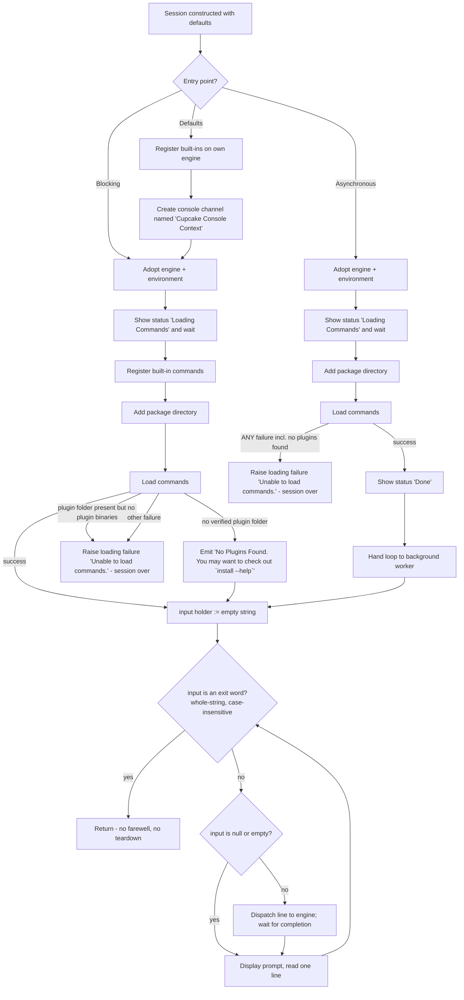

# Feature: Interactive Shell Session

> Subject repo: `/mnt/g/reversing/reversing/subject/Xcaciv.Cupcake` @ `a05dc6f00d4510ac073f6dd02fbfba2ffb76a5b6`.
> In-repo citations are repo-relative. Citations prefixed `OUT-OF-REPO:` come from a read-only reference clone of the external command framework at tag v2.1.2 and describe *framework* semantics the shell depends on, not shell code.
> Terminology map (term used here → product term in the glossary): session → **Session**; presentation channel → **Interaction Context**, whose shell-side implementation is the **Presentation Adapter**; command engine → **Command Service**; environment store → **Session Variables**; package directory → **Plugin Directory**; loading failure → **Startup Load Failure**; "no plugins found" → **No Plugins Available**.

---

## Purpose — what user/business problem this solves; who uses it (actors/roles)

This feature is the shell itself: the read-eval-print session that turns a plain text-terminal process into an interactive command environment. It exists so that a person sitting at a terminal can type command lines one at a time, have each one executed by the pluggable command engine, see the results, and end the session with a word.

The session is deliberately a thin orchestrator. It owns only four things: **when commands get loaded**, **what the prompt looks like**, **when a typed line is dispatched versus ignored**, and **which words terminate the session**. Everything else — parsing the line, finding the command, running pipelines, rendering output, reading the keyboard — is delegated (`src/Xcaciv.Cupcake.Core/Loop.cs:32-68`).

Actors:

- **End user at a terminal** — the only human actor. Types command lines, reads output, types an exit word.
- **Host application / embedder** — a program that constructs a session, supplies a presentation channel, a command engine and an environment store, tunes the session settings, and starts it. The shipping executable is one such host (`src/Xcaciv.Cupcake.Lit/Program.cs:9-12`).
- **Automated test harness** — drives the session with substituted presentation/engine/environment doubles; the session never touches a real console, which is what makes it testable (`Xcaciv.Cupcake.Core.Tests/LoopTests.cs:126-152`).

Non-goals of this feature (documented elsewhere): rendering and keyboard reading, plugin discovery, the package search/install commands, the registry client, packaging and distribution, and the command-authoring contract.

---

## Behavior — what it does, as observable behavior; every distinct operation the feature supports

### Operation 1 — Start a blocking session

**Inputs:** a presentation channel (something that can display a status line, emit an output chunk, and prompt for a line of input), a command engine, an environment store. Session settings are read from the session object itself.

**Observable sequence** (`src/Xcaciv.Cupcake.Core/Loop.cs:32-68`):

1. The supplied command engine and environment store are adopted as the session's current engine/environment and become externally readable (`Loop.cs:34-35`).
2. The status line `Loading Commands` is displayed and the session **waits for that display to finish** before proceeding (`Loop.cs:37`).
3. Built-in commands are registered with the engine (`Loop.cs:41`).
4. The configured package directory is handed to the engine as a place to look for plugins (`Loop.cs:42`).
5. The engine is told to load commands (`Loop.cs:43`).
6. If loading reports the specific *no verified plugin folder* condition, the session emits one output chunk with the literal text ``No Plugins Found. You may want to check out `install --help` `` and **continues into the loop anyway** (`Loop.cs:45-50`). The tolerant handler is keyed to that **one** condition and no other (`Loop.cs:45`); the framework's second, unrelated "nothing found" condition — plugin folder present but holding no plugin binaries — is *not* tolerated and is fatal (see R26).
7. Any other loading failure aborts the whole session by raising a *loading failure* carrying the message `Unable to load commands.` and the original failure as its cause (`Loop.cs:51-54`).
8. The read-eval-print loop runs (see *Workflows & states*).
9. When an exit word is entered, the operation simply returns. No goodbye message, no cleanup, no completion signal to the presentation channel (`Loop.cs:66-68`).

**Side effects:** engine gains built-in commands and a package directory; commands loaded from disk; status and output text emitted; environment store mutated by whatever commands the user runs.

**Blocking character:** every asynchronous step is waited on synchronously, including the prompt-for-input step. The calling thread is occupied for the entire session (`Loop.cs:37,62,65`).

### Operation 2 — Start an asynchronous session

**Inputs:** identical to Operation 1.

**Observable sequence** (`src/Xcaciv.Cupcake.Core/Loop.cs:70-103`):

1. Engine and environment store are adopted (`Loop.cs:72-73`).
2. Status line `Loading Commands` displayed (`Loop.cs:75`).
3. **Built-in commands are NOT registered.** The session goes straight to the package directory (`Loop.cs:79`).
4. Package directory handed to the engine (`Loop.cs:79`); commands loaded (`Loop.cs:80`).
5. **Any** loading failure — *including* "no plugins found" — aborts the session with a *loading failure* carrying `Unable to load commands.` (`Loop.cs:82-85`). There is no tolerant path and no `No Plugins Found…` message here.
6. Status line `Done` displayed (`Loop.cs:87`). The blocking entry point never displays this.
7. The read-eval-print loop is started on a **separate background worker**; the caller's handle completes only when the loop ends (`Loop.cs:89-101`).

### Operation 3 — Start with defaults (convenience)

**Inputs:** none.

**Observable sequence** (`src/Xcaciv.Cupcake.Core/Loop.cs:105-112`):

1. Built-in commands are registered on the session's **own default engine** (`Loop.cs:108`).
2. A console presentation channel is created, named `Cupcake Console Context`, with an empty parameter list (`Loop.cs:110`).
3. Operation 1 (blocking session) is invoked with that channel, the session's own engine, and the session's own environment store (`Loop.cs:110`).
4. The session object itself is returned to the caller, allowing fluent chaining (`Loop.cs:111`).

Because Operation 1 registers built-ins again (`Loop.cs:41`), built-in registration happens **twice** on this path. Re-registration is idempotent — a later registration of the same command name overwrites the earlier entry rather than erroring (OUT-OF-REPO: `src/Xcaciv.Command/CommandRegistry.cs:20-36` (framework v2.1.2)).

### Operation 4 — Dispatch one entered line

For a non-empty entered line, the line is handed verbatim to the command engine together with the presentation channel and the environment store, and the session waits for it to finish before prompting again (`Loop.cs:62`, `Loop.cs:94`). The session performs **no** parsing, trimming, casing, history, completion, or aliasing of its own.

### Operation 5 — End the session

Typing any exit word terminates the loop. See *Business rules* for exact matching. The blocking entry returns to its caller and the shipping executable's guarded block simply ends (`src/Xcaciv.Cupcake.Lit/Program.cs:7-13`). INFERRED: the process then ends with status `0` — no success-path exit status is written anywhere in the repository; the only explicit status is the `1` on the failure path (`src/Xcaciv.Cupcake.Lit/Program.cs:18`).

### Operation 6 — Read the current engine / environment

After a session has started, the engine and environment store in use are readable from the session object (`Loop.cs:25-26`, set at `Loop.cs:34-35` and `Loop.cs:72-73`). Before any session starts, they hold freshly-created defaults. The tests assert both are non-null after a session ends (`Xcaciv.Cupcake.Core.Tests/LoopTests.cs:136-137`, `:150-151`).

---

## Business rules & edge cases

### Session settings and their defaults

| Setting | Type (generic) | Default (exact literal) | Read by | Evidence |
|---|---|---|---|---|
| Install-command enabled | boolean | `true` | **nothing** | `src/Xcaciv.Cupcake.Core/Loop.cs:11` |
| Prompt string | text | `Ɛ> ` — U+0190 LATIN CAPITAL LETTER OPEN E, then `>`, then one trailing space (3 characters) | both session entry points | `src/Xcaciv.Cupcake.Core/Loop.cs:16` |
| Exit words | ordered list of text | `END`, `EXIT`, `BYEE` (three entries, that order, all upper-case; note `BYEE` has a doubled final E) | both session entry points | `src/Xcaciv.Cupcake.Core/Loop.cs:20` |
| Package directory | text (filesystem path) | `.\packages` — literal, backslash separator, relative to the process working directory | both session entry points | `src/Xcaciv.Cupcake.Core/Loop.cs:24` |
| Current command engine | engine handle | a freshly constructed default engine | externally readable only | `src/Xcaciv.Cupcake.Core/Loop.cs:25` |
| Current environment store | environment handle | a freshly constructed empty environment store | externally readable only | `src/Xcaciv.Cupcake.Core/Loop.cs:26` |

**R1 — Every setting is mutable before the session starts, and none are re-read after startup except the prompt and the exit list.** The prompt and exit list are re-read on *every* loop iteration (`Loop.cs:57,65,91,96`), so a command that mutated them mid-session would take effect on the next iteration. The package directory is read exactly once, during startup (`Loop.cs:42,79`).

**R2 — QUIRK: the "install-command enabled" flag is exposed, defaults to `true`, is asserted by a test, and is never read by any code in the repository.** A repo-wide search finds it only at its declaration (`src/Xcaciv.Cupcake.Core/Loop.cs:11`) and in the defaults test (`Xcaciv.Cupcake.Core.Tests/LoopTests.cs:158`). Setting it to `false` does not disable, hide, or gate the install command in any way. A reimplementer should reproduce the exposed setting (a test depends on its default) but must not expect it to change behavior. Historical note: the same commit that produced the current file deleted three sibling security settings for being unused but left this one in place (`git show 907c535` — removed certificate-validation, allowed-thumbprint-list and package-signature-verification settings).

### Loop ordering

**R3 — The loop is a "check-then-run-then-read" cycle, and the very first check runs against an empty seed value.** The input holder is seeded with the empty string before the loop is entered (`Loop.cs:56`, `Loop.cs:90`). The loop's continue-condition is evaluated first, then the dispatch step, then the prompt step (`Loop.cs:57-66`, `Loop.cs:91-100`).

**R4 — On the very first iteration, before any input exists, nothing is dispatched and the user is prompted immediately.** The empty seed is not an exit word, so the loop is entered; the emptiness guard suppresses dispatch; the prompt is displayed (`Loop.cs:56-65`). Net observable effect of startup: status line(s), then the prompt.

**R5 — A blank line is silently ignored and the prompt is redisplayed.** An entered value that is null or the empty string skips dispatch entirely; no output, no error, no "unknown command" message (`Loop.cs:60`, `Loop.cs:94`).

**R6 — QUIRK: "blank" means *empty*, not *whitespace-only*.** The guard tests for null-or-empty, not null-or-whitespace (`Loop.cs:60`, `Loop.cs:94`). A line containing only spaces or tabs is therefore **dispatched as a command**. INFERRED consequence, from framework semantics: the engine reduces such a line to an empty command name (OUT-OF-REPO: `src/Xcaciv.Command.Interface/CommandDescription.cs:52-64` (framework v2.1.2)), finds no match, and the user sees `Command [] not found. Try 'HELP'` (OUT-OF-REPO: `src/Xcaciv.Command/CommandExecutor.cs:84-85` (framework v2.1.2); help-command name defaults to `HELP` at OUT-OF-REPO: `src/Xcaciv.Command/CommandExecutor.cs:27` (framework v2.1.2)).

**R7 — Exit matching is a whole-string, case-insensitive, ordinal equality test against the exit list.** The check is a membership test over the exit list using an ordinal case-insensitive comparer (`Loop.cs:57`, `Loop.cs:91`). Therefore:
- `end`, `End`, `eNd`, `END` all exit.
- `exit`, `EXIT`, `byee`, `BYEE` all exit.
- `bye` does **not** exit (the list entry is `BYEE`, and matching is exact, not prefix).
- `end now`, `endd`, `en` do **not** exit.
- `END ` with a trailing space does **not** exit — there is no trimming anywhere in the session (`Loop.cs:57,65`). QUIRK for terminal users who type a trailing space.
- Matching is *ordinal*, i.e. byte-for-byte after case folding; no culture-sensitive or accent-insensitive equivalence.

**R8 — An exit word is NEVER dispatched as a command.** Because the entered value is read at the *bottom* of an iteration (`Loop.cs:65`, `Loop.cs:96`) and the continue-condition is evaluated at the *top* of the next one (`Loop.cs:57`, `Loop.cs:91`), the loop terminates before reaching the dispatch step. A plugin that registered a command literally named `END`, `EXIT` or `BYEE` could never be invoked by typing its bare name from this shell.

**R9 — Dispatch is strictly serial and fully awaited.** The next prompt is not displayed until the previous command has completely finished (`Loop.cs:62`, `Loop.cs:94`). There is no background execution, no job control, no way to interleave two commands.

**R10 — The entered line is passed to the engine byte-for-byte, unmodified.** No trimming, case normalisation, expansion or rewriting is performed by the session (`Loop.cs:62`, `Loop.cs:94`).

**R25 — QUIRK: the two entry points do not report the same failure the same way.** The blocking entry obtains the result of dispatch and of the prompt by *synchronously waiting* on them (`Loop.cs:62`, `Loop.cs:65`), while the asynchronous entry awaits them (`Loop.cs:94`, `Loop.cs:96`). INFERRED, from the runtime semantics of blocking on an asynchronous result: a failure that escapes a command or the presentation channel reaches the host **wrapped in a generic aggregate wrapper** on the blocking path — so the shipping executable prints `Error One or more errors occurred. (<original message>)` rather than the original message — but reaches the host unwrapped on the asynchronous path. Not exercised by any test. A reimplementer should surface the original failure on both paths.

### Startup divergence between the two entry points

**R11 — The blocking entry registers built-in commands; the asynchronous entry does not.** Compare `Loop.cs:41` (present) with `Loop.cs:77-81` (absent). Consequence: a session started asynchronously has **no** built-in commands unless the host registered them beforehand.

**R12 — The blocking entry tolerates "no plugins found"; the asynchronous entry does not.** The blocking entry has a dedicated tolerant handler that prints guidance and proceeds (`Loop.cs:45-50`); the asynchronous entry has only the catch-all that converts every failure into a fatal loading failure (`Loop.cs:82-85`). Because the framework raises "no plugins found" whenever *zero* package directories were successfully registered (OUT-OF-REPO: `src/Xcaciv.Command/CommandLoader.cs:42-45` (framework v2.1.2)), and directory registration silently fails when the directory does not exist (OUT-OF-REPO: `src/Xcaciv.Command.FileLoader/VerifiedSourceDirectories.cs:82-89` (framework v2.1.2)), this is the *normal* first-run condition: a fresh install with no `packages` folder. Blocking start therefore survives a fresh install; asynchronous start dies on it. This tolerance covers **only** that condition — see R26 for the folder-exists-but-empty case, which is fatal on both entries.

**R26 — QUIRK: an *existing but empty* plugin folder kills the blocking session, while a *missing* one does not.** The framework has **two** unrelated "nothing found" signals, and the tolerant handler names only the first (`Loop.cs:45`):
- *No verified plugin folder* — raised when zero folders survived verification, i.e. the folder is absent or outside the restricted root (OUT-OF-REPO: `src/Xcaciv.Command/CommandLoader.cs:42-45` (framework v2.1.2), carrying the message `No base package directory configured. (Did you set the restricted directory?)`). **Tolerated** → guidance text, session continues.
- *No plugin binaries* — raised when a verified folder is scanned and no file matches the plugin layout `<plugin folder>/*/bin/*.dll` (OUT-OF-REPO: `src/Xcaciv.Command.FileLoader/Crawler.cs:176-180` (framework v2.1.2), carrying the message `No packages found in <full path>.`; the two signals are sibling types, neither derived from the other — OUT-OF-REPO: `src/Xcaciv.Command.Interface/Exceptions/NoPluginsFoundException.cs:3`, `src/Xcaciv.Command.Interface/Exceptions/NoPackageDirectoryFoundException.cs:3` (framework v2.1.2)). **Not tolerated** → falls into the catch-all (`Loop.cs:51-54`), becomes a fatal loading failure, and in the shipping executable ends the process with status `1`.

The user-visible consequence is inverted from expectation: doing *less* setup (no plugin folder at all) yields the friendly guidance and a working shell, while doing *some* setup (creating an empty `packages` folder) crashes startup. INFERRED as a chain of two framework behaviours; not exercised by any test in the repository.

**R27 — QUIRK: the guidance text tells the user to run something that cannot resolve.** The tolerant path prints ``No Plugins Found. You may want to check out `install --help` `` (`Loop.cs:47`), but the shipping executable registers the install command under a command group, so it is reachable only as `PACKAGE INSTALL` (`src/Xcaciv.Command.Packages/InstallCommand.cs:14-15`; grouping semantics OUT-OF-REPO: `src/Xcaciv.Command/CommandRegistry.cs:20-36` (framework v2.1.2)). INFERRED: typing `install --help` at the prompt therefore produces `Command [INSTALL] not found. Try 'HELP'` (OUT-OF-REPO: `src/Xcaciv.Command/CommandExecutor.cs:84-85` (framework v2.1.2)). The guidance is not actionable as written; a reimplementer should either reproduce the text verbatim as observed or fix it deliberately, but must not assume it works.

**R28 — A plugin that fails to load does *not* abort startup.** Per-plugin failures — security violation, missing file, unreadable or wrong-architecture binary, or any other error — are absorbed by the framework's scanner, written to the diagnostic trace and the plugin skipped; a plugin contributing no valid commands is dropped (OUT-OF-REPO: `src/Xcaciv.Command.FileLoader/Crawler.cs:125-156` (framework v2.1.2)). Nothing reaches the session, so neither entry point sees a failure and no message reaches the user. Only the two whole-scan conditions of R26 (and an outright engine error) can end startup.

**R13 — Only the asynchronous entry emits the `Done` status line** (`Loop.cs:87`); the blocking entry emits `Loading Commands` (`Loop.cs:37`) and nothing else.

**R14 — Only the asynchronous entry moves the loop off the caller's thread** (`Loop.cs:89-101`). The blocking entry occupies the calling thread for the session's lifetime.

**R15 — Both entries emit `Loading Commands` as the very first observable act, before any registration or loading, and wait for it to be displayed** (`Loop.cs:37`, `Loop.cs:75`).

**R16 — Both entries adopt the supplied engine and environment store *before* anything can fail**, so they are observable even after a fatal loading failure (`Loop.cs:34-35`, `Loop.cs:72-73`).

**R17 — The tolerant "no plugins" handler in the blocking entry also covers the built-in registration and directory-registration steps**, because all three startup calls sit inside one guarded block (`Loop.cs:39-50`). INFERRED: if built-in registration itself signalled "no plugins found", it would be swallowed the same way and the session would start with no commands at all.

**R18 — Built-in registration precedes plugin loading in the blocking entry** (`Loop.cs:41` before `Loop.cs:43`). Consequence: when plugin loading fails tolerantly, the built-in vocabulary is already in place, so the session is still usable.

**R29 — The first status display sits *outside* the guarded startup block on both entries** (`Loop.cs:37` and `Loop.cs:75`, both before the guarded block that starts at `Loop.cs:39` / `Loop.cs:77`). A failure while showing that status is therefore not converted into a loading failure; it escapes the session raw and, in the shipping executable, ends the process with status `1`.

### Convenience entry

**R19 — The defaults entry names its presentation channel `Cupcake Console Context` and gives it an empty parameter list** (`Loop.cs:110`).

**R20 — The defaults entry returns the session object itself**, enabling `construct → configure → start → keep handle` chaining (`Loop.cs:111`).

**R30 — Status lines are actually rendered on the defaults path only because status visibility defaults to on.** The defaults entry constructs the presentation channel without specifying visibility (`Loop.cs:110`), and the console channel's visibility setting defaults to on (`src/Xcaciv.Cupcake.Core/ConsoleContext.cs:13,31`); with it off, status text goes to the platform debug trace instead of the terminal and the user sees no `Loading Commands` line at all (`src/Xcaciv.Cupcake.Core/ConsoleContext.cs:90-96`). A host that supplies its own channel decides this for itself.

**R21 — QUIRK: built-in commands are registered twice on the defaults path** — once explicitly (`Loop.cs:108`) and again inside the blocking entry (`Loop.cs:41`). Harmless in the observed framework because re-registration overwrites (OUT-OF-REPO: `src/Xcaciv.Command/CommandRegistry.cs:20-36` (framework v2.1.2)), but a reimplementation whose registry rejects duplicates would break here.

### Session teardown

**R22 — QUIRK: the session never signals completion to, disposes, or otherwise tears down the presentation channel or the environment store.** The blocking loop simply falls out (`Loop.cs:66-68`); the asynchronous loop's worker just ends (`Loop.cs:100-101`). Any buffered output the presentation channel holds is left uncompleted by the session; the framework completes only the short-lived per-command child channels, and does so by disposing them at the end of the dispatch (OUT-OF-REPO: `src/Xcaciv.Command/CommandController.cs:244-245`, whose disposal calls the completion step at `src/Xcaciv.Command.Core/AbstractTextIo.cs:143-155` (framework v2.1.2)).

### Path and platform

**R23 — The default package directory uses a Windows-style separator, `.\packages`** (`Loop.cs:24`). On a platform where `\` is not a path separator this resolves to a single filesystem entry literally named `.\packages` in the working directory, which will not exist, which makes R12's "no plugins found" the guaranteed outcome. INFERRED, from the literal plus framework path handling (OUT-OF-REPO: `src/Xcaciv.Command.FileLoader/VerifiedSourceDirectories.cs:100-115` (framework v2.1.2)). A reimplementer on a POSIX platform should use the platform separator.

**R24 — The directory is resolved relative to the process working directory, not to the executable's own directory.** INFERRED from the leading `.` in the literal (`Loop.cs:24`) plus the framework's use of the current working directory as the default restricted root: the shell never sets a restricted root, the framework's own default for it is empty, and an empty root is resolved to the process working directory (OUT-OF-REPO: `src/Xcaciv.Command.FileLoader/VerifiedSourceDirectories.cs:17,36-39,105` (framework v2.1.2)). Consequence: launching the shell from a different folder changes which plugins load.

**R31 — QUIRK: the Release profile of the shipping executable changes platform, not just optimisation.** The default build is a cross-platform console program on the current runtime (`src/Xcaciv.Cupcake.Lit/Xcaciv.Cupcake.Lit.csproj:3-8`); the Release profile switches the output kind to a **windowed** subsystem, retargets an older Windows-only runtime, and publishes a self-contained, single-file, trimmed `win-x64` binary (`src/Xcaciv.Cupcake.Lit/Xcaciv.Cupcake.Lit.csproj:10-23`). INFERRED: a windowed-subsystem process gets no console attached, so the prompt, status lines and command output of the Release build have nowhere to go — the interactive session as documented here is observable only in the default build. Not exercised: nothing in the repository builds or runs the Release profile.

### Magic values, with meaning

| Value | Meaning | Evidence |
|---|---|---|
| `Ɛ> ` | the prompt; the leading glyph is the stylised shell mark, the trailing space separates it from typed input | `src/Xcaciv.Cupcake.Core/Loop.cs:16` |
| `END`, `EXIT`, `BYEE` | the complete exit vocabulary; three words, case-insensitive, whole-string | `src/Xcaciv.Cupcake.Core/Loop.cs:20` |
| `.\packages` | root folder scanned for plugin packages | `src/Xcaciv.Cupcake.Core/Loop.cs:24` |
| `Loading Commands` | status shown during startup by both entry points | `src/Xcaciv.Cupcake.Core/Loop.cs:37,75` |
| `Done` | status shown after successful load — asynchronous entry only | `src/Xcaciv.Cupcake.Core/Loop.cs:87` |
| ``No Plugins Found. You may want to check out `install --help` `` | tolerant first-run guidance — blocking entry only; note the backtick-quoted command name | `src/Xcaciv.Cupcake.Core/Loop.cs:47` |
| `Unable to load commands.` | message on the fatal loading failure raised by both entries | `src/Xcaciv.Cupcake.Core/Loop.cs:53,84` |
| `Cupcake Console Context` | name given to the presentation channel created by the defaults entry | `src/Xcaciv.Cupcake.Core/Loop.cs:110` |
| `Error ` + the failure's message | the single crash line the shipping executable writes — QUIRK: to **standard output**, not an error stream, so redirecting output swallows the diagnosis | `src/Xcaciv.Cupcake.Lit/Program.cs:16` |
| `1` | process exit status when the shipping executable's session dies | `src/Xcaciv.Cupcake.Lit/Program.cs:18` |
| `bin` | (framework default) sub-folder inside each package folder actually scanned for command binaries — the shell never overrides it | OUT-OF-REPO: `src/Xcaciv.Command.Interface/ICommandController.cs:29` and `src/Xcaciv.Command/CommandController.cs:169` (framework v2.1.2) |
| `No base package directory configured. (Did you set the restricted directory?)` | (framework) the message carried by the *tolerated* "no verified plugin folder" condition; never shown to the user, because the tolerant handler prints its own text and discards the cause | OUT-OF-REPO: `src/Xcaciv.Command/CommandLoader.cs:44` (framework v2.1.2) |
| `No packages found in <full path>.` | (framework) the message carried by the *fatal* "no plugin binaries" condition (R26); becomes the discarded cause of `Unable to load commands.` | OUT-OF-REPO: `src/Xcaciv.Command.FileLoader/Crawler.cs:180` (framework v2.1.2) |
| `Error executing <NAME> (see trace for more info)` and status `**Error: <message>` | (framework) what the user sees when a dispatched command throws; the session is not interrupted | OUT-OF-REPO: `src/Xcaciv.Command/CommandExecutor.cs:228-229` (framework v2.1.2) |
| `*/bin/*.dll` | (framework) the plugin layout searched under the package directory, recursively | OUT-OF-REPO: `src/Xcaciv.Command.FileLoader/Crawler.cs:20,176-178` (framework v2.1.2) |

---

## Workflows & states

### Startup + loop, both entry points

### States

| State | Entered when | Left when |
|---|---|---|
| **Constructed** | session object created; defaults in place; default engine and environment store exist | an entry point is called |
| **Loading** | an entry point begins; `Loading Commands` shown | loading succeeds, is tolerated, or fails fatally |
| **Degraded-ready** | blocking entry only; **no plugin folder survived verification** (not merely "no plugins"); guidance emitted | immediately transitions into Awaiting input |
| **Awaiting input** | prompt displayed, waiting on one line | a line is returned by the presentation channel |
| **Executing** | a non-blank, non-exit line was entered | the engine finishes the line (success or handled error) |
| **Ended** | an exit word matched at the top of an iteration | terminal — control returns to the host |
| **Failed to start** | non-tolerated loading failure | terminal — loading failure propagates to the host |

There are **no timeouts** anywhere in the session: waiting for input, and waiting for a command to finish, are both unbounded (`Loop.cs:62,65,94,96`).

### Host-level flow for the shipping executable

1. Construct a session with all defaults (`src/Xcaciv.Cupcake.Lit/Program.cs:9`).
2. Register the package-install command on the session's engine under package key `internal` (`Program.cs:10`).
3. Register the package-search command on the session's engine under package key `internal` (`Program.cs:11`).
4. Start via the defaults entry (`Program.cs:12`).
5. On normal return, the guarded block ends; INFERRED, the process terminates with status `0` — no success-path exit status is written anywhere (`Program.cs:12-13`).
6. On any failure escaping the session, print `Error ` followed by the failure's message to **standard output**, then terminate the process with status `1` (`Program.cs:14-19`). QUIRK: the crash line goes to standard output rather than an error stream, and the wrapped cause is never printed (see *Error handling*).

QUIRK — at the pinned commit this host flow cannot actually be built or run, for two independent reasons, so every statement about the shipping executable in this dossier is derived from the source rather than from an observed run:
- The package-command source the host registers at steps 2-3 does not compile: an identifier used five times in the package-search command has no declaration (`src/Xcaciv.Command.Packages/SearchCommand.cs:66,69,72,81,85` — no declaring statement anywhere in the file).
- Dependency restore fails for every project: the package source that claims all `Xcaciv.*` packages is an unexpanded environment token, and the framework packages are not on the public feed (`NuGet.config:5-20`).

---

## Data

The session owns one entity.

**Session** — created by the host, lives for the duration of one interactive session, discarded afterwards. Never persisted; no serialisation format; nothing is written to disk by this feature.

| Field | Type (generic) | Constraints / notes | Lifecycle |
|---|---|---|---|
| Install-command enabled | boolean | default `true`; **never read** (R2) | set at construction, freely mutable, no effect |
| Prompt string | text | default `Ɛ> `; no length/charset validation; may be set to empty (a test only asserts the *default* is non-empty) | read once per loop iteration |
| Exit words | mutable ordered list of text | default `[END, EXIT, BYEE]`; may be emptied (making the session unexitable by word) or extended; entries compared whole-string, case-insensitively | read once per loop iteration |
| Package directory | text | default `.\packages`; no existence check by the session | read once, during startup |
| Current command engine | engine handle | externally readable, internally assignable; initialised to a default engine at construction; replaced by the engine passed to an entry point | replaced at the first statement of either session entry |
| Current environment store | environment handle | externally readable, internally assignable; initialised to a fresh empty store at construction; replaced by the store passed to an entry point | replaced at the first statement of either session entry |

Evidence for all rows: `src/Xcaciv.Cupcake.Core/Loop.cs:11-26`, `:34-35`, `:72-73`. Default-value assertions: `Xcaciv.Cupcake.Core.Tests/LoopTests.cs:154-162`.

**Transient loop state** — one text value holding the most recently entered line, seeded to the empty string and overwritten once per iteration (`Loop.cs:56,65,90,96`). Not exposed; no history is kept, so the previous line is unrecoverable once the next is read.

**Loading failure** — a failure signal carrying a human-readable message and, optionally, the underlying failure that caused it (`src/Xcaciv.Cupcake.Core/Exceptions/LoadingException.cs:4-13`). Created only during startup; never caught inside this feature.

Relationships: a Session *has one* current engine and *has one* current environment store; neither is owned (both are supplied by the host and outlive the session).

---

## Interfaces

### Consumed — presentation channel (feature: *Console Presentation & Interaction*)

The session requires a presentation channel supporting, at minimum:

- **Display a status line** — takes one text message, completes when displayed. Used for `Loading Commands` and `Done` (`Loop.cs:37,75,87`).
- **Emit an output chunk** — takes one text message, completes when emitted. Used only for the no-plugins guidance (`Loop.cs:47`).
- **Prompt for one command line** — takes the prompt text, displays it, and yields exactly one entered line. This is the session's only input source (`Loop.cs:65,96`). The concrete console implementation writes the prompt without a trailing newline and reads one line, substituting the empty string when input yields nothing (`src/Xcaciv.Cupcake.Core/ConsoleContext.cs:66-72`).

The full member surface the shell's ecosystem expects of a presentation channel is directly observable in the repository's hand-written double (`Xcaciv.Cupcake.Core.Tests/LoopTests.cs:8-65`): identity, name, interactive flag, piped-input flag, pipeline stage/total, parent identity, parameter list with a setter, child-channel factory, output-chunk handling, prompt, input/output pipe wiring (channel- and stream-shaped), output-encoder wiring, pipeline-stage setter, piped-input enumeration, status message, trace message, progress reporting, completion with optional final message, and asynchronous disposal.

The session uses **only** the three members listed above and never the console directly — which is exactly why substituting a double is sufficient to drive a whole session in a test.

### Consumed — command engine (features: *Plugin Discovery & Command Registration*, *Command Extensibility Contract*)

Required capabilities, with semantics established from the framework:

- **Register built-in commands** — installs the framework's default vocabulary (`Loop.cs:41,108`). Observed default set: a regular-expression filter, an echo-like command, an environment-set command flagged as environment-modifying, and an environment-dump command, all under package key `Default` (OUT-OF-REPO: `src/Xcaciv.Command/CommandController.cs:177-185` (framework v2.1.2)); their declared names are `REGIF`, `Say`, `Set`, `ENV` (OUT-OF-REPO: `src/Xcaciv.Command/Commands/RegifCommand.cs:13`, `SayCommand.cs:13`, `SetCommand.cs:12`, `EnvCommand.cs:12` (framework v2.1.2)). The declared casing is cosmetic: a name is upper-cased both when it is registered and when a typed line is resolved, so invocation is case-insensitive (OUT-OF-REPO: `src/Xcaciv.Command.Interface/CommandDescription.cs:27,52-64` (framework v2.1.2)).
- **Add a package directory** — records a folder to scan. Semantics: the folder is verified to exist and to sit under the restricted root, and is **silently skipped when it does not** — the add call simply reports false and the caller discards the answer (OUT-OF-REPO: `src/Xcaciv.Command.FileLoader/VerifiedSourceDirectories.cs:66-89` (framework v2.1.2)). No signal reaches the shell, so a mistyped or mislocated package directory is indistinguishable from a missing one. The shell never sets a restricted root, so it is the process working directory (OUT-OF-REPO: `src/Xcaciv.Command.FileLoader/VerifiedSourceDirectories.cs:17,36-39,105` (framework v2.1.2)).
- **Load commands** — scans each registered folder for plugin binaries at `<folder>/*/bin/*.dll`, recursively, and registers every command found (OUT-OF-REPO: `src/Xcaciv.Command.FileLoader/Crawler.cs:20,171-190` (framework v2.1.2)). Two distinct "nothing found" signals exist and the shell treats them differently (R26): *no verified plugin folder*, raised when zero folders were registered (OUT-OF-REPO: `src/Xcaciv.Command/CommandLoader.cs:38-55` (framework v2.1.2)) — tolerated by the blocking entry; and *no plugin binaries*, raised when a registered folder yields no matching file (OUT-OF-REPO: `src/Xcaciv.Command.FileLoader/Crawler.cs:176-180` (framework v2.1.2)) — fatal on both entries. A per-plugin load failure is neither: it is absorbed and traced, and that plugin is skipped (OUT-OF-REPO: `src/Xcaciv.Command.FileLoader/Crawler.cs:125-156` (framework v2.1.2)). Scanning switches to parallel processing above 50 discovered files (OUT-OF-REPO: `src/Xcaciv.Command.FileLoader/Crawler.cs:18,183-186` (framework v2.1.2)).
- **Run a command line** — parses and executes one line against the given presentation channel and environment store. Semantics observed: the choice between the pipeline path and the single-command path is a **naive search for the delimiter character** `|` anywhere in the line — quoted and backslash-escaped occurrences included — after which the pipeline parser splits only on unquoted, unescaped delimiters and trims empty segments (OUT-OF-REPO: `src/Xcaciv.Command/CommandController.cs:234-246`, `src/Xcaciv.Command/PipelineParser.cs:24-63`, `src/Xcaciv.Command.Interface/CommandSyntax.cs:9-12` (framework v2.1.2)). On the single-command path arguments are extracted, attached to the channel, and a short-lived child channel is created for the command (OUT-OF-REPO: `src/Xcaciv.Command/CommandController.cs:240-245` (framework v2.1.2)). Command name = first whitespace-delimited token, hyphen-trimmed, stripped of characters outside letters/digits/hyphen/underscore/space, upper-cased (OUT-OF-REPO: `src/Xcaciv.Command.Interface/CommandDescription.cs:52-64` (framework v2.1.2)). Any argument equal to `--HELP`, `-?` or `/?` (case-insensitive) turns the invocation into a help request (OUT-OF-REPO: `src/Xcaciv.Command/HelpService.cs:165-175` (framework v2.1.2)). An unmatched name produces `Command [NAME] not found. Try 'HELP'`; the bare name `HELP` lists every registered command (OUT-OF-REPO: `src/Xcaciv.Command/CommandExecutor.cs:78-87` (framework v2.1.2)).
- **Register a single command instance under a package key** — used by the shipping executable to add the package-install and package-search commands under key `internal` (`src/Xcaciv.Cupcake.Lit/Program.cs:10-11`).

The engine surface the repository expects is enumerated in the hand-written double (`Xcaciv.Cupcake.Core.Tests/LoopTests.cs:67-82`): add package directory, register built-ins, load commands, run a line (with and without cancellation), set the presentation channel, list command names, produce help (blocking and asynchronous), and three shapes of single-command registration. NOTE: the double's load-commands member takes an optional *config path* argument (`LoopTests.cs:71`), whereas the framework reference at v2.1.2 declares an optional *sub-directory* argument defaulting to `bin` (OUT-OF-REPO: `src/Xcaciv.Command.Interface/ICommandController.cs:29` (framework v2.1.2)) — a version difference between the pinned 2.1.0 contract and the reference tag. The shell passes no argument either way (`Loop.cs:43,80`), so the difference is inert here.

### Consumed — environment store (feature: *Configuration & Settings*)

The session never reads or writes environment values itself. It only forwards the store into every dispatched command (`Loop.cs:62,94`) and exposes it for inspection (`Loop.cs:26`). Semantics observed: keys are upper-cased on **both read and write**, so lookups are effectively case-insensitive (OUT-OF-REPO: `src/Xcaciv.Command/EnvironmentContext.cs:71-74`, `:94-97` (framework v2.1.2)); reading a missing key with the default options **stores the supplied default under that key as a side effect**, so a mere read can add an entry a later environment dump will list (OUT-OF-REPO: `src/Xcaciv.Command/EnvironmentContext.cs:94-110` (framework v2.1.2)); each command runs against a *child* store whose changes are merged back only if the command was declared environment-modifying **and** the child actually changed (OUT-OF-REPO: `src/Xcaciv.Command/CommandExecutor.cs:187,216-219` (framework v2.1.2)).

### Exposed — to *Shell Distribution & Entry Points*

- Three ways to start a session: blocking, asynchronous, and defaults (`Loop.cs:32,70,105`).
- **Four** tunable settings, listed under *Data* — install-command-enabled, prompt, exit words, package directory — all freely settable before starting, and the prompt and exit words also settable during a session (R1).
- Two accessors that are read-only from outside: the engine and environment store actually in use. They are assigned only by the session itself, at the first statement of either entry point (`Loop.cs:25-26`, `:34-35`, `:72-73`), so a host cannot substitute either without going through an entry point.
- A fluent return from the defaults entry (`Loop.cs:111`).

### Exposed — to *Error Handling & Failure Reporting*

- A distinct **loading failure** signal, with message and optional underlying cause, raised from either session entry when startup cannot complete (`src/Xcaciv.Cupcake.Core/Exceptions/LoadingException.cs:4-13`, raised at `Loop.cs:53,84`).
- Every other failure escaping a session originates below the session (inside a command, the engine, or the presentation channel) and passes through untouched — the session installs no per-command guard.

### Exposed — to *Package Install Command* / *Package Search Command*

Nothing functional. The no-plugins guidance text names `install --help` (`Loop.cs:47`), creating a documentation-only coupling to the install command's name — and a broken one, because the command is reachable only as `PACKAGE INSTALL` (R27). The install-enabled setting is *not* an interface to those features (R2).

---

## External technology

| Generic capability | Protocol/standard if any | What the source used | Notes for reimplementer |
|---|---|---|---|
| Pluggable command framework: command registry, command-line parsing, `\|` pipelines, auto-generated help, plugin assembly loading, built-in command set, environment context | none (in-process library API) | `Xcaciv.Command` 2.1.1, `Xcaciv.Command.Core` 2.1.0, `Xcaciv.Command.Interface` 2.1.0, pinned centrally in `Directory.Packages.props:8-10` and `src/Directory.Packages.props:8-10`, referenced at `src/Xcaciv.Cupcake.Core/Xcaciv.Cupcake.Core.csproj` and `src/Xcaciv.Cupcake.Lit/Xcaciv.Cupcake.Lit.csproj` | **Not on the public package feed** — the flat-container index for the package returns HTTP 404, and the repository's own feed configuration maps every `Xcaciv.*` package to a source given as an unexpanded environment token, so restore fails for every project (`NuGet.config:5-20`). The reference source below could therefore only be read from the public repository at tag v2.1.2, one patch level above the pinned versions. Semantics documented above from the v2.1.2 source. A reimplementation must supply an equivalent engine with: name-first parsing (upper-cased, punctuation-stripped), `\|` pipelines with quote/escape awareness, `--HELP`/`-?`/`/?` help flags, a `HELP` command listing everything, a not-found message of the exact form `Command [NAME] not found. Try 'HELP'`, plugin loading from a `bin` sub-folder of each registered package folder, and — critically — **two separately distinguishable "nothing found" signals**: one for "no plugin folder survived verification" and a different one for "a verified folder held no plugin binaries", because the shell tolerates the first and dies on the second (R26). Per-plugin load failures must be absorbed and skipped, not raised. Default pipeline channel capacity is 10 000 items with blocking backpressure and no timeouts (OUT-OF-REPO: `src/Xcaciv.Command.Interface/PipelineConfiguration.cs:15-36` (framework v2.1.2)) |
| Managed runtime with async/await, thread pool, and synchronous blocking on async results | none | .NET 8 (`net8.0`) for all projects (`src/Xcaciv.Cupcake.Lit/Xcaciv.Cupcake.Lit.csproj:3-8`, `src/Xcaciv.Cupcake.Core/Xcaciv.Cupcake.Core.csproj:3-7`, `src/Xcaciv.Cupcake/Xcaciv.Cupcake.csproj:3-8`, `Xcaciv.Cupcake.Core.Tests/Xcaciv.Cupcake.Core.Tests.csproj:2-8`); the Release configuration of the shipping executable switches the output kind to a **windowed** subsystem and retargets `net6.0-windows` as a self-contained, single-file, trimmed, ready-to-run `win-x64` executable (`src/Xcaciv.Cupcake.Lit/Xcaciv.Cupcake.Lit.csproj:10-23`) — see R31 | Source used: C#. The session mixes both idioms deliberately — one entry point blocks on every async step, the other awaits. A reimplementation in a single-threaded language can collapse both to one synchronous loop, but must preserve the *behavioural* divergences (R11–R14), which are independent of concurrency |
| Interactive character terminal: write text, write without newline, read one line | ANSI/VT terminal conventions; 16-colour console attributes | System console with foreground/background colour attributes (`src/Xcaciv.Cupcake.Core/ConsoleContext.cs:55-72,98-101`) | Detailed in *Console Presentation & Interaction*. The session needs only: show a status line, show an output line, print a prompt without a newline and read one line back. Whether status lines are rendered at all is the presentation channel's decision, not the session's (R30). The prompt contains a non-ASCII character (U+0190) so the terminal must be UTF-8 capable, or the prompt will render as a substitution glyph |
| Local filesystem, read access to a plugin folder tree | none | Package folder path `.\packages` handed to the framework loader (`src/Xcaciv.Cupcake.Core/Loop.cs:24,42,79`) | The session only supplies a path string; existence checking, path-traversal restriction and assembly loading belong to the framework. Use the platform path separator, and decide explicitly whether the path resolves against the working directory (as observed) or the executable's directory |
| Unit-test runner with fact-style tests | none | xUnit 2.9.3 with the Visual Studio runner and a coverage collector (`Directory.Packages.props:14-17`) | Source used for the three session tests at `Xcaciv.Cupcake.Core.Tests/LoopTests.cs:126-162` |

---

## Error handling

| Failure mode | What the user/system observes | Evidence |
|---|---|---|
| No `packages` folder at all — i.e. no plugin folder survived verification (the fresh-install case) — **blocking entry** | Status `Loading Commands`, then one output line ``No Plugins Found. You may want to check out `install --help` ``, then a normal prompt. The session runs with built-in commands plus anything the host registered. QUIRK: the suggested `install --help` cannot resolve (R27). | `src/Xcaciv.Cupcake.Core/Loop.cs:45-50`; trigger semantics OUT-OF-REPO: `src/Xcaciv.Command/CommandLoader.cs:42-45`, `src/Xcaciv.Command.FileLoader/VerifiedSourceDirectories.cs:82-89` (framework v2.1.2) |
| No `packages` folder at all (the same fresh-install case) — **asynchronous entry** | Status `Loading Commands`, then the session aborts with a loading failure carrying `Unable to load commands.` and the "no verified plugin folder" signal as its cause. No prompt is ever shown; the `Done` status is never reached. | `src/Xcaciv.Cupcake.Core/Loop.cs:82-85` |
| `packages` folder exists but holds no plugin binaries in the scanned layout — **either entry** | QUIRK: **fatal.** Status `Loading Commands`, then the session aborts with a loading failure carrying `Unable to load commands.` and the framework's `No packages found in <full path>.` as its discarded cause. No prompt is shown. Creating the folder is therefore worse than not creating it (R26). INFERRED from the framework's two distinct signals. | `src/Xcaciv.Cupcake.Core/Loop.cs:45,51-54,82-85`; trigger OUT-OF-REPO: `src/Xcaciv.Command.FileLoader/Crawler.cs:176-180` (framework v2.1.2) |
| A single plugin binary is unreadable, wrong-architecture, or violates the loader's security policy | **Not a failure the session ever sees.** The framework traces it and skips that plugin; startup continues with whatever else loaded, and the user is told nothing. | OUT-OF-REPO: `src/Xcaciv.Command.FileLoader/Crawler.cs:125-156` (framework v2.1.2) |
| Any other loading failure (unreadable folder, engine error) — either entry | Session aborts with a loading failure carrying `Unable to load commands.`, wrapping the original failure. | `src/Xcaciv.Cupcake.Core/Loop.cs:51-54,82-85` |
| A loading failure escapes into the shipping executable | Console line `Error Unable to load commands.` (the word `Error`, one space, then the failure's message), then the process terminates with status `1`. The wrapped underlying cause is **not** printed — QUIRK: the actual diagnosis is discarded. QUIRK: the line is written to **standard output**, not an error stream, so a caller redirecting output loses the only diagnostic there is. | `src/Xcaciv.Cupcake.Lit/Program.cs:14-19` (write at `:16`, status at `:18`) |
| Unknown command typed | Handled entirely by the engine; the session sees no failure and prompts again. Observed message form: `Command [NAME] not found. Try 'HELP'`. | OUT-OF-REPO: `src/Xcaciv.Command/CommandExecutor.cs:84-85` (framework v2.1.2) |
| A command fails while executing | Handled entirely by the engine, which reports it through the presentation channel and returns normally; the session prompts again and the session continues. Observed texts: one output line `Error executing <NAME> (see trace for more info)` plus a status line `**Error: <message>`, with the detail sent to the diagnostic trace (OUT-OF-REPO: `src/Xcaciv.Command/CommandExecutor.cs:228-230` (framework v2.1.2)). QUIRK: **the session installs no guard of its own around dispatch** (`Loop.cs:62,94`), so any failure the engine does *not* absorb propagates out of the entire session and, in the shipping executable, ends the process with status `1` and the message `Error <text>` — losing the session. | `src/Xcaciv.Cupcake.Core/Loop.cs:62,94`; engine absorption OUT-OF-REPO: `src/Xcaciv.Command/CommandExecutor.cs:224-231` (framework v2.1.2) |
| Whitespace-only line entered | Dispatched (R6); user sees `Command [] not found. Try 'HELP'`. INFERRED. | `src/Xcaciv.Cupcake.Core/Loop.cs:60,94`; OUT-OF-REPO: `src/Xcaciv.Command/CommandExecutor.cs:84-85` (framework v2.1.2) |
| Presentation channel yields nothing (end of input / redirected input exhausted) | The concrete console channel converts "nothing" into the empty string (`ConsoleContext.cs:71`), so the loop treats it as a blank line and prompts again — **forever**. QUIRK: piping a finite input stream into the shell without a trailing exit word produces an infinite non-terminating prompt loop, because the session has no end-of-input concept. INFERRED for the redirected-input case. | `src/Xcaciv.Cupcake.Core/ConsoleContext.cs:71`; `src/Xcaciv.Cupcake.Core/Loop.cs:60-65` |
| Presentation channel yields a null value | Treated as blank (the emptiness guard covers null) and not an exit word; the loop reprompts. INFERRED — reachable only from a non-conforming channel. | `src/Xcaciv.Cupcake.Core/Loop.cs:60,94` |
| Exit-word list configured empty by the host | No word can ever end the session; only an unhandled failure or an external interrupt stops it. INFERRED from the membership test having no fallback (`Loop.cs:57,91`). | `src/Xcaciv.Cupcake.Core/Loop.cs:20,57,91` |
| A failure the engine does *not* absorb escapes dispatch — **blocking entry** | INFERRED: because the blocking entry waits synchronously on the dispatch result, the host receives a generic aggregate wrapper, so the shipping executable's crash line reads `Error One or more errors occurred. (<original message>)` rather than the original message. The asynchronous entry, which awaits, would surface the original (R25). | `src/Xcaciv.Cupcake.Core/Loop.cs:62` vs `:94` |
| User interrupts the terminal (Ctrl-C) | Not handled anywhere in this feature. No signal handler is installed; teardown is whatever the runtime does by default. | absence across `src/Xcaciv.Cupcake.Core/Loop.cs:1-113` and `src/Xcaciv.Cupcake.Lit/Program.cs:1-22` |

---

## Non-functional observations

- **Concurrency:** the loop is strictly single-threaded and serial. Exactly one command runs at a time; the prompt is not redisplayed until the previous command finishes (`Loop.cs:62-65`, `Loop.cs:94-96`). The asynchronous entry only moves that same serial loop onto a background worker (`Loop.cs:89-101`); it does not introduce parallelism.
- **Blocking-on-async:** the blocking entry synchronously waits on three asynchronous operations (`Loop.cs:37,62,65`). In runtimes with a single-threaded UI-style synchronisation context this pattern can deadlock; the shipping executable is a plain console program, where it does not. Called out because it is the stated design of the "Lit" variant (`src/Xcaciv.Cupcake.Lit/README.md`: "A light and syncronous implementation of Cupcake shell.").
- **No caching, no pagination, no batching** anywhere in this feature. Command loading happens exactly once per session; there is no reload command and no file watching (`Loop.cs:41-43,79-80`).
- **No permission or authorisation check** in the session. Every entered line is dispatched. Whatever restrictions exist (restricted plugin directories, path-traversal checks) live entirely in the engine.
- **No history, no completion, no editing.** The session keeps only the current line and discards it on the next read (`Loop.cs:65,96`). Any line editing is whatever the terminal itself provides.
- **No rate limiting, no idle timeout, no maximum session length.**
- **i18n:** all fixed strings — prompt, statuses, guidance, failure message — are hard-coded English/ASCII literals with no resource lookup (`Loop.cs:16,37,47,53,75,84,87`). The single non-ASCII character is the prompt glyph U+0190 (`Loop.cs:16`), which requires a UTF-8-capable terminal and font.
- **Accessibility:** the prompt's only distinguishing mark is an uncommon glyph plus colour (the console channel prints the prompt in green on black — `src/Xcaciv.Cupcake.Core/ConsoleContext.cs:29-30,68-70`). Screen readers and monochrome terminals get only the glyph. There is no textual status prefix distinguishing status lines from command output beyond colour.
- **Startup cost:** two filesystem-touching steps (`Loop.cs:42-43`), then the prompt. The status line exists precisely to cover that latency (`Loop.cs:37`).
- **Memory:** the session holds one text value plus its settings. Nothing accumulates across iterations.
- **Unfinished work markers observed in the session code:** downloading a first plugin and restarting startup (`Loop.cs:48`), handling a missing engine by download/compile (`Loop.cs:98`), and supporting a package-manager-style directory layout (`Loop.cs:99`). None of these is implemented. The tolerant handler also carries a **commented-out re-raise** of the no-plugins condition as a loading failure (`Loop.cs:49`), which is direct evidence that tolerating it is a deliberate, and recent, choice rather than an oversight. The shipping executable ends with a truncated, empty to-do list (`src/Xcaciv.Cupcake.Lit/Program.cs:21-22`).
- **Diagnostics:** the session emits no trace or log of its own. Everything a reimplementer might want for support — which plugin folder was skipped, which plugin failed to load, what the underlying cause of a loading failure was — is either discarded by the session (the wrapped cause, never printed) or written by the framework to a platform debug trace the shipping executable never surfaces.

---

## Acceptance criteria

1. **Given** a session constructed with no configuration, **when** its settings are read, **then** install-command-enabled is `true`, the prompt is a non-empty string equal to `Ɛ> `, the exit list is non-empty and equals `[END, EXIT, BYEE]`, and the package directory is a non-empty string equal to `.\packages`. (`Xcaciv.Cupcake.Core.Tests/LoopTests.cs:154-162`; `src/Xcaciv.Cupcake.Core/Loop.cs:11-24`)
2. **Given** a presentation channel whose prompt always returns `END`, **when** the blocking session entry is invoked, **then** the session returns promptly, no command line is ever dispatched to the engine, and the session's engine and environment store are both readable and non-null afterwards. (test: `Xcaciv.Cupcake.Core.Tests/LoopTests.cs:36,126-138`; non-dispatch of the exit word from `src/Xcaciv.Cupcake.Core/Loop.cs:57,60,65`)
3. **Given** the same channel, **when** the asynchronous session entry is invoked, **then** it completes with the same outcome. (`Xcaciv.Cupcake.Core.Tests/LoopTests.cs:140-152`)
4. **Given** a started blocking session whose plugins load successfully, **when** startup finishes, **then** the observable output is exactly the status line `Loading Commands` followed by the prompt `Ɛ> ` — no `Done` line, no other text. (`src/Xcaciv.Cupcake.Core/Loop.cs:37,56-65`)
5. **Given** a started asynchronous session with plugins that load successfully, **when** startup finishes, **then** the observable output is the status line `Loading Commands`, then the status line `Done`, then the prompt. (`src/Xcaciv.Cupcake.Core/Loop.cs:75,87,90-96`)
6. **Given** a working directory with no `packages` folder, **when** the blocking entry is invoked, **then** exactly one output line reading ``No Plugins Found. You may want to check out `install --help` `` appears and the session proceeds to a usable prompt with built-in commands registered. Note this holds only when the folder is *absent*; see criterion 17 for the folder-exists-but-empty case. (`src/Xcaciv.Cupcake.Core/Loop.cs:41,45-50`)
7. **Given** the same working directory, **when** the asynchronous entry is invoked, **then** no prompt is ever displayed, no `Done` status appears, and the caller receives a loading failure whose message is exactly `Unable to load commands.` with the "no verified plugin folder" condition as its cause. (`src/Xcaciv.Cupcake.Core/Loop.cs:79-85`)
8. **Given** a running session, **when** the user presses Enter on an empty line, **then** nothing is dispatched, no output of any kind appears, and the prompt is redisplayed. (`src/Xcaciv.Cupcake.Core/Loop.cs:60-65`)
9. **Given** a running session, **when** the user enters a line consisting only of spaces, **then** the line **is** dispatched and the user sees the engine's not-found response `Command [] not found. Try 'HELP'`. (`src/Xcaciv.Cupcake.Core/Loop.cs:60`; OUT-OF-REPO: `src/Xcaciv.Command/CommandExecutor.cs:84-85` (framework v2.1.2))
10. **Given** a running session, **when** the user enters `end`, `End`, `EXIT`, `exit`, `byee` or `BYEE`, **then** the session ends immediately and the entered word is **not** dispatched to the engine. (`src/Xcaciv.Cupcake.Core/Loop.cs:57,65,91,96`)
11. **Given** a running session, **when** the user enters `bye`, `END ` (with a trailing space), `endd`, or `exit now`, **then** the session does **not** end and the line is dispatched to the engine as an ordinary command. (`src/Xcaciv.Cupcake.Core/Loop.cs:57,60,91,94`)
12. **Given** a session whose install-command-enabled setting has been set to `false`, **when** the session runs, **then** behaviour is byte-for-byte identical to a session left at `true` — the package-install command remains registered and invocable. (`src/Xcaciv.Cupcake.Core/Loop.cs:11`; no read site exists anywhere in the repository)
13. **Given** a session started via the defaults entry, **when** it returns, **then** the returned value is the same session object that was started, and its engine is the engine the session created for itself (not a replacement). (`src/Xcaciv.Cupcake.Core/Loop.cs:105-112`)
14. **Given** the shipping executable launched from a directory where startup fails fatally, **when** it terminates, **then** standard output contains exactly one line beginning `Error ` followed by `Unable to load commands.`, and the process exit status is `1`. (`src/Xcaciv.Cupcake.Lit/Program.cs:14-19`)
15. **Given** the shipping executable launched normally, **when** the user types an exit word, **then** the session returns, no farewell message is printed, and — INFERRED, since no success-path exit status is written anywhere — the process terminates with status `0`. (`src/Xcaciv.Cupcake.Lit/Program.cs:7-13`; `src/Xcaciv.Cupcake.Core/Loop.cs:66-68`)
16. **Given** a running session, **when** the user enters two commands in succession, **then** the second command's execution begins only after the first has fully completed and its output has been emitted. (`src/Xcaciv.Cupcake.Core/Loop.cs:62-65`)
17. **Given** a working directory that *does* contain a `packages` folder but no plugin binary at `packages/*/bin/*.dll`, **when** either entry point is invoked, **then** no prompt is ever displayed and the caller receives a loading failure whose message is exactly `Unable to load commands.` — i.e. the friendly no-plugins guidance does **not** appear, even on the blocking entry. (R26; `src/Xcaciv.Cupcake.Core/Loop.cs:45,51-54`; OUT-OF-REPO: `src/Xcaciv.Command.FileLoader/Crawler.cs:176-180` (framework v2.1.2))
18. **Given** the blocking entry has just printed the no-plugins guidance, **when** the user follows it and types `install --help`, **then** the engine answers `Command [INSTALL] not found. Try 'HELP'` — the guidance names an invocation that does not exist, because the command is grouped and reachable only as `PACKAGE INSTALL`. INFERRED. (R27; `src/Xcaciv.Cupcake.Core/Loop.cs:47`; `src/Xcaciv.Command.Packages/InstallCommand.cs:14-15`; OUT-OF-REPO: `src/Xcaciv.Command/CommandExecutor.cs:84-85` (framework v2.1.2))
19. **Given** a plugin folder holding one loadable plugin and one unloadable binary, **when** either entry point starts, **then** startup completes, the loadable plugin's commands are available, the unloadable one is silently absent, and the user sees no message about it. INFERRED from framework behaviour; not exercised by any test. (R28; OUT-OF-REPO: `src/Xcaciv.Command.FileLoader/Crawler.cs:125-156` (framework v2.1.2))
20. **Given** a session started via the defaults entry, **when** startup runs, **then** the `Loading Commands` status is rendered to the terminal, because the presentation channel the defaults entry constructs has status visibility on by default; **and given** a host that supplies a channel with status visibility off, **then** the same session shows no status line at all. (R30; `src/Xcaciv.Cupcake.Core/Loop.cs:110`; `src/Xcaciv.Cupcake.Core/ConsoleContext.cs:13,31,90-96`)
21. **Given** a running session whose engine raises a failure it does not absorb, **when** the line was dispatched through the blocking entry, **then** the failure reaching the host is wrapped and the shipping executable's crash line begins `Error One or more errors occurred.`; **when** dispatched through the asynchronous entry, **then** the original failure reaches the host unwrapped. INFERRED. (R25; `src/Xcaciv.Cupcake.Core/Loop.cs:62`, `:94`; `src/Xcaciv.Cupcake.Lit/Program.cs:16`)
22. **Given** any session, **when** a plugin registers a command named `END`, `EXIT` or `BYEE` and the user types that bare name, **then** the session ends and the command never runs. (R8; `src/Xcaciv.Cupcake.Core/Loop.cs:20,57,65,91,96`)

---

## Confidence & open questions

### Directly observed (high confidence)

- The entire startup sequence, loop ordering, blank-input handling, exit matching, and all setting defaults — read directly from `src/Xcaciv.Cupcake.Core/Loop.cs:1-113`.
- The three-way entry-point divergence (R11–R14) — a direct line-by-line comparison of `Loop.cs:32-68` against `Loop.cs:70-103`.
- Every quoted literal was byte-verified, including the prompt glyph: the prompt is three characters, U+0190 / `>` / space — re-verified byte-for-byte in the quality pass as `C6 90 3E 20` at `src/Xcaciv.Cupcake.Core/Loop.cs:16`. The source files are UTF-8 with a byte-order mark and CRLF line endings, so a reimplementer copying literals out of them should strip both.
- The shipping executable's host flow, its crash line and its failure exit status `1` — `src/Xcaciv.Cupcake.Lit/Program.cs:1-22`. (The success-path status is inferred, not written; see below.)
- The three session tests and everything they assert — `Xcaciv.Cupcake.Core.Tests/LoopTests.cs:124-163`.
- The member surface the shell's collaborators must present — `Xcaciv.Cupcake.Core.Tests/LoopTests.cs:8-122`.
- The unused-setting history — `git show 907c535` ("Remove unused settings from Loop class and tests").

### INFERRED (labelled in place)

- **INFERRED** — the exact user-visible text for a whitespace-only or unknown command (`Command [] not found. Try 'HELP'`). Derived from framework v2.1.2 source; the pinned versions are 2.1.1/2.1.0 and this message could differ.
- **INFERRED** — that a missing `packages` folder is what triggers the tolerant "no plugins" path. Established by chaining two framework behaviours (silent skip of a non-existent directory, then "no plugins found" when zero directories are registered) rather than by observing the shell alone.
- **INFERRED** — POSIX behaviour of the `.\packages` literal (R23) and working-directory-relative resolution (R24). No test, script or CI configuration in the repository exercises a non-Windows run.
- **INFERRED** — the redirected-input infinite-loop behaviour, and the null-input behaviour. Both are reasoned from the emptiness guard plus the console channel's empty-string substitution; neither is exercised by a test.
- **INFERRED** — R17, that a "no plugins found" signal from built-in registration would also be swallowed. Reasoned from the shape of the guarded block; not reachable with the observed framework.
- **INFERRED** — R26, that an existing-but-empty plugin folder is fatal while a missing one is not. Established by chaining the shell's type-specific handler (`Loop.cs:45`) to the framework's two sibling "nothing found" signals; no test in either repository exercises the shell against a populated or empty folder.
- **INFERRED** — R27, the exact response to the `install --help` the guidance suggests. Derived from the command's declared grouping plus the framework's name resolution and not-found message.
- **INFERRED** — R25, that the blocking entry surfaces dispatch and prompt failures wrapped in a generic aggregate wrapper while the asynchronous entry surfaces them unwrapped. Reasoned from the runtime semantics of blocking on an asynchronous result; the exact wrapper text is runtime-dependent and was not observed.
- **INFERRED** — R31, that the Release profile's windowed subsystem leaves the interactive session with no console. Read from the build configuration only; the Release profile was never built or run.
- **INFERRED** — that the shipping executable exits with status `0` on the normal path. No success-path exit status appears anywhere in the source.

### Could not determine

- **The intent behind the two entry points' divergence.** Nothing in the repository — no comment, no test, no documentation — explains why the asynchronous entry omits built-in registration and the tolerant no-plugins path. Looked in `src/Xcaciv.Cupcake.Core/Loop.cs` (comments at `:8-27`, `:28-31`, `:59,64,93,95,98-99`), `README.md`, `src/Xcaciv.Cupcake.Lit/README.md`, and the full history of `Loop.cs` (7 commits). No caller of the asynchronous entry exists anywhere in the repository, so it may simply be unmaintained.
- **Whether the asynchronous entry is intended to be reachable at all.** No production or test code invokes it except the one test that drives it to immediate exit (`Xcaciv.Cupcake.Core.Tests/LoopTests.cs:140-152`). A reimplementer may reasonably ship only the blocking behaviour, but must then decide consciously which of the two startup semantics to keep.
- **The exact contract of the pinned framework versions 2.1.1 / 2.1.0.** Only v2.1.2 was available as reference, and at least one interface difference is visible (the load-commands argument is a *config path* in the repository's own double at `Xcaciv.Cupcake.Core.Tests/LoopTests.cs:71` but a *sub-directory* in the reference at OUT-OF-REPO: `src/Xcaciv.Command.Interface/ICommandController.cs:29` (framework v2.1.2)). Message texts, the built-in command set, and the "no plugins found" trigger condition could therefore all differ slightly at the pinned versions. The package is not on the public feed, so it could not be fetched to check.
- **Whether the shipping executable has ever run at this commit.** It cannot be built here: the package-command source it registers does not compile (an identifier used five times in `src/Xcaciv.Command.Packages/SearchCommand.cs:66,69,72,81,85` is never declared), and dependency restore fails for every project because the feed that claims all `Xcaciv.*` packages is an unexpanded environment token (`NuGet.config:5-20`) and the framework packages are absent from the public feed. Every statement here about the shipping executable is therefore read from source, not observed at runtime.
- **Whether the guidance text and the `BYEE` exit word are deliberate or stale.** Both are reproduced verbatim as observed (see R27 and the *Magic values* table); nothing in the repository explains either. The guidance text is demonstrably wrong about how to reach the install command, yet the commented-out re-raise beside it (`Loop.cs:49`) shows the surrounding branch was revisited recently — so "stale" cannot be assumed.
- **Why the exit list contains `BYEE` rather than `BYE`.** No comment, commit message, or documentation addresses it. Treated as intentional and reproduced literally.
- **Whether `Ɛ` was chosen for a specific reason** (it resembles a stylised cupcake or a reversed `3`). No documentation found in `README.md` or elsewhere.
- **Any configuration-file or environment-variable override for the settings.** None found: repo-wide search for reads of the four settings returns only the declarations, the two startup sites, the two loop sites, and the defaults test. There is no settings file in the repository and no argument parsing in either executable entry point (`src/Xcaciv.Cupcake.Lit/Program.cs:1-22`, `src/Xcaciv.Cupcake/Program.cs:1-2` — the latter is an untouched scaffold printing `Hello, World!`).
