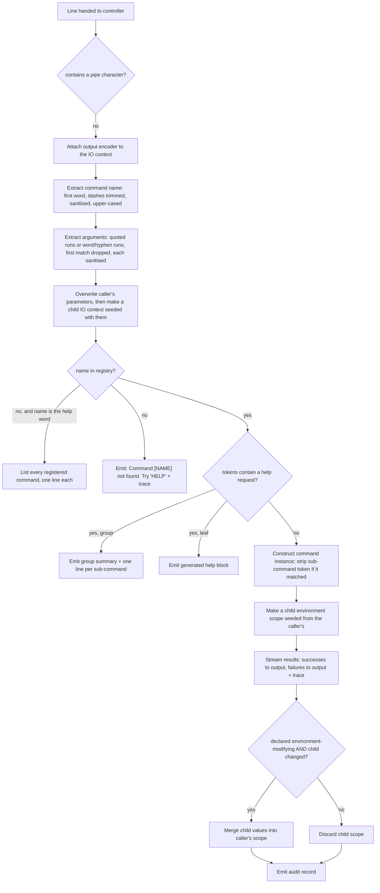

# Feature: Command Extensibility Contract

> **Scope note.** The subject of this dossier is the **shell**. The shell does not implement the command runtime; it *consumes* one. This dossier therefore specifies (a) the exact obligations the shell places on that runtime capability, and (b) the obligations a hosted plugin command must satisfy. Runtime semantics are described from a read-only reference clone of the source's runtime at the closest published tag (v2.1.2) and are cited `OUT-OF-REPO: <path>:<line> (framework v2.1.2)`. The shell pins runtime versions 2.1.1 / 2.1.0 / 2.1.0 (`Directory.Packages.props:8-10`), so v2.1.2 semantics are near-but-not-identical; every place where the shell's own hand-written stand-ins disagree with v2.1.2 is flagged.

---

## Purpose — what user/business problem this solves; who uses it (actors/roles)

The shell is a thin interactive front end. Everything a user actually *does* in it — typing a command line, having it parsed, dispatched, validated, piped, helped and audited — is performed by a **command-runtime capability** that the shell obtains from outside itself and drives through four narrow contracts. The shell owns only the session loop, the console presentation, and two package-manager commands. A reimplementer who ports the shell without also building or sourcing this capability gets a prompt that can do nothing.

The feature exists so that:

* **The shell author** can write a session loop, a console adapter and a couple of commands without owning a parser, a dispatcher, a plugin loader, a help generator or a pipeline engine. The shell's whole interaction with the runtime is five verbs: register built-ins, add a package directory, load commands, run a command line, and (for internally-linked commands) add a command under a package key (`src/Xcaciv.Cupcake.Core/Loop.cs:41-43,62`, `src/Xcaciv.Cupcake.Lit/Program.cs:10-11`).
* **The shell author** can substitute a fake presentation surface for the console and still exercise the session end to end. The session loop never touches the console; it talks only to an IO context (`src/Xcaciv.Cupcake.Core/Loop.cs:37,62,65`), which is why the session is testable with a hand-written double (`Xcaciv.Cupcake.Core.Tests/LoopTests.cs:8-65,126-152`).
* **A plugin author** — a third party who will never see the shell's source — can ship a binary that the shell picks up from a directory and exposes as a command, by declaring metadata and implementing two execution entry points (`src/Xcaciv.Command.Packages/SearchCommand.cs:11-20,88`, `src/Xcaciv.Command.Packages/InstallCommand.cs:14-27`).

**Actors / roles**

| Actor | Role in this feature |
| --- | --- |
| Shell host (the session loop) | Consumer of the controller contract; provider of the IO context and environment context instances. |
| Presentation adapter author | Implements the IO context contract (the shell ships a console one; the tests ship a fake one). |
| Plugin command author | Implements the command-unit contract; ships a binary into a package directory. |
| Internal command author | Same contract, but the command is linked into the executable and registered by hand under a package key at start-up. |
| Runtime provider | Supplies the controller, tokenizer, dispatcher, pipeline engine, help generator, plugin loader and built-in command set. |

---

## Behavior — what it does, as observable behavior; every distinct operation the feature supports, its inputs, outputs, and side effects

### Contract 1 — Command controller (what the shell demands of the runtime)

The controller is the single object the shell holds. Its observable operations:

1. **Register built-in commands.** No inputs. Side effect: a fixed set of commands becomes resolvable without any plugin being present. In the source runtime these are four commands registered under the package key `Default`: `REGIF`, `SAY`, `SET` (marked as environment-modifying), `ENV` (OUT-OF-REPO: src/Xcaciv.Command/CommandController.cs:177-185 (framework v2.1.2)). The shell calls this before loading plugins (`src/Xcaciv.Cupcake.Core/Loop.cs:41`) and again in the defaults path (`src/Xcaciv.Cupcake.Core/Loop.cs:108`). The contract also still carries a deprecated second name for this same operation, retained for hosts written against the pre-2.0 surface and slated for removal in the next major line (OUT-OF-REPO: src/Xcaciv.Command.Interface/ICommandController.cs:12-18 (framework v2.1.2)).
2. **Add a command by instance, under a package key.** Inputs: package key string, a command unit instance. The shell uses the key `"internal"` for its two linked-in commands (`src/Xcaciv.Cupcake.Lit/Program.cs:10-11`). **Observed side effect:** the runtime records only the *kind* of the object, not the object — the passed instance is discarded and a fresh one is constructed for every execution (OUT-OF-REPO: src/Xcaciv.Command/CommandRegistry.cs:63-67 (framework v2.1.2); OUT-OF-REPO: src/Xcaciv.Command/CommandFactory.cs:38-56 (framework v2.1.2)).
3. **Add a command by type, under a package key**, with an explicit "this command may modify the session environment" flag (default false) (OUT-OF-REPO: src/Xcaciv.Command/CommandController.cs:198-201 (framework v2.1.2)).
4. **Add a command from a pre-built descriptor** (OUT-OF-REPO: src/Xcaciv.Command/CommandController.cs:206-209 (framework v2.1.2)).
5. **Add a package directory.** Input: a directory path. Side effect: the directory is queued for scanning. In the source runtime the directory is *verified* at this moment and silently rejected if it fails verification (OUT-OF-REPO: src/Xcaciv.Command.FileLoader/VerifiedSourceDirectories.cs:82-89 (framework v2.1.2)).
6. **Load commands.** Optional input: the name of the sub-directory inside each package folder that holds binaries; the shell always calls it with no argument (`src/Xcaciv.Cupcake.Core/Loop.cs:43,80`) and therefore takes the runtime default `"bin"` (OUT-OF-REPO: src/Xcaciv.Command/CommandController.cs:169 (framework v2.1.2)). Side effect: every discovered command is registered. Failure modes are signalled by distinguishable error kinds — the shell catches "no plugins found" specifically and treats everything else as fatal (`src/Xcaciv.Cupcake.Core/Loop.cs:45-54`).
7. **Run a command line.** Inputs: the raw command-line text, an IO context, an environment context; optionally a cancellation signal. Output: nothing returned — all user-visible product is emitted through the IO context. The operation is asynchronous; the shell consumes it by blocking (`src/Xcaciv.Cupcake.Core/Loop.cs:62`) or by awaiting (`src/Xcaciv.Cupcake.Core/Loop.cs:94`).
8. **Produce help.** Inputs: a command name (empty = all commands), IO context, environment context; optionally a cancellation signal. Output: help lines written to the IO context. Both a blocking and an awaitable form exist, the blocking one deprecated and documented as deadlock-prone (`Xcaciv.Cupcake.Core.Tests/LoopTests.cs:77-78`; OUT-OF-REPO: src/Xcaciv.Command.Interface/ICommandController.cs:46-62 (framework v2.1.2)). The shell calls neither: it reaches help only by typing a command line.

The shell's own hand-written stand-in for the controller additionally declares "attach an IO context" and "list command names" operations that the shell never calls and that do not exist in the v2.1.2 runtime (`Xcaciv.Cupcake.Core.Tests/LoopTests.cs:74-75`) — see QUIRKs.

### Contract 2 — IO context (what the shell provides to the runtime)

A presentation surface. Observable obligations, all of which the shell's console adapter and its test fake satisfy (`src/Xcaciv.Cupcake.Core/ConsoleContext.cs:13,38-103`; `Xcaciv.Cupcake.Core.Tests/LoopTests.cs:8-65`):

* **Identity and lineage** — a unique identifier, a friendly name, and the identifier of the parent context if any (OUT-OF-REPO: src/Xcaciv.Command.Interface/ICommandContext.cs:11-22 (framework v2.1.2)).
* **Parameters** — the current token list for the command being run, plus a replace-all operation the runtime uses to strip consumed tokens (the runtime uses it to drop a matched sub-command name) (OUT-OF-REPO: src/Xcaciv.Command.Interface/IIoContext.cs:40-48,151-160 (framework v2.1.2)).
* **Child contexts** — produce a child, optionally seeded with a token list. The child records the parent's identifier. The shell's console adapter additionally hands the child the parent's input pipe *only when the parent actually has piped input*, and always hands over the parent's output pipe when one is set (`src/Xcaciv.Cupcake.Core/ConsoleContext.cs:40-46`).
* **Output chunks** — accept a discrete unit of command output. The shared base routes it to the output pipe when one is attached, otherwise to the adapter's own rendering hook (OUT-OF-REPO: src/Xcaciv.Command.Core/AbstractTextIo.cs:67-74 (framework v2.1.2)).
* **Status messages** — transient, non-result text (`src/Xcaciv.Cupcake.Core/ConsoleContext.cs:90-103`).
* **Trace messages** — diagnostic text. The shared base decides where a trace line goes: when the adapter reports itself verbose the line is pushed through the *output* channel prefixed with a tab and the literal `TRACE: `; otherwise it goes to the platform diagnostic sink and never reaches the user (`Xcaciv.Cupcake.Core.Tests/LoopTests.cs:58`; OUT-OF-REPO: src/Xcaciv.Command.Core/AbstractTextIo.cs:167-176 (framework v2.1.2)) — see QUIRK H6 for why the shell never takes the first branch.
* **Progress** — given a total and a step, emit progress feedback and return a number the contract defines as a percentage in 0–100 (`src/Xcaciv.Cupcake.Core/ConsoleContext.cs:79-84`; OUT-OF-REPO: src/Xcaciv.Command.Interface/IIoContext.cs:128-138 (framework v2.1.2)) — the shell's adapter does not honour that definition, see QUIRK H4.
* **Completion** — signal end of operation with an optional final message; this is also what closes an attached output pipe (OUT-OF-REPO: src/Xcaciv.Command.Core/AbstractTextIo.cs:149-155 (framework v2.1.2)).
* **Prompting** — given prompt text, return a line of user input; the contract states this is used only when the context has no piped input (`src/Xcaciv.Cupcake.Core/ConsoleContext.cs:66-72`; OUT-OF-REPO: src/Xcaciv.Command.Interface/IIoContext.cs:71-80 (framework v2.1.2)).
* **Pipe attachment** — accept an input pipe and an output pipe of text chunks; expose "do I have piped input?"; expose a streaming read of all input chunks, which blocks until input arrives or the pipe closes (OUT-OF-REPO: src/Xcaciv.Command.Interface/IIoContext.cs:30-38,50-69,82-90 (framework v2.1.2)).
* **Pipeline stage metadata** — accept a 1-based stage number and a total stage count; expose both, null when not in a pipeline (OUT-OF-REPO: src/Xcaciv.Command.Interface/IIoContext.cs:174-191 (framework v2.1.2)).
* **Output encoding** — accept an encoder that the runtime propagates before every run. The shared base accepts and ignores it (OUT-OF-REPO: src/Xcaciv.Command.Core/AbstractTextIo.cs:121-125 (framework v2.1.2)).
* **Disposal** — asynchronous disposal, which the runtime relies on to close pipes at end of a stage (OUT-OF-REPO: src/Xcaciv.Command.Interface/ICommandContext.cs:9 (framework v2.1.2); OUT-OF-REPO: src/Xcaciv.Command.Core/AbstractTextIo.cs:143-147 (framework v2.1.2)).

### Contract 3 — Environment context (session variables)

A keyed store of text values with scope isolation (`Xcaciv.Cupcake.Core.Tests/LoopTests.cs:84-122`):

* Read a value by key, optionally supplying a fallback and a flag that says whether a missing key should be **written back** with that fallback. The flag defaults to "yes, write it back" — note that this is *not* a "must exist" mode; the contract has no raise-if-absent read at all (OUT-OF-REPO: src/Xcaciv.Command.Interface/IEnvironmentContext.cs:39-50 (framework v2.1.2)). The shell's test double reads the third argument the opposite way — see QUIRK F6.
* Write a value by key; the write is defined to mark the scope as changed (OUT-OF-REPO: src/Xcaciv.Command.Interface/IEnvironmentContext.cs:27-37 (framework v2.1.2)).
* Read all values in bulk (a snapshot; changes to the snapshot do not reach the scope) (OUT-OF-REPO: src/Xcaciv.Command.Interface/IEnvironmentContext.cs:52-60 (framework v2.1.2)).
* Merge a bulk set of values in, overwriting matching keys (OUT-OF-REPO: src/Xcaciv.Command.Interface/IEnvironmentContext.cs:72-81 (framework v2.1.2)).
* Expose a "has anything changed here?" flag, which is what gates write-back (OUT-OF-REPO: src/Xcaciv.Command.Interface/IEnvironmentContext.cs:62-70 (framework v2.1.2)).
* Produce a child scope. Identity/name/parent fields as in the IO context (OUT-OF-REPO: src/Xcaciv.Command.Interface/ICommandContext.cs:9-32 (framework v2.1.2)).

Source-runtime semantics: keys are upper-cased on both read and write, making lookup case-insensitive; a child scope is a **snapshot copy**, not a view; and after a command finishes, the child's values are merged back into the caller's scope **only if** the command was declared environment-modifying **and** the child reports having changed (OUT-OF-REPO: src/Xcaciv.Command/EnvironmentContext.cs:45-55,71-110 (framework v2.1.2); OUT-OF-REPO: src/Xcaciv.Command/CommandExecutor.cs:216-219 (framework v2.1.2)).

### Contract 4 — Command unit (what a hosted plugin must satisfy)

A hosted command is a unit of code carrying **declarative metadata** plus **two execution entry points**:

**Declarative metadata** (observed in use at `src/Xcaciv.Command.Packages/SearchCommand.cs:11-17` and `src/Xcaciv.Command.Packages/InstallCommand.cs:14-16`):

| Declaration | Carries | Repeatable |
| --- | --- | --- |
| Group / root | group name + group description (description default `"TODO"`) and an unused short alias; makes the command a *sub-command* reachable as `GROUP NAME …` | no |
| Registration | command name + description (description default `"TODO"`); optional version (default `"0.0.0"`), usage prototype (default `"TODO"`), short alias (default empty) | no |
| Ordered parameter | name, description, required flag (**default true**), default value, allowed-value set, "fed by pipe" flag | yes |
| Named parameter | name, description, required flag (**default false**), default value, allowed-value set, short alias, "fed by pipe" flag | yes |
| Flag | name, description; presence-only (it also carries a short alias, but that alias is fixed at empty and cannot be declared) | yes |
| Suffix parameter | name, description, required flag (**default true**), default value, "fed by pipe" flag | yes |
| Help remarks | free text appended to generated help | yes |

(OUT-OF-REPO: src/Xcaciv.Command.Interface/Attributes/CommandRootAttribute.cs:9-42, CommandRegisterAttribute.cs:9-51, CommandParameterOrderedAttribute.cs:13-48, CommandParameterNamedAttribute.cs:9-56, CommandFlagAttribute.cs:13-40, CommandParameterSuffixAttribute.cs:10-32, CommandHelpRemarksAttribute.cs:9-24 (framework v2.1.2))

**Execution entry points** (`src/Xcaciv.Command.Packages/SearchCommand.cs:20,88`; `src/Xcaciv.Command.Packages/InstallCommand.cs:19,24`):

* **Direct execution** — given the token list and an environment scope, return a text result.
* **Per-piped-chunk execution** — given one upstream chunk plus the token list and environment scope, return a text result for that chunk.

The shared command base decides which one runs: if the IO context reports piped input, it iterates upstream chunks and calls the per-chunk entry point once per non-empty chunk; otherwise it calls the direct entry point, unless the tokens constitute a help request, in which case it returns generated help instead (OUT-OF-REPO: src/Xcaciv.Command.Core/AbstractCommand.cs:152-173 (framework v2.1.2)).

A hosted command also inherits a **parameter-binding helper** it may call to turn the raw token list into a name→value map according to its own declarations. **Binding is opt-in by the command, not performed by the runtime** — the runtime hands over raw tokens (OUT-OF-REPO: src/Xcaciv.Command.Core/AbstractCommand.cs:178-192 (framework v2.1.2); used at `src/Xcaciv.Command.Packages/SearchCommand.cs:22`).

---

## Business rules & edge cases — every rule, limit, threshold, validation, rounding rule, ordering guarantee, and special case, each with evidence (file:line). Mine the tests hard: test names and assertions are the closest thing to requirements this repo has. Include magic numbers WITH their meaning.

### A. Command-line tokenizing and dispatch

| # | Rule | Evidence |
| --- | --- | --- |
| A1 | The **command name** is the text up to the first space in the line, trimmed of leading/trailing `-`, with every character outside `[-_0-9A-Za-z ]` removed, then upper-cased. | OUT-OF-REPO: src/Xcaciv.Command.Interface/CommandDescription.cs:52-64 (framework v2.1.2) |
| A2 | **Arguments** are extracted by matching, in order, either a double-quoted run or a run of word-characters-and-hyphen (pattern `[\"].*?[\"]|[\w-]+`); the **first match is dropped** (it is assumed to be the command name); each remaining match has every character outside `[-_0-9A-Za-z .*?\[\]\|"~!@#$%^&*()]` stripped and surrounding double quotes trimmed. | OUT-OF-REPO: src/Xcaciv.Command.Interface/CommandDescription.cs:70-79 (framework v2.1.2) |
| A3 | **QUIRK — unquoted dotted or slashed arguments are split apart.** Because unquoted tokens match only word characters and hyphen, `cake.nuget` becomes two arguments `cake` and `nuget`, and a URL loses its `:` and `/`. Quoting is the only way to keep such text whole. | OUT-OF-REPO: src/Xcaciv.Command.Interface/CommandDescription.cs:72 (framework v2.1.2) |
| A4 | Dispatch is an exact lookup of the upper-cased command name against the registry. On a miss, the user sees `Command [<NAME>] not found. Try 'HELP'` on the output channel and `Command [<NAME>] not found.` on the trace channel. | OUT-OF-REPO: src/Xcaciv.Command/CommandExecutor.cs:83-87 (framework v2.1.2) |
| A5 | For a non-pipeline line, the runtime first **overwrites the caller's own IO-context parameters** with the parsed arguments, then creates a child context seeded with them and runs the command on the child. | OUT-OF-REPO: src/Xcaciv.Command/CommandController.cs:240-246 (framework v2.1.2) |
| A6 | A registered group is dispatched by matching the **first remaining argument, upper-cased**, against the group's sub-command names; on a match, that token is removed from the parameter list before the sub-command runs. Matching is case-insensitive. | OUT-OF-REPO: src/Xcaciv.Command/CommandFactory.cs:43-53 (framework v2.1.2) |
| A7 | **QUIRK — an unknown sub-command reports as an execution error, not "not found".** The group descriptor carries no executable identity of its own, so a non-matching first token drives the runtime into "command type name is empty" and the user sees `Error executing <GROUP> (see trace for more info)`. | OUT-OF-REPO: src/Xcaciv.Command/CommandFactory.cs:55,58-62 (framework v2.1.2); OUT-OF-REPO: src/Xcaciv.Command/CommandExecutor.cs:228 (framework v2.1.2) |
| A8 | **QUIRK — the shell's own commands are only reachable through their group.** Both shell-supplied commands declare the group `Package`, so the invocations are `PACKAGE SEARCH …` and `PACKAGE INSTALL …`, yet the shell's no-plugins message advises the user to run `` `install --help` ``, which does not resolve. | `src/Xcaciv.Command.Packages/SearchCommand.cs:11-12`; `src/Xcaciv.Command.Packages/InstallCommand.cs:14-15`; `src/Xcaciv.Cupcake.Core/Loop.cs:47` |
| A9 | Registering a group merges: a second command declaring the same group adds itself into the existing group's sub-command map rather than replacing it. | OUT-OF-REPO: src/Xcaciv.Command/CommandRegistry.cs:24-35 (framework v2.1.2) |
| A10 | Registering a unit that carries no registration metadata is **silently skipped** (a trace line only). Registering by pre-built descriptor performs no such check. | OUT-OF-REPO: src/Xcaciv.Command/CommandRegistry.cs:42-47 (framework v2.1.2) |
| A11 | **QUIRK — an unquoted environment-variable reference loses its delimiters before any command sees it.** The argument matcher (A2) keeps only quoted runs and runs of word-characters-and-hyphen, and `%` is neither, so `%NAME%` typed bare arrives as the bare token `NAME` and nothing expands it. The `%` character *is* on the sanitising allow-list, so the reference survives whole inside a double-quoted run: `SAY "hello %NAME%"` expands, `SAY hello %NAME%` prints `hello NAME`. The built-in echo command's own help remark instructs the user to use double quotes for exactly this reason. | OUT-OF-REPO: src/Xcaciv.Command.Interface/CommandDescription.cs:23,70-79 (framework v2.1.2); OUT-OF-REPO: src/Xcaciv.Command/Commands/SayCommand.cs:15,25 (framework v2.1.2) |
| A12 | **QUIRK — the "may modify the session environment" flag is recorded on the *group*, not on the sub-command.** Registering a sub-command by instance or by kind builds a *group* descriptor (the sub-command is nested inside it) and stamps the flag onto that group descriptor; the write-back decision (F3) reads the flag off the registry entry, which is the group. A second sub-command joining an existing group is merged into it and cannot change the flag. So the first registration of a group decides environment write-back for every sub-command in that group, and a group registered without the flag can never write back no matter what its members declare. | OUT-OF-REPO: src/Xcaciv.Command/CommandRegistry.cs:24-35,55-60 (framework v2.1.2); OUT-OF-REPO: src/Xcaciv.Command.Core/CommandParameters.cs:179-209 (framework v2.1.2); OUT-OF-REPO: src/Xcaciv.Command/CommandExecutor.cs:216 (framework v2.1.2) |

### B. Pipelines

| # | Rule | Evidence |
| --- | --- | --- |
| B1 | A line is treated as a pipeline if it contains the character `\|` anywhere. | OUT-OF-REPO: src/Xcaciv.Command/CommandController.cs:234 (framework v2.1.2); OUT-OF-REPO: src/Xcaciv.Command.Interface/CommandSyntax.cs:9 (framework v2.1.2) |
| B2 | Pipeline syntax: `\|` separates stages; `"` groups text and honours escapes; `'` groups text literally with **no** escape processing; `\` escapes `\|`, `"`, `'` and `\` itself. Each segment is trimmed; **empty segments are dropped** (so `a \|\| b` is two stages, not three). | OUT-OF-REPO: src/Xcaciv.Command/PipelineParser.cs:24-91 (framework v2.1.2) |
| B3 | An unclosed quote aborts the whole line with `Unbalanced <quote-char> quote in pipeline.` | OUT-OF-REPO: src/Xcaciv.Command/PipelineParser.cs:129 (framework v2.1.2) |
| B4 | Stages are numbered from **1**; each stage is told its number and the total count. | OUT-OF-REPO: src/Xcaciv.Command/PipelineExecutor.cs:78-90 (framework v2.1.2) |
| B5 | Every stage runs on its **own child IO context**; stage *n*'s input pipe is stage *n−1*'s output pipe; every stage (including the last) is given a **new** output pipe. | OUT-OF-REPO: src/Xcaciv.Command/PipelineExecutor.cs:87-101 (framework v2.1.2) |
| B6 | Every inter-stage buffer is **bounded at 10 000 items** by default ("approximately 100MB for 10KB strings"), with a default full-buffer policy of **Block** (wait for the consumer). Alternatives are DropOldest (drop the oldest queued item) and DropNewest (reject the incoming item). | OUT-OF-REPO: src/Xcaciv.Command.Interface/PipelineConfiguration.cs:15,23 (framework v2.1.2); OUT-OF-REPO: src/Xcaciv.Command.Interface/PipelineBackpressureMode.cs:11-21 (framework v2.1.2) |
| B7 | All stages are started **concurrently** and run in parallel; the pipeline is considered done only when every stage has finished. Only then is the final stage's buffer drained into the caller's IO context. | OUT-OF-REPO: src/Xcaciv.Command/PipelineExecutor.cs:41-63 (framework v2.1.2) |
| B8 | **QUIRK — final-stage output must fit in the buffer.** Because the last stage's output is drained only *after* every stage has completed, and the default policy blocks when the buffer is full, a final stage producing more than 10 000 chunks stalls forever. With a drop policy it silently loses output instead. | OUT-OF-REPO: src/Xcaciv.Command/PipelineExecutor.cs:41-63,97-101 (framework v2.1.2) |
| B9 | Per-stage timeout, whole-pipeline timeout, max output bytes per stage and max output items per stage all default to **0 = unlimited**. Negative values, or a buffer size ≤ 0, are rejected as invalid configuration. | OUT-OF-REPO: src/Xcaciv.Command.Interface/PipelineConfiguration.cs:29-71 (framework v2.1.2) |
| B10 | When a per-stage timeout is configured and exceeded, that stage completes with the message `Stage '<NAME>' exceeded timeout of <N> seconds` and a trace line `Pipeline stage timeout: <NAME> (exceeded <N>s)`. A stage cancelled with no timeout configured completes with `Stage '<NAME>' was cancelled`. Every stage emits a trace line `Pipeline stage start: <NAME>` on entry. | OUT-OF-REPO: src/Xcaciv.Command/PipelineExecutor.cs:122,157-164 (framework v2.1.2) |
| B11 | Empty upstream chunks are skipped and never delivered to a command; empty results are never forwarded downstream. A filter command therefore emits nothing for non-matching input. | OUT-OF-REPO: src/Xcaciv.Command.Core/AbstractCommand.cs:158 (framework v2.1.2); OUT-OF-REPO: src/Xcaciv.Command/CommandExecutor.cs:198-201 (framework v2.1.2) |
| B12 | **QUIRK — the pipeline decision is a naive character scan, so quoting or escaping a pipe does not avoid the pipeline machinery.** The line is routed to the pipeline engine whenever the character appears anywhere, *before* any quote or escape handling; the parser then produces a single stage for a line whose only pipes were quoted or escaped. Such a line still runs through a bounded buffer and its output still appears only after the stage completes, and — unlike the non-pipeline path (A5) — the caller's own parameter list is never overwritten. | OUT-OF-REPO: src/Xcaciv.Command/CommandController.cs:234-246 (framework v2.1.2); OUT-OF-REPO: src/Xcaciv.Command/PipelineParser.cs:24-91 (framework v2.1.2); OUT-OF-REPO: src/Xcaciv.Command/PipelineExecutor.cs:41-63 (framework v2.1.2) |

### C. Parameter binding and validation

| # | Rule | Evidence |
| --- | --- | --- |
| C1 | Binding order is fixed: **ordered parameters, then flags, then named parameters, then suffix parameters**. Each phase removes what it consumed from the working token list. | OUT-OF-REPO: src/Xcaciv.Command.Core/AbstractCommand.cs:185-189 (framework v2.1.2) |
| C2 | **All declared parameter names are lower-cased** (and stripped of characters outside `[-_0-9A-Za-z ]`) when the declaration is read; the bound map is keyed by those lower-cased names. Command and group names are upper-cased the same way. | OUT-OF-REPO: src/Xcaciv.Command.Interface/Attributes/AbstractCommandParameter.cs:19-23 (framework v2.1.2); OUT-OF-REPO: src/Xcaciv.Command.Interface/CommandDescription.cs:52-64 (framework v2.1.2) |
| C3 | **QUIRK — with zero tokens, nothing is validated at all.** The binder returns an empty map immediately when the token list is empty, so required-parameter enforcement never runs for a bare command invocation. | OUT-OF-REPO: src/Xcaciv.Command.Core/AbstractCommand.cs:180 (framework v2.1.2) |
| C4 | Ordered parameters are taken from the **front** of the remaining tokens. If the front token begins with `-`, the ordered parameter is not consumed: it is an error (`Missing required parameter <name>`) when the parameter is required *and* has no default; otherwise it is **silently omitted from the bound map** — no default is substituted. | OUT-OF-REPO: src/Xcaciv.Command.Core/CommandParameters.cs:105-130 (framework v2.1.2) |
| C5 | **QUIRK — positional arguments must precede flags and named parameters.** Because ordered binding runs before flag/named removal, `SEARCH -take 2 XCBatch` fails with `Missing required parameter search_terms` while `SEARCH XCBatch -take 2` succeeds. Every passing test in the repo uses the positional-first form. | OUT-OF-REPO: src/Xcaciv.Command.Core/CommandParameters.cs:113-119 (framework v2.1.2); `Xcaciv.Command.PackagesTests/SearchCommandTests.cs:14,30,45,60,75,88,102,117` (every token array in the suite puts the positional first; the only test that does not, at line 134, calls the piped entry point, which never binds a positional) |
| C6 | When the token list is exhausted, an ordered/suffix parameter that is not required and has a non-empty default is bound to its default; one that is required raises `Missing required parameter <name>`. | OUT-OF-REPO: src/Xcaciv.Command.Core/CommandParameters.cs:91-103,138-151 (framework v2.1.2) |
| C7 | A flag is matched by a token that **starts with `-`** and matches the pattern `-{1,2}<name>` (or `-{1,2}<short-alias>`), i.e. one or two leading dashes. The matched token is removed. | OUT-OF-REPO: src/Xcaciv.Command.Core/CommandParameters.cs:17-32 (framework v2.1.2) |
| C8 | **A flag is always present in the bound map**, with the literal text `"True"` or `"False"`. Presence in the map therefore says nothing about whether the user passed the flag; only the value does. | OUT-OF-REPO: src/Xcaciv.Command.Core/CommandParameters.cs:34 (framework v2.1.2) |
| C9 | **QUIRK — the in-repo search command misreads rule C8**, testing only for key presence, so its "include prereleases" flag is effectively always on. Documented here because it is the observable consequence of the contract. | `src/Xcaciv.Command.Packages/SearchCommand.cs:47` |
| C10 | A named parameter consumes **the matched token and the token immediately after it**. If unmatched: use the declared default when non-empty; otherwise, if required, raise `Missing required parameter <name>`; otherwise bind the empty string. | OUT-OF-REPO: src/Xcaciv.Command.Core/CommandParameters.cs:50-74 (framework v2.1.2) |
| C11 | **QUIRK — a named parameter as the final token crashes the binder.** The value is read at the next index with no bounds check, so `… -take` (nothing after it) raises an index error, surfacing as `Error executing <NAME> (see trace for more info)`. | OUT-OF-REPO: src/Xcaciv.Command.Core/CommandParameters.cs:54-55 (framework v2.1.2) |
| C12 | **QUIRK — name matching is unanchored at the end.** The token is searched for "one or two dashes immediately followed by the declared name", with no end anchor, so any token that *begins* `-<name>` also matches: a parameter declared `take` is satisfied by the token `-taken`, and a one-letter short alias `t` is satisfied by `-take`, swallowing the wrong switch and its following token. The dashes must be adjacent to the name, so a token that merely embeds the name (`--myverbosity` against a parameter declared `verbosity`) does **not** match. First match in token order wins. | OUT-OF-REPO: src/Xcaciv.Command.Core/CommandParameters.cs:17-19,43-52 (framework v2.1.2) |
| C13 | When a parameter declares an allowed-value set, a bound value outside it raises `Invalid value for parameter <name>, this parameter has an allow list.` Value comparison ignores case. For a **named** parameter the check runs on whatever ends up bound — including the substituted default and the empty string bound when nothing was supplied. For an **ordered** parameter the check runs only when a token was actually taken from the front of the list; when the token list is exhausted the declared default is bound **unchecked**, and when the front token is a switch nothing is bound and nothing is checked (C4). Suffix parameters carry no allowed-value declaration and are never checked. | OUT-OF-REPO: src/Xcaciv.Command.Core/CommandParameters.cs:76-80,91-103,113-130 (framework v2.1.2) |
| C14 | Parameters declared "fed by pipe" are excluded from binding **when the binder is told the command is running with piped input**, so the upstream chunk supplies that value instead. The exclusion is **not automatic**: the runtime hands over the same raw token list either way and the binder's piped-mode switch defaults to off, so a hosted command that wants the exclusion must ask for it when it calls the binder — the built-in filter command does, the shell's own search command does not. Only the first such declaration is meaningful. | OUT-OF-REPO: src/Xcaciv.Command.Core/AbstractCommand.cs:178,198-246 (framework v2.1.2); OUT-OF-REPO: src/Xcaciv.Command.Interface/Attributes/CommandParameterOrderedAttribute.cs:42-46 (framework v2.1.2); OUT-OF-REPO: src/Xcaciv.Command/Commands/RegifCommand.cs:44 (framework v2.1.2); `src/Xcaciv.Command.Packages/SearchCommand.cs:22` |
| C15 | **Suffix and ordered parameters disagree when the next token is a switch.** If the front token begins with `-`, a *suffix* parameter binds its declared default whenever that default is non-empty (raising `Missing required parameter <name>` only when it is required *and* has no default); an *ordered* parameter in the same position binds nothing at all and substitutes no default (C4). In both cases the switch token is left in the working list for the flag/named phases. | OUT-OF-REPO: src/Xcaciv.Command.Core/CommandParameters.cs:113-119,155-167 (framework v2.1.2); OUT-OF-REPO: src/Xcaciv.Command.Tests/ParameterBoundsTests.cs:182-198,204-222 (framework v2.1.2) |
| C16 | **QUIRK — parameter *names* are matched case-sensitively, parameter *values* are not.** Declared names are lower-cased when the declaration is read (C2) and the token match is case-sensitive, so `-VERBOSITY quiet` matches no declaration at all: the parameter silently falls back to its declared default, or raises `Missing required parameter <name>` when it is required with no default. The allowed-value comparison, by contrast, ignores case, so `-verbosity QUIET` is accepted and binds the literal `QUIET` as typed. A declaration whose name contains upper-case letters is therefore unreachable in the form its author wrote it. | OUT-OF-REPO: src/Xcaciv.Command.Core/CommandParameters.cs:17-19,43-45,52,76-77 (framework v2.1.2); OUT-OF-REPO: src/Xcaciv.Command.Interface/Attributes/AbstractCommandParameter.cs:19-23 (framework v2.1.2) |

### D. Help generation

| # | Rule | Evidence |
| --- | --- | --- |
| D1 | A token list is a help request if **any** token equals, case-insensitively, `--HELP`, `-?`, or `/?`. | OUT-OF-REPO: src/Xcaciv.Command/HelpService.cs:165-175 (framework v2.1.2); OUT-OF-REPO: src/Xcaciv.Command.Core/AbstractCommand.cs:248-258 (framework v2.1.2) |
| D2 | **QUIRK — only `--HELP` survives the shell's tokenizer.** Rule A2 keeps only word-characters-and-hyphen runs, so a typed `-?` arrives as the bare token `-` and a typed `/?` disappears entirely. The two short forms are unreachable from the interactive prompt. | OUT-OF-REPO: src/Xcaciv.Command.Interface/CommandDescription.cs:72 (framework v2.1.2); OUT-OF-REPO: src/Xcaciv.Command/HelpService.cs:172-174 (framework v2.1.2) |
| D3 | Full generated help is laid out as: optional `<GROUP> ` prefix, then `<COMMAND>:`, then two spaces and the description, a blank line, `Usage:`, then the usage line, a blank line, `Options:`, one line per parameter, then (if any) `Remarks:` with a blank line before each remark. | OUT-OF-REPO: src/Xcaciv.Command/HelpService.cs:53-130 (framework v2.1.2) |
| D4 | The usage line is the declared prototype indented by two spaces, **unless** the prototype is still the default `TODO` (compared case-insensitively), in which case a prototype is synthesised by concatenating indicators in the order ordered → flags → named → suffix, each followed by a space. | OUT-OF-REPO: src/Xcaciv.Command/HelpService.cs:104-111 (framework v2.1.2) |
| D5 | Indicators: an ordered/suffix parameter renders as `<name>`; a flag and a named parameter render as `-name`. In the synthesised usage line a named parameter's indicator is always followed by a value indicator **wrapped in angle brackets**: `-take <take>` normally, or `-verbosity <[quiet\|normal\|detailed]>` when it declares an allowed-value set — the brackets wrap the alternatives, they do not replace them. | OUT-OF-REPO: src/Xcaciv.Command.Interface/Attributes/AbstractCommandParameter.cs:36-39 (framework v2.1.2); CommandFlagAttribute.cs:30-33; CommandParameterNamedAttribute.cs:42-45; OUT-OF-REPO: src/Xcaciv.Command/HelpService.cs:89-93 (framework v2.1.2) |
| D6 | Each option line is the indicator **left-aligned in an 18-character field** (padded on the right; longer indicators are not truncated), a space, then the description, the whole thing trimmed and then indented by two spaces. A flag's description is prefixed with the literal `Flag: `. A named parameter with an allowed-value set gets ` (Allowed values: a, b, c)` appended. | OUT-OF-REPO: src/Xcaciv.Command.Interface/Attributes/AbstractCommandParameter.cs:28-33 (framework v2.1.2); CommandFlagAttribute.cs:35-38; CommandParameterNamedAttribute.cs:47-55; OUT-OF-REPO: src/Xcaciv.Command/HelpService.cs:74 (framework v2.1.2) |
| D7 | One-line summaries, with the name **left-aligned in a 12-character field** (padded on the right): a group is `-\t<NAME>        [Has sub-commands]`; a sub-command is `-\t<NAME>        <description>`; a plain command is `<NAME>        <description>`; a command whose metadata cannot be read is `<NAME>        [No description available]`. In the all-commands listing a group's own line is `<GROUP>        <group description>` followed by each sub-command line. | OUT-OF-REPO: src/Xcaciv.Command/HelpService.cs:139,151,158,162 (framework v2.1.2); OUT-OF-REPO: src/Xcaciv.Command/CommandExecutor.cs:124-132 (framework v2.1.2) |
| D8 | A command with no declared parameters at all gets a help block that stops after the `Usage:` heading — no usage line, no `Options:` section. Declared remarks, if any, are still emitted after that heading, so such a command can produce a `Usage:` line immediately followed by `Remarks:`. | OUT-OF-REPO: src/Xcaciv.Command/HelpService.cs:66-127 (framework v2.1.2) |
| D9 | The word that triggers the all-commands listing is `HELP` by default and is configurable. | OUT-OF-REPO: src/Xcaciv.Command/CommandExecutor.cs:27 (framework v2.1.2); OUT-OF-REPO: src/Xcaciv.Command.Interface/CommandControllerOptions.cs:18 (framework v2.1.2) |
| D10 | **QUIRK — `HELP <command>` ignores its argument.** When the help word is typed as a command it always produces the full listing; there is no path from the prompt to per-command help via the help word. | OUT-OF-REPO: src/Xcaciv.Command/CommandExecutor.cs:78-81 (framework v2.1.2) |
| D11 | **QUIRK — a sub-command cannot show its own full help.** `GROUP SUB --HELP` is detected as a help request on the *group*, whose sub-command map is non-empty, so the user gets the group's one-line listing instead of the sub-command's option list. | OUT-OF-REPO: src/Xcaciv.Command/CommandExecutor.cs:58-71 (framework v2.1.2) |
| D12 | If a hosted command supplies its own help text, that text wins over generated help — but only when it is non-empty. | OUT-OF-REPO: src/Xcaciv.Command/HelpService.cs:28-36 (framework v2.1.2) |
| D13 | The all-commands listing has **no defined order**: registry contents are enumerated from an unordered concurrent map. | OUT-OF-REPO: src/Xcaciv.Command/CommandRegistry.cs:81-84 (framework v2.1.2) |
| D14 | **QUIRK — the host-side help generator is unreachable for any command built on the shared command base.** Before generating help the runtime asks "did this unit supply help of its own?", and answers it by checking that a help operation is declared somewhere other than the universal base type — a test every unit built on the shared command base passes, because that base declares one. So the command base's own help builder always answers first, and the host's attribute-driven builder runs only for a unit that returns empty help. The two builders emit the same layout today, so there is no observable difference; a reimplementer should not assume the host-side generator is ever exercised, and must keep D12's "non-empty wins" fallback. | OUT-OF-REPO: src/Xcaciv.Command/HelpService.cs:28-36 (framework v2.1.2); OUT-OF-REPO: src/Xcaciv.Command.Core/AbstractCommand.cs:29-32,61-143 (framework v2.1.2) |
| D15 | **QUIRK — a synthesised usage line is not indented, a declared one is.** When the prototype is still the default placeholder the generated indicator string is written flush to the left margin; a declared prototype is written with the two-space indent of D4. Help output is therefore inconsistently aligned depending on whether the author filled in a prototype. | OUT-OF-REPO: src/Xcaciv.Command/HelpService.cs:104-111 (framework v2.1.2); OUT-OF-REPO: src/Xcaciv.Command.Core/AbstractCommand.cs:116-123 (framework v2.1.2) |

### E. Built-in command set

| # | Rule | Evidence |
| --- | --- | --- |
| E1 | Four built-ins are registered under the package key `Default`: `REGIF`, `SAY`, `SET`, `ENV`. `SET` is the only one flagged as environment-modifying. | OUT-OF-REPO: src/Xcaciv.Command/CommandController.cs:177-185 (framework v2.1.2) |
| E2 | `SAY` — description `Like echo but more valley.`, prototype `SAY <thing to print>`. Joins its tokens with single spaces and drops the trailing space; expands `%NAME%` references in any token containing `%` — reachable only from a quoted argument, rule A11; returns the empty string when the result is one character or shorter. Piped input is passed through the same expansion. | OUT-OF-REPO: src/Xcaciv.Command/Commands/SayCommand.cs:13-54 (framework v2.1.2) |
| E3 | **QUIRK — an unresolved variable comes back with doubled delimiters.** `SAY "%NOPE%"` renders `%%NOPE%%`, because the replacement re-wraps a match that already carries its delimiters. (Quoted, per A11 — unquoted, the reference never reaches the command at all.) | OUT-OF-REPO: src/Xcaciv.Command/Commands/SayCommand.cs:46 (framework v2.1.2) |
| E4 | `SET` — description `Set environment values`, prototype `SET <varname> <value>`; two ordered parameters `Key` and `Value`; writes only when both are non-empty; produces **no output**. Piping into it is unimplemented and produces the generic execution error. | OUT-OF-REPO: src/Xcaciv.Command/Commands/SetCommand.cs:12-34 (framework v2.1.2) |
| E5 | `ENV` — description `Output all environment variables`, prototype `ENV`; emits every pair as `KEY = VALUE` followed by the **two literal characters `\` and `n`**, not a line break. Identical output on the piped path. | OUT-OF-REPO: src/Xcaciv.Command/Commands/EnvCommand.cs:12-33 (framework v2.1.2) |
| E6 | `REGIF` — description `Regular expression filter. Outputs the string if it matches`, prototype `<some command> \| regif "<regex expression>" "<string to check>"`; first ordered parameter is the expression, second is the subject and is declared "fed by pipe". On the piped path it returns the chunk when it matches and the empty string otherwise. | OUT-OF-REPO: src/Xcaciv.Command/Commands/RegifCommand.cs:13-52 (framework v2.1.2) |
| E7 | **QUIRK — direct (non-piped) `REGIF` echoes the wrong token.** It tests every token after the first against the expression, but for each match it appends **the token at position 1** rather than the token that matched, and it appends it once per match: `REGIF a xa ba` emits `xa xa` (both subjects match, the second position is echoed twice) instead of `xa ba`. Results are joined with single spaces and the leading space is trimmed. The expression is also compiled on first use and never rebuilt within one execution. | OUT-OF-REPO: src/Xcaciv.Command/Commands/RegifCommand.cs:31-39,57-63 (framework v2.1.2) |
| E8 | **QUIRK — the echo command writes the names it fails to resolve.** Variable expansion looks each name up through the plain read, which by default stores the fallback for a missing key (F2), so every unresolved `%NAME%` leaves an empty value under that name in the command's own scope and flips that scope's change flag. Because the echo command is not declared environment-modifying the scope is discarded and the write is invisible — but the same read used inside an environment-modifying command would persist empty keys into the session. | OUT-OF-REPO: src/Xcaciv.Command/Commands/SayCommand.cs:39 (framework v2.1.2); OUT-OF-REPO: src/Xcaciv.Command/EnvironmentContext.cs:94-110 (framework v2.1.2) |

### F. Environment scoping

| # | Rule | Evidence |
| --- | --- | --- |
| F1 | Keys are normalised to upper case on write and on read, making the store case-insensitive. | OUT-OF-REPO: src/Xcaciv.Command/EnvironmentContext.cs:74,97 (framework v2.1.2) |
| F2 | **A plain read of a missing key writes the fallback into the store** by default and flips the change flag. Callers must opt out to get a non-mutating read. | OUT-OF-REPO: src/Xcaciv.Command/EnvironmentContext.cs:94-110 (framework v2.1.2) |
| F3 | Every command runs against a **child scope seeded with a copy** of the caller's values. Values flow back only when the command is declared environment-modifying *and* the child reports a change. | OUT-OF-REPO: src/Xcaciv.Command/CommandExecutor.cs:187,216-219 (framework v2.1.2) |
| F4 | **QUIRK — a child scope is born "changed".** Seeding is performed through the same write path that sets the change flag, so any child of a non-empty environment reports changed before the command does anything; the guard in F3 is effectively just the modify flag. | OUT-OF-REPO: src/Xcaciv.Command/EnvironmentContext.cs:35-38,45-55,84 (framework v2.1.2) |
| F5 | **QUIRK — a child scope does not record its parent.** The lineage field required by the contract is left unset for environment children (it *is* set for IO children). | OUT-OF-REPO: src/Xcaciv.Command/EnvironmentContext.cs:31,45-55 (framework v2.1.2); contrast `src/Xcaciv.Cupcake.Core/ConsoleContext.cs:40` |
| F6 | **QUIRK — the shell's own test double for the environment is case-sensitive** and treats the third read argument as "raise if absent" rather than "store the fallback", the opposite of the runtime. A reimplementation must not take the double as the specification. | `Xcaciv.Cupcake.Core.Tests/LoopTests.cs:86-113`; contrast OUT-OF-REPO: src/Xcaciv.Command/EnvironmentContext.cs:94-110 (framework v2.1.2) |
| F7 | **QUIRK — the shell's test double declares a misspelled bulk-read operation (`GetEnvinronment`) alongside the correct one.** No such operation exists in the v2.1.2 contract; it is an artefact of the pinned 2.1.0 line or of hand-written drift. | `Xcaciv.Cupcake.Core.Tests/LoopTests.cs:99-100` |

### G. Plugin hosting and per-plugin isolation

| # | Rule | Evidence |
| --- | --- | --- |
| G1 | Package directories are scanned with the layout `<package-directory>/<package-name>/<sub-directory>/<binary>`, where the sub-directory defaults to `bin` and binaries match the pattern `*.dll`. The search recurses through all sub-directories. When the sub-directory name is empty, the mask degrades to `*.dll` anywhere beneath the base. | OUT-OF-REPO: src/Xcaciv.Command.FileLoader/Crawler.cs:20,171-180 (framework v2.1.2); OUT-OF-REPO: docs/learn/getting-started-plugins.md:65-84 (framework v2.1.2) |
| G2 | The base directory is resolved to an absolute path; if it does not exist the load fails with a directory-not-found error naming the path; if it exists but yields no binaries the load fails with `No packages found in <path>.` | OUT-OF-REPO: src/Xcaciv.Command.FileLoader/Crawler.cs:173-180 (framework v2.1.2) |
| G3 | If **no** package directory was ever accepted, load fails with `No base package directory configured. (Did you set the restricted directory?)` — the error the shell catches to print its friendly no-plugins notice. | OUT-OF-REPO: src/Xcaciv.Command/CommandLoader.cs:42-45 (framework v2.1.2); `src/Xcaciv.Cupcake.Core/Loop.cs:45-47` |
| G4 | A package's identity key is `<binary-file-name-without-extension>-<path-below-base-with-separators-removed>`. | OUT-OF-REPO: src/Xcaciv.Command.FileLoader/Crawler.cs:203-213 (framework v2.1.2) |
| G5 | **Per-plugin directory isolation:** each plugin binary is inspected and instantiated inside its own isolated loading context whose base-path restriction is **the directory containing that binary**. A plugin therefore cannot pull in code from a sibling plugin's directory or from elsewhere on disk. | OUT-OF-REPO: src/Xcaciv.Command.FileLoader/Crawler.cs:83-91 (framework v2.1.2); OUT-OF-REPO: src/Xcaciv.Command/CommandFactory.cs:83-101 (framework v2.1.2) |
| G6 | Default loading policy is **Strict** (explicit allow-list, path restrictions enforced), reflection-based code emission is **disabled**, base-path restriction is **enforced**, and the dependency allow-list is empty (= allow anything inside the restricted directory). If code emission is disabled, Strict is forced regardless of any other setting. | OUT-OF-REPO: src/Xcaciv.Command/AssemblySecurityConfiguration.cs:16-36 (framework v2.1.2); OUT-OF-REPO: src/Xcaciv.Command/CommandFactory.cs:89-93 (framework v2.1.2) |
| G7 | Configuring an allow-list together with the non-strict policy is rejected: `Cannot specify AllowedDependencyPrefixes with AssemblySecurityPolicy.Default. Use AssemblySecurityPolicy.Strict with an allowlist instead.` | OUT-OF-REPO: src/Xcaciv.Command/AssemblySecurityConfiguration.cs:43-48 (framework v2.1.2) |
| G8 | A package directory is accepted only if it resolves to a path **below the configured restricted directory**, which defaults to the process's current working directory. Rejection is **silent** — the directory is simply not added. | OUT-OF-REPO: src/Xcaciv.Command.FileLoader/VerifiedSourceDirectories.cs:82-89,100-115 (framework v2.1.2) |
| G9 | A package whose binary cannot be inspected — security violation, missing file, unreadable or malformed binary, any other error — is **skipped with a trace line only**; loading of the other packages continues. A package that yields zero commands is not recorded. | OUT-OF-REPO: src/Xcaciv.Command.FileLoader/Crawler.cs:125-156 (framework v2.1.2) |
| G10 | Discovery goes parallel once more than **50** candidate binaries are found; below that it is sequential (stated purpose: avoid parallelism overhead). | OUT-OF-REPO: src/Xcaciv.Command.FileLoader/Crawler.cs:18,183-190 (framework v2.1.2) |
| G11 | The shell's package directory is the relative path `.\packages`. | `src/Xcaciv.Cupcake.Core/Loop.cs:24` |

### H. Shell-side obligations observed in this repo

| # | Rule | Evidence |
| --- | --- | --- |
| H1 | The shell supplies an IO context built on the runtime's shared text-IO base, named `"ConsoleIo"` by default, verbose by default, and defaulting its parent identifier to none. The running shell names it `"Cupcake Console Context"`. | `src/Xcaciv.Cupcake.Core/ConsoleContext.cs:13`; `src/Xcaciv.Cupcake.Core/Loop.cs:110` |
| H2 | Child IO contexts are named `<parent name>Child` and record the parent's identifier. | `src/Xcaciv.Cupcake.Core/ConsoleContext.cs:40` |
| H3 | **QUIRK — creating an IO context without a token list fails.** The parameter list is spread unconditionally, so a null list raises at construction; the runtime's own in-memory context guards against exactly this. | `src/Xcaciv.Cupcake.Core/ConsoleContext.cs:13`; contrast OUT-OF-REPO: src/Xcaciv.Command/MemoryIoContext.cs:14 (framework v2.1.2) |
| H4 | **QUIRK — the shell's progress computation contradicts the contract.** The contract asks for a percentage derived from step/total (documented example: total 100, step 25 → 25). The shell returns `total / step` as integer division: total 100, step 10 → **10**, which the shell's own test asserts. `SetProgress(n, 0)` divides by zero. | `src/Xcaciv.Cupcake.Core/ConsoleContext.cs:79-84`; `Xcaciv.Cupcake.Core.Tests/ConsoleContextTests.cs:28-30`; OUT-OF-REPO: src/Xcaciv.Command.Interface/IIoContext.cs:128-138 (framework v2.1.2) |
| H5 | Progress text template is `"{0} progress {1}%"` where `{0}` is the context name and `{1}` the computed number; it is rendered through the status channel. | `src/Xcaciv.Cupcake.Core/ConsoleContext.cs:20,82` |
| H6 | **QUIRK — the shell's verbosity switch does not reach trace output.** The shell declares its own verbosity flag that shadows the base's, so the base's trace routing always sees the base flag (false) and trace messages never reach the console even when the shell is verbose; they go to the diagnostic sink instead. | `src/Xcaciv.Cupcake.Core/ConsoleContext.cs:31`; OUT-OF-REPO: src/Xcaciv.Command.Core/AbstractTextIo.cs:25,167-176 (framework v2.1.2) |
| H7 | Non-verbose status messages are diverted to the diagnostic sink instead of the console. | `src/Xcaciv.Cupcake.Core/ConsoleContext.cs:92-96` |
| H8 | The shell registers its two linked-in commands under the package key `"internal"`, by instance, without the environment-modifying flag. Per rule 2 in Behavior, those instances are then discarded. | `src/Xcaciv.Cupcake.Lit/Program.cs:10-11` |
| H9 | **QUIRK — the shell's asynchronous session path never registers built-ins** and does not distinguish the no-plugins case, so on a machine with no package directory the asynchronous path fails outright where the synchronous path degrades gracefully. | `src/Xcaciv.Cupcake.Core/Loop.cs:41-50` vs `src/Xcaciv.Cupcake.Core/Loop.cs:77-85` |
| H10 | **QUIRK — the shell's hand-written controller double declares operations the contract does not have** ("attach an IO context", "list command names") and names the load-commands argument `configPath` defaulting to none, whereas the real contract's argument is a binary sub-directory name defaulting to `bin`. A reimplementer taking the double as the spec would build the wrong load operation. | `Xcaciv.Cupcake.Core.Tests/LoopTests.cs:71,74-75`; OUT-OF-REPO: src/Xcaciv.Command/CommandController.cs:169 (framework v2.1.2) |
| H11 | **QUIRK — the shell's hand-written IO double declares an "is interactive" flag and stream-based pipe attachment** that exist nowhere in the v2.1.2 contract. | `Xcaciv.Cupcake.Core.Tests/LoopTests.cs:12,39,42` |
| H12 | **QUIRK — a failure raised outside command execution ends the session.** The prompt loop has no error handling of its own; the shell's only try/catch covers start-up loading. Everything the runtime swallows internally (any error inside a command, rule set C/E) returns the user to the prompt, but anything raised *around* execution — a pipeline quoting failure (B3), a cancellation, a null command line — escapes the loop, reaches the executable's top-level handler, and ends the process with status 1. One mistyped quote therefore costs the user their session. | `src/Xcaciv.Cupcake.Core/Loop.cs:39-54,56-66`; `src/Xcaciv.Cupcake.Lit/Program.cs:14-19`; OUT-OF-REPO: src/Xcaciv.Command/PipelineParser.cs:129 (framework v2.1.2) |
| H13 | **QUIRK — the shell declares an "install command allowed" switch that nothing consults.** It defaults to enabled and the shell's own test asserts that default, but no code path reads it: the host executable registers both package commands unconditionally. A reimplementer should either wire it to the registration step or drop it; as shipped it is a promise the product does not keep. | `src/Xcaciv.Cupcake.Core/Loop.cs:8-11`; `Xcaciv.Cupcake.Core.Tests/LoopTests.cs:154-162`; `src/Xcaciv.Cupcake.Lit/Program.cs:10-11` |
| H14 | The shell's whole session runs to completion against hand-written stand-ins for all three consumed contracts and nothing else — no runtime, no package directory on disk, no console. Both the blocking and the awaiting session paths are exercised that way, and both leave the controller and environment references the caller passed in. This is the in-repo proof that the shell depends on the contracts of section "Behavior" and on no implementation behind them. | `Xcaciv.Cupcake.Core.Tests/LoopTests.cs:126-152` |
| H15 | The shell's package directory, prompt text and exit-word list are all non-empty defaults asserted by its own test; only the package directory belongs to this feature (rule G11), the other two belong to the session feature. | `Xcaciv.Cupcake.Core.Tests/LoopTests.cs:154-162`; `src/Xcaciv.Cupcake.Core/Loop.cs:16-24` |

---

## Workflows & states — multi-step flows and state machines (states, transitions, triggers, timeouts). Use mermaid or numbered steps.

### W1 — Bring-up of the extensibility surface (shell start-up)

1. Shell creates a controller and an environment scope (`src/Xcaciv.Cupcake.Core/Loop.cs:25-26`).
2. Host code registers any linked-in commands by instance under a package key (`src/Xcaciv.Cupcake.Lit/Program.cs:10-11`).
3. Shell emits status `Loading Commands` through the IO context (`src/Xcaciv.Cupcake.Core/Loop.cs:37`).
4. Shell asks the controller to register built-ins (`src/Xcaciv.Cupcake.Core/Loop.cs:41`). *In the shipping executable this has already happened once, before step 3, on the defaults path (`src/Xcaciv.Cupcake.Core/Loop.cs:105-110`). Registering twice is harmless: each registration replaces the entry under the same name, and a repeated group registration merges into the existing group (A9).*
5. Shell adds the package directory `.\packages` (`src/Xcaciv.Cupcake.Core/Loop.cs:42`). *The runtime silently drops it if it is missing or outside the restricted root — rule G8.*
6. Shell asks the controller to load commands with no sub-directory argument, i.e. `bin` (`src/Xcaciv.Cupcake.Core/Loop.cs:43`).
7. Outcomes: **success** → registry populated; **no-plugins error** → shell prints ``No Plugins Found. You may want to check out `install --help` `` and continues (`src/Xcaciv.Cupcake.Core/Loop.cs:45-50`); **any other error** → shell raises a loading failure carrying `Unable to load commands.` and the original cause (`src/Xcaciv.Cupcake.Core/Loop.cs:51-54`).
8. Shell enters its prompt loop and hands every non-empty line to the controller (`src/Xcaciv.Cupcake.Core/Loop.cs:56-66`). The loop has no error handling of its own, so any failure the runtime does not swallow ends the session rather than returning to the prompt — rule H12.
9. The loop ends when the user types one of the session's exit words; the exit-word list, the prompt text and the blocking style belong to the interactive-session feature, not to this one (`src/Xcaciv.Cupcake.Core/Loop.cs:57,65`).

### W2 — One command line, no pipe

(OUT-OF-REPO: src/Xcaciv.Command/CommandController.cs:219-247 (framework v2.1.2); OUT-OF-REPO: src/Xcaciv.Command/CommandExecutor.cs:40-88,170-258 (framework v2.1.2))

### W3 — One command line with pipes

1. The line is split into segments on unquoted `\|`, honouring both quote styles and backslash escapes; empty segments vanish (OUT-OF-REPO: src/Xcaciv.Command/PipelineParser.cs:24-91 (framework v2.1.2)).
2. For each segment in order, stage number 1…N: derive the command name and arguments exactly as in W2; create a child IO context seeded with the arguments; stamp it with (stage, total); attach the previous stage's buffer as its input; create a fresh bounded buffer and attach it as its output (OUT-OF-REPO: src/Xcaciv.Command/PipelineExecutor.cs:81-104 (framework v2.1.2)).
3. All stages are launched at once and run concurrently. Each emits `Pipeline stage start: <NAME>` on the trace channel, runs the W2 execution sub-flow, then signals completion, which closes its output buffer (OUT-OF-REPO: src/Xcaciv.Command/PipelineExecutor.cs:110-177 (framework v2.1.2)).
4. A stage with piped input runs the per-chunk entry point once per non-empty upstream chunk; a stage without runs the direct entry point (OUT-OF-REPO: src/Xcaciv.Command.Core/AbstractCommand.cs:152-173 (framework v2.1.2)).
5. When every stage has finished, the last stage's buffer is drained into the caller's IO context (OUT-OF-REPO: src/Xcaciv.Command/PipelineExecutor.cs:63,179-193 (framework v2.1.2)).
6. Cancellation: a cancel signal during step 3 aborts the pipeline; a per-stage timeout, if configured, completes that stage with the timeout message from rule B10.

### W4 — Plugin discovery (the hosting side of the contract)

1. Resolve each accepted package directory to an absolute path.
2. Enumerate binaries matching `<any>/<sub-directory>/*.dll` recursively; abort with a "no packages found" error when none exist.
3. Choose sequential or parallel processing at the 50-binary threshold.
4. For each binary: open an isolated loading context restricted to that binary's own directory; read its version; enumerate the command units it contains; for each unit that carries registration metadata, build a descriptor (group-aware, merging sub-commands into an existing group); skip and trace on any failure.
5. Record the package only if it produced at least one command; hand every command descriptor to the registry.

(OUT-OF-REPO: src/Xcaciv.Command.FileLoader/Crawler.cs:66-190 (framework v2.1.2); OUT-OF-REPO: src/Xcaciv.Command/CommandLoader.cs:38-55 (framework v2.1.2))

### W5 — Lifecycle states of a hosted command

| State | Entered when | Left when |
| --- | --- | --- |
| Declared | Metadata is attached to the unit by its author | — |
| Discovered | The unit's binary is inspected during load, or the host registers it by instance/type/descriptor | Process ends (registry is in-memory only) |
| Registered | A descriptor is placed under its upper-cased name, or merged into an existing group | Overwritten by a later registration of the same name |
| Resolved | A command line names it | — |
| Instantiated | Immediately before each execution — **a fresh instance every time** | Instance is released after the run |
| Executing | Direct or per-chunk entry point invoked | Result stream ends or an error is raised |
| Reported | Results streamed to the IO context; audit record emitted | — |

---

## Data — entities this feature owns, their fields (name, type-in-generic-terms, constraints), relationships, lifecycle (created/mutated/deleted when).

**Command descriptor** — the registry's unit of record.
| Field | Type (generic) | Constraints / lifecycle |
| --- | --- | --- |
| Base command | text | Normalised to upper case, non-word characters stripped; the registry key. Created at registration. |
| Sub-commands | map of text → command descriptor | Keyed by upper-cased sub-command name; empty for leaf commands. Mutated when another unit joins the same group (A9). Dispatch looks the first remaining argument up in this map, upper-cased (A6). |
| Type identity | text | The fully-qualified identity used to construct the unit; **empty for a group's own descriptor**. |
| Package descriptor | package descriptor | Where the unit came from. |
| Modifies environment | boolean | Default false; set at registration; gates write-back of environment changes (F3). For a grouped command it is stamped on the **group's** descriptor and cannot be changed by a later member — rule A12. |
(OUT-OF-REPO: src/Xcaciv.Command.Interface/CommandDescription.cs:27-44 (framework v2.1.2))

**Package descriptor** — name (text; also the directory/binary naming convention), version (three-part version), full path to the binary (text), map of command name → command descriptor. Created during discovery or synthesised at hand-registration, where the path is the host binary's own location and the name is the caller-supplied package key. (OUT-OF-REPO: src/Xcaciv.Command.Interface/PackageDescription.cs:3-19 (framework v2.1.2); OUT-OF-REPO: src/Xcaciv.Command/CommandRegistry.cs:49-53 (framework v2.1.2))

**Parameter declaration** — name (text, lower-cased, sanitised), value description (text, default empty), default value (text, default empty), required (boolean; default **true** for ordered and suffix, **false** for named), allowed values (list of text, default empty, compared case-insensitively), fed-by-pipe (boolean, default false), short alias (text, default empty; read-only for flags). Lives for the life of the declaring unit; never mutated at run time. (OUT-OF-REPO: src/Xcaciv.Command.Interface/Attributes/*.cs (framework v2.1.2))

**Bound parameter map** — text → text, keyed by lower-cased declared names. Built per execution, by the command itself, from the token list. Flags always present as the literal `"True"`/`"False"`.

**Command result** — success flag, error message (optional text), error detail (optional), correlation identifier (unique text, generated per result), output (text). One per emitted chunk. (OUT-OF-REPO: src/Xcaciv.Command.Interface/CommandResult.cs:6-26 (framework v2.1.2))

**Audit record** — correlation identifier (generated per record), command name, package origin (the package's binary path, with the literal `built-in` as a fallback — **INFERRED** to be unreachable in practice, because every descriptor the registry hands over carries a package descriptor whose path is at worst the empty string; no test covers it), parameters, start timestamp (UTC), duration, success flag, error message, pipeline stage, pipeline total stages, optional metadata map. Emitted exactly once per command execution, in a finally-path, whether it succeeded or not. (OUT-OF-REPO: src/Xcaciv.Command.Interface/AuditEvent.cs:10-67 (framework v2.1.2); OUT-OF-REPO: src/Xcaciv.Command/CommandExecutor.cs:241-256 (framework v2.1.2))

**Pipeline configuration** — max buffer items (default 10 000), backpressure policy (default Block), whole-execution timeout seconds (default 0 = none), per-stage timeout seconds (default 0 = none), max bytes per stage (default 0 = none), max items per stage (default 0 = none). (OUT-OF-REPO: src/Xcaciv.Command.Interface/PipelineConfiguration.cs:9-71 (framework v2.1.2))

**Controller options** — help word (default `HELP`), enable built-ins (default true), package directories (default empty), restricted root directory (optional), verbose (default false); bindable from a configuration section named `Xcaciv:Command`. Not used by this shell, which wires the controller by hand. (OUT-OF-REPO: src/Xcaciv.Command.Interface/CommandControllerOptions.cs:7-42 (framework v2.1.2))

**Redaction policy for audit parameters** — default redacted names: `password`, `pwd`, `secret`, `token`, `apikey`, `api_key`, `connectionstring`, `conn`, `credential`; default redacted patterns: `*password*`, `*secret*`, `*token*`, `*key*`, `*credential*`; placeholder text `[REDACTED]`. Comparison ignores case. Patterns are wildcard-matched (`*x*` contains, `*x` ends-with, `x*` starts-with, bare `x` equals) and masking is applied only to tokens that look like `-name=value`, replacing the value; the executor, however, records the raw token array, so this policy is dormant unless a host applies it itself. (OUT-OF-REPO: src/Xcaciv.Command.Interface/AuditMaskingConfiguration.cs:17-45,65-118 (framework v2.1.2); OUT-OF-REPO: src/Xcaciv.Command/CommandExecutor.cs:248 (framework v2.1.2))

---

## Interfaces — what this feature exposes to and consumes from OTHER features (semantic contracts, not function signatures).

### Exposed to other features

* **To the Interactive Shell Session** — the five controller verbs of W1/W2 and the guarantee that a run produces no return value, only IO-context traffic. What is *not* guaranteed is that a run always returns: a failure raised around execution propagates to the caller, and because the session does not guard against that, it ends the session (H12). A clone that wants a durable prompt must add the guard the shell lacks. The session's exit-command handling, prompt text and blocking style are that feature's business.
* **To Console Presentation & Interaction** — the IO-context obligation list (Contract 2). The console adapter is that feature; this feature only fixes what it must provide.
* **To Plugin Discovery & Command Registration** — the directory layout (G1), identity key (G4), per-plugin isolation policy (G5–G7), silent-skip policy (G9) and the parallelism threshold (G10).
* **To Package Search / Package Install commands** — the command-unit contract (Contract 4): declare metadata, implement the two entry points, call the binder yourself, return text. Both in-repo commands are consumers of exactly this.
* **To Configuration & Settings** — the controller-options shape and the `Xcaciv:Command` section name, plus the package-directory default `.\packages` the shell hard-codes.
* **To Error Handling & Failure Reporting** — the distinguishable "no plugins found" failure that the shell converts into a friendly notice, the *non*-distinguishable "no packages in the directory" failure that it does not, the generic execution-error text every command failure funnels into, and the class of failures that escape execution entirely (H12).
* **To Input Validation & Supply-Chain Safety** — the character allow-lists of A1/A2 and what they silently destroy (A3, A11, D2), the allowed-value enforcement of C13 and the matching quirks that undercut it (C12, C16), and the isolation policy of G5–G8.

### Consumed from other features

* **From the shell session** — a live IO context and environment context per run, and the raw line text.
* **From the console adapter** — an implementation of Contract 2 (and, in tests, a hand-written double of it).
* **From plugin binaries on disk** — units satisfying Contract 4.
* **From the runtime provider** — everything in Contracts 1–3 plus the semantics catalogued in sections A–G. This is the part a reimplementer must build or source; it is not in this repository.

---

## External technology — everything outside the repo this feature needs, one row per dependency: | Generic capability | Protocol/standard if any | What the source used | Notes for reimplementer |.

| Generic capability | Protocol/standard if any | What the source used | Notes for reimplementer |
| --- | --- | --- | --- |
| Command-runtime capability: registry, tokenizer, dispatcher, declarative parameter metadata, pipeline engine, help generator, plugin loader, built-in command set | none | `Xcaciv.Command` 2.1.1, `Xcaciv.Command.Core` 2.1.0, `Xcaciv.Command.Interface` 2.1.0 (`Directory.Packages.props:8-10`) — by the same author as the shell, separately versioned | **This is the whole feature.** Not published on the public package index; must be built or replaced. Sections A–G are the behaviour to reproduce. Semantics above are read from tag v2.1.2, one patch ahead of the pinned versions. |
| Sandboxed dynamic loading of third-party binary modules, with per-module path restriction and an allow-list policy | none | `Xcaciv.Loader` 2.1.1, used through the runtime's isolated loading context (OUT-OF-REPO: src/Directory.Packages.props:8 (framework v2.1.2)) — a transitive dependency of the runtime; the shell never names it | Needed for G5–G7. On a platform without module isolation, substitute process-level isolation or an out-of-process plugin protocol; do **not** silently drop the restriction. |
| Metadata-driven reflection over loaded modules (find units of a given shape, read their declarations) | none | .NET custom attributes + reflection (`Xcaciv.Command.Interface.Attributes.*`, read via `Attribute.GetCustomAttributes`) | Any equivalent: decorators, registration tables, a manifest file. Declarations must be readable **without instantiating** the unit — discovery reads them from the type. |
| Bounded producer/consumer queues between concurrently running stages, with configurable full-buffer policy | none | `System.Threading.Channels` bounded channels (Block / DropOldest / DropNewest) | Rules B5–B8. The full-buffer policy must be selectable; Block is the default and is what makes B8 a hang rather than data loss. |
| Package feed hosting the runtime packages | NuGet v3 over HTTPS | `https://nuget.pkg.github.com/xcaciv/index.json`, with `https://api.nuget.org/v3/index.json` for everything else and a `%NUGET_LOCAL_PACKAGES%` local source; `Xcaciv.*` is source-mapped to the local feed (`NuGet.config:6-20`) | The runtime packages return 404 on the public index. Any clone needs its own distribution path for the runtime. |
| File-system abstraction (for testable directory crawling) | none | `System.IO.Abstractions` 22.1.0 (OUT-OF-REPO: src/Directory.Packages.props:7 (framework v2.1.2)) | Only needed if you want the crawler unit-testable without touching disk. |
| Diagnostic sink separate from the user-visible console (a place for text the operator can retrieve but the user does not see) | none | .NET `System.Diagnostics` trace/debug writers (`src/Xcaciv.Cupcake.Core/ConsoleContext.cs:94`; OUT-OF-REPO: src/Xcaciv.Command.Core/AbstractTextIo.cs:174 (framework v2.1.2); OUT-OF-REPO: src/Xcaciv.Command.FileLoader/Crawler.cs:128-152 (framework v2.1.2)) | Load-bearing, not incidental: every trace line, every non-verbose status line, and every silently-skipped plugin (G9, G10, H6, H7) goes here and nowhere else. A clone without a second channel turns all of those into silent failures with no record. |
| Console text output with foreground/background colour and line input | terminal | `System.Console` | Belongs to the adjacent presentation feature; listed because the shell's IO-context implementation is built on it. |
| Unit-test runner | none | xUnit 2.9.3 with `Microsoft.NET.Test.Sdk` 18.0.1 and `coverlet.collector` 6.0.4 (`Directory.Packages.props:14-17`) | The three-contract doubles live in the test project and are the in-repo evidence of the required surface. |

---

## Error handling — failure modes and what the user/system observes for each.

| Failure | What the user/system observes | Evidence |
| --- | --- | --- |
| Command name not registered | Output line `Command [<NAME>] not found. Try 'HELP'`; trace line `Command [<NAME>] not found.` | OUT-OF-REPO: src/Xcaciv.Command/CommandExecutor.cs:83-87 (framework v2.1.2) |
| Registry returns an empty entry for a known name | Trace `Command registry returned null description for key: <NAME>`; output `Command [<NAME>] not found.` | OUT-OF-REPO: src/Xcaciv.Command/CommandExecutor.cs:52-54 (framework v2.1.2) |
| Any error raised inside a command (including binding errors C4/C6/C10/C11/C13) | Output `Error executing <NAME> (see trace for more info)`; status `**Error: <message>`; full detail on the trace channel; audit record with success=false and the message | OUT-OF-REPO: src/Xcaciv.Command/CommandExecutor.cs:224-231,236-256 (framework v2.1.2) |
| A command yields an explicit failure result | The failure message is written to output, or, when the command supplied none, `Command [<NAME>] reported failure (CorrelationId: <id>).`; any attached detail goes to trace | OUT-OF-REPO: src/Xcaciv.Command/CommandExecutor.cs:205-212 (framework v2.1.2) |
| Error while generating help for a named command | Trace `Error getting help for command '<name>': <detail>`; output `Error getting help for command '<name>' (<ErrorKind>: <message>). See trace for more details.` | OUT-OF-REPO: src/Xcaciv.Command/CommandExecutor.cs:159-167 (framework v2.1.2) |
| Help requested for a name that is not registered | Output `Command [<NAME>] not found.` | OUT-OF-REPO: src/Xcaciv.Command/CommandExecutor.cs:156 (framework v2.1.2) |
| Unbalanced quote in a pipeline | The whole line fails; message `Unbalanced <quote-char> quote in pipeline.` | OUT-OF-REPO: src/Xcaciv.Command/PipelineParser.cs:129 (framework v2.1.2) |
| A pipeline stage exceeds its configured timeout | Stage completion message `Stage '<NAME>' exceeded timeout of <N> seconds`; trace `Pipeline stage timeout: <NAME> (exceeded <N>s)` | OUT-OF-REPO: src/Xcaciv.Command/PipelineExecutor.cs:157-158 (framework v2.1.2) |
| A pipeline stage is cancelled with no timeout configured | `Stage '<NAME>' was cancelled`; trace `Pipeline stage cancelled unexpectedly: <NAME>` | OUT-OF-REPO: src/Xcaciv.Command/PipelineExecutor.cs:163-164 (framework v2.1.2) |
| No package directory was ever accepted | Load raises "no plugins found" carrying `No base package directory configured. (Did you set the restricted directory?)`; the shell converts this into ``No Plugins Found. You may want to check out `install --help` `` and keeps running | OUT-OF-REPO: src/Xcaciv.Command/CommandLoader.cs:44 (framework v2.1.2); `src/Xcaciv.Cupcake.Core/Loop.cs:45-50` |
| Package directory exists but holds no binaries | Load raises `No packages found in <path>.`; the shell treats this as fatal (it is a *different* error kind from the one it catches) and raises `Unable to load commands.` | OUT-OF-REPO: src/Xcaciv.Command.FileLoader/Crawler.cs:180 (framework v2.1.2); `src/Xcaciv.Cupcake.Core/Loop.cs:51-54` |
| Package directory does not exist | Load raises a directory-not-found error naming the path; shell behaviour as above | OUT-OF-REPO: src/Xcaciv.Command.FileLoader/Crawler.cs:174 (framework v2.1.2) |
| Package directory outside the restricted root | **Silently ignored** — no message anywhere; the eventual symptom is the "no plugins" path | OUT-OF-REPO: src/Xcaciv.Command.FileLoader/VerifiedSourceDirectories.cs:82-89 (framework v2.1.2) |
| One plugin binary is unreadable, malformed, or violates the isolation policy | That package is skipped; a trace line names the package, path, policy and cause; all other packages still load | OUT-OF-REPO: src/Xcaciv.Command.FileLoader/Crawler.cs:125-153 (framework v2.1.2) |
| A plugin unit lacks registration metadata | Silently not registered; trace line `<identity> implements ICommandDelegate but does not have CommandRegisterAttribute. Unable to automatically register.` (hand-registration path) or `<identity> implements ICommandDelegate but does not have BaseCommandAttribute. Unable to automatically register.` (descriptor-building path, raised as an error there) | OUT-OF-REPO: src/Xcaciv.Command/CommandRegistry.cs:44-46 (framework v2.1.2); OUT-OF-REPO: src/Xcaciv.Command.Core/CommandParameters.cs:223 (framework v2.1.2) |
| Instantiation fails at run time | `[Xcaciv.Loader 2.1.1] Security violation loading command [<identity>] from [<path>]: Policy=…, EnforceBasePathRestriction=…, BasePathRestriction=…. Details: <message>` or `[Xcaciv.Loader 2.1.1] Failed to load command [<identity>] from [<path>]: <ErrorKind>. Verify plugin assembly exists and is valid. <message>` — both surface to the user as the generic execution error | OUT-OF-REPO: src/Xcaciv.Command/CommandFactory.cs:103-117 (framework v2.1.2) |
| The unit named by a descriptor has no identity (e.g. a group invoked with an unknown sub-command) | `Command type name is empty.` internally → generic execution error to the user | OUT-OF-REPO: src/Xcaciv.Command/CommandFactory.cs:60-62 (framework v2.1.2) |
| A descriptor names a unit that cannot be resolved and carries no binary path | `Command [<identity>] is not loaded and no assembly was defined.` internally → generic execution error to the user | OUT-OF-REPO: src/Xcaciv.Command/CommandFactory.cs:76-79 (framework v2.1.2) |
| A failure raised around, rather than inside, command execution — pipeline quoting error, cancellation, an argument the controller rejects outright | Nothing in the session catches it: the executable's top-level handler prints `Error <message>` and exits with status **1**, ending the session rather than returning to the prompt (rule H12). The text the handler prints is the blocking wrapper's rendering of the underlying message, not the message alone — **INFERRED**, not observed | `src/Xcaciv.Cupcake.Core/Loop.cs:56-66`; `src/Xcaciv.Cupcake.Lit/Program.cs:14-19`; OUT-OF-REPO: src/Xcaciv.Command/CommandController.cs:219-236 (framework v2.1.2) |
| Piping into a built-in that does not support it (`SET`) | Generic execution error | OUT-OF-REPO: src/Xcaciv.Command/Commands/SetCommand.cs:31-34 (framework v2.1.2) |
| Any load failure other than "no plugins found" | The shell wraps it in its own loading failure with the message `Unable to load commands.` and the original cause attached; the executable's top-level handler prints `Error <message>` and exits with status **1** | `src/Xcaciv.Cupcake.Core/Loop.cs:51-54`; `src/Xcaciv.Cupcake.Core/Exceptions/LoadingException.cs:6-15`; `src/Xcaciv.Cupcake.Lit/Program.cs:14-19` |

---

## Non-functional observations — caching, pagination sizes, concurrency assumptions, permissions checks, performance-motivated code, i18n, accessibility.

* **Concurrency.** The registry is a thread-safe map; discovery may run in parallel above 50 binaries and its per-package callback is documented as thread-safe; all pipeline stages run concurrently. The IO-context contract explicitly states implementations "must be thread-safe and prioritize pipeline output when channels are available" — the shell's console adapter writes to a global console with colour set/reset around each write and is **not** safe for concurrent stages: interleaved colour changes and torn lines are possible in a pipeline. (OUT-OF-REPO: src/Xcaciv.Command/CommandRegistry.cs:18 (framework v2.1.2); OUT-OF-REPO: src/Xcaciv.Command.FileLoader/Crawler.cs:168,223-239 (framework v2.1.2); OUT-OF-REPO: src/Xcaciv.Command.Interface/IIoContext.cs:21-23 (framework v2.1.2); `src/Xcaciv.Cupcake.Core/ConsoleContext.cs:53-60`)
* **Caching.** Metadata lookup for one-line help caches resolved unit identities keyed by `<identity>|<binary path>` to avoid re-opening binaries during a listing. Command *instances* are never cached — a fresh one per execution. (OUT-OF-REPO: src/Xcaciv.Command/HelpService.cs:21,183-191 (framework v2.1.2))
* **Performance-motivated code.** The 50-binary parallelism threshold exists explicitly to "avoid overhead of paralell if it is not needed" (spelling as in the source) (OUT-OF-REPO: src/Xcaciv.Command.FileLoader/Crawler.cs:182-183 (framework v2.1.2)).
* **Back-pressure / DoS budget.** The 10 000-item buffer is the only limit switched on by default; per-stage timeouts, byte caps and item caps are all off. The stated intent is DoS protection (OUT-OF-REPO: src/Xcaciv.Command.Interface/PipelineConfiguration.cs:5-7,15 (framework v2.1.2)).
* **Permissions.** There is no user/role model. The only authorisation concepts are (a) the environment write-back flag per command, (b) the restricted root that gates which directories may be scanned, and (c) the per-plugin path restriction and Strict load policy.
* **Blocking.** The contract is asynchronous throughout, but the shell consumes it by blocking on every step (`src/Xcaciv.Cupcake.Core/Loop.cs:37,62,65`), and the shared IO base blocks inside disposal to close pipes (OUT-OF-REPO: src/Xcaciv.Command.Core/AbstractTextIo.cs:143-147 (framework v2.1.2)). The deprecated blocking help operation is documented as deadlock-prone and works around it by hopping to a worker (OUT-OF-REPO: src/Xcaciv.Command/CommandController.cs:257-271 (framework v2.1.2)).
* **Pagination.** None anywhere: help listings, environment dumps and pipeline output are all emitted in full.
* **Internationalisation.** None. All message text is hard-coded English; name normalisation upper-/lower-cases using the ambient culture, which can surprise for non-ASCII names — though the sanitising allow-lists strip non-ASCII letters from command names anyway (rule A1).
* **Accessibility.** The console adapter conveys three message classes purely by colour pair (output blue-on-black, status yellow-on-dark-blue, prompt green-on-black) with no textual marker; the trace class is invisible at the console because of QUIRK H6 (`src/Xcaciv.Cupcake.Core/ConsoleContext.cs:23-31`).
* **Output encoding hook.** An encoder is pushed onto the IO context before every run so output can be escaped for a target consumer (HTML, JSON), but the shared base accepts and ignores it, so the hook is inert unless an adapter overrides it (OUT-OF-REPO: src/Xcaciv.Command/CommandController.cs:230 (framework v2.1.2); OUT-OF-REPO: src/Xcaciv.Command.Core/AbstractTextIo.cs:121-125 (framework v2.1.2)).
* **Auditing.** Every execution emits exactly one audit record even on failure; the default logger discards it. Redaction rules exist for sensitive parameter names (see Data) but the executor records the raw token array (OUT-OF-REPO: src/Xcaciv.Command/CommandExecutor.cs:248 (framework v2.1.2)).

---

## Acceptance criteria — 5–15 Given/When/Then statements a QA engineer could execute against the clone, derived from the tests and rules above.

1. **Given** a clone with no package directory on disk, **when** the session starts, **then** it emits the status text `Loading Commands`, then the line ``No Plugins Found. You may want to check out `install --help` ``, and still reaches an interactive prompt. (`src/Xcaciv.Cupcake.Core/Loop.cs:37,45-47`)
2. **Given** a clone whose package directory exists but contains no plugin binaries, **when** the session starts, **then** start-up fails with a message containing `Unable to load commands.`, the process prints `Error <message>` and exits with status 1. (`src/Xcaciv.Cupcake.Core/Loop.cs:51-54`; `src/Xcaciv.Cupcake.Lit/Program.cs:14-19`)
3. **Given** the built-ins are registered, **when** the user types `HELP`, **then** one summary line appears per registered command, each name left-aligned in a 12-character field (padded on the right), and the four built-ins `REGIF`, `SAY`, `SET`, `ENV` are among them — in no guaranteed order. (Rules E1, D7, D13)
4. **Given** a command unit declaring group `Package` and name `Search`, **when** the user types `PACKAGE --HELP`, **then** the group's summary line appears followed by one line per sub-command, each prefixed `-` and a tab. (Rules A6, D7, D11)
5. **Given** the same unit, **when** the user types `PACKAGE SEARCH --HELP`, **then** the group listing appears again rather than the sub-command's option block — the documented sub-command help gap. (Rule D11)
6. **Given** a unit declaring a required ordered parameter `search_terms` and a named parameter `take` defaulting to `20`, **when** the user runs it as `<name> XCBatch -take 2`, **then** it binds `search_terms=XCBatch` and `take=2`; **when** the user runs it as `<name> -take 2 XCBatch`, **then** it fails with `Missing required parameter search_terms` surfaced as `Error executing <NAME> (see trace for more info)`. (Rules C4, C5; `Xcaciv.Command.PackagesTests/SearchCommandTests.cs:102`; OUT-OF-REPO: src/Xcaciv.Command.Tests/ParameterBoundsTests.cs:182-198 (framework v2.1.2))
7. **Given** a unit declaring a named parameter `verbosity` with allowed values `quiet`, `normal`, `detailed` and default `normal`, **when** the user passes `-verbosity loud`, **then** it fails with `Invalid value for parameter verbosity, this parameter has an allow list.`; **when** the user passes `-verbosity QUIET`, **then** it is accepted and the bound value is the literal `QUIET` as typed (value comparison ignores case); **when** the user passes `-VERBOSITY quiet`, **then** the switch matches no declaration at all, both tokens are left unconsumed, and the parameter silently binds its default `normal` (name matching does not ignore case). (Rules C13, C16)
8. **Given** a unit declaring a flag `prerelease`, **when** the flag is absent, **then** the bound map still contains the key `prerelease` with the exact value `False`; **when** present as either `-prerelease` or `--prerelease`, **then** the value is `True`. (Rules C7, C8)
9. **Given** the built-in echo command and nothing stored under the name `NOPE`, **when** the user types `SAY "hello %NOPE% world"` — quoted, because an unquoted reference loses its delimiters at tokenizing — **then** the output line is `hello %%NOPE%% world`; **when** a value has been stored under that name first, **then** the stored value is substituted instead; **when** the same text is typed unquoted as `SAY hello %NOPE% world`, **then** the output is `hello NOPE world` and no expansion is attempted. (Rules A11, E2, E3)
10. **Given** the built-in variable-set command, **when** the user types `SET FOO bar` and then `ENV`, **then** the listing contains `FOO = bar` followed by the two literal characters `\` and `n` — proving both that write-back reaches the session scope for an environment-modifying command and that the dump uses a literal escape rather than a line break. (Rules E4, E5, F3)
11. **Given** a non-modifying command that writes to its environment scope, **when** it finishes and the user runs the variable dump, **then** the written value is absent — child scopes are copies and are discarded. (Rule F3)
12. **Given** a two-stage pipeline, **when** the line `SAY one \| REGIF one` is run, **then** stage 1 is told (1, 2) and stage 2 (2, 2); stage 2 receives `one` as a chunk and emits it; the final output reaches the console only after both stages have finished. (Rules B4, B5, B7)
13. **Given** the same pipeline, **when** stage 2's filter does not match, **then** nothing is printed — empty results are not forwarded. (Rule B11)
14. **Given** a line containing an unclosed double quote before a pipe, **when** it is run, **then** the whole line fails with `Unbalanced " quote in pipeline.`, no stage executes, and — because the prompt loop has no error handling — the session does not return to the prompt: the process reports the failure and exits with status 1. (Rules B3, H12)
15. **Given** two plugin packages in sibling directories, **when** one of them is corrupt, **then** the other still registers its commands and the corrupt one produces only a trace line — start-up does not fail. (Rule G9)
16. **Given** an unquoted dotted argument, **when** the user types `PACKAGE SEARCH cake.nuget`, **then** the command receives two separate tokens `cake` and `nuget`, and only `cake` binds to the first positional parameter; **given** the same term handed to the command as a single token (as the repo's own test does, bypassing the tokenizer), **then** it binds whole. (Rule A3; `Xcaciv.Command.PackagesTests/SearchCommandTests.cs:112-126`)
17. **Given** a presentation adapter built the way the shell builds its console adapter, **when** the runtime reports progress with total 100 and step 10, **then** the returned number is `10` and a status line reading `<context name> progress 10%` is emitted — i.e. the contract's own worked example (total 100, step 25 → 25) does **not** hold, and `SetProgress(n, 0)` fails outright. (Rules H4, H5; `Xcaciv.Cupcake.Core.Tests/ConsoleContextTests.cs:25-31`)
18. **Given** hand-written stand-ins for the controller, the IO context and the environment context — and no command runtime, package directory or console at all — **when** either the blocking or the awaiting session path is run, **then** it completes start-up, reaches the prompt, and exits on the first exit word, leaving the caller's controller and environment in place. (Rule H14; `Xcaciv.Cupcake.Core.Tests/LoopTests.cs:126-152`)

---

## Confidence & open questions — label anything INFERRED (not directly observed); list what you could not determine and where you looked.

**Directly observed in the subject repo** (high confidence): the shell's five demands on the controller; the console adapter's obligations and its progress/verbosity/null-parameter behaviour; the hand-written doubles of all three contracts and every divergence noted in F6, F7, H10, H11; the two in-repo commands' declarative shapes; the package directory literal, prompt-time status literals and the no-plugins message; the loading-failure wrapper and exit status.

**Observed in the reference clone at tag v2.1.2, INFERRED to hold for the pinned 2.1.1 / 2.1.0 packages** (medium-high confidence): every rule in sections A–G. v2.1.2 is one patch release ahead of the pinned runtime and its published changes are a licence change and version bumps (OUT-OF-REPO: repository log at tag v2.1.2). The shell's own hand-written doubles are the only in-repo cross-check of the surface, and they already disagree with v2.1.2 in the ways listed (F6, F7, H10, H11), so **the pinned 2.1.0 line probably had a slightly different surface** — most likely a bulk-read operation spelled `GetEnvinronment`, an "is interactive" flag, stream-based pipe attachment, an "attach IO context" operation and a "list command names" operation. A reimplementer should treat the v2.1.2 shape as authoritative and the extra members as historical.

**INFERRED, not directly observed:**
* That the pinned 2.1.0/2.1.1 packages behave identically to v2.1.2 in sections A–G. Not verifiable: the packages are not on the public index and the local feed variable is unresolved.
* Rule B8 (the >10 000-chunk final-stage stall) is inferred by reading the drain-after-all-stages ordering against the Block default; no test in either tree exercises it.
* Rules C11, C12, C16, D2, D10, D11, D14, D15, A7, A11, A12, E7, E8 and H12 are inferred by reading the code paths; no test in either tree exercises them end to end. (C12's and E7's worked examples were derived by evaluating the matching and echoing logic by hand against the cited lines, not by running the code.)
* Rule C5 is **not** purely inferred after all: its mechanism — a required ordered parameter refusing a leading switch — is directly asserted by a reference-tree bounds test (OUT-OF-REPO: src/Xcaciv.Command.Tests/ParameterBoundsTests.cs:182-198 (framework v2.1.2)), as is the suffix counterpart in C15 (OUT-OF-REPO: src/Xcaciv.Command.Tests/ParameterBoundsTests.cs:204-222 (framework v2.1.2)). What remains inferred is only the end-to-end symptom at the shell prompt.
* The exact text the executable prints when a command line fails *around* execution (rule H12, error-handling table). The shell blocks on the asynchronous run, so the underlying message is re-wrapped by the blocking adapter before the top-level handler formats it; the wrapper's rendering was not observed.
* The claim in H6 that trace output never reaches the console rests on the shadowing of the verbosity flag; no test asserts it.

**Could not determine:**
* Whether the 2.1.0-line contract really contained the extra members the doubles declare. Looked in: the reference clone's full source tree and its single tag; searches for `GetEnvinronment`, `IsInteractive`, `GetCommandNames`, `SetIoContext` returned nothing anywhere in the clone.
* The exact behaviour of the isolated loading context (`Xcaciv.Loader` 2.1.1) — allow-list semantics, what Strict actually forbids, how version reading works. It is a separate package and is not vendored into the reference clone; only its call sites are visible (OUT-OF-REPO: src/Xcaciv.Command/CommandFactory.cs:96-101 (framework v2.1.2)).
* Whether the shell ever configures pipeline limits, an audit logger, an output encoder, a restricted root or a custom help word — no call site exists anywhere in the subject repo, so all of those run at their defaults. Looked in: every file under `src/` and both test projects.
* Whether the `.\packages` directory is expected to be relative to the executable or to the working directory. The shell passes the relative literal unchanged (`src/Xcaciv.Cupcake.Core/Loop.cs:24`); resolution happens inside the runtime against the process working directory (OUT-OF-REPO: src/Xcaciv.Command.FileLoader/Crawler.cs:173 (framework v2.1.2)), and the restricted-root default is also the working directory (OUT-OF-REPO: src/Xcaciv.Command.FileLoader/VerifiedSourceDirectories.cs:105 (framework v2.1.2)) — so the shell only works when launched from its install directory. No test or document in the subject repo states this.
* Whether the two shell-supplied commands are meant to be reachable without the `PACKAGE` prefix. The no-plugins message (A8) suggests the author expected `install` to work bare.
* Whether any host is expected to register an environment-modifying *sub-command* (rule A12). The only group in either tree registers both of its sub-commands without the flag, and the only environment-modifying command in either tree is a plain top-level built-in, so the group-level flag has never been exercised. Looked in: the shell's host executable, the runtime's built-in registration, and the reference tree's test command package.
* Whether the shell's "install command allowed" switch (H13) was ever wired to anything. Looked in: every file under `src/` and both test projects in the subject repo — the property is written once and read nowhere.
