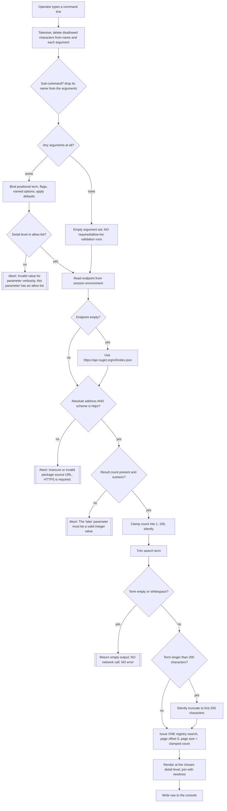

# Feature: Input Validation & Supply-Chain Safety

Subject repo: `/mnt/g/reversing/reversing/subject/Xcaciv.Cupcake` @ `a05dc6f00d4510ac073f6dd02fbfba2ffb76a5b6`

Primary in-repo evidence: `src/Xcaciv.Command.Packages/SearchCommand.cs`, `src/Xcaciv.Command.Packages/NugetWrapper.cs`, `src/Xcaciv.Command.Packages/InstallCommand.cs`, `NuGet.config`, `Directory.Packages.props`, `src/Directory.Packages.props`, `src/Xcaciv.Cupcake.Core/Loop.cs`, `src/Xcaciv.Cupcake.Core/ConsoleContext.cs`, `src/Xcaciv.Cupcake.Lit/Program.cs`, the two test projects, and the commit history around `b0ca736` / `907c535` / `3736cde` / `4ea3d3a` / `d234cbd` / `cf04929` / `e1123b2`.

Out-of-repo evidence (external command-framework semantics only, cited as `OUT-OF-REPO: <path>:<line> (framework v2.1.2)`): read-only reference clone of the separately-versioned command framework at tag v2.1.2. The shell pins 2.1.1 / 2.1.0; v2.1.2 is the closest published tag. Framework behaviour appears here as a **required capability with described semantics**, never as the shell's own code.

---

## Purpose — what user/business problem this solves; who uses it (actors/roles)

This is a shell that **downloads third-party code from a network registry and then loads and runs that code in its own process**. That combination is the entire reason this feature exists. It is not a single screen or command; it is the **set of defensive rules the product applies at three trust boundaries**:

1. **Untrusted keystrokes → command arguments.** Anything the operator types at the prompt is untrusted text that ends up shaping an outbound network request.
2. **The shell → the package registry.** Which endpoint the shell will talk to, over what transport, and how much it will ask for.
3. **Downloaded artefacts → executable code on disk.** What is written where, what identity is trusted, and under what isolation the resulting code is later loaded.

Actors:

- **Shell end user (primary).** Types package commands. Sees the rejections, the clamps and the silent truncations. Never sees the isolation rules.
- **Embedding host / operator.** Constructs the session, seeds the session environment (the only realistic way to re-point the registry endpoint — see BR-06 and QUIRK-4), and chooses the plugin root directory. Owns the residual risk left by every gap listed in "Gaps".
- **Build/release engineer.** Owns the build-time feed-to-package-name mapping (BR-30..BR-38), which decides which upstream feed is allowed to supply which package names when the product itself is assembled.
- **Plugin author (trusted-ish) and plugin supplier (untrusted).** Ships the code that gets dropped into the plugin root and loaded. The isolation policy (BR-39..BR-48) is aimed squarely at this actor.
- **Malicious registry / compromised feed / tampering local attacker.** The threat the controls below partially address. What is *not* addressed is enumerated explicitly in "Gaps", each as a requirement the clone must decide about.

**Maturity statement, stated up front so the clone is not misled:** at the pinned commit the shell has a *search* path that is fully wired and validated, and an *install* path that is deliberately inert (the install command only echoes; see G-09). Every download/extract/load-time control described below therefore describes either (a) a control that exists but is currently only reachable from tests, or (b) an absence the clone must design for.

---

## Behavior — what it does, as observable behavior; every distinct operation the feature supports, its inputs, outputs, and side effects

### Control 1 — Transport gate on the registry endpoint

Evidence: `src/Xcaciv.Command.Packages/SearchCommand.cs:24-35`.

- **Input:** the session environment value stored under the key `PackageSourceUrl` (`:24`). The session environment folds keys to upper case, so the value actually lives under `PACKAGESOURCEURL` (OUT-OF-REPO: `src/Xcaciv.Command/EnvironmentContext.cs:74` and `:97` (framework v2.1.2)).
- **Step 1 — default substitution.** If the value is absent or empty, the endpoint becomes exactly `https://api.nuget.org/v3/index.json` (`:26-29`).
- **Step 2 — the gate.** The endpoint must parse as an **absolute** address *and* its scheme must be exactly the encrypted-web scheme (`:32`).
- **Output on pass:** a registry handle is constructed for that endpoint (`:38-39`) and the operation continues.
- **Output on fail:** the operation aborts immediately, before any network traffic, carrying the message text **`Insecure or invalid package source URL. HTTPS is required.`** (`:34`).
- **Side effects:** reading the environment value under this key *creates and stores an empty default for that key* when it was absent (OUT-OF-REPO: `src/Xcaciv.Command/EnvironmentContext.cs:94-106` (framework v2.1.2) — the read stores the default unless told not to; the shell does not tell it not to, `SearchCommand.cs:24`).

### Control 2 — Result-count parse gate and clamp

Evidence: `src/Xcaciv.Command.Packages/SearchCommand.cs:15,41-46`.

- **Input:** the named option `take`, declared with default `"20"` (`:15`).
- **Parse gate:** the value must be present *and* parse as a whole number; otherwise the operation aborts with **`The 'take' parameter must be a valid integer value.`** (`:42-45`).
- **Clamp:** the parsed number is forced into the inclusive range **1..100** (`:46`). The in-source rationale is recorded as "Clamp limit to prevent abuse" (`:41`).
- **Output:** the clamped number becomes the registry request's page size (`:60`).
- **Silence:** clamping produces **no message**; the user is not told their request was reduced or raised.

### Control 3 — Search-term hygiene (trim, empty short-circuit, length cap)

Evidence: `src/Xcaciv.Command.Packages/SearchCommand.cs:13,49-58`.

- **Input:** the required positional argument `search_terms` (`:13`).
- **Trim:** leading and trailing whitespace removed (`:50`).
- **Empty short-circuit:** if the trimmed term is empty or all whitespace, the operation returns **empty output**, makes **no network request**, and raises **no error** (`:51-54`).
- **Length cap:** a term longer than **200 characters** is silently cut down to its first 200 characters (`:55-58`). No warning, no rejection.
- **Output:** the hygienised term is what goes to the registry (`:60`).

### Control 4 — Allowed-value gate on the output detail level

Evidence: `src/Xcaciv.Command.Packages/SearchCommand.cs:16,62-83`; enforcement is upstream (OUT-OF-REPO: `src/Xcaciv.Command.Core/CommandParameters.cs:76-80` (framework v2.1.2)).

- **Input:** the named option `verbosity`, declared with allowed values `quiet`, `normal`, `detailed` and default `normal` (`:16`).
- **Gate:** any other value aborts the command before it runs, with message **`Invalid value for parameter verbosity, this parameter has an allow list.`** (OUT-OF-REPO: `src/Xcaciv.Command.Core/CommandParameters.cs:79` (framework v2.1.2)). The allow-list comparison **ignores case** (OUT-OF-REPO: `src/Xcaciv.Command.Core/CommandParameters.cs:77` (framework v2.1.2)).
- **Rendering:** the shell then chooses a rendering by matching the level **case-sensitively** (`:63-83`):
  - `quiet` — identity only (`:65-67`).
  - `normal` — identity, version, ` : ` and the remote summary (`:68-70`).
  - `detailed` — identity, version, download count in parentheses, ` : ` and the remote summary, then indented `Published:`, `Authors:`, `License:` and `Vulnerabilities:<count>` lines and a `---` separator line (`:71-78`).
- **Fallback inside the shell:** an unrecognised level falls back to the `normal` rendering (`:79-82`). This branch **is reachable**, because the gate above ignores case while this match does not: `Detailed` and `DETAILED` pass the gate and then land here, silently rendering at the normal level. See QUIRK-1.

### Control 4a — Prerelease inclusion switch (declared as a user choice; on in practice)

Evidence: `src/Xcaciv.Command.Packages/SearchCommand.cs:17,47`; `src/Xcaciv.Command.Packages/NugetWrapper.cs:28`; enforcement of the switch's *presence* is upstream (OUT-OF-REPO: `src/Xcaciv.Command.Core/CommandParameters.cs:12-35` (framework v2.1.2)).

- **Input:** the switch `prerelease`, described as "Include prerelease packages in the search results." (`:17`).
- **How the shell reads it:** it tests only whether the switch **appears in the parsed argument set** — never its value (`:47`).
- **Output:** the resulting boolean is handed to the registry request as the include-prereleases filter (`src/Xcaciv.Command.Packages/NugetWrapper.cs:28`).
- **QUIRK-10 (INFERRED from framework v2.1.2):** the framework records **every** declared switch in the parsed argument set, storing the text `True` or `False` for it, whether or not the operator typed it (OUT-OF-REPO: `src/Xcaciv.Command.Core/CommandParameters.cs:34` (framework v2.1.2)). A presence test therefore always succeeds, so **unreleased/prerelease packages are included in every search that carries at least one argument** — including searches where the operator did not ask for them. See QUIRK-10.

### Control 5 — Character cleansing of every typed argument (framework capability the shell relies on)

Evidence: OUT-OF-REPO: `src/Xcaciv.Command.Interface/CommandDescription.cs:18,23,52-78` (framework v2.1.2); invoked per command line at OUT-OF-REPO: `src/Xcaciv.Command/CommandController.cs:240-241` (framework v2.1.2) and per pipeline stage at OUT-OF-REPO: `src/Xcaciv.Command/PipelineExecutor.cs:85-86` (framework v2.1.2).

- Every command line is tokenised into **runs of letters, digits, underscore and hyphen, or into double-quoted runs** — every other character (space included) merely separates tokens and is discarded (OUT-OF-REPO: `src/Xcaciv.Command.Interface/CommandDescription.cs:72` (framework v2.1.2)). **Every token then has all characters outside an allow-list deleted** — not rejected, *deleted* (`:74`), and surrounding double quotes are stripped afterwards (same line).
- **Allowed in an argument:** letters, digits, space, and `- _ . * ? [ ] | " ~ ! @ # $ % ^ & * ( )` (OUT-OF-REPO: `src/Xcaciv.Command.Interface/CommandDescription.cs:23` (framework v2.1.2)).
- **Allowed in a command name:** letters, digits, space, `-`, `_` only (OUT-OF-REPO: `src/Xcaciv.Command.Interface/CommandDescription.cs:18` (framework v2.1.2)).
- **Consequences observable at the prompt** (verified by replaying the documented tokeniser and allow-list against sample input): path separators, colon, backslash, semicolon, angle brackets, braces, comma, plus and equals **never reach a command**. Typing `package search ../../etc/passwd` delivers the arguments `search`, `etc`, `passwd`. Typing `SET PackageSourceUrl https://api.nuget.org/v3/index.json` delivers `PackageSourceUrl`, `https`, `api`, `nuget`, `org`, `v3`, `index`, `json`; quoting the URL delivers the single mangled token `httpsapi.nuget.orgv3index.json`. See QUIRK-4.

### Control 6 — Feed-to-package-name mapping (build-time supply chain)

Evidence: `NuGet.config:4-20`; `Directory.Packages.props:1-19`; `src/Directory.Packages.props:1-19`.

- **Inherited feed configuration is discarded first** (`NuGet.config:5`), so a machine-level or user-level feed list cannot silently contribute.
- **Three feeds are declared** (`NuGet.config:6-8`) — see BR-31.
- **A mapping decides which feed may serve which package names** (`NuGet.config:12-20`) — see BR-32..BR-35.
- **All dependency versions are pinned centrally, as exact versions, never in the individual project files** (`Directory.Packages.props:6-18`, `src/Directory.Packages.props:6-18`).

### Control 7 — Per-plugin directory isolation at load time (framework capability the shell relies on)

Evidence: `src/Xcaciv.Cupcake.Core/Loop.cs:24,41-43`; OUT-OF-REPO: `src/Xcaciv.Command.FileLoader/Crawler.cs:83-90` and `:125-133` (framework v2.1.2); OUT-OF-REPO: `src/Xcaciv.Command/CommandFactory.cs:85-99` (framework v2.1.2); OUT-OF-REPO: `SECURITY.md:23-27` (framework v2.1.2).

- The shell nominates exactly one plugin root, defaulting to `.\packages` (relative to the working directory) (`src/Xcaciv.Cupcake.Core/Loop.cs:24`), registers it (`:42`), then asks for discovery (`:43`).
- Each discovered plugin binary is inspected inside **its own isolated load context, whose base-path restriction is that binary's own directory** — so a plugin cannot reach a parent directory or a sibling plugin (OUT-OF-REPO: `src/Xcaciv.Command.FileLoader/Crawler.cs:85-90` (framework v2.1.2)); the same restriction is re-applied when a command is actually instantiated for execution (OUT-OF-REPO: `src/Xcaciv.Command/CommandFactory.cs:85-99` (framework v2.1.2)).
- A violation is caught, traced, and **that one plugin is skipped**; the rest of the load continues (OUT-OF-REPO: `src/Xcaciv.Command.FileLoader/Crawler.cs:125-133` and `:149-153` (framework v2.1.2)).
- **The shell configures none of this** — it accepts every default (`src/Xcaciv.Cupcake.Core/Loop.cs:41-43`).

### Control 8 — Containment of "nothing to load"

Evidence: `src/Xcaciv.Cupcake.Core/Loop.cs:45-54`.

- The "no plugins found" condition is caught, reported to the user as exactly **``No Plugins Found. You may want to check out `install --help```**, and the session **continues to the prompt** (`:45-50`).
- Any other load failure is re-raised as a load error carrying **`Unable to load commands.`** (`:51-54`), which the shipping executable turns into `Error Unable to load commands.` and a process exit status of `1` (`src/Xcaciv.Cupcake.Lit/Program.cs:14-19`). See QUIRK-6.

---

## Business rules & edge cases — every rule, limit, threshold, validation, ordering guarantee and special case, with evidence

Each rule carries evidence. In-repo citations are repo-relative; framework citations are prefixed `OUT-OF-REPO:` and are the *required semantics*, not the shell's code.

### Registry endpoint

| # | Rule | Evidence |
|---|---|---|
| BR-01 | The registry endpoint is read from the session environment under key `PackageSourceUrl`. | `src/Xcaciv.Command.Packages/SearchCommand.cs:24` |
| BR-02 | Environment keys are matched case-insensitively by folding to upper case, so the stored key is `PACKAGESOURCEURL`. | OUT-OF-REPO: `src/Xcaciv.Command/EnvironmentContext.cs:74,97` (framework v2.1.2) |
| BR-03 | Absent or empty endpoint ⇒ default to the literal `https://api.nuget.org/v3/index.json`. | `src/Xcaciv.Command.Packages/SearchCommand.cs:26-29` |
| BR-04 | The endpoint MUST parse as an absolute address. Relative or unparseable ⇒ reject. | `src/Xcaciv.Command.Packages/SearchCommand.cs:32` |
| BR-05 | The endpoint's scheme MUST be the encrypted-web scheme (`https`). Plain `http`, `file`, `ftp` and every other scheme ⇒ reject. | `src/Xcaciv.Command.Packages/SearchCommand.cs:32` |
| BR-06 | Rejection message text is exactly `Insecure or invalid package source URL. HTTPS is required.` and the operation aborts **before** any network call. | `src/Xcaciv.Command.Packages/SearchCommand.cs:32-35` |
| BR-07 | The gate checks scheme only. There is **no** host allow-list, **no** certificate pinning and **no** thumbprint check. | `src/Xcaciv.Command.Packages/SearchCommand.cs:32-35` (whole gate is these four lines) |
| BR-08 | INFERRED — an endpoint typed with an upper-case scheme (`HTTPS://…`) passes the gate, because absolute-address parsing normalises the scheme to lower case before comparison. Not covered by any test. | `src/Xcaciv.Command.Packages/SearchCommand.cs:32` |
| BR-09 | The gate was introduced together with the clamp and the term validation in one "security" change; before it, the endpoint was used unchecked. | commit `3736cde`, whose subject is "Add Xcaciv.Cupcake.Core.Tests and improve SearchCommand" and whose body carries the bullet "Enhance SearchCommand: enforce HTTPS, clamp limits, validate input, improve verbosity handling" |

### Result-count bound

| # | Rule | Evidence |
|---|---|---|
| BR-10 | The requested result count is the named option `take`; its declared default is the literal string `"20"` (20 = the product's default page size). | `src/Xcaciv.Command.Packages/SearchCommand.cs:15` |
| BR-10a | When the operator omits the count, the declared default is substituted during binding, so the parse gate passes and 20 results are requested — pinned by a test that searches with no count at all. | `src/Xcaciv.Command.Packages/SearchCommand.cs:15,42`; OUT-OF-REPO: `src/Xcaciv.Command.Core/CommandParameters.cs:64-69` (framework v2.1.2); `Xcaciv.Command.PackagesTests/SearchCommandTests.cs:112-126` |
| BR-11 | The count MUST be present and MUST parse as a whole number; otherwise abort with exactly `The 'take' parameter must be a valid integer value.` | `src/Xcaciv.Command.Packages/SearchCommand.cs:42-45` |
| BR-12 | The parsed count is clamped to the inclusive range **1..100**. 1 = always ask for at least one result; 100 = the abuse ceiling. Values below 1 become 1; values above 100 become 100. | `src/Xcaciv.Command.Packages/SearchCommand.cs:41,46` |
| BR-13 | Clamping is silent — no warning, no status message, no change to the exit path. | `src/Xcaciv.Command.Packages/SearchCommand.cs:46` (no output statement in the clamp path) |
| BR-14 | The clamped count is used as the registry page size, with page offset fixed at 0 (single page; no pagination loop). | `src/Xcaciv.Command.Packages/SearchCommand.cs:60`; `src/Xcaciv.Command.Packages/NugetWrapper.cs:29` |
| BR-15 | Requirement pinned by test: asking for 1 result yields at most one output line. | `Xcaciv.Command.PackagesTests/SearchCommandTests.cs:99-110` |
| BR-15a | The parse gate replaced an unguarded parse in a later hardening commit; previously a non-numeric count produced a raw parse failure instead of the product message. | commit `4ea3d3a` |

### Search-term bounds

| # | Rule | Evidence |
|---|---|---|
| BR-16 | The search term is trimmed of leading/trailing whitespace before any other check. | `src/Xcaciv.Command.Packages/SearchCommand.cs:50` |
| BR-17 | Empty short-circuit: a term that is empty or whitespace-only after trimming returns **empty output**, performs **no** network request, and raises **no** error. | `src/Xcaciv.Command.Packages/SearchCommand.cs:51-54` |
| BR-18 | Length cap: **200 characters**. A longer term is silently truncated to its first 200 characters and the truncated term is what is sent. | `src/Xcaciv.Command.Packages/SearchCommand.cs:55-58` |
| BR-19 | The search term is a single positional token. The tokeniser does **not** simply split on whitespace: it collects runs of letters, digits, underscore and hyphen, **or** double-quoted runs — every other character acts as a separator. A >200-character term therefore requires one very long run of those characters, or a quoted string. | OUT-OF-REPO: `src/Xcaciv.Command.Interface/CommandDescription.cs:70-78` (framework v2.1.2) |
| BR-19a | Splitting a typed line into pipeline stages is a **separate**, earlier step that honours double quotes, single quotes and backslash escapes; the per-stage argument tokenising above then applies to each stage independently. | OUT-OF-REPO: `src/Xcaciv.Command/PipelineParser.cs:9-14` and `src/Xcaciv.Command/PipelineExecutor.cs:77,85-86` (framework v2.1.2) |
| BR-20 | The search term is declared required. When the first remaining positional token begins with `-`, the framework aborts with exactly `Missing required parameter search_terms`. | `src/Xcaciv.Command.Packages/SearchCommand.cs:13`; OUT-OF-REPO: `src/Xcaciv.Command.Core/CommandParameters.cs:113-118` (framework v2.1.2) |

### Detail-level allow-list

| # | Rule | Evidence |
|---|---|---|
| BR-21 | Allowed detail levels are exactly `quiet`, `normal`, `detailed`; default `normal`. | `src/Xcaciv.Command.Packages/SearchCommand.cs:16` |
| BR-22 | A value outside the list aborts the command **before it runs**, with exactly `Invalid value for parameter verbosity, this parameter has an allow list.` The allow-list match ignores case. | OUT-OF-REPO: `src/Xcaciv.Command.Core/CommandParameters.cs:76-80` (framework v2.1.2), comparison at `:77`, message at `:79` |
| BR-23 | Detail level `detailed` renders, per result: identity, version, the download count in parentheses, ` : `, the remote summary, then indented `Published:`, `Authors:`, `License:` and `Vulnerabilities:<count>` lines, then a `---` separator line. All of those values are remote-supplied and shown for human inspection only; nothing in the product acts on them. The test pins only `Published:`, `Authors:` and `Vulnerabilities:`. | `src/Xcaciv.Command.Packages/SearchCommand.cs:72-77`; `Xcaciv.Command.PackagesTests/SearchCommandTests.cs:56-69` |
| BR-24 | Detail level `quiet` emits identity only (no colon in the output) — pinned by test. | `src/Xcaciv.Command.Packages/SearchCommand.cs:65-67`; `Xcaciv.Command.PackagesTests/SearchCommandTests.cs:42-54` |
| BR-24a | Detail level `normal` emits `<identity> <version> : <summary>` per result — the colon is present and the `Published:` field is absent, pinned by test. Results are joined with newlines, one entry per line for `quiet`/`normal`. | `src/Xcaciv.Command.Packages/SearchCommand.cs:68-70,85`; `Xcaciv.Command.PackagesTests/SearchCommandTests.cs:26-39` |
| BR-24b | **QUIRK-1.** The allow-list gate matches the detail level case-insensitively, but the shell picks its rendering case-**sensitively**. A level typed in any other casing (`Detailed`, `QUIET`) therefore passes the gate and silently renders at the `normal` level. | `src/Xcaciv.Command.Packages/SearchCommand.cs:63-83`; OUT-OF-REPO: `src/Xcaciv.Command.Core/CommandParameters.cs:77` (framework v2.1.2) |
| BR-24c | The `prerelease` switch is read by **presence**, not by value, and the resulting boolean becomes the registry request's include-prereleases filter. **QUIRK-10 / INFERRED:** the framework records every declared switch in the parsed argument set regardless of whether it was typed, so the presence test always succeeds and prereleases are included in every search that carries at least one argument. | `src/Xcaciv.Command.Packages/SearchCommand.cs:17,47`; `src/Xcaciv.Command.Packages/NugetWrapper.cs:28`; OUT-OF-REPO: `src/Xcaciv.Command.Core/CommandParameters.cs:12-35` (framework v2.1.2), unconditional record at `:34` |
| BR-24d | The framework matches a named option or switch by searching each argument that starts with `-` for the option name preceded by one or two hyphens, so both `-take` and `--take` are accepted. | OUT-OF-REPO: `src/Xcaciv.Command.Core/CommandParameters.cs:17-19,43-45,52` (framework v2.1.2) |
| BR-24e | **QUIRK-11 / INFERRED.** A named option supplied as the last token, with no value after it, is not diagnosed: the binder reads past the end of the argument list and the command fails with a framework index error rather than a product message. | OUT-OF-REPO: `src/Xcaciv.Command.Core/CommandParameters.cs:52-56` (framework v2.1.2) |

### Argument cleansing (framework capability)

| # | Rule | Evidence |
|---|---|---|
| BR-25 | Every argument token has all characters outside an allow-list **deleted silently**. Allowed: letters, digits, space, and `- _ . * ? [ ] \| " ~ ! @ # $ % ^ & * ( )`. | OUT-OF-REPO: `src/Xcaciv.Command.Interface/CommandDescription.cs:23,70-78` (framework v2.1.2) |
| BR-26 | Every command name has all characters outside a narrower allow-list deleted, then is upper-cased. Allowed: letters, digits, space, `-`, `_`. Leading/trailing `-` are trimmed. | OUT-OF-REPO: `src/Xcaciv.Command.Interface/CommandDescription.cs:18,52-64` (framework v2.1.2) |
| BR-27 | Cleansing is applied on the single-command path *and* on each pipeline stage. | OUT-OF-REPO: `src/Xcaciv.Command/CommandController.cs:240-241` and `src/Xcaciv.Command/PipelineExecutor.cs:85-86` (framework v2.1.2) |
| BR-28 | Sub-command routing consumes the first argument, so a root+sub invocation delivers only the arguments after the sub-command name to the command body. | OUT-OF-REPO: `src/Xcaciv.Command/CommandFactory.cs:43-53` (framework v2.1.2) |
| BR-29 | When **no** arguments at all are supplied, the framework returns an empty argument set **without running any required/allow-list validation and without substituting any declared default**. | OUT-OF-REPO: `src/Xcaciv.Command.Core/AbstractCommand.cs:178-180` (framework v2.1.2), short-circuit at `:180` |

### Build-time feed-to-package-name mapping

| # | Rule | Evidence |
|---|---|---|
| BR-30 | Inherited/machine-level feed configuration is **cleared** before the product's own feeds are declared. | `NuGet.config:5` |
| BR-31 | Exactly three feeds are declared: key `nuget.org` → `https://api.nuget.org/v3/index.json`; key `github` → `https://nuget.pkg.github.com/xcaciv/index.json`; key `local` → `%NUGET_LOCAL_PACKAGES%`. | `NuGet.config:6-8` |
| BR-32 | Feed `nuget.org` may serve package names matching the pattern `*` (anything). | `NuGet.config:13-15` |
| BR-33 | Feed `local` may serve package names matching the pattern `Xcaciv.*` (the first-party namespace). | `NuGet.config:17-19` |
| BR-34 | Feed `github` has **no** mapping entry. Under the mapping model a feed with no pattern may serve nothing, so the private hosted feed is declared but effectively excluded. See QUIRK-3. | `NuGet.config:12-20` (no `packageSource key="github"` block) |
| BR-35 | The most specific matching pattern wins, so first-party package names resolve **only** from the local directory feed, never from the public feed, even though the public feed's `*` also matches. INFERRED from the mapping model. | `NuGet.config:12-20` |
| BR-36 | All dependency versions are pinned centrally and exactly (no ranges, no floating versions), and never inside individual project files. | `Directory.Packages.props:6-18`; `src/Directory.Packages.props:6-18`; `src/Xcaciv.Command.Packages/Xcaciv.Command.Packages.csproj:9-12` (references carry no version) |
| BR-37 | Two earlier "feed" entries pointed at project home pages rather than feed endpoints and were removed in a hardening change: `https://github.com/Xcaciv/Xcaciv.Command` and `https://github.com/Xcaciv/Xcaciv.Loader`. | commit `d234cbd` |
| BR-38 | An absolute machine-specific local feed path `G:\NuGetPackages` was replaced by the environment-variable placeholder `%NUGET_LOCAL_PACKAGES%`. | commit `cf04929` |

### Plugin isolation at load time (framework capability)

| # | Rule | Evidence |
|---|---|---|
| BR-39 | The shell nominates exactly one plugin root, default `.\packages`, resolved relative to the process working directory. | `src/Xcaciv.Cupcake.Core/Loop.cs:24,42` |
| BR-40 | The shell never declares a restricted root, so the verification root falls back to the **process working directory**; a nominated plugin root that does not resolve underneath it is **silently rejected** (no error, no message). | `src/Xcaciv.Cupcake.Core/Loop.cs:42`; OUT-OF-REPO: `src/Xcaciv.Command.FileLoader/VerifiedSourceDirectories.cs:82-89,100-115` (framework v2.1.2) |
| BR-41 | Discovery walks `<plugin-root>/*/bin/*.dll` recursively; `bin` is the default sub-directory name and the shell does not override it. | OUT-OF-REPO: `src/Xcaciv.Command.FileLoader/Crawler.cs:20,176,178` and `src/Xcaciv.Command/CommandController.cs:169` (framework v2.1.2) |
| BR-42 | Each plugin binary is inspected inside an isolated load context whose base-path restriction is **that binary's own directory** — no parent, no sibling. | OUT-OF-REPO: `src/Xcaciv.Command.FileLoader/Crawler.cs:85-90` (framework v2.1.2) |
| BR-43 | The same per-plugin base-path restriction is re-applied when a command is instantiated for execution. | OUT-OF-REPO: `src/Xcaciv.Command/CommandFactory.cs:85-99` (framework v2.1.2) |
| BR-44 | The default loading policy is the strict one; reflection-emit is disabled by default; and when reflection-emit is disabled the strict policy is forced regardless of what was configured. | OUT-OF-REPO: `src/Xcaciv.Command/AssemblySecurityConfiguration.cs:16,22,29` and `src/Xcaciv.Command/CommandFactory.cs:91-93` (framework v2.1.2) |
| BR-45 | A plugin that violates its path restriction is caught, traced with the offending path and policy, and **skipped**; the remaining plugins still load. Malformed, missing and unloadable binaries are likewise skipped. | OUT-OF-REPO: `src/Xcaciv.Command.FileLoader/Crawler.cs:125-153` (framework v2.1.2) |
| BR-46 | A package that yielded zero valid commands is not registered at all. | OUT-OF-REPO: `src/Xcaciv.Command.FileLoader/Crawler.cs:156` (framework v2.1.2) |
| BR-47 | Discovery switches to parallel processing when more than **50** plugin binaries are found (50 = the parallelism threshold). | OUT-OF-REPO: `src/Xcaciv.Command.FileLoader/Crawler.cs:18,183` (framework v2.1.2) |
| BR-48 | The shell configures none of the isolation knobs; it accepts every default. | `src/Xcaciv.Cupcake.Core/Loop.cs:41-43` (three calls, no configuration) |

### Load-failure containment

| # | Rule | Evidence |
|---|---|---|
| BR-49 | "No plugins found" is caught and reported as exactly ``No Plugins Found. You may want to check out `install --help``` and the session continues to the prompt. | `src/Xcaciv.Cupcake.Core/Loop.cs:45-50` |
| BR-50 | Any other load failure is re-raised as a load error carrying `Unable to load commands.`, which the shipping executable prints as `Error Unable to load commands.` and exits with status `1`. | `src/Xcaciv.Cupcake.Core/Loop.cs:51-54`; `src/Xcaciv.Cupcake.Lit/Program.cs:14-19` |
| BR-51 | The asynchronous session variant does **not** have the friendly "no plugins" handler at all — every load failure there becomes the fatal path. **QUIRK-12:** it also never registers the built-in commands, which the synchronous variant does before nominating the plugin root; a session started that way has no built-in command set and, with an unconfigured plugin root, always takes the fatal path. | `src/Xcaciv.Cupcake.Core/Loop.cs:77-85` (single catch-all, no specific handler; no registration call) vs `:41-43` |

### Download / install path (present in the product, not reachable from the prompt)

| # | Rule | Evidence |
|---|---|---|
| BR-52 | The archive file name is composed from the **requested** identity as `<id>.<version>.nupkg` and placed directly in the target directory. | `src/Xcaciv.Command.Packages/NugetWrapper.cs:113-114` |
| BR-53 | The download opens the target path in create-or-truncate mode: an existing file at that path is **overwritten unconditionally**, with no existence check, no prompt and no backup. | `src/Xcaciv.Command.Packages/NugetWrapper.cs:89` |
| BR-54 | The download reports success **unconditionally** — it returns a fixed "true" after the copy, regardless of what (or how much) was written. | `src/Xcaciv.Command.Packages/NugetWrapper.cs:100` |
| BR-55 | After download, the package identity used to build the destination directory is re-read **from inside the downloaded archive's own manifest**, not from the identity that was requested. A mismatch is neither detected nor reported. | `src/Xcaciv.Command.Packages/NugetWrapper.cs:103-108,118-119` |
| BR-56 | The destination directory is `<target>/<id-from-archive>/<version-from-archive>` and is created if missing. | `src/Xcaciv.Command.Packages/NugetWrapper.cs:119-124` |
| BR-57 | Extraction is **not implemented**. The routine creates the directory and stops; the extraction call exists only as a disabled placeholder, alongside a note that dependency resolution is also outstanding. | `src/Xcaciv.Command.Packages/NugetWrapper.cs:125-127` |
| BR-58 | Nothing in the product calls the install routine. The install command returns the literal text `Not installing ` followed by the comma-joined arguments; its piped form returns `Not installing <chunk> ` followed by the comma-joined arguments. | `src/Xcaciv.Command.Packages/InstallCommand.cs:19-27`; no caller for the install routine exists anywhere in the tree |
| BR-59 | The session exposes an "install command allowed" switch defaulting to **on**, but nothing consults it except a test that asserts its default. | `src/Xcaciv.Cupcake.Core/Loop.cs:11`; `Xcaciv.Cupcake.Core.Tests/LoopTests.cs:158` |
| BR-60 | A version enquiry for a package name that does not exist on the feed returns an **empty list**, not an error — pinned by the only negative-input test in the suite. Nothing validates the package name before it is sent. | `src/Xcaciv.Command.Packages/NugetWrapper.cs:34-50`; `Xcaciv.Command.PackagesTests/NugetWrapperTests.cs:67-80` |
| BR-61 | The version enquiry builds its own registry handle **directly from a supplied address string, with no transport gate at all** — the HTTPS check is not a shared control, it lives only inside the search operation's own body. Only tests reach this path today. | `src/Xcaciv.Command.Packages/NugetWrapper.cs:34,39-40` (no scheme check) vs `src/Xcaciv.Command.Packages/SearchCommand.cs:32`; see G-13 |
| BR-62 | The download, dependency-resolution and version enquiry operations accept a "never cancelled" signal and no deadline by default; the search operation passes neither, so both defaults apply. | `src/Xcaciv.Command.Packages/NugetWrapper.cs:20,24,46,52,56,84`; `src/Xcaciv.Command.Packages/SearchCommand.cs:60` |

---

### Gaps — observed absences the clone must decide about

Each is stated as an **observed absence** with evidence, and framed as a requirement, not an exploit.

| # | Observed absence | Evidence | Requirement the clone must decide |
|---|---|---|---|
| G-01 | **No integrity verification of a downloaded archive.** The download writes the response body straight to a file and reports success; there is no hash comparison, no signature check, no length check, no comparison against any registry-published digest. | `src/Xcaciv.Command.Packages/NugetWrapper.cs:81-101`; the only test asserts "returned true" (`Xcaciv.Command.PackagesTests/NugetWrapperTests.cs:83-102`) | Decide whether a fetched archive must be checksum- and/or signature-verified before it is written, before it is opened, and before it is laid out — and what the product does when verification fails. |
| G-02 | **No publisher-trust decision before load.** Nothing records a trusted-publisher set, prompts the operator, or gates a load on publisher identity. Publisher and vulnerability data are *displayed* at the highest detail level and then discarded. | `src/Xcaciv.Command.Packages/SearchCommand.cs:72-77`; nothing reads those fields elsewhere; `src/Xcaciv.Cupcake.Core/Loop.cs:6-26` holds no trust list | Decide whether install/load requires an explicit trust decision (allow-list, first-use prompt, or policy file), and where that decision is persisted. |
| G-03 | **Download overwrites its target path unconditionally.** | `src/Xcaciv.Command.Packages/NugetWrapper.cs:89` | Decide overwrite policy: refuse, version, quarantine to a temp path and atomically move after verification, or overwrite as today. |
| G-04 | **Package identity is taken from inside the downloaded archive.** The destination directory path is derived from the archive's own self-declared identity rather than from what was requested. | `src/Xcaciv.Command.Packages/NugetWrapper.cs:113 vs :118-119` | Decide whether the requested identity is authoritative, and whether a requested-vs-declared mismatch aborts the install. |
| G-05 | **Extraction is unimplemented, so no extraction-time path defence exists yet.** Because nothing unpacks the archive today, there is also **no** entry-name sanitisation, **no** path-traversal rejection, **no** absolute-path or link-entry rejection, and **no** per-entry or total size/count limit anywhere in the product. | `src/Xcaciv.Command.Packages/NugetWrapper.cs:121-127` | The clone must design the entire extraction step, including: reject entries that resolve outside the destination directory, reject absolute paths and links, cap uncompressed size and entry count, and decide what happens to a partially extracted package. |
| G-06 | **Certificate/signature settings were introduced and then withdrawn.** A hardening commit added three host-configurable session switches — certificate validation (default on), package signature verification (default on), and an allowed-certificate-thumbprint list (default empty) — with tests pinning both the defaults and the ability to configure them. A later commit removed all three **and their tests**, described as "Remove unused settings". No enforcement code for them ever existed. At the pinned commit none of the three exists. | commit `b0ca736` (added; tests asserted defaults and `"ABC123"` configurability); commit `907c535` (removed, message "Remove unused settings from Loop class and tests"); `src/Xcaciv.Cupcake.Core/Loop.cs:6-26` (absent today) | Decide whether these three controls belong in the clone **with enforcement behind them**. Do not ship them as inert settings — that is exactly what was removed here. |
| G-07 | **The registry endpoint is session-settable and only its transport scheme is checked.** The built-in environment-setting command can write any key including the endpoint key; the gate applies no host allow-list, no pinning and no certificate check. | `src/Xcaciv.Command.Packages/SearchCommand.cs:32-35`; OUT-OF-REPO: `src/Xcaciv.Command/Commands/SetCommand.cs:23-26` (framework v2.1.2) | Decide whether the endpoint may be changed at runtime at all, and if so whether it must come from an operator-controlled allow-list. |
| G-08 | **Registry-supplied text is rendered raw to the terminal.** Summaries, author strings and licence metadata arrive from the remote feed and are joined into the output and written to the console with no transformation. The framework offers an output-encoding hook, but its base implementation is an explicit no-op and the shell does not override it. | `src/Xcaciv.Command.Packages/SearchCommand.cs:66-85`; `src/Xcaciv.Cupcake.Core/ConsoleContext.cs:53-60`; OUT-OF-REPO: `src/Xcaciv.Command.Core/AbstractTextIo.cs:121-124` (framework v2.1.2) | Decide whether remote text must be sanitised (control characters, terminal escape sequences, line-count caps) before display. |
| G-09 | **The install path is unreachable from the prompt**, so none of the download-time behaviour above is exercised by a user today; the only exercise is a live integration test. | `src/Xcaciv.Command.Packages/InstallCommand.cs:19-27`; `Xcaciv.Command.PackagesTests/NugetWrapperTests.cs:83-102` | Decide the install workflow end-to-end, including where each of G-01..G-05 sits in it. |
| G-10 | **No transaction or rollback around install.** The archive is written first, the directory created second, extraction (when built) third; there is no staging area and no cleanup on failure. | `src/Xcaciv.Command.Packages/NugetWrapper.cs:111-128` | Decide staging + atomic promotion, and cleanup of partial state. |
| G-11 | **No audit trail in the shell.** The framework offers an audit-logging capability for command execution and environment changes; the shell installs none. | OUT-OF-REPO: `src/Xcaciv.Command.Interface/IAuditLogger.cs:9-20` (the capability and its command-execution entry point) and `src/Xcaciv.Command/EnvironmentContext.cs:87` (the environment-change hook, invoked only if a logger was installed) (framework v2.1.2); `src/Xcaciv.Cupcake.Core/Loop.cs:1-113` (no audit wiring) | Decide whether endpoint changes, installs and plugin loads are audited. |
| G-12 | **No rate limiting, timeout or cancellation on the outbound registry call.** The search blocks on the call with a "never cancelled" signal and no deadline. | `src/Xcaciv.Command.Packages/SearchCommand.cs:60`; `src/Xcaciv.Command.Packages/NugetWrapper.cs:24,29` | Decide request timeouts and a cancellation path so a hostile or slow feed cannot hang the session. |
| G-13 | **The transport gate is not a shared control.** The HTTPS/absolute-address check lives inside the search operation's own body. The version-enquiry operation takes an endpoint string and builds a registry handle from it with **no** scheme or absoluteness check; the download and dependency-resolution operations take an already-built handle and check nothing either. Only the search path is gated today, and only because the gate happens to sit in it. | `src/Xcaciv.Command.Packages/SearchCommand.cs:32` (the only gate) vs `src/Xcaciv.Command.Packages/NugetWrapper.cs:39-40,81,52` (ungated entry points) | Decide where the transport gate belongs so that every outbound registry path is covered by construction, not by placement — e.g. gate the endpoint once at the point the registry handle is created. |

---

## Workflows & states

### Workflow A — Validating and dispatching a search request



Note the ordering guarantee visible in the diagram and pinned by the source: **the transport gate runs before the count gate, which runs before the term checks, and every one of them runs before any network traffic** (`src/Xcaciv.Command.Packages/SearchCommand.cs:32,42,50,60`).

Two details the diagram flattens, both of which the clone must decide about deliberately:

- The detail-level allow-list decision (node **G**) is **case-insensitive**, but the rendering choice at node **S** is **case-sensitive**, so a case variant of an allowed level passes G and then silently renders at the `normal` level (BR-24b, QUIRK-1).
- The prerelease switch is never a decision at all in practice: the parsed argument set always carries it, so the single registry search at node **R** always asks for prereleases (BR-24c, QUIRK-10).

### Workflow B — Plugin trust at session start

1. Session announces `Loading Commands` (`src/Xcaciv.Cupcake.Core/Loop.cs:37`).
2. Built-in commands are registered (`:41`).
3. The plugin root `.\packages` is nominated (`:24,42`). If it does not resolve under the process working directory, it is **silently dropped** (BR-40).
4. Discovery walks `<root>/*/bin/*.dll` (BR-41).
5. For each binary: open an isolated load context restricted to that binary's own directory (BR-42); enumerate the command types it declares; on a path violation or a malformed/unloadable binary, trace and **skip that binary only** (BR-45).
6. A package contributing zero valid commands is not registered (BR-46).
7. **State fork:**
   - Zero plugin roots registered → "no plugins" signal → friendly message, session **continues** (BR-49).
   - Root exists but holds no plugin binaries → a *different* signal → fatal path → `Error Unable to load commands.`, exit status 1 (BR-50, QUIRK-6).
   - Otherwise → prompt loop begins.
8. Prompt loop: blank input is skipped without dispatch; the exit words are exactly `END`, `EXIT` and `BYEE`, compared case-insensitively, and any of them ends the session (`src/Xcaciv.Cupcake.Core/Loop.cs:20,57-66`). The loop tests the *previous* line before prompting for the next, so the exit word ends the session on the iteration after it is typed, without being dispatched as a command (`:57-65`).

### Workflow C — Install (as designed; currently inert)

1. Compose the archive file name from the **requested** identity (BR-52).
2. Download into the target path, **overwriting** whatever is there (BR-53), and report success unconditionally (BR-54).
3. Re-read the identity from **inside the downloaded archive** (BR-55).
4. Create `<target>/<archive-id>/<archive-version>` (BR-56).
5. **Stop.** Extraction and dependency resolution are placeholders (BR-57).

There is no verification state between steps 2 and 3, and no rollback state at all (G-01, G-10).

---

## Data — entities this feature owns, their fields, relationships, lifecycle

This feature owns very little persistent data; most of what it touches is transient per-invocation state.

| Entity | Fields (generic types) | Constraints | Lifecycle |
|---|---|---|---|
| **Registry endpoint setting** | key: text (`PackageSourceUrl`, stored upper-cased); value: text (an absolute address) | Must be absolute; scheme must be `https` (BR-04, BR-05). No host allow-list. | Read at the start of every search (`SearchCommand.cs:24`); **created with an empty default on first read if absent** (BR-01 side effect); mutated by the environment-setting built-in; lives only for the session. |
| **Validated search request** | term: text (≤200 chars, trimmed, non-empty); count: whole number in 1..100; include-prereleases: boolean (**always true in practice** — BR-24c, QUIRK-10); detail level: one of `quiet`/`normal`/`detailed`, matched case-insensitively at the gate but case-sensitively when rendering (BR-24b, QUIRK-1) | All four bounds enforced before dispatch (BR-10..BR-24e). | Created per invocation from the parsed arguments; discarded when the command returns. Never persisted. |
| **Plugin root** | path: text; default `.\packages` | Must resolve under the process working directory or it is silently dropped (BR-40). | Set once at session construction; registered once at session start; never mutated. |
| **Downloaded package archive** | file path: text, shaped `<target>/<requested-id>.<requested-version>.nupkg`; contents: opaque archive bytes | No integrity constraint of any kind (G-01). Overwrites unconditionally (BR-53). | Created by the download step; never deleted by the product (the live test deletes its own temp file — `Xcaciv.Command.PackagesTests/NugetWrapperTests.cs:101`). |
| **Package layout directory** | path: text, shaped `<target>/<archive-declared-id>/<archive-declared-version>` | Identity comes from **inside the archive**, not from the request (BR-55). | Created empty by the layout step; never populated (BR-57); never deleted. |
| **Build-time feed declaration** | feed key: text; feed location: text (address or directory); allowed package-name pattern: text | Inherited configuration cleared first (BR-30). Three feeds, two patterns (BR-31..BR-34). | Static file, versioned with the product; changed only by a release engineer. |
| **Withdrawn security settings** (historical) | certificate-validation flag (default on); signature-verification flag (default on); allowed-thumbprint list (default empty) | Never enforced by any code. | Added in commit `b0ca736`, removed in commit `907c535`. **Do not exist at the pinned commit.** |

---

## Interfaces — what this feature exposes to and consumes from OTHER features

### Exposed to other features

- **To Package Search Command** (adjacent feature): a validated-request contract. The search command's own body is where these rules live — they are **not** shared, which is why the version-enquiry path is ungated (G-13); anything else that wants to search must re-apply the same five gates (transport, count parse, count clamp, term hygiene, detail-level allow-list) in that order.
- **To Package Install Command** (adjacent feature): the safety requirements listed as G-01..G-05 and G-10 are preconditions the install command must satisfy before it may be un-stubbed. Today it satisfies none of them because it does nothing (BR-58).
- **To Interactive Shell Session** (adjacent feature): the plugin-root nomination and the two load-failure outcomes (continue with a friendly message vs. fatal exit) — BR-39, BR-49, BR-50.
- **To Error Handling & Failure Reporting** (adjacent feature): four exact user-visible message strings — `Insecure or invalid package source URL. HTTPS is required.`, `The 'take' parameter must be a valid integer value.`, ``No Plugins Found. You may want to check out `install --help```, and `Unable to load commands.` (wrapped for display as `Error Unable to load commands.`).
- **To Console Presentation & Interaction** (adjacent feature): remote-supplied text is handed over **unsanitised** (G-08). If the clone adds output sanitisation, that is the boundary where it belongs.

### Consumed from other features

- **From Configuration & Settings** (adjacent feature): the session environment that carries the registry endpoint (BR-01), and the plugin-root path (BR-39).
- **From Package Registry Client** (adjacent feature): the search, download, manifest-read and layout operations that these rules wrap. This feature supplies the *bounds*; the registry client supplies the *mechanics*.
- **From Plugin Discovery & Command Registration** (adjacent feature): the discovery walk and registration that the isolation policy protects.

### Required capabilities of the external command framework (semantics, not signatures)

| Capability | Required semantics | Evidence |
|---|---|---|
| Pipeline segmentation | Split a typed line into pipeline stages, honouring double quotes, single quotes and backslash escapes, and rejecting unbalanced quotes/escapes. This is a **separate, earlier** step from argument tokenising. | OUT-OF-REPO: `src/Xcaciv.Command/PipelineParser.cs:9-14,24`, `src/Xcaciv.Command/PipelineExecutor.cs:77` (framework v2.1.2) |
| Argument cleansing | Within a stage, tokenise into runs of letters, digits, underscore and hyphen **or** double-quoted runs (every other character separates and is discarded); then delete every character outside a fixed allow-list from each token — silently, not as a rejection — and strip surrounding quotes. The first token is the command name and is removed from the argument list. | OUT-OF-REPO: `src/Xcaciv.Command.Interface/CommandDescription.cs:18,23,52-78` (framework v2.1.2) |
| Declarative parameter binding | Bind positional args, switches and named options from declarations; substitute declared defaults; enforce "required" and "allowed values" (case-insensitive) with the exact messages in BR-20 and BR-22; **skip all validation when the argument list is empty**; process positional args first, then switches, then named options. **Every declared switch is recorded in the parsed set whether or not it was typed** (this is what makes QUIRK-10 happen), and a named option with no following value reads past the end of the list (QUIRK-11). | OUT-OF-REPO: `src/Xcaciv.Command.Core/CommandParameters.cs:12-35` (switches), `:38-84` (named), `:86-132` (positional), `src/Xcaciv.Command.Core/AbstractCommand.cs:178-191` (framework v2.1.2) |
| Sub-command routing | Match the first argument against the root command's sub-commands and remove it from the argument list before the command body sees it. | OUT-OF-REPO: `src/Xcaciv.Command/CommandFactory.cs:43-53` (framework v2.1.2) |
| Environment isolation | Case-insensitive keys (folded upper); reads may store a default; children inherit a snapshot. | OUT-OF-REPO: `src/Xcaciv.Command/EnvironmentContext.cs:45-117` (framework v2.1.2) |
| Verified plugin roots | Reject (silently, by returning "not added") a nominated plugin root that does not resolve underneath the restricted root; default the restricted root to the process working directory when none is declared. | OUT-OF-REPO: `src/Xcaciv.Command.FileLoader/VerifiedSourceDirectories.cs:82-115` (framework v2.1.2) |
| Per-plugin load isolation | Load each plugin binary in its own context restricted to that binary's own directory; strict policy by default; reflection-emit off by default and, when off, force strict; on violation raise, log and **skip only that plugin**. | OUT-OF-REPO: `src/Xcaciv.Command.FileLoader/Crawler.cs:83-153`, `src/Xcaciv.Command/CommandFactory.cs:85-117`, `src/Xcaciv.Command/AssemblySecurityConfiguration.cs:16,22,29`, `SECURITY.md:23-27` (framework v2.1.2) |
| Distinct "nothing to load" signals | Signal "no plugin roots configured" separately from "root exists but contains no plugin binaries" — they are unrelated signals, which is what produces QUIRK-6. | OUT-OF-REPO: `src/Xcaciv.Command.Interface/Exceptions/NoPluginsFoundException.cs:3`, `src/Xcaciv.Command.Interface/Exceptions/NoPackageDirectoryFoundException.cs:3`, `src/Xcaciv.Command/CommandLoader.cs:42-45`, `src/Xcaciv.Command.FileLoader/Crawler.cs:180` (framework v2.1.2) |
| Output-encoding hook | Offer a per-session output encoder hook whose base behaviour is a no-op. | OUT-OF-REPO: `src/Xcaciv.Command.Interface/IOutputEncoder.cs:19-48`, `src/Xcaciv.Command.Core/AbstractTextIo.cs:121-124` (framework v2.1.2) |

---

## External technology — everything outside the repo this feature needs

| Generic capability | Protocol/standard if any | What the source used | Notes for reimplementer |
|---|---|---|---|
| Managed runtime + language | — | C# on .NET 8 (`net8.0`) for all projects; the Release configuration of the shipping executable retargets `net6.0-windows` and switches the output kind from console to windowed, single-file, self-contained, trimmed, ReadyToRun, win-x64, no Win32 manifest (`src/Xcaciv.Cupcake.Lit/Xcaciv.Cupcake.Lit.csproj:10-23`) | Nullable reference types and implicit usings enabled everywhere. The Release retarget means the shipped binary runs on an **older** runtime than the one the code is developed against — a supply-chain-relevant divergence the clone should not copy blindly. Two further Release-only observations the clone should decide about rather than inherit: the windowed output kind (`:11`) detaches the console this product's entire interface depends on, and trimming (`:19`) removes code that is not statically reachable — INFERRED to be a hazard here, because plugin types are reached dynamically at load time (BR-42), not statically. |
| Package registry client (search, version list, dependency info, archive download, manifest read) | Registry v3 JSON-over-HTTPS service index | `NuGet.Protocol` 7.0.1, pinned in `Directory.Packages.props:7` / `src/Directory.Packages.props:7` | Supplies the on-disk HTTP cache, service discovery, and the archive-manifest reader used for BR-55. The clone needs an equivalent client, or must implement the feed protocol directly. |
| Command framework: parsing, cleansing, parameter binding, pipelines, help, plugin loading, built-in commands | — | `Xcaciv.Command` 2.1.1, `Xcaciv.Command.Core` 2.1.0, `Xcaciv.Command.Interface` 2.1.0 (`Directory.Packages.props:8-10`) — an external, separately-versioned framework by the same author, **not published on the public feed** (404), shipped to a private hosted feed | All framework semantics this feature depends on are tabulated under "Interfaces → Required capabilities". A clone that does not reproduce the argument-cleansing allow-list (BR-25) loses a real input-validation control that the shell silently relies on. |
| Plugin assembly loader with path sandboxing | — | `Xcaciv.Loader` (2.0.1/2.1.1 per the framework's own notes), reached only through the framework | Provides the per-plugin base-path restriction and the strict/default policy split (BR-42..BR-45). The clone needs an equivalent isolated-load mechanism, or an out-of-process plugin model. |
| Build-time dependency acquisition with feed-to-name mapping and central version pinning | Feed configuration file + central package-version file | `NuGet.config` with `<clear/>`, three `packageSources` and a `packageSourceMapping` block; `Directory.Packages.props` + `src/Directory.Packages.props` with `ManagePackageVersionsCentrally` | The mapping is the only supply-chain control at build time (BR-30..BR-36). Reproduce the equivalent in the clone's ecosystem (e.g. scoped registries + a lockfile). Note the `%NUGET_LOCAL_PACKAGES%` placeholder is expanded by the tool only on Windows — see QUIRK-2. |
| Private hosted package feed | Registry v3 over HTTPS | `https://nuget.pkg.github.com/xcaciv/index.json` (`NuGet.config:7`) | Requires credentials not present in the repo, and is excluded by the mapping anyway (QUIRK-3). |
| Public package feed | Registry v3 over HTTPS | `https://api.nuget.org/v3/index.json` (`NuGet.config:6`, and the runtime default at `src/Xcaciv.Command.Packages/SearchCommand.cs:28`) | Same literal appears twice, in two different roles (build-time feed, runtime default endpoint). Keep them distinct in the clone. |
| Unit/integration test runner | — | xUnit 2.9.3 with its Visual Studio runner 3.1.5, the .NET test SDK 18.0.1 and coverlet 6.0.4 for coverage (`Directory.Packages.props:14-17`, mirrored at `src/Directory.Packages.props:14-17`) | The package test project performs **live network calls to the public feed** — see NFR-07. There is no test double for the registry anywhere in the repo, so every clone-side test of these rules will need one. |
| Terminal | ANSI/console colour + line I/O | Console foreground/background colour and line read/write (`src/Xcaciv.Cupcake.Core/ConsoleContext.cs:53-72`) | This is where unsanitised remote text lands (G-08). |

---

## Error handling — failure modes and what the user/system observes

| Failure mode | What the user/system observes | Evidence |
|---|---|---|
| Endpoint not absolute, or scheme is not the encrypted-web scheme | Search aborts before any network traffic; message text `Insecure or invalid package source URL. HTTPS is required.` The session's outer handling decides presentation. | `src/Xcaciv.Command.Packages/SearchCommand.cs:32-35` |
| Result count missing or not a whole number | Search aborts; message text `The 'take' parameter must be a valid integer value.` | `src/Xcaciv.Command.Packages/SearchCommand.cs:42-45` |
| Result count out of range | **No error.** Silently clamped to 1..100 and the search proceeds. | `src/Xcaciv.Command.Packages/SearchCommand.cs:46` |
| Search term empty/whitespace after trimming | **No error.** Empty output, no network call. Indistinguishable from "a valid search that matched nothing". | `src/Xcaciv.Command.Packages/SearchCommand.cs:51-54` |
| Search term longer than 200 characters | **No error and no warning.** Silently truncated; results reflect the truncated term. | `src/Xcaciv.Command.Packages/SearchCommand.cs:55-58` |
| Detail level outside the allow-list | Command aborts before running; message `Invalid value for parameter verbosity, this parameter has an allow list.` | OUT-OF-REPO: `src/Xcaciv.Command.Core/CommandParameters.cs:76-80` (framework v2.1.2) |
| Detail level in the allow-list but in a different casing (`Detailed`, `QUIET`) | **No error.** The gate passes and the output is silently rendered at the `normal` level — a `detailed` request loses its extra fields with no indication. | `src/Xcaciv.Command.Packages/SearchCommand.cs:63-83`; OUT-OF-REPO: `src/Xcaciv.Command.Core/CommandParameters.cs:77` (framework v2.1.2); QUIRK-1 |
| Named option typed as the last token with no value after it | **INFERRED (framework v2.1.2).** Not diagnosed as a product error: the binder reads past the end of the argument list, so the operator sees a raw framework index error rather than a product message. | OUT-OF-REPO: `src/Xcaciv.Command.Core/CommandParameters.cs:52-56` (framework v2.1.2); QUIRK-11 |
| Prerelease packages appear in results the operator did not ask for | **Not an error and not reported.** The switch is read by presence and the parsed argument set always carries it. | `src/Xcaciv.Command.Packages/SearchCommand.cs:47`; OUT-OF-REPO: `src/Xcaciv.Command.Core/CommandParameters.cs:34` (framework v2.1.2); QUIRK-10 |
| Version enquiry for a package name that does not exist | **No error.** An empty list is returned, indistinguishable from "the feed has no versions". | `src/Xcaciv.Command.Packages/NugetWrapper.cs:34-50`; `Xcaciv.Command.PackagesTests/NugetWrapperTests.cs:67-80` |
| Version enquiry given a plain-`http` or non-absolute endpoint | **Not detected.** That path has no transport gate; the registry handle is built from the supplied string as-is. | `src/Xcaciv.Command.Packages/NugetWrapper.cs:39-40`; G-13 |
| Named option supplied before the positional term | Command aborts; message `Missing required parameter search_terms`. | OUT-OF-REPO: `src/Xcaciv.Command.Core/CommandParameters.cs:113-118` (framework v2.1.2); see QUIRK-5 |
| Search invoked with **no** arguments at all | The missing-term check never runs; the first failure observed is the **count** message `The 'take' parameter must be a valid integer value.` — a misleading diagnostic. | `src/Xcaciv.Command.Packages/SearchCommand.cs:42-45`; OUT-OF-REPO: `src/Xcaciv.Command.Core/AbstractCommand.cs:180-181` (framework v2.1.2); QUIRK-7 |
| Registry unreachable / DNS failure / TLS failure | Surfaces as whatever the registry client raises, unwrapped by this feature; the search blocks on it with no timeout and no cancellation. | `src/Xcaciv.Command.Packages/SearchCommand.cs:60`; `src/Xcaciv.Command.Packages/NugetWrapper.cs:24,29` |
| Plugin binary violates its path restriction | Traced with the offending path and policy; **that plugin is skipped**; the session continues with the rest. No user-facing message. | OUT-OF-REPO: `src/Xcaciv.Command.FileLoader/Crawler.cs:125-133` (framework v2.1.2) |
| Plugin binary missing / malformed / unloadable | Traced; skipped; session continues. No user-facing message. | OUT-OF-REPO: `src/Xcaciv.Command.FileLoader/Crawler.cs:134-153` (framework v2.1.2) |
| Plugin root does not resolve under the working directory | **Silently dropped.** No message. Leads to the "no plugins" path. | OUT-OF-REPO: `src/Xcaciv.Command.FileLoader/VerifiedSourceDirectories.cs:82-89` (framework v2.1.2) |
| No plugin roots registered | Friendly message ``No Plugins Found. You may want to check out `install --help``` and the session **continues**. | `src/Xcaciv.Cupcake.Core/Loop.cs:45-50` |
| Plugin root exists but contains no plugin binaries | **Fatal.** `Error Unable to load commands.` and process exit status `1`. See QUIRK-6. | `src/Xcaciv.Cupcake.Core/Loop.cs:51-54`; `src/Xcaciv.Cupcake.Lit/Program.cs:14-19` |
| Downloaded archive is truncated, corrupt or substituted | **Not detected.** Success is reported unconditionally (BR-54); the identity is then read from the archive itself (BR-55). | `src/Xcaciv.Command.Packages/NugetWrapper.cs:100,118` |
| A file already exists at the download target path | **Not detected.** Overwritten. | `src/Xcaciv.Command.Packages/NugetWrapper.cs:89` |
| Install requested at the prompt | Echoes `Not installing ` plus the comma-joined arguments. Nothing is downloaded. | `src/Xcaciv.Command.Packages/InstallCommand.cs:21` |
| Install piped into | Echoes `Not installing <chunk> ` plus the comma-joined arguments. | `src/Xcaciv.Command.Packages/InstallCommand.cs:26` |
| Search used as a pipeline stage | Echoes `Unsupported search method for <chunk> (piped)` plus the comma-joined arguments — pinned by test. | `src/Xcaciv.Command.Packages/SearchCommand.cs:90`; `Xcaciv.Command.PackagesTests/SearchCommandTests.cs:128-138` |

---

## Non-functional observations — caching, pagination, concurrency, permissions, performance, i18n, accessibility

- **NFR-01 — Pagination.** Exactly one page is requested, at offset 0, with page size = the clamped count. There is no "next page" behaviour and no way to reach results beyond 100. `src/Xcaciv.Command.Packages/SearchCommand.cs:60`; `src/Xcaciv.Command.Packages/NugetWrapper.cs:29`.
- **NFR-02 — Caching.** Response caching is delegated wholly to the registry client's own on-disk cache; the shell creates a fresh cache context per operation and holds no cache of its own. `src/Xcaciv.Command.Packages/NugetWrapper.cs:37,43,85`. **QUIRK-13:** only one of those three cache contexts is scoped for release (`:43`); the other two (`:37`, `:85`) are created and abandoned, and `:37` is created but never used at all — the enquiry it belongs to builds a second one immediately (`:43`). The clone should treat cache-context lifetime as an explicit decision rather than copying this.
- **NFR-03 — Concurrency.** The search is asynchronous underneath but consumed by blocking, deliberately, so the shell is single-threaded per command. `src/Xcaciv.Command.Packages/SearchCommand.cs:60`; `src/Xcaciv.Cupcake.Core/Loop.cs:37,62,65`. Plugin discovery becomes parallel above 50 binaries (BR-47), and the callback it invokes is documented as needing to be thread-safe (OUT-OF-REPO: `src/Xcaciv.Command.FileLoader/Crawler.cs:168` (framework v2.1.2)).
- **NFR-04 — Permissions.** No authentication, authorisation, credential store, or elevation check exists anywhere in this feature. The only "permission" concepts are the transport gate (BR-05), the build-time feed mapping (BR-32..BR-34) and the per-plugin path restriction (BR-42).
- **NFR-05 — Performance-motivated code.** The 100-result ceiling is annotated in source as an abuse bound — the comment above it reads "Clamp limit to prevent abuse" (`src/Xcaciv.Command.Packages/SearchCommand.cs:41`). The 200-character term cap carries **no** stated rationale; the only comment above that block reads "Validate search terms" (`:49`), so treating the cap as a cost/abuse bound is INFERRED from its shape, not from the source. The empty-term short-circuit avoids a pointless round trip (`:51-54`). The parallelism threshold of 50 exists to avoid parallel overhead on small plugin sets (OUT-OF-REPO: `src/Xcaciv.Command.FileLoader/Crawler.cs:16-18` (framework v2.1.2)).
- **NFR-06 — i18n / accessibility.** None. All message text is hard-coded English; there is no resource lookup, no locale handling, and output is colour-coded with no non-colour alternative (`src/Xcaciv.Cupcake.Core/ConsoleContext.cs:23-30`). The default prompt is the single non-ASCII character sequence `Ɛ> ` (`src/Xcaciv.Cupcake.Core/Loop.cs:16`), which assumes a terminal that can render it.
- **NFR-07 — Tests reach the public internet.** The package test project is a live integration suite: it constructs a real handle to `https://api.nuget.org/v3/index.json` and asserts against live results, including a real archive download to a temporary path. `Xcaciv.Command.PackagesTests/NugetWrapperTests.cs:17,37,57,72,88`; `Xcaciv.Command.PackagesTests/SearchCommandTests.cs:90`. Consequences: the suite fails without network access, its assertions depend on third-party packages continuing to exist (`XCBatch`, `XCBatch.Core`, `XCBatch.Interfaces`, `Cake.NuGet` — `SearchCommandTests.cs:14,22-23,117,125`; and `XCBatch.Core` version `1.0.0` being downloadable — `NugetWrapperTests.cs:86-87`), and it is itself a supply-chain exposure of the build pipeline. One test writes a real archive into the host's temporary directory under a random name and deletes it afterwards (`NugetWrapperTests.cs:89,101`).
- **NFR-08 — Session-scoped state only.** Nothing in this feature persists across sessions: no trust store, no allow-list file, no install ledger.

---

## Acceptance criteria — Given/When/Then a QA engineer could execute against the clone

1. **Given** no registry endpoint is configured in the session, **when** the operator runs a package search for a term that matches published packages, **then** the request goes to `https://api.nuget.org/v3/index.json` and results are returned. (BR-03; `Xcaciv.Command.PackagesTests/SearchCommandTests.cs:9-24`)
2. **Given** the session endpoint is set to an address whose scheme is `http`, **when** the operator runs a package search, **then** no network request is made and the operation fails with exactly `Insecure or invalid package source URL. HTTPS is required.` (BR-05, BR-06)
3. **Given** the session endpoint is set to a value that is not an absolute address (for example a bare host name or a relative path), **when** the operator runs a package search, **then** the same message `Insecure or invalid package source URL. HTTPS is required.` is produced. (BR-04, BR-06)
4. **Given** the session endpoint is set to `https://api.nuget.org/v3/index.json` explicitly, **when** the operator runs a package search, **then** results are returned exactly as with the default. (BR-01; `Xcaciv.Command.PackagesTests/SearchCommandTests.cs:84-96`)
5. **Given** a search with a requested result count of `1`, **when** it runs, **then** at most one result line is produced. (BR-15; `Xcaciv.Command.PackagesTests/SearchCommandTests.cs:99-110`)
6. **Given** a search with a requested result count of `0` or a negative number, **when** it runs, **then** it succeeds with **no** warning and behaves as if `1` had been requested. (BR-12, BR-13)
7. **Given** a search with a requested result count of `5000`, **when** it runs, **then** it succeeds with **no** warning and returns at most 100 results. (BR-12, BR-13)
8. **Given** a search with a requested result count of `abc`, **when** it runs, **then** it fails with exactly `The 'take' parameter must be a valid integer value.` (BR-11)
9. **Given** a search term that is empty or only whitespace, **when** it runs, **then** the output is empty, **no** registry request is made, and **no** error is raised. (BR-17)
10. **Given** a search term of 250 characters, **when** it runs, **then** the registry is queried with only the first 200 characters and the operator receives no indication that the term was shortened. (BR-18)
11. **Given** a search with a detail level of `verbose` (not in the allow-list), **when** it runs, **then** it fails with exactly `Invalid value for parameter verbosity, this parameter has an allow list.` and no registry request is made. (BR-22)
12. **Given** a search with detail level `quiet`, **when** it runs, **then** each line contains only a package identity and no colon; **given** `normal`, **then** each line is `<identity> <version> : <summary>` and contains no `Published:`; **given** `detailed`, **then** each entry additionally contains a download count in parentheses and indented `Published:`, `Authors:`, `License:` and `Vulnerabilities:<count>` lines followed by a `---` separator line. (BR-23, BR-24, BR-24a; `Xcaciv.Command.PackagesTests/SearchCommandTests.cs:26-69`)
13. **Given** the operator types a search term containing path-traversal characters (for example `../../etc/passwd`), **when** the line is parsed, **then** those characters are removed before the command sees them and the term becomes `etc` with `passwd` as a separate discarded token. (BR-25)
14. **Given** the configured plugin root does not exist, **when** the session starts, **then** the operator sees ``No Plugins Found. You may want to check out `install --help``` and **still reaches the prompt**. (BR-49)
15. **Given** the plugin root exists but contains no plugin binaries, **when** the session starts, **then** the process prints `Error Unable to load commands.` and exits with status `1`. (BR-50, QUIRK-6 — encode the intended behaviour deliberately; do not inherit this by accident.)
16. **Given** two plugins in the plugin root, one of which attempts to load a file outside its own directory, **when** the session starts, **then** the offending plugin is skipped and the other plugin's commands are still available. (BR-42, BR-45)
17. **Given** an install request for any package, **when** it runs, **then** the output begins with `Not installing ` and **no** file is written and **no** network request is made. (BR-58)
18. **Given** a package archive is downloaded to a path where a file already exists, **when** the download runs, **then** the existing file is replaced with no prompt and the operation reports success — this is the **current** behaviour and the clone must consciously choose to keep or change it. (BR-53, BR-54, G-03)

19. **Given** a search with detail level `Detailed` (an allowed value typed in a different casing), **when** it runs, **then** — as the source behaves today — the request is accepted and the output is rendered at the `normal` level, with no publisher, licence or vulnerability lines and no message explaining the downgrade. (BR-24b, QUIRK-1 — the clone must choose deliberately between matching case-insensitively everywhere and rejecting the variant; do not inherit the silent downgrade by accident.)
20. **Given** a search that does **not** carry the prerelease switch, **when** it runs, **then** — as the source behaves today — prerelease packages are still included in the results. (BR-24c, QUIRK-10 — INFERRED from the framework reference; the clone should make the switch actually decide, and should verify this against its own binder.)
21. **Given** a search with no result-count option supplied at all but at least one other argument, **when** it runs, **then** it succeeds and requests 20 results. (BR-10a; `Xcaciv.Command.PackagesTests/SearchCommandTests.cs:112-126`)
22. **Given** a search line ending in a named option with no value after it (for example `package search XCBatch -take`), **when** it runs, **then** — as the source behaves today — the operator sees a raw index error from the argument binder rather than the product's own message. (BR-24e, QUIRK-11 — the clone must diagnose this explicitly.)
23. **Given** a version enquiry for a package name that does not exist on the feed, **when** it runs, **then** an empty list is returned and **no** error is raised. (BR-60; `Xcaciv.Command.PackagesTests/NugetWrapperTests.cs:67-80`)
24. **Given** a version enquiry pointed at a plain-`http` endpoint, **when** it runs, **then** — as the source behaves today — **no** transport check is applied, because the HTTPS gate exists only inside the search operation. (BR-61, G-13 — the clone must gate every outbound registry path, not just the search.)
25. **Given** a session started through the asynchronous entry point, **when** it starts, **then** — as the source behaves today — no built-in commands are registered and any load failure is fatal. (BR-51, QUIRK-12.)

---

## Confidence & open questions — what is INFERRED, what could not be determined

### Directly observed (high confidence)

Every rule BR-01..BR-62 and every gap G-01..G-13 is backed by a cited line, either in the subject repo or in the framework reference clone. The five runtime gates in the search path (transport, count parse, count clamp, term hygiene, detail-level allow-list) and their exact message strings are read directly from `src/Xcaciv.Command.Packages/SearchCommand.cs`. The build-time feed mapping literals are read directly from `NuGet.config`. The withdrawal of the certificate/signature settings is read from the commit diffs of `b0ca736` and `907c535`.

### QUIRKs — observed behaviour that looks like a defect

- **QUIRK-1 — A case variant of an allowed detail level is silently downgraded.** The allow-list gate compares the typed level to `quiet`/`normal`/`detailed` **ignoring case** (OUT-OF-REPO: `src/Xcaciv.Command.Core/CommandParameters.cs:77` (framework v2.1.2)), so `Detailed` and `DETAILED` are accepted and reach the command body. The body then chooses its rendering by matching the same text **case-sensitively** (`src/Xcaciv.Command.Packages/SearchCommand.cs:63-83`), so anything but the exact lower-case spelling falls into the "fall back to normal" branch (`:79-82`). Net effect: `-verbosity Detailed` is accepted and quietly produces `normal` output, losing the publisher, licence and vulnerability lines with no message. The fallback branch is therefore **not** dead defensive code — it is the branch that hides this defect. The clone should either match case-insensitively in both places or reject the variant outright, deliberately.
- **QUIRK-2 — The local feed path placeholder is not expanded on non-Windows hosts.** Restore artefacts generated on the analysis host (untracked build output at `src/Xcaciv.Command.Packages/obj/project.assets.json`, not part of the pinned commit) record the local feed resolved to the literal directory `%NUGET_LOCAL_PACKAGES%` under the repo root rather than to an expanded path. This makes the origin of the first-party packages **platform-dependent**: on Windows the placeholder expands to a machine directory; elsewhere it becomes a non-existent literal directory and the first-party packages resolve from nowhere. The same artefacts show no first-party package was resolved on the analysis host at all.
- **QUIRK-3 — The private hosted feed is declared but excluded.** `github` is declared as a feed (`NuGet.config:7`) but has no entry in the mapping (`NuGet.config:12-20`), so it can serve nothing. Meanwhile the framework packages the product depends on are documented as *not* being on the public feed. Net effect: the mapping as written cannot supply the product's own framework dependency from the hosted feed at all. Either the mapping is incomplete or the `local` feed is the intended sole source.
- **QUIRK-4 — A registry endpoint cannot be set from the prompt.** Because every argument is passed through a character allow-list that deletes `:` and `/` (BR-25), a URL typed at the prompt is destroyed: unquoted it fragments into `https`, `api`, `nuget`, `org`, `v3`, `index`, `json`; quoted it collapses to `httpsapi.nuget.orgv3index.json`. Either way the transport gate then rejects it. **In practice the endpoint can only be changed by an embedding host seeding the session environment programmatically.** This is a de-facto (probably accidental) hardening of the endpoint, and the clone should decide whether to preserve it deliberately.
- **QUIRK-5 — Option order matters.** Because the positional term is bound before named options are stripped, `package search -take 5 XCBatch` fails with `Missing required parameter search_terms`, while `package search XCBatch -take 5` succeeds. (OUT-OF-REPO: `src/Xcaciv.Command.Core/CommandParameters.cs:86-132` (framework v2.1.2) — ordered parameters processed first; `Xcaciv.Command.PackagesTests/SearchCommandTests.cs:30,45,60,75,88,102` — every test puts the term first.)
- **QUIRK-6 — Only one of the two "nothing to load" conditions is handled gracefully.** The session catches the "no plugin roots configured" signal but not the "root exists, contains no plugin binaries" signal, which is an unrelated signal; the latter therefore becomes a fatal start-up failure with the generic text `Unable to load commands.` (`src/Xcaciv.Cupcake.Core/Loop.cs:45-54`; OUT-OF-REPO: `src/Xcaciv.Command.Interface/Exceptions/NoPluginsFoundException.cs:3` vs `src/Xcaciv.Command.Interface/Exceptions/NoPackageDirectoryFoundException.cs:3`, and `src/Xcaciv.Command.FileLoader/Crawler.cs:180` (framework v2.1.2)). A fresh install with an empty `packages` directory therefore cannot start.
- **QUIRK-7 — Argument-less search produces a misleading error.** With no arguments at all the framework skips validation entirely (BR-29), so the missing-required-term error never fires and the user instead sees `The 'take' parameter must be a valid integer value.`
- **QUIRK-8 — The `source` option is declared but never read.** A named option `source`, described as "The source to search for the package." is declared (`src/Xcaciv.Command.Packages/SearchCommand.cs:14`) and appears in generated help, but nothing in the command body reads it — the endpoint comes only from the session environment (BR-01). An operator following the help text will believe they have re-pointed the feed when they have not.
- **QUIRK-9 — The shipping search command references an undeclared result accumulator.** The accumulator's declaration was deleted in commit `e1123b2`, but five uses remain (`src/Xcaciv.Command.Packages/SearchCommand.cs:66,69,72,81,85`), and the framework base contract at the closest published tag declares no such member (OUT-OF-REPO: `src/Xcaciv.Command.Core/AbstractCommand.cs:14-266` (framework v2.1.2) — no such member anywhere in the class). **INFERRED: the pinned commit does not compile.** This does not change any documented rule — the rules above are read from source, not from a running binary — but the clone's team should know the reference build is broken at this commit and cannot be run to confirm behaviour.
- **QUIRK-10 — The prerelease switch is always on. (INFERRED from framework v2.1.2.)** The shell decides whether to include prerelease packages by testing whether the switch **appears** in the parsed argument set (`src/Xcaciv.Command.Packages/SearchCommand.cs:47`). The framework records **every** declared switch in that set — storing the text `True` or `False` for it — whether or not the operator typed it (OUT-OF-REPO: `src/Xcaciv.Command.Core/CommandParameters.cs:34` (framework v2.1.2)). The presence test therefore always succeeds, so every search that carries at least one argument asks the registry for prereleases. The operator's `-prerelease` switch changes nothing, and unreleased packages appear in results that were never asked to include them — which matters for a feature whose job is deciding what code the product will later be told to install. Unverified against the pinned framework 2.1.0; the tests pass either way (`Xcaciv.Command.PackagesTests/SearchCommandTests.cs:71-82`).
- **QUIRK-11 — A named option with no value is not diagnosed. (INFERRED from framework v2.1.2.)** When a named option is the last token on the line, the binder takes the token after it without checking that one exists (OUT-OF-REPO: `src/Xcaciv.Command.Core/CommandParameters.cs:52-56` (framework v2.1.2)). `package search XCBatch -take` therefore fails with a raw framework index error instead of the product's own `The 'take' parameter must be a valid integer value.` message. The clone should diagnose a value-less option explicitly.
- **QUIRK-12 — The asynchronous session variant registers no built-in commands.** The synchronous variant registers the built-in command set, nominates the plugin root, then loads (`src/Xcaciv.Cupcake.Core/Loop.cs:41-43`); the asynchronous variant omits the registration step entirely (`:79-80`). A session started that way has no built-in commands (including the environment-setting command that is the only realistic way to re-point the registry endpoint — QUIRK-4) and no friendly "no plugins" handling (BR-51).
- **QUIRK-13 — Cache contexts are created and abandoned.** Of the three registry cache contexts the product creates, one is scoped for release (`src/Xcaciv.Command.Packages/NugetWrapper.cs:43`) and two are not (`:37`, `:85`); the one at `:37` is never used at all, because the enquiry that creates it immediately creates a second one at `:43` and uses that. Observed as written; the clone should decide cache-context lifetime deliberately.
- **QUIRK-14 — The 200-character term cap has no stated rationale.** The clamp above it is annotated "Clamp limit to prevent abuse" (`src/Xcaciv.Command.Packages/SearchCommand.cs:41`); the term block is annotated only "Validate search terms" (`:49`). Reading the cap as a cost or abuse bound is an inference (NFR-05), and it is applied by silent truncation rather than rejection (BR-18) — an unusual choice for a validation control, since the operator is given results for a query they did not type.

### INFERRED items (not directly observed)

- BR-08 (upper-case scheme passes the gate) — inferred from absolute-address parsing normalising the scheme; no test covers it.
- BR-35 (most-specific pattern wins, so first-party names resolve only from the local feed) — inferred from the mapping model, not from an observed restore of a first-party package.
- QUIRK-9's "does not compile" conclusion — inferred from the framework reference at v2.1.2 while the repo pins 2.1.0; the exact 2.1.0 artefact was not available (see below).
- The de-facto endpoint-immutability in QUIRK-4 — the cleansing rules and tokeniser were read from the framework reference and replayed against sample input; the behaviour was not observed in a running shell.
- BR-24c / QUIRK-10 (the prerelease switch is always on) — inferred from the framework reference's unconditional recording of declared switches; no test distinguishes the two behaviours, and the pinned framework 2.1.0 was not available to confirm.
- BR-24e / QUIRK-11 (a value-less named option produces a raw index error) — inferred from the framework reference's binder; not covered by any test.
- BR-24b / QUIRK-1 (a case variant of an allowed detail level renders at the normal level) — the case-insensitive gate is read from the framework reference; the case-sensitive rendering is read directly from the subject repo. Only the framework half is inferred.
- NFR-05's reading of the 200-character cap as a cost/abuse bound — the source states no rationale (QUIRK-14).

### Open questions / could not determine

1. **Whether the pinned framework version 2.1.0/2.1.1 behaves identically to the 2.1.2 reference clone.** All framework citations are from v2.1.2. The packages are not on the public feed and are not present in the local package cache on this machine (checked `~/.nuget/packages/`), and the analysis host's own (untracked) restore artefacts show the first-party packages were never resolved here (`src/Xcaciv.Command.Packages/obj/project.assets.json`). Specifically unverified against 2.1.0: the exact allow-list character sets (BR-25, BR-26), whether the base contract declares a result accumulator (QUIRK-9), whether the empty-argument short-circuit (BR-29) existed, whether every declared switch is recorded in the parsed argument set whether typed or not (BR-24c, QUIRK-10 — this one changes observable search results), and whether a value-less named option reads past the end of the argument list (BR-24e, QUIRK-11).
2. **Whether the search results are ordered or de-duplicated by anything other than the registry's own relevance ordering.** No client-side sort or filter was found (`src/Xcaciv.Command.Packages/NugetWrapper.cs:31`; `src/Xcaciv.Command.Packages/SearchCommand.cs:66-85`), but the registry's own ordering guarantee is outside this repo.
3. **Whether the withdrawn certificate/signature settings were withdrawn because enforcement moved elsewhere, or simply abandoned.** The removal commit says only "Remove unused settings from Loop class and tests" (`907c535`); no enforcement appears anywhere in the tree before or after, and no design note exists. Searched the whole repo (there is no `SECURITY.md`, no `docs/`, the only other top-level directory is an **empty** `ideas/`, and the only two READMEs are two and three lines long respectively: `README.md:1-2`, `src/Xcaciv.Command.Packages/README.md:1-3`).
4. **The intended trust model for the local feed directory.** `%NUGET_LOCAL_PACKAGES%` points at an operator-controlled directory that is allowed to serve the entire first-party namespace (BR-33). Whether that directory is expected to be integrity-protected is not stated anywhere.
5. **Whether the plugin root is meant to be the same directory the installer writes into.** The installer takes a target directory as a parameter and has no caller (BR-58), and the session's plugin root is a separate independently-defaulted setting (BR-39). Nothing in the repo connects them; the connection is only hinted at by a to-do comment about downloading a first plugin and restarting discovery (`src/Xcaciv.Cupcake.Core/Loop.cs:48`).
6. **Whether any signature verification happens inside the registry client itself** (as opposed to in the shell). Not determinable from this repo; the shell makes no call that would request it (`src/Xcaciv.Command.Packages/NugetWrapper.cs:81-101`). The clone should assume **none** unless it verifies otherwise.
