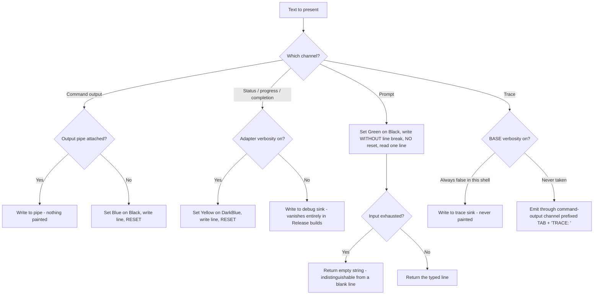

# Feature: Console Presentation & Interaction

> Subject repo (read-only): `/mnt/g/reversing/reversing/subject/Xcaciv.Cupcake` @ `a05dc6f00d4510ac073f6dd02fbfba2ffb76a5b6`.
> In-repo citations are repo-relative. Citations prefixed **OUT-OF-REPO:** are from the read-only reference clone of the external command framework at tag v2.1.2 (`/tmp/claude-1000/-mnt-g-reversing-reversing/bfdc6432-7221-449d-aecc-5dc4f1cc83cf/scratchpad/ref-Xcaciv.Command-v2`) and describe *framework* semantics the shell depends on, not shell behavior.

---

## Purpose — what user/business problem this solves; who uses it (actors/roles)

This feature is the shell's **terminal face**. It is the single component that knows a terminal exists: it paints every character the operator sees, colours it according to which of four logical channels the text belongs to, and collects the operator's typed command line.

Everything else in the product — the interactive session, every command, the command framework's own diagnostics — is written against an abstract presentation contract and never touches the terminal. Routing all presentation through one adapter is what makes the rest of the product testable with a stand-in presentation surface (see `Xcaciv.Cupcake.Core.Tests/LoopTests.cs:8-65`, a hand-written fake presentation surface used to drive the session with no terminal at all).

Actors:

| Actor | Interaction |
|---|---|
| **Operator (human at a terminal)** | Reads command output, status lines and progress; types command lines at the prompt. |
| **Interactive session loop** (adjacent feature) | Writes loading/status text, asks for the next command line. Evidence: `src/Xcaciv.Cupcake.Core/Loop.cs:37`, `:47`, `:65`, `:75`, `:87`, `:96`. |
| **Commands (built-in, plugin)** | Emit result chunks, status text, progress and trace text through the presentation contract. |
| **The two in-repo package commands** | Do **not** touch the presentation contract at all: they return result text, and the framework relays each non-empty result string into the result-chunk channel on their behalf. Evidence: `src/Xcaciv.Command.Packages/InstallCommand.cs:21,26` and `src/Xcaciv.Command.Packages/SearchCommand.cs:20` (return text, no presentation calls; confirmed by absence of any presentation call in `src/Xcaciv.Command.Packages/`), relayed at OUT-OF-REPO: `src/Xcaciv.Command/CommandExecutor.cs:198,200` (framework v2.1.2). |
| **Command framework** | Emits its own not-found / error / help / pipeline-stage text through the same contract (OUT-OF-REPO: `src/Xcaciv.Command/CommandExecutor.cs:53,69,85,124,152,156,164,200,207,228,229,230`, framework v2.1.2). |
| **Shell host process** | Constructs the one root presentation context at start-up, named `"Cupcake Console Context"` with an empty parameter list (`src/Xcaciv.Cupcake.Core/Loop.cs:110`). Only the shipping host does this; the solution's second executable is a two-line stub that writes `Hello, World!` straight to the terminal and never creates a presentation context at all (`src/Xcaciv.Cupcake/Program.cs:2`) — see QUIRK-12. |

---

## Behavior — what it does, as observable behavior

The adapter is a **presentation context**: a named, identified object that owns four output channels, one input operation, a verbosity switch, a set of colour settings, an optional pair of pipe attachments, and the ability to spawn children.

### The four output channels and their exact visual treatment

| Channel | Trigger | Foreground / Background (standard 16-colour terminal palette names) | Line break emitted? | Styling reset afterwards? | Evidence |
|---|---|---|---|---|---|
| **Command output** | A command (or the framework) emits a result chunk **and no output pipe is attached** | `Blue` on `Black` (defaults) | **Yes** — text then line break | **Yes** — reset to terminal defaults immediately after | `src/Xcaciv.Cupcake.Core/ConsoleContext.cs:23-24`, `:53-60` |
| **Status** | Anything writes a status message (session loading text, framework errors, progress text, completion text) | `Yellow` on `DarkBlue` (defaults) | **Yes** — text then line break | **Yes** | `src/Xcaciv.Cupcake.Core/ConsoleContext.cs:26-27`, `:90-103` |
| **Prompt** | The session asks for the next command line | `Green` on `Black` (defaults) | **NO** — prompt text written with no trailing line break, cursor stays on the same line | **NO** — no reset step exists in this path at all. INFERRED consequence: the operator's echoed keystrokes, and anything printed afterwards that does not set its own colours, render in prompt colours until some other channel resets | `src/Xcaciv.Cupcake.Core/ConsoleContext.cs:29-30`, `:66-72` (contrast the reset at `:58` and `:101`) |
| **Trace** | Anything adds a trace/diagnostic message | *Not painted by this adapter.* Inherited behavior: if the **base** verbosity flag is on, the message is pushed through the command-output channel prefixed with a tab character then `TRACE: `; otherwise it is written to the process diagnostic trace sink | Follows whichever path it takes | Follows whichever path it takes | OUT-OF-REPO: `src/Xcaciv.Command.Core/AbstractTextIo.cs:167-176` (framework v2.1.2); see QUIRK-1 |

All colour choices are **settable properties**, not constants: an embedder can change any of the six colour settings, the progress text template and the verbosity switch after construction (`src/Xcaciv.Cupcake.Core/ConsoleContext.cs:20-31`). Nothing in this repository ever assigns to any of them — verified: the only occurrences of those settings anywhere in the subject tree are their declarations at `:20`, `:23-24`, `:26-27`, `:29-30`, `:31` and their *reads* inside the painting methods at `:55-56`, `:68-69`, `:82`, `:98-99`. So the defaults above are what the shipping shell shows.

The three-step painting sequence for output and status is: set foreground, set background, write the line, reset. The reset restores *both* colours to the terminal's defaults. For the prompt the sequence is: set foreground, set background, write the text (no break), read a line — with no reset step at all.

**The text that actually flows through each channel in the shipping shell.** The adapter itself originates no text; every literal comes from the session or the framework. Observed in-repo literals:

| Channel | Literal text observed | Evidence |
|---|---|---|
| Status | `Loading Commands` — written once before command loading begins, in both the blocking and the asynchronous session paths | `src/Xcaciv.Cupcake.Core/Loop.cs:37` (blocking path), `:75` (asynchronous path) |
| Status | `Done` — written after loading completes; emitted **only** by the asynchronous session path, so the shipping shell never shows it. See QUIRK-13. | `src/Xcaciv.Cupcake.Core/Loop.cs:87`; the blocking path has no equivalent (`:37-54`); the shipping host reaches the blocking path only (`src/Xcaciv.Cupcake.Lit/Program.cs:12` → `Loop.cs:110` → `:32`), and the asynchronous path at `:70` has no caller outside the test at `Xcaciv.Cupcake.Core.Tests/LoopTests.cs:148` |
| Command output | ``No Plugins Found. You may want to check out `install --help` `` — written when command loading finds no plugins | `src/Xcaciv.Cupcake.Core/Loop.cs:47` |
| Prompt | `Ɛ> ` — the session's default prompt text (three characters: Latin capital letter open E, U+0190; greater-than; space) | `src/Xcaciv.Cupcake.Core/Loop.cs:16` |
| Command output / Status | framework not-found, help, error and pipeline text — see the Error handling section for the exact literals | OUT-OF-REPO: `src/Xcaciv.Command/CommandExecutor.cs:53,69,84-85,124,152,156,164-165,200,205,207,228,229` (framework v2.1.2) |

### Reading operator input

Reading the operator's command line is the one blocking, interactive operation. It writes the supplied prompt text as described above and then reads one line from the terminal. **If the input stream is at end-of-file (input redirected and exhausted, or the operator signals end-of-input), the result is the empty string, not an error and not a distinguishable end-of-input signal** (`src/Xcaciv.Cupcake.Core/ConsoleContext.cs:71`). See QUIRK-5 for the consequence.

### Verbosity switch

The adapter carries a verbosity switch, defaulting to **on** (`src/Xcaciv.Cupcake.Core/ConsoleContext.cs:13`, `:31`). It gates exactly one thing: the **status channel**.

- Verbosity **on** → status messages are painted to the terminal as described above.
- Verbosity **off** → the status message is handed to the **debug diagnostic sink** and the method returns immediately; nothing reaches the terminal (`src/Xcaciv.Cupcake.Core/ConsoleContext.cs:92-96`). The debug sink is compiled out of optimized/Release builds, so in a Release build a non-verbose status message is **discarded entirely** (see QUIRK-2).

The verbosity switch does **not** gate command output, the prompt, or (in practice) trace — see QUIRK-1.

### Progress reporting

Progress reporting takes two whole numbers, a *total* and a *step*, computes a single whole number, renders it into a text template, sends that text through the **status channel**, and returns the computed number to the caller (`src/Xcaciv.Cupcake.Core/ConsoleContext.cs:79-84`).

- Template default: `"{0} progress {1}%"` where placeholder `{0}` is the context's name and placeholder `{1}` is the computed number (`src/Xcaciv.Cupcake.Core/ConsoleContext.cs:15-20`). Example rendered text for a context named `Test` with a computed value of 10: `Test progress 10%`.
- **The computed value is `total` divided by `step`, whole-number division truncating toward zero** — see QUIRK-3, which is the required behavior for a faithful reimplementation.
- Because the text goes through the status channel, it obeys the verbosity switch: with verbosity off, nothing is displayed **but the number is still computed and returned**.

### Child presentation contexts

The adapter can spawn a **child** presentation context (`src/Xcaciv.Cupcake.Core/ConsoleContext.cs:38-47`). The framework does this once per command execution and once per pipeline stage (OUT-OF-REPO: `src/Xcaciv.Command/CommandController.cs:244`; `src/Xcaciv.Command/PipelineExecutor.cs:87`, framework v2.1.2).

What a child gets:

| Child property | Value | Evidence |
|---|---|---|
| Name | parent's name with the literal `Child` appended (parent `Cupcake Console Context` → child `Cupcake Console ContextChild`, grandchild `Cupcake Console ContextChildChild`) | `src/Xcaciv.Cupcake.Core/ConsoleContext.cs:40` |
| Parameters | the caller-supplied child parameter list, copied into a fresh list — **but the operation faults outright if the caller supplies no list**, even though the published contract declares that argument optional and nullable. See QUIRK-11 / R37b. | `src/Xcaciv.Cupcake.Core/ConsoleContext.cs:40` with `:13`; contract at OUT-OF-REPO: `src/Xcaciv.Command.Interface/ICommandContext.cs:31` (framework v2.1.2) |
| Parent identifier | the parent's identifier | `src/Xcaciv.Cupcake.Core/ConsoleContext.cs:40` |
| Own identifier | a **new** unique identifier | OUT-OF-REPO: `src/Xcaciv.Command.Core/AbstractTextIo.cs:27` (framework v2.1.2) |
| **Input pipe attachment** | inherited **only if** the parent both is flagged as having piped input **and** actually holds an input pipe; otherwise none | `src/Xcaciv.Cupcake.Core/ConsoleContext.cs:42` |
| **Output pipe attachment** | inherited **whenever** the parent holds an output pipe (no flag condition) | `src/Xcaciv.Cupcake.Core/ConsoleContext.cs:44` |
| **Verbosity** | **NOT inherited** — the child is constructed without a verbosity argument and therefore takes the default, **on**, regardless of the parent's setting | `src/Xcaciv.Cupcake.Core/ConsoleContext.cs:40` vs `:13`; QUIRK-4 |
| **Colour settings** | **NOT inherited** — a child always starts from the six built-in defaults, even if the parent's were customised | `src/Xcaciv.Cupcake.Core/ConsoleContext.cs:40` vs `:23-30` |
| **Progress text template** | **NOT inherited** — child reverts to `"{0} progress {1}%"` | `src/Xcaciv.Cupcake.Core/ConsoleContext.cs:40` vs `:20` |
| Pipeline stage / total-stages metadata | not set at creation; the framework stamps it on the child immediately afterwards | OUT-OF-REPO: `src/Xcaciv.Command/PipelineExecutor.cs:90` (framework v2.1.2) |
| Children registry | **none** — this adapter keeps no list of the children it created | contrast OUT-OF-REPO: `src/Xcaciv.Command/MemoryIoContext.cs:16,24` (framework v2.1.2), which does |

Before creating the per-command child, the framework **replaces the parent context's own parameter list** with the arguments parsed from the command line, then passes that same list to the child (OUT-OF-REPO: `src/Xcaciv.Command/CommandController.cs:242,244`, framework v2.1.2). So the root context's parameter list is overwritten once per command executed — it is not the empty list it was constructed with after the first command runs. In the pipeline path the parent's list is *not* replaced; each stage child gets that stage's own parsed arguments (OUT-OF-REPO: `src/Xcaciv.Command/PipelineExecutor.cs:86-87`, framework v2.1.2).

### Output routing: pipe versus terminal

Command output goes to the terminal **only when no output pipe is attached**. The routing decision is made by the inherited base behavior, not by this adapter: if an output pipe is attached, the chunk is written to that pipe and never painted; otherwise the chunk is handed to this adapter's terminal painter (OUT-OF-REPO: `src/Xcaciv.Command.Core/AbstractTextIo.cs:67-74`, framework v2.1.2).

Consequence for a pipeline (`a | b | c`): every stage runs on a child that has an output pipe attached, so **no stage paints its own output**; the last stage's pipe is drained by the framework and re-emitted through the *root* context, which has no pipe and therefore paints it (OUT-OF-REPO: `src/Xcaciv.Command/PipelineExecutor.cs:179-193`, framework v2.1.2). Status, prompt and progress are **not** routed through pipes — they always paint (subject to verbosity), from any context, child or root.

### What the base contributes vs. what this adapter overrides

| Capability | Provided by the shared base (inherited unchanged) | Overridden/added by this console adapter |
|---|---|---|
| Identity (unique id, name, parent id) | ✔ OUT-OF-REPO: `AbstractTextIo.cs:27-31` | — |
| Parameter list + replace-parameters operation | ✔ OUT-OF-REPO: `AbstractTextIo.cs:35-41` | — |
| Pipeline stage / total-stages metadata | ✔ OUT-OF-REPO: `AbstractTextIo.cs:43-51` | — |
| Attach input pipe (also raises the has-piped-input flag) / attach output pipe | ✔ OUT-OF-REPO: `AbstractTextIo.cs:104-116` | — |
| Read all chunks from the input pipe (empty sequence if none attached) | ✔ OUT-OF-REPO: `AbstractTextIo.cs:91-99` | — |
| **Output routing** (pipe if attached, else terminal painter) | ✔ OUT-OF-REPO: `AbstractTextIo.cs:67-74` | — |
| Accept an output encoder | ✔ **as a no-op — the encoder is accepted and discarded** OUT-OF-REPO: `AbstractTextIo.cs:121-125` | not overridden; see QUIRK-6 |
| Completion (optional final status message, then close the output pipe) | ✔ OUT-OF-REPO: `AbstractTextIo.cs:149-155` | — |
| Disposal → completion with no message | ✔ OUT-OF-REPO: `AbstractTextIo.cs:143-147` | — |
| Attach a trace log file (adds a file listener, auto-flush, indent) | ✔ OUT-OF-REPO: `AbstractTextIo.cs:157-165` | never invoked anywhere in this repository (verified: no call site) |
| Trace message handling | ✔ OUT-OF-REPO: `AbstractTextIo.cs:167-176` | not overridden; see QUIRK-1 |
| Verbosity flag | base flag, defaults **off** OUT-OF-REPO: `AbstractTextIo.cs:25` | **shadowed** by a second, separate switch defaulting **on** — `ConsoleContext.cs:31`; QUIRK-1 |
| Child creation | abstract — must be supplied | **supplied** `ConsoleContext.cs:38-47` |
| Terminal painting of command output | abstract | **supplied** `ConsoleContext.cs:53-60` |
| Prompt-and-read | abstract | **supplied** `ConsoleContext.cs:66-72` |
| Progress | abstract | **supplied** `ConsoleContext.cs:79-84` |
| Status message | abstract | **supplied** `ConsoleContext.cs:90-103` |

---

## Business rules & edge cases

**Construction**

- **R1.** Construction takes four values, all optional, in this order: name (default literal `"ConsoleIo"`), parameter list (default: none supplied), parent identifier (default: none), verbosity (default: **on**). Evidence: `src/Xcaciv.Cupcake.Core/ConsoleContext.cs:13`.
- **R2.** The shell's session creates its root context with name `"Cupcake Console Context"` and an empty parameter list, leaving verbosity at its default of on. Evidence: `src/Xcaciv.Cupcake.Core/Loop.cs:110`.
- **R3.** The supplied parameter list is copied into a fresh list at construction. Evidence: `src/Xcaciv.Cupcake.Core/ConsoleContext.cs:13`.
- **R4 (QUIRK-7).** Although the parameter list argument is declared optional with a default of *nothing supplied*, **omitting it (or passing an explicit absent list) fails at construction with a null-argument fault** (`Value cannot be null. (Parameter 'source')`) because the copy step does not tolerate an absent list. Evidence: `src/Xcaciv.Cupcake.Core/ConsoleContext.cs:13`; verified by compiling and running an equivalent construct against the same language level and observing the fault. Contrast the framework's own in-memory presentation surface, which explicitly guards this case (OUT-OF-REPO: `src/Xcaciv.Command/MemoryIoContext.cs:14`, framework v2.1.2). Every call site in this repository passes an empty list, so the fault is never hit in practice (`src/Xcaciv.Cupcake.Core/Loop.cs:110`; `Xcaciv.Cupcake.Core.Tests/ConsoleContextTests.cs:10,17,28`).
- **R5.** Verbosity is a mutable switch readable and writable after construction; the value passed at construction is simply its initial value. Test evidence: `Constructor_SetsVerboseDefault` constructs with verbosity explicitly on and asserts it reads back on — `Xcaciv.Cupcake.Core.Tests/ConsoleContextTests.cs:8-12`.

**Command-output channel**

- **R6.** Command output is painted foreground `Blue`, background `Black`, followed by a line break, then styling is reset. Evidence: `src/Xcaciv.Cupcake.Core/ConsoleContext.cs:23-24,55-58`.
- **R7.** The command-output channel is **not** gated by verbosity — it paints in both verbosity states. Evidence: `src/Xcaciv.Cupcake.Core/ConsoleContext.cs:53-60` contains no verbosity test, unlike `:92`. Test evidence is weak and must not be over-read: the one test that drives the output channel builds the context with verbosity **off** and then asserts only a tautology, so it proves the call completes without fault and nothing more — `Xcaciv.Cupcake.Core.Tests/ConsoleContextTests.cs:17,21,22` (the test is named `PromptForCommand_ReturnsInput` but, by its own comment at `:18-19`, deliberately never calls the prompt operation; it exercises status and output instead).
- **R8.** Empty text is painted as an empty line — the adapter has no non-empty guard. Evidence: `src/Xcaciv.Cupcake.Core/ConsoleContext.cs:53-58` (no conditional). Scope qualifier: on the *normal command path* the empty case never arrives, because the framework drops empty result text before relaying it (OUT-OF-REPO: `src/Xcaciv.Command/CommandExecutor.cs:198`, framework v2.1.2). A blank line is therefore only observable when something calls the channel directly — as the shell's own test does (`Xcaciv.Cupcake.Core.Tests/ConsoleContextTests.cs:21`) — or when a command's result text is whitespace rather than empty (the in-repo search command returns genuinely empty text for a blank search term, which is therefore dropped: `src/Xcaciv.Command.Packages/SearchCommand.cs:51-54`).
- **R9.** The chunk is painted verbatim; no truncation, wrapping, trimming, escaping or width limit is applied. Evidence: `src/Xcaciv.Cupcake.Core/ConsoleContext.cs:57`.

**Status channel**

- **R10.** With verbosity **on**: status text is painted foreground `Yellow`, background `DarkBlue`, followed by a line break, then styling is reset. Evidence: `src/Xcaciv.Cupcake.Core/ConsoleContext.cs:26-27,98-101`.
- **R11.** With verbosity **off**: the status text is written to the debug diagnostic sink and the operation returns without touching the terminal. Evidence: `src/Xcaciv.Cupcake.Core/ConsoleContext.cs:92-96`. Test evidence, accurately stated: two tests call the status channel on a context built with verbosity off and complete without fault — `Xcaciv.Cupcake.Core.Tests/ConsoleContextTests.cs:17,20` and `:28-29`. Neither observes the terminal, so they establish reachability only; the suppression itself is established by the code path, not by a test.
- **R12 (QUIRK-2).** The suppressed-status destination is the *debug* sink, which is stripped from optimized/Release builds, whereas the trace sink used for suppressed trace messages is not. So in the shipping build, status messages with verbosity off are lost with no record anywhere. Evidence: `src/Xcaciv.Cupcake.Core/ConsoleContext.cs:94` vs OUT-OF-REPO: `src/Xcaciv.Command.Core/AbstractTextIo.cs:174` (framework v2.1.2).
- **R13.** The status channel is the channel the framework uses to report **command execution errors**, prefixed with the literal `**Error: ` followed by the failure text. Evidence: OUT-OF-REPO: `src/Xcaciv.Command/CommandExecutor.cs:229` (framework v2.1.2). Combined with R11, **turning verbosity off silently suppresses error reporting** (QUIRK-2 consequence).
- **R14.** The status channel is also the channel used for the optional completion message when a context is closed with one; a completion with no message paints nothing. Evidence: OUT-OF-REPO: `src/Xcaciv.Command.Core/AbstractTextIo.cs:149-155` (message painted only when non-empty, at `:151`) (framework v2.1.2). The two completion messages the framework can produce are the pipeline stage timeout text `Stage '<name>' exceeded timeout of <n> seconds` and the stage cancellation text `Stage '<name>' was cancelled` (OUT-OF-REPO: `src/Xcaciv.Command/PipelineExecutor.cs:158,164`, framework v2.1.2).
- **R14b (QUIRK-14).** **Neither completion message is reachable in the shipping shell.** The timeout text requires a configured per-stage timeout, which defaults to `0` meaning *no timeout* (OUT-OF-REPO: `src/Xcaciv.Command.Interface/PipelineConfiguration.cs:36`, framework v2.1.2), and the shell never configures pipeline options — it takes the framework controller's defaults (`src/Xcaciv.Cupcake.Core/Loop.cs:25`). The cancellation text requires a stage-scoped cancellation that is not a parent cancellation (OUT-OF-REPO: `src/Xcaciv.Command/PipelineExecutor.cs:149-165`), and the shell invokes the framework through the overload that supplies no cancellation token (`src/Xcaciv.Cupcake.Core/Loop.cs:62`, `:94`). INFERRED: with stock settings both branches are dead, so every stage closes with no message and nothing is painted at stage completion. A reimplementation must still provide the messages for embedders that do configure a timeout.

**Prompt channel and input**

- **R15.** The prompt is painted foreground `Green`, background `Black`. Evidence: `src/Xcaciv.Cupcake.Core/ConsoleContext.cs:29-30,68-69`.
- **R16.** The prompt text is written **without a trailing line break** — the caret stays on the prompt line. Evidence: `src/Xcaciv.Cupcake.Core/ConsoleContext.cs:70`.
- **R17 (QUIRK-8).** Styling is **never reset** after the prompt — the prompt path issues two colour settings, one write and the read, and no restore. Evidence: `src/Xcaciv.Cupcake.Core/ConsoleContext.cs:66-72` (no reset step, unlike `:58` and `:101`). INFERRED consequence (from how terminals apply current attributes, not from anything in the source): the operator's echoed keystrokes, and any text printed before the next channel sets its own colours, render in prompt colours.
- **R18.** The prompt operation is not gated by verbosity. Evidence: `src/Xcaciv.Cupcake.Core/ConsoleContext.cs:66-72` (no verbosity test).
- **R19.** One whole line of operator input is returned, with the line terminator removed. Evidence: `src/Xcaciv.Cupcake.Core/ConsoleContext.cs:71`.
- **R20 (QUIRK-5).** End-of-input is mapped to the **empty string**. There is no way for a caller to distinguish "operator pressed Enter on a blank line" from "input stream is exhausted". Evidence: `src/Xcaciv.Cupcake.Core/ConsoleContext.cs:71`. Consequence in the session loop: a blank line is treated as "nothing to run, ask again" (`src/Xcaciv.Cupcake.Core/Loop.cs:60,65`), so **an exhausted input stream produces an unbounded prompt-and-read spin that never exits** — the loop only terminates when the line returned by this channel matches an exit word.
- **R20b.** The exit words are the three literals `END`, `EXIT` and `BYEE`, matched **case-insensitively** against the whole returned line (no trimming, no prefix matching). `BYEE` — four characters, a doubled final E — is the literal in the source; document it as observed rather than "correcting" it to `BYE`. See QUIRK-15. Evidence: `src/Xcaciv.Cupcake.Core/Loop.cs:20` (the list), `:57` and `:91` (the case-insensitive comparison in the blocking and asynchronous paths). The list is a settable property, so an embedder can replace it (`:20`); nothing in this repository does. Test evidence: the session-loop tests drive the loop with a stand-in presentation surface whose prompt always answers `END`, and the loop terminates — `Xcaciv.Cupcake.Core.Tests/LoopTests.cs:36` with `:126-138` and `:140-152`; a further test asserts only that the exit-word list is non-empty, not its contents (`:160`).
- **R21.** The prompt text is supplied by the caller; the adapter has no built-in prompt string. The session's default prompt is the three-character literal `"Ɛ> "` — Latin capital letter open E (U+0190), greater-than sign, space. Evidence: `src/Xcaciv.Cupcake.Core/Loop.cs:16`. It is a settable property; nothing in this repository changes it, and the session-loop test asserts only that it is non-empty (`Xcaciv.Cupcake.Core.Tests/LoopTests.cs:159`).
- **R22.** No input echo suppression, no history, no completion, no editing affordances beyond whatever the host terminal provides for reading a line. Evidence: `src/Xcaciv.Cupcake.Core/ConsoleContext.cs:71` (single read-a-line call, nothing else).

**Progress**

- **R23 (QUIRK-3 — the arithmetic).** The computed progress value is **`total ÷ step`, whole-number division truncating toward zero**, *not* a percentage of completion. Evidence: `src/Xcaciv.Cupcake.Core/ConsoleContext.cs:81`. The framework's published contract for this operation states the opposite — "returns the computed percentage complete (0-100)" and gives the worked example "SetProgress(100, 25) would return 25" (OUT-OF-REPO: `src/Xcaciv.Command.Interface/IIoContext.cs:133,136`, framework v2.1.2). **Actual computed values (the requirement for reimplementation):**

  The contract's implied formula is *step ÷ total × 100* (that is what makes its worked example return 25); the code's formula is *total ÷ step*.

  | total | step | ACTUAL value returned & rendered | Value the contract implies (step ÷ total × 100) |
  |---|---|---|---|
  | 100 | 10 | **10** | 10 (coincidence — the two formulas agree only here) |
  | 100 | 25 | **4** | 25 |
  | 100 | 50 | **2** | 50 |
  | 10 | 100 | **0** | 1000 (out of the contract's stated 0–100 range) |
  | 7 | 2 | **3** | ~29 |
  | 100 | 3 | **33** | ~3 |
  | −100 | 3 | **−33** | n/a |
  | 100 | **0** | **arithmetic divide-by-zero fault, thrown out of the operation** | n/a |

  Every row of the ACTUAL column was confirmed by compiling and executing the identical arithmetic at the same language level (whole-number division truncating toward zero; `−100 ÷ 3 = −33`, not −34).
- **R23b.** Two other implementations of the same contract are visible from this repository, and **both** return the *step* value rather than a ratio — the shell's own stand-in presentation surface returns the step argument unchanged (`Xcaciv.Cupcake.Core.Tests/LoopTests.cs:60`), and the framework's in-memory surface returns the step argument and renders the different template `Progress: <step> of <total>` (OUT-OF-REPO: `src/Xcaciv.Command/MemoryIoContext.cs:50-54`, framework v2.1.2). The console adapter is the outlier. This is corroborating evidence that QUIRK-3 is a defect rather than a deliberate alternative meaning, but the intent is still unrecorded — see Confidence & open questions.
- **R24.** The only test covering progress, `SetProgress_ComputesProgress`, asserts total `100` with step `10` returns `10` — the single input pair for which the wrong formula and the documented formula coincide, which is why the defect is not caught. Evidence: `Xcaciv.Cupcake.Core.Tests/ConsoleContextTests.cs:26-31`.
- **R25.** The computed value is **not clamped** to any range, yet the rendered text appends a literal `%` sign. Values above 100, below 0, or 0 are rendered as-is. Evidence: `src/Xcaciv.Cupcake.Core/ConsoleContext.cs:20,81-82`.
- **R26.** The whole-number extreme case: most-negative-representable total divided by step `−1` raises an arithmetic overflow fault. Evidence: `src/Xcaciv.Cupcake.Core/ConsoleContext.cs:81`; confirmed by executing the identical arithmetic. INFERRED that this is unreachable in practice (no caller passes negative totals).
- **R27.** Progress text is emitted through the status channel and therefore inherits R10–R12: it is painted `Yellow` on `DarkBlue` when verbose, suppressed to the debug sink when not — **but the numeric result is returned to the caller either way**. Evidence: `src/Xcaciv.Cupcake.Core/ConsoleContext.cs:82-83`; test evidence: the progress test runs with verbosity off and still gets a number back — `Xcaciv.Cupcake.Core.Tests/ConsoleContextTests.cs:28-30`.
- **R28.** The status write inside progress is issued but not waited on before the value is returned; because the status operation completes synchronously in this adapter, the text is nonetheless on screen before the caller resumes. Evidence: `src/Xcaciv.Cupcake.Core/ConsoleContext.cs:82` (result discarded) with `:90-103` (fully synchronous body).
- **R29.** No caller in this repository invokes progress reporting: the only occurrences anywhere in the subject tree are the implementation itself (`src/Xcaciv.Cupcake.Core/ConsoleContext.cs:79`), the stand-in surface's own implementation (`Xcaciv.Cupcake.Core.Tests/LoopTests.cs:60`) and the one test that calls it (`Xcaciv.Cupcake.Core.Tests/ConsoleContextTests.cs:29`). The framework does not invoke it either (OUT-OF-REPO: no call site outside the contract and the two sample surfaces, framework v2.1.2). INFERRED: it exists for plugin commands to use, since nothing else can reach it. A reimplementation must still provide it — the contract requires it — but nothing observable depends on it today.

**Trace**

- **R30 (QUIRK-1).** The adapter declares a **second, separate** verbosity switch that *shadows* rather than replaces the base one. The base switch remains at its own default of **off** and is never assigned by this adapter. Evidence: `src/Xcaciv.Cupcake.Core/ConsoleContext.cs:31` against OUT-OF-REPO: `src/Xcaciv.Command.Core/AbstractTextIo.cs:25` (framework v2.1.2). Confirmed by executing an equivalent construct: the adapter's switch reads *on* while the base switch simultaneously reads *off*.
  - **Consequence:** trace messages consult the *base* switch, which is permanently off, so **trace text never reaches the terminal** in this shell, no matter how the adapter's verbosity switch is set. It always goes to the process trace sink instead. Evidence: OUT-OF-REPO: `src/Xcaciv.Command.Core/AbstractTextIo.cs:169-175` (framework v2.1.2).
  - **Second consequence:** any framework code that reads the verbosity flag through the abstract contract sees `off` while the shell believes it is `on`.
- **R31.** Had the base switch been on, trace text would have been routed through the **command-output** channel with the literal prefix `\tTRACE: ` (a tab character, then `TRACE: `). Evidence: OUT-OF-REPO: `src/Xcaciv.Command.Core/AbstractTextIo.cs:171` (framework v2.1.2). A reimplementation must preserve this prefix if it enables the path.
- **R32.** No trace log file is ever configured by the shell — the trace-log facility has no call site anywhere in the subject repo. Evidence: absence verified across `/mnt/g/reversing/reversing/subject/Xcaciv.Cupcake`; the facility itself is OUT-OF-REPO: `src/Xcaciv.Command.Core/AbstractTextIo.cs:157-165` (framework v2.1.2). INFERRED: with no listener attached, trace text goes only to the host platform's default diagnostic listener, so it is visible to a debugger and effectively discarded otherwise. Were the facility ever called, attaching the file listener would capture trace text to that file, because trace text is written to whatever listeners are registered (OUT-OF-REPO: `src/Xcaciv.Command.Core/AbstractTextIo.cs:159` with `:174`, framework v2.1.2) — the framework's own source nonetheless carries an unfinished-work note beside it suggesting the author considered the routing incomplete (`:162-164`).

**Child contexts**

- **R33.** A child's name is the parent's name with the literal `Child` appended — names therefore grow one suffix per nesting level. Evidence: `src/Xcaciv.Cupcake.Core/ConsoleContext.cs:40`. Because the progress template renders the context name, progress text from a nested context reads e.g. `Cupcake Console ContextChild progress 4%`.
- **R34.** Input pipe inheritance is **conditional on two things at once**: the parent's has-piped-input flag is raised **and** the parent actually holds an input pipe. Evidence: `src/Xcaciv.Cupcake.Core/ConsoleContext.cs:42`. (In the base, the flag is only ever raised by attaching an input pipe, so the two conditions coincide in practice — OUT-OF-REPO: `src/Xcaciv.Command.Core/AbstractTextIo.cs:104-108`, framework v2.1.2.)
- **R35.** Output pipe inheritance is **unconditional on any flag** — the child gets it whenever the parent holds one. Evidence: `src/Xcaciv.Cupcake.Core/ConsoleContext.cs:44`. This is what makes a sub-command invoked inside a pipeline stage write into that stage's pipe rather than paint to the terminal.
- **R36.** Attaching an input pipe to a child raises the child's has-piped-input flag, so the grandchild inherits it too. Evidence: OUT-OF-REPO: `src/Xcaciv.Command.Core/AbstractTextIo.cs:106` (framework v2.1.2) combined with `src/Xcaciv.Cupcake.Core/ConsoleContext.cs:42`.
- **R37 (QUIRK-4).** Verbosity, colour settings and progress template are **not** propagated to children. A shell that switched verbosity off would find every per-command and per-stage child silently reverting to verbose, so status text (including framework error text, R13) would still paint. Evidence: `src/Xcaciv.Cupcake.Core/ConsoleContext.cs:40` (three of the four constructor arguments passed, the fourth omitted) vs `:13`.
- **R37b (QUIRK-11).** **Requesting a child without supplying an argument list faults.** The published contract declares the child-argument list optional and explicitly permits its absence (OUT-OF-REPO: `src/Xcaciv.Command.Interface/ICommandContext.cs:31`; the base repeats the same optional, absent-permitting declaration at OUT-OF-REPO: `src/Xcaciv.Command.Core/AbstractTextIo.cs:60`, framework v2.1.2), but this adapter hands the argument straight to construction, which does not tolerate an absent list (R4). The result is the same null-argument fault (`Value cannot be null. (Parameter 'source')`), raised out of the child-creation operation, with no child produced. Evidence: `src/Xcaciv.Cupcake.Core/ConsoleContext.cs:40` with `:13`; the framework's own in-memory surface guards the identical case and therefore does not fault (OUT-OF-REPO: `src/Xcaciv.Command/MemoryIoContext.cs:14`, framework v2.1.2). Both framework call sites happen to pass a real list (OUT-OF-REPO: `src/Xcaciv.Command/CommandController.cs:244`, `src/Xcaciv.Command/PipelineExecutor.cs:87`), so the fault is not reached today — but any plugin command that spawns a sub-context without arguments would hit it. A reimplementation that "fixes" this by defaulting to an empty list is choosing not to be faithful; the choice should be explicit.
- **R38.** Children are not tracked: the adapter keeps no registry of created children and no lifecycle hook beyond the framework's own disposal of them. Evidence: `src/Xcaciv.Cupcake.Core/ConsoleContext.cs:38-47`; contrast OUT-OF-REPO: `src/Xcaciv.Command/MemoryIoContext.cs:16,24` (framework v2.1.2).
- **R38b.** Child creation is synchronous in effect: the child exists and is fully configured before the request returns; there is no deferred or lazy construction. Evidence: `src/Xcaciv.Cupcake.Core/ConsoleContext.cs:38-47` (the child is built, wired to the inherited pipes, and returned in one pass, already completed).

**Routing and lifecycle**

- **R39.** Command output paints **only when no output pipe is attached**; with one attached the chunk is written to the pipe. Evidence: OUT-OF-REPO: `src/Xcaciv.Command.Core/AbstractTextIo.cs:67-74` (framework v2.1.2).
- **R40.** Closing a context completes its output pipe (if any) and optionally emits a final status message first; disposal closes with no message. Evidence: OUT-OF-REPO: `src/Xcaciv.Command.Core/AbstractTextIo.cs:143-155` (framework v2.1.2).
- **R41 (QUIRK-6).** The adapter accepts an output encoder and discards it — output is painted raw, never encoded or sanitised. Evidence: OUT-OF-REPO: `src/Xcaciv.Command.Core/AbstractTextIo.cs:121-125` (framework v2.1.2), not overridden by this adapter. The shell leaves the framework at its default no-op encoder (OUT-OF-REPO: `src/Xcaciv.Command/CommandController.cs:108`, framework v2.1.2), so with stock settings there is no observable difference; if a non-default encoder were ever configured it would have no effect on the terminal. The published contract states the opposite — it says the encoder is applied to every result chunk before that chunk is displayed or piped (OUT-OF-REPO: `src/Xcaciv.Command.Interface/IIoContext.cs:166-171`, framework v2.1.2) — so a reimplementer who follows the contract rather than the observed behavior would produce a different product.
- **R41b.** The encoder is handed to the **root** context once per command line, before any child is created, and is never handed to a child (OUT-OF-REPO: `src/Xcaciv.Command/CommandController.cs:230` relative to `:236,244`, framework v2.1.2). Immaterial while the encoder is a discarded no-op (R41), but load-bearing for any reimplementation that honours encoders: encoding would apply to the context the framework was handed, not to the child that actually paints.
- **R42 (QUIRK-16).** **The shell leaves the terminal recoloured when it exits.** The last thing painted before a normal exit is the prompt, which sets prompt colours and never resets (R17). The session then reads the exit word, the loop condition fails, and the session returns without painting anything further (`src/Xcaciv.Cupcake.Core/Loop.cs:57,65-66`); the host performs no reset either (`src/Xcaciv.Cupcake.Lit/Program.cs:7-19` — no colour operation anywhere). INFERRED consequence: the operator's terminal is left with the prompt foreground (`Green`) and background (`Black`) still applied after the shell has quit, until something else resets it. A reimplementation aiming at parity reproduces this; one aiming at politeness resets on exit and should record that as a deliberate divergence.

**Quirk index** — every behavior below is odd in the source and is documented here *as observed*, not tidied. The keep-or-fix decision belongs to whoever commissions the clone.

| Quirk | One-line statement | Rule |
|---|---|---|
| QUIRK-1 | The adapter's verbosity switch shadows the inherited one instead of replacing it, so the trace channel consults a flag that is permanently off and trace text never paints. | R30 |
| QUIRK-2 | Status text suppressed by verbosity goes to the *debug* sink, which optimized builds strip — so in a shipping build it is lost entirely, error text included. | R12, R13 |
| QUIRK-3 | Progress computes *total ÷ step*, not a percentage, while rendering a `%` sign; the contract and both sibling implementations say otherwise. | R23, R23b |
| QUIRK-4 | Children inherit neither verbosity nor colours nor the progress template — every child silently reverts to the built-in defaults. | R37 |
| QUIRK-5 | End-of-input is indistinguishable from a blank line, so a redirected, exhausted input stream spins the session forever. | R20 |
| QUIRK-6 | The output encoder is accepted and discarded; output is painted raw. | R41 |
| QUIRK-7 | The parameter list is declared optional but omitting it faults at construction. | R4 |
| QUIRK-8 | The prompt never resets styling. | R17 |
| QUIRK-9 | Painting is a non-atomic sequence against process-global terminal state while pipeline stages run concurrently; the contract demands thread safety and this adapter is not thread-safe. | Non-functional observations |
| QUIRK-10 | The Release configuration builds a windowed application, which gets no terminal. | Non-functional observations |
| QUIRK-11 | Requesting a child without an argument list faults, though the contract declares that form legal. | R37b |
| QUIRK-12 | One of the two executables never uses this feature at all. | Purpose (actors), Non-functional observations |
| QUIRK-13 | The `Done` status text exists but no shipping path emits it. | Behavior (channel literals), Non-functional observations |
| QUIRK-14 | Both stage-completion messages are unreachable under stock settings. | R14b |
| QUIRK-15 | One exit word is `BYEE`, not `BYE`. | R20b |
| QUIRK-16 | The terminal is left in prompt colours after the shell exits. | R42 |

---

## Workflows & states

### W1. One turn of the interactive session (root context, no pipeline)

0. *(Once per session, before the first turn.)* The session paints the status line `Loading Commands` in status colours, then loads commands; if none are found it paints ``No Plugins Found. You may want to check out `install --help` `` on the **output** channel and continues. Evidence: `src/Xcaciv.Cupcake.Core/Loop.cs:37,45-50`.
1. Session asks the presentation context for the next command line, passing the prompt text.
2. Adapter sets prompt colours, writes the prompt with no line break, **does not reset**, reads one line.
3. If the returned line matches an exit word case-insensitively (`END`, `EXIT`, `BYEE` — R20b) the session returns and the shell exits, leaving the terminal in prompt colours (R42).
4. If the line is empty (blank input **or** exhausted input, R20) the session skips execution and returns to step 1.
5. Otherwise the framework replaces the root context's parameter list with the parsed arguments and creates a **child** context carrying the same list (R33–R37b).
6. Command output chunks are painted by the child in output colours with a line break and a reset (R6). Result text that is empty never reaches the channel (R8).
7. Status/error chunks are painted by the child in status colours with a line break and a reset (R10, R13) — unless the child's verbosity is off, which cannot happen through the normal path because verbosity is never inherited (R37).
8. Trace chunks go to the trace sink, invisible (R30).
9. The child is closed with no message; its (absent) output pipe is completed; nothing is painted (R14, R40).
10. Return to step 1.

### W2. One turn with a pipeline (`a | b | c`)

1. Steps 1–4 of W1 as above. The pipeline path is taken when the command line contains the pipe delimiter; the root context's parameter list is **not** replaced in this path.
2. Framework creates one **child** per stage from the root context. The root has no pipes, so no stage inherits anything at creation.
3. Each stage child is stamped with its stage number and stage count, given the previous stage's pipe as input (except stage 1) and a **fresh output pipe**.
4. Every stage now has an output pipe, so **no stage paints command output** (R39). Stage status/progress text still paints (R10, R27) and is interleaved with other stages' status text — the stages run concurrently: each stage is started and collected into a task list inside the construction loop without being awaited, and only then are they all awaited together (OUT-OF-REPO: `src/Xcaciv.Command/PipelineExecutor.cs:103` and `:43,46,55`, framework v2.1.2).
5. The last stage's pipe is drained by the framework and each chunk is re-emitted through the **root** context, which paints it in output colours (OUT-OF-REPO: `src/Xcaciv.Command/PipelineExecutor.cs:179-193`, framework v2.1.2).
6. Each stage closes. With the shell's stock settings the close carries **no** message, so nothing is painted (R14b). Only an embedder that configures a per-stage timeout sees the timeout or cancellation text painted in status colours (R14).

### W3. Channel routing decision

### W4. Context lifecycle state machine

```mermaid
stateDiagram-v2
    [*] --> Constructed: name, parameters, parent id, verbosity
    Constructed --> PipeAttached: input and/or output pipe attached by framework
    Constructed --> Painting: any channel used
    PipeAttached --> Painting
    Painting --> Painting: output / status / prompt / progress / trace
    Painting --> ChildSpawned: child requested
    ChildSpawned --> Painting
    Painting --> Completed: closed (optional final status message) or disposed
    Completed --> [*]: output pipe closed; object still usable but pipe writes will fail
```

---

## Data

The feature owns exactly one entity, the **Presentation Context**. It is in-memory only; nothing is persisted, cached to disk, or transmitted.

| Field | Type (generic) | Constraints / default | Lifecycle |
|---|---|---|---|
| Identifier | globally unique identifier | assigned at construction, never changes; every context and every child gets a fresh one | created at construction |
| Name | text | default `"ConsoleIo"`; root context in this shell is `"Cupcake Console Context"`; a child is parent-name + `Child` | mutable after construction; rendered into progress text |
| Parent identifier | optional globally unique identifier | absent for the root; set to the creator's identifier for a child | set at construction |
| Parameter list | list of text | copied into a fresh list at construction; **must be supplied and non-absent despite being declared optional** — both at construction (R4) and at child creation (R37b) | replaceable after construction; the framework replaces the root's list with the parsed arguments once per non-pipeline command |
| Verbosity switch (adapter's) | boolean | default **on**; gates the status channel only | mutable; **not** propagated to children |
| Verbosity switch (base, shadowed) | boolean | default **off**; never assigned by this adapter; gates the trace channel | effectively immutable in this shell |
| Output foreground / background colour | terminal palette colour | defaults `Blue` / `Black` | mutable; not inherited by children |
| Status foreground / background colour | terminal palette colour | defaults `Yellow` / `DarkBlue` | mutable; not inherited by children |
| Prompt foreground / background colour | terminal palette colour | defaults `Green` / `Black` | mutable; not inherited by children |
| Progress text template | text with two ordered placeholders | default `"{0} progress {1}%"`; `{0}` = context name, `{1}` = computed number | mutable; not inherited by children |
| Input pipe attachment | optional stream-of-text reader | absent unless attached; attaching raises the has-piped-input flag | attached by the framework for pipeline stages; inherited by children under R34 |
| Output pipe attachment | optional stream-of-text writer | absent unless attached | attached by the framework for pipeline stages; inherited by children under R35; closed at completion |
| Has-piped-input flag | boolean | false until an input pipe is attached | read-only to callers |
| Pipeline stage number / total stage count | optional whole numbers | absent for standalone execution; 1-based stage number when in a pipeline | stamped by the framework right after child creation |
| Output encoder | encoder object | accepted and discarded (R41) | never stored |

Relationships: contexts form a **tree** by parent identifier — one root per shell process, one child per command execution, one child per pipeline stage, further children for sub-commands. No back-references; the tree is not walkable from the root because children are not tracked (R38).

---

## Interfaces

### Exposed to other features

| Consumer | Contract offered (semantic) |
|---|---|
| **Interactive Shell Session** | "Paint this status text"; "paint this result chunk"; "show this prompt and give me back one line of operator input". The session never touches a terminal directly; it holds only a presentation context. Call sites: `src/Xcaciv.Cupcake.Core/Loop.cs:37,47,65,75,87,96`. |
| **Every command (built-in, third-party plugins)** | Four write channels (result chunk, status, trace, progress) plus prompt-for-input, plus the pipe-reading operation. Commands are handed a *child* context, never the root. Commands may instead simply return result text and let the framework relay it — which is what both in-repo package commands do (`src/Xcaciv.Command.Packages/InstallCommand.cs:21,26`, `src/Xcaciv.Command.Packages/SearchCommand.cs:20`). |
| **Command framework** | The full presentation contract including child creation, pipe attachment, stage metadata stamping, encoder acceptance and completion. The framework requires each of these to exist and to behave as described in R33–R42. |
| **Error Handling & Failure Reporting** (adjacent feature) | Failures surface through the **status** channel prefixed `**Error: ` and through the output channel as `Error executing <command> (see trace for more info)`; the presentation layer applies no special error styling — errors look exactly like ordinary status text. Evidence: OUT-OF-REPO: `src/Xcaciv.Command/CommandExecutor.cs:228-229` (framework v2.1.2); the absence of error styling is `src/Xcaciv.Cupcake.Core/ConsoleContext.cs:90-103` (one status path, no severity parameter). |
| **Shell Distribution & Entry Points** (adjacent feature) | One root context is constructed at start-up (`src/Xcaciv.Cupcake.Core/Loop.cs:110`); if the shell fails, the host writes `Error <message>` itself, setting no colours of its own (`src/Xcaciv.Cupcake.Lit/Program.cs:16`) — so it renders in whatever colours were last left applied, which after a prompt is prompt colours (R17, R42). The solution's other executable never constructs a context at all (`src/Xcaciv.Cupcake/Program.cs:2` — QUIRK-12). |

### Consumed from other features

| Provider | What is required |
|---|---|
| **Command framework (external)** | The shared presentation base that supplies identity, parameters, pipes, output routing, completion, trace handling and the trace-log facility (see the base-vs-override table). This feature only fills in five behaviours: child creation, output painting, prompt-and-read, progress, status. |
| **Configuration & Settings** (adjacent feature) | Nothing today — colours, template and verbosity are code defaults with no configuration path. INFERRED from the absence of any settings read in `src/Xcaciv.Cupcake.Core/ConsoleContext.cs`. |
| **Host terminal** | A character terminal supporting a 16-colour foreground/background palette, a reset-to-default operation, line-oriented writing, line-oriented reading, and a text encoding able to render at least one non-ASCII code point (the default prompt character, U+0190 — R21). |
| **Interactive Shell Session** (adjacent feature) | The prompt text, the status and result text it emits, and the exit-word list that decides when prompting stops (R20b). All of these live in the session, not here; this feature only paints and reads. |

---

## External technology

| Generic capability | Protocol/standard if any | What the source used | Notes for reimplementer |
|---|---|---|---|
| Character terminal with a 16-colour palette, settable foreground and background, and a reset-to-defaults operation | ANSI/VT colour on POSIX terminals; console-attribute API on Windows | .NET 8 `System.Console` colour properties, `ResetColor()`, `Write`, `WriteLine` | Colour names used are the standard console palette: `Blue`, `Black`, `Yellow`, `DarkBlue`, `Green`. Setting colours is a no-op when output is redirected. Reset restores **both** foreground and background. |
| Line-oriented standard input read | — | .NET 8 `System.Console.ReadLine()` | Returns nothing at end-of-input; this adapter converts that to the empty string (R20). No echo control, no history, no line editing beyond the host's. |
| Debug diagnostic sink (stripped from optimized builds) | — | .NET `System.Diagnostics.Debug.WriteLine` | Destination for suppressed status text. **Compiled out of Release builds** — this is why R12/QUIRK-2 loses the message entirely. Reimplementers should decide deliberately whether to keep that behavior. |
| Trace diagnostic sink with pluggable listeners (retained in optimized builds) | — | .NET `System.Diagnostics.Trace` + `TextWriterTraceListener` | Destination for trace text. The base offers attaching a file listener with auto-flush and indent; the shell never uses it. |
| Command/IO framework supplying the presentation contract and its shared base | — | `Xcaciv.Command` 2.1.1 / `Xcaciv.Command.Core` 2.1.0 / `Xcaciv.Command.Interface` 2.1.0 (pinned in `Directory.Packages.props:8-10`; only `Xcaciv.Command` is referenced directly by the presentation project — `src/Xcaciv.Cupcake.Core/Xcaciv.Cupcake.Core.csproj:14` — the other two arrive with it); semantics established against tag v2.1.2 | The build's package-source rules route every `Xcaciv.*` package **exclusively to a machine-local folder feed** named by an environment variable, not to the public feed or to the declared organisation feed (sources at `NuGet.config:4-10`, `Xcaciv.*` mapped to the local folder source at `:17-19`, everything else to the public source at `:13-15`; the organisation feed declared at `:7` receives no mapping and is therefore unreachable for these packages). INFERRED from that mapping (and from the fact that dependency restore for these packages does not resolve here) that the packages are not publicly available; a reimplementation cannot obtain them and must recreate the contract from behavior: four output channels, prompt-and-read, child creation with pipe inheritance, bounded in-memory text pipes for `\|` pipelines with concurrent stages, stage metadata, completion, output encoder acceptance. |
| In-memory bounded producer/consumer text channels (for pipeline stages) | — | .NET `System.Threading.Channels` bounded channel | Capacity and overflow policy are framework defaults: **10,000 items** per stage pipe, and **block the producer** when full (alternatives are drop-oldest and drop-newest) — OUT-OF-REPO: `src/Xcaciv.Command.Interface/PipelineConfiguration.cs:15,23`, framework v2.1.2. Only relevant because the adapter stores and inherits reader/writer handles; the adapter itself never creates one. |
| Asynchronous operation model | — | .NET task-based async; the shell blocks on it at the call site | Every presentation operation is declared asynchronous but this adapter's bodies are entirely synchronous and complete before returning (`src/Xcaciv.Cupcake.Core/ConsoleContext.cs:53-103`), and the session blocks on each result (`src/Xcaciv.Cupcake.Core/Loop.cs:37,47,62,65`). A reimplementation may therefore make the whole feature synchronous without changing any observable behavior. |

---

## Error handling

| Failure mode | What the operator/system observes |
|---|---|
| Command throws during execution | Framework paints `Error executing <command> (see trace for more info)` on the **output** channel (Blue on Black), then `**Error: <message>` on the **status** channel (Yellow on DarkBlue), then sends the full detail to trace — where it is **invisible** (R30). OUT-OF-REPO: `src/Xcaciv.Command/CommandExecutor.cs:228-230` (framework v2.1.2). |
| Command not found | `Command [<name>] not found. Try 'HELP'` on the **output** channel, in output colours — the trailing word is the framework's help-command name, whose default is the **upper-case** literal `HELP`, so the rendered text is upper-case unless an embedder changes it. The same failure also emits `Command [<name>] not found.` (without the "Try" clause) to trace, where it is invisible (R30). OUT-OF-REPO: `src/Xcaciv.Command/CommandExecutor.cs:84-86` with the help-command default at `:27` (framework v2.1.2). |
| Command found but its registration is empty | `Command [<name>] not found.` on the **output** channel, with no "Try" clause. OUT-OF-REPO: `src/Xcaciv.Command/CommandExecutor.cs:52-54` (framework v2.1.2). |
| A command reports failure without throwing | The failure text is painted on the **output** channel in output colours, not the status channel — so a reported failure and ordinary result text are visually identical. If the command supplied no text, the framework substitutes `Command [<name>] reported failure (CorrelationId: <id>).` OUT-OF-REPO: `src/Xcaciv.Command/CommandExecutor.cs:205,207` (framework v2.1.2). |
| Help generation fails | `Error getting help for command '<name>' (<fault type>: <message>). See trace for more details.` on the **output** channel. OUT-OF-REPO: `src/Xcaciv.Command/CommandExecutor.cs:164-166` (framework v2.1.2). |
| Verbosity switched off while an error occurs | The `**Error: …` status line is suppressed; in a Release build it is written nowhere at all. The operator sees only the terser output-channel line. (R11, R12, R13 — QUIRK-2.) |
| Progress called with a step of 0 | An **arithmetic divide-by-zero fault propagates out of the progress operation** — it is not caught, not reported on any channel, and will surface as a command failure (or crash the session if raised outside the framework's guard). No progress text is emitted. (R23.) |
| Presentation context constructed without a parameter list | Construction fails with a null-argument fault (`Value cannot be null. (Parameter 'source')`); nothing is painted. Unreachable through current call sites. (R4 — QUIRK-7.) |
| Child context requested without an argument list | The same null-argument fault (`Value cannot be null. (Parameter 'source')`) escapes the child-creation operation; no child is produced, nothing is painted, and the command that asked for the child fails. Reachable from any plugin, because the published contract says the argument may be omitted. (R37b — QUIRK-11.) |
| Input stream exhausted (redirected input ends, or operator signals end-of-input) | Empty string returned; the session treats it as a blank line and prompts again — **unbounded spin, prompt text repeatedly repainted, session never exits**. (R20 — QUIRK-5.) |
| Terminal write fails (broken pipe, closed handle) | Nothing is caught anywhere in the adapter; the fault propagates to the caller. The shell host's outermost guard prints `Error <message>` and exits with status code `1` (`src/Xcaciv.Cupcake.Lit/Program.cs:14-19`, exit code at `:18`). It sets no colours of its own, so the line renders in whatever colours were last left applied rather than terminal defaults (R42). |
| Shell exits normally | Nothing is painted on the way out and no styling is restored; the terminal keeps the prompt colours. (R42 — QUIRK-16.) |
| Colour set on a terminal that does not support it / output redirected | Colour operations are silently ignored; text still appears, uncoloured. INFERRED from the host platform's documented behavior. |
| Writes to an output pipe after the context has been completed | The pipe is closed at completion; a later write fails. Nothing in this adapter guards it. (R40.) OUT-OF-REPO: `src/Xcaciv.Command.Core/AbstractTextIo.cs:153` (framework v2.1.2). |

---

## Non-functional observations

- **Concurrency (QUIRK-9).** The adapter takes no lock and holds no per-context terminal buffer. Painting is a *three-step, non-atomic* sequence (set colours → write → reset) against **process-global** terminal state. Pipeline stages run concurrently, each on its own child context — every stage is launched into a task list without being awaited and they are awaited together afterwards (OUT-OF-REPO: `src/Xcaciv.Command/PipelineExecutor.cs:103` with `:43,46,55`, framework v2.1.2). Two concurrent status/progress writes can therefore interleave, and one context's colour setting can bleed onto another's text. The framework's own contract explicitly requires implementations to be thread-safe (OUT-OF-REPO: `src/Xcaciv.Command.Interface/IIoContext.cs:21`, framework v2.1.2); **this adapter is not**. A reimplementation targeting the same observable behavior should either serialise painting behind one lock or accept the interleaving.
- **Blocking reads.** Prompt-and-read blocks the calling thread for as long as the operator takes to type. The session consumes the asynchronous contract by blocking on it (`src/Xcaciv.Cupcake.Core/Loop.cs:65`), so there is exactly one interactive reader; no timeout, no cancellation, no interrupt handling.
- **No buffering, batching, paging or caching.** Every chunk is one immediate write. There is no page-at-a-time output, no line count limit, no scrollback management, no rate limiting.
- **No permission checks.** Any command holding a context can paint anything; there is no privileged channel and no origin marking, so plugin output is visually indistinguishable from shell output.
- **Output sanitisation is absent (QUIRK-6 consequence).** Chunks are painted verbatim (R9) and the encoder hook is discarded (R41), so control characters or escape sequences in command output — including output derived from remote package metadata — reach the terminal unfiltered. Relevant to the adjacent "Input Validation & Supply-Chain Safety" feature.
- **Internationalisation.** None. Colour choices, the progress template `"{0} progress {1}%"` and all message text are hard-coded English/Latin. The template's placeholder order is fixed (name first, number second). The session prompt `"Ɛ> "` opens with a non-ASCII character — Latin capital letter open E, U+0190, stored as two bytes of UTF-8 in the source — so the terminal and the source encoding must both handle that code point; a terminal that cannot will show a replacement glyph in place of the prompt.
- **Accessibility.** Channels are distinguished **by colour alone** — there is no prefix, symbol or indentation separating command output from status from errors. `Blue` on `Black` is low-contrast on many terminal themes, and `Yellow` on `DarkBlue` fixes a non-default background for the width of the status line only. A reimplementation aiming for parity must keep the colours; one aiming for accessibility should add textual channel markers, and should note that the trace channel's would-be prefix (tab + `TRACE: `) is the only textual marker anywhere in the design.
- **Release-build packaging (QUIRK-10).** The shipping executable's Release configuration builds as a **windowed (non-console) application** for an older Windows-only runtime, self-contained, single-file, trimmed (`src/Xcaciv.Cupcake.Lit/Xcaciv.Cupcake.Lit.csproj:10-19`). INFERRED: a windowed application gets no console attached by default, so in the Release configuration everything this feature paints — and the prompt-and-read — has no terminal to act on. The Debug configuration builds as a normal console application on the current runtime (`:4-5`).
- **Two entry points, one of which never uses this feature (QUIRK-12).** The solution ships two executables. The shipping host constructs the root context and runs the session (`src/Xcaciv.Cupcake.Lit/Program.cs:9-12`). The other is a two-line stub that writes `Hello, World!` straight to the terminal and never creates a presentation context (`src/Xcaciv.Cupcake/Program.cs:1-2`). Documented as observed; a reimplementer should not assume both binaries exercise this feature.
- **A status message that can never appear (QUIRK-13).** The session has two run paths. The shipping host reaches only the blocking one, which emits `Loading Commands` and nothing else; the asynchronous path — the only place that emits `Done` — has no caller outside a test. So `Done` is dead text in the shipping shell. Evidence: `src/Xcaciv.Cupcake.Core/Loop.cs:37` vs `:75,87`, callers at `src/Xcaciv.Cupcake.Lit/Program.cs:12` → `Loop.cs:110` → `:32`, and `Xcaciv.Cupcake.Core.Tests/LoopTests.cs:148`.
- **Terminal state is left dirty on exit (QUIRK-16).** See R42: prompt colours survive the process. This is the one piece of this feature's behavior an operator keeps seeing after the shell is gone.
- **Performance.** Nothing is optimised; there are no fast paths, no reuse of buffers, and no attempt to minimise colour-attribute changes (colours are re-set before every single line even when unchanged). Each painted line issues four separate terminal operations (two colour sets, one write, one reset); the prompt issues three (two colour sets, one write) plus a blocking read.

---

## Acceptance criteria

1. **Given** a fresh presentation context created with verbosity on, **when** a command emits a result chunk and no output pipe is attached, **then** the chunk appears on its own line coloured foreground `Blue` on background `Black`, and terminal styling is restored to defaults immediately after the line break. *(R6)*
2. **Given** a presentation context with verbosity **on**, **when** a status message is emitted, **then** it appears on its own line coloured foreground `Yellow` on background `DarkBlue`, and styling is restored afterwards. *(R10)*
3. **Given** a presentation context with verbosity **off**, **when** a status message is emitted, **then** nothing appears on the terminal, the message is handed to the debug diagnostic sink only, and the operation completes successfully. *(R11; the existing test at `Xcaciv.Cupcake.Core.Tests/ConsoleContextTests.cs:15-23` covers only the "completes successfully" half — a clone should assert the terminal half too, which requires an injectable terminal the source does not have)*
4. **Given** a presentation context with verbosity **off**, **when** a command result chunk is emitted, **then** it still appears on the terminal in output colours — verbosity does not gate command output. *(R7)*
5. **Given** any presentation context, **when** the operator is prompted with the text `Ɛ> `, **then** that exact text appears in foreground `Green` on background `Black` with **no** trailing line break, the caret remains on the same line, and no reset is issued — so the next text painted without its own colours, including the operator's own echoed keystrokes, still appears in prompt colours. *(R15–R17, R21)*
6. **Given** the operator types a line and presses Enter, **when** the prompt operation returns, **then** the returned value is exactly the typed text with the line terminator removed. *(R19)*
7. **Given** standard input is exhausted (redirected input at end-of-file), **when** the prompt operation runs, **then** it returns the empty string rather than signalling end-of-input, and the session consequently re-prompts indefinitely. *(R20 — QUIRK-5)*
8. **Given** a presentation context named `Test` with verbosity off, **when** progress is reported with total `100` and step `10`, **then** the returned value is exactly `10`. *(R24; test `SetProgress_ComputesProgress`, `Xcaciv.Cupcake.Core.Tests/ConsoleContextTests.cs:26-31`)*
9. **Given** a presentation context named `Test` with verbosity **on**, **when** progress is reported with total `100` and step `25`, **then** the returned value is exactly `4` (**not** 25) and the line `Test progress 4%` is painted in status colours. *(R23, R25 — QUIRK-3)*
10. **Given** any presentation context, **when** progress is reported with a step of `0`, **then** an arithmetic divide-by-zero fault escapes the operation and no progress text is painted. *(R23)*
11. **Given** a presentation context named `Parent` holding **no** pipes, **when** a child is requested with argument list `["a","b"]`, **then** the child is named `ParentChild`, carries parameters `["a","b"]`, records `Parent`'s identifier as its parent, has its own distinct identifier, and holds neither pipe. *(R33, R38)*
12. **Given** a parent holding an output pipe (and no input pipe), **when** a child is created, **then** the child inherits that output pipe, and consequently the child's result chunks go into the pipe and are **not** painted. *(R35, R39)*
13. **Given** a parent holding an input pipe (its has-piped-input flag therefore raised), **when** a child is created, **then** the child receives that same input pipe and its own has-piped-input flag is raised. *(R34, R36)*
14. **Given** a parent whose verbosity has been switched **off** and whose output colour has been changed to something non-default, **when** a child is created, **then** the child's verbosity reads **on** and its colours are back to `Blue`/`Black`, `Yellow`/`DarkBlue`, `Green`/`Black`. *(R37 — QUIRK-4)*
15. **Given** a presentation context with the adapter's verbosity switched **on**, **when** a trace message is added, **then** nothing appears on the terminal — the message goes to the trace diagnostic sink, because the trace path consults a *different*, permanently-off verbosity flag. *(R30 — QUIRK-1)*
16. **Given** a presentation context with verbosity **on**, **when** a command throws during execution, **then** the operator sees `Error executing <command> (see trace for more info)` in output colours followed by `**Error: <message>` in status colours, and nothing on the terminal from the trace detail. *(R13, R30 — QUIRK-1)*
17. **Given** a presentation context with verbosity **off**, **when** a command throws during execution, **then** the operator sees only the output-channel line `Error executing <command> (see trace for more info)`; the `**Error: <message>` line does not appear on the terminal, and in an optimized build it is recorded nowhere at all. *(R11, R12, R13 — QUIRK-2)*
18. **Given** any presentation context, **when** an unknown command name is entered, **then** the operator sees `Command [<name>] not found. Try 'HELP'` on the output channel in output colours — with `HELP` upper-case. *(Error handling table; OUT-OF-REPO: `src/Xcaciv.Command/CommandExecutor.cs:27,84-85`)*
19. **Given** a presentation context named `Parent`, **when** a child is requested with **no** argument list at all, **then** the operation fails with a null-argument fault and no child is created — the optional-argument form of the published contract is not honoured. *(R37b — QUIRK-11)*
20. **Given** a session driven by a stand-in presentation surface whose prompt-and-read always answers `END`, **when** the session runs, **then** it performs no command execution and returns immediately after the first read; the same holds for `end`, `EXIT`, `exit`, `BYEE` and `byee`, and does **not** hold for `BYE`. *(R20b — QUIRK-15; tests `Run_ExitsOnEnd` / `RunAsync_ExitsOnEnd`, `Xcaciv.Cupcake.Core.Tests/LoopTests.cs:36,126-152`)*
21. **Given** the shipping shell started with a terminal attached, **when** the session begins, **then** the first thing painted is the status line `Loading Commands` in `Yellow` on `DarkBlue`, and `Done` never appears. *(QUIRK-13; `src/Xcaciv.Cupcake.Core/Loop.cs:37` vs `:87`)*
22. **Given** command loading finds no plugins, **when** the session continues, **then** the operator sees ``No Plugins Found. You may want to check out `install --help` `` on the **output** channel in `Blue` on `Black` — not on the status channel — and the session goes on to prompt normally. *(`src/Xcaciv.Cupcake.Core/Loop.cs:45-50`, R6)*
23. **Given** the operator types an exit word, **when** the shell process ends, **then** no reset is issued and the terminal is left with foreground `Green` and background `Black` still applied. *(R42 — QUIRK-16)*
24. **Given** a presentation context, **when** an output encoder is supplied to it and a result chunk is then emitted, **then** the chunk is painted exactly as supplied — the encoder has no effect on what appears. *(R41 — QUIRK-6)*
25. **Given** a pipeline of three stages under stock settings, **when** every stage completes normally, **then** no stage paints its own result text, the final stage's text is painted once through the root context in output colours, and no stage-completion status line appears. *(R39, R14b, W2)*

---

## Confidence & open questions

**Directly observed (high confidence):** every colour pair, every line-break decision, every reset decision, the verbosity gate and its debug-sink fallback, the progress formula and its rendered template, child naming, the two pipe-inheritance conditions and what is *not* inherited, the exit-word list and its case-insensitive matching, the session's own status and output literals, and the exact literals quoted throughout — all read from `src/Xcaciv.Cupcake.Core/ConsoleContext.cs`, `src/Xcaciv.Cupcake.Core/Loop.cs`, `src/Xcaciv.Cupcake.Lit/Program.cs` and `src/Xcaciv.Cupcake/Program.cs`. Absence claims (no configuration path, no colour customisation, no trace-log call site, no progress caller, no terminal-geometry use) were each checked by searching the whole subject tree, not just the adapter.

**Verified by execution (not merely read):** the truncating whole-number division and every worked value in the R23 table (including `−100 ÷ 3 = −33`, truncating toward zero), the divide-by-zero and overflow faults, the shadowed-verbosity split (adapter switch reads on while the base switch simultaneously reads off, so the trace path takes the non-painting branch), the null-parameter-list construction fault with its exact message `Value cannot be null. (Parameter 'source')`, and the rendered progress line `Test progress 4%`. These were confirmed by compiling and running an equivalent construct at the same language level in a scratch directory outside the subject repo; the subject repo was not modified or built.

**How weak the test evidence actually is (important for anyone weighing these rules).** Three tests touch this feature directly (`Xcaciv.Cupcake.Core.Tests/ConsoleContextTests.cs:7-31`). Exactly one of them asserts a real value — the progress result (`:30`); of the other two, one asserts that the verbosity switch reads back the value it was just handed (`:11`) and the other ends in a literal tautology that is true regardless of what happened (`:22`). **Nothing anywhere asserts what reaches the terminal**, because the adapter writes to the process-global terminal with no seam to intercept. The prompt-and-read path is never executed by any test at all, and the test file says so in its own comment (`:18-19`). The session-loop tests (`Xcaciv.Cupcake.Core.Tests/LoopTests.cs`) drive the session through a hand-written stand-in surface, so they exercise the *contract*, never this adapter. Consequently almost every rule above rests on reading the source (plus the executions noted in the preceding paragraph) rather than on a passing test — and a clone that introduces an injectable terminal will be able to test far more than the source can.

**Verified by byte inspection:** the default prompt is exactly three characters — U+0190 (Latin capital letter open E), `>`, space — read from the raw bytes of `src/Xcaciv.Cupcake.Core/Loop.cs:16` (stored as the two-byte UTF-8 sequence for that code point). The glyph is easily mis-named as a reversed epsilon or a Greek letter, both of which are different code points; a clone that substitutes one of those changes what the operator sees, so carry U+0190 specifically.

**Framework semantics (OUT-OF-REPO, tag v2.1.2 against pinned 2.1.1/2.1.0):** output routing, trace handling and its prefix, completion/disposal, encoder acceptance, child usage per command and per pipeline stage, pipeline concurrency and final-stage collection, the pipeline channel defaults, the not-found / execution-error / help-failure literals, and the `**Error: ` status prefix. **Version risk:** the pinned framework is 2.1.1/2.1.0 and the clone is 2.1.2 — a patch-level difference. INFERRED that the base presentation class and the routing rules are identical across those versions; not verifiable without the pinned packages, which the build's package-source mapping resolves only from a machine-local folder feed (`NuGet.config:17-19`) and which do not restore in this environment. Every framework literal quoted here therefore carries a small risk of having been reworded between 2.1.1 and 2.1.2; the *in-repo* literals carry none.

**Labelled INFERRED in the body:** the windowed Release build having no console attached (QUIRK-10); colour operations being silently ignored on redirected/unsupported output; the operator's echoed keystrokes rendering in prompt colours and the terminal staying recoloured after exit (R42/QUIRK-16 — the absence of any reset is observed, the resulting appearance is inferred from how terminals apply current attributes); the unreachability of the overflow case; the unreachability of both stage-completion messages under stock settings (R14b/QUIRK-14); the packages not being publicly available; and the absence of any configuration path for colours/verbosity.

**Could not determine:**

- **Whether the trace-never-paints behavior (QUIRK-1) is intentional.** The adapter declares a second verbosity switch rather than assigning the inherited one — an explicit shadowing declaration, so it was written on purpose, but *why* is unrecorded and nothing indicates the author knew the trace path would stop working. Looked in `src/Xcaciv.Cupcake.Core/ConsoleContext.cs` comments (none address it), the repository README (`README.md`, two lines, no detail), the `ideas/` directory (present but **empty**), and the git history for that file (three commits touch it; none of the messages discuss verbosity).
- **Whether the progress formula (QUIRK-3) is meant to be items-per-step rather than a percentage.** The template's literal `%` and the framework contract's worked example both say percentage; the code says ratio; the only test uses the one input pair where the two agree; and both other implementations of the same contract visible from here return the step value instead (R23b). The weight of evidence says defect, but no design note anywhere in the repository states intent, so the keep-or-fix decision belongs to the reader.
- **Whether the child-creation null hazard (QUIRK-11) has ever been hit.** The framework's two call sites always pass a list, so it is latent; whether any third-party plugin calls the no-argument form cannot be determined from this repository, which contains no plugins.
- **Whether the prompt's missing reset (QUIRK-8) is a deliberate "keep the operator's typing green" choice or an omission.** No comment, no test.
- **What the intended external behavior is when the shell is run with input redirected.** Nothing in the repository handles or tests it; the empty-string mapping (R20) and the session's blank-line skip together produce the spin described.
- **Any evidence of the adapter's colour or template properties being customised by an embedder.** None exists in this repository; the properties are public and settable but unused, so their propagation rules (R37) are untested territory.
- **Terminal width/height awareness, resize handling, or cursor positioning.** Entirely absent — searched the whole adapter and the session; no such capability is used or exposed.
- **Whether `BYEE` (QUIRK-15) is a typo for `BYE` or deliberate.** No comment, no test asserting the contents of the exit-word list (the only test checks it is non-empty, `Xcaciv.Cupcake.Core.Tests/LoopTests.cs:160`), no note in the git history. Documented as observed; a clone that "fixes" it to `BYE` changes behavior an operator could notice.
- **Whether the shipping Release configuration is ever actually used (QUIRK-10).** No CI configuration, no build script and no published artefact exists in the repository to show which configuration ships, so whether the console-less Release build is real-world reachable could not be established — only that the project file declares it (`src/Xcaciv.Cupcake.Lit/Xcaciv.Cupcake.Lit.csproj:10-23`).
