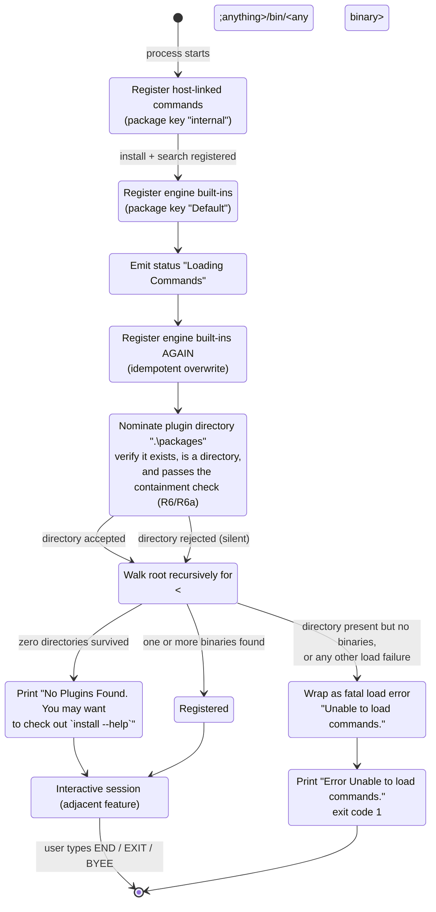

# Feature: Plugin Discovery & Command Registration

## Purpose — what user/business problem this solves; who uses it (actors/roles)

The product is an interactive text shell. Before it can accept a single line of input it must know
which verbs exist. This feature is the one-time start-up phase that assembles the shell's command
vocabulary from three independent supply routes and then hands a populated command set to the
interactive session.

Actors:

- **End user at the console.** Passive beneficiary. They see a status line while loading happens,
  and — when nothing was found on disk — a single advisory line telling them how to get plugins.
  They never trigger discovery explicitly; it happens once per process launch.
- **Shell host / distributor** (the person who builds the shipping executable). They decide which
  commands are compiled into the executable and registered directly, and they may override the
  package directory location before start-up.
- **Plugin author / package publisher.** They place a package folder on disk in the agreed layout;
  this feature is what causes their commands to appear.

The business problem: a shell that ships with a fixed command list cannot be extended, and a shell
that *requires* plugins cannot start on a fresh machine. This feature solves both — it makes the
command set extensible from disk while guaranteeing the shell still starts and stays usable when the
disk contributes nothing.

## Behavior — what it does, as observable behavior; every distinct operation the feature supports, its inputs, outputs, and side effects

### Operation 1 — Announce that loading has begun

Immediately on entering the session start-up, and before any registration happens, the shell emits
the status message `Loading Commands` to the presentation layer
(`src/Xcaciv.Cupcake.Core/Loop.cs:37`). In the console presentation this renders as its own line in
the status style (yellow text on dark-blue background) because the console presentation is created
in verbose mode by default and the shipping executable never overrides that
(`src/Xcaciv.Cupcake.Core/ConsoleContext.cs:13` — verbosity defaults to on;
`src/Xcaciv.Cupcake.Core/ConsoleContext.cs:26-27` — status colours;
`src/Xcaciv.Cupcake.Core/ConsoleContext.cs:31`; `src/Xcaciv.Cupcake.Core/ConsoleContext.cs:90-103` —
non-verbose sends the status to the debug channel instead of the console;
`src/Xcaciv.Cupcake.Core/Loop.cs:110` — the shipping executable constructs the presentation with only
a name and an empty parameter list).

There is no matching "finished" status message on the synchronous start-up path — see QUIRK in
*Business rules*.

### Operation 2 — Register host-linked commands by instance (route 2, but happens FIRST in the shipping executable)

The shipping executable, before it starts the session at all, hands two already-compiled command
objects to the command engine, each tagged with the package key `internal`
(`src/Xcaciv.Cupcake.Lit/Program.cs:10-11`):

- the package **install** command (`src/Xcaciv.Command.Packages/InstallCommand.cs:14-17`)
- the package **search** command (`src/Xcaciv.Command.Packages/SearchCommand.cs:11-19`)

Both declare the same command root `Package`, so they are merged into one top-level verb `PACKAGE`
with two sub-verbs `INSTALL` and `SEARCH`
(OUT-OF-REPO: `src/Xcaciv.Command.Core/CommandParameters.cs:174-226` (framework v2.1.2),
OUT-OF-REPO: `src/Xcaciv.Command/CommandRegistry.cs:20-36` (framework v2.1.2)).

Side effect: the command index now contains one entry keyed `PACKAGE`. No output is produced.

### Operation 3 — Register the engine's built-in commands (route 1)

The shell asks the command engine to install its own default command set
(`src/Xcaciv.Cupcake.Core/Loop.cs:41`, and again at `src/Xcaciv.Cupcake.Core/Loop.cs:108`).

The engine registers four commands under the package key `Default`, in this order: **REGIF**, **SAY**,
**SET**, **ENV**, with **SET** flagged as environment-modifying
(OUT-OF-REPO: `src/Xcaciv.Command/CommandController.cs:177-185` (framework v2.1.2);
names at OUT-OF-REPO: `src/Xcaciv.Command/Commands/RegifCommand.cs:13`,
`src/Xcaciv.Command/Commands/SayCommand.cs:13`, `src/Xcaciv.Command/Commands/SetCommand.cs:12`,
`src/Xcaciv.Command/Commands/EnvCommand.cs:12` (framework v2.1.2)).

Side effect: four more top-level entries in the command index. No output.

### Operation 4 — Nominate the plugin package directory (route 3, part 1)

The shell nominates exactly one directory as the place plugins live: its plugin-directory setting,
whose default value is the literal `.\packages` — a **relative** path, written with a **backslash**
separator (`src/Xcaciv.Cupcake.Core/Loop.cs:24`, `src/Xcaciv.Cupcake.Core/Loop.cs:42`). It resolves
against the process's current working directory.

The engine does not blindly accept it. It (a) resolves the path to absolute form, (b) requires that
the path's **parent** lie inside a "restricted" boundary directory, and (c) requires the directory to
actually exist and to be a directory. If any check fails the directory is **silently dropped** — no
exception, no message
(OUT-OF-REPO: `src/Xcaciv.Command.FileLoader/VerifiedSourceDirectories.cs:82-89`,
`:66-75`, `:100-115` (framework v2.1.2)).

The shell never sets the restricted boundary — nothing in the product calls the "set boundary"
operation at all, so the host has no way to widen or narrow it — and it therefore defaults to the
process's current working directory (OUT-OF-REPO:
`src/Xcaciv.Command.FileLoader/VerifiedSourceDirectories.cs:17`, `:105` (framework v2.1.2);
repo-wide search of the subject sources finds only *nominate* and *scan*, never *set boundary*).

**INFERRED — net effect of the containment check.** The check is *weaker* than "must be inside the
working directory", for two compounding reasons, and the practical rule is:

> A nominated directory is accepted when it exists, is a directory, and **its parent** is a strict
> descendant of the working directory's **parent** — on the same volume.

- The boundary comparison is a base-of test between two location identifiers, and that comparison
  **ignores the final segment of the boundary path**. Because the boundary is the working directory
  written without a trailing separator, the effective boundary is one level *above* the working
  directory (OUT-OF-REPO: `src/Xcaciv.Command.FileLoader/VerifiedSourceDirectories.cs:106-108`
  (framework v2.1.2)).
- The check is applied to the candidate's **parent**, not to the candidate itself (OUT-OF-REPO:
  `src/Xcaciv.Command.FileLoader/VerifiedSourceDirectories.cs:103` (framework v2.1.2)).

Worked outcomes (derived from those two lines; the base-of semantics were confirmed by executing the
platform's location-comparison primitive directly against these path shapes, **not** by running the
shell):

| Working directory | Nominated directory | Accepted? |
|---|---|---|
| `C:\a\work` | `C:\a\work\packages` (the default) | yes |
| `C:\a\work` | `C:\a\work\x\y\packages` (nested arbitrarily deep) | yes |
| `C:\a\work` | `C:\a\evil\packages` (**sibling tree of the working directory**) | **yes** |
| `C:\a\work` | `C:\a\work` (the working directory itself) | no |
| `C:\a\work` | `C:\a\packages` (directly in the working directory's parent) | no |
| `C:\a\work` | `C:\b\evil\packages` | no |
| `C:\a\work` | `D:\evil\packages` (other volume) | no |
| `C:\app` | `C:\Windows\System32` | **yes** |

**QUIRK — the "restricted" boundary does not restrict to the working directory.** A host (or anyone
who can set the plugin-directory value) can point discovery at a *sibling* of the working directory,
and when the shell runs one level below a volume root, at most of that volume. See *Non-functional
observations → Permissions*.

**QUIRK — the working directory itself can never be the plugin root.** Because the parent of the
candidate is what gets tested, nominating the working directory tests its parent, which sits above
the effective boundary and is rejected — silently.

By default the nominated directory is the folder named `packages` in the working directory, and
nothing in the product creates that folder (verified: no directory-creation call anywhere in the
subject repo — the plugin-directory value is only ever read and handed to the engine,
`src/Xcaciv.Cupcake.Core/Loop.cs:24`, `:42`, `:79`).

### Operation 5 — Scan the package directory and register what is found (route 3, part 2)

The shell asks the engine to load commands from every nominated directory
(`src/Xcaciv.Cupcake.Core/Loop.cs:43`). Observable behavior of that scan:

1. If **no** directory survived nomination, the scan reports *no plugins* (see Operation 6)
   (OUT-OF-REPO: `src/Xcaciv.Command/CommandLoader.cs:42-45` (framework v2.1.2)).
2. Otherwise, the package root is walked recursively looking for plugin binary files that sit in a
   sub-folder named **`bin`** which is itself at least one level below the root — i.e. the shape
   `<packageRoot>/…/<anything>/bin/<any-binary>`. The engine's own documentation states the intended
   convention verbatim as `name/bin/name.dll`
   (OUT-OF-REPO: `src/Xcaciv.Command.Interface/PackageDescription.cs:5-8` (framework v2.1.2);
   filter construction at OUT-OF-REPO: `src/Xcaciv.Command.FileLoader/Crawler.cs:176-178`
   (framework v2.1.2); the binary-file pattern itself — every file with the platform's shared-library
   extension — at OUT-OF-REPO: `src/Xcaciv.Command.FileLoader/Crawler.cs:20` (framework v2.1.2);
   the `bin` default at
   OUT-OF-REPO: `src/Xcaciv.Command.Interface/ICommandController.cs:29` (framework v2.1.2)).
   Only the `bin` segment and the "at least one folder below the root" depth are actually enforced:
   the binary's file name does **not** have to match the folder name, and the scan is recursive, so a
   `bin` folder nested several levels down is found too (OUT-OF-REPO:
   `src/Xcaciv.Command.FileLoaderTests/CrawlerTests.cs:72-84` (framework v2.1.2) — the fixture
   deliberately includes `Root\Hello\bin\RootHello.dll` and `Xc.Hello\bin\Xc.Hello.dll` alongside
   `Hello\bin\Hello.dll`).
   Files not in a `bin` sub-folder — README files, loose binaries at the package root — are ignored
   (OUT-OF-REPO: `src/Xcaciv.Command.FileLoaderTests/CrawlerTests.cs:72-84`, `:93-103`
   (framework v2.1.2)).
   **Every** binary in a `bin` folder is a candidate, including support/dependency binaries shipped
   beside the plugin: the fixture's `Hello\bin\` holds both the plugin binary and an interface
   binary, and both are opened and interrogated (OUT-OF-REPO:
   `src/Xcaciv.Command.FileLoaderTests/CrawlerTests.cs:74-75` (framework v2.1.2)). Support binaries
   contribute no commands and are dropped by rule 5 below.
3. Every matching binary is opened in its **own isolated load context**, sandboxed so it can only
   reach its own directory, under a strict security policy
   (OUT-OF-REPO: `src/Xcaciv.Command.FileLoader/Crawler.cs:31`, `:83-91` (framework v2.1.2)).
4. Each command found inside is described (name, sub-name, parameters, help text) and handed
   back to be registered into the command index
   (OUT-OF-REPO: `src/Xcaciv.Command.FileLoader/Crawler.cs:96-120` (framework v2.1.2),
   OUT-OF-REPO: `src/Xcaciv.Command/CommandLoader.cs:47-54` (framework v2.1.2)).
   Sub-verbs that share a root **within the same binary** are merged into one root entry before that
   entry ever reaches the index — the same merge rule as R4, applied a second time one level earlier
   (OUT-OF-REPO: `src/Xcaciv.Command.FileLoader/Crawler.cs:105-114` (framework v2.1.2)).
   Each surviving binary becomes its own package record with its own synthesised key (R9), so one
   package folder holding several binaries yields several package records
   (OUT-OF-REPO: `src/Xcaciv.Command.FileLoader/Crawler.cs:75-79`, `:203-213` (framework v2.1.2)).
5. Binaries yielding zero usable commands are dropped from the package list
   (OUT-OF-REPO: `src/Xcaciv.Command.FileLoader/Crawler.cs:156` (framework v2.1.2)).

Side effect: additional top-level entries (and sub-verbs) appear in the command index. No per-plugin
output is shown to the user — discovery is silent on success.

### Operation 6 — The "no plugins" outcome

When the scan reports that there were no plugin sources at all, the shell writes **exactly one line**
to normal output:

```
No Plugins Found. You may want to check out `install --help`
```

(`src/Xcaciv.Cupcake.Core/Loop.cs:47` — note the two backtick characters are part of the literal.)

It renders in the normal output style (blue on black) rather than the status style
(`src/Xcaciv.Cupcake.Core/ConsoleContext.cs:23-24`, `:53-60`).

**The session then continues normally.** The advisory is not fatal: control falls straight through to
the interactive prompt loop and the user gets the prompt with whatever commands routes 1 and 2
supplied (`src/Xcaciv.Cupcake.Core/Loop.cs:45-50` followed by `:56-66`). Only a *different* failure
aborts (see *Error handling*).

### Operation 7 — Hand off to the interactive session

Once the three routes are done the shell enters its read-execute loop, prompting with `Ɛ> ` (the
character is U+0190 LATIN CAPITAL LETTER OPEN E, followed by a greater-than sign and a space) and
exiting on `END`, `EXIT` or `BYEE` case-insensitively (`src/Xcaciv.Cupcake.Core/Loop.cs:16`, `:20`,
`:57`). The loop itself is an adjacent feature; only the hand-off belongs here.

## Business rules & edge cases — every rule, limit, threshold, validation, rounding rule, ordering guarantee, and special case, each with evidence (file:line). Mine the tests hard: test names and assertions are the closest thing to requirements this repo has. Include magic numbers WITH their meaning.

**Ordering**

| # | Rule | Evidence |
|---|---|---|
| R1 | In the shipping executable the order is: (1) host-linked command instances, (2) engine built-ins, (3) engine built-ins **again**, (4) nominate package directory, (5) scan disk. | `src/Xcaciv.Cupcake.Lit/Program.cs:10-12` then `src/Xcaciv.Cupcake.Core/Loop.cs:108` then `:41` → `:42` → `:43` |
| R2 | Built-ins are always registered before the package directory is nominated and before the disk scan. Within the built-in set the order is REGIF, SAY, SET, ENV. | `src/Xcaciv.Cupcake.Core/Loop.cs:41-43`; OUT-OF-REPO: `src/Xcaciv.Command/CommandController.cs:179-184` (framework v2.1.2) |
| R3 | **Last registration of a given top-level verb wins.** The index is a name→entry map with plain assignment; a plugin that declares a verb already taken by a built-in replaces it. | OUT-OF-REPO: `src/Xcaciv.Command/CommandRegistry.cs:34` (framework v2.1.2) |
| R4 | Exception to R3: if the *incoming* entry carries sub-verbs and a top-level entry of that name already exists, the sub-verbs are **merged into** the existing entry instead of replacing it. This is how `PACKAGE INSTALL` and `PACKAGE SEARCH` end up under one verb. | OUT-OF-REPO: `src/Xcaciv.Command/CommandRegistry.cs:24-31` (framework v2.1.2) |

**QUIRK — built-ins are registered twice.** The shell's default-launch entry point registers them,
then immediately starts the session, which registers them again
(`src/Xcaciv.Cupcake.Core/Loop.cs:108` and `:41`).
Harmless because of R3 (idempotent overwrite), but the work is done twice.

**QUIRK — the asynchronous start-up path skips built-ins entirely and has no "no plugins" tolerance.**
The alternate asynchronous entry does *not* register built-in commands, and it catches **all**
load failures — including "no plugins found" — as a fatal load error
(`src/Xcaciv.Cupcake.Core/Loop.cs:77-85` versus `:39-54`). Only the synchronous path is used by the
shipping executable (`src/Xcaciv.Cupcake.Lit/Program.cs:12`); the asynchronous path is exercised only
by a test with a stubbed engine (`Xcaciv.Cupcake.Core.Tests/LoopTests.cs:140-152`).

**QUIRK — no "Done" status on the synchronous path.** The asynchronous path emits the status message
`Done` after loading (`src/Xcaciv.Cupcake.Core/Loop.cs:87`); the synchronous path — the one that
actually ships — emits nothing after `Loading Commands`.

**QUIRK — the advisory names a verb that is not registered at top level.** The "no plugins" line tells
the user to run `install --help`, but the install command is registered as a **sub**-verb under root
`PACKAGE` (`src/Xcaciv.Command.Packages/InstallCommand.cs:14-15`). The typed line's first word is
normalised and upper-cased into the lookup key before the index is consulted, so `install --help`
resolves the top-level key `INSTALL`, which is absent, producing
`Command [INSTALL] not found. Try 'HELP'`
(key derivation at OUT-OF-REPO: `src/Xcaciv.Command/CommandController.cs:240-242` and
`src/Xcaciv.Command.Interface/CommandDescription.cs:52-64`, `:70-79` (framework v2.1.2);
message at OUT-OF-REPO: `src/Xcaciv.Command/CommandExecutor.cs:84-86`, with the `HELP` literal at
`:27` (framework v2.1.2);
sub-verb resolution at OUT-OF-REPO: `src/Xcaciv.Command/CommandFactory.cs:43-53` (framework v2.1.2)).

**QUIRK — and the obvious correction does not produce the install command's own help either.**
Typing `PACKAGE INSTALL --help` reaches the root verb `PACKAGE`, and because that root holds
sub-verbs, the help branch prints the root's summary line followed by a **one-line summary per
sub-verb** (`PACKAGE` plus `Package commands`, then one line each for `INSTALL` and `SEARCH`) — never
the install command's parameter help. The remaining words on the line are treated as arguments to the
root, and the sub-verb selection that would pick out the install command is only performed on the
*execute* path, not the *help* path. So there is no prompt invocation at all that yields the install
command's full help. (OUT-OF-REPO: `src/Xcaciv.Command/CommandExecutor.cs:58-70` — the help branch is
taken whenever a `--help`, `-?` or `/?` argument is present, and root-with-sub-verbs goes to the
one-line path; `:260-278` — what that path prints;
`src/Xcaciv.Command/HelpService.cs:165-175` — the help-argument test (framework v2.1.2);
root text `Package commands` at `src/Xcaciv.Command.Packages/InstallCommand.cs:14`.)

**QUIRK — dead configuration flag.** The shell exposes a boolean setting "install command enabled",
defaulting to true, that no code ever reads. Its default is nevertheless asserted by a test.
(`src/Xcaciv.Cupcake.Core/Loop.cs:11`; asserted at `Xcaciv.Cupcake.Core.Tests/LoopTests.cs:158`;
repo-wide grep shows no other reference.)

**Path & naming rules**

| # | Rule | Evidence |
|---|---|---|
| R5 | Default plugin directory literal: `.\packages` — relative, backslash-separated, resolved against the process working directory. | `src/Xcaciv.Cupcake.Core/Loop.cs:24` |
| R6 | The directory must exist, be a directory, and its parent must lie within the restricted boundary (defaulted to the working directory) or it is **silently discarded** — no exception, no message, no record of which path was tried. | OUT-OF-REPO: `src/Xcaciv.Command.FileLoader/VerifiedSourceDirectories.cs:66-75`, `:82-89`, `:100-115` (framework v2.1.2) |
| R6a | **QUIRK / INFERRED** — the boundary is looser than "inside the working directory". The base-of comparison drops the boundary path's final segment, so the effective boundary is the working directory's **parent**; combined with the fact that the *candidate's parent* is what is tested, the real rule is "the candidate's parent must be a strict descendant of the working directory's parent, on the same volume". Consequences: arbitrarily nested sub-paths are accepted; **sibling trees of the working directory are accepted**; the working directory itself is rejected. Table of worked outcomes in *Behavior → Operation 4*. | OUT-OF-REPO: `src/Xcaciv.Command.FileLoader/VerifiedSourceDirectories.cs:103`, `:106-108` (framework v2.1.2); base-of semantics confirmed by executing the platform primitive against these path shapes, not by running the shell |
| R7 | An empty/whitespace directory string is rejected outright as an argument error rather than silently dropped. The error text is `Directory is required`. | OUT-OF-REPO: `src/Xcaciv.Command/CommandLoader.cs:28` (framework v2.1.2) |
| R8 | Sub-directory filter convention when scanning: `bin`. Binaries outside a `bin` folder are not candidates. | OUT-OF-REPO: `src/Xcaciv.Command.Interface/ICommandController.cs:29` (framework v2.1.2); OUT-OF-REPO: `src/Xcaciv.Command.Interface/PackageDescription.cs:5-8` (framework v2.1.2) |
| R8a | The `bin` folder must be at least one level **below** the package root — a `bin` folder directly at the root is not matched, because the filter is `<one-segment-wildcard>/<filter>/<binary-pattern>` applied recursively. Depth beyond that is unconstrained. | OUT-OF-REPO: `src/Xcaciv.Command.FileLoader/Crawler.cs:176-178` (framework v2.1.2) |
| R8b | Inside a matching `bin` folder **every** binary is a candidate, not only one named after the package folder. Support/dependency binaries are opened and interrogated too, then discarded by the zero-command rule in *Magic numbers* below for contributing no commands. | OUT-OF-REPO: `src/Xcaciv.Command.FileLoader/Crawler.cs:20`, `:178` (framework v2.1.2); fixture at OUT-OF-REPO: `src/Xcaciv.Command.FileLoaderTests/CrawlerTests.cs:74-75` (framework v2.1.2) |
| R9 | Package identity is synthesised **per binary**, as `<binary-file-name-without-extension>-<relative-path-below-root-with-separators-removed>`. Example: root `C:\Program\Commands\`, binary `C:\Program\Commands\Hello\bin\Hello.dll` → package key `Hello-Hellobin`. One package folder holding several binaries therefore yields several package records. | OUT-OF-REPO: `src/Xcaciv.Command.FileLoader/Crawler.cs:203-213` (sequential) and `:227-237` (parallel — the identical computation, duplicated) (framework v2.1.2) |
| R10 | Verb names are normalised: trimmed, **only the text before the first space is kept**, dashes stripped from **both** ends, every character outside `-`, `_`, digits, ASCII letters and space removed, then **upper-cased**. So a plugin declaring `Install` registers as `INSTALL`, and one declaring `Install a package` registers as `INSTALL`. | OUT-OF-REPO: `src/Xcaciv.Command.Interface/CommandDescription.cs:18` (the character filter), `:52-64` (framework v2.1.2); applied at OUT-OF-REPO: `src/Xcaciv.Command.Interface/Attributes/CommandRegisterAttribute.cs:27-32` and `.../CommandRootAttribute.cs:27-32` (framework v2.1.2) |

**Magic numbers**

| Value | Meaning | Evidence |
|---|---|---|
| `50` | Number of candidate plugin binaries **strictly above** which the scan switches from sequential to parallel processing. At exactly 50 or fewer, sequential (to avoid parallelism overhead). The threshold is a process-wide mutable setting, not a constant — anything in the process can change it for every subsequent scan. | OUT-OF-REPO: `src/Xcaciv.Command.FileLoader/Crawler.cs:18`, `:183-190` (framework v2.1.2) |
| `0` | A discovered binary contributing **zero** command definitions is not recorded as a package. | OUT-OF-REPO: `src/Xcaciv.Command.FileLoader/Crawler.cs:156` (framework v2.1.2) |
| `0` | Zero surviving package directories is the exact trigger for the "no plugins" outcome. | OUT-OF-REPO: `src/Xcaciv.Command/CommandLoader.cs:42-45` (framework v2.1.2) |
| `1` | Process exit status used for every fatal start-up failure. There is no distinct status per failure kind. | `src/Xcaciv.Cupcake.Lit/Program.cs:14-19` |
| `2` | Number of host-linked commands the shipping executable registers before start-up (install, search). | `src/Xcaciv.Cupcake.Lit/Program.cs:10-11` |
| `4` | Number of engine built-in commands installed by the built-in registration step. | OUT-OF-REPO: `src/Xcaciv.Command/CommandController.cs:181-184` (framework v2.1.2) |
| `3` | Number of exit words accepted by the session the feature hands off to (`END`, `EXIT`, `BYEE`). | `src/Xcaciv.Cupcake.Core/Loop.cs:20` |

**Registration eligibility rules (all three routes)**

| # | Rule | Evidence |
|---|---|---|
| R11 | A candidate command implementation is only registerable if it carries the framework's registration marker declaring its verb name. Directly-registered candidates without it are **silently skipped** (a trace line only, no user-visible message, no exception). | OUT-OF-REPO: `src/Xcaciv.Command/CommandRegistry.cs:42-47` (framework v2.1.2) |
| R12 | Same situation on the *disk* route raises an error per-implementation, which is caught per-implementation: that one command is skipped and the rest of the package continues. | OUT-OF-REPO: `src/Xcaciv.Command.Core/CommandParameters.cs:221-224` (framework v2.1.2), caught at OUT-OF-REPO: `src/Xcaciv.Command.FileLoader/Crawler.cs:116-119` (framework v2.1.2) |
| R13 | An implementation carrying both a root marker and a registration marker becomes a **sub-verb** of the root; one carrying only a registration marker becomes a top-level verb. | OUT-OF-REPO: `src/Xcaciv.Command.Core/CommandParameters.cs:177-218` (framework v2.1.2) |
| R13a | The registration marker is what gates eligibility, not the root marker. An implementation carrying **only** a root marker is treated exactly like an unmarked one — silently skipped on the direct routes, per-item error on the disk route. | OUT-OF-REPO: `src/Xcaciv.Command.Core/CommandParameters.cs:177`, `:221-224` (framework v2.1.2); OUT-OF-REPO: `src/Xcaciv.Command/CommandRegistry.cs:42-47` (framework v2.1.2) |
| R13b | **QUIRK** — the root entry synthesised to hold a sub-verb carries **no implementation identity of its own**; it exists only to hold sub-verbs. Both host-linked package commands declare the same root, so `PACKAGE` is never itself executable. Typing `PACKAGE` alone (no help argument) therefore fails at construction and prints `Error executing PACKAGE (see trace for more info)` plus a status line `**Error: Command type name is empty.`. Typing `PACKAGE INSTALL` *does* work — sub-verb selection happens on the execute path. Typing `PACKAGE INSTALL --help` takes the help path instead and never selects the sub-verb (see the QUIRK above). | OUT-OF-REPO: `src/Xcaciv.Command.Core/CommandParameters.cs:184-198` (no implementation identity set on the root) (framework v2.1.2); OUT-OF-REPO: `src/Xcaciv.Command/CommandFactory.cs:43-56`, `:60-63` and `src/Xcaciv.Command/CommandExecutor.cs:58-70`, `:185`, `:224-231` (framework v2.1.2) |
| R14 | The "modifies environment" flag is only settable on the direct-registration routes (routes 1 and 2); it is not derived from disk metadata. Only the built-in `SET` uses it. | OUT-OF-REPO: `src/Xcaciv.Command/CommandRegistry.cs:56-59` (framework v2.1.2); OUT-OF-REPO: `src/Xcaciv.Command/CommandController.cs:183` (framework v2.1.2) |
| R14a | The flag is applied to the description **before** it is merged/inserted, so on the sub-verb path (R13) the flag lands on the synthesised *root* entry, not on the sub-verb. Neither host-linked package command sets it, so this is latent rather than observable in the shipping executable. | OUT-OF-REPO: `src/Xcaciv.Command/CommandRegistry.cs:55-60` (framework v2.1.2); OUT-OF-REPO: `src/Xcaciv.Command.Core/CommandParameters.cs:184-198` (framework v2.1.2) |
| R15 | Host-linked commands are registered by **instance**, but only the instance's *implementation identity* is retained — the instance itself is discarded and a fresh one is constructed at execution time. | OUT-OF-REPO: `src/Xcaciv.Command/CommandRegistry.cs:63-67` (identity taken, instance dropped) (framework v2.1.2); construction at execution time at OUT-OF-REPO: `src/Xcaciv.Command/CommandFactory.cs:38-56`, `:58-79` (framework v2.1.2) |

**Test-derived rules (subject repo)**

| # | Rule | Evidence |
|---|---|---|
| R16 | Start-up must complete and the session must reach the prompt when the command engine is a no-op stub that registers nothing at all — i.e. an empty command set is a legal, non-fatal outcome. | `Xcaciv.Cupcake.Core.Tests/LoopTests.cs:67-82` (stub engine with empty bodies), `:126-138` |
| R17 | After start-up, the shell exposes the engine and the environment it was handed; both must be non-null. | `Xcaciv.Cupcake.Core.Tests/LoopTests.cs:136-137`, `:150-151` |
| R18 | The plugin directory setting must be non-empty by default. | `Xcaciv.Cupcake.Core.Tests/LoopTests.cs:161` |
| R19 | The three registration entry points the shell requires of the engine are exactly: *register built-ins*, *nominate a package directory*, *scan and load*; plus direct registration by description, by implementation identity, and by instance, each under a package key. Notably absent from the required set: any "set containment boundary" operation. | `Xcaciv.Cupcake.Core.Tests/LoopTests.cs:69-71`, `:79-81` |
| R20 | The **asynchronous** entry point must also complete against a no-op stub engine and reach the prompt, even though it registers no built-ins. It emits the status message `Done` after loading; the synchronous one does not. | `Xcaciv.Cupcake.Core.Tests/LoopTests.cs:140-152`; `src/Xcaciv.Cupcake.Core/Loop.cs:77-87` |
| R21 | The exit condition the tests exercise is a stub input source that returns `END` on every prompt, so both start-up tests prove only that start-up completes and hands off — not that any command was registered, nor that any message was produced. | `Xcaciv.Cupcake.Core.Tests/LoopTests.cs:36` (the stub prompt always answers `END`), `:35` and `:57` (both normal output and status output are no-ops in the stub), `:134`, `:148` |
| R22 | **Coverage gap, worth stating as a rule of this dossier's confidence:** no test in the subject repo asserts any user-visible string, any registration outcome, any directory behaviour, or either failure branch. The three literal messages (`Loading Commands`, the advisory, `Unable to load commands.`) are entirely unasserted, as are the whole "no plugins" branch and the fatal branch. | `Xcaciv.Cupcake.Core.Tests/LoopTests.cs:124-163` (the complete test class — three tests, eight assertions, none of them about output or loading) |

## Workflows & states — multi-step flows and state machines (states, transitions, triggers, timeouts). Use mermaid or numbered steps.



Numbered walkthrough of the shipping executable's start-up:

1. Process starts. Two host-linked command objects (install, search) are handed to the engine under
   package key `internal` (`src/Xcaciv.Cupcake.Lit/Program.cs:10-11`). They merge into the single
   top-level verb `PACKAGE`.
2. The shell's default-launch entry point registers the engine's built-ins
   (`src/Xcaciv.Cupcake.Core/Loop.cs:108`) and constructs the console presentation named
   `Cupcake Console Context` with an empty parameter list
   (`src/Xcaciv.Cupcake.Core/Loop.cs:110`).
3. Session start-up emits status `Loading Commands` (`src/Xcaciv.Cupcake.Core/Loop.cs:37`).
4. Built-ins registered a second time (`src/Xcaciv.Cupcake.Core/Loop.cs:41`).
5. `.\packages` nominated (`src/Xcaciv.Cupcake.Core/Loop.cs:42`). Silently dropped if it does not
   exist, is not a directory, or fails the containment check (R6/R6a).
6. Scan runs (`src/Xcaciv.Cupcake.Core/Loop.cs:43`). Three terminal outcomes:
   - **Success** — commands registered, no output.
   - **No plugin sources** — one advisory line printed, flow continues (`:45-50`).
   - **Any other failure** — wrapped as a fatal load error and rethrown (`:51-54`).
7. Interactive prompt loop begins (`src/Xcaciv.Cupcake.Core/Loop.cs:56-66`).

## Data — entities this feature owns, their fields (name, type-in-generic-terms, constraints), relationships, lifecycle (created/mutated/deleted when).

This feature owns **configuration** and **the command index**; the index's element shapes are defined
by the external command engine.

**Start-up configuration** (owned by the shell, created when the session object is constructed,
mutable by the host before start-up, never mutated afterwards):

| Field | Type (generic) | Default | Constraint | Evidence |
|---|---|---|---|---|
| Plugin directory | text path | `.\packages` | non-empty (empty/whitespace is a hard argument error, R7); must resolve to an existing directory that passes the containment check (R6/R6a) to have any effect | `src/Xcaciv.Cupcake.Core/Loop.cs:24`; `Xcaciv.Cupcake.Core.Tests/LoopTests.cs:161`; OUT-OF-REPO: `src/Xcaciv.Command/CommandLoader.cs:28` (framework v2.1.2) |
| Install-command-enabled | boolean | `true` | **never read** (dead) | `src/Xcaciv.Cupcake.Core/Loop.cs:11` |
| Prompt text | text | `Ɛ> ` | non-empty | `src/Xcaciv.Cupcake.Core/Loop.cs:16`; `Xcaciv.Cupcake.Core.Tests/LoopTests.cs:159` |
| Exit words | list of text | `END`, `EXIT`, `BYEE` | non-empty; matched case-insensitively | `src/Xcaciv.Cupcake.Core/Loop.cs:20`, `:57`; `Xcaciv.Cupcake.Core.Tests/LoopTests.cs:160` |
| Command engine handle | reference | a fresh default engine | replaced by whatever engine is passed into start-up | `src/Xcaciv.Cupcake.Core/Loop.cs:25`, `:34` |
| Environment handle | reference | a fresh default environment | replaced by whatever environment is passed into start-up | `src/Xcaciv.Cupcake.Core/Loop.cs:26`, `:35` |

**Command index entry** (owned by the engine; created during this feature, read by the session):

| Field | Type (generic) | Notes | Evidence |
|---|---|---|---|
| Verb name | text | normalised & upper-cased; the map key | OUT-OF-REPO: `src/Xcaciv.Command.Interface/CommandDescription.cs:27` (framework v2.1.2) |
| Sub-verbs | map of name → entry | empty for leaf commands | OUT-OF-REPO: `src/Xcaciv.Command.Interface/ICommandDescription.cs:12` (framework v2.1.2) |
| Implementation identity | text | fully-qualified name of the implementation to construct at execution time; **empty** on a pure root entry that only holds sub-verbs | OUT-OF-REPO: `src/Xcaciv.Command.Interface/ICommandDescription.cs:17` (framework v2.1.2); empty-on-root at OUT-OF-REPO: `src/Xcaciv.Command.Core/CommandParameters.cs:184-198` (framework v2.1.2) |
| Modifies environment | boolean | set only via direct registration | OUT-OF-REPO: `src/Xcaciv.Command.Interface/ICommandDescription.cs:22` (framework v2.1.2) |
| Owning package | package record | see below | OUT-OF-REPO: `src/Xcaciv.Command.Interface/ICommandDescription.cs:26` (framework v2.1.2) |

**Package record**: name/key (text), version (multi-part numeric version — read from the binary on
the disk route, and left at its zero default on the direct-registration routes, which never set it),
full path to the binary (text — on the direct routes this is the on-disk location of the binary that
**declares** the command — for the shipping executable's two host-linked commands that is the library
those commands ship in, not the executable itself — and it is **empty** in a single-file build), and
the map of commands it contributed
(OUT-OF-REPO: `src/Xcaciv.Command.Interface/PackageDescription.cs:9-18` (framework v2.1.2);
version read on the disk route at OUT-OF-REPO: `src/Xcaciv.Command.FileLoader/Crawler.cs:93`
(framework v2.1.2);
declaring-binary path source at OUT-OF-REPO: `src/Xcaciv.Command/CommandRegistry.cs:49-53`
(framework v2.1.2)).

Three package keys are observable in the shipping executable: `internal` (host-linked),
`Default` (engine built-ins), and one synthesised key per discovered binary (R9).

Lifecycle: the index is created empty when the engine is constructed, populated once during
start-up, mutated only by overwrite/merge (R3/R4), and never pruned. Nothing in this feature deletes
entries or re-scans; there is no reload command.

## Interfaces — what this feature exposes to and consumes from OTHER features (semantic contracts, not function signatures).

**Exposes:**

- *To Interactive Shell Session*: a fully populated command index plus the engine and environment
  handles, ready for the prompt loop. Contract: the loop may begin regardless of how many commands
  were registered, including zero (`src/Xcaciv.Cupcake.Core/Loop.cs:43` → `:56`;
  `Xcaciv.Cupcake.Core.Tests/LoopTests.cs:126-138`).
- *To Console Presentation & Interaction*: two output events — a status-styled `Loading Commands`
  and, conditionally, a normal-styled `No Plugins Found. You may want to check out `install --help``
  (`src/Xcaciv.Cupcake.Core/Loop.cs:37`, `:47`).
- *To Error Handling & Failure Reporting*: a single fatal "load" failure type carrying the message
  `Unable to load commands.` and the underlying cause as its inner cause
  (`src/Xcaciv.Cupcake.Core/Loop.cs:53`; type at
  `src/Xcaciv.Cupcake.Core/Exceptions/LoadingException.cs:4-12`).
- *To Configuration & Settings*: the mutable plugin-directory setting, settable by the host before
  start-up (`src/Xcaciv.Cupcake.Core/Loop.cs:24`), and the dead install-enabled flag that lives
  beside it (`:11`). No boundary-directory setting is exposed at all, so the containment behaviour of
  R6a is not configurable by the host.

**Consumes:**

- *From Shell Distribution & Entry Points*: the list of host-linked command instances to register and
  the moment at which start-up is triggered (`src/Xcaciv.Cupcake.Lit/Program.cs:9-12`).
- *From Package Install Command / Package Search Command*: their implementation identities and verb
  metadata — this feature registers them but does not execute them
  (`src/Xcaciv.Command.Packages/InstallCommand.cs:14-16`,
  `src/Xcaciv.Command.Packages/SearchCommand.cs:11-17`).
- *From Command Extensibility Contract*: the rule that a plugin implementation must declare its verb
  through the engine's declarative metadata to be registerable at all (R11–R13b).
- *From the external command engine* — required capabilities, with semantics:
  1. **Register built-in command set.** Installs the engine's own four commands under a fixed
     package key. Idempotent.
  2. **Nominate a package directory.** Accepts a path; rejects empty/whitespace outright as an
     argument error; otherwise verifies existence and containment and may drop it silently.
     The engine also offers a "set the containment boundary" capability, which this feature
     deliberately never uses — it accepts the default (R6/R6a).
  3. **Scan and load.** Walks nominated roots for plugin binaries under a `bin` sub-folder, loads
     each in an isolated, directory-restricted context, extracts command declarations, registers
     them. Signals "no plugin sources" distinctly from every other failure. Signals "root exists but
     is empty" as a *different*, non-tolerated failure (see *Error handling*).
  4. **Direct registration under a package key**, by instance or by implementation identity, with an
     optional environment-modifying flag.
  5. **Name normalisation and root/sub-verb merging** as described in R4, R10, R13.

## External technology — everything outside the repo this feature needs, one row per dependency: | Generic capability | Protocol/standard if any | What the source used | Notes for reimplementer |. Example: "Relational database with transactions | SQL | PostgreSQL 14 via SQLAlchemy | uses row-level locking and one JSON column".

| Generic capability | Protocol/standard if any | What the source used | Notes for reimplementer |
|---|---|---|---|
| Pluggable command framework: command index, declarative verb/parameter metadata, command-line parsing, `\|` pipelines, generated help, plugin loading, and four built-in commands (REGIF/SAY/SET/ENV) | none (in-process library API) | Xcaciv.Command 2.1.1, Xcaciv.Command.Core 2.1.0, Xcaciv.Command.Interface 2.1.0 (C# / .NET) — pinned centrally in `Directory.Packages.props:8-10` | Not resolved from the public package index: package-source mapping routes every `Xcaciv.*` package to a **local folder named by the `NUGET_LOCAL_PACKAGES` environment variable**, and a GitHub Packages feed is declared but not mapped (`NuGet.config:6-8`, `:12-20`). Semantics documented above from the v2.1.2 source. You will most likely reimplement this rather than obtain it. The three registration routes and the ordering rules are the part that matters. |
| Dynamic code loading with per-plugin sandboxing | none (in-process library API) | The framework's assembly-loading layer (Xcaciv.Loader 2.1.1 — pinned by the framework, not by this repo; OUT-OF-REPO: `src/Directory.Packages.props:8` (framework v2.1.2)) | Each plugin binary is loaded in its own isolated context whose file access is restricted to that binary's own folder, under a strict-by-default policy. Load failures for one plugin must not abort the scan. Loaded plugin binaries are deliberately **never unloaded**, for performance. (OUT-OF-REPO: `src/Xcaciv.Command.FileLoader/Crawler.cs:28-31`, `:83-91`, `:125-153`; `src/Xcaciv.Command.Tests/CommandControllerTests.cs:107` (framework v2.1.2)) |
| Recursive file-system directory walk with a wildcard filter spanning a path segment | POSIX/Win32 filesystem | .NET file-system abstraction, recursive enumeration with the filter `<one-segment wildcard>` + `<subdir>` + `<binary pattern>` joined by the **platform's** path separator, binary pattern `*.dll` | The filter itself is composed with the platform separator, so it is portable; what is **not** portable is the shell's own default directory literal `.\packages`, which is written with a backslash (`src/Xcaciv.Cupcake.Core/Loop.cs:24`) — on a non-Windows host that is one file name, not a path. Reimplementers should use a platform-neutral relative path. Note also that a filter with a directory separator requires the matching folder to be at least one level below the root. (OUT-OF-REPO: `src/Xcaciv.Command.FileLoader/Crawler.cs:20`, `:173-178` (framework v2.1.2)) |
| Path containment check (prevent escaping a boundary directory) | URI base-of comparison | .NET path canonicalisation + URI `IsBaseOf` | Canonicalise to absolute, then confirm the candidate's **parent** is under the boundary. Boundary defaults to the process working directory. **Do not copy this as-is**: base-of comparison ignores the boundary's final path segment, so the effective boundary is one level above what the code appears to intend (R6a). A reimplementation should compare the *candidate itself* against a boundary path normalised with a trailing separator. (OUT-OF-REPO: `src/Xcaciv.Command.FileLoader/VerifiedSourceDirectories.cs:100-115` (framework v2.1.2)) |
| Parallel work distribution | none | .NET parallel for-each | Only engaged strictly above 50 candidate binaries; the per-item callback must be thread-safe, and the index it writes into must tolerate concurrent insertion. Threshold is a process-wide mutable setting. (OUT-OF-REPO: `src/Xcaciv.Command.FileLoader/Crawler.cs:18`, `:168`, `:223-239`; `src/Xcaciv.Command/CommandRegistry.cs:12-18` (framework v2.1.2)) |
| Console text output with colour attributes | ANSI/Win32 console | .NET console | Status line and advisory line use different colour pairs (status: yellow on dark blue; normal: blue on black), and colour is reset after each write. (`src/Xcaciv.Cupcake.Core/ConsoleContext.cs:23-30`, `:53-60`, `:90-103`) |
| Unicode-capable console output | UTF-8 / UTF-16 | .NET string literals | The prompt uses U+0190 (LATIN CAPITAL LETTER OPEN E) and the advisory uses backtick characters; both must survive to the terminal. The source files are UTF-8 with a byte-order mark. (`src/Xcaciv.Cupcake.Core/Loop.cs:16`, `:47`) |
| Process exit-status reporting | OS process exit code | .NET process environment | The only failure signal to a calling script is exit status 1 plus one line on standard output; there is no standard-error usage and no distinct code per failure kind. (`src/Xcaciv.Cupcake.Lit/Program.cs:14-19`) |

## Error handling — failure modes and what the user/system observes for each.

| Failure | What the system does | What the user observes | Evidence |
|---|---|---|---|
| Plugin directory does not exist, is not a directory, or fails the containment check (R6/R6a — including the case where it *is* the working directory) | Nomination silently returns "not accepted"; nothing is recorded. Scan then finds zero sources. | Only the advisory line `No Plugins Found. You may want to check out `install --help``. **No mention of which directory was tried, and no distinction between "missing" and "rejected by the boundary".** Session continues to the prompt. | OUT-OF-REPO: `src/Xcaciv.Command.FileLoader/VerifiedSourceDirectories.cs:66-75`, `:82-89`, `:100-115` (framework v2.1.2); `src/Xcaciv.Cupcake.Core/Loop.cs:45-50` |
| No plugin sources configured at all | Engine raises the distinct "no plugin sources" signal carrying the text `No base package directory configured. (Did you set the restricted directory?)`; the shell **swallows it** and substitutes its own advisory. The engine's text never reaches the user. | Advisory line only; session continues. | OUT-OF-REPO: `src/Xcaciv.Command/CommandLoader.cs:44` (framework v2.1.2); `src/Xcaciv.Cupcake.Core/Loop.cs:45-50` |
| **QUIRK** — plugin directory exists but contains no matching binaries | The engine raises a *different* failure (`No packages found in <absolute path>.`) which is **not** the "no plugin sources" signal. The shell's tolerant branch does not catch it; it falls into the fatal branch. | `Error Unable to load commands.` on the console and the process exits with status **1**. The shell aborts even though the situation is, to a user, indistinguishable from "I have no plugins yet". | OUT-OF-REPO: `src/Xcaciv.Command.FileLoader/Crawler.cs:180` (framework v2.1.2); OUT-OF-REPO: `src/Xcaciv.Command.Interface/Exceptions/NoPackageDirectoryFoundException.cs:3` (framework v2.1.2, a sibling type, not a subtype of the "no plugins" signal); `src/Xcaciv.Cupcake.Core/Loop.cs:51-54`; `src/Xcaciv.Cupcake.Lit/Program.cs:14-19` |
| Any other load failure (unreadable directory, engine defect) | Wrapped as a fatal load failure with message `Unable to load commands.` and the original cause attached, then rethrown out of start-up. | `Error Unable to load commands.`, exit status **1**. The original cause text is **not** shown. | `src/Xcaciv.Cupcake.Core/Loop.cs:51-54`; `src/Xcaciv.Cupcake.Lit/Program.cs:14-19` |
| One plugin binary is corrupt, blocked by security policy, or missing a dependency | The scan logs a diagnostic trace and **skips that binary**, continuing with the rest. | Nothing. Silent partial success — the affected commands simply do not appear. | OUT-OF-REPO: `src/Xcaciv.Command.FileLoader/Crawler.cs:125-153` (framework v2.1.2) |
| One command implementation inside an otherwise good binary is malformed or lacks required metadata | Logged as trace; that command skipped, siblings still registered. | Nothing; that one verb is absent. | OUT-OF-REPO: `src/Xcaciv.Command.FileLoader/Crawler.cs:116-119` (framework v2.1.2) |
| A host-linked command implementation lacks the required registration metadata | Silently skipped with a trace line — **no exception**, so the host cannot tell registration failed. | Nothing; the verb is absent. | OUT-OF-REPO: `src/Xcaciv.Command/CommandRegistry.cs:42-47` (framework v2.1.2) |
| Empty/whitespace directory path supplied by the host | Immediate argument error, which the shell's fatal branch converts to the load failure. | `Error Unable to load commands.`, exit status 1. | OUT-OF-REPO: `src/Xcaciv.Command/CommandLoader.cs:28` (framework v2.1.2); `src/Xcaciv.Cupcake.Core/Loop.cs:51-54` |
| Nominated directory disappears between nomination and scan | The scan re-resolves the root and raises "directory not found"; not the "no plugin sources" signal, so the tolerant branch does not catch it. | `Error Unable to load commands.`, exit status 1. | OUT-OF-REPO: `src/Xcaciv.Command.FileLoader/Crawler.cs:173-174` (framework v2.1.2); `src/Xcaciv.Cupcake.Core/Loop.cs:51-54` |
| A host-linked registration fails **before** start-up (thrown out of the pre-start registration calls) | Not inside the start-up try/catch at all; it propagates to the executable's outermost handler, which prints `Error ` + the raw failure text. The failure text therefore *is* shown in this one case, unlike every failure inside start-up. | `Error <underlying message>`, exit status 1, no prompt. | `src/Xcaciv.Cupcake.Lit/Program.cs:9-19` |
| **QUIRK** — a plugin re-declares a verb already held by a built-in or by `PACKAGE` | Last write wins (R3) or sub-verbs merge (R4). No warning, no trace, no user-visible notice that a command was displaced. | Nothing; the verb silently behaves differently than it did before the plugin was installed. | OUT-OF-REPO: `src/Xcaciv.Command/CommandRegistry.cs:20-36` (framework v2.1.2); `src/Xcaciv.Cupcake.Core/Loop.cs:41-43` |

## Non-functional observations — caching, pagination sizes, concurrency assumptions, permissions checks, performance-motivated code, i18n, accessibility.

- **Performance:** scanning is sequential up to 50 candidate binaries and switches to parallel above
  that, explicitly to avoid parallelism overhead on small installs; the per-binary callback is
  documented as required to be thread-safe
  (OUT-OF-REPO: `src/Xcaciv.Command.FileLoader/Crawler.cs:15-18`, `:168`, `:182-190`
  (framework v2.1.2)).
- **Caching / no reload:** discovery happens exactly once per process. There is no rescan, no watch,
  no "reload plugins" verb. A newly installed package is only visible after restarting the shell —
  reinforced by the source's own note about downloading a first plugin and restarting loading
  (`src/Xcaciv.Cupcake.Core/Loop.cs:48`). Plugin *assemblies* are noted as not being unloaded, for
  performance (OUT-OF-REPO: `src/Xcaciv.Command.Tests/CommandControllerTests.cs:107`
  (framework v2.1.2)).
- **Permissions / supply-chain posture:** two layers. (1) Containment — the plugin root is checked
  against a boundary directory that defaults to the working directory. **QUIRK:** as established in
  R6a, that check is materially weaker than it reads — the effective boundary is the working
  directory's *parent*, so a sibling tree of the working directory is accepted, and a shell running
  one level below a volume root will accept most of that volume. Treat the containment layer as
  "same volume, roughly the same neighbourhood", not as a sandbox. (2) Isolation — each plugin binary
  loads in its own context restricted to its own folder, under a strict policy by default, explicitly
  to block directory traversal (OUT-OF-REPO: `src/Xcaciv.Command.FileLoader/Crawler.cs:83-91`
  (framework v2.1.2); boundary evaluation at OUT-OF-REPO:
  `src/Xcaciv.Command.FileLoader/VerifiedSourceDirectories.cs:103`, `:105`, `:106-108`
  (framework v2.1.2)).
  Note also that the isolation layer's strictness is a *mutable* engine setting, not a constant, and
  the shell never pins it (OUT-OF-REPO: `src/Xcaciv.Command.FileLoader/Crawler.cs:31`, `:54-58`
  (framework v2.1.2); repo-wide search of the subject sources finds no policy call).
  The shell itself performs **no** signature, hash, or publisher verification at load time, and a
  previously-present "signature verification" setting was removed from the shell before this commit
  (subject repo history: commit `907c535` "Remove unused settings from Loop class and tests").
  Detailed supply-chain rules belong to the adjacent Input Validation & Supply-Chain Safety feature.
- **Concurrency:** the command index is safe for concurrent population, which is what makes the
  parallel scan viable (OUT-OF-REPO: `src/Xcaciv.Command/CommandRegistry.cs:12-18`
  (framework v2.1.2)). The shell itself is single-threaded through start-up and blocks on each
  asynchronous step (`src/Xcaciv.Cupcake.Core/Loop.cs:37`, `:47`).
- **i18n:** none. All strings — `Loading Commands`, `No Plugins Found. You may want to check out
  `install --help``, `Unable to load commands.` — are hard-coded English literals with no
  substitution mechanism.
- **Accessibility:** the two start-up messages are distinguished by colour alone (status colours vs
  normal colours); there is no textual prefix, severity marker, or symbol to distinguish them for a
  monochrome terminal or a screen reader
  (`src/Xcaciv.Cupcake.Core/ConsoleContext.cs:23-30`, `:53-60`, `:90-103`).
- **Pagination:** not applicable — discovery produces no listing output.
- **Observability:** discovery is silent on success. Nothing reports how many packages or commands
  were loaded, or from where. Diagnostics exist only as framework trace output, not user-visible
  (OUT-OF-REPO: `src/Xcaciv.Command.FileLoader/Crawler.cs:118`, `:128-131`, `:136`, `:141`, `:146`,
  `:151` (framework v2.1.2)). The framework's structured audit facility is attached to *execution*,
  not to discovery, and the shell installs no audit sink, so a rejected directory, a skipped binary
  and a displaced verb are all indistinguishable from a clean start at the console.
- **Test coverage of this feature:** effectively none beyond "start-up completes" — see R22. Every
  acceptance criterion below that concerns a message, a directory outcome or a failure branch is
  derived from source reading, not from an existing test.

## Acceptance criteria — 5–15 Given/When/Then statements a QA engineer could execute against the clone, derived from the tests and rules above.

1. **Given** the shell is launched with no `packages` folder in the working directory, **when**
   start-up runs, **then** the line `No Plugins Found. You may want to check out `install --help``
   is printed exactly once and the interactive prompt `Ɛ> ` appears — the process does **not** exit.
   (`src/Xcaciv.Cupcake.Core/Loop.cs:45-50`, `:16`, `:56-66`)
2. **Given** the shell is launched, **when** start-up begins, **then** the status message
   `Loading Commands` is emitted before any command is registered from disk, and it is styled as a
   status message rather than normal output. (`src/Xcaciv.Cupcake.Core/Loop.cs:37`;
   `src/Xcaciv.Cupcake.Core/ConsoleContext.cs:90-103`)
3. **Given** the shipping executable, **when** start-up completes with no plugins on disk, **then**
   the command set contains exactly the four engine built-ins `REGIF`, `SAY`, `SET`, `ENV` plus the
   host-linked root verb `PACKAGE` with sub-verbs `INSTALL` and `SEARCH`.
   (`src/Xcaciv.Cupcake.Lit/Program.cs:10-11`; OUT-OF-REPO:
   `src/Xcaciv.Command/CommandController.cs:179-184` (framework v2.1.2))
4. **Given** a `packages` folder in the working directory containing
   `packages/Hello/bin/Hello.<binary-ext>` which declares a command `HELLO`, **when** start-up runs,
   **then** `HELLO` is available at the prompt and no advisory line is printed;
   **and given** a support binary is placed beside it in the same `bin` folder, **then** that support
   binary is also opened but, contributing no commands, produces no package entry and no output;
   **and given** the plugin binary is renamed so its file name no longer matches its folder, **then**
   it is still discovered — only the `bin` segment is enforced, the name match is convention.
   (`src/Xcaciv.Cupcake.Core/Loop.cs:42-43`; OUT-OF-REPO:
   `src/Xcaciv.Command.Interface/PackageDescription.cs:5-8`,
   `src/Xcaciv.Command.FileLoader/Crawler.cs:20`, `:176-178`, `:156` (framework v2.1.2);
   fixture at OUT-OF-REPO: `src/Xcaciv.Command.FileLoaderTests/CrawlerTests.cs:74-75`, `:81-83`
   (framework v2.1.2))
5. **Given** a `packages` folder containing `packages/Hello/Hello.<binary-ext>` — the binary at the
   package root, **not** in a `bin` sub-folder — **when** start-up runs, **then** that binary's
   commands are **not** registered. (OUT-OF-REPO:
   `src/Xcaciv.Command.FileLoader/Crawler.cs:176-178` (framework v2.1.2); OUT-OF-REPO:
   `src/Xcaciv.Command.FileLoaderTests/CrawlerTests.cs:72-84`, `:93-103` (framework v2.1.2))
6. **Given** an **empty** `packages` folder exists in the working directory, **when** start-up runs,
   **then** the process prints `Error Unable to load commands.` and exits with status `1` — it does
   **not** print the "No Plugins Found" advisory. *(This documents the QUIRK; it is the observed
   behavior, not the desirable one.)* (`src/Xcaciv.Cupcake.Core/Loop.cs:51-54`;
   `src/Xcaciv.Cupcake.Lit/Program.cs:14-19`; OUT-OF-REPO:
   `src/Xcaciv.Command.FileLoader/Crawler.cs:180` (framework v2.1.2))
7. **Given** the "No Plugins Found" advisory was just shown, **when** the user types
   `install --help` as instructed, **then** they receive `Command [INSTALL] not found. Try 'HELP'`
   rather than help text; **and when** they instead type `PACKAGE INSTALL --help`, **then** they
   receive the root summary line for `PACKAGE` followed by one summary line per sub-verb —
   **not** the install command's parameter help. *(Documents both QUIRKs; observed behavior, not the
   desirable one.)*
   (`src/Xcaciv.Command.Packages/InstallCommand.cs:14-15`; OUT-OF-REPO:
   `src/Xcaciv.Command/CommandExecutor.cs:84-86`, `:58-70`, `:260-278` and
   `src/Xcaciv.Command/HelpService.cs:165-175` (framework v2.1.2))
8. **Given** a plugin package that declares a verb named `SAY` — colliding with a built-in — **when**
   start-up completes, **then** the plugin's implementation is the one that runs, because disk
   registration happens after built-in registration and later registration overwrites earlier.
   (`src/Xcaciv.Cupcake.Core/Loop.cs:41-43`; OUT-OF-REPO:
   `src/Xcaciv.Command/CommandRegistry.cs:34` (framework v2.1.2))
9. **Given** a plugin package declaring an implementation with root `Package` and verb `Update`, **when**
   start-up completes, **then** `PACKAGE` exposes three sub-verbs — `INSTALL`, `SEARCH`, `UPDATE` —
   and the two host-linked ones are **not** displaced. (OUT-OF-REPO:
   `src/Xcaciv.Command/CommandRegistry.cs:24-31` (framework v2.1.2))
10. **Given** a plugin binary declaring its verb in mixed case as `Install`, **when** start-up
    completes, **then** the registered verb name is `INSTALL` — upper-cased and stripped of
    characters outside letters/digits/dash/underscore/space;
    **and given** it declares `--Install a package`, **then** the registered name is still `INSTALL`,
    because everything from the first space onward is discarded and dashes are trimmed from both
    ends. (OUT-OF-REPO:
    `src/Xcaciv.Command.Interface/CommandDescription.cs:18`, `:52-64` (framework v2.1.2))
11. **Given** two plugin binaries under the package root, one of which is corrupt or blocked,
    **when** start-up runs, **then** the healthy one's commands are registered, no error is shown to
    the user, and the session reaches the prompt. (OUT-OF-REPO:
    `src/Xcaciv.Command.FileLoader/Crawler.cs:125-153` (framework v2.1.2))
12. **Given** a plugin binary that contains no implementations carrying the required registration
    metadata, **when** start-up runs, **then** no package entry is recorded for it and nothing is
    printed. (OUT-OF-REPO: `src/Xcaciv.Command.FileLoader/Crawler.cs:156` (framework v2.1.2))
13. **Given** the plugin directory setting is pointed at a path whose parent is **not** a strict
    descendant of the working directory's parent — e.g. a path on another volume, or the working
    directory itself — **when** start-up runs, **then** the directory is ignored without any message
    and the outcome is the "No Plugins Found" advisory followed by a normal prompt;
    **and given** it is pointed at a **sibling** tree of the working directory
    (working directory `C:\a\work`, setting `C:\a\evil\packages`), **then** the directory is
    **accepted** and its plugins load — the boundary does not confine discovery to the working
    directory. *(Second half documents QUIRK R6a; observed-by-derivation, see R6a.)* (OUT-OF-REPO:
    `src/Xcaciv.Command.FileLoader/VerifiedSourceDirectories.cs:82-89`, `:103`, `:106-108`
    (framework v2.1.2); `src/Xcaciv.Cupcake.Core/Loop.cs:45-50`)
14. **Given** a command engine stub that registers nothing and reports no failures, **when**
    start-up runs, **then** it completes, exposes non-null engine and environment handles, and the
    session reaches the prompt. (`Xcaciv.Cupcake.Core.Tests/LoopTests.cs:67-82`, `:126-138`)
15. **Given** a freshly-constructed session object, **when** its defaults are inspected, **then** the
    plugin directory is `.\packages`, the prompt is `Ɛ> `, the exit words are `END`/`EXIT`/`BYEE`,
    and the install-enabled flag is true. (`src/Xcaciv.Cupcake.Core/Loop.cs:11`, `:16`, `:20`, `:24`;
    `Xcaciv.Cupcake.Core.Tests/LoopTests.cs:154-162`)

## Confidence & open questions — label anything INFERRED (not directly observed); list what you could not determine and where you looked.

**Directly observed (high confidence):** the three registration routes and their order; the default
plugin directory literal and its path form; the exact status, advisory and fatal-error strings; the
non-fatal handling of "no plugins"; the double registration of built-ins; the dead install-enabled
flag; the asynchronous path's missing built-in registration; the shipping executable's two
host-linked commands and their package key `internal`.

**Directly observed in the reference clone (framework semantics, cited OUT-OF-REPO):** the `bin`
sub-directory filter default and the `name/bin/name` layout convention; the fact that only the `bin`
segment and its minimum depth are enforced, not the file-name match; that every binary in a `bin`
folder is a candidate; per-plugin directory isolation under a strict policy; the shape of the
containment check (canonicalise, then base-of-compare the candidate's *parent* against a boundary
that defaults to the working directory); the silent-drop behaviour for an unverifiable directory; the
50-binary parallelism threshold; verb-name normalisation and root/sub-verb merging; the fact that a
root entry holding sub-verbs carries no implementation identity of its own; the exact distinction
between the "no plugin sources" signal and the "directory exists but has no binaries" failure.

**INFERRED items:**

- **INFERRED** — the `bin` sub-directory filter applies to *this* shell. The shell requests the scan
  with no explicit filter, taking whatever the engine's default is
  (`src/Xcaciv.Cupcake.Core/Loop.cs:43`). In the reference clone that default is `bin`
  (OUT-OF-REPO: `src/Xcaciv.Command.Interface/ICommandController.cs:29` (framework v2.1.2)). See the
  open question below — this is the single most important thing to confirm before reimplementing.
- **INFERRED** — the "empty `packages` folder aborts start-up" outcome (acceptance criterion 6). The
  exception types are sibling types rather than parent/child in the reference clone, and the shell's
  tolerant branch names only one of them, so the other must fall through to the fatal branch. Not
  executed; deduced from the two sources.
- **INFERRED** — on a non-Windows host the default plugin directory string would not be interpreted
  as "a folder named `packages` under the current directory", because the separator character in the
  literal is not a path separator there (`src/Xcaciv.Cupcake.Core/Loop.cs:24`). The shipping
  executable's release configuration targets Windows only
  (`src/Xcaciv.Cupcake.Lit/Xcaciv.Cupcake.Lit.csproj:10-23`), so this may never have mattered. A
  reimplementer should use a platform-neutral relative path.
- **INFERRED** — host-linked commands may fail to *instantiate* at execution time in a single-file
  self-contained build. Registration records the on-disk location of the binary that **declares** the
  command, which is empty for single-file publishing; the engine falls back to that location when the
  implementation is not resolvable from the engine's own binary (OUT-OF-REPO:
  `src/Xcaciv.Command/CommandRegistry.cs:52` and `src/Xcaciv.Command/CommandFactory.cs:58-79`
  (framework v2.1.2); single-file publishing at
  `src/Xcaciv.Cupcake.Lit/Xcaciv.Cupcake.Lit.csproj:13-18`). This affects whether route 2 produces
  *runnable* commands in the release build. Not executed; deduced.
- **INFERRED (R6a)** — the real reach of the containment check: effective boundary is the working
  directory's **parent**, sibling trees are accepted, the working directory itself is rejected,
  nesting is unrestricted. Two source lines establish the shape (OUT-OF-REPO:
  `src/Xcaciv.Command.FileLoader/VerifiedSourceDirectories.cs:103` — the candidate's *parent* is what
  is tested; `:106-108` — a base-of comparison between location identifiers (framework v2.1.2)); the
  base-of semantics (final segment of the base is ignored) were confirmed by **executing the
  platform's comparison primitive** against the exact path shapes tabulated in *Operation 4*. What
  was **not** executed is the shell itself, so the end-to-end claim remains an inference. This is the
  single most security-relevant deviation between what the code reads like and what it does.
- **INFERRED** — `PACKAGE INSTALL --help` yields the root's one-line sub-verb summary rather than the
  install command's parameter help. Deduced from three cited framework locations (help-argument test,
  root-with-sub-verbs branch, one-line output routine); not executed.
- **INFERRED** — the shipping executable's `PACKAGE` root verb is never itself executable (R13b),
  because the synthesised root entry carries no implementation identity and both host-linked commands
  declare a root. Deduced from the description-building and factory code; not executed.
- **INFERRED** — with a plugin folder holding a plugin binary and its dependency binaries side by
  side, the dependency binaries are each opened in their own isolated context and each produce a
  discarded package record. Deduced from the per-binary scan and the zero-command drop; the framework
  fixture exercises the shape but its assertion only checks the first path
  (OUT-OF-REPO: `src/Xcaciv.Command.FileLoaderTests/CrawlerTests.cs:93-103` (framework v2.1.2)).

**Open questions:**

1. **What is the scan's sub-directory filter in the exact pinned framework version (2.1.1/2.1.0)?**
   The shell calls the scan with no argument, so the answer is entirely the framework's default. The
   reference clone (v2.1.2) defaults to `bin`. But the hand-written engine stub inside the subject
   repo declares that same operation with a differently-named, **null-defaulting** parameter
   (`Xcaciv.Cupcake.Core.Tests/LoopTests.cs:71`), and in the reference clone an empty/absent filter
   changes the scan to "every plugin binary anywhere beneath the root, at any depth"
   (OUT-OF-REPO: `src/Xcaciv.Command.FileLoader/Crawler.cs:176` (framework v2.1.2)) — a materially
   different discovery rule. The stub would compile against either signature, so it settles nothing.
   Where I looked: the pinned versions in `Directory.Packages.props:8-10`; the stub at
   `Xcaciv.Cupcake.Core.Tests/LoopTests.cs:67-82`; the reference clone's interface declaration; the
   local package cache (no copy of the pinned packages is present on this machine); the reference
   clone's history (a single-commit shallow clone, so no earlier revision to compare).
   **Recommendation:** implement `bin` as the default but make the filter configurable, and treat
   "no filter ⇒ scan every binary recursively" as the documented alternate mode.
2. **Is `packages` ever created for the user?** Nothing in the repo creates it, and the shipping
   package layout is not in the repo. Whether an installer or the install command creates it is
   outside this feature (Package Install Command / Shell Distribution). Where I looked: every source
   file in the subject repo; there is no build step, installer script, or content item that produces
   the folder.
3. **What is the intended fix for the `install --help` advisory?** The source carries a to-do about
   downloading a first plugin and restarting the load
   (`src/Xcaciv.Cupcake.Core/Loop.cs:48`), suggesting the message is a placeholder. Note there is no
   correct invocation to substitute: neither `install --help` nor `PACKAGE INSTALL --help` produces
   the install command's own help (see the two QUIRKs in *Business rules*). A reimplementer must
   decide whether to reproduce the mismatch faithfully, point at `HELP`, or fix sub-verb help routing
   — which is a change to the adjacent Command Extensibility Contract feature, not to this one.
4. **Does the containment check behave identically for a symbolic link, junction, or UNC path?**
   *Partially answered.* The "plugin root is the working directory itself" half is now settled: it is
   **rejected**, because the candidate's *parent* is what is tested (R6a). Links and UNC paths remain
   open — the check canonicalises the textual path but does nothing to resolve links, so an in-bounds
   link pointing out of bounds is expected to be accepted, and a UNC path has a different location
   identifier shape whose base-of behaviour was not evaluated. Not exercised by any test in either
   repo. Where I looked: the reference clone's directory-verification tests
   (OUT-OF-REPO: `src/Xcaciv.Command.FileLoaderTests/VerifiedSourceDirectoriesTests.cs:9-37`,
   `:70-80` (framework v2.1.2)) — they cover only plainly-inside and plainly-outside absolute paths
   with an explicitly set boundary, never the defaulted boundary the shell actually uses — and the
   subject repo's tests, which do not touch directory verification at all.
5. **What does the release build actually resolve for host-linked command instantiation?** Tied to
   the last INFERRED item above. The release configuration publishes single-file, self-contained and
   trimmed (`src/Xcaciv.Cupcake.Lit/Xcaciv.Cupcake.Lit.csproj:10-23`), and trimming can also remove
   implementations that are only reached by name. Not resolvable from source alone; needs a published
   build to test. Where I looked: the project file, the framework's construction path, and the
   subject repo (no published artefact, no build script).
