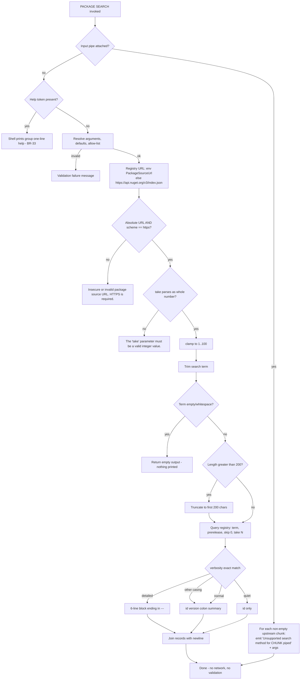

# Feature: Package Search Command

Subject repo: `/mnt/g/reversing/reversing/subject/Xcaciv.Cupcake` @ `a05dc6f00d4510ac073f6dd02fbfba2ffb76a5b6`.
(The working tree differs from that commit only in line endings — eleven files carry CRLF where the commit has LF; verified with a whole-tree diff that ignores carriage returns at end of line, which reports no changes at all.)

Out-of-repo evidence is the command-framework reference clone at tag v2.1.2; the shell pins framework 2.1.1 / 2.1.0, so framework citations are the closest published behaviour, not the exact pinned build.

---

## Purpose — what user/business problem this solves; who uses it (actors/roles)

The shell is a plugin-extensible interactive command shell. Its commands are shipped as installable packages pulled from a public package registry. Before a user can install a plugin they must be able to **discover** one: find out which packages exist that match a word, what version each is at, what it claims to do, who published it, and — at the most verbose level — how many known security vulnerabilities it carries.

This feature is that discovery step: a **`SEARCH` sub-command inside the `PACKAGE` command group** that queries a package registry and prints matching packages at a caller-chosen level of detail.

Actors:

- **Interactive shell user** — types `PACKAGE SEARCH <term>` at the shell prompt to browse the registry, then feeds a chosen package identifier to the (separate) Package Install Command.
- **Shell operator / administrator** — controls which registry is queried by setting a shell environment value; the transport-security rule below is enforced against whatever they set.
- **Automated test / embedding host** — invokes the command's execution entry point directly with an argument list, bypassing the shell's command-line tokenizer (this is exactly what the in-repo test suite does; `Xcaciv.Command.PackagesTests/SearchCommandTests.cs:13-18`).

The command is registered into the shipping shell executable at start-up alongside the install command (`src/Xcaciv.Cupcake.Lit/Program.cs:10-11`).

---

## Behavior — what it does, as observable behavior; every distinct operation the feature supports, its inputs, outputs, and side effects

### B1. Identity and placement

- Command group ("root"): **`Package`**, described as **`Package commands`** (`src/Xcaciv.Command.Packages/SearchCommand.cs:11`).
- Sub-command: **`Search`**, described as **`search for a package`** (`src/Xcaciv.Command.Packages/SearchCommand.cs:12`).
- The framework normalises both names to **upper case** when registering and matching them, so the user types `PACKAGE SEARCH …` (matching is case-insensitive) (OUT-OF-REPO: `src/Xcaciv.Command.Interface/CommandDescription.cs:52-64` (framework v2.1.2); sub-command lookup uppercases the first argument at OUT-OF-REPO: `src/Xcaciv.Command/CommandFactory.cs:46` (framework v2.1.2)).
- The sub-command word is stripped from the argument list before the command sees it (OUT-OF-REPO: `src/Xcaciv.Command/CommandFactory.cs:51` (framework v2.1.2)).
- Registered under package key `internal`, with "may modify the shell environment" **off** (`src/Xcaciv.Cupcake.Lit/Program.cs:11`; the default for that registration is off — OUT-OF-REPO: `src/Xcaciv.Command/CommandController.cs:190` (framework v2.1.2)).

### B2. Parameter surface (declared)

| Name | Kind | Required | Default | Allowed values | Help text (verbatim) |
|---|---|---|---|---|---|
| `search_terms` | **positional** (first) | **yes** | none | any | `String associated to the desired package.` |
| `source` | **named** (`-source <v>`) | no | none (resolves to empty) | any | `The source to search for the package.` |
| `take` | **named** (`-take <v>`) | no | **`20`** | any | `Limit the number of results to return.` |
| `verbosity` | **named** (`-verbosity <v>`) | no | **`normal`** | **`quiet`, `normal`, `detailed`** | `The level of detail to display in the output.` |
| `prerelease` | **flag** (`-prerelease`) | no | n/a | n/a | `Include prerelease packages in the search results.` |

Evidence: `src/Xcaciv.Command.Packages/SearchCommand.cs:13-17`.

Named parameters and the flag are recognised with **one or two leading dashes** (`-take` and `--take` both work) and the match is a substring test, not an exact one (OUT-OF-REPO: `src/Xcaciv.Command.Core/CommandParameters.cs:17-19, 43-45` (framework v2.1.2)).

### B3. The search operation (no piped input)

Inputs: the argument list, plus the shell environment.
Outputs: one text block written to the shell's output.
Side effects: one outbound network query to a package registry; one write of an empty value into the *child* environment when the registry-URL environment value was absent (see BR-2); nothing persisted.

Ordered steps: see **Workflows & states** below.

### B4. The piped-input operation

When the command is placed downstream of a `|` in a shell pipeline, it does **not** search. For each non-empty chunk of upstream output it emits one line:

```
Unsupported search method for <chunk> (piped)<arg1>,<arg2>,...
```

(`src/Xcaciv.Command.Packages/SearchCommand.cs:90`.) No registry URL is resolved, no transport check runs, no parameters are validated, no network call is made.

Test-confirmed: chunk `some-chunk` with arguments `param1`, `param2` produces text containing `Unsupported search method` and containing `some-chunk` (`Xcaciv.Command.PackagesTests/SearchCommandTests.cs:128-138`).

The routing between B3 and B4 is decided by whether the shell attached an input pipe to this command's context (OUT-OF-REPO: `src/Xcaciv.Command.Core/AbstractCommand.cs:152-172` (framework v2.1.2)); empty chunks are skipped entirely (OUT-OF-REPO: `src/Xcaciv.Command.Core/AbstractCommand.cs:158` (framework v2.1.2)).

---

## Business rules & edge cases — every rule, limit, threshold, validation, rounding rule, ordering guarantee, and special case, each with evidence (file:line). Mine the tests hard: test names and assertions are the closest thing to requirements this repo has. Include magic numbers WITH their meaning.

### Registry URL resolution

- **BR-1 (resolution order).** The registry base URL is taken from the shell environment value named **`PackageSourceUrl`**. If that value is absent or empty, the command falls back to the hard-coded literal **`https://api.nuget.org/v3/index.json`** (`src/Xcaciv.Command.Packages/SearchCommand.cs:24-29`). Environment names are case-insensitive (stored upper-cased) in the shell's environment store (OUT-OF-REPO: `src/Xcaciv.Command/EnvironmentContext.cs:73-74, 96-97` (framework v2.1.2)).
- **BR-2 (read side effect).** Reading a missing environment value *writes* an empty value back under that name in the command's own child environment (OUT-OF-REPO: `src/Xcaciv.Command/EnvironmentContext.cs:100-106` (framework v2.1.2)). Because the search command is registered as not modifying the environment, that child environment is discarded and the parent shell environment is unchanged (OUT-OF-REPO: `src/Xcaciv.Command/CommandExecutor.cs:216-219` (framework v2.1.2)).
- **BR-3 (`-source` is inert).** QUIRK. A `-source` parameter is declared and its value is consumed off the command line, but the command **never reads it**. The only way to change the registry is the environment value in BR-1. `PACKAGE SEARCH foo -source https://other/index.json` silently searches the default/environment registry. (Declared `src/Xcaciv.Command.Packages/SearchCommand.cs:14`; never referenced anywhere in `src/Xcaciv.Command.Packages/SearchCommand.cs:20-91`.)
- **BR-4 (test evidence).** Setting `PackageSourceUrl` to `https://api.nuget.org/v3/index.json` and searching `XCBatch` with `-take 3` yields non-null output containing `XCBatch` (`Xcaciv.Command.PackagesTests/SearchCommandTests.cs:84-96`).

### Transport security

- **BR-5 (HTTPS only).** The resolved URL must parse as an **absolute** URL **and** its scheme must be exactly **`https`**. Otherwise the command fails immediately with the message **`Insecure or invalid package source URL. HTTPS is required.`** (`src/Xcaciv.Command.Packages/SearchCommand.cs:31-35`). This rejects `http://…`, `file://…`, `ftp://…`, and any relative or unparseable string. INFERRED: scheme comparison is against a normalised-lowercase scheme, so `HTTPS://…` is accepted.
- **BR-6 (check runs before anything else).** The transport check happens **before** the result-count parse, before search-term validation, and before any network use (`src/Xcaciv.Command.Packages/SearchCommand.cs:31-60`). Even a request that would short-circuit on an empty search term still fails on a bad URL.

### Result-count (`take`) rules

- **BR-7 (declared default 20).** When `-take` is not supplied, the framework substitutes the declared default string **`20`** (`src/Xcaciv.Command.Packages/SearchCommand.cs:15`; substitution at OUT-OF-REPO: `src/Xcaciv.Command.Core/CommandParameters.cs:64-69` (framework v2.1.2)).
- **BR-8 (unparseable ⇒ hard failure).** If the value is missing from the resolved parameter set **or** is not a valid whole number, the command fails with the message **`The 'take' parameter must be a valid integer value.`** (`src/Xcaciv.Command.Packages/SearchCommand.cs:42-45`). "Not a valid whole number" includes non-digits (`abc`), decimals (`2.5`), thousands separators (`1,000`), and values too large for a 32-bit signed integer. Surrounding whitespace and a leading `+`/`-` sign are tolerated. INFERRED: numeric parsing follows the host's current locale for sign/whitespace handling.
- **BR-9 (clamp 1…100).** The parsed number is clamped to the inclusive range **[1, 100]** — magic numbers: **1** = minimum results ever requested (you can never ask for zero), **100** = anti-abuse ceiling (`src/Xcaciv.Command.Packages/SearchCommand.cs:46`). So `-take 0` ⇒ 1, `-take -5` ⇒ 1, `-take 1000` ⇒ 100.
- **BR-10 (default × clamp interaction).** The declared default **20** sits inside the clamp window, so the clamp never alters the default path; clamping only ever changes an **explicitly supplied** value. A reimplementation that clamps first and defaults second gets the same answer, but a reimplementation that changes the declared default to 0 or 500 would silently get 1 or 100.
- **BR-11 (limit is a registry-side page size, not a local trim).** The clamped number is handed to the registry query as the page size, with a start offset of **0** (`src/Xcaciv.Command.Packages/NugetWrapper.cs:29`). Consequently the result count is *at most* the limit but may be fewer, and there is no second page — no pagination is implemented.
- **BR-11a (test evidence for the query call itself).** The registry-query step is exercised directly by two further tests that the search tests do not duplicate: a query for `XCBatch` with limit **20** and pre-release **off** returns a non-empty list (`Xcaciv.Command.PackagesTests/NugetWrapperTests.cs:12-30`), and the same query with limit **10** and pre-release **on** also returns a non-empty list (`Xcaciv.Command.PackagesTests/NugetWrapperTests.cs:32-50`). Both assert only "more than zero results"; neither asserts the count equals the requested limit, and neither compares the two result sets against each other. Consequently **no test anywhere in the repo distinguishes pre-release-on from pre-release-off**, which is why BR-19's defect is invisible to the whole suite (see also BR-20). The pre-release setting is carried into the query as a search filter and the offset/limit pair as the page window (`src/Xcaciv.Command.Packages/NugetWrapper.cs:28-29`).
- **BR-12 (test evidence).** `-take 1` produces output that splits into **at most one** line on a newline (`Xcaciv.Command.PackagesTests/SearchCommandTests.cs:98-110`). Note this test runs at the default verbosity; at `detailed` verbosity a single result occupies six lines (see BR-23), so this assertion would fail there — the limit bounds *records*, never *lines*.

### Search-term rules

- **BR-13 (trim).** Leading and trailing whitespace is stripped from the search term before use (`src/Xcaciv.Command.Packages/SearchCommand.cs:50`).
- **BR-14 (empty ⇒ empty result, no network).** If the trimmed term is empty or all whitespace, the command returns an **empty string** and performs **no** registry query (`src/Xcaciv.Command.Packages/SearchCommand.cs:51-54`). The shell suppresses empty output entirely, so nothing at all is printed (OUT-OF-REPO: `src/Xcaciv.Command/CommandExecutor.cs:198-201` (framework v2.1.2)).
- **BR-15 (length cap = 200, TRUNCATE not reject).** A term longer than **200** characters is **cut down to its first 200 characters** and the search proceeds. It is *not* rejected and the user is *not* told (`src/Xcaciv.Command.Packages/SearchCommand.cs:55-58`). Magic number **200** = maximum accepted search-term length.
- **BR-16 (term must be the first argument).** The positional term is taken from the first remaining argument. If the first argument begins with `-`, the framework treats the required positional as missing and fails with **`Missing required parameter search_terms`** (OUT-OF-REPO: `src/Xcaciv.Command.Core/CommandParameters.cs:113-118` (framework v2.1.2)). So `PACKAGE SEARCH -take 5 XCBatch` fails while `PACKAGE SEARCH XCBatch -take 5` works.
- **BR-17 (one token only).** The term is a single token. Multi-word terms must be quoted at the shell prompt; extra bare words after the term are silently ignored (they are consumed by nothing) (OUT-OF-REPO: `src/Xcaciv.Command.Core/CommandParameters.cs:105-130` (framework v2.1.2)).
- **BR-18 (dotted names split at the prompt).** QUIRK. The shell's argument tokenizer only recognises runs of letters, digits, underscore and hyphen outside quotes, so typing `PACKAGE SEARCH cake.nuget` searches for **`cake`** and drops `nuget`; the user must type `PACKAGE SEARCH "cake.nuget"` to search the dotted name (OUT-OF-REPO: `src/Xcaciv.Command.Interface/CommandDescription.cs:70-79` (framework v2.1.2)). The in-repo test that asserts a dotted term works (`Xcaciv.Command.PackagesTests/SearchCommandTests.cs:112-126`) bypasses the tokenizer by passing an argument array directly, so it does **not** cover the prompt path.

### Pre-release rule

- **BR-19 (flag is read as "is the key present", and the key is always present).** QUIRK — this is the most consequential defect in the feature. The command decides "include pre-release" by asking whether the resolved parameter set *contains a key* named `prerelease` (`src/Xcaciv.Command.Packages/SearchCommand.cs:47`). The framework adds that key **unconditionally**, with the text `True` or `False` as its value, whenever there is at least one argument (OUT-OF-REPO: `src/Xcaciv.Command.Core/CommandParameters.cs:34` (framework v2.1.2)). Observed consequence: **pre-release packages are always included, whether or not `-prerelease` is typed.** The correct read would have been "is the value `True`". INFERRED for the exact pinned framework build 2.1.0 — directly observed at v2.1.2.
- **BR-20 (test evidence, non-discriminating).** The only pre-release test passes `-prerelease -take 5` and merely asserts the output contains `XCBatch` (`Xcaciv.Command.PackagesTests/SearchCommandTests.cs:71-82`); it cannot distinguish BR-19's defect from correct behaviour.

### Verbosity and output formatting

The result list is rendered one entry per record, then the entries are **joined with a single newline (`\n`, LF)** — no trailing newline, no blank line between entries (`src/Xcaciv.Command.Packages/SearchCommand.cs:85`).

- **BR-21 (`quiet`).** One line per result, containing only the **package identifier**, nothing else (`src/Xcaciv.Command.Packages/SearchCommand.cs:66`).
  Format: `<PackageId>`
  Test: quiet output must contain **no colon character at all** and must not contain `Published:` (`Xcaciv.Command.PackagesTests/SearchCommandTests.cs:41-54`).

- **BR-22 (`normal`).** One line per result (`src/Xcaciv.Command.Packages/SearchCommand.cs:69`).
  Format, field by field and separator by separator:
  `<PackageId>` + one space + `<Version>` + one space + `:` + one space + `<Summary>`
  i.e. `<PackageId> <Version> : <Summary>`.
  If the summary is empty the line ends with `" : "` — a **trailing space** survives.
  Test: normal output must contain `:` and must **not** contain `Published:` (`Xcaciv.Command.PackagesTests/SearchCommandTests.cs:26-39`).

- **BR-23 (`detailed`).** **Six lines per result** (`src/Xcaciv.Command.Packages/SearchCommand.cs:72-77`):

  1. `<PackageId>` + space + `<Version>` + space + `(` + `<DownloadCount>` + `)` + space + `:` + space + `<Summary>`
  2. two spaces + `Published:` + `<PublishedTimestamp>`   ← no space after the colon
  3. two spaces + `Authors:` + `<Authors>`
  4. two spaces + `License:` + `<LicenseMetadata>`
  5. two spaces + `Vulnerabilities:` + `<count of known vulnerabilities>`
  6. `---`  (three hyphens, at column 0, a record separator)

  Because entries are then joined with `\n`, consecutive detailed records read `…\n---\n<next id> …`; the **last** record also ends with a `---` line.
  Test: detailed output must contain the literal strings `Published:`, `Authors:` and `Vulnerabilities:` (`Xcaciv.Command.PackagesTests/SearchCommandTests.cs:56-69`).

- **BR-24 (unrecognised verbosity ⇒ render as `normal`).** The command has an explicit fallback branch that renders the `normal` format for any value it does not recognise (`src/Xcaciv.Command.Packages/SearchCommand.cs:79-82`).
- **BR-25 (how that branch is actually reached — casing).** QUIRK. The framework rejects any value outside the allow-list **case-insensitively**, with the message **`Invalid value for parameter verbosity, this parameter has an allow list.`** (OUT-OF-REPO: `src/Xcaciv.Command.Core/CommandParameters.cs:76-80` (framework v2.1.2)), whereas the command's branch selection is an **exact, case-sensitive** match (`src/Xcaciv.Command.Packages/SearchCommand.cs:63-83`). Therefore:
  - `-verbosity fancy` ⇒ **rejected by validation** (allow-list message), never reaches the command body.
  - `-verbosity QUIET` / `-verbosity Detailed` ⇒ **accepted by validation, then falls into the fallback branch and renders `normal`** — a user asking for quiet in capitals silently gets the normal format.
  This casing mismatch is the *only* reachable route to the fallback branch.
- **BR-26 (redundant default).** The command re-defaults verbosity to `normal` if the key is absent (`src/Xcaciv.Command.Packages/SearchCommand.cs:62`). The framework already guarantees the key is present whenever there is at least one argument, so that guard is dead code (OUT-OF-REPO: `src/Xcaciv.Command.Core/CommandParameters.cs:82` (framework v2.1.2)).

### Result-set rules

- **BR-27 (ordering).** No ordering is imposed by the shell; entries are rendered in exactly the order the registry returned them (`src/Xcaciv.Command.Packages/SearchCommand.cs:60, 66-82`; `src/Xcaciv.Command.Packages/NugetWrapper.cs:29-31`). A reimplementation must preserve registry order, i.e. relevance order as the registry defines it.
- **BR-28 (zero matches).** An empty result set renders as an empty string, which the shell suppresses — the user sees nothing at all, indistinguishable from BR-14. There is no "no results found" message anywhere (`src/Xcaciv.Command.Packages/SearchCommand.cs:85`; OUT-OF-REPO: `src/Xcaciv.Command/CommandExecutor.cs:198-201` (framework v2.1.2)).
- **BR-29 (test evidence, real registry).** Searching `XCBatch` with no other arguments returns text containing both `XCBatch.Core` and `XCBatch.Interfaces` (`Xcaciv.Command.PackagesTests/SearchCommandTests.cs:9-24`). Searching `cake.nuget` at `normal` verbosity returns text containing `Cake.NuGet` — note the assertion is **case-sensitive on the returned identifier's own casing**, i.e. the registry's canonical casing is preserved verbatim, not lower-cased (`Xcaciv.Command.PackagesTests/SearchCommandTests.cs:112-126`).

### Argument-handling edge cases (framework-supplied, observable through this command)

- **BR-30 (no arguments at all ⇒ wrong error).** QUIRK. With an empty argument list the framework short-circuits and returns an **empty** parameter set without running any required-parameter check (OUT-OF-REPO: `src/Xcaciv.Command.Core/AbstractCommand.cs:180` (framework v2.1.2)). The command then hits the `take` lookup first and fails with **`The 'take' parameter must be a valid integer value.`** (`src/Xcaciv.Command.Packages/SearchCommand.cs:42-45`) — a confusing message for what is really "you gave me no search term".
- **BR-31 (named parameter with no value ⇒ crash).** A trailing `-take` or `-verbosity` with nothing after it makes the framework read past the end of the argument list (OUT-OF-REPO: `src/Xcaciv.Command.Core/CommandParameters.cs:54-55` (framework v2.1.2)). Observed by the user as the generic execution-error line (see Error handling).
- **BR-32 (substring flag matching).** QUIRK. Because parameter matching is an unanchored substring test on tokens that start with `-`, a token such as `-taken` is matched as `-take` (OUT-OF-REPO: `src/Xcaciv.Command.Core/CommandParameters.cs:43-52` (framework v2.1.2)).
- **BR-33 (help is intercepted upstream).** QUIRK. `PACKAGE SEARCH --help` is detected by the shell *before* the sub-command word is stripped; because `PACKAGE` is a group with sub-commands, the shell prints the group's one-line summary list instead of this command's parameter-level help (OUT-OF-REPO: `src/Xcaciv.Command/CommandExecutor.cs:57-72` (framework v2.1.2), OUT-OF-REPO: `src/Xcaciv.Command/HelpService.cs:165-175` (framework v2.1.2)). The rich per-parameter help text declared at `src/Xcaciv.Command.Packages/SearchCommand.cs:13-17` therefore has **no** route to the screen at all: the framework does contain a per-parameter help builder, but it is reached only for commands that have no sub-commands (OUT-OF-REPO: `src/Xcaciv.Command/CommandExecutor.cs:65-70` (framework v2.1.2)), and the bare `HELP` word lists every command as a single line each rather than detailing one (OUT-OF-REPO: `src/Xcaciv.Command/CommandExecutor.cs:27, 78-81, 110-141` (framework v2.1.2)). A reimplementation should decide deliberately whether to keep this.
- **BR-33a (two of the three help spellings cannot survive the prompt).** QUIRK. The help detector recognises `--help`, `-?` and `/?`, all case-insensitively (OUT-OF-REPO: `src/Xcaciv.Command/HelpService.cs:165-175` (framework v2.1.2)). But the prompt's tokenizer keeps only runs of letters, digits, underscore and hyphen (BR-18), so `-?` is reduced to the bare token `-` and `/?` is discarded outright (OUT-OF-REPO: `src/Xcaciv.Command.Interface/CommandDescription.cs:70-79` (framework v2.1.2)). Typed at the prompt, therefore, only `--help` ever reaches the detector: `PACKAGE SEARCH -?` is not treated as a help request and instead fails the required positional with `Missing required parameter search_terms` (BR-16), while `PACKAGE SEARCH /?` arrives with no arguments at all and fails with the `take` message (BR-30). The `-?` and `/?` spellings work only for a host that calls the execution entry point with a hand-built argument list.

---

## Workflows & states — multi-step flows and state machines (states, transitions, triggers, timeouts). Use mermaid or numbered steps.

### W1. Search (no piped input) — numbered

1. **Resolve arguments.** Positional term first, then flag detection, then named parameters; defaults substituted for absent named parameters; allow-list validated. Failure here aborts with a validation message (BR-16, BR-25).
2. **Resolve registry URL.** Read environment value `PackageSourceUrl`; if empty use `https://api.nuget.org/v3/index.json` (BR-1).
3. **Enforce transport.** Absolute URL with `https` scheme, else abort with `Insecure or invalid package source URL. HTTPS is required.` (BR-5).
4. **Open a registry connection** for that URL (`src/Xcaciv.Command.Packages/SearchCommand.cs:38-39`). INFERRED: no network request is made at this point — the registry client resolves the service index lazily on first use, which is at step 8.
5. **Resolve result count.** Parse `take`; abort with `The 'take' parameter must be a valid integer value.` if unparseable; clamp to [1, 100] (BR-8, BR-9).
6. **Resolve pre-release flag** (BR-19 — always ends up "include").
7. **Normalise the search term.** Trim; if empty ⇒ **return empty output and stop** (BR-14); if longer than 200 characters ⇒ truncate to 200 (BR-15).
8. **Query the registry** for the term, with the pre-release setting, offset 0, page size = clamped count. Block until the answer arrives.
9. **Render.** Pick the format by exact verbosity string (`quiet` / `normal` / `detailed`, else the `normal` fallback) and format each record (BR-21…BR-26).
10. **Join** the rendered records with a single `\n` and return the block as one output chunk.
11. The shell prints the chunk (or, if empty, prints nothing).

### W2. Piped input

1. The shell attaches an upstream pipe to this command's context.
2. For each chunk arriving from upstream, **skip if empty**, otherwise emit `Unsupported search method for <chunk> (piped)<args joined by commas>`.
3. When the upstream pipe closes, the command ends. No search ever occurs (B4).



### States

There is no persistent state machine. The command is stateless between invocations: a fresh command instance is created per execution by the shell (OUT-OF-REPO: `src/Xcaciv.Command/CommandFactory.cs:38-56` (framework v2.1.2)), and the rendered-lines collection it fills lives only for that invocation.

---

## Data — entities this feature owns, their fields (name, type-in-generic-terms, constraints), relationships, lifecycle (created/mutated/deleted when).

This feature owns no persisted data. It owns two transient shapes.

### D1. Search request (transient, built per invocation, discarded at the end)

| Field | Type (generic) | Constraints | Lifecycle |
|---|---|---|---|
| Registry base URL | text (absolute URL) | must parse absolute; scheme must be `https`; falls back to `https://api.nuget.org/v3/index.json` | created step 2, validated step 3 |
| Search term | text | trimmed; non-empty; at most 200 characters (truncated, not rejected) | created step 7 |
| Result limit | whole number | 1 ≤ n ≤ 100; default 20 | created step 5 |
| Include pre-release | boolean | see BR-19 — effectively always true | created step 6 |
| Start offset | whole number | always **0**; no pagination | fixed (`src/Xcaciv.Command.Packages/NugetWrapper.cs:29`) |
| Requested source override | text | consumed from `-source` and **never read** (BR-3) | created, discarded |

### D2. Search result record (read-only projection of the registry's answer)

Fields consumed by the renderer (`src/Xcaciv.Command.Packages/SearchCommand.cs:66-82`):

| Field | Type (generic) | Used at verbosity | Notes |
|---|---|---|---|
| Package identifier | text | quiet, normal, detailed | canonical registry casing preserved (BR-29) |
| Version | version string | normal, detailed | as returned |
| Summary | text | normal, detailed | frequently empty on public registries ⇒ trailing `" : "` |
| Download count | whole number, may be absent | detailed | INFERRED: renders as empty inside `()` when absent — the field is rendered by its default text form with no null guard (`src/Xcaciv.Command.Packages/SearchCommand.cs:72`) |
| Published timestamp | date-time, may be absent | detailed | rendered with the host's default date formatting ⇒ **locale-dependent output** (INFERRED) |
| Authors | text | detailed | as returned |
| License metadata | structured value | detailed | rendered by its own default text form; commonly empty/absent from search responses (INFERRED) |
| Vulnerabilities | list | detailed | rendered as the **count** of entries, not the entries themselves |

Lifecycle: created when the registry replies; rendered immediately; never mutated; never stored.

### D3. Environment value consumed

`PackageSourceUrl` — text, case-insensitive name, read-only from this feature's point of view except for BR-2's discarded empty-value write.

---

## Interfaces — what this feature exposes to and consumes from OTHER features (semantic contracts, not function signatures).

### Consumed from other features

- **Command Extensibility Contract / Plugin Discovery & Command Registration** — supplies: declarative registration of a command group + sub-command with human-readable descriptions; a declarative parameter model with positional / named / flag kinds, per-parameter required-ness, default values, allow-lists and help text; a synchronous "run with these arguments" entry point and a separate "handle one piped chunk" entry point; automatic construction of a fresh command instance per invocation.
- **Interactive Shell Session** — tokenizes the typed line, resolves `PACKAGE` then `SEARCH`, strips the sub-command word, hands over the remaining argument list, and decides pipeline placement. Contract points that matter here: sub-command matching is case-insensitive; the argument tokenizer drops punctuation outside quotes (BR-18); help tokens are intercepted before the sub-command resolves (BR-33).
- **Configuration & Settings** — the shell environment store, keyed case-insensitively; supplies `PackageSourceUrl` (BR-1) and isolates this command's writes into a discarded child scope (BR-2).
- **Package Registry Client** — this feature asks it for "the first N packages matching this term, optionally including pre-releases" and receives an ordered list of result records with the fields in D2. The offset is always 0. This feature does not know or care about the registry's wire protocol.
- **Console Presentation & Interaction** — receives the joined text block as **one** output chunk and prints it (the console renderer writes the whole chunk on one console write, so embedded newlines in `detailed` output render as real line breaks) (`src/Xcaciv.Cupcake.Core/ConsoleContext.cs:53-60`). Empty chunks are never printed.
- **Error Handling & Failure Reporting** — receives any thrown failure and renders it (see Error handling).

### Exposed to other features

- A user-facing discovery surface: `PACKAGE SEARCH <term> [-take N] [-verbosity quiet|normal|detailed] [-prerelease] [-source X]`.
- A stable, line-oriented text output that is **pipeable**: at `quiet` verbosity each line is exactly one package identifier, which is the intended hand-off to the **Package Install Command**. (Note the install command's current implementation only echoes, so this hand-off is not yet exercised — `src/Xcaciv.Command.Packages/InstallCommand.cs:19-27`.)
- A declared help surface (name, description, per-parameter descriptions, allow-list) for the shell's auto-generated help.
- Downstream pipeline stages receive the same joined block as a single chunk.

---

## External technology — everything outside the repo this feature needs, one row per dependency: | Generic capability | Protocol/standard if any | What the source used | Notes for reimplementer |

| Generic capability | Protocol/standard if any | What the source used | Notes for reimplementer |
|---|---|---|---|
| Managed runtime + language | — | C# on .NET 8 (`net8.0`); nullable reference types and implicit usings enabled | `src/Xcaciv.Command.Packages/Xcaciv.Command.Packages.csproj:3-7`. QUIRK: the shipping shell executable targets `net8.0` for ordinary builds but its Release configuration retargets the older, Windows-only `net6.0-windows` and publishes a self-contained, trimmed, ready-to-run single file for 64-bit Windows (`src/Xcaciv.Cupcake.Lit/Xcaciv.Cupcake.Lit.csproj:3-8, 10-23`) — so a released binary runs on a different, older runtime than everything the tests exercise. A reimplementer should decide deliberately whether the shipped artefact and the tested artefact may diverge like this. |
| Extensible command-shell framework (command controller, declarative parameter attributes, command-line tokenizer, `\|` pipelines, auto-generated help, plugin assembly loading, environment context, built-in SAY/SET/ENV/REGIF) | — | `Xcaciv.Command` 2.1.1, `Xcaciv.Command.Core` 2.1.0, `Xcaciv.Command.Interface` 2.1.0 (`Directory.Packages.props:8-10`) | INFERRED: **not published on the public package registry** — the repo's build-time feed configuration maps every package whose name starts with the publisher's prefix to a local folder feed rather than to the public registry, and declares a private code-hosting-provider feed alongside it (`NuGet.config:4-20`); I could not confirm the negative directly, having no network access to the public registry. Semantics documented above from the v2.1.2 reference clone. A reimplementation must reproduce: substitute declared defaults for absent named parameters; validate allow-lists case-insensitively; add flag keys unconditionally with `True`/`False` (BR-19 depends on this); reject a required positional whose slot holds a `-`-prefixed token; return an empty parameter set for an empty argument list (BR-30). |
| Package-registry search client | NuGet V3 service index + Search Query Service over HTTPS/JSON | `NuGet.Protocol` 7.0.1 (`Directory.Packages.props:7`) | The base URL is a **service index** document (`…/v3/index.json`), not a search endpoint; the client discovers the search endpoint from it. Reimplementers on another platform need either a NuGet V3 client or, if targeting a different registry, an equivalent "search by term, skip/take, include-prerelease flag" call returning id / version / summary / download count / published date / authors / license / vulnerability list. |
| Public package registry (default target) | HTTPS | `https://api.nuget.org/v3/index.json` (`src/Xcaciv.Command.Packages/SearchCommand.cs:28`) | Hard-coded fallback. Live network access is required for every in-repo test of this feature except the piped-chunk one to pass — they are integration tests, not unit tests (`Xcaciv.Command.PackagesTests/SearchCommandTests.cs:9-126`, `Xcaciv.Command.PackagesTests/NugetWrapperTests.cs:12-50`). |
| Build-time package feed (to obtain the shell framework itself) | Package-registry service index over HTTPS, plus a plain local folder feed | Three declared sources — the public registry, a private feed hosted by the code-hosting provider, and a local folder named by an environment value — with a mapping that routes every `Xcaciv.*` package to the local folder and everything else to the public registry (`NuGet.config:4-20`) | Build-time only; this feature never touches it at run time. A reimplementer still needs *somewhere* to obtain the command-shell framework, and must note that the local folder is named by an environment value that has to be set before a build will resolve. |
| Unit-test runner | — | xUnit 2.9.3 with the Microsoft test SDK (`Directory.Packages.props:15-17`) | Test assertions are the requirement source mined above. |
| Console (text terminal) | 16-colour text-console attributes (a named foreground and background colour per write, reset afterwards); line-oriented write and read | .NET `Console` via the shell's console adapter | Output colour is fixed by the presentation feature, not by this one: command output is blue on black, status lines yellow on dark blue, the prompt green on black (`src/Xcaciv.Cupcake.Core/ConsoleContext.cs:23-30, 53-60, 90-103`). A reimplementer needs a terminal abstraction that can set and reset a foreground/background pair per write; no cursor addressing, no ANSI escape authoring of its own. |

---

## Error handling — failure modes and what the user/system observes for each.

| Failure mode | Trigger | What the user observes |
|---|---|---|
| Insecure or malformed registry URL | `PackageSourceUrl` not absolute, or scheme is not `https` (BR-5) | Command aborts. The shell prints `Error executing PACKAGE (see trace for more info)`, sets the status line to `**Error: Insecure or invalid package source URL. HTTPS is required.`, and writes the full detail to trace (OUT-OF-REPO: `src/Xcaciv.Command/CommandExecutor.cs:224-231` (framework v2.1.2)). **Note the command name in the visible line is the group name `PACKAGE`, not `SEARCH`** — QUIRK, it is the registry key, not the sub-command. |
| Unparseable / absent result count | `-take abc`, `-take 2.5`, or no arguments at all (BR-8, BR-30) | Same generic line; status line `**Error: The 'take' parameter must be a valid integer value.` |
| Verbosity outside the allow-list (differing by more than case) | `-verbosity fancy` (BR-25) | Same generic line; status line `**Error: Invalid value for parameter verbosity, this parameter has an allow list.` |
| Search term missing / in the wrong position | `PACKAGE SEARCH -take 5 foo` (BR-16) | Same generic line; status line `**Error: Missing required parameter search_terms` |
| Named parameter with no value after it | trailing `-take` (BR-31) | Same generic line; status line carries an index-out-of-range message — INFERRED text shape: `**Error: Index was out of range. Must be non-negative and less than the size of the collection.` The read past the end of the list is directly observed (OUT-OF-REPO: `src/Xcaciv.Command.Core/CommandParameters.cs:54-55` (framework v2.1.2)); only the wording of the surfaced message is inferred. |
| Registry unreachable, TLS failure, HTTP error, timeout | network or registry problem during step 8 | Same generic line. Because the asynchronous call is awaited by blocking, the surfaced message is an aggregate wrapper — INFERRED text shape: `**Error: One or more errors occurred. (<underlying message>)` (`src/Xcaciv.Command.Packages/SearchCommand.cs:60`; OUT-OF-REPO: `src/Xcaciv.Command/CommandExecutor.cs:227-230` (framework v2.1.2)). |
| Result record missing a vulnerability list at `detailed` verbosity | registry omits the field | INFERRED: counting an absent list would fail and surface as the generic execution error. Not observed; the in-repo detailed test passes against the live public registry (`Xcaciv.Command.PackagesTests/SearchCommandTests.cs:56-69`), so the public registry evidently always supplies the field. A reimplementer should treat an absent list as count `0`. |
| Zero matches, or an empty/whitespace search term | BR-14, BR-28 | **Silence.** No message, no "0 results". Indistinguishable from a suppressed empty term. |
| Command used downstream of a pipe | B4 | Per chunk: `Unsupported search method for <chunk> (piped)<args>`. Not treated as an error by the shell — it is ordinary successful output. QUIRK: there is no separator between `(piped)` and the first argument (`src/Xcaciv.Command.Packages/SearchCommand.cs:90`). |

There is **no** retry, no back-off, no timeout of the shell's own, and no partial-result handling.

---

## Non-functional observations — caching, pagination sizes, concurrency assumptions, permissions checks, performance-motivated code, i18n, accessibility.

- **Blocking wait on the interactive thread.** The command waits for the registry's answer on the same thread that reads the prompt, so the prompt is frozen for the whole round trip; there is no progress indicator, no spinner, and no way for the user to cancel (`src/Xcaciv.Command.Packages/SearchCommand.cs:60`). This is not local to the command: the shipping shell waits the same way for every command it dispatches and for every line it reads, even though the underlying contract offers a non-blocking form (`src/Xcaciv.Cupcake.Core/Loop.cs:62, 65`). A reimplementer is free to make the query non-blocking without changing any observable rule in this dossier.
- **No timeout.** Neither the command nor the shell imposes one; a hung registry hangs the shell. The framework's pipeline stage timeout and overall execution timeout both default to **0 = unlimited** (OUT-OF-REPO: `src/Xcaciv.Command.Interface/PipelineConfiguration.cs:29, 36` (framework v2.1.2)).
- **No caching.** Every invocation re-resolves the service index and re-queries. Identical repeated searches cost identical network work.
- **Pagination absent.** Offset is fixed at 0 and there is no "next page" affordance; the 100-result ceiling is therefore also the absolute maximum any user can ever see for one term (BR-9, BR-11).
- **Anti-abuse limits.** Two. Only the first is stated as such in the source: the result-count clamp to ≤ 100 sits directly under a note naming abuse prevention (`src/Xcaciv.Command.Packages/SearchCommand.cs:41, 46`). The 200-character search-term truncation sits under a note that says only "validate search terms", so INFERRED that it shares the same intent (`src/Xcaciv.Command.Packages/SearchCommand.cs:49, 55-58`).
- **Supply-chain posture.** HTTPS is mandatory for the registry (BR-5) — but note that the `-source` escape hatch is inert (BR-3), so in practice only an operator with environment access can retarget the registry, which is arguably safer than the declared design.
- **Concurrency.** A fresh command instance per invocation and a per-invocation child environment mean no shared mutable state between concurrent pipeline stages (OUT-OF-REPO: `src/Xcaciv.Command/CommandFactory.cs:38-56` (framework v2.1.2), OUT-OF-REPO: `src/Xcaciv.Command/CommandExecutor.cs:187` (framework v2.1.2)). The environment store itself is a thread-safe map (OUT-OF-REPO: `src/Xcaciv.Command/EnvironmentContext.cs:18` (framework v2.1.2)).
- **Pipeline buffering.** When this command's output feeds another stage, the connecting buffer holds up to **10,000** items and back-pressures (blocks) when full (OUT-OF-REPO: `src/Xcaciv.Command.Interface/PipelineConfiguration.cs:15, 23` (framework v2.1.2)). Since this command emits its whole result set as **one** item, that ceiling is not a practical constraint here.
- **Permissions.** No authentication of any kind. The registry is queried anonymously; there is no credential store, no API key, no per-user authorisation check anywhere in this feature.
- **i18n.** All literals are English and hard-coded; there is no message catalogue. The `detailed` published-timestamp field is rendered with the host's default date/time formatting, so **the same search produces different text on differently-configured machines** — INFERRED, and a reimplementer should pick an explicit format (ISO-8601) rather than reproduce this.
- **Accessibility.** Output is plain text with no colour semantics of its own; the console adapter paints all command output a single foreground colour, so no information is conveyed by colour alone (`src/Xcaciv.Cupcake.Core/ConsoleContext.cs:53-60`). The `detailed` format relies on two-space indentation and a `---` separator for structure, which reads acceptably in a screen reader.
- **Test suite realism.** Every assertion in `Xcaciv.Command.PackagesTests/SearchCommandTests.cs` **except the piped-chunk test** (`Xcaciv.Command.PackagesTests/SearchCommandTests.cs:128-138`, which makes no registry call at all — see B4) requires live internet access to the public registry and depends on third-party packages continuing to exist under those names; the same is true of the two query-level tests in `Xcaciv.Command.PackagesTests/NugetWrapperTests.cs:12-50` (BR-11a). There are **no** offline tests of the formatting, clamping, truncation or URL rules, and no test asserts an exact output string — every formatting assertion is a substring or a not-contains check.

---

## Acceptance criteria — 5–15 Given/When/Then statements a QA engineer could execute against the clone, derived from the tests and rules above.

1. **Given** no `PackageSourceUrl` environment value, **when** a user runs `PACKAGE SEARCH XCBatch`, **then** the query goes to `https://api.nuget.org/v3/index.json` and the output contains both `XCBatch.Core` and `XCBatch.Interfaces`.
2. **Given** `PackageSourceUrl` is set to `http://api.nuget.org/v3/index.json` (plain HTTP), **when** a user runs `PACKAGE SEARCH XCBatch`, **then** the search is refused before any network traffic and the reported reason is exactly `Insecure or invalid package source URL. HTTPS is required.`
3. **Given** `PackageSourceUrl` is set to a valid `https://` service index, **when** a user runs `PACKAGE SEARCH XCBatch -take 3`, **then** the output is non-empty and contains `XCBatch`; **and when** the same search is run twice against the same registry, once with `-prerelease` and once without, **then** both runs return the same records, because the flag has no effect — locking in the observed QUIRK (BR-19). A clone that *fixes* the flag will fail this criterion, which is the intended signal for the keep-or-fix decision in Open Question 1.
4. **Given** default settings, **when** a user runs `PACKAGE SEARCH XCBatch -take 1`, **then** the output contains at most one newline-separated line.
5. **Given** default settings, **when** a user runs `PACKAGE SEARCH XCBatch` with `-take 0`, with `-take -5`, and with `-take 500`, **then** the first two return the same record count as `-take 1` (clamped up to 1) and the third returns no more than 100 records (clamped down to 100).
6. **Given** default settings, **when** a user runs `PACKAGE SEARCH XCBatch -take abc`, **then** the search is refused and the reported reason is exactly `The 'take' parameter must be a valid integer value.`
7. **Given** default settings, **when** a user runs `PACKAGE SEARCH XCBatch -verbosity quiet -take 2`, **then** every output line is a bare package identifier, the whole output contains **no** `:` character, and it does not contain `Published:`.
8. **Given** default settings, **when** a user runs `PACKAGE SEARCH XCBatch -verbosity normal -take 2`, **then** each line reads `<id> <version> : <summary>` (single space, then space-colon-space), the output contains `:`, and it does not contain `Published:`.
9. **Given** default settings, **when** a user runs `PACKAGE SEARCH XCBatch -verbosity detailed -take 2`, **then** the output contains `Published:`, `Authors:` and `Vulnerabilities:`, each on its own two-space-indented line, and each record is terminated by a line containing exactly `---`.
10. **Given** default settings, **when** a user runs `PACKAGE SEARCH XCBatch -verbosity QUIET` (upper case), **then** the command succeeds and renders the **normal** format, not the quiet format.
11. **Given** default settings, **when** a user runs `PACKAGE SEARCH XCBatch -verbosity fancy`, **then** the search is refused with the allow-list rejection reason and no network call is made.
12. **Given** a search term consisting only of spaces (e.g. `PACKAGE SEARCH "   "`), **when** it is run, **then** no network call is made and nothing is printed; **and given** instead a 250-character term, **when** it is run, **then** the command succeeds and the registry is queried with only the first 200 characters.
13. **Given** an upstream command producing the chunk `some-chunk`, **when** the user runs `<upstream> | PACKAGE SEARCH param1 param2`, **then** the output contains `Unsupported search method` and contains `some-chunk`, and no registry query occurs.
14. **Given** default settings, **when** a user runs `PACKAGE SEARCH` with no further arguments, **then** the command fails and the reported reason is `The 'take' parameter must be a valid integer value.` (not a missing-search-term message) — locking in the observed QUIRK; **and when** the user instead types `PACKAGE SEARCH -?` at the prompt, **then** no help is shown and the reported reason is `Missing required parameter search_terms`, while `PACKAGE SEARCH --help` shows the `PACKAGE` group's one-line summaries rather than this command's parameter help — locking in BR-33 and BR-33a.
15. **Given** default settings, **when** a user runs `PACKAGE SEARCH "cake.nuget" -verbosity normal`, **then** the output contains `Cake.NuGet` with that exact casing.

---

## Confidence & open questions — label anything INFERRED (not directly observed); list what you could not determine and where you looked.

### Directly observed (high confidence)

Everything cited to `src/Xcaciv.Command.Packages/SearchCommand.cs`, `src/Xcaciv.Command.Packages/NugetWrapper.cs`, `Xcaciv.Command.PackagesTests/SearchCommandTests.cs`, `Xcaciv.Command.PackagesTests/NugetWrapperTests.cs`, `src/Xcaciv.Cupcake.Lit/Program.cs`, `src/Xcaciv.Cupcake.Core/Loop.cs`, `src/Xcaciv.Cupcake.Core/ConsoleContext.cs`, `Directory.Packages.props`, `NuGet.config` and the project files: the parameter declarations, the exact fallback URL, the exact three failure message literals, the clamp bounds 1/100, the 200-character truncation, the three output formats character-for-character, the newline join, and the piped-chunk message.

Every literal quoted anywhere in this dossier — the fallback URL, all five parameter help strings, the two command descriptions, the three allow-list words, the two in-repo failure messages, the two framework failure messages, the shell's generic execution-error line and its `**Error: ` status prefix, the `Published:` / `Authors:` / `License:` / `Vulnerabilities:` labels, the `---` separator, the piped-chunk message, and the numbers 20 / 1 / 100 / 200 / 0 / 10,000 — was re-checked character by character against the cited line at the pinned commit (and, for the `OUT-OF-REPO:` ones, against the v2.1.2 reference clone).

### Framework semantics — observed in the reference clone at v2.1.2, INFERRED for the pinned 2.1.1 / 2.1.0

All `OUT-OF-REPO:` citations. The pinned versions are one patch release behind the reference, and I could not obtain the pinned binaries (searched `~/.nuget/packages`, the whole filesystem for `Xcaciv.Command.Core*`, and the repo tree — no restored package or lock file present). The behaviours most at risk if the patch release differed:

- **BR-19 (flag key always present ⇒ pre-release always on).** This is the single most important inferred item. If 2.1.0 added flag keys conditionally, the `-prerelease` flag would work as advertised and BR-19 evaporates. **Verify first** in any reimplementation effort.
- **BR-25 (case-insensitive allow-list vs. case-sensitive branch selection).**
- **BR-30 (empty argument list bypasses required-parameter validation).**
- **BR-33 / BR-33a (help interception for a group with sub-commands, and which help spellings the tokenizer preserves).**

### INFERRED, not observed

- The rendered-lines collection the command assigns into (`src/Xcaciv.Command.Packages/SearchCommand.cs:66, 69, 72, 81`) is **not declared in this repo** and is **not present** in the reference clone's base command class (OUT-OF-REPO: `src/Xcaciv.Command.Core/AbstractCommand.cs:14-265` (framework v2.1.2) — no such member). It must therefore have existed as a base-class member in the pinned 2.1.0 build and been removed by 2.1.2. Behaviourally this is inert — the collection is fully reassigned on every path before it is read — but it means **the repo as pinned will not compile against the reference clone's framework**. I could not determine whether that member had any other framework-visible effect (e.g. whether the framework itself read it after execution). Looked in: the reference clone's base command class, its help service, its executor, and a `grep` for the member name across the entire clone — no other reference exists at v2.1.2.
- Locale-dependence of the `detailed` published-timestamp rendering, and the empty rendering of absent download-count / license fields.
- That no network request is made when the registry connection is opened at step 4 of W1 — the request is assumed to be deferred to the first query.
- That the command-shell framework packages are absent from the public package registry (external-technology table). The feed configuration shows only that the build resolves them from a local folder, not that they are unpublished.
- The exact wording surfaced when a named parameter is given no value (error-handling table).
- That the 200-character search-term truncation was authored as an anti-abuse limit; only the result-count clamp says so in the source.
- Behaviour when the registry omits the vulnerability list (possible failure at `detailed` verbosity).
- Numeric parsing of `take` following host locale rules.
- The exact aggregate-wrapper text of a network failure message.

### Open questions

1. **Is `-prerelease` meant to work?** BR-19 says it is a no-op and pre-releases are always included. No test discriminates. A product decision is needed for the reimplementation: fix it (read the value, not the key) or preserve it.
2. **Is `-source` meant to be inert?** BR-3. It is declared, documented in help, consumed, and ignored. Fixing it would widen the supply-chain surface (any user could point at any HTTPS feed), so this may have been deliberate. Not determinable from the repo — no comment, no test, no issue reference.
3. **What should a zero-result search print?** Today: nothing (BR-28). No evidence of intent either way.
4. **Should the group name or the sub-command name appear in error lines?** Today the visible error line names `PACKAGE` (the registry key), not `SEARCH`.
5. **Is `detailed` verbosity's `---` terminator meant to trail the final record?** Today it does. No test covers it.
6. **Which registries besides the default are expected to work?** The transport rule (BR-5) accepts *any* absolute HTTPS URL, but the registry client the source uses speaks exactly one registry's discovery-and-search protocol (source used: the NuGet V3 client — `Directory.Packages.props:7`), so "any HTTPS URL" is misleading: only a service index of that one protocol family will function, and anything else fails at query time rather than at validation time. No documentation in the repo states this: the two READMEs are stubs of two and three lines respectively, and neither mentions the search command, its parameters or its registry (`README.md:1-2`, `src/Xcaciv.Command.Packages/README.md:1-3`).
7. **Was any offline/unit coverage intended?** None exists; every search test that reaches the registry hits the live public one. I found no test doubles, no recorded fixtures, and no HTTP-stub package anywhere in `Xcaciv.Command.PackagesTests/`. Only the piped-chunk test runs offline.
8. **Is the Release-configuration runtime divergence deliberate?** A released shell binary targets an older, Windows-only runtime than every other project and than the tests (`src/Xcaciv.Cupcake.Lit/Xcaciv.Cupcake.Lit.csproj:10-23`). Nothing in this feature depends on the difference, but a reimplementer choosing a single target runtime should know the source never validated the one it shipped. No comment, commit message or test explains it.
9. **Should the result limit bound records or lines?** At `detailed` verbosity one record is six lines, so `-take 1` yields six lines while the only limit test asserts at most one line at the default verbosity (BR-12, BR-23). Whether "limit" was meant as a record count or an output-size control is not determinable from the repo.
