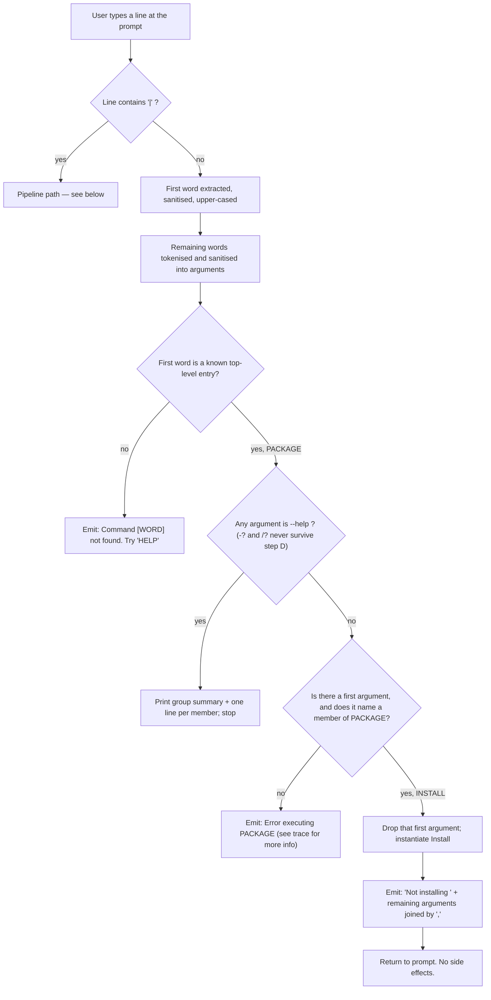

# Feature: Package Install Command

> **Reading note.** This feature is **INCOMPLETE in the source**. The command exists, is registered, is
> discoverable in help, and runs — but it installs nothing. It returns a fixed refusal string. A separate,
> half-built install routine lives in the package-registry client, is never called by anything, and stops
> two steps short of actually installing. The "Behavior" section is therefore split into **as-shipped**
> (what a user observes today) and **intended (INFERRED, not implemented)** (what the dead routine would do
> if wired up). Do not implement the second and call it the first.

---

## Purpose — what user/business problem this solves; who uses it (actors/roles)

The shell is a plugin host: nearly all of its useful commands are meant to arrive as downloadable plugin
packages rather than being built in. The product's own first-run message tells a user with no plugins to go
look at the install command (`src/Xcaciv.Cupcake.Core/Loop.cs:47`), and the package-manager component
describes itself as "A light package manager" (`src/Xcaciv.Command.Packages/README.md:3`). The Package
Install Command is (INFERRED) the intended user-facing door for that: type a package name at the shell prompt
and have the plugin fetched from a package registry and unpacked into the directory the shell scans for
plugins. That inference rests on the command's published name, description and parameter help text plus the
first-run message quoted above; no design note, comment or test in the repository states the intent outright.

Actors:

- **Interactive shell user** — the only actor. Types `package install <name>` at the prompt, or feeds
  package names into it through a pipeline.
- **Shell operator / distributor** (INFERRED role) — the person embedding the shell, who is offered a
  session setting that *claims* to decide whether installing is permitted at all
  (`src/Xcaciv.Cupcake.Core/Loop.cs:8-11`). Nothing in the shell reads that setting, so today the role has
  no effect.

**As shipped, this feature solves none of that problem.** It occupies the slot, publishes the name and the
parameter, and declines. Its present value is as a placeholder that keeps the command surface and the help
listing honest about what is planned.

---

## Behavior — what it does, as observable behavior

### A. As-shipped behavior (directly observed in source)

#### A1. Identity and registration

- The command declares a **group** named `Package`, described as `Package commands`
  (`src/Xcaciv.Command.Packages/InstallCommand.cs:14`).
- Inside that group it declares the **command name** `Install`, described as `install a package`
  (`src/Xcaciv.Command.Packages/InstallCommand.cs:15`).
- It declares exactly **one ordered (positional) parameter**, named `packagename`, described as
  `The unique name of the package to install`, marked **required**
  (`src/Xcaciv.Command.Packages/InstallCommand.cs:16`).
- It declares no named parameters, no flags, no suffix parameters, and no usage-prototype override
  (whole file, `src/Xcaciv.Command.Packages/InstallCommand.cs:14-28`).
- The shipping executable registers it at startup under the package key `internal`, before the session
  loop starts (`src/Xcaciv.Cupcake.Lit/Program.cs:10`). The sibling Package Search Command is registered
  immediately after into the same group (`src/Xcaciv.Cupcake.Lit/Program.cs:11`), so the `Package` group
  ends up with two members, `Install` first — a second member declared under an existing group name is
  merged into that group's existing entry rather than replacing it (OUT-OF-REPO:
  `.../ref-Xcaciv.Command-v2/src/Xcaciv.Command/CommandRegistry.cs:20-36`, framework v2.1.2).
- Only the full shell executable offers this command at all. The repository's other entry point is a stub
  that prints a greeting and exits without starting a session or registering anything
  (`src/Xcaciv.Cupcake/Program.cs:2`), so a user running that build never sees the command.
- Group and command names are **case-normalised to upper case** by the framework when registered, and the
  command line's leading word is normalised the same way before lookup, so entry is case-insensitive
  (OUT-OF-REPO: `/tmp/claude-1000/-mnt-g-reversing-reversing/bfdc6432-7221-449d-aecc-5dc4f1cc83cf/scratchpad/ref-Xcaciv.Command-v2/src/Xcaciv.Command.Interface/Attributes/CommandRootAttribute.cs:27-32`
  and `.../Attributes/CommandRegisterAttribute.cs:27-32`, framework v2.1.2). The effective registered
  identifiers are the group `PACKAGE` and the member `INSTALL`.

#### A2. Direct invocation — the only thing it actually does

Invoked as `package install <args…>`, the command emits **one output line**:

```
Not installing <args joined by a single comma, no space>
```

built as the literal text `Not installing ` (note the trailing space) followed by every remaining argument
joined with `,` (`src/Xcaciv.Command.Packages/InstallCommand.cs:21`). The group word and the member word
are consumed by the dispatcher before the command sees the arguments, so they do not appear in the echo.

Worked examples (argument tokenisation per OUT-OF-REPO:
`/tmp/claude-1000/-mnt-g-reversing-reversing/bfdc6432-7221-449d-aecc-5dc4f1cc83cf/scratchpad/ref-Xcaciv.Command-v2/src/Xcaciv.Command.Interface/CommandDescription.cs:70-79`, framework v2.1.2):

| Typed at the prompt | Emitted |
|---|---|
| `package install Foo` | `Not installing Foo` |
| `package install Foo Bar` | `Not installing Foo,Bar` |
| `package install XCBatch.Core` | `Not installing XCBatch,Core` — see QUIRK Q3 |
| `package install "XCBatch.Core"` | `Not installing XCBatch.Core` |
| `package install` | `Not installing ` (trailing space, nothing after it) — see QUIRK Q2 |
| `package install "XCBatch.Core:2.0"` | `Not installing XCBatch.Core2.0` — the colon is deleted, not preserved; see QUIRK Q13 |
| `package install -?` | `Not installing -` — not help; the `?` is discarded, the `-` survives as an argument; see QUIRK Q9 |
| `package install /?` | `Not installing ` — not help; both characters are discarded; see QUIRK Q9 |
| `package` (group word alone) | `Error executing PACKAGE (see trace for more info)` — not a listing; see QUIRK Q12 |

**Side effects: none.** No network call, no file created, no directory created, no environment value read or
written (`src/Xcaciv.Command.Packages/InstallCommand.cs:19-22` — the environment handle is accepted and
ignored).

#### A3. Piped invocation

When the command is a downstream stage of a `|` pipeline, it runs **once per non-empty chunk** arriving from
upstream — an empty chunk is skipped without invoking the command at all (BR21) — and emits, for each such
chunk:

```
Not installing <chunk> <args joined by a single comma, no space>
```

i.e. the literal `Not installing `, then the incoming chunk verbatim, then a single space, then the
comma-joined arguments (`src/Xcaciv.Command.Packages/InstallCommand.cs:26`). With no arguments the line
ends in that trailing space.

Example: `say hello world | package install Foo` emits the single line `Not installing hello world Foo`.
(INFERRED end-to-end; the per-chunk dispatch is OUT-OF-REPO:
`.../ref-Xcaciv.Command-v2/src/Xcaciv.Command.Core/AbstractCommand.cs:152-173`, framework v2.1.2, and the
upstream command emits its whole text as one chunk per OUT-OF-REPO:
`.../ref-Xcaciv.Command-v2/src/Xcaciv.Command/Commands/SayCommand.cs:19-31`.)

**Side effects: none.**

#### A4. Help

- `package install --help` does **not** print this command's own help. Because the help check happens
  against the *group* before the member is resolved, and the group has members, the shell prints the group
  summary line plus one line per member
  (QUIRK Q4; OUT-OF-REPO: `.../ref-Xcaciv.Command-v2/src/Xcaciv.Command/CommandExecutor.cs:57-72` and
  `:260-289`, framework v2.1.2). INFERRED rendering:
  `PACKAGE      Package commands`, then `-\tINSTALL      install a package`, then the Search line.
- **`--help` is the only help token that reaches that check.** The help test also accepts `-?` and `/?`
  (OUT-OF-REPO: `.../ref-Xcaciv.Command-v2/src/Xcaciv.Command/HelpService.cs:165-175`, framework v2.1.2),
  but neither survives the command line's own tokeniser and character filter: `?` and `/` are not token
  characters, so `package install -?` reaches the command as the single argument `-`, and `package install /?`
  reaches it with no arguments at all (OUT-OF-REPO:
  `.../ref-Xcaciv.Command-v2/src/Xcaciv.Command.Interface/CommandDescription.cs:23,70-79`, framework v2.1.2).
  Both therefore print a refusal line instead of any help (QUIRK Q9).
- The bare help listing for the whole shell includes the group and its members, so `Install` and its
  description `install a package` are discoverable there (OUT-OF-REPO:
  `.../ref-Xcaciv.Command-v2/src/Xcaciv.Command/CommandExecutor.cs:110-141`, framework v2.1.2).

#### A5. The gate that gates nothing

The session exposes a boolean setting whose documentation comment reads *"designates whether the install
command is allowed"*, defaulting to **true** (`src/Xcaciv.Cupcake.Core/Loop.cs:8-11`). A repository-wide
search finds exactly two references to it: its own declaration, and a unit test asserting its default is
true (`Xcaciv.Cupcake.Core.Tests/LoopTests.cs:158`). **No code path reads it before registering, resolving,
or executing the command.** Setting it to false changes nothing (QUIRK Q5).

#### A6. What is *not* wired

The dormant install routine in the package-registry client — the routine described in section B — has **no
callers anywhere in the repository** (verified by whole-repo search; the only occurrence is its own
definition at `src/Xcaciv.Command.Packages/NugetWrapper.cs:111`). The command itself never reaches for the
registry client. There is **no test of any kind** for the Install command in this repository: the only test
that touches the feature at all asserts the default of the session's install-permission setting
(`Xcaciv.Cupcake.Core.Tests/LoopTests.cs:154-162`), and neither package test file mentions the command
(`Xcaciv.Command.PackagesTests/NugetWrapperTests.cs`, `Xcaciv.Command.PackagesTests/SearchCommandTests.cs`).
The framework's own test suite registers a byte-identical command (see QUIRK Q8) under the same package key
`internal` and asserts only that the built-in command listing still renders — no assertion about this
command's output exists anywhere (OUT-OF-REPO:
`.../ref-Xcaciv.Command-v2/src/Xcaciv.Command.Tests/CommandControllerTests.cs:95-110`, framework v2.1.2).

---

### B. Intended behavior (INFERRED, not implemented)

This describes the dormant install routine at `src/Xcaciv.Command.Packages/NugetWrapper.cs:111-128`. **None
of it runs today.** It is presented so a reimplementer can build the finished feature deliberately rather
than by accident.

Inputs it expects: a package **identity** (id + version — already resolved, it does no version discovery of
its own), a **registry handle**, and a **target directory**.

1. **Compose the archive file name.** `<packageId>.<version>.nupkg` — id, a literal dot, the version text, a
   literal dot, the extension (`src/Xcaciv.Command.Packages/NugetWrapper.cs:113`). The same pattern is
   restated as the documented contract of the download step:
   `{path}/{packageId}.{versionString}.nupkg` (`src/Xcaciv.Command.Packages/NugetWrapper.cs:79`).
2. **Place it directly in the target directory** — flat, not in a subfolder
   (`src/Xcaciv.Command.Packages/NugetWrapper.cs:114`).
3. **Download the archive**, overwriting any existing file of that name and truncating it
   (`src/Xcaciv.Command.Packages/NugetWrapper.cs:89`). The download step reports success unconditionally
   (`:100`) — see QUIRK Q6. The call is made **synchronously**, blocking the caller
   (`src/Xcaciv.Command.Packages/NugetWrapper.cs:116`).
4. **Re-read the identity out of the downloaded archive's own manifest** rather than trusting the requested
   identity (`src/Xcaciv.Command.Packages/NugetWrapper.cs:103-109`, called at `:118`). The id casing and
   version text used for the folder layout therefore come from the package itself.
5. **Create the install folder** `<targetDirectory>/<manifestId>/<manifestVersion>/`, creating it only if it
   does not already exist; an existing folder is left as-is and its contents untouched
   (`src/Xcaciv.Command.Packages/NugetWrapper.cs:119-124`).
6. **Stop.** Two steps are explicitly left undone, marked in the source as pending work
   (`src/Xcaciv.Command.Packages/NugetWrapper.cs:125-127`):
   - **Extract the package contents into that folder.** The intended action is preserved as a disabled line:
     unzip the downloaded archive into the folder created in step 5.
   - **Resolve dependencies.** A dependency-resolution helper exists in the same client
     (`src/Xcaciv.Command.Packages/NugetWrapper.cs:52-73`) but is never called from the install routine, and
     that helper itself returns at most **one** entry — the requested package's own dependency record — and
     does not walk the graph transitively (`:64-69`).

   Net effect if run today: the routine downloads a `.nupkg` file, creates an empty `<id>/<version>/` folder
   beside it, and returns. Nothing is installed; the shell would still find no plugin.

7. **No re-scan.** Nothing in the routine, or anywhere else, asks the shell to reload plugins after an
   install. The session loads plugins exactly once, before the first prompt
   (`src/Xcaciv.Cupcake.Core/Loop.cs:41-44`), and a note in the async variant records reloading as unsolved
   (`src/Xcaciv.Cupcake.Core/Loop.cs:98-99`). A completed install would therefore require restarting the
   shell (INFERRED).

8. **No wiring to the plugin directory.** The routine's target directory is a caller-supplied argument with
   no default. The session's plugin scan directory defaults to `.\packages`
   (`src/Xcaciv.Cupcake.Core/Loop.cs:24`). Nothing connects the two.

---

## Business rules & edge cases

| # | Rule | Evidence |
|---|---|---|
| BR1 | The command's group is `Package`, group description `Package commands`. | `src/Xcaciv.Command.Packages/InstallCommand.cs:14` |
| BR2 | The command's name is `Install`, description `install a package`. | `src/Xcaciv.Command.Packages/InstallCommand.cs:15` |
| BR3 | Exactly one parameter is declared: positional, named `packagename`, help text `The unique name of the package to install`, marked required. | `src/Xcaciv.Command.Packages/InstallCommand.cs:16` |
| BR4 | Direct invocation always returns `Not installing ` followed by the arguments joined by `,`. There is no branch, no condition, no failure path inside the command. | `src/Xcaciv.Command.Packages/InstallCommand.cs:19-22` |
| BR5 | Piped invocation always returns `Not installing ` + the chunk + a space + the arguments joined by `,`, once per non-empty chunk (see BR21 for empty chunks). | `src/Xcaciv.Command.Packages/InstallCommand.cs:24-27` |
| BR6 | **The "required" marking on `packagename` is never enforced.** The command does not run the framework's parameter-processing step, and required-parameter validation lives only inside that step. `package install` with no argument succeeds and prints the refusal with an empty argument list. | `src/Xcaciv.Command.Packages/InstallCommand.cs:19-22` (no processing call) vs. OUT-OF-REPO: `.../ref-Xcaciv.Command-v2/src/Xcaciv.Command.Core/CommandParameters.cs:86-132` (framework v2.1.2 — where the "Missing required parameter …" error is raised) |
| BR7 | The command is reachable **only** through its group: `package install …`. Typing `install …` alone is not found, because only the group name is a top-level entry. | `src/Xcaciv.Command.Packages/InstallCommand.cs:14`; OUT-OF-REPO: `.../ref-Xcaciv.Command-v2/src/Xcaciv.Command.Core/CommandParameters.cs:177-210` (only the group becomes a top-level entry) and `.../src/Xcaciv.Command/CommandRegistry.cs:20-36` (framework v2.1.2) |
| BR8 | Command lookup is case-insensitive: the typed word is upper-cased, and both group and member names are upper-cased at registration. `PACKAGE INSTALL x`, `Package Install x`, `package install x` behave identically. The member selector is upper-cased separately at dispatch time. | OUT-OF-REPO: `.../ref-Xcaciv.Command-v2/src/Xcaciv.Command.Interface/CommandDescription.cs:52-64`; `.../Attributes/CommandRegisterAttribute.cs:27-32`; `.../src/Xcaciv.Command/CommandFactory.cs:43-46` (framework v2.1.2) |
| BR9 | Only the **first** argument is consumed as the member selector; everything after it is passed through to the command. | OUT-OF-REPO: `.../ref-Xcaciv.Command-v2/src/Xcaciv.Command/CommandFactory.cs:43-53` (framework v2.1.2) |
| BR10 | Arguments are tokenised on runs of letters, digits, underscore and hyphen, **or** on a double-quoted span. Any character outside that set (a dot, a slash, a comma) is a token boundary unless the argument is double-quoted. | OUT-OF-REPO: `.../ref-Xcaciv.Command-v2/src/Xcaciv.Command.Interface/CommandDescription.cs:70-79` (framework v2.1.2) |
| BR11 | After tokenising, each argument is stripped of characters outside the allow-set `- _ 0-9 A-Z a-z space . * ? [ ] \| " ~ ! @ # $ % ^ & * ( )`, then surrounding double quotes are trimmed. Backslashes, colons, slashes, commas, semicolons, `+` and `=` are silently deleted from arguments. Because the tokeniser can only ever produce word/hyphen runs or quoted spans, the deletion is observable only **inside** a double-quoted argument, where it silently corrupts the value: `"C:\packages"` arrives as `Cpackages`, `"Foo.Bar:1.0"` as `Foo.Bar1.0` (QUIRK Q13). | OUT-OF-REPO: `.../ref-Xcaciv.Command-v2/src/Xcaciv.Command.Interface/CommandDescription.cs:23,70-79` (framework v2.1.2) |
| BR12 | The leading command word is stripped of characters outside `- _ 0-9 A-Z a-z space` and of leading/trailing hyphens before lookup. | OUT-OF-REPO: `.../ref-Xcaciv.Command-v2/src/Xcaciv.Command.Interface/CommandDescription.cs:18,52-64` (framework v2.1.2) |
| BR13 | A help token in any argument position, in any case, suppresses execution entirely. The help test accepts `--help`, `-?` and `/?`, but only `--help` survives the command line's tokeniser and character filter (BR10, BR11), so from the prompt `--help` is the only spelling that ever triggers it: `-?` reaches the command as the argument `-` and `/?` vanishes before the check, and both cases print a refusal line instead of help (QUIRK Q9). | OUT-OF-REPO: `.../ref-Xcaciv.Command-v2/src/Xcaciv.Command/CommandExecutor.cs:57-72`; `.../src/Xcaciv.Command/HelpService.cs:165-175`; `.../src/Xcaciv.Command.Interface/CommandDescription.cs:23,70-79` (framework v2.1.2) |
| BR14 | Empty output is not printed; the shell suppresses a chunk that is an empty string. The refusal text is never empty (it always contains at least `Not installing `), so it always prints. | OUT-OF-REPO: `.../ref-Xcaciv.Command-v2/src/Xcaciv.Command/CommandExecutor.cs:196-201` (framework v2.1.2) |
| BR15 | The session's install-permission setting defaults to **true** and is asserted to default true by a test. Nothing else reads it. | `src/Xcaciv.Cupcake.Core/Loop.cs:11`; `Xcaciv.Cupcake.Core.Tests/LoopTests.cs:154-162` |
| BR16 | INTENDED-ONLY: downloaded archive file name is `<packageId>.<version>.nupkg`, placed flat in the target directory. | `src/Xcaciv.Command.Packages/NugetWrapper.cs:113-114`, documented at `:79` |
| BR17 | INTENDED-ONLY: install folder is `<targetDirectory>/<id-from-manifest>/<version-from-manifest>/`, created only when absent. Identity comes from the downloaded archive's manifest, not from the request. | `src/Xcaciv.Command.Packages/NugetWrapper.cs:118-124` |
| BR18 | INTENDED-ONLY: extraction and dependency resolution are explicitly deferred; the disabled extraction step targets the folder from BR17 with the archive from BR16. | `src/Xcaciv.Command.Packages/NugetWrapper.cs:125-127` |
| BR19 | INTENDED-ONLY: the dependency helper that exists returns **at most one** record (the requested package's own), i.e. no transitive walk. | `src/Xcaciv.Command.Packages/NugetWrapper.cs:52-73`, specifically `:64-69` |
| BR20 | INTENDED-ONLY: download truncates/overwrites an existing file of the same name without asking. | `src/Xcaciv.Command.Packages/NugetWrapper.cs:89` |
| BR21 | An empty chunk arriving from upstream is skipped: the command is not invoked for it and no line is emitted for it. Only non-empty chunks produce a refusal line. | OUT-OF-REPO: `.../ref-Xcaciv.Command-v2/src/Xcaciv.Command.Core/AbstractCommand.cs:154-161` (framework v2.1.2) |
| BR22 | In a pipeline, this command's lines are written into the buffer feeding the next stage, not to the console; only the final stage's lines are collected and printed. | OUT-OF-REPO: `.../ref-Xcaciv.Command-v2/src/Xcaciv.Command.Core/AbstractTextIo.cs:67-74`; `.../src/Xcaciv.Command/PipelineExecutor.cs:101,179-193` (framework v2.1.2) |
| BR23 | Typing the group word with no member word (`package`) is an error, not a listing: with no argument there is no member to select, and the group entry carries no implementation of its own. Output is `Error executing PACKAGE (see trace for more info)` plus a status line `**Error: Command type name is empty.` (QUIRK Q12). | OUT-OF-REPO: `.../ref-Xcaciv.Command-v2/src/Xcaciv.Command/CommandFactory.cs:43-63`; `.../src/Xcaciv.Command.Core/CommandParameters.cs:179-199` (framework v2.1.2) |
| BR24 | The command does carry its own help-rendering path, but it is unreachable: the shell tests for a help token and answers with the group listing before the member is ever instantiated. No observed command line prints this command's own usage block. | OUT-OF-REPO: `.../ref-Xcaciv.Command-v2/src/Xcaciv.Command.Core/AbstractCommand.cs:162-172`; `.../src/Xcaciv.Command/CommandExecutor.cs:57-72,78-81` (framework v2.1.2) |
| BR25 | The only test in the repository that touches this feature asserts the install-permission default `true` alongside three other session defaults (prompt non-empty, exit-command list non-empty, package directory non-empty). Nothing asserts the command's output, its registration, or its parameter handling. | `Xcaciv.Cupcake.Core.Tests/LoopTests.cs:154-162` |

### Magic values, with meaning

- `Not installing ` — the fixed refusal prefix, trailing space significant
  (`src/Xcaciv.Command.Packages/InstallCommand.cs:21,26`).
- `,` — the separator used when echoing multiple arguments back; **not** a user-facing convention, just the
  join character (`src/Xcaciv.Command.Packages/InstallCommand.cs:21,26`).
- `.nupkg` — the archive extension in the intended file-name pattern
  (`src/Xcaciv.Command.Packages/NugetWrapper.cs:113`).
- `true` — default of the never-read install-permission setting
  (`src/Xcaciv.Cupcake.Core/Loop.cs:11`).
- `.\packages` — default directory the session scans for plugins; the destination a finished install would
  need to write into, though nothing connects them (`src/Xcaciv.Cupcake.Core/Loop.cs:24`).
- `10000` — pipeline buffer depth (items) between stages, so an upstream stage can run at most 10,000 chunks
  ahead of this command before it blocks (OUT-OF-REPO:
  `.../ref-Xcaciv.Command-v2/src/Xcaciv.Command.Interface/PipelineConfiguration.cs:15`, framework v2.1.2).
- `0` — default per-stage and whole-pipeline timeouts, meaning **no timeout** (OUT-OF-REPO:
  `.../ref-Xcaciv.Command-v2/src/Xcaciv.Command.Interface/PipelineConfiguration.cs:29,36`, framework v2.1.2).
- `--help` — the only help spelling that reaches the shell's help test from the prompt; `-?` and `/?` are
  accepted by the test but destroyed by the tokeniser first (BR13; OUT-OF-REPO:
  `.../ref-Xcaciv.Command-v2/src/Xcaciv.Command/HelpService.cs:165-175` and
  `.../src/Xcaciv.Command.Interface/CommandDescription.cs:23,70-79`, framework v2.1.2).
- `bin` — the sub-directory name the plugin loader looks in under each package directory when the session
  does not name one; a finished install would have to place plugin files there to be found (OUT-OF-REPO:
  `.../ref-Xcaciv.Command-v2/src/Xcaciv.Command.Interface/ICommandController.cs:29`, framework v2.1.2;
  called without an argument at `src/Xcaciv.Cupcake.Core/Loop.cs:43`).
- `internal` — the package-origin label the shipping executable registers this command under; it is a plain
  label, not a permission or a source (`src/Xcaciv.Cupcake.Lit/Program.cs:10`).

---

## Workflows & states

The as-shipped feature has **no state machine**: it is a pure function from arguments to a string. The only
multi-step flow is dispatch.

### Dispatch of a direct invocation (as shipped)



Steps F, H, J are framework-produced (OUT-OF-REPO:
`.../ref-Xcaciv.Command-v2/src/Xcaciv.Command/CommandExecutor.cs:84-86`, `:57-72`, `:228`, framework v2.1.2).
Step J is reached for e.g. `package nonsense` — the group resolves but no member matches — and equally for
the bare group word `package`, where there is no argument to match at all (BR23, QUIRK Q12). In both cases
instantiation of a group with no implementation of its own fails (OUT-OF-REPO:
`.../ref-Xcaciv.Command-v2/src/Xcaciv.Command/CommandFactory.cs:43-63`, framework v2.1.2). INFERRED.

### Dispatch of a piped invocation (as shipped)

1. The line is split on unescaped `|` into stages; quotes are consumed at this point.
2. Every stage is started concurrently; a bounded buffer of 10,000 items connects each adjacent pair.
3. Because this command's stage has an input buffer attached, it takes the piped path.
4. For each **non-empty** chunk read from upstream, it emits one line `Not installing <chunk> <args>`;
   empty chunks are skipped without invoking the command (BR21).
5. When upstream closes, the stage completes. Each stage writes into the buffer feeding the next one, so
   this command's lines reach the console only if it is the last stage (BR22).

(OUT-OF-REPO: `.../ref-Xcaciv.Command-v2/src/Xcaciv.Command/PipelineExecutor.cs:66-108`;
`.../src/Xcaciv.Command.Core/AbstractTextIo.cs:104-108`; `.../src/Xcaciv.Command.Core/AbstractCommand.cs:152-161`,
framework v2.1.2.)

### Intended install workflow (INFERRED, not implemented)

1. Receive a package identity, a registry handle and a target directory.
2. Build `<id>.<version>.nupkg`; resolve it against the target directory.
3. Download, overwriting any file already at that path. *(Implemented.)*
4. Read the identity back out of the downloaded archive's manifest. *(Implemented.)*
5. Ensure `<target>/<manifestId>/<manifestVersion>/` exists. *(Implemented.)*
6. **Extract the archive into that folder.** *(NOT implemented — `src/Xcaciv.Command.Packages/NugetWrapper.cs:125,127`.)*
7. **Resolve and install dependencies.** *(NOT implemented — `src/Xcaciv.Command.Packages/NugetWrapper.cs:126`.)*
8. *(Never contemplated in source)* make the shell notice the new plugin — see `src/Xcaciv.Cupcake.Core/Loop.cs:98-99`.

---

## Data

This feature **owns no persistent entity today**. It reads nothing and writes nothing.

### Declared command metadata (owned, static, compile-time)

| Field | Type (generic) | Value / constraint | Lifecycle |
|---|---|---|---|
| Group name | short text | `Package`; normalised to `PACKAGE` for lookup | fixed at build; registered at process start (`src/Xcaciv.Cupcake.Lit/Program.cs:10`) |
| Group description | text | `Package commands` | as above |
| Command name | short text | `Install`; normalised to `INSTALL` | as above |
| Command description | text | `install a package` | as above |
| Parameter name | short identifier | `packagename` | as above |
| Parameter help text | text | `The unique name of the package to install` | as above |
| Parameter required | boolean | declared `true`; **never checked** (BR6) | as above |
| Package key | short text | `internal` — how the shell labels the origin of this command | assigned at registration (`src/Xcaciv.Cupcake.Lit/Program.cs:10`) |

### Session setting (owned by the session, named for this feature)

| Field | Type | Default | Lifecycle |
|---|---|---|---|
| install-command-permitted | boolean | `true` (`src/Xcaciv.Cupcake.Core/Loop.cs:11`) | created with the session object; settable by an embedder before the session runs; **read by nothing** |

### Intended on-disk artefacts (INFERRED, not produced today)

| Artefact | Shape | Created when | Mutated / deleted |
|---|---|---|---|
| Package archive | file `<target>/<packageId>.<version>.nupkg` (`src/Xcaciv.Command.Packages/NugetWrapper.cs:113-114`) | on download | overwritten in place on a repeat install (`:89`); never deleted |
| Install folder | directory `<target>/<manifestId>/<manifestVersion>/` (`src/Xcaciv.Command.Packages/NugetWrapper.cs:119`) | if absent (`:121-124`) | never mutated (extraction not implemented); never deleted |
| Package identity | id + version, read out of the archive manifest (`src/Xcaciv.Command.Packages/NugetWrapper.cs:103-109`) | transient, per install call | not persisted |

There is **no install manifest, no lock file, no receipt, and no uninstall path** anywhere in the repository.

---

## Interfaces

### Exposed to other features

- **To Plugin Discovery & Command Registration / Shell Distribution:** a command implementation that
  satisfies the shell's command-extensibility contract and carries its own declarative registration
  metadata (group, name, one positional parameter). It is handed to the controller by the shipping
  executable at startup under the package key `internal`
  (`src/Xcaciv.Cupcake.Lit/Program.cs:10`).
- **To Console Presentation:** one line of text per invocation (or per piped chunk). It never touches the
  console itself; the returned text is handed to the shell, which routes it to the presentation layer or to
  the next pipeline stage.
- **To Command Extensibility Contract:** two entry points — "run me directly with these arguments" and
  "run me against this one piped chunk with these arguments" — both returning a single text result.
- **To Configuration & Settings:** nothing. It consumes no setting. The session's
  install-command-permitted setting names this feature but is a one-way, unread declaration
  (`src/Xcaciv.Cupcake.Core/Loop.cs:8-11`).
- **To Interactive Shell Session:** the session's no-plugins message advertises this feature by name —
  `No Plugins Found. You may want to check out \`install --help\`` (`src/Xcaciv.Cupcake.Core/Loop.cs:47`).
  The advertised phrasing does not resolve (QUIRK Q1).

### Consumed from other features

- **From the command framework (external):** command-line parsing, group/member dispatch, argument
  sanitisation, help detection and rendering, pipeline construction and chunk delivery, and output routing.
  Semantics of each are given in "External technology" below.
- **From Package Registry Client:** nothing today. The dormant install routine
  (`src/Xcaciv.Command.Packages/NugetWrapper.cs:111-128`) lives in that client and would be this feature's
  only consumption point once wired: *"given an identity, a registry and a directory, place the package on
  disk."*
- **From the environment/session context:** a handle is passed in and ignored
  (`src/Xcaciv.Command.Packages/InstallCommand.cs:19,24`). Note the sibling Search command reads a
  `PackageSourceUrl` value from that context (`src/Xcaciv.Command.Packages/SearchCommand.cs:24`); a
  finished Install would be expected to honour the same key (INFERRED).

---

## External technology

| Generic capability | Protocol/standard if any | What the source used | Notes for reimplementer |
|---|---|---|---|
| Managed runtime + language with class attributes readable at runtime | — | C# on .NET 8 (`src/Xcaciv.Command.Packages/Xcaciv.Command.Packages.csproj:4`); one Release profile retargets `net6.0-windows`, single-file, self-contained, trimmed, win-x64 (`src/Xcaciv.Cupcake.Lit/Xcaciv.Cupcake.Lit.csproj:10-23`) | Any language works. The declarative metadata can be a decorator, an annotation, or a registration table. See QUIRK Q7 about the single-file profile. |
| Extensible command shell / plugin-hosting command framework: registers commands, parses a command line, dispatches groups and members, auto-generates help, runs `\|` pipelines, loads plugin assemblies | — | `Xcaciv.Command` 2.1.1 / `Xcaciv.Command.Core` 2.1.0 / `Xcaciv.Command.Interface` 2.1.0 (`Directory.Packages.props:8-10`), by the same author. The build declares three package sources — the public registry, a package feed hosted for the `xcaciv` account, and a local folder named by the `NUGET_LOCAL_PACKAGES` environment variable — and routes every `Xcaciv.*` package to the **local folder** and everything else to the public registry; no routing rule mentions the account feed at all (`NuGet.config:4-20`). INFERRED: the framework is therefore expected to be supplied out of band (built locally or fetched from the account feed by hand) rather than resolved from the public registry | Required semantics: (a) a command declares a group name, a member name and typed parameters; (b) the first word of the line is sanitised, upper-cased and matched against top-level entries — **only group names become top-level entries, member names do not**; (c) the first remaining argument selects the member and is then removed from the argument list; (d) arguments are tokenised on `[A-Za-z0-9_-]+` runs or double-quoted spans, then filtered through a character allow-list; (e) a help token anywhere in the arguments suppresses execution and prints help — for a group with members it prints the group listing, **not** the member's own help. The source's help test accepts `--help`, `-?` and `/?`, but its own tokeniser destroys the latter two before the test runs, so only `--help` is reachable from a prompt (QUIRK Q9); a reimplementer should make the accepted spellings and the tokeniser agree; (f) `\|` splits stages that run concurrently with a bounded 10,000-item buffer between them, `Block`-on-full, no timeouts by default; a stage with an input buffer runs once per chunk; (g) unknown command → `Command [X] not found. Try 'HELP'`; an exception in a command → `Error executing X (see trace for more info)` plus a status line `**Error: <message>`. Evidence: OUT-OF-REPO `.../ref-Xcaciv.Command-v2/src/Xcaciv.Command/CommandController.cs:214-247`, `.../CommandExecutor.cs:35-88,196-231`, `.../CommandFactory.cs:38-56`, `.../HelpService.cs:133-175`, `.../PipelineExecutor.cs:27-108`, `.../PipelineParser.cs:24-91`, `.../Xcaciv.Command.Interface/CommandDescription.cs:18-79`, `.../Xcaciv.Command.Core/AbstractCommand.cs:152-173`, `.../Xcaciv.Command.Core/CommandParameters.cs:12-226` (framework v2.1.2) |
| Package-registry client: search, list versions, resolve dependency records, download a package archive, read a package manifest | NuGet V3 HTTP/JSON service index over HTTPS | `NuGet.Protocol` 7.0.1 (`Directory.Packages.props:7`), against `https://api.nuget.org/v3/index.json` (default in the sibling search path, `src/Xcaciv.Command.Packages/SearchCommand.cs:28`) | Needed only by the *intended* behavior. Requires: fetch a package archive by (id, version) into a stream, and read id+version out of the archive's embedded manifest. HTTPS is enforced elsewhere in this component (`src/Xcaciv.Command.Packages/SearchCommand.cs:32-35`); the dormant install routine performs **no** such check itself. |
| Zip archive extraction | ZIP (PKZip) | Intended but **disabled** — the extraction call is present only as a disabled line (`src/Xcaciv.Command.Packages/NugetWrapper.cs:127`) | A package archive is a ZIP container; a real install must extract it into the per-version folder and decide what to do about the metadata entries a package archive carries. |
| Local filesystem: create/truncate a file, create nested directories, test directory existence | — | Standard .NET file APIs (`src/Xcaciv.Command.Packages/NugetWrapper.cs:89,114,119-123`) | Path separators are platform-native; the shell's own default plugin directory is written in Windows form `.\packages` (`src/Xcaciv.Cupcake.Core/Loop.cs:24`). |
| Unit test runner | — | xUnit 2.9.3 (`Directory.Packages.props:16`) | The Install command has **no** tests. The registry-client tests that do exist hit the live public registry over the network (`Xcaciv.Command.PackagesTests/NugetWrapperTests.cs:17,25`). |

---

## Error handling

| Situation | What the user/system observes | Evidence |
|---|---|---|
| `package install <anything>` | Success. One line: `Not installing <args joined by ','>`. Never an error. | `src/Xcaciv.Command.Packages/InstallCommand.cs:19-22` |
| `package install` with no package name | Success (not an error). One line: `Not installing ` with a trailing space. The declared "required" parameter is not enforced. | `src/Xcaciv.Command.Packages/InstallCommand.cs:16,21` + BR6 |
| `install <name>` — member name typed without the group | `Command [INSTALL] not found. Try 'HELP'` | BR7; OUT-OF-REPO: `.../ref-Xcaciv.Command-v2/src/Xcaciv.Command/CommandExecutor.cs:84-86` (framework v2.1.2). INFERRED. |
| `package <unknown-member> …` | `Error executing PACKAGE (see trace for more info)` on the output, plus a status line `**Error: Command type name is empty.` — the group resolved but no member matched, and the group entry has no implementation of its own. The status line is visible; the full trace behind it is not (QUIRK Q10). Nothing tells the user which members do exist. | OUT-OF-REPO: `.../ref-Xcaciv.Command-v2/src/Xcaciv.Command/CommandFactory.cs:43-63` and `.../CommandExecutor.cs:224-231` (framework v2.1.2). INFERRED. |
| `package install --help` | Group listing, not this command's own help. See QUIRK Q4. | OUT-OF-REPO: `.../ref-Xcaciv.Command-v2/src/Xcaciv.Command/CommandExecutor.cs:57-72` (framework v2.1.2) |
| `package` — the group word with no member word | `Error executing PACKAGE (see trace for more info)` plus a status line `**Error: Command type name is empty.`. It is not a help listing and not a "missing argument" message (QUIRK Q12, BR23). | OUT-OF-REPO: `.../ref-Xcaciv.Command-v2/src/Xcaciv.Command/CommandFactory.cs:43-63` and `.../CommandExecutor.cs:224-231` (framework v2.1.2). INFERRED. |
| `package install -?` or `package install /?` — the other two help spellings the framework accepts | Not help. `-?` prints `Not installing -` (the `?` is dropped, the `-` survives as an argument); `/?` prints `Not installing ` (both characters dropped, no arguments left). Neither is an error (QUIRK Q9, BR13). | OUT-OF-REPO: `.../ref-Xcaciv.Command-v2/src/Xcaciv.Command.Interface/CommandDescription.cs:23,70-79` and `.../src/Xcaciv.Command/HelpService.cs:165-175` (framework v2.1.2). INFERRED. |
| Unbalanced double quote in a piped line (e.g. `say "hi \| package install Foo`) | **The session ends.** The line is rejected while the pipeline is being split into stages, which happens *outside* the shell's per-command error handling, so the failure escapes the session loop: the executable's top-level handler prints `Error ` followed by the failure text (which carries `Unbalanced " quote in pipeline.`) and exits with status code **1**. The user loses the prompt and any environment values set during the session (QUIRK Q11). | OUT-OF-REPO: `.../ref-Xcaciv.Command-v2/src/Xcaciv.Command/PipelineParser.cs:129`, `.../src/Xcaciv.Command/CommandController.cs:234-236`, `.../src/Xcaciv.Command/PipelineExecutor.cs:41` (framework v2.1.2); `src/Xcaciv.Cupcake.Core/Loop.cs:57-66` (the run loop has no error handling of its own) and `src/Xcaciv.Cupcake.Lit/Program.cs:14-19`. INFERRED. |
| Startup fails before the prompt (including while loading plugins) | The executable prints `Error <message>` and exits with status code **1**. | `src/Xcaciv.Cupcake.Lit/Program.cs:14-19` |
| INTENDED-ONLY: requested package does not exist in the registry | Undefined. The download step returns success unconditionally, so a missing package would leave a zero-length archive file on disk and then fail when the manifest read is attempted; the resulting error is not caught anywhere in the routine and would surface as a generic `Error executing PACKAGE (see trace for more info)`. | `src/Xcaciv.Command.Packages/NugetWrapper.cs:89-101,118`. INFERRED. |
| INTENDED-ONLY: target directory does not exist | The archive write happens **before** any directory is created, so writing to a missing target directory fails first; the per-version folder creation at `:121-124` never protects it. | `src/Xcaciv.Command.Packages/NugetWrapper.cs:114-124`. INFERRED. |

The routine at `src/Xcaciv.Command.Packages/NugetWrapper.cs:111-128` contains **no error handling of its
own** — no try/catch, no validation of the identity, no HTTPS check, no size or path check.

---

## Non-functional observations

- **Cost:** as shipped the command is O(number of arguments) string concatenation. No I/O, no allocation of
  consequence, no latency (`src/Xcaciv.Command.Packages/InstallCommand.cs:19-27`).
- **Concurrency:** in a pipeline, this command's stage runs concurrently with its neighbours; back-pressure
  is a bounded 10,000-item buffer that blocks the producer when full, with no timeout by default
  (OUT-OF-REPO: `.../ref-Xcaciv.Command-v2/src/Xcaciv.Command/PipelineExecutor.cs:97-101`;
  `.../Xcaciv.Command.Interface/PipelineConfiguration.cs:15,23,29,36`, framework v2.1.2). The command itself
  holds no state, so it is safe to run per-chunk concurrently.
- **Blocking:** the shell deliberately consumes an asynchronous framework synchronously — the session loop
  blocks on each command (`src/Xcaciv.Cupcake.Core/Loop.cs:62,65`), and the dormant install routine blocks
  on its own download (`src/Xcaciv.Command.Packages/NugetWrapper.cs:116`). A real install would freeze the
  prompt for the duration of the download with **no progress reporting**, even though a progress channel
  exists in the presentation layer (`src/Xcaciv.Cupcake.Core/ConsoleContext.cs:79-84`).
- **Caching:** none in this feature. The registry client creates a fresh cache context per call
  (`src/Xcaciv.Command.Packages/NugetWrapper.cs:85`) and never reuses one across calls.
- **Permission checks:** none. There is no elevation check, no signature or hash verification, no
  allow-list of package sources, and no destination-path containment check in the install routine
  (`src/Xcaciv.Command.Packages/NugetWrapper.cs:111-128`). The one HTTPS enforcement in this component
  lives in the sibling search path only (`src/Xcaciv.Command.Packages/SearchCommand.cs:32-35`). The
  setting that claims to gate installing is unread (`src/Xcaciv.Cupcake.Core/Loop.cs:11`). A reimplementer
  finishing this feature is starting from zero supply-chain safety.
- **Pagination:** not applicable; no listing.
- **i18n / accessibility:** all strings are hard-coded English with no resource lookup
  (`src/Xcaciv.Command.Packages/InstallCommand.cs:21,26`). Output is plain lines to a console with a
  hard-coded colour scheme (`src/Xcaciv.Cupcake.Core/ConsoleContext.cs:23-30`); the session prompt is the
  non-ASCII character sequence `Ɛ> ` (`src/Xcaciv.Cupcake.Core/Loop.cs:16`), which assumes a
  Unicode-capable terminal.
- **Observability:** the shell writes trace lines around each command execution (`ExecuteCommand: PACKAGE
  Start.` and `… Done.`, plus one per pipeline stage), but they reach the console only when the verbose flag
  the trace check reads is on; otherwise they go to the debug trace sink
  (OUT-OF-REPO: `.../ref-Xcaciv.Command-v2/src/Xcaciv.Command.Core/AbstractTextIo.cs:167-176`, framework
  v2.1.2). The shipping console layer does declare a verbose flag defaulting to **true**
  (`src/Xcaciv.Cupcake.Core/ConsoleContext.cs:13,31`) — but it is a *second, separate* flag that shadows
  rather than replaces the one the trace check consults, and that one defaults to **false** and is never
  assigned anywhere (OUT-OF-REPO:
  `.../ref-Xcaciv.Command-v2/src/Xcaciv.Command.Core/AbstractTextIo.cs:25`, framework v2.1.2). Net effect:
  **no trace line ever reaches the console** — `package install Foo` prints its one refusal line and nothing
  else — while status messages, which the console layer renders through its own flag, do print. So the
  `**Error: …` status line is visible but the trace that explains it is not (QUIRK Q10). INFERRED: read,
  not executed.

---

## Acceptance criteria

All criteria below test **as-shipped behavior**. Nothing here asserts that anything is installed.

1. **Given** the shell is running at the prompt, **when** the user enters `package install Foo`,
   **then** the shell prints exactly `Not installing Foo` and creates no file or directory.
2. **Given** the shell is running, **when** the user enters `package install Foo Bar Baz`,
   **then** the shell prints exactly `Not installing Foo,Bar,Baz` (comma-separated, no spaces after commas).
3. **Given** the shell is running, **when** the user enters `package install` with no package name,
   **then** the shell prints `Not installing ` (with a trailing space) and reports **no** error — the
   declared-required parameter is not enforced (BR6).
4. **Given** the shell is running, **when** the user enters `package install XCBatch.Core`,
   **then** the shell prints `Not installing XCBatch,Core` — the dot split the argument in two (QUIRK Q3).
5. **Given** the shell is running, **when** the user enters `package install "XCBatch.Core"` with double
   quotes, **then** the shell prints `Not installing XCBatch.Core` — quoting preserves the dot.
6. **Given** the shell is running, **when** the user enters `PACKAGE INSTALL Foo` or `Package Install Foo`,
   **then** the output is identical to criterion 1 (dispatch is case-insensitive, BR8).
7. **Given** the shell is running, **when** the user enters `install Foo` without the group word,
   **then** the shell prints `Command [INSTALL] not found. Try 'HELP'` and does not run the command (BR7).
8. **Given** the shell is running, **when** the user enters `install --help` — the exact phrasing the
   shell's own no-plugins message advertises — **then** the shell reports the command as not found
   (QUIRK Q1).
9. **Given** the shell is running, **when** the user enters `package install --help`,
   **then** the shell prints the `Package` group listing (the group description plus one line per member,
   including `install a package`) rather than the install command's own usage block (QUIRK Q4).
10. **Given** the shell is running, **when** the user enters `say hello world | package install Foo`,
    **then** the shell prints exactly one line, `Not installing hello world Foo`.
11. **Given** the shell is running, **when** the user runs any of the above,
    **then** afterwards the plugin directory (`.\packages` by default) contains no new file or folder, and
    no outbound network connection was made.
12. **Given** an embedder sets the session's install-command-permitted setting to **false** before starting
    the session, **when** the user enters `package install Foo`,
    **then** the command still runs and still prints `Not installing Foo` — the setting has no effect
    (QUIRK Q5, BR15).
13. **Given** a fresh session object with no configuration, **when** its defaults are read,
    **then** install-command-permitted is `true`
    (mirrors `Xcaciv.Cupcake.Core.Tests/LoopTests.cs:154-162`).
14. **Given** the shipping shell, **when** the whole codebase is searched for callers of the registry
    client's install routine, **then** there are none — the routine is unreachable from any user action
    (`src/Xcaciv.Command.Packages/NugetWrapper.cs:111`).
15. **Given** the shell is running, **when** the user enters `package nonsense`,
    **then** the shell prints `Error executing PACKAGE (see trace for more info)` and does not crash.
16. **Given** the shell is running, **when** the user enters `package install -?`,
    **then** the shell prints `Not installing -` — not help — because the `?` is discarded before the help
    check and the `-` survives as an argument; and **when** the user enters `package install /?`,
    **then** the shell prints `Not installing ` (QUIRK Q9, BR13).
17. **Given** the shell is running, **when** the user enters `package install "XCBatch.Core:2.0"`,
    **then** the shell prints `Not installing XCBatch.Core2.0` — quoting preserves the dot but the colon is
    silently deleted from the argument (QUIRK Q13, BR11).
18. **Given** the shell is running, **when** the user enters `package` with no member word,
    **then** the shell prints `Error executing PACKAGE (see trace for more info)` followed by a status line
    beginning `**Error: `, and returns to the prompt without listing the group's members (QUIRK Q12, BR23).
19. **Given** the shell is running, **when** the user enters `package install Foo`,
    **then** the console shows exactly one line — no `ExecuteCommand: PACKAGE Start.` trace line appears,
    even though the shell's own presentation setting reads as verbose (QUIRK Q10).
20. **Given** a pipeline whose upstream stage emits an empty chunk followed by a non-empty one into
    `… | package install Foo`, **when** it runs, **then** exactly one refusal line is printed — the empty
    chunk produces no line at all (BR21).

---

## Confidence & open questions

### Quirks (observed behavior, documented not corrected)

- **Q1 — The advertised invocation does not work.** The session's no-plugins message says
  ``No Plugins Found. You may want to check out `install --help` `` (`src/Xcaciv.Cupcake.Core/Loop.cs:47`),
  but the command is registered only under its group, so bare `install …` is not found (BR7). The correct
  phrasing would be `package install --help` — which is itself unhelpful, see Q4.
- **Q2 — The one required parameter is never enforced.** `packagename` is declared required
  (`src/Xcaciv.Command.Packages/InstallCommand.cs:16`) but the command bypasses the framework's parameter
  processing, which is where required-ness is checked (BR6). `package install` alone succeeds and prints a
  refusal ending in a bare trailing space.
- **Q3 — Dotted package names are split.** Package identifiers in this ecosystem almost always contain
  dots, but the argument tokeniser breaks on dots unless the argument is double-quoted (BR10). So the most
  natural invocation, `package install Some.Package.Name`, arrives as three separate arguments. Today this
  only garbles the echo; once the feature is finished it would break the actual install. **A reimplementer
  should not copy this tokenising rule.**
- **Q4 — `--help` on a member shows the group listing.** Because the help check runs against the group
  before the member is selected, and the group has members, the shell prints one-line summaries instead of
  the install command's usage block (BR13). There is, as far as observed, **no command line that prints the
  install command's own full help**: `HELP <name>` also ignores its argument and prints everything
  (OUT-OF-REPO: `.../ref-Xcaciv.Command-v2/src/Xcaciv.Command/CommandExecutor.cs:78-81`, framework v2.1.2).
  INFERRED.
- **Q5 — The permission gate is decorative.** The install-permission setting is declared, documented,
  defaulted to true, and asserted by a test — and read by nothing
  (`src/Xcaciv.Cupcake.Core/Loop.cs:8-11`; `Xcaciv.Cupcake.Core.Tests/LoopTests.cs:158`). It is a
  requirement stub, not a control.
- **Q6 — INTENDED-ONLY: the download step reports success unconditionally.** It returns a success value
  after the copy regardless of whether anything was written
  (`src/Xcaciv.Command.Packages/NugetWrapper.cs:100`), so a missing or unreachable package can leave a
  zero-length archive behind and still look like a success to the caller.
- **Q7 — INFERRED: the Release distribution profile may break group dispatch entirely.** The shipping
  executable's Release profile publishes as a single trimmed self-contained file
  (`src/Xcaciv.Cupcake.Lit/Xcaciv.Cupcake.Lit.csproj:12-19`). The framework records the *file path of the
  assembly a command came from* at registration and uses that path to re-load the command's implementation
  at dispatch time (OUT-OF-REPO:
  `.../ref-Xcaciv.Command-v2/src/Xcaciv.Command/CommandRegistry.cs:49-55` and
  `.../src/Xcaciv.Command/CommandFactory.cs:58-78`, framework v2.1.2). In a single-file publish that path
  is empty, which by the code path shown would raise "is not loaded and no assembly was defined" and
  surface as `Error executing PACKAGE (see trace for more info)`. **Not verified by execution.** A
  reimplementer should not carry over a design that re-resolves in-process commands through a file path.
- **Q8 — This command is a verbatim copy of a fixture in the framework's own test suite.** The whole
  declaration — its group, name, description, parameter and both message strings — is byte-identical, line
  for line, to a test fixture in the framework repository (OUT-OF-REPO:
  `.../ref-Xcaciv.Command-v2/src/Xcaciv.Command.Tests/Commands/InstallCommand.cs:14-28`, framework v2.1.2).
  This is strong evidence that the shipped command is a placeholder lifted from a framework demo, never a
  real implementation. Its sole commit in this repository is titled "initial package manager poc"
  (git history for `src/Xcaciv.Command.Packages/InstallCommand.cs`). The framework's own suite registers
  that fixture under the same package key `internal` this repository uses (OUT-OF-REPO:
  `.../ref-Xcaciv.Command-v2/src/Xcaciv.Command.Tests/CommandControllerTests.cs:95-110`), so even the
  registration line was copied.
- **Q9 — Two of the three documented help spellings never work.** The shell's help test accepts `--help`,
  `-?` and `/?`, but the command line is tokenised and character-filtered first, and neither `?` nor `/` is a
  token character. `package install -?` therefore echoes `Not installing -` and `package install /?` echoes
  `Not installing ` (BR13). A reimplementer copying only the help test would wrongly conclude three spellings
  work.
- **Q10 — The presentation layer's verbose flag is a decoy.** The console layer declares its own verbose flag
  defaulting to true, but it shadows rather than replaces the flag the framework's trace writer reads, and
  that one defaults to false and is never assigned (`src/Xcaciv.Cupcake.Core/ConsoleContext.cs:13,31`;
  OUT-OF-REPO: `.../ref-Xcaciv.Command-v2/src/Xcaciv.Command.Core/AbstractTextIo.cs:25,167-176`, framework
  v2.1.2). Trace lines around every command execution are therefore written to the debug sink and never seen,
  while status messages — rendered by the console layer itself — are. Any diagnosis of a failed install would
  start with the half of the output that is silently suppressed. INFERRED: read, not executed.
- **Q11 — An unbalanced quote in a piped line ends the session.** The pipeline is split into stages before
  the shell's per-command error handling is in scope, and the session loop wraps its command runs in no
  handler of its own (`src/Xcaciv.Cupcake.Core/Loop.cs:57-66`), so the failure reaches the executable's
  top-level handler, which prints `Error …` and exits with status **1**
  (`src/Xcaciv.Cupcake.Lit/Program.cs:14-19`; OUT-OF-REPO:
  `.../ref-Xcaciv.Command-v2/src/Xcaciv.Command/PipelineParser.cs:129`, framework v2.1.2). A typo at the
  prompt therefore terminates the shell rather than printing an error. INFERRED.
- **Q12 — The bare group word reports an internal error instead of listing its members.** `package` with no
  member word produces `Error executing PACKAGE (see trace for more info)` and a status line reading
  `**Error: Command type name is empty.` — an implementation detail surfaced to the user where a member
  listing (or a "missing sub-command" message) would be expected (BR23). INFERRED.
- **Q13 — Quoting rescues dots but silently deletes other characters.** The character filter applied after
  tokenising drops backslashes, colons, slashes, commas, semicolons, `+` and `=` from inside a quoted
  argument without warning: `"C:\packages"` becomes `Cpackages`, `"Foo.Bar:1.0"` becomes `Foo.Bar1.0`
  (BR11). Today this only garbles the echo; for a finished install it would corrupt any path or
  id-plus-version argument a user quotes precisely *because* it contains those characters.

### Confidence

- **High (directly observed in the subject repository):** the command's declared name, group, description,
  and single required parameter; both exact message strings and their construction; the absence of any side
  effect; the absence of any caller of the install routine; the absence of any test for the command; the
  file-name pattern, folder layout, and the two explicitly-deferred steps in the install routine; the
  unread permission setting and its default.
- **Medium (INFERRED from the out-of-repo framework clone at v2.1.2, one patch ahead of the pinned
  2.1.1/2.1.0):** everything about dispatch, tokenisation, help routing, error message wording, and
  pipeline mechanics — including the help-spelling, bare-group-word, unbalanced-quote and trace-visibility
  findings (Q9–Q12), which follow from reading the framework alongside this repository's own presentation
  layer and session loop. These were read, not executed. Behavior could differ in the pinned versions.
- **Low / unverified:** Q7 (single-file publish), the exact column alignment of help output lines, the exact
  wording the top-level handler prints when a pipeline parse fails (it wraps the framework's message rather
  than reproducing it verbatim), and the precise failure text of the intended install path.

### Open questions

1. **Was the install routine ever meant to target the shell's plugin directory?** The routine takes a
   target directory as an argument with no default; the session's plugin scan directory defaults to
   `.\packages` (`src/Xcaciv.Cupcake.Core/Loop.cs:24`). Nothing links them. Looked in: the command's own
   source, the registry client, the session loop, the shipping entry point, both test projects. No link
   exists.
2. **What registry would install use?** The sibling search path reads a `PackageSourceUrl` value from the
   session environment and falls back to `https://api.nuget.org/v3/index.json`
   (`src/Xcaciv.Command.Packages/SearchCommand.cs:24-29`). The install routine takes a registry handle from
   its caller and there is no caller, so no default is observable. Looked in: the registry client, both
   commands, `NuGet.config`.
3. **How would a version be chosen?** The install routine requires a fully-resolved id+version. A
   version-listing helper exists (`src/Xcaciv.Command.Packages/NugetWrapper.cs:34-50`) but nothing selects
   from it — no "latest", no range, no prerelease policy for installs. Looked in: the registry client and
   its tests.
4. **What should extraction produce?** The disabled line unzips the whole archive into the per-version
   folder (`src/Xcaciv.Command.Packages/NugetWrapper.cs:127`), but the shell's plugin loader scans a
   sub-directory (default name `bin`) under each package directory (OUT-OF-REPO:
   `.../ref-Xcaciv.Command-v2/src/Xcaciv.Command.Interface/ICommandController.cs:29`, framework v2.1.2),
   and the session calls the loader without naming one (`src/Xcaciv.Cupcake.Core/Loop.cs:43`). A flat unzip
   would very likely not put assemblies where the loader looks. A note in the session records "support
   NuGet style directory structure" as unsolved (`src/Xcaciv.Cupcake.Core/Loop.cs:99`). Unresolved.
5. **Is the permission setting meant to hide the command, refuse it, or refuse only real installs?** The
   comment says only "designates whether the install command is allowed"
   (`src/Xcaciv.Cupcake.Core/Loop.cs:9`). No design note, no test beyond the default assertion, no
   `ideas/` content (the repository's `ideas/` directory is empty). Unresolved.
6. **Should a completed install make the new plugin usable without restarting?** The session loads plugins
   once, before the first prompt (`src/Xcaciv.Cupcake.Core/Loop.cs:41-44`), and both the loader failure
   path and the async loop carry notes describing reload-after-install as future work
   (`src/Xcaciv.Cupcake.Core/Loop.cs:48`, `:98-99`). No mechanism exists. Unresolved.
7. **Keep or fix the input-handling quirks?** Q3, Q9, Q11 and Q13 are behaviours a faithful clone would have
   to reproduce deliberately: dotted names split into several arguments; two of the three advertised help
   spellings silently print a refusal instead of help; a colon or backslash inside a quoted argument is
   deleted without warning; an unbalanced quote in a piped line ends the session with a non-zero exit
   instead of an error message. Nothing in the repository indicates whether any of these is intended —
   there is no test, comment or note covering any of them. Looked in: both test projects, every comment in
   the session loop and the two package commands, the repository README and the component README.
   Unresolved — the keep-or-fix decision belongs to the product owner.
8. **Is the presentation layer's second verbose flag deliberate?** The console layer declares a verbose flag
   that shadows the one the framework's trace writer reads (Q10), with the effect that trace output is
   permanently invisible while status output is always shown. No comment, test or setting explains the
   intent (`src/Xcaciv.Cupcake.Core/ConsoleContext.cs:13,31`). Looked in: the console layer, the session
   loop, both test projects. Unresolved.
