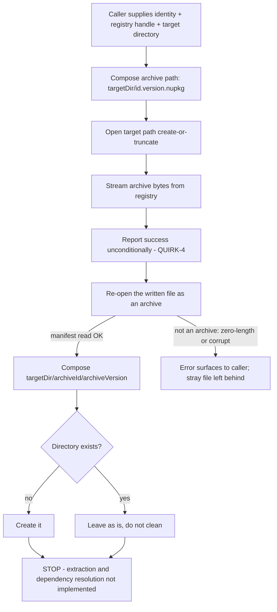

# Feature: Package Registry Client

Subject repo: `/mnt/g/reversing/reversing/subject/Xcaciv.Cupcake` @ `a05dc6f00d4510ac073f6dd02fbfba2ffb76a5b6`
Primary evidence: `src/Xcaciv.Command.Packages/NugetWrapper.cs` (whole file, 132 lines), `Xcaciv.Command.PackagesTests/NugetWrapperTests.cs` (whole file, 104 lines), `Xcaciv.Command.PackagesTests/SearchCommandTests.cs` (whole file, 140 lines — exercises this layer indirectly through the calling search command).
Supporting evidence (callers, packaging and hosting, read for boundaries and defaults): `src/Xcaciv.Command.Packages/SearchCommand.cs` (94 lines), `src/Xcaciv.Command.Packages/InstallCommand.cs` (29 lines), `src/Xcaciv.Cupcake.Lit/Program.cs` (22 lines), `src/Xcaciv.Command.Packages/Xcaciv.Command.Packages.csproj`, `Xcaciv.Command.PackagesTests/Xcaciv.Command.PackagesTests.csproj`, `Directory.Packages.props`, `src/Directory.Packages.props`, `NuGet.config`.
Out-of-repo evidence (framework semantics only): read-only clone of the external command framework at tag v2.1.2.

## Purpose — what user/business problem this solves; who uses it (actors/roles)

The shell is an extensible command console whose capabilities arrive as downloadable plugin packages. This feature is the shell's **integration layer to a remote package registry**: the single place that knows how to talk to a package feed over the network, so that every package-management command in the shell can search, inspect, fetch and lay out packages without re-implementing registry protocol details.

Actors:

- **Shell end user (indirect).** Types package commands at the prompt (e.g. package search). Never talks to this layer directly; the package commands do. The only end-user-visible surface *fed by this layer* today is the search command's rendered result text, returned to the shell after the search call completes (`src/Xcaciv.Command.Packages/SearchCommand.cs:60`, rendered `:62-83`, returned `:85`). Two other end-user-visible package strings exist but never reach this layer: the search command's piped-input refusal (`src/Xcaciv.Command.Packages/SearchCommand.cs:90`) and the install command's echo (`src/Xcaciv.Command.Packages/InstallCommand.cs:21, 26`).
- **Package-management commands (direct caller, in-process).** The search command consumes the keyword-search capability (`src/Xcaciv.Command.Packages/SearchCommand.cs:60`). The install command in this build is a stub that does *not* call this layer at all — it only echoes back what it would have installed (`src/Xcaciv.Command.Packages/InstallCommand.cs:19-22` for direct execution, `:24-27` for piped input).
- **Shell host / plugin loader (prospective).** The install capability writes package archives and per-package directories into a target directory that is intended to become a plugin drop location; the lay-out step is unfinished (`src/Xcaciv.Command.Packages/NugetWrapper.cs:125-127`). INFERRED that the target directory is meant to be a plugin drop location — the source states the intent only as unwritten to-dos, and no caller supplies such a directory.
- **Integration test harness.** Two live test suites in one test project. One exercises this layer directly against the real public registry over the network (`Xcaciv.Command.PackagesTests/NugetWrapperTests.cs:17`); the other drives the search command end to end, and therefore exercises this layer's keyword search indirectly, also against the real public registry (`Xcaciv.Command.PackagesTests/SearchCommandTests.cs:9-138`).

This layer is a **stateless collection of operations**. It holds no instance state, no configuration object, no connection pool and no session. Every operation is self-contained and is invoked without constructing anything first (`src/Xcaciv.Command.Packages/NugetWrapper.cs:18-131` — every operation is a class-level entry point that takes everything it needs as arguments; there is no constructor and no field).

## Behavior — what it does, as observable behavior; every distinct operation the feature supports, its inputs, outputs, and side effects

Six operations. Two of them (5 and 6) never touch the network directly for their own step; the rest do.

### Operation 1 — Keyword search

Evidence: `src/Xcaciv.Command.Packages/NugetWrapper.cs:20-32`.

- **Inputs:** a free-text search term (required); an **already-constructed registry handle** (required); a maximum result count (optional, default **20**); an include-prereleases toggle (optional, default **false**); a diagnostic log sink (optional, default a silent sink); a cancellation signal (optional, default "never cancelled").
- **Behavior:** obtains the registry's *search* capability from the handle (`:26`), builds a search filter carrying only the prerelease toggle (`:28`), and issues one search request with **page offset 0** and page size = the result cap (`:29`). No client-side filtering, sorting, de-duplication or re-ordering is applied; the registry's own relevance order is preserved verbatim (`:31`).
- **Output:** an ordered collection of package search records. Each record carries at minimum: package identity (id + version), summary text, download count, publication timestamp, authors text, license metadata, and a vulnerability list — all of these are read by the search command (`src/Xcaciv.Command.Packages/SearchCommand.cs:66-77`).
- **Side effects:** one outbound network request per call, plus (on first use of a given handle) a service-discovery request. INFERRED for both — the source issues one search call and never configures transport, so request counts are a property of the underlying registry client, not of code visible here. Note that this is the **only** network operation that opens no response-cache scope of its own (`:20-31` has none, in contrast to `:37`, `:43`, `:62`, `:85`), so whether its response bodies reach an on-disk cache is decided entirely by the underlying client — see Open question 1. No local files are written by this operation itself.
- **Asynchrony:** the operation is asynchronous. The in-repo caller blocks on it synchronously (`src/Xcaciv.Command.Packages/SearchCommand.cs:60`).

### Operation 2 — Enumerate all versions of a named package

Evidence: `src/Xcaciv.Command.Packages/NugetWrapper.cs:34-50`.

- **Inputs:** an exact package name (required); a **registry URL as a plain string** (required). No logger, no cancellation, no prerelease toggle are exposed to the caller.
- **Behavior:** constructs a fresh registry handle from the URL on every call (`:39-40`), obtains the registry's *package-by-id* capability (`:41`), and asks for the complete version list of that exact package id (`:46`). No paging: one request, one whole list — the call site passes no offset, page size or continuation token (`:46`). INFERRED that the wire exchange is a single response; the source only shows that this layer asks once and never loops.
- **Output:** an ordered collection of version identifiers. Ordering is whatever the registry returns; no client-side sort is applied (`:48`).
- **Prerelease handling:** a prerelease-excluding filter object is constructed but **never applied** to the request (`:45` constructs it; `:46` does not use it). The result therefore includes prerelease versions. See QUIRK-2.
- **Side effects:** service discovery + one version-index request per call; results enter the HTTP disk cache. No local files written.
- **Not found:** an **empty collection, no error** — directly pinned by test (`Xcaciv.Command.PackagesTests/NugetWrapperTests.cs:68-80`).

### Operation 3 — Resolve a package version's dependency set for a target runtime

Evidence: `src/Xcaciv.Command.Packages/NugetWrapper.cs:52-73`.

- **Inputs:** package id (required); version **as text** (required); an **already-constructed registry handle** (required); a target-runtime moniker (optional, default **"any framework"**); a log sink (optional, default silent); a cancellation signal (optional, default never).
- **Behavior:** parses the version text into a comparable version value (`:59`), obtains the registry's *dependency-info* capability (`:60`), and asks it to resolve that one exact package identity against the target runtime (`:64`). If a record comes back it is placed in the result collection; if nothing comes back the collection is left empty (`:66-69`).
- **Output:** a collection containing **at most one** record. The record describes the requested package *and its direct dependency ranges* plus the download location for that package — INFERRED for the record's field set, which is the shape of the external client's dependency record and is never read, projected or rendered anywhere in this repo. What *is* directly observed is the cardinality: this is a **one-level** lookup, transitive dependencies are *not* walked, and no dependency graph is produced (`:66-69` adds at most one entry; `:72` returns that list).
- **Side effects:** service discovery + one registration/metadata request; disk-cache writes. No local files written.
- **Not found:** an **empty collection, no error** — INFERRED from `:66-69` (the "nothing came back" branch is explicitly handled by skipping the add). Not covered by any test.
- **Bad version text:** the parse at `:59` happens before any network call and rejects unparseable text with an error. INFERRED. Not covered by any test.

### Operation 4 — Download a package archive to a named file path

Evidence: `src/Xcaciv.Command.Packages/NugetWrapper.cs:81-101`.

- **Inputs:** a package identity (id + version) (required); an **already-constructed registry handle** (required); an absolute or relative **target file path** (required).
- **Documented path convention:** the interface documentation states the target path should be shaped `{path}/{packageId}.{versionString}.nupkg` (`:79`). This is documentation only — nothing validates or enforces it, and the test deliberately supplies a random name in the system temporary directory instead (`Xcaciv.Command.PackagesTests/NugetWrapperTests.cs:89`).
- **Behavior:** obtains the registry's *package-by-id* capability (`:86`), opens the target path for writing in **create-or-truncate** mode (`:89`), and streams the package archive bytes into it (`:91-97`). Logging is hard-wired silent (`:83`) and cancellation hard-wired to "never" (`:84`) — neither is exposed to the caller.
- **Output:** a success indicator that is **always the affirmative value**, regardless of what actually happened on the wire (`:100`). See QUIRK-4.
- **Side effects:** the target file is created if absent and **truncated to zero length if it already exists**, before any network work is attempted. One archive download; disk-cache writes.
- **Not found:** the affirmative indicator is still returned and a **zero-length file is left behind** at the target path. INFERRED (the underlying transfer reports "no such package" by returning a negative indicator that this layer discards at `:91-97`/`:100`; the truncation at `:89` has already happened).
- **Asynchrony:** asynchronous; the install operation blocks on it (`:116`).

### Operation 5 — Read identity metadata out of a downloaded archive

Evidence: `src/Xcaciv.Command.Packages/NugetWrapper.cs:103-109`.

- **Inputs:** a local file path (required). No registry handle, no URL — this is a purely local operation.
- **Behavior:** opens the file as a package archive, locates the embedded package manifest, and extracts the identity from it (`:105-107`).
- **Output:** a package identity (id + version) as recorded *inside the archive* — i.e. the authoritative identity, not the one the caller asked for.
- **Side effects:** the file is opened for reading and closed again. Nothing is written or extracted.
- **Not found / unreadable:** raises an error (missing file, zero-length file, non-archive content, or an archive with no manifest all fail here). INFERRED — no test covers this path.

### Operation 6 — Install (download, then lay out on disk)

Evidence: `src/Xcaciv.Command.Packages/NugetWrapper.cs:111-128`.

- **Inputs:** a package identity (required); an **already-constructed registry handle** (required); a target directory path (required).
- **Behavior, in order:**
  1. Composes the archive file name as **`{id}.{version}.nupkg`** and joins it to the target directory (`:113-114`).
  2. Invokes Operation 4 and **blocks synchronously** until it finishes (`:116`).
  3. Re-opens the just-written archive and reads the identity back out of it via Operation 5 (`:118`) — the identity from the archive, not the caller's, drives the next step.
  4. Composes a per-package directory `{targetDirectory}/{id-from-archive}/{version-from-archive}` (`:119`) and creates it if it does not already exist (`:121-124`).
  5. **Stops.** Extracting the archive into that directory and resolving dependencies are both explicitly unimplemented, left as written-out intentions (`:125-127`).
- **Output:** none — this operation reports nothing back to its caller (`:111`). Success and failure are distinguishable only by whether an error surfaced and by inspecting the filesystem.
- **Side effects (the entire observable result):** one archive file at `{targetDirectory}/{id}.{version}.nupkg`, and one **empty** directory at `{targetDirectory}/{id}/{version}/`. Nothing is unpacked. Nothing is registered with the shell. No dependency is fetched.
- **Not found:** the download step reports success and leaves a zero-length file; step 3 then fails when it tries to read that file as an archive; the per-package directory is never created and the zero-length file is left on disk. INFERRED, and see QUIRK-4/QUIRK-5.
- **Asynchrony:** this is the boundary where the asynchronous chain is consumed synchronously (`:116`).
- **Reachability:** no shipping code path calls this operation. The install command is a stub whose two entry points both return echo text without touching this layer (`src/Xcaciv.Command.Packages/InstallCommand.cs:19-22`, `:24-27`), and no test exercises it: the direct suite covers operations 1, 2 and 4 only (`Xcaciv.Command.PackagesTests/NugetWrapperTests.cs:12-102`), and the indirect suite drives operation 1 only (`Xcaciv.Command.PackagesTests/SearchCommandTests.cs:9-138`).

### Registry-handle vs registry-URL inconsistency (matters to a reimplementer)

| Operation | How the registry is addressed | Evidence |
|---|---|---|
| 1 Keyword search | already-constructed **handle** | `src/Xcaciv.Command.Packages/NugetWrapper.cs:20` |
| 2 Enumerate versions | **URL string**; builds its own handle internally | `src/Xcaciv.Command.Packages/NugetWrapper.cs:34, 39-40` |
| 3 Resolve dependencies | already-constructed **handle** | `src/Xcaciv.Command.Packages/NugetWrapper.cs:52` |
| 4 Download archive | already-constructed **handle** | `src/Xcaciv.Command.Packages/NugetWrapper.cs:81` |
| 5 Read archive metadata | **neither** (local file only) | `src/Xcaciv.Command.Packages/NugetWrapper.cs:103` |
| 6 Install | already-constructed **handle** | `src/Xcaciv.Command.Packages/NugetWrapper.cs:111` |

Consequences a reimplementer must reproduce or consciously fix: only Operation 2 can be called with nothing but a URL; every other network operation demands the caller build the handle first (and therefore demands the caller own URL validation — which is exactly where the HTTPS-only check lives, in the calling command, not here: `src/Xcaciv.Command.Packages/SearchCommand.cs:32-35`). Operation 2 also cannot benefit from handle reuse: it builds a new handle inside itself on every call (`src/Xcaciv.Command.Packages/NugetWrapper.cs:39-40`), so it repeats service discovery per call — INFERRED, since discovery caching is a property of the external client's handle, not of anything visible in this repo. Tagged **QUIRK-1**.

## Business rules & edge cases

Every rule below carries evidence. Magic numbers are stated with their meaning.

**Search rules**

- **BR-1.** Default result cap is **20** records when the caller does not specify one. `src/Xcaciv.Command.Packages/NugetWrapper.cs:20`. The calling search command's own declared default for its `take` option is also the string `"20"` (`src/Xcaciv.Command.Packages/SearchCommand.cs:15`), so the two defaults agree.
- **BR-2.** Default prerelease setting is **excluded** (false). `src/Xcaciv.Command.Packages/NugetWrapper.cs:20`. The prerelease toggle is the *only* thing carried in the search filter — no framework filter, no package-type filter, no ordering hint (`:28`).
- **BR-3.** The pagination offset is the constant **0** on every search. There is no paging API, no continuation token, and no way to reach result 21 and beyond other than raising the cap. `src/Xcaciv.Command.Packages/NugetWrapper.cs:29`.
- **BR-4.** The result cap is passed straight through to the registry as the page size; this layer performs **no clamping, no lower bound and no upper bound**. `src/Xcaciv.Command.Packages/NugetWrapper.cs:29`. Clamping to the range **1..100** exists only in the calling search command (`src/Xcaciv.Command.Packages/SearchCommand.cs:46`), so any other caller can pass 0, a negative number, or an arbitrarily large number.
- **BR-5.** Result ordering is the registry's, preserved as delivered. No client-side sort, filter or de-duplication. `src/Xcaciv.Command.Packages/NugetWrapper.cs:31`.
- **BR-6.** Search with `limit=20, prerelease=false` for the term `"XCBatch"` against `https://api.nuget.org/v3/index.json` must return a non-empty result set. `Xcaciv.Command.PackagesTests/NugetWrapperTests.cs:16-29`.
- **BR-7.** Search with `limit=10, prerelease=true` for the same term must also return a non-empty result set — i.e. turning prereleases on must not empty the result. `Xcaciv.Command.PackagesTests/NugetWrapperTests.cs:41-49`.
- **BR-8.** A search that matches nothing returns an **empty result set, not an error and not an absent value** (the collection is always materialised). INFERRED from `src/Xcaciv.Command.Packages/NugetWrapper.cs:31`; no test covers the zero-match search.

Further search rules pinned *indirectly*, by the live tests that drive the calling command end to end, are BR-39 to BR-47 below.

**Version-enumeration rules**

- **BR-9.** The package name is matched **exactly** — this is an id lookup, not a search. `src/Xcaciv.Command.Packages/NugetWrapper.cs:46`.
- **BR-10.** Enumerating versions of a package that does not exist yields an **empty collection and no error**. Directly pinned: the test uses the literal package name `"Package.Does.Not.Exist"` and asserts the result is present-but-empty. `Xcaciv.Command.PackagesTests/NugetWrapperTests.cs:68-80`.
- **BR-11.** Enumerating versions of the existing package `"XCBatch.Core"` yields a non-empty collection. `Xcaciv.Command.PackagesTests/NugetWrapperTests.cs:52-65`.
- **BR-12.** **QUIRK-2:** a prerelease-excluding filter is constructed inside this operation but is never handed to the request, so prerelease versions are returned despite the apparent intent to exclude them. Constructed at `src/Xcaciv.Command.Packages/NugetWrapper.cs:45`; the request at `:46` takes no filter argument. Documented as observed, not corrected.
- **BR-13.** **QUIRK-3:** this operation opens **two** cache scopes. One is created up front and never released (`src/Xcaciv.Command.Packages/NugetWrapper.cs:37`); a second is opened in a properly scoped block (`:43`) and is then **never used** — the request at `:46` is handed the first, unreleased one. Net effect: the scoped-and-released cache handle is dead weight and the live one leaks per call.
- **BR-14.** Logging is hard-wired to a silent sink and cancellation to "never" for this operation; unlike search and dependency resolution, callers cannot supply either. `src/Xcaciv.Command.Packages/NugetWrapper.cs:46` vs `:20`/`:52`.

**Dependency-resolution rules**

- **BR-15.** The default target runtime when the caller supplies none is the wildcard **"any framework"**. `src/Xcaciv.Command.Packages/NugetWrapper.cs:57`.
- **BR-16.** The version is supplied as **text** and parsed by this layer; the caller does not have to pre-build a version value. `src/Xcaciv.Command.Packages/NugetWrapper.cs:59`. This is the only operation that takes a version as text; download and install take a pre-built identity (`:81`, `:111`).
- **BR-17.** The result collection holds **0 or 1** entries — never more. Resolution is single-level. `src/Xcaciv.Command.Packages/NugetWrapper.cs:66-72`.
- **BR-18.** A resolution that finds nothing produces an empty collection rather than an error or an absent value. INFERRED from the explicit "only add when something came back" branch, `src/Xcaciv.Command.Packages/NugetWrapper.cs:66-69`.
- **BR-19.** No test covers dependency resolution at all. Neither test file in the package test project touches it: `Xcaciv.Command.PackagesTests/NugetWrapperTests.cs` (whole file — **five** tests: two search at `:12-30` and `:32-50`, two version enumeration at `:52-65` and `:67-80`, one download at `:82-102`; none resolution) and `Xcaciv.Command.PackagesTests/SearchCommandTests.cs` (whole file — nine tests, all of them search-command driven).

**Download rules**

- **BR-20.** File-overwrite semantics: **create-or-truncate**. An existing file at the target path is silently truncated to zero bytes before the transfer begins; there is no existence check, no "skip if present", no temp-file-then-rename, and no integrity verification (no hash, no signature, no length check) after the transfer. `src/Xcaciv.Command.Packages/NugetWrapper.cs:89-98`.
- **BR-21.** The target directory is **not** created. If it does not exist the operation fails when opening the file. INFERRED from `src/Xcaciv.Command.Packages/NugetWrapper.cs:89` (the path is opened directly, with no directory-creation step — contrast `:121-124` in install, which does create a directory).
- **BR-22.** **QUIRK-4:** the operation always reports the affirmative result. The underlying transfer's own success/failure report is discarded, so "package does not exist at this registry" is indistinguishable from "downloaded 3 MB successfully" at this layer. `src/Xcaciv.Command.Packages/NugetWrapper.cs:91-100`. The test asserts only that the affirmative value comes back (`Xcaciv.Command.PackagesTests/NugetWrapperTests.cs:100`), so it would pass even for a package that does not exist.
- **BR-23.** The test's happy path downloads package id `"XCBatch.Core"` version `"1.0.0"` from `https://api.nuget.org/v3/index.json` into a randomly named file in the system temporary directory carrying the `.nupkg` suffix, and deletes it afterwards if present. `Xcaciv.Command.PackagesTests/NugetWrapperTests.cs:86-101`.
- **BR-24.** Neither logging nor cancellation is exposed on download. `src/Xcaciv.Command.Packages/NugetWrapper.cs:83-84`.

**Archive-metadata rules**

- **BR-25.** The archive format assumption is a **ZIP container holding an XML package manifest**; identity is read from that manifest, not from the file name. `src/Xcaciv.Command.Packages/NugetWrapper.cs:105-107`. Corroborated by the intended-but-disabled extraction step, which is a plain zip-extract-to-directory (`:127`).
- **BR-26.** No format sniffing, no size limit, no path-traversal guard on entry names, and no signature check are performed before or during the read. `src/Xcaciv.Command.Packages/NugetWrapper.cs:103-109`. (Relevant because the intended extraction step at `:127` would write archive-controlled entry paths under the install directory — see the adjacent Input Validation & Supply-Chain Safety feature.)

**Install rules**

- **BR-27.** The downloaded archive is named **`{id}.{version}.nupkg`** using the identity the *caller* supplied. `src/Xcaciv.Command.Packages/NugetWrapper.cs:113`.
- **BR-28.** The per-package directory is named from the identity read back **out of the archive**, which may differ in casing or version rendering from what the caller asked for: `{targetDirectory}/{id}/{version}/`. `src/Xcaciv.Command.Packages/NugetWrapper.cs:118-119`.
- **BR-29.** The version text used in both names is the **rendered form of the parsed version**, which is not guaranteed to equal the registry's normalised form (e.g. a four-segment version renders with four segments). INFERRED from `src/Xcaciv.Command.Packages/NugetWrapper.cs:113` and `:119`. A reimplementer choosing normalised versions will produce different file and directory names.
- **BR-30.** Directory creation is conditional — an already-existing per-package directory is left as is, with **no cleanup of stale contents**. `src/Xcaciv.Command.Packages/NugetWrapper.cs:121-124`.
- **BR-31.** **QUIRK-5:** install is a partial implementation. Extraction and dependency resolution are declared intentions only; a successful install therefore produces an archive file plus an **empty** directory, and installs nothing usable. `src/Xcaciv.Command.Packages/NugetWrapper.cs:125-127`.
- **BR-32.** Install re-downloads unconditionally: there is no "already installed" short-circuit before the download. `src/Xcaciv.Command.Packages/NugetWrapper.cs:113-116`.
- **BR-33.** **QUIRK-6:** dead local state — an unused name-collection is allocated at the top of both the search and version-enumeration operations and never read or returned. `src/Xcaciv.Command.Packages/NugetWrapper.cs:22` and `:36`. Harmless, but it signals that these operations once returned plain names; a reimplementer should not resurrect it.

**Cross-cutting rules**

- **BR-34.** This layer performs **no validation of the registry URL**. HTTPS enforcement (rejecting anything that is not an absolute HTTPS URL with the exact message `"Insecure or invalid package source URL. HTTPS is required."`) lives in the calling search command, not here. `src/Xcaciv.Command.Packages/SearchCommand.cs:32-35`. Any other caller of Operation 2 may pass a plain-HTTP or file URL unchecked (`src/Xcaciv.Command.Packages/NugetWrapper.cs:39`).
- **BR-35.** This layer performs **no validation of the search term**. Trimming, the empty-term short-circuit, and truncation to the first **200** characters all live in the calling search command. `src/Xcaciv.Command.Packages/SearchCommand.cs:50-58`.
- **BR-36.** This layer has **no retry, no timeout of its own, no backoff and no rate limiting**. Whatever the underlying registry client does by default is what happens. `src/Xcaciv.Command.Packages/NugetWrapper.cs:20-128` (no such logic anywhere in the file).
- **BR-37.** Default diagnostic sink is **silent** for every operation — nothing is logged unless the caller supplies a sink, and only search and dependency resolution let the caller supply one. `src/Xcaciv.Command.Packages/NugetWrapper.cs:23, 46, 55, 83`.
- **BR-38.** Default cancellation is **"never cancel"** for every operation. `src/Xcaciv.Command.Packages/NugetWrapper.cs:24, 46, 56, 84`.

**Rules pinned indirectly, through the calling search command's live tests**

These nine tests drive the shell's search command against the real public registry, so every assertion below is also an assertion about Operation 1's contract. Where a rule is really about rendering it is called out and left to the adjacent Package Search Command feature; what remains is load-bearing for this layer.

- **BR-39.** **The result cap is a hard upper bound on the number of records returned, end to end.** With a requested cap of `1`, the rendered output splits into **at most one** line — i.e. at most one record came back. `Xcaciv.Command.PackagesTests/SearchCommandTests.cs:98-110` (assertion at `:109`). This is the only test anywhere that pins the cap's *effect*; BR-4's "no clamping in this layer" and BR-3's "page size = cap" are what make it hold.
- **BR-40.** **With no cap supplied at all, the search still returns multiple records** — the default of 20 (BR-1) is genuinely applied rather than collapsing to one. Searching `"XCBatch"` with no cap argument must yield output containing **both** `"XCBatch.Core"` and `"XCBatch.Interfaces"`. `Xcaciv.Command.PackagesTests/SearchCommandTests.cs:9-24` (assertions at `:22-23`).
- **BR-41.** **Term matching at the registry is not case-sensitive and tolerates the term being punctuated differently from the package id.** The search term `"cake.nuget"` must produce output containing the package id `"Cake.NuGet"`. `Xcaciv.Command.PackagesTests/SearchCommandTests.cs:112-126` (assertion at `:125`). This is a property of the registry's own relevance matching, which this layer passes the term straight through to (BR-5) and never normalises.
- **BR-42.** **A caller-supplied registry URL from the session environment is honoured.** Setting the environment key `PackageSourceUrl` to `https://api.nuget.org/v3/index.json` and searching `"XCBatch"` with a cap of `3` must still return matching output. `Xcaciv.Command.PackagesTests/SearchCommandTests.cs:84-96` (assertions at `:94-95`). Note the test sets the key to the *same* value as the built-in default (`src/Xcaciv.Command.Packages/SearchCommand.cs:28`), so it pins that the environment path works but **does not** pin that a different URL is actually used — the override is untested. INFERRED that a genuinely different URL would be used.
- **BR-43.** **Turning the prerelease toggle on must not empty or break the result.** Searching `"XCBatch"` with the prerelease flag set and a cap of `5` must return output containing `"XCBatch"`. `Xcaciv.Command.PackagesTests/SearchCommandTests.cs:71-82` (assertions at `:80-81`). This is the end-to-end counterpart of BR-7.
- **BR-44.** **Rendering detail is selected by a verbosity setting with three declared values — `quiet`, `normal`, `detailed`** (`src/Xcaciv.Command.Packages/SearchCommand.cs:16`), and each level consumes a different subset of the record fields this layer returns. Pinned at `Xcaciv.Command.PackagesTests/SearchCommandTests.cs:26-39` (normal: contains `":"`, does **not** contain `"Published:"`), `:41-54` (quiet: contains **no** `":"` at all, so ids only), `:56-69` (detailed: contains `"Published:"`, `"Authors:"` and `"Vulnerabilities:"`). Rendering itself belongs to the adjacent Package Search Command feature; the load-bearing consequence for **this** layer is that the record it returns must carry publication timestamp, authors text and a countable vulnerability list, or the detailed level cannot be produced (cross-check with the Data section's record shape).
- **BR-45.** **Piped input is refused by the search command before this layer is ever reached** — the refusal text is exactly `"Unsupported search method for {chunk} (piped)"` immediately followed by the comma-joined parameters, with no separator between the two (`src/Xcaciv.Command.Packages/SearchCommand.cs:90`). Pinned at `Xcaciv.Command.PackagesTests/SearchCommandTests.cs:128-138` (assertions at `:136-137`). No search request is issued on the piped path, so this layer sees nothing.
- **BR-46.** **QUIRK-9:** invoking search with **zero** arguments does not produce a missing-search-term error. The framework skips option materialisation entirely when there are no arguments, so no default is applied and no required-parameter check runs; the first thing to fail is the result-cap lookup, and the user sees `"The 'take' parameter must be a valid integer value."` instead. `src/Xcaciv.Command.Packages/SearchCommand.cs:22, 42-45`; OUT-OF-REPO: `ref-Xcaciv.Command-v2/src/Xcaciv.Command.Core/AbstractCommand.cs:180` (framework v2.1.2). INFERRED — no test covers the zero-argument invocation. Documented as observed, not corrected.
- **BR-47.** **QUIRK-10:** the search command carries a "fall back to normal rendering if the verbosity is invalid" branch (`src/Xcaciv.Command.Packages/SearchCommand.cs:79-82`) that can never run, because the framework's allow-list check rejects any out-of-set verbosity before execution begins (`:16` declares the set; OUT-OF-REPO: `ref-Xcaciv.Command-v2/src/Xcaciv.Command.Core/CommandParameters.cs:76-79`, framework v2.1.2). A reimplementer should decide deliberately whether an invalid verbosity is an error or a silent fallback — the source contains both answers and only one of them is reachable.

## Workflows & states

This feature holds **no persistent state** and has **no state machine**. Its two multi-step flows are below.

### Flow A — Search, as driven by the shell (the only end-to-end path that ships)

0. The shell materialises the command's declared options into a name→value map (`src/Xcaciv.Command.Packages/SearchCommand.cs:22`). With zero arguments this step is skipped and the map is empty, which sends the flow down the step-5 error path instead of a missing-term error — QUIRK-9. With an out-of-set verbosity it fails here — QUIRK-10. Piped input never enters this flow at all (`:88-91`, BR-45).
1. The shell command reads the configured registry URL from the session environment under the key `PackageSourceUrl` (`src/Xcaciv.Command.Packages/SearchCommand.cs:24`). Pinned end to end at `Xcaciv.Command.PackagesTests/SearchCommandTests.cs:84-96` (BR-42).
2. If that value is absent or empty, the URL defaults to the literal `https://api.nuget.org/v3/index.json` (`src/Xcaciv.Command.Packages/SearchCommand.cs:26-29`).
3. The URL must parse as an absolute HTTPS URL, or the flow aborts with `"Insecure or invalid package source URL. HTTPS is required."` (`src/Xcaciv.Command.Packages/SearchCommand.cs:32-35`).
4. A registry handle is constructed from the URL (`src/Xcaciv.Command.Packages/SearchCommand.cs:38-39`).
5. The requested result cap is parsed; a non-integer aborts with `"The 'take' parameter must be a valid integer value."` (`src/Xcaciv.Command.Packages/SearchCommand.cs:42-45`), then it is clamped to 1..100 (`:46`).
6. Operation 1 runs and the caller **blocks** on it (`src/Xcaciv.Command.Packages/SearchCommand.cs:60`).
7. Records are rendered per verbosity (`src/Xcaciv.Command.Packages/SearchCommand.cs:62-83`) and joined with newlines into the returned text (`:85`). Rendering belongs to the adjacent Package Search Command feature; the three levels and what each consumes are pinned at `Xcaciv.Command.PackagesTests/SearchCommandTests.cs:26-69` (BR-44).

### Flow B — Install (implemented in this layer, unreachable from the shell)

Evidence for the whole flow: `src/Xcaciv.Command.Packages/NugetWrapper.cs:111-128`; the blocking wait at `:116`; the stop point at `:125-127`.

### Flow C — Version enumeration (single step)

Build handle from URL → obtain version capability → request full version index → return list, empty if the id is unknown. `src/Xcaciv.Command.Packages/NugetWrapper.cs:39-48`; empty-on-unknown pinned at `Xcaciv.Command.PackagesTests/NugetWrapperTests.cs:68-80`.

## Data — entities this feature owns, their fields, relationships, lifecycle

This feature **owns no persisted entity and no database**. It owns transient value shapes and two filesystem artifacts.

**Package identity** (value, transient)
| Field | Type (generic) | Constraints |
|---|---|---|
| id | text | used verbatim in file and directory names (`src/Xcaciv.Command.Packages/NugetWrapper.cs:113`, `:119`). For **keyword search** the registry's matching is case-insensitive and punctuation-tolerant — pinned by the term `"cake.nuget"` matching package `"Cake.NuGet"` (`Xcaciv.Command.PackagesTests/SearchCommandTests.cs:112-126`, BR-41). For **exact id lookup** (Operations 2 and 4) case-insensitivity is INFERRED — every test supplies the id in its canonical casing (`Xcaciv.Command.PackagesTests/NugetWrapperTests.cs:56`, `:86`), so a differently-cased id is untested |
| version | structured version value | parsed from text; ordered comparably; renders back to text for names |

Created when a caller builds one, or when read out of an archive manifest (`src/Xcaciv.Command.Packages/NugetWrapper.cs:59`, `:107`). Never mutated, never persisted.

**Package search record** (value, transient) — produced by Operation 1 only.
| Field | Type (generic) | Notes |
|---|---|---|
| identity | package identity | id + version |
| summary | text | may be empty |
| downloadCount | number, nullable | |
| published | timestamp, nullable | |
| authors | text | |
| licenseMetadata | structured value, nullable | |
| vulnerabilities | collection | counted by the caller |

Field set observed through the search command's rendering (`src/Xcaciv.Command.Packages/SearchCommand.cs:66-77`) and independently corroborated by the detailed-verbosity test, which asserts that publication timestamp, authors and vulnerability count all render (`Xcaciv.Command.PackagesTests/SearchCommandTests.cs:56-69`, BR-44). Lifetime = one call; nothing is cached in memory across calls.

**Version list** (value, transient) — ordered collection of version values (`src/Xcaciv.Command.Packages/NugetWrapper.cs:48`).

**Dependency-info record** (value, transient) — package identity + its declared direct dependency ranges + the location to download it from; at most one per resolution call (`src/Xcaciv.Command.Packages/NugetWrapper.cs:64-69`). The **cardinality** is directly observed; the **field set** is INFERRED from the external client's record shape, because nothing in this repo ever reads a field off this record.

**Filesystem artifact 1 — package archive file.** Path chosen by the caller for Operation 4; for Operation 6 it is `{targetDirectory}/{id}.{version}.nupkg` (`src/Xcaciv.Command.Packages/NugetWrapper.cs:113-114`). Created or truncated on every download (`:89`). **Never deleted by this feature** — the only deletion in the repo is test cleanup (`Xcaciv.Command.PackagesTests/NugetWrapperTests.cs:101`).

**Filesystem artifact 2 — per-package directory.** `{targetDirectory}/{id-from-archive}/{version-from-archive}/`, created empty if absent, left untouched if present, never populated, never deleted (`src/Xcaciv.Command.Packages/NugetWrapper.cs:119-124`).

**Registry HTTP cache** — owned by the underlying registry client, not by this feature, but written to as a side effect of every network operation. See Non-functional observations.

## Interfaces — what this feature exposes to and consumes from OTHER features

**Exposed to the Package Search Command (adjacent):** Operation 1, taking a registry handle the command builds itself, plus cap and prerelease flag. Consumed synchronously (`src/Xcaciv.Command.Packages/SearchCommand.cs:60`). This feature returns structured records; all rendering, verbosity handling and joining belong to that command. The contract this feature must satisfy for that command's three verbosity levels to be renderable is the record field set in the Data section (BR-44). The command's piped-input path never reaches this feature at all (`src/Xcaciv.Command.Packages/SearchCommand.cs:88-91`, BR-45).

**Exposed to the Package Install Command (adjacent):** Operation 6 is the intended entry point, but the shipping install command **does not call it** — it returns the literal text `"Not installing "` followed by the comma-joined parameters (`src/Xcaciv.Command.Packages/InstallCommand.cs:21`), and for piped input `"Not installing {chunk} "` followed by the comma-joined parameters (`:26`). The wiring between the install command and this feature is therefore **absent** at this commit, even though both commands are registered with the shell at start-up (`src/Xcaciv.Cupcake.Lit/Program.cs:10-11`).

**Exposed to Plugin Discovery & Command Registration (adjacent):** the intended contract is "after install, a package's payload is laid out under `{targetDirectory}/{id}/{version}/` where the plugin loader can find it". Only the empty directory is produced today (`src/Xcaciv.Command.Packages/NugetWrapper.cs:119-127`), so this contract is declared but not fulfilled.

**Consumed from Configuration & Settings (adjacent):** the registry URL. Read by the caller from the session environment under the exact key `PackageSourceUrl`, defaulting to `https://api.nuget.org/v3/index.json` (`src/Xcaciv.Command.Packages/SearchCommand.cs:24-29`). The environment contract supplies a keyed lookup with an optional default that can be written back on read — OUT-OF-REPO: `ref-Xcaciv.Command-v2/src/Xcaciv.Command.Interface/IEnvironmentContext.cs:50` (framework v2.1.2). This feature itself never reads configuration.

**Consumed from Input Validation & Supply-Chain Safety (adjacent):** HTTPS-only URL enforcement, search-term trimming/200-character truncation, and result-cap clamping to 1..100 all happen *before* control reaches this feature (`src/Xcaciv.Command.Packages/SearchCommand.cs:32-58`). This feature assumes its inputs are already validated and re-validates nothing (BR-34, BR-35).

**Consumed from the Command Extensibility Contract (adjacent, out-of-repo framework):** the calling commands are declarative command definitions whose options and defaults are declared as metadata and materialised into a name→value map before execution; an unsupplied named option with a declared default is materialised at that default, so the caller normally always sees a value for `take` — OUT-OF-REPO: `ref-Xcaciv.Command-v2/src/Xcaciv.Command.Core/AbstractCommand.cs:178-192` and `ref-Xcaciv.Command-v2/src/Xcaciv.Command.Core/CommandParameters.cs:63-68` (framework v2.1.2). Three consequences matter at this boundary:

- An option declared with an allow-list rejects out-of-list values with `"Invalid value for parameter {name}, this parameter has an allow list."` — OUT-OF-REPO: `ref-Xcaciv.Command-v2/src/Xcaciv.Command.Core/CommandParameters.cs:76-79` for named options and `:122-125` for positional ones (framework v2.1.2). This is what makes an invalid verbosity fail before any search runs (QUIRK-10).
- A missing required positional option fails with `"Missing required parameter {name}"` — OUT-OF-REPO: `ref-Xcaciv.Command-v2/src/Xcaciv.Command.Core/CommandParameters.cs:98-101` (framework v2.1.2).
- **But** the whole materialisation step is skipped when the command is invoked with **zero** arguments, yielding an empty map and therefore no defaults and no required-parameter check — OUT-OF-REPO: `ref-Xcaciv.Command-v2/src/Xcaciv.Command.Core/AbstractCommand.cs:180` (framework v2.1.2). This is the mechanism behind QUIRK-9.

**Interface hazard — the caller cannot be built at this commit.** The search command writes its rendered lines into a holder that is never declared anywhere — not as a member of the command itself (`src/Xcaciv.Command.Packages/SearchCommand.cs:18-93`, which declares no such member), not anywhere else in the subject repo (a repo-wide search finds only the five uses inside that one file, at `:66`, `:69`, `:72`, `:81`, `:85`), and not among the members the command inherits from the external framework — OUT-OF-REPO: `ref-Xcaciv.Command-v2/src/Xcaciv.Command.Core/AbstractCommand.cs:14-263` (framework v2.1.2) carries the full inherited member surface and contains nothing by that name, and a repo-wide search of the framework clone finds no use of it either. (Source used, for anyone re-checking: the undeclared identifier is spelled `searchResult`.) **Consequence for verification:** the package test project cannot be built at this commit — and because both test files live in the same project (`Xcaciv.Command.PackagesTests/Xcaciv.Command.PackagesTests.csproj:27`, which project-references the package assembly), **neither** the direct registry tests nor the search-command tests can actually be executed as pinned. Tagged **QUIRK-7**. Ownership of the fix belongs to the adjacent Package Search Command feature; it is recorded here because it is the reason the acceptance criteria below must be run against a reimplementation rather than replayed against the original.

## External technology

| Generic capability | Protocol/standard if any | What the source used | Notes for reimplementer |
|---|---|---|---|
| Remote package-registry client (service discovery, keyword search, version index, dependency metadata, archive download) | HTTPS + JSON REST; registry service-index protocol ("V3"), SemVer level 2.0.0 | NuGet.Protocol 7.0.1 (`Directory.Packages.props:7`, `src/Directory.Packages.props:7`), against `https://api.nuget.org/v3/index.json` (`Xcaciv.Command.PackagesTests/NugetWrapperTests.cs:17`, `src/Xcaciv.Command.Packages/SearchCommand.cs:28`) | The registry is addressed by a single **service-index URL**; the client fetches that index once per handle and discovers per-capability endpoints (search, flat version index, registration/dependency metadata, package content) from it. Four distinct endpoints are used, one per operation. INFERRED that discovery is per-handle and cached on the handle. |
| Registry handle / connection factory | — | NuGet source + repository factory (`src/Xcaciv.Command.Packages/NugetWrapper.cs:39-40`, `src/Xcaciv.Command.Packages/SearchCommand.cs:38-39`) | Cheap to construct, caches discovered capabilities per instance. Reuse it; Operation 2 does not, and pays for it. |
| HTTP response disk cache | — | NuGet cache-scope object (`src/Xcaciv.Command.Packages/NugetWrapper.cs:37, 43, 62, 85`) | Default behaviour: registry responses are cached to a per-user disk cache and reused for **30 minutes** before revalidation; direct-download is off. INFERRED (library default, not set anywhere in this repo). A reimplementer must decide this deliberately — the source never configures it, so it inherits the library default everywhere. |
| Package archive container reader | ZIP (PKZIP), plus an XML package manifest inside the archive | NuGet packaging archive reader (`src/Xcaciv.Command.Packages/NugetWrapper.cs:105-107`) | Archive is a zip whose manifest yields the authoritative id and version. The disabled extraction step is a plain zip-extract-to-directory (`:127`). |
| Version parsing, rendering and ordering | SemVer 2.0.0 with a four-segment extension | NuGet versioning (`src/Xcaciv.Command.Packages/NugetWrapper.cs:59`) | Must round-trip text→value→text, and must order prerelease correctly. Rendering may differ from the registry's normalised form (BR-29). |
| Target-runtime moniker parsing with a wildcard value | .NET target-framework monikers | NuGet frameworks (`src/Xcaciv.Command.Packages/NugetWrapper.cs:57`) | Needs a well-defined "any runtime" wildcard as the default. |
| Local filesystem: create-or-truncate write, path join, directory exists/create, temp-path lookup | — | .NET file/directory/path APIs (`src/Xcaciv.Command.Packages/NugetWrapper.cs:89, 114, 119-124`; `Xcaciv.Command.PackagesTests/NugetWrapperTests.cs:89`) | Path separator is joined platform-natively; the documented path convention in the source comment uses a forward slash (`src/Xcaciv.Command.Packages/NugetWrapper.cs:79`). |
| Pluggable diagnostic log sink with a silent default | — | NuGet logger abstraction + null logger (`src/Xcaciv.Command.Packages/NugetWrapper.cs:23, 46, 55, 83`) | Silent by default; only two of six operations accept one. |
| Cooperative cancellation signal | — | .NET cancellation token (`src/Xcaciv.Command.Packages/NugetWrapper.cs:24, 56, 84`) | "Never cancel" default; only two of six operations accept one. |
| Async I/O with a synchronous consumption point | — | .NET task-based async; blocking wait at the install boundary (`src/Xcaciv.Command.Packages/NugetWrapper.cs:116`) and at the search-command boundary (`src/Xcaciv.Command.Packages/SearchCommand.cs:60`) | Reproduce the asynchronous core; the blocking is a deliberate shell-side choice, not a requirement of this layer. |
| Host command framework supplying the calling commands | — | Xcaciv.Command 2.1.1 / Xcaciv.Command.Core 2.1.0 / Xcaciv.Command.Interface 2.1.0 (`Directory.Packages.props:8-10`) | **Not on the public feed**; ships to a private feed `https://nuget.pkg.github.com/xcaciv/index.json` and optionally a local folder from an environment variable (`NuGet.config:6-8`). A reimplementer replaces this with their own command host. |
| Test runner with live-network integration tests | — | xUnit 2.9.3 (`Directory.Packages.props:16`), with runner and coverage collector (`:14, 15, 17`) | The registry tests are **live**: they require outbound HTTPS to the public registry and real packages to exist. Both test files sit in one project (`Xcaciv.Command.PackagesTests/Xcaciv.Command.PackagesTests.csproj:12-32`), so they build and fail together (QUIRK-7). |
| Managed application runtime / platform baseline | — | .NET 8 (`src/Xcaciv.Command.Packages/Xcaciv.Command.Packages.csproj:4`, `Xcaciv.Command.PackagesTests/Xcaciv.Command.PackagesTests.csproj:4`), with implicit imports and null-awareness both enabled (`:5-6` in each) | The reimplementer needs a runtime offering: async I/O with a blocking-wait escape hatch, a nullable-aware type system (this layer distinguishes "no logger supplied" from "a logger supplied", and "no framework supplied" from "one supplied", purely by absence — BR-37, BR-38, BR-15), stream-to-file copy, and platform-native path joining. Nothing here is platform-specific beyond that; no operating-system API is called directly. |
| Central dependency-version pinning across projects | — | Central package management, one version list for every project (`Directory.Packages.props:3`, duplicated at `src/Directory.Packages.props`) | **QUIRK-8:** the same version list exists twice, at the repo root and under `src/`; the two files are byte-identical apart from a trailing newline, so they can silently drift apart. A reimplementer needs only one. Cite either; this dossier cites both where a version is quoted. |

## Error handling — failure modes and what the user/system observes

| Failure | What is observed | Evidence |
|---|---|---|
| Keyword search matches nothing | Empty result set; no error. Caller renders an empty string. | INFERRED, `src/Xcaciv.Command.Packages/NugetWrapper.cs:31` |
| Version enumeration for an unknown package id | Empty collection; no error; not distinguishable from "package exists but has zero listed versions". | `Xcaciv.Command.PackagesTests/NugetWrapperTests.cs:68-80` |
| Dependency resolution finds no such package/version | Empty collection; no error. | INFERRED, `src/Xcaciv.Command.Packages/NugetWrapper.cs:66-69` |
| Dependency resolution given unparseable version text | Error raised before any network call. | INFERRED, `src/Xcaciv.Command.Packages/NugetWrapper.cs:59` |
| Download of a package that does not exist | **Affirmative "success" is reported anyway**, and a zero-length file is left at the target path. QUIRK-4. | `src/Xcaciv.Command.Packages/NugetWrapper.cs:91-100`; INFERRED for the zero-length residue |
| Download target directory missing | Error raised when opening the file; nothing downloaded. | INFERRED, `src/Xcaciv.Command.Packages/NugetWrapper.cs:89` |
| Download target path not writable / disk full | Error surfaces from the file write; the partially written file is left behind (no cleanup, no temp-then-rename). | INFERRED, `src/Xcaciv.Command.Packages/NugetWrapper.cs:89-98` |
| Download interrupted mid-transfer | A truncated file is left at the target path and is indistinguishable from a complete one — no length or hash verification. | INFERRED, `src/Xcaciv.Command.Packages/NugetWrapper.cs:89-100` |
| Reading metadata from a missing, zero-length or non-archive file | Error raised by the archive reader. | INFERRED, `src/Xcaciv.Command.Packages/NugetWrapper.cs:105` |
| Install of a package that does not exist | Download step reports success; the metadata read then fails on the zero-length file; the per-package directory is never created; the zero-length file is orphaned. Compound QUIRK-4 + QUIRK-5. | INFERRED, `src/Xcaciv.Command.Packages/NugetWrapper.cs:116-119` |
| Install partially completes | No rollback, no cleanup, no transaction. Whatever was written stays. | `src/Xcaciv.Command.Packages/NugetWrapper.cs:111-128` (no cleanup path anywhere) |
| Network unreachable, DNS failure, TLS failure, registry 5xx, throttling | Error propagates untouched to the caller — this layer catches nothing, retries nothing, and adds no context. | `src/Xcaciv.Command.Packages/NugetWrapper.cs:20-128` (no error handling anywhere in the file) |
| Non-HTTPS or malformed registry URL | Not detected here. Rejected upstream by the search command with `"Insecure or invalid package source URL. HTTPS is required."`; other entry points (Operation 2) accept it unchecked. | `src/Xcaciv.Command.Packages/SearchCommand.cs:32-35`; `src/Xcaciv.Command.Packages/NugetWrapper.cs:39` |
| Non-integer result cap from the shell | Rejected upstream with `"The 'take' parameter must be a valid integer value."` | `src/Xcaciv.Command.Packages/SearchCommand.cs:42-45` |
| Search invoked with **no arguments at all** | **QUIRK-9:** the user sees the result-cap error `"The 'take' parameter must be a valid integer value."`, *not* a missing-search-term error — because the framework short-circuits parameter processing to an empty map when there are zero arguments, skipping the required-parameter check entirely, after which the cap lookup is the first thing to fail. No search request reaches this layer. | `src/Xcaciv.Command.Packages/SearchCommand.cs:22, 42-45`; OUT-OF-REPO: `ref-Xcaciv.Command-v2/src/Xcaciv.Command.Core/AbstractCommand.cs:180` (framework v2.1.2, the zero-argument short-circuit) and `ref-Xcaciv.Command-v2/src/Xcaciv.Command.Core/CommandParameters.cs:98-101` (the `"Missing required parameter {name}"` error for a positional parameter, which is thereby skipped). INFERRED — no test covers the zero-argument invocation |
| Verbosity outside the declared set | Rejected upstream by the framework's allow-list check with `"Invalid value for parameter verbosity, this parameter has an allow list."` before any search runs. **QUIRK-10:** because of this, the search command's own "fall back to normal on invalid verbosity" branch is unreachable dead code. | `src/Xcaciv.Command.Packages/SearchCommand.cs:16` (the declared set), `:79-82` (the unreachable fallback); OUT-OF-REPO: `ref-Xcaciv.Command-v2/src/Xcaciv.Command.Core/CommandParameters.cs:76-79` (framework v2.1.2) |
| Search given piped input | Refused with `"Unsupported search method for {chunk} (piped)"` plus the comma-joined parameters; no request reaches this layer. | `src/Xcaciv.Command.Packages/SearchCommand.cs:90`; `Xcaciv.Command.PackagesTests/SearchCommandTests.cs:128-138` |
| Search term empty or whitespace after trimming | Empty output, no error, no request. Handled upstream. | `src/Xcaciv.Command.Packages/SearchCommand.cs:50-54` |
| Any of the above reaching the shell top level | The shell prints `Error {message}` and exits with status **1**. | `src/Xcaciv.Cupcake.Lit/Program.cs:14-19` |

**Design note for the reimplementer:** this layer has **no error-handling policy at all** — nothing is intercepted, nothing is translated into a domain-level failure, nothing reports a partial failure. Every failure is a raw transport or filesystem error crossing the boundary untouched (`src/Xcaciv.Command.Packages/NugetWrapper.cs:20-128`, which contains no error-interception construct anywhere). That is the observed behaviour; it is also the single largest gap between this layer and a production registry client.

## Non-functional observations

- **Caching.** **Three** of the six operations open a registry cache scope, but **four** scopes are opened in total, because version enumeration opens two: version enumeration (`src/Xcaciv.Command.Packages/NugetWrapper.cs:37` and `:43`), dependency resolution (`:62`), and download (`:85`). None of them configures it, so all inherit library defaults: responses cached on disk per user and reused for **30 minutes** (INFERRED — library default; nothing in this repo sets it). The remaining three operations open none: keyword search (`:20-31`) — its caching is whatever the underlying search capability does on its own — plus archive-metadata read (`:103-109`) and install (`:111-128`), neither of which talks to the registry on its own account. Cache-scope lifetime is handled inconsistently: properly scoped-and-released in dependency resolution (`:62`), created-and-never-released in version enumeration (`:37`) and download (`:85`), and created-scoped-but-unused in version enumeration (`:43`) — QUIRK-3.
- **Pagination.** Offset fixed at 0; page size = the result cap; no continuation. Default cap 20; upstream clamp 1..100 (`src/Xcaciv.Command.Packages/NugetWrapper.cs:29`, `:20`; `src/Xcaciv.Command.Packages/SearchCommand.cs:46`). There is no way to page beyond the first `cap` results.
- **Concurrency.** All operations are stateless class-level entry points with no shared mutable state, so they are safe to call concurrently from the caller's point of view (`src/Xcaciv.Command.Packages/NugetWrapper.cs:18-131`). However, two concurrent downloads to the same target path will interleave destructively — the create-or-truncate open has no locking (`:89`). No throttling or connection limiting is imposed.
- **Blocking.** The layer is asynchronous throughout except install, which blocks the calling thread until the download completes (`src/Xcaciv.Command.Packages/NugetWrapper.cs:116`); metadata read and directory creation are synchronous by nature (`:103`, `:121-124`). The shell's search path also blocks (`src/Xcaciv.Command.Packages/SearchCommand.cs:60`). A reimplementer on a single-threaded or UI platform must plan for a long-running blocking call here.
- **Memory.** The archive is streamed to disk rather than buffered in memory (`src/Xcaciv.Command.Packages/NugetWrapper.cs:89-98`), so large packages do not blow up memory. Search and version results are fully materialised into collections before returning (`:31`, `:48`, `:72`).
- **Permissions.** No permission or authentication handling of any kind: no API key, no credential provider, no per-source credentials, and no authorization check before writing to the target directory (`src/Xcaciv.Command.Packages/NugetWrapper.cs:20-128`). Only anonymous public registries work. Note that the *build-time* feed configuration does contemplate a private feed and a local folder (`NuGet.config:6-8`), but that is build tooling, not this feature.
- **Supply-chain posture.** Nothing here verifies package signatures, hashes, licences, or the vulnerability list — although the vulnerability count is fetched and displayed by the search command (`src/Xcaciv.Command.Packages/SearchCommand.cs:76`), it never gates a download or an install (`src/Xcaciv.Command.Packages/NugetWrapper.cs:81-128`).
- **i18n / accessibility.** None. No message here is localisable; the only strings this layer produces are file and directory names built from package identities (`src/Xcaciv.Command.Packages/NugetWrapper.cs:113, 119`). All user-facing text belongs to the calling commands.
- **Test posture.** All fourteen tests touching this layer are live network integration tests against the public registry with real package names — five direct (`Xcaciv.Command.PackagesTests/NugetWrapperTests.cs:16-17, 56, 71, 86-88`) and nine indirect, through the search command (`Xcaciv.Command.PackagesTests/SearchCommandTests.cs:9-138`). They are not hermetic: they fail offline, and they depend on `XCBatch`, `XCBatch.Core`, `XCBatch.Interfaces` and `Cake.NuGet` continuing to exist on the public registry and `Package.Does.Not.Exist` continuing not to (`Xcaciv.Command.PackagesTests/NugetWrapperTests.cs:16, 56, 71, 86`; `Xcaciv.Command.PackagesTests/SearchCommandTests.cs:14, 22-23, 117, 125`). Several also depend on *relevance ordering* staying stable — the default-cap test needs two specific ids to appear in the first 20 results (BR-40) and the detailed test needs the term to match at all. There are **no unit tests, no fakes, no recorded responses and no offline fixtures** for this layer, and no test asserts a value the network cannot change. Combined with QUIRK-7 (the project does not build), the entire pinned suite is requirements-as-written, never requirements-as-verified.

## Acceptance criteria

Criteria 1–15 exercise this layer directly. Criteria 16–22 exercise it **through the shell's search command**, because that is how the second test suite pins it; a reimplementer can satisfy them at whichever boundary their design exposes, but the observable outcome must match. All criteria that cite a test require live outbound HTTPS to the public registry and the named packages to still be published.

1. **Given** a reachable registry at `https://api.nuget.org/v3/index.json` and a registry handle for it, **when** a keyword search for `XCBatch` runs with result cap `20` and prereleases excluded, **then** a non-empty ordered result set is returned. (`Xcaciv.Command.PackagesTests/NugetWrapperTests.cs:12-30`)
2. **Given** the same registry, **when** a keyword search for `XCBatch` runs with result cap `10` and prereleases **included**, **then** a non-empty result set is returned. (`Xcaciv.Command.PackagesTests/NugetWrapperTests.cs:32-50`)
3. **Given** a caller that supplies neither a cap nor a prerelease setting, **when** a keyword search runs, **then** at most **20** records come back and prerelease packages are excluded. (`src/Xcaciv.Command.Packages/NugetWrapper.cs:20`)
4. **Given** any keyword search, **when** the request is issued, **then** the page offset is **0** and the page size equals the effective result cap; issuing the same search twice never yields a second page. (`src/Xcaciv.Command.Packages/NugetWrapper.cs:29`)
5. **Given** the registry URL as a plain string, **when** all versions of `XCBatch.Core` are enumerated, **then** a non-empty version collection is returned. (`Xcaciv.Command.PackagesTests/NugetWrapperTests.cs:52-65`)
6. **Given** the registry URL as a plain string, **when** all versions of `Package.Does.Not.Exist` are enumerated, **then** an **empty collection** is returned and **no error is raised**. (`Xcaciv.Command.PackagesTests/NugetWrapperTests.cs:67-80`)
7. **Given** a package with both stable and prerelease versions published, **when** its versions are enumerated, **then** prerelease versions **are** present in the result — the prerelease-excluding filter is not applied. (QUIRK-2, `src/Xcaciv.Command.Packages/NugetWrapper.cs:45-46`)
8. **Given** a registry handle and a writable target file path, **when** package `XCBatch.Core` version `1.0.0` is downloaded, **then** the affirmative success indicator is returned. (`Xcaciv.Command.PackagesTests/NugetWrapperTests.cs:82-102`; the assertion at `:100` is the *only* thing the test checks — it then deletes the file at `:101` without ever inspecting it.) **And** — INFERRED, not asserted by any test — a non-empty archive file exists at that exact path, since the package really is published. Note that per QUIRK-4 the first half of this criterion would pass even if the second half failed, so a reimplementation must be checked against both halves separately.
9. **Given** a target file path that already holds a file, **when** a download runs against that path, **then** the previous contents are gone (create-or-truncate) with no prompt, backup, or skip. (`src/Xcaciv.Command.Packages/NugetWrapper.cs:89`)
10. **Given** a package identity that does not exist at the registry, **when** it is downloaded, **then** the affirmative success indicator is **still** returned and a zero-length file is left at the target path. (QUIRK-4, `src/Xcaciv.Command.Packages/NugetWrapper.cs:91-100`)
11. **Given** a valid downloaded package archive, **when** its identity metadata is read, **then** the id and version returned are the ones recorded **inside** the archive manifest, independent of the file's name on disk. (`src/Xcaciv.Command.Packages/NugetWrapper.cs:103-107`)
12. **Given** a zero-length or non-archive file, **when** its identity metadata is read, **then** an error is raised. (INFERRED, `src/Xcaciv.Command.Packages/NugetWrapper.cs:105`)
13. **Given** a registry handle, an existing target directory, and an existing package identity, **when** install runs, **then** on completion exactly two things exist: a file named `{id}.{version}.nupkg` directly in the target directory, and an **empty** directory `{target}/{id}/{version}/`. Nothing is extracted and no dependency is fetched. (QUIRK-5, `src/Xcaciv.Command.Packages/NugetWrapper.cs:113-127`)
14. **Given** an install where `{target}/{id}/{version}/` already exists with content in it, **when** install runs, **then** that directory's existing content is left untouched. (`src/Xcaciv.Command.Packages/NugetWrapper.cs:121-124`)
15. **Given** a package version whose dependency metadata exists, **when** dependencies are resolved with no target runtime specified, **then** the wildcard "any runtime" is used and **exactly one** record is returned describing that package's direct dependencies only — never a transitive graph. (`src/Xcaciv.Command.Packages/NugetWrapper.cs:57, 64-72`)
16. **Given** the shell's search command wired to this layer and a requested result cap of `1`, **when** a search for `XCBatch` runs, **then** the rendered output contains **at most one** result line — the cap is a hard upper bound on records returned, end to end. (`Xcaciv.Command.PackagesTests/SearchCommandTests.cs:98-110`, BR-39)
17. **Given** the shell's search command with **no** result cap supplied, **when** a search for `XCBatch` runs, **then** the default cap of 20 is applied and the output contains **both** `XCBatch.Core` and `XCBatch.Interfaces` — i.e. more than one record comes back. (`Xcaciv.Command.PackagesTests/SearchCommandTests.cs:9-24`, BR-40)
18. **Given** the search term `cake.nuget`, **when** a search runs, **then** the output contains the package id `Cake.NuGet` — the term is passed to the registry unnormalised and the registry matches it case-insensitively. (`Xcaciv.Command.PackagesTests/SearchCommandTests.cs:112-126`, BR-41)
19. **Given** the session environment key `PackageSourceUrl` set to a registry service-index URL, **when** a search runs, **then** that URL is used to build the registry handle and matching results are returned. (`Xcaciv.Command.PackagesTests/SearchCommandTests.cs:84-96`, BR-42 — note the test sets the key to the same value as the built-in default, so a *differing* URL is untested.)
20. **Given** the shell's search command at detailed verbosity, **when** a search runs, **then** the record this layer returns supplies enough to render `Published:`, `Authors:` and `Vulnerabilities:` for each result; at normal verbosity `Published:` is absent, and at quiet verbosity the output contains no `:` at all. (`Xcaciv.Command.PackagesTests/SearchCommandTests.cs:26-39, 41-54, 56-69`, BR-44)
21. **Given** piped input into the search command, **when** it is executed, **then** the text `Unsupported search method for {chunk} (piped)` plus the comma-joined parameters is returned and **no** search request reaches this layer. (`Xcaciv.Command.PackagesTests/SearchCommandTests.cs:128-138`, `src/Xcaciv.Command.Packages/SearchCommand.cs:90`, BR-45)
22. **Given** any operation of this layer and a failure of any kind (network, registry error, filesystem), **when** it occurs, **then** the raw underlying error crosses the boundary unmodified — no retry is attempted, no context is added, no domain-level failure type is produced, and no partial result is reported. (`src/Xcaciv.Command.Packages/NugetWrapper.cs:20-128`, BR-36; INFERRED, since no test provokes a failure.)

## Confidence & open questions

**Directly observed (high confidence):** all six operation shapes, their parameter defaults (cap 20, prereleases excluded, silent log sink, never-cancel, any-runtime), the fixed page offset of 0, the create-or-truncate download semantics, the unconditional affirmative download result, the `{id}.{version}.nupkg` naming, the `{target}/{id}/{version}/` directory naming, the unimplemented extraction and dependency steps, the blocking wait inside install, the handle-vs-URL inconsistency, and the empty-on-unknown-package result for version enumeration (the only not-found case pinned by a test).

Also directly observed, from the previously-unmined indirect test suite: the result cap is a hard upper bound end to end (BR-39), the default cap really does return more than one record (BR-40), and registry term matching is case-insensitive (BR-41).

**INFERRED (not directly observed) — flagged in place above:**
- Empty-result behaviour for keyword search with zero matches and for dependency resolution with no match (BR-8, BR-18) — inferred from the code shape, untested.
- The per-call request count and the service-discovery round trip attributed to each network operation — properties of the external client, not visible in this repo.
- The field set of the dependency-info record — nothing in this repo reads a field off it.
- That an environment-supplied registry URL *different from* the built-in default is actually honoured (BR-42) — the only test sets it to the same value as the default.
- Case-insensitive matching for exact id lookup (Operations 2 and 4), as opposed to keyword search where it is pinned (BR-41).
- That the install target directory is meant to be a plugin drop location — stated in the source only as unwritten to-dos.
- The zero-length-file residue after a failed download (BR-22 consequence) — inferred from truncate-then-transfer ordering plus the discarded transfer result.
- The 30-minute default lifetime and on-disk location of the registry response cache — a library default, never configured in this repo.
- That a registry handle caches its discovered capabilities, making handle reuse cheaper than URL-per-call (the basis of QUIRK-1's cost claim).
- Version rendering possibly differing from the registry's normalised form (BR-29).
- Failure behaviours for missing target directories, unwritable paths, interrupted transfers, and unparseable version text — all reasoned from the code path, none tested.

**QUIRKs recorded, none corrected:** QUIRK-1 (handle vs URL inconsistency), QUIRK-2 (prerelease filter built but not applied in version enumeration), QUIRK-3 (two cache scopes, the used one leaked and the scoped one unused), QUIRK-4 (download always reports success), QUIRK-5 (install is a stub that lays out an empty directory), QUIRK-6 (dead unused name-collection in two operations), QUIRK-7 (the calling search command writes into an undeclared holder, so the whole package test project — both test files — cannot be built at this commit), QUIRK-8 (the dependency-version list is duplicated byte-for-byte at the repo root and under `src/`, free to drift), QUIRK-9 (search invoked with zero arguments reports the result-cap error instead of a missing-search-term error, because the framework skips option materialisation entirely at zero arguments), QUIRK-10 (the search command's "fall back to normal on invalid verbosity" branch is unreachable, because the framework's allow-list check rejects an out-of-set value first).

**Odd-but-deliberate, recorded so a reimplementer does not "fix" it by accident:** the documented target-path convention on download (`{path}/{packageId}.{versionString}.nupkg`) sits in a documentation block whose summary is left empty and whose other parameters are undescribed (`src/Xcaciv.Command.Packages/NugetWrapper.cs:74-80`). The convention is real and install honours it (BR-27), but it is advisory only — nothing validates it (BR-20), and the one test that downloads deliberately violates it (`Xcaciv.Command.PackagesTests/NugetWrapperTests.cs:89`).

**Open questions — what I could not determine and where I looked:**
1. **Does the registry response cache actually apply to keyword search?** Search is the one operation that opens no cache scope (`src/Xcaciv.Command.Packages/NugetWrapper.cs:20-31`). Whether the search capability caches internally is a property of the external client library; not determinable from this repo. Looked at: the whole wrapper file, both package-version manifests, the test file.
2. **Are the live tests ever green?** The test project cannot be built at this commit (QUIRK-7), and no CI configuration exists — I looked for a workflow directory at the subject repo root and found none (`ls -a` of the repo root shows only `.git`, `.gitignore`, `Directory.Packages.props`, `LICENSE`, `NuGet.config`, `README.md`, the two test project folders, the solution, an empty `ideas/` folder, and `src/`; there is no `.github/`). So all fourteen pinned assertions — the five direct and the nine indirect — are requirements-as-written, not requirements-as-verified.
3. **What target directory is install meant to write into?** No caller supplies one — the install command never invokes this layer (`src/Xcaciv.Command.Packages/InstallCommand.cs:19-27`) and nothing in the shell entry point configures a plugin drop path; the entry point only registers the two package commands under the group name `internal` and starts the loop (`src/Xcaciv.Cupcake.Lit/Program.cs:9-12`). The relationship between this directory and the plugin loader's search path is an intention, not an observable.
4. **Intended dependency behaviour.** Operation 3 exists and is correct as a one-level lookup, but nothing calls it, and install's dependency step is an unwritten intention (`src/Xcaciv.Command.Packages/NugetWrapper.cs:126`). Whether the design wants full transitive resolution, allow/deny lists for transitive dependencies, or none at all cannot be determined from the pinned tree.
5. **Authenticated / private feeds.** No credential path exists in this layer. Whether private-feed support was intended is not determinable; the private feed reference in `NuGet.config:7` is build tooling for this repo's own dependencies, not a runtime registry setting.
6. **Whether the search-result record's field set is complete.** I enumerated it from the fields the search command reads (`src/Xcaciv.Command.Packages/SearchCommand.cs:66-77`), corroborated by the detailed-verbosity assertions (`Xcaciv.Command.PackagesTests/SearchCommandTests.cs:66-68`); the underlying record may carry more fields that nothing in this repo touches. Looked at: the whole wrapper file, both callers, both test files.
7. **Does the environment-supplied registry URL override actually take effect?** The only test of that path sets the key to the same value as the built-in default (`Xcaciv.Command.PackagesTests/SearchCommandTests.cs:90` vs `src/Xcaciv.Command.Packages/SearchCommand.cs:28`), so a real override is never demonstrated. The code path reads as if it works (`src/Xcaciv.Command.Packages/SearchCommand.cs:24-29`), but a reimplementer should add the missing test rather than trust this. Looked at: the search command, both test files, the framework's environment contract in the v2.1.2 clone.
8. **What happens on a non-HTTPS environment-supplied URL reaching Operation 2?** The HTTPS check guards only the search path (`src/Xcaciv.Command.Packages/SearchCommand.cs:32-35`); Operation 2 takes a raw URL and validates nothing (`src/Xcaciv.Command.Packages/NugetWrapper.cs:39`, BR-34). No caller of Operation 2 ships and no test exercises it, so whether the underlying client would refuse a plain-HTTP or file URL on its own is not determinable from this repo. Looked at: both callers, the wrapper, `NuGet.config`.
