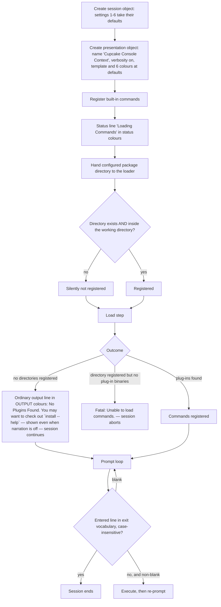

# Feature: Configuration & Settings

## Purpose — what user/business problem this solves; who uses it (actors/roles)

This feature is the complete set of knobs that change how the interactive shell behaves: what the shell prints to ask for a command, what words end a session, where it looks for installable command plug-ins, how its screen output is coloured, whether it narrates its own progress, which package registry it talks to, and — at build time — which versions of its dependencies it is built against and which feeds those dependencies may be fetched from.

Actors:

- **End user of the shell.** Sees the prompt, the colours, the status narration; can change exactly one setting at runtime — the package-registry URL — by setting a session environment value with the built-in `SET` command (in-repo evidence that the registry URL is read from the session environment: `src/Xcaciv.Command.Packages/SearchCommand.cs:24`; OUT-OF-REPO: `ref-Xcaciv.Command-v2/src/Xcaciv.Command/Commands/SetCommand.cs:12-29` (framework v2.1.2) for the `SET <varname> <value>` command that writes it).
- **Embedder / host developer.** Anyone constructing the session object or the console presentation object in their own program can override the four *value* session settings (install gate, prompt, exit vocabulary, package directory) and every presentation setting before starting the session, because each of those is host-writable with a built-in default (`src/Xcaciv.Cupcake.Core/Loop.cs:11-24`, `src/Xcaciv.Cupcake.Core/ConsoleContext.cs:20-31`). The two *collaborator* settings — the command engine and the session environment store — are **not** host-assignable: they are exposed read-only and can only be replaced by the values handed to the run operation (`src/Xcaciv.Cupcake.Core/Loop.cs:25-26`, `:34-35`, `:71-72`). **QUIRK** — a host that wants a custom engine must pass it to the run operation; assigning it is impossible, yet the shipped start-up helper registers built-in commands onto the default engine *before* handing that same engine to the run operation (`Loop.cs:108-110`). The shipped executable overrides no value setting (`src/Xcaciv.Cupcake.Lit/Program.cs:9-12`).
- **Builder / release engineer.** Consumes the centralized version-pinning manifests and the feed manifest to restore dependencies (`Directory.Packages.props`, `src/Directory.Packages.props`, `NuGet.config`).

There is **no configuration file, no command-line switch, and no operating-system environment import** at shell runtime: nothing in the repository reads a settings file or process environment variable when the shell starts (repository file census, verified with `git ls-files`: 27 tracked files — 12 source files, 6 project files, 1 solution file, the licence, three readme files, the ignore-rule file, the two pinning manifests and the feed manifest; there is no settings file, no CI definition, and no dot-env of any kind. An empty, untracked `ideas/` folder exists in the working tree. The session environment store starts empty — OUT-OF-REPO: `ref-Xcaciv.Command-v2/src/Xcaciv.Command/EnvironmentContext.cs:18,33` (framework v2.1.2)). Every runtime setting is therefore a compiled-in default unless a host program sets it in code, or — for the single runtime-changeable setting — unless the user sets it in the session environment.

## Behavior — what it does, as observable behavior; every distinct operation the feature supports, its inputs, outputs, and side effects

### A. Complete settings census

Columns: **Setting** · **What it controls** · **Default (exact literal)** · **How supplied** · **Who actually reads it**

| # | Setting | What it controls | Default (exact) | How supplied | Actually read by |
|---|---|---|---|---|---|
| 1 | Install-gate flag | Documented as "designates whether the install command is allowed" | `true` | Session-object property, code-set at construction (`src/Xcaciv.Cupcake.Core/Loop.cs:11`) | **Nothing.** No production code path reads it; only a test asserts its default (`Xcaciv.Cupcake.Core.Tests/LoopTests.cs:158`). **QUIRK** — the install command is registered unconditionally (`src/Xcaciv.Cupcake.Lit/Program.cs:10`) |
| 2 | Prompt string | Text written before each command entry | `Ɛ> ` — exactly three characters: U+0190 LATIN CAPITAL LETTER OPEN E (UTF-8 `C6 90`), U+003E `>`, U+0020 space (`src/Xcaciv.Cupcake.Core/Loop.cs:16`; byte-verified by hex dump of that line) | Session-object property, code-set | Session loop, both run modes (`src/Xcaciv.Cupcake.Core/Loop.cs:65`, `:96`) |
| 3 | Exit vocabulary | Words that end the session | `END`, `EXIT`, `BYEE` (three entries, in that order; note the doubled final E in `BYEE`) (`src/Xcaciv.Cupcake.Core/Loop.cs:20`) | Session-object property (whole list replaceable), code-set | Session loop conditions, matched case-insensitively (`src/Xcaciv.Cupcake.Core/Loop.cs:57`, `:91`) |
| 4 | Package directory | Base folder scanned for plug-in command packages | `.\packages` — a relative path written with a backslash separator (`src/Xcaciv.Cupcake.Core/Loop.cs:24`) | Session-object property, code-set | Session start-up in both run modes (`src/Xcaciv.Cupcake.Core/Loop.cs:42`, `:79`) |
| 5 | Command engine instance | Which command registry/execution engine the session uses | A newly created default engine (`src/Xcaciv.Cupcake.Core/Loop.cs:25`) | Exposed read-only (not host-assignable); **overwritten** by the argument passed to the run operation (`:34`, `:71`) | Session loop |
| 6 | Session environment instance | The key/value store commands read and write | A newly created empty store (`src/Xcaciv.Cupcake.Core/Loop.cs:26`) | Exposed read-only (not host-assignable); **overwritten** by the run argument (`:35`, `:72`) | Passed to every command execution (`:62`, `:94`) |
| 7 | Presentation context name | Appears in progress messages and is the stem of child-context names | Constructor default `ConsoleIo`; the shipped shell passes `Cupcake Console Context` (`src/Xcaciv.Cupcake.Core/ConsoleContext.cs:13`; `src/Xcaciv.Cupcake.Core/Loop.cs:110`) | Constructor argument, code-set | Progress message formatting and child naming (`ConsoleContext.cs:82`, `:40`) |
| 8 | Progress message template | Format of the status line emitted on a progress update | `{0} progress {1}%` — placeholder `{0}` = context name, `{1}` = computed progress integer (`src/Xcaciv.Cupcake.Core/ConsoleContext.cs:16-20`) | Presentation-object property, code-set | Progress operation (`ConsoleContext.cs:82`) |
| 9 | Output foreground colour | Colour of ordinary command output lines | `Blue` (`ConsoleContext.cs:23`) | Presentation-object property | Output writer (`ConsoleContext.cs:55`) |
| 10 | Output background colour | Background of ordinary output lines | `Black` (`ConsoleContext.cs:24`) | Presentation-object property | Output writer (`ConsoleContext.cs:56`) |
| 11 | Status foreground colour | Colour of status/narration lines | `Yellow` (`ConsoleContext.cs:26`) | Presentation-object property | Status writer (`ConsoleContext.cs:98`) |
| 12 | Status background colour | Background of status lines | `DarkBlue` (`ConsoleContext.cs:27`) | Presentation-object property | Status writer (`ConsoleContext.cs:99`) |
| 13 | Prompt foreground colour | Colour of the prompt (and — INFERRED, see R16 — of the user's typed line, because the prompt path never resets) | `Green` (`ConsoleContext.cs:29`) | Presentation-object property | Prompt writer (`ConsoleContext.cs:68`) |
| 14 | Prompt background colour | Background of the prompt | `Black` (`ConsoleContext.cs:30`) | Presentation-object property | Prompt writer (`ConsoleContext.cs:69`) |
| 15 | Verbosity flag (presentation) | Whether status/narration lines are shown on screen or diverted to the diagnostic trace | `true` (constructor's fourth argument default; the shipped shell does not pass it, so verbose is on) (`ConsoleContext.cs:13,31`; `Loop.cs:110`) | Constructor argument / property, code-set | Status writer only (`ConsoleContext.cs:92`). Ordinary output is never suppressed |
| 16 | Registry URL key | Which package registry the search command queries | Session environment key `PackageSourceUrl`, normalised to upper case `PACKAGESOURCEURL` by the environment store; fallback when absent or empty: `https://api.nuget.org/v3/index.json` (`src/Xcaciv.Command.Packages/SearchCommand.cs:24-29`; OUT-OF-REPO: `ref-Xcaciv.Command-v2/src/Xcaciv.Command/EnvironmentContext.cs:94-110` (framework v2.1.2)) | Session environment value, set at runtime with `SET`, or pre-seeded by an embedder | Search command (`SearchCommand.cs:24`) |
| 17 | Search result limit | Maximum result rows requested from the registry | Declared default `20`; effective value clamped to `1..100` (`SearchCommand.cs:15`, `:46`) | Declarative parameter default on the command; user overrides per invocation | Search command |
| 18 | Search verbosity | Detail level of each search result row — three distinct row shapes (R48–R50) | Declared default `normal`; allowed values `quiet`, `normal`, `detailed` (`SearchCommand.cs:16`); an unrecognised value falls back to the `normal` rendering (`SearchCommand.cs:79-82`) | Declarative parameter default; user overrides per invocation | Search command. **QUIRK** — validation is case-insensitive but rendering selection is case-sensitive, so the fallback branch is reachable only by a case variation of a legal value (R34a) |
| 19 | Search prerelease flag | Whether pre-release packages are included | Absent = off (`SearchCommand.cs:17`, `:47`) | Declarative flag | Search command |
| 20 | Search `source` parameter | Advertised in help as "The source to search for the package." | No default (`SearchCommand.cs:14`) | Declarative named parameter | **Nothing.** The command resolves its registry from the environment key instead. **QUIRK** — a documented, help-visible setting that has no effect |
| 21 | Search-term length cap | Longest search string sent to the registry | `200` characters; longer input is silently truncated to the first 200 (`SearchCommand.cs:55-58`) | Compiled-in constant | Search command |
| 22 | Help keyword | Word that triggers built-in help | `HELP` (framework default; the shell never changes it) (OUT-OF-REPO: `ref-Xcaciv.Command-v2/src/Xcaciv.Command/CommandController.cs:36` (framework v2.1.2)) | Framework default inherited by omission | Command dispatch |
| 23 | Plug-in binary sub-folder | Sub-folder inside each package folder that is scanned for command binaries | `bin` (framework default, taken because the shell calls the load operation with no argument at `src/Xcaciv.Cupcake.Core/Loop.cs:43`, `:80`) (OUT-OF-REPO: `ref-Xcaciv.Command-v2/src/Xcaciv.Command/CommandController.cs:169` (framework v2.1.2)) | Framework default inherited by omission | Plug-in crawler |
| 24 | Restricted plug-in base directory | Security boundary that a package directory must sit inside | Never set by the shell, so the framework substitutes the process's current working directory (OUT-OF-REPO: `ref-Xcaciv.Command-v2/src/Xcaciv.Command.FileLoader/VerifiedSourceDirectories.cs:17,105` (framework v2.1.2)) | Framework default inherited by omission | Package-directory verification |
| 25 | Central version pinning switch | Whether dependency versions may be declared in individual project files | `true` in both manifests (`Directory.Packages.props:3`, `src/Directory.Packages.props:3`) | Build-time file | The build/restore tooling |
| 26 | Pinned dependency versions | Exact version of every third-party dependency | See §C table (`Directory.Packages.props:6-18`, `src/Directory.Packages.props:6-18`) | Build-time files (two copies) | The build/restore tooling |
| 27 | Feed list | Where packages may be downloaded from | Inherited feeds discarded, then three feeds declared (§D) (`NuGet.config:4-10`) | Build-time file | The build/restore tooling |
| 28 | Feed-to-package mapping | Which feed each package id may come from | `*` → `nuget.org`; `Xcaciv.*` → `local` (`NuGet.config:12-20`) | Build-time file | The build/restore tooling |
| 29 | Local feed location | Filesystem path of the private feed | The literal token `%NUGET_LOCAL_PACKAGES%` — an operating-system environment variable reference (`NuGet.config:8`) | Build-time file + builder's environment | The build/restore tooling (see §E for the observed failure) |
| 30 | Release retarget block | Alternate target platform and packaging for release builds | Release configuration switches the shipping executable to a Windows-only runtime, single-file, self-contained, 64-bit Intel, ahead-of-time compiled, compressed, trimmed, windowed executable (`src/Xcaciv.Cupcake.Lit/Xcaciv.Cupcake.Lit.csproj:10-23`) | Build-time project file | The build tooling. *Owned by the Shell Distribution feature; listed here only for census completeness* |
| 31 | Registry-query helper defaults | The result limit, pre-release inclusion and start offset actually sent to the registry | Limit `20`, pre-release off (`src/Xcaciv.Command.Packages/NugetWrapper.cs:20`); start offset fixed at `0`, not settable at all (`NugetWrapper.cs:29`) | Compiled-in argument defaults on the registry-query helper | The registry query. **QUIRK** — the limit default `20` is declared a *second* time here, independently of the command's declared default (row 17); the search command always passes an explicit clamped limit, so the helper's copy is dead unless another caller appears |
| 32 | Status-line narration literals | The two fixed narration lines emitted while the session starts | `Loading Commands` in both run modes (`src/Xcaciv.Cupcake.Core/Loop.cs:37`, `:75`); `Done` in the asynchronous mode only (`:87`) | Compiled-in literals, not settable | Presentation status writer (subject to the verbosity flag, row 15) |

### B. Operations this feature supports

1. **Supply the session defaults.** Creating a session object materialises settings 1–6 with the literals above; no I/O occurs (`src/Xcaciv.Cupcake.Core/Loop.cs:11-26`).
2. **Override the session value settings before start.** A host program assigns settings 1–4, then calls the run operation. Settings 5 and 6 cannot be assigned; handing a command engine and an environment store to the run operation replaces them permanently for that session, in both run modes (`Loop.cs:34-35`, `:71-72`; asserted by the session tests, `Xcaciv.Cupcake.Core.Tests/LoopTests.cs:126-152`).
3. **Supply the presentation defaults.** Creating the console presentation object materialises settings 7–15; the name, parameter list, parent id, and verbosity flag are constructor inputs, the template and the six colours are properties (`src/Xcaciv.Cupcake.Core/ConsoleContext.cs:13-31`).
4. **Apply the package directory.** At session start the configured directory is handed to the plug-in loader, then the load is triggered (`Loop.cs:42-43`, `:79-80`).
5. **Apply the prompt and exit vocabulary.** Each iteration writes the prompt string, reads one line, and compares that line against the exit vocabulary case-insensitively (`Loop.cs:57`, `:65`).
6. **Resolve the package registry URL.** The search command reads the environment key, substitutes the public-registry fallback when the value is empty, and rejects anything that is not an absolute `https` URL (`SearchCommand.cs:24-35`).
7. **Render according to the colour settings.** Ordinary output, status lines, and the prompt each use their own foreground/background pair (§A rows 9–14).
8. **Narrate or stay quiet.** With verbosity on, status text goes to the screen; with it off, the same text goes to the diagnostic trace channel and nothing appears (`ConsoleContext.cs:90-103`).
9. **Format a progress line.** A progress update computes an integer from the two inputs, formats it into the template with the context name, and emits it as a status line (`ConsoleContext.cs:79-84`).
10. **Pin dependency versions centrally.** Individual project files reference dependencies by id only; every version lives in the manifests (`src/Xcaciv.Cupcake.Core/Xcaciv.Cupcake.Core.csproj:13-15` versus `src/Directory.Packages.props:6-18`).
11. **Constrain where each dependency may come from.** The feed manifest discards inherited feeds, declares three, and maps package-id patterns to feeds (`NuGet.config:4-20`).
12. **Narrate start-up.** Both run modes emit the status line `Loading Commands` before loading (`Loop.cs:37`, `:75`); only the asynchronous mode emits a second status line, `Done`, after loading succeeds (`:87`). Both are status lines, so both disappear when the verbosity flag is off (setting 15).
13. **Report the tolerant "nothing to load" outcome.** The `No Plugins Found. You may want to check out `install --help`` text is written as **ordinary command output**, not as a status line (`Loop.cs:47`), so unlike the narration in operation 12 it is shown even when the verbosity flag is off, and it is rendered in the *output* colour pair rather than the status pair (setting 9/10 versus 11/12).
14. **Render each search result row at the configured detail level.** The verbosity setting selects one of three row shapes; the rows are joined into one text block separated by single newline characters (`SearchCommand.cs:62-85`).

### C. Pinned versions (identical in both manifests)

| Dependency id | Pinned version | Used by |
|---|---|---|
| `NuGet.Protocol` | `7.0.1` | Package-manager commands project |
| `Xcaciv.Command` | `2.1.1` | Session core, shipping executable, **both** test projects (`Xcaciv.Command.PackagesTests/Xcaciv.Command.PackagesTests.csproj:18`, `Xcaciv.Cupcake.Core.Tests/Xcaciv.Cupcake.Core.Tests.csproj:20`) |
| `Xcaciv.Command.Core` | `2.1.0` | Package-manager commands project |
| `Xcaciv.Command.Interface` | `2.1.0` | One test project |
| `coverlet.collector` | `6.0.4` | Test projects |
| `Microsoft.NET.Test.Sdk` | `18.0.1` | Test projects |
| `xunit` | `2.9.3` | Test projects |
| `xunit.runner.visualstudio` | `3.1.5` | Test projects |

Evidence: `Directory.Packages.props:6-18` and `src/Directory.Packages.props:6-18`. The two files are byte-identical except that the second has no trailing newline (813 vs 811 bytes; verified with a whitespace-normalised diff).

### D. Declared feeds and the mapping rule

| Feed key | Location (exact) | Mapped patterns | Effect |
|---|---|---|---|
| `nuget.org` | `https://api.nuget.org/v3/index.json` | `*` | Serves every package id that no more specific pattern claims |
| `github` | `https://nuget.pkg.github.com/xcaciv/index.json` | **none** | Declared but never mapped, therefore never consulted (observed, §E) |
| `local` | `%NUGET_LOCAL_PACKAGES%` | `Xcaciv.*` | Sole permitted origin for every `Xcaciv.`-prefixed package, i.e. the whole command framework the shell is built on |

Evidence: `NuGet.config:4-20`. A `clear` element precedes the three feeds, so feeds configured elsewhere on the machine are discarded for this repository (`NuGet.config:5`).

Mapping rule as observed: the most specific matching pattern wins, and a feed with no pattern is excluded from consideration entirely (see the observed diagnostic in §E, which names `github` and `nuget.org` as "not considered" for an `Xcaciv.`-prefixed package).

### E. Observed build-time failures caused by the feed configuration

Reproduced on a copy of the repository (the subject tree was not modified), with the build tool version 10.0.400:

1. **Environment token unset.** Listing the configured feeds resolves the local feed to `<repo-root>/%NUGET_LOCAL_PACKAGES%` — the unexpanded token is treated as a *relative path* and joined to the folder holding the feed manifest. Restoring any project then fails with:
   `error NU1301: The local source '<repo-root>/%NUGET_LOCAL_PACKAGES%' doesn't exist.`
   Because the framework packages are mapped exclusively to that feed, **no project in the repository can be restored on a machine where `NUGET_LOCAL_PACKAGES` is not set** (`NuGet.config:8`, `NuGet.config:17-19`).
2. **Environment token set to an empty folder.** The token expands correctly, and restore then fails with:
   `error NU1101: Unable to find package Xcaciv.Command. No packages exist with this id in source(s): local. PackageSourceMapping is enabled, the following source(s) were not considered: github, nuget.org.`
   This is the direct observation that the declared `github` feed is unreachable under the mapping rule (`NuGet.config:12-20`).
3. **Third-party dependency advisory.** The same restore emits `warning NU1901: Package 'NuGet.Protocol' 7.0.1 has a known low severity vulnerability, https://github.com/advisories/GHSA-g4vj-cjjj-v7hg` for the pinned registry-client dependency (`src/Directory.Packages.props:7`).

## Business rules & edge cases

**Session settings**

- R1. The prompt is exactly `Ɛ> ` — U+0190, `>`, one trailing space. It is not ASCII, so the target platform must be able to emit that code point on the terminal (`src/Xcaciv.Cupcake.Core/Loop.cs:16`).
- R2. Exit-word matching is **case-insensitive ordinal** and matches the **whole raw input line**: `end`, `End`, `END` all exit; `END ` with a trailing space, or `END now`, do not (`src/Xcaciv.Cupcake.Core/Loop.cs:57`, `:91`).
- R3. The exit vocabulary has exactly three entries — `END`, `EXIT`, `BYEE` — and the third is spelled with two trailing E's (`Loop.cs:20`). **QUIRK**: `BYE` alone does **not** exit.
- R4. An exit word is never executed as a command: the loop tests the just-entered line before the next execution step, so the session ends immediately (`Loop.cs:57-66`).
- R5. A blank line is never executed; the loop skips execution and re-prompts (`Loop.cs:60`).
- R6. The session begins with an empty pending input, so the first thing the user sees after start-up is the prompt, not an execution (`Loop.cs:56-65`).
- R7. The package directory default is a *relative, backslash-separated* path (`.\packages`) and is resolved against the process's current working directory (`Loop.cs:24`; OUT-OF-REPO: `ref-Xcaciv.Command-v2/src/Xcaciv.Command.FileLoader/Crawler.cs:173` (framework v2.1.2)). INFERRED: on a platform where backslash is not a path separator the value is not split at the backslash, so it names a single folder literally called `.\packages` and the intended `packages` folder is never found; nothing in the repository establishes this, and no test or run exercises a non-Windows start-up. **QUIRK** for a cross-platform reimplementation.
- R8. The plug-in layout implied by the package directory is `<package directory>/<any folder>/bin/*.dll` — one level of package folder, then a fixed `bin` sub-folder, because the shell requests loading without naming a sub-folder and the framework's default sub-folder is `bin` (`Loop.cs:43`; OUT-OF-REPO: `ref-Xcaciv.Command-v2/src/Xcaciv.Command/CommandController.cs:169` and OUT-OF-REPO: `ref-Xcaciv.Command-v2/src/Xcaciv.Command.FileLoader/Crawler.cs:176` (framework v2.1.2)).
- R9. A package directory that does not exist is **silently ignored** — registration returns a false result that the shell never inspects — after which the load step raises the tolerable "nothing registered" condition, whose own text is `No base package directory configured. (Did you set the restricted directory?)` (OUT-OF-REPO: `ref-Xcaciv.Command-v2/src/Xcaciv.Command.FileLoader/VerifiedSourceDirectories.cs:82-89` and OUT-OF-REPO: `ref-Xcaciv.Command-v2/src/Xcaciv.Command/CommandLoader.cs:41-45` (framework v2.1.2)). **QUIRK** — that framework text is discarded by the shell, which prints its own message instead (R46), so the diagnostic hint about the restricted directory never reaches the user.
- R10. A package directory outside the current working directory is likewise rejected silently, because no restricted base directory is configured and the framework then treats the working directory as the boundary (OUT-OF-REPO: `ref-Xcaciv.Command-v2/src/Xcaciv.Command.FileLoader/VerifiedSourceDirectories.cs:100-115` (framework v2.1.2)).
- R11. The install-gate flag defaults to enabled and is asserted by a test, but no production path consults it; the install command is registered unconditionally at start-up (`src/Xcaciv.Cupcake.Core/Loop.cs:11`; `Xcaciv.Cupcake.Core.Tests/LoopTests.cs:158`; `src/Xcaciv.Cupcake.Lit/Program.cs:10`). **QUIRK — dead setting.**
- R12. The two run modes are configured differently: the synchronous mode registers built-in commands and tolerates the "no plug-ins" condition; the asynchronous mode does **neither** — it registers no built-ins and wraps every load failure as a fatal load error (`Loop.cs:41-54` versus `:77-87`). **QUIRK.**
- R13. The default-startup helper registers built-in commands and then the synchronous run mode registers them again. Duplicate registration overwrites by command key rather than failing (`Loop.cs:108-110`, `:41`; OUT-OF-REPO: `ref-Xcaciv.Command-v2/src/Xcaciv.Command/CommandRegistry.cs:20-35` (framework v2.1.2)).
- R14. The default-startup helper hard-codes the presentation context name `Cupcake Console Context` and an empty parameter list, and leaves verbosity at its constructor default of on (`Loop.cs:110`).

**Presentation settings**

- R15. Six colour settings exist, in three foreground/background pairs: output `Blue`/`Black`, status `Yellow`/`DarkBlue`, prompt `Green`/`Black` (`src/Xcaciv.Cupcake.Core/ConsoleContext.cs:23-30`). These are names from a fixed 16-colour console palette, not RGB values.
- R16. Output lines and status lines **reset** the terminal colours after writing; the prompt does **not** (`ConsoleContext.cs:55-58`, `:98-101` versus `:68-71`). What is directly observed is the missing reset on the prompt path. INFERRED consequence: because the colours are still in force while the terminal echoes the user's keystrokes, the typed line appears in the prompt colours and those colours persist until the next output or status line resets them. **QUIRK.**
- R17. The verbosity flag gates status lines only. When off, the status text is written to the diagnostic trace channel and nothing reaches the screen; ordinary command output is unaffected (`ConsoleContext.cs:90-103`).
- R18. The shell's verbosity flag *shadows* a same-named flag on the framework's presentation base, and the base flag is never set. The base's trace-message routing therefore always takes the "not verbose" branch, so trace messages never appear on screen no matter how the shell's flag is set (`ConsoleContext.cs:31`; OUT-OF-REPO: `ref-Xcaciv.Command-v2/src/Xcaciv.Command.Core/AbstractTextIo.cs:25,167-176` (framework v2.1.2)). **QUIRK.**
- R19. The progress template is `{0} progress {1}%` with `{0}` = context name and `{1}` = the computed integer; the literal percent sign is part of the template (`ConsoleContext.cs:16-20`).
- R20. The progress figure is computed as **total divided by step**, integer division with truncation — not "step of total as a percentage". The contract this implements documents the return as percent complete and gives the example 25 of 100 → 25; this implementation returns 4 for those inputs (`ConsoleContext.cs:81`; OUT-OF-REPO: `ref-Xcaciv.Command-v2/src/Xcaciv.Command.Interface/IIoContext.cs:128-138` (framework v2.1.2)). **QUIRK.** The repository's own test asserts 100 and 10 → 10, which happens to be right under either reading and therefore does not catch the defect (`Xcaciv.Cupcake.Core.Tests/ConsoleContextTests.cs:28-30`).
- R21. INFERRED: a step of `0` divides by zero and raises a runtime arithmetic error rather than reporting 0% (`ConsoleContext.cs:81`).
- R22. The status line emitted by a progress update is dispatched *without waiting for it to complete* before the progress figure is returned, so its ordering relative to surrounding output is not guaranteed (`ConsoleContext.cs:82`). INFERRED for the visible symptom (a progress line that can appear out of order, or after the caller has already moved on); the fire-and-forget dispatch itself is directly observed.
- R23. Child presentation contexts inherit **none** of the configured settings: a child is constructed with the parent's name plus the suffix `Child`, the child's parameters, and the parent id, so the child's template, six colours, and verbosity all revert to the compiled-in defaults (`ConsoleContext.cs:38-47`). **QUIRK** — a host that recolours the shell sees default colours again inside pipelines.
- R24. INFERRED: constructing a presentation context without an explicit parameter list fails at construction, because the constructor spreads the (defaulted-to-absent) parameter list into a new collection (`ConsoleContext.cs:13`). The *root* context is always built with an explicit list, empty or otherwise (`Loop.cs:110`; `Xcaciv.Cupcake.Core.Tests/ConsoleContextTests.cs:10,17,28`), so the shipped path never hits it — but the child-context operation forwards its own argument unchanged, and that argument's declared default is "absent" (`ConsoleContext.cs:38,40`). INFERRED: any request for a child presentation context that does not name a parameter list therefore fails at construction rather than producing a child. **QUIRK — a reachable construction failure on the pipeline path, not merely a theoretical one.**

**Environment-supplied values**

- R25. The registry URL is read from the session key `PackageSourceUrl`; the store upper-cases keys, so it is stored and retrievable as `PACKAGESOURCEURL` and lookups are case-insensitive (`SearchCommand.cs:24`; OUT-OF-REPO: `ref-Xcaciv.Command-v2/src/Xcaciv.Command/EnvironmentContext.cs:71-110` (framework v2.1.2)).
- R26. When the key is absent or empty the fallback is the exact literal `https://api.nuget.org/v3/index.json` (`SearchCommand.cs:26-29`).
- R27. The resolved URL must parse as an absolute URL **and** use the `https` scheme; anything else is refused with the message `Insecure or invalid package source URL. HTTPS is required.` (`SearchCommand.cs:32-35`). A plain-HTTP or a relative value is rejected even though it was explicitly configured.
- R28. Reading the key when it is unset has a **side effect**: the store's default lookup writes the empty default back, so an empty `PACKAGESOURCEURL` entry appears in subsequent environment listings (OUT-OF-REPO: `ref-Xcaciv.Command-v2/src/Xcaciv.Command/EnvironmentContext.cs:94-110` (framework v2.1.2), reached from `SearchCommand.cs:24`). **QUIRK.**
- R29. The session environment starts empty and is never seeded from the host operating system's environment; values live only for the session and are lost on exit — there is no persistence step anywhere in the repository (OUT-OF-REPO: `ref-Xcaciv.Command-v2/src/Xcaciv.Command/EnvironmentContext.cs:18,33` (framework v2.1.2); repository census shows no settings file).
- R30. Environment values set by a command are only propagated back to the session when that command was registered as environment-modifying; the built-in value-setting command is the one registered that way (OUT-OF-REPO: `ref-Xcaciv.Command-v2/src/Xcaciv.Command/CommandController.cs:177-185` (framework v2.1.2) — the setter command is registered with the modifying flag, the other three built-ins are not).

**Declarative command settings**

- R31. Result limit: declared default `20`, then clamped to the inclusive range `1..100`; a value below 1 becomes 1 and above 100 becomes 100 (`SearchCommand.cs:15`, `:46`). Magic-number meanings: the source labels the clamp as abuse prevention, so `100` is directly evidenced as an anti-abuse ceiling on a single registry query (`SearchCommand.cs:41`); INFERRED: `1` is the floor that guarantees a request always asks for at least one row rather than a degenerate zero- or negative-sized page.
- R32. A non-integer limit is refused with `The 'take' parameter must be a valid integer value.` (`SearchCommand.cs:42-45`).
- R33. **QUIRK**: when a command is invoked with *no* arguments at all, the parameter processor returns an empty set and no declared default is applied, so the limit is "missing" and the invocation fails with the message in R32 rather than defaulting to 20 (`SearchCommand.cs:42-45`; OUT-OF-REPO: `ref-Xcaciv.Command-v2/src/Xcaciv.Command.Core/AbstractCommand.cs:178-180` (framework v2.1.2) — the processor returns an empty map for an empty argument array).
- R34. Verbosity: declared default `normal`, allowed list `quiet`, `normal`, `detailed`, compared **case-insensitively** by the framework's allow-list check; a value outside the list is refused before the command body runs (`SearchCommand.cs:16`; OUT-OF-REPO: `ref-Xcaciv.Command-v2/src/Xcaciv.Command.Core/CommandParameters.cs:76-79,122-125` (framework v2.1.2)).
- R34a. **QUIRK — case mismatch between validation and rendering.** The rendering selection inside the command compares the same value **case-sensitively** (`SearchCommand.cs:63-83`), so a value such as `QUIET` or `Detailed` passes validation, falls through to the catch-all branch, and is silently rendered at `normal` detail instead of being rejected or honoured. The catch-all branch is documented in the source as a fallback for an "invalid" value (`SearchCommand.cs:79-80`), but the only values that can reach it are ones the framework already accepted as valid — so it is reachable *only* by a case variation of a legal value.
- R35. Search text is trimmed; an all-whitespace search yields an empty result with no registry call **and no error** — the invocation simply returns nothing; text longer than **200** characters is truncated to the first 200 and the query proceeds silently, with no warning that the term was shortened (`SearchCommand.cs:50-58`). The number 200 carries no explanation in the source; INFERRED: it is a self-imposed maximum query length rather than a registry-imposed one, since nothing in the repository reads a limit from the registry.
- R36. The advertised `source` parameter is accepted and documented but never consulted (`SearchCommand.cs:14`). **QUIRK.**

**Build-time configuration**

- R37. Central pinning is switched on, so no project file may carry a version; every project reference names an id only (`Directory.Packages.props:3`; `src/Directory.Packages.props:3`; e.g. `src/Xcaciv.Cupcake.Core/Xcaciv.Cupcake.Core.csproj:14`).
- R38. Two pinning manifests exist with identical content — the root one governs the two test projects (siblings of `src/`), the `src/` one governs the four production projects, because the nearest manifest walking upward wins. Observed: restoring a test project resolves its dependency versions with no "version not specified" complaint, confirming a central manifest is in force above it. INFERRED: the *specific* nearest-wins resolution order is restore-tool behaviour, not something the repository states. Keeping the two copies in sync is a manual obligation (`Directory.Packages.props`, `src/Directory.Packages.props`; only the `src/` copy is listed in the solution's shared items, `Xcaciv.Cupcake.sln:16`, so an editor working from the solution sees only one of the two). **QUIRK — duplicated source of truth.**
- R39. Inherited machine-level feeds are discarded before the three feeds are declared, so the build depends only on what this file lists (`NuGet.config:5`).
- R40. Mapping: `*` → `nuget.org`, `Xcaciv.*` → `local`; the more specific pattern wins, so every framework package is restricted to the local feed and everything else to the public feed (`NuGet.config:12-20`; observed diagnostic in §E.2).
- R41. The `github` feed has no mapping entry and is therefore excluded from consideration entirely — declaring it has no effect (`NuGet.config:7`; observed diagnostic in §E.2 names it as "not considered"). **QUIRK.**
- R42. The local feed location is the environment token `%NUGET_LOCAL_PACKAGES%`. When the variable is defined the token expands (observed: restore then reported the expanded folder). When it is undefined the token is left literal and treated as a path relative to the manifest's folder, and restore fails with `NU1301 ... doesn't exist` (`NuGet.config:8`; observed in §E.1). **QUIRK — the repository as committed does not build on any machine that lacks that variable.**
- R43. Git history shows the local feed was previously the concrete path `G:\NuGetPackages` and was replaced by the token; two further feeds pointing at web-page URLs (`https://github.com/Xcaciv/Xcaciv.Command`, `https://github.com/Xcaciv/Xcaciv.Loader`) were added and then removed shortly before (commits `cf04929`, `d234cbd`, `3736cde` touching `NuGet.config`). Context only — the pinned state is what §D describes.
- R44. The runtime plug-in folder is excluded from version control by the ignore rules (`**/[Pp]ackages/*` at `.gitignore:190`), so a fresh checkout has no `packages` folder and the first run necessarily takes the "no plug-ins" path (R9).

**Start-up narration and messages**

- R45. Exactly two narration literals exist, both fixed and unsettable: `Loading Commands` is emitted as a status line before loading in both run modes (`Loop.cs:37`, `:75`), and `Done` is emitted as a status line after a successful load in the **asynchronous mode only** (`:87`). The synchronous mode — the shipped path — never confirms success; silence followed by the prompt is the success signal. **QUIRK.**
- R46. The tolerant "nothing to load" message is written through the **ordinary output** channel, not the status channel (`Loop.cs:47`). Two consequences: it is rendered in the output colour pair (`Blue` on `Black`) rather than the status pair, and it is **not** suppressed when the verbosity flag is off — so a shell started with narration switched off still prints it while suppressing `Loading Commands` and `Done`. **QUIRK — inconsistent channel choice for start-up messaging.**
- R47. The message text is exactly ``No Plugins Found. You may want to check out `install --help` `` — including the back-tick characters around `install --help`, which are part of the literal, not markdown (`Loop.cs:47`).

**Search-result rendering (the verbosity setting's three observable shapes)**

Mined from `Xcaciv.Command.PackagesTests/SearchCommandTests.cs`; each shape is a row template applied to every result.

- R48. `quiet` renders **only the package identifier**, one per row, with no version, no summary and no separator characters (`SearchCommand.cs:65-67`; asserted by the test that requires the output to contain no `:` character, `SearchCommandTests.cs:41-54`).
- R49. `normal` renders `<identifier> <version> : 
` — identifier, space, version, space, colon, space, summary (`SearchCommand.cs:68-70`; asserted to contain `:` and *not* to contain `Published:`, `SearchCommandTests.cs:26-39`).
- R50. `detailed` renders `<identifier> <version> (<download count>) : 
` followed by four indented continuation lines labelled `Published:`, `Authors:`, `License:` and `Vulnerabilities:` (the last carrying a *count*, not a list), and a final `---` separator line; each continuation line begins with a newline and two spaces (`SearchCommand.cs:71-78`; asserted to contain `Published:`, `Authors:` and `Vulnerabilities:`, `SearchCommandTests.cs:56-69`).
- R51. Whatever the shape, rows are joined into one text block by a **single newline character** between rows, with no trailing separator (`SearchCommand.cs:85`; relied on by the test that counts result lines by splitting on newline, `SearchCommandTests.cs:98-110`).
- R52. The pre-release flag is a presence flag: supplying it includes pre-release packages, omitting it excludes them; there is no explicit "off" spelling (`SearchCommand.cs:17`, `:47`; exercised by `SearchCommandTests.cs:71-82`, and by the registry-helper tests that drive both settings directly, `Xcaciv.Command.PackagesTests/NugetWrapperTests.cs:12-50`).
- R53. Search is not available on the piped path at all: a piped invocation is refused with the fixed text `Unsupported search method for <the piped text> (piped)` immediately followed — with no separator — by the invocation's own arguments joined with commas (`SearchCommand.cs:88-91`; asserted by `SearchCommandTests.cs:128-138`). **QUIRK** — the refusal text concatenates the two parts without a space, so the arguments run directly into the closing `)`.

**Dead settings, stubs, and injected collaborators**

- R54. The tolerant start-up message directs the user to `install --help`, but the install command is a stub: every invocation, piped or not, returns the text `Not installing ` followed by the joined arguments, and nothing is downloaded, unpacked or registered (`src/Xcaciv.Command.Packages/InstallCommand.cs:19-27`). **QUIRK** — the recovery path the shell advertises when no plug-ins are found cannot actually install a plug-in, so a first-run user has no in-product route out of the "no plug-ins" state.
- R55. The install command also never consults the install-gate flag (R11); the two are unrelated in code despite the flag's stated purpose (`Loop.cs:9-11`; `InstallCommand.cs:19-27`).
- R56. The registry-query helper declares its own result limit of `20` and pre-release default of off, duplicating the command's declared default, and hard-codes the query start offset to `0` with no way to change it (`src/Xcaciv.Command.Packages/NugetWrapper.cs:20`, `:29`). Because the search command always passes an explicit clamped limit and an explicit flag, the helper's defaults are unreachable from the shell. **QUIRK — a second, divergable copy of a default value; there is no paging setting of any kind.**
- R57. The command engine and the environment store handed to the run operation replace the session's own instances permanently for that session, in both run modes; this is the only supported way to inject either, and it is the behaviour the session tests assert (`Loop.cs:34-35`, `:71-72`; `Xcaciv.Cupcake.Core.Tests/LoopTests.cs:126-152`).

## Workflows & states

### W1. Start-up settings-application flow (synchronous mode — the shipped path)

Evidence: `src/Xcaciv.Cupcake.Core/Loop.cs:37-67`, `:105-112`; branch outcomes OUT-OF-REPO: `ref-Xcaciv.Command-v2/src/Xcaciv.Command/CommandLoader.cs:41-45` and OUT-OF-REPO: `ref-Xcaciv.Command-v2/src/Xcaciv.Command.FileLoader/Crawler.cs:173-180` (framework v2.1.2).

Note the state difference between the two branches at J: the "no directories registered" condition is caught and downgraded to a message, while "directory present but empty" is a *different* condition that is not caught and kills the session (R12, and Error handling below).

### W1b. Start-up settings-application flow (asynchronous mode — configured differently)

The asynchronous mode is not a variant of W1; it applies a different configuration and has different outcomes (R12, R45). Steps, with the differences called out:

1. Emit the status line `Loading Commands` (`Loop.cs:75`) — same as W1.
2. **Skip** built-in command registration entirely — the say / set / environment-listing / regular-expression-filter commands are never registered, so a session started this way has no built-ins unless the host registered some itself (`Loop.cs:77-80` has no registration step, versus `:41`). **QUIRK.**
3. Hand the configured package directory to the loader and trigger the load (`Loop.cs:79-80`) — same as W1.
4. **Any** load outcome other than success — including the "no directories registered" condition W1 tolerates — is wrapped as a fatal load error and ends the session (`Loop.cs:82-85`). **QUIRK.**
5. On success only, emit the status line `Done` (`Loop.cs:87`) — W1 has no equivalent.
6. Enter the same prompt loop with the same prompt string and exit vocabulary (`Loop.cs:89-101`).

Evidence: `src/Xcaciv.Cupcake.Core/Loop.cs:70-103`. Nothing in the repository calls this mode; the shipped executable uses W1 (`src/Xcaciv.Cupcake.Lit/Program.cs:12`; `Loop.cs:110`). Only the session tests exercise it (`Xcaciv.Cupcake.Core.Tests/LoopTests.cs:140-152`).

### W2. Registry-URL resolution (per search invocation)

1. Read session key `PackageSourceUrl` (stored upper-cased).
2. If the value is absent or empty → substitute `https://api.nuget.org/v3/index.json`. (Side effect: the absent-key read writes an empty entry back into the session environment — R28.)
3. Parse the resulting value as an absolute URL. If parsing fails, or the scheme is not `https` → refuse with `Insecure or invalid package source URL. HTTPS is required.`
4. Otherwise build the registry client against that URL and continue.

Evidence: `src/Xcaciv.Command.Packages/SearchCommand.cs:24-39`.

**Ordering guarantee (observed).** Registry-URL resolution and the https check run *before* the result-limit check and before the search text is examined (`SearchCommand.cs:24-35` precedes `:42-46` and `:50-58`). So an invocation that is wrong in two ways at once — say an insecure configured registry *and* a non-numeric limit — always reports the registry problem, never the limit problem. The client object is also built before the limit is validated (`:38-39`), so a rejected limit still costs one client construction.

### W3. Build-time dependency resolution

1. Discard inherited feeds (`NuGet.config:5`).
2. Register the three declared feeds; expand `%NUGET_LOCAL_PACKAGES%` in the third (`NuGet.config:6-8`).
3. For each dependency id in the nearest pinning manifest, pick the single feed whose most-specific pattern matches: `Xcaciv.*` → local, everything else → public (`NuGet.config:12-20`).
4. Failure states, exactly as observed in §E: token unexpanded → `NU1301`; framework package absent from the local feed → `NU1101` naming `github` and `nuget.org` as not considered; success on the public feed for the registry-client dependency, with advisory warning `NU1901`.

## Data

This feature owns three configuration records and consumes one key/value store.

**Session Settings** (created when a session object is constructed; the four value fields are mutated only by a host program before the run begins; the two collaborator fields are replaced only by the run operation's arguments; all destroyed with the session)

| Field | Type (generic) | Constraint / default |
|---|---|---|
| Install-gate flag | boolean | host-writable; default true; unused (R11) |
| Prompt string | text | host-writable; default `Ɛ> `; no length or content constraint enforced |
| Exit vocabulary | ordered list of text | host-writable; default `["END","EXIT","BYEE"]`; whole list replaceable; compared case-insensitively |
| Package directory | text path | host-writable; default `.\packages`; must name an existing folder inside the working directory to have effect (R9, R10) |
| Command engine | engine handle | **read-only to a host**; default engine; replaced only by the run argument (R57) |
| Session environment | store handle | **read-only to a host**; default empty store; replaced only by the run argument (R57) |

**Presentation Settings** (created with the console presentation object; per-context — children get fresh defaults, R23)

| Field | Type (generic) | Constraint / default |
|---|---|---|
| Context name | text | constructor input; default `ConsoleIo`; shipped shell passes `Cupcake Console Context` |
| Parameters | list of text | constructor input; must be supplied explicitly — an absent list fails construction (R24) |
| Parent id | optional identifier | constructor input; absent for the root context |
| Verbosity flag | boolean | constructor input; default true |
| Progress template | text with two positional placeholders | default `{0} progress {1}%` |
| Output fore/back | palette colour name ×2 | `Blue` / `Black` |
| Status fore/back | palette colour name ×2 | `Yellow` / `DarkBlue` |
| Prompt fore/back | palette colour name ×2 | `Green` / `Black` |

**Build Configuration** (files in the repository; changed by commit only)

| Field | Type | Constraint |
|---|---|---|
| Central-pinning switch | boolean | true in both manifests |
| Pinned version entries | id → version string | 8 entries, duplicated across the two manifests (§C) |
| Feed entries | key → location | 3 entries, preceded by a discard-inherited directive (§D) |
| Mapping entries | feed key → list of id patterns | 2 entries covering 2 of the 3 feeds (§D) |

**Session Environment** (consumed, not owned — owned by the framework): a case-insensitive key/value store of text values, created empty at session start, mutated by the built-in setter command and by default-writing reads (R28), discarded at session end (R29). The only key this feature defines is `PackageSourceUrl` / `PACKAGESOURCEURL`.

## Interfaces

**Exposed to other features**

- To *Interactive Shell Session*: the prompt string, the exit vocabulary (with case-insensitive whole-line matching), and the package directory; plus the two run-mode entry points, which also accept a command engine and an environment store that replace the corresponding settings (R57), and the two start-up narration literals (R45).
- To *Console Presentation & Interaction*: the six colour settings, the verbosity flag, the progress template with its two placeholders, and the context name. Contract: output and status lines restore terminal colours afterwards, the prompt does not (R16); the verbosity flag gates status lines only, never ordinary output (R17, R46).
- To *Plugin Discovery & Command Registration*: the package directory value and the implied `<package>/bin` layout (R8); the fact that no restricted base directory is configured, making the working directory the boundary (census row 24 → R10).
- To *Package Search Command* and *Package Registry Client*: the environment key `PackageSourceUrl`, its public-registry fallback literal, the https-only rule, the 1..100 limit clamp, the 200-character search-text cap, the verbosity allow-list and its three row shapes (R48–R50), the newline row separator (R51), and the fixed query start offset of 0 (R56).
- To *Package Install Command*: nothing. The install command consults no setting at all, not even the install-gate flag that names it (R54, R55).
- To *Error Handling & Failure Reporting*: the two distinguishable start-up load outcomes and their exact messages (see Error handling).
- To *Shell Distribution & Entry Points*: the pinned dependency set and the feed constraints that must be satisfiable on the build machine.

**Consumed from other features / the framework** (required capabilities, semantics described; see External technology for the product)

- *Command engine configuration surface*: accepts one or more package base directories; loads plug-ins from a named sub-folder, defaulting to `bin`; registers four built-in commands under a single package key named `Default` — echo-a-line, set-an-environment-value, list-all-environment-values, and a regular-expression output filter that passes a line through only when it matches (OUT-OF-REPO: `ref-Xcaciv.Command-v2/src/Xcaciv.Command/Commands/SayCommand.cs:13`, `SetCommand.cs:12`, `EnvCommand.cs:12`, `RegifCommand.cs:13` (framework v2.1.2)); exposes a help keyword defaulting to `HELP`; treats duplicate registration of the same command key as an overwrite rather than an error.
- *Session environment store*: case-insensitive keys normalised to upper case; read-with-default optionally writes the default back (default: it does write); child stores are copies, and a child's changes flow back to the parent only for commands declared environment-modifying.
- *Presentation base*: supplies pipe wiring, a verbosity flag of its own, and a trace-message router that consults *its* flag (R18).
- *Declarative parameter processing*: applies declared defaults and allow-lists, but only when at least one argument is supplied (R33).

## External technology

| Generic capability | Protocol/standard if any | What the source used | Notes for reimplementer |
|---|---|---|---|
| Command-shell framework supplying the controller, IO/environment context contracts, declarative parameter attributes, `\|` pipelines, generated help, plug-in loading and the built-in SAY/SET/ENV/REGIF commands | none (in-process library) | `Xcaciv.Command` 2.1.1, `Xcaciv.Command.Core` 2.1.0, `Xcaciv.Command.Interface` 2.1.0 (C#/.NET), by the same author; semantics verified against the v2.1.2 reference clone | Not on the public package index; ships to a private feed. Reimplement the *capabilities* listed under Interfaces, not the library. Defaults you inherit by omission: help keyword `HELP`, plug-in sub-folder `bin`, restricted base = working directory, pipeline channel capacity 10 000 with blocking backpressure and all timeouts/output caps disabled (OUT-OF-REPO: `ref-Xcaciv.Command-v2/src/Xcaciv.Command.Interface/PipelineConfiguration.cs:15-50` (framework v2.1.2)) |
| Terminal with a 16-name colour palette, separate foreground/background, a colour reset, line write and line read | ANSI/console text | .NET console API (`ConsoleColor` names `Blue`, `Black`, `Yellow`, `DarkBlue`, `Green`) | Colour settings are *names*, not RGB. Needs the reset operation and the ability to leave colours unreset after a partial line (the prompt) |
| Unicode-capable terminal output | UTF-8 | Prompt uses U+0190 | If the terminal cannot render U+0190 the prompt degrades to a replacement glyph |
| Package registry search API | HTTPS, registry service-index + search resource | `NuGet.Protocol` 7.0.1 against `https://api.nuget.org/v3/index.json` | The URL is a *setting*; only `https` accepted. Pinned version carries advisory GHSA-g4vj-cjjj-v7hg (observed as warning NU1901) |
| Dependency restore with centralized version pinning, multiple feeds, and per-package feed mapping | package-feed protocol (service index / local folder) | NuGet Central Package Management (`Directory.Packages.props` × 2) and `NuGet.config` package source mapping | Equivalent needed: one place declaring versions, a feed list that can discard inherited config, and a rule mapping id patterns to feeds where the most specific pattern wins and unmapped feeds are ignored |
| Environment-variable expansion inside the feed manifest | `%VAR%` token syntax | `%NUGET_LOCAL_PACKAGES%` | Observed: expands when the variable is defined; when undefined the literal token survives and is treated as a path relative to the manifest folder |
| Private package feed for the framework packages | HTTPS package feed | `https://nuget.pkg.github.com/xcaciv/index.json` (declared, unmapped, therefore never used) | Requires credentials in real use; as committed the repository never consults it |
| Build/publish toolchain with per-configuration retargeting | none | .NET SDK; Release configuration retargets to `net6.0-windows`, single-file self-contained trimmed win-x64 | Only relevant to the distribution feature; noted for census completeness |
| Diagnostic trace channel used when narration is switched off | none | .NET `Debug`/`Trace` writers | Non-verbose status text must go somewhere inspectable by a developer, not to the screen |
| Dynamic loading of plug-in code from a folder at run time, under a security policy that restricts which paths may be loaded from | none (in-process assembly loading) | A first-party assembly-loading library pulled in transitively by the command framework — identified in the reference clone's own comments and trace text as `Xcaciv.Loader` version 2.1.1, with the policy left at its "Strict" default (OUT-OF-REPO: `ref-Xcaciv.Command-v2/src/Xcaciv.Command.FileLoader/Crawler.cs:28-31,54-57` (framework v2.1.2)) | It appears in no manifest in the subject repository — it is transitive — so its version is not pinned here and the "2.1.1" above is the reference clone's claim, not this repository's. The shell never chooses a policy, so the strict default applies: the reference describes it as requiring an explicit allowlist and enforcing base-path restrictions. A clone needs *some* sandbox/path restriction on loaded plug-in code — with the directory boundary (R10) this is the only security control in the whole configuration path. Being `Xcaciv.`-prefixed, it is also confined to the private feed by the mapping rule (R40) |
| Automated test runner and coverage collector (their versions are themselves pinned settings, §C) | none | `xunit` 2.9.3, `xunit.runner.visualstudio` 3.1.5, `Microsoft.NET.Test.Sdk` 18.0.1, `coverlet.collector` 6.0.4 | Only the two test projects reference these; they are the reason the root pinning manifest exists separately from the `src/` one (R38). The search tests reach the live public registry over the network, so a clone's equivalent tests need either network access or a stubbed registry (`Xcaciv.Command.PackagesTests/SearchCommandTests.cs:9-126`, `NugetWrapperTests.cs:12-102`) |
| Dependency vulnerability advisory feed consulted during restore | advisory database over HTTPS | NuGet audit against the GitHub advisory database (observed emitting `NU1901`) | Not configured anywhere in the repository — it is on by default in the restore tool. A clone that pins the same registry-client version inherits the same advisory (GHSA-g4vj-cjjj-v7hg) |

## Error handling

| Condition | What is observed |
|---|---|
| Package directory not configured / not registered (folder missing, or outside the working directory) | An **ordinary output** line (output colours, shown even when narration is off — R46) reading `No Plugins Found. You may want to check out `install --help`` is printed and **the session continues** with only built-in commands (`src/Xcaciv.Cupcake.Core/Loop.cs:45-50`). The framework's own diagnostic text for the condition is discarded (R9). **QUIRK** — the remedy it names cannot work: the install command is a stub (R54) |
| Package directory registered but containing no plug-in binaries under `<package>/bin` | A different, *uncaught* condition: it is wrapped as a fatal load error with the message `Unable to load commands.` and the original cause attached; the shipped executable then prints `Error Unable to load commands.` and terminates with exit status **1** (`src/Xcaciv.Cupcake.Core/Loop.cs:51-54`; `src/Xcaciv.Cupcake.Lit/Program.cs:14-19`; cause OUT-OF-REPO: `ref-Xcaciv.Command-v2/src/Xcaciv.Command.FileLoader/Crawler.cs:180` (framework v2.1.2)). **QUIRK** — two "nothing to load" conditions with opposite severities |
| Any other start-up failure (e.g. an unreadable plug-in) | Same fatal path: `Unable to load commands.` → `Error Unable to load commands.` → exit status 1 |
| Asynchronous run mode with any load failure, including "no plug-ins" | Always fatal — that mode does not have the tolerant branch (`Loop.cs:81-85`). **QUIRK** |
| Configured registry URL is not absolute, or is not `https` | The invocation fails with `Insecure or invalid package source URL. HTTPS is required.` (`SearchCommand.cs:32-35`) |
| Result-limit setting is not an integer, or the command was invoked with no arguments at all | `The 'take' parameter must be a valid integer value.` (`SearchCommand.cs:42-45`, R33) |
| Verbosity value outside the allow-list | Rejected by the parameter processor before the command body runs, with the message `Invalid value for parameter verbosity, this parameter has an allow list.` (OUT-OF-REPO: `ref-Xcaciv.Command-v2/src/Xcaciv.Command.Core/CommandParameters.cs:76-79` (framework v2.1.2)) |
| Verbosity value that is a *case variation* of an allowed value (e.g. `QUIET`) | **No error at all** — validation accepts it, rendering silently falls back to `normal` detail (R34a). **QUIRK** |
| Progress update with a step of 0 | INFERRED: runtime divide-by-zero error rather than a 0% report (`ConsoleContext.cs:81`) |
| Child presentation context requested without a parameter list | INFERRED: construction fails rather than returning a child, because the absent list is spread into a new collection (R24; `ConsoleContext.cs:13,38-40`). **QUIRK** |
| Piped input sent to the search command | Not an error but a refusal: the fixed text `Unsupported search method for <piped text> (piped)` with the arguments appended (R53; `SearchCommand.cs:88-91`) |
| Build: `NUGET_LOCAL_PACKAGES` undefined | `error NU1301: The local source '<repo-root>/%NUGET_LOCAL_PACKAGES%' doesn't exist.` — every project fails to restore (observed, §E.1) |
| Build: local feed present but missing the framework packages | `error NU1101: Unable to find package Xcaciv.Command. No packages exist with this id in source(s): local. PackageSourceMapping is enabled, the following source(s) were not considered: github, nuget.org.` (observed, §E.2) |
| Build: pinned registry client has a published advisory | `warning NU1901: Package 'NuGet.Protocol' 7.0.1 has a known low severity vulnerability, https://github.com/advisories/GHSA-g4vj-cjjj-v7hg` (observed, §E.3) |

## Non-functional observations

- **No persistence.** No setting survives a session; there is no settings file, no user profile, no export/import (R29).
- **No runtime discoverability.** Only the registry URL can be changed by an end user, and only through the generic environment-setting command; nothing lists or validates shell settings.
- **Permissions / safety.** The only permission-style check in the configuration path is the plug-in directory boundary: a package directory must resolve inside the restricted base, which defaults to the working directory because the shell never sets one (R10). Plug-in assembly loading is otherwise governed by the framework's strict policy default (OUT-OF-REPO: `ref-Xcaciv.Command-v2/src/Xcaciv.Command.FileLoader/Crawler.cs:31` (framework v2.1.2)).
- **Supply-chain posture.** Feed mapping deliberately confines every first-party package to a single feed (R40), which is a hardening measure; the same rule is what breaks the build when the environment token is unset (R42). The private feed that would make the build reproducible is declared but unreachable (R41).
- **Concurrency.** The environment store is thread-safe and the plug-in crawler switches to parallel scanning above **50** discovered binaries (OUT-OF-REPO: `ref-Xcaciv.Command-v2/src/Xcaciv.Command.FileLoader/Crawler.cs:16-18` (framework v2.1.2) — the constant means "number of package binaries at which parallel processing is worth its overhead"). Nothing in the shell's own settings is guarded for concurrent mutation; settings are expected to be set before the session starts.
- **Blocking by design.** The synchronous run mode waits on every asynchronous framework call; this is an explicit design choice of the shipped "light" shell, not a configuration option (`Loop.cs:37`, `:62`, `:65`).
- **Pagination.** The only page-size-like setting is the search result limit, default 20, clamped 1..100 (R31); the registry query always starts at offset 0 and there is no offset, cursor or "next page" setting anywhere, so results beyond the first 100 are unreachable by any configuration (`src/Xcaciv.Command.Packages/NugetWrapper.cs:29`; R56).
- **i18n / a11y.** No localisation of any kind: all literals (prompt, exit words, messages, template) are compiled-in English/ASCII except the non-ASCII prompt glyph. Colour is the only channel distinguishing output from status from prompt — there is no prefix or symbol — so the distinction is lost for colour-blind users or on monochrome terminals (R15, R16).
- **Caching.** No configuration caching; each search builds a fresh registry client from the resolved URL (`SearchCommand.cs:38-39`).

## Acceptance criteria

1. **Given** a freshly started shell with no settings overridden, **when** it waits for input, **then** the exact three characters `Ɛ> ` (U+0190, `>`, space) are written in green on black and the terminal colours are *not* reset before the user types (`Loop.cs:16,65`; `ConsoleContext.cs:29,68-71`).
2. **Given** a running shell, **when** the user types `exit`, `End`, or `BYEE` in any letter case, **then** the session ends without executing that line; **and when** the user types `BYE`, **then** it is executed as a command instead (`Loop.cs:20,57`).
3. **Given** a running shell, **when** the user submits an empty line, **then** nothing is executed and the prompt is written again (`Loop.cs:60`).
4. **Given** a working directory with no `packages` folder, **when** the shell starts, **then** it prints ``No Plugins Found. You may want to check out `install --help` `` and keeps running with built-in commands only (`Loop.cs:45-50`, `.gitignore:190`).
5. **Given** a `packages` folder that exists but contains no `<package>/bin/*.dll`, **when** the shell starts, **then** it terminates with the console text `Error Unable to load commands.` and exit status 1 (`Loop.cs:51-54`; `src/Xcaciv.Cupcake.Lit/Program.cs:14-19`).
6. **Given** the default settings, **when** a status message is produced, **then** it appears in yellow on dark blue and the colours are reset afterwards; **and given** the presentation context was constructed with verbosity off, **then** the same message produces no screen output at all while ordinary output is still printed (`ConsoleContext.cs:26-27,90-103` is the evidence for the behaviour; the repository's test merely *exercises* the non-verbose status path and the output path without asserting on either — `Xcaciv.Cupcake.Core.Tests/ConsoleContextTests.cs:14-23` closes with a vacuous always-true assertion — so a clone's test suite must add the assertion this one omits). **Given** a context constructed with verbosity explicitly on, **when** the flag is read back, **then** it is on (`ConsoleContextTests.cs:7-12`).
7. **Given** the default settings, **when** a progress update of total 100 and step 10 is issued, **then** the returned figure is 10 and a status line reading `Cupcake Console Context progress 10%` is produced; **and when** total 100 and step 25 are issued, **then** the returned figure is 4, not 25 (`ConsoleContext.cs:20,79-84`; `ConsoleContextTests.cs:26-31`; contract OUT-OF-REPO: `ref-Xcaciv.Command-v2/src/Xcaciv.Command.Interface/IIoContext.cs:133-137` (framework v2.1.2)).
8. **Given** a session with no registry URL configured, **when** a package search runs, **then** the query goes to `https://api.nuget.org/v3/index.json`; **and** listing the session environment afterwards shows an entry `PACKAGESOURCEURL` with an empty value (`SearchCommand.cs:24-29`; OUT-OF-REPO: `ref-Xcaciv.Command-v2/src/Xcaciv.Command/EnvironmentContext.cs:94-110` (framework v2.1.2)).
9. **Given** the session environment key `PackageSourceUrl` set to `http://example.com/v3/index.json`, **when** a package search runs, **then** it fails with `Insecure or invalid package source URL. HTTPS is required.` (`SearchCommand.cs:32-35`).
10. **Given** the session environment key set to a valid `https` registry index, **when** a package search runs, **then** that registry is queried and results are returned (`SearchCommand.cs:24`; `Xcaciv.Command.PackagesTests/SearchCommandTests.cs:84-96`, which sets it with the spelling `PackageSourceUrl`); **and given** the same value written under any other letter case, e.g. `packagesourceurl`, **then** the result is identical, because the store folds keys to upper case (OUT-OF-REPO: `ref-Xcaciv.Command-v2/src/Xcaciv.Command/EnvironmentContext.cs:71-97` (framework v2.1.2) — the case-folding is observed in the framework, but no test in this repository exercises a second spelling).
11. **Given** a search invoked with a limit of `500`, **when** it runs, **then** at most 100 rows are requested; **given** a limit of `0`, **then** exactly 1 row is requested; **given** a limit of `abc`, **then** the invocation fails with `The 'take' parameter must be a valid integer value.` (`SearchCommand.cs:42-46`).
12. **Given** a search invoked with no arguments whatsoever, **when** it runs, **then** the declared default limit of 20 is **not** applied and the invocation fails with the same "must be a valid integer" message (`SearchCommand.cs:42-45`; OUT-OF-REPO: `ref-Xcaciv.Command-v2/src/Xcaciv.Command.Core/AbstractCommand.cs:178-180` (framework v2.1.2)).
13. **Given** a search term longer than 200 characters, **when** it runs, **then** only the first 200 characters are sent to the registry; **given** an all-whitespace term, **then** an empty result is returned with no registry call (`SearchCommand.cs:50-58`).
14. **Given** a freshly constructed session object, **when** its settings are inspected, **then** the install-gate flag is true, the prompt is non-empty, the exit vocabulary is non-empty, and the package directory is non-empty (`Xcaciv.Cupcake.Core.Tests/LoopTests.cs:154-162`); **and given** the same session with the install-gate flag set to false, **when** the shell starts and the user asks for the command list, **then** the install command is still present and still runnable — the flag changes nothing (`src/Xcaciv.Cupcake.Lit/Program.cs:10`; R11).
15. **Given** a checkout on a machine where `NUGET_LOCAL_PACKAGES` is undefined, **when** any project is restored, **then** it fails with `NU1301` naming a path that literally contains `%NUGET_LOCAL_PACKAGES%`; **and given** the variable points at a folder without the framework packages, **then** it fails with `NU1101` stating that `github` and `nuget.org` were not considered (§E).
16. **Given** a search that returns results, **when** the verbosity setting is `quiet`, **then** every row is just the package identifier and the whole block contains no colon character; **when** it is `normal`, **then** every row is `<identifier> <version> : 
` and the block contains no `Published:` label; **when** it is `detailed`, **then** each result carries the labels `Published:`, `Authors:`, `License:` and `Vulnerabilities:` on indented continuation lines and ends with a `---` line (`SearchCommand.cs:62-83`; `Xcaciv.Command.PackagesTests/SearchCommandTests.cs:26-69`).
17. **Given** a search invoked with the verbosity setting spelled in a different letter case, e.g. `QUIET`, **when** it runs, **then** it is **not** rejected and the rows come back at `normal` detail (`SearchCommand.cs:16,63-83`; R34a).
18. **Given** a search invoked with a limit of `1`, **when** it runs, **then** the returned block contains at most one newline-separated row (`SearchCommand.cs:46,85`; `SearchCommandTests.cs:98-110`); **and given** the same search sent piped input instead of arguments, **then** it returns the refusal text beginning `Unsupported search method for ` rather than searching (`SearchCommand.cs:88-91`; `SearchCommandTests.cs:128-138`).
19. **Given** a session started in the asynchronous run mode with a valid package directory, **when** loading finishes, **then** the status line `Done` is emitted and no built-in commands are registered; **and given** the same mode with no `packages` folder, **then** the session terminates with `Error Unable to load commands.` instead of continuing (`Loop.cs:77-87`; R12, R45).

## Confidence & open questions

**Directly observed (high confidence):** every literal in the census table (prompt bytes verified by hex dump — the three characters U+0190, `>`, space, byte sequence `C6 90 3E 20`; colours, template, exit words, package directory, fallback URL, numeric bounds, message texts and the narration literals all read character-by-character from source); the two build-time manifests and their byte-level equivalence (813 vs 811 bytes, the difference being a trailing newline); the feed manifest and its mapping; the feed-list resolution and both restore failures and the advisory warning, re-reproduced on a copy of the repository with build tooling version 10.0.400 — the three quoted diagnostics in §E match the observed output verbatim; the tracked-file census (27 files, `git ls-files`); the three history commits behind R43, read from the commit diffs.

**INFERRED, flagged in place:** R7 (behaviour of the backslash-separated relative package path on a platform where backslash is not a separator), R16 (that the user's typed line is echoed in the un-reset prompt colours — the missing reset itself is observed), R21 (divide-by-zero on a zero step), R22 (ordering of the fire-and-forget progress status line), R24 (construction failure when no parameter list is supplied, including the reachable child-context case), R31 (the meaning of the lower clamp bound `1`; the upper bound `100` is evidenced by the source's own abuse-prevention comment), R38 (nearest-manifest-wins resolution order — that a central manifest governs the test projects *is* observed, via a restore that resolved their versions without complaint). Each is a direct reading of the code path or of tool behaviour, but no test in the repository exercises it.

**Rules mined from tests rather than from production source:** R48–R53 come from the search-command test assertions, R57 from the session tests, and the progress arithmetic defect in R20 is visible precisely because the repository's own progress test (`ConsoleContextTests.cs:25-31`) chose inputs where the wrong formula and the right one agree. Two tests in the repository assert nothing meaningful — the status/output test closes with an always-true assertion (`ConsoleContextTests.cs:14-23`) and both session-loop run tests assert only non-nullness (`LoopTests.cs:126-152`) — so those paths are exercised but unverified, and a clone should not read them as guarantees. Note also that the search tests reach the live public registry, so they are network-dependent and their pass/fail depends on data outside the repository (`SearchCommandTests.cs:9-126`).

**Version-mismatch caveat.** The framework semantics in this dossier come from the v2.1.2 reference clone, while the repository pins 2.1.1 / 2.1.0. Every framework-sourced statement (defaults `HELP` and `bin`, the restricted-directory fallback, the environment store's upper-casing and default-write behaviour, the exception split behind the two start-up outcomes, the empty-argument parameter shortcut, the allow-list rejection text, the identity of the four built-in commands and the `Default` package key they register under, the parameter-name lower-casing, the 50-binary parallelism threshold, the pipeline defaults, the strict assembly-loading policy) should be re-verified against 2.1.0/2.1.1 before it is relied on. Each such statement is marked OUT-OF-REPO with a reference-clone path at its point of use.

**Could not determine:**

- The pinned framework packages could not be downloaded (the private feed is unreachable and the public index does not carry them), so nothing could be executed end to end; all runtime behaviour is read from source plus the reference clone.
- The search command writes its formatted rows into a result collection member it inherits from the framework base before returning the joined text (`src/Xcaciv.Command.Packages/SearchCommand.cs:66,69,72,81`). No such member exists anywhere in the v2.1.2 reference clone (searched the whole `src` tree), so its type, lifetime, and whether the framework also emits it independently of the returned text are unknown for 2.1.0. This affects whether the verbosity setting has one output effect or two.
- The repository's own test double for the environment contract declares a three-argument read whose third argument means "required, throw if missing" and *also* declares two spellings of the "list all values" operation, one of them misspelled (`Xcaciv.Cupcake.Core.Tests/LoopTests.cs:92-100`), whereas the v2.1.2 contract has a single correctly spelled listing operation and a third argument meaning "store the default" (OUT-OF-REPO: `ref-Xcaciv.Command-v2/src/Xcaciv.Command.Interface/IEnvironmentContext.cs:50,60` (framework v2.1.2)). I could not determine whether 2.1.0's contract genuinely carried the misspelled member and the different third-argument meaning, or whether the test double is simply over-specified. This matters for R28 (does a missing-key read really write an empty entry back?).
- Whether `%VAR%` expansion in the feed manifest behaves identically on the authors' Windows machines and on other platforms: expansion was observed to work here when the variable was defined, but the committed value plus the ignore rules mean the intended local feed contents are not in the repository, so the intended feed layout is unknown.
- No continuous-integration definition exists in the repository, so there is no evidence of how the build is expected to obtain the framework packages in an automated environment.
- The assembly-loading library that enforces the plug-in security policy is transitive and appears in no manifest here, so this repository does not pin or even name its version; the "2.1.1" in the External technology table is the reference clone's own claim about itself and may not be what framework 2.1.1 actually resolves.
- Whether the asynchronous run mode is dead code or a supported host entry point. Nothing in the repository calls it, its configuration differs from the shipped mode in two consequential ways (no built-in commands, no tolerant branch — R12, W1b), and only a test that asserts nothing meaningful exercises it (`Xcaciv.Cupcake.Core.Tests/LoopTests.cs:140-152`). A clone must be told whether to reproduce those differences or treat them as an unfinished path.
- Whether the tolerant "no plug-ins" branch is meant to be recoverable. The message names `install --help` as the way forward, but the install command is a stub (R54) and the plug-in folder is git-ignored (R44), so as committed there is no route from a fresh checkout to a loaded plug-in. Whether the stub is unfinished work or deliberate could not be determined from the repository.
