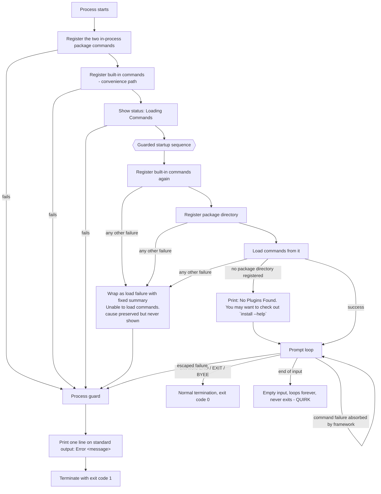

# Feature: Error Handling & Failure Reporting

> Scope note: the subject of this dossier is the **shell** (the Cupcake product). The command framework it is built on is an external dependency; framework behaviour appears here only as a *required capability with described semantics* (see "External technology" and "Interfaces"), and is always cited as `OUT-OF-REPO:`.
>
> Evidence base: subject repo at pinned commit `a05dc6f00d4510ac073f6dd02fbfba2ffb76a5b6`. The working tree carried line-ending-only differences on some files (`git diff --ignore-all-space` is empty); the three files central to this feature — the load-failure error type, the session loop, and the shipping entry point — are unmodified relative to the pinned commit.

---

## Purpose — what user/business problem this solves; who uses it (actors/roles)

The shell is a plugin-hosting interactive command console. Almost everything interesting about it — the commands the user can run — comes from binaries discovered on disk at startup, which is exactly the part most likely to be missing, empty, corrupt, or unreadable on a fresh machine. This feature is the shell's answer to "what does the operator see, and does the shell keep running, when something goes wrong?"

It solves three distinct problems:

1. **First-run friendliness.** A brand-new install has no plugins. That is the *expected* state, not an error. The shell must start anyway, say something helpful, and give the operator a working prompt from which they can go get plugins.
2. **Fail-fast on a broken install.** If startup fails for any reason other than "nothing installed yet", the shell must not limp along in a half-loaded state. It converts the failure into a single named load-failure condition carrying a fixed human summary, keeps the underlying technical cause attached to it, and lets it end the process.
3. **A last-resort process guard.** The shipping executable wraps its entire lifetime in one catch-all. Any condition that reaches it prints one line and terminates the process with a non-zero exit code, so a script or CI job that launched the shell can tell that it failed.

**Actors**

| Actor | Interaction with this feature |
| --- | --- |
| Interactive operator at a terminal | Reads the guidance line, the crash line, and per-command error lines; decides what to do next |
| Script / CI job that launches the shell | Reads only the process exit code (0 vs. 1); the failure text is on standard output, mixed with normal output |
| Plugin author / integrator | Their broken package is what turns a benign startup into a fatal one |
| Developer embedding the session loop in another host | Receives the load-failure condition and chooses their own reporting; the shell's own reporting is only in the shipping executable |

---

## Behavior — what it does, as observable behavior; every distinct operation the feature supports, its inputs, outputs, and side effects

The feature is three guards at three different altitudes, plus a large deliberate gap between the second and the third.

### Operation 1 — Startup guard, benign branch: "no plugins installed"

* **Trigger:** during startup, the command-loading step reports that no package directory was ever successfully registered. *(INFERRED: that this is the branch a fresh machine actually takes. It is the branch reached when the configured package directory (default `.\packages`, relative to the process working directory) does not exist, is not a directory, or resolves outside the restricted root — registration rejects such a path silently, so the failure only surfaces later, as "nothing to load from". Which layer notices first for a given filesystem state is not established by reading alone; see BR-16, BR-17 and open question 1.)* (`src/Xcaciv.Cupcake.Core/Loop.cs:24`, `:42`, `:45`; OUT-OF-REPO: `src/Xcaciv.Command.FileLoader/VerifiedSourceDirectories.cs:82-89` (framework v2.1.2) — registration returns a rejection flag and adds nothing; OUT-OF-REPO: `src/Xcaciv.Command.FileLoader/VerifiedSourceDirectories.cs:100-115` (framework v2.1.2) — the restricted root defaults to the process working directory when none was set, and the shell never sets one; OUT-OF-REPO: `src/Xcaciv.Command/CommandLoader.cs:42-45` (framework v2.1.2) — loading with zero registered directories raises the no-plugins signal.)
* **Output:** exactly one line, written through the presentation port (not directly to the console), rendered by the console adapter in the normal output colours and **verbatim** — the port hands the text straight to the adapter when no pipeline is attached, and its text-encoding hook does nothing, so no escaping or re-wrapping ever alters an error message (OUT-OF-REPO: `src/Xcaciv.Command.Core/AbstractTextIo.cs:67-74` and `:121-125` (framework v2.1.2)):

  ```
  No Plugins Found. You may want to check out `install --help`
  ```

  The backticks are literal characters in the message. (`src/Xcaciv.Cupcake.Core/Loop.cs:47`)
* **Side effects:** none. The underlying signal is swallowed; it is not re-raised, not logged, and its text is never shown.
* **Session outcome: SURVIVES.** Execution falls straight through to the prompt loop. The built-in command set and any commands the host registered in-process before starting are still available, because they were registered *before* the failing load step (`src/Xcaciv.Cupcake.Core/Loop.cs:41`; `src/Xcaciv.Cupcake.Lit/Program.cs:10-11`).
* A code comment marks this as a placeholder for a future "download the first plugin and retry" flow, and shows the alternative (re-raise as a load failure) as commented-out (`src/Xcaciv.Cupcake.Core/Loop.cs:48-49`).

### Operation 2 — Startup guard, fatal branch: wrap anything else as a load failure

* **Trigger:** any other failure arising from the three startup steps — registering built-in commands, registering the package directory, loading commands. (`src/Xcaciv.Cupcake.Core/Loop.cs:41-43`, caught at `:51`)
* **Output from this layer:** nothing is printed here. The condition is replaced by a dedicated **load-failure** condition whose summary text is fixed and context-free:

  ```
  Unable to load commands.
  ```

  The original condition is attached to it as the preserved cause. (`src/Xcaciv.Cupcake.Core/Loop.cs:53`; the load-failure type accepts either a message alone or a message plus a preserved cause — `src/Xcaciv.Cupcake.Core/Exceptions/LoadingException.cs:6-12`)
* **Side effects:** the prompt loop is never entered. The startup status message has already been shown at this point.
* **Session outcome: DOES NOT SURVIVE** — the condition leaves the session loop and reaches the caller (in the shipping executable, Operation 3).

### Operation 3 — Process-level guard: print one line, exit non-zero

* **Trigger:** any condition at all that escapes the whole shell lifetime — building the session, registering the two in-process package commands, or running the session. (`src/Xcaciv.Cupcake.Lit/Program.cs:7-19`)
* **Output:** exactly one line on **standard output** (not an error stream), formatted as the literal word `Error`, one space, then the condition's summary message, then a newline:

  ```
  Error <message>
  ```

  There is no colon, no prefix beyond the word, no timestamp, no severity token, and no stack or cause detail. (`src/Xcaciv.Cupcake.Lit/Program.cs:16`)
* For a load failure from Operation 2 the line is therefore verbatim:

  ```
  Error Unable to load commands.
  ```

  The preserved underlying cause is **never displayed** — it exists on the condition object and is discarded unread.
* **Side effects:** the process is terminated immediately with exit code **1**. (`src/Xcaciv.Cupcake.Lit/Program.cs:18`)
* **Session outcome: PROCESS ENDS.** Normal termination (the operator typed an exit word) leaves the guard untouched and the process ends with exit code 0. *(INFERRED: 0 is the platform default for normal termination; no explicit success exit code appears in the repo.)*

### Operation 4 — The gap: per-command failures are not handled by the shell

Inside the prompt loop, each entered command line is dispatched to the command framework and the shell **blocks** on the result. There is **no guard of any kind** around that dispatch, and none around the prompt read either. (`src/Xcaciv.Cupcake.Core/Loop.cs:56-66`)

Two consequences:

* Anything the framework's own per-command guard already absorbs never reaches the shell — the operator sees the framework's message and keeps their session. This is the common case (see Business rules BR-9/BR-10).
* Anything that escapes the framework's per-command guard travels all the way to Operation 3: one line on standard output and process termination with exit code 1, losing the session and any environment values set during it. The blocking wait also **re-wraps** the escaped condition in a generic multi-error envelope, so the printed summary is the envelope's text with the real message in parentheses, not the real message alone (BR-12).

### Operation 5 — The asymmetry: the non-blocking session entry point has no benign branch

The shell offers a second, non-blocking way to run a session. Its startup guard has **only** the fatal branch — there is no "no plugins" special case, and it also never registers the built-in command set. (`src/Xcaciv.Cupcake.Core/Loop.cs:70-85`, compare `:39-54`)

Therefore a machine with no plugins installed **starts fine on the blocking path and fails on the non-blocking path**: the load-failure condition with the fixed summary `Unable to load commands.` leaves the session instead of a guidance line. *(INFERRED: that it then prints `Error Unable to load commands.` and exits 1. That is what the shipping executable's process guard would do, but the shipping executable never calls this path; what a host that does call it prints, and with what exit code, is that host's decision — `src/Xcaciv.Cupcake.Core/Loop.cs:84` establishes only the condition and its summary.)* The non-blocking path also emits an extra `Done` status message after loading succeeds, which the blocking path does not. (`src/Xcaciv.Cupcake.Core/Loop.cs:87`)

The shipping executable uses the blocking path only (`src/Xcaciv.Cupcake.Lit/Program.cs:12` → `src/Xcaciv.Cupcake.Core/Loop.cs:105-112`), so the asymmetry is latent today and becomes real for any host that adopts the non-blocking entry point.

---

## Business rules & edge cases

Magic values and literals are quoted exactly.

| ID | Rule | Evidence |
| --- | --- | --- |
| BR-1 | The startup sequence is strictly ordered: **(1)** register built-in commands, **(2)** register the package directory, **(3)** load commands from it. All three are inside the same guard. The ordering is what makes the benign branch survivable — built-ins are already registered when step 3 fails. | `src/Xcaciv.Cupcake.Core/Loop.cs:41-43` |
| BR-2 | The "no plugins" signal is caught by **type**, and only that one type is treated as benign. Every other condition falls to the generic branch. Ordering of the two branches matters: benign first, generic second. | `src/Xcaciv.Cupcake.Core/Loop.cs:45`, `:51` |
| BR-3 | The benign guidance text is exactly `` No Plugins Found. You may want to check out `install --help` `` — one line, backticks literal, no trailing period after the backtick. | `src/Xcaciv.Cupcake.Core/Loop.cs:47` |
| BR-4 | The benign branch discards the signal entirely: the framework's own diagnostic text (`No base package directory configured. (Did you set the restricted directory?)`) is never shown to the operator. | `src/Xcaciv.Cupcake.Core/Loop.cs:45-50`; OUT-OF-REPO: `src/Xcaciv.Command/CommandLoader.cs:44` (framework v2.1.2) |
| BR-5 | The fatal branch's summary is the fixed string `Unable to load commands.` — identical in both session entry points, and independent of what actually failed. It carries no path, no plugin name, and no cause text. | `src/Xcaciv.Cupcake.Core/Loop.cs:53`, `:84` |
| BR-6 | The load-failure condition **preserves the underlying cause** by construction (a two-argument form exists precisely for that). Nothing in the shell ever reads it back. | `src/Xcaciv.Cupcake.Core/Exceptions/LoadingException.cs:10-12`; `src/Xcaciv.Cupcake.Lit/Program.cs:16` |
| BR-7 | The process-level printed format is exactly `Error ` + summary message. No colon, no severity label, no cause chain, no exit-code echo. | `src/Xcaciv.Cupcake.Lit/Program.cs:16` |
| BR-8 | Failure exit code is **1**. Termination is immediate on printing. | `src/Xcaciv.Cupcake.Lit/Program.cs:18` |
| BR-9 | An unrecognised command line does **not** reach the shell's error paths at all — the framework absorbs it and prints `Command [<UPPERCASED-NAME>] not found. Try 'HELP'`. Session survives. | OUT-OF-REPO: `src/Xcaciv.Command/CommandExecutor.cs:84-85` (framework v2.1.2); name normalisation to upper case at OUT-OF-REPO: `src/Xcaciv.Command.Interface/CommandDescription.cs:52-64` (framework v2.1.2) |
| BR-10 | A failure *inside* a command's own execution is absorbed by the framework, which emits **two** lines in this order: the output line `Error executing <COMMANDKEY> (see trace for more info)`, then the status line `**Error: <cause message>`. Session survives. The shell contributes nothing to either line. | OUT-OF-REPO: `src/Xcaciv.Command/CommandExecutor.cs:228-230` (framework v2.1.2) |
| BR-11 | A command that reports a non-successful *result* (rather than raising) yields the result's own error text, or, when it has none, `Command [<KEY>] reported failure (CorrelationId: <id>).` Session survives. | OUT-OF-REPO: `src/Xcaciv.Command/CommandExecutor.cs:205-207` (framework v2.1.2) |
| BR-12 | **QUIRK.** The blocking prompt loop waits on asynchronous work for both command dispatch and prompt reads. A condition escaping either is therefore re-wrapped in a generic multi-error envelope before it reaches the process guard, so the printed line reads `Error One or more errors occurred. (<real message>)` rather than the real message alone. | `src/Xcaciv.Cupcake.Core/Loop.cs:62`, `:65`; `src/Xcaciv.Cupcake.Lit/Program.cs:16`. *(INFERRED: the exact envelope wording is runtime-library behaviour, not a repo literal.)* |
| BR-13 | **QUIRK.** The startup status message write (`Loading Commands`) sits **outside** the startup guard. A failure there is not converted into a load failure; it goes straight to the process guard as a wrapped multi-error envelope. | `src/Xcaciv.Cupcake.Core/Loop.cs:37` vs. the guard opening at `:39` |
| BR-14 | **QUIRK.** In the default-startup convenience path, built-in commands are registered **twice** — once before the session starts and once inside the guarded startup sequence. Only the second registration is protected; a failure in the first bypasses the load-failure wrapping and surfaces as a raw `Error <message>`. The presentation adapter is likewise built outside the guard on the same path, so a failure constructing it takes that same raw route. | `src/Xcaciv.Cupcake.Core/Loop.cs:108` and `:41`; adapter construction at `:110` |
| BR-15 | **QUIRK — the guidance names a command that cannot be typed as written.** The install command is registered as sub-command `Install` under root `Package`. The addressable form is `package install …`; typing `install --help` as suggested resolves nothing and produces `Command [INSTALL] not found. Try 'HELP'`. | `src/Xcaciv.Command.Packages/InstallCommand.cs:14-15`; OUT-OF-REPO: `src/Xcaciv.Command.Core/CommandParameters.cs:184-198` (framework v2.1.2) — root attribute becomes the addressable name, register attribute becomes the sub-command key; OUT-OF-REPO: `src/Xcaciv.Command/CommandFactory.cs:43-53` (framework v2.1.2) — the sub-command is matched from the *first argument* |
| BR-16 | **QUIRK — the benign branch does not cover the empty-directory case.** If the package directory *exists* but holds no plugin binaries, the framework raises a *different* signal, carrying the text `No packages found in <full path>.` (the path is expanded to its absolute form first), which is not the benign type. That very common first-run variant is therefore **fatal**: `Error Unable to load commands.`, exit code 1. | `src/Xcaciv.Cupcake.Core/Loop.cs:45` (catches only the one type); OUT-OF-REPO: `src/Xcaciv.Command.FileLoader/Crawler.cs:180` (text and signal type) and `:173` (path expanded first) (framework v2.1.2) |
| BR-17 | **QUIRK — a missing directory is also reachable as a hard failure.** The framework's crawler raises a directory-not-found condition when the base path does not exist. Whether the operator gets the friendly guidance (BR-3) or the fatal line depends on which layer notices first — registration rejecting the path silently gives the benign route; a registered-but-vanished path gives the fatal route. | OUT-OF-REPO: `src/Xcaciv.Command.FileLoader/Crawler.cs:174` (framework v2.1.2); `src/Xcaciv.Cupcake.Core/Loop.cs:45-54` |
| BR-18 | **QUIRK — `see trace for more info` leads nowhere for a normal user.** The per-command error line advertises trace detail. The trace sink only echoes to the console when the *base* verbosity flag is on; that flag defaults to **off**, and the console adapter declares its **own separate** verbosity flag (default **on**) that shadows rather than sets it. Result: status messages print, trace messages do not — they go to the platform debug channel. | `src/Xcaciv.Cupcake.Core/ConsoleContext.cs:31` (own flag, defaults on) and `:90-103` (status uses the own flag); OUT-OF-REPO: `src/Xcaciv.Command.Core/AbstractTextIo.cs:25` (base flag defaults off) and `:167-176` (trace consults the base flag) (framework v2.1.2) |
| BR-19 | **QUIRK — end-of-input is an infinite loop, not an exit.** The prompt read yields an empty string when input is exhausted (redirected/closed input). The loop treats empty as "nothing to run" and loops again; empty is not in the exit-word list. The process spins forever, printing the prompt, producing no error and never terminating. | `src/Xcaciv.Cupcake.Core/ConsoleContext.cs:71` (empty substituted for absent input); `src/Xcaciv.Cupcake.Core/Loop.cs:57`, `:60`, `:65` |
| BR-20 | Exit words are `END`, `EXIT`, `BYEE` (note the double `E`), compared case-insensitively with ordinal semantics. Anything else, including an empty line, keeps the session alive. | `src/Xcaciv.Cupcake.Core/Loop.cs:20`, `:57` |
| BR-21 | All error text — guidance line, per-command lines, and the process crash line — goes to **standard output**. Nothing in the repo ever writes to a standard-error stream. | `src/Xcaciv.Cupcake.Core/ConsoleContext.cs:53-60` and `:90-103`; `src/Xcaciv.Cupcake.Lit/Program.cs:16`; repo-wide search for an error-stream write returns no production hits |
| BR-22 | **QUIRK — colour bleed on the crash line.** The console adapter resets colours after output and status writes, but **not** after painting the prompt. The prompt colours therefore stay in force until the next output or status write resets them, so a crash reported before any such write — the prompt read itself failing, or a dispatch failing before it produces output — prints its line in the prompt's colours rather than default colours. (A crash after the command has already produced output prints in default colours, because that write reset them.) Colour defaults, all overridable by the host: prompt green foreground on black; normal output blue on black; status yellow on dark blue. | `src/Xcaciv.Cupcake.Core/ConsoleContext.cs:66-72` (no reset), vs. `:58` and `:101` (reset present); colour defaults at `:23-30` |
| BR-23 | **QUIRK — the shipped Release build has no place to print.** The Release configuration retargets the shipping executable to a **windowed** (non-console) Windows subsystem binary. *(INFERRED: on Windows a windowed binary has no console attached by default, so every line described in this dossier — including the crash line — is written to a discarded stream and the operator sees nothing at all; only the exit code survives.)* | `src/Xcaciv.Cupcake.Lit/Xcaciv.Cupcake.Lit.csproj:10-12` |
| BR-24 | **QUIRK — no global safety nets.** There is no unhandled-condition hook, no unobserved-background-work hook, and no logging destination wired up anywhere in the shell — no logging library is depended on at all, and the only diagnostic sink referenced anywhere in the repo is the *discard* sink the package-registry path passes (BR-32). A failure on a background worker is not covered by the process guard. The shipping entry point also declares a dependency on the platform's exception-handling facility that it never uses. | `src/Xcaciv.Cupcake.Lit/Program.cs:4` (unused dependency declaration), `:7-19` (only guard in the repo); repo-wide search finds no other guard and no logging dependency in `Directory.Packages.props:6-18` |
| BR-25 | The empty scaffold executable has **no** error handling at all — it prints a fixed greeting and exits. It is not the shipping product. | `src/Xcaciv.Cupcake/Program.cs:1-2` |
| BR-26 | **Coverage gap.** No automated test exercises any of the shell's own failure paths. The session tests drive the loop with a stand-in command engine whose registration and load steps do nothing and therefore never fail, so both startup branches, the load-failure wrapping and the process guard are unreachable from the test suite. What the three session tests actually assert: the two run tests assert only that the engine and environment references are retained after the run returns (termination is implicit — the stand-in prompt answers `END` every time), and the defaults test asserts that the install-command switch is on and that the prompt, exit-word list and package directory are *non-empty* — it never asserts their values, so **not one of the shell's own message literals is protected by a test** — the only message literal any test in the repo pins is the pipeline-unsupported text of BR-37. | `Xcaciv.Cupcake.Core.Tests/LoopTests.cs:69-71` (stand-in registration and load steps do nothing), `:36` (stand-in prompt always answers `END`), `:126-138`, `:140-152`, `:154-162` (the three tests) |
| BR-27 | A **blank or whitespace-only** configured package directory is a *fatal* startup failure, not the benign branch: the registration step rejects it by raising, and that raise is not the benign type, so it falls to the generic branch and becomes `Unable to load commands.` The shipped default (`.\packages`) is non-blank, so this is reachable only for a host that overrides the setting. | `src/Xcaciv.Cupcake.Core/Loop.cs:24` (default), `:42` (registration call), `:51-53` (generic branch); OUT-OF-REPO: `src/Xcaciv.Command/CommandLoader.cs:28` (framework v2.1.2) — blank directory raises `Directory is required` |
| BR-28 | **QUIRK — a package directory outside the working directory is dropped without a word.** Registration accepts a directory only if it resolves *inside* the restricted root; the shell never sets a restricted root, so the root defaults to the process working directory. A valid, populated plugin directory elsewhere on disk is silently rejected and the operator is told `No Plugins Found…` as though nothing were installed. | `src/Xcaciv.Cupcake.Core/Loop.cs:42` (the shell only ever supplies the package directory; no restricted root is ever set anywhere in the repo); OUT-OF-REPO: `src/Xcaciv.Command.FileLoader/VerifiedSourceDirectories.cs:82-89` (rejection is a return value, not a raise) and `:100-115` (root defaults to the working directory) (framework v2.1.2) |
| BR-29 | Error text reaches the terminal **verbatim**. With no pipeline attached the presentation port hands the message straight to the console adapter, and the port's text-encoding hook is inert, so no escaping, truncation or re-wrapping is applied to any message in this dossier. | OUT-OF-REPO: `src/Xcaciv.Command.Core/AbstractTextIo.cs:67-74` (direct hand-off when no pipeline) and `:121-125` (encoding hook does nothing) (framework v2.1.2) |
| BR-30 | The two failure messages the shell's **own in-process commands** produce are fixed English literals raised from the command body; they reach the operator only through the framework's per-command absorption (BR-10), never through the shell's own paths. They are, exactly: `Insecure or invalid package source URL. HTTPS is required.` when the configured package source is not an absolute HTTPS address, and `The 'take' parameter must be a valid integer value.` when the result-count argument is not an integer. | `src/Xcaciv.Command.Packages/SearchCommand.cs:32-34`, `:42-45` |
| BR-31 | **QUIRK — invalid values are silently corrected instead of reported.** In the same command that raises for the two cases above, a result count outside **1–100** is clamped into range, a search term longer than **200** characters is truncated to 200, and a blank search term produces empty output. None of the three produces any message; the operator cannot tell that what they asked for was changed. | `src/Xcaciv.Command.Packages/SearchCommand.cs:46` (clamp 1–100), `:55-58` (truncate at 200), `:50-54` (blank term returns empty) |
| BR-32 | **QUIRK — registry-side diagnostics are discarded by construction.** The package-registry client takes a diagnostic sink; every call site in the repo passes the *discard* sink. Whatever the registry reports — feed errors, retries, warnings — is dropped before it can become operator-visible text. | `src/Xcaciv.Command.Packages/NugetWrapper.cs:23`, `:46`, `:55`, `:83` |
| BR-33 | An **absent package is not a failure**: a lookup for a package name that does not exist yields an empty result set, with no message and no raised condition. This is the only absence-handling behaviour in the repo that a test pins down. | `src/Xcaciv.Command.Packages/NugetWrapper.cs:34-50`; test `Xcaciv.Command.PackagesTests/NugetWrapperTests.cs:67-80` |
| BR-34 | **Coverage gap, second order — the presentation tests do not pin the flags this feature depends on.** The test named for the adapter's verbosity *default* constructs the adapter with the flag explicitly on and then asserts it is on, so the default itself (BR-18) is unprotected; and the test named for the prompt read deliberately does not call it, recording in a comment that console input cannot be read under test — so the end-of-input hang (BR-19) is untested by construction. | `Xcaciv.Cupcake.Core.Tests/ConsoleContextTests.cs:7-12` (flag passed in, not defaulted), `:14-23` (prompt read skipped; vacuous assertion) |
| BR-35 | **Coverage gap, third order — the raise sites this dossier cites have no tests and the suite that covers them needs the network.** All nine tests of the package-search command are happy-path and reach the live public registry; neither of its two raise sites (BR-30) is exercised, and the suite cannot pass offline. | `Xcaciv.Command.PackagesTests/SearchCommandTests.cs:9-138`; `Xcaciv.Command.PackagesTests/NugetWrapperTests.cs:17`, `:37`, `:57`, `:72`, `:88` (live registry address in every test) |
| BR-36 | **QUIRK — the command the guidance line points at does nothing, and says so as ordinary output.** The install command is a stub: it performs no installation and returns the text `Not installing ` followed by its arguments joined with commas (or `Not installing <piped chunk> ` plus the joined arguments when fed from a pipeline). That text goes out on the **normal output channel**, with no error marking, no status line and no effect on the exit code — a caller cannot distinguish "did not install" from "installed". So the one piece of remediation guidance the product offers (BR-3) points at a command that both cannot be typed as written (BR-15) and would not install anything if it could. | `src/Xcaciv.Command.Packages/InstallCommand.cs:19-27` |
| BR-37 | An **unsupported operation is also reported as ordinary output**, not as a failure: feeding the search command from a pipeline returns `Unsupported search method for <chunk> (piped)` immediately followed — with no separator — by its arguments joined with commas, on the normal output channel. This is the only message literal in the repository that a test pins. | `src/Xcaciv.Command.Packages/SearchCommand.cs:88-91`; test `Xcaciv.Command.PackagesTests/SearchCommandTests.cs:128-138` |

### Magic values with meaning

| Value | Meaning | Evidence |
| --- | --- | --- |
| `1` | Process exit code on any escaped failure. The only non-zero code the shell produces. | `src/Xcaciv.Cupcake.Lit/Program.cs:18` |
| `Unable to load commands.` | The fixed, cause-independent summary of every non-benign startup failure. | `src/Xcaciv.Cupcake.Core/Loop.cs:53`, `:84` |
| `` No Plugins Found. You may want to check out `install --help` `` | The one and only piece of remediation guidance the shell offers. | `src/Xcaciv.Cupcake.Core/Loop.cs:47` |
| `Error ` (word + single space) | The entire structure of the process-level crash format. | `src/Xcaciv.Cupcake.Lit/Program.cs:16` |
| `Loading Commands` | Status shown immediately before the guarded startup sequence; its presence on screen with no following prompt is the operator's cue that startup failed. | `src/Xcaciv.Cupcake.Core/Loop.cs:37` |
| `Done` | Status shown after a successful load — **non-blocking entry point only**; the blocking one never prints it. | `src/Xcaciv.Cupcake.Core/Loop.cs:87` |
| `.\packages` | Default package directory whose absence drives the benign branch. Relative to the process working directory. | `src/Xcaciv.Cupcake.Core/Loop.cs:24` |
| `Ɛ> ` | The prompt string; its appearance is the operator's signal that the session survived startup. Trailing space is part of it. | `src/Xcaciv.Cupcake.Core/Loop.cs:16` |
| `bin` | Sub-directory under each package folder that the framework searches; it is the framework's default, and the shell never overrides it. | OUT-OF-REPO: `src/Xcaciv.Command/CommandController.cs:169` (framework v2.1.2) |
| `*.dll` | File pattern (the platform's compiled-library extension) matched when searching for plugin binaries; finding **no** match is what produces the *fatal* empty-directory signal of BR-16. | OUT-OF-REPO: `src/Xcaciv.Command.FileLoader/Crawler.cs:20` (pattern), `:178-180` (no match → signal) (framework v2.1.2) |
| `50` | Framework threshold on the number of **matching plugin binaries discovered** (not folders): the crawl goes parallel only when the count is *strictly greater than* 50, otherwise it is sequential. Relevant here because it decides whether a load failure originates on a background worker. | OUT-OF-REPO: `src/Xcaciv.Command.FileLoader/Crawler.cs:18` (value), `:183` (strictly-greater-than comparison) (framework v2.1.2) |
| `1`–`100`, `200` | Bounds the in-process search command applies **silently**: result count clamped into 1–100, search term truncated at 200 characters (BR-31). Neither bound is ever reported. | `src/Xcaciv.Command.Packages/SearchCommand.cs:46`, `:55-58` |

---

## Workflows & states

### The complete failure-mode table

| # | Trigger | Where it is caught | What the user observes | Session survives? | Exit code | Evidence |
| --- | --- | --- | --- | --- | --- | --- |
| 1 | Package directory missing / not registerable → nothing to load from | Startup guard, benign branch | `Loading Commands`, then `` No Plugins Found. You may want to check out `install --help` ``, then the `Ɛ> ` prompt | **Yes** — built-ins and in-process commands work | 0 on normal exit | `src/Xcaciv.Cupcake.Core/Loop.cs:37`, `:45-50` |
| 2 | Package directory exists but contains no plugin binaries | **Not** the benign branch — falls to the fatal branch | `Loading Commands`, then `Error Unable to load commands.` | **No** | 1 | `src/Xcaciv.Cupcake.Core/Loop.cs:51-54`; OUT-OF-REPO: `src/Xcaciv.Command.FileLoader/Crawler.cs:180` (framework v2.1.2) |
| 3 | Registered package path vanished / unreadable | Fatal branch | `Loading Commands`, then `Error Unable to load commands.` | **No** | 1 | `src/Xcaciv.Cupcake.Core/Loop.cs:51-54`; OUT-OF-REPO: `src/Xcaciv.Command.FileLoader/Crawler.cs:174` (framework v2.1.2) |
| 4 | A plugin binary fails to load, or a plugin's command declarations are invalid | Fatal branch | `Error Unable to load commands.` — no plugin name, no path, no cause | **No** | 1 | `src/Xcaciv.Cupcake.Core/Loop.cs:43`, `:51-54` |
| 5 | Registering built-in commands fails inside the guarded sequence | Fatal branch | `Error Unable to load commands.` | **No** | 1 | `src/Xcaciv.Cupcake.Core/Loop.cs:41`, `:51-54` |
| 6 | Registering built-in commands, or building the presentation adapter, fails in the default-startup path (before the session starts) | **Not** the startup guard — only the process guard | `Error <raw cause message>` (no load-failure wrapping) | **No** | 1 | `src/Xcaciv.Cupcake.Core/Loop.cs:108` (registration), `:110` (adapter construction); `src/Xcaciv.Cupcake.Lit/Program.cs:14-18` |
| 7 | Registering one of the two in-process package commands fails at the entry point | Process guard only | `Error <raw cause message>` | **No** | 1 | `src/Xcaciv.Cupcake.Lit/Program.cs:10-11`, `:14-18` |
| 8 | Writing the `Loading Commands` status fails | Outside the startup guard → process guard | `Error One or more errors occurred. (<cause>)` *(INFERRED wording)* | **No** | 1 | `src/Xcaciv.Cupcake.Core/Loop.cs:37` |
| 9 | Operator types an unknown command | Framework, entirely | `Command [<NAME>] not found. Try 'HELP'` | **Yes** | — | OUT-OF-REPO: `src/Xcaciv.Command/CommandExecutor.cs:84-85` (framework v2.1.2) |
| 10 | A command raises while executing (e.g. a package command rejecting a non-HTTPS source) | Framework's per-command guard | Two lines: `Error executing <KEY> (see trace for more info)` then `**Error: <cause message>`. The trace detail is **not** shown (BR-18) | **Yes** | — | OUT-OF-REPO: `src/Xcaciv.Command/CommandExecutor.cs:228-230` (framework v2.1.2); example raiser: `src/Xcaciv.Command.Packages/SearchCommand.cs:34`, `:44` |
| 11 | A command returns a failure result rather than raising | Framework | The result's own error text, or `Command [<KEY>] reported failure (CorrelationId: <id>).` | **Yes** | — | OUT-OF-REPO: `src/Xcaciv.Command/CommandExecutor.cs:205-207` (framework v2.1.2) |
| 12 | A failure **escapes** the framework's per-command guard (child-context creation, pipeline stage cancellation/backpressure, argument guards) | **Nothing in the shell** — straight to the process guard | `Error One or more errors occurred. (<real message>)` *(INFERRED wording)*, mid-session, session and environment values lost | **No** | 1 | `src/Xcaciv.Cupcake.Core/Loop.cs:62` (no guard); OUT-OF-REPO: `src/Xcaciv.Command/CommandController.cs:221-246` and `src/Xcaciv.Command/PipelineExecutor.cs:34-60`, `:144-158`, `:200` (framework v2.1.2) |
| 13 | The prompt read fails | No guard | `Error One or more errors occurred. (<cause>)` *(INFERRED wording)* | **No** | 1 | `src/Xcaciv.Cupcake.Core/Loop.cs:65` |
| 14 | Input stream reaches end of input (redirected/closed input) | Nothing — not treated as a failure | Prompt repeats forever, no output, no error, process never terminates | n/a — **hangs** | none | `src/Xcaciv.Cupcake.Core/ConsoleContext.cs:71`; `src/Xcaciv.Cupcake.Core/Loop.cs:57-66` |
| 15 | **Non-blocking entry point** + no plugins installed | Only the fatal branch exists there | The load-failure condition with summary `Unable to load commands.` leaves the session; *(INFERRED)* a host with the shipping executable's guard would print `Error Unable to load commands.` | **No** | *(INFERRED)* 1 — host-dependent; the shipping executable never uses this path | `src/Xcaciv.Cupcake.Core/Loop.cs:70-85`, `:84` |
| 16 | Any of the above, in the shipped **Release** (windowed) build | Same code paths | *(INFERRED)* nothing visible — no console is attached; only the exit code is observable | as above | as above | `src/Xcaciv.Cupcake.Lit/Xcaciv.Cupcake.Lit.csproj:10-12` |
| 17 | A failure on a background worker outside the guarded call chain | Nothing | *(INFERRED)* platform default handling; the shell's guard does not apply | — | — | `src/Xcaciv.Cupcake.Lit/Program.cs:7-19` (only guard in repo) |
| 18 | Configured package directory is blank / whitespace only | Fatal branch (the rejection is a raise, and not the benign type) | `Loading Commands`, then `Error Unable to load commands.` — no guidance line | **No** | 1 | `src/Xcaciv.Cupcake.Core/Loop.cs:42`, `:51-54`; OUT-OF-REPO: `src/Xcaciv.Command/CommandLoader.cs:28` (framework v2.1.2) |
| 19 | Configured package directory exists and is populated, but resolves outside the process working directory | Startup guard, benign branch (registration rejected silently) | `Loading Commands`, then `` No Plugins Found. You may want to check out `install --help` ``, then the prompt — the plugins are simply invisible | **Yes**, without its plugins | 0 on normal exit | `src/Xcaciv.Cupcake.Core/Loop.cs:42`, `:45-50`; OUT-OF-REPO: `src/Xcaciv.Command.FileLoader/VerifiedSourceDirectories.cs:82-89`, `:100-115` (framework v2.1.2) |
| 20 | Operator acts on the guidance and runs the install command (in its addressable form, `package install <name>`) | Nothing — the command is a stub that cannot fail | Ordinary output line `Not installing <name>`; nothing is installed, no error marking, exit code unaffected | **Yes** | — | `src/Xcaciv.Command.Packages/InstallCommand.cs:19-22` (BR-36 — QUIRK) |
| 21 | Operator pipes input into the search command | Nothing — the unsupported path returns text | Ordinary output line `Unsupported search method for <chunk> (piped)<comma-joined arguments>` | **Yes** | — | `src/Xcaciv.Command.Packages/SearchCommand.cs:88-91` (BR-37) |

### Startup flow



### State machine

| State | Entered when | Leaves to |
| --- | --- | --- |
| `Starting` | Process launch | `Loading` |
| `Loading` | Startup status shown | `Degraded` (benign branch), `Ready` (success), `Failing` (fatal branch) |
| `Degraded` | Benign no-plugins branch taken; guidance printed | `Ready` immediately — this is a message, not a distinct runtime mode; only the *set of available commands* differs |
| `Ready` | Prompt loop running | `Ready` (any absorbed failure), `Failing` (escaped failure), `Ending` (exit word), `Spinning` (end of input) |
| `Spinning` | Input exhausted | never — QUIRK, no timeout, no exit | 
| `Failing` | Any condition reaches the process guard | `Terminated(1)` |
| `Ending` | Exit word entered | `Terminated(0)` |

There are **no timeouts, no retries, and no back-off anywhere in the shell**. The framework offers a per-pipeline-stage timeout, but it is **switched off by default** (the setting means "no limit" at its default value) and the shell never sets it, so in the shipped configuration there is no timeout anywhere in the picture: a hung command hangs the session forever (OUT-OF-REPO: `src/Xcaciv.Command.Interface/PipelineConfiguration.cs:29-50` (framework v2.1.2) — stage, execution, output-byte and output-item limits all default to "no limit"; `src/Xcaciv.Command/PipelineExecutor.cs:129-158` (framework v2.1.2) — the timeout is applied only when the setting is above zero; nothing in the subject repo ever assigns pipeline settings).

---

## Data — entities this feature owns, their fields, relationships, lifecycle

The feature owns exactly one entity.

### `Load failure` (the shell's only error type)

| Field | Type (generic) | Constraints | Notes |
| --- | --- | --- | --- |
| Summary message | text | Always the literal `Unable to load commands.` when the shell creates it; the type itself accepts any text | The only thing ever shown to the operator | 
| Preserved cause | a nested error condition, optional | Present on every instance the shell creates; absent when constructed message-only | **Never read back** anywhere in the repo |

* **Created:** at the moment a non-benign startup condition is caught, in either session entry point (`src/Xcaciv.Cupcake.Core/Loop.cs:53`, `:84`).
* **Mutated:** nothing anywhere in the repo alters it after creation; it is created, carried outward, read once and dropped. *(INFERRED that it is strictly immutable — the observed fact is only that no code path writes to it.)*
* **Deleted / consumed:** at the process guard, where only its summary is read and the object is then discarded along with the process (`src/Xcaciv.Cupcake.Lit/Program.cs:16-18`).
* **Relationships:** wraps exactly one underlying condition, which may itself be one of the framework's load-related signals (no-plugins, no-packages-in-directory, directory-not-found, invalid-configuration) or any general platform condition.
* **Construction forms offered:** summary alone, or summary plus preserved cause (`src/Xcaciv.Cupcake.Core/Exceptions/LoadingException.cs:6-12`). Only the second is ever used by the shell, in both session entry points (`src/Xcaciv.Cupcake.Core/Loop.cs:53`, `:84`).
* **Not owned:** exit codes and printed strings are not persisted anywhere; there is no error log, no error store, no correlation identifier of the shell's own, and no error history across sessions.

---

## Interfaces

### Consumed from other features

| From | Semantic contract this feature relies on |
| --- | --- |
| **Plugin Discovery & Command Registration** | Must distinguish, by *distinct signal type*, "no plugin source was ever registered" (benign) from every other loading problem (fatal). This distinction is the entire basis of the benign branch. A reimplementation that collapses them into one generic failure will make first-run fatal. |
| **Console Presentation & Interaction** | Must accept a one-line message for display and a status line, both without the caller knowing anything about the terminal. This is why the guidance line is testable with a stand-in and why the shell never touches the terminal directly. The adapter also decides colour and that everything lands on standard output. |
| **Interactive Shell Session** | Owns the prompt loop this feature guards on both sides (before it, at process level) but explicitly **not inside**. |
| **Configuration & Settings** | Supplies the package directory path whose absence drives the benign branch, and the exit-word list that provides the only clean way out. |
| **Command Extensibility Contract** (via the framework) | Must absorb per-command failures itself and report them to the presentation port; the shell provides no in-loop guard. Anything not absorbed there becomes fatal. |
| **Shell Distribution & Entry Points** | Owns the outermost guard and the exit code — the only machine-readable failure signal the product emits. |
| **Package Search Command** / **Package Install Command** (in-process, shipped with the shell) | Raise their own fixed failure text for rejected inputs and depend entirely on the framework's absorption to display it; they silently correct out-of-range values rather than reporting them, and they report an absent package as an empty result (BR-30, BR-31, BR-33). This feature contributes no text to any of that — it only guarantees the session survives it, and that the two commands' *registration* failures at the entry point are caught one level higher (failure mode 7). |
| **Package Registry Client** | Accepts a diagnostic sink; this feature's observability story depends on the fact that the discard sink is always the one passed (BR-32). |

### Exposed to other features

| To | Contract |
| --- | --- |
| Any host embedding the session | A single named **load-failure** condition with a fixed summary and a preserved cause. Hosts are expected to catch it; the shipping executable does so only via its catch-all. |
| Scripts / CI | Exit code **1** on any escaped failure, exit code 0 otherwise. This is the only reliable signal — the text is on standard output and interleaved with normal output. |
| Operator | Three distinct visible shapes: the guidance line, the two-line per-command failure, and the one-line crash. Nothing else. |

---

## External technology

| Generic capability | Protocol/standard if any | What the source used | Notes for reimplementer |
| --- | --- | --- | --- |
| Managed runtime with structured exceptions carrying a message and a preserved inner cause | — | C# on .NET 8 (`net8.0`); one Release configuration retargets `net6.0-windows` | The load-failure type derives from the platform base exception and uses the standard `(message, innerException)` constructor. Any language with chained exceptions or wrapped errors suffices. |
| Console text and colour output, and a line-oriented console read | — | `System.Console` (`WriteLine`, `Write`, `ReadLine`, `ForegroundColor`/`BackgroundColor`/`ResetColor`) in `src/Xcaciv.Cupcake.Core/ConsoleContext.cs:53-103`, plus the direct `Console.WriteLine` of the crash line in `src/Xcaciv.Cupcake.Lit/Program.cs:16` | All error text goes to **standard output**, never standard error. Console read returns "no more input" at EOF, which the adapter converts to an empty string (BR-19) — a substitution the reimplementer must reproduce to reproduce the hang, or deliberately not reproduce to fix it. The unprompted colour state carries across writes, which is what produces the colour bleed of BR-22. |
| Process termination with an explicit exit code | POSIX/Windows process exit code | `System.Environment.Exit(1)` in `src/Xcaciv.Cupcake.Lit/Program.cs:18` | Immediate termination; nothing runs after it. |
| Asynchronous task model consumed synchronously | — | .NET `Task` with blocking `Wait()`/`.Result` in `src/Xcaciv.Cupcake.Core/Loop.cs:37,62,65` | **Critical for fidelity:** the blocking wait re-wraps an escaped error in an aggregate envelope, changing the message the operator sees (BR-12). A reimplementation using plain synchronous calls will print a *different* (cleaner) message. Decide deliberately which you want. |
| Pluggable command framework: plugin loading, command-line parsing, `\|` pipelines, generated help, built-in commands, per-command error absorption | — | `Xcaciv.Command` 2.1.1 / `Xcaciv.Command.Core` 2.1.0 / `Xcaciv.Command.Interface` 2.1.0, pinned centrally in `Directory.Packages.props:8-10` and `src/Directory.Packages.props:8-10`. Semantics established from the v2.1.2 reference clone. | **Not on the public package feed** — the public index returns 404 for this package (re-checked during this review). The repository's own feed configuration declares three sources — the public index, an organisation-scoped hosted feed, and a **local folder feed** named by an environment variable — and maps every package whose name starts with the framework's prefix to the *local folder feed*, so the framework binaries are expected to be supplied out-of-band on the build machine (`NuGet.config:4-20`; the same file is the only feed configuration in the repo). Required semantics for *this* feature: (a) a distinct "no plugin source registered" signal, text `No base package directory configured. (Did you set the restricted directory?)` (OUT-OF-REPO: `src/Xcaciv.Command/CommandLoader.cs:44`); (b) a *different* "directory registered but empty" signal, text `No packages found in <path>.` (OUT-OF-REPO: `src/Xcaciv.Command.FileLoader/Crawler.cs:180`); (c) a directory-not-found signal (OUT-OF-REPO: `Crawler.cs:174`); (d) per-command absorption emitting `Error executing <KEY> (see trace for more info)` plus status `**Error: <msg>` (OUT-OF-REPO: `src/Xcaciv.Command/CommandExecutor.cs:228-229`); (e) unknown-command text `Command [<KEY>] not found. Try 'HELP'` (OUT-OF-REPO: `CommandExecutor.cs:84-85`); (f) silent registration rejection for an unverifiable directory (OUT-OF-REPO: `src/Xcaciv.Command.FileLoader/VerifiedSourceDirectories.cs:82-89`). |
| Platform debug/trace sink | — | `System.Diagnostics.Trace` / `Debug` (used by the framework's trace path and by the console adapter's non-verbose status path, `src/Xcaciv.Cupcake.Core/ConsoleContext.cs:94`) | This is where the "see trace for more info" detail actually goes, and it is invisible in a normal run (BR-18). |
| Windowed (non-console) executable subsystem | — | `WinExe` output type in the Release configuration, `src/Xcaciv.Cupcake.Lit/Xcaciv.Cupcake.Lit.csproj:11` | *(INFERRED)* Suppresses all console output in the shipped build. A reimplementation should almost certainly not replicate this. |
| Package-registry client (used by the two in-process package commands whose raised failures are the worked example of the per-command absorption path) | Package-feed HTTP API over HTTPS | `NuGet.Protocol` 7.0.1 (`Directory.Packages.props:7`), wrapped in `src/Xcaciv.Command.Packages/NugetWrapper.cs` | Two behaviours matter to *this* feature: the client takes a diagnostic sink and the repo always hands it a **discard** sink, so registry diagnostics never become operator-visible text (BR-32); and an absent package is returned as an **empty result**, not an error (BR-33). The default source address, used when nothing is configured, is the public package index `https://api.nuget.org/v3/index.json` (`src/Xcaciv.Command.Packages/SearchCommand.cs:28`), and a source that is not absolute-HTTPS is rejected by raising (BR-30). |
| Unit test framework (for the acceptance criteria below) | — | xUnit 2.9.3 (`Directory.Packages.props:16`) | The shell's failure paths have **no** tests today (BR-26, BR-34, BR-35); the tests that do exist for the package commands require live network access to the public registry, so the suite is not runnable offline. |

---

## Error handling

*(The full trigger → catch site → observation → survival table is in "Workflows & states". This section states what the reimplementer must guarantee.)*

**Guaranteed observable contract**

1. The only remediation guidance the product ever gives is the single benign line at startup. It must be reproduced character-for-character, backticks included:
   `` No Plugins Found. You may want to check out `install --help` ``
2. The only fatal startup summary is `Unable to load commands.` — the same string regardless of cause, in both session entry points.
3. The only crash format is `Error ` followed immediately by the summary message. One line, standard output.
4. The only non-zero exit code is `1`.
5. Underlying causes are structurally preserved and behaviourally invisible. A reimplementation that helpfully prints the cause chain is **not** faithful (though it is better software — flag it as an intentional deviation).
6. Everything the framework absorbs (unknown command, command raising, command reporting failure) leaves the session alive; everything else kills the process.
7. Every message described here reaches the terminal **verbatim** — no escaping, no wrapping, no truncation on the presentation path (BR-29).
8. Invalid *values* handed to the in-process commands are silently corrected, not reported (BR-31), and an absent package is an empty result rather than a failure (BR-33). A reimplementation that starts reporting these is more helpful and less faithful; flag it as an intentional deviation.
9. Work the product does not actually perform (installation, BR-36) and operations it does not support (piping into search, BR-37) are announced as **ordinary output**, never as failures, and never affect the exit code.

**Deliberate non-handling — do not "fix" silently**

* No guard around command dispatch inside the prompt loop (`src/Xcaciv.Cupcake.Core/Loop.cs:62`).
* No guard around the prompt read (`:65`).
* No guard around the pre-loop status write (`:37`).
* No benign no-plugins branch in the non-blocking entry point (`:77-85`).
* No global unhandled-condition or background-failure hook anywhere (`src/Xcaciv.Cupcake.Lit/Program.cs:7-19`).
* No use of a standard-error stream anywhere.
* No error logging, no error persistence, no correlation identifier of the shell's own.
* No timeout on a command that never returns — the framework's stage timeout exists but is left at its "no limit" default and is never configured by the shell (see "Workflows & states").
* No message when a supplied value is silently clamped or truncated (`src/Xcaciv.Command.Packages/SearchCommand.cs:46`, `:55-58`).
* No surfacing of registry-side diagnostics — the discard sink is passed deliberately at every call site (`src/Xcaciv.Command.Packages/NugetWrapper.cs:23`, `:46`, `:55`, `:83`).
* No distinction between "did the work" and "did nothing": the install command's stub answer travels on the same channel as a success would (`src/Xcaciv.Command.Packages/InstallCommand.cs:19-27`).

---

## Non-functional observations

* **No caching, no pagination, no retry, no back-off, no timeout** anywhere in this feature. Startup is attempted once; failure is terminal.
* **Concurrency:** the shell is single-threaded in effect — the blocking prompt loop serialises everything. The framework crawls package folders in parallel only when it has discovered *more than 50* matching plugin binaries, otherwise sequentially (OUT-OF-REPO: `src/Xcaciv.Command.FileLoader/Crawler.cs:18` (value) and `:183` (comparison) (framework v2.1.2)), so a startup failure may originate on a worker. *(INFERRED: that the shell's guard still catches such a failure — it does so if and only if the framework surfaces the worker's failure synchronously out of the loading call, which the reference clone's structure suggests but which was not executed here.)*
* **Permissions:** none checked by this feature. The framework silently rejects a package directory it cannot verify — including any directory resolving outside the restricted root, which defaults to the process working directory because the shell never sets one — and that rejection is what routes the common case to the benign branch (OUT-OF-REPO: `src/Xcaciv.Command.FileLoader/VerifiedSourceDirectories.cs:66-89` and `:100-115` (framework v2.1.2); BR-28).
* **Testability:** the design deliberately routes all presentation through a port so the session — and therefore the benign guidance line — is exercisable with a stand-in (`Xcaciv.Cupcake.Core.Tests/LoopTests.cs:8-122` hand-implements the full port surface). That affordance is unused for failures: the stand-in command engine cannot fail, so no failure path has any coverage (BR-26), the two flags this feature depends on are not actually pinned by the presentation tests (BR-34), and the tests that touch the raise sites need live network (BR-35).
* **i18n:** none. Every message is a hard-coded English literal inline at its use site; there is no resource file anywhere in the repository (repo-wide search for resource files returns zero), no message catalogue, and no formatting indirection. The startup guidance and the fatal summary would each need extracting.
* **Accessibility:** error text is distinguished from normal text **only by colour** in the console adapter (blue output vs. yellow-on-dark-blue status vs. green prompt) and by the word `Error` on the crash line. There is no severity prefix on the per-command status line beyond `**Error:` and no screen-reader-friendly structure. Colour is never restored after the prompt is painted, so a crash line can inherit prompt colours (BR-22).
* **Performance-motivated code:** none in this feature. The one performance-shaped decision — consuming the asynchronous framework by blocking — is a simplicity choice, and its side effect is the message-wrapping quirk (BR-12).
* **Observability:** effectively zero. No log file, no structured event, no exit-code taxonomy beyond 0/1. A CI job can tell *that* the shell failed and nothing about *why*, because the single most informative artefact (the preserved cause) is discarded. Where a diagnostic sink *is* available — the framework's trace channel and the package-registry client's log sink — the shell either shadows the flag that would echo it (BR-18) or passes a discard sink (BR-32), so both are dark by default.

---

## Acceptance criteria

1. **Given** a fresh installation where the configured package directory does not exist, **when** the shell starts, **then** it prints `Loading Commands`, then exactly `` No Plugins Found. You may want to check out `install --help` ``, then the `Ɛ> ` prompt, and the process stays alive. (`src/Xcaciv.Cupcake.Core/Loop.cs:37,45-50,16`)
2. **Given** that same no-plugins startup, **when** the operator types `SAY hello`, **then** the built-in command runs normally, proving the built-in set was registered before the failing load step. (`src/Xcaciv.Cupcake.Core/Loop.cs:41-43`)
3. **Given** that same no-plugins startup, **when** the operator types `END` — and, repeating the run, `EXIT`, `BYEE`, and each of those in lower case — **then** in every one of the six runs the process terminates with exit code 0 and prints no error line; and **when** the operator instead types `BYE` (single `E`) or a blank line, **then** the session stays alive. (BR-20; `src/Xcaciv.Cupcake.Core/Loop.cs:20,57,60`; `src/Xcaciv.Cupcake.Lit/Program.cs:7-19`. Note the test suite covers only `END`, via the stand-in prompt at `Xcaciv.Cupcake.Core.Tests/LoopTests.cs:36`.)
4. **Given** a package directory that exists but contains no plugin binaries, **when** the shell starts, **then** it prints `Loading Commands` followed by exactly `Error Unable to load commands.` and terminates with exit code 1 — **no** prompt and **no** guidance line. (BR-16; `src/Xcaciv.Cupcake.Core/Loop.cs:51-54`; `src/Xcaciv.Cupcake.Lit/Program.cs:16-18`)
5. **Given** a package directory containing a plugin binary that cannot be loaded, **when** the shell starts, **then** the printed line is still exactly `Error Unable to load commands.` — it must **not** name the plugin, the path, or the underlying cause. (BR-5, BR-6)
6. **Given** any fatal startup, **when** the process ends, **then** the error text appeared on **standard output** and standard error is empty. (BR-21)
7. **Given** a running session, **when** the operator types a command name that is not registered, **then** the output is `Command [<UPPERCASED-NAME>] not found. Try 'HELP'` and the prompt returns — no crash, exit code still pending. (BR-9)
8. **Given** a running session, **when** the operator runs `package search something` with a non-HTTPS package source configured, **then** two lines appear in order — `Error executing PACKAGE (see trace for more info)` then `**Error: Insecure or invalid package source URL. HTTPS is required.` — and the prompt returns. (BR-10, BR-30; `src/Xcaciv.Command.Packages/SearchCommand.cs:32-34`. The `PACKAGE` in the first line is the entered command word normalised to upper case — the root name under which both package commands are registered: `src/Xcaciv.Command.Packages/SearchCommand.cs:11`; OUT-OF-REPO: `src/Xcaciv.Command.Interface/CommandDescription.cs:52-64` (framework v2.1.2).)
9. **Given** the previous scenario, **when** the operator looks for the promised trace detail, **then** none is visible on the console (it goes to the platform debug channel). (BR-18)
10. **Given** a running session, **when** a failure escapes the framework's per-command guard, **then** the process prints one `Error …` line whose message is the aggregate envelope wording with the real message in parentheses, and terminates with exit code 1, losing the session. (BR-12, failure mode 12)
11. **Given** the shell is started with its input redirected from a file that ends, **when** input is exhausted, **then** the process neither exits nor errors — it loops on the prompt indefinitely. (BR-19 — QUIRK; assert the process is still alive after a bounded wait)
12. **Given** the guidance line advises `install --help`, **when** the operator types exactly `install --help` at the prompt, **then** they get `Command [INSTALL] not found. Try 'HELP'`; the working form is `package install`. (BR-15 — QUIRK)
13. **Given** a host that starts the session through the **non-blocking** entry point on a machine with no plugins installed, **when** startup runs, **then** the load-failure condition with summary `Unable to load commands.` leaves the session instead of a guidance line — i.e. the benign case is fatal there, unlike the blocking path — and, **when** that host reports it the way the shipping executable does, **then** the observable result is `Error Unable to load commands.` and exit code 1. (Operation 5; `src/Xcaciv.Cupcake.Core/Loop.cs:70-85`, `:84`)
14. **Given** a successful startup through the **non-blocking** entry point, **when** loading completes, **then** a `Done` status line appears — a line the blocking path never emits. (`src/Xcaciv.Cupcake.Core/Loop.cs:87`)
15. **Given** a crash occurring at the prompt with nothing written since the prompt was painted (the prompt read failing, or a dispatch failing before it produces any output), **when** the `Error …` line is printed, **then** it renders in the prompt's colours (green foreground on black), because the adapter resets colour after output and status writes but not after painting the prompt. (BR-22 — QUIRK; `src/Xcaciv.Cupcake.Core/ConsoleContext.cs:66-72` vs. `:58`, `:101`)
16. **Given** a command that reports a failure *result* rather than raising, and that supplies no message of its own, **when** it runs, **then** the operator sees exactly `Command [<KEY>] reported failure (CorrelationId: <id>).` — a fresh identifier per run — and the session survives. (BR-11)
17. **Given** a host that sets the configured package directory to a blank string, **when** the shell starts, **then** it prints `Loading Commands` then exactly `Error Unable to load commands.` and exits 1 — the benign guidance line must **not** appear. (BR-27, failure mode 18)
18. **Given** a populated, readable plugin directory located outside the process working directory, **when** the shell starts with that directory configured, **then** the operator sees the benign guidance line and a live prompt, and **none** of those plugins' commands is available — the rejection is never reported. (BR-28 — QUIRK, failure mode 19)
19. **Given** a running session, **when** the operator searches the package registry for a name that exists nowhere, **then** the result is empty output with no error line and no status line, and the session survives — absence is not a failure. (BR-33; `Xcaciv.Command.PackagesTests/NugetWrapperTests.cs:67-80`)
20. **Given** a running session, **when** the operator asks the search command for 5000 results, or supplies a search term longer than 200 characters, **then** the command succeeds, silently returning at most 100 results / searching only the first 200 characters, and **no** message anywhere tells the operator the request was altered. (BR-31 — QUIRK)
21. **Given** a running session, **when** any error line at all is produced, **then** its text is byte-for-byte what this dossier quotes — no escaping, no quoting, no wrapping is applied on the way to the terminal. (BR-29)
22. **Given** an operator who follows the startup guidance, **when** they run the install command in its addressable form (`package install somepackage`), **then** the only observable result is the ordinary output line `Not installing somepackage` — nothing is fetched, nothing is written to the package directory, no error line or status line appears, and the exit code is unaffected. (BR-36 — QUIRK)
23. **Given** a running session, **when** the operator pipes output into the search command, **then** the ordinary output line `Unsupported search method for <chunk> (piped)` plus the comma-joined arguments appears — on the normal channel, with no error marking — and the session survives. (BR-37; the one message literal a test pins, `Xcaciv.Command.PackagesTests/SearchCommandTests.cs:128-138`)

---

## Confidence & open questions

### Directly observed (high confidence)

* All in-repo literals, guard placement, guard ordering, the fixed summary, the cause-preserving construction form, the printed crash format, and exit code 1 — read directly from `src/Xcaciv.Cupcake.Core/Loop.cs`, `src/Xcaciv.Cupcake.Core/Exceptions/LoadingException.cs`, `src/Xcaciv.Cupcake.Lit/Program.cs`, `src/Xcaciv.Cupcake.Core/ConsoleContext.cs`.
* The absence of any in-loop guard, of any standard-error write, of any global unhandled-condition hook, and of any test covering a failure path — established by exhaustive repo-wide search for guard, throw, exit and error-stream constructs; the only production hits are the ones cited.
* The asymmetry between the two session entry points, and the double registration of built-ins in the default-startup path.
* Every framework message string quoted here (`No base package directory configured. (Did you set the restricted directory?)`, `No packages found in <path>.`, `Command [<KEY>] not found. Try 'HELP'`, `Error executing <KEY> (see trace for more info)`, `**Error: <msg>`, `Command [<KEY>] reported failure (CorrelationId: <id>).`), the `HELP` word they interpolate, the uppercase normalisation of command words, and the two verbosity flags — all re-verified character by character against the v2.1.2 reference clone during this review. The `OUT-OF-REPO` caveat about the *pinned* versions (below) still applies to all of them.
* That the framework package is absent from the public feed — the public index answers 404 for it (re-checked during this review); the repository's feed configuration maps that package family to a local folder feed instead (`NuGet.config:4-20`).
* That nothing in the subject repository ever configures pipeline limits or a restricted plugin root — repo-wide search returns no assignment of either.
* The test-suite facts of BR-26, BR-34 and BR-35 — read directly from `Xcaciv.Cupcake.Core.Tests/LoopTests.cs`, `Xcaciv.Cupcake.Core.Tests/ConsoleContextTests.cs`, `Xcaciv.Command.PackagesTests/NugetWrapperTests.cs`, `Xcaciv.Command.PackagesTests/SearchCommandTests.cs`.

### INFERRED — not directly observed

* **INFERRED:** the exact wording of the aggregate envelope produced by blocking on asynchronous work (`One or more errors occurred. (<inner>)`). This is runtime-library behaviour, not a repo literal. The *structural* claim (an escaped in-loop failure is re-wrapped before printing) follows directly from the blocking calls at `src/Xcaciv.Cupcake.Core/Loop.cs:62,65` and is high confidence; only the string is inferred. **Verify by running the shell and forcing an escape.**
* **INFERRED:** exit code 0 on normal termination — the repo sets only the failure code.
* **INFERRED:** the Release (windowed) build shows no console output at all. Follows from the output-type retarget at `src/Xcaciv.Cupcake.Lit/Xcaciv.Cupcake.Lit.csproj:11` plus standard Windows subsystem behaviour. **Verify by publishing the Release configuration and running it.**
* **INFERRED:** the *relative likelihood* of the benign vs. fatal route for a missing package directory (failure modes 1 vs. 3). Both are reachable; which one fires depends on whether directory registration silently rejects the path before the crawler ever sees it. The registration-rejects-first path (benign) is the one the guidance line was clearly written for. **Verify empirically for each of: directory absent, directory present-and-empty, directory present-with-non-plugin-files.**
* **INFERRED:** framework behaviour in general. The repo pins framework versions 2.1.1 / 2.1.0; the only available reference is tag v2.1.2. All framework citations are marked `OUT-OF-REPO:` and describe v2.1.2. Message strings and signal types could differ in the pinned versions.
* **INFERRED:** that a load failure originating on a parallel crawl worker is still caught by the startup guard. The guard catches whatever the loading call raises on the calling path; whether a worker's failure is surfaced there was not executed. **Verify with more than 50 plugin binaries present, one of them broken.**
* **INFERRED:** that the non-blocking entry point yields exit code 1 and a printed line. Only the raised condition and its summary are established (`src/Xcaciv.Cupcake.Core/Loop.cs:84`); the reporting and the exit code belong to whatever host calls it, and the shipping executable never does.
* **INFERRED:** that the load-failure condition is strictly immutable. Observed: nothing in the repo writes to one after creation.

### Open questions

1. **Which framework signal actually fires on a fresh machine?** Determines whether the shell's headline first-run experience is the friendly guidance (mode 1) or the fatal line (modes 2/3, 18, 19). *Looked at:* `src/Xcaciv.Cupcake.Core/Loop.cs:42-50` and the framework's registration/crawl paths in the reference clone (`VerifiedSourceDirectories.cs:82-115`, `CommandLoader.cs:42-45`, `Crawler.cs:173-180`). *Unresolved without running the binary against a real filesystem* — the packaged framework is not on the public feed and could not be restored here. Note that the reading favours the *fatal* outcome for the shipped default: `.\packages` resolves inside the working directory, so if it exists at all the crawler is reached, and an existing-but-empty directory is fatal (BR-16).
2. **Do the pinned framework versions (2.1.1 / 2.1.0) use the same signal types and message strings as v2.1.2?** *Looked at:* `Directory.Packages.props:8-10`, `src/Directory.Packages.props:8-10`, and the reference clone's error-signal folder and changelog. The public feed answers 404 for the package (re-checked during this review) and the repo routes it to a local folder feed (`NuGet.config:4-20`), so the pinned artefacts could not be inspected. Every framework literal in this dossier therefore carries this caveat.
3. **Was `install --help` correct at some earlier point?** The guidance may predate the root/sub-command grouping on the install command. *Looked at:* `src/Xcaciv.Command.Packages/InstallCommand.cs:14-15` and the framework's naming rules. Repo history for the guidance line was not traced.
4. **Is the shipped windowed Release build intentional?** It would make every message in this dossier invisible. *Looked at:* `src/Xcaciv.Cupcake.Lit/Xcaciv.Cupcake.Lit.csproj:10-23` and both project READMEs; no rationale is recorded anywhere.
5. **Is the double registration of built-ins in the default-startup path deliberate** (defensive) **or vestigial?** *Looked at:* `src/Xcaciv.Cupcake.Core/Loop.cs:41` and `:108`. No comment or test explains it.
6. **What is the intended end-of-input behaviour?** The exit-word list has no empty-string member and the adapter erases the distinction between "empty line" and "no more input". *Looked at:* `src/Xcaciv.Cupcake.Core/ConsoleContext.cs:66-72`, `src/Xcaciv.Cupcake.Core/Loop.cs:57-66`, and the session tests (whose stand-in always returns `END`, so the case never arises in test). No design note found.
7. **Is the plugin root meant to be restricted to the working directory?** The shell never sets a restricted root, so the framework defaults it to the process working directory and silently drops any package directory outside it (BR-28) — a configured absolute path elsewhere on disk would look, to the operator, exactly like "no plugins installed". *Looked at:* the whole subject repo (no restricted-root assignment anywhere) and OUT-OF-REPO `VerifiedSourceDirectories.cs:100-115`. No comment or setting explains the omission.
8. **Are the silent clamps deliberate leniency or unreported truncation?** The same command that raises for two input problems silently rewrites three others (BR-31). *Looked at:* `src/Xcaciv.Command.Packages/SearchCommand.cs:32-58` and the nine tests of that command, none of which asserts anything about the clamped or truncated cases. No comment states an intent.
9. **Should registry-side diagnostics be surfaced?** Every registry call passes a discard sink (BR-32), so a feed outage and an empty result look identical to the operator. *Looked at:* `src/Xcaciv.Command.Packages/NugetWrapper.cs:20-101`. The sink is a parameter with a default, so the decision to discard is made at each call site, deliberately and repeatedly.
