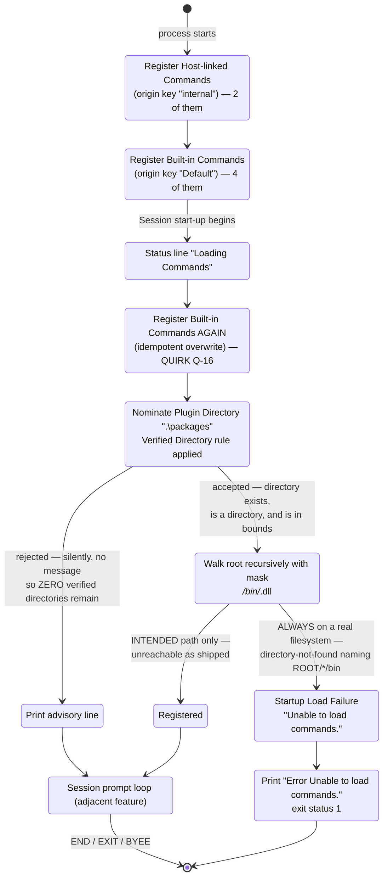

### 7.4 Plugin Discovery & Command Registration

**Description**

Before the Shell can accept a single Command line it must know which verbs exist. This feature is the one-time start-up phase that assembles the Shell's Command vocabulary from three independent supply routes — Commands compiled into the Shell executable and handed over by the Shell Operator (Host-linked Commands), Commands the Command Service supplies itself (Built-in Commands), and Commands discovered on disk inside the Plugin Directory (Plugins) — and then hands a populated Command set to the interactive Session. It runs exactly once per Session; there is no rescan, no watch, and no reload verb.

The problem it solves is two-sided. A Shell that ships with a fixed verb list cannot be extended, and a Shell that *requires* Plugins cannot start on a fresh machine. This feature is *intended* to make the Command set extensible by dropping a directory on disk, while guaranteeing that the Shell still starts and still reaches its Prompt when the disk contributes nothing.

**Neither half of that intention is delivered by the shipped build, and a clone team must read this whole subsection with that in front of them.** The disk route is described below in two registers, and they are kept visually separate throughout: the *intended* layout and registration contract that a clone must implement, and the *as-shipped* behaviour, which is that the disk route cannot succeed at all. The Plugin Scanner composes its search mask by joining a wildcard path segment, the sub-directory name and the binary pattern, producing `*/bin/*.dll`, and hands that whole string to a recursive directory enumeration rooted at the verified Plugin Directory (OUT-OF-REPO: `src/Xcaciv.Command.FileLoader/Crawler.cs:20,173-178`). A search mask's *directory* portion is joined to the root **literally** — wildcards in it are never expanded — so the enumeration attempts to open a directory named `<root>/*/bin`, which does not exist. **This was executed against a real filesystem during verification.** With a perfectly correct layout present (`<root>/HelloPkg/bin/Hello.dll` and `<root>/Other/bin/Other.dll`) the enumeration returned neither those files nor an empty set: it raised a directory-not-found condition naming the literal path `<root>/*/bin`, in both recursive and top-level enumeration modes. A control run with the plain pattern `*.dll` recursively found both files, confirming the layout was correct and the mask is the cause.

Three consequences follow, and they are stated again at every requirement they touch. **(1) No Plugin is ever loaded from disk on a real filesystem** — the product's headline extensibility mechanism does not function as shipped. **(2) Any Plugin Directory that survives the Verified Directory rule is fatal at start-up, not merely an empty one**; populated or empty makes no difference, because the enumeration raises before it can distinguish them. The directory-not-found condition is not the tolerated No Plugins Available condition, so the tolerant branch does not catch it: it is wrapped as a Startup Load Failure carrying `Unable to load commands.`, escapes the Session, and ends the process with exit status 1 — see FR-4.42. **(3) The only start-up path that reaches a usable Prompt is the one where the Plugin Directory does *not* exist** — which is also the default state, because the compiled-in default `.\packages` uses a backslash separator that is an ordinary filename character on a POSIX host (FR-4.18, FR-4.57). The framework's own scanner tests pass because they run against a mock filesystem that INFERRED expands the wildcard segment; the production path uses the real filesystem and cannot (FR-4.25).

The quirk register's entry for this area is Q-11 ("a present-but-empty Plugin Directory is fatal; a missing one is tolerated"), and the register's open question is OQ-7. The accurate statement is now starker than either records: **any** existing Plugin Directory is fatal, only a missing one is tolerated, and no Plugin can ever load.

The Shell user is a passive beneficiary here. They see a Status line while loading happens and, when nothing was found on disk, a single advisory line; they never trigger discovery explicitly. The Plugin author is served by the on-disk layout convention and the isolation guarantee. The Shell Operator is the only actor who can influence the outcome, and only by two levers: which Host-linked Commands to register, and where the Plugin Directory points.



**User stories**

- **US-4.1** — As a Shell user, I want the Shell to reach its Prompt with a usable Command set even when no Plugin has ever been installed, so that a fresh installation is immediately usable.
- **US-4.2** — As a Shell user, I want to be told when no Plugins were found, and pointed at what to do about it, so that an unexpectedly small Command set reads as guidance rather than as a malfunction.
- **US-4.3** — As a Shell user, I want to see that Command loading is under way, so that start-up delay is explained rather than looking like a hang.
- **US-4.4** — As a Plugin author, I want the Commands inside a binary I place under the Plugin Directory in the agreed layout to appear at the Prompt with no registration step, so that distributing a Plugin is a file copy. **This story is not satisfied by the source.** The scan's search mask cannot match anything on a real filesystem (FR-4.25), so no binary placed in the agreed layout is ever opened. Treat US-4.4 and everything realizing it as the *intended* contract the clone must build, not as observed behaviour.
- **US-4.5** — As a Plugin author, I want my Plugin loaded in isolation, confined to its own folder, so that one Plugin cannot reach another Plugin's files. **Intent only, for the same reason as US-4.4** — the isolation machinery exists and is correctly wired (FR-4.30), but as shipped nothing ever reaches it.
- **US-4.6** — As a Plugin author, I want a Plugin that is corrupt, blocked or missing a dependency to be skipped rather than to abort start-up, so that one bad Plugin does not deny service to the whole Shell. **Intent only** — the per-candidate skip exists (FR-4.46) but is unreachable as shipped; a clone must still implement it, and must decide the silence question the register records as Q-15.
- **US-4.7** — As a Plugin author, I want to contribute a new member to a Command Group that already exists, so that my verb joins an established namespace instead of displacing it. **Intent only on the disk route** — the merge rule itself (FR-4.10) is live and observable on the direct registration routes, which is how `PACKAGE INSTALL` and `PACKAGE SEARCH` come to share one verb.
- **US-4.8** — As a Shell Operator, I want to register Commands compiled into the Shell executable before the Session starts, so that essential Commands ship without needing a Plugin.
- **US-4.9** — As a Shell Operator, I want to choose which directory Plugins are loaded from, so that I can relocate the Plugin Directory for my deployment.
- **US-4.10** — As a Shell Operator, I want the Plugin Directory confined to a restricted root so that a mis-set or hostile value cannot make the Shell load arbitrary code. **This capability is present only as an unfinished intention.** The Verified Directory rule exists and runs, but its boundary is not settable by the Shell Operator, and its effective reach is one level wider than the code reads (FR-4.20). Do not treat this story as satisfied by the source.

Two capabilities a reader may expect are **not** supported anywhere in the source and no story is written for them: re-scanning the Plugin Directory without restarting the Shell (FR-4.48), and any report of what was loaded or from where (FR-4.49).

**Use cases**

---

**UC-4.A — Assemble the Command vocabulary at Session start-up** *(realizes US-4.1, US-4.3, US-4.8, US-4.9)*

**Preconditions**
- The Shell Operator has constructed a Session object; its Plugin Directory setting holds either the default `.\packages` or a value the Operator has replaced.
- The Command Service, the Session Variables store, and a Presentation Adapter exist.
- No Command has yet been resolved or executed.

**Main flow**
1. Before the Session is started at all, the Shell Operator hands the Command Service two already-constructed Host-linked Command objects — Package Install and Package Search — each under the origin key `internal`.
2. Both declare the Command Group `Package`, so they merge into one top-level verb `PACKAGE` carrying the two members `INSTALL` and `SEARCH`. No Output is produced.
3. The Shell Operator's default launch path asks the Command Service to install its Built-in Commands under the origin key `Default`, then constructs the Presentation Adapter (named `Cupcake Console Context`, with an empty parameter list) and starts the Session.
4. Session start-up emits the Status line `Loading Commands`. Because the Presentation Adapter defaults to Status Visibility on and the Shell never overrides it, this renders as its own line in the Status style (Yellow on DarkBlue).
5. The Command Service is asked to install its Built-in Commands a second time — REGIF, SAY, SET, ENV, in that order, with SET flagged as able to change Session Variables. Registration is by overwrite, so the repeat is harmless.
6. The Plugin Directory value is nominated to the Command Service, which applies the Verified Directory rule (FR-4.20).
7. The Command Service is asked to scan every verified directory. Each discovered Plugin binary is opened in an Isolated Plugin Loader and interrogated for Command declarations; each declaration found becomes a Command Registration Record and is inserted into the Command index. **INTENDED BEHAVIOUR ONLY.** On a real filesystem this step never reaches a candidate: the search mask `*/bin/*.dll` raises a directory-not-found condition naming `<root>/*/bin` before any file is returned (FR-4.25, FR-4.42). Whenever at least one directory survived step 6, control leaves this use case at E2 rather than at step 8.
8. Discovery produces **no** Output on success. Control falls through to the Session prompt loop, which draws the Prompt `Ɛ> `. **Reachable as shipped only when step 6 produced zero verified directories** — that is, via A1 and UC-4.C, never with Plugins loaded.

**Alternate flows**
- **A1 — No verified directory survived nomination.** Continue at UC-4.C. **This is the only path to a usable Prompt in the shipped build**, and it is the default outcome, because nothing creates the Plugin Directory (FR-4.19) and the default literal cannot resolve on a POSIX host (FR-4.57).
- **A2 — A Plugin declares a verb already held by a Built-in Command or by `PACKAGE`.** Last registration wins (FR-4.9) unless the incoming entry carries Command Group members, in which case those members merge into the existing entry (FR-4.10). Nothing is reported either way — QUIRK Q-71. Unreachable as shipped, because the disk route never produces a registration (FR-4.25); a clone that fixes the scan makes it reachable immediately.
- **A3 — Fewer than one Host-linked Command is registered, or none.** The Session still starts. An empty Command set is a legal outcome; the Prompt still appears.
- **A4 — The alternate asynchronous start-up entry point is used instead.** Built-in Commands are **not** registered on that path, and it emits the Status line `Done` after loading. It is not the path the shipping Lit Shell uses (FR-4.8).

**Error flows**
- **E1 — Plugin Directory string is empty or whitespace.** The Command Service rejects it immediately with the argument error `Directory is required`. Start-up's catch-all converts it to a Startup Load Failure carrying `Unable to load commands.`; the process prints `Error Unable to load commands.` and exits with status 1.
- **E2 — Plugin Directory exists and is verified.** *Any* verified directory, empty or fully populated, takes this path. The Plugin Scanner composes the search mask `*/bin/*.dll` and hands it to the recursive enumeration; the mask's directory portion is joined to the root literally, so the enumeration raises a **directory-not-found** condition naming `<root>/*/bin` and returns nothing (verified by execution against a real filesystem). That condition is **not** the No Plugins Available condition, so the tolerant branch does not catch it. Result: `Error Unable to load commands.`, exit status 1, no Prompt. QUIRK — the register's nearest row is Q-11, which under-states it: the fatality does not depend on the directory being empty. See FR-4.25 and FR-4.42, and OQ-7.
- **E2a — INTENDED-BEHAVIOUR VARIANT.** In a clone that implements the mask with real glob semantics, a verified-but-genuinely-empty directory would instead raise the Plugin Scanner's own "no binaries" condition carrying `No packages found in <absolute path>.` (OUT-OF-REPO: `src/Xcaciv.Command.FileLoader/Crawler.cs:180`). That literal is **unreachable in the shipped product** — it is guarded by a call that has already raised — and is documented here only so a clone does not mistake it for observed behaviour. It is reachable in the framework solely when the sub-directory filter is empty, which the Shell never does (`src/Xcaciv.Cupcake.Core/Loop.cs:43` calls the load operation with no argument, so the framework default `bin` applies). The user-visible outcome is identical to E2 either way.
- **E3 — The nominated directory disappears between nomination and scan.** The scan re-resolves the root, finds it missing, and raises a directory-not-found condition naming the root itself (OUT-OF-REPO: `src/Xcaciv.Command.FileLoader/Crawler.cs:173-174`). Same user-visible outcome as E2, and — because E2 raises the same *kind* of condition, differing only in the path named — indistinguishable from it without reading the discarded inner cause (FR-4.43).
- **E4 — Any other failure inside start-up** (unreadable directory, defect in the Command Service). Wrapped as a Startup Load Failure with the fixed summary `Unable to load commands.` and the original cause attached as the inner cause. The user sees only `Error Unable to load commands.` — **the original cause text is never shown** — and exit status 1.
- **E5 — A Host-linked registration throws before the Session is started.** This happens outside start-up's try/catch, so it reaches the executable's outermost handler, which prints `Error ` followed by the **raw** failure text, then exits with status 1. This is the one failure path whose underlying message is visible.
- **E6 — A Host-linked Command implementation carries no registration marker.** It is silently skipped with only a Diagnostic trace line. No failure is raised, so the Shell Operator has no way to learn the Command is missing.

**Postconditions**
- The Command index is populated and never pruned again for the life of the Session.
- The Session exposes the Command Service handle and the Session Variables handle; both are non-null.
- All output for the whole phase is at most two lines: the `Loading Commands` Status line and, conditionally, the advisory of UC-4.C.

---

**UC-4.B — Discover and register a Plugin from disk** *(realizes US-4.4, US-4.5, US-4.6, US-4.7)*

> **THIS USE CASE DESCRIBES INTENDED BEHAVIOUR THAT THE SHIPPED BUILD CANNOT PRODUCE.** Its second precondition is unsatisfiable in practice: the enumeration in step 1 raises a directory-not-found condition naming `<root>/*/bin` before it returns a single candidate, so steps 2–9 and every alternate and error flow below are never executed on a real filesystem (FR-4.25; confirmed by execution). The whole use case is retained — in full and unabridged — because it is the contract a clone must implement with real glob semantics, and because every rule in it is independently evidenced in the framework source. A clone team should build exactly this and treat the shipped scan as an explicitly flagged deviation. What actually happens as shipped is UC-4.A/E2.

**Preconditions**
- A Plugin Directory has passed the Verified Directory rule.
- At least one file matching the layout `<Plugin Directory>/<any folder>/bin/<any file matching *.dll>` exists beneath it. The extension is the fixed literal `.dll`, hard-coded regardless of host platform (OUT-OF-REPO: `src/Xcaciv.Command.FileLoader/Crawler.cs:20`) — it is *not* the host platform's shared-library extension, and a clone on a runtime with a different module extension must choose its own constant deliberately.
- **Unsatisfiable as shipped**, per the note above.

**Main flow**
1. The Plugin Scanner canonicalises the Plugin Directory to an absolute path and enumerates, recursively, every file matching `*/bin/*.dll`. **As shipped this raises rather than enumerating** — see the note above and FR-4.25. The remaining steps assume the intended glob semantics.
2. If the candidate count is 50 or fewer, candidates are processed one at a time; strictly above 50, they are processed in parallel.
3. For each candidate, an origin key is synthesised as the file's base name, a hyphen, then the candidate's directory path relative to the Plugin Directory with all separators deleted. Example: root `C:\Program\Commands\`, candidate `C:\Program\Commands\Hello\bin\Hello.dll` yields the origin key `Hello-Hellobin`.
4. The candidate is opened in an Isolated Plugin Loader whose file access is restricted to that candidate's own folder, under a strict-by-default security policy. Its version is read from the binary.
5. Every Command implementation inside the candidate that carries the registration marker is turned into a Command Registration Record: invocation name, Command Group members, implementation identity, and the owning Plugin record.
6. Where two implementations inside the *same* binary declare the same Command Group, their members are merged into one entry before that entry reaches the Command index.
7. Each surviving entry is inserted into the Command index, applying the overwrite/merge rules (FR-4.9, FR-4.10).
8. A candidate that produced zero usable Commands is dropped and no Plugin record is retained for it.
9. Nothing is printed. The verbs simply exist at the next Prompt.

**Alternate flows**
- **B1 — Support or dependency binaries sit beside the Plugin binary in the same `bin` folder.** They are candidates too: each is opened in its own Isolated Plugin Loader and interrogated, then discarded by step 8 for contributing no Commands. One Plugin folder holding several binaries therefore yields several Plugin records, one per contributing binary.
- **B2 — The Plugin binary's file name does not match its folder name.** It is still discovered. Only the `bin` path segment and the minimum depth are enforced; `name/bin/name.dll` is documented convention, not a rule.
- **B3 — The `bin` folder is nested several levels below the Plugin Directory.** Still discovered; depth beyond the required minimum is unconstrained.
- **B4 — A Plugin declares a Command Group that a Host-linked Command already owns** (for example a member `UPDATE` under group `Package`). The member is merged in; `INSTALL` and `SEARCH` survive alongside it.

**Error flows**
- **E1 — A candidate binary is corrupt, of the wrong architecture, missing a dependency, or blocked by the security policy.** The condition is written to Diagnostic trace and that candidate is skipped. The scan continues; healthy Plugins still register. **Nothing is shown to the user** — the affected verbs are simply absent. QUIRK Q-15; and because the Diagnostic trace channel is itself permanently silent in this product (Q-27), the record exists nowhere the user can reach.
- **E2 — One Command implementation inside an otherwise healthy binary lacks the registration marker or is otherwise malformed.** A per-implementation error is raised and caught per implementation: that Command is skipped, its siblings in the same binary still register. Diagnostic trace only.
- **E3 — An implementation carries only a Command Group marker and no registration marker.** Treated exactly as if it were unmarked (E2 on this route; silent skip on the direct routes).
- **E4 — A Plugin re-declares a top-level verb already held by a Built-in Command.** No error at all: the Plugin's implementation displaces the Built-in silently, because disk registration runs after Built-in registration and later registration overwrites earlier. QUIRK Q-71 — a supply-chain concern with no diagnostic.

**Postconditions**
- The Command index holds one entry per surviving top-level verb, each pointing at an implementation identity and a Plugin record (origin key, version, binary location, contributed Commands).
- Loaded Plugin binaries are deliberately never unloaded for the life of the process.
- **As shipped, none of these postconditions is ever established**, because the use case cannot be entered — the Command index at the Prompt holds only what the Host-linked and Built-in routes supplied.

---

**UC-4.C — Start with no Plugins available** *(realizes US-4.1, US-4.2)*

**Preconditions**
- Zero Plugin Directories survived the Verified Directory rule — most commonly because the default `.\packages` folder does not exist, and nothing in the product ever creates it (FR-4.19). On a POSIX host the default cannot resolve at all, because the backslash is an ordinary filename character there (FR-4.57, Q-25), so this precondition holds unconditionally out of the box.
- **This is the shipped product's only route to a usable Prompt.** Every other route through nomination and scanning ends in UC-4.A/E2 — see the Description and FR-4.25.

**Main flow**
1. The Command Service finds its verified-directory list empty and raises the No Plugins Available condition, carrying the text `No base package directory configured. (Did you set the restricted directory?)`.
2. The Session catches exactly that condition, discards its text, and writes **exactly one line** of Output:

```
No Plugins Found. You may want to check out `install --help`
```

   The two backtick characters are part of the literal. It renders in the normal Output style (Blue on Black), **not** the Status style.
3. Control falls straight through to the Session prompt loop. The Shell user gets the Prompt `Ɛ> ` and whatever Commands the Host-linked and Built-in routes supplied.

**Alternate flows**
- **C1 — The Shell user follows the advice and types `install --help`.** The first word is normalised and upper-cased into the lookup key `INSTALL`, which is not a top-level verb — Package Install is a member of the Command Group `PACKAGE`. The user gets `Command [INSTALL] not found. Try 'HELP'`. QUIRK Q-12 (FR-4.40).
- **C2 — The Shell user corrects it to `PACKAGE INSTALL --help`.** The help path is taken on the group entry, which holds members, so the Shell prints the group's one-line member listing — `PACKAGE` with its group text `Package commands`, then one summary line each for `INSTALL` and `SEARCH` — never Package Install's own parameter help. There is no invocation from the Prompt that yields it. QUIRK, INFERRED — Q-45 (FR-4.41).

**Error flows**
- **E1 — The Plugin Directory exists.** This is *not* this use case, and — correcting a claim that was previously scoped too narrowly — it makes no difference whether the directory is empty, holds nothing in the `bin` layout, or holds a perfectly laid-out Plugin. *Any* directory that survives the Verified Directory rule takes the fatal path of UC-4.A/E2, and the advisory is never printed. QUIRK — nearest register row Q-11 (FR-4.42), and see OQ-7.

**Postconditions**
- The Session is running with a non-empty but Plugin-free Command set. No record exists of which directory was tried or why it was rejected.

---

**UC-4.D — Nominate a non-default Plugin Directory** *(realizes US-4.9, and demonstrates the unfinished US-4.10)*

**Preconditions**
- The Shell Operator has replaced the Plugin Directory setting before start-up.

**Main flow**
1. The candidate path is canonicalised to an absolute path.
2. The candidate's **parent** is computed and tested for containment against a boundary directory.
3. The boundary defaults to the process working directory, because the Shell never invokes the "set boundary" capability anywhere in the product.
4. The containment test ignores the boundary's own final path segment, so the effective boundary is one level **above** the working directory.
5. If containment holds, and the path exists, and it is a directory, the candidate is added to the verified-directory list. Otherwise it is **silently discarded** — no failure, no message, no record of which path was tried.
6. Scanning proceeds as UC-4.B — **intended behaviour**. As shipped, a candidate accepted at step 5 leads straight to the fatal UC-4.A/E2, so a *successful* nomination is the worse outcome for the Shell Operator than a rejected one (FR-4.25, FR-4.42).

**Alternate flows**
- **D1 — A sibling tree of the working directory is nominated** (working directory `C:\a\work`, setting `C:\a\evil\packages`). It is **accepted** — the rule does not confine discovery to the working directory. QUIRK Q-14. (Its Plugins would then load under the intended glob semantics; as shipped, acceptance instead means a fatal start-up. The boundary defect is unchanged either way: it decides which trees a clone with a working scan would load arbitrary code from.)
- **D2 — The working directory itself is nominated.** It is **rejected**, because the *parent* is what gets tested and the parent sits above the effective boundary. QUIRK Q-14.
- **D3 — The Shell runs one level below a volume root** (working directory `C:\app`). Most of that volume becomes acceptable, including `C:\Windows\System32`. QUIRK Q-14.

**Error flows**
- **E1 — The path is on another volume, or is the working directory's parent itself.** Rejected, silently. The Session proceeds to UC-4.C and the user sees only the generic advisory — with no distinction between "the directory is missing" and "the directory was rejected by the boundary".
- **E2 — The path is a symbolic link or junction pointing outside the boundary, or a network share path.** Behaviour is **undetermined**. The check canonicalises the textual path but does nothing to resolve links, so an in-bounds link pointing out of bounds is expected to be accepted; network-share paths have a different location-identifier shape whose containment behaviour was not evaluated. INFERRED; not exercised by any test in either source. **This is recorded as open question OQ-27**, and it is not closed by Q-14's recommended disposition — a clone that compares the candidate itself against a trailing-separator-normalised boundary, exactly as Q-14 advises, is still open to a link escape. Decision 1 in the bug-for-bug list below carries the same warning.
- **E3 — The path is empty or whitespace.** Not silent: a hard argument error, `Directory is required`, which start-up turns into a fatal Startup Load Failure.

**Postconditions**
- Either the verified-directory list holds exactly one entry, or it is empty and UC-4.C follows.

**Functional requirements**

*Supply routes and ordering*

- **FR-4.1** The Command vocabulary is assembled from exactly three supply routes: Host-linked Commands registered by the Shell Operator, Built-in Commands supplied by the Command Service, and Plugins discovered on disk. *(Realizes US-4.1, US-4.4, US-4.8.)*
- **FR-4.2** In the shipping Lit Shell the order is fixed and is: (1) Host-linked Command instances, (2) Built-in Commands, (3) Status line `Loading Commands`, (4) Built-in Commands **again**, (5) nominate the Plugin Directory, (6) scan disk. Built-in registration always precedes both nomination and the disk scan.
- **FR-4.3** The shipping Lit Shell registers exactly **2** Host-linked Commands — Package Install and Package Search — both under the origin key `internal`, both declaring the Command Group `Package` with group text `Package commands`. They merge into a single top-level verb `PACKAGE` with the two members `INSTALL` and `SEARCH`. *(Realizes US-4.8.)*
- **FR-4.4** The Built-in Command set is exactly **4** Commands, registered under the origin key `Default`, in the order REGIF, SAY, SET, ENV. Only SET is flagged as able to change Session Variables. OUT-OF-REPO-only requirement — the Shell asks for the set by name and does not enumerate it.
- **FR-4.5** **QUIRK Q-16** — Built-in Commands are registered **twice** on the shipping path: once by the default-launch entry point and once inside Session start-up. Harmless because registration overwrites by key, but the work is done twice.
- **FR-4.6** The Status line `Loading Commands` is emitted at the very start of Session start-up, before any registration performed inside the Session. It is rendered in the Status style (Yellow on DarkBlue) because Status Visibility defaults to on and the Shell never overrides it; with Status Visibility off it goes to the platform debug channel instead. *(Realizes US-4.3.)*
- **FR-4.7** **QUIRK Q-37** — there is no completion Status line on the shipping path. The alternate asynchronous entry point emits the Status line `Done` after loading; the synchronous entry point — the one the Lit Shell uses — emits nothing after `Loading Commands`.
- **FR-4.8** **QUIRK Q-17** — the two Session entry points diverge in two ways: the asynchronous one does **not** register Built-in Commands at all, and it has **no** No Plugins Available tolerance, catching every load failure including that one as a fatal Startup Load Failure. On a fresh machine the asynchronous entry point therefore aborts where the synchronous one continues. The summary literal is identical in both entry points — `Unable to load commands.` — only the tolerant branch differs, and only the synchronous entry point has one. See OQ-23 on whether the asynchronous path is supported or dead.

*Command index insertion rules*

- **FR-4.9** Registration of a top-level verb is **last-write-wins**: the index is a name→entry map with plain assignment, so a later registration replaces an earlier one of the same name with no warning, no Diagnostic trace, and no user-visible notice. **QUIRK Q-71** in combination with FR-4.47. OUT-OF-REPO-only requirement.
- **FR-4.10** Exception to FR-4.9: if the *incoming* entry carries Command Group members and an entry of that name already exists, the incoming members are **merged into** the existing entry rather than replacing it. This is how `PACKAGE INSTALL` and `PACKAGE SEARCH` end up under one verb, and how a Plugin can add a third member to that group without displacing them. *(Realizes US-4.7.)* OUT-OF-REPO-only requirement.
- **FR-4.11** Verb names are normalised before they become index keys: trim; keep only the text before the first space; strip hyphens from **both** ends; delete every character outside `-`, `_`, digits, ASCII letters and space; upper-case. A Plugin declaring `Install` registers as `INSTALL`; one declaring `--Install a package` also registers as `INSTALL`. OUT-OF-REPO-only requirement.
- **FR-4.12** An implementation carrying both a Command Group marker and a registration marker becomes a **member** of the group, registered under the upper-cased group name with itself under its own upper-cased name. One carrying only a registration marker becomes a top-level verb. OUT-OF-REPO-only requirement.
- **FR-4.13** The **registration marker** alone gates eligibility. An implementation carrying only a Command Group marker is treated exactly like an unmarked one. OUT-OF-REPO-only requirement.
- **FR-4.14** An implementation with no registration marker is handled differently per route: on the direct routes it is **silently skipped** with only a Diagnostic trace line and **no failure raised**, so the Shell Operator cannot detect it; on the disk route a per-implementation error is raised and caught per implementation, skipping that one Command and continuing with its siblings. *(Realizes US-4.6.)* OUT-OF-REPO-only requirement.
- **FR-4.15** **QUIRK Q-72** — the group entry synthesised to hold members carries **no implementation identity of its own**. Because both Host-linked Commands declare the group `Package`, the verb `PACKAGE` is never itself executable: typing `PACKAGE` alone — or typing a member word that matches no member — produces the Output `Error executing PACKAGE (see trace for more info)` plus the Status line `**Error: Command type name is empty.`, and never a member listing or a "missing sub-command" message. Typing `PACKAGE INSTALL` *does* work, because member selection happens on the execute path. This is distinct from Q-8 (which is about the failure text naming the group rather than the member) and from Q-13 (which is about the namespacing itself). INFERRED; OUT-OF-REPO-only requirement.
- **FR-4.16** The "may change Session Variables" flag is settable only on the direct registration routes; it is never derived from disk metadata. It is applied to the entry **before** merge/insert, so on the Command Group path the flag lands on the synthesised **group** entry, not on the member. Latent in the shipping build, because neither Host-linked Command sets it. OUT-OF-REPO-only requirement.
- **FR-4.17** Host-linked Commands are registered **by instance**, but only the instance's implementation identity is retained — the supplied instance is discarded and a fresh one is constructed at execution time. OUT-OF-REPO-only requirement.

*Plugin Directory nomination and the Verified Directory rule*

- **FR-4.18** The default Plugin Directory is the literal `.\packages` — a **relative** path written with a **backslash** separator, resolved against the process working directory. It must be non-empty by default. Two registered quirks live in that one sentence: the backslash is not a path separator on a POSIX host (Q-25, and FR-4.57), and resolving against the *process working directory* rather than the executable's directory means the launch location silently changes which Plugins load (Q-26). The same default is recorded from other angles at §7.2 FR-2.9, §7.5 FR-5.45, §7.10 FR-10.48 and §7.11 FR-11.11; AC-4.23 is the criterion that pins it.
- **FR-4.19** Nothing in the product ever creates the Plugin Directory. The setting is only ever read and handed to the Command Service. *(Consequence: the out-of-the-box outcome on a fresh machine is UC-4.C.)*
- **FR-4.20** **QUIRK Q-14, INFERRED** — the Verified Directory rule works as follows: the candidate is canonicalised to an absolute path; its **parent** is tested for containment against a boundary that defaults to the process working directory; and the containment test **ignores the boundary's own final path segment**. The net effect is that the effective boundary is one level **above** the working directory. The practical rule a clone must reproduce or consciously reject is: *a candidate is accepted when it exists, is a directory, and its parent is a strict descendant of the working directory's parent, on the same volume.* Worked outcomes:

  | Working directory | Nominated Plugin Directory | Accepted? |
  |---|---|---|
  | `C:\a\work` | `C:\a\work\packages` (the default) | yes |
  | `C:\a\work` | `C:\a\work\x\y\packages` (nested arbitrarily deep) | yes |
  | `C:\a\work` | `C:\a\evil\packages` (**sibling tree of the working directory**) | **yes** |
  | `C:\a\work` | `C:\a\work` (the working directory itself) | **no** |
  | `C:\a\work` | `C:\a\packages` (directly in the working directory's parent) | no |
  | `C:\a\work` | `C:\b\evil\packages` | no |
  | `C:\a\work` | `D:\evil\packages` (other volume) | no |
  | `C:\app` | `C:\Windows\System32` | **yes** |

  INFERRED is claimed at exactly this point: the containment primitive's segment-dropping behaviour was confirmed by executing it against these exact path shapes, but the product itself was never run. Do not restate this rule as "the Plugin Directory must be inside the working directory" — that is the wrong claim and it under-states the exposure. **The rule's behaviour for symbolic links, junctions and network-share paths is undetermined and is recorded as OQ-27**; Q-14's recommended fix does not close it, because a boundary comparison on canonical text still accepts an in-bounds link that points out of bounds.
- **FR-4.21** **QUIRK Q-14** — the working directory itself can never serve as the Plugin Directory, because the candidate's *parent* is what is tested and that parent lies above the effective boundary. It is rejected silently.
- **FR-4.22** The Shell exposes **no** boundary setting and never invokes the Command Service's "set boundary" capability anywhere in the product, so the Shell Operator can neither widen nor narrow the containment behaviour of FR-4.20. *(This is why US-4.10 is unfinished.)*
- **FR-4.23** A candidate that fails any part of FR-4.20 — non-existent, not a directory, or out of bounds — is **silently discarded**: no failure raised, no message, no Diagnostic trace of which path was tried, and no distinction preserved between "missing" and "rejected by the boundary".
- **FR-4.24** An empty or whitespace Plugin Directory string is **not** silently discarded. It is rejected outright as an argument error with the text `Directory is required`, which start-up converts into a fatal Startup Load Failure. OUT-OF-REPO-only requirement.

*Scanning the Plugin Directory*

> **FR-4.25 states what the shipped scan does; every other requirement in this block — FR-4.26 through FR-4.37 — states the contract a clone must implement, and is NOT observed behaviour.** Because the shipped scan raises before it returns a candidate (FR-4.25), nothing downstream of the enumeration is ever exercised in the shipped product: no candidate is opened, no Isolated Plugin Loader is created, no origin key is synthesised, no parallel/sequential decision is taken, no Plugin record is written. Each requirement is nevertheless evidenced in the framework source and each is required of a clone. The distinction is load-bearing, so it is restated in the requirements where a reader is most likely to mistake intent for observation rather than assumed from this note alone.

- **FR-4.25** **QUIRK — the shipped scan cannot succeed on a real filesystem.** The Plugin Scanner composes its search mask by joining a single wildcard path segment, the sub-directory name and the fixed binary pattern, producing `*/bin/*.dll`, and passes that whole string to a recursive directory enumeration rooted at the verified, canonicalised Plugin Directory (OUT-OF-REPO: `src/Xcaciv.Command.FileLoader/Crawler.cs:20,173-178`). A search mask's *directory* portion is joined to the root **literally** — wildcards in it are never expanded — so the enumeration attempts to open `<root>/*/bin`. **Executed against a real filesystem** with a perfectly correct layout present (`<root>/HelloPkg/bin/Hello.dll` and `<root>/Other/bin/Other.dll`), the enumeration returned neither those files nor an empty set: it raised a **directory-not-found condition naming the literal path `<root>/*/bin`**, in both recursive and top-level enumeration modes. A control run with the plain pattern `*.dll` recursively found both files, confirming the layout was correct and the mask is the cause. (Executed on the analysis host with a current runtime; this enumeration semantic is long-standing and INFERRED to be identical on the runtime the product targets.) Consequently **no Plugin is ever loaded from disk**, and any Plugin Directory that survives FR-4.20 is fatal (FR-4.42). The framework's own scanner tests pass because they run against a **mock** filesystem whose glob implementation INFERRED does expand a wildcard directory segment (OUT-OF-REPO: `src/Xcaciv.Command.FileLoaderTests/CrawlerTests.cs:67-91,93-103`); its only test against a real filesystem deliberately passes an **empty** sub-directory filter so the segmented mask is never exercised (`:106-110`). The shipping path uses the real filesystem, because the Shell constructs the Command Service with no arguments and the Command Service in turn constructs a Plugin Scanner over the real filesystem (OUT-OF-REPO: `src/Xcaciv.Command/CommandController.cs:104`; `src/Xcaciv.Command.FileLoader/Crawler.cs:36`). **A clone must implement FR-4.26 to FR-4.28 with real glob semantics — an explicitly flagged deviation from the reference — or its extensibility mechanism will not work either.** *(Bears on US-4.4.)* OUT-OF-REPO-only requirement.
- **FR-4.26** **INTENDED.** The `bin` folder must be at least **one** level below the Plugin Directory root; a `bin` folder directly at the root is not matched. Depth beyond that minimum is unconstrained — a `bin` folder several levels down is found. This follows from the mask containing a directory separator, and it is the rule the framework's mock-filesystem test asserts; it is **not** observable in the shipped product, where nothing matches at all (FR-4.25). OUT-OF-REPO-only requirement.
- **FR-4.27** **INTENDED.** Only the `bin` path segment and that minimum depth are enforced. The binary's file name does **not** have to match its folder name; the `name/bin/name.dll` form is convention, not validation. Unobservable as shipped, per FR-4.25. OUT-OF-REPO-only requirement.
- **FR-4.28** **INTENDED.** Inside a matching `bin` folder **every** file matching the fixed literal pattern `*.dll` is a candidate, including support and dependency binaries shipped beside the Plugin. Each is opened and interrogated, then discarded by FR-4.32 if it contributes no Commands. The extension is a hard-coded, platform-independent literal (OUT-OF-REPO: `src/Xcaciv.Command.FileLoader/Crawler.cs:20`) — it is **not** the host platform's shared-library extension, and a clone must not substitute one: a clone targeting a POSIX host that reads "shared library" and scans for `*.so` would discover nothing the original intends to. A clone on a runtime whose modules carry a different extension must choose its own constant deliberately and record the choice. Unobservable as shipped, per FR-4.25. OUT-OF-REPO-only requirement.
- **FR-4.29** **INFERRED** — that the sub-directory filter is `bin` for *this* Shell. The Shell requests the scan with no explicit filter (`src/Xcaciv.Cupcake.Core/Loop.cs:43`) and takes whatever the Command Service's default is; the reference framework defaults to `bin` (OUT-OF-REPO: `src/Xcaciv.Command.Interface/ICommandController.cs:29`; `src/Xcaciv.Command/CommandController.cs:169`), but the exact pinned framework artefacts could not be fetched to confirm it, and an absent filter changes the rule to "every plugin binary anywhere beneath the root, at any depth". Recorded as OQ-8. A clone should implement `bin` as the default, make the filter configurable, and treat "no filter ⇒ every binary recursively" as a documented alternate mode. Note the interaction with FR-4.25: an **empty** filter is the one case in which the framework composes the plain pattern `*.dll` rather than a segmented mask, and is therefore the one case in which the shipped scan would actually work — which is exactly the configuration the framework's only real-filesystem test uses, and exactly the configuration this Shell never selects.
- **FR-4.30** Each candidate binary is opened in its own Isolated Plugin Loader, sandboxed so it can only reach that binary's own folder, under a strict-by-default security policy. *(Bears on US-4.5; intent only, per FR-4.25.)* The strictness is a mutable setting of the **Plugin Scanner** (OUT-OF-REPO: `src/Xcaciv.Command.FileLoader/Crawler.cs:31`, `:54-58`), not of the Command Service; the Shell constructs the Command Service with its default Plugin Scanner and has no handle on which to change it, so the strict default is what always applies. A second, distinct security configuration exists on the Command Service's command factory (OUT-OF-REPO: `src/Xcaciv.Command/CommandFactory.cs:31`) and is likewise never set by this Shell; a clone that exposes either knob must decide which one it is exposing. OUT-OF-REPO-only requirement.
- **FR-4.31** Loaded Plugin binaries are deliberately **never unloaded**, for performance. OUT-OF-REPO-only requirement.
- **FR-4.32** A candidate contributing **zero** usable Commands is dropped: no Plugin record is retained for it and nothing is printed. The threshold is exactly zero. OUT-OF-REPO-only requirement.
- **FR-4.33** Where two Command implementations inside the **same** binary declare the same Command Group, their members are merged into one entry *before* that entry reaches the Command index — the same merge rule as FR-4.10, applied a second time one level earlier. OUT-OF-REPO-only requirement.
- **FR-4.34** **INTENDED, per FR-4.25** — a Plugin's origin key is synthesised **per binary** as `<binary file base name>` + `-` + `<the binary's directory path relative to the Plugin Directory, with all separators deleted>`. Example: root `C:\Program\Commands\`, binary `C:\Program\Commands\Hello\bin\Hello.dll` → origin key `Hello-Hellobin`. One Plugin folder holding several contributing binaries therefore yields several Plugin records. OUT-OF-REPO-only requirement.
- **FR-4.35** **INTENDED, per FR-4.25** — scanning is sequential at **50** or fewer candidate binaries and switches to parallel processing **strictly above 50**, explicitly to avoid parallelism overhead on small installations. The per-candidate work must be safe to run concurrently and the Command index must tolerate concurrent insertion. The threshold is a process-wide mutable setting, not a constant, so anything in the process can change it for every subsequent scan. OUT-OF-REPO-only requirement.
- **FR-4.36** A Plugin record carries: origin key, version, the full path to its binary, and the map of Commands it contributed. Version is read from the binary on the disk route and left at its zero default on the direct routes, which never set it. On the direct routes the recorded path is the on-disk location of the binary that *declares* the Command — for the Lit Shell's two Host-linked Commands that is the library those Commands ship in, not the Shell executable. OUT-OF-REPO-only requirement.
- **FR-4.37** **INFERRED** — in a single-file, self-contained, trimmed release build the recorded declaring-binary path is empty, and the Command Service falls back to that path when the implementation cannot be resolved by name. Host-linked Commands may therefore register successfully but fail to *instantiate* at execution time in the release configuration. Not executed; deduced. Recorded as OQ-12, with the trimming half at OQ-11. A clone must decide whether its packaging can hit the same trap. Unlike the rest of this block this one is **not** gated on FR-4.25: it applies to the direct registration routes, which do run.

*Outcomes and failure behaviour*

- **FR-4.38** Zero surviving verified directories is the exact trigger for the No Plugins Available condition. Its own text is `No base package directory configured. (Did you set the restricted directory?)`; the Shell **swallows it** and substitutes its own advisory, so that text never reaches the user.
- **FR-4.39** On No Plugins Available the Shell writes **exactly one line** of Output, character for character:

  ```
  No Plugins Found. You may want to check out `install --help`
  ```

  rendered in the normal Output style (Blue on Black), not the Status style. The condition is **not** fatal: control falls straight through to the Session prompt loop and the Prompt appears. *(Realizes US-4.2.)*
- **FR-4.40** **QUIRK Q-12** — the advisory names an invocation that does not resolve. Package Install is a **member** of the Command Group `PACKAGE`, not a top-level verb, so typing `install --help` upper-cases to the key `INSTALL`, which is absent, producing `Command [INSTALL] not found. Try 'HELP'`.
- **FR-4.41** **QUIRK Q-45, INFERRED** — nor does the obvious correction help. `PACKAGE INSTALL --help` takes the help path on the group entry, and because that entry holds members the Shell prints the group's one-line member listing (`PACKAGE` with `Package commands`, then one summary line each for `INSTALL` and `SEARCH`) rather than Package Install's own parameter help; member selection is only performed on the execute path. There is therefore **no** invocation from the Prompt that yields Package Install's full help. Further: the Command Service accepts three help spellings — the double-dash word, the dash-question-mark, and the slash-question-mark — but argument tokenization destroys the latter two before they can be recognised, so only the double-dash spelling is reachable from the Prompt at all (QUIRK Q-44). OUT-OF-REPO-only requirement.
- **FR-4.42** **QUIRK — nearest register row Q-11, which under-states it; see OQ-7.** **Any** Plugin Directory that exists and survives the Verified Directory rule is fatal to start-up. Populated or empty makes no difference: the enumeration described in FR-4.25 raises a **directory-not-found** condition naming `<root>/*/bin` before it can distinguish the two (OUT-OF-REPO: `src/Xcaciv.Command.FileLoader/Crawler.cs:176-178`; established by execution against a real filesystem). That condition is not the No Plugins Available condition, so the Shell's tolerant branch does not catch it (`src/Xcaciv.Cupcake.Core/Loop.cs:45-50`); it falls into the generic catch (`:51-54`), is wrapped as a Startup Load Failure carrying `Unable to load commands.`, escapes the Session, and the process prints `Error Unable to load commands.` and exits with status **1**. The friendlier outcome is the one where the user has done *less* setup — creating the folder breaks start-up, omitting it does not — and there is no amount of *correct* setup that repairs it.

  **Correction to a previously documented mechanism.** This requirement formerly described the failure as the Plugin Scanner's own "no binaries" condition, `No packages found in <absolute path>.`, raised as an unrelated sibling of the No Plugins Available condition. The user-visible outcome stated above is unchanged, but that mechanism is wrong for the shipping configuration. The named literal lives one line *past* the enumeration that already raised (OUT-OF-REPO: `src/Xcaciv.Command.FileLoader/Crawler.cs:180`) and is reachable **only** when the sub-directory filter is empty — which this Shell never does, because it requests the scan with no argument and the framework default `bin` applies (`src/Xcaciv.Cupcake.Core/Loop.cs:43`; FR-4.29). The sibling-exception hierarchy is real (the two condition types are unrelated, neither derived from the other) and remains the right explanation for a clone that fixes the mask, but it is **not** the root cause here. The root cause is the unusable search mask. A clone that implements the two-sibling-conditions design faithfully and *also* fixes the mask will reproduce the documented quirk exactly; one that fixes only the mask will inherit it; one that unifies the two conditions removes it. §7.6 FR-6.32 and §7.5 FR-5.13/AC-5.9 describe the same fatality from the failure-handling and Session angles and carry the same correction.
- **FR-4.43** Every failure other than No Plugins Available that escapes the load steps is wrapped as a Startup Load Failure carrying the fixed summary `Unable to load commands.` with the original cause attached as inner cause, and rethrown out of start-up. The Shell Operator's outermost handler prints `Error ` followed by that summary — so the user sees `Error Unable to load commands.` and the **original cause text is never shown**.
- **FR-4.44** A failure raised by a Host-linked registration *before* the Session is started is outside start-up's try/catch. It reaches the outermost handler directly, which prints `Error ` followed by the **raw** failure text. This is the only start-up failure whose underlying message is visible.
- **FR-4.45** Every fatal start-up failure uses process exit status **1**. There is no distinct status per failure kind, and both the crash line and the advisory are written to standard output — not to an error stream — so redirecting output swallows all diagnostics. QUIRK Q-38.
- **FR-4.46** **INTENDED, per FR-4.25** — a per-candidate load failure — corrupt binary, wrong architecture, missing dependency, security-policy violation, or any other error — is written to Diagnostic trace and that candidate is **skipped**. The scan continues and healthy Plugins still register. Nothing is shown to the user: silent partial success, QUIRK Q-15, made total by the permanently silent Diagnostic trace channel (Q-27). *(Bears on US-4.6.)* OUT-OF-REPO-only requirement.
- **FR-4.47** **QUIRK Q-71** — verb displacement is entirely silent. When a Plugin re-declares a verb already held by a Built-in Command or by `PACKAGE`, there is no warning, no Diagnostic trace, and no user-visible notice; the verb simply behaves differently than it did before the Plugin was installed. Registration is last-write-wins by name (FR-4.9), with member-merging for Command Groups (FR-4.10), so a Plugin can silently re-point an existing verb at its own code — a supply-chain gap with no diagnostic. This is distinct from Q-15, which covers only a Plugin that *fails* to load; Q-71 covers one that *succeeds* and takes over an existing verb. **Latent as shipped**, because no Plugin ever loads (FR-4.25) — but it becomes live the moment a clone fixes the scan, which is why it must be decided now rather than later.

*Lifecycle, configuration and observability*

- **FR-4.48** Discovery runs exactly **once** per Session. There is no rescan, no directory watch, and no reload verb. A newly installed Plugin is only visible after restarting the Shell. The Command index is created empty, populated once during start-up, mutated only by overwrite/merge, and never pruned.
- **FR-4.49** Discovery is **silent on success**. Nothing reports how many Plugins or Commands were loaded, or from where. The Command Service's structured audit facility is attached to Command *execution*, not to discovery, and the Shell installs no audit sink — so a rejected directory, a skipped binary and a displaced verb are all indistinguishable from a clean start.
- **FR-4.50** An empty Command set is a legal, non-fatal outcome. Start-up must complete and the Session must reach the Prompt even when the Command Service registers nothing at all.
- **FR-4.51** After start-up the Session exposes the Command Service handle and the Session Variables handle it was given; both must be non-null.
- **FR-4.52** The capabilities this feature requires of the Command Service are exactly: *register the Built-in Command set* (idempotent), *nominate a Plugin Directory*, *scan and load*, and *direct registration under an origin key* by Command Registration Record, by implementation identity, or by instance, each with an optional "may change Session Variables" flag — plus name normalisation and group merging. Notably **absent** from the required set: any "set containment boundary" capability.
- **FR-4.53** **QUIRK Q-24** — the Session carries a boolean setting meaning "install command enabled", defaulting to **true**, that no code anywhere reads. Its default is nevertheless asserted by a test. Recorded as OQ-25.
- **FR-4.54** On completion this feature hands off to the Session prompt loop, which draws the Prompt `Ɛ> ` (U+0190 LATIN CAPITAL LETTER OPEN E, then `>`, then one space) and ends on any of the **3** exit words `END`, `EXIT`, `BYEE`, matched case-insensitively.
- **FR-4.55** The Shell performs **no** signature, hash, or publisher verification of a Plugin at load time. Certificate-validation, thumbprint-allow-list and package-signature-verification settings existed on the Session object and were deleted before the pinned revision. The only safety layers are the Verified Directory rule of FR-4.20 — itself defective (Q-14) and undetermined against links (OQ-27) — and the per-Plugin isolation of FR-4.30; treat the first as "same volume, roughly the same neighbourhood", not as a sandbox. QUIRK Q-48 records the same absence on the download side. That the shipped scan never loads anything (FR-4.25) is not mitigation: a clone fixing the scan restores this exposure in full on its first day.
- **FR-4.56** All strings are hard-coded English with no substitution mechanism, and the two start-up messages are distinguished **by colour alone** — no textual prefix, severity marker, or symbol — so they are indistinguishable on a monochrome terminal or to a screen reader.
- **FR-4.57** **QUIRK Q-25, INFERRED** — on a non-Windows host the default Plugin Directory literal `.\packages` names a single directory entry rather than a relative path, because the backslash is an ordinary filename character there; the default nomination therefore cannot resolve, the Verified Directory rule discards it **silently** (FR-4.23), and the observable result is indistinguishable from a genuinely absent `packages` directory. The Lit Shell's release configuration targets Windows only (`src/Xcaciv.Cupcake.Lit/Xcaciv.Cupcake.Lit.csproj:10-23`), so this may never have mattered in practice, while its development configuration targets a cross-platform runtime (`:3-8`), so it matters immediately to anyone running the product as built. A clone should use a platform-neutral relative path. **AC-4.23 pins this**; the same default is recorded from other angles at §7.2 FR-2.9, §7.5 FR-5.45, §7.10 FR-10.48 and §7.11 FR-11.11, and none of those subsections previously carried an executable criterion for it either. Together with FR-4.25 this is why the shipped product's *only* reachable start-up outcome on a POSIX host is the No Plugins Found advisory.

**External technology**

- *Requires:* a pluggable command framework providing a Command index, declarative verb and parameter metadata, Command-line parsing, Pipelines, generated help, Plugin loading, and a Built-in Command set (a pattern filter, an echo, a variable setter, a variable dump). *(No wire protocol — an in-process library API.)* **Source used:** Xcaciv.Command 2.1.1, Xcaciv.Command.Core 2.1.0 and Xcaciv.Command.Interface 2.1.0 for .NET, pinned centrally. **Reimplementer notes:** these artefacts are not obtainable from the public package index, and the repository's package-source configuration routes every first-party package to a local folder named by an unexpanded environment token while the private hosted feed is declared with no routing rule and is therefore never consulted — so the pinned binaries could not be fetched and their semantics are documented from the v2.1.2 reference source instead. You will most likely reimplement this rather than obtain it. The parts that must survive substitution are the three registration routes, the ordering rules (FR-4.2), and the overwrite/merge semantics (FR-4.9, FR-4.10).
- *Requires:* dynamic code loading with per-Plugin sandboxing. *(No wire protocol — an in-process library API.)* **Source used:** the framework's own assembly-loading layer, Xcaciv.Loader 2.1.1, pinned by the framework rather than by this repository. **Reimplementer notes:** each Plugin binary loads in its own isolated context whose file access is restricted to that binary's own folder, under a strict-by-default policy chosen explicitly to block directory traversal. A load failure for one Plugin must never abort the scan. Loaded Plugin binaries are deliberately never unloaded, for performance — so any clone that unloads must document the behavioural change.
- *Requires:* a recursive file-system directory walk with a wildcard filter that spans a whole path segment. *(POSIX/Win32 filesystem semantics.)* **Source used:** the .NET file-system abstraction, enumerating recursively with a search mask composed as `<one-segment wildcard>` + `<sub-directory name>` + `<binary pattern>` joined by the host platform's path separator, with the binary pattern the hard-coded literal `*.dll` regardless of host platform. **Reimplementer notes — this is the substitution that actually failed, and it is the single most important entry in this list.** The capability described in the *Requires* line — a wildcard that spans a whole path segment — **is not a capability the chosen technology has.** The .NET enumeration splits a search mask at its last separator and joins the directory portion to the root **literally**, expanding no wildcards in it; the resulting call therefore tries to open a directory named `<root>/*/bin`. Verified by execution against a real filesystem with a correct layout in place: directory-not-found naming `<root>/*/bin`, in both recursive and top-level modes, while a control run with the plain pattern `*.dll` recursively found every file. So a clone must **not** transliterate the mask composition; it must implement segment-spanning matching itself — enumerate every `*.dll` recursively and filter on the parent folder's name, or use a matcher that genuinely supports `**` / segment globs. Two further portability traps sit in the same line: the binary pattern is a fixed `.dll` literal and is *not* the host platform's shared-library extension (FR-4.28), so a clone on another runtime must choose its constant deliberately; and a mask containing a directory separator is what forces the matched folder to be at least one level below the root (FR-4.26), so a clone that flattens the mask silently changes the discovery rule. Separately, the Shell's own default directory literal `.\packages` is not portable either (FR-4.57). **Do not use the framework's passing scanner test as evidence that the mask works:** that test runs against an in-memory mock filesystem whose glob implementation INFERRED does expand a wildcard directory segment, and the framework's only test against a real filesystem passes an empty sub-directory filter, which takes the un-segmented branch.
- *Requires:* a path containment check that prevents escaping a boundary directory. *(URI base-of comparison semantics.)* **Source used:** .NET path canonicalisation combined with a URI base-of comparison. **Reimplementer notes:** **do not copy this as-is.** Base-of comparison ignores the boundary's final path segment, so the effective boundary sits one level above what the code appears to intend, and the check is applied to the candidate's *parent* rather than the candidate itself (FR-4.20). A correct reimplementation compares the *candidate itself* against a boundary path normalised with a trailing separator — but making that change alters observable behaviour, so it is a keep-or-fix decision (Q-14), not a free fix. **And that fix is not sufficient.** The comparison operates on canonicalised *text* and resolves no links, so an in-bounds symbolic link or junction pointing out of bounds is expected to be accepted even after Q-14's fix is applied, and a network-share path has a different location-identifier shape whose base-of behaviour was never evaluated. That gap is open question OQ-27; a clone must resolve links before comparing, and must decide explicitly what a network-share boundary means.
- *Requires:* parallel work distribution over a candidate list. *(No wire protocol.)* **Source used:** .NET parallel for-each. **Reimplementer notes:** engaged only strictly above 50 candidate binaries; the per-candidate callback must be thread-safe and the Command index it writes into must tolerate concurrent insertion. The threshold is a process-wide mutable setting, so a clone that hard-codes it loses a (undocumented, unused) tuning knob.
- *Requires:* console text output with colour attributes. *(ANSI/Win32 console.)* **Source used:** the .NET console. **Reimplementer notes:** the Status line and the advisory line use different colour pairs — Status is Yellow on DarkBlue, normal Output is Blue on Black, the Prompt is Green on Black — and colour is reset after each write. Colour is the *only* signal distinguishing the two start-up messages (FR-4.56).
- *Requires:* Unicode-capable console output. *(UTF-8 / UTF-16.)* **Source used:** .NET string literals in source files stored as UTF-8 with a byte-order mark and CRLF line endings. **Reimplementer notes:** the Prompt uses U+0190 and the advisory uses two backtick characters; both must survive encoding, storage and terminal rendering unchanged.
- *Requires:* process exit-status reporting. *(OS process exit code.)* **Source used:** the .NET process environment. **Reimplementer notes:** the only failure signal available to a calling script is exit status 1 plus one line on **standard output**; there is no standard-error usage and no distinct code per failure kind (FR-4.45).

**Acceptance criteria**

- **AC-4.1** *Given* the Shell is launched with no `packages` folder in the working directory, *when* start-up runs, *then* the line ``No Plugins Found. You may want to check out `install --help` `` is printed exactly once, the Prompt `Ɛ> ` appears, and the process does **not** exit. This is the reference implementation's only successful start-up outcome; contrast AC-4.24, which is what happens as soon as the folder exists.
- **AC-4.2** *Given* the Shell is launched, *when* start-up begins, *then* the Status line `Loading Commands` is emitted before any Command is registered from disk, and it is rendered in the Status style (Yellow on DarkBlue) rather than as normal Output; *and* no completion Status line follows it on the shipping path.
- **AC-4.3** *Given* the shipping Lit Shell, *when* start-up completes with no Plugins on disk, *then* the Command set contains exactly the four Built-in Commands `REGIF`, `SAY`, `SET`, `ENV` plus the single top-level verb `PACKAGE` carrying the two members `INSTALL` and `SEARCH`.
- **AC-4.4** **INTENDED BEHAVIOUR — the clone must satisfy this; the reference implementation does not.** *Given* a `packages` folder in the working directory containing `packages/Hello/bin/Hello.dll` which declares a Command `HELLO`, *when* start-up runs, *then* `HELLO` is available at the Prompt and no advisory line is printed; *and given* a support binary is placed beside it in the same `bin` folder, *then* that support binary is also opened but, contributing no Commands, produces no Plugin record and no Output; *and given* the Plugin binary is renamed so its file name no longer matches its folder, *then* it is still discovered. The file extension in these fixtures is the fixed literal `.dll` and not the host platform's shared-library extension (FR-4.28); a clone on another runtime substitutes its own module extension deliberately and records the substitution. **Run against the reference implementation this criterion fails at its first clause** — see AC-4.24 for what actually happens.
- **AC-4.5** **INTENDED BEHAVIOUR — the clone must satisfy this; the reference implementation does not.** *Given* a `packages` folder containing `packages/Hello/Hello.dll` — the binary at the package root, **not** inside a `bin` sub-folder — *when* start-up runs, *then* that binary's Commands are **not** registered; *and given* the same binary at `packages/a/b/c/bin/Hello.dll`, *then* it **is** registered, because depth beyond the required minimum is unconstrained. Against the reference implementation both halves produce the AC-4.24 outcome instead.
- **AC-4.6** **QUIRK — decide keep or fix.** *Given* a `packages` folder exists in the working directory, **whether it is empty, holds unrelated files, or holds a perfectly laid-out Plugin**, *when* start-up runs, *then* the process prints `Error Unable to load commands.` and exits with status `1`, the "No Plugins Found" advisory is **not** printed, and no Prompt is drawn. The contents make no difference to the outcome, because the scan raises before it can read them (FR-4.25, FR-4.42). The clone must consciously choose to reproduce this — that creating the Plugin Directory breaks start-up while omitting it does not — or to fix the scan and then decide separately how to treat a genuinely empty directory.
- **AC-4.7** **QUIRK Q-12 and Q-45 — decide keep or fix.** *Given* the "No Plugins Found" advisory was just shown, *when* the Shell user types `install --help` as instructed, *then* they receive `Command [INSTALL] not found. Try 'HELP'` rather than help text; *and when* they instead type `PACKAGE INSTALL --help`, *then* they receive the group summary line for `PACKAGE` with its text `Package commands` followed by one summary line per member — **not** Package Install's parameter help. The clone must consciously choose to reproduce the mismatched advisory or to correct it.
- **AC-4.8** **QUIRK Q-72 — decide keep or fix.** *Given* the Shell user types `PACKAGE` with no member and no help argument, *when* it is dispatched, *then* the Output is `Error executing PACKAGE (see trace for more info)` and the Status line is `**Error: Command type name is empty.`, and **no** member listing and no "missing sub-command" message is produced; *and given* they type `PACKAGE FROBNICATE`, where no such member exists, *then* the same two lines appear; *and when* they type `PACKAGE INSTALL`, *then* the member runs normally.
- **AC-4.9** **QUIRK Q-71 — decide keep or fix.** *Given* a Plugin package that declares a verb named `SAY`, colliding with a Built-in Command, *when* start-up completes, *then* the Plugin's implementation is the one that runs, and **no** warning, trace or notice of the displacement is produced anywhere. **INTENDED behaviour of the registration rules, not observable against the reference implementation**, where no Plugin loads at all (FR-4.25); a clone that fixes the scan makes this live on day one, which is why the keep-or-fix call cannot be deferred.
- **AC-4.10** **INTENDED — not observable against the reference implementation** (FR-4.25). *Given* a Plugin package declaring an implementation with Command Group `Package` and verb `Update`, *when* start-up completes, *then* `PACKAGE` exposes three members — `INSTALL`, `SEARCH`, `UPDATE` — and the two Host-linked ones are **not** displaced.
- **AC-4.11** **INTENDED on the disk route — not observable against the reference implementation** (FR-4.25); the normalisation rule itself is live on the direct registration routes. *Given* a Plugin binary declaring its verb in mixed case as `Install`, *when* start-up completes, *then* the registered verb name is `INSTALL`; *and given* it declares `--Install a package`, *then* the registered name is still `INSTALL`, because everything from the first space onward is discarded and hyphens are trimmed from both ends.
- **AC-4.12** **INTENDED — not observable against the reference implementation** (FR-4.25), where this fixture instead produces the AC-4.24 outcome. *Given* two Plugin binaries under the Plugin Directory, one of which is corrupt or blocked by the security policy, *when* start-up runs, *then* the healthy one's Commands are registered, **no** error is shown to the user, and the Session reaches the Prompt.
- **AC-4.13** **INTENDED — not observable against the reference implementation** (FR-4.25). *Given* a Plugin binary that contains no implementations carrying the required registration marker, *when* start-up runs, *then* no Plugin record is recorded for it and nothing is printed.
- **AC-4.14** **QUIRK Q-14 — decide keep or fix.** *Given* the Plugin Directory setting is pointed at a path whose parent is **not** a strict descendant of the working directory's parent — a path on another volume, or the working directory itself — *when* start-up runs, *then* the directory is ignored with **no message at all** and the outcome is the "No Plugins Found" advisory followed by a normal Prompt, with no way to tell "missing" from "rejected"; *and given* it is pointed at a **sibling** tree of the working directory (working directory `C:\a\work`, setting `C:\a\evil\packages`), *then* the directory is **accepted** — against the reference implementation acceptance yields the AC-4.24 fatal outcome, and in a clone with a working scan it yields loaded Plugins from outside the intended tree. The clone must consciously choose to reproduce the wide boundary or to tighten it, and separately resolve OQ-27 — whether the boundary holds against symbolic links, junctions and network-share paths, which Q-14's recommended fix does not settle.
- **AC-4.15** *Given* the Plugin Directory setting is set to an empty or whitespace string, *when* start-up runs, *then* the process prints `Error Unable to load commands.` and exits with status `1` — the silent-discard path of AC-4.14 does **not** apply.
- **AC-4.16** **INTENDED BEHAVIOUR — the clone must satisfy this; the reference implementation does not.** *Given* a Plugin Directory root containing exactly 51 candidate binaries in the `bin` layout, *when* start-up runs, *then* they are processed in parallel; *and given* exactly 50, *then* they are processed one at a time. In both cases every contributing binary's Commands appear at the Prompt. Against the reference implementation both fixtures produce the AC-4.24 outcome instead, because the candidate list is never built (FR-4.25) and the threshold comparison is never reached.
- **AC-4.17** **INTENDED BEHAVIOUR — the clone must satisfy this; the reference implementation does not.** *Given* a Plugin Directory root `<root>` containing `<root>/Hello/bin/Hello.dll`, *when* start-up completes, *then* the Plugin record for that binary carries the origin key `Hello-Hellobin`, the version read from the binary, and the binary's full path. Against the reference implementation no Plugin record is ever created; the fixture produces the AC-4.24 outcome (FR-4.25). The `.dll` extension is a fixed literal, not the host's shared-library extension (FR-4.28).
- **AC-4.18** *Given* a Command Service stub that registers nothing and reports no failures, *when* start-up runs, *then* it completes, exposes non-null Command Service and Session Variables handles, and the Session reaches the Prompt — an empty Command set is legal.
- **AC-4.19** *Given* a freshly constructed Session object, *when* its defaults are inspected, *then* the Plugin Directory is `.\packages`, the Prompt is `Ɛ> `, the exit vocabulary is `END`/`EXIT`/`BYEE`, and the never-read install-enabled flag is `true`.
- **AC-4.20** **QUIRK Q-17 — decide keep or fix.** *Given* the alternate asynchronous start-up entry point and a machine with no Plugin Directory, *when* start-up runs, *then* no Built-in Command is registered and the No Plugins Available condition is **not** tolerated — the run aborts with `Error Unable to load commands.` and exit status `1`; *and given* it succeeds, *then* it emits the Status line `Done` after loading, which the synchronous path never does.
- **AC-4.21** *Given* a Plugin is copied into the Plugin Directory while the Session is running, *when* the Shell user continues at the Prompt, *then* the new verbs are **not** available and no rescan occurs; *and when* the Shell is restarted, *then* they are available. The second clause is **INTENDED** and, against the reference implementation, the restart instead yields the AC-4.24 outcome (FR-4.25); the first clause — no rescan — is unconditional and holds either way.
- **AC-4.22** *Given* a successful start-up that discovered and registered Plugins, *when* the user reads the console, *then* the only output produced by this phase is the single `Loading Commands` Status line — no count of Plugins, no count of Commands, and no source paths. **INTENDED**, since no such start-up exists in the reference implementation; the silence itself is observable there on the No Plugins Available path, where the only output is that Status line plus the advisory.
- **AC-4.23** **QUIRK Q-25 — decide keep or fix.** *Given* a POSIX host, a working directory containing a valid Plugin at `./packages/Hello/bin/Hello.dll`, and the Plugin Directory left at its compiled-in default, *when* the Shell starts, *then* `HELLO` is **not** registered, **no** diagnostic naming any path is produced on any channel, and the output is exactly the No Plugins Found guidance followed by a normal Prompt — because the literal `.\packages` names a single directory entry rather than a relative path, so the Verified Directory rule finds nothing to verify and discards it silently (FR-4.18, FR-4.23, FR-4.57). The clone team must consciously choose to reproduce the backslash literal or to use the platform separator. This is the executable criterion behind register row **Q-25**, whose recommended disposition ("use a platform-neutral relative path") previously had no criterion behind it anywhere in §7; the same default is described from other angles at §7.2 FR-2.9, §7.5 FR-5.45, §7.10 FR-10.48 and §7.11 FR-11.11, which should all cite this criterion. Note the trap for a clone team on a POSIX host: choosing the platform separator *and nothing else* moves the failure from this criterion to AC-4.24, because the directory then resolves, verifies, and takes the fatal scan path.
- **AC-4.24** **QUIRK — decide keep or fix; nearest register row Q-11, see OQ-7.** *Given* a Plugin Directory that exists, is a directory, and passes the Verified Directory rule, **and given it contains a correctly laid-out Plugin at `<root>/Hello/bin/Hello.dll` declaring a Command `HELLO`**, *when* start-up runs, *then* `HELLO` is **not** registered, no Plugin is loaded, the "No Plugins Found" advisory is **not** printed, no Prompt is drawn, the process prints exactly `Error Unable to load commands.` on **standard output**, and it exits with status `1`; *and given* the same directory emptied of all files, *then* the outcome is byte-for-byte identical, because the scan raises before it can distinguish the two. The underlying cause — a directory-not-found condition naming the literal path `<root>/*/bin` — is attached as the inner cause and is **never printed** (FR-4.43, Q-39). This criterion records the reference implementation's actual behaviour and is the one AC-4.4, AC-4.5, AC-4.10 to AC-4.13, AC-4.16, AC-4.17 and AC-4.21 all collapse into there. A clone that implements FR-4.26 to FR-4.28 with real glob semantics will **fail** this criterion and pass those instead; that is the recommended outcome, and it must be recorded as a deliberate deviation rather than allowed to happen silently.

**Source notes**

*In-repo evidence (paths relative to the subject repository at commit `a05dc6f00d4510ac073f6dd02fbfba2ffb76a5b6`):*

- `src/Xcaciv.Cupcake.Core/Loop.cs:11` — the never-read install-enabled flag; `:16` — Prompt literal; `:20`, `:57`, `:91` — exit vocabulary and case-insensitive match; `:24` — Plugin Directory default `.\packages`; `:32-68` — the synchronous start-up path in full; `:37` — `Loading Commands`; `:41-43` — Built-in registration, nomination, scan; `:45-50` — the No Plugins Available tolerant branch and the advisory literal; `:48` — the source's own note about downloading a first Plugin and restarting loading; `:51-54` — the fatal branch and `Unable to load commands.`; `:56-66` — hand-off to the prompt loop; `:70-103` — the asynchronous entry point, including its missing Built-in registration and its `Done` Status line at `:87`; `:105-112` — the default-launch entry point, its second Built-in registration at `:108` and its Presentation Adapter construction at `:110`.
- `src/Xcaciv.Cupcake.Core/Exceptions/LoadingException.cs:4-13` — the Startup Load Failure type carrying a summary and an inner cause.
- `src/Xcaciv.Cupcake.Core/ConsoleContext.cs:13` — Status Visibility defaults to on; `:23-30` — the three colour pairs; `:31` — the shadowed Status Visibility flag; `:53-60` — normal Output rendering; `:90-103` — Status line rendering and the debug-channel fallback when Status Visibility is off.
- `src/Xcaciv.Cupcake.Lit/Program.cs:9-12` — the two Host-linked registrations under origin key `internal` and the start-up call; `:14-19` — the outermost handler, the `Error {message}` line on standard output, and exit status 1.
- `src/Xcaciv.Command.Packages/InstallCommand.cs:14-16` — Command Group `Package` with text `Package commands`, verb `Install`.
- `src/Xcaciv.Command.Packages/SearchCommand.cs:11-17` — the same Command Group, verb `Search`.
- `Xcaciv.Cupcake.Core.Tests/LoopTests.cs:36` — the input stub that answers `END` at every Prompt; `:35`, `:57` — both Output and Status rendering are no-ops in the stub; `:67-82` — the Command Service stub, whose scan operation declares a differently named, null-defaulting filter parameter at `:71`; `:126-138`, `:140-152` — the two start-up tests; `:154-162` — the defaults test.
- `src/Xcaciv.Cupcake.Lit/Xcaciv.Cupcake.Lit.csproj:10-23` — the release configuration: a different target platform, Windows-only, single-file, self-contained, ReadyToRun, compressed, trimmed, and marked as a windowed rather than console subsystem; `:3-8` — the *default* configuration, which is the cross-platform one (a console executable on a current cross-platform runtime) and is what everything in the repository is actually built and tested against.
- `NuGet.config:5-22`, `Directory.Packages.props:7-11` — the pinned framework versions and the package-source configuration described under *External technology*.
- Repository history: commit `907c535` "Remove unused settings from Loop class and tests" deleted the certificate-validation, thumbprint-allow-list and package-signature-verification settings from the Session object (FR-4.55). Commit `e1123b2` is the origin of the build break noted below.

*OUT-OF-REPO evidence — the external command framework at tag `v2.1.2`, commit `f34dedca8dc6d690290b2139acbd3e9b8264349c`, which is **one patch release ahead** of the versions this product pins:*

- `src/Xcaciv.Command/CommandController.cs:100-112` — the no-argument construction path the Shell takes, with `:104` the point at which a Plugin Scanner over the **real** filesystem is created (see `Crawler.cs:36`), which is why the mock-filesystem tests do not cover the shipping path; `:160-163` — nomination; `:169-172` — scan with the default filter; `:177-185` — the four Built-in Commands, their order, and the environment-modifying flag on the third; `:190` — direct registration, where the environment-modifying flag defaults to off.
- `src/Xcaciv.Command.Interface/ICommandController.cs:29` — the `bin` filter default.
- `src/Xcaciv.Command/CommandLoader.cs:28` — `Directory is required`; `:42-45` — zero verified directories and the No Plugins Available text; `:47-54` — the scan-and-register loop.
- `src/Xcaciv.Command.FileLoader/VerifiedSourceDirectories.cs:17` — the boundary's empty default; `:66-75` — existence and directory checks; `:82-89` — silent-drop on failure; `:100-115` — the containment check, with `:103` (the *parent* is what is tested), `:105` (boundary defaults to the working directory) and `:106-108` (the base-of comparison); `:120-123` — the "set boundary" capability the Shell never calls.
- `src/Xcaciv.Command.FileLoader/Crawler.cs:18` — the 50 threshold; `:20` — the hard-coded, platform-independent `*.dll` pattern; `:31`, `:54-58` — the mutable strict-by-default security policy, which lives on the **Plugin Scanner** and not on the Command Service (FR-4.30); `:36` — the no-argument constructor that binds the scanner to the real filesystem; `:83-91` — per-Plugin path restriction; `:93` — version read from the binary; `:96-120` — Command extraction, with `:105-114` the in-binary group merge and `:116-119` the per-implementation catch; `:125-153` — the per-candidate failure catches, all to Diagnostic trace; `:156` — the zero-Commands drop; `:173-174` — re-resolve and directory-not-found on the root itself; **`:176-178` — the `*/bin/*.dll` mask composition and the enumeration call, the defect at FR-4.25**; `:180` — `No packages found in <path>.`, which sits *after* `:178` and is therefore unreachable whenever the sub-directory filter is non-empty; `:183-190` — the parallel/sequential switch; `:203-213` and `:227-237` — the duplicated origin-key computation.
- `src/Xcaciv.Command.Interface/PackageDescription.cs:5-18` — the documented `name/bin/name.dll` convention and the Plugin record's fields.
- `src/Xcaciv.Command.Interface/Exceptions/NoPluginsFoundException.cs` and `.../NoPackageDirectoryFoundException.cs` — the two "nothing found" conditions are unrelated sibling types; neither derives from the other.
- `src/Xcaciv.Command/CommandRegistry.cs:12-18` — the concurrency-safe index; `:20-36` — merge-then-overwrite insertion, with `:34` the plain assignment; `:42-47` — the silent skip for a missing registration marker; `:49-53` — the declaring-binary path; `:55-60` — the environment-modifying flag applied before insert; `:63-67` — instance registration retaining only the implementation identity.
- `src/Xcaciv.Command.Core/CommandParameters.cs:174-226` — group/member description building, with `:177` the registration-marker gate, `:184-198` the synthesised group entry that carries no implementation identity, and `:221-224` the per-implementation error for a missing marker.
- `src/Xcaciv.Command.Interface/CommandDescription.cs:18` — the verb character filter; `:27` — normalisation on assignment; `:52-64` — the normalisation routine; `:70-79` — argument tokenization (which is what destroys two of the three help spellings).
- `src/Xcaciv.Command.Interface/ICommandDescription.cs:8-26` — the Command Registration Record's fields.
- `src/Xcaciv.Command/CommandExecutor.cs:27` — the `HELP` literal; `:58-70` — the help branch and the group-with-members path; `:83-86` — `Command [NAME] not found. Try 'HELP'`; `:224-231` — `Error executing NAME (see trace for more info)` and the `**Error: <message>` Status line; `:260-278` — the one-line member listing.
- `src/Xcaciv.Command/HelpService.cs:165-175` — the three accepted help spellings.
- `src/Xcaciv.Command/CommandFactory.cs:31` — a second, distinct security configuration, on the command factory rather than on the Plugin Scanner; the Shell sets neither (FR-4.30); `:38-56` — member selection on the execute path; `:62` — `Command type name is empty.`; `:58-79` — construction, and the fallback to the recorded binary path.
- `src/Xcaciv.Command.FileLoaderTests/CrawlerTests.cs:67-91` — the layout fixture, which deliberately includes a support binary beside a Plugin binary, a deeply nested `bin` folder, a binary whose name differs from its folder, and non-matching files — **built on an in-memory mock filesystem, whose glob implementation INFERRED expands a wildcard directory segment**; `:93-103` — the walk assertion, which therefore passes without proving anything about a real filesystem; `:106-110` — the only test in the file that uses a real filesystem, which passes an **empty** sub-directory filter and so exercises the un-segmented `*.dll` branch rather than the segmented mask the product uses. This pair is why the defect at FR-4.25 survived the framework's own test suite.
- `src/Xcaciv.Command.FileLoaderTests/VerifiedSourceDirectoriesTests.cs:9-37`, `:70-80` — the only containment tests that exist; they cover plainly-inside and plainly-outside absolute paths with an **explicitly set** boundary, never the defaulted boundary the Shell actually uses.
- `src/Xcaciv.Command.Tests/CommandControllerTests.cs:107` — Plugin binaries are deliberately never unloaded.

*State of the source.* The product **does not build** at the pinned commit, for two independent and established reasons. First, the Package Search Command's result accumulator had its declaration deleted in commit `e1123b2` while five uses of the identifier remained, and no framework version defines such a member. Second, dependency restore fails for every project: the feed claiming all first-party packages is an unexpanded environment token, the private hosted feed is declared but given no routing rule and is therefore never consulted, and the framework packages are absent from the public index. Both are established. The only residual uncertainty is that the exact pinned framework artefacts could not be fetched to confirm the base-class surface. **The Shell itself was never run, so nothing in this subsection was observed end to end.** Two of its load-bearing mechanisms were nevertheless established by executing the underlying primitives directly, and both are marked as such where they appear. First, the containment primitive of FR-4.20: its segment-dropping behaviour was confirmed by executing it against the tabulated path shapes in a scratch directory. Second, and more consequentially, the search-mask enumeration of FR-4.25: with a correct Plugin layout laid down on a real filesystem (`<root>/HelloPkg/bin/Hello.dll`, `<root>/Other/bin/Other.dll`), the enumeration returned no files and raised a directory-not-found condition naming the literal path `<root>/*/bin`, in both recursive and top-level modes, while a control run with the plain pattern `*.dll` recursively found both files. Executed on the analysis host with a current runtime; the enumeration semantic is long-standing and INFERRED to be identical on the runtime the product targets. That result is why the disk-discovery half of this feature is documented in two registers — intended contract versus as-shipped behaviour — rather than as a single account.

*Test coverage of this feature is effectively nil.* The subject repository's three tests and eight assertions prove only that start-up completes and hands off against a stub Command Service. No test asserts any user-visible string, any registration outcome, any directory behaviour, or either failure branch. Every acceptance criterion above concerning a message, a directory outcome, or a failure path is derived from source reading — it is new test coverage the clone team must write, not coverage they can port. Two exceptions, both marked at the point of use: AC-4.14's boundary shapes and AC-4.24's scan outcome were each established by executing the relevant primitive directly. **The framework's own coverage is worse than nil here, because it is actively misleading:** its scanner walk test passes against a mock filesystem and would have caught the defect at FR-4.25 had it run against a real one, and its one real-filesystem test is configured so that the defective mask is never composed. A clone team should treat "the reference's tests pass" as carrying no information about the disk-discovery path, and should write the FR-4.25 case as a real-filesystem test on day one.

*Bug-for-bug decisions this feature forces on the clone team.* Each is a QUIRK above with an observable consequence; the keep-or-fix call belongs to the PRD's open-questions section (§11.1) and the register (§11.2), whose row identifiers are given here so the two can be read together.

**Decision zero, which conditions all of the numbered decisions below: the Plugin scan cannot succeed on a real filesystem, so no Plugin is ever loaded** (FR-4.25, FR-4.42, AC-4.24; nearest register row Q-11, open question OQ-7). It is set outside the numbered list because it is not really a keep-or-fix choice: it is a defect that renders the product's headline extensibility mechanism inoperative, and it changes the reading of several decisions below. The recommendation is unambiguous — implement FR-4.26 to FR-4.28 with real segment-spanning glob semantics and record the deviation explicitly. Note that fixing it *activates* decisions 1, 3, 7, 11 and 15, which are latent only because nothing loads today.

1. **The containment boundary is one level too wide** (FR-4.20, FR-4.21, AC-4.14; Q-14). Sibling trees of the working directory are accepted; the working directory itself is rejected; a Shell running one level below a volume root accepts most of that volume. This is the most security-relevant deviation between what the code reads like and what it does. **Q-14's recommended fix — comparing the candidate itself against a boundary normalised with a trailing separator — does not close the whole hole.** The check operates on canonicalised text and resolves no links, so an in-bounds symbolic link or junction pointing out of bounds is still expected to be accepted, and network-share paths were never evaluated. That remainder is **OQ-27** and must be answered separately; a team that applies Q-14 and stops has not finished.
2. **The boundary is not settable** (FR-4.22). No configuration surface exists, so an operator cannot compensate for decision 1.
3. **Rejection is silent and indistinguishable from absence** (FR-4.23, AC-4.14, AC-4.23). No message names the path that was tried, on any channel.
4. **Any existing Plugin Directory is fatal; only a missing one is tolerated** (FR-4.25, FR-4.42, AC-4.6, AC-4.24; Q-11, OQ-7). This replaces the earlier and weaker statement that an *empty* Plugin Directory is fatal while a missing one is not: contents make no difference, because the scan raises before it can read them. Doing more setup produces the worse outcome, and doing it *correctly* produces the same worse outcome.
5. **The advisory names an invocation that cannot work, and no correct substitute exists** (FR-4.40, FR-4.41, AC-4.7; Q-12, Q-45, and Q-44 for the destroyed help spellings). Fixing it properly requires changing help routing for Command Group members, which lives in the Command Service contract, not here.
6. **The Command Group root verb is not executable** (FR-4.15, AC-4.8; Q-72). A bare group verb, or a member word matching no member, yields `Error executing PACKAGE (see trace for more info)` plus `**Error: Command type name is empty.` and never a member listing. Distinct from Q-8 (which text names the group) and Q-13 (whether namespacing is right at all).
7. **Verb displacement by a Plugin is completely silent** (FR-4.9, FR-4.47, AC-4.9; Q-71) — a supply-chain concern with no diagnostic. Distinct from Q-15, which covers only a Plugin that *fails* to load. Latent today because of decision 0; live the moment the scan is fixed.
8. **Built-in Commands are registered twice** on the shipping path (FR-4.5; Q-16).
9. **The two start-up entry points behave differently** in Built-in registration and in No Plugins Available tolerance (FR-4.8, AC-4.20; Q-17, OQ-23). The Startup Load Failure summary literal is identical in both; only the tolerant branch differs, and only the synchronous entry point has one.
10. **The default Plugin Directory literal is not platform-neutral** (FR-4.18, FR-4.57, AC-4.23; Q-25). On a POSIX host the default cannot resolve, and the symptom is indistinguishable from a genuinely absent directory. Beware the interaction with decision 0: fixing only the separator moves the failure from AC-4.23 to AC-4.24.
11. **The Shell verifies nothing about a Plugin's provenance** (FR-4.55; Q-48), and the settings that once gestured at it were deleted rather than implemented. Latent today because of decision 0.
12. **A never-read configuration flag is nonetheless pinned by a test** (FR-4.53; Q-24, OQ-25) — the clone must decide whether to carry the dead setting for behavioural parity.
13. **The sub-directory filter for the pinned framework version is unconfirmed** (FR-4.29; OQ-8). If it is absent rather than `bin`, the discovery rule widens to every binary anywhere beneath the root — a materially different feature, and, per decision 0, the one configuration in which the reference scan would actually work.
14. **The Plugin binary extension is a hard-coded `.dll` literal, not the host platform's module extension** (FR-4.28, AC-4.4, AC-4.17). A clone on a runtime whose modules carry another extension must choose its constant deliberately rather than assume "shared library"; assuming it is the reason a naive POSIX port would scan for the wrong files even after decision 0 is fixed.
15. **A per-Plugin load failure is skipped in silence** (FR-4.46, UC-4.B/E1; Q-15), and the Diagnostic trace channel that records it is itself permanently silent in this product (Q-27), so the record exists nowhere reachable. Latent today because of decision 0.
