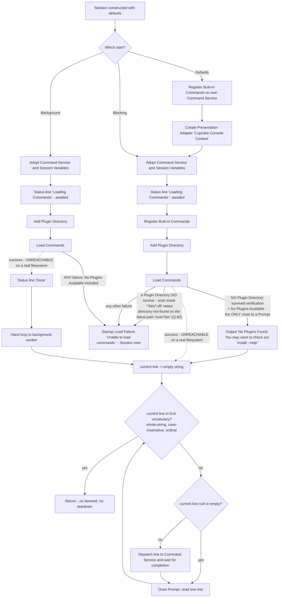

### 7.5 Interactive Shell Session

**Description** — The Interactive Shell Session is the read-eval-print heart of the Shell: the component that turns a plain text terminal into an interactive Command environment. It attempts to load the Command vocabulary once at startup (successfully only for the Built-in and Host-linked Commands — see below), draws the Prompt, hands each submitted Command line to the Command Service, waits for it to finish, and draws the Prompt again — until the user types a word from the Exit vocabulary, at which point it returns to whoever started it. It exists so that a person at a terminal can work one Command line at a time, and so that a Shell Operator can embed that loop in a program without owning any of the parsing, dispatch, rendering or Plugin machinery.

The Session is deliberately a thin orchestrator. It owns exactly four decisions: **when Commands get loaded**, **what the Prompt looks like**, **when a submitted line is dispatched versus ignored**, and **which words end the Session**. Everything else — splitting the Command line, resolving the Command, binding arguments, running Pipelines, rendering Output, reading the keyboard — belongs to the Command Service and the Interaction Context (`src/Xcaciv.Cupcake.Core/Loop.cs:32-68`). There are three ways to start it: a **blocking start**, which occupies the caller's thread and is the only one the Lit Shell uses; a **background start**, which runs the same serial loop on a worker; and a **defaults start**, which builds a terminal Interaction Context and settings for the caller and then performs a blocking start. The three are not equivalent — they differ in which Commands are registered, which startup conditions are survivable, and which Status lines the user sees, and those differences are the single largest reimplementation hazard in this feature.

The Session has no history, no completion, no line editing, no aliasing, no job control, no timeouts, no cancellation, no logging of its own, and no authorization check. It also has no end-of-input concept and no teardown: it never signals completion to the Interaction Context, never disposes anything, and prints no farewell.

One fact dominates everything this subsection says about startup, and it was established by execution rather than by reading: **the Plugin scan cannot succeed on a real filesystem.** The Plugin Scanner builds its search mask by joining a wildcard segment, the `bin` sub-directory name and the binary pattern — producing `*/bin/*.dll` — and hands the whole mask to a recursive directory enumeration rooted at the verified Plugin Directory. The directory portion of a search mask is joined to the root literally and its wildcards are never expanded, so the enumeration neither returns the Plugin binaries nor returns an empty set: it raises a directory-not-found condition naming the literal path `<Plugin Directory>/*/bin`. That condition is not No Plugins Available, so the Session's tolerant handler does not catch it; it becomes a Startup Load Failure and, in the Lit Shell, ends the process with status `1`. **No Plugin is therefore ever loaded from disk, and any Plugin Directory that survives verification — populated or empty, it makes no difference — is fatal at startup.** The only start that reaches a Prompt is the one where the Plugin Directory does *not* exist, which is also the default state, because the compiled-in default uses a backslash separator that is an ordinary filename character on a POSIX host (FR-5.42, FR-5.45; Q-82, Q-11). Everything below that describes a successful scan describes a path the shipping product cannot reach.

Nothing else described in this subsection was executed — the product does not build at the pinned commit (see *Source notes*) — so every other statement here is read from source, and framework-dependent behavior is marked OUT-OF-REPO. The two exceptions, both run on the analysis host against a real filesystem, are the search-mask enumeration just described (FR-5.42) and the containment primitive of FR-5.43.

**User stories**

- **US-5.1** — As a Shell user, I want a Prompt that invites one Command line at a time and fully completes it before prompting again, so that I always see one Command's result before deciding what to type next.
- **US-5.2** — As a Shell user, I want to end the Session by typing a single ordinary word, so that I can leave without a control key or a special syntax.
- **US-5.3** — As a Shell user, I want pressing Enter on an empty line to do nothing at all, so that stray keystrokes do not fill my terminal with error noise.
- **US-5.4** — As a Shell user, I want the Shell to start and be usable on a machine that has no Plugins installed yet, so that a fresh install is not a dead end. (Note: this holds only while the Plugin Directory does not exist at all — creating it makes startup fatal, see FR-5.42 and Q-11. And the guidance the Shell prints in this situation names an invocation that does not resolve — see FR-5.49 and Q-12; the story is satisfied only in that the Session continues.)
- **US-5.5** — As a Shell user, I want a Status line while Commands are being loaded, so that I can tell the Shell is working rather than hung.
- **US-5.6** — As a Shell user, I want a Command that fails to leave my Session alive, so that one bad Command does not cost me the whole Session. (Supported only to the extent the Command Service absorbs the failure — see FR-5.40; the Session itself installs no guard — see FR-5.39 and Q-41.)
- **US-5.7** — As a Shell Operator, I want to set the Prompt, the Exit vocabulary and the Plugin Directory before starting, so that I can brand and scope the Session I embed.
- **US-5.8** — As a Shell Operator, I want to register Host-linked Commands before the Session starts, so that Commands compiled into my own program are available without publishing a Plugin.
- **US-5.9** — As a Shell Operator, I want a single call that supplies a terminal Interaction Context and every default for me, so that a minimal host program is three statements long.
- **US-5.10** — As a Shell Operator, I want to choose between occupying my calling thread and running the Session on a background worker, so that I can embed the Shell in a program that has other work to do. (The two choices are not behaviorally equivalent — see FR-5.16 through FR-5.19 and Q-17 — and the background start has no caller anywhere in the product.)
- **US-5.11** — As a Shell Operator, I want any startup failure to reach me as one distinguishable Startup Load Failure carrying a fixed summary and the underlying cause, so that I can decide what to show the user.
- **US-5.12** — As a Shell Operator, I want to read back the Command Service and Session Variables the Session actually used, so that I can inspect them after the Session ends.
- **US-5.13** — As a Plugin author, I want to know which Command names the Session intercepts before dispatch, so that I do not publish a Command whose bare name can never be invoked. (Note: on the shipping path no Plugin can be loaded from disk at all — see FR-5.42 and Q-82 — so this story is about the contract a clone must honour, not about behaviour a Plugin author can exercise today.)

**Use cases**

---

**UC-5.A — Start a Session with defaults and reach the Prompt** (realizes US-5.1, US-5.4, US-5.5, US-5.9)

**Preconditions**
- A host program exists that can construct a Session.
- A terminal is attached and is UTF-8 capable (the Prompt's first character is non-ASCII).
- Optionally, a Plugin Directory exists at the configured path. If one does, the run takes error flow E1 whatever the directory contains; only the *absence* of a Plugin Directory reaches the Prompt (FR-5.42).

**Main flow**
1. The Shell Operator constructs a Session; all four settings take their defaults.
2. The Shell Operator registers any Host-linked Commands on the Session's own Command Service.
3. The Shell Operator invokes the defaults start.
4. The Session registers the Built-in Commands on its own Command Service.
5. The Session creates a Presentation Adapter named `Cupcake Console Context` with an empty parameter list, and performs a blocking start against it, its own Command Service and its own Session Variables.
6. The blocking start adopts the supplied Command Service and Session Variables as the Session's current ones.
7. The Status line `Loading Commands` is displayed, and the Session waits for that display to complete before doing anything else.
8. The Built-in Commands are registered (a second time — see FR-5.20).
9. The configured Plugin Directory is handed to the Command Service.
10. The Command Service is told to load Commands; the Plugin Scanner is handed each verified Plugin Directory in turn and is *intended* to register every Command it finds.
11. The loop is entered with an empty seed line: the seed is not in the Exit vocabulary, so the loop continues; the seed is empty, so nothing is dispatched; the Prompt `Ɛ> ` is drawn and one line is read.

**Reality check on steps 10–11.** Step 10 has exactly two outcomes on a real filesystem, and neither is the one it was written for. If no Plugin Directory survived verification it raises No Plugins Available and the run continues through alternate flow A1 — this is the only route to step 11. If any Plugin Directory *did* survive, the scan raises a directory-not-found condition on the literal path `<Plugin Directory>/*/bin` and the run ends at error flow E1. A step 10 that registers a Plugin's Commands and falls through to step 11 has never occurred outside a mock filesystem (FR-5.42, FR-5.57; Q-82).

**Alternate flows**
- **A1 — No Plugin Directory survived verification.** The Session emits one Output reading ``No Plugins Found. You may want to check out `install --help` `` and continues to step 11. The Built-in Commands and any Host-linked Commands are already registered, so the Session is usable. This is the *only* alternate flow that reaches the Prompt, and it is the default outcome on a fresh install (FR-5.12, FR-5.42). Note that the guidance travels on the Output channel rather than the Status channel, so it survives Status Visibility being off (Q-76), and that it names an invocation that cannot resolve (FR-5.49, Q-12).
- **A2 — Background start instead.** Steps 4 and 8 do not happen (no Built-in Commands are registered), A1 does not apply — there is no tolerant branch at all — and after loading succeeds an extra Status line `Done` is displayed before the loop is handed to a background worker. Because loading cannot succeed (FR-5.42), the `Done` line has no reachable emitter in the shipping product (FR-5.17, FR-5.18; Q-17, Q-37).
- **A3 — Status Visibility is off on a Shell Operator-supplied Interaction Context.** Steps 7 and A2's `Done` produce no terminal text at all; the messages go to the debug diagnostic sink (`Debug.WriteLine`), which optimized builds strip entirely — see §7.3 FR-3.14, FR-3.15 and Q-32 — not to the Diagnostic trace channel, which survives. The Prompt and Outputs are unaffected, so A1's guidance still appears (Q-76).

**Error flows**
- **E1 — A Plugin Directory exists and survived verification.** What it contains does not matter. The Plugin Scanner's search mask carries a wildcard in its *directory* portion (`*/bin/*.dll`); that portion is joined to the root literally, so the enumeration raises a directory-not-found condition naming `<Plugin Directory>/*/bin` before it can distinguish an empty folder from a populated one. That condition is not No Plugins Available, so the tolerant handler does not catch it. Startup aborts with a Startup Load Failure carrying `Unable to load commands.`. No Prompt is ever drawn and no Plugin is ever loaded. QUIRK (Q-82, Q-11) — the *more* set-up case fails where the *less* set-up case succeeds, and the headline extensibility mechanism does not function at all. Established by execution against a real filesystem; see FR-5.42.
- **E2 — Any other loading failure** (unreadable directory, blank configured path, Command Service fault): identical outcome to E1. Only No Plugins Available is tolerated (FR-5.13).
- **E3 — Displaying the first Status line fails.** That display sits outside the guarded startup block, so the failure is not converted into a Startup Load Failure; it escapes the Session unchanged.
- **E4 — A Startup Load Failure escapes into the Lit Shell.** One line consisting of the word `Error`, one space, and the failure summary is written to **standard output**, and the process ends with exit status `1`. The underlying cause is never printed (FR-5.36; Q-38, Q-39).
- **E5 — An individual Plugin binary is unreadable, wrong-architecture, or violates the loader's security policy.** Not a failure the Session ever sees: the Plugin Scanner records it on the Diagnostic trace and skips that Plugin. Startup completes and the user is told nothing (FR-5.47; Q-15). Unreachable on the shipping path, because E1 raises before any individual binary is opened.

**Postconditions**
- The Session's current Command Service and Session Variables are readable and non-null — including after E1–E3, because adoption happens before anything can fail.
- Exactly one Command vocabulary is established, for the lifetime of the Session; there is no reload and no directory watching (FR-5.48).
- On the only reachable path (A1) that vocabulary is the Built-in Commands plus whatever Host-linked Commands the Shell Operator registered — never a Plugin (FR-5.42).

---

**UC-5.B — Enter and execute one Command line** (realizes US-5.1, US-5.6)

**Preconditions**
- A Session has reached the Prompt.

**Main flow**
1. The Prompt is drawn without a trailing newline and one line is read.
2. The line is tested against the Exit vocabulary; it does not match.
3. The line is tested for emptiness; it is not empty.
4. The line is handed to the Command Service verbatim, together with the Interaction Context and the Session Variables.
5. The Session waits for that dispatch to complete in full — including every stage of a Pipeline and all Output rendering.
6. Control returns to step 1.

**Alternate flows**
- **B1 — Empty line.** Step 4 is skipped entirely; no Output, no error, no "unknown command" message; the Prompt is redrawn.
- **B2 — Whitespace-only line.** QUIRK (Q-18): the emptiness test is *empty*, not *whitespace-only*, so the line **is** dispatched. It reduces to an empty Command name and the user sees `Command [] not found. Try 'HELP'` (FR-5.25).
- **B3 — Line contains the Pipeline delimiter.** The Command Service runs it as a Pipeline; all stages run concurrently, but the Session still waits for the whole Pipeline before redrawing the Prompt.
- **B4 — Unknown Command.** The Command Service reports `Command [NAME] not found. Try 'HELP'`; the Session sees no failure and redraws the Prompt.
- **B5 — Command Group member requested by its bare member name.** Not resolvable: only the group name is registered, so B4 applies (Q-13).

**Error flows**
- **E1 — The Command fails during execution and the Command Service absorbs it.** The user sees one Output `Error executing <NAME> (see trace for more info)` and one Status line `**Error: <message>`, with detail on the Diagnostic trace. The Session is not interrupted and redraws the Prompt (FR-5.40). Note that with Status Visibility off the `**Error: ` line goes to the debug diagnostic sink and is stripped from an optimized build entirely — §7.3 FR-3.16, Q-32.
- **E2 — A failure escapes the Command Service.** QUIRK (Q-41): the Session installs no guard around dispatch, so the failure propagates out of the entire Session. In the Lit Shell this prints the crash line and ends the process with status `1`, losing the Session (FR-5.39).
- **E3 — E2 on the blocking start specifically.** INFERRED (Q-40): because the blocking start waits synchronously on the dispatch result, the failure reaches the host wrapped in a generic aggregate wrapper, so the crash line reads `Error One or more errors occurred. (<original message>)` rather than the original message. On the background start the original reaches the host unwrapped (FR-5.38).
- **E4 — The Interaction Context yields nothing** (end of redirected input). The terminal Presentation Adapter substitutes the empty string, which is treated as B1, so the Session prompts again — forever. QUIRK (Q-22): there is no end-of-input concept anywhere in the Session (FR-5.33).
- **E5 — The Interaction Context yields a null value.** Covered by the emptiness test; treated as B1. Reachable only from a non-conforming Interaction Context.
- **E6 — The user interrupts the terminal.** No handler is installed anywhere in this feature; teardown is whatever the platform does by default (FR-5.41).

**Postconditions**
- Exactly one Command line has been executed to completion; the Session holds only that line and discards it on the next read, so no history exists (FR-5.31).
- Session Variable writes have been merged back **only** if the Command's registration record declares it environment-modifying *and* its child scope actually changed. OUT-OF-REPO: the executor runs every Command against a child variable scope seeded with a copy of the Session's values and merges that child back into the Session's store only under those two conditions; otherwise the child is discarded on return, so a write by a Command not declared environment-modifying is invisible to the next Command line and to a later variable dump. Of the Built-in Commands only the variable setter carries the flag, and the Lit Shell registers neither Host-linked Command with it (FR-5.51, FR-5.52). The same child-scope rule is what confines the Registry Endpoint read side effect of Q-10 to a scope that is thrown away. (OUT-OF-REPO: `src/Xcaciv.Command/CommandExecutor.cs:187,216-219`, `src/Xcaciv.Command/EnvironmentContext.cs:45-55`, `src/Xcaciv.Command/CommandController.cs:190`, framework v2.1.2; `src/Xcaciv.Cupcake.Lit/Program.cs:10-11`)

---

**UC-5.C — End the Session** (realizes US-5.2, US-5.13)

**Preconditions**
- A Session has reached the Prompt.
- The Exit vocabulary is non-empty.

**Main flow**
1. The user types a word from the Exit vocabulary and submits it.
2. The line is stored as the current line and the iteration ends.
3. At the top of the next iteration the exit test matches; the loop terminates before reaching the dispatch step.
4. The blocking start returns to its caller; the background start's worker ends and the caller's handle completes.
5. In the Lit Shell the guarded block simply ends. INFERRED: the process terminates with exit status `0` — no success-path status is written anywhere.

**Alternate flows**
- **C1 — A registered Command shares an exit word's name.** The Session still ends and the Command never runs — the exit word permanently shadows the Command (FR-5.27; Q-21).
- **C2 — Case variants.** `end`, `End`, `eNd`, `exit`, `byee` and every other casing all end the Session (FR-5.26).

**Error flows**
- **E1 — Near-miss word.** `bye`, `endd`, `en`, `exit now` and `END ` (with a trailing space) do not end the Session; each is dispatched to the Command Service as an ordinary Command line and almost certainly produces `Command [NAME] not found. Try 'HELP'`. QUIRK (Q-19): the trailing-space case, because nothing anywhere in the Session trims the line (FR-5.26).
- **E2 — Empty Exit vocabulary configured by the Shell Operator.** No word can end the Session; only an unhandled failure or an external interrupt stops it (FR-5.32).

**Postconditions**
- No farewell message is printed.
- QUIRK (Q-23): the Interaction Context and Session Variables are neither completed nor disposed nor otherwise torn down; any buffering the Interaction Context holds is left uncompleted (FR-5.34).

---

**UC-5.D — Embed and configure a Session** (realizes US-5.7, US-5.8, US-5.10, US-5.11, US-5.12)

**Preconditions**
- A host program can construct a Session and supply an Interaction Context, a Command Service and a Session Variables store.

**Main flow**
1. The host constructs a Session.
2. The host overwrites any of the four settings: Prompt, Exit vocabulary, Plugin Directory, install-enabled.
3. The host registers Host-linked Commands on the Session's Command Service — the Lit Shell registers the Package Install and Package Search Commands under the package key `internal`.
4. The host chooses a start: blocking, background, or defaults.
5. The Session adopts the supplied Command Service and Session Variables and exposes both for reading.
6. After the Session ends, the host reads back the Command Service and Session Variables in use.

**Alternate flows**
- **D1 — Defaults start.** The host supplies nothing; the Session builds its own Interaction Context and uses its own Command Service and Session Variables, and returns the Session object itself so the host can chain.
- **D2 — Settings changed mid-Session by a Command.** A changed Prompt or Exit vocabulary takes effect on the next loop iteration; a changed Plugin Directory has no effect, because it is read exactly once during startup (FR-5.6, FR-5.48).
- **D3 — Background start chosen.** No Built-in Commands are registered by the Session, so the host must have registered its own vocabulary or the Session will resolve nothing at all — Plugins cannot supply one either (FR-5.16, FR-5.42; Q-17, Q-82). In practice the background start never reaches a Prompt, because it has no tolerant branch (FR-5.17).

**Error flows**
- **E1 — Startup cannot complete.** A Startup Load Failure carrying `Unable to load commands.` and the original failure as its cause reaches the host. The Session never enters the loop.
- **E2 — The host wants to substitute the Command Service or Session Variables without starting.** Not possible: both are assignable only by the Session itself, at the first step of a start.
- **E3 — The host sets install-enabled to false.** QUIRK (Q-24): nothing reads it; behavior is unchanged (FR-5.5).

**Postconditions**
- The Session object is reusable as a handle for inspection but not for restart — no restart path exists.

**Functional requirements**

*Settings and their defaults*

- **FR-5.1** — The Session shall expose exactly four settings that a Shell Operator may change before starting: install-enabled, Prompt, Exit vocabulary and Plugin Directory. Realizes US-5.7. (`src/Xcaciv.Cupcake.Core/Loop.cs:11-24`)
- **FR-5.2** — The Prompt shall default to exactly three characters: U+0190 LATIN CAPITAL LETTER OPEN E, then `>`, then one space (`Ɛ> `). No length or character-set validation is applied and the Prompt may be set to the empty string. (`src/Xcaciv.Cupcake.Core/Loop.cs:16`)
- **FR-5.3** — The Exit vocabulary shall default to the ordered list `END`, `EXIT`, `BYEE` — three entries, that order, all upper case, the third with a doubled final E. QUIRK (Q-20): the doubled E is reproduced verbatim as observed; no comment, commit message or documentation explains it (OQ-20). The list is mutable, may be emptied, and may be extended. Realizes US-5.2. (`src/Xcaciv.Cupcake.Core/Loop.cs:20`)
- **FR-5.4** — The Plugin Directory shall default to the literal `.\packages` — a relative path with a backslash separator (FR-5.45; Q-25). The Session performs no existence check of its own. (`src/Xcaciv.Cupcake.Core/Loop.cs:24`)
- **FR-5.5** — The install-enabled setting shall default to `true`. QUIRK (Q-24): no code anywhere in the product reads it; setting it to `false` does not disable, hide or gate the Package Install Command in any way. It must still be exposed, because a test asserts its default. (`src/Xcaciv.Cupcake.Core/Loop.cs:11`, sole occurrence besides `Xcaciv.Cupcake.Core.Tests/LoopTests.cs:158`; the commit that produced the current file removed three sibling unused settings and left this one — `git show 907c535`)
- **FR-5.6** — The Prompt and the Exit vocabulary shall be re-read on every loop iteration, so a mid-Session change to either takes effect on the next iteration; the Plugin Directory shall be read exactly once, during startup. Realizes US-5.7. (`src/Xcaciv.Cupcake.Core/Loop.cs:42,57,65,79,91,96`)
- **FR-5.7** — The Session shall expose the Command Service and Session Variables in use as readable-only values, assignable only by the Session itself as the first step of a start; before any start they hold freshly created defaults. Realizes US-5.12. (`src/Xcaciv.Cupcake.Core/Loop.cs:25-26,34-35,72-73`)
- **FR-5.8** — There shall be no configuration file, environment-variable or command-line override for any setting: the only way to change one is programmatically, before starting. (repo-wide search over `src/Xcaciv.Cupcake.Lit/Program.cs:1-22` and `src/Xcaciv.Cupcake.Core/Loop.cs:1-113` finds no argument parsing and no settings file)

*Startup — blocking start*

- **FR-5.9** — The blocking start shall, in this order: adopt the supplied Command Service and Session Variables; display the Status line `Loading Commands` and wait for that display to complete; register the Built-in Commands; hand the Plugin Directory to the Command Service; instruct the Command Service to load Commands. Realizes US-5.5. (`src/Xcaciv.Cupcake.Core/Loop.cs:34-43`)
- **FR-5.10** — Adoption of the Command Service and Session Variables shall precede every step that can fail, so both remain readable after a fatal startup failure. (`src/Xcaciv.Cupcake.Core/Loop.cs:34-35,72-73`)
- **FR-5.11** — The first Status line shall be displayed *outside* the guarded startup block, so a failure while displaying it is not converted into a Startup Load Failure and escapes the Session unchanged. (`src/Xcaciv.Cupcake.Core/Loop.cs:37` and `:75`, both before the guarded blocks starting at `:39` and `:77`)
- **FR-5.12** — When loading reports the No Plugins Available condition, the blocking start shall emit exactly one Output with the literal text ``No Plugins Found. You may want to check out `install --help` `` — the text ends with the closing backtick and no trailing space — and shall then continue into the loop. This is the *only* startup outcome that reaches a Prompt (FR-5.42). The text goes to the Output channel, not the Status channel, so it appears even when Status Visibility is off (Q-76), and it names an invocation that cannot resolve (FR-5.49; Q-12). Realizes US-5.4. (`src/Xcaciv.Cupcake.Core/Loop.cs:45-50`)
- **FR-5.13** — The tolerant handler shall be keyed to the No Plugins Available condition and to no other. Every other failure raised anywhere in the guarded startup block — including the directory-not-found condition the Plugin scan raises whenever a Plugin Directory *does* exist (FR-5.42) — shall abort the Session with a Startup Load Failure carrying the summary `Unable to load commands.` and the original failure as its cause. Realizes US-5.11. (`src/Xcaciv.Cupcake.Core/Loop.cs:45,51-54`)
- **FR-5.14** — Built-in Command registration shall precede Plugin loading, so that when loading is tolerated the Session still has a usable vocabulary. Given FR-5.42, this ordering is the sole reason the Shell has any vocabulary at all: the Built-in and Host-linked Commands are the entire reachable Command set. Realizes US-5.4. (`src/Xcaciv.Cupcake.Core/Loop.cs:41` before `:43`)
- **FR-5.15** — INFERRED: because Built-in registration, Plugin Directory registration and Command loading sit inside one guarded block, a No Plugins Available condition raised by *any* of the three would be tolerated identically — including one raised by Built-in registration, which would leave the Session running with no Commands at all. Not reachable with the observed Command Service. (`src/Xcaciv.Cupcake.Core/Loop.cs:39-50`)

*Startup — background start, and its divergences*

- **FR-5.16** — QUIRK (Q-17): the background start shall **not** register the Built-in Commands. A Session started this way has no Built-in vocabulary unless the Shell Operator registered one beforehand. Realizes US-5.10. (`src/Xcaciv.Cupcake.Core/Loop.cs:77-81` compared with `:41`)
- **FR-5.17** — QUIRK (Q-17): the background start shall have no tolerant path. Every loading failure, No Plugins Available included, becomes a Startup Load Failure carrying `Unable to load commands.`; no guidance Output is emitted and no Prompt is ever drawn. Because a Plugin Directory that does not exist is silently unverified and therefore yields No Plugins Available, this is the *normal* fresh-install condition: a blocking start survives a fresh install, a background start does not. Combined with FR-5.42, the background start has **no** reachable path to a Prompt at all — a missing Plugin Directory is fatal here and an existing one is fatal everywhere. (`src/Xcaciv.Cupcake.Core/Loop.cs:82-85`)
- **FR-5.18** — QUIRK (Q-17, Q-37): only the background start shall display the Status line `Done`, and only after loading succeeds. The blocking start displays `Loading Commands` and nothing else. Because loading cannot succeed on a real filesystem (FR-5.42), `Done` has no reachable emitter in the shipping product; it is observable only against a substituted Command Service, as in the repository's own test. (`src/Xcaciv.Cupcake.Core/Loop.cs:87`; `Xcaciv.Cupcake.Core.Tests/LoopTests.cs:67-82,140-152`)
- **FR-5.19** — The background start shall move the loop onto a background worker; the handle it returns to the caller completes only when the loop ends, so the caller's *thread* is freed but the caller's *wait* is not shortened. The loop itself remains strictly serial. Realizes US-5.10. (`src/Xcaciv.Cupcake.Core/Loop.cs:89-101`)

*Startup — defaults start*

- **FR-5.20** — The defaults start shall register the Built-in Commands on the Session's own Command Service, create a terminal Interaction Context named exactly `Cupcake Console Context` with an empty parameter list, perform a blocking start against it, and return the Session object itself so a host can chain. Realizes US-5.9. (`src/Xcaciv.Cupcake.Core/Loop.cs:105-112`)
- **FR-5.21** — QUIRK (Q-16): because the blocking start registers Built-in Commands again, Built-in registration happens **twice** on the defaults path. This is harmless only because re-registration of the same Command name overwrites the earlier entry rather than failing; a Command Service that rejects duplicates would break this path. OUT-OF-REPO for the overwrite semantics (`src/Xcaciv.Command/CommandRegistry.cs:20-36`, framework v2.1.2). (`src/Xcaciv.Cupcake.Core/Loop.cs:108,41`)
- **FR-5.22** — Status lines shall be rendered to the terminal on the defaults path only because the Interaction Context it constructs has Status Visibility on by default. With Status Visibility off, `Loading Commands` and `Done` go to the debug diagnostic sink (`Debug.WriteLine`), which optimized builds strip entirely — see §7.3 FR-3.14, FR-3.15 and Q-32 — **not** to the Diagnostic trace channel, which survives; the user sees no Status line at all and, in a shipping build, the text is recorded nowhere. A Shell Operator supplying its own Interaction Context decides this. The distinction is load-bearing for a clone: a substitute that routes suppressed Status text to a durable trace sink has diverged, and in the more permissive direction. (`src/Xcaciv.Cupcake.Core/Loop.cs:110`; `src/Xcaciv.Cupcake.Core/ConsoleContext.cs:13,31,90-96`, the debug write at `:94`)

*The loop*

- **FR-5.23** — The loop shall be a check-then-dispatch-then-read cycle seeded with the empty string: the exit test runs first, then the emptiness-guarded dispatch, then the Prompt-and-read. Consequently the first iteration dispatches nothing and prompts immediately, and the net observable startup output is the Status line or lines followed by the Prompt. Realizes US-5.1. (`src/Xcaciv.Cupcake.Core/Loop.cs:56-66`, `:90-100`)
- **FR-5.24** — A submitted line that is null or the empty string shall be skipped: no dispatch, no Output, no error, no message; the Prompt is redrawn. Realizes US-5.3. (`src/Xcaciv.Cupcake.Core/Loop.cs:60`, `:94`)
- **FR-5.25** — QUIRK (Q-18): "blank" shall mean *empty*, not *whitespace-only*. A line of only spaces or tabs is dispatched. INFERRED consequence, from Command Service semantics: it reduces to an empty Command name and the user sees `Command [] not found. Try 'HELP'`. OUT-OF-REPO for the message and the name-reduction rule (`src/Xcaciv.Command.Interface/CommandDescription.cs:52-64`, `src/Xcaciv.Command/CommandExecutor.cs:27,84-85`, framework v2.1.2). (`src/Xcaciv.Cupcake.Core/Loop.cs:60`, `:94`)
- **FR-5.26** — The exit test shall be a whole-string, case-insensitive, ordinal membership test against the Exit vocabulary, with no trimming, no prefix matching and no culture-sensitive or accent-insensitive equivalence. `end`/`End`/`END`/`exit`/`byee` all end the Session; `bye`, `endd`, `en`, `exit now` and `END ` with a trailing space do not. QUIRK (Q-19): the trailing-space case is a real terminal-user hazard, because nothing in the Session trims. Realizes US-5.2. (`src/Xcaciv.Cupcake.Core/Loop.cs:57`, `:91`)
- **FR-5.27** — QUIRK (Q-21): an exit word shall never be dispatched as a Command. The submitted line is read at the bottom of an iteration and tested at the top of the next, so the loop terminates before reaching dispatch. A Command registered under the name `END`, `EXIT` or `BYEE` can never be invoked by its bare name from this Shell. Realizes US-5.13. (`src/Xcaciv.Cupcake.Core/Loop.cs:57,65,91,96`)
- **FR-5.28** — The submitted line shall be handed to the Command Service byte-for-byte, together with the Interaction Context and the Session Variables. The Session performs no trimming, case normalisation, expansion, substitution, aliasing or rewriting of its own. Realizes US-5.1. (`src/Xcaciv.Cupcake.Core/Loop.cs:62`, `:94`)
- **FR-5.29** — Dispatch shall be strictly serial and fully awaited: the next Prompt is not drawn until the previous Command line has completely finished, including every stage of a Pipeline. There is no background execution, no job control and no way to interleave two Command lines. Realizes US-5.1. (`src/Xcaciv.Cupcake.Core/Loop.cs:62-65`, `:94-96`)
- **FR-5.30** — There shall be no timeout anywhere in the Session: waiting for input and waiting for a Command line to finish are both unbounded. No cancellation is offered to the user, and the Session passes none to the Command Service. (`src/Xcaciv.Cupcake.Core/Loop.cs:62,65,94,96`)
- **FR-5.31** — The Session shall keep only the most recently submitted line, overwritten once per iteration. No history is retained and the previous line is unrecoverable. (`src/Xcaciv.Cupcake.Core/Loop.cs:56,65,90,96`)
- **FR-5.32** — An empty Exit vocabulary shall make the Session unexitable by word; only an unhandled failure or an external interrupt can then stop it. INFERRED from the membership test having no fallback. (`src/Xcaciv.Cupcake.Core/Loop.cs:20,57,91`)
- **FR-5.33** — QUIRK (Q-22): the Session shall have no end-of-input concept. The terminal Interaction Context converts "nothing to read" into the empty string, which the emptiness guard treats as a blank line, so piping a finite input stream into the Shell without a trailing exit word produces a non-terminating Prompt loop. INFERRED for the redirected-input case. (`src/Xcaciv.Cupcake.Core/ConsoleContext.cs:71`; `src/Xcaciv.Cupcake.Core/Loop.cs:60-65`)

*Teardown and failure surfacing*

- **FR-5.34** — On exit the Session shall simply return: no farewell message, no completion signal to the Interaction Context, no disposal of the Interaction Context or the Session Variables, and no cleanup of any kind. QUIRK (Q-23): any buffering the Interaction Context holds is left uncompleted by the Session. (`src/Xcaciv.Cupcake.Core/Loop.cs:66-68`, `:100-101`)
- **FR-5.35** — The Session shall raise exactly one distinguishable startup failure signal, carrying a human-readable summary and, optionally, the underlying cause. It is created only during startup and is never caught inside this feature. Realizes US-5.11. (`src/Xcaciv.Cupcake.Core/Exceptions/LoadingException.cs:4-13`, raised at `src/Xcaciv.Cupcake.Core/Loop.cs:53,84`)
- **FR-5.36** — When a failure escapes the Session into the Lit Shell, the host shall write one line consisting of the word `Error`, one space, and the failure's message, then terminate the process with exit status `1`. The source literal is `$"Error {ex.Message}"` — one space, not two. QUIRK (Q-38): the line goes to **standard output**, not an error stream, so a caller redirecting output loses the only diagnostic there is. QUIRK (Q-39): the wrapped underlying cause is never printed, so the actual diagnosis is discarded — a fatal startup always reads `Error Unable to load commands.` regardless of why, and after FR-5.42 the overwhelmingly likely why is a Plugin Directory that exists. (`src/Xcaciv.Cupcake.Lit/Program.cs:14-19`, write at `:16`, status at `:18`)
- **FR-5.37** — INFERRED: on the normal path the Lit Shell shall terminate with exit status `0`. No success-path exit status is written anywhere in the product; the only explicit status is the `1` on the failure path. (`src/Xcaciv.Cupcake.Lit/Program.cs:7-13`)
- **FR-5.38** — QUIRK (Q-40), INFERRED: the two starts shall not report the same failure the same way. Because the blocking start waits synchronously on the dispatch and Prompt results while the background start awaits them, a failure escaping a Command or the Interaction Context reaches the host wrapped in a generic aggregate wrapper on the blocking path — so the crash line reads `Error One or more errors occurred. (<original message>)` — but reaches the host unwrapped on the background path. Not exercised by any test; the exact wrapper text is runtime-dependent and was not observed. (`src/Xcaciv.Cupcake.Core/Loop.cs:62,65` versus `:94,96`)
- **FR-5.39** — QUIRK (Q-41): the Session shall install no guard around dispatch. A failure the Command Service absorbs never reaches the Session; a failure it does not absorb propagates out of the whole Session and, in the Lit Shell, ends the process. Realizes US-5.6 only partially. (`src/Xcaciv.Cupcake.Core/Loop.cs:62,94`)
- **FR-5.40** — OUT-OF-REPO: the Command Service shall absorb any failure a Command raises, showing the user one Output `Error executing <NAME> (see trace for more info)` and one Status line `**Error: <message>`, with detail on the Diagnostic trace, and shall return normally so the Session continues. A clone that lets Command failures escape will destroy Sessions that the product preserves. Realizes US-5.6. (OUT-OF-REPO: `src/Xcaciv.Command/CommandExecutor.cs:224-231`, the two messages at `:228-229`, framework v2.1.2)
- **FR-5.41** — No signal or interrupt handler shall be installed by this feature; terminal interruption is handled entirely by the platform default. (absence across `src/Xcaciv.Cupcake.Core/Loop.cs:1-113` and `src/Xcaciv.Cupcake.Lit/Program.cs:1-22`)

*Plugin Directory semantics the Session depends on*

- **FR-5.42** — QUIRK (Q-82, Q-11): **any Plugin Directory that survives verification shall be fatal at startup; only a missing one shall be tolerated; and no Plugin shall ever be loaded from disk.** Three distinct conditions are in play and the Session distinguishes exactly one of them:
  - *No Plugins Available* — raised when **zero** Plugin Directories survived verification, carrying `No base package directory configured. (Did you set the restricted directory?)`. This is the one condition the tolerant handler names (FR-5.13), and the guidance-and-continue path of FR-5.12 is its only consumer.
  - *A directory-not-found condition naming the literal path `<Plugin Directory>/*/bin`* — raised whenever at least one Plugin Directory **did** survive verification. The Plugin Scanner builds its search mask by joining a wildcard segment, the sub-directory name and the binary pattern into `*/bin/*.dll`, then hands the whole mask to a recursive directory enumeration rooted at the verified Plugin Directory. The *directory* portion of a search mask is joined to the root literally and its wildcards are never expanded, so the enumeration neither matches the Plugin binaries nor returns an empty set — it raises.
  - *No Plugin binaries in a verified directory* (`No packages found in <full path>.`) — the condition the tolerant handler's author appears to have had in mind. It is **unreachable on the shipping path**, because the enumeration above raises first (FR-5.57; Q-83).

  Neither of the last two is No Plugins Available, so both fall into the catch-all, become a Startup Load Failure carrying `Unable to load commands.`, and in the Lit Shell end the process with exit status `1` (FR-5.36). **This was executed against a real filesystem during verification**, not inferred: with a perfectly correct layout present (`<root>/HelloPkg/bin/Hello.dll` and `<root>/Other/bin/Other.dll`), both the recursive and the top-level enumeration modes raised the directory-not-found condition on `<root>/*/bin`, while a control run with the plain pattern `*.dll` recursively found both files — proving the layout was correct and the mask is the cause. INFERRED only that the enumeration semantic is identical on the runtime the product targets; the semantic is long-standing and the run used a current runtime on the analysis host. Two consequences a clone team must absorb: **the product's headline extensibility mechanism does not function as shipped**, and the first-run experience is inverted from expectation — doing *no* setup yields a working Shell, while creating the Plugin Directory at all crashes startup, populated or empty alike. See OQ-7 and OQ-8. OUT-OF-REPO for all three conditions and their messages (OUT-OF-REPO: `src/Xcaciv.Command/CommandLoader.cs:42-45`, `src/Xcaciv.Command.FileLoader/Crawler.cs:20,173-180`, `src/Xcaciv.Command.Interface/Exceptions/NoPluginsFoundException.cs`, `src/Xcaciv.Command.Interface/Exceptions/NoPackageDirectoryFoundException.cs`, framework v2.1.2). (`src/Xcaciv.Cupcake.Core/Loop.cs:42-43,45,51-54,79-85`)
- **FR-5.43** — INFERRED, OUT-OF-REPO: a candidate Plugin Directory shall be canonicalised to an absolute path and its **parent** tested for containment against a boundary that defaults to the process working directory, using a containment test that ignores the boundary's own final path segment. The net effect is that the effective boundary is one level **above** the working directory: sibling directory trees are accepted, and the working directory itself is rejected as a Plugin Directory. The Session never sets a boundary of its own. The containment primitive's behavior was confirmed by executing it against these exact path shapes; the product itself was never run. QUIRK (Q-14). Note that surviving this check is what *causes* the fatal scan of FR-5.42, so a clone that widens the boundary widens the set of fatal configurations. Symbolic links, junctions and network-share paths were not evaluated (OQ-27). (OUT-OF-REPO: `src/Xcaciv.Command.FileLoader/VerifiedSourceDirectories.cs:17,36-39,66-89,100-115`, framework v2.1.2; `src/Xcaciv.Cupcake.Core/Loop.cs:24,42,79`)
- **FR-5.44** — A Plugin Directory that fails verification shall be silently skipped: the registration call simply reports failure and the Session discards the answer, so a mistyped, missing or out-of-boundary Plugin Directory is indistinguishable from any other and produces no diagnostic beyond the eventual No Plugins Available guidance. Given FR-5.42 this silence is what makes the product usable at all — failing verification is the *good* outcome. OUT-OF-REPO for the silent-skip semantics (OUT-OF-REPO: `src/Xcaciv.Command.FileLoader/VerifiedSourceDirectories.cs:82-89`, framework v2.1.2). (`src/Xcaciv.Cupcake.Core/Loop.cs:42,79`)
- **FR-5.45** — QUIRK (Q-25): the default Plugin Directory literal uses a backslash separator. On a platform where the backslash is not a path separator this resolves to a single filesystem entry literally named `.\packages` in the working directory, which will not exist, which makes No Plugins Available the guaranteed outcome on that platform. Given FR-5.42 that is the *only* outcome under which the Shell reaches a Prompt, so on a POSIX host the separator defect is what keeps the product working — a clone that "fixes" the separator without also fixing the scan mask converts every correctly-installed host into a fatal startup. INFERRED; no test, script or automation in the product exercises a non-Windows run. A clone should use the platform separator **and** fix the mask. (`src/Xcaciv.Cupcake.Core/Loop.cs:24`)
- **FR-5.46** — The Plugin Directory shall resolve relative to the process working directory, not to the executable's own directory, so launching the Shell from a different folder changes which Plugins load — and, given FR-5.42, changes whether the Shell starts at all. QUIRK (Q-26). INFERRED from the leading `.` in the literal plus the default boundary of FR-5.43. (`src/Xcaciv.Cupcake.Core/Loop.cs:24`)
- **FR-5.47** — A Plugin that fails to load shall not abort startup: per-Plugin failures of any kind — security-policy violation, missing file, unloadable or wrong-architecture image, or any other fault — are absorbed by the Plugin Scanner, recorded on the Diagnostic trace, and that Plugin skipped; a Plugin contributing no valid Commands is dropped. Nothing reaches the Session and the user is told nothing. QUIRK (Q-15): silently skipping executable code is a security-relevant absence. Only the whole-scan conditions of FR-5.42, or an outright Command Service fault, can end startup. **Unreachable on the shipping path**, because the enumeration of FR-5.42 raises before any individual binary is opened; a clone that fixes the mask inherits this per-Plugin silence immediately. OUT-OF-REPO only (OUT-OF-REPO: `src/Xcaciv.Command.FileLoader/Crawler.cs:81,125-156`, framework v2.1.2).
- **FR-5.48** — Command loading shall happen exactly once per Session. There is no reload Command, no directory watching, no caching layer and no incremental discovery, so a Plugin dropped into place while the Shell is running is invisible until the next start — and, per FR-5.42, invisible then too. (`src/Xcaciv.Cupcake.Core/Loop.cs:41-43,79-80`)

*The guidance text, and other observed loose ends*

- **FR-5.49** — QUIRK (Q-12): the No Plugins Available guidance shall name an invocation that cannot resolve. The Package Install Command declares a Command Group, so it is reachable only as `PACKAGE INSTALL` (Q-13); INFERRED, typing `install --help` at the Prompt therefore produces `Command [INSTALL] not found. Try 'HELP'`. Two further INFERRED, OUT-OF-REPO notes for anyone tempted to "fix" the text: of the three help spellings the Command Service accepts (`--HELP`, `-?`, `/?`), only the double-dash spelling survives argument tokenization intact, so `--help` is at least the right token (Q-44); and requesting help on a member of a Command Group prints the group's one-line member listing rather than the member's own parameter help, so even `PACKAGE INSTALL --help` would not show install's parameters (Q-45). The guidance is also unactionable for a second, independent reason: even a working install could not produce a loadable Plugin, because no Plugin can be scanned at all (FR-5.42). (`src/Xcaciv.Cupcake.Core/Loop.cs:47`; `src/Xcaciv.Command.Packages/InstallCommand.cs:14-15`; OUT-OF-REPO: `src/Xcaciv.Command/CommandExecutor.cs:57-73,84-85`, `src/Xcaciv.Command.Interface/CommandDescription.cs:69-79`, `src/Xcaciv.Command/HelpService.cs:165-175`, framework v2.1.2)
- **FR-5.50** — The Session shall require only three capabilities of the Interaction Context: display a Status line (completing when displayed), emit one Output (completing when emitted), and draw the Prompt and yield exactly one submitted line. It shall never touch a terminal directly, which is what makes a whole Session drivable by a substituted Interaction Context in a test. (`src/Xcaciv.Cupcake.Core/Loop.cs:37,47,65,75,87,96`; substitution demonstrated at `Xcaciv.Cupcake.Core.Tests/LoopTests.cs:8-65,126-152`)
- **FR-5.51** — OUT-OF-REPO: the Built-in Command registration the Session performs shall install four Commands under the package key `Default` — a pattern filter, an echo that expands Session Variables, a variable setter (the only one declared as changing Session Variables), and a variable dump — declared as `REGIF`, `Say`, `Set` and `ENV`. Declared casing is cosmetic: names are upper-cased both at registration and at resolution, so invocation is case-insensitive. Only the variable setter is registered with the environment-modifying flag, which is what decides whether a Command's Session Variable writes survive its execution (UC-5.B postcondition). Given FR-5.42 these four, plus any Host-linked Commands, are the entire reachable Command vocabulary of the shipping Shell. (OUT-OF-REPO: `src/Xcaciv.Command/CommandController.cs:177-185,190`, `src/Xcaciv.Command/Commands/RegifCommand.cs:13`, `src/Xcaciv.Command/Commands/SayCommand.cs:13`, `src/Xcaciv.Command/Commands/SetCommand.cs:12`, `src/Xcaciv.Command/Commands/EnvCommand.cs:12`, `src/Xcaciv.Command.Interface/CommandDescription.cs:27,52-64`, framework v2.1.2)
- **FR-5.52** — The Lit Shell shall register its Host-linked Commands on the Session's Command Service under the package key `internal`, before the defaults start. Realizes US-5.8. (`src/Xcaciv.Cupcake.Lit/Program.cs:9-12`)
- **FR-5.53** — The Session shall emit no trace, log, metric or audit record of its own. Everything a support engineer would want — which Plugin Directory was skipped, which Plugin failed to load, what the underlying cause of a Startup Load Failure was — is either discarded by the Session or written by the Command Service to a platform debug channel the Lit Shell never surfaces. (`src/Xcaciv.Cupcake.Core/Loop.cs:1-113`; `src/Xcaciv.Cupcake.Lit/Program.cs:1-22`)
- **FR-5.54** — All fixed strings in this feature — Prompt, both Status lines, the guidance text and the failure summary — shall be hard-coded literals with no resource lookup or localisation. The only non-ASCII character is the Prompt's leading glyph, which requires a UTF-8-capable terminal and font or it renders as a substitution glyph. (`src/Xcaciv.Cupcake.Core/Loop.cs:16,37,47,53,75,84,87`)
- **FR-5.55** — QUIRK (Q-51), INFERRED: the Lit Shell's release build shall change platform, not just optimisation. The default build is a cross-platform console program; the release profile switches the output kind to a **windowed** subsystem, retargets an older Windows-only runtime (Q-52), and publishes a self-contained, single-file (Q-54), trimmed (Q-53) 64-bit binary. A windowed-subsystem process gets no console attached, so the Prompt, Status lines and Command Output of a release build have nowhere to go — the interactive Session documented here is observable only in the default build. Nothing in the product builds or runs the release profile; see OQ-9 through OQ-12. (`src/Xcaciv.Cupcake.Lit/Xcaciv.Cupcake.Lit.csproj:3-8` for the default profile, `:10-23` for the release profile)
- **FR-5.56** — The following are present as unfinished intentions only and shall not be treated as behavior: downloading a first Plugin and restarting startup; handling a missing Command Service by download or compilation; supporting a package-manager-style directory layout; and the Lit Shell's truncated, empty to-do list (OQ-13). The tolerant handler also carries a commented-out *conversion* of the No Plugins Available condition into a Startup Load Failure (`// throw new Exceptions.LoadingException(ex.Message, ex);`), which would not compile as written because the catch clause binds no exception variable — it is `catch (Xcaciv.Command.Interface.Exceptions.NoPluginsFoundException)` with no name, so the `ex` the commented line references does not exist in that scope. INFERRED: it reads as evidence that tolerating the condition was a considered choice rather than an oversight; nothing in the commit history or comments states intent, and the line is not a re-raise of the original condition. (`src/Xcaciv.Cupcake.Core/Loop.cs:45,48,49,98,99`; `src/Xcaciv.Cupcake.Lit/Program.cs:21-22`)
- **FR-5.57** — The `No packages found in <full path>.` condition — the "a verified directory held no Plugin binaries" signal the tolerant handler was evidently designed around — shall be documented as **unreachable on the shipping path** (Q-83). It is raised only when the search mask is the bare binary pattern, which happens only when the sub-directory filter is empty; the Session passes no filter, so the Command Service's own default `bin` is always used and the wildcard-bearing mask of FR-5.42 always raises first. The framework's own scanner test asserts that the mask *does* match `C:\Program\Commands\Hello\bin\Hello.dll` — but it runs against a mock filesystem, which must therefore expand the wildcard segment that the real filesystem does not; a sibling test in the same file pins the `No packages found` condition against the same mock. This is why the defect survives a green test suite. A clone that keeps the two-signal design must also build a search that works: the design is sound, the mask defeats it. See OQ-8. (OUT-OF-REPO: `src/Xcaciv.Command/CommandController.cs:169`, `src/Xcaciv.Command.FileLoader/Crawler.cs:176-180`, `src/Xcaciv.Command.FileLoaderTests/CrawlerTests.cs:68,72,100-102,125-132`, framework v2.1.2; `src/Xcaciv.Cupcake.Core/Loop.cs:43,80`)

**External technology**

- *Requires:* a pluggable Command Service — Command registry, Command-line parsing, delimiter-joined Pipelines, generated help, Plugin loading, a Built-in Command set and a Session Variables store (no wire protocol; in-process library interface). *Source used:* `Xcaciv.Command` 2.1.1 with `Xcaciv.Command.Core` 2.1.0 and `Xcaciv.Command.Interface` 2.1.0, pinned centrally in `Directory.Packages.props:8-10` and `src/Directory.Packages.props:8-10`. *Reimplementer notes:* the substitute must offer name-first parsing (upper-cased, punctuation-stripped), `|` Pipelines with quote and escape awareness, `--HELP`/`-?`/`/?` help tokens, a bare `HELP` Command listing everything, a not-found message of the exact form `Command [NAME] not found. Try 'HELP'`, Command failure absorption per FR-5.40, Plugin loading from a `bin` sub-folder of each registered Plugin Directory, per-Plugin failure absorption per FR-5.47, and — critically — **separately distinguishable "nothing found" signals**, because the Session tolerates one and dies on every other (FR-5.42). Be warned that the reference implementation's own scan does not work: it composes a search mask with a wildcard in the *directory* portion and hands it to a recursive enumeration, which raises a directory-not-found condition instead of matching (FR-5.42, FR-5.57; Q-82). A substitute must enumerate the sub-directories itself, or use an enumeration whose wildcards apply to directory segments, and a clone must decide which of the three whole-scan conditions its Session tolerates — the reference tolerates exactly one, and it is not the one that ever fires when a Plugin Directory exists. Re-registration of an existing Command name must overwrite rather than fail (FR-5.21). Pipeline defaults observed: channel capacity 10,000 items, blocking back-pressure, and no timeouts or output caps. Note the packages are not on the public index and the product's own feed configuration cannot resolve them, so the semantics above were read from a public reference at tag v2.1.2 — one patch release ahead of the pinned versions.
- *Requires:* a managed runtime offering asynchronous operations, a worker pool, and the ability to block a thread on an asynchronous result (no wire protocol). *Source used:* .NET 8 for every project (`src/Xcaciv.Cupcake.Lit/Xcaciv.Cupcake.Lit.csproj:3-8`, `src/Xcaciv.Cupcake.Core/Xcaciv.Cupcake.Core.csproj:3-7`, `Xcaciv.Cupcake.Core.Tests/Xcaciv.Cupcake.Core.Tests.csproj:2-8`), with the release configuration retargeting `net6.0-windows` as a windowed, self-contained, single-file, trimmed, ready-to-run `win-x64` executable (`src/Xcaciv.Cupcake.Lit/Xcaciv.Cupcake.Lit.csproj:10-23`; Q-51 through Q-54). *Reimplementer notes:* the product mixes both idioms deliberately — one start blocks on every asynchronous step, the other awaits. A single-threaded clone may collapse both to one synchronous loop, but must preserve the *behavioral* divergences of FR-5.16 through FR-5.19 and FR-5.38, which are independent of concurrency. Blocking on asynchronous results can deadlock under a single-threaded synchronisation context; a plain console host is safe, which is the stated design of the Lit Shell ("A light and syncronous implementation of Cupcake shell." — `src/Xcaciv.Cupcake.Lit/README.md`).
- *Requires:* an interactive character terminal that can write a line, write text without a newline, and read one line back (ANSI/VT conventions; 16-colour attributes). *Source used:* the platform system console with foreground and background colour attributes (`src/Xcaciv.Cupcake.Core/ConsoleContext.cs:53-72,90-103`). *Reimplementer notes:* the Session itself needs only the three capabilities of FR-5.50. Whether Status lines are rendered at all is the Interaction Context's decision, not the Session's (FR-5.22), and suppressed Status text goes to a build-stripped debug sink rather than to a durable trace sink — §7.3 FR-3.14, FR-3.15 and Q-32. The terminal must be UTF-8 capable or the Prompt's leading glyph degrades to a substitution character. Note that the release profile marks the executable as windowed, so a shipped build has no terminal for any of this (FR-5.55; Q-51).
- *Requires:* read access to a local filesystem tree holding Plugins (no wire protocol). *Source used:* the Plugin Directory path string `.\packages` handed to the Plugin Scanner (`src/Xcaciv.Cupcake.Core/Loop.cs:24,42,79`). *Reimplementer notes:* the Session supplies only a path string; existence checking, the containment rule of FR-5.43 and Plugin loading all belong to the Command Service. The one filesystem semantic that must be reproduced deliberately rather than inherited is directory enumeration with a search mask: in the observed platform the *directory* portion of a mask is joined to the root literally and its wildcards are never expanded, which is what makes the reference scan raise rather than match (FR-5.42, verified by execution on the analysis host). Use the platform separator, fix the mask, and decide explicitly whether the path resolves against the working directory (as observed) or the executable's directory.
- *Requires:* a unit-test runner supporting fact-style tests with substituted collaborators (no wire protocol). *Source used:* xUnit 2.9.3 with the platform test SDK and a coverage collector (`Directory.Packages.props:14-17`). *Reimplementer notes:* three Session tests exist (`Xcaciv.Cupcake.Core.Tests/LoopTests.cs:124-162`); they pin only the settings defaults and that both starts terminate on an exit word, and they do so against a substituted Command Service whose load operation does nothing (`:67-82`), so no test in the product ever exercises a real Plugin scan. Every other acceptance criterion below is new test coverage the clone team must write, and AC-5.9 and AC-5.23 in particular must be written against a **real** filesystem — a mock filesystem hides the defect of FR-5.42 exactly as it does in the framework's own suite (FR-5.57).

**Acceptance criteria**

- **AC-5.1** — **Given** a Session constructed with no configuration, **when** its settings are read, **then** install-enabled is `true`, the Prompt is exactly `Ɛ> ` (three characters: U+0190, `>`, space), the Exit vocabulary is exactly the ordered list `END`, `EXIT`, `BYEE`, and the Plugin Directory is exactly `.\packages`.
- **AC-5.2** — **Given** an Interaction Context whose Prompt call always yields `END`, **when** the blocking start is invoked, **then** the Session returns promptly, no Command line is ever handed to the Command Service, and the Session's Command Service and Session Variables are both readable and non-null afterwards.
- **AC-5.3** — **Given** the same Interaction Context, **when** the background start is invoked, **then** it completes with the same outcome.
- **AC-5.4** — **Given** a blocking start whose Plugins load successfully, **when** startup finishes, **then** the observable output is exactly the Status line `Loading Commands` followed by the Prompt `Ɛ> ` — no `Done` line and no other text.
- **AC-5.5** — **Given** a background start whose Plugins load successfully, **when** startup finishes, **then** the observable output is the Status line `Loading Commands`, then the Status line `Done`, then the Prompt.
- **AC-5.6** — **Given** a working directory with no Plugin Directory present, **when** the blocking start is invoked, **then** exactly one Output reading ``No Plugins Found. You may want to check out `install --help` `` appears, the Built-in Commands are registered, and the Session reaches a usable Prompt. *(FR-5.12, FR-5.14; this is the only startup path that reaches a Prompt — FR-5.42.)*
- **AC-5.7** — **Given** the same working directory, **when** the background start is invoked, **then** no Prompt is ever drawn, no `Done` Status line appears, no guidance Output appears, and the caller receives a Startup Load Failure whose message is exactly `Unable to load commands.` with the No Plugins Available condition as its cause. *(FR-5.17; QUIRK (Q-17).)*
- **AC-5.8** — **Given** a background start on a Session whose Command Service had no Commands registered by the host, **when** startup succeeds and the user types the name of a Built-in Command, **then** it is not found — the background start registers no Built-in Commands. Reachable only against a substituted Command Service whose load operation succeeds, because no real startup of the background start ever reaches a Prompt (FR-5.17, FR-5.42). QUIRK (Q-17): the clone team must consciously decide whether to keep this divergence.
- **AC-5.9** — **Given** a working directory that *does* contain a Plugin Directory which survives verification — **whether it is empty, holds a correct `<pkg>/bin/<name>.dll` layout, or holds anything else** — **when** either start is invoked against a **real** filesystem, **then** no Prompt is drawn, no Plugin's Commands are registered, the friendly guidance does **not** appear even on the blocking start, and the caller receives a Startup Load Failure whose message is exactly `Unable to load commands.` and whose cause is a directory-not-found condition naming the literal path `<Plugin Directory>/*/bin`. QUIRK (Q-82, Q-11): creating the directory is worse than not creating it, and no Plugin can ever load; keep or fix deliberately. *(FR-5.42. This criterion must not be written against a mock filesystem — see FR-5.57.)*
- **AC-5.10** — **Given** a running Session, **when** the user presses Enter on an empty line, **then** nothing is dispatched, no Output of any kind appears, and the Prompt is redrawn. *(FR-5.24)*
- **AC-5.10a** — **Given** a running Session, **when** a Command that is **not** registered as environment-modifying writes a Session Variable and the user then dumps the variables on the next Command line, **then** the written name does **not** appear: the write landed in that Command's per-execution child scope and was discarded on return; **and when** the variable setter Built-in (the one Command registered with the flag) writes a name, **then** it does appear on the next line. INFERRED, OUT-OF-REPO. *(UC-5.B postcondition, FR-5.51; the same rule is what confines the read side effect of Q-10 to a discarded scope.)*
- **AC-5.11** — **Given** a running Session, **when** the user submits a line consisting only of spaces or tabs, **then** the line **is** dispatched and the user sees `Command [] not found. Try 'HELP'`. QUIRK (Q-18): pins the empty-versus-whitespace guard; keep or fix deliberately. *(FR-5.25)*
- **AC-5.12** — **Given** a running Session, **when** the user submits `end`, `End`, `eNd`, `EXIT`, `exit`, `byee` or `BYEE`, **then** the Session ends immediately and the word is never handed to the Command Service. *(FR-5.26, FR-5.27)*
- **AC-5.13** — **Given** a running Session, **when** the user submits `bye`, `endd`, `en`, `exit now`, or `END ` with one trailing space, **then** the Session does **not** end and the line is dispatched as an ordinary Command line. QUIRK (Q-19): the trailing-space case pins the absence of trimming; keep or fix deliberately. *(FR-5.26)*
- **AC-5.14** — **Given** a Plugin or Host-linked Command registered under the name `END`, `EXIT` or `BYEE`, **when** the user types that bare name, **then** the Session ends and the Command never runs. QUIRK (Q-21): exit words shadow Command names; keep or fix deliberately. *(FR-5.27)*
- **AC-5.15** — **Given** a Session whose install-enabled setting has been set to `false`, **when** the Session runs, **then** behavior is identical to a Session left at `true` — the Package Install Command remains registered and invocable. QUIRK (Q-24): pins a setting that does nothing; keep or remove deliberately. *(FR-5.5)*
- **AC-5.16** — **Given** a Session started via the defaults start, **when** it returns, **then** the returned value is the same Session object that was started, and its Command Service is the one the Session created for itself rather than a replacement. *(FR-5.7, FR-5.20)*
- **AC-5.17** — **Given** a Session started via the defaults start, **when** startup runs, **then** the `Loading Commands` Status line is rendered to the terminal; **and given** a Shell Operator-supplied Interaction Context with Status Visibility off, **when** the same Session starts, **then** no Status line is rendered at all, the text reaches the debug diagnostic sink rather than the Diagnostic trace channel, and in an optimized build it is recorded nowhere. *(FR-5.22; §7.3 FR-3.14, FR-3.15; Q-32.)*
- **AC-5.18** — **Given** a running Session, **when** the user submits two Command lines in succession, **then** the second begins executing only after the first has fully completed and all of its Output has been emitted.
- **AC-5.19** — **Given** a running Session whose Command Service raises a failure it does not absorb, **when** the line was dispatched through the blocking start, **then** the crash line the Lit Shell writes begins `Error One or more errors occurred.`; **when** dispatched through the background start, **then** the original failure reaches the host unwrapped. INFERRED. QUIRK (Q-40): the clone team must decide whether both paths surface the original failure. *(FR-5.38)*
- **AC-5.20** — **Given** the Lit Shell launched where startup fails fatally, **when** it terminates, **then** **standard output** — not the error stream — contains exactly one line reading `Error Unable to load commands.` (the word `Error`, one space, the message), the underlying cause appears nowhere, and the process exit status is `1`. QUIRK (Q-38, Q-39): pins both the stream choice and the discarded cause. *(FR-5.36)*
- **AC-5.21** — **Given** the Lit Shell launched normally, **when** the user types an exit word, **then** the Session returns, no farewell message is printed, no completion or disposal is signalled to the Interaction Context, and — INFERRED — the process terminates with status `0`. QUIRK (Q-23): pins the absent teardown. *(FR-5.34, FR-5.37)*
- **AC-5.22** — **Given** the blocking start has just printed the no-Plugins guidance, **when** the user follows it and types `install --help`, **then** the Command Service answers `Command [INSTALL] not found. Try 'HELP'`. INFERRED. QUIRK (Q-12): the guidance names an invocation that does not exist; keep the text verbatim or fix it deliberately. *(FR-5.49)*
- **AC-5.23** — **Given** a Plugin Directory holding one loadable Plugin and one unloadable binary, **when** either start runs against a **real** filesystem, **then** startup does **not** complete: neither Plugin's Commands become available and the caller receives a Startup Load Failure carrying `Unable to load commands.`, because the scan raises before any binary is opened (FR-5.42; Q-82). **And given** the same layout on a mock filesystem that expands the mask's wildcard segment — or a clone that has fixed the mask — **then** startup completes, the loadable Plugin's Commands are available, the unloadable one is silently absent, and the user sees no message about it (FR-5.47; Q-15). The first half is established by execution; the second half is INFERRED and is the behaviour a clone inherits the moment it fixes the mask. QUIRK (Q-82, Q-15): the pair pins both the scan defect and the per-Plugin silence hiding behind it.
- **AC-5.24** — **Given** a candidate Plugin Directory that is a sibling of the working directory (for example `../elsewhere/packages`), **when** it exists and is registered, **then** it is accepted — and, on a real filesystem, the scan that follows then raises and startup dies (AC-5.9); **and given** the working directory itself as the candidate, **then** it is rejected and silently skipped, which is the outcome that lets the Shell start. Containment behaviour confirmed by executing the primitive against these exact path shapes; the coupling to the fatal scan is INFERRED from FR-5.42. QUIRK (Q-14): the effective boundary is one level above the working directory; the clone team must consciously choose the boundary rather than copying the containment test. *(FR-5.43, FR-5.44)*
- **AC-5.25** — **Given** the Shell running with input redirected from a finite stream that does not end with an exit word, **when** the stream is exhausted, **then** the Session keeps drawing the Prompt indefinitely rather than terminating. INFERRED. QUIRK (Q-22): pins the missing end-of-input concept; keep or fix deliberately. *(FR-5.33)*
- **AC-5.26** — **Given** a Session whose Exit vocabulary has been emptied by the Shell Operator, **when** the user submits any line, **then** the Session never ends by word. INFERRED. *(FR-5.32)*
- **AC-5.27** — **Given** a Session whose Prompt or Exit vocabulary is changed after startup, **when** the next loop iteration runs, **then** the change is in effect; **and given** the Plugin Directory is changed after startup, **then** the change has no effect at all. *(FR-5.6, FR-5.48)*

**Source notes**

*In-repo evidence*
- `src/Xcaciv.Cupcake.Core/Loop.cs:1-113` — the entire feature: settings and defaults (`:11-26`), blocking start (`:32-68`), background start (`:70-103`), defaults start (`:105-112`), the guidance text (`:47`), the failure summary (`:53`, `:84`), the tolerant catch clause that binds no exception variable (`:45`), the commented-out conversion into a Startup Load Failure (`:49`) and the unfinished-work markers (`:48`, `:98`, `:99`).
- `src/Xcaciv.Cupcake.Core/Exceptions/LoadingException.cs:4-13` — the startup failure signal with message and optional cause.
- `src/Xcaciv.Cupcake.Core/ConsoleContext.cs:13,31,53-72,90-103` — the Interaction Context the defaults start builds: Status Visibility default, prompt-without-newline and read-one-line, empty-string substitution when input yields nothing, and the Status-line suppression path.
- `src/Xcaciv.Cupcake.Lit/Program.cs:1-22` — the Shell Operator flow: Host-linked Command registration under key `internal` (`:10-11`), defaults start (`:12`), crash line to standard output (`:16`), exit status `1` (`:18`), truncated to-do list (`:21-22`).
- `src/Xcaciv.Cupcake.Lit/Xcaciv.Cupcake.Lit.csproj:3-8` and `:10-23` — the default versus release build profiles.
- `src/Xcaciv.Command.Packages/InstallCommand.cs:14-15` — the Command Group declaration that makes the guidance text unactionable.
- `Xcaciv.Cupcake.Core.Tests/LoopTests.cs:8-65` (Interaction Context surface), `:67-82` (Command Service surface), `:124-162` (the three Session tests).
- `Directory.Packages.props:7-18`, `src/Directory.Packages.props:7-18`, `NuGet.config:4-20` — pinned dependency versions (duplicated at two levels, Q-50) and the feed configuration that cannot resolve them: the private hosted feed at `NuGet.config:7` is given no routing entry under the mapping at `:12-20` and so is never consulted, and the local feed's location at `:8` is the unexpanded token `%NUGET_LOCAL_PACKAGES%` (Q-55).
- `git show 907c535` — "Remove unused settings from Loop class and tests"; removed three sibling security settings and left install-enabled in place.

*Out-of-repo evidence* — the external Command Service at tag v2.1.2, commit `f34dedca8dc6d690290b2139acbd3e9b8264349c`, **one patch release ahead** of the pinned 2.1.1 / 2.1.0 packages. Every requirement resting only on these citations is marked OUT-OF-REPO above.
- `src/Xcaciv.Command/CommandLoader.cs:38-55` and `src/Xcaciv.Command.FileLoader/Crawler.cs:171-191` — the whole-scan conditions and their messages: the No Plugins Available raise at `src/Xcaciv.Command/CommandLoader.cs:42-45`; the search-mask construction at `src/Xcaciv.Command.FileLoader/Crawler.cs:20,176`; the recursive enumeration at `src/Xcaciv.Command.FileLoader/Crawler.cs:178` that raises directory-not-found on the literal path rather than expanding the mask's wildcard segment; the unreachable `No packages found in <full path>.` raise at `src/Xcaciv.Command.FileLoader/Crawler.cs:180`.
- `src/Xcaciv.Command.Interface/Exceptions/NoPluginsFoundException.cs`, `src/Xcaciv.Command.Interface/Exceptions/NoPackageDirectoryFoundException.cs` — sibling, unrelated types; neither derives from the other. A third, `src/Xcaciv.Command.Interface/Exceptions/NoPluginFilesFoundException.cs`, exists and is never raised by the scan path.
- `src/Xcaciv.Command.FileLoader/VerifiedSourceDirectories.cs:17,36-39,66-89,100-115` — directory verification, the parent-of-candidate containment test (`:103`), the working-directory default boundary (`:105`), the base-of comparison that ignores the boundary's final segment (`:108`), and the silent skip (`:82-89`).
- `src/Xcaciv.Command.FileLoader/Crawler.cs:18,20,81,125-156,176-190` — the scanned layout, per-Plugin failure absorption, and the 50-file parallelisation threshold.
- `src/Xcaciv.Command.FileLoaderTests/CrawlerTests.cs:68,72,100-102,116-132` — the framework's own scanner tests, run against a mock filesystem: one asserts that the `*/bin/*.dll` mask matches `C:\Program\Commands\Hello\bin\Hello.dll`, which the real filesystem does not do; siblings pin the directory-not-found and `No packages found` conditions against the same mock. This is why the defect of FR-5.42 survives a green suite.
- `src/Xcaciv.Command/CommandRegistry.cs:20-36` — re-registration overwrites by name.
- `src/Xcaciv.Command/CommandController.cs:167-171,177-185,190,234-246` — the `bin` sub-folder default (`:169`), the Built-in Command set under key `Default` (with the environment-modifying flag set only for the variable setter, `:183`), the flag's default of off (`:190`), and the Pipeline-versus-single-Command branch.
- `src/Xcaciv.Command/CommandExecutor.cs:27,57-73,84-85,187,216-219,224-231` — the `HELP` Command name, group one-line help, the not-found message, the per-execution child variable scope and its conditional merge-back, and Command failure absorption.
- `src/Xcaciv.Command.Interface/CommandDescription.cs:20-24,27,52-64,69-79` — Command-name extraction and argument tokenization.
- `src/Xcaciv.Command/HelpService.cs:165-175` — the three accepted help tokens.
- `src/Xcaciv.Command.Interface/PipelineConfiguration.cs:15-51` — 10,000-item channels, blocking back-pressure, no timeouts.
- `src/Xcaciv.Command/EnvironmentContext.cs:45-55,71,94-110` — case-insensitive Session Variables, the child scope seeded with a copy of the parent's values, and the read that writes its default back under the requested name. Because that write lands in the per-execution child of `src/Xcaciv.Command/CommandExecutor.cs:187` and is merged back only for a Command whose registration record declares it environment-modifying, it is discarded on return in normal Shell use (Q-10).

*Build state — established, not speculative.* The product does not build at the pinned commit, for two independent reasons. First, the Package Search Command's result accumulator had its declaration deleted in commit `e1123b2` while five uses remained, and no version of the Command Service defines such a member. Second, dependency restore fails for every project: the feed claiming all first-party packages is an unexpanded environment token, the private hosted feed is declared but given no routing rule and so is never consulted under package-source mapping, and the framework packages are absent from the public index (Q-55, OQ-2). The only residual uncertainty is that the exact pinned framework artefacts could not be fetched to confirm the base-class surface at those precise versions (OQ-3).

*What was executed.* The Shell itself was never run — it cannot be built (OQ-1). Two primitives it depends on **were** executed on the analysis host against a real filesystem, and both results are load-bearing above. (1) The Plugin scan's search mask: with a correct layout present (`<root>/HelloPkg/bin/Hello.dll`, `<root>/Other/bin/Other.dll`), a recursive enumeration rooted at `<root>` with the mask `*/bin/*.dll` raised a directory-not-found condition naming the literal path `<root>/*/bin`; the top-level enumeration mode raised identically; a control run with the plain pattern `*.dll` recursively returned both files. This establishes FR-5.42, FR-5.57 and AC-5.9 (Q-82, Q-83). (2) The containment primitive of FR-5.43, run against the exact sibling, working-directory and child path shapes in a scratch directory. Everything else in this subsection is read from source.

*Source-file mechanics.* Source files are UTF-8 with a byte-order mark and CRLF line endings; a clone team copying literals out of them must strip both. The Prompt was re-verified byte-for-byte as `C6 90 3E 20`.

*Bug-for-bug decisions this feature forces on the clone team.* Each of the following is an observed behavior that a naive reimplementation would silently "fix"; each needs an explicit keep-or-fix ruling in the open-questions section.
1. The install-enabled setting exists, defaults to `true`, is asserted by a test, and is never read (FR-5.5).
2. The blocking and background starts diverge on Built-in registration, No Plugins Available tolerance, and the `Done` Status line (FR-5.16 to FR-5.18) — and the background start has no caller anywhere in the product.
3. **Any** Plugin Directory that survives verification is fatal — empty or correctly populated makes no difference — while a missing one is tolerated, and consequently no Plugin is ever loaded from disk: the scan's search mask carries a wildcard in its directory portion and the enumeration raises instead of matching (FR-5.42, FR-5.57; Q-82, Q-83, Q-11). This is the product's headline capability, and it does not function as shipped; a clone must design the discovery rule rather than port it (OQ-7, OQ-8).
4. The no-Plugins guidance names `install --help`, which cannot resolve (FR-5.49).
5. "Blank" means empty, not whitespace-only, so a spaces-only line is dispatched (FR-5.25).
6. The exit test does not trim, so `END ` with a trailing space does not exit (FR-5.26).
7. Exit words are tested before dispatch, so they permanently shadow Commands of the same name (FR-5.27).
8. Built-in Commands are registered twice on the defaults path, which requires a registry that overwrites rather than rejects (FR-5.21).
9. The Session never signals completion to, disposes, or tears down the Interaction Context or Session Variables, and prints no farewell (FR-5.34).
10. The crash line goes to standard output rather than an error stream, and the underlying cause of a Startup Load Failure is discarded (FR-5.36).
11. The blocking start surfaces escaping failures wrapped in a generic aggregate wrapper while the background start surfaces them unwrapped (FR-5.38).
12. There is no end-of-input concept, so redirected input without a trailing exit word loops forever (FR-5.33).
13. The default Plugin Directory literal uses a backslash separator and resolves against the process working directory (FR-5.45, FR-5.46).
14. The effective Plugin Directory boundary is one level above the working directory: sibling trees are accepted and the working directory itself is rejected (FR-5.43).
15. The release profile changes platform to a windowed subsystem with no console attached, retargets an older Windows-only runtime, and publishes single-file and trimmed (FR-5.55; Q-51 through Q-54).
16. The exit word `BYEE` is spelled with a doubled final E, and no comment, commit message or documentation explains it (FR-5.3).
17. The success-path exit status is never written; `0` is inferred (FR-5.37).
18. Status text suppressed by Status Visibility goes to the build-stripped debug sink, not to the durable Diagnostic trace sink, so a shipping build loses it entirely (FR-5.22; §7.3 FR-3.14, FR-3.15; Q-32).
19. A Command's Session Variable writes are discarded unless its registration record declares it environment-modifying — of everything this Shell registers, only the variable-setter Built-in carries the flag (UC-5.B postcondition, AC-5.10a, FR-5.51, FR-5.52).
