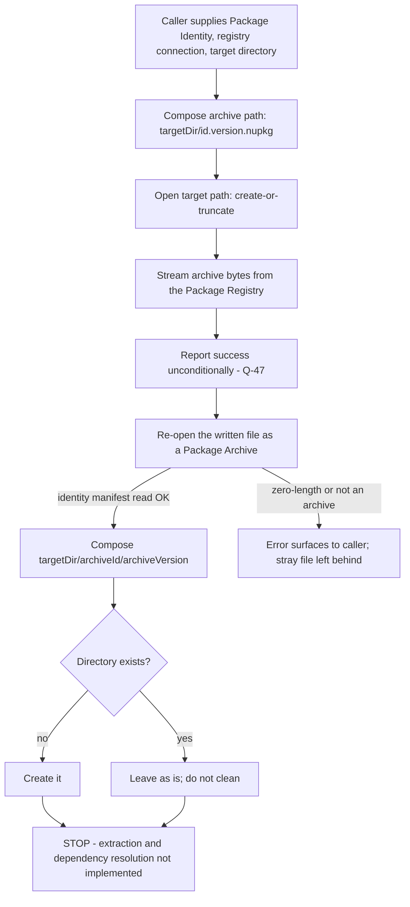

### 7.7 Package Registry Client

**Description** — The Package Registry Client is the Shell's single integration point to a Package Registry. It is the one place that knows how to ask a remote package index for things: find Plugins matching a keyword, list every published version of a named Plugin, resolve one Plugin version's declared direct dependencies for a target runtime, download a Package Archive to a named file, read the authoritative Package Identity back out of a downloaded archive, and — as a partial implementation — install a Plugin by combining download and on-disk layout. Every package-facing Command in the Shell is meant to reach the registry only through this component, so that no Command has to carry registry protocol knowledge of its own.

The component is a stateless collection of six operations. It holds no configuration object, no connection pool, no session and no in-memory cache: every operation takes everything it needs as arguments, and nothing has to be constructed before an operation is invoked (`src/Xcaciv.Command.Packages/NugetWrapper.cs:18-131`). It owns no persisted entity and has no state machine. Its only durable outputs are two filesystem artefacts produced by the download and install operations.

Only one path through this component ships and is reachable from a Session: keyword search, driven by the Package Search Command. Version enumeration, dependency resolution, archive download, archive-identity read and install are all implemented and none of them has a caller in the shipping Shell — the Package Install Command is inert and returns a literal refusal instead of calling install (`src/Xcaciv.Command.Packages/InstallCommand.cs:19-27`). The component also performs no validation of its own inputs, has no retry, no timeout, no backoff, no rate limiting, no credential handling and no error-handling policy whatsoever: every transport or filesystem failure crosses the boundary raw and untranslated (`src/Xcaciv.Command.Packages/NugetWrapper.cs:20-128`, which contains no error-interception construct anywhere). A reimplementer inherits both the shape and the gaps.

---

**User stories**

- **US-7.1** — As a Shell user, I want to search a Package Registry by keyword from the Session, so that I can discover Plugins without leaving the Shell.
- **US-7.2** — As a Shell user, I want to cap how many Package Listings come back, so that a broad keyword does not flood the Session with results.
- **US-7.3** — As a Shell user, I want to choose whether unreleased Plugin versions appear in my search results, so that I can see or hide pre-production Plugins. *This capability exists in the Package Registry Client and is honoured there, but is defeated before it arrives (FR-7.71); no Shell user can currently turn it off.*
- **US-7.4** — As a Shell Operator, I want the Package Registry the Shell queries to be chosen by a Session Variable with a built-in fallback endpoint, so that a Session can be pointed at a different registry without rebuilding the Shell.
- **US-7.5** — As a Package Registry, I want my own relevance ordering, matching rules and result set honoured verbatim by the client, so that what the Shell shows a user is what I decided to return.
- **US-7.6** — As a Plugin author, I want the Package Listing the Shell receives for my Plugin to carry its summary, download count, publication date, authors, licence and known-vulnerability count, so that a Shell user who asks for the full Detail level can see them.
- **US-7.7** — As a Shell Operator, I want a capability that enumerates every published version of an exactly named Plugin, so that a Host-linked Command I register can offer version listing. *Implemented and covered by tests; no shipping Command reaches it.*
- **US-7.8** — As a Shell Operator, I want a capability that resolves one Plugin version's declared direct dependencies against a target runtime, so that a Host-linked Command can inspect what a Plugin needs. *Implemented as a one-level lookup only; it produces no dependency graph, has no caller and has no test.*
- **US-7.9** — As a Shell Operator, I want a capability that downloads a Package Archive to a named file path, so that a Host-linked Command can fetch a Plugin's payload.
- **US-7.10** — As a Shell Operator, I want the authoritative Package Identity read out of a downloaded Package Archive rather than taken from the request or the file name, so that on-disk layout follows what the Plugin actually is.
- **US-7.11** — As a Shell user, I want `PACKAGE INSTALL` to place a Plugin into the Plugin Directory so that a later Session picks up its Commands. *This is an unfinished intention on both sides: the Package Install Command never calls the client, and the client's install operation stops after writing the archive and creating an empty directory — nothing is unpacked, no dependency is fetched, and nothing is registered with the Shell.*

---

**Use cases**

#### UC-7.A — Keyword search (realizes US-7.1, US-7.2, US-7.3, US-7.5, US-7.6)

**Preconditions.** A Package Registry service-index endpoint is reachable over HTTPS. The caller has already built a registry connection from that endpoint. The caller has already validated the endpoint and the search term — the Package Registry Client re-validates neither.

**Main flow.**
1. The caller supplies a search term, a registry connection, and optionally a Result limit, a Prerelease inclusion setting, a diagnostic sink and a cancellation signal.
2. Unsupplied optional inputs take their defaults: Result limit **20**, Prerelease inclusion **false**, a **silent** diagnostic sink, and a **never-cancel** cancellation signal.
3. The client obtains the registry's search capability from the connection.
4. The client builds a search filter carrying **only** the Prerelease inclusion setting — no runtime filter, no package-type filter, no ordering hint.
5. The client issues exactly one search request with page offset **0** and page size equal to the effective Result limit.
6. The client materialises the registry's response into an ordered collection and returns it, applying no client-side sorting, filtering, de-duplication or re-ordering.

**Alternate flows.**
- *No match.* The registry returns nothing; the client returns an empty collection — never an error and never an absent value. (INFERRED; untested.)
- *Prerelease inclusion on.* The filter carries the toggle to the registry; the registry decides what that means. Turning it on must not empty the result set.
- *Caller supplies a diagnostic sink.* Requests are logged through it; otherwise nothing is logged anywhere.

**Error flows.**
- *Network unreachable, name-resolution failure, TLS failure, registry 5xx, throttling.* The underlying error propagates to the caller unmodified. Nothing is caught, nothing is retried, no context is added, no partial result is reported.
- *Result limit of 0, a negative number, or an implausibly large number.* Passed straight to the registry as the page size with no clamping at this layer. Behaviour is whatever the registry does.
- *Failure surfacing during a Session.* A failure raised inside the Package Search Command is caught by the Command Service, which emits the Output `Error executing PACKAGE (see trace for more info)`, a Status line `**Error: ` followed by the message, and the detail to Diagnostic trace; the Session continues. (OUT-OF-REPO evidence only.) Anything escaping the Session terminates the process with `Error {message}` on standard output and exit code **1**.

**Postconditions.** No local file is created or modified. One outbound search request has been made, plus a service-discovery request on first use of the connection (INFERRED). Whether the search response reaches an on-disk response cache is decided entirely by the underlying registry client, because this is the only network operation that opens no response-cache scope of its own — open question.

#### UC-7.B — Enumerate all versions of a named Plugin (realizes US-7.7)

**Preconditions.** A Package Registry endpoint URL is available as plain text. No prior connection is needed.

**Main flow.**
1. The caller supplies an exact Plugin name and a Package Registry endpoint URL as text. No diagnostic sink, no cancellation signal and no Prerelease inclusion setting can be supplied.
2. The client builds a **fresh** registry connection from that URL — on every call.
3. The client obtains the registry's package-by-name capability.
4. The client requests the complete version list for that exact name in one request, with no offset, page size or continuation token.
5. The client returns the versions in the order the registry delivered them, with no client-side sort.

**Alternate flows.**
- *Name unknown at the registry.* An **empty collection** is returned and **no error is raised**. This is indistinguishable from "the Plugin exists but has no listed versions".
- *Plugin has prerelease versions.* They **are** included in the result. A prerelease-excluding filter is constructed inside the operation and then never handed to the request. **QUIRK (Q-49).**

**Error flows.**
- *Malformed, plain-HTTP or non-network endpoint URL.* Not detected here. This operation validates nothing about the URL; whether the underlying client refuses it is not determinable from the source.
- *Transport or registry failure.* Propagates unmodified, as in UC-7.A.

**Postconditions.** No local file written. One service-discovery exchange plus one version-index request per call — the connection is never reused across calls. A response-cache scope is created and never released; a second cache scope is opened in a properly released block and then never used. **QUIRK (Q-49).**

#### UC-7.C — Resolve one Plugin version's direct dependencies (realizes US-7.8)

**Preconditions.** A registry connection has been built by the caller.

**Main flow.**
1. The caller supplies a Plugin name, a version **as text**, a registry connection, and optionally a target-runtime moniker, a diagnostic sink and a cancellation signal.
2. Unsupplied optional inputs default to the wildcard **"any framework"** runtime, a silent diagnostic sink, and never-cancel.
3. The client parses the version text into a comparable version value. This happens **before** any network work.
4. The client obtains the registry's dependency-metadata capability and asks it to resolve that one exact Package Identity against the target runtime.
5. If a record comes back, it is placed in the result collection; the collection is returned.

**Alternate flows.**
- *Nothing comes back.* The collection is returned empty rather than as an error or an absent value. (INFERRED.)

**Error flows.**
- *Unparseable version text.* An error is raised before any network call is made. (INFERRED; untested.)
- *Transport or registry failure.* Propagates unmodified.

**Postconditions.** The result holds **at most one** record. Resolution is single-level: transitive dependencies are not walked and no dependency graph is produced. A response-cache scope is opened and correctly released. No local file written.

#### UC-7.D — Download a Package Archive to a named path (realizes US-7.9)

**Preconditions.** A registry connection has been built. The target file's **directory already exists** — the client does not create it. The caller has chosen the target path; nothing enforces the documented convention.

**Main flow.**
1. The caller supplies a Package Identity, a registry connection and a target file path.
2. The client obtains the registry's package-by-name capability. Diagnostics are hard-wired silent and cancellation hard-wired to never; neither is exposed to the caller.
3. The client opens the target path in **create-or-truncate** mode. An existing file at that path is truncated to zero bytes at this moment, before any network work is attempted.
4. The archive bytes are streamed from the registry directly into the file — never buffered whole in memory.
5. The client returns the affirmative success indicator.

**Alternate flows.**
- *Target path already holds a file.* Its previous contents are gone. There is no existence check, no prompt, no backup, no "skip if present" and no write-to-temp-then-rename.
- *Documented path convention.* The source documents the target path as `{path}/{packageId}.{versionString}.nupkg`. This is advisory only; nothing validates or enforces it, and the one test that downloads deliberately violates it by using a random file name in the platform temporary directory.

**Error flows.**
- *Package Identity does not exist at the registry.* The affirmative success indicator is **still returned** — the underlying transfer's own success/failure report is discarded. A **zero-length file is left at the target path** (INFERRED). "Package does not exist" is indistinguishable from "3 MB downloaded successfully". **QUIRK (Q-47).**
- *Target directory missing.* An error is raised when the file is opened; nothing is downloaded. (INFERRED.)
- *Target path not writable, or disk full.* The error surfaces from the file write; the partially written file is left behind — no cleanup, no temp-then-rename. (INFERRED.)
- *Transfer interrupted mid-stream.* A truncated file is left at the target path and is indistinguishable from a complete one: no length check, no hash, no signature. (INFERRED.)
- *Two concurrent downloads to the same target path.* They interleave destructively; the create-or-truncate open takes no lock.

**Postconditions.** A file exists at the target path — possibly complete, possibly truncated, possibly zero-length. It is never deleted by this feature. The response-cache scope opened by this operation is never released.

#### UC-7.E — Read identity metadata out of a downloaded Package Archive (realizes US-7.10)

**Preconditions.** A local file path is supplied. No registry connection and no endpoint URL are involved; this operation never touches the network.

**Main flow.**
1. The client opens the file as a Package Archive.
2. It locates the identity manifest embedded in the archive.
3. It returns the Package Identity recorded **inside** the archive — the authoritative identity, independent of the file's name on disk and independent of whatever the caller asked for.

**Alternate flows** — none.

**Error flows.**
- *File missing, zero-length, not an archive, or an archive with no identity manifest.* An error is raised by the archive reader. (INFERRED; untested.)

**Postconditions.** The file is opened for reading and closed again. Nothing is written, nothing is extracted.

#### UC-7.F — Install: download, then lay out on disk (realizes US-7.11 — partial)

**Preconditions.** A registry connection has been built. A target directory exists. **No shipping code path reaches this use case:** the Package Install Command does not call the client, and no test exercises it.

**Main flow.**
1. The caller supplies a Package Identity, a registry connection and a target directory path.
2. The client composes the archive file name as `{id}.{version}.nupkg` from the **caller's** identity and joins it to the target directory.
3. The client invokes the download operation (UC-7.D) and **blocks the calling thread** until it completes.
4. The client re-opens the just-written archive and reads the Package Identity back out of it (UC-7.E). From here on, the identity from the archive — not the caller's — drives the layout.
5. The client composes a per-Plugin directory `{targetDirectory}/{id-from-archive}/{version-from-archive}` and creates it if it does not already exist.
6. The operation **stops**. Extraction of the archive and resolution of dependencies are both explicitly unimplemented, left in the source as written-out intentions.

**Alternate flows.**
- *Per-Plugin directory already exists.* It is left exactly as it is. Its existing contents are not cleaned, not replaced, not inspected.
- *Plugin already installed.* Irrelevant — there is no "already installed" short-circuit; the download runs unconditionally every time.
- *Archive identity differs in casing or version rendering from the caller's.* The archive file keeps the caller's spelling while the directory takes the archive's, so the two names can disagree.

**Error flows.**
- *Package Identity does not exist at the registry.* The download step reports success (see UC-7.D), step 4 then fails trying to read a zero-length file as an archive, the per-Plugin directory is never created, and the zero-length file is orphaned in the target directory. (INFERRED; compound of Q-47 and Q-77.)
- *Any failure at any step.* No rollback, no cleanup, no transaction. Whatever was written stays.
- *Reporting.* The operation reports nothing back to its caller at all. Success and failure are distinguishable only by whether an error surfaced and by inspecting the filesystem afterwards.

**Postconditions.** On the happy path exactly two things exist: an archive file at `{targetDirectory}/{id}.{version}.nupkg`, and an **empty** directory at `{targetDirectory}/{id}/{version}/`. Nothing is unpacked. No dependency is fetched. Nothing is registered with the Shell. The layout produced does not match the layout the Plugin Scanner looks in, so even a hypothetically-complete extraction into that directory would not be discovered — and, independently of that mismatch, the scan itself cannot succeed on a real filesystem at all (FR-7.56), so a Plugin placed into the Plugin Directory by this or any other means is never loaded. **QUIRK (Q-77; see OQ-15).**

---

**Functional requirements**

*Shape and addressing*

- **FR-7.1** — The Package Registry Client shall be stateless: no instance state, no configuration object, no connection pool, no session, and no cross-call in-memory cache. Every operation shall be self-contained and invocable without constructing anything first. (`src/Xcaciv.Command.Packages/NugetWrapper.cs:18-131`)
- **FR-7.2** — The client shall expose exactly six operations: keyword search, version enumeration, dependency resolution, archive download, archive-identity read, and install. (`src/Xcaciv.Command.Packages/NugetWrapper.cs:20`, `:34`, `:52`, `:81`, `:103`, `:111`)
- **FR-7.3** — Keyword search, dependency resolution, archive download and install shall each require the caller to supply an already-built registry connection; version enumeration shall instead take a Package Registry endpoint URL as plain text and build its own connection internally; archive-identity read shall take neither. **QUIRK (Q-78)** — only version enumeration can be invoked from a URL alone, and every other network operation therefore pushes endpoint validation onto its caller. The three-way split (a URL, a prepared connection, or neither) is one inconsistent connection contract, not three deliberate ones. (`src/Xcaciv.Command.Packages/NugetWrapper.cs:20`, `:34`, `:39-40`, `:52`, `:81`, `:103`, `:111`; realizes US-7.7, US-7.9)
- **FR-7.4** — Version enumeration shall build a new registry connection on **every** call and shall never reuse one, so it repeats service discovery per call. INFERRED that discovery is cached on a connection and that reuse would therefore be cheaper — that is a property of the underlying registry client, not visible in the source. (`src/Xcaciv.Command.Packages/NugetWrapper.cs:39-40`)
- **FR-7.5** — Keyword search, version enumeration, dependency resolution and download shall be asynchronous; archive-identity read and install shall be synchronous. Install shall consume the asynchronous download by blocking the calling thread. (`src/Xcaciv.Command.Packages/NugetWrapper.cs:20`, `:34`, `:52`, `:81`, `:103`, `:111`, `:116`)

*Keyword search*

- **FR-7.6** — Keyword search shall accept a search term and a registry connection as required inputs, and a Result limit, a Prerelease inclusion setting, a diagnostic sink and a cancellation signal as optional inputs. (`src/Xcaciv.Command.Packages/NugetWrapper.cs:20`; realizes US-7.1)
- **FR-7.7** — When the caller supplies no Result limit, the effective Result limit shall be **20**. **QUIRK (Q-79)** — this is a second, independent copy of the same default that Package Search separately declares (FR-7.74); the two are free to drift, and a clone should keep one source of truth. (`src/Xcaciv.Command.Packages/NugetWrapper.cs:20`; `src/Xcaciv.Command.Packages/SearchCommand.cs:15`; realizes US-7.2)
- **FR-7.8** — When the caller supplies no Prerelease inclusion setting, prereleases shall be **excluded** (false). This default is likewise duplicated between this client and the calling Command, and is defeated before it arrives (FR-7.71). See Q-79. (`src/Xcaciv.Command.Packages/NugetWrapper.cs:20`; realizes US-7.3)
- **FR-7.9** — The search filter sent to the Package Registry shall carry the Prerelease inclusion setting and **nothing else** — no runtime filter, no package-type filter and no ordering hint. (`src/Xcaciv.Command.Packages/NugetWrapper.cs:28`)
- **FR-7.10** — Every search request shall use page offset **0** and a page size equal to the effective Result limit. There shall be no paging interface, no continuation token, and no way to reach result 21 and beyond other than by raising the Result limit. The offset **0** is hard-coded with no way to change it (Q-79). (`src/Xcaciv.Command.Packages/NugetWrapper.cs:29`; realizes US-7.2)
- **FR-7.11** — The Result limit shall be passed through to the Package Registry unmodified: this layer shall apply **no clamping, no lower bound and no upper bound**. A caller may therefore pass 0, a negative number, or an arbitrarily large number. (`src/Xcaciv.Command.Packages/NugetWrapper.cs:29`)
- **FR-7.12** — Result ordering shall be the Package Registry's own, preserved exactly as delivered. No client-side sort, filter, de-duplication or re-ordering shall be applied. (`src/Xcaciv.Command.Packages/NugetWrapper.cs:31`; realizes US-7.5)
- **FR-7.13** — The search term shall be passed to the Package Registry verbatim, with no normalisation, casing change or punctuation adjustment. Matching semantics are entirely the registry's. The only matching property the repository actually exercises is **case-insensitivity**: the search term `cake.nuget` returns the Plugin name `Cake.NuGet`, which differs from the term in casing only — the punctuation of the two strings is identical (one dot, in the same position). Whether the registry also tolerates a term punctuated differently from the Plugin name is **untested here and must not be assumed**; nothing in the repository exercises a punctuation difference. (`src/Xcaciv.Command.Packages/NugetWrapper.cs:29`; `Xcaciv.Command.PackagesTests/SearchCommandTests.cs:112-126`; realizes US-7.5)
- **FR-7.14** — Each returned Package Listing shall carry at minimum: Package Identity (name and version), a summary text, a download count, a publication timestamp, an authors text, licence metadata, and a collection of known vulnerabilities that can be counted. Any of these except identity may be empty or absent. (`src/Xcaciv.Command.Packages/SearchCommand.cs:66-77`; `Xcaciv.Command.PackagesTests/SearchCommandTests.cs:56-69`; realizes US-7.6)
- **FR-7.15** — A search matching nothing shall return an empty, materialised collection — never an error and never an absent value. INFERRED; untested. (`src/Xcaciv.Command.Packages/NugetWrapper.cs:31`)
- **FR-7.16** — Keyword search shall be the only network operation that opens **no** response-cache scope of its own; whether search responses are cached is therefore decided entirely by the underlying registry client. Open question for the clone team. (`src/Xcaciv.Command.Packages/NugetWrapper.cs:20-31`, contrast `:37`, `:43`, `:62`, `:85`)
- **FR-7.17** — Each keyword search shall issue one outbound search request, plus one service-discovery request on first use of a given registry connection. INFERRED — the source issues one search call and never configures transport, so request counts are a property of the underlying client.
- **FR-7.18** — An unused, never-read text collection shall be allocated at the top of both keyword search and version enumeration. **QUIRK (Q-49)** — harmless dead local state that signals these operations once returned plain names; a clone must not resurrect it as a returned value. (`src/Xcaciv.Command.Packages/NugetWrapper.cs:22`, `:36`)

*Version enumeration*

- **FR-7.19** — Version enumeration shall match the supplied Plugin name **exactly**: it is a name lookup, not a search. (`src/Xcaciv.Command.Packages/NugetWrapper.cs:46`; realizes US-7.7)
- **FR-7.20** — Version enumeration shall request the complete version list in one request, with no offset, page size or continuation token. INFERRED that the wire exchange is a single response — the source shows only that this layer asks once and never loops. (`src/Xcaciv.Command.Packages/NugetWrapper.cs:46`)
- **FR-7.21** — Version enumeration of a Plugin name that does not exist at the Package Registry shall return an **empty collection and raise no error**, indistinguishable from a Plugin with no listed versions. (`Xcaciv.Command.PackagesTests/NugetWrapperTests.cs:67-80`)
- **FR-7.22** — Versions shall be returned in the order the Package Registry delivered them; no client-side sort shall be applied. (`src/Xcaciv.Command.Packages/NugetWrapper.cs:48`)
- **FR-7.23** — **QUIRK (Q-49)** — version enumeration shall construct a prerelease-excluding filter and then never apply it to the request, so prerelease versions **are** present in the result despite the apparent intent to exclude them. (`src/Xcaciv.Command.Packages/NugetWrapper.cs:45` constructs it; `:46` does not use it)
- **FR-7.24** — **QUIRK (Q-49)** — version enumeration shall open **two** response-cache scopes: one created up front and never released, and a second opened in a properly released block and then never used. The request shall be handed the first, unreleased one. Net effect: the correctly scoped handle is dead weight and the live one leaks per call. (`src/Xcaciv.Command.Packages/NugetWrapper.cs:37`, `:43`, `:46`)
- **FR-7.25** — Version enumeration shall expose neither a diagnostic sink nor a cancellation signal to its caller; both are hard-wired (silent, never-cancel). (`src/Xcaciv.Command.Packages/NugetWrapper.cs:46`)
- **FR-7.26** — Version enumeration shall perform no validation of the endpoint URL it is handed; a plain-HTTP or non-network URL passes through unchecked. (`src/Xcaciv.Command.Packages/NugetWrapper.cs:39`)

*Dependency resolution*

- **FR-7.27** — Dependency resolution shall accept a Plugin name and a version **as text**, plus a registry connection; optionally a target-runtime moniker, a diagnostic sink and a cancellation signal. It is the only operation that takes a version as text — download and install take a pre-built Package Identity. (`src/Xcaciv.Command.Packages/NugetWrapper.cs:52`, `:81`, `:111`; realizes US-7.8)
- **FR-7.28** — When no target runtime is supplied, the wildcard **"any framework"** shall be used. (`src/Xcaciv.Command.Packages/NugetWrapper.cs:57`)
- **FR-7.29** — The version text shall be parsed into a comparable version value **before** any network call is made. (`src/Xcaciv.Command.Packages/NugetWrapper.cs:59`)
- **FR-7.30** — Unparseable version text shall raise an error before any network call. INFERRED; untested. (`src/Xcaciv.Command.Packages/NugetWrapper.cs:59`)
- **FR-7.31** — The result shall hold **at most one** record. Resolution is single-level: transitive dependencies shall not be walked and no dependency graph shall be produced. What dependency behaviour was intended — full transitive resolution, allow/deny lists, or none — is an open question (OQ-16). (`src/Xcaciv.Command.Packages/NugetWrapper.cs:64-72`)
- **FR-7.32** — A resolution that finds nothing shall produce an empty collection rather than an error or an absent value. INFERRED from the explicit "only add when something came back" branch. (`src/Xcaciv.Command.Packages/NugetWrapper.cs:66-69`)
- **FR-7.33** — The record returned describes the requested Plugin, its declared **direct** dependency ranges, and the location to download it from. INFERRED for the field set — nothing in the source ever reads a field off this record, projects it, or renders it; only the cardinality is directly observed.

*Archive download*

- **FR-7.34** — Download shall accept a Package Identity, a registry connection and a target file path, all required. (`src/Xcaciv.Command.Packages/NugetWrapper.cs:81`; realizes US-7.9)
- **FR-7.35** — The documented target-path convention is `{path}/{packageId}.{versionString}.nupkg`. It shall be **advisory only** — nothing validates or enforces it, and the one test that downloads deliberately supplies a random name in the platform temporary directory instead. (`src/Xcaciv.Command.Packages/NugetWrapper.cs:79`; `Xcaciv.Command.PackagesTests/NugetWrapperTests.cs:89`)
- **FR-7.36** — The target file shall be opened in **create-or-truncate** mode before any network work is attempted: an existing file is silently truncated to zero bytes at that moment. There shall be no existence check, no prompt, no backup, no "skip if present", and no write-to-temp-then-rename. **QUIRK (Q-48).** (`src/Xcaciv.Command.Packages/NugetWrapper.cs:89`)
- **FR-7.37** — The archive shall be streamed from the Package Registry directly into the target file and never buffered whole in memory, so that large Package Archives do not exhaust memory. (`src/Xcaciv.Command.Packages/NugetWrapper.cs:89-98`)
- **FR-7.38** — No integrity verification of any kind shall be performed after the transfer: no hash, no signature, no declared-length check. **QUIRK (Q-48)** — taken together with FR-7.36 and FR-7.45 this is the highest-severity gap in the product: nothing verifies a signature, checksum or publisher before archive content would decide what is written to disk. (`src/Xcaciv.Command.Packages/NugetWrapper.cs:89-100`)
- **FR-7.39** — **QUIRK (Q-47)** — download shall return the affirmative success indicator unconditionally, discarding the underlying transfer's own success/failure report. A Package Identity that does not exist at the registry is therefore indistinguishable from a completed multi-megabyte download. (`src/Xcaciv.Command.Packages/NugetWrapper.cs:91-100`)
- **FR-7.40** — When the requested Package Identity does not exist at the registry, a **zero-length file shall be left at the target path** alongside the affirmative result, because truncation happens before the transfer is attempted. INFERRED. **QUIRK (Q-47).** (`src/Xcaciv.Command.Packages/NugetWrapper.cs:89`, `:91-100`)
- **FR-7.41** — Download shall **not** create the target file's directory. If the directory does not exist the operation fails when opening the file and nothing is downloaded. INFERRED — contrast install, which does create a directory. (`src/Xcaciv.Command.Packages/NugetWrapper.cs:89` vs `:121-124`)
- **FR-7.42** — An interrupted or failed transfer shall leave the partially written file at the target path with no cleanup; it is indistinguishable from a complete download. INFERRED. (`src/Xcaciv.Command.Packages/NugetWrapper.cs:89-100`)
- **FR-7.43** — Download shall expose neither a diagnostic sink nor a cancellation signal; both are hard-wired (silent, never-cancel). Two concurrent downloads to the same target path shall interleave destructively — the create-or-truncate open takes no lock and no throttling or connection limiting is imposed. (`src/Xcaciv.Command.Packages/NugetWrapper.cs:83-84`, `:89`)

*Archive-identity read*

- **FR-7.44** — Archive-identity read shall take a local file path only and shall never touch the network. (`src/Xcaciv.Command.Packages/NugetWrapper.cs:103`; realizes US-7.10)
- **FR-7.45** — The Package Identity returned shall be the one recorded in the identity manifest **inside** the Package Archive — the authoritative identity — independent of the file's name on disk and of what the caller requested. Because nothing verifies the archive first (FR-7.38), this makes archive-controlled content decide the on-disk layout install builds (Q-48). (`src/Xcaciv.Command.Packages/NugetWrapper.cs:105-107`)
- **FR-7.46** — Reading a missing, zero-length, non-archive, or manifest-less file shall raise an error. INFERRED; untested. (`src/Xcaciv.Command.Packages/NugetWrapper.cs:105`)
- **FR-7.47** — No format sniffing, no size limit, no path-traversal guard on entry names and no signature check shall be performed before or during the read. This matters because the disabled extraction step would write archive-controlled entry paths under the install directory. **QUIRK (Q-48).** (`src/Xcaciv.Command.Packages/NugetWrapper.cs:103-109`, `:127`)

*Install*

- **FR-7.48** — Install shall accept a Package Identity, a registry connection and a target directory path, and shall report **nothing** back to its caller. Success and failure are distinguishable only by whether an error surfaced and by inspecting the filesystem. (`src/Xcaciv.Command.Packages/NugetWrapper.cs:111`; realizes US-7.11)
- **FR-7.49** — The archive file name shall be composed as `{id}.{version}.nupkg` from the **caller's** Package Identity and joined to the target directory. (`src/Xcaciv.Command.Packages/NugetWrapper.cs:113-114`)
- **FR-7.50** — Install shall invoke download and **block the calling thread** until it completes. (`src/Xcaciv.Command.Packages/NugetWrapper.cs:116`)
- **FR-7.51** — Install shall re-open the just-written archive and read the Package Identity back out of it; that archive-sourced identity — not the caller's — shall drive the on-disk layout. It may differ from the caller's in casing or version rendering. (`src/Xcaciv.Command.Packages/NugetWrapper.cs:118-119`)
- **FR-7.52** — The per-Plugin directory shall be `{targetDirectory}/{id-from-archive}/{version-from-archive}/`, created only if it does not already exist. An existing directory shall be left exactly as it is, with **no cleanup of stale contents**. (`src/Xcaciv.Command.Packages/NugetWrapper.cs:119-124`)
- **FR-7.53** — The version text used in both the archive file name and the directory name shall be the **rendered form of the parsed version**, which is not guaranteed to equal the registry's normalised form — a four-segment version renders with four segments. INFERRED. A clone choosing normalised versions will produce different file and directory names. (`src/Xcaciv.Command.Packages/NugetWrapper.cs:113`, `:119`)
- **FR-7.54** — **QUIRK (Q-77)** — install shall stop after creating the per-Plugin directory. Extraction of the archive and resolution of dependencies are unimplemented intentions, so a "successful" install produces one archive file plus one **empty** directory and installs nothing usable. Finishing the Package Install Command (Q-46) without also finishing this routine still ships a feature that installs nothing loadable. See OQ-15 and OQ-16. (`src/Xcaciv.Command.Packages/NugetWrapper.cs:125-127`)
- **FR-7.55** — Install shall re-download unconditionally: there shall be no "already installed" short-circuit, and no rollback, cleanup or transaction on partial failure. Whatever was written stays. (`src/Xcaciv.Command.Packages/NugetWrapper.cs:113-116`, `:111-128`)
- **FR-7.56** — **QUIRK (Q-77)** — the directory shape install creates (`{targetDirectory}/{id}/{version}/`) does not match the layout the Plugin Scanner searches, which is a Plugin's own sub-directory named `bin` at least one level beneath the Plugin Directory: the scanner joins a wildcard segment, the sub-directory name and the binary pattern into the search mask `*/bin/*.dll` and passes it to a recursive enumeration rooted at the verified Plugin Directory. Even a completed extraction into the install layout would not be discovered at the next startup.
  **And the layout mismatch is not the only obstacle — the scan cannot succeed at all.** Established empirically against a real filesystem during verification: with a perfectly correct layout present (`<root>/HelloPkg/bin/Hello.dll` and `<root>/Other/bin/Other.dll`), that mask returns neither those files nor an empty set. The directory portion of a search mask is joined to the root **literally** and its wildcards are never expanded, so the enumeration raises a **directory-not-found condition naming the literal path `<Plugin Directory>/*/bin`**. Both recursive and top-level enumeration modes were tested and both raise; a control run with the plain pattern `*.dll` found both fixture files, confirming the layout was correct and the mask is the cause. Consequently **no Plugin is ever loaded from disk on a real filesystem**, and finishing extraction — or even aligning install's layout with `*/bin/*.dll` — would still install nothing loadable until the scan itself is fixed.
  Two consequences owned by §7.4 and §7.5 but load-bearing here: the directory-not-found condition is **not** the tolerated *No Plugins Available* condition, so the tolerant startup branch does not catch it (`src/Xcaciv.Cupcake.Core/Loop.cs:45-54`); it is wrapped as a Startup Load Failure carrying `Unable to load commands.` (`src/Xcaciv.Cupcake.Core/Loop.cs:53`), escapes the Session and ends the process with exit status **1** (`src/Xcaciv.Cupcake.Lit/Program.cs:14-19`). So **any** Plugin Directory that survives verification is fatal at startup — populated or empty alike, because the enumeration raises before it can distinguish them — and only a **missing** Plugin Directory reaches a usable Prompt. The previously-documented sequence "verified directory → scanned → *no plugin binaries* condition raised" is unreachable on the shipping path, because that literal is reachable only when the sub-directory filter is empty, which the product never does. INFERRED that the runtime the product targets behaves identically; the enumeration semantic is long-standing. The framework's own scanner tests pass because they run against a mock filesystem that INFERRED expands the wildcard segment; the production path uses the real filesystem and cannot. See OQ-7, OQ-8 and OQ-15. OUT-OF-REPO evidence for the scanner's layout and mask. (`src/Xcaciv.Command.Packages/NugetWrapper.cs:119`; OUT-OF-REPO: `src/Xcaciv.Command.FileLoader/Crawler.cs:20, 171-190` — the `*.dll` pattern and the search-mask construction — and `src/Xcaciv.Command/CommandController.cs:169` — the `bin` sub-directory default — at framework v2.1.2)
- **FR-7.57** — **QUIRK (Q-46)** — no shipping code path reaches install. The Package Install Command returns the literal text `Not installing ` followed by the comma-joined parameters for Direct invocation, and `Not installing {chunk} ` followed by the comma-joined parameters for Per-chunk invocation, without touching the client at all. Both package Commands are nonetheless registered with the Shell at startup. See OQ-14. (`src/Xcaciv.Command.Packages/InstallCommand.cs:19-27`; `src/Xcaciv.Cupcake.Lit/Program.cs:10-11`)

*Cross-cutting*

- **FR-7.58** — The client shall perform **no validation of the Package Registry endpoint**. HTTPS enforcement — rejecting anything that is not an absolute HTTPS URL with the exact message `Insecure or invalid package source URL. HTTPS is required.` — lives in the Package Search Command, upstream of this client. Any other caller may pass an unchecked URL. (`src/Xcaciv.Command.Packages/SearchCommand.cs:32-35`; `src/Xcaciv.Command.Packages/NugetWrapper.cs:39`)
- **FR-7.59** — The client shall perform **no validation of the search term**. Trimming, the empty-term short-circuit that returns empty output with no request, and truncation to the first **200** characters all happen upstream. (`src/Xcaciv.Command.Packages/SearchCommand.cs:50-58`)
- **FR-7.60** — The client shall have **no retry, no timeout of its own, no backoff and no rate limiting**; whatever the underlying registry client does by default is what happens. (`src/Xcaciv.Command.Packages/NugetWrapper.cs:20-128`)
- **FR-7.61** — The client shall have **no error-handling policy**: nothing is intercepted, nothing is translated into a domain-level failure, nothing reports a partial failure. Every transport or filesystem error crosses the boundary raw. (`src/Xcaciv.Command.Packages/NugetWrapper.cs:20-128`)
- **FR-7.62** — The default diagnostic sink shall be **silent** for every operation, and the default cancellation signal shall be **never cancel** for every operation. Only keyword search and dependency resolution let the caller supply either. (`src/Xcaciv.Command.Packages/NugetWrapper.cs:23-24`, `:46`, `:55-56`, `:83-84`)
- **FR-7.63** — The client shall have **no authentication or authorization handling of any kind**: no API key, no credential provider, no per-source credentials, and no permission check before writing to a target directory. Only anonymous public Package Registries work. (`src/Xcaciv.Command.Packages/NugetWrapper.cs:20-128`)
- **FR-7.64** — The client shall verify no signature, hash, licence or vulnerability status before downloading or installing. A known-vulnerability count is fetched and rendered by Package Search, but never gates a download or an install. (`src/Xcaciv.Command.Packages/SearchCommand.cs:76`; `src/Xcaciv.Command.Packages/NugetWrapper.cs:81-128`)
- **FR-7.65** — The client shall emit no user-facing text and shall require no localisation. The only strings it produces are the file and directory names built from Package Identities; all user-facing text belongs to the calling Commands. (`src/Xcaciv.Command.Packages/NugetWrapper.cs:113`, `:119`)
- **FR-7.66** — Where a response-cache scope is opened, it shall be left unconfigured, inheriting the underlying library's defaults: responses cached to a per-user on-disk cache and reused for **30 minutes** before revalidation, with direct-download off. INFERRED — a library default, never set anywhere in the source. A clone must choose this deliberately. (`src/Xcaciv.Command.Packages/NugetWrapper.cs:37`, `:43`, `:62`, `:85`)
- **FR-7.67** — Operations shall be safe to invoke concurrently from the caller's point of view, since none shares mutable state; the sole concurrency hazard is two downloads targeting the same file path (FR-7.43). (`src/Xcaciv.Command.Packages/NugetWrapper.cs:18-131`)

*Boundary rules that pin this client end to end (owned by adjacent features, load-bearing here)*

- **FR-7.68** — The Package Registry endpoint used by Package Search shall be read from the Session Variable `PackageSourceUrl`, falling back to the literal `https://api.nuget.org/v3/index.json` when that value is absent or empty. (`src/Xcaciv.Command.Packages/SearchCommand.cs:24-29`; realizes US-7.4)
- **FR-7.69** — **QUIRK (Q-10)** — reading that Session Variable has a write side effect, but its blast radius is narrower than it first appears. With the default read options a missing key **is** stored back at its default, so the read leaves an empty value recorded under the **upper-cased** key `PACKAGESOURCEURL`. That write, however, lands in the **per-execution child Session Variable scope** the executor creates for every Command — a fresh store seeded with a *copy* of the caller's values — and the child is merged back into the caller's store **only** when the Command's registration record declares it environment-modifying *and* the child changed. The shipping Shell registers Package Search **without** that flag, and the flag defaults to off, so in normal Shell use the child scope is discarded on return and **a subsequent Session Variable dump does not list the key**. The side effect is observable only on a **direct-invocation** path, where a host passes its own store straight to the Command with no child scoping — which is exactly what the repository's own tests do (a Shell Operator embedding the Command directly, as in §7.8 US-8.7). Two traps survive for a clone: registering the Command as environment-modifying makes the write escape into the Session — and by §7.1 FR-1.21 that flag is stamped on the whole Command Group, so it would also change Package Install's write-back — and any host that embeds the Command directly sees the write today. *Correction:* earlier drafts of this document recorded the stronger consequence that a later Session Variable dump lists the polluted key. That does not follow from the observed discard rule for a Command registered as non-modifying, and it is corrected here and in §7.8 FR-8.16 and AC-8.27. Q-10 remains a genuine keep-or-fix decision — a read should not mutate — but its observable is the child scope and the direct-invocation path, not the Session dump. OUT-OF-REPO evidence for the store-on-read behaviour, the child scope and the write-back gate. (`src/Xcaciv.Command.Packages/SearchCommand.cs:24`; `src/Xcaciv.Cupcake.Lit/Program.cs:11`; `Xcaciv.Command.PackagesTests/SearchCommandTests.cs:15`, `:31`, `:90`; OUT-OF-REPO, all at framework v2.1.2: `src/Xcaciv.Command.Interface/IEnvironmentContext.cs:50` and `src/Xcaciv.Command/EnvironmentContext.cs:94-110` — store-the-default-on-miss and the upper-cased key; `src/Xcaciv.Command/CommandExecutor.cs:187` with `src/Xcaciv.Command/EnvironmentContext.cs:45-55` — the child scope as a copy; `src/Xcaciv.Command/CommandExecutor.cs:216-219` — the write-back gate; `src/Xcaciv.Command/CommandController.cs:190` — the environment-modifying flag defaulting to off)
- **FR-7.70** — **QUIRK (Q-6)** — Package Search declares a Named Parameter for the registry source that it never reads. It appears in generated help and is accepted on the Command line, but supplying it changes nothing: the endpoint comes solely from the Session Variable and its fallback. See OQ-6. (`src/Xcaciv.Command.Packages/SearchCommand.cs:14` vs `:24-29`)
- **FR-7.71** — **QUIRK (Q-1)** — the Prerelease inclusion Flag has no effect and prereleases are always included in a Shell-driven search. Package Search decides by asking whether the flag's key is *present* among the bound parameters, but the argument binder adds every declared Flag key unconditionally, carrying the text `True` or `False` as a value that is never read. OUT-OF-REPO evidence for the unconditional add. See OQ-4. (`src/Xcaciv.Command.Packages/SearchCommand.cs:47`; OUT-OF-REPO: `src/Xcaciv.Command.Core/CommandParameters.cs:34` at framework v2.1.2; realizes US-7.3 — as a defect against it)
- **FR-7.72** — **QUIRK (Q-3)** — the same unconditional-add rule makes Package Search's "is a Detail level present?" test always true, so its alternate path is dead. (`src/Xcaciv.Command.Packages/SearchCommand.cs:62`; OUT-OF-REPO: `src/Xcaciv.Command.Core/CommandParameters.cs:76-82` at framework v2.1.2)
- **FR-7.73** — **QUIRK (Q-2)** — the Detail level allow-list (`quiet`, `normal`, `detailed`, default `normal`) is checked **case-insensitively** during argument binding, while the rendering choice matches **case-sensitively**. A value outside the allow-list is therefore rejected during binding with `Invalid value for parameter verbosity, this parameter has an allow list.` and never reaches the Command, but a case-variant of an allowed value — for example `Detailed` — is accepted, silently falls through to the standard rendering, and loses the extra fields with no message. The fallback branch is not dead code: it is the branch that hides this defect, and it makes the publication date, authors, licence and vulnerability count this client fetched be discarded. See OQ-5. (`src/Xcaciv.Command.Packages/SearchCommand.cs:16`, `:63-83`; OUT-OF-REPO: `src/Xcaciv.Command.Core/CommandParameters.cs:76-79` at framework v2.1.2)
- **FR-7.74** — The Result limit supplied to Package Search shall be parsed as an integer — a non-integer aborts with the exact message `The 'take' parameter must be a valid integer value.` — and then clamped to the range **1..100**, with a declared default of `20`. The clamp exists only in the Command; the client itself clamps nothing (FR-7.11). (`src/Xcaciv.Command.Packages/SearchCommand.cs:15`, `:42-46`; realizes US-7.2)
- **FR-7.75** — **QUIRK (Q-5)** — invoking Package Search with **zero** arguments shall report `The 'take' parameter must be a valid integer value.` rather than a missing-search-term error, because argument binding short-circuits to an empty map when there are no arguments, applying no defaults and running no required-parameter check; the Result limit lookup is then the first thing to fail. No search request reaches the client. INFERRED; untested. (`src/Xcaciv.Command.Packages/SearchCommand.cs:22`, `:42-45`; OUT-OF-REPO: `src/Xcaciv.Command.Core/AbstractCommand.cs:180` at framework v2.1.2)
- **FR-7.76** — **QUIRK (Q-4)** — the search term must be the **first** argument on the Command line. It binds as a Positional Parameter, processed before Flags and Named Parameters are stripped, so a leading Flag makes binding fail with `Missing required parameter search_terms` and no search request reaches the client. (`src/Xcaciv.Command.Packages/SearchCommand.cs:13`; OUT-OF-REPO: `src/Xcaciv.Command.Core/CommandParameters.cs:86-129` at framework v2.1.2)
- **FR-7.77** — Per-chunk invocation of Package Search shall be refused before the client is reached, returning the exact text `Unsupported search method for {chunk} (piped)` immediately followed by the comma-joined parameters with no separator between the two. No search request is issued on that path. (`src/Xcaciv.Command.Packages/SearchCommand.cs:88-91`)
- **FR-7.78** — Both package Commands are members of the Command Group `Package`, so they are reachable only as `PACKAGE SEARCH …` and `PACKAGE INSTALL …`. Requesting help on either prints the group's one-line member listing rather than the member's own parameter help, and of the three help spellings the Command Service accepts only the double-dash spelling survives argument tokenization — so a Shell user cannot discover the Result limit, Detail level or Prerelease inclusion parameters from the prompt. INFERRED. **QUIRK (Q-45, with Q-44 for the destroyed help spellings and Q-13 for the group-prefix reachability).** (`src/Xcaciv.Command.Packages/SearchCommand.cs:11-12`, `src/Xcaciv.Command.Packages/InstallCommand.cs:14-15`; OUT-OF-REPO: framework v2.1.2 help and sub-command handling)
- **FR-7.79** — A failure raised by a package Command during a Session shall be caught by the Command Service, which emits the Output `Error executing {command} (see trace for more info)`, a Status line beginning `**Error: ` followed by the message, and the detail to Diagnostic trace; the Session shall continue. A failure that escapes the Session shall terminate the process with `Error {message}` written to standard output and exit code **1**. OUT-OF-REPO evidence for the in-Session half only. (`src/Xcaciv.Cupcake.Lit/Program.cs:14-19`; OUT-OF-REPO: `src/Xcaciv.Command/CommandExecutor.cs:223-231` at framework v2.1.2)

---

**External technology**

- **Requires:** a remote package-registry client covering service discovery, keyword search, version index, dependency metadata and archive download (HTTPS + JSON REST; a registry service-index protocol whose endpoints are discovered from a single index document; semantic versioning at level 2.0.0). **Source used:** NuGet.Protocol 7.0.1 (`Directory.Packages.props:7`, `src/Directory.Packages.props:7`) against `https://api.nuget.org/v3/index.json` (`src/Xcaciv.Command.Packages/SearchCommand.cs:28`, `Xcaciv.Command.PackagesTests/NugetWrapperTests.cs:17`). **Reimplementer notes:** the registry is addressed by a single service-index URL from which four distinct per-capability endpoints are discovered — search, flat version index, registration/dependency metadata, and package content — one per operation. INFERRED that discovery happens once per connection and is cached on it.
- **Requires:** a registry connection factory that turns an endpoint URL into a reusable handle (no wire protocol). **Source used:** NuGet package source plus repository factory (`src/Xcaciv.Command.Packages/NugetWrapper.cs:39-40`, `src/Xcaciv.Command.Packages/SearchCommand.cs:38-39`). **Reimplementer notes:** must be cheap to construct and must cache discovered capabilities per instance. Reuse it — version enumeration does not, and pays discovery on every call.
- **Requires:** an HTTP response cache on local disk (no wire protocol of its own). **Source used:** NuGet cache-scope object (`src/Xcaciv.Command.Packages/NugetWrapper.cs:37`, `:43`, `:62`, `:85`). **Reimplementer notes:** never configured anywhere in the source, so it inherits the library defaults — per-user on-disk cache, 30-minute reuse before revalidation, direct-download off (INFERRED). Three of six operations open a scope, but four scopes are opened, with inconsistent lifetimes: correctly scoped in dependency resolution, created-and-never-released in version enumeration and download, and created-scoped-but-unused in version enumeration. A clone must decide caching deliberately rather than inheriting it.
- **Requires:** a package-archive container reader (ZIP/PKZIP container holding an XML identity manifest). **Source used:** NuGet packaging archive reader (`src/Xcaciv.Command.Packages/NugetWrapper.cs:105-107`). **Reimplementer notes:** identity comes from the manifest inside the archive, never from the file name; the disabled extraction step is a plain zip-extract-to-directory, so a clone's extraction will write archive-controlled entry paths under the install directory unless it adds the traversal guard the source lacks.
- **Requires:** version parsing, rendering and ordering (semantic versioning 2.0.0 plus a four-segment extension). **Source used:** NuGet versioning (`src/Xcaciv.Command.Packages/NugetWrapper.cs:59`). **Reimplementer notes:** must round-trip text to value to text, must order prerelease versions correctly, and must reproduce the fact that the rendered form can differ from the registry's normalised form — that difference shows up directly in generated file and directory names.
- **Requires:** target-runtime moniker parsing with a well-defined wildcard value (.NET target-framework moniker syntax). **Source used:** NuGet frameworks (`src/Xcaciv.Command.Packages/NugetWrapper.cs:57`). **Reimplementer notes:** the "any runtime" wildcard must exist as a first-class value, because it is the default for dependency resolution.
- **Requires:** local filesystem primitives — create-or-truncate write, path join, directory exists/create, temporary-path lookup (no wire protocol). **Source used:** .NET file, directory and path APIs (`src/Xcaciv.Command.Packages/NugetWrapper.cs:89`, `:114`, `:119-124`; `Xcaciv.Command.PackagesTests/NugetWrapperTests.cs:89`). **Reimplementer notes:** paths are joined platform-natively, while the documented path convention in the source comment uses a forward slash (`src/Xcaciv.Command.Packages/NugetWrapper.cs:79`); create-or-truncate semantics on the download path are load-bearing for the zero-length-residue behaviour.
- **Requires:** a pluggable diagnostic sink with a silent default (no wire protocol). **Source used:** NuGet logger abstraction plus its null logger (`src/Xcaciv.Command.Packages/NugetWrapper.cs:23`, `:46`, `:55`, `:83`). **Reimplementer notes:** silent by default; only two of six operations accept one, and that asymmetry is observable behaviour, not an accident to be smoothed over.
- **Requires:** a cooperative cancellation signal with a never-cancel default (no wire protocol). **Source used:** .NET cancellation token (`src/Xcaciv.Command.Packages/NugetWrapper.cs:24`, `:56`, `:84`). **Reimplementer notes:** as with the diagnostic sink, only two of six operations expose it.
- **Requires:** asynchronous I/O with a synchronous consumption point (no wire protocol). **Source used:** .NET task-based asynchrony, with a blocking wait at the install boundary (`src/Xcaciv.Command.Packages/NugetWrapper.cs:116`) and at the Package Search boundary (`src/Xcaciv.Command.Packages/SearchCommand.cs:60`). **Reimplementer notes:** reproduce the asynchronous core; the blocking is a deliberate Shell-side choice, not a requirement of this layer. A clone on a single-threaded or UI platform must plan for a long-running blocking call here.
- **Requires:** a host command framework supplying the calling Commands, their declarative parameter metadata, and the Session Variable store (no wire protocol). **Source used:** Xcaciv.Command 2.1.1, Xcaciv.Command.Core 2.1.0, Xcaciv.Command.Interface 2.1.0 (`Directory.Packages.props:8-10`), none of which is on the public index; they ship to a private hosted feed `https://nuget.pkg.github.com/xcaciv/index.json` and optionally to a local folder named by an environment token (`NuGet.config:6-8`). **Reimplementer notes:** replaced by the clone's own Command Service. The binding semantics it supplies are load-bearing for FR-7.71 through FR-7.76 and must be reproduced or consciously changed.
- **Requires:** a test runner able to execute live-network integration tests (no wire protocol). **Source used:** xUnit 2.9.3 with runner and coverage collector (`Directory.Packages.props:14-17`). **Reimplementer notes:** **thirteen of the fourteen** tests touching this feature are live: they require outbound HTTPS to the public registry and depend on `XCBatch`, `XCBatch.Core`, `XCBatch.Interfaces` and `Cake.NuGet` still being published and `Package.Does.Not.Exist` still not being. The sole offline check is the per-chunk refusal at `Xcaciv.Command.PackagesTests/SearchCommandTests.cs:128-138`, which calls the Command's per-chunk entry point and asserts on the returned string without touching the network. There are no unit tests, no fakes, no recorded responses and no offline fixtures beyond that one. A clone should add all of those. See OQ-24.
- **Requires:** a managed application runtime offering asynchronous I/O with a blocking escape hatch, a nullable-aware type system, stream-to-file copy and platform-native path joining. **Source used:** .NET 8, with implicit imports and null-awareness enabled (`src/Xcaciv.Command.Packages/Xcaciv.Command.Packages.csproj:4-6`, `Xcaciv.Command.PackagesTests/Xcaciv.Command.PackagesTests.csproj:4-6`). **Reimplementer notes:** the nullable-awareness is semantically load-bearing — "no diagnostic sink supplied", "no cancellation signal supplied" and "no target runtime supplied" are distinguished purely by absence, and that is how the defaults in FR-7.7, FR-7.8, FR-7.28 and FR-7.62 are selected. No operating-system API is called directly.
- **Requires:** central dependency-version pinning across projects (no wire protocol). **Source used:** central package management with one version list per tree (`Directory.Packages.props:3`, duplicated at `src/Directory.Packages.props`). **Reimplementer notes:** **QUIRK (Q-50)** — the same version list exists twice, at the repository root and under the source tree. The two are **identical in content but not in bytes**: they differ in line endings — the root copy uses a single-character terminator on every line and ends with one, the source-folder copy uses the two-character form on every line and has no final terminator — so a byte comparison will not report them as equal, and a drift check written as a byte comparison fails on day one. The two are free to drift; a clone needs only one. See §7.11 FR-11.43 and AC-11.25.

---

**Acceptance criteria**

- **AC-7.1** — **Given** a reachable Package Registry at `https://api.nuget.org/v3/index.json` and a registry connection for it, **when** a keyword search for `XCBatch` runs with Result limit `20` and prereleases excluded, **then** a non-empty ordered result set is returned. (`Xcaciv.Command.PackagesTests/NugetWrapperTests.cs:12-30`)
- **AC-7.2** — **Given** the same Package Registry, **when** a keyword search for `XCBatch` runs with Result limit `10` and prereleases **included**, **then** a non-empty result set is returned — turning Prerelease inclusion on must not empty the result. (`Xcaciv.Command.PackagesTests/NugetWrapperTests.cs:32-50`)
- **AC-7.3** — **Given** a caller that supplies neither a Result limit nor a Prerelease inclusion setting, **when** a keyword search runs, **then** at most **20** records come back and prereleases are excluded.
- **AC-7.4** — **Given** any keyword search, **when** the request is issued, **then** the page offset is **0** and the page size equals the effective Result limit, and issuing the same search again never yields a second page.
- **AC-7.5** — **Given** a caller passing a Result limit of `0`, a negative number, or a number far above 100 directly to the client, **when** the search runs, **then** the value reaches the Package Registry unclamped — the client applies no bound of its own.
- **AC-7.6** — **Given** a keyword that matches nothing, **when** a search runs, **then** an empty materialised collection is returned, no error is raised, and the result is not an absent value.
- **AC-7.7** — **Given** the Package Registry endpoint as plain text, **when** all versions of `XCBatch.Core` are enumerated, **then** a non-empty version collection is returned. (`Xcaciv.Command.PackagesTests/NugetWrapperTests.cs:52-65`)
- **AC-7.8** — **Given** the Package Registry endpoint as plain text, **when** all versions of `Package.Does.Not.Exist` are enumerated, **then** an **empty collection** is returned and **no error is raised**. (`Xcaciv.Command.PackagesTests/NugetWrapperTests.cs:67-80`)
- **AC-7.9** — **QUIRK pin (Q-49)** — **Given** a Plugin published with both stable and prerelease versions, **when** its versions are enumerated, **then** prerelease versions **are** present in the result, because the prerelease-excluding filter that is built is never applied. The clone team must consciously choose to keep this or to apply the filter.
- **AC-7.10** — **QUIRK pin (Q-49)** — **Given** repeated version enumerations in one process, **when** each call runs, **then** each builds a fresh registry connection and leaks one unreleased response-cache scope, and a second cache scope is created and never used. A clone that reuses the connection or releases the scope is changing observable resource behaviour and must say so.
- **AC-7.11** — **Given** a registry connection and a Plugin version whose dependency metadata exists, **when** dependencies are resolved with no target runtime specified, **then** the wildcard "any runtime" is used and **exactly one** record is returned, describing that Plugin's direct dependency ranges only — never a transitive graph.
- **AC-7.12** — **Given** unparseable version text, **when** dependency resolution is invoked, **then** an error is raised and **no** network request is made.
- **AC-7.13** — **Given** a registry connection and a writable target file path in an existing directory, **when** Package Identity `XCBatch.Core` version `1.0.0` is downloaded, **then** the affirmative success indicator is returned **and**, checked separately, a non-empty Package Archive exists at that exact path. The two halves must be verified independently, because AC-7.14 shows the first half passes even when the second fails. (`Xcaciv.Command.PackagesTests/NugetWrapperTests.cs:82-102`; the second half is INFERRED — the test asserts only the indicator, then deletes the file without inspecting it)
- **AC-7.14** — **QUIRK pin (Q-47)** — **Given** a Package Identity that does not exist at the Package Registry, **when** it is downloaded, **then** the affirmative success indicator is **still** returned and a **zero-length file** is left at the target path. The clone team must consciously decide whether to keep this or to report the transfer's real outcome.
- **AC-7.15** — **Given** a target file path that already holds a file, **when** a download runs against that path, **then** the previous contents are gone before any network work begins, with no prompt, no backup and no skip.
- **AC-7.16** — **Given** a target file path whose directory does not exist, **when** a download runs, **then** an error is raised and nothing is downloaded — the client does not create the directory.
- **AC-7.17** — **Given** a completed download, **when** the result is examined, **then** no hash, signature or length verification has been performed, and a transfer interrupted midway leaves a truncated file indistinguishable from a complete one. *(Pins Q-48.)*
- **AC-7.18** — **Given** a valid Package Archive on disk, **when** its identity metadata is read, **then** the name and version returned are the ones recorded **inside** the archive's identity manifest, independent of the file's name on disk.
- **AC-7.19** — **Given** a missing, zero-length or non-archive file, **when** its identity metadata is read, **then** an error is raised.
- **AC-7.20** — **QUIRK pin (Q-77)** — **Given** a registry connection, an existing target directory and an existing Package Identity, **when** install runs, **then** exactly two things exist on completion: a file named `{id}.{version}.nupkg` directly in the target directory, and an **empty** directory `{target}/{id}/{version}/`. Nothing is extracted, no dependency is fetched, and nothing is registered with the Shell. The clone team must consciously decide whether to ship this or finish it.
- **AC-7.21** — **QUIRK pin (Q-77)** — **Given** the empty directory produced by AC-7.20, **when** the Shell restarts and the Plugin Scanner is asked to walk the Plugin Directory, **then** nothing from that install is discovered — for two independent reasons that must both be checked. First, the layout install produces is not the layout the scanner searches (`*/bin/*.dll`). Second, and established empirically (FR-7.56), **the scan does not run at all**: the search mask's directory portion is joined to the root literally, so the enumeration raises a directory-not-found condition naming `<Plugin Directory>/*/bin`; that condition is not the tolerated *No Plugins Available* condition, so it becomes a Startup Load Failure carrying `Unable to load commands.` and ends the process with exit status **1**. The observable to record is therefore not "the Shell starts and the Plugin is absent" but "**the Shell does not start**", and it is the same for a correctly laid-out Plugin as for this one. Only a *missing* Plugin Directory reaches a usable Prompt.
- **AC-7.22** — **Given** an install where `{target}/{id}/{version}/` already exists and has content in it, **when** install runs again, **then** the archive is re-downloaded unconditionally and that directory's existing content is left untouched — no short-circuit, no cleanup.
- **AC-7.23** — **Given** a Package Archive whose recorded identity differs in casing or version rendering from the identity the caller requested, **when** install runs, **then** the archive file name follows the **caller's** identity while the directory name follows the **archive's**, so the two disagree.
- **AC-7.24** — **QUIRK pin (Q-46)** — **Given** any invocation of `PACKAGE INSTALL`, **when** it executes, **then** the Shell returns `Not installing ` followed by the comma-joined parameters (or `Not installing {chunk} ` followed by the comma-joined parameters for Per-chunk invocation) and the Package Registry Client is never called. The clone team must decide whether to ship the same inert Command.
- **AC-7.25** — **Given** any operation of this client and a failure of any kind — network, registry error, or filesystem — **when** it occurs, **then** the raw underlying error crosses the boundary unmodified: no retry, no added context, no domain-level failure type and no partial result.
- **AC-7.26** — **QUIRK pin (Q-10, FR-7.69).** **Given** a Session with no value under the Session Variable `PackageSourceUrl`, **when** a Shell user runs `PACKAGE SEARCH XCBatch` and then dumps Session Variables, **then** the endpoint `https://api.nuget.org/v3/index.json` is used **and** the Session's own store is unchanged — the key `PACKAGESOURCEURL` is **not** listed — because the read's store-the-default side effect lands in the Command's per-execution child scope and Package Search is registered without the environment-modifying flag, so that scope is discarded on return. **And given** the same Command invoked **directly** by a host that passes its own Session Variable store with no child scoping, **then** an empty value under the upper-cased key `PACKAGESOURCEURL` **is** left behind in that store. Both halves must be tested; they are the same code with different scoping. This matches §7.8 AC-8.27.
- **AC-7.27** — **Given** the Session Variable `PackageSourceUrl` set to a Package Registry service-index URL, **when** a search runs, **then** that URL is used to build the registry connection and matching results are returned. (`Xcaciv.Command.PackagesTests/SearchCommandTests.cs:84-96` — note the only test sets the key to the same value as the built-in fallback, so a **differing** URL is untested; a clone must add that test.)
- **AC-7.28** — **Given** a Registry Endpoint that is not an absolute HTTPS URL, **when** `PACKAGE SEARCH` runs, **then** the Session reports exactly `Insecure or invalid package source URL. HTTPS is required.` and no request reaches the client — **but** the version-enumeration operation accepts the same URL unchecked when called directly.
- **AC-7.29** — **Given** `PACKAGE SEARCH XCBatch -take 1`, **when** it runs, **then** the rendered output contains at most one result line — the Result limit is a hard upper bound end to end. (`Xcaciv.Command.PackagesTests/SearchCommandTests.cs:98-110`)
- **AC-7.30** — **Given** `PACKAGE SEARCH XCBatch` with no Result limit supplied, **when** it runs, **then** the default of 20 is applied and the output contains **both** `XCBatch.Core` and `XCBatch.Interfaces`. (`Xcaciv.Command.PackagesTests/SearchCommandTests.cs:9-24`)
- **AC-7.31** — **Given** the search term `cake.nuget`, **when** a search runs, **then** the output contains the Plugin name `Cake.NuGet` — the term is passed to the Package Registry unnormalised and the registry matches it **case-insensitively**. This criterion pins casing only; the two strings are punctuated identically, so it says nothing about a differently-punctuated term (FR-7.13). (`Xcaciv.Command.PackagesTests/SearchCommandTests.cs:112-126`)
- **AC-7.32** — **Given** `PACKAGE SEARCH XCBatch -verbosity detailed -take 2`, **when** it runs, **then** the Package Listings this client returned supply enough to render `Published:`, `Authors:` and `Vulnerabilities:`; at `normal` the output contains `:` but not `Published:`; at `quiet` the output contains no `:` at all. (`Xcaciv.Command.PackagesTests/SearchCommandTests.cs:26-69`)
- **AC-7.33** — **QUIRK pin (Q-2)** — **Given** `PACKAGE SEARCH XCBatch -verbosity Detailed`, **when** it runs, **then** the value is **accepted** by the allow-list check (which compares case-insensitively) and the output is rendered at the standard level (the rendering match is case-sensitive), silently dropping publication date, authors, licence and vulnerability count with no message. A value genuinely outside the allow-list — for example `-verbosity loud` — is instead rejected during binding with `Invalid value for parameter verbosity, this parameter has an allow list.` and never reaches the Command. The clone team must consciously decide whether to align the two comparisons.
- **AC-7.34** — **QUIRK pin (Q-1)** — **Given** `PACKAGE SEARCH XCBatch` with no Prerelease inclusion Flag supplied, **when** it runs, **then** prereleases are nonetheless **included**, because the Flag's key is always present among the bound parameters and only its presence is tested. The clone team must consciously decide whether to read the Flag's value.
- **AC-7.35** — **QUIRK pin (Q-5)** — **Given** `PACKAGE SEARCH` invoked with **no arguments at all**, **when** it runs, **then** the Session reports `The 'take' parameter must be a valid integer value.` rather than a missing-search-term error, and no request reaches the client.
- **AC-7.36** — **QUIRK pin (Q-4)** — **Given** `PACKAGE SEARCH -take 5 XCBatch` (a Flag or Named Parameter before the search term), **when** it runs, **then** binding fails with `Missing required parameter search_terms` and no request reaches the client.
- **AC-7.37** — **Given** Per-chunk invocation of `PACKAGE SEARCH` with the chunk `some-chunk` and parameters `param1`, `param2`, **when** it executes, **then** the returned text is `Unsupported search method for some-chunk (piped)` immediately followed by `param1,param2` with no separator, and no request reaches the client. (`Xcaciv.Command.PackagesTests/SearchCommandTests.cs:128-138`)
- **AC-7.38** — **Given** a failure raised inside a package Command during a Session, **when** it surfaces, **then** the Session emits `Error executing PACKAGE (see trace for more info)` as Output plus a Status line beginning `**Error: `, sends the detail to Diagnostic trace, and continues; only a failure escaping the Session terminates the process with `Error {message}` on standard output and exit code `1`.

---

**Source notes**

*Primary in-repo evidence.*
- `src/Xcaciv.Command.Packages/NugetWrapper.cs` (whole file, 132 lines) — all six operations. Operation boundaries: keyword search `:20-32`, version enumeration `:34-50`, dependency resolution `:52-73`, download `:81-101` with its documentation comment `:74-80`, archive-identity read `:103-109`, install `:111-128`.
- `src/Xcaciv.Command.Packages/SearchCommand.cs` (94 lines) — the only shipping caller. Group and registration metadata `:11-17`; parameter binding `:22`; Session Variable read and fallback `:24-29`; HTTPS enforcement `:32-35`; connection construction `:38-39`; Result limit parse and clamp `:42-46`; Prerelease inclusion presence test `:47`; search-term trim, empty short-circuit and 200-character truncation `:50-58`; the blocking call into the client `:60`; Detail level selection and rendering `:62-83`; join and return `:85`; Per-chunk refusal `:88-91`.
- `src/Xcaciv.Command.Packages/InstallCommand.cs:14-16` (metadata), `:19-22` (Direct invocation refusal), `:24-27` (Per-chunk refusal).
- `Xcaciv.Command.PackagesTests/NugetWrapperTests.cs` (104 lines) — five live tests: search `:12-30` and `:32-50`, version enumeration `:52-65` and `:67-80`, download `:82-102`.
- `Xcaciv.Command.PackagesTests/SearchCommandTests.cs` (140 lines) — nine tests, of which **eight are live** and drive the client indirectly: default limit `:9-24`, Detail levels `:26-39`, `:41-54`, `:56-69`, prerelease `:71-82`, Session Variable endpoint `:84-96`, Result limit `:98-110`, term matching `:112-126`. The ninth, Per-chunk refusal `:128-138`, is **offline** — it calls the per-chunk entry point and asserts on the returned string, making no network call and needing no registry; it is the only offline check in the feature. Note also that `:15`, `:31` and `:90` construct a Session Variable store and hand it to the Command directly, which is the direct-invocation path on which FR-7.69's write side effect is observable.
- `src/Xcaciv.Cupcake.Lit/Program.cs:9-12` (both package Commands registered at startup), `:14-19` (process-level crash line and exit code 1).
- `src/Xcaciv.Command.Packages/Xcaciv.Command.Packages.csproj:4-12`; `Xcaciv.Command.PackagesTests/Xcaciv.Command.PackagesTests.csproj:4-32`; `Directory.Packages.props:3-18`; `src/Directory.Packages.props` (identical in content; the two differ in line endings — the root copy single-character-terminated with a final terminator, the source-folder copy two-character-terminated with none — so a byte comparison will not report them as equal); `NuGet.config:4-20`.

*Out-of-repo evidence — the external command framework at tag v2.1.2, commit `f34dedca8dc6d690290b2139acbd3e9b8264349c`, one patch release ahead of the versions this product pins (Xcaciv.Command 2.1.1, Xcaciv.Command.Core 2.1.0, Xcaciv.Command.Interface 2.1.0).* Every requirement resting only on these is marked OUT-OF-REPO at the point of claim: FR-7.56, FR-7.69, FR-7.71, FR-7.72, FR-7.73 (framework half), FR-7.75, FR-7.76, FR-7.78, FR-7.79.
- `src/Xcaciv.Command.Core/AbstractCommand.cs:178-192` — argument binding entry point; `:180` is the zero-argument short-circuit returning an empty map.
- `src/Xcaciv.Command.Core/CommandParameters.cs:12-34` — flag processing, with the unconditional key add at `:34`; `:38-84` — named-parameter processing, with the case-insensitive allow-list check at `:76-79` and the unconditional key add at `:82`; `:86-129` — positional processing, with `Missing required parameter {name}` at `:98-101` and its own allow-list check at `:120-125`.
- `src/Xcaciv.Command.Interface/IEnvironmentContext.cs:50` — Session Variable read with a default that is stored back on a miss.
- `src/Xcaciv.Command/CommandExecutor.cs:223-231` — Command-failure reporting.
- `src/Xcaciv.Command.FileLoader/Crawler.cs:20, 171-190` — the binary search pattern `*.dll` and the composition of the search mask `Path.Combine("*", subDirectory, SearchPattern)` handed to the recursive enumeration; with `src/Xcaciv.Command/CommandController.cs:169` — the `bin` sub-directory default. Together these are the Plugin Scanner's expected on-disk layout **and** the reason the scan raises rather than returning files (FR-7.56); the raise-versus-return behaviour was established by executing the same enumeration against a real filesystem, not read from source.
- `src/Xcaciv.Command/CommandExecutor.cs:187` and `src/Xcaciv.Command/EnvironmentContext.cs:45-55` — the per-execution child Session Variable scope, seeded with a copy; `src/Xcaciv.Command/CommandExecutor.cs:216-219` — the write-back gate; `src/Xcaciv.Command/EnvironmentContext.cs:94-110` — the upper-cased key and the store-the-default-on-miss read; `src/Xcaciv.Command/CommandController.cs:190` — the environment-modifying flag defaulting to off (all FR-7.69).

*Build state — established, not speculative.* The product does not build at the pinned commit, for two independent reasons. First, the Package Search Command writes its rendered lines into a result accumulator whose declaration was deleted in commit `e1123b2` while five uses remained (`src/Xcaciv.Command.Packages/SearchCommand.cs:66`, `:69`, `:72`, `:81`, `:85`); no framework version defines such a member. Second, dependency restore fails for every project: the feed claiming all first-party packages is an unexpanded environment token (`NuGet.config:8`), the private hosted feed is declared but given no routing rule and so is never consulted (`NuGet.config:7`, `:12-20`), and the framework packages are absent from the public index. The only residual uncertainty is that the exact pinned framework artefacts could not be fetched to confirm the base-class surface. Because both test files live in one project that references the Package Search Command's assembly (`Xcaciv.Command.PackagesTests/Xcaciv.Command.PackagesTests.csproj:27`), **neither** the direct client tests nor the indirect search tests can be executed as pinned. Nothing in this subsection was observed at runtime; every acceptance criterion above must be run against the clone, never replayed against the original.

*Bug-for-bug decisions this feature forces on the clone team.* Each must be an explicit keep-or-fix, carried to the PRD's open-questions table:
1. **Download always reports success** (FR-7.39, AC-7.14) — and therefore leaves a zero-length file that a caller cannot distinguish from a real archive.
2. **Install is a stub that produces an empty directory** (FR-7.54, AC-7.20) — nothing is extracted, no dependency is fetched, nothing is registered.
3. **Install's layout does not match the Plugin Scanner's, and the scan cannot succeed anyway** (FR-7.56, AC-7.21) — finishing extraction alone would still not make a Plugin discoverable, and the scan itself raises a directory-not-found condition on a real filesystem, so no Plugin is ever loaded from disk and any existing Plugin Directory is fatal at startup. Both must be fixed together.
4. **`PACKAGE INSTALL` is inert** (FR-7.57, AC-7.24) — the Command never calls the client at all.
5. **Version enumeration silently includes prereleases** (FR-7.23, AC-7.9) — the exclusion filter is built and dropped.
6. **Version enumeration leaks a cache scope per call and builds a fresh connection per call** (FR-7.4, FR-7.24, AC-7.10).
7. **The Prerelease inclusion Flag has no effect** (FR-7.71, AC-7.34) — prereleases are always included from the Shell.
8. **A case-variant Detail level is accepted and silently downgraded** (FR-7.73, AC-7.33) — the allow-list compares case-insensitively, the renderer case-sensitively; the fallback branch is what hides it.
9. **Zero-argument search reports the Result-limit error** (FR-7.75, AC-7.35), and **a leading Flag makes the search term appear missing** (FR-7.76, AC-7.36).
10. **Reading the Registry Endpoint setting writes an empty value back** (FR-7.69, AC-7.26) — into the Command's per-execution child scope, which the Shell discards, so the Session's store is unchanged; the write is observable only on the direct-invocation path, and becomes a real Session pollution for any clone that registers the Command (or its Command Group) as environment-modifying.
11. **The declared registry-source Named Parameter is never read** (FR-7.70) — it appears in help and does nothing.
12. **The client validates nothing and translates nothing** (FR-7.58 to FR-7.61, AC-7.25, AC-7.28) — no endpoint check, no retry, no timeout, no integrity check, no credentials, no error policy.
13. **The registry-connection-versus-URL split** (FR-7.3) — one operation takes a URL and validates it not at all, while the rest demand a prepared connection.
14. **Dead local state in two operations** (FR-7.18) — allocate-and-never-read; do not resurrect it.
15. **The dependency-version list is duplicated** at the repository root and under the source tree, identical in content but differing in line endings, and is free to drift (External technology, final bullet; §7.11 FR-11.43).
