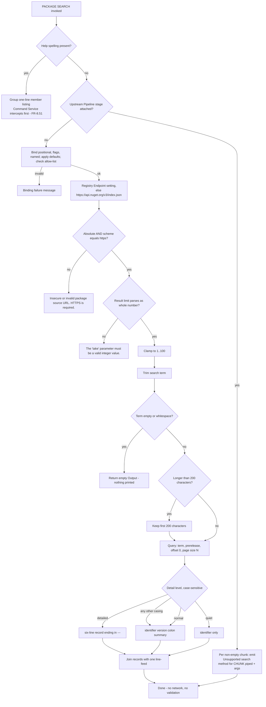

### 7.8 Package Search Command

**Description**

Package Search is the discovery half of the Shell's Plugin lifecycle. The Shell is extended by Plugins that are published as Package Archives to a Package Registry; before a Shell user can install anything, they must be able to find out what exists. Package Search is the Command that asks a Package Registry "which Plugins match this word?" and prints the answer at a caller-chosen Detail level. It is a member of the Command Group `Package`, so it is invoked as `PACKAGE SEARCH <term>`; its sibling in that group is the Package Install Command. The rest of that lifecycle does not function in the shipping product: Package Install is inert (§7.9), and no Plugin can be loaded from disk at all (see the third paragraph below and §7.4). Package Search is therefore the one stage of the lifecycle that works — it answers a question the product cannot yet act on.

The feature is deliberately small and stateless. One invocation resolves a Registry Endpoint, refuses anything that is not absolute HTTPS, normalises a single search word, asks the Package Registry for one page of results, renders each Package Listing as one to six lines depending on Detail level, and returns the whole block as a single Output. Nothing is cached, nothing is persisted, nothing is authenticated, no second page is ever fetched, and no retry or timeout exists. The terse Detail level exists specifically so that its output — one bare Plugin identifier per line — can be piped onward to the Package Install Command, although that hand-off is not exercised today because Package Install is inert.

Package Search is a Host-linked Command: the Lit Shell registers it directly at startup rather than discovering it on disk, so it is present in every Session that reaches the Prompt. That qualification is load-bearing rather than pedantic. **On a real filesystem no Plugin is ever loaded from disk at all**, and there is no Session in which one could be. The Plugin Scanner builds its search mask by joining a wildcard segment, the sub-directory name and the binary pattern — producing `*/bin/*.dll` — and passes it to a recursive directory enumeration rooted at the verified Plugin Directory (OUT-OF-REPO: `src/Xcaciv.Command.FileLoader/Crawler.cs:20, 176-178`). The directory portion of a search mask is joined to the root literally and its wildcards are never expanded, so with a perfectly correct layout present the enumeration returns neither the files nor an empty set: it raises a directory-not-found condition naming the literal path `<root>/*/bin`. That condition is not the tolerated No Plugins Available condition, so the tolerant startup branch does not catch it; it is wrapped as a Startup Load Failure carrying `Unable to load commands.`, escapes the Session and ends the process with exit status 1. Consequently **any** Plugin Directory that survives verification is fatal at startup — populated or empty makes no difference, because the enumeration raises before it can distinguish them — and the only startup path that reaches a usable Prompt is the one where the Plugin Directory does **not** exist, which is also the default state. **QUIRK (register Q-11)** — and the inversion is starker than the "a present-but-empty Plugin Directory is fatal, a missing one is tolerated" reading: *any* existing Plugin Directory is fatal, and no Plugin can ever load. See §7.4 and §7.6 for the full analysis. Note also that the framework's own scanner tests pass only because they run against a mock filesystem that INFERRED expands the wildcard segment; the production path uses the real filesystem and cannot. The practical consequence for this subsection is simple: in every Session in which `PACKAGE SEARCH` can actually be typed, the registered Command set is exactly the Host-linked and Built-in Commands, and Package Search is one of them.

Package Search carries an unusually dense set of observed defects — a Flag that does nothing, a Named Parameter that is read by nobody, a Detail level whose case-variants silently degrade, and a no-argument invocation that reports the wrong problem. Every one of them is pinned below, because a clone that quietly fixes them will diverge from the source's observable behavior.

---

**User stories**

- **US-8.1** — As a Shell user, I want to search a Package Registry for Plugins matching a word, so that I can find out what is publishable-and-installable before committing to install anything.
- **US-8.2** — As a Shell user, I want to choose how much detail each Package Listing shows — identifier only, identifier with version and summary, or the full record with download count, publication date, authors, licence and known-vulnerability count — so that I can skim a broad search or scrutinise a narrow one.
- **US-8.3** — As a Shell user, I want to cap how many Package Listings come back, so that a common word does not flood the terminal.
- **US-8.4** — As a Shell user, I want the terse Detail level to emit exactly one bare Plugin identifier per line, so that the result is machine-consumable and can be fed to a downstream Pipeline stage. *Partly aspirational:* the intended downstream consumer is the Package Install Command, which is currently inert and only echoes a refusal, so the hand-off is declared but never completed.
- **US-8.5** — As a Shell Operator, I want to point Package Search at a Package Registry of my choosing by setting a Session Variable, so that a private index can be searched instead of the built-in public one.
- **US-8.6** — As a Shell Operator, I want the Shell to refuse any Registry Endpoint that is not an absolute HTTPS address, so that Plugin metadata is never fetched over an unprotected transport.
- **US-8.7** — As a Shell Operator embedding the Shell, I want to invoke Package Search directly with a hand-built argument list, so that automated checks can exercise it without going through the Command line tokenizer. (This is precisely how every in-repo check of this feature runs.)
- **US-8.8** — As a Shell user, I want to opt in to Prerelease inclusion with a Flag, so that unreleased Plugin versions appear alongside released ones. **Declared but non-functional:** the Flag is accepted and documented, but the Command reads its presence rather than its value, and the Command Service always supplies the key, so unreleased versions are included whether or not the Flag is typed. The story describes the declared intent, not the observed behavior (see FR-8.26).
- **US-8.9** — As a Shell user, I want to override the Package Registry for a single search with a Named Parameter, so that I can try another index without changing Session state. **Declared but inert:** the parameter is declared, appears in the declared help surface, and is consumed off the Command line, but the Command never reads it (see FR-8.15).
- **US-8.10** — As a Shell user, I want to be told when I have placed Package Search downstream of a Pipeline stage, so that I am not left waiting for a search that will never happen.
- **US-8.11** — As a Shell user, I want to read the declared per-parameter help for Package Search, so that I can learn the option names without external documentation. **Not reachable:** the declared help text has no route to the screen, because help requested on a member of a Command Group prints the group's one-line member listing instead (see FR-8.51).

---

**Use cases**

#### UC-8.A — Search a Package Registry (realizes US-8.1, US-8.2, US-8.3, US-8.4, US-8.7)

**Preconditions**
- A Session is running and Package Search is registered (it is a Host-linked Command, so this is always true in any Lit Shell Session that reaches the Prompt — which, per the Description, means a Session started with no Plugin Directory present, since any existing one is fatal at startup).
- Network reachability to the resolved Package Registry exists.
- No upstream Pipeline stage is attached to this Command's Interaction Context.

**Main flow**
1. The Shell user types `PACKAGE SEARCH <term>` optionally followed by `-take <n>`, `-verbosity <level>`, `-prerelease`, `-source <url>`.
2. The Command Service resolves the Command Group `PACKAGE`, matches `SEARCH` against the group's member table case-insensitively, and removes that member word from the argument list.
3. The Command Service binds arguments in the order: Positional Parameter, then Flags, then Named Parameters. Absent Named Parameters receive their declared defaults; the Detail level is validated against its allowed-value list case-insensitively.
4. The Command reads the Registry Endpoint setting from Session Variables. If absent or empty it uses the built-in endpoint `https://api.nuget.org/v3/index.json`.
5. The Command verifies that the resolved endpoint parses as an absolute address whose scheme is exactly `https`.
6. The Command opens a Package Registry Client connection for that endpoint. INFERRED: no network traffic occurs yet; the service index is resolved lazily at step 9.
7. The Command parses the Result limit and clamps it to the inclusive range 1 to 100.
8. The Command trims the search term; if it is longer than 200 characters it keeps only the first 200.
9. The Command asks the Package Registry Client for matching Package Listings with start offset 0 and page size equal to the clamped Result limit, and blocks until the answer arrives.
10. The Command renders each Package Listing according to the Detail level, joins the rendered records with a single line-feed, and returns the whole block as one Output.
11. The Presentation Adapter writes the block in a single terminal write in the Shell's standard output colour; embedded line-feeds render as real line breaks.

**Alternate flows**
- **A1 — Shell Operator invokes directly.** A Shell Operator embedding the Shell calls the Command's Direct invocation entry point with an argument list it built itself and a Session Variable store it owns. Steps 1–2 are skipped entirely, so the Command line tokenizer's restrictions (FR-8.32) do not apply and dotted terms, help spellings and multi-word tokens survive intact. Because the host passes its own Session Variable store rather than a per-execution child scope, this is also the only path in the shipping product on which the endpoint read's write side effect is observable (FR-8.16).
- **A2 — Retargeted Package Registry.** The Registry Endpoint setting holds an absolute HTTPS address; step 4 uses it instead of the built-in endpoint. See UC-8.B.
- **A3 — Result set smaller than the limit.** The Package Registry returns fewer Package Listings than requested. The Command renders all of them; there is no padding, no message and no second page.
- **A4 — Detail level supplied in non-matching case.** A value such as `Detailed` or `QUIET` passes the allowed-value check but does not match the Command's case-sensitive rendering choice, so the standard rendering is used and the requested richness is silently lost (FR-8.39, register Q-2).
- **A5 — Empty or whitespace-only search term.** The Command returns empty Output and performs no registry query. The Shell suppresses empty Output, so the user sees nothing at all.
- **A6 — Zero matching Package Listings.** The joined block is empty and the Shell suppresses it. Indistinguishable at the terminal from A5.

**Error flows**
- **E1 — Registry Endpoint not absolute, or scheme not `https`.** The Command aborts before opening any connection. The user sees the Output line `Error executing PACKAGE (see trace for more info)`, a Status line `**Error: Insecure or invalid package source URL. HTTPS is required.`, and full detail in the Diagnostic trace. The Session continues.
- **E2 — Result limit missing from the bound parameter set, or not a whole number.** Same generic Output line; Status line `**Error: The 'take' parameter must be a valid integer value.`
- **E3 — No arguments at all.** Argument binding short-circuits to an empty bound set without running any required-parameter check, so the first thing to fail is the Result limit lookup and the user is told the count parameter is invalid rather than that the search term is missing. Same generic Output line; Status line `**Error: The 'take' parameter must be a valid integer value.`
- **E4 — Detail level outside the allowed-value list by more than case.** Rejected during argument binding, before the Command body runs and before any network use. Same generic Output line; Status line `**Error: Invalid value for parameter verbosity, this parameter has an allow list.`
- **E5 — Search term absent from its slot.** The Positional Parameter takes the head token only if that token does not begin with `-`. `PACKAGE SEARCH -take 5 XCBatch` therefore fails binding. Same generic Output line; Status line `**Error: Missing required parameter search_terms`
- **E6 — Named Parameter with no value after it.** A trailing `-take` or `-verbosity` makes the binder read past the end of the argument list. Same generic Output line; the Status line carries an index-out-of-range message — INFERRED text shape `**Error: Index was out of range. Must be non-negative and less than the size of the collection.` The out-of-range read is directly observed; only the surfaced wording is inferred.
- **E7 — Package Registry unreachable, TLS failure, protocol error, or hung.** Because the query is awaited by blocking, the surfaced message is an aggregate wrapper — INFERRED text shape `**Error: One or more errors occurred. (<underlying message>)`. Same generic Output line. There is no retry, no back-off, no Shell-imposed timeout: a hung registry hangs the Session with no cancel affordance.
- **E8 — Package Listing omits the known-vulnerability list at the full Detail level.** INFERRED: counting an absent list would fail and surface as the generic execution error. Not observed — the public registry evidently always supplies the field. A clone should treat an absent list as count `0`.

**Postconditions**
- On success: one Output block delivered; the Session's Session Variable store is unchanged and no subsequent variable dump lists the Registry Endpoint key (the empty-value write from the endpoint read of FR-8.13 lands in the per-execution child scope and is discarded on return — FR-8.16); no local file is created or modified; nothing is cached.
- On any error flow: no Output block, one generic Output line, one Status line, one Diagnostic trace entry, Session continues at the Prompt.

#### UC-8.B — Retarget the Package Registry (realizes US-8.5, US-8.6)

**Preconditions**
- A Session is running.
- The Shell Operator can set Session Variables, either through the built-in variable-setter Command or by seeding the store when constructing the Session.

**Main flow**
1. The Shell Operator sets the Registry Endpoint setting to an absolute HTTPS service-index address.
2. A Shell user runs `PACKAGE SEARCH <term>`.
3. The Command reads the Registry Endpoint setting (name matching is case-insensitive) and finds the operator's value.
4. The transport check passes; the search proceeds against that Package Registry as in UC-8.A.

**Alternate flows**
- **B1 — Setting absent or empty.** The built-in endpoint `https://api.nuget.org/v3/index.json` is used.
- **B2 — Shell user supplies the source Named Parameter instead.** The value is consumed off the Command line and discarded; the search runs against the setting-or-fallback endpoint with no message. **QUIRK** (register Q-6, FR-8.15).
- **B3 — Uppercased scheme.** INFERRED: scheme comparison is against a normalised-lowercase scheme, so an endpoint written `HTTPS://…` is accepted.

**Error flows**
- **B-E1 — Non-HTTPS or unparseable endpoint.** As UC-8.A E1. This covers plain HTTP, local-file addresses, other transports, and any relative or malformed string.
- **B-E2 — HTTPS address that is not a service index of the expected registry protocol family.** Validation passes (any absolute HTTPS address is accepted) but the query fails at step 9 of UC-8.A and surfaces as UC-8.A E7. The transport rule's permissiveness is therefore misleading — the Package Registry Client speaks exactly one discovery-and-search protocol.
- **B-E3 — Endpoint typed at the Prompt without quotes.** The Command line tokenizer deletes characters outside its word set from each token and only matches runs of word characters and hyphens, so an unquoted address is shredded into fragments. This affects setting the value through the built-in variable-setter Command, not Package Search itself, but it is the ordinary way an operator would try to do it.

**Postconditions**
- The Registry Endpoint setting is unchanged by Package Search. No credential is stored, requested or presented.

#### UC-8.C — Package Search downstream of a Pipeline (realizes US-8.10)

**Preconditions**
- A Command line containing the Pipeline delimiter places Package Search in a stage after the first.
- The Command Service has attached an upstream Stage Channel to this Command's Interaction Context.

**Main flow**
1. The Command Service routes execution to Per-chunk invocation because an input pipe is attached.
2. For each Output arriving from the upstream stage, empty units are skipped.
3. For each non-empty unit the Command emits one line: `Unsupported search method for ` + the chunk + ` (piped)` + the Command's own arguments joined with commas and no separating space.
4. When the upstream Stage Channel closes, the Command ends.

**Alternate flows**
- **C1 — All upstream units empty.** Nothing is emitted at all.
- **C2 — A help spelling among the arguments.** The Command Service's help check runs unconditionally, before any Command instance exists and before the piped-versus-direct split, and a Pipeline stage is dispatched through that same entry point. `something | PACKAGE SEARCH --help` therefore prints the `Package` group's one-line member listing (FR-8.51) and never enters Per-chunk invocation at all — the opposite of what the piped-first reading of this use case would suggest. See FR-8.46.

**Error flows**
- None. The Command Service treats these lines as ordinary successful Output, not as errors. No Registry Endpoint is resolved, no transport check runs, no argument validation happens, and no network call is made — so every error flow of UC-8.A is unreachable in this mode, including E1 and E4.

**Postconditions**
- No network activity, no Session Variable read, no state change.

#### UC-8.D — Request help on Package Search (realizes US-8.11, as an unmet intention)

**Preconditions**
- A Session is running at the Prompt.

**Main flow**
1. The Shell user types `PACKAGE SEARCH --help`.
2. The Command Service detects the help spelling among the arguments **before** the member word is stripped and before the member Command is constructed.
3. Because `PACKAGE` is a Command Group with members, the Command Service prints the group's one-line member listing.
4. The Shell user never sees the declared parameter names, defaults, allowed values or help text for Package Search.

**Alternate flows**
- **D1 — Bare help word.** Typing the bare help Command lists every registered Command one line each; it does not detail any one of them.
- **D2 — Direct invocation by a Shell Operator.** A host that hands the Command's entry point an argument list containing any of the three accepted help spellings gets the per-Command help builder, because it bypasses the group-level interception.

**Error flows**
- **D-E1 — Question-mark help spellings typed at the Prompt.** The tokenizer keeps only runs of word characters and hyphens, so the dash-question spelling is reduced to a bare `-` token and the slash-question spelling is discarded outright. The first therefore fails the required Positional Parameter with `Missing required parameter search_terms`; the second arrives with no arguments at all and fails with `The 'take' parameter must be a valid integer value.` Neither is recognised as a help request. The tokenization behaviour itself is settled by §7.1 FR-1.51 and FR-1.52 (register Q-44); INFERRED applies only to the surfaced wording of the two failures, which is derived from the binding rules rather than observed at runtime.

**Postconditions**
- No search occurs; the Session continues.

---

**Functional requirements**

*Identity, registration and dispatch*

- **FR-8.1** — Package Search SHALL be declared as a member named `Search`, described exactly `search for a package`, inside a Command Group named `Package`, described exactly `Package commands`. Realizes US-8.1.
- **FR-8.2** — The Command Service SHALL normalise both the group name and the member name to upper case for registration and match them case-insensitively, so the user-visible invocation is `PACKAGE SEARCH …`. A bare `SEARCH` SHALL NOT resolve. OUT-OF-REPO evidence for the normalisation and matching rules.
- **FR-8.3** — The member word SHALL be removed from the argument list before Package Search receives it, so the Command never sees `SEARCH` as an argument. OUT-OF-REPO evidence.
- **FR-8.4** — Package Search SHALL be registered as a Host-linked Command under the package key `internal`, with permission to modify Session Variables **off**. Realizes US-8.7.
- **FR-8.5** — Each invocation SHALL run against a freshly constructed Command instance and a fresh per-execution child Session Variable scope, so no state survives between invocations and concurrent Pipeline stages share no mutable state. OUT-OF-REPO evidence for instance-per-invocation.

*Parameter surface*

- **FR-8.6** — Package Search SHALL declare exactly five parameters, with these exact names, kinds, requiredness, defaults, allowed values and help texts. Realizes US-8.1, US-8.2, US-8.3, US-8.5, US-8.8, US-8.9.

  | Name | Kind | Required | Default | Allowed values | Help text (verbatim) |
  |---|---|---|---|---|---|
  | `search_terms` | Positional Parameter (first) | yes | none | any | `String associated to the desired package.` |
  | `source` | Named Parameter | no | none — resolves to empty | any | `The source to search for the package.` |
  | `take` | Named Parameter | no | `20` | any | `Limit the number of results to return.` |
  | `verbosity` | Named Parameter | no | `normal` | `quiet`, `normal`, `detailed` | `The level of detail to display in the output.` |
  | `prerelease` | Flag | no | n/a | n/a | `Include prerelease packages in the search results.` |

- **FR-8.7** — Named Parameters and the Flag SHALL be recognised with either one or two leading dashes; `-take` and `--take` SHALL be equivalent. OUT-OF-REPO evidence.
- **FR-8.8** — Parameter-name matching SHALL be an unanchored substring test applied to tokens that begin with `-`. **QUIRK** — the product-wide form of this rule is §6 GR-21 and §7.1 FR-1.45; it has no register row of its own, and this subsection is where its consequence is observable: a token such as `-taken` therefore binds the Result limit parameter and consumes the following token as its value. OUT-OF-REPO evidence.
- **FR-8.9** — Argument binding SHALL run in the order Positional Parameter, then Flags, then Named Parameters. The Positional Parameter SHALL consume the head token only if that token does not begin with `-`. OUT-OF-REPO evidence. Realizes US-8.1.
- **FR-8.10** — **QUIRK (register Q-4):** because of FR-8.9, the search term MUST be the first argument. `PACKAGE SEARCH -take 5 XCBatch` SHALL fail with `Missing required parameter search_terms` while `PACKAGE SEARCH XCBatch -take 5` SHALL succeed. OUT-OF-REPO evidence for the message literal.
- **FR-8.11** — When Package Search is invoked with zero arguments, argument binding SHALL short-circuit and return an empty bound parameter set **without** running any required-parameter check. OUT-OF-REPO evidence.
- **FR-8.12** — **QUIRK (register Q-5):** as a direct consequence of FR-8.11, a bare `PACKAGE SEARCH` SHALL fail on the Result limit lookup and report `The 'take' parameter must be a valid integer value.` — not a missing-search-term message.

*Registry Endpoint resolution*

- **FR-8.13** — Package Search SHALL read the Registry Endpoint setting under the name `PackageSourceUrl`. Session Variable names SHALL be matched case-insensitively (the store normalises them to upper case, so the effective key is `PACKAGESOURCEURL`). Realizes US-8.5.
- **FR-8.14** — When the Registry Endpoint setting is absent or empty, Package Search SHALL use the built-in endpoint exactly `https://api.nuget.org/v3/index.json`. Realizes US-8.5.
- **FR-8.15** — **QUIRK (register Q-6, open question OQ-6):** the `source` Named Parameter SHALL be declared, SHALL appear in the declared help surface, and SHALL be consumed off the Command line, but its value SHALL NEVER be read. `PACKAGE SEARCH foo -source https://other/index.json` SHALL search the setting-or-fallback endpoint with no message and no error. Realizes US-8.9 as an unmet intention.
- **FR-8.16** — **QUIRK (register Q-10):** reading a missing Registry Endpoint setting SHALL, as a side effect, write an empty value under that name into the Command's **per-execution child** Session Variable scope and mark that scope changed (§6 GR-26). Because Package Search is registered as not modifying Session Variables (FR-8.4), the write-back gate of §6 GR-27 SHALL NOT fire: the child scope SHALL be discarded on return, the Session's own store SHALL be unchanged, and **no** subsequent Session Variable dump SHALL list the key. OUT-OF-REPO evidence for both the write and the discard. The side effect is observable on exactly two paths, and this requirement is not weakened by their existence: (a) a Shell Operator invoking the Command directly (US-8.7) passes its own store with no child scoping, which is precisely what every in-repo check of this feature does; and (b) a clone that registers the `Package` Command Group as environment-modifying would persist the empty key into the Session for **every** member of the group, because the flag is stamped on the group record rather than the member (§6 GR-28, §7.1 FR-1.21). A clone must therefore keep the registration flag off to reproduce the observed behavior.

*Transport security*

- **FR-8.17** — The resolved Registry Endpoint SHALL parse as an absolute address **and** its scheme SHALL be exactly `https`; otherwise Package Search SHALL fail immediately with the message exactly `Insecure or invalid package source URL. HTTPS is required.` This SHALL reject plain-HTTP, local-file, other-transport, relative and unparseable values. Realizes US-8.6.
- **FR-8.18** — INFERRED: the scheme comparison is against a normalised-lowercase scheme, so an endpoint written with an uppercase scheme SHALL be accepted.
- **FR-8.19** — The transport check SHALL run **before** the Result limit parse, **before** search-term validation, and **before** any network use. A request that would short-circuit on an empty search term SHALL still fail on a bad endpoint. Realizes US-8.6.
- **FR-8.20** — Package Search SHALL present no credential of any kind and SHALL make no authentication or authorization check. The Package Registry SHALL be queried anonymously.

*Result limit*

- **FR-8.21** — When the Result limit is not supplied, the Command Service SHALL substitute the declared default string `20`. Realizes US-8.3.
- **FR-8.22** — If the Result limit is absent from the bound parameter set **or** does not parse as a whole number, Package Search SHALL fail with the message exactly `The 'take' parameter must be a valid integer value.` Non-parsing values include non-digit text, decimals, values carrying thousands separators, and values exceeding a 32-bit signed range. Surrounding whitespace and a leading `+` or `-` sign SHALL be tolerated. INFERRED: numeric parsing follows the host's current locale for sign and whitespace handling; a clone SHOULD pin an invariant parse instead.
- **FR-8.23** — The parsed Result limit SHALL be clamped to the inclusive range **1 to 100**. The lower bound 1 means a search can never request zero records; the upper bound 100 is the anti-abuse ceiling stated as such in the source. `-take 0` and `-take -5` SHALL yield 1; `-take 1000` SHALL yield 100. **QUIRK (register Q-73):** the correction SHALL be silent — no message, no Status line, and no indication that the requested value was not honoured. Realizes US-8.3.
- **FR-8.24** — The declared default 20 SHALL sit inside the clamp window, so clamping SHALL only ever alter an explicitly supplied value. A clone that changes the declared default to a value outside [1, 100] silently changes the default behavior to 1 or 100.
- **FR-8.25** — The clamped Result limit SHALL be passed to the Package Registry as the page size with a start offset of **0**. Consequently the returned record count is *at most* the limit and may be fewer, there SHALL be no second page, and 100 records is the absolute maximum any Shell user can see for one term. The limit SHALL bound **records**, not output lines: at the full Detail level one record occupies six lines, so `-take 1` yields six lines (**QUIRK**, register Q-81; whether the limit was meant as a record count or an output-size control is not determinable from the repository).

*Prerelease inclusion*

- **FR-8.26** — **QUIRK (register Q-1, open question OQ-4) — the most consequential defect in this feature.** Package Search SHALL decide Prerelease inclusion by testing whether a key named `prerelease` is *present* in the bound parameter set. The Command Service SHALL add that key **unconditionally** whenever at least one argument was supplied, carrying the text `True` or `False` as a value that is never read. The observed net effect is that unreleased Plugin versions are **always** included, whether or not the Flag is typed. OUT-OF-REPO evidence for the unconditional key insertion; INFERRED for the exact pinned Command Service build, directly observed one patch release ahead. Realizes US-8.8 as an unmet intention.
- **FR-8.27** — The resolved Prerelease inclusion value SHALL be carried into the registry query as a search filter, not applied as a local trim of the returned records.

*Search term*

- **FR-8.28** — Leading and trailing whitespace SHALL be stripped from the search term before use. Realizes US-8.1.
- **FR-8.29** — If the trimmed search term is empty or entirely whitespace, Package Search SHALL return empty Output and SHALL perform **no** registry query. The Command Service SHALL suppress empty Output, so nothing at all is printed. **QUIRK** — the third instance of the silent-correction rule of FR-8.23 and FR-8.30 (register Q-73, product-wide rule §6 GR-46): the Shell user is told neither that the term was blank nor that no query was issued. OUT-OF-REPO evidence for the suppression.
- **FR-8.30** — A search term longer than **200** characters SHALL be **truncated to its first 200 characters** and the search SHALL proceed. It SHALL NOT be rejected and the user SHALL NOT be told (**QUIRK**, the same silent-correction rule as FR-8.23, register Q-73). 200 is the maximum accepted search-term length. INFERRED: this truncation shares the anti-abuse intent stated for the Result limit clamp; only the clamp says so in the source.
- **FR-8.31** — The search term SHALL be a single token. Extra bare words after the term SHALL be silently ignored — they are consumed by no declared parameter. OUT-OF-REPO evidence.
- **FR-8.32** — **QUIRK (register Q-43):** the Command line tokenizer SHALL match only double-quoted runs or runs of letters, digits, underscore and hyphen. A dotted Plugin name typed unquoted at the Prompt SHALL therefore be split: `PACKAGE SEARCH cake.nuget` searches for `cake` and drops `nuget`. The user must type the name in double quotes to search it whole. OUT-OF-REPO evidence. This applies only to the Prompt path; a Shell Operator building an argument list directly (US-8.7) is unaffected.

*Detail level and rendering*

- **FR-8.33** — At the terse Detail level (`quiet`), each record SHALL render as exactly the Plugin identifier and nothing else: `<PackageId>`. Realizes US-8.2, US-8.4.
- **FR-8.34** — At the standard Detail level (`normal`), each record SHALL render as `<PackageId>` + one space + `<Version>` + one space + `:` + one space + `
`, i.e. `<PackageId> <Version> : 
`. When the summary is empty the line SHALL end with a space-colon-space sequence, preserving a trailing space. Realizes US-8.2.
- **FR-8.35** — At the full Detail level (`detailed`), each record SHALL render as exactly six lines. Realizes US-8.2.

  | Line | Content |
  |---|---|
  | 1 | `<PackageId>` + space + `<Version>` + space + `(` + `<DownloadCount>` + `)` + space + `:` + space + `
` |
  | 2 | two spaces + `Published:` + `<PublishedTimestamp>` — **no space after the colon** |
  | 3 | two spaces + `Authors:` + `<Authors>` |
  | 4 | two spaces + `License:` + `<LicenceMetadata>` |
  | 5 | two spaces + `Vulnerabilities:` + the **count** of known-vulnerability entries, not the entries |
  | 6 | `---` — three hyphens at column 0 |

- **FR-8.36** — Rendered records SHALL be joined with a single line-feed, with no trailing line-feed and no blank line between records. At the full Detail level this means consecutive records read `…` line-feed `---` line-feed `<next identifier> …`, and the **last** record also ends with a `---` line — a trailing separator with nothing after it (**QUIRK**, register Q-9).
- **FR-8.37** — The whole joined block SHALL be returned as **one** Output. The Presentation Adapter SHALL write it in a single terminal write, so embedded line-feeds render as real line breaks. A downstream Pipeline stage SHALL likewise receive the whole block as one unit.
- **FR-8.38** — The Detail level SHALL be validated against its allowed-value list **case-insensitively** by the Command Service, which rejects out-of-list values with the message exactly `Invalid value for parameter verbosity, this parameter has an allow list.` before the Command body runs and before any network use. OUT-OF-REPO evidence.
- **FR-8.39** — **QUIRK (register Q-2, open question OQ-5):** the Command's own rendering choice SHALL match the Detail level **case-sensitively**, and SHALL fall back to the standard rendering for anything it does not match exactly. Combined with FR-8.38 this means: a value outside the list (for example `fancy`) is rejected during binding and never reaches the Command, while a case-variant of an allowed value (for example `Detailed` or `QUIET`) is accepted, falls through to the standard rendering, and silently loses the requested Detail level with no message. The fallback branch is therefore **not** dead code — it is the branch that hides this defect, and this casing mismatch is its only reachable route.
- **FR-8.40** — Package Search SHALL re-default the Detail level to `normal` when the key is absent from the bound parameter set. **QUIRK (register Q-3):** the Command Service already guarantees that key is present whenever at least one argument was supplied, so this guard is unreachable. OUT-OF-REPO evidence.

*Result set*

- **FR-8.41** — Package Search SHALL impose no ordering of its own. Package Listings SHALL be rendered in exactly the order the Package Registry returned them — relevance order as the registry defines it.
- **FR-8.42** — The Plugin identifier's casing as returned by the Package Registry SHALL be preserved verbatim; it SHALL NOT be lower-cased or otherwise normalised.
- **FR-8.43** — An empty result set SHALL render as empty Output, which the Command Service suppresses. The Shell user SHALL see nothing at all — there SHALL be no "no results found" message anywhere, and this outcome SHALL be indistinguishable from FR-8.29 (**QUIRK**, register Q-7, open question OQ-17). It is likewise indistinguishable from a Package Registry outage, because the Package Registry Client discards every registry-side diagnostic (§7.6 FR-6.49; the silent-sink defaults are in §7.7); a clone deciding OQ-17 must decide that case in the same breath.
- **FR-8.44** — The known-vulnerability field SHALL be rendered as a count. INFERRED: a clone SHOULD treat an absent list as count `0`; the source has no guard and would fail.
- **FR-8.45** — INFERRED: the download-count and licence fields at the full Detail level SHALL render through their default text form with no absent-value guard, so an absent download count renders as empty between the parentheses. INFERRED: the publication timestamp renders with the host's default date/time formatting, making the same search produce different text on differently-configured machines; a clone SHOULD pin an explicit format such as ISO-8601 rather than reproduce this.

*Per-chunk invocation*

- **FR-8.46** — When an upstream Pipeline stage is attached to this Command's Interaction Context, Package Search SHALL NOT search. Routing between Direct invocation and Per-chunk invocation SHALL be decided solely by whether an input pipe is attached. That "solely" holds **within** the Command's own dispatch method only: the Command Service's help interception (FR-8.51) runs unconditionally at the execution entry point, ahead of the piped/direct routing and before any Command instance is constructed, and a Pipeline stage is dispatched through that same entry point. A help spelling therefore wins even when an upstream stage is attached, so `something | PACKAGE SEARCH --help` prints the group's member listing rather than the per-chunk refusal lines (UC-8.C C2). OUT-OF-REPO evidence.
- **FR-8.47** — In Per-chunk invocation, empty upstream units SHALL be skipped entirely and produce no output. OUT-OF-REPO evidence.
- **FR-8.48** — For each non-empty upstream unit, Package Search SHALL emit exactly `Unsupported search method for ` + the unit + ` (piped)` + the Command's arguments joined with commas. Realizes US-8.10.
- **FR-8.49** — **QUIRK (register Q-74):** there SHALL be no separator between `(piped)` and the first argument, so the arguments run directly into the closing parenthesis.
- **FR-8.50** — In Per-chunk invocation no Registry Endpoint SHALL be resolved, no transport check SHALL run, no parameter SHALL be validated, and no network call SHALL be made. These lines SHALL be treated as ordinary successful Output, not as errors, and SHALL NOT affect exit status (**QUIRK**, register Q-74: work the product does not perform is announced as ordinary Output).

*Help surface*

- **FR-8.51** — **QUIRK (register Q-45):** a help request naming Package Search SHALL be intercepted by the Command Service **before** the member word is stripped; because `PACKAGE` is a Command Group with members, the group's one-line member listing SHALL be printed instead of Package Search's own parameter help. The declared per-parameter help text of FR-8.6 therefore has **no** route to the screen from the Prompt. INFERRED (OUT-OF-REPO evidence). Realizes US-8.11 as an unmet intention.
- **FR-8.52** — **QUIRK (register Q-44):** the Command Service SHALL accept three help spellings case-insensitively — a double-dash spelling, a dash-question spelling and a slash-question spelling — but the Command line tokenizer destroys two of them: the dash-question spelling is reduced to a bare `-` token and the slash-question spelling is discarded outright. From the Prompt, only the double-dash spelling SHALL reach the detector. `PACKAGE SEARCH -?` SHALL instead fail with `Missing required parameter search_terms`, and `PACKAGE SEARCH /?` SHALL instead fail with `The 'take' parameter must be a valid integer value.` INFERRED (OUT-OF-REPO evidence).
- **FR-8.53** — Package Search SHALL declare no usage prototype, no description version and no alias, so the generated help shows a synthesized usage line and the Command carries the Command Service's placeholder metadata defaults. OUT-OF-REPO evidence for the synthesis and the defaults.

*Failure surfacing and non-functional behavior*

- **FR-8.54** — Any failure thrown by Package Search SHALL be caught by the Command Service, which SHALL emit the Output line `Error executing PACKAGE (see trace for more info)`, set the Status line to `**Error: ` followed by the failure message, write full detail to the Diagnostic trace, and leave the Session running. OUT-OF-REPO evidence.
- **FR-8.55** — **QUIRK (register Q-8, open question OQ-18):** the name in that generic Output line SHALL be the Command Group name `PACKAGE` — the registry key — not the member name `SEARCH`, so error lines never identify which member failed.
- **FR-8.56** — A Named Parameter given no following value SHALL cause the binder to read past the end of the argument list, surfacing as the generic failure of FR-8.54. OUT-OF-REPO evidence for the out-of-range read; INFERRED for the exact surfaced wording.
- **FR-8.57** — Package Search SHALL wait for the Package Registry's answer by blocking the thread that reads the Prompt. There SHALL be no progress indicator, no Status line during the wait, and no way to cancel. A clone MAY make the query non-blocking without changing any other requirement in this subsection.
- **FR-8.58** — Neither Package Search nor the Shell SHALL impose a timeout; the Command Service's per-stage and whole-Pipeline timeouts both default to 0, meaning unlimited. A hung Package Registry hangs the Session. There SHALL be no retry, no back-off and no partial-result handling. OUT-OF-REPO evidence for the timeout defaults.
- **FR-8.59** — Package Search SHALL cache nothing. Every invocation SHALL re-resolve the service index and re-issue the query; identical repeated searches SHALL cost identical network work.
- **FR-8.60** — When Package Search feeds a downstream Pipeline stage, the connecting Stage Channel SHALL hold up to 10,000 units and SHALL apply back-pressure by blocking producers when full. Because Package Search emits its entire result set as one unit, this ceiling is not a practical constraint here. OUT-OF-REPO evidence.
- **FR-8.61** — All user-visible literals SHALL be English and fixed; there SHALL be no message catalogue and no localisation hook.
- **FR-8.62** — Output SHALL carry no colour semantics of its own; the Presentation Adapter paints all Command Output one foreground colour, so no information is conveyed by colour alone. Structure at the full Detail level SHALL be conveyed by two-space indentation and the `---` separator.

---

**External technology**

- *Requires:* a managed runtime and language with attribute-style declarative metadata, string interpolation and nullable-reference discipline (no wire protocol). *Source used:* C# on .NET 8 (`net8.0`), nullable reference types and implicit usings enabled. *Reimplementer notes:* the shipping executable targets `net8.0` for ordinary builds, but its Release configuration retargets the older, Windows-only `net6.0-windows` and publishes a self-contained, trimmed, ready-to-run, windowed single file for 64-bit Windows — so the released binary runs on a different, older runtime than everything the tests exercise. Nothing in this feature depends on the difference, but a clone team choosing a single target runtime should know the source never validated the one it shipped. **QUIRK** (register Q-52, open question OQ-10; the full analysis is in §7.11).
- *Requires:* an extensible command-shell framework supplying command registration with group/member namespacing, declarative positional/named/flag parameter metadata with defaults and allowed-value lists, a command-line tokenizer, delimiter-joined pipelines, auto-generated help, a case-insensitive environment store with child scoping, and per-invocation command instantiation (no wire protocol). *Source used:* `Xcaciv.Command` 2.1.1, `Xcaciv.Command.Core` 2.1.0, `Xcaciv.Command.Interface` 2.1.0, referenced through central package-version management. *Reimplementer notes:* the observable behavior of this feature depends on five framework semantics that must survive substitution — substitute declared defaults for absent named parameters; validate allowed-value lists **case-insensitively**; add flag keys **unconditionally** carrying `True`/`False` (FR-8.26 depends on this); reject a required positional whose slot holds a `-`-prefixed token with `Missing required parameter <name>`; and return an **empty** parameter map for an empty argument list without running required-parameter checks (FR-8.11). All framework semantics cited in this subsection were read from the v2.1.2 reference clone, one patch release ahead of the pinned versions.
- *Requires:* a package-registry search client that resolves a service-index document and issues a search-by-term query with skip/take and an include-prerelease filter, returning identifier, version, summary, download count, publication date, authors, licence metadata and a known-vulnerability list. *Protocol/standard:* NuGet V3 service index plus Search Query Service, over HTTPS with JSON payloads. *Source used:* `NuGet.Protocol` 7.0.1. *Reimplementer notes:* the configured base address is a **service index**, not a search endpoint — the client discovers the search endpoint from it. This is why FR-8.17's "any absolute HTTPS address" rule is misleading: only a service index of this one protocol family will function, and anything else fails at query time rather than at validation time. A clone targeting a different registry needs an equivalent skip/take/include-prerelease search call returning the same eight fields.
- *Requires:* a reachable public package registry to act as the built-in default target (HTTPS). *Source used:* `https://api.nuget.org/v3/index.json`, hard-coded. *Reimplementer notes:* every in-repo check of this feature except the per-chunk one requires live internet access to this registry and depends on third-party packages continuing to exist under their current names — they are integration checks, not unit checks. A clone should keep the literal default endpoint but add offline coverage of the formatting, clamping, truncation and transport rules, none of which the source tests offline.
- *Requires:* a build-time package feed from which to obtain the command-shell framework (package-registry service index over HTTPS, plus a plain local-folder feed). *Source used:* three declared sources — the public registry, a private feed hosted by the code-hosting provider, and a local folder named by an environment token — with source mapping routing every `Xcaciv.*` package to the local folder and everything else to the public registry. *Reimplementer notes:* build-time only; this feature never touches it at run time. The configuration as pinned cannot restore: the local folder is named by an unexpanded environment token, the hosted private feed is declared but given no routing pattern and so is never consulted, and the framework packages are absent from the public index. A clone team must resolve where the framework equivalent comes from before anything builds.
- *Requires:* a unit-test runner (no wire protocol). *Source used:* xUnit 2.9.3 with the Microsoft test SDK and a coverage collector. *Reimplementer notes:* the test assertions are the closest thing to a written requirement this feature has; every formatting assertion is a substring or not-contains check and no test asserts an exact output string, so the exact literals in FR-8.33 through FR-8.36 come from reading the source, not from the tests.
- *Requires:* a text terminal with a settable foreground/background colour pair per write and line-oriented write and read (16-colour text-console attributes). *Source used:* the platform console through the Shell's Presentation Adapter. *Reimplementer notes:* Command Output is painted blue on black, Status lines yellow on dark blue, the Prompt green on black; colours are fixed by the presentation feature, not by this one. No cursor addressing and no self-authored escape sequences are needed. The adapter writes a whole Output in one call, which is what makes FR-8.37's multi-line block render correctly.

---

**Acceptance criteria**

- **AC-8.1** — **Given** no Registry Endpoint setting, **when** a Shell user runs `PACKAGE SEARCH XCBatch`, **then** the query goes to `https://api.nuget.org/v3/index.json` and the output contains both `XCBatch.Core` and `XCBatch.Interfaces`.
- **AC-8.2** — **Given** the Registry Endpoint setting holds `https://api.nuget.org/v3/index.json`, **when** a Shell user runs `PACKAGE SEARCH XCBatch -take 3`, **then** the output is non-empty and contains `XCBatch`.
- **AC-8.3** — **Given** the Registry Endpoint setting holds `http://api.nuget.org/v3/index.json`, **when** a Shell user runs `PACKAGE SEARCH XCBatch`, **then** no network traffic occurs, the Output line reads `Error executing PACKAGE (see trace for more info)`, and the Status line reads exactly `**Error: Insecure or invalid package source URL. HTTPS is required.`
- **AC-8.4** — **Given** the Registry Endpoint setting holds a value that is not an absolute address, **when** a Shell user runs `PACKAGE SEARCH ""` (a term that would otherwise short-circuit to empty output), **then** the transport failure of AC-8.3 is still reported — proving the transport check precedes term validation.
- **AC-8.5** — **QUIRK pin (FR-8.15, register Q-6).** **Given** default settings, **when** a Shell user runs `PACKAGE SEARCH XCBatch -source https://example.invalid/index.json`, **then** the search succeeds against `https://api.nuget.org/v3/index.json`, returns `XCBatch` results, and emits no message about the ignored parameter. A clone that honours the parameter fails this criterion — the clone team must consciously choose to keep or fix it.
- **AC-8.6** — **QUIRK pin (FR-8.26, register Q-1).** **Given** a Package Registry with at least one unreleased Plugin version matching the term, **when** the same search is run twice, once with `-prerelease` and once without, **then** both runs return identical record sets, because the Flag has no effect and unreleased versions are always included. A clone that makes the Flag work fails this criterion — the clone team must consciously choose to keep or fix it.
- **AC-8.7** — **Given** default settings, **when** a Shell user runs `PACKAGE SEARCH XCBatch -take 1`, **then** the output splits into at most one line-feed-separated line. (Note this holds at the standard Detail level only; see AC-8.15.)
- **AC-8.8** — **Given** default settings, **when** a Shell user runs the same search with `-take 0`, with `-take -5`, and with `-take 500`, **then** the first two return the same record count as `-take 1`, and the third returns no more than 100 records.
- **AC-8.9** — **Given** default settings, **when** a Shell user runs `PACKAGE SEARCH XCBatch -take abc`, **then** the search is refused and the Status line reads exactly `**Error: The 'take' parameter must be a valid integer value.`
- **AC-8.10** — **Given** default settings, **when** a Shell user runs `PACKAGE SEARCH XCBatch -verbosity quiet -take 2`, **then** every output line is a bare Plugin identifier, the whole output contains **no** `:` character, and it does not contain `Published:`.
- **AC-8.11** — **Given** default settings, **when** a Shell user runs `PACKAGE SEARCH XCBatch -verbosity normal -take 2`, **then** each line reads `<identifier> <version> : 
` with a single space before and after the colon, the output contains `:`, and it does not contain `Published:`; **and** when a returned record has an empty summary, that line ends with a trailing space.
- **AC-8.12** — **Given** default settings, **when** a Shell user runs `PACKAGE SEARCH XCBatch -verbosity detailed -take 2`, **then** the output contains `Published:`, `Authors:`, `License:` and `Vulnerabilities:` each on its own line indented by exactly two spaces with no space after the colon, each record is terminated by a line containing exactly `---`, and the final record is also terminated by a `---` line.
- **AC-8.13** — **QUIRK pin (FR-8.39, register Q-2).** **Given** default settings, **when** a Shell user runs `PACKAGE SEARCH XCBatch -verbosity QUIET` and again with `-verbosity Detailed`, **then** both invocations succeed and both render the **standard** format, with no message indicating that the requested Detail level was discarded. A clone that matches Detail levels case-insensitively fails this criterion — the clone team must consciously choose to keep or fix it.
- **AC-8.14** — **Given** default settings, **when** a Shell user runs `PACKAGE SEARCH XCBatch -verbosity fancy`, **then** the search is refused during argument binding with the Status line `**Error: Invalid value for parameter verbosity, this parameter has an allow list.` and no network call is made.
- **AC-8.15** — **QUIRK pin (FR-8.25, register Q-81).** **Given** default settings, **when** a Shell user runs `PACKAGE SEARCH XCBatch -take 1 -verbosity detailed`, **then** exactly one record is returned and the output is six lines — proving the limit bounds records, not lines.
- **AC-8.16** — **Given** a search term of only spaces, **when** it is run, **then** no network call is made and nothing at all is printed; **and given** a 250-character term, **when** it is run, **then** the search succeeds and the Package Registry is queried with only the first 200 characters of it, with no truncation message.
- **AC-8.17** — **Given** a term that matches no Plugin, **when** the search is run, **then** nothing at all is printed — no count, no "no results" message — and the terminal output is indistinguishable from the empty-term case in AC-8.16.
- **AC-8.18** — **Given** default settings, **when** a Shell user runs `PACKAGE SEARCH "cake.nuget" -verbosity normal`, **then** the output contains `Cake.NuGet` with exactly that casing, proving registry casing is preserved.
- **AC-8.19** — **QUIRK pin (FR-8.32, register Q-43).** **Given** default settings, **when** a Shell user types `PACKAGE SEARCH cake.nuget` at the Prompt **without** quotes, **then** the search performed is for `cake` and the fragment `nuget` is silently dropped. A clone whose tokenizer preserves dots fails this criterion — the clone team must consciously choose to keep or fix it.
- **AC-8.20** — **QUIRK pin (FR-8.10, FR-8.12; registers Q-4, Q-5).** **Given** default settings, **when** a Shell user runs `PACKAGE SEARCH -take 5 XCBatch`, **then** the Status line reads `**Error: Missing required parameter search_terms`; **and when** the user runs a bare `PACKAGE SEARCH` with no further arguments, **then** the Status line reads `**Error: The 'take' parameter must be a valid integer value.` rather than any missing-term message. A clone that reports a missing search term in either case fails this criterion.
- **AC-8.21** — **QUIRK pin (FR-8.51, FR-8.52; registers Q-45, Q-44).** **Given** default settings, **when** a Shell user types `PACKAGE SEARCH --help` at the Prompt, **then** the `Package` group's one-line member listing is printed and none of the five declared parameter help strings appears; **and when** the user types `PACKAGE SEARCH -?`, **then** the Status line reads `**Error: Missing required parameter search_terms`; **and when** the user types `PACKAGE SEARCH /?`, **then** the Status line reads `**Error: The 'take' parameter must be a valid integer value.`
- **AC-8.22** — **QUIRK pin (FR-8.48, FR-8.49, FR-8.55; registers Q-74, Q-8).** **Given** an upstream Pipeline stage producing the unit `some-chunk`, **when** the Shell user runs that stage piped into `PACKAGE SEARCH param1 param2`, **then** the output contains `Unsupported search method` and `some-chunk`, the arguments follow `(piped)` with no separating space and joined by commas, no registry query occurs, and the line is not reported as an error.
- **AC-8.23** — **Given** an upstream Pipeline stage that emits only empty units, **when** the Shell user pipes it into `PACKAGE SEARCH anything`, **then** no output at all is produced.
- **AC-8.24** — **QUIRK pin (FR-8.8; §6 GR-21).** **Given** default settings, **when** a Shell user runs `PACKAGE SEARCH XCBatch -taken 3`, **then** the token binds the Result limit parameter, `3` is consumed as its value, and at most three records are returned. A clone that anchors parameter-name matching fails this criterion.
- **AC-8.25** — **Given** default settings, **when** a Shell user runs `PACKAGE SEARCH XCBatch -take` with nothing following it, **then** the search fails with the generic Output line `Error executing PACKAGE (see trace for more info)` and a Status line carrying an index-out-of-range message, and the Session continues at the Prompt.
- **AC-8.26** — **Given** a Registry Endpoint that accepts connections but never answers, **when** a search is run, **then** the Shell blocks indefinitely with no progress indicator, no Status line and no cancel affordance, confirming that no timeout of any kind exists.
- **AC-8.27** — **QUIRK pin (FR-8.16, register Q-10).** **Given** a Session with no Registry Endpoint setting, **when** a Shell user runs one search and then dumps Session Variables with the built-in variable-dump Command, **then** the Session's store is unchanged and the endpoint key is **not** listed, because Package Search is registered as not modifying Session Variables and the write lands in the discarded per-execution child scope. **And given** the same Session, **when** a host instead invokes the Command's Direct invocation entry point against its own store with no child scoping, **then** an entry under the upper-cased key `PACKAGESOURCEURL` with an empty value **is** present afterwards — the mutating read is real; only its reach is bounded by the write-back gate. A clone that persists the key into the Session on the Prompt path fails the first half of this criterion.
- **AC-8.28** — **Given** default settings, **when** the same search is run twice in succession, **then** two identical outbound queries are observed on the wire, confirming that nothing is cached.
- **AC-8.29** — **Given** a Package Registry returning more matches than the limit, **when** a search is run with any limit, **then** exactly one page is requested with start offset 0 and no subsequent page request is ever made.

---

**Source notes**

*In-repo evidence (paths relative to the subject repository at commit `a05dc6f00d4510ac073f6dd02fbfba2ffb76a5b6`)*

- `src/Xcaciv.Command.Packages/SearchCommand.cs:11-12` — group and member declaration with descriptions.
- `src/Xcaciv.Command.Packages/SearchCommand.cs:13-17` — the five parameter declarations, defaults, allowed-value list and help strings.
- `src/Xcaciv.Command.Packages/SearchCommand.cs:20-22` — Direct invocation entry point and parameter binding call.
- `src/Xcaciv.Command.Packages/SearchCommand.cs:24-29` — Registry Endpoint read and the literal fallback endpoint.
- `src/Xcaciv.Command.Packages/SearchCommand.cs:31-35` — transport rule and its exact message.
- `src/Xcaciv.Command.Packages/SearchCommand.cs:37-39` — registry connection construction.
- `src/Xcaciv.Command.Packages/SearchCommand.cs:41-46` — Result limit parse, exact message, and the clamp to `[1, 100]`.
- `src/Xcaciv.Command.Packages/SearchCommand.cs:47` — Prerelease inclusion read as key presence (FR-8.26).
- `src/Xcaciv.Command.Packages/SearchCommand.cs:49-58` — trim, empty short-circuit, 200-character truncation.
- `src/Xcaciv.Command.Packages/SearchCommand.cs:60` — the blocking wait on the registry query.
- `src/Xcaciv.Command.Packages/SearchCommand.cs:62` — the unreachable Detail-level re-default (FR-8.40).
- `src/Xcaciv.Command.Packages/SearchCommand.cs:63-83` — the case-sensitive rendering switch and the fallback branch (FR-8.39).
- `src/Xcaciv.Command.Packages/SearchCommand.cs:66, 69, 72-77, 81` — the three rendering formats character for character.
- `src/Xcaciv.Command.Packages/SearchCommand.cs:85` — the single-line-feed join.
- `src/Xcaciv.Command.Packages/SearchCommand.cs:88-91` — Per-chunk invocation and its exact message.
- `src/Xcaciv.Command.Packages/NugetWrapper.cs:20-31` — the query call: prerelease as a search filter, start offset `0`, page size from the clamped limit.
- `src/Xcaciv.Cupcake.Lit/Program.cs:9-12` — Host-linked registration under key `internal`, alongside the install member; the third registration argument is omitted, so environment-modification permission is off.
- `src/Xcaciv.Cupcake.Core/ConsoleContext.cs:23-30, 53-60` — the fixed output colour pair and the single-write rendering of a whole Output.
- `src/Xcaciv.Cupcake.Core/Loop.cs:62, 65` — the Session's blocking dispatch, which is what makes FR-8.57 observable at the Prompt.
- `Xcaciv.Command.PackagesTests/SearchCommandTests.cs:9-24` — the two-identifier default-endpoint check (AC-8.1).
- `Xcaciv.Command.PackagesTests/SearchCommandTests.cs:26-39` — standard-Detail-level assertions (AC-8.11).
- `Xcaciv.Command.PackagesTests/SearchCommandTests.cs:41-54` — terse-Detail-level assertions, including "no colon anywhere" (AC-8.10).
- `Xcaciv.Command.PackagesTests/SearchCommandTests.cs:56-69` — full-Detail-level label assertions (AC-8.12).
- `Xcaciv.Command.PackagesTests/SearchCommandTests.cs:71-82` — the non-discriminating prerelease check (see bug-for-bug note 2).
- `Xcaciv.Command.PackagesTests/SearchCommandTests.cs:84-96` — the explicit Registry Endpoint setting check (AC-8.2).
- `Xcaciv.Command.PackagesTests/SearchCommandTests.cs:98-110` — the `-take 1` line-count check (AC-8.7).
- `Xcaciv.Command.PackagesTests/SearchCommandTests.cs:112-126` — the dotted-name casing check (AC-8.18); note it passes an argument array directly and so never exercises the Prompt tokenizer.
- `Xcaciv.Command.PackagesTests/SearchCommandTests.cs:128-138` — the only offline check in the feature: Per-chunk invocation (AC-8.22).
- `Xcaciv.Command.PackagesTests/NugetWrapperTests.cs:12-30, 32-50` — the two query-level checks, at limit 20 with prerelease off and limit 10 with prerelease on; both assert only "more than zero results", neither asserts the count matches the limit, and neither compares the two result sets. No test anywhere in the repository distinguishes prerelease-on from prerelease-off.
- `Directory.Packages.props:7-10, 14-17` — pinned dependency versions (the registry client and the three framework packages at `:7-10`; the coverage collector at `:14`, the test SDK at `:15`, and the test runner at `:16-17`).
- `src/Xcaciv.Command.Packages/Xcaciv.Command.Packages.csproj:3-12` — target runtime and references.
- `src/Xcaciv.Cupcake.Lit/Xcaciv.Cupcake.Lit.csproj:3-8, 10-23` — the Release-configuration runtime and packaging divergence.
- `NuGet.config:4-20` — the three declared build feeds and the source-mapping rules.
- `README.md:1-2`, `src/Xcaciv.Command.Packages/README.md:1-3` — both stubs; neither mentions this Command, its parameters or its registry, so there is no written specification to compare against.

*Out-of-repo evidence — the external command framework at tag `v2.1.2`, commit `f34dedca8dc6d690290b2139acbd3e9b8264349c`, one patch release ahead of the pinned `2.1.1` / `2.1.0`*

- OUT-OF-REPO: `src/Xcaciv.Command.Interface/CommandDescription.cs:18, 23, 52-64, 69-79` — command-name normalisation (`:18`, `:52-64`) and the argument tokenizer's match-and-sanitize rules (`:23` the parameter sanitize expression, `:69-79` the match-and-skip-the-command-word expression) (FR-8.2, FR-8.32, FR-8.52).
- OUT-OF-REPO: `src/Xcaciv.Command.Core/CommandParameters.cs:12-35` — flag matching with one or two dashes, unanchored substring test, and the **unconditional** key insertion carrying `True`/`False` (FR-8.7, FR-8.8, FR-8.26).
- OUT-OF-REPO: `src/Xcaciv.Command.Core/CommandParameters.cs:37-81` — named-parameter matching, the read of the following token (FR-8.56), default substitution (FR-8.21), and the case-insensitive allowed-value check with its exact message (FR-8.38).
- OUT-OF-REPO: `src/Xcaciv.Command.Core/CommandParameters.cs:83-131` — ordered-parameter binding, the `-`-prefixed-token rejection, and the `Missing required parameter <name>` message (FR-8.9, FR-8.10).
- OUT-OF-REPO: `src/Xcaciv.Command.Core/AbstractCommand.cs:152-172` — Direct versus Per-chunk routing (`:154`), empty-unit skipping (`:158`), and the Command-level help-request branch, which sits on the **non-piped** arm only (`:164-167`) (FR-8.46, FR-8.47).
- OUT-OF-REPO: `src/Xcaciv.Command.Core/AbstractCommand.cs:176-192` — the empty-argument-list short-circuit and the binding order (FR-8.9, FR-8.11).
- OUT-OF-REPO: `src/Xcaciv.Command/CommandFactory.cs:38-56` — per-invocation instantiation and member-word stripping (FR-8.3, FR-8.5).
- OUT-OF-REPO: `src/Xcaciv.Command/CommandExecutor.cs:56-72` — help interception (`:58`) ahead of member resolution and instance construction, and the group-versus-leaf branch (`:61-70`) (FR-8.46, FR-8.51).
- OUT-OF-REPO: `src/Xcaciv.Command/CommandController.cs:234-236, 273-281` — a Pipeline stage is dispatched through the **same** execution entry point as a direct invocation, which is why the help interception above precedes the piped/direct split rather than following it (FR-8.46).
- OUT-OF-REPO: `src/Xcaciv.Command/HelpService.cs:165-175` — the three accepted help spellings (FR-8.52).
- OUT-OF-REPO: `src/Xcaciv.Command/CommandExecutor.cs:185-189, 196-201, 216-219` — child scope creation (`:187`), empty-Output suppression (`:198-201`), and the environment write-back gate and its guarded write (`:216-219`) (FR-8.16, FR-8.29, FR-8.43).
- OUT-OF-REPO: `src/Xcaciv.Command/CommandExecutor.cs:224-231` — the catch block's three writes: the generic failure Output line (`:228`), the `**Error: ` Status prefix (`:229`), and trace routing (`:230`) (FR-8.54, FR-8.55).
- OUT-OF-REPO: `src/Xcaciv.Command/CommandController.cs:190-193` — the environment-modification permission defaults to off (FR-8.4).
- OUT-OF-REPO: `src/Xcaciv.Command/EnvironmentContext.cs:45-55, 71-88, 94-110` — child scope as a copy (`:45-55`), upper-cased keys on write and read (`:74`, `:97`), the changed marker set by every write (`:84`), and the store-the-default-on-miss read side effect (`:100-105`) (FR-8.13, FR-8.16).
- OUT-OF-REPO: `src/Xcaciv.Command.Interface/Attributes/CommandParameterNamedAttribute.cs:21` — the empty default value that makes the source parameter resolve to empty (FR-8.15).
- OUT-OF-REPO: `src/Xcaciv.Command.Interface/PipelineConfiguration.cs:15, 23, 29, 36` — channel capacity 10,000, blocking back-pressure, and both timeouts defaulting to 0 = unlimited (FR-8.58, FR-8.60).
- OUT-OF-REPO: `src/Xcaciv.Command.Interface/Attributes/CommandRegisterAttribute.cs:34-51` (the `0.0.0` version, `TODO` description and `TODO` prototype placeholders and the empty alias), `src/Xcaciv.Command.Interface/Attributes/AbstractCommandParameter.cs:11, 15, 19-23` (the `TODO` help-name placeholder, the empty value description, and the setter that lower-cases every declared parameter name), `src/Xcaciv.Command.Core/AbstractCommand.cs:99-107, 116-123` (the prototype assembled from the declared parameters and the `TODO`-triggered substitution of it for the declared usage line) — placeholder metadata defaults and synthesized usage lines (FR-8.53).

*Requirements resting only on OUT-OF-REPO evidence*

FR-8.2, FR-8.3, FR-8.7, FR-8.8, FR-8.9, FR-8.10, FR-8.11, FR-8.21 (the substitution mechanism), FR-8.26 (the unconditional key insertion — the in-repo half is only the presence test), FR-8.31, FR-8.32, FR-8.38, FR-8.40, FR-8.46, FR-8.47, FR-8.51, FR-8.52, FR-8.53, FR-8.54, FR-8.55, FR-8.56, FR-8.58, FR-8.60, and the discard half of FR-8.16.

*Build state at the pinned commit*

Nothing in this subsection was observed at runtime. The product does not build at the pinned commit, for two independent and established reasons.

1. Package Search's rendered-result accumulator has no declaration. The local declaration was deleted in commit `e1123b2` while all five uses were kept; the pinned file still has five uses and zero declarations, and no framework version defines a base-class member of that name — neither the `v2.1.2` reference clone nor framework HEAD has one. The identifier is unresolved.
2. Dependency restore fails for every project. The feed that claims all first-party packages is an unexpanded environment token, so it resolves to a literal path that does not exist; the private hosted feed is declared but given no source-mapping pattern and is therefore never consulted; and the framework packages are absent from the public index (its flat-container listing returns not-found).

The only residual uncertainty is that the exact pinned framework artefacts could not be fetched, so the base-class surface at those precise versions is unconfirmed. Every behavioral claim in this subsection is therefore derived from reading the pinned source and the `v2.1.2` reference clone, not from execution.

*Bug-for-bug decisions this feature forces on the clone team*

1. **The registry-source Named Parameter is inert** (FR-8.15; register Q-6, open question OQ-6). It is declared, documented and consumed, and never read. Honouring it widens the supply-chain surface, since any Shell user could then point the search at any HTTPS feed — which may be exactly why it was left inert. Nothing in the repository states intent: no comment, no test, no issue reference. Keep or fix.
2. **The prerelease Flag is a no-op and unreleased versions are always included** (FR-8.26; register Q-1, open question OQ-4). Fixing it means reading the key's value rather than its presence. No test in the repository discriminates the two behaviors, so a clone that fixes it will pass every existing check while changing observable results. Keep or fix.
3. **Case-variant Detail levels silently degrade to the standard rendering** (FR-8.39; register Q-2, open question OQ-5). The allowed-value check is case-insensitive; the rendering choice is case-sensitive. A user typing `-verbosity Detailed` gets the standard format with no warning. Options: match case-insensitively (fix), reject case-variants during binding (a different fix), or preserve the silent degrade. Keep or fix.
4. **A bare invocation reports the wrong problem** (FR-8.12; register Q-5). `PACKAGE SEARCH` with no arguments blames the result-limit parameter instead of the missing search term. Fixing this requires either running required-parameter checks on an empty argument list — a framework-level change affecting every Command — or adding a term check ahead of the limit lookup in this Command. Keep or fix.
5. **Error lines name the Command Group, not the member** (FR-8.55; register Q-8, open question OQ-18). Every failure of Package Search or Package Install reads `Error executing PACKAGE`. Keep or fix.
6. **The declared per-parameter help is unreachable from the Prompt** (FR-8.51, FR-8.52; registers Q-45, Q-44). Five carefully written help strings, an allowed-value list and a default set are declared and can never be displayed to a Shell user. Two of the three help spellings are additionally destroyed by tokenization. Keep or fix.
7. **The full Detail level's record separator trails the final record** (FR-8.35 line 6, FR-8.36; register Q-9). Output ends with a `---` line. No test covers it. Keep or fix.
8. **A zero-result search prints absolutely nothing** (FR-8.43; register Q-7, open question OQ-17), indistinguishable both from an empty search term and from a Package Registry outage, because the Package Registry Client discards every registry-side diagnostic (§7.6 FR-6.49, §7.7). There is no "no results" message anywhere. Deciding this necessarily decides the outage case too. Keep or fix.
9. **Unquoted dotted Plugin names are silently split at the Prompt** (FR-8.32; register Q-43), so the most natural way to search for a namespaced Plugin searches for its first segment instead. Keep or fix.
10. **Result limit bounds records, not output** (FR-8.25 with FR-8.35; register Q-81). `-take 1` at the full Detail level produces six lines. Whether the limit was meant as a record count or an output-size control is not determinable from the repository. Keep or fix.
11. **Unanchored parameter-name matching** (FR-8.8; the product-wide rule is §6 GR-21 and §7.1 FR-1.45, which has no register row of its own) means `-taken` binds the result limit. Keep or fix.
12. **Publication timestamps render with the host's default date formatting** (FR-8.45, INFERRED), so identical searches produce different text on differently-configured machines. A clone should pin an explicit format; doing so is a visible divergence. Keep or fix.
13. **The Release build targets a different, older, Windows-only runtime than everything the tests exercise** (External technology, first bullet; register Q-52, open question OQ-10). The shipped artefact was never validated by the test suite. Decide one target runtime.
14. **Every invalid value this Command receives is silently corrected rather than reported** (FR-8.23, FR-8.29, FR-8.30; register Q-73, product-wide rule §6 GR-46). A Result limit outside 1–100 is clamped, a search term over 200 characters is truncated to 200, and a blank search term returns empty Output and issues no query — none of the three produces any message. Reporting them is more helpful and less faithful, and the decision cannot be taken separately from item 8: a Shell that says nothing on a clamp and nothing on zero results gives the user no way to tell which happened. Keep or fix.
15. **The piped refusal is announced as ordinary Output, never as a failure, and is malformed** (FR-8.48, FR-8.49, FR-8.50; register Q-74, product-wide rule §6 GR-47). `Unsupported search method for <chunk> (piped)` is immediately followed by the Command's comma-joined arguments with no separator, so they run into the closing parenthesis; the line never reaches the failure channel and never affects exit status. Fixing it means both routing the refusal to the failure channel and adding the missing separator — two visible divergences. Keep or fix.
16. **No offline coverage exists.** Every check of this feature except the Per-chunk one requires live internet access and depends on third-party packages continuing to exist under their present names. A clone should add offline coverage of formatting, clamping, truncation and the transport rule regardless of the keep-or-fix decisions above.
