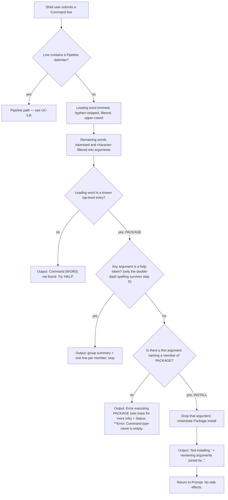

### 7.9 Package Install Command

**Description**

The Shell is a Plugin host: almost every useful Command is meant to arrive as a downloadable Plugin rather than
being compiled in. Package Install is the door that was cut for that purpose. It is the second member of the
`Package` Command Group, alongside Package Search (§7.8), and it is registered as a Host-linked Command by the
Lit Shell's startup code before the first Prompt is drawn, so it is present in every Session whether or not any
Plugin was found. The Shell's own No Plugins Available guidance points a stranded user at it by name.

**That guidance is the only startup narration a Session on a real filesystem ever reaches, and the Plugin
route it apologises for does not exist** (Q-11). The Plugin Scanner builds its search mask by joining a wildcard
segment, the sub-directory name and the binary pattern, producing `*/bin/*.dll`, and hands that to a recursive
directory enumeration rooted at the verified Plugin Directory. Executed against a real filesystem with a
perfectly correct layout in place, that enumeration neither returns the files nor reports an empty set: it
raises a directory-not-found condition naming the literal path `<root>/*/bin`, because the directory portion of
a search mask is joined to the root literally and its wildcards are never expanded. Three consequences follow
and they govern everything in this subsection. **First,** no Plugin is ever loaded from disk, so the
extensibility mechanism this Command is the door to does not function as shipped. **Second,** *any* Plugin
Directory that survives verification is fatal at startup — populated or empty makes no difference, because the
enumeration raises before it can distinguish them, and the directory-not-found condition is not the tolerated
No Plugins Available condition, so it is wrapped as a Startup Load Failure carrying `Unable to load commands.`,
escapes the Session and ends the process with exit status 1 (FR-9.37a). **Third,** the only startup path that
reaches a usable Prompt — and therefore the only path on which any requirement in this subsection is
observable — is the one where the Plugin Directory does **not** exist, which is also the default state, because
the compiled-in default `.\packages` uses a backslash separator that is a literal filename character on a POSIX
host (Q-25). The framework's own scanner tests pass because they run against a mock filesystem that INFERRED
expands the wildcard segment; the production path uses the real filesystem and cannot. The previously-documented
sequence "verified directory → scanned → no plugin binaries → `No packages found in <path>.`" is unreachable on
the shipping path; that literal is reachable only when the sub-directory filter is empty, which the product
never does. See Q-11, OQ-7 and OQ-8; the empirical detail belongs to §7.4.

**As shipped, Package Install installs nothing.** It occupies the invocation slot, publishes a Command Group, a
member name, a description and one declared-required Positional Parameter — and then answers every request with
a fixed refusal line that echoes the arguments back. It performs no network access, creates no file or
directory, reads and writes no Session Variable, and cannot fail. Its entire declaration is byte-identical to a
demonstration fixture in the Command Service's own test suite, down to both message strings and the
package-origin label it is registered under, which is strong evidence that it is a lifted placeholder rather
than an unfinished implementation. Its present product value is honesty: it keeps the Command surface and the
help listing truthful about what is planned without pretending the plan is delivered.

A second, dormant routine lives inside the Package Registry Client and describes the intended install: compose a
Package Archive file name from a Package Identity, download it flat into a caller-supplied target directory,
re-read the identity out of the downloaded archive's own manifest, and create a per-version folder. It then
stops — extraction and dependency resolution are both left explicitly undone, the folder shape it creates does
not match the layout the Plugin Scanner searches (and that Scanner cannot match anything on a real filesystem
in any case), and **nothing anywhere in the product calls it**. This subsection documents the shipped refusal
as the requirement and the dormant routine as an explicitly unimplemented intention. A reimplementer must not
build the second and ship it as the first.

Nothing described here was executed **except** the Plugin-scan enumeration above, which was run against a real
filesystem on the analysis host and is flagged as such wherever it is claimed (FR-9.37a, AC-9.26). Everything
else is read from source. The product does not build at the pinned commit — the Package Search
Command's result accumulator lost its declaration while five uses remained, and dependency restore fails for
every project because the feed claiming all first-party packages is an unexpanded environment token, the private
hosted feed is declared with no routing rule and so is never consulted, and the framework packages are absent
from the public index (Q-55, OQ-2). Both are established; the only residual uncertainty is that the exact
pinned framework artefacts could not be fetched to confirm the base-class surface. The one exception is the
Plugin-scan behaviour described above, which **was** executed against a real filesystem on the analysis host
during verification; the enumeration semantic is long-standing and INFERRED to be identical on the runtime the
product targets.

---

**User stories**

- **US-9.1** — As a Shell user, I want an install Command that appears in the Shell's help listing under a
  `Package` group, so that I can see that a Plugin-installation route exists and learn how it is spelled.
- **US-9.2** — As a Shell user, I want typing an install request at the Prompt to answer immediately and
  unambiguously that nothing was installed, so that I never believe a Plugin was added when it was not.
- **US-9.3** — As a Shell user, I want to feed candidate package names into the install Command from an upstream
  Pipeline stage and receive one answer per name, so that a batch install would work the same way a single
  install does.
- **US-9.4** — As a Shell Operator, I want the install Command compiled into the Shell executable and registered
  at startup under a package-origin label, so that it is available in a Session with no Plugin Directory and no
  Plugins at all.
- **US-9.5** — As a Shell Operator, I want to declare whether installing is permitted in this Session, so that
  I can offer the Shell in a hosted or locked-down deployment without also offering a route to fetch and run
  unreviewed code. **This capability is declared but not delivered:** the setting exists, is documented,
  defaults to on, and is covered by a test — and no code path anywhere reads it. Setting it off changes
  nothing.
- **US-9.6** — As a Shell user, I want to name a Plugin and have the Shell fetch it from a Package Registry and
  place it where the Shell looks for Plugins, so that I can extend the Shell from inside the Shell instead of
  copying files by hand and restarting. **This is an unfinished intention, not a shipped capability.** The
  routine that would do it downloads an archive and creates an empty per-version folder, has no caller, and
  leaves extraction and dependency resolution unwritten.
- **US-9.7** — As a Plugin author, I want an installed Package Archive laid out so the Plugin Scanner discovers
  my Commands, so that publishing a Plugin in the ordinary archive shape is enough to make its Commands appear
  at the Prompt. **This is an unfinished intention, and the partial implementation contradicts it twice over:**
  the folder the routine creates is not the sub-directory the Scanner searches, and the Scanner's own search
  mask cannot match any file on a real filesystem, so no layout an install could produce would be discovered
  (Q-11, Q-77).
- **US-9.8** — As a Package Registry, I want to be asked for a specific package identity and version, so that I
  serve exactly one archive and never have to guess which release the Shell meant. **Unfinished intention:**
  the routine demands a fully-resolved Package Identity and performs no version discovery of its own, and
  nothing in the product ever chooses a version.

---

**Use cases**

#### UC-9.A — Refuse an install request typed at the Prompt (realizes US-9.1, US-9.2)

**Preconditions**
- A Session of the Lit Shell is running and the Prompt `Ɛ> ` is displayed.
- Package Install and Package Search were registered as Host-linked Commands under the package-origin label
  `internal` before the Session loop began, and the `Package` Command Group therefore holds two members.
- No Plugin needs to be present; the outcome is identical whether or not Plugin loading succeeded. In practice
  the Session reached the Prompt at all only because the Plugin Directory did **not** exist and the tolerant
  No Plugins Available branch ran: had it existed, startup would have failed before the Prompt was ever drawn
  (FR-9.37a, Q-11).

**Main flow**
1. The Shell user types a Command line beginning with the group word and the member word, for example
   `package install Foo`, and submits it.
2. The Session detects no Pipeline delimiter and passes the whole line to the Command Service.
3. The Command Service extracts the leading word, trims it, strips leading and trailing hyphens, deletes every
   character outside the command-name allow-set, and upper-cases it, yielding `PACKAGE`.
4. The Command Service tokenises the rest of the line into arguments and drops the first token (the group word),
   leaving `install`, `Foo`.
5. No argument is a help token, so execution proceeds.
6. The Command Service upper-cases the first argument, matches `INSTALL` against the group's member table,
   removes that argument from the list, and instantiates Package Install with the remaining arguments `Foo`.
7. Package Install performs Direct invocation and returns one Output: the literal `Not installing ` followed by
   the remaining arguments joined with a single comma and no space — here, `Not installing Foo`.
8. The Presentation Adapter renders that one line and the Session returns to the Prompt.

**Alternate flows**
- **A1 — Several arguments.** Steps 6–7 join every remaining argument with `,`: `package install Foo Bar Baz`
  yields `Not installing Foo,Bar,Baz`.
- **A2 — No argument at all.** After the member word is consumed the argument list is empty; the join yields the
  empty string and the Output is `Not installing ` with its trailing space and nothing after it. This is a
  success, not an error — the declared-required Positional Parameter is never enforced.
- **A3 — Any casing.** `PACKAGE INSTALL Foo`, `Package Install Foo` and `package install Foo` are identical:
  the group and member names are upper-cased at registration and the typed words are upper-cased at lookup.
- **A4 — An unquoted dotted name.** `package install XCBatch.Core` tokenises into two arguments because the dot
  is not a token character, and the Output is `Not installing XCBatch,Core`.
- **A5 — A quoted dotted name.** `package install "XCBatch.Core"` is captured as one quoted token, the dot
  survives the character filter, the surrounding quotes are trimmed, and the Output is
  `Not installing XCBatch.Core`.
- **A6 — A quoted name containing a filtered character.** `package install "XCBatch.Core:2.0"` keeps the dot but
  loses the colon, giving `Not installing XCBatch.Core2.0`.

**Error flows**
- **E1 — Member word typed without the group word.** `install Foo` resolves the leading word to `INSTALL`, which
  is not a top-level entry because only group names become top-level entries. Output:
  `Command [INSTALL] not found. Try 'HELP'`. Nothing runs.
- **E2 — Group word with an unknown member.** `package nonsense` resolves the group, fails to match a member,
  and falls through to instantiating the group entry itself, which carries no implementation. Output:
  `Error executing PACKAGE (see trace for more info)`, plus a Status line `**Error: Command type name is empty.`
  Nothing tells the user which members do exist. The Session continues. (Q-72.)
- **E3 — Group word alone.** `package` behaves exactly as E2: there is no argument to match, so the same
  internal-error pair is emitted. It is neither a member listing nor a "missing sub-command" message. (Q-72.)
- **E4 — A help spelling the tokeniser destroys.** `package install -?` prints `Not installing -` and
  `package install /?` prints `Not installing `. Neither is help and neither is an error.
- **E5 — Unrenderable diagnostics.** Whenever E2 or E3 occurs the Status line is visible but the Diagnostic
  trace it points at is not: the Presentation Adapter declares its own Status Visibility flag that shadows,
  rather than sets, the one the trace writer consults, and the consulted flag defaults to off and is never
  assigned. The user is directed to a trace they can never see. (Q-27, OQ-21.)

**Postconditions**
- Exactly one Output line was rendered (or one Output line plus one Status line in E2/E3).
- No file, no directory, no network connection, no Session Variable read and no Session Variable write occurred.
- The Session is at the Prompt, unmodified.

#### UC-9.B — Refuse once per Pipeline chunk (realizes US-9.3)

**Preconditions**
- A Session is at the Prompt; Package Install is registered as in UC-9.A.
- The submitted Command line contains at least one Pipeline delimiter.

**Main flow**
1. The Shell user submits a Pipeline, for example `say hello world | package install Foo`.
2. The Command Service splits the line into stages on unquoted delimiters, trimming each stage and discarding
   empty stages, and consumes quote characters during the split.
3. Every stage is started concurrently. Each adjacent pair is joined by a Stage Channel of capacity 10,000
   items with a blocking back-pressure policy; per-stage and whole-pipeline timeouts default to 0, meaning none.
4. The Package Install stage has an input Stage Channel attached, so it takes the Per-chunk invocation path.
5. For each chunk read from upstream, the stage checks whether the chunk is empty; empty chunks are skipped
   without invoking the Command at all.
6. For each non-empty chunk it emits one Output: the literal `Not installing `, then the chunk verbatim, then a
   single space, then the remaining arguments joined with `,` — here, `Not installing hello world Foo`.
7. Each stage's Output is written into the Stage Channel feeding the next stage; only the final stage's Output
   is drained and rendered. As the last stage, Package Install's line reaches the Presentation Adapter.
8. When upstream closes, the stage completes; when all stages complete, the Session returns to the Prompt.

**Alternate flows**
- **B1 — No arguments.** With no remaining arguments the line ends in the trailing space after the chunk.
- **B2 — Package Install is not the last stage.** Its refusal lines feed the next stage instead of the console
  and are never rendered as such.
- **B3 — Empty then non-empty chunks.** Only the non-empty chunks produce lines; the count of rendered lines is
  the count of non-empty chunks.
- **B4 — A help token in a Pipeline stage.** The help check runs per stage, before the member is selected, so
  a help token in the Package Install stage produces the group listing written into that stage's Stage Channel
  rather than any refusal line. INFERRED.

**Error flows**
- **E6 — Unbalanced double quote anywhere in the line (Q-42).** The line is rejected while it is being split into
  stages, which happens outside the Command Service's per-command error handling and outside any handler the
  Session provides. The failure escapes the Session loop and reaches the executable's top-level handler, which
  writes `Error ` followed by the failure text — carrying `Unbalanced " quote in pipeline.` — to standard output
  and terminates the process with exit code `1`. **The Session ends**; the user loses the Prompt and every
  Session Variable set during the run.
- **E7 — A quoted argument inside a Pipeline.** Not an error, but a silent divergence from UC-9.A: because the
  splitter consumes quote characters before the stage text is re-tokenised, quoting does not protect a dotted
  name inside a Pipeline the way it does at the top level. `say x | package install "XCBatch.Core"` yields
  `Not installing x XCBatch,Core`, not `Not installing x XCBatch.Core`. INFERRED. (Q-63; Q-43 records only the
  top-level half of the same defect.)
- **E8 — Producer outruns the stage.** An upstream stage may run at most 10,000 chunks ahead before it blocks;
  there is no timeout, so a stalled consumer stalls the Pipeline indefinitely.

**Postconditions**
- One Output line per non-empty upstream chunk; no side effects of any kind.

#### UC-9.C — Discover the Command and ask for its help (realizes US-9.1)

**Preconditions**
- A Session is at the Prompt with the `Package` group registered and holding two members.

**Main flow**
1. The Shell user types `HELP` alone.
2. The Command Service walks every registered top-level entry. For a group entry with members and no
   implementation of its own, it renders the group's own summary line and then one line per member.
3. The Shell user sees the group name, the group description `Package commands`, and a member line carrying
   `INSTALL` and its description `install a package`.

**Alternate flows**
- **C1 — Help requested on the member.** `package install --help` does **not** print this Command's own
  parameter help. The help test runs against the resolved group before any member is selected, and the group has
  members, so the group's one-line member listing is printed instead. INFERRED rendering: `PACKAGE      Package
  commands`, then a line beginning with a hyphen and a tab carrying `INSTALL      install a package`, then the
  corresponding line for the `SEARCH` member.
- **C2 — Help requested with a name argument.** `HELP INSTALL` ignores its argument and prints the full listing
  of every registered Command, exactly as `HELP` alone does.
- **C3 — No Command line prints this Command's own usage block.** The Command carries a help-rendering path of
  its own, reachable only when it is instantiated without the help check having fired first — a condition no
  observed Command line produces.

**Error flows**
- **E9 — The advertised spelling does not resolve.** The Shell's No Plugins Available guidance reads
  ``No Plugins Found. You may want to check out `install --help` ``. Typing that produces
  `Command [INSTALL] not found. Try 'HELP'`. The guidance names an invocation the Shell does not have (Q-12).
  Because a Session only reaches the Prompt when there is no Plugin Directory (FR-9.37a), this guidance is what
  every reachable Session prints, so the broken spelling is on the product's most-travelled path, not a corner
  of it.
- **E10 — Two of the three accepted help spellings never arrive.** The Command Service's help test accepts
  `--HELP`, `-?` and `/?`, compared case-insensitively, but the argument tokeniser runs first and neither `?`
  nor `/` is a token character. See UC-9.A E4 for what is printed instead. (Q-44.)

**Postconditions**
- Help output was rendered; no Command executed; nothing changed.

#### UC-9.D — Register the Command and its permission setting at Session startup (realizes US-9.4, US-9.5)

**Preconditions**
- The Lit Shell executable is starting.

**Main flow**
1. The Shell Operator's startup code constructs the Session object. The Session object exposes an
   install-permission setting documented as designating whether the install Command is allowed, defaulting to
   **true**.
2. The startup code registers Package Install as a Host-linked Command under the package-origin label
   `internal`, then registers Package Search under the same label.
3. The Command Service normalises both declarations: the group name becomes the top-level entry `PACKAGE`, and
   each Command becomes a member under its own upper-cased name. The second registration under an existing
   group name merges into the existing entry rather than replacing it, so the group ends with `INSTALL` first
   and `SEARCH` second.
4. The Session then starts: it registers Built-in Commands, adds the Plugin Directory, loads Plugins, and enters
   the Prompt loop. On a real filesystem the load step succeeds only in the sense that it raises the tolerated
   No Plugins Available condition, which happens exactly when the Plugin Directory does not exist; the Prompt
   loop is reached from no other branch (FR-9.37a).

**Alternate flows**
- **D1 — Permission setting turned off.** A Shell Operator may set the install-permission setting to false
  before starting the Session. Registration, resolution and execution are all unaffected: no code path reads
  the setting.
- **D2 — The other executable.** The Vestigial scaffold prints a greeting and exits without starting a Session
  or registering anything, so a user running that build never sees the Command.

**Error flows**
- **E11 — Startup failure of any kind.** Any failure before the first Prompt, including Plugin loading failure,
  reaches the executable's top-level handler, which writes `Error ` followed by the message to standard output
  and exits with code `1`. The reachable instance of this is not hypothetical: whenever the configured Plugin
  Directory exists, the scan raises a directory-not-found condition that the tolerant branch does not catch, so
  the Session ends with `Error Unable to load commands.`. Registration at step 2 has already happened by then —
  it precedes the load — so `PACKAGE INSTALL` is registered and then never becomes invocable, because no Prompt
  is drawn (FR-9.37a, Q-11).
- **E12 — INFERRED: single-file distribution (Q-54, OQ-12).** The Release distribution profile publishes a
  trimmed, self-contained, single-file, platform-restricted binary. The Command Service records the file location of the
  assembly a Command came from at registration and re-loads the Command through that path at dispatch. In a
  single-file bundle that location is empty, which by the code path shown raises "is not loaded and no assembly
  was defined" and would surface as `Error executing PACKAGE (see trace for more info)`. Not verified by
  execution.

**Postconditions**
- `PACKAGE INSTALL` is resolvable; the install-permission setting holds a value that governs nothing (Q-24,
  OQ-25). This postcondition holds only on the startup path where the Plugin Directory was absent; on every
  other path the process has already exited (FR-9.37a).

#### UC-9.E — Place a Plugin on disk — NOT IMPLEMENTED (realizes US-9.6, US-9.7, US-9.8)

> This use case documents the dormant routine in the Package Registry Client. **No user action reaches it; it
> has no caller anywhere in the product.** It is recorded so a reimplementer builds the finished feature
> deliberately rather than by accident.

**Preconditions**
- A fully-resolved Package Identity (name plus a specific version) — the routine performs no version discovery.
- A handle to a Package Registry, supplied by the caller.
- A target directory, supplied by the caller with no default. Nothing connects this to the Plugin Directory,
  whose Session default is `.\packages` (OQ-15).

**Main flow**
1. Compose the Package Archive file name as the package name, a literal dot, the version text, a literal dot,
   and the extension — `<packageId>.<version>.nupkg`. The download step documents the same pattern as its
   contract: `{path}/{packageId}.{versionString}.nupkg`.
2. Resolve that name directly against the target directory — flat, not in a sub-folder.
3. Download the archive into that path, creating or truncating any file already there, without asking.
   The call is made synchronously and blocks the caller for the whole transfer.
4. Re-read the Package Identity out of the downloaded archive's own manifest rather than trusting the requested
   identity. The name casing and version text used for the folder layout therefore come from the package itself.
5. Compose the install folder as `<targetDirectory>/<manifestId>/<manifestVersion>/` and create it only if it
   does not already exist; an existing folder is left as-is and its contents untouched.
6. **Stop.** Extraction into that folder is present only as a disabled line, and dependency resolution is
   present only as a note.

**Alternate flows**
- **E-A1 — Repeat install of the same identity.** Step 3 silently overwrites the archive; step 5 finds the
  folder present and does nothing. No file is ever deleted.
- **E-A2 — Dependencies.** A dependency-resolution helper exists in the same client but is never called from
  this routine, and returns **at most one** record — the requested package's own — with no transitive walk.

**Error flows**
- **E13 — The routine has no error handling of its own.** No exception handling, no identity validation, no
  encrypted-transport check, no size check, no destination-path containment check, no signature or checksum
  verification. Any failure propagates to the Command Service's generic handler and surfaces as
  `Error executing PACKAGE (see trace for more info)`.
- **E14 — Requested package does not exist in the Registry.** Undefined. The download step reports success
  unconditionally, so a missing or unreachable package can leave a zero-length archive on disk and still look
  like success; the manifest read at step 4 then fails against that file.
- **E15 — Target directory does not exist.** The archive write at step 3 happens before any directory is
  created, so it fails first; the folder creation at step 5 never protects it.
- **E16 — No progress and no cancellation.** The blocking download freezes the Prompt for its whole duration
  with no Progress reading and no cancellation signal, even though the Presentation Adapter has a progress
  channel.

**Postconditions (if the routine were run today)**
- One `.nupkg` file on disk in the target directory, and one empty `<name>/<version>/` folder beside it.
- **Nothing is installed.** No Command becomes available. The Session loads Plugins exactly once, before the
  first Prompt, and nothing anywhere asks it to re-scan, so even a completed install would require restarting
  the Shell — and restarting would not help either, because creating the target directory is precisely what
  makes the next startup fatal, and the scan mask could not match the extracted files even if it did run
  (FR-9.37a, Q-11, Q-77).
- No install manifest, no lock file, no receipt and no uninstall path exists anywhere in the product.

---

**Functional requirements**

*Identity, declaration and registration*

- **FR-9.1** — The Command SHALL declare the Command Group `Package` with the group description
  `Package commands`. Realizes US-9.1. (`src/Xcaciv.Command.Packages/InstallCommand.cs:14`)
- **FR-9.2** — The Command SHALL declare the member name `Install` with the description `install a package`.
  Realizes US-9.1. (`src/Xcaciv.Command.Packages/InstallCommand.cs:15`)
- **FR-9.3** — The Command SHALL declare exactly one Positional Parameter, named `packagename`, with the help
  text `The unique name of the package to install`, marked required. It SHALL declare no Named Parameter, no
  Flag, no suffix parameter and no usage-prototype override.
  (`src/Xcaciv.Command.Packages/InstallCommand.cs:14-28`)
- **FR-9.4** — Because no usage prototype, description version or alias is declared, the Command SHALL carry the
  Command Service's placeholder metadata defaults — sentinel prototype, version `0.0.0`, empty alias — and its
  generated usage line SHALL be synthesised from the declared parameter rather than supplied.
  OUT-OF-REPO only: `src/Xcaciv.Command.Interface/Attributes/CommandRegisterAttribute.cs:34-51`,
  `src/Xcaciv.Command.Core/AbstractCommand.cs:118-126` (framework v2.1.2).
- **FR-9.5** — The Shell Operator's startup code SHALL register the Command as a Host-linked Command under the
  package-origin label `internal` before the Session loop starts, and SHALL register Package Search under the
  same label immediately after. `internal` is a plain origin label, not a permission and not a source. Realizes
  US-9.4. (`src/Xcaciv.Cupcake.Lit/Program.cs:10-11`)
- **FR-9.6** — Registering a second Command declaring an already-registered Command Group SHALL merge it into
  that group's existing entry rather than replace the entry, leaving the `Package` group with two members,
  `INSTALL` first and `SEARCH` second. OUT-OF-REPO only:
  `src/Xcaciv.Command/CommandRegistry.cs:20-36` (framework v2.1.2).
- **FR-9.7** — Group and member names SHALL be normalised to upper case at registration, and the leading word of
  a Command line SHALL be normalised the same way before lookup, so that invocation is case-insensitive and the
  effective identifiers are the group `PACKAGE` and the member `INSTALL`. Realizes US-9.1. OUT-OF-REPO only:
  `src/Xcaciv.Command.Interface/Attributes/CommandRootAttribute.cs:27-32`,
  `src/Xcaciv.Command.Interface/Attributes/CommandRegisterAttribute.cs:27-32`,
  `src/Xcaciv.Command.Interface/CommandDescription.cs:52-64`,
  `src/Xcaciv.Command/CommandFactory.cs:43-46` (framework v2.1.2).
- **FR-9.8** — Only the Command Group name SHALL become a top-level entry; the member name SHALL NOT. The
  Command SHALL therefore be reachable only as `PACKAGE INSTALL …`. OUT-OF-REPO only:
  `src/Xcaciv.Command.Core/CommandParameters.cs:177-210` (framework v2.1.2).
- **FR-9.9** — **QUIRK Q-12.** The Shell's No Plugins Available guidance SHALL read exactly
  ``No Plugins Found. You may want to check out `install --help` ``, naming an invocation that does not resolve
  under FR-9.8. (`src/Xcaciv.Cupcake.Core/Loop.cs:47`)
- **FR-9.10** — The Vestigial scaffold executable SHALL NOT register this Command or start a Session; a user
  running that build SHALL never see it. (`src/Xcaciv.Cupcake/Program.cs:1-2`)

*Direct invocation*

- **FR-9.11** — On Direct invocation the Command SHALL emit exactly one Output consisting of the literal
  `Not installing ` — with its trailing space — followed by every remaining argument joined by a single comma
  with no space. Realizes US-9.2. (`src/Xcaciv.Command.Packages/InstallCommand.cs:21`)
- **FR-9.12** — The Command SHALL contain no branch, no condition and no failure path on this route: Direct
  invocation SHALL always succeed. (`src/Xcaciv.Command.Packages/InstallCommand.cs:19-22`)
- **FR-9.13** — The Command SHALL produce no side effect: no network access, no file created, no directory
  created, and no Session Variable read or written. The Session Variable handle SHALL be accepted and ignored.
  Realizes US-9.2. (`src/Xcaciv.Command.Packages/InstallCommand.cs:19-22`)
- **FR-9.13a** — The Command Service SHALL nevertheless run every execution against a **child** Session
  Variable scope seeded with a copy of the caller's values, and SHALL merge that child back into the caller's
  store only when the Command's registration record declares it environment-modifying *and* the child changed.
  The Lit Shell registers both package Commands without that flag, and the flag defaults to off. Because this
  Command never touches the handle at all, the write-back rule is moot for Package Install; it matters for a
  clone, because the sibling Package Search's read-writes-back-a-default behaviour (Q-10) is invisible in a
  normal
  Session variable dump and observable only where a host passes its own store straight to the Command, as the
  repository's own tests do. A clone that registers either package Command as environment-modifying would make
  that write permanent. (`src/Xcaciv.Cupcake.Lit/Program.cs:10-11`;
  `Xcaciv.Command.PackagesTests/SearchCommandTests.cs:15,31,90`; OUT-OF-REPO:
  `src/Xcaciv.Command/CommandExecutor.cs:187,216-219`, `src/Xcaciv.Command/EnvironmentContext.cs:45-55,94-110`,
  `src/Xcaciv.Command/CommandController.cs:190`, framework v2.1.2)
- **FR-9.14** — The group word SHALL be consumed by name extraction and dropped from the argument list, and the
  **first** remaining argument SHALL be consumed as the member selector and removed; every argument after it
  SHALL be passed through unchanged. Neither word SHALL appear in the echoed Output. OUT-OF-REPO only:
  `src/Xcaciv.Command/CommandFactory.cs:43-53`,
  `src/Xcaciv.Command.Interface/CommandDescription.cs:70-79` (framework v2.1.2).
- **FR-9.15** — **QUIRK Q-46.** The declared-required marking on `packagename` SHALL NOT be enforced. The Command
  bypasses the Command Service's parameter-processing step, which is the only place required-ness, defaults and
  allowed-value lists are checked, so `package install` with no argument SHALL succeed and emit
  `Not installing ` with a bare trailing space. The Command Service's `Missing required parameter <name>` error
  SHALL never be raised for this Command. (`src/Xcaciv.Command.Packages/InstallCommand.cs:16,19-22`;
  OUT-OF-REPO: `src/Xcaciv.Command.Core/CommandParameters.cs:86-132`, framework
  v2.1.2)

*Argument tokenisation and sanitisation*

- **FR-9.16** — Arguments SHALL be tokenised as either a double-quoted span or a run of letters, digits,
  underscores and hyphens. Any other character SHALL act as a token boundary unless it lies inside a quoted
  span. OUT-OF-REPO only: `src/Xcaciv.Command.Interface/CommandDescription.cs:70-79`
  (framework v2.1.2).
- **FR-9.17** — **QUIRK Q-43.** Because package names in this ecosystem almost always contain dots, and a dot is
  not a token character, the natural invocation `package install Some.Package.Name` SHALL arrive as three
  separate arguments and echo as `Not installing Some,Package,Name`. Today this only garbles the echo; once the
  feature is finished it would break the actual install. (Derived from FR-9.16.)
- **FR-9.18** — After tokenising, each argument SHALL have every character outside the allow-set
  `- _ 0-9 A-Z a-z space . * ? [ ] | " ~ ! @ # $ % ^ & * ( )` deleted, and surrounding double quotes trimmed.
  OUT-OF-REPO only: `src/Xcaciv.Command.Interface/CommandDescription.cs:23,70-79`
  (framework v2.1.2).
- **FR-9.19** — **QUIRK Q-43 (continued).** Because the tokeniser can only produce word/hyphen runs or quoted spans, the
  deletion in FR-9.18 is observable only **inside** a quoted argument, where it silently corrupts the value:
  `"C:\packages"` SHALL arrive as `Cpackages` and `"XCBatch.Core:2.0"` SHALL arrive as `XCBatch.Core2.0`.
  Backslash, colon, forward slash, comma, semicolon, `+` and `=` are all deleted without warning. For a finished
  install this would corrupt exactly those path and identity arguments a user quotes *because* they contain
  those characters. (Derived from FR-9.18.)
- **FR-9.20** — The leading Command word SHALL be trimmed, stripped of leading and trailing hyphens, stripped of
  every character outside `- _ 0-9 A-Z a-z space`, and upper-cased before lookup. OUT-OF-REPO only:
  `src/Xcaciv.Command.Interface/CommandDescription.cs:18,52-64` (framework v2.1.2).

*Help*

- **FR-9.21** — A help token in any argument position, in any case, SHALL suppress execution entirely. The
  Command Service SHALL accept `--HELP`, `-?` and `/?`, compared case-insensitively. OUT-OF-REPO only:
  `src/Xcaciv.Command/HelpService.cs:165-175`,
  `src/Xcaciv.Command/CommandExecutor.cs:57-72` (framework v2.1.2).
- **FR-9.22** — **QUIRK Q-44.** Of the three spellings in FR-9.21, only the double-dash spelling SHALL be
  reachable from the Prompt: `?` and `/` are not token characters (FR-9.16), so `package install -?` SHALL
  arrive as the single argument `-` and emit `Not installing -`, and `package install /?` SHALL arrive with no
  argument at all and emit `Not installing `. Neither is help and neither is an error. A reimplementer reading
  only the help test would wrongly conclude three spellings work. (Derived from FR-9.16, FR-9.21.)
- **FR-9.23** — **QUIRK Q-45.** Requesting help on this member SHALL print the Command Group's one-line member
  listing, not this member's own parameter help, because the help test runs against the resolved group before
  any member is selected and the group has members. INFERRED rendering, in order: `PACKAGE      Package
  commands`; then a line consisting of a hyphen, a tab, and `INSTALL      install a package`; then the
  corresponding line for `SEARCH`. Realizes US-9.1. OUT-OF-REPO only:
  `src/Xcaciv.Command/CommandExecutor.cs:57-72,260-289`,
  `src/Xcaciv.Command/HelpService.cs:133-163` (framework v2.1.2).
- **FR-9.24** — **QUIRK Q-45 (continued).** No Command line SHALL print this Command's own full usage block. The
  bare help word lists every registered Command one line each, and the help word **with** an argument ignores
  the argument and prints the same complete listing. The Command's own help-rendering path SHALL therefore be
  unreachable. INFERRED. OUT-OF-REPO only:
  `src/Xcaciv.Command/CommandExecutor.cs:78-81,110-141`,
  `src/Xcaciv.Command.Core/AbstractCommand.cs:162-172` (framework v2.1.2).
- **FR-9.25** — The whole-Shell help listing SHALL include the Command Group's summary line and one line per
  member, so that `INSTALL` and `install a package` are discoverable there. Realizes US-9.1. OUT-OF-REPO only:
  `src/Xcaciv.Command/CommandExecutor.cs:110-141` (framework v2.1.2).

*Per-chunk invocation and Pipelines*

- **FR-9.26** — On Per-chunk invocation the Command SHALL emit, for each chunk, the literal `Not installing `,
  then the chunk verbatim, then a single space, then the remaining arguments joined by a single comma with no
  space. With no arguments the line SHALL end in that trailing space. Realizes US-9.3.
  (`src/Xcaciv.Command.Packages/InstallCommand.cs:26`)
- **FR-9.27** — An empty chunk arriving from upstream SHALL be skipped: the Command SHALL NOT be invoked for it
  and no line SHALL be emitted for it. OUT-OF-REPO only:
  `src/Xcaciv.Command.Core/AbstractCommand.cs:154-161` (framework v2.1.2).
- **FR-9.28** — In a Pipeline the Command's Output SHALL be written into the Stage Channel feeding the next
  stage rather than to the Presentation Adapter; only the final stage's Output SHALL be drained and rendered.
  OUT-OF-REPO only: `src/Xcaciv.Command.Core/AbstractTextIo.cs:67-74`,
  `src/Xcaciv.Command/PipelineExecutor.cs:101,179-193` (framework v2.1.2).
- **FR-9.29** — Each Stage Channel SHALL hold at most **10,000** items, SHALL block the producer when full, and
  SHALL apply no per-stage timeout, no whole-pipeline timeout, no per-stage output byte cap and no per-stage
  output item cap — every one of those defaults to `0`, meaning disabled. OUT-OF-REPO only:
  `src/Xcaciv.Command.Interface/PipelineConfiguration.cs:15,29,36` (framework v2.1.2).
- **FR-9.30** — The Command SHALL hold no state between invocations, so per-chunk execution is safe to run
  concurrently with neighbouring stages. (`src/Xcaciv.Command.Packages/InstallCommand.cs:17-28`)
- **FR-9.31** — **QUIRK Q-63.** The Pipeline splitter SHALL consume quote characters while splitting stages,
  and each stage's text is then re-tokenised under FR-9.16. Quoting therefore protects a dotted argument at the
  top level (FR-9.16) but **not** inside a Pipeline: `say x | package install "XCBatch.Core"` SHALL emit
  `Not installing x XCBatch,Core`. This is the Pipeline half of the tokenisation defect Q-43 records at the top
  level; Q-43 alone does not cover the prompt-versus-Pipeline asymmetry. INFERRED, OUT-OF-REPO only:
  `src/Xcaciv.Command/PipelineParser.cs:65-77,97-127`,
  `src/Xcaciv.Command/PipelineExecutor.cs:85-87` (framework v2.1.2).

*Output routing, errors and diagnostics*

- **FR-9.32** — An empty Output chunk SHALL be suppressed by the Shell. Because the refusal text always contains
  at least `Not installing `, this Command's Output SHALL always be rendered. OUT-OF-REPO only:
  `src/Xcaciv.Command/CommandExecutor.cs:196-201` (framework v2.1.2).
- **FR-9.33** — An unresolvable leading word SHALL produce `Command [INSTALL] not found. Try 'HELP'` — the
  bracketed text being the sanitised, upper-cased word. OUT-OF-REPO only:
  `src/Xcaciv.Command/CommandExecutor.cs:84-86` (framework v2.1.2).
- **FR-9.34** — **QUIRK Q-72.** Invoking the Command Group with no member word, or with a member word that
  matches no member, SHALL produce the Output `Error executing PACKAGE (see trace for more info)` plus the
  Status line `**Error: Command type name is empty.`, because the group entry carries no implementation of its
  own. It SHALL NOT be a member listing and SHALL NOT be a "missing sub-command" message, and nothing SHALL tell
  the user which members exist. The Session SHALL continue. Q-8 records only that failure text names the group
  rather than the member, and Q-13 records the namespacing itself; Q-72 is the row that covers this outcome.
  INFERRED, OUT-OF-REPO only:
  `src/Xcaciv.Command/CommandFactory.cs:43-63`,
  `src/Xcaciv.Command/CommandExecutor.cs:224-231` (framework v2.1.2).
- **FR-9.35** — **QUIRK Q-27.** Diagnostic trace written around this Command's execution — including the
  stage-start and stage-done lines — SHALL never reach the console. The Presentation Adapter declares its own
  Status Visibility flag that shadows rather than sets the one the trace writer consults, and the consulted flag
  defaults to off and is never assigned. Status lines, rendered by the Presentation Adapter itself, SHALL be
  visible. Net effect: the `**Error: …` Status line of FR-9.34 is shown and the trace it points at is not.
  INFERRED — read, not executed. (`src/Xcaciv.Cupcake.Core/ConsoleContext.cs:13,31`; OUT-OF-REPO:
  `src/Xcaciv.Command.Core/AbstractTextIo.cs:25,167-176`, framework v2.1.2)
- **FR-9.36** — **QUIRK Q-42.** An unbalanced double quote anywhere in a Command line containing a Pipeline
  delimiter SHALL terminate the Session: the line is rejected during stage splitting, which lies outside both
  the Command Service's per-command error handling and any handler the Session provides, so the failure reaches
  the executable's top-level handler, which writes `Error ` followed by the message text — carrying
  `Unbalanced " quote in pipeline.` — to standard output and exits with code `1`. The user loses the Prompt and
  every Session Variable set during the run. INFERRED. (`src/Xcaciv.Cupcake.Core/Loop.cs:57-66`;
  `src/Xcaciv.Cupcake.Lit/Program.cs:14-19`; OUT-OF-REPO:
  `src/Xcaciv.Command/PipelineParser.cs:129`,
  `src/Xcaciv.Command/CommandController.cs:234-236` (framework v2.1.2))
- **FR-9.37** — Any failure before the first Prompt, Plugin loading included, SHALL cause the executable to
  write `Error ` followed by the message to standard output and exit with code `1`. Diagnostics are written to
  standard output rather than an error stream, so redirecting output swallows them.
  (`src/Xcaciv.Cupcake.Lit/Program.cs:14-19`)
- **FR-9.37a** — **QUIRK Q-11.** The Session SHALL be reachable at the Prompt only when the configured Plugin
  Directory does **not** exist. The Plugin Scanner composes its search mask by joining a wildcard segment, the
  sub-directory name (`bin` by default, and the Session names none) and the binary pattern `*.dll`, giving
  `*/bin/*.dll`, and passes it to a recursive enumeration rooted at the verified Plugin Directory. Executed
  against a real filesystem with a correct layout present, that enumeration SHALL raise a directory-not-found
  condition naming the literal path `<root>/*/bin` — the directory portion of a search mask is joined to the
  root literally and its wildcards are never expanded — so **no Plugin is ever loaded from disk** and **any**
  existing Plugin Directory, populated or empty, is fatal. That condition is not the tolerated No Plugins
  Available condition, so the tolerant branch SHALL NOT catch it; it is wrapped as a Startup Load Failure
  carrying `Unable to load commands.`, escapes the Session, and ends the process with exit status `1` under
  FR-9.37. Consequently the No Plugins Available guidance of FR-9.9 is the only startup narration any reachable
  Session prints, and `PACKAGE INSTALL` is invocable only in a Session that found nothing to install into. The
  sequence "verified directory → scanned → `No packages found in <path>.`" SHALL be treated as unreachable on
  the shipping path: that literal is reachable only when the sub-directory filter is empty, which the product
  never does. **Verified by execution** against a real filesystem on the analysis host, in both recursive and
  top-level enumeration modes, with a control run using the plain pattern `*.dll` confirming the layout; the
  enumeration semantic is long-standing and INFERRED identical on the runtime the product targets. The
  framework's own scanner tests pass because they run against a mock filesystem that INFERRED expands the
  wildcard segment. Q-11 is the register row for this quirk; note that its wording pre-dates the empirical
  result and describes only the present-but-*empty* case, whereas a populated Plugin Directory fails
  identically and for the same reason. See also OQ-7 and OQ-8; §7.4 owns the scan itself.
  (`src/Xcaciv.Cupcake.Core/Loop.cs:24,41-54`; OUT-OF-REPO:
  `src/Xcaciv.Command.FileLoader/Crawler.cs:20,173-178`, `src/Xcaciv.Command/CommandLoader.cs:42-54`,
  framework v2.1.2)
- **FR-9.37b** — Because of FR-9.37a, every requirement in this subsection that describes behaviour at the Prompt
  SHALL be read as holding on the no-Plugin-Directory startup path only. The default Plugin Directory literal
  `.\packages` (Q-25) uses a backslash separator that is a literal filename character on a POSIX host, so on
  such a host the default path is a filename that does not exist and the tolerant branch is taken — the product
  works, in the only sense it works, by accident. (`src/Xcaciv.Cupcake.Core/Loop.cs:24`)
- **FR-9.38** — Every string this feature emits SHALL be hard-coded in one language with no message catalogue
  and no locale handling. (`src/Xcaciv.Command.Packages/InstallCommand.cs:21,26`)

*The permission gate*

- **FR-9.39** — **QUIRK Q-24.** The Session SHALL expose a boolean install-permission setting, documented as
  designating whether the install Command is allowed, defaulting to **true**. No code path SHALL read it before
  registering, resolving or executing the Command; setting it to false SHALL change nothing. Realizes US-9.5.
  (`src/Xcaciv.Cupcake.Core/Loop.cs:8-11`)
- **FR-9.40** — The only test in the product that touches this feature SHALL assert that install-permission
  defaults to true, alongside three other Session defaults. Nothing asserts this Command's Output, its
  registration or its argument handling. (`Xcaciv.Cupcake.Core.Tests/LoopTests.cs:154-162`)

*Intended install — NOT IMPLEMENTED*

- **FR-9.41** — **NOT IMPLEMENTED. QUIRK Q-46.** No user action SHALL reach the install routine: it has no
  caller anywhere in the product, and the Command never reaches for the Package Registry Client. Realizes
  US-9.6 as an unfinished intention. (`src/Xcaciv.Command.Packages/NugetWrapper.cs:111`, sole occurrence)
- **FR-9.42** — **NOT IMPLEMENTED.** The routine SHALL require a fully-resolved Package Identity, a Package
  Registry handle and a target directory. It SHALL perform no version discovery of its own; no "latest" rule, no
  version range and no Prerelease inclusion policy for installs exists anywhere. Realizes US-9.8 as an
  unfinished intention. (`src/Xcaciv.Command.Packages/NugetWrapper.cs:111`)
- **FR-9.43** — **NOT IMPLEMENTED.** The Package Archive file name SHALL be composed as the package name, a
  literal dot, the version text, a literal dot, and the extension — `<packageId>.<version>.nupkg` — and SHALL be
  placed flat in the target directory, not in a sub-folder. The download step documents the same pattern as its
  contract, `{path}/{packageId}.{versionString}.nupkg`.
  (`src/Xcaciv.Command.Packages/NugetWrapper.cs:79,113-114`)
- **FR-9.44** — **NOT IMPLEMENTED. QUIRK Q-48.** The download SHALL create or truncate any existing file at that
  path without asking and without any integrity check. (`src/Xcaciv.Command.Packages/NugetWrapper.cs:89`)
- **FR-9.45** — **NOT IMPLEMENTED. QUIRK Q-47.** The download step SHALL report success unconditionally,
  regardless of whether anything was written, so a missing or unreachable package can leave a zero-length
  archive on disk and still look like success to the caller.
  (`src/Xcaciv.Command.Packages/NugetWrapper.cs:89-101`)
- **FR-9.46** — **NOT IMPLEMENTED.** The download SHALL be performed synchronously, blocking the caller, with no
  Progress reading and no cancellation signal — freezing the Prompt for the whole transfer even though the
  Presentation Adapter exposes a progress channel.
  (`src/Xcaciv.Command.Packages/NugetWrapper.cs:116`; `src/Xcaciv.Cupcake.Core/ConsoleContext.cs:79-84`)
- **FR-9.47** — **NOT IMPLEMENTED. QUIRK Q-48 (continued).** The Package Identity used for the folder layout SHALL be
  re-read out of the downloaded archive's own manifest rather than taken from the request, so the name casing
  and version text come from the package itself.
  (`src/Xcaciv.Command.Packages/NugetWrapper.cs:103-109,118`)
- **FR-9.48** — **NOT IMPLEMENTED.** The install folder SHALL be `<targetDirectory>/<manifestId>/<manifestVersion>/`,
  created only when absent; an existing folder SHALL be left as-is with its contents untouched.
  (`src/Xcaciv.Command.Packages/NugetWrapper.cs:119-124`)
- **FR-9.49** — **NOT IMPLEMENTED.** Extraction of the archive into that folder SHALL be absent, present only as
  a disabled line, and dependency resolution SHALL be absent, present only as a note. Net effect if run today:
  one archive file and one empty per-version folder; nothing installed; the Shell still finds no Plugin.
  Realizes US-9.6 as an unfinished intention. (`src/Xcaciv.Command.Packages/NugetWrapper.cs:125-127`)
- **FR-9.50** — **NOT IMPLEMENTED.** The dependency-resolution helper that does exist SHALL return **at most
  one** record — the requested package's own — with no transitive walk, and SHALL never be called from the
  install routine. (`src/Xcaciv.Command.Packages/NugetWrapper.cs:52-73`, specifically `:64-69`)
- **FR-9.51** — **NOT IMPLEMENTED. QUIRK Q-77.** The per-version folder shape the routine creates
  (`<targetDirectory>/<id>/<version>/`) SHALL NOT match the layout the Plugin Scanner searches
  (`<PluginDirectory>/*/bin/*.dll`). The Scanner looks for compiled Plugin files under each package directory's
  sub-directory — default name `bin` — and the Session invokes it without naming one, so a flat extraction into
  the per-version folder would leave the Plugin undiscovered. Under FR-9.37a the mismatch is moot in the worse
  direction: the Scanner cannot match **any** file on a real filesystem, and merely creating the target
  directory under the Plugin Directory would make the next startup fatal. Realizes US-9.7 as an unfinished
  intention, contradicted by the partial implementation. See OQ-15. INFERRED.
  (`src/Xcaciv.Cupcake.Core/Loop.cs:43,99`; OUT-OF-REPO:
  `src/Xcaciv.Command.Interface/ICommandController.cs:29`,
  `src/Xcaciv.Command.FileLoader/Crawler.cs:20,173-178`, framework v2.1.2)
- **FR-9.52** — **NOT IMPLEMENTED.** Nothing SHALL ask the Shell to re-scan Plugins after an install. The
  Session loads Plugins exactly once, before the first Prompt, and reloading is recorded as unsolved. A
  completed install would therefore require restarting the Shell — and under FR-9.37a that restart would not
  reach a Prompt at all once the install directory exists. INFERRED.
  (`src/Xcaciv.Cupcake.Core/Loop.cs:41-44,98-99`)
- **FR-9.53** — **NOT IMPLEMENTED.** The routine's target directory SHALL be a caller-supplied argument with no
  default; nothing SHALL connect it to the Plugin Directory, whose Session default is `.\packages` — a
  backslash-separated relative path. (`src/Xcaciv.Command.Packages/NugetWrapper.cs:111`;
  `src/Xcaciv.Cupcake.Core/Loop.cs:24`)
- **FR-9.54** — **NOT IMPLEMENTED.** The routine SHALL contain no error handling of its own — no exception
  handling, no identity validation, no encrypted-transport check, no size check, no destination-path containment
  check, no signature or checksum verification, and no elevation check. The one encrypted-transport requirement
  in this component lives in the Package Search path only. A reimplementer finishing this feature starts from
  zero supply-chain safety. (`src/Xcaciv.Command.Packages/NugetWrapper.cs:111-128`;
  `src/Xcaciv.Command.Packages/SearchCommand.cs:32-35`)
- **FR-9.55** — **NOT IMPLEMENTED.** The archive write SHALL happen before any directory is created, so a
  missing target directory fails the write first; the per-version folder creation never protects it. INFERRED.
  (`src/Xcaciv.Command.Packages/NugetWrapper.cs:114-124`)
- **FR-9.56** — **NOT IMPLEMENTED.** No caching SHALL be shared across install calls; a fresh cache context is
  created per call and never reused. (`src/Xcaciv.Command.Packages/NugetWrapper.cs:85`)
- **FR-9.57** — **NOT IMPLEMENTED.** No install manifest, lock file, receipt or uninstall path SHALL exist. This
  feature owns no persistent entity today; it reads nothing and writes nothing.

*Distribution*

- **FR-9.58** — **QUIRK Q-54. INFERRED, not verified by execution.** The Release distribution profile
  publishes a trimmed, self-contained, single-file, platform-restricted binary. The Command Service records the
  file location of the assembly a Command came from at registration and re-loads the Command through that
  location at dispatch; in a single-file bundle that location is empty, which by the code path shown raises "is
  not loaded and no assembly was defined" and would surface as
  `Error executing PACKAGE (see trace for more info)` for every Host-linked Command. A reimplementer SHALL NOT
  carry over a design that re-resolves in-process Commands through a file path.
  (`src/Xcaciv.Cupcake.Lit/Xcaciv.Cupcake.Lit.csproj:10-23`; OUT-OF-REPO:
  `src/Xcaciv.Command/CommandRegistry.cs:49-55`,
  `src/Xcaciv.Command/CommandFactory.cs:58-78`, framework v2.1.2)

---

**Dispatch of a direct invocation, as shipped**

---

**External technology**

- *Requires:* a managed runtime and language whose class-level declarative metadata can be read at run time, so
  a Command's group, name, description and parameters travel with the Command rather than in a separate table
  (no wire protocol). *Source used:* C# on .NET 8 for the package component
  (`src/Xcaciv.Command.Packages/Xcaciv.Command.Packages.csproj:4`); the shipping executable's Release profile
  retargets `net6.0-windows` as a windowed-subsystem, single-file, self-contained, trimmed, ready-to-run,
  compressed `win-x64` binary (`src/Xcaciv.Cupcake.Lit/Xcaciv.Cupcake.Lit.csproj:10-23`). *Reimplementer notes:*
  any language works — the metadata can be a decorator, an annotation, or an explicit registration table. What
  must survive is that a single declaration carries group, member name, description and one required positional
  parameter, and that the host can register a Command instance it constructed itself. Do not reproduce the
  Release profile's identity-through-file-path assumption (FR-9.58, Q-54, OQ-12), and note that trimming a host
  which instantiates Plugin types reflectively is hazardous (Q-53, OQ-11). Two further properties of that same
  profile bear on this feature and must not be carried over: it marks the executable as a windowed, non-console
  binary, so a shipped build has no terminal for the refusal line to reach at all (Q-51, OQ-9); and the
  `net6.0-windows` target is unsatisfiable, because neither the Command Service nor the Registry Client
  publishes a build for it (Q-52, OQ-10). §7.11 owns the profile; it is named here because FR-9.58's
  consequence is specific to this Command.

- *Requires:* an extensible command shell / Plugin-hosting Command Service that registers Commands, parses a
  Command line, dispatches Command Groups and members, generates help, runs Pipelines, and is *meant* to load
  Plugins from disk — which, at the reference version, it cannot do on a real filesystem (FR-9.37a, Q-11), so a
  clone must specify and test the scan rather than port it (no wire protocol). *Source used:*
  `Xcaciv.Command` 2.1.1, `Xcaciv.Command.Core` 2.1.0 and `Xcaciv.Command.Interface` 2.1.0
  (`Directory.Packages.props:8-10`), by the same author as the subject; the
  build declares the public registry, a hosted feed for the `xcaciv` account and a local folder named by the
  `NUGET_LOCAL_PACKAGES` environment variable, routes every `Xcaciv.*` package to the local folder and
  everything else to the public registry, and gives the account feed no routing rule at all
  (`NuGet.config:4-20`, Q-55, OQ-2), so the framework must be supplied out of band. *Reimplementer notes:* the
  semantics
  that must survive are FR-9.6 through FR-9.8, FR-9.14, FR-9.16, FR-9.18, FR-9.20 through FR-9.25, FR-9.27
  through FR-9.29, FR-9.32 through FR-9.34 and FR-9.36 — in particular: only group names become top-level
  entries; the first remaining argument selects the member and is removed; a help token anywhere suppresses
  execution and, for a group with members, prints the group listing rather than the member's own help; the
  accepted help spellings and the tokeniser must be made to agree, because in the source they do not (FR-9.22);
  a stage with an input channel runs once per non-empty chunk; unknown Command yields
  `Command [X] not found. Try 'HELP'`, and a Command that throws yields
  `Error executing X (see trace for more info)` plus a `**Error: <message>` Status line. OUT-OF-REPO evidence:
  `src/Xcaciv.Command/CommandController.cs:214-247`,
  `src/Xcaciv.Command/CommandExecutor.cs:35-88,196-231,260-289`,
  `src/Xcaciv.Command/CommandFactory.cs:38-56`, `src/Xcaciv.Command/CommandRegistry.cs:20-36`,
  `src/Xcaciv.Command/HelpService.cs:133-175`,
  `src/Xcaciv.Command/PipelineExecutor.cs:27-108`, `src/Xcaciv.Command/PipelineParser.cs:24-131`,
  `src/Xcaciv.Command.Interface/CommandDescription.cs:18-79`,
  `src/Xcaciv.Command.Interface/PipelineConfiguration.cs:15-51`,
  `src/Xcaciv.Command.Core/AbstractCommand.cs:118-205`,
  `src/Xcaciv.Command.Core/AbstractTextIo.cs:25,67-74,167-176`,
  `src/Xcaciv.Command.Core/CommandParameters.cs:12-226` (framework v2.1.2, one patch release ahead of the pinned
  versions).

- *Requires:* a Package Registry Client able to fetch a Package Archive by name and version into a stream and to
  read a Package Identity out of that archive's embedded manifest (an HTTP/JSON service-index protocol over
  encrypted transport). *Source used:* `NuGet.Protocol` 7.0.1 (`Directory.Packages.props:7`) against the default
  endpoint `https://api.nuget.org/v3/index.json` used by the sibling Package Search path
  (`src/Xcaciv.Command.Packages/SearchCommand.cs:28`). *Reimplementer notes:* needed only by the intended
  behaviour (FR-9.42 through FR-9.47). The install routine performs no encrypted-transport check of its own —
  the one such check in this component lives in the Package Search path — so a reimplementer must add it
  deliberately. A finished install would be expected to honour the same Registry Endpoint setting the search
  path reads, but nothing in the source establishes that — the routine takes a pre-built Registry handle from a
  caller that does not exist, so no default is observable. See OQ-26.

- *Requires:* extraction of a compressed archive container into a directory (ZIP / PKZip). *Source used:*
  intended but **disabled** — the extraction call is present only as a disabled line
  (`src/Xcaciv.Command.Packages/NugetWrapper.cs:127`). *Reimplementer notes:* a Package Archive is a ZIP
  container. A real install must extract it into the per-version folder, decide what to do about the metadata
  entries the archive carries, and reconcile the result with the sub-directory layout the Plugin Scanner
  actually searches (FR-9.51, Q-77, OQ-15) — a flat extraction will not be discovered. Reconciling the two
  layouts is necessary but not sufficient: under FR-9.37a the Scanner's own mask matches nothing on a real
  filesystem, so a clone must fix the scan before any install layout can be validated at all.

- *Requires:* local filesystem access — create or truncate a file, create nested directories, test for directory
  existence (no wire protocol). *Source used:* standard platform file APIs
  (`src/Xcaciv.Command.Packages/NugetWrapper.cs:89,114,119-123`). *Reimplementer notes:* path separators are
  platform-native, but the Shell's own Plugin Directory default is written in Windows form `.\packages`
  (`src/Xcaciv.Cupcake.Core/Loop.cs:24`), which is a literal filename character on POSIX platforms. The intended
  install performs no path-containment check on its destination. A clone should also note that creating this
  destination *inside* the Plugin Directory is, in the reference implementation, precisely what makes the next
  startup fatal (FR-9.37a).

- *Requires:* a unit-test runner (no wire protocol). *Source used:* xUnit 2.9.3
  (`Directory.Packages.props:16`). *Reimplementer notes:* this Command has **no** tests of any kind. The only
  test touching the feature asserts the install-permission default. The Package Registry Client tests that do
  exist reach the live public registry over the network
  (`Xcaciv.Command.PackagesTests/NugetWrapperTests.cs:17,25`), which a clone should not copy.

---

**Acceptance criteria**

> Every criterion below that opens "Given a Session at the Prompt" carries an unstated precondition made
> explicit by FR-9.37a: the Session reached the Prompt because the configured Plugin Directory did **not**
> exist. Where it exists, startup fails first and none of these criteria can be exercised. AC-9.26 pins that
> precondition.

- **AC-9.1** — **Given** a Session at the Prompt, **when** the Shell user enters `package install Foo`,
  **then** the Shell renders exactly `Not installing Foo`, creates no file and no directory, and opens no
  outbound network connection.
- **AC-9.2** — **Given** a Session at the Prompt, **when** the Shell user enters `package install Foo Bar Baz`,
  **then** the Shell renders exactly `Not installing Foo,Bar,Baz` — commas with no following space.
- **AC-9.3** — **QUIRK Q-46.** **Given** a Session at the Prompt, **when** the Shell user enters `package install`
  with no package name, **then** the Shell renders `Not installing ` with a trailing space and reports **no**
  error, because the declared-required Positional Parameter is not enforced. The clone team must consciously
  decide whether to keep this or to raise a missing-parameter error.
- **AC-9.4** — **QUIRK Q-43.** **Given** a Session at the Prompt, **when** the Shell user enters
  `package install XCBatch.Core`, **then** the Shell renders `Not installing XCBatch,Core`, the dot having split
  the argument in two. The clone team must consciously decide whether to keep a tokeniser that cannot express an
  unquoted dotted package name.
- **AC-9.5** — **Given** a Session at the Prompt, **when** the Shell user enters `package install "XCBatch.Core"`
  with double quotes, **then** the Shell renders `Not installing XCBatch.Core`.
- **AC-9.6** — **QUIRK Q-43.** **Given** a Session at the Prompt, **when** the Shell user enters
  `package install "XCBatch.Core:2.0"`, **then** the Shell renders `Not installing XCBatch.Core2.0` — quoting
  preserved the dot but the colon was silently deleted. The clone team must consciously decide whether to keep
  a filter that deletes colons, backslashes, slashes, commas, semicolons, `+` and `=` from quoted arguments.
- **AC-9.7** — **QUIRK Q-63.** **Given** a Session at the Prompt, **when** the Shell user enters
  `say x | package install "XCBatch.Core"`, **then** the Shell renders `Not installing x XCBatch,Core` — quoting
  protects the dot at the top level but not inside a Pipeline. Q-43 records only the top-level half of this
  defect; Q-63 is the row that covers the asymmetry. The clone team must consciously decide whether quoting
  should behave identically in both positions.
- **AC-9.8** — **Given** a Session at the Prompt, **when** the Shell user enters `PACKAGE INSTALL Foo`, and
  again `Package Install Foo`, and again `package install Foo`, **then** all three render `Not installing Foo`.
- **AC-9.9** — **Given** a Session at the Prompt, **when** the Shell user enters `install Foo` without the group
  word, **then** the Shell renders `Command [INSTALL] not found. Try 'HELP'` and does not run the Command.
- **AC-9.10** — **QUIRK Q-12.** **Given** a Session at the Prompt, **when** the Shell user enters
  `install --help` — the exact invocation the Shell's own No Plugins Available guidance advertises — **then**
  the Shell reports the Command as not found. The clone team must consciously decide whether to fix the
  guidance text, the reachability of the member name, or neither.
- **AC-9.11** — **QUIRK Q-45.** **Given** a Session at the Prompt, **when** the Shell user enters
  `package install --help`, **then** the Shell renders the `Package` group listing — the group description
  `Package commands` plus one line per member including `install a package` — and **not** the install Command's
  own usage block; and **when** the Shell user enters `HELP INSTALL`, **then** the Shell renders the complete
  listing of every registered Command, ignoring the argument. The clone team must consciously decide whether a
  member should be able to show its own help.
- **AC-9.12** — **QUIRK Q-44.** **Given** a Session at the Prompt, **when** the Shell user enters
  `package install -?`, **then** the Shell renders `Not installing -` and not help; **and when** the Shell user
  enters `package install /?`, **then** the Shell renders `Not installing ` and not help. The clone team must
  consciously decide whether to make the accepted help spellings and the tokeniser agree.
- **AC-9.13** — **Given** a Session at the Prompt, **when** the Shell user enters
  `say hello world | package install Foo`, **then** the Shell renders exactly one line,
  `Not installing hello world Foo`.
- **AC-9.14** — **Given** a Pipeline whose upstream stage emits an empty chunk followed by a non-empty one into
  `… | package install Foo`, **when** it runs, **then** exactly one refusal line is rendered — the empty chunk
  produces no line at all.
- **AC-9.15** — **Given** a Pipeline in which Package Install is not the final stage, **when** it runs,
  **then** none of its refusal lines are rendered to the terminal; they are consumed by the following stage.
- **AC-9.16** — **Given** a Session at the Prompt, **when** the Shell user enters `package nonsense`, **then**
  the Shell renders `Error executing PACKAGE (see trace for more info)`, then a Status line
  `**Error: Command type name is empty.`, and returns to the Prompt without crashing.
- **AC-9.17** — **QUIRK Q-72.** **Given** a Session at the Prompt, **when** the Shell user enters `package` with
  no member word, **then** the Shell renders the same pair as AC-9.16 and does **not** list the group's members.
  The clone team must consciously decide whether a bare group word should list its members or report an
  internal error.
- **AC-9.18** — **QUIRK Q-27.** **Given** a Session at the Prompt, **when** the Shell user enters
  `package install Foo`, **then** the terminal shows exactly one line — no stage-start or stage-done Diagnostic
  trace line appears — even though the Presentation Adapter's own Status Visibility flag reads as on. The clone
  team must consciously decide whether to keep a shadowed flag that makes trace permanently invisible.
- **AC-9.19** — **QUIRK Q-42.** **Given** a Session at the Prompt, **when** the Shell user enters a line
  containing a Pipeline delimiter and an unbalanced double quote, such as `say "hi | package install Foo`,
  **then** the process writes `Error ` followed by text containing `Unbalanced " quote in pipeline.` to standard
  output and exits with code `1`, ending the Session and discarding every Session Variable. The clone team must
  consciously decide whether a typo at the Prompt may terminate the Shell.
- **AC-9.20** — **QUIRK Q-24.** **Given** a Shell Operator sets the Session's install-permission setting to
  **false** before starting the Session, **when** the Shell user enters `package install Foo`, **then** the
  Command still runs and still renders `Not installing Foo`. The clone team must consciously decide whether the
  setting should gate registration, resolution, execution, or only real installs.
- **AC-9.21** — **Given** a fresh Session object with no configuration, **when** its defaults are read,
  **then** install-permission is `true`, the Prompt is non-empty, the Exit vocabulary is non-empty and the
  Plugin Directory is non-empty.
- **AC-9.22** — **Given** the shipping Shell, **when** the whole product is searched for callers of the Package
  Registry Client's install routine, **then** there are none; and **when** it is searched for tests of the
  install Command, **then** there are none.
- **AC-9.23** — **Given** a Shell user has run any of the invocations above — which, per AC-9.26, means the
  Plugin Directory did not exist when the Session started — **when** the Plugin Directory path
  (`.\packages` by default) is inspected afterwards, **then** it still does not exist: the Command creates no
  file and no folder, and no outbound network connection was made during the Session.
- **AC-9.24** — **Given** the Vestigial scaffold executable is run instead of the Lit Shell, **when** it starts,
  **then** it prints a greeting and exits without a Prompt, so `package install` is unreachable.
- **AC-9.25** — **NOT IMPLEMENTED, pins the intended routine.** **Given** the dormant install routine is invoked
  directly in a harness with a resolved Package Identity, a Registry handle and an existing target directory,
  **when** it returns, **then** the target directory contains a file named `<name>.<version>.nupkg` and an
  **empty** folder `<manifestName>/<manifestVersion>/`, no archive contents were extracted, no dependency was
  fetched, and no Command became available to the Shell. A clone that implements install must not treat this
  outcome as success.
- **AC-9.26** — **QUIRK Q-11. Verified by execution on the analysis host.** **Given** a directory exists at the
  configured Plugin Directory path — whether empty, or laid out perfectly as `<root>/HelloPkg/bin/Hello.dll`
  and `<root>/Other/bin/Other.dll` — **when** the Lit Shell is started, **then** no Prompt is ever drawn: the
  scan raises a directory-not-found condition naming `<root>/*/bin`, the tolerant No Plugins Available branch
  does not catch it, and the process writes `Error Unable to load commands.` to standard output and exits with
  code `1`; **and when** no directory exists at that path, **then** the Shell prints
  ``No Plugins Found. You may want to check out `install --help` `` and reaches the Prompt with zero Plugins
  loaded. The clone team must consciously decide whether to fix the scan mask — there is no bug-for-bug option
  that both keeps this behaviour and delivers a working Plugin host.

---

**Source notes**

*In-repo evidence*

- `src/Xcaciv.Command.Packages/InstallCommand.cs:14-28` — the whole Command: group, member, parameter, and both
  message strings (`:21` direct, `:26` per-chunk).
- `src/Xcaciv.Command.Packages/NugetWrapper.cs:52-73` (dependency helper, at most one record at `:64-69`),
  `:79` (documented download contract), `:81-101` (download, truncating create at `:89`, unconditional success
  at `:100`), `:103-109` (manifest identity read), `:111-128` (the dormant install routine; deferred steps at
  `:125-127`), `:85` (per-call cache context).
- `src/Xcaciv.Cupcake.Lit/Program.cs:10-11` (Host-linked registration under `internal`), `:14-19` (top-level
  handler, `Error {message}` to standard output, exit code 1).
- `src/Xcaciv.Cupcake.Core/Loop.cs:8-11` (install-permission setting and its default), `:16` (Prompt),
  `:24` (Plugin Directory default `.\packages`), `:41-44` (Plugins loaded once, before the first Prompt),
  `:47` (No Plugins Available guidance text), `:57-66` (the run loop, no error handling of its own),
  `:98-99` (reload and layout recorded as unsolved).
- `src/Xcaciv.Cupcake.Core/ConsoleContext.cs:13,31` (the shadowing Status Visibility flag), `:79-84` (the unused
  progress channel).
- `src/Xcaciv.Cupcake/Program.cs:1-2` — the Vestigial scaffold.
- `src/Xcaciv.Command.Packages/SearchCommand.cs:11-16` (the sibling member that shares the group, its
  description `search for a package`), `:24-29` (Registry Endpoint setting and fallback), `:32-35` (the one
  encrypted-transport check in this component).
- `Xcaciv.Cupcake.Core.Tests/LoopTests.cs:154-162` — the only test touching this feature.
- `Xcaciv.Command.PackagesTests/SearchCommandTests.cs:15,31,90` — the direct-invocation harness that passes its
  own variable store straight to the sibling Command, which is the only shape in which the Registry Endpoint
  read's write-back (Q-10) is observable (FR-9.13a).
- `Directory.Packages.props:7-10,16`; `NuGet.config:4-20`;
  `src/Xcaciv.Command.Packages/Xcaciv.Command.Packages.csproj:4`;
  `src/Xcaciv.Cupcake.Lit/Xcaciv.Cupcake.Lit.csproj:10-23`; `src/Xcaciv.Command.Packages/README.md:3`
  ("A light package manager").
- Git history: the Command's sole commit in this repository is titled "initial package manager poc".

*OUT-OF-REPO evidence — command framework at tag v2.1.2, commit `f34dedca8dc6d690290b2139acbd3e9b8264349c`, one
patch release ahead of the pinned 2.1.1 / 2.1.0 / 2.1.0. Everything resting on these citations was read, never
executed — the single exception is the Plugin-scan enumeration marked below, which was executed against a real
filesystem on the analysis host — and may differ in the pinned versions.*

- `src/Xcaciv.Command.Interface/CommandDescription.cs:18,23,52-64,70-79` — name extraction, argument
  tokenisation, character allow-lists.
- `src/Xcaciv.Command.Interface/Attributes/CommandRootAttribute.cs:27-32`,
  `src/Xcaciv.Command.Interface/Attributes/CommandRegisterAttribute.cs:27-32,34-51` — upper-casing at
  registration, metadata defaults.
- `src/Xcaciv.Command/CommandRegistry.cs:20-36,49-55` — group merge; assembly location recorded at registration.
- `src/Xcaciv.Command.Core/CommandParameters.cs:86-132,173-215` — required-parameter check that this Command
  bypasses; only the group becomes a top-level entry.
- `src/Xcaciv.Command/CommandFactory.cs:38-56,58-78` — member selection and argument removal; the empty
  type-name failure; path-based re-resolution.
- `src/Xcaciv.Command/CommandExecutor.cs:57-72,78-81,84-86,110-141,196-201,224-231,260-289` — help routing,
  whole-Shell listing, empty-Output suppression, error wording, group one-line listing.
- `src/Xcaciv.Command/HelpService.cs:133-163,165-175` — one-line help rendering and the three accepted help
  spellings.
- `src/Xcaciv.Command.Core/AbstractCommand.cs:118-126,152-173,190-205` — synthesised usage line, per-chunk
  dispatch with empty-chunk skip, parameter processing.
- `src/Xcaciv.Command.Core/AbstractTextIo.cs:25,67-74,167-176` — output routing to a Stage Channel, trace
  gated on the inherited verbosity flag that defaults off.
- `src/Xcaciv.Command/PipelineParser.cs:24-131` — stage splitting, quote consumption, the unbalanced-quote
  failure at `:129`.
- `src/Xcaciv.Command/PipelineExecutor.cs:66-108,179-193`;
  `src/Xcaciv.Command.Interface/PipelineConfiguration.cs:15,29,36` — concurrent stages, 10,000-item channels,
  zero timeouts.
- `src/Xcaciv.Command.Interface/ICommandController.cs:29` — the `bin` sub-directory the Plugin Scanner searches.
- `src/Xcaciv.Command.FileLoader/Crawler.cs:20,173-178` — the `*.dll` binary pattern and the composition of the
  search mask `*/bin/*.dll`, passed to a recursive enumeration rooted at the verified Plugin Directory. **This
  path was executed against a real filesystem on the analysis host** (both recursive and top-level modes, plus
  a control run with the plain pattern `*.dll` that found the same files): the wildcard directory segment is
  never expanded and the enumeration raises a directory-not-found condition naming `<root>/*/bin`. It is the
  one claim in this subsection resting on execution rather than reading; the enumeration semantic is
  long-standing and INFERRED identical on the runtime the product targets.
- `src/Xcaciv.Command/CommandLoader.cs:42-54` — the No Plugins Available condition is raised only when *no*
  directory survived verification; a directory that did survive goes straight to the crawler, whose failure is
  a different, untolerated condition.
- `src/Xcaciv.Command/CommandExecutor.cs:187,216-219`;
  `src/Xcaciv.Command/EnvironmentContext.cs:45-55,94-110`; `src/Xcaciv.Command/CommandController.cs:190` —
  the per-execution child Session Variable scope, the environment-modifying write-back guard, the
  read-stores-the-default behaviour, and the flag's default of off.
- `src/Xcaciv.Command.Tests/Commands/InstallCommand.cs:14-28` and
  `src/Xcaciv.Command.Tests/CommandControllerTests.cs:94-109` — the byte-identical demonstration fixture,
  registered under the same `internal` label; the framework's own suite asserts only that the built-in listing
  still renders.

*Build state.* Nothing in this subsection was observed at run time **except** the Plugin-scan enumeration of
FR-9.37a / AC-9.26, which was executed against a real filesystem on the analysis host and is marked as such at
every point of claim. The product does not build at the pinned commit for two independent, established reasons:
the Package Search Command's result accumulator had its declaration deleted while five uses remained, and no
framework version defines such a member; and dependency restore fails for every project because the feed
claiming all first-party packages is an unexpanded environment token, the private hosted feed is declared with
no routing rule and so is never consulted, and the framework packages are absent from the public index (Q-55,
OQ-2). The only residual uncertainty is that the exact pinned framework artefacts could not be fetched to
confirm the base-class surface.

*Bug-for-bug decisions this feature forces on the clone team*

Every entry below carries its identifier from the single quirk register in §11.2; there is no
section-local quirk numbering. Where a decision is an open question rather than a catalogued quirk it
cites the `OQ-n` instead.

1. **Q-12** — Ship guidance text that names an invocation the Shell cannot resolve (`install --help`), or fix
   it. Under Q-11 as now understood this is the *only* startup narration a Session on a real filesystem ever
   reaches, so the broken spelling is the first thing every user sees.
2. **Q-46** — Accept an install request with no package name and answer with a bare trailing space, or enforce
   the parameter the Command declares as required. See OQ-14.
3. **Q-43** — Split an unquoted dotted package name into several arguments, or make the tokeniser able to
   express the identifiers this ecosystem actually uses.
4. **Q-45** — Answer a member's help request with the group's member listing, and provide no way at all to print
   a member's own usage block, or fix help routing.
5. **Q-24** — Keep a documented, defaulted, test-covered permission setting that governs nothing, or wire it
   to something. See OQ-25.
6. **Q-44** — Accept three help spellings in the test while destroying two of them in the tokeniser, or make
   them agree.
7. **Q-27** — Keep a Presentation Adapter flag that shadows rather than sets the trace flag, so that Status
   lines are visible and the trace they point at never is, or unify them. See OQ-21.
8. **Q-42** — End the Session with exit code 1 on an unbalanced quote in a piped line, or handle it as an error
   at the Prompt.
9. **Q-72** — Answer a bare Command Group word, or an unmatched member word, with an internal-error pair rather
   than a member listing, or fix it.
10. **Q-43 (second consequence)** — Silently delete colons, backslashes, slashes, commas, semicolons, `+` and
    `=` from inside quoted arguments, or preserve them.
11. **Q-63** — Let quoting protect a dotted argument at the Prompt but not inside a Pipeline, or make the two
    paths agree.
12. **Q-54** — Keep identity-through-assembly-file-path resolution for Host-linked Commands, which the
    single-file Release profile is expected to break, or resolve in-process Commands directly. See OQ-12.
13. **Q-51 and Q-52** — The same Release profile also marks the executable as a windowed, non-console binary
    and retargets an older, Windows-only runtime that neither the framework nor the Registry Client publishes a
    build for. A clone must decide what its shipping artefact actually targets before either decision above can
    be tested. See OQ-9 and OQ-10.
14. **Q-11, restated** — Any Plugin Directory that exists is fatal at startup and no Plugin can ever be loaded
    from disk, because the scan mask cannot match on a real filesystem. A clone must decide whether to ship the
    extensibility mechanism working or to drop the Plugin story; **there is no bug-for-bug option that both
    keeps the observed behaviour and delivers a Plugin host.** See OQ-7 and OQ-8.
15. **Q-47, Q-48 and Q-77 (intended path only)** — If install is completed, decide deliberately about:
    unconditional download success, unconditional overwrite with no integrity check, identity taken from the
    downloaded archive rather than the request, a per-version folder that does not match the layout the Plugin
    Scanner searches, a dependency helper that never walks the graph, no re-scan after install, and no
    connection between the install target and the Plugin Directory. See OQ-15 and OQ-16.
16. **Which Registry Endpoint a finished install would use** — no register row, because nothing observable
    establishes it: the routine takes a pre-built Registry handle from a caller that does not exist. See
    OQ-26.
17. **Placeholder provenance** — The shipped Command is a verbatim copy of a framework demonstration fixture.
    A clone that reproduces it faithfully is reproducing a demo, not an implementation; the team should record
    that choice explicitly rather than inherit it silently. See OQ-14.
