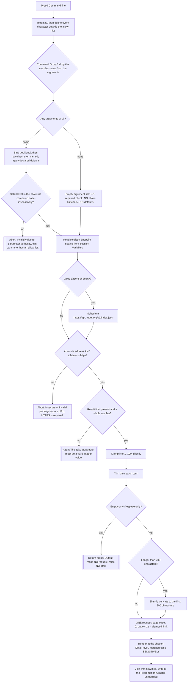

### 7.10 Input Validation & Supply-Chain Safety

**Description**

The Shell exists to download third-party code from a network service and then load and run that code inside its own process. This subsection is the set of defensive rules the product applies across the three trust boundaries that combination creates: untrusted keystrokes becoming Command arguments; the Shell deciding which Package Registry it will talk to and how much it will ask for; and downloaded artefacts becoming executable code on disk. It is not a screen or a Command — it is a cross-cutting policy that other features (Package Search, Package Install, the Session's startup, the Plugin Scanner) either enforce or conspicuously fail to enforce.

Two of the controls are real and reachable today, and a third is written but never reached. Package Search applies five ordered gates — transport, Result limit parse, Result limit clamp, search-term hygiene, Detail level allow-list — every one of them before any network traffic leaves the process. Every Command line the user types is passed through a character allow-list that silently deletes anything outside it, which incidentally makes path separators, colons and backslashes unable to reach any Command. The third control is the Plugin sandbox: each Plugin is *meant* to be inspected and instantiated inside an isolated load context confined to that Plugin's own directory, so one Plugin cannot reach a sibling or a parent, and a Plugin that violates its confinement is skipped rather than being allowed to fail the Session. That control is fully written in the Command Service and never entered by the shipping product, for the reason set out in the next paragraph — treat it as a contract to reproduce, not as a behaviour observable at the pinned commit.

**The Plugin scan cannot succeed on a real filesystem, and that changes the whole Plugin half of this subsection.** The Plugin Scanner builds its search mask by joining a wildcard segment, the sub-directory name and the binary pattern — producing `*/bin/*.dll` — and passes that whole string to a recursive directory enumeration rooted at the verified Plugin Directory (OUT-OF-REPO: `src/Xcaciv.Command.FileLoader/Crawler.cs:20,176,178`). The directory portion of a search mask is joined to the root **literally**; wildcards in it are never expanded. **This was executed against a real filesystem during verification.** With a perfectly correct layout present (`<root>/HelloPkg/bin/Hello.dll` and `<root>/Other/bin/Other.dll`) the enumeration returned neither those files nor an empty set: it raised a directory-not-found condition naming the literal path `<root>/*/bin`, in both recursive and top-level enumeration modes, while a control run with the plain pattern `*.dll` recursively found both files — confirming the layout was correct and the mask is the cause. Three consequences run through everything below and are restated at every requirement they touch. **(1) No Plugin is ever loaded from disk**, so the per-Plugin sandbox, the skip-one-Plugin-not-the-Session rule and the parallelism switch are unreachable contract rather than observed behaviour. **(2) Any Plugin Directory that survives the Verified Directory rule is fatal at startup** — populated or empty makes no difference, because the enumeration raises before it can tell them apart, and the directory-not-found condition is not the tolerated No Plugins Available condition, so the tolerant startup branch does not catch it. **(3) The only startup path that reaches a usable Prompt is the one where the Plugin Directory does *not* exist** — which is also the default state, because the compiled-in default uses a backslash separator that is an ordinary filename character on a POSIX host. The framework's own scanner tests pass because they run against a mock filesystem that INFERRED expands the wildcard segment; the production path uses the real filesystem and cannot. See FR-10.49a, FR-10.59, Q-82, Q-83 and Q-11.

The rest of the boundary is a set of documented absences the clone team must design rather than copy. Package Install is inert: it echoes a refusal and downloads nothing. The half-built download-and-lay-out routine that sits behind it has no caller, verifies no checksum or signature, overwrites its target unconditionally, takes the Plugin's identity from inside the archive it just downloaded rather than from the request, and stops before extraction — so there is no extraction-time path defence, entry-name sanitisation or size cap anywhere in the product. Three certificate/signature settings were added in one commit and removed in the next as "unused"; no enforcement ever existed behind them. Read this subsection as three lists: the rules to reproduce, the rules that are fully written but can never run as shipped, and the gaps to close deliberately.

**User stories**

US-10.1 — As a Shell user, I want the Shell to refuse to query a Package Registry over anything but an encrypted transport, so that my search terms and the Package Listings I act on cannot be read or altered in transit.

US-10.2 — As a Shell user, I want a Result limit that is not a whole number to be rejected with a message naming the parameter, so that I am not silently given a different amount of data than I asked for.

US-10.3 — As a Package Registry, I want the Shell to ask for no more than a fixed maximum of Package Listings in a single request, so that a mistyped or hostile Result limit cannot turn into an abusive query.

US-10.4 — As a Shell user, I want an empty or whitespace-only search term to cost nothing, so that a stray Enter does not produce a pointless round trip to the Package Registry.

US-10.5 — As a Shell user, I want the Detail level restricted to a published set of values, so that a mistyped level is rejected before the Command runs rather than guessed at.

US-10.6 — As a Shell user, I want a Package Listing's publication date, authors, licence and known-vulnerability count available at the fullest Detail level, so that I can judge a Plugin myself before asking for it. (The Shell displays these values and acts on none of them; there is no trust decision behind them.)

US-10.7 — As a Shell user, I want everything I type stripped of characters that carry meaning to a file system or a downstream process, so that a Command line cannot be turned into a path, a redirection or an injected argument.

US-10.8 — As a Shell Operator, I want the Shell to scan only a Plugin Directory that passes a containment check against a boundary rooted at the process working directory, so that a mis-set Plugin Directory cannot make the Shell load code from an arbitrary place on disk.

US-10.9 — As a Plugin author, I want my Plugin inspected and instantiated inside a sandbox confined to my own directory, so that a sibling Plugin cannot read or subvert my files and I cannot accidentally reach outside my own bundle. (**Contract only at the pinned commit** — the Plugin scan never matches a file on a real filesystem, so no Plugin is loaded from disk and the sandbox is never entered: FR-10.49a, Q-82.)

US-10.10 — As a Shell Operator, I want one malformed, unloadable or confinement-violating Plugin to be skipped rather than failing the whole Session, so that a single bad Plugin cannot deny the Shell to its users. (**Contract only at the pinned commit** — no Plugin file is ever discovered, so the skip-one-Plugin path is never taken; what actually denies the Shell to its users is the scan itself: FR-10.49a, FR-10.59, Q-82.)

US-10.11 — As a Shell user, I want a Session with no Plugins at all to still reach the Prompt and tell me what to do about it, so that a fresh installation is usable. (As shipped this holds **only** when the Plugin Directory does not exist; a Plugin Directory that does exist ends the process instead — FR-10.49a, FR-10.59, Q-11.)

US-10.12 — As a Shell Operator, I want to point the Shell at a different Package Registry by seeding the Registry Endpoint setting before the Session starts, so that an internal Package Registry can be used instead of the public default. (This is the only route that works: the Shell user cannot set an endpoint from the Prompt, because argument cleansing destroys a typed address — see FR-10.11.)

US-10.13 — As a Shell Operator, I want the Shell's own build to draw each dependency only from the feed authorised to serve that package name, at an exactly pinned version, so that a public-feed name collision cannot substitute code into the product at assembly time.

US-10.14 — As a Shell user, I want to install a Plugin from a Package Registry into the Plugin Directory, so that I can add capability to a running Shell without leaving it, hand-copying files or knowing the Plugin Directory's layout. **UNFINISHED INTENTION — not supported at the pinned commit.** Package Install echoes a refusal and performs no download. A download-and-lay-out routine exists in the Package Registry Client but has no caller anywhere in the product, performs no verification, and stops before extraction. This story is recorded so the clone team designs the workflow deliberately; it must not be described as working behaviour.

US-10.15 — As a Shell Operator, I want an installed Package Archive verified for integrity and publisher before its contents are laid out and later loaded, so that an archive altered in transit, substituted at the Package Registry, or published by someone I have not chosen to trust cannot be executed inside the Shell's own process. **UNFINISHED INTENTION — no such control exists.** Settings for certificate validation, signature verification and an allowed-thumbprint list were added in one commit and removed in the next as unused; no enforcement code ever stood behind them.

**Use cases**

---

**UC-10.A — Validating and dispatching a Package Search** (realizes US-10.1 through US-10.7, US-10.12)

*Preconditions.* A Session is running and has reached the Prompt. Package Search is registered, reachable as `PACKAGE SEARCH`. The Registry Endpoint setting may or may not be present in Session Variables.

*Main flow.*
1. The Shell user types a Command line beginning `PACKAGE SEARCH` followed by a search term and optional arguments.
2. The Command Service extracts the Command name and tokenizes the remainder, deleting from every token each character outside the argument allow-list.
3. Command Group routing matches the first remaining argument against the group's members, selects Package Search, and removes that member name from the argument list.
4. Argument binding runs in a fixed order: Positional Parameters, then Flags, then Named Parameters. The search term binds positionally; `take` and `verbosity` bind by name, substituting their declared defaults `20` and `normal` when absent; the Detail level is checked against its allowed-value list, compared ignoring case.
5. Package Search reads the Registry Endpoint setting from Session Variables under the key `PackageSourceUrl`.
6. If that value is absent or empty, the endpoint becomes exactly `https://api.nuget.org/v3/index.json`.
7. The endpoint is required to parse as an absolute address whose scheme is exactly `https`. On success a registry handle is constructed for it.
8. The Result limit is required to be present and to parse as a whole number, then is forced into the inclusive range 1..100 with no message either way.
9. The search term is trimmed. A term longer than 200 characters is cut to its first 200 characters with no message.
10. Exactly one request is issued to the Package Registry: page offset 0, page size equal to the clamped Result limit, prerelease inclusion set from the switch's presence.
11. Each returned Package Listing is rendered according to the Detail level, matched case-sensitively, and the rendered lines are joined with newlines.
12. The joined text is handed to the Interaction Context and written to the terminal without transformation.

*Alternate flows.*
- **A1 — Result limit omitted.** With at least one other argument present, the declared default `20` is substituted during binding and 20 listings are requested.
- **A2 — Detail level `quiet`.** Each line is the Package Identity's name alone; no colon appears in the Output.
- **A3 — Detail level `detailed`.** Each entry carries name, version, the download count in parentheses, ` : `, the remote summary, then indented `Published:`, `Authors:`, `License:` and `Vulnerabilities:<count>` lines, then a `---` separator line.
- **A4 — Detail level supplied in a different casing** (for example `Detailed`). The allow-list accepts it, the rendering match does not, and the standard rendering is produced with no message. QUIRK.
- **A5 — Prerelease inclusion.** Whether or not the switch was typed, the request asks for prerelease versions. QUIRK, INFERRED.
- **A6 — Package Search used as a Pipeline stage.** Per-chunk invocation returns `Unsupported search method for {chunk} (piped)` followed immediately by the comma-joined arguments, with no separator between the closing parenthesis and the first argument; no gate runs and no request is issued. The refusal travels as ordinary Output and does not affect exit status (Q-74).

*Error flows.*
- **E1 — Endpoint not absolute, or scheme is not `https`.** The operation aborts before any network traffic with the message `Insecure or invalid package source URL. HTTPS is required.` The Command Service catches it, shows `Error executing NAME (see trace for more info)` as Output plus a Status line `**Error: <message>`, and the Session continues.
- **E2 — Result limit present but not a whole number.** Aborts with `The 'take' parameter must be a valid integer value.`
- **E3 — Result limit out of range.** *Not an error.* Silently clamped; the search proceeds.
- **E4 — Search term empty or whitespace after trimming.** *Not an error.* Empty Output, no request, no message. Indistinguishable from a valid search that matched nothing.
- **E5 — Search term longer than 200 characters.** *Not an error and not warned.* The Package Registry is queried with the truncated term and the results reflect the term the user did not type.
- **E6 — Detail level outside the allow-list** (for example `verbose`). Argument binding aborts before the Command body runs, with `Invalid value for parameter verbosity, this parameter has an allow list.` No request is issued.
- **E7 — A Named Parameter appears before the positional search term** (for example `-take 5` then the term). Binding aborts with `Missing required parameter search_terms`, because Positional Parameters are consumed before Named Parameters are stripped. QUIRK.
- **E8 — A Named Parameter is the last token with no value after it.** Not diagnosed as a product error: binding reads past the end of the argument list and the user sees a raw index failure from the Command Service rather than a product message. QUIRK, INFERRED, OUT-OF-REPO evidence only.
- **E9 — Package Search invoked with no arguments at all.** Binding short-circuits: no required check runs, no allow-list check runs, and no declared default is substituted. The first failure is therefore the Result limit lookup, and the user is told `The 'take' parameter must be a valid integer value.` when the real problem is a missing search term. QUIRK.
- **E10 — Package Registry unreachable, DNS failure, transport failure.** Surfaces as whatever the Package Registry Client raises. The Shell adds no timeout and no cancellation, so the Session blocks for as long as the remote side takes.

*Postconditions.* At most one request has been made to the Package Registry. If the Registry Endpoint setting was absent before the search, an empty value was written under its upper-cased key **in the Command's own per-execution child variable scope, which is discarded on return**: Package Search is registered without the environment-modifying flag, so the Session's store is unchanged and a subsequent Session Variable dump does **not** list the key (FR-10.4, AC-10.5, Q-10). No state is persisted beyond the Session.

---

**UC-10.B — Establishing Plugin trust at Session start** (realizes US-10.8 through US-10.11)

*Preconditions.* The Shell Operator has constructed a Session. The Plugin Directory is whatever the Operator set, defaulting to `.\packages` — a literal single filename on a POSIX host, which therefore normally does not exist (FR-10.48). No restricted root has been declared, so the containment boundary derives from the process working directory.

*Main flow (the intended contract; see the note after step 7 — as shipped it never gets past step 4).*
1. The Session sets the Status line `Loading Commands`.
2. The Built-in Commands are registered.
3. The Plugin Directory is nominated. It is canonicalised to an absolute path; its *parent* is then tested for containment against a boundary derived from the process working directory by a test that ignores the boundary's own final path segment. The directory must also exist and be a directory.
4. Discovery composes the search mask `*/bin/*.dll` — one wildcard sub-directory level, then the `bin` sub-directory, then the binary pattern — and hands that whole string to a recursive enumeration rooted at the verified Plugin Directory.
5. For each discovered Plugin file, an isolated load context is opened whose base-path restriction is that file's own directory, under the strict loading policy, and the Commands the Plugin declares are enumerated.
6. Each Plugin that yielded at least one valid Command is registered; its Commands enter the Command Registration Records.
7. The Session proceeds to the Prompt.

*As shipped, step 4 never yields a file, and steps 5 through 7 are unreachable.* The mask's directory portion is joined to the root literally and its wildcard is never expanded, so the enumeration raises a directory-not-found condition naming `<root>/*/bin` even when the layout is perfect; control passes to E3. Established by execution against a real filesystem during verification (FR-10.49a, Q-82).

*Alternate flows.*
- **B1 — More than 50 Plugin files discovered.** Discovery switches to parallel processing. (Unreachable as shipped: no file is ever discovered — FR-10.49a.)
- **B2 — A Plugin yields zero valid Commands.** It is not registered at all; the Session continues. (Unreachable as shipped, for the same reason.)
- **B3 — Session started through the asynchronous entry point.** Built-in Commands are never registered and there is no friendly handling of the no-Plugins condition, so **every** load failure there is fatal. QUIRK (Q-17).

*Error flows.*
- **E1 — Plugin Directory fails the containment test, or does not exist.** *Silently dropped.* No message, no Diagnostic trace visible to the user. With no verified directory left, the No Plugins Available condition is raised.
- **E2 — No Plugins Available.** Caught by the Session, reported as exactly `` No Plugins Found. You may want to check out `install --help` ``, and the Session **continues to the Prompt**.
- **E3 — Plugin Directory exists and passed the containment test.** Reached whether the directory is empty *or* holds a perfectly laid-out Plugin: the enumeration in step 4 raises a directory-not-found condition naming the literal path `<root>/*/bin`. That is not the No Plugins Available condition the Session tolerates — nor the separate "no plugin binaries" condition the tolerant branch was written around (E3a) — so nothing catches it. It is re-raised as a Startup Load Failure carrying `Unable to load commands.`, the shipping executable prints `Error Unable to load commands.` to standard output, and the process exits with status `1`. QUIRK: the user who did less setup gets the friendlier outcome, and the user who laid the Plugin Directory out correctly cannot start the Shell at all (FR-10.49a, FR-10.59, Q-11, Q-82).
- **E3a — The `No packages found in <path>.` condition is unreachable.** This is the Command Service's separate "verified directory held no plugin binaries" signal, and it is the condition the tolerant startup branch was designed around; the enumeration in E3 raises first, so it never fires on the shipping path. It is reachable only with an empty sub-directory filter, which the product never passes. Recorded so a clone does not build its startup contract around a signal it will never see (Q-83).
- **E4 — A Plugin violates its base-path restriction.** The violation is caught, written to Diagnostic trace with the offending path and the policy in force, and that Plugin alone is skipped. No user-facing message. (Unreachable as shipped — no Plugin file is ever discovered; recorded as the contract to reproduce.)
- **E5 — A Plugin file is missing, malformed, built for the wrong architecture, or otherwise unloadable.** Written to Diagnostic trace and skipped. No user-facing message. The rest of the load continues. (Unreachable as shipped, for the same reason.)
- **E6 — Any other failure during load.** Re-raised as a Startup Load Failure with the same fixed summary and the same fatal outcome as E3.

*Postconditions.* Either the Session is at the Prompt with a Command set holding the Built-in and Host-linked Commands only — the case where no Plugin Directory survived verification — or the process has terminated with status `1`. No path at the pinned commit reaches the Prompt with a Plugin-supplied Command registered. Nothing about the Plugin trust decision is persisted; the whole evaluation repeats on the next Session.

---

**UC-10.C — Acquiring the product's own dependencies at assembly time** (realizes US-10.13)

*Preconditions.* A Shell Operator is building the Shell from source. A feed configuration file and a central version-pinning file ship with the product.

*Main flow.*
1. Any inherited machine-level or user-level feed list is cleared, so nothing outside the product's own configuration can contribute a package.
2. Three feeds are declared: a public feed, a private hosted feed, and a local directory feed named by an environment-variable placeholder.
3. A mapping decides which feed may serve which package names: the public feed claims every name; the local directory feed claims the first-party namespace.
4. Every dependency version is pinned centrally and exactly; individual project files carry references without versions.
5. Each dependency is fetched from the single feed its name maps to, at the pinned version.

*Alternate flows.*
- **C1 — Name matched by more than one pattern.** The most specific pattern wins, so first-party names resolve only from the local directory feed even though the public feed's wildcard also matches. INFERRED from the mapping model.

*Error flows.*
- **E1 — The private hosted feed is never consulted.** It is declared but given no mapping entry, and a feed with no matching pattern may serve nothing. QUIRK.
- **E2 — The local directory feed's placeholder is not expanded.** On a non-Windows host the placeholder is treated as a literal directory name, that directory does not exist, and every first-party package fails to resolve. This is one of the two reasons the product does not build at the pinned commit. QUIRK.
- **E3 — First-party packages are absent from the public index.** They are not published there, so no fallback exists once E1 and E2 apply.

*Postconditions.* At the pinned commit this use case does not complete: dependency acquisition fails for every project.

---

**UC-10.D — Requesting an install** (realizes US-10.14, US-10.15)

*Preconditions.* A Session is at the Prompt with Package Install registered, reachable as `PACKAGE INSTALL`.

*Main flow.*
1. The Shell user types an install request naming a Plugin.
2. Package Install returns the text `Not installing ` followed by the comma-joined arguments.
3. Nothing is downloaded, nothing is written, no request is made.

*Alternate flows.*
- **D1 — Package Install used as a Pipeline stage.** Per-chunk invocation returns `Not installing {chunk} ` followed by the comma-joined arguments.
- **D2 — The designed-but-unreachable install routine** (present in the Package Registry Client, called by nothing): compose the archive file name from the **requested** Package Identity; download into that path, overwriting whatever is there; report success unconditionally; re-read the Package Identity from **inside the downloaded Package Archive's own manifest**; create a destination directory from that archive-declared identity; stop. Extraction and dependency resolution are placeholders.

*Error flows.*
- **E1 — A file already exists at the download target path.** Not detected. Overwritten with no prompt, no backup and no versioning.
- **E2 — The downloaded Package Archive is truncated, corrupt or substituted.** Not detected. No checksum, no signature check, no length check, no comparison against any registry-published digest. Success is reported regardless of what or how much was written.
- **E3 — The archive declares an identity different from the one requested.** Not detected and not reported. The destination directory is built from the archive's own claim.
- **E4 — Extraction.** Never happens. Consequently there is no entry-name sanitisation, no rejection of entries resolving outside the destination, no rejection of absolute paths or link entries, and no cap on uncompressed size or entry count anywhere in the product.
- **E5 — Failure part-way through.** No staging area, no atomic promotion, no cleanup. Partial state (a written archive, an empty directory) is left behind.
- **E6 — Version enquiry for a Plugin name that does not exist.** An empty list is returned and no error is raised, indistinguishable from a Plugin that has no published versions. Nothing validates the name before it is sent.
- **E7 — Version enquiry pointed at a plain-`http` or non-absolute endpoint.** Not detected. That path builds its registry handle straight from the supplied address with no transport gate; the gate lives only inside Package Search's own body.

*Postconditions.* After a prompt-level install request: no file written, no request made, Session unchanged. After the unreachable routine — which nothing in the product *or* in the test suite invokes, so reaching it at all means writing new code; only the download step it wraps has a live test — a Package Archive file and an empty destination directory exist, neither verified, and no Command has become available: the directory shape produced does not match the layout the Plugin Scanner walks, and that scan could not load a Plugin from disk in any case (FR-10.49a).

**Functional requirements**

*Ordering and scope of the search gates*

FR-10.1 — Package Search shall apply its gates in this order and complete all of them before any network traffic leaves the process: Registry Endpoint transport gate, Result limit parse gate, Result limit clamp, search-term trim / empty short-circuit / length cap. The Detail level allow-list is enforced earlier still, during argument binding. Realizes US-10.1 through US-10.5.

FR-10.2 — All five gates shall be understood as living inside Package Search's own body, not as a shared control. QUIRK: the transport gate is therefore absent from every other outbound path in the Package Registry Client — version enquiry, download and dependency resolution are ungated. A clone that keeps this placement inherits the gap; the intended fix is to gate the endpoint once at the point a registry handle is created (Q-57).

*Registry Endpoint setting*

FR-10.3 — The Registry Endpoint setting shall be read from Session Variables under the key `PackageSourceUrl`. Session Variable keys are folded to upper case on both read and write, so the value actually lives under `PACKAGESOURCEURL`. The key-folding is OUT-OF-REPO evidence from the Command Service.

FR-10.4 — Reading that key when it is absent shall, as a side effect, write an empty value back under the upper-cased key. QUIRK. **The write lands in the Command's per-execution child variable scope, which is discarded on return.** The executor runs every Command against a child variable store seeded with a copy of the caller's values, and merges that child back into the caller's store only when the Command's registration record declares it environment-modifying *and* the child changed; the shipping host registers Package Search without that flag (`src/Xcaciv.Cupcake.Lit/Program.cs:11`, the two-argument registration, where the flag defaults to off). The Session's store is therefore unchanged and a subsequent Session Variable dump does **not** list the key. The side effect is observable only on a direct-invocation path where a host passes its own store straight to the Command — which is exactly what this repository's own tests do (`Xcaciv.Command.PackagesTests/SearchCommandTests.cs:15,31,90`) — and it becomes observable in the Shell the moment a clone registers the Command as environment-modifying, which by §7.1 FR-1.21 would stamp the flag on the whole `PACKAGE` group. OUT-OF-REPO evidence for the store-on-read semantics, the child scope and the write-back gate; the Shell does not suppress the write. See AC-10.5, §7.8 FR-8.16 and Q-10.

FR-10.5 — When the Registry Endpoint setting is absent or empty, the endpoint shall be exactly `https://api.nuget.org/v3/index.json`. Realizes US-10.12.

FR-10.6 — The endpoint shall be required to parse as an absolute address. A relative or unparseable value is rejected.

FR-10.7 — The endpoint's scheme shall be required to be exactly the encrypted-web scheme. Plain `http`, `file`, `ftp` and every other scheme are rejected. Realizes US-10.1.

FR-10.8 — On rejection the operation shall abort **before** any network call, carrying exactly `Insecure or invalid package source URL. HTTPS is required.`

FR-10.9 — The transport gate shall check the scheme and absoluteness only. There is no host allow-list, no certificate pinning and no thumbprint check anywhere in the product. Observed absence; the clone must decide whether an endpoint may be changed at runtime at all and, if so, whether it must come from an Operator-controlled allow-list.

FR-10.10 — INFERRED: an endpoint typed with an upper-case scheme passes the gate, because absolute-address parsing normalises the scheme before comparison. No test covers this.

FR-10.11 — QUIRK: a Registry Endpoint cannot be set from the Prompt. Argument cleansing (FR-10.36, FR-10.37) deletes `:` and `/` from every token, so an unquoted address fragments into `https`, `api`, `nuget`, `org`, `v3`, `index`, `json` and a quoted one collapses to `httpsapi.nuget.orgv3index.json`; either result is then rejected by the transport gate. In practice only a Shell Operator seeding Session Variables programmatically can re-point the endpoint (Q-43). INFERRED — the tokenizer and allow-list were replayed against sample input; the Shell itself was never run. Realizes US-10.12.

FR-10.12 — QUIRK: Package Search declares a Named Parameter `source`, described as "The source to search for the package.", which appears in generated help and is accepted on the Command line, but is never read. The endpoint comes only from the Registry Endpoint setting and its built-in fallback. A user following the help text will believe they have re-pointed the Package Registry when they have not (Q-6).

*Result limit*

FR-10.13 — The Result limit shall be a Named Parameter spelled `take` with declared default `20`. Realizes US-10.2.

FR-10.14 — When the Result limit is omitted but at least one other argument is present, the declared default shall be substituted during binding, so the parse gate passes and 20 Package Listings are requested.

FR-10.15 — The Result limit shall be required to be present and to parse as a whole number. Otherwise the operation aborts with exactly `The 'take' parameter must be a valid integer value.`

FR-10.16 — The parsed Result limit shall be forced into the inclusive range 1..100. Values below 1 become 1; values above 100 become 100. The in-source rationale for the upper bound is recorded as "Clamp limit to prevent abuse". Realizes US-10.3.

FR-10.17 — Clamping shall produce no message of any kind — no Output, no Status line, no change to the outcome. The user is never told their request was reduced or raised (Q-73).

FR-10.18 — The clamped Result limit shall be the request's page size, with the page offset fixed at 0. Exactly one page is requested; there is no pagination and no way to reach a Package Listing beyond the hundredth.

FR-10.19 — A Named Parameter or Flag shall be recognised when a token begins with `-` and carries the parameter's name preceded by one or two hyphens, so both `-take` and `--take` are accepted. OUT-OF-REPO evidence only.

FR-10.20 — QUIRK: a Named Parameter supplied as the last token with no value after it is not diagnosed. Binding reads past the end of the argument list and the user sees a raw index failure instead of the product's own message. INFERRED, OUT-OF-REPO evidence only. The clone must diagnose a value-less Named Parameter explicitly (Q-59).

*Search term*

FR-10.21 — The search term shall be a required Positional Parameter spelled `search_terms`, trimmed of leading and trailing whitespace before any other check.

FR-10.22 — A term that is empty or whitespace-only after trimming shall return empty Output, make no request, and raise no error. Realizes US-10.4. The user cannot distinguish this from a valid search that matched nothing, because a zero-result search also prints nothing (Q-7, Q-73).

FR-10.23 — A term longer than 200 characters shall be silently cut to its first 200 characters, and the truncated term is what is sent. No warning, no rejection (Q-73).

FR-10.24 — QUIRK: the 200-character cap carries no stated rationale in the source, and it is applied by silent truncation rather than rejection — an unusual choice for a validation control, since the user receives results for a query they did not type. Reading it as a cost or abuse bound is INFERRED from its shape. This is one instance of the product-wide habit of correcting invalid input silently rather than reporting it (Q-73).

FR-10.25 — When the first remaining positional token begins with `-`, binding shall abort with exactly `Missing required parameter search_terms`. OUT-OF-REPO evidence only.

FR-10.26 — QUIRK: argument order is load-bearing. Positional Parameters are consumed before Named Parameters and Flags are stripped, so a Named Parameter placed before the search term makes binding fail with the missing-term message, while the same arguments with the term first succeed. Every test in the suite puts the term first (Q-4).

FR-10.27 — QUIRK: when a Command is invoked with no arguments at all, binding shall return an empty argument set without running any required-parameter or allow-list validation and without substituting any declared default. For Package Search the consequence is a misleading diagnostic: the missing-term error never fires and the user is told `The 'take' parameter must be a valid integer value.` OUT-OF-REPO evidence for the short-circuit (Q-5).

*Detail level*

FR-10.28 — The allowed Detail levels shall be exactly `quiet`, `normal` and `detailed`, with default `normal`. Realizes US-10.5.

FR-10.29 — A Detail level outside the allow-list shall abort the Command **before its body runs**, with exactly `Invalid value for parameter verbosity, this parameter has an allow list.`, and no request shall be made. The allow-list comparison ignores case. OUT-OF-REPO evidence for both the comparison and the message.

FR-10.30 — Rendering per Package Listing shall be: at `quiet`, the Plugin name alone (no colon anywhere in the Output); at `normal`, `<name> <version> : 
`; at `detailed`, `<name> <version> (<download count>) : 
` followed by indented `Published:`, `Authors:`, `License:` and `Vulnerabilities:<count>` lines and then a `---` separator line. Entries are joined with newlines, one per line for `quiet` and `normal`. Realizes US-10.6.

FR-10.31 — QUIRK: the allow-list gate matches the Detail level case-**insensitively** while the rendering choice matches case-**sensitively**. A value outside the allow-list is therefore rejected during binding and never reaches the Command, but a case variant of an allowed value (for example `Detailed`) is accepted and falls through to the standard rendering, losing the download count, publisher, licence and vulnerability lines with no message. The fallback branch is consequently **not** dead code — it is the branch that hides this defect. The clone must choose deliberately between matching case-insensitively in both places and rejecting the variant outright. The case-insensitive half is OUT-OF-REPO evidence; the case-sensitive half is read directly from the Shell (Q-2).

FR-10.32 — The publication date, authors, licence and known-vulnerability count rendered at the fullest Detail level shall be understood as remote-supplied values displayed for human inspection only. Nothing in the product reads them, records them, or gates anything on them; there is no trusted-publisher set, no first-use prompt and no policy file. Observed absence — the clone must decide whether install or load requires an explicit trust decision and where it is persisted.

FR-10.33 — Remote-supplied text shall be understood to reach the terminal unmodified: summaries, author strings and licence metadata are joined into the Output and written out with no transformation. The Command Service offers an output-encoding hook whose base behaviour is an explicit no-op, and the Presentation Adapter does not override it. Observed absence — the clone must decide whether remote text needs control-character stripping, terminal-escape neutralisation and a line-count cap before display. OUT-OF-REPO evidence for the hook (Q-33).

*Prerelease inclusion*

FR-10.34 — Prerelease inclusion shall be a Flag spelled `prerelease`, described as "Include prerelease packages in the search results.", whose value is passed to the request as the include-prereleases filter. The Shell decides by testing whether the Flag **appears** in the parsed argument set, never by reading its value.

FR-10.35 — QUIRK: the Command Service records every declared Flag in the parsed argument set whether or not it was typed, storing the text `True` or `False`. The presence test therefore always succeeds, so prerelease versions are included in every search that carries at least one argument, including searches that never asked for them. INFERRED, OUT-OF-REPO evidence only, and unverified against the framework version the product actually pins. This matters for a feature whose job is deciding what code the product will later be told to install; the clone should make the Flag actually decide (Q-1).

*Argument cleansing*

FR-10.36 — A Command line shall be tokenized into either double-quoted runs or runs of letters, digits, underscore and hyphen. Every other character merely separates tokens and is discarded. OUT-OF-REPO evidence only. Realizes US-10.7.

FR-10.37 — Every resulting token shall have all characters outside a fixed allow-list **deleted** — not rejected, deleted — and surrounding double quotes stripped afterwards. Allowed in an argument: letters, digits, space, and `- _ . * ? [ ] | " ~ ! @ # $ % ^ & * ( )`. OUT-OF-REPO evidence only.

FR-10.38 — Every Command name shall have all characters outside a narrower allow-list deleted, leading and trailing hyphens trimmed, and the result upper-cased. Allowed in a Command name: letters, digits, space, `-`, `_`. OUT-OF-REPO evidence only.

FR-10.39 — Cleansing shall be applied both on the single-Command path and independently on each Pipeline stage. OUT-OF-REPO evidence only.

FR-10.40 — Splitting a typed line into Pipeline stages shall be a separate, earlier step that honours double quotes, single quotes and backslash escapes; per-stage argument tokenization then applies to each stage. A search term longer than 200 characters therefore requires one very long run of token characters, or a quoted string. OUT-OF-REPO evidence only.

FR-10.41 — Command Group routing shall consume the first argument, so an invocation of a group member delivers only the arguments after the member name to the Command body. OUT-OF-REPO evidence only.

FR-10.42 — The observable consequence of FR-10.36 and FR-10.37 shall be that path separators, colon, backslash, semicolon, angle brackets, braces, comma, plus and equals never reach a Command. Typing a path-traversal string such as `../../etc/passwd` delivers the arguments `etc` and `passwd`. Verified by replaying the documented tokenizer and allow-list against sample input; the Shell was never run.

FR-10.43 — QUIRK: of the three help spellings the Command Service accepts, two are destroyed by argument tokenization before they can be recognised, so only the double-dash spelling is reachable from the Prompt. Furthermore, requesting help on a member of a Command Group prints the group's one-line member listing rather than the member's own parameter help. INFERRED, OUT-OF-REPO evidence only (Q-44, Q-45). This compounds the guidance text at FR-10.57, which names a Command that is only reachable as a Command Group member.

*Plugin Directory containment*

FR-10.44 — The Shell shall nominate exactly one Plugin Directory, defaulting to `.\packages` — a backslash-separated relative path resolved against the process working directory. Realizes US-10.8.

FR-10.45 — A candidate Plugin Directory shall be canonicalised to an absolute path, and its **parent** tested for containment against a boundary that defaults to the process working directory, using a containment test that ignores the boundary's own final path segment. The net effect is that the effective boundary sits one level **above** the working directory: sibling trees of the working directory are accepted, and the working directory itself is rejected. The candidate must additionally exist and be a directory. INFERRED — the containment primitive's behaviour was confirmed by executing it against the exact path shapes, but the product itself was never run. OUT-OF-REPO evidence for the primitive. The clone must decide whether this is the boundary it wants; the plain-language rule "the Plugin Directory must be inside the working directory" is **not** what the product does (Q-14).

FR-10.46 — The Shell shall never declare a restricted root of its own, so the default boundary in FR-10.45 always applies.

FR-10.47 — A Plugin Directory that fails FR-10.45 shall be silently dropped: the nomination is discarded, no error is raised, no message is shown, and the Session proceeds as though no Plugin Directory had been nominated. OUT-OF-REPO evidence for the silent discard.

FR-10.48 — QUIRK: the default Plugin Directory's backslash separator is a literal filename character on non-Windows platforms, where the default therefore names a single file called `.\packages` rather than a `packages` sub-directory. Combined with FR-10.47 this produces no diagnostic at all — only the no-Plugins outcome, which per FR-10.49a is also the only startup outcome that reaches the Prompt (Q-25).

*Plugin isolation*

FR-10.49 — Discovery shall compose its search mask by joining a wildcard segment, the sub-directory name and the binary pattern — producing `*/bin/*.dll`, that is, compiled Plugin files one sub-directory level down and then inside a `bin` sub-directory — and shall hand that whole mask to a recursive enumeration rooted at the verified Plugin Directory. `bin` is the Command Service's default and the Shell does not override it. This is the *intended* layout rule a clone must implement; as shipped the mask cannot match (FR-10.49a). OUT-OF-REPO evidence only.

FR-10.49a — QUIRK, and the most consequential fact in this subsection: **the scan can never match anything on a real filesystem, so no Plugin is ever loaded from disk.** The directory portion of a search mask is joined to the enumeration root literally and its wildcard is never expanded, so the enumeration attempts to open a directory named `<root>/*/bin` and raises a directory-not-found condition instead of returning either the matching files or an empty set. Established by execution against a real filesystem during verification: with `<root>/HelloPkg/bin/Hello.dll` and `<root>/Other/bin/Other.dll` present, both recursive and top-level enumeration modes raised, while a control run with the plain pattern `*.dll` found both files. Three consequences shall be treated as normative here: (a) the isolation and skip-one-Plugin requirements FR-10.50 through FR-10.55 describe a contract to reproduce, not behaviour observable at the pinned commit; (b) **any** Plugin Directory that passes FR-10.45 is fatal at startup, empty or populated alike, because the raised condition is not the No Plugins Available condition — the only one the Session tolerates — and is therefore wrapped as a Startup Load Failure (FR-10.58, FR-10.59); and (c) the `No packages found in <path>.` condition the tolerant startup branch was written around is unreachable on the shipping path, reachable only with an empty sub-directory filter that the product never passes. INFERRED: the Command Service's own scanner tests pass because they run against a mock filesystem that expands the wildcard segment. OUT-OF-REPO evidence for the mask composition and the enumeration call. See Q-82, Q-83, Q-11.

FR-10.50 — Each discovered Plugin file shall be inspected inside an isolated load context whose base-path restriction is that file's own directory — no parent, no sibling. Realizes US-10.9. Unreachable as shipped (FR-10.49a): reproduce it as contract. OUT-OF-REPO evidence only.

FR-10.51 — The same per-Plugin base-path restriction shall be re-applied when a Command is instantiated for execution, not only at discovery. OUT-OF-REPO evidence only.

FR-10.52 — The default loading policy shall be the strict one; reflection-emit shall be disabled by default; and when reflection-emit is disabled the strict policy shall be forced regardless of what was configured. OUT-OF-REPO evidence only.

FR-10.53 — A Plugin that violates its base-path restriction shall be caught, written to Diagnostic trace with the offending path and the policy in force, and skipped; the remaining Plugins still load. Missing, malformed, wrong-architecture and otherwise unloadable Plugin files shall be treated identically. No user-facing message is produced in any of these cases (Q-15). Realizes US-10.10. Unreachable as shipped (FR-10.49a): reproduce it as contract. OUT-OF-REPO evidence only.

FR-10.54 — A Plugin that yielded zero valid Commands shall not be registered at all. OUT-OF-REPO evidence only.

FR-10.55 — Discovery shall switch to parallel processing when more than 50 Plugin files are found. Unreachable as shipped (FR-10.49a). OUT-OF-REPO evidence only.

FR-10.56 — The Shell shall configure none of the isolation controls in FR-10.49 through FR-10.55; it accepts every default, including the sub-directory name that produces the unmatchable mask of FR-10.49a. Any clone that makes these configurable inherits a decision the product never made.

*Load-failure containment*

FR-10.57 — The No Plugins Available condition — raised when **no** Plugin Directory survived verification, and only then — shall be caught and reported as exactly `` No Plugins Found. You may want to check out `install --help` ``, after which the Session continues to the Prompt. Per FR-10.49a this is the only startup path that reaches a usable Prompt. The guidance is emitted as ordinary Output rather than as a Status line, so it survives Status Visibility being switched off (Q-76). Realizes US-10.11. QUIRK: the guidance names a Command that is reachable only as a Command Group member, and the help spelling it suggests, while accepted by the Command Service, cannot produce that member's own help (FR-10.43).

FR-10.58 — Any other load failure shall be re-raised as a Startup Load Failure carrying exactly `Unable to load commands.`, which the shipping executable prints as `Error Unable to load commands.` followed by a process exit status of `1`. QUIRK: that line goes to standard output rather than an error stream, so redirecting output swallows the diagnostic (Q-38), and only the outermost summary is printed — the wrapped cause, which is the only text naming the real problem, is discarded (Q-39).

FR-10.59 — QUIRK: the startup outcome is inverted, and per FR-10.49a the inversion is total. "No verified Plugin Directory" and "Plugin Directory contains no Plugin files" are two unrelated sibling conditions and only the first is handled gracefully — but the second is never raised on the shipping path either, because the scan raises a *third*, also-untolerated condition (directory not found on `<root>/*/bin`) before it can distinguish an empty directory from a populated one. The accurate rule is therefore: **any** Plugin Directory that exists and passes FR-10.45 is fatal at startup, whether it is empty or holds a correctly laid-out Plugin; only a Plugin Directory that does *not* exist is tolerated, and that is the sole path to a usable Prompt. The clone must encode the intended behaviour deliberately rather than inheriting this split. OUT-OF-REPO evidence for the three conditions being unrelated; the enumeration behaviour was established by execution. See Q-11, Q-82, Q-83.

FR-10.60 — QUIRK: the asynchronous Session variant shall be understood to register no Built-in Commands and to carry no handler for the No Plugins Available condition, so every load failure there is fatal. A Session started that way has no Built-in Command set — including the variable setter that is the only realistic way to re-point the Registry Endpoint (FR-10.11) — and, with an unconfigured Plugin Directory, always takes the fatal path (Q-17).

*Build-time supply chain*

FR-10.61 — Inherited machine-level and user-level feed configuration shall be cleared before the product's own feeds are declared, so no external feed list can silently contribute. Realizes US-10.13.

FR-10.62 — Exactly three feeds shall be declared: `nuget.org` at `https://api.nuget.org/v3/index.json`; `github` at `https://nuget.pkg.github.com/xcaciv/index.json`; and `local` at `%NUGET_LOCAL_PACKAGES%`.

FR-10.63 — A mapping shall decide which feed may serve which package names: `nuget.org` claims the pattern `*`; `local` claims the pattern `Xcaciv.*`.

FR-10.64 — QUIRK: `github` — the private hosted feed — is declared but given no mapping entry, and a feed with no matching pattern is never consulted. The private feed is therefore effectively excluded, while the first-party packages it would serve are absent from the public index. Either the mapping is incomplete or the local directory feed is the intended sole source (Q-55).

FR-10.65 — INFERRED from the mapping model: the most specific matching pattern wins, so first-party package names resolve only from the local directory feed, never from the public feed, even though the public feed's wildcard also matches. Not observed against a real restore of a first-party package.

FR-10.66 — All dependency versions shall be pinned centrally and exactly — no ranges, no floating versions — and never inside individual project files, whose references carry no version. The pinned set is: registry client `7.0.1`; the three Command Service packages at `2.1.1`, `2.1.0` and `2.1.0`; and the test packages at `6.0.4`, `18.0.1`, `2.9.3` and `3.1.5`.

FR-10.67 — QUIRK: the local directory feed's location is an environment-variable placeholder that the build tooling expands only on Windows. Elsewhere the literal token is treated as a directory name, that directory does not exist, and every first-party package resolves from nowhere. The origin of the product's own framework dependency is therefore platform-dependent, and this is one of the two established reasons the product does not build at the pinned commit (Q-55).

FR-10.68 — Historical hardening, recorded so the clone does not reintroduce it: two earlier "feed" entries pointed at project home pages rather than feed endpoints and were removed; an absolute machine-specific local feed path was replaced by the environment-variable placeholder in FR-10.62.

FR-10.69 — The trust model for the local directory feed shall be treated as undefined. It is an Operator-controlled directory allowed to serve the entire first-party namespace, and nothing states whether it is expected to be integrity-protected.

*Install and download path*

FR-10.70 — Package Install shall be inert. Direct invocation returns `Not installing ` (note the trailing space) followed by the comma-joined arguments; Per-chunk invocation returns `Not installing {chunk} ` followed by the comma-joined arguments. Nothing is downloaded and no request is made. Realizes US-10.14.

FR-10.71 — QUIRK: the Session exposes an "install command allowed" setting defaulting to on, which nothing consults except a test asserting its default. The clone must not ship a setting with no enforcement behind it.

FR-10.72 — The unreachable install routine shall compose the Package Archive file name from the **requested** Package Identity as `<id>.<version>.nupkg`, placed directly in the target directory.

FR-10.73 — The download shall open the target path in create-or-truncate mode: an existing file at that path is overwritten unconditionally, with no existence check, no prompt, no backup and no versioning. Observed behaviour — the clone must choose an overwrite policy (refuse, version, quarantine and atomically move after verification, or overwrite as today). Two concurrent downloads to the same path would corrupt each other; nothing locks the target (Q-48).

FR-10.74 — The download shall report success unconditionally, returning a fixed affirmative after the copy regardless of what or how much was written. A truncated, corrupt or substituted archive is not detected, and a failed transfer can leave a zero-length archive behind that still looks successful (Q-47).

FR-10.75 — After download, the Package Identity used to build the destination directory shall be re-read from inside the downloaded Package Archive's own manifest, not from the identity that was requested. A requested-versus-declared mismatch is neither detected nor reported. The clone must decide whether the requested identity is authoritative and whether a mismatch aborts the install (Q-48).

FR-10.76 — The destination directory shall be `<target>/<id-from-archive>/<version-from-archive>` and shall be created if missing.

FR-10.77 — Extraction shall be understood as unimplemented: the routine creates the directory and stops, with the extraction call present only as a disabled placeholder alongside a note that dependency resolution is also outstanding. Consequently there is no entry-name sanitisation, no path-traversal rejection, no absolute-path or link-entry rejection, and no per-entry or total size or count limit anywhere in the product. The clone must design the entire extraction step, including what happens to a partially extracted Plugin (Q-77). Realizes US-10.14.

FR-10.78 — The directory shape FR-10.76 produces does not match the layout the Plugin Scanner walks (FR-10.49), so even a completed install would not make a Command available — and per FR-10.49a that scan could not load a Plugin from disk even if the shapes did match. Nothing in the product connects the install target directory to the Plugin Directory; they are independently defaulted settings (Q-77).

FR-10.79 — Nothing in the product calls the install routine, and neither does any test: `InstallPackage` has no caller anywhere in the repository. Only the download step it wraps is exercised, by a live integration test that calls it directly (`Xcaciv.Command.PackagesTests/NugetWrapperTests.cs:82-102`).

FR-10.80 — No integrity verification of a downloaded Package Archive exists at any point: no hash comparison, no signature check, no length check, no comparison against any registry-published digest. Observed absence — the clone must decide whether an archive must be verified before it is written, before it is opened and before it is laid out, and what happens when verification fails. Realizes US-10.15.

FR-10.81 — No transaction or rollback surrounds an install: the archive is written first, the directory created second, extraction (when built) third, with no staging area and no cleanup on failure. Observed absence — the clone must decide staging plus atomic promotion and cleanup of partial state.

FR-10.82 — Certificate validation, package signature verification and an allowed-certificate-thumbprint list shall be understood as **withdrawn**: three Operator-configurable settings with those meanings and defaults on / on / empty were added in one commit with tests pinning both their defaults and their configurability, then removed with their tests in the next as "Remove unused settings". No enforcement code ever stood behind them and none exists at the pinned commit. The clone must decide whether these controls belong — **with enforcement** — and must not ship them as inert settings.

FR-10.83 — A version enquiry for a Plugin name that does not exist on the Package Registry shall return an empty list rather than an error, indistinguishable from a Plugin with no published versions. Nothing validates the name before it is sent.

FR-10.84 — QUIRK: the version enquiry builds its own registry handle directly from a supplied address string with no transport gate at all; the download and dependency-resolution operations take an already-built handle and check nothing either. See FR-10.2 and Q-57.

FR-10.85 — Every outbound Package Registry operation shall be understood to run with a never-cancelled signal and no deadline: search and dependency resolution declare optional diagnostic-sink and cancellation parameters that fall back to a discard sink and a never-cancelled signal, the download and version-enquiry operations hard-code both, and Package Search supplies neither. A hostile or slow Package Registry can hang the Session indefinitely. Observed absence — the clone must decide request timeouts and a cancellation path. There is also no rate limiting.

FR-10.86 — No audit trail exists. The Command Service offers an audit-logging capability covering Command execution and Session Variable changes; the Shell installs none, so endpoint changes, install attempts and Plugin loads are unrecorded. Observed absence; OUT-OF-REPO evidence for the capability. The clone must decide what is audited.

FR-10.87 — QUIRK: registry cache-context lifetime is handled three different ways in one file. Four contexts are created across the Package Registry Client: dependency resolution opens one inside a release scope and uses it; version enquiry and download each create one that is used but never released — a leak per call; and version enquiry additionally opens a second, correctly scoped context that is never used at all, because the call it wraps is passed the unreleased one instead. Observed as written — the clone should treat cache-context lifetime as an explicit decision (Q-49a).

*Cross-cutting properties*

FR-10.88 — Nothing in this feature shall persist across Sessions: there is no trust store, no allow-list file, no install ledger and no cached verification result. All state is per-invocation or per-Session.

FR-10.89 — No authentication, authorisation, credential store, multi-tenancy or elevation check exists anywhere in this feature. The only permission-shaped concepts are the transport gate, the build-time feed-to-name mapping and the per-Plugin path restriction.

FR-10.90 — All message text in this feature shall be understood as hard-coded English with no resource lookup and no locale handling, and terminal output is colour-coded with no non-colour alternative.

**External technology**

- *Requires:* a managed runtime and language with reference-nullability and a single-file publish story (no wire protocol). *Source used:* C# on .NET 8 for all projects, with the shipping executable's Release configuration retargeting `net6.0-windows` and switching to a windowed, single-file, self-contained, trimmed, ReadyToRun, win-x64 output with no Win32 manifest. *Reimplementer notes:* the Release retarget means the shipped binary runs on an older runtime than the one the code is developed against — a supply-chain-relevant divergence not to copy blindly. Two further Release-only choices need a conscious decision rather than inheritance: the windowed output kind detaches the console this product's entire interface depends on, and trimming removes code that is not statically reachable, which is INFERRED to be hazardous here because Plugin types are reached dynamically at load time, not statically.

- *Requires:* a Package Registry client covering search, version enumeration, dependency information, archive download and archive-manifest read (registry v3 JSON over HTTPS service index). *Source used:* NuGet.Protocol 7.0.1, pinned centrally. *Reimplementer notes:* it also supplies the on-disk response cache, service discovery, and the archive-manifest reader that FR-10.75 depends on. The clone needs an equivalent client or must implement the feed protocol directly. Assume the client performs **no** signature verification of its own unless the clone verifies otherwise — the Shell makes no call that would request it.

- *Requires:* a Command Service providing Command-line parsing, argument cleansing, declarative parameter binding, Pipelines, help generation, Plugin loading and Built-in Commands (no wire protocol). *Source used:* Xcaciv.Command 2.1.1 with Xcaciv.Command.Core 2.1.0 and Xcaciv.Command.Interface 2.1.0 — an external, separately versioned framework by the same author, not published on the public index, shipped to a private hosted feed. *Reimplementer notes:* the semantics this feature depends on are FR-10.19, FR-10.20, FR-10.25, FR-10.27, FR-10.29, FR-10.35, FR-10.36 through FR-10.43, FR-10.45, FR-10.47, FR-10.49 through FR-10.55, FR-10.59 and FR-10.86 — plus one framework defect that must **not** be reproduced: the search mask of FR-10.49a, which makes disk-based Plugin loading impossible on a real filesystem. A clone that does not reproduce the argument-cleansing allow-list loses a real input-validation control the Shell silently relies on. All framework evidence here is OUT-OF-REPO and one patch release ahead of what the product pins.

- *Requires:* a Plugin loading mechanism with per-Plugin filesystem sandboxing and a strict/permissive policy split (no wire protocol). *Source used:* Xcaciv.Loader, reached only through the Command Service. *Reimplementer notes:* this is what makes FR-10.50 through FR-10.53 possible. None of it is exercised at the pinned commit, because the scan that would feed it never matches a file (FR-10.49a) — so the sandbox is unverified in situ and the clone must build working discovery **first**, then re-establish the containment guarantee against it. The clone needs an equivalent isolated-load mechanism, or an out-of-process Plugin model with the same containment guarantee and the same skip-one-Plugin-not-the-Session failure behaviour.

- *Requires:* build-time dependency acquisition with feed-to-package-name mapping and central exact version pinning (feed configuration file plus a central version file). *Source used:* a NuGet.config carrying a clear directive, three package sources and a package-source-mapping block, plus two central package-version files. *Reimplementer notes:* the mapping is the only supply-chain control at build time. Reproduce the equivalent in the clone's ecosystem — scoped registries plus a lockfile — and note the local-feed placeholder expands only on Windows (FR-10.67).

- *Requires:* a private hosted package feed for first-party artefacts (registry v3 over HTTPS). *Source used:* `https://nuget.pkg.github.com/xcaciv/index.json`. *Reimplementer notes:* it requires credentials that are not in the repository, and the mapping excludes it anyway (FR-10.64). The clone must supply a working private-artefact path, not a declared-but-unroutable one.

- *Requires:* a public package feed (registry v3 over HTTPS). *Source used:* `https://api.nuget.org/v3/index.json`. *Reimplementer notes:* this exact literal appears twice in two different roles — as a build-time feed and as the runtime default Registry Endpoint. Keep those two roles distinct in the clone; changing one must not silently change the other.

- *Requires:* a unit and integration test runner (no wire protocol). *Source used:* xUnit 2.9.3 with its IDE runner 3.1.5, the platform test SDK 18.0.1 and coverlet 6.0.4. *Reimplementer notes:* the package test project is a live integration suite that calls the public feed, asserts against live results from named third-party packages, and downloads a real Package Archive into the host's temporary directory. There is no test double for a Package Registry anywhere in the repository, so every clone-side test of these rules needs one; the live suite is itself a supply-chain exposure of the build pipeline.

- *Requires:* a terminal capable of colour and line input/output (ANSI/console colour plus line I/O). *Reimplementer notes:* this is where unsanitised remote-supplied text lands (FR-10.33), and it is where the crash line of FR-10.58 is written — to standard output, not to an error stream.

**Acceptance criteria**

AC-10.1 — **Given** no Registry Endpoint setting is configured in the Session, **when** the user runs a Package Search for a term matching published Plugins, **then** the request goes to `https://api.nuget.org/v3/index.json` and Package Listings are returned.

AC-10.2 — **Given** the Registry Endpoint setting holds an address whose scheme is `http`, **when** the user runs a Package Search, **then** no network request is made and the operation fails with exactly `Insecure or invalid package source URL. HTTPS is required.`

AC-10.3 — **Given** the Registry Endpoint setting holds a value that is not an absolute address (a bare host name, or a relative path), **when** the user runs a Package Search, **then** the same message is produced and no network request is made.

AC-10.4 — **Given** the Registry Endpoint setting is explicitly set to `https://api.nuget.org/v3/index.json`, **when** the user runs a Package Search, **then** results are returned exactly as with the default.

AC-10.5 — **Given** a Session in which no Package Search has yet run and no Registry Endpoint setting is configured, **when** a Package Search runs and the user then dumps Session Variables with the built-in variable-dump Command, **then** the Session's store is unchanged and **no** entry is listed under the upper-cased endpoint key — the empty default was written into the Command's per-execution child variable scope and discarded on return, because Package Search is registered without the environment-modifying flag; **and given** a host that invokes Package Search directly against its own variable store, as this repository's own tests do, **then** the empty entry **is** present under that key afterwards. (QUIRK: the write is real and only its scope makes it invisible in the Shell — the clone must consciously choose whether reading a Session Variable may create it, and must not register the Command as environment-modifying without expecting the key to appear. See FR-10.4, §7.8 AC-8.27, Q-10.)

AC-10.6 — **Given** a Package Search with a Result limit of `1`, **when** it runs, **then** at most one Output line is produced.

AC-10.7 — **Given** a Package Search with a Result limit of `0` or a negative number, **when** it runs, **then** it succeeds with no warning and behaves as if `1` had been requested; **and given** a Result limit of `5000`, **then** it succeeds with no warning and returns at most 100 Package Listings. (QUIRK: silent clamping — keep or add a message, deliberately. Q-73.)

AC-10.8 — **Given** a Package Search with a Result limit of `abc`, **when** it runs, **then** it fails with exactly `The 'take' parameter must be a valid integer value.`

AC-10.9 — **Given** a Package Search with no Result limit supplied but at least one other argument, **when** it runs, **then** it succeeds and requests 20 Package Listings.

AC-10.10 — **Given** a Package Search with a search term that is empty or only whitespace, **when** it runs, **then** the Output is empty, no request is made, and no error is raised.

AC-10.11 — **Given** a search term of 250 characters, **when** it runs, **then** the Package Registry is queried with only the first 200 characters and the user receives no indication the term was shortened. (QUIRK: silent truncation rather than rejection — keep or change, deliberately. Q-73.)

AC-10.12 — **Given** a Package Search with a Detail level of `verbose`, **when** it runs, **then** it fails with exactly `Invalid value for parameter verbosity, this parameter has an allow list.` and no request is made.

AC-10.13 — **Given** Detail level `quiet`, **when** the search runs, **then** each line contains only a Plugin name and no colon; **given** `normal`, **then** each line is `<name> <version> : 
` and contains no `Published:`; **given** `detailed`, **then** each entry additionally contains a download count in parentheses and indented `Published:`, `Authors:`, `License:` and `Vulnerabilities:<count>` lines followed by a `---` separator line.

AC-10.14 — **Given** a Package Search with Detail level `Detailed` — an allowed value typed in a different casing — **when** it runs, **then** as the source behaves today the request is accepted and the Output is rendered at the standard level, losing the download count, publisher, licence and vulnerability lines with no message explaining the downgrade. (QUIRK: the clone must choose between matching case-insensitively everywhere and rejecting the variant; the fallback branch is live, not dead. Q-2.)

AC-10.15 — **Given** a Package Search that does **not** carry the prerelease Flag, **when** it runs, **then** as the source behaves today prerelease versions are still present in the results. (QUIRK, INFERRED from the framework reference: the clone should make the Flag actually decide, and must verify this against its own binder. Q-1.)

AC-10.16 — **Given** a Package Search whose Named Parameter precedes the search term, **when** it runs, **then** it fails with exactly `Missing required parameter search_terms`; **and given** the identical arguments with the search term first, **then** it succeeds. (QUIRK: argument order is load-bearing. Q-4.)

AC-10.17 — **Given** a Package Search invoked with no arguments at all, **when** it runs, **then** as the source behaves today the user is told `The 'take' parameter must be a valid integer value.` rather than that the search term is missing. (QUIRK: the clone must decide whether an empty argument list still runs required-parameter validation. Q-5.)

AC-10.18 — **Given** a Package Search line ending in a Named Parameter with no value after it, **when** it runs, **then** as the source behaves today the user sees a raw index failure from argument binding rather than the product's own message. (QUIRK, INFERRED: the clone must diagnose a value-less Named Parameter explicitly. Q-59.)

AC-10.19 — **Given** the user supplies the `source` Named Parameter naming a different Package Registry, **when** the search runs, **then** it is silently ignored and the Registry Endpoint setting (or its default) is used instead — even though generated help advertises the parameter. (QUIRK: remove the parameter or wire it, deliberately. Q-6.)

AC-10.20 — **Given** the user types an address at the Prompt to change the Registry Endpoint setting, **when** the line is dispatched, **then** the address never arrives intact: unquoted it is split into fragments, quoted it collapses into a single token with the colons and slashes deleted, and any subsequent search is rejected by the transport gate. (QUIRK, INFERRED: de-facto endpoint immutability from the Prompt — decide whether to preserve it deliberately. Q-43.)

AC-10.21 — **Given** the user types a search term containing path-traversal characters such as `../../etc/passwd`, **when** the line is parsed, **then** those characters are deleted before the Command sees them and the term becomes `etc`, with `passwd` arriving as a separate argument.

AC-10.22 — **Given** the user requests help on a Package Search or Package Install invocation, **when** the request is dispatched, **then** only the double-dash help spelling survives tokenization, and what is printed is the Command Group's one-line member listing rather than that member's own parameter help. (QUIRK, INFERRED: the guidance text at AC-10.24 points the user at exactly this dead end. Q-44, Q-45.)

AC-10.23 — **Given** the Plugin Directory is set to a sibling tree of the process working directory (not underneath it), **when** the Session starts, **then** as the source behaves today the directory passes containment and is scanned; **and given** the Plugin Directory is set to the process working directory itself, **then** it is rejected. (QUIRK, INFERRED: the effective boundary is one level above the working directory. The clone must state and test the boundary it actually wants. Q-14.)

AC-10.24 — **Given** the configured Plugin Directory does not exist, **when** the Session starts, **then** the user sees exactly `` No Plugins Found. You may want to check out `install --help` `` and still reaches the Prompt. (At the pinned commit this is the **only** startup configuration that reaches a usable Prompt — see AC-10.25 — and it is also the default state, because the default Plugin Directory literal names a single file on a POSIX host.)

AC-10.25 — **Given** the Plugin Directory exists and passes containment — **whether it is empty or contains a correctly laid-out Plugin at `<root>/Name/bin/Name.dll`** — **when** the Session starts, **then** the process prints `Error Unable to load commands.` to standard output and exits with status `1`, because the scan raises a directory-not-found condition naming the literal path `<root>/*/bin` before it can tell the two cases apart, and that condition is not the tolerated No Plugins Available one. (QUIRK: the user who did less setup gets the working Session, and no Plugin can be loaded from disk at all. Established by execution against a real filesystem during verification, with a control run proving the layout was correct — FR-10.49a, Q-82, Q-11. Encode the intended behaviour deliberately, and decide whether crash text belongs on an error stream.)

AC-10.26 — **Contract criterion, not observable at the pinned commit** (no Plugin is ever discovered — FR-10.49a; verify it against the clone's own scanner once discovery works). **Given** two Plugins in the Plugin Directory, one of which attempts to load a file outside its own directory, **when** the Session starts, **then** the offending Plugin is skipped and the other Plugin's Commands are still available. As the source behaves today the skip is silent; the clone must decide whether silently skipping executable code is acceptable (Q-15).

AC-10.27 — **Given** a Session started through the asynchronous entry point, **when** it starts, **then** as the source behaves today no Built-in Commands are registered and any load failure — including the no-Plugins condition — is fatal. (QUIRK: the two entry points must be reconciled deliberately. Q-17.)

AC-10.28 — **Given** an install request for any Plugin, **when** it runs, **then** the Output begins with `Not installing ` and no file is written and no network request is made; **and given** an install used as a Pipeline stage, **then** the Output begins with `Not installing ` followed by the chunk.

AC-10.29 — **Given** a Package Archive is downloaded to a path where a file already exists, **when** the download runs, **then** the existing file is replaced with no prompt and the operation reports success regardless of what was written. (QUIRK: current behaviour — the clone must consciously choose an overwrite and verification policy. Q-47, Q-48.)

AC-10.30 — **Given** a downloaded Package Archive whose manifest declares an identity different from the one requested, **when** the lay-out step runs, **then** as the source behaves today the destination directory is built from the archive's own claim and no mismatch is reported. (QUIRK: the clone must decide which identity is authoritative. Q-48.)

AC-10.31 — **Given** a completed download and lay-out, **when** the Session next scans the Plugin Directory, **then** no new Command is available, because nothing was extracted, the directory shape produced does not match the layout the Plugin Scanner walks, and the scan itself cannot match a file on a real filesystem in any case (FR-10.49a, Q-77, Q-82).

AC-10.32 — **Given** a version enquiry for a Plugin name that does not exist on the Package Registry, **when** it runs, **then** an empty list is returned and no error is raised.

AC-10.33 — **Given** a version enquiry pointed at a plain-`http` endpoint, **when** it runs, **then** as the source behaves today no transport check is applied, because the gate exists only inside Package Search's own body. (QUIRK: the clone must gate every outbound path by construction, not by placement. Q-57.)

AC-10.34 — **Given** a Package Registry that accepts the connection and then never responds, **when** a Package Search runs, **then** as the source behaves today the Session blocks indefinitely with no timeout and no cancellation path. (Observed absence: the clone must set a deadline.)

AC-10.35 — **Given** a build of the product on a non-Windows host, **when** dependency acquisition runs, **then** the local directory feed's placeholder is not expanded, the first-party packages resolve from nowhere, and the build fails — the private hosted feed having no mapping entry and so never being consulted. (QUIRK: established behaviour at the pinned commit; the clone must supply a working first-party artefact path. Q-55.)

AC-10.36 — **Given** the product's feed configuration, **when** any dependency is acquired, **then** no machine-level or user-level feed contributes, every version is exactly pinned with no range or float, and each first-party package name is sought only from the feed whose pattern claims it.

**Source notes**

*In-repo evidence (repo-relative, at commit `a05dc6f00d4510ac073f6dd02fbfba2ffb76a5b6`).*

- `src/Xcaciv.Command.Packages/SearchCommand.cs:11-17` — Command Group and Command declaration; the four parameter declarations and the Flag, with the `20` / `normal` defaults and the `quiet`/`normal`/`detailed` allowed-value list. `:14` is the declared-but-unread `source` parameter.
- `src/Xcaciv.Command.Packages/SearchCommand.cs:24-35` — endpoint read, default substitution literal, transport gate, rejection message.
- `src/Xcaciv.Command.Packages/SearchCommand.cs:41-47` — clamp rationale comment, parse gate and message, `Math.Clamp(requestedTake, 1, 100)`, prerelease presence test.
- `src/Xcaciv.Command.Packages/SearchCommand.cs:49-60` — term trim, empty short-circuit, 200-character truncation, the single request at offset 0.
- `src/Xcaciv.Command.Packages/SearchCommand.cs:62-85` — case-sensitive Detail level switch, the three renderings, the fallback branch, newline join.
- `src/Xcaciv.Command.Packages/SearchCommand.cs:66,69,72,81,85` — the five uses of the result accumulator whose declaration was deleted in commit `e1123b2`.
- `src/Xcaciv.Command.Packages/SearchCommand.cs:88-91` — Per-chunk invocation refusal text.
- `src/Xcaciv.Command.Packages/InstallCommand.cs:14-16` — Command Group, Command and required Positional Parameter declarations; `:19-27` — both inert responses.
- `src/Xcaciv.Command.Packages/NugetWrapper.cs:20-32` — search entry point, never-cancelled default, prerelease filter, page offset 0.
- `src/Xcaciv.Command.Packages/NugetWrapper.cs:34-50` — ungated version enquiry (handle built from a bare string at `:39-40`), plus the never-released cache context at `:37` that the enquiry actually passes at `:46`, and the correctly scoped but entirely unused one at `:43-45`.
- `src/Xcaciv.Command.Packages/NugetWrapper.cs:81-101` — download: abandoned cache context at `:85`, create-or-truncate at `:89`, unconditional success at `:100`.
- `src/Xcaciv.Command.Packages/NugetWrapper.cs:103-109` — identity read from the archive manifest.
- `src/Xcaciv.Command.Packages/NugetWrapper.cs:111-128` — file-name composition from the requested identity at `:113-114`, destination directory from the archive-declared identity at `:118-119`, directory creation at `:121-124`, the two outstanding-work notes and the disabled extraction call at `:125-127`.
- `src/Xcaciv.Cupcake.Core/Loop.cs:11` — the never-consulted "install command allowed" setting; `:16,20,24` — Prompt, exit vocabulary and Plugin Directory defaults; `:37-43` — Status line, Built-in Command registration, Plugin Directory nomination, load; `:45-50` — No Plugins Available handling and guidance text; `:51-54` — Startup Load Failure; `:70-85` — the asynchronous variant with no registration and a single catch-all; `:105-112` — the convenience entry point that registers Built-in Commands a second time.
- `src/Xcaciv.Cupcake.Lit/Program.cs:10-11` — Host-linked Command registration of both package Commands, through the two-argument registration form that leaves the environment-modifying flag off (FR-10.4); `:14-19` — crash line to standard output and exit status `1`.
- `src/Xcaciv.Cupcake.Core/ConsoleContext.cs:23-30` — colour scheme with no non-colour alternative; `:53-58` — raw write of Output to the terminal.
- `src/Xcaciv.Cupcake.Lit/Xcaciv.Cupcake.Lit.csproj:3-8,10-23` — the Debug/Release target and output-kind divergence.
- `NuGet.config:5` — clear directive; `:6-8` — the three feed literals; `:12-20` — the mapping, with no entry for the private hosted feed.
- `Directory.Packages.props:3-18` and `src/Directory.Packages.props:3-18` — central management flag and the eight exact pinned versions.
- `Xcaciv.Command.PackagesTests/SearchCommandTests.cs:9-24` — default-endpoint search; `:26-39` — standard rendering; `:41-54` — terse rendering; `:56-69` — full rendering fields; `:71-82` — prerelease Flag (passes either way); `:84-96` — explicit endpoint; `:98-110` — Result limit of 1; `:112-126` — omitted Result limit; `:128-138` — Per-chunk refusal. Every test places the search term first.
- `Xcaciv.Command.PackagesTests/NugetWrapperTests.cs:12-50` — live searches against the public feed; `:52-65` — live version enquiry; `:67-80` — the only negative-input test in the suite; `:82-102` — the live download, writing a real archive to a temporary path at `:89` and deleting it at `:101`.
- `Xcaciv.Cupcake.Core.Tests/LoopTests.cs:155-162` — the default-value test that is the sole consumer of the "install command allowed" setting.
- Commit history: `3736cde` (the single "security" change that introduced the transport gate, the clamp and the term validation together); `4ea3d3a` (replaced an unguarded count parse with the product message); `b0ca736` (added certificate validation, signature verification and thumbprint-list settings, with tests pinning defaults and configurability); `907c535` ("Remove unused settings from Loop class and tests"); `d234cbd` (removed two entries that pointed at project home pages rather than feed endpoints); `cf04929` (replaced an absolute machine-specific local feed path with the environment-variable placeholder); `e1123b2` (deleted the result accumulator's declaration while five uses remained).

*OUT-OF-REPO evidence — the external Command Service at tag v2.1.2, commit `f34dedca8dc6d690290b2139acbd3e9b8264349c`. This is one patch release ahead of the versions the product pins (2.1.1 / 2.1.0 / 2.1.0). Every requirement resting only on these citations is marked OUT-OF-REPO above.*

- `src/Xcaciv.Command.Interface/CommandDescription.cs:18` (Command-name allow-list), `:23` (argument allow-list), `:52-64` (name extraction, hyphen trim, upper-casing), `:70-78` (tokenizer, per-token deletion, quote strip, first-token drop) — FR-10.36 through FR-10.38, FR-10.42.
- `src/Xcaciv.Command/CommandController.cs:240-241` (cleansing on the single-Command path), `src/Xcaciv.Command/PipelineExecutor.cs:85-86` (per stage) — FR-10.39.
- `src/Xcaciv.Command/PipelineParser.cs:9-14` and `src/Xcaciv.Command/PipelineExecutor.cs:77` — FR-10.40.
- `src/Xcaciv.Command.Core/CommandParameters.cs:12-35` (Flags recorded unconditionally, the record at `:34`), `:38-84` (Named Parameters; matching at `:43-45,52`, value read at `:55`, default at `:64-69`, allow-list at `:76-80` with the case-insensitive comparison at `:77` and the message at `:79`), `:86-132` (Positional Parameters first; the required message at `:100,117`) — FR-10.19, FR-10.20, FR-10.25, FR-10.26, FR-10.29, FR-10.35.
- `src/Xcaciv.Command.Core/AbstractCommand.cs:178-192` (empty-argument short-circuit at `:180`; binding order at `:186-189`), `:248-258` (the three accepted help spellings, at `:255-257`) — FR-10.27, FR-10.43.
- `src/Xcaciv.Command/CommandExecutor.cs:58-72` — help on a Command Group prints the one-line member listing — FR-10.43.
- `src/Xcaciv.Command/CommandFactory.cs:43-53` (Command Group routing consumes the first argument), `:85-99` (per-Plugin base-path restriction and forced strict policy at instantiation) — FR-10.41, FR-10.51, FR-10.52.
- `src/Xcaciv.Command/AssemblySecurityConfiguration.cs:16,22,29` — strict default, reflection-emit off, base-path enforcement on — FR-10.52.
- `src/Xcaciv.Command.FileLoader/VerifiedSourceDirectories.cs:66-75` (the candidate must additionally exist and carry the directory attribute), `:82-89` (silent discard on failed verification) and `:100-115` (canonicalise, take the **parent**, default the boundary to the process working directory, containment test that ignores the boundary's final segment) — FR-10.45, FR-10.47.
- `src/Xcaciv.Command.FileLoader/Crawler.cs:18` (parallelism threshold 50), `:20` (the `*.dll` binary pattern), `:173-174` (the root re-resolved to an absolute path, then a directory-not-found condition if the root itself is missing), `:176` (the mask composed as `*/bin/*.dll` by joining a wildcard segment, the sub-directory name and the pattern), `:178` (the recursive enumeration that receives that whole mask — the call that raises on `<root>/*/bin`), `:83-90` (per-Plugin isolated context restricted to the Plugin's own directory), `:125-153` (violation, missing, malformed, wrong-architecture and catch-all handling, each tracing and skipping that Plugin only), `:156` (a Plugin with no valid Commands is not registered), `:180` (the "no Plugin files" condition, unreachable on the shipping path) — FR-10.49, FR-10.49a, FR-10.50, FR-10.53 through FR-10.55, FR-10.59.
- `src/Xcaciv.Command/CommandLoader.cs:42-45` (the "no verified directory" condition) and the two sibling condition types under `src/Xcaciv.Command.Interface/Exceptions/` — FR-10.59.
- `src/Xcaciv.Command/CommandController.cs:169` (`bin` default), `:175-185` (the Built-in Command set) — FR-10.49, FR-10.60.
- `src/Xcaciv.Command/EnvironmentContext.cs:74` (upper-cased keys on write), `:94-110` (the read that stores its default under the upper-cased key) — FR-10.3, FR-10.4.
- `src/Xcaciv.Command/EnvironmentContext.cs:45-55` (a child variable scope seeded with a copy of the parent's values), `src/Xcaciv.Command/CommandExecutor.cs:187` (every Command runs against such a child), `:216-219` (the child is merged back only when the registration record declares the Command environment-modifying **and** the child changed) and `src/Xcaciv.Command/CommandController.cs:190` (the registration flag defaults to off) — FR-10.4, and the reason the store-on-read is invisible in the Shell.
- `src/Xcaciv.Command.Core/AbstractTextIo.cs:121-124` and `src/Xcaciv.Command.Interface/IOutputEncoder.cs` — the output-encoding hook whose base behaviour is an explicit no-op — FR-10.33.
- `src/Xcaciv.Command.Interface/IAuditLogger.cs:9-20` and `src/Xcaciv.Command/EnvironmentContext.cs:87` — the audit capability and its Session Variable hook, invoked only when a logger was installed — FR-10.86.

*State of the source. Established: the product does not build at the pinned commit, for two independent reasons.* (1) Package Search's result accumulator had its declaration deleted in commit `e1123b2` while five uses remained, and no framework version defines such a member. (2) Dependency acquisition fails for every project: the feed claiming all first-party package names is an unexpanded environment token, the private hosted feed is declared but given no mapping rule and so is never consulted, and the framework packages are absent from the public index. Both are established, not conjectured. The only residual uncertainty is that the exact pinned framework artefacts could not be fetched, so the base-class surface at those precise versions is unconfirmed. Consequently **nothing in this subsection was observed at runtime.** Where behaviour is described as executed, it means a documented framework construct was replayed against the exact input or path shapes in a scratch directory — never the product itself. *Also established by execution, and independent of the two build failures:* the Plugin scan's search mask cannot match on a real filesystem. The enumeration call of FR-10.49a was run against a correct layout (`<root>/HelloPkg/bin/Hello.dll`, `<root>/Other/bin/Other.dll`) on the analysis host; in both recursive and top-level modes it raised a directory-not-found condition naming `<root>/*/bin`, while a control run with the plain pattern `*.dll` found both files. The enumeration semantic is long-standing, so this is INFERRED to be identical on the runtime the product targets. No Plugin can therefore be loaded from disk at the pinned commit.

*Bug-for-bug decisions this feature forces on the clone team.* Each must be answered explicitly; none should be inherited by accident.

1. **Case-variant Detail level silently downgrades** (FR-10.31, AC-10.14). Match case-insensitively in both places, or reject the variant. The fallback branch is the branch that hides the defect — deleting it as "dead code" is wrong.
2. **Prerelease inclusion is always on** (FR-10.35, AC-10.15). Make the Flag decide, or document that prerelease Plugins always appear.
3. **The transport gate covers one path only** (FR-10.2, FR-10.84, AC-10.33). Gate the endpoint where the registry handle is created, or accept ungated version enquiry, download and dependency resolution.
4. **The effective Plugin Directory boundary is one level above the working directory** (FR-10.45, AC-10.23). Sibling trees pass; the working directory itself does not. State the boundary you want and test it.
5. **The Plugin scan cannot match on a real filesystem, so no Plugin ever loads from disk, and *any* existing Plugin Directory is fatal while a missing one is friendly** (FR-10.49, FR-10.49a, FR-10.59, AC-10.24, AC-10.25). This is not a defect to port: the clone must design the discovery rule — mask, root and recursion — and then decide deliberately how "nothing to load" is reported, keeping the two "nothing found" conditions distinguishable rather than collapsing them.
6. **Argument order is load-bearing and an argument-less invocation reports the wrong error** (FR-10.26, FR-10.27, AC-10.16, AC-10.17).
7. **A value-less Named Parameter produces a raw binder failure** (FR-10.20, AC-10.18).
8. **The Registry Endpoint cannot be set from the Prompt** (FR-10.11, AC-10.20). Preserve this hardening deliberately, or make endpoints settable and then decide whether an Operator allow-list gates them.
9. **A declared `source` parameter is advertised in help and never read** (FR-10.12, AC-10.19). Wire it or remove it.
10. **Silent clamping and silent truncation** (FR-10.17, FR-10.23, AC-10.7, AC-10.11). Warn, reject, or stay silent — but choose.
11. **Downloads overwrite unconditionally, report success unconditionally, and take their identity from the archive** (FR-10.73 through FR-10.75, AC-10.29, AC-10.30).
12. **No integrity, publisher-trust, extraction, staging, audit, timeout or rate-limit control exists** (FR-10.77, FR-10.80 through FR-10.82, FR-10.85, FR-10.86, AC-10.34). These are design work, not ports.
13. **Withdrawn certificate and signature settings** (FR-10.82). If the clone reintroduces them, enforcement must ship with them; inert settings are exactly what was removed here.
14. **Reading a Session Variable writes the default back** (FR-10.4, AC-10.5). The write lands in the Command's per-execution child scope and is discarded, so it is invisible in the Shell today and observable only on a direct-invocation path — but it becomes visible the moment a Command is registered as environment-modifying, so decide whether a read may mutate at any scope.
15. **The asynchronous Session entry point diverges** (FR-10.60, AC-10.27).
16. **Crash and guidance text go to standard output, not an error stream** (FR-10.58, AC-10.25).
17. **Only the double-dash help spelling survives, and help on a Command Group member lists the group** (FR-10.43, AC-10.22) — while the no-Plugins guidance points the user at exactly that dead end (FR-10.57).
18. **Registry cache-context lifetime is accidental** (FR-10.87).
19. **The build-time supply chain is broken as configured** (FR-10.64, FR-10.67, AC-10.35), and the trust expectations for the local directory feed are unstated (FR-10.69).
20. **The install target directory and the Plugin Directory are unconnected, and the layout produced does not match the one scanned** (FR-10.78, AC-10.31).
