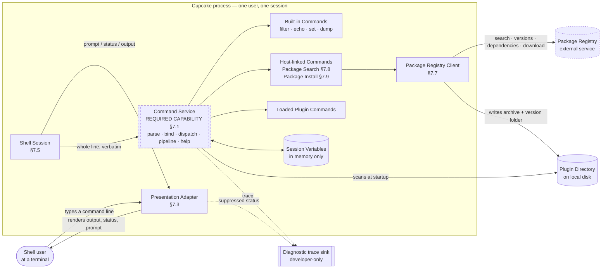
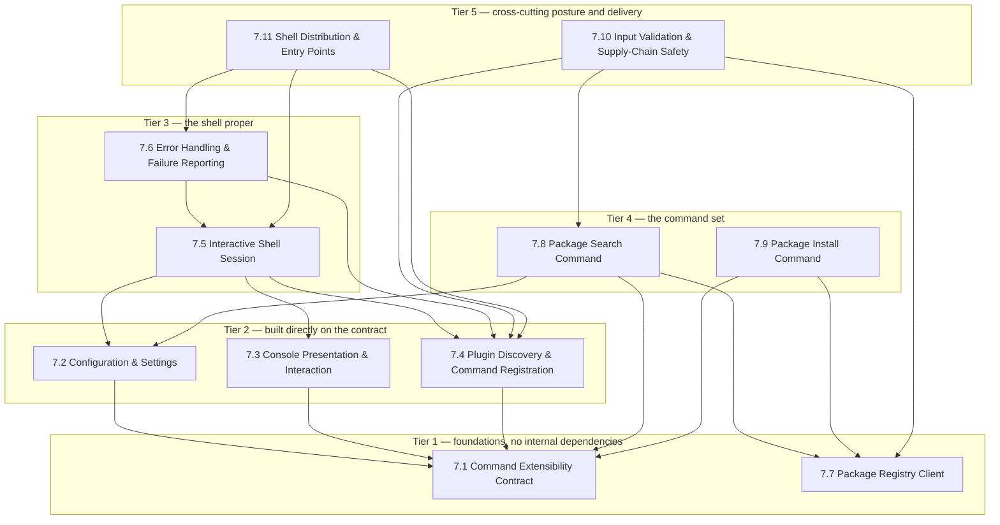

## 5. System Overview

### 5.1 Context

Cupcake is a single-process, single-user terminal program. It talks to exactly three things outside
itself: the terminal, the local filesystem, and one package registry over the network. It listens on
nothing and serves nobody.

Two things in that picture deserve emphasis. The **Command Service** is drawn dashed because it is
not in this repository — it is the required capability a clone must build or source (§7.1). And the
**diagnostic trace sink** is drawn as a dead end because, in practice, it is one: everything routed
there is invisible in a normal run (§6, §9).

### 5.2 Feature dependency map and build order

Arrows point from a feature to what it depends on. Tiers give the suggested build order (§10).

**Note on the tiering.** §7.6 (Error Handling) is cross-cutting and is written as one feature because
the product's failure contract is a single coherent decision surface — where guards sit, what
survives, what kills the process. It is placed after the Session because most of its content is the
Session's startup guard behaviour. §7.10 similarly gathers validation rules that live inside other
features, so that a clone can review the whole security posture in one place; its requirements
cross-reference rather than duplicate.

### 5.3 External Technology & Protocol Inventory

The consolidated shopping list. Deduplicated by generic capability across all eleven features; the
source's concrete choice is preserved because it carries sizing and semantics a clone needs. Rows
marked **critical** are ones where substituting carelessly changes observable behaviour.

#### Core runtime capabilities

| # | Generic capability | Protocol / standard | What the source used | Notes for the reimplementer |
|---|---|---|---|---|
| ET-1 | **Command capability**: command registry, command-name extraction, argument tokenization, declarative parameter metadata, argument binding, pipeline engine, generated help, sandboxed plugin loading, built-in command set, scoped variable store | none — in-process library | `Xcaciv.Command` 2.1.1, `Xcaciv.Command.Core` 2.1.0, `Xcaciv.Command.Interface` 2.1.0 (`Directory.Packages.props:8-10`) | **Critical, and the largest single item.** Not on the public index (HTTP 404); the repository cannot reach it (§2.4). Fully specified as behaviour in §7.1 and §6 — build or substitute. The two separately-distinguishable "nothing found" signals (§7.4) are load-bearing: the product tolerates one and dies on the other. |
| ET-2 | **Sandboxed dynamic loading of third-party binary modules**, with per-module path restriction and a strict-by-default policy | none | `Xcaciv.Loader` ~2.1.1 — transitive through ET-1, named in no manifest in this repository | **Critical.** On a platform without in-process module isolation, substitute process-level isolation or an out-of-process plugin protocol. Do **not** silently drop the restriction: with the containment rule (§6) it is the only control standing between a Plugin Directory and arbitrary code execution. Modules are never unloaded once loaded. |
| ET-3 | **Metadata-driven reflection over loaded modules** — find units of a given shape and read their declarations **without instantiating them** | none | Runtime custom attributes + reflection | Any equivalent: decorators, a registration table, a manifest file. The "without instantiating" property matters — discovery reads declarations off the type. |
| ET-4 | **Bounded producer/consumer queues** between concurrently running stages, with a selectable full-buffer policy | none | In-memory bounded channels; policies block / drop-oldest / drop-newest | Capacity 10,000 items per stage, **block on full** by default (§9). Block-on-full is what turns an over-capacity final stage into a stall rather than data loss. |
| ET-5 | **Managed runtime** with async/await, a thread pool, and the ability to block synchronously on an asynchronous result | none | .NET 8 (`net8.0`) for every project | The product deliberately mixes both idioms. A single-threaded clone may collapse the whole shell to one synchronous loop **provided** it preserves the behavioural divergences between the two session entry points, which are independent of concurrency. Note that blocking on an asynchronous result re-wraps escaped failures in an aggregate envelope, changing the text the user sees (§7.6). |
| ET-6 | **Parallel work distribution** over a collection, above a threshold | none | Parallel for-each, engaged strictly above 50 candidate files | The per-item callback must be thread-safe and the index it writes into must tolerate concurrent insertion. |

#### Terminal and diagnostics

| # | Generic capability | Protocol / standard | What the source used | Notes for the reimplementer |
|---|---|---|---|---|
| ET-7 | **Interactive character terminal**: write a line, write without a trailing line break, read one line, set a named foreground and background colour, reset both to defaults | ANSI/VT on POSIX; console attributes on Windows | System console colour properties and line I/O | **Critical.** Colours are *names* from a 16-entry palette, not RGB: `Blue`, `Black`, `Yellow`, `DarkBlue`, `Green`. The reset must restore both foreground and background. No cursor addressing, no ANSI authoring of the product's own. Colour operations are silently ignored when output is redirected (INFERRED). |
| ET-8 | **UTF-8 capable terminal output** | UTF-8 | The prompt contains U+0190 LATIN CAPITAL LETTER OPEN E | If the terminal cannot render it the prompt degrades to a substitution glyph. Carry U+0190 specifically — it is easily mis-copied as a reversed epsilon or a Greek letter, which are different code points. |
| ET-9 | **A diagnostic sink separate from the user-visible terminal** — somewhere a developer can retrieve text the user never sees | none | Platform debug and trace writers | **Load-bearing, not incidental.** Every trace line, every suppressed status line, and every silently-skipped Plugin goes here and nowhere else. A clone without a second channel converts all of those into silent failures with no record. Note the product uses *two* such sinks with different survival properties: one is stripped from optimised builds, the other is not (§7.3). |

#### Package registry integration

| # | Generic capability | Protocol / standard | What the source used | Notes for the reimplementer |
|---|---|---|---|---|
| ET-10 | **Package registry client**: service discovery, keyword search with skip/take and a prerelease toggle, version index for a named package, dependency metadata for a package at a version, archive download to a stream | Service-index JSON over HTTPS ("V3"), SemVer 2.0.0 | `NuGet.Protocol` 7.0.1 (`Directory.Packages.props:7`) | **Critical.** The configured address is a **service index document**, not a search endpoint — the client fetches the index and discovers four per-capability endpoints from it. A clone targeting a different registry needs an equivalent "search by term with skip/take and include-prerelease" call returning identifier, version, summary, download count, publication date, authors, licence and vulnerability list. Note the pinned version carries advisory GHSA-g4vj-cjjj-v7hg (surfaced as restore warning NU1901). |
| ET-11 | **Public package registry** (the built-in default target) | HTTPS | `https://api.nuget.org/v3/index.json` (`SearchCommand.cs:28`) | Hard-coded fallback when the Registry Endpoint setting is unset. The same literal also appears as a build-time feed — keep the two roles distinct in the clone. |
| ET-12 | **Package archive container reader** — open an archive and read the authoritative identity from its embedded manifest | ZIP container + XML manifest | Packaging archive reader (`NugetWrapper.cs:105-107`) | The identity is taken from **inside the downloaded archive**, not from the request that fetched it (§7.10). Extraction is a plain zip-extract-to-directory and is **not implemented** (`:127`). |
| ET-13 | **Version parsing, rendering and ordering** | SemVer 2.0.0 with a four-segment extension | Registry-client versioning | Must round-trip text→value→text and order prerelease identifiers correctly. Rendered form may differ from the registry's normalised form. |
| ET-14 | **Target-runtime moniker parsing with an "any" wildcard** | platform target-framework monikers | Registry-client framework types | Needs a well-defined wildcard as the default for dependency queries. |
| ET-15 | **HTTP response cache on disk** | none | Registry-client cache scope, never configured by the product | INFERRED library default: responses cached per-user and reused for ~30 minutes before revalidation. The product never configures it, so a clone inherits whatever its own client does — decide this deliberately rather than by omission. |

#### Filesystem

| # | Generic capability | Protocol / standard | What the source used | Notes for the reimplementer |
|---|---|---|---|---|
| ET-16 | **Recursive directory walk with a wildcard spanning a path segment** | POSIX/Win32 filesystem | Recursive enumeration with the filter `*` + sub-directory + `*.dll`, joined with the **platform's** separator | The filter itself is composed portably; what is not portable is the product's own default Plugin Directory literal `.\packages`, written with a backslash (`Loop.cs:24`). A filter containing a separator requires the match to be at least one level below the root. |
| ET-17 | **Path containment check** — confirm a candidate path does not escape a boundary | canonicalise + location-identifier base-of comparison | Path canonicalisation plus a URI base-of test | **Critical, and do not copy as-is.** Base-of comparison ignores the boundary's own final segment, and the test is applied to the candidate's *parent*, so the effective boundary is one level above the intended one (§6, §7.4). A clone should compare the candidate itself against a boundary normalised with a trailing separator. |
| ET-18 | **Ordinary file operations**: create-or-truncate a file, join paths natively, test and create nested directories, resolve a temporary directory | none | Standard file/directory/path operations | Downloads overwrite their target unconditionally (§7.10). |

#### Build, packaging and distribution

| # | Generic capability | Protocol / standard | What the source used | Notes for the reimplementer |
|---|---|---|---|---|
| ET-19 | **Dependency acquisition with central version pinning and per-name feed routing** | feed service index / local folder | Central package management (two duplicated manifests) plus feed configuration with source mapping | The routing rule is the only build-time supply-chain control. Equivalent in another ecosystem: scoped registries plus a lockfile. Semantics that matter: the most specific name pattern wins, and a feed with **no** pattern is never consulted — which is exactly the defect in the source (§2.4). |
| ET-20 | **Environment-variable expansion inside the feed manifest** | `%VAR%` token syntax | `%NUGET_LOCAL_PACKAGES%` | Expands where the variable is defined; where it is not, the literal token survives and is treated as a relative directory path. This is the direct cause of the restore failure. |
| ET-21 | **Private hosted package feed** | feed service index over HTTPS | `https://nuget.pkg.github.com/xcaciv/index.json` (`NuGet.config:7`) | Declared, unrouted, therefore never used. Requires credentials that are not in the repository. |
| ET-22 | **Dependency vulnerability advisory check during restore** | advisory database over HTTPS | On by default in the restore tool; never configured in the repository | A clone pinning the same registry-client version inherits the same advisory. |
| ET-23 | **Single-file, self-contained application bundling with compression** | none | Publish options: single-file, self-contained, compression-in-bundle | Equivalents: a packed native binary, an embedded-runtime bundle, an app-image. **Consequence to design around:** in a single-file bundle, a module's recorded on-disk location is empty, which INFERRED breaks the framework's re-resolution of host-linked Commands at dispatch time (§7.11). Do not carry over a design that re-resolves in-process commands through a file path. |
| ET-24 | **Ahead-of-time precompilation for startup latency** | none | Ready-to-run partial AOT | Partial only — a just-in-time compiler must remain available, because the plugin model requires it. Do not substitute full native AOT. |
| ET-25 | **Whole-program dead-code elimination (trimming)** | none | Publish-trimmed | **Directly hostile to this product's plugin model.** Plugin types are reached dynamically, never statically. A clone that trims must supply a keep-list for the Command contract types and their declarative metadata, or must not trim. |
| ET-26 | **Fixed operating-system and processor-architecture publish target** | none | 64-bit Windows on x64 | The development profile is cross-platform; only the shipping profile narrows. §11 asks whether that was deliberate. |
| ET-27 | **Windowed (non-console) executable subsystem marking** | PE subsystem field | Windowed output type in the Release profile | INFERRED: a windowed process gets no console, so the entire interface of this product has nowhere to render. Almost certainly wrong for this product; §11 puts the decision to the team. |
| ET-28 | **Suppression of the default OS application manifest** | side-by-side manifest | No-manifest publish option | Removes OS-compatibility, display-scaling and privilege declarations. |
| ET-29 | **Process exit-status reporting** | OS process exit code | Immediate process termination with status 1 on failure | The only machine-readable failure signal. Termination is immediate — no unwinding, no cleanup handlers. Success status is never set explicitly (INFERRED to be 0). |
| ET-30 | **Workspace grouping with a configuration × platform build matrix** | none | Solution file, six combinations, platform axis inert | |

#### Development-time only

| # | Generic capability | Protocol / standard | What the source used | Notes for the reimplementer |
|---|---|---|---|---|
| ET-31 | **Test runner with fact-style tests** | none | xUnit 2.9.3, runner 3.1.5, test platform 18.0.1, coverage collector 6.0.4 (`Directory.Packages.props:14-17`) | The existing package tests are **live network integration tests** against the public registry with no fakes anywhere. A clone needs a registry test double; see §9. |
| ET-32 | **Filesystem abstraction for testable directory crawling** | none | `System.IO.Abstractions` 22.1.0, framework-side | Only needed if the clone wants its Plugin scan unit-testable without touching disk. The product itself has no such seam for the terminal, which is why almost nothing about rendering is testable today. |
| ET-33 | **Redistribution licence** | none | BSD 3-Clause, © 2022 Alton Crossley (`LICENSE:1-4`) | Permissive. Attribution and the disclaimer must ship with any redistribution of the original work. |
