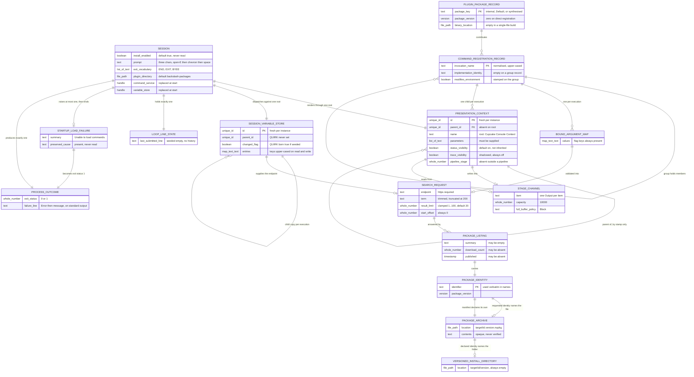

## 8. Data Model

This section is the consolidated inventory of everything the product holds, from every feature
subsection of §7. It exists because the data model is the single most surprising thing about this
product: **there isn't one, in the sense a reimplementer expects**. Nothing is persisted, nothing is
serialised, nothing is shared, nothing has a stable identity across a run. Every entity below lives
in memory for part of one Session and is gone when the process exits, with exactly two exceptions —
both of them files written by a code path that no Command in the shipping build can reach (§8.5).

A clone team should read this section as a *warning against over-building*. There is no schema to
migrate, no store to choose, no serialisation format to agree. What there is instead is a set of
in-memory shapes with unusual lifecycle rules — a variable store that mutates when you read it, a
registration record that merges rather than replaces, a presentation tree that cannot be walked —
and those rules are the requirements.

Almost nothing in this section was executed. The product does not build at the pinned commit
(§8.7), so every field, default and lifecycle statement is read from source. There is exactly **one**
exception, and it changes the status of two entities below: the Plugin Scanner's search mask was
executed against a real filesystem during verification, and it establishes that no Plugin package
record (DM-5) is ever created on a real host, and that any Plugin Directory that exists produces a
Startup Load Failure (DM-9) rather than a loaded Plugin. That result is stated again at both
entities, at DM-8b and at §8.6, and is pinned by §7.4 FR-4.25 and FR-4.42, §7.6 FR-6.54 and AC-6.31,
and register rows Q-82 and Q-83. Statements resting on the external command framework carry
`OUT-OF-REPO:` and refer to the reference tag, one patch release ahead of the versions the product
pins.

---

### 8.1 Conventions

**Identifiers.** Entities are numbered `DM-1` … `DM-20`, with one supplementary `DM-8b`, and are referenced by number elsewhere in
this document. The numbering is a catalogue, not a priority.

**Generic types.** Field types avoid every source-language name. The vocabulary is:

| Generic type | Meaning |
|---|---|
| text | a character string of unbounded length unless a constraint says otherwise |
| whole number | a non-fractional number |
| boolean | true or false |
| unique identifier | an opaque value unique within the process, generated on creation, never reused |
| ordered list of text | a sequence in which position is meaningful and duplicates are permitted |
| keyed map of text to text | an associative store; key comparison rules stated per entity |
| keyed map of text to *E* | as above, but values are instances of entity *E* |
| timestamp | a point in time |
| file path | a filesystem location, absolute or relative as stated |
| structured version | an ordered, comparably-sortable version value that renders back to text |
| colour name | one member of a fixed terminal palette |
| handle | a reference to a live collaborator, not a value; not serialisable |

**Ownership.** "Owned by the product" means the shape is declared in this repository. "Owned by the
Command Service" means the shape belongs to the required external capability of §7.1 and the product
only reads or populates it — a clone must still implement it, because the product's behavior depends
on its exact rules.

**Lifecycle** is given for every entity as three facts: *created when*, *mutated when*, *destroyed
when*. Where "destroyed" is "when the process exits", that is the literal truth: nothing is disposed,
released, flushed or torn down on the way out.

---

### 8.2 Entity catalogue

#### DM-1 — Session

**Purpose.** Holds the four settings a Shell Operator may change before a run, plus handles to the
two collaborators the run uses. It is the product's only configuration surface: there is no
configuration file, no environment-variable override and no command-line argument (§7.2).

| Field | Type | Constraints / default | Notes |
|---|---|---|---|
| install-enabled | boolean | default `true` | **QUIRK (register Q-24)** — written once, read nowhere in the product; setting it `false` gates nothing (`src/Xcaciv.Cupcake.Core/Loop.cs:11`, sole occurrence outside `Xcaciv.Cupcake.Core.Tests/LoopTests.cs:158`) |
| Prompt | text | default exactly three characters: U+0190 LATIN CAPITAL LETTER OPEN E, then `>`, then one space (`Ɛ> `) | no length or character-set validation; may be set to empty (`Loop.cs:16`) |
| Exit vocabulary | ordered list of text | default `END`, `EXIT`, `BYEE` — that order, all upper case, the third with a doubled final E | mutable, may be emptied (making the Session unexitable by word) or extended; whole-entry, case-insensitive comparison (`Loop.cs:20`, `:57`, `:91`) |
| Plugin Directory | file path | default `.\packages` — a relative path with a backslash separator, which on a POSIX host is one literal filename character and not a separator at all (register Q-25) | the Session performs no existence check of its own; empty or whitespace is rejected by the Command Service as a hard argument error, and that rejection is fatal rather than benign (register Q-80) (`Loop.cs:24`; OUT-OF-REPO: `src/Xcaciv.Command/CommandLoader.cs:28`). **QUIRK (register Q-82)** — no value of this setting can load a Plugin on a real filesystem: a directory that does not exist is tolerated and a directory that does exist is fatal (DM-5, DM-9) |
| Command Service | handle | readable externally, assignable only by the Session; initialised to a fresh default instance | replaced by the handle passed to a start (`Loop.cs:25`, `:34`, `:72`) |
| Session Variable store | handle | readable externally, assignable only by the Session; initialised to a fresh empty store | replaced by the handle passed to a start (`Loop.cs:26`, `:35`, `:73`) |

**Lifecycle.** *Created* when the Shell Operator constructs it — in the shipping build, the first
statement of the program (`src/Xcaciv.Cupcake.Lit/Program.cs:9`). *Mutated* in two disjoint windows:
the four settings by the Operator before a start, and the two handles by the Session itself as the
first statement of a start, before anything that can fail. The Prompt and Exit vocabulary are re-read
on every loop iteration, so a mid-Session change to either takes effect on the next iteration; the
Plugin Directory is read exactly once, during startup. *Destroyed* when the process exits. The
Session has no identifier, no equality, no copy and no serialised form.

**Relationships.** *Has one* Command Service and *has one* Session Variable store; owns neither —
both are supplied by the Operator and are not disposed at the end. *Produces at most one* Startup
Load Failure (DM-9). *Holds exactly one* per-line loop state (DM-10) for the duration of the loop.

#### DM-2 — Presentation Context

**Purpose.** The product's concrete Interaction Context: everything a Command emits (Output, Status
lines, progress, Diagnostic trace) and everything the Session reads (a typed line) passes through
one of these. One exists per Session; one child is created per Command execution and per Pipeline
stage.

| Field | Type | Constraints / default | Notes |
|---|---|---|---|
| identifier | unique identifier | fresh on every construction, never changes | root and every child get their own |
| name | text | constructor default `ConsoleIo`; the shipping build passes `Cupcake Console Context` for the root; a child's name is the parent's name with `Child` appended | mutable; rendered into progress text, so the name is user-visible (`ConsoleContext.cs:13`, `:40`; `Loop.cs:110`) |
| parent identifier | optional unique identifier | absent on the root; set to the creator's identifier on a child | set at construction, never afterwards |
| parameter list | ordered list of text | copied into a fresh list at construction | **QUIRK (register Q-34)** — declared optional but must be supplied and non-absent, at construction and at child creation; an absent list fails construction (`ConsoleContext.cs:13`, `:40`). The root is constructed with an empty list (`Loop.cs:110`) and the Command Service overwrites it with the parsed arguments once per direct (non-Pipeline) Command |
| Status Visibility (adapter's own) | boolean | default **on** | gates Status lines only (`ConsoleContext.cs:31`, `:92`) |
| Status Visibility (inherited, shadowed) | boolean | default **off** | **QUIRK (register Q-27)** — the adapter declares a *new* switch rather than setting the inherited one, so the Diagnostic trace path keeps consulting the inherited switch, which nothing ever turns on. Diagnostic trace can therefore never reach the terminal, however the adapter is configured (`ConsoleContext.cs:31`; OUT-OF-REPO: `src/Xcaciv.Command.Core/AbstractTextIo.cs:25`, `:167-175` (framework v2.1.2)) |
| Output foreground / background | colour name ×2 | `Blue` / `Black` | `ConsoleContext.cs:23-24` |
| Status foreground / background | colour name ×2 | `Yellow` / `DarkBlue` | `ConsoleContext.cs:26-27` |
| Prompt foreground / background | colour name ×2 | `Green` / `Black` | `ConsoleContext.cs:29-30` |
| progress template | text with two ordered placeholders | default `{0} progress {1}%`; `{0}` is the context name, `{1}` the computed number | `ConsoleContext.cs:20` |
| input pipe attachment | optional read end of a Stage Channel | absent unless attached; attaching raises the has-piped-input flag | attached by the Command Service for a Pipeline stage; inherited by a child |
| output pipe attachment | optional write end of a Stage Channel | absent unless attached | attached by the Command Service for a Pipeline stage; inherited by a child; closed on completion |
| has-piped-input | boolean | false until an input pipe is attached | read-only to callers |
| Pipeline stage number / total stage count | optional whole numbers ×2 | absent outside a Pipeline; the number is 1-based | stamped by the Command Service immediately after child creation |
| output encoder | handle | accepted and discarded | **QUIRK (register Q-33)** — the setter stores nothing, so the one hook where untrusted registry text could be neutralised does nothing (OUT-OF-REPO: `AbstractTextIo.cs:121-125` (framework v2.1.2)) |

**Child relationship.** Contexts form a **tree by parent identifier**: one root per Session, one child
per Command execution, one child per Pipeline stage, further children for Command Group members.
There are no back-references and children are not tracked, so the tree cannot be walked from the
root — the parent identifier is a provenance stamp, not a navigable link. A child inherits **only**
the two pipe attachments. It does **not** inherit the name (it derives a new one), the colours, the
progress template, or — **QUIRK (register Q-28)** — the Status Visibility: a child is constructed
without passing the parent's setting and so takes the constructor default of **on**, meaning a Session
deliberately
silenced becomes chatty again the moment a Command runs (`ConsoleContext.cs:38-47`).

**Lifecycle.** *Created*: the root by the defaults start (`Loop.cs:110`); a child by the Command
Service before each Command execution and before each Pipeline stage. *Mutated*: colours, name,
template and the adapter's Status Visibility at any time by their owner; the parameter list is
replaced by the Command Service once per direct Command; the pipe attachments and the stage numbers
are stamped once. *Destroyed*: a child is disposed by the Command Service when its execution or stage
ends, and disposal completes (closes) the attached output pipe. The **root is never disposed**
(**QUIRK**, register Q-23) — the Session never signals completion and never tears anything down; it
simply stops looping.

#### DM-3 — Session Variable store

**Purpose.** The only shared mutable state a Command can see. A case-insensitive keyed map of text
values, scoped per Command execution with opt-in write-back to the Session. Owned by the Command
Service; the product creates one, hands it to the start, and defines exactly one key in it.

| Field | Type | Constraints / default | Notes |
|---|---|---|---|
| identifier | unique identifier | fresh per instance | OUT-OF-REPO: `src/Xcaciv.Command/EnvironmentContext.cs:27` (framework v2.1.2) |
| name | text | default `Environment` | OUT-OF-REPO: `EnvironmentContext.cs:29` |
| parent identifier | optional unique identifier | declared by the contract; always absent in fact | **QUIRK (register Q-67)** — never set: the child-creation path constructs a child without passing the parent's identifier, so every store, root or child, reports an absent parent (OUT-OF-REPO: `EnvironmentContext.cs:31`, `:45-55`) |
| changed flag | boolean | false at construction of an empty store | **QUIRK (register Q-67)** — a child is seeded through the same write path that raises the flag, so any child of a *non-empty* store is born already flagged as changed (OUT-OF-REPO: `EnvironmentContext.cs:35-38`, `:45-55`, `:84`) |
| entries | keyed map of text to text | keys are upper-cased on **both** read and write, making lookup case-insensitive; values are text with no validation | OUT-OF-REPO: `EnvironmentContext.cs:71-110` |

**Keys the product defines.** Exactly one: the Registry Endpoint setting, written in source as
`PackageSourceUrl` and stored as `PACKAGESOURCEURL` (`src/Xcaciv.Command.Packages/SearchCommand.cs:24`).
Nothing else in the product reads or writes a named key. The four Built-in Commands (a pattern
filter, an echo that expands references, a variable setter, a variable dump) operate on whatever
keys a user creates; only the setter is registered as environment-modifying.

**Lifecycle.** *Created* empty at Session construction, and replaced by whatever store the start is
given (`Loop.cs:26`, `:35`). A **child copy** is created per Command execution, seeded with a snapshot
of the parent's entries — not a view of them (OUT-OF-REPO:
`src/Xcaciv.Command/CommandExecutor.cs:187`; `EnvironmentContext.cs:45-55`; §6 GR-27). *Mutated*: by
the variable-setter Built-in; by write-back; and — **QUIRK (register Q-10)** — by *reading*. A read of
a missing key with the default options **stores the default under that key as a side effect**, so the
first Package Search does write an empty value under `PACKAGESOURCEURL` (OUT-OF-REPO:
`EnvironmentContext.cs:94-110`; `SearchCommand.cs:24`; §6 GR-26).

**Where that write lands is the point.** It goes into the Command's **per-execution child scope**, and
the write-back rule stated next discards it, because the shipping host registers Package Search
*without* the environment-modifying flag (`src/Xcaciv.Cupcake.Lit/Program.cs:11`; the flag defaults to
off, OUT-OF-REPO: `src/Xcaciv.Command/CommandController.cs:190`). In normal Shell use the Session's
own store is therefore **unchanged**, and a subsequent variable dump lists **no** `PACKAGESOURCEURL`
entry (§7.2 FR-2.37 and AC-2.15; §7.8 FR-8.16 and AC-8.27). The side effect is observable only on a
**direct-invocation** path, where a host hands a Command its own store instead of letting the executor
interpose a child — which is exactly what this repository's own tests do
(`Xcaciv.Command.PackagesTests/SearchCommandTests.cs:15`, `:31`, `:90`). The same correction applies
to the echo Built-in Command's failed `%NAME%` resolutions. The quirk stays in the register because it
is real on that path and because it becomes visible in the Shell the moment any clone declares Package
Search — or the `PACKAGE` Command Group that would carry the flag for it (DM-4) —
environment-modifying.

*Write-back*: a child's entries are merged into the parent only when the Command's registration record
is marked environment-modifying **and** the child's changed flag is set; because of the born-changed
quirk (register Q-67) the second half of that guard is effectively inert, so the declared flag is the
only real gate (OUT-OF-REPO: `src/Xcaciv.Command/CommandExecutor.cs:216-219`; §6 GR-27). *Destroyed*
when the process exits. Contents are never written to disk and never read from disk (§8.5).

#### DM-4 — Command Registration Record, and the Command Group / member structure

**Purpose.** The Command Service's unit of record: one entry per invocable name. This is the index
the Session dispatches against and the index help is generated from. Owned by the Command Service.

| Field | Type | Constraints / default | Notes |
|---|---|---|---|
| invocation name | text | the map key. Normalised: trim; take the text before the first space; strip leading and trailing hyphens; delete every character outside `[-_0-9a-zA-Z ]`; upper-case | OUT-OF-REPO: `src/Xcaciv.Command.Interface/CommandDescription.cs:27`, `:52-64` (framework v2.1.2) |
| members | keyed map of text to Command Registration Record | empty for a leaf Command; keyed by the member's upper-cased own name | OUT-OF-REPO: `CommandDescription.cs:32` |
| implementation identity | text | the fully-qualified identity used to construct the Command at execution time; **empty on a Command Group's own record**, which holds only members | OUT-OF-REPO: `CommandDescription.cs:36`; empty-on-group at OUT-OF-REPO: `src/Xcaciv.Command.Core/CommandParameters.cs:184-198` |
| owning Plugin package record | Plugin package record (DM-5) | always present; defaults to an all-empty record rather than being absent | OUT-OF-REPO: `CommandDescription.cs:40` |
| environment-modifying | boolean | default false; settable only on the direct-registration route | **QUIRK (register Q-62)** — for a grouped Command it is stamped on the **group's** record, and a later member joining the same group cannot change it, so the first registration of a group decides write-back for every member of it (§6 GR-28; OUT-OF-REPO: `CommandDescription.cs:44`; `src/Xcaciv.Command/CommandRegistry.cs:38-60`) |

**Group / member structure.** A Command that declares both a group and its own name registers under
the **upper-cased group name**, carrying itself as a single member under its **upper-cased own name**.
Two Commands sharing a group **merge into one record** — the second registration adds its member to
the existing record instead of replacing it. At dispatch the first remaining argument is upper-cased,
matched against the member table, and **removed from the argument list** before the member runs
(OUT-OF-REPO: `CommandParameters.cs:173-215`, `CommandRegistry.cs:20-36`, `src/Xcaciv.Command/CommandFactory.cs:38-55`).
This is why the product's two package Commands are reachable only as `PACKAGE SEARCH …` and
`PACKAGE INSTALL …` (`SearchCommand.cs:11-12`, `src/Xcaciv.Command.Packages/InstallCommand.cs:14-15`),
and why the No Plugins Available guidance text, which suggests `install --help`, names something that
cannot resolve (registers Q-12 and Q-13).

**QUIRK (INFERRED; register Q-45).** Requesting help on a *member* of a Command Group prints the
**group's** one-line member listing, not the member's own parameter help — the member's declared
parameters are therefore undiscoverable from the Prompt. Of the three help spellings the Command
Service accepts, two are destroyed by argument tokenization before they can be recognised, leaving
only the double-dash spelling reachable from the Prompt (register Q-44). A Command Group's own record
carries no implementation identity either, so the bare group verb produces an execution error rather
than a member listing (register Q-72).

**Lifecycle.** *Created* at registration, by one of three routes: the four Built-in Commands under
package key `Default`; the shipping build's two Host-linked Commands under package key `internal`
(`src/Xcaciv.Cupcake.Lit/Program.cs:10-11`); and one record per Command found by the Plugin Scanner —
a route that yields **no records at all** on a real filesystem, because the scan raises before it
returns a candidate (DM-5; §7.4 FR-4.25; register Q-82). The whole index in the shipping build is
therefore **five** top-level records — the four Built-in Commands, plus the single merged `PACKAGE`
group carrying both Host-linked Commands as members — for every filesystem state that starts at all.
*Mutated* only by merge (a member joining an existing group) or by overwrite (a later registration of
the same top-level name wins —
**QUIRK**, register Q-71: a Plugin declaring a verb already held by a Built-in or Host-linked Command
would displace it silently). **QUIRK (register Q-16)** — on the defaults start the Built-in Commands
are registered **twice**, once by the convenience entry point and once inside the start; harmless
because registration overwrites by key, but redundant (`Loop.cs:108` and `:41`). *Destroyed* when the
process exits — the index is never pruned, never invalidated, and there is no reload, rescan or
unregister operation anywhere.

#### DM-5 — Plugin package record

**Purpose.** Provenance for a Command: which bundle it came from and where that bundle's code lives.
Owned by the Command Service; populated by the Plugin Scanner or synthesised at direct registration —
and, on a real filesystem, only ever by the second of those, for the reason set out below.

| Field | Type | Constraints / default | Notes |
|---|---|---|---|
| name / key | text | default empty | two values are observable in the shipping build: `internal` (Host-linked) and `Default` (Built-ins). A third form — one synthesised key per discovered binary — belongs to the discovery route and is never produced on a real filesystem (register Q-82) |
| version | structured version | default all-zero | read from the binary on the discovery route only; **left at the zero default on both direct-registration routes**, which never set it (OUT-OF-REPO: `src/Xcaciv.Command.FileLoader/Crawler.cs:93`) |
| binary location | file path | default empty | on the discovery route, the discovered binary; on the direct routes, the on-disk location of the module that *declares* the Command — for the shipping build's two Host-linked Commands that is the library they ship in, not the executable. **QUIRK (INFERRED; register Q-54)** — in a single-file bundle this location is empty, and the Command Service treats an empty location as "no code was defined", which would make the shipping build's only two Commands unusable (OUT-OF-REPO: `CommandRegistry.cs:49-53`, `CommandFactory.cs:64-78`) |
| contributed Commands | keyed map of text to Command Registration Record | populated only on the discovery route | OUT-OF-REPO: `src/Xcaciv.Command.Interface/PackageDescription.cs:9-18` |

**The discovery route does not work, and this is the load-bearing fact of the whole section.** The
Plugin Scanner composes one search mask by joining a wildcard segment, the sub-directory name and the
fixed binary pattern `*.dll` — producing `*/bin/*.dll`, the sub-directory defaulting to `bin` — and
hands that whole mask to a recursive enumeration rooted at the verified, canonicalised Plugin
Directory (OUT-OF-REPO: `Crawler.cs:20`, `:173-178`; the `bin` default at
`src/Xcaciv.Command/CommandController.cs:169`). **QUIRK (register Q-82).** The directory portion of a
search mask is joined to the root literally and its wildcard is never expanded, so on a real
filesystem the enumeration does not match the files and does not return empty: it **raises a
directory-not-found condition naming the literal path `<root>/*/bin`**, even with a perfectly correct
layout present. This was established by **executing** the enumeration against a real filesystem, not
by reading it (§7.4 FR-4.25, §7.6 FR-6.54, AC-6.31). Consequences carried into this section: **no
Plugin package record is ever created on a real host**; the discovery route's fields below are the
*contract a clone must implement*, not behaviour anyone has observed; and any Plugin Directory that
exists is fatal at startup rather than empty-but-tolerated (DM-9). The framework's own scanner tests
pass because they run against a mock filesystem that (INFERRED) expands the wildcard segment; the
production path uses the real filesystem and cannot.

**Synthesised key shape (discovery route — INTENDED, per §7.4 FR-4.34).** Each discovered binary would
be named `<file base name>-<its directory path relative to the Plugin Directory with all separators
removed>`; for root `<root>` and binary `<root>/Hello/bin/Hello.dll` the key is `Hello-Hellobin`
(OUT-OF-REPO: `Crawler.cs:199-238`, the linear and parallel walks being identical in this respect). A
Plugin contributing no valid Commands is dropped and never becomes a record (OUT-OF-REPO:
`Crawler.cs:156`). Any per-Plugin load failure — security violation, missing file, unreadable or
wrong-architecture binary, or anything else — is swallowed to Diagnostic trace and that Plugin is
skipped while the Session continues (**QUIRK**, register Q-15; OUT-OF-REPO: `Crawler.cs:125-153`).

**Lifecycle.** *Created* during startup, once per surviving Plugin binary — a count that is always
**zero** on a real filesystem (register Q-82) — or once per direct registration call, which is the
only route that produces a record in the shipping build. *Mutated* only while it is being built — its
Command map is filled in before the record is published, and its version is stamped once. *Destroyed*
when the process exits.

#### DM-6 — Package Identity

**Purpose.** A Plugin's unique name paired with one specific version. It is the currency of every
registry operation and the source of every on-disk name the product produces.

| Field | Type | Constraints | Notes |
|---|---|---|---|
| identifier | text | used **verbatim** in file and directory names, with no sanitisation, length cap or reserved-name check | `src/Xcaciv.Command.Packages/NugetWrapper.cs:113`, `:119` |
| version | structured version | parsed from text; ordered comparably; renders back to text for names | `NugetWrapper.cs:59`, `:107` |

**Case sensitivity.** For keyword search, the registry's matching is case-insensitive and
punctuation-tolerant — pinned by the term `cake.nuget` matching the package `Cake.NuGet`
(`Xcaciv.Command.PackagesTests/SearchCommandTests.cs:112-126`). For exact identifier lookup,
case-insensitivity is **INFERRED**: every test supplies the identifier in its canonical casing.

**Lifecycle.** *Created* two ways: composed by a caller from an identifier and a version text
(`NugetWrapper.cs:59`), or **read out of a Package Archive's manifest** (`:103-109`). *Mutated* never.
*Destroyed* when the call that built it returns. It is never persisted **as a record** — but its two
fields are baked into the names of both on-disk artefacts of §8.5, which is the only trace of it that
outlives the process.

#### DM-7 — Package Listing

**Purpose.** One search result, as the registry returned it. A read-only projection: the product
never constructs, mutates, caches or stores one.

| Field | Type | Shown at detail level | Notes |
|---|---|---|---|
| identifier | text | terse, standard, full | canonical registry casing is preserved and echoed verbatim |
| version | structured version | standard, full | as returned |
| summary | text | standard, full | frequently empty on public registries, which yields a trailing `" : "` in standard rendering |
| download count | whole number, may be absent | full | **INFERRED** — rendered with no absent-value guard, so an absent count renders as nothing between the parentheses (`SearchCommand.cs:72`) |
| publication timestamp | timestamp, may be absent | full | **INFERRED** — rendered with the host's default date formatting, so the output is locale-dependent |
| authors | text | full | as returned |
| licence metadata | structured value, may be absent | full | rendered by its own default text form; **INFERRED** commonly empty in search responses |
| vulnerabilities | list | full | rendered as the **count** of entries, never the entries themselves (`SearchCommand.cs:76`); the count never gates anything |

**QUIRK (register Q-2; §7.8 FR-8.38 and FR-8.39, §6 GR-22 and GR-23).** The detail level is checked
against its allowed-value list **case-insensitively** during argument binding, but the Command's own
rendering choice is matched **case-sensitively**. A value outside the list is therefore rejected
before the Command ever runs, while a case variant of an allowed value —
for example `Detailed` — is accepted and silently falls through to the **standard** rendering, losing
the download count, timestamp, authors, licence and vulnerability count with no message at all. The
fallback branch is not dead code: it is the branch that hides this defect.

**Lifecycle.** *Created* when the registry replies. *Mutated* never. *Destroyed* immediately after
rendering — the set is rendered to text, joined with newline separators, returned as one Output, and
released. Nothing is cached in memory across calls and there is no result store, no paging cursor and
no re-render.

#### DM-8 — Package Archive

**Purpose.** The single downloadable file containing a Plugin's payload and its identity manifest.
This is one of the product's two on-disk artefacts.

| Field | Type | Constraints | Notes |
|---|---|---|---|
| file path | file path | for a direct download, chosen entirely by the caller; for the install routine, composed as `<target directory>/<requested identifier>.<requested version>.nupkg` | the documented convention `{path}/{packageId}.{versionString}.nupkg` is advisory only — nothing validates or enforces it, and the one download test deliberately violates it with a random name in the platform temporary directory (`NugetWrapper.cs:79`, `:113-114`) |
| contents | opaque bytes | **no integrity constraint of any kind** — no hash, no signature, no length check, no content-type check | `NugetWrapper.cs:89-100` |
| declared identity | Package Identity (DM-6) | read back **out of the archive's own manifest**, not from the request | `NugetWrapper.cs:103-109` |

**QUIRKs.** (1) The download opens the target path **create-or-truncate**, so a repeat download
silently destroys whatever was there, with no prompt, backup or skip (`NugetWrapper.cs:89`). Two
concurrent downloads to the same path interleave destructively; there is no locking (register Q-48).
(2) The download reports success unconditionally, so a non-existent package leaves a zero-length file
behind and still reports success (`NugetWrapper.cs:91-100`; register Q-47). (3) The identity that
names the directory in DM-8b comes from **inside** the downloaded file, so a hostile or mislabelled
archive chooses its own directory name (`NugetWrapper.cs:118-119`; register Q-48). Nothing verifies a
signature, checksum or publisher at any point.

**Lifecycle.** *Created or truncated* on every download. *Mutated* only by being overwritten.
*Destroyed* **never by the product** — the only deletion anywhere in the repository is a test cleaning
up after itself (`Xcaciv.Command.PackagesTests/NugetWrapperTests.cs:101`). There is no retention
policy, no size cap, no cleanup pass and no uninstall.

#### DM-8b — Versioned install directory

**Purpose.** The empty directory the unfinished install step creates. Listed separately because it is
the product's second on-disk artefact and has an entirely different naming rule from DM-8.

| Field | Type | Constraints |
|---|---|---|
| directory path | file path | `<target directory>/<archive-declared identifier>/<archive-declared version>/` — note both components come from the **archive's manifest**, not from the request (`NugetWrapper.cs:118-119`) |

**QUIRK (register Q-77).** It is created empty if absent, left completely untouched if present, and
**never populated**: extraction and dependency resolution are both unwritten to-do markers
(`NugetWrapper.cs:121-127`). Worse, the shape it creates — `<id>/<version>/` — does not match the
shape the Plugin Scanner looks in — `<anything>/bin/*.dll` — so even a hypothetically-complete
extraction into this directory would produce nothing the Session could load. On a real filesystem the
mismatch is in any case moot: the scan raises before it inspects any layout at all, so **no** shape
under the Plugin Directory is loadable (DM-5, register Q-82). **INFERRED**, and worth a clone's
attention: were a caller ever to point this routine at the Plugin Directory, creating the directory
chain would turn a *tolerated missing* Plugin Directory into a *fatal existing* one at the next
startup (DM-9).

**Lifecycle.** *Created* if absent. *Mutated* never. *Destroyed* never.

#### DM-9 — Startup Load Failure

**Purpose.** The product's only declared error type, and the only thing that can end a Session
abnormally. Raised when Plugin loading fails for any reason other than No Plugins Available — on the
blocking start path, which is the one the shipping build uses. The non-blocking start path has no No
Plugins Available branch at all, so it wraps that condition too (`Loop.cs:45-54`, `:77-85`; §7.6
FR-6.20, register Q-17).

| Field | Type | Constraints | Notes |
|---|---|---|---|
| summary | text | always the literal `Unable to load commands.` as the product creates it; the type itself accepts any text | the only thing ever shown to the user (`Loop.cs:53`, `:84`) |
| preserved cause | nested failure, optional | present on every instance the product creates | **QUIRK (register Q-39)** — never read back anywhere; the process guard reads only the summary and discards the rest (`src/Xcaciv.Cupcake.Core/Exceptions/LoadingException.cs:4-13`; `src/Xcaciv.Cupcake.Lit/Program.cs:16`) |

**Relationships.** Wraps exactly one underlying condition, which may be any of the Command Service's
load-related signals — no verified directory, no plugin binaries in the directory, directory not
found, invalid configuration — or any general platform condition.

**QUIRK (register Q-11, with Q-82 and Q-83).** The two "nothing found" signals are unrelated sibling
types and the Session catches only the first, so a *missing* Plugin Directory yields friendly guidance
and a working Session. Everything else is fatal — and on a real filesystem "everything else" includes
**every Plugin Directory that exists**, populated and empty alike: the scan's search mask raises a
directory-not-found condition naming `<root>/*/bin` before it can distinguish the two (DM-5; §7.4
FR-4.42; §7.6 FR-6.32, FR-6.54, AC-6.31). That condition is not the tolerated type, so it is wrapped
here with the summary `Unable to load commands.`, escapes the Session, and ends the process with exit
status 1 (DM-20). Two things follow for a clone team. First, the friendlier outcome is the one where
the user has done **less** setup — the inversion register row Q-11 records, now starker than "empty is
fatal, missing is tolerated": *any* existing directory is fatal, and no Plugin can ever load. Second,
the sibling signal `No packages found in <path>.` — the "verified directory held no plugin binaries"
case this type was written around — is **unreachable on the shipping path**; it is reachable only when
the sub-directory filter is empty, which the product never does (register Q-83; OUT-OF-REPO:
`src/Xcaciv.Command.FileLoader/Crawler.cs:176`, `:180`). A clone must still decide what the two
signals mean, because a clone's scanner will work.

**Lifecycle.** *Created* only during startup, in either start path (`Loop.cs:53`, `:84`). *Mutated*
never — **INFERRED** strictly immutable; the observed fact is that no code path writes to it after
construction. *Destroyed* at the process guard, where its summary is read once into the crash line and
the object dies with the process. There is no error log, no error store, no correlation identifier of
the product's own, and no error history across runs.

#### DM-10 — Per-line loop state

**Purpose.** The transient state of the prompt/dispatch cycle. It is a single value, and it is the
whole of the Session's runtime memory.

| Field | Type | Constraints | Notes |
|---|---|---|---|
| most recently submitted line | text | seeded to the empty string; overwritten once per iteration | `Loop.cs:56`, `:65`, `:90`, `:96` |

**Lifecycle.** *Created* at loop entry, seeded empty so that the first iteration dispatches nothing
and goes straight to the Prompt. *Mutated* exactly once per iteration, by the read from the
Presentation Context. *Destroyed* when the loop exits.

**Consequences a clone must reproduce.** There is **no history**: the previous line is unrecoverable
the moment the next is read. There is no line editing, no completion, no aliasing and no recall. The
Exit vocabulary test runs at the **top** of each iteration, before dispatch, so an exit word ends the
Session **without ever being executed as a Command** — an exit word that also names a registered
Command can never be invoked (**QUIRK**, register Q-21). An empty line is skipped without dispatch.

#### DM-11 — Stage Channel

**Purpose.** The bounded, ordered buffer that carries Output from one Pipeline stage to the next.
Owned by the Command Service. This is the product's only concurrency primitive and its only
back-pressure surface.

| Field | Type | Constraints / default | Notes |
|---|---|---|---|
| item type | text | one Output per item — the channel carries discrete units, not a byte stream | OUT-OF-REPO: `src/Xcaciv.Command/PipelineExecutor.cs:97-101` (framework v2.1.2) |
| capacity | whole number | default **10 000** items, documented as approximately 100MB for 10KB strings | OUT-OF-REPO: `src/Xcaciv.Command.Interface/PipelineConfiguration.cs:15` |
| full-buffer policy | one of three named behaviours | default **Block** — the producer waits for the consumer. Alternatives: DropOldest (discard the oldest queued item) and DropNewest (reject the incoming item) | OUT-OF-REPO: `PipelineConfiguration.cs:17-23` |
| completion state | boolean | raised when the writing stage's context is disposed | closing the write end is what lets the reading stage's drain terminate (OUT-OF-REPO: `AbstractTextIo.cs:143-154`) |

**Lifecycle.** *Created* one per stage during Pipeline construction: each stage is given the previous
stage's channel as its input and a **freshly created** channel as its output — including the last
stage, whose channel has no downstream reader until the whole Pipeline finishes. *Mutated* by writes
from its producing stage and reads from its consuming stage; all stages run concurrently. *Destroyed*
when the producing stage's context is disposed (which completes the channel) and, for the final
channel, after it has been drained into the parent Presentation Context's rendering.

**QUIRK (INFERRED; register Q-64).** Because every stage gets a fresh output channel **and** the final
channel is drained only after **all** stages have completed, a final stage producing more than 10 000
Outputs stalls forever under the default Block policy — and would silently lose Output under either
drop policy (OUT-OF-REPO: `PipelineExecutor.cs:43-63`, `:97-101`). No test in either tree exercises
this. Related (register Q-63): a line containing a quoted or escaped pipe still routes through the
Pipeline machinery as a single stage, so its Output appears only after that stage completes rather
than incrementally.

**Also note.** Empty Outputs are skipped and never written to a channel, never delivered to a
downstream Command and never rendered — which is why a search matching nothing prints nothing at all.
Per-stage timeout, whole-Pipeline timeout, maximum output bytes per stage and maximum output items
per stage all default to `0` = unlimited, and the product configures none of them, so the 10 000-item
bound is the only limit switched on.

---

### 8.3 Secondary shapes

These are shapes the product creates or consumes but does not own as first-class entities. They are
listed for completeness because a clone will need each of them, and because **six** of the nine —
DM-12, DM-13, DM-14, DM-15, DM-18 and DM-20 — carry quirks that change observable behavior.

| # | Shape | Fields (generic) | Lifecycle and notes |
|---|---|---|---|
| DM-12 | **Bound argument map** | keyed map of text to text; keys are the declared parameter names normalised to lower case | Built per execution from the token list; discarded when the Command returns. **QUIRK (register Q-1)** — a Flag's key is added **unconditionally**, carrying the text `True` or `False`, so a Command testing key *presence* rather than value always sees the flag as set; this is exactly why Prerelease inclusion is inert and prerelease results are always returned. **QUIRK (register Q-5)** — a Command invoked with **zero** arguments gets an **empty** map with **no defaults applied at all**, which is why Package Search with no arguments reports `The 'take' parameter must be a valid integer value.` instead of naming the missing search term. (OUT-OF-REPO: `CommandParameters.cs:12-171`) |
| DM-13 | **Parameter declaration** | name (text, lower-cased and sanitised), description (text, default empty), default value (text, default empty), required (boolean; default **true** for positional and suffix, **false** for named), allowed values (ordered list of text, default empty, compared case-insensitively), fed-by-pipe (boolean, default false), short alias (text, default empty) | Fixed at build time; never mutated at run time. Declared metadata defaults are the sentinel `TODO` for description and usage prototype, `0.0.0` for version, and empty for alias — **QUIRK**: neither package Command declares a usage prototype, description version or alias, so help shows a synthesized usage line and the framework's placeholder metadata — the help path this feeds is register Q-68. (OUT-OF-REPO: `src/Xcaciv.Command.Interface/Attributes/*.cs`, `CommandRegisterAttribute.cs:34-51`) |
| DM-14 | **Search request** | endpoint (text, absolute address, scheme must be `https`, falls back to `https://api.nuget.org/v3/index.json`); term (text, trimmed, non-empty, truncated at **200** characters rather than rejected); result limit (whole number clamped to `[1, 100]`, declared default `20`); prerelease inclusion (boolean, effectively always true per DM-12); start offset (whole number, **always 0** — no pagination exists); requested source override (text, **accepted and never read**) | Built per invocation, discarded when the Command returns. The endpoint comes solely from the Session Variable and its built-in fallback; the declared source parameter appears in generated help, is accepted on the command line, and changes nothing (**QUIRK**, register Q-6). Term truncation and limit clamping are silent corrections, never reported (register Q-73). (`SearchCommand.cs:13-17`, `:24-58`; `NugetWrapper.cs:29`) |
| DM-15 | **Version list** | ordered collection of structured versions | One per enumeration call; discarded on return. An unknown package yields an **empty** collection and no error. **QUIRK (register Q-49)** — a prerelease-excluding filter is constructed and never applied, so prerelease versions are always present. (`NugetWrapper.cs:34-50`) |
| DM-16 | **Dependency record** | Package Identity, its declared **direct** dependency ranges, and the location to download it from | At most **one** per resolution call — never a transitive graph. The cardinality is directly observed; the field set is **INFERRED**, because nothing in the product ever reads a field off this record. Nothing in the product ever calls the operation that produces it. (`NugetWrapper.cs:52-73`) |
| DM-17 | **Command result** | success flag (boolean), error message (optional text), error detail (optional), correlation identifier (unique text generated per result), output (text) | One per emitted Output. The correlation identifier is generated, used only to compose a fallback failure message, and never surfaced or stored. (OUT-OF-REPO: `src/Xcaciv.Command.Interface/CommandResult.cs:6-26`) |
| DM-18 | **Audit record** | correlation identifier, Command name, package origin (the owning record's binary location), parameters, start timestamp, duration, success flag, error message, Pipeline stage number, Pipeline total stages, optional metadata map | Built **once per Command execution**, on a guaranteed path whether the Command succeeded or not — and then **discarded**: the Command Service installs a no-operation sink by default and the product never replaces it. **QUIRK (register Q-70)** — a redaction policy for sensitive parameter names exists (default names `password`, `pwd`, `secret`, `token`, `apikey`, `api_key`, `connectionstring`, `conn`, `credential`; default patterns `*password*`, `*secret*`, `*token*`, `*key*`, `*credential*`; placeholder `[REDACTED]`) but the execution path records the **raw** token array, so the policy is dormant unless a host applies it itself. (OUT-OF-REPO: `CommandExecutor.cs:244-256`, `src/Xcaciv.Command/NoOpAuditLogger.cs`, `src/Xcaciv.Command.Interface/AuditMaskingConfiguration.cs:17-45`) |
| DM-19 | **Pipeline resource settings** | maximum buffer items (10 000), full-buffer policy (Block), whole-Pipeline timeout seconds (0 = none), per-stage timeout seconds (0 = none), maximum bytes per stage (0 = none), maximum items per stage (0 = none) | Constructed once with defaults; the product configures none of them. See DM-11. (OUT-OF-REPO: `PipelineConfiguration.cs:15-51`) |
| DM-20 | **Process outcome** | exit status (whole number, exactly `0` for a normal Session end or `1` for any failure); failure line (one line of text, `Error ` followed by the failure's top-level message; absent when the status is `0`) | Produced once, at process termination. **QUIRK (register Q-38)** — the failure line is written to **standard output**, not to an error stream, so redirecting output swallows every diagnostic the product produces. (`src/Xcaciv.Cupcake.Lit/Program.cs:12-18`) |

**Repository-only records — deliberately excluded from the run-time model.** The build profile, the
solution build matrix, the central dependency pins and the package-feed configuration are all
versioned files consumed by build tooling. The running product never opens any of them, and a clone's
equivalents are a build concern, not a data-model concern. They are specified in §7.11 and must not
be reproduced as run-time entities. Likewise, three security settings (a certificate-validation flag,
a signature-verification flag and an allowed-thumbprint list) existed briefly in history and **do not
exist at the pinned commit**; they were never enforced by any code and must not be reintroduced as
data.

---

### 8.4 Relationships

**Reading the diagram.** Three of these edges are not what they look like. The parent edge on the
Presentation Context is a **stamp, not a link** — children are not tracked, so the tree is not
navigable. The parent field on the Session Variable store is never populated at all, so its
self-edge exists only as a data-flow relationship (a seeded copy), not as a recorded one. And the two
edges into the Package Archive are **different identities**: the file's *name* comes from the
requested identity, while the directory beside it is named from the identity found *inside* the
downloaded file.

A fourth edge is drawn but, as shipped, carries nothing in the direction drawn.
`PLUGIN_PACKAGE_RECORD --> COMMAND_REGISTRATION_RECORD` ("contributes") is the package record's own map
of the Commands it supplied, and that map is filled **only** on the disk-discovery route — which
returns nothing on a real filesystem (DM-5, register Q-82). Every record in the shipping build reaches
the index by direct registration instead, leaving every package record's Command map empty; only the
reverse association survives, each registration record naming an owning package record whose key is
`internal` or `Default`. The edge is kept because it is the contract a clone must build, not because
it has ever carried a record.

---

### 8.5 Persistence and retention

**Nothing in this product is persisted between runs**, with exactly the two-and-a-half exceptions
below. There is **no database**, **no settings file the product reads at run time**, **no history
file**, **no state directory**, **no log file**, **no cache the product manages**, **no lock file**,
**no install receipt** and **no uninstall record**. A second run of the product starts from exactly
the same state as the first.

This is not an inference from absence of documentation; it is a whole-source finding. The tracked
tree holds **twelve** source files, eight of them outside the test projects (§12.2). A search across
all twelve for file writes, directory creation and stream opening returns **exactly two statements**,
both in the registry client, both listed below (`src/Xcaciv.Command.Packages/NugetWrapper.cs:89` and
`:123`).

**The evidence, claim by claim.**

| Claim | Evidence |
|---|---|
| No database | No schema, no migration, no query, no connection string and no data-access dependency exists anywhere in the repository. The dependency manifests pin eight third-party components, none of which is a data store (`Directory.Packages.props`, `src/Directory.Packages.props`). |
| No settings file read at run time | The shipping program takes no command-line arguments and parses none; it constructs the Session, registers two Commands, and starts (`src/Xcaciv.Cupcake.Lit/Program.cs:1-19`). Every setting is a compiled-in default mutable only programmatically (`src/Xcaciv.Cupcake.Core/Loop.cs:11-26`). The Command Service *offers* a bindable options record — help word, built-ins switch, package directories, restricted root, verbosity — and the product ignores it entirely, wiring the service by hand (OUT-OF-REPO: `src/Xcaciv.Command.Interface/CommandControllerOptions.cs:7-42`). The two repository files that look like configuration — the feed manifest and the version-pin manifests — are consumed by the **build**, never opened by the running product. |
| No history file | The per-line loop state (DM-10) is one text value overwritten each iteration (`Loop.cs:56`, `:65`, `:90`, `:96`). Nothing appends it anywhere, and no recall mechanism exists. |
| No state directory | The only directory the product ever creates is DM-8b, inside a caller-supplied target (`NugetWrapper.cs:123`). No location is derived from a user profile, a home directory or a platform application-data path anywhere in the source. |
| No log file, no audit trail | An Audit Record is built for **every** Command execution (DM-18) and handed to a sink that discards it: the Command Service installs a no-operation sink at construction and the product never replaces it (OUT-OF-REPO: `src/Xcaciv.Command/CommandController.cs:107-112`, `src/Xcaciv.Command/NoOpAuditLogger.cs`). A structured sink and a trace-to-file facility both exist in the framework; the product wires neither (OUT-OF-REPO: `src/Xcaciv.Command/StructuredAuditLogger.cs`, `AbstractTextIo.cs:156-165`). |
| No Session Variable persistence | The store is created empty at Session construction and discarded when the process exits (`Loop.cs:26`; DM-3). Nothing reads it from or writes it to disk. A variable set in one run is invisible to the next. |
| No error persistence | The Startup Load Failure's summary is read once into a line of terminal output and dropped (DM-9). There is no error log and no error history. |

**The on-disk artefacts — where they land and what they are called.**

| Artefact | Exact location | Naming source | Created / mutated / destroyed |
|---|---|---|---|
| **Package Archive** (DM-8) | `<target directory>/<identifier>.<version>.nupkg`, directly in the target directory | the **requested** Package Identity | Created or **truncated** on every download; never verified; **never deleted by the product** (`NugetWrapper.cs:113-114`, `:89`) |
| **Versioned install directory** (DM-8b) | `<target directory>/<identifier>/<version>/` | the identity read from **inside** the downloaded archive | Created empty if absent; left untouched if present; **never populated**; never deleted (`NugetWrapper.cs:118-124`) |

Two things must be said plainly about both. **First, no caller supplies the target directory.**
Nothing in the product passes one. The install routine that would compose both artefact names has **no
call site anywhere in the repository — not even a test**; the download step beneath it has exactly one,
a test, which writes a randomly-named file into the platform temporary directory
(`Xcaciv.Command.PackagesTests/NugetWrapperTests.cs:89`, `:97`). Where a real install would write is an
open question, not an observable fact.
**Second, and more important: no Command reaches this code.** Package Install returns the literal
`Not installing ` followed by its comma-joined parameters, without calling the install routine at all
(`src/Xcaciv.Command.Packages/InstallCommand.cs:19-27`). So on the shipping path, **even these two
artefacts are never created** — the product as built writes nothing to disk whatsoever. They are
specified here because the routine exists, is complete enough to run, and is the only place the
product could ever touch persistent storage.

**The half exception — the registry client's own response cache.** Every network operation opens a
cache scope belonging to the third-party registry client, and **the product configures none of them**:
no location, no expiry, no enable/disable, no invalidation. All therefore inherit that library's
defaults — **INFERRED**: responses written to a per-user location on disk and reused for **30
minutes**. Four such scopes are opened across three of the six operations: version enumeration opens
**two** (one of which is never used — dead), dependency resolution opens one, download opens one; the
remaining three operations open none, so keyword search's caching is whatever the underlying search
capability does on its own account. Scope lifetime is handled inconsistently (register Q-49a) — one scope is opened and properly
released in dependency resolution (`NugetWrapper.cs:62`); two are created and never released, in
version enumeration (`:37`) and download (`:85`); and one is correctly scoped and then never used,
because the caller passes the unreleased one instead (`:43-45`). The product never reads, invalidates
or cleans this cache, and no product behavior depends on it. **A clone therefore inherits no caching requirement
here**: it must decide and document its own policy, and should be aware that reproducing the source's
30-minute stale window is a choice, not a specification.

**Retention summary.** Everything not named in the two tables above is destroyed when the process
exits. There is no cross-run identity of any kind — no user record, no installation identifier, no
machine identifier, no session identifier that outlives the process. Nothing the product writes is
ever read back by a later run.

---

### 8.6 Entities that cross a boundary

Most of this data model never leaves the process, which is why so little of it needs a
representation. The clone must build a wire or file form for exactly the following.

| Boundary | Entities crossing it | What the clone must define |
|---|---|---|
| **Process → Package Registry** (network, outbound only) | Search request (DM-14) and the Package Listings (DM-7) that answer it; Package Identity (DM-6) for version enumeration, dependency resolution and download; Dependency record (DM-16); Package Archive (DM-8) as an opaque byte stream | A registry protocol. The product speaks exactly one registry protocol family and hard-defaults to `https://api.nuget.org/v3/index.json`; the endpoint check accepts **any** absolute address whose scheme is `https`, which means any other kind of endpoint fails at query time rather than at validation time. The clone must define which registry it targets and what each listing field maps to. Note the fields it must be able to surface: identifier, version, summary, download count, publication timestamp, authors, licence metadata, and a vulnerability **count**. |
| **Process → local filesystem** (outbound) | Package Archive (DM-8), versioned install directory (DM-8b) | Two file-naming rules, given exactly in §8.5. The archive is opaque bytes with no integrity envelope; the directory carries no content at all. Neither has a manifest, index or sidecar. |
| **Local filesystem → process** (inbound) | Plugin binaries, read by the Plugin Scanner; the identity manifest **inside** a Package Archive, parsed back out (DM-6) | A Plugin packaging contract: the layout the scanner is *meant* to walk (`<Plugin Directory>/<any name>/<sub-directory>/*.dll`, default sub-directory `bin`, searched recursively) and the naming rule that turns a discovered file into a Plugin package record key (DM-5). This is the clone's most consequential external contract, because it is what every Plugin author must satisfy — and it is the one boundary **nothing crosses in the reference product**: the scanner passes the wildcard as part of the *mask's directory portion*, which is joined to the root literally, so the enumeration raises rather than matching and no binary is ever read (DM-5, DM-9; §7.4 FR-4.25; register Q-82). The clone must define this layout *and* enumerate it in a way that can actually match it, which is a deliberate divergence from observed behaviour (§7.6 AC-6.31). |
| **Process → operating system** (termination) | Process outcome (DM-20) | Exit status `0` or `1`, and the crash line `Error ` + message. **QUIRK (register Q-38)** — the line goes to standard output, not to an error stream. |
| **Host process → Plugin isolation boundary** (in-process, but across a sandbox) | Command Registration Record (DM-4), Plugin package record (DM-5), Parameter declaration (DM-13) | A *declaration* format, not a wire format: the clone needs a way for a Plugin to declare a Command's group, name, description, version, usage prototype and full parameter set such that the host can read it without executing arbitrary Plugin code first. Each Plugin is instantiated confined to its own directory under a policy forced to strict when dynamic code generation is unavailable. Contract only: no Plugin is instantiated on this route in the shipping build, because nothing is ever discovered (DM-5, register Q-82). |
| **Pipeline stage → Pipeline stage** (in-process, concurrent) | Stage Channel (DM-11) | No serialisation is required as built — stages are concurrent workers in one process. A clone that implements stages as **separate processes** would need one, and would then have to preserve two properties the in-process form gives for free: each Output is a **discrete item**, not a position in a byte stream; and the buffer holds **10 000 items with a blocking producer**, which is what turns an oversized final stage into a hang rather than data loss. |
| **Process → terminal** | Rendered text plus colour attributes (DM-2) | Not a data structure — a rendering contract. The six colour assignments and the progress template are specified in DM-2 and §7.3. |

**Explicitly crossing nothing.** The Session (DM-1), the Session Variable store (DM-3), the
Presentation Context (DM-2), the per-line loop state (DM-10), the bound argument map (DM-12), the
Command result (DM-17), the Audit record (DM-18) and the Startup Load Failure (DM-9) never leave the
process by any route. There is no inter-process communication, no remote procedure call, no shared
memory, no second process, no socket the product listens on and no message the product publishes. A
clone that gives any of these a serialised form is building something the source does not have.

---

### 8.7 Source notes

*Provenance and the build state, recorded once here so the rest of the section can be read as
specification rather than as speculation.*

**The product does not build at the pinned commit**, for two independent and established reasons.
First, the search command's result accumulator had its declaration deleted in commit `e1123b2` while
five uses of the identifier remained; the head commit still has five uses and zero declarations, and
no framework version defines such a member. Second, dependency restore fails for every project: the
feed claiming all first-party packages is an unexpanded environment token, the private hosted feed is
declared but given no routing rule and so is never consulted, and the framework packages are absent
from the public index. Both are established facts, not conjecture. The **only** residual uncertainty
is that the exact pinned framework artefacts could not be fetched, so the base-class surface at those
precise versions is unconfirmed.

**Consequently, almost nothing in this section was observed at run time.** Every field, default,
constraint and lifecycle statement is read from source, with one exception: the Plugin Scanner's
search mask was **executed** against a real filesystem holding a correct Plugin layout
(`<root>/HelloPkg/bin/Hello.dll` and `<root>/Other/bin/Other.dll`). Enumerating `<root>` with the mask
`*/bin/*.dll` raised a directory-not-found condition naming the literal path `<root>/*/bin` in both the
recursive and the top-level enumeration modes, while a control run with the plain pattern `*.dll`
found both files — confirming the layout was correct and the mask is the cause. That single execution
is what makes DM-5, DM-8b, DM-9 and §8.6 say the disk route cannot work; it was run on the analysis
host with a current runtime, and this enumeration semantic is long-standing and **INFERRED** identical
on the runtime the product targets. Where a statement rests on the external command framework it is
marked `OUT-OF-REPO:` and cites the reference tag `v2.1.2`
(commit `f34dedca8dc6d690290b2139acbd3e9b8264349c`), which is **one patch release ahead** of the
versions the product pins — so every such statement inherits the risk that the pinned contract
differed. Where a statement is reasoned rather than read, it carries the word INFERRED at the point of
claim.

**Bug-for-bug decisions this section forces on the clone team**, each of which belongs in the
open-questions table and must be consciously kept or fixed: **the search mask that cannot match
anything on a real filesystem, so no Plugin is ever loaded and every existing Plugin Directory is
fatal at startup (DM-5, DM-9, DM-8b, §8.6 — the single most consequential decision in this section)**;
the Session setting named for the install Command that nothing reads (DM-1); the shadowed Status
Visibility that silences Diagnostic trace, and children that ignore the parent's setting (DM-2); the
parameter list that is optional in declaration and mandatory in fact (DM-2); the mutating read that
stores an empty default into the Command's *child* variable scope — invisible in the Shell today and
visible the moment a Command is declared environment-modifying — and the child store born already
flagged as changed with its parent link never set (DM-3); the environment-modifying flag stamped on
the Command Group rather than the member, and help on a member that prints the group's listing
(DM-4); the package version left at zero and the binary location left empty on the
direct-registration route, and the origin-key rule that no binary ever reaches (DM-5); the
case-insensitive allow-list check against the
case-sensitive rendering match, which silently downgrades `Detailed` (DM-7); unconditional,
unverified, never-deleted archive overwrites, and the archive naming its own install directory
(DM-8, DM-8b); the empty versioned directory whose shape the Plugin Scanner cannot load (DM-8b); the
preserved failure cause that is never read (DM-9); the exit word that ends the Session without ever
being dispatched (DM-10); the >10 000-Output final-stage stall (DM-11); the always-present flag key
and the zero-argument invocation that applies no defaults (DM-12); the declared registry-source
parameter that is accepted and never read (DM-14); the constructed-and-never-applied prerelease
filter and the second cache scope that is created and never used (DM-15, §8.5); the audit record
built for every execution and thrown away, with its redaction policy dormant (DM-18); and the crash
line written to standard output instead of an error stream (DM-20).

**Source-language mapping.** This section names no source-language type. Each entity's own citation
is its mapping — the file and line where its shape is declared — and the code-name-to-product-term
table is §4. §12.1 traces each feature subsection to the source evidence behind it and §12.2 accounts
for every tracked file; neither carries a per-entity name table, and none is needed.
