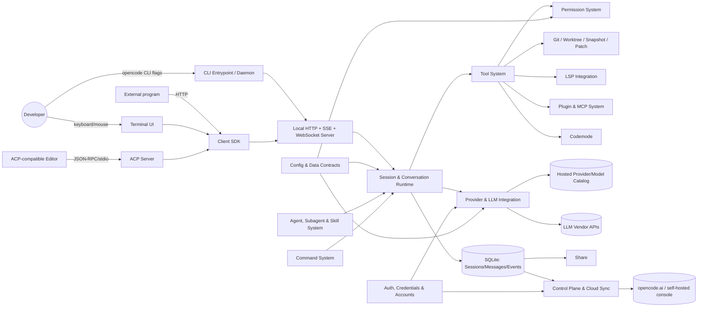
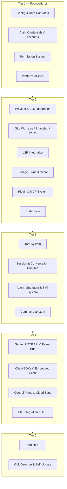

# PRD: OpenCode (Core Product) — Reimplementation Specification

> Reverse-engineered from `https://github.com/anomalyco/opencode` @ commit `5cf9f517cfec3ef68d3e68a12a6a4b3163947f44` (branch `dev`) on 2026-09-04.
> Prepared for reimplementation in a different language/platform; this document is implementation-agnostic. Source stack (TypeScript on Bun, Effect-TS, SQLite/Drizzle, the Vercel AI SDK) is noted only as annotations.
> Scope: the **core coding-agent product** (CLI, daemon, TUI, session/agent runtime, tools, providers, plugins/MCP, HTTP API, SDKs). Auxiliary/SaaS surfaces are out of scope — see §2. Depth: **Summary** (condensed; see the skill's depth note — fewer edge cases enumerated per feature than an "extensive" pass, acceptance criteria capped at 5-8 per feature).

## 1. Executive Summary

OpenCode is an open-source, terminal-first AI coding agent. A user runs one binary (`opencode`) in a project directory; it starts a full-screen terminal UI backed by a local HTTP+SSE server, and an LLM-driven agent loop reads the user's request, plans and executes tool calls (shell commands, file reads/edits, code search, git operations, LSP-backed diagnostics, web fetch/search, subagent dispatch) against the user's own filesystem and git repository, asking permission for anything not pre-approved. Conversations ("Sessions") are durably stored locally (SQLite), automatically checkpointed via a private git object store so any turn can be diffed or reverted, and can optionally be published to a shareable link or synced to alternate execution locations ("Workspaces" — local worktrees or remote sandboxes).

The agent is provider-agnostic: it talks to dozens of LLM vendors (Anthropic, OpenAI, Google, Bedrock, Azure, GitHub Copilot, xAI, OpenRouter, arbitrary OpenAI-compatible endpoints) through one internal request/response vocabulary, discovering available models from a hosted, cached catalog. It is extensible three ways: **Agents** (named personas — a system prompt + model + permission policy — selectable per turn or dispatched as bounded subagent tasks), **Skills** (on-demand instruction bundles), and **Plugins + MCP** (in-process hook/tool/auth-provider modules, and out-of-process Model Context Protocol servers whose tools are merged into the model's tool set). A companion Agent Client Protocol (ACP) server lets any ACP-compatible editor (e.g. Zed) drive the same agent without OpenCode's own CLI/TUI.

This PRD documents the product at commit `5cf9f517c` as the specification for a from-scratch, feature-for-feature clone: what each feature does (not how the source implements it), the business rules and magic numbers that are load-bearing, the external technologies each feature requires in generic terms, and where the source itself is internally inconsistent (see the "V1/V2" note in the Glossary — this is the single most important cross-cutting fact for a reimplementer to internalize before reading §7).

## 2. Goals & Non-Goals

**Goals** — reproduce, feature for feature, the behavior actually reachable from the shipping `opencode` CLI/TUI/HTTP surface at the pinned commit:
- The full agent loop: sessions, turns, compaction, tool execution, permission gating, provider integration.
- The full tool catalog and its output-truncation/overflow discipline.
- Git-backed checkpoint/revert, worktree sandboxes, and the `apply_patch` format.
- LSP-backed diagnostics and code intelligence; ripgrep-backed search.
- The plugin API and MCP client (tool/prompt/resource discovery, OAuth).
- Config discovery/merge/migration and the canonical data-model census.
- Auth (provider credentials + OpenCode's own account) and the Permission System.
- The local HTTP API, its realtime event bus, and the generated/embedded client SDKs.
- Storage (SQLite system of record, migrations), Share, and the durable-event sync primitive.
- The Terminal UI, the CLI entrypoint/subcommands, and the self-update pipeline.
- IDE integration heuristics and the ACP server.

**Non-Goals (explicit exclusions from this PRD — Non-Goals ≠ "delete the feature," it means "out of scope for this document," per the user-confirmed scope in the Inventory)**:
- `packages/app` (web-based session UI), `packages/desktop` (Tauri desktop shell) — separate GUI surfaces layered on the same HTTP API documented here; a reimplementer wanting them should treat this PRD's Server/Client-SDK sections as their foundation and scope them separately.
- `packages/console` + `packages/enterprise` (billing/SaaS admin backend), `packages/slack`, `packages/stats` — OpenCode-the-company's own SaaS operations tooling, not part of the agent product a user installs.
- `packages/web`, `packages/docs`, `packages/storybook` — marketing/docs sites and a component-development sandbox.
- Non-English `README.*.md` translations — localization content, not product behavior.
- `packages/identity`, `packages/function`, `packages/containers`, `packages/http-recorder`, `packages/httpapi-codegen`, `packages/effect-drizzle-sqlite`, `packages/effect-sqlite-node`, `packages/session-ui`, `packages/ui`, `packages/script`, `infra/`, `nix/`, `sdks/vscode` — internal dev tooling, generic infra libraries, or thin wrapper shells around the documented HTTP API.
- **Vestigial/legacy code found but not to be cloned**: the legacy per-key JSON `storage/` file store (superseded by SQLite; only a fire-and-forget diff snapshot still writes to it — §7.8); the orphaned `packages/opencode/migration/` folder (superseded by the core-package migration generator — §7.8); the unused `data_migration` bookkeeping table (§7.8); the OpenAPI-to-Codemode-tool adapter (implemented and tested but never invoked by the shipping product — §7.10); the IDE auto-detect/extension-install primitives (fully implemented, but no caller wires them into any startup flow at this commit — §7.18).
- **Quirks flagged, not resolved** (see §11 for the keep-or-fix decision): the shipping `apply_patch` tool's move/overwrite semantics differ from the stricter V2 rewrite; the "plan" agent's bash permission does not match the product's own README wording; the "always allow" permission scope does not match the product's own docs; two independent implementations exist for several cross-cutting concerns (see Glossary) with no code-level reconciliation.

## 3. Actors & Personas

| Actor | Description |
|---|---|
| **Developer / end user** | Runs `opencode` locally against their own project; drives the TUI or CLI, approves/denies permission prompts, authors custom Agents/Commands/Skills, connects LLM provider credentials. |
| **Build agent** | Built-in, default, full-access AI persona for development work. |
| **Plan agent** | Built-in, read-mostly AI persona for analysis/planning; denies edits outside a scoped plans directory. |
| **Explore subagent** | Built-in, read-only search specialist persona, dispatchable but not directly drivable. |
| **General subagent** | Built-in, general-purpose dispatchable persona for complex searches/multi-step sub-tasks (`@general`). |
| **Custom agent author** | A user/team authoring project- or globally-scoped Markdown/config Agent, Command, or Skill definitions. |
| **Plugin/MCP author** | A third party publishing an npm/local plugin package or standing up an MCP server that OpenCode connects to. |
| **IT/enterprise administrator** | Deploys machine-wide managed config (a managed directory, or on macOS an MDM `.mobileconfig` profile) that overrides user/project config. |
| **Organization/console administrator** | Manages an opencode.ai (or self-hosted) organization: remote provider/model policy delivered to members' CLIs via the Control Plane. |
| **External editor (via ACP)** | Any Agent-Client-Protocol-compatible IDE (e.g. Zed) driving OpenCode as its agent backend, independent of OpenCode's own TUI. |
| **External integrator (via SDK)** | A program using the published client SDK to drive an OpenCode server programmatically (batch processing, custom tooling). |
| **Internal housekeeping agents** | Hidden built-in Agents (`compaction`, `title`, `summary`) that run single, tool-free LLM calls for the product's own conversation bookkeeping — never user-selected. |
| **Scheduled/background job** | Process-local async work (a dispatched subagent task, an extended tool call) tracked and cancellable independently of the interactive turn. |

## 4. Glossary

See `glossary.md` (reproduced in the appendix intent, summarized here): key terms are **Session**, **Provider Turn**, **Session Drain**, **System Context**, **Agent**, **Subagent dispatch/Task**, **Skill**, **Command**, **Permission Rule**, **Tool**, **Snapshot/Checkpoint**, **Revert**, **Worktree**, **Share**, **Workspace**, **Sync/Durable Event Log**, **Control Plane**, **Catalog**, **MCP**, **Plugin**, **Codemode**, **ACP**, **TUI**, **Server**, **Truncation store**. Full definitions and code-name mappings are in the table above this document's synthesis notes; see also the standalone `glossary.md` in the reverse-engineering workspace.

**The single most important cross-cutting fact**: nearly every feature in this repository exists in two forms — a "V1" implementation under `packages/opencode/src/<domain>` that is what the shipping CLI/TUI/HTTP routes actually call, and a "V2" implementation under `packages/core/src/<domain>` (sometimes `packages/server`/`packages/protocol`/`packages/llm`) that is compiled in, sometimes even network-reachable, but not on any shipped client's call path. This PRD documents V1 as the behavior to clone, flagging V2 only where it reveals a real, tested behavioral difference or a documented future direction. See §11 for the consolidated open question this raises.

## 5. System Overview

### 5.1 Context diagram

### 5.2 Feature dependency map

### 5.3 Consolidated External Technology & Protocol Inventory

The generic capability a reimplementer must source, with the source's concrete choice as an annotation.

| Generic capability | Protocol/standard | Source used | Used by |
|---|---|---|---|
| Structured-concurrency/effects runtime | — | Effect-TS | Everywhere (implementation detail, not user-facing) |
| Application runtime | — | Bun (TypeScript) | Everywhere |
| Embedded relational database, transactional | SQL | SQLite via Drizzle ORM | Storage §7.8, Session §7.12, Control Plane §7.17 |
| LLM request/response orchestration (default path) | HTTP streaming | Vercel AI SDK (`ai` package) + ~24 first-party vendor client packages | Provider §7.5, Tool System §7.11 |
| LLM protocol/transport (shared vocabulary + experimental path) | Anthropic Messages / OpenAI Chat & Responses / Gemini / Bedrock Converse | An internal, hand-rolled multi-vendor package | Provider §7.5 |
| Hosted provider/model metadata catalog | JSON, "models.dev"-schema | A hosted catalog service, disk-cached with offline fallback | Provider §7.5 |
| Cloud credential/request-signing (one vendor) | SigV4-style | A cloud-vendor SDK + a binary event-stream decoder | Provider §7.5 |
| Version control | git porcelain/plumbing | External `git` CLI, shelled out to | Git/Snapshot §7.6, Control Plane §7.17 |
| Unified diff generation/parsing | Unified diff | An npm `diff`-equivalent library | Git/Snapshot §7.6, Tool System §7.11, TUI §7.19 |
| Shell-command grammar parsing | Bash / PowerShell grammar | `tree-sitter` (WASM) | Permission §7.3, Tool System §7.11 |
| Language Server Protocol client | LSP, JSON-RPC/stdio | Custom client + ~35 built-in server definitions | LSP §7.7 |
| Fast recursive file/content search | — | `ripgrep` binary, auto-downloaded | LSP §7.7, Tool System §7.11 |
| JSON-with-comments parse + AST-preserving edit | JSONC (informal) | `jsonc-parser` | Config §7.1, Plugin §7.9 |
| Schema/runtime type validation | — | Effect Schema | Config §7.1 (foundation for every feature's data contracts) |
| YAML frontmatter parsing | YAML | `gray-matter` | Config §7.1, Agent/Skill §7.13, Command §7.14 |
| MCP client | Model Context Protocol, JSON-RPC | `@modelcontextprotocol/sdk` (stdio/HTTP/SSE transports) | Plugin & MCP §7.9 |
| Confined script interpreter | — (JS/TS subset) | `Acorn` parser + a hand-written tree-walking interpreter | Codemode §7.10 |
| OS-convention path resolution | XDG Base Directory (+ platform equivalents) | `xdg-basedir` | Platform Utilities §7.4, Storage §7.8, CLI §7.20 |
| Native filesystem watching | inotify/FSEvents/ReadDirectoryChangesW | `@parcel/watcher` | Platform Utilities §7.4 |
| Image decode/resize/encode | PNG/JPEG | `@silvia-odwyer/photon-node` (Rust/WASM) | Platform Utilities §7.4 |
| Clipboard (native fallback) | OSC 52 + native OS tools | `clipboardy` + `osascript`/PowerShell/`wl-copy`/`xclip` | Platform Utilities §7.4, TUI §7.19 |
| WebCrypto (PKCE, OAuth state) | RFC 7636, CSRF state | Platform `crypto.subtle` | Auth §7.2, Plugin/MCP §7.9 |
| HTTP server + typed routing/OpenAPI generation | HTTP/1.1, OpenAPI 3 | Effect-TS HTTP/HttpApi modules over Node's HTTP server | Server §7.15 |
| Realtime push | Server-Sent Events (WHATWG) | Native SSE framing | Server §7.15, TUI §7.19, Control Plane §7.17 |
| Bidirectional terminal channel | WebSocket (RFC 6455) | Native WS | Server §7.15 (PTY), Control Plane §7.17 (remote proxy) |
| LAN service discovery | mDNS/Bonjour | `bonjour-service` | Server §7.15 |
| OpenAPI-to-client codegen (published SDK) | OpenAPI 3 | `hey-api` (`@hey-api/openapi-ts`) | Client SDKs §7.16 |
| Contract-to-client codegen (next-gen SDK) | — | An in-house "httpapi-codegen" generator | Client SDKs §7.16 |
| Terminal rendering engine | ANSI/terminfo, custom keyboard protocol | `OpenTUI` (`@opentui/core`/`solid`/`keymap`) + Solid.js reactivity | Terminal UI §7.19 |
| Fuzzy string matching | — | `fuzzysort` | Terminal UI §7.19, Platform Utilities §7.4 |
| Syntax highlighting | — | `tree-sitter` WASM grammars, fetched per-language | Terminal UI §7.19 |
| Windows console signal control | Win32 console API | `bun:ffi` + `kernel32.dll` | Terminal UI §7.19 |
| Agent Client Protocol server | ACP, JSON-RPC/stdio (NDJSON) | `@agentclientprotocol/sdk` | IDE Integration & ACP §7.18 |
| Editor extension host | VS Code Extension API | `vscode` module | IDE Integration & ACP §7.18 |
| CLI argument parsing | — | `yargs` (main CLI) | CLI §7.20 |
| Package-manager / release-channel self-update | — | npm/yarn/pnpm/bun/Homebrew/Chocolatey/Scoop clients + GitHub Releases API | CLI §7.20 |
| Interactive terminal prompts | — | `@clack/prompts` | CLI §7.20 |
| Property-based testing (dev-time) | — | `fast-check` | Config §7.1 (dev-only, not shipped) |

### 5.4 Cross-cutting behaviors realized once, consumed everywhere

- **The permission gate**: every tool call, regardless of feature, resolves through the same `(action, resource) → allow|ask|deny` engine (§7.3) before it can have an effect.
- **Output truncation**: any tool's textual result over 2000 lines / 50 KiB is spilled to a retained-for-7-days file and replaced with a bounded preview (§7.11), independent of which tool produced it.
- **The event bus / realtime feed**: every state change (session, permission, MCP, LSP, installation, sync) is published once through one typed event system and fanned out to SSE subscribers (§7.15) — the mechanism every "live update" in the TUI, ACP bridge, or a custom SDK client relies on.
- **Config precedence**: a fixed 9-level source precedence (well-known remote → global → env file → project → `.opencode` dirs → inline env content → org remote → IT-managed → MDM) governs every feature's tunable settings (§7.1).

## 6. Product-Wide Requirements

Cross-cutting rules that apply across features; individual §7 subsections reference these by number rather than restating them.

- **GR-1 (Reimplementation target).** Where the source contains two implementations of the same responsibility (the "V1 shipping / V2 dormant" pattern — Glossary), the reimplementation targets **V1's observable behavior**. A V2 detail is included in a feature section only when it is a real, tested divergence (flagged `QUIRK`) or a documented future direction worth designing room for.
- **GR-2 (Permission-gated effects).** No tool call, file mutation, external-directory access, subagent dispatch, or interactive question may take effect without first being resolved by the Permission System (§7.3): `allow` (proceed), `ask` (block for a human/automated reply), or `deny` (fail immediately, no prompt). Default effect when no rule matches is `ask`.
- **GR-3 (Full turn/tool-call attribution).** Every tool call, permission decision, and turn is attributed to a Session and (recursively) to its Provider Turn; a completed conversation must be fully reconstructable from durably stored data (GR-6).
- **GR-4 (Config precedence).** All tunables are resolved through the fixed 9-level precedence in §5.4/§7.1; a reimplementation must not let a lower-precedence source silently win.
- **GR-5 (Bounded outputs).** Any data returned to the model (tool output, diagnostics, diffs, search results) is subject to an explicit size/line/byte ceiling with truncation-and-pointer-to-full-content semantics, never an unbounded dump into model context.
- **GR-6 (Durable, replayable state).** Session/message/event data is the system of record (SQLite in the source); an event-sourced or equivalently replayable model is required to support: crash-safe writes, cross-instance Sync/Share, and Revert (reconstructing prior states from history rather than mutating in place).
- **GR-7 (Secrets at rest).** Provider credentials and OAuth tokens are stored locally with OS-file-permission confidentiality (mode 0600 in the source) and are never written into model-visible text, error messages, or diagnostic logs.
- **GR-8 (Offline-tolerant by design).** Startup and normal operation must degrade gracefully without network access: an offline embedded catalog snapshot, tolerant config loading (a broken source is skipped, not fatal), and no external network call may block agent startup.
- **GR-9 (Deterministic behavior over generation parity).** Wherever the source's "V1 vs V2" split is purely a migration artifact rather than a deliberate contract, the reimplementation may choose either generation's behavior as canonical — the requirement is a single, documented, deterministic behavior, not preserving both.

## 7. Features

### 7.1 Config & Data Contracts

**Description** — Before any other feature can run, OpenCode must assemble one coherent configuration object from up to nine layered sources (per-user global file, project files walked from the VCS root down to the working directory, `.opencode/` directories, inline/env overrides, an authenticated organization's remote policy, IT-managed and MDM profiles) and validate it, while also publishing the canonical data shapes (sessions, messages, permissions, providers/models, projects, agents/commands/skills/plugins, credentials, PTYs, questions, the realtime event catalog) that every other feature imports rather than redefining. It is read/write plumbing plus a data-model census, not a user-facing feature in its own right, but it is the seam every other feature's tunables and data contracts pass through.

**User stories**
- US-1.1: As a developer, I want to define project-specific settings in a checked-in `opencode.json`, so that my team shares the same agent configuration.
- US-1.2: As a developer, I want JSON-with-comments and `{env:...}`/`{file:...}` substitution in my config, so I can keep secrets out of a checked-in file while still documenting settings.
- US-1.3: As an IT administrator, I want a machine-wide managed config (and, on macOS, an MDM profile) that overrides anything a user or project sets, so I can enforce organizational policy.
- US-1.4: As a plugin/extension author, I want my package's markdown-defined agents/commands/skills auto-discovered from a project directory, so users don't need extra config wiring.
- US-1.5: As a maintainer of an older config file, I want it silently migrated to the current schema on load, so upgrading OpenCode doesn't break my setup.

**Use cases**

*UC-1.1 — Load and merge project configuration*
- **Preconditions**: a project directory (optionally under version control) exists; zero or more `opencode.json[c]` files and `.opencode/` directories exist between the VCS root and the working directory.
- **Main flow**: (1) load the global config file (auto-migrating a legacy TOML file if found); (2) load an `OPENCODE_CONFIG`-specified file if set; (3) walk from the VCS root to the working directory loading `opencode.json`/`opencode.jsonc` (jsonc wins on same-directory conflict), closest-to-cwd wins on cross-directory conflict; (4) load every `.opencode/` directory found in that walk, discovering `agent/command/plugin/skill` markdown files; (5) merge `OPENCODE_CONFIG_CONTENT` inline text; (6) if signed into an org, fetch and merge remote `/api/config`; (7) merge an IT-managed directory; (8) on macOS, merge an MDM profile (wins over everything); (9) apply derived defaults and env-flag overrides; (10) serve the merged, validated result.
- **Alternate flows**: a source contains legacy-only keys → auto-migrate before validating; a source mixes native-only fields into an otherwise-legacy shape → lower supported fields, drop unsupported ones with a diagnostic, hard-fail only on a `permissions` array.
- **Error flows**: a syntactically broken file loaded incidentally (not as the sole authoritative source) is skipped, siblings still load; a directly-loaded single source with a JSON syntax error reports every offending line/column; schema validation collects and reports every violation at once.
- **Postconditions**: one effective config object is available to every other feature via `get`/`getGlobal`/`directories`; the global layer is cached until explicitly invalidated, the per-location result is computed once per opened project/session.

**Functional requirements**
- FR-1.1: Config source precedence, lowest to highest: well-known remote config → global file(s) → `OPENCODE_CONFIG` env file → project files (root-to-leaf, closest wins) → `.opencode/` directories → `OPENCODE_CONFIG_CONTENT` inline → org remote `/api/config` → IT-managed directory → macOS MDM profile (highest, documented as overriding everything).
- FR-1.2: Every config-bearing directory recognizes both `opencode.json` and `opencode.jsonc`; when both exist in the same directory, `.jsonc` loads after and wins.
- FR-1.3: Ancestor directory scanning for project config is bounded by the VCS root — never walks above it, never loads a file from outside the project.
- FR-1.4: A raw config object is detected as "legacy" if it contains any of a fixed set of legacy-only keys (`logLevel, server, command, reference, snapshot, plugin, autoshare, disabled_providers, enabled_providers, small_model, mode, agent, provider, permission, tools, attachment, layout`); keys shared by both schemas never trigger migration alone.
- FR-1.5: A native `permissions` array anywhere in an otherwise-legacy-detected file is a hard, immediate failure instructing the user to use legacy `permission` rules or the current runtime.
- FR-1.6: `{env:NAME}` resolves to the environment value or empty string, never erroring; `{file:path}` reads and JSON-escapes a trimmed file's contents (expanding `~/`, resolving relative to the config file's directory), throwing by default if missing unless the caller opts into an empty-string fallback.
- FR-1.7: Permission-rule key order within and across merged documents is preserved and semantically significant: all globally-scoped rules (in document-merge order) precede an agent's own specific rules (in document-merge order); evaluation is last-match-wins across that ordered list (feeds §7.3).
- FR-1.8: Magic-number defaults sourced from config: tool-output truncation 2000 lines / 51,200 bytes; image attachment resize ceiling 2000×2000 px / 5,242,880 bytes base64; MCP server timeout 5000 ms if unspecified (note: the shipping MCP client's own connection-timeout constant is actually 30,000 ms — §7.9 QUIRK, follow code not this schema default); OAuth callback port 19876; large-context pricing-tier threshold 200,000 tokens; default subagent recursion depth 1.
- FR-1.9: Agent/command/plugin/skill names discovered via markdown files are derived from the file's path relative to its containing `agent(s)/`/`command(s)/` directory (prefix stripped, slashes normalized), not declared in the file.
- FR-1.10: A custom (non-built-in) LSP server config entry must declare a non-empty `extensions` list unless explicitly disabled (QUIRK: an empty array currently satisfies this check — a validation laxity to fix or knowingly preserve).
- FR-1.11: Writing a config update (`update`/`updateGlobal`) re-validates the fully merged result (including legacy/native reconciliation) before writing; a failure aborts the write, leaving the file untouched.
- FR-1.12: The canonical schema package defines, and every other feature imports rather than redefines: identifiers, session/message/permission/provider/model/project/./agent/command/skill/plugin/credential/connection/PTY/question/prompt shapes, and the realtime event catalog.

**External technology**
*Requires: JSON-with-comments parsing with AST-preserving edits (no protocol standard — an informal convention). Source used: `jsonc-parser`. Reimplementer notes: must support `//` comments, trailing commas, and surgical edits (used to strip legacy keys while preserving comments/formatting).*
*Requires: schema/runtime type validation. Source used: Effect Schema. Reimplementer notes: needs decode-all-errors mode, ignore-unknown-top-level-keys, and preserved source key order for record-typed fields (permission ordering depends on it).*
*Requires: YAML frontmatter parsing. Source used: `gray-matter`, plus a lenient auto-repair pass for unquoted colon-bearing values. Reimplementer notes: needed for agent/command/skill markdown files.*
*Requires: MDM policy ingestion (Apple `.mobileconfig`/plist). Source used: shell out to macOS `plutil -convert json`. Reimplementer notes: macOS-only; other platforms use a plain managed directory instead.*

**Acceptance criteria**
- AC-1.1: Given a project directory with a root `opencode.json` and a nested `.opencode/opencode.jsonc` closer to the working directory, when config loads, then the nested file's value wins for any shared key and no file outside the VCS root is loaded.
- AC-1.2: Given a legacy config file containing any fixed legacy-only key, when loaded, then it migrates to the current schema and the migrated result always validates, even for arbitrarily generated legacy inputs.
- AC-1.3: Given a permission object with rules in a specific key order, when an agent's effective permission list is built, then all globally-scoped rules (in document-merge order) precede that agent's own rules, and the last rule matching a resource wins.
- AC-1.4: Given `{env:MY_VAR}` with `MY_VAR` unset, when substituted, then it resolves to empty string without error; given `{file:./missing.txt}` with default settings, then loading fails naming the missing file.
- AC-1.5: Given a config mixing a native-only unsupported field into legacy content, when loaded, then the field is dropped with a non-fatal diagnostic and the rest loads normally; given instead a `permissions` array anywhere in the file, then loading fails immediately.
- AC-1.6: Given both an IT-managed directory and (macOS) an MDM profile set the same key, when merged, then the MDM value wins over the managed directory, which wins over project/global config.
- AC-1.7: Given an agent markdown file at `agents/team/build.md`, when discovered, then the resulting agent is named `team/build` and its frontmatter validates the same way as JSON-declared agent config.
- AC-1.8: Given a partial-object global config update that would violate the schema when merged, when applied, then nothing is written to disk and the caller receives a validation error naming the offending field(s).

**Source notes** — Evidence: `packages/opencode/src/config/*`, `packages/core/src/config.ts`, `packages/core/src/v1/config/*`, `packages/schema/src/*.ts` (~60 files). **QUIRK**: two structurally different config implementations coexist (`packages/opencode`'s legacy/"V1"-validating loader, actually shipping, vs. `packages/core`'s newer/"native" `Config.Service`); per GR-1 this PRD documents the shipping loader's precedence/merge/migration behavior as canonical. Dossier: `config-and-data-contracts.md`.

### 7.2 Auth, Credentials & Accounts

**Description** — Manages two distinct trust relationships: (1) per-provider LLM credentials (API keys, OAuth tokens, delegated "wellknown" tokens), obtained through a pluggable per-provider authentication contract that provider plugins supply, and (2) OpenCode's own cloud account (device-code OAuth login to opencode.ai or a self-hosted console), supporting multiple stored accounts with one active account+org at a time. Both let a user authenticate once and have the CLI silently attach the right credential to every later request, refreshing tokens as needed.

**User stories**
- US-2.1: As a developer, I want to run `opencode auth login` once per provider and have my API key/OAuth token remembered, so I don't re-authenticate every session.
- US-2.2: As a developer using GitHub Copilot/Azure/other OAuth-based providers, I want a device-code or browser-based flow, so I never paste a raw API key.
- US-2.3: As a developer with an opencode.ai account, I want `opencode auth login <url>` to sign me in via device code and remember multiple accounts, so I can switch between personal and org contexts.
- US-2.4: As an operator running OpenCode in a sandboxed/ephemeral environment, I want credentials injectable via an environment variable, so I don't need a writable credential file.

**Use cases**

*UC-2.1 — Provider OAuth login (device/auto mode)*
- **Preconditions**: the target provider's plugin declares an `oauth`-type auth method with `authorize`/`callback`.
- **Main flow**: user selects the provider and method → any declared prompts are collected → `authorize()` returns a URL, instructions, and `auto` completion mode → CLI opens the browser and polls → on success, the resulting `oauth` or `api` secret is persisted keyed by provider id.
- **Alternate flows**: `code` completion mode instead prompts the user to paste a code, then calls `callback(code)`.
- **Error flows**: device-code polling treats `authorization_pending`/`slow_down` as retryable (extending the wait 5s on `slow_down`), `expired_token`/`access_denied` as terminal; any other response is an opaque terminal failure.
- **Postconditions**: the credential store (`auth.json`) has one entry for the provider id; a later request's credential `loader` hook reads it back and refreshes an expiring OAuth token in place.

**Functional requirements**
- FR-2.1: Provider credentials persist as one JSON file, one entry per provider id, in one of three shapes: `oauth` (access/refresh/expiry + optional account id/enterprise URL), `api` (bare key + optional metadata), or `wellknown` (a token + the header/env name it binds to).
- FR-2.2: The credential file is written with owner-only file permissions (mode 0600); confidentiality at rest is filesystem-permission-based only, no encryption layer (GR-7).
- FR-2.3: A provider key is normalized by stripping a trailing slash on write/remove, so `https://x/` and `https://x` never coexist as separate entries.
- FR-2.4: An individual credential entry that fails schema validation is silently dropped on read; it never fails the whole read.
- FR-2.5: An `OPENCODE_AUTH_CONTENT` environment override redirects reads to its parsed JSON (malformed JSON falls back to the file); writes still target the real file.
- FR-2.6: OAuth prompts support conditional visibility (`when: {key, op, value}` against already-collected answers) and per-field synchronous validators.
- FR-2.7: Browser-based PKCE flows generate a local S256 verifier/challenge, run a loopback callback server, and reject a callback whose `state` doesn't match what was issued (CSRF guard) before any token exchange.
- FR-2.8: A generic "wellknown" method lets any HTTPS host publish `{url}/.well-known/opencode` describing a local shell command to run; its stdout (trimmed) becomes the stored token — an extensibility escape hatch for auth schemes not natively known.
- FR-2.9: OpenCode's own account login is an RFC-8628-style device-code flow (default server `https://opencode.ai/console`); on success it fetches profile+orgs and auto-selects the first org (multi-org interactive choice is explicitly out of scope for v1 — QUIRK/TODO in source).
- FR-2.10: Exactly one account+org pair is "active" at a time; removing the active account promotes the first remaining account's first org automatically.
- FR-2.11: A control-plane token is treated as fresh if its expiry is more than 5 minutes away; concurrent refresh requests for the same account are deduplicated.

**External technology**
*Requires: OAuth 2.0 device authorization grant (RFC 8628) and authorization-code+PKCE (RFC 7636). Source used: hand-rolled per-provider implementations (duplicated per plugin — a reimplementation should consolidate into one shared helper of each kind). Reimplementer notes: preserve the retryable/terminal poll-result classification and the 5s `slow_down` backoff extension.*
*Requires: local loopback HTTP server for OAuth redirects. Source used: Node's `http` module. Reimplementer notes: must render a success/error page and validate `state` before completing.*
*Requires: relational storage for multi-account state. Source used: SQLite (`account`, `account_state` tables). Reimplementer notes: a legacy `control_account` table exists and is superseded — do not clone it.*

**Acceptance criteria**
- AC-2.1: Given a credential set for key `https://example.com/`, when read back, then it appears under `https://example.com` with no separate slashed entry.
- AC-2.2: Given a device-code login where the server responds `authorization_pending` until the device code's own `expires_in` elapses, when polling, then the CLI reports expiry rather than polling forever.
- AC-2.3: Given a device-code `slow_down` response, when the client retries, then it waits at least 5 seconds longer than its previous interval.
- AC-2.4: Given a PKCE callback with a mismatched `state`, when received, then the flow is rejected as a possible CSRF attempt before any token exchange.
- AC-2.5: Given a control-plane token expiring in under 5 minutes, when any operation needs it, then it is refreshed and persisted first.
- AC-2.6: Given the currently active account is removed while others remain, when removal completes, then the first org of a remaining account becomes active automatically.
- AC-2.7: Given `auth.json` has one schema-invalid entry among valid ones, when read, then the valid entries return and the invalid one is silently omitted.

**Source notes** — Evidence: `packages/opencode/src/auth`, `src/account`, `packages/core/src/credential*`, `src/oauth`, `src/github-copilot`, `packages/schema/src/credential.ts`. **QUIRK**: two independent, unreconciled provider-credential stores exist (`auth.json` flat file, actually used by all shipping commands, vs. a newer SQLite-backed `Credential`/`Integration` system) — see §11. Dossier: `auth-credentials-accounts.md`.

### 7.3 Permission System

**Description** — Gates every tool call an agent makes against a rule set that decides, per action and concrete resource, whether the call is silently allowed, silently denied, or must ask a human for approval. Supports remembering an approval ("always"), agent-baked policy that a session cannot escalate past, and a "doom loop" guard that forces a check-in after three identical repeated calls.

**User stories**
- US-3.1: As a developer, I want to be asked before the agent runs a shell command or edits a file outside my project, so I stay in control of side effects.
- US-3.2: As a developer, I want to approve a whole family of similar commands at once ("always allow `git commit *`"), so I'm not re-prompted for every minor variation.
- US-3.3: As a team lead, I want a read-only "plan" agent that cannot edit files, so exploratory/planning sessions can never mutate my codebase.
- US-3.4: As a developer running headless/scripted (`opencode run`), I want prompts to auto-reject rather than hang, so automation never deadlocks.

**Use cases**

*UC-3.1 — Tool call permission evaluation*
- **Preconditions**: an agent is about to execute a tool call with one or more resources (file paths, a shell command, a URL, a subagent name).
- **Main flow**: compute the effective rule set (agent + session override + user config, in that layered order) → for each resource independently, wildcard-match against the ordered rule set, last match wins, default `ask` → combine per-resource outcomes as the worst of all (`deny` > `ask` > `allow`) → `allow`: proceed silently; `deny`: fail immediately with a rule-naming error; `ask`: create a pending request, broadcast `permission.asked`, block until answered.
- **Alternate flows**: a compound shell command is parsed into sub-commands, each evaluated independently; a file operation reaching outside the project root triggers a separate `external_directory` check first.
- **Error flows**: `reject` fails the call (optionally with human feedback text fed back to the model); a process/session ending while requests are pending auto-declines them all.
- **Postconditions**: on `always`, the approving patterns are remembered for the run and any other now-allowed pending request in the same session auto-resolves.

**Functional requirements**
- FR-3.1: Rules are `(action, resource-pattern) → allow|ask|deny` triples; evaluation per action+resource is last-match-wins wildcard matching (`*` = any run, `?` = one char); default when nothing matches is `ask`.
- FR-3.2: Default policy with no user config: everything `allow` except `doom_loop`/`external_directory` (`ask`), `question`/`plan_enter`/`plan_exit` (`deny`), reading a dotenv-like file `*.env*` (excluding `*.env.example`) (`ask`).
- FR-3.3: The `plan` agent denies `edit` for everything except a scoped plans path, denies dispatching the `general` subagent, and — QUIRK vs. product documentation — does **not** restrict `bash` (inherits the same `allow` default as `build`); the `explore` subagent denies everything except a read/search/fetch allowlist.
- FR-3.4: A subagent's effective rule set = its own agent ruleset, ceilinged by the parent's deny rules and `external_directory` rules (a parent's allowances never leak down; its restrictions always do), plus a hard deny on `todowrite`/`task` unless the child agent explicitly allows them.
- FR-3.5: A doom-loop check (`ask` by default) is inserted before a 4th consecutive byte-identical tool call (same tool, same input).
- FR-3.6: An `always` reply generalizes a bash command to a command-prefix "arity" (e.g. `git commit -m "x"` → `git commit *`) using a built-in table of common CLI tools' subcommand depth.
- FR-3.7: A small built-in allowlist (system temp dir, skill directories, reference directories, the tool-output truncation glob) is always pre-allowed for external-directory access unless explicitly denied by the exact pattern.
- FR-3.8: A `reject` reply on one pending request force-rejects every other pending request in the same session (declining one thing stops the whole turn); an `always` reply re-evaluates and may auto-resolve other pending requests.
- FR-3.9: Non-interactive/headless runs auto-reject every `ask` (with a warning) rather than hang; an explicit `--auto`/`--yolo` mode instead auto-answers every `ask` with `once` client-side (server-side `deny` rules are unaffected).
- FR-3.10: A legacy `tools: {name: boolean}` config maps `write`/`edit`/`patch` all onto the single `edit` permission action for backward compatibility.

**External technology**
*Requires: shell command grammar parsing (to enumerate sub-commands for independent permission evaluation). Source used: `tree-sitter` bash/PowerShell grammars (WASM). Reimplementer notes: must split piped/chained commands and extract path-like arguments for the external-directory check.*
*Requires (optional, for a durable "always" store): relational storage. Source used: SQLite, in the V2 rewrite only — the shipping V1 keeps "always" rules in per-process memory scoped to the project directory, not per chat session (QUIRK vs. product docs — see §11).*

**Acceptance criteria**
- AC-3.1: Given no rule matches a requested action/resource, when evaluated, then the outcome is `ask`.
- AC-3.2: Given a broad `deny` and a more specific, later `allow` for the same action, when a resource matches both, then the later rule wins.
- AC-3.3: Given a piped command where one sub-command has no matching rule, when evaluated, then the whole call requires approval (worst-of-N).
- AC-3.4: Given the plan agent, when it attempts an edit outside its allowed plan path, then it is denied outright with no prompt; when it runs a shell command, then it follows the same default as build (allow, not ask).
- AC-3.5: Given a pending `ask`, when replied `always` with generalized patterns, then that request is approved, the patterns are remembered, and any other now-allowed pending request auto-resolves.
- AC-3.6: Given a subagent whose own rules allow edits but whose parent denies bash, when the subagent runs, then it can still edit but inherits the bash denial as a hard ceiling.
- AC-3.7: Given three identical consecutive tool calls, when a fourth identical call is attempted, then an additional doom-loop approval is required regardless of that tool's own rule.

**Source notes** — Evidence: `packages/opencode/src/permission`, `packages/core/src/permission.ts`, `packages/schema/src/permission*.ts`. **QUIRK**: product README states the plan agent "asks permission before running bash commands" — not reflected in the agent definition (bash inherits `allow`); flag for product-owner clarification (§11). **QUIRK**: "always" approval scope (per-process/per-project in shipping V1) does not match the docs' "for the rest of the current session" wording. Dossier: `permission-system.md`.

### 7.4 Platform Utilities

**Description** — The cross-cutting foundation layer nearly every other feature depends on: stable sortable ID generation, project-scoped safe filesystem access (with path-traversal containment), file watching, process execution with output caps/timeouts/kill escalation, image normalization for pasted/attached images, a pluggable source-formatter registry, and host/IDE/executable-runtime detection. It is infrastructure, not a user-facing feature, but its numeric defaults and containment guarantees are load-bearing for everything built on top of it.

**User stories**
- US-4.1: As a tool implementer, I want a stable, time-sortable ID scheme, so entities can be ordered and referenced consistently.
- US-4.2: As a developer, I want the agent's file access confined to my project (with explicit approval for anything outside it), so a runaway tool call can't touch unrelated files.
- US-4.3: As a developer, I want a pasted screenshot automatically resized to fit model limits, so I don't have to manually shrink images before sending them.
- US-4.4: As a developer, I want my project's own formatter (prettier, gofmt, rustfmt, …) run automatically after an edit, so agent-produced code matches my style conventions.

**Use cases**

*UC-4.1 — Project-scoped safe file read*
- **Preconditions**: a project root is established for the current instance.
- **Main flow**: resolve the requested path (following symlinks) → verify the resolved path is contained within the project root → read the file, returning "no content" (not an error) for a missing file or permission-denied condition.
- **Error flows**: a resolved path that escapes the project root is a hard, unrecoverable failure (not a catchable error) — deliberately not exposed as something a tool/plugin can handle its way past.
- **Postconditions**: content returned as `{uri, content, encoding, mime}`.

**Functional requirements**
- FR-4.1: IDs are `<prefix>_<26-char body>`: 12 hex chars encoding the low 48 bits of `(millisecond timestamp × 4096) + a 12-bit per-millisecond counter` (i.e. the counter occupies the low 12 bits, the timestamp's low-order bits occupy the remaining 36), plus 14 random base62 chars; generatable ascending (creation order) or descending (bit-inverted combined value, newest-first). **Note**: at 36 effective timestamp bits this scheme wraps roughly every 2.2 years of raw millisecond count — acceptable for local relative ordering within a bounded install lifetime, but a reimplementer wanting absolute-epoch fidelity over longer horizons should widen the field.
- FR-4.2: A project-scoped filesystem service rejects (as an unrecoverable error, not a catchable one) any resolved path outside the configured project root.
- FR-4.3: A fixed built-in ignore list (node_modules, .git, dist, target, __pycache__, .venv-style caches, etc., plus glob file patterns) governs search/index/watch exclusion; an OS-specific "protected paths" list additionally blocks watching/scanning certain user directories (Pictures/Music/Library-internals on macOS, AppData/Documents on Windows) even if not otherwise ignored.
- FR-4.4: The file watcher activates only when the project is under version control AND an experimental flag is enabled; it always separately watches the VCS metadata directory's `HEAD` (ignoring the churny `index` file) regardless of the main watch state.
- FR-4.5: Process execution enforces independent byte caps per stream (stdout/stderr), an overall timeout that kills the process on expiry, abort-signal support, and process-group kill with optional escalation from a graceful signal to a forced kill after a grace period.
- FR-4.6: Image normalization defaults: 2000×2000 px / 5 MiB base64 ceiling, auto-resize on; progressive downscale (~75% linear per step, ≤32 steps) trying PNG then JPEG quality levels 80/85/70/55/40 at each size, first fit wins; a malformed data URL is rejected before any decode attempt.
- FR-4.7: A pluggable formatter registry (~25 built-in formatters) matches by file extension, probes usability (executable on PATH and/or project evidence) concurrently, then runs matched-and-usable formatters sequentially in place; a single formatter's failure is logged and does not block the others.
- FR-4.8: Host/IDE detection is heuristic: fires only when `TERM_PROGRAM=vscode`, then substring-matches the git-askpash helper path against known IDE brand names, defaulting to "unknown" otherwise.
- FR-4.9: OS-convention data/cache/config/state/temp directories are computed once at process start and created synchronously before anything else runs; failure here is fatal to startup.

**External technology**
*Requires: native filesystem change notification. Source used: `@parcel/watcher` (inotify/FSEvents/ReadDirectoryChangesW). Reimplementer notes: must fail soft (inert watcher, not a crash) on any unsupported platform/binding.*
*Requires: image decode/resize/encode. Source used: `@silvia-odwyer/photon-node` (Rust/WASM), lazily loaded and cached. Reimplementer notes: PNG is always tried before any JPEG quality at a given size — this can silently convert a JPEG input to a larger PNG output; decide deliberately whether to preserve this.*
*Requires: OS base-directory convention resolution. Source used: `xdg-basedir`. Reimplementer notes: needed cross-platform, not just Linux.*
*Requires: cross-platform clipboard read/write (image + text). Source used: platform-native tools (`osascript`, PowerShell, `wl-paste`/`xclip`) with a `clipboardy` text-only fallback.*

**Acceptance criteria**
- AC-4.1: Given an entity type with a defined prefix, when an ID is generated, then it is `<prefix>_` plus a 26-char body, and two IDs generated in the same millisecond are distinct and correctly ordered.
- AC-4.2: Given a path resolving outside the configured project root, when a read/list is attempted, then it fails as an unrecoverable "escapes location" error.
- AC-4.3: Given a process run with a stdout byte cap, when the command exceeds it, then the result contains exactly the first N bytes and a truncated flag, independent of stderr's own cap.
- AC-4.4: Given a running child process whose scope is released while still alive, when torn down, then it (and its process group, where supported) receives a termination signal, escalating to a forced kill after a configured grace period.
- AC-4.5: Given an over-limit image with auto-resize enabled, when normalized, then it returns a re-encoded, smaller/lower-quality image fitting the byte limit, or a typed size error if nothing in the search space fits.
- AC-4.6: Given a project with a recognized formatter config file and that formatter's executable present, when a matching file is formatted, then the formatter runs with the real path substituted, and its failure doesn't block other matching formatters.

**Source notes** — Evidence: `packages/opencode/src/id`, `src/env`, `src/format`, `src/image`, `src/util`, `packages/core/src/id`, `src/filesystem*`, `src/process.ts`, `src/image.ts`. Dossier: `platform-utilities.md`.

### 7.5 Provider & LLM Integration

**Description** — Lets OpenCode talk to dozens of LLM backends (first-party vendor APIs, aggregator gateways, arbitrary OpenAI-compatible endpoints) through one internal request/response vocabulary. Discovers providers/models from a hosted, cached catalog; builds a merged provider/model table from catalog + config + credentials; selects a default model per session/agent and a cheap "small model" for background subtasks; translates the internal request into each vendor's wire format and each vendor's stream back into a shared event vocabulary (text, reasoning, tool calls, usage); classifies and retries failures with backoff, distinguishing context-overflow (never retried — triggers compaction instead), transient (retried), and terminal (auth/quota) failures.

**User stories**
- US-5.1: As a developer, I want to switch between Anthropic, OpenAI, a local OpenAI-compatible server, or any other supported vendor without changing how I interact with the agent, so I'm not locked into one vendor.
- US-5.2: As a developer, I want the agent to keep working offline or when the model catalog is unreachable, so a network blip doesn't block me from starting a session.
- US-5.3: As a developer, I want background tasks (title generation, compaction) to use a cheap, fast model automatically, so I don't pay flagship-model prices for housekeeping.
- US-5.4: As a developer, I want a transient provider error retried automatically and a context-overflow handled by compaction rather than a raw error, so temporary blips and long conversations don't interrupt my workflow.

**Use cases**

*UC-5.1 — Stream one Provider Turn*
- **Preconditions**: a model has been resolved (explicit, remembered, or default-ranked); credentials for its provider exist or the provider requires none.
- **Main flow**: assemble the system prompt/sampling params/reasoning options/tool schemas per this vendor's shape → repair message history for vendor-specific constraints → place cache breakpoints if supported → execute the streaming request → normalize the vendor's stream into the shared event vocabulary (text/reasoning/tool-call start-delta-end, tool-result/error, step-finish, finish, provider-error) → report usage in normalized, non-overlapping fields.
- **Alternate flows**: an experimental native execution path handles a narrow allow-list of vendor/auth combinations directly, falling back to the default path transparently when unsupported.
- **Error flows**: context-overflow phrasing/HTTP-413/vendor-specific code → never retried, signals the caller to compact; 5xx/rate-limit/transient network → retried with exponential backoff + jitter, honoring a vendor `retry-after` when present; auth/quota/malformed-request → terminal, not retried.
- **Postconditions**: caller receives one normalized event sequence and a usage record regardless of which vendor served the request.

**Functional requirements**
- FR-5.1: The catalog is fetched from a hosted URL, disk-cached (fresh for 5 minutes, background-refreshed every 60 minutes, cross-process file-locked), falling back to an embedded offline snapshot if unreachable with no disk cache, or an empty catalog if fetching is explicitly disabled.
- FR-5.2: Provider/model table construction layers, in order: plugin-injected models → user config → env-detected providers → credential-detected providers → plugin auth-loader options → built-in per-provider quirk handlers → config reapplied (always wins on naming/credentials) → allow/deny filtering, deprecated-model exclusion (always), alpha-model exclusion (unless experimental models enabled), variant computation.
- FR-5.3: Model selection: explicit `provider/model` always wins; else a recently-used still-valid model; else a fixed family-priority ranking (favoring current flagship families, "-latest" ids). A separate "small model" selector ranks by cost+recency, preferring names matching mini/flash/nano/haiku/lite patterns, with per-provider exclusions for unreliable-reporting providers.
- FR-5.4: A default output-token cap of 32,000 applies unless a lower per-model limit is smaller.
- FR-5.5: Context-overflow detection is a best-effort phrase match across dozens of known vendor error strings, explicitly excluding phrasings that look like rate-limiting (so a 429 is never misclassified as overflow).
- FR-5.6: Prompt-cache breakpoints (where the vendor's wire format supports explicit hints) are placed at up to 4 points per request (last tool definition, last system block, latest user message by default); a manually-placed marker is never overwritten by automatic placement.
- FR-5.7: The default retry policy retries up to 5 times with exponential backoff (doubling) plus jitter, capped near 30s absent a vendor hint, honoring an explicit vendor retry-after value (seconds or ms) when given.
- FR-5.8: Usage is reported in mutually-exclusive fields (fresh input, cache-read input, cache-write input, reasoning-as-subset-of-output) alongside vendor-convention inclusive totals, so no consumer must subtract two numbers to derive a third.
- FR-5.9: A usage-limit response from the first-party managed provider is surfaced with a distinct upgrade call-to-action and human-readable reset countdown, not a generic retryable error.

**External technology**
*Requires: multi-vendor LLM request/response orchestration. Source used: the Vercel AI SDK plus ~24 first-party vendor client packages, dynamically loaded per model; a fully custom vendor may supply an arbitrary npm package. Reimplementer notes: this is the default execution path.*
*Requires: a normalized event/usage/error vocabulary independent of any one orchestration library. Source used: an internal hand-rolled protocol/transport package (Anthropic/OpenAI Chat & Responses/Gemini/Bedrock Converse wire formats), also usable as a full alternate execution engine on a narrow, off-by-default path.*
*Requires: hosted provider/model metadata catalog with offline fallback. Source used: a "models.dev"-schema JSON service, disk-cached.*
*Requires: cloud-vendor credential/request-signing (one vendor: AWS Bedrock). Source used: a cloud SDK + binary event-stream decoder.*

**Acceptance criteria**
- AC-5.1: Given no cached catalog and a reachable source, when the CLI starts, then it fetches and persists the catalog, reusing the cache for at least several minutes.
- AC-5.2: Given the catalog source is unreachable and no local cache exists, when the CLI starts, then it falls back to a bundled offline snapshot (or empty if explicitly disabled) rather than failing to start.
- AC-5.3: Given a provider detectable via env var, stored credential, and explicit config simultaneously, when the table is built, then config's values win for naming/options and the provider appears exactly once.
- AC-5.4: Given no explicit model configured, when one must be chosen, then a previously-used valid model is preferred, else a deterministic family-priority ranking picks one, else a distinct "no providers/models" failure is raised.
- AC-5.5: Given a streaming request to any supported vendor, when it emits text/reasoning/tool-call content, then the caller receives one normalized event sequence independent of vendor.
- AC-5.6: Given a transient failure (rate limit, 5xx, recognized network blip), when retried, then it retries a bounded number of times with increasing backoff; an overflow/auth/quota failure is instead classified non-retryable and surfaced (or triggers compaction) immediately.
- AC-5.7: Given a model lacking a requested capability (tool-calling, adjustable temperature, an input modality), when a request is prepared, then the unsupported feature is omitted/substituted rather than sent as-is.
- AC-5.8: Given two vendors report usage in native shapes, when a turn completes, then usage returns in the same normalized fields for both.

**Source notes** — Evidence: `packages/opencode/src/provider`, `packages/core/src/provider.ts`/`catalog.ts`/`models-dev.ts`, `packages/llm/src/*`. **QUIRK/OPEN QUESTION**: three overlapping implementations coexist, including a fully-live but unreached V2 session/agent-loop that bypasses the AI SDK entirely via `packages/llm` — see §11. Dossier: `provider-and-llm-integration.md`.

### 7.6 Git, Worktree, Snapshot & Patch

**Description** — Gives the agent a safe, git-backed way to see and undo its own edits: git status/diff/branch inspection and raw-patch application for a source-control panel; isolated `git worktree` sandboxes for sessions/subagents; automatic before/after-turn checkpoints ("Snapshots") in a hidden, private git object store independent of the user's own git history, for later diff/selective-restore/full-checkout; and a custom, LLM-authored patch envelope format (`apply_patch`) distinct from standard unified diff.

**User stories**
- US-6.1: As a developer, I want every agent turn automatically checkpointed, so I can see exactly what changed and revert any turn.
- US-6.2: As a developer, I want the agent to work in an isolated worktree when I ask, so exploratory changes never touch my active checkout.
- US-6.3: As a developer, I want the agent's multi-file edits applied atomically, so a partially-valid patch never leaves my repo in a half-edited state.
- US-6.4: As a developer, I want to revert my session to an earlier point and have exactly the files that changed since then restored, so I can undo a bad turn without losing unrelated later work.

**Use cases**

*UC-6.1 — Automatic checkpoint per turn + revert*
- **Preconditions**: the project is a git repository; snapshots are not disabled in config.
- **Main flow**: capture a snapshot before the step begins → the step runs (tool calls execute) → capture again after → diff the two snapshots for the changed-file list → attach the start snapshot id + changed files to the turn's record. On revert: stage (capture current state if nothing staged, restore every touched file to its pre-target snapshot, compute and persist a preview diff) → commit (delete messages after the boundary, keep restored files) or clear (restore files back to the pre-revert "current" snapshot, keep messages).
- **Alternate flows**: snapshot capture failure is logged and treated as "no snapshot this turn" — never blocks the agent's response.
- **Error flows**: an `apply_patch` hunk that fails to parse/verify aborts before any file is touched for that patch (validated fully before any write); a failure *during* the write phase (not validation) reports exactly which earlier operations already succeeded, with no rollback.
- **Postconditions**: the turn's record carries enough snapshot metadata to diff or revert to it later; the user's own git index/HEAD is never touched by capture.

**Functional requirements**
- FR-6.1: Snapshot capture excludes anything the real repo's `.gitignore` would exclude (re-evaluated fresh each capture) and any untracked file over 2 MB (recorded in the snapshot repo's own exclude file so future captures skip re-scanning it).
- FR-6.2: All snapshot mutations (capture/restore/diff/preview) against one project are serialized behind a per-repository lock to prevent concurrent-index corruption.
- FR-6.3: Restoring to an earlier snapshot brings tracked/deleted/modified files back to that point but leaves alone anything created *after* it (non-destructive to newer additions); a full "revert" additionally deletes files that didn't exist at the target point — these are deliberately different operations.
- FR-6.4: Worktree creation uses a randomly-slugged name/branch (retried on collision up to a fixed attempt limit); a worktree lives outside the project directory under per-project app data; resetting the primary/original worktree is explicitly disallowed.
- FR-6.5: Worktree reset requires the final `git status` to come back completely empty (after hard-reset + force-clean + submodule reset) or the whole operation fails, reporting the residual status.
- FR-6.6: `apply_patch` parses a `*** Begin Patch ... *** End Patch` envelope with `Add File`/`Delete File`/`Update File` (optionally `Move to`) sections and `@@`-anchored hunks; an update hunk's old-line sequence is matched via progressively looser passes (exact → trailing-whitespace-insensitive → fully-trimmed → Unicode-punctuation-normalized) before failing.
- FR-6.7: `apply_patch` validates the entire patch (every hunk resolves, every target's precondition holds) before mutating anything; write-phase failures (not validation failures) leave earlier writes in the same patch standing, with no rollback — the tool must report exactly which operations succeeded.
- FR-6.8: **QUIRK — pick one deliberately, do not assume both are valid simultaneously**: whether `apply_patch` supports file moves, and whether an "Add" targeting an existing file overwrites or is rejected, differ between the source's two implementations (shipping: moves + overwrite both succeed; the stricter rewrite: both rejected). See §11.
- FR-6.9: A byte-size ceiling applies to any generated diff/patch (per-file and whole-batch); exceeding it returns an empty patch with an explicit truncated flag rather than a partial/corrupt diff.

**External technology**
*Requires: version control system operations (status/diff/commit/worktree/patch-apply). Source used: the external `git` CLI, shelled out to. Reimplementer notes: the private snapshot repository is tuned (many-files mode, index v4, threaded index, untracked-file cache, alternates-based object sharing) specifically for first-capture speed on very large repos — preserve this if targeting large monorepos.*
*Requires: unified diff generation with line-level stats, independent of the VCS tool. Source used: an npm `diff`-equivalent library.*

**Acceptance criteria**
- AC-6.1: Given a directory inside a valid git repo, when repository discovery runs, then it returns the working-tree root, git metadata dir, and shared object-store dir; given a non-git directory, then it returns nothing rather than erroring.
- AC-6.2: Given snapshots enabled, when a turn begins and ends, then before/after checkpoints are captured and their changed-file diff is attached to the turn; if capture fails, the turn still completes with no snapshot recorded.
- AC-6.3: Given a file matching `.gitignore` or over the untracked-size ceiling, when captured, then it is excluded from the snapshot.
- AC-6.4: Given a session with prior file-modifying turns, when a revert is staged targeting an earlier message, then every touched file is restored to its earliest associated snapshot, a preview diff is persisted, and no messages are deleted yet.
- AC-6.5: Given a staged revert, when committed, then later messages are deleted and restored files remain; when cleared instead, then files are restored to their pre-revert state and no messages are deleted.
- AC-6.6: Given a well-formed `apply_patch` with Add/Update/Delete operations, when applied, then each succeeds in the order given, using progressively fuzzier matching for updates.
- AC-6.7: Given an `apply_patch` whose second of three operations fails during the write phase, when run, then the first operation's change remains applied, the third is never attempted, and the error names the failing path and lists which operations already succeeded.

**Source notes** — Evidence: `packages/opencode/src/git`, `src/worktree`, `src/snapshot`, `src/patch`, `packages/core/src/git.ts`/`snapshot.ts`/`patch.ts`. **QUIRK**: two Snapshot service implementations (tree-ID/map-based vs. single-hash/patch-list-based) are both live and both exercised by real tests — unresolved which the shipped session runtime actually uses for a given session type (§11). Dossier: `git-worktree-snapshot-patch.md`.

### 7.7 LSP Integration & Fast Search

**Description** — Live code intelligence: syntax/type diagnostics surfaced automatically after the agent writes/edits a file, plus an on-demand tool for hover/go-to-definition/find-references/symbols/call-hierarchy. A companion fast recursive search backend (ripgrep-based) provides file listing, glob matching, and content grep used by the agent's search tools. Language servers are discovered per-language and auto-provisioned (downloaded/installed) on demand — no manual server setup required.

**User stories**
- US-7.1: As a developer, I want the agent to see compiler/linter errors immediately after it edits a file, so it can self-correct in the same turn.
- US-7.2: As a developer, I want the agent able to jump to a symbol's definition or find its references, so multi-file refactors are grounded in real code structure, not guesses.
- US-7.3: As a developer, I don't want to manually install/configure a language server for every language in my polyglot repo — it should just work.

**Use cases**

*UC-7.1 — Diagnostics-driven self-correction*
- **Preconditions**: LSP is enabled in config; a language server for the touched file's extension can be resolved and spawned.
- **Main flow**: agent writes/edits a file → the write/edit tool syncs the file with every attached server → waits (bounded timeout) for that file's diagnostics to settle (merging push and pull sources, deduped) → error-severity diagnostics (capped count) are appended to the tool's own output.
- **Alternate flows**: no server available (unsupported language, download disabled) → touch completes without error, contributing no diagnostics.
- **Error flows**: a spawn/initialize failure marks that (server, root) pair "broken" for the instance's life, not retried on every subsequent touch; per-request timeouts are swallowed as "no results" for that client rather than failing the whole multi-client fan-out.
- **Postconditions**: the model sees fresh diagnostics inline with its own edit's result, without a separate round-trip.

**Functional requirements**
- FR-7.1: LSP is off by default; activates only when config's `lsp` is `true` or an object; a custom (non-built-in) server entry must declare its file extensions (QUIRK: an empty array currently satisfies this check).
- FR-7.2: ~35 built-in language servers ship with root-resolution strategies (walking upward for marker files) and exclusion markers (e.g. TypeScript's server yields to Deno's when `deno.json` is found).
- FR-7.3: Servers are auto-provisioned on first need (npm install, GitHub release download, or a package-manager tool install), skippable via a disable-downloads flag, in which case the server is simply unavailable.
- FR-7.4: One process is pooled per (server id, resolved root) pair; concurrent requests for the same pending pair share the in-flight spawn.
- FR-7.5: Diagnostics merge both server-pushed (`publishDiagnostics`) and actively-pulled (`textDocument/diagnostic`, `./diagnostic`) sources, deduplicated by code+severity+message+source+range; only error-severity diagnostics are surfaced in the auto-appended write/edit report (warnings/info/hints exist in the raw data model only).
- FR-7.6: A "document" wait mode favors the fastest fresh result for the current file; a "full" mode additionally waits for/merges workspace-wide pull results — each with its own timeout.
- FR-7.7: The code-intelligence tool requires the `lsp` permission, verifies the target file exists and has at least one attached client, forces a fresh sync before querying, and fans a query out to every attached client for that file.
- FR-7.8: The search backend's `find`/`glob` always exclude `.git` regardless of `.gitignore`; `grep` results are hard-capped (byte size per record, submatch count, overall count with truncation signaling, capped line-text length with surrogate-pair-safe truncation).
- FR-7.9: An invalid search-pattern regex is distinguished (via matching a specific ripgrep exit code + stderr text) from a generic search-tool failure.

**External technology**
*Requires: Language Server Protocol client (JSON-RPC over stdio). Source used: a hand-rolled client against ~35 built-in server definitions.*
*Requires: fast recursive file/content search. Source used: the `ripgrep` binary, auto-downloaded (pinned release) if not present on PATH.*

**Acceptance criteria**
- AC-7.1: Given LSP disabled, when a file is touched/edited/queried, then no server process spawns and code-intelligence/diagnostics return empty without error.
- AC-7.2: Given LSP enabled and a matching lockfile-anchored root, when first touched, then a server spawns once for that root; a later touch of another file under the same root reuses the same instance.
- AC-7.3: Given an active server attached to a file, when the agent writes/edits it, then the tool re-syncs, waits (bounded) for diagnostics, and appends a formatted, capped list of error-severity diagnostics.
- AC-7.4: Given a server whose binary is unavailable and auto-download disabled, when a matching file is touched, then the touch completes without error and contributes no client.
- AC-7.5: Given the code-intelligence tool invoked with no attached server for the file, when run, then it reports unavailability rather than attempting the query.
- AC-7.6: Given a directory with a `.gitignore`-excluded folder and a `.git` folder, when listing/searching, then both are always excluded from results.
- AC-7.7: Given an invalid regex search pattern, when searched, then a distinct "invalid pattern" error is returned.

**Source notes** — Evidence: `packages/opencode/src/lsp`, `packages/core/src/ripgrep*`. **Note**: unlike most features, there is no core-side LSP runtime at all — only a config schema; `packages/core`'s own write/edit tools have explicit TODOs deferring diagnostics "after V2 LSP runtime exists," so V1 (`packages/opencode`) is unambiguously authoritative here. Dossier: `lsp-integration.md`.

### 7.8 Storage, Sync & Share

**Description** — Durable local storage for every project/session/message/account/share record; safe schema evolution across upgrades; a generic, durable per-aggregate event log used to replicate session state between local instances or a remote workspace ("sync"); and a "share" feature publishing a session to a public (or org-authenticated) read-only link with debounced incremental updates.

**User stories**
- US-8.1: As a developer, I want my conversation history to survive a crash or restart, so I never lose work mid-session.
- US-8.2: As a developer, I want to publish a session to a link and have it stay live-updated, so a teammate can watch progress without me manually re-sharing.
- US-8.3: As a maintainer, I want schema upgrades applied automatically and safely on startup, so shipping a new release never corrupts an existing user's data.

**Use cases**

*UC-8.1 — Database bring-up and migration*
- **Preconditions**: a database file may or may not already exist.
- **Main flow**: open the file, set WAL journal mode + busy timeout + foreign keys on → if empty, create the entire current schema in one transaction and mark every migration step complete → else run only not-yet-recorded migration steps, each in its own transaction, in order.
- **Alternate flows**: a legacy toolchain's own migration bookkeeping is imported once (by name, or by timestamp match for unnamed entries); an unmatched legacy timestamp aborts migration rather than guessing.
- **Error flows**: a non-empty database missing the table that identifies it as an OpenCode database refuses to start (protects against pointing at an unrelated file); a migration step failure stops before recording that (or any later) step complete, so a fixed build resumes cleanly.
- **Postconditions**: concurrent first-time opens from multiple processes converge on one consistent, fully-migrated database (serialized by an internal lock, transactional).

**Functional requirements**
- FR-8.1: An embedded relational database is the system of record, opened with a write-ahead-log journal mode, foreign-key enforcement on, and a multi-second busy timeout so a second contending writer briefly retries instead of failing.
- FR-8.2: Schema migration steps are ordered, uniquely named, one-off, and tracked in a bookkeeping table; a fresh database applies the full current schema and marks all steps complete rather than replaying history.
- FR-8.3: The durable event log is append-only per logical aggregate (in practice, a session id): strictly increasing per-aggregate sequence starting at 0, plus a per-aggregate cursor with an optional owner tag.
- FR-8.4: Publishing a local event atomically reads the current sequence, assigns the next, runs registered in-process projectors, then inserts sequence+event rows in one transaction (with an optional chained local side effect that rolls back together on failure).
- FR-8.5: Replaying an externally-produced event enforces: declared aggregate matches the event's own payload; sequence is exactly one past the local cursor, or (if targeting an already-recorded sequence) matches byte-for-byte what's stored; an event id is never attached to two different aggregate/sequence pairs.
- FR-8.6: Ownership fencing: without strict checking, a replay batch from a non-owner is silently dropped (no error, no mutation); with strict checking, the same conflict raises an explicit error. The first party to touch an unowned aggregate becomes its owner.
- FR-8.7: Sharing is a hard off switch at config/env level; when off, share operations are no-ops. Creating a share posts the session id to a remote endpoint, receiving a share id/URL/secret; a background full sync then pushes session/messages/parts/diff-summary/models-used.
- FR-8.8: After the initial full sync, incremental pushes are driven by the live event stream, keyed by logical identity (session / message / part / diff / models) so rapid changes to the same item collapse to the latest value, batched after a ~1-second debounce.
- FR-8.9: Share sync/remove authenticate with the share's own per-share secret, not the user's account credentials, so a background process with no active login can keep a share updated.
- FR-8.10: Sub-agent/child sessions are never auto-shared, even when auto-share is enabled — only a new top-level session triggers it.

**External technology**
*Requires: embedded relational database with transactions and a durable write-ahead log. Source used: SQLite. Reimplementer notes: single-file backup/restore is a plain file copy, mindful of WAL/shared-memory sidecar files while the database is open.*
*Requires: schema definition/query-building/migration tracking. Source used: Drizzle ORM.*

**Acceptance criteria**
- AC-8.1: Given a fresh empty database, when opened, then the complete current schema is created in one transaction and every migration step is marked applied.
- AC-8.2: Given an existing recognized database with some steps recorded, when started, then only unrecorded steps apply, atomically and in order, preserving existing data.
- AC-8.3: Given a database with unrelated tables and no OpenCode-identifying table, when opened, then startup fails explicitly rather than mutating the file.
- AC-8.4: Given two processes opening the same uninitialized database simultaneously, when both run startup migration, then the schema is created exactly once and both end up with a consistent database.
- AC-8.5: Given a session aggregate at sequence N, when a new local mutation commits, then it persists at N+1; any replayed batch must be perfectly contiguous or is rejected.
- AC-8.6: Given an aggregate owned by writer A, when a batch is replayed for writer B without strict ownership, then it is discarded with no state change; with strict ownership requested, then it fails with an explicit conflict error.
- AC-8.7: Given a shared session whose title/message/part/diff changes multiple times within ~1 second, when synced, then exactly one incremental update per changed item (latest value) is sent, authenticated by the share secret.
- AC-8.8: Given a shared session is deleted or explicitly unshared, when processed, then the remote share is deleted and the local share record/denormalized URL is cleared, regardless of active login state.

**Source notes** — Evidence: `packages/opencode/src/storage`, `src/sync`, `src/share`, `packages/core/src/database`, `src/repository*.ts`. **Non-Goal** (§2): the legacy per-key JSON `storage/` file store and the orphaned `packages/opencode/migration/` folder are vestigial and excluded from the clone target. Dossier: `storage-sync-share.md`.

### 7.9 Plugin & MCP System

**Description** — Two extension mechanisms that both present extra capability to the agent as if native. **Plugins** are in-process JS/TS modules (local file or npm package) loaded at startup that register lifecycle hooks (chat/tool/permission/compaction interception), contribute custom tools, or register a provider auth method/model list — this is how OpenCode itself ships several built-in provider-auth integrations. **MCP (Model Context Protocol)** connects to external, out-of-process servers (local subprocess or remote HTTP/SSE) that expose tools/prompts/resources, converted into the same internal tool shape and namespaced into the agent's tool set.

**User stories**
- US-9.1: As a plugin author, I want to register a custom tool or intercept tool execution, so I can extend the agent without forking it.
- US-9.2: As a developer, I want to connect an MCP server (local or remote) and have its tools show up automatically, so I can extend the agent's capabilities with any MCP-compatible service.
- US-9.3: As a developer, I want a remote MCP server's OAuth login handled interactively (browser + local callback), so I don't have to manually manage tokens for it.

**Use cases**

*UC-9.1 — Load plugins and connect MCP servers at startup*
- **Preconditions**: zero or more plugins are configured/auto-discovered; zero or more MCP servers are configured.
- **Main flow (plugins)**: gather built-in auth-provider plugin factories → gather configured/auto-discovered file plugins → for each, resolve → detect entrypoint → check `engines.opencode` compatibility → dynamically import → invoke sequentially (built-ins first, then config order) → accumulate returned `Hooks` objects → invoke each hook's `config()` once.
- **Main flow (MCP)**: for each configured server, connect (spawn subprocess over stdio, or try Streamable-HTTP then HTTP+SSE for remote) → if `tools` capability advertised, paginate-list tools (retrying once with a tolerant schema on a specific `$ref`-resolution failure class) → expose each as `sanitize(server)_sanitize(tool)`.
- **Alternate flows**: a remote server needing OAuth surfaces `needs_auth`/`needs_client_registration` instead of `failed`; an interactive `authenticate()` flow (local callback server + browser) can bring it to `connected`.
- **Error flows**: one server's connect/discovery failure never blocks others (each has independent status); a tool-list failure (other than the specific tolerant-retry case) fails only that server's connection, closing its transport.
- **Postconditions**: the merged tool registry includes built-ins, plugin tools, and MCP tools; a `tools.listChanged`-capable server's live notification refreshes its cached tool list.

**Functional requirements**
- FR-9.1: Plugin factories run strictly sequentially, both at load and at hook-trigger time (deterministic ordering across runs is an explicit design requirement, not to be parallelized).
- FR-9.2: A later-loaded plugin's `auth` registration for the same provider id fully replaces an earlier one (not merged); the same "later wins" convention applies to any id-keyed plugin contribution.
- FR-9.3: A plugin resolving with no matching entrypoint for the requested kind (`server` vs `tui`) is not an error, just "missing"; a module declaring both `server` and `tui` on its default export is rejected.
- FR-9.4: npm package resolution is sandboxed: a resolved entry path must stay inside the resolved package directory.
- FR-9.5: MCP tool/prompt/resource pagination hard-caps at 1000 pages and rejects a repeated cursor as a protocol error; tool-list failures fail the whole server connection, prompt/resource failures degrade to "no items" instead.
- FR-9.6: MCP tool ids are exposed as `sanitize(serverName)_sanitize(toolName)` where sanitize replaces every non-`[A-Za-z0-9_-]` character with `_` — ids can collide across different raw names; later-registered entries silently overwrite earlier ones (no collision detection).
- FR-9.7: MCP OAuth persists per-server token/client-registration state to a dedicated file (mode 0600); reused credentials are validated against the server's own URL first (changing a server's URL invalidates cached credentials).
- FR-9.8: MCP OAuth's interactive flow runs a local callback server (default port 19876, path `/mcp/oauth/callback`), validates a random 32-byte `state` value as a CSRF guard, and times out an abandoned flow after 5 minutes.
- FR-9.9: Local MCP server process cleanup, on shutdown, walks and terminates the spawned process's descendant tree (POSIX-only, best-effort) to avoid orphaned grandchild processes.
- FR-9.10: Disabled MCP servers (`enabled: false`) never open a connection or spawn a process at all.

**External technology**
*Requires: MCP protocol client (stdio + Streamable HTTP + legacy HTTP+SSE transports, OAuth). Source used: `@modelcontextprotocol/sdk`.*
*Requires: npm specifier resolution + semver range checks (plugin compatibility). Source used: `npm-package-arg` + `semver`.*
*Requires: JSONC config patching (idempotent, comment-preserving) for plugin-install tooling. Source used: `jsonc-parser`.*

**Acceptance criteria**
- AC-9.1: Given a plugin listed twice under different specifiers for the same npm package, when loaded, then exactly one instance loads (later entry wins).
- AC-9.2: Given two plugins register `auth` for the same provider, when queried, then the later-loaded plugin's methods are returned exclusively.
- AC-9.3: Given a local MCP server config with too-short a timeout, when connecting, then status becomes `failed` and the spawned process (and any subprocess) is actually terminated.
- AC-9.4: Given a remote MCP server with OAuth required and no stored credentials, when connecting, then status becomes `needs_auth`/`needs_client_registration` (not `failed`), and a subsequent authenticate flow can reach `connected`.
- AC-9.5: Given a server advertising `tools.listChanged` sends a change notification, when the agent next asks for tools, then it gets the refreshed list; before that, cached results persist even if underlying tools changed.
- AC-9.6: Given an OAuth callback with a mismatched `state`, when processed, then it is rejected as a CSRF attempt and no tokens persist.
- AC-9.7: Given one of several configured MCP servers fails, when the tool set is computed, then the others' tools remain available.
- AC-9.8: Given a plugin's `engines.opencode` range doesn't match the running version, when loaded from npm, then it is skipped with a compatibility error, without affecting other plugins.

**Source notes** — Evidence: `packages/opencode/src/plugin`, `src/mcp`, `packages/plugin/src/*`. **Non-authoritative side-note**: `packages/core/src/plugin/*` and `packages/plugin/src/v2/*` implement a different, internal-only "PluginV2" composition system OpenCode uses to wire its *own* built-ins — not the reachable external plugin API; do not conflate the two (§11). Dossier: `plugin-and-mcp-system.md`.

### 7.10 Codemode (experimental)

**Description** — An opt-in capability that replaces "call one tool at a time" with a single confined-script-execution tool: the model writes a script against a schema-described tree of tools (currently, only externally-supplied MCP tools) reachable by property path, sequences dependent calls, runs independent calls concurrently, and returns only the filtered/transformed data it needs — reducing context spent on large tool catalogs and avoiding a model round-trip between every dependent call.

**User stories**
- US-10.1: As a developer with many connected MCP tools, I want the model to orchestrate several dependent tool calls in one script, so it doesn't need N round-trips (and N tool-catalog context costs) for one logical task.
- US-10.2: As an operator, I want the confined script to have zero ambient authority beyond the tools I explicitly expose, so a generated script can't reach the filesystem/network/process directly.

**Use cases**

*UC-10.1 — Execute a confined script against MCP tools*
- **Preconditions**: the experimental flag is enabled; at least one MCP-sourced tool is available for the turn.
- **Main flow**: the host builds a tool tree from available MCP tools → renders a budgeted catalog (full signatures for what fits, namespace+count for the rest, plus an always-available search tool) → the model submits one script to the `execute` tool → the interpreter parses and runs it, validating each tool call's input against its schema before invoking, decoding/copying each result into plain data before the script sees it → on completion, the return value (or `null` if none), captured logs, and the ordered list of admitted tool calls are returned.
- **Alternate flows**: independent tool calls started before any `await` run concurrently (capped at 8 in flight); binary/file outputs never enter the script's data space — reattached out-of-band on the outer result.
- **Error flows**: all expected failure modes (parse error, unsupported syntax, unknown tool path, schema failures, exceeded limit, a tool's own failure, an uncaught script exception) return as structured, categorized diagnostic data, never a thrown host exception; a host-driven cancellation is real interruption, not a diagnostic result.
- **Postconditions**: the model sees one bounded result per script execution regardless of how many tool calls the script made internally.

**Functional requirements**
- FR-10.1: No ambient filesystem/process/env/network/credential/module/`eval`/npm access exists inside the script; the only real-world authority is calling a host-supplied tool, which remains solely responsible for its own authorization.
- FR-10.2: At most 8 tool calls run concurrently regardless of how many the script starts; excess calls queue (fixed internal constant, not configurable).
- FR-10.3: Any value crossing the script boundary (arguments, results, return value) nests at most 32 levels deep; deeper structures are rejected as invalid data.
- FR-10.4: None of the three execution limits (wall-clock timeout, max tool calls, max output bytes) has a built-in default — a host must set its own policy explicitly.
- FR-10.5: A timeout interrupts everything, including tool calls the script never awaited, and the interpreter yields between steps so even a pure infinite loop is caught (no separate CPU/step budget).
- FR-10.6: Oversized output degrades gracefully (truncated value/logs plus a truncation flag) rather than failing the run.
- FR-10.7: Above a configurable token-budget (characters÷4 heuristic, default 2,000), only as many full tool signatures as fit are inlined (round-robin across namespaces so none crowds out the rest); a search entry point (`tools.$codemode.search`) is always available and advertised when the listing is partial.
- FR-10.8: A tool's unclassified internal failure is always sanitized to a generic message before reaching the model; only its explicit, safe refusal message is ever shown.

**External technology**
*Requires: a sandboxed script parser/interpreter (no dynamic `eval`). Source used: `Acorn` for parsing (after stripping TypeScript syntax) plus a hand-written tree-walking interpreter over a restricted JS/TS subset.*

**Acceptance criteria**
- AC-10.1: Given a tool tree with at least one namespaced tool and the capability enabled, when offered, then the model gets exactly one script-execution entry point, never the individual tools directly.
- AC-10.2: Given a script starts two independent calls and only later awaits both together, when it runs, then both execute concurrently.
- AC-10.3: Given a catalog too large for the token budget, when requested, then every namespace is still listed by name/count, a budget-fitting subset gets full signatures, and the search tool is advertised.
- AC-10.4: Given a tool call whose input fails schema validation, when executed, then the underlying implementation is never invoked and the run ends with an "invalid tool input" diagnostic.
- AC-10.5: Given a configured wall-clock timeout, when a script never returns in time (even stuck in a pure loop), then execution stops, in-flight calls are interrupted, and a timeout diagnostic is returned with whatever calls were already admitted.
- AC-10.6: Given a configured maximum output size is exceeded, when the run finishes, then it still reports success with a truncated value/logs and a truncation flag.

**Source notes** — Evidence: `packages/codemode/src/*`. **Non-Goal note** (§2): this capability is real and wired (`OPENCODE_EXPERIMENTAL_CODE_MODE`, default off), but only for MCP-sourced tools — first-party built-in tools stay directly callable and are never routed through it; the OpenAPI-to-tool adapter it ships is unused by the shipping product. Dossier: `codemode.md`.

### 7.11 Tool System

**Description** — The catalog of capabilities the model can invoke during a turn: shell execution, file read/write/edit, glob/grep search, multi-file patching, subagent dispatch, todo-list management, clarifying questions, web fetch/search, skill loading, LSP queries. Defines each tool's schema, side effects, and human-readable result, and enforces a uniform output-size discipline (truncate + overflow-to-file) so no single tool call can flood the model's context. Every call passes through the Permission System (§7.3) before it can act.

**User stories**
- US-11.1: As a developer, I want the agent to read, write, and edit files with fuzzy-matching edits, so small formatting differences don't cause a whole edit to fail.
- US-11.2: As a developer, I want a very long shell command's output capped and saved to disk rather than flooding the conversation, so my context window stays usable.
- US-11.3: As a developer, I want the agent able to delegate a bounded sub-task to a subagent and get back only its final answer, so exploratory noise doesn't pollute my main conversation.

**Use cases**

*UC-11.1 — Execute a tool call with output truncation*
- **Preconditions**: the model has emitted a tool call with arguments matching (or claiming to match) a registered tool's schema.
- **Main flow**: decode/validate arguments against the tool's schema (failure ⇒ typed "rewrite your input" error, nothing executes) → construct a call context (session/message ids, abort signal, calling agent, message history, `metadata()`/`ask()` callbacks) → run the tool's effect, which internally calls `ask()` for any permission-gated action → unless the tool already flagged its own truncation, pass the raw text output through the shared truncation step → return `{title, output, metadata, attachments?}`.
- **Alternate flows**: a shell command is parsed into sub-commands, each separately subject to permission (plus an external-directory check for any out-of-project path argument).
- **Error flows**: most tool-body failures surface as an ordinary error result to the model (conversation continues); `apply_patch` guarantees all-or-nothing per-patch application; an unresolvable tool call degrades to an inert "invalid" placeholder rather than crashing the turn.
- **Postconditions**: the model receives a bounded result; anything spilled to disk is retained for 7 days and independently retrievable by path.

**Functional requirements**
- FR-11.1: Per-turn tool-set resolution filters the built-in-plus-custom registry by: current model/provider (e.g. certain OpenAI models get `apply_patch` instead of discrete edit/write), the active agent's permission ruleset (denied subagent types are omitted from the task tool's description; whole tools can be hidden by policy), and feature flags (codemode, LSP tool, plan-exit tool).
- FR-11.2: Output truncation ceilings default to 2000 lines / 50 KiB (configurable via `tool_output.max_lines`/`max_bytes`); exceeding output is truncated (prefix by default, suffix for a "tail" direction) with a cut-count marker, the complete original written to a per-call file under a dedicated tool-output directory, and a hint on how to retrieve the rest (via subagent delegation if permitted, else direct grep/read with offset/limit).
- FR-11.3: Truncation files older than 7 days (by mtime) are purged on an hourly sweep starting ~1 minute after tool-system init.
- FR-11.4: The edit tool falls through nine progressively fuzzier matching strategies (exact → line-trimmed → block-anchor/Levenshtein → whitespace-normalized → indentation-flexible → escape-normalized → trimmed-boundary → context-aware → multi-occurrence) before failing; a disproportionately large fuzzy match, or an ambiguous (multi-occurrence, non-`replaceAll`) match, is rejected; edits to the same absolute path are serialized with an in-process lock.
- FR-11.5: The read tool refuses binary files (extension list or a >30%-non-printable/any-NUL sampling heuristic), returning images/PDFs as inline attachments instead; a missing path surfaces up to 3 similarly-named suggestions from the same directory.
- FR-11.6: The shell/bash tool's model-facing id is fixed as `bash` regardless of the underlying platform shell; command text is parsed by a real shell grammar to find filesystem-mutating sub-commands and path-like arguments for the external-directory check; commands are killed after a configurable timeout (default 2 minutes) or on abort, both reported via `<shell_metadata>`; output capture keeps only a bounded rolling window in memory, spilling older output straight to the truncation file.
- FR-11.7: The task (subagent) tool enforces a configurable max nesting depth (default 1) walking parent sessions; a resumed task id reuses that subagent session; an experimental background mode returns immediately and later injects the result as a synthetic parent-conversation message.
- FR-11.8: The web-fetch tool accepts only `http(s)://` URLs, caps response size at 5 MB and request time at 2 minutes, content-negotiates output format, and retries once with a different User-Agent on a bot-mitigation block.
- FR-11.9: A parameter decoder is compiled once per tool-set build and reused for every call in that turn (not rebuilt per invocation).

**External technology**
*Requires: tool-definition-to-function-calling adaptation and per-call execution during streaming. Source used: the Vercel AI SDK.*
*Requires: shell command grammar parsing. Source used: `tree-sitter` bash/PowerShell WASM grammars (shared with §7.3).*
*Requires: HTML-to-Markdown/text conversion (web-fetch tool). Source used: `turndown` + `htmlparser2`.*

**Acceptance criteria**
- AC-11.1: Given output under both ceilings, when the tool finishes, then the model receives it unchanged and `truncated: false`.
- AC-11.2: Given output exceeding either ceiling, when truncation runs, then the model receives a bounded preview plus a cut count and a pointer to the complete output saved to disk, with `truncated: true` and the saved path in metadata.
- AC-11.3: Given a saved output file older than 7 days, when the cleanup sweep runs, then it is deleted; a newer file is left alone.
- AC-11.4: Given an edit whose `oldString` matches no location by any fuzzy strategy, when executed, then it fails with an exact-match-required error and the file is unmodified.
- AC-11.5: Given an edit whose `oldString` matches more than one location without `replaceAll`, when executed, then it fails asking for more context, unmodified.
- AC-11.6: Given a shell command referencing a path outside the project, when parsed, then an external-directory check is raised in addition to the command's own permission check.
- AC-11.7: Given an `apply_patch` call where one hunk of several fails to parse/verify, when processed, then no file is modified for any hunk in that patch.
- AC-11.8: Given a task-tool call naming a subagent type the calling agent isn't allowed to launch, when evaluated, then the permission check denies it before any subagent session is created.

**Source notes** — Evidence: `packages/opencode/src/tool/*` (the wired implementation), `src/tool-output-store.ts`. **QUIRK**: `packages/core/src/tool/*` is a stricter parallel rewrite reachable only from the unreached V2 session runtime; its `apply_patch` rejects moves/overwrite-on-add where the shipping tool allows both (§11, also §7.6). Dossier: `tool-system.md`.

### 7.12 Session & Conversation Runtime

**Description** — The core agent loop: turns a stored conversation and a user prompt into one or more Provider Turns, keeps the durable transcript consistent, assembles the model-visible System Context per turn, dispatches tool calls, decides whether another turn is needed, compacts the conversation when it grows too large, suspends on a blocking question, and tracks cancellable background work.

**User stories**
- US-12.1: As a developer, I want the agent to keep working through multiple tool calls without me re-prompting after each one, so a multi-step task completes in one request.
- US-12.2: As a developer with a long-running conversation, I want it automatically summarized when it gets too large for the model, so I don't hit a hard context-window error mid-task.
- US-12.3: As a developer, I want to fork a session at any point, so I can explore an alternate approach without losing my original conversation.

**Use cases**

*UC-12.1 — Submit a prompt and run the turn loop*
- **Preconditions**: a Session exists (or is created); an Agent and model are resolvable.
- **Main flow**: persist the user's message and parts (inlining MCP resources/local files as needed) → loop: reload projected history (applying any compaction as a view, not a rewrite) → check the stop condition (last assistant message has a terminal finish reason and no pending non-provider-executed tool calls) → if not stopped: assemble a fresh System Context, resolve agent/model, apply step-limit/mode-switch reminders, create a new assistant message, run one Provider Turn → interpret the outcome (stop / continue / needs-compaction) → repeat or exit.
- **Alternate flows**: a second prompt while a turn is active attaches to the running turn rather than starting a concurrent one; an interactive shell request against a busy session is rejected outright.
- **Error flows**: context-overflow is never blindly retried — it triggers compaction; a second overflow after one compaction-triggered recovery is terminal; a tool call still "running" when its turn is interrupted is finalized as an aborted error so the next loop iteration doesn't resurrect it.
- **Postconditions**: the session's durable history reflects every persisted message/part/event; background maintenance (title generation, file-diff summary, pruning) runs after the loop exits.

**Functional requirements**
- FR-12.1: A Session record holds id, project/workspace, optional parent id, slug, directory, title, active agent/model, running cost/token totals, an optional revert marker, an optional permission override, and timestamps; deleting a session recursively deletes children and cancels descendant background jobs.
- FR-12.2: Doom-loop detection (§7.3 FR-3.5) triggers after exactly 3 identical consecutive tool calls in a turn.
- FR-12.3: An agent's own configured system prompt always overrides the provider-family pattern-matched base prompt (one of ~9 built-in per-family templates chosen by matching the model id/provider).
- FR-12.4: Compaction triggers when a finished turn's usage crosses a computed budget (smaller of 20,000 tokens or the model's max-output tokens by default, unless overridden) or on an explicit provider context-overflow. Recent whole turns are kept working backward until a preserve-budget (default 25% of usable context, clamped 2,000–15,000 tokens, or a configured fixed tail-turn count) would be exceeded; everything older is serialized (tool output truncated at 2,000 chars) and summarized via a real, tool-less assistant turn against a fixed template; the result splices in as a virtual view over durable history — nothing is physically deleted by compaction.
- FR-12.5: A pending clarifying question suspends the enclosing turn until answered or rejected; it is tracked only in memory (not durable) — a process restart loses it, failing it as rejected.
- FR-12.6: Reaching an agent's configured step limit injects a fixed "maximum steps reached" synthetic assistant message and disables further tool calls for that turn.
- FR-12.7: Forking a session copies the source's message/part stream (optionally truncated at one message id) into a new session under new ids; a fork is distinguished from a true subagent child only by title convention, not the parent-id field.
- FR-12.8: A revert is staged (diff computed, marker stored) but only actually applied (later messages/parts deleted, marker cleared) lazily, at the next turn's start; staging can be undone before that point without deleting anything.
- FR-12.9: Session mutation (title, agent/model, archive flag, permission override, revert marker, etc.) is implemented as a read-merge-publish domain event rather than a direct write, so storage stays event-sourced (feeds §7.8).

**External technology**
*Requires: streaming LLM call + message-format conversion + tool-execution wrapping. Source used: the Vercel AI SDK (`streamText`), shared with §7.5/§7.11.*

**Acceptance criteria**
- AC-12.1: Given a session with no prior messages, when a prompt is submitted, then the message persists, agent/model resolve, a System Context assembles, and one Provider Turn starts.
- AC-12.2: Given a Provider Turn ends with pending tool calls, when evaluated, then they execute/await and another turn starts without a new user prompt; the loop stops only on a terminal finish reason with no pending calls.
- AC-12.3: Given estimated usage for the next turn exceeds the computed budget, when that turn would prepare, then older turns compact into a durable summary while a recent-turns tail is preserved, without discarding original messages.
- AC-12.4: Given a transient provider failure, when handled, then it retries with bounded exponential backoff; a context-overflow instead triggers compaction; an auth failure surfaces immediately without retry.
- AC-12.5: Given a session with running subagent/background work is deleted, when processed, then all child sessions and their background jobs are recursively cancelled.
- AC-12.6: Given a session already has an active turn, when a second prompt arrives for it, then it attaches to the existing turn rather than starting a concurrent one.
- AC-12.7: Given three identical consecutive tool calls, when a fourth is attempted, then confirmation is required before it proceeds.
- AC-12.8: Given a user forks a session at a message, when completed, then a new session contains a replayed copy up to that point under new ids, and later activity on either session is independent.

**Source notes** — Evidence: `packages/opencode/src/session/*` (the wired pipeline), `src/question`, `src/background-job.ts`; `/mnt/g/reversing/reversing/subject/opencode/CONTEXT.md` (the terminology spec for this feature). **QUIRK/gap vs. spec**: the shipping pipeline rebuilds the entire system prompt from scratch on every Provider Turn — there is no Context-Epoch/Baseline-System-Context caching concept as CONTEXT.md specifies; a dormant, fully-tested V2 pipeline implements that model but is unreached by any shipped client (§11). Dossier: `session-and-conversation-runtime.md`.

### 7.13 Agent, Subagent & Skill System

**Description** — Lets the product be reconfigured at three levels without touching the runtime: **Agents** (named personas pairing a system prompt, default model, and permission policy — usable as the main conversation driver or dispatched as a bounded subagent task), **subagent dispatch** (handing a self-contained task to a fresh, isolated conversation under a usually-more-restricted persona, returning only its final text), and **Skills** (reusable, on-demand instruction bundles any agent can load mid-conversation without paying the context cost of every skill all the time).

**User stories**
- US-13.1: As a developer, I want to switch to a read-only "plan" persona while exploring a codebase, so I can't accidentally trigger an edit.
- US-13.2: As a developer, I want to author a custom agent with its own system prompt/model/permissions, so I can create specialized personas for my team's workflows.
- US-13.3: As a developer, I want the agent to delegate a broad search to a read-only subagent, so its noisy intermediate steps don't clutter my main conversation.
- US-13.4: As a developer, I want a reusable "how to do X in this repo" skill the agent pulls in only when relevant, so I don't have to repeat that guidance in every prompt.

**Use cases**

*UC-13.1 — Dispatch a subagent task*
- **Preconditions**: the calling agent's permissions allow dispatch of the target agent name.
- **Main flow**: check nesting-depth limit (default 1: a subagent conversation cannot itself dispatch further unless raised) → permission-ask for the target agent name → resolve the target agent (error if unknown) → create (or resume) a child session whose ruleset = parent's deny/external-directory rules (hard ceiling) + child's own ruleset + hard deny on `todowrite`/`task` unless the child explicitly allows them → run the child to completion with the child's own pinned model (or the dispatcher's model, if unset) → extract the child's last text message (or its error) as the sole result.
- **Alternate flows**: background mode (experimental) returns immediately and injects the result asynchronously later.
- **Error flows**: unknown target agent, depth-limit exceeded, or the child's final turn/tool-call erroring all fail the dispatch with an explicit, distinct error.
- **Postconditions**: the caller sees only the child's final message — its full transcript is never shown.

**Functional requirements**
- FR-13.1: Seven built-in agents ship: `build` (primary, full access), `plan` (primary, read-mostly), `general`/`explore` (subagents), and three hidden internal primaries (`compaction`/`title`/`summary`, denying every action — tool-free by design).
- FR-13.2: Every agent's ruleset layers: a shared baseline → the agent's own overrides → the user's global permission config, in that order.
- FR-13.3: A custom agent declared with a built-in's name **patches** it (merges rules, overrides only set fields), never fully replaces it; a new name creates a new agent (default `mode: all`).
- FR-13.4: A subagent's own ruleset is always the ceiling on what it itself can do — a parent's more permissive rules never leak down; only the parent's restrictions (deny rules, external-directory rules) constrain the child.
- FR-13.5: The default subagent nesting depth is 1 (raisable via config).
- FR-13.6: Skills are discovered from, in layered order: a single built-in "how to configure this product" skill (registered first so an on-disk skill of the same name overrides it) → project skill directories → external-tool-compatible directories (`.claude/skills/`, `.agents/skills/`) → configured extra local dirs → configured remote index URLs (cached, atomic stage-then-swap refresh). A duplicate name keeps the first-registered.
- FR-13.7: A skill without a `description` loads (its directory stays an allowed external-access path) but is never advertised to the model.
- FR-13.8: Per-turn, the advertised skill catalog is filtered by whether the active agent's ruleset would deny the "invoke a skill" action for that specific skill name.
- FR-13.9: **QUIRK vs. product documentation**: product docs describe `plan` mode as "asking permission before every bash command" — at the agent-definition level, `plan` does not touch the bash action at all and inherits the shared baseline's `allow`, identical to `build` (independently corroborated by §7.3).

**External technology**
*Requires: YAML frontmatter + Markdown parsing for agent/skill definitions. Source used: `gray-matter` (shared with §7.1).*

**Acceptance criteria**
- AC-13.1: Given no custom agent config, when the catalog builds, then it contains at least the seven built-ins with the stated modes/visibility.
- AC-13.2: Given the plan agent's ruleset, when evaluating edit against an arbitrary path vs. a plans-scoped path, then the arbitrary path is denied and the scoped path allowed; dispatching `general` is denied by default while `explore`/custom subagents are allowed; bash is allowed by default (not ask).
- AC-13.3: Given a custom agent config naming an existing built-in with a partial override, when built, then it keeps the built-in's mode/native flag, adopts the overridden fields, and its ruleset layers the override's rules on top rather than replacing them.
- AC-13.4: Given an agent whose ruleset denies dispatching `general`, when it attempts to, then the dispatch is rejected at the permission-ask step before any child session is created.
- AC-13.5: Given a top-level conversation dispatches a subagent that itself attempts to dispatch further, when the default depth (1) is in effect, then the second dispatch fails with a nesting-depth error.
- AC-13.6: Given a dispatching agent that denies edits and a target subagent whose own ruleset allows them, when dispatched, then the child's ruleset allows edits (its own grant is not suppressed by the parent's self-restriction).
- AC-13.7: Given two skill manifests share a name from different sources, when the catalog builds, then the first-discovered is kept and the later is dropped with only a warning.

**Source notes** — Evidence: `packages/opencode/src/agent/agent.ts`, `src/skill/*` (wired implementation). **QUIRK**: `packages/core/src/agent.ts`/`plugin/agent.ts` and `src/skill.ts`/`skill/guidance.ts` are a functionally-equivalent parallel rewrite with no dispatch tool wired to it — treat as forward-looking only (§11). Dossier: `agent-subagent-skill-system.md`.

### 7.14 Command System

**Description** — Lets a user or project author reusable, named prompt templates invoked as `/name arg1 arg2 ...` inside a chat session, expanding into text (and optionally file/agent references) sent to the model. Distinct from the CLI's own subcommands. Commands can also be contributed indirectly: MCP server "prompts" and installed Skills are both surfaced in the same command namespace.

**User stories**
- US-14.1: As a developer, I want to define a `/review` command that always runs code review against my current diff, so I don't retype the same instruction every time.
- US-14.2: As a developer, I want a command template to accept positional arguments (`$1`, `$ARGUMENTS`), so one template covers many concrete invocations.
- US-14.3: As a developer, I want `@src/main.ts` inside a command's expanded text to attach that file automatically, so I don't need a separate attach step.

**Use cases**

*UC-14.1 — Invoke a command*
- **Preconditions**: a command name is registered (built-in, config-inline, file-based, MCP-prompt-derived, or skill-derived).
- **Main flow**: look up the command (unknown name ⇒ hard error listing all known names) → tokenize the raw argument string (respecting quotes and an `[Image N]` placeholder) → resolve the effective template (awaiting the MCP-lazy case) → substitute `$N`/`$ARGUMENTS` placeholders (the highest-numbered `$N` absorbs itself plus all remaining trailing args) → run inline `` !`shell command` `` markers concurrently, substituting their output → scan for `@`-prefixed file/agent references and attach them → resolve model/agent (command's own `model`/`agent` fields, else the command's agent's model, else caller-supplied, else session default) → dispatch as a normal turn or, if the resolved agent is subagent-mode (and not opted out), as a detached subtask.
- **Error flows**: unknown command or unknown agent name are typed, non-crashing errors naming the missing value and listing valid alternatives.
- **Postconditions**: a `command executed` event publishes (name, session, raw arguments, resulting message id); a `command.execute.before` hook fires before dispatch, mutable by listeners.

**Functional requirements**
- FR-14.1: Definition sources merge into one flat map: two built-ins (`init`, `review`) → inline config (`command`/`commands` map; legacy singular key wins over the plural on a name collision) → file-based Markdown under `command(s)/` directories (name = path relative to that directory, `.md` stripped, `/` preserved for nesting) → MCP server prompts (lazily resolved) → installed skills (only if no real command already claims that name).
- FR-14.2: `$1`, `$2`, … substitute positionally; the single highest-numbered placeholder present greedily absorbs itself plus all remaining trailing argument tokens (joined by a space); a placeholder beyond the supplied count resolves to empty string.
- FR-14.3: `$ARGUMENTS` substitutes the entire raw, untokenized argument string; if a template has neither numbered placeholders nor `$ARGUMENTS` and arguments were supplied, they're appended as a trailing paragraph.
- FR-14.4: `@`-reference detection excludes references immediately following or inside backticks, and things resembling email addresses; `~/`-prefixed references resolve to the user's home, others to the project/worktree root; a match against disk becomes a file attachment, a match against a known agent name (when not also a real path) becomes an agent-mention part, otherwise it's left as literal text.
- FR-14.5: Frontmatter parsing is deliberately lenient — an unquoted value containing a colon is auto-repaired into a valid YAML block scalar before real parsing, so files authored for other agent-CLI tools load without modification; genuinely malformed frontmatter still throws a descriptive error naming the file.
- FR-14.6: A command's `subtask` field (or the resolved agent's `subagent` mode, when not explicitly opted out) determines whether it runs inline or as a detached subtask; subtask mode drops any extra input parts rather than merging them.

**External technology**
*Requires: YAML frontmatter parsing. Source used: `gray-matter` (shared with §7.1/§7.13).*

**Acceptance criteria**
- AC-14.1: Given `command/foo.md` with frontmatter `description: does X` and body `Do the thing: $ARGUMENTS`, when `/foo hello world` runs, then the expanded prompt is `Do the thing: hello world`.
- AC-14.2: Given a template with `$1` and `$2` and three supplied arguments, when invoked, then `$1` gets the first argument and `$2` (highest-numbered) gets the second and third joined by a space.
- AC-14.3: Given a template with no placeholders and non-empty arguments, when invoked, then the raw argument string is appended as a trailing paragraph.
- AC-14.4: Given a template containing `` !`echo hi` ``, when invoked, then the shell command runs and its output replaces the marker before dispatch.
- AC-14.5: Given the same name defined by both a legacy single-command entry and a newer commands-map entry, when loaded, then the legacy entry's fields win in full.
- AC-14.6: Given a command whose resolved agent is subagent-mode and `subtask` isn't set to `false`, when invoked, then it dispatches as a detached subtask carrying the command's description as its label.
- AC-14.7: Given no command is registered under the invoked name, when invoked, then a typed error names it and lists known command names, and no message is created.
- AC-14.8: Given the expanded prompt contains `@src/main.ts` and that file exists, when run, then it is attached as a file part in addition to the text.

**Source notes** — Evidence: `packages/opencode/src/command/index.ts` (wired), `packages/opencode/src/session/prompt.ts` (expansion logic). **QUIRK**: `packages/core/src/command.ts` is a minimal, mutable-draft rewrite with no placeholder/shell/file logic of its own — the config-loading/precedence semantics it tests are folded into this feature's Config interactions, but placeholder expansion is only in the shipping (`opencode`) implementation. Dossier: `command-system.md`.

### 7.15 Server, HTTP API & Event Bus

**Description** — The single network-facing surface of the product: an embeddable HTTP+WebSocket server (started in-process by the TUI, or standalone via `opencode serve`) exposing every local agent state (projects, sessions/messages, permissions, questions, provider/model catalog, config, filesystem/search, MCP servers, PTYs, cross-machine workspace sync) as a versioned, typed HTTP+SSE contract. Any number of clients can attach to the same running project and see the same conversation update in real time.

**User stories**
- US-15.1: As an integrator, I want a stable, typed HTTP API for sessions/messages/tools/permissions, so I can build a custom client without reverse-engineering the CLI.
- US-15.2: As a developer, I want to run `opencode serve` and have any of my other tools (TUI, editor, script) attach to it, so I don't need a separate agent process per tool.
- US-15.3: As a developer running the server on a shared machine, I want an optional password, so not every local process can drive my agent.

**Use cases**

*UC-15.1 — Attach to live session updates*
- **Preconditions**: a client knows the server's base URL (and password, if configured) and a target project directory.
- **Main flow**: client opens `GET /event` (or `/global/event`) → server immediately emits a synthetic `connected` event, then live events for that instance, plus a heartbeat every 10 seconds → client applies each event to its own state.
- **Alternate flows**: `/global/event` is unfiltered (server-wide, including install/upgrade events); a client wanting only its own project's traffic uses the per-instance `/event`.
- **Error flows**: an unauthenticated request when a password is configured gets 401 with a `WWW-Authenticate: Basic` challenge, except a small allowlist of static asset paths; the per-instance stream self-terminates when that instance is disposed.
- **Postconditions**: no replay-by-cursor exists on any SSE endpoint — a reconnecting client only sees events published after it reconnects; catching up on missed activity is the separate sequence-numbered sync transport (§7.8/§7.17).

**Functional requirements**
- FR-15.1: Every instance-scoped request resolves its target project directory from, in priority order: a `directory` query parameter, an `x-opencode-directory` header, or the server process's own working directory; the resolved instance is loaded/reused via an in-memory instance store.
- FR-15.2: Authentication is a single optional server-wide HTTP Basic password (env-configurable username/password); unset means the server is fully open (default), with an explicit startup warning for the standalone `serve` command. A `?auth_token=` query parameter is equally valid and takes priority over an `Authorization` header (needed for `EventSource`/WebSocket which cannot set custom headers).
- FR-15.3: CORS is allowed unconditionally from localhost/127.0.0.1 (any port), the desktop app's custom URI schemes, any `*.opencode.ai` HTTPS origin, and any origin matching the request's own `Host` header; anything else requires an operator-supplied allowlist.
- FR-15.4: Every server-side state change publishes through one typed, versioned event system, fanned out to SSE subscribers; the per-instance `/event` endpoint filters server-side by directory/workspace and emits a 10-second heartbeat; it self-closes on that instance's disposal.
- FR-15.5: A PTY WebSocket attach requires a short-lived (60s), single-use, scope-bound connect ticket minted over an already-authenticated request first (because a browser cannot set an Authorization header on a WebSocket handshake); the upgrade handler validates PTY existence before decoding the ticket (avoiding existence-leak via timing), and consumes the ticket atomically.
- FR-15.6: On shutdown, every open WebSocket receives a clean close frame (bounded per-socket grace period) before the listener stops; the listener binds an explicit port if given, else tries 4096 then any free OS-assigned port.
- FR-15.7: Compression (gzip/deflate, ≥1KB compressible content-types) explicitly excludes SSE endpoints and streaming POST endpoints.
- FR-15.8: Validation-error response bodies truncate the rejection reason to 1024 characters; an uncaught server defect becomes a generic 500 carrying a correlation id (full detail logged server-side only, never returned to the client).
- FR-15.9: Remote-workspace requests (an instance-scoped request whose resolved workspace target is remote and actively syncing) are transparently reverse-proxied end-to-end, including WebSocket upgrades, to that remote's own server; a non-syncing remote workspace responds 503 rather than hanging.

**External technology**
*Requires: typed HTTP routing + request/response schema validation + OpenAPI generation. Source used: Effect-TS's HTTP/HttpApi modules over Node's HTTP server.*
*Requires: realtime push. Source used: Server-Sent Events.*
*Requires: bidirectional low-latency channel (terminal I/O, remote proxying). Source used: WebSocket (RFC 6455).*
*Requires (optional): LAN service discovery. Source used: `bonjour-service` (mDNS), auto-skipped when bound only to loopback.*

**Acceptance criteria**
- AC-15.1: Given no server password, when any client calls any route, then it succeeds without credentials, while `serve` still prints an unsecured-server warning at startup.
- AC-15.2: Given a password is configured, when a request supplies none/wrong/malformed credentials, then it gets 401 with a Basic challenge, except a small fixed public-asset allowlist.
- AC-15.3: Given an instance-scoped request names an unloaded project directory, when handled, then the server transparently loads and thereafter reuses that instance for the same directory.
- AC-15.4: Given a `workspace` query resolves to a remote, actively-syncing target, when any instance-scoped request (HTTP or WebSocket) carries it, then the request is proxied end-to-end to that remote; a non-syncing target instead fails with a service-unavailable response.
- AC-15.5: Given a client subscribes to one project's event stream, when an event publishes for a different directory, then the subscriber never receives it; its own directory's events arrive promptly, plus a heartbeat at least every 10 seconds when idle.
- AC-15.6: Given a project instance is disposed, when disposal completes, then every open per-instance subscriber for that directory receives a terminal event and its connection closes.
- AC-15.7: Given a valid, unexpired, correctly-scoped PTY connect ticket, when presented on a WebSocket upgrade, then it succeeds without separate password credentials; an invalid/expired/reused ticket is rejected without revealing whether the addressed PTY exists.
- AC-15.8: Given the server is shutting down with open WebSockets, when shutdown proceeds, then every socket gets a clean close frame (bounded grace period) before the listener stops.

**Source notes** — Evidence: `packages/opencode/src/server/*` (the wired v1 surface, root-level paths). **QUIRK**: a structurally different, more strictly-typed "v2" surface (`/api/*`, from `packages/protocol`/`packages/server`) is compiled into and mounted on the same port but unreached by any shipped client, with a different validation-error wire shape and (per source) authentication for that mount unconditionally disabled regardless of the v1 password — flag for product-owner decision (§11). Dossier: `server-http-api-event-bus.md`.

### 7.16 Client SDKs & Embedded Client

**Description** — The client libraries that call the HTTP API without hand-writing requests, plus an "embedded" in-process host giving OpenCode's own application the identical call surface in-memory, with no network socket or serialization round trip.

**User stories**
- US-16.1: As an integrator, I want a typed client library covering the full API surface, so I don't hand-roll request/response parsing.
- US-16.2: As OpenCode's own TUI, I want to call the exact same API surface in-process (no real network hop) when I've started my own server, so startup is fast and I avoid managing a second process.
- US-16.3: As an integrator embedding OpenCode's own binary, I want to register an application-level tool visible to every open project by default, so I can extend the host without per-project wiring.

**Use cases**

*UC-16.1 — Drive a full session lifecycle identically over HTTP or in-process*
- **Preconditions**: either a reachable server base URL, or an embedded host constructed in the same process.
- **Main flow**: create a session (optionally pinning id/starting agent/model) → switch agent/model → submit a prompt (returns an "admission" record decoupled from actual processing) → subscribe to the session's event stream and/or replay durable history from a sequence position → read back context/message list → fetch one message by id → interrupt an in-flight run.
- **Postconditions**: identical method names, payload shapes, and error types regardless of transport.

**Functional requirements**
- FR-16.1: Three client generations coexist behaviorally (a reimplementation may collapse to one): a published legacy REST SDK (resource classes, generated from a live OpenAPI dump); a next-generation Promise client (zero-dependency, browser-safe, generated directly from the authoritative contract) and a reactive client (typed domain values, typed errors, lazy event streams); an embedded host wrapping the full server-side dependency graph as an in-memory request handler plugged into the reactive client.
- FR-16.2: Import-boundary rule (architectural, enforceable by a build-time bundle-inspection test): the plain/Promise client depends only on the wire-contract/type layer; the reactive client may additionally depend on the shared schema/protocol layer; only the composition package building the embedded host may depend on client+core+server together.
- FR-16.3: A dedicated equivalence check compiles client-side and server-side route definitions from the same source and asserts byte-identical generated output, guarding against transport drift.
- FR-16.4: Raw file reads and the two PTY-connection endpoints (ticket issue + connect) are deliberately excluded from the generic client surface — PTY streaming is a raw WebSocket the caller establishes itself using a ticket obtained via the typed endpoint.
- FR-16.5: Every declared business error carries a fixed string tag and HTTP status, declared once in the shared contract; both client generations derive their error types/guards from it.
- FR-16.6: Pagination is endpoint-specific by contract, not accidental: list-style endpoints use an opaque cursor; history/event-replay endpoints use a numeric "after sequence" position plus a `hasMore` boolean.
- FR-16.7: A streaming (SSE) reader treats an unresolved buffer beyond a fixed size, or any single malformed JSON payload, as a terminal stream failure — never silently skips a bad frame or grows memory unbounded.
- FR-16.8: An embedded-host tool registered at the application level is visible by default to every open project, layered underneath any project-local registration of the same name; a project-local registration is torn down when that project's context is torn down, the application-level one is not.
- FR-16.9: Two embedded hosts created independently in the same process share no state and no event traffic.

**External technology**
*Requires: OpenAPI-to-client codegen (legacy/published SDK). Source used: `hey-api` (`@hey-api/openapi-ts`).*
*Requires: contract-to-client codegen (next-gen SDKs), without an OpenAPI intermediate. Source used: an in-house generator ("httpapi-codegen").*

**Acceptance criteria**
- AC-16.1: Given a reachable server, when the Promise client requests a known session, then it resolves with the decoded record using nothing beyond a standard fetch.
- AC-16.2: Given a stream of SSE frames including heartbeats and frames split across reads, when consumed, then exactly one decoded event yields per logical data block, in order, skipping heartbeats.
- AC-16.3: Given a successful response with an unexpected content type, when processed, then it fails with a distinct "unsupported content type" error rather than mis-parsing.
- AC-16.4: Given an embedded host with no real network listener, when a caller runs the full session lifecycle through it, then every call succeeds with the same shapes/errors as the equivalent networked calls.
- AC-16.5: Given two independent embedded hosts in one process, when a session changes on the first while a subscriber listens on the second, then the second never observes it.
- AC-16.6: Given a tool registered at the application level and a project registers the same name locally, when looked up, then the project-local one wins in that project without disturbing the application-level registration elsewhere.
- AC-16.7: Given the shared API contract, when the generation-equivalence check runs, then client-generated and server-generated route definitions match exactly.

**Source notes** — Evidence: `packages/client/src/*`, `packages/sdk/js/src/*`, `packages/sdk-next/src/*`. Dossier: `client-sdks-embedded-client.md`.

### 7.17 Control Plane & Cloud Sync

**Description** — Beyond login (§7.2) and public Share (§7.8), OpenCode's connection to its own hosted service does two more things once an org-linked account is active: delivers org-scoped provider/model policy into the running config and catalog, and provides an experimental "Workspace" abstraction (a local worktree or a remote OpenCode instance) plus the mechanics to keep a session's history consistent when created against, synced with, or explicitly relocated ("warped") between workspaces.

**User stories**
- US-17.1: As an org administrator, I want to centrally control which providers/models my members can use and at what price, so I don't rely on every developer configuring it themselves.
- US-17.2: As a developer, I want to run a session against a cloud-provisioned sandbox instead of my local machine, so I can offload long-running or risky work.
- US-17.3: As a developer, I want to relocate an in-progress session to a different workspace (optionally carrying my uncommitted changes), so I can move work between environments without losing context.

**Use cases**

*UC-17.1 — Session warp between workspaces*
- **Preconditions**: a session is attached to a workspace (or none); a destination workspace is chosen; the experimental-workspaces flag is enabled.
- **Main flow**: if attached to a source, best-effort final history-sync push (or cancel any in-flight prompt if local) → claim event-log ownership for the destination → if `copyChanges` requested, capture the source's raw diff → apply that diff at the destination *first* (deliberately before reassigning/replaying, so a failed apply never leaves the session warped with lost changes) → detach (clear assignment) / attach-local (set assignment) / attach-remote (replay full history in batches of 10, then steal ownership at the destination, then set assignment).
- **Error flows**: a failed patch application at the destination aborts the warp without reassigning the session; a source/destination resolving to the exact same local directory skips the copy-changes step entirely.
- **Postconditions**: the session's workspace assignment reflects the destination; its full durable-event history is available there.

**Functional requirements**
- FR-17.1: Org-scoped remote config is fetched (`GET {account.url}/api/config`, bearer token + `x-org-id` header) only when an account has an active org; a 404 is treated as "no remote config," not an error; any fetch failure is caught/logged, config loading proceeds without it.
- FR-17.2: **QUIRK**: a second, independently-implemented path (a generic Integration/Credential-framework "opencode" connector) fetches the same endpoint to project into the in-memory model catalog rather than text config — with no visible reconciliation between the two (§11).
- FR-17.3: Without a credential for the cloud connector, the built-in "opencode" provider stays usable in a degraded free mode: a placeholder key is installed and every model with positive input cost is disabled, leaving only zero-cost models selectable.
- FR-17.4: A Workspace record: id, type (resolved to a pluggable adapter — built-in `worktree`, or any plugin-registered adapter), display name, optional branch/directory, opaque adapter-specific data, owning project id, last-used timestamp; the whole subsystem is inert unless an experimental flag is enabled.
- FR-17.5: Workspace `create` is transactional in one direction only: a `configure` failure leaves nothing persisted; a `create` (provisioning) failure leaves the already-inserted row visible (the caller must explicitly `remove` or retry).
- FR-17.6: Remote workspace sync is a persistent, one-at-a-time reconnecting loop per workspace: connect an SSE stream to the target's global event feed, pull `/sync/history` first, then forward subsequent events (annotated with the workspace id); connection loss reconnects with exponential backoff (starting 1s, doubling, capped at 2 minutes) indefinitely — only an explicit `remove` stops it.
- FR-17.7: `waitForSync` blocks (with optional timeout/abort) on a `{aggregateID: minSequence}` fence, checked immediately and re-checked on any relevant event, never by tight polling.
- FR-17.8: Removing a workspace reassigns/deletes its sessions (deleting a session only if it isn't the parent of another still-attached session), stops its sync loop, invokes the adapter's `remove` (failure logged, not blocking), then deletes the row.

**External technology**
*Requires: SSE client for a remote workspace's live event stream, plus the durable-event replay/claim primitives from §7.8. Source used: the same mechanisms as §7.8/§7.15, applied across a network boundary.*

**Acceptance criteria**
- AC-17.1: Given an active account with an active org, when config loads, then the CLI fetches org config with bearer+org-header, merges a 2xx response, and treats 404 as "no remote config."
- AC-17.2: Given the remote fetch fails for any reason, when config loads, then the failure is logged and loading completes using only other sources.
- AC-17.3: Given the cloud connector has no active credential, when its catalog projects, then every positive-input-cost model is disabled while zero-cost models remain enabled.
- AC-17.4: Given the experimental-workspaces flag is disabled, when workspace listing/syncing is invoked, then nothing is returned and no sync loop starts, regardless of stored data.
- AC-17.5: Given a workspace's `create` step throws after its row is inserted, when the failure occurs, then the row remains visible in a subsequent list/get.
- AC-17.6: Given a session attached to a remote workspace is warped to another remote workspace with `copyChanges`, when it succeeds, then the diff is captured and applied at the destination before history replay/ownership-steal; if applying fails, the session's assignment is left unchanged.
- AC-17.7: Given a remote workspace's SSE connection drops, when noticed, then status becomes error/disconnected and the loop retries with exponentially increasing delay capped at 2 minutes, with no external restart needed.

**Source notes** — Evidence: `packages/opencode/src/control-plane/*`, `packages/core/src/integration.ts`/`plugin/provider/opencode.ts`. Dossier: `control-plane-cloud-sync.md`.

### 7.18 IDE Integration & ACP

**Description** — Two capabilities for editor-native use: heuristic detection of running inside a supported editor's terminal plus a companion editor extension that pushes "current file/selection" context into a running OpenCode instance; and a standards-based Agent Client Protocol (ACP) server (`opencode acp`) letting any ACP-compatible editor (e.g. Zed) drive OpenCode as its agent backend over JSON-RPC/stdio — session lifecycle, rich prompt content, model/effort/mode switching, tool-permission bridging, streamed responses, and usage/cost telemetry — without OpenCode's own HTTP/TUI client.

**User stories**
- US-18.1: As a developer using an ACP-compatible editor, I want to drive OpenCode natively from my editor's own agent panel, so I don't need a separate terminal.
- US-18.2: As a developer, I want my editor to push the currently open file/selection into OpenCode's prompt automatically, so I don't manually reference it.
- US-18.3: As an editor author, I want a standard protocol (not OpenCode's own HTTP API) to integrate, so my integration works with less OpenCode-specific glue.

**Use cases**

*UC-18.1 — ACP session prompt with live tool-call/permission bridging*
- **Preconditions**: an ACP connection has completed `initialize` and created/loaded a session.
- **Main flow**: client calls `prompt` with rich content blocks (text, images, embedded resources, resource links) → converted into OpenCode's internal message-part format → dispatched as a normal turn (or, for a leading `/`, as a slash command, with `/compact` special-cased) → live events translate into `session/update` notifications (assistant text/reasoning, tool-call pending→running→completed/error with kind-specific detail) → when the backend asks for a tool-use permission, it's translated into exactly three ACP choices (allow once/always/reject) → the `prompt` response only resolves once the last queued client notification for that turn has itself been delivered.
- **Error flows**: an authentication-required failure is always classified as a dedicated protocol error (walked recursively through nested failure data) so the client can prompt for re-auth rather than showing an opaque error; every error response carries only a curated safe message, never raw exception text/secrets.
- **Postconditions**: the client's local session state (and OpenCode's durable session) stay consistent; a token-usage/cost notification follows every prompt/command/compact call when the model's context size is known.

**Functional requirements**
- FR-18.1: IDE detection fires only when `TERM_PROGRAM=vscode`, then substring-matches the git-askpass helper path against known IDE names, else "unknown" — a heuristic, not a capability handshake.
- FR-18.2: `initialize` reports protocol version 1, capabilities for session close/fork/list/resume, prompt capabilities (embedded resource context, images), MCP support (HTTP and SSE transports), and exactly one auth method (`opencode-login`, pointing at the CLI's own out-of-band login).
- FR-18.3: `newSession` resolves a starting model via configured default → best model from the "opencode" built-in provider → best model across all providers, in that priority — deliberately **not** scanning history, to keep first-session startup latency predictable; `loadSession`/`resumeSession`/`forkSession` instead re-derive model/variant/mode from the most recent message carrying a model selection, and only `loadSession` replays the full prior transcript.
- FR-18.4: A directory snapshot (model/provider catalog, modes, commands including skill-derived ones, default model) is cached per working directory for the connection's life and shared across sessions in that directory; a failed load is not cached (next attempt retries fresh).
- FR-18.5: `closeSession` tears down ACP-side state (later operations on that id fail as not-found); `cancel` aborts the backing turn but keeps the session alive for further prompting — this asymmetry must be preserved exactly.
- FR-18.6: A turn's outcome maps to a fixed vocabulary: clean finish → `end_turn`; aborted → `cancelled`; output-length ceiling → `max_tokens`; content-filter block → `refusal`; auth-needed → a dedicated protocol error (not a stop reason); any other failure → a generic internal error with a curated message.
- FR-18.7: If the connected client doesn't support permission requests, or the request itself errors, the permission auto-rejects rather than hanging; approving an edit-type permission best-effort pushes the resulting patched file content to the client (never failing the grant if the push itself fails).

**External technology**
*Requires: Agent Client Protocol types, JSON-RPC helpers, NDJSON stream framing. Source used: `@agentclientprotocol/sdk`.*
*Requires: editor extension host APIs (terminal creation, active-editor/selection access, command registration). Source used: the VS Code Extension API.*

**Acceptance criteria**
- AC-18.1: Given `TERM_PROGRAM=vscode` and a git-askpash path containing "Cursor", when detection runs, then it reports Cursor; given anything else for `TERM_PROGRAM`, then it reports unknown regardless of the askpash path.
- AC-18.2: Given an ACP client sends `initialize`, when responded, then it advertises protocol version 1, the stated session/prompt/MCP capabilities, and exactly one auth method; any other auth method id is rejected.
- AC-18.3: Given a new session in a directory with a configured default model, when `newSession` is called, then that model (not the first/best-available one) is used, without scanning any prior session history.
- AC-18.4: Given an existing session's most recent user message specifies a model/variant/mode, when the session loads, then those values are restored and the full prior transcript replays; via resume/fork instead, the values restore identically but no transcript replays.
- AC-18.5: Given `session/set_config_option` requests an effort value the current model doesn't offer, when processed, then it's rejected as invalid without altering stored config and without extra provider/agent/command listing calls.
- AC-18.6: Given a running prompt turn streams updates, when the backend completes, then the `session/prompt` response is not returned until the last streamed update for that turn has finished delivering.
- AC-18.7: Given a tool-use permission request while the client doesn't implement permissions, when handled, then it auto-rejects; given the client approves an edit-type permission, then the patched content is best-effort pushed and the grant never fails if that push can't apply.

**Source notes** — Evidence: `packages/opencode/src/ide`, `src/acp`, `sdks/vscode` (out of the PRD's own scope per §2, but its two HTTP call sites belong to §7.15). **Non-Goal note**: the IDE auto-detect/extension-install primitives have no caller wiring them into any startup flow at this commit — treat as dormant, confirm intent before reconstructing an "auto-detect and offer install" flow. Dossier: `ide-integration-acp.md`.

### 7.19 Terminal UI (TUI)

**Description** — OpenCode's primary interactive interface: a full-screen terminal application rendering the chat/conversation view, prompt editor, tool-call/diff output, permission-approval prompts, session/agent/model pickers, theming, and a plugin-extensible layout. It owns no domain logic — every session/message/permission/tool/agent/model concept is fetched/mutated only through the Client SDK (§7.16), so the same TUI binary works unmodified against a local, embedded, or fully remote backend.

**User stories**
- US-19.1: As a developer, I want a responsive, keyboard-driven chat interface with live streaming, so working with the agent feels immediate.
- US-19.2: As a developer, I want to cycle agents/models with a keystroke and open full pickers when I need to search, so common switches are fast and rare ones are still discoverable.
- US-19.3: As a developer, I want tool calls and diffs rendered clearly (with a full-screen diff viewer for larger changes), so I can review the agent's work at a glance.
- US-19.4: As a developer, I want permission prompts, revert/redo, and session forking available inline in the transcript, so I don't leave the conversation view to manage the session.

**Use cases**

*UC-19.1 — Bootstrap, live update, and reconnection*
- **Preconditions**: a base URL (or in-process transport) and initial config are resolved by the hosting CLI.
- **Main flow**: acquire the renderer, install the keymap, mount ~20 nested reactive provider contexts, connect the SDK client and open the global event stream → a blocking sync phase (project/session-list/providers/agents/config, in parallel) completes before dismissing the startup screen → a non-blocking phase (LSP/MCP/formatter/VCS/console status) continues in the background → incoming events coalesce into 16ms batches before applying to reactive state.
- **Alternate flows**: a dropped stream reconnects transparently with exponential backoff (1s doubling to a 30s cap), preserving state; a `server.instance.disposed` event instead triggers a full application-level resync.
- **Error flows**: a blocking-phase bootstrap failure tears down the app and reports the error after cleanup; a session-messages fetch missing its `data` field defaults to an empty list rather than throwing.
- **Postconditions**: the transcript, footers, and dialogs re-render incrementally without a full remount as new events arrive.

**Functional requirements**
- FR-19.1: `Tab`/`Shift+Tab` from the prompt directly cycle the active agent (no picker); dedicated full pickers (agent list, model dialog with favorites/recent/by-provider/fuzzy-search, provider-connect flow) exist separately for discoverability.
- FR-19.2: A module-level "submitting" flag prevents a second near-simultaneous submit (e.g., a double-Enter race) from creating a second, empty-prompt session while the first's async session-creation is still in flight.
- FR-19.3: A subagent (child) session's permission/question requests surface only in the parent session's transcript (gated by "the open session has no parentID"); only one pending request renders at a time, oldest first, others queued silently.
- FR-19.4: A failed tool call renders as struck-through "denied" only when its error text matches a known permission-rejection phrase set; everything else renders as a standard error.
- FR-19.5: Tool output and large pastes are budgeted, not unlimited: output truncates by line count then hard character count (scaled to terminal width, click-to-expand); pastes of 3+ lines or >150 characters collapse into a `[Pasted ~N lines]` placeholder.
- FR-19.6: Prompt history (JSONL, capped 50, dedup on exact resubmission), an explicit multi-slot stash (capped 50), and a single-slot in-memory "last draft" are three separate persistence layers with different scopes/lifetimes.
- FR-19.7: A permission request offers exactly three choices (allow once/allow always/reject); "allow always" interposes a confirmation naming the exact rule to persist; rejecting a subagent-originated request opens a free-text "tell it what to do differently" step first, a top-level session's rejection sends immediately.
- FR-19.8: The TUI defines its own presentation-only plugin contract (routes, keymap layers/commands, UI slots, dialogs, themes, attention/sound requests) — distinct from the server-side plugin API (§7.9); its own first-party features (home tips, sidebar panels, notifications, diff viewer) are implemented through this exact mechanism, not privileged internal code.
- FR-19.9: Copy always emits an OSC 52 terminal escape sequence (works over SSH/tmux) redundantly backed by a platform-native clipboard command.
- FR-19.10: An opt-in (default off) notification subsystem can trigger an OS notification and/or themed sound on: a permission/question needing input, a session finishing, or erroring — each independently gated by terminal focus state.

**External technology**
*Requires: terminal rendering engine (renderables, scrollboxes, keyboard/mouse plumbing) plus reactive component state. Source used: OpenTUI (`@opentui/core`/`solid`/`keymap`) + Solid.js.*
*Requires: fuzzy-match ranking for autocomplete/pickers. Source used: `fuzzysort`.*
*Requires: syntax highlighting for code/diff rendering. Source used: `tree-sitter` WASM grammars, fetched per-language.*
*Requires: Windows console signal control (Ctrl+C routing through the app's own keymap). Source used: `bun:ffi` + direct Win32 console-mode manipulation.*

**Acceptance criteria**
- AC-19.1: Given the prompt is focused with no popup open, when Tab/Shift+Tab is pressed, then the active agent cycles immediately with no picker opening.
- AC-19.2: Given a double Enter press races the first submission's in-flight session creation, when both are processed, then exactly one session receives the text — no second empty-prompt session.
- AC-19.3: Given a permission request for a top-level session with auto-approve off, when Reject is selected, then a reply sends immediately; given the same for a subagent session, then a free-text field is offered first.
- AC-19.4: Given a tool call fails with text matching a known permission-rejection phrase, when rendered, then it shows as struck-through "denied"; any other failure shows as a standard error.
- AC-19.5: Given the live event stream drops transiently, when reconnecting, then it retries with increasing backoff and preserves existing state; given the server reports its own instance disposed/restarted instead, then the app discards and re-fetches its entire synced state.
- AC-19.6: Given the theme picker is open, when the cursor moves across entries, then each is live-previewed; Escape without confirming reverts to the prior theme, only Enter persists.
- AC-19.7: Given a diff is displayed and the available width is below the split-view threshold (or config forces single-column), when rendered, then it shows unified/stacked instead of side-by-side.
- AC-19.8: Given the hosting environment doesn't support terminal-suspend, when config resolves, then the suspend binding is disabled and (unless the user bound something else) `Ctrl+Z` is remapped to input-undo.

**Source notes** — Evidence: `packages/tui/src/*`. Consumed only via the Client SDK contract (§7.16) — never imports server/core/CLI internals directly (an enforced architectural rule). Dossier: `terminal-ui.md`.

### 7.20 CLI, Daemon & Self-Update

**Description** — Everything a user touches before a session starts: the `opencode` command-line entrypoint (subcommand dispatch, default-to-TUI behavior, headless server mode, one-shot prompt mode), the mechanics for one running server per invocation-context (the main product does **not** auto-share a server across invocations by default), and the install/self-update pipeline. A second, separately-shipped preview CLI ("lildax") implements a true shared background-daemon model the main product lacks.

**User stories**
- US-20.1: As a developer, I want `opencode` with no arguments to just start the interactive UI in my project, so getting started requires no flags.
- US-20.2: As a developer scripting a batch task, I want a one-shot `opencode run <message>` that streams a response and exits, so I can pipe agent output into other tools.
- US-20.3: As a developer, I want the CLI to keep itself up to date for small (patch) releases automatically, while asking before a minor/major upgrade, so I get bug fixes without surprise behavior changes.

**Use cases**

*UC-20.1 — One-shot scripted run*
- **Preconditions**: the CLI is installed; a target project directory is resolvable.
- **Main flow**: parse args, validate mutually-exclusive flag combinations → resolve/chdir the target directory → build or reuse an SDK client (private in-process server, or remote via `--attach`) → resolve/create/fork the target session → optionally auto-share → subscribe to the session's event stream → send the prompt/command → stream text/reasoning/tool/step/error events to stdout (formatted or raw JSON) until session-idle.
- **Error flows**: non-interactive runs deny `question`/`plan_enter`/`plan_exit` permissions by default (headless runs must never block on an interactive prompt); other permission asks auto-approve under `--auto`/`--yolo` or auto-reject with a warning otherwise.
- **Postconditions**: process exits 0, or non-zero if any error event occurred.

**Functional requirements**
- FR-20.1: With no subcommand, `opencode [project]` starts the full TUI against a freshly created, private server scoped to the given (or current) project directory; `run`, `serve`/`web`, `attach`, `acp`, `upgrade`, `uninstall`, and ~15 other subcommands round out the surface (models/agent/providers-auth/mcp/session/stats/export-import/db/plugin/github/pr/account/debug).
- FR-20.2: `--fork` requires `--continue` or `--session`; omitting either is a hard user error before any session operation.
- FR-20.3: The main product does **not** auto-discover/share a server between separate invocations: the TUI spawns a private in-process worker; `run` (without `--attach`) creates its own private server for the command's duration; `serve`/`web` block on a real, long-lived TCP listener that other invocations must be pointed at explicitly.
- FR-20.4: The second, real-daemon CLI product ("lildax") registers a running server at `<state-dir>/server.json` (`{id, version, url, pid}`); starting only reuses a registered server if its version *exactly* matches the running client's AND the client is a compiled binary (never a dev invocation); a stale/mismatched registration is stopped first, then a fresh detached server is spawned and polled (50ms × up to 100 tries) until healthy and version-matched; stopping re-verifies health/identity immediately before signaling (guards against PID reuse), escalating SIGTERM→SIGKILL.
- FR-20.5: Self-update: version/method detection covers curl-install, npm/yarn/pnpm/bun, Homebrew, Chocolatey, Scoop; the automatic background check (gated by `autoupdate` config / `OPENCODE_DISABLE_AUTOUPDATE`) only silently self-installs for a same-major.minor **patch** bump with a known method — a minor/major bump only emits a notification event, requiring an explicit `opencode upgrade`.
- FR-20.6: Upgrade/downgrade failure messages are always a generic, sanitized summary — raw process stdout/stderr is deliberately never surfaced, to avoid leaking secrets that might appear in installer output.
- FR-20.7: `opencode uninstall` shows a removal plan (directory sizes, binary path, shell-PATH lines) and asks for confirmation unless `--force`/`--dry-run`; for a curl install it never deletes the running binary itself, printing the manual `rm` command instead.
- FR-20.8: The install script detects OS/arch/musl/AVX2-baseline, downloads the matching release asset, installs to `$HOME/.opencode/bin` (**QUIRK**: the README documents a different, 4-tier `$OPENCODE_INSTALL_DIR → $XDG_BIN_DIR → $HOME/bin → $HOME/.opencode/bin` priority the script itself does not implement — §11), and appends a PATH line to a detected shell rc file unless `--no-modify-path`.

**External technology**
*Requires: standalone native-binary compilation for multiple OS/arch/libc/baseline targets. Source used: Bun's `compile` build mode.*
*Requires: CLI argument parsing with strict subcommand/help-text generation. Source used: `yargs` (main CLI); a separate parser for the daemon-model preview CLI.*
*Requires: interactive terminal prompts (confirmations, spinners) for upgrade/uninstall flows. Source used: `@clack/prompts`.*

**Acceptance criteria**
- AC-20.1: Given no subcommand/flags, when the CLI starts, then the full TUI launches against a freshly created private server scoped to the project directory.
- AC-20.2: Given a one-shot run with a message and no `--attach`, when the session goes idle, then the process exits 0 with response/tool-activity printed, or non-zero with an error printed if any error event occurred.
- AC-20.3: Given `--fork` without `--continue`/`--session`, when parsed, then the CLI errors and exits non-zero without any session operation.
- AC-20.4: Given a headless server starts with no password, when it binds, then it prints an unsecured-server warning before accepting requests, and the printed URL matches the actual bound host/port.
- AC-20.5: Given the shared-daemon CLI runs a command needing the API with no matching registered server, when executed, then it spawns a detached background server, waits (bounded) for healthy+version-matched registration, and reuses it for later invocations until version mismatch.
- AC-20.6: Given the automatic update check finds only a patch-version difference with a known install method, when it runs, then the upgrade applies silently and an "updated" event emits; given a minor/major difference instead, then only a notification event emits and no files change.
- AC-20.7: Given an upgrade attempt fails, when reported, then the message is a generic, sanitized summary never including raw command output.
- AC-20.8: Given the install script runs with no `--version` on a supported OS/arch, when it completes, then the binary is present/executable at the resolved directory and the user's shell rc file is updated to include it on PATH (unless suppressed or already present).

**Source notes** — Evidence: `packages/opencode/src/cli/*`, `src/index.ts`, `src/installation`, `packages/cli/src/*` (the separate "lildax" product). Dossier: `cli-daemon-self-update.md`.

## 8. Data Model

Consolidated entities (generic types; source concretely uses SQLite via an ORM plus a canonical Effect-Schema package — see §5.3). Relationships and lifecycle notes follow the source's actual retention model (event-sourced where noted).

| Entity | Key fields | Relationships | Lifecycle |
|---|---|---|---|
| **Project** | id, worktree path, VCS flag, name/icon, timestamps | has many Sessions, Workspaces, directories | Created on first open of a directory; not explicitly deleted in normal use. |
| **Workspace** | id, type, name, branch?, directory?, adapter-opaque `extra`, project id, last-used timestamp | belongs to Project; has many Sessions attached | Created via an adapter (`configure`→insert→`create`); removed via adapter `remove` + row delete; experimental-flag gated. |
| **Session** | id, project id, workspace id?, parent id? (subagent), directory, title, active agent/model, version, denormalized share URL, running cost/token totals, revert marker?, permission override?, timestamps | optional parent/child (subagent) tree; has many Messages | Created on first prompt or subagent dispatch; deleting cascades to children and cancels their background jobs; forking copies history into a new id. |
| **Message** | id, session id, role (user/assistant), timestamp, metadata (system prompt sent, model/cost/tokens for assistant) | has ordered Parts | Immutable once written except by compaction (spliced view) or revert (deletion of messages after a boundary). |
| **Part** | id, message id, type (text/file/reasoning/tool/step-start/step-finish/patch/compaction/subtask/agent) | tool parts carry a pending→running→completed\|error state machine keyed by provider call id | Appended incrementally as a turn streams; a step-finish part carries a filesystem-snapshot pair. |
| **Todo** | session id, content, status, priority | scoped to one Session | Fully replaced (not diffed) on every todowrite tool call. |
| **Background Job** | id, type, title?, status (running/completed/error/cancelled), timestamps, output/error?, metadata (owning/parent session ids) | belongs to a Session (directly or via a parent chain) | Cancelled recursively when its owning Session (or an ancestor) is deleted. |
| **Pending Question / Permission Request** | id, session id, prompts/action+resource, options/save-patterns, metadata | in-memory only, never persisted | Created on `ask()`; resolved by a reply or force-declined on process/session end. |
| **Snapshot (Checkpoint)** | tree ID (git tree hash) | scoped to a Session's private snapshot repository (one per project, keyed by worktree-path hash) | Captured before/after each turn; diffed/restored/checked-out on demand; garbage-collected hourly (7-day prune horizon). |
| **Durable Event** | id, type+version, aggregate id, sequence (per-aggregate, contiguous from 0), payload | one stream per aggregate (typically a Session); a cursor row tracks latest sequence + optional owner | Append-only; replay enforces contiguity + payload/id integrity; deleting the aggregate clears history and cursor together. |
| **Share** | session id (PK), remote share id, secret, url, timestamps | 1:1 with a shared Session | Created on share; incrementally synced (debounced ~1s) via the durable event stream; deleted on unshare or Session deletion. |
| **Credential (provider)** | provider id/key, type (oauth/api/wellknown), secret fields | keyed by provider id in a flat store | Set/removed by auth flows; refreshed in place by a per-provider `loader` hook at request time. |
| **Account / Org** | account: id, email, url, tokens; a singleton active-account/org pointer | many accounts, one active (account, org) pair | Login inserts an account; logout removes one, promoting a remaining account/org to active if needed. |
| **Agent** | name, mode (primary/subagent/all), model?/variant?, system prompt?, permission ruleset, hidden/native flags | referenced by Session (active agent), Command (agent field), Task dispatch (target) | Built-ins are code-defined; custom agents are config/markdown-declared and merged (patch semantics) at instance load. |
| **Skill** | name, description?, manifest path, instructional body | referenced by name from the per-turn advertised catalog | Discovered at conversation-context start from layered sources; duplicate names keep the first. |
| **Command** | name, template, description?, agent?, model?/variant?, subtask?, source (command/mcp/skill) | expands into a Message via placeholder/shell/file substitution | Loaded once per instance from merged config/file/MCP/skill sources. |
| **Provider / Model (Catalog + local)** | provider id, source tag, models keyed by id: capabilities, cost tiers, context/output limits, status | consumed by Session (model selection), Provider integration | Refreshed from the hosted catalog (disk-cached) and merged with local config/credentials at instance load. |
| **MCP Server** | name, type (local/remote), connection config, discovered tools/prompts/resources, status | contributes Tool entries into the merged registry | Connected/disconnected per instance; OAuth state persisted separately (`mcp-auth.json`). |
| **Plugin** | source (file/npm), spec, target, id, fingerprint | contributes Hooks/tools/auth methods | Loaded once at instance boot in a fixed order (built-ins, then config order); metadata tracked separately for tooling, not behavior. |
| **Config Document** | source path, parsed+validated `Info` | ordered lowest-to-highest priority | Immutable per load; a location's merged result is a pure function of its constituent documents. |

**Data lifecycle notes**:
- Sessions/Messages/Parts are the durable transcript; **compaction never deletes** — it splices a summary in as a view over durable history. **Revert does delete** (messages after a boundary, on commit) but only after an explicit stage→commit workflow.
- The Durable Event log is the mechanism underneath Sync/Share/Workspace-warp; Session/Message/Part rows are themselves a projection of published domain events, not written to directly by session logic (GR-6).
- Retention: tool-output truncation files (7 days), snapshot repository objects (git-gc'd hourly with a 7-day prune horizon), prompt history/stash (client-local, capped at 50 entries each).

## 9. Non-Functional Requirements

Observed performance-motivated behaviors and scale hints; numbers are the source's own tunable defaults and may be re-tuned by a reimplementer, but the *presence* of a bound at each point is a requirement (GR-5).

| Area | Observed default / behavior | Note |
|---|---|---|
| Tool output truncation | 2000 lines / 50 KiB, 7-day file retention | Config-overridable (`tool_output.max_lines`/`max_bytes`); §7.11. |
| Image attachment limits | 2000×2000 px, 5 MiB base64, auto-resize on, ≤32 downscale steps | §7.4, §7.1. |
| Compaction budget | Smaller of 20,000 tokens or model max-output; preserve-tail 25% of usable context clamped 2,000–15,000 tokens | Tunable; a hard signal, not a soft target — exceeding it forces compaction. §7.12. |
| Default output-token cap | 32,000, or the model's own smaller limit | §7.5. |
| Provider retry policy (default path) | Up to 5 attempts, exponential backoff doubling, jitter, ~30s cap absent a vendor hint | §7.5. |
| Catalog cache freshness | 5-minute fresh window, 60-minute background refresh, cross-process file lock | §7.5. |
| MCP connection timeout | 30,000 ms (code constant) — **note the config-schema doc string claims 5000 ms; follow the code, not the doc** (QUIRK) | §7.9. |
| MCP pagination | Hard cap 1000 pages; a repeated cursor is a protocol error | §7.9. |
| Codemode limits | 8 concurrent tool calls (fixed), 32 max data-nesting depth (fixed), no default timeout/call-count/output-byte cap (host must set) | §7.10. |
| Subagent nesting depth | Default 1 (configurable) | §7.13. |
| Doom-loop threshold | 3 identical consecutive tool calls | §7.3/§7.12. |
| Server event heartbeat | 10s (v1 `/event`), 15s (v2 `/api/event`, raw SSE comment) | §7.15. |
| Server SSE backpressure | v1: unbounded per-connection queue; v2: bounded, dropping at 256 entries | A real, unresolved divergence — pick one deliberately. §7.15. |
| PTY connect ticket | 60-second, single-use | §7.15. |
| OAuth loopback flows | PKCE + CSRF `state` check; MCP OAuth flow times out an abandoned attempt at 5 minutes | §7.2, §7.9. |
| Snapshot untracked-file ceiling | 2 MB per file; snapshot repo garbage-collected hourly, 7-day prune horizon | §7.6. |
| Workspace remote-sync backoff | Starts 1s, doubles, capped at 2 minutes, retries indefinitely | §7.17. |
| TUI render/update cadence | 60fps render target; incoming events coalesced into ≤16ms batches | §7.19. |
| TUI local persistence caps | Prompt history 50 entries, stash 50 entries, `@`-mention frecency 1000 entries | §7.19. |
| lildax daemon health polling | 50ms interval, up to 100 tries (5s budget) | §7.20. |
| Self-update policy | Only a same-major.minor patch bump auto-installs silently; minor/major only notifies | §7.20. |

**Caveat (from the skill's own guidance)**: several of the above are tunable defaults inferred as reasonable rather than rigorously load-bearing business rules (e.g. the exact JPEG quality ladder, the exact retry jitter percentage) — a reimplementer aiming for equivalent behavior, not byte-identical output, may vary these while preserving the qualitative property (bounded, deterministic, graceful degradation).

## 10. Suggested Delivery Phasing

Dependency-driven build order (mirrors the inventory's tiers in §5.2). Each phase is buildable and testable before the next begins.

**Phase 1 — Foundation** (§7.1–7.4): Config & Data Contracts (the canonical schema is a prerequisite for everything else), Platform Utilities, Auth/Credentials, Permission System. *Exit criterion*: a config file can be loaded/merged/validated; a permission rule can be evaluated against a mock action/resource; a credential can be stored/read.

**Phase 2 — Domain services** (§7.5–7.10): Provider & LLM Integration, Git/Worktree/Snapshot/Patch, LSP Integration, Storage/Sync/Share, Plugin & MCP System, Codemode. These can be built in parallel once Phase 1 lands; each is independently testable against a mock/stub of its own external technology (a fake LLM vendor, a scratch git repo, a stub LSP server, a temp SQLite file, a mock MCP server). *Exit criterion*: a Provider Turn can stream a normalized event sequence from a mock vendor; a snapshot can be captured/diffed/restored; a session can persist and reload from the database.

**Phase 3 — Agent loop** (§7.11–7.14): Tool System, Session & Conversation Runtime, Agent/Subagent/Skill System, Command System. This is the product's core value and the highest-risk integration point (it consumes every Phase 1–2 service at once). *Exit criterion*: a full turn loop runs end-to-end against a mock provider and mock tools, including permission-gated tool calls, compaction, and subagent dispatch.

**Phase 4 — Network surface** (§7.15–7.18): Server/HTTP API & Event Bus, Client SDKs & Embedded Client, Control Plane & Cloud Sync, IDE Integration & ACP. *Exit criterion*: a client (even a throwaway CLI script) can create a session, submit a prompt, and observe streamed events over the network and via the embedded transport identically.

**Phase 5 — User-facing clients** (§7.19–7.20): Terminal UI, CLI/Daemon/Self-Update. These consume only the Client SDK contract from Phase 4, so they can be built by a separate team/track once Phase 4's contract is stable. *Exit criterion*: `<binary> [project]` starts an interactive session end-to-end against a real (or mock) LLM vendor.

A minimal end-to-end demo ("hello world" agent turn) is achievable after Phase 3 using a CLI test harness, without waiting for Phase 4/5 — useful as an early integration checkpoint.

## 11. Open Questions & Assumptions

| # | Question | Why it matters | Where we looked |
|---|---|---|---|
| 1 | **Which generation (V1/V2) is the intended long-term architecture** for Config, Auth/Credential, Permission, Provider/LLM, Session Runtime, Tool System, Agent/Skill/Command, Storage, and Server/HTTP API? A second, often fully-tested implementation exists for nearly every one of these, and in Provider/Session/Server a **fully-live, network-reachable** V2 pipeline exists that the shipped client simply never calls. | Determines whether a reimplementer should target today's shipping behavior only, or design room for a documented future migration (e.g. CONTEXT.md's Context-Epoch model, PermissionV2's durable "always" store). This PRD resolved it per-feature by choosing V1 (GR-1), but the underlying "why does a fully-built V2 exist and go unused" question is unanswered by the source alone. | Every Tier 1–4 dossier's "Confidence & open questions" section independently found this pattern; see especially `provider-and-llm-integration.md` (a full second session/agent-loop pipeline) and `session-and-conversation-runtime.md` (CONTEXT.md vs. shipping divergence). |
| 2 | **`apply_patch` move/overwrite semantics**: keep the shipping tool's permissive behavior (supports file moves, overwrites on move/add) or the stricter V2 rewrite's (rejects both)? | A real, test-confirmed behavioral difference, not an inference — a reimplementer must choose deliberately rather than assume one "correct" answer exists in the source. | `git-worktree-snapshot-patch.md`, `tool-system.md`. |
| 3 | **Is the `plan` agent's bash permission a documentation bug or a missing runtime feature?** Product docs say plan "asks permission before running bash commands"; the agent definition itself never restricts bash, so it inherits `allow` — verified identical to `build`. | Affects whether the reimplementation should follow the code (bash defaults to allow for plan) or the docs (bash should ask for plan) as the true product intent. | `permission-system.md`, `agent-subagent-skill-system.md` (independently corroborated). |
| 4 | **"Always allow" permission scope**: product docs describe it lasting "for the rest of the current session"; the shipping (V1) implementation scopes it to the whole running process/project directory (all sessions), not one chat session; the V2 rewrite persists it durably per-project in a database instead. | Determines the correct grant lifetime for a from-scratch implementation — three different scopes are each plausible depending on which source is trusted. | `permission-system.md`. |
| 5 | **Two unreconciled provider-credential/config-delivery systems**: the flat-file `auth.json` (used by all shipping commands) vs. a newer SQLite `Credential`/`Integration` framework; and, separately, two independent implementations fetch the same org-scoped `/api/config` endpoint (one feeding text config, one feeding the model catalog) with no visible reconciliation. | A reimplementer must decide whether to build one unified credential/config-delivery path (recommended) or preserve the two-path ambiguity; picking wrong risks silent divergence between "what the user configured" and "what the model catalog actually shows." | `auth-credentials-accounts.md`, `control-plane-cloud-sync.md`. |
| 6 | **Server `/api/*` (V2) authentication is unconditionally disabled** on the embedded mount inside the primary binary, regardless of the V1 password setting on the same port. Intentional (relying on the outer gate) or an oversight? | A security-relevant decision point if V2 is ever promoted to the primary surface, or even left reachable as-is. | `server-http-api-event-bus.md`. |
| 7 | **Install-directory precedence discrepancy**: the README documents a 4-tier `$OPENCODE_INSTALL_DIR → $XDG_BIN_DIR → $HOME/bin → $HOME/.opencode/bin` priority; the pinned install script hardcodes only the last. | Determines the authoritative install location for a from-scratch installer; the live `install.sh` at the real URL may differ from this snapshot. | `cli-daemon-self-update.md`. |
| 8 | **Is the "lildax" (`packages/cli`, `@opencode-ai/cli`) shared-daemon CLI a soon-to-be-promoted default, an internal preview, or a paused experiment?** It is genuinely built/published but not referenced from the README/docs in this snapshot. | Determines whether a reimplementation needs the shared-daemon model (registration file, health/version-matched reuse, password file) as a primary requirement or an optional stretch goal. | `cli-daemon-self-update.md`, `server-http-api-event-bus.md` (the standalone V2 daemon it runs). |
| 9 | **Cost computation** (turning token usage + catalog pricing into a monetary figure) was not found in any inspected component. | A reimplementer needs to confirm whether this is a genuine gap in the source (to be designed fresh) or lives in a file this pass didn't examine. | `provider-and-llm-integration.md`. |
| 10 | **Is the IDE auto-detect/extension-install flow dead code being phased out, or a still-intended onboarding flow with its trigger simply not yet re-wired?** The primitives are fully implemented and tested but nothing calls them at this commit. | Determines whether a reimplementation should build an onboarding trigger for this at all. | `ide-integration-acp.md`. |
| 11 | **Quirk policy for every flagged QUIRK above**: keep-or-fix is explicitly the product owner's decision (skill directive), not something this PRD resolves unilaterally. | Faithful-clone vs. improved-clone is a product decision with real scope impact. | All dossiers' "Confidence & open questions" sections; consolidated here. |
| 12 | **Which Snapshot-service generation does the shipped session runtime actually use, for which session type?** Two full Snapshot implementations (tree-ID/map-based vs. single-hash/patch-list-based) are both live and both exercised by real end-to-end tests against different session-runtime call sites; it could not be confirmed from static reading whether both run for different session types in the shipped app, or whether one is unreachable. | A reimplementer building §7.6's checkpoint/revert behavior needs to know whether one generation's semantics (e.g. `apply_patch` move support, FR-6.8) is the only one that matters, or whether both must be preserved for different session kinds. | `git-worktree-snapshot-patch.md`. |
| 13 | **Do not conflate `packages/core/src/plugin/*`/`packages/plugin/src/v2` ("PluginV2") with the public, config-loaded Plugin API (§7.9).** PluginV2 is an internal-only composition system OpenCode uses to wire its own built-in providers/agents/commands; at the pinned commit no loader wires an external, config-declared plugin into it. | A reimplementation targeting "the plugin API a third party can use" must build to the V1 `Hooks` contract in §7.9, not PluginV2's `ctx.catalog.transform`-style internal registration — conflating them would produce an extension API no external plugin author's code actually matches. | `plugin-and-mcp-system.md`. |
| 14 | **Config directory-walk ordering**: `packages/opencode/src/config/paths.ts`'s `directories()` helper (nested `.opencode` directory discovery) was not confirmed to reverse its walk result the same way the plain-config-file walker does — a possible discrepancy against the "closest wins" precedence rule (FR-1.1/FR-1.3) demonstrated by tests elsewhere in the codebase. | Directly bears on whether AC-1.1's "closest-to-cwd wins" guarantee actually holds for markdown-discovered agent/command/plugin/skill directories specifically (as opposed to plain `opencode.json[c]` files, which are confirmed). | `config-and-data-contracts.md`. |

**Assumptions made where cheap to resolve, not carried forward as open questions**: the pinned commit's `dev` branch is the correct reference (confirmed via `AGENTS.md`: "the default branch in this repo is `dev`"); the Non-Goals list in §2 reflects the user's explicit scope decision at the start of this engagement, not an inference.

## 12. Appendix: Traceability

| Feature | §7 | Dependency tier | Primary evidence paths | Dossier |
|---|---|---|---|---|
| Config & Data Contracts | 7.1 | 1 | `packages/opencode/src/config`, `packages/core/src/config.ts`, `packages/schema/src/*` | `config-and-data-contracts.md` |
| Auth, Credentials & Accounts | 7.2 | 1 | `packages/opencode/src/auth`, `src/account`, `packages/core/src/credential*`, `src/oauth`, `src/github-copilot` | `auth-credentials-accounts.md` |
| Permission System | 7.3 | 1 | `packages/opencode/src/permission`, `packages/core/src/permission.ts` | `permission-system.md` |
| Platform Utilities | 7.4 | 1 | `packages/opencode/src/id`, `src/env`, `src/format`, `src/image`, `src/util`, `packages/core/src/filesystem*`, `src/process.ts` | `platform-utilities.md` |
| Provider & LLM Integration | 7.5 | 2 | `packages/opencode/src/provider`, `packages/core/src/provider.ts`/`catalog.ts`, `packages/llm/src/*` | `provider-and-llm-integration.md` |
| Git, Worktree, Snapshot & Patch | 7.6 | 2 | `packages/opencode/src/git`, `src/worktree`, `src/snapshot`, `src/patch`, `packages/core/src/git.ts`/`snapshot.ts`/`patch.ts` | `git-worktree-snapshot-patch.md` |
| LSP Integration & Fast Search | 7.7 | 2 | `packages/opencode/src/lsp`, `packages/core/src/ripgrep*` | `lsp-integration.md` |
| Storage, Sync & Share | 7.8 | 2 | `packages/opencode/src/storage`, `src/sync`, `src/share`, `packages/core/src/database` | `storage-sync-share.md` |
| Plugin & MCP System | 7.9 | 2 | `packages/opencode/src/plugin`, `src/mcp`, `packages/plugin/src/*` | `plugin-and-mcp-system.md` |
| Codemode | 7.10 | 2 | `packages/codemode/src/*` | `codemode.md` |
| Tool System | 7.11 | 3 | `packages/opencode/src/tool`, `src/tool-output-store.ts` | `tool-system.md` |
| Session & Conversation Runtime | 7.12 | 3 | `packages/opencode/src/session/*`, `CONTEXT.md` | `session-and-conversation-runtime.md` |
| Agent, Subagent & Skill System | 7.13 | 3 | `packages/opencode/src/agent`, `src/skill` | `agent-subagent-skill-system.md` |
| Command System | 7.14 | 3 | `packages/opencode/src/command`, `src/session/prompt.ts` | `command-system.md` |
| Server, HTTP API & Event Bus | 7.15 | 4 | `packages/opencode/src/server`, `packages/server/src/*`, `packages/protocol/src/*` | `server-http-api-event-bus.md` |
| Client SDKs & Embedded Client | 7.16 | 4 | `packages/client/src/*`, `packages/sdk/js/src/*`, `packages/sdk-next/src/*` | `client-sdks-embedded-client.md` |
| Control Plane & Cloud Sync | 7.17 | 4 | `packages/opencode/src/control-plane`, `packages/core/src/integration.ts` | `control-plane-cloud-sync.md` |
| IDE Integration & ACP | 7.18 | 4 | `packages/opencode/src/ide`, `src/acp` | `ide-integration-acp.md` |
| Terminal UI | 7.19 | 5 | `packages/tui/src/*` | `terminal-ui.md` |
| CLI, Daemon & Self-Update | 7.20 | 5 | `packages/opencode/src/cli`, `src/index.ts`, `src/installation`, `packages/cli/src/*` | `cli-daemon-self-update.md` |

Full dossiers (per-feature: Purpose, Behavior, Business rules & edge cases with file:line evidence, Workflows, Data, Interfaces, External technology, Error handling, Non-functional observations, Acceptance criteria, Confidence & open questions) are retained at `./opencode/dossiers/*.md` for deeper reference beyond this Summary-depth PRD. The feature inventory and dependency-tier rationale are retained at `./opencode/inventory.md`; the terminology map is retained at `./opencode/glossary.md`.
