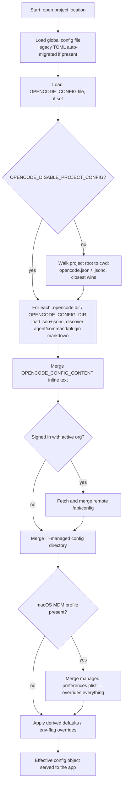

# Feature: Config & Data Contracts

## Purpose

OpenCode is a terminal-based AI coding agent. Before any agent, session, provider, or tool can run, the application must assemble one coherent set of settings from many possible sources (a machine-wide default, a per-project file, IT-managed policy, an active organization's remote settings, environment overrides, and files scattered across markdown-based "agent"/"command"/"skill"/"plugin" directories) and validate that the result is well-formed. This feature is that assembly-and-validation pipeline, plus the shared vocabulary (canonical data shapes) that every other subsystem in the product uses to talk about sessions, messages, permissions, providers/models, projects, and more.

Actors/users:
- **End users / developers** who hand-edit `opencode.json`/`opencode.jsonc` in their home directory or project, or author agent/command/skill markdown files.
- **Enterprise/IT administrators** who push machine-wide policy via a managed directory or (macOS) an MDM-deployed configuration profile — this is meant to override anything a user sets.
- **Organization/console administrators** whose remote settings are fetched over HTTP and merged in when a user is signed into a hosted account.
- **Plugin and extension authors** whose packages contribute config schema fragments and are themselves discovered through config.
- **Every other feature of the CLI** (session runtime, agent/subagent system, provider integration, permission system, command system, server API) which reads the merged, validated config object and the canonical schema types rather than touching raw files.

## Behavior

1. **Discover configuration sources.** Starting from the current working directory, walk upward to the project/version-control root (never above it) looking for `opencode.json`/`opencode.jsonc` files and `.opencode/` subdirectories, and always include the global (per-user) config directory. Also consult: an env-var-specified extra file/dir/inline-content, an active account's remote config endpoint, a "well-known" remote config advertised by an authenticated provider, an IT-managed config directory, and (macOS only) an MDM configuration profile.
2. **Parse.** Read each source as JSON-with-comments (trailing commas and `//` comments allowed). A syntactically broken file is skipped; its sibling files still load.
3. **Substitute variables.** Before parsing, replace `{env:NAME}` and `{file:path}` tokens in the raw text (see rules below).
4. **Validate against schema.** Decode the parsed object against the canonical config schema, collecting *all* validation errors at once (not just the first), preserving the original key order of the source file (this ordering is semantically meaningful for permission rules), and silently ignoring unknown top-level keys.
5. **Migrate/normalize.** Detect legacy ("V1") config shapes and transform them into the current shape (renamed fields, restructured permission/agent/provider objects); detect "native"/next-generation ("V2") shaped fields mixed into a file and lower them into the legacy shape the running CLI still validates against, recording non-fatal diagnostics for anything that can't be represented; auto-convert a very old TOML config file into JSON once, then delete the TOML file; split legacy TUI settings (`theme`, `keybinds`, `tui`) out into a separate `tui.json`, leaving a backup of the original file.
6. **Discover markdown-defined entries.** Scan `agent/`, `agents/`, `mode/`, `modes/`, `command/`, `commands/`, `plugin/`, `plugins/`, `skill/`, `skills/` directories under every discovered config location for `.md`/`.ts`/`.js` files; parse YAML frontmatter plus body text into agent/command/plugin/skill definitions and deep-merge them into the aggregate config.
7. **Merge.** Combine all sources into one effective config object using deep-merge for objects (later source wins per key) and concatenation+dedup for select array fields (e.g. `instructions`, plugin specs); the last-loaded document's value wins for any given key overall, with a fixed precedence order (below) and MDM/managed sources always winning last.
8. **Apply defaults / derived fields.** Fill in a fallback username from the OS, convert deprecated boolean toggles (`autoshare`) into the modern field (`share`), fold a legacy top-level `tools` boolean map into permission rules, apply CLI environment-flag overrides (disable autocompact, disable pruning, inline permission JSON), and inject a `$schema` pointer into newly-written files for editor tooling.
9. **Serve and cache.** Expose the merged config to the rest of the app through a service interface (`get`, `getGlobal`, `directories`, `waitForDependencies`); cache the global-config layer indefinitely until explicitly invalidated; compute the rest once per opened project/session location.
10. **Write back.** Support programmatic updates that merge a partial config into the project-local `config.json` or the global config file, re-validating (including re-running the legacy compatibility check) before writing so an invalid merge never reaches disk.
11. **Publish canonical schemas.** Independently of config loading, define and export the shared data shapes (sessions/messages, permissions, providers/models, projects/workspaces, agents/commands/skills, plugins, credentials/connections/integrations, PTYs, questions, prompts, and a large realtime-event catalog) that every other feature imports rather than redefining.

## Business rules & edge cases

- **Two config file names recognized per directory, JSONC wins over JSON.** Every directory that can hold config looks for `opencode.json` and `opencode.jsonc`; when both exist, `.jsonc` is loaded after `.json` and therefore its values win (`packages/opencode/src/config/config.ts:140-148,272-274`; `packages/core/src/config.ts:142`). A legacy bare `config.json` name is loaded only at the global level, never at the project level (opencode `config.ts:212-232` test).
- **Directory walk is bounded by the project/worktree root.** Ancestor scanning stops at the VCS root; a config file sitting outside the project is never loaded (`packages/core/src/config.ts:179-185`; confirmed by core `config.test.ts:727-797`).
- **Fixed source precedence, highest wins:** (1, lowest) well-known remote config from an authenticated provider → (2) global config file(s) → (3) `OPENCODE_CONFIG` env file → (4) project `opencode.json[c]` files, root-to-leaf, closest to cwd wins → (5) `.opencode/` directories (including an extra `OPENCODE_CONFIG_DIR`) → (6) `OPENCODE_CONFIG_CONTENT` inline env content → (7) active organization's remote `/api/config` → (8) IT-managed config directory → (9, highest) macOS MDM configuration profile, which is documented as overriding everything (`packages/opencode/src/config/config.ts:328-548`, esp. comment at 538).
- **Permission-rule order is significant and preserved.** Config decoding uses `propertyOrder: "original"` specifically so that a permission map's key order determines evaluation precedence — later/more-specific rules win (`packages/core/src/v1/config/permission.ts:14-16`; core `agent.test.ts:48-136` — global permission rules from every doc are always inserted *before* an agent's own specific rules, in document order).
- **Legacy vs. native ("V2") config detection.** A raw object is treated as legacy ("V1") if it contains any of a fixed set of legacy-only keys (`logLevel, server, command, reference, snapshot, plugin, autoshare, disabled_providers, enabled_providers, small_model, mode, agent, provider, permission, tools, attachment, layout`); keys shared by both schemas (e.g. `model`, `shell`, `references`) never trigger migration by themselves (`packages/core/src/v1/config/migrate.ts:10-33`; core `config.test.ts:69-77`).
- **Native `permissions` arrays are hard-rejected by the legacy validator.** Any `permissions` array anywhere in a file (top level or nested under an agent) throws immediately with a message telling the user to use legacy `permission` rules or the newer runtime — this check runs before any other normalization (`packages/opencode/src/config/v2-compat.ts:95-113`).
- **One-way, silent field drops during migration.** Migrating legacy→current silently drops `logLevel`, `server`, `layout`, and (except for `policies`) every `experimental.*` field; migrating current→legacy drops `plugins`, `providers`, `websearch`, `warming` at the top level with a logged (non-fatal) diagnostic (`packages/core/src/v1/config/migrate.ts` various; `packages/opencode/src/config/v2-compat.ts:117-118`).
- **Conflicting legacy/native values: legacy wins.** When the same setting is expressed in both shapes in one file, the legacy value is retained and a "conflict" diagnostic is logged (`packages/opencode/src/config/v2-compat.ts:425-448`).
- **Variable substitution has exactly two forms, no shell execution.** `{env:NAME}` resolves to the environment value or an empty string — it never errors, even if the variable is undefined. `{file:path}` reads and JSON-escapes a file's trimmed contents, expands a leading `~/`, resolves relative paths against the config file's own directory, and — unless the caller opts into `missing:"empty"` — throws if the file doesn't exist; a `{file:}` token inside a `//`-commented line is left untouched (`packages/opencode/src/config/variable.ts:34-91`).
- **Magic numbers / defaults:** tool-output truncation defaults to 2000 lines / 51,200 bytes (`packages/core/src/v1/config/config.ts:136-148`); image attachment resize defaults to 2000×2000 px and a 5,242,880-byte (5 MB) base64 cap (`packages/core/src/v1/config/attachment.ts`); MCP server timeout defaults to 5000 ms if unspecified, OAuth callback port defaults to 19876 (`packages/core/src/v1/config/mcp.ts`); a model's "large context" pricing tier threshold is hard-coded at 200,000 tokens during migration (`packages/core/src/v1/config/migrate.ts:205`); unspecified per-token cache read/write cost defaults to 0 (`packages/core/src/config/plugin/provider.ts:93-103`); default subagent recursion depth is 1 (prevents subagents from spawning subagents) (`packages/core/src/v1/config/config.ts:84-86`).
- **Plugin/agent/command names are derived from file paths**, not declared: a file's path relative to its containing `agent(s)/`/`command(s)/` directory (with that prefix stripped and back-slashes normalized) becomes its dotted/slashed identifier, so `agents/team/build.md` becomes agent `team/build` (`packages/opencode/src/config/entry-name.ts`). Empty markdown bodies are valid and produce an empty template/prompt rather than an error (core `command.test.ts`).
- **Duplicate plugin specs are deduplicated keeping the higher-precedence (later-merged) one**, including resolving version conflicts by keeping the newer version string (`packages/opencode/src/config/plugin.ts:64-77`).
- **A custom (non-built-in) language-server entry must declare a non-empty `extensions` list unless explicitly `disabled`**, or schema validation fails (`packages/core/src/v1/config/lsp.ts:63-78`).
- **Malformed inline overrides degrade gracefully.** An invalid `OPENCODE_PERMISSION` JSON env var is logged as a warning and ignored rather than crashing config load (`packages/opencode/src/config/config.ts:559-565`).
- **Reference/alias name validation:** a reference alias must be non-empty and must not contain a slash, whitespace, or backtick/comma; invalid aliases are silently skipped (`packages/core/src/config/plugin/reference.ts:57-59`).
- **Config is read once per opened project/session location** and not re-read automatically if files change on disk mid-session; the global layer is cached until an explicit `invalidate()` call (`packages/core/src/config.ts:175-176`; `packages/opencode/src/config/config.ts:295-303`).

## Workflows & states

**A. Config load/merge pipeline** (per session/CLI invocation):

Each box's file is: parsed as JSONC → variable-substituted → legacy/native detected and reconciled → schema-validated (collecting all errors) before being merged into the running result.

**B. Legacy config migration (one-time, on load):**
1. Detect legacy TOML file at global config path → convert `provider`+`model` into `model: "provider/model"` string, write out as `config.json`, delete the TOML file.
2. Detect a raw object containing any legacy-only key → decode as the legacy schema, run the migration transform (renames/restructures fields, expands boolean tool/permission maps into ordered permission rule arrays, flattens plugin tuples, folds MCP `enabled`+`timeout` fields, etc.) → re-validate as the current schema.
3. Detect native ("V2") fields mixed into an otherwise-legacy file → "lower" each into its legacy equivalent, recording a diagnostic for anything unsupported or conflicting, or throwing immediately if a hard-incompatible field (`permissions` array) is present.
4. Detect legacy TUI keys (`theme`, `keybinds`, `tui`) in an `opencode.json[c]` file → write a sibling `tui.json`, back up the original file, and strip the legacy keys from it in place while preserving comments/formatting. Skipped if a `tui.json` already exists there, or if the source file is syntactically invalid.

**C. Permission ruleset resolution** (state model, consumed by the adjacent Permission System but assembled here): an ordered list of `{action, resource, effect}` rules is built by concatenating, in order: an agent's pre-existing rules → all global permission rules across every config document (in document load order) → that agent's own specific rules across every document (in document load order). Evaluation is last-match-wins against this ordered list.

## Data

Two schema "generations" coexist. The dossier treats `packages/core` as authoritative per repo convention, but flags in Open Questions that the currently-shipping CLI (`packages/opencode`) validates against the older ("V1") shape and lowers/raises between the two.

**Config aggregate (`Config.Info`, both generations)** — one object per resolved location, fields include: `$schema`, `shell`, `model`, `default_agent`, `autoupdate`, `share`, `enterprise.url`, `username`, `permissions`/`permission` (ordered rule list or nested map), `agents`/`agent` (map of named agent overrides), `snapshots`, `watcher.ignore`, `formatter`, `lsp`, `attachments`/`attachment`, `tool_output`, `mcp` (server map + timeouts), `compaction` (auto/prune/keep-tokens/buffer), `skills`, `commands`/`command` (named templates), `instructions`, `references`/`reference` (named local/git sources), `plugins`/`plugin`, `experimental.policies`, `providers`/`provider` (per-provider API/model overrides). Not persisted: `plugin_origins` (derived provenance metadata: which file/scope each winning plugin spec came from).

**Config.Document / Config.Directory / Config.Entry** — a `Document` pairs a parsed, validated `Info` with the source path that produced it; a `Directory` is a supplementary directory marker (used for markdown-based discovery) with no parsed content; entries are ordered lowest-to-highest priority.

**Sub-entities:** Agent config (model/variant/system-prompt/mode/hidden/color/steps/permissions/request headers-body), Command config (template/description/agent/model/subtask), Provider/Model config (API shape, request headers/body, cost tiers, context/output limits, capabilities, variants), MCP server config (local process vs. remote URL, timeout, OAuth), Reference config (local path or git repo, alias-keyed), Skill/Plugin specs (string or `{package/path, options}` object), Permission rule (action × resource-pattern × allow/deny/ask), ConsoleState (which providers are console-managed, active org name) — transient app state, not persisted config.

**Canonical schema package (`packages/schema`)** — the data-model census, ~60 files, grouped:
- *Identifiers*: branded, prefixed ID types for Project, Workspace, Session, Permission, Credential, Connection/Attempt, Plugin, Skill, PTY, Question, Event (ULID-like, time-sortable, generated in `identifier.ts`).
- *Session & messages*: current (`session.ts`, `session-message.ts`, `session-event.ts`) and legacy v1 (`v1/session.ts`) session/message/part/error models; todo lists, compaction, status, admitted-prompt/delivery records.
- *Permissions*: current `permission.ts` (rule = action/resource/effect), legacy `v1/permission.ts` (rule = permission/pattern/action, plus an "always allow" approval record), and `permission-saved.ts` (durable per-project grant).
- *Provider/model/LLM*: `provider.ts`, `model.ts` (capabilities, cost tiers, context limits, variants), `llm.ts` (generic tool content blocks), `models-dev.ts` (external catalog refresh signal).
- *Project/workspace/filesystem*: `project.ts` (+id/copy/directories), `workspace.ts` (+id), `filesystem.ts`, `file-diff.ts`, `location.ts`, `reference.ts`, `revert.ts`.
- *Agent/command/skill/plugin*: `agent.ts`, `command.ts`, `skill.ts` (directory/URL/embedded source), `plugin.ts` (identity + lifecycle event).
- *Auth/credential/connection*: `credential.ts` (OAuth or key secret), `connection.ts`, `integration.ts` (setup-wizard prompts, auth methods, connection-attempt state machine).
- *PTY / questions / prompts*: `pty.ts` (+ticket), `question.ts` (+v1), `prompt.ts`/`prompt-input.ts` (attachments).
- *Realtime event catalog*: `event.ts` (shared definition/versioning machinery), `event-manifest.ts`/`durable-event-manifest.ts` (full inventory), and per-domain event files (`vcs-event`, `lsp-event`, `mcp-event`, `ide-event`, `tui-event`, `worktree-event`, `workspace-event`, `installation-event`, `server-event`, `filesystem-watcher`, `project-directories`, `catalog`, `session-compaction-event`, `session-status-event`, `legacy-event`).
- `index.ts` curates a public surface (Agent, Command, Model, Provider, Project, Session, Skill, Permission, etc. plus base primitives) that deliberately excludes the event-plumbing and v1/legacy internals from top-level import.

## Interfaces

**Consumes from adjacent features (not documented here):**
- *Auth/Credentials/Accounts* — supplies stored auth entries (used to fetch well-known/remote config and populate substitution env for it) and the active organization identity (used to fetch remote `/api/config`).
- *Permission System* — config assembles and hands off the ordered permission ruleset and `experimental.policies` statements; the actual allow/deny/ask evaluation engine lives in that feature.
- *Platform Utilities* — filesystem read/write/glob, path/home resolution, HTTP client, process execution (used for `plutil` on macOS) are provided by shared platform services, not owned here.
- *Plugin & MCP System* — config discovers and resolves plugin/MCP specs and hands them (with provenance metadata) to that system for actual loading/execution.
- *Provider & LLM Integration* — config supplies provider/model override data; the external models catalog and actual LLM invocation are owned there.

**Exposes to other features:**
- A config service interface (`get`, `getGlobal`, `getConsoleState`, `update`, `updateGlobal`, `invalidate`, `directories`, `waitForDependencies`) that the Session Runtime, Agent/Subagent System, Provider Integration, Command System, and Server/HTTP API all read from rather than touching files directly.
- The canonical schema package is a foundational dependency for everything else in the monorepo (declared dependency rule: Schema → Core/Protocol → Server, with Client depending only on Schema/Protocol) — every other feature's data contracts (sessions, permissions, provider/model records, projects, plugins, etc.) are defined here, not redefined downstream.

## External technology

| Generic capability | Protocol/standard if any | What the source used | Notes for reimplementer |
|---|---|---|---|
| JSON-with-comments parsing & in-place edit | JSONC (informal) | `jsonc-parser` | Must support `//` comments, trailing commas, and surgical AST-preserving edits (used to strip legacy keys while keeping comments/formatting). |
| Schema/runtime type validation | — | Effect Schema (Effect-TS) | Needs: decode-all-errors mode, "ignore unknown top-level keys," and preserved source key order for record-typed fields (permission ordering depends on it). |
| YAML frontmatter parsing | YAML | `gray-matter` | Includes a fallback "sanitizer" pass that rewrites unquoted-colon values as YAML block scalars for compatibility with other tools' frontmatter conventions. |
| Legacy config format | TOML | Bun's built-in TOML module loader | One-time auto-migration path only; not needed for steady-state operation. |
| HTTP client for remote config | HTTP(S) | Effect HTTP client (fetch-based) | Must detect an HTML login page returned with a 200 status (auth-proxy redirect) and treat it as an auth error rather than a decode failure. |
| MDM policy profile ingestion | Apple `.mobileconfig` / plist | Shell out to macOS `plutil -convert json` | macOS-only; other platforms use a plain managed config directory instead. |
| Package installation for plugins | npm registry | Bun/npm package manager | Used to resolve non-path plugin specs and to ensure a small helper package is present per config directory. |
| Property-based testing (dev-time only) | — | `fast-check` | Used to assert "every legacy config migrates to something schema-valid" over randomized inputs; a reimplementation should keep an equivalent fuzz/round-trip test if migration logic is ported. |

## Error handling

- **JSON syntax error** in one config file: reported as a structured error naming every offending line/column with a caret pointer and the full file text embedded, but only when that file is the sole/authoritative source being loaded directly (e.g. `OPENCODE_CONFIG`); when discovered incidentally while merging many directories, a broken file is silently skipped and its valid siblings still load.
- **Schema validation failure**: raised as a structured error carrying the source path and a list of `{message, path}` issues (all violations at once, not just the first).
- **Frontmatter parse failure** in an agent/command markdown file: wrapped with the file path and underlying YAML error message; command/agent loaders that scan whole directories (as opposed to a single named file) instead skip the offending file silently and continue.
- **Remote "well-known" config returns an HTML page** (e.g., an auth proxy login redirect) instead of JSON: reported as a distinct remote-auth error rather than a JSON decode failure, so the user is pointed at re-authenticating.
- **Legacy validator encounters a native-only, hard-incompatible field** (e.g. a `permissions` array): fails immediately with an explicit message telling the user which config style to use, before any other diagnostics are computed.
- **Legacy validator encounters a native field it can represent by dropping it**: does not fail; logs a "compatibility diagnostic" (kind: invalid/unsupported/conflict) and continues, never leaking sensitive values (e.g. secrets) into the diagnostic text.
- **Malformed `OPENCODE_PERMISSION` env var JSON**: logged as a warning and ignored; config load continues with defaults.
- **Missing file referenced by `{file:path}` substitution**: throws by default (config load fails); a caller (the TUI-config loader) may opt into treating it as an empty string instead so a broken reference degrades rather than crashing the whole app.
- **Background dependency install (plugin helper package) fails**: logged as a warning; does not fail config load, since it runs as a detached background task.
- **Write-back validation failure** (`update`/`updateGlobal`): the merged result is fully re-validated (including re-running legacy/native reconciliation) before anything is written to disk; a failure aborts the write entirely, leaving the file untouched.

## Non-functional observations

- **Caching**: the global-config layer is cached indefinitely and only recomputed on an explicit invalidate call; the full merged result for an opened project location is computed once and reused for the life of that session/instance (no filesystem watching of config files during a run).
- **Concurrency**: plugin dependency installation runs in a detached background task per discovered directory so it never blocks config resolution; remote config fetches for token/account data run concurrently where independent.
- **Bounded traversal**: ancestor directory scanning for config/agent/command files is bounded by the project or worktree root — it does not walk the entire filesystem or above the repository boundary.
- **Ordering guarantees are load-bearing**: two independent "later wins" conventions exist and must not be conflated — (a) scalar/object config fields use last-merged-document-wins; (b) permission-rule arrays use last-matching-rule-wins within one already-ordered list, and that ordering is itself built as "all global rules, in document order, before all agent-specific rules, in document order."
- **Side-effecting reads**: loading config can itself write files — seeding a default global config on first run, injecting a `$schema` pointer into files that lack one, and one-time legacy migrations (TOML→JSON, TUI-key extraction with backup) — all designed to be idempotent and skip themselves once already applied.
- **No i18n/accessibility surface**: this feature is data/config plumbing with no user-facing rendering; the only "presentation" concerns are human-readable error messages and preserving user file formatting (comments, key order) across automated edits.

## Acceptance criteria

1. **Given** a project directory with an `opencode.json` at its root and an `opencode.jsonc` in a nested `.opencode` folder closer to the working directory, **when** config is loaded, **then** the value from the nested `.opencode/opencode.jsonc` wins for any key both files define, and neither file's config from outside the project's VCS root is loaded.
2. **Given** a legacy config file containing any of the fixed legacy-only keys (e.g. `snapshot`, `reference`, `tools`), **when** it is loaded, **then** it is automatically migrated to the current schema (e.g. `snapshot`→`snapshots`, boolean tool map → ordered permission rules) and the migrated result always validates successfully against the current schema, even for arbitrarily generated legacy inputs.
3. **Given** a config file whose `permission` object lists rules in a specific key order, **when** an agent's effective permission list is built, **then** all globally-scoped rules (in the order their documents were merged) appear before that agent's own specific rules, and the last rule matching a given resource wins.
4. **Given** config text containing `{env:MY_VAR}` where `MY_VAR` is unset, **when** the text is substituted, **then** the token resolves to an empty string without raising an error; **given** the same text with `{file:./missing.txt}` where the file does not exist, **when** substituted with default settings, **then** loading fails with a "file does not exist" error naming the token and resolved path.
5. **Given** a config file that mixes a native-only field the legacy runtime cannot represent (e.g. `experimental.portable_shell_scanner`) with otherwise-legacy content, **when** it is loaded, **then** the unsupported field is dropped, a non-fatal diagnostic is logged, and the rest of the file loads normally; **given** instead a `permissions` array anywhere in the file, **when** it is loaded, **then** loading fails immediately with an explicit "not supported, use legacy permission rules" error.
6. **Given** an IT-managed config directory and, on macOS, an MDM-deployed configuration profile both set the same key, **when** config is merged, **then** the MDM profile's value wins over the managed directory's value, which in turn wins over anything from the project or global user config.
7. **Given** an agent markdown file at `agents/team/build.md` with YAML frontmatter, **when** agent discovery runs, **then** the resulting agent is named `team/build` (path-derived, prefix-stripped, slash-normalized) and its frontmatter fields are validated the same way as JSON-declared agent config.
8. **Given** a call to update the global config with a partial object, **when** the merge of that partial into the existing on-disk file would violate the (legacy or native) schema, **then** nothing is written to disk and the caller receives a validation error identifying the offending field(s).

## Confidence & open questions

- **INFERRED / unresolved contradiction (flagged per instructions):** two parallel config subsystems exist. `packages/opencode/src/config/config.ts` is the implementation actually wired into the shipping CLI today; it validates against the older ("V1") schema (`packages/core/src/v1/config/config.ts`) and "lowers" any native-shaped fields into that legacy shape. `packages/core/src/config.ts` defines a structurally different, newer ("V2"/"native") `Config.Info` aggregate and its own directory-discovery `Config.Service`, which several core plugins (`packages/core/src/config/plugin/*`) consume directly. Per the stated convention, core is treated as authoritative in this dossier's Data section, but it is not clear from the code alone whether `packages/opencode`'s legacy pipeline is being phased out in favor of core's, whether both run simultaneously against the same files in the current build, or whether core's `Config.Service` is reserved for a different (e.g. server-side/"opencode2") deployment mode. Looked at: both `config.ts` files, `v2-compat.ts`, `migrate.ts`, and the plugin registration files; found no explicit wiring that shows core's `Config.Service` being consumed by the CLI entry point.
- **INFERRED:** `packages/opencode/src/config/paths.ts`'s `directories()` helper does not reverse its `.opencode`-directory walk result the way `files()` does for plain config files, which one research pass flagged as a possible ordering discrepancy (nearest-directory-first vs. farthest-first precedence) relative to the "closer wins" rule demonstrated by tests elsewhere. Could not fully confirm which directory wins when two nested `.opencode` folders both set the same key; the integration test evidence found (`core/test/config/config.test.ts:727-797`) covers the newer core service's discovery order, not this exact opencode-layer function.
- **Not determined:** how the external models.dev catalog (referenced only by a refresh-event schema, `models-dev.ts`) is actually fetched and merged into provider/model config — this is treated as belonging to the adjacent Provider & LLM Integration feature and was not traced further.
- **Not determined:** the exact consumer(s) of `packages/core/src/config/plugin/*` (the core "config-agent", "config-command", "config-provider", "config-plugin", "config-reference", "config-skill" plugins) in production — whether they run inside the same process as the legacy CLI config loader or only in a separate/newer server path.
- Everything else in this dossier is drawn directly from source and colocated tests at the pinned commit; no other unverified inferences were made.
