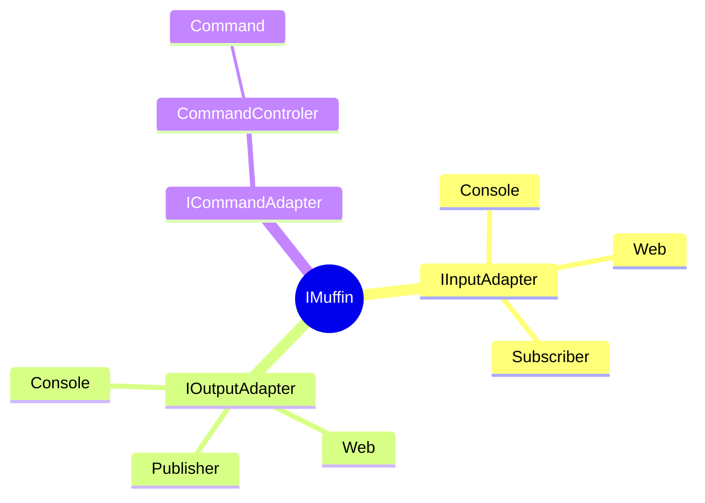

/brainstorm 
# Subject

I want to take this "sweet console" named CupCake and add a "sweet agent". The console+agent will have a plugin architecture for input interfaces that will start with Console, but will evolve to include things like REST, ESB or reverse shell over various protocols. The input interface will send direct commands to `Xcaciv.Command.Interface.ICommandController.Run()`. Agent input will be passed to a new agent controller interface that will recieve the command registry of `ICommandController` as tools. 

There are extracted ideas in `ideas/` that should be used as requiremnts and technical implementation details.

The following patterns are important from `ideas/`:
- Chatdbg
  - General prompt and control instruction requirements
  - terminal-hosted UI (aka. full-screen front end) (add tab for console direct commands)
  - Probability Logs for providers that support it (aka confidence capture)
  - Top-k for providers that support it
  - model backends requirements and implementation deatail
- Cupcake (currently incomplete implementation)
  - plugin driven command execution
  - Terminal ui
  - plugin install using custom NuGet registry
  - `Xcaciv.Command` as the backend interface
- Cupcake_next
  - Project layout, organization and layering rules
  - fundamental tech stack specifications
  - tech notes
- opencode (V2 only, **NOT PLUGIN, MCP OR TUI FEATURES**)
  - Config discovery/merge/migration and the canonical data-model census
    - Agent configuration
    - model configuration
  - Session conversation composition
  - Agent Client Protocol (ACP)
  - Session/Conversation history storage and compaction
  - SQLite-backed `Credential`/`Integration` system
  - Actors & Personas
  - Bounded outputs
  - Durable, replayable state
  - Storage, Sync & Share
  - Offline-tolerant by design
  
Each command (used as a tool) will be given a new method on the interface called `AskOrExecute()` that will signify the deafault Agent behavor for the LLM requesting to execute the command, weather it is to ask first or if it is safe to execute the command.

## epic use cases
There are several end user packages and components of Cupcake. **No cupcake agent** supports console or shell command execution (ex. cmd, pwrsh, bash, sh...)

### Cupcake Sommelier (Xcaciv.Cupcake.Sommelier)
The Command Packages nuget server. (implemented https://github.com/Xcaciv/Xcaciv.Cupcake.Sommelier)

### Muffin (Xcaciv.Muffin.Interfaces)
The `Xcaciv.Muffin.Interfaces.IMuffin` is the central interface that unites input and output with Commands. The project contains the base interface structure of Cupcake implementations 

### Cupcake Lit (Xcaciv.Cupcake.Lit) 
An implementation of IMuffin
The terminal console frontended version that supports command packages. It's use case starts by being installable via `dotnet tool` command. Then once installed, a user would execute `cupcake_lit` and use the command pacakge installer via built-in restricted Xcaciv Command console to install commands like the llm client, chatdbg functionality, and other commands individually. Packages would come from the Cupcake Sommelier NuGet feed. 

### Cupcake Concierge (Xcaciv.Cupcake.Concierge)
An implementation of AbstractCommand
Cupcake Concierge is a command that has the ability to assemble a custom C# Cupcake project for compilation. The user would choose and configure a grouping of Cupcake Command packages, download a dotnet template and build a small optimized custom Cupcake binary (aka Concierge Cupcake) that purposly leaves out the plugin architecture, in favor of hardcoded command registration. 

### Concierge Cupcake Agent (Xcaciv.Cupcake.ConciergeAgent)
Dotnet template project used by Cupcake Lit. The Concierge Cupcake's default system prompt would be set at design time along with the available commands. Concierge Cupcakes would support headless, non-ineractive execution of commands. The Concierge Cupcake would use Spectre.Console.

### Cupcake Funfetti (Xcaciv.Cupcake.Funfetti) 
An implementation of AbstractCommand
Funfetti is a special command that is the implementation of the AI chat loop. The base command is "prompt". The text that follows is sent as input to the provider with the rest of the commands sent as tools. The command manages tool execution and returns reslts back. Details of the loop woudl be output as logging.

### Cupcake Muffin Top (Xcaciv.Muffin.Top)
An implementation of IInputAdapter 
that accepts another IInputAdapter as the actual frontend. Muffin Top prefixes all input recieved with "prompt " to route all input through Funfetti.

### Cupcake Muffin Top (Xcaciv.Muffin.Top.Console)
An implementation of IInputAdapter 
It allows switching between Xcaciv.Muffin.Top and standard console input to commands.
